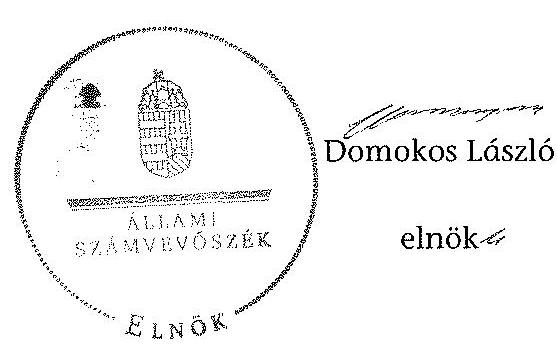

# ÁLLAMI   SZÁMVEVŐSZÉK 

## JELENTÉS

Az önkormányzatok belső kontrollrendszere kialakításának, egyes kontrolltevékenységek és a belső ellenőrzés működésének ellenőrzése Elek

---

# Állami Számvevőszék 

Iktatószám: V-0666-121/2015.
Témaszám: 1700
Vizsgálat-azonosító szám: V067708

Az ellenőrzést felügyelte:
Dr. Benedek Mária
felügyeleti vezető
Az ellenőrzést vezette és az ellenőrzés végrehajtásáért felelős:
Dr. Győri Gabriella
ellenőrzésvezető
A számvevőszéki jelentéstervezet összeállításában közreműködött:
Vörösné Lakatos Zsuzsanna
számvevő
Az ellenőrzést végezték:

| Székely Beáta | Völgyesi Mátyás | Vörösné Lakatos Zsuzsanna |
| :-- | :-- | :-- |
| számvevő | számvevő tanácsos | számvevő |

---

# TARTALOMJEGYZÉK 

BEVEZETÉS ..... 7
I. ÖSSZEGZŐ MEGÁLLAPÍTÁSOK, KÖVETKEZTETÉSEK, JAVASLATOK ..... 11
II. RÉSZLETES MEGÁLLAPÍTÁSOK ..... 14

1. Az önkormányzat belső kontrollrendszere kialakításának és működtetésének megfelelősége ..... 14
1.1. A kontrollkörnyezet kialakítása és működtetése ..... 14
1.2. A kockázatkezelési rendszer kialakítása és működtetése ..... 15
1.3. A kontrolltevékenységek kialakítása és működtetése ..... 16
1.4. Az információs és kommunikációs rendszer kialakítása és működtetése ..... 17
1.5. A monitoring rendszer kialakítása és működtetése ..... 18
2. A monitoring rendszer részeként a belső ellenőrzés kialakítása és működtetése ..... 19
3. A pénzügyi folyamatokban kulcsszerepet betöltő belső kontrollok (teljesítésigazolás és érvényesítés) működése ..... 20
4. Az integritás szemlélet érvényesülése ..... 22

## FÜGGELÉKEK

1. számú Értelmező szótár
2. számú Az integritás érvényesítése érdekében kialakított és működtetett intézményi kontrollrendszer

---

.

---

# RÖVIDÍTÉSEK JEGYZÉKE 

## Törvények

Áht.
ÁSZ tv.
Info tv.
Ket.

Kttv.
Ltv.

Mötv.

Vnytv.

## Rendeletek, határozatok

Ávr.
Bkr.
10/2013. (I. 21.) Korm. rendelet
önkormányzati SZMSZ

## Szórövidítések

adatvédelmi szabályzat ${ }_{1}$
adatvédelmi szabályzat ${ }_{2}$

ÁSZ
alapító okirat ${ }_{1}$
alapító okirat ${ }_{2}$
bizonylati szabályzat ${ }_{1}$
bizonylat szabályzat ${ }_{2}$

2011. évi CXCV. törvény az államháztartásról
2011. évi LXVI. törvény az Állami Számvevőszékről
2011. évi CXII. törvény az információs önrendelkezési jogról és az információszabadságról
2004. évi CXL. törvény a közigazgatási hatósági eljárás és szolgáltatás általános szabályairól
2011. évi CXCIX. tv. a közszolgálati tisztviselőkről
1995. évi LXVI. törvény a köziratokról, a közlevéltárakról és a magánlevéltári anyag védelméről
2011. évi CLXXXIX. törvény Magyarország helyi önkormányzatairól
2007. évi CLII. törvény az egyes vagyonnyilatkozat-tételi kötelezettségekről

368/2011. (XII. 31.) Korm. rendelet az államháztartásról szóló törvény végrehajtásáról
370/2011. (XII. 31.) Korm. rendelet a költségvetési szervek belső kontrollrendszeréről és belső ellenőrzéséről
10/2013. (I. 21.) Korm. rendelet a közszolgálati egyéni teljesítményértékelésről
Elek Város Önkormányzata Képviselő-testületének 5/1995. (II. 27.) KT. számú rendelete Elek Város Önkormányzata Szervezeti és Működési Szabályzatáról (hatályos 1995. február 27-étől)

Elek Város Önkormányzat Polgármesteri Hivatala Adatvédelmi és számítástechnikai védelmi szabályzat (hatályos 2013. január 1-jétől)
Eleki Közös Önkormányzati Hivatal Adatvédelmi és számítástechnikai védelmi szabályzat (hatályos 2013. július 1-jétől)
Állami Számvevőszék
Elek Város Polgármesteri Hivatal Alapító Okirata (hatályos 2012. január 1-jétől)
Eleki Közös Önkormányzati Hivatal Alapító Okirata (hatályos 2013. március 28-ától)
Elek Város Önkormányzat Polgármesteri Hivatala Bizonylati rend (hatályos 2013. január 1-jétől)
Eleki Közös Önkormányzati Hivatal Bizonylati rend (hatályos 2013. június 1-jétől)

---

értékelési szabályzat ${ }_{1}$
értékelési szabályzat ${ }_{2}$
FEUVE
gazdasági program
gazdálkodási jogkörök szabályzata ${ }_{1}$
gazdálkodási jogkörök szabályzata ${ }_{2}$
Hivatal
hivatali SZMSZ ${ }_{1}$
hivatali SZMSZ ${ }_{2}$

INTOSAI
iratkezelési szabályzat ${ }_{1}$
iratkezelési szabályzat ${ }_{2}$
ISSAI
jegyző

Képviselő-testület
kockázatkezelési szabályzat ${ }_{1}$
kockázatkezelési szabályzat ${ }_{2}$
közérdekű adatok rend$\mathrm{je}_{1}$
közérdekű adatok rend$\mathrm{je}_{2}$
Közös Önkormányzati Hivatal
Kormányhivatal

Elek Város Önkormányzat Polgármesteri Hivatal Eszközök és források értékelési szabályzata (hatályos 2011. január 1-jétől)
Elek Város Önkormányzata Eszközök és források értékelési szabályzata (hatályos 2013. június 1-jétől)
folyamatba épített, előzetes, utólagos és vezetői ellenőrzés 51/2011. (III.31.) sz. önkormányzati képviselő-testületi határozattal elfogadott Elek Város Önkormányzata Képviselő-testülete Gazdasági Programja 2011-2014.
Elek Város Önkormányzat Polgármesteri Hivatal Gazdálkodási szabályzat (hatályos 2011. június 1-jétől)
Eleki Közös Önkormányzati Hivatal Gazdálkodási szabályzat (hatályos 2013. április 1-jétől)
Elek Város Önkormányzat Polgármesteri Hivatala (megszűnt 2013. március 31-ével)
Elek Város Önkormányzata képviselő-testülete 15/2011. (XI.5.) KT. sz. rendelete Elek Város Polgármesteri Hivatalának Szervezeti és Működési Szabályzatáról
60/2013. (IV.29.) sz. önkormányzati képviselő-testületi határozattal elfogadott Eleki Közös Önkormányzati Hivatal Szervezeti és működési szabályzata
International Organization of Supreme Audit Institutions (Legfőbb Ellenőrző Intézmények Nemzetközi Szervezete)
Elek Város Önkormányzata Iratkezelési szabályzat (hatályos 2012. január 1-jétől)
Eleki Közös Önkormányzati Hivatal Iratkezelési szabályzat (hatályos 2013. szeptember 1-jétől)
International Standards of Supreme Audit Institutions (Legfőbb Ellenőrző Intézmények Nemzetközi Standardjai)
Elek Város Önkormányzat Polgármesteri Hivatala jegyzője, 2013. április 1-jétől Eleki Közös Önkormányzati Hivatal jegyzője
Elek Város Önkormányzatának Képviselő-testülete
Elek Város Önkormányzat Polgármesteri Hivatal Kockázatkezelési szabályzata (hatályos 2013. január 1-jétől)
Az Eleki Közös Önkormányzati Hivatal Kockázatkezelési szabályzata (hatályos 2013. június 1-jétől)
Elek Város Önkormányzat Polgármesteri Hivatal Közérdekű adatok nyilvánosságának rendje (hatályos 2010. július 1-jétől)
Eleki Közös Önkormányzati Hivatal Közérdekű adatok nyilvánosságának rendje (hatályos 2013. június 1-jétől)
Eleki Közös Önkormányzati Hivatal (alapítás 2013. április 1-jével)
Békés Megyei Kormányhivatal

---

| leltározási szabályzat ${ }_{1}$ | Elek Város Önkormányzat Polgármesteri Hivatal Leltárkészítési és leltározási szabályzat (hatályos 2010. július 1-jétől) |
| :--: | :--: |
| leltározási szabályzat ${ }_{2}$ | Elek Város Önkormányzata Leltárkészítési és leltározási szabályzata (hatályos 2013. június 1-jétől) |
| munkavédelmi szabály-   zat $_{1}$ | Elek Város Polgármesteri Hivatala Munkavédelmi szabályzat (hatályos 2013. január 1-jétől) |
| munkavédelmi szabály-   zat $_{2}$ | Eleki Közös Önkormányzati Hivatal Munkavédelmi szabályzat (hatályos 2013. július 1-jétől) |
| nemzetiségi önkor-   mányzatok | Cigány Nemzetiségi Önkormányzat, Német Nemzetiségi Önkormányzat, Román Nemzetiségi Önkormányzat, Szlovák Nemzetiségi Önkormányzat |
| Önkormányzat   pénzkezelési szabályzat ${ }_{1}$ | Elek Város Önkormányzata   Elek Város Önkormányzat Polgármesteri Hivatal Pénzkezelési szabályzat (hatályos 2011. július 1-jétől) |
| pénzkezelési szabályzat ${ }_{2}$ | Elek Város Önkormányzata Pénzkezelési szabályzat (hatályos 2013. június 1-jétől) |
| polgármester   számlarend $_{1}$ | Elek Város Önkormányzatának polgármestere   Elek Város Önkormányzat Polgármesteri Hivatala Számlarend (hatályos 2013. január 1-jétől) |
| számlarend $_{2}$ | Eleki Közös Önkormányzati Hivatal Számlarend (hatályos 2013. április 1-jétől) |
| számviteli politika ${ }_{1}$ | Elek Város Önkormányzat Polgármesteri Hivatala Számviteli politika (hatályos 2011. január 1-jétől) |
| számviteli politika $_{2}$ | Elek Város Önkormányzata Számviteli politika (hatályos 2013. június 1-jétől) |
| Társulás   tűzvédelmi szabályzat ${ }_{1}$ | Gyula és Környéke Többcélú Kistérségi Társulásra   Elek Város Polgármesteri Hivatal Tűzvédelmi szabályzat (hatályos 2011. január 1-jétől) |
| tűzvédelmi szabályzat ${ }_{2}$ | Eleki Közös Önkormányzati Hivatal Tűzvédelmi szabályzat (hatályos 2013. július 1-jétől) |
| ügyrend $_{1}$ | Elek Város Önkormányzat Polgármesteri Hivatal Gazdasági szervezet ügyrendje (hatályos 2011. július 1-jétől) |
| ügyrend $_{2}$ | Eleki Közös Önkormányzati Hivatal gazdasági szervezet ügyrendje (hatályos 2013. június 1-jétől) |

---

.

---

# JELENTÉS 

## az önkormányzatok belső kontrollrendszere kialakításának, egyes kontrolltevékenységek és a belső ellenőrzés működésének ellenőrzése Elek

## BEVEZETÉS

Elek város állandó lakosainak száma 2013. január 1-jén 4969 fő volt. Az Önkormányzat kilenctagú Képviselő-testületének munkáját három állandó bizottság segítette. Az Önkormányzat az önállóan működő és gazdálkodó Közös Önkormányzati Hivatalon kívül három önállóan működő intézményt működtetett, egy többségi tulajdoni hányadú gazdasági társasággal rendelkezett. A polgármester a 2002. évi önkormányzati választások óta tölti be tisztségét. A jegyző 2004. július 1-jétől - 2013. április 1-jétől Közös Önkormányzati Hivatal jegyzőjeként - látja el feladatait. A Közös Önkormányzati Hivatal négy szervezeti egységre tagolódott, a foglalkoztatott köztisztviselők száma 2013. január 1-jén 17 fő volt. A Hivatalnál 2013. április 1-jétől szervezeti változás történt, Elek Város Polgármesteri Hivatalból és Lökösháza Község Polgármesteri Hivatalból megalapították a Közös Önkormányzati Hivatalt. Az Önkormányzat a 2013. évi költségvetési beszámolója szerint 1150000 ezer Ft tárgyévi bevételt ért el, valamint 918639 ezer Ft tárgyévi kiadást teljesített. A 2013. december 31-i könyvviteli mérleg szerint 3197744 ezer Ft értékű eszközvagyonnal rendelkezett, a rövid lejáratú kötelezettségállománya 6983 ezer Ft, hosszú lejáratú kötelezettsége nem volt.

A demokratikus társadalmakban alapvető igény, hogy a közpénzeket, a közvagyont használók valamennyi tevékenységükhöz kapcsolódó pénzfelhasználásról elszámoljanak, ahhoz egyértelmű és érvényesíthető felelősségi szabályok társuljanak. Ennek a jogos igénynek az érvényesítéséhez meg kell teremteni azokat a folyamatokat, rendszereket, amelyek nélkülözhetetlenek az elszámoltatáshoz. Az elszámoltatás eredményes működtetéséhez szükség van a megfelelő információs, kontroll, értékelési és beszámolási rendszerek kialakítására.

Magyarországon az uniós csatlakozási tárgyalások idejére nyúlnak vissza a belső kontrollrendszer szabályozásának gyökerei. Az uniós elvárásoknak megfelelő új terminológia szerinti államháztartási belső pénzügyi ellenőrzési (ÁBPE) rendszer területén a jogharmonizáció 2003-ban teljes körűen megvalósult, míg az önkormányzati alrendszerre vonatkozó, Ötv.-ben megjelenített speciális szabályozás 2005-ben lépett hatályba. Az államháztartási belső kontrollrendszer koncepciója 2009-ben továbbfejlődött. A változások irányát mutatja, hogy a költségvetési szervek belső kontrollrendszere már magában foglalja

---

a korszerű felelős szervezetirányítás elemeit (kontrollkörnyezet, kockázatkezelés, kontrolltevékenység, információ és kommunikáció, monitoring) is. E kontrollrendszer szabályozása háromszintű, a törvényi előírásokat az Áht., és a Mötv., a rendeleti szintű szabályozást az Ávr. és a Bkr. tartalmazza, amelyeket útmutatói szinten az NGM által kiadott standardok és kézikönyvek támogatnak.

A belső kontrollrendszer azt a célt szolgálja, hogy a költségvetési szervek működésük és gazdálkodásuk során a tevékenységeket szabályszerűen, gazdaságosan, hatékonyan, eredményesen hajtsák végre, teljesítsék elszámolási kötelezettségeiket és megvédjék az erőforrásokat a veszteségektől, a károktól és a nem rendeltetésszerű használattól. A belső kontrollrendszer magában foglalja mindazon szabályokat, eljárásokat, gyakorlati módszereket és szervezeti struktúrákat, kockázatkezelési technikákat, kontrolltevékenységeket, amelyek segítséget nyújtanak a szervezetnek céljai eléréséhez.

Az ÁSZ a középtávú stratégiájában hangsúlyos szerepet szánt annak, hogy szilárd szakmai alapon álló, értékteremtő ellenőrzéseivel előmozdítsa a közpénzügyek átláthatóságát, rendezettségét. A számvevőszéki ellenőrzés nemzetközi alapelvei is rögzítik, hogy a megfelelő belső kontrollrendszer minimálisra csökkenti a hibák és szabálytalanságok kockázatát.

Az ellenőrzés célja annak értékelése, hogy

- a jogszabályi előírásoknak megfelelően alakították-e ki és működtették-e a belső kontrollrendszert;
- a gazdálkodás folyamatában kulcsszerepet betöltő teljesítésigazolás és érvényesítés kontrolltevékenységeit megfelelően működtették-e;
- biztosították-e a belső ellenőrzés szabályos működését;
- kialakították-e az erőforrásokkal való szabályszerű és hatékony gazdálkodáshoz szükséges követelményeket, megvalósították-e azok számonkérését, ellenőrzését;
- hasznosították-e az ÁSZ által a 2009-2013. évek között végzett ellenőrzések javaslatait.

A közintézmények integritás alapú kultúrájának kialakítása, megerősítése és működése szorosan összefügg a belső kontrollrendszer működésével, ezért az ellenőrzés kitért a gazdálkodáshoz kapcsolódó integritás kontrollok meglétének és működésének ellenőrzésére is. Az integritási kultúra kialakítása hozzájárul az elszámoltathatóság és átláthatóság érvényesítéséhez, egyben támogatja a szervezet védettségét a korrupciós kitettséggel szemben, valamint annak megelőzése is irányítottabbá válik.

Az ellenőrzés várható hasznosulását négy szinten tervezzük. A törvényalkotás számára összegzett tapasztalatok állnak rendelkezésre a belső kontrollrendszer önkormányzati területen való kialakításáról, működéséről és hatásairól, a belső ellenőrzés működéséről. Az ellenőrzés az ellenőrzött számára visszajelzést ad a belső kontrollrendszer kialakításában és működésében fellépő hiányosságokról, javaslataival hozzájárul azok kiküszöböléséhez, amely csökkent-

---

heti a későbbi ellenőrzések gyakoriságát. Az ellenőrzés megállapításait és javaslatait más szervezetek is hasznosíthatják a rendezett gazdálkodási keretek kialakításához. A társadalom számára jelzi, hogy közpénz nem maradhat ellenőrizetlenül, az ÁSZ értékteremtő rend kialakításához és megőrzéséhez hozzájáruló tevékenysége pozitív hatással lesz a szervezetről kialakított összkép formálásában. A szervezeten belül lehetőség nyílik arra, hogy a megállapítások szintetizálásával az ÁSZ a hozzáadott értéket teremtő elemző tevékenységét és tanácsadó szerepét is erősítse.

Az önkormányzatok belső kontrollrendszere kialakításának, egyes kontrolltevékenységek és a belső ellenőrzés működésének ellenőrzéséről szóló jelentés I. fejezetének összegző része az ellenőrzés céljára ad rövid, szintetizáló összefoglalót, és tartalmazza a következtetéseket a II. fejezet részletes megállapításain alapulóan.
 A jelentés intézkedést igénylő megállapításait és javaslatait az ellenőrzés során feltárt, a jelentés II. fejezetében rögzített részletes megállapítások alapozzák meg.

Az ellenőrzés típusa: szabályszerűségi ellenőrzés
Az ellenőrzött időszak: a belső kontrollrendszer kialakítása és működtetése megfelelőségét a 2013. évre vonatkozóan (2013. december 31-i állapotnak megfelelően), a pénzügyi folyamatokban kulcsszerepet betöltő teljesítésigazolás és érvényesítés belső kontrollok működésének megfelelőségét, és a belső ellenőrzés szabályszerű működését a 2013. január 1. - december 31-e közötti időszakot figyelembe véve értékeltük, míg az ÁSZ javaslatainak utóellenőrzése a 2009-2013. években végzett ellenőrzések nyilvánosságra hozott jelentéseiben tett javaslatok áttekintésére terjedt ki.

# Az ellenőrzött szervezet: az Önkormányzat 

Az ellenőrzés jogszabályi alapját az ÁSZ tv. 1. § (3) bekezdése, az 5. § (2) és (6) bekezdései, valamint az Áht. 61. § (2) bekezdése képezik.

Az ellenőrzés szakmai módszertana az ÁSZ hivatalos honlapján (www.asz.hu) közzétett szakmai szabályokon alapult, amely az INTOSAI által kiadott ISSAI figyelembevételével készült.

Az ellenőrzés lefolytatásához az Önkormányzat a kimutatások és a tanúsítvány elektronikus kitöltésével, valamint az ÁSZ által kért dokumentumok elektronikus megküldésével szolgáltatott adatokat. Az így rendelkezésre bocsátott adatok, információk kontrollja és a munkalapok kitöltése a helyszíni ellenőrzés keretében történt. A jelentésben használt fogalmak magyarázatát az 1. számú függelék, az integritás érvényesítése érdekében kialakított és működtetett intézményi kontrollrendszer értékelésénél alkalmazott egységes értékelési szempontokat a 2. számú függelék tartalmazza.

A belső kontrollrendszer, valamint a belső ellenőrzés jogszabályi előírások szerinti kialakításának és működtetésének szabályszerűségét az erre irányuló ellenőrzési kérdésekre adott válaszok összesítése alapján értékeltük. A belső kontrollrendszert kontrollterületenként (kontrollkörnyezet, kockázatkezelési rendszer, kontrolltevékenységek, információs és kommunikációs rendszer, monitoring rendszer) és összesítetten is értékeltük.

A belső kontrollrendszer egyes kontrollterületei és a belső ellenőrzés kialakítása és működtetése „szabályszerű volt", amennyiben az értékelt területen az elért és elérhető pontok százalékban kifejezett hányadosa elérte a 81%-ot, „részben szabályszerű volt", ha 61-80% közé esett, és „nem volt szabályszerű", ha nem haladta meg a 60%-ot. A belső kontrollrendszer összesített értékelése megegyezett a kontrollterületenként alkalmazott %-os értékelésekkel, a következő eltérésekkel. A kontrollrendszer egésze esetében a „szabályszerű" értékelésnek a %-os értéken felül további feltétele volt, hogy egyik kontrollterület sem kaphatott „nem volt szabályszerű" értékelést, a „részben szabályszerű" értékelés további feltétele volt, hogy legfeljebb egy ellenőrzött kontrollterület lehetett „nem volt szabályszerű" értékelésű. Az összesített értékelés a %-os értéktől függetlenül „nem volt szabályszerű", ha az ellenőrzött kontrollterületek közül több mint egynek „nem volt szabályszerű" az értékelése.

A gazdálkodás folyamatában kulcsszerepet betöltő két kulcskontroll - teljesítésigazolás, érvényesítés - működésének megfelelőségét a személyi juttatásokkal, a dologi és felhalmozási kiadásokkal, működési és felhalmozási célú pénzeszköz átadásokkal, ellátottak pénzbeli juttatásaival kapcsolatos kifizetések esetében mintavétellel ellenőriztük. „Megfelelőnek" értékeltük a gazdálkodási jogkörök gyakorlását, amennyiben 95%-os bizonyossággal a teljes sokaságban a hibaarány legfeljebb 10%, „részben megfelelőnek" értékeltük, ha a hibaarány felső határa 10-30% között volt, „nem megfelelőnek" pedig akkor, ha a mintavételi eredmények alapján a sokaságbeli hibaarány felső határa meghaladta a 30%-ot.

Értékeltük az Önkormányzatnál a belső ellenőrzés kialakításának és működésének szabályosságát. Minősítettük a gazdálkodáshoz kapcsolódó integritás kontrollok meglétét és működését. Az integritás szemlélet érvényesülésének értékelése az Önkormányzat önbevallás által kitöltött tanúsítványa alapján történt.

Utóellenőrzésre nem került sor, mivel az ÁSZ az Önkormányzatnál a 2009-2013. évek között ellenőrzést nem végzett.

Az ÁSZ tv. 29. § (1) bekezdése szerint a jelentéstervezetet megküldtük a polgármester részére, aki az ÁSZ tv. 29. § (2) bekezdésében foglalt észrevételezési jogával nem élt, a jelentéstervezetre észrevételt nem tett.

---

# I. ÖSSZEGZŐ MEGÁLLAPÍTÁSOK, KÖVETKEZTETÉSEK, JAVASLATOK 

A belső kontrollrendszeren belül a 2013. évben a kontrollkörnyezet, a kockázatkezelési rendszer, a kontrolltevékenységek, az információs és kommunikációs rendszer, valamint a monitoring rendszer kialakítását külön-külön és együttesen is értékeltük. A belső kontrollrendszer kialakítása és működtetése az összesített értékelés alapján nem volt szabályszerű.

A belső kontrollrendszer egyes területei kialakításának és működtetésének minősítése a következő:

| Kontrollterület | Minősítés |  |
| :-- | :-- | :-- |
| Kontrollkörnyezet | szabályszerű |  |
| Kockázatkezelési rendszer | nem szabályszerű |  |
| Kontrolltevékenységek | szabályszerű |  |
| Információs és kommunikációs rendszer | részben szabályszerű |  |
| Monitoring rendszer | nem szabályszerű |  |

Szabályszerű volt a kontrollkörnyezet és a kontrolltevékenységek kialakítása és működtetése, mivel a jegyző a jogszabályi előírásokban foglaltakat figyelembe véve a kisebb hiányosságok mellett is, megteremtette e kontrollterületeken a szabályszerű működés lehetőségét.

Részben szabályszerű volt az információs és kommunikációs rendszer kialakítása és működtetése, mivel a megállapított szabályozásbeli hiányosságok nem veszélyeztették e kontrollterületen a szabályszerű működést.

Nem volt szabályszerű a kockázatkezelési rendszer és a monitoring rendszer kialakítása és működtetése, mivel az ellenőrzésünk során megállapított szabályozásbeli hiányosságok magukban hordozzák a szabálytalan működés, valamint a korrupció kockázatát.

A 2013. évben a belső ellenőrzés kialakítása és működtetése nem volt szabályszerű, mivel a számvevőszéki ellenőrzés által megállapított szabályozási és működési hiányosságok számossága magában hordozza a szabálytalan önkormányzati gazdálkodás és feladatellátás kockázatát.

A 2013. évben a személyi juttatásokkal, a dologi kiadásokkal, a felhalmozási kiadásokkal, a működési és felhalmozási célú pénzeszköz átadásokkal és az ellátottak pénzbeli juttatásaival kapcsolatos kifizetések során - összefoglalóan értékelve - a pénzügyi folyamatokban kulcsszerepet betöltő teljesítésigazolás és érvényesítés belső kontrollok működése nem volt megfelelő.

---

A számvevőszéki ellenőrzés az ellenőrzött kifizetésekkel összefüggésben a rendelkezésre bocsátott dokumentumok alapján kár bekövetkeztére utaló adatot, tényt nem állapított meg, azonban a gazdálkodásban kulcsszerepet betöltő kontrollok működésében feltárt hiányosságok miatt fennáll a hibák, szabálytalanságok bekövetkezésének kockázata. A nem megfelelően működtetett belső kontrollok korrupciós kockázatot hordoznak.

A Képviselő-testület az erőforrásokkal való szabályszerű és hatékony gazdálkodáshoz szükséges követelményeket nem alakította ki.

Az integritás szemlélet érvényesülésének ellenőrzéséhez az Önkormányzat önbevallás útján szolgáltatott adatokat. Ezen adatok értékelése alapján megállapítható, hogy a szervezetnél jelenlévő eredendő korrupciós kockázatok és a kockázatokat növelő tényezők szintje egyaránt meghaladták az azok kezelésére kiépült kontrollok szintjét. Így a kontrollok a jelenlegi szinten nem képesek megfelelően kezelni a kockázatokat, illetve nem tudnak kellő mértékben hozzájárulni a szervezet feladatellátásához. A szervezet integritása fejlesztendő.

Az ÁSZ tv. 33. § (1) bekezdésében foglaltak értelmében az ellenőrzött szervezet vezetője köteles a jelentésben foglalt megállapításokhoz kapcsolódó intézkedési tervet összeállítani, és azt a jelentés kézhezvételétől számított 30 napon belül az ÁSZ részére megküldeni. Amennyiben az intézkedési tervet határidőre nem küldi meg a szervezet, vagy az ÁSZ tv. 33. § (2) bekezdésében foglalt póthatáridő elteltével megküldött intézkedési terv továbbra sem elfogadható, az ÁSZ elnöke a hivatkozott törvény 33. § (3) bekezdés a)-b) pontjaiban foglaltakat érvényesítheti.

Az ellenőrzés intézkedést igénylő megállapításai és javaslatai:

# a polgármesternek 

1. Az Önkormányzat kiadási előirányzata terhére történt kötelezettségvállalásra - az Áht. 37. § (1) és az Ávr. 55. § (1) bekezdésében foglaltak ellenére - pénzügyi ellenjegyzés nélkül került sor, illetve a pénzügyi ellenjegyző nem tüntette fel a kötelezettségvállalás dokumentumán a pénzügyi ellenjegyzés dátumát és a pénzügyi ellenjegyzés tényére történő utalás megjelölését.

Javaslat:
Intézkedjen annak érdekében, hogy az Önkormányzat nevében történő kötelezettségvállalásra az Áht. 37. § (1) bekezdésében és az Ávr. 55. § (1) bekezdésében foglaltaknak megfelelően - az Ávr. 53. §-ában meghatározott kivételekkel - kizárólag a kötelezettségvállalás dokumentumán történt pénzügyi ellenjegyzés után kerüljön sor.
2. A számvevőszéki jelentés ellenőrzési megállapításai alapján az Önkormányzatnál a belső kontrollrendszer kialakítása és működtetése az összesített értékelés alapján nem volt szabályszerű, a kulcskontrollok (teljesítésigazolás, érvényesítés) működése nem volt megfelelő.

Javaslat:
Kísérje figyelemmel a Mötv. 115. § (1) bekezdésében foglaltak alapján az Önkormányzat gazdálkodásának szabályszerűségét. A Mötv. 67. § f) pontja alapján gondoskodjon a belső kontrollrendszer működtetésére vonatkozó jogszabályi rendelkezések be nem tartása, valamint a teljesítésigazolás, illetve az érvényesítés kontrollokkal összefüggésben feltárt hibák, hiányosságok, szabálytalanságok tekintetében az esetleges munkajogi felelősséggel kapcsolatos körülmények kivizsgálásáról, majd a vizsgálat eredményének függvényében tegye meg a szükséges intézkedéseket.

# a jegyzőnek 

A számvevőszéki jelentés ellenőrzési megállapításai alapján az Önkormányzatnál a belső kontrollrendszer kialakítása és működtetése összesített értékelés alapján nem volt szabályszerű, a kulcskontrollok működése nem volt megfelelő, valamint a belső ellenőrzés kialakítása és működtetése nem volt szabályszerű. A számvevőszéki ellenőrzés során feltárt hibákat, hiányosságokat és szabálytalanságokat a számvevőszéki jelentés II. Részletes megállapítások fejezetcím tartalmazza.

Javaslat:
A jogszabályoknak megfelelő belső kontrollrendszer kialakítása és működtetése érdekében - az ellenőrzött időszak óta bekövetkezett esetleges jogszabályi változásokra figyelemmel - intézkedjen a belső kontrollrendszer kialakításában és működtetésében, a kulcskontrollok működésében, illetve a belső ellenőrzés kialakításában és működtetésében az ellenőrzés által feltárt hibák, hiányosságok, szabálytalanságok kijavítására.

Kezdeményezze, hogy az éves ellenőrzési terv kiterjedjen a kifizetések szabályszerűségi ellenőrzésére, különös tekintettel a személyi juttatásokkal, a dologi kiadásokkal, a felhalmozási kiadásokkal, a működési és felhalmozási célú pénzeszköz átadásokkal, az ellátottak pénzbeli juttatásaival kapcsolatos kiadási jogcímekből teljesített kifizetésekre.

---

# II. RÉSZLETES MEGÁLLAPÍTÁSOK 

## 1. Az Önkormányzat belső kontrollrendszerének kialakításának és működtetésének megfelelősége

A belső kontrollrendszeren belül 2013-ban a kontrollkörnyezet, a kockázatkezelési rendszer, a kontrolltevékenységek, az információs és kommunikációs rendszer, valamint a monitoring rendszer kialakítását és működtetését külön-külön és együttesen is értékeltük. A belső kontrollrendszer kialakítása és működtetése az összesített értékelés alapján nem volt szabályszerű.

### 1.1. A kontrollkörnyezet kialakítása és működtetése

## A kontrollkörnyezet kialakítása és működtetése szabályszerű volt.

A Közös Önkormányzati Hivatal rendelkezett a Képviselő-testület által elfogadott alapító okirattal, amely tartalmazta az alaptevékenységeket. Az Önkormányzat rendelkezett a Képviselő-testület által elfogadott - 2011-2014. évekre vonatkozó - gazdasági programmal, önkormányzati SZMSZ-szel, hivatali SZMSZ-szel. A jegyző a hivatali SZMSZ-ben rendelkezett a Közös Önkormányzati Hivatal által ellátott feladatok munkafolyamatainak leírásáról, a szervezeti egység vezetőinek és alkalmazottainak feladat- és hatásköréről, a helyettesítés rendjéről, továbbá az ehhez kapcsolódó felelősségi szabályokról. A Képviselő-testület az önkormányzati vagyonnal történő gazdálkodás szabályait elfogadta.

A jegyző előkészítette a nemzetiségi önkormányzatokkal történő együttműködés feltételeit rögzítő megállapodások tervezetét, a nemzetiségi önkormányzatok 2013. évi költségvetési-, és 2012. évi zárszámadási határozattervezetét.

A jegyző a jogszabályi előírásoknak megfelelően kialakította a számviteli politikát, elkészítette a pénzkezelési-, a leltározási-, az értékelési-, és a bizonylati szabályzatot, a számlarendet, és azokat az előírásoknak megfelelően folyamatosan karbantartotta. A számviteli politika, pénzkezelési szabályzat, leltározási szabályzat, értékelési szabályzat és számlarend hatálya kiterjedt a nemzetiségi önkormányzatokra, melyek elnökei nyilatkoztak, hogy a szabályzatokban foglaltakat megismerték és az önkormányzatukra nézve kötelező érvényűnek ismerik el.

A Közös Önkormányzati Hivatalban meghatározták az egészséget nem veszélyeztető és biztonságos munkavégzés követelményei megvalósításának módját és a jogszabályi előírásoknak megfelelően rendelkeztek tűzvédelmi szabályzattal.

A jegyző a jogszabályi előírásoknak megfelelően elkészítette a szabálytalanságok kezelésének eljárásrendjét, az ügyrendet. Az alapító okirat rendelkezett a
 gazdasági szervezetről. A Közös Önkormányzati Hivatalnál a jegyző által kijelölt személy rendelkezett az előírt végzettséggel, szakképesítéssel és a könyvviteli szolgáltatás körébe tartozó tevékenység ellátására jogosító engedéllyel. A Közös Önkormányzati Hivatal rendelkezett ellenőrzési nyomvonallal. A Képviselőtestület a 2013. évi költségvetési rendeletében meghatározta a Közös Önkormányzati Hivatal engedélyezett létszámát.

A kontrollkörnyezet kialakítása és működtetése a következő kisebb súlyú hiányosságok mellett szabályszerű volt:

| Sorszám ${ }^{1}$ | Megállapítás |
| :--: | :--: |
| 5. | A jegyző a hivatali SZMSZ${ }_{1,2}$-ben - az Ávr. 13. § (1) bekezdés c) pontjában foglaltak ellenére - nem rögzítette az alaptevékenységet szabályozó jogszabályok megjelölését. |
| 36-37. | A jegyző - a Kttv. 75. § (1) bekezdés d) pontjában foglaltak ellenére - nem készítette el a Hivatalban és a Közös Önkormányzati Hivatalban az aljegyző munkaköri leírását, 21 esetben nem, három esetben pedig részben rögzítette a munkakör betöltésével kapcsolatos követelményeket. |
| 39. | A jegyző - a Bkr. 6. § (3) bekezdésében foglaltak ellenére - a Hivatal illetve a Közös Önkormányzati Hivatal ellenőrzési nyomvonalának rendszeres aktualizálásáról nem gondoskodott. |
| 40-41. | A Képviselő-testület - az Áht. 9. § (1) bekezdés f.) pontjában foglaltak ellenére - az erőforrásokkal való, szabályszerű és hatékony gazdálkodáshoz szükséges követelményeket nem alakította ki. |
| 44-45. | A jegyző a 10/2013. (I.21.) Korm. rendelet 5. §-ában és a 25. § (2) bekezdésében foglalt határidőn túl határozta meg a köztisztviselők teljesítményértékelésének második félévre vonatkozó kötelező elemeit. A jegyző határidőre, de nem a 10/2013. (I.21.) Korm. rendelet 1., 2., 3. számú mellékletében foglalt formában és tartalommal készítette el a köztisztviselők teljesítményértékelését. |
| 46. | A Képviselő-testület - a Kttv. 231. § (1) bekezdése ellenére - nem állapította meg a Kttv. 83. §-ában foglalt, a köztisztviselőkre vonatkozó hivatásetikai alapelvek részletes tartalmát, valamint az etikai eljárás szabályait, mivel a polgármester a jegyző által előkészített dokumentumot nem terjesztette a Képviselő-testület elé. |

# 1.2. A kockázatkezelési rendszer kialakítása és működtetése 

## A kockázatkezelési rendszer kialakítása és működtetése nem volt szabályszerű.

A jegyző a Közös Önkormányzati Hivatal kockázatkezelési rendszerét kialakította, amely tartalmazta a kockázatok azonosításával, elemzésével, csoportosításával, nyomon követésével, illetve a kockázati kitettség csökkentésével kapcsolatos szabályokat.

[^0]
[^0]:    ${ }^{1}$ A témacsoportos ellenőrzés miatt a megállapítás számozása az önkormányzat által kitöltött kimutatások - adatszolgáltatások - kérdéseinek sorszámával azonos.

---

A vagyonnyilatkozat tételre kötelezettek 2013. évben esedékes vagyonnyilatkozat-tételi kötelezettségüknek eleget tettek.

A kockázatkezelési rendszer kialakítása és működtetése nem volt szabályszerű, mert:

| Sorszám | Megállapítás |
| :--: | :--: |
| 2-4. | A jegyző - a Bkr. 7. § (2) bekezdésében foglalt előírás ellenére - nem mérte fel és nem állapította meg a Hivatal és a Közös Önkormányzati Hivatal tevékenységében, gazdálkodásában rejlő kockázatokat, nem határozta meg az egyes kockázatokkal kapcsolatban szükséges intézkedéseket és azok teljesítésének folyamatos nyomon követési módját. |
| 5. | A jegyző - a Vnytv. 4. § a), d.) pontjaiban foglaltak ellenére - a vagyonnyilatkozat-tételre kötelezettek körét a hivatali és az önkormányzati SZMSZ-ben nem rögzítette. |

# 1.3. A kontrolltevékenységek kialakítása és működtetése 

## A kontrolltevékenységek kialakítása és működtetése szabályszerű volt.

A jegyző biztosította a pénzügyi döntések - köztük a költségvetés tervezése, a beszerzési folyamat, a vagyonhasznosítási tevékenység és a támogatások elszámolása - dokumentumainak elkészítésével kapcsolatban a folyamatba épített, előzetes, utólagos és vezetői ellenőrzést.

A gazdálkodási jogkörök szabályzat${ }_{1,2}$ tartalmazta${ }^{2}$ a kötelezettségvállalás pénzügyi ellenjegyzése, a teljesítésigazolás, az érvényesítés és az utalványozás gyakorlásának módjával, eljárási és dokumentációs részletszabályaival, valamint az ezeket végző személyek kijelölésének rendjével kapcsolatos belső előírásokat, feltételeket. A jegyző a jogszabályi előírásoknak megfelelően szabályozta az előzetes írásbeli kötelezettségvállalást nem igénylő kifizetések rendjét. A polgármester az Önkormányzat, a jegyző pedig a Közös Önkormányzati Hivatal vonatkozásában kijelölte a teljesítés igazolására jogosult személyeket. A pénzügyi ellenjegyzési és az érvényesítési feladatra a jegyző kijelölt a Közös Önkormányzati Hivatal állományába tartozó köztisztviselőt.

A jegyző által a pénzügyi ellenjegyzésre és érvényesítésre kijelölt személyek rendelkeztek a jogszabályban foglalt végzettséggel, illetve pénzügyi-számviteli képesítéssel. A költségvetési beszámoló elkészítésével megbízott személy rendelkezett a jogszabályban foglalt képesítéssel és a tevékenység ellátására jogosító engedéllyel.

A gazdálkodási jogkörök szabályzat${ }_{1,2}$-ben a jegyző meghatározta a beszámolási feladatok (időközi és éves beszámolók) teljesítésével kapcsolatos belső előírásokat, feltételeket, a beszámolási eljárásokhoz kapcsolódó felelősségi köröket, a

[^0]
[^0]:    ${ }^{2}$ A gazdálkodási jogkörök szabályzat${ }_{1}$ módosítása nem történt meg az Ávr. hatálybalépését követően.

---

gazdasági feladatot ellátó vezetők és a gazdasági feladatot ellátó alkalmazottak helyettesítésének rendjét. A polgármester a jogszabályi előírásoknak megfelelően az Önkormányzat gazdálkodásának első félévi és háromnegyed éves helyzetéről a Képviselő-testületet írásban a megadott határidőig tájékoztatta.

A jegyző a jogszabályi előírásoknak megfelelően gondoskodott az iratkezelési szoftver által kezelt adatok biztonságáról, kialakította az üzembiztonsági, adatvédelmi szabályok érvényre juttatásához szükséges eljárási szabályokat. A jegyző az iratkezelési rendszer kialakítása során a jogszabályi előírásoknak megfelelően, pontosan szabályozta az üzemeltetés és az adatbiztonság feladatait, végrehajtható módon meghatározta a hatásköröket. Az informatikai rendszer szabályozása során a jogszabályi előírásoknak megfelelően megtette azokat a technikai és szervezési intézkedéseket és kialakította azokat az eljárási szabályokat, amelyek biztosítják az adatok biztonságát és védelmét.

A kontrolltevékenységek kialakítása és működtetése, a következő - kisebb súlyú hiányosságok mellett - szabályszerű volt:

| Sorszám | Megállapítás |
| :--: | :--: |
| 15. | A jegyző - a Bkr. 8. § (4) bekezdés b) pontjában foglaltak ellenére - belső szabályzatban nem határozta meg a dokumentumokhoz és információkhoz való hozzáférésre vonatkozóan a felelősségi köröket. |
| 25.,   29. | A Hivatalban és a Közös Önkormányzati Hivatalban a jegyző - az Ávr. 55. § (2) bekezdés g) pontjában és az Ávr. 58. § (4) bekezdésben foglaltak ellenére - nem jelölt ki a Hivatal állományába tartozó köztisztviselőt a pénzügyi ellenjegyzési és érvényesítési feladatra, a nemzetiségi önkormányzatok kiadási előirányzata terhére vállalt kötelezettség esetére. |
| 32. | A jegyző - a Kttv. 74. § (1) bekezdésében és a 335/2005. (XII. 29.) Korm. rendelet 15. §-ában foglaltak ellenére - nem szabályozta a közszolgálati jogviszony megszűnése, vagy változása esetére a munkakör átadásának rendjét. |

# 1.4. Az információs és kommunikációs rendszer kialakítása és működtetése 

## Az információs és kommunikációs rendszer kialakítása és működtetése részben volt szabályszerű.

A jegyző kialakította a szervezeten belüli információáramlás rendszerét. A Közös Önkormányzati Hivatal rendelkezett adatvédelmi szabályzat${ }_{1,2}$-vel. Szabályozták a kötelezően közzéteendő adatok nyilvánosságra hozatalának rendjét és meghatározták a közérdekű adatok rendjét. Megfelelő tartalommal elkészítették az iratkezelési szabályzat${ }_{2}$-t. A jegyző az iratok iktatásával, az iratforgalom dokumentálásával biztosította az ügyintézés folyamatának, az iratok szervezeten belüli útjának pontos követhetőségét és ellenőrizhetőségét, az iratok hollétének naprakész megállapíthatóságát.

---

Az információs és kommunikációs rendszer kialakítása és működtetése részben volt szabályszerű, mert:

| Sorszám | Megállapítás |
| :--: | :--: |
| 2. | A jegyző - a Bkr. 3. § d) pontjában és 9. § (1) bekezdésében foglaltak ellenére - nem alakított ki olyan rendszert, amely biztosítaná, hogy a külső felek (illetékes szervezetek) részére a megfelelő információk a megfelelő időben eljussanak. |
| 3. | A jegyző - a Bkr. 9. § (2) bekezdésében foglaltak ellenére - nem szabályozta a beszámolási szinteket, határidőket, módokat. |
| 6. | A jegyző - az Info tv. 33. § (1) és (3) bekezdéseiben foglaltak ellenére - nem teljes körűen tett eleget az Önkormányzat vonatkozásában az elektronikus közzétételi kötelezettségének a 2013. évben, mert nem tette közzé az önkormányzat költségvetési beszámolóit és az önkormányzati rendeleteit. |
| 9. | Az iratkezelési szabályzat${ }_{2}$ - az Ltv. 10. § (1) bekezdés c) pontjában foglaltak ellenére - nem a Magyar Nemzeti Levéltár egyetértésével került kiadásra. |

# 1.5. A monitoring rendszer kialakítása és működtetése 

## A monitoring rendszer kialakítása és működtetése nem volt szabályszerű.

A jegyző a jogszabály előírásának megfelelően nyilatkozatban értékelte a Hivatal belső kontrollrendszerének minőségét a 2012. évre vonatkozóan.

Az Önkormányzatnál a 2013. évben a Bkr-ben foglaltak szerinti külső ellenőrzést nem végeztek, hatósági ellenőrzést a Kormányhivatal és a Nemzeti Adó- és Vámhivatal végzett³. A jegyző a 2013. évben az Önkormányzatnál végzett hatósági ellenőrzés megállapításai alapján intézkedett, hogy az ellenőrzés által feltárt hiányosságok a jövőben ne merüljenek fel${ }^{4}$. Az Önkormányzat törvényességi felügyeletét ellátó Kormányhivatal 2013. évben élt a törvényességi felügyeleti eszközzel. Az Önkormányzat a Kormányhivatal felhívására a szükséges intézkedéseket megtette${ }^{5}$.

A könyvvizsgáló az Önkormányzat 2012. évi beszámolóját felülvizsgálta.

[^0]
[^0]:    ${ }^{3}$ Hatósági ellenőrzések: Nemzeti Adó- és Vámhivatal - illetékköteles ügyekkel kapcsolatos ellenőrzés; Kormányhivatal - kereskedelmi hatósági és szabálysértési ügyek célvizsgálata; Kormányhivatal Szociális és Gyámhivatala - aktív korúak ellátása; Kormányhivatal - Eleki Közös Önkormányzati Hivatal átfogó helyszíni ellenőrzése.
    ${ }^{4}$ A 2013. év augusztus 12-én lefolytatott átfogó vizsgálat keretében az ügyirat kezelési ellenőrzés kapcsán a Kormányhivatal megállapította a honlapon szereplő közzétételi kötelezettség hiányosságát. Az Önkormányzat a hiányosság megszüntetésére intézkedést tett, de a hiányosság az ÁSZ helyszíni ellenőrzés időszakában is meglévő hiányosság volt. A dokumentumok feltöltése a honlapra ugyan megkezdődött, de nem fejeződött be.
    ${ }^{5}$ Az Önkormányzat a hulladék gyűjtésének hatósági díjáról és az ivóvíz-és szennyvízkezelés díjáról szóló rendeletet 2013. szeptember 5-én hatályon kívül helyezte.

---

A monitoring rendszer kialakítása és működtetése nem volt szabályszerű, mert:

| Sorszám | Megállapítás |
| :--: | :--: |
| 1. | A jegyző - a Bkr. 3. § e) pontjában és 10. §-ában foglaltak ellenére - nem alakította ki a Hivatal és a Közös Önkormányzati Hivatal tevékenységének, a célok megvalósításának nyomon követését biztosító rendszert. |
| 13. | A jegyző - a Bkr. 10. §-ában foglaltak ellenére - nem biztosította a könyvvizsgálat megállapításai hasznosításának nyomon követhetőségét. |

# 2. A MONITORING RENDSZER RÉSZEKÉNT A BELSŐ ELLENŐRZÉS KIALAKÍTÁSA ÉS MŰKÖDTETÉSE 

Az Önkormányzatnál a belső ellenőrzés kialakítása és működtetése nem volt szabályszerű.

Az Önkormányzat rendelkezett a költségvetési szerv vezetője (a jegyző) által jóváhagyott belső ellenőrzési kézikönyvvel. A Képviselő-testület a 2014. évi ellenőrzési tervet a 249/2013.(XII.16.) Kt. határozatával az előírt határidőig jóváhagyta.

A belső ellenőrzés kialakítása és működtetése nem volt szabályszerű, mert:

| Sorszám | Megállapítás | Megjegyzés |
| :--: | :--: | :--: |
| 1. | A jegyző a belső ellenőrzés kialakításáról - az Áht. 70. § (1) bekezdésében, valamint a Bkr. 15. § (1) és (7) bekezdéseiben foglaltak ellenére - nem gondoskodott. | Az
 Önkormányzat a belső ellenőrzési feladat ellátását a megállapodásban a Társulásra ruházta át, amely azt a gesztor település (Gyula) szervezetén belül látta el 2012. december 31-éig.   2013. január 1-jétől a finanszírozás forrása megszűnt, ettől kezdődően a Társulás nem látta el a belső ellenőrzési feladatot annak ellenére, hogy azt a megállapodás még 2013. június 30-áig tartalmazta. |
| 7. | A Képviselő-testület által elfogadott stratégiai ellenőrzési tervvel - Bkr. 56. § (3) bekezdés a) pontjában foglaltak ellenére - az Önkormányzat nem rendelkezett. |  |
| $\begin{aligned} & 8 . \\ & 8 \mathrm{a} . \\ & 8 \mathrm{~d} . \\ & 8 \mathrm{f} . \\ & 8 \mathrm{~g} . \end{aligned}$ | Az Önkormányzat 2014. évi ellenőrzési tervét - a Bkr. 22. § (1) bekezdés b) pontjában, a 29. § (1) bekezdésében és a 31. § (1) bekezdésében foglaltak ellenére - a belső ellenőrzési vezető helyett a jegyző készítette el. | Az Önkormányzatnál sem belső ellenőr, sem belső ellenőrzési vezető nem működött 2013-ban. Az ellenőrzési tervhez a kockázatelemzés csak az ellenőrzésre kijelölt témákra készült. Nem a kockázatelemzés volt a kiválasz- |

---

|  | A terv - a Bkr. 31. § (4) bekezdés a), d), tás alapja.   f.) g) pontjaiban foglaltak ellenére nem tartalmazta az ellenőrzési tervet megalapozó elemzések és a kockázatelemzés eredményének összefoglaló bemutatását, az ellenőrizendő időszakot, az ellenőrzések típusát, tervezett ütemezését. |  |
| :--: | :--: | :--: |
| 11. | A 2014. évi ellenőrzési tervet - a Bkr. 22. § (1) bekezdés b) pontjában, a 29. § (1) bekezdésében és a 31. § (2) bekezdésében foglaltak ellenére - kockázatelemzés nem alapozta meg. |  |
| 12. | A 2014. évi ellenőrzési terv - a Bkr. 31. § (2) bekezdésében foglaltak ellenére - nem a stratégiai tervben és a kockázatelemzés alapján felállított prioritásokon alapult. |  |
| 13. | A jegyző - az Áht. 70. § (1) bekezdése, a Bkr. 15. § (1) bekezdése és a Mötv. 119. § (4) bekezdésében foglaltak ellenére - a belső ellenőrzés megfelelő működéséről nem gondoskodott, a 2013. évben ellenőrzést nem végeztek. |  |

# 3. A PÉNZÜGYI FOLYAMATOKBAN KULCSSZEREPET BETÖLTŐ BELSŐ KONTROLLOK (TELJESÍTÉSIGAZOLÁS ÉS ÉRVÉNYESÍTÉS) MŰKÖDÉSE 

A 2013. évben a személyi juttatásokkal, a dologi kiadásokkal, a felhalmozási kiadásokkal, a működési és felhalmozási célú pénzeszköz átadásokkal és az ellátottak pénzbeli juttatásaival kapcsolatos kifizetések során - összefoglalóan értékelve - a pénzügyi folyamatokban kulcsszerepet betöltő teljesítésigazolás és érvényesítés belső kontrollok működése nem volt megfelelő.

Kulcskontrollok

Teljesítésigazolás

Érvényesítés

Megállapítás
A teljesítésigazolást a kifizetéseket megelőzően - az Áht. 38. § (1) bekezdésében és az Ávr. 57. § (1) és (3) bekezdéseiben foglaltak ellenére - nem, vagy nem szabályszerűen, illetve nem az arra jogosult személy végezte.

Az érvényesítést a kifizetéseket megelőzően - az Áht. 38. § (1) bekezdésében és az Ávr. 58. § (1) és (4) bekezdésében foglaltak ellenére - nem szabályszerűen, illetve nem az arra jogosult személy végezte.
Az érvényesítő - az Ávr. 58. § (2) bekezdésében foglaltak ellenére - nem jelezte az utalványozónak, hogy a megelőző ügymenetben az Áht., az államháztartási számviteli kormányrendelet és az Ávr. előírásait, továbbá a belső szabályozásban foglaltakat nem tartották be.

---

A 2013. évben az ellenőrzött kifizetési jogcímek mintatételei alapján a teljesítésigazolás kulcskontroll működése során az alábbi hiányosságok, szabálytalanságok fordultak elő:

- a teljesítésigazolást - az Áht. 38. § (1) bekezdésében és az Ávr. 57. § (1) bekezdésben foglaltak ellenére - nem, vagy nem szabályszerűen végezték el, mert a teljesítésigazoló ellenőrizhető okmányok hiányában nem ellenőrizte a kiadás teljesítésének jogosságát, összegszerűségét, az ellenszolgáltatás teljesítését valamennyi ellenőrzött kiadási jogcímmel kapcsolatos önkormányzati és hivatali kifizetést megelőzően;
- a dologi és a felhalmozási kiadásokkal kapcsolatos önkormányzati kifizetéseket megelőzően a teljesítésigazolást - az Ávr. 57. § (3) bekezdésben foglaltak ellenére - kijelölés hiányában nem az arra jogosult személy végezte.

A 2013. évben az ellenőrzött kifizetési jogcímek mintatételei alapján az érvényesítés kulcskontroll működése során az alábbi hiányosságok, szabálytalanságok fordultak elő:

- az érvényesítést - az Ávr. 58. § (4) bekezdésében foglaltak ellenére - a személyi juttatásokkal és a felhalmozási kiadásokkal kapcsolatos önkormányzati kifizetéseket megelőzően kijelölés hiányában nem az arra jogosult személy végezte;
- az érvényesítő - az Ávr. 58. § (1) bekezdésében foglaltak ellenére - ellenőrizhető okmány (kötelezettségvállalási dokumentum, szerződés) hiányában nem ellenőrizte az összegszerűséget az önkormányzati dologi kiadásokkal, továbbá az ellátottak pénzbeli juttatásaival, valamint a hivatali felhalmozási kiadásokkal kapcsolatos kifizetéseket megelőzően;
- az érvényesítő - az Ávr. 58. § (1) bekezdésében - nem tudta ellenőrizni a fedezet meglétét az önkormányzati dologi kiadásokkal, valamint az önkormányzati és hivatali felhalmozási kiadásokkal kapcsolatos kifizetéseket megelőzően, mivel - az Ávr. 56. § (1) bekezdésében és az Áhsz. 39. § (1) és (3) bekezdésében foglaltak ellenére - a kötelezettségvállalást nem vették nyilvántartásba;
- az érvényesítő - az Ávr. 58. § (2) bekezdésében foglaltak ellenére - nem jelezte az utalványozónak, hogy a megelőző ügymenetben a teljesítésigazolást nem, vagy nem szabályszerűen, illetve nem az arra jogosult személy végezte el;
- az érvényesítő - az Ávr. 58. § (2) bekezdésében foglaltak ellenére - nem jelezte az utalványozónak, hogy - az Áht. 37. § (1) és az Ávr. 55. § (1) bekezdésében foglaltak ellenére - a személyi juttatásokkal, a dologi és a felhalmozási kiadásokkal kapcsolatos önkormányzati és hivatali kifizetéseket megelőzően a kötelezettségvállalásokra pénzügyi ellenjegyzés nélkül került sor, továbbá a kötelezettségvállalás dokumentumán nem rögzítették a pénzügyi ellenjegyzésre való utalást, valamint annak dátumát;
- az érvényesítő - az Ávr. 58. § (2) bekezdésében foglaltak ellenére - nem jelezte az utalványozónak a működési és felhalmozási célú pénzeszközátadásokkal, illetve az ellátottak pénzbeli juttatásaival kapcsolatos önkormányzati

---

kifizetéseket megelőzően, hogy a kifizetésre vonatkozó döntés nem felelt meg Áht., az Ávr. előírásainak, valamint a belső szabályozásban foglaltaknak;

A felhalmozási célú kiadásokkal kapcsolatos kifizetés utalványán nem tüntették fel - az Ávr. 59. § (3) bekezdés e) pontjában előírtak ellenére - a terheléssel érintett pénzeszköz államháztartás számviteli kormányrendelet szerinti könyvviteli számlájának számát és megnevezését.

A számvevőszéki ellenőrzés az ellenőrzött kifizetésekkel összefüggésben a rendelkezésre bocsátott dokumentumok alapján kár bekövetkeztére utaló adatot, tényt nem állapított meg, azonban a gazdálkodásban kulcsszerepet betöltő kontrollok nem megfelelő működése miatt fennáll további hibák, szabálytalanságok bekövetkezésének lehetősége. A nem megfelelően működtetett belső kontrollok korrupciós kockázatot hordoznak.

# 4. AZ INTEGRITÁS SZEMLÉLET ÉRVÉNYESÜLÉSE 

Az integritás szemlélet érvényesülésének ellenőrzéséhez az Önkormányzat önbevallás útján szolgáltatott adatokat. Az adatok értékelése alapján az eredendő veszélyeztetettségi szint és a kockázatokat növelő tényező szintje is magas. Emellett a szervezetnél kiépült, a kockázatok kezelésére hivatott kontrollok szintje alacsony. A szervezet integritása fejlesztendő. Az adatok részletes kiértékelését a 2. számú függelék tartalmazza.

Budapest, 2015. 05. hó 14. nap

Függelék: $\quad 2 \mathrm{db}$

---

# ÉRTELMEZŐ SZÓTÁR 

belső ellenőrzés
belső kontrollrendszer
területei
egyszerű véletlen mintavétel

Hivatal
integritás
kockázat
kockázatkezelési rendszer

Független, tárgyilagos bizonyosságot adó és tanácsadó tevékenység, amelynek célja, hogy az ellenőrzött szervezet működését fejlessze és eredményességét növelje, az ellenőrzött szervezet céljai elérése érdekében rendszerszemléletű megközelítéssel és módszeresen értékeli, illetve fejleszti az ellenőrzött szervezet irányítási és belső kontrollrendszerének hatékonyságát. (Forrás: Bkr. 2. § b) pontja)
A belső kontrollrendszer a kockázatok kezelése és tárgyilagos bizonyosság megszerzése érdekében kialakított folyamatrendszer, amely azt a célt szolgálja, hogy a működés és gazdálkodás során a tevékenységeket szabályszerűen, gazdaságosan, hatékonyan, eredményesen hajtsák végre, az elszámolási kötelezettségeket teljesítsék, megvédjék az erőforrásokat a veszteségektől, károktól és nem rendeltetésszerű használattól. (Forrás: Áht. 69. § (1) bekezdése)
A kontrollkörnyezet, a kockázatkezelési rendszer, a kontrolltevékenységek, az információs és kommunikációs rendszer, valamint a nyomon követési (monitoring) rendszer. (Forrás: Bkr. 3. §-a)
Az alapsokaságból egyszerű véletlen kiválasztással képzett részsokaság. (Forrás: Az ÁSZ ellenőrzési mintavételezés támogatásához készült segédletének 4.1.1. pontja)
A programban (beleértve a mellékleteket is) a Hivatal megnevezés alatt értjük a polgármesteri hivatalt, a főpolgármesteri hivatalt, a megyei önkormányzati hivatalt (illetve 2013. január 1-jét követően a közös önkormányzati hivatalt).
Az integritás elvek, értékek, cselekvések, módszerek, intézkedések konzisztenciáját jelenti: olyan magatartásmódot, amely meghatározott értékeknek felel meg. Az integritás a közszféra esetében a társadalom által elvárt nyilvánossági, átláthatósági, illetve jogi/etikai normáknak történő megfelelést jelenti.
(Forrás: a http://integritas.asz.hu honlapon közzétett „A 2012. évi integritás felmérés eredményeinek összefoglalója dokumentum 3. oldal 1. bekezdése)
A kockázat annak a valószínűségét jelenti, hogy egy vagy több esemény vagy intézkedés nem kívánt módon befolyásolja a rendszer működését, céljainak megvalósulását. (Forrás: Javaslatok a korrupciós kockázatok kezelésére - Kockázatkezelési és ellenőrzési módszertan 35. oldal, ÁSZ)
Olyan irányítási eszközök és módszerek összessége, melynek elemei a szervezeti célok elérését veszélyeztető tényezők (kockázatok) azonosítása, elemzése, csoportosítása, nyomon követése, valamint szükség esetén a kockázati kitettség mérséklése. (Forrás: Bkr. 2. § m) pontja)

---

kontrollkörnyezet rendszer
kontrolltevékenységek
kommunikáció
korrupció
kulcskontrollok
lényegesség
monitoring

A kontrollkörnyezet alakítja ki a szervezet belső kontrollrendszerhez való viszonyát, hozzáállását, befolyásolja az alkalmazottak belső kontrollal kapcsolatos tudatosságát, magatartását. Elemei a személyes és szakmai elkötelezettség és a vezetés, valamint az alkalmazottak által vallott erkölcsi értékek; a szakmai hozzáértés iránti elkötelezettség; a felső vezetés hozzáállása - a vezetés filozófiája és tevékenységének stílusa; a szervezeti struktúra; a humánerőforrás-politika és gazdálkodási gyakorlat
A kontrolltevékenységek azok a politikák és eljárások, amelyeket a kockázatok megoldására hoznak létre a szervezet céljainak teljesítése érdekében.
Az a tevékenység, melynek során információ továbbítása valósul meg. A kommunikációs folyamat résztvevői között tájékoztatás történik, mely során tényeket, ezek magyarázatát közlik. „A szervezetben eredményes kommunikációnak kell áramlania lefelé, horizontálisan és felfelé, a szervezet egészében és annak valamennyi elemében."
Azok a cselekmények, amelyek során a köz érdekében való eljárással megbízott és döntéshozatali felelősséggel felruházott személy a köz érdeke helyett önös vagy részérdekeket követve, mástól jogtalan vagy etikátlan előnyt elfogadva és őt jogtalan vagy etikátlan előnyhöz juttatva jár el, illetve amikor valaki a köz érdekében való eljárással megbízott és döntéshozatali felelősséggel felruházott személynek jogtalan vagy etikátlan előnyt nyújtva vagy felajánlva jogtalan vagy etikátlan előnyt kér. (Forrás: A Kormány korrupció megelőzési programja 2012-2014.)
Az azonosított kockázatok mérséklése érdekében kialakított kontrollok közül azok, amelyek elégtelen működése esetén a szervezetet jelentős veszteség érheti, vagy a működésükben bekövetkező hiba/hiányosság más kontrollok eredményességét csökkenti. Ezek ellenőrzése, értékelése elegendő bizonyítékot szolgáltat adott területen a kontrollrendszer értékeléséhez. Az önkormányzatok kontrollrendszere kialakításának ellenőrzése során a pénzügyi folyamatokban kulcsszerepet betöltő belső kontrollok a teljesítésigazolás és az érvényesítés.
Egy információ akkor lényeges, ha hiánya vagy téves állítása befolyásolhatja ezen információkat felhasználók döntéseit, véleményét. Az ellenőrzés során a lényegesség három szempontból értelmezhető: érték, jelleg és összefüggés szerint.
A monitoring a különböző szintű szervezeti célok megvalósításának folyamatát kíséri figyelemmel, melynek során a
 releváns eseményekről és tevékenységekről (együtt: folyamatokról) rendszeres jelleggel, strukturált, döntéstámogató információkhoz jutnak a szervezet vezetői. (NGM útmutató a költségvetési szervek monitoring rendszeréhez 3. oldal, 2011. november)

---

utóellenőrzés

Az intézkedések nyomon követése érdekében elrendelt ellenőrzés, amelynek célja, hogy a belső ellenőrzés bizonyosságot szerezzen az elfogadott intézkedések végrehajtásáról vagy arról a tényről, hogy ha az ellenőrzött szerv, illetve az ellenőrzött szervezeti egység vezetője nem, vagy nem az elfogadott intézkedésnek megfelelően hajtja végre az intézkedéseket, továbbá meggyőződni arról, hogy a végrehajtott intézkedésekkel a megállapított kockázat ténylegesen megszűnt, vagy a kockázati tűréshatár alá csökkent.

---

.

---

# Az integritás érvényesítése érdekében kialakított és működtetett intézményi kontrollrendszer 

Az Önkormányzatnál - a kockázati területeket összességében tekintve - az integritás kontrollrendszere fejlesztendő.

Az integritás szemlélet érvényesülésének ellenőrzéséhez az Önkormányzat tanúsítványon szolgáltatott adatokat. Ezen adatok értékelése alapján az eredendő veszélyeztetettségi szint és a kockázatokat növelő tényező szintje is magas. Emellett a szervezetnél kiépült, kockázatok kezelésére hivatott kontrollok szintje alacsony. A kockázatok és a kontrollok szintje alapján megállapítható, hogy a szervezetnél jelenlévő eredendő korrupciós kockázatok és a kockázatokat növelő tényezők szintje egyaránt meghaladja az azok kezelésére kiépült kontrollok szintjét. Így a kontrollok a jelenlegi szinten nem képesek megfelelően kezelni a kockázatokat, illetve nem tudnak kellő mértékben hozzájárulni a szervezet feladatellátásához.

Az Önkormányzat jelen ellenőrzésig nem vett részt az önkéntes integritáskérdőív kitöltésével teljesíthető felmérésben. A jelen ellenőrzés során önbevallás útján szolgáltatott adatok alapján az alábbiak miatt szükséges az integritás fejlesztése:

- az Önkormányzat belső ellenőrzési rendszerét 2013-ban nem alakította ki, ellenőrzést nem folytattak. Az Önkormányzatnál 2013-ban nem volt elfogadott éves ellenőrzési terv, illetve a 2014. évre vonatkozóan elkészített ellenőrzési terv megalapozásához nem végeztek kockázatelemzést. Az Önkormányzat a képviselőtestület által elfogadott stratégiai ellenőrzési tervvel csak 2014-től kezdődően rendelkezett;
- az Önkormányzat rendelkezett nyilvánosan is közzétett Gazdasági Programmal, de olyan stratégiájával nem rendelkezett, amelynek része lett volna a szervezeti kultúra javítása, az integritás erősítése, vagy a korrupció elleni fellépés;
- a közép és hosszú távú terveket nem bontották le rövid távú programokra, feladatokra. A közép és hosszú távú tervek végrehajtását rendszerszerűen nem mérték, nem értékelték.
