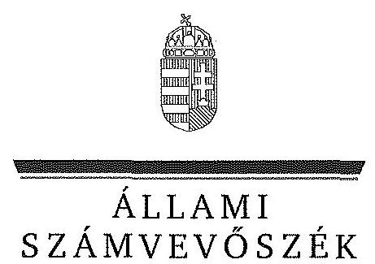
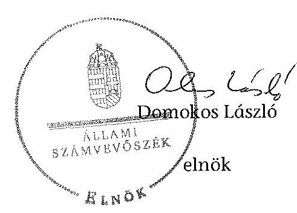

ÁLLAMI
SZÁMVEVŐSZÉK

# JELENTÉS 

Az önkormányzatok belső kontrollrendszere kialakításának, egyes kontrolltevékenységek és a belső ellenőrzés működésének ellenőrzése Simontornya

---

# Állami Számvevőszék 

Iktatószám: V-0664-078/2015.
Témaszám: 1698
Vizsgálat-azonosító szám: V067706
Az ellenőrzést felügyelte:
Dr. Benedek Mária
felügyeleti vezető
Az ellenőrzést vezette és az ellenőrzés végrehajtásáért felelős:
Dr. Győri Gabriella
ellenőrzésvezető
A számvevőszéki jelentéstervezet összeállításában közreműködött:
Csényi István
számvevő főtanácsos
Az ellenőrzést végezték:
Csényi István
Lantos Józsefné
számvevő főtanácsos
számvevő tanácsos

---

# TARTALOMJEGYZÉK 

BEVEZETÉS ..... 7
I. ÖSSZEGZŐ MEGÁLLAPÍTÁSOK, KÖVETKEZTETÉSEK, JAVASLATOK ..... 11
II. RÉSZLETES MEGÁLLAPÍTÁSOK ..... 14

1. Az önkormányzat belső kontrollrendszere kialakításának és működtetésének megfelelősége ..... 14
1.1. A kontrollkörnyezet kialakítása és működtetése ..... 14
1.2. A kockázatkezelési rendszer kialakítása és működtetése ..... 15
1.3. A kontrolltevékenységek kialakítása és működtetése ..... 15
1.4. Az információs és kommunikációs rendszer kialakítása és működtetése ..... 16
1.5. A monitoring rendszer kialakítása és működtetése ..... 17
2. A monitoring rendszer részeként a belső ellenőrzés kialakítása és működtetése ..... 18
3. A pénzügyi folyamatokban kulcsszerepet betöltő belső kontrollok (teljesítésigazolás és érvényesítés) működése ..... 19
4. Az integritás szemlélet érvényesülése ..... 21

## FÜGGELÉKEK

1. számú Értelmező szótár
2. számú Az integritás érvényesítése érdekében kialakított és működtetett intézményi kontrollrendszer

---

.

---

# RÖVIDÍTÉSEK JEGYZÉKE 

## Törvények

Áht.
ÁSZ tv.
Info tv.

Mötv.

Tvtv.

## Rendeletek, határozatok

Ávr.
Bkr.
önkormányzati SZMSZ

## Szórövidítések

alapító okirat
adatvédelmi és informatikai szabályzat

ÁSZ
belső ellenőrzési kézikönyv
etikai szabályzat

2011. évi CXCV. törvény az államháztartásról
2011. évi LXVI. törvény az Állami Számvevőszékről
2011. évi CXII. törvény az információs önrendelkezési jogról és az információszabadságról
2011. évi CLXXXIX. törvény Magyarország helyi önkormányzatairól
1996. évi XXXI. törvény a tűz elleni védekezésről, a műszaki mentésről és a tűzoltóságról
368/2011. (XII. 31.) Korm. rendelet az államháztartásról szóló törvény végrehajtásáról
370/2011. (XII. 31.) Korm. rendelet a költségvetési szervek belső kontrollrendszeréről és belső ellenőrzéséről
Simontornya Város Önkormányzata Képviselőtestületének 6/2011 (III. 31.) számú rendelete a Képviselőtestület és Szervei Szervezeti és Működési Szabályzatáról. (hatályos: 2013. március 12-éig)
Simontornya Város Önkormányzata Képviselőtestületének 10/2013 (III. 27.) számú rendelete a Képviselő-testület Szervezeti és Működési Szabályzatáról. (hatályos: 2013. március 13-ától)

Simontornyai Polgármesteri Hivatal Alapító Okirata (Simontornya Város Önkormányzatának Képviselő-testülete 21/2012. (II. 27.) számú KT határozatával kiadott dokumentum)
A 3/2010. (XI. 29.) számú jegyzői utasítással hatályba léptetett „A Polgármesteri Hivatal közszolgálati adatvédelmi szabályzata" (hatályos 2010. december 1-jétől)
A 4173-4/2005. ügyiratszámú „A számítógépek használatáról, számítógépes iratkezelésről és annak titokvédelmi szabályairól szóló szabályzat" (hatályos 2005. június 3-ától)
Állami Számvevőszék
Simontornya Város Önkormányzata és intézményei Belső ellenőrzési kézikönyv (hatályos 2013. január 1-jétől)
A Polgármesteri Hivatal köztisztviselőivel szemben támasztott hivatásetikai alapelvek és az etikai eljárás szabályainak meghatározása (a Simontornyai Önkormányzat Képviselő-testületének 72/2012. (VI. 25.) számú határozatával elfogadott szabályzat, hatályos 2012. július 1-jétől)

---

ellenőrzési nyomvonal
értékelési szabályzat
gazdálkodási jogkörök szabályzat
gazdasági szervezet
gazdasági szervezet ügyrendje

Hivatal
hivatali SZMSZ

INTOSAI
iratkezelési szabályzat

ISSAI
jegyző
Képviselő-testület
közérdekű adatok megismerésére irányuló kérelmek rendje
kockázatkezelési szabályzat

Kormányhivatal

Simontornyai Polgármesteri Hivatal működési folyamatainak ellenőrzési nyomvonala (hatályos 2013. január 1-jétől)
Simontornya Városi Önkormányzat Polgármesteri Hivatala Eszközök és források értékelési szabályzata (a 6/2012. (III. 31.) jegyzői normatív utasítás 3. melléklete, hatályos 2012. január 1-jétől)
Simontornya Városi Önkormányzat Polgármesteri Hivatala Gazdálkodási Szabályzata a kötelezettségvállalás, pénzügyi ellenjegyzés, teljesítés igazolása, érvényesítés, utalványozás és az adatszolgáltatás rendjéről (a 7/2012. (IV. 13.) normatív jegyzői utasítás melléklete, hatályos 2012. április 15-étől)
Simontornyai Polgármesteri Hivatal Közgazdasági Osztálya (SZMSZ II. fejezet 1. (6))
Simontornyai Polgármesteri Hivatal gazdasági szervezetének ügyrendje (Simontornya Város Önkormányzata Képviselő-testületének 8/2013. (I. 28.) számú határozatával elfogadott SZMSZ 3. sz. függeléke, hatályos 2013. január 1-jétől)
Simontornya Városi Önkormányzat Polgármesteri Hivatala
Simontornyai Polgármesteri Hivatal Szervezeti és Működési Szabályzata (Simontornya Város Önkormányzata Képviselő-testületének 8/2013. (I. 28.) számú határozata, hatályos 2013. január 1-jétől)
International Organization of Supreme Audit Institutions (Legfőbb Ellenőrző Intézmények Nemzetközi Szervezete)
Simontornyai Polgármesteri Hivatal Egyedi Iratkezelési Szabályzata (Simontornya Város Jegyzőjének 6/2012. (V. 17.) utasítása, hatályos 2012. július 1-jétől)
International Standards of Supreme Audit Institutions (Legfőbb Ellenőrző Intézmények Nemzetközi Standardjai)
Simontornya Város Önkormányzatának jegyzője
Simontornya Város Önkormányzat Képviselő-testülete
Simontornya Város Önkormányzata Polgármesteri Hivatal Szabályzat a közérdekű adatok megismerésére irányuló kérelmek intézésének, továbbá a kötelezően közzéteendő adatok nyilvánosságra hozatalának rendjéről (4/2011. jegyzői utasítás, hatályos 2011. október 1-jétől)
Simontornyai Polgármesteri Hivatal Kockázatkezelési Szabályzata (Simontornyai Hivatal Szervezeti és Működési Szabályzatának 4. számú függeléke, hatályos 2013. január 1-jétől)
Tolna Megyei Kormányhivatal

---

| leltározási és leltárkészítési szabályzat | Simontornya Városi Önkormányzat Polgármesteri Hivatala Leltározási és leltárkészítési szabályzat (a 6/2012. (III. 31.) jegyzői normatív utasítás 4. melléklete, hatályos 2012. január 1-jétől) |
| :--: | :--: |
| NGM | Nemzetgazdasági Minisztérium |
| Önkormányzat | Simontornya Város Önkormányzata |
| pénzkezelési szabályzat | Simontornya Városi Önkormányzat Polgármesteri Hivatala Pénzkezelési Szabályzat (a 6/2012. (III. 31.) jegyzői normatív utasítás 5. melléklete, hatályos 2012. január 1-jétől) |
| polgármester   szabálytalanságkezelési   szabályzat | Simontornya Városi Önkormányzat polgármestere   Simontornyai Polgármesteri Hivatal szabálytalanságok   kezelésének eljárásrendje (Simontornyai Polgármesteri   Hivatal Szervezeti és Működési Szabályzatának 5. számú   melléklete, hatályos 2013. január 1-jétől) |
| számlarend | Simontornya Városi Önkormányzat Polgármesteri Hivatala Számlarend (a 6/2012. (III. 31.) jegyzői normatív utasítás 2. melléklete, hatályos 2012. január 1-jétől) |
| számviteli politika | Simontornya Városi Önkormányzat Polgármesteri Hivatala Számviteli politika (a 6/2012. (III. 31.) jegyzői normatív utasítás 1. melléklete, hatályos 2012. január 1-jétől) |
| Társulás | Tamási-Simontornyai Többcélú Kistérségi Társulás (2013. június 1-jétől a Társulás elnevezése: DÂM Önkormányzati Társulás) |
| tűzvédelmi szabályzat | Tűzvédelmi szabályzat és Tűzriadó terv (hatályos 2010. június 1-jétől) |

---

.

---

# JELENTÉS 

## az önkormányzatok belső kontrollrendszere kialakításának, egyes kontrolltevékenységek és a belső ellenőrzés működésének ellenőrzése   Simontornya

## BEVEZETÉS

Simontornya város állandó lakosainak száma 2013. január 1-jén 4180 fő volt. Az Önkormányzat hét tagú Képviselő-testületének munkáját három állandó bizottság segítette. Az Önkormányzat az önállóan működő és gazdálkodó Hivatalon kívül négy önállóan működő intézményt működtetett, egy többségi tulajdoni hányadú gazdasági társasággal rendelkezett. A polgármester 2002. október 21. óta tölti be tisztségét. A jegyző 1990. december 15-étől látja el feladatait. A Hivatal három szervezeti egységre tagolódott, elkülönített gazdasági szervezettel rendelkezett, a foglalkoztatott köztisztviselők száma 2013. január 1-jén 16 fő volt. A Hivatalnál 2013. január 1-jétől szervezeti változás nem volt. Az Önkormányzat a 2013. évi költségvetési beszámolója szerint 1263300 ezer Ft tárgyévi bevételt ért el, valamint 1303257 ezer Ft tárgyévi kiadást teljesített. A 2013. december 31-i könyvviteli mérleg szerint 1314700 ezer Ft értékű eszközvagyonnal rendelkezett, a rövid lejáratú kötelezettségállománya 6038 ezer Ft, hosszú lejáratú kötelezettség állománya nem volt.

A demokratikus társadalmakban alapvető igény, hogy a közpénzeket, a közvagyont használók valamennyi tevékenységükhöz kapcsolódó pénzfelhasználásról elszámoljanak, ahhoz egyértelmű és érvényesíthető felelősségi szabályok társuljanak. Ennek a jogos igénynek az érvényesítéséhez meg kell teremteni azokat a folyamatokat, rendszereket, amelyek nélkülözhetetlenek az elszámoltatáshoz. Az elszámoltatás eredményes működtetéséhez szükség van a megfelelő információs, kontroll, értékelési és beszámolási rendszerek kialakítására.

Magyarországon az uniós csatlakozási tárgyalások idejére nyúlnak vissza a belső kontrollrendszer szabályozásának gyökerei. Az uniós elvárásoknak megfelelő új terminológia szerinti államháztartási belső pénzügyi ellenőrzési (ÁBPE) rendszer területén a jogharmonizáció 2003-ban teljes körűen megvalósult, míg az önkormányzati áreindszerrre vonatkozó, Ötv.-ben megjelenített speciális szabályozás 2005-ben lépett hatályba. Az államháztartási belső kontrollrendszer koncepciója 2009-ben továbbfejlődött. A változások irányát mutatja, hogy a költségvetési szervek belső kontrollrendszere már magában foglalja a korszerű felelős szervezetirányítás elemeit (kontrollkörnyezet, kockázatkezelés, kontrolltevékenység, információ és kommunikáció, monitoring) is. E kont-

---

rollrendszer szabályozása háromszintű, a törvényi előírásokat az Áht., és a Mötv., a rendeleti szintű szabályozást az Ávr. és a Bkr. tartalmazza, amelyeket útmutatói szinten az NGM által kiadott standardok és kézikönyvek támogatnak.

A belső kontrollrendszer azt a célt szolgálja, hogy a költségvetési szervek működésük és gazdálkodásuk során a tevékenységeket szabályszerűen, gazdaságosan, hatékonyan, eredményesen hajtsák végre, teljesítsék elszámolási kötelezettségeiket és megvédjék az erőforrásokat a veszteségektől, a károktól és a nem rendeltetésszerű használattól. A belső kontrollrendszer magában foglalja mindazon szabályokat, eljárásokat, gyakorlati módszereket és szervezeti struktúrákat, kockázatkezelési technikákat, kontrolltevékenységeket, amelyek segítséget nyújtanak a szervezetnek céljai eléréséhez.

Az ÁSZ a 2011-2015. évekre szóló stratégiájában hangsúlyos szerepet szánt annak, hogy szilárd szakmai alapon álló, értékteremtő ellenőrzéseivel előmozdítsa a közpénzügyek átláthatóságát, rendezettségét. A számvevőszéki ellenőrzés nemzetközi alapelvei is rögzítik, hogy a megfelelő belső kontrollrendszer minimálisra csökkenti a hibák és szabálytalanságok kockázatát.

Az ellenőrzés célja annak értékelése, hogy

- a jogszabályi előírásoknak megfelelően alakították-e ki és működtették-e a belső kontrollrendszert;
- a gazdálkodás folyamatában kulcsszerepet betöltő teljesítésigazolás és érvényesítés kontrolltevékenységeit megfelelően működtették-e;
- biztosították-e a belső ellenőrzés szabályos működését;
- kialakították-e az erőforrásokkal való szabályszerű és hatékony gazdálkodáshoz szükséges követelményeket, megvalósították-e azok számonkérését, ellenőrzését;
- hasznosították-e a 2009-2013. években végzett ÁSZ ellenőrzések során megfogalmazott javaslatokat.

A közintézmények integritás alapú kultúrájának kialakítása, megerősítése és működése szorosan összefügg a belső kontrollrendszer működésével, ezért az ellenőrzés kitért a gazdálkodáshoz kapcsolódó integritás kontrollok meglétének és működésének ellenőrzésére is. Az integritási kultúra kialakítása hozzájárul az elszámoltathatóság és átláthatóság érvényesítéséhez, egyben támogatja a szervezet védettségét a korrupciós kitettséggel szemben, valamint annak megelőzése is irányítottabbá válik.

Az ellenőrzés várható hasznosulását négy szinten tervezzük. A törvényalkotás számára összegzett tapasztalatok állnak rendelkezésre a belső kontrollrendszer önkormányzati területen való kialakításáról, működéséről és hatásairól, a belső ellenőrzés működéséről. Az ellenőrzés az ellenőrzött számára visszajelzést ad a belső kontrollrendszer kialakításában és működésében fellépő hiányosságokról, javaslataival hozzájárul azok kiküszöböléséhez, amely csökkentheti a későbbi ellenőrzések gyakoriságát. Az ellenőrzés megállapításait és javaslatait más szervezetek is hasznosíthatják a rendezett gazdálkodási keretek

---

kialakításához. A társadalom számára jelzi, hogy közpénz nem maradhat ellenőrizetlenül, az ÁSZ értékteremtő rend kialakításához és megőrzéséhez hozzájáruló tevékenysége pozitív hatással lesz a szervezetről kialakított összkép formálásában. A szervezeten belül lehetőség nyílik arra, hogy a megállapítások szintetizálásával az ÁSZ a hozzáadott értéket teremtő elemző tevékenységét és tanácsadó szerepét is erősítse.

Az önkormányzatok belső kontrollrendszere kialakításának, egyes kontrolltevékenységek és a belső ellenőrzés működésének ellenőrzéséről szóló jelentés I. fejezetének összegző része az ellenőrzés céljára ad rövid, szintetizáló összefoglalót, és tartalmazza a következtetéseket a II. fejezet részletes megállapításain alapulóan. A jelentés intézkedést igénylő megállapításait és javaslatait az ellenőrzés során feltárt, a jelentés II. fejezetében rögzített részletes megállapítások alapozzák meg.

Az ellenőrzés típusa: szabályszerűségi ellenőrzés
Az ellenőrzött időszak: a belső kontrollrendszer kialakítása és működtetésének megfelelőségét a 2013. évre vonatkozóan (2013. december 31-i állapotnak megfelelően), a pénzügyi folyamatokban kulcsszerepet betöltő teljesítésigazolás és érvényesítés belső kontrollok működésének megfelelőségét, és a belső ellenőrzés szabályszerű működését a 2013. január 1. - december 31-e közötti időszakot figyelembe véve értékeltük, míg az ÁSZ javaslatainak utóellenőrzése a 2009-2013. években végzett ellenőrzések nyilvánosságra hozott jelentéseiben tett javaslatok áttekintésére terjedt ki.

# Az ellenőrzött szervezet: az Önkormányzat 

Az ellenőrzés jogszabályi alapját az ÁSZ tv. 1. § (3) bekezdése, az 5. § (2) és (6) bekezdései, valamint az Áht. 61. § (2) bekezdése képezik.

Az ellenőrzés szakmai módszertana az ÁSZ hivatalos honlapján (www.asz.hu) közzétett szakmai szabályokon alapult, amely az INTOSAI által kiadott ISSAI figyelembevételével készült.

Az ellenőrzés lefolytatásához az Önkormányzat a kimutatások és a tanúsítvány elektronikus kitöltésével, valamint az ÁSZ által
 kért dokumentumok elektronikus megküldésével szolgáltatott adatokat. Az így rendelkezésre bocsátott adatok, információk kontrollja és a munkalapok kitöltése a helyszíni ellenőrzés keretében történt. A jelentésben használt fogalmak magyarázatát az 1. számú függelék, az integritás érvényesítése érdekében kialakított és működtetett intézményi kontrollrendszer értékelésénél alkalmazott egységes értékelési szempontokat a 2. számú függelék tartalmazza.

A belső kontrollrendszer, valamint a belső ellenőrzés jogszabályi előírások szerinti kialakításának és működtetésének szabályszerűségét az erre irányuló ellenőrzési kérdésekre adott válaszok összesítése alapján értékeltük. A belső kontrollrendszert kontrollterületenként (kontrollkörnyezet, kockázatkezelési rendszer, kontrolltevékenységek, információs és kommunikációs rendszer, monitoring rendszer) és összesítetten is értékeltük.

---

A belső kontrollrendszer egyes kontrollterületei és a belső ellenőrzés kialakítása és működtetése „szabályszerű volt", amennyiben az értékelt területen az elért és elérhető pontok százalékban kifejezett hányadosa elérte a 81%-ot, „nem volt szabályszerű", ha nem haladta meg a 60%-ot, és „részben szabályszerű volt", ha 61-80% között volt. A belső kontrollrendszer összesített értékelése megegyezett a kontrollterületenként alkalmazott %-os értékelésekkel, a következő eltérésekkel. A kontrollrendszer egésze esetében a „szabályszerű" értékelésnek a %-os értéken felül további feltétele volt, hogy egyik kontrollterület sem kaphatott „nem volt szabályszerű" értékelést, a „részben szabályszerű" értékelés további feltétele volt, hogy legfeljebb egy ellenőrzött kontrollterület lehetett „nem volt szabályszerű" értékelésű. Az összesített értékelés a %-os értéktől függetlenül „nem volt szabályszerű", ha az ellenőrzött kontrollterületek közül több mint egynek „nem volt szabályszerű" az értékelése.

A gazdálkodás folyamatában kulcsszerepet betöltő két kulcskontroll - teljesítésigazolás, érvényesítés - működésének megfelelőségét a személyi juttatásokkal, a dologi és felhalmozási kiadásokkal, működési és felhalmozási célú pénzeszköz átadásokkal, ellátottak pénzbeli juttatásaival kapcsolatos kifizetések esetében mintavétellel ellenőriztük. Az ellenőrzött területek esetében minden egyes tétel vonatkozásában a szabályszerűségre vonatkozó kérdéseket tettünk fel, amelyekre adott válaszok eredménye összesítésre került. „Megfelelőnek" értékeltük a gazdálkodási jogkörök gyakorlását, amennyiben 95%-os bizonyossággal a teljes sokaságban a hibaarány legfeljebb 10%, „részben megfelelőnek" értékeltük, ha a hibaarány felső határa 10-30% között volt, „nem megfelelőnek" pedig akkor, ha a mintavételi eredmények alapján a sokaságbeli hibaarány felső határa meghaladta a 30%-ot.

Értékeltük az Önkormányzatnál a belső ellenőrzés kialakításának és működésének szabályosságát. Minősítettük a gazdálkodáshoz kapcsolódó integritás kontrollok meglétét és működését. Az integritás szemlélet érvényesülésének értékelése az Önkormányzat önbevallás által kitöltött tanúsítvány alapján történt.

Utóellenőrzésre nem került sor, mivel az ÁSZ az Önkormányzatnál a 2009-2013. évek között nem végzett ellenőrzést.

Az ÁSZ tv. 29. § (1) bekezdése szerint a jelentéstervezetet megküldtük a polgármester részére, aki az ÁSZ tv. 29. § (2) bekezdésében foglalt észrevételezési jogával nem élt, a jelentéstervezetre észrevételt nem tett.

---

# I. ÖSSZEGZŐ MEGÁLLAPÍTÁSOK, KÖVETKEZTETÉSEK, JAVASLATOK 

A belső kontrollrendszeren belül 2013-ban a kontrollkörnyezet, a kockázatkezelési rendszer, a kontrolltevékenységek, az információs és kommunikációs rendszer, valamint a monitoring rendszer kialakítását és működtetését külön-külön és együttesen is értékeltük. A belső kontrollrendszer kialakítása és működtetése az összesített értékelés alapján szabályszerű volt.

A belső kontrollrendszer egyes területei kialakításának és működtetésének minősítése a következő:

| Kontrollterület | Minősítés |
| :-- | :-- |
| Kontrollkörnyezet | szabályszerű |
| Kockázatkezelési rendszer | szabályszerű |
| Kontrolltevékenységek | szabályszerű |
| Információs és kommunikációs rendszer | szabályszerű |
| Monitoring rendszer | szabályszerű |

Szabályszerűnek értékeltük a kontrollkörnyezet, a kockázatkezelési rendszer, a kontrolltevékenységek, az információs és kommunikációs rendszer, valamint a monitoring rendszer kialakítását és működtetését, mivel a megállapított szabályozásbeli hiányosságok nem veszélyeztették e kontrollterületeken a szabályszerű működést.

A 2013. évben a személyi juttatások, dologi kiadások, felhalmozási kiadások, működési és felhalmozási célú pénzeszköz átadásokkal, ellátottak pénzbeli juttatásaival kapcsolatos kifizetések során - összefoglalóan értékelve - a pénzügyi folyamatokban kulcsszerepet betöltő teljesítésigazolás és érvényesítés belső kontrollok - kisebb hiányosságok mellett - megfelelően működtek.

A számvevőszéki ellenőrzés az ellenőrzött kifizetésekkel összefüggésben a rendelkezésre bocsátott dokumentumok alapján kár bekövetkeztére utaló adatot, tényt nem állapított meg, azonban a gazdálkodásban kulcsszerepet betöltő kontrollok működésében feltárt - kisebb - hiányosságok miatt fennáll a hibák, szabálytalanságok bekövetkezésének kockázata.

Az Önkormányzat a belső ellenőrzési feladatokat a Társulás útján látta el. A 2013. évben a belső ellenőrzés kialakítása és működtetése szabályszerű volt, azonban a belső ellenőrzés nem tárta fel a pénzügyi folyamatokban kulcsszerepet betöltő teljesítésigazolás és érvényesítés belső kontrollok működésének hiányosságait.

---

A Képviselő-testület kialakította az erőforrásokkal való szabályszerű és hatékony gazdálkodáshoz szükséges követelményeket, melynek betartását számon kérte.

Az Önkormányzat intézkedéseket tett az integritás szemlélet fejlesztésére, valamint a korrupciós kockázatok csökkentésére, a 2011. és a 2013. évben önként részt vett az ÁSZ integritás felmérésében.

Az ÁSZ tv. 33. § (1) bekezdésében foglaltak értelmében az ellenőrzött szervezet vezetője köteles a jelentésben foglalt megállapításokhoz kapcsolódó intézkedési tervet összeállítani, és azt a jelentés kézhezvételétől számított 30 napon belül az ÁSZ részére megküldeni. Amennyiben az intézkedési tervet határidőre nem küldi meg a szervezet, vagy az ÁSZ tv. 33. § (2) bekezdésében foglalt póthatáridő elteltével megküldött intézkedési terv továbbra sem elfogadható, az ÁSZ elnöke a hivatkozott törvény 33. § (3) bekezdés a)-b) pontjaiban foglaltakat érvényesítheti.

Az ellenőrzés intézkedést igénylő megállapításai és javaslatai:

# a polgármesternek 

Az Önkormányzat kiadási előirányzata terhére történt kötelezettségvállalásra - az Áht. 37. § (1) és az Ávr. 55. § (1) bekezdésében foglaltak ellenére - pénzügyi ellenjegyzés nélkül került sor.

Javaslat:
Intézkedjen annak érdekében, hogy az Önkormányzat nevében történő kötelezettségvállalásra az Áht. 37. § (1) bekezdésében és az Ávr. 55. § (1) bekezdésében foglaltaknak megfelelően - az Ávr. 53. §-ában meghatározott kivételekkel - kizárólag a kötelezettségvállalás dokumentumán történt pénzügyi ellenjegyzés után kerüljön sor.

## a jegyzőnek

A számvevőszéki jelentés ellenőrzési megállapításai alapján az Önkormányzatnál a belső kontrollrendszer kialakítása és működtetése, valamint a belső ellenőrzés kialakítása és működtetése összesített értékelés alapján szabályszerű volt, azonban a kulcskontrollok működése során szabálytalanságok fordultak elő. A számvevőszéki ellenőrzés során feltárt hibákat, hiányosságokat és szabálytalanságokat a számvevőszéki jelentés II. Részletes megállapítások fejezetcím tartalmazza.

Javaslat:
A jogszabályoknak megfelelő belső kontrollrendszer kialakítása és működtetése érdekében - az ellenőrzött időszak óta bekövetkezett esetleges jogszabályi változásokra figyelemmel - intézkedjen a belső kontrollrendszer kialakításában és működtetésében, a kulcskontrollok működése, illetve a belső ellenőrzés kialakításában és működtetésében az ellenőrzés által feltárt hibák, hiányosságok, szabálytalanságok kijavítására.

---

Kezdeményezze, hogy az éves ellenőrzési terv kiterjedjen a kifizetések szabályszerűségi ellenőrzésére, különös tekintettel a személyi juttatásokkal, a dologi kiadásokkal, a felhalmozási kiadásokkal, a működési és felhalmozási célú pénzeszköz átadásokkal, az ellátottak pénzbeli juttatásaival kapcsolatos kiadási jogcímekből teljesített kifizetésekre.

---

# II. RÉSZLETES MEGÁLLAPÍTÁSOK 

## 1. AZ ÖNKORMÁNYZAT BELSŐ KONTROLLRENDSZERE KIALAKÍTÁSÁNAK ÉS MŰKÖDTETÉSÉNEK MEGFELELŐSÉGE

A belső kontrollrendszeren belül 2013-ban a kontrollkörnyezet, a kockázatkezelési rendszer, a kontrolltevékenységek, az információs és kommunikációs rendszer, valamint a monitoring rendszer kialakítását és működtetését külön-külön és együttesen is értékeltük. A belső kontrollrendszer kialakítása és működtetése az összesített értékelés alapján szabályszerű volt.

### 1.1. A kontrollkörnyezet kialakítása és működtetése

A kontrollkörnyezet kialakítása és működtetése szabályszerű volt.
A Hivatal rendelkezett alapító okirattal, amely tartalmazta az alaptevékenységeket. Az Önkormányzat rendelkezett a Képviselő-testület által elfogadott, a 2011-2014. évekre vonatkozó gazdasági programmal, önkormányzati SZMSZ-szel, valamint megállapította és elfogadta az önkormányzati vagyonnal történő gazdálkodás szabályait.

A jegyző a jogszabályban foglaltaknak megfelelően kialakította a Hivatal számviteli politikáját, elkészítette a pénzkezelési-, a leltározási és leltárkészítési-, az értékelési szabályzatát, a számlarendet, és azt az előírásoknak megfelelően folyamatosan karbantartották. Elkészítette továbbá a szabálytalanságkezelési szabályzatot, valamint a gazdasági szervezet ügyrendjét. A Hivatal gazdasági vezetője rendelkezett a feladat ellátásához szükséges végzettséggel, előírt szakképesítéssel és a könyvviteli szolgáltatás körébe tartozó tevékenység ellátására jogosító engedéllyel.

A jegyző elkészítette a Hivatalban dolgozó köztisztviselők munkaköri leírását, melyben a köztisztviselők feladatait és a munkakör betöltésével kapcsolatos követelményeket rögzítették. A Hivatal rendelkezett ellenőrzési nyomvonallal, melynek rendszeres aktualizálásáról a jegyző gondoskodott. A Képviselőtestület kialakította az erőforrásokkal való, szabályszerű és hatékony gazdálkodáshoz szükséges követelményeket, azok betartását számon kérte. A Képviselő-testület a 2013. évi költségvetési rendeletében meghatározta a Hivatal engedélyezett létszámát. A jegyző elkészítette a Hivatalban dolgozó köztisztviselők teljesítményértékelését és határidőben előírta a köztisztviselők teljesítményértékelésének második félévre vonatkozó kötelező elemeit.

A Képviselő-testület a köztisztviselőkre vonatkozó hivatásetikai alapelvek részletes tartalmát, valamint az etikai eljárás szabályait megállapította.

---

A kontrollkörnyezet kialakítása és működtetése, az alábbi kisebb hiányosság mellett, szabályszerű volt:

| Sorszám | Megállapítás | Megjegyzés |
| :--: | :--: | :--: |
| 3. | A jegyző - a Tvtv. 19. § (1) bekezdésében foglaltak ellenére - nem készítette el a Hivatal tűzvédelmi szabályzatát. | A tűzvédelmi szabályzat hatályba helyezése dokumentáltan nem volt igazolható. |

# 1.2. A kockázatkezelési rendszer kialakítása és működtetése 

A kockázatkezelési rendszer kialakítása és működtetése szabályszerű volt.

A jegyző elkészítette a Hivatal kockázatkezelési szabályzatát, amely tartalmazta a kockázatok azonosításával, elemzésével, csoportosításával, nyomon követésével, illetve a kockázati kitettség csökkentésével kapcsolatos szabályokat, felmérte és megállapította a Hivatal tevékenységében, gazdálkodásában rejlő kockázatokat.

A vagyonnyilatkozat-tételre kötelezettek körét a hivatali SZMSZ-ben és az önkormányzati SZMSZ-ben rögzítették. A vagyonnyilatkozat-tételre kötelezettek a 2013. évben esedékes vagyonnyilatkozat-tételi kötelezettségüknek eleget tettek.

A kockázatkezelési rendszer kialakítása és működtetése, az alábbi kisebb hiányosságok mellett, szabályszerű volt:

| Sorszám | Megállapítás |
| :-- | :-- |
| 3-4. | A jegyző - a Bkr. 7. § (2) bekezdésében foglaltak ellenére - nem határozta meg egyes kockázatokkal kapcsolatban a szükséges intézkedéseket, valamint a kockázatok kezelése érdekében szükséges intézkedések teljesítésének folyamatos nyomon követési módját. |

### 1.3. A kontrolltevékenységek kialakítása és működtetése

A kontrolltevékenységek kialakítása és működtetése szabályszerű volt.

A jegyző a kontrolltevékenység részeként biztosította a pénzügyi döntések - köztük a költségvetés tervezése, a beszerzések lebonyolítása, a vagyonhasznosítási tevékenység és a támogatások elszámolása - dokumentumainak elkészítésével kapcsolatban a folyamatba épített, előzetes, utólagos és vezetői ellenőrzést.

[^0]
[^0]:    ${ }^{1}$ A témacsoportos ellenőrzés miatt a megállapítás számozása az önkormányzat által kitöltött kimutatások - adatszolgáltatások - kérdéseinek sorszámával azonos.

---

A gazdálkodási jogkörök szabályzatában a jegyző szabályozta a kötelezettségvállalás pénzügyi ellenjegyzése, a teljesítésigazolás, az érvényesítés, az utalványozás gyakorlásának módjával, eljárási és dokumentációs részletszabályaival, valamint az ezeket végző személyek kijelölésének rendjével kapcsolatos belső előírásokat, feltételeket, az előzetes írásbeli kötelezettségvállalást nem igénylő kifizetések rendjét. A kötelezettségvállalók - mind az Önkormányzati, mind a Hivatali kiadások vonatkozásában - kijelölték a teljesítésigazolásra jogosult személyeket.

A jegyző elkészítette az iratkezelési szabályzatot, melyben kialakította az üzembiztonsági, adatvédelmi szabályok érvényre juttatásához szükséges eljárási szabályokat. Szabályozta az üzemeltetés és adatbiztonság feladatait és meghatározta az ehhez kapcsolódó hatásköröket. Az adatvédelmi és informatikai szabályzatban kialakította az adatok biztonságának, védelmének érvényre juttatásához szükséges eljárási szabályokat, a felelősségi körök meghatározásával szabályozta a dokumentumokhoz és információkhoz való hozzáférést.

A gazdálkodási szabályzatban a jegyző meghatározta az időközi és éves beszámolók elkészítésének feladatait, meghatározta a beszámolási eljárásokhoz kapcsolódó felelősségi köröket, a
 gazdasági szervezet ügyrendjében és a munkaköri leírásokban a gazdasági feladatot ellátó vezető és alkalmazottak helyettesítésének rendjét. A költségvetési beszámoló elkészítésével megbízott személy rendelkezett az előírt szakképesítéssel és a tevékenység ellátására jogosító engedéllyel.

A polgármester a kötelezettségvállalásra és az utalványozásra felhatalmazást adott, ezáltal biztosította az Ávr.-ben foglalt összeférhetetlenségre vonatkozó előírás érvényesülésének lehetőségét. A gazdasági vezető az érvényesítési feladatra kijelölt a Hivatal állományába tartozó köztisztviselőket, akik rendelkeztek a jogszabályban előírt végzettséggel, illetve pénzügyi-számviteli képesítéssel.

A közszolgálati szabályzatban a jegyző szabályozta a közszolgálati jogviszony megszűnése, vagy a munkakör változása esetén a munkakör átadásának rendjét.

# 1.4. Az információs és kommunikációs rendszer kialakítása és működtetése 

Az információs és kommunikációs rendszer kialakítása és működtetése szabályszerű volt.

A jegyző olyan rendszert alakított ki, amely biztosítja, hogy a megfelelő információk a megfelelő időben eljutnak az illetékes szervezethez, szervezeti egységhez, személyhez. A jegyző szabályozta a beszámolási szinteket, határidőket, módokat. A Hivatal rendelkezett az Info tv. előírásainak megfelelő adatvédelmi és informatikai szabályzattal.

A jegyző kialakította a kötelezően közzéteendő adatok nyilvánosságra hozatalának rendjét. Az Önkormányzat az elektronikus közzétételi kötelezettségének a

---

2013. évben eleget tett. A jegyző meghatározta a közérdekű adatok megismerésére irányuló kérelmek rendjét.

A Hivatal rendelkezett a Magyar Nemzeti Levéltár és a Kormányhivatal egyetértésével kiadott, a jogszabályi előírásoknak megfelelő tartalmú iratkezelési szabályzattal. A jegyző az iratok iktatásával, az iratforgalom dokumentálásával biztosította az ügyintézés folyamatának, az iratok szervezeten belüli útjának pontos követhetőségét és ellenőrizhetőségét, az iratok hollétének naprakész megállapíthatóságát.

# 1.5. A monitoring rendszer kialakítása és működtetése 

A monitoring rendszer kialakítása és működtetése szabályszerű volt.
A jegyző kialakította a Hivatal tevékenységének, a célok megvalósításának nyomon követését biztosító rendszert. A jegyző a jogszabály előírásának megfelelően nyilatkozatban értékelte a Hivatal belső kontrollrendszerének minőségét a 2012. évre vonatkozóan.

Az Önkormányzatnál végzett külső ellenőrzések megállapításainak hasznosítására intézkedési tervet készítettek. A jegyző a 2013. évben az Önkormányzatnál végzett hatósági ellenőrzés megállapításai alapján intézkedett, hogy az ellenőrzés által feltárt hiányosságok a jövőben ne merüljenek fel. Az Önkormányzat a Kormányhivatal felhívására a szükséges intézkedéseket megtette.

Az Önkormányzatnál végzett könyvvizsgálat megállapításai alapján intézkedési igény nem merült fel.

A monitoring rendszer kialakítása és működtetése, az alábbi kisebb hiányosság mellett, szabályszerű volt:

| Sor-   szám | Megállapítás |
| :-- | :-- |
| 6. | A jegyző - a Bkr. 14. §. (1) bekezdésében foglalt előírás ellenére - nem   gondoskodott a külső ellenőrzések javaslatai alapján készített intézkedési   tervek végrehajtására vonatkozó nyilvántartás vezetéséről. |

Az Önkormányzat törvényességi felügyeletét ellátó Kormányhivatal 2013-ban három törvényességi felhívással élt az Önkormányzat felé. A 2013. május 10-én kelt törvényességi felhívásban az Önkormányzat 25/2012. (XI. 30.) számú vagyongazdálkodási rendeletével, a július 3-án kelt felhívásban a Képviselő-testület üléseiről készített jegyzőkönyvekkel, valamint a kihirdetett rendeletek megküldésével, a december 30-án kelt felhívásban a Képviselő-testület ivóvíz-ellátási társulással kapcsolatos mulasztásával összefüggő kifogásait közölte a Kormányhivatal. A jegyző a törvényességi felhívásokat a Képviselő-testület elé terjesztette. A Képviselő-testület a törvényességi felhívásokat megtárgyalta és határozott a törvényességi felhívásban foglalt hiányosságok megszüntetéséről. A képviselő-testületi határozatban foglalt intézkedéseket a végrehajtásért felelősök a Kormányhivatal által előírt végrehajtási határidőben teljesítették.

---

# 2. A MONITORING RENDSZER RÉSZEKÉNT A BELSŐ ELLENŐRZÉS KIALAKÍTÁSA ÉS MŰKÖDTETÉSE 

Az Önkormányzatnál a belső ellenőrzés kialakítása és működtetése szabályszerű volt.

A jegyző a belső ellenőrzés kialakításáról Társulás útján gondoskodott. A belső ellenőrök jogállása, feladatai alapján a belső ellenőrök szervezeti és funkcionális függetlensége biztosított volt. A belső ellenőrzési vezetői feladatok és kötelességek ellátásának módjáról a jogszabályi előírásoknak megfelelően a belső ellenőrzési tevékenység megszervezésére vonatkozó írásbeli megállapodásban rendelkeztek.

A belső ellenőrzést végzők rendelkeztek a jogszabályban előírt szakirányú szakképzettséggel és szakmai gyakorlattal. A kijelölt belső ellenőrzési vezető megfelelő a jogszabályban előírt szakirányú szakképzettségi és szakmai gyakorlati követelményeknek. Az Önkormányzat rendelkezett 2014. évi ellenőrzési tervvel.

A Képviselő-testület által elfogadott 2013. évi ellenőrzési tervben foglalt valamennyi ellenőrzést végrehajtották. A 2013. évben az ellenőrzési terv módosítására, ellenőrzés megszakítására, felfüggesztésére nem került sor, soron kívüli ellenőrzést nem hajtottak végre. Az ellenőrzésekre - a Hivatalnál és az intézményeknél - a számviteli- és bizonylati fegyelem, valamint a belső kontrollrendszer kialakításának és működtetésének témakörében került sor. Az ellenőrzéseket a belső ellenőrzési vezető által jóváhagyott, Bkr.-ben foglalt tartalmi követelményeknek megfelelő, ellenőrzési programok alapján végezték. Az ellenőrzésekről a jogszabályban előírt tartalmú jelentések készültek. A belső ellenőrzést végzők az ellenőrzések során büntető-, szabálysértési-, kártérítési-, vagy fegyelmi eljárás megindítására okot adó cselekményt nem tártak fel. A belső ellenőrzés javaslatainak végrehajtása érdekében mindkét ellenőrzéshez kapcsolódóan, határidőn belül, megfelelő tartalmú intézkedési tervet készítettek. A belső ellenőrzési vezető a 2013. évi összefoglaló ellenőrzési jelentést elkészítette és megküldte a jegyzőnek, a jelentés tartalmazta a belső kontrollrendszer szabályszerűségének, gazdaságosságának, hatékonyságának és eredményességének növelése, javítása érdekében tett fontosabb javaslatokat és a belső kontrollrendszer öt elemének értékelését.

A belső ellenőrzés kialakítása és működtetése, az alábbi kisebb hiányosságok mellett, szabályszerű volt:

| Sorszám | Megállapítás | Megjegyzés |
| :--: | :--: | :--: |
| 3-4. | Az Önkormányzat - a Bkr. 17. § (1) bekezdésében, és az 56. § (7) bekezdésében foglaltak ellenére - nem rendelkezett a Társulás munkaszervezeti feladatát ellátó költségvetési szerv vezetője által jóváhagyott belső ellenőrzési kézikönyvvel. | A belső ellenőrzési kézikönyvet a Társulás munkaszervezeti feladatait ellátó vezetője helyett a jegyző hagyta jóvá. |

---

| 10. | A 2014. évi ellenőrzési terv összeállítása - a Bkr. 56. § (2) bekezdésében foglaltak ellenére   - nem a jegyző írásos véleményének figyelembe vételével történt, mivel a jegyző véleményt, javaslatot nem fogalmazott meg. |  |
| :--: | :--: | :--: |
| $\begin{aligned} & 11- \\ & 12 . \end{aligned}$ | 2014. évi ellenőrzési terv - a Bkr. 22. § (1) bekezdés b) pontjában, a 29. § (1) bekezdésében és a 31. § (2) bekezdésében foglaltak ellenére - nem stratégiai tervben és kockázatelemzés alapján felállított prioritásokon alapult. | A 2014. évi ellenőrzési tervet megalapozó kockázatelemzést a jegyző készítette el és nem a belső ellenőrzési vezető. |
| 23. | A belső ellenőrzési vezető - a Bkr. 22. § (2) bekezdés e) pontjában és az 50. §-ban foglaltak ellenére - az elvégzett belső ellenőrzésekről nyilvántartást nem vezetett. |  |
| 24. | A belső ellenőrzési vezető - a Bkr. 21. § (2) bekezdés d) pontjában és a 47. § (1) bekezdésében foglaltak ellenére - a belső ellenőrzési jelentésekben tett megállapításokról, javaslatokról, a vonatkozó intézkedési tervekről és azok végrehajtásának nyomon követéséről nyilvántartást nem vezetett. |  |

# 3. A PÉNZÜGYI FOLYAMATOKBAN KULCSSZEREPET BETÖLTŐ BELSŐ KONTROLLOK (TELJESÍTÉSIGAZOLÁS ÉS ÉRVÉNYESÍTÉS) MŰKÖDÉSE 

A 2013. évben a személyi juttatások, dologi kiadások, felhalmozási kiadások, működési és felhalmozási célú pénzeszköz átadásokkal, ellátottak pénzbeli juttatásaival kapcsolatos kifizetések során - összefoglalóan értékelve - a pénzügyi folyamatokban kulcsszerepet betöltő teljesítésigazolás és érvényesítés belső kontrollok működése - kisebb hiányosságok mellett - annak ellenére megfelelő volt, hogy:

| Kulcskontrollok | Megállapítás |
| :--: | :--: |
| Teljesítésigazolás | A teljesítésigazoló - az Ávr. 57. § (1) bekezdésében foglaltak ellenére - nem ellenőrizte minden esetben a kiadások teljesítésének összegszerűségét. |
| Érvényesítés | Az érvényesítést a kifizetést megelőzően - az Áht. 38. § (1) bekezdésében és az Ávr. 58. § (1) és (4) bekezdésében foglaltak ellenére nem, vagy nem szabályszerűen végezték.   Az érvényesítő - az Ávr. 58. § (2) bekezdésében foglaltak ellenére nem jelezte az utalványozónak, hogy a megelőző ügymenetben az Áht., az államháztartási számviteli kormányrendelet, az Ávr. előírásait és a belső szabályzatokban foglaltakat nem tartották be. |

---

A 2013. évben az ellenőrzött kifizetési jogcímek mintatételei alapján a teljesítésigazolás kulcskontroll működése során az alábbi hiányosságok, szabálytalanságok fordultak elő:

- a működési és felhalmozási célú pénzeszközátadásokkal, illetve az ellátottak pénzbeli juttatásaival kapcsolatos kifizetéseket megelőzően a teljesítésigazoló - az Ávr. 57. § (1) bekezdésében foglaltak ellenére - a képviselők tiszteletdíjról történt lemondása és annak a képviselők rendelkezése szerinti kifizetése előtt nem győződött meg a kiadások teljesítésének összegszerűségéről (a képviselők a bruttó tiszteletdíjukról rendelkeztek).

A 2013. évben az ellenőrzött kifizetési jogcímek mintatételei alapján az érvényesítés kulcskontroll működése során az alábbi hiányosságok, szabálytalanságok fordultak elő:

- az érvényesítést - az Áht. 38. § (1) bekezdésében és az Ávr. 58. § (1) bekezdésében foglaltak ellenére - nem végezték el az önkormányzati dologi kiadásokkal kapcsolatos kifizetéseket megelőzően;
- az érvényesítő - az Ávr. 58. § (2) bekezdésében foglaltak ellenére - nem jelezte az utalványozónak, hogy a megelőző ügymenetben - az Áht. 37. § (1) bekezdésében és az Ávr. 55. § (1) bekezdésében foglaltak ellenére - az önkormányzati dologi kiadásokkal, a működési és felhalmozási célú pénzeszközátadásokkal, az ellátottak pénzbeli juttatásaival és a felhalmozási kiadásokkal kapcsolatos kifizetéseket megelőzően a kötelezettségvállalásokra pénzügyi ellenjegyzés nélkül került sor;
- az érvényesítő - az Ávr. 58. § (2) bekezdésében foglaltak ellenére - nem jelezte az utalványozónak, hogy a megelőző ügymenetben a kötelezettségvállalás pénzügyi ellenjegyzését - az Ávr. 55. § (2) bekezdés a) pontjában foglaltak ellenére - az önkormányzati felhalmozási kiadásokkal kapcsolatos kifizetéseket megelőzően kijelölés hiányában nem az arra jogosult személy végezte;
- az érvényesítő - az Ávr. 58. § (1) bekezdésében foglaltak ellenére - a működési célú pénzeszközátadásokkal kapcsolatos kifizetéseket megelőzően a képviselői tiszteletdíjról történt lemondása és nyilatkozata szerinti kifizetés előtt nem győződött meg a fedezet meglétéről, mivel - az Áht. 36. § (1) bekezdésében foglaltak ellenére - a kötelezettségvállalás időpontjában nem rendelkezett szabad előirányzattal;
- az érvényesítő - az Ávr. 58. § (1) bekezdésében foglaltak ellenére - a működési célú pénzeszközátadásokkal kapcsolatos kifizetéseket megelőzően nem ellenőrizte az összegszerűséget, mivel a képviselői tiszteletdíjról történt lemondás és nyilatkozat alapján az érintett tiszteletdíj összege önkormányzati vagyonnak minősül, ezért - a Mötv. 107. §-a értelmében - az Önkormányzatot illetik meg a tulajdonosi jogok és kötelezettségek, melyek gyakorlásáról a Képviselő-testület dönt;
- az érvényesítő - az Ávr. 58. § (2) bekezdésében foglaltak ellenére - nem jelezte az utalványozónak, hogy a teljesítésigazolást nem szabályszerűen végezték.

---

A számvevőszéki ellenőrzés az ellenőrzött kifizetésekkel összefüggésben a rendelkezésre bocsátott dokumentumok alapján kár bekövetkeztére utaló adatot, tényt nem állapított meg, azonban a gazdálkodásban kulcsszerepet betöltő kontrollok működésében feltárt - kisebb - hiányosságok miatt fennáll a hibák, szabálytalanságok bekövetkezésének kockázata.

# 4. AZ INTEGRITÁS SZEMLÉLET ÉRVÉNYESÜLÉSE 

Az Önkormányzat intézkedéseket tett az integritás szemlélet fejlesztésére, valamint a korrupciós kockázatok csökkentésére, a 2011. és 2013. években önként részt vett az ÁSZ integritás felmérésében. Az ellenőrzés keretében az Önkormányzat egy rövidített - a kontrollrendszerre összpontosító - kérdőívet töltött ki.
 Ennek értékelését a 2. számú függelék tartalmazza.

Budapest, 2015. 04. hó 24. nap

Függelék: $\quad 2 \mathrm{db}$

---

.

---

# ÉRTELMEZŐ SZÓTÁR 

belső ellenőrzés
belső kontrollrendszer
területei
egyszerű véletlen mintavétel

Hivatal
integritás
kockázat
kockázatkezelési rendszer

Független, tárgyilagos bizonyosságot adó és tanácsadó tevékenység, amelynek célja, hogy az ellenőrzött szervezet működését fejlessze és eredményességét növelje, az ellenőrzött szervezet céljai elérése érdekében rendszerszemléletű megközelítéssel és módszeresen értékeli, illetve fejleszti az ellenőrzött szervezet irányítási és belső kontrollrendszerének hatékonyságát. (Forrás: Bkr. 2. § b) pontja)
A belső kontrollrendszer a kockázatok kezelése és tárgyilagos bizonyosság megszerzése érdekében kialakított folyamatrendszer, amely azt a célt szolgálja, hogy a működés és gazdálkodás során a tevékenységeket szabályszerűen, gazdaságosan, hatékonyan, eredményesen hajtsák végre, az elszámolási kötelezettségeket teljesítsék, megvédjék az erőforrásokat a veszteségektől, károktól és nem rendeltetésszerű használattól. (Forrás: Áht. 69. § (1) bekezdése)
A kontrollkörnyezet, a kockázatkezelési rendszer, a kontrolltevékenységek, az információs és kommunikációs rendszer, valamint a nyomon követési (monitoring) rendszer. (Forrás: Bkr. 3. §-a)
Az alapsokaságból egyszerű véletlen kiválasztással képzett részsokaság. (Forrás: Az ÁSZ ellenőrzési mintavételezés támogatásához készült segédletének 4.1.1. pontja)
A programban (beleértve a mellékleteket is) a Hivatal megnevezés alatt értjük a polgármesteri hivatalt, a főpolgármesteri hivatalt, a megyei önkormányzati hivatalt (illetve 2013. január 1-jét követően a közös önkormányzati hivatalt).
Az integritás elvek, értékek, cselekvések, módszerek, intézkedések konzisztenciáját jelenti: olyan magatartásmódot, amely meghatározott értékeknek felel meg. Az integritás a közszféra esetében a társadalom által elvárt nyilvánossági, átláthatósági, illetve jogi/etikai normáknak történő megfelelést jelenti.
(Forrás: a http://integritas.asz.hu honlapon közzétett „A 2012. évi integritás felmérés eredményeinek összefoglalója dokumentum 3. oldal 1. bekezdése)
A kockázat annak a valószínűségét jelenti, hogy egy vagy több esemény vagy intézkedés nem kívánt módon befolyásolja a rendszer működését, céljainak megvalósulását. (Forrás: Javaslatok a korrupciós kockázatok kezelésére - Kockázatkezelési és ellenőrzési módszertan 35. oldal, ÁSZ)
Olyan irányítási eszközök és módszerek összessége, melynek elemei a szervezeti célok elérését veszélyeztető tényezők (kockázatok) azonosítása, elemzése, csoportosítása, nyomon követése, valamint szükség esetén a kockázati kitettség mérséklése. (Forrás: Bkr. 2. § m) pontja)

---

kontrollkörnyezet rendszer
kontrolltevékenységek
kommunikáció
korrupció
kulcskontrollok
lényegesség
monitoring

A kontrollkörnyezet alakítja ki a szervezet belső kontrollrendszerhez való viszonyát, hozzáállását, befolyásolja az alkalmazottak belső kontrollal kapcsolatos tudatosságát, magatartását. Elemei a személyes és szakmai elkötelezettség és a vezetés, valamint az alkalmazottak által vallott erkölcsi értékek; a szakmai hozzáértés iránti elkötelezettség; a felső vezetés hozzáállása - a vezetés filozófiája és tevékenységének stílusa; a szervezeti struktúra; a humánerőforrás-politika és gazdálkodási gyakorlat.
A kontrolltevékenységek azok a politikák és eljárások, amelyeket a kockázatok megoldására hoznak létre a szervezet céljainak teljesítése érdekében.
Az a tevékenység, melynek során információ továbbítása valósul meg. A kommunikációs folyamat résztvevői között tájékoztatás történik, mely során tényeket, ezek magyarázatát közlik. „A szervezetben eredményes kommunikációnak kell áramlania lefelé, horizontálisan és felfelé, a szervezet egészében és annak valamennyi elemében.”
Azok a cselekmények, amelyek során a köz érdekében való eljárással megbízott és döntéshozatali felelősséggel felruházott személy a köz érdeke helyett önös vagy részérdekeket követve, mástól jogtalan vagy etikátlan előnyt elfogadva és őt jogtalan vagy etikátlan előnyhöz juttatva jár el, illetve amikor valaki a köz érdekében való eljárással megbízott és döntéshozatali felelősséggel felruházott személynek jogtalan vagy etikátlan előnyt nyújtva vagy felajánlva jogtalan vagy etikátlan előnyt kér. (Forrás: A Kormány korrupció megelőzési programja 2012-2014.)
Az azonosított kockázatok mérséklése érdekében kialakított kontrollok közül azok, amelyek elégtelen működése esetén a szervezetet jelentős veszteség érheti, vagy a működésükben bekövetkező hiba/hiányosság más kontrollok eredményességét csökkenti. Ezek ellenőrzése, értékelése elegendő bizonyítékot szolgáltat adott területen a kontrollrendszer értékeléséhez. Az önkormányzatok kontrollrendszere kialakításának ellenőrzése során a pénzügyi folyamatokban kulcsszerepet betöltő belső kontrollok a teljesítésigazolás és az érvényesítés.
Egy információ akkor lényeges, ha hiánya vagy téves állítása befolyásolhatja ezen információkat felhasználók döntéseit, véleményét. Az ellenőrzés során a lényegesség három szempontból értelmezhető: érték, jelleg és összefüggés szerint.
A monitoring a különböző szintű szervezeti célok megvalósításának folyamatát kíséri figyelemmel, melynek során a releváns eseményekről és tevékenységekről (együtt: folyamatokról) rendszeres jelleggel, strukturált, döntéstámogató információkhoz jutnak a szervezet vezetői. (NGM útmutató a költségvetési szervek monitoring rendszeréhez 3. oldal, 2011. november)

---

utóellenőrzés

Az intézkedések nyomon követése érdekében elrendelt ellenőrzés, amelynek célja, hogy a belső ellenőrzés bizonyosságot szerezzen az elfogadott intézkedések végrehajtásáról vagy arról a tényről, hogy ha az ellenőrzött szerv, illetve az ellenőrzött szervezeti egység vezetője nem, vagy nem az elfogadott intézkedésnek megfelelően hajtja végre az intézkedéseket, továbbá meggyőződni arról, hogy a végrehajtott intézkedésekkel a megállapított kockázat ténylegesen megszűnt, vagy a kockázati túréshatár alá csökkent.

---

.

---

# Az integritás érvényesítése érdekében kialakított és működtetett intézményi kontrollrendszer 

Az Önkormányzat az ÁSZ-tól a 2011., 2012. és 2013. években integritás kérdőív kitöltésére felkérést kapott, amelynek a 2011. és 2013. években eleget tettek. Az integritás szemlélet érvényesülésének ellenőrzéséhez az Önkormányzat önbevallás útján szolgáltatott adatokat.

Az Önkormányzatnál - az öt kockázati területet összességében tekintve - az integritás kontrollrendszere megfelelő volt.

A humánerőforrás-gazdálkodás kontrollszintje megfelelő volt. A Hivatal alkalmazottai rendelkeztek munkaköri leírással, és alkalmaztak az új munkatársak kiválasztását szolgáló, az objektív megítélést segítő eljárást. Nem szabályozták összefoglalóan a humánpolitikai tevékenységet. A szervezet vagyonának megvédésére tett intézkedések kiválóak voltak, mert szabályozták az Önkormányzat tulajdonában lévő eszközök használatát, valamint intézkedéseket tettek az eszközök és dokumentumok biztonságos tárolására, továbbá az adatok védelmére.

Az összeférhetetlenség és etikai elvárások kontrollszintje megfelelő volt, mert szabályozták az összeférhetetlenség kérdését és az annak fennállása esetén követendő eljárásokat, továbbá a munkavégzésre vonatkozó etikai elvárásokat. A nemkívánatos dolgozói magatartással szembeni intézkedések és azok érvényesülése megfelelő volt. A szervezet rendelkezett a nemkívánatos magatartások előfordulása esetén követendő eljárásrenddel. A szervezeten belülről érkező közérdekű bejelentések kezelését, a bejelentést tevők megfelelő védelmének biztosítását nem szabályozták. Az Önkormányzatnál működtettek a szervezeten kívülről érkező panaszokat és közérdekű bejelentéseket kezelő rendszert.

Az Önkormányzat tevékenységében az integritás erősítése, annak tudatosítása, valamint a kockázatelemzések területei megfelelőek voltak, annak ellenére, hogy nem végeztek rendszeresen korrupciós kockázatelemzést, mert szabályozták és felhívták az alkalmazottak figyelmét a korrupció jellemző kockázataira, illetve az azokat megelőző intézkedésekre.
