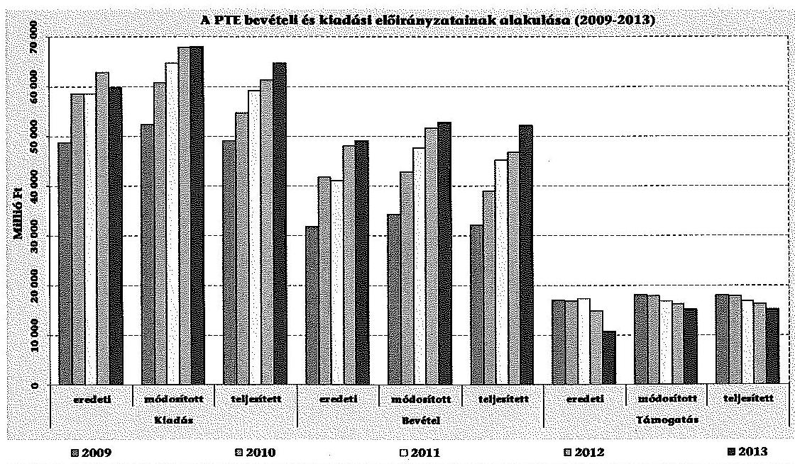
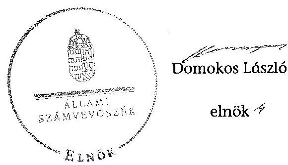
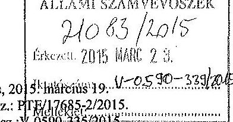
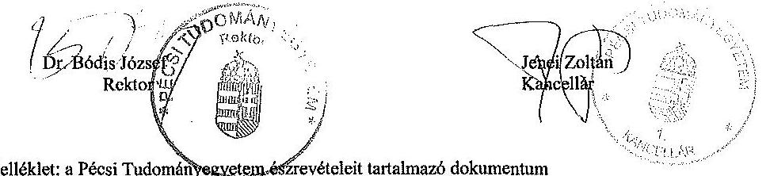
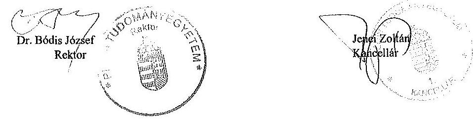
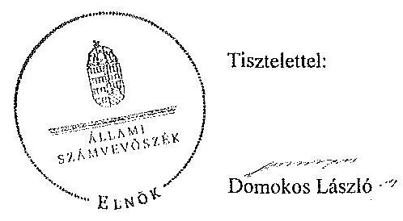

# ÁLLAMI   SZÁMVEVŐSZÉK 

## JELENTÉS

a Pécsi Tudományegyetem ellenőrzéséről - Az állami felsőoktatási intézmények gazdálkodásának, működésének ellenőrzése

---

# Állami Számvevőszék 

Iktatószám: V-0590-343/2015.
Témaszám: 1624
Vizsgálat-azonosító szám: V068916

## Az ellenőrzést felügyelte:

## Makkai Mária

felügyeleti vezető

## Az ellenőrzés végrehajtásáért felelős:

Kováts T. Balázs
ellenőrzésvezető
A számvevői munkaanyagok feldolgozását és a Jelentés összeállítását végezte:

Kováts T. Balázs
ellenőrzésvezető
Ernst László
számvevő tanácsos
L. Kovács János
számvevő

## Az ellenőrzést végezték:

Dr. Szima Mária
számvevő tanácsos

Hajdú Károlyné
számvevő tanácsos

Szilágyi Nándorné
számvevő

Ernst László
számvevő főtanácsos

Kozma Gábor
számvevő tanácsos

## Fülöp Istvánné

számvevő vezető főtanácsos
L. Kovács János
számvevő

Vojcsekné Szabó
Ágnes
számvevő tanácsos

A témához kapcsolódó eddig készített számvevőszéki jelentések:
címe
sorszáma
Jelentés az oktatási és kulturális ágazat irányítási rendszerének, működésének ellenőrzéséről
Jelentés a felsőoktatás oktatási infrastruktúra-fejlesztési programjának ellenőrzéséről
Jelentés az állami felsőoktatási intézmények érdekeltségébe tartozó gazdasági társaságok támogatásának és nyereségük hasznosulásának ellenőrzéséről

---

Jelentés a Szolnoki Főiskola ellenőrzéséről - Az állami felsőoktatási intézmények gazdálkodásának, működésének ellenőrzése
Jelentés a Pannon Egyetem ellenőrzéséről - Az állami felsőoktatási intézmények gazdálkodásának, működésének ellenőrzése
Jelentés a Károly Róbert Főiskola ellenőrzéséről - Az állami felsőoktatási intézmények gazdálkodásának, működésének ellenőrzése
Jelentés a Magyar Képzőművészeti Egyetem ellenőrzéséről - Az állami felsőoktatási intézmények gazdálkodásának, működésének ellenőrzése
Jelentés a Miskolci Egyetem ellenőrzéséről - Az állami felsőoktatási intézmények gazdálkodásának, működésének ellenőrzése
Jelentés a Széchenyi István Egyetem ellenőrzéséről - Az állami felsőoktatási intézmények gazdálkodásának, működésének ellenőrzése
Jelentés az Eszterházy Károly Főiskola ellenőrzéséről - Az állami felsőoktatási intézmények gazdálkodásának, működésének ellenőrzése
Jelentés a Magyar Táncművészeti Főiskola ellenőrzéséről - Az állami felsőoktatási intézmények gazdálkodásának, működésének ellenőrzése
Jelentés a Budapesti Műszaki és Gazdaságtudományi Egyetem ellenőrzéséről - Az állami felsőoktatási intézmények gazdálkodásának, működésének ellenőrzése

---

.

---

# TARTALOMJEGYZÉK 

BEVEZETÉS ..... 13
I. ÖSSZEGZŐ MEGÁLLAPÍTÁSOK, KÖVETKEZTETÉSEK, JAVASLATOK ..... 17
II. RÉSZLETES MEGÁLLAPÍTÁSOK ..... 25

1. Fenntartói és ágazati irányítási jogok gyakorlása ..... 25
2. Az egyetem belső kontrollrendszerének kialakítása és működtetése ..... 27
3. Az egyetem pénzügyi gazdálkodása ..... 35
3.1. A bevételi és kiadási előirányzatok alakulása, a pénzügyi egyensúlyt befolyásoló tényezők ..... 35
3.2. A döntéshozó szervek gazdálkodással kapcsolatos joggyakorlása ..... 42
3.3. Az oktatási és egyéb tevékenységek elkülönítése ..... 45
3.4. A bevételi és kiadási előirányzatok megállapítása, módosítása, az előirányzat-maradványok kezelése, felhasználással kapcsolatos adatszolgáltatások ..... 45
3.5. Kiadási előirányzatok felhasználása ..... 47
3.6. Bevételi előirányzatok beszedése ..... 51
3.7. A hazai forrásból finanszírozott projektekhez, feladatokhoz kapott forrásokkal való elszámolás ..... 52
4. Az egyetem vagyongazdálkodása ..... 52
4.1. A vagyongazdálkodás szabályozottsága ..... 52
4.2. Vagyonelemek kimutatása ..... 54
4.3. Vagyonelemekkel való gazdálkodás ..... 59
4.4. A vagyon változása ..... 62
5. A külső ellenőrzések által tett javaslatok hasznosulása ..... 66
5.1. ÁSZ ellenőrzések által tett javaslatok hasznosulása ..... 66
5.2. Az egyéb külső ellenőrzések javaslatainak hasznosulása ..... 67
6. Integritás kontrollok ..... 68

## MELLÉKLETEK

1. számú A Pécsi Tudományegyetem kiadási és bevételi előirányzatai, azok teljesítése a 2009-2013. években
2. számú A Pécsi Tudományegyetem kiadásainak, bevételeinek változása a 2009-2013. években
3. számú Kimutatás a Pécsi Tudományegyetem bevételeiről és kiadásairól, valamint adósságszolgálatáról a 2009-2013. években

---

4. számú A Pécsi Tudományegyetem mérlegadatai a 2009-2013. években
5. számú A Pécsi Tudományegyetem gazdálkodása szabályszerűségének értékelése a mintatételek alapján
6. számú A Pécsi Tudományegyetem rektorának észrevétele
7. számú A Pécsi Tudományegyetem rektorának észrevételére adott válasz

# FÜGGELÉK 

1. számú Az integritás érvényesítése érdekében kialakított és működtetett intézményi kontrollrendszer

---

# RÖVIDÍTÉSEK JEGYZÉKE 

## Törvények

Alaptörvény
Áht. 1
Áht. 2
ÁSZ tv.
Eisztv.
Feot.
Gt.
Info tv.
Kbt. 1
Kbt. 2
Nftv.
Nvtv.
Sztv.
Vtv.
Korm. rendeletek, határozatok
Áhsz.

Új Áhsz.
Ámr. 1
Ámr. 2
Ávr.
Ber.
Bkr.
Vtvr.
51/2007. (III. 26.) Korm. rendelet
50/2008. (III. 14.) Korm. rendelet
1001/2009. (I. 13.)

Magyarország Alaptörvénye (2011. április 25.)
1992. évi XXXVIII. törvény az államháztartásról (hatálytalan 2012. január 1-jétől)
2011. évi CXCV. törvény az államháztartásról
2011. évi LXVI. törvény az Állami Számvevőszékről
2005. évi XC. törvény az elektronikus információszabadságról (hatálytalan 2012. január 1-jétől)
2005. évi CXXXIX. törvény a felsőoktatásról (hatálytalan 2012. szeptember 1-jétől)
2006. évi IV. törvény a gazdasági társaságokról (hatálytalan 2014. március 15-től)
2011. évi CXII. törvény az információs önrendelkezési jogról és az információszabadságról
2003. évi CXXIX. törvény a közbeszerzésekről
2011. évi CVIII. törvény a közbeszerzésekről
2011. évi CCIV. törvény a nemzeti felsőoktatásról
2011. évi CXCVI. törvény a nemzeti vagyonról
2000. évi C. törvény a számvitelről
2007. évi CVI. törvény az állami vagyonról

249/2000. (XII. 24.) Korm. rendelet az államháztartás szervezetei beszámolási és könyvvezetési kötelezettségének sajátosságairól (hatálytalan 2014. január 1-jétől)
4/2013. (I. 11.) Korm. rendelet az államháztartás számviteléről
217/1998. (XII. 30.) Korm. rendelet az államháztartás működési rendjéről (hatálytalan 2010. január 1-jétől)
292/2009. (XII. 19.) Korm. rendelet az államháztartás működési rendjéről (hatálytalan 2012. január 1-jétől)
368/2011. (XII. 31.) Korm. rendelet az államháztartásról szóló törvény végrehajtásáról
193/2003. (XI. 26.) Korm. rendelet a költségvetési szervek belső ellenőrzéséről (hatálytalan 2012. január 1-jétől)
370/2011. (XII. 31.) Korm. rendelet a költségvetési szervek belső kontrollrendszeréről és belső ellenőrzéséről
254/2007. (X. 4.) Korm. rendelet az állami vagyonnal való gazdálkodásról
a felsőoktatásban részt vevő hallgatók juttatásairól és az általuk fizetendő egyes térítésekről
a felsőoktatási intézmények képzési, tudományos célú és fenntartói normatíva alapján történő finanszírozásáról a 2009. évi havi kereset-kiegészítés forrásigényének biztosításához szükséges intézkedésekről

---

Korm. határozat
1033/2009. (III. 17.)
Korm. határozat
1132/2010. (VI. 18.)
Korm. határozat
1083/2011. (IV. 12.)
Korm. határozat
1365/2011. (XI. 8.)
Korm. határozat
1122/2012. (IV. 25.)
Korm. határozat
1428/2012. (X. 28.)
Korm. határozat
1657/2012. (XII. 20.)
Korm. határozat
1259/2013. (V. 13.)
Korm. határozat

## Egyéb rendeletek

46/2009. (XII. 30.) PM rendelet

## További rövidítések

ÁSZ
ÁOK HÖK
egyetem/intézmény/PTE
EHÖK
EMMI
miniszter/fenntartó
FEUVE
FIR
Gazdálkodási jogkörök szabályzata

GT
IBSZ
IFT
Kincstár
MNV Zrt.
NEFMI
NGM
OH
OKM
PPP

SZMSZ
a 2009. évi államháztartási egyensúly megőrzéséhez szükséges intézkedésekről
a 2010. évi költségvetéssel összefüggő egyes feladatokról
a költségvetési főfelügyelők és költségvetési felügyelők kirendeléséről
a 2012. évi hiánycél tartását biztosító további feladatokról
a Széll Kálmán Terv kiterjesztése keretében megvalósítandó egyes intézkedésekről
a 2012. évi költségvetési egyenleg tartását biztosító intézkedésekről
a kormányzati stratégiai dokumentumok felülvizsgálatával kapcsolatos feladatokról
a túlzott hiány eljárás megszüntetése érdekében szükséges intézkedésekről
a kincstári számlavezetés és finanszírozás, a feladatfinanszírozási körbe tartozó előirányzatok felhasználása, valamint egyes államháztartási adatszolgáltatások rendjéről

Állami Számvevőszék
Általános Orvostudományi Kar Hallgatói Önkormányzat Pécsi Tudományegyetem
Egyetemi Hallgatói Önkormányzat
Emberi Erőforrások Minisztériuma
az oktatásért felelős miniszter.
folyamatba épített, előzetes, utólagos és vezetői ellenőrzés Felsőoktatási Információs Rendszer
A Pécsi Tudományegyetem kötelezettségvállalási, utalványozási, ellenjegyzési, igazolási és érvényesítési rendjéről szóló szabályzata
Gazdasági Tanács
Informatikai Biztonsági Szabályzat
Intézményfejlesztési Terv
Magyar Államkincstár
Magyar Nemzeti Vagyonkezelő Zrt.
Nemzeti Erőforrás Minisztérium
Nemzetgazdasági Minisztérium
Oktatási Hivatal
Oktatási és Kulturális Minisztérium
Public-Private Partnership (magán és közszféra együttműködése)
Szervezeti és Működési Szabályzat

---

# ÉRTELMEZŐ SZÓTÁR 

alapító
autonómia
állami felsőoktatási intézmény saját tulajdona
állami vagyon
állami vagyon hasznosítása

A központi költségvetési szerv alapítója az Országgyűlés, a Kormány vagy a miniszter. A felsőoktatási intézmények vonatkozásában az alapítói jogokat a felsőoktatásért felelős minisztérium gyakorolja.
A felsőoktatási intézmény Feot-ban, illetve Nftv-ben szabályozott önrendelkezése, amely biztosítja az intézmény önálló oktatási, kutatási, szervezeti és működési, valamint gazdálkodási tevékenységét
A felsőoktatási intézmény saját bevételének a költségek teljes körű levonása, - az adományozás és öröklés kivételével - a rendelkezésre bocsátott vagyon állagának megóvásáról, pótlásáról való gondoskodás után fennmaradt része terhére szerzett vagyona
A Vtv. 1. § (2) bekezdése szerint állami vagyonnak minősül:
a) az állami tulajdonban lévő ingó dolog, valamint a dolog módjára hasznosítható természeti erő,
b) az állami tulajdonban lévő termőföldekből álló, külön törvényben szabályozott Nemzeti Földalap,
c) az állami tulajdonban lévő - a b) pont hatálya alá nem tartozó - ingatlan,
d) az állami tulajdonban lévő értékpapír,
e) az államot megillető társasági részesedés és más vagyoni értékű jog.
(hatályos 2010. június 16-ig)
a) az állam tulajdonában lévő dolog, valamint a dolog módjára hasznosítható természeti erő,
b) az a) pont hatálya alá nem tartozó mindazon vagyon, amely vonatkozásában törvény az állam kizárólagos tulajdonjogát nevesíti,
c) az állam tulajdonában lévő tagsági jogviszonyt megtestesítő értékpapír, illetve az államot megillető egyéb társasági részesedés,
d) az államot megillető olyan immateriális, vagyoni értékkel rendelkező jogosultság, amelyet jogszabály vagyoni értékű jogként nevesít.
(hatályos 2010. június 17-től)
A Vtv. 23. § (1) bekezdése szerint: Az állami vagyont az MNV Zrt. maga kezeli, illetve szerződés - így különösen bérlet, haszonbérlet, szerződésen alapuló haszonélvezet, vagyonkezelés, megbízás - alapján központi költségvetési szervnek, természetes vagy jogi személynek, illetőleg jogi személyiséggel nem rendelkező gazdasági társaságnak hasznosításra átengedi.
(hatályos 2010. december 31-ig)

---

állami vagyon hasznosítására kötött szerződés
állami vagyon használója
állami vagyon értékesítése
állami vagyon kezelője /vagyonkezelő

Az állami vagyont az MNV Zrt. maga kezeli, vagy szerződés - így különösen bérlet, haszonbérlet, szerződésen alapuló haszonélvezet, vagyonkezelés, megbízás - alapján központi költségvetési szervnek, természetes vagy jogi személynek, vagy jogi személyiséggel nem rendelkező gazdálkodó szervezetnek hasznosításra átengedi.
(hatályos 2011. december 31-ig)
Az állami vagyont az MNV Zrt. maga kezeli, vagy szerződés - így különösen bérlet, haszonbérlet, megbízás - alapján központi költségvetési szervnek, természetes vagy jogi személynek, vagy jogi személyiséggel nem rendelkező gazdálkodó szervezetnek hasznosításra átengedi.
(hatályos 2012. január 1-jétől)
A Vtv. 23. § (2) bekezdése szerint: Az állami vagyon hasznosítására kötött szerződések elsődleges célja az állami vagyon hatékony működtetése, állagának védelme, értékének megőrzése, illetve gyarapítása, az állami és közfeladatok ellátásának elősegítése.
A Vtvr. 1. § (7) a) pontja szerint: Az a természetes személy, jogi személy, illetve jogi személyiséggel nem rendelkező gazdasági társaság, amely az MNV Zrt.-vel kötött szerződés alapján, bármely jogcímen (bérlet, haszonbérlet, vagyonkezelés, használat stb.) állami vagyont birtokol, használ, hasznosít.
(hatályos 2010. december 31-ig)
Az a természetes személy, jogi személy, illetve jogi személyiséggel nem rendelkező szervezet, amely, illetve aki törvény vagy szerződés alapján, bármely jogcímen (pl. bérlet, haszonbérlet, vagyonkezelési szerződés, használat stb.) állami vagyont birtokol, használ, szedi annak hasznait, hasznosít, ide nem értve a tulajdonosi jogok gyakorlóját.
(hatályos 2011. január 1 - 2011. december 31-ig)
Az a természetes vagy jogi személy, jogi személyiséggel nem rendelkező szervezet, aki, vagy amely törvény vagy szerződés alapján, bármely jogcímen (bérlet, haszonbérlet, használat stb.) állami vagyont birtokol, használ, szedi annak hasznait, hasznosít, ide nem értve a haszonélvezőt, a vagyonkezelőt és a tulajdonosi jogok gyakorlóját.
(hatályos 2012. január 1-jétől)
Állami vagyon tulajdonjogának bármely jogcímen történő, visszterhes átruházása. (Vtvr. 1. § (7) d) pont)
A Vtv. 23. § (1) bekezdése szerint: Az állami vagyont az MNV Zrt. maga kezeli, vagy szerződés - így különösen bérlet, haszonbérlet, szerződésen alapuló haszonélvezet, vagyonkezelés, megbízás - alapján központi

---

költségvetési szervnek, természetes vagy jogi személynek, illetőleg jogi személyiséggel nem rendelkező gazdasági társaságnak hasznosításra átengedi. (hatályos 2010. január 1 - 2010. december 31-ig)

Az állami vagyont az MNV Zrt. maga kezeli, vagy szerződés - így különösen bérlet, haszonbérlet, szerződésen alapuló haszonélvezet, vagyonkezelés, megbízás - alapján központi költségvetési szervnek, természetes vagy jogi személynek, illetőleg jogi személyiséggel nem rendelkező gazdálkodó szervezetnek hasznosításra átengedi. (hatályos 2011. január 1 - 2011. december 31-ig)
Az állami vagyont az MNV Zrt. maga kezeli, vagy szerződés - így különösen bérlet, haszonbérlet, megbízás - alapján központi költségvetési szervnek, természetes vagy jogi személynek, vagy jogi személyiséggel nem rendelkező gazdálkodó szervezetnek hasznosításra átengedi. Az állami vagyonra vonatkozóan az MNV Zrt. kizárólag az Nvtv-ben meghatározott személyekkel köthet vagyonkezelési szerződést.
(hatályos 2012. január 1-jétől)
A belső kontrollrendszer a kockázatok kezelése és tárgyilagos bizonyosság megszerzése érdekében kialakított folyamatrendszer, amely azt a célt szolgálja, hogy megvalósuljanak a következő célok:
a) a működés és gazdálkodás során a tevékenységeket szabályszerűen, gazdaságosan, hatékonyan, eredményesen hajtsák végre,
b) az elszámolási kötelezettségeket teljesítsék, és
c) megvédjék az erőforrásokat a veszteségektől, károktól és nem rendeltetésszerű használattól.
A módszer a működési
 és a felhalmozási költségvetés bevételeinek és kiadásainak, ezek egyenlegeinek elkülönített, majd összevont kimutatását alkalmazza valamely költségvetési intézmény pénzügyi helyzetének megítéléséhez. Kiemelten mutatja be a finanszírozási műveletek egyenlege nélküli és az azt magába foglaló pénzügyi pozíciót, valamint a tőketörlesztéssel, értékpapír beváltással csökkentett működési jövedelmet.
Az értékelés a pénzügyi kapacitás fogalmát helyezi a középpontba.
Az államháztartás központi alrendszerébe tartozó költségvetési szerveknél a módosított bevételi és kiadási előirányzatok és azok teljesítésének a Kormány rendeletében meghatározott tételekkel korrigált különbözete az előirányzat-maradvány. (Áht. 2. § (1) bekezdés m) pontja)
előirányzat-maradvány

A Feot. 7. § (2) és az Nftv. 4. § (2) bekezdése szerint az, aki az alapítói jogot gyakorolja, ellátja a felsőoktatási

---

finanszírozási műveletek nélküli pozíció

Gazdasági Tanács
hároméves fenntartói megállapodás
információs és kommunikációs rendszer
intézményfejlesztési terv
integritás
kincstári biztos
intézmény fenntartásával kapcsolatos feladatokat.
A CLF módszer szerint számított működési és felhalmozási tevékenység pénzügyi egyenlegének összevont értéke. Megmutatja, hogy a költségvetési intézmény bevételei fedezetet biztosítottak-e a kiadásokra. A finanszírozási műveletek nélküli (GFS) pozíció alapján a pénzügyi helyzetet akkor tekintettük megfelelőnek, ha az adott év működési és felhalmozási bevételei fedezetet nyújtottak az adott év működési és felhalmozási kiadásaira.
A felsőoktatási intézmény javaslattevő, véleményező, a stratégiai döntések előkészítésében részt vevő, és a döntések végrehajtásának ellenőrzésében közreműködő szerve
Az állami felsőoktatási intézmények központi költségvetési támogatására három éves fenntartói megállapodást kell kötni az állami felsőoktatási intézmény és a fenntartó között. A fenntartói megállapodás tartalmazza a felsőoktatási intézmény által meghatározott hároméves időszakra vállalt teljesítménykövetelményeket, továbbá az állandó jellegű támogatási részeket, valamint a változó jellegű támogatások megállapításának jogcímeit. A változó elemű támogatás évenkénti elszámolási kötelezettséggel kerül meghatározásra.
A költségvetési szerv vezetője köteles olyan rendszereket kialakítani és működtetni, melyek biztosítják, hogy a megfelelő információk a megfelelő időben eljutnak az illetékes szervezethez, szervezeti egységhez, illetve személyhez.
A szenátus fogadja el az intézményfejlesztési tervet. Az intézményfejlesztési tervben kell meghatározni a fejlesztéssel, a fenntartó által a felsőoktatási intézmény rendelkezésére bocsátott vagyon hasznosításával, megóvásával, elidegenítésével kapcsolatos elképzeléseket, a várható bevételeket és kiadásokat. Az intézményfejlesztési tervet középtávra, legalább négyéves időszakra kell elkészíteni, évenkénti bontásban meghatározva a végrehajtás feladatait. Az intézményfejlesztési terv része a foglalkoztatási terv. A foglalkoztatási tervben kell meghatározni azt a létszámot, amelynek keretei között a felsőoktatási intézmény megoldhatja feladatait. (Feot. 27. § (3) bekezdés)
Az integritás olyasvalakit vagy valamit jelöl, aki vagy ami romlatlan, sértetlen, feddhetetlen. Az integritás elvek, értékek, cselekvések, módszerek, intézkedések konzisztenciáját jelenti: olyan magatartásmódot, amely meghatározott értékeknek megfelel.
A kincstári biztos kijelölését az államháztartásért felelős miniszternél a Kincstár kezdeményezi. A kincstári

---

kincstári költségvetés
kockázatkezelési rendszer
kontrollkörnyezet
kontrolltevékenység
költségvetési főfelügyelő, felügyelő
biztos köteles figyelemmel kísérni megbízatásának időpontjától kezdve a költségvetési szerv tervezését, gazdálkodását, beszámolását, a jogszabályokban előírt feladatainak ellátását, feltárni azokat az okokat, amelyek a tartós fizetésképtelenséghez vezettek, a szükséges intézkedések azonnali végrehajtására irányuló intézkedési tervet készíteni, azonnali intézkedéseket kezdeményezni és írásbeli utasításokat kiadni a tartozásállomány felszámolására, a gazdálkodás egyensúlyának biztosítására, a követelések behajtására. (Ávr. 116-117. §)
A központi költségvetésről szóló törvény elfogadását követően a fejezetet irányító szerv az államháztartás központi alrendszerébe tartozó költségvetési szerv és a fejezeti kezelésű előirányzat kiemelt előirányzatait, valamint az elkülönített állami pénzalapok és a társadalombiztosítás pénzügyi alapjai jogszabályi előírás szerinti bevételeit és kiadásait kincstári költségvetés kiadásával állapítja meg. (Áht. $_{1}$ 24. § (3) bekezdés, Áht. $_{2}$ 28. § (2) bekezdés, Ávr. 31. § (2) bekezdés)
Irányítási eszközök és módszerek összessége, melynek elemei a szervezeti célok elérését veszélyeztető tényezők (kockázatok) azonosítása, elemzése, csoportosítása, nyomon követése, valamint szükség esetén a kockázati kitettség mérséklése.
A kontrollkörnyezet a költségvetési szerv vezetőinek a szervezeti célok elérését segítő kontrollok kialakításával és működtetésével, korszerűsítésével kapcsolatos magatartását, a kontrollpontokról érkező információkra való reagálását jelenti.
Azok az elvek, politikák és eljárások, amelyeket a kockázatok meghatározása és a szervezet céljainak elérése érdekében alakítanak ki.
A költségvetési szerv vezetője köteles a szervezeten belül kontrolltevékenységeket kialakítani, amelyek biztosítják a kockázatok kezelését, hozzájárulnak a szervezet céljainak eléréséhez.
Az államháztartásért felelős miniszter a Kormány irányítása alá tartozó fejezetet irányító szervhez, a Kormány irányítása vagy felügyelete alá tartozó költségvetési szervhez, valamint az elkülönített állami pénzalapok és a társadalombiztosítás pénzügyi alapjai kezelő szerveihez költségvetési főfelügyelőt, felügyelőt rendelhet ki. A költségvetési főfelügyelő, felügyelő a gazdálkodás költségvetés-politikával való összhangja és a takarékos, szabályszerű, eredményes működés érdekében a Kormány rendeletében meghatározott intézkedéseket tehet, így különösen előzetesen véleményezi a kötelezettségvállalásra irányuló eljárásokat és a nagy összegű kötelezettségvállalások tekintetében

---

kisebbségi jogokat biztosító részesedés
maximális hallgatói létszám
mértékadó befolyást biztosító részesedés
minisztérium
minősített többséget biztosító részesedés
monitoring
működési jövedelem
normatív költségvetési támogatás felsőoktatási intézmények működéséhez
normatív támogatások
kifogással élhet. (Áht. 2 39. § (1)-(2) bekezdés)
A részesedés mértéke legalább 5\%. (Gt. 49. §)
Az a felsőoktatási intézmény alapító okiratában, működési engedélyében meghatározott hallgatói létszám, ameddig terjedően a felsőoktatási intézmény - figyelembe véve a hallgatók fogadásához és az oktatói tevékenység folytatásához rendelkezésre álló személyi feltételeket, helyiségeket és eszközöket - valamennyi évfolyamára számítva, teljes kihasználtsággal működve hallgatói jogviszonyt létesíthet.
A részesedés mértéke legalább 20\%, de 50\%-nál kisebb. (Sztv. 3. § (2) bekezdés 4. pont)
A felsőoktatásért felelős minisztérium, amely 2009-től 2010 májusáig az OKM, 2010 májusától 2012 májusáig a NEFMI, 2012 májusától az EMMI volt.
A minősített befolyásszerző az ellenőrzött társaságban a szavazatok legalább hetvenöt százalékával rendelkezik. (Gt. 52. § (2) bekezdés)
A különböző szintű szervezeti célok megvalósításához szükséges folyamatok figyelemmel kísérése, melynek során a releváns eseményekről és tevékenységekről (együtt: folyamatokról) rendszeres jelleggel, strukturált, döntéstámogató információkhoz jutnak a szervezet vezetői.
A folyó bevételek és folyó kiadások egyenlege. Azt mutatja, hogy a folyó bevételek fedezetet nyújtanak-e a folyó kiadásokra.
A felsőoktatási intézmények működéséhez biztosított normatív költségvetési támogatás lehet
a) hallgatói juttatásokhoz nyújtott,
b) képzési,
c) tudományos célú,
d) fenntartói,
e) egyes feladatokhoz nyújtott
támogatás. A központi költségvetésből biztosított normatív költségvetési támogatásra - a d) pontban meghatározott normatív költségvetési támogatás kivételével - a felsőoktatási intézmények azonos feltételek alapján válnak jogosulttá. Az a)-e) pontokban meghatározott jogcímek - az a) és e) pontban meghatározott jogcímek kivételével - nem jelentenek felhasználási kötöttséget. (Feot. 127. § (3) bekezdés)
Az ellenőrzési időszakban hatályos költségvetési törvények 3. sz. mellékletében megjelölt közoktatási hozzájárulások, az 5. sz. mellékletében megjelölt központosított előirányzatok, továbbá a 8. sz. mellékletében megjelölt normatív, kötött felhasználású támogatások

---

saját bevétel
szenátus
tárgyévi pénzügyi pozíció
együttesen.
Az államháztartáson kívüli források - beleértve minden olyan, az Európai Uniótól származó támogatást, amelyhez nem az állami költségvetésen keresztül jut a felsőoktatási intézmény, továbbá a szakképzési hozzájárulási fizetési kötelezettség teljesítéseként elszámolt forrásokat is, ide nem értve az állami vagyon értékesítésének ellenértékét - valamint a Kutatási és Technológiai Innovációs Alapból származó bevételek.
A felsőoktatási intézmény, döntést hozó és a döntés végrehajtását ellenőrző testülete. (Feot. 20. § (1) bekezdés, Nftv. 12. § (1)-(3) bekezdés)
A működési és felhalmozási bevételek, valamint kiadások egyenlege a finanszírozási műveletek egyenlegének figyelembe vételével.

---

.

---

# JELENTÉS 

## a Pécsi Tudományegyetem ellenőrzéséről Az állami felsőoktatási intézmények gazdálkodásának, működésének ellenőrzése

## BEVEZETÉS

Az ÁSZ Stratégiája ${ }^{1}$ alapértékeinek egyike, hogy az államháztartás komplex folyamatainak átláthatósága érdekében rendszerszemléletű/holisztikus megközelítésű, egymásra épülő, a szinergiahatást kihasználó, összefoglaló értékelésre lehetőséget adó ellenőrzéseket végez. Az államháztartás központi alrendszerébe tartozó felsőoktatási intézmények ellenőrzése során az Állami Számvevőszék értékeli azok pénzügyi-gazdasági helyzetét, feltárja a működésükben rejlő kockázatokat, ezzel előmozdítja a közpénzügyek átláthatóságát, rendezettségét.

Az állami felsőoktatási intézmények gazdálkodását - az Áht. ${ }_{1,2}$ előírásai mellett - a felsőoktatásról szóló 2005. évi CXXXIX. törvény (Feot.), valamint a nemzeti felsőoktatásról szóló 2011. évi CCIV. törvény (Nftv.) előírásai határozták meg.

Magyarország Nemzeti Reform Programja keretében, a Széll Kálmán Terv 2020-ig a 30-34 évesek körében, a felsőfokú vagy annak megfelelő végzettséggel rendelkezők arányának 30,3 %-ra való növelését irányozta elő, amely a 2010. évhez képest 4,6 % pontos növekedési célkitűzést jelent. A rendezett gazdasági környezet, az önállósággal élni tudó, felelős, elszámoltatható intézményi gazdálkodói magatartás elengedhetetlen feltétele a kitűzött szakmai célok elérésének.

Az ellenőrzés célja annak megállapítása, hogy szabályos volt-e az állami felsőoktatási intézmény pénzügyi és vagyongazdálkodása, biztosított volt-e a vagyonnal való felelős gazdálkodás követelményének érvényesülése, jogszabályi előírásoknak megfelelően működött-e a belső kontrollrendszer; az irányító szerv tevékenysége a jogszabályi előírásoknak megfelelt-e.

Ennek keretében értékeltük a Pécsi Tudományegyetemnél:

- a fenntartói és az ágazati irányítási jogok gyakorlása előírásoknak való megfelelőségét;
- az intézmény belső kontrollrendszere jogszabályoknak megfelelő kialakítását és működtetését;

[^0]
[^0]:    ${ }^{1}$ Állami Számvevőszék: Stratégia. Az Állami Számvevőszék hivatalos stratégiai dokumentum rendszere 2011-2015. 2012. december. http://www.asz.hu/strategia/asz-strategia/asz-strategia-2011.pdf.

---

- az intézmény döntéshozó szerveinek joggyakorlása jogszabályoknak való megfelelőségét; az intézmény oktatási és egyéb (gyakorlati és kutatási) tevékenységei elkülönítését, átláthatóságát, illetve pénzügyi gazdálkodása szabályszerűségét;
- az intézmény vagyongazdálkodása előírásoknak való megfelelőségét;
- az ellenőrzött időszakban végzett külső (ÁSZ, fenntartói, KEH1, kincstári) ellenőrzések által tett javaslatok hasznosulását;
- az intézmény korrupcióval szembeni veszélyeztetettségének csökkentése érdekében az integritási szemlélet érvényesülését a gazdálkodási folyamatokban.

Az ellenőrzés várható hasznosulása: Az ellenőrzés eredményének hasznosulásaként képet kapunk a Pécsi Tudományegyetemen kialakult pénzügyi helyzetről; a kormány által kirendelt költségvetési (fő) felügyelői rendszer működésének tapasztalatairól; az oktatási és egyéb tevékenységek és költségelszámolások elhatárolásáról, átláthatóságáról és szabályosságáról. A felsőoktatási intézmények gazdálkodási szabadságának pénzügyi és vagyoni helyzetre gyakorolt hatásairól, a vagyonnal való felelős, értékmegőrző gazdálkodás érvényesüléséről, továbbá a belső kontrollrendszer működéséről. Az ellenőrzés az ellenőrzött számára visszajelzést ad a gazdálkodása kereteinek kialakításáról, a működésében fellépő hiányosságokról, javaslataival hozzájárul azok kiküszöböléséhez és a jó kormányzáshoz. A törvényalkotás számára összegzett tapasztalatok állnak rendelkezésre a felsőoktatási intézmények döntéseinek, gazdálkodásának szabályszerűségéről, amelyek alapján - indokolt esetben - jogszabály-módosítás kezdeményezhető. Az integritás kultúra kialakítása hozzájárul az elszámoltathatóság és átláthatóság érvényesítéséhez, egyben támogatja a szervezet védettségét a korrupciós kitettséggel szemben, valamint annak megelőzése is irányítottabbá válik. A társadalom számára jelzi, hogy közpénz nem maradhat ellenőrizetlenül, az ÁSZ értékteremtő rend kialakításához és megőrzéséhez hozzájáruló tevékenysége pozitív hatással lesz a szervezetről kialakított összkép formálásában.

Az ellenőrzés típusa szabályszerűségi ellenőrzés
Az ellenőrzött időszak 2009. január 1. - 2013. december 31. (az eredményszemléletű számvitel bevezetésével kapcsolatban az ellenőrzött időszak vége: 2014. április 30.)

Az ellenőrzéssel érintett szervezetek: az Emberi Erőforrások Minisztériuma és a Pécsi Tudományegyetem

Az ellenőrzés jogszabályi alapját az Állami Számvevőszékről szóló 2011. évi LXVI. törvény 1. § (3) bekezdése, az 5. § (3)-(6) bekezdései, 33. § (7) bekezdése, valamint az Államháztartásról szóló 2011. évi CXCV. törvény 61. § (2) bekezdésének előírásai képezik.

Az ellenőrzés az INTOSAI által kiadott nemzetközi standardok figyelembe vételével, az ellenőrzési programban foglalt értékelési szempontok szerint történt.

---

A pénzügyi és vagyongazdálkodás terén az egyes területek szabályszerű működését mintavétellel ellenőriztük, ez alapján a sokaságokban előforduló hibás tételek arányát becsültük. A jogszabályoknak és a belső előírásoknak megfelelőnek, azaz szabályszerűnek tekintettük az adott kiadási előirányzat felhasználását, bevétel beszedését, mérlegtétel értékelését, amennyiben a minta ellenőrzésének eredménye alapján 95 %-os
 bizonyossággal a teljes sokaságban a hibás tételek aránya kisebb volt, mint 10%, nem megfelelőnek értékeltük, ha a hibás tételek aránya a 10%-ot meghaladta. Kockázatot, illetve magas kockázatot jeleztünk, amennyiben egy adott terület vonatkozásában a minta alapján a teljes sokaságban nem volt teljes körűen biztosított a jogszabályoknak és a belső szabályzatoknak megfelelő működés. A mintatételek kiértékelését az 5. számú melléklet tartalmazza. Az egyetem a 2009-2010. évekre vonatkozó feladattal (kötelezettségvállalással) terhelt előirányzat-maradvány összegével megegyező tételes analitikus listát nem tudott az ellenőrzés rendelkezésére bocsátani, ezért a terület szabályszerű működését csak a 2011-2013. évekre vonatkozóan tudtuk mintavétellel ellenőrizni.

A belső kontrollrendszer kialakításának és működtetésének értékelése során a jogszabályi előírások mellett az Ámr.; 145/A. § (1) és (3) bekezdése, az Ámr. ${ }_{2}$ 155. § (1) és (3) bekezdése, valamint a Bkr. 5. § (1) bekezdése alapján figyelembe vettük az államháztartásért felelős miniszter által közzétett irányelvekben és módszertani útmutatókban ${ }^{2}$ foglaltakat is. A belső kontrollrendszert az értékelés során legalább 85%-os megfelelőség esetén megfelelőnek, legalább 70%-os megfelelőség esetén részben megfelelőnek, 70%-os megfelelőség alatt pedig nem megfelelőnek minősítettük.

A pécsi felsőoktatás története az egyetem 1367-es alapításáig nyúlik vissza. A jelenlegi egyetemi struktúra többlépcsős beolvadási folyamat eredményeképpen jött létre. A PTE az ország egyik legnagyobb, regionális vezető szereppel bíró egyeteme, ahol tíz karon, a felsőoktatás teljes spektrumán folyik képzés. Az Általános Orvostudományi Kar, az Állam- és Jogtudományi Kar mellett, bölcsészettudományi, művészeti, közgazdaságtudományi, természettudományi, valamint műszaki és egészségtudományi képzési lehetőséget biztosítanak a hallgatók számára.

[^0]
[^0]:    ${ }^{2}$ 1/2009. (IX. 11.) PM irányelv, Pénzügyminisztérium Belső Kontroll Kézikönyv 2010.

---

A PTE főbb gazdálkodási, vagyoni és létszám adatait az alábbi táblázat mutatja be:

| Megnevezés | Föbb gazdálkodási és vagyoni adatok (M Ft) |  |  |  |  |  |
| :--: | :--: | :--: | :--: | :--: | :--: | :--: |
|  | 2009. év | 2010. év | 2011. év | 2012. év | 2013. év | $\begin{gathered} 2013 / 2009 . \\ \text { (\%) } \end{gathered}$ |
| KIADÁSI FŐÖSSZEG | 49163,5 | 54592,2 | 59176,3 | 61325,7 | 64693,9 | 131,6 |
| BEVÉTELI FŐÖSSZEG | 50246,5 | 57150,6 | 62106,5 | 63032,1 | 67335,3 | 134,0 |
| Költségvetési támogatások | 18014,5 | 17812,6 | 16855,2 | 16276,5 | 15178,8 | 84,3 |
| Saját és átvett bevételek | 32232,0 | 39338,0 | 45251,3 | 46755,6 | 52156,5 | 161,8 |
| Támogatások aránya (\%) | 35,9 | 31,2 | 27,1 | 25,8 | 22,5 | - |
| Mérlegfőösszeg | 44118,4 | 50345,9 | 54316,0 | 56634,9 | 65030,6 | 147,4 |
| Jellemző létszámadatok* (fő) |  |  |  |  |  |  |
| Oktatói létszám | 1584 | 1569 | 1652 | 1644 | 1596 | 100,8 |
| Hallgatói létszám | 29032 | 27963 | 26699 | 24031 | 21819 | 75,2 |
| *Oktatói és hallgatói létszám az október 15-i statisztikában szereplő adat |  |  |  |  |  |  |

A PTE kiadásai az ellenőrzött időszak alatt 31,6%-kal, a bevételei összességében 34,0%-kal nőttek. A bevételeken belül a költségvetési támogatás aránya 28,5% volt átlagosan és az ellenőrzött időszakban 15,7%-kal csökkentek, míg a saját és átvett bevételek 61,8%-kal nőttek. A hallgatói létszám 7213 fővel, (24,8%-kal) esett vissza, az oktatók létszáma pedig 1584 főről 1596 főre, 12 fővel (0,8%-kal) nőtt.

A Pécsi Tudományegyetem (PTE) a 2009-2013. évek között önállóan működő és gazdálkodó központi költségvetési szerv volt, az ellenőrzött időszakban átalakulás nem érintette. Az egyetem 2010-ben vette át a Baranya Megyei Kórházat, az intézmény költségvetése a PTE költségvetésébe olvadt, a kórház vagyonát az egyetem kezelte tovább.

Az ÁSZ a 2011. évi LXVI. törvény 29. §-a szerint a jelentéstervezetet megküldte a Pécsi Tudományegyetem rektorának és az Emberi Erőforrások Minisztériuma miniszterének egyeztetésre. A Pécsi Tudományegyetem rektorának észrevételét és az arra adott választ a 6-7. számú melléklet tartalmazza. Az Emberi Erőforrások Minisztériuma minisztere az ÁSZ tv. 29. § (2) bekezdésében foglalt észrevételezési jogával nem élt, a törvényes határidőn belül észrevételt nem tett.

---

# I. ÖSSZEGZŐ MEGÁLLAPÍTÁSOK, KÖVETKEZTETÉSEK, JAVASLATOK 

Az ellenőrzött időszak alatt a felsőoktatásért felelős miniszter a jogszabályi előírásoknak megfelelően gyakorolta a fenntartói feladatait. A fenntartó az előírásoknak megfelelően közreműködött a PTE éves költségvetésének tervezésében, meghatározta és közölte az egyetemmel költségvetésének kereteit, a kiemelt előirányzatok főösszegeit. Az ellenőrzött időszak minden évében ellenőrizte és elfogadta a PTE elemi költségvetéseit, illetve költségvetési beszámolóit. A jogszabályi kötelezettségének eleget téve ellenőrizte a felsőoktatási intézmény gazdálkodását, működésének törvényességét, hatékonyságát. Az egyetem által beküldött SZMSZ módosítást véleményezte. A fenntartó a jogszabályoknak megfelelően gyakorolta az egyetem felső vezetőinek kinevezésével, illetve megbízásával kapcsolatos jogosultságait. Az egyetem és a fenntartó a jogszabályoknak megfelelően megkötötte a 2008-2010. évekre szóló három éves fenntartói megállapodást, melyben rögzítették a fenntartó által összeállított kritériumcsomagból választott teljesítménymutatókat, meghatározták az évente elvárt célértékeket. Az egyetem a teljesítménycélok éves alakulását és az éves támogatás felhasználását az éves költségvetési beszámoló keretében bemutatta, a beszámolókat a fenntartó elfogadta.

A minisztérium az ágazati irányítási feladatait a 2009-2013. években nem látta el teljes körűen. Elmaradt az oktatási ágazatra vonatkozóan a nemzetgazdasági miniszter irányításával és az oktatásért felelős miniszter részvételével, a kormányhatározatban előírt szervezeti és feladat-ellátási felülvizsgálati program kidolgozása. A felsőoktatási törvény rendelkezései ellenére a miniszter nem készíttetett a felsőoktatás rendszere vonatkozásában elfogadott középtávú fejlesztési tervet. A minisztérium az OH-val a FIR biztonságos üzemeltetéséhez, az adatok védelméhez szükséges alapvető kontrollokat a 2012. év végéig nem teljes körűen alakította ki. A FIR átfogó megújítása után 2012 szeptemberétől a nyitott jogviszonnyal rendelkező hallgatók és az oktatók vonatkozásában rögzített adatok már teljes körűek. A fenntartó a FIR biztonságos üzemeltetéséhez, az adatok védelméhez szükséges kontrollokat a 2012. év végén kialakította, ugyanakkor a 2012. szeptembertől működő FIR-t jogszabályi megfelelőségi, adatbiztonsági, illetve informatikai szempontból 2013. év végéig nem ellenőrizte.

A PTE belső kontrollrendszerének kialakítása és működtetése részben megfelelő volt. Ezen belül a monitoring rendszer megfelelő, a kontrollkörnyezet, a kockázatkezelés, az információ és kommunikáció részben megfelelő volt, a kontrolltevékenységek működése nem megfelelő volt.

Az intézmény a kontrollkörnyezetét a jogszabályi előírásoknak részben megfelelően alakította ki. Az egyetem 2013-ra javulást ért el a kontrollkörnyezetének kialakításában, azonban a belső szabályozó eszközei több esetben nem kerültek aktualizálásra és továbbra sem voltak minden tekintetben összhangban a hatályos jogszabályokkal.

---

Az ellenőrzött időszakban az intézmény kockázatkezelési rendszerének kialakítása és működése összességében részben megfelelő volt, mivel az egyetem dokumentált kockázat-azonosítást 2012-ig nem végzett, továbbá az egyes kockázatokkal kapcsolatban szükséges intézkedéseket, valamint azok teljesítésének folyamatos nyomon követésének módját nem határozta meg.

A kontrolltevékenységgel kapcsolatos szabályozási keret kialakítása megfelelő volt, azonban a kontrolltevékenységek alkalmazása nem volt megfelelő. Ezek a folyamatba épített, illetve a vezetői ellenőrzés nem megfelelő működésére voltak visszavezethetőek. A kontroll tevékenységek működtetésében a rendszeres és nem rendszeres személyi juttatások, a külső személyi juttatások, a dologi kiadások, a felhalmozási kiadások előirányzatainak felhasználásánál, az ellátottak juttatásainál, a működési bevételek beszedésénél állapítottunk meg hiányosságokat. A megállapított hiányosságok a gazdálkodási jogkörök gyakorlásával és a közbeszerzési jogszabályok alkalmazásával függtek össze.

A PTE információs és kommunikációs rendszere részben megfelelő volt, mivel nem megfelelő tartalommal és rendszerességgel tette közzé honlapján a jogszabály által előírt adatokat, ezzel megsértette közzétételi kötelezettségét.

Az ellenőrzött időszakban a monitoring rendszer kialakítása és működtetése a jogszabályi előírásoknak megfelelt. A belső ellenőrzés függetlensége az ellenőrzési időszakban biztosított volt. Az ellenőrzött időszakban a belső ellenőrzés által előírt intézkedési tervek alapján tett intézkedések utóellenőrzése részben történt meg. A belső ellenőrzés javaslatainak egy része nem vagy nem határidőben hasznosult. A belső ellenőrzés a kontrolltevékenységekkel kapcsolatos hiányosságokat, illetve a jogszabálysértő gyakorlatokat több esetben jelezte az egyetem vezetése felé.

Az intézmény pénzügyi egyensúlya - a jelentős előrehozott és kiegészítő támogatás következtében - az ellenőrzött időszakban biztosított volt, azonban az egyetem az ellenőrzött időszakban évről évre likviditási nehézségekkel küzdött.

Az egyetem a likviditás biztosítása érdekében - a 2011-2013. években 3085,0 M Ft - a finanszírozási tervtől eltérő, előrehozott támogatást igényelt és kapott, valamint a Felsőoktatási Struktúraátalakítási Alapból további 1000,0 M Ft támogatásban részesült. Az egyetem teljesített kiadásai az ellenőrzött időszak alatt 15 530,4 M Ft-tal (31,6%-kal) növekedtek, melyre nagyrészt a Baranya Megyei Önkormányzattól az egészségügyi szakellátás területi ellátási kötelezettségének átvétele volt hatással. A teljesített saját bevételek 2009-2013 között 19 924,5 M Ft-tal (61,8%-kal) nőttek, melyre az OEP finanszírozás és kiegészítő támogatások voltak hatással. A támogatások - a hallgatói létszám jelentős csökkenéséből adódóan - 2835,7 M Ft-tal (15,7%-kal) csökkentek. A hallgatók létszáma az ellenőrzött időszakban 7213 fővel (24,8%-kal) csökkent. A lejárt szállítói tartozások 2009-2013 között 1667,5 M Ft-tal (56,8%-kal), ezen belül 2009-2010 között 3277,2 M Ft-tal (111,7%-kal) növekedtek. A lejárt szállítói tartozások 2009-2013 közötti magas aránya jelezte az egyetem folyamatossá vált évközi fizetési problémáit. Az ellenőrzött időszakban történt jelentős OEP beavatkozás (9867,8 M Ft támogatás) ellenére, az egyetembe olvadt egészségügyi intézményekben termelődő működési hiány újra és újra likviditási

---

gondokat okozott. További pénzügyi nehézséget okozott, hogy a PPP szolgáltatási kiadások a 2009-2013 között 1330,2 M Ft-tal (191,6%-kal) nőttek. Az államháztartásért felelős miniszter az egyetemhez 2009-től kincstári biztosokat jelölt ki, majd a Kormány 2011. április 12-től költségvetési felügyelő kinevezéséről döntött. Az egyetem pénzeszközeinek év végi állománya - a szállítói kötelezettségek felhalmozódása miatt - egyik évben sem nyújtott fedezetet a rövid lejáratú kötelezettségek rendezésére (pénzeszköz likviditási mutató).

Az egyetem pénzügyi gazdálkodása nem minden tekintetben volt szabályszerű.

Az egyetem szenátusának gazdálkodással kapcsolatos joggyakorlása az ellenőrzött időszakban részben felelt meg a Feot. és az Nftv. előírásainak. A szenátus nem fogadta el az egyetem képzési programját, továbbá az egyes szabályzatok fenntartónak való 15 napon belüli megküldési kötelezettségét részben teljesítette. A nem kötött felhasználású normatív költségvetési támogatások és a kötött felhasználású normatív költségvetési támogatások felhasználásával kapcsolatos döntések megfeleltek a jogszabályi előírásoknak. A PTE a kiadási és bevételi előirányzatok tervezése során a jogszabályokban és a fenntartó által kiadott tervezési irányelvekben foglaltaknak megfelelően járt el. Az ellenőrzött években az oktatási és egyéb tevékenységeket az alapító okirattal és a hatályos szakfeladat-renddel összhangban elkülönítették, az ellátott feladatok rendszere átlátható volt.

Az egyetem az előirányzat-módosításokat
 szabályszerűen hajtotta végre, a számviteli nyilvántartásokon a módosításokat átvezette. A 2009-2010. évekre vonatkozó analitikus listák hiánya miatt az előirányzat-maradvány megállapítása és felhasználása szabályszerűségének ellenőrzése nem volt lehetséges, a 2011-2013. években az előirányzat-maradványok megállapítása és felhasználása megfelelt a jogszabályi előírásoknak.

A rendszeres és nem rendszeres személyi juttatások előirányzatának felhasználása során a pénzügyi elszámolások, valamint a gazdálkodási jogkörök gyakorlása nem felelt meg a jogszabályokban és belső szabályokban előírtaknak. A hiányosságok nagy része a gazdálkodási jogkörök gyakorlásának elmaradásához kötődött. Rendszeres hiba volt a kötelezettségvállalások (pénzügyi) ellenjegyzésének elmaradása. Több esetben nem állt rendelkezésre a bérelszámolást (kifizetést) alátámasztó jelenléti ív. Egyedi hiba volt, hogy nem volt az ellenjegyzőnek érvényes meghatalmazása, valamint nem állt rendelkezésre írásban kötelezettségvállalási dokumentum.

A külső személyi juttatások előirányzatai terhére megkötött megbízási szerződések tartalma, teljesítése, számfejtése nem felelt meg a jogszabályoknak és belső szabályoknak. Rendszeres hiba volt, hogy a kötelezettségvállalást és az ellenjegyzést - a kiadott jogok visszavonása miatt - nem az arra jogosult személy, továbbá a teljesítések igazolását - kijelölés hiányában - szintén nem az arra jogosult személy végezte el.

A dologi kiadások előirányzatainak felhasználása a pénzügyi elszámolások, valamint a gazdálkodási jogkörök gyakorlása tekintetében nem teljes körűen felelt meg a jogszabályokban és belső szabályozásokban előírtaknak. A dologi

---

kiadások felhasználása során az egyetem több esetben megsértette a közbeszerzési eljárás lefolytatásának kötelezettségét. A felhalmozási kiadások felhasználása során a pénzügyi elszámolások, valamint a gazdálkodási jogkörök gyakorlása tekintetében nem volt biztosított a jogszabályoknak és belső szabályoknak való megfelelőség. Rendszeres hiba volt, hogy nem történt meg a kötelezettségvállalás ellenjegyzése, továbbá nem történt utalványozás. Továbbá a közbeszerzési eljárások és a szállítói kifizetések tartalmi összhangjának ellenőrzése alapján megállapítható volt, hogy az egyetem az ellenőrzött években a beszerzési eljárásainál több esetben megsértette a közbeszerzési eljárás lefolytatásának kötelezettségét.

Az egyetem az ellátotti juttatások megállapítása, kifizetése során nem tartotta be a belső szabályzatokban és a jogszabályokban foglaltakat. A gazdálkodási jogkörök gyakorlása során rendszeres hiba volt, hogy a jogszabályi előírások ellenére nem történt meg a kiadások teljesítés igazolása, továbbá az érvényesítési és az utalványozási feladatokat sem végezték el.

A működési bevételek beszedése a pénzügyi elszámolások, valamint a gazdálkodási jogkörök gyakorlása tekintetében megfelelt a jogszabályoknak és a belső szabályoknak.

Az intézményi térítési díjak, költségtérítések megállapítása nem felelt meg a jogszabályi és belső előírásoknak. Az egyetem az ellenőrzött időszakban az egyes díjbevételeket és költségtérítéseket nem alapozta meg önköltségszámítással.

Az immateriális javak, tárgyi eszközök bérbeadása, értékesítése megfelelt a jogszabályoknak és a belső szabályoknak.

A hazai forrásból finanszírozott projektekhez kapott költségvetési támogatásokat szabályszerűen használta fel az egyetem.

A PTE vagyona a 2009. év végi 44118,4 M Ft-ról 2013. év végére 65030,6 M Ft-ra, 47,4 %-kal nőtt. A PTE vagyonának változása legnagyobb mértékben a befektetett eszközökön belül a beruházások, felújítások értékének emelkedése miatt következett be.

Az egyetem vagyongazdálkodásának szabályozottsága nem volt teljes körűen megfelelő. Az egyetem a jogszabályokban foglaltak ellenére az ellenőrzött időszakban éves vagyongazdálkodási terveket nem készített. Az ellenőrzött időszakban a vagyongazdálkodással kapcsolatos belső szabályzatokkal rendelkezett, azok alapvetően megfeleltek a jogszabályokban megfogalmazott követelményeknek.

Az intézmény vagyongazdálkodása és vagyonkimutatása nem teljes körűen volt szabályszerű, több esetben is megsértette a jogszabályokban és a belső szabályozásokban előírtakat.

Az ellenőrzött időszakban az analitikus és a főkönyvi nyilvántartások, valamint a könyvviteli mérleg adatainak egyezősége biztosított volt. Az egyetem a saját, valamint a rendelkezésére bocsátott vagyon elkülönített nyilvántartásáról gondoskodott. A leltározást az ellenőrzött időszakban a jogszabályi előírásoknak és - a tárgyi eszközök kétévenkénti teljes körű mennyiségi leltározása kivételével - a belső szabályoknak megfelelően végezte el, a könyvviteli mérleg leltárral történő alátámasztása biztosított volt. A 2009-2013. időszakban minden évben történt selejtezés, aminek az előkészítése és végrehajtása a belső szabályzatban rögzítetteknek megfelelően történt.

Az ellenőrzött időszakban a mérlegtételek tartalma, besorolása, értékelése nem teljes körűen felelt meg a jogszabályokban és belső szabályozásokban előírtaknak, de a hibák összege nem érte el a jelentős összeget. A követelések tartalma, besorolása, értékelése nem felelt meg a jogszabályoknak és belső szabályoknak, mivel nem volt szabályos az értékvesztés elszámolása. A kötelezettségek, egyéb aktív pénzügyi elszámolások és egyéb passzív pénzügyi elszámolások tartalma, besorolása, értékelése nem teljes körűen felelt meg a jogszabályoknak és belső szabályoknak, mivel egyedi hibákat állapítottunk meg.

Az egyetem tulajdonosi joggyakorlása az ellenőrzött időszakban megfelelt a jogszabályokban előírtaknak. A gazdasági társaságai és üzletrészei az ellenőrzött időszakban nem befolyásolták negatívan a gazdálkodását, nem finanszírozott egy gazdasági társaság esetében sem veszteséget és pótbefizetést.

A PTE határidőre szabályosan elvégezte az eredményszemléletű számvitel bevezetésével kapcsolatos feladatait.

Az ÁSZ három korábbi ellenőrzése során a felsőoktatás témakörében kilenc javaslatot fogalmazott meg a felsőoktatásért felelős minisztériumnak (OKM, NEFMI, EMMI). A minisztérium a javaslatokra intézkedési terveket készített, amelyek összesen tíz intézkedést tartalmaztak. Az intézkedések közül hármat (késéssel) megvalósítottak, hét nem valósult meg.

A minisztérium elvégezte a felsőoktatási intézményrendszer kapacitás kihasználtságának felmérését. A felsőoktatási intézmények érdekeltségébe tartozó gazdasági társaságok ellenőrzése során feltárt hiányosságok kiküszöbölésére a minisztérium felszólította az intézményeket, amelyek a megtett intézkedésekről tájékoztatták a minisztériumot. A minisztérium tájékoztatást kért az érintett felsőoktatási intézményektől az 50% alatti intézményi részesedéssel működő gazdasági társaságok tevékenységének felülvizsgálatáról, működésük indokoltságáról és eredményességéről, valamint az intézményi részesedés megszüntetéséről és ütemezéséről.

Nem valósult meg a minisztérium felügyelete alá tartozó szervezetek feladatellátásának javítására számszerűsíthető mutatószámokon alapuló kritériumok és középtávú célrendszer kidolgozása. A felsőoktatási ágazat középtávú stratégiáját sem készítették el. Nem intézkedtek az oktatási infrastruktúra-fejlesztési programok előkészítési folyamatának hiányosságai miatti felelősség megállapítására. Nem hasznosították az állami felsőoktatási intézmények kapacitáskihasználtságával kapcsolatos felmérés eredményeit, így nem tettek intézkedést a felsőoktatási infrastruktúra közép- és hosszútávon történő hasznosítására. Nem alakítottak ki a PPP projektek támogatásához kapcsolódó követelményrendszert. Nem került sor az oktatási infrastruktúra-fejlesztési programok lebonyolításával kapcsolatos hiányosságok (kedvezőtlen feltételű szerződéskötés és

---

kockázatmegosztás) miatti felelősség megállapítására. Nem dolgoztatták ki az állami felsőoktatási intézményekkel azok gazdasági társaságai szakmai feladatellátásának és gazdaságossági eredményességének mérését biztosító mutatószámokat és értékelési rendszert.

Az ellenőrzött időszakban az egyetemnél végzett egyéb tizenhárom külső ellenőrzés közül 10-et a fenntartó (OKM, NEFMI, EMMI), 1-et az NFM, 2-t pedig a KEHI folytatott le. Az ellenőrzések során összesen 34 javaslat született, az egyetem a javaslatok végrehajtására 5 intézkedési tervet készített. A külső ellenőrzések javaslatai közül hetet nem hajtottak végre, 18 határidőn túl teljesült, kilencet határidőre végrehajtottak.

Az egyetem az ellenőrzött időszakban erőfeszítéseket tett az integritási szemlélet fejlesztésére, valamint a korrupciós kockázatok csökkentésére, a 2013. évben önként részt vett az ÁSZ integritási felmérésében.

Az Állami Számvevőszékről szóló 2011. évi LXVI. törvény 33. § (1) bekezdésében foglaltak értelmében a jelentésben foglalt megállapításokhoz kapcsolódó intézkedési tervet köteles az ellenőrzött szervezet vezetője összeállítani, és azt a jelentés kézhezvételétől számított 30 napon belül az ÁSZ részére megküldeni. Amennyiben az intézkedési tervet határidőben nem küldi meg a szervezet, vagy az nem elfogadható, az ÁSZ elnöke a hivatkozott törvény 33. § (3) bekezdés a)-b) pontjaiban foglaltakat érvényesítheti.

Az ellenőrzés intézkedést igénylő megállapításai és javaslatai:

# az emberi erőforrások miniszterének: 

Az egyetem belső kontrollrendszerének kialakítása és működtetése részben felelt meg az Áht.1.2, az Ámr.1.2, a Ber. és a Bkr. előírásainak. Azon belül a monitoring rendszer megfelelő, a kontrollkörnyezet, a kockázatkezelési, valamint az információs és kommunikációs rendszer részben megfelelő, a kontrolltevékenységek működése nem megfelelő volt. Az egyetem pénzügyi gazdálkodása és vagyongazdálkodása nem minden tekintetben volt szabályszerű.

Javaslat:
Intézkedjen az Nftv. 73. § (3) bekezdés e) pontja által meghatározott munkáltatói jogkörében eljárva a belső kontrollrendszer kialakításával és működtetésével, valamint a pénzügyi és vagyongazdálkodással összefüggésben feltárt szabálytalanságok tekintetében a munkajogi felelősséggel kapcsolatos körülmények kivizsgálására irányuló eljárás megindítása iránt, és a vizsgálat eredményének ismeretében tegye meg a szükséges intézkedéseket.

---

# a Pécsi Tudományegyetem rektorának ${ }^{3}$ : 

1. A belső kontrollrendszer egyes területeinek kialakítása és működtetése részben felelt meg a jogszabályi előírásoknak:
a kontrollkörnyezet kialakítása részben volt megfelelő, mivel az egyetem az ellenőrzött időszakban nem teljes körűen rendelkezett a jogszabályokban kötelezően előírt belső szabályzatokkal, a szabályzatokat nem minden esetben aktualizálták a jogszabályi változásokkal összhangban. Mindez nem biztosította az Ámr. ${ }_{1}$ 145/D. §-ában, az Ámr. ${ }_{2}$ 156. §-ában, továbbá a Bkr. 6. §-ában foglalt előírások érvényesülését;
a kontrolltevékenységek működtetése nem felelt meg az Ámr. ${ }_{1}$ 145/A. §-a, az Ámr. ${ }_{2}$ 158. §-a és a Bkr. 8. §-a előírásainak, amely pénzügyi és vagyongazdálkodást érintő szabálytalanságokat eredményezett;
a kockázatkezelési rendszer kialakítása és működtetése részben volt megfelelő, mivel - az Ámr. ${ }_{1}$ 145/C. § (2) bekezdése, az Ámr. ${ }_{2}$ 157. § (2) bekezdése és a Bkr. 7. §-a követelményeivel ellentétben - a kockázatok felmérése és értékelése során a kockázati válaszlépéseket, a szükséges intézkedéseket nem határozták meg;
az információs és kommunikációs rendszer működtetése részben felelt meg az Eisztv. 6. §-ában, az Info tv. 37. §-ában, az Ámr. ${ }_{2}$ 22. sz. mellékletében, az Ávr. 8. sz. mellékletében előírtaknak, mivel az egyetem nem megfelelő tartalommal és rendszerességgel tette közzé honlapján a jogszabály által előírt adatokat.

Javaslat:
Intézkedjen a jogszabályoknak megfelelő belső kontrollrendszer működtetése érdekében - az ellenőrzött időszak óta bekövetkezett esetleges jogszabályi változásokra figyelemmel - a kontrollkörnyezet, a kontrolltevékenységek, a kockázatkezelési, valamint az információs és kommunikációs rendszer ellenőrzés által feltárt hiányosságainak megszüntetéséről.
2. A pénzügyi gazdálkodás területén nem volt szabályszerű a rendszeres és nem rendszeres, valamint a külső személyi juttatások, a dologi és felhalmozási kiadások, az ellátottak juttatásai előirányzatainak felhasználása, mivel a gazdálkodási jogkörök gyakorlása nem felelt meg az Ámr. ${ }_{1}$ 134.-136. §-ai, az Ámr. ${ }_{2}$ 74. §-a, az Ámr. ${ }_{2}$ 76-78. §-ai, az Ávr. 55. § és 57-59. §-ai előírásainak.

A térítési díjakat, költségtérítéseket - az Áhsz. 9. sz. melléklet 12. pontjában előírtak ellenére - nem alapozták meg önköltségszámítással.

A közbeszerzések alkalmazásánál több esetben megsértették a Kbt. ${ }_{1}$ 240. § (1) bekezdésében és a Kbt. ${ }_{2}$ 119. §-ában a közbeszerzési eljárás lefolytatására előírt szabályokat.

[^0]
[^0]:    ${ }^{3}$ Az Nftv. 2014. július 24-től hatályos módosítását követően a belső kontrollrendszer kialakításáért és működtetéséért, továbbá a pénzügyi és vagyongazdálkodásért felelős, valamint a közbeszerzési szerződést aláíró személy felett munkáltatói jogkört gyakorló személynek.

---

Javaslat:
a) Intézkedjen a gazdálkodási jogkörök szabályszerű gyakorlásának érvényesítéséről.
b) Intézkedjen az intézményi térítési díjak és költségtérítések önköltségszámítással történő megalapozásáról a hatályos jogszabályoknak megfelelően.
c) Intézkedjen az Nftv. 13. § (2) bekezdésében ${ }^{4}$ meghatározott munkáltatói jogkörében eljárva a közbeszerzési szabálytalansághoz kapcsolódóan a munkajogi felelősség kivizsgálására irányuló eljárás megindítása iránt, és a vizsgálat eredményének ismeretében tegye meg a szükséges intézkedéseket.
3. A vagyongazdálkodás szabályszerűségét érintő hiányosság volt,
 hogy az egyetem 2009-2013. évek között - a Feot. 27. § (6) bekezdés d) pontjában és az Nftv. 12. § (3) bekezdés gb) pontjában előírtak ellenére - nem rendelkezett a szenátus által elfogadott vagyongazdálkodási tervvel.

Az Áhsz. 37. § (7) bekezdésében és a belső szabályzatban előírtak ellenére az intézmény nem biztosította a tárgyi eszközök teljes körében a kétévenkénti mennyiségi leltározás lefolytatását.

Egy kincstári bankkártyával felvett összeg elszámolása során az annak alapjául szolgáló megbízási szerződéseket felhatalmazással nem rendelkező személy írta alá, az elszámoláshoz mellékelt utalványrendeleteken szereplő teljesítés igazoló nem volt jogosult a teljesítés igazolására. Mindez nem biztosította az Áht. 100/C. § (3) bekezdése, az Ámr. 2 74. § és 76-80 §-ai előírásainak érvényesülését.

Javaslat:
a) Intézkedjen a vagyongazdálkodási terv jogszabályi előírásoknak megfelelő elkészítéséről, kezdeményezze annak elfogadását és jóváhagyását.
b) Intézkedjen a tárgyi eszközök teljes körének a szabályzatnak megfelelő mennyiségi leltározásáról.
c) intézkedjen az Nftv. 13. § (2) bekezdésében ${ }^{5}$ meghatározott munkáltatói jogkörében eljárva a kincstári bankkártya használatával felvett összeg szabálytalan elszámolásához kapcsolódóan a munkajogi felelősség kivizsgálására irányuló eljárás megindítása iránt, és a vizsgálat eredményének ismeretében tegye meg a szükséges intézkedéseket.

[^0]
[^0]:    ${ }^{4}$ 2014. július 24-től az Nftv. 13/A. § (2) bekezdés e) pontja
    ${ }^{5}$ 2014. július 24-től az Nftv. 13/A. § (2) bekezdés e) pontja

---

# II. RÉSZLETES MEGÁLLAPÍTÁSOK 

## 1. Fenntartói és ágazati irányítási jogok GYAKORLÁSA

Az állam nevében a PTE fenntartói jogait ${ }^{6}$ az ellenőrzött időszakban az oktatásért felelős miniszter gyakorolta.

A miniszter alapítói és fenntartói feladatait az ellenőrzött időszakban a jogszabályi előírásoknak megfelelően látta el.

A miniszter az alapítói jogosultságai keretében szabályszerűen adta ki az egyetem jogszabályi és szervezeti változásoknak megfelelően módosított ${ }^{7}$ alapító okiratát. Az előírásoknak megfelelően közreműködött a PTE éves költségvetésének tervezésében, meghatározta és közölte az egyetemmel költségvetésének kereteit, a kiemelt előirányzatok főösszegeit. Az ellenőrzött időszak minden évében ellenőrizte és elfogadta az PTE költségvetési, illetve gazdálkodási beszámolóit. A jogszabályi kötelezettségének eleget téve ellenőrizte a felsőoktatási intézmény gazdálkodását, működésének törvényességét, hatékonyságát. Az egyetem szakmai munkájának eredményességét a fenntartó az éves gazdálkodásról készült beszámoló elfogadása keretében tudomásul vette.

A fenntartó az egyetem által megküldött módosított SZMSZ-t a jogszabály által előírt határidőn belül ${ }^{8}$ véleményezte.

Az egyetemnek az ellenőrzött időszakban két intézményfejlesztési terve volt hatályban. A 2012-ig hatályos IFT-t 2008-ban fogadta el a szenátus. Az új, 2013-2016. évekre vonatkozó IFT-t a szenátus 2012. június 28-án fogadta el, majd határidőben megküldték a fenntartónak véleményezésre.

Az ellenőrzött időszakban az egyetemhez két rektort neveztek ki, a 2007. július 1. és 2010. június 30. közötti, valamint a 2010. július 1. és 2014. június 30. közötti időszakra.

A fenntartó a jogszabályoknak megfelelően gyakorolta az egyetem felső vezetőinek kinevezésével, illetve megbízásával kapcsolatos jogosultságait.

A fenntartó a 2008. január 1-jétől hivatalban lévő gazdasági főigazgató megbízatását 2010. szeptember 23-án visszavonta, mivel a gazdasági főigazgató ellen büntető eljárás indult. Az új gazdasági főigazgató megbízottként végezte munkáját 2010. augusztus 1. és 2011. február 28. között, rektori megbízás alapján, majd a posztra kiírt pályázat elbírálása után 2011. március 1-től 2015. február 28-ig a

[^0]
[^0]:    ${ }^{6}$ Feot. 7. § (4) bekezdése, Nftv. 4. § (4) bekezdése.
    ${ }^{7}$ Az ellenőrzött időszakban a fenntartó összesen négy alkalommal módosította a PTE alapító okiratát.
    ${ }^{8}$ Nftv. 74. § (4) bekezdése.

---

Feot. 115. § (2) bekezdés g) pontjának megfelelően minisztertől kapta meg a megbízását.

A PTE és a fenntartó 2007. december 13-án a jogszabályban előírtnak megfelelően ${ }^{9}$ megkötötte a 2008-2010. évekre szóló három éves fenntartói megállapodást, amely tartalmazta az egyetem által elérendő teljesítménykövetelményeket.

A megállapodásban a PTE a teljesítménymutatókat öt területen határozta meg (oktatás, kutatás, gazdálkodás, vezetés, együttműködés). A kitűzött 16 célt 2009-ben kettővel kiegészítették. Az egyetem 14 célnál elérte vagy meghaladta a tervezett mértéket. A hároméves fenntartói megállapodásban elfogadott teljesítménymutatók időarányos teljesítését a PTE 2008. és 2010. között évente értékelte az éves gazdálkodási beszámoló készítésekor, amelyet a fenntartó minden évben elfogadott. A teljesítménymutatók a tervezetthez képest 2008-ban 78%-osan, 2009-ben 80%-osan, 2010-ben 89%-osan teljesültek. Lényeges problémaként jelent meg a három éves megállapodás záró beszámolója szerint az, hogy az egészségügy finanszírozási problémái 2009-től kezdődően fokozatosan kedvezőtlen kényszerpályára terelték a gazdasági folyamatokat. Továbbá lényeges probléma volt az is, hogy 2010-ig az egyetemre beiratkozott hallgatók létszáma folyamatosan csökkent.

A miniszter az ágazati irányítási feladatait az ellenőrzött időszakban nem látta el teljes körűen.

A miniszter - a vonatkozó jogszabályokban ${ }^{10}$ foglaltak ellenére - nem készített a felsőoktatás rendszere vonatkozásában elfogadott középtávú fejlesztési tervet.

A Kormány a FIR működéséért felelős szervnek az OH-t jelölte ki. Az elektronikus nyilvántartás működtetéséhez szükséges informatikai hátteret és az adatok feldolgozását az OH az Educatio Kft. bevonásával látta el. A felsőoktatási ágazati információs rendszer oktatásszakmai fejlesztési koncepcióját a fenntartó elkészítette.

A FIR Fejlesztési Stratégia című dokumentumot 2011. november 15-én írta alá az EMMI Felsőoktatásért és tudománypolitikáért felelős helyettes államtitkára, az OH elnöke és az Educatio Kft. ügyvezetője.

A minisztérium az OH-val a FIR biztonságos üzemeltetéséhez, az adatok védelméhez szükséges alapvető kontrollokat a 2012. év végéig nem teljes körűen alakította ki. A FIR átfogó megújítása után a 2012 szeptemberétől - a nyitott jogviszonnyal rendelkező hallgatók és az oktatók vonatkozásában - rögzített adatok teljesek voltak. A visszamenőleges adatok tisztítása és beküldése folyamatban volt. A fenntartó a FIR biztonságos üzemeltetéséhez, az adatok védelméhez szükséges kontrollokat 2012. év végén kialakította.

[^0]
[^0]:    ${ }^{9}$ Feot. 133/A. § (4)-(6) bekezdései.
    ${ }^{10}$ Feot. 104. § (1) bekezdés b) pont és az Nftv. 64. § (3) bekezdés a) pont.

---

Az OKM Ellenőrzési Főosztálya a FIR kialakításának és működésének jogszabályi megfelelőségét 2010-ben ellenőrizte az OKM-nél, az OH-nál és az Educatio Kft.-nél.

A jelentés megállapította, hogy a FIR kialakítása és működése csak részben felelt meg a jogszabályi előírásoknak, hiányzott a szakmai célkitűzések egyértelmű és pontos meghatározása. Ezek hiányában a FIR megfelelősége nem volt mérhető. A fontosabb nyilvántartási funkciók részben voltak működőképesek, az intézmények hiányos adatszolgáltatása veszélyeztette a FIR-től elvárt szolgáltatások teljesülését.

A fenntartó a 2012. szeptembertől működő FIR-t jogszabályi megfelelőségi, adatbiztonsági, illetve informatikai szempontból 2013. december 31-ig nem ellenőrizte.

Elmaradt az oktatási ágazatra vonatkozóan az 1365/2011. (XI. 8.) Korm. határozatban - a nemzetgazdasági miniszter irányításával és az ágazatért felelős miniszter részvételével - előírt szervezeti és feladat-ellátási felülvizsgálati program kidolgozása.

A kormányhatározat a minisztérium számára a hatékony felsőoktatási feladatellátás érdekében közreműködési kötelezettséget írt elő a követelmények és feltételek (feladatmutatók, mennyiségi és minőségi teljesítménymutatók, létszám- és költségnormák) kialakításában, a felsőoktatási intézménystruktúra, illetve az intézményi belső működés korszerűsítési javaslatainak megtételében. A minisztérium tájékoztatása szerint a 2012. február 20-ig határidős feladatot nem végezték el, mert nem rendelkeztek információval a kormányhatározat 1. pontjában megjelölt miniszteri munkabizottság működéséről, valamint az általa kidolgozott módszertani útmutatóról, amely a munkálatokhoz adott volna iránymutatást ${ }^{11}$.

# 2. AZ EGYETEM BELSŐ KONTROLLRENDSZERÉNEK KIALAKÍTÁSA ÉS MŰKÖDTETÉSE 

A PTE belső kontrollrendszerének kialakítása és működtetése az ellenőrzött időszakban részben felelt meg a vonatkozó jogszabályi előírásoknak. Ezen belül a monitoring rendszer megfelelő, a kontrollkörnyezet, a kockázatkezelés, az információs és kommunikációs rendszer részben megfelelő volt, a kontrolltevékenységek működése nem megfelelő volt.

Az ellenőrzött időszak folyamán a belső kontrollrendszer szabályozottsága és a kockázatkezelés terén 2011-től fokozatos javulást értek el. A kontrolltevékenységek működésében azonban lényeges előrelépés nem történt.

A rektor 2009-2013-ban évente értékelte a belső kontrollok kialakítását és működését, valamint erről nyilatkozatot tett. A rektor által tett nyilatkozatok csak részben voltak összhangban az ellenőrzés megállapításaival. A 2009 és 2010 évben tett nyilatkozatok nem tartalmaztak elegendő információt a kialakított kontrollkörnyezetről és annak működtetéséről, 2009-ben a további fejlesztési te-

[^0]
[^0]:    ${ }^{11}$ Az 1365/2011. (XI. 8.) Korm. határozat 1. pontjának felelősei az NGM miniszter, a Miniszterelnökséget vezető államtitkár, valamint a KIM miniszter voltak.

---

rületeket tételesen nem határozták meg, 2011-ben a szabályozási hiányosságokat teljes körűen nem szüntették meg.

A PTE a kontrollkörnyezetét a jogszabályi előírásoknak részben megfelelően alakította ki. Az egyetem 2013-ra javulást ért el a kontrollkörnyezetének kialakításában, azonban a belső szabályozó eszközei több esetben nem kerültek aktualizálásra és továbbra sem voltak teljes körűen összhangban a hatályos jogszabályokkal.

Az egyetem az ellenőrzött időszakban rendelkezett a jogszabályokban előírt, a közfeladatokat és az alaptevékenységeket tartalmazó, aktualizált alapító okirattal.

A PTE elkészítette és szükség esetén aktualizálta az oktatási, kutatási, szervezeti, működési és gazdálkodási autonómiáját biztosító intézményi SZMSZ-t, azonban az nem minden tekintetben felelt meg a jogszabályi előírásoknak.

Az SZMSZ, illetve mellékletei a jogszabályi előírások ${ }^{12}$ ellenére 2012-ig nem tartalmazták a PTE vagyonkezelésébe illetve tulajdonosi jogkörébe tartozó gazdálkodó szervezetek felsorolását. A feltárt hiányosságot a PTE 2012. december 13-án az SZMSZ 10. sz. mellékletének („Gazdálkodó szervezetek alapításának és a gazdálkodó szervezetekben való részesedés szerzésének szabályai a Pécsi Tudományegyetemen") gazdálkodó szervezetekkel történő kiegészítésével pótolta. Az SZMSZ az ellenőrzött időszakban az előírások ellenére ${ }^{13}$ nem tartalmazta a szervezeti egységek engedélyezett létszámadatait.

Az Nftv. 117. § (8) bekezdése értelmében a PTE Gazdasági Tanács (GT) elnökének és tagjainak megbízását 2013. január 1-én megszűntették. Az Nftv. 14. § (4) bekezdésének felhatalmazása alapján az SZMSZ-ben előírtak szerint a GT új összetételben működhet. Az új GT megalakítására nem került sor, a hatályos SZMSZ 2013-ban is tartalmazta a GT tagjaira vonatkozó előírásokat, valamint hatályban volt a GT Ügyrendje ${ }^{14}$ is.

A PTE foglalkoztatási követelményrendszere az előírásoknak megfelelően szabályozta az oktatókkal, kutatókkal, tanárokkal és egyéb közalkalmazottakkal szemben támasztott előmeneteli követelményeket, az alkalmazás feltételeit, az értékelés szempontjait, a díjazás elveit, az oktatók tanításra fordítandó idejét, továbbá ennek, valamint a kutatásra és egyéb feladatra fordított munkaidő megosztását.

Az egyetem 2012. január 1-jétől nem rendelkezett hatályos etikai elvárásokat tartalmazó etikai kódexszel, ezért - a jogszabályi előírások ${ }^{15}$ ellenére - a szervezet minden szintjén nem kerültek meghatározásra az etikai elvárások.

[^0]
[^0]:    ${ }^{12}$ Ámr. ${ }_{1}$ 13/A. § (3) bekezdés d) pontja, Ámr. 2 20. § (2) bekezdés d) pontja, és az Ávr. 13. § (1) bekezdés d) pontja.
    ${ }^{13}$ Ámr. 13/A. § (3) bekezdés e) pontja, Ámr. 2 20. § (2) bekezdés e) pontja, és az Ávr. 13. § (1) bekezdés e) pontja.
    ${ }^{14}$ Az SZMSZ 17. számú melléklete.
    ${ }^{15}$ Bkr. 6. § (1) bekezdés c) pontja.

---

A PTE
 elkészítette az etikai elvárásokat tartalmazó etikai kódexének tervezetét, amelynek egyeztetése az egyetemen belül megtörtént, a szenátus általi elfogadása azonban az ellenőrzött időszakban nem történt meg.

Az egyetem belső szabályozásait több esetben nem aktualizálták a jogszabályi, illetve belső változásoknak megfelelően, így azok nem minden tekintetben voltak összhangban a hatályos jogszabályokkal és belső szabályzatokkal.

Az egyetem 2006. december 14-től hatályos számviteli politikáját csak a 2011. december 16-án hatályba léptetett új számviteli politikával helyezte hatályon kívül. A szenátus által jóváhagyott 2006. december 14-én hatályba lépett számlarendet 2011. december 16-ig nem aktualizálták. Az eszközök és források 2000. december 21-én elfogadott értékelési szabályzatát 2011-ig nem aktualizálták. A 2005. február 17-től 2011. december 15-ig hatályban lévő pénztári és pénzkezelési szabályzatot nem aktualizálták. A PTE 2005. szeptember 22-én hatályba lépett önköltség számítási szabályzatát - annak hatályba lépése óta - nem aktualizálta.

Az egyetem belső szabályzatainak egy része az ellenőrzött időszakban nem teljes körűen felelt meg a vonatkozó jogszabályoknak és belső előírásoknak.

Az alapító okirat és az SZMSZ 2009-ben és 2010-ben is változott, ezeknek a változásoknak az átvezetése a Számviteli politikában nem történt meg.

Az értékelési szabályzat 2012. július 1-jéig nem határozta meg követeléstípusonként a minősítés szempontjait és a dokumentálás rendjét ${ }^{16}$.

A bizonylati szabályzat - a jogszabályi előírások ${ }^{17}$ ellenére - nem tartalmazta a bizonylatok megőrzésének módját, idejét, helyét, nyilvántartásának rendszerét és felelősét.

A pénztári és pénzkezelési szabályzatból az előírások ${ }^{18}$ ellenére hiányzott az intézmény által igénybe vehető kincstári kártya típusait, a felhasználás eljárásrendjét meghatározó szabályok, továbbá a készpénzben és a bankszámlán tartott pénzeszközök közötti forgalomnak az Sztv. 14. § (8) bekezdésben előírt szabályai. A 2011. augusztus 31-én hatályba lépett, a készpénzkímélő fizetési eszközök használatáról szóló 5/2011-es GF utasítás már tartalmazta a kincstári kártyák típusait, a használatára jogosultak körét, a használattal kapcsolatos eljárásrendet. A szenátus által jóváhagyott új pénztári és pénzkezelési szabályzat 2011. december 16-án lépett hatályba, amely megfelelt a jogszabályi követelményeknek.

Az összeférhetetlenségi szabályok - a jogszabályi előírások ${ }^{19}$ ellenére - 2011-2013-ban nem lettek teljes körűen meghatározva, ezért nem tartalmazták, hogy az érvényesítő az Ámr. 80. § (1), és az Ávr. 60. § (1) előírása szerint ugyanazon gazdasági esemény tekintetében nem lehet azonos a kötelezettségvállalásra jogosult, és a teljesítést igazoló személlyel.

[^0]
[^0]:    ${ }^{16}$ Áhsz. 8. § (17) bekezdés d) pont.
    ${ }^{17}$ Sztv. 161. § (2) d) pontja.
    ${ }^{18}$ Sztv. 14. § (8) bekezdése, valamint a 46/2009. (XII. 30.) PM rendelet 23. § (9) bekezdése és 26. és 29. §-ai.
    ${ }^{19}$ Ámr. 2 20. § (3) a) pontja, Ávr. 13. § (2) bekezdés a) pontja.

---

Az egyetem a jogszabályi előírásoknak ${ }^{20}$ megfelelően belső eljárásrendben szabályozta a beszerzéseivel kapcsolatos eljárásokat. A PTE 2011. július 1-ig hatályos közbeszerzési szabályzata megfelelt a Kbt. előírásainak. Ezt követően a szenátus 2011. június 23-án jóváhagyta a közbeszerzési eljárással és közbeszerzési eljárás nélkül lebonyolított beszerzési eljárások szabályzatát, melyet 2012-ben és 2013-ban is aktualizáltak. A szabályzat azonban nem felelt meg maradéktalanul a jogszabályokban előírt követelményeknek ${ }^{21}$. A közbeszerzések eljárásrendje nem volt részletesen kidolgozva, általános eljárásrendet tartalmazott. Nem tartalmazta az értékelő bizottság határozatképességének feltételeit, a felelőst és a határidőt az egyes eljárási cselekmények vonatkozásában. Nem volt szabályozva, hogy a közbeszerzési szerződések megkötésére a PTE nevében kik jogosultak, illetve nem volt egyértelmű, hogy a bizottság javaslata alapján a közbeszerzési eljárás eredményéről szóló döntést ki, vagy mely testület jogosult meghozni.

Az egyetem közbeszerzési eljárással és közbeszerzési eljárás nélkül lebonyolított beszerzési eljárásainak szabályzatát 2013-ban az EMMI véleményezte. A közbeszerzési szabályzattal kapcsolatban megállapított hiányosságokat a felsőoktatásért és tudománypolitikáért felelős helyettes államtitkár 2013. szeptember 26-ai levelében jelezte, amely 90 napos határidőt szabott a szabályzat átdolgozására. Az ellenőrzött időszak végéig - a jogszabályi előírások ${ }^{22}$ ellenére - intézkedési terv nem készült.

A minisztérium megállapítása szerint a közbeszerzési eljárás és közbeszerzési eljárás nélkül bonyolított beszerzési eljárások egy szabályzatba történő szabályozása nehezítette az áttekinthetőséget és érthetőséget, továbbá nem követelte meg a közbeszerzési jogszabályok alkalmazását.

A PTE a jogszabályi előírásoknak megfelelően szabályozta a pénzügyi és vagyongazdálkodási folyamatok folyamatba épített, előzetes, utólagos és vezetői ellenőrzés szabályait. A PTE - a Bkr. hatályba lépését követően - 2012-től a belső kontroll kézikönyvben határozta meg az ellenőrzési nyomvonalak kialakításánál alkalmazott, azonosított tevékenységcsoportokat és folyamatokat. A szabálytalanságok kezelésének eljárásrendjét a FEUVE szabályzat hatályon kívül helyezését követően, a jogszabályoknak megfelelve 2012-től a PTE szabálytalanságok kezelésének szabályzatában írta elő.

Az erőforrásokkal való szabályszerű és hatékony gazdálkodáshoz kialakított teljesítménykövetelményeket alapvetően a 2007. december 13-án három éves fenntartói megállapodásban rögzítették 2008-2010-re. A kialakított mutatószámokat alkalmazták, a teljesítésükről beszámoltak az intézményfenntartó felé.

Az ellenőrzött időszakban az intézmény kockázatkezelési rendszerének kialakítása és működése összességében részben megfelelő volt.

[^0]
[^0]:    ${ }^{20}$ Ámr. ${ }_{2}$ 20. § (3) b) pontja, Ávr. 13. § (2) bekezdés b) pontja.
    ${ }^{21}$ Kbt. ${ }_{2}$ 22. §, 30. § (1)-(2) bekezdés, 31. § (1) bekezdés f) pont), 59. §, 62. §, a központosított közbeszerzési rendszerről, valamint a központi beszerző szervezet feladat- és hatásköréről szóló 168/2004. (V. 25.) Korm. rendelet.
    ${ }^{22}$ Bkr. 13. § (2)-(3) bekezdései, 45. § (1)-(3) bekezdései.

---

A szenátus 2012. november 15-én a belső kontroll kézikönyv elfogadásával egyidejűleg hatályon kívül helyezte a FEUVE szabályzatot. A kézikönyv a Bkr. előírásainak megfelelően tartalmazta a kockázatkezelési rendszerrel kapcsolatos teljes körű szabályozást és eljárásrendet.

Az egyetem a jogszabályokban ${ }^{23}$ és a FEUVE szabályzatban előírt dokumentált kockázat azonosítást 2012-ig nem végezte. 2013-ban a szervezeti egységek megkezdték a belső kontroll kézikönyvben foglaltaknak megfelelően a tevékenységük vonatkozásában a lehetséges kockázatok felmérését és értékelését, de a jogszabályi előírások ellenére ${ }^{24}$ az egyes kockázatokkal kapcsolatban szükséges intézkedéseket, valamint azok teljesítésének folyamatos nyomon követésének módját nem határozták meg.

A kontrolltevékenységgel kapcsolatos szabályozási keret kialakítása megfelelő volt, azonban a kontrolltevékenységek működtetése nem felelt meg a jogszabályi előírásoknak ${ }^{25}$, amely pénzügyi és vagyongazdálkodást érintő szabálytalanságokat eredményezett. Ez elsősorban a munkafolyamatba épített és a vezetői ellenőrzés hiányosságára volt visszavezethető. A kontroll tevékenységek működtetésében a rendszeres és nem rendszeres személyi juttatások, a külső személyi juttatások, a dologi kiadások, a felhalmozási kiadások előirányzatainak felhasználásánál, az ellátottak juttatásainál, a működési bevételek beszedésénél került megállapításra hiányosság. A hiányosságok a gazdálkodási jogkörök gyakorlásával és a közbeszerzési jogszabályok alkalmazásával függtek össze.

A PTE információs és kommunikációs rendszere részben megfelelően biztosította a szervezeti egységek és az illetékes alkalmazottak munkájukkal kapcsolatos, megfelelő időben történő tájékoztatását, az információk rendelkezésre állását.

A PTE rendelkezett a közérdekű adatok nyilvánosságra hozatalának szabályairól. Az információs és kommunikációs rendszer működtetése keretében az intézmény az ellenőrzött időszakban - a jogszabályi előírások ${ }^{26}$ ellenére - hiányosan és részben nem megfelelő tartalommal és rendszerességgel tette közzé honlapján a jogszabály által előírt adatokat, ezáltal megsértette közzétételi kötelezettségét.

Az egyetem - a jogszabályi előírások ${ }^{27}$ ellenére - nem tette közzé a többségi tulajdonában álló, illetve részvételével működő gazdálkodó szervezetei és a felügyeleti szervének adatait, pályázatai, statisztikai adatszolgáltatásait, költségvetési beszámolóit, a létszám és személyi juttatások, az 5,0 M Ft feletti szerződések, valamint a közbeszerzések adatait.

[^0]
[^0]:    ${ }^{23}$ Ámr. ${ }_{1}$ 145/C. § (2), Ámr. ${ }_{2}$ 157. § (2) bekezdése.
    ${ }^{24}$ Bkr. 7. § (2) bekezdése.
    ${ }^{25}$ Ámr. ${ }_{1}$ 145/A. §-a, az Ámr. ${ }_{2}$ 158. §-a és a Bkr. 8. §-a.
    ${ }^{26}$ Eisztv. 6. § (1) bekezdése, az Info tv. 37. § (1) bekezdése.
    ${ }^{27}$ Eisztv. 1. sz. III. fejezetének 1. pontja, valamint az Info tv. 1. sz. melléklete I. fejezetének 7. és 11. pontjai, II. fejezetének 11., 14. és 15. pontjai, III. fejezetének 1., 2., 4. és 8. pontjai.

---

Az információs és kommunikációs rendszer működtetése keretében a felsőoktatási intézmény az ellenőrzött időszakban a jogszabályokban előírtaknak megfelelően teljesítette a FIR-rel kapcsolatos, előírt adatszolgáltatásokat.

Az információs és kommunikációs rendszer működtetése keretében az intézmény, mint adatközlő gondoskodott a honlapja adatközlésre alkalmas kialakításáról, karbantartásáról, annak folyamatos rendelkezésre állásáról ${ }^{28}$, amelyeket fejlesztői és üzemeltetői szerződésekkel biztosítottak.
2012. január 23-án az egyetem informatikai alkalmazásainak egy része leállt, amely működési zavarokat okozott a feladatok ellátásában.

A leállást megelőzően, 2012. január 9-én a tároló kapacitás bővítését végezték a HP szakemberei és a PTE munkatársai. A bővítést követően rendszerfrissítést nem végeztek. Az egyetem munkatársai - oktatás hiányában - nem rendelkeztek specifikus ismeretekkel a tároló rendszer szoftverének frissítéséhez. A rendszerleállás közvetlenül az egyetem tároló rendszerének szoftverhibája miatt következett be. Továbbá közrejátszott benne a kockázatokkal arányos biztonsági rendszer kiépítésének elmaradása, az informatikai kontrollrendszer kialakításának hiányosságai: az informatikai környezet biztonsági kockázatai felmérésének elmaradása, a felelősségi körök egyértelmű meghatározásának hiánya, az eljárásrendek, a folyamatba épített előzetes és utólagos vezetői ellenőrzés, valamint a biztonsági megbízott által végzendő ellenőrzés hiánya, továbbá az IBSZ-ben meghatározott biztonsági előírások megszegése, illetve végrehajtásuk elmaradása. A rendszerleállást megelőzően az IBSZ-ben előírt, aktualizált mentési renddel a PTE nem rendelkezett. Az IBSZ előírása ellenére a mentésekről visszatöltési tesztelést nem végeztek, annak végrehajtását nem ellenőrizték. Az informatikai rendszerekre vonatkozó, az IBSZ-ben előírt, dokumentált biztonsági ellenőrzést a biztonsági megbízott nem végezte.

A rendszerhibát a külsős cég szakemberei a régi rendszer visszaállításával, és a belső szinkron helyreállításával próbálták elhárítani, azonban ennek időigénye miatt az egyetem vezetése a rendszer újratelepítése, az adatok és alkalmazások mentésekből történő visszaállítása mellett döntött. Az egyetem több esetben nem rendelkezett mentésekkel, egyes rendszerekről készített mentés nem volt naprakész, emiatt jelentős adatvesztések fordultak elő elsősorban az egészségügyi rendszerekben, az iratkezelő rendszer dokumentumtároló adatbázisában, valamint a file rendszeren tárolt munkadokumentumokban. A rendszerleállást követően az Informatikai Igazgatóság saját hatáskörben megkezdte az okok feltárását és a szükséges intézkedések kidolgozását. Ezzel egyidejűleg 2012. február 20-án a rektor bizottságot hozott létre a rendszerleállás körülményeinek kivizsgálására. A bizottság 2012. december 14-én nyújtotta be jelentését ${ }^{29}$, amely tartalmazta a rendszerleállás okait, a veszteségek értékelését és a felelősségi körök feltárását. A mentési hiányosságok miatt a gazdasági főigazgató írásbeli figyelmeztetést adott az Informatikai Igazgatóság igazgatójának és osztályvezetőjének, valamint három érintett munkatársának.

Az ellenőrzött időszakban a monitoring rendszer kialakítása és működtetése a jogszabályi előírásoknak megfelelt. A monitoring tevékenység alapvetően az

[^0]
[^0]:  
 ${ }^{28}$ Eisztv. 3. § (5) bekezdése, az Infotv. 34. § (2) bekezdése.
    ${ }^{29}$ PTE/73205-1/2012 számú jelentés.

---

éves (a gazdasági területen negyedéves), illetve eseti beszámolások rendszerével, a belső ellenőrzés működtetésével valósult meg.

Az egyetem a belső ellenőrzési rendszert és annak szervezeti kereteit kialakította, működtetése az ellenőrzött időszakban biztosított volt, a belső ellenőrök feladatköri és szervezeti függetlensége a jogszabályi előírásoknak megfelelően ${ }^{30}$ megvalósult, a belső ellenőrzési szervezet munkatársainak képzettsége és képesítése megfelelt a jogszabályi előírásoknak ${ }^{31}$. A belső ellenőrzés számára a dokumentációhoz, vezetői értekezletek emlékeztetőihez, szenátusi anyagokhoz való hozzáférés biztosított volt. Az egyetem 2009 és 2013 között rendelkezett a rektor által jóváhagyott belső ellenőrzési kézikönyvvel, és évente aktualizálta, amely tartalma megfelelt a jogszabályban előírt követelményeknek.

Az egyetem az ellenőrzött időszakban rendelkezett stratégiai ellenőrzési tervvel, a belső ellenőrzés a kockázatelemzés elvégzését követően a jogszabálynak megfelelően minden évben elkészítette az éves ellenőrzési tervet, amelyet a rektor jóváhagyott.

Az ellenőrzött időszakban a belső ellenőrzés összesen 41 ellenőrzést végzett, ebből az intézmény gazdálkodásával kapcsolatosan 23 ellenőrzési jelentést készített, amelyekben a szabályozást érintő javaslatok száma összesen 163 db volt, a gazdálkodási gyakorlatot érintően 130 db javaslatot tettek. A belső ellenőrzés minden végrehajtott ellenőrzése során ellenőrizte a belső kontrollok szerinti követelmények végrehajtását.

Az ellenőrzött szervezeti egységek vezetői a javaslatokra a jogszabályban előírt határidőkön belül intézkedési terveket készítettek határidők, felelősök megjelölésével, melyeket a belső ellenőrzés írásban véleményezett, és a rektor jóváhagyott. Az intézkedési tervekben megjelölt határidőre végrehajtott intézkedések száma 2 db, a részben végrehajtottak száma 20 db volt. A gazdálkodással kapcsolatosan utóellenőrzést csak két ellenőrzés esetében végeztek.

A belső ellenőrzéshez kapcsolódó intézkedésekről a jogszabályi előírásoknak megfelelő tartalommal évente nyilvántartást vezettek, amelyben a megtett intézkedések, a határidőben végre nem hajtott intézkedések okai mellett a nem teljesülés kapcsán tett válaszlépések is szerepeltek.

Az egyetem belső ellenőrzése a 2012. évben folytatta le kötelezettségvállalás szabályozásának és végrehajtásának folyamat- és rendszerszemléletű vizsgálatát, melynek során az ellenőrzött területet, illetve folyamatot összességében gyengének minősítette.

A jogszabályi elvárások ellenére az egyetem nem szabályozta a szakmai teljesítés igazolás elvárt rendjét, az előzetes írásbeli kötelezettségvállalást nem igénylő kifizetések rendjét, az előirányzat-felhasználási terv készítési kötelezettséget.

A belső ellenőrzés a 2012. évben felmérte és értékelte a 2010. július és 2011. június közötti időszak vonatkozásában az egyetem közbeszerzési tevékenysége szabályozottságának és szabályszerűségének helyzetét, ezen belül a

[^0]
[^0]:    ${ }^{30}$ Ber. 6. § (2) bekezdése, Bkr. 15. §-a.
    ${ }^{31}$ Ber. 11. §, Bkr. 24. §.

---

közbeszerzési tevékenységre vonatkozó egyetemi szabályozás jogszabályi rendelkezéseknek való megfelelését, és annak érvényesülését az egyetemi közbeszerzési eljárások során. A belső ellenőrzés több hiányosságot is feltárt, az erről (2012. szeptember 7-én) készült ellenőrzési jelentés megküldésre került az egyetem vezetése részére.

A belső ellenőri jelentés megállapította, hogy az ellenőrzött időszakban az egészségügyi szervezeti egységek saját hatáskörben folytattak le olyan beszerzéseket, amelyekre értékhatárukat tekintve közbeszerzést kellett volna kiírni. A beszerzési gyakorlat a közbeszerzési jogszabályok megkerülését jelentette, ami jogellenes helyzetet teremtett, az egyetem a közbeszerzési törvényekben előírt kötelezettségeit megszegte. Továbbá az ellenőrzés megállapította, hogy az egyetem adatbázisai (SAP, szerződés nyilvántartás) nem biztosítottak megfelelő alapot a közbeszerzési jogszabályokban előírt közbeszerzési minősítések, becsült érték megállapítások, egybeszámítási módszerek teljes körű elvégzéséhez. További jelentős kockázatot mutatott a vizsgált közbeszerzési eljárási cselekmények dokumentumainak rendezetlen állapota, az iratok kezelése és irattárazási gyakorlata.

A közbeszerzés hiányosságait feltáró belső ellenőri jelentés megállapításai és javaslatai csak részben hasznosultak. Az egyetem gazdasági főigazgatója a belső ellenőri jelentésben megfogalmazott javaslatokra (2012. szeptember 27-én) intézkedési tervet készített, amely 17 intézkedést tartalmazott. Az intézkedések közül 9-et végrehajtottak, 6 intézkedés végrehajtását 2013-ra halasztották. A szabályozási és dokumentációs hiányosságokat 2012-ben pótolták. A 2013-ra halasztott intézkedések közül csak egy valósult meg teljes körűen, egy részben, több intézkedés végrehajtását pedig 2014-re halasztották. Részben valósult meg a közbeszerzési folyamat ellenőrzési nyomvonalának kialakítása, nomenklatúrák készítése az eljáró teamek számára. Az új SAP verzió telepítésének hiányában nem valósult meg az SAP közbeszerzést támogató funkciójának bővítése, a beszerzési tervezés módszertanának összeállítása.

A 2013. évben a belső ellenőrzés 22 szervezeti egység vonatkozásában önértékelő kérdőív feldolgozása alapján értékelte az egyetem belső kontrollrendszerét. A szervezeti egységek válaszai alapján a belső kontrollrendszer kritikus területei: az indikátorrendszer hiánya, a feladatok szabályozottságának hiányosságai, az ösztönző rendszer hiánya, az etikai értékre és az integritásra vonatkozó hiányosságok, a teljes körű vezetői információs rendszer hiánya voltak.

A belső ellenőrzés által 2013-ban lefolytatott készletgazdálkodás gazdaságosságának, hatékonyságának rendszerszemléletű vizsgálata több hiányosságot is megállapított a készletgazdálkodással és a közbeszerzési gyakorlattal kapcsolatban. A 2013. augusztus 12-én készült ellenőrzési jelentés megküldésre került az egyetem vezetése részére.

Nem szabályozták a készletgazdálkodással összefüggő folyamatokat, nem építették ki és nem működtették azon belső kontroll folyamatokat, amelyek rendszerszerűen biztosítják a szabályszerű, hatékony és gazdaságos készletgazdálkodást.

Az egyetem gyógyszer beszerzéseinek 2012. évi tervezett összege - a közbeszerzési terv alapján - 2135,0 M Ft volt. A belső ellenőri jelentés szerint a gyógyszerbeszerzés 2012. május 30-ára közbeszerzéssel tervezett első üteme nem valósult meg. A gyógyszer nagykereskedők a gyári gyógyszerkészítményeket - közbeszerzési eljárás lefolytatása hiányában - 2012-ben szerződések nélkül, szabadkézi

---

adásvétellel szállították. Az egyetemen 2012-ben - egészségügyi területen - összesen 921,0 M Ft vegyszerbeszerzés történt. A Klinikai Központ Labor Medicina Intézetének vegyszergazdálkodást vizsgálva a belső ellenőrzés megállapította, hogy a 2012. évi vegyszerbeszerzések közbeszerzési eljárás nélkül, egyedi megrendelések alapján történtek. A beszerzési gyakorlat a közbeszerzési jogszabályok megkerülését jelentette.

A rektor 2013. augusztus 26-án az ellenőrzési jelentést elfogadta és intézkedési terv készítését írta elő. Az egyetem gazdasági főigazgatója és a Klinikai Központ főigazgatója - a jogszabályban előírt határidőt ${ }^{32}$ követően - 2014. január 10-ére készítették el a 12 intézkedést tartalmazó intézkedési tervet. Az intézkedési terv tartalmazott intézkedéseket a készletgazdálkodás szabályozási hiányosságainak megszüntetésére, továbbá mind a gyógyszerbeszerzések, mind a vegyszerbeszerzések közbeszerzéssel történő lebonyolítására.

# 3. AZ EGYETEM PÉNZÜGYI GAZDÁLKODÁSA 

Az ellenőrzött időszakban az egyetem pénzügyi gazdálkodása nem teljes körűen felelt meg a jogszabályokban és belső szabályozásokban foglaltaknak.

### 3.1. A bevételi és kiadási előirányzatok alakulása, a pénzügyi egyensúlyt befolyásoló tényezők

Az egyetem 2009-2013 között az alaptevékenysége ellátásához szükséges forrásokat fenntartó szervi támogatásból, saját bevételekből, pénzeszköz átvételekből és előző évi előirányzat-maradványból fedezte.

Az intézmény 2013. évi eredeti kiadási előirányzata 2009. évhez képest 22,9%-kal (11142,6 M Ft) volt magasabb. Az egyetem kiadási előirányzata 2010-re 20,2%-kal (9823,9 M Ft-tal) nőtt, a növekedésre a Baranya Megyei Ön-

[^0]
[^0]:    ${ }^{32}$ Bkr. 45. § (3) bekezdése.

---

kormányzattól az egészségügyi szakellátás területi ellátási kötelezettségének átvétele volt hatással. A 2011. évi kiadási előirányzat alig (7,5 M Ft-tal) haladta meg az előző évit, majd 2012-ben a kiadási előirányzat 7,3%-kal (4298,0 M Ft-tal) nőtt a kiemelt nagyberuházások (Szentágothai János Kutatóközpont, Tudásközpont beruházás, 400 Ágyas Klinika épület rekonstrukciója) 2011-es indítása és 2012-ben történő bonyolítása miatt. 2013-ban az előző évhez képest a kiadási előirányzat 4,8%-kal (2986,8 M Ft-tal) csökkent, melyet elsődlegesen az egyetemi oktatásban résztvevő hallgatói létszám visszaesése és a finanszírozás változása okozott.

A saját bevétel eredeti előirányzata 2009-2013 között 54,5%-kal (17 301,6 M Ft-tal) nőtt. Ezen belül a működési bevétel 12 392,0 Mrd Ft-tal, a felhalmozási bevétel 5166,3 M Ft-tal nőtt az ellenőrzött időszakban. A támogatások eredeti előirányzata 2009-2013 között 36,3%-kal (6159,0 M Ft-tal) csökkent. Ezen belül az igénybe vehető működési célú támogatást 5196,6 M Ft-tal, míg a felhalmozási támogatás 962,4 M Ft-tal csökkent az ellenőrzött időszakban.

A PTE költségvetési kiadásainak és bevételeinek részletes adatait az 1. számú melléklet tartalmazza.

Az egyetem előirányzatait országgyűlési, Kormány, irányító szervi és intézményi hatáskörben többször módosították, a módosítások döntő része irányító szervi hatáskörben történt.

A 2009-2013. évi előirányzat-módosításokat az alábbi táblázat mutatja be (M Ft-ban):

Előirányzat-módosítások (M Ft-ban)

|  | 2009. év | 2010. év | 2011. év | 2012. év | 2013. év | Összesen |
| :--: | :--: | :--: | :--: | :--: | :--: | :--: |
| OGY | -- | -- | $-1795,3$ | -- | 49,0 | $-1746,3$ |
| Kormány | 343,8 | 210,2 | 210,6 | $-249,0$ | 964,0 | 1479,6 |
| Irányító szerv | 711,8 | 787,3 | 5050,4 | 2234,8 | 4929,4 | 13713,7 |
| Intézmény | 2597,9 | 1187,8 | 2558,5 | 3098,2 | 2191,6 | 11634,0 |
| Összesen | 3653,5 | 2185,3 | 6024,2 | 5084,0 | 8134,0 | 25081,0 |

Országgyűlési hatáskörben az intézménytől a 2011. évben 1795,3 M Ft összeget vontak el. Az államháztartási egyensúly megőrzéséhez szükséges intézkedésekről szóló 1025/2011. (II. 11.) Korm. határozatban foglaltak szerint 1523,8 M Ft, illetve a Magyar Köztársaság 2011. évi költségvetéséről szóló 2010. évi CLXIX. törvény alapján további 271,5 M Ft elvonás történt. A 2013. évben országgyűlési hatáskörű előirányzat módosítás egyszeri jelleggel 49,0 M Ft pótelőirányzatot biztosított az intézménynek a Pedagógus életpálya modell bevezetésével kapcsolatos többletkiadások finanszírozására.

Kormányzati hatáskörben mind az öt évben módosították az intézmény előirányzatait. A módosítások jellemzően a zárolásokkal, a Prémium Évek Programmal, a kereset kiegészítésekkel, a bérkompenzációval, létszám leépítés támogatásával, hallgatói juttatás támogatásával és a Stipendium Hungaricum Ösztöndíj támogatásával függtek össze.

---

Irányító szervi hatáskörben az előirányzat-módosítások elsősorban a PPP konstrukcióban megvalósuló beruházások bérleti díjának, Országos Tudományos Kutatási Alapprogramok, a Szőlészeti és Borászati Kutatóintézet gén-megőrzési feladatok, az Országos Dokumentum Ellátási Rendszer, a kis létszámú szakok, a kulturális menedzserképzés, rezidensképzés, a doktori és mesteriskolák pályázati támogatása miatt történtek. Az intézmény 2011-ben a Gyógyító-megelőző ellátás jogcímcsoportból finanszírozott egészségügyi szolgáltatók adósságának rendezésére fordítható konszolidációs támogatás címen 4000,0 M Ft-ot kapott. A 2013. évben 1000,0 M Ft támogatást kapott az egyetem a Struktúraátalakítási Alapból.

Intézményi hatáskörben az előirányzat módosításokat a saját bevételek túlteljesülései, előirányzat átcsoportosítások és az előirányzat maradványok tették lehetővé.

Az évközi módosítások következtében a kiadási előirányzatok 2009-ben 7,5%-kal, 2010-ben 3,7%-kal, 2011-ben 10,3%-kal, 2012-ben 8,1%-kal és 2013-ban 13,6%-kal, összesen 25080,9 M Ft-tal növekedtek. Az évközi módosítások következtében a saját bevételi előirányzatok 2009-ben 8,2%-kal, 2010-ben 2,8%-kal, 2011-ben 15,9%-kal, 2012-ben 7,4%-kal és 2013-ban 7,7%-kal, összesen 17 667,4 M Ft-tal növekedtek. A támogatási előirányzatok 2009-ben 6,2%-kal, 2010-ben 5,9%-kal, 2012-ben 10,3%-kal és 2013-ban 40,5%-kal növekedtek, míg 2011-ben a zárolások miatt 3,1%-kal csökkent, összességében 7413,5 M Ft-tal növekedtek.

A kiadási előirányzatok módosítása a személyi jellegű kiadások, a járulékok, a dologi kiadások, az ellátottak pénzügyi juttatása megemelésével állt kapcsolatban. A bevételi előirányzatok módosítása nagyrészt az előző évi pénzmaradvány átvételével állt kapcsolatban. A támogatásokat az irányító szerv módosította.

A teljesített kiadások a 2009. évi
 49 163,5 M Ft-ról 2013-ra 15 530,4 M Ft-tal (31,6\%-kal) növekedtek. A kiadások 2009 és 2011 között 10012,8 M Ft-tal (20,4\%-kal) nőttek, a növekedésre a Baranya Megyei Önkormányzattól az egészségügyi szakellátás területi ellátási kötelezettségének átvétele volt hatással. A teljesített kiadások minden ellenőrzött évben elmaradtak a módosított előirányzattól (2009-ben 6,1\%-kal, 2010-ben 10,1\%-kal, 2011-ben 8,3\%-kal, 2012-ben 9,7\%-kal, 2013-ban 4,8\%-kal).

Az egyetem a költségvetés módosított kiadási főösszegét a 2009-2013. években betartotta. Az egyetem az ellenőrzött időszakban 24598,1 M Ft kiadási megtakarítást ért el, mely a módosított előirányzatok 7,8\%-a. A személyi juttatások és járulékai, a dologi kiadások, valamint a felhalmozási kiadások teljesítése az ellenőrzött időszak minden évében kevesebb volt a módosított előirányzatnál.

A PTE költségvetésének módosított kiadási és bevételi főösszegét az ellenőrzött időszakban nem lépte túl.

A működési kiadásokon belül az ellátottak pénzbeli juttatásai jogcímen történt a 2010. évben 500,8 M Ft (18,4\%) előirányzat-túllépés a hallgatói ösztöndíjak kifizetése miatt.

A teljesített saját bevételek a 2009. évi 32 232,0 M Ft-ról 2013-ra 19 924,5 M Ft-tal (61,8\%-kal) 52 156,5 M Ft-ra növekedtek. A teljesített költségvetési bevételek a módosított előirányzathoz képest minden évben alulteljesültek (2009-ben 6,2\%-kal, 2010-ben 9,1\%-kal, 2011-ben 5,2\%-kal, 2012-ben 9,5\%-kal, 2013-ban 1,2\%-kal). Az ellenőrzött időszakban összesen 14019,6 M Ft bevételi lemaradás keletkezett, ami a módosított előirányzatok 6,1\%-a.

A teljesített támogatások összesen a 2009. évi 18014,5 M Ft-ról 2013-ra 2835,7 M Ft-tal (15,7\%-kal) 15 178,8 M Ft-ra csökkentek. A támogatási előirányzatok csökkenése miatt az egyetem a gazdálkodás egyensúlyát, a kiadási oldalon a személyi jellegű kifizetések csökkentésével, és az elrendelt zárolások, maradványtartási kötelezettségek teljesítésével, illetve a bevételi oldalon a saját bevételek növelésével próbálta fenntartani. A fenti folyamat eredményeképpen az egyetem a teljesített kiadásait növekvő arányban (2009-ben 65,6\%-ban, 2010-ben 72,1\%-ban, 2011-ben 76,5\%-ban, 2012-ben 76,2\%-ban, 2013-ban 80,6\%-ban) saját bevételekből finanszírozta.

A bevételek és kiadások teljesítési adatainak részletezését a 2. számú melléklet tartalmazza.

Az ellenőrzött időszakban az év végén kimutatott összes - fenntartó által jóváhagyott kötelezettségvállalással terhelt - előirányzat-maradvány a 2009. évben 1083,0 M Ft, a 2010. évben 2217,4 M Ft, a 2011. évben 2844,3 M Ft, a 2012. évben 1706,4 M Ft, illetve a 2013. évben 2641,4 M Ft volt. Ezen összegek a 2009-2013. évi teljesített kiadások 1,5\%-át, 4,1\%-át, 4,8\%-át, 2,8\%-át, illetve 4,1\%-át tették ki.

A 2009. évi 3198,3 M Ft kiadási megtakarítás és a 2115,3 M Ft bevételi lemaradás különbsége 1083,0 M Ft volt, amelyet az egyetem teljes egészében felhasznált fennálló kötelezettségei teljesítésére. A 2010. évi 6125,2 M Ft kiadási megtakarítás és a 3566,7 M Ft bevételi lemaradás különbsége 2558,5 M Ft volt, ebből 341,1 M Ft összeg nem illette meg az egyetemet. A 2011. évben az 5387,6 M Ft kiadási megtakarítás és a 2457,4 M Ft bevételi lemaradás különbsége 2930,2 M Ft volt, ebből 85,9 M Ft összeg nem illette meg az egyetemet. A 2012. évi előirányzat-maradvány a 6596,0 M Ft kiadási megtakarításból és a 4889,6 M Ft bevételi lemaradásból keletkezett, összege 1706,4 M Ft volt, amely teljes egészében felhasználható volt az egyetem részére. A 2013. évi 3291,0 M Ft kiadási megtakarítás és a 649,6 M Ft bevételi lemaradás különbsége 2641,4 M Ft volt, amelyet az egyetem teljes egészében felhasználhatott fennálló kötelezettségei teljesítésére.

A hallgatók létszáma az ellenőrzött időszakban 29032 főről, 7213 fővel (24,8\%-kal) 21819 főre csökkent. Az alapító okirat szerint az intézmény maximális hallgatói létszáma 51983 fő lehet. Az egyetem a rendelkezésre álló hallgatói kapacitásának 2009-ben 55,8\%-át, 2010-ben 53,8\%-át, 2011-ben 51,4\%-át, 2012-ben 46,2\%-át és 2013-ban 42,0\%-át tudta kihasználni. A hallgatói létszám csökkenése a költségvetési támogatások folyamatos csökkenését okozta, így különösen kedvezőtlen pénzügyi hatást gyakorolt az állami finanszírozású hallgatók számának folyamatos csökkenése. Az államilag támogatott hallgatók részaránya 2009-2013 között 59,9\%-ról 59,4\%-ra mérséklődött. Az intézmény a tevékenységét a 2009-2013. évek költségvetési beszámolójában bemutatott átlagos statisztikai állományi létszámadatok szerint - a részmunkaidőben foglalkoztatottakkal együtt számítva - a 2009-ben 6062 fővel, a 2010-ben 6567 fővel, a 2011. évben 6717 fővel, a 2012. évben 6598 fővel, a 2013. évben 6185 fővel látta el. Az oktatói létszám 2009. évi 1584 főhöz képest 2013-ra 12 fővel (0,8\%-kal) növekedett.

Az intézmény pénzügyi egyensúlya - a jelentős előrehozott és kiegészítő támogatás következtében - az ellenőrzött időszakban biztosított volt, azonban az egyetem az ellenőrzött időszakban évről évre likviditási nehézségekkel küzdött. Az egyetem likviditási hitelt és támogatási kölcsönt nem vett fel, azonban a likviditás biztosítása érdekében - a 2009-2010. év kivételével - a finanszírozási tervtől eltérő, előrehozott támogatást igényelt és kapott.

A keret-előrehozás összege a 2011. évben 500,0 M Ft, a 2012. évben 800,0 M Ft és a 2013. évben 1785,0 M Ft volt. A 2013. évi keret-előrehozások azonban csak átmeneti segítséget jelentettek az egyetem számára. A Kormány az 1103/2013. (III. 7.) Korm. határozatban Felsőoktatási Struktúraátalakítási Alap létrehozásáról döntött, melyből a PTE 1000,0 M Ft támogatásban részesült. A támogatást a 2013. évben teljes egészében felhasználták, 300,0 M Ft-ot a személyi jellegű kifizetések teljesítésére, 700,0 M Ft-ot a lejárt szállítói tartozások rendezésére fordítottak.

Az egészségügyi intézmények beolvadása már az ellenőrzött időszakot megelőzően, valamint a Baranya Megyei Kórház átvételével, a szállítói állományok növekedését és felhalmozódását okozta. A szenátus 2012. február 9-én az egyetem valamennyi szervezeti egységére kiterjedő intézkedési tervet fogadott el, amelyben kiemelten kezelték a Klinikai Központ pénzügyi helyzetének stabilizálását és működésének racionalizálását. Azonban az intézkedések végrehajtása továbbra sem oldotta meg az egészségügyi intézmények finanszírozási hiányából származó, lejárt szállítói tartozások rendezését. Az ellenőrzött időszakban a Klinikai Központban létszámleépítésre, a dologi kiadásokon belül a terápiás keretfelhasználások csökkentésére, az energia beszerzési költségének csökkentésére (társulásban történő beszerzés), a klinikai vizsgálatok saját bevételének növelésére került sor.

A 2011. évtől kezdődően az egyetem szervezetébe beolvadt egészségügyi intézmények működési forráshiánya mellett, az egyetemi oktatás finanszírozási pozíciójának romlása is likviditási nehézségekhez vezetett. A 2009-2010-ben lebonyolított és átadott PPP projektek ${ }^{33}$ többlet működési költségeit a PPP konstrukcióra adott központi támogatások csak részben fedezeték, továbbá állandó likviditási feszültséget okozott a beérkező normatív támogatások és a jelentkező szállítói igények ütemkülönbsége. A PPP szolgáltatási kiadások a 2009. évi 694,1 M Ft-ról 2013-ra 1330,2 M Ft-tal (191,6\%-kal) 2024,3 M Ft-ra növekedtek.

Az egyetem gazdálkodását kedvezőtlenül befolyásolták az előirányzat felhasználásához kapcsolódó évközi korlátozó intézkedések, az előirányzat-zárolások és maradványtartási kötelezettségek. A 2009-2010, valamint 2012-2013 években az egyetemet összesen 1503,5 M Ft kormányzati hatáskörben elrendelt előirányzat-zárolás ${ }^{34}$, valamint 2009-ben 2552,5 M Ft maradványtartási kötelezettség érintette. A zárolásokat az év közben elvonásra változtatták, a maradványtartási kötelezettségből a 2009. év végén 1215,0 M Ft-ot feloldottak.

[^0]
[^0]:    ${ }^{33}$ Kollégiumi férőhelyek létesítésére indított PPP beruházások az Általános Orvostudományi Kar Vasvári utcai Szent Mór Kollégiumának, valamint a Szántó Kovács János utcai kollégiumok teljes rekonstrukciója.
    ${ }^{34}$ 1001/2009. (I. 13.), 1033/2009. (III. 17.), 1132/2010. (VI. 18.), 1122/2012. (IV. 25.), 1428/2012. (X. 28.) és 1259/2013. (V. 13.) Korm. határozatok.

A pénzeszköz likviditási mutató ${ }^{35}$ értéke 2009-2013 között 1 alatt ${ }^{36}$ volt, vagyis a pénzeszközök év végi állománya egyik évben sem nyújtott fedezetet a rövid lejáratú kötelezettségek rendezésére a szállítói kötelezettségek felhalmozódása miatt. A pénzeszköz likviditási mutató a 2009. évi 0,46-ról 2011-re 0,72-re növekedett, majd 2013-ra 0,51-re csökkent. A likviditási mutató ${ }^{37}$ értéke sem haladta meg az ellenőrzött időszakban az 1-et ${ }^{38}$, azaz a pénzeszközök, a követelések és a készletek együttes összege sem nyújtott fedezetet a rövid lejáratú kötelezettségek teljesítésére. A likviditási mutató értéke a 2009. évi 0,28-ról 2011-re 0,47-re növekedett, majd a 2013. évben 0,37-re csökkent. A likviditási mutató kedvezőtlen alakulását a szállítói állományok jelentős felhalmozódása okozta.

Az egyetem pénzügyi helyzetét az ún. CLF módszer segítségével elemeztük.

A PTE pénzügyi pozícióját, működési jövedelmét, felhalmozási költségvetési egyenlegét, illetve azok előirányzat-maradvány igénybevétellel korrigált összegét, valamint a nettó működési jövedelmet az alábbi táblázat szemlélteti (M Ftban):

| Megnevezés | 2009. év | 2010. év | 2011. év | 2012. év | 2013. év |
| :--: | :--: | :--: | :--: | :--: | :--: |
| Folyó bevételek | 46786,3 | 53024,2 | 57972,3 | 54620,4 | 58361,7 |
| Folyó kiadások | 46388,6 | 50030,9 | 56049,0 | 53330,8 | 55711,0 |
| Működési jövedelem | 397,7 | 2993,3 | 1923,3 | 1289,6 | 2650,7 |
| Működési előirányzat maradvány igénybevétele | 1910,8 | 1082,9 | 2558,5 | 1383,7 | 1706,4 |
| Működési előirányzat maradvány igénybevételével korrigált működési jövedelem | 2308,5 | 4076,2 | 4481,8 | 2673,3 | 4357,1 |
| Felhalmozási bevételek | 867,3 | 3043,5 | 1575,6 | 5481,5 | 7267,1 |
| Felhalmozási kiadások | 2774,9 | 4561,3 | 3127,2 | 7994,9 | 8982,8 |
| Felhalmozási költségvetés egyenlege | $-1907,6$ | $-1517,8$ | $-1551,6$ | $-2513,4$ | $-1715,7$ |
| Felhalmozási előirányzat maradvány igénybevétele | 682,1 | 0,0 | 0,0 | 1546,4 | 0,0 |
| Felhalmozási előirányzat maradvány igénybevételével korrigált felhalmozási egyenleg | $-1225,5$ | $-1517,8$ | $-1551,6$ | $-967,0$ | $-1715,7$ |
| Folyó és felhalmozási bevételek összesen | 47653,6 | 56067,7 | 59547,9 | 60101,9 | 65628,8 |
| Folyó és felhalmozási kiadások összesen | 49163,5 | 54592,2 | 59176,2 | 61325,7 | 64693,8 |
| Finanszírozási műveletek nélküli pozíció | $-1509,9$ | 1475,5 | 371,7 | $-1223,8$ | 935,0 |
| Finanszírozási műveletek egyenlege | 599,5 | 138,7 | $-259,6$ | $-895,4$ | 1085,1 |
| Tárgyévi pénzügyi pozíció (pénzeszköz változás) | $-910,4$ | 1614,2 | 112,1 | $-2119,2$ | 2020,1 |
| Előirányzat maradvány igénybevétel összesen | 2592,9 | 1082,9 | 2558,5 | 2930,1 | 1706,4 |
| Előirányzat maradvány igénybevétellel korrigált tárgyévi pénzügyi pozíció | 1682,5 | 2697,1 | 2670,6 | 810,9 | 3726,5 |
| Hiteltörlesztés, értékpapír beváltás | 0,0 | 0,0 | 0,0 | 0,0 | 0,0 |
| Nettó működési jövedelem | 397,7 | 2993,3 | 1923,3 | 1289,6 | 2650,7 |

[^0]
[^0]:    ${ }^{35}$ A pénzeszköz likviditási mutató kifejezi, hogy a pénzeszközök év végi állománya milyen arányban nyújt fedezetet a rövid lejáratú fizetési kötelezettségekre.
    ${ }^{36}$ 2009-ben 0,46; 2010-ben 0,51; 2011-ben 0,72; 2012-ben 0,49; 2013-ben 0,51 volt.
    ${ }^{37}$ A likviditási mutató kifejezi, hogy a rövid lejáratú fizetési kötelezettségek kiegyenlítéséhez az aktív pénzügyi elszámolások nélküli forgóeszközök

 milyen arányban nyújtanak fedezetet.
    ${ }^{38}$ 2009-ben 0,28; 2010-ben 0,38; 2011-ben 0,47; 2012-ben 0,21; 2013-ben 0,37 volt.

---

Az egyetem folyó bevételei az ellenőrzött időszakban fedezték a folyó kiadásokat, a működési jövedelem minden évben pozitív összegű volt.

A folyó bevételek 2009-2013 között 11 575,5 M Ft-tal (24,7\%-kal), míg a folyó kiadások 9322,5 M Ft-tal (20,1\%-kal) nőttek. A folyamatos növekedés az egészségügyi intézmények folyamatosan növekvő, feladatalapú finanszírozásával állt kapcsolatban. Az ellenőrzött időszakban összesen 9254,6 M Ft működési többlet keletkezett. A működési célú előirányzat maradvány igénybevételével korrigált működési jövedelem 2009-2013 között összesen 17 896,8 M Ft volt. A működési jövedelem és a nettó működési jövedelem összege megegyezett, mert 2009-2013 között a PTE-nek nem volt tőketörlesztési és értékpapír beváltási kötelezettsége.

A felhalmozási költségvetés egyenlege minden évben negatív volt, hiányt mutatott, a felhalmozási kiadások 2009-től 2013-ig összesen 9206,1 M Ft-tal haladták meg a felhalmozási bevételeket.

A felhalmozási bevételek 2009-2013 között 6399,8 M Ft-tal, míg a felhalmozási kiadások 6207,9 M Ft-tal nőttek. A forráshiányt a folyamatban lévő beruházások ${ }^{39}$ miatt a kapcsolódó támogatások folyósításának időbeli csúszása okozta. Felhalmozási célú előirányzat maradvány igénybevételével korrigált negatív felhalmozási egyenleg 2009-2013 között összesen 6977,5 M Ft volt.

Az intézmény évenkénti finanszírozási műveletek nélküli pozíciója - a jelentős összegű működési jövedelemnek köszönhetően - csak 2009-ben és 2012-ben volt negatív. A pozíció nettó értéke az ellenőrzött időszakban összességében pozitív volt, a 2009 és 2012 években a folyó és a felhalmozási költségvetés együttes finanszírozási igényét az előző évi előirányzat maradvány igénybevételével biztosították, 2010-ben, 2011-ben és 2013-ban a működési jövedelem fedezte a felhalmozási költségvetés negatív egyenlegét. Az előirányzat maradvány igénybevétellel korrigált tárgyévi pénzügyi pozíció már minden évben pozitív volt.

A CLF módszer szerint összességében megállapítható, hogy a pénzügyi egyensúly 2009-2013 között összességében biztosított volt. Azonban a működési többlet, valamint az előirányzat maradvány igénybevétellel korrigált pozitív tárgyévi pénzügyi pozíció ellenére - a szállítókkal szembeni kötelezettségek növekvő állományára tekintettel - a működési jövedelemtermelő képesség kockázata állt fenn. Az egyensúly fenntartása a takarékossági intézkedések és a kapott pótlólagos támogatások révén volt csak biztosított.

Az intézmény kutatóhelyként működött, az MTA Lendület program pályázati kiírásának megfelelően az egyetem befogadó nyilatkozatot adott ki 2011. február 24-én.

A nyertes pályázat „A PACAP sejtvédő hatásainak megismerése" projekt volt, amelynek finanszírozását az MTA biztosította, a támogatás elszámolása, pénzügyi lebonyolítása az MTA részére megtörtént, az egyetem kincstári számlált és

[^0]
[^0]:    ${ }^{39}$ 2010-ig a Tudásközpont projekt, 2011-től 2013-ig a Szentágothai János Kutatóközpont létesítése (az ún. Science Building projekt), a 400 ágyas klinika korszerűsítése (a Pólus projekt, valamint a Sürgősségi projekt), a több egészségügyi intézményt érintő Rehabilitációs projekt.

---

könyvelését nem érintette. A PTE a kiadott nyilatkozat alapján a kutatás infrastrukturális hátterét (helyiségek használata, akadémiai eszközök elhelyezése, takarítás, őrzés) bocsátotta a kutatócsoport rendelkezésére. A vállalt nem pénzügyi hozzájárulás teljesítése nem okozott likviditási, pénzügyi egyensúlyi problémát.

Az egyetem felhalmozott 60 napon túli szállítói tartozásai miatt ${ }^{40}$ a 2009. évtől kezdődően az államháztartásért felelős miniszter kincstári biztosakat ${ }^{41}$ jelölt ki, akik folyamatosan tettek intézkedéseket az egyetem pénzügyi pozíciójának javítására, de az egészségügyi intézmények működési hiánya miatt csak átmeneti javulást tudtak elérni a szállítói állományok csökkentésében.

A Kormány a 2011. április 12-én döntött az egyetemhez költségvetési főfelügyelő ${ }^{42}$ kirendeléséről. A költségvetési főfelügyelő folyamatosan intézkedéseket tett az intézmény pénzügyi pozíciójának javítására, rendszeresen jelen volt a GT és a szenátus ülésein, előzetesen véleményezte a kötelezettségvállalásokat, azokat szükség esetén visszautasította, a likviditás biztosítása érdekében beszerzések és működési célú kiadások elhalasztását javasolta. A kincstári biztos, valamint a költségvetési főfelügyelő 2011 szeptemberében feladataik megosztására és elhatárolására együttműködési megállapodást kötött.

# 3.2. A döntéshozó szervek gazdálkodással kapcsolatos joggyakorlása 

A szenátus a felsőoktatási intézmény döntéshozó és a döntés végrehajtását ellenőrző testülete ${ }^{43}$, a szenátus elnöke az intézményt vezető rektor. A szenátust illetik meg a felsőoktatási intézmény Alaptörvényben rögzített jogosultságai ${ }^{44}$.

Az egyetem szenátusának gazdálkodással kapcsolatos joggyakorlása részben felelt meg a Feot. és az Nftv. előírásainak.

A 2009-2013. években a szenátus - a jogszabályi előírások ${ }^{45}$ ellenére - nem fogadta el az intézmény képzési programját, mivel azzal a PTE az ellenőrzött időszakban nem rendelkezett ${ }^{46}$.

A szenátus 2010. évben véleményezte a rektori pályázatokat, ugyanakkor a jogszabályi előírások ${ }^{47}$ és a belső szabályozás ${ }^{48}$ ellenére - a 2013. év kivételével

[^0]
[^0]:    ${ }^{40}$ Ámr. ${ }_{1}$ 150. § (1), Ámr. ${ }_{2}$ 164. § (1), 2012. január 1-től az Áht. ${ }_{2}$ 71. § (1) bekezdése.
    ${ }^{41}$ 2009-ben 3 fő, 2010-ben 1 fő, 2011-ben 2 fő látta el a feladatot.
    ${ }^{42}$ 1083/2011. (IV. 12.) Korm. határozat.
    ${ }^{43}$ Feot. 20. § (1) bekezdése, Nftv. 12. § (1) bekezdése.
    ${ }^{44}$ Nftv. 12. § (2) bekezdése.
    ${ }^{45}$ Feot. 27. § (6) bekezdés a) pontja, Nftv. 12. § (3) bekezdés ea) pontja.
    ${ }^{46}$ Feot. 32. § (1) bekezdése,Nftv. 15. § (1) bekezdése.
    ${ }^{47}$ Feot 27. § (5) bekezdése, Nftv. 12. § (3) bekezdés d) pontja.
    ${ }^{48}$ SZMSZ 40. § (1) bekezdés ba) pontja és 59. §-a.

---

- nem értékelte rektor vezetői tevékenységét, az értékelést - a belső szabályozásban leírtak ${ }^{49}$ megsértve - a GT hajtotta végre a 2009-2012. években.

A szenátus jóváhagyta az egyetem IFT-jét és azok módosításait, azonban a tervek - a jogszabályi előírások ${ }^{50}$ ellenére - nem határozták meg a végrehajtás feladatait évenkénti bontásban.

Az intézmény az egyes szabályzatok fenntartónak való 15 napon belüli megküldési kötelezettségét - a jogszabályi előírások ${ }^{51}$ ellenére - részben teljesítette.

A PTE SZMSZ a 2009-2013. években összesen 16-szor változott. Az intézmény a 2009-2011. években hatályos SZMSZ-ek és módosításaik fenntartónak történt megküldéséről (összesen 10 módosításról) dokumentumot nem tudott az ellenőrzésnek bemutatni. A 2013. március 28-ától hatályos SZMSZ-t az intézmény nem küldte meg a fenntartónak, akitől erre felszólítást kapott, melyet az egyetem sürgősséggel teljesített.

A 2009-2012. években nem küldte meg a fenntartónak a kötelezettségvállalási tervét, és végrehajtásának ütemtervét, mivel ilyen tervet nem is készített. A 2013. évi megküldési kötelezettség csak részlegesen teljesült, mivel a kötelezettségvállalási terv nem tartalmazta a felhasználás ütemtervét.

Az elemi költségvetések és módosításaik fenntartónak való megküldése megtörtént. Az elemi költségvetések, beszámolók és módosításaik fenntartónak való megküldése a KGR K11 rendszerbe való feltöltéssel valósult meg.

Az intézmény - a jogszabályi előírásoknak ${ }^{52}$ megfelelően - 2012. december 31-ig gazdasági tanácsot működtetett, amely az egyetem javaslattevő, véleményező, a stratégiai döntések előkészítésében résztvevő és a döntések végrehajtásának ellenőrzésében közreműködő szerve volt, 2013. január 1-jétől gazdasági tanács működtetése már nem volt kötelező.

Az egyetemen 2013. január 1. napjától GT nem működik, azonban az SZMSZ-e továbbra is tartalmazza a GT-re vonatkozó a felsőoktatási intézmények gazdasági tanácsairól szóló 244/2012. (VIII. 31.) Korm. rendeletben meghatározottaknak megfelelő rendelkezéseket (pl.: delegáltak köre), azonban a jogszabály 2013. február 6-án hatályát vesztette.

Az ellenőrzött időszakban a nem kötött felhasználású normatív költségvetési támogatások felhasználásával kapcsolatos döntések megfeleltek a jogszabályi előírásoknak ${ }^{53}$.

[^0]
[^0]:    ${ }^{49}$ SZMSZ 40. § (5) bekezdése alapján a szenátusnak a rektor vezetői tevékenységére vonatkozó értékelési feladata és hatásköre át nem ruházható.
    ${ }^{50}$ Feot. 27. § (3) bekezdése, Nftv. 12. § (3) bekezdés c) pont.
    ${ }^{51}$ Feot. 115. § (7) bekezdése, Nftv. 74. § (3) bekezdése.
    ${ }^{52}$ Feot. 23. § (2) bekezdése, Nftv. 14. § (4) bekezdése.
    ${ }^{53}$ Feot. 25. § (1) bekezdés ac) pontja és 27. § (6) bekezdés d) pontja, Nftv. 12. § (3) bekezdés ed) pontja.

---

A PTE az ellenőrzött időszakban felhasználási kötöttség nélküli képzési, tudományos célú és fenntartói normatív támogatásban ${ }^{54}$ részesült. A jogcímek együttes éves összege folyamatosan csökkent. A 2013. évben az intézmény normatív fenntartói támogatást már nem kapott. A nem kötött felhasználású normatív támogatások központi és decentralizált részre történő felosztását, illetve a decentralizált rész tovább osztását a szervezeti egységek között a szenátus a költségvetés (gazdasági terv) jóváhagyása keretében az ellenőrzött időszakban - a vonatkozó jogszabályoknak megfelelően ${ }^{55}$ - elfogadta. A GT a 2009-2010. években és a 2012. évben ezt véleményezte.

Az ellenőrzött időszakban a kötött felhasználású normatív költségvetési támogatások felhasználásával kapcsolatos döntések megfeleltek a jogszabályi előírásoknak ${ }^{56}$ és a belső szabályozásnak.

A hallgatói juttatások előirányzatát az egyetem éves gazdasági tervében bontották le szervezeti egységekre és juttatási jogcímekre, amit a szenátus jóváhagyott. Az előirányzat felosztása a térítési és juttatási szabályzat előírásainak megfelelően történt meg az egyes években. A szabályzat a támogatások felhasználására vonatkozó rendelkezései megfeleltek a jogszabályi előírásoknak. A 2009-2013. években a hallgatói juttatások a szabályzatban meghatározottaknak megfelelően félévente kerültek megállapításra és kihirdetésre. A hallgatói juttatásokra és az egyéb feladatokra rendelkezésre álló előirányzatok felhasználásáról az egyetem az éves beszámoló keretében elszámolt, amit a szenátus a beszámoló jóváhagyásával elfogadott.

Az intézményi térítési díjak, költségtérítések megállapítása nem felelt meg a jogszabályi előírásoknak.

Az egyetem - a jogszabályi előírás ${ }^{57}$ ellenére - az ellenőrzött időszakban aktualizált önköltség-számítási szabályzattal nem rendelkezett. A 2009-2013. években önköltségszámítást ${ }^{58}$ nem végzett, nem határozta meg az oktatási tevékenység közvetlen önköltségét, ezért - a jogszabályi előírás ellenére ${ }^{59}$ - a költségtérítés összegét az egyetem nem a képzéssel kapcsolatos valamennyi ráfordításra tekintettel határozta meg, illetve a hallgatók nem az önköltséges képzésben meghatározott önköltséget fizették. Az egyetem - a jogszabályok előírások ${ }^{60}$ ellenére - nem az önköltséghez viszonyítva állapította meg a térítési díj összegét. Az önköltségszámítás elmaradása miatt a 2009-2013. években a képzésért fizetendő hallgatói költségtérítések és a tényleges költségek viszonya nem volt megállapítható. Az ellenőrzött időszakban a térítési és juttatási szabályzat - a jogszabályi előírásokkal ellentétben ${ }^{61}$ - a költségtérítési díjak kivételével, nem rögzítette az egyéb térítések

[^0]
[^0]:    ${ }^{54}$ Feot 127. § (2)-(3) bekezdése, Nftv. 84. § (1)-(3) bekezdése, 50/2008. (III. 14.) Korm. rendelet 9. § (1)-(2) bekezdése alapján.
    ${ }^{55}$ 50/2008. (III. 14.) Korm. rendelet 9. § (1)-(2) bekezdése.
    ${ }^{56}$ 51/2007. (III. 26.) Korm. rendelet 6-10. §-ai.
    ${ }^{57}$ Sztv. 14. § (11) bekezdése,

 Áhsz. 8. § (4) bekezdés c) pontja.
    ${ }^{58}$ Áhsz. 8. § (15) bekezdése, 9. számú melléklet 12. pontja.
    ${ }^{59}$ Feot. 125. § (5) és 126. § (1)-(2) bekezdése, Nftv. 81. § (1)-(2) bekezdése, Nftv. 83. § (1) bekezdése.
    ${ }^{60}$ Feot. 126. § (2) bekezdése, Nftv. 82. § (3) bekezdése.
    ${ }^{61}$ Feot. 125. § (5) bekezdése, Nftv. 83. § (1) bekezdése.

---

és díjak megállapításának rendjét, és a szabályozás nem tartalmazta, hogy a térítés összegét önköltségszámítással kell megalapozni.

# 3.3. Az oktatási és egyéb tevékenységek elkülönítése 

A PTE számlarendjében, számlatükrében és főkönyvi könyvelésében kialakította az egyes ellátott tevékenységei bevételeinek és kiadásainak elkülönítéséhez szükséges megbontásokat.

Az oktatási tevékenységek (ezen belül az alap- és mesterképzés, az állami ösztöndíjjal és az önköltséges úton megvalósuló képzés, a közoktatási funkció, a nappali rendszerű szakképzés és a kulturális képzés, stb.), továbbá az egyéb szolgáltatási tevékenységek (ezen belül a közétkeztetés, a kollégiumi szállásnyújtás, a felsőoktatásban résztvevő hallgatók lakhatási támogatása stb.) kiadási és bevételi adatai az ellenőrzött időszakban az éves beszámolókban kimutatták.

Az ellenőrzött években a PTE oktatási és egyéb (gyakorlati és kutatási) tevékenységeit az alapító okirattal és a hatályos szakfeladat-renddel összhangban elkülönítették, az egyetem által ellátott feladatok rendszere átlátható volt.

### 3.4. A bevételi és kiadási előirányzatok megállapítása, módosítása, az előirányzat-maradványok kezelése, felhasználással kapcsolatos adatszolgáltatások

Az egyetem a kiadási és bevételi előirányzatok tervezése során a jogszabályokban, belső szabályzatokban és a fenntartó által kiadott tervezési irányelvekben foglaltak szerint járt el.

A költségvetési tervezés főbb szabályait és a felelőseit az SZMSZ-ben, a gazdálkodási szabályzatban, ellenőrzési nyomvonalban szabályozták. A költségvetési tervezéssel kapcsolatos munkaköri leírások rendelkezésre álltak, tartalmazták a tervezéssel kapcsolatos feladatokat. Az egyetem FEUVE szabályzata ${ }^{62}$ 2009. január 1-je és 2012. november 13-a között nem tartalmazta a tervezési tevékenységére vonatkozó nyomvonalat, azonban 2012. november 14-től a belső kontroll kézikönyv 4. számú melléklete tartalmazta.

Az intézmény a 2009-2013. évek között a kincstári költségvetés alapján elkészítette és megküldte az elemi költségvetését az irányító szervnek. A végleges kincstári költségvetés és az elemi költségvetés között az ellenőrzött időszakban biztosított volt az egyezőség a kiemelt előirányzatok szintjén.

Az ellenőrzött időszakban az intézménynél végrehajtott előirányzatmódosítások a jogszabályi előírásoknak és belső szabályzatoknak megfelelően történtek.

Az ellenőrzött időszakban az országgyűlési hatáskörben történt módosításoknál a határozatban foglalt előírások és az intézmény által tett intézkedések összhangja fennállt. Az egyetem a kormányzati hatáskörben történt módosítások esetében a kormányhatározatban előírtaknak megfelelően járt el. Az irányító szervi hatás-

[^0]
[^0]:    ${ }^{62}$ Ámr. ${ }_{1}$ 145/B. § (1), illetve az Ámr. ${ }_{2}$ 156. § (2) bekezdése.

---

körben történt módosításoknál a tárgyévben a változtatások hatásköre megfelelt a jogszabályi előírásoknak, a módosítások okának, jogcímének, összegének dokumentálása teljes körűen megtörtént az irányító szerv részéről. A módosításokat végrehajtották és a hozzájuk tartozó kincstári adatlapokat a Kincstár befogadta. Az intézményi hatáskörű módosítások esetében az előirányzat csökkentését, az egyes kiemelt előirányzatok közötti előirányzat-átrendezéseket, az előző évi maradvány felhasználását a jogszabályi előírások szerint végezték el. Az egyetem az Áht. ${ }_{1,2}$ előírása alapján tájékoztatásul megküldte a fenntartó részére a saját hatáskörű előirányzat-módosításhoz kiállított, a Kincstár által befogadott EG-03I nyomtatványt, az irányító szerv által elismert bevételi többlettel módosították az előirányzatot, illetve azt könyvelték le.

Az egyetem az előirányzat-módosításokról naprakész analitikus előirányzatnyilvántartással rendelkezett, mely hatáskörönkénti bontásban tartalmazta az adott évben az egyetemet érintő országgyűlési, kormányzati, irányító szervi és intézményi hatáskörben elvégzett előirányzat-módosításokat. Az analitikus és a főkönyvi nyilvántartás egyezőséget mutatott egymással, valamint a beszámoló 23. „Költségvetési előirányzatok egyeztetése" űrlapjának adataival.

Az egyetem az ÁSZ-nak írt levelében ${ }^{63}$ jelezte, hogy a 2009-2010. évekre vonatkozó kötelezettségvállalással terhelt előirányzat-maradvány ${ }^{64}$ összegével megegyező tételes analitikus listát nem tud az ellenőrzés rendelkezésére bocsátani, ami nem felelt meg a bizonylat megőrzésre ${ }^{65}$ vonatkozó jogszabályi előírásnak. A 2009-2010. évi tételes analitikus listák hiánya miatt, ezekre az évekre vonatkozóan a kötelezettségvállalással terhelt előirányzat-maradvány megállapítása és felhasználása szabályszerűségének mintatételek alapján történő ellenőrzése nem volt lehetséges.

Az egyetem kimutatásai alapján a 2009-2010. évi lejárt szállítói tartozásai (kötelezettségvállalásai) mindkét évben többszörösen meghaladták az előirányzatmaradvány összegét.

Az egyetem a 2011-2013. években az éves előirányzat-maradvány megállapítása és felhasználása során betartotta a vonatkozó jogszabályi előírásokat.

Az egyetem az előirányzat-maradvány megállapításakor teljes körűen figyelembe vette a kincstári számláján kimutatott ténylegesen befolyt bevételeket, a pénzforgalom nélküli bevételeket és a tárgyévben ténylegesen teljesített kiadásokat. A költségvetési év előirányzat-maradványaként mutatta ki a módosított előirányzatok és azok teljesítésének különbözetét, mely összegeket a tárgyévi éves beszámoló 42. űrlapján szerepeltették. Az éves beszámoló 42. űrlapján, mérlegben és a kapcsolódó főkönyvi számlákon kimutatott, valamint a számszaki és a szöveges beszámolóban feltüntetett előirányzat maradvány értéke megegyezett. Az intézmény előirányzat-maradványából a központi költségvetést megillető, elvonandó előirányzat-maradvány megállapítása, valamint a kötelezettséggel terhelt maradvány megállapítása megfelelt a jogszabályokban

[^0]
[^0]:    ${ }^{63}$ Az egyetem 2014. szeptember 5-én kelt PTE/30683-7/2014.ikt.sz. levele.
    ${ }^{64}$ Áhsz. 9. § (4) bekezdése, 25. § (1)-(2) bekezdése, 38. § (2) és (11) bekezdése, 39. § (1)(3) és (6) bekezdései, 51. § (2) bekezdése.
    ${ }^{65}$ Sztv. 169. §-a.

---

foglaltaknak. Az egyetem előirányzat-maradványát az irányító szerv felülvizsgálta és jóváhagyta, melyről határidőben értesítette az ellenőrzött szervezetet. Az előirányzat-maradvány kimutatást a kapcsolódó főkönyvi számlák megalapozták. A főkönyvi kivonat és az éves beszámoló 10. űrlapja szerinti elő-irányzat-maradvány igénybevétel megegyezett.

2011-ben a költségvetési szervet meg nem illető összeggel (85,9 M Ft-tal) eltérést (többletet) mutatott a beszámoló 42. űrlapján, valamint a főkönyvi számlán kimutatott összeghez viszonyítva, az eltérés oka könyveléstechnikai hiba volt.

A szöveges beszámolókban tájékoztatást adtak az előző évi előirányzatmaradvány felhasználásának jogcímeiről, ezek a jogszabályi előírásoknak megfeleltek. A PTE az előírt határidőben teljesítette a központi költségvetést megillető összeg befizetését.

Az előirányzat-maradvány felhasználása során a pénzügyi kontrollok a kötelezettségvállalás, ellenjegyzés, utalványozás és szakmai teljesítésigazolás vonatkozó jogszabályi előírásainak megfelelően működtek az ellenőrzött időszakban.

Az egyetem az ellenőrzött időszakban a jogszabályokban foglaltaknak megfelelően ${ }^{66}$ teljesítette a fenntartó felé az évközi és éves beszámoláshoz (elemi költségvetések, időközi mérlegjelentések, éves és féléves költségvetési beszámolók) kapcsolódó adatszolgáltatási kötelezettségeit.

# 3.5. Kiadási előirányzatok felhasználása 

A kiadási előirányzatok felhasználása nem teljes körűen felelt meg a vonatkozó jogszabályok és belső szabályozások előírásainak.

A 2009. évhez képest a 2013. évre a személyi juttatások és járulékok összege 4767,1 M Ft-tal (19,7%-kal) nőtt, a költségvetési kiadásokon belüli aránya a 2009. évi 49,2%-ról 2013-ra 44,8%-ra csökkent. A kiadásokra hatással voltak az egyetem racionalizálási intézkedései, a fluktuáció, a Baranya Megyei Kórházzal történt integráció, továbbá a kormányzati és az irányító szervi döntések.

Az egyetem racionalizálási intézkedései elsősorban csoportos létszámleépítések, nyugdíjazások, valamint hatékonyabb, gazdaságosabb működés érdekében szervezeti változások voltak. Az engedélyezett költségvetési létszám meghatározása, az alapilletmények/alapbérek évközi módosításai (a minimálbér emelkedése, az egészségügyi és pedagógus béremelés, közalkalmazottak érintő keresetkiegészítés, bérkompenzáció), valamint a szakmai feladatellátás változásai kormány és irányító szervi hatáskörben történtek. A 2009-2013. években az engedélyezett álláshelyek száma a feladatokkal összhangban változott. A 2009. évi 6263 főről a 2010. évben jelentősen - 650 fővel - növekedett az engedélyezett státusz a Baranya Megyei Kórházzal történt integráció hatásaként. Az egyetem a tevékenységét a költségvetésben engedélyezett létszámkeretet betartva - a 2009-ben 6062 fővel 2013-ban 6247 fővel - látta el. Az egyetem az ellenőrzött időszakban

[^0]
[^0]:    ${ }^{66}$ Az elemi költségvetések vonatkozásában Ávr. 160-161. §-ában, az Áhsz. 7. § (1)-(5) bekezdései, valamint az Áhsz. 10. § (1) bekezdése, az időközi mérlegjelentések, éves és féléves költségvetési beszámolók tekintetében az Ámr. ${ }_{2}$ 206. § (1)-(2) bekezdései, az Áht. ${ }_{2}$ 108. § (1)-(2) bekezdései és az Ávr. 170. § (1)-(2) bekezdései előírásai szerint.

---

többször döntött létszámleépítésekről. Az 1700/2012. (XII. 29.) Korm. határozat alapján a nyugdíjazással kapcsolatos feladatokat végrehajtották, hatásai 2013-ban jelentek meg.

A rendszeres és nem rendszeres személyi juttatások előirányzatának felhasználása a pénzügyi elszámolások, valamint a gazdálkodási jogkörök gyakorlása tekintetében nem volt biztosított a jogszabályoknak és belső szabályoknak ${ }^{67}$ való megfelelőség. A kontrollok nem megfelelő működése a vezetői és a folyamatba épített kontrolltevékenységek nem megfelelő működésére vezethetők vissza.

Rendszeresen előforduló hiba volt, hogy hiányzott a jogszabályi ${ }^{68}$ előírás ellenére a kötelezettségvállalás ellenjegyzése. Visszatérő hiba volt, hogy a jogszabályban előírtak ellenére nem volt az ellenjegyzőnek érvényes meghatalmazása ${ }^{69}$, valamint nem állt rendelkezésre írásban ${ }^{70}$ kötelezettségvállalási dokumentum ${ }^{71}$. Több esetben nem állt rendelkezésre a bérelszámolást alátámasztó jelenléti ív, melynek hiányában a kifizetést nem támasztották alá, ami nem felelt meg a vonatkozó jogszabályi előírásoknak ${ }^{72}$ és magában hordozta a teljesítés nélküli kifizetés kockázatát.

A foglalkoztatottak rendelkeztek a besorolásuknak megfelelő végzettséggel, a diploma és egyéb végzettséget igazoló dokumentumok másolatai hitelesítve voltak, a büntetlen előéletet alátámasztó erkölcsi bizonyítványok rendelkezésre álltak. A létesíthető munkaköröket az SZMSZ 4. számú melléklete és a foglalkoztatási követelményrendszer tartalmazta, a kinevezések szabályosan történtek. A munkaköri leírásokat a foglalkoztatási követelményrendszer 2. számú mellékletében meghatározott minták alapján készítették el, figyelembe véve a Feot. és az Nftv. vonatkozó előírásait. Az oktatói tevékenységre, óraszámokra vonatkozó előírásokat betartották, a kinevezésekben megbontva szerepeltették az illetménytábla szerinti garantált illetményt és a munkáltatói eltérítéseket, a nyelvpótlék megállapítása és kifizetése szabályszerűen történt.

Nem rendszeres személyi juttatások elszámolása nem felelt meg a jogszabályi előírásoknak.

Visszatérő hiba volt, hogy a többletfeladatokhoz kapcsolódó kereset-kiegészítés kifizetését megelőzően - a jogszabályi előírások ${ }^{73}$ ellenére - nem történt meg a teljesítés igazolása, továbbá nem a külső személyi juttatások ${ }^{74}$ között kerültek elszámolásra, hanem a nem rendszeres személyi juttatások között. Az ügyeleti és

[^0]
[^0]:    ${ }^{67}$ Gazdálkodási jogkörök szabályzata.
    ${ }^{68}$ Ámr. ${ }_{1}$ 134. § (8) bekezdése, Ámr. ${ }_{2}$ 74. § (1) bekezdése és Áht. ${ }_{2}$ 37. § (1) bekezdése
    ${ }^{69}$ Ámr. ${ }_{1}$ 134. § (1) bekezdése, az Ámr. ${ }_{2}$ 74. § (2) bekezdése
    ${ }^{70}$ Sztv. 169. §-a.
    ${ }^{71}$ Ámr. ${ }_{1}$ 134. § (8) bekezdése, az Ámr. ${ }_{2}$ 74. § (1) bekezdése.
    ${ }^{72}$ A Munka Törvénykönyvéről szóló 1992. évi XXII. törvény 140/A. § (1) és (3) bekezdése, a munka törvénykönyvéről szóló 2012. évi I. törvény 134. § (1)-(3) bekezdése, Ámr. ${ }_{1}$ 135. § (1) bekezdése, Ámr. ${ }_{2}$ 76. § (1) bekezdése, Ávr. 57. §

 (1) bekezdése.
    ${ }^{73}$ Ámr. ${ }_{2}$ 76. § (1) bekezdése, Ávr. 57. § (1) bekezdése.
    ${ }^{74}$ Ámr. ${ }_{2}$ 84. § (4) bekezdés b) pontja, Ávr. 51. § (2) bekezdése.

---

túlóra díjak kifizetésénél a jogszabályi előírások ellenére több esetben nem történt meg az ellenjegyzés ${ }^{75}$, valamint a teljesítésigazolás ${ }^{76}$.

A külső személyi juttatások előirányzatai terhére megkötött megbízási szerződések tartalma, teljesítése, számfejtése nem felelt meg a jogszabályoknak és belső szabályoknak ${ }^{77}$.

Rendszeresen előforduló hiba volt, hogy a jogszabályi előírás ellenére - a kiadott jogok visszavonása miatt - nem az arra jogosult személy végezte el a kötelezettségvállalást ${ }^{78}$ és az ellenjegyzést ${ }^{79}$, valamint a teljesítések igazolását - kijelölés hiányában - szintén nem az arra jogosult ${ }^{80}$ személy végezte, továbbá utólag történt meg a kötelezettségvállalás ${ }^{81}$ írásba foglalása.

Visszatérő hiba volt, hogy jogszabályi előírások ellenére nem történt meg a megbízási szerződések ellenjegyzése ${ }^{82}$ és nem határozták meg a megbízottaknak egyértelműen a feladat mennyiségi és minőségi követelményeit ${ }^{83}$.

A saját dolgozóval megbízási szerződést - a jogszabályban előírtaknak megfelelően - csak olyan feladat ellátására kötöttek, amelyeket a munkaköri leírásaik nem tartalmaztak. A 2010-2013. években a külső személyi juttatás terhére kötött megbízási szerződésnél betartották a jogszabályban ${ }^{84}$ foglalt előírásokat. Az oktatói és óraadói tevékenységekhez kapcsolódó előírásokat betartották. A megbízottak képzettségük, végzettségük alapján alkalmasak voltak a megbízás teljesítésére.

Visszatérő hiba volt, hogy az adott évi kifizetés számfejtéséhez szükséges, valamint a megbízási szerződésekben a szabályozás szerint előírt adónyilatkozatok ${ }^{85}$ hiányoztak.

A dologi kiadások előirányzatának felhasználása a kötelezettségvállalási nyilvántartások vezetése és a közbeszerzési eljárások hiánya miatt nem teljes körűen felelt meg a jogszabályoknak és belső szabályzatoknak ${ }^{86}$. Ez kockázatot jelez az ellenőrzött terület egészének szabályos működése szempontjából.

[^0]
[^0]:    ${ }^{75}$ Ámr. ${ }_{1}$ 134. § (8) bekezdése, Ámr. ${ }_{2}$ 74. § (1) bekezdése, Áht. ${ }_{2}$ 37. § (1) bekezdése.
    ${ }^{76}$ Ámr. ${ }_{1}$ 135. § (1) bekezdése, Ámr. ${ }_{2}$ 76. § (1) bekezdése, Ávr. 57. § (1) bekezdése.
    ${ }^{77}$ Gazdálkodási jogkörök szabályzata.
    ${ }^{78}$ Ámr. ${ }_{1}$ 134. § (1) bekezdése, Ámr. ${ }_{2}$ 72. § (3) bekezdése, Ávr. 52. § (1) bekezdése.
    ${ }^{79}$ Ámr. ${ }_{1}$ 134. § (8) bekezdése, Ámr. ${ }_{2}$ 74. § (2) bekezdése, Ávr. 55. § (2) bekezdése.
    ${ }^{80}$ Ámr. ${ }_{1}$ 135. § (2) bekezdése, Ámr. ${ }_{2}$ 76. § (5) bekezdése, Ávr 57. § (4) bekezdése.
    ${ }^{81}$ Ámr. ${ }_{1}$ 134. § (8) bekezdése, Ámr. ${ }_{2}$ 74. § (1) bekezdése, Áht. ${ }_{2}$ 37. § (1) bekezdése.
    ${ }^{82}$ Ámr. ${ }_{1}$ 134. § (8) bekezdése, Ámr. ${ }_{2}$ 74. § (1) bekezdése, Ávr. 55. § (1) bekezdése.
    ${ }^{83}$ Ámr. ${ }_{2}$ 82. § (1) bekezdés a) pontja, Ávr. 50. § (1) bekezdése.
    ${ }^{84}$ Ámr. ${ }_{2}$ 82. § (3) bekezdése, Ávr. 50. § (2) bekezdése.
    ${ }^{85}$ A személyi jövedelemadóról szóló 1995. évi CXVII. törvény 47. és 48. §-a.
    ${ }^{86}$ A PTE Beszerzési szabályzata.

---

Az egyetem az ellenőrzött időszakban a beszerzéseinek lebonyolítása közben több esetben megsértette a közbeszerzési eljárás lefolytatásának ${ }^{87}$ kötelezettségét.

Az egyetem az ellenőrzött időszakban nem rendelkezett a jogszabályban ${ }^{88}$ előírt tartalmú, az egyetem valamennyi egységét lefedő kötelezettségvállalási nyilvántartással.

A felújítások, beruházások előirányzatának felhasználása során a pénzügyi elszámolások, valamint a gazdálkodási jogkörök gyakorlása tekintetében nem volt biztosított a jogszabályoknak és belső szabályoknak ${ }^{89}$ való megfelelőség.

Rendszeres hiba volt, hogy a jogszabályi előírások ellenére nem történt meg a kötelezettségvállalás ellenjegyzése ${ }^{90}$, továbbá nem történt meg az utalványozás, mert az utalványozó nem írta alá az utalványrendeletet ${ }^{91}$. Visszatérő hiba volt, hogy a jogszabályi előírások ${ }^{92}$ ellenére nem volt érvényesítés, mert az utalványrendeleten nem szerepelt az érvényesítő aláírása. A kontrollok hiányos működése miatt nem történt jogosulatlan kifizetés, azonban a hiányosság felveti ennek kockázatát.

A kiválasztott dologi és felhalmozási mintatételeken túlmenően is ellenőriztük az egyetem által az ellenőrzött időszakban lefolytatott beszerzések közbeszerzési jogszabályoknak való megfelelősségét.

Ellenőriztük az egyetem által szolgáltatott közbeszerzési eljárásokat tartalmazó adatszolgáltatás és az átadott (SAP rendszerből lekérdezett) évenkénti szállítói kifizetések tartalmi összhangját. Az adatokból megállapítható volt, hogy az egyetem az ellenőrzött években a beszerzési eljárásainál több esetben megsértette a közbeszerzési eljárás lefolytatásának ${ }^{93}$ kötelezettségét.

Az egyetem által folytatott jogszabálysértő magatartást az egyetem belső ellenőrzése - a 2012. és 2013. években lefolytatott ellenőrzései ${ }^{94}$ során - is feltárta és ezzel kapcsolatban jelzéssel élt az intézmény vezetése felé.

A tárgyévi működési költségvetés dologi kiadási előirányzatai tartalmazták azokat a forrásokat, amelyek a meglévő és az újonnan üzembe helyezett eszközök folyamatos üzemeltetéséhez szükségesek. Az intézmény vezetése az ellenőrzött időszak minden évében felülvizsgálta a tárgyévi eszközállományt, ezen belül a nem üzemelő ingatlanokat, nem működtetett tárgyi eszközöket. A szak-

[^0]
[^0]:    ${ }^{87}$ Kbt. 1240. § (1) bekezdése, Kbt. 2 119. §-a.
    ${ }^{88}$ Ámr. ${ }_{1}$ 134. § (13) bekezdése, 25. számú melléklete, Ámr. ${ }_{2}$ 75. § (1) bekezdése és az Ávr. 56. § (1) bekezdése
    ${ }^{89}$ Gazdálkodási jogkörök szabályzata.
    ${ }^{90}$ Ámr. ${ }_{1}$ 134. § (8) bekezdése, az Ámr. ${ }_{2}$ 74. § (1) bekezdése, az Ávr. 55. (1) bekezdése.
    ${ }^{91}$ Ámr. ${ }_{1}$ 136. § (4) bekezdés g) pontja, Ámr. ${ }_{2}$ 78. § (2) bekezdés a) pontja, az Ávr. 59. § (3) g) pontja.
    ${ }^{92}$ Ámr. ${ }_{1}$ 135. § (3)-(5) bekezdése, az Ámr. ${ }_{2}$ 77. § (3) bekezdése.
    ${ }^{93}$ Kbt. 1240. § (1) bekezdése, Kbt. 2 119. §-a.
    ${ }^{94}$ A PTE Belső Ellenőrzési Szervezetének PTE/23434-4/2011. ikt. számú és BE/11-9/2013. ikt. számú ellenőrzési jelentései.

---

mai eszközcsoportokra erkölcsi és fizikai elavultságuk alapján az ellenőrzött időszak minden évére készített beszerzési tervet.

Az egyetem az ellátotti juttatások megállapítása, kifizetése során nem tartotta be a belső szabályzatokban ${ }^{95}$ és a jogszabályokban foglaltakat.

A gazdálkodási jogkörök gyakorlása során rendszeresen előforduló hiba volt, hogy a jogszabályok előírása ellenére nem történt meg a kiadások szakmai teljesítés igazolása ${ }^{96}$, továbbá az érvényesítés ${ }^{97}$ és az utalványozási feladatokat ${ }^{98}$ sem végezték el. A pénzügyi jogkörök gyakorlásának hiányosságai is a munkafolyamatba épített és a vezetői ellenőrzés gyengeségére utalnak. A megállapított hiányosságok miatt jogosulatlan kifizetés nem történt, de annak kockázatát a hibák növelik.

A juttatások pénzügyi elszámolásánál több esetben megsértették a jogszabályi előírásokat ${ }^{99}$, mivel hallgató juttatásnak nem minősülő tételeket számoltak el ezen a jogcímen, ezzel sérült a valódiság számviteli alapelve ${ }^{100}$.

A juttatások odaítélése megalapozott volt, összegük megfelelt a döntéseknek, illetve a belső szabályzatban foglaltaknak.

# 3.6. Bevételi előirányzatok beszedése 

A működési bevételek beszedése során szabályszerűen, a jogszabályi és a belső szabályzatoknak megfelelően jártak el.

A bevételek az előírt összegben realizálódtak. Több esetben a bevétel pénzügyi teljesítése az előírt határidőn túl történt meg, a beszedés érdekében a PTE azonban intézkedett. Az ellenőrzött időszakban a teljesítésigazolás a vonatkozó jogszabályok ${ }^{101}$ és a belső szabályzatoknak megfelelően nem történt meg. A bevételeket az előírt esetekben kiszámlázták. A bevétel előírása, analitikus nyilvántartásba vétele és főkönyvi könyvelése minden esetben szabályszerűen megtörtént. A bevételek közvetlenül az egyetem Kincstárnál vezetett előirányzat-felhasználási keretszámlájára, vagy forint/devizapénztárába folytak be.

Az immateriális javak és tárgyi eszközök bérbeadása, értékesítése a pénzügyi elszámolások, valamint a gazdálkodási jogkörök gyakorlása tekintetében megfelelt a jogszabályoknak és belső szabályoknak.

Az intézmény szabályozta az eszközök/ingatlanok bérbeadási tevékenységét ezzel együtt a minimálisan érvényesítendő bérleti díjakat. A bérlők kiválasztása a mintatételek esetében megfelelt a 2007. évi CVI. törvény 24. §-a és a belső szabályo-

[^0]
[^0]:    ${ }^{95}$ Gazdálkodási jogkörök szabályzata.
    ${ }^{96}$ Ámr. ${ }_{1}$ 135. § (1) bekezdése, Ámr. ${ }_{2}$ 76. § (1) bekezdése, Ávr. 57. § (1) bekezdése.
    ${ }^{97}$ Ámr. ${ }_{1}$ 135. § (3) bekezdése, Ámr. ${ }_{2}$ 77. § (1) bekezdése, Ávr. 58. § (1) bekezdése.
    ${ }^{98}$ Ámr. ${ }_{1}$ 136. § (4) bekezdése, Ámr. ${ }_{2}$ 78. § (2) bekezdése, Ávr. 59. § (3) bekezdése.
    ${ }^{99}$ Áhsz. 9. számú melléklet 9. e) pontja.
    ${ }^{100}$ Sztv. 15. § (3) bekezdése.
    ${ }^{101}$ Ámr. ${ }_{1}$ 135. § (1) bekezdése, Ámr. ${ }_{2}$ 76. § (1)-(2) bekezdései és Ávr. 57. § (1)-(2) bekezdései.

---

zások előírásainak. A bérbeadásról szóló döntést hatáskörrel rendelkező személy vagy szervezet hozta meg. A bérleti díj megállapítása, előírása a jogszabályokban és a belső szabályozásban előírtaknak megfelelően történt. A realizált bérleti díjak fedezték a bérbe adott eszközök/ingatlanok fenntartására fordított kiadásokat. Az intézmény a felesleges vagyontárgyak hasznosításának, selejtezésének szabályzataiban szabályozta az eszközértékesítés feltételeit eljárási rendjét. A bevételt - a jogszabályi előírás szerint - kiszámlázták, a bevétel a megfelelő összegben realizálódott, a befolyt bevételeket analitikus és főkönyvi nyilvántartásba vették. A 2009 és 2013. között hatályos ellenőrzési nyomvonal vagyongazdálkodás, ügyviteli folyamatok fejezete tartalmazta az ingatlanhasznosítási szerződések előkészítésének ellenőrzését, feladatgazdának a megbízott vagyongazdálkodási igazgatóhelyettest jelölve. Az intézmény a feladatellátást szolgáló nagy értékű intézményi vagyontárgyak közül a mobiltelefonok saját dolgozónak történő személyes célú használatát szabályozta. Az ellenőrzési kontrollpontok megfelelően működtek.

# 3.7. A hazai forrásból finanszírozott projektekhez, feladatokhoz kapott forrásokkal való elszámolás 

Az egyetem az egyes, csak hazai forrásból finanszírozott projektekhez, feladatokhoz pályázati úton vagy egyéb módon nyújtott költségvetési forrással való elszámolás megfelelt az előírásoknak.

A támogatásokra vonatkozó, a szerződésekben rögzített szakmai beszámolási és pénzügyi elszámolási kötelezettségének az előírt formában és tartalommal minden esetben eleget tett. A támogatás elszámolására előírt határidőt betartották, egy tétel esetében néhány napos késedelemmel történt meg az elszámolás. A számviteli nyilvántartásokban a projekttel kapcsolatos bevételeket és kiadásokat elkülönítették, amelyet támogatási szerződésenként megállapított témaszámok alkalmazásával valósítottak meg. A pályázatok benyújtásának, elszámolásának eljárásrendjét az intézmény a jogszabályokkal összhangban rektori utasításokban szabályozta.

## 4. Az egyetem VAGYONGAZDÁLKODÁSA

Az egyetem vagyongazdálkodása és
 vagyonkimutatása nem teljes körűen felelt meg a jogszabályokban és a belső szabályozásokban előírtaknak. A feltárt szabálytalanságok összege nem érte el az új Áhsz.-ben meghatározott jelentős összeget, ezért az egyetem 2009-2013. évre vonatkozó mérlegei a vagyoni helyzetről megbízható és valós képet mutatnak.

### 4.1. A vagyongazdálkodás szabályozottsága

Az egyetem vagyongazdálkodásának szabályozottsága nem volt teljes körűen megfelelő.

A PTE a Feot. előírása alapján elkészítette az IFT-ket és azok módosítását, amelyeket a Feot., valamint az Nftv. előírásainak megfelelően a szenátus elfogadott.

Az IFT-k tartalmazták az elérendő célokat, az egyetem infrastruktúra fejlesztési és felújítási programját, az informatikai fejlesztési stratégiát, az Új Magyarország

---

Fejlesztési Tervhez igazodva az oktatási, kutatási és beruházás fejlesztési koncepciót, a vagyongazdálkodási koncepciót, a célkitűzések költségkihatását.

Az egyetem 2009-2013. években - a jogszabályokban foglaltak ${ }^{102}$ ellenére - az ellenőrzött időszakban az intézményfejlesztési tervekhez igazodó önálló éves vagyongazdálkodási terveket nem készített.

Az éves költségvetések tartalmazták a konkrét vagyongazdálkodási feladatokat, bemutatták az adott évben szükséges felújításokat, beruházásokat, a várható kiadásokat és a figyelembe vehető forrásokat.

Az egyetem az ellenőrzött időszakban 2011. július 30-ig nem szabályozta átfogóan a vagyon beszerzésének ${ }^{103}$ eljárásrendjét. A hiányosságot 2011. július 1-től megszüntette, hatályba léptette a beruházási szabályzatát, ami a vagyon beszerzésére és felújítására vonatkozó teljes folyamatot szabályozta.

A beruházási szabályzatban előírták beruházási (beszerzési) és felújítási terv, valamint kockázatelemzés készítésének kötelezettségét, a beszerzési igények elbírálásának feladat és hatáskörét, a jóváhagyott beszerzések és felújítások megvalósításának nyomon követését, szabályozták a döntési jog- és hatásköröket.

Az építési- és ingatlan beruházások, felújítások, karbantartások eljárásrendjét a 7/2007. számú, majd a 17/2011. számú rektori utasításban határozták meg. Az utasításban rögzítették, hogy az építési- és ingatlan beruházásokhoz, felújításokhoz, karbantartásokhoz szükséges erőforrásokat közbeszerzési eljárásban vagy közbeszerzési eljárás nélkül lebonyolított beszerzési eljárásban lehet biztosítani.

Az egyetem a 2009-2013 között a közbeszerzések és egyéb beszerzések eljárási rendjét belső szabályzatokban meghatározta. Azonban a szabályozásbeli hiányosságok miatt csak részben teremtette meg a beszerzések, beruházások szabályszerű végrehajtásának kereteit.

A 2007. évi közbeszerzési szabályzatban, valamint egyéb belső szabályozásban a jogszabályban foglaltak ${ }^{104}$ ellenére a 2010. évben nem határozta meg a Kbt. ${ }_{1}$ hatálya alá nem tartozó beszerzések lebonyolításának eljárásrendjét. A hiányosságot 2011. évben megszüntette, a 2011. július 1-jétől hatályos beszerzési szabályzatban, valamint módosításában a közbeszerzési eljárás nélkül bonyolított beszerzési eljárásokat is szabályozták.

A közbeszerzési eljárással és közbeszerzési eljárás nélkül lebonyolított beszerzések eljárásainak szabályzatát 2013-ban a fenntartó is véleményezte. A megállapított hiányosságokat a levélben jelezte, amely 90 napos határidőt szabott a szabályzat átdolgozására, az ellenőrzött időszak végéig intézkedési terv nem készült.

Az egyetem a kezelésében lévő feleslegessé vált vagyontárgyak - immateriális javak, gépek, berendezések és felszerelések - bérbeadását, értékesítését, térítésmentes átadását a selejtezési szabályzatában szabályozta.

[^0]
[^0]:    ${ }^{102}$ Feot. 27. § (6) bekezdés d) és az Nftv. 12. § (3) bekezdés gb) pontja.
    ${ }^{103}$ Ámr. 2 20. § (3) bekezdés b) pontja.
    ${ }^{104}$ Ámr. 2 20. § (3) bekezdés b) pontja.

---

A vagyon értékesítésére vonatkozóan a vagyongazdálkodási szabályzata tartalmazott rendelkezéseket. Az MNV Zrt. engedélyéhez kötött értékesítés folyamatának szabályozottsága megfelelt az előírásoknak.

Az ingatlanok és helyiségek bérbeadásának rendjét a gazdasági főigazgató belső utasításaiban ${ }^{105}$ rögzítették, továbbá az SZMSZ 46. számú mellékletében szabályozták a szerződéskötés rendjét és meghatározták a szerződésmintákat.

A 2006. évben hatályba lépett leltározási szabályzatot 2011. évben aktualizálták.

A leltározási szabályzatban a tulajdon védelme érdekében előírták, hogy a forrásokat, valamint a befektetett eszközöket egyeztetéssel minden évben leltározni kell. A mennyiségi leltározás ütemtervét úgy kell elkészíteni, hogy az ingatlanok, gépek, berendezések, felszerelések és járművek állományát legalább kettő évenként leltározni kell. A kétévenkénti mennyiségi leltárfelvétellel a fenntartó egyetértett.

A PTE a vagyongazdálkodási folyamatok elszámolásának rendjét előíró szabályzatok - számviteli politika és mellékletei, valamint a számlarend és a számlatükör - előírásait nem aktualizálta a törvényi előírások hatályba lépését követő 90 napon belül ${ }^{106}$, valamint az egyetem szervezeti felépítésének változásaihoz igazodóan.

A vagyongazdálkodási folyamatok elszámolási rendjével kapcsolatos belső szabályzatok aktualizálásának elmaradásai kockázatot jelentettek a vagyongazdálkodási feladatok szabályszerű végrehajtásában. Az egyetem a 2011. évtől már folyamatosan elvégezte belső szabályzatai aktualizálását, valamint teljes körűvé tette a vagyongazdálkodási folyamatok eljárásrendjének, feladat- és hatáskörének szabályozását. Tevékenységének eredményeként a 2013. év végére megteremtette, illetve alapvetően biztosította a vagyongazdálkodást érintő belső szabályzatok jogszabályi megfelelését. A szabályzatok biztosították a vagyongazdálkodással kapcsolatos szabályszerűséget, átláthatóságot.

# 4.2. Vagyonelemek kimutatása 

A PTE 2009-2013. évre vonatkozó mérlegei megbízható és valós képet mutatnak az intézmény vagyoni helyzetéről. Az ellenőrzés során feltárt hibák összege nem haladta meg az új Áhsz. 1. § (1) bekezdése 3. pontjában meghatározott jelentős összeget ${ }^{107}$.

[^0]
[^0]:    ${ }^{105}$ 3/2003. számú GF utasítás, valamint a 6/2013. számú GF utasítás.
    ${ }^{106}$ Sztv. 14. § (11) bekezdése.
    ${ }^{107}$ A mérlegfőösszeg 2\%-át, vagy - ha a mérlegfőösszeg 2\%-a meghaladja a százmillió forintot - a százmillió forintot.

---

Az intézmény 2009-2013. évi könyvviteli mérlegeinek számszerűsített hibáit a következő táblázat mutatja be (M Ft-ban):

| Megnevezés | 2009. év | 2010. év | 2011. év | 2012. év | 2013. év |
| :--: | :--: | :--: | :--: | :--: | :--: |
| Követelések kimutatásával kapcsolatos hibák összege | 0,2 | 0,2 | 0,3 | 1,1 | 0,0 |
| Kötelezettségek kimutatásával kapcsolatos hibák összege | - | - | 0,0 | 0,5 | 0,0 |
| Egyéb aktív pénzügyi elszámolásokkal kapcsolatos hibák összege | 1,4 | - | 0,0 | - | - |
| Egyéb passzív pénzügyi elszámolásokkal kapcsolatos hibák összege | 0,0 | 0,1 | 0,2 | - | - |
| Összesen | 1,6 | 0,3 | 0,5 | 1,6 | 0,0 |

Az intézmény az előírásoknak megfelelően alakította és vezette az intézményi vagyon analitikus nyilvántartásait. A főkönyvi és analitikus nyilvántartásokat az előírások szerint vezették, azok az ellenőrzött időszak minden évében az év végén egyezőséget mutattak egymással és a könyvviteli mérleg adataival.

A PTE a 2009-2013 évben az analitikus nyilvántartásaiban elkülönítetten kimutatta az alapfeladat ellátásához rendelkezésére bocsátott vagyont és a saját vagyonát (a gazdasági társaságokban lévő részesedéseket).

Az intézmény a 2009-2013 évben 5-7 db gazdasági társaságban rendelkezett könyv szerinti értéken számítva $15,5 \mathrm{M} \mathrm{Ft}-18,4 \mathrm{M}$ Ft saját tulajdonát képező részesedéssel. A Politechnika Kft. állami tulajdonban volt, amely felett a tulajdonosi jogokat az egyetem az MNV Zrt.-vel kötött megállapodás alapján gyakorolta.

Az egyetem a 2009-2013. évi könyvviteli mérlegében kimutatott eszközök és források állományának valódiságát mennyiségben és értékben kimutatott leltárral - a tárgyi eszközök kétévenkénti teljes körű mennyiségi leltározása kivételével - szabályszerűen támasztotta alá.

Az intézmény a készleteket mennyiségi felvétellel leltározta, a többi mérlegtételt a leltározási szabályzatban előírtaknak eleget téve minden ellenőrzött évben teljes körűen alátámasztotta az analitikus nyilvántartásokkal történő egyeztetéssel. A leltározási szabályzat - az Áhsz.-nek megfelelően - a befektetett eszközökre vonatkozóan kétévenkénti mennyiségi leltározást írt elő, amivel a fenntartó egyetértett ${ }^{108}$. Az egyetem azonban - a jogszabályban ${ }^{109}$ és a belső szabályzatban előírtak ellenére - a 2010., a 2012. és a 2013. évben nem biztosította a tárgyi eszközök teljes körében a kétévenkénti mennyiségi leltározást, mivel a különböző időpontban mennyiségileg leltározott eszközcsoportokat a leltározást követő két év múlva nem leltározta ismét.

[^0]
[^0]:    ${ }^{108}$ OKM 6-4-1/2005. számú levél.
    ${ }^{109}$ Áhsz. 37. § (7) bekezdése.

---

Az intézmény a 2009-2013. közötti időszakban bruttó értéken kimutatva 2679,3 M Ft teljesen leírt, erkölcsileg, technikailag elavult, javíthatatlan eszközt selejtezett le. A nullára leírt eszközök tették ki a selejtezett eszközök 93,6\%-át. Az egyetemen a feleslegessé vált eszközök selejtezésének, hasznosításának előkészítése, végrehajtása, dokumentálása megfelelt a belső szabályozásnak. A selejtezett eszközöket kivezették a nyilvántartásból.

A 2009-2013 évben végrehajtott leltárakat kiértékelték, annak eredményeit jegyzőkönyvekben rögzítették. Az eltérések könyvviteli rendezését - néhány, a mérleg valódiságát nem befolyásoló eltérés kivételével - a mérlegkészítés időpontjáig elvégezték.

A követelések esetében a mérlegtételek tartalma, besorolása, értékelése nem felelt meg a jogszabályoknak és belső szabályoknak. A hibák jellemzően szabályozási hiányosságra, a munkafolyamatba épített és a vezetői ellenőrzés nem megfelelő működésére vezethetők vissza.

Rendszeresen előforduló hiányosság volt, hogy 2012. július 1-jéig nem volt szabályos az értékvesztés elszámolása.

Az egyetemen az értékvesztés elszámolása az ellenőrzött időszakban 2012. július 1-jéig nem felelt meg a jogszabályi előírásoknak ${ }^{110}$. A 2006. december 14-től hatályos számviteli politika 28. 2) pontja tartalmazott iránymutatást az értékvesztés megállapításához, de a 2000. december 11-től hatályos értékelési szabályzat nem tartalmazta a konkrét előírásokat, mértékeket. A 2009-2012. I. félévére vonatkozóan az értékelési szabályzat nem került módosításra. Az egyetem a 2010. február 17-én és 2011. január 5-én kelt feljegyzésében leírt értékvesztés elszámolására vonatkozó %-os kulcsokat alkalmazta, ami azonban nem minősül belső szabályozó eszköznek.

A követelések elengedésére részben a jogszabályi előírások szerint került sor.
Egyedi hiba volt, hogy a dékáni engedély nem volt dokumentálva ${ }^{111}$, illetve az egyetem a követelés kivetésének jogosságát nem látta dokumentáltnak ${ }^{112}$, ezért törölte. További egyedi hiba volt, hogy a követelés elengedése a dékán által ellenjegyzett kimutatás alapján történt, azonban a csatolt dokumentum nem felelt meg teljes körűen a jogszabály ${ }^{113}$ által a bizonylattal szemben támasztott követelményeknek, hiányzik pl.: bizonylat megnevezése, sorszáma, oldalszáma, mikor készült.

Az egyetem az el nem ismert követelések számszerűsítését az egyenlegközlők alapján az analitikus rendszerben a 2009-2013. évre vonatkozóan nem végezte el. A jogszabályi előírások ${ }^{114}$ ellenére a 0 -ás számlaosztályba történő kivezetést nem végezték el.

[^0]
[^0]:    ${ }^{110}$ Sztv. 14. § (3)-(4) bekezdése, (5) bekezdés b) pontja, 55. § (1)-(2) bekezdése, Áhsz. 2. § (2) bekezdése, 8. § (17) bekezdés d) pontja.
    ${ }^{111}$ Sztv. 165. § (1)-(2) bekezdései.
    ${ }^{112}$ Sztv. 169. §-a.
    ${ }^{113}$ Sztv. 167. § (1) bekezdése.
    ${ }^{114}$ Áhsz. 9. melléklet 2. cl. pontja.

---

Az egyetem a kétes, illetve behajthatatlan követelések kivezetése során a jogszabályban ${ }^{115}$ előírtakat figyelembe vette. A hallgatói követelések állományát rögzítő számlákat idősorosan vezette és arról negyedéves rendszerességgel a jogszabályi előírásoknak megfelelő feladást készített a főkönyv felé.

Egyedi hiba volt, hogy egy több éve ki nem egyenlített mobiltelefon díj tartozás jogtalanul biztosított mobiltelefon használatból eredt. Az átadás-átvételkor hatályos mobiltelefon használatra vonatkozó szabályzat ${ }^{116}$ személyi hatálya az egyetem alkalmazásában álló közalkalmazottakra terjedt ki, a PTE tájékoztatása alapján ebben az időpontban a mobiltelefont átvevő személy nem állt a PTE-vel közalkalmazotti
 jogviszonyban. A mobiltelefont a PTE ÁOK HÖK igényelte, az egyetem vásárolta és a PTE ÁOK HÖK részére átadás-átvételi bizonylattal átadta. Továbbá megállapítható ${ }^{117}$, hogy 2012. október 1-jén mobiltelefon használattal kapcsolatos tartozás HÖK megjelöléssel még hét főnek (553,8 E Ft összegben) állt fenn. Az egyetem intézkedett a fennálló tartozások behajtása, a szolgáltatónál a hívásforgalom korlátozása, a követelés elévülése esetén behajthatatlanul történő törlése érdekében.

Egyedi hiba volt, hogy egy esetben a tartozást előíró dokumentum – ami alapján az adós fizetésre kötelezték – nem állt az egyetem rendelkezésére, amellyel megsértették a valódiság számviteli elvét ${ }^{118}$.

A kötelezettségállomány tartalma, besorolása és értékelése nem felelt meg teljes körűen a jogszabályi előírásoknak, mivel hiányosságokat állapítottunk meg a gazdálkodási jogkörök gyakorlásánál. Ez kockázatot jelez az ellenőrzött terület egészének szabályos működése szempontjából.

Visszatérő hiba volt, hogy a kötelezettségekkel összefüggő utalványrendeletek formai és tartalmi szempontból hiányosak voltak. Nem történt meg az utalványozás, mivel utalványrendeleteken hiányzott az utalványozó neve és az utalványozás kelte ${ }^{119}$. Továbbá nem történt meg a teljesítésigazolás, mivel hiányzott a teljesítésigazoló aláírása és a teljesítésigazolás kelte ${ }^{120}$, valamint 2009-2011 között az utalványozás ellenjegyzése ${ }^{121}$.

A kötelezettségek analitikus nyilvántartását az Áhsz. 9. számú melléklet 4. d) pontjában meghatározott bontásban az előírásoknak megfelelően vezették.

Az egyéb aktív pénzügyi elszámolások mérlegtétel tartalma, besorolása, értékelése nem felelt meg teljes körűen a jogszabályoknak és belső szabályoknak. Ez kockázatot jelez az ellenőrzött terület egészének szabályos működése szempontjából.

[^0]
[^0]:    ${ }^{115}$ Áhsz. 34. § (10)-(11) bekezdései.
    ${ }^{116}$ 4/2009. sz. Rektori Utasítás (2009. XI. 11).
    ${ }^{117}$ PTE 59016-1/2012. számú irat alapján.
    ${ }^{118}$ Sziv. 15. § (3) bekezdése
    ${ }^{119}$ Ámr. ${ }_{1}$ 136. § (4) bekezdés g) pontja, Ámr. ${ }_{2}$ 78. § (2) bekezdés a) pontja, Ávr. 59. § (3) bekezdés g) pontja.
    ${ }^{120}$ Ámr. ${ }_{1}$ 135. § (2) bekezdése, Ámr. ${ }_{2}$ 76. § (3) bekezdése, Ávr. 57. § (3) bekezdése.
    ${ }^{121}$ Ámr. ${ }_{1}$ 136. § (4) bekezdés g) pontja, Ámr. ${ }_{2}$ 78. § (2) bekezdés a) pontja.

---

A rendelkezésre bocsátott dokumentumok alapján a PTE számlájáról 2009. december 7-én bankkártyával 600 E Ft-ot vettek fel és 2010. január hónapban 637,5 E Ft felhasználásáról számoltak el. Az elszámolást alátámasztó megbízási szerződéseken vevőként az egyetem szerepelt, míg a PTE Student Service Iskolaszövetkezet által kiállított számlákon vevőként a PTE EHÖK szerepelt. Az egyik megbízási szerződésen a megbízó aláírása nem szerepelt (csak egy pecséttel nyomtatott név szerepel rajta), míg a másik megbízási szerződésen nem volt dátum, így nem volt megállapítható a szerződés megkötésének időpontja. Az elszámolást alátámasztó megbízási szerződéseknél a kötelezettségvállalás és ellenjegyzés során megsértették a vonatkozó jogszabályi előírásokat ${ }^{122}$, mivel a megbízási szerződéseket az egyetem nevében kötelezettségvállalásra nem jogosult személy írta alá, a kötelezettségvállalás csak az ellenjegyzést követően történhetett volna meg. A kiállított számlák alapján a rendezvények lebonyolítása, a számlák kiállítása és azok kiegyenlítése már a kötelezettségvállalás és ellenjegyzés előtt megtörtént. Az egyik megbízási szerződést – az összeférhetetlenségi szabályt ${ }^{123}$ megsértve – megbízóként és ellenjegyzőként is ugyanaz a személy írta alá. A megbízási szerződésben szereplő összeg nem állt összhangban a kiállított számlán szereplő összeggel, az eltérést sem a szakmai teljesítés igazolását ${ }^{124}$ végző sem az érvényesítést ${ }^{125}$ végző személy nem jelezte. Az utalványrendeleteken teljesítés igazolóként szereplő személlyel kapcsolatban nem állt rendelkezésre olyan adat és dokumentum, amely alapján – a jogszabálynak és belső szabályzatnak ${ }^{126}$ megfelelően – felhatalmazással rendelkezett volna, ezért a teljesítés igazolását jogosulatlanul látta el.

Egyedi hibaként az aktív kiegyenlítő elszámolások (394-es) főkönyvi számla 2009. december 31-én nem tartalmazott záró egyenleget, azonban az éves beszámoló mérlegének aktív kiegyenlítő elszámolások sora 1,0 E Ft záró értéket tartalmazott, ezzel megsértették a valódiság számviteli alapelvét ${ }^{127}$.

Az egyéb aktív pénzügyi elszámolások leltárral történő alátámasztottságának ellenőrzése feltárta, hogy az egyetem a 2012. évi leltározás során (4,2 M Ft) leltáreltérést állapított meg, melyet a főkönyvi könyvelésen nem vezetett át, ezzel az egyetem megsértette a valódiság számviteli alapelvét ${ }^{128}$, mivel a költségvetési aktív átfutó elszámolások mérlegsora nem a valós értéket tartalmazta.

Az egyéb passzív pénzügyi elszámolások mérlegtétel tartalma, besorolása, értékelése nem felelt meg teljes körűen a jogszabályoknak és belső szabályoknak. Ez magas kockázatot jelez az ellenőrzött terület egészének szabályos működése szempontjából.

[^0]
[^0]:    ${ }^{122}$ Áht. 100/C. § (3) bekezdése, az Ámr. ${ }_{2}$ 72. § (3) bekezdés a) pontja, 74. § (1) bekezdése.
    ${ }^{123}$ Ámr. ${ }_{2}$ 80. § (1) bekezdése.
    ${ }^{124}$ Ámr. ${ }_{2}$ 76. § (1) bekezdése.
    ${ }^{125}$ Ámr. ${ }_{2}$ 77. § (1) bekezdése.
    ${ }^{126}$ Ámr. ${ }_{2}$ 76. § (5) bekezdése, a Kötelezettségvállalási szabályzat 6. § (3) bekezdése.
    ${ }^{127}$ Sztv. 15. (3) bekezdése.
    ${ }^{128}$ Sztv. 15. § (3) bekezdése.

---

Több esetben a pénzügyileg rendezett tételek nem kerültek összevezetésre, ezért a jogszabályi előírások ${ }^{129}$ ellenére nyitott tételként lettek leltározva.

Az eredményszemléletű számvitel bevezetésével kapcsolatosan az egyetem az előírt határidőben és formában elkészítette és az EMMI számára megküldte a 2013. évi rendező mérlegét. A rendező mérleg készítésekor az NGM rendeletben előírt feladatokat, a rendező technikai tételek elszámolását – kisebb hiányossággal – megfelelően végrehajtották.

A PTE az államháztartás számviteléről szóló 4/2013. (I. 11.) Korm. rendelet szerinti beszámolási és könyvvezetési kötelezettségre történő áttéréshez a 2013. évtől készített beszámoló mérlegét a 36/2013. (IX. 13.) NGM rendeletben foglaltak alapján a 2013-ban alkalmazott 283, 284 és 4413 főkönyvi számlák év végi egyenlegének átvezetésével átrendezte, az előírt rendező mérleget elkészítette.

Az ellenőrzés hiányosságként tárta fel, hogy a leltárban a kötelezettségvállalások költségvetési évben és költségvetési évet követő években esedékes elkülönítését részben végezték csak el, mivel a PPP programokhoz tartozó, több évet érintő kötelezettségvállalásokat a költségvetési évben és költségvetési évet követő években esedékes részekre – a jogszabályi előírás ellenére ${ }^{130}$ – nem bontották meg.

# 4.3. Vagyonelemekkel való gazdálkodás 

Az egyetem az eszközök beszerzése, létesítése, felújítása során részben betartotta a jogszabályokban, belső szabályzatokban foglalt döntési, véleményezési hatásköröket, mivel a beszerzések során nem alkalmazta minden esetben a közbeszerzési szabályokat ${ }^{131}$.

A PTE az immateriális javak és tárgyi eszközök beszerzését, létesítését, felújítását tervszerűen végezte. Az éves működési költségvetés dologi kiadások előirányzatai tartalmazták azokat a többletforrásokat, amelyek az újonnan beszerzett, létesített eszközök folyamatos üzemeltetéséhez szükségesek. A meglévő és az újonnan beszerzett eszközök folyamatos üzemeltetéséhez szükséges források biztosításáról a PTE gondoskodott. A beruházások és felújítások hosszú távú finanszírozhatóságára vonatkozóan hatástanulmányok, megvalósíthatósági tanulmányok készültek. Az intézmény vezetése az ellenőrzött időszak minden évében felülvizsgálta a tárgyévi eszközállományt, ezen belül a nem üzemelő ingatlanokat, nem működtetett tárgyi eszközöket.

Az eszközök állománybavételének, üzembe helyezésének dokumentálása megfelelt a jogszabályi előírásoknak. A beszerzett, létesített, felújított eszközök bekerülési értékének, besorolásának megállapítása, év végi értékelése, az értékcsökkenés elszámolása megfelelt az Sztv. és a PTE számviteli politikájában foglalt előírásoknak.

A vagyonelemek térítésmentes átadás-átvétele megfelelt a jogszabályoknak és a közfeladatok ellátásának változásával összhangban történt.

[^0]
[^0]:    ${ }^{129}$ Áhsz. 37. § (1)-(3) bekezdései.
    ${ }^{130}$ 36/2013. (IX. 13.) NGM rendelet 2. § (2) bekezdésének c) pontja.
    ${ }^{131}$ Kbt. ${ }_{1}$ 240. § (1) bekezdése, Kbt. ${ }_{2}$ 119. §-a.

---

Az egyetem a közfeladat ellátásának változásával összhangban, mint területi egészségügyi szakellátási feladatokat átvállaló szolgáltató 2010. január 1-jei hatállyal ingatlan vagyonkezelői és feladatellátási szerződéssel ${ }^{132}$ vette át a Baranya Megyei Önkormányzattól a Baranya Megyei Kórházat.

Nem közfeladat ellátás változásához kapcsolódóan a 2010. évben négy térítésmentes átadás és három térítésmentes átvétel, a 2011. évben kettő térítésmentes átvétel, a 2012. évben egy térítésmentes átadás és egy térítésmentes átvétel, a 2013. évben pedig három térítésmentes átadás és kettő térítésmentes átvétel volt.

Az intézmény a 2009. és a 2010. évben szabályszerűen – a kincstári biztos engedélyével – vásárolt a kincstári hálózatban értékesített forgatási célú értékpapírt (diszkont kincstárjegyet), melyek nyilvántartása megfelelt a jogszabályi előírásoknak. A 2009-ben vásárolt értékpapírokat 2009-ben az év folyamán, a 2010-ben vásárolt értékpapírokat 2010-ben szintén az év folyamán értékesítették, ezért azok az éves mérlegekben nem szerepeltek.

A vagyon értékesítésével és hasznosításával kapcsolatos döntések megfeleltek a Feot. és az Nftv. és a Vtv. előírásainak és a vagyonkezelői szerződésben foglalt előírásoknak.

A bérbeadási folyamat során a törvényi előírásnak megfelelően meggyőződött az átláthatóság előírt követelményének érvényesüléséről. Az ellenőrzött időszakban az MNV Zrt. engedélyéhez kötött (az éves költségvetési törvényekben meghatározott 25,0 M Ft könyv szerinti bruttó értéket meghaladó) értékesítés nem történt. Az értékhatár alatti – az egyetem kezelésében lévő állami vagyonba tartozó – ingatlant nem értékesítettek az ellenőrzött időszakban.

A vagyon értékesítésére vonatkozóan az egyetem vagyongazdálkodási szabályzata tartalmazott rendelkezéseket. Az eszközök/ingatlanok bérbeadási tevékenységét és az érvényesítendő bérleti díjakat ${ }^{133}$ belső szabályzatokban rögzítették. A bérleti díjak fedezetet nyújtottak a bérbe adott eszközök fenntartására fordított költségekre. A jogszabályban ${ }^{134}$ előírt versenyeztetéseket, pályáztatásokat lefolytatták és az előírásoknak megfelelően mellőzték a versenyeztetést. A bérleti díjak megállapítása megfelelt az előírásoknak. A nem versenyeztetésivel történő bérbeadások során a bérleti díjakat a vonatkozó belső szabályozások figyelembe vételével határozták meg. A bérleti díjakat a szerződésekben foglaltak szerint az inflációkövetés érdekében évente indexálták.

Az egyetem azon tárgyi eszközeiből, melyek értékesítése előzetes engedélyhez nem kötött, az ellenőrzött időszakban egy alkalommal történt értékesítés.

A 2010. évben a mosodai gépeket értékesítették. A vevőket nyílt liciteljárásban választották ki. Az értékesítést megelőzően a 2008. december óta nem működő

[^0]
[^0]:    ${ }^{132}$ Az ingatlan vagyonkezelői és a feladatellátási szerződését a PTE Szenátusa 226/2009. (XI. 26.) számú határozatával hagyta jóvá.
    ${ }^{133}$ Minimális bérleti díjakról szóló 6/2009. Gazdasági Főigazgatói Utasítás, 3/2012. évi Gazdasági Főigazgatói Utasítás, 5/2013. évi rektori utasítás.
    ${ }^{134}$ Vtv. 24. §-a.

---

mosoda üzem kijelölt gépéről és berendezéséről vagyonértékelést, szakértői értékbecslést készíttettek. Az értékesített eszközök realizált ára meghaladta a nyilvántartási értéket.

A feladatellátást szolgáló intézményi vagyontárgyak (tárgyi eszközök) közül saját dolgozónak történő személyes célú használatot kizárólag mobiltelefonra biztosítottak. A mobiltelefon használattal kapcsolatos szabályozásban ${ }^{135}$ meghatározták az alapdíj feletti beszélgetések díjának megfizetését, valamint rendelkeztek
 a felelősségi kérdésekről is.

Az egyetem tulajdonosi joggyakorlása az ellenőrzött időszakban - kisebb hiányosságtól eltekintve - megfelelt a jogszabályokban előírtaknak.

Az egyetemnek a 2009. évben öt, a 2010-2012. évben hét, a 2013. évben pedig hat gazdasági társaságban volt részesedése. Az ellenőrzött időszakban az egyetem gazdasági társaság létrehozásáról, valamint részesedés szerzéséről a jogszabályi előírások és a belső szabályozás szerint ${ }^{136}$, a feladat és hatásköri előírások betartásával, valamint az IFT célkitűzéseivel összhangban három esetben döntött, valamint egy egyszemélyes gazdasági társaság megszüntetésére került sor.

A szenátus a 130/2009. (06. 18) számú határozatában támogatta a Mecsek Pharma Kft.-ben a részesedés szerzését. Az egyetem 0,1 M Ft értékű üzletrész megvásárlásával vált részvényessé, amely 10,0%-os szavazati jogot biztosított részére. A szenátus a 180/2009. (10. 01.) számú határozatával elfogadta a 100%-os egyetem tulajdonban álló, közhasznú gazdasági társaság alapítását a bölcsődei tevékenység ellátására. A Cégbíróság a Bölcsőde Közhasznú Kft.-t 2010. június 28-án jegyezte be 0,5 M Ft jegyzett tőkével. A Tudásközpont Kft. ${ }^{137}$ létrehozásáról szóló előterjesztést a szenátus megtárgyalta, 156/2010 (07. 14.) számú határozatával támogatta. Az egyetem a Kft. alapításához 9,8 M Ft törzsbetéttel járult hozzá, amely 49,0% szavazati jogot biztosított a PTE részére. A Cégbíróság a Tudásközpont Kft.-t 2010. július 28-án jegyezte be.

A szenátus 2011. február 24-i ülésén megtárgyalta, és mint alapító a Bölcsőde Közhasznú Kft. megszüntetéséről határozott. A Cégbíróság 2012. július 6. hatállyal döntött a cégjegyzékből való törlésről.

Az alapított gazdasági szervezetek átlátható szervezetnek minősültek ${ }^{138}$. Az egyetem tulajdonosi jogainak a gyakorlását nem érintette a jogszabályban ${ }^{139}$ rögzített, a Nemzeti Vagyongazdálkodási Tanács döntésének szükségessége és

[^0]
[^0]:    ${ }^{135}$ Mobileszközök és szolgáltatások beszerzéséről, igénybevételéről és használatáról szóló 4/2009. számú rektori utasítás, 12/2010. számú rektori utasítás, 4/2011. számú rektori utasítás és 16/2011. számú rektori utasítás.
    ${ }^{136}$ SZMSZ 10. számú mellékletében előírt eljárásrend.
    ${ }^{137}$ A Baranya Megyei Önkormányzat és a PTE konzorciumi megállapodásban rögzítette, hogy a közösen megvalósításra kerülő Tudásközpont integrált regionális könyvtár és egyetemi tudásközpont funkciót lát el, amelynek üzemeltetésére közös tulajdonú gazdasági társaságot hoznak létre.
    ${ }^{138}$ Nvtv. 3. § (1) bekezdés 1. pontja.
    ${ }^{139}$ Feot. 121. § (1), (12) bekezdése.

---

az MNV Zrt.-vel kötendő szerződéskötési kötelezettség. A gazdasági társaságok alapításának, illetve részesedés szerzésének forrása saját vagyon volt, továbbá állami, illetve saját vagyon apportjára nem került sor. Az egyetem tartós részesedéseinek nyilvántartása és értékelése megfelelt a jogszabályi előírásoknak ${ }^{140}$. Az intézmény a 2010. és a 2011. évben az Sztv. előírásainak, valamint az értékelési szabályzatának (17. §) megfelelően két gazdasági társaságban lévő részesedése után számolt el értékvesztést. A gazdasági társaságok részére működési és felhalmozási célú pénzeszközátadás az ellenőrzött időszakban nem történt, a PTE számukra hitelt, illetve tagi kölcsönt nem nyújtott.

A PTE az ellenőrzött időszakban a jogszabályi előírások ${ }^{141}$ és belső szabályozások ellenére a gazdasági társaságok alapításakor, valamint részesedés szerzésekor nem hozott létre a társaságok esetleges veszteségei finanszírozásának forrásául szolgáló nevesített tartalékot, illetve kockázati alapot.

Az intézmény az érdekeltségébe tartozó gazdasági társaságoknál a tulajdonosi jogok érvényesülését biztosította.

Az egyetem által alapított, 100%-osan az egyetem tulajdonban álló egyszemélyes társaságok esetében az alapító okiratban meghatározták a tulajdonosra vonatkozó vagyongazdálkodási jogokat. Átruházott hatáskörben az általános és stratégiai rektor helyettes tulajdonosi határozatot hozott az egyszemélyes társaságok egyszerűsített éves beszámolóinak elfogadásáról, döntött az osztalék fizetéséről.

A gazdasági társaságok a gazdálkodásukról készített számviteli beszámolót minden évben a PTE rendelkezésére bocsátották jóváhagyás céljából. A PTE az intézményi társaságok működéséről az ellenőrzött időszak minden évében beszámolt a fenntartói jogokat gyakorló minisztériumnak az éves költségvetési beszámolók indokolásában.

Az egyetem gazdasági társaságai és üzletrészei az ellenőrzött időszakban nem befolyásolták negatívan az intézmény gazdálkodását. A PTE nem finanszírozott egy gazdasági társaság esetében sem veszteséget, pótbefizetést nem teljesített. Két esetben döntöttek osztalékfizetésről.

A 4/2011. (V. 30.) számú tulajdonosi határozatban előírta a Politechnika Kft. részére a 2010. évi adózott eredmény terhére 1,0 M Ft osztalékfizetési kötelezettséget. Az 1/2010. (04. 20.) számú határozatban előírták a JuridEco Zrt. részére a 2009. évi adózott eredmény 50%-ának (0,9 M Ft) osztalékként történő kifizetését.

# 4.4. A vagyon változása 

Az egyetem összes vagyona - a könyvviteli mérlegben nyilvántartott eszközök értéke - az ellenőrzött időszakban a 2009. év eleji 44 713,9 M Ft-ról a 2013. év végére 45,4%-kal, 65 030,6 M Ft-ra növekedett (a mérlegadatokat a 4. számú melléklet részletezi). A növekedés döntő hányadát, a befektetett eszközök beruházásokkal és fejlesztésekkel megvalósult állomány növekedése eredményezte.

[^0]
[^0]:    ${ }^{140}$ Sztv. 54. § (1)-(2) bekezdése, Áhsz. 5. § 7. b) pontja, Áhsz. 31. § (1) bekezdése.
    ${ }^{141}$ Feot. 121. § (5) bekezdése.

---

Az ellenőrzött időszakban - a feladatváltozásból adódóan - a vagyon alakulására a Baranya Megyei Önkormányzattól az egészségügyi szakellátás területi ellátási kötelezettségének átvétele volt hatással.

Az ellenőrzött időszakban végrehajtott jelentős beruházási és felújítási tevékenység eredményeként a befektetett eszközök állományának összes eszközértékhez viszonyított aránya ${ }^{142}$ a 2009. január 1-jei 91,6%-ról 92,4%-ra emelkedett. A befektetett eszközök értéke a 2009. év eleji 40 951,4 M Ft-ról 2013. év végére 19 144,2 M Ft-tal (46,7%-kal) 60 095,6 M Ft-ra nőtt.

A befektetett eszközökön belül a tárgyi eszközök és ezen belül a legmeghatározóbb vagyoni elem az ingatlanok voltak, melyek részaránya ${ }^{143}$ 2009-ben 88,3%, a 2010-ben 83,6%, a 2011-ben 81,1%, a 2012-ben 82,2%, a 2013. évben pedig 78,2% volt. Az ingatlanok és kapcsolódó vagyoni értékű jogok állománya a 2009. év elejétől 2013. év végére 10 804,5 M Ft-tal, 29,9%-kal növekedett. A legnagyobb arányú (több mint huszonötszörös) növekedést a beruházások, felújítások eredményezték. Az egyetemen az ellenőrzött időszakban összesen 13 052,0 M Ft értékű beruházást és felújítást hajtott végre, a nagyszabású fejlesztések eredményeként a 2013. évi mérlegben 7 134,0 M Ft beruházást, felújítást mutattak ki. A gépek, berendezések és felszerelések állománya a 2009. év eleji 4 024,3 M Ft-ról a 2013. év végére 38,2%-kal 5 560,2 M Ft-ra emelkedett, a befektetett eszközökön belüli részaránya érdemben nem változott. A befektetett pénzügyi eszközök állománya a 2009-2013. években lényegesen nem változott.

A befektetett eszközök avulását a beruházások, felújítások részben ellensúlyozták. Az ellenőrzött időszakban az építmények és kapcsolódó vagyoni jogok, valamint egyéb gépek, berendezések, felszerelések használhatósági foka és elhasználódási szintje kedvező irányba változott, az intézmény eszközeinek átlagos elhasználtsága csökkent. Az építmények és kapcsolódó vagyoni értékű jogok használhatósági foka ${ }^{144}$ a 2009. évi 51,6%-ról a 2013. évre 60,9%-ra nőtt. Az egyéb gépek, berendezések, felszerelések használhatósági foka a 2009. évi 22,1%-ról 2013. évre 23,8%-ra nőtt. Ezen eszközök az elhasználódási szintje ${ }^{145}$ használhatósági fokuk változásával összhangban a 2009. évi 48,4%-ról, illetve 77,9%-ról 39,1-re, valamint 76,2%-ra csökkent.

Az ellenőrzött időszakban az átlagos életkor mutató ${ }^{146}$ is kedvezően alakult. Az építmények és kapcsolódó vagyoni értékű jogoknál a 2009. évi 16,2-ről a 2013. évre 13,1-re, míg az egyéb gépek, berendezések és felszereléseknél a 2009. évi 5,4-ről a 2013. évre 5,3-ra csökkent. A többi tárgyi eszköz esetében a mutatószámok nem változtak kedvező irányba, mivel a beruházások és felújítások aktivált értékét meghaladta az elszámolt értékcsökkenés.

[^0]
[^0]:    ${ }^{142}$ Befektetett eszközök aránya mutató.
    ${ }^{143}$ Ingatlanok aránya mutató.
    ${ }^{144}$ Használhatósági fok mutató: az eszközök nettó értékének és bruttó értékének hányadosa. A mutató növekedése azt jelzi, hogy az intézmény eszközeinek átlagos elhasználtsága csökken, használhatóságuk javul.
    ${ }^{145}$ Elhasználódási szint: az eszközök elszámolt értékcsökkenésének és az eszközök záró bruttó értékének hányadosa.
    ${ }^{146}$ Elhasználódási szint és az értékcsökkenési leírási kulcs hányadosa.

---

Az intézmény a minisztériummal kötött fenntartói megállapodásban a vagyongazdálkodással kapcsolatos előírásokat betartotta.

A 2008-2010. évekre vonatkozó fenntartói megállapodás szerint az egyetem a 2008. december 31-ei ingatlan vagyon bruttó értékének (42 523,4 M Ft) legalább 1,5%-át (637,9 M Ft) volt köteles az ingatlan vagyon állagmegóvására, felújítására, karbantartására fordítani 2009. június 1. és 2010. december 31. között. Az intézmény eleget tett a visszapótlási kötelezettségének.

A forgóeszközök mérlegben kimutatott értéke a 2009. január 1-jei 3 762,5 M Ft-ról a 2013. év végére 1 172,5 M Ft-tal (31,2%-kal) 4 935,1 M Ft-ra nőtt, összes eszközértékhez viszonyított aránya viszont 8,4%-ról 7,6%-ra csökkent.

A növekedésben közrejátszott a pénzeszközök változásának hatása, a 2013. évi záró állomány - elsősorban az elszámolási számlák év végi záró állományának emelkedése miatt - 2009. év elejéhez viszonyítva 1 009,9 M Ft-tal (39,2%-kal) 3 588,7 M Ft-ra emelkedett.

A PTE könyvviteli mérlegében kimutatott követelés állomány a 2009. évi eleji 696,4 M Ft-ról 2013. év végére 58,7 M Ft-tal (8,4%-kal) 755,1 M Ft-ra növekedett. Az állomány a 2010. évről (500,4 M Ft) a 2011. évre több mint duplájára nőtt (1 154,8 M Ft) és 2012. évben volt a legmagasabb (1 186,3 M Ft). A 2013. évben az előző évhez képest az állomány 63,0%-kal csökkent, melynek oka a hallgatói fizetési morál jelentős javulása volt. A követelések aránya az eszközök állományán belül 2009-ben 20,1%-ot, míg 2013-ban - az előző évhez képest jelentős állománycsökkenés miatt - 15,3%-ot képviselt.

A vevőkövetelések állománya az ellenőrzött időszakban évről évre változott, 2009-ben 498,9 M Ft, 2010-ben 438,2 M Ft, 2011-ben 483,4 M Ft, 2012-ben 726,6 M Ft, 2013-ban 695,4 M Ft volt.

A határidőn túli (lejárt) vevő követelések állománya a 2009. év végi 468,2 M Ft-ról - a 2010-re 371,1 M Ft-ra csökkent, majd évről évre fokozatosan emelkedett, 2011-ben 372,2 M Ft-ra, 2012-ben 598,9 M Ft-ra, majd 2013-ban 560,7 M Ft-ra csökkent. A 2009. év végén kimutatott vevő követelések 93,9%-a volt lejárt határidejű követelés, míg 2011-re az arányuk 77,0%-ra csökkent, majd 2013. év végére 80,6%-ra nőtt. A lejárt követelések döntő hányada 2009-ben (47,4%-a), 2010-ben (60,7%-a), 2011-ben (59,4%-a), 2012-ben (46,6%-a) és 2013-ban (53,1%-a) 90 napon belüli lejárt követelés volt. Jelentősebb összegű 180 napon túli lejárt követelést (316,2 M Ft-ot) a 2012. és (254,5 M Ft-ot) a 2013. években mutattak ki. A lejárt követeléseken belül az éven túli követelések aránya a 2009. év végi 2,3%-ról 2013-ra 1,5%-ra csökkent.

Az egyetem behajthatatlanság címén 2009-ben 1,1 M Ft-ot, 2010-ben 6,7 M Ft, 2011-ben 0,8 M Ft-ot, 2012-ben 18,4 M Ft,
 2013-ban 2,8 M Ft követelést írt le. A leírások eredménytelen végrehajtásokkal, elévülésekkel és kisösszegű követelésekkel függtek össze.

A PTE az ellenőrzött időszak éveinek végén értékpapírokkal nem rendelkezett.

---

Az egyetem forrásain belül a saját tőke állománya a 2009. év eleji 37031,2 M Ft-ról 2013. év végére - a kezelésbe vett eszközök miatt 51 519,6 M Ft-ra (14 488,4 M Ft-tal, 39,1%-kal) nőtt.

Az egyetem saját tőke mutatója ${ }^{147}$ a 2009. évi 81,8%-ról 2010-re 70,3%-ra csökkent, majd 2011-ben 73,5%-ra, 2012-ben 78,9%-ra és 2013-ban 79,2%-ra nőtt, ami 2011-től kezdődően pozitív tendenciának tekinthető, de még mindig nem érte el a 2009-es szintet.

A kötelezettségek állománya a 2009. év eleji 5023,2 M Ft-ról 2013. év végére (4669,2 M Ft-tal, 93,0%-kal) 9692,4 M Ft-ra nőtt.

Az összes forráson belül a kötelezettségek aránya 2009. év elején 11,2%, a 2010. év végén 22,7%, a 2011. év végén 19,3%, a 2012. év végén 17,7%, a 2013. év végén pedig 14,9% volt. A 2009-2012. évben a PTE kötelezettségei hosszú és rövid lejáratú kötelezettségekből tevődtek össze, 2013-ban csak rövid lejáratú kötelezettségük volt. A 2013. évben a 2009. január 1-jéhez viszonyítva 51,7%-kal 7522,9 M Ft-ra nőttek a rövid lejáratú kötelezettségek. A rövid lejáratú kötelezettségek egyrészt tárgyévi áruszállítás és szolgáltatás teljesítéséből (szállítók), támogatási program előlegekből és egyéb rövid lejáratú kötelezettségekből álltak.

A szállítói tartozások összege évente eltérően alakult, 2009-ben 6126,4 M Ft-ot tett ki, majd 2010-re az adósságállomány elérte a 7656,4 M Ft-ot. 2011-ben 5825,7 M Ft-ra, 2012-ben 5760,7 M Ft-ra mérséklődött, ezt követően 2013-ban (előző évhez képest 30,6%-kal) 7522,9 M Ft-ra nőtt.

A szállítói tartozásállományok felhalmozódását az átvett egészségügyi intézményekben keletkező finanszírozási hiány okozta. A lejárt szállítói tartozások 2009 és 2013 közötti magas aránya jelezte az egyetem folyamatossá vált évközi fizetési problémáit. A jelentős eseti jellegű és egyéb rendszeres OEP beavatkozások ellenére, az egyetembe olvadt egészségügyi intézményekben termelődő működési hiány újra és újra likviditási gondokat okozott. Az OEP 2011. december 30-án adósságkonszolidációra folyósított 4873,0 M Ft támogatást. 2009-2013 között további hat alkalommal, összesen 4994,8 M Ft konszolidációs támogatás, illetve kasszamaradvány átadása történt a Klinikai Központ részére. A szállítói tartozásállomány növekedése 2003-tól, a Klinikai Központ és a Honvéd Kórház intézményi beolvadásától kezdődően indult meg. Az egészségügyi intézményeknek az egyetem szervezeti struktúrájába történő beépítésével, az eltérő szabályozási feltételekkel működő állami és TB finanszírozás problémáit az egyetemnek együttesen kellett kezelnie. Az egészségügyi intézmények átvétele az ellenőrzött időszakban tovább folytatódott, 2010-ben az egyetem a Baranya Megyei Kórházat is átvette.

A szállítókkal szembeni kötelezettségeken belül a lejárt tartozások aránya a 2009. évben 47,9%, a 2010. évben 81,1%, a 2011. évben 43,2%, a 2012. évben 60,8%, a 2013. évben 61,2% volt. A lejárt szállítói tartozás összege - a jelentős OEP beavatkozásnak köszönhetően - 2011-ben volt a legalacsonyabb (2518,1 M Ft) és a 2013-ban volt a legmagasabb (4601,0 M Ft). Negatív tendenciát mutat, hogy a lejárt szállítói tartozásán belül a 60 napot meghaladó szállítói tartozás aránya a 2009. évi 30,1%-ról 2010-re 46,5%-ra nőtt, majd 2011-re 13,4%-ra és 2012-re 7,7%-ra csökkent, de 2013-ban ismételten 26,5%-ra nőtt.

[^0]
[^0]:    ${ }^{147}$ A saját tőke az összes forráshoz viszonyítva.

---

A kötelezettségek és saját tőke arányának mutatója ${ }^{148}$ a 2009. évben volt a legkedvezőbb (0,17), míg a 2010. évben a legkedvezőtlenebb (0,32), majd évről évre javuló tendenciát mutatott: 2011-ben 0,26-ot, 2012-ben 0,22-őt, 2013-ban 0,19-et.

# 5. A KÜLSŐ ELLENŐRZÉSEK ÁLTAL TETT JAVASLATOK HASZNOSULÁSA 

### 5.1. ÁSZ ellenőrzések által tett javaslatok hasznosulása

A minisztérium fenntartói tevékenységét három korábbi ÁSZ jelentés érintette, amelyek közvetlenül a felsőoktatáshoz köthetően összesen kilenc javaslatot fogalmaztak meg. A javaslatokra a fenntartó intézkedési terveket készített, azonban a tervezett tíz intézkedés közül csak három valósult meg, azok is csak határidőn túl ${ }^{149}$.

Az oktatási és kulturális ágazat irányítási rendszerének, működésének ellenőrzéséről szóló 1106 sz. ÁSZ jelentésben megfogalmazott öt javaslat közül a felsőoktatáshoz a 2. és a 3. sz. javaslat köthető, amelyekre a NEFMI készített intézkedési tervet. Az utóellenőrzés során megállapítást nyert, hogy az ÁSZ jelentés 2. sz. javaslatára tervezett intézkedés - a minisztérium felügyelete alá tartozó szervezetek feladatellátásának javítására számszerűsíthető mutatószámokon alapuló kritériumok és középtávú célrendszer kidolgozása - nem valósult meg. Az ÁSZ ellenőrzés 3. sz. javaslata, az oktatási ágazat középtávú stratégiájának kidolgozása sem történt meg.

A tervezett intézkedés 2012. december 31-ei határideje előtt tíz nappal hozott kormányhatározat ${ }^{150}$ értelmében a felsőoktatásról szóló stratégiát 2013. október 31-ig kellett volna a Kormány elé terjeszteni. A stratégia elkészítése helyett a 2013. januárjában megalakult Felsőoktatási Kerekasztal keretében határoztak meg egyes felsőoktatási stratégiai irányokat ${ }^{151}$.

A felsőoktatás oktatási infrastruktúra-fejlesztési programjának ellenőrzéséről szóló 1171 sz. ÁSZ jelentésben tett javaslatokra a minisztérium intézkedési tervet készített, amelyet az ÁSZ elnökének felhívására 2012. május 30-án kiegészített. Az utóellenőrzés megállapította, hogy az ÁSZ ellenőrzés két javaslatára tervezett három intézkedés közül csak egy teljesült, öt hónapos késéssel.

Nem történt intézkedés az oktatási infrastruktúra-fejlesztési programok előkészítési folyamatának ÁSZ által megállapított hiányosságai miatti felelősség megállapítása ügyében. A tervezett 2013. június 30. helyett 2013. november végére mérték csak fel az állami felsőoktatási intézmények kapacitás-kihasználtságát, azonban még nem történtek a felsőoktatási infrastruktúra közép- és hosszútávon történő hasznosítására olyan intézkedések, amelyek a felmérés eredményeit és a felsőoktatást érintő ágazati célokat is figyelembe veszik.

Az ÁSZ jelentés két javaslatot a nemzeti fejlesztési miniszternek fogalmazott meg a nemzeti erőforrás miniszter együttműködése mellett, amelyek szintén nem valósultak meg.

A minisztérium tájékoztatása szerint a PPP projektek támogatásához kapcsolódó követelményrendszer kialakításában a nemzeti fejlesztési miniszterrel nem történt együttműködés, mert kormányzati szinten nem terveztek indítani újabb projektet, bár a feladat határideje „folyamatos" volt. Az oktatási infrastruktúrafejlesztési programok lebonyolításával kapcsolatos, 2013. december 31-ei határidejű intézkedést - az ÁSZ által megállapított kedvezőtlen szerződéskötés és kockázatmegosztás miatti felelősség megállapítását - sem hajtották végre.

Az állami felsőoktatási intézmények érdekeltségébe tartozó gazdasági társaságok támogatásának és nyereségük hasznosulásának ellenőrzése címú 1290 sz. ÁSZ jelentésében tett javaslatok kapcsán az EMMI elkészítette intézkedési tervét. Az utóellenőrzés feltárta, hogy a három tervezett intézkedésből kettő késedelmesen valósult meg, egyet nem hajtottak végre.

Az állami felsőoktatási intézmények gazdasági társaságai szakmai feladatellátásának és gazdaságossági eredményességének mérését biztosító mutatószámokat és értékelési rendszert a felsőoktatási intézményekkel a 2013. január 31-ei határidőig nem dolgoztatták ki. Az ÁSZ javaslatának megfelelően az érintett felsőoktatási intézmények vezetőitől a minisztérium tájékoztató jelentést kért az 50% alatti intézményi részesedéssel működő gazdasági társaságok tevékenységének felülvizsgálatáról, működésük indokoltságáról és eredményességéről, valamint az intézményi részesedés megszüntetéséről és ütemezéséről, azonban a 2013. március 31. határidőre tervezett intézkedést csak 2013 végére hajtották végre. Szintén késedelmesen, 2013. január 31. helyett 2013. decemberében hajtották végre azt az intézkedést, amely alapján az érintett felsőoktatási intézmények vezetőit a Minisztérium felszólította az ÁSZ ellenőrzés során feltárt szabálytalanságok és hiányosságok megszüntetésére és az intézkedésekről szóló tájékoztató megküldésére.

# 5.2. Az egyéb külső ellenőrzések javaslatainak hasznosulása 

Az ellenőrzött időszakban az egyetemnél végzett egyéb tizenhárom külső ellenőrzés közül 10-et a fenntartó (OKM, NEFMI, EMMI), egyet az NFM, kettőt pedig a KEHI folytatott le.

Az ellenőrzések során összesen 34 javaslat született, az egyetem a javaslatok végrehajtására öt intézkedési tervet készített. A külső ellenőrzések javaslatai közül hetet nem hajtottak végre, tizennyolcat határidőn túl teljesült, kilencet határidőre végrehajtottak.

---

A hét javaslat végre nem hajtása kedvezőtlenül befolyásolta az egyetem szabályszerű működését. Ezek közül négy a NEFMI, három a KEHI ellenőrzésekhez volt köthető. A NEFMI ellenőrzés esetében az oktatói díjazás mértékének egységes szabályozása, az ösztöndíj határozatok egységesítése, az átsorolás egységesítés bevezetése, valamint az ETR megszüntetése nem történt meg. A PTE nyilatkozata szerint a NEFMI által tett javaslatok végrehajtása még a helyszíni ellenőrzés időpontjában is tartott, illetve az ösztöndíj határozatok egységesítése a speciális igények miatt lassan haladt. A KEHI ellenőrzés javaslatai esetén az ETR szerződés megszüntetése nem történt meg, az új nyilvántartási rendszer közbeszerzése elmaradt, a kötelezettségvállalás nyilvántartásának beindítása pedig még csak folyamatban volt a helyszíni ellenőrzés idején.

Az egyetem nyilvántartotta a javaslatokat, a tervezett intézkedéseket és azok teljesülését.

# 6. INTEGRITÁS KONTROLLOK 

Az egyetem az ellenőrzött időszakban erőfeszítéseket tett az integritási szemlélet fejlesztésére, valamint a korrupciós kockázatok csökkentésére, a 2013. évben önként kitöltötte az ÁSZ integritási kérdőívét. Az ellenőrzés keretében egy rövidített - a kontrollrendszerre összpontosító - kérdőív kitöltésére került sor. A kérdőívben előzetesen meghatározott öt szempont alapján értékelte az integritás kontrollok kiépítettségét és működtetését. Ennek értékelését az 1. számú Függelék tartalmazza.

Budapest, 2015. 04. hó 80. nap

Melléklet: $\quad 7 \mathrm{db}$
Függelék: $\quad 1 \mathrm{db}$

---

## A Pécsi Tudományegyetem kiadási és bevételi előtrányzatai, azok teljesítése a 2009-2013. években

|   |  |  |  |  |  |  |  |  |  |  |  |  |  |  |  |  |  |  |  |  |  |  |  |  |  |   |
| --- | --- | --- | --- | --- | --- | --- | --- | --- | --- | --- | --- | --- | --- | --- | --- | --- | --- | --- | --- | --- | --- | --- | --- | --- | --- | --- |
|   |  |  |  |  |  |  |  |  |  |  |  |  |  |  |  |  |  |  |  |  |  |  |  |  |  |   |
| 

  |  |  |  |  |  |  |  |  |  |  |  |  |  |  |  |  |  |  |  |  |  |  |  |  |  |   |
|   |  |  |  |  |  |  |  |  |  |  |  |  |  |  |  |  |  |  |  |  |  |  |  |  |  |   |
|   |  |  |  |  |  |  |  |  |  |  |  |  |  |  |  |  |  |  |  |  |  |  |  |  |  |   |
|   |  |  |  |  |  |  |  |  |  |  |  |  |  |  |  |  |  |  |  |  |  |  |  |  |  |   |
|   |  |  |  |  |  |  |  |  |  |  |  |  |  |  |  |  |  |  |  |  |  |  |  |  |  |   |
|   |  |  |  |  |  |  |  |  |  |  |  |  |  |  |  |  |  |  |  |  |  |  |  |  |  |   |
|   |  |  |  |  |  |  |  |  |  |  |  |  |  |  |  |  |  |  |  |  |  |  |  |  |  |   |
|   |  |  |  |  |  |  |  |  |  |  |  |  |  |  |  |  |  |  |  |  |  |  |  |  |  |   |
|   |  |  |  |  |  |  |  |  |  |  |  |  |  |  |  |  |  |  |  |  |  |  |  |  |  |   |
|   |  |  |  |  |  |  |  |  |  |  |  |  |  |  |  |  |  |  |  |  |  |  |  |  |  |   |
|   |  |  |  |  |  |  |  |  |  |  |  |  |  |  |  |  |  |  |  |  |  |  |  |  |  |   |
|   |  |  |  |  |  |  |  |  |  |  |  |  |  |  |  |  |  |  |  |  |  |  |  |  |  |   |
|   |  |  |  |  |  |  |  |  |  |  |  |  |  |  |  |  |  |  |  |  |  |  |  |  |  |   |
|   |  |  |  |  |  |  |  |  |  |  |  |  |  |  |  |  |  |  |  |  |  |  |  |  |  |   |
|   |  |  |  |  |  |  |  |  |  |  |  |  |  |  |  |  |  |  |  |  |  |  |  |  |  |   |
|   |  |  |  |  |  |  |  |  |  |  |  |  |  |  |  |  |  |  |  |  |  |  |  |  |  |   |
|   |  |  |  |  |  |  |  |  |  |  |  |  |  |  |  |  |  |  |  |  |  |  |  |  |  |   |
|   |  |  |  |  |  |  |  |  |  |  |  |  |  |  |  |  |  |  |  |  |  |  |  |  |  |   |
|   |  |  |  |  |  |  |  |  |  |  |  |  |  |  |  |  |  |  |  |  |  |  |  |  |  |   |
|   |  |  |  |  |  |  |  |  |  |  |  |  |  |  |  |  |  |  |  |  |  |  |  |  |  |   |
|   |  |  |  |  |  |  |  |  |  |  |  |  |  |  |  |  |  |  |  |  |  |  |  |  |  |   |
|   |  |  |  |  |  |  |  |  |  |  |  |  |  |  |  |  |  |  |  |  |  |  |  |  |  |   |
|   |  |  |  |  |  |  |  |  |  |  |  |  |  |  |  |  |  |  |  |  |  |  |  |  |  |   |
|   |  |  |  |  |  |  |  |  |  |  |  |  |  |  |  |  |  |  |  |  |  |  |  |  |  |   |
|   |  |  |  |  |  |  |  |  |  |  |  |  |  |  |  |  |  |  |  |  |  |  |  |  |  |   |
|   |  |  |  |  |  |  |  |  |  |  |  |  |  |  |  |  |  |  |  |  |  |  |  |  |  |   |
|   |  |  |  |  |  |  |  |  |  |  |  |  |  |  |  |  |  |  |  |  |  |  |  |  |  |   |
|   |  |  |  |  |  |  |  |  |  |  |  |  |  |  |  |  |  |  |  |  |  |  |  |  |  |   |

  |  |  |  |  |  |  |  |  |  |   |
|   |  |  |  |  |  |  |  |  |  |  |  |  |  |  |  |  |  |  |  |  |  |  |  |  |  |   |
|   |

---

# A Pécsi Tudományegyetem kiadásainak, bevételeinek változása 2009-2013. években

|   |  |  |  |  |  |  | adatok ezer Ft-ban  |
| --- | --- | --- | --- | --- | --- | --- | --- |
|   |  | 2009. év | 2010. év | 2011. év | 2012. év | 2013. év | Index  |
|  Szc. | Megnevezés | Teljesítés | Teljesítés | Teljesítés | Teljesítés | Teljesítés | 2013/2009  |
|  1 | KIADÁSOK |  |  |  |  |  |   |
|  2 | Személyi juttatások | 18 549 873 | 20 366 609 | 20 401 241 | 21 913 275 | 22 890 362 | 123,4\%  |
|  3 | Rendszeres és nem rendszeres | 17 827 796 | 19 723 609 | 19 585 883 | 21 096 245 | 21 663 887 | 121,5\%  |
|  4 | Rendszeres személyi juttatás | 10 852 765 | 12 001 254 | 12 154 758 | 13 139 231 | 15 201 075 | 140,1\%  |
|  5 | Alapilletmény | 9 328 169 | 10 496 149 | 649 063 | 11 439 817 | 12 312 882 | 132,0\%  |
|  6 | Nem rendszeres | 6 975 031 | 7 722 355 | 7 431 125 | 7 957 014 | 6 462 812 | 92,7\%  |
|  7 | Munkavégzéshez kapcsolódó juttatások | 0 | 0 | 0 | 0 | 0 |   |
|  8 | Normatív és teljesítéshez kötött jutalom | 341 414 | 234 095 | 142 821 | 135 741 | 97 239 | 28,5\%  |
|  9 | Külső személyi juttatások | 722 077 | 643 000 | 815 358 | 817 030 | 1 226 475 | 169,9\%  |
|  10 | Munkaadót terhelő járulékok | 5 637 560 | 5 297 975 | 5 349 607 | 5 971 954 | 6 064 214 | 107,6\%  |
|  11 | Dologi és folyó kiadások | 19 083 098 | 21 103 161 | 27 152 014 | 22 422 046 | 23 801 241 | 124,7\%  |
|  12 | Dologi kiadások | 18 587 201 | 20 342 773 | 25 998 094 | 21 609 479 | 22 749 729 | 122,4\%  |
|  13 | Készletbeszerzés | 7 286 678 | 6 863 351 | 9 890 542 | 7 130 652 | 7 517 424 | 103,2\%  |
|  14 | Kommunikációs szolgáltatás | 296 014 | 224 696 | 181 318 | 175 613 | 146 467 | 49,5\%  |
|  15 | Szolgáltatási kiadások | 7 090 791 | 314 248 | 10 275 229 | 9 341 061 | 9 363 633 | 132,1\%  |
|  16 | Bérlet és lízing | 1 100 835 | 1 145 750 | 1 855 625 | 2 400 247 | 2 413 119 | 219,2\%  |
|  17 | ebből PPP | 694 084 | 843 333 | 1 446 049 | 1 986 036 | 2 024 262 | 291,6\%  |
|  18 | Gáz, villany, víz | 1 227 136 | 1 295 928 | 1 317 746 | 1 919 114 | 1 159 493 | 94,5\%  |
|  19 | Működési célú ÁFA | 2 531 724 | 3 584 320 | 4 038 962 | 3 864 996 | 4 582 964 | 181,0\%  |
|  20 | Kiküldetés, reprezentáció | 306 361 | 255 558 | 485 481 | 475 257 | 535 906 | 174,3\%  |
|  21 | Szellemi tevékenység | 884 953 | 884 129 | 1 087 755 | 581 293 | 587 051 | 66,3\%  |
|  22 | Egyéb folyó kiadások | 495 897 | 760 388 | 1 153 920 | 812 567 | 1 051 512 | 212,0\%  |
|  23 | Előző évi maradvány visszafizetés | 20 013 | 0 | 341 080 | 0 | 0 |   |
|  24 | Adók, díjak, egyéb befizetések | 432 726 | 751 056 | 795 632 | 775 042 | 493 309 | 114,0\%  |
|  25 | Elbocsátottak pénzbeli juttatások | 2 941 286 | 2 841 206 | 2 772 402 | 2 760 704 | 2 495 904 | 84,9\%  |
|  26 | Egyéb juttatás | 102 065 | 386 683 | 275 884 | 89 814 | 0 | 0,0\%  |
|  27 | Támogatásértékű működési kiadások | 29 835 | 20 846 | 20 814 | 24 604 | 51 002 | 170,9\%  |
|  28 | Felhalmozási kiadások | 2 757 823 | 4 533 530 | 3 123 227 | 7 994 857 | 8 966 267 | 325,1\%  |
|  29 | Intézményi beruházási kiadások (ÁFA-val) | 2 326 440 | 4 176 892 | 2 558 960 | 7 639 566 | 8 641 812 | 371,5\%  |
|  30 | ebből immateriális javak | 87 985 | 51 890 | 23 345 | 41 789 | 126 728 | 144,0\%  |
|  31 | ingatlanok | 1 044 178 | 2 393 080 | 1 025 081 | 3 122 138 | 4 658 922 | 446,2\%  |
|  32 | gépek, berendezések, felszerelések | 733 908 | 901 412 | 746 112 | 2 461 755 | 1 774 210 | 241,7\%  |
|  33 | Járművek | 7 154 | 3 152 | 4 454 | 0 | 0 | 0,0\%  |
|  34 | beruházások ÁFA-ja | 453 215 | 827 358 | 759 968 | 1 993 884 | 2 081 952 | 459,4\%  |
|  35 | Felújítás (ÁFA-val) | 431 383 | 356 638 | 564 267 | 355 291 | 324 453 | 75,2\%  |
|  36 | ebből ingatlanok | 305 585 | 264 759 | 433 057 | 269 025 | 247 398 | 81,0\%  |
|  37 | Kölcsönök nyújtása, törlesztése | 12 100 | 10 250 | 14 150 | 24 400 | 7 890 | 65,2\%  |
|  38 | Összesen | 49 163 509 | 54 592 171 | 59 176 270 | 61 325 698 | 64 693 869 | 131,6\%  |
|  42 | BEVÉTELEK |  |  |  |  |  |   |
|  44 | Működési bevételek | 28 774 685 | 36 393 354 | 41 661 011 | 38 231 221 | 43 228 749 | 150,2\%  |
|  45 | Intézményi működési bevétel | 7 949 529 | 8 750 701 | 9 748 923 | 10 496 383 | 11 602 243 | 145,9\%  |
|  46 | Szolgáltatások ellenértéke | 5 980 708 | 6 331 818 | 7 158 353 | 7 783 604 | 8 347 401 | 139,6\%  |
|  47 | Intézményi ellátási díjak | 624 153 | 674 452 | 685 685 | 763 847 | 846 252 | 135,6\%  |
|  48 | Hozam és kamatbevétel | 53 600 | 10 992 | 21 970 | 10 290 | 15 667 |   |
|  49 | Működési célú pénzeszköz átvételek | 445 130 | 793 547 | 543 226 | 681 475 | 928 360 | 208,6\%  |
|  50 | Támogatásértékű működési bevétel | 20 380 026 | 26 849 106 | 31 368 862 | 27 053 363 | 30 698 146 | 150,6\%  |
|  51 | Felhalmozási bevételek | 786 836 | 1 683 933 | 972 742 | 5 377 469 | 7 213 410 | 916,8\%  |
|  52 | Tárgyi eszközök, immateriális javak értékesítése | 862 | 11 550 | 1 865 | 10 698 | 31 587 | 3664,4\%  |
|  53 | Pénzügyi befektetés bevételei | 0 | 1 611 | 0 | 0 | 0 |   |
|  54 | Felhalmozási célú pénzeszköz átvételek | 295 984 | 212 903 | 325 637 | 43 976 | 92 925 | 31,4\%  |
|  55 | Támogatásértékű felhalmozási bevétel | 489 990 | 1 457 869 | 645 240 | 5 322 795 | 7 088 898 | 1446,7\%  |
|  56 | Kölcsönök visszatérülése, tőkebevétele | 12 100 | 10 250 | 13 850 | 24 400 | 7 890 | 65,2\%  |
|  57 | Irányító szervtől kapott támogatás | 18 014 388 | 17 812 627 | 16 855 320 | 16 276 501 | 15 178 783 | 84,3\%  |
|  58 | Előző évi maradvány átvétele | 65 509 | 167 523 | 45 048 | 192 324 | 0 | 0,0\%  |
|  59 | Előirányzat maradvány felhasználás | 2 592 944 | 1 082 953 | 2 558 469 | 2 930 170 | 1 706 387 | 65,8\%  |
|  60 | Összesen | 50 246 462 | 57 150 640 | 62 106 440 | 63 032 085 | 67 335 219 | 134,0\%  |

---

#### 3. SZÁMÚ MELÉKLET A V-0590 343/2015. SZÁMÚ JELENTÉSHEZ

|   |  |  |  |  |  | Kimutatás a Pécsi Tudományegyetem bevételeiről és kiadásairól, valamint adósságszolgálatáról a 2009-2013. évben |   |
| --- | --- | --- | --- | --- | --- | --- | --- |
|   |  |  |  |  |  |  | adatok ezer Ft-ban  |
|   |  |  |  |  |  |  | CIF-számítás módszer szerint  |
|  No. |  |  |  |  |  |  | 2009. év  |
|  1. |  |  |  |  |  |  | 2011. év  |
|  2. |  |  |  |  |  |  | 2012. év  |
|  3. |  |  |  |  |  |  | 2013. év  |
|  4. |  |  |  |  |  |  | 1. FELVÉTELI RÖLTSÉGEGYETÉS  |
|  5. |  |  |  |  |  |  | 2.  |
|  6. |  |  |  |  |  |  | 3. 1.1.1. Heténdenkénti jogkörben kitölthető, fatokohálati/ egyéb saját, illetve ÁFA bevételek | 7 889 403  |
|  7. |  |  |  |  |  |  | 7. 1.1.2. Működési költségvetés támogatása | 17 967 151  |
|  8. |  |  |  |  |  

 |  | 8. 1.1.3. Támogatásértékű működési bevételek | 20 380 026  |
|  9. |  |  |  |  |  |  | 9. 1.1.4. EU-tól és különböző átvett pénzeszközök | 114 673  |
|  10. |  |  |  |  |  |  | 10. 1.1.5. Működést célú "egyéb" pénzeszközök átállomházhatáson kívülről | 40 515  |
|  11. |  |  |  |  |  |  | 11. 1.1.6. Hozam- és büntetőbevételek | 53 600  |
|  12. |  |  |  |  |  |  | 12. 1.1.7. Készletek visszatérítése, igénybevétele | 0  |
|  13. |  |  |  |  |  |  | 13. 1.1.8. Félkörű értékű előirányzat-módosvány, igénybevételvény átvétel | 56 948  |
|  14. |  |  |  |  |  |  | 14. 1.1.9. Félkörű értékű előirányzat-módosvány, génerezettmény átvétel | 56 948  |
|  15. |  |  |  |  |  |  | 15. 1.2. Folyó éves bevételek (1.1.1.-1.1.2.-1.1.3.-1.1.4.-1.1.5.-1.1.6.-1.1.7.-1.1.8.) | 46 786 336  |
|  16. |  |  |  |  |  |  | 16. 1.2.1. Működési kiadások büntetőkiadások nélkül | 43 370 551  |
|  17. |  |  |  |  |  |  | 17. 1.2.2. Támogatásértékű működési kiadások | 29 837  |
|  18. |  |  |  |  |  |  | 18. 1.2.2.1. céllalbeszámlásoknak | 0  |
|  19. |  |  |  |  |  |  | 19. 1.2.2.2. Ft zokogás, illetve bűtlődés | 11 289  |
|  20. |  |  |  |  |  |  | 20. 1.2.2.3. megjegyzésfélének | 0  |
|  21. |  |  |  |  |  |  | 21. 1.2.2.4. non-profit pénzeszközök | 13 557  |
|  22. |  |  |  |  |  |  | 22. 1.2.2.5. pénzügyi- és keverégszállításból származó kihatás | 0  |
|  23. |  |  |  |  |  |  | 23. 1.2.3. Működést célú pénzeszközkiadások (1.1.2.1.1.1.2.2.1.1.2.2.1.1.2.2.4.-1.2.2.5.) | 24 832  |
|  24. |  |  |  |  |  |  | 24. 1.2.4. Távozási díj, szociálpultfőtel és egyéb juttatás, támogatás (2013-tól az előirányzatok például) | 160 060  |
|  25. |  |  |  |  |  |  | 25. 1.2.5. Előirányzatok pénzügyi juttatásai | 2 941 286  |
|  26. |  |  |  |  |  |  | 26. 1.2.6. Komatikiadások | 0  |
|  27. |  |  |  |  |  |  | 27. 1.2.7. Készletek nyújtása, távfelügyelete | 0  |
|  28. |  |  |  |  |  |  | 28. 1.2.8. Félkörű értékű előirányzat-módosvány átadás | 20 013  |
|  29. |  |  |  |  |  |  | 29. 1.2.9. Félkörű kiadások (1.2.1.-1.2.2.-1.2.3.-1.2.4.-1.2.5.-1.2.6.-1.2.7.-1.2.8.) | 46 388 586  |
|  30. |  |  |  |  |  |  | 30. 1.2.10. Félkörű költségvetés egységesítés, működési jövedelem (1.1. - 1.2.) | 397 670  |
|  31. |  |  |  |  |  |  | 31. 1.2.11. Félkörű költségvetés egységesítés, működési jövedelem (1.1. - 1.3.) | 397 670  |
|  32. |  |  |  |  |  |  | 32. 1.2.12. Félkörű költségvetés költségvetés költségvetés | 2 941 286  |
|  33. |  |  |  |  |  |  | 33. 1.2.13. Félkörű költségvetés költségvetés költségvetés költségvetés | 2 908 462  |
|  34. |  |  |  |  |  |  | 34. 1.2.14. Félkörű költségvetés költségvetés költségvetés költségvetés | 7 380  |
|  35. |  |  |  |  |  |  | 35. 1.2.15. Félkörű költségvetés költségvetés költségvetés költségvetés | 53 237  |
|  36. |  |  |  |  |  |  | 36. 1.2.16. Félkörű költségvetés költségvetés költségvetés költségvetés költségvetés | 489 990  |
|  37. |  |  |  |  |  |  | 37. 1.2.17. Félkörű költségvetés költségvetés költségvetés költségvetés költségvetés | 1 160  |
|  38. |  |  |  |  |  |  | 38. 1.2.18. Félkörű költségvetés költségvetés költségvetés költségvetés költségvetés költségvetés | 294 784  |
|  39. |  |  |  |  |  |  | 39. 1.2.19. Félkörű költségvetés költségvetés költségvetés költségvetés költségvetés költségvetés | 433 215  |
|  40. |  |  |  |  |  |  | 40. 1.2.20. Félkörű költségvetés költségvetés költségvetés költségvetés költségvetés költségvetés | 2 308 462  |
|  41. |  |  |  |  |  |  | 41. 1.2.21. Félkörű költségvetés költségvetés költségvetés költségvetés költségvetés költségvetés költségvetés | 8 561  |
|  42. |  |  |  |  |  |  | 42. 1.2.22. Félkörű költségvetés költségvetés költségvetés költségvetés költségvetés költségvetés költségvetés költségvetés | 3 308 462  |
|  43. |  |  |  |  |  |  | 43. 1.2.23. Félkörű költségvetés költségvetés költségvetés költségvetés költségvetés költségvetés költségvetés költségvetés | 12 100  |
|  44. |  |  |  |  |  |  | 44. 1.2.24. Félkörű költségvetés költségvetés költségvetés költségvetés költségvetés költségvetés költségvetés költségvetés költségvetés költségvetés | 0  |
|  45. |  |  |  |  |  |  | 45. 1.2.25. Félkörű költségvetés költségvetés költségvetés költségvetés költségvetés költségvetés költségvetés költségvetés költségvetés költségvetés | 12 100  |
|  46. |  |  |  |  |  |  | 46. 1.2.26. Félkörű költségvetés költségvetés költségvetés költségvetés költségvetés költségvetés költségvetés költségvetés költségvetés költségvetés költségvetés | 0  |
|  47. |  |  |  |  |  |  | 47. 1.2.27. Félkörű költségvetés költségvetés költségvetés költségvetés költségvetés költségvetés költségvetés költségvetés költségvetés költségvetés költségvetés költségvetés | 0  |
|  48. |  |  |  |  |  |  | 48. 1.2.28. Félkörű költségvetés költségvetés költségvetés költségvetés költségvetés költségvetés költségvetés költségvetés költségvetés költségvetés költségvetés költségvetés költségvetés | 0  |
|  49. |  |  |  |  |  |  | 49. 1.2.29. Félkörű költségvetés költségvetés költségvetés költségvetés költségvetés költségvetés költségvetés költségvetés költségvetés költségvetés költségvetés költségvetés költségvetés költségvetés költségvetés költségvetés költségvetés | 0  |
|  50. |  |  |  |  |  |  | 50. 1.2.30. Félkörű költségvetés költségvetés költségvetés költségvetés költségvetés költségvetés költségvetés költségvetés költségvetés költségvetés költségvetés költségvetés költségvetés | 0  |
|  51. |  |  |  |  |  |  | 51. 1.2.31. Félkörű költségvetés költségvetés költségvetés költségvetés költségvetés költségvetés költségvetés költségvetés költségvetés költségvetés költségvetés költségvetés költségvetés | 1 582 953  |
|  52. |  |  |  |  |  |  | 52. 1.2.32. Félkörű költségvetés költségvetés költségvetés költségvetés költségvetés költségvetés költségvetés költségvetés költségvetés költségvetés költségvetés költségvetés költségvetés költségvetés | 1 083 953  |
|  53. |  |  |  |  |  |  | 53. 1.2.33. Félkörű költségvetés költségvetés költségvetés költségvetés költségvetés költségvetés költségvetés költségvetés költségvetés költségvetés költségvetés költségvetés költségvetés költségvetés 54.  |
|  54. |  |  |  |  |  |  | 54. 1.2.34. Félkörű költségvetés költségvetés költségvetés költségvetés költségvetés költségvetés költségvetés költségvetés költségvetés költségvetés költségvetés 55.  |
|  55. |  |  |  |  |  |  | 55. 1.2.35. Félkörű költségvetés költségvetés költségvetés költségvetés költségvetés költségvetés költségvetés költségvetés költségvetés költségvetés költségvetés 56.  |
|  56. |  |  |  |  |  |  | 56. 1.2.36. Félkörű költségvetés költségvetés költségvetés költségvetés költségvetés költségvetés költségvetés költségvetés költségvetés költségvetés költségvetés 57.  |
|  57. |  |  |  |  |  |  | 57. 1.2.37. Félkörű költségvetés költségvetés költségvetés költségvetés költségvetés költségvetés költségvetés költségvetés költségvetés költségvetés 58.  |
|  58. |  |  |  |  |  |  | 58. 1.2.38. Félkörű költségvetés költségvetés költségvetés költségvetés költségvetés költségvetés költségvetés költségvetés költségvetés költségvetés 59.  |
|  59. |  |  |  |  |  |  | 59. 1.2.39. Félkörű költségvetés költségvetés költségvetés költségvetés költségvetés költségvetés költségvetés költségvetés költségvetés 60.  |
|  61. |  |  |  |  |  |  | 61. 1.2.40. Félkörű költségvetés költségvetés költségvetés költségvetés költségvetés költségvetés költségvetés költségvetés költségvetés költségvetés 62.  |
|  62. |  |  |  |  |  |  | 62. 1.2.41. Félkörű költségvetés költségvetés költségvetés költségvetés költségvetés költségvetés költségvetés költségvetés költségvetés 63.  |
|  63. |  |  |  |  |  |  | 63. 1.2.42. Félkörű költségvetés költségvetés költségvetés költségvetés költségvetés költségvetés költségvetés költségvetés költségvetés költségvetés 64.  |
|  65. |  |  |  |  |

  |  | 65. 1.2.43. Felső költségvetés költségvetés költségvetés költségvetés költségvetés költségvetés költségvetés költségvetés költségvetés 66.  |
|  66. |  |  |  |  |  |  | 66. 1.2.44. Felső költségvetés költségvetés költségvetés költségvetés költségvetés költségvetés költségvetés költségvetés költségvetés 67.  |
|  67. |  |  |  |  |  |  | 67. 1.2.45. Felső költségvetés költségvetés költségvetés költségvetés költségvetés költségvetés költségvetés költségvetés költségvetés 68.  |
|  68. |  |  |  |  |  |  | 68. 1.2.46. Felső költségvetés költségvetés költségvetés költségvetés költségvetés költségvetés költségvetés költségvetés 69.  |
|  69. |  |  |  |  |  |  | 69. 1.2.47. Felső költségvetés költségvetés költségvetés költségvetés költségvetés költségvetés költségvetés költségvetés költségvetés 70.  |
|  70. |  |  |  |  |  |  | 70. 1.2.48. Felső költségvetés költségvetés költségvetés költségvetés költségvetés költségvetés költségvetés költségvetés 71.  |
|  71. |  |  |  |  |  |  | 71. 1.2.49. Felső költségvetés költségvetés költségvetés költségvetés költségvetés költségvetés költségvetés költségvetés 72.  |
|  72. |  |  |  |  |  |  | 72. 1.2.50. Felső költségvetés költségvetés költségvetés költségvetés költségvetés költségvetés költségvetés költségvetés 73.  |
|  73. |  |  |  |  |  |  | 73. 1.2.51. Felső költségvetés költségvetés költségvetés költségvetés költségvetés költségvetés költségvetés költségvetés 74.  |
|  75. |  |  |  |  |  |  | 75. 1.2.52. Felső költségvetés költségvetés költségvetés költségvetés költségvetés költségvetés költségvetés költségvetés 76.  |
|  76. |  |  |  |  |  |  | 76. 1.2.53. Felső költségvetés költségvetés költségvetés költségvetés költségvetés költségvetés költségvetés költségvetés 77.  |
|  77. |  |  |  |  |  |  | 77. 1.2.54. Felső költségvetés költségvetés költségvetés költségvetés költségvetés költségvetés költségvetés költségvetés 78.  |
|  78. |  |  |  |  |  |  | 78. 1.2.55. Felső költségvetés költségvetés költségvetés költségvetés költségvetés költségvetés költségvetés költségvetés 79.  |
|  79. |  |  |  |  |  |  | 79. 1.2.56. Felső költségvetés költségvetés költségvetés költségvetés költségvetés költségvetés költségvetés költségvetés 80.  |
|  80. |  |  |  |  |  |  | 80. 1.2.57. Felső költségvetés költségvetés költségvetés költségvetés költségvetés költségvetés költségvetés költségvetés 81.  |
|  81. |  |  |  |  |  |  | 81. 1.2.58. Felső költségvetés költségvetés költségvetés költségvetés költségvetés költségvetés költségvetés költségvetés 82.  |
|  82. |  |  |  |  |  |  | 82. 1.2.59. Felső költségvetés költségvetés költségvetés költségvetés költségvetés költségvetés költségvetés költségvetés 83.  |
|  83. |  |  |  |  |  |  | 83. 1.2.60. Felső költségvetés költségvetés költségvetés költségvetés költségvetés költségvetés költségvetés költségvetés 84.  |
|  84. |  |  |  |  |  |  | 84. 1.2.61. Felső költségvetés költségvetés költségvetés költségvetés költségvetés költségvetés költségvetés 85.  |
|  85. |  |  |  |  |  |  | 85. 1.2.62. Felső költségvetés költségvetés költségvetés költségvetés költségvetés költségvetés költségvetés 86.  |
|  86. |  |  |  |  |  |  | 86. 1.2.63. Felső költségvetés költségvetés költségvetés költségvetés költségvetés költségvetés költségvetés 87.  |
|  87. |  |  |  |  |  |  | 87. 1.2.64. Felső költségvetés költségvetés költségvetés költségvetés költségvetés költségvetés költségvetés költségvetés 88.  |
|  88. |  |  |  |  |  |  | 88. 1.2.65. Felső költségvetés költségvetés költségvetés költségvetés költségvetés költségvetés költségvetés 89.  |
|  89. |  |  |  |  |  |  | 89. 1.2.66. Felső költségvetés költségvetés költségvetés költségvetés költségvetés költségvetés költségvetés 90.  |
|  90. |  |  |  |  |  |  | 90. 1.2.67. Felső költségvetés költségvetés költségvetés költségvetés költségvetés költségvetés költségvetés 91.  |
|  91. |  |  |  |  |  |  | 91. 1.2.68. Felső költségvetés költségvetés költségvetés költségvetés költségvetés költségvetés költségvetés 92.  |
|  92. |  |  |  |  |  |  | 92. 1.2.69. Felső költségvetés 91.  |
|  93. |  |  |  |  |  |  | 93. 1.2.70. Felső költségvetés 91.  |
|  94. |  |  |  |  |  |  | 94. 1.2.71. Felső költségvetés 91.  |
|  95. |  |  |  |  |  |  | 95. 1.2.72. Felső költségvetés 91.  |
|  96. |  |  |  |  |  |  | 96. 1.2.73. Felső költségvetés 91.  |
|  97. |  |  |  |  |  |  | 97. 1.2.74. Felső költségvetés 91.  |
|  98. |  |  |  |  |  |  | 98. 1.2.75. Felső költségvetés 91.  |
|  99. |  |  |  |  |  |  | 99. 1.2.76. Felső költségvetés 91.  |
|  100. |  |  |  |  |  |  | 100. 1.2.77. Felső költségvetés 91.  |
|  101. |  |  |  |  |  |  | 101. 1.2.78. Felső költségvetés 91.  |
|  102. |  |  |  |  |  |  | 102. 1.2.79. Felső költségvetés 91.  |
|  103. |  |  |  |  |  |  | 103. 1.2.80. Felső költségvetés 91.  |
|  104. |  |  |  |  |  |  | 104. 1.2.81. Felső költségvetés 91.  |
|  105. |  |  |  |  |  |  | 105. 1.2.82. Felső költségvetés 91.  |
|  106. |  |  |  |  |  |  | 106. 1.2.83. Felső költségvetés 91.  |
|  107. |  |  |  |  |  |  | 107. 1.2.84. Felső költségvetés 91.  |
|  108. |  |  |  |  |  |  | 108. 1.2.85. Felső költségvetés 91.  |
|  109. |  |  |  |  |  |  | 109. 1.2.86. Felső költségvetés 91.  |
|  110. |  |  |  |  |  |  | 110. 1.2.87. Felső költségvetés 91.  |
|  111. |  |  |  |  |  |  | 111. 1.2.88. Felső költségvetés 91.  |
|  112. |  |  |  |  |  |  | 111. 1.2.89. Felső költségvetés 91.  |
|  113. |  |  |  |  |  |  | 113. 1.2.90. Felső költségvetés 91.  |
|  114. |  |  |  |  |  |  | 114. 1.2.91. Felső költségvetés 91.  |
|  115. |  |  |  |  |  |  | 115. 1.2.92. Felső költségvetés 91.  |
|  116. |  |  |  |  |  |  | 116. 1.2.93. Felső költségvetés 91.  |
|  117. |  |  |  |  |  |  | 117. 1.2.94. Felső költségvetés 91.  |
|  118. |  |  |  |  |  |  | 118. 1.2.95. Felső költségvetés 91.  |
|  119. |  |  |  |  |  |  | 119. 1.2.96. Felső költségvetés 91.  |
|  120. |  |  |  |  |  |  | 120. 1.2.97. Felső költségvetés 91.  |
|  121. |  |  |  |  |  |  | 121. 1.2.98. Felső költségvetés 91.  |
|  122. |  |  |  |  |  |  | 122. 1.2.99. Felső költségvetés 91.  |
|  123. |  |  |  |  |  |  | 123. 1.2.100. Felső költségvetés 91.  |
|  124. |  |  |  |  |  |  | 124. 1.2.102. Felső költségvetés 91.  |
|  125. |  |  |  |  |  |  | 125. 1.2.103. Felső költségvetés 91.  |
|  126. |  |  |  |  |  |  | 126. 1.2.105. Felső költségvetés 91.  |
|  127. |  |  |  |  |  |  | 127. 1.2.107. Felső költségvetés 91.  |
|  128. |  |  |  |  |  |  | 128. 1.2.109. Felső költségvetés 91.  |
|  129. |  |  |  |

  |  |  | 129. 1.2.111. Felső kölcsön kéri 91.  |
|  130. |  |  |  |  |  |  | 130. 1.2.112. Felső kölcsön kéri 91.  |
|  131. |  |  |  |  |  |  | 131. 1.2.113. Felső kölcsön kéri 91.  |
|  132. |  |  |  |  |  |  | 132. 1.2.113. Felső kölcsön kéri 91.  |
|  133. |  |  |  |  |  |  | 133. 1.2.113. Felső kölcsön kéri 91.  |
|  134. |  |  |  |  |  |  | 134. 1.2.114. Felső kölcsön kéri 91.  |
|  135. |  |  |  |  |  |  | 135. 1.2.114. Felső kölcsön kéri 91.  |
|  136. |  |  |  |  |  |  | 136. 1.2.115. Felső kölcsön kéri 91.  |
|  137. |  |  |  |  |  |  | 137. 1.2.116. Felső kölcsön kéri 91.  |
|  138. |  |  |  |  |  |  | 138. 1.2.117. Felső kölcsön kéri 91.  |
|  139. |  |  |  |  |  |  | 139. 1.2.118. Felső kölcsön kéri 91.  |
|  140. |  |  |  |  |  |  | 140. 1.2.119. Felső kölcsön kéri 91.  |
|  141. |  |  |  |  |  |  | 141. 1.2.120. Felső kölcsön kéri 91.  |
|  142. |  |  |  |  |  |  | 142. 1.2.121. Felső kölcsön kéri 91.  |
|  143. |  |  |  |  |  |  | 143. 1.2.121. Felső kölcsön kéri 91.  |
|  144. |  |  |  |  |  |  | 144. 1.2.122. Felső kölcsön kéri 91.  |
|  145. |  |  |  |  |  |  | 145. 1.2.122. Felső kölcsön kéri 91.  |
|  146. |  |  |  |  |  |  | 146. 1.2.123. Felső kölcsön kéri 91.  |
|  147. |  |  |  |  |  |  | 147. 1.2.123. Felső kölcsön kéri 91.  |
|  148. |  |  |  |  |  |  | 148. 1.2.124. Felső kölcsön kéri 91.  |
|  149. |  |  |  |  |  |  | 149. 1.2.125. Felső kölcsön kéri 91.  |
|  150. |  |  |  |  |  |  | 150. 1.2.126. Felső kölcsön kéri 91.  |
|  151. |  |  |  |  |  |  | 151. 1.2.127. Felső kölcsön kéri 91.  |
|  152. |  |  |  |  |  |  | 152. 1.2.128. Felső kölcsön kéri 91.  |
|  152. |  |  |  |  |  |  | 152. 1.2.129. Felső kölcsön kéri 91.  |
|  153. |  |  |  |  |  |  | 153. 1.2.130. Felső kölcsön kéri 91.  |
|  153. |  |  |  |  |  |  | 153. 1.2.131. Felső kölcsön kéri 91.  |
|  154. |  |  |  |  |  |  | 154. 1.2.132. Felső kölcsön kéri 91.  |
|  155. |  |  |  |  |  |  | 155. 1.2.133. Felső kölcsön kéri 91.  |
|  156. |  |  |  |  |  |  | 156. 1.2.133. Felső kölcsön kéri 91.  |
|  157. |  |  |  |  |  |  | 157. 1.2.134. Felső kölcsön kéri 91.  |
|  157. |  |  |  |  |  |  | 157. 1.2.135. Felső kölcsön kéri 91.  |
|  158. |  |  |  |  |  |  | 158. 1.2.136. Felső kölcsön kéri 91.  |
|  158. |  |  |  |  |  |  | 158. 1.2.137. Felső kölcsön kéri 91.  |
|  159. |  |  |  |  |  |  | 159. 1.2.138. Felső kölcsön kéri 91.  |
|  160. |  |  |  |  |  |  | 160. 1.2.139. Felső kölcsön kéri 91.  |
|  161. |  |  |  |  |  |  | 161. 1.2.140. Felső kölcsön kéri 91.  |
|  162. |  |  |  |  |  |  | 162. 1.2.141. Felső kölcsön kéri 91.  |
|  162. |  |  |  |  |  |  | 162. 1.2.141. Felső kölcsön kéri 91.  |
|  163. |  |  |  |  |  |  | 163. 1.2.142. Felső kölcsön kéri 91.  |
|  163. |  |  |  |  |  |  | 163. 1.2.142. Felső kölcsön kéri 91.  |
|  164. |  |  |  |  |  |  | 164. 1.2.143. Felső kölcsön kéri 91.  |
|  165. |  |  |  |  |  |  | 165. 1.2.143. Felső kölcsön kéri 91.  |
|  165. |  |  |  |  |  |  | 165. 1.2.143. Felső kölcsön kéri 91.  |
|  166. |  |  |  |  |  |  | 166. 1.2.144. Felső kölcsön kéri 91.  |
|  167. |  |  |  |  |  |  | 167. 1.2.145. Felső kölcsön kéri 91.  |
|  168.  |  |  |  |  |  |  | 168. 1.2.146. Felső kölcsön kéri 91.  |
|  169. |  |  |  |  |  |  | 169. 1.2.147. Felső kölcsön kéri 91.  |
|  170. |  |  |  |  |  |  | 171. 1.2.148. Felső kölcsön kéri 91.  |
|  171. |  |  |  |  |  |  | 172. 1.2.149. Felső kölcsön kéri 91.  |
|  172. |  |  |  |  |  |  | 173. 1.2.150. Felső kölcsön kéri 91.  |
|  173. |  |  |  |  |  |  |  | 174. 1.2.151. Felső kölcsön kéri 91.  |
|  174. |  |  |  |  |  | 175. 1.2.151. Felső kölcsön kéri 91.  |
|  175. |  |  |  |  |  |  | 176. 1.2.152. Felső kölcsön kéri 91.  |
|  176. |  |  |  |  |  |  | 177. 1.2.152. Felső kölcsön kéri 91.  |
| 177. |  |  |  |  |  |  | 178. 1.2.153. Felső kölcsön kéri 91.  |
| 178. |  |  |  |  |  |  | 179. 1.2.153. Felső kölcsön kéri 91.  |
|  179. |  |  |  |  |  |  | 180. 1.2.153. Felső kölcsön kéri 91.  |
| 180. |  |  |  |  |  | 181. 1.2.16. Felső kölcsön kéri 91.  |
| 181. |  |  |  |  |  | 182. 1.2.16. Felső kölcsön kéri 91.  |
| 182. |  |  |  |  |  |  | 182. 1.2.17. Felső kölcsön kéri 91.  |
| 182. |  |  |  |  |  |  | 182. 1.2.17. Felső kölcsön kéri 91.  |
| 183. |  |  |  |  |  | 183. 1.2.18. Felső kölcsön kéri 91.  |
| 183. |  |  |  |  |  |  | 183. 1.2.18. Felső kölcsön kéri 91.  |
| 184. |  |  |  |  |  | 184. 1.2.19. Felső kölcsön kéri 91.  |
| 184. |  |  |  |  |  | 184. 1.2.20. Felső kölcsön kéri 91.  |
| 185. |  |  |  |  |  | 185. 1.2.21. Felső kölcsön kéri 91.  |
| 185. |  |  |  |  |  |  | 185. 1.2.21. Felső kölcsön kéri 91.  |
| 186. |  |  |  |  |  |  | 186. 1.2.21. Felső kölcsön kéri 91.  |
| 187. |  |  |  |  |  | 187. 1.2.  |  |  |  |  |  |  |  |  |  |  |  |  |  |   |   |    |     |                 188.  |
| 188. |  |  |  |  |  |  |  |  |  |  |  |  |  |  | 

 |  |  |  |   |     188.  |
|  |  |  |  |  |  |  |  |  |  |  |  |  |  |  |  |  |  |  |  |  |   189.  |
|  |  |  |  |  |  |  |  |  |  |  |  |  |  |  |  |  |  |  |  |  |  189.  |
|  |  |  |  |  |  |  |  |  |  |  |  |  |  |  |  |  |  |  |  |  |  |  |  | 180.  |
|  |  |  |  |  |  |  |  |  |  |  |  |  |  |  |  |  |  |  |  |  |  |  |  | 1810.  |
|  |  |  |  |  |  |  |  |  |  |  |  |  |  |  |  |  |  |  |  |  |  |  |  |  |  |  | 1811.  |
|  |  |  |  |  |  |  |  |  |  |  |  |  |  |  |  |  |  |  |  |  |  |  |  |  |  |  |  | 182.  |
|  |  |  |  |  |  |  |  |  |  |  |  |  |  |  |  |  |  |  |  |  |  |  |  |  |  |  |  |  |  | 182.  |
|  |  |  |  |  |  |  |  |  |  |  |  |  | 182.  |
|  |  |  |  |  |  |  |  |  |  |  |  |  |  |  |  |  |  |  |  |  |  |  |  |  |  |  |  |  |  |  |  |  |  |  |  |  |  |  | 183.  |
|  |  |  |  |  |  |  |  |  |  |  |  |  |  |  |  |  |  |  |  |  |  |  |  |  |  |  |  |  |  |  |  |  |  |  |  | 183.  |
|  |  |  |  |  |  |  |  |  |  |  |  |  |  |  |  |  |  |  |  |  |  |  |  |  |  |  |  |  |  |  |  |  |  |  |  |  |  |  |  | 183.  |
|  |  |  |  |  |  |  |  |  |  |  |  |  |  |  |  |  |  |  |  |  |  |  |  |  |  |  |  |  |  |  |  |  |  |  |  |  |  |  |  |  |  | 183.  |
|  |  |  |  |  |  |  |  |  |  |  |  |  |  |  |  |  |  |  |  |  |  |  |  |  |  |  |  |  |  |  |  |  |  |  |  |  |  |  |  |  |  |  |  |  |  |  |  | 184.  |
|  |  |  |  |  |  |  |  |  |  |  |  |  |  |  |  |  |  |  |  |  |  |  |  |  |  |  |  |  |  |  |  |  |  |  |  |  |  |  |  |  |  |  |  |  |  |  |  |  |  |  |  |  |  |  |  | 185.  |
|  |  |  |  |  |  |  |  |  |  |  |  |  |  |  |  |  |  |  |  |  |  |  |  |  |  |  |  |  |  |  |  |  |  |  |  |  |  |  |  |  |  |  |  |  |  |  |  |  |  |  |  |  |  |  |  |  |  |  |  |  |  |  |  |  |  |  |  |  |  |  |  |  |  |  |  |  |  |  |  |  |  |  |  |  |  |  |  |  |  |  |  |  |  |  |  |  |  |  |  |  | 186.  |
|  |  |  |  |  |  |  |  |  |  |  |  |  |  |  |  |  |  |  |  |  |  |  |  |  |  |  |  |  |  |  |  |  |  |  |  |  |  |  |  |  |  |  |  |  |  |  |  |  |  |  |  |  |  |  |  |  |  |  |  |  |  |  |  |  |  |  |  |  |  |  |  |  |  |  |  |  |  |  |  |  |  |  |  |  |  |  |  |  |  |  |  |  |  |  |  |  |  |  |  |  | 

---

#### 4. SZÁMÚ MELÉKLET A V-0590-343/2015. SZÁMÚ JELENTÉSHEZ

#### A Pécsi Tudományegyetem mérlegadatai a 2009-2013. években

|  Sz. | Megnevezés | 2009. év | 2010. év | 2011. év | 2012. év | 2013. év | Index  |
| --- | --- | --- | --- | --- | --- | --- | --- |
|  1 | **IMMATERIÁLIS JAVAK** | 208 590 | 223 802 | 114 994 | 159 161 | 250 104 | 81,1%  |
|  2 | Vagyoni értékű jogok | 62 782 | 72 430 | 62 804 | 159 161 | 250 104 | 398,4%  |
|  3 | Szellemi termékek | 245 608 | 151 372 | 52 190 | 0 | 0 | 0,0%  |
|  4 | **TÁRGYI ESZKÖZÖK** | 40 950 581 | 43 003 373 | 45 853 086 | 50 093 541 | 59 804 349 | 146,0%  |
|  5 | Ingatlanok és kapcsolódó vagyonértékű jogok | 36 013 712 | 38 401 170 | 39 609 043 | 43 683 581 | 46 967 897 | 130,4%  |
|  6 | Gépek, berendezések, felszerelések | 3 538 995 | 3 337 078 | 3 808 319 | 5 421 683 | 5 560 200 | 157,1%  |
|  7 | Jósművek | 93 623 | 48 749 | 18 796 | 8833 | 2 703 | 2,9%  |
|  8 | Beruházások, felújítások | 1 304 253 | 1 216 376 | 2 416 926 | 980 454 | 7 133 994 | 547,0%  |
|  9 | Beruházásra adott előlegek | 0 | 0 |

 0 | 0 | 139 552 |   |
|  10 | **BEFEKTETETT PÉNZÜGYI ESZKÖZÖK** | 42 541 | 49 068 | 45 208 | 47 073 | 41 141 | 96,7%  |
|  11 | Tartós részesedés | 12 500 | 21 426 | 19 000 | 15 500 | 15 500 | 126,0%  |
|  12 | Tartósan adott kölcsön | 30 241 | 27 642 | 26 208 | 31 573 | 25 641 | 84,8%  |
|  13 | **ÜZEMÉLTETÉSRE, KEZELÉSRE ÁTADOTT VAGYONKEZELÉSRE VETT ESZKÖZÖK** | 0 | 2 636 925 | 2 813 704 | 2 803 552 | 0 |   |
|  14 | **BEFEKTETETT ESZKÖZÖK ÖSSZESEN** | 41 301 512 | 45 913 168 | 48 825 992 | 53 103 327 | 60 095 594 | 145,5%  |
|  15 | **KÉSZLETEK** | 370 904 | 378 738 | 379 461 | 352 020 | 333 122 | 57,5%  |
|  16 | Anyagok | 198 369 | 250 787 | 239 611 | 228 138 | 230 790 | 116,3%  |
|  17 | Késztermékek | 88 648 | 75 265 | 82 969 | 67 338 | 58 800 | 66,3%  |
|  18 | Áruk, göngyölegek, közvetített szolgáltatások | 83 967 | 82 586 | 56 881 | 56 544 | 43 552 | 21,8%  |
|  19 | **KÖVETELÉSEK** | 565 209 | 500 387 | 1 154 766 | 1 186 258 | 755 088 | 133,6%  |
|  20 | Követelések áruszállításból és szolgáltatásból | 239 472 | 438 193 | 483 445 | 726 612 | 695 422 | 290,4%  |
|  21 | Adók | 259 416 | 0 | 0 | 0 | 0 | 0,0%  |
|  22 | Rövid lejáratú adott kölcsönök | 0 | 0 | 0 | 0 | 0 |   |
|  23 | Egyéb követelések | 66 321 | 62 194 | 671 321 | 459 646 | 59 666 | 90,0%  |
|  24 | **ÉRTÉKPAPÍROK** |  |  |  |  |  |   |
|  25 | **PÉNZESZKÖZÖK** | 1 730 735 | 3 355 898 | 3 576 704 | 1 478 539 | 3 588 697 | 207,4%  |
|  26 | Pénztárak, eszközök, betétkönyvek | 0 | 0 | 0 | 0 | 0 |   |
|  27 | Költségvetési pénzforgalmi számlák | 0 | 54 208 | 70 350 | 112 951 | 64 642 |   |
|  28 | Elszámolási számlák | 1 593 411 | 3 153 343 | 3 249 427 | 1 087 646 | 3 156 032 | 198,1%  |
|  29 | Idegen pénzeszközök | 137 314 | 148 247 | 256 927 | 277 942 | 368 033 | 268,6%  |
|  30 | **EGYÉB AKTÍV PÉNZÜGYI ELSZÁMOLÁSOK** | 149 932 | 197 664 | 379 114 | 514 728 | 258 148 | 172,2%  |
|  31 | **FORGÓESZKÖZÖK ÖSSZESEN** | 2 816 850 | 4 432 687 | 5 490 045 | 3 531 545 | 4 935 055 | 175,2%  |
|  32 | **ESZKÖZÖK ÖSSZESEN** | 44 118 362 | 50 345 855 | 54 316 037 | 56 634 872 | 65 030 649 | 147,4%  |
|  33 | **SAJÁT TŐKE** | 36 068 064 | 35 397 385 | 39 932 408 | 44 660 612 | 51 519 603 | 143,8%  |
|  34 | Tartós tőke | 14 352 135 | 36 068 064 | 36 068 064 | 36 068 064 | 36 068 064 | 251,3%  |
|  35 | Tőkeváltozások | 21 715 929 | 670 679 | 3 864 344 | 8 592 548 | 15 451 539 | 71,2%  |
|  36 | Értékelési tartalék | 1 082 953 | 0 | 0 | 0 | 0 |   |
|  37 | **TARTALÉKOK** | 1 082 953 | 3 558 469 | 2 930 170 | 1 706 387 | 2 641 350 | 243,9%  |
|  38 | Költségvetési tartalékok | 1 082 953 | 2 558 469 | 2 930 170 | 1 706 387 | 2 641 350 | 243,9%  |
|  39 | Vállalkozási tartalékok | 0 | 0 | 0 | 0 | 0 |   |
|  40 | **KÖTELEZETTSÉGEK** (passzív pénzügyi alapok nélkül) | 6 200 358 | 11 427 376 | 10 459 097 | 10 001 181 | 9 692 419 | 156,3%  |
|  41 | Hosszú lejáratú kötelezettségek | 45 892 | 2 674 876 | 2 812 705 | 2 803 552 | 0 |   |
|  42 | Rövid lejáratú kötelezettségek | 6 154 466 | 8 752 500 | 7 646 392 | 7 197 629 | 9 692 419 | 157,5%  |
|  43 | Kötelezettségek áruszállításból, szolgáltatásból (szállítók) | 6 126 376 | 7 656 440 | 5 825 690 | 5 760 730 | 7 522 911 | 122,8%  |
|  44 | Egyéb kötelezettségek | 28 090 | 1 096 060 | 1 820 702 | 1 436 899 | 2 169 508 | 7725,4%  |
|  45 | **EGYÉB PASSZÍV PÉNZÜGYI ELSZÁMOLÁSOK** | 766 987 | 962 625 | 994 363 | 266 693 | 1 177 277 | 153,9%  |
|  46 | **FORRÁSOK ÖSSZESEN** | 44 118 362 | 50 345 855 | 54 316 037 | 56 634 872 | 65 030 649 | 147,4%  |

---

|  A Pécsi Tudományegyetem gazdálkodása szabályszerűségének értékelése a mintatételek alapján |  |  |  |  |  |  |  |  |  |  |  |  |  |  |  |   |
| --- | --- | --- | --- | --- | --- | --- | --- | --- | --- | --- | --- | --- | --- | --- | --- | --- |
|  értékelt terület |  |  |  |  |  |  |  |  |  |  |  |  |  |  |  |   |
|   |  |  |  |  |  |  |  |  |  |  |  |  |  |  |  |   |
|   |  |  |  |  |  |  |  |  |  |  |  |  |  |  |  |   |
|  előirányzat-módosítások |  |  |  |  |  |  |  |  |  |  |  |  |  |  |  |   |
|  pályázatok |  |  |  |  |  |  |  |  |  |  |  |  |  |  |  |   |
|  vagyonhasznosítási bevétel |  |  |  |  |  |  |  |  |  |  |  |  |  |  |  |   |
|  előirányzat-módosítvány |  |  |  |  |  |  |  |  |  |  |  |  |  |  |  |   |
|  intézményi működési bevétel |  |  |  |  |  |  |  |  |  |  |  |  |  |  |  |   |
|  kötelezettség |  |  |  |  |  |  |  |  |  |  |  |  |  |  |  |   |
|  aktív elszámolások |  |  |  |  |  |  |  |  |  |  |  |  |  |  |  |   |
|  dologi kiadások |  |  |  |  |  |  |  |  |  |  |  |  |  |  |  |   |
|  pótlólagos elszámolások |  |  |  |  |  |  |  |  |  |  |  |  |  |  |  |   |
|  felb. Przebudók |  |  |  |  |  |  |  |  |  |  |  |  |  |  |  |   |
|  felb. Szabados |  |  |  |  |  |  |  |  |  |  |  |  |  |  |  |   |
|  díjazások |  |  |  |  |  |  |  |  |  |  |  |  |  |  |  |   |
|  követelés |  |  |

 |  |  |  |  |  |  |  |  |  |  |  |  |   |
|  személyi juttatások |  |  |  |  |  |  |  |  |  |  |  |  |  |  |  |   |
|  ellátottak juttatásai |  |  |  |  |  |  |  |  |  |  |  |  |  |  |  |   |
|  meghívásidíjak |  |  |  |  |  |  |  |  |  |  |  |  |  |  |  |   |

---

.

---

# PÉCSI TUDOMÁNYEGYETEM 

## Rektor

ÁLLAMI SZÁMVEVŐSZÉK
24083/2015
Érkez.: 7015 HARE 2.3.
Pécs, 2015. Hónap 19. U-0590-333/2015.
Ikt.sz.: $\mathrm{PT} / 17685-2 / 2015$.
Hiv.sz.: 9-0590-333/2015.
Állami Számvevőszék

Tisztelt Elnök Úr!

Köszönettel megkaptuk „a Pécsi Tudományegyetem ellenőrzéséről - Az állami felsőoktatási intézmények gazdálkodásának, működésének ellenőrzése" címmel készített számvevőszéki jelentéstervezetet, melyre a mellékelt dokumentum szerinti észrevételeket tesszük.

Kérjük az észrevételek szíves elfogadását és azok figyelembe vételét a jelentés végleges elkészítése során.

Az Állami Számvevőszék Egyetem jogszerű, hatékony működését segítő munkáját ezúton is köszönjük, a megállapításokat a belső szabályozásunkban, működésünkben hasznosítjuk.

Tisztelettel:

Melléklet: a Pécsi Tudományegyetem észrevételeit tartalmazó dokumentum

---

# PÉCSI TUDOMÁNYEGYETEM 

Rektor

A Pécsi Tudományegyetem észrevételei az Állami Számvevőszék „a Pécsi Tudományegyetem ellenőrzéséről - A állami felsőoktatási intézmények gazdálkodásának, működésének ellenőrzése" címmel készített számvevőszéki jelentéstervezetéhez

1. Megállapítás: „Az egyetem az ellátotti juttatások megállapítása, kifizetése során nem tartotta be a belső szabályzatokban és a jogszabályokban foglaltakat. A gazdálkodási jogkörök gyakorlása során rendszeres hiba volt, hogy a jogszabályi előírások ellenére nem történt meg a bevételek teljesítés igazolása, továbbá az érvényesítési és az utalványozási feladatokat sem végezték el." (I. fejezet, 20. oldal, valamint III/5. fejezet 51. oldal)

Észrevétel: A megállapítás téves hivatkozásokon alapul. A Pécsi Tudományegyetemnek nincs a 96-os megjegyzésben hivatkozott "Gazdálkodási jogkörök szabályzata". Az Ámr. 136. § 6. bekezdése szerint nem kell külön utalványozni a termékértékesítésből, szolgáltatásból - számla, egyszerűsített számla, számlát helyettesítő okirat, átutalási postautalvány alapján - befolyt bevételek beszedését. Ugyanezt tartalmazza az Ámr. 78. § 4. és az 58. § 5. bekezdése.

A téves hivatkozás miatt kérjük a helytelen megállapítások és az abból levont téves következtetések törlését a 20. és az 51. oldalon.
2. Megállapítás: "Az új, 2013-2016. évekre vonatkozó IFT-t a szenátus 2012. június 28-án fogadta el, majd határidőben megküldték a fenntartónak véleményezésre, melyet véleményadás nélkül elfogadott." (II/1. fejezet, 25. oldal)

Észrevétel: A fenntartótól nem kapott a PTE az IFT elfogadására vonatkozó visszajelzést sem szóban, sem írásban, így az IFT fenntartó általi elfogadásáról nincs tudomásunk, holott a PTE levélben kifejezetten kérte a fenntartót az IFT elfogadásával kapcsolatos döntés meghozatalára és a döntés közlésére. A fenntartó levelében kifejtette az IFT értékelésével kapcsolatos álláspontját, azonban az elfogadásáról, jóváhagyásáról nem nyilatkozott. A levelet 2014. 09. 13-án az ellenőrzést végző részére átadtuk, az ASZ elektronikus rendszerébe feltöltöttük.

Kérjük a megállapítás fentiek szerinti pontosítását.
3. Megállapítás: "A PTE elkészítette az etikai elvárásokat tartalmazó etikai kódexének tervezetét, amelynek egyeztetése az egyetemen belül megtörtént, bevezetéséről azonban a helyszíni ellenőrzés idejéig a Zöld Könyv megjelenése miatt nem intézkedtek" (II/2. fejezet, 29. oldal)

Észrevétel: A helyszíni ellenőrzés 2014. október 10. napján zárult. A PTE Szenátusa 2014. október 2.i ülésén elfogadta a PTE Magatartási és Kommunikációs Kézikönyvét, amely egységesen határozza meg a követendő etikai elvárásokat. A Kézikönyv elfogadásáról az egyetemi polgárokat tájékoztattuk, a Kézikönyv az Egyetem honlapján közzétételre került.

Kérjük a megállapítás fentiek szerinti javítását.
4. Megállapítás: „A 2005. február 17.-én hatályba lépett pénztári és pénzkezelési szabályzatát - annak hatályba lépése óta - nem aktualizálta." (II/2. fejezet, 29. oldal)

---

Észrevétel: A megállapítás nem helytálló, mivel 2011. december 16-án lépett hatályba a Szenátus által jóváhagyott új pénztári és pénzkezelési szabályzat. (A jelentéstervezet a 29. oldalon 5 bekezdéssel később említi is.)

Kérjük a megállapítás ennek megfelelő javítását.
5. Megállapítás: "Az ellenőrzött időszakban a belső ellenőrzés összesen 41 ellenőrzést végzett, ebből az intézmény gazdálkodásával kapcsolatosan 23 ellenőrzési jelentést készített, amelyekben a szabályozást érintő javaslatok száma összesen 163 db volt, a gazdálkodási gyakorlatot érintően 130 db javaslatot tettek. ...
... A végrehajtott intézkedések száma 2 db , a részben végrehajtottak száma $20 \mathrm{db}, 1 \mathrm{db}$ végrehajtása a helyszíni ellenőrzés időszakában még folyamatban volt." (II/2. fejezet, 43. oldal)

Észrevétel: Az intézmény gazdálkodásával kapcsolatos 23 ellenőrzési jelentés 163 szabályozást, 130 gazdálkodási gyakorlatot érintő intézkedési kötelezettségből 2 ellenőrzés vonatkozásában 7 intézkedés teljes körűen határidőben végrehajtásra került. A részben végrehajtott 20 ellenőrzés intézkedési kötelezettségéből 234 db megvalósítása az ellenőrzési időszak végéig megtörtént. 1 ellenőrzés 11 intézkedésének végrehajtása a helyszíni ellenőrzés időszakában még folyamatban volt.

Kérjük a megállapítás fentieknek megfelelő javítását.
6. Megállapítás: "(2012. szeptember 7-én) készült ...", "2013. augusztus 12-én készült jelentéstervezet megküldésre került az egyetem vezetése részére. ...", "A rektor 2013. augusztus 26-án a jelentéstervezetet elfogadta..." (II/2. fejezet, 34-35. oldal)

Észrevétel: A "jelentéstervezet" kifejezés helyett kérjük a lezárt ellenőrzési jelentés fogalom használatát.
7. Megállapítás: " A szenátus 2010-ben véleményezte a rektori pályázatokat, ugyanakkor a jogszabályi előírások és a belső szabályozás ellenére - a 2013. év kivételével - nem értékelte a rektor vezetői tevékenységét, az értékelést - a belső szabályozásban leírtakat megsértve - a GT hajtotta végre a 2009-2012. években." (II/3.2. fejezet, 43. oldal)

Észrevétel: A rektor vezetői tevékenységét a Gazdasági Tanácson kívül a rektori vezetés időszakos beszámolóinak megtárgyalásával és elfogadásával a Dékánok Tanácsa is rendszeresen értékelte.

Kérjük a megállapítás fentiek szerinti kiegészítését.
8. Megállapítás: "Az egyetemen 2013. január 1. napjától GT nem működik, az egyetem nem él jogszabály által biztosított lehetőséggel, azonban az SZMSZ-e továbbra is tartalmazza a GT-re vonatkozó ..." (II/3.2. fejezet, 44. oldal)

Észrevétel: Az Egyetem élni kívánt a jogszabályban biztosított, a GT működtetésére vonatkozó lehetőséggel, a GT összetételére, feladat-és hatáskörére vonatkozó előterjesztéseket a rektori vezetés többször tárgyalta, azokat az ellenőrzés részére átadtuk. A GT-re vonatkozó rendelkezések hatályban tartása éppen a szándék miatt történt, azonban a jogszabályi változások miatt a tényleges létrehozás nem történt meg.

Kérjük a megállapítás fentiekkel történő kiegészítését.
9. Megállapítás: Rendszeresen előforduló hiba volt, hogy hiányzott a jogszabályi előírás ellenére a kötelezettségvállalás ellenjegyzése (II/3.5. fejezet, 48. oldal)

---

Észrevétel: A mintaként szolgáló 50 darab megbízási szerződés esetén 4 db szerződésen hiányzott a pénzügyi ellenjegyzés, mely a minta 8%-a. Valamennyi nyomtatvány, melyen nem volt pénzügyi ellenjegyzés, a szabadfoglalkozás keretében ellátandó egészségügyi tevékenység végzésére kialakított megbízási szerződés nyomtatvány volt, melyen nem volt előírás a pénzügyi ellenjegyzés. A nyomtatványt azóta kicseréltük, az új nyomtatvány a pénzügyi ellenjegyzést kötelezően előírja.

Kérjük a megállapításban az észrevétel alapján a „rendszeresen" kifejezést „esetenként" kifejezésre javítani.
10. Megállapítás: „Az adott évi számfejtéshez szükséges, valamint a megbízási szerződésekben a szabályozás szerint előírt adónyilatkozatok rendszeresen hiányoztak." (II/3.5. fejezet, 50. oldal)

Észrevétel: A személyi jövedelemadóról szóló 1995. évi CXVII. törvény 47. § (2) a) aa) pontja alapján az adóelőleg alapja - ha a bevétel adóelőleg-megállapításra kötelezett kifizetőtől származik - a bevételből a magánszemély adóelőleg-nyilatkozata szerinti, a bevétel 50 százalékát meg nem haladó mértékű, igazolható vagy igazolás nélkül elszámolható költség, költséghányad levonásával meghatározott rész, az előbbiek hiányában, valamint amely bevételből e törvény szerint költséget levonni nem lehet, a bevétel teljes összege (önálló tevékenység esetében a bevétel 90 százaléka). Fentiek értelmében a 10% költséghányad levonását a kifizető - 2010. év kivételével - a nyilatkozat hiányában is alkalmazhatja, ezért csak a 2010. évben hiányzó 4 db nyilatkozat tekinthető hibának, mely az 50 darabos mintában 8% hibahányadot képvisel.

Kérjük a megállapításban a fentiek alapján a „rendszeresen" kifejezést „esetenként" kifejezésre javítani.
11. Megállapítás: „Az egyetem a 2009. évi éves beszámoló mérlegében a jogszabályokban foglaltak ellenére a saját tőkén belül nem különítette el a tulajdonba kapott, illetve a kezelésbe vett eszközök forrását. A hiányosságot a 2010-2013. évi éves beszámoló mérlegében megszüntette. A PTE vagyonkezelésbe adott eszközökkel nem rendelkezett." (II/4.2. fejezet, 56. oldal)

Észrevétel: A fenti észrevétel jogszabályi hivatkozása (régi Ahsz. 24. § (8) bekezdése, 9. melléklet 4/a pontja) csak 2010. január 1-jétől írta elő a saját tőke tulajdonba kapott, illetve a kezelésbe vett eszközökre történő bontását. A 2009. évi beszámoló garnitúra mérleg űrlapja sem tartalmaz ilyen bontást. Így az észrevétel nem helytálló.

Kérjük az észrevétel törlését.
12. Megállapítás: „Egyedi hibaként az aktív kiegyenlítő elszámolások (394-es) főkönyvi számla 2009. december 31-én nem tartalmazott záró egyenleget, azonban az éves beszámoló mérlegének aktív kiegyenlítő elszámolások sora $1,0 \mathrm{M}$ Ft záró értéket tartalmazott, ezzel megsértették a valódiság számviteli alapelvét." (II/4.2. fejezet, 59. oldal)

Észrevétel: 1,0 M Ft helyett valójában 1,0 E Ft szerepel a mérlegben.
Kérjük a fenti észrevételben jelzett összeg javítását.
13. Megállapítás: „Az ellenőrzés hiányosságként tárta fel, hogy a kötelezettségvállalások költségvetési évben és költségvetési évet követő években esedékes elkülönítését részben végezték csak el, mivel a PPP programokhoz tartozó, több évet érintő kötelezettségvállalásokat a költségvetési évben és költségvetési évet követő években esedékes részekre - a jogszabályi előírás ellenére - nem bontották meg." (II/4.2. fejezet, 60. oldal)

---

Észrevétel: A PPP programokhoz kapcsolódó kötelezettségvállalás előzetes kötelezettségvállalásnak minősül, ezért a mérlegben nem kell kimutatni.

Kérjük a megállapítást az észrevételnek megfelelően javítani.
14. Megállapítás: "A hét javaslat végre nem hajtása kedvezőtlenül befolyásolta az egyetem szabályszerű működését. Ezek közül négy a NEFMI, három a KEHI ellenőrzésekhez volt köthető. A NEFMI ellenőrzés esetében az oktatói díjazás mértékének egységes szabályozása, az ösztöndíj határozatok egységesítése, az átsorolás egységesítés bevezetése, valamint az ETR megszüntetése nem történt meg. A PTE nyilatkozata szerint a NEFMI által tett javaslatok végrehajtása még a helyszíni ellenőrzés időpontjában is tartott, illetve az ösztöndíj határozatok egységesítése a speciális igények miatt lassan haladt. A KEHI ellenőrzés javaslatai esetén az ETR szerződés megszüntetése nem történt meg, az új nyilvántartási rendszer közbeszerzése elmaradt, a kötelezettségvállalás nyilvántartásának beindítása pedig még csak folyamatban volt a helyszíni ellenőrzés idején."

Észrevétel: A NEFMI és KEHI intézkedési kötelezettségek végre nem hajtásának oka az ETR tekintetében megindított nyílt közbeszerzési eljárás 2013. december 2-i eredménytelensége, valamint a 2014. évben ismét kiírt, de nem lezárult tárgyalásos közbeszerzési eljárás. A PTE a fennmaradó intézkedés végrehajtási kötelezettségének az eredményesen zárult új közbeszerzési eljárás nyertes pályázójával kötött szerződést követően tud teljes körűen eleget tenni. Az oktatási rendszerműködés folytonosságának biztosítása érdekében az új közbeszerzési eljárás eredményes lefolytatása után lehetséges az új Tanulmányi Rendszer
 bevezetésével egy időben a korábbi rendszer kivezetése és üzemeltetőjével a szerződés felmondása.

Kérjük a megállapítás észrevétel szerinti javítását.
Pécs, 2015. március 19.

---

.

---

# ELBÖK 

## D. Bódis József úr

rektor
Pécsi Tudományegyetem

## Pécs

## Tisztelt Rektor Úr!

A „Jelentéstervezet a Pécsi Tudományegyetem ellenőrzéséről - Az állami felsőoktatási intézmények gazdálkodásának, működésének ellenőrzése" címủ jelentéstervezetre tett észrevételeit köszönettel megkaptam.

Az Állami Számvevőszék észrevételekre vonatkozó álláspontjáról a felügyeleti vezető által készített részletes tájékoztatást csatoltan megküldöm.

Tájékoztatom Rektor urat, hogy a számvevőszéki jelentés szövegezése az elfogadott észrevételek figyelembevételével készül.

Budapest, 2015. 07. hó 06. nap

Melléklet: Tájékoztatás az elfogadott és az el nem fogadott észrevételekről

---

# Tájékoztatás   az elfogadott és az el nem fogadott észrevételekről 

A „Jelentéstervezet a Pécsi Tudományegyetem ellenőrzéséről - Az állami felsőoktatási intézmények gazdálkodásának, működésének ellenőrzése" címü jelentéstervezetre 2015. március 23-án érkezett észrevételeit áttekintettük, azok kezelésével kapcsolatban a következő tájékoztatást adom.

## 1. Megállapítás

Az egyértelmű megfogalmazás érdekében a rövidítések jegyzékét kiegészítjük a gazdálkodási jogkörökre vonatkozó szabályzat pontos megnevezésével.

A jelentéstervezet 51. oldal utolsó bekezdése az előtte lévő főmegállapításhoz kapcsolódik, amely a kiadásokkal van összefüggésben, ahogyan a teljes 3.5 fejezet is. A jelentéstervezetben szereplő jogszabályi hivatkozás szintén a kiadásokra vonatkozik, az észrevételben hivatkozott jogszabályi hely viszont a bevételekre. A megállapítás módosítása e tekintetben nem szükséges, azonban a bekezdés 2. sorában tévesen szereplő „bevételek" kifejezést „kiadások"ra pontosítjuk. Ezzel összefüggésben a 20. oldal 2. bekezdése is pontosításra kerül.

## 2. Megállapítás

Az ellenőrzés részére átadott dokumentumok ismételt áttekintését követően a jelentéstervezet 25. oldal 5. bekezdésének 3. mondatát az alábbiak szerint pontosítjuk.
„Az új, 2013-2016. évekre vonatkozó IFT-t a szenátus 2012. június 28-án fogadta el, majd határidőben megküldték a fenntartónak véleményezésre."

## 3. Megállapítás

Az ellenőrzés részére átadott dokumentumok ismételt áttekintését követően a jelentéstervezet 29. oldal 1. bekezdését az alábbiak szerint pontosítjuk.
„A PTE elkészítette az etikai elvárásokat tartalmazó etikai kódexének tervezetét, amelynek egyeztetése az egyetemen belül megtörtént, a szenátus általi elfogadása azonban az ellenőrzött időszakban nem történt meg."

## 4. Megállapítás

A jelentéstervezet észrevételezett megállapítása a 2005. február 17-én hatályba lépett pénztári és pénzkezelési szabályzatára vonatkozott, amely nem került aktualizálásra. Az új, 2011. december 16-án hatályba lépett pénztári és pénzkezelési szabályzat valóban megfelelt a jogszabályi követelményeknek, ami nem mond ellent annak a megállapításunknak, hogy a

---

2005-ben hatályba lépett szabályzat aktualizálása elmaradt. Az egyértelműség érdekében azonban a jelentéstervezet 29. oldal 3. bekezdésének 4. mondatát a következőre pontosítjuk.
„A 2005. február 17-től 2011. december 15-ig hatályban lévő pénztári és pénzkezelési szabályzatot nem aktualizálták."

# 5. Megállapítás 

A jelentéstervezet 33. oldal 5. bekezdésében szereplő megállapítást az egyetem által kitöltött 2. számú tanúsítvány alapozza meg. A tanúsítvány a határidőre végrehajtott intézkedésekre vonatkozott és nem az ellenőrzött időszak végéig megtörtént intézkedésekre. Erre tekintettel a jelentés megállapítása helytálló, az egyértelműség érdekében azonban azt az alábbiak szerint pontosítjuk.
„Az intézkedési tervekben megjelölt határidőre végrehajtott intézkedések száma 2 db, a részben végrehajtottak száma 20 db volt."

## 6. Megállapítás

Az ellenőrzés részére átadott dokumentumok ismételt áttekintését követően az egyértelműség érdekében a 34. oldal első, a 34. oldal ötödik és a 35. oldal második bekezdésében a „jelentéstervezet" szó helyett „ellenőrzési jelentés" kifejezés kerül alkalmazásra.

## 7. Megállapítás

A jelentéstervezet 43. oldal kifogásolt megállapításának kiegészítése nem indokolt, mert az észrevétel nem vitatja azt a tényt, hogy a szenátus a 2009-2012. években nem értékelte a rektor vezetői tevékenységét.

## 8. Megállapítás

A jelentéstervezet 44. oldal 3. bekezdésében szereplő megállapítás - miszerint az egyetemen 2013. január 1. napjától GT nem működik, azonban az SZMSZ továbbra is tartalmaz GT-re vonatkozó rendelkezést - helytálló és a tényeknek megfelelő. Az egyértelműség érdekében azonban az érintett bekezdést a következőre pontosítjuk.
„Az egyetemen 2013. január 1. napjától GT nem működik, azonban az SZMSZ-e továbbra is tartalmazza a GT-re vonatkozó a felsőoktatási intézmények gazdasági tanácsairól szóló 244/2012. (VIII. 31) Korm. rendeletben meghatározottaknak megfelelő rendelkezéseket (pl.: delegáltak köre), azonban a jogszabály 2013. február 6-án hatályát vesztette."

## 9. Megállapítás

A jelentéstervezet 48. oldal utolsó bekezdésében szereplő - kötelezettségvállalás ellenjegyzésére vonatkozó - megállapítás a rendszeres és a nem rendszeres személyi juttatásokkal van összefüggésben. Az észrevételben jelzetteket a megbízási szerződésekre alapozzák, amelyek viszont a külső személyi juttatásokhoz kapcsolódnak. Az előbbiekre tekintettel a hivatkozott megállapítás módosítása nem indokolt.

---

# 10. Megállapítás 

A dokumentumok ismételt áttekintése alapján a jelentéstervezet 50. oldalának 4. bekezdését az alábbiak szerint pontosítjuk:
„Visszatérő hiba volt, hogy adott évi kifizetés számfejtéséhez szükséges, valamint a megbízási szerződésekben a szabályozás szerint előírt adónyilatkozatok hiányoztak."

## 11. Megállapítás

A dokumentumok és a jogszabály ismételt áttekintése alapján az 56. oldal 4. bekezdését, amely a kezelésbe vett eszközök elkülönítésével kapcsolatos, töröljük.

## 12. Megállapítás

A dokumentumok ismételt áttekintését követően az 59. oldal 2. bekezdésében szereplő 1,0 M Ft záró értéket 1,0 E Ft záró értékre javítjuk.

## 13. Megállapítás

A jelentéstervezet 60. oldal 2. bekezdésében szereplő megállapítás a leltárra vonatkozik és nem a mérlegre. A kifogásolt megállapítás észrevételben jelzettek alapján történő módosítása nem indokolt, az egyértelműség érdekében azonban a következők szerint pontosítjuk.
„Az ellenőrzés hiányosságként tárta fel, hogy a leltárban a kötelezettségvállalások..."

## 14. Megállapítás

A jelentéstervezet 68. oldal utolsó és a 69. oldal első bekezdésében szereplő ETR rendszer megszüntetésével és az új nyilvántartási rendszer közbeszerzésével kapcsolatos tájékoztatását köszönjük. Az észrevételben leírtak megerősítik a jelentéstervezet megállapítását, miszerint az ETR rendszer megszüntetése a helyszíni ellenőrzés időszaka alatt nem történt meg és az új nyilvántartási rendszerrel kapcsolatos közbeszerzési eljárás még nem zárult le. Az előbbiekre tekintettel a jelentéstervezet módosítása nem szükséges.

Tájékoztatom Rektor urat, hogy a számvevőszéki jelentés mellékleteként szerepeltetjük a jelentéstervezethez tett észrevételeit, valamint az azokra adott válaszunkat.

Budapest, 2015. év 04. hó 0cti. nap

## Rúuu   Makkai Mária   felügyeleti vezető

---

# Az integritás érvényesítése érdekében kialakított és működtetett intézményi kontrollrendszer 

A PTE-nél - az öt kockázati területet összességében tekintve - az integritás kontrollrendszer megfelelő volt.

A helyszíni ellenőrzés alkalmával az integritás öt kiemelt kockázati területe került értékelésre.

Az öt kockázati terület közül az összeférhetetlenség és etikai elvárások kontrollja megfelelő volt, a humánerőforrás-gazdálkodás kontrollja kiváló volt. A szervezet vagyonának megvédésére tett intézkedések kiválóak voltak. A nemkívánatos dolgozói magatartással szembeni intézkedések és azok érvényesülése tekintetében a kontrollok megfelelőnek bizonyultak. Az integritás erősítésének, annak tudatosításának, valamint a kockázatelemzések alkalmazásának tekintetében az egyetem gyakorlata megfelelő volt.

Az öt kockázati területen több hiányosság fordult elő, amelyek azonban rontották az integritás szemlélet megvalósulását. 2013. év végéig szabályozatlanok maradtak: a munkavégzésre vonatkozó etikai elvárások; a különféle ajándékok, meghívások, utaztatások elfogadásának feltételei; a nemkívánatos magatartás kezelésére vonatkozó eljárásrend; a korrupciós szempontból veszélyeztetett beosztásokban dolgozó alkalmazottak kockázatkezelése; a bejelentést tevők védelmének szabályozása. Az egyetem etikai kódexe a helyszíni ellenőrzés időpontjában még nem volt hatályban, ami nem felelt meg a Bkr. 6 § (1) bekezdés c) pontjának. Nem történt rendszeres korrupciós kockázatelemzés. Fejlesztendő értékelést kapott az integritás erősítésének, annak tudatosításának, valamint a kockázatelemzések alkalmazásának értékelése.

A PTE eredendő veszélyeztetettségi szintje, a kockázatokat növelő tényező szintje, valamint a szervezetnél kiépült, kockázatok kezelésére hivatott kontrollok szintje is közepes volt. A kockázatok és a kontrollok szintje alapján megállapítható, hogy a szervezetnél jelenlévő eredendő korrupciós kockázatok, valamint a kockázatokat növelő tényezők szintje nem haladja meg az azok kezelésére kiépült kontrollok szintjét. Így a kiépült kontrollok megfelelő szinten képesek kezelni a kockázatokat, illetve kellő mértékben hozzá tudnak járulni a szervezet feladatellátásához.
