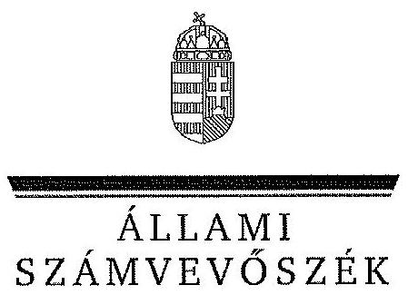
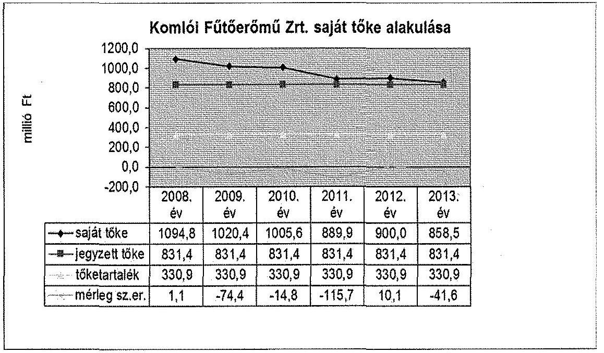
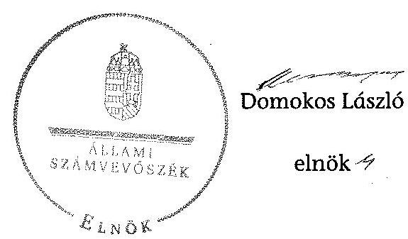

ÁLLAMI
SZÁMVEVŐSZÉK

# JELENTÉS 

Az önkormányzatok gazdasági társaságai - Az önkormányzatok többségi tulajdonában lévő gazdasági társaságok közfeladat ellátását érintő gazdálkodási tevékenysége szabályszerűségének ellenőrzése Komlói Fűtőerőmű Zártkörűen Működő Részvénytársaság

---

# Állami Számvevőszék 

Iktatószám: V-0478-136/2015.
Témaszám: 1512
Vizsgálat-azonosító szám: V067127

## Az ellenőrzést felügyelte:

Dr. Horváth Margit
felügyeleti vezető
Az ellenőrzést vezette és az ellenőrzés végrehajtásáért felelős:
Valastyánné dr. Vízhányó Júlia
Ellenőrzésvezető
A jelentéstervezet összeállításában közreműködött:
Szarka Péterné
számvevő vezető főtanácsos
Az ellenőrzést végezte:
Szarka Péterné Vörösné Lakatos Zsuzsanna
számvevő vezető főtanácsos számvevő

A témához kapcsolódó eddig készített számvevőszéki jelentések:
címe
sorszáma
Komló Város Önkormányzata pénzügyi helyzetének ellenőrzéséről 1240

---

# TARTALOMJEGYZÉK 

BEVEZETÉS ..... 7
I. ÖSSZEGZŐ MEGÁLLAPÍTÁSOK, KÖVETKEZTETÉSEK ..... 10
II. RÉSZLETES MEGÁLLAPÍTÁSOK ..... 14

1. Az Önkormányzat közfeladat-ellátásának szabályszerűsége ..... 14
1.1. A közfeladat-ellátás megszervezése és a feladatellátás feltételrendszerének kialakítása ..... 14
1.2. A közfeladat-ellátás felügyelete és a tulajdonosi jogok érvényesítése ..... 16
2. A Komlói Fűtőerőmű Zrt. közfeladat-ellátással kapcsolatos tevékenysége ..... 19
2.1. A Komlói Fűtőerőmű Zrt. gazdálkodásának szabályozottsága ..... 19
2.2. A Komlói Fűtőerőmű Zrt. vagyongazdálkodása ..... 21
2.3. A beszámolási kötelezettség teljesítése ..... 24
3. A távhőszolgáltatás közfeladata bevételei és ráfordításai elszámolásának és önköltségszámításának szabályszerűsége ..... 25
3.1. A távhőszolgáltatás közfeladat bevételeinek és ráfordításainak szabályszerűsége ..... 25
3.2. Az önköltségszámítás szabályszerűsége ..... 26
4. Az ÁSZ korábbi, az önkormányzatok többségi tulajdonában lévő gazdasági társaságok közfeladat-ellátását, gazdálkodását, pénzügyi helyzetét érintő javaslataira tett intézkedések ..... 27
MELLÉKLETEK
5. számú A Komlói Fűtőerőmű Zrt. tevékenységének főbb adatai
6. számú A Komlói Fűtőerőmű Zrt. működésének főbb jellemzői
7. számú A Komlói Fűtőerőmű Zrt. által biztosított közszolgáltatás díjai a 2008-2013. évekre vonatkozóan
FÜGGELÉKEK
8. számú Értelmező szótár
9. számú Mintavételi eljárások ellenőrzési területenként

---

.

---

# RÖVIDÍTÉSEK JEGYZÉKE 

## Törvények

Ámt.
ÁSZ tv.
Gt.
Info tv.

Mötv.

Nvtv.

Ötv.

Számv. tv.
Tszt.
Taktv.

VET

## Rendeletek

50/2011. (IX. 30.) NFM rendelet
az árak megállapításáról szóló 1990. évi LXXXVII. törvény (hatályos: 1991. január 1-jétől)
az Állami Számvevőszékről szóló 2011. évi LXVI. törvény (hatályos: 2011. július 1-jétől)
a gazdasági társaságokról szóló 2006. évi IV. törvény (hatálytalan: 2014. március 15-étől)
az információs önrendelkezési jogról és az információszabadságról szóló 2011. évi CXII. törvény (hatályos: 2011. július 27-étől kivéve a 1-37. §, a 38. § (1)-(3) bekezdése, a 38. § (4) bekezdés a)-f) pontja, a 38. § (5) bekezdése, a 39. §, a 41-68. §, a 70-72. §, a 75-77. § és a 79-88. §, valamint az 1. melléklet, ami 2012. január 1-jén lépett hatályba és a 38. § (4) bekezdés g) és h) pontja, valamint a 69. §, ami 2013. január 1 -jén lépett hatályba)

Magyarország helyi önkormányzatairól szóló 2011. évi CLXXXIX. törvény (hatályos: 2012. január 1-jétől, kivéve a 144. § (2) bekezdésben meghatározott előírások, amelyek 2012. április 15-én, a (3) bekezdésben meghatározott előírások, amelyek 2013. január 1 -jén léptek hatályba, a (4) bekezdésben meghatározott előírások a 2014. évi általános önkormányzati választások napján léptek hatályba)
a nemzeti vagyonról szóló 2011. évi CXCVI. törvény (hatályos: 2011. december 31-étől, kivéve a 20. § (2) bekezdésben meghatározott előírások, amelyek 2012. január 1-jétől, a (3) bekezdésben meghatározott előírások 2013. január 1 -jétől, a (4) bekezdésben meghatározott előírások 2012. március 2-ától léptek hatályba)
a helyi önkormányzatokról szóló 1990. évi LXV. törvény (hatálytalan: a 2014. évi általános önkormányzati választások napjától)
a számvitelről szóló 2000. évi C. törvény (hatályos: 2001. január 1-jétől)
a távhőszolgáltatásról szóló 2005. évi XVIII. törvény (hatályos: 2005. július 1-jétől)
a köztulajdonban álló gazdasági társaságok takarékosabb működéséről szóló 2009. évi CXXII. törvény (hatályos: 2009. december 4-étől)
a villamos energiáról szóló 2007. évi LXXXVI. törvény (hatályos: 2007. október 15-étől)
a távhőszolgáltatónak értékesített távhő árának, valamint a lakossági felhasználónak és a külön kezelt intézménynek nyújtott távhőszolgáltatás díjának megállapítá-

---

sáról (hatályos: 2011. október 1-jétől)
Komló Város Önkormányzata Képviselő-testületének 17/2005. (VII. 4.) számú Ökr. rendelete az adósságkezelési szolgáltatásról (hatályos: 2005. július 1-jétől)
Komló Város Önkormányzata Képviselő-testületének 20/2007. (X. 18.) Ökr. rendelete az önkormányzat vagyonáról és a vagyontárgyak feletti rendelkezési jog gyakorlásának szabályairól (hatályos: 2008. október 18-ától)
Komló Város Önkormányzata Képviselő-testületének 19/1999. (XII. 8.) Ökr. rendelete a távhőszolgáltatásról (hatályos: 2000. január 1-jétől 2009. február 28-áig)
Komló Város Önkormányzata Képviselő-testületének 4/2009. (II. 27.) Ökr. rendelete a távhőszolgáltatás díjairól és a díjalkalmazás feltételeiről (hatályos: 2009. március 1-jétől 2011. december 16-áig)
Komló Város Önkormányzata Képviselő-testületének 34/2011. (XII. 16.) Ökr. rendelete a távhőszolgáltatás díjairól és a díjalkalmazás feltételeiről (hatályos: 2011. december 17-étől)

adósságkezelési rendelet
vagyongazdálkodási rendelet
távhőszolgáltatási rendelet $_{1}$
távhőszolgáltatási rendelet $_{2}$
távhőszolgáltatási rendelet $_{3}$

## Szórövidítések

Alapító Okirat
áfa
ÁSZ
behajtási szabályzat
bizonylati szabályzat
Energetikai koncepció értékelési szabályzat

FB
FB Ügyrendje
Gazdasági Program ${ }_{1}$
Gazdasági Program ${ }_{2}$
Igazgatóság
Igazgatóság elnöke ${ }_{1}$
Igazgatóság elnöke ${ }_{2}$
Integrált Városfejlesztési Stratégia ${ }_{1}$
Integrált Városfejlesztési Stratégia ${ }_{2}$
Komlói Fűtőerőmű Zrt. Alapító Okirata
általános forgalmi adó
Állami Számvevőszék
Komlói Fűtőerőmű Zrt. Behajtási Szabályzata (hatályos: 2010. június 1-jétől)

Komlói Fűtőerőmű Zrt. Bizonylati Szabályzata (hatályos: 2006. január 1-jétől)

Komló Város Középtávú Energetikai Koncepciója 2007.
Komlói Fűtőerőmű Zrt. Eszközök és Források Értékelési Szabályzata (hatályos: 2006. január 1-jétől)
Komlói Fűtőerőmű Zrt. Felügyelőbizottsága
Komlói Fűtőerőmű Zrt. Felügyelőbizottságának Ügyrendje
Komló Város 2007-2010. évekre szóló Gazdasági Programja
Komló Város 2011-2014. évekre szóló Gazdasági Programja
Komlói Fűtőerőmű Zrt. Igazgatósága
Komlói Fűtőerőmű Zrt. Igazgatóságának elnöke 2005. szeptember 26-ától 2011. május 31-éig
Komlói Fűtőerőmű Zrt. Igazgatóságának elnöke 2011. június 1-jétől
Komló Város Integrált Városfejlesztési Stratégiája 2008-2015.

Komló Város Integrált Városfejlesztési Stratégiája 2009-2015. (A 2009. évben meghirdetett „Funkcióbővítő integrált városfejlesztési akciók támogatása" EU-s pályázat keretében

---

jegyző
KEOP
Képviselő-testület
KF Kft.
KF Zrt.
KF Zrt. SZMSZ
KF Zrt. Üzletszabályzata

KSH
leltározási szabályzat

MEH

M Ft
Mrd Ft
MW
Önkormányzat
önkormányzati SZMSZ ${ }_{1}$
önkormányzati SZMSZ ${ }_{2}$
önkormányzati SZMSZ ${ }_{2}$
önköltségszámítási szabályzat
pénzkezelési szabályzat ${ }_{1}$
pénzkezelési szabályzat ${ }_{2}$
pénzkezelési szabályzat ${ }_{3}$
polgármester $_{1}$
polgármester $_{2}$
számlarend $_{1}$
számlarend $_{2}$
számlarend $_{2}$
számlarend $_{3}$
számlarend $_{4}$
számlarend $_{5}$
új Integrált Városfejlesztési Stratégia készült.)
Komló Város Önkormányzatának jegyzője
Környezet és Energia Operatív Program
Komló Város Önkormányzatának Képviselő-testülete
Komlói Fűtőerőmű Korlátolt Felelősségű Társaság, a Komlói Fűtőerőmű Zrt. jogelődje
Komlói Fűtőerőmű Zártkörűen Működő Részvénytársaság
Komlói Fűtőerőmű Zrt. Szervezeti és Működési Szabályzata
Komlói Fűtőerőmű Zrt. Üzletszabályzata (hatályos: 2009. február 26-ától)
Központi Statisztikai Hivatal
Komlói Fűtőerőmű Zrt. Eszközök és Források Leltárkészítési és Leltározási Szabályzata (hatályos: 2006. január 1-jétől)
Magyar Energia Hivatal és 2013. április 4-étől annak jogutódja a Magyar Energetikai és Közműszabályozási Hivatal
millió forint
milliárd forint
megawatt
Komló Város Önkormányzata
Komló Város Önkormányzatának 27/2006. (X. 16.) rendelete az Önkormányzat Szervezeti és Működési Szabályzatáról (hatályos: 2011. május 26-áig)
Komló Város Önkormányzatának 12/2011. (V. 27.) rendelete az Önkormányzat Szervezeti és Működési Szabályzatáról (hatályos: 2011. május 27-étől)
Komlói Fűtőerőmű Zrt. Önköltségszámítási Szabályzata (hatályos: 2006. január 1-jétől)
Komlói Fűtőerőmű Zrt. Pénzkezelési Szabályzata (hatályos: 2006. január 1-jétől 2008. február 29-éig)
Komlói Fűtőerőmű Zrt. Pénzkezelési Szabályzata (hatályos: 2008. március 1-jétől 2012. december 31-éig)
Komlói Fűtőerőmű Zrt. Pénz és értékkezelési Szabályzata (hatályos 2013. január 1-jétől)
Komló Város Önkormányzatának polgármestere 1998. október 18-ától 2010. október 3-áig
Komló Város Önkormányzatának polgármestere 2010. október 4-étől
Komlói Fűtőerőmű Zrt. Számlarendje (hatályos: 2006. január 1-jétől 2009. december 31-éig)
Komlói Fűtőerőmű Zrt. Számlarendje (hatályos: 2010. január 1-jétől 2011. december 31-éig)
Komlói Fűtőerőmű Zrt. Számlarendje (hatályos 2012. január 1-jétől 2012. december 31-éig)
Komlói Fűtőerőmű Zrt. Számlarendje (hatályos: 2013. január 1-jétől 2013. június 30-áig)
Komlói Fűtőerőmű Zrt. Számlarendje (hatályos: 2013. jú-

---

|  | lius 1-jétől) |
| :--: | :--: |
| számviteli politika $_{1}$ | Komlói Fűtőerőmű Zrt. Számviteli Politikája I-II. (hatályos: 2006. január 1-jétől 2009. december 31-éig) |
| számviteli politika $_{2}$ | Komlói Fűtőerőmű Zrt. Számviteli Politikája I-II. (hatályos 2010. január 1-jétől 2011. december 31-éig) |
| számviteli politika $_{3}$ | Komlói Fűtőerőmű Zrt. Számviteli Politikája (hatályos: 2012. január 1-jétől 2012. december 31-éig) |
| számviteli politika $_{4}$ | Komlói Fűtőerőmű Zrt. Számviteli Politikája (hatályos: 2013. január 1-jétől 2013. június 30-áig) |
| számviteli politika $_{5}$ | Komlói Fűtőerőmű Zrt. Számviteli Politikája (hatályos: 2013. július 1-jétől) |
| TJ | terajoule |

---

# JELENTÉS 

## Az önkormányzatok gazdasági társaságai Az önkormányzatok többségi tulajdonában lévő gazdasági társaságok közfeladat ellátását érintő gazdálkodási tevékenysége szabályszerűségének ellenőrzése Komlói Fűtőerőmű Zártkörűen Működő Részvénytársaság

## BEVEZETÉS

Az Állami Számvevőszék középtávra szóló stratégiájában megfogalmazta, hogy a helyi önkormányzatok gazdálkodásában rejlő pénzügyi kockázatok feltárásával, az államháztartáson kívülre nyújtott költségvetési támogatások és ingyenes vagyonjuttatások, valamint az államháztartáson kívül működő köz-feladat-ellátó rendszerek ellenőrzéseivel hozzájárul ahhoz, hogy a közpénzeket az államháztartáson kívül működő szervezetek is átlátható, rendezett módon használják fel a közfeladatok szerződésben vállalt ellátása érdekében.

Az önkormányzatok szervezetalakítási szabadságának következménye, hogy a korábban is vállalati formában működő (nagyvárosi tömegközlekedés, víz-, szennyvízcsatorna, köztisztasági, ingatlankezelés stb.) közszolgáltatások mellett, mind a kötelező, mind az önként vállalt feladatok ellátásában a gazdasági társaságok kiemelt fontosságú szerephez jutottak.

Komló Város Önkormányzatának Képviselő-testülete az ellenőrzött időszakot megelőzően (a 1996. évben) döntött a távhőtermelését biztosító erőmű megvásárlásáról és a 100%-os tulajdonában lévő Komlói Fűtőerőmű Kft. létrehozásáról. Az Önkormányzat a 2005. évben a Kft.-t részvénytársasággá alakította. A KF Zrt. jegyzett tőkéje az ellenőrzött időszakban 831,4 M Ft volt. A társaság fő tevékenysége gőzellátás és légkondicionálás volt, emellett villamos energiatermelést és egyéb vállalkozási tevékenységet is végzett.

A KF Zrt. az ellenőrzött időszak kezdetén egy - a Bem J. utca - telephelyen folytatott távhőtermelést. A 2010. évben helyezték üzembe a Zobák-aknai telephelyen lévő 1,7 Mrd Ft összegű beruházással megvalósított faapríték tüzelésű, 18 MW hőteljesítményű kazánt, amely ezt követően a fűtési időszakban jelentkező hőigények több mint 95%-át elégítette ki. A megtermelt megközelítőleg 270 TJ/év hőenergia mintegy 22 km hosszúságú vezetékrendszeren keresztül jutott el a fogyasztókhoz. A társaság által nyújtott szolgáltatást a 2008. évben 5059 lakossági fogyasztó, 39 közintézmény és 348 piaci szereplő, a 2013. évben 5066 lakossági fogyasztó, 57 közintézmény és 281 piaci szereplő vette igénybe.

---

A KF Zrt. éves nettó árbevétele a 2008-2013. években 2440,8 M Ft-ról 1361,2 M Ft-ra csökkent, az eszközeinek és forrásainak értéke 2413,9 M Ft és 3913,4 M Ft között alakult. A KF Zrt. az ellenőrzött időszakban a 2008. és a 2012. éveket kivéve - amikor 1,1 M Ft és 10,1 M Ft nyereség képződött - veszteségesen gazdálkodott, a veszteség 14,8 M Ft és 115,7 M Ft között mozgott. A Komlói Fűtőerőmű Zrt. átlagos állományi létszáma a 2008. évi 136 főről 2013. évre 100 főre csökkent.

Az ellenőrzött időszakban a polgármester személye egy alkalommal változott, a jegyző személye változatlan volt. A helyszíni ellenőrzés idején hivatalban lévő polgármester 2010. október 4-étől látja el feladatát. A KF Zrt. Igazgatóságának elnöke egy alkalommal változott. A jelenlegi elnök 2011. június 1-jétől tölti be tisztségét.

Az önkormányzati tulajdonú gazdasági társaságok teljes körű ellenőrzésének lehetőségét az Állami Számvevőszékről szóló 1989. évi XXXVIII. törvény 2011. január 1-jétől hatályos módosítása teremtette meg.

Az ellenőrzés célja annak értékelése volt, hogy

- az önkormányzat a jogszabályi előírások figyelembevételével döntött-e az ellenőrzésre kerülő közfeladat megszervezéséről; az önkormányzat szabályszerűen gyakorolta-e a tulajdonosi jogokat;
- a gazdasági társaság közfeladat-ellátása bevételeinek, ráfordításainak elszámolása, és vagyongazdálkodási tevékenysége megfelelt-e a jogszabályi, illetve a közszolgáltatási szerződésben foglalt tulajdonosi előírásoknak, azok végrehajtása szabályszerű volt-e;
- a közfeladatok átláthatósága és elszámoltathatósága érdekében biztosítva volt-e a közszolgáltatás díjának megalapozottsága szabályszerű önköltségszámítással.

Az ellenőrzés kiterjedt Komló Város Önkormányzatára és a Komló
 Fűtőerőmű Zártkörűen Működő Részvénytársaságra.

Az ellenőrzés várható hasznosulása: A törvényalkotás számára - az észlelt problémák, szabálytalanságok, vagy egyéb nem kívánatos jelenségek felszínre kerülésével - az ellenőrzés megállapításai segítséget nyújthatnak az államháztartáson kívüli közfeladat-ellátás értékeléséhez, jogszabályi keretei pontosításához, átláthatóságot biztosító szabályozásához. Meghatározhatóvá válnak a közfeladat ellátásában részt vevő államháztartáson kívüli szervezeteknek - az önkormányzat költségvetését, pénzügyi helyzetét is befolyásoló - kockázatai, lehetővé válik ezen kockázatok csökkentése. Értékelhetővé válik, hogy a feladatot ellátó gazdasági társaság a közszolgáltatási szerződésben foglaltak betartásával, a közvagyon használatával biztosította-e a szolgáltatás folytatásának feltételeit. Ezzel az ellenőrzöttek és a helyi döntéshozók számára az ÁSZ visszajelzést ad feladatszervezési, feladat-ellátási kockázataikról, alapot ad a meglévő hibák megszüntetéséhez, a jobb közfeladat-ellátás biztosításához. Fokozza a fegyelmet, igazolja, hogy lejárt a következmények nélküli ellenőrzések időszaka. Az ÁSZ értékteremtő rend kialakításához és megőrzéséhez hozzájáruló tevékenysége pozitív hatással van a szervezetről kialakított összkép formálására is.

---

A bevételek és ráfordítások elszámolása, valamint a vagyonnyilvántartás terén az egyes területek szabályszerű működését mintavétellel ellenőriztük, ez alapján a sokaságokban előforduló hibás tételek arányát becsültük. A jogszabályoknak és a belső előírásoknak megfelelőnek, azaz szabályszerűnek tekintettük az adott bevételek és ráfordítások elszámolását, a vagyonnyilvántartást, amennyiben a minta ellenőrzésének eredménye alapján 95%-os bizonyossággal a teljes sokaságban a hibás tételek aránya kisebb volt, mint 10%, nem megfelelőnek értékeltük, ha a hibás tételek aránya a 10%-ot meghaladta. Kockázatot, illetve magas kockázatot jeleztünk, amennyiben egy adott terület vonatkozásában a minta alapján a teljes sokaságban nem volt teljes körűen biztosított a jogszabályoknak és a belső szabályzatoknak megfelelő működés.

Az ellenőrzést a számvevőszéki ellenőrzés szakmai szabályai szerint, szabályszerűségi ellenőrzés módszerével, a nemzetközi standardok figyelembevételével végeztük. Az ellenőrzés a 2008-2013. évekre terjedt ki.

Az ellenőrzés végrehajtásának jogszabályi alapját az Állami Számvevőszékről szóló 2011. évi LXVI. törvény 5. § (3)-(5) bekezdései képezték.

A Jelentés tervezetét észrevételezésre megküldtük Komló Város Önkormányzata polgármesterének, valamint a társaság vezérigazgatójának. Az érintettek észrevételt nem tettek.

---

# I. ÖSSZEGZŐ MEGÁLLAPÍTÁSOK, KÖVETKEZTETÉSEK 

Komló Város Önkormányzata az ellenőrzött időszakot megelőzően, az Ötv.-ben foglaltakkal összhangban döntött a távhőszolgáltatás gazdasági társasággal történő ellátásáról. A távhőszolgáltatással ellátott létesítmények távhőellátásának engedélyes útján történő biztosítása - a Tszt. értelmében - a területileg illetékes települési önkormányzat kötelező feladata. A közfeladat ellátása az ellenőrzött időszakban az Önkormányzat kizárólagos tulajdonában lévő KF Zrt. által valósult meg. Az Önkormányzat a feladatellátáshoz szükséges vagyont az ellenőrzött időszakot megelőzően apportként bocsátotta a KF Zrt. jogelődje rendelkezésére.

Az Önkormányzat a 2007-2010. és a 2011-2014. évekre szóló gazdasági programjaiban prioritásként határozta meg a távhőellátás fejlesztését és hosszú távú tervként Integrált Városfejlesztési Stratégiát${ }_{1,3}$ készített, amely tartalmazta a fejlesztés részleteit. Az Önkormányzat által készített Energetikai koncepció meghatározta az Önkormányzat alternatív energiahordozók felhasználására, valamint a KF Zrt.-re vonatkozó célkitűzéseit, és elvárásait.

Az Önkormányzat a vagyongazdálkodási tervét az előírásoknak megfelelően elkészítette, és a Képviselő-testület határozattal elfogadta. A vagyongazdálkodási terv az energetikai felújítások keretében célként határozta meg az alternatív energia hasznosítását. Az Önkormányzat a távhőszolgáltatásra vonatkozóan a Tszt. szerinti rendeletalkotási kötelezettségének az ellenőrzött időszakban eleget tett. A távhőszolgáltatási rendelet${ }_{1,2,3}$ a Tszt. előírásainak megfelelt. A 2012. január 1-jén hatályba lépett Nvtv.-ben foglaltakkal összhangban - az Önkormányzat a KF Zrt. részvényeit nemzetgazdasági szempontból kiemelt jelentőségű vagyontárgyak körébe sorolta. Az Önkormányzat a vagyongazdálkodási rendeletben meghatározta a tulajdonosi jogok gyakorlásának rendjét a kizárólagos tulajdonosi részesedéssel működő gazdasági társaságaira vonatkozóan. Az ellenőrzött időszakban a KF Zrt. feletti tulajdonosi jogokat az Alapító Okirat és a vagyongazdálkodási rendelet előírásainak megfelelően az Önkormányzat szabályszerűen gyakorolta. Az Önkormányzat belső ellenőrzése a távhőszolgáltatás, mint közfeladat ellátás szabályszerű teljesítéséhez, az önkormányzati vagyon megóvásához az ellenőrzött időszakban hozzájárult. A KF Zrt.-nél az ellenőrzött időszakban a 2009. évben belső ellenőrzést végeztek.

Az Önkormányzat a KF Zrt.-vel közszolgáltatási szerződést nem kötött, a társaság az ellenőrzött időszakban a tulajdonosi előírásoknak megfelelően, az Alapító Okiratában, az Üzletszabályzatában és a távhőszolgáltatási rendelet${ }_{1,2,3}$-ban meghatározottak szerint látta el a távhőszolgáltatás kötelező közfeladatot. Az Önkormányzat a KF Zrt. részére a távhőszolgáltatási közfeladattal összefüggő beszámolási kötelezettséget nem írt elő. A KF Zrt. a beszámolási kötelezettségének a Számv. tv. előírásai szerint tett eleget.

---

A könyvvizsgáló az ellenőrzött időszak minden évében minősítés nélküli, hitelesítő záradékkal látta el a KF Zrt. éves számviteli beszámolóját.

A távhőszolgáltatási közfeladat bevételeinek elszámolása során a KF Zrt. szabályszerűen járt el. A bevételek előírása és kiszámlázása a belső szabályozásnak megfelelően történt. A távhőszolgáltatási közfeladat anyagjellegű ráfordításainak elszámolása során a KF Zrt. szabályszerűen járt el. A költségelszámolást megalapozó kötelezettségvállalás, a költségek elszámolása a jogszabályi előírásoknak és a belső szabályozásnak megfelelően történt. A KF Zrt. a beruházásainak, felújításainak elszámolása során szabályszerűen járt el. Az értékcsökkenési leírás elszámolásának módszere a 2008-2013. években nem változott. A KF Zrt. az értékcsökkenési leírást az ellenőrzött időszakban a vonatkozó számviteli előírások, valamint a belső szabályozás figyelembevételével számolta el. A tárgyi eszközök pótlása nem volt arányban az elszámolt értékcsökkenéssel.

A KF Zrt. mérleg szerinti eredménye az ellenőrzött időszakban - a 2008. és a 2012. évek kivételével, amikor 1,1 M Ft és 10,1 M Ft nyereség képződött - negatív volt. A KF Zrt. saját tőkéje a 2008-2013. évek között folyamatosan csökkent. Az eredményt az ellenőrzött időszakban eredménytartalékba helyezték, az Önkormányzat döntése alapján a nyereséges években osztalék kifizetésére nem került sor. Az Önkormányzat 111,1 M Ft (27,8 M Ft/év) fejlesztési támogatást nyújtott a KF Zrt. részére. Az Önkormányzat az ellenőrzött időszakban a távhőszolgáltatást érintően működési támogatást a KF Zrt. részére nem nyújtott, garanciát és kezességet nem vállalt. A KF Zrt. az ellenőrzött időszakban, a 2011. évtől kezdődően kapott távhőtámogatást (a 2011. évben 228,1 M Ft-ot, a 2012. évben 438,2 M Ft-ot, a 2013. évben 461,1 M Ft-ot), amely a bevételkiesést részben kompenzálta.

A KF Zrt. az ellenőrzött időszakban 2009. február 26-ától rendelkezett a jegyző által jóváhagyott Üzletszabályzattal, mely megfelelt a Tszt. előírásainak. A KF Zrt. a Számv. tv. szerinti szabályzatokat elkészítette, az ellenőrzött időszakban rendelkezett számviteli politikával${ }_{1.5}$. A számviteli politika${ }_{3.5}$ tartalmazta a Tszt. által előírt számviteli szétválasztási szabályokra vonatkozó előírásokat és annak kötelezettségeit. A KF Zrt. az ellenőrzött időszakban rendelkezett az Igazgatóság elnöke${ }_{1}$ által jóváhagyott értékelési, leltározási és önköltségszámítási szabályzatokkal, azonban a szabályzatok jogszabályi változásoknak megfelelő aktualizálása - a Számv. tv. előírása ellenére - elmaradt.

A KF Zrt. az ellenőrzött időszakban elkészítette - az Önkormányzat távhőszolgáltatási közfeladat ellátására vonatkozó szakmai terveivel összhangban levő - éves üzleti terveit. Az Önkormányzat 2008. január 1-je és 2011. április 14-e között a távhőszolgáltatási rendelet${ }_{1-3}$-ban határozta meg a távhőszolgáltatás legmagasabb díját és a díjalkalmazás feltételeit. Az alkalmazott díjtételek megállapítása a jogszabályi előírásoknak megfelelően, a távhőszolgáltatási rendelet${ }_{1,2,3}$ módosításával történt. A Tszt. módosításával az Önkormányzat ármegállapítás joga, az Ámt. 2011. április 15-től hatályos módosítására való tekintettel megszűnt. A közszolgáltatási díjat megalapozó önköltségszámítás megfelelt a belső szabályzatoknak és a jogszabályi előírásoknak.

---

A KF Zrt. az ellenőrzött időszakban a távhőtermelés és szolgáltatási közfeladat önköltségét az önköltségszámításra vonatkozó belső szabályozásban előírt formában és tartalommal határozta meg, a távhőszolgáltatási közfeladat árképzése, a díj megállapítása átlátható módon, utókalkuláció adatain alapult.

Az értékesítés nettó árbevétele az ellenőrzött időszakban - a 2009. év kivételével - folyamatosan csökkent. A KF Zrt. az ellenőrzött időszakban jelentős követelésállománnyal rendelkezett. A ráfordítások elszámolását megalapozó kötelezettségvállalás, a költségek elszámolása az ellenőrzött időszakban a hatályos szabályozások szerint történt. A KF Zrt. beruházásainak és felújításainak elszámolása és vagyongazdálkodási tevékenysége megfelelt a jogszabályi előírásoknak.

A fentiekben leírtak összegzéseként az alábbi megállapításokat tesszük:
A konstrukcióból eredő sajátosság az volt, hogy az Önkormányzat a távhőszolgáltatási feladatai maradéktalan végrehajtása érdekében - az ellenőrzött időszakot megelőzően - az Önkormányzat 100%-os tulajdonában lévő KF Zrt. jogelődjébe apportálta a távhő vagyont. A tulajdonosi jogokat a Képviselő-testület szabályszerűen gyakorolta.

A működés kockázata alacsony volt, azonban a KF Zrt. számviteli rendszerének szabályozottsága hiányosságokat mutatott.

Pénzügyi kockázat az ellenőrzött időszakban a KF Zrt. árbevételének közel felére történő visszaesése, a kötelezettségek és a lejárt követelésállomány összegének - a beszedésre tett intézkedések ellenére - történő folyamatos növekedése nagymértékben hozzájárult a KF Zrt. likviditási helyzetének romlásához.

Az Állami Számvevőszékről szóló 2011. évi LXVI. törvény 33. § (1) bekezdésében foglaltak értelmében a jelentésben foglalt megállapításokhoz kapcsolódó intézkedési tervet köteles az ellenőrzött szervezet vezetője összeállítani, és azt a jelentés kézhezvételétől számított 30 napon belül az ÁSZ részére megküldeni. Amennyiben az intézkedési tervet határidőben nem küldi meg a szervezet, vagy az nem elfogadható, az ÁSZ elnöke a hivatkozott törvény 33. § (3) bekezdés a)-b) pontjaiban foglaltakat érvényesítheti.

Az ellenőrzés intézkedést igénylő megállapításai és javaslatai:
Javaslataink célja a Zrt. gazdálkodása szabályszerűségének javítása annak érdekében, hogy a szabályozási környezet megfelelően tudja támogatni az átlátható működést.

# Javasoljuk a Komlói Fűtőerőmű Zrt. (KF Zrt.) Vezérigazgatójának: 

1. A leltározási szabályzat 2012. január 1-jétől nem volt összhangban a Számv. tv. 69. § (3) bekezdésében foglalt előírásokkal, mert abban az ingatlanok, műszaki berendezések, gépek, járművek és személyes használatra kiadott tárgyi eszközök esetében öt évenkénti mennyiségi felvétellel történő leltározást írták elő a jogszabályban meghatározott, legalább háromévente történő mennyiségi felvétellel szemben.

---

Javaslat:

# Intézkedjen a szabályozási hiányosságok megszüntetésére, ennek keretében: 

módosítsa a leltározási szabályzatát a tárgyi eszközökre vonatkozóan a Számv. tv. előírása szerinti legalább három évenkénti leltározás előírásával.
2. A KF Zrt. az ellenőrzött időszakban a vezérigazgató által jóváhagyott, hatályos számviteli szabályzatait (értékelési, leltározási és önköltség-számítási, pénzkezelési) nem aktualizálta, ezzel megsértette a Számv. tv. 14.§ (11) bekezdésének előírását, amelynek értelmében a számviteli szabályzatokat a jogszabályi változásokat követően 90 napon belül aktualizálni kell.

Javaslat:

## Gondoskodjon a jogszabályi előírások szerinti gyakorlat és a szabályos működés biztosítására, ezen belül:

intézkedjen az értékelési, leltározási, önköltség-számítási, bizonylati és pénzkezelési szabályzatok aktualizálásáról a Számv. tv. előírásai szerint.

Javaslataink célja az önkormányzat szabályszerű működésének elősegítése, továbbá az önkormányzati tulajdonosi joggyakorlás kontrolljainak erősítése.

## Javasoljuk Komló Város Önkormányzata Polgármesterének:

1. A 2009. január 1-jétől a 2009. december 31-éig terjedő időszakban hatályos Áht. 100/N. § (5) bekezdésében és 2010-től a Taktv. 5.§ (3) bekezdésében előírtak szerint a KF Zrt. legfőbb szerve köteles szabályzatot alkotni a vezető tisztségviselők, felügyelőbizottsági tagok, valamint az Mt. 208. §-ának hatálya alá eső munkavállalók javadalmazása, valamint a jogviszony megszűnése esetére biztosított juttatások módjának, mértékének elveiről, annak rendszeréről. A szabályzatot az elfogadásától számított harminc napon belül a cégiratok közé letétbe kell helyezni. A jogszabályi kötelezettsége ellenére a KF Zrt. legfőbb szerve javadalmazási szabályzatot nem hagyott jóvá.

Javaslat:

## Gondoskodjon
 a szabályozási hiányosság megszüntetésére, ennek érdekében:

tájékoztassa a Képviselőtestületet, hogy az érintettekkel egyeztetve elő kell készíteni a KF Zrt. vezető tisztségviselői, illetve a Felügyelő Bizottsági tagok, továbbá az Mt. hatálya alá tartozó egyéb érintettek juttatásaira vonatkozó javadalmazási szabályzatot és annak a társaság legfőbb szerve általi jóváhagyása szükséges.

---

# II. RÉSZLETES MEGÁLLAPÍTÁSOK 

## 1. Az ÖNKORMÁNYZAT KÖZFELADAT-ELLÁTÁSÁNAK SZABÁLYSZERŰSÉGE

### 1.1. A közfeladat-ellátás megszervezése és a feladatellátás feltételrendszerének kialakítása

Az Ötv. 91. § (6) bekezdése szerint az Önkormányzatnak a gazdasági programjában kell meghatároznia azon célkitűzéseket, amelyek az ellátandó feladatok biztosítását, fejlesztését szolgálják. A Képviselő-testület határozataival ${ }^{1}$ elfogadta az Önkormányzat 2007-2010. és a 2011-2014. évekre szóló gazdasági programjait, melyek megfeleltek az Ötv. 91. § (6) bekezdése tartalmi előírásainak és az önkormányzati SZMSZ ${ }_{1,2}$-ben meghatározott követelményeknek. Az Önkormányzat a távhőellátás fejlesztését a Gazdasági Program${ }_{1,2}$-ben prioritásként határozta meg.

A Gazdasági Program ${ }_{1}$-ben szerepelt a városi fűtőerőmű kitelepítése új területre, és az új erőmű alkalmassá tétele az alternatív tüzelőanyagokkal - biomassza és hulladék - történő fűtésre. A Gazdasági Program ${ }_{2}$-ben megfogalmazták, hogy „előnyben kell részesíteni a megújuló energiával (szolár, geotermikus) üzemelő rendszerek kialakítását. A működési költségek csökkentése érdekében folytatni kell a távhőrendszerek, hőközpontok kor technikai színvonalához igazodó korszerűsítését."

A Képviselő-testület által elfogadott ${ }^{2}$ hosszú távú Integrált Városfejlesztési Stratégia ${ }_{1,2}$ - a Gazdasági Program ${ }_{1,2}$-ben megfogalmazott célokkal összhangban - célként tűzte ki az élhetőbb lakókörnyezet kialakítását, a környezeti terhelés csökkentését, ennek keretében a fűtőerőmű belvárosból történő kitelepítését. A Képviselő-testület által az ellenőrzött időszak előtt elfogadott ${ }^{3}$ Energetikai koncepció meghatározta az Önkormányzat alternatív energiahordozók felhasználására, valamint a KF Zrt.-re vonatkozó célkitűzéseit, és elvárásait.

Az Nvtv. 9. § (1) bekezdésében foglaltak szerint az Önkormányzatnak 2012. január 1-jétől az Alaptörvényben, valamint a 7. § (2) bekezdésében meghatározott rendeltetése biztosításának céljából közép- és hosszú távú vagyongazdálkodási terv készítési kötelezettsége volt. Az Önkormányzat a vagyongazdálkodási tervét az előírásoknak megfelelően elkészítette, és a Képviselő-testület

[^0]
[^0]:    ${ }^{1}$ A Képviselő-testület 44/2007. (III. 29.) számú és a 38/2011. (III. 31.) számú határozatai.
    ${ }^{2}$ A Képviselő-testület 60/2008. (V. 8.) számú és a 2/2010. (I. 21.) számú határozatai.
    ${ }^{3}$ A Képviselő-testületének 68/2007. (IV. 26.) számú határozata.

---

határozattal elfogadta. ${ }^{4}$ A vagyongazdálkodási terv az energetikai felújítások keretében célként határozta meg az alternatív energia hasznosítását.

Az Ötv. 8. § (1) bekezdése ${ }^{5}$ a települési önkormányzatok közszolgáltatási feladatai közé sorolta a helyi energiaszolgáltatásban való közreműködést. Az Ötv. 1. § (5) bekezdése kimondja, hogy törvény helyi önkormányzatnak kötelező feladatkört megállapíthat. Az Ötv. 8. § (3) bekezdése ugyancsak rendelkezik arról, hogy törvény a települési önkormányzatokat egyes közszolgáltatási feladatok ellátásáról történő gondoskodásra kötelezheti. A távhőszolgáltatással ellátott létesítmények távhőellátásának engedélyes vagy engedélyesek útján történő biztosítása - a Tszt. 6. § (1) bekezdése értelmében - a területileg illetékes települési önkormányzat kötelező feladata.

Az Önkormányzat az ellenőrzött időszakot megelőzően, az Ötv. 9. § (4) bekezdésében foglaltakkal összhangban döntött a távhőszolgáltatás gazdasági társasággal történő ellátásáról. A közfeladat ellátása az ellenőrzött időszakban az Önkormányzat kizárólagos tulajdonában lévő KF Zrt. által valósult meg. A KF Zrt. távhőszolgáltatói működési engedély birtokában végezte tevékenységét. ${ }^{6}$ A KF Zrt. főbb adatait az 1. számú melléklet, a társaság működésének főbb jellemzőit a 2. számú melléklet tartalmazza.

Az Önkormányzat a feladatellátáshoz szükséges vagyont az ellenőrzött időszakot megelőzően apportként bocsátotta a KF Zrt. jogelődje rendelkezésére. Az Önkormányzat a távhő vagyonnal kapcsolatban leltározási és adatszolgáltatási kötelezettséget a KF Zrt. részére nem írt elő, a társaság a vagyonának leltározását a leltározási szabályzata szerint végezte.

Az Önkormányzat a távhőszolgáltatásra vonatkozóan a Tszt. 6. § (2) bekezdés szerinti rendeletalkotási kötelezettségének az ellenőrzött időszakban eleget tett. A Képviselő-testület megalkotta az ellenőrzött időszakban hatályos távhőszolgáltatási rendelet${ }_{1,2,3}$-at, amelyet az ellenőrzött időszakban többször módosítottak. A távhőszolgáltatási rendelet ${ }_{1,2,3}$ a Tszt. előírásainak megfelelt.

A távhőszolgáltatási rendelet ${ }_{1,2,3}$ szabályozta a távhőszolgáltatás területi és személyi hatályát, a közüzemi szerződés tartalmát és felmondásának szabályait, a szüneteltetés, korlátozás szabályait, a felhasználói berendezés működtetését, karbantartását, a mérést, a díjmegállapítás és alkalmazás feltételeit. Meghatározta, hogy az Önkormányzat a városépítési szabályrendeletében, szabályozási terveiben, valamint környezetvédelmi rendeletében kijelöli azokat a területeket, ahol területfejlesztési, környezetvédelmi és levegőtisztaság-védelmi szempontok alap-

[^0]
[^0]:    ${ }^{4}$ A Képviselő-testület 93/2013. (V. 30.) számú határozata.
    ${ }^{5}$ A helyi közügyek, valamint a helyben biztosítható közfeladatok körében ellátandó helyi önkormányzati feladatként a távhőszolgáltatást 2013. január 1-jétől az Mötv. 13. § (1) bekezdés 20. pontja írja elő.
    ${ }^{6}$ A KF Zrt. 2005. október 18-a és 2009. február 25-e között a távhőtermelést és szolgáltatást a KF Kft., mint jogelőd részére Pécs Megyei Jogú Város jegyzője által 2002. november 15 -én kiadott, 8-1862/2002. számú határozat alapján végezte. A KF Zrt. 2009. február 26-ától rendelkezett a MEH által kiadott távhőszolgáltatói működési engedéllyel (száma: 85 2012).

---

ján célszerű a távhőszolgáltatás fejlesztése. ${ }^{7}$ A távhőszolgáltatási rendelet ${ }_{1,2}$ tartalmazta a távhőszolgáltatás legmagasabb díját az alapdíjra és hődíjra vonatkozóan, a csatlakozási díj mértékét, valamint a díjalkalmazás és a díjfizetés általános szabályait.

# 1.2. A közfeladat-ellátás felügyelete és a tulajdonosi jogok érvényesítése 

Az Önkormányzat a 2008-2013. években rendelkezett vagyongazdálkodási rendelettel, melyet az ellenőrzött időszak előtt alkotott, és az ellenőrzött időszakban négy alkalommal módosított. A 2012. március 10-étől hatályos módosítás ${ }^{8}$ során - a 2012. január 1-jén hatályba lépett Nvtv. 18. § (1) bekezdésében foglaltakkal összhangban - az Önkormányzat a KF Zrt. részvényeit nemzetgazdasági szempontból kiemelt jelentőségű vagyontárgyak körébe sorolta.

Az Önkormányzat a vagyongazdálkodási rendeletben meghatározta a tulajdonosi jogok gyakorlásának rendjét a kizárólagos tulajdonosi részesedéssel működő gazdasági társaságaira vonatkozóan. Az ellenőrzött időszakban a KF Zrt. feletti tulajdonosi jogokat - a Képviselő-testület kizárólagos hatáskörébe tartozó döntések kivételével - a polgármester ${ }_{1,2}$ gyakorolta.

A vagyongazdálkodási rendeletben foglaltak alapján a Képviselő-testület kizárólagos hatáskörébe tartozott többek között az Alapító Okirat módosítása, az ügyvezető/igazgatóság, a felügyelő bizottság, a könyvvizsgáló megválasztása, visszahívása, díjazásának megállapítása, a prémiumfeltételek és összegek megállapítása, hitelfelvétel és beruházás indítása, amennyiben a kötelezettségvállalás összértéke a 20,0 M Ft-ot meghaladja (kivéve az évközi likviditási problémák kiküszöbölésére felvett folyószámlahitel).

Az ellenőrzött időszakban a KF Zrt. feletti tulajdonosi jogokat az Alapító Okirat és a vagyongazdálkodási rendelet előírásainak megfelelően az Önkormányzat szabályszerűen gyakorolta.

Az Alapító Okirat értelmében közgyűlés a KF Zrt.-nél nem működött, a közgyűlés jogait az Önkormányzat gyakorolta. A KF Zrt. Alapító Okirata tartalmazta az Igazgatóság, az FB tagok és a könyvvizsgáló nevét, a kijelölés időtartamát, a feladatköröket, továbbá az Önkormányzat kizárólagos hatáskörébe tartozó döntéseket. Az Alapító kizárólagos hatáskörébe tartozott az Alapító Okirat módosítása, az Igazgatóság, az FB, a könyvvizsgáló megválasztása, visszahívása, díjazásának megállapítása, a KF Zrt. SZMSZ-ének, illetve az FB Ügyrendjének elfogadása. Az Alapító hatáskörébe tartozott továbbá az éves számviteli beszámoló elfogadása, a hosszú lejáratú - legalább hároméves - kötelezettségvállalásról, illetve a 20,0 M Ft-ot meghaladó hitelfelvételről szóló döntés.

A KF Zrt.-nél a Gt. 21. § (4) bekezdésében foglaltakkal összhangban Igazgatóság, a Gt. 33. § (1) bekezdésében foglaltakkal összhangban FB működött, az

[^0]
[^0]:    ${ }^{7}$ távhőszolgáltatási rendelet ${ }_{1}$ 9. §, távhőszolgáltatási rendelet ${ }_{2}$ 8. §, (1) bekezdés, távhőszolgáltatási rendelet ${ }_{3}$ 7. § (1) bekezdés
    ${ }^{8}$ a 4/2012. (III. 9.) önkormányzati rendelet 3. §-a

---

Alapító Okiratban foglaltak alapján az FB három tagból állt. Az Önkormányzat az ellenőrzött időszakban a KF Zrt.-vel közösen működtette az Összevont Igazgatósági, FB és Alapítói Ülést.

Az Összevont Igazgatósági, FB és Alapítói Üléseken megtárgyalták és elfogadták a KF Zrt. működését, gazdálkodását érintő kérdéseket. Az ülésekről jegyzőkönyv készült és az Igazgatóság „Igazgatósági Határozat"-ot, az FB „Felügyelő Bizottsági Határozat"-ot, és az Önkormányzat - akit az Alapító Okirat és a vagyongazdálkodási rendelet előírásaival összhangban a polgármester ${ }_{1,2}$ képviselt - „Alapítói Határozat"-ot hozott. A Képviselő-testület a vagyongazdálkodási rendelet szerint a kizárólagos hatáskörébe tartozó döntéseket minden esetben megtárgyalta.

A KF Zrt. az ellenőrzött időszakban elkészítette - az Önkormányzat távhőszolgáltatási közfeladat ellátására vonatkozó szakmai terveivel ${ }^{9}$ összhangban levő - éves üzleti terveit. A KF Zrt. üzleti terveiben meghatározott gazdasági elképzelések megvalósulását az Üzleti jelentésekben értékelték, amit az éves számviteli beszámolóval együtt az Összevont Igazgatósági, FB és Alapítói Üléseken elfogadtak.

Az Önkormányzat Képviselő-testülete a KF Zrt. részére, a 2010. január 1-jét követő időszakra a Taktv. 5. § (3) bekezdésben előírt kötelezettsége ellenére javadalmazási szabályzatot nem hagyott jóvá.

Az Önkormányzat 2008. január 1-je és 2011. április 14-e között a távhőszolgáltatási rendelet ${ }_{1-3}$-ban határozta meg a távhőszolgáltatás legmagasabb díját és a díjalkalmazás feltételeit. A számításokkal alátámasztott díjjavaslatot a KF Zrt. terjesztette a Képviselő-testület elé. Az alkalmazott díjtételek megállapítása a jogszabályi előírásoknak megfelelően, a távhőszolgáltatási rendelet ${ }_{1,2,3}$ módosításával történt. A Tszt. módosításával az Önkormányzat ármegállapítási joga, az Ámt. 7. § (5) bekezdésének 2011. április 15-től hatályos módosítására való tekintettel megszűnt.

Az Önkormányzat élve az Ötv. 92. § (11) bekezdés b) pontjában biztosított lehetőséggel, a KF Zrt.-nél az ellenőrzött időszakban a 2009. évben belső ellenőrzést végzett. A 2009. évi ellenőrzésről készült belső ellenőrzési jelentés a szabályozottság, a behajtási tevékenység, a szerződéses dokumentumok és az adatok honlapon történő közzététele hiányosságaival kapcsolatban tartalmazott megállapításokat. Az Önkormányzat belső ellenőrzése a megtett intézkedéseket a 2012. évben utóellenőrzés keretében ellenőrizte.

A KF Zrt. mérleg szerinti eredménye az ellenőrzött időszakban - a 2008. és a 2012. évek kivételével, amikor 1,1 M Ft és 10,1 M Ft nyereség képződött - negatív volt. A KF Zrt. saját tőkéje a 2008-2013. évek között folyamatosan csökkent. Az eredményt az ellenőrzött időszakban eredménytartalékba helyezték, az Önkormányzat döntése ${ }^{10}$ alapján a nyereséges években osztalék kifizetésére nem került sor. Az ellenőrzött időszakban a társaságnál a saját tőke/jegyzett tőke aránya 1,0-1,3 közötti értéket mutatott, ezért az Önkormány-

[^0]
[^0]:    ${ }^{9}$ Gazdasági Program ${ }_{1,2}$; Integrált Városfejlesztési Stratégia ${ }_{1,2}$; Energetikai Koncepció
    ${ }^{10}$ Az 1/2009. (V. 28.) Alapítói határozat, a 2/2013. (V. 17.) Alapítói határozat.

---

zatnak a Gt. 51. § (1) bekezdésében meghatározott intézkedési kötelezettsége nem keletkezett. A veszteség rendezésére vonatkozó képviselő-testületi döntés az ellenőrzött időszakban nem született.

A KF Zrt. 2008-2013. évi saját tőkéjének alakulását a következő grafikon mutatja be:

Az Önkormányzat 111,1 M Ft (27,8 M Ft/év) fejlesztési támogatást nyújtott a KF Zrt.
 részére a 2009-2012. években a Zobák-akna területén biomassza tüzelésű forróvíz-kazán beruházás megvalósításához. A beruházáshoz szükséges hosszú lejáratú hitelfelvételhez - az Alapító Okiratban foglaltaknak, valamint a vagyongazdálkodási rendelet előírásainak megfelelően - kizárólagos hatáskörében eljárva, a Képviselő-testület hozzájárult. ${ }^{11}$

A biomassza üzem finanszírozásához az elnyert KEOP pályázati támogatás (486,0 M Ft) mellett a KF Zrt. 830,0 M Ft bankhitelt vett fel, továbbá 274,0 M Ft rulírozó hitelszerződést kötött.

Az Önkormányzat engedményezési szerződésben ${ }^{12}$ vállalta, hogy kilenc év alatt 2010. és 2018. között - 250 M Ft fejlesztési támogatást biztosít a KF Zrt. részére. Az ellenőrzött időszakban az Önkormányzat az engedményezési szerződésben vállaltakat időarányosan teljesítette.

Az Önkormányzat az ellenőrzött időszakban a távhőszolgáltatást érintően működési támogatást a KF Zrt. részére nem nyújtott, garanciát és kezességet nem vállalt.

[^0]
[^0]:    ${ }^{11}$ A Képviselő-testület 26/2008. (II. 28.) számú, a 141/2008. (X. 16.) számú és a 176/2008. (XII. 11.) számú határozatai.
    ${ }^{12}$ Önk-169/2008/ENG sz. engedményezési szerződés

---

# 2. A Komlói FÜTŐERŐMŰ ZRT. KÖZFELADAT-ELLÁTÁSSAL KAPCSOLATOS TEVÉKENYSÉGE 

### 2.1. A Komlói Fűtőerőmú Zrt. gazdálkodásának szabályozottsága

Az Önkormányzat a KF Zrt.-vel közszolgáltatási szerződést nem kötött, a társaság az ellenőrzött időszakban a tulajdonosi előírásoknak megfelelően, az Alapító Okiratában, az Üzletszabályzatában és a távhőszolgáltatási rendeletben meghatározottak szerint látta el a távhőszolgáltatás kötelező közfeladatot.

A KF Zrt. az ellenőrzött időszak kezdetétől 2009. február 25-éig nem rendelkezett a TszT. előírásainak megfelelő Üzletszabályzattal, a jogelődje (KF Kft.) 2003. július 1-jétől hatályos Üzletszabályzata szerint működött. A KF Zrt. az ellenőrzött időszakban 2009. február 26-ától rendelkezett a jegyző által jóváhagyott Üzletszabályzattal, mely megfelelt a TszT. 7. §-ában foglalt előírásoknak.

A KF Zrt. a Számv. tv. 14. § (5) bekezdésében foglalt előírások szerinti szabályzatokat elkészítette, az ellenőrzött időszakban rendelkezett a Számv. tv. 14. § (3) bekezdésében foglalt számviteli politikával, melyet a jogszabályi változásoknak megfelelően aktualizáltak. A számviteli politika a beszámoló készítés, a könyvvezetés, a lényegesség és a hibák kritériumait, az amortizációs politikát és az eszközök besorolásának szempontjait a Számv. tv.-ben rögzített előírások szerint szabályozta. A számviteli politika tartalmazta a TszT. 18/A. §-ában a 2012. január 1-jétől előírt számviteli szétválasztási szabályokra vonatkozó előírásokat és annak kötelezettségeit.

A KF Zrt. számviteli politikája 2012. január 1-jét megelőzően is tartalmazott a számviteli szétválasztásra vonatkozó szabályokat. A VET 104. § (1) bekezdése 2011. április 14-éig hatályos szabályozása szerint az integrált villamosenergia-iparivállalkozás és a több engedéllyel rendelkező vállalkozás köteles volt olyan számviteli szétválasztási szabályokat kidolgozni, és az egyes tevékenységeire olyan elkülönült nyilvántartást vezetni, amely biztosítja az egyes tevékenységek átláthatóságát és a diszkrimináció-mentességet, kizárja a keresztfinanszírozást és a versenytorzítást. A KF Zrt. a VET 104. § (1) bekezdése szerinti „integrált villamosenergia-iparivállalkozás és a több engedéllyel rendelkező vállalkozás”, mivel az engedélyhez kötött villamosenergia-termelésen kívül engedélyhez kötött távhőszolgáltatási tevékenységet végzett.

A KF Zrt. az ellenőrzött időszakban a számviteli politika részeként rendelkezett a Számv. tv. 161. §-a szerinti számlarenddel. A számlarendben foglaltakat alátámasztó bizonylati rendet a KF Zrt. Igazgatóságának elnöke által jóváhagyott bizonylati szabályzat tartalmazta.

A KF Zrt. az ellenőrzött időszakban rendelkezett az Igazgatóság elnöke által jóváhagyott értékelési, leltározási és önköltség-számítási szabályzatokkal, azonban a számviteli politika keretében kiadott szabályzatok jogszabályi változásoknak megfelelő aktualizálása - a Számv. tv. 14. § (11) bekezdése előírásának ellenére - elmaradt.

---

Az ellenőrzött időszakban hatályos értékelési szabályzat a Számv. tv. 46. §-ban foglalt előírásoknak megfelelően tartalmazta az eszközök és források év végi értékelésének elveit, módszereit. A vevőkövetelések értékvesztése elszámolásának szabályait a számviteli politika tartalmazta.

Az ellenőrzött időszakban hatályos leltározási szabályzatban meghatározták a leltározás módjának, előkészítésének, végrehajtásának, kiértékelésének, a könyvviteli adatokkal való egyeztetésnek, valamint a leltáreltérések rendezésének szabályait és a leltárellenőrzési kötelezettséget. A szabályzat 2012. január 1-jétől nem volt összhangban a Számv. tv. 69. § (3) bekezdésében foglalt előírásokkal, mert az ingatlanok, lealapozott gépek, műszaki berendezések, gépek, járművek, személyes használatra kiadott tárgyi eszközök esetében öt évenkénti mennyiségi felvétellel történő leltározást írt elő a jogszabályban előírt legalább három évente történő mennyiségi felvétellel szemben. A társaság számviteli szabályozása hiányos volt, mivel egyik szabályzatban sem rögzítették a felesleges vagyontárgyak feltárására, hasznosítására, a leértékelési és selejtezési eljárásra, a hasznosítás és selejtezés pénzügyi számviteli elszámolására vonatkozó követelményeket, így nem határozták meg a Számv. tv. 53. §-ában rögzített terven felüli értékcsökkenési leírás elszámolásának helyi szabályait.

Az ellenőrzött időszakban a KF Zrt. a Számv. tv. 14. § (5) bekezdés c) pontja előírásának megfelelően önköltség-számítási szabályzattal rendelkezett. Az önköltség-számítási szabályzatban rögzítették a tevékenységek önköltségének elő-, közbenső- és utókalkulációval történő meghatározását, a kalkulációs egységeket, a sémákat és a kalkulációs költségtényezők tartalmát, a közvetlen és a közvetett költségek elkülönítésére vonatkozó szabályokat, a költségek elosztásának, utalványozásának és felosztásának bizonylati rendjét. A szabályzat kitért az önköltség-számítási kalkuláció időszakaira és az adatok szolgáltatásáért és az ellenőrzésért felelősökre, a könyvviteli rendszerrel való egyeztetésre. A szabályzat a közvetlen önköltség kiszámítására tartalmazott szabályokat. A számviteli politika a közvetett költségek felosztásának módját, a vetítési alapokat rögzítette. A számviteli politika 2012. január 1-jétől tovább részletezte a tevékenységeket, telephelyenként és technológiánként.

Az Igazgatóság elnöke által jóváhagyott pénzkezelési szabályzatban meghatározták a pénzforgalom (készpénzben, illetve bankszámlán történő) lebonyolításának rendjét, a pénz és értékkezelés általános szabályait, személyi és tárgyi (pénztárak kialakítása) feltételeit, felelősségi szabályait, bizonylati rendjét, a pénzszállítás szabályait, valamint az elszámolási és a nyilvántartási szabályokat. A pénzkezelési szabályzatban - a Számv. tv. 14. § (8) bekezdésében foglaltakkal ellentétben - nem rendelkeztek a készpénzben és a bankszámlán tartott pénzeszközök közötti forgalomról, a készpénzállomány ellenőrzésekor követendő eljárásról, az ellenőrzés gyakoriságáról.

A KF Zrt. az ellenőrzött időszakban rendelkezett prémium szabályzattal, amely tartalmazta a prémiumban részesíthetők körét, az évenként kitűzhető prémiumkeretet, a prémium feladat meghatározásának feltételeit, értékelésének, elbírálásának módját, határidejét és a teljesítésről, vagy annak elmaradásáról való beszámolás részleteit.

---

# 2.2. A Komlói Fűtőerőmú Zrt. vagyongazdálkodása 

A KF Zrt. saját, az Önkormányzattól apportba kapott vagyonával látta el az Alapító Okiratban meghatározott gőzellátás, légkondicionálás feladatait. A KF Zrt. vagyonának kezelésére, nyilvántartására és eljárási szabályaira az ellenőrzött időszakban hatályos számviteli politikája, értékelési szabályzata és leltározási szabályzata tartalmazott előírásokat.

A KF Zrt. a gőzellátás, légkondicionálás főtevékenységéhez és ehhez kapcsolódó egyéb tevékenységéhez szükséges eszközökről és forrásokról a Számv. tv.-ben és a számviteli politikában foglalt előírásoknak megfelelő, átlátható, folyamatosan vezetett nyilvántartással rendelkezett. A közfeladat-ellátását biztosító vagyont a számlarendben rögzített előírásoknak megfelelően a nyilvántartáson belül elkülönítették. A TszT. 18/A. § (2) bekezdésében előírtakkal összhangban a 2012. és a 2013. évi éves számviteli beszámolók kiegészítő mellékleteiben elkészítették a távhőszolgáltatás és távhőtermelés eszközeinek, forrásainak, bevételeinek és ráfordításainak elkülönített kimutatását a számviteli szétválasztás szabályai szerint.

Az ellenőrzött időszak mérlegbeszámolóiban szereplő eszközök és források értékét leltárral támasztották alá. A leltár a Számv. tv. 69. § (1) bekezdése előírásainak megfelelően tételesen, ellenőrizhető módon, mennyiségben és értékben tartalmazta a társaság mérleg fordulónapján meglévő eszközeit és forrásait. Az éves beszámolók kiegészítő mellékleteiben a vagyonelemeket összesített kimutatásban az azokban bekövetkezett változásokat részletesen bemutatták.

A KF Zrt. vagyoni helyzetét jellemző, főbb mérleg szerinti adatokat a 2008-2013. évek között a következő táblázat szemlélteti.

| adatok ezer Ft-ban |  |  |  |  |  |  |  |
| :--: | :--: | :--: | :--: | :--: | :--: | :--: | :--: |
| Megnevezés | 2008.01.01 | 2008.12.31 | 2009.12.31 | 2010.12.31 | 2011.12.31 | 2012.12.31 | 2013.12.31 |
| I. Befektetett eszközök | 2007862 | 1832671 | 2678439 | 3045125 | 2668038 | 2240565 | 2146745 |
| ebből: tárgyi eszközök | 1930296 | 1749953 | 2600281 | 2957500 | 2585096 | 2164069 | 2062356 |
| II. Forgóeszközök | 661301 | 569970 | 891141 | 816313 | 1068583 | 1060709 | 973449 |
| ebből: követelések | 563070 | 489930 | 665906 | 629340 | 816839 | 833654 | 807435 |
| III. Aktív időbeli elhatárolások | 8842 | 11312 | 10588 | 4665 | 176801 | 9681 | 14893 |
| ESZKÖZÖK ÖSSZESEN | 2678005 | 2413953 | 3580168 | 3866103 | 3913422 | 3310955 | 3135087 |
| IV. Saját tőke | 1093670 | 1094761 | 1020354 | 1005595 | 889930 | 900064 | 858485 |
| ebből: jegyzett tőke | 831410 | 831410 | 831410 | 831410 | 831410 | 831410 | 831410 |
| ebből: mérleg szerinti eredmény | 6637 | 1091 | 74407 | 14758 | 115665 | 10134 | 41579 |
| V. Költartalékok | - | - | - | - | 164704 | - | - |
| VI. Kötelezettségek | 1183385 | 981437 | 2029774 | 2099713 | 2125563 | 1678978 | 1646314 |
| VII. Passzív időbeli elhatárolások | 400950 | 337755 | 530040 | 760795 | 733225 | 731913 | 630288 |
| FORRÁSOK ÖSSZESEN | 2678005 | 2413953 | 3580168 | 3866103 | 3913422 | 3310955 | 3135087 |

A KF Zrt. befektetett eszközei értékének 95,5-97,1%-át a tárgyi eszközök értéke képezte a 2008-2013. közötti években. Az ellenőrzött időszakban a 2008. és 2010. évek között a tárgyi eszközök könyv szerinti értéke 1749,9 M Ft-ról 2957,5 M Ft-ra nőtt, melyet a KEOP-4.1.0-2008-0072 pályázaton elnyert támogatással megvalósított Biomassza tüzelésű 18MW-os forróvíz kazán létesítése eredményezett. A létesítmény üzembe helyezését követően a 2011. évtől a tárgyi eszközök könyv szerinti értéke folyamatosan csökkent, a 2010. december 31-ei 2957,5 M Ft állományi értékről 2013. december 31-ére 2062,4 M Ft-ra módosult. Az állomány csökkenésének oka, hogy a beruházások, élettartam növelő felújítások nem az eszközök elhasználódásának megfelelő arányában történtek.

A forgóeszközök állományának változását alapvetően a követelések és a pénzeszközök állományának alakulása határozta meg. A 2008-2013. években a követelések 74,7-86,0% közötti, míg a pénzeszközök 4,8-22,9% közötti részarányt képviseltek a forgóeszközök állományából. Aktív időbeli elhatárolásként a 2011. évben 176,8 M Ft-ot mutattak ki, ami a forgóeszközök állományához viszonyítva 16,5%-ot jelent, ebből 164,7 M Ft az árfolyamváltozás elhatárolásából adódóan került elszámolásra halasztott ráfordításként. Az ellenőrzött időszak további éveiben az aktív időbeli elhatárolásként kimutatott összegek a forgóeszközök állományához viszonyítva 0,7-2,0% közötti értéket képviseltek.

A KF Zrt. az immateriális javak és tárgyi eszközök után 2008-ban 246,6 M Ft, 2009-ben 236,9 M Ft, 2010-ben 344,4 M
 Ft, 2011-ben 455,9 M Ft, 2012-ben 441,9 M Ft, míg 2013-ban 343,1 M Ft értékcsökkenést számolt el. Az ellenőrzött időszak minden évében az éves beszámoló kiegészítő mellékletében részletesen bemutatták az elszámolt értékcsökkenés összegeit.

A tárgyi eszközök pótlására (karbantartás, felújítás, beruházás) 2008-ban 139,6 M Ft, 2009-ben 174,1 M Ft, 2010-ben 1875,7 M Ft, 2011-ben 218,8 M Ft, 2012-ben 76,9 M Ft, 2013-ban 72,2 M Ft forrást fordítottak. Az ellenőrzött időszakban a 2010. év mutat kiugró értéket a biomassza tüzelésű 18 MW-os forróvíz kazán üzembe helyezése miatt. Az ellenőrzött időszak többi évében a tárgyi eszközök megújítási mértékének mutatószáma ${ }^{13} 0,5-3,0 \%$ között mozgott. A tárgyi eszközök pótlása nem volt arányban az elszámolt értékcsökkenéssel. Az eszközök használhatósági foka az ellenőrzött időszakban folyamatosan romlott, a 2008. év végi 72,2%-ról a 2013. év végére 45,1%-ra csökkent.

A KF Zrt. az ellenőrzött időszakban jelentős követelésállománnyal rendelkezett, melyből a vevőkkel szembeni követelés mérleg szerinti összege 2008-ban 458,7 M Ft, 2009-ben 523,3 M Ft, 2010-ben 540,8 M Ft, 2011-ben 540,2 M Ft, 2012-ben 662,1 M Ft, 2013-ban 601,9 M Ft volt.

Az ellenőrzött időszak minden évében az éves számviteli beszámolók kiegészítő mellékleteiben bemutatták a vevőkkel szembeni követeléseket lejárat szerint. A KF Zrt. az értékelési szabályzatában a Számv. tv. 65. §-ában foglaltakkal összhangban rögzítette a lejárt követelésállomány értékelésének elveit.

Az ellenőrzött időszakban az értékvesztés nélküli összes vevőkövetelés a 2008. évi 528,8 M Ft-ról folyamatosan nőtt, a 2012. évre 842,8 M Ft-ot ért el, majd a 2013. évre 35,9 M Ft-tal csökkent 806,9 M Ft-ra. A csökkenés ellenére

[^0]
[^0]:    ${ }^{13}$ Tárgyi eszközök megújítási mértéke = Tárgyév során aktivált érték / Tárgyi eszközök záró bruttó értéke

---

azonban a minősített állomány - ezen belül a 360 napon túli követelés összege - folyamatos emelkedést mutatott.

A KF Zrt. 2010. június 1-jétől rendelkezett behajtási szabályzattal. A szabályzat részletesen meghatározta a kintlévőségek kezelésével és behajtásával kapcsolatos eljárási rendet. A KF Zrt. az ellenőrzött években a kintlévőségek kezelését folyamatosan, a számlázási folyamatba építetten működtette. A követelések behajtása érdekében éltek a melegvíz-szolgáltatás korlátozásával, bírósági és bírósági úton kívüli eljárásokkal. A lejárt követelések beszedésére az ellenőrzött időszakban behajtással foglalkozó gazdasági társaságot bíztak meg.

A fizetési késedelemben lévő lakossági fogyasztók hátralékának rendezése érdekében Komló Város Önkormányzat Képviselő-testülete az ellenőrzött időszakot megelőzően adósságkezelési rendeletet alkotott. A rendelet szerint - a jogosultság feltételeinek fennállása esetén - a lakossági ügyfelek adósságkezelési támogatást, valamint adósságkezelési tanácsadást vehettek igénybe az Önkormányzat Családsegítő Központján keresztül. A KF Zrt. az ellenőrzött időszakban együttműködött a Komlói Önkormányzat Családsegítő Központjával.

Az ellenőrzött időszakban a KF Zrt. a behajtás alatt lévő hátralékos díjbevételekről folyamatosan vezetett nyilvántartással rendelkezett, a számlázó és pénzügyi hátralékkezelő számítástechnikai programjának analitikus nyilvántartásaiból egy időszakra, illetve egy időpontra lekérdezhetők voltak a befizetések fizetési módonként, a fizetési meghagyások, illetve végrehajtás alá vont követelések, a kintlévőség-kezelőnek átadott állományok és a részletfizetési megállapodások. Az éves beszámoló kiegészítő melléklete minden évben részletesen bemutatta a vevőkövetelések alakulását lakossági és nem lakossági bontásban. A követelések behajtására a határidő lejárta után tett intézkedéseket a 2013. évi számviteli beszámoló kiegészítő mellékletében részletesen bemutatták és azok eredményéről is beszámoltak.

A követelések behajtására tett intézkedések ellenére a behajtás nem minősíthető eredményesnek, mert a minősített követelésállomány folyamatosan emelkedett az árbevétel folyamatos csökkenése mellett. A 2013. év végi lejárt követelésállomány összegében már meghaladta a 2013. évi értékesítés nettó árbevételének 50%-át. Ez nagymértékben hozzájárult a KF Zrt. likviditási helyzetének romlásához.

A kötelezettségek állománya az ellenőrzött időszakban a 2008. évi 981,4 M Ft-ról a 2009. év végére 2029,8 M Ft-ra emelkedett, majd a 2010. évben 2099,7 M Ft-ra, a 2011. évben 2125,6 M Ft-ra nőtt. A 2012. év végére 1678,9 M Ft-ra, illetve a 2013. év végére 1646,3 M Ft-ra csökkent. A 2009. évtől kezdődő emelkedés oka egyrészt a hosszúlejáratú kötelezettségek állományának emelkedése, a biomassza tüzelésű 18 MW-os forróvíz kazán létesítéséhez felvett beruházási hitel tőke- és kamatfizetési kötelezettsége, másrészt a folyamatos - 2008. április 28-tól 300,0 M Ft hitelkeret szerződés alapján - a működés biztosítását szolgáló ténylegesen felvett rövid lejáratú hitelek állományának emelkedése volt.

A KF Zrt. mérleg szerinti eredménye az ellenőrzött időszakban - a 2008. és a 2012. évek kivételével, amikor 1,1 M Ft és 10,1 M Ft nyereség képződött - negatív volt. Céltartalék képzésre az ellenőrzött időszakban csak a 2011. évben

---

került sor, 164,7 M Ft összegben, az árfolyamváltozásból eredő, várható költségek fedezetére.

# 2.3. A beszámolási kötelezettség teljesítése 

Az Önkormányzat a KF Zrt. részére a távhőszolgáltatási közszolgáltatással összefüggő beszámolási kötelezettséget nem írt elő. A KF Zrt. a beszámolási kötelezettségének a Számv. tv. előírásai szerint tett eleget.

A KF Zrt. a Számv. tv. 4. §-a szerinti beszámolóját az ellenőrzött időszak minden éve tekintetében elkészítette és a Számv. tv. 154. § (1) bekezdésében foglaltakkal összhangban közzétette. A KF Zrt. a Számv. tv. 153. § (1) bekezdésében előírt határidőben eleget tett a letétbe helyezési kötelezettségének. A KF Zrt. a 2012. és a 2013. évi éves Számv. tv. szerinti beszámolóját a könyvvizsgálói jelentéssel együtt - összhangban a Tszt. 18/B. § (2) bekezdésében foglaltakkal - megküldte a MEH-nek.

Az FB az ellenőrzött időszak minden évében előterjesztette a KF Zrt. éves számviteli beszámolójáról alkotott véleményét az Összevont Igazgatósági, FB és Alapítói Üléseken, amely megtárgyalásra és elfogadásra került. Az FB az éves beszámoló elfogadásáról határozatot hozott. Az Önkormányzatot képviselő polgármester ${ }_{1,2}$ az éves számviteli beszámolót az Igazgatóság és az FB határozata, valamint könyvvizsgáló véleménye alapján Alapítói határozattal fogadta el, eleget téve a Gt. 35. § (3) bekezdésében foglaltaknak.

A könyvvizsgáló az ellenőrzött időszak minden évében a Gt. 40. § (1) bekezdésében foglaltakkal összhangban gondoskodott a Számv. tv. 155. § (2) bekezdésében meghatározott könyvvizsgálat elvégzéséről és minősítés nélküli, hitelesítő záradékkal látta el a KF Zrt. éves számviteli beszámolóját. A 2012. és a 2013. évi könyvvizsgálói jelentések tartalmazták a Tszt. 18/B. § (1) bekezdésében előírt igazolást arról, hogy a vállalkozás által kidolgozott és alkalmazott számviteli szétválasztási szabályok, valamint az egyes tevékenységek közötti tranzakciók árazása biztosítják a vállalkozás tevékenységei közötti keresztfinanszírozás-mentességet. Az ellenőrzött időszakban a könyvvizsgáló személye nem változott. A könyvvizsgáló az ellenőrzött időszak minden évében a Gt. 44. § (1) bekezdése előírásának megfelelően részt vett az éves beszámolót tárgyaló Összevont Igazgatósági, FB és Alapítói Üléseken.

A könyvvizsgáló a 2008. évi éves beszámoló auditálásakor „Tájékoztatót" bocsátott ki, melyben a devizahitelek árfolyamvesztesége átértékelésének és a KF Zrt. résztulajdonában lévő Sikonda Szolgáltató Kft. felszámolásából eredő veszteségek kockázatára mutatott rá. A 2009. évi éves beszámoló auditálásakor „Vezetői Levélben" részletezte a veszteséges gazdálkodásának okait és további kockázatait, a 2010. évi éves beszámoló auditálásakor készített „Vezetői Levélben" a széndioxid kvóták elszámolása szabályainak betartására hívta fel a figyelmet.

A KF Zrt. 2012. július 1-jétől rendelkezett az Info tv. 24. § (3) bekezdése szerinti, az Igazgatóság elnöke ${ }_{2}$ által kiadott „Adatvédelmi és adatbiztonsági szabályzattal”.

---

Az ellenőrzött időszakban a KF Zrt. az elektronikusan kezelt adatok tekintetében biztonsági intézkedéseket alkalmazott, melyek az alábbiak voltak: a jogosulatlan hozzáférés ellen minden dolgozó saját felhasználói névvel és jelszóval rendelkezett, a felhasználókhoz megfelelő jogosultságok tartoztak, gondoskodtak az állományok rendszeres mentéséről, és a tárolt adatok biztonságos elhelyezéséről, számítógépek vírusvédelméről, az épületek tűzvédelméről és vagyonvédelméről.

Az ellenőrzött időszakban a KF Zrt. az Info tv. 35. § (3) bekezdése szerinti, a közérdekű adatok közzétételére vonatkozó szabályzattal nem rendelkezett. Ettől függetlenül a KF Zrt. az éves beszámolóra vonatkozó közzétételi kötelezettségének az ellenőrzött időszakban eleget tett. A közérdekű adatok KF Zrt. honlapján történő közzétételének szabályosságát az Önkormányzat belső ellenőrzése 2009. évben ellenőrizte, ${ }^{14}$ melyre intézkedési terv készült. A 2009. évi ellenőrzés utóellenőrzését ${ }^{15}$ a belső ellenőrzés 2012-ben végezte el, és megállapította, hogy a honlapon lévő adatok, információk aktualizálása továbbra sem volt biztosított.

# 3. A TÁVHŐSZOLGÁLTATÁS KÖZFELADATA BEVÉTELEI ÉS RÁFORDÍTÁSAI ELSZÁMOLÁSÁNAK ÉS ÖNKÖLTSÉGSZÁMÍTÁSÁNAK SZABÁLYSZERŰSÉGE 

### 3.1. A távhőszolgáltatás közfeladat bevételeinek és ráfordításainak szabályszerűsége

A KF Zrt.-nél - mivel a távhőszolgáltatási közfeladat mellett egyéb tevékenységet is ellátott az ellenőrzött időszakban - a közfeladat átláthatósága és a keresztfinanszírozás elkerülése érdekében fennállt a VET 104. § (3) bekezdése 2011. április 14-éig hatályos előírása és a Tszt. 2012. január 1-jétől hatályos 18/A. § (3) bekezdés c) pontjában foglalt előírása szerint a bevételek és ráfordítások elkülönítésének kötelezettsége.

A KF Zrt. a jogszabályi előírásoknak és az ágazati sajátosságoknak megfelelően meghatározta az elkülönült üzletágak bevételeinek és ráfordításainak elkülönített nyilvántartását. A KF Zrt. a számviteli politikában és az annak részét képező számlarendben írta elő az ellenőrzött közfeladat bevételeinek és ráfordításainak elkülönítését.

A távhőszolgáltatási közfeladat bevételeinek elszámolása során a KF Zrt. szabályszerűen járt el. A bevételek előírása és kiszámlázása a belső szabályozásnak megfelelően történt, a bevételeket a megfelelő számlacsoportban számolták el. Az alkalmazott szolgáltatási díjak megfeleltek a belső szabályozásnak és a tulajdonosi követelményeknek.

[^0]
[^0]:    ${ }^{14}$ Komló Város Önkormányzata belső ellenőrzése által készített Ellenőrzési Jelentés "Pénzügyi-gazdasági vizsgálat a Komlói Fütőerőmú Zrt.-nél" címmel, 1-2009. azonosító számmal
    ${ }^{15}$ Komló Város Önkormányzata belső ellenőrzése által készített Ellenőrzési Jelentés "A 2009. évben végzett pénzügyi-gazdasági vizsgálat utóellenőrzése a Komlói Fütőerőmú Zrt.-nél" címmel, 5-2012. azonosító számmal

---

A távhőszolgáltatási közfeladat anyagjellegű ráfordításainak elszámolása során a KF Zrt. szabályszerűen járt el. A költségelszámolást megalapozó kötelezettségvállalás, a költségek elszámolása a jogszabályi előírásoknak és a belső szabályozásnak megfelelően történt. A költségelszámolást megalapozó dokumentumok rendelkezésre álltak. A költségeket a megfelelő költségnemre, közfeladatra számolták el.

A KF Zrt. a beruházásainak, felújításainak elszámolása során szabályszerűen járt el. Az immateriális javak és tárgyi eszközök állománynövekedésének, valamint értékcsökkenésének elszámolása megfelelt a vonatkozó szabályozásnak. A beszerzett eszközök állományba vétele, üzembe helyezése megtörtént. A bekerülési érték meghatározása, az eszközök besorolása és nyilvántartása szabályos volt.

Az értékcsökkenési leírás elszámolásának módszere a 2008-2013. években nem változott. Az eszközök állományba vétele külső számla, vagy saját vállalkozásban végzett beruházásnál üzembe helyezési okmány alapján történt. A KF Zrt. az értékcsökkenési leírást az ellenőrzött időszakban a vonatkozó számviteli előírások, valamint a belső szabályozás figyelembevételével számolta el.

# 3.2. Az önköltségszámítás szabályszerűsége 

A KF Zrt. az ellenőrzött időszakban a távhőtermelés és szolgáltatási közfeladat önköltségét az önköltségszámításra vonatkozó belső szabályozásban előírt formában és tartalommal határozta meg, a távhőszolgáltatási közfeladat árképzése, a díj megállapítása átlátható módon, utókalkuláció adatain alapult. Az utókalkuláció alapján készített fedezet kimutatást az ellenőrzött időszak minden évében az
 éves beszámolók kiegészítő mellékletét tartalmazta.

A KF Zrt. az ellenőrzött időszakban 2008. január 1-je és 2011. április 14-e között a Képviselő-testület által jóváhagyott távhőszolgáltatási díjakat alkalmazta. A díjak megállapítására vonatkozó javaslatokat a 2008. és a 2010. közötti években – a KF Zrt. Igazgatóságának elnöke kezdeményezésére – a polgármester terjesztette a Képviselő-testület elé. Az előterjesztések a lakossági és a nem lakossági hődíjra vonatkoztak, alapdíjra vonatkozó előterjesztés csak a 2008. február 28-ai Képviselő-testületi ülésre történt. Az FB a javaslatokat megtárgyalta, és elfogadását javasolta a Képviselő-testületnek. Az Önkormányzat a fogyasztóvédelmi szervekkel és a fogyasztói érdekképviseletekkel való együttműködés keretében a távhőszolgáltatást érintő képviselő-testületi előterjesztéseket előzetesen véleményeztette.

A lakossági, valamint az intézményi fogyasztóknak nyújtott távhőszolgáltatás díjának megállapítási joga Tszvt. 57/D. §-a alapján 2011. április 15-ei hatállyal önkormányzati hatáskörből miniszteri hatáskörbe került. A KF Zrt. 2011. év októberétől a jogszabályban meghatározott díjat alkalmazta, 2012. január 1-jétől az 50/2011. (IX. 30.) NFM rendelet 4. §-ában foglaltak szerinti – a 3. számú mellékletben is bemutatott – 4,2%-os díjemelést érvényesített az alapdíj esetében. A hődíj 4,2%-os emelését – a 2011/2012. évi fűtési szezon lezárását követően – 2012. május 1-jével hajtották végre.

---

A KF Zrt. a 2013. év januárjától és novemberétől a bázis időszakhoz képest 10-10%-os díjcsökkentést hajtott végre a rezsicsökkentések végrehajtásáról szóló 2013. évi LIV. törvény előírásaival összhangban.

A KF Zrt. minden közszolgáltatási dijváltozást megalapozó árelőterjesztés esetében készített önköltségszámítást. A közszolgáltatási díjat megalapozó önköltségszámítás megfelelt a belső szabályzatoknak és a jogszabályi előírásoknak. A KF Zrt. által ellátott közszolgáltatás meghatározott önköltsége nem tartalmazott az önköltségszámítás rendjére vonatkozó szabályzat alapján el nem számolható költségelemeket, az önköltségben érvényesítendő értékcsökkenést szabályszerűen vették figyelembe a kalkuláció során.

Az értékesítés nettó árbevétele az ellenőrzött időszak alatt – a 2009. év kivételével – folyamatos csökkenést mutatott. A 2013. évi nettó árbevétel a 2008. évi árbevétel 55,8%-ára csökkent.

A 2008. évben elért 2440,8 M Ft nettó árbevétel a 2009. évben – 189,1 M Ft emelkedést mutatva – 2629,9 M Ft-ra változott. A 2010. évben 2429,5 M Ft, a 2011. évben 1921,9 M Ft, a 2012. évben 1545,8 M Ft és a 2013. évben 1361,2 M Ft volt.

A nettó árbevétel folyamatos csökkenése több tényezőre vezethető vissza, ezek az épületszigetelési programok eredményének hatásaként bekövetkezett hőszolgáltatási volumencsökkenés, a távhőárak 2011. évi „befagyasztása” és a központosított díjszabályozás – különösen a 2013. évi LIV. tv. alapján végrehajtott rezsicsökkentés –, valamint a villamos energia értékesítés volumenének csökkenése, a támogatási rendszer és a kötelező átvétel 2011. évi megszűnése miatt. ${ }^{16}$

A KF Zrt. az ellenőrzött időszakban a 2011. évtől kezdődően kapott távhőtámogatást (a 2011. évben 228,1 M Ft-ot, a 2012. évben 438,2 M Ft-ot, a 2013. évben 461,1 M Ft-ot), amely a bevételkiesést részben kompenzálta.

# 4. Az ÁSZ korábbi, az önkormányzatok többségi tulajdonában lévő gazdasági társaságok közfeladat-ellátását, gazdálkodását, pénzügyi helyzetét érintő javaslataira tett intézkedések 

Az ÁSZ 1240. számú „Komló Város Önkormányzata pénzügyi helyzetének ellenőrzéséről” szóló jelentése intézkedést igénylő javaslatokat fogalmazott meg a polgármester részére. Jelentésünk megállapította, hogy az Önkormányzat minősített többségi tulajdonú gazdasági társaságai kötelezettségeinek nem teljesítése hatással lehet az Önkormányzat likviditására, pénzügyi egyensúlyi helyzetére. A gazdasági társaságok pénzügyi egyensúlyi helyzete nem volt stabil, a lejárt szállítói állomány figyelemmel kísérése nem volt biztosított. Ennek kapcsán javaslatunkban a Polgármesternek jeleztük, hogy terjesszen intézkedési tervet a Képviselő-testület elé a minősített többségi tulajdonú gazdasági társaságok pénzügyi egyensúlyi helyzetének stabilizálása érdekében.

Az Önkormányzat határozatba foglalt intézkedési tervet készített, ${ }^{17}$ melyet az ÁSZ elfogadott. Az intézkedési tervben többek között szerepel a társaságok pénzügyi egyensúlyi helyzetének stabilizálása is. Az intézkedési terv végrehajtásának utóellenőrzése folyamatban van.

Budapest, 2015.  hó 08. nap

Melléklet: $\quad 3 \mathrm{db}$
Függelék: $\quad 2 \mathrm{db}$

2 db

---

# A Komlói Fűtőerőmű Zrt. tevékenységének főbb adatai

|  Sorszám | Megnevezés | 2008. | 2009. | 2010. | 2011. | 2012. | 2013.  |
| --- | --- | --- | --- | --- | --- | --- | --- |
|  1. | A gazdasági társaság székhelye | 7300 Komló Bem u. 24. |  |  |  |  |   |
|  2. | adószáma | 13565956-2-02 |  |  |  |  |   |
|  3. | alapításának éve | 2005 |  |  |  |  |   |
|  4. | A gazdasági társaság többségi tulajdonú leányvállalatainak száma (db) | 1 | 1 | 1 | 1 | 1 | 1  |
|  5. | A gazdasági társaság Komlói Városgazdálkodási Nonprofit Zártkörűen Működő Részvénytársaság leányvállalataiban való részesedésének mértéke (%) | 51,4 | 51,4 | 51,4 | 51,4 | 51,4 | 51,4  |
|  6. | Az önkormányzat számára (megbízásából, koncessziós, közszolgáltatási, vagy egyéb szerződéses jogviszony alapján) ellátott közfeladatok szakági besorolása: |  |  |  |  |  |   |
|  7. | Egészségügy |  |  |  |  |  |   |
|  8. | Kultúra és sport |  |  |  |  |  |   |
|  9. | Település üzemeltetés, ezen belül: |  |  |  |  |  |   |
|  10. | köztemető üzemeltetés |  |  |  |  |  |   |
|  11. | kéményseprés |  |  |  |  |  |   |
|  12. | helyi közutak fejlesztése, fenntartása és üzemeltetése |  |  |  |  |  |   |
|  13. | parkok és egyéb közterület fenntartás |  |  |  |  |  |   |
|  14. | közterületi parkolás |  |  |  |  |  |   |
|  15. | Lakás és helyiséggazdálkodás |  |  |  |  |  |   |
|  16. | Víz és csatorna közmű-szolgáltatás |  |  |  |  |  |   |
|  17. | Hulladékkezelés- szállítás |  |  |  |  |  |   |
|  18. | Távhő- és energiaszolgáltatás | X | X | X | X | X | X  |
|  19. | Helyi közösségi közlekedés |  |  |  |  |  |   |
|  20. | Vagyongazdálkodás | X | X | X | X | X | X  |
|  21. | Pénzügyi gazdasági szolgáltatás |  |  |  |  |  |   |
|  22. | Egyéb: éspedig |  |  |  |  |  |   |
|  23. | A közfeladatellátására a gazdasági társaságnál alkalmazottak éves átlagos statisztikai létszáma | 136 | 124 | 123 | 107 | 100 | 100  |

---

.

---

# A Komlói Fűtőerőmű Zrt. működésének főbb jellemzői

|  Sorszám | Megnevezés |  | 2008. | 2009. | 2010. | 2011. | 2012. | 2013.  |
| --- | --- | --- | --- | --- | --- | --- | --- | --- |
|  1. | A gazdasági társaság cégformája |  |  | Zártkörűen Működő Részvénytársaság |  |  |  |   |
|  2. | A gazdasági társaság tulajdonosi összetétele: |  |  |  |  |  |  |   |
|   | Önkormányzat megnevezése: |  |  | Komló Város Önkormányzata |  |  |  |   |
|  3. | Önkormányzat tulajdoni részesedésének arány | $\%$ | 100,0 | 100,0 | 100,0 | 100,0 | 100,0 | 100,0  |
|  4. | Önkormányzat tulajdoni részesedésének összege | ezer Ft | 831410,0 | 831410,0 | 831410,0 | 831410,0 | 831410,0 | 831410,0  |
|   | Más önkormányzatok, többcélú társulás megnevezése: |  |  |  |  |  |  |   |
|  5. | Más önkormányzatok, többcélú társulások tulajdoni részesedésének arány | $\%$ |  |  |  |  |  |   |
|  6. | Más önkormányzatok, többcélú társulások tulajdoni részesedésének összege | ezer Ft |  |  |  |  |  |   |
|   | Gazdasági társaság megnevezése: |  |  |  |  |  |  |   |
|  7. | Gazdasági társaságok tulajdoni részesedés arány | $\%$ |  |  |  |  |  |   |
|  8. | Gazdasági társaságok tulajdoni részesedés összege | ezer Ft |  |  |  |  |  |   |
|   | Egyéb tulajdonos megnevezése: |  |  |  |  |  |  |   |
|  9. | Egyéb tulajdonosok tulajdoni részesedés arány | $\%$ |  |  |  |  |  |   |
|  10. | Egyéb tulajdonosok tulajdoni részesedés összege | ezer Ft |  |  |  |  |  |   |
|  12. | A tárgyévben a gazdasági társaság vagyonkezelésben lévő önkormányzati vagyon után elszámolt értékcsökkenés összege (ezer Ft)* |  | 0,0 | 0,0 | 0,0 | 0,0 | 0,0 | 992,0  |
|  13. | A tárgyévben az önkormányzati tulajdonú, gazdasági társaság által kezelt eszközök pótlására (karbantartás, felújítás, beruházás) elszámolt kiadás (ezer Ft)* |  | 1945,0 | 1872,0 | 4145,0 | 3633,0 | 1411,0 | 1734,0  |
|  14. | A

 tárgyévben a gazdasági társaság saját vagyona után elszámolt értékcsökkenés összege (ezer Ft) |  | 246641,0 | 236881,0 | 344354,0 | 455934,0 | 441918,0 | 342129,0  |
|  15. | A tárgyévben a saját tulajdonú eszközök pótlására (karbantartás, felújítás, beruházás) elszámolt kiadás (ezer Ft) |  | 139602,0 | 174116,0 | 1875734,0 | 218750,0 | 76888,0 | 72183,0  |

*Az adatok a KF Zrt. egyéb, nem a távhőszolgáltatás közfeladatához kapcsolódnak.

---

# **Title: The Impact of Climate Change on Global Ecosystems**

## **Introduction**

Climate change is one of the most pressing environmental issues of our time. It affects ecosystems worldwide, leading to significant changes in biodiversity, habitat loss, and species extinction. This report explores the impacts of climate change on global ecosystems, focusing on key areas such as **forests**, **oceans**, and **polar regions**.

## **1. Forest Ecosystems**

Forests play a crucial role in carbon sequestration and maintaining biodiversity. However, rising temperatures and changing precipitation patterns are altering forest ecosystems. Key impacts include:

- **Increased frequency of wildfires**: Rising temperatures and drought conditions have led to more frequent and severe wildfires, destroying vast areas of forests.
- **Changes in species distribution**: Shifts in temperature and precipitation patterns are altering species distribution, leading to species extinction.
- **Insect outbreaks**: Warmer temperatures have increased the survival rates of pests like bark beetles, which are more likely to cause insect outbreaks.

## **2. Ocean Ecosystems**

Oceans absorb a significant portion of the excess heat and carbon dioxide (CO₂) produced by human activities. The consequences include:

- **Increased ocean acidification**: Rising CO₂ levels are causing ocean acidification, threatening marine life.
- **Changes in ocean currents**: Altered ocean currents are causing sea levels to rise, threatening coastal communities and ecosystems.
- **Coral bleaching**: Warmer ocean temperatures are causing coral bleaching, leading to coral reef degradation.

## **3. Ocean Ecosystems**

Oceans absorb a significant portion of the excess heat and carbon dioxide (CO₂) produced by human activities. The consequences include:

- **Increased ocean acidification**: Rising CO₂ levels are causing ocean acidification, threatening marine life.
- **Changes in ocean currents**: Altered ocean currents are causing sea levels to rise, threatening coastal communities and ecosystems.
- **Coral bleaching**: Warmer ocean temperatures are causing coral bleaching, leading to coral reef degradation.

## **4. Ocean Ecosystems**

Oceans absorb a significant portion of the excess heat and carbon dioxide (CO₂) produced by human activities. The consequences include:

- **Increased ocean acidification**: Rising CO₂ levels are causing ocean acidification, threatening marine life.
- **Changes in ocean currents**: Altered ocean currents are causing sea levels to rise, threatening coastal communities and ecosystems.
- **Coral bleaching**: Warmer ocean temperatures are causing coral bleaching, leading to coral reef degradation.

## **5. Polar Ecosystems**

Polar regions are particularly vulnerable to climate change due to their sensitivity to temperature changes. Key impacts include:

- **Melting of sea ice**: The Arctic is warming at twice the rate of the global average, leading to sea ice loss.
- **Glacial retreat**: Melting glaciers and ice sheets are raising sea levels, threatening coastal communities and ecosystems.
- **Changes in species distribution**: Shifts in temperature and ice cover are altering species distribution, leading to species extinction.

## **Conclusion**

Climate change poses a significant threat to global ecosystems, with far-reaching consequences for biodiversity and human societies. By understanding the impacts of climate change on global ecosystems, we can develop strategies to reduce and mitigate these impacts.

## **References**

1. IPCC (Intergovernmental Panel on Climate Change). (2021). *Climate Change 2021: The Physical Science Basis*.
2. WWF (World Wildlife Fund). (2020). *Living Planet Report 2020*.
3. NASA Global Climate Change. (2022). *Vital Signs: Global Temperature*.

---

# A Komlói Fütőerőmú Zrt. által biztosított közszolgáltatás díjai a 2008-2013. évekre vonatkozóan

|  Időszak (-jétől) | Alapdíj |  |  |  | Hődíj |  |   |
| --- | --- | --- | --- | --- | --- | --- | --- |
|   | üzemi |  | egyéb fogyasztó | lakossági | egyéb fogyasztó |  | lakossági  |
|   | Ft/MW/év |  |  | Ft/MWh/év | Ft/GJ |  |   |
|  2007.01.01 | 6196500,00 |  | 6811000,00 | 282,00 | 3418,00 |  | 3255,00  |
|  2008.03.01 | 6754000,00 |  | 7424000,00 | 307,20 | 3588,00 |  | 3417,00  |
|  2008.05.01 | 6754000,00 |  | 7424000,00 | 307,20 | 3796,00 |  | 3615,00  |
|  2008.07.01 | 6754000,00 |  | 7424000,00 | 307,20 | 4020,00 |  | 3828,00  |
|  2008.10.01 | 6754000,00 |  | 7424000,00 | 307,20 | 4423,00 |  | 4212,00  |
|  2009.01.01 | 6754000,00 |  | 7424000,00 | 307,20 | 4423,00 |  | 4212,00  |
|  2010.01.01 | 6754000,00 |  | 7424000,00 | 307,20 | 3892,00 |  | 3707,00  |
|  2011.01.01 | 6754000,00 |  | 7424000,00 | 307,20 | 4423,00 |  | 4212,00  |
|  2012.01.01 | 7037700,00 |  | 7735800,00 | 320,10 | 4423,00 |  | 4212,00  |
|  2012.05.01 | 7037700,00 |  | 7735800,00 | 320,10 | 4609,00 |  | 4389,00  |
|   | Alapdíj |  |  |  | Hődíj |  |   |
|   | üzemi | KKI* | egyéb fogyasztó | lakossági | egyéb fogyasztó | KKI* | lakossági  |
|  2013.01.01 | 7389585,00 | 7735800,00 | 8122590,00 | 288,00 | 4839,00 | 4609 | 3950,00  |
|  2013.11.01 | 7389585,00 | 7735800,00 | 8122590,00 | 256,00 | 4839,00 | 4609 | 3511,00  |

- KKI = külön kezelt intézmény (a távhőszolgáltatónak értékesített távhő úrának, valamint a lakossági felhasználónak és a külön kezelt intézménynek nyújtott távhőszolgáltatás díjának megállapításáról szóló 50/2011. (IX. 30.) NFM rendelet szerint)

---

.

---

# ÉRTELMEZŐ SZÓTÁR 

garancia

gazdasági társaság
gazdálkodó
szervezet
keresztfinanszírozás tilalma
kezesség

A garancia olyan önálló, az önkormányzat nevében vállalt kötelezettség, amely alapján az önkormányzat az önkormányzati költségvetés terhére szerződésben meghatározott feltételek szerint, a kötelezett nem teljesítése esetén a jogosultnak fizetést teljesít az előzetesen rögzített összeghatárig.
A Gt. 3. § (1) bekezdése szerint „gazdasági társaságot üzletszerű közös gazdasági tevékenység folytatására külföldi és belföldi természetes és jogi személyek, valamint jogi személyiség nélküli gazdasági társaságok alapíthatnak, működő társaságba tagként beléphetnek, társasági részesedést (részvényt) szerezhetnek."
A Ptk. 685. § c) pontja szerint gazdálkodó szervezet: „az állami vállalat, az egyéb állami gazdálkodó szerv, a szövetkezet, a lakásszövetkezet, az európai szövetkezet, a gazdasági társaság, az európai részvénytársaság, az egyesülés, az európai gazdasági egyesülés, az európai területi együttműködési csoportosulás, az egyes jogi személyek vállalata, a leányvállalat, a vízgazdálkodási társulat, az erdő birtokossági társulat, a végrehajtói iroda, az egyéni cég, továbbá az egyéni vállalkozó."
A közszolgáltatás díját úgy kell megállapítani, hogy az maradéktalanul fedezetet nyújtson a közszolgáltatás indokolt költségeire és ráfordításaira, valamint a közszolgáltató e tevékenységével kapcsolatos ésszerű nyereségére; az ésszerű nyereség nem tartalmazhatja a közszolgáltatáson kívül eső egyéb gazdasági tevékenységei költségeinek, ráfordításainak fedezetét.
A kezességre vonatkozó előírásokat a Ptk. 272-276. §-ai tartalmazzák. A kezesség a polgári jogban a szerződést biztosító járulékos mellékkötelezettség, amely egy másik kötelem teljesítését biztosítja azáltal, hogy a kezes a főadós nem teljesítése esetére kötelezettséget vállal a főadósi kötelem teljesítésére. A kezes tehát a főadóshoz képest járulékos adós. A kezesség kiterjed az elvállalása utáni mellékszolgáltatásokra, ha a kezes ezek kikötéséről tudott.
A Ptk. szerint kezességet csak írásban lehet vállalni. Lényeges, hogy a kezesség mindig az alapügylet hitelezője és a kezes közötti ingyenes szerződéssel jön létre. A kezesség a különböző hitelfelvételekhez kapcsolódóan a hitel visszafizetésének biztosítékaként jöhet szóba. Az adós helyett nemfizetés esetén a kezes felel, ő tartozik fizetni. Az egyszerű kezesség esetén előbb az adóson kell behajtani a tartozást, s ha ez sikertelen, akkor lehet a kezestől követelni a fizetést. Készfizető kezesség esetében a fizetést elmulasztó adós helyett rögtön a kezesen követelhetik a tartozást. Ha bank vállalja a kezességet, akkor az minden esetben készfizetői kezesség.

---

közfeladat
közszolgáltatás
nemzeti vagyon

Jogszabályban meghatározott állami vagy önkormányzati feladat, amit az arra kötelezett közérdekből, jogszabályban meghatározott követelményeknek és feltételeknek megfelelve végez, ideértve a lakosság közszolgáltatásokkal való ellátását, továbbá az állam nemzetközi szerződésekben vállalt kötelezettségeiből adódó közérdekű feladatokat, valamint e feladatok ellátásához szükséges infrastruktúra biztosítását is (Nvtv. 3. § (1) bekezdés 7. pont).
A közszolgáltatás: „közcélú, illetőleg közérdekű szolgáltatást jelent, amely egy nagyobb közösség (állam, település) minden tagjára nézve megközelítőleg azonos feltételek mellett vehető igénybe, ezért valamilyen mértékig közösségi megszervezést, illetve szabályozást, ellenőrzést igényel." Az Ebktv. 3. § d) pontja a következőképpen határozza meg a közszolgáltatást: „szerződéskötési kötelezettség alapján a lakosság alapvető szükségleteinek ellátására irányuló szolgáltatás, így különösen a villamos energia-, gáz-, hő-, víz-, szennyvíz- és hulladékkezelési, köztisztasági, postai és távközlési szolgáltatás, továbbá a menetrend alapján közlekedő járművekkel végzett közforgalmú személyszállítás"
Az Nvtv. 1. § (2) bekezdése szerint:
„az állam vagy a helyi önkormányzat kizárólagos tulajdonában álló dolgok,
az a) pont hatálya alá nem tartozó, állam vagy a helyi önkormányzat tulajdonában lévő dolog,
az állam vagy a helyi önkormányzat tulajdonában lévő pénzügyi eszközök, továbbá az államot vagy a helyi önkormányzatot megillető társasági részesedések,
az államot vagy a helyi önkormányzatot megillető bármely vagyoni értékkel rendelkező jogosultság, amelyet jogszabály vagyoni értékű jogként nevesít,
Magyarország határa által körbezárt terület feletti légtér,
az üvegházhatású gázok kibocsátási egységeinek kereskedelméről szóló törvény szerint kibocsátási egység és légiközlekedési kibocsátási egység, valamint az ENSZ Éghajlatváltozási Keretegyezménye és annak Kiotói Jegyzőkönyve végrehajtási keretrendszeréről szóló törvény szerinti kiotói egység,
állami vagy helyi önkormányzati fenntartású közgyűjtemény (muzeális intézmény, levéltár, közgyűjteményként működő kép- és hangarchivum, valamint könyvtár) saját gyűjteményében nyilvántartott kulturális javak körébe tartozó dolog,
a régészeti lelet,
a nemzeti adatvagyon körébe tartozó állami nyilvántartások fokozottabb védelméről szóló törvény szerinti nemzeti adatvagyon." (hatályos 2012. január 1-jétől, a g) pont módosult 2012. június 30-ától)
tulajdonosi joggyakorló

Aki a nemzeti vagyon felett az államot vagy a helyi önkormányzatot megillető tulajdonosi jogok és kötelezettségek összességének gyakorlására jogosult
 (Nvtv. 3. § (1) bekezdés 17. pont).

---

2. SZÁMÚ FÜGGELÉK A V-0478-136/2015. SZÁMÚ JELENTÉSHEZ

**Mintavételi eljárások ellenőrzési területenként**

|  Sz. | Mintavétel | Főbb kérdés | Ellenőrzési kérdések | Adatforrások | Alapsokaság | Mintavételi eljárás  |
| --- | --- | --- | --- | --- | --- | --- |
|   | 1. | 2. | 3. | 4. | 5. | 6.  |
|  1. | Az ellátott közfeladat ráfordításainak elkülönített, szabályszerű elszámolása területén |  |  |  |  |   |
|  2. | Anyagjellegű ráfordítások | Az anyagjellegű ráfordítások elszámolása során betartották-e a belső szabályzatokban és a jogszabályokban foglaltakat és azokat a közfeladat-ellátással kapcsolatosan elkülönítették-e? | - a számításott anyagjellegű ráfordításokra kötött szerződésnél betartották-e az Számv.tv. előírását, a kifizetés megelőzően a kötelezettségvállalás megfelelő-e az előírásoknak?
- a beszerzett anyagok nyilvántartásba vétele megtörtént-e, azokat a közfeladat-ellátással kapcsolatosan elkülönítették-e a szabályozásnak megfelelően?
- a készlet bekerülési értékét a Számv.tv., a számviteli politika, illetve az értékelési szabályzat előírásai szerint vették-e számításba, azokat a közfeladat-ellátással kapcsolatosan elkülönítették-e?
- az anyagjellegű ráfordításokat a megfelelő költségnemre, illetve közfeladatra számolták-e el? | Az anyagjellegű ráfordítások közül az 51-53. főkönyvi számlacsoportból vett minták esetében - a költségszámolást alátámasztó dokumentumok (szerződések, megrendelések, stb.), költségszámoláshoz benyújtott számlák, teljesítés megtörténtét, a kifizetést alátámasztó egyéb dokumentumok, - analitikus nyilvántartások, anyagok nyilvántartásba vételét igazoló dokumentumok, ha a számviteli politika szerint nyilvántartásba kell venni azokat. | Évente a főkönyvi adattárból - külön részsokaságot képeznek az 51-53. Anyagjellegű ráfordítások számlacsoportba tartozó ráfordítások, kivéve az ELÁTÉ és az elszámolt közvetített szolgáltatások értéke. | A mintavétel megelőzően a sokaságból ki kell emelni - tételes ellenőrzésre - évente a 3-5 legnagyobb összegű tételt mindkét csoportból. Egyszerű véletlen mintavétel évenként és csoportosan, elemszámmal arányos rétegezéssel.  |
|  3. | Beruházások, felújítások aktiválása és értékcsökkenési leírás | A feladat ellátásához az önkormányzattól kezelésre átvett közvagyon állományba vételi, nyilvántartási és elszámolási kötelezettségének teljesítése kapcsán a felújítások, beruházások kiadások aktiválása és az értékcsökkenési leírás elszámolása megfelelő-e az előírásoknak? | - a kifizetés megelőzően a kötelezettségvállalás megfelelő-e az előírásoknak, továbbá be lett kérve a tulajdonosi jogok gyakorlójának előzetes, írásbeli engedélye - amennyiben előírták az önkormányzati tulajdonban lévő eszközön elszámolt beruházáshoz/felújításhoz?
- a beruházások, felújítások állományba vétele, beosztása, a bekerülési érték meghatározása, az üzembehelyezések (aktiválások) dokumentálása megfelelő-e az Sztv., a számviteli politika, illetve az értékelési szabályzat előírásainak?
- az ellenőrzésre kiválasztott immateriális javak és tárgyi eszközök szerepelnek a mérleget alátámasztó leltárban?
- az értékcsökkenés elszámolása a jogszabályban és a számviteli politikában meghatározott szabályozásnak megfelelő-e? | A kiválasztott beruházásra vagy felújításra vonatkozó szerződések, számlák, a befejezetlen beruházások, felújítások analitikus nyilvántartása, immateriális javak, tárgyi eszközök analitikus nyilvántartása, a beszerzett eszköz üzembehelyezési okmányai, állományba vételi ütkönyvilata, egyedi eszköznyilvántartó kartonja - az értékcsökkenés elszámolása az egyedi eszköznyilvántartó kartonja, illetve analitikus nyilvántartása | Évente a főkönyvi adattárból a 11-14. számlacsoport állománynövekedési tételeit, ehhez kapcsolódóan az értékcsökkenés elszámolásának tételeit | A mintavétel megelőzően a sokaságból ki kell emelni - tételes ellenőrzésre - évente a 3-5 legnagyobb összegű tételt. Egyszerű véletlen mintavétel évenként, elemszámmal arányos rétegezéssel. Kiválasztott tételek eszközkartonjának tételes ellenőrzése.  |
|  4. | Az ellátott közfeladat bevételeinek elkülönített, szabályszerű elszámolása területén |  |  |  |  |   |
|  5. | Értékesítés nettó árbevétel | Az értékesítés nettó árbevételének beosztása, elszámolása során betartották-e a belső szabályzatokban és a jogszabályokban foglaltakat és azokat a közfeladat-ellátással kapcsolatosan elkülönítették-e? | - a bevétel előírása, kiszámítása a belső szabályozásnak megfelelően történt-e?
- a bevételi előírás és a befolyt bevétel nyilvántartásba vétele (analitikus, főkönyv) megtörtént-e, azokat a közfeladat-ellátással kapcsolatosan elkülönítették-e?
- a bevételek beosztása, elszámolása során betartották-e a szabályozásban foglaltakat és a megfelelő számlacsoportba számolták el a bevételt?
- a tulajdonosi követelményeknek, belső szabályozásnak megfelelő árat alkalmazták-e? | A kiválasztott értékesítés nettó árbevétel jogcímen befolyt bevételre:
- az egyes bevételek díjmeglátogatása,
- a kibocsátott számla, befolyt bevétel analitikus nyilvántartása, benyújtott intézkedések dokumentumai,
- kapcsolódó főkönyvi számla tételes forgalma,
- bevétel beérkezését igazoló banki kivonat (írása). | Évente a főkönyvi adattárból a 91-94. számlacsoport bevételeit | Egyszerű véletlen mintavétel évenként, elemszámmal arányos rétegezéssel.  |

