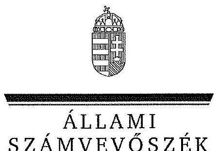
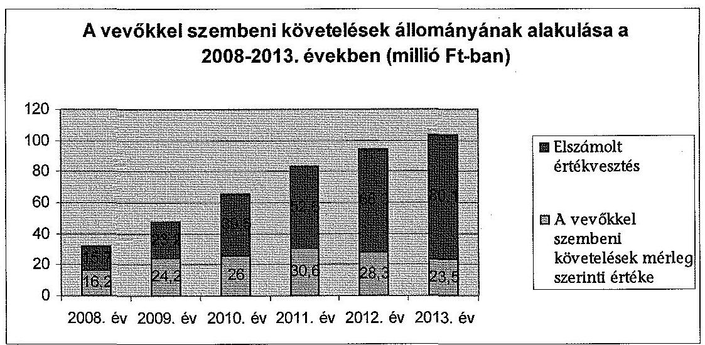
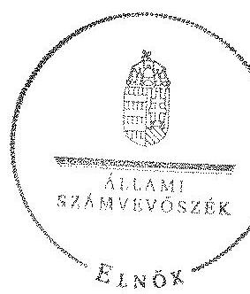
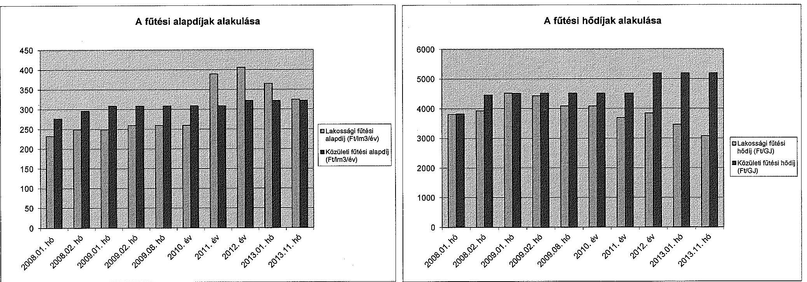
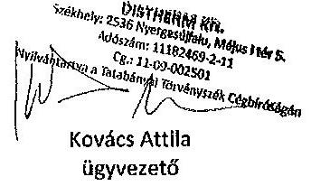
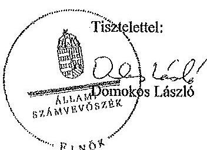
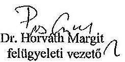

ÁLLAMI
SZÁMVEVŐSZÉK

# JELENTÉS 

Az önkormányzatok gazdasági társaságai - Az önkormányzatok többségi tulajdonában lévő gazdasági társaságok közfeladat ellátását érintő gazdálkodási tevékenysége szabályszerűségének ellenőrzése DISTHERM Távhőszolgáltató Korlátolt Felelősségű Társaság

---

# Állami Számvevőszék 

Iktatószám: V-0481-125/2015.
Témaszám: 1515
Vizsgálat-azonosító szám: V067108

## Az ellenőrzést felügyelte:

Dr. Horváth Margit
felügyeleti vezető
Az ellenőrzést vezette és az ellenőrzés végrehajtásáért felelős:
Valastyánné dr. Vízhányó Júlia
ellenőrzésvezető
A jelentéstervezet összeállításában közreműködött:
Ferencz Katalin Zsuzsanna
számvevő főtanácsos
Az ellenőrzést végezték:
Csényi István
Ferencz Katalin Zsuzsanna
számvevő főtanácsos
számvevő főtanácsos

A témához kapcsolódó eddig készített számvevőszéki jelentések:
címe
sorszáma
Nyergesújfalu Város Önkormányzata pénzügyi helyzetének ellen- 1249
őrzéséről

---

# TARTALOMJEGYZÉK 

BEVEZETÉS ..... 7
I. ÖSSZEGZŐ MEGÁLLAPÍTÁSOK, KÖVETKEZTETÉSEK, JAVASLATOK ..... 10
II. RÉSZLETES MEGÁLLAPÍTÁSOK ..... 17

1. Az Önkormányzat közfeladat-ellátásának szabályszerűsége ..... 17
1.1. A közfeladat-ellátás megszervezése és a feladatellátás feltételrendszerének kialakítása ..... 17
1.2. A közfeladat-ellátás felügyelete és a tulajdonosi jogok érvényesítése ..... 21
2. A DISTHERM Kft. közfeladat ellátással kapcsolatos tevékenysége ..... 24
2.1. A DISTHERM Kft. gazdálkodásának szabályozottsága ..... 24
2.2. A DISTHERM Kft. vagyongazdálkodása ..... 25
2.3. A beszámolási kötelezettség teljesítése ..... 28
3. A távhőszolgáltatás közfeladata bevételei és ráfordításai elszámolásának és önköltségszámításának szabályszerűsége ..... 30
3.1. A távhőszolgáltatás közfeladat bevételeinek és ráfordításainak szabályszerűsége ..... 30
3.2. Az önköltségszámítás szabályszerűsége ..... 31
4. Az ÁSZ korábbi, az önkormányzatok többségi tulajdonában lévő gazdasági társaságok közfeladat-ellátását, gazdálkodását, pénzügyi helyzetét érintő javaslataira tett intézkedések ..... 33

## MELLÉKLETEK

1. számú A DISTHERM Kft. tevékenységének főbb adatai
2. számú A DISTHERM Kft. működésének főbb jellemzői
3. számú A DISTHERM Távhőszolgáltató Kft. által biztosított távfűtés díjainak alakulása
4. számú Beérkezett észrevételek és az azokra adott válaszok

## FÜGGELÉKEK

1. számú Értelmező szótár
2. számú Mintavételi eljárások ellenőrzési területenként

---

.

---

# RÖVIDÍTÉSEK JEGYZÉKE 

## Törvények

Ámt.
Az árak megállapításáról szóló 1990. évi LXXXVII. törvény (hatályos: 1991. január 1-jétől)
ÁSZ tv.
az Állami Számvevőszékről szóló 2011. évi LXVI. törvény (hatályos: 2011. július 1-jétől)
Gt.
a gazdasági társaságokról szóló 2006. évi IV. törvény (hatálytalan: 2014. március 15-étől)
Mötv.
Magyarország helyi önkormányzatairól szóló 2011. évi CLXXXIX. törvény (hatályos: 2012. január 1-jétől, kivéve a 144. § (2) bekezdésben meghatározott előírások, amelyek 2012. április 15-én, a (3) bekezdésben meghatározott előírások, amelyek 2013. január 1-jén léptek hatályba, a (4) bekezdésben meghatározott előírások a 2014. évi általános önkormányzati választások napján léptek hatályba)
Nvtv.
a nemzeti vagyonról szóló 2011. évi CXCVI. törvény (hatályos: 2011. december 31-étől, kivéve a 20. § (2) bekezdésben meghatározott előírások, amelyek 2012. január 1-jétől, a (3) bekezdésben meghatározott előírások 2013. január 1-jétől, a (4) bekezdésben meghatározott előírások 2012. március 2-ától léptek hatályba)
Ötv.
a helyi önkormányzatokról szóló 1990. évi LXV. törvény (hatálytalan: a 2014. évi általános önkormányzati választások napjától)
Számv. tv.
a számvitelről szóló 2000. évi C. törvény (hatályos: 2001. január 1-jétől)
Taktv.
a köztulajdonban álló gazdasági társaságok takarékosabb működéséről szóló 2009. évi CXXII. törvény (hatályos: 2009. december 4-étől)
Tszt.
a távhőszolgáltatásról szóló 2005. évi XVIII. törvény (hatályos: 2005. július 1-jétől)

## Rendeletek

távhőszolgáltatási rendelet $_{1}$

Nyergesújfalu Város Önkormányzati Képviselőtestületének többször módosított 42/2003. (XII. 17.) számú rendelete a távhőszolgáltatás legmagasabb hatósági díjáról és a díjalkalmazás feltételeiről (hatályos: 2003. december 17-étől 2008. február 14-éig)
távhőszolgáltatási rendelet ${ }_{2}$
Nyergesújfalu Város Önkormányzati Képviselőtestületének többször módosított 2/2008. (II. 14.) számú rendelete a távhőszolgáltatásról, valamint a távhőszolgáltatási díjak megállapításáról és a díjalkalmazás feltételeiről (hatályos: 2008. február 15-étől 2011. január 3-áig)

---

távhőszolgáltatási rendelet $_{3}$
vagyongazdálkodási rendelet ${ }_{1}$
vagyongazdálkodási rendelet ${ }_{2}$
vagyongazdálkodási rendelet ${ }_{3}$

## Szórövidítések

áfa
Alapító Okirat
ÁSZ
Dalkia Energia Zrt.

DISTHERM Kft.
értékelési szabályzat

## FB

GJ
HMV
jegyző
Képviselő-testület

## KSH

leltározási és selejtezési szabályzat
MEH
M Ft
Önkormányzat
pénzkezelési szabályzat
polgármester

Nyergesújfalu Város Önkormányzati Képviselőtestületének módosított 21/2010. (XII. 21.) számú rendelete a távhőszolgáltatásról, valamint a távhőszolgáltatási díjak megállapításáról és a díjalkalmazás feltételeiről (hatályos: 2011. január 4-étől)
Nyergesújfalu Város Önkormányzati Képviselőtestületének 28/2007. (XII. 10.) számú rendelete az önkormányzat vagyonáról és a vagyonnal kapcsolatos tulajdonosi jogok gyakorlásáról (hatályos: 2007. december 10-étől 2010. március 31-éig)
Nyergesújfalu Város Önkormányzati Képviselőtestületének 7/2010. (III. 30.) számú rendelete az önkormányzat vagyonáról és a vagyonnal kapcsolatos tulajdonosi jogok gyakorlásáról (hatályos: 2010. április 1-jétől 2012. október 31-éig)

Nyergesújfalu Város Önkormányzati Képviselőtestületének 39/2012. (X. 31.) számú rendelete az önkormányzat vagyonáról és a vagyonnal kapcsolatos tulajdonosi jogok gyakorlásáról (hatályos: 2012. november 1-jétől)
általános forgalmi adó
DISTHERM Távhőszolgáltató Kft. Alapító Okirata
Állami Számvevőszék
Dalkia Energia Energetikai Szolgáltató Zrt. (a francia Dalkia társaságon keresztül a Veolia Environnement és az Electricité de France nemzetközi cégcsoporthoz tartozik)
DISTHERM Távhőszolgáltató Korlátolt Felelősségű Társaság
DISTHERM Távhőszolgáltató Kft. Eszközök és források értékelési szabályzata (hatályos: 2012. január 1-jétől)
DISTHERM Távhőszolgáltató Kft. Felügyelőbizottsága
gigajoule
használati meleg víz
Nyergesújfalu Város Önkormányzatának jegyzője
Nyergesújfalu Város Önkormányzatának Képviselőtestülete
Központi Statisztikai Hivatal
DISTHERM Távhőszolgáltató Kft. Leltározási és selejtezési szabályzata (hatályos: 2011. január 1-jétől)
Magyar Energia Hivatal és annak jogutódja a Magyar Energetikai és Közmű-szabályozási Hivatal
millió forint
Nyergesújfalu Város Önkormányzata
DISTHERM Távhőszolgáltató Kft. Házipénztár pénzkezelési szabályzata (hatályos: 2011. január 1-jétől)
Nyergesújfalu Város Önkormányzatának polgármestere

---

| Polgármesteri Hivatal | Nyergesújfalu Város Önkormányzatának Polgármesteri Hivatala |
| :--: | :--: |
| Prometheus Rt. | PROMETHEUS Tüzeléstechnikai Rt. (2006. évtől tulajdonos és névváltozást követően Dalkia Energia Energetikai Szolgáltató Zrt.) |
| számlarend | DISTHERM Távhőszolgáltató Kft. Számlarendje (hatályos: 2012. január 1-jétől) |
| számviteli politika | DISTHERM Távhőszolgáltató Kft. Számviteli politikája (hatályos: 2012. január 1-jétől) |
| Üzemeltetési szerződés ${ }_{1}$ | Nyergesújfalu Város Önkormányzata és a DISTHERM Távhőszolgáltató Kft. között a hő-, használati melegvíz termelő és elosztó rendszerek üzemeltetésére 2002. október 15-én létrejött szerződés |
| Üzemeltetési szerződés ${ }_{2}$ | Nyergesújfalu Város Önkormányzata és a DISTHERM Távhőszolgáltató Kft. között 2010. december 28-án létrejött szolgáltatási szerződés. Az Üzemeltetési szerződés ${ }_{2}$ 1.1.4. pontja szerint az Üzemeltetési szerződés ${ }_{1}$ módosított tartalmának új dokumentumban rögzítése (egységes szerkezetbe foglalás) az Üzemeltetési szerződés ${ }_{1}$ alapján fennálló jogviszony folytonosságát nem érintette. |
| Taggyülés | DISTHERM Távhőszolgáltató Kft. Taggyűlése |
| Társasági szerződés | a DISTHERM Távhőszolgáltató Kft. társasági szerződése |
| Tulajdonosi megállapodás | Nyergesújfalu Város Önkormányzata és a PROMETHEUS Tüzeléstechnikai Rt. (2006. évtől tulajdonos és névváltozás miatt Dalkia Energia Energetikai Szolgáltató Zrt.) között 2001. szeptember 5-én létrejött és 2001. december 3-án módosított megállapodás. (Továbbiakban a megállapodást 2014. március 11-én, az ellenőrzött időszakon kívül módosították.) |

---

.

---

# JELENTÉS 

## Az önkormányzatok gazdasági társaságai Az önkormányzatok többségi tulajdonában lévő gazdasági társaságok közfeladat ellátását érintő gazdálkodási tevékenysége szabályszerűségének ellenőrzése DISTHERM Távhőszolgáltató Korlátolt Felelősségű Társaság

## BEVEZETÉS

Az Állami Számvevőszék középtávra szóló stratégiájában megfogalmazta, hogy a helyi önkormányzatok gazdálkodásában rejlő pénzügyi kockázatok feltárásával, az államháztartáson kívülre nyújtott költségvetési támogatások és ingyenes vagyonjuttatások, valamint az államháztartáson kívül működő köz-feladat-ellátó rendszerek ellenőrzéseivel hozzájárul ahhoz, hogy a közpénzeket az államháztartáson kívül működő szervezetek is átlátható, rendezett módon használják fel a közfeladatok szerződésben vállalt ellátása érdekében.

Az önkormányzatok szervezetalakítási szabadságának következménye, hogy a korábban is vállalati formában működő (nagyvárosi tömegközlekedés, víz-, szennyvízcsatorna, köztisztasági, ingatlankezelés stb.) közszolgáltatások mellett, mind a kötelező, mind az önként vállalt feladatok ellátásában a gazdasági társaságok kiemelt fontosságú szerephez jutottak.

A DISTHERM Kft.-t a Magyar Viscosagyár, Nyergesújfalu Város Önkormányzata és Lábatlan Nagyközség Önkormányzata 1992. évben hozta létre. A 2001. szeptember 5-én kelt Alapító Okirat alapján az Önkormányzat a DISTHERM Kft. egyszemélyes tulajdonosa volt. Az Önkormányzat, a tulajdonát képező 18,7 M Ft üzletrész felosztását követően, 2001. december 3-án szerződést kötött a Prometheus Rt.-vel - 2006. évtől tulajdonos és névváltozás után Dalkia Energia Zrt. - a DISTHERM Kft.-ben lévő 49%-os üzletrészének az átruházásáról. A társaság tulajdonosi szerkezete, illetve a törzsbetét összege az üzletrész értékesítést követően az ellenőrzési időszak végéig nem változott. A társaság főtevékenysége gőzellátás, légkondicionálás volt.

A DISTHERM Kft. a 2013. év végén közel 7500 fő lakosságszámú Nyergesújfalu Város közigazgatási területén a 2008. évben 1036 lakást, a 2013. évben 996 lakást továbbá közintézményeket látott el távhővel. A hőenergiát két gázüzemű kazánban állították elő. A termelt hőmennyiség a 2013. évben 40469 GJ, az értékesített éves hőmennyiség 34146 GJ volt. Az ellenőrzött időszakban a kazán-

---

házakra és a távhőrendszer egészére a folyamatos, biztonságos üzemeltetés volt a jellemző. A DISTHERM Kft. dolgozóinak létszáma négy fő volt.

A 2008-2013. években a DISTHERM Kft. éves nettó árbevétele 196,0 M Ft és 224,5 M Ft között, az eszközök és források értéke 198,4 M Ft és 258,8 M Ft között alakult. A társaság mérleg szerinti eredménye - a 2010. és a 2013. évek kivételével, amikor 0,4 M Ft, illetve 5,3 M Ft nyereség képződött - negatív (-1,3 M Ft és -15,6 M Ft közötti) volt.

Az ellenőrzött időszakban az ügyvezető személye három alkalommal változott, a jelenlegi ügyvezető 2011. október 1-jétől látja el feladatát. Az ügyvezető a Dalkia Energia Zrt. munkavállalója volt és jelenleg is az. A társaság gazdaságpolitikájának, számviteli szabályzatainak és üzleti terveinek kidolgozását mellékszolgáltatás keretében a Dalkia Energia Zrt. végezte. A DISTHERM Kft. feladata az üzemeltetés, a fogyasztási adatok rögzítése, leolvasása, továbbá az ügyfélszolgálat volt a nyergesújfalui székhelyen.

A 2008-2013. években a polgármester személye a 2010. évi önkormányzati választások alkalmával változott. A jegyző személye két alkalommal változott, a munkakört betöltő jegyző 2013. november 4-e óta látja el feladatait.

Az önkormányzati tulajdonú gazdasági társaságok teljes körű ellenőrzésének lehetőségét az Állami Számvevőszékről szóló 1989. évi XXXVIII. törvény 2011. január 1-jétől hatályos módosítása teremtette meg.

Az ellenőrzés célja annak értékelése volt, hogy

- az önkormányzat a jogszabályi előírások figyelembevételével döntött-e az ellenőrzésre kerülő közfeladat megszervezéséről; az önkormányzat szabályszerűen gyakorolta-e a tulajdonosi jogokat;
- a gazdasági társaság közfeladat-ellátása bevételeinek, ráfordításainak elszámolása, és vagyongazdálkodási tevékenysége megfelelt-e a jogszabályi, illetve a közszolgáltatási szerződésben foglalt tulajdonosi előírásoknak, azok végrehajtása szabályszerű volt-e;
- a közfeladatok átláthatósága és elszámoltathatósága érdekében biztosítva volt-e a közszolgáltatás díjának megalapozottsága szabályszerű önköltségszámítással.

Az ellenőrzés kiterjedt Nyergesújfalu Város Önkormányzatára és a DISTHERM Távhőszolgáltató Korlátolt Felelősségű Társaságra.

Az ellenőrzés várható hasznosulása: A törvényalkotás számára - az észlelt problémák, szabálytalanságok, vagy egyéb nem kívánatos jelenségek felszínre kerülésével - az ellenőrzés megállapításai segítséget nyújthatnak az államháztartáson kívüli közfeladat-ellátás értékeléséhez, jogszabályi keretei pontosításához, átláthatóságot biztosító szabályozásához. Meghatározhatóvá válnak a közfeladat ellátásában részt vevő államháztartáson kívüli szervezeteknek - az önkormányzat költségvetését, pénzügyi helyzetét is befolyásoló - kockázatai, lehetővé válik ezen kockázatok csökkentése. Értékelhetővé válik, hogy a feladatot ellátó gazdasági társaság a közszolgáltatási szerződésben foglaltak betartá-

---

sával, a közvagyon használatával biztosította-e a szolgáltatás folytatásának feltételeit. Ezzel az ellenőrzöttek és a helyi döntéshozók számára visszajelzést ad feladatszervezési, feladat-ellátási kockázataikról, alapot ad a meglévő hibák megszüntetéséhez, a jobb közfeladat-ellátás biztosításához. Fokozza a fegyelmet, igazolja, hogy lejárt a következmények nélküli ellenőrzések időszaka. Az ÁSZ értékteremtő rend kialakításához és megőrzéséhez hozzájáruló tevékenysége pozitív hatással van a szervezetről kialakított összkép formálására is.

A bevételek és ráfordítások elszámolása, valamint a vagyonnyilvántartás terén az egyes területek szabályszerű működését mintavétellel ellenőriztük, ez alapján a sokaságokban előforduló hibás tételek arányát becsültük. A jogszabályoknak és a belső előírásoknak megfelelőnek, azaz szabályszerűnek tekintettük az adott bevételek és ráfordítások elszámolását, a vagyonnyilvántartást, amennyiben a minta
 ellenőrzésének eredménye alapján 95%-os bizonyossággal a teljes sokaságban a hibás tételek aránya kisebb volt, mint 10%, nem megfelelőnek értékeltük, ha a hibás tételek aránya a 10%-ot meghaladta. Kockázatot, illetve magas kockázatot jeleztünk, amennyiben egy adott terület vonatkozásában a minta alapján a teljes sokaságban nem volt teljes körűen biztosított a jogszabályoknak és a belső szabályzatoknak megfelelő működés.

Az ellenőrzést a számvevőszéki ellenőrzés szakmai szabályai szerint, szabályszerűségi ellenőrzés módszerével, a vonatkozó nemzetközi standardok figyelembevételével végeztük. Az ellenőrzés a 2008-2013. évekre terjedt ki.

Az ellenőrzés végrehajtásának jogszabályi alapját az Állami Számvevőszékről szóló 2011. évi LXVI. törvény 5. § (3)-(5) bekezdései képezték.

Az ÁSZ az Állami Számvevőszékről szóló 2011. évi LXVI. törvény 29. §-a alapján a jelentéstervezetet észrevételezésre megküldte a polgármesternek és a gazdasági társaság ügyvezetőjének. A beérkezett észrevételeket a jelentés véglegesítése során hasznosítottuk. Az észrevételeket és az azokra adott válaszokat a jelentés 4. számú melléklete tartalmazza.

---

# I. ÖSSZEGZŐ MEGÁLLAPÍTÁSOK, KÖVETKEZTETÉSEK, JAVASLATOK 

Nyergesújfalu Város Önkormányzata a távhőszolgáltatás kötelező feladatát a DISTHERM Kft. tevékenységén keresztül látta el. Az ellenőrzött időszakban a társaság törzstőkéje 18,7 M Ft volt, melynek 51%-ban Nyergesújfalu Város Önkormányzata, 49%-ban a Prometheus Rt. (2006. évtől Dalkia Energia Zrt.) a tulajdonosa. A Képviselő-testület az Önkormányzat közigazgatási területén a távhőszolgáltatás közfeladatának megszervezéséről a jogszabályi előírásoknak megfelelően döntött.

Az Önkormányzat 2006-2010. és a 2011-2014. évekre szóló gazdasági programjai a távhőszolgáltatás fejlesztésével kapcsolatban célokat nem fogalmaztak meg. Az Önkormányzat a távhőszolgáltatásra vonatkozóan a Tszv. szerinti rendeletalkotási kötelezettségének eleget tett. A Képviselő-testület megalkotta az ellenőrzött időszakban hatályos távhőszolgáltatási rendelet1,2,3-t, továbbá a vagyongazdálkodási rendelet1,2,3-t. A távhőszolgáltatási rendelet1,2,3 a Tszv. előírásainak megfelelt, mellékletei tartalmazták a lakossági célú távhőszolgáltatás díjait, a távhőszolgáltatási díjak kiszámítására vonatkozó árképleteket. A vagyongazdálkodási rendelet3-t - mely a DISTHERM Kft. üzletrészét nemzetgazdasági szempontból kiemelt jelentőségű nemzeti vagyon körébe sorolta - 2012. november 1-jén, az Nvtv.-ben előírt határidőhöz képest 8 hónapos késedelemmel léptették hatályba.

Az ellenőrzött időszakban hatályos Tulajdonosi megállapodást az Önkormányzat és a Prometheus Rt. (2006. évtől Dalkia Energia Zrt.) 2001. évben, 16 évre szólóan kötötte. A Tulajdonosi megállapodásban rögzítették többek között a távhőszolgáltatás műszaki hátterének biztosításával, a beruházások, a veszteséges gazdálkodás finanszírozásával kapcsolatos kötelezettségeket, a távhőszolgáltatási díjak megállapításával, változtatásával kapcsolatos feladatokat és hatásköröket, a kisebbségi tulajdonos által végzett mellékszolgáltatásokat. A Tulajdonosi megállapodás pótbefizetési kötelezettségre vonatkozó előírásai - mely szerint a DISTHERM Kft.-ben képződött veszteséget pótbefizetés teljesítésével a Dalkia Energia Zrt. viseli - nem voltak összhangban a Társasági szerződésében foglaltakkal, mely szerint a pótbefizetésről a tagok a törzsbetéteik arányában gondoskodnak. A Gt. előírása alapján a pótbefizetési kötelezettségnek a törzsbetétek arányában történő befizetésétől abban az esetben lehet eltérni, ha azt a tagok a társasági szerződésben rögzítik.

Az ellenőrzött időszakot megelőzően - 2002. évben - az Önkormányzat és DISTHERM Kft. Üzemeltetési szerződés1-t kötöttek, mely 16 évre szólt. A szerződés módosított tartalmát az Üzemeltetési szerződés2-ben rögzítették, amely 2011. január 1-jétől volt hatályban. Az Üzemeltetési szerződés1,2-ben rögzítették a távhőszolgáltatással, a távhőszolgáltatási díjakkal, a szolgáltatás szabályszerű teljesítésével kapcsolatos rendelkezéseket, a felelősségi szabályokat, illetve a szerződés módosításával és megszűnésével kapcsolatos feltételeket. Az Önkormányzat üzemeltetésre vagyont nem adott át, a DISTHERM Kft. a saját va-

---

gyonával, az Üzemeltetési szerződés1,2-ben foglalt tulajdonosi előírások betartásával biztosította az ellenőrzött időszakban a távhőszolgáltatási közfeladat ellátását.

Az Önkormányzat Képviselő-testülete a DISTHERM Kft. feletti tulajdonosi jogokat a Gt.-ben meghatározott előírások szerint szabályszerűen gyakorolta. Az ügyvezetőt, az FB tagokat és a könyvvizsgálót a Taggyűlés választotta meg. Az ügyvezetőt a tulajdonosok egyhangúlag választották meg, illetve hívták vissza. A DISTHERM Kft.-nél FB a Társasági szerződés 2010. augusztus 4-ei módosítását követően működött. A DISTHERM Kft. az FB-t a Taktv. által meghatározott 2010. január 31-ei határidőn túl, 6 hónapos késedelemmel hozta létre. Az FB három tagból állt, melyből két tagot az Önkormányzat delegált. Az ellenőrzött időszakban az ügyvezetők és az FB tagok a társaságnál díjazásban nem részesültek.

Az Önkormányzat a tulajdonosi ellenőrzési, beszámoltatási kötelezettségét az FB működésén keresztül, illetve a delegált önkormányzati képviselő DISTHERM Kft. Taggyűlésén való részvételével biztosította. Az Önkormányzat a 2008-2012. években az Ötv.-ben biztosított lehetőségével nem élt, belső ellenőrzéssel ellenőrzéseket a DISTHERM Kft.-nél nem végeztetett. Az Önkormányzat belső ellenőrzése a távhőszolgáltatás, mint közfeladat ellátás szabályszerű teljesítéséhez, az önkormányzati vagyon (törzstőke) megóvásához az ellenőrzött időszakban nem járult hozzá. A DISTHERM Kft. közvagyonnal kapcsolatos felelős gazdálkodását külső szakértő nem ellenőrizte.

A DISTHERM Kft. az ellenőrzött időszakban - a 2010. és a 2013. év kivételével - veszteségesen gazdálkodott. A mérleg szerinti eredmény a 2008-2013. években -9,7 MFt, -1,3 MFt, 0,4 MFt, -7,4 MFt, -15,6 MFt, 5,3 MFt volt. A Taggyűlés döntése alapján az eredményt az ellenőrzött időszakban eredménytartalékba helyezték, osztalék kifizetésére nem került sor. A Taggyűlés a DISTHERM Kft. 2009. évi és 2011-2012. évi veszteséges gazdálkodása miatt - a saját tőke/jegyzett tőke mutató előírt szintjének biztosítása érdekében - a Dalkia Energia Zrt.-t 1,3 M Ft, 7,0 M Ft, illetve 16,0 M Ft tulajdonosi pótbefizetés teljesítésére kötelezte, melyet a Dalkia Energia Zrt. teljesített. A pótbefizetés elrendelése és teljesítése ellentétes volt a Társasági szerződés és a Gt. előírásával. Az Önkormányzat az ellenőrzött időszakban a DISTHERM Kft. gazdálkodásának finanszírozásában - egy távhőszolgáltatási díjmeghatározásból származó 0,4 M Ft bevételkiesés megtérítésén kívül - nem vett részt, a társaság kötelezettségvállalásaival kapcsolatban garanciát, kezességet nem vállalt.

Az ellenőrzött időszakban a DISTHERM Kft. számviteli rendszerének szabályozottsága hiányosságokat mutatott. Az ügyvezető a leltározási és selejtezési, valamint pénzkezelési szabályzatot 2011. január 1-jétől, a számviteli politikát, az értékelési szabályzatot és a számlarendet 2012. január 1-jétől helyezte hatályba. Az ellenőrzött időszak ezt megelőző éveiben - a Számv. tv. előírásai ellenére - a DISTHERM Kft. nem rendelkezett aláírt, érvényes gazdálkodási szabályzatokkal. Az ellenőrzött időszakban hatályos számviteli politikában, illetve számlarendben - a Számv. tv. előírásait figyelmen kívül hagyva - a vagyon működtetéséből származó bevételek, illetve közvetlen költségek és ráfordítások telephelyenkénti elkülönített nyilvántartására, továbbá a Tszv.-ben a 2012. január 1-jétől előírt számviteli szétválasztási szabályokra vonatkozó előírásokat

---

nem rögzítették. A leltározási és selejtezési szabályzatot a Számv. tv. 2012. január 1-jétől hatályos - háromévenkénti leltározási kötelezettségre vonatkozó előírásának megfelelően nem aktualizálták. A pénzforgalom bankszámlán történő lebonyolításának rendjét - a Számv. tv. előírása ellenére - a pénzkezelési szabályzatban nem rögzítették. A DISTHERM Kft. a Számv. tv. előírásai alapján önköltségszámítás rendjére vonatkozó szabályzat készítésére nem volt kötelezett.

A DISTHERM Kft. vagyongazdálkodási tevékenysége - beleértve a vagyon kezelését, gyarapítását, hasznosítását - összességében megfelelt a jogszabályi előírásoknak és a tulajdonosok által meghatározott követelményeknek. Az immateriális javak és tárgyi eszközök bruttó értékében és értékcsökkenési leírásában történő változások az analitikus nyilvántartásokban nyomon követhetők voltak. Az ellenőrzött időszak mérlegbeszámolóiban szereplő eszközök és források értékét leltárral támasztották alá a Számv. tv. előírásainak megfelelően. Az éves beszámolók kiegészítő mellékleteiben a vagyonelemeket, és az azokban bekövetkezett változásokat bemutatták. A DISTHERM Kft. a folyamatos működtetés érdekében elvégezte a szükséges karbantartási munkákat mind a távhő vezeték, mind a hőközpontok és egyéb távhő vagyon esetében. A beruházások, élettartam növelő felújítások azonban nem az eszközök elhasználódásának megfelelő arányban történtek az ellenőrzött időszakban.

A DISTHERM Kft. az ellenőrzött időszakban jelentős követelésállománnyal rendelkezett, amelyből a vevőkkel szembeni követelés mérleg szerinti összege a 2008. évi 16,2 M Ft-ról a 2011. évben 30,6 M Ft-ra növekedett, a 2013. évben 23,5 M Ft-ra csökkent. Az ügyvezetés az éves beszámolók kiegészítő mellékletében minden évben beszámolt a kintlévőségek alakulásáról. A társaság az ellenőrzött időszakban évről-évre növekvő összegű (a 2008. évben 15,7 M Ft, a 2013. évben 80,1 M Ft) értékvesztést számolt el a határidőn túli követelésekre a Számv. tv. előírásának megfelelően. A kintlévőségek kezelése folyamatosan, a számlázás folyamatába építetten működött. A követelések behajtása érdekében éltek a meleg vízszolgáltatás kikapcsolásával, bírósági és bírósági úton kívüli eljárásokkal.

A DISTHERM Kft. beszámolási kötelezettségének a Számv. tv. és a Gt. előírásai szerint tett eleget. A 2010-2013. évek éves beszámolóiról az FB elkészítette az írásos jelentéseit. A Taggyűlés a könyvvizsgáló írásbeli véleményének, jelentésének, illetve 2010. évtől az FB jelentésének ismeretében minden évben határozattal döntött az éves beszámoló jóváhagyásáról, továbbá az üzleti terv elfogadásáról. A Taggyűlésekről készült jegyzőkönyvek tanúsága szerint a könyvvizsgáló - a Gt. előírásai és DISTHERM Kft. meghívása ellenére - a társaság éves Taggyűlésein nem vett részt.

A könyvvizsgáló a Számv. tv. szerinti beszámoló készítési határidőn belül, minősítés nélküli záradékot adott a beszámolókról. A DISTHERM Kft. 2009. évi, 2011. évi és a 2012. évi beszámolójával kapcsolatban a könyvvizsgáló felhívta a figyelmet a kiegészítő mellékletre, melyben a társaság tőkevesztése és a tulajdonosok által hozott intézkedések bemutatásra kerültek. A 2012. évi és a 2013. évi könyvvizsgálói jelentés tartalmazta a Tszv.-ben előírt igazolást arról, hogy a vállalkozás által kidolgozott és alkalmazott számviteli szétválasztási szabályok, valamint az egyes tevékenységek közötti tranzakciók árazása biztosítják a vál-

---

lalkozás tevékenységei közötti keresztfinanszírozás-mentességet. A DISTHERM Kft. a 2012. évi és a 2013. évi beszámolójának kiegészítő mellékletében - eleget téve a Tszv. előírásainak - telephelyenként (Duna-part és Május 1. tér) bemutatta az eredmény-kimutatását és mérlegét. A beszámolókat a Számv. tv. előírásainak megfelelően letétbe helyezték.

A 2012. és a 2013. években a DISTHERM Kft. közfeladat ellátásával kapcsolatos bevételeinek és kiadásainak a felmerülésük helye szerinti (Duna-part és Május 1. tér) számviteli elkülönítése nem történt meg. A 2012. és a 2013. éves beszámolóban a távhőtermelési és szolgáltatási tevékenység bevételeit és ráfordításait bemutatták telephelyenként részletezve, de a telephelyenkénti adatok a könyvviteli nyilvántartásból nem voltak egyértelműen beazonosíthatók.

A távhőszolgáltatási közfeladat bevételeinek elszámolása során nem érvényesültek teljes körűen a jogszabályok és a belső szabályzatok előírásai. A 2009-2013. években a bevételek előírása, kiszámlázása és elszámolása szabályszerű volt. A 2008. évi bevételek elszámolásához kapcsolódón - a Számv. tv. előírásait megsértve - öt elszámolás esetében a társaság nem tudta bemutatni a számviteli elszámolás alapját képező bizonylatokat. Ez magas kockázatot jelez az ellenőrzött terület egészének szabályos működése szempontjából. A DISTHERM Kft. a távhőszolgáltatási közfeladat anyagjellegű ráfordításainak, beruházásainak, felújításainak elszámolása során szabályszerűen járt el.

A DISTHERM Kft. által a 2008-2013. években alkalmazott távhőszolgáltatási díjak bázis alapú, indexáló árképzésen alapultak. Az Üzemeltetési szerződés1,2-ben meghatározták a szerződéskötéskor érvényes egységárakat, a felülvizsgálat szabályait, a hődíj és az alapdíj módosításának a képletét.

Az ÁSZ az Önkormányzat pénzügyi helyzetét a 2011. évben ellenőrizte. Az Önkormányzat Képviselő-testülete a feltárt hiányosságok megszüntetése érdekében, a 2012.
 május 31-én megtartott ülésén intézkedési tervet fogadott el. Az intézkedések az Önkormányzat többségi tulajdonában lévő gazdasági társaságokra, így a DISTHERM Kft.-re nem terjedtek ki.

A fentiekben leírtak összegzéseként az alábbi megállapításokat tesszük:
A konstrukcióból eredő sajátosság volt, hogy a menedzsment jogokat a Társasági szerződés, illetve a Tulajdonosi megállapodás alapján a kisebbségi tulajdonos Dalkia Energia Zrt. gyakorolta. A Dalkia Energia Zrt. a társaság gazdaságpolitikájának, számviteli szabályzatainak és üzleti terveinek kidolgozását mellékszolgáltatásként végezte. A Tulajdonosi megállapodásban a Dalkia Energia Zrt. garantálta a DISTHERM Kft. veszteség nélküli gazdálkodását, veszteséges gazdálkodás esetén a pótbefizetés teljesítését. A Tulajdonosi megállapodás alapján elrendelt, illetve végrehajtott pótbefizetés ellentétes volt a Társasági szerződés és a Gt. előírásával. Az Önkormányzat a DISTHERM Kft. gazdálkodásának finanszírozásában - egy eset kivételével - nem vett részt. Az Önkormányzat a tulajdonosi ellenőrzési, beszámoltatási kötelezettségét az FB működésén keresztül, illetve a delegált képviselő DISTHERM Kft. Taggyűlésén való részvételével biztosította.

---

A konstrukcióból adódóan a tulajdonosi kontroll nem működött megfelelően, a megállapítások alapján feltárt kockázatok mind az Önkormányzatnál, mind a gazdasági társaságnál ezt támasztják alá.

Ezen túlmenően a működés kockázata fennállt, mert az Önkormányzat belső ellenőrzése a távhőszolgáltatás, mint közfeladat ellátás szabályszerű teljesítéséhez, az önkormányzati vagyon (törzstőke) megóvásához érdemben nem járult hozzá. A DISTHERM Kft. közvagyonnal kapcsolatos felelős gazdálkodását külső szakértő nem ellenőrizte. Az ellenőrzött időszakban a DISTHERM Kft. számviteli rendszerének szabályozottsága hiányosságokat mutatott. A távhőszolgáltatási közfeladat bevételeinek elszámolása során nem érvényesültek teljes körűen a jogszabályok és a belső szabályzatok előírásai. A társaság nem különítette el telephelyenként a bevételeit és ráfordításait, nem gondoskodott a megfelelő számviteli szétválasztásról.

Az Állami Számvevőszékről szóló 2011. évi LXVI. törvény 33. § (1) bekezdésében foglaltak értelmében a jelentésben foglalt megállapításokhoz kapcsolódó intézkedési tervet köteles az ellenőrzött szervezet vezetője összeállítani, és azt a jelentés kézhezvételétől számított 30 napon belül az ÁSZ részére megküldeni. Amennyiben az intézkedési tervet határidőben nem küldi meg a szervezet, vagy az nem elfogadható, az ÁSZ elnöke a hivatkozott törvény 33. § (3) bekezdés a)-b) pontjaiban foglaltakat érvényesítheti.

Az ellenőrzés intézkedést igénylő megállapításai és javaslatai:
Javaslataink célja a Kft. gazdálkodása szabályszerűségének helyreállítása annak érdekében, hogy a szabályozási környezet megfelelően tudja támogatni az átlátható működést.

# Javasoljuk a DISTHERM Kft. ügyvezető igazgatójának: 

1. A társaság a 2012. január 1-jétől hatályos számviteli politikájában, illetve számlarendjében - a Számv. tv. 161/A. § (2) bekezdés előírásait figyelmen kívül hagyva - a vagyon működtetéséből származó bevételek, illetve közvetlen költségek és ráfordítások telephelyenkénti elkülönített nyilvántartására, továbbá a Tszt. 18/A. §-ában a 2012. január 1-jétől előírt számviteli szétválasztási szabályokra vonatkozó előírásokat és annak követelményeit nem rögzítette, ezáltal nem alakította ki azt a nyilvántartási rendet, amely alapul szolgál a társaság tevékenységéhez kapcsolódó bevételek és ráfordítások elkülönítésére.

A leltározási és selejtezési szabályzatban az alapozott gépeknél előírt 5 évenkénti leltározási kötelezettség nem felelt meg a Számv. tv. 69. § (3) bekezdés 2012. január 1-jétől hatályos előírásának, amely szerint a leltározást legalább háromévente mennyiségi felvétellel kell elvégezni. A pénzforgalom bankszámlán történő lebonyolításának rendjét - a Számv. tv. 14. § (8) bekezdésének előírása ellenére - a pénzkezelési szabályzatban nem rögzítették.

---

Javaslat:

# Intézkedjen a szabályozási hiányosságok megszüntetésére, ennek keretében: 

a) gondoskodjon a DISTHERM Kft. számviteli szabályozásának kiegészítéséről annak érdekében, hogy a főkönyvi és analitikus nyilvántartások biztosítani tudják a társaság telephelyenkénti elkülönített adatainak kimutatását, a megfelelő számviteli szétválasztást;
b) gondoskodjon a leltározási és selejtezési szabályzat módosításáról, illetve a pénzkezelési szabályzat kiegészítéséről a Számv. tv. hatályos előírásainak megfelelően.
2. A társaság a számviteli politikáját az ellenőrzött időszakban nem módosította, ezzel megsértette a Számv. tv. 14. § (11) bekezdésének előírását, amelynek értelmében a számviteli szabályzatokat a jogszabályi változásokat követően 90 napon belül aktualizálni kell.

A társaság a Számv. tv. 15. § (3) bekezdésének, valamint a 169. § (2) bekezdésének előírásait megsértve öt elszámolás tekintetében nem tudta bemutatni a számviteli elszámolás alapját képező dokumentumokat.

Javaslat:
Gondoskodjon a jogszabályi előírások szerinti gyakorlat és a szabályos működés biztosítására, ezen belül:
a) gondoskodjon a számviteli szabályzatok aktualizálásáról a Számv. tv. előírásai szerint;
b) intézkedjen a könyvviteli elszámolást közvetlenül vagy közvetetten alátámasztó számviteli bizonylatok elévülési határidőn belüli megőrzéséről.

Javaslataink célja az önkormányzati tulajdonosi joggyakorlás kontrolljainak erősítése.

## Javasoljuk Nyergesújfalu Város Önkormányzata Polgármesterének:

1. A Tulajdonosi megállapodás pótbefizetési kötelezettségre vonatkozó előírásai - mely szerint a DISTHERM Kft.-ben képződött veszteséget pótbefizetés teljesítésével az Önkormányzat helyett a Dalkia Energia Zrt. viseli - nem voltak összhangban a Társasági szerződésében foglaltakkal, mely szerint a pótbefizetésről a tagok a törzsbetéteik arányában gondoskodnak. Ezzel megsértették a Gt. 120 § (2) bekezdésének előírásait. A Gt. előírásai szerint a pótbefizetési kötelezettségnek a törzsbetétek arányában történő befizetésétől abban az esetben lehet eltérni, ha ezt a tagok a társasági szerződésben rögzítik.

Javaslat:
Intézkedjen a jogszabályi előírások szerinti gyakorlat és a szabályos működés biztosítására, ezen belül:

---

kezdeményezze a tulajdonosi joggyakorlónál a pótbefizetés teljesítésével kapcsolatos ellentmondás feloldását.

# Javasoljuk Nyergesújfalu Város Önkormányzata Jegyzöjének: 

1. Az Önkormányzat a 2008-2012. években nem élt az Ötv. 92. § (11) bekezdés b) pontjában biztosított lehetőséggel, mivel a belső ellenőrzése vizsgálatokat nem végzett a DISTHERM Kft.-nél, így a távhőszolgáltatás, mint közfeladat ellátás szabályszerű teljesítéséhez, az önkormányzati vagyon megóvásához az ellenőrzött időszakban nem járult hozzá.

Javaslat:
Intézkedjen a jogszabályi előírások szerinti gyakorlat és a szabályos működés biztosítására, ezen belül:
fordítson kiemelt figyelmet arra, hogy az önkormányzat belső ellenőrzése az ellenőrzéseivel a távhőszolgáltatás, mint közfeladat-ellátás szabályszerű teljesítéséhez, valamint az önkormányzati vagyon (törzstőke) megóvásához ellenőrzéseivel járuljon hozzá.

---

# II. RÉSZLETES MEGÁLLAPÍTÁSOK 

## 1. Az ÖNKORMÁNYZAT KÖZFELADAT-ELLÁTÁSÁNAK SZABÁLYSZERŰSÉGE

### 1.1. A közfeladat-ellátás megszervezése és a feladatellátás feltételrendszerének kialakítása

Az Ötv. 91. § (6) bekezdése szerint az Önkormányzatnak a gazdasági programjában kell meghatároznia azon célkitűzéseket, amelyek az ellátandó feladatok biztosítását, fejlesztését szolgálják. Az Önkormányzat 2006-2010., illetve a 2011-2014. évekre a Képviselő-testület által elfogadott ${ }^{1}$ gazdasági programjai a távhőszolgáltató rendszer fejlesztésével kapcsolatban stratégiai célokat, feladatokat nem fogalmaztak meg. A 2006-2010. éves programban célul tűzték ki a DISTHERM Kft. nyereséges gazdálkodását, mely részben teljesült.

A DISTHERM Kft. a 2008. évet -9,7 M Ft, a 2009. évet -1,3 M Ft veszteséggel zárta, a 2010. évben nyereségesen ( $0,4 \mathrm{M}$ Ft) gazdálkodott. A társaság a 2011. és a 2012. évben újra veszteséges volt ( $-7,4 \mathrm{MFt}$, illetve $-15,6 \mathrm{MFt}$ ), míg 2013. évben $5,3 \mathrm{M}$ Ft nyereséget ért el.

A Képviselő-testület az ellenőrzött időszakban megalkotta a hatályos vagyongazdálkodási rendelet${ }_{1,2,3}$-t. A vagyongazdálkodási rendelet${ }_{2}$-t 2012. november 1-jén, az Nvtv. 18. § (1) bekezdésében előírt határidőhöz képest 8 hónapos késedelemmel léptették hatályba, amely a DISTHERM Kft. üzletrészét nemzetgazdasági szempontból kiemelt jelentőségű nemzeti vagyon körébe sorolta. ${ }^{2}$

Az Nvtv. 9. § (1) bekezdése szerint a helyi önkormányzat a vagyongazdálkodásának az Alaptörvényben, valamint a 7. § (2) bekezdésében meghatározott rendeltetése biztosításának céljából közép- és hosszú távú vagyongazdálkodási tervet köteles készíteni, melyet a Képviselő-testület a vagyongazdálkodási rendelet${ }_{2}$-ban előírt határidőben, határozattal ${ }^{3}$ elfogadott.

[^0]
[^0]:    ${ }^{1}$ A Képviselő-testület 243/2006. (XI. 30.) számú, illetve az 56/2011. (III. 31.) számú határozata.
    ${ }^{2}$ A 2012. január 1-jén hatályba lépett Nvtv. 18. § (1) bekezdésének előírása szerint „A helyi önkormányzat a rendelete alapján forgalomképtelennek minősülő vagyonából - az e törvény hatálybalépésétől számított 60 napon belül - rendeletben köteles megjelölni azokat a tulajdonában álló vagyonelemeket, amelyeket az 5. § (4) bekezdés szerinti nemzetgazdasági szempontból kiemelt jelentőségű nemzeti vagyonként forgalomképtelen törzsvagyonnak minősít."
    ${ }^{3}$ A Képviselő-testület 133/2013. (V. 30.) számú határozata.

---

A vagyongazdálkodási rendelet${ }_{3}$ 3. számú melléklete két korlátolt felelősségű társaság, közöttük a DISTHERM Kft. üzletrészét nemzetgazdasági szempontból kiemelt jelentőségű nemzeti vagyon körébe sorolta. A közép- és hosszú távú vagyongazdálkodási terv III/1. b. pontjában foglaltak, mely szerint „az önkormányzat vagyonrendelete nem sorolt vagyont a nemzetgazdasági szempontból kiemelt jelentőségű nemzeti vagyon körébe" nem volt összhangban a vagyongazdálkodási rendelet${ }_{3}$ előírásával.

Az Ötv. 8. § (1) bekezdése ${ }^{4}$ a települési önkormányzatok közszolgáltatási feladatai közé sorolta a helyi energiaszolgáltatásban való közreműködést. Az Ötv. 1. § (5) bekezdése kimondja, hogy „törvény a helyi önkormányzatnak kötelező feladat- és hatáskört is megállapíthat". Az Ötv. 8. § (3) bekezdése ugyancsak rendelkezik arról, hogy törvény a települési önkormányzatokat egyes közszolgáltatási feladatok ellátásáról történő gondoskodásra kötelezheti. A távhőszolgáltatással ellátott létesítmények távhőellátásának távhőszolgáltatásra engedéllyel rendelkezők útján történő biztosítása a Tszt. 6. § (1) bekezdése értelmében a területileg illetékes települési önkormányzat kötelező feladata.

Az Önkormányzat az Ötv. 9 § (4) bekezdésében előírtak figyelembe vételével szabályszerűen döntött a távhőszolgáltatás kötelező közfeladat ellátásának gazdasági társaságban történő megszervezéséről.

Az ellenőrzött időszakban a DISTHERM Kft. törzstőkéje 18,7 M Ft volt, melynek az Önkormányzat 51%-ban ( $9,5 \mathrm{M}$ Ft), a Dalkia Energia Zrt. 49%-ban ( $9,2 \mathrm{MFt}$ ) a tulajdonosa. A DISTHERM Kft. Társasági szerződése szerinti főtevékenysége gőzellátás, légkondicionálás. A DISTHERM Kft. főbb adatait az 1. számú melléklet, a társaság működésének főbb jellemzőit a 2. számú melléklet tartalmazza.

Az ellenőrzött időszakban hatályos Tulajdonosi megállapodást az Önkormányzat és a Prometheus Rt. (2006. évtől Dalkia Energia Zrt.) 2001. szeptember 5-én, 16 évre szólóan kötötte. A Tulajdonosi megállapodásban a tulajdonosok kötelezettséget vállaltak arra, hogy a Társasági szerződésben nem szabályozott, illetve nem részletezett jogaikat és kötelezettségeiket a Tulajdonosi megállapodásban foglaltak szerint gyakorolják a társaság működése során. A Tulajdonosi megállapodásban rögzítették a távhőszolgáltatás műszaki hátterének biztosításával, a beruházások, a veszteséges gazdálkodás finanszírozásával kapcsolatos kötelezettségeket. Rögzítették továbbá az ügyvezető közös megválasztásának kötelezettségét, a távhőszolgáltatási díjak megállapításával, változtatásával kapcsolatos feladatokat és hatásköröket, a kisebbségi tulajdonos által végzett mellékszolgáltatást és annak díjazását. A Tulajdonosi megállapodást az ellenőrzött időszakban nem módosították.

A Tulajdonosi megállapodás alapján a Prometheus Rt., későbbiekben Dalkia Energia Zrt. vállalta a távhőszolgáltatás műszaki hátterének biztosítását, melyet az Üzemeltetési szerződésben${ }_{1,3}$-ben részleteztek. A kisebbségi tulajdonos vállalta a beruházások lefolytatásának megszervezését, a

[^0]
[^0]:    ${ }^{4}$ A helyi közügyek, valamint a helyben biztosítható közfeladatok körében ellátandó helyi önkormányzati feladatként a távhőszolgáltatást 2013. január 1-jétől az Mötv. 13. § (1) bekezdés 20. pontja írja elő.

---

hitelfelvételhez szükséges garancia nyújtását, a DISTHERM Kft. veszteség nélküli gazdálkodásának garantálását. 

A Tulajdonosi megállapodás 2. számú melléklete - a Társasági szerződésnek a tagok mellékszolgáltatására vonatkozó előírásaival összhangban - tartalmazta a kisebbségi tulajdonos által végzett szakértői és tanácsadói tevékenységeket, illetve annak díjazására vonatkozó előírásokat. A tulajdonosok a mellékszolgáltatás díjazását a DISTHERM Kft. gazdálkodásának eredményességéhez kötötték.

#### Abstract

A kisebbségi tulajdonos által végzett szakértői és tanácsadói feladatok a műszaki,
 energetikai, környezetvédelmi tanácsadás; a számviteli, pénzügyi, statisztikai tanácsadás; a munkaügyi, jogi tanácsadás feladatokra, illetve a társaság beruházásainak finanszírozásához szükséges hitelgarancia biztosítására terjedtek ki. A megállapodásban rögzítettek szerint a kisebbségi tulajdonos a díjazásra akkor jogosult, ha a DISTHERM Kft. árbevételre vetített adózás előtti nyeresége 16% vagy annál nagyobb volt.

A Tulajdonosi megállapodás alapján a beruházásokra felvett hitelek visszafizetésének, valamint a kisebbségi tulajdonos által végzett mellékszolgáltatás díjainak fedezetét a DISTHERM Kft.-ben képződő adózás előtti eredmény adta. A Prometheus Rt., későbbiekben Dalkia Energia Zrt. kötelezettséget vállalt arra, hogy a Tulajdonosi megállapodás időtartama alatt képződött veszteséget - a távhőszolgáltatási díjmegállapodásból adódó veszteség kivételével - a DISTHERM Kft.-nek nyújtott pótbefizetés teljesítésével viseli. A Tulajdonosi megállapodás alapján a DISTHERM Kft., mint távhőszolgáltató által javasolt és az Önkormányzat által meghatározott távhőszolgáltatási díjak különbségéből keletkező árbevétel-kiesést az Önkormányzat a társaságnak köteles volt megtéríteni.

A Tulajdonosi megállapodás pótbefizetési kötelezettségre vonatkozó előírásai - mely szerint a DISTHERM Kft.-ben képződött veszteséget ${ }^{5}$ pótbefizetés teljesítésével a Dalkia Energia Zrt. viseli - nem voltak összhangban a Társasági szerződésében foglaltakkal, mely szerint a pótbefizetésről a tagok a törzsbetéteik arányában gondoskodnak. A Gt. 120. § (2) bekezdésének előírása alapján a pótbefizetési kötelezettségnek a törzsbetétek arányában történő befizetésétől abban az esetben lehet eltérni, ha azt a tagok a társasági szerződésben rögzítik.

Az ellenőrzött időszakot megelőzően - 2002. október 15-én - az Önkormányzat és DISTHERM Kft. Üzemeltetési szerződés ${ }_{1}$-t kötöttek, mely 16 évre szólt. A szerződés módosított tartalmát az Üzemeltetési szerződés ${ }_{2}$-ben rögzítették, amely 2011. január 1-jétől volt hatályban. ${ }^{6}$ Az Üzemeltetési szerződés ${ }_{1,2}$-ben rögzítették a távhőszolgáltatással (üzemeltetés, karbantartás, hibaelhárítás), a távhőszolgáltatási díjakkal (alapdíj, hődíj, ármegállapítás), a szolgáltatás sza-

[^0]
[^0]:    ${ }^{5}$ A távhőszolgáltatási díjmegállapodásból adódó veszteség kivételével.
    ${ }^{6}$ Az Üzemeltetési szerződés ${ }_{2}$-ben foglaltak szerint a módosított tartalom egységes szerkezetbe foglalása az Üzemeltetési szerződés ${ }_{1}$ alapján fennálló jogviszony folytonosságát nem érintette.

---

bályszerű teljesítésével kapcsolatos rendelkezéseket. Rögzítették továbbá a felelősségi szabályokat (nem szabályszerű teljesítés jogkövetkezményei, felelősségbiztosítás), illetve a szerződés módosításával és megszűnésével kapcsolatos feltételeket. A közfeladat-ellátást szolgáló vagyon a DISTHERM Kft. saját vagyona volt, az Önkormányzat üzemeltetésre vagyont nem adott át.

Az Önkormányzat a távhőszolgáltatásra vonatkozóan a Tszt. 6. § (2) bekezdés szerinti rendeletalkotási kötelezettségének eleget tett. A Képviselőtestület megalkotta az ellenőrzött időszakban hatályos távhőszolgáltatási rendelet ${ }_{1,2,3}$-t. A távhőszolgáltatási rendelet ${ }_{1,2,3}$-ben meghatározták a távhőszolgáltatás területi és személyi hatályát, a távhőszolgáltató és a felhasználó közötti jogviszony szabályait. Meghatározták a hőmennyiségmérés helyét, a távhőszolgáltatás ár- és díjrendszerét, a pótdíjfizetés eseteit és mértékét, a szolgáltatás szüneteltetésének, korlátozásának, a csökkentett mértékű szolgáltatásnak eseteit és szabályait. Meghatározták a távhőszolgáltatási rendszerhez történő csatlakozás szabályait, a csatlakozási díj fizetésére kötelezettek körét és a csatlakozási díj tartalmát, valamint a távhőszolgáltatás fejlesztésére kijelölt területeket. A rendelet a Tszt. előírásainak megfelelt.

A távhőszolgáltatási rendelet ${ }_{1,2,3}$ 1. számú melléklete tartalmazta a lakossági célú távhőszolgáltatás díjait, a 2. számú melléklete a távhőszolgáltatási díjak kiszámítására vonatkozó árképleteket és az árképletek értelmezését. A Tszt. módosításával az Önkormányzat hatósági ármegállapítás joga, az Ámt. 7. § (5) bekezdésének 2011. április 15-től hatályos módosítására való tekintettel megszűnt. ${ }^{7}$

A távhőszolgáltatási rendelet ${ }_{1,2,3}$-ben és a Tulajdonosi megállapodásban foglaltaknak megfelelően, a vonatkozó jogszabályi előírásokkal összhangban a DISTHERM Kft. által nyújtott távhőszolgáltatás legmagasabb hatósági díját, a hatósági ármegállapításának az időszakában az Önkormányzat állapította meg. Az árváltozásról a DISTHERM Kft. - az Üzemeltetési szerződés ${ }_{1,2}$-ben meghatározott ármechanizmus szerint - ármódosító javaslatot készített, melynek elfogadásáról vagy elutasításáról az Önkormányzat Képviselő-testülete döntött.

A közfeladat-ellátást szolgáló vagyon a DISTHERM Kft. saját vagyona volt. Az alapító tagok, közöttük az Önkormányzat, a 2001. évet megelőzően a DISTHERM Kft.-be apportálták a távhőszolgáltatást biztosító vagyont. Az Önkormányzat a DISTHERM Kft. részére a közfeladat ellátásához vagyonkezelésbe, üzemeltetésre vagyont nem adott át, ebből következően leltározási és adatszolgáltatási kötelezettséget sem írt elő.

[^0]
[^0]:    ${ }^{7}$ A távhőszolgáltatási rendelet ${ }_{3}$ 1-2. számú mellékletét, illetve a távhőszolgáltatás ár- és díjrendszerére vonatkozó előírások közül az aktualitásukat vesztett előírásokat a 2012. februárjában végrehajtott módosítással az Önkormányzat hatályon kívül helyezte.

---

# 1.2. A közfeladat-ellátás felügyelete és a tulajdonosi jogok érvényesítése 

Az ellenőrzött időszakban hatályos vagyongazdálkodási rendelet ${ }_{1,2,3}$ rendelkezett az Önkormányzat vagyonának a hasznosításáról, annak módjáról, céljáról, a tulajdonosi jogok gyakorlásáról.

A vagyongazdálkodási rendelet ${ }_{1,2}$ 5. §-ában az önkormányzati vagyon hasznosításának módjai között szerepelt a gazdasági társaság alapítása, illetve a társaságban való részvétel. A hasznosítás céljaként az Önkormányzat kötelező és önként vállalt feladatainak a hatékony és eredményes ellátását határozták meg. A vagyongazdálkodási rendelet ${ }_{1,2}$ előírta, hogy az önkormányzati tulajdonú vagyon hasznosításáról, a tulajdonosi jogokról és kötelezettségekről - ha törvény vagy önkormányzati rendelet másként nem rendelkezik - a Képviselő-testület dönt.

A vagyongazdálkodási rendelet ${ }_{2}$ előírása alapján a forgalomképtelen és a korlátozottan forgalomképes törzsvagyon vagyonkezelésbe adásáról, tulajdonjogot nem érintő, egy évet meghaladó hasznosításáról a Képviselő-testület dönt.

Az ellenőrzött időszakban a DISTHERM Kft. feletti tulajdonosi jogokat a Társasági szerződésben, illetve a Tulajdonosi megállapodásban foglaltak szerint, a Gt. és a vagyongazdálkodási rendelet ${ }_{1,2,3}$ előírásait figyelembe véve az Önkormányzat Képviselő-testülete szabályszerűen gyakorolta.

A Képviselő-testület döntéseit a DISTHERM Kft. Taggyűlésén a Képviselő-testület által delegált tagi képviselő képviselte. A Képviselőtestület a tagi képviselő megválasztásáról, a delegált képviselő akadályoztatása esetén eljáró tagi képviselő kijelöléséről határozattal döntött. ${ }^{8}$ Az ellenőrzött időszakban a tagi képviselő személye nem változott, kijelölése meghosszabbításra került.

Az ügyvezetőt, az FB tagokat és a könyvvizsgálót a DISTHERM Kft. Taggyűlése választotta meg, a nevüket, a kijelölés időtartamát, a feladatköröket a Társasági szerződés szabályszerűen tartalmazta. A Társasági szerződést az ügyvezető, az FB tagok, a könyvvizsgáló kijelölésének változása, illetve meghosszabbítása alkalmával szabályosan módosították.

A DISTHERM Kft. irányítását a Gt. 21. § (3) bekezdése előírásával összhangban ügyvezető látta el, a személyét a tulajdonosok, a Tulajdonosi megállapodásban foglaltaknak megfelelően, egyhangúlag választották meg, illetve hívták vissza. A DISTHERM Kft. által jelölt ügyvezető megválasztásáról, illetve visszahívásról a Képviselő-testület döntött. ${ }^{9}$ A Képviselő-testület az ellenőrzött időszakban az ügyvezető részére prémiumfeladatokat nem határozott meg. Az ügyvezetők a DISTHERM Kft.-vel munkaviszonyban nem áll-

[^0]
[^0]:    ${ }^{8}$ A Képviselő-testület 223/2006. (XI. 2.) számú határozata, a 252/2010. (XI. 17.) számú határozata és a 78/2013. (III. 28.) számú határozata.
    ${ }^{9}$ A Képviselő-testület 2009. április 30-ai testületi ülésének jegyzőkönyve, a Képviselőtestület 276/2010. (XII. 14.) számú határozata, a 169/2011. (IX. 29.) számú határozata.

---

tak, az ügyvezetői feladatok ellátásáért külön díjazásban a társaságnál nem részesültek.

A Gt. 33. § (1) bekezdése szerint a tagok a gazdasági társaság ügyvezetésének ellenőrzése céljából jogosultak a társasági szerződésükben felügyelőbizottság létrehozását előírni. A 2010. január 1-jén hatályba lépett Taktv. 4. § (1) bekezdése azonban a köztulajdonban álló gazdasági társaságnál a felügyelőbizottság létrehozását kötelezővé tette. A DISTHERM Kft.-nél FB a Társasági szerződés 2010. augusztus 4-ei módosítását követően működött. A DISTHERM Kft. az FB-t a Taktv. 9. § (1) bekezdése által meghatározott 2010. január 31-ei határidőn túl, 6 hónapos késedelemmel hozta létre. ${ }^{10}$

A Társasági szerződésben foglaltak alapján az FB három tagból állt. A tagok jelölésének tulajdonosi arányáról a Társasági szerződés, illetve a Tulajdonosi megállapodás nem rendelkezett. A tulajdonosok döntése alapján az FB-be az Önkormányzat két tagot, a Dalkia Energia Zrt. egy tagot delegált. Az Önkormányzat által delegált tagokról, illetve a Dalkia Energia Zrt. által jelölt tagról a Képviselő-testület határozattal döntött. Az FB a Gt. tv. 34. § (4) bekezdésében és az Társasági szerződésben előírtaknak megfelelően ügyrenddel rendelkezett. A DISTHERM Kft. Taggyűlésének, illetve az Önkormányzat Képviselőtestületének döntése alapján az FB tagok, az FB megalakulása óta díjazásban nem részesültek. A Képviselő-testület határozattal járult hozzá a könyvvizsgáló Taggyűlés általi megválasztásához, annak díjazásához. A könyvvizsgáló az ellenőrzött időszakban nem változott, a megbízást évente meghosszabbították. ${ }^{11}$

A Tulajdonosi megállapodás 2. számú mellékletében, a Prometheus Rt., későbbiekben Dalkia Energia Zrt. által végzett mellékszolgáltatások között írták elő a DISTHERM Kft. éves üzleti tervének elkészítési kötelezettségét. A Társasági szerződés előírása alapján a Számv. tv. szerinti beszámoló elfogadása - beleértve az adózott eredmény felhasználására vonatkozó döntési -, illetve a gazdasági társaság veszteségének rendezésére pótbefizetés elrendelése a Taggyűlés hatáskörébe tartozott. A DISTHERM Kft. ügyvezetője az ellenőrzött időszakban az éves beszámolókat és az üzleti jelentéseket, a független könyvvizsgálói jelentést és 2010. évtől az FB jelentését mellékelve a Taggyűlés elé terjesztette a Gt. vonatkozó előírásaival összhangban. Az ellenőrzött időszakban a Taggyűlés az éves beszámolókat és az üzleti jelentéseket, illetve az üzleti terveket határozattal elfogadta.

Az Önkormányzat a tulajdonosi ellenőrzési, beszámoltatási kötelezettségét az FB működésén keresztül, a delegált önkormányzati képviselő DISTHERM Kft. Taggyűlésén való részvételével biztosította.

[^0]
[^0]:    ${ }^{10}$ A Taktv. 9. § (1) bekezdése szerint „a köztulajdonban álló gazdasági társaság a társasági szerződését (alapszabályát, alapító okiratát), illetve működését az e törvény hatálybalépését követő első taggyűlés/közgyűlés napjáig, de legkésőbb 2010. január 31-ig köteles összhangba hozni a 3-4. § az 5. § (3) bekezdés és a 6. § rendelkezéseivel".
    ${ }^{11}$ A könyvvizsgálatot a KPMG Hungária Könyvvizsgáló, Adó- és Közgazdasági Tanácsadó Kft. látta el.

---

Az Önkormányzat a 2008-2012. években nem élt az Ötv. 92. § (11) bekezdés b) pontjában biztosított lehetőséggel, mivel belső ellenőrzés által ellenőrzéseket nem végeztetett a DISTHERM Kft.-nél. Az Önkormányzat belső ellenőrzése a távhőszolgáltatás, mint közfeladat ellátás szabályszerű teljesítéséhez, az önkormányzati vagyon (törzstőke) megóvásához az ellenőrzött időszakban nem járult hozzá. A társaság közvagyonnal kapcsolatos felelős gazdálkodását külső szakértő sem ellenőrizte.

A DISTHERM Kft. az ellenőrzött években - a 2010. és a 2013. év kivételével - veszteségesen gazdálkodott. A mérleg szerinti eredmény a 2008-2013. években -9,7 MFt, -1,3 MFt, 0,4 MFt, -7,4 MFt, -15,6 MFt, 5,3 M Ft volt. A Taggyűlés döntése alapján az eredményt az ellenőrzött időszakban eredménytartalékba helyezték, osztalék kifizetésére nem került sor.

A Taggyűlés a DISTHERM Kft. 2009. évi és 2011-2012. évi veszteséges gazdálkodása miatt - a társaság saját tőke/jegyzett tőke mutató előírt szintjének biztosítása érdekében - tulajdonosi pótbefizetésről döntött. A Taggyűlés - a Tulajdonosi megállapodás előírása alapján - a Dalkia Energia Zrt.-t a 2010. évben 1,3 M Ft, a 2012. évben 7,0 M Ft, a 2013. évben 16,0 M Ft pótbefizetés teljesítésére kötelezte, melyet a Dalkia Energia Zrt. teljesített. A pótbefizetés elrendelése és teljesítése ellentétes volt a Társasági szerződés és a Gt. 120. §
 (2) bekezdésének előírásával. ${ }^{12}$

A Tulajdonosi megállapodás alapján az Önkormányzat egy alkalommal térített a DISTHERM Kft.-nek ármeghatározásból származó $0,4 \mathrm{M}$ Ft bevételkiesést az ellenőrzött időszakban. A DISTHERM Kft. gazdálkodásának finanszírozásában ezen kívül az Önkormányzat nem vett részt.

A Képviselő-testület a DISTHERM Kft. 2008. június 10-ei ármegállapító javaslata el nem fogadásából származó bevételkiesése megtérítéséről döntött ${ }^{13}$, melyet a DISTHERM Kft. 0,4 M Ft összegben kiszámlázott és az Önkormányzat 2009. április 30-án teljesített.

Az Önkormányzat az ellenőrzött időszakban a DISTHERM Kft.-nek működési és felhalmozási célú pénzeszközt nem adott át, a vagyonváltozáshoz, fejlesztést eredményező döntés végrehajtásához kölcsönt nem nyújtott, veszteség rendezésével kapcsolatosan pótbefizetési kötelezettsége nem keletkezett. Az Önkormányzat a DISTHERM Kft. kötelezettségvállalásaival kapcsolatban garanciát, kezességet nem vállalt.

[^0]
[^0]:    ${ }^{12}$ A Társasági szerződés szerint a tulajdonosoknak „a pótbefizetést betétarányosan kell teljesíteni". A Gt. 120. § (2) bekezdésének előírása szerint „A pótbefizetési kötelezettséget - ha a társasági szerződés ettől eltérően nem rendelkezik - a törzsbetétek arányában kell meghatározni és teljesíteni."
    ${ }^{13}$ A Képviselő-testület 59/2009. (III. 26.) számú határozata.

---

# 2. A DISTHERM Kft. KÖZFELADAT ELLÁTÁSSAL KAPCSOLATOS TEVÉKENYSÉGE 

### 2.1. A DISTHERM Kft. gazdálkodásának szabályozottsága

A DISTHERM Kft. 2008-2013. évekre vonatkozó üzleti terveinek kidolgozását - az ügyvezető javaslatát figyelembe véve - a Dalkia Energia Zrt. végezte. Az üzleti terveket a Taggyűlés az éves rendes ülésein, az előző évi számviteli beszámoló elfogadásával egyidejűleg fogadta el. Az üzleti tervek a 2008-2013. évekre $-5,1 \mathrm{MFt}, -17,2 \mathrm{MFt}, -5,6 \mathrm{MFt}, 4,8 \mathrm{MFt}, -25,5 \mathrm{MFt}$, illetve $12,3 \mathrm{MFt}$ adózott eredményt irányoztak elő. A tervek teljesüléséről a DISTHERM Kft. a Dalkia Energia Zrt. felé havonta adatot szolgáltatott. A társaság 2008-2010. évi üzleti tervei nem voltak összhangban az Önkormányzat 2006-2010. évekre vonatkozó gazdasági programjában megfogalmazott azon céllal, mi szerint „célul kell kitűzni, hogy a választási ciklus végére a Distherm Kft. is nyereséges legyen". Az Önkormányzat 2011-2014. évekre elfogadott gazdasági programja a DISTHERM Kft.-vel, illetve a távhőszolgáltatással kapcsolatos célokat nem tartalmazott.

A Társasági szerződés és a Tulajdonosi megállapodás értelmében a Dalkia Energia Zrt. mellékszolgáltatásként - számviteli-, pénzügyi-, statisztikai tanácsadás keretében - készítette el és aktualizálta a DISTHERM Kft. gazdálkodási szabályzatait.

A Számv. tv. 14. § (3)-(12) bekezdései előírják a számviteli politika és az ahhoz kapcsolódó ágazati sajátosságnak megfelelő szabályzatok elkészítését, melyekben rögzíteni kell a tevékenységre vonatkozó szabályokat. Az előírások alapján a számviteli politika elkészítéséért, aktualizálásáért a társaság képviseletére jogosult személy a felelős.

Az ügyvezető a társaság leltározási és selejtezési, valamint pénzkezelési szabályzatát 2011. január 1-jétől, a számviteli politikát, az értékelési szabályzatot és a számlarendet 2012. január 1-jétől helyezte hatályba. Az ellenőrzött időszak ezt megelőző éveiben - a Számv. tv. 14. § (5) bekezdésének előírásai ellenére - a DISTHERM Kft. nem rendelkezett aláírt, érvényes számviteli politikával, értékelési szabályzattal, leltározási és selejtezési, illetve pénzkezelési szabályzattal, továbbá a Számv. tv. 161. §-ában előírt számlarenddel. ${ }^{14}$

A DISTHERM Kft. a Számv. tv. 14. § (6) bekezdés előírása alapján önköltségszámítás rendjére vonatkozó szabályzat készítésére nem volt kötelezett, azt a társaság képviseletére jogosult személy nem is készítette el.

A 2012. január 1-jén hatályba helyezett számviteli politikában, illetve számlarendben - a Számv. tv. 161/A. § (2) bekezdés előírásait figyelmen kívül hagyva - a vagyon működtetéséből származó bevételek, illetve közvetlen költségek és ráfordítások telephelyenkénti elkülönített nyilvántartására, továbbá a Tszt. 18/A. §-ában a 2012. január 1-jétől előírt számviteli szétválasztási szabályokra vonatkozó előírásokat és annak kötelezettségeit nem rögzítették. ${ }^{15}$ A hatályos számviteli politikát az ellenőrzött időszakban nem módosították.

Az értékelési szabályzat tartalmazta a követelések minősítésének, az értékvesztés elszámolásának szabályait. A társaságnál a kis összegű - 500 ezer Ft értékhatár alatti - lejárt követelések esetében az adósok együttes minősítése alapján történt az értékvesztés elszámolása, a nyilvántartásba vételi érték százalékában meghatározva. Az értékvesztést az ATHOS távhős könyvelési rendszer számszerűsítette, ügyfelenként vizsgálva a lejárt fizetési határidejű számlákat. Az 500 ezer Ft nyilvántartási értéket meghaladó követelések értékvesztésének meghatározása egyedi minősítés alapján történt. A leltározási és selejtezési szabályzat a tárgyi eszközök esetében az alapozott gépeknél 5 évenkénti, a műszaki berendezéseknél, gépeknél, járműveknél és a személyi használatra kiadott tárgyi eszközöknél 2 évenkénti, a készletek vonatkozásában évenkénti december 31-ei mérlegforduló nappal történő leltározási kötelezettséget írt elő. A leltározási és selejtezési szabályzatban az alapozott gépeknél előírt 5 évenkénti leltározási kötelezettség nem felel meg a Számv. tv. 69. § (3) bekezdés 2012. január 1-jétől hatályos előírásának, ami szerint a leltározást legalább háromévente mennyiségi felvétellel kell elvégezni. A társaság házipénztár pénzkezelési szabályzattal rendelkezett. A pénzforgalom bankszámlán történő lebonyolításának rendjét - a Számv. tv. 14. § (8) bekezdésének előírása ellenére - a pénzkezelési szabályzatban nem rögzítették.

A DISTHERM Kft. elkészítette Üzletszabályzatát, amit - az ügyben illetékes - Lábatlan Város Jegyzője a Tszt. 7. § (1) bekezdés b) pontjában foglaltaknak megfelelően jóváhagyott. ${ }^{16}$

# 2.2. A DISTHERM Kft. vagyongazdálkodása 

A DISTHERM Kft. vagyongazdálkodási tevékenysége - beleértve a vagyon kezelését, gyarapítását, hasznosítását - összességében megfelelt a jogszabályi előírásoknak és a tulajdonosok által meghatározott követelményeknek.

[^0]
[^0]:    ${ }^{15}$ A Számv. tv. 161/A. § (2) bekezdés előírásai szerint „A közpénzek felhasználásának és a köztulajdon használatának nyilvánossága és ellenőrizhetősége érdekében a gazdálkodó nyilvántartási (könyvvezetési) rendszerét köteles oly módon továbbrészletezni, hogy abból a vonatkozó külön jogszabályban meghatározott adatok rendelkezésre álljanak." A Tszt. 18/A. § (3) bekezdés előírásai alapján „Az engedélyes köteles a) a kapcsolt villamos energia termelést és a távhőtermelést telephelyenkénti bontásban a számviteli éves beszámoló kiegészítő mellékletében oly módon bemutatni, mintha azt önálló vállalkozás keretében végezte volna".
    ${ }^{16}$ A DISTHERM Kft. Lábatlan Nagyközség Jegyzője által kiadott IV-1774-1/2004. számú működési engedéllyel rendelkezett. Az Üzletszabályzat jóváhagyására Lábatlan Város Jegyzőjét a Komárom-Esztergom Megyei Kormányhivatal végzéssel jelölte ki.

---

A távhőszolgáltatási közfeladat-ellátást szolgáló vagyon a DISTHERM Kft. saját vagyona volt, vagyonkezelésbe, üzemeltetésre az Önkormányzat tulajdonát képező vagyont nem kapott. A közfeladat-ellátást szolgáló vagyonnal kapcsolatos változások a főkönyvi nyilvántartásban elkülönítetten kerültek rögzítésre. Az immateriális javak és tárgyi eszközök nyilvántartása analitikus nyilvántartás keretében, egyedi nyilvántartó-kartonokon történt, amelyeken folyamatosan nyomon követhetők voltak az eszközök bruttó értékében és értékcsökkenési leírásában történő változások. Az ellenőrzött időszak mérlegbeszámolóiban szereplő eszközök és források értékét leltárral támasztották alá. A leltár tételesen, ellenőrizhető módon tartalmazta a társaság mérleg fordulónapján meglévő eszközeit és forrásait mennyiségben és értékben, ami megfelelt a Számv. tv. 69. § (1) bekezdése előírásainak. Az éves beszámolók kiegészítő mellékleteiben a vagyonelemeket összesített kimutatásban, az azokban bekövetkezett változásokat részletesen bemutatták.

A DISTHERM Kft. vagyoni helyzetét jellemző, főbb számviteli mérleg szerinti adatok 2008. január 1. és 2013. december 31. között az alábbiak voltak:

| Megnevezés | 2008.01.01 | 2008.12.31 | 2009.12.31 | 2010.12.31 | 2011.12.31 | 2012.12.31 | 2013.12.31 |
| :--: | :--: | :--: | :--: | :--: | :--: | :--: | :--: |
| I. Befektetett eszközök | 209126 | 193665 | 178061 | 165436 | 152759 | 136750 | 125412 |
| eléből: tárgyi eszközök | 209114 | 193665 | 178061 | 165436 | 152759 | 136750 | 125308 |
| II. Forgóeszközök | 24769 | 32670 | 34516 | 51370 | 65161 | 72717 | 44336 |
| eléből: követelések | 17998 | 25164 | 31788 | 43508 | 44070 | 42724 | 37785 |
| III. Aktív időbeli elhatárolások | 24860 | 32431 | 25093 | 28184 | 25385 | 31943 | 28621 |
| ESZKÖZÖK ÖSSZESEN | 258755 | 258766 | 237670 | 244990 | 243305 | 241410 | 198369 |
| IV. Saját tőke | 10770 | 9088 | 8053 | 9723 | 2355 | 6246 | 15055 |
| eléből: jegyzett tőke | 18670 | 18670 | 18670 | 18670 | 18670 | 18670 | 18670 |
| eléből: mérleg szerinti eredmény | 8024 | 9706 | 1282 | 387 | 7418 | 15581 | 5301 |
| V. Céltartalékok | - | - | - | - | - | 656 | 615 |
| VI. Kötelezettségek | 181027 | 185660 | 177831 | 176293 | 148253 | 174550 | 125995 |
| VII. Passzív időbeli elhatárolások | 66958 | 64018 | 51786 | 58974 | 92747 | 72450 | 56704 |
| FORRASOK ÖSSZESEN | 258755 | 258766 | 237670 | 244990 | 243305 | 241410 | 198369 |

A DISTHERM Kft. befektetett eszközei értékének 100%-át a tárgyi eszközök értéke képezte a 2008-2012. években. A 2013. évben a tárgyi eszközök értéke 99,9%-ot, az immateriális javak értéke 0,1%-ot képviselt a befektetett eszközök értékében. A tárgyi eszközök könyv szerinti értéke - az eszközök pótlásának értékét meghaladóan elszámolt amortizáció hatására - folyamatosan csökkent, a 2008. január 1-jei 209,1 M Ft nyitó értékről, 2013. december 31-ére 125,3 M Ft-ra. A társaság 2008-2013. években 15,6-17,1 M Ft közötti összegben számolt el értékcsökkenést. Ezzel szemben az eszközök pótlására (felújításra, karbantartásra, beruházásra) 2008-ban 0,4 M Ft-ot, 2009-ben 0,0 M Ft-ot, 2010-ben 4,5 M Ft-ot, 2011-ben 0,0 M Ft-ot, 2012-ben 3,4 M Ft-ot, 2013-ban 1,3 M Ft-ot fordítottak.

A DISTHERM Kft. a folyamatos működtetés érdekében elvégezte a szükséges karbantartási munkákat mind a távhő vezeték, mind a hőközpontok és egyéb távhő vagyon esetében. A társaság a kazánházak és a távhőrendszer folyamatos, biztonságos üzemeltetéséről az üzleti jelentéseiben beszámolt. A beruházá-

---

sok, élettartam növelő felújítások azonban nem az eszközök elhasználódásának megfelelő arányban történtek az ellenőrzött időszakban.

A forgóeszközök év végi állományának alakulását a követelések és a pénzeszközök állományának alakulása határozta meg. A 2008-2010. években a követelések 77,0%, 92,1% és 84,7%-os, a 2011-2012. években csökkenő 67,6%- 58,8%-os, a 2013. évben növekvő 85,3%-os részarányt képviseltek a forgóeszközökön belül. A követelések állománya a 2008. január 1-jei 18,0 M Ft nyitó értékről, 2011. december 31-ére 44,1 M Ft-ra növekedett, a 2012-2013. években 42,7 M Ft-ra, illetve 37,8 M Ft-ra csökkent.

A DISTHERM Kft. mérleg szerinti eredménye - a 2010. és a 2013. évek kivételével, amikor 0,4 M Ft, illetve 5,3 M Ft nyereség képződött - az ellenőrzött időszakban negatív volt. A társaság az „érdekeltségi rendszer fedezetére" a 2012. évben 0,7 M Ft,
 a 2013. években 0,6 MFt céltartalékot képzett.

A kötelezettségek állománya hosszú lejáratú kötelezettséget nem tartalmazott. A rövid lejáratú kötelezettségek meghatározó részét (88-98%-át) a rövid lejáratú hitelek, illetve 2012. évben a kapcsolt vállalkozással szembeni rövid lejáratú kötelezettségek (cash-pool kötelezettség) tették ki. A szállítókkal szembeni kötelezettségek állománya nem volt jelentős, 2008-ban 8,6 M Ft, 2009-ben 0,0 M Ft, 2010-ben 4,2 M Ft, 2011-ben 0,2 M Ft, 2012-ben 2,4 M Ft, 2013-ban 0,9 MFt volt.

A DISTHERM Kft. az ellenőrzött időszakban jelentős követelésállománnyal rendelkezett, amelyből a vevőkkel szembeni követelés mérleg szerinti összege 2008-ban 16,2 M Ft, 2009-ben 24,2 M Ft, 2010-ben 26,0 M Ft, 2011-ben 30,6 M Ft, 2012-ben 28,3 M Ft, 2013-ban 23,5 M Ft volt. Az éves beszámolók kiegészítő mellékleteiben bemutatták a vevőkkel szembeni követeléseket lejárat szerint. A DISTHERM Kft. az értékelési szabályzatában rögzítette a lejárt követelésállomány értékelésének elveit, amelyek alapján 2008-ban 15,7 M Ft, 2009-ben 23,2 M Ft, 2010-ben 39,5 M Ft, 2011-ben 52,6 M Ft, 2012-ben 66,3 M Ft, 2013-ban 80,1 M Ft értékvesztést számolt el. Az ellenőrzött időszakban a társaság a 2012. évben 0,8 M Ft, a 2013. évben 0,9 M Ft összegben írt le behajthatatlan követelést az értékelési szabályzata előírásának megfelelően. ${ }^{17}$

Az ügyvezetés az éves beszámolók kiegészítő mellékletében minden évben beszámolt a kintlévőségek alakulásáról. A DISTHERM Kft.-nél a kintlévőségek kezelése folyamatosan, a számlázás folyamatába építetten működött. A követelések behajtása érdekében éltek a meleg vízszolgáltatás kikapcsolásával, bírósági és bírósági úton kívüli eljárásokkal. A lejárt követelések bírósági úton kívüli eljárásban történő behajtására az ellenőrzött időszakban behajtással foglalkozó gazdasági társaságot bíztak meg. A határidőn túli kintlévőségek jelentős része (több mint 1/4-e) az önkormányzati bérlakásban élő lakossági fogyasztóktól származott. Az ügyvezető a társaság 2012. és 2013. évi

[^0]
[^0]:    ${ }^{17}$ Az értékelési szabályzatban a lejárt követelések leírásával kapcsolatban rögzítették, hogy „a fizetési határidőn túli követelések az általános szabályokon túl akkor írhatók le hitelezési veszteségként, ha a követelés várhatóan behajtandó összege a 30 ezer Ft-ot nem haladja meg".

---

rendes Taggyűlésén határozati javaslatot ${ }^{18}$ terjesztett elő a társaság, mint távhőszolgáltató és az Önkormányzat közötti együttműködési megállapodás megkötésére, az önkormányzati tulajdonú felhasználási helyek távhőszolgáltatással kapcsolatos kintlévőségeinek kezelése tárgyában. A megállapodás megkötését az Önkormányzat nem támogatta, így a határozati javaslatokat a Taggyűlés nem fogadta el.

A társaság a 2008-2012. években hátralék behajtás és végrehajtási eljárás költségeként 0,7 - 3,5 M Ft közötti összeget, a 2013. évben 7,0 M Ft-ot számolt el. A kintlévőségek behajtása érdekében tett intézkedések eredményeként a vevőkkel szembeni követelések állománynövekedésének a mértéke évről-évre csökkenő tendenciát mutatott az ellenőrzött években.

A vevőkkel szembeni követelések növekedése az előző évhez képest 2009-ben 48,6%-os, 2010-ben 38,2%-os, 2011-ben 27,0%-os, 2012-ben 13,7%-os, 2013-ban 9,5%-os volt.

Az DISTHERM Kft. vevőivel szemben fennálló követelések alakulását az ellenőrzött időszakban a következő ábra szemlélteti:

# 2.3. A beszámolási kötelezettség teljesítése 

A DISTHERM Kft. beszámolási kötelezettségének a Számv. tv. előírásai szerint tett eleget. Az Önkormányzat a társaság felé a közszolgáltatással összefüggő beszámolási kötelezettséget nem írt elő. Az Önkormányzat a 2008-2013. évi rendes Taggyűléseken - az éves beszámolók elfogadása során -, továbbá az FB üléseken a képviselőin keresztül kapott információt, tájékoztatást a DISTHERM Kft. működéséről.

A könyvvizsgáló a Számv. tv. szerinti beszámoló készítési határidőn belül, minősítés nélküli záradékot adott a beszámolókról. A DISTHERM Kft. 2009. évi, 2011. évi és a 2012. évi beszámolójával kapcsolatban a könyvvizsgáló felhív-

[^0]
[^0]:    ${ }^{18}$ A Taggyűlés 12/2012. számú és a 11/2013. számú határozati javaslatai.

---

ta a figyelmet a kiegészítő mellékletre, melyben a társaság tőkevesztése és a tulajdonosok által hozott intézkedések bemutatásra kerültek. A 2009. évben a társaság saját tőkéje (8,0 MFt) a jegyzett tőke (18,7 MFt) 43,0%-ára csökkent, ezért a Tulajdonosi megállapodás alapján a Dalkia Energia Zrt. 2010. április 16-án 1,3 M Ft pótbefizetést hajtott végre. ${ }^{19}$ A 2011. évben - a veszteséges gazdálkodás következtében - a saját tőke összege a jegyzett tőkének csak a 12,3%-át tette ki, ezért a Dalkia Energia Zrt.-nek 7,0 M Ft összegű pótbefizetési kötelezettséget kellett teljesítenie ${ }^{20}$. A 2012. évben - szintén a veszteséges gazdálkodás következtében - a DISTHERM Kft. saját tőkéje negatív (-6,2 MFt) lett, emiatt a Dalkia Energia Zrt.-t 16,0 M Ft összegű pótbefizetési kötelezettség terhelte ${ }^{21}$, amelyet 2013. március 5-én teljesített.

A 2012. évi és a 2013. évi könyvvizsgálói jelentés tartalmazta a Tszt. 18/B. § (1) bekezdésében előírt igazolást arról, hogy a vállalkozás által kidolgozott és alkalmazott számviteli szétválasztási szabályok, valamint az egyes tevékenységek közötti tranzakciók árazása biztosítják a vállalkozás tevékenységei közötti keresztfinanszírozás-mentességet. A DISTHERM Kft. a 2012. évi és a 2013. évi beszámolójának kiegészítő mellékletében - eleget téve a Tszt. 18/A. § (3) bekezdés előírásainak - telephelyenként (Duna-part és Május 1. tér) bemutatta az eredmény-kimutatását és mérlegét.

Az FB a 2010-2013. évek vonatkozásában a számviteli törvény szerinti beszámolóról - a Gt. 35. § (3) bekezdésében előírtaknak megfelelően - minden évben elkészítette az írásbeli jelentését és azt a Taggyűlés rendelkezésére bocsátotta. A Taggyűlés a könyvvizsgáló írásbeli véleményének, jelentésének, illetve 2010. évtől az FB írásbeli jelentésének ismeretében minden évben határozattal döntött az éves beszámoló jóváhagyásáról, eleget téve a Gt. 35. § (3) bekezdésében foglaltaknak. A Taggyűlésekről készült jegyzőkönyvek tanúsága szerint a könyvvizsgáló - a Gt. 44. § (1) bekezdésének előírása és a DISTHERM Kft. meghívása ellenére - a társaság éves Taggyűlésein nem vett részt. ${ }^{22}$

A DISTHERM Kft. 2010. évi számviteli beszámolójának kiegészítő mellékletében tévesen szerepelt, hogy a társaságnál FB nem működött. A kiegészítő melléklet az FB tagok járandóságával kapcsolatban információt - mely szerint az FB tagok a 2010. évben végzett tevékenységük után járandóságot nem kaptak - nem tartalmazott, megsértve ezzel az Számv. tv. 89. § (4) bekezdés a) pontjának előírásait.

Az éves beszámolók letétbe helyezése - a Számv. tv. 153. § (1) bekezdésében foglalt előírásoknak megfelelően - az ellenőrzött időszak minden évében határidőben megtörtént.

[^0]
[^0]:    ${ }^{19}$ A Taggyűlés 10/2010. számú határozata.
    ${ }^{20}$ A Taggyűlés 3/2012. számú határozata.
    ${ }^{21}$ A Taggyűlés 2/2013. számú határozata.
    ${ }^{22}$ A Gt. 44. § (1) bekezdésének előírása szerint „A gazdasági társaság könyvvizsgálóját a társaság legfőbb szervének a társaság számviteli törvény szerinti beszámolóját tárgyaló ülésére meg kell hívni. A könyvvizsgáló az ülésen köteles részt venni."

---

Az ellenőrzés alá vont időszakban az FB nem tett olyan megállapítást, miszerint az ügyvezetés tevékenysége jogszabályba, a társasági szerződésbe, illetve a gazdasági társaság legfőbb szervének határozataiba ütközött volna, vagy egyébként sértette volna a gazdasági társaság, illetve a tagok érdekeit. Az FB nem kezdeményezte a DISTHERM Kft-nél rendkívüli Taggyűlés összehívását az ellenőrzött időszakban.

Az ellenőrzött időszakban a DISTHERM Kft. közvagyonnal kapcsolatos felelős gazdálkodására vonatkozó külső szakértői ellenőrzés nem történt.

A DISTHERM Kft. az adatok védelmére és közzétételére vonatkozóan 2013. július 8-án elkészítette és hatályba léptette "A közérdekű adatkérések rendjét rögzítő" szabályzatát és a 2013. október 1-jén hatályba léptetett „Adatvédelmi és adatbiztonsági" szabályzatát. A közérdekű adatok igénylésének és közzétételének rendjéről szóló szabályzatban foglaltaknak megfelelően biztosították a különböző nyilvántartásokban elektronikusan kezelt adatállományok, információk közzétételét, biztonsági védelmét. A jogszabályi előírásoknak megfelelően a közérdekű adatok közzététele megtörtént.

# 3. A távhőszolgáltatás közfeladata bevételei és ráfordításai elszámolásának és önköltségszámításának szabályszerűsége 

### 3.1. A távhőszolgáltatás közfeladat bevételeinek és ráfordításainak szabályszerűsége

Az ellenőrzött időszakban a DISTHERM Kft., közfeladat-ellátással kapcsolatos bevételeinek és ráfordításainak elkülönített nyilvántartási kötelezettségét a Számv. tv., a Tszt. előírásai határozták meg, a társaság 2012. január 1-jétől hatályos számviteli politikája, illetve számlarendje erre vonatkozóan előírásokat nem tartalmazott.

A DISTHERM Kft. alaptevékenysége a 2008-2013. években a távhő- és használati melegvíz szolgáltatás biztosítása volt. A társaság alaptevékenységen kívül egyéb tevékenységet nem végzett, ezért a Tszt. 18/A. § (3) bekezdés c) pontja alapján elkülönítési kötelezettsége nem volt. A társaság a távhőszolgáltató tevékenységet csak Nyergesújfaluban végezte, ezért a Tszt. 18/A. § (3) bekezdés b) pontja szerinti, településenkénti szétválasztási kötelezettsége sem állt fenn. Távhőtermelést kettő telephelyen (Duna-part és Május 1. tér) végeztek, ezért a Tszt. 18/A. § (3) bekezdés a) pontja szerinti, telephelyenkénti számviteli szétválasztási kötelezettség fennállt.

A 2012. és a 2013. években a DISTHERM Kft. közfeladat ellátásával kapcsolatos bevételeinek és kiadásainak a felmerülésük helye szerinti (telephelyenkénti) számviteli elkülönítése nem történt meg. A 2012. és a 2013. éves beszámolóban a távhőtermelési és szolgáltatási tevékenység bevételeit és ráfordításait bemutatták telephelyenként részletezve, de a telephelyenkénti adatok a könyvviteli nyilvántartásból nem voltak egyértelműen beazonosíthatók.

---

A távhőszolgáltatási közfeladat bevételeinek elszámolása során nem érvényesültek teljes körűen a jogszabályok és a belső szabályok előírásai a bevételek előírása, kiszámlázása tekintetében. A 2009-2013. években a bevételek előírása és kiszámlázása szabályszerű volt, a bevételeket a megfelelő számlacsoportban számolták el. Az alkalmazott szolgáltatási díjak megfeleltek a belső szabályozásnak és a tulajdonosi követelményeknek. A 2008. évi bevételek elszámolásához kapcsolódón - a Számv. tv. 15. § (3) bekezdésének, illetve a 169. § (2) bekezdésének előírásait megsértve - öt elszámolás esetében a társaság nem tudta bemutatni a számviteli elszámolás alapját képező bizonylatokat. Ez magas kockázatot jelez az ellenőrzött terület egészének szabályos működése szempontjából.

A DISTHERM Kft. a távhőszolgáltatási közfeladat anyagjellegű ráfordításainak elszámolása során szabályszerűen járt el. A költségelszámolást megalapozó kötelezettségvállalás, a költségek elszámolása a jogszabályi előírásoknak és a belső szabályozásnak megfelelően történt. A költségelszámolást megalapozó dokumentumok rendelkezésre álltak. A költségeket a megfelelő költségnemre számolták el.

A DISTHERM Kft. beruházásainak, felújításainak elszámolása során a Számv. tv. előírásai szerint jártak el. Az amortizáció elszámolásának szabályait, az immateriális javak és a tárgyi eszközök értékcsökkenési leírási kulcsait, az értékelési szabályzatban határozták meg. Az immateriális javak, és tárgyi eszközök állománynövekedésének, valamint értékcsökkenésének elszámolása megfelelt a vonatkozó számviteli előírásoknak. A beszerzett eszközök állományba vétele, üzembe helyezése megtörtént. A bekerülési érték meghatározása, az eszközök besorolása és nyilvántartása szabályos volt.

# 3.2. Az önköltségszámítás szabályszerűsége 

A DISTHERM Kft. a Számv. tv. 14. § (6) bekezdés előírása alapján önköltségszámítás rendjére vonatkozó szabályzat készítésére nem volt kötelezett, ilyen szabályzattal az ellenőrzött időszakban nem is rendelkezett. A DISTHERM Kft. által a 2008-2013. években alkalmazott távhőszolgáltatási díjak nem önköltségszámításon alapultak. A telephelyenkénti távhőszolgáltatásra és hőtermelésre vonatkozó önköltség számításához szükséges adatokat a kialakított számviteli nyilvántartás közvetlenül nem biztosította.

Az Üzemeltetési szerződés {
 }_{1,2}-ben meghatározták a szerződéskötéskor érvényes egységárakat, a felülvizsgálat szabályait, a hődíj és az alapdíj módosításának a képletét. A díjak megállapítása az ellenőrzött időszakban nem az indokoltan felmerült költségek és ráfordítások tételes számbavételén alapult, hanem egy bázis alapú, indexáló árképzésnek felelt meg. Az ellenőrzött időszakban az alapdíjak és a hődíjak alakulását a 3. számú melléklet tartalmazza.

A DISTHERM Kft. a távhőszolgáltatás díjait az Üzemeltetési szerződés ${ }_{1}$-ben elfogadott képletek alapján számította ki és terjesztette az Önkormányzat felé jóváhagyásra 2011. január 1-jéig. Bázis szemléletű díjképletet alkalmaztak, ami azt jelentette, hogy a 2007. július 1-jén érvényes díjakat korrigálták a gázalapdíj és a

---

gázdíj változásának, valamint az éves inflációnak 0,18 és 0,53, valamint 0,29 súllyal figyelembe vett értékével.

A DISTHERM Kft. és az Önkormányzat 2008. október 1-jén a gáz szabadpiaci beszerzésére való áttérésben állapodott meg. A megállapodásban rögzítették, hogy „a Szerződéses Díjak megállapításához használt árképleteket nem módosítják". A gázalapdíj fogalmát rendszerhasználati díjra változtatták. Megállapodtak, hogy a „Váltás időpontjában" (2008. október 1.) az alapdíj nem módosul, továbbá rögzítették - az Üzemeltetési szerződésben meghatározott képletek alapján, a 2007. december 31-ei referencia-értékekkel számolva - a „Váltás időpontjától" alkalmazandó hődíj és HMV-díj összegét.

A megváltozott gazdasági és jogi környezet miatt az Üzemeltetési szerződés ${ }_{1}$ alapján fennálló jogviszony folytonosságát fenntartva 2010. december 28-án a DISTHERM Kft. és az Önkormányzat megkötötte az Üzemeltetési szerződés ${ }_{2}$-t, amely 2011. január 1-jén lépett hatályba. A szerződésben rögzítették a díjazással kapcsolatos rendelkezéseket. Az alapdíjak minden év decemberében egy meghatározott képlet szerint történő felülvizsgálatát írták elő, amely az árfelülvizsgálatot megelőző alapdíj és a KSH által a felülvizsgálat évének november havára vonatkozóan közölt fogyasztói árindex szorzatát jelentette. A hődíj felülvizsgálata a szerződésben meghatározott képlet szerint, a szabadpiaci gázbeszerzés mindenkori elszámolási időszakai alapján, a tárgyi időszak elején történt. A felülvizsgálat alapját képező képlet az árfelülvizsgálatot megelőző hődíj és a földgáz rendszerhasználati díja változásának 0,2 súllyal, valamint a szabadpiacon beszerzett földgáz molekuladíja változásának 0,8 súllyal vett szorzatát jelentette.

A lakossági, valamint az intézményi fogyasztóknak nyújtott távhőszolgáltatás ármegállapítása 2011. április 15-ei hatállyal - a Tszt. 57/D. §-a alapján - önkormányzati hatáskörből miniszteri hatáskörbe került. A lakossági távhő díjakat 2011. március 31-ével befagyasztották, majd 2012. január 1-jétől 4,2%-kal megemeltek, ezt követően a 2013. évben két lépcsőben (összesen 20%-kal) csökkentettek. A díjak nem fedezték a hő előállításának költségeit. A veszteség kompenzálására a lakossági értékesítés után a miniszter ártámogatást állapíthatott meg. Az ártámogatás megállapítása a nemzeti fejlesztési miniszter hatáskörébe tartozott, aki döntését a MEH előkészítő munkája alapján hozta meg. A DISTHERM Kft. számára juttatott központi támogatás a 2013. évig nem tudta pótolni a központi ármegállapítás miatti veszteségeket.

Az ellenőrzött időszakban a DISTHERM Kft. hőértékesítési árbevétele 2010. évben volt a legmagasabb ( $153,6 \mathrm{M} Ft$ ), az azt következő három évben évről-évre csökkent. A 2011. évi hőértékesítési árbevétel (136,1 M Ft) az előző évhez képest 11,4%-kal (17,5 M Ft-tal) csökkent, amely az értékesített hőmennyiség, illetve az értékesítési egységár csökkenésének az eredménye (az alapdíj emelkedett, a hőenergia díja csökkent az Üzemeltetési szerződés módosításának hatására). A DISTHERM Kft. az ellenőrzött időszakban, a 2011. évtől kezdődően kapott távhőtámogatást ( $7,9 \mathrm{M} Ft$ ), amely a bevételkiesést részben kompenzálta.

A DISTHERM Kft. 2012. évi hőértékesítési árbevétele (131,8 M Ft) az előző évhez viszonyítva 3,2%-kal ( $4,3 \mathrm{M}$ Ft-tal) csökkent, amely a kedvező időjárás miatti 9,0%-os volumencsökkenés és a 2012. január 1-jétől megvalósított 4,2%-os díjemelés következménye. A hőértékesítési árbevétel csökkenéséből származó eredménycsökkenést részben kompenzálta az egyéb bevételek között elszámolt

---

távhőtámogatás ( $29,9 \mathrm{M} Ft$ ), amely nélkül a tárgyévben realizált veszteség még magasabb lett volna. A társaság 2013. évi hőértékesítési árbevétele ( $116,0 \mathrm{M} Ft$ ) 12,0%-kal ( $15,8 \mathrm{M}$ Ft-tal) volt kevesebb az előző évinél. A csökkenést alapvetően a hatósági távhődíjak 2013. január 1-jétől 10,0%-kal és a november 1-jétől 11,1%-kal történt csökkentése - a rezsicsökkentések végrehajtásáról szóló 2013. évi LIV. törvény alapján végrehajtott díjcsökkentés - okozta. A távhődíjak csökkentéséből származó bevételkiesést kompenzálta a távhőtámogatás összegének előző évhez viszonyított 57,9%-os ( $17,3 \mathrm{M}$ Ft-os) növekedése. A DISTHERM Kft-nél a 2013. évben az egyéb bevételek között elszámolt távhőtámogatás ( $47,2 \mathrm{M} Ft$ ) nélkül a realizált $5,6 \mathrm{M} Ft$ adózás előtti eredmény helyett veszteség keletkezett volna.

# 4. Az ÁSZ korábbi, az önkormányzatok többségi tulajdonában lévő gazdasági társaságok közfeladat-ellátását, gazdálkodását, pénzügyi helyzetét érintő javaslataira tett intézkedések 

A „JELENTÉS Nyergesújfalu Város Önkormányzata pénzügyi helyzetének ellenőrzéséről (43/4)" 1249. számú számvevőszéki jelentésben az ÁSZ intézkedést igénylő javaslatokat tett a polgármesternek és a jegyzőnek az Önkormányzat pénzügyi egyensúlyi helyzete alapján. Az Önkormányzat intézkedési tervét a Képviselőtestület a 2012. május 31-én megtartott ülésén fogadta el. ${ }^{23}$ A polgármester által megküldött intézkedési tervet az ÁSZ elnöke elfogadta.

Az intézkedések az Önkormányzat többségi tulajdonában lévő gazdasági társaságokra, így a DISTHERM Kft.-re nem terjedtek ki.

Budapest, 2015. 14. hó 08. nap

Melléklet: 4 db
Függelék: 2 db

Dömokos László
elnök $\rightarrow$

[^0]
[^0]:    ${ }^{23}$ A Képviselő-testület 108/2012. (V. 31.) számú határozata.

---

.

---

A DISTHERM Kft. tevékenységének főbb adatai

|  Sorszám | Megnevezés | 2008. | 2009. | 2010. | 2011. | 2012. | 2013.  |
| --- | --- | --- | --- | --- | --- | --- | --- |
|  1. | A gazdasági társaság székhelye | 2536 Nyergesújfalu Május 1. tér 5. |  |  |  |  |   |
|  2. | adószáma | 11182469-2-11 |  |  |  |  |   |
|  3. | alapításának éve | 1992. |  |  |  |  |   |
|  4. | A gazdasági társaság többségi tulajdonú leányvállalatainak száma (db) | 0 | 0 | 0 | 0 | 0 | 0  |
|  5. | A gazdasági társaság leányvállalataiban való részesedésének mértéke (%) | 0 | 0 | 0 | 0 | 0 | 0  |
|  6. | Az önkormányzat számára (megbízásából, koncessziós, közszolgáltatási, vagy egyéb szerződéses jogviszony alapján) ellátott közfeladatok szakági besorolása: |  |  |  |  |  |   |
|  7. | Egészségügy |  |  |  |  |  |   |
|  8. | Kultúra és sport |  |  |  |  |  |   |
|  9. | Település üzemeltetés, ezen belül: |  |  |  |  |  |   |
|  10. | köztemető üzemeltetés |  |  |  |  |  |   |
|  11. | kéményseprés |  |  |  |  |  |   |
|  12. | helyi közutak fejlesztése, fenntartása és üzemeltetése |  |  |  |  |  |   |
|  13. | parkok és egyéb közterület fenntartás |  |  |  |  |  |   |
|  14. | közterületi parkolás |  |  |  |  |  |   |
|  15. | Lakás és helységgazdálkodás |  |  |  |  |  |   |
|  16. | Víz és csatorna közmű-szolgáltatás |  |  |  |  |  |   |
|  17. | Hulladékkezelés-szállítás |  |  |  |  |  |   |
|  18. | Távhő- és energiaszolgáltatás | X | X | X | X | X | X  |
|  19. | Helyi közösségi közlekedés |  |  |  |  |  |   |
|  20. | Vagyongazdálkodás |  |  |  |  |  |   |
|  21. | Pénzügyi gazdasági szolgáltatás |  |  |  |  |  |   |
|  22. | Egyéb: éspedig |  |  |  |  |  |   |
|  23. | A közfeladatellátására a gazdasági társaságnál alkalmazottak létszáma (fő) | 4 | 4 | 4 | 4 | 4 | 3,9  |

---

.

---

# A DISTHERM Kft. működésének főbb jellemzői

|  Sorszám | Megnevezés |  | 2008. | 2009. | 2010. | 2011. | 2012. | 2013.  |
| --- | --- | --- | --- | --- | --- | --- | --- | --- |
|  1. | A gazdasági társaság cégformája |  |  | Korlátolt Felelősségű Társaság |  |  |  |   |
|  2. | A gazdasági társaság tulajdonosi összetétele: |  |  |  |  |  |  |   |
|   | Önkormányzat megnevezése: |  |  | Nyergesújfalu Város Önkormányzata |  |  |  |   |
|  3. | Önkormányzat tulajdoni részesedésének aránya | % | 51,0 | 51,0 | 51,0 | 51,0 | 51,0 | 51,0  |
|  4. | Önkormányzat tulajdoni részesedésének összege | ezer Ft | 9521,7 | 9521,7 | 9521,7 | 9521,7 | 9521,7 | 9521,7  |
|   | Más önkormányzatok, többcélú társulás megnevezése: |  |  |  |  |  |  |   |
|  5. | Más önkormányzatok, többcélú társulások tulajdoni részesedésének aránya | % | 0,0 | 0,0 | 0,0 | 0,0 | 0,0 | 0,0  |
|  6. | Más önkormányzatok, többcélú társulások tulajdoni részesedésének összege | ezer Ft | 0,0 | 0,0 | 0,0 | 0,0 | 0,0 | 0,0  |
|   | Gazdasági társaság megnevezése: |  | Prometheus Tüzeléstechnikai Rt. / 2006-tól jogutód Dalkia Energia Energetikai Szolgáltató Zrt. |  |  |  |  |   |
|  7. | Gazdasági társaságok tulajdoni részesedés aránya | % | 49,0 | 49,0 | 49,0 | 49,0 | 49,0 | 49,0  |
|  8.
 | Gazdasági társaságok tulajdoni részesedés összege | ezer Ft | 9148,3 | 9148,3 | 9148,3 | 9148,3 | 9148,3 | 9148,3  |
|   | Egyéb tulajdonos megnevezése: |  |  |  |  |  |  |   |
|  9. | Egyéb tulajdonosok tulajdoni részesedés arány | % | 0,0 | 0,0 | 0,0 | 0,0 | 0,0 | 0,0  |
|  10. | Egyéb tulajdonosok tulajdoni részesedés összege | ezer Ft | 0,0 | 0,0 | 0,0 | 0,0 | 0,0 | 0,0  |
|  12. | A tárgyévben a gazdasági társaság vagyonkezelésben lévő önkormányzati vagyon után elszámolt értékcsökkenés összege (ezer Ft) |  | 0,0 | 0,0 | 0,0 | 0,0 | 0,0 | 0,0  |
|  13. | A tárgyévben az önkormányzati tulajdonú, gazdasági társaság által kezelt eszközök pótlására (karbantartás, felújítás, beruházás) elszámolt kiadás (ezer Ft) |  | 0,0 | 0,0 | 0,0 | 0,0 | 0,0 | 0,0  |
|  14. | A tárgyévben a gazdasági társaság saját vagyona után elszámolt értékcsökkenés összege (ezer Ft) |  | 15841,0 | 15604,0 | 17120,0 | 17028,0 | 16619,0 | 16820,0  |
|  15. | A tárgyévben a saját tulajdonú eszközök pótlására (karbantartás, felújítás, beruházás) elszámolt kiadás (ezer Ft) |  | 380,0 | 0,0 | 4495,0 | 0,0 | 3418,0 | 1264,0  |

---

.

---

# A DISTHERM Távhőszolgáltató Kft. által biztosított távfűtés díjainak alakulása 

---

.

---

# Beérkezett észrevételek és az azokra adott válaszok

---

.

---

# 992 

## Distherm

## Domokos László Úr

Állami Számvevőszék
1364 Budapest, PY. 64.
Tárgy: DISTHERM Kft. ÁSZ ellenőrzés

Tisztelt Domokos László Úr!

Köszönettel vettük a V-0481-109/2014. iktatószámon megküldött számvevőszéki jelentést a DISTHERM Kft. ellenőrzéséről.

A jelentésben megállapított hiányosságok megszüntetésével kapcsolatban az alábbi megjegyzéseket tesszük:
„1. A társaság a 2012. január 1-jétől hatályos számviteli politikájában, illetve számla-rendjében - a Számv. tv. 161/A. § (2) bekezdés előírásait figyelmen kívül hagyva - a vagyon működtetéséből származó bevételek, illetve közvetlen költségek és ráfordítások telephelyenkénti elkülönített nyilvántartására, továbbá a Tszt. 18/A. §-ában a 2012. január 1-jétől előírt számviteli szétválasztási szabályokra vonatkozó előírásokat és annak követelményeit nem rögzítette, ezáltal nem alakította ki azt a nyilvántartási rendet, amely alapul szolgál a társaság tevékenységéhez kapcsolódó bevételek és ráfordítások elkülönítésére.
A leltározási és selejtezési szabályzatban az alapgépeknél előírt 5 évenkénti leltározási kötelezettség nem felelt meg a Számv. tv. 69. § (3) bekezdés 2012. január 1-jétől hatályos előírásának, amely szerint a leltározást legalább háromévente mennyiségi felvétellel kell elvégezni. A pénzforgalom bankszámlán történő lebonyolításának rendjét - a Számv. tv. 14. § (8) bekezdésének előírása ellenére - a pénzkezelési szabályzatban nem rögzítették.
Javaslat:
Intézkedjen a szabályozási hiányosságok megszüntetésére, ennek keretében:
a) gondoskodjon a DISTHERM Kft. számviteli szabályozásának kiegészítéséről annak érdekében, hogy a főkönyvi és analitikus nyilvántartások biztosítani tudják a társaság telephelyenkénti elkülönített adatainak kimutatását, a megfelelő számviteli szétválasztást;
b) gondoskodjon a leltározási és selejtezési szabályzat módosításáról, illetve a pénzkezelési szabályzat kiegészítéséről a Számv. tv. hatályos előírásainak megfelelően."

---

# Distherm 

A társaság a TSzt.18/A szerinti számviteli szétválasztást, ezen belül a költségek és bevételek tevékenységekre, telephelyekre való szétosztásának elveit a mellékelt DISTHERM Kft. önköltségszámítási és tevékenység szétválasztási szabályzatában határozza meg. A számviteli szétválasztás nem jelenti, és nem jelentheti minden esetben a költségek és bevételek főkönyvi szintű és analitikus nyilvántartását. A közvetlenül tevékenységekre és telephelyekre el nem számolható tételeket a társaság a szabályzatban leírt vetítési alapok, felosztási elvek alapján különíti el tevékenységekre és telephelyekre. A szétválasztást mind az elvekre, mind a mérleg és eredménykimutatásra kiterjedően, a Tszt. által előírt részletezettséggel bemutatja éves beszámolójában, melyet könyvvizsgálóval is audítáltat.

Álláspontunk szerint a mellékelt tevékenység szétválasztási szabályzatban meghatározott szétválasztási módszertan megfelelő módon biztosítja a közszolgáltatási tevékenység átláthatóságát.

A leltározási és selejtezési szabályzat módosításáról, illetve a pénzkezelési szabályzat kiegészítéséről a jelentéstervezet kézhezvételét követően intézkedtünk. Ezek a szabályzatok cégcsoport szinten kerültek kiadásra, mely központi szabályzatokat a Distherm Kft-re is aktualizáljuk.
„2. A társaság a számviteli politikáját az ellenőrzött időszakban nem módosította, ezzel megsértette a Számv. tv. 14. § (11) bekezdésének előírását, amelynek értelmében a számviteli szabályzatokat a jogszabályi változásokat követően 90 napon belül aktualizálni kell.
A társaság számviteli törvény szerinti beszámolóját tárgyaló ülésekre a társaság könyvvizsgálóját nem hívták meg, azokon a könyvvizsgáló nem volt jelen. Ezáltal sérült a Gt. 44. § (1) bekezdésének előírása.
A társaság a Számv. tv. 15. § (3) bekezdésének, valamint a 169. § (2) bekezdésének előírásait megsértve öt elszámolás tekintetében nem tudta bemutatni a számviteli elszámolás alapját képező dokumentumokat.
Javaslat:
Gondoskodjon a jogszabályi előírások szerinti gyakorlat és a szabályos működés biztosítására, ezen belül:
a) gondoskodjon a számviteli szabályzatok aktualizálásáról a Számv. tv. előírásai szerint;
b) intézkedjen annak érdekében, hogy a tárgyévi beszámolók elfogadásáról határozó üléseken a könyvvizsgáló részvétele biztosítva legyen;

---

# Distherm 

c) intézkedjen a könyvviteli elszámolást közvetlenül vagy közvetetten alátámasztó számviteli bizonylatok elévülési határidőn belüli megőrzéséről."

A számviteli szabályzatok aktualizálásáról a jelentéstervezet kézhezvételét követően intézkedtünk. Ezek a szabályzatok cégcsoport szinten kerültek kiadásra, mely központi szabályzatokat a Distherm Kft-re is aktualizáljuk.

A jelentésben megfogalmazottakkal szemben a mellékelten csatolt dokumentumok alapján a társaság számviteli törvény szerinti beszámolóját tárgyaló ülésekre a társaság könyvvizsgálója meghívást kapott. Az tény, hogy a könyvvizsgáló a szabályszerű meghívók ellenére nem vett mindig részt az ülésen, de mint azt a BH2013. 74. kimondja, ha a taggyűlésen a könyvvizsgáló szabályszerű meghívása ellenére nem jelenik meg, a távolléte nem akadályozza az előzetesen mellékelt jelentésével együtt a taggyűlés elé terjesztett éves beszámoló elfogadásáról szóló határozathozatalát.

Könyvviteli elszámolást közvetlenül vagy közvetetten alátámasztó számviteli bizonylatok megőrzésének tárgyában az alábbi megjegyzéseket kívánjuk tenni:

- a jelentés tervezetben említett készpénz bevételi bizonylatok, melyeket az ellenőrzés során társaságunk nem tudott bemutatni egy folyamatban lévő bírósági eljárás kapcsán az eljáró bíróság bekérte, az ellenőrzés ideje alatt ezek a dokumentumok a bíróságon voltak, ez az oka annak, hogy ezeket nem kerültek bemutatásra,
- jelenleg a pénztári befizetések már nem nyugtakönyvben történnek, hanem elektronikus ügyviteli rendszerben (ATHOS) állítunk ki azonnal bevételi bizonylatot, amit az ügyfél is aláír, és egy példányt kap belőle.

Tisztelettel kérjük az Állami Számvevőszéket, hogy a fenti észrevételeinket elfogadni szíveskedjen.

Nyergesújfalu, 2015. március 10.
Tisztelettel:

Mellékletek: DISTHERM Kft. önköltségszámítási és számviteli szétválasztási szabályzata
Könyvvizsgálónak szóló Taggyűlési meghívók, jelenléti ívek és tértivevényei

---

# 4. SZÁMÚ MELLÉKLET A V-0481-125/2015. SZÁMÚ JELENTÉSHEZ 

## ELKÖK

## ÁLLAMI

SZÁMVEVŐSZÉK

Ikt.szám: V-0481-118/2015.

## Kovács Attila úr

ügyvezető igazgató
DISTHERM Távhőszolgáltató Kft.

## Nyergesújfalu

## Tisztelt Ügyvezető Igazgató Úr!

Köszönettel vettem a DISTHERM Távhőszolgáltató Kft. ellenőrzéséről készített számvevőszéki jelentéstervezetre tett észrevételeit.

Az Állami Számvevőszék észrevételekre vonatkozó álláspontjáról a felügyeleti vezető által készített részletes tájékoztatásban kap választ, amelyet levelemhez mellékeltem.

Tájékoztatom Ügyvezető Igazgató urat, hogy a számvevőszéki jelentés véglegesítése az elfogadott észrevételek figyelembevételével történik.

Budapest, 2015.
hó
nap

Melléklet: Tájékoztatás az észrevételek kezeléséről

---

# Tájékoztatás az észrevételek kezeléséről 

A DISTHERM Távhőszolgáltató Kft. ellenőrzéséről készített jelentéstervezetre Ügyvezető Igazgató úr észrevételeit megköszönöm. Az észrevételek a jelentéstervezet egy megállapítását vitatják.

A számviteli szétválasztás szabályozására vonatkozó észrevétele nem befolyásolja a jelentés megállapításait, mivel a DISTHERM Távhőszolgáltató Kft. számviteli politikája, számlarendje és számviteli szétválasztási szabályzata nem biztosítja a számvitelről szóló 2000. évi C. tv. 161/A. § (2) bekezdésének megfelelően a vonatkozó külön jogszabályban meghatározott (a távhőszolgáltatásokról szóló 2005. évi XVIII. törvény) adatok rendelkezésre álljanak. Tájékoztatásuk alapján az észrevételét elfogadni nem tudjuk.

A könyvvizsgáló társaság taggyűlésén való részvételére vonatkozó észrevételét elfogadom.
Ügyvezető Igazgató úr észrevételei alapján a jelentés tervezetét az alábbiak szerint módosítjuk:
12. oldal 4. bekezdés:
„A Taggyűlésekről készült jegyzőkönyvek tanúsága szerint a könyvvizsgáló - a Gt. előírásai és DISTHERM Kft. meghívása ellenére - a társaság éves Taggyűlésein nem vett részt."
15. oldal 2. számú javaslat:

## „Javasoljuk a DISTHERM Kft. ügyvezető igazgatójának:

2. A társaság a számviteli politikáját az ellenőrzött időszakban nem módosította, ezzel megsértette a Számv. tv. 14. § 11. bekezdésének előírását, amelynek értelmében a számviteli szabályzatokat a jogszabályi változásokat követően 90 napon belül aktualizálni kell.

A társaság beszámolóját az éves taggyűléseken úgy fogadták el, hogy a könyvvizsgáló azokon nem volt jelen. Ezzel sérült a Gt. 44. § (1) bekezdésének előírása.

A társaság a Számv. tv. 15. § (3) bekezdésének, valamint a 169. § (2) bekezdésének előírásait megsértve öt elszámolás tekintetében nem tudta bemutatni a számviteli elszámolás alapját képező dokumentumokat.

Javaslat:
Gondoskodjon a jogszabályi előírások szerinti gyakorlat és a szabályos működés biztosítására, ezen belül:
a) gondoskodjon a számviteli szabályzatok aktualizálásáról a Számv. tv. előírásai szerint;
b) intézkedjen annak érdekében, hogy a tárgyévi beszámolók elfogadásáról határozó taggyűléseken a könyvvizsgáló részvétele biztosítva legyen;

---

b) intézkedjen a könyvviteli elszámolást közvetlenül vagy közvetetten alátámasztó számviteli bizonylatok elévülési határidőn belüli megőrzéséről."
29. oldal 3. bekezdés:
„A Taggyűlésekről készült jegyzőkönyvek tanúsága szerint a könyvvizsgáló - a Gt. 44. § (1) bekezdésének előírása és a DISTHERM Kft. meghívása ellenére - a társaság éves Taggyűlésein nem vett részt."

A könyvviteli elszámolást közvetlenül és közvetetten alátámasztó számviteli bizonylatok megőrzéséről szóló tájékoztatását tudomásul vettem, azonban ezek a jelentéstervezet megállapításait nem befolyásolják.

Budapest, 2015. április 22.

---

# ÉRTELMEZŐ SZÓTÁR 

cash-pool csoportos számlavezetés, integrált likviditáskezelési megoldás, az ügyfélcsoport bankszámláinak összevezetése egy főszámlára, az egyes pool-tagok a főszámla erejéig egymást hitelezik, a bank a főszámla mínuszba menetele esetén nyújt hitelt
garancia A garancia olyan önálló, az önkormányzat nevében vállalt kötelezettség, amely alapján az önkormányzat az önkormányzati költségvetés terhére szerződésben meghatározott feltételek szerint, a kötelezett nem teljesítése esetén a jogosultnak fizetést teljesít az előzetesen rögzített összeghatárig.
gazdasági tár- A Gt. 3. § (1) bekezdése szerint „gazdasági társaságot üzletszerű saság közös gazdasági tevékenység folytatására külföldi és belföldi természetes és jogi személyek, valamint jogi személyiség nélküli gazdasági társaságok alapíthatnak, működő társaságba tagként beléphetnek, társasági részesedést (részvényt) szerezhetnek."
gazdálkodó A Ptk. 685. § c) pontja szerint gazdálkodó szervezet: szervezet: „az állami vállalat, az egyéb állami gazdálkodó szerv, a szövetkezet, a lekásszövetkezet, az európai szövetkezet, a gazdasági társaság, az európai részvénytársaság, az egyesülés, az európai gazdasági egyesülés, az európai területi együttműködési csoportosulás, az egyes jogi személyek vállalata, a leányvállalat, a vízgazdálkodási társulat, az erdő birtokossági társulat, a végrehajtói iroda, az egyéni cég, továbbá az egyéni vállalkozó."
keresztfinanszírozás tilalma

A közszolgáltatás díját úgy kell megállapítani, hogy az maradéktalanul fedezetet nyújtson a közszolgáltatás indokolt költségeire és ráfordításaira, valamint a közszolgáltató e tevékenységével kapcsolatos ésszerű nyereségére; az ésszerű nyereség nem tartalmazhatja a közszolgáltatáson kívül eső egyéb gazdasági tevékenységei költségeinek, ráfordításainak fedezetét.
kezesség A kezességre vonatkozó előírásokat a Ptk. 272-276. §-ai tartalmazzák. A kezesség a polgári jogban a szerződést biztosító járulékos mellékkötelezettség, amely egy másik kötelem teljesítését biztosítja azáltal, hogy a kezes a főadós nem teljesítése esetére kötelezettséget vállal a főadósi kötelem teljesítésére. A kezes tehát a főadóshoz képest járulékos adós. A kezesség kiterjed az elvállalása utáni mellékszolgáltatásokra, ha a kezes ezek kikötéséről tudott.
A Ptk. szerint kezességet csak
 írásban lehet vállalni. Lényeges, hogy a kezesség mindig az alapügylet hitelezője és a kezes közötti ingyenes szerződéssel jön létre. A kezesség a különböző hitelfelvételekhez kapcsolódóan a hitel visszafizetésének biztosítékaként jöhet szóba. Az adós helyett nemfizetés esetén a kezes felel, ő tartozik fizetni. Az egyszerű kezesség esetén előbb az adóson kell behajtani a tartozást, s ha ez sikertelen, akkor lehet a kezestől követelni a fizetést. Készfizető kezesség esetében a fizetést elmulasztó adós helyett rögtön a kezesen követelhetik a tartozást. Ha bank vállalja a kezességet, akkor az minden esetben készfizetői kezesség.

---

közfeladat
közszolgáltatás
nemzeti vagyon

Jogszabályban meghatározott állami vagy önkormányzati feladat, amit az arra kötelezett közérdekből, jogszabályban meghatározott követelményeknek és feltételeknek megfelelve végez, ideértve a lakosság közszolgáltatásokkal való ellátását, továbbá az állam nemzetközi szerződésekben vállalt kötelezettségeiből adódó közérdekű feladatokat, valamint e feladatok ellátásához szükséges infrastruktúra biztosítását is (Nvtv. 3. § (1) bekezdés 7. pont).
A közszolgáltatás: „közcélú, illetőleg közérdekű szolgáltatást jelent, amely egy nagyobb közösség (állam, település) minden tagjára nézve megközelítőleg azonos feltételek mellett vehető igénybe, ezért valamilyen mértékig közösségi megszervezést, illetve szabályozást, ellenőrzést igényel." Az Ebktv. 3. § d) pontja a következőképpen határozza meg a közszolgáltatást: „szerződéskötési kötelezettség alapján a lakosság alapvető szükségleteinek ellátására irányuló szolgáltatás, így különösen a villamos energia-, gáz-, hő-, víz-, szennyvíz- és hulladékkezelési, köztisztasági, postai és távközlési szolgáltatás, továbbá a menetrend alapján közlekedő járművekkel végzett közforgalmú személyszállítás"
Az Nvtv. 1. § (2) bekezdése szerint:
„az állam vagy a helyi önkormányzat kizárólagos tulajdonában álló dolgok,
az a) pont hatálya alá nem tartozó, állam vagy a helyi önkormányzat tulajdonában lévő dolog,
az állam vagy a helyi önkormányzat tulajdonában lévő pénzügyi eszközök, továbbá az államot vagy a helyi önkormányzatot megillető társasági részesedések,
az államot vagy a helyi önkormányzatot megillető bármely vagyoni értékkel rendelkező jogosultság, amelyet jogszabály vagyoni értékű jogként nevesít,
Magyarország határa által körbezárt terület feletti légtér,
az üvegházhatású gázok kibocsátási egységeinek kereskedelméről szóló törvény szerint kibocsátási egység és légiközlekedési kibocsátási egység, valamint az ENSZ Éghajlatváltozási Keretegyezménye és annak Kiotói Jegyzökönyve végrehajtási keretrendszeréről szóló törvény szerinti kiotói egység,
állami vagy helyi önkormányzati fenntartású közgyűjtemény (muzeális intézmény, levéltár, közgyűjteményként működő kép- és hangarchívum, valamint könyvtár) saját gyűjteményében nyilvántartott kulturális javak körébe tartozó dolog,
a régészeti lelet,
a nemzeti adatvagyon körébe tartozó állami nyilvántartások fokozottabb védelméről szóló törvény szerinti nemzeti adatvagyon." (hatályos 2012. január 1-jétől, a g) pont módosult 2012. június 30-ától)
tulajdonosi joggyakorló

Aki a nemzeti vagyon felett az államot vagy a helyi önkormányzatot megillető tulajdonosi jogok és kötelezettségek összességének gyakorlására jogosult (Nvtv. 3. § (1) bekezdés 17. pont).

---

2. SZÁMÚ FÜGGELÉK A V-0481-125/2015. SZÁMÚ JELENTÉSHEZ

Mintuvételi eljárások ellenőrzési területeként

|  Sz. | Mintuvétellel ellenőrzendő területek | Főbb kérdés | Ellenőrzési kérdések | Adatforrások | Alapsokaság | Mintuvételi eljárás  |
| --- | --- | --- | --- | --- | --- | --- |
|   | 1. | 2. | 3. | 4. | 5. | 6.  |
|  1. | Az ellátott közfeladat ráfordításainak elkülönített, szabályszerű elszámolása területén |  |  |  |  |   |
|  2. | Anyagjellegű ráfordítások | Az anyagjellegű ráfordítások elszámolása során betartották-e a belső szabályzatokban és a jogszabályokban foglaltakat és azokat a közfeladat-ellátással kapcsolatosan elkülönítették-e? | - a számla szerinti anyagjellegű ráfordításokra kötött szerződésnél betartották-e az Számv.tv. előírását, a kifizetés megelőzően a kötelezettségvállalás megfelelte az előírásoknak?
- a beszerzett anyagok nyilvántartásba vétele megtörtént-e, azokat a közfeladat-ellátással kapcsolatosan elkülönítették-e a szabályozásnak megfelelően?
- a készlet bekerülési értékét a Számv.tv., a számviteli politika, illetve az értékelési szabályzat előírásai szerint vették-e számításba, azokat a közfeladat-ellátással kapcsolatosan elkülönítették-e?
- az anyagjellegű ráfordításokat a megfelelő költségnemre, illetve közfeladatra számolták-e el? | Az anyagjellegű ráfordítások közül az 51-53. főkönyvi számlacsoportból vett minős esetében
- a költségelszámolást megalapozó dokumentumok (szerződések, megrendelések, stb.),
költségelszámoláshoz benyújtott számlák, teljesítés megtörténtét, a kifizetést alátámasztó egyéb dokumentumok,
- analitikus nyilvántartások, anyagok nyilvántartásba vételét igazoló dokumentumok, ha a számviteli politika szerint nyilvántartásba kell venni azokat. | Évente a főkönyvi adatbázisból - külön részsokaságot képeznek az 51-53. Anyagjellegű ráfordítások számlacsoportba tartozó ráfordítások, kivéve az ELÁSÉ és az eladott közvetített szolgáltatások értéke. | A mintuvétel megelőzően a sokaságból ki kell emelni - tételes ellenőrzésre - évente a 3-5 legnagyobb összegű tételt mindkét csoportból. Egyszerű véletlen mintuvétel évenként és csoportosan, elemszámmal arányos rétegzéssel.  |
|  3. | Beruházások, felújítások aktiválása és értékcsökkenési leírás | A feladat ellátásához az önkormányzattól kezelésre átvett közvagyon állományba vételi, nyilvántartási és elszámolási kötelezettségének teljesítése kapcsán a felújítások, beruházások kiadásainak aktiválása és az értékcsökkenési leírás elszámolása megfelelte a számításnak? | - a kifizetés megelőzően a kötelezettségvállalás megfelelte az előírásoknak, továbbá be lett-e kézhez a tulajdonosi jogok gyakorlójának előzetes, írásbeli engedélye - amennyiben előírták - az önkormányzati tulajdonban lévő eszközön elszámolt beruházáshoz/felújításhoz?
- a beruházások, felújítások állományba vétele, besorolása, a bekerülési érték meghatározása, az üzembehelyezések (aktiválások) dokumentálása megfelelte az Sztv., a számviteli politika, illetve az értékelési szabályzat előírásainak?
- az ellenőrzésre kiválasztott immateriális javak és tárgyi eszközök szerepelnek-e a mérleget alátámasztó leltárban?
- az értékcsökkenés elszámolása a jogszabályban és a számviteli politikában meghatározott szabályozásnak megfelelte? | A kiválasztott beruházásra vagy felújításra: szerződések, számlák, a befejezetlen beruházások, felújítások analitikus nyilvántartása, immateriális javak, tárgyi eszközök analitikus nyilvántartása, a beszerzett eszköz üzembehelyezési okmánya, állományba vételi bizonylata, egyedi eszköznyilvántartó kartonja - az értékcsökkenés elszámolása az egyedi eszköznyilvántartó kartonja, illetve analitikus nyilvántartása | Évente a főkönyvi adatbázisból a 11-14. számlacsoport állománynövekedési tételei, ehhez kapcsolódóan az értékcsökkenés elszámolásának tételei | A mintuvétel megelőzően a sokaságból ki kell emelni - tételes ellenőrzésre - évente a 3-5 legnagyobb összegű tételt. Egyszerű véletlen mintuvétel évenként, elemszámmal arányos rétegzéssel. Kiválasztott tételek eszközkartonjának tételes ellenőrzése.  |
|  4. | Az ellátott közfeladat bevételeinek elkülönített, szabályszerű elszámolása területén |  |  |  |  |   |
|  5. | Értékesítés nettó árbevétel | Az értékesítés nettó árbevételeinek bevételezése, elszámolása során betartották-e a belső szabályzatokban és a jogszabályokban foglaltakat és azokat a közfeladat-ellátással kapcsolatosan elkülönítették-e? | - a bevétel elõírása, kiszámlázása a belső szabályozásnak megfelelően történt-e?
- a bevételi elõírás és a befolyt bevétel nyilvántartásba vétele (analitikus, főkönyv) megtörtént-e, azokat a közfeladat-ellátással kapcsolatosan elkülönítették-e?
- a bevételek bevételezése, elszámolása során betartották-e a szabályozásban foglaltakat és a megfelelő számlacsoportba számolták el a bevételeket?
- a tulajdonosi követelményeknek, belső szabályozásnak megfelelő árat alkalmazták-e? | A kiválasztott értékesítés nettó árbevétel jogcímen befolyt bevételre:
- az egyes bevételek díjmegállapítása,
- a kibocsátott számla, befolyt bevétel analitikus nyilvántartása, behajtásra tett intézkedések dokumentumai,
- kapcsolódó főkönyvi számla tételes forgalma,
- bevétel beérkezését igazoló banki kivonat(ok). | Évente a főkönyvi adatbázisból a 91-94. számlacsoport bevételei | Egyszerű véletlen mintuvétel évenként, elemszámmal arányos rétegzéssel.  |

