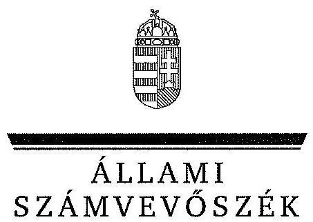
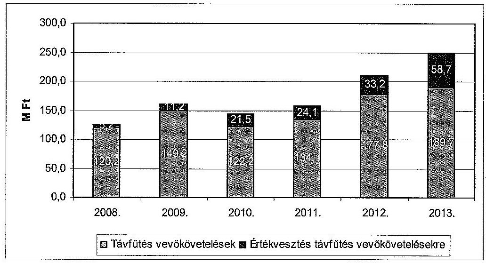
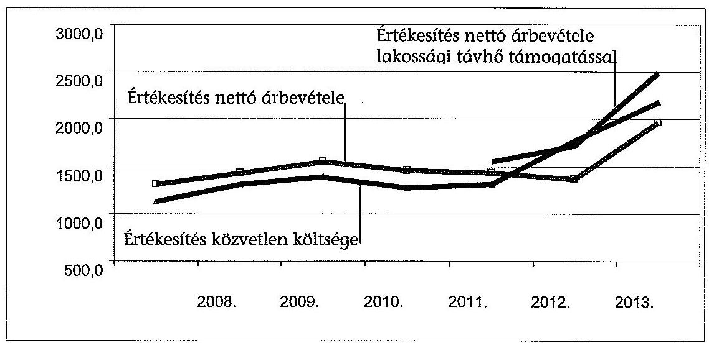
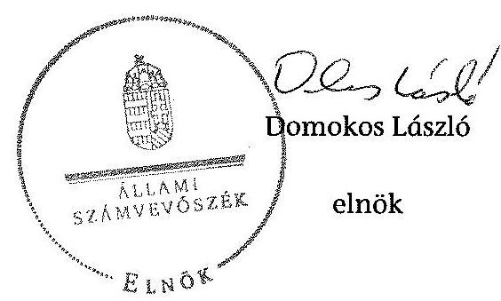
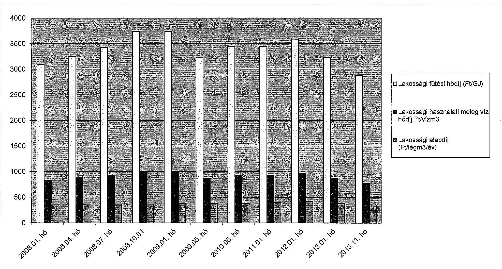

ÁLLAMI
SZÁMVEVŐSZÉK

# JELENTÉS 

Az önkormányzatok gazdasági társaságai - Az önkormányzatok többségi tulajdonában lévő gazdasági társaságok közfeladat ellátását érintő gazdálkodási tevékenysége szabályszerűségének ellenőrzése Kaposvári Önkormányzati Vagyonkezelő és Szolgáltató Zrt.

---

# Állami Számvevőszék 

Iktatószám: V-0721-081/2015
Témaszám: 1755
Vizsgálat-azonosító szám: V067131

## Az ellenőrzést felügyelte:

Dr. Horváth Margit
felügyeleti vezető
Az ellenőrzést vezette és az ellenőrzés végrehajtásáért felelős:
Valastyánné dr. Vízhányó Júlia
ellenőrzésvezető
A jelentéstervezet összeállításában közremúködött:
Tóthné Kiss Katalin
számvevő főtanácsos
Az ellenőrzést végezték:
Tóthné Kiss Katalin Szalontai Miklós Nagy László Imre számvevő tanácsos számvevő

A témához kapcsolódó eddig készített számvevőszéki jelentések:
címe
sorszáma
Kaposvár Megyei Jogú Város Önkormányzata pénzügyi helyzeté- 1137 nek ellenőrzéséről

---

# TARTALOMJEGYZÉK 

BEVEZETÉS ..... 9
I. ÖSSZEGZŐ MEGÁLLAPÍTÁSOK, KÖVETKEZTETÉSEK, JAVASLATOK ..... 12
II. RÉSZLETES MEGÁLLAPÍTÁSOK ..... 17

1. Az Önkormányzat közfeladat-ellátásának szabályszerűsége ..... 17
1.1. A közfeladat-ellátás megszervezése és a feladatellátás feltételrendszerének kialakítása ..... 17
1.2. A közfeladat-ellátás felügyelete és a tulajdonosi jogok érvényesítése ..... 19
2. A Vagyonkezelő Zrt. közfeladat ellátással kapcsolatos tevékenysége ..... 24
2.1. A Vagyonkezelő Zrt. gazdálkodásának szabályozottsága ..... 24
2.2. A Vagyonkezelő Zrt. vagyongazdálkodása ..... 26
2.3. A beszámolási kötelezettség teljesítése ..... 31
3. A távhőszolgáltatás közfeladat bevételei és ráfordításai elszámolásának és önköltségszámításának szabályszerűsége ..... 33
3.1. A távhőszolgáltatás közfeladat bevételeinek és ráfordításainak elkülönített, szabályszerű elszámolása ..... 33
3.2. Az önköltségszámítás szabályszerűsége ..... 34
4. Az ÁSZ korábbi jelentéseiben az önkormányzat többségi tulajdonában lévő gazdasági társaságok közfeladat-ellátását, gazdálkodását, pénzügyi helyzetét érintő javaslatokra tett intézkedések ..... 37
MELLÉKLETEK
5. számú A Vagyonkezelő Zrt. tevékenységének főbb adatai
6. számú A Vagyonkezelő Zrt. múködésének főbb jellemzői
7. számú A Vagyonkezelő Zrt. által biztosított lakossági távhő díjak alakulása a 2008-2013. években
FÜGGELÉKEK
8. számú Értelmező szótár
9. számú Mintavételi eljárások ellenőrzési területenként

---

.

---

# RÖVIDÍTÉSEK JEGYZÉKE 

## Törvények

Ámt.
ÁSZ tv.
Gt.
Mötv.

Nvtv.

Számv. tv.
Taktv.
Tszt.
Tao. tv.

## Rendeletek

157/2005. (VIII. 15.)
Korm. rendelet
289/2007. (X. 31.) Korm. Rendelet

50/2011. (IX. 30.) NFM rendelet

51/2011. (IX. 30.) NFM rendelet
az árak megállapításáról szóló 1990. évi LXXXVII. törvény (hatályos: 1991. január 1-jétől)
az Állami Számvevőszékről szóló 2011. évi LXVI. törvény (hatályos: 2011. július 1-jétől)
a gazdasági társaságokról szóló 2006. évi IV. törvény (hatálytalan: 2014. március 15-étől)
Magyarország helyi önkormányzatairól szóló 2011. évi CLXXXIX. törvény (hatályos: 2012. január 1-jétől, kivéve a 144. § (2) bekezdésben meghatározott előírások, amelyek 2012. április 15-én, a (3) bekezdésben meghatározott előírások, amelyek 2013. január 1-jén léptek hatályba, a (4) bekezdésben meghatározott előírások a 2014. évi általános önkormányzati választások napján léptek hatályba)
a nemzeti vagyonról szóló 2011. évi CXCVI. törvény (hatályos: 2011. december 31-étől, kivéve a 20. § (2) bekezdésben meghatározott paragrafusok, amelyek 2012. január 1-jétől, a (3) bekezdésben meghatározott paragrafusok 2013. január 1-jétől, a (4) bekezdésben meghatározott paragrafus 2012. március 2-ától léptek hatályba)
a helyi önkormányzatokról szóló 1990. évi LXV. törvény (hatálytalan: a 2014. évi általános önkormányzati választások napjától)
a számvitelről szóló 2000. évi C. törvény (hatályos: 2001. január 1-jétől)
a köztulajdonban álló gazdasági társaságok takarékosabb múködéséről szóló 2009. évi CXXII. törvény
a távhőszolgáltatásról szóló 2005. évi XVIII. törvény (hatályos: 2005. július 1-jétől)
1996. évi LXXXI. tv. a társasági adóról és az osztalékadóról (hatályos: 1996. november 15-étől)
a távhőszolgáltatásról szóló 2005. évi XVIII. törvény végrehajtásáról (hatályos: 2005. szeptember 29-étől)
a lakossági vezetékes gázfogyasztás és távhőfelhasználás szociális támogatásáról szóló 289/2007. (X. 31.) Korm. rendelet (hatályos: 2007. november 1-jétől)
a távhőszolgáltatónak értékesített távhő árának, valamint a lakossági felhasználónak és a külön kezelt intézménynek nyújtott távhőszolgáltatás dijának megállapításáról (hatályos: 2011. október 1-jétől)
a távhőszolgáltatási támogatásról (hatályos: 2011. október 1-jétől)

---

SZMSZ rendelet ${ }_{1}$

SZMSZ rendelet ${ }_{2}$

Szabályozási terv

Tszt. végrehajtásáról szóló önkormányzati rendelet
Távhőszolgáltatási rendelet
vagyongazdálkodási rendelet ${ }_{2}$
vagyongazdálkodási rendelet ${ }_{3}$
Vtv.

## Szórövidítések

Adatvédelmi szabályzat ${ }_{1}$ Adatvédelmi és számítástechnikai biztonsági szabályzat 3/2006. számú Gazdasági igazgatói utasítás (hatályos: 2006. május 16-ától)

Adatvédelmi szabályzat ${ }_{2}$ Adatvédelmi és számítástechnikai biztonsági szabályzat 4/2011. számú Gazdasági igazgatói utasítás (hatályos: 2011. szeptember 2-ától)

Alapítvány

Kaposvár Megyei Jogú Város Önkormányzatának 85/2012. (XII. 17.) számú rendelete a Közgyűlés és Szervei Szervezeti és Müködési Szabályzatáról (hatályos: 2013. január 1-jétől)
Kaposvár Megyei Jogú Város Önkormányzatának 70/2005. (XII. 15.) rendelete Kaposvár Építési Szabályzatának és Szabályozási Tervének megállapításáról
Kaposvár Megyei Jogú Város Önkormányzatának 3/2006. (II. 28.) számú rendelete a távhőszolgáltatásról szóló 2005. évi XVIII. törvény végrehajtásáról

Kaposvár Megyei Jogú Város Önkormányzatának 4/2006. (II. 28.) számú rendelete a távhőszolgáltatási díjak és a csatlakozási díj megállapításáról, valamint az áralkalmazási és díjfizetési feltételekről (hatályos: 2006. március 1jétől, módosították az Önkormányzat 14/2008. (III. 27.), 43/2008. (VI. 11.), 48/2008. (IX. 29.), 60/2008. (XI. 20), 64/2009. (IX. 30.), 35/2010. (VI. 14.), 65/2010. (XII. 14.) és 68/2011. (XII. 22.) számú rendeletei)
Kaposvár Megyei Jogú Város Önkormányzatának többször módosított 34/2005. (VI. 24.) számú rendelete az önkormányzat vagyonáról, a vagyongazdálkodás szabályairól, valamint a nem lakáscélú helyiségek bérletéről (hatályos: 2011. február 28-áig)
Kaposvár Megyei Jogú Város Önkormányzatának 9/2011. (II. 25.) számú rendelete az önkormányzat vagyonáról, a vagyongazdálkodás szabályairól, valamint a nem lakáscélú helyiségek bérletéről (hatályos: 2011. március 1-jétől 2012. október 14-éig)
Kaposvár Megyei Jogú Város Önkormányzatának 59/2012. (X. 03.) számú rendelete az önkormányzati vagyongazdálkodásról (hatályos: 2012. október 15-étől)
a 2007. évi LXXXVI. törvény a villamos energiáról (Hatályos: 2007. október 15-étől)

# Szórövidítések 

Adatvédelmi és számítástechnikai biztonsági szabályzat 3/2006. számú Gazdasági igazgatói utasítás (hatályos: 2006. május 16-ától)

Adatvédelmi és számítástechnikai biztonsági szabályzat 4/2011. számú Gazdasági igazgatói utasítás (hatályos: 2011. szeptember 2-ától)

Kaposvár Összefogás Alapítvány (mint a Kaposvári Önkormányzat Vagyonkezelő és Szolgáltató Zártkörűen Müködő Részvénytársaság részvényese)

---

| Alapszabály | Kaposvári Önkormányzati Vagyonkezelő és Szolgáltató Zrt. tagjainak társasági szerződése (kelt 1992. június 22.) |
| :--: | :--: |
| ÁSZ | Állami Számvevőszék |
| Belső ellenőrzési kézikönyv | Kaposvár Megyei Jogú Város Polgármesteri hivatalának belső ellenőrzési kézikönyve |
| Energetikai stratégia | Kaposvár Megyei Jogú Város Energetikai Stratégiája 20092020. |
| FB | Kaposvári Önkormányzat Vagyonkezelő és Szolgáltató Zártkörűen Müködő Részvénytársaságának Felügyelőbizottsága |
| Gazdasági program ${ }_{1}$ | Kaposvár Megyei Jogú Város Önkormányzatának „Új munkahelyek, új utak, új otthonok!" címú gazdasági programja 2006-2010. évekre (Önkormányzat Közgyűlésének 328/2006. (XI. 16.) számú határozata) |
| Gazdasági program ${ }_{2}$ | Kaposvár Megyei Jogú Város Önkormányzatának „Kaposvár a legfontosabb" címú gazdasági programja 20112014. évekre (Önkormányzat Közgyűlésének 187/2010. (X. 14.) számú határozata) |
| Holding Zrt. | Kaposvári Közszolgáltató Holding Zrt.   (Önkormányzat Közgyűlésének 244/2010. (XII. 29.) számú határozata az alapításról) |
| Alapító Okirat | Kaposvári Közszolgáltató Holding Zrt. tagjainak (részvényeseinek) társasági szerződése |
| Igazgatóság | Kaposvári Önkormányzat Vagyonkezelő és Szolgáltató Zártkörűen Müködő Részvénytársaságának igazgatósága |
| Integrált Városfejlesztési Stratégia / IVS | Kaposvár Megyei Jogú Város Önkormányzatának Integrált Városfejlesztési Stratégiája a 2008-2013. évekre (Önkormányzat Közgyűlésének 62/2008. (IV. 16.) számú határozata) |
| javadalmazási szabály$\mathrm{zat}_{1,2}$ | a Kaposvári Önkormányzat Vagyonkezelő és Szolgáltató Zártkörűen Müködő Részvénytársaságának egységes szerkezetbe foglalt javadalmazási szabályzata   (javadalmazási szabályzat ${ }_{1}$ hatályos: 2012. május 24 -éig) (javadalmazási szabályzat ${ }_{2}$ hatályos: 2012. május 24 -étől) |
| jegyző | Kaposvár Megyei Jogú Város Önkormányzatának jegyzője |
| KEOP | Környezet és Energia Operatív Program |
| Kintlévőségekkel kapcsolatos ügykezelésről szóló szabályozás ${ }_{1}$ | 3/2005. számú ügyvezetői igazgatói utasítás a Kintlévőségekkel kapcsolatos ügykezelésről (hatályos: 2005. augusztus 17 -étől 2008. november 16 -áig) |
| Kintlévőségekkel kapcsolatos ügykezelésről szóló szabályozás ${ }_{2}$ | 5/2008. számú ügyvezető igazgatói utasítás a kintlévőségekkel kapcsolatos ügykezelésről (hatályos: 2008. november 17 -étől) |
| Környezetvédelmi program | Kaposvár Megyei Jogú Város Környezetvédelmi programja 2004-2010. évekre (Önkormányzat Közgyűlésének 160/2004. (VI. 3.) és 78/2013. (VI. 25.) számú határozata) |
| Közgyűlés | Kaposvári Önkormányzati Vagyonkezelő és Szolgáltató Zrt. közgyűlése |

---

| Leltározási szabályzat | Kaposvári Önkormányzati Vagyonkezelő és Szolgáltató Zrt., Leltározási szabályzat (hatályos: 2000. június 22-étől) |
| :--: | :--: |
| MÁK regionális igazgatósága | Magyar Államkincstár Dél-dunántúli Regionális Igazgatósága |
| Megbízási szerződés | Kaposvári Önkormányzati Vagyonkezelő és Szolgáltató Zrt. mint megbízó és a Kaposvári Közszolgáltató Holding Zrt. mint megbízott közötti szerződés szolgáltatások ellátására (kelt 2011. január 03., módosítva 2011. december 20-án és 2013. március 14-én) |
| MEKH | Magyar Energia Hivatal (2013. április 4-étől Magyar Energetikai és Közmű-szabályozási Hivatal) |
| NAV | Nemzeti Adó- és Vámhivatal |
| NKEK Nonprofit Kft. | Nemzeti Környezetvédelmi és Energia Központ Nonprofit Korlátolt felelősségú társaság |
| Önkormányzat | Kaposvár Megyei Jogú Város Önkormányzata |
| Önkormányzat Közgyú- | Kaposvár Megyei Jogú Város Önkormányzatának Közgyúlése |
| Önköltségszámítási szabályzat | Kaposvári Önkormányzati Vagyonkezelő és Szolgáltató Zrt. Önköltségszámítási szabályzata (hatályos: 2000. június 22-étől) |
| Pénzkezelési szabály-   zat $_{1,2}$ | Kaposvári Önkormányzati Vagyonkezelő és Szolgáltató Zrt. Pénzkezelési szabályzat   (Pénzkezelési szabályzat ${ }_{1}$ hatályos: 2007. január 1-jétől)   (Pénzkezelési szabályzat ${ }_{2}$ hatályos: 2013. szeptember 1jétől) |
| Pénzügyi és Vagyongazdálkodási Bizottság polgármester | Kaposvár Megyei Jogú Város Önkormányzatának Pénzügyi és Vagyongazdálkodási Bizottsága |
|  | Kaposvár Megyei Jogú Város Önkormányzatának polgármestere |
| Polgármesteri Hivatal | Kaposvár Megyei Jogú Város Önkormányzatának Polgármesteri Hivatala |
| Polgármesteri Hivatal SZMSZ-e | Kaposvár Megyei Jogú Város Önkormányzata Polgármesteri Hivatalának Szervezeti és Múködési Szabályzata, amely a 2008-2013. évek során 14 alkalommal módosult |
| Selejtezési szabályzat ${ }_{1,2,3}$ | Kaposvári Önkormányzati Vagyonkezelő és Szolgáltató Zrt. Selejtezési szabályzata   (Selejtezési szabályzata ${ }_{1}$ hatályos: 2006. június 12-étől)   (Selejtezési szabályzata ${ }_{2}$ hatályos: 2008. július 14-étől)   (Selejtezési szabályzata ${ }_{3}$ hatályos: 2013. szeptember 1jétől) |
| Számlarend $_{1,2}$ | Kaposvári Önkormányzati Vagyonkezelő és Szolgáltató Zrt. Számviteli politika ${ }_{1,2}$ melléklete |
|  | Hatályos a Számviteli politika ${ }_{1,2}$-nek megfelelően |
| Számviteli politika $_{1,2}$ | Kaposvári Önkormányzati Vagyonkezelő és Szolgáltató Zrt. Számviteli politika   (Számviteli politika ${ }_{1}$ hatályos: 2006. január 1-jétől)   (Számviteli politika ${ }_{2}$ hatályos: 2011. január 1-jétől) |

---

| SZMSZ $_{1,2}$ | Kaposvári Önkormányzati Vagyonkezelő és Szolgáltató Zrt. Szervezeti és Müködési Szabályzata   (SZMSZ ${ }_{1}$ hatályos: 2007. november 23-ától)   (SZMSZ ${ }_{2}$ hatályos: 2013. június 21-étől) |
| :--: | :--: |
| Tárgyi eszköz beszerzési szabályzat ${ }_{1,2}$ | Kaposvári Önkormányzati Vagyonkezelő és Szolgáltató Zrt. Tárgyi eszköz beszerzési, beruházási, felújitási, karbantartási és üzemeltetési szabályzata   (Tárgyi eszköz beszerzési szabályzat ${ }_{1}$ hatályos: 2000. március 23-ától)   (Tárgyi eszköz beszerzési szabályzat ${ }_{2}$ hatályos: 2013. szeptember 1-jétől) |
| Üzletszabályzat | Kaposvári Önkormányzat Vagyonkezelő és Szolgáltató Zártkörűen Müködő Részvénytársaság Üzletszabályzata (hatályos: 2007. március 10-étől) |
| Vagyongazdálkodási koncepció | Kaposvár Megyei Jogú Város vagyongazdálkodási koncepciója (Önkormányzat Közgyülésének 129/2009. (VI. 11.) számú határozata) |
| Vagyongazdálkodási terv | Kaposvár Megyei Jogú Város közép- és hosszú távú vagyongazdálkodási terve |
| vezérigazgató | Kaposvári Önkormányzat Vagyonkezelő és Szolgáltató Zártkörűen Müködő Részvénytársaság vezérigazgatója |
| Vagyonkezelő Zrt. | Kaposvári Önkormányzati Vagyonkezelő és Szolgáltató Zrt.   (létrehozása az Önkormányzat Közgyűlésének 2/1992.   (VI. 22.) számú határozatával, Cégbírósági bejegyzés: 14-   10-300030 számon, 1993. március 25 -én) |
| Vagyonkezelő Zrt. Közgyűlése | Kaposvári Önkormányzat Vagyonkezelő és Szolgáltató Zártkörűen Müködő Részvénytársaság Közgyűlése |

---

.

---

# JELENTÉS 

## Az önkormányzatok gazdasági társaságai Az önkormányzatok többségi tulajdonában lévő gazdasági társaságok közfeladat ellátását érintő gazdálkodási tevékenysége szabályszerűségének ellenőrzése

## Kaposvári Önkormányzati Vagyonkezelő és Szolgáltató Zrt.

## BEVEZETÉS

Az Állami Számvevőszék középtávra szóló stratégiájában megfogalmazta, hogy a helyi önkormányzatok gazdálkodásában rejlő pénzügyi kockázatok feltárásával, az államháztartáson kívülre nyújtott költségvetési támogatások és ingyenes vagyonjuttatások, valamint az államháztartáson kívül múködő köz-feladat-ellátó rendszerek ellenőrzéseivel hozzájárul ahhoz, hogy a közpénzeket az államháztartáson kívül múködő szervezetek is átlátható, rendezett módon használják fel a közfeladatok szerződésben vállalt ellátása érdekében.

Az önkormányzatok szervezetalakítási szabadságának következménye, hogy a korábban is vállalati formában múködő (nagyvárosi tömegközlekedés, víz-, szennyvízcsatorna, köztisztasági, ingatlankezelés stb.) közszolgáltatások mellett, mind a kötelező, mind az önként vállalt feladatok ellátásában a gazdasági társaságok kiemelt fontosságú szerephez jutottak.

A Vagyonkezelő Zrt.-t Kaposvár Megyei Jogú Város Önkormányzata és a Kaposvár Összefogás Alapítvány az ellenőrzött időszakot megelőzően hozta létre a Kaposvári Építőipari, Szolgáltató és Kereskedelmi Részvénytársaság tevékenységének szétválasztásával, annak egyik általános jogutódjaként. Az Önkormányzat 2010. december 9-én létrehozta a 100\%-os tulajdonában álló Kaposvári Közszolgáltató Holding Részvénytársaságot és 2011. március 23-án a Vagyonkezelő Zrt.-ben lévő részvény csomagjával a Holding Zrt. alaptőkéjét felemelte. Az alaptőke emeléssel létrejött vállalatcsoport tulajdonosi jogokat ellátó uralkodó tagja a Holding Zrt. volt és a Vagyonkezelő Zrt. tagvállalatként (ellenőrzött társaságként) múködött.

A Vagyonkezelő Zrt.-ben 2008. január 1-jétől 2011. március 22-éig az Önkormányzat, majd 2011. március 23-ától a 2013. év végéig a Holding Zrt. rendelkezett minősített többséget biztosító $76,5 \%$-os részesedéssel. Az Alapítvány 15\%os és magánszemélyek 8,5\%-os részesedéssel rendelkezetek az ellenőrzött időszak egészében.

---

A Vagyonkezelő Zrt. alaptevékenységét a távhőszolgáltatás és az épületek üzemeltetése jelentette Kaposvár területén. További tevékenységei a villamos energiatermelés és értékesítés, valamint az eszközállomány bérbeadása voltak. 2013-ban 6816 lakást, 66 intézményt és 217 egyéb közületi helyet látott el fútési energiával és meleg vízzel.

A Vagyonkezelő Zrt. éves nettó árbevétele az ellenőrzött időszakban 1447,7 M Ft és 2132,2 M Ft között, az eszközök és a források értéke 1078,6 M Ft és 2410,0 M Ft között alakult. A mérleg szerinti eredménye a 2008. év 12,2 M Ft-os vesztesége kivételével pozitív volt. Az ellenőrzött években mindöszszesen 143,1 M Ft nyeresége képződött.

A Vagyonkezelő Zrt. és az Önkormányzat folyamatosan fejlesztette a távhőszolgáltatási rendszert. Az ellenőrzött időszakban a távfűtőmú és a hőközpont energiahatékonysági korszerűsítése, valamint a távvezeték korszerűsítése, bővítése valósult meg.

A polgármester az 1994. évi önkormányzati választások óta, a jegyző 1990. december 14-étől tölti be tisztségét. A Vagyonkezelő Zrt. vezérigazgatójának (2010. december 29-éig ügyvezető igazgató) személye kétszer változott, a jelenlegi vezérigazgató 2013. május 7-étől látta el a feladatát.

A Vagyonkezelő Zrt. létszáma a 2008. évi 90,2 fơről a 2013. évi 72,4 főre csökkent. A Távfűtési üzletágban közvetlenül dolgozók létszáma a 2008. évi 48,6 fơről 2013. évben 49,1 fơre változott, a központi-igazgatás létszáma a 2008. évi 7,8 fơről a 2013. évi 2,3 fơre csökkent az éves beszámolók adatai szerint.

Az önkormányzati tulajdonú gazdasági társaságok teljes körű ellenőrzésének lehetőségét az ÁSZ törvény 2011. január 1-jétől hatályos módosítása teremtette meg.

Az ellenőrzés célja annak értékelése volt, hogy

- az önkormányzat a jogszabályi előírások figyelembevételével döntött-e az ellenőrzésre kerülő közfeladat megszervezéséről; az önkormányzat szabályszerűen gyakorolta-e a tulajdonosi jogokat;
- a gazdasági társaság közfeladat-ellátása bevételeinek, ráfordításainak elszámolása, és vagyongazdálkodási tevékenysége megfelelt-e a jogszabályi, illetve a közszolgáltatási szerződésben foglalt tulajdonosi előírásoknak, azok végrehajtása szabályszerű volt-e;
- a közfeladatok átláthatósága és elszámoltathatósága érdekében biztosítva volt-e a közszolgáltatás díjának megalapozottsága szabályszerű önköltségszámítással.

Az ellenőrzés kiterjedt a Kaposvári Önkormányzati Vagyonkezelő és Szolgáltató Részvénytársaságra, valamint a közfeladat-ellátásának szabályszerűsége tekintetében a Kaposvár Megyei Jogú Város Önkormányzatára és a Kaposvári Közszolgáltató Holding Részvénytársaságra.

---

Az ellenőrzés várható hasznosulása: A törvényalkotás számára - az észlelt problémák, szabálytalanságok, vagy egyéb nem kívánatos jelenségek felszínre kerülésével - az ellenőrzés megállapításai segítséget nyújthatnak az államháztartáson kívüli közfeladat-ellátás értékeléséhez, jogszabályi keretei pontosításához, átláthatóságot biztosító szabályozásához. Meghatározhatóvá válnak a közfeladat ellátásában részt vevő államháztartáson kívüli szervezetek - önkormányzat költségvetését, pénzügyi helyzetét is befolyásoló - kockázatai, lehetővé válik ezen kockázatok csökkentése.

Értékelhetővé válik, hogy a feladatot ellátó gazdasági társaság a közszolgáltatási szerződésben foglaltak betartásával, a közvagyon használatával biztosítot-ta-e a szolgáltatás folytatásának feltételeit. Ezzel az ellenőrzöttek és a helyi döntéshozók számára az ÁSZ visszajelzést ad feladatszervezési, feladat-ellátási kockázataikról, alapot ad a meglévő hibák megszüntetéséhez, a jobb közfel-adat-ellátás biztosításához. Fokozza a fegyelmet, igazolja, hogy lejárt a következmények nélküli ellenőrzések időszaka. Az ÁSZ értékteremtő rend kialakításához és megőrzéséhez hozzájáruló tevékenysége pozitív hatással van a szervezetről kialakított összkép formálására is.

A bevételek és ráfordítások elszámolása, valamint a vagyonnyilvántartás terén az egyes területek szabályszerű működését mintavétellel ellenőriztük, ez alapján a sokaságokban előforduló hibás tételek arányát becsültük. A jogszabályoknak és a belső előírások szerint megfelelőnek, azaz szabályszerűnek tekintettük az adott bevételek és ráfordítások elszámolását, a vagyonnyilvántartást, amennyiben a minta ellenőrzésének eredménye alapján $95 \%$-os bizonyossággal a teljes sokaságban a hibás tételek aránya kisebb volt, mint $10 \%$, nem megfelelőnek értékeltük, ha a hibás tételek aránya a $10 \%$-ot meghaladta.

Az ellenőrzést a számvevőszéki ellenőrzés szakmai szabályai szerint, szabályszerűségi ellenőrzés módszerével, a vonatkozó nemzetközi standardok figyelembevételével végeztük. Az ellenőrzés a 2008-2013. évekre terjedt ki.

Az ellenőrzés végrehajtásának jogszabályi alapját az Állami Számvevőszékről szóló 2011. évi LXVI. törvény 5. § (3)-(5) bekezdései képezték.

Az ÁSZ az Állami Számvevőszékről szóló 2011. évi LXVI. törvény 29. §-a alapján a jelentéstervezetet észrevételezésre megküldte Kaposvár Megyei Jogú Város Önkormányzata polgármesterének, valamint a gazdasági társaság vezérigazgatójának. Az érintettek észrevételt nem tettek.

---

# I. ÖSSZEGZŐ MEGÁLLAPÍTÁSOK, KÖVETKEZTETÉSEK, JAVASLATOK 

Kaposvár Megyei Jogú Város Önkormányzata a távhőszolgáltatás kötelező feladatát a Vagyonkezelő Zrt. tevékenységén keresztül látta el. Az ellenőrzött időszakban a társaság alaptőkéje 40,8 M Ft volt. A tulajdonos 2008. januártól 2011. márciusig 76,5\%-ban a Kaposvár Megyei Jogú Város Önkormányzata, majd 76,5\%-ban a Kaposvári Közszolgáltató Holding Részvénytársaság volt. A Kaposvár Összefogás Alapítvány 15\%-os és magánszemélyek 8,5\%-os részesedéssel rendelkeztek. Az Önkormányzat a közigazgatási területén a távhőszolgáltatás közfeladatának megszervezéséről a jogszabályi elöírásoknak megfelelően döntött. A feladatellátáshoz szükséges vagyont apportként bocsátotta a Vagyonkezelő Zrt. részére.

Az Önkormányzat az Ötv. előírása szerint a 2006-2010. és a 2011-2014. évekre Gazdasági Programjaiban meghatározta a távhőszolgáltatás, mint kötelező feladat biztosítására, fejlesztésére vonatkozó célkitűzéseket. A távhőszolgáltatási feladatot a szakmai programok, tervek tartalmazták. A Vagyonkezelő Zrt. üzleti tervei összhangban voltak az Önkormányzat szakmai terveivel.

Az Önkormányzat a távhőszolgáltatási feladat ellátásával kapcsolatban az ellenőrzött időszakban eleget tett a rendeletalkotási kötelezettségének. A többször módosított Távhőszolgáltatási rendelete a Tszt. előírásainak megfelelt. Az Önkormányzat megalkotta a hatályos Vagyongazdálkodási rendeleteit. Az Nvtv.-vel összhangban az Önkormányzat Holding Zrt.-ben lévő részesedése, valamint a Holding Zrt. Vagyonkezelő Zrt.-ben lévő részesedése az Önkormányzat korlátozottan forgalomképes törzsvagyonának részét képezték. Az Nvtv.-ben foglalt kötelezettségének megfelelően 2013. évben elkészítette a közép- és hosszú távú Vagyongazdálkodási tervét.

Az Önkormányzat, majd 2011 márciusától a Holding Zrt. a Vagyonkezelő Zrt. feletti tulajdonosi jogokat a vonatkozó előírások szerint szabályszerűen gyakorolta. Az Önkormányzat a Vagyonkezelő Zrt.-nél belső ellenőrzést végzett. Külső ellenőrzést a támogatást nyújtó és folyósító szervezetek, valamint az Állami Számvevőszék végeztek a Vagyonkezelő Zrt.-nél. 2013. évtől a Holding Zrt. kontrolling jelentések alapján tájékozódott a Vagyonkezelő Zrt. vagyoni-, pénzügyi- és gazdálkodási helyzetéről. A Vagyonkezelő Zrt. minőségirányítási rendszert működtetett a külső szabályok változásainak követése, a belső szabályok felülvizsgálata, aktualizálása, és a teljesítmények javítása céljából. A minőségirányítási rendszer keretében a közszolgáltatási tevékenység mérésére mutatószámokkal rendelkezett, melyek alapján a tevékenységét öt alkalommal értékelte 2009-2013 között. Az értékelés alapján fejlesztendőnek minősített folyamatokra intézkedési tervet készítettek.

Az Önkormányzat, illetve a Holding Zrt. a Vagyonkezelő Zrt.-vel az ellenőrzött időszakban közszolgáltatási szerződést nem kötött. A közszolgáltatási feladat ellátását, a szerződéses viszonyokat az Önkormányzat vonatkozó rendeletei, a

---

Vagyonkezelő Zrt. Alapszabálya, Üzletszabályzata és a Holding Zrt. Alapító Okirata szabályozták. Az Önkormányzat által 2011. márciustól létrehozott holding-szervezetben, a Holding Zrt. a Vagyonkezelő Zrt. számára megbizási szerződés alapján szolgáltatási feladatokat látott el. A Holding Zrt. által ellátott feladatok köre 2011-2013. évek folyamán fokozatosan bővült.

A Vagyonkezelő Zrt. gazdálkodásának szabályozottsága alapvetően megfelelt a vonatkozó törvényi előírásoknak. Az ellenőrzött időszakban rendelkezett a Számv. tv.-nek megfelelő Számviteli politikával és annak keretében elkészítette a Leltározási ${ }_{1}$, az Önköltség-számítási és a Pénzkezelési ${ }_{1,2}$, szabályzatot, valamint meghatározta az eszközök és a források alapvető értékelési szabályait.

Hiányosság volt az ellenőrzött időszakban, hogy a Vagyonkezelő Zrt. a gazdálkodási sajátosságainak megfelelően írásban nem rögzítette a követelések értékelésének részletes szabályait, és ezzel megsértette a Számv. tv. előírását. A Vagyonkezelő Zrt. nem aktualizálta a Leltározási szabályzatát, de a gyakorlatban a Számv. tv. 2012. januártól hatályos előírásának eleget tett. A Vagyonkezelő Zrt. rendelkezett jóváhagyott Üzletszabályzattal, melyet az ellenőrzött időszakban nem aktualizált. A jegyző a Tszt. előírása ellenére az Üzletszabályzatban foglaltak betartását nem ellenőrizte.

A Vagyonkezelő Zrt. az egyedi éves számviteli beszámoló és üzleti jelentés készítési, valamint a Holding Zrt. által készített összevont beszámoló és üzleti jelentés készítéséhez szükséges adatszolgáltatási kötelezettségének a Számv. tv. előírásaival összhangban eleget tett. A könyvvizsgáló az ellenőrzött években minősítés nélküli hitelesítő záradékkal látta el a Vagyonkezelő Zrt. éves számviteli beszámolóit. A Vagyonkezelő Zrt. a 2012. és 2013. évekre vonatkozóan a tevékenységenkénti, telephelyenkénti elszámolási kötelezettségének a Tszt. előírásával összhangban eleget tett. Ez alapján a könyvvizsgáló igazolta a tevékenységek közötti keresztfinanszírozás-mentességet.

A Vagyonkezelő Zrt. a távhőszolgáltatási közfeladat bevételeinek, anyagjellegü ráfordításainak és beruházásainak, felújításainak elszámolása során szabályszerűen járt el. A bevételek előírása és kiszámlázása, a költségelszámolást megalapozó kötelezettségvállalás és a költségek elszámolása a belső szabályozásának megfelelően történt. Az értékcsökkenési leírást az ellenőrzött időszakban a vonatkozó számviteli előírások, valamint a belső szabályozás figyelembevételével számolták el.

A Vagyonkezelő Zrt. vagyongazdálkodása az ellenőrzött időszakban megfelelt a vonatkozó szabályozásnak. A távhőszolgáltatási rendszer hosszú távú fenntarthatóságához kiemelt fejlesztéseket valósítottak meg. A kitűzött céloknak megfelelően növelték a távhőszolgáltatási rendszer kapacitáskihasználtságát. Megvalósult a távfűtőmủ és a hőközpont energiahatékonysági korszerűsítése és a távvezeték korszerűsítés. A gázfüggőség csökkentése érdekében a megújuló energiaforrás használatára projektet készített elő. A fejlesztéseket döntő részben támogatásból finanszírozták és a támogatást a Számv. tv. előírásának megfelelően számolták el. A fejlesztések eredményeként a 2008-2013 közötti időszakban a tárgyi eszközök nettó értéke az értékcsökkenések elszámolása mellett 529,9 M Ft-tal, 62,9\%-kal növekedett.

---

Múködési kockázatot jelentett a távhő vevőkövetelések értékének a növekedése, mely a Vagyonkezelő Zrt. által megtett intézkedések ellenére 2013. év végén 189,7 M Ft volt. A Számv. tv. előírásának megfelelően a távhő vevőkövetelésekre 58,7 M Ft értékvesztést számoltak el 2013. év végén. A behajthatatlanság miatt 9,7 M Ft követelést írtak le az ellenőrzött időszakban. A távhő vevőkövetelések 2012. évi kiugró növekedéséhez hozzájárult a lakossági távhőfelhasználás központi kormányzati szociális támogatás 2011. évi megszüntetése, melyet az önkormányzati lakhatási támogatás nem tudott ellensúlyozni.

A Vagyonkezelő Zrt. mérleg szerinti eredménye az ellenőrzött időszakban egy év - a 2008. év 12,2 M Ft-os vesztesége - kivételével pozitív volt. Az eredmény a 2008-2013. években mindösszesen 143,1 M Ft-ot tett ki. A képződött eredményt teljes egészében tartalékba helyezték, osztalékot nem fizettek. Az Önkormányzat az ellenőrzött időszakban a Vagyonkezelő Zrt. részére két esetben kis összegű fejlesztési támogatást nyújtott, müködési támogatást nem adott és garanciát, kezességet nem vállalt.

Az Önkormányzat a 2008. évtől 2011. április 14-éig a többször módosított Távhőszolgáltatási rendeletében meghatározta a távhőszolgáltatás legmagasabb diját és a dijalkalmazás feltételeit. Az Önkormányzat által meghatározott távhő díjak önköltségszámításon alapultak. Az Önkormányzat a Gazdasági programjaiban foglalt célkitűzésének megfelelően a fogyasztók védelme érdekében szigorú korlátok közé szorította a lakossági távhő díjak emelése és a Vagyonkezelő Zrt. nyereségének mértékét. A távhő díjak alakulását alapvetően meghatározta a vásárolt hő díja, illetve a hő előállításához használt gáz ára. A távhődíjak mértéke 2011. április 15 -étől a miniszteri hatáskörben történt ármegállapítás időszakában összességében csökkent. A Kormány a rezsicsökkentési programja keretében a távhőszolgáltatás diját 2013. évben összesen 20\%-kal csökkentette, ami 128,4 M Ft megtakarítást jelentett a kaposvári távhőfelhasználó lakosság számára. A 2013. novembertől érvényes lakossági távhő díjak a 2008. januárban érvényes díjak alatt voltak.

A Vagyonkezelő Zrt. távhő értékesítésének nettó árbevétele az ellenőrzött időszakban 684,5 M Ft-tal, 47,3\%-kal növekedett. A 2013. évben a nettó árbevétel 610,4 M Ft-tal, 44,9\%-kal növekedett az előző évhez képest. A 2012. és 2013. évben a távfűtés üzletágban (hőtermelés, szolgáltatás) a közvetlen költségek évente mintegy 210 M Ft-tal meghaladták az értékesítés nettó árbevételét. A távhőszolgáltatási támogatás a közvetlen költségeket a 2011. évben (április 15 -étől) 113,9 M Ft, a 2012. évben 362,7 M Ft és a 2013. évben 516,3 M Ft összegben fedezte. A Vagyonkezelő Zrt. 2013. évi Üzleti jelentése szerint a távfűtési üzletág a lakossági távhőszolgáltatási támogatással együtt, de egyéb bevételek elszámolása nélkül a 2013. évben veszteséges volt, és az egyéb bevételekkel együtt $28,6 \mathrm{M}$ Ft eredményt ért el. A pozitív eredmény elérésében meghatározó szerepe volt a 2013. évre bevételként elszámolt fejlesztési támogatások ( $55,2 \mathrm{M} \mathrm{Ft}$ ), és a megtérült perköltség ( $10,1 \mathrm{M} \mathrm{Ft}$ ) összegének.

Az Állami Számvevőszék „JELENTÉS Kaposvár Megyei Jogú Város Önkormányzata pénzügyi helyzetének ellenőrzéséről" 1137. számú jelentésében két intézkedést igénylő javaslatot tett az önkormányzati gazdasági társaságokhoz kapcsolódóan. Mindkét javaslat hasznosult.

---

A fentiekben leírtak összegzéseként az alábbi megállapításokat tesszük:
A konstrukcióból eredő sajátosság az volt, hogy az Önkormányzat a 2011. évtől egyes gazdasági társaságait, köztük Vagyonkezelő Zrt.-t holdingszervezetben müködtette.

Múködési kockázat nem mutatkozott, mivel a mindenkori tulajdonosok a közfeladat-ellátás felügyeletét és a tulajdonosi jogok érvényesítését a vonatkozó előírások szerint szabályszerűen gyakorolták. A Holding Zrt. által működtetett kontrolling rendszer, a Vagyonkezelő Zrt. minőségirányítási rendszere, az Önkormányzat belső ellenőrzése és a külső ellenőrzések is hozzájárultak a működési kockázatok csökkentéséhez.

Pénzügyi kockázatot jelentett a távhő vevőkövetelések növekedése, továbbá a gázfüggőség a távhőszolgáltatási rendszer működtetésében, mivel az értékesítés közvetlen költségeiben a gázenergia, a rendszerhasználati díj és a hőenergia magas arányt $(72,9 \%)$ tett ki.

Az Állami Számvevőszékről szóló 2011. évi LXVI. törvény 33. § (1) bekezdésében foglaltak értelmében a jelentésben foglalt megállapításokhoz kapcsolódó intézkedési tervet köteles az ellenőrzött szervezet vezetője összeállítani, és azt a jelentés kézhezvételétől számított 30 napon belül az ÁSZ részére megküldeni. Amennyiben az intézkedési tervet határidőben nem küldi meg a szervezet, vagy az nem elfogadható, az ÁSZ elnöke a hivatkozott törvény 33. § (3) bekezdés a)- b) pontjaiban foglaltakat érvényesítheti.

Az ellenőrzés intézkedést igénylő megállapításai és javaslatai:
Javaslataink célja a Vagyonkezelő Zrt. gazdálkodása szabályszerűségének javítása annak érdekében, hogy a szabályozási környezet megfelelően tudja támogatni az átlátható müködést.

# Javasoljuk a Kaposvári Önkormányzati Vagyonkezelő és Szolgáltató Zrt. vezérigazgatójának: 

1. A Vagyonkezelő Zrt. a Számv. tv. 14. § (5) bekezdés b) pontjában foglaltak ellenére nem készítette el az eszközök és a források értékelési szabályzatát, valamint a Számv. tv. 14. § (4) bekezdésének előírása alapján nem rögzítette írásban a követelések értékelésének részletes szabályait.

A Vagyonkezelő Zrt. a Számv. tv. 14. § (11) bekezdésében előírtak ellenére elmulasztotta a Leltárkészítési és leltározási, továbbá az Önköltségszámítási szabályzatának aktualizálását. A Leltárkészítési és leltározási szabályzata 2012. január 1-jétől nem volt összhangban a Számv. tv. 69. § (3) bekezdésében foglalt előírásokkal az ingatlanok, a lealapozott gépek esetében előírt leltározási gyakoriság tekintetében.

Az Önköltségszámítási szabályzatát a társaság nem aktualizálta az ellenőrzött időszakban bekövetkezett változásoknak megfelelően, különösen tekintettel a Tszt.-ben 2012-től előírt tevékenységenkénti, illetve üzletágankénti szétválasztási szabályok együttes alkalmazására, és az összefüggések bemutatásának szükségességére.

---

Ezzel megsértették a Tszt. 18/A. § (2) bekezdésében foglaltakat, valamint a Számv. tv. 161/A. § (2) bekezdésében előírtakat.

Javaslat:
Intézkedjen a szabályozási hiányosságok megszüntetésére, ennek keretében:
a) készítse el - a számlarendben foglalt alapvető értékelési elveken túlmenően -az eszközök és a források, különösen a követelések értékelésének szabályzatát a Vagyonkezelő Zrt. követeléseinek sajátosságaira tekintettel;
b) intézkedjen továbbá a Leltározási és az Önköltségszámítási szabályzatai jogszabályi előírásoknak megfelelő aktualizálásáról, különös tekintettel a szétválasztási szabályok érvényesítésére.

---

# II. RÉSZLETES MEGÁLLAPÍTÁSOK 

## 1. Az ÖNKORMÁNYZAT KÖZFELADAT-ELLÁTÁSÁNAK SZABÁLYSZERŰSÉGE

### 1.1. A közfeladat-ellátás megszervezése és a feladatellátás feltételrendszerének kialakítása

Az Önkormányzat az ellenőrzött időszakban eleget tett az Ötv. 91. § (6) bekezdésében foglaltaknak és a 2006-2010., illetve a 2011-2014. évekre szóló Gazdasági Programjai ${ }_{1,2}$-ban meghatározta a távhőszolgáltatás, mint kötelező feladat biztosítására, fejlesztésére vonatkozó célkitűzéseket. A célkitűzések lényegüket tekintve a következők voltak: a fogyasztók védelme érdekében szigorú korlátok közé szorítani a távhőszolgáltatási díj emelésének és a szolgáltató nyereségének a mértékét; a kapacitáskihasználtság növelése érdekében kiterjeszteni a távhőszolgáltatást; a gázfüggőség csökkentése érdekében környezetbarát és megújuló energiaforrást (biomassza) használni; a fejlesztésekhez az uniós forrásokat igénybe venni; a hatékonyabb, olcsóbb múködés érdekében egyes gazdasági társaságokat holding-szervezetben múködtetni. Az Önkormányzat Gazdasági program ${ }_{1,2}$-ban foglalt célkitüzései az ellenőrzött időszakban teljesültek, illetve egy cél, a megújuló energiaforrás használata részben teljesült. A projekt előkészítése és a szerződéskötés megtörtént a Vagyonkezelő Zrt. mint vevő és a KBE Energiatermelő Kft. mint szolgáltató között a majdan megépítendő biomassza erőmű által termelt hőenergia vevő részére történő átadásra.

A Polgármesteri Hivatal SZMSZ-ével ${ }^{1}$ összhangban a távhőszolgáltatási feladatot a szakmai koncepciók, tervek részletezték. Az Önkormányzat a Környezetvédelmi programban és az Energetikai stratégiában részletezte a Gazdasági programban ${ }_{1,2}$ felvázolt fejlesztési irányokat. Az Integrált Városfejlesztési Stratégia / IVS tartalmazta a távhőellátás rendszerfejlesztési, bővítési lehetőségeit tekintettel a Szabályozási tervben meghatározottakra.

Az IVS „II.4.5.3 Távhőellátás" pontja foglalkozott a hőtermelő kapacitás bővítésével, hivatkozással a Szabályozási terv 23. §-ban rögzített követelményekre. E szerint csökkenteni kell a légszennyezést és az uniós normák betartása érdekében alkalmazni kell az egyedi hőellátási módokat. Új beépítések esetén a fütési energiaellátást távhővel, vagy a levegőtisztaság-védelem szempontjából a távhővel legalább egyenértékű műszaki megoldással kell biztosítani.

Az Önkormányzat az IVS-ben és a Szabályozási tervben foglalt koncepció, valamint a Tszt. alapján, ${ }^{2}$ a területfejlesztési, környezetvédelmi és levegő-

[^0]
[^0]:    ${ }^{1}$ A 2010. július 1-jétől hatályos SZMSZ 2. §-a.
    ${ }^{2}$ A Tszt. 6. § (2) bekezdés c) pont alapján.

---

tisztaságvédelmi szempontok figyelembevételével kijelölte a távhőszolgáltatással fejlesztendő területeket a Tszt. végrehajtásáról szóló rendeletében.

Az Önkormányzat a távhőszolgáltatási feladat ellátását az ellenőrzött időszakban az Ötv. 9. § (4) bekezdésével összhangban létrehozott gazdasági társasága, a Vagyonkezelö Zrt. biztosította.

Az ellenőrzött időszakban 2008. január 1-jétől 2011. március 22 -élg az Önkormányzat, majd 2011. március 23 -ától - az Önkormányzat 100\%-os tulajdonában álló - Holding Zrt. minősített többséget biztosító, ténylegesen $76,5 \%$-os részesedéssel ${ }^{3}$ rendelkezett a Vagyonkezelő Zrt.-ben. Az Alapítvány $15 \%$-os és magánszemélyek $8,5 \%$-os részesedéssel rendelkezetek az ellenőrzött időszak egészében.

Az Önkormányzat az ellenőrzött időszakot megelőzően (1992. évben) a Vagyonkezelő Zrt. részére - az Alapszabályában meghatározott feladatok ellátásához 53,4 M Ft értékủ vagyont bocsátott rendelkezésre. Az Önkormányzat 2011. március 23 -án a Vagyonkezelő Zrt.-ben lévő részvény csomagját a Holding Zrt.-nek adta át (felemelte alaptőkéjét). A részvény csomag független könyvvizsgáló által meghatározott értéke $532,3 \mathrm{M} \mathrm{Ft}$ volt.

A Vagyonkezelő Zrt. az alapítók által az Alapszabályban meghatározott távhőszolgáltatási és épületüzemeltetési alaptevékenységeket, valamint kiegészítő tevékenységeket folytatott. A feladatokat az Önkormányzat által apportként rendelkezésre bocsátott vagyonnal látta el, vagyonkezelésbe vagyont nem kapott. A Vagyonkezelő Zrt. főbb adatait az 1. számú melléklet, a múködésének főbb jellemzőit a 2. számú melléklet tartalmazza.

Az Önkormányzat, illetve a Holding Zrt. a Vagyonkezelő Zrt.-vel az ellenőrzött időszakban közszolgáltatási szerződést nem kötött. Az uniós projektekre előírt közszolgáltatási szerződés megkötésére az ellenőrzött időszakot követően került sor. Az Önkormányzat az ellenőrzött időszakban a távhőszolgáltatásra vonatkozóan eleget tett a rendeletalkotási kötelezettségének. Megalkotta ${ }^{4}$ az ellenőrzött időszakban hatályos, többször módosított Távhőszolgáltatási rendeletét, melyben meghatározta a dijalkalmazás feltételeit, a távhőszolgáltatás részletes szabályait a Vagyonkezelő Zrt.-re, a felhasználókra és a díjfizetőkre vonatkozóan. A Távhőszolgáltatási rendelet a Tszt. előírásainak megfelelt, mellékletei tartalmazták a lakossági célú távhőszolgáltatás díjait, a távhőszolgáltatási díjak kiszámítására vonatkozó árképleteket a miniszteri hatáskörben történt ármegállapítás időpontjáig.

A Tszt. módosítása alapján 2011. április 15-étől az árhatósági feladat az energiapolitikáért felelős miniszter (nemzeti fejlesztési miniszter) hatáskörébe került. Ettől az időponttól kezdődően az Ámt. 7. § (5) bekezdése szerint a települési önkormányzat hatásköre a távhőszolgáltatás csatlakozási díjára terjedt ki.

Az Önkormányzat az ellenőrzött időszakban megalkotta a hatályos Vagyongazdálkodási rendelet ${ }_{1,2,3}$-eit. A vagyongazdálkodási rendelet ${ }_{2}$-at 2012. ok-

[^0]
[^0]:    ${ }^{3}$ A Gt. 52. § (2) bekezdése szerint.
    ${ }^{4}$ A Tszt. 6. § (2) bekezdése alapján.

---

tóber 15-én az Nvtv. 18. § (1) bekezdésében előírt határidőhöz képest hét és fél hónapos késedelemmel léptette hatályba, mely az Nvtv.-vel összhangban ${ }^{5}$ az Önkormányzat Holding Zrt.-ben lévő részesedését, valamint a Holding Zrt. Vagyonkezelő Zrt.-ben lévő részesedését az Önkormányzat korlátozottan forgalomképes törzsvagyonába sorolta. Az Önkormányzat az Alaptörvényben és az Nvtv.-ben foglaltak ${ }^{6}$ alapján 2013. augusztus 12-én ${ }^{7}$ elkészítette a közép- és hosszú távú Vagyongazdálkodási tervét. A Vagyongazdálkodási tervben a Vagyongazdálkodási rendelet ${ }_{3}$ szabályozásával összhangban - a Holding Zrt. nevesítve, a Vagyonkezelő Zrt. általánosan megfogalmazva az Önkormányzat korlátozottan forgalomképes törzsvagyonaként szerepelt.

# 1.2. A közfeladat-ellátás felügyelete és a tulajdonosi jogok érvényesítése 

Az Önkormányzat, majd 2011. március 23-ától a Holding Zrt. a tulajdonosi ellenőrzést a Gt.-ben előírtaknak megfelelően Igazgatóság, illetve vezérigazgató, ${ }^{8} \mathbf{F B}$; és könyvvizsgáló megbízásával, illetve az általuk végzett ellenőrzésen keresztül ellátták. Az Önkormányzat élt az Ötv.-ben biztosított lehetőségével és az ellenőrzött időszakban - kockázat értékelés alapján egy esetben belsö ellenőrzést végzett a Vagyonkezelő Zrt.-nél. A közfeladat-ellátás felügyeletére és a tulajdonosi érdekek folyamatos érvényesítése érdekében az Önkormányzat eseti jelleggel, majd 2013. január 1-jétől a Holding Zrt. havi gyakorisággal kontrolling jelentések alapján tájékozódott a Vagyonkezelő Zrt. vagyoni-, pénzügyi helyzetéről, és gazdálkodásáról.

Az Önkormányzat az ellenőrzött időszakban a vonatkozó jogszabályok ${ }^{9}$ betartásával az SZMSZ-ében ${ }_{1,2}$, a Vagyonkezelő Zrt. Alapszabályában, a Holding Zrt. Alapító Okiratában, és a Vagyonrendelet ${ }_{1,2,3}$-ben rendelkezett a Vagyonkezelő Zrt. feletti tulajdonosi jogai gyakorlásának rendjéről. Az Önkormányzat szabályozása megfelelt annak, hogy a tulajdonosi jogait a Vagyonkezelő Zrt. felett az ellenőrzött időszakban 2008. január 1-jétől 2011. március 22-étg közvetlenül, majd 2011. március 23-ától a Holding Zrt.-n keresztül közvetetten gyakorolta. Az Önkormányzatot megillető tulajdonosi jogokat az Önkormányzat Közgyűlése, átruházott hatáskörben a Pénzügyi és Vagyongazdálkodási Bizottság, valamint a polgármester gyakorolta a Vagyonrendelet ${ }_{1,2,3}$, Tulajdonosi jogok gyakorlása" pontjának értelmében.

[^0]
[^0]:    ${ }^{5}$ A Holding Zrt. esetében az Nvtv. 5. § (5) bekezdés c) pontja, valamint a Vagyonkezelő Zrt. esetében az Nvtv. 5. § (8) és (9) bekezdése alapján.
    ${ }^{6}$ Az Nvtv. 9. § (1) bekezdése alapján a helyi önkormányzat a vagyongazdálkodásának az Alaptörvényben, valamint az Nvtv. 7. § (2) bekezdésében meghatározott rendeltetése biztosításának céljából közép- és hosszú távú vagyongazdálkodási tervet köteles készíteni.
    ${ }^{7}$ Az Nvtv. 2012. január 1-jétől hatályos előírása alapján késedelemmel, 2013. augusztus 12-én készült el a Vagyongazdálkodási terv.
    ${ }^{8}$ A Gt. 247. §-a értelmében az igazgatóság feladatait és az ügyvezetést a vezérigazgató látja el egyszemélyi vezető tisztségviselőként (Vagyonkezelő Zrt. Alapító Okiratának 2010. december 29-ei módosítása).
    ${ }^{9}$ A Gt. 19. § (1)-(6) és 33. § (1)-(2) bekezdései, Ötv. 33/A. § (1) bekezdés p) pontja.

---

2011. március 23-ától a Holding Zrt. az Alapító Okiratának és a Vagyonkezelő Zrt. Alapszabályának megfelelően közvetlenül gyakorolta a tulajdonosi jogait a Vagyonkezelő Zrt. felett. A Holding Zrt. elnök-vezérigazgatója 2013. január 1jétől hatályos utasításában ${ }^{10}$ szabályozta a tulajdonosi ellenőrzést megvalósító ellenőrzések (Igazgatóság, illetve vezérigazgató, FB, könyvvizsgáló), valamint a tulajdonosi érdekek érvényesítéséhez végzett kontrolling tevékenység ellátásának módját, gyakoriságát. Az utasítás tartalmazta a tulajdonosi ellenőrzés során feltárt hiányosságok következményeként a Holding Zrt. által elrendelhető belső ellenőrzés végzésének lehetőségét is. Az utasítás hatálya kiterjedt a Holding Zrt.-re és a tagvállalataira egyaránt.

Az Önkormányzat Közgyűlése a szervezetfejlesztéshez készittetett szakértői tanulmány alapján alapította a Holding Zrt.-t 2010. december 9-én. A Holding Zrt. alapításának célja a többségi tulajdonban lévő gazdasági társaságok egységes irányítása, ezáltal a társaságok átláthatóbb, hatékonyabb müködtetése, végső soron a társaságok közszolgáltatási színvonalának javítása volt. Az Önkormányzat Közgyűlése ${ }^{11} 2011$. március 23-án felemelte a Holding Zrt. alaptőkéjét többek között a Vagyonkezelő Zrt. 532,3 M Ft értékű részvény-, illetve üzletrészcsomagjával. Az alaptőke emeléssel, 2011. március 23-ától létrejött vállalatcsoportban ${ }^{12}$ a Holding Zrt. uralkodó tag volt és a Vagyonkezelő Zrt. tagvállalatként működött, a Holding Zrt. ellenőrzése alatt állt.

A mindenkori tulajdonosok az ellenőrzött időszak egészében a Gt. előírásait betartva a Vagyonkezelő Zrt. Közgyűlése keretében megválasztották a Vagyonkezelő Zrt. vezérigazgatóját (2010. december 29-élg ügyvezetést ellátó személyt), az FB tagjait és az elnökét, valamint a könyvvizsgálóját.

A Gt. 231. § (2) bekezdés a) pontjával összhangban a Vagyonkezelő Zrt. Közgyűlésének kizárólagos hatáskörébe tartozott többek között a Vagyonkezelő Zrt. Alapszabályának megállapítása, módosítása, a Számv. tv. szerinti beszámoló jóváhagyása, az FB tagjainak és elnökének, valamint a könyvvizsgálónak a megválasztása, visszahívása, díjazásának megállapítása.

Az Önkormányzat az ellenőrzött időszakban 2011. március 22-éig - az FB jelentéskészítési kötelezettségének nyomatékosítására - évente előírta a jelentés készítésének kötelezettségét és a jelentés elvárt tartalmát az FB elnöke számára. A tartalmi követelmények felölelték a Vagyonkezelő Zrt. gazdálkodással, eredmény felhasználással kapcsolatos adatok, információk, és az FB tevékenységének bemutatását. Az FB a jelentései szerint az ellenőrzött időszakban ellátta az éves számviteli beszámolókhoz, az üzleti jelentésekhez, az Igazgatóság, illetve vezérigazgató munkájához kapcsolódó feladatát és szabálytalanságot nem tárt fel. A Vagyonkezelő Zrt. Közgyűlése - a Gt. 34. § (4) bekezdésében foglalt jóváhagyási jogkörében - jóváhagyta ${ }^{13}$ az FB ügyrendjét, mely ügyrendet a helyszíni ellenőrzés során nem tudtak bemutatni, így az abban foglaltak betartásának ellenőrzésére nem volt lehetőség.

[^0]
[^0]:    ${ }^{10}$ A 9. sz. Elnök-vezérigazgatói utasítás.
    ${ }^{11}$ A Közgyűlés 53/2011. (IIII. 23.) számú határozata, ami módosította Holding Zrt. Alapító okiratát.
    ${ }^{12}$ A vállalatcsoportot a Cégbíróság 2011. április 12-én bejegyezte.
    ${ }^{13}$ A Vagyonkezelő Zrt. Közgyűlésének 3/1992. (XII. 17.) számú határozata.

---

Az FB jelentések szerint az FB tagjai az Igazgatóság ülésein közvetlenül tájékozódtak az ügyvezetés munkájáról, a Vagyonkezelő Zrt. Közgyűlése határozataiban és az éves üzleti tervben meghatározott feladatok végrehajtásáról. Az FB a jelentéseit a tulajdonosok elé terjesztette. A Pénzügyi és Vagyongazdálkodási Bizottság az SZMSZ rendelet ${ }_{1,2}$-tel összhangban megtárgyalta és határozattal elfogadta az önkormányzati tulajdonú gazdasági társaságok, köztük a Vagyonkezelő Zrt. FBjelentéseit. ${ }^{14}$

A Vagyonkezelő Zrt. könyvvizsgálója az éves számviteli beszámolókat felülvizsgálta és valamennyi ellenőrzött évben korlátozás nélküli, hitelesítő záradékkal látta el. A Vagyonkezelő Zrt. Közgyűlése az ellenőrzött időszak éveiben a Vagyonkezelő Zrt. éves beszámolóit a Gt. előírásainak megfelelően - az FB és a könyvvizsgálói jelentés ismeretében, valamint az FB képviselője és a könyvvizsgáló jelenlétében - megtárgyalta és határozattal elfogadta. ${ }^{15} \mathrm{Az}$ üzleti terveket ugyancsak megtárgyalta és a Gt. 19. § (3) bekezdése, illetve a Vagyonkezelő Zrt. Alapszabálya alapján elfogadta. ${ }^{16}$ Az üzleti tervek összevontan és üzletáganként tartalmazták az eredmény kimutatás tételeinek (bevétel, költség, ráfordítás, eredmény), a fejlesztéseknek, karbantartásoknak, kötelezettségvállalásoknak és a szervezeti változásoknak a tervezését.

A Vagyonkezelő Zrt. a Számv. tv. szerinti éves beszámolókon, üzleti jelentéseken túlmenően, év közben a kontrolling jelentésekben adott tájékoztatást a múködéséről a tulajdonos Önkormányzat, illetve Holding Zrt. számára. 2012. év végéig az Önkormányzat egyedi esetekben kapott tájékoztatást, majd 2013. január 1-jétől a Holding Zrt. számára havi gyakorisággal részletes adatok álltak rendelkezésre a Vagyonkezelő Zrt. vagyoni-, pénzügyi helyzetről, gazdálkodásról. A Holding Zrt. a rendelkezésére álló kontrolling adatok alapján negyedévente, illetve eseti jelleggel tájékoztatta az Önkormányzatot.
2013. január 1-jétől a kontrolling jelentések havonta adatot tartalmaztak a mér-leg- és az eredmény-kimutatás adatairól, a tevékenységek gazdasági kalkulációjáról, bérekről, díjakról, pénzügyi mutatók alakulásáról, a fennálló hitelekről és kölcsönökről, a likviditási tervről, a szállítói- és adótartozásokról, a lejárt szállítói állomány, a vevőállomány, a kintlévőség, a létszámadatok és személyi jellegú kifizetések, a tevékenységet jellemző főbb operatív mutatószámok alakulásáról.

Az Önkormányzat az ellenőrzött időszakban élt az Ötv.-ben biztosított lehetőségével és belső ellenőrzést végzett a Vagyonkezelő Zrt.-nél. A belső ellenőrzés - a Belső ellenőrzési kézikönyvben foglalt kockázatelemzés alapján - egy ellenőrzést végzett, amely a 2013. évben a Vagyonkezelő Zrt. közérdekú adatai közzétételének Taktv.-ben előírtak teljesítése téma ellenőrzése volt. A Holding Zrt. az ellenőrzés megállapításai alapján intézkedési tervet készített (2013. nov-

[^0]
[^0]:    ${ }^{14}$ A Pénzügyi és Vagyongazdálkodási Bizottság a 17/2009. (VI. 04.), 103/2010. (VIII. 26.), 113/2011. (XI. 22.), 104/2012. (IX. 20.), 148/2013. (XI. 19.) és 108/2014. (VIII. 25.) számú határozatai.
    ${ }^{15}$ A Vagyonkezelő Zrt. Közgyűlésének 2/2009. (IV. 27.), 2/2010. (V. 10.), 2/2011. (III. 16.), 1/2012. (IV. 16.) 1/2013. (V. 07.) és 1/2014. (IV. 15.) számú határozatai.
    ${ }^{16}$ A Vagyonkezelő Zrt. Közgyűlésének 6/2008. (IV. 28.), 4/2009. (IV. 27.), 4/2010. (V. 10.), 1/2011. (V. 02.), 2/2012. (IV. 16.) és 2/2013. (V. 07.) számú határozatai.

---

ember 11.). Az intézkedési terv végrehajtására az ÁSZ által ellenőrzött időszakot követően került sor.

A belső ellenőrzés szerint a Vagyonkezelő Zrt.-nél a Taktv. 2. § (1)-(4) bekezdésekben előírtakat nem tartották be teljes körűen. Az ellenőrzés javasolta, hogy a közzétételi kötelezettség alá eső munkavállalók esetében kifizetett jutalom, prémium és tiszteletdíj összegeket ne százalékos, hanem forint összegben tegyék közzé, a 2012. évben kifizetett jutalom, prémium és tiszteletdíj összegekről tájékoztassák a közvéleményt, valamint az egyszerű közbeszerzési eljárás értékhatárát elérő, illetve azt meghaladó értékű szerződéseit a honlapon tegyék közzé. A belső ellenőrzés az ellenőrzött időszakot követően (2014. november 14.) beszámolt a jegyzőnek a feltárt hiányosságokról. A Pénzügyi és Vagyongazdálkodási Bizottság a 2013. évi összefoglaló belső ellenőrzési jelentést az SZMSZ ${ }_{1,2}$ alapján az ellenőrzött időszakot követően fogadta el (67/2014. (IV. 17.) számú határozat).

Az Önkormányzat a 2012. október 15-étől hatályos vagyongazdálkodási rendelet ${ }_{3}$ alapján ${ }^{17}$ gyakorolta ellenőrzési jogosultságát a Vagyonkezelő Zrt.-nél a Holding Zrt. mellett. A jegyző által 2013. november 6-án elkészített ellenőrzési munkaterve ${ }^{18}$ tartalmazta a Holding Zrt. és tagvállalatai 2013. évi vagyongazdálkodásának ellenőrzését. Az Önkormányzat a Vagyonkezelő Zrt.-t külső szakértő megbízásával nem ellenőrizte.

A Vagyonkezelő Zrt. az ellenőrzött időszakban rendelkezett jóváhagyott Üzletszabályzattal, melyet a változások ellenére nem aktualizált. Az aktualizálás indokolt lett volna többek között a hatósági árak, az ármegállapítás hatásköri változása, valamint a holding-szervezet múködéséből adódó változásokra tekintettel. A Vagyonkezelő Zrt. az Üzletszabályzat aktualizálásának hiányossága mellett, a honlapján közzétette a távhőszolgáltatás hatályos szabályozási kereteit, az aktuális díjakat. Írásbeli tájékoztatása szerint a távhő felhasználókat a számlázás során, a médián keresztül tájékoztatta a változásokról, és az Üzleti tervet az ellenőrzött időszakot követően tervezték aktualizálni. A jegyző a Tszt. előírása ellenére nem ellenőrizte az Üzletszabályzatban foglaltak betartását.

A Vagyonkezelő Zrt. hatályban lévő Üzletszabályzata a távhő felhasználókkal való eredményes együttműködés érdekében összegezte többek közt a Vagyonkezelő Zrt. múködésének, a felhasználókkal való szerződéses viszonyának, a távhő felhasználás mérésének és elszámolásának, az árképzési alapelveknek a szabályait. A jegyző az ellenőrzött években a Tszt. 7. § (1) bekezdés c) pontjában foglalt előírás ${ }^{19}$ ellenére - egy egyedi eset kivételével - nem ellenőrizte a Vagyonkezelő Zrt. tevékenységét az Üzletszabályzatban foglaltak betartása szempontjából. A jegyző egy 2010. évi fogyasztói kifogás kivizsgálása során ellenőrizte a Vagyonkezelő Zrt. számlázási gyakorlatát, amely az Üzletszabályzat „4.2. Kifogás a számlával kapcsolatban" pontjában szabályozott témakörbe tartozott.

[^0]
[^0]:    ${ }^{17}$ A vagyongazdálkodási rendelet 14. § (1)-(6) bekezdése.
    ${ }^{18}$ Az ellenőrzés lefolytatását az ÁSZ által ellenőrzött időszakot követően, a 2014. évben tervezték.
    ${ }^{19}$ 2011. április 15-étől hatályosan a Tszt. 7. § (1) bekezdés c) pontja, ezt megelőzően Tszt. 7. § (1) bekezdés e) pontja.

---

A Vagyonkezelő Zrt. rendelkezett a Taktv. 5. § (3) bekezdésével összhangban elkészített javadalmazási szabályzat ${ }_{1,2}$-tal az Igazgatósági, az FB tagok, és a vezetők javadalmazási elveire, prémium fizetési feltételeire vonatkozóan. A Vagyonkezelő Zrt. Közgyűlése a javadalmazási szabályzatnak megfelelően évente értékelte az érdekeltségi rendszert és döntött az adott évi javadalmakról. A 2008-2010. évi prémium kifizetésekről a teljesítmények mérlegelése alapján döntöttek. ${ }^{20}$ 2011-2013. között a vezető tisztségviselők részére prémium kifizetésére nem került sor. A Vagyonkezelő Zrt. Közgyűlése döntött ${ }^{21}$ a mérleg szerinti eredmény felhasználásáról. A mérleg szerinti eredményeket tartalékba helyezték, osztalékot nem fizettek. Az Önkormányzat és a Vagyonkezelő Zrt. garan-cia- vagy kezességvállalást igénylő szerződést nem kötött.

Az Önkormányzat a holding-szervezet múködéséről, a célok teljesítésének helyzetéről a Holding Zrt. beszámolóján keresztül tájékozódott. A Holding Zrt. az igazgatósági, illetve az FB ülésein 2011. év májusától rendszeresen ismertette, értékelte a Holding Zrt. és tagvállalatai gazdálkodását. Az éves összevont (konszolidált) beszámoló és üzleti jelentés mellett, 2013. október 10-én beszámolót készített az Önkormányzat részére a holding szervezetröl, a tagvállalatok tevékenységének alakulásáról, a szervezeti intézkedésekről, a holdingszervezet múködtetésével elért eredményekröl számszaki adatokkal alátámasztva. Az Önkormányzat a beszámolót megtárgyalta és elfogadta. ${ }^{22}$

A Holding Zrt. 2013. október 10-én készített beszámolója szerint a célkitúzésnek megfelelően megvalósult az egységes irányítás (a Vagyonkezelő Zrt. távhőszolgáltatási feladatára vonatkozóan is) a vállalatcsoporton belül. A Holding Zrt. összehangolt ügyfélszolgálati, számviteli, pénzügyi, kontrolling, marketing, PR tevékenység, jogi, munkaügyi tevékenység megszervezésével biztosította tagvállalatai, köztük a Vagyonkezelő Zrt. számára a gazdálkodás hatékonyságát. Személyi állománya részben a tagvállalatoktól átvett munkavállalókból állt.

A Vagyonkezelő Zrt. szervezeti ésszerűsítése megtörtént, a távfütési és házkezelési üzletágak feladatainak ellátását külön-külön irányítják, gazdasági igazgatósága megszűnt. Számszerűsítették a vezetői struktúra és a folyamatok átszervezésének eredményeként jelentkező megtakarításokat a Holding Zrt. beszámolója szerint.

A Vagyonkezelő Zrt.-nél és a Holding Zrt.-nél az ellenőrzött időszakban külső ellenőrzést a támogatást nyújtó, folyósító szervezetek és az Állami Számvevőszék végzett. A MÁK regionális igazgatósága a Vagyonkezelő Zrt.-nél a 2009. és a 2012. évben ellenőrizte a lakosság energiafelhasználásának szociális támogatásáról szóló 231/2006. (XI. 22.), és a lakossági vezetékes gázfogyasztás és távhőfelhasználás szociális támogatásáról szóló 289/2007. (X. 31.) Korm. rendelet alkalmazásának megfelelőségét. A 2009. évi ellenőrzések során tártak fel hiányosságot, de intézkedési terv készítését nem írták elő. A NKEK Nonprofit Kft. a Vagyonkezelő Zrt.-nél a 2012. és a 2013. évben ellenőrizte a KEOP-5.4.0/09-2010-0006 számon regisztrált „Távvezetéki korszerüsités és új fo-

[^0]
[^0]:    ${ }^{20}$ A Vagyonkezelő Zrt. Közgyűlésének 1/2009. (IV. 27.), 1/2010. (V. 10.) és 1/2011. (III. 16.) számú határozatai.
    ${ }^{21}$ A Vagyonkezelő Zrt. Közgyűlésének 2/2009. (IV. 27.), 2/2010. (V. 10.), 2/2011. (III. 16.), 1/2012. (IV. 16.) 1/2013. (V. 07.) és 1/2014. (IV. 15.) számú határozatai.
    ${ }^{22}$ A Közgyűlés 219/2013. (XI. 14.) számú határozata.

---

gyasztók bekapcsolása a távhőszolgáltatásba Kaposváron" projekt előrehaladását, műszaki tartalmának megvalósulását, (köz)beszerzéseit, pénzügyi dokumentumait, nyilvánosságát. A 2013. évi ellenőrzés kivételével hiányosságot nem állapítottak meg. Intézkedési terv készítését nem írták elő.

A NKEK Nonprofit Kft. a 2013. augusztusi ellenőrzés során egy hiányosságot tárt fel. A keletkezett hulladékok kezeléséről szóló szállítólevél, átvételi elismervény a helyszínen nem volt megtalálható, ezért annak pótlólagos bemutatását írta elő.

# 2. A VAGYONKEZELŐ ZRT. KÖZFELADAT ELLÁTÁSSAL KAPCSOLATOS TEVÉKENYSÉGE 

### 2.1. A Vagyonkezelő Zrt. gazdálkodásának szabályozottsága

A Vagyonkezelő Zrt. üzleti terveiben a működési, fejlesztési és szervezeti célkitűzések az ellenőrzött időszak alatt összhangban voltak az Önkormányzat távhőszolgáltatásra vonatkozó szakmai koncepciójával, terveivel (Gazdasági program ${ }_{1,2}$, IVS, Szabályozási terv, Környezetvédelmi program).

A Vagyonkezelő Zrt. az ellenőrzött időszakban a Számv. tv. 14. § (3) bekezdésében foglaltakkal összhangban kialakította és írásba foglalta a Számviteli politikáját ${ }_{1,2}$ és annak keretében a Számv. tv. (5) bekezdésével összhangban elkészítette a Leltározási ${ }_{1}$, az Önköltségszámítási és a Pénzkezelési ${ }_{1,2}$ szabályzatokat, valamint meghatározta az eszközök és a források értékelési szabályait. Az eszközök és a források alapvető értékelési szabályait a Számviteli politikában és az annak mellékletét képező Számlarendben rögzítette. A Számlarendet a Számv. tv. 161. § (1)-(2) bekezdésével összhangban készítette el. A Vagyonkezelő Zrt. a Számv. tv. 14. § (7) bekezdésével összhangban - a végzett szolgáltatások önköltségének utókalkuláció módszerével történő megállapításához - az Önköltségszámítási szabályzatában az utókalkuláció módszerét kidolgozta.

Hiányosság volt az ellenőrzött időszakban, hogy Vagyonkezelő Zrt. az alapvető értékelési elveken túlmenően írásban nem rögzítette a követelések értékelésének részletes szabályait a követeléseinek sajátosságaira tekintettel (a Számv. tv.-ben, Tao. tv.-ben biztosított választási, minősítési lehetőségek közül melyeket, milyen feltételek fennállása esetén alkalmaz), és ezzel megsértette a Számv. tv. 14. § (4) bekezdésének előírását.

A követelések minősítésének részletes szabályozási hiányossága ellenére a vonatkozó jogszabályok (Számv. tv., Tao. tv.) rendelkezéseit alkalmazták. A fizetési határidőn túli, illetve a kétes követelésekre a vevők értékelése alapján értékvesztést, illetve értékvesztés visszaírást számoltak el, behajthatatlan követeléseket írtak le, valamint adóalap korrekciót hajtottak végre (mely utóbbinál a NAV állásfoglalását is figyelembe vették), és ezeket az éves beszámoló kiegészítő mellékletében bemutatták.

A díjbevételek behajtásának realizálása érdekében szükséges eljárásokra a Kintlévőségekkel kapcsolatos ügykezelésről ${ }_{1,2}$ szóló szabályozást készített (vevőköri egyezségek, megállapodások, jogi, végrehajtási eszközök). Továbbá Selejte-

---

zési szabályzat ${ }_{1,2,3}$-ot készített. A szabályzatokat a Számv. tv. 14. § (12) bekezdésének megfelelően az ügyvezető, illetve a vezérigazgató jóváhagyta.

A Vagyonkezelő Zrt. a 2000. június 22-étől hatályos Leltározási szabályzatában meghatározta a leltározás módját, időpontját, a leltározás előkészítésének, végrehajtásának, kiértékelésének, a leltáreltérések rendezésének a szabályait, a leltárellenőrzés kötelezettségét. A Vagyonkezelő Zrt. a számviteli alapelveknek megfelelő folyamatos mennyiségi nyilvántartást vezetett, és a leltározási szabályzatában a tárgyi eszközök közül az „ingatlanok, lealapozott gépek" mennyiségi felvétellel történő leltározását öt évente írta elő, és nem a Számv. tv. (69. § (3) bekezdés) 2012. január 1-jétől hatályos előírása szerinti legalább három éves gyakorisággal. A Leltározási szabályzat aktualizálási hiányossága ellenére az ellenőrzött időszakban eleget tettek a Számv. tv. 2012. január 1-jétől hatályos előírásának, mivel minden tárgyi eszközt, köztük az „ingatlanok, lealapozott gépek"-et is 2012. évben teljes körűen leltározták. A legközelebbi leltározást mennyiségi felvétellel az ellenőrzött időszakot követően kell elvégezni a Számv. tv. előírásainak való megfeleléshez.

A Vagyonkezelő Zrt. a Pénzkezelési szabályzat ${ }_{1,2}$ a Számv. tv. 14. § (8) bekezdésével összhangban tartalmazta a pénzforgalom lebonyolításának rendjéről, a pénzkezelés személyi és tárgyi feltételeiről, felelősségi szabályairól, bizonylati rendjéről és a nyilvántartási szabályokról, valamint a napi záró készpénzállomány maximális mértékéről szóló szabályokat.

A Vagyonkezelő Zrt. 2011. január 1-jétől hatályos számviteli politikája ${ }_{2}$ megfelelit a Holding Zrt. mint anyavállalat által - a Számv. tv. 10. §-ában foglalt kötelezettsége alapján - vállalatcsoport szinten meghatározott Számviteli politikának is. A Holding Zrt. a Számviteli politika mellett évente Elnökvezérigazgatói utasítást tett közzé az év végi záráshoz, összevont beszámoló készítéséhez ellátandó feladatokról, felelősökről.

A Vagyonkezelő Zrt. a Számviteli politika ${ }_{1,2}$-ja és az Önköltségszámítási szabályzata alapján eleget tett az üzletágankénti, tevékenységenkénti elő- és utókalkuláció készítési kötelezettségének, és értékelte az üzletágak jövedelmezőségét. A Vagyonkezelő Zrt. által kialakított számviteli nyilvántartási rendszer az ellenőrzött időszak egészében lehetővé tette, hogy a bevételeket és a költségeket, ráfordításokat lekérdezzék, kigyűjtsék mind az Önköltségszámítási szabályzat, mind a Tszt.-ben foglalt számviteli szétválasztási előírások szerinti elszámolásokhoz. A Számv. tv. 160. § (4) bekezdése alapján a Számviteli politika ${ }_{1,2}$-ban a költségek elsődleges költséghely-költségviselő szerinti gyűjtését írták elő a tevékenységenkénti elszámoláshoz, az önköltségszámítás rendszerének kialakításához. Meghatározták a bevételek és költségek, ráfordítások tevékenységenkénti nyilvántartásához a főkönyvi számlák alábontását. A tételesen tevékenységhez nem rendelhető, közvetett költségek felosztási alapját is meghatározták. A vagyonelemek tevékenységenként beazonosíthatóak voltak.

A Vagyonkezelő Zrt. a Tszt. 18/A. § (2)-(4) bekezdésében foglalt, 2012. január 1jétől hatályos számviteli szétválasztási előírásnak megfelelően 2013. február 27-étől (2012. üzleti évtől történő alkalmazással) kiegészítette Számviteli politikáját ${ }_{2}$. A Számviteli politika több mint egy évvel későbbi aktualizálásá-

---

val sérült a Számv. tv. 14. § (11) bekezdésében előírt „90 napon belüli" aktualizálási kötelezettség.

A Számviteli politika kiegészítésben a MEKH által kiadott ajánlást vették át a tevékenységenkénti, telephelyenkénti önálló mérleg és eredmény-kimutatás készítéséhez. A szétválasztási szabályainak átláthatóságát rontotta, hogy a MEKH által ajánlott szétválasztási szabályt alkalmazta a Számviteli politikában és az Önköltségszámítási szabályzatban már meglévő, kapcsolódó szabályok mellett, az összefüggések bemutatása nélkül. A tevékenységek megbontása a Tszt. számviteli szétválasztási előírásának megfelelő volt. E mellett a tevékenységeknek egy másik megbontását alkalmazta az Önköltségszámítási szabályzat alapján végzett jövedelmezőség értékelés során, ami rontotta a tevékenységenkénti, illetve üzletágankénti elszámolások átláthatóságát az éves beszámolóban.

A Vagyonkezelő Zrt. a 2013. évi éves beszámolójában a Tszt. előírása alapján a mérleg és eredmény-kimutatásait a „Távhőszolgáltatás", „Hőtermelés", „Villamosenergia termelés" és „Vállalati egyéb tevékenységek" bontásban készítette el az engedélyes és az egyéb tevékenységei szerint. Ettől eltérő bontásban mutatta be a jövedelmezőség értékelését az éves beszámoló kiegészítő mellékletének 3. Jövedelmezőség alakulása pontjában: „Hőszolgáltatás és egyéb távfütési üzem árbevétele", „Villamosenergia értékesités", „Ingatlan üzemeltetés, karbantartás" és „Egyéb tevékenység". Az alkalmazott eljárás szerint ugyanazon időszakra vonatkozóan eltérő volt például a „Vállalati egyéb tevékenységek" és a jövedelmezőség értékelés szerinti „Egyéb tevékenység" tartalma, az értékesítés nettó árbevételének a megbontása, ugyanakkor az összefüggéseket nem mutatták be.

# 2.2. A Vagyonkezelő Zrt. vagyongazdálkodása 

A Vagyonkezelő Zrt. közfeladat-ellátását szolgáló vagyongazdálkodási tevékenysége az ellenőrzött időszak egészében megfelelt a vonatkozó szabályoknak, és a tulajdonosi elvárásoknak.

Az ellenőrzött időszakban a Gazdasági program ${ }_{1,2}$-ban foglalt célokat teljesítve megvalósult a távfűtőmű és a hőközpont energiahatékonysági korszerűsítése. Növelték a távhőszolgáltatás kapacitáskihasználtságát 30\%-kal, a távvezeték korszerűsítésével egyidejűleg. A megvalósult fejlesztések hozzájárultak a távhőszolgáltatási rendszer hosszú távú fenntarthatóságához. A fejlesztéseket az ellenőrzött időszakban támogatás igénybevételével (uniós, hazai központi költségvetési, önerő támogatás) tudták megvalósítani. A Gazdasági program ${ }_{2}$-ban egy célkitúzés, a gázfüggőség csökkentése érdekében a biomaszsza alapú hőtermelés igénybevétele cél részben teljesült. A biomassza mint megújuló energia forrás termeléséhez szükséges projektet előkészítették.

Múködési kockázatot jelentett a távhő vevőkövetelések a 2008. év végi 120,2 M Ft-ról a 2013. év végi 189,7 M Ft-ra történő növekedése. A távhő vevőkövetelésekből 43,7 M Ft növekedés a lakossági távhőfelhasználás szociális támogatásának 2011. évi megszüntetésével keletkezett. A pénzügyi realizálás bizonytalansága miatt a követelésekre képzett értékvesztések 58,7 M Ft-ot tettek ki 2013. év végén.

---

A Vagyonkezelő Zrt. az Önkormányzattól a feladatellátásához apportként kapott, saját vagyonnal rendelkezett, melyet a Számv. tv. 49. § (1) bekezdésében foglaltakkal összhangban az Alapszabályban meghatározott értéken vett nyilvántartásba. A fejlesztési, felújítási, karbantartási tervekről az üzleti jelentés részeként a Vagyonkezelő Zrt. Közgyűlése döntött Alapszabály szerint. A tervek megvalósítását az üzleti jelentésekben értékelték, melyeket az FB és a könyvvizsgáló véleményezését követően a Közgyűlés elfogadott. ${ }^{23}$

A beszerzési, beruházási, felújítási, karbantartási és üzemeltetési tevékenységek eljárási lépéseit, bizonylatolását, felelőseit meghatározta a Tárgyi eszköz beszerzési szabályzatban ${ }_{1,2}$. A 2013. szeptember 1-jétől hatályos szabályozás kiterjedt a Holding Zrt. által ellátott feladatok miatti változásokra.

A Vagyonkezelő Zrt. vagyoni helyzetét jellemző főbb mérleg szerinti adatokat a következő táblázat mutatja:

|  |  |  |  |  |  | adatok M Ft-ban |  |
| :--: | :--: | :--: | :--: | :--: | :--: | :--: | :--: |
| Megnevezés | 2008.01.01 | 2008.12.31 | 2009.12.31 | 2010.12.31 | 2011.12.31 | 2012.12.31 | 2013.12.31 |
| I. Befektetett eszközök | 842,6 | 806,5 | 739,1 | 682,5 | 617,3 | 612,4 | 1375,9 |
| Ibbelt Tárgyi eszközök | 842,2 | 805,9 | 734,0 | 677,7 | 613,0 | 611,0 | 1372,1 |
| II. Forgóeszközök | 206,8 | 391,6 | 438,1 | 520,0 | 779,4 | 1009,1 | 1004,2 |
| Ibbelt Követelések | 143,7 | 196,5 | 223,2 | 213,0 | 397,1 | 920,9 | 968,1 |
| III. Aktív idóbeli elhatárolások | 29,2 | 8,0 | 2,1 | 1,1 | 29,1 | 7,0 | 29,9 |
| eszközök összesen | 1078,6 | 1206,1 | 1179,3 | 1203,6 | 1425,8 | 1628,5 | 2410,0 |
| IV. Saját tőke | 688,9 | 676,7 | 688,4 | 751,9 | 781,9 | 794,6 | 832,1 |
| Ibbelt médeg szerinti eredmény | 33,1 | $-12,2$ | 11,7 | 63,5 | 29,9 | 12,7 | 37,5 |
| V. Céltartalékok | 19,5 | 12,0 | 15,8 | 14,6 | 20,1 | 6,4 | 47,6 |
| VI. Kötelezettségek | 293,6 | 429,0 | 302,1 | 189,3 | 425,0 | 599,5 | 632,5 |
| VII. Passzív idóbeli elhatárolások | 76,6 | 88,4 | 173,0 | 247,8 | 198,8 | 228,0 | 897,8 |
| FORRÁsOK ÖSSZzSEN | 1078,6 | 1206,1 | 1179,3 | 1203,6 | 1425,8 | 1628,5 | 2410,0 |

A Vagyonkezelő Zrt. vagyona a 2008. január 1-jei 1078,6 M Ft-ról a 2013. év végére $2410,0 \mathrm{M}$ Ft-ra, $123,4 \%$-kal növekedett, fơként a tárgyi eszközök és a követelések állományában bekövetkezett változások miatt.

A 2008. január 1-je és 2013. december 31-e közötti időszakban a tárgyi eszközök könyv szerinti nettó értéke 529,9 M Ft-tal (62,9\%-kal) növekedett az amortizáció elszámolása mellett -, a vagyont gyarapító fejlesztések által. A „Tárgyi eszközök megújitási mutatója"24 a 2013-ban aktivált fejlesztés eredményeként $29,8 \%$-ra nőtt a 2012 . évi $7,2 \%$-hoz képest.

A 2008. január 1-je és 2013. december 31-e közötti időszakban a követelések állománya 824,4 M Ft-tal (573,7\%-kal) növekedett. Új tételként jelentkezett az energiatámogatás (utólagos finanszírozás) miatti költségvetési kiutalási igényből adódó követelés, ami a 2011. év végén a követelések 24,6\%-át ( $97,5 \mathrm{M} \mathrm{Ft}$ ), a

[^0]
[^0]:    ${ }^{23}$ A Vagyonkezelő Zrt. 2009. 04. 27-én, 2010. 05. 10-én, 2011. 03. 16-án, 2012. 04. 16-án, 2013. 05. 07-én készült közgyűlési jegyzőkönyvei.
    ${ }^{24}$ A mutató a tárgy évben üzembe helyezett beruházások értékét viszonyítja a tárgyi eszközök bruttó értékéhez.

---

2012. év végén a $13,6 \%$-át ( $124,8 \mathrm{MFt}$ ) és a 2013 . év végén a $15,6 \%$-át ( $151,3 \mathrm{M} \mathrm{Ft}$ ) tette ki. A követeléseken belül a vevőállomány meghatározó tétele volt a távfütés vevőkövetelések, melyek a vevőkövetelések 50-80\%-át tették ki az ellenőrzött időszakban, és a 2008. év végi 120,2 M Ft-ról 2013. év végére 189,7 M Ft-ra ( $69,5 \mathrm{M}$ Ft-tal, $57,8 \%$-kal) emelkedtek. A távfütés vevőkövetelések és azok értékvesztésének alakulását az éves beszámolók adatai alapján az 1. számú ábra szemlélteti.

1. számú ábra: A távfűtés vevőkövetelések és azok értékvesztésének alakulása

A távfűtés vevőkövetelés 2012. évi kiugró ( $43,7 \mathrm{M} \mathrm{Ft}, 32,6 \%$-os) növekedéséhez hozzájárult a lakossági távhőfelhasználás központi kormányzati szociális támogatás 2011. évi megszüntetése.

A központi kormányzati szociális támogatás címén - a többször módosított 289/2007. (X. 31.) Korm. rendelet alapján - a Kaposvári távhőfelhasználók számára kifizetett összeg 2008-ban 6581 háztartásra 131,8 M Ft, 2009-ben 6315 háztartásra 213,5 M Ft, 2010-ben 3668 háztartásra 113,5 M Ft, 2011-ben 1498 háztartásra 54,9 M Ft volt. ${ }^{25}$ Az önkormányzati lakhatási támogatást az ellenőrzött időszakot megelőzően és az ellenőrzött időszakban - a szociális támogatás megszűnését követően - is lehetett igényelni. Az önkormányzati lakhatási támogatásnál azonban mind az igénylő háztartások száma, mind a támogatás összege kevesebb volt, mint a szociális támogatásnál, ami hozzájárult a tartozások növekedéséhez. 2011-ben 579 háztartás, és 2012-ben 390 háztartás igényelte az Önkormányzati lakhatási támogatást és a támogatás összege mintegy fele volt a szociális támogatásénak.

A távfűtés vevőkövetelés a 2013. évben 189,7 M Ft volt, és 11,9 M Ft-tal, 6,7\%kal növekedett a 2012. évihez képest úgy, hogy közben az elszámolt értékvesztés is növekedett. A Számv. tv. óvatosság számviteli alapelve, és a Számv. tv. 55. § (1) bekezdése szerint a fizetési határidőn túli, valamint a kétes követelésekre az árbevétel realizálásának bizonytalansága miatt értékvesztést számoltak el.

[^0]
[^0]:    ${ }^{25}$ A 2012. évben elszámolt korrekciós tétel (-) $0,6 \mathrm{M}$ Ft volt.

---

A távfütés vevőkövetelésre elszámolt értékvesztés a 2013. december 31ei állapot szerint $58,7 \mathrm{M}$ Ft volt. A behajthatatlanság miatt leírt követelések a távfütési üzletág esetében mindösszesen 9,7 M Ft-ot tettek ki az ellenőrzött időszakban. A Vagyonkezelő Zrt. a Kintlévőség kezelési szabályzat ${ }_{1,2}$-ban meghatározott eljárásokat alkalmazva a lakossági fogyasztók esetében elsősorban tárgyalásos úton, az ügyfél helyzetétől függően részletfizetési megállapodás lehetőségével próbálta érvényesíteni a jogos követeléseit. Sikertelen megállapodás, illetve három hónapot meghaladó tartozás felhalmozása esetén kezdeményezte a fizetési meghagyás kibocsátását. További tartozáshalmozódás, illetve jogerőre emelkedett bírósági fizetési meghagyást követően kerülhetett sor a végrehajtáskérés kezdeményezésére. Az ellenőrzött időszakban összesen 79,5 M Ft értékben végrehajtási jogot jegyeztettek be az ingatlannyilvántartásba. Évente 166-581 darab és 23,9-57,6 M Ft közötti értékben fizetési meghagyást bocsátottak ki, valamint évente 190-360 darab, és 18,844,4 M Ft közötti értékben végrehajtási eljárást kezdeményeztek.

A forrás oldalon főként a kötelezettségek és a passzív időbeli elhatárolások (azon belül halasztott bevételek) állománya növekedett az ellenőrzött időszakban. A 2008. január 1. és 2013. december 31-e közötti időszakban a kötelezettségek állománya 338,9 M Ft-tal (115,4\%-kal) növekedett. A kötelezettségek 2011. évtől mind rövid lejáratúak voltak. Jellemzően a szállítók által év végén számlázott, de pénzügyileg még nem teljesített szolgáltatások értéke jelent meg tartozásként, ami nem lejárt szállítói tartozás volt. Az energiatermelő cég számlázott szolgáltatása miatti kötelezettség a szállítói tartozás $83 \%$-át tette ki 2013. év végén.

A folyamatos fizetőképesség biztosítására (főként vevőkövetelés növekedése miatt) a 2013. évben folyószámla hitelkeret szerződést kötöttek és folyószámlahitelt vettek igénybe. ${ }^{26}$ A fejlesztési projekteket uniós támogatással és költségvetési önerő támogatással finanszírozták. Az Önkormányzat kisösszegű fejlesztési támogatást nyújtott a Vagyonkezelő Zrt. részére.

A passzív időbeli elhatárolások állománya az ellenőrzött időszakban 821,2 M Ft-tal növekedett, főként a végrehajtott fejlesztés (beruházás) támogatási összegének elhatárolása miatt. A nagy értékú beruházásokat támogatásból finanszírozták és a Számv. tv. kötelező előírása [45. § (1) bekezdés a) pontja, 45. § (2) bekezdés] alapján alkalmazták a támogatás elhatárolási módszert, ami lehetővé tette, hogy a beruházás aktiválása és szolgáltatásba vonása nem járt költségnövekménnyel és áremeléssel. A támogatási bevétel a beruházás eszközeinek a múködtetése során a költség tényleges felmerülésekor került feloldásra, így a költségek ellentételezésre kerültek a bevétellel.

A bevételek elhatárolásában a legjelentősebb növekedés ( $669,8 \mathrm{M} \mathrm{Ft}, 293,8 \%$ ) az előző évhez képest a 2013. üzleti évben volt. A Számv. tv. 45. § (1) bekezdés a) pontja és azzal összhangban a Számviteli politika ${ }_{1,2}$ szerint halasztott bevételként mutatta ki a fejlesztési célra - visszafizetési kötelezettség nélkül - kapott, pénzügyileg rendezett, egyéb bevételként elszámolt támogatás összegét. A

[^0]
[^0]:    ${ }^{26}$ A Vagyonkezelő Zrt. Közgyűlésének 1/2013. (VI. 21.) számú határozata.

---

2013. évben az elhatárolt bevétel feloldása, bevételként való elszámolása a fejlesztés építményeinek értékcsökkenése arányában megtörtént a Számv. tv. 45. § (2) bekezdésével és a Számviteli politikával ${ }_{1,2}$ összhangban.

A saját tőke 143,2 M Ft-tal, 20,8\%-kal növekedett a 2008-2013. években, amely növekedés teljes egészében a képződött eredményből származott. A jegyzett tőke alapításkori értéke és a tőketartalék nem változott. A mérlegszerinti eredményből tartalékot képeztek, osztalékot nem fizettek.

A mérleg szerinti eredmény egy év - a 2008. évi 12,2 M Ft veszteség - kivételével pozitív volt. 2009. évben 11,7 M Ft, 2010. évben 63,5 M Ft, 2011. évben 29,9 M Ft, 2012. évben 12,7 M Ft és 2013. évben 37,5 M Ft volt a nyereség.

A képződött eredmény a Vagyonkezelő Zrt. tevékenységeinek együttes eredménye volt, melyben a távfütési üzletág eredménye dominált. A távfütési üzletág 2013. évi bevétele az összes árbevétel $92,4 \%$-át tette ki (a Vagyonkezelő Zrt. 2013. évi Üzleti jelentésének adatai szerint).

A közvagyon kezelése során az Önkormányzat és a Vagyonkezelő Zrt. a Gazdasági program ${ }_{1,3}$, a Vagyongazdálkodási terv alapján és azokkal összhangban az Üzleti tervek végrehajtásával gondoskodtak a távhőszolgáltatási rendszer hosszú távú fenntarthatóságáról, ami magában foglalta a vagyon értékének nemcsak a megőrzését, hanem a gyarapítását, a technológiai korszerűsítését is. A 2012-2013 között megvalósult a KEOP 5.4.0/09-2010-0006 számú, Távvezeték korszerüsítés és új fogyasztók bekapcsolása a távhőszolgáltatásba Kaposváron címú projekt, mely 871,1 M Ft-tal növelte az építmények értékét. A fejlesztéssel javult a szolgáltatás színvonala, öt intézmény bekapcsolásával 30\%-kal javult a kapacitáskihasználtság. A 2007-2009. években összesen 112,5 M Ft értékű beruházás keretében a Kaposvári távfütőmú és a hőközpont energiahatékonysági korszerüsítése valósult meg, melyre visszamenőleg - a támogatási szabályoknak megfelelve - nyertek uniós támogatást a KEOP-5.4.0/12-2013-0034 számú, retrospektív projekt keretében. Egy uniós pályázatra előkészített projekt keretében a döntően földgázbázisú hőtermelést biomassza alapú hőtermeléssel tervezik kiváltani (racionális mértékben) az ellenőrzött időszakot követően, uniós pályázati lehetőség esetén.

2009-ben a Vagyonkezelő Zrt. mint vevő és a KBE Energiatermelő Kft. mint szolgáltató szerződést kötöttek a szolgáltató által majdan megépítendő biomassza erőmű által termelt hőenergia vevő részére történő átadására, amelyet a felek az ellenőrzött időszakot követően módosításokkal újra megkötöttek.

A közvagyont érintő fejlesztések esetében rendelkeztek tulajdonosi hozzájárulással, mivel az adott évi fejlesztési, karbantartási tervet tartalmazó üzleti terveket a Vagyonkezelő Zrt. Közgyűlése, az FB előzetes észrevételének ismeretében, az Alapszabályban foglaltaknak megfelelően jóváhagyta.

Két uniós támogatással (KEOP) megvalósult fejlesztéshez az Önkormányzat és a Vagyonkezelő Zrt. az előírásainak megfelelően a pályázathoz szükséges közös

---

nyilatkozatot bocsátottak ki, az ún. közszolgáltatási szerződés megkötéséig. ${ }^{27}$ A közszolgáltatási szerződés megkötése megtörtént mindkét projektre vonatkozóan az ellenőrzött időszakot követően, de a projektek lezárását megelőzően.

A fejlesztési, karbantartási tervek megvalósítását az Üzleti jelentésekben értékelték és az értékeléseket az FB véleményének ismeretében a Közgyűlés elfogadta. Az immateriális javak és tárgyi eszközök bruttó értékében és értékcsökkenési leírásában történő változások az analitikus nyilvántartásokban nyomon követhetőek voltak. Az ellenőrzött időszak mérlegbeszámolóiban szereplő eszközök és források értékét leltárral alátámasztották. A vagyon megóvására biztosítást kötöttek. Az éves beszámolók kiegészítő mellékleteiben a vagyonelemeket és az azokban bekövetkezett változásokat bemutatták. A Vagyonkezelő Zrt. betartotta a vagyon elidegenítésére vonatkozó szabályt.

A Vagyonkezelő Zrt. egy ingatlant értékesített az Önkormányzat számára. Továbbá az apport részét képező ingatlanra jelzálog alapítása történt a KEOPprojekthez kapcsolódóan a projekt megvalósításának időszakára, a Nemzeti Fejlesztési Minisztérium KEOP Felelős Helyettes Államtitkársága (támogató) által. A jelzálogjog bejegyzést a projekt megvalósítását követően a Kaposvári Járási Hivatal Járási Földhivatala törölte a támogató kérésére (a törlésre az ellenőrzött időszakot követően 2014. szeptember 4-én került sor).

# 2.3. A beszámolási kötelezettség teljesítése 

A Vagyonkezelő Zrt. nyilvántartási rendszerét a Számv. tv.-ben, a Tszt.-ben és a Gt.-ben foglalt beszámolási, adatszolgáltatási és tájékoztatási kötelezettségének megfelelően alakította ki, és teljesítette kötelezettségeit.

A Vagyonkezelő Zrt. elkészítette egyedi éves beszámolóit és ahhoz kapcsolódó üzleti jelentéseit, valamint üzleti terveit. A Holding Zrt. által a Számv. tv. előírása alapján a 2012. és a 2013. évről készített éves összevont (konszolidált) beszámolókba és üzleti jelentésekbe a Vagyonkezelő Zrt. egyedi beszámoló és üzleti jelentés adatai beépültek.

A Vagyonkezelő Zrt. szabályozása és gyakorlata megfelelő volt a Tszt.-ben foglalt számviteli szétválasztási előírások teljesítéséhez. A nyilvántartási rendszere és minőségirányítási rendszere alkalmas volt az Önkormányzat, illetve a Holding Zrt. felé történő évközi (negyedévi, havi, eseti) adatszolgáltatáshoz.

A Vagyonkezelő Zrt. Közgyűlése a Vagyonkezelő Zrt. egyedi éves beszámolóját és üzleti jelentését a Gt.-ben elöírtaknak megfelelően - az FB írásbeli jelentésének és a könyvvizsgáló írásbeli véleményének ismeretében, valamint az FB képviselője és a könyvvizsgáló jelenlétében (Gt. 44. § (1) bekezdése) - megtárgyalta és az előírt határidőig jóváhagyta. Az éves beszámoló letétbe helyezése az ellenőrzött időszak minden évében a Számv. tv. 153. § (1) bekezdésében előírt határidőben megtörtént, valamint a Számv. tv. 154. § (1) bekezdésében előírtaknak megfelelően közzétételre került.

[^0]
[^0]:    ${ }^{27}$ Az Önkormányzat 83/2010. (IV. 28.) számú határozata.

---

A könyvvizsgáló az ellenőrzött időszakban minősítés nélküli, hitelesítő záradékkal látta el a Vagyonkezelő Zrt. éves beszámolóit. A 2012. és a 2013. évi jelentésében a Tszt. 18/B. § (1) pontja szerint igazolta, hogy a kidolgozott és alkalmazott számviteli szétválasztási szabályok, valamint az egyes tevékenységek közötti tranzakciók árazása biztosítják a vállalkozás tevékenységei közötti keresztfinanszírozás-mentességet. A könyvvizsgáló személye nem változott az ellenőrzött időszakban.

A könyvvizsgáló és az FB sem kezdeményezte a Vagyonkezelő Zrt.-nél rendkívüli közgyűlés összehívását, mivel vagyoncsökkenés nem történt és az ügyvezetés tevékenysége jogszabályba, társasági szerződésbe, a Közgyűlés döntéseibe nem ütközött, és nem sértette a gazdasági társaság, illetve a tagok érdekeit.

A Vagyonkezelő Zrt. az ellenőrzött időszakban ISO 9001:2008 szabvány szerinti minőségirányítási rendszert múködtetett, a külső szabályok változásainak követése, a belső szabályok felülvizsgálata, aktualizálása, a nem megfelelően működő folyamatok kiigazítása, és a teljesítmények javítása céljából. A közszolgáltatási feladat ellátásának teljesítményértékelésére mutatószámokkal, mutatókkal rendelkezett. Mutatószámok, mutatók voltak a távhőszolgáltatás elszámolásához és árszabásához, a számviteli éves beszámolóhoz, a tervezési és a kiértékelési rendszerhez, a vevő elégedettség méréséhez, valamint a minőségirányítási rendszerben meghatározott műszaki, gazdálkodási folyamatokra vonatkozóan.

A mutatószámok 2013. évi értékelése szerint a Vagyonkezelő Zrt. 2013. évben 44 mutatót határozott meg, melyek közül 33 -hoz célértéket is rendelt. ${ }^{28} \mathrm{~A}$ mutatók alapján a közszolgáltatási tevékenység végzését öt alkalommal értékelték 2009-2013 között. Az értékelés alapján fejlesztendőnek minősített folyamatokra intézkedési tervet készítettek. A Vagyonkezelő Zrt. számára - a számviteli éves beszámoló kivételével - nem volt előírva beszámolási, adatszolgáltatási kötelezettség a mutatók vonatkozásában. A mutatók alakulását kontroller elemzés alapján havonta értékelték a Vagyonkezelő Zrt. minőségügyi munkatársai, és vezetői. A minőségirányítási rendszer éves auditálását szakképzet külső szakértő végezte, valamint háromévente meg kellett újítani a minőségirányítási rendszer tanúsítását. A Vagyonkezelő Zrt. az ellenőrzött időszakban a gazdálkodási szabályzatait - más szabályzatoktól eltérően - a minőségirányítási rendszeren kívül kezelte az ÁSZ ellenőrzés részére a gazdálkodási szabályzatokról átadott táblázat szerint. Ugyanakkor a minőségirányítási rendszerben kezelt szabályzatok rendszeres felülvizsgálata (aktualizálás előírása, elvégzése, felelős kijelölése) áttekinthetőbb volt, mint a gazdálkodási szabályzatoké.

A Vagyonkezelő Zrt. számviteli éves beszámolóiban a mérleg és eredménykimutatás adataiból számított mutatók szerepeltek. A honlapján ${ }^{29}$ a „Távhőszolgáltatás közszolgáltatás" menüpontban közzétette a Tszt. végrehajtásáról szóló kormányrendelet előírása szerint (157/2005. (VIII. 15.) Korm. rendelet 4. melléklet) a „Gazdálkodásra vonatkozó gazdasági és müszaki információk"-at.

[^0]
[^0]:    ${ }^{28}$ Az ÁSZ részére átadott tanúsítványban 19 darab teljesítményértékelési mutató szerepelt, melyek méréséhez az előírt követelményt (célértéket) bemutatták.
    ${ }^{29} \mathrm{http}: / / w w w . k a p o s h o . h u / k o z z e t e t e l i-a d a t o k . h t m l$

---

Ugyancsak a „Távhőszolgáltatás közszolgáltatás" menüpontban feltüntették a cégadatokat, a számlamagyarázatot, a távhőszolgáltatás diját, az ügyfélszolgálat rendjét, az Üzletszabályzatot és a fogyasztói jogorvoslati lehetőséget. A közvélemény pontos és gyors tájékoztatására a honlap külön menüpontja alatt találhatóak a Taktv. 2. §-a szerinti közérdekú adatok. A Vagyonkezelő Zrt. közérdekű adatainak közzétételében 2013 folyamán előfordultak hiányosságok, amelyeket az Önkormányzat belső ellenőrzése feltárt. A hiányosságok megszüntetésére az ellenőrzött időszakot követően került sor.

A Vagyonkezelő Zrt. az Info tv.-ben foglaltakkal összhangban kidolgozta az Adatvédelmi szabályzatát ${ }_{1,2}$ a különböző nyilvántartásokban elektronikusan kezelt adatállományok információbiztonsági védelme érdekében.

# 3. A TÁVHŐSZOLGÁltATÁs KÖZFELADAT BEVÉTELEI ÉS RÁFORDÍTÁSAI ELSZÁMOLÁSÁNAK ÉS ÖNKÖLTSÉGSZÁMÍTÁSÁNAK SZABÁLYSZERŰSÉGE 

### 3.1. A távhőszolgáltatás közfeladat bevételeinek és ráfordításainak elkülönített, szabályszerű elszámolása

A Vagyonkezelő Zrt. a távhőszolgáltatás közfeladat bevételeit és költségeit, ráfordításait más tevékenységeitől elkülönítetten kimutatta a Számviteli politi-$\mathrm{ka}_{1,2}$-ban és az Önköltségszámítási szabályzatban meghatározottak szerint.

A 2008-2013. évek éves beszámolóiban, üzleti jelentéseiben - a könyvviteli elszámolásokban gyűjtött költségek alapján - bemutatta tevékenységenként, illetve üzletáganként (Villamos energia értékesítés, Ingatlan üzemeltetés, karbantartás és Egyéb tevékenység bontásban) a bevételeket, a költségeket, ráfordításokat és értékelte az üzletágak jövedelmezőségét.

A Vagyonkezelő Zrt. a vonatkozó jogszabályok ${ }^{30}$ számviteli szétválasztás előirásaival összhangban a Számviteli politika ${ }_{2}$-ban szabályozott módon bemutatta az engedélyes tevékenységeit a 2012. és 2013. üzleti évekre vonatkozóan. Önálló mérleg- és eredmény-kimutatást készített a Tszt. 18/A (3) bekezdésében foglaltaknak megfelelő bontásban: a távhőszolgáltató tevékenység Kaposvár településen; a távhőtermelés Kaposvár telephelyen; a kapcsolt villamos energiatermelés Kaposvár telephelyen ${ }^{31}$ és az egyéb tevékenységek bontásban.

A Vagyonkezelő Zrt. a távhőszolgáltatási közfeladat bevételeinek elszámolása során szabályszerűen járt el az értékeléshez kiválasztott mintatételek ellenőrzése szerint. A bevételek előírása és kiszámlázása a belső szabályozásnak megfelelt, a bevételeket a megfelelő számlacsoportban számolták el. A Vagyonkezelő Zrt. a Távhőszolgáltatási Közüzemi szabályzatban foglalt árképzési

[^0]
[^0]:    ${ }^{30}$ A Tszt. 18/A.-18/C. §-a és a Vtv. 105. §-a.
    ${ }^{31}$ A Vagyonkezelő Zrt. más telephelyen, településen nem végzett engedélyköteles tevékenységet.

---

szabályok, számítási metodika alapján tett javaslatot a távhő díjakra. Az Önkormányzat a kalkuláció ellenőrzését követően rendeletben ${ }^{32}$ rögzítette a díjak mértékét.

A távhőszolgáltatási közfeladat anyagjellegú ráfordításainak elszámolása során szabályszerűen járt el az értékeléshez kiválasztott mintatételek ellenőrzése szerint. A költségelszámolást megalapozó kötelezettségvállalás, a költségek elszámolása a jogszabályi előírásoknak és a belső szabályozásnak megfelelően történt. A költségeket minden ellenőrzött tétel esetében a megfelelő költségnemre és a megfelelő közfeladatra számolták el.

A távhőszolgáltatási közfeladat beruházásainak, felújításainak elszámolása szabályszerú volt az értékeléshez kiválasztott mintatételek ellenőrzése szerint. Az immateriális javak, a tárgyi eszközök állománynövekedésének, és értékcsökkenésének elszámolása megfelelt a vonatkozó szabályozásnak. A beszerzett eszközök üzembe helyezése és állományba vétele minden esetben szabályszerűen megtörtént. A bekerülési érték meghatározása, az eszközök besorolása és nyilvántartása, valamint az értékcsökkenés elszámolása szabályos volt.

A Számviteli politika ${ }_{1,2}$ a Számv. tv. előírásaival összhangban tartalmazta az eszközök nyilvántartására és az ágazati sajátosságú eszközök értékcsökkenési leírásának módjára és mértékére vonatkozó előírásokat. Az eszközök pótlásának, felújításának, karbantartásának és értékcsökkenésének elszámolása megfelelt a jogszabályokban és a belső szabályzatokban foglalt előírásoknak.

# 3.2. Az önköltségszámítás szabályszerűsége 

Az Önkormányzat által meghatározott távhő díjak az ellenőrzött időszakban, 2008. január 1-jétől 2011. április 14-éig - az önkormányzati ármegállapítás időszakában - önköltségszámításon alapultak. A Vagyonkezelő Zrt. az Önköltségszámítási szabályzata és az Önkormányzat mint többségi tulajdonos és ármegállapító által elfogadott kalkulációs séma szerint készítette elő a távhő díjak ${ }^{33}$ alapjául szolgáló költség kalkulációkat (előkalkuláció). A Vagyonkezelő Zrt. az Önköltségszámítási szabályzat és a díjkalkuláció szerint - az első negyedévi gazdasági jelentést követően - havonta készített kiértékelést, amely tartalmazta a kalkuláció elemeit, kategóriáit. Ezen értékelés tartalmilag megfelelt az utókalkulációnak.

Az ellenőrzött időszakban 2011. április 15-étől - a miniszteri hatáskörben történt ármegállapítás időszakában - a Vagyonkezelő Zrt. az Önköltségszámítási szabályzatban foglalt kalkulációs séma szerint havonta utólagos értékelést készített a távhőszolgáltatási tevékenység, illetve a távfűtési üzletág bevételeinek és költségeinek, ráfordításainak kimutatásáról. A szükséges adatokat az ellenőrzött időszak egészében biztosította a Vagyonkezelő Zrt. számviteli nyilvántartási rendszere (részletesen a jelentés 2.1. pontjában leírtak szerint).

[^0]
[^0]:    ${ }^{32}$ A 4/2006. (II. 28.) számú Önkormányzati rendelet és módosításai.
    ${ }^{33}$ A Távhőszolgáltatási rendelet alapján a fütött légköbméter után alapdíjat (Ft/légm³/év), a hőfogadóban mért mennyiség után hődíjat (Ft/GJ) kellett fizetni.

---

A Vagyonkezelő Zrt. az alkalmazott díjakat a Távhőszolgáltatási Közüzemi szabályzatában foglalt árképzési szabályok, illetve számítási képlet alapján készítette elő, ${ }^{34}$ majd az Önkormányzat mint árhatóság a Tszt. 6. § (2) bekezdése alapján a mindenkor hatályos Távhőszolgáltatási rendelet 1. számú mellékletében rögzítette a lakossági távhőszolgáltatás legmagasabb (áfa nélküli) hatósági árát 2011. április 14-éig. Az alapdíj változása a gazdasági évhez, a hődíj módosítása a gáz árának változásához igazodott az önkormányzati ármegállapítás időszakában.

Az Önkormányzat teljesítette a Gazdasági program ${ }_{1,3}$-jában foglalt célkitüzéseit, melyek szerint a fogyasztók védelme érdekében szigorú korlátok közé szorította a lakossági távhő díjak emelésének és a Vagyonkezelő Zrt. nyereségének mértékét.
2008. január 1-jétől 2011. április 14-éig - az önkormányzati ármegállapítás időszakában - a lakossági alapdíj 9,7\%-kal a hődíjak mintegy 11,5\%-kal növekedtek. A távhő díjak alakulását alapvetően meghatározta a vásárolt hő díja, illetve a hő előállításához használt gáz ára. Az értékesítés közvetlen költségeinek 72,9\%-a gázenergia, rendszerhasználati díj és hőenergia volt a Vagyonkezelő Zrt. Üzleti jelentése szerint.

A távhődíjak mértéke 2011. április 15-étől a miniszteri hatáskörben történt ármegállapítás időszakában összességében csökkenést mutatott, 2011-ben az önkormányzati díjak befagyasztása, 2012-ben a díjak mérsékelt emelése és 2013ban a rezsicsökkentés hatására. Az ellenőrzött időszakban a lakossági alap- és hődíjak alakulását a jelentés 3. számú melléklete tartalmazza. A 2013. novembertől érvényes lakossági távhő díjak alatta maradtak a 2008. január 1-jén érvényes díjaknak.

A távhő értékesítés nettó árbevétele az ellenőrzött időszakban 684,5 M Fttal, 47,3\%-kal növekedett, főként 2013. évben (610,4 M Ft-tal, 44,9\%-kal növekedett az előző évhez képest) a távhőszolgáltatási rendszer bővítése által.

A Vagyonkezelő Zrt. Üzleti jelentései szerint a 2008-2012. években viszonylag stagnáló ( $1314,4 \mathrm{M}$ Ft és $1548,6 \mathrm{M}$ Ft közötti) értékesítési árbevételre a mérsékelt díjak mellett, csökkentő tényezőként hatott a takarékosabb távhőfelhasználás az egyedi mérők felszerelése és az épületek hőszigetelése által.

A Vagyonkezelő Zrt. 2011. április 15-étől életbe léptetett hatósági árszabályozás (50/2011. (IX. 30.) NFM rendelet) szerint, utólag visszaigényelhető távhőszolgáltatási támogatásban részesült. A távhőszolgáltatási támogatás egyéb bevételként a 2011. évben 113,9 M Ft-tal, a 2012. évben 362,7 M Fttal és 2013. évben 516,3 M Ft-tal növelte a Vagyonkezelő Zrt. üzemi eredményét.

A Vagyonkezelő Zrt. 2011. április 15-étől a miniszteri hatáskörű ármegállapítástól kezdődően a vonatkozó előírások szerint havonta szolgáltatott utókalkuláción

[^0]
[^0]:    ${ }^{34}$ A szabályzat 11. pontja rögzíti, hogy a „felhasználót díjfizetési kötelezettség terheli az elszámolás alapjául szolgálóho̊mennyiség-mérő̉ mért adatai alapján".

---

alapuló önköltségszámítási adatokat a MEKH részére, amely alapján az 51/2011. (IX. 30.) NFM rendelet értelmében távhőszolgáltatási támogatásban részesült.

A Kormány a rezsicsökkentési programja keretében a távhőszolgáltatás diját 2013. évben két ütemben összesen 20\%-kal csökkentette, ami 128,4 M Ft megtakarítást jelentett a kaposvári távhőfelhasználó lakosság számára. A távhőszolgáltatás díja 2013. január 1-jén 10\%-kal, majd 2013. november 1 -jén további $11,1 \%$-kal, éves szinten $20 \%$-kal csökkent.

Összességében a távfűtés üzletágban (hőszolgáltatás és egyéb távfűtés) a 2012. és a 2013. év végén a közvetlen költségek, ráfordítások növekedése meghaladta az értékesítés nettó árbevétele növekedését évente mintegy 210 M Ft-tal a Vagyonkezelő Zrt. 2012. és 2013. évi számviteli beszámolók jövedelmezőség értékelési adatai szerint. A költségek árbevételt meghaladó növekedésének hatását mérsékelte a távhőszolgáltatási támogatás, amit a 2. számú ábra szemléltet.
2. számú ábra: A távhőszolgáltatás értékesítésének nettó árbevétele, közvetlen költsége, és a távhőszolgáltatási támogatás alakulása (millió Ft-ban)

A Vagyonkezelő Zrt. 2013. évi Üzleti jelentése szerint a távfűtés ${ }^{35}$ üzletág a lakossági távhőtámogatással együtt, de az egyéb bevételek nélkül a 2013. évben veszteséges volt. A veszteséghez hozzájárult a távhő díjak, a távhőszolgáltatási támogatás, valamint a villamosenergia értékesítésből származó bevétel (gép meghibásodása miatti) csökkenése. A távfűtés 2013. évi eredménye az egyéb bevételekkel együtt $28,6 \mathrm{M}$ Ft-ot tett ki. A pozitív eredmény elérésében meghatározó szerepe volt a 2013. évre bevételként elszámolt fejlesztési támogatások ( $55,2 \mathrm{M} \mathrm{Ft}$ ), és a megtérült perköltség ( $10,1 \mathrm{M} \mathrm{Ft}$ ) értékének.

[^0]
[^0]:    ${ }^{35}$ A Vagyonkezelő Zrt. 2013. évi Üzleti jelentése a távfűtés (hőtermelés, szolgáltatás) üzletágra vonatkozóan értékelte a jövedelmezőséget.

---

# 4. Az ÁSZ korábBi jelentéseiben az önkormányzat többségi tulaidONÁBAN LÉVŐ GAZDASÁGI TÁRSASÁGOK KÖZFELADATELLÁTÁSÁT, GAZDÁLKODÁSÁT, PÉNZÜGYI HELYZETÉT ÉRINTŐ JAVASLATOKRA TETT INTÉZKEDÉSEK 

A „JELENTÉS Kaposvár Megyei Jogú Város Önkormányzata pénzügyi helyzetének ellenőrzéséről" 1137. számú jelentésben az ÁSZ két intézkedést igénylő javaslatot tett az önkormányzati gazdasági társaságokhoz kapcsolódóan. Az Önkormányzat intézkedési tervét a Közgyűlése a 2012. január 24-én megtartott ülésén az Önkormányzat Közgyűlésének 3/2012. (I. 24.) számú határozatával fogadta el. A polgármester által megküldött intézkedési tervet az ÁSZ elnöke elfogadta.

Az ÁSZ javaslatai hasznosultak. A polgármester bemutatta a Közgyűlésnek az Önkormányzat 2012-2013. évek költségvetésének végrehajtásáról szóló beszámolók keretében a Holding Zrt. és tagvállalatai pénzügyi helyzetét, követeléseit, kötelezettségeit. A jegyző a Holding Zrt. adatszolgáltatása alapján folyamatosan tájékozódott a gazdasági társaságoknak az Önkormányzat likviditására, pénzügyi-egyensúlyi helyzetére gyakorolt hatásáról.

Budapest, 2015. wofus hó $\mathscr{E}$. nap

Melléklet: $\quad 3 \mathrm{db}$
Függelék: $\quad 2 \mathrm{db}$

---

.

---

# A Vagyonkezelő Zrt. tevékenységének főbb adatai

|  Sorszám | Megnevezés | 2008. | 2009. | 2010. | 2011. | 2012. | 2013.  |
| --- | --- | --- | --- | --- | --- | --- | --- |
|  1. | A gazdasági társaság székhelye | 7400 Kaposvár Fő u. 52. |  |  |  |  |   |
|  2. | adószáma | 11224017-2-14 |  |  |  |  |   |
|  3. | alapításának éve | 1992. |  |  |  |  |   |
|  4. | A gazdasági társaság többségi tulajdonú leányvállalatainak száma (db) | 0 | 0 | 0 | 0 | 0 | 0  |
|  5. | A gazdasági társaság leányvállalataiban való részesedésének mértéke (\%) | 0 | 0 | 0 | 0 | 0 | 0  |
|  6. | Az önkormányzat számára (megbízásából, koncessziós, közszolgáltatási, vagy egyéb szerződéses jogviszony alapján) ellátott közfeladatok szakági besorolása: |  |  |  |  |  |   |
|  7. | Egészségügy |  |  |  |  |  |   |
|  8. | Kultúra és sport |  |  |  |  |  |   |
|  9. | Település üzemeltetés, ezen belül: |  |  |  |  |  |   |
|  10. | köztemető üzemeltetés |  |  |  |  |  |   |
|  11. | kéményseprés |  |  |  |  |  |   |
|  12. | helyi közutak fejlesztése, fenntartása és üzemeltetése |  |  |  |  |  |   |
|  13. | parkok és egyéb közterület fenntartás |  |  |  |  |  |   |
|  14. | közterületi parkolás |  |  |  |  |  |   |
|  15. | Lakás és helyiséggazdálkodás |  |  |  |  |  |   |
|  16. | Víz és csatorna közmű-szolgáltatás |  |  |  |  |  |   |
|  17. | Hulladékkezelés- szállítás |  |  |  |  |  |   |
|  18. | Távhő- és energiaszolgáltatás | X | X | X | X | X | X  |
|  19. | Helyi közösségi közlekedés |  |  |  |  |  |   |
|  20. | Vagyongazdálkodás |  |  |  |  |  |   |
|  21. | Pénzügyi gazdasági szolgáltatás |  |  |  |  |  |   |
|  22. | Egyéb: bérlakás és vegyes tulajdonú épületek üzemeltetése és karbantartása | X | X | X | X | X | X  |
|  23. | A közfeladatellátására a gazdasági társaságnál alkalmazottak létszáma (fő) | 90,2 | 88,8 | 89,1 | 86,4 | 82,5 | 72,36  |

---

# A Vagyonkezelő Zrt. müködésének főbb jellemzői

|  Sorszám | Megnevezés |  | 2008. | 2009. | 2010. | 2011. | 2012. | 2013.  |
| --- | --- | --- | --- | --- | --- | --- | --- | --- |
|  1. | A gazdasági társaság cégformája |  |  | Zártkörűen működő Részvénytársaság |  |  |  |   |
|  2. | A gazdasági társaság tulajdonosi összetétele: |  |  |  |  |  |  |   |
|   | Önkormányzat megnevezése |  |  | Kaposvár Megyei Jogú Város Önkormányzata |  |  |  |   |
|  3. | Önkormányzat tulajdoni részesedésének arány | % | 76,5 | 76,5 | 76,5 |  |  |   |
|  4. | Önkormányzat tulajdoni részesedésének összege | ezer Ft | 40 840,0 | 40 840,0 | 40 840,0 |  |  |   |
|   | Más önkormányzatok többcélú társulás megnevezése |  |  |  |  |  |  |   |
|  5. | Más önkormányzatok, többcélú társulások tulajdoni részesedésének arány | % | 0,0 | 0,0 | 0,0 | 0,0 | 0,0 | 0,0  |
|  6. | Más önkormányzatok, többcélú társulások tulajdoni részesedésének összege | ezer Ft | 0,0 | 0,0 | 0,0 | 0,0 | 0,0 | 0,0  |
|   | Gazdasági társaság megnevezése |  |  |  |  |  |  |   |
|  7. | Gazdasági társasági társaság megnevezése | % | 0,0 | 0,0 | 0,0 | 76,5 | 76,5 | 76,5  |
|  8. | Gazdasági társaságok tulajdoni részesedés összege | ezer Ft | 0,0 | 0,0 | 0,0 | 40 840,0 | 40 840,0 | 40 840,0  |
|   | Egyéb tulajdonos megnevezése |  |  |  | "Összefogás Alapítvány" |  |  |   |
|  9. | Egyéb tulajdonosok tulajdoni részesedés arány | % | 15 | 15 | 15 | 15 | 15 | 15  |
|  10. | Egyéb tulajdonosok tulajdoni részesedés összege | ezer Ft | 8 000 | 8 000 | 8 000 | 8 000 | 8 000 | 8 000  |
|   | Egyéb tulajdonos megnevezése |  |  |  | Magánszemélyek |  |  |   |
|  11. | Egyéb tulajdonosok tulajdoni részesedés arány | % | 8,5 | 8,5 | 8,5 | 8,5 | 8,5 | 8,5  |
|  12. | Egyéb tulajdonosok tulajdoni részesedés összege | ezer Ft | 4 540 | 4 540 | 4 540 | 4 540 | 4 540 | 4 540  |
|  13. | A tárgyévben a gazdasági társaság vagyonkezelésben lévő önkormányzati vagyon után elszámolt értékcsökkenés összege (ezer Ft) |  | 0,0 | 0,0 | 0,0 | 0,0 | 0,0 | 0,0  |
|  14. | A tárgyévben az önkormányzati tulajdonú, gazdasági társaság által kezelt eszközök pótlására (karbantartás, felújítás, beruházás) elszámolt kiadás (ezer Ft) |  | 0,0 | 0,0 | 0,0 | 0,0 | 0,0 | 0,0  |
|  15. | A tárgyévben a gazdasági társaság saját vagyona után elszámolt értékcsökkenés összege (ezer Ft) |  | 136 520,0 | 132 806,0 | 122 272,0 | 109 603,0 | 93 627,0 | 90 302,0  |
|  16. | A tárgyévben a saját tulajdonú eszközök pótlására (karbantartás, felújítás, beruházás) elszámolt kiadás (ezer Ft) |  | 51 928,0 | 51 109,0 | 51 269,0 | 33 960,0 | 63 898,0 | 40 464,0  |

---

# A Vagyonkezelő Zrt. által biztosított lakossági távhő díjak alakulása a 2008-2013. években

---

.

---

# ÉRTELMEZŐ SZÓTÁR 

| garancia | A garancia olyan önálló, az önkormányzat nevében vállalt kötelezettség, amely alapján az önkormányzat az önkormányzati költségvetés terhére szerződésben meghatározott feltételek szerint, a kötelezett nem teljesítése esetén a jogosultnak fizetést teljesít az előzetesen rögzített összeghatárig. |
| :--: | :--: |
| gazdasági társaság | A Gt. 3. § (1) bekezdése szerint „gazdasági társaságot üzletszerü közös gazdasági tevékenység folytatására külföldi és belföldi természetes és jogi személyek, valamint jogi személyiség nélküli gazdasági társaságok alapithatnak, müködő társaságba tagként beléphetnek, társasági részesedést (részvényt) szerezhetnek." |
| gazdálkodó szerve-   zet | A Ptk. 685. § c) pontja szerint gazdálkodó szervezet: „az állami vállalat, az egyéb állami gazdálkodó szerv, a szövetkezet, a lakásszövetkezet, az európai szövetkezet, a gazdasági társaság, az európai részvénytársaság, az egyesülés, az európai gazdasági egyesülés, az európai területi együttmüködési csoportosulás, az egyes jogi személyek vállalata, a leányvállalat, a vízgazdálkodási társulat, az erdő birtokossági társulat, a végrehajtói iroda, az egyéni cég, továbbá az egyéni vállalkozó." |
| keresztfinanszírozás tilalma | A közszolgáltatás diját úgy kell megállapítani, hogy az maradéktalanul fedezetet nyújtson a közszolgáltatás indokolt költségeire és ráfordításaira, valamint a közszolgáltató e tevékenységével kapcsolatos ésszerú nyereségére; az ésszerú nyereség nem tartalmazhatja a közszolgáltatáson kívül eső egyéb gazdasági tevékenységei költségeinek, ráfordításainak fedezetét. |
| kezesség | A kezességre vonatkozó előírásokat a Ptk. 272-276. §-ai tartalmazzák. A kezesség a polgári jogban a szerződést biztosító járulékos mellékkötelezettség, amely egy másik kötelem teljesítését biztosítja azáltal, hogy a kezes a főadós nem teljesítése esetére kötelezettséget vállal a főadósi kötelem teljesítésére. A kezes tehát a főadóshoz képest járulékos adós. A kezesség kiterjed az elvállalása utáni mellékszolgáltatásokra, ha a kezes ezek kikötéséről tudott.   A Ptk. szerint kezességet csak írásban lehet vállalni. Lényeges, hogy a kezesség mindig az alapügylet hitelezője és a kezes közötti ingyenes szerződéssel jön létre. A kezesség a különböző hitelfelvételekhez kapcsolódóan a hitel visszafizetésének biztosítékaként jöhet szóba. Az adós helyett nemfizetés esetén a kezes felel, ő tartozik fizetni. Az egyszerú kezesség esetén előbb az adóson kell behajtani a tartozást, s ha ez sikertelen, akkor lehet a kezestől követelni a fizetést. Készfizető kezesség esetében a fizetést elmulasztó adós helyett rögtön a kezesen követelhetik a tartozást. Ha bank vállalja a kezességet, akkor az minden esetben készfizetői kezesség. |
| közfeladat | Jogszabályban meghatározott állami vagy önkormányzati feladat, amit az arra kötelezett közérdekből, jogszabályban meghatározott követelményeknek és feltételeknek megfelelve |

---

## közszolgáltatás

nemzeti vagyon
tulajdonosi joggyakorló
végez, ideértve a lakosság közszolgáltatásokkal való ellátását, továbbá az állam nemzetközi szerződésekben vállalt kötelezettségeiből adódó közérdekú feladatokat, valamint e feladatok ellátásához szükséges infrastruktúra biztosítását is (Nvtv. 3. § (1) bekezdés 7. pont).
A közszolgáltatás: „közcélú, illetőleg közérdekü szolgáltatást jelent, amely egy nagyobb közösség (állam, település) minden tagjára nézve megközelítőleg azonos feltételek mellett vehető igénybe, ezért valamilyen mértékig közösségi megszervezést, illetve szabályozást, ellenőrzést igényel." Az Ebktv. 3. § d) pontja a következőképpen határozza meg a közszolgáltatást: „szerződéskötési kötelezettség alapján a lakosság alapvető szükségleteinek ellátására irányuló szolgáltatás, így különösen a villamos energia-, gáz-, hő-, víz-, szennyvíz- és hulladékkezelési, köztisztasági, postai és távközlési szolgáltatás, továbbá a menetrend alapján közlekedő jármúvekkel végzett közforgalmú személyszállitás"
Az Nvtv. 1. § (2) bekezdése szerint:
„az állam vagy a helyi önkormányzat kizárólagos tulajdonában álló dolgok,
az a) pont hatálya alá nem tartozó, állam vagy a helyi önkormányzat tulajdonában lévő dolog,
az állam vagy a helyi önkormányzatot tulajdonában lévő pénzügyi eszközök, továbbá az államot vagy a helyi önkormányzatot megillető társasági részesedések,
az államot vagy a helyi önkormányzatot megillető bármely vagyoni értékkel rendelkező jogosultság, amelyet jogszabály vagyoni értékű jogként nevesít,
Magyarország határa által körbezárt terület feletti légtér,
az üvegházhatású gázok kibocsátási egységeinek kereskedelméről szóló törvény szerint kibocsátási egység és légiközlekedési kibocsátási egység, valamint az ENSZ Éghajlat változási Keretegyezménye és annak Kiotói Jegyzökönyve végrehajtási keretrendszeréröl szóló törvény szerinti kiotói egység,
állami vagy helyi önkormányzati fenntartású közgyűjtemény (muzeális intézmény, levéltár, közgyűjteményként müködő kép- és hangarchívum, valamint könyvtár) saját gyüjteményében nyilvántartott kulturális javak körébe tartozó dolog,
a régészeti lelet,
a nemzeti adatvagyon körébe tartozó állami nyilvántartások fokozottabb védelméről szóló törvény szerinti nemzeti adatvagyon." (hatályos 2012. január 1-jétől, a g) pont módosult 2012. június 30-ától)
Aki a nemzeti vagyon felett az államot vagy a helyi önkormányzatot megillető tulajdonosi jogok és kötelezettségek öszszességének gyakorlására jogosult (Nvtv. 3. § (1) bekezdés 17. pont).

---

2. SZÁMÚ FÜGGELÉK A V-0721-081/2015 SZÁMÚ JELENTÉSHEZ

Mintavételi eljárások ellenőrzési területenként

|  Szz. | Mintavétellel ellenőrzendő területek | Főbb kérdés | Ellenőrzési kérdések | Adatforrások | Alapsokaság | Mintavételi eljárás  |
| --- | --- | --- | --- | --- | --- | --- |
|   | 1. | 2. | 3. | 4. | 5. | 6.  |
|  1. | Az ellátott közfeladat ráfordításainak elkülönített, szabályszerű elszámolása területén |  |  |  |  |   |
|  2. | Anyagjellegű ráfordítások | Az anyagjellegű ráfordítások elszámolása során betartották-e a belső szabályzatokban és a jogszabályokban foglaltakat és azokat a közfeladat-ellátással kapcsolatosan elkülönítették-e? | - a számkizott anyagjellegű ráfordításokra kötött szerződésnél betartották-e az Számv.tv. előírását, a kifizetés megelőzően a kötelezettségvállalás megfelelte az előírásoknak?
- a beszerzett anyagok nyilvántartásba vétele megtörtént-e, azokat a közfeladat-ellátással kapcsolatosan elkülönítették-e a szabályozásnak megfelelően,?
- a készlet bekerülési értékét a Számv.tv., a számviteli politika, illetve az értékelési szabályzat előírásai szerint vették-e számításba, azokat a közfeladat-ellátással kapcsolatosan elkülönítették-e?
- az anyagjellegű ráfordításokat a megfelelő költségnemre, illetve közfeladatra számolták-e el? | Az anyagjellegű ráfordítások közül az 31-53. főkönyvi számlacsoportokból vett mixta esetében
- a költségelszámolást megalapozó dokumentumok (szerződések, megrendelések, stb.),
költségelszámoláshoz benyújtott számáák, teljesítés megtörténtét, a kifizetést alátámasztó egyéb dokumentumok,
- analitikus nyilvántartások, anyagok nyilvántartásba vételét igazoló dokumentumok, ha a számviteli politika szerint nyilvántartásba kell venni azokat. | Évente a főkönyvi adatbázisból - külön rész sokaságot képeznek az 31-53. Anyagjellegű ráfordítások számlacsoportba a tartozó ráfordítások, kivéve az ELÁBÉ és az eladott közveélleti szolgáltatások értéke. | A mintavételi megelőzően a sokasághól ki kell emelni - tételee ellenőrzésre - évente a 3-3 legnagyobb összegű tételt mindkét csoportból. Egyszerű véletlen mintavétel évenként és csoportonként elemszámmal arányos rétegeéssel.  |
|  3. | Beruházások, felújítások aktiválása és értékcsökkenési leírás | A feladat ellátásához az önkormányzattól kezelésre átvett közvagyon állományba vételi, nyilvántartási és elszámolási kötelezettségének teljesítése kapcsán a felújítások, beruházások kizálások aktiválása és az értékcsökkenési leírás elszámolása megfelelte az előírásoknak? | - a kifizetés megelőzően a kötelezettségvállalás megfelelte az előírásoknak, továbbá be lett kéve a tulajdonosi jogok gyakorlódának előzetes, írásbeli engedélye - amennyiben előérték - az önkormányzati tulajdonban lévő eszközön elszámolt beruházásban/felújításhoz?
- a beruházások, felújítások állományba vételes, besorolása, a bekerülési érték meghatározása, az üzembehelyezések (aktiválások) dokumentálása megfelelte az Sztv., a számviteli politika, illetve az értékelési szabályzat előírásainak?
- az ellenőrzésre kiválasztott immateriális javak és tárgyi eszközök szerepének a mérleget alátámasztó leltárban?
- az értékcsökkenés elszámolása a jogszabályban és a számviteli politikában meghatározott szabályozásnak megfelelte? | A kiválasztott beruházásra vagy felújításra: szerződések, számáák, a befejezetlen beruházások, felújítások analitikus nyilvántartása, immateriális javak, tárgyi eszközök analitikus nyilvántartása, a beszerzett eszköz üzembehelyezési okmánya, állományba vételi bizonyítás, egyedi eszköznylivántartó kartonja - az értékcsökkenés elszámolása az egyedi eszköznylivántartó kartonja, illetve analitikus nyilvántartása | Évente a főkönyvi adatbázisból a 11-14. számlacsoportok állományozóvaladási tételét, ehhez kapcsoltan az értékcsökkenés elszámolásának tételét | A mintavételi megelőzően a sokasághól ki kell emelni - tételee ellenőrzésre - évente a 3-3 legnagyobb összegű tételt. Egyszerű véletlen mintavétel évenként, elemszámmal arányos rétegeéssel. Kiválasztott tételek eszközkartonának tételes ellenőrzése.  |
|  4. | Az ellátott közfeladat bevételeinek elkülönített, szabályszerű elszámolása területén |  |  |  |  |   |
|  5. | Értékeeltés nettó árbevétel | Az értékesítés nettó árbevételé beszedése, elszámolása során betartották-e a belső szabályzatokban és a jogszabályokban foglaltakat és azokat a közfeladat-ellátással kapcsolatosan elkülönítették-e? | - a bevételi előírása, kiszámolására a belső szabályozásnak megfelelően történt-e?
- a bevételi előírás és a befolyt bevétel nyilvántartásba vétele (analitikus, főkönyv) megtörtént-e, azokat a közfeladat-ellátással kapcsolatosan elkülönítették-e?
- a bevételek beszedése, elszámolása során betartották-e a szabályozásban foglaltakat és a megfelelő számlacsoportba számolták el a bevételi?
- a tulajdonosi követelményeknek, belső szabályozásnak megfelelő árat alkalmazták-e? | A kiválasztott értékesítés nettó árbevétel jogcímen befolyt bevételei:
- az egyes bevételek díjmegállapítása,
- a kibocsátott számla, befolyt bevétel analitikus nyilvántartása, befojítása tett intézkedések dokumentumai,
- kapcsolódó főkönyvi számla tételes forgalma,
- bevétel beérkezését igazoló banki kivonat(ész). | Évente a főkönyvi adatbázisból a 91-94. számlacsoportok bevételei | Egyszerű véletlen mintavétel évenként, elemszámmal arányos rétegeéssel.  |