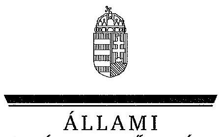
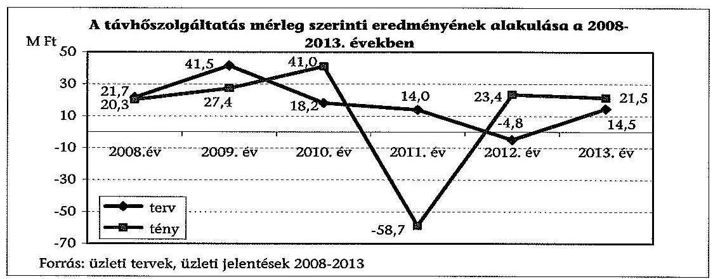
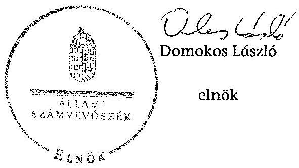

ÁLLAMI
SZÁMVEVŐSZÉK

# JELENTÉS 

Az önkormányzatok gazdasági társaságai - Az önkormányzatok többségi tulajdonában lévő gazdasági társaságok közfeladat ellátását érintő gazdálkodási tevékenysége szabályszerűségének ellenőrzése VÜZ Keszthelyi Városüzemeltető Egyszemélyes Nonprofit Kft.

---

# Állami Számvevőszék 

Iktatószám: V-0733-055/2015
Témaszám: 1767
Vizsgálat-azonosító szám: V067140

## Az ellenőrzést felügyelte:

Dr. Horváth Margit
felügyeleti vezető

## Az ellenőrzést vezette és az ellenőrzés végrehajtásáért felelős:   Salamin Viktor   ellenőrzésvezető

A jelentéstervezet összeállításában közremüködtek:

| Kántor Ilona | Tamás László |
| :-- | :-- |
| számvevő főtanácsos | számvevő tanácsos |

Az ellenőrzést végezte:

| Humli Tamásné | Kántor Ilona | Kiss Rita Teréz |
| :-- | :-- | :-- |
| számvevő tanácsos | számvevő főtanácsos | számvevő tanácsos |

---

# TARTALOMJEGYZÉK 

BEVEZETÉS ..... 7
I. ÖSSZEGZŐ MEGÁLLAPÍTÁSOK, KÖVETKEZTETÉSEK, JAVASLATOK ..... 10
II. RÉSZLETES MEGÁLLAPÍTÁSOK ..... 17

1. Az Önkormányzat közfeladat-ellátásának szabályszerűsége ..... 17
1.1. A közfeladat-ellátás megszervezése és a feladatellátás feltételrendszerének kialakítása ..... 17
1.2. A közfeladat-ellátás felügyelete és a tulajdonosi jogok érvényesítése ..... 19
2. A VÜZ Nonprofit kft. közfeladat-ellátással kapcsolatos tevékenysége ..... 23
2.1. A VÜZ Nonprofit Kft. gazdálkodásának szabályozottsága ..... 23
2.2. A VÜZ Nonprofit Kft. vagyongazdálkodása ..... 25
2.3. A beszámolási kötelezettség teljesítése ..... 29
3. A távhőszolgáltatás közfeladata bevételei és ráfordításai elszámolása, valamint az önköltségszámítás szabályszerűsége ..... 31
3.1. A távhőszolgáltatás közfeladat bevételeinek és ráfordításainak elkülönített, szabályszerű elszámolása ..... 31
3.2. Az önköltségszámítás szabályszerűsége ..... 35
MELLÉKLETEK
4. számú A VÜZ Nonprofit Kft. tevékenységének főbb adatai
5. számú A VÜZ Nonprofit Kft. múködésének főbb jellemzői
6. számú A VÜZ Nonprofit Kft. által biztosított közszolgáltatás díjai a 2008-2013. évekre vonatkozóan
FÜGGELÉK
7. számú Értelmező szótár
8. számú Mintavételi eljárások ellenőrzési területenként

---

.

---

# RÖVIDÍTÉSEK JEGYZÉKE 

## Törvények

Adatvédelmi tv.

Ámt.
Áht.
ÁSZ tv.
Gt.
Info tv.

Kbt.

Ltv.

Nvtv.

Ötv.

Ptk.
Rezsi tv.
Számv. tv.
Taktv.
Tszt.
Vagyon tv.

## Rendeletek

50/2011. (IX. 30.) NFM rendelet
a személyes adatok védelméről és a közérdekú adatok nyilvánosságáról szóló 1992. évi LXIII. törvény (hatálytalan: 2012. január 1-jétől)
az árak megállapításáról szóló 1990. évi LXXXVII. törvény (hatályos: 1991. január 1-jétől)
az államháztartásról szóló 2011. évi CXCV. törvény (hatályos: 2011. december 31-étől)
az Állami Számvevőszékről szóló 2011. évi LXVI. törvény (hatályos: 2011. július 1-jétől)
a gazdasági társaságokról szóló 2006. évi IV. törvény
az információs önrendelkezési jogról és az információszabadságról szóló 2011. évi CXII. törvény (hatályos: 2011. július 27 -től)
a közbeszerzésekről szóló 2011. évi CVIII. törvény (hatályos: 2011. augusztus 21 -től)
az 1995. évi LXVI. törvény a köziratokról, a közlevéltárakról és a magánlevéltári anyag védelméről (hatályos: 1995. június 30 -tól
a nemzeti vagyonról szóló 2011. évi CXCVI. törvény (hatályos: 2011. december 31-étől, kivéve a 20. § (2) bekezdésben meghatározott paragrafusok, amelyek 2012. január 1-jétől, a (3) bekezdésben meghatározott paragrafusok 2013. január 1-jétől, a (4) bekezdésben meghatározott paragrafus 2012. március 2-ától léptek hatályba)
a helyi önkormányzatokról szóló 1990. évi LXV. törvény (hatálytalan: a 2014. évi általános önkormányzati választások napjától)
a Polgári Törvénykönyvről szóló 1959. évi IV. törvény
a rezsicsökkentések végrehajtásáról szóló 2013. évi LIV. törvény (hatályos: 2013. május 10-től)
a számvitelről szóló 2000. évi C. törvény
a köztulajdonban álló gazdasági társaságok takarékosabb múködéséről szóló 2009. évi CXXII. törvény
a távhőszolgáltatásról szóló 2005. évi XVIII. törvény (hatályos: 2005. július 1-jétől)
a nemzeti vagyonról szóló 2011. évi CXCVI. törvény (hatályos: 2011. december 31-étől, kivéve a 20. § (2) bekezdésben meghatározott paragrafusok, amelyek 2012. január 1-jétől, a (3) bekezdésben meghatározott paragrafusok 2013. január 1-jétől, a (4) bekezdésben meghatározott paragrafus 2012. március 2-ától léptek hatályba)
a távhőszolgáltatónak értékesített távhő árának, valamint a lakossági felhasználónak és a külön kezelt intéz-

---

51/2011. (IX. 30.) NFM rendelet
83/2011. (XII. 29.) NFM rendelet
önkormányzati SZMSZ ${ }_{1}$
önkormányzati SZMSZ ${ }_{2}$
távhőszolgáltatási rendelet
távhőszolgáltatási díjak rendelete
vagyongazdálkodási rendelet ${ }_{1}$
vagyongazdálkodási rendelet ${ }_{2}$

## Szórövidítések

adatvédelmi szabályzat
adat és informatikai biztonsági szabályzat
Alapító Okirat
áfa
ÁSZ
beszerzési szabályzat
bizonylati szabályzat
ményeknek nyújtott távhőszolgáltatás dijának megállapításáról szóló 50/2011. (IX. 30.) NFM rendelet (hatályos: 2011. október 1-jétől)
a távhőszolgáltatás támogatásáról szóló 51/2011. (IX. 30.) NFM rendelet
a villamos energia és a földgáz egyetemes szolgáltatás, valamint a távhő árának meghatározásával, a vízügyi igazgatás átalakításával és az energiastatisztikai feladatok ellátásával összefüggő egyes energia tárgyú miniszteri rendeletek módosításáról szóló 83/2011. (XII. 29.) NFM rendelet (hatálytalan: 2012. január 2-ától)
Keszthely Város Önkormányzatának 38/2006. (XII. 1.) számú rendelete az Önkormányzat Szervezeti és Múködési Szabályzatáról (hatályos: 2006. december 1-jétől 2013. április 26-ig)
Keszthely Város Önkormányzatának 16/2013. (IV. 26.) számú rendelete az Önkormányzat Szervezeti és Múködési Szabályzatáról (hatályos: 2013. április 27-től)
Keszthely Város Önkormányzatának 35/2006. (X. 27.) számú rendelete a távhőszolgáltatásról szóló 2005. évi XVIII. törvény egyes rendelkezéseinek Keszthely Város területén történő végrehajtásáról
Keszthely Város Önkormányzatának 36/2006. (X. 27.) számú rendelete Keszthely Város területén érvényesülő távhőszolgáltatási díjak megállapításáról, valamint az áralkalmazási és díjfizetési feltételekről
Keszthely Város Önkormányzatának 31/2003. (XI. 03.) rendelete az Önkormányzati vagyon hasznosításának, használatának és forgalmának rendjéről (hatályos: 2004. január 1-jétől 2013. szeptember 27-ig)
Keszthely Város Önkormányzatának 33/2013. (IX. 27.) számú rendelete az Önkormányzat vagyonáról és a vagyonhasznosítás szabályairól, tárgyak feletti tulajdonosi jogok gyakorlásáról (hatályos: 2013. szeptember 28-tól)

## Szórövidítések

adatvédelmi szabályzat
adat és informatikai biztonsági szabályzat
Alapító Okirat
áfa
ÁSZ
beszerzési szabályzat
bizonylati szabályzat
a VÜZ Nonprofit Kft. Adatvédelmi Szabályzata (hatályos: 2003. december 5-től)
a VÜZ Nonprofit Kft. Adat és Informatikai Biztonsági Szabályzata (hatályos: 2003. december 5-től)
a VÜZ Nonprofit Kft. Alapító Okirata és annak módosításai (kelt.: 1992. február 28-án, elfogadva a 10/1992. (I. 24.) számú Képviselő-testületi határozattal)
általános forgalmi adó
Állami Számvevőszék
a VÜZ Nonprofit Kft. beszerzési szabályzata (hatályos: 2012. december 1-jétől)
a VÜZ Nonprofit Kft. bizonylati szabályzata (hatályos: 2006. január 1-jétől)

---

értékelési szabályzat ${ }_{1} \quad$ a VÜZ Nonprofit Kft. eszközök és források értékelési szabályzata (hatályos: 2001. január 1-jétől)
értékelési szabályzat ${ }_{2} \quad$ a VÜZ Nonprofit Kft. eszközök és források értékelési szabályzata (hatályos: 2012. július 1-jétől)
EU
Európai Unió
FB
VÜZ Nonprofit Kft. Felügyelőbizottsága
hátralékkezelési szabályzat
a VÜZ Nonprofit Kft. hátralékkezelési szabályzata (hatályos: 2006. október 24-től)
javadalmazási szabály-
Szabályzat a VÜZ Nonprofit Kft. vezető tisztségviselői javadalmazásának és jogviszonyának megszűnése esetére biztosított juttatások módjának, mértékének elveiről, annak rendszeréről (hatályos: 2010. január 1-jétől)
jegyzö
Készthely Város Önkormányzatának jegyzője
Képviselő-testület
Keszthely Város Önkormányzatának Képviselő-testülete
leltározási szabályzat ${ }_{1} \quad$ a VÜZ Nonprofit Kft. leltározási, leltárkészítési szabályzata (hatályos: 2001. január 1-jétől)
leltározási szabályzat ${ }_{2} \quad$ a VÜZ Nonprofit Kft. leltározási, leltárkészítési szabályzata (hatályos: 2011. július 1-jétől)
leltározási szabályzat ${ }_{3} \quad$ a VÜZ Nonprofit Kft. leltározási, leltárkészítési szabályzata (hatályos: 2012. január 1-jétől)
MÁK
Magyar Államkincstár
MEKH
Magyar Energetikai és Közmú-szabályozási Hivatal (2013. április 4-ig Magyar Energetikai Hivatal)
NAV
Nemzeti Adó és Vámhivatal
önköltségszámítási szabályzat ${ }_{1} \quad$ a VÜZ Nonprofit Kft. önköltségszámítási szabályzata (hatályos: 2003. október 28-tól)
önköltségszámítási szabályzat ${ }_{2} \quad$ a VÜZ Nonprofit Kft. önköltségszámítási szabályzata (hatályos: 2012. január 1-jétől)
Önkormányzat
Keszthely Város Önkormányzata
pénzkezelési szabályzat ${ }_{1} \quad$ a VÜZ Nonprofit Kft. pénzkezelési szabályzata (hatályos: 2001. március 30-tól, utolsó kiegészítés 2006. március 30.)
pénzkezelési szabályzat ${ }_{2} \quad$ a VÜZ Nonprofit Kft. pénz- és értékkezelési Szabályzata (hatályos: 2008. március 1-jétől)
pénzkezelési szabályzat ${ }_{3} \quad$ a VÜZ Nonprofit Kft. pénz- és értékkezelési szabályzata (hatályos: 2011. július 1-jétől)
polgármester
Keszthely Város Önkormányzatának Polgármestere
Polgármesteri hivatal
Keszthely Város Önkormányzatának Polgármesteri Hivatala
számlarend $_{1} \quad$ a VÜZ Nonprofit Kft. számlarendje (hatályos: 2006. január 1-jétől)
számlarend $_{2} \quad$ a VÜZ Nonprofit Kft. számlarendje (hatályos: 2013. január 1-jétől)
számviteli politika
a VÜZ Nonprofit Kft. számviteli politikája (hatályos: 2001. március 30-tól, utolsó kiegészítés 2013. március 30.)
SZMSZ $_{1} \quad$ a VÜZ Nonprofit Kft. Szervezeti és Múködési Szabályzata

---

| SZMSZ $_{2}$ | (hatályos: 1992. december 8-tól)   a VÜZ Nonprofit Kft. Szervezeti és Müködési Szabályzata (a Képviselő-testület 9/2010. (I. 28.) számú határozatával elfogadva, hatályos: 2010. február 1-jétől) |
| :--: | :--: |
| SZMSZ $_{3}$ | a VÜZ Nonprofit Kft. Szervezeti és Müködési Szabályzata (hatályos: 2011. november 1-jétől) |
| üzletszabályzat | A VÜZ Nonprofit Kft. távhőszolgáltatási részlegének üzletszabályzata (kelt: 2006. november) |
| VÜZ Nonprofit Kft. | VÜZ Keszthelyi Városüzemeltető Egyszemélyes Nonprofit Korlátolt Felelősségú Társaság |
| Ügyrend | Keszthely Város Önkormányzata Polgármesteri Hivatala 299/2006. (XI. 30.) számú képviselő-testületi határozattal jóváhagyott Szervezeti és Müködési Szabályzatának a 2. számú melléklete |

---

# JELENTÉS 

## Az önkormányzatok gazdasági társaságai Az önkormányzatok többségi tulajdonában lévő gazdasági társaságok közfeladat ellátását érintő gazdálkodási tevékenysége szabályszerűségének ellenőrzése

## VÜZ Keszthelyi Városüzemeltető Egyszemélyes Nonprofit Kft.

## BEVEZETÉS

Az Állami Számvevőszék középtávra szóló stratégiájában megfogalmazta, hogy a helyi önkormányzatok gazdálkodásában rejlő pénzügyi kockázatok feltárásával, az államháztartáson kívülre nyújtott költségvetési támogatások és ingyenes vagyonjuttatások, valamint az államháztartáson kívül múködő köz-feladat-ellátó rendszerek ellenőrzéseivel hozzájárul ahhoz, hogy a közpénzeket az államháztartáson kívül múködő szervezetek is átlátható, rendezett módon használják fel a közfeladatok szerződésben vállalt ellátása érdekében.

Az önkormányzatok szervezetalakítási szabadságának következménye, hogy a korábban is vállalati formában múködő (nagyvárosi tömegközlekedés, víz-, szennyvízcsatorna, köztisztasági, ingatlankezelés stb.) közszolgáltatások mellett, mind a kötelező, mind az önként vállalt feladatok ellátásában a gazdasági társaságok kiemelt fontosságú szerephez jutottak.

Keszthely Város Önkormányzata a VÜZ Nonprofit Kft.-t az ellenőrzött időszakot megelőzően a 10/1992. (I. 24.) számú határozatával hozta létre - egyéb feladatok mellett - a távhőszolgáltatás közfeladatának ellátására. Az egyszemélyes önkormányzati alapítású társaság jogelődje az 1954. évben alapított Keszthelyi Városgazdálkodási Vállalat volt.

A VÜZ Nonprofit Kft. 100\%-ban az Önkormányzat tulajdonában volt az ellenőrzött időszakban. A társaság jegyzett tőkéje 2013. december 31-én 256,6 M Ft volt, mely az ellenőrzött időszakban nem változott.

Az ellenőrzött időszakban a VÜZ Nonprofit Kft. 15\%-os tulajdoni hányaddal 9,5 M Ft-os részesedéssel - rendelkezett a KETÉH Keszthely és Térsége Hulladékkezelő Kft.-ben, amely hulladékkezelés főtevékenységgel múködött.

A VÜZ Nonprofit Kft. főtevékenysége Keszthely Város közigazgatási területén a távhőszolgáltatás biztosítása volt. A VÜZ Nonprofit Kft. további közfeladatai

---

voltak az ellenőrzött időszakban a távhőszolgáltatás és villamos energiatermelés (utóbbi 2012. március 31-ig); temető fenntartás; helyi közutak fejlesztése, fenntartása és üzemeltetése; parkok és egyéb közterület fenntartása; parkolók üzemeltetése; hulladékgyűjtés és kezelés (2012. április 24-ig, a tevékenység kiválásáig). A távhőszolgáltatás három kazánházon, öt hőközponton és az épületek hőfogadóin keresztül biztosította a fütést és a használati melegvizet. A kapcsolt hő és villamos energia termelés két gázmotor múködtetésével történt, ezeket gazdaságossági okból 2012. március 31-én leállították. Ezt követően csak kazánokkal biztosították a távhőszolgáltatást. A távfűtött lakások száma 2008ban a kezdeti 1128 db-ról, 2013-ban 1192 db-ra, a közületek és egyéb felhasználók száma 13 db -ról, 14 db -ra növekedett az ellenőrzött időszakban.

A VÜZ Nonprofit Kft. éves nettó árbevétele 812,5 M Ft és 1443,2 M Ft, az eszközök és források mérleg szerinti értéke 1402,6 M Ft és 1713,3 M Ft között változott az ellenőrzött időszakban. A mérleg szerinti eredmény a VÜZ Nonprofit Kft. teljes tevékenysége tekintetében az ellenőrzött időszakban 67,3 M Ft összesített veszteséget mutatott. A 2011. év kivételével - amikor 116,5 M Ft veszteséget realizált - a társaság nyeresége 2,1 M Ft és 18,1 M Ft között változott. A VÜZ Nonprofit Kft.-nél foglalkoztatottak átlagos statisztikai létszáma - közfoglalkoztatottak nélkül - 2008. december 31-én 178 fő, 2013. december 31-én 76 fő volt. Ebből közfeladat ellátásban foglalkoztatottak átlagos statisztikai létszáma 105 fơről 34 főre csökkent. A távhőszolgáltatási rendszerek karbantartására és múködtetésére külső szolgáltatóval kötött szerződést a VÜZ Nonprofit Kft., ezért a távhőszolgáltatásban dolgozók átlagos statisztikai létszáma - számlázás, szerződéskötés, fogyasztói ügyintézés nélkül - a 2008. évben 2 fő, a 2013. évben 2,3 fő volt.

Az ellenőrzött időszakban a polgármester személye nem, a jegyző személye egy alkalommal változott. A polgármester a 2006. évi önkormányzati választások óta tölti be tisztségét, a helyszíni ellenőrzés időszakában a munkakört betöltő jegyző 2013. február 15-től látja el feladatait. Az ellenőrzött időszakban az ügyvezető személye egy alkalommal, a gazdasági igazgató személye nem változott. Az ügyvezető 2013. április 1-jétől, a gazdasági igazgató (főkönyvelő) 1997. július 5. óta tölti be a tisztségét.

Az önkormányzati tulajdonú gazdasági társaságok teljes körű ellenőrzésének lehetőségét az Állami Számvevőszékről szóló 1989. évi XXXVIII. törvény 2011. január 1-jétől hatályos módosítása teremtette meg.

Az ellenőrzés célja annak értékelése volt, hogy

- az önkormányzat a jogszabályi előírások figyelembevételével döntött-e az ellenőrzésre kerülő közfeladat megszervezéséről; az önkormányzat szabályszerűen gyakorolta-e a tulajdonosi jogokat;
- a gazdasági társaság közfeladat-ellátása bevételeinek, ráfordításainak elszámolása, és vagyongazdálkodási tevékenysége megfelelt-e a jogszabályi, illetve a közszolgáltatási szerződésben foglalt tulajdonosi előírásoknak, azok végrehajtása szabályszerű volt-e;

---

- a közfeladatok átláthatósága és elszámoltathatósága érdekében biztosítva volt-e a közszolgáltatás dijának megalapozottsága szabályszerű önköltségszámítással.

Az ellenőrzés kiterjedt Keszthely Város Önkormányzatára és a VÜZ Keszthelyi Városüzemeltető Egyszemélyes Nonprofit Kft.-re.

Az ellenőrzés várható hasznosulása: A törvényalkotás számára - az észlelt problémák, szabálytalanságok, vagy egyéb nem kívánatos jelenségek felszínre kerülésével - az ellenőrzés megállapításai segítséget nyújthatnak az államháztartáson kívüli közfeladat-ellátás értékeléséhez, jogszabályi keretei pontosításához, átláthatóságot biztosító szabályozásához. Meghatározhatóvá válnak a közfeladat ellátásában részt vevő államháztartáson kívüli szervezeteknek - az önkormányzat költségvetését, pénzügyi helyzetét is befolyásoló - kockázatai, lehetővé válik ezen kockázatok csökkentése. Feltárja, hogy az önkormányzat közfeladat-ellátási kötelezettségének szabályszerűen tett-e eleget, a feladatellátáshoz rendelt közvagyon múködtetését szabályszerűen szervezte-e meg és a tulajdonosi felügyelete hozzájárult-e a közfeladat-ellátásához. A feladatot ellátó gazdasági társaság a közszolgáltatási szerződésben foglaltak betartásával, a közvagyon használatával biztosította-e a szolgáltatás folytatásának feltételeit. Ezzel az ellenőrzöttek és a helyi döntéshozók számára visszajelzést ad feladatszervezési, feladat-ellátási kockázataikról, alapot ad a meglévő hibák megszüntetéséhez, a jobb közfeladat-ellátás biztosításához. Fokozza a fegyelmet, igazolja, hogy lejárt a következmények nélküli ellenőrzések időszaka. Az ÁSZ értékteremtő rend kialakításához és megőrzéséhez hozzájáruló tevékenysége pozitív hatással van a szervezetről kialakított összkép formálására is.

Az ellenőrzést a számvevőszéki ellenőrzés szakmai szabályai szerint, szabályszerűségi ellenőrzés módszerével, a nemzetközi standardok figyelembevételével végeztük. Az ellenőrzés a 2008-2013. évekre terjedt ki.

Az ellenőrzés végrehajtásának jogszabályi alapját az ÁSZ tv. 5. § (3)-(5) bekezdése képezte.

Az ÁSZ az Állami Számvevőszékről szóló 2011. évi LXVI. törvény 29. §-a alapján a jelentéstervezetet észrevételezésre megküldte Keszthely Város Önkormányzata polgármesterének, valamint a gazdasági társaság ügyvezető igazgatójának. Az érintettek észrevételt nem tettek.

---

# I. ÖSSZEGZŐ MEGÁLLAPÍTÁSOK, KÖVETKEZTETÉSEK, JAVASLATOK 

Az Önkormányzat a Tszt.-ben a távhőszolgáltatással összefüggésben meghatározott kötelező feladatát a kizárólagos tulajdonában álló VÚZ Nonprofit Kft. útján látta el. A VÚZ Nonprofit Kft. 2011. március 1-jétől nonprofit jelleggel múködött, főtevékenysége a távhőszolgáltatás volt. A Képviselő-testület a távhőszolgáltatás közfeladat megszervezéséről a jogszabályi előírásoknak megfelelően gondoskodott. A vagyongazdálkodási rendelet ${ }_{1,2}$-ben rögzítette a tulajdonosi jogok gyakorlásának szabályait. A tulajdonosi jogokat a Képviselőtestület a Gt.-ben előírtaknak megfelelően egyedi döntésekkel, szabályszerűen gyakorolta. Az Önkormányzat a távhő vagyont a VÚZ Nonprofit Kft. alapításakor apportként biztosította, e feladat ellátásához kezelésbe vagyont nem adott át.

Az Önkormányzat 2007-2010. évekre, valamint a 2011-2015. évekre vonatkozó gazdasági programjai az Ötv.-ben foglaltak ellenére a távhőszolgáltatás fejlesztésével kapcsolatban stratégiai célokat, feladatokat nem fogalmaztak meg. Az Integrált Városfejlesztési Stratégia a távhőszolgáltatás fejlesztését, kiterjesztését határozta meg, konkrét elképzeléseket, fejlesztési irányokat nem rögzített.

Az Önkormányzat a Tszt.-ben előírtaknak megfelelően a távhőszolgáltatási és a távhőszolgáltatási díjak rendeletében szabályozta a helyi távhőszolgáltatás rendszerét. A távhőszolgáltatási díjak rendeletében az Ámt., valamint a Tszt. 2011. április 15-től hatályba lépett, a díjmegállapítói önkormányzati hatáskör ágazati miniszteri hatáskörre változását 2013. október 31-ig nem vezették át. A díjak megállapításának előkészítése során a VÚZ Nonprofit Kft. alkalmazta az elő- és utókalkuláció módszerét.

Az Önkormányzat a tulajdonosi ellenőrzést alapvetően az FB-n keresztül hajtotta végre. A Gt.-ben foglaltak ellenére az FB ügyrendet nem készített. Az Önkormányzat és a VÚZ Nonprofit Kft. nem tartotta be az Ltv.-ben az iratok irattárba helyezésére, megőrzésére és használatra bocsátására vonatkozó előírásokat, mert nem tudta az ellenőrzés rendelkezésére bocsátani az FB 2008. évi jegyzőkönyveit. Az Önkormányzat a 2008-2012 közötti időszakban nem élt az Ötv.-ben biztosított lehetőséggel, mivel az önkormányzati vagyon megóvásához, a távhőszolgáltatás, mint közfeladat ellátás szabályszerű teljesítéséhez a belső ellenőrzés nem járult hozzá, ellenőrzéseket nem végzett a VÚZ Nonprofit Kft.-nél. A tulajdonosi ellenőrzés keretében a rezsicsökkentés és a díjmegállapítás szabályszerűségének ellenőrzését hajtották végre. A Képviselő-testület a 2009. évben a VÚZ Nonprofit Kft. átvilágításáról döntött. Az Önkormányzat a 2010. évben végzett külső szakértői ellenőrzés által a VÚZ Nonprofit Kft. vagyonának múködtetésére, a pénzeszközeinek felhasználására és a szervezeti struktúra racionalizálására vonatkozó költségcsökkentési javaslatokkal egyetértett, a javaslatok végrehajtását a külső szakértővel ellenőriztette. Az átvilágítás megállapításait a VÚZ Nonprofit Kft. hasznosította.

---

A VÜZ Nonprofit Kft. az ellenőrzött időszak minden évében rendelkezett üzleti tervvel. Az üzleti tervek azokat a stratégiai célokat és irányokat tartalmazták, amelyek a gazdasági egyensúly megteremtését és fenntartását fogalmazták meg. Az üzleti tervekben bemutatásra kerültek a távhőszolgáltatási tevékenységgel összefüggő fejlesztési tervek, az ágazat várható bevételei, költségei és eredményei.

A VÜZ Nonprofit Kft. múködésének alapdokumentumai az Alapító Okirat, a működési engedélyek, az SZMSZ ${ }_{1-3}$, valamint a Számv. tv. alapján elkészítendő szabályzatok voltak. Az SZMSZ ${ }_{3}$ nem követte a hatályba lépését követően végrehajtott szervezeti átalakításokat, feladat változásokat. A VÜZ Nonprofit Kft. a Számv. tv. rendelkezéseinek megfelelően a számviteli politika keretében készítette el a leltározási szabályzat ${ }_{1-3}$-át, az értékelési szabályzat ${ }_{1,2}$-ot, a pénzkezelési szabályzat ${ }_{1-3}$-ot és az önköltségszámítási szabályzat ${ }_{1,2}$-ot, valamint a számlarend ${ }_{1,2}$-et. A számviteli politika többszöri módosítása ellenére nem volt teljes körűen aktualizált a Számv. tv. előírásai ellenére. Nem rögzítették a Tszt. 2012. január 1-jétől előírt, a számviteli szétválasztásra vonatkozó előírásokat. A leltározási szabályzat ${ }_{1-3}$ a Számv. tv.-ben foglaltak ellenére a folyamatosan vezetett mennyiségi nyilvántartásban szereplő eszközökre és forrásokra a Számv. tv.-ben foglaltak ellenére a leltározás gyakoriságát nem határozta meg. Az értékelési szabályzat ${ }_{1,2}$ a Számv. tv.-ben foglaltakkal szemben nem tartalmazta a vevők minősítésének szempontjait, a behajthatatlan követelések egyedi értékelésének, az értékvesztés elszámolásának részletszabályait. A pénzkezelési szabályzat ${ }_{1-3}$ a Számv. tv.-ben foglaltaknak nem felelt meg, mert nem határozta meg a bankszámlán történő lebonyolítás, a készpénzben és a bankszámlán tartott pénzeszközök közötti forgalom rendjére, valamint a pénzkezeléssel kapcsolatos bizonylati rendjére vonatkozó előírásokat, nem tért ki a pénztárakban lévő készpénz tényleges összegének ellenőrzésével összefüggő feladatokra, az ellenőrzés gyakoriságára. A bizonylati szabályzat aktualizálására nem került sor. A Számv. tv.-ben foglalt, a bizonylatok őrzési idejére és módjára vonatkozó módosult előírásokat nem vette figyelembe.

Az önköltségszámítási szabályzat ${ }_{1,2}$ az egyes közfeladatokra vonatkozó részletes ágazati feladatokat nem határozta meg. Az önköltségszámítási szabályzat ${ }_{2}$ a távhőszolgáltatás, mint közfeladat ellátás tekintetében a Tszt.-ben előírt számviteli szétválasztási követelményeknek nem felelt meg.

Az üzletszabályzat meghatározta a távhőszolgáltató és a felhasználó szerződéses viszonyát, melynek módosítására a Tszt.-ben foglalt távhőszolgáltatási díjmegállapítói hatáskör 2011. április 15 -től hatályos változása ellenére nem került sor.

A VÜZ Nonprofit Kft. vagyongazdálkodási tevékenysége - beleértve a vagyon kezelését, gyarapítását, hasznosítását -, összességében megfelelit a jogszabályi előírásoknak és a tulajdonos Önkormányzat által meghatározott követelményeknek. A távhő-ágazat befektetett eszközeinek összege, a társaság öszszes befektetett eszközéhez viszonyított aránya, használhatósági foka jelentősen csökkent, mivel a VÜZ Nonprofit Kft. az eszközök pótlására nem tudott elegendő forrást biztosítani. A távhőszolgáltatáshoz kapcsolódóan az ellenőrzött időszakban két nagyobb beruházás megvalósítása volt folyamatban. Az Önkormányzat a VÜZ Nonprofit Kft.-nek a távhőszolgáltatáshoz kapcsolódóan mú-

---

ködési és felhalmozási célú pénzeszközt nem adott át, kölcsönt nem nyújtott, veszteség rendezésével kapcsolatosan pótbefizetési kötelezettsége nem keletkezett, kötelezettségvállaláshoz évi 25 M Ft erejéig készfizető kezességet vállalt.

A VÜZ Nonprofit Kft. a saját vagyon elkülönítésére, annak változására, a közfeladat ellátásával való kapcsolatára vonatkozó rendelkezéseket betartotta, rendelkezett a saját vagyontárgyaira vonatkozó naprakész vagyonnyilvántartással. A vagyonnyilvántartásban a vagyonváltozás kimutatása folyamatos volt, megfelelt a Számv. tv. előírásainak. Az eszközök értékének változását és az elszámolt értékcsökkenést az éves beszámolók kiegészítő mellékleteiben bemutatták.

A VÜZ Nonprofit Kft. az ellenőrzött időszakban a Számv. tv. előírásainak megfelelő éves beszámolót és üzleti jelentést készített, amelyeket az FB, illetve a könyvvizsgáló jelentéseinek ismeretében a Képviselő-testület határozattal fogadott el. A Számv. tv. szerinti határidőben a Képviselő-testület által elfogadott 2012. évi beszámoló kiegészítő melléklete a Tszt.-ben előírtaktól eltérően nem tartalmazta a teljes távhő-ágazat számviteli szétválasztását elkülönített mérlegben és eredménykimutatásban. A VÜZ Nonprofit Kft. a távhő-ágazat számviteli szétválasztását később végrehajtotta, amelynek eredményét a 2012. évi beszámoló módosított kiegészítő mellékletében bemutatta. A VÜZ Nonprofit Kft. a 2012. évi beszámoló második, a számviteli szétválasztást is tartalmazó kiegészítő melléklettel és módosított könyvvizsgálói záradékkal kiegészített, érvényesnek nem tekinthető változatát a Számv. tv. előírása ellenére a Képviselőtestület elfogadásának hiányában tette közzé. A Gt.-ben foglaltak ellenére a könyvvizsgáló a beszámolót tárgyaló képviselő-testületi ülésen nem vett részt.

A könyvvizsgáló a VÜZ Nonprofit Kft. Számv. tv. szerinti éves beszámolójáról minden évben minősítés nélküli hitelesítő záradékot adott ki, a 2008-2011. években figyelemfelhívást tett a vállalkozás folytatása elvének érvényesülése érdekében. A 2012. évi beszámolóhoz kiadott könyvvizsgálói jelentés a Tszt.ben foglaltak ellenére nem igazolta a számviteli szétválasztási szabályok betartását és keresztfinanszírozás-mentességet. Az igazolás kiadása a 2012. évi módosított és a 2013. évi könyvvizsgálói jelentésben megtörtént.

A VÜZ Nonprofit Kft. mérleg szerinti eredménye a távhőszolgáltatás ágazati eredményénél kedvezőtlenebb volt. A VÜZ Nonprofit Kft. gazdálkodása az ellenőrzött időszakban összesen 67,3 M Ft veszteséget mutatott, míg a távhőszolgáltatás nyeresége $74,9 \mathrm{M}$ Ft volt. A 2011. évi veszteséget alapvetően az árfolyamveszteség elszámolása okozta. A jegyzett tőke saját tőke aránya a 2008. évi 1,4-ről a 2013. évben 1,1-re mérséklődött. A saját tőke csökkenése nem járt a Gt. tv-ben előírt visszapótlási kötelezettséggel. A VÜZ Nonprofit Kft. osztalékot nonprofit jellegéből adódóan és az Alapító Okiratában előírtaknak megfelelően nem fizetett. Az éves beszámolók elfogadásával a Képviselő-testület elfogadta a nyereség eredménytartalékba helyezését.

A VÜZ Nonprofit Kft. az 50/2011. (IX. 30.) NFM rendelet alapján a távhőszolgáltatás költségeinek ellentételezésére a 2011. évben 50,0 M Ft, a 2012. évben 130,5 M Ft, a 2013. évben 165,7 M Ft távhőtámogatásban részesült. A távhőszolgáltatás ágazatban kimutatott vevő követelés és a kötelezettségek állománya az ellenőrzött időszakban változóan alakult, de a 2013. évben csökkent.

---

A belső szabályozás hiányossága ellenére a 2012. évi módosított beszámoló elkészítésétől kezdődően a Tszt. előírásainak megfelelően alkalmazták a távhőszolgáltatásra vonatkozó számviteli szétválasztási szabályokat.

A VÜZ Nonprofit Kft. a távhőszolgáltatási közfeladat anyagjellegű ráfordításai, a beruházásai, felújításai és az értékcsökkenés elszámolása során szabályszerűen járt el. A távhőszolgáltatási közfeladat bevételeinek elszámolása - a mintavételes ellenőrzés tapasztalatai alapján - a bevétel beszedésének jogosságát megalapozó dokumentumok Ltv.-ben előírtak ellenére fennálló hiánya miatt kockázatos volt.

A közfeladat átláthatósága és elszámoltathatósága érdekében a távhőszolgáltatás díjait önköltségszámítás alapozta meg, azonban az alkalmazott szolgáltatási díjak 2009. március 1. és 2011. április 15. között az Ámt. előírásai és az Önkormányzat vonatkozó rendeletében meghatározottakkal szemben, a hatósági árnál alacsonyabb összegben voltak meghatározva.

A kintlévőségek összege a fokozottabb behajtási tevékenység révén csökkent. A határidőn túli követelésekhez kapcsolódó értékvesztés elszámolása eltért a számviteli politikában és az értékelési szabályzat ${ }_{1,2}$-ban rögzítettektől.

Az Info tv. 1. számú mellékletében, valamint Tszt. -ben előírt közérdekű adatokra irányuló közzétételi kötelezettségének részben tett eleget a VÜZ Nonprofit Kft., mert az előző év gazdálkodási adatait, valamint a társaság szervezetére, részesedésére, ellenőrzéseire, egyes szabályzataira, szerződéseire vonatkozó információkat honlapján nem tette közzé.

A fentiekben leírtak összegzéseként az alábbi megállapításokat tesszük:
Az Önkormányzat a VÜZ Nonprofit Kft. alapításakor a távhőszolgáltatáshoz szükséges vagyont apportként bocsátotta rendelkezésre. Gazdasági programjai konkrét stratégiai célokat és feladatokat nem fogalmaztak meg. A távhőszolgáltatás közfeladat megszervezéséről a jogszabályi előírásoknak megfelelően gondoskodott, szabályozta a helyi távhőszolgáltatás rendszerét. A tulajdonosi jogokat a Képviselő-testület egyedi döntésekkel, szabályszerűen gyakorolta. A tulajdonosi ellenőrzés alapvetően az FB tevékenységén keresztül valósult meg. A tulajdonos a társaság által elkészített éves beszámolókat és üzleti jelentéseket elfogadta. A VÜZ Nonprofit Kft. vagyongazdálkodási tevékenysége összességében megfelelt a jogszabályi előírásoknak. Alkalmazta a távhőszolgáltatásra vonatkozó számviteli szétválasztási szabályokat. A távhőszolgáltatás anyagjellegű ráfordításainak, a beruházások, felújítások és az értékcsökkenés elszámolása során szabályszerűen járt el, a bevételek elszámolása kockázatos volt. A közfeladat átláthatósága és elszámoltathatósága érdekében a távhőszolgáltatás díjait önköltségszámítás alapozta meg. Az alkalmazott szolgáltatási díjak részben feleltek meg az Ámt.-ben, valamint a távhőszolgáltatási díjak rendeletében foglaltaknak.

Az FB ügyrendet nem készített, 2008. évi jegyzőkönyvei nem álltak rendelkezésre. A könyvvizsgáló a tulajdonos által elfogadott 2012. évi beszámolóhoz kiadott könyvvizsgálói jelentésben nem igazolta a számviteli szétválasztási szabályok betartását és a keresztfinanszírozás-mentességet. A belső ellenőrzés el-

---

lenőrzéseket nem végzett a VÜZ Nonprofit Kft.-nél. A társaság szabályszerű működésének ellátásához szükséges szabályzatok rendelkezésre álltak, azonban a számviteli politika, a leltározási, az értékelési, a pénzkezelési szabályzat hiányos meghatározásai és nem aktualizált tartalmi elemei gyengítették a szabályozás színvonalát. A számviteli politika és az önköltségszámítási szabályzat nem tartalmazta a számviteli szétválasztás szabályait, az SZMSZ nem követte a végrehajtott szervezeti és feladatváltozásokat. A távhőszolgáltatás biztosításához használt eszközök beruházásaira, felújításaira nem tudott elegendő forrást biztosítani az elszámolt értékcsökkenési leírással azonos mértékben, a tárgyi eszközök használhatósági foka folyamatosan romlott.

Az Állami Számvevőszékről szóló 2011. évi LXVI. törvény 33. § (1) bekezdésében foglaltak értelmében a jelentésben foglalt megállapításokhoz kapcsolódó intézkedési tervet köteles az ellenőrzött szervezet vezetője összeállítani, és az a jelentés kézhezvételétől számított 30 napon belül az ÁSZ részére megküldeni. Amennyiben az intézkedési tervet határidőben nem küldi meg a szervezet, vagy az nem elfogadható, az ÁSZ elnöke a hivatkozott törvény 33. § (3) bekezdés a)-b) pontjaiban foglaltakat érvényesítheti.

Az ellenőrzés intézkedést igénylő megállapításai és javaslatai:
Javaslataink célja a Kft. müködése szabályszerűségének helyreállítása annak érdekében, hogy a szabályozási környezet megfelelően tudja támogatni az átlátható müködést.

# Javasoljuk VÜZ Keszthelyi Városüzemeltető Egyszemélyes Nonprofit Kft. Ügyvezető Igazgatójának: 

1. A számviteli politika többszöri módosítása ellenére nem volt teljes körűen aktualizált a Számv. tv. 14. § (11) bekezdésében foglalt előírások ellenére. A számviteli politikában és az önköltségszámítási szabályzatban nem rögzítették a Tszt. 18/A. § (1)-(4) bekezdéseiben a 2012. január 1-jétől előírt, a számviteli szétválasztásra vonatkozó előírásokat.

A leltárkészítési és leltározási szabályzat a folyamatos mennyiségi nyilvántartásban szereplő eszközökre és forrásokra a Számv. tv. 69. § (3) bekezdésében foglaltak ellenére a leltározás gyakoriságát nem határozta meg. Az értékelési szabályzat a Számv. tv. 14. § (4) bekezdésében foglaltakkal szemben nem tartalmazta a vevők minősítésének szempontjait, a behajthatatlan követelések egyedi értékelésének, az értékvesztés elszámolásának részletszabályait. A pénzkezelési szabályzat a Számv. tv. 14. § (8) bekezdésében foglaltaknak nem felet meg, mert nem határozta meg a bankszámlán történő lebonyolítás, a készpénzben és a bankszámlán tartott pénzeszközök közötti forgalom rendjére, valamint a pénzkezeléssel kapcsolatos bizonylatok rendjére vonatkozó előírásokat, nem tért ki a pénztárakban lévő pénz tényleges összegének ellenőrzésével összefüggő feladatokra, az ellenőrzés gyakoriságára. A bizonylati szabályzat aktualizálására nem került sor. A Számv. tv. 14. § (3)-(5), valamint a 169. § (1), (5) és (6) bekezdései előírásainak betartása érdekében a társaság nem határozta meg a bizonylatok őrzési idejére és módjára vonatkozó, a gazdálkodóra jellemző előírásokat.

---

Az ellenőrzött időszakban történt reorganizációs tevékenységek - tevékenység kiszervezés, szervezeti átalakítások - következtében az ügyvezető 2011. október 6-án jóváhagyta, majd 2011. november 1-jén az 5/2011. számú igazgatói utasítással hatályba léptette a VÜZ Nonprofit Kft. SZMSZ-ét, a megváltozott szervezethez, feladatokhoz igazodó részletezettséggel. Az SZMSZ nem követte a hatályba lépését követően végrehajtott szervezeti átalakításokat, feladat változásokat.

Az üzletszabályzat módosítására a Tszt. 57/D. § (1) bekezdésben foglalt távhőszolgáltatási díjmegállapítói hatáskör 2011. április 15-től hatályos változása ellenére nem került sor.

Javaslat:

# Intézkedjen a szabályozási hiányosságok megszüntetésére, ennek keretében: 

a) egészítse ki a számviteli politikáját, valamint a leltározási szabályzatát, az értékelési, a pénzkezelési és az önköltségszámítási szabályzatát a számviteli szétválasztásra, az értékvesztés elszámolására, a leltározás végrehajtására, a követelések értékelésére, a bankszámlaforgalomra, a készpénz és bankszámla közötti forgalom rendjére, a pénzkezelés bizonylati, ellenőrzés rendjére vonatkozó előírásokkal a Számv. tv.-ben és a Tszt.-ben foglalt követelményeknek megfelelően;
b) aktualizálja az SZMSZ-ét a szervezeti átalakításoknak megfelelően, valamint az Üzletszabályzatát a Tszt. előírásai szerint.
2. A távhőszolgáltatási közfeladat bevételeinek elszámolásánál két esetben hiányzott a bevétel beszedésének jogosságát megalapozó dokumentum. Ezzel nem tettek eleget az Ltv. 9 § (1) bekezdés e) pontjában foglalt, az iratok irattárba helyezésére, megőrzésére, valamint használatra bocsátására vonatkozó előírásnak.

A VÜZ Nonprofit Kft. az Info tv. 1. számú mellékletében, valamint Tszt. 57/C. § (1) bekezdésében, a (4) bekezdés d) pontjában előírt közzétételi kötelezettségének részben tett eleget. Az Info tv. 1. számú mellékletében meghatározott adatok közül nem tették közzé a szervezeti felépítést, a társaság részvételével működő gazdálkodó szervezet adatait, részesedését, a szervezeti és működési szabályzatot, az adatvédelmi és adatbiztonsági szabályzatot, az alaptevékenységgel kapcsolatos ellenőrzések nyilvános megállapításait, a közérdekű adatokkal kapcsolatos kötelező statisztikai adatszolgáltatás adatait, az államháztartás pénzeszközei felhasználásával, vagyonnal történő gazdálkodással összefüggő, ötmillió forintot elérő vagy azt meghaladó értékű szerződések adatait, az EU támogatásával megvalósuló fejlesztésekhez kapcsolódó információkat. A honlap a Tszt. 57/C. (4) bekezdés d) pontjában foglaltak ellenére nem tartalmazta az előző év gazdálkodási adatait.

Javaslat:

## Gondoskodjon a jogszabályi elöírások szerinti gyakorlat és a szabályos müködés biztosításra, ezen belül:

a) gondoskodjon az iratok jogszabályban előírt megőrzéséről;
b) intézkedjen annak érdekében, hogy a jogszabályi előírásnak megfelelően történjen meg a gazdasági társaság adatainak közzététele.

---

Javaslataink célja az Önkormányzat szabályszerű müködésének elősegítése, továbbá az önkormányzati tulajdonosi joggyakorlás kontrolljának erősítése.

# Javasoljuk Keszthely Város Önkormányzata Polgármesterének: 

1. A Gt. 34. § (4) bekezdés ellenére - amely szerint a FB ügyrendjét maga állapítja meg és amelyet a gazdasági társaság legfőbb szerve hagy jóvá - az FB ügyrendet nem készített.

Javaslatok:
Intézkedjen a szabályozási hiányosságok megszüntetésére, ennek keretében:
hívja fel a tulajdonosi joggyakorló figyelmét, hogy az FB nem készítette el az ügyrendjét.

## Javasoljuk Keszthely Város Önkormányzata Jegyzöjének:

1. Az Önkormányzat a VÜZ Nonprofit Kft. tulajdonosi ellenőrzését alapvetően az FB-n keresztül hajtotta végre. Az FB tevékenységének eredményét jegyzőkönyvbe foglalta. Viszont nem tudta az ellenőrzés rendelkezésére bocsátani az FB 2008. évi jegyzőkönyveit, amellyel nem tartotta be az Ltv. 9 § (1) bekezdés e) pontjában, az iratok irattárba helyezésére, megőrzésére és használatára vonatkozó előírásokat.

Az Önkormányzat belső ellenőrzése az ellenőrzéseivel a távhőszolgáltatás, mint köz-feladat-ellátás szabályszerű teljesítéséhez, valamint az önkormányzati vagyon megóvásához ellenőrzéseivel nem járult hozzá. Az ellenőrzött időszakban a társaság gazdálkodásával és müködésével kapcsolatban ellenőrzést nem folytatott le.

Javaslatok:
Gondoskodjon a jogszabályi elöírások szerinti gyakorlat és szabályos müködés biztosításáról, ennek keretében:
a) gondoskodjon az iratok jogszabályban előírt megőrzéséről;
b) fordítson kiemelt figyelmet arra, hogy az önkormányzat belső ellenőrzése az ellenőrzéseivel a távhőszolgáltatás, mint közfeladat-ellátás szabályszerű teljesítéséhez, valamint az önkormányzati vagyon megóvásához ellenőrzéseivel járuljon hozzá.

---

# II. RÉSZLETES MEGÁLLAPÍTÁSOK 

## 1. Az ÖNKORMÁNYZAT KÖZFELADAT-ELLÁTÁSÁNAK SZABÁLYSZERÜSÉGE

### 1.1. A közfeladat-ellátás megszervezése és a feladatellátás feltételrendszerének kialakítása

Az Ötv. 91. § (6) bekezdése alapján az Önkormányzatnak a gazdasági programjában kellett meghatároznia azon célkitűzéseit, amelyek az ellátandó feladatok biztosítását, fejlesztését szolgálják. Az előírás ellenére az Önkormányzat a 2007-2010. évekre, illetve a 2011-2015. évekre szóló gazdasági programjai a távhőszolgáltató rendszer fejlesztésével, a közfeladat ellátásával kapcsolatban konkrét stratégiai célokat, terveket, feladatokat nem fogalmaztak meg.

A Képviselő-testület által a 2007-2015. évekre jóváhagyott Integrált Városfejlesztési Stratégia bemutatta a közszolgáltatások, köztük a távhő közmú ellátottság helyzetét. A környezetvédelmi fejlesztési célok között, a légszennyezés csökkentése érdekében a távhőszolgáltatás fejlesztését, kiterjesztését határozta meg, azonban konkrét elképzeléseket, fejlesztési irányokat nem rögzített.

A Képviselő-testület az Nvtv. 9. § (1) bekezdésében előírtaknak megfelelően elfogadta az Önkormányzat 2012-2017. évekre szóló középtávú, valamint a 2012-2022. évekre vonatkozó hosszú távú vagyongazdálkodási tervét. A vagyongazdálkodási terv a távhőszolgáltatási közfeladat ellátásával a vagyongazdálkodás hatékony és költségtakarékos múködtetésével, értékének megőrzésével, állagának védelmével, értéknövelő használatával, hasznosításával, gyarapításával - kapcsolatosan a Nvtv. 7. § (2) bekezdése rendelkezése ellenére nem fogalmazott meg feladatokat.

A Tszt. 6. § (1) bekezdése értelmében a települési önkormányzat az engedélyes vagy engedélyesek útján köteles biztosítani a távhőszolgáltatással ellátott létesítmények távhőellátását. A Képviselő-testület az önkormányzati SZMSZ ${ }_{1,2}$-ben előírta, hogy az Önkormányzat köteles gondoskodni a törvények által kötelezően ellátandó feladatokról.

Az SZMSZ ${ }_{1}$ a kötelező feladatok között a törvényben megállapított egyéb közszolgáltatási feladatok ellátását rögzítette. Meghatározta a helyi közszolgáltatási feladatok ellátásának módját, mely szerint közszolgáltatási feladatát a VÜZ Nonprofit Kft. útján látja el.

A Képviselő-testület az Önkormányzat közigazgatási területén a távhőszolgáltatás közfeladatának megszervezését az Ötv. 9. § (4) bekezdés rendelkezésének megfelelően, a Városgazdálkodási Vállalat 100\%-os tulajdonában lévő gazdasági társasággá történő alakításával biztosította. A VÜZ Nonprofit Kft.

---

alapítása és a távhőszolgáltatási feladatok átadása az ellenőrzött időszakot megelőzően történt. Az Önkormányzat az 1992. évi alapításkor a VÜZ Nonprofit Kft-be apportálta a távhő vagyont, amely a gazdasági társaság saját vagyona lett. A Képviselő-testület a VÜZ Nonprofit Kft. törzstőkéjét 256,6 M Ftban határozta meg, amely $33,3 \mathrm{M}$ Ft pénzbeli betétből és $223,3 \mathrm{M}$ Ft tárgyi eszköz apportból állt. A távhőszolgáltatással összefüggő tárgyi eszközök bruttó értéke $38,4 \mathrm{M}$ Ft volt. Az alapítást követően a törzstőke összege az ellenőrzött időszak végéig nem változott. Az Önkormányzat a VÜZ Nonprofit Kft. részére a távhőszolgáltatási feladat ellátásához vagyonkezelésbe vagyont nem adott át.

A VÜZ Nonprofit Kft. Alapító Okiratának 2011. március 1-jei módosítását követően a távhőszolgáltatást az alapító a VÜZ Nonprofit Kft. főtevékenységeként határozta meg. A VÜZ Nonprofit Kft. 2011. március 1-jétől nonprofit jelleggel működött. A VÜZ Nonprofit Kft. a távhőszolgáltatást működési engedély ${ }^{1}$ birtokában végezte.

Az ellenőrzött időszakra a távhő-ágazatra irányadó jogszabályi rendelkezések nem írták elő az Önkormányzatnak és a távhőszolgáltatónak közszolgáltatási szerződéskötési kötelezettséget. Az Önkormányzat a VÜZ Nonprofit Kft.-vel közszolgáltatási szerződést nem kötött. Az Önkormányzat a VÜZ Nonprofit Kft. részére a szakmai tevékenység mérésére alkalmas rendszert nem alakított ki. Az Önkormányzat a szolgáltatás ellátás, tervezett eredmény, tervezett fejlesztések, fennálló kötelezettségek, szervezeti változások vonatkozásában egyedi képvi-selő-testületi döntésekkel jelölt meg feladatokat a VÜZ Nonprofit Kft. számára.

Az Önkormányzat a Tszt. 6. § (2) bekezdésének megfelelően megalkotta az ellenőrzött időszakban hatályos távhőszolgáltatási rendeletet és a távhőszolgáltatási díjak rendeletét.

A Képviselő-testület a távhőszolgáltatási rendeletben meghatározta annak területi és személyi hatályát, a távhőszolgáltató rendszer elemeit, a távhőszolgáltatás tartalmát, a távhőszolgáltató és a felhasználó közötti jogviszony szabályait, a mérés szerinti elszámolás feltételeit, a hőmennyiségmérés helyét, a fogyasztóvédelemmel kapcsolatos rendelkezéseket, a közüzemi szerződés tartalmát, a felmondásának, a megszegésének eseteit és következményeit, a távhőszolgáltatás felfüggesztésének, a szolgáltatás szüneteltetésének, korlátozásának eseteit és szabályait. A távhőszolgáltatási rendelet kiterjedt a felhasználói berendezés múködtetésére, fenntartására, átalakítására, a felhasználók és felhasználói érdekképviseletek tájékoztatására. Kijelölte azokat a területeket, ahol területfejlesztési, környezetvédelmi és levegő-tisztaságvédelmi okokból célszerű a városban a távhőszolgáltatás fejlesztése.

[^0]
[^0]:    ${ }^{1}$ A jegyző 51804/2001. számú határozatában határozatlan idejű működési engedélyt adott távhő termelésre és távhő szolgáltatásra Keszthely város közigazgatási területén. A MEKH a 126/2006. számú határozatával (módosította: a 1001/2012. számú határozat) a távhőtermelésre, az 1000/2012. számú határozatával a távhőszolgáltatásra adott engedélyt.

---

A távhőszolgáltatási díjak rendelete rögzítette a területi és személyi hatályt, a távhőszolgáltatási díj megállapításával kapcsolatos rendelkezéseket, külön-külön az alapdíj, a fűtési hődíj, a használati melegvíz alkalmazását, elszámolását és a fizetés szabályait. Meghatározták a távhőszolgáltatási rendszerhez történő csatlakozás szabályait, a fizetésére kötelezettek körét, a csatlakozási díj tartalmát és a csatlakozási díjat. A Képviselő-testület a rendeletet hat alkalommal módosította, de a díjak megállapítását érintő, az Ámt. 7. § (5) bekezdése, valamint a Tszt. 57/D. § (1) bekezdésében 2011. április 15-től hatályos változást csak 2013. október 31-én ${ }^{2}$ vezették át a távhőszolgáltatási díjak rendeletében. Az Önkormányzat a távhőszolgáltatási díjak rendeletében a szolgáltatási díjakat - 2011. április 15-ig - az Ámt. 7. § (5) bekezdésében foglaltak szerint, az VÜZ Nonprofit Kft. által készített előterjesztések figyelembevételével határozta meg.

A távhőszolgáltatási díjak rendelete 2013. október 31-ig a Képviselő-testületet jelölte meg a távhőszolgáltatási díjak megállapítójaként, annak ellenére, hogy 2011. április 15 -től a Tszt. 57/D. § (1) bekezdés értelmében a távhőszolgáltatás díját, mint legmagasabb hatósági árat, azok szerkezetét, és alkalmazási feltételeit a MEKH javaslatának figyelembevételével a miniszter rendeletben állapította meg, az Ámt. 7. § (5) bekezdése szerint pedig az Önkormányzat kizárólag a távhőszolgáltatás csatlakozási díja tekintetében minősült ármegállapítónak.

# 1.2. A közfeladat-ellátás felügyelete és a tulajdonosi jogok érvényesítése 

A Képviselő-testület a vagyongazdálkodási rendelet ${ }_{1,2}$-ben rögzítette a tulajdonosi jogok gyakorlásának szabályait. A vagyongazdálkodási rendelet ${ }_{1,2}{ }^{3}$ értelmében a tulajdonosi jogok gyakorlására az Önkormányzat volt jogosult. A vagyongazdálkodási rendelet ${ }_{1,2}$-ben ${ }^{4}$ meghatározottak alapján a VÜZ Nonprofit Kft. esetében a tulajdonosi jogok gyakorlása a Képviselő-testület hatáskörébe tartozott. Az Önkormányzat az ellenőrzött időszakban nem adott át a VÜZ Nonprofit Kft.-hez kapcsolódó tulajdonosi joggyakorlási jogosítványokat.

A Polgármesteri hivatal Ügyrendjében a Városüzemeltetési Osztály feladataként határozták meg a távhőszolgáltatás helyi szabályozásának feladatát. Az Önkormányzat Titkárságának feladatai közt határozták meg a Képviselő-testület elé kerülő előterjesztések előkészítését, az egyeztetések koordinálását.

Az ellenőrzött időszakban az Önkormányzat által alapított VÜZ Nonprofit Kft. felett a tulajdonosi jogokat a Képviselö-testület a Gt. 141. § (2) bekezdésében foglaltak végrehajtásával, egyedi rendeletekbe és egyedi határozatokba

[^0]
[^0]:    ${ }^{2}$ az Önkormányzat a 36/2013. (X. 31.) számú rendeletével
    ${ }^{3}$ a vagyongazdálkodási rendelet ${ }_{1} 16 . \S$ (1) bekezdése és a vagyongazdálkodási rendelet ${ }_{2}$ 10. § (1) bekezdése
    ${ }^{4}$ A vagyongazdálkodási rendelet ${ }_{1} 16 . \S$ (2) bekezdése és a vagyongazdálkodási rendelet ${ }_{2} 10 . \S$ (2)-(3) bekezdései szerint a tulajdonosi jogok gyakorlója a Képviselő-testület, illetve a tulajdonosi jogok gyakorlója az önkormányzat vagyontárgyait vagyonkezelési szerződéssel e rendelet keretei között bízhatja másra.

---

foglalt döntésekkel, szabályszerűen gyakorolta. A Képviselő-testület a jogszabályi előírásoknak megfelelően végezte a beszámoló jóváhagyását, az ügyvezető, az FB tagjainak és a könyvvizsgálónak a megbízását, visszahívását, díjazásának megállapítását, a VÜZ Nonprofit Kft. beszámolójának, ügyvezetésének, gazdálkodásának könyvvizsgáló által történő átvizsgálásának elrendelését.

A Gt. 33. § (2) bekezdés c) pontja értelmében az Önkormányzat a VÜZ Nonprofit Kft. ügyvezetésének ellenőrzésére a 34. § (1) bekezdésben előírtaknak megfelelően három tagból álló FB-ot választott, Taktv. 4. § (2) bekezdésében meghatározott követelmények betartásával. Az FB összetétele az ellenőrzött időszakban többször változott.

Az FB rendeltetésszerű múködése érdekében a 2008. február 29-én lemondott FB tag helyére a Képviselő-testület új tagot bízott meg. Az ellenőrzött időszakot megelőzően megválasztott FB megbízatása 2010. szeptember 30-án lejárt, ezért a 2010. december 1.és 2013. november 30. közötti időtartamra új FB választásra került sor. A Képviselő-testület indokoltnak látta a tulajdonosi felügyeletének a korábbinál szélesebb körben történő érvényesítését, ezért az egyik FB tag helyére 2012. december 1. és 2013. november 30. közötti időszakra az alpolgármestert bízta meg.

A Gt. 34. § (4) bekezdés ellenére ${ }^{5}$ - amely szerint a FB ügyrendjét maga állapítja meg és amelyet a gazdasági társaság legfőbb szerve hagy jóvá - az FB ügyrendet nem készített. Az FB ellenőrzési kötelezettségének teljesítésére egy esetben, a 2011. évre vonatkozóan készített munkatervet.

A Képviselő-testület a VÜZ Nonprofit Kft. tárgyévi üzleti terveit minden évben megtárgyalta és határozatban elfogadta. Az üzleti tervek az adott gazdasági évre vonatkozóan tartalmaztak bevételi és kiadási, karbantartási és beruházási terveket.

A Taktv. 5. § (3) bekezdésében foglalt előírásnak eleget téve a Képviselőtestület 2010. január 1-jei hatállyal a VÜZ Nonprofit Kft-re vonatkozóan javadalmazási szabályzatot fogadott el.

A polgármester előterjesztése alapján a Képviselő-testület döntött a VÜZ Nonprofit Kft. ügyvezetőjének személyéről, javadalmazásának megállapításáról, valamint az Önkormányzat által delegált FB tagok megválasztásáról, javadalmazásuk megállapításáról. A Képviselő-testület az ellenőrzött időszakban a VÜZ Nonprofit Kft. ügyvezetője részére évente prémiumfeladatokat határozott meg, amelyeket a következő évben értékeltek és döntöttek a prémium kifizetéséről.

A Képviselő-testület a távhőszolgáltatási díjak rendeletében rögzítette a távhőszolgáltatásra vonatkozó díjak képzésére vonatkozó szabályokat. A távhőszolgáltatási díjak Képviselő-testület általi megállapítása - 2011. április 15-ig, a Tszt. 57/D. § (1) bekezdésének hatályba lépéséig - az elöírások szerint történt.

[^0]
[^0]:    ${ }^{5}$ hatálytalan: 2014. március 15 -től

---

A szolgáltatást igénybe vevők által fizetendő dí alapdíjból és hődiiból állt. Az alapdíj a távhőszolgáltatás folyamatos igénybevételének lehetőségéért és a távhőszolgáltatás igénybevételéért fizetendő, egy légköbméterre, illetve egy kilowattra megállapított éves díj, a hődíj a felhasznált hőmennyiség után fizetendő egy GJ-ra megállapított dí volt. A távhőszolgáltatási díjak rendelete 3-8. §-a tartalmazta a díjmegállapítás módszerére és változtatására, a díjjavaslat tartalmára vonatkozó szabályokat. A 4. § (10) bekezdésében az Ámt. 8. § (1) bekezdésének megfelelően - amely szerint úgy kell megállapítani a legmagasabb hatósági árat, hogy a hatékonyan múködő vállalkozó ráfordításaira és a múködéshez szükséges nyereségre fedezetet nyújtson - a felmerült és indokolt költség 3\%-ában állapították meg a nyereséget. A díjképzést megalapozó kalkulációt a VÜZ Nonprofit Kft. a Képviselő-testület rendelkezésére bocsátotta.

A Képviselő-testület az FB írásbeli jelentésének, valamint a könyvvizsgáló hitelesítő záradékkal ellátott jelentésének birtokában hozta meg határozatát a VÜZ Nonprofit Kft. éves beszámolóinak jóváhagyásáról. A könyvvizsgáló a 20082011. évi beszámolók esetében figyelemfelhívással élt, amelyben jelezte, a források növelésének szükségességét annak érdekében, hogy a VÜZ Nonprofit Kft. „továbbmüködésének elve és gyakorlata ne sérüljön." A VÜZ Nonprofit Kft. az éves beszámolókon túl az üzleti tervekben, az előzetes beszámolókban, az üzleti jelentésekben, a 2008. év júliusától havi rendszerességgel készített tájékoztatókban, valamint 2011. december 31-től a negyedéves tájékoztatókban adott számot a távhőszolgáltatással kapcsolatos feladatok teljesítéséről.

Az Önkormányzat a VÜZ Nonprofit Kft. tulajdonosi ellenőrzését alapvetően az FB-n keresztül gyakorolta. Az FB a VÜZ Nonprofit Kft. üzleti terveiről és éves beszámolóiról minden évben elkészítette az írásbeli jelentését (jegyzökönyvét), amelynek ismeretében döntött a Képviselő-testület.

Az Önkormányzat nem élt az Ötv. 92. § (11) bekezdés b) pontjában, ${ }^{6}$ biztosított lehetőséggel, mert az a belső ellenőrzés által ellenőrzéseket nem végeztetett a VÜZ Nonprofit Kft.-nél, ezáltal a távhőszolgáltatás közfeladat ellátásának szabályszerű teljesítéséhez, a vagyon megóvásához ezen ellenőrzi forma alkalmazásával nem járult hozzá. ${ }^{7}$

Az Önkormányzat Városüzemeltetési Osztálya a feladatai között szereplő távhőszolgáltatás ellenőrzési feladatainak 2012-2013. évi ellátását feljegyzésekben dokumentálta. Az ellenőrzések megállapították, hogy a VÜZ Nonprofit Kft. a 83/2011. (XII. 29.) NFM rendeletben 4,2\%-ban maximált lakossági távhő díjemelést nem lépte túl, a 2013. január 1-jétől előírt 10\%-os és a 2013. november 1jétől előírt 11,1\%-os díjcsökkentést (rezsicsökkentést) végrehajtotta, az alkalmazott számlakép megfelelt a Rezsi tv. előírásainak.

A könyvvizsgáló figyelemfelhívása, továbbá az Önkormányzat tulajdonosi joggyakorlása során megismert egyéb adatok alapján, a romló likviditási helyzetre tekintettel, az esetleges felszámolás elkerülése érdekében a Képviselő-testület a 2009. évben a VÜZ Nonprofit Kft. átvilágításáról döntött. A 2010. évben vég-

[^0]
[^0]:    ${ }^{6}$ hatálytalan: 2013. január 1-jétől
    ${ }^{7}$ A 2014. évben egy belső ellenőri vizsgálat végrehajtását határozta meg a Képviselőtestület. Az ellenőrzött időszak 2012. január 1-jétől 2014. március 31-ig tartott. Témája a VÜZ Nonprofit Kft. tevékenységének, gazdálkodásának felülvizsgálata volt.

---

rehajtott külső szakértői ellenőrzés a VÜZ Nonprofit Kft. múködését a vagyon múködtetésére, a pénzeszközök felhasználására és a szervezeti struktúrára vonatkozóan ellenőrizte. A Képviselő-testület a szakértői jelentést a 2011. január 27-i ülésen megtárgyalta, a jelentés lényeges megállapításaival, az abban foglalt racionalizálási és költségcsökkentési javaslatokkal ${ }^{8}$ egyetértett. A megbízott társaság a szakértői véleményben foglaltak megvalósítását szakmai szempontból ellenőrizte, a végrehajtást figyelemmel kísértete, erről a Képviselőtestületnek beszámolt. A Képviselő-testület az átvilágítás megállapításainak végrehajtásáról szóló beszámolót 2011. október 27 -én elfogadta, a szakmai jelentéssekkel egyetértett. Az átvilágítás megállapításait a VÜZ Nonprofit Kft. hasznosította. A 2012-2014. évekre vonatkozóan készített reorganizációs programot a Képviselő-testület a 2012. évi üzleti tervvel egyidejúleg fogadta el.

A záró-jelentés értékelte a szakértői jelentésben foglalt megállapítások hasznosulását az üzleti tervben és a megvalósítás nyomon követését. A fontosabb ágazatokra, így a távhőszolgáltatásra is - az ágazat költségeinek csökkentésével, a gázmotorok karbantartásával, a kintlévőségek behajtásával kapcsolatban - további megállapításokat és javaslatokat fogalmazott meg.

A VÜZ Nonprofit Kft. Alapító Okirata értelmében a tevékenységéből származó nyereség a tagok között nem volt felosztható, így osztalékfizetésre nem került sor. A VÜZ Nonprofit Kft. éves beszámolóinak elfogadásával a Képvise-lő-testület egyúttal elfogadta a nyereség eredménytartalékba helyezését is. A VÜZ Nonprofit Kft. eredményéhez, vagyonának gyarapításához a távhőszolgáltatás ágazati eredménye - a 2011. év kivételével - hozzájárult.

Az ágazat eredménye a VÜZ Nonprofit Kft. eredményének a 2008. évben közel tízszerese, a 2009. évben kétszerese, a 2010. évben több mint kétszerese, a 2012. évben több mint háromszorosa, a 2013. évben több mint két és félszerese volt. A 2011. évi távőszolgáltatási veszteség a VÜZ Nonprofit Kft. veszteségének a felét tette ki.

A VÜZ Nonprofit Kft.-nél a jegyzett tőke saját tőke aránya a 2008. évi 1,4ről a 2013. évben 1,1-re mérséklődött. A saját tőke csökkenése nem járt viszszapótlási kötelezettséggel, mert meghaladta a Gt. 51. § (1) bekezdésében meghatározott jegyzett tőkének megfelelő összegű saját tőke szintet.

Az Önkormányzat az ellenőrzött időszakban a VÜZ Nonprofit Kft.-nek a távhőszolgáltatáshoz kapcsolódóan működési és felhalmozási célú pénzeszközt nem adott át, kölcsönt nem nyújtott, egy kötelezettségvállaláshoz évi 25,0 M Ft erejéig, 2015. december 31-ig - készfizető kezességet vállalt. A kezességvállalás a gázmotoros blokkfűtőmủ-beruházás finanszírozásához 2002. évben 498,0 M Ft-nak megfelelő devizában felvett beruházási hitel 2009. évi módosításához kapcsolódott.

[^0]
[^0]:    ${ }^{8}$ Szervezési intézkedések: szervezeti felépítés gyökeres módosítása, egyszerűsítése, költségmegtakarítások érvényesítése, járműszelekciós program.

---

# 2. A VÜZ NONPROFIT KFT. KÖZFELADAT-ELLÁTÁSSAL KAPCSOLATOS TEVÉKENYSÉGE 

### 2.1. A VÜZ Nonprofit Kft. gazdálkodásának szabályozottsága

A VÜZ Nonprofit Kft. az ellenőrzött időszak minden évében elkészítette előzetes, valamint végleges üzleti terveit. Az előzetes üzleti tervek tárgyalása az Önkormányzat költségvetési koncepciójának tervezéséhez kapcsolódott. Az Önkormányzat a VÜZ Nonprofit Kft. éves üzleti terveit rendszerint az éves beszámoló elfogadását megelőzően fogadta el, amelyekben a társaság távhőszolgáltatással összefüggő stratégiai célokat is megfogalmazott. Az üzleti tervekben bemutatásra kerültek a távhőszolgáltatási tevékenységgel összefüggő fejlesztési tervek, az ágazat várható bevételei, költségei és eredményei.

A VÜZ Nonprofit Kft. múködésének alapdokumentumai az Alapító Okirat, a működési engedély, az SZMSZ ${ }_{1-3}$, valamint a Számv. tv. 14. § (3)-(5) bekezdése alapján elkészítendő szabályzatok voltak.

A VÜZ Nonprofit Kft. 1992. évi megalakulását követően elkészítette az SZMSZ ${ }_{1}$-ét, amelyet a 1993. évben módosított. Az időközben végrehajtott feladat és szervezeti változások következtében az Önkormányzat a 9/2010. (I. 28.) számú határozatával hagyta jóvá a VÜZ Nonprofit Kft. SZMSZ ${ }_{2}$-ét. Az ellenőrzött időszakban történt reorganizációs tevékenységek - tevékenység kiszervezés, szervezeti átalakítások - következtében az ügyvezető 2011. október 6-án jóváhagyta, majd 2011. november 1-jén az 5/2011. számú igazgatói utasítással hatályba léptette a VÜZ Nonprofit Kft. új SZMSZ ${ }_{3}$-ét, a megváltozott szervezethez, feladatokhoz igazodó részletezettséggel. Az SZMSZ ${ }_{3}$ nem követte a hatályba lépését követően végrehajtott szervezeti átalakításokat és feladat változásokat.

A VÜZ Nonprofit Kft. - a távhőszolgáltatást is biztosító - vagyonával való gazdálkodásának feltételeit, felelőseit, eljárási szabályait belső szabályzataiban határozta meg. A VÜZ Nonprofit Kft. az ellenőrzött időszakban rendelkezett a Számv. tv. 14. § (3)-(5) bekezdései előírásának megfelelően számviteli politikával, eszközök és források leltárkészítési és leltározási, eszközök és források értékelési, önköltségszámítási, valamint pénzkezelési szabályzattal. A számviteli politika keretében elkészített szabályzatokat, illetve a Számv. tv. 161. § (1)-(2) bekezdésében előírt számlarendet - melléklete a számlatükör - az ügyvezető jóváhagyásával készítették el. A Számv. tv. 14. § (3)-(5) bekezdéseiben és a Számv. tv. 161. § (1)-(2) bekezdésében előírásokon túlmenően egyéb szabályzatokat ${ }^{9}$ is készített a VÜZ Nonprofit Kft.

A VÜZ Nonprofit Kft. 2001. március 30-ától hatályos számviteli politikáját az ellenőrzött időszakban három alkalommal ${ }^{10}$ módosította. A módosítások ellenére a szabályzat nem volt teljes körűen aktualizált, mert a jogszabályi változásokat a Számv. tv. 14. § (11) bekezdésében foglalt előírások ellenére nem

[^0]
[^0]:    ${ }^{9}$ Bizonylati, hátralékkezelési, közbeszerzési, beszerzési, iratkezelési, selejtezési szabályzat.
    ${ }^{10}$ 2011. évben kettő alkalommal, 2013. évben egy alkalommal

---

vezette át teljes körűen. Nem rögzítették a Tszt. 18/A. § (1)-(4) bekezdéseiben a 2012. január 1-jétől előírt, a számviteli szétválasztásra vonatkozó előírásokat.

A leltározási szabályzat ${ }_{1-3}$ a Számv. tv.-ben foglaltak ellenére a folyamatosan vezetett mennyiségi nyilvántartásban szereplő eszközökre és forrásokra a Számv. tv. 69. § (3) bekezdésében foglaltak ellenére a leltározás gyakoriságát nem határozta meg. Az értékelési szabályzat ${ }_{1,2}$ a Számv. tv. 14. § (4) bekezdésében foglaltakkal szemben nem tartalmazta a vevők minősítésének szempontjait, a behajthatatlan követelések egyedi értékelésének, az értékvesztés elszámolásának részletszabályait. A pénzkezelési szabályzat ${ }_{1-3}$ a Számv. tv. 14. § (8) bekezdésében foglaltaknak nem felelt meg, mert nem határozta meg a bankszámlán történő lebonyolítás, a készpénzben és a bankszámlán tartott pénzeszközök közötti forgalom rendjére, valamint a pénzkezeléssel kapcsolatos bizonylati rendjére vonatkozó előírásokat, nem tért ki a pénztárakban lévő készpénz tényleges összegének ellenőrzésével összefüggő feladatokra, az ellenőrzés gyakoriságára.

A VÜZ Nonprofit Kft. a Számv. tv. 14. § (7) bekezdése és (5) bekezdés c) pontjában meghatározottak alapján önköltségszámítási szabályzat készítésére volt kötelezett, melyet a jogszabálynak megfelelően elkészített. Az önköltségszámítási szabályzat ${ }_{1,2}$ rögzítette az önköltségszámítás módszerét, a közvetlen, a szűkített és a teljes önköltség összetevőit, az önköltségszámítás kalkulációs sémáját, a kalkulációs időszakokat, a tevékenységre közvetlenül el nem számolható költségek felosztási rendjét, az általános költségek felosztásának alapját.

A VÜZ Nonprofit Kft. számlarendje ${ }_{1,2}$ tartalmazta az alkalmazott számlákat, a számlarend ${ }_{1,2}$ mellékletét képező, évente kiadott számlatükörben megtörtént a távhőszolgáltatás bevételei és ráfordításai elkülönített meghatározása.

A bizonylati szabályzat ${ }^{11}$ - a VÜZ Nonprofit Kft. más szabályzataiban rögzített, megváltozott szabályozási elemeihez nem igazodott - aktualizálására nem került sor. A Számv. tv. 169. § (1), (5) és (6) bekezdéseiben foglalt, a bizonylatok őrzési idejére és módjára vonatkozó - 2012. január 1-jétől - módosult előírásokat nem vette figyelembe.

A VÜZ Nonprofit Kft. a Tszt. 6. § alapján elkészítette üzletszabályzatát. ${ }^{12}$ Az üzletszabályzat a helyi szolgáltatási sajátosságok figyelembevételével szabályozta a távhőszolgáltató tevékenységét, múködését, kötelezettségeit és jogait, a távhőszolgáltató és a felhasználó szerződéses viszonyát, a mérés és elszámolás rendjét, valamint a szolgáltatónak a felhasználóval, a fogyasztóvédelmi hatósággal és a felhasználók társadalmi érdekképviseleti szervezeteivel való együttműködését. Az üzletszabályzat módosítására a Tszt. 57/D. § (1) bekezdésben foglalt távhőszolgáltatási díjmegállapítói hatáskör 2011. április 15-től hatályos változása ellenére nem került sor.

[^0]
[^0]:    ${ }^{11}$ 2006. január 1-jén kiadott
    ${ }^{12}$ Készült 2006. november, jóváhagyva 2007. január 17-én.

---

# 2.2. A VÜZ Nonprofit Kft. vagyongazdálkodása 

A VÜZ Nonprofit Kft. az ellenőrzött időszakban a távhőszolgáltatás közfeladat ellátását szolgáló, az Önkormányzat tulajdonát képező vagyonnal nem rendelkezett, ilyen eszközöket nem vett át, kizárólag saját vagyonelemeit tartotta nyilván.

A VÜZ Nonprofit Kft. vagyongazdálkodási tevékenysége összességében megfelelt a jogszabályi előírásoknak és a tulajdonos Önkormányzat által meghatározott követelményeknek. A VÜZ Nonprofit Kft. saját - köztük a távhőszolgáltatás közfeladat ellátását szolgáló - vagyonával kapcsolatos változásokat főkönyvi és analitikus nyilvántartásaiban elkülönítetten rögzítette. Az éves beszámolókban bemutatott vagyonáról évente leltárt készített. A saját vagyontárgyaira vonatkozóan naprakész vagyonnyilvántartással rendelkezett, amelyben a vagyonváltozás kimutatása folyamatosan megtörtént. Az ellenőrzött időszakban a vagyon teljes körű leltározására - a Számv. tv. 69. § (3) bekezdésében foglalt maximális időtáv figyelembevételével - háromévente ${ }^{13}$ került sor.

A VÜZ Nonprofit Kft. vagyoni helyzetét jellemző, főbb mérlegadatokat a 2008 2013. évek között az alábbi táblázat mutatja be:

| adatok M Ft-ban |  |  |  |  |  |  |
| :--: | :--: | :--: | :--: | :--: | :--: | :--: |
| Megnevezés | 2008. | 2009. | 2010. | 2011. | 2012. | 2013. |
| Eszközök |  |  |  |  |  |  |
| Befektetett eszközök összesen | 1154,4 | 1257,8 | 1196,8 | 1217,7 | 1148,0 | 940,7 |
| Ebből:Tárgyi eszközök | 1135,2 | 1241,3 | 1182,4 | 1205,0 | 1136,1 | 929,0 |
| Forgóeszközök | 368,0 | 388,3 | 412,6 | 478,6 | 382,5 | 433,2 |
| Ebből: Követelések | 328,2 | 337,6 | 371,8 | 404,3 | 339,0 | 207,8 |
| Aktív idóbeli elhatárolások | 38,9 | 29,0 | 34,9 | 17,0 | 4,5 | 28,7 |
| Eszközök összesen | 1561,3 | 1675,1 | 1644,3 | 1713,3 | 1535,0 | 1402,6 |
| Források |  |  |  |  |  |  |
| Saját tőke | 361,9 | 376,6 | 394,9 | 278,4 | 265,8 | 273,9 |
| Ebből: Mérleg szerinti eredmény | 2,1 | 13,5 | 18,1 | 116,5 | 7,3 | 8,1 |
| Céltartalékok | - | - | - | - | - | - |
| Kötelezettségek | 898,7 | 1012,5 | 979,1 | 1176,9 | 1011,6 | 854,9 |
| Pusszív idóbeli elhatárolások | 300,7 | 286,0 | 270,3 | 258,0 | 257,6 | 273,8 |
| Források összesen | 1561,3 | 1675,1 | 1644,3 | 1713,3 | 1535,0 | 1402,6 |

A VÜZ Nonprofit Kft. befektetett eszközeinek könyv szerinti értéke az ellenőrzött időszakban a változó összegű beruházási kiadások és az értékcsökkenés elszámolása következtében, valamint a városi piac eszközeinek 2009. évi vagyonkezelésbe vétele és a hulladékszállítási tevékenység kiválása miatt évente eltérően változott. A VÜZ Nonprofit Kft. egészét tekintve is jelentős hatást fejtett ki a távhőszolgáltatásban használt gázmotorok készletté minősítése a 2013. évben, amikor a befektetett eszközök aránya a 2008. évi 81,5\%-ára csökkent. A távhő-ágazat befektetett eszközeinek aránya a VÜZ Nonprofit Kft. teljes befektetett eszközállományán belül folyamatosan, a 2008. évi $32,8 \%$-ról (401,3 M Ft-ról) az ellenőrzött időszak végére 5,6\%-ra (53,0 M Ft-ra) mérséklődött. A csökkenés alapvetően a gázmotorok áruvá minősítése - majd ezzel egy időben a tárgyi eszköz körből történt kivezetése - és az ágazat eszközeinek

[^0]
[^0]:    ${ }^{13}$ Az ellenőrzött időszakban a 2010. és a 2013. években.

---

pótlására elszámolt költségeket meghaladóan elszámolt értékcsökkenés elszámolásának hatására következett be.

A VÜZ Nonprofit Kft. követelésállománya az ellenőrzött időszakban a 2011. év végéig átlagosan $7,2 \%$-kal növekedett, majd a 2012. és a 2013. években jelentősen - 16,2\%-kal, és $28,7 \%$-kal - csökkent az előző évhez viszonyítva. A követelésállomány legnagyobb része a vevőkkel szembeni követelés volt. A vevőkövetelések csökkenését a behajtási csoport létrehozása miatt növekvő behajtás, a hulladékszállítási tevékenység kiválása, az értékvesztés elszámolása, továbbá a behajthatatlannak minősített követelések leírása okozta. A távhőágazatban kimutatott vevő-követelések a 2012. év végéig átlagosan 5,4\%-kal emelkedetek, majd a 2013. évben 20,5\%-kal csökkentek az előző évhez képest ${ }^{14}$. A nagyarányú követelés-csökkenés oka, a hátralékok behajtásának növekedése, az elszámolt értékvesztés és a behajthatatlannak minősített követelések leírása volt.

Az ellenőrzött időszakban a VÜZ Nonprofit Kft. a távhőszolgáltatáshoz közvetlenül kapcsolódó két fejlesztéshez - gázmotor beruházáshoz a 2002. évben, távhő hálózat felújítása I. ütemének megvalósításához a 2013. évben - szükséges források biztosításához felvett hiteleken túlmenően az ellenőrzött időszakban két folyószámlahitelt, rövid lejáratú forgóeszköz és devizahiteleket, valamint éven túli euró alapú devizahitelt vett fel likviditási nehézségeinek kezelésére. A VÜZ Nonprofit Kft.-nek a távhő-ágazat hitelei miatti kötelezettsége az ellenőrzött időszakban csökkent, a 2008. évben 194,6 M Ft, a 2013. évben 67,4 M Ft volt. Az ellenőrzött időszakban a távhő-ágazat főbb szállítói a VÜZ Nonprofit Kft. év végén fennálló teljes szállítói kötelezettségének 31,4\%-át tették ki. A távhő-ágazat főbb szállítóinak állománya a 2008. évi 73,3 M Ft-ról, 2011-ben 112,9 M Ft-ra nőtt, 2013-ban 75,4 M Ft-ra csökkent. A szállítók állományának és az ágazati eredmény alakulásának is meghatározó tényezője volt a vásárolt földgáz beszerzési ára. A földgázszolgáltatókkal szemben fennálló fizetési kötelezettséget értékesítőkkel a likviditási problémák miatti megállapodás alapján átütemezték, majd a 2012. évben teljesítették.

A VÜZ Nonprofit Kft. mérleg szerinti eredménye a 2008. évben 2,1 M Ft, a 2009. évben 13,5 M Ft, a 2010. évben 18,1 M Ft, a 2011. évben -116,5 M Ft, a 2012. évben 7,3 M Ft, a 2013. évben 8,1 M Ft volt. A VÜZ Nonprofit Kft. gazdálkodása az ellenőrzött időszakban összesen 67,3 M Ft veszteséget mutatott, míg a távhőszolgáltatás nyeresége 74,9 M Ft volt. A VÜZ Nonprofit Kft. 2011. évi veszteségét alapvetően az árfolyamveszteség elszámolása határozta meg. A 2011. évi beszámoló kiegészítő melléklete szerint az év közbeni törlesztések során elszámolt árfolyamveszteség 23,1 M Ft, az év végén az előző évek nem realizált árfolyamveszteségének elszámolásából keletkezett veszteség 10,6 M Ft, az év végi árfolyamkülönbözet elszámolásából eredő veszteség 57,2 M Ft volt.

[^0]
[^0]:    ${ }^{14}$ A távhő-ágazatban kimutatott vevő követelés a 2008. évben 85,8 M Ft, a 2009. évben 89,5 M Ft, a 2010. évben 90,2 M Ft, a 2011. évben 94,9 M Ft, a 2012. évben 105,7 M Ft, a 2013. évben 84,0 M Ft volt.

---

A távhőágazat tervezett és tényleges eredményét ${ }^{15}$ az alábbi ábra mutatja be:

A 2011. évben elszámolt árfolyamveszteség $90,9 \mathrm{M}$ Ft volt. A távhőágazat további veszteségéhez hozzájárult a 2011. évben a gáz árának emelkedése, a jogszabály alapján a gázmotorok által termelt villamosenergia kötelező átvételének rendszerében biztosított támogatás 2011. július 1-jétől történt megszűnése, az ezt követően termelt villamos energia átvételi árának csökkenése, miközben a szolgáltatási díjak növelésére nem volt lehetősége a VÜZ Nonprofit Kft.-nek.

A VÜZ Nonprofit Kft. a költségek ellenételezéseként az 51/2011. (IX. 30.) NFM rendelet alapján a 2011. évben 50,0 M Ft, a 2012. évben 130,5 M Ft, a 2013. évben 165,7 M Ft távhőtámogatást kapott, mely kedvezően hatott az ágazati eredményre.

A VÜZ Nonprofit Kft. saját tőkéje 2008-2010 között növekedett, majd 2011. évben elsősorban a keletkezett veszteség miatt jelentősen, 29,5\%-kal csökkent az előző évhez képest. A saját tőke a 2012. évben 12,6 M Ft-tal csökkent a 7,3 M Ft-os mérleg szerinti eredmény ellenére. A csökkenés oka a kiválással átadott köztisztasági gépek értékének, az ezekkel kapcsolatos lízingtartozásoknak a kivezetése volt.

Az Önkormányzat tulajdonosi joggyakorlása során, a VÜZ Nonprofit Kft. romló likviditási helyzetére tekintettel, az esetleges felszámolás elkerülése érdekében a Képviselő-testület a 378/2009. (XII. 17.) számú határozatával a VÜZ Nonprofit Kft. átvilágításáról döntött. ${ }^{16}$ Az átvilágítás fő célja az önkormányzati vagyon múködtetésének, a pénzeszközök felhasználásának és a VÜZ Nonprofit Kft. szervezeti struktúrájának áttekintése volt. Az átvilágítás megállapításaival - fizetőképesség fenntartása, likviditás folyamatos kontrollja, strukturális változások, racionalizálási és költségcsökkentési javaslatok - az Önkormányzat egyetértett. ${ }^{17}$ A jelentésekben foglalt megállapításokat - köztük a távhőszolgáltatási tevékenységre vonatkozóan - a VÜZ Nonprofit Kft. hasznosította, a végrehajtásra vonatkozóan reorganizációs programot készített.

[^0]
[^0]:    ${ }^{15}$ társasági adó fizetési kötelezettség nélkül
    ${ }^{16}$ Ezt megelőzően 1998-ban és 2004-ben is volt egy-egy átvilágítás.
    ${ }^{17}$ a 8/2011. (I. 27.) számú határozattal

---

A VÜZ Nonprofit Kft. távhőszolgáltatást szolgáló vagyontárgyai közül - a távhőágazat hiteleihez kapcsolódóan - egy ingatlant ${ }^{18}$ terhelt keretbiztosítási jelzálogjog. Az ellenőrzött időszakban a távhőszolgáltatással összefüggésben átszervezés során megüresedett iroda-épület értékesítését hajtották végre. Összességében a VÜZ Nonprofit Kft. betartotta a vagyon elidegenítésére, illetve megterhelésére vonatkozó jogszabályokat.

Az ellenőrzött időszakban a VÜZ Nonprofit Kft. az üzleti tervekben a beruházásokra vonatkozóan 390,5 M Ft beruházási kiadást tervezett, amelyből a távhőszolgáltatási ágazat részesedése 68,5 M Ft (17,5\%) volt. A távhőszolgáltatás körében tervezett fejlesztések a kazánházak, fűtőművek, távvezetékek felújításához szükséges saját erő szükségletéhez kapcsolódó kiadásokat tartalmazták. A tervezettel szemben az ellenőrzött időszakban az ágazatra elszámolt beruházási, felújítási és karbantartási költség 43,1 M Ft-ot tett ki.

Az ellenőrzött időszakban indított két nagyobb beruházás - a távvezeték rekonstrukció I. üteme ${ }^{19}$, valamint a zöldhulladék energetikai célú köztes termékké való feldolgozása és hőenergia hasznosítsa ${ }^{20}$ - volt folyamatban, amelyek megvalósításáról egyedi határozatokkal döntött a Képviselő-testület.

A VÜZ Nonprofit Kft. a 2004. február 1. és a 2014. március 1. közötti időszakra a keszthelyi távhőszolgáltatási rendszerek karbantartására és múködtetésére ${ }^{21}$ közbeszerzési eljárást követően szerződést kötött a RÁTHERM '96 Kft.-vel. A felek a vállalkozási szerződést az ellenőrzött időszakban két alkalommal módosították.

A 2008. december 29-én történt szerződésmódosítással a vállalkozó díj csökkent. A szerződés 2012. december 10-i módosításával 2012. január 1-jétől megszűnt a vállalkozói díj 10\%-ának vállalkozó általi visszaforgatási kötelezettsége. Tekintettel arra, hogy a távvezeték rendszerére vonatkozó fejlesztések tervezés alatt álltak, a szerződő felek továbbá megállapodtak abban, hogy a részleges rekonstrukció esetén a szerződést újratárgyalják, illetve a teljes rekonstrukció befejezését követően az egy éves próbaidő alatt, de 2016. május 15 -ig a szerződést nem mondják fel. A szerződés időtartamának az eredetihez képest több mint két évvel történő meghosszabbítása a Kbt. 132. § (1) bekezdés a) pontjába ütközik. E jogszabály alapján a felek nem módosíthatják a szerződést, ha a módosítás olyan feltételeket határoz meg, amelyeknek a közbeszerzési eljárásban való szerepeltetése az eljárásban résztvevőkön kívül más ajánlattevők részvételét, vagy a nyertes helyett másik ajánlat nyertességét tették volna lehetővé.

A RÁ-THERM '96 Kft. a szerződésnek megfelelően 14,6 M Ft-ot fordított a berendezések felújítására, karbantartására. A VÜZ Nonprofit Kft. saját forrásból az ellenőrzött időszakban a távhőszolgáltatással összefüggésben összesen 28,5 M Ft karbantartási, felújítási és beruházási költséget számolt el.

[^0]
[^0]:    ${ }^{18}$ Fodor úti fűtőmú, 4501/79. hrsz.
    ${ }^{19}$ szerződés szerint $67,93 \mathrm{M}$ Ft+áfa bekerülési költséggel, hitelből és önerőből
    ${ }^{20}$ terv szerint $298,4 \mathrm{M} \mathrm{Ft}+$ áfa bekerülési költséggel, $30 \%$-os EU-s támogatással
    ${ }^{21}$ három kazánház, öt hőközpont, 40 db hőfogadó karbantartására

---

A beruházások tervezése és végrehajtása a tulajdonos Önkormányzat hozzájárulásával történt. A távhőszolgáltatással összefüggő fejlesztések érdekében az Önkormányzat fejlesztési célú támogatást nem nyújtott a VÜZ Nonprofit Kft.-nek, egy beruházási hitelszerződés 2009. évi módosításához 25,0 M Ft erejéig, 2015. december 31-ig kezességet vállalt.

# 2.3. A beszámolási kötelezettség teljesítése 

A VÜZ Nonprofit Kft. az éves rendszeres beszámolási feladatokon felül a múködéséről, pénzügyi, gazdasági helyzetéről 2008 júliusától havi rendszerességgel, 2011. december 31-től negyedévente volt köteles tájékoztatást adni a Kép-viselő-testületnek. Az ellenőrzési időszakban a beszámolás gyakoriságát a 2010. évi átvilágítást követően tovább bővítette a Képviselő-testület. A VÜZ Nonprofit Kft. adatszolgáltatási kötelezettségét teljesítette az ellenőrzött időszakban.

Az Önkormányzat a VÜZ Nonprofit Kft. tulajdonosi ellenőrzését alapvetően az FB-n keresztül hajtotta végre. Az FB tevékenységének eredményét jegyzőkönyvbe foglalta. Viszont nem tudta az ellenőrzés rendelkezésére bocsátani a felügyelőbizottság 2008. évi jegyzőkönyveit, amellyel nem tartotta be az Ltv. 9 § (1) bekezdés e) pontjában, az iratok irattárba helyezésére, megőrzésére és használatára vonatkozó előírásokat.

A VÜZ Nonprofit Kft. a Számv. tv. előírásainak megfelelően az ellenőrzött időszakban elkészítette éves beszámolóját, melyről a Képviselő-testület a Gt.-ben előírtaknak megfelelően az FB írásbeli jelentéseinek és a könyvvizsgáló írásbeli véleményének ismeretében, határozattal ${ }^{22}$ döntött. A könyvvizsgáló a beszámolót tárgyaló képviselő-testületi üléseken a Gt. 44. § (1) bekezdésében foglaltak ellenére - a jelenléti ívek szerint - nem vett részt. A könyvvizsgáló meghívását igazoló dokumentum nem állt az ellenőrzés rendelkezésére.

A VÜZ Nonprofit Kft. az éves beszámolók könyvvizsgálói jelentéssel együtt történő letétbe helyezéséről és közzétételéről a Számv. tv. 153. § (1) bekezdése szerinti határidőben, és - a 2012. évi beszámoló kivételével - az előírt tartalommal gondoskodott.

A Képviselő-testület által elfogadott 2012. évi beszámoló kiegészítő melléklete a Tszt. 18/A. § (3) bekezdés b) pontjában foglalt, számviteli szétválasztásra vonatkozó előírásoktól eltérően - nem tartalmazta a távhő-ágazat tevékenységét a településre szétválasztva, a településre vonatkozó önállóan mérleget és eredménykimutatást. A VÜZ Nonprofit Kft. a távhő-ágazat számviteli szétválasztását később végrehajtotta, amelynek eredményét a 2012. évi beszámoló módosított kiegészítő mellékletében bemutatta. A VÜZ Nonprofit Kft. a 2012. évi beszámoló második, a számviteli szétválasztást már tartalmazó kiegészítő melléklettel és módosított könyvvizsgálói záradékkal kiegészített, érvényesnek

[^0]
[^0]:    22 138/2009. (V. 14.), 142/2010. (V. 13.), 157/2011. (V. 12.), 137/2012. (V. 10.), 170/2013. (V. 15.), 121/2014. (V. 15.) számú határozatok

---

nem tekinthető változatát a Számv. tv. 153. (1) bekezdése ellenére a Képviselőtestület elfogadásának hiányában tette közzé. ${ }^{23}$

A jegyző a VÜZ Nonprofit Kft. 2008. és a 2013. évi beszámolójának tárgyalásához törvényességi észrevételt tett. Az előterjesztés törvényességi ellenjegyzését nem adta ki, mert az előterjesztések postázása napján nem állt rendelkezésre az FB beszámolót megtárgyaló ülésének jegyzőkönyve, valamint a 2013. évi beszámolót tárgyaló ülésre a könyvvizsgálói jelentés. A dokumentumok a beszámoló tárgyalását megelőzően elkészültek, a Képviselő-testület rendelkezésére álltak, amelyre tekintettel a beszámolók a kitűzött időpontban tárgyalhatók voltak.

A könyvvizsgáló az ellenőrzött időszak minden évében az éves számviteli beszámolókat korlátozás nélküli hitelesítő záradékkal látta el. A könyvvizsgáló a 2008-2011. évi beszámolóval összefüggésben figyelemfelhívással élt. Jelezte a Képviselő-testületnek, hogy „szükséges a jelenleg rendelkezésre álló forrásokat növelni tőkeemeléssel, vagy hitelkeret bővitéssel ahhoz, hogy a vállalat továbbmüködésének elve és gyakorlata ne sérüljön."

A 2012. évi beszámolóhoz kiadott könyvvizsgálói jelentésben a könyvvizsgáló nem tért ki a számviteli szétválasztási szabályok betartása és a kereszt-finanszírozás-mentesség igazolására a Tszt. 18/B. § (1) bekezdése 2012. január 1-jétől hatályos előírásai ellenére. A könyvvizsgáló a 2012. évi beszámoló elfogadását követően egy újabb - módosított - könyvvizsgálói jelentést készített, amelyben igazolta a számviteli szétválasztási szabályok betartását és a keresztfinanszírozás-mentességet. A 2013. évi beszámolóhoz adott könyvvizsgálói jelentés a jogszabályi előírásnak megfelelő tartalommal készült.

Az ellenőrzött időszakban az FB, illetve a könyvvizsgáló a közvagyon védelme érdekében, jelentős vagyonvesztés, az ügyvezetés tevékenységének szabálytalansága, valamint a társaság, illetve a tag érdeksérelme miatt nem kezdeményezte a Képviselő-testület összehívását, erre okot adó cselekmény nem történt.

Az Önkormányzat a VÜZ Nonprofit Kft.-nél a közfeladat-ellátás árképzését megalapozó költségek elkülönített nyilvántartását nem ellenőrizte. Az Önkormányzat a 2012. és 2013. években az alkalmazott fűtési alapdíj és fűtési hődíj megállapításának szabályosságát, valamint a rezsicsökkentés végrehajtását ellenőrizte, mely során szabálytalanságot nem tárt fel.

A VÜZ Nonprofit Kft. előzetes számítások alapján a 2011. évben kezdeményezte a MEKH-nél a távhőszolgáltatás támogatásának felülvizsgálatát. A MEKH a hatósági eljárást lefolytatta, a 2012. január 31-i Magyar Közlönyben megjelent módosítás szerint a korábbi támogatás $3127 \mathrm{Ft} / \mathrm{GJ}$-ról $3236 \mathrm{Ft} / \mathrm{GJ}$-ra változott.

Az Önkormányzat által kezdeményezett átvilágításon kívül külső szakértői ellenőrzéseket hajtott végre a MÁK, a megyei kormányhivatal és más köz-

[^0]
[^0]:    ${ }^{23}$ 2013. augusztus 24-én

---

ponti költségvetési szervek szakigazgatási szervei. A VÜZ Nonprofit Kft. tájékoztatása szerint a NAV ellenőrzések által megállapított kötelezettségek rendezése megtörtént.

A VÜZ Nonprofit Kft. ügyvezetője a közvagyonnal kapcsolatos adatok védelme érdekében az Info tv.-ben foglalt előírásokkal összhangban adatvédelmi szabályzatot, valamint adat és informatikai biztonsági szabályzatot adott ki. Az Adatvédelmi tv. 31/A. § (1) bekezdésének, illetve az Info tv. 24. § (1) bekezdésének megfelelően gondoskodtak adatvédelmi felelős kijelöléséről. Az elektronikusan kezelt adatállományok információ biztonsági végénét biztosították.

A VÜZ Nonprofit Kft. a 2013. június 30 -át megelőző időszakra, a honlap tartalmára, a közérdekú adatok közzétételére vonatkozóan nem tudott információt szolgáltatni. A VÜZ Nonprofit Kft. az Info tv. 1. számú mellékletében, valamint Tszt. 57/C. § (4) bekezdés d) pontjában előírt közzétételi kötelezettségének részben tett eleget. Az Info tv. 1. számú mellékletében meghatározott adatok közül nem tették közzé a szervezeti felépítést, a társaság részvételével működő gazdálkodó szervezet adatait, részesedését, a szervezeti és működési szabályzatot, az adatvédelmi és adatbiztonsági szabályzatot, az alaptevékenységgel kapcsolatos ellenőrzések nyilvános megállapításait, a közérdekú adatokkal kapcsolatos kötelező statisztikai adatszolgáltatás adatait, az államháztartás pénzeszközei felhasználásával, vagyonnal történő gazdálkodással összefüggő, ötmillió forintot elérő vagy azt meghaladó értékű szerződések adatait, az EU támogatásával megvalósuló fejlesztésekhez kapcsolódó információkat. A honlap a Tszt. 57/C. (4) bekezdés d) pontjában foglaltak ellenére nem tartalmazta az előző év gazdálkodási adatait.

# 3. A távhőszolgáltatás köZFELADATA BEVÉTELEI És RÁFORDÍTÁSAI ELSZÁMOLÁSA, VALAMINT AZ ÖNKÖLTSÉGSZÁMÍTÁS SZABÁLYSZERŰSÉGE 

### 3.1. A távhőszolgáltatás közfeladat bevételeinek és ráfordításainak elkülönített, szabályszerű elszámolása

A VÜZ Nonprofit Kft. az ellenőrzött időszakban a távhőszolgáltatási tevékenység mellett egyéb közfeladatokat is ellátott, ezért a közfeladatok átláthatóságának biztosítása és a keresztfinanszírozás elkerülése érdekében fennállt a bevételek és ráfordítások elkülönítésének kötelezettsége.

A távhőszolgáltatás érdekében felmerült bevételek és kiadások egyértelmű elhatárolásának, számviteli szétválasztásának szabályait a Tszt. 18/A. § (2) bekezdésében, valamint az 51/2011. (IX. 30.) NFM rendelet 7. § (2) bekezdésében foglaltak ellenére 2012. január 1-jétől átfogó jelleggel nem határozta meg.

A hiányos szabályozás ellenére a VÜZ Nonprofit Kft. a Tszt. 18/A. § (3) bekezdés a) és b) pontjában foglaltaknak megfelelően készítette el a távhőtermelés és a távhőszolgátatás számviteli szétválasztását a - második alkalommal elkészített és 2013. augusztus 24 -én közzétett - 2012. évi és a 2013. évi

---

beszámolók kiegészítő mellékletében. A kiegészítő mellékletek a távhőtermelést telephelyenként, a távhőszolgáltató tevékenységet a településre vonatkozóan tartalmazták.

A bevételek előírása és kiszámlázása a belső szabályozásnak ${ }^{24}$ megfelelően történt. A bevételeket a számlarend ${ }_{1,3}$-ben foglaltak szerint, a megfelelő számlacsoportban számolták el. A távhőszolgáltatási közfeladat bevételeinek elszámolása - a mintavételes ellenőrzés tapasztalatai alapján - kockázatos volt. A távhőszolgáltatási közfeladat bevételeinek elszámolásánál a bevétel beszedésének jogosságát megalapozó dokumentum hiánya volt tapasztalható ${ }^{25}$. Ezzel nem tettek eleget az Ltv. 9. § (1) bekezdés e) pontjában foglalt, az iratok irattárba helyezésére, megőrzésére, valamint használatra bocsátására vonatkozó előírásnak

A VÜZ Nonprofit Kft. bevételeinek átlagosan 31,3\%-át tette ki a távhőszolgáltatásból származó bevétel. Az ágazat összes bevételének átlagosan 50,8\%-a távhőszolgáltatás díjainak beszedéséből, $32,8 \%$-a a gázmotorok által termelt áram értékesítéséből származott, 13,3\%-át az egyéb bevételek ${ }^{26}$ tették ki. Az állami támogatás belépésével (2011. október), illetve a gázmotorok leállítását követően a távhő-ágazat bevételi szerkezete átalakult. A fűtési díjakból származó bevétel a 2009. évben az előző évhez viszonyítva növekedett, majd a 2010. évtől folyamatosan csökkent. Az állami támogatás hozzájárult az ágazat eredményességéhez.

A VÜZ Nonprofit Kft. bevételét, valamint a távhőágazat összes bevételét az alábbi táblázat mutatja be: ${ }^{27}$

|  |  |  |  |  | adatok M Ft-ban |  |
| :-- | :--: | :--: | :--: | :--: | :--: | :--: |
| Megnevezés | 2008. | 2009. | 2010. | 2011. | 2012. | 2013. |
| VÜZ Nonprofit Kft. összes bevétele   (aktivált saját teljesítmények nélkül) | 1735 | 1796 | 1826 | 1757 | 1301 | 1225 |
| távhő-ágazat összes bevétele | 535 | 549 | 530 | 512 | 456 | 410 |

A VÜZ Nonprofit Kft. az 51/2011. (IX. 30.) NFM rendelet 1. § (1) bekezdés a) pontja szerint, a lakossági értékesítés után megállapított fajlagos mérték figyelembe vételével a 2011. évben 50,0 M Ft, a 2012. évben 130,5 M Ft, a 2013. évben 165,7 M Ft távhőszolgáltatási támogatásban részesült.

A VÜZ Nonprofit Kft. lakossági gázár támogatás címén a 2008. évben 27,7 M Ft, a 2009. évben 26,4 M Ft, a 2010. évben 21,8 M Ft, a 2011. évben 14,9 M Ft támogatásban részesült. Ez a bevétel a VÜZ Nonprofit Kft. eredményét érdemben nem

[^0]
[^0]:    ${ }^{24}$ üzletszabályzat 7. pont - A távhőszolgáltatás díja és elszámolása
    ${ }^{25}$ A 2011. január 31-ei c4/2011. és c8/2011 számlák esetében a korábban elszámolt lakossági energiatámogatást visszavonó MÁK határozat hiányzott.
    ${ }^{26}$ Ennek 98,9\%-a távhőtámogatás volt.
    ${ }^{27}$ Adatforrás: utókalkuláció

---

befolyásolta, mert a támogatást a szociálisan rászoruló lakossági felhasználók részére a fizetendő szolgáltatási dij csökkentésével ellentételezte.

Az Önkormányzat a távhőszolgáltatással összefüggésben a távhőszolgáltatási díjak rendeletében a szolgáltatás igénybe vevőknek kedvezményt, díjmentességet nem biztosított, a távhőszolgáltatási feladat ellátásához támogatást nem nyújtott.

A Rezsi. tv.-ből adódó feladatok végrehajtása a VÚZ Nonprofit Kft. számára, kimutatása szerint $22,0 \mathrm{M}$ Ft árbevétel kiesést jelentett a 2013. évben.

A 2012. január 1-jétől hatályos Tszt. 18/C. §. (1) bekezdése alapján meghatározott nyereségkorlátot a 2012-2013. évekre vonatkozóan a MEKH ellenőrizte. A MEKH által mindkét évben ugyanolyan összegben figyelembe vett 812016 E Ft összegű bruttó eszközérték 2\%-át ( 16240 E Ft-ot) a távhőszolgáltatás adózás előtti eredménye a 2012. és a 2013. évben is meghaladta ( 23422 E Ft, illetve 21506 E Ft volt). A MEKH a VÚZ Nonprofit Kft. által a 2012. évre megállapított 7371 E Ft összegű visszafizetési kötelezettség mentesítésére vonatkozó kérelmét elutasította. ${ }^{28}$ A VÚZ Nonprofit Kft. a támogatást visszafizette. A 2013. évi nyereségkorlát túllépésével kapcsolatos eljárás folyamatban van, határozathozatalra még nem került sor.

A VÚZ Nonprofit Kft.-nél az ellenőrzött időszakban a távhő-ágazatban elszámolt anyagjellegü ráfordítások elszámolása szabályszerű volt. A költségek elszámolását megalapozó kötelezettségvállalások, a költségek elszámolása a jogszabályi előírásoknak és belső szabályozásnak megfelelően történt. A költségelszámolást megalapozó dokumentumok rendelkezésre álltak. A megfelelő költségnemre, közfeladatra számolták el a költségeket.

Az 5-ös számlaosztályban elszámolásra került költségek a bejövő számla alapján - miután a számlák teljesítés igazolása megtörtént - kerültek könyvelésre, majd utalványozás után kiutalásra. A közvetlen költség számlákon a távhő-ágazat által felhasznált földgáz, víz, villamos energia, hő energia költségeket rögzítették.

A VÚZ Nonprofit Kft. ráfordításainak átlagosan 28,5\%-át tették ki a távhőágazat költségei és ráfordításai. ${ }^{29}$ A távhő-ágazatban a meghatározó költség a vásárolt földgáz díja volt, amely a teljes ágazat költségeinek 69,7\%-át jelentette.

A távhőszolgáltatási és ezen belül földgázköltségek alakulását az alábbi táblázat mutatja be:

| Megnevezés | 2008. | 2009. | 2010. | 2011. | 2012. | 2013. |
| :-- | :--: | :--: | :--: | :--: | :--: | :--: |
| Földgázköltség (M Ft) | 362,7 | 322,7 | 287,5 | 394,1 | 307,8 | 251,1 |
| Ktgek., fárford. összesen (M Ft) | 485,5 | 487,7 | 458,2 | 546 | 413,4 | 373,3 |
| Földgázktg./ktg.,ráf. (\%) | 74,7 | 66,1 | 62,7 | 72,2 | 74,5 | 67,3 |

[^0]
[^0]:    ${ }^{28}$ 1910/2013. számú határozat (2013. október 16.)
    ${ }^{29}$ A ráfordítások és kiadások adatforrása az utókalkuláció volt.

---

Az ágazat kiadásainak nagyságrendje, ezáltal eredménye is jelentősen függött a földgáz árától, a megkötött szerződésektől. Az ellenőrzött időszakban a gázkereskedő társaság és a szerződéses konstrukció (versenyplaci, állam által kijelölt értékesítő) többször változott. 2012. július 1-jétől versenypiaci szerződés van érvényben.

A VÜZ Nonprofit Kft. a beruházásainak, felújításainak elszámolása során szabályszerűen járt el. Az immateriális javak és tárgyi eszközök állománynövekedéseinek, valamint értékcsökkenéseinek elszámolása megfelelt a hatályos szabályozásnak. Az eszközök bekerülési értékének meghatározása, besorolása és nyilvántartása megfelelően történt, a jogszabályokkal és a belső szabályozással összhangban volt. Az ágazatban terven felüli értékcsökkenés elszámolására nem került sor.

A beruházások, felújítások elszámolásainál egy tétel esetében hiányzott a belső szabályzatban előírt szerződés, vagy visszaigazolt megrendelés. Ezzel nem tartották be az Ltv. 9. § (1) bekezdés e) pontjában, a bizonylatok őrzésére vonatkozó előírást.

Az ellenőrzött időszakban a VÜZ Nonprofit Kft. könyveiben nyilvántartott, a távhőszolgáltatással összefüggő tárgyi eszköz vagyon a 2013. év végére a 2008. évi 13,3\%-ára ( $399,4 \mathrm{M}$ Ft-ról $53,0 \mathrm{M}$ Ft-ra) csökkent. A csökkenés a távhő-ágazat eszközeinek pótlására (karbantartás, felújítás, beruházás) elszámolt költséget ( $43,1 \mathrm{M} F \mathrm{ft}$ ) meghaladóan elszámolt értékcsökkenés ( $191,9 \mathrm{M} \mathrm{Ft}$ ), a gázmotorok áruvá minősítése ( $462,7 \mathrm{M} \mathrm{Ft}$ bruttó érték és $244,6 \mathrm{M}$ Ft értékcsökkenés) és a kis értékű tárgyi eszközök értékcsökkenési leírásként történő elszámolásának ( $11,1 \mathrm{M}$ Ft) együttes hatása okozta. Az értékcsökkenés $22,5 \%$-át számolták el az ágazatban karbantartási, felújítási, beruházási költségként. Az eszközök pótlására a VÜZ Nonprofit Kft. nem fordított elegendő forrást.

A távhő-ágazat eszközeinek elhasználódási szintje az ellenőrzött időszakban folyamatosan, a 2008. évi $49,2 \%$-ról 2013. évben $86,8 \%$-ra növekedett, használhatósági foka $50,8 \%$-ról $13,2 \%$-ra csökkent. A távhő-ágazat üzemeltetéshez szükséges vagyon folyamatosan avult.

A kintlévőségek növekedésének megállítása, a hátralékok hatékony módon történő kezelése érdekében a VÜZ Nonprofit Kft. ügyvezetője hátralékkezelési szabályzatot hagyott jóvá, amely meghatározta a hátralékkezelés folyamatát, a részletfizetés feltételeit. A VÜZ Nonprofit Kft. távhőszolgáltatási üzletszabályzata tartalmazta a fizetési hátralékok behajtásának lépéseit (értesítés, hátralék rendezésére vonatkozó fizetési megállapodás megkötése, fizetési meghagyás kibocsátásának kezdeményezése, végrehajtási eljárás megindítása, jelzálogjog bejegyeztetése).

A távhőszolgáltatással kapcsolatos díj-hátralékok követelésállományát a főkönyvi könyvelésben elkülönítetten tartották nyilván. A VÜZ Nonprofit Kft. az ellenőrzött időszakban összesen 164,5 M Ft értékvesztést számolt el. A VÜZ Nonprofit Kft. a követelések állományát korosította és a korosítástól függően számolt el a kisösszegű követelésekre ( 90 E Ft alatti) a lejárat idejétől függően $2 \%$-os, $5 \%$-os és $25 \%$-os értékvesztést. A 90 E Ft feletti követelések értékvesztésének elszámolása egyedi bírálat alapján történt. A 2012. évben a

---

távhőszolgáltatásból eredő követelésekre elszámolt értékvesztés $1,4 \mathrm{M} \mathrm{Ft}$, a 2013. évben $8,6 \mathrm{M}$ Ft volt.

A 2012. évben nyilvántartott távhőszolgáltatással kapcsolatos tartozások száma 616 db volt, amely a 2013. év végére 481 db-ra csökkent. A 2012. évben 185 db felszólítást küldtek ki, amely 2013-ban 290 db-re emelkedett.

# 3.2. Az önköltségszámítás szabályszerúsége 

A VÜZ Nonprofit Kft. a Számv. tv. 14. § (5) bekezdés c) pontjában előírt szabályozási kötelezettségének eleget tett. Az ellenőrzött időszak egészében rendelkezett önköltségszámítás rendjére vonatkozó szabályozással. Az önköltségszámítási szabályzat ${ }_{2}$ a távhőszolgáltatás, mint közfeladat ellátás tekintetében a Tszt. 18/A. § (1)-(4) bekezdéseiben előírt számviteli szétválasztási követelményeknek nem felelt meg. A VÜZ Nonprofit Kft. a Számv. tv. 14. § (7) bekezdésében meghatározott értékhatár ${ }^{30}$ figyelembevételével önköltségét a vonatkozó szabályozás szerint utókalkuláció módszerével állapította meg.

Az önköltségszámítási szabályzat ${ }_{1,2}$-ban rögzítették a kalkuláció formáit, meghatározták a kalkulációs egységeket és az önköltségszámítás kalkulációs sémáját, a közvetlen, a szűkített és a teljes önköltség összetevőit. Rögzítették a költségek elszámolásának, utalványozásának és felosztásának bizonylati rendjét és a felelős kijelölésének kötelezettségét. Általános módon rögzítették a felosztandó költségek vetítési alapjait. Meghatározták a közvetlenül elszámolható költségeken belüli felosztásának, a társüzemi szolgáltatások felosztásának részletszabályait. A szabályozás az ágazati értékelések részben kitért az ágazatonkénti értékelések gyakoriságára, de az egyes közfeladatokra vonatkozó részletes ágazati feladatokat nem határozta meg.

A távhőszolgáltatási üzletszabályzat szerint az Önkormányzat határozza meg a távhőszolgáltatás díjait és az alkalmazás feltételeit, vizsgálja és ellenőrzi a figyelembe vehető költségek körét, érvényesíti a távhőszolgáltatóval szemben a legkisebb költség elvét. Az árban csak az indokolt fejlesztések és a hatékony múködés költségei jelenhettek meg. Rögzítették, hogy figyelembe kell venni az időjárás változásából eredő kockázatot és a működéshez szükséges nyereséget is. Az Önkormányzat az üzletszabályzatban rögzített ellenőrzési feladatát a távhőszolgáltatási díjak rendeletének elfogadását, módosítását megelőzően gyakorolta.

A Keszthely város területén megállapított távhőszolgáltatási díjakról, valamint az áralkalmazási és díjfizetési feltételekről a Képviselő-testület 2008. január 1-je és 2011. április 15. közötti időszakra vonatkozóan a távhőszolgáltatási díjak rendeletével és annak módosításaival ${ }^{31}$ döntött. Az előterjesztések tartalmazták az árképzés számításának levezetését. Az árkalkulációt alapdíjra és hődíjra vonatkozóan készítették el, lakossági és egyéb fel-

[^0]
[^0]:    ${ }^{30}$ az értékesítésnek az eladott áruk beszerzési értékével, a közvetített szolgáltatások értékével csökkentett nettó árbevétele valamely üzleti évben az egymilliárd forintot vagy a költségnemek szerinti költségek együttes összege az ötszázmillió forintot meghaladja
    ${ }^{31} 48 / 2006$. (XII. 15.), 2/2008. (II. 1.), 32/2008. (VI. 27.), 38/2008. (X. 31.), 44/2008. XII. 19.) 36/2013. (X. 31.) számú rendeletek

---

használók szerint. A VÜZ Nonprofit Kft. az árak kalkulációja során a kalkuláció időpontjáig eltelt időszak tényleges költségeit, a még várható költségeket, a vásárolt hő árát, az inflációt vette figyelembe. A közfeladat átláthatósága és elszámoltathatósága érdekében a távhőszolgáltatás díjait önköltségszámítás alapozta meg.

Az alkalmazott szolgáltatási díjak részben feleltek meg a jogszabályoknak és az Önkormányzat által megfogalmazott követelményeknek, mert a VÜZ Nonprofit Kft. az ügyvezető 2009. március 28-án kiadott belső utasítására a Képvise-lő-testület 44/2008. (XII. 19.) számú rendeletében az Ámt. 7. § (1) és (5) bekezdései szerint meghatározott hatósági ártól eltérően, a 2009. január 1-jétől megállapított távhő és használati melegvíz alapdíjat 2009. március 1-jétől 2011. április 15-ig alacsonyabb összegben határozta meg. Ezzel nem tartotta be az Ámt. 13. §-ában előírtakat, amely szerint, ha a felek az árban nem állapodtak meg és a termékre hatósági ár van érvényben, akkor a hatósági ár az irányadó. A hatósági ár irányadó akkor is, ha a felek a jogszabály megsértésével más árban állapodtak meg.

A lakossági, valamint az intézményi fogyasztóknak nyújtott távhőszolgáltatás ármegállapítása 2011. április 15-i hatállyal - a Tszt. 57/D. §-a alapján - önkormányzati hatáskörből miniszteri hatáskörbe került. 2012. január 1-jétől a VÜZ Nonprofit Kft. az 50/2011. (IX. 30.) NFM rendelet 2012. január 1-jétől hatályos 4. §-ában foglaltak szerinti 4,2\%-os díjemelést érvényesítette. A lakossági felhasználói díjaknál 2013. január 1-jével az előző évihez képest 10,0\%-os, majd 2013. november 1-jétől további 11,1\%-os csökkenés következett be a Rezsi tv. 3. § (1) bekezdésének, valamint az 50/2011. (IX. 30.) NFM rendelet 3. § (2) bekezdésének megfelelően. Az ellenőrzött időszakban az alapdíjak és a hődíjak alakulását a 3. számú melléklet mutatja be.

Budapest, 2015. múy? hó 26 . nap

Melléklet: $\quad 3 \mathrm{db}$
Függelék: $\quad 2 \mathrm{db}$

---

# A VÜZ Nonprofit Kft. tevékenységének főbb adatai

|  Sorszám | Megnevezés | 2008. | 2009. | 2010. | 2011. | 2012. | 2013.  |
| --- | --- | --- | --- | --- | --- | --- | --- |
|  1. | A gazdasági társaság székhelye | 8360 Keszthely, Vásár tér 10. |  |  |  |  |   |
|  2. | adószáma | 10746569-2-20 |  |  |  |  |   |
|  3. | alapításának éve | 1992. |  |  |  |  |   |
|  4. | A gazdasági társaság többségi tulajdonú leányvállalatainak száma (db) | 0,0 | 0,0 | 0,0 | 0,0 | 0,0 | 0,0  |
|  5. | A gazdasági társaság leányvállalataiban való részesedésének mértéke (\%) | 0,0 | 0,0 | 0,0 | 0,0 | 0,0 | 0,0  |
|  6. | Az önkormányzat számára (megbízásából, koncessziós, közszolgáltatási, vagy egyéb szerződéses jogviszony alapján) ellátott közfeladatok szakági besorolása: |  |  |  |  |  |   |
|  7. | Egészségügy |  |  |  |  |  |   |
|  8. | Kultúra és sport |  |  |  |  |  |   |
|  9. | Település üzemeltetés, ezen belül: |  |  |  |  |  |   |
|  10. | köztemető üzemeltetés | X | X | X | X | X | X  |
|  11. | kéményseprés |  |  |  |  |  |   |
|  12. | helyi közutak fejlesztése, fenntartása és üzemeltetése | X | X | X | X | X | X  |
|  13. | parkok és egyéb közterület fenntartás | X | X | X | X |  |   |
|  14. | közterületi parkolás | X | X | X | X | X | X  |
|  15. | Lakás és helységgazdálkodás | X | X | X | X | X | X  |
|  16. | Víz és csatorna közmű-szolgáltatás |  |  |  |  |  |   |
|  17. | Hulladékkezelés- szállítás | X | X | X | X | X |   |
|  18. | Távhő- és energiaszolgáltatás | X | X | X | X | X | X  |
|  19. | Helyi közösségi közlekedés |  |  |  |  |  |   |
|  20. | Vagyongazdálkodás |  |  |  |  |  |   |
|  21. | Pénzügyi gazdasági szolgáltatás |  |  |  |  |  |   |
|  22. | Egyéb: éspedig |  |  |  |  |  |   |
|  23. | A közfeladatellátására a gazdasági társaságnál alkalmazottak éves átlagos statisztikai létszáma (fő) | 104,5 | 91,1 | 82,9 | 66,0 | 40,3 | 33,9  |

---

.

---

### A VÚZ Nonprofit Kft. működésének főbb jellemzői

|  Sor
szám | Megnevezés |  | 2008. | 2009. | 2010. | 2011. | 2012. | 2013.  |
| --- | --- | --- | --- | --- | --- | --- | --- | --- |
|  1. | A gazdasági társaság cégformája |  |  |  |  |  |  |   |
|   |  |  |  |  |  |  |  | Nonprofit Koriátolt Felelősségű Társaság  |
|  2. | A gazdasági társaság tulajdonosi összetétele: |  |  |  |  |  |  |   |
|   | Önkormányzat megnevezése: |  |  |  |  |  |  |   |
|   |  |  |  |  |  |  |  | Keszthely Város Önkormányzata  |
|  3. | Önkormányzat tulajdoni részesedésének arány | % | 100,0% | 100,0% | 100,0% | 100,0% | 100,0% | 100,0%  |
|  4. | Önkormányzat tulajdoni részesedésének összege | ezer Ft | 256 560,0 | 256 560,0 | 256 560,0 | 256 560,0 | 256 560,0 | 256 560,0  |
|   | Más önkormányzatok többcélú társulás megnevezése: |  |  |  |  |  |  |   |
|  5. | Más önkormányzatok, többcélú társulások tulajdoni részesedésének arány | % | 0,0 | 0,0 | 0,0 | 0,0 | 0,0 | 0,0  |
|  6. | Más önkormányzatok, többcélú társulások tulajdoni részesedésének összege | ezer Ft | 0,0 | 0,0 | 0,0 | 0,0 | 0,0 | 0,0  |
|   | Gazdasági társaság megnevezése: |  |  |  |  |  |  |   |
|   |  |  |  |  |  |  |  | KETÉH Keszthely és Térsége Hulladékkezelő Kft.  |
|  7. | Gazdasági társaságok tulajdoni részesedés arány | % | 15,0% | 15,0% | 15,0% | 15,0% | 15,0% | 15,0%  |
|  8. | Gazdasági társaságok tulajdoni részesedés | ezer Ft | 9450,0 | 9450,0 | 9450,0 | 9450,0 | 9450,0 | 9450,0  |
|   | Egyéb tulajdonos megnevezése: |  |  |  |  |  |  |   |
|  9. | Egyéb tulajdonosok tulajdoni részesedés arány | % |  |  |  |  |  |   |
|  10. | Egyéb tulajdonosok tulajdoni részesedés összege | ezer Ft |  |  |  |  |  |   |
|  12. | A tárgyévben a gazdasági társaság vagyonkezelésben lévő önkormányzati vagyon után elszámolt értékcsökkenés összege (ezer Ft) |  | 0,0 | 2824,0 | 1412,0 | 1412,0 | 1412,0 | 1412,0  |
|  13. | A tárgyévben az önkormányzati tulajdonú, gazdasági társaság által kezelt eszközök pótlására (karbantartás, felújítás, beruházás) elszámolt kiadás (ezer Ft) |  | 0,0 | 0,0 | 0,0 | 0,0 | 40 774,0 | 0,0  |
|  14. | A tárgyévben a gazdasági társaság saját vagyona után elszámolt értékcsökkenés összege (ezer Ft) |  | 108 157,0 | 126 289,0 | 115 466,0 | 112 740,0 | 96 805,0 | 72 389,0  |
|  15. | A tárgyévben a saját tulajdonú eszközök pótlására (karbantartás, felújítás, beruházás) elszámolt kiadás (ezer Ft) |  | 196 514,0 | 142 624,0 | 88 440,0 | 104 969,0 | 73 391,0 | 115 142,0  |

---

.

---

# A VÜZ Nonprofit Kft. által biztosított közszolgáltatás díjai a 2008-2013. évekre vonatkozóan

|  A közszolgáltatás díjának megnevezése | Az alkalmazott díj |  |  |  |  |  |  |   |
| --- | --- | --- | --- | --- | --- | --- | --- | --- |
|   | 2008.01.01-től | 2008.02.10-től | 2008.08.01-től | 2009.01.01-től | 2009.03.01-től | 2012.01.01-től | 2013.01.01-től | 2013.11.01-től  |
|  Lakossági fütési alapdíj | 11 706,0 Ft/kW/év | 11 706,0 Ft/kW/év | 11 706,0 Ft/kW/év | 18 598,0 Ft/kW/év | 11 706,0 Ft/kW/év | 12 197,0 Ft/kW/év | 10 977,0 Ft/kW/év | 9759,0 Ft/kW/év  |
|  Lakossági vízmelegítési alapdíj | 62,5 Ft/légm3/év | 119,7 Ft/légm3/év | 119,7 Ft/légm3/év | 190,2 Ft/légm3/év | 119,7 Ft/légm3/év | 124,7 Ft/légm3/év | 112,2 Ft/légm3/év | 99,8 Ft/légm3/év  |
|  Lakossági fütési hődíj | 2776,0 Ft/GJ | 2968,0 Ft/GJ | 3300,0 Ft/GJ | 3746,0 Ft/GJ | 3746,0 Ft/GJ | 3903,0 Ft/GJ | 3513,0 Ft/GJ | 3123,0 Ft/GJ  |
|  Lakossági használati melegvíz | 632,7 Ft/vízm3 | 650,0 Ft/vízm3 | 723,0 Ft/vízm3 | 821,0 Ft/vízm3 | 821,0 Ft/vízm3 | 855,5 Ft/vízm3 | 770,0 Ft/vízm3 | 685,0 Ft/vízm3  |
|  Közület fütési alapdíj | 11 706,0 Ft/kW/év | 11 706,0 Ft/kW/év | 11 706,0 Ft/kW/év | 18 598,0 Ft/kW/év | 11 706,0 Ft/kW/év | 12 197,0 Ft/kW/év | 12 197,0 Ft/kW/év | 12 197,0 Ft/kW/év  |
|  Közület vízmelegítési alapdíj | 81,2 Ft/légm3/év | 128,7 Ft/légm3/év | 128,7 Ft/légm3/év | 204,5 Ft/légm3/év | 204,5 Ft/légm3/év | 134,1 Ft/légm3/év | 134,1 Ft/légm3/év | 134,1 Ft/légm3/év  |
|  Közület fütési hődíj | 4807,0 Ft/GJ | 4807,0 Ft/GJ | 5345,0 Ft/GJ | 6067,0 Ft/GJ | 6067,0 Ft/GJ | 6322,0 Ft/GJ | 6322,0 Ft/GJ | 6322,0 Ft/GJ  |
|  Közület használati melegvíz | 871,0 Ft/vízm3 | 871,0 Ft/vízm3 | 969,0 Ft/vízm3 | 1100,0 Ft/vízm3 | 1100,0 Ft/vízm3 | 1146,0 Ft/vízm3 | 1146,0 Ft/vízm3 | 1146,0 Ft/vízm3  |

---

.

---

# ÉRTELMEZŐ SZÓTÁR 

garancia
gazdasági társaság
gazdálkodó szervezet
keresztfinanszírozás tilalma
kezesség
közfeladat

A garancia olyan önálló, az önkormányzat nevében vállalt kötelezettség, amely alapján az önkormányzat az önkormányzati költségvetés terhére szerződésben meghatározott feltételek szerint, a kötelezett nem teljesítése esetén a jogosultnak fizetést teljesít az előzetesen rögzített összeghatárig.
A Gt. 3. § (1) bekezdése szerint „gazdasági társaságot üzletszerü közös gazdasági tevékenység folytatására külföldi és belföldi természetes és jogi személyek, valamint jogi személyiség nélküli gazdasági társaságok alapithatnak, müködő társaságba tagként beléphetnek, társasági részesedést (részvényt) szerezhetnek."
A Ptk. 685. § c) pontja szerint gazdálkodó szervezet: „az állami vállalat, az egyéb állami gazdálkodó szerv, a szövetkezet, a lakásszövetkezet, az európai szövetkezet, a gazdasági társaság, az európai részvénytársaság, az egyesülés, az európai gazdasági egyesülés, az európai területi együttmüködési csoportosulás, az egyes jogi személyek vállalata, a leányvállalat, a vízgazdálkodási társulat, az erdő birtokossági társulat, a végrehajtói iroda, az egyéni cég, továbbá az egyéni vállalkozó."
A közszolgáltatás díját úgy kell megállapítani, hogy az maradéktalanul fedezetet nyújtson a közszolgáltatás indokolt költségeire és ráfordításaira, valamint a közszolgáltató e tevékenységével kapcsolatos ésszerú nyereségére; az ésszerú nyereség nem tartalmazhatja a közszolgáltatáson kívül eső egyéb gazdasági tevékenységei költségeinek, ráfordításainak fedezetét.
A kezességre vonatkozó előírásokat a Ptk. 272-276. §-ai tartalmazzák. A kezesség a polgári jogban a szerződést biztosító járulékos mellékkötelezettség, amely egy másik kötelem teljesítését biztosítja azáltal, hogy a kezes a főadós nem teljesítése esetére kötelezettséget vállal a főadósi kötelem teljesítésére. A kezes tehát a főadóshoz képest járulékos adós. A kezesség kiterjed az elvállalása utáni mellékszolgáltatásokra, ha a kezes ezek kikötéséről tudott.
A Ptk. szerint kezességet csak írásban lehet vállalni. Lényeges, hogy a kezesség mindig az alapügylet hitelezője és a kezes közötti ingyenes szerződéssel jön létre. A kezesség a különböző hitelfelvételekhez kapcsolódóan a hitel visszafizetésének biztosítékaként jöhet szóba. Az adós helyett nemfizetés esetén a kezes felel, ő tartozik fizetni. Az egyszerú kezesség esetén előbb az adóson kell behajtani a tartozást, s ha ez sikertelen, akkor lehet a kezestől követelni a fizetést. Készfizető kezesség esetében a fizetést elmulasztó adós helyett rögtön a kezesen követelhetik a tartozást. Ha bank vállalja a kezességet, akkor az minden esetben készíizetői kezesség.
Jogszabályban meghatározott állami vagy önkormányzati feladat, amit az arra kötelezett közérdekből, jogszabályban

---

# közszolgáltatás 

nemzeti vagyon
meghatározott követelményeknek és feltételeknek megfelelve végez, ideértve a lakosság közszolgáltatásokkal való ellátását, továbbá az állam nemzetközi szerződésekben vállalt kötelezettségeiből adódó közérdekú feladatokat, valamint e feladatok ellátásához szükséges infrastruktúra biztosítását is (Nvtv. 3. § (1) bekezdés 7. pont).

A közszolgáltatás: „közcélú, illetőleg közérdekú szolgáltatást jelent, amely egy nagyobb közösség (állam, település) minden tagjára nézve megközelítőleg azonos feltételek mellett vehető igénybe, ezért valamilyen mértékig közösségi megszervezést, illetve szabályozást, ellenőrzést igényel." Az Ebktv. 3. § d) pontja a következőképpen határozza meg a közszolgáltatást: „szerződéskötési kötelezettség alapján a lakosság alapvető szükségleteinek ellátására irányuló szolgáltatás, így különösen a villamos energia-, gáz-, hő-, víz-, szennyvíz- és hulladékkezelési, köztisztasági, postai és távközlési szolgáltatás, továbbá a menetrend alapján közlekedó jármüvekkel végzett közforgalmú személyszállitás"
Az Nvtv. 1. § (2) bekezdése szerint:
„az állam vagy a helyi önkormányzat kizárólagos tulajdonában álló dolgok,
az a) pont hatálya alá nem tartozó, állam vagy a helyi önkormányzat tulajdonában lévő dolog,
az állam vagy a helyi önkormányzatot tulajdonában lévő pénzügyi eszközök, továbbá az államot vagy a helyi önkormányzatot megillető társasági részesedések,
az államot vagy a helyi önkormányzatot megillető bármely vagyoni értékkel rendelkező jogosultság, amelyet jogszabály vagyoni értékú jogként nevesít,
Magyarország határa által körbezárt terület feletti légtér,
az üvegházhatású gázok kibocsátási egységeinek kereskedelméról szóló törvény szerint kibocsátási egység és légiközlekedési kibocsátási egység, valamint az ENSZ Éghajlat változási Keretegyezménye és annak Kiotói Jegyzökönyve végrehajtási keretrendszeréröl szóló törvény szerinti kiotói egység,
állami vagy helyi önkormányzati fenntartású közgyűjtemény (muzeális intézmény, levéltár, közgyűjteményként müködő kép- és hangarchivum, valamint könyvtár) saját gyüjteményében nyilvántartott kulturális javak körébe tartozó dolog,
a régészeti lelet,
a nemzeti adatvagyon körébe tartozó állami nyilvántartások fokozottabb védelméről szóló törvény szerinti nemzeti adatvagyon." (hatályos 2012. január 1-jétől, a g) pont módosult 2012. június 30 -ától)
tulajdonosi joggyakorló

Aki a nemzeti vagyon felett az államot vagy a helyi önkormányzatot megillető tulajdonosi jogok és kötelezettségek öszszességének gyakorlására jogosult (Nvtv. 3. § (1) bekezdés 17. pont).

---

2. SZÁMÚ FÜGGELÉK A V-0733-055/2015 SZÁMÚ JELENTÉSHEZ

Mintavételi eljárások ellenőrzési területenként

|  Ssz. | Mintavétellel ellenőrzésű területek | Főbb kérdés | Ellenőrzési kérdések | Adatforrások | Alapsokaság | Mintavételi eljárás  |
| --- | --- | --- | --- | --- | --- | --- |
|   | 1. | 2. | 3. | 4. | 5. | 6.  |
|  1. | Az ellátott közfeladat ráfordításainak elkülönített, szabályszerű elszámolása területén |  |  |  |  |   |
|  2. | Anyagjellegű ráfordítások | Az anyagjellegű ráfordítások elszámolása során betartották-e a belső szabályzatokban és a jogszabályokban foglaltakat és azokat a közfeladat- ellátással kapcsolatosan elkülönítették-e? | - a számlázott anyagjellegű ráfordításokra kötött szerződésnél betartották-e az Számv.tv. előírását, a kifizetés megelőzően a kötelezettségvállalás megfelelte az előírásoknak?
- a beszerzett anyagok nyilvántartásba vétele megtörtént-e, azokat a közfeladat-ellátással kapcsolatosan elkülönítették-e a szabályozásnak megfelelően,?
- a készlet bekerülési értékét a Számv.tv., a számviteli politika, illetve az értékelési szabályzat előírásai szerint vették-e számításba, azokat a közfeladat-ellátással kapcsolatosan elkülönítették-e?
- az anyagjellegű ráfordításokat a megfelelő költségnenve, illetve közfeladatra számolták-e el? | Az anyagjellegű ráfordítások közül az 31-53. főkönyv számlacsoportokból vett mistra esetében - a költségelszámolást megalapozó dokumentumok (szerződések, megrendelések, stb.), költségelszámoláshoz benyújtott számják, teljesítés megtörténtét, a kifizetést alátámasztó egyéb dokumentumok, - analitikus nyilvántartások, anyagok nyilvántartásba vételét igazoló dokumentumok, ha a számviteli politika szerint nyilvántartásba kell venni azokat. | Évente a főkönyvt adatbázisból - külön rész sokaságot képeznek az 31-53. Anyagjellegű ráfordítások számlacsoportba a tartozó ráfordítások, kivéve az ELÁRÉ és az eladott közvetített szolgáltatások értéke. | A mintavételi megelőzően a sokaságból ki kell emelni - tételes ellenőrzésre - évente a 3-3 legnagyobb összegű tételt mindkét csoportból. Egyszerű véletlen mintavétel évenként és csoportonként elemszámmal arányos rétegzéssel.  |
|  3. | Beruházások, felújítások aktiválása és értékcsökkenési leírás | A feladat ellátásához az önkormányzattól kezelésre átvett közvagyon állományba vételi, nyilvántartási és elszámolási kötelezettségének teljesítése kapcsán a felújítások, beruházások kiadások aktiválása és az értékcsökkenési leírás elszámolása megfelelte az előírásoknak? | - a kifizetés megelőzően a kötelezettségvállalás megfelelte az előírásoknak, továbbá be lett kéwe a tulajdonosi jogok gyakorlásnak előzetes, bűnbeli engedélye - amennyiben előírták az önkormányzati tulajdonban lévő eszközön elszámolt beruházáshoz/felújításhoz?
- a beruházások, felújítások állományba vétele, besorolása, a bekerülési érték meghatározása, az üzembehelyezések (aktiválások) dokumentálása megfelelte az Sztv., a számviteli politika, illetve az értékelési szabályzat előírásainak?
- az ellenőrzésre kiválasztott immateriális javak és tárgyi eszközök szerepének a méréget alátámasztó leilárban?
- az értékcsökkenés elszámolása a jogszabályban és a számviteli politikában meghatározott szabályozásnak megfelelte? | A kiválasztott beruházásra vagy felújításra: szerződések, számlák, a befejezetlen beruházások, felújítások analitikus nyilvántartása, immateriális javak, tárgyi eszközök analitikus nyilvántartása, a beszerzett eszköz üzembehelyezési akmányu, állományba vételi bizonylata, egyedi eszköznylvántartó kartonja - az értékcsökkenés elszámolása az egyedi eszköznylvántartó kartonja, illetve analitikus nyilvántartása | Évente a főkönyvt adatbázisból a 11-14. számlacsoportok állományokrekedési tételei, ehhez kapcsolton az értékcsökkenés elszámolásának tételei | A mintavételi megelőzően a sokaságból ki kell emelni - tételes ellenőrzésre - évente a 3-3 legnagyobb összegű tételt. Egyszerű véletlen mintavétel évenként, elemszámmal arányos rétegzéssel. Kiválasztott tételek eszközkartonának tételes ellenőrzése.  |
|  4. | Az ellátott közfeladat bevételeinek elkülönített, szabályszerű elszámolása területén |  |  |  |  |   |
|  5. | Értékesítés nettó árbevétel | Az értékesítés nettó árbevétele beszedése, elszámolása során betartották-e a belső szabályzatokban és a jogszabályokban foglaltakat és azokat a közfeladat- ellátással kapcsolatosan elkülönítették-e? | - a bevétel előírása, elszámolására a belső szabályozásnak megfelelően történt-e?
- a bevételi előírás és a befolyt bevétel nyilvántartásba vétele (analitikus, főkönyvt megtörtént-e, azokat a közfeladat-ellátással kapcsolatosan elkülönítették-e?
- a bevételek beszedése, elszámolása során betartották-e a szabályozásban foglaltakat és a megfelelő számlacsoportba számolták el a bevételt?
- a tulajdonosi követelményeknek, belső szabályozásnak megfelelő árat alkalmazták-e? | A kiválasztott értékesítés nettó árbevétel jogcímen befolyt bevételre:
- az egyes bevételek díjmegállogítása,
- a kibocsátott számla, befolyt bevétel analitikus nyilvántartása, behajtásra tett intézkedések dokumentumai,
- kapcsolódó főkönyvt számla tételes forgalma,
- bevétel beérkezését igazoló banki kivonat(réz). | Évente a főkönyvt adatbázisból a 91-94. számlacsoportok bevételai | Egyszerű véletlen mintavétel évenként, elemszámmal arányos rétegzéssel.  |