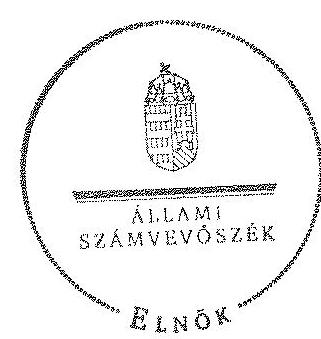
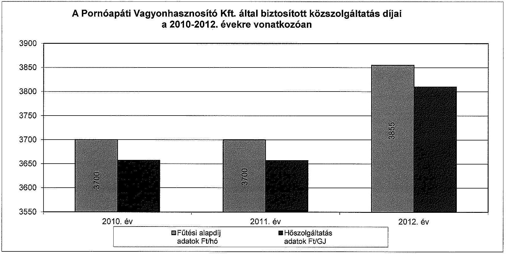
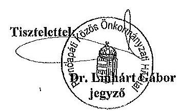
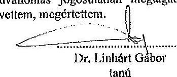
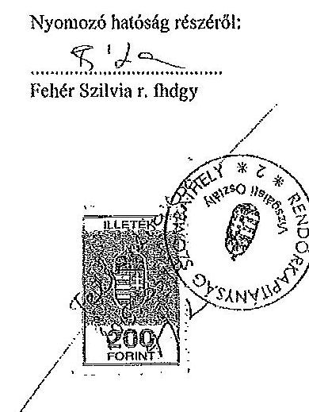
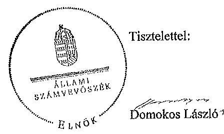

ÁLLAMI
SZÁMVEVŐSZÉK

# JELENTÉS 

Az önkormányzatok gazdasági társaságai - Az önkormányzatok többségi tulajdonában lévő gazdasági társaságok közfeladat ellátását érintő gazdálkodási tevékenysége szabályszerűségének ellenőrzése Pornóapáti Vagyonhasznosító Korlátolt Felelősségű Társaság

---

# Állami Számvevőszék 

Iktatószám: V-0480-134/2015
Témaszám: 1514
Vizsgálat-azonosító szám: V067109

## Az ellenőrzést felügyelte:

Dr. Horváth Margit
felügyeleti vezető
Az ellenőrzést vezette és az ellenőrzés végrehajtásáért felelős:
Valastyánné dr. Vízhányó Júlia
ellenőrzésvezető
A jelentéstervezet összeállításában közreműködtek:
Dr. Nagy Ágnes
számvevő tanácsos
Szarka Péterné
számvevő vezető főtanácsos
Az ellenőrzést végezték:
Kiss Péter Szarka Péterné
okleveles könyvvizsgáló, számvevő vezető főtanácsos
külső szakértő

---

# TARTALOMJEGYZÉK 

BEVEZETÉS ..... 5
I. ÖSSZEGZŐ MEGÁLLAPÍTÁSOK, KÖVETKEZTETÉSEK, JAVASLATOK ..... 9
II. RÉSZLETES MEGÁLLAPÍTÁSOK ..... 17

1. Az Önkormányzat közfeladat-ellátásának szabályszerűsége ..... 17
1.1. A közfeladat-ellátás megszervezése és a feladatellátás feltételrendszerének kialakítása ..... 17
1.2. A közfeladat-ellátás felügyelete és a tulajdonosi jogok érvényesítése ..... 20
2. A Pornóapáti Vagyonhasznosító Kft. közfeladat ellátással kapcsolatos tevékenysége ..... 23
2.1. A Pornóapáti Vagyonhasznosító Kft. gazdálkodásának szabályozottsága ..... 23
2.2. A Pornóapáti Vagyonhasznosító Kft. vagyongazdálkodása ..... 24
2.3. A beszámolási kötelezettség teljesítése ..... 26
3. A távhőszolgáltatás közfeladata bevételei és ráfordításai elszámolásának és önköltségszámításának szabályszerűsége ..... 27
3.1. A távhőszolgáltatás közfeladat bevételeinek és ráfordításainak szabályszerűsége ..... 27
3.2. Az önköltségszámítás szabályszerűsége ..... 28

## MELLÉKLETEK

1. számú A Pornóapáti Vagyonhasznosító Kft. tevékenységének főbb adatai
2. számú A Pornóapáti Vagyonhasznosító Kft. működésének főbb jellemzői
3. számú A Pornóapáti Vagyonhasznosító Kft. által biztosított közszolgáltatás díjai a 2010-2012. évekre vonatkozóan
4. számú Beérkezett észrevételek és az azokra adott válaszok

## FÜGGELÉKEK

1. számú Értelmező szótár
2. számú Mintavételi eljárások ellenőrzési területenként

---

.

---

# RÖVIDÍTÉSEK JEGYZÉKE 

## Törvények

Áht. 1

Áht. 2

Ámt.
ÁSZ tv.
E FT
GJ
Gt.
Info tv.

M Ft
Nvtv.

Tötv.

Számv. tv.
Tszt.
Taktv.

## Rendeletek

157/2005. (VIII. 15.)
Korm. rendelet
SZMSZ
az államháztartásról szóló 1992. évi XXXVIII. törvény (hatálytalan: 2012. január 1-jétől)
az államháztartásról szóló 2011. évi CXCV. törvény (hatályos: 2012. január 1-jétől)
az árak megállapításáról szóló 1990. évi LXXXVII. törvény (hatályos: 1991. január 1-jétől)
az Állami Számvevőszékről szóló 2011. évi LXVI. törvény (hatályos: 2011. július 1-jétől)
ezer forint
gigajoule
a gazdasági társaságokról szóló 2006. évi IV. törvény (hatálytalan: 2014. március 15-étől)
az információs önrendelkezési jogról és az információszabadságról szóló 2011. évi CXII. törvény (hatályos: 2011. július 27 -től kivéve sz 1-37. §, a 38. § (1)-(3) bekezdése, a 38. § (4) bekezdés a)-f) pontja, a 38. § (5) bekezdése, a 39. §, a 41-68. §, a 70-72. §, a 75-77. § és a 79-88. §, valamint az 1. melléklet, ami 2012. január 1-jén lépett hatályba és a 38. § (4) bekezdés g) és h) pontja, valamint a 69. §, ami 2013. január 1-jén lépett hatályba)
millió forint
a nemzeti vagyonról szóló 2011. évi CXCVI. törvény (hatályos: 2011. december 31-étől, kivéve a 20. § (2) bekezdésben meghatározott paragrafusok, amelyek 2012. január 1-jétől, a (3) bekezdésben meghatározott paragrafusok 2013. január 1-jétől, a (4) bekezdésben meghatározott paragrafus 2012. március 2-ától léptek hatályba)
a helyi önkormányzatokról szóló 1990. évi LXV. törvény (hatálytalan: a 2014. évi általános önkormányzati választások napjától)
a számvitelről szóló 2000. évi C. törvény (hatályos: 2001. január 1-jétől)
a távhőszolgáltatásról szóló 2005. évi XVIII. törvény (hatályos: 2005. július 1-jétől)
a köztulajdonban álló gazdasági társaságok takarékosabb működéséről szóló 2009. évi CXXII. törvény (hatályos: 2009. december 4-étől)
a távhőszolgáltatásról szóló 2005. évi XVIII. törvény végrehajtásáról (hatályos: 2005. szeptember 29-étől)
Pornóapáti Község Önkormányzata Képviselőtestületének 4/2007. (V. 15.) számú KT rendelete a Szervezeti és Működési Szabályzatról (hatályos: 2007. június 1-jétől)

---

vagyonrendelet
távhőszolgáltatási rendelet
távhődíjak megállapításáról szóló rendelet

## Szórövidítések

Alapító Okirat
áfa
ÁSZ
értékelési szabályzat
FB
gazdasági program ${ }_{1}$
gazdasági program ${ }_{2}$
jegyző
KEOP
Képviselő-testület
leltározási szabályzat
Magyar Energia Hivatala
NAV
Önkormányzat
pénzkezelési szabályzat
polgármester
Pornóapáti Vagyonhasznosító Kft.
Üzemeltetési szerződés

Pornóapáti Község Önkormányzata 6/2007. (V. 15.) számú KT rendelete az Önkormányzat vagyonáról, és a vagyongazdálkodás szabályairól a vagyontárgyak feletti tulajdonosi jogok gyakorlásáról (hatályos: 2007. június 1-jétől)
Pornóapáti Község Önkormányzata 2/2006. (I. 12.) számú KT rendelete A távhőszolgáltatásról szóló 2005. évi XVIII. tv. helyi végrehajtásáról (hatályos: 2005. november 1-jétől)
Pornóapáti Község Önkormányzata 2/2005. (II. 20.) számú KT rendelete a távhőszolgáltatás legmagasabb díjairól (hatályos: 2005. február 1-jétől)

Pornóapáti Vagyonhasznosító Kft. Alapító Okirata és annak módosításai
általános forgalmi adó
Állami Számvevőszék
Pornóapáti Vagyonhasznosító Kft. Értékelési szabályzata (hatályos: 2010. okt. 28 -tól)
Pornóapáti Vagyonhasznosító Kft. Felügyelőbizottsága
Pornóapáti Község Önkormányzatának 2006-2010. évi gazdasági programja
Pornóapáti Község Önkormányzatának 2011-2014. évi gazdasági programja
Pornóapáti Község Önkormányzatának jegyzője
Környezet és Energia Operatív Program
Pornóapáti Község Önkormányzatának Képviselőtestülete
Pornóapáti Vagyonhasznosító Kft. Leltározási szabályzata (hatályos: 2010. okt. 28 -tól)
Magyar Energetikai és Közmű-szabályozási Hivatal 2013. április 4-től a Magyar Energetikai Hivatal jogutódja
Nemzeti Adó- és Vámhivatal
Pornóapáti Község Önkormányzata
Pornóapáti Vagyonhasznosító Kft. Házipénztári pénzkezelés szabályzata (hatályos: 2010. okt. 28 -tól)
Pornóapáti Község Önkormányzatának Polgármestere
Pornóapáti Vagyonhasznosító Korlátolt Felelősségű Társaság
Pornóapáti Község Önkormányzata és Pornóapáti Vagyonhasznosító Kft. között 2010. december 1-jén Pornóapáti Község biofűtőmű és hőellátó rendszer üzemeltetésére létrejött Üzemeltetési szerződés

---

# JELENTÉS 

## Az önkormányzatok gazdasági társaságai Az önkormányzatok többségi tulajdonában lévő gazdasági társaságok közfeladat ellátását érintő gazdálkodási tevékenysége szabályszerűségének ellenőrzése

## Pornóapáti Vagyonhasznosító Korlátolt Felelősségű Társaság

## BEVEZETÉS

Az Állami Számvevőszék középtávra szóló stratégiájában megfogalmazta, hogy a helyi önkormányzatok gazdálkodásában rejlő pénzügyi kockázatok feltárásával, az államháztartáson kívülre nyújtott költségvetési támogatások és ingyenes vagyonjuttatások, valamint az államháztartáson kívül működő köz-feladat-ellátó rendszerek ellenőrzéseivel hozzájárul ahhoz, hogy a közpénzeket az államháztartáson kívül működő szervezetek is átlátható, rendezett módon használják fel a közfeladatok szerződésben vállalt ellátása érdekében.

Az önkormányzatok szervezetalakítási szabadságának következménye, hogy a korábban is vállalati formában működő (nagyvárosi tömegközlekedés, víz-, szennyvízcsatorna, köztisztasági, ingatlankezelés stb.) közszolgáltatások mellett, mind a kötelező, mind az önként vállalt feladatok ellátásában a gazdasági társaságok kiemelt fontosságú szerephez jutottak.

Pornóapáti Község a szomszédos osztrák Bildein településen 1994. óta működő biomassza-alapú falufűtési rendszer tapasztalataira alapozva döntött amellett, hogy megvalósít egy hasonló távfűtő rendszert. Az új rendszer célja a családi házak, az üzemek és az intézmények környezetbarát energiaellátása volt. A beruházást európai uniós forrás felhasználásával, továbbá a Nyugat-Dunántúli Fejlesztési Tanács támogatásával, valamint hitelből valósították meg. A hazai távfűtő rendszerek között egyedinek tekinthető falufűtési rendszerhez két, egyenként 600 kW teljesítményű faapríték- és fűrészpor-tüzelésű kazán adja a hőenergiát. Az éves igényelt faapríték mennyisége $\sim 1200$ tonna/év, a beruházás előtti becsült éves megtermelt energia mennyisége 9500 GJ volt. A technológia várható élettartama 25 év. A hőtávvezeték-rendszer hossza 3900 folyóméter. Az üzembe helyezésre az ellenőrzött időszakot megelőzően, a 2005. évben került sor. A 2006. év júliusáig a Szombathelyi Távhőszolgáltató Kft. látta el az üzemeltetési feladatokat, majd a felhasználói kör ugyanezen év augusztusában szövetkezetet alapított az üzemeltetésre. A Pornóapáti Távhő- és Közműszolgál-

---

tató Szövetkezet 2010-ig végezte feladatát, majd a 2011. évben felszámolták. Az Önkormányzat a felszámolásra való tekintettel úgy döntött, hogy a távfűtési rendszert önkormányzati tulajdonú gazdasági társasággal működteti tovább.

Pornóapáti Község Önkormányzata 2010. október 28-án hozta létre 0,5 M Ft törzsbetéttel a 100\%-os tulajdonában álló Pornóapáti Vagyonhasznosító Kft.-t (2. számú melléklet). A Pornóapáti Vagyonhasznosító Kft. az Önkormányzattal 2010. december 1-jén kötött Üzemeltetési szerződés alapján működtette a hőközpontot és végezte a hőszolgáltatást. A társaság főtevékenysége a 2012. január 1-jén 415 fő lakosú Pornóapáti Község közigazgatási területén gőzellátás, légkondicionálás volt. A társaság által a közfeladat ellátására foglalkoztatottak létszáma a Kiegészítő melléklet alapján a 2010. évben nulla fő, a 2011. évben három fő, a 2012. évben egy fő volt. A fűtőmű elindításakor a 130 háztartásból 86 lakossági és 11 közületi fogyasztó csatlakozott a rendszerre, de évről évre kevesebben igényelték a szolgáltatást a magasnak ítélt díjak miatt. A lakossági szolgáltatást igénybevevők száma az ellenőrzött időszak végére közel felére csökkent, 2011-2012. években 48 lakossági és 6 közületi fogyasztó vette igénybe a rendszer szolgáltatásait. A fűtőmű uniós támogatással épült, ezért 2015-ig működtetési kötelezettség terheli az Önkormányzatot.

A biomassza fűtés kedvező hatásai elsősorban a környezetvédelem és a település életminősége terén jelentkeznek és az ország energiaellátásától függetlenül hosszútávon is fenntartható megoldást eredményezhet a település energiaellátásában.

Az ellenőrzött időszakban a Pornóapáti Vagyonhasznosító Kft. ügyvezetőjének személye két alkalommal változott. A jelenlegi ügyvezető 2013. április 15-e óta tölti be tisztségét.

A Pornóapáti Vagyonhasznosító Kft. éves nettó árbevétele 2010-ben 1,5 M Ft, 2011-ben 11,3 M Ft, 2012-ben 9,4 M Ft, a mérleg szerinti eredménye 2010-ben 0,2 M Ft, 2011-ben -1,3 M Ft, 2012-ben -1,9 M Ft volt. A 2011-2012. években az Önkormányzattól kapott működési támogatás - 1,6 M Ft, illetve 1,3 M Ft - ellenére a Pornóapáti Vagyonhasznosító Kft. veszteségesen gazdálkodott, a 2011. és a 2012. években a saját tőke hiányba fordult. A veszteség megszüntetésére és a tőkeegyensúly helyreállítására tett tulajdonosi intézkedések nem voltak elegendőek ahhoz, hogy a Pornóapáti Vagyonhasznosító Kft. pénzügyi egyensúlya helyreálljon.

Az Önkormányzat a 2012. évben 44,7 M Ft állam által biztosított egyszeri vissza nem térítendő támogatást vett igénybe az adósságkonszolidáció keretében, amelynek teljes összegét a biomassza falufűtés megvalósítására igénybe vett hosszú lejáratú hitel törlesztésére használták fel.

Az Önkormányzat hivatala az ellenőrzött időszakban körjegyzőségként működött Vaskeresztes, Horvátövő községekkel közösen. A körjegyzőség 2013. január 1-jétől Pornóapáti Közös Önkormányzati Hivatallá alakult Szentpéterfa község csatlakozásával.

Az ellenőrzött időszakban a polgármester személye egy alkalommal, a jegyző személye nem változott. A helyszíni ellenőrzés idején hivatalban lévő polgármester 2013. július 21-e óta látja el feladatát.

---

Az önkormányzati tulajdonú gazdasági társaságok teljes körű ellenőrzésének lehetőségét az Állami Számvevőszékről szóló 1989. évi XXXVIII. törvény 2011. január 1-jétől hatályos módosítása teremtette meg.

Az ellenőrzés célja annak értékelése volt, hogy

- az önkormányzat a jogszabályi előírások figyelembevételével döntött-e az ellenőrzésre kerülő közfeladat megszervezéséről; az önkormányzat szabályszerűen gyakorolta-e a tulajdonosi jogokat;
- a gazdasági társaság közfeladat-ellátása bevételeinek, ráfordításainak elszámolása, és vagyongazdálkodási tevékenysége megfelelt-e a jogszabályi, illetve a közszolgáltatási szerződésben foglalt tulajdonosi előírásoknak, azok végrehajtása szabályszerű volt-e;
- a közfeladatok átláthatósága és elszámoltathatósága érdekében biztosítva volt-e a közszolgáltatás díjának megalapozottsága szabályszerű önköltségszámítással.

Az ellenőrzés kiterjedt Pornóapáti Község Önkormányzatára és a Pornóapáti Vagyonhasznosító Korlátolt Felelősségű Társaságra.

Az ellenőrzés várható hasznosulása: A törvényalkotás számára - az észlelt problémák, szabálytalanságok, vagy egyéb nem kívánatos jelenségek felszínre kerülésével - az ellenőrzés megállapításai segítséget nyújthatnak az államháztartáson kívüli közfeladat-ellátás értékeléséhez, jogszabályi keretei pontosításához, átláthatóságot biztosító szabályozásához. Meghatározhatóvá válnak a közfeladat ellátásában részt vevő államháztartáson kívüli szervezeteknek - az önkormányzat költségvetését, pénzügyi helyzetét is befolyásoló - kockázatai, lehetővé válik ezen kockázatok csökkentése. Értékelhetővé válik, hogy a feladatot ellátó gazdasági társaság a közszolgáltatási szerződésben foglaltak betartásával, a közvagyon használatával biztosította-e a szolgáltatás folytatásának feltételeit. Ezzel az ellenőrzöttek és a helyi döntéshozók számára visszajelzést ad feladatszervezési, feladat-ellátási kockázataikról, alapot ad a meglévő hibák megszüntetéséhez, a jobb közfeladat-ellátás biztosításához. Fokozza a fegyelmet, igazolja, hogy lejárt a következmények nélküli ellenőrzések időszaka. Az ÁSZ értékteremtő rend kialakításához és megőrzéséhez hozzájáruló tevékenysége pozitív hatással van a szervezetről kialakított összkép formálására is.

A bevételek és ráfordítások elszámolása, valamint a vagyonnyilvántartás terén az egyes területek szabályszerű működését mintavétellel ellenőriztük, ez alapján a sokaságokban előforduló hibás tételek arányát becsültük. A jogszabályoknak és a belső előírásoknak megfelelőnek, azaz szabályszerűnek tekintettük az adott bevételek és ráfordítások elszámolását, a vagyonnyilvántartást, amennyiben a minta ellenőrzésének eredménye alapján $95 \%$-os bizonyossággal a teljes sokaságban a hibás tételek aránya kisebb volt, mint $10 \%$, nem megfelelőnek értékeltük, ha a hibás tételek aránya a $10 \%$-ot meghaladta. Kockázatot, illetve magas kockázatot jeleztünk, amennyiben egy adott terület vonatkozásában a minta alapján a teljes sokaságban nem volt teljes körűen biztosított a jogszabályoknak és a belső szabályzatoknak megfelelő működés.

---

Az ellenőrzést a számvevőszéki ellenőrzés szakmai szabályai szerint, szabályszerűségi ellenőrzés módszerével, a vonatkozó nemzetközi standardok figyelembevételével végeztük. Az ellenőrzés a 2010-2012. évekre terjedt ki.

Az ellenőrzés végrehajtásának jogszabályi alapját az Állami Számvevőszékről szóló 2011. évi LXVI. törvény 5. § (3)-(5) bekezdései képezték.

Az ÁSZ az Állami Számvevőszékről szóló 2011. évi LXVI. törvény 29. §-a alapján a jelentéstervezetet észrevételezésre megküldte a polgármesternek és a gazdasági társaság ügyvezetőjének. A beérkezett észrevételeket a jelentés véglegesítése során hasznosítottuk. Az észrevételeket és az azokra adott válaszokat a jelentés 4. számú melléklete tartalmazza.

---

# I. ÖSSZEGZŐ MEGÁLLAPÍTÁSOK, KÖVETKEZTETÉSEK, JAVASLATOK 

Pornóapáti Község Önkormányzata a 2010. évtől a távhőellátás kötelező feladatát a Pornóapáti Vagyonhasznosító Kft. megalapításával látta el. Az Önkormányzat 2010. december 1-jén a 100\%-os kizárólagos tulajdonában álló Pornóapáti Vagyonhasznosító Kft.-vel 2024. szeptember 1-jéig érvényes Üzemeltetési szerződést kötött a biomassza-fűtőmű és hőellátó rendszer üzemeltetésére, működőképességének fenntartására. Az Önkormányzat a távhőszolgáltatást végző Pornóapáti Vagyonhasznosító Kft. létrehozásával eleget tett a Tszt.-ben foglalt kötelezettségének, mert engedélyes útján biztosította a szolgáltatás körébe vont létesítmények hőellátását és olyan működtetési formát választott, amely megfelelt a jogszabályi követelményeknek.

A Képviselő-testület az Önkormányzat közigazgatási területén a távhőszolgáltatás közfeladatának megszervezéséről a jogszabályi előírásoknak megfelelően döntött. Az ellenőrzött időszakban a Pornóapáti Vagyonhasznosító Kft. feletti tulajdonosi jogokat a Gt.-ben meghatározott előírások szerint a Kép-viselő-testület szabályszerűen gyakorolta. Az Önkormányzat az ellenőrzött időszakban rendelkezett gazdasági programokkal${ }^{1,2}$, amelyek tartalmazták a távhőszolgáltatás fejlesztésével kapcsolatos elképzeléseket. A biomassza falufűtés hatékonyságának növelését, pályázati források igénybevételével a tárolóterület növelését és napkollektor létesítését tűzték ki célul.

A 2011. december 31-én hatályba lépett Nvtv. rendelkezései szerint a helyi önkormányzat közép- és hosszú távú vagyongazdálkodási tervet köteles készíteni, melynek az Önkormányzat az ellenőrzött időszakban nem tett eleget, annak elfogadására csak az ellenőrzött időszak után került sor.

A távhőszolgáltatási közfeladat ellátásának alapját az Üzemeltetési szerződés képezte. Az Önkormányzat a távhőszolgáltatásra vonatkozóan távhőszolgáltatási rendeletet, valamint a gazdasági társaságok feletti tulajdonosi jogok gyakorlására vonatkozóan vagyonrendeletet alkotott. A távhőszolgáltatással kapcsolatban az ellátandó feladatokat, a közfeladat ellátás számon kérhető követelményeinek meghatározását, a jogokat és a kötelezettséget, valamint az átadott vagyonelemeket tételesen az Üzemeltetési szerződés tartalmazta.

A Pornóapáti Vagyonhasznosító Kft. részére az Önkormányzat biztosította a közfeladat ellátásához szükséges közvagyont, amelyet az Önkormányzat a tulajdonjog fenntartásával éves bérleti díj fizetése fejében üzemeltetésre adott át. Az üzemeltetésre átadott eszközöket, mint vagyont az Áhsz. előírásai szerint szerepeltették az Önkormányzat számviteli nyilvántartásában.

A bérleti díj éves összegét az Üzemeltetési szerződés a 2011. évtől 1,0 M Ft/évben határozta meg. Az Önkormányzat az Üzemeltetési szerződésben az Áht. 108. § (2) bekezdésében foglaltakkal ellentétben a bérleti díjat a 2011. évre a fogyasztási viszonyokra tekintettel méltányosságból elengedte. Az Önkormány-

---

zat a 2012. évben az Üzemeltetési szerződésben foglaltak ellenére bérleti díjat tartalmazó számlát nem állított ki, a Pornóapáti Vagyonhasznosító Kft. pedig nem fizetett bérleti díjat. Az Önkormányzat az Üzemeltetési szerződést nem módosította, így az eredeti szerződés változatlan érvényben tartása mellett megsértette az Áht. 97. § (2) bekezdését, az Áfa tv. 159. § (1) bekezdésében foglalt számla kibocsátási és a Számv. tv. 165. § (1) bekezdésében foglalt bizonylat kiállítási kötelezettségére vonatkozó előírásokat.

Az Önkormányzat a távhőszolgáltatásra vonatkozóan a Tszt.-ben előírt rendeletalkotási kötelezettségeinek eleget tett, mert megalkotta a távhőszolgáltatási rendeletét. A távhőszolgáltatási rendeletet az ellenőrzött időszakban egy alkalommal módosították. A távhőszolgáltatási rendelet tartalmazta a szolgáltató és a felhasználó közötti jogviszony részletes szabályait, a hődíjak, csatlakozási díjak megállapításának szabályait és a díjak megállapításának feltételeit, a szolgáltatás szüneteltetésének, felfüggesztésének, szabályait.

Az Önkormányzat a vagyonrendeletében határozta meg a tulajdonosi jogok gyakorlásának szabályait, de a tulajdonosi joggyakorlással kapcsolatos előírásokat az Alapító Okirat és az Üzemeltetési szerződés is tartalmazott. A szabályozások szerint a tulajdonosi jogokat a Képviselő-testület gyakorolta. A vagyonrendelet szabályozta az Önkormányzat gazdasági társaságok feletti tulajdonosi döntési jogok körét és feltételeit. Az Önkormányzat a Pornóapáti Vagyonhasznosító Kft. tulajdonosaként a Taktv.-ben foglaltakkal összhangban létrehozta az FB-t.

Az ellenőrzött időszakban az Önkormányzat a Pornóapáti Vagyonhasznosító Kft. vezető tisztségviselője, FB tagjai részére a Taktv.-ben előírtak ellenére javadalmazási szabályzatot nem dolgozott ki.

A Pornóapáti Vagyonhasznosító Kft. elkészítette az üzletszabályzatát, melyet a Képviselő-testület elfogadott, de a Tszt.-ben foglalt előírásokat megsértve az Önkormányzat jegyzője az üzletszabályzatot nem hagyta jóvá és a fogyasztóvédelmi hatóság részére nem küldte meg.

Az Önkormányzat az Ámt.-ben foglalt felhatalmazás alapján a távhőszolgáltatás legmagasabb hatósági díjáról és az alkalmazott díjakról a távhődíjak megállapításáról szóló rendeletben döntött.

A Pornóapáti Vagyonhasznosító Kft. a 2010-2012. évi számviteli beszámolói felülvizsgálatáról az FB nem készített jelentést, a Képviselő-testület az éves számviteli beszámolókról a Gt. előírását megsértve döntött. Az ellenőrzött időszakban az Önkormányzat részéről a tulajdonosi ellenőrzés az Üzemeltetési szerződésben meghatározott éves számviteli beszámolók elfogadásán keresztül valósult meg.

A Képviselő-testület a Pornóapáti Vagyonhasznosító Kft. 2010-2012. évi éves számviteli beszámolóit megtárgyalta és elfogadta. A Pornóapáti Vagyonhasznosító Kft. a 2010-2012. évekre vonatkozó számviteli beszámolóit könyvvizsgáló nem auditálta. A Pornóapáti Vagyonhasznosító Kft. a könyvvizsgálói vélemény nélkül kibocsátott 2012. évi számviteli beszámolójával megsértette a

---

Tszt.-ben foglalt előírást, mivel könyvvizsgáló nem nyilatkozott a számviteli szétválasztási szabályok alkalmazásáról, valamint az egyes tevékenységek közötti tranzakciók árazásának keresztfinanszírozás-mentességéről.

Az Önkormányzat belső ellenőrzése a távhőszolgáltatás, mint közfeladatellátás szabályszerű teljesítéséhez, az önkormányzati vagyon megóvásához érdemben nem járult hozzá, mert az ellenőrzött időszakban ellenőrzést nem végzett. A jegyző - a Tszt.-ben foglalt előírás ellenére - nem ellenőrizte a távhőszolgáltató tevékenységét az üzletszabályzatában foglaltak betartása szempontjából.

A Pornóapáti Vagyonhasznosító Kft. elkészítette a Számv. tv.-ben előírt szabályzatait, így a számviteli politikát, és annak keretében az értékelési szabályzatot, a leltározási szabályzatot és a pénzkezelési szabályzatot, valamint a számlarendet. Ezek a szabályzatok azonban csak általános rendelkezéseket tartalmaztak, nem határozták meg a jogszabályi előírásoknak és az ágazati sajátosságoknak megfelelően a közfeladatok bevételeinek és ráfordításainak egyértelmű elhatárolásához szükséges előírásokat, illetve az ellenőrzött időszakban nem adtak ki olyan vezetői utasítást sem, amelyben a Tszt.-ben előírt számviteli elkülönítési szabályok érvényre jutása érdekében intézkedtek volna. A számlarend nem tartalmazta a Számv. tv.-ben meghatározott, a közpénzek felhasználásának és a köztulajdon használatának nyilvánossága és ellenőrizhetősége érdekében a nyilvántartási rendszer részletezését.

A Pornóapáti Vagyonhasznosító Kft. az ellenőrzött időszakban önköltségszámítási szabályzat készítésére a Számv. tv. alapján nem volt kötelezett. A Tszt.-ben foglalt előírások alapján azonban biztosítania kellett volna a közszolgáltatási tevékenység díjainak átláthatóságát. A Pornóapáti Vagyonhasznosító Kft. az önköltségszámítást és a díjkalkulációt megalapozó árképzés szabályait nem határozta meg. A Pornóapáti Vagyonhasznosító Kft. a 2011. és a 2012. években annak ellenére veszteségesen gazdálkodott, hogy részére az Önkormányzat ezekben az években összesen 2,9 M Ft működési célú támogatást és a 2012. évben 1,0 M Ft tagi kölcsönt nyújtott. A 2010-2012. években realizált 22,3 M Ft összes bevétele nem nyújtott fedezetet a 25,3 M Ft-ot kitevő költségekre és ráfordításokra, amelynek következtében az időszak felhalmozott mérleg szerinti vesztesége 3,0 M Ft-ra nőtt. A veszteséges gazdálkodás következtében a Pornóapáti Vagyonhasznosító Kft. saját tőkéje a 2010. évi 0,7 M Ft-ról a 2012. év végére -2,5 M Ft-ra csökkent. A Gt.-ben előírtak alapján a társaságnak a 2013. évben intézkedési kötelezettsége keletkezett.

A Pornóapáti Vagyonhasznosító Kft. követeléseinek állománya a 2012. évben, a 2010. évihez képest közel a négyszeresére emelkedett. A vevői követelések állománya értékében nem volt jelentős, a 2010. évben 0,4 M Ft-ot, a 2011. évben 0,2 M Ft-ot, a 2012. évben 0,5 M Ft-ot tett ki. A társaság a hátralékos állomány csökkentésére irányuló intézkedéseket nem határozott meg, a követelések behajtására vonatkozóan nem rögzített szabályokat. Az ellenőrzött időszakban behajthatatlannak minősített és leírt követelése nem volt.

A Pornóapáti Vagyonhasznosító Kft. az ellenőrzött időszakban eleget tett a jogszabályokban és az Üzemeltetési szerződésben meghatározott, a fűtési időszakra vonatkozó adatokról szóló beszámolási és adatszolgáltatási kötelezettségé-

---

nek, továbbá a Számv. tv.-ben foglaltakkal összhangban biztosította a 2010-2012. évi éves számviteli beszámolók határidőben történő közzétételét.

A Pornóapáti Vagyonhasznosító Kft. az Info tv.-ben foglaltak ellenére nem rendelkezett a közérdekű adatok közzétételére vonatkozó szabályzattal.

A 2012. évben a Pornóapáti Vagyonhasznosító Kft.-nél a Tszt. 18/A. § (2) bekezdésében foglalt előírás ellenére az engedélyes tevékenységekre vonatkozóan nem vezettek olyan elkülönített számviteli nyilvántartást, amely biztosította volna az egyes tevékenységek átláthatóságát és kizárta volna a keresztfinanszírozást.

A távhőszolgáltatási közfeladat bevételeinek elszámolása során a Pornóapáti Vagyonhasznosító Kft. a belső szabályozásnak megfelelően a bevételeket a megfelelő számlacsoportban számolta el. Az alkalmazott szolgáltatási díjak megfeleltek a belső szabályozásnak és a tulajdonos által meghatározott követelményeknek.

A távhőszolgáltatási közfeladat anyagjellegű ráfordításainak elszámolása során nem érvényesültek teljes körűen a jogszabályok előírásai a költségelszámolás tekintetében, ami kockázatot jelent az ellenőrzött terület egészének szabályos működése szempontjából. Egyes esetekben a költségek elszámolása a Számv. tv.-ben foglaltak ellenére nem a megfelelő költségnemre történt.

A Pornóapáti Vagyonhasznosító Kft. a beruházásainak, felújításainak elszámolása során szabályszerűen járt el. Az ellenőrzött időszakban az eszközeivel kapcsolatos értékcsökkenési leírást a Számv. tv.-ben foglalt előírásoknak és a belső szabályozásnak megfelelően számolták el. A bekerülési érték meghatározása, az eszközök besorolása és nyilvántartása, valamint az értékcsökkenés elszámolása is szabályos volt.

A Pornóapáti Vagyonhasznosító Kft. a közfeladatok átláthatósága és elszámoltathatósága érdekében a közszolgáltatás díjának megalapozottságát szabályszerű önköltségszámítással nem támasztotta alá. A társaság önköltség számítására, vagy árképzésre vonatkozó szabályozással az ellenőrzött időszakban nem rendelkezett. Önköltségszámítás hiányában nem állt rendelkezésre a kalkulációs módszerek leírása. A felosztandó költségek vetítési alapja nem volt meghatározott, az el nem számolható költségelemek körét sem rögzítették.

A fentiekben leírtak összegzéseként az alábbi megállapításokat tesszük:
A Pornóapátiban megvalósított távfűtési rendszer konstrukcióból eredő sajátossága az volt, hogy a távfűtést osztrák mintára megvalósított beruházással oldották meg. A konstrukció környezetbarát működtetéséhez, az egyediségére való tekintettel speciális támogatások és egyéb kedvezmények nem kapcsolódtak.

Működési kockázatot jelentett, hogy a távhőszolgáltatás, mint közfeladat ellátás szabályszerű teljesítéséhez, az önkormányzati vagyon megóvásához a belső ellenőrzés nem járult hozzá. A jegyző nem teljesítette a törvényben előírt a távhőszolgáltató tevékenységére vonatkozó, az üzletszabályzatában foglaltak

---

betartása szempontjából előírt ellenőrzési kötelezettségét. A távhőszolgáltatás működtetéséhez és a beruházás fejlesztéséhez ugyan jelentős összegű támogatásokat kapott az Önkormányzat, azonban az ellenőrzött időszakban tapasztalt veszteséges gazdálkodás miatt elsősorban a külső támogatások megszerzésére tett intézkedések voltak eredményesek, míg a belső feltételek javítására, a működési kockázatok csökkentésére az intézkedések elmaradtak.

Pénzügyi kockázat két területen jelentkezett, egyrészt az Önkormányzatnál a bérleti díj kiszámlázásának elmaradásából adódóan (számla kibocsátási, továbbá bizonylat kiállítási kötelezettség nem teljesítése), másrészt a társaságnál, mert nem különítette el tevékenységenként a bevételeit és ráfordításait, nem gondoskodott a megfelelő számviteli szétválasztásról. Ezáltal nem teljesült a díjak átláthatóságára vonatkozó jogszabályi előírás. A jogszabályi előírások ellenére a Pornóapáti Vagyonhasznosító Kft. számviteli éves beszámolóiról sem az FB, sem az okleveles könyvvizsgáló jelentést nem készített.

Az Állami Számvevőszékről szóló 2011. évi LXVI. törvény 33. § (1) bekezdésében foglaltak értelmében a jelentésben foglalt megállapításokhoz kapcsolódó intézkedési tervet köteles az ellenőrzött szervezet vezetője összeállítani, és azt a jelentés kézhezvételétől számított 30 napon belül az ÁSZ részére megküldeni. Amennyiben az intézkedési tervet határidőben nem küldi meg a szervezet, vagy az nem elfogadható, az ÁSZ elnöke a hivatkozott törvény 33. § (3) bekezdésében foglaltakat érvényesítheti.

Az ellenőrzés intézkedést igénylő megállapításai és javaslatai:
Javaslataink célja a Kft. gazdálkodása szabályszerűségének helyreállítása annak érdekében, hogy a szabályozási környezet megfelelően tudja támogatni az átlátható működést.

# Javasoljuk a Pornóapáti Vagyonhasznosító Kft. Ügyvezető Igazgatójának: 

1.  A Pornóapáti Vagyonhasznosító Kft. számlarendje nem tartalmazta a Számv. tv. 161/A. § (2) bekezdésében meghatározott, a közpénzek felhasználásának és a köztulajdon használatának nyilvánossága és ellenőrizhetősége érdekében a számviteli nyilvántartási rendszer továbbrészletezését. A Kft. 2012. január 1-jétől nem dolgozott ki a Tszt. 18/A. § (2) bekezdése szerint olyan számviteli szétválasztási szabályokat, és nem vezetett olyan nyilvántartást, amely biztosította volna elkülönítetten az egyes tevékenységek átláthatóságát, a diszkrimináció mentességet és a versenytorzítás kizárását.

A társaság a Számv. tv. 14. § (6) bekezdése alapján önköltség-számítási szabályzat készítésére az ellenőrzött években nem volt kötelezett, azonban a Tszt. 57. § (4) bekezdésében előírt kötelezettsége ellenére az árak és a díjak átláthatóságára vonatkozó nyilvántartási és elszámolási rendszert nem alakított ki. A Kft. nem rendelkezett az általános költségek közfeladatokra történő felosztásának módjára vonatkozó szabályozással. Az önköltség megállapításának módszerét sem a számviteli politikájában, sem más belső szabályzatban, utasításban nem szabályozta. A közszolgáltatás árképzéséhez, a díjszámítás megalapozásához szükséges önköltségszámítás nem állt rendelkezésre. Önköltség-számítási szabályzat hiányában nem állt rendelkezésre a kalku-

---

lációs módszerek leírása, a felosztandó költségek vetítési alapja nem volt meghatározott, az el nem számolható költségelemek körét nem rögzítették.

A Pornóapáti Vagyonhasznosító Kft. a közérdekű adatok elektronikus közzétételére vonatkozó szabályzattal nem rendelkezett, annak ellenére, hogy azt az Info tv. 35. § (3) bekezdése előírta.

Javaslatok:

# Intézkedjen a szabályozási hiányosságok megszüntetésére, ennek keretében: 

a) egészítse ki a Kft. számviteli szabályozását annak érdekében, hogy a főkönyvi és analitikus nyilvántartások biztosítani tudják a társaság tevékenységenkénti elkülönített adatainak kimutatását, a megfelelő számviteli szétválasztást, ezáltal a közszolgáltatási tevékenység díjainak átláthatóságát, a diszkrimináció mentességet és a versenytorzítás kizárását.
b) intézkedjen, hogy az önköltség számításának módja, az alkalmazandó kalkulációs módszerek leírása, az el nem számolható költségelemek köre és az általános működéshez szükséges költségek felosztásának szabályai a számviteli politikában vagy önálló önköltség-számítási szabályzatban meghatározottak legyenek.
c) készítse el a Kft. közérdekű adatok elektronikus közzétételére vonatkozó szabályzatát;
2.  A Pornóapáti Vagyonhasznosító Kft. 2012. évi éves számviteli beszámolóját könyvvizsgáló nem auditálta, ezáltal elmaradt a Tszt. 18/8. § (1) bekezdése szerinti könyvvizsgálói igazolás arról, hogy a kidolgozott és alkalmazott számviteli szétválasztási szabályok, valamint hogy az egyes tevékenységek közötti tranzakciók árazása biztos-ítják-e a vállalkozás tevékenységei közötti keresztfinanszírozás-mentességet. A társaság a Számv. tv. 154. § (3) bekezdésében foglaltak ellenére az egyszerűsített éves beszámoló mérlegén, eredménykimutatásán, kiegészítő mellékletén nem tüntette fel „A közzétett adatok könyvvizsgálattal nincsenek alátámasztva" szöveget.

A Számv. tv. 78. § (4) bekezdésében foglaltak ellenére a költségek elszámolása nem minden esetben a megfelelő költségnemre történt, mert a 2010-2012. években a bankköltségeket az 53. egyéb szolgáltatás számla helyett az 5292 igénybe vett szolgáltatások alszámlára könyvelték.

Javaslat:

## Gondoskodjon a jogszabályi előírások szerinti gyakorlat és a szabályos működés biztosítására, ezen belül:

a) bízzon meg könyvvizsgálót annak érdekében, hogy a beszámolóhoz kapcsolódóan a számviteli szétválasztási szabályok alkalmazását vizsgálja felül, és arról adja ki az előírt igazolást;
b) intézkedjen, hogy a költségek elszámolására minden esetben a hatályos előírásoknak megfelelően kerüljön sor.

---

# Javaslataink célja az Önkormányzat szabályszerű működésének elősegítése, továbbá az önkormányzati tulajdonosi joggyakorlás kontrolljának erősítése. 

## Javasoljuk Pornóapáti Község Önkormányzata Polgármesterének:

1.  Az Önkormányzat a Pornóapáti Vagyonhasznosító Kft. tulajdonosaként a Taktv. 4. § (1) bekezdésében foglaltakkal összhangban létrehozta az FB-t, az FB a Gt. 34. § (4) bekezdésében előírt ügyrenddel azonban nem rendelkezett. A Pornóapáti Vagyonhasznosító Kft. a 2010-2012. évek tekintetében készített számviteli beszámolóiról az FB nem készített írásbeli jelentést. A Gt. 35. § (3) bekezdésében foglalt előírásnak a Képviselő-testület nem tett eleget, az éves beszámolókat az FB írásbeli jelentése nélkül hagyta jóvá.

Az ellenőrzött időszakban az Önkormányzat Képviselő-testülete a társaság vezető tisztségviselői, az FB tagjai, valamint az egyéb érintettek juttatásaira vonatkozóan a Taktv. 5. § (3) bekezdésében előírtak ellenére javadalmazási szabályzatot nem dolgozott ki.

A bérleti díj éves összegét az Üzemeltetési szerződés a 2011. évtől 1,0 M Ft/évben határozta meg. Az Önkormányzat az Üzemeltetési szerződésben az Áht., 108. § (2) bekezdésében foglaltakkal ellentétben a bérleti díjat a 2011. évre a fogyasztási viszonyokra tekintettel méltányosságból elengedte. A társaságot terhelő bérleti díj kiszámlázásának elmulasztásával az Önkormányzat a 2011. és a 2012. évekre vonatkozóan megsértette a Számv. tv. 165. § (1) bekezdésében, valamint az ÁFA tv. 159. § (1) bekezdésében foglaltakat.

Javaslat:
Intézkedjen a jogszabályi előírások szerinti gyakorlat és a szabályos működés biztosítására, ezen belül:
a) hívja fel a tulajdonosi jogokat gyakorló Képviselő-testület figyelmét arra, hogy az FB nem rendelkezett Ügyrenddel, továbbá az FB nem készített jelentést a társaság számviteli beszámolójáról, valamint kezdeményezze a Taktv.-ben előírt javadalmazási szabályzat kidolgozását;
b) kezdeményezze a bérleti díj kiszámlázásának, továbbá ennek következtében az áfa kötelezettség teljesítésének elmaradása okán a személyes felelősség kivizsgálására irányuló eljárás megindítását.

## Javasoljuk Pornóapáti Község Önkormányzata Jegyzőjének:

1.  Az Áfa tv. 159. § (1) bekezdésében foglalt számla kibocsátási és a Számv. tv. 165. § (1) bekezdésében foglalt bizonylat kiállítási kötelezettségére vonatkozó előírásokat a 2012. gazdasági évre vonatkozóan nem tartották be, mert a bérleti díj kiszámlázására nem került sor.

A jegyző nem vagy nem megfelelően gondoskodott a Pornóapáti Vagyonhasznosító Kft. üzletszabályzatával kapcsolatban a Tszt. 7. § (1) bekezdés a)-c) pontjaiban előír-

---

tak végrehajtásáról, mert a távhőszolgáltató üzletszabályzatát előzetes véleményezésre nem küldte meg a fogyasztóvédelmi hatóságnak, a jegyző helyett a Képviselőtestület hagyta jóvá az üzletszabályzatot, valamint a távhőszolgáltató tevékenységét az üzletszabályzatban foglaltak betartása szempontjából nem ellenőrizte.

Az Önkormányzat belső ellenőrzése a távhőszolgáltatás, mint közfeladat-ellátás szabályszerű teljesítéséhez, az önkormányzati vagyon megóvásához érdemben nem járult hozzá, mert az ellenőrzött időszakban ellenőrzést nem végzett.

Javaslat:

# Intézkedjen a jogszabályi előírások szerinti gyakorlat és a szabályos működés biztosítására, ezen belül 

a) gondoskodjon arról, hogy az üzemeltetési szerződésében foglaltak szerint a bérleti díj a Pornóapáti Vagyonhasznosító Kft. részére a 2011. és a 2012. gazdasági évekre vonatkozóan kiszámlázásra kerüljön;
b) gondoskodjon az üzletszabályzat szabályos előzetes véleményezéséről és jóváhagyásáról, továbbá a távhőszolgáltatást érintő testületi előterjesztések tervezetének előzetes véleményezésre megküldéséről a fogyasztóvédelmi hatóságnak és a felhasználói érdekképviseleteknek, valamint a távhőszolgáltató tevékenységének az üzletszabályzatban foglaltak betartása szempontjából való ellenőrzéséről;
c) fordítson kiemelt figyelmet arra, hogy az Önkormányzat belső ellenőrzése az ellenőrzéseivel a távhőszolgáltatás, mint közfeladat-ellátás szabályszerű teljesítéséhez, valamint az önkormányzati vagyon megóvásához ellenőrzéseivel járuljon hozzá.

---

# II. RÉSZLETES MEGÁLLAPÍTÁSOK 

## 1. Az ÖNKORMÁNYZAT KÖZFELADAT-ELLÁTÁSÁNAK SZABÁLYSZERŰSÉGE

### 1.1. A közfeladat-ellátás megszervezése és a feladatellátás feltételrendszerének kialakítása

Az Önkormányzat rendelkezett a 2006-2010. és a 2011-2014. évekre szóló gazdasági programokkal. Az Önkormányzat ezzel eleget tett az Ötv. 91. § (6)-(7) bekezdéseiben foglalt előírásnak, mely szerint a Képviselő-testület megbízatásának időtartamára köteles gazdasági programot készíteni, ami tartalmazza a közszolgáltatások biztosítására, színvonalának javítására vonatkozó megoldásokat, illetve a fejlesztési elképzeléseket. A gazdasági program ${ }^{1}$ V. pontja tartalmazott a „Biomassza falufűtés hatékonyságának növelése, a korszerű fűtési rendszer lakosság körében történő fogyasztásösztönzés, pályázati források igénybevételével a tárolóterület növelése, napkollektor létesítése" területeket érintő elképzeléseket, terveket.

A gazdasági program ${ }^{1}$ III. pontja településfejlesztési célkitűzésként a biomaszsza fűtőmű gazdaságos üzemeltetését és korszerűsítését határozta meg.

A 2011. december 31-én hatályba lépett Nvtv. 9. § (1) bekezdése szerinti, az Alaptörvényben valamint az Nvtv. 7. § (2) bekezdésében meghatározott rendeltetése biztosításának céljából közép- és hosszú távú vagyongazdálkodási tervet köteles készíteni, melynek az Önkormányzat az ellenőrzött időszakban nem tett eleget.

A Képviselő-testület az Önkormányzat vagyonáról, és a vagyongazdálkodás szabályairól, valamint a vagyontárgyak feletti tulajdonosi jogok gyakorlásáról az Ötv. 16. § (1) bekezdésében kapott felhatalmazás alapján, az Ötv. 79-80. §-aiban előírtak figyelembevételével, továbbá az Áht. 108. §-ában foglalt előírások betartásával vagyonrendeletet alkotott.

A vagyonrendeletben meghatározták az Önkormányzat forgalomképes és forgalomképtelen vagyoni elemeit, azon forgalomképes vagyoni elemeket, melyre az Önkormányzat gazdasági társaságot alapíthat és az Önkormányzat teljes vagyonának kezelésére, hasznosítására, fejlesztésére és gyarapítására vonatkozó döntési jogköröket.

[^0]
[^0]:    ${ }^{1}$ 30/2011. (VI. 7.) számú KT határozatával fogadta el a Képviselő-testület
    ${ }^{2}$ Az Önkormányzat a közép- és hosszú távú vagyongazdálkodási tervét a 43/2013. (VIII. 14.) számú KT határozatával az ellenőrzött időszakon túl fogadta el. A közép- és hosszú távú vagyongazdálkodási terv a távhőszolgáltatást szolgáló vagyontárgyak körét és a Pornóapáti Vagyonhasznosító Kft. tevékenységét nem érintette.

---

A vagyonrendelet szabályozta az Önkormányzat gazdasági társaságok feletti tulajdonosi döntési jogok körét és feltételeit. A szabályozás alapján „az önkormányzat által alapított gazdasági társaságokban a tulajdonosi jogosítványokat a Képviselőtestület nevében a polgármester gyakorolja. Attól eltérni csak a Képviselő-testület nyilatkozatával lehet."

A Képviselő-testület az Önkormányzat közigazgatási területén a távhőszolgáltatás közfeladatának megszervezéséről a jogszabályi előírásoknak megfelelően döntött. Az Önkormányzat a távhőszolgáltatást végző Pornóapáti Vagyonhasznosító Kft. 2010. évi létrehozásával eleget tett a Tszt. 6. § (1) bekezdésében foglalt kötelezettségének, mert engedélyes átján biztosította a távhőszolgáltatás körébe vont létesítmények hőellátását.

A Pornóapáti Vagyonhasznosító Kft. részére Körmend Város Jegyzője 2011. április 1-jén adta ki a tevékenysége végzéséhez szükséges engedélyt, melyben a működés kezdetét 2010. november 15-ében jelölte meg.

A Pornóapáti Vagyonhasznosító Kft. a Tszt. 59/B. § (1) bekezdésében foglaltak ellenére jóval az előírt határidőn túl, 2012. szeptember 10-én nyújtotta be a működési engedély iránti kérelmét a Magyar Energia Hivatalhoz. A Magyar Energia Hivatal hiánypótlást kért, majd annak benyújtása után az ellenőrzött időszakot követően adta ki a távhőszolgáltatói működési engedélyt.

Az energetikai tárgyú törvények módosításáról szóló 2011. évi XXIX. törvény 223. §-ának hatálybalépésekor hatályos működési engedéllyel rendelkező távhőszolgáltató és távhőtermelő köteles volt 2011. december 31-ig
 működési engedély iránti kérelmet benyújtani a Magyar Energia Hivatalhoz.

A Pornóapáti Vagyonhasznosító Kft. részére az Önkormányzat biztosította a közfeladat ellátásához szükséges közvagyont, amelyet az Önkormányzat a tulajdonjog fenntartásával éves bérleti díj fizetése fejében üzemeltetésre adott át. Az üzemeltetésre átadott eszközöket, mint vagyont az Áhsz. előírásai szerint szerepeltették az Önkormányzat számviteli nyilvántartásában.

Az Önkormányzat 2010. december 1-jén a Pornóapáti Vagyonhasznosító Kft.-vel 2024. szeptember 1-jéig érvényes Üzemeltetési szerződést kötött a biomassza fűtőmű és hőellátó rendszer üzemeltetésére, működőképességének fenntartására. Az Üzemeltetési szerződésben rendelkeztek a fűtőmű üzemeltetésével kapcsolatos feladatokról. Az ellátandó feladatok körének, a közfeladatellátás számon kérhető követelményeinek meghatározása, a jogok és a kötelezettségek rögzítése a jogszabályi előírásoknak megfelelően történt.

Az Üzemeltetési szerződésben meghatározták az üzemeltető működésről történő beszámolási kötelezettségét az Önkormányzat felé, annak rendszeres és rendkívüli eseteit, a felmerülő költségekről, kiadásokról, a fogyasztók hővételezésével kapcsolatos adatokról való tájékoztatás kötelezettségét, valamint rendelkeztek az éves számviteli beszámoló tárgyévet követő május 10-éig

[^0]
[^0]:    ${ }^{3}$ 2013. június 12-én
    ${ }^{4}$ a működési engedély száma: 125462013

---

történő elkészítéséről, amelynek tartalmaznia kellett a „fűtési időszakra vonatkozó adatokat tartalmazó" beszámolót is.

A Pornóapáti Vagyonhasznosító Kft. számviteli beszámolójához csatoltan a fűtési időszakra vonatkozó adatokat, információkat tartalmazó beszámolót a 2010-2012. évekre vonatkozóan is készített, azokat a Képviselő-testület megtárgyalta és elfogadta. Így a Pornóapáti Vagyonhasznosító Kft. eleget tett az Üzemeltetési szerződésben foglalt beszámolási kötelezettségének.

A bérleti díj éves összegét az Üzemeltetési szerződés a 2011. évtől 1,0 M Ft/évben határozta meg. Az Önkormányzat az Üzemeltetési szerződésben az Áht. 1 108. § (2) bekezdésében foglaltakkal ellentétben a bérleti díjat a 2011. évre a fogyasztási viszonyokra tekintettel méltányosságból elengedte. A 2012. évben a Pornóapáti Vagyonhasznosító Kft. nem fizetett bérleti díjat. A 2012. évben az Önkormányzat az Áht. 2 97. § (2) bekezdésében és az Üzemeltetési szerződés 3.4. pontjában foglaltak ellenére bérleti díjat tartalmazó számlát nem állított ki. A számla kiállításának elmaradására - az Önkormányzattól kapott nyilatkozat szerint - „a cég veszteséges működésére tekintettel és az üzemeltetés biztonságára figyelemmel" került sor. Ezzel az Önkormányzat megsértette az Áht. 2 97. § (2) bekezdését, az Áfa tv. 159. § (1) bekezdésében foglalt számla kibocsátási és a Számv. tv. 165. § (1) bekezdésében foglalt bizonylat kiállítási kötelezettségére vonatkozó előírásokat.

Az Önkormányzat a Tszt. 6. § (2) bekezdésében kapott felhatalmazás alapján megalkotta távhőszolgáltatási rendeletét, amely összhangban volt a 157/2005. (VIII. 15.) Korm. rendeletben foglaltakkal.

A távhőszolgáltatási rendelet tartalmazta a szolgáltató és a felhasználó közötti jogviszony részletes szabályait, a hődíjak, a csatlakozási díjak megállapításának szabályait és a díjak megállapításának feltételeit, a szolgáltatás szüneteltetésének, felfüggesztésének, szabályait. A távhőszolgáltatási rendelet a díjak tartalmára vonatkozó előírásokat alapdíjban és hődíjban határozta meg. Előírta, hogy az alapdíjnak fedezetet kellett nyújtania a szolgáltatás biztosításával összefüggésben felmerült, de a fogyasztással nem összefüggő (karbantartás, ügyvitel - műszaki és könyvviteli szolgáltatás megbízási díjai, bérüzemeltetési díj) költségekre, míg a hődíjnak fedeznie kellett a szolgáltató által a távhő előállításához szükséges tüzelőanyag- és annak szállítási költségét, valamint a szolgáltatáshoz felhasznált villamos energia költségét, de a díjak tartalmára vonatkozó előírása nem felelt meg a Tszt. 57. § (2) bekezdésének a)- b) pontjainak.

A távhőszolgáltatási rendelet a díjak tartalmára vonatkozóan nem ösztönözte a távhő biztonságos és legkisebb költségű termelését és szolgáltatását, a gazdálkodás hatékonyságának javítását, a kapacitások hatékony igénybevételét, a szolgáltatás minőségének folyamatos javítását, a távhővel való takarékosságot. Nem vette figyelembe a folyamatos termelés és a biztonságos szolgáltatás indokolt költségeit, beleértve a szükséges tartalékkapacitáshoz kapcsolódó költségeket, a távhőtermelő létesítmény bezárásával, elbontásával kapcsolatos környezetvédelmi kötelezettségek teljesítésének indokolt költségeit, valamint a kapcsolt és a megújuló energiaforrással történő energiatermelés kimutatható környezetvédelmi és gazdasági előnyeit.

---

A távhőszolgáltatási rendelet nem felelt meg a Tszt. 57. § (3) bekezdésének, mivel a ráfordításokra és a működéséhez szükséges nyereségre nem biztosított fedezetet.

A hatósági ármegállapításra vonatkozóan a távhődíjak megállapításáról szóló rendelet az Ámt. 7. § (1) bekezdésében és a 11. §-ában előírtaknak megfelelt. A Pornóapáti Vagyonhasznosító Kft. az Önkormányzat távhőszolgáltatási rendelete és a távhődíjak megállapításáról szóló rendelete által meghatározott díjakat számlázta ki és szedte be a fogyasztókkal kötött szolgáltatási szerződés szerint.

A távhőszolgáltatási rendelet értelmében, amennyiben a szolgáltató gazdasági érdekei indokolták, jogosult volt új árkalkuláció előterjesztésére. A távhőszolgáltatási rendelet meghatározta a csatlakozási díj fogalmát és a kiszámításának módját, de az ellenőrzött időszakban a rendszerhez új fogyasztó nem csatlakozott.

Az Önkormányzat pályázati és saját forrásból hozta létre a távhőszolgáltatási közfeladat ellátására szolgáló biofűtőmű és hőellátó rendszert. Ennek a vagyonnak az üzemeltetésére Üzemeltetési szerződést kötött a Pornóapáti Vagyonhasznosító Kft.-vel. Az Üzemeltetési szerződés tartalmazta a hőtermelési és szolgáltatói feladatok ellátási kötelezettségét. Az Üzemeltetési szerződés részletesen tartalmazta azokat az eszközöket (épület, építmény, kazán, gépek-berendezések), melyek mintegy 411,7 M Ft értékben az Önkormányzat tulajdonában voltak, és amelyeket a Pornóapáti Vagyonhasznosító Kft. üzemeltetett. Az Üzemeltetési szerződés szerint az üzemeltetéssel kapcsolatos bevételek (beszedett díj) az üzemeltetőt illették meg, illetve a kiadások is az üzemeltetőt terhelték. Az Üzemeltetési szerződés az üzemeltetési ráfordításokból nevesítette a karbantartási, illetve javítási feladatokat, amelyek elvégzése a Pornóapáti Vagyonhasznosító Kft. kötelezettsége volt, ezen kiadások fedezeteként a beszedett díjat jelölték meg.

Az Üzemeltetési szerződés nem tért ki a leltározási kötelezettségre, de annak tartalma szerint az eszközök önkormányzati tulajdonban maradtak, ezért ezek leltározására a Számv. tv. 69. §-ának és az Áhsz. 37. §-ának előírásai vonatkoztak. A Pornóapáti Vagyonhasznosító Kft.-nek üzemeltetésbe adott vagyontárgyai tekintetében a leltározást a 2010-2012. években mennyiségi felvétellel az Áhsz. 37. § (4) bekezdésének előírásai ellenére az Önkormányzat végezte el.

# 1.2. A közfeladat-ellátás felügyelete és a tulajdonosi jogok érvényesítése 

Az Önkormányzat a tulajdonosi jogok gyakorlásának rendjét az Alapító Okiratban, a vagyonrendeletben és az Üzemeltetési szerződésben meghatározta.

Az Alapító Okirat szerint a Taggyűlés hatáskörébe tartozó kérdésekben az alapító Önkormányzat határozattal dönt, és erről az ügyvezetőt írásban értesíti. Az alapító kizárólagos hatáskörébe a Gt.-ben megfogalmazott, a Taggyűlés kizárólagos hatáskörébe utalt kérdések tartoztak.

---

Az Önkormányzat a tulajdonosi jogok gyakorlásának rendjét az Ötv. 16. § (1) bekezdésében, valamint az Áht. 1 108. § (1) bekezdésében ${ }^{5}$ foglaltakkal összhangban, vagyonrendeletben szabályozta. A vagyonrendelet II. fejezet 4. § (1) bekezdése alapján az Önkormányzat vagyona felett a tulajdonosi jogokat a Képviselő-testület gyakorolta. A vagyonrendelet II. fejezet 4. § (7) bekezdésében foglaltak szerint az Önkormányzat által alapított társaság vonatkozásában a Képviselő-testületet a polgármester képviselte.

Az ellenőrzött időszakban a Pornóapáti Vagyonhasznosító Kft. feletti tulajdonosi jogokat a Gt.-ben meghatározott előírások szerint a Képviselő-testület szabályszerűen gyakorolta.

Az Önkormányzat tulajdonosi joggyakorlásával kapcsolatos előírásokat az Üzemeltetési szerződés is tartalmazott. Az előírás szerint a Pornóapáti Vagyonhasznosító Kft.-nek előterjesztést kellett készítenie az Önkormányzat részére a szükséges díjváltoztatás mértékéről, ha az alkalmazott díjak nem fedezték a kiadásokat, a díjváltoztatási igényt megelőzően 20 napos határidővel. A díjváltoztatással kapcsolatos javaslat elkészítése kapcsán az Üzemeltetési szerződés nem rendelkezett önköltségszámítás alkalmazásáról. Az Önkormányzat a tulajdonosi jogait a beszámoltatáson keresztül is gyakorolta.

Az Önkormányzat a Pornóapáti Vagyonhasznosító Kft. tulajdonosaként a Taktv. 4. § (1) bekezdésében foglaltakkal összhangban létrehozta az FB-t, azonban az FB a Gt. 34. § (4) bekezdésében előírt ügyrenddel nem rendelkezett. A Pornóapáti Vagyonhasznosító Kft. 2010-2012. évek tekintetében készített számviteli beszámolóiról az FB nem készített írásbeli jelentést. A Gt. 35. § (3) bekezdésében foglalt előírásnak a Képviselő-testület nem tett eleget, az éves beszámolókat az FB írásbeli jelentése nélkül hagyta jóvá.

Az ellenőrzött időszakban az Önkormányzat a Pornóapáti Vagyonhasznosító Kft. vezető tisztségviselője és az FB tagjai részére a Taktv. 5. § (3) bekezdésében előírtak ellenére javadalmazási szabályzatot nem dolgozott ki.

A Pornóapáti Vagyonhasznosító Kft. elkészítette az üzletszabályzatát, amelyet a Képviselő-testület határozatban ${ }^{6}$ fogadott el. Az üzletszabályzatot az Önkormányzat jegyzője - a Tszt. 7. § (1) bekezdés a)-b) pontjában foglaltakat megsértve - nem hagyta jóvá, a fogyasztóvédelmi hatóságnak véleményezésre nem küldte meg.

Az Önkormányzat az Ámt. 7. §-a alapján a távhőszolgáltatás legmagasabb hatósági díjáról és a díjalkalmazás feltételeiről a távhődíjak megállapításáról szóló rendeletben döntött. A rendeletben foglaltak mind az alapdíj, mind pedig a hődíj megállapítására vonatkozóan tartalmaztak előírásokat.

A lakossági, valamint a közületi távhőszolgáltatás díját alapdíjban és hődíjban határozták meg. A 6/2008. (VI. 2.) számú KT rendelet szerint az alapdíj

[^0]
[^0]:    ${ }^{5}$ Hatályon kívül helyezte a 2011. évi CXCV. törvény 114. § (2) bekezdése 2012. január 1-jétől
    ${ }^{6}$ A 47/2012. (IX. 4.) számú KT határozat

---

2500,0 Ft+áfa/hó háztartásonként, a hődíj 2650,0 Ft/GJ+áfa. A 2/2010. (IX. 1.) számú KT rendelet szerint az alapdíj 3700,0 Ft+áfa/hó háztartásonként, a hődíj 3657 Ft/GJ+áfa volt.

A távhődíjak megállapításáról szóló rendelet nem foglalta magában az árképzési szabályokat, azokról a távhőszolgáltatási rendelet rendelkezett, melyek tartalmazták a távhőszolgáltatási díj tartalmát.

A távhőszolgáltatási rendelet 23. § (2) bekezdése szerint a fizetendő díj magában foglalja a tüzelőanyag költségét és ennek fuvardíját, illetve a villamos energia költségét. A távhőszolgáltatási rendelet szerint a hőszolgáltatás teljesítéséhez szükséges hidegvíz biztosítása a felhasználó feladata volt.

A távhőszolgáltatási rendelet a fizetendő díjat távhődíjra és alapdíjra osztotta meg. Az alapdíj tartalmának összetételét a távhőszolgáltatási rendelet 23. §-a részletesen tartalmazta, a távhődíj pedig a felhasználói helyen a hőközpontban hiteles hőmennyiségmérővel mért távhő mennyiségéért fizetett díj.

Az Önkormányzat jegyzője a Tszt. 10. § a) pontjában foglaltak ellenére a 2010-2012. évekre vonatkozóan a fogyasztóvédelmi hatóságnak és a felhasználói érdekképviseleteknek nem küldte meg előzetes véleményezésre a távhőszolgáltatást érintő képviselő-testületi előterjesztések tervezetét.

Az Üzemeltetési szerződés szerint a Pornóapáti Vagyonhasznosító Kft. - „A fűtési időszakra vonatkozó adatokról szóló beszámoló"-val együtt - az éves számviteli beszámolót a tárgyévet követő év május 10-éig volt köteles eljuttatni az Önkormányzat részére. A Pornóapáti Vagyonhasznosító Kft. a „fűtési időszakra vonatkozó adatokról szóló beszámolót" a 2010-2012. évekre elkészítette. A Pornóapáti Vagyonhasznosító Kft. a Számv. tv. 9. § (2) bekezdésében rögzített feltételeknek megfelelve egyszerűsített éves beszámolót készített. A Pornóapáti Vagyonhasznosító Kft. a képviselő-testületi üléseken, az éves számviteli beszámolója keretében számolt be az Üzemeltetési szerződésben meghatározott tevékenységéről.

A Tszt. 18/B. § (1)-(2) bekezdéseinek előírásai alapján 2012. január 1-jétől az engedélyes távhőszolgáltatóknál kötelező könyvvizsgáló megbízása. A Pornóapáti Vagyonhasznosító Kft. 2012. évi éves számviteli beszámolóját könyvvizsgáló nem auditálta, ezáltal elmaradt a Tszt. 18/B. § (1) bekezdése szerinti könyvvizsgálói igazolás arról, hogy a kidolgozott és alkalmazott számviteli szétválasztási szabályok, valamint hogy az egyes tevékenységek közötti tranzakciók árazása biztosítják-e a vállalkozás tevékenységei közötti keresztfinanszírozás-mentességet, ezért a Képviselő-testület által határozattal elfogadott, a Magyar Energia Hivatalnak megküldött 2012. évi beszámoló nem felelt meg a Tszt. 18/B. § (2) bekezdésében foglaltaknak.

Az Önkormányzatnál a Pornóapáti Vagyonhasznosító Kft. tevékenységét az ellenőrzött időszakban a belső ellenőrzési feladatokat ellátó Szombathelyi Többcélú Kistérségi Társulás nem ellenőrizte. Az Önkormányzat nem élt

---

az Ötv. 92. § (11) bekezdésének b) pontjában ${ }^{7}$ biztosított lehetőséggel, hogy az Önkormányzat többségi tulajdonában lévő gazdasági társaságoknál ellenőrzést végeztessen. Az Önkormányzat a Pornóapáti Vagyonhasznosító Kft.-t érintő ellenőrzési feladatok ellátására külső szakértőt sem bízott meg. A jegyző - a Tszt. 7. § (1) bekezdés c) pontjában foglalt előírás ellenére - nem ellenőrizte a távhőszolgáltató tevékenységét az üzletszabályzatában foglaltak betartása szempontjából.

Az Önkormányzat az ellenőrzött időszakban 2,9 M Ft működési célú támogatást és a 2012. évben 1,0 M Ft tagi kölcsönt nyújtott a Pornóapáti Vagyonhasznosító Kft.-nek, garancia- és kezességvállalásra nem került sor.

Az Önkormányzat az ellenőrzött időszakban a Pornóapáti Vagyonhasznosító Kft. részére eseti működési célú támogatást a 2011. évben 1,6 M Ft és a 2012. évben 1,3 M Ft összegben nyújtott.

Magyarország 2012. évi központi költségvetéséről szóló 2011. évi CLXXXVIII. törvény 76/C. § (1) bekezdése szerint Pornóapáti Község Önkormányzata igénybe vette az állam által biztosított egyszeri vissza nem térítendő támogatást az adósságkonszolidáció keretében, amelynek összege 44,7 M Ft volt. A támogatást a biomassza falufűtés beruházást érintő hosszúlejáratú hitel törlesztésére használták fel.

# 2. A Pornóapáti Vagyonhasznosító Kft. közfeladat ellátásával kapcsolatos tevékenysége

### 2.1. A Pornóapáti Vagyonhasznosító Kft. gazdálkodásának szabályozottsága

A Pornóapáti Vagyonhasznosító Kft. elkészítette a Számv. tv. 14. § (4)-(6) bekezdésében előírt szabályzatait (a számviteli politikát és annak keretében az eszközök és források értékelési szabályzatát, az eszközök és források leltárkészítési és leltározási szabályzatát és a pénzkezelési szabályzatot). Ezek a szabályzatok azonban csak általános rendelkezéseket tartalmaztak, nem foglalták magukban a gazdálkodó tevékenységére jellemző ágazati sajátosságokat.

A Pornóapáti Vagyonhasznosító Kft. elkészítette a számlarendjét, amely a Számv. tv. 161. § (1)-(2) bekezdéseiben és a 161/A. § (1) bekezdésben foglaltakkal összhangban készült, azonban nem tartalmazta a Számv. tv. 161/A. § (2) bekezdésében meghatározott, a közpénzek felhasználásának és a köztulajdon használatának nyilvánossága és ellenőrizhetősége érdekében a nyilvántartási rendszer részletezését.

A Pornóapáti Vagyonhasznosító Kft. 2012. január 1-jétől nem dolgozott ki a Tszt. 18/A. § (2) bekezdése szerint olyan számviteli szétválasztási

[^0]
[^0]:    ${ }^{7}$ Hatályon kívül helyezte a 2011. évi CLXXXIX. törvény 156. § (2) bekezdés a) pontja 2013. január 1-jétől

---

szabályokat, és nem vezetett olyan nyilvántartást, amely biztosította volna az egyes tevékenységek átláthatóságát, kizárva ezzel a keresztfinanszírozást.

A Pornóapáti Vagyonhasznosító Kft. a 2012. évben megsértette a Tszt. 18/B. § (1) bekezdésében foglaltakat, amely előírta, hogy az engedélyes könyvvizsgálója az éves beszámolóhoz kiadott független könyvvizsgálói jelentésben köteles igazolni, hogy a vállalkozás által kidolgozott és alkalmazott számviteli szétválasztási szabályok, valamint az egyes tevékenységek közötti tranzakciók árazása biztosítják a vállalkozás tevékenységei közötti keresztfinanszírozásmentességet.

# 2.2. A Pornóapáti Vagyonhasznosító Kft. vagyongazdálkodása

A Pornóapáti Vagyonhasznosító Kft. az Önkormányzattól kezelésbe nem vett át vagyont, az ellenőrzött időszakban az önkormányzati tulajdonú vagyon üzemeltetését végezte. Az üzemeltetett vagyon az Önkormányzat nyilvántartásaiban szerepelt. A Pornóapáti Vagyonhasznosító Kft. a számviteli nyilvántartásában a saját tulajdonában lévő eszközeit mutatta ki.

Az Üzemeltetési szerződés szerint a bérelt berendezések karbantartása, javítása - a beszedett díjbevétel terhére - az üzemeltető Pornóapáti Vagyonhasznosító Kft. feladata volt. A Pornóapáti Vagyonhasznosító Kft. az üzemeltetett berendezések javítási, karbantartási kötelezettségének az ellenőrzött 2011. és 2012. években eleget tett.

Az üzemeltetési költségek az ellenőrzött időszakban a következőképpen alakultak: a 2011. évben 1,1 M Ft; a 2012. évben 1,4 M Ft. A teljes üzleti évet figyelembe véve az üzemeltetési költség az árbevételnek a 2011. évben 11,0\%-a, míg a 2012. évben 15,1\%-a volt.

A Pornóapáti Vagyonhasznosító Kft.-nek az üzemeltetésre átadott közvagyon fejlesztését az Üzemeltetési szerződés szerint az Önkormányzatnak kellett volna elvégeznie, azonban felújítási, beruházási munkákat az ellenőrzött időszakban az Önkormányzat nem végeztetett. A Pornóapáti Vagyonhasznosító Kft. az ellenőrzött időszakban fejlesztési célú támogatásban nem részesült.

A Pornóapáti Vagyonhasznosító Kft. részére üzemeltetésre átadott eszközökre, mint az Önkormányzat tulajdonában álló nemzeti vagyon elidegenítésére az ellenőrzött időszakban a társaság nem tett javaslatot. A Pornóapáti Vagyonhasznosító Kft. részére az üzemeltetésre átadott vagyon tekintetében ingyenes átruházására nem került sor, azok az ellenőrzött időszakban az Önkormányzat nyilvántartásában szerepeltek.

A Pornóapáti Vagyonhasznosító Kft. eszközállománya a 2010. évi 2,2 M Ft-ról a 2012. évre 49,4\%-os növekedést követően 3,3 M Ft-ra változott. Ezen belül a tárgyi eszközök állománya a 2010. évi 0 Ft-ról a 2012. évre 0,2 M Ft-ra nőtt.

---

A Pornóapáti Vagyonhasznosító Kft. vagyoni helyzetét jellemző főbb mérlegadatok 2010. január 1. és 2012. december 31. között az alábbiak voltak:

|  | adatok ezer Ft-ban |  |  |
| :-- | :--: | :--: | :--: |
| Megnevezés | **2010.12.31** | **2011.12.31** | **2012.12.31** |
| Befektetett eszközök | 0 | 0 | 178 |
| ebből: tárgyi eszközök | 0 | 0 | 178 |
| Forgóeszközök | 538 | 1322 | 2134 |
| ebből: követelések | 354 | 1180 | 1542 |
| Aktív időbeli elhatárolások | 1706 | 1109 | 1011 |
| ESZKÖZÖK ÖSSZESEN | 2244 | 2431 | 3323 |
| Saját tőke | 724 | -558 | -2461 |
| ebből: jegyzett tőke | 500 | 500 | 500 |
| Céltartalékok | 0 | 0 | 0 |
| Kötelezettségek | 1503 | 2591 | 5195 |
| Passzív időbeli |  |  |  |
| elhatárolások | 17 | 398 | 589 |
| FORRÁSOK ÖSSZESEN | 2244 | 2431 | 3323 |

A Pornóapáti Vagyonhasznosító Kft. saját tőkéje a veszteséges gazdálkodás következtében a 2010. évi 0,7 M Ft-ról a 2012. évre -2,5 M Ft-ra csökkent. A 2010-2012. években realizált 22,3 M Ft összes bevétel nem nyújtott fedezetet a 25,3 M Ft-ot kitevő összes ráfordításra, melynek következtében az időszak felhalmozott mérleg szerinti vesztesége 3,0 M Ft-ra nőtt.

A Pornóapáti Vagyonhasznosító Kft. megalakulását követő beszámolóval lezárt gazdasági években realizált eredményét az alábbi táblázat mutatja:

|  |  |  | adatok M Ft-ban |
| :-- | :--: | :--: | :--: |
| Megnevezés | 2010. | 2011. | 2012. |
| Saját tőke | 0,7 | -0,6 | -2,5 |
| Jegyzett tőke | 0,5 | 0,5 | 0,5 |
| Mérleg szerinti eredmény | 0,2 | -1,3 | -1,9 |

A 2011. évi számviteli beszámoló tartalma szerint a saját tőke összege elmaradt a jegyzett tőke összegétől. A saját tőke hiánya a 2012. évben tovább nőtt. A Gt. 51. § (1) bekezdésében előírtak alapján a Pornóapáti Vagyonhasznosító Kft.-nek a 2013. évben intézkedési kötelezettsége keletkezett.

Az Önkormányzat a 2012. évben a Pornóapáti Vagyonhasznosító Kft. 2011. és 2012. években az üzemeltetés gazdaságossá tétele érdekében pályázatot nyújtott be a Környezet és Energia Operatív Energia Program keretében megjelent „Helyi hő és villamosenergia-igény kielégítése megújuló energiaforrásokkal" témájú, KEOP-2012-4.10.0/A azonosító számú konstrukcióra, „Napenergia villamos hasznosítása Pornóapátiban" címmel, a Nemzeti Környezetvédelmi és Energia Központ Nonprofit Kft. részére. A pályázat szerint az elnyert támogatás igénybevételével éves szín-

---

ten, a megtermelt 31500 KWh áram felhasználásával a távfűtőmű gazdaságos üzemeltetése biztosítható.

A Pornóapáti Vagyonhasznosító Kft. a belső szabályzataiban nem rögzített előírásokat a hátralékos állomány csökkentésére, valamint a határidőn túli követelések behajtására vonatkozóan, ennek ellenére a vevők analitikus nyilvántartása alapján felülvizsgálta a követelésállomány alakulását. A Pornóapáti Vagyonhasznosító Kft. a követeléseiről fogyasztónként egyedi nyilvántartást vezetett, amelyből megállapítható volt a fogyasztó rendszerbe történő belépésétől kezdve a kibocsátott összes számla értéke, valamint az arra történő befizetések összege. Az analitikus nyilvántartásból a hátralékos díjtartozások állománya, valamint annak lejárat szerinti csoportosítása fogyasztónként kimutatható volt. A behajtás alatt lévő hátralékos díjbevételekről az analitikus nyilvántartás tartalmazott információt.

A beszámoló szerinti követelés állomány alakulását a következő táblázat mutatja:

|  |  | adatok M Ft-ban |  |
| :-- | :--: | :--: | :--: |
| Mérleg szerinti követelés | 2010. | 2011. | 2012. |
|  | 0,4 | 1,2 | 1,5 |
| Ebből: vevők | 0,4 | 0,2 | 0,5 |
| egyéb követelések | 0 | 1 | 1 |

A követelések állománya a 2012. évben, a 2010. évihez képest közel a négyszeresére emelkedett. A vevői követelések állománya értékében nem volt jelentős, a 2010. évben 0,4 M Ft-ot, a 2011. évben 0,2 M Ft-ot, a 2012. évben 0,5 M Ft-ot tett ki. Az egyéb követelések teljes összege a két beszámolóval lezárt teljes év tekintetében a NAV-tól visszaigényelt adók voltak. A fizetési határidő lejárta után a követelések behajtására tett intézkedések nem eredményezték a behajtási tevékenység javulását, illetve a követelésállomány csökkenését. Az ellenőrzött időszakban a Pornóapáti Vagyonhasznosító Kft. behajthatatlannak nem minősített és nem írt le követelést.

# 2.3. A beszámolási kötelezettség teljesítése

A Pornóapáti Vagyonhasznosító Kft. beszámolási és adatszolgáltatási kötelezettségét az Önkormányzat az Üzemeltetési szerződésben szabályozta.

A Pornóapáti Vagyonhasznosító Kft. a 2010-2012. évi éves számviteli beszámolóra (mérleg, eredménykimutatás, kiegészítő melléklet), valamint a költségvetési kapcsolatokra (támogatások és befizetések pénzforgalmi szemléletben való számbavétele) vonatkozó adatszolgáltatási kötelezettségének az ellenőrzött időszak vonatkozásában határidőre eleget tett. Az egyszerűsített éves számviteli beszámolót a Céginformációs Szolgálat részére megküldte. A társaság az Üzemeltetési szerződésben előírt, „a fűtési időszakra vonatkozó adatokról szóló beszámolót" szintén határidőben elkészítette.

---

Könyvvizsgáló a Pornóapáti Vagyonhasznosító Kft. beszámolóját az ellenőrzött időszakban nem hitelesítette. A társaság a Számv. tv. 154. § (3) bekezdésében foglaltak ellenére az egyszerűsített éves beszámoló mérlegén, eredménykimutatásán, kiegészítő mellékletén nem tüntette fel „A közzétett adatok könyvvizsgálattal nincsenek alátámasztva" szöveget. A Tszt. 18/B. § (1) bekezdésében foglaltak szerint 2012. január 1-jétől a könyvvizsgáló feladata lett volna a számviteli szétválasztási szabályokról és a vállalkozás tevékenységei közötti keresztfinanszírozás-mentességről szóló jelentés megtétele.

A Pornóapáti Vagyonhasznosító Kft. az Info tv. 35. § (3) bekezdése ellenére nem rendelkezett a közérdekű adatok elektronikus közzétételére vonatkozó szabályzattal.

# 3. A távhőszolgáltatás közfeladata bevételei és ráfordításai elszámolásának és önköltségszámításának szabályszerűsége

### 3.1. A távhőszolgáltatás közfeladat bevételeinek és ráfordításainak szabályszerűsége

A Pornóapáti Vagyonhasznosító Kft. a 2010. évet kivéve veszteségesen gazdálkodott. A 2011-2012. években az összes bevétele nem fedezte a ráfordításokat annak ellenére, hogy az Önkormányzattól 2,9 M Ft működési célú támogatást, a 2012. évben 1,0 M Ft tagi kölcsönt kapott.

A Pornóapáti Vagyonhasznosító Kft. a közfeladatok bevételeinek és ráfordításainak egyértelmű elhatárolásához szükséges előírásokat nem dolgozta ki, az ágazati sajátosságoknak megfelelően nem határozta meg a tevékenységek bevételeinek és ráfordításainak elkülönített számviteli nyilvántartását, azokat a számviteli politikában és a számlarendben nem rögzítette.

A 2012. évben a Pornóapáti Vagyonhasznosító Kft.-nél a Tszt. 18/A. § (2) bekezdésében foglalt előírás ellenére az engedélyes tevékenységekre vonatkozóan nem vezettek olyan elkülönített számviteli nyilvántartást, amely biztosította volna az egyes tevékenységek átláthatóságát és kizárta volna a keresztfinanszírozást.

A 2012. évben a zöldfelület gondozásával összefüggésben elszámolt 264,0 E Ft összegű tétel vonatkozásában nem tett eleget a Tszt. 18/A. § (2) bekezdésében előírtaknak megfelelő számviteli szétválasztási kötelezettségének.

A távhőszolgáltatási közfeladat bevételeinek elszámolása során a Pornóapáti Vagyonhasznosító Kft. a belső szabályozásnak megfelelően azokat a megfelelő számlacsoportban számolta el. Az alkalmazott szolgáltatási díjak megfeleltek a belső szabályozásnak és a tulajdonos Önkormányzat által meghatározott követelményeknek.

Nem érvényesültek teljes körűen a jogszabályi előírások az anyagjellegű ráfordítások tekintetében. Ez kockázatot jelentett az ellenőrzött terület egészé-

---

nek szabályos működése szempontjából. Egyes esetekben nem a Számv. tv. 78. §-ban foglaltakkal összhangban történt meg az anyagjellegű ráfordítások elszámolása, mert azokat nem a megfelelő költségnemre könyvelték.

A Számv. tv. 78. § (4) bekezdésében foglaltakkal ellentétben, a 2010-2012. években a bankköltségeket nem a megfelelő költségszámlára könyvelték (az 53. egyéb szolgáltatás számla helyett az 5292 igénybe vett szolgáltatások alszámlára könyvelték).

A Pornóapáti Vagyonhasznosító Kft. beruházásainak, felújításainak elszámolása során szabályszerűen járt el. Az immateriális javak és tárgyi eszközök állománynövekedésének, valamint értékcsökkenésének elszámolása megfelelt a vonatkozó szabályozásnak. A beszerzett eszközök állományba vétele, üzembe helyezése megtörtént. A bekerülési érték meghatározása, az eszközök besorolása és nyilvántartása, valamint az értékcsökkenés elszámolása szabályszerű volt.

Az ellenőrzött időszakban a Pornóapáti Vagyonhasznosító Kft. az eszközeivel kapcsolatos értékcsökkenési leírást a Számv. tv. előírásai és a számviteli politika részeként elkészített számlarend értékcsökkenés elszámolására vonatkozó fejezetében meghatározottak szerint számolta el.

A Pornóapáti Vagyonhasznosító Kft. a 2012. évi egyszerűsített éves számviteli beszámolóban mutatott ki eszközértéket a befektetett eszközök között (nettó érték), értékcsökkenést a 2010., 2011., és 2012. évekre számolt el. A 2010. és a 2011. évi eszköz beszerzések 100,0 E Ft alatti tételek voltak, melyek azonnali amortizációként elszámolhatók a számviteli politika 1. számlaosztály, tárgyi eszközök fejezetében foglaltak, továbbá a Számv. tv. 80. § (2) bekezdés előírásai szerint. A Képviselő-testület az ellenőrzött időszakban megtárgyalta és elfogadta a számviteli beszámolókat, amelyek a 2010. évben 41,0 E Ft, a 2011. évben 101,0 E Ft, a 2012. évben 58,0 E Ft elszámolt értékcsökkenést tartalmaztak.

A Pornóapáti Vagyonhasznosító Kft. az ellenőrzött időszakban - a 2012. évet kivéve - befektetett eszközállománnyal nem rendelkezett. Az értékcsökkenési leírás nem képezte az eszközök pótlásának, felújításának forrását.

# 3.2. Az önköltségszámítás szabályszerűsége 

A Pornóapáti Vagyonhasznosító Kft. a Számv. tv. 14. § (6) bekezdés pontja alapján önköltség-számítási szabályzat készítésére az ellenőrzött években nem volt kötelezett, azonban a Tszt. 57. § (4) bekezdésében előírt kötelezettsége ellenére az árak és a díjak átláthatóságára vonatkozó nyilvántartási és elszámolási rendszert nem alakított ki. A Pornóapáti Vagyonhasznosító Kft. az ellenőrzött időszakban nem rendelkezett az általános költségek közfeladatokra történő felosztásának módjára vonatkozó szabályozással. Az önköltség megállapításának módszerét sem a számviteli politikájában, sem más belső szabályzatban, utasításban nem szabályozta. A közszolgáltatás árképzéséhez, a díjszámítás megalapozásához szükséges önköltségszámítás nem állt rendelkezésre. A távhőszolgáltatás fűtési alapdíja a 2010. évi 3700 Ft/hó összegről a 2012. évre 4,2\%-os növekedést követően $3855 \mathrm{Ft} /$ hóra emelkedett, míg a hőszolgáltatás díja a 2010. évi $3657 \mathrm{Ft} /$ GJ-ról a 2012. évre szintén 4,2\%-os emelkedést követően $3810 \mathrm{Ft} / \mathrm{GJ}$-ra nőtt. Az ellenőrzött időszakban az

---

alapdíjak és a hődíjak alakulását a 3. számú melléklet tartalmazza. Önköltségszámítás hiányában nem állt rendelkezésre a kalkulációs módszerek leírása. A felosztandó költségek vetítési alapja nem volt meghatározott, az el nem számolható költségelemek körét nem rögzítették.
Budapest, 2015. 04. hó 07. nap

Melléklet: 4 db
Függelék: 2 db

Domokos László
elnök

---

.

---

# A Pornóapáti Vagyonhasznosító Kft. tevékenységének főbb adatai

|  Sorszám | Megnevezés | 2010. | 2011. | 2012.  |
| --- | --- | --- | --- | --- |
|  1. | A gazdasági társaság székhelye | 9796. Pornóapáti hrsz.: 221 |  |   |
|  2. | adószáma | 23008504-2-18 |  |   |
|  3. | alapításának éve | 2010. |  |   |
|  4. | A gazdasági társaság többségi tulajdonú leányvállalatainak száma (db) | 0 | 0 | 0  |
|  5. | A gazdasági társaság ........(név) leányvállalataiban való részesedésének mértéke (\%) | 0 | 0 | 0  |
|  6. | Az önkormányzat számára (megbízásából, koncessziós, közszolgáltatási, vagy egyéb szerződéses jogviszony alapján) ellátott közfeladatok szakágai besorolása: |  |  |   |
|  7. | Egészségügy |  |  |   |
|  8. | Kultúra és sport |  |  |   |
|  9. | Település üzemeltetés, ezen belül: |  |  |   |
|  10. | köztemető üzemeltetés |  |  |   |
|  11. | kéményseprés |  |  |   |
|  12. | helyi közutak fejlesztése, fenntartása és üzemeltetése |  |  |   |
|  13. | parkok és egyéb közterület fenntartás |  |  |   |
|  14. | közterületi parkolás |  |  |   |
|  15. | Lakás és helyiséggazdálkodás |  |  |   |
|  16. | Víz és csatorna közmű-szolgáltatás |  |  |   |
|  17. | Hulladékkezelés- szállítás |  |  |   |
|  18. | Távhő- és energiaszolgáltatás | X | X | X  |
|  19. | Helyi közösségi közlekedés |  |  |   |
|  20. | Vagyongazdálkodás |  |  |   |
|  21. | Pénzügyi gazdasági szolgáltatás |  |  |   |
|  22. | Egyéb: éspedig |  |  |   |
|  23. | A közfeladatellátására a gazdasági társaságnál alkalmazottak éves átlagos statisztikai létszáma | 0 | 3 | 1  |

---

# A Pornóapáti Vagyonhasznosító Kft. működésének főbb jellemzői

|  Sorszám | Megnevezés |  | 2010. | 2011. | 2012.  |
| --- | --- | --- | --- | --- | --- |
|  1. | A gazdasági társaság cégformája |  | Kft. | Kft. | Kft.  |
|  2. | A gazdasági társaság tulajdonosi összetétele: |  |  |  |   |
|   | Önkormányzat megnevezése: |  | Pornóapáti Község Önkormányzata |  |   |
|  3. | Önkormányzat tulajdoni részesedésének aránya | $\%$ | 100,0 | 100,0 | 100,0  |
|  4. | Önkormányzat tulajdoni részesedésének összege | ezer Ft | 500,0 | 500,0 | 500,0  |
|   | Más önkormányzatok, többcélú társulás megnevezése: |  |  |  |   |
|  5. | Más önkormányzatok, többcélú társulások tulajdoni részesedésének aránya | $\%$ |  |  |   |
|  6. | Más önkormányzatok, többcélú társulások tulajdoni részesedésének
összege | ezer Ft |  |  |   |
|   | Gazdasági társaság megnevezése: |  |  |  |   |
|  7. | Gazdasági társaságok tulajdoni részesedés aránya | $\%$ |  |  |   |
|  8. | Gazdasági társaságok tulajdoni részesedés összege | ezer Ft |  |  |   |
|   | Egyéb tulajdonos megnevezése: |  |  |  |   |
|  9. | Egyéb tulajdonosok tulajdoni részesedés aránya | $\%$ |  |  |   |
|  10. | Egyéb tulajdonosok tulajdoni részesedés összege | ezer Ft |  |  |   |
|  12. | A tárgyévben a gazdasági társaság vagyonkezelésben lévő önkormányzati vagyon után
elszámolt értékcsökkenés összege (ezer Ft) |  |  |  |   |
|  13. | A tárgyévben az önkormányzati tulajdonú, gazdasági társaság által kezelt eszközök
pótlására (karbantartás, felújítás, beruházás) elszámolt kiadás (ezer Ft) |  |  |  |   |
|  14. | A tárgyévben a gazdasági társaság saját vagyona után elszámolt értékcsökkenés
összege (ezer Ft) |  | 41,0 | 101,0 | 58,0  |
|  15. | A tárgyévben a saját tulajdonú eszközök pótlására (karbantartás, felújítás, beruházás)
elszámolt kiadás (ezer Ft) |  | 41,0 | 101,0 | 236,0  |

---

# A Pornóapáti Vagyonhasznosító Kft. által biztosított közszolgáltatás díjai a 2010-2012. évekre vonatkozóan

---

.

---

# Beérkezett észrevételek és az azokra adott válaszok

---

.

---

Pornóapáti Közös Önkormányzati Hivatal
9796 Pornóapáti, Körmendi utca 27.
Telefon/fax: 94/351-017.
Ügyiratszám: 81/2015.
Tárgy: Észrevétel.

# Állami Számvevőszék 

Budapest 4.
Pf. 54.
1364
Pornóapáti Község Önkormányzata megbízásából a Pornóapáti Vagyonhasznosító Kft. ellenőrzésével kapcsolatos V-0480-122/2015. számú ellenőrzésük vonatkozásában a megküldött számvevőszéki jelentéstervezet ügyében az alábbi észrevételt tesszük:

A bérleti díj 2011. és 2012. évi számlázása ügyében csatoltan küldöm - szervezetük ellenőrzési jegyzőkönyv tervezetének megküldése előtt tett rendőrhatósági feljelentésük nyomán - a Szombathelyi Rendőrkapitányságon tett tanúvallomásom illeték megfizetését követően kapott másolati példányát.

Kérem a tanúvallomás alapján az ellenőrzési jegyzőkönyv tartalmának korrigálását, álláspontom szerint fenti kérdéseket az ellenőrzés során kellett volna egyeztetni.

Pornóapáti, 2015. március 16.

ÁLLAMI SZÁMVEVŐSZÉK
ÜGYVITELI IRODA
21.086 / 2015

Érk.: MÁR 23 2015

Beérkezett:
Melléklet:

## ÁLLAMI SZÁMVEVŐSZÉK   MÁR 23 2015   ÉRKEZETT

---

A hamis vád és a hamis tanúzás és a tanúvallomás jogosulatlan megtagadása törvényes következményeire tett figyelmeztetést tudomásul vettem, megértettem.

A tanú vallomása:
Elmondom, hogy a Pornóapáti Közös Önkormányzati Hivatalánál dolgozom jegyzőként 2000. május 01. napja óta.

Az előadó a tanú elé tárja a Pornóapáti, 2010. december 01-én kelt Üzemeltetési szerződést.
Előadó: Nyilatkozzon a szerződés aláírásnak körülményeire!
Tanú: Az Önkormányzat 2010. novemberében létrehozott egy $100 \%$-os önkormányzati tulajdonú céget, a Pornóapáti Vagyonhasznosító Kft-t (ügyvezetője akkor, Rózsa Károlyné volt) a Pornóapáti biomassza mű üzemeltetésére. Ez a cég a Pornóapáti Távhő- és Közműszolgáltató Szövetkezet helyett jött létre. Az üzemeltetési szerződésben meghatározott bérleti díj meghatározásának oka a távhőszolgáltatás beruházásához kapcsolódó 2005. évben a Magyar Fejlesztési Banktól felvett hosszú lejáratú hitel volt. A finanszírozó bank az évi 1 millió forint összegű, a Pornóapáti Vagyonhasznosító Kft.-től a hődíjakban megképezett
 bérleti díj bevételhez kötötte az üzemeltető váltáshoz történő hozzájárulását.

A fűtőmű üzemeltetése során 2011. és 2012. évben a következő releváns változások következtek be:

1. A bérleti díj a Magyar Fejlesztési Bank által hosszúlejáratú kölcsön fedezetére a finanszírozó bank feltételei alapján lett megállapítva, amely kölcsön azonban 2012. december hónapban az adósságkonszolidációt következtében megszűnt, ezt megelőzően az Önkormányzatnál a hiteltörlesztés tekintetében tőke és kamattartozás nem állt fenn.
2. 2011. április hónaptól az állam által a hőszolgáltatási díjak befagyasztásra kerültek. Továbbá a Magyar Energetikai és Közmű Szabályozási Hivatal által 2012. évtől alkalmazott hatósági díj miatt a költségekben nem volt lehetséges a bérleti díj érvényesítése, mivel a hatósági díj mértéke nem nyújtott elegendő fedezetet a távhőszolgáltatás üzemeltetési költségeinek fedezetére. Tehát 2010. december 01-én a hődíj 3657,- Ft/GJ+ÁFA volt, míg a rezsicsökkentés következtében - mivel az ármegállapítás nem az Önkormányzaté - a távhődíjak 22,63\%-kal csökkentésre kerültek, így a Kft. jelentős bevételtől esett el.

Az Önkormányzat a hitelt finanszírozó banknak minden negyedévben közel 1 millió forintot fizetett a bank részére, mivel tulajdonosként az Önkormányzat vette fel a hosszúlejáratú hitelt a biomassza mű megépítésére. A hitel éves tőke- és kamat tartozása közel 4 millió forint volt. A bank azért, hogy az Önkormányzat a hitel törlesztésére legyen fedezet, kikötötte, hogy a Vagyonhasznosító Kft. fizessen évi 1 millió forintot az Önkormányzat részére bérleti díjként. Azonban az Önkormányzat az évi 4 millió forintot 2011. és 2012. évben ki tudta fizetni, így nem volt szüksége, továbbá nem volt lehetséges a többszöri rezsicsökkentéssel sújtott távhőszolgáltatótól az ismert működési nehézségek miatt a bérleti díj követelése. A távhőszolgáltatás

---

zavartalanságának biztosítására jelzett időszakban a tulajdonos Önkormányzat tagi kölcsönt nyújtott a Kft.-nek.

A Pornóapáti Község Képviselő-testülete a 2011. évi, a 2012. évi és a 2013. évi költségvetési előirányzatainak megállapításánál a bérleti díj összegét mellőzte, mivel az adósság a konszolidáció és a rezsicsökkentés miatt a bevétel érvényesítésének szükségessége és jogi lehetősége (a bevétel hődíjban történő érvényesítése) megszűnt. A 2011. évi, a 2012. évi és a 2013. évi költségvetés elfogadása előtt a költségvetési tételek mindig átbeszélésre kerültek a képviselő testület által, így közmeghallgatási jegyzőkönyvekben is szerepel a biomassza mű üzemeltetésének költségei és a Kft. bevételeinek csökkenése. A jegyzőkönyveket később csatolom. Ezt a tényt a képviselő testület 53/2014. (XI.21.) számú határozatában megerősítette.

Csatolom a jegyzőkönyvhöz a 53/2014. (XI.21.) számú határozatot, a MFB Zrt. 2012. december 31. időszakra vonatkozó számlakivonatát, a 2011. évi, a 2012. évi és a 2013 évi Pornóapáti Község Önkormányzatának költségvetését.

Mást az üggyel kapcsolatban elmondani nem tudok, és nem is kívánok, a felvett jegyzőkönyv az általam elmondottakat helyesen tartalmazza, melyet elolvasás után helybenhagyólag aláírok.

Az eljárási cselekmény befejezve, jegyzőkönyv lezárva 2014. november 24. 10 óra 10 perckor.

Eljárásban résztvevők:
Dr Linhárt Gábor
tanú

---

# 4. SZÁMÚ MELLÉKLET A V-0480-134/2015 SZÁMÚ JELENTÉSHEZ 

## ELNÖK

## ÁLLAMI

SZÁMVEVŐSZÉK

Ikt.szám: V-0480-128/2015.

## Kovácsné Fülöp Orsolya asszony   polgármester   Pornóapáti Község Önkormányzata

## Pornóapáti

## Tisztelt Polgármester Asszony!

Köszönettel vettem a Pornóapáti Vagyonhasznosító Kft. ellenőrzéséről készített számvevőszéki jelentéstervezetre a jegyző úr által megtett észrevételt.

Az Állami Számvevőszék észrevételekre vonatkozó álláspontjáról a felügyeleti vezető által készített részletes tájékoztatásban kap választ, amelyet levelemhez mellékeltem.

Tájékoztatom Polgármester asszonyt, hogy a számvevőszéki jelentés véglegesítése az észrevételek kezelése szerint történik.

Budapest, 2015. 05 hó 05 nap

Melléklet: Tájékoztatás az észrevételek kezeléséről

---

# Tájékoztatás az észrevételek kezeléséről 

A Pornóapáti Vagyonhasznosító Kft. ellenőrzéséről készített jelentéstervezetre Jegyző úr észrevételeit megköszönöm. Az észrevétele a jelentéstervezet 19. oldalán rögzített, valamint az Önkormányzat Polgármesterének megfogalmazott 1. számú intézkedést igénylő megállapítást érinti.

Jegyző úr észrevételét nem áll módunkban elfogadni, az érintett szövegrész változatlan marad. Észrevételei keretében ugyanis nem került olyan bizonyíték bemutatásra, amely a jelentéstervezetünk ellenőrzési megállapításainak megváltoztatását indokolttá tenné.

Az Önkormányzat Képviselő-testülete 2012. évre a távhőszolgáltató társaság részére az üzemeltetési szerződésben előírt bérleti díjat, mint követelést ugyanis nem engedte el, így annak kiszámlázása és beszedése érdekében intézkednie kellett volna. A követelések elengedésére az Áht. előírásai vonatkoznak.

Budapest, 2015. 01. hó 01 nap

Dr. Horváth Margit
felügyeleti vezető

---

.

---

# ÉRTELMEZŐ SZÓTÁR 

| garancia | A garancia olyan önálló, az önkormányzat nevében vállalt kötelezettség, amely alapján az önkormányzat az önkormányzati költségvetés terhére szerződésben meghatározott feltételek szerint, a kötelezett nem teljesítése esetén a jogosultnak fizetést teljesít az előzetesen rögzített összeghatárig. |
| :--: | :--: |
| gazdasági társaság | A Gt. 3. § (1) bekezdése szerint „gazdasági társaságot üzletszerű közös gazdasági tevékenység folytatására külföldi és belföldi természetes és jogi személyek, valamint jogi személyiség nélküli gazdasági társaságok alapíthatnak, működő társaságba tagként beléphetnek, társasági részesedést (részvényt) szerezhetnek." |
| gazdálkodó szervezet | A Ptk. 685. § c) pontja szerint gazdálkodó szervezet: „az állami vállalat, az egyéb állami gazdálkodó szerv, a szövetkezet, a lakásszövetkezet, az európai szövetkezet, a gazdasági társaság, az európai részvénytársaság, az egyesülés, az európai gazdasági egyesülés, az európai területi együttműködési csoportosulás, az egyes jogi személyek vállalata, a leányvállalat, a vízgazdálkodási társulat, az erdőbirtokossági társulat, a végrehajtói iroda, az egyéni cég, továbbá az egyéni vállalkozó." |
| keresztfinanszírozás tilalma | A közszolgáltatás díját úgy kell megállapítani, hogy az maradéktalanul fedezetet nyújtson a közszolgáltatás indokolt költségeire és ráfordításaira, valamint a közszolgáltató e tevékenységével kapcsolatos ésszerű nyereségére; az ésszerű nyereség nem tartalmazhatja a közszolgáltatáson kívül eső egyéb gazdasági tevékenységei költségeinek, ráfordításainak fedezetét. |
| kezesség | A kezességre vonatkozó előírásokat a Ptk. 272-276. §-ai tartalmazzák. A kezesség a polgári jogban a szerződést biztosító járulékos mellékkötelezettség, amely egy másik kötelem teljesítését biztosítja azáltal, hogy a kezes a főadós nem teljesítése esetére kötelezettséget vállal a főadósi kötelem teljesítésére. A kezes tehát a főadóshoz képest járulékos adós. A kezesség kiterjed az elvállalása utáni mellékszolgáltatásokra, ha a kezes ezek kikötéséről tudott.   A Ptk. szerint kezességet csak írásban lehet vállalni. Lényeges, hogy a kezesség mindig az alapügylet hitelezője és a kezes közötti ingyenes szerződéssel jön létre. A kezesség a különböző hitelfelvételekhez kapcsolódóan a hitel visszafizetésének biztosítékaként jöhet szóba. Az adós helyett nemfizetés esetén a kezes felel, ő tartozik fizetni. Az egyszerű kezesség esetén előbb az adóson kell behajtani a tartozást, s ha ez sikertelen, akkor lehet a kezestől követelni a fizetést. Készfizető kezesség esetében a fizetést elmulasztó adós helyett rögtön a kezesen követelhetik a tartozást. Ha bank vállalja a kezességet, akkor az minden esetben készfizetői kezesség. |
| közfeladat | Jogszabályban meghatározott állami vagy önkormányzati feladat, amit az arra kötelezett közérdekből, jogszabályban meghatározott követelményeknek és feltételeknek megfelelve |

---

# 1. SZÁMÚ FÜGGELÉK 

A V-0480-134/2015 SZÁMÚ JELENTÉSHEZ
végez, ideértve a lakosság közszolgáltatásokkal való ellátását, továbbá az állam nemzetközi szerződésekben vállalt kötelezettségeiből adódó közérdekű feladatokat, valamint e feladatok ellátásához szükséges infrastruktúra biztosítását is (Nvtv. 3. § (1) bekezdés 7. pont).
közszolgáltatás
nemzeti vagyon
tulajdonosi joggyakorló
A közszolgáltatás: „közcélú, illetőleg közérdekű szolgáltatást jelent, amely egy nagyobb közösség (állam, település) minden tagjára nézve megközelítőleg azonos feltételek mellett vehető igénybe, ezért valamilyen mértékig közösségi megszervezést, illetve szabályozást, ellenőrzést igényel." Az Ebktv. 3. § d) pontja a következőképpen határozza meg a közszolgáltatást: „szerződéskötési kötelezettség alapján a lakosság alapvető szükségleteinek ellátására irányuló szolgáltatás, így különösen a villamos energia-, gáz-, hő-, víz-, szennyvíz- és hulladékkezelési, köztisztasági, postai és távközlési szolgáltatás, továbbá a menetrend alapján közlekedő járművekkel végzett közforgalmú személyszállítás"
Az Nvtv. 1. § (2) bekezdése szerint:
„az állam vagy a helyi önkormányzat kizárólagos tulajdonában álló dolgok,
az a) pont hatálya alá nem tartozó, állam vagy a helyi önkormányzat tulajdonában lévő dolog,
az állam vagy a helyi önkormányzatot tulajdonában lévő pénzügyi eszközök, továbbá az államot vagy a helyi önkormányzatot megillető társasági részesedések,
az államot vagy a helyi önkormányzatot megillető bármely vagyoni értékkel rendelkező jogosultság, amelyet jogszabály vagyoni értékű jogként nevesít,
Magyarország határa által körbezárt terület feletti légtér,
az üvegházhatású gázok kibocsátási egységeinek kereskedelméről szóló törvény szerint kibocsátási egység és légiközlekedési kibocsátási egység, valamint az ENSZ Éghajlat változási Keretegyezménye és annak Kiotói Jegyzőkönyve végrehajtási keretrendszeréről szóló törvény szerinti kiotói egység,
állami vagy helyi önkormányzati fenntartású közgyűjtemény (muzeális intézmény, levéltár, közgyűjteményként működő kép- és hangarchívum, valamint könyvtár) saját gyűjteményében nyilvántartott kulturális javak körébe tartozó dolog,
a régészeti lelet,
a nemzeti adatvagyon körébe tartozó állami nyilvántartások fokozottabb védelméről szóló törvény szerinti nemzeti adatvagyon." (hatályos 2012. január 1-jétől, a g) pont módosult 2012. június 30-ától)
Aki a nemzeti vagyon felett az államot vagy a helyi önkormányzatot megillető tulajdonosi jogok és kötelezettségek összességének gyakorlására jogosult (Nvtv. 3. § (1) bekezdés 17. pont).

---

2. SZÁMÚ FÜGGELEK A V-0480-134/2015 SZÁMÚ JELENTÉSHEZ

**Mintavételi eljárások ellenőrzési területenként**

|  Szz. | Mintavétellel ellenőrzendő területek | Főbb kérdés | Ellenőrzési kérdések | Adatforrások | Alapsokaság | Mintavételi eljárás  |
| --- | --- | --- | --- | --- | --- | --- |
|   | 1. Az ellátott közfeladat ráfordításainak elkülönített, szabályszerű elszámolása területén | 2. | 3. | 4. | 5. | 6.  |
|  2. | Anyagjellegű ráfordítások | Az anyagjellegű ráfordítások elszámolása során betartották-e a belső szabályzatokban és a jogszabályokban foglaltakat és azokat a közfeladat-ellátással kapcsolatosan elkülönítették-e? | - a számlázott anyagjellegű ráfordításokra kötött szerződésnél betartották-e az Számv. tv. előírását, a kifizetés megelőzően a kötelezettségvállalás megfelelt-e az előírásoknak?
- a beszerzett anyagok nyilvántartásba vétele megtörtént-e, azokat a közfeladat-ellátással kapcsolatosan elkülönítették-e a szabályozásnak megfelelően,?
- a között bekerülési értékét a Számv. tv., a számviteli politika, illetve az értékelési szabályzat előírásai szerint vették-e számításba, azokat a közfeladat-ellátással kapcsolatosan elkülönítették-e?
- az anyagjellegű ráfordításokat a megfelelő költségnemre, illetve közfeladatra számolták-e el? | Az anyagjellegű ráfordítások közül az 51-53. főkönyv számlaszoportokból vett minta esetében - a költségelszámolást megalapozó dokumentumok (szerződések, megrendelések, stb.), költségelszámoláshoz benyújtott számlák, teljesítés megtörtént, a kifizetést alátámasztó egyéb dokumentumok, - analitikus nyilvántartások, anyagok nyilvántartásba vételét igazoló dokumentumok, ha a számviteli politika szerint nyilvántartásba kell venni azokat. | Évente a főkönyvt adatházisból - külön részt sokaságot képeznek az 51-53. Anyagjellegű ráfordítások számlaszoportba a tartozó ráfordítások, kivéve az ELÁBÉ és az eladott közvetített szolgáltatások értéke. | A mintavételi megelőzően a sokaságból ki kell emelni - tételes ellenőrzésre - évente a 3-3 legnagyobb összegű tételt mindkét csoportból. Egyszerű véletlen mintavétel évenként és csoportonként elemszámmal arányos rétegezéssel.  |
|  3. | Beruházások, felújítások aktiválása és értékcsökkenési leírás | A feladat ellátásához az önkormányzattól kezelésre átvett közvagyon állományba vételi, nyilvántartási és elszámolási kötelezettségének teljesítése kapcsán a felújítások, beruházások kiadások aktiválása és az értékcsökkenési leírás elszámolása megfelelt-e az előírásoknak? | - a kifizetés megelőzően a kötelezettségvállalás megfelelt-e az előírásoknak, továbbá be lett kérve a tulajdonosi jogok gyakorlójának előzetes, írásbeli engedélye - amennyiben előírták az önkormányzati tulajdonban lévő eszközön elszámolt beruházáshoz/felújításhoz?
- a beruházások, felújítások állományba vétele, besorolása, a bekerülési érték meghatározása, az üzembehelyezések (aktiválások) dokumentálása megfelelt-e az Sztv., a számviteli politika, illetve az értékelési szabályzat előírásainak?
- az ellenőrzésre kiválasztott immateriális javak és tárgyi eszközök szerepelnek a mérleget alátámasztó leltárban?
- az értékcsökkenés elszámolása a jogszabályban és a számviteli politikában meghatározott szabályozásnak megfelelt-e? | A kiválasztott beruházásra vagy felújításra: szerződések, számlák, a befejezetlen beruházások, felújítások analitikus nyilvántartása, immateriális javak, tárgyi eszközök analitikus nyilvántartása, a beszerzett eszköz üzembehelyezési okmánya, állományba vételi bizonylata, egyedi eszkönyilvántartó kartonja - az értékcsökkenés elszámolása az egyedi eszkönyilvántartó kartonja, illetve analitikus nyilvántartása | Évente a főkönyvi adatházisból a 11-14. számlaszoportok állománynövekedési tételei, ehhez kapcsoltan az értékcsökkenés elszámolásának tételei | A mintavételt megelőzően a sokaságból ki kell emelni - tételes ellenőrzésre - évente a 3-3 legnagyobb összegű tételt. Egyszerű véletlen mintavétel évenkénti, elemszámmal arányos rétegezéssel. |
| 4. | Az ellátott közfeladat bevételeinek elkülönített, szabályszerű elszámolása területén | 5. | 6. | 7. | 8. | 9. |
| 5. | Értékesítés nettó árbevétel | - a bevétel előírása, kiszámolása a belső szabályozásnak megfelelően történt-e?
- a bevételi előírás és a befolyt bevétel nyilvántartásba vétele (analitikus, főkönyv) megtörtént-e, azokat a közfeladat-ellátással kapcsolatosan elkülönítették-e?
- a bevétel beszedése, elszámolása során betartották-e a szabályozásban foglaltakat és a megfelelő számlaszoportba számolták el a bevételt?
- a tulajdonosi követelményeknek, belső szabályozásnak megfelelő árat alkalmazták-e? | A kiválasztott értékesítés nettó árbevétel jogcímen befolyt bevételre:
- az egyes bevételek díjmegállapítása,
- a kibocsátott számla, befolyt bevétel analitikus nyilvántartása, behajtásra tett intézkedések dokumentumai,
- kapcsolódó főkönyvi számla tételes forgalma,
- bevétel beérkezését igazoló banki kivonatírása. | | | |
