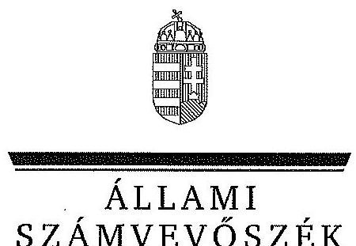
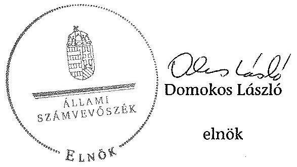

ÁLLAMI
SZÁMVEVŐSZÉK

# JELENTÉS 

a légszennyezés ellen és a klímapolitika terén tett intézkedések hatásának utóellenőrzéséről

---

# Állami Számvevőszék 

Iktatószám: V-0572-115/2015.
Témaszám: 1616
Vizsgálat-azonosító szám: V0703

## Az ellenőrzést felügyelte:

## Renkó Zsuzsanna

felügyeleti vezető
Az ellenőrzést vezette és az ellenőrzés végrehajtásáért felelős:
Korsósné Vigh Andrea
ellenőrzésvezető
A jelentés összeállításában közreműködtek:
Baksa Anikó
számvevő főtanácsos
Dr. Mezei Imréné
számvevő főtanácsos
Az ellenőrzést végezték:
Vánczku István
Dr. Vincze Ibolya
Dr. Zsolnay András
számvevő
számvevő

A témához kapcsolódó eddig készített számvevőszéki jelentések:
címe
sorszáma
Jelentés a légszennyezés ellen és a klímapolitika terén tett intézkedések hatásának ellenőrzéséről

---

# TARTALOMJEGYZÉK 

BEVEZETÉS ..... 3
I. ÖSSZEGZŐ MEGÁLLAPÍTÁSOK, KÖVETKEZTETÉSEK ..... 6
II. RÉSZLETES MEGÁLLAPÍTÁSOK ..... 7

1. Az intézkedési tervek megküldésének szabályossága ..... 7
2. Az intézkedési tervek teljesítése ..... 7
2.1. A nemzeti fejlesztési miniszter intézkedései ..... 7
2.1.1. Az éghajlatvédelmi kerettörvényről szóló országgyűlési határozat módosításának előkészítése ..... 7
2.1.2. A kibocsátási egységek értékesítése előkészítésének szabályozása ..... 8
2.1.3. A „Győr-Gönyű Országos Közforgalmú Kikötő intermodális központ közlekedési kapcsolatainak fejlesztése" projekthez kapcsolódó intézkedések ..... 8
2.1.4. Indikátorok kidolgozása, alkalmazása a légszennyezést és a klímavédelmet célzó stratégiákban, programokban és fejlesztési tervekben ..... 9
2.2. A vidékfejlesztési miniszter intézkedései ..... 9
2.2.1. A levegővédelmi irányítási, felügyeleti és hatósági tevékenység szabályozásának felülvizsgálata ..... 9
2.2.2. A hatósági feladatellátás létszám- és eszközigényének felmérése és fejlesztése ..... 10
2.2.3. Az Ötv. módosításának kezdeményezése az önkormányzatok környezetvédelmi feladataival összefüggésben ..... 10
2.2.4. A légszennyezés csökkentését mérő indikátorok kidolgozása és alkalmazásuk nyomon követése ..... 11

## MELLÉKLETEK

1. számú Az 1119. sz. ÁSZ jelentésben a nemzeti fejlesztési miniszter részére címzett javaslatok, azok végrehajtására az ÁSZ által jóváhagyott intézkedések és a megállapításokhoz kapcsolódó kiegészítő információk
2. számú Az 1119. sz. ÁSZ jelentésben a vidékfejlesztési miniszter részére címzett javaslatok, azok végrehajtására az ÁSZ által jóváhagyott intézkedések és a megállapításokhoz kapcsolódó kiegészítő információk

---

# FÜGGELÉKEK 

1. számú Rövidítések jegyzéke
2. számú Értelmező szótár
3. számú Az intézkedési tervekben előírt feladatok kategorizálása

---

# JELENTÉS 

## a légszennyezés ellen és a klímapolitika terén tett intézkedések hatásának utóellenőrzéséről

## BEVEZETÉS

Az Állami Számvevőszék stratégiájában célként tűzte ki, hogy a számvevőszéki munka eredménye jobban hasznosuljon, nagyobb hatást érjen el. Ennek megvalósításához az ellenőrzések hatásának mérése és értékelése, a javaslatok megvalósítása és nyomon követése mellett az utóellenőrzések rendszerének célzottabbá tételével is hozzá kíván járulni.

A levegőbe kerülő káros anyagok csökkentése és a klímaváltozás globális és hazai probléma. Az 1992-ben aláírt ENSZ Éghajlatváltozási Keretegyezmény (UNFCCC) nyújtja a legmagasabb szintű keretet és koordinálja a nemzetközi törekvéseket az éghajlat-politika terén. A Keretegyezményhez csatolt, 1997-ben elfogadott Kiotói Jegyzőkönyv az emberi tevékenység által a légkörbe juttatott szén-dioxid mennyiség világméretű csökkentését írja elő, a fejlett országok által a globális felmelegedésért felelős egyes, üvegházhatást okozó gázok kibocsátásának csökkentésére tett kötelezettségvállalásokat tartalmazza. A Kiotói Jegyzőkönyvet az EU 2002-ben ratifikálta, 2005-ben lépett hatályba, amelyben az EU-hoz 2004 előtt csatlakozott tagállamok vállalták, hogy 2008 és 2012 között átlagosan 8%-kal visszaszorítják kibocsátásaikat. A 2004 után csatlakozott országok közül Magyarország 6%-os kibocsátás-csökkentést vállalt az 1985-1987-es bázis időszakhoz képest. A Jegyzőkönyvet Magyarországon a 2007. évi IV. törvény hirdette ki.

Az EU 2000-ben elindította az első, 2005-ben a második Európai Éghajlatváltozási Programot, illetve az EU egy saját üvegházgáz kibocsátáskereskedelmi rendszert is létrehozott. Az EU-s emisszió-kereskedelmi rendszer (ETS) olyan piaci alapú szabályozó eszköz, amely az EU-n belüli üvegházhatású gázok költséghatékony kibocsátás-csökkentését teszi lehetővé, ezzel segítve a Kiotó Jegyzőkönyvben az EU által vállalt 8%-os kibocsátás-csökkentés elérését. Az EU tagállamok 2008-ban az energia és klímacsomagban vállalták, hogy 2020-ig 20%-kal csökkentik az üvegházhatású gázok kibocsátását. Magyarország 2008-ban fogadta el a 2008-2025. közötti időszakra szóló Nemzeti Éghajlatváltozási Stratégiát (29/2008. (III. 20.) OGY határozat), amely meghatározza a nemzetközi emisszió csökkentési kötelezettségek teljesítésének, az éghajlatváltozást okozó hatások elleni küzdelem és a klímaváltozáshoz történő alkalmazkodás feladatait.

Magyarország jelentős kvótatöbblettel rendelkezik. A 2007. évi LX. törvény, a törvény 10. § (3) bekezdésében, valamint a törvény végrehajtásának egyes szabályairól szóló 323/2007. (XII. 11.) Korm. rendelet IV., a Zöld Beruházási Rendszerről szóló fejezetének 22. §-ában előírtak alapján a kiotói egységek értékesítéséből származó bevételeket az üvegházhatású gázok hazai kibocsátásának csökkentésére, klímavédelemre kell fordítani, az ún. Zöld Beruházási Rendszer (ZBR) keretében. A ZBR a kiotói egységek értékesítéséből származó, pénzügyileg teljesített ellenérték terhére támogatást nyújtott az energiahatékonyságot növelő, illetve a megújuló energiaforrásokat hasznosító beruházásokhoz. A tiszta levegő, a felesleges CO₂-kvóta a nemzeti vagyon körébe tartozó elszámolási egység lett. A CO₂-kvóta, mint nemzeti vagyon kimutatása országos szintű, európai adatszolgáltatásokkal kompatibilis mérőhálózatot, a kvótakereskedelem az irányításban érintett minisztériumok közötti szabályozott együttműködést igényel.

Az ÁSZ 2010-2011-ben, a 2004-2010. közötti időszakra vonatkozóan elvégezte a légszennyezés ellen és a klímapolitika terén tett intézkedések hatásának ellenőrzését, amelynek keretében rendszerellenőrzés módszerével értékelte a légszennyezés csökkentéséhez, illetve a klímavédelemhez kapcsolódó célkitűzések teljesülését. A 1119. sz. ÁSZ jelentésben megállapította, hogy Magyarország a légszennyezés csökkentése, illetve a klímavédelem körében vállalt nemzetközi kötelezettségeit, valamint az EU-irányelvekben meghatározott előírásokat alapvetően teljesítette, a kedvező gazdasági folyamatok és a fejlesztések eredményeként összességében a légszennyező anyagok, valamint az éghajlatváltozást befolyásoló üvegházhatású gázok, és ezen belül a CO₂ kibocsátások összességében csökkentek.

Figyelmeztetőnek tartotta ugyanakkor, hogy - az összes kibocsátáson belül - a közlekedés okozta szálló por és CO₂ kibocsátás nőtt. A Nemzeti Éghajlatvédelmi Programban tervezett 25%-kal szemben 2010 végén a lakosság 34%-a élt szennyezett levegőjű településeken. A jelentés felhívta a figyelmet az intézkedések értékeléséhez szükséges indikátorok, mérések hiányosságaira, valamint a hatósági tevékenység megerősítésének szükségességére. Megállapította, hogy a Kiotói Jegyzőkönyv alapján kialakult nemzetközi emisszió kereskedelmi rendszer pénzügyi előnyeit Magyarország nem teljes körűen használta ki, mert az eladható kibocsátási egységek csak közel 10%-át értékesítette, amely következtében a ZBR keretében az energia-megtakarításra, és így a kibocsátás csökkentésre csak korlátozott pénzeszközök álltak rendelkezésre.

A 1119. sz. ÁSZ jelentés javaslatokat fogalmazott meg a vidékfejlesztési miniszter és a nemzeti fejlesztési miniszter részére. Az ellenőrzötteknek a jelentésben foglalt javaslatok végrehajtására az ÁSZ tv.-ben előírt kötelezettségük alapján intézkedési tervet kellett benyújtani. Az ÁSZ tv. 33. § (7) bekezdésében foglaltak szerint az intézkedési tervekben foglaltak megvalósítását az ÁSZ utóellenőrzés keretében ellenőrizheti. Az ÁSZ által tett javaslatokat és a végrehajtásukra jóváhagyott intézkedési tervekben vállalt feladatokat az 1. és 2. számú mellékletekben mutatjuk be.

Az ellenőrzés célja: annak értékelése volt, hogy az ellenőrzött szervezetek végrehajtották-e az ÁSZ korábbi, a légszennyezés ellen és a klímapolitika terén tett intézkedések hatásának ellenőrzéséről készült számvevőszéki jelentésben tett javaslatokra kidolgozott és az ÁSZ által elfogadott intézkedési tervekben megfogalmazott feladatokat.

---

Az utóellenőrzés megállapításait a rendelkezésre álló és az ellenőrzött szervezetektől bekért dokumentumok alapozzák meg. Az utóellenőrzés kizárólag a korábbi ellenőrzés intézkedést igénylő megállapításaival összefüggésben tett javaslatok hasznosulására, a korábban ellenőrzött területekkel összefüggésben tett intézkedésekre, a jóváhagyott intézkedési tervekben előírt feladatok végrehajtására, a feladatok végrehajtásának nyomon követésére, a feladatok végrehajtásának elmaradása esetén annak okaira, dokumentáltságára irányult az ellenőrzési cél megválaszolása érdekében.

Az alkalmazott rövidítések jegyzékét az 1. számú függelék, az egyes fogalmak magyarázatát a 2. számú függelék tartalmazza. Az intézkedési tervekben előírt feladatok végrehajtását a 3. számú függelék szerinti kategóriák alapján értékeltük.

Az ellenőrzés várható hozadékaként az ellenőrzésről készülő ÁSZ jelentés rámutathat arra, hogy az ellenőrzött szervezetek hasznosították-e az ÁSZ korábbi ellenőrzéséről készült számvevőszéki jelentésben megfogalmazott javaslatokat. Az ellenőrzés megállapításai visszajelzést adhatnak a jogalkotók és az ellenőrzött szervezetek vezetői számára az intézkedések megfelelőségéről, segítséget nyújthatnak további intézkedések megtételéhez. A klímapolitika intézményrendszerének tett korábbi javaslatok hasznosulásának ellenőrzésével hozzájárulhat az ellenőrzött szervezetek eredményes közfeladat-ellátásához, az ellenőrzés során feltárt kockázatok, hiányosságok megfelelő kezeléséhez és a „jó gyakorlatok" terjesztéséhez. A társadalom vonatkozásában erősíti az ÁSZ ellenőrzések tekintélyét, utóellenőrzés jellegénél fogva fokozza a fegyelmet, igazolja, hogy lejárt a következmények nélküli ellenőrzések időszaka. Az ÁSZ intézményén belül lehetőség nyílik arra, hogy az utóellenőrzés, mint ellenőrzési kategória a szervezet tevékenységében stabilizálódjék, a megállapítások visszacsatolása segítse és erősítse az ÁSZ hozzáadott értéket teremtő elemző tevékenységét és tanácsadó szerepét.

Az ellenőrzés típusa: utóellenőrzés keretében végrehajtott szabályszerűségi ellenőrzés.

Az ellenőrzött szervezetek: a Nemzeti Fejlesztési Minisztérium és a Földművelésügyi Minisztérium, mint a Vidékfejlesztési Minisztérium jogutódja.

Az ellenőrzött időszak: az intézkedési tervek elfogadásától (az NFM-nél 2012. június 8-tól, az FM-nél 2012. január 1-jétől) az utóellenőrzés megkezdésének napjáig (2014. december 1-ig) tartó időszak.

Az ellenőrzés jogszabályi alapját az ÁSZ tv. 5. § (2)-(3) bekezdései és 33. § (7) bekezdése képezték.

Az ÁSZ tv. 29. § (1) bekezdése szerint a jelentéstervezetet megküldtük a Nemzeti Fejlesztési, valamint a Földművelésügyi miniszternek, akik az ÁSZ tv. 29. § (2) bekezdésében foglalt észrevételezési jogukkal nem éltek, a jelentéstervezetre észrevételt nem tettek.

---

# I. ÖSSZEGZŐ MEGÁLLAPÍTÁSOK, KÖVETKEZTETÉSEK 

Az ÁSZ utóellenőrzés keretében értékelte a légszennyezés ellen és a klímapolitika terén tett intézkedések hatásának ellenőrzéséről szóló jelentés javaslatainak hasznosítására elfogadott intézkedési tervek végrehajtását. Az utóellenőrzés megállapításai alapján az ellenőrzött szervezetek az intézkedési tervekben vállalt, időszerűvé vált hét feladat közül ötöt teljesítettek, egyet részben hajtottak végre (a teljesítése folyamatban van), és egy feladat kezelése nem a felelősként megjelölt ellenőrzött szervezet által történt meg.

A nemzeti fejlesztési miniszter részére címzett négy javaslat közül három hasznosult, egy intézkedés végrehajtása az ellenőrzött időszakban nem volt időszerű. Teljesült a kibocsátási egységek értékesítésének döntés-előkészítési és dokumentálási feladatainak szabályozása. Végrehajtották a 2012-ben induló és tervezés alatt álló támogatási programoknál a kibocsátás csökkentés mérése, valamint a „Győr-Gönyű Országos Közforgalmú Kikötő Intermodális központ közlekedési kapcsolatainak fejlesztése" projekt működése biztosítása céljából vállalt intézkedéseket. Nem készítették el az éghajlatvédelmi kerettörvény előkészítéséről szóló 60/2009. (VI. 24.) OGY határozat módosításának kezdeményezésére vonatkozó előterjesztést. Az intézkedés végrehajtása - a kerettörvény tartalmára kihatással lévő, folyamatban lévő nemzetközi tárgyalások miatt - nem volt időszerű.

A vidékfejlesztési miniszter részére címzett négy javaslat közül kettő maradéktalanul hasznosult, egy intézkedést részben végrehajtottak (a teljesítése folyamatban van), valamint egy feladat kezelése nem a VM által történt meg. Végrehajtották a légszennyezés csökkentését célzó programokban a hatásokat értékelő indikátorok kidolgozását és alkalmazásuk nyomon követését. Teljesült a hatósági feladatellátás létszám- és eszközigényének felmérésével és fejlesztésével kapcsolatos intézkedés. A levegővédelmi rendelet felülvizsgálata feladat részben teljesült, az átfogó szakmai felülvizsgálat jelenleg folyamatban van. A VM a települési környezetvédelmi programok, illetve a helyi környezetvédelmi szabályok készítésére vonatkozó jogszabályi előírások érvényesítését célzó Ötv. módosítását nem kezdeményezte, azonban a feladatot az Mötv. hatályba lépése - abban a kormányhivatal törvényességi felügyeleti jogkörének megerősítése és a feladatfinanszírozási rendszer bevezetése - kezelte.

---

# II. RÉSZLETES MEGÁLLAPÍTÁSOK 

## 1. Az intézkedési tervek megküldésének szabályossága

Az ellenőrzött szervezetek vezetői az intézkedési terv készítési kötelezettségüknek határidőn túl tettek eleget. Az ÁSZ az intézkedési tervek felülvizsgálata alapján a nemzeti fejlesztési minisztertől annak javítását, kiegészítését kérte, a vidékfejlesztési miniszter intézkedési tervét elfogadta. A nemzeti fejlesztési miniszter a
 kiegészített intézkedési tervet ismételten határidőn túl küldte meg az ÁSZ részére. Az ÁSZ az NFM módosított, kiegészített intézkedési tervét elfogadta.

## 2. Az intézkedési tervek teljesítése

### 2.1. A nemzeti fejlesztési miniszter intézkedései ${ }^{1}$

### 2.1.1. Az éghajlatvédelmi kerettörvényről szóló országgyűlési határozat módosításának előkészítése

Nem készítették el az éghajlatvédelmi kerettörvény előkészítéséről szóló 60/2009. (VI. 24.) OGY határozat módosításának kezdeményezéséről szóló előterjesztést. Az intézkedés végrehajtása az ellenőrzött időszakban nem volt időszerű, mert nem fejeződtek be azok a nemzetközi tárgyalások, amelyek a kerettörvény tartalmára kihatással lehetnek. A szakirányú uniós előírások elfogadását megelőzően nem célszerű azonos tárgykörben törvényi szintű nemzeti szabályozás megalkotása, így az azt előíró 60/2009. (VI. 24.) OGY határozat feladat-kiosztása és feladat-meghatározása módosításának kezdeményezése sem.

A 60/2009. (VI. 24.) OGY határozat 4. pontjában előírt tartalmi követelmények egy része olyan kötelezettségek (pl. az ÚHG kibocsátás 2050-ig történő lépcsőzetes csökkentésének ütemterve) törvényi szintű rögzítésére irányul, amelyek szoros összefüggésben állnak azonos tárgyú uniós kötelezettségekkel.

Az EU állam- illetve kormányfői 2014. októberben megállapodásra jutottak a 2030-ig szóló klíma és energiastratégiáról. Az egyezség értelmében a tagállamok az 1990-es szinthez képest legalább 40%-kal mérséklik szén-dioxid kibocsátásukat, 27%-ra növelik a megújuló energia arányát energiatermelésükben és 27%-kal javítják az energiafelhasználás hatékonyságát. A megállapodást az EU a 2015. év végére ütemezett párizsi klímacsúcsot - melynek célja a kiotói egyezményt 2020-tól felváltó új megállapodás megalkotása - követően áttekinti. A párizsi eredmények függvényében a jelenleginél dinamikusabb vagy visszafogottabb kibocsátás-csökkentésről is dönthet.

[^0]
[^0]:    ${ }^{1}$ A részletes megállapításokhoz kapcsolódó kiegészítő információkat az 1. sz. melléklet tartalmazza.

---

# 2.1.2. A kibocsátási egységek értékesítése előkészítésének szabályozása 

A nemzeti fejlesztési miniszter az intézkedést végrehajtotta, a kibocsátási egységek értékesítésének döntés-előkészítési és dokumentálási feladatait a 36/2012. (XII. 7.) NFM utasítás kiadásával szabályozta. A miniszteri utasítás rendelkezik a kibocsátási egységek értékesítésének előkészítése során érvényesítendő titoktartási és összeférhetetlenségi szabályokról, a döntésmegalapozó és dokumentálási feladatokról és azok felelőseiről. A Kormány tagjainak feladatairól és hatásköréről szóló 152/2014. (VI. 6.) Korm. rendelet a kvótaértékesítéssel kapcsolatos feladatokat a nemzetgazdasági miniszter hatáskörébe utalta.

### 2.1.3. A „Győr-Gönyú Országos Közforgalmú Kikötő intermodális központ közlekedési kapcsolatainak fejlesztése" projekthez kapcsolódó intézkedések

Végrehajtotta az NFM a „Győr-Gönyú Országos Közforgalmú Kikötő intermodális központ közlekedési kapcsolatainak fejlesztése" projekthez kapcsolódó intézkedéseket. Az NFM az ÉDUKÖVIZIG-et - mint a KIOP projekt kedvezményezettjét, lebonyolítóját és az érintett terület vagyonkezelőjét - a tulajdonos MNV Zrt. útján beszámoltatta. Beszámolójában az ÉDUKÖVIZIG bemutatta a megvalósítás körülményeit, helyzetét és a megvalósítás során felmerült problémákat, nehézségeket. Az ÉDUKÖVIZIG beszámolóját az NFM Légi- és Víziközlekedési Főosztálya kiegészítette. Mindezek alapján a KHÁT a nemzeti fejlesztési miniszter részére beszámolt a működés biztosítása céljából már megtett intézkedésekről és javaslatot tett a még szükséges intézkedésekre, amelyek közül a leglényegesebbek a következők voltak.

- Megtörtént a MÁV Zrt.-nek a kikötői vasúti beruházás üzemeltetésére történő felkérése és a vagyonkezelésre történő kijelölése, az ehhez szükséges szakmai tapasztalatokkal, működtetési jogosultságokkal és kompetenciával nem rendelkező, korábbi vagyonkezelő ÉDUKÖVIZIG helyett. A feladat átadás-átvétele lebonyolódott.
- A MAHART Magyar Hajózási Zrt. veszi át a kikötő és a logisztikai központ működtetési jogait és feladatait az ÉDUKÖVIZIG-től, mert az nem tudja vagyonkezelőként a saját szervezetén belül a kikötőt menedzselni.
- Tekintettel arra, hogy a KIOP projekt egy komplex kikötőfejlesztés első ütemének indult, a kikötőfejlesztés csak a második ütemmel válik teljessé, amely végrehajtását az Európai Bizottság elvárja. Ennek megalapozásához megvalósíthatósági tanulmány és stratégiai döntés-előkészítő anyag elkészítése szükséges.

A KIOP projekt eredményeként megvalósult logisztikai központ működésének megkezdésének elmaradásával ${ }^{2}$ összefüggésben felelősség felvetésére, megálla-

[^0]
[^0]:    ${ }^{2}$ A projekt a 2011. évben az üzemeltetés elmaradása miatt az Európai Bizottság felé „nem működő" projektként került be, ezért fennállt a támogatás visszafizetésének a kockázata.

---

pítására - az ellenőrzés részére átadott dokumentumok alapján - nem került sor.

A KIOP projekt működőképességének alátámasztásához minimálisan teljesítendő feltételek (vagyonkezelési szerződések létrejötte, kikötő-működtető társaság megbízása, a továbbfejlesztéseket megalapozó stratégiai tanulmány elkészítése) megteremtésének eredményeként a projekt működőképességét az Európai Bizottság a 2012. október 23-án kelt levele alapján elfogadta.

# 2.1.4. Indikátorok kidolgozása, alkalmazása a légszennyezést és a klímavédelmet célzó stratégiákban, programokban és fejlesztési tervekben 

Végrehajtotta az NFM a 2012-ben induló és tervezés alatt álló támogatási programoknál a kibocsátás csökkentés pályázó általi mérésének megkövetelésére irányuló intézkedést. A kibocsátás csökkentés indikátorok útján történő mérése követelményt a KEOP 4. és 5. prioritások ${ }^{3}$ 2012-2013. évi pályázati kiírásaiban (Pályázati Felhívás, Útmutató), továbbá a Zöld Beruházási Rendszer ${ }^{4}$ keretében kiírt pályázatoknál érvényesítették.

### 2.2. A vidékfejlesztési miniszter intézkedései ${ }^{5}$

### 2.2.1. A levegővédelmi irányítási, felügyeleti és hatósági tevékenység szabályozásának felülvizsgálata

A levegővédelmi rendelet felülvizsgálata az ellenőrzött időszakban részben teljesült, az átfogó szakmai felülvizsgálat jelenleg folyamatban van, 2015. első félévében várható ${ }^{6}$ a módosítás Kormány elé terjesztése.

A VM (jogutódjaként az FM) az intézkedési tervben vállalt feladatot - a felügyelőségek és az önkormányzatok közötti levegővédelmi hatáskörök megosztása felülvizsgálatát - a levegővédelmi rendelet átfogó felülvizsgálatába illesztve, a jogalkalmazók széles körű bevonásával végezte az ellenőrzött időszakban. Az átfogó szakmai felülvizsgálatot a környezetvédelmi hatóságok által jelzett jogalkalmazói tapasztalatok és a bekövetkezett jogszabályi változások tették szükségessé. Az átfogó felülvizsgálat nem zárult le, az ellenőrzött időszakban a VM a levegővédelmi rendelet tekintetében technikai jellegű módosításokat kezdeményezett, amelyek nem érintették a felügyelőségek és az önkormányzatok közötti hatáskörök megosztását.

[^0]
[^0]:    ${ }^{3}$ Megújuló energia felhasználás növelése (KEOP 4), Hatékony energia felhasználás (KEOP 5)
    ${ }^{4}$ ÚSZT-ZBR-NAP-KÖZINT-2013, ZBR-NY/14, ÚSZT-ZBR-CNG-2014.
    ${ }^{5}$ A részletes megállapításokhoz kapcsolódó kiegészítő információkat a 2. sz. mellékletben mutatjuk be.
    ${ }^{6}$ Az FM adatszolgáltatása keretében adott tájékoztatás szerint.

---

A felügyelőségek és az önkormányzatok közötti levegővédelmi hatáskörök megosztásának felülvizsgálata fókuszában a szmogriadőval összefüggő hatáskörök álltak. Ezzel összefüggésben a VM tanulmányt készíttetett, Szmogriadó Tárcaközi Bizottságot hozott létre és működtetett, továbbá konferenciát szervezett az érintettek - többek között az önkormányzatok - bevonásával.

# 2.2.2. A hatósági feladatellátás létszám- és eszközigényének felmérése és fejlesztése 

Végrehajtotta a VM a hatósági feladatellátás létszám- és eszközigényének felmérésével és fejlesztésével kapcsolatos feladatait. A hatósági feladatellátás személyi és tárgyi feltételeit több, egymással részben átfedést mutató, elsősorban a műszerfejlesztésekre irányuló projekt végrehajtásával kapcsolatos felmérés keretében végezték el.

Az intézkedés keretében teljesült a környezetvédelmi, természetvédelmi, valamint a vízügyi hatósági eljárások igazgatási szolgáltatási díjairól szóló 33/2005. (XII. 27.) KvVM rendelet - a díjaknak a valós költségekhez igazítása érdekében történő - módosításának előkészítésére előírt feladat is.

### 2.2.3. Az Ötv. módosításának kezdeményezése az önkormányzatok környezetvédelmi feladataival összefüggésben

Az 1119. számú ÁSZ jelentés megállapítása szerint az ellenőrzött önkormányzatok egy része a települési környezetvédelmi programok, illetve a helyi környezetvédelmi szabályok készítésére vonatkozó jogszabályi előírásokat nem érvényesítette. A VM az intézkedési tervben vállalt feladatát - a jogszabályi előírások érvényesülése biztosítása érdekében az Ötv. módosítás kezdeményezését - nem hajtotta végre, azonban a feladatot az Mötv. hatályba lépése az alábbi rendelkezéseiben kezelte.

- Az Mötv. VII. fejezetén belül a helyi önkormányzatok törvényességi felügyeletére vonatkozó előírások, valamint a miniszter szakmai szabályozási, ellenőrzési és tájékoztatási jogköre7 biztosítják a települési környezetvédelmi szabályok készítésére vonatkozó jogszabályok érvényesítését.
- Az önkormányzatok környezetvédelmi feladatai ellátásához pénzügyi támogatási rendszer kialakítását az Mötv.-nek a helyben biztosítandó közfeladatok körére, az önkormányzati államigazgatási feladatok és hatáskörök központi költségvetési finanszírozására, a helyi önkormányzatok feladatfinanszírozási rendszerére, továbbá az önkormányzatokért felelős és az ágazati miniszter hatáskörére vonatkozó előírásai ${ }^{8}$ együttesen biztosítják.

[^0]
[^0]:    ${ }^{7}$ Mötv. 130. § a) és c) pontok
    ${ }^{8}$ Mötv. 13. § (1) bekezdés 11. pont, 18. § (1) bekezdés, 117. §, 128. § d) és e) pontok, valamint a 130. § d) és f) pontok

---

# 2.2.4. A légszennyezés csökkentését mérő indikátorok kidolgozása és alkalmazásuk nyomon követése 

A VM végrehajtotta a levegőszennyezés csökkentését célzó hatások értékelését segítő indikátorok kidolgozása és alkalmazásuk nyomon követése feladatot. A levegőszennyezés csökkenését mérő indikátorok beépítését, nyomon követését az országos és regionális légszennyezettségi mérőhálózat továbbfejlesztését célzó projektekben, továbbá a 4. Nemzeti Környezetvédelmi Programban érvényesítették.

Budapest, 2015. Ch. hó ơ nap

Melléklet: $\quad 2 \mathrm{db}$
Függelék: $\quad 3 \mathrm{db}$

---

.

---

Az 1119. sz. ÁSZ jelentésben a nemzeti fejlesztési miniszter részére címzett javaslatok, azok végrehajtására az ÁSZ által jóváhagyott intézkedések és a megállapításokhoz kapcsolódó kiegészítő információk

|  ÁSZ javaslat | Intézkedés | A megállapításokhoz kapcsolódó kiegészítő információk  |
| --- | --- | --- |
|  Végrehajtott intézkedések |  |   |
|  1. Indítson vizsgálatot a "Győr-Gönyü Országos Közforgalmú Kikötő intermodális központ közlekedési kapcsolatainak fejlesztése" projekt eredményeként megvalósult logisztikai központ működés megkezdésének elmaradására visszavezethető okok és a felelősség feltárására. | 1. A kikötő kezelésével megbízott ÉDUKOVIZIG beszámolót készít a működtetés elmaradása okáról. Az ÉDUKOVIZIG beszámolóját a Légi és Víziközlekedési Főosztály tájékoztatással egészíti ki.
Határidő: 2012. május 31.
Felelős: Közlekedésért felelős helyettes államtitkár
2. Az okok feltárása és a felelősség megállapítása alapján a KHÁT javaslatot tesz a működtetés biztosítása céljából szükséges intézkedésekre.
Határidő: 2012. szeptember 30.
Felelős: Közlekedésért felelős helyettes államtitkár | Az ÉDUKOVIZIG a beszámolóját 2011. október 18-án készítette el. A beszámolót a Légi és Víziközlekedési Főosztály tájékoztatással egészítette ki, továbbá a KHÁT a működés biztosítása céljából szükséges intézkedésekre 2012. október 1-jén javaslatot tett.
A KHÁT javaslatát követően felelősségre vonásra nem került sor, viszont a projekt I. üteme sikeres befejezése és a II. ütem megvalósítása érdekében az ellenőrzött időszakban a következő lényeges döntések születtek. A Kormány a Győr-Gönyü Országos Közforgalmú Kikötő fejlesztést a 486/2013. (XII. 17.) sz. rendeletében nemzetgazdasági szempontból kiemelt jelentőségű beruházásnak minősítette, az 1092/2014. (II. 28.) sz. határozatában a kapcsolódó állami infrastruktúra megépítéséhez kötelezettséget vállalt. A nemzetgazdasági miniszter a 10/2014. (III. 31.) sz. NFM utasítással miniszteri biztost nevezett ki a beruházással kapcsolatos koordinációs feladatok ellátására. Az Európai Bizottság 2014.10.01-jén meghozta a II. ütem támogatásáról szóló határozatát.  |
|  2. Intézkedjen a légszennyezés csökkentését, valamint a klímavédelmet célzó stratégiák, programok, fejlesztési tervek előkészítése, megvalósítása során a hatások értékelését segítő indikátorok minél szélesebb körben történő kidolgozásáról, különösen a kibocsátási mutatók pályázók általi kimunkálását, és nyomon követésének előírását tegye kötelezővé. | A 2012-ben induló vagy tervezés alatt álló támogatási programoknál fokozottan törekedni kell a kibocsátás csökkentés pályázó általi mérésének megkövetelésére, és a lehető legszélesebb körben kötelezővé tenni azt.
Határidő: a szakterületet érintő új programok indításával egy időben
Felelős: Közlekedésért felelős helyettes államtitkár | A KEOP 4. és 5. prioritás 2012-2013. évi pályázati kiírásainál csak olyan projektek

 támogathatóak, amelyek abszolút értékében csökkentik hazánk ÜHG kibocsátását. A Pályázati Felhívásban (E1 Monitoring mutatók pont) meghatározásra kerültek az indikátorok és a vállalt célértékek elérésének időpontjai.
Az ÚSZT-ZBR-NAP-KÖZINT-2013 és a ZBR-NY/14 kódszámú pályázati felhívások és útmutatók tartalmazták, hogy a pályázatok keretében csak olyan fejlesztések támogathatók, amelyek $\mathrm{CO}_{2}$ kibocsátás csökkentése kimutatható, illetve energia megtakarítást eredményező hatása igazolható. Az ÚSZT-ZBR-CNG-2014 pályázati felhívás szerint az $5 \% \mathrm{CO}_{2}$ kibocsátást vállaló pályázat volt támogatható. A pályázati útmutatóban monitoring adatszolgáltatási kötelezettséget írtak elő.  |

---

|  ÁSZ javaslat | Intézkedés | A megállapításokhoz kapcsolódó kiegészítő információk  |
| --- | --- | --- |
|  Végrehajtott intézkedések |  |   |
|  3. Tegyen intézkedéseket - tekintettel a jövőben várható kvótaértékesítésekre - a Kiotói Jegyzőkönyv alapján létrejött nemzetközi emisszió-kereskedelem körében a szén-dioxid kibocsátási egységek értékesítéséhez kapcsolódó előkészítés dokumentált, nyomon követhető rendszerének kiépítésére. | 1. A kibocsátási jogosultságok értékesítésének körülményeit, feltételeit szabályozó jogszabályi rendelkezések felülvizsgálata, az esetlegesen szükséges jogalkotási feladatok feltárása és elvégzése. | A kibocsátási jogosultságok értékesítésének körülményeit, feltételeit szabályozó jogszabályi rendelkezések felülvizsgálatát követően a 2012. évben az Ühtv. 1 és az Ühtv. 1 vhr. helyett az Ühtv. 2 és az Ühtv. 2 vhr. kiadására került sor. A belső eljárásrend elkészítésére vonatkozó intézkedés a 38/2012. (XII. 7.) NFM utasítás kiadásával teljesült.  |
|   | 2. A jogszabályi felülvizsgálat eredményére tekintettel belső eljárásrend előkészítése az államháztartásért felelős miniszter bevonásával az értékesítés egyes állomásainak, feladatainak és felelőseinek meghatározása érdekében. |   |
|   | 3. A belső eljárásrend miniszteri szintű jóváhagyásának bonyolítása. | A Kormány tagjainak feladat- és hatásköréről szóló 152/2014. (VI. 6.) Korm. rendelet a kvótaértékesítéssel kapcsolatos feladatokat a nemzetgazdasági miniszter hatáskörébe utalta.  |
|   | Határidő: 2012. július 31.
Felelős: Klimapolitikai Főosztály főosztályvezetője |   |

---

|  ÁSZ javaslat | Intézkedés | A megállapításokhoz kapcsolódó kiegészítő információk  |
| --- | --- | --- |
|  1. Kezdeményezze a Kormánynál, hogy az Országgyűlés felé tegyen javaslatot az éghajlatvédelmi kerettörvény előkészítésének a Nemzeti Fenntartható Fejlődési Tanács megbízására vonatkozó korábbi döntésének felülvizsgálatára annak érdekében, hogy a jogosultságot telepítse a Kormányhoz. Az Országgyűlésnek a javaslatot elfogadó döntését követően aktualizálja a tervezetet és terjessze azt a Kormány elé. | Előterjesztés készítése az éghajlatvédelmi kerettörvény előkészítéséről szóló 60/2009. (VI. 24.) OGY határozat feladat-meghatározása és feladat kiosztása módosításának kezdeményezése tárgyában.
Határidő: 2012. szeptember 30.
Felelős: Klimapolitikai Főosztály főosztályvezetője | Az előterjesztést nem készítették el. Az ÁSZ részére adott minisztériumi indoklás szerint az intézkedés okafogyottá vált a 2012. évben elvégzett jogalkotási feladatok (Ühtv. 2 és Ühtv. 3 vhr. kiadása, ennek keretében a 2007. évi LX. törvényben szabályozott NÉS-re vonatkozó előírások módosítása, a 2013. évi felülvizsgálat alapján elkészített NÉS2) miatt. A tárca szükségtelennek tartja egy olyan további törvényjavaslat kidolgozását, amelynek tartalmi követelményeit már most is hatályos jogszabályi előírások tartalmazzák, illetve az uniós tagságból következően az uniós jogi normák által kitűzött célok és magatartások közvetlenül kötelezik hazánkat a klímavédelemmel kapcsolatos intézkedések megtételére és betartására.
A 2013. április 8-án kelt, a miniszter részére készített beszámolóban adott indoklás szerint: 1) A szakirányú uniós kötelezettségek megállapítására vonatkozó tárgyalások nem fejeződtek be, emiatt nem tartják szakmailag indokoltnak az uniós előírások elfogadását megelőzően azonos tárgykörben törvényi szintű szabályozás megalkotását. 2) A NÉS 2013-ra előírt felülvizsgálatának elvégzését követően dönthető el szakmailag, hogy indokolt-e és ha igen, milyen tartalommal éghajlatvédelmi kerettörvényben szabályozni a klímaváltozással kapcsolatos hazai feladatokat.  |

---

|  ÁSZ javaslat | Intézkedés | A megállapításokhoz kapcsolódó kiegészítő információk  |
| --- | --- | --- |
|   |  | Az ÁSZ megállapítása szerint a 60/2009. (VI. 24.) OGY határozatban megfogalmazott - a megalkotandó törvénnyel szemben elvárt - kritériumok szerinti szabályozást a jelenleg hatályos jogszabályok teljes körűen nem tartalmazzák (pl. az OGY határozat 4.b) pontjában előírt tartalmi követelmény tekintetében). A OGY határozat előtt, 2008-ban készült NÉS által átfogott időtáv (2025-ig) nem felel meg a kritériumoknak, a 2013. évi felülvizsgálat alapján (2050-ig kitekintéssel) készült NÉS2 pedig nincs elfogadva. A vonatkozó nemzetközi és uniós normáknak a folyamatban lévő tárgyalásokat követő véglegesedése, ez alapján a NÉS2 szakmai anyag áttekintése és az Országgyűlés által történő jóváhagyása után dönthető el, hogy indokolt-e és ha igen, milyen tartalommal éghajlatvédelmi kerettörvényben szabályozni a klímaváltozással kapcsolatos feladatokat.  |

---

Az 1119. sz. ÁSZ jelentésben a vidékfejlesztési miniszter részére címzett javaslatok, azok végrehajtására az ÁSZ által jóváhagyott intézkedések és a megállapításokhoz kapcsolódó kiegészítő információk

|  ÁSZ javaslat | Intézkedés | A megállapításokhoz kapcsolódó kiegészítő információk  |
| --- | --- | --- |
|  Végrehajtott intézkedések |  |   |
|  1. Intézkedjen a légszennyezés csökkentését, valamint a klímavédelmet célzó stratégiák, programok, fejlesztési tervek előkészítése, megvalósítása során a hatások értékelését segítő indikátorok minél szélesebb körben történő kidolgozásáról, különösen a kibocsátási mutatók pályázók általi kimunkálását, és nyomon követésének előírását tegyék kötelezővé. | A feladatban leírt levegőszennyezés csökkentésére vonatkozó indikátorok beépítését és nyomon követését a készülő dokumentumokban, pályázati kiírásokban érvényesíteni fogjuk. A Kormány által októberben elfogadott, a PM10 szennyezettség csökkentését célzó ágazatközi program már ennek megfelelően készült el.
Határidő: folyamatos
Felelős: Környezetmegőrzési és -fejlesztési Főosztály | A 4. Nemzeti Környezetvédelmi Program 9. fejezete (A Program végrehajtása, nyomon követése) részletezi a program végrehajtását segítő, közte a levegővédelem körébe sorolható indikátorokat (pl. a légszennyező anyagok és ÜHG kibocsátására, valamint a levegőminőségi határértékek túllépésére vonatkozó mutatókat).
A levegővédelemhez kapcsolódó indikátorok használatára és nyomon követésére vonatkozó előírásokat tartalmaznak még a következők: "OLM - Országos Légszennyezettségi Mérőhálózat továbbfejlesztése" című projekt, a Svájci-Magyar Együttműködési Program keretében megvalósuló, a "Közép-Duna-Völgyi Környezetvédelmi, Természetvédelmi és Vízügyi Felügyelőség illetékességi területéhez tartozó monitoring rendszer korszerűsítés és mérőeszközök beszerzése" projekt, valamint a "Regionális Légszennyezettségi Mérőrendszer" című projekt.
Az "Országos Légszennyezettségi Mérőhálózat (OLM) és laboratóriumi háttér továbbfejlesztése" című, továbbá a KEOP-6.3.0/2F/11-2012-0001 azonosítószámú projekt keretében került sor eszköz- és személyi állomány felmérésre. Eszközfejlesztés történt a "Közép-Duna-Völgyi Környezetvédelmi, Természetvédelmi és Vízügyi Felügyelőség illetékességi területéhez tartozó monitoringrendszer" korszerűsítés és mérőeszközök beszerzése" projekt, valamint a "Regionális Légszennyezettségi Mérőrendszer" című projekt keretében.  |
|  2. Gondoskodjon a nemzetközi elvárásokhoz igazodó hatékony hatósági feladatellátás kapacitás - létszám és eszköz - igény felméréséről és a rendelkezésre álló források függvényében ezek ütemes fejlesztéséről. | A hatósági feladatellátás személyi és tárgyi feltételei felmérése a költségvetés tervezéséhez kötötten megtörtént és történik a jövőben is. A költségvetési törvény tárgyalásain a lehetőségekhez képest érvényesítjük az igényeket. A hatékony feladatellátás biztosítása érdekében továbbá felülvizsgáljuk a környezetvédelmi, természetvédelmi, valamint a vízügyi hatósági eljárások igazgatási szolgáltatási díjairól szóló 33/2005. (XII. 27.) KvVM rendeletet és az abban foglalt díjakat a valós költségekhez igazítjuk.
Határidő: a költségvetési törvény tervezési időszaka a jogszabály megalkotása : 2012. április 30.
Felelős:Költségvetési és Gazdálkodási Főosztály, Környezetmegőrzési és -fejlesztési Főosztály |   |

---

|  ÁSZ javaslat | Intézkedés | A megállapításokhoz kapcsolódó kiegészítő információk  |
| --- | --- | --- |
|  Részben végrehajtott intézkedés |  |   |
|  1. Vizsgáltassa felül és pontosítsa, illetve egészítse ki a levegővédelem irányítási, felügyeleti, valamint hatósági tevékenységet végzők feladat- és hatáskörének szabályozását, figyelembe véve a felügyelőségek és önkormányzatok közötti hatáskörök megosztását. | A 306/2010. (XI. 23.) kormányrendelet rendelkezik a levegőtisztaságvédelmi ügyekben eljáró hatósági jogkörök felügyelőségek és önkormányzatok közötti megosztásáról. A kormányrendelet szakmai felülvizsgálata, az első éves hatósági tapasztalatok alapján folyamatban van. A levegővédelem irányítási, felügyeleti, valamint hatósági tevékenységet végzők feladat- és hatásköre szabályozásának áttekintése is folyamatban van. A felülvizsgálat eredményétől függően a 306/2010. (XII. 23.) kormányrendelet módosítását kezdeményezni fogjuk. | A felügyelőségek és az önkormányzatok közötti levegővédelmi hatáskörök megosztása felülvizsgálatának a fókuszában a szmogriadóval összefüggő hatáskörök álltak. A VM létrehozta a Szmogriadó Tárcaközi Bizottságot, amely első ülését 2012. március 13-án tartotta. Feladata a rövid távú intézkedési tervek szabályozásának felülvizsgálata érdekében a szmogriadóval kapcsolatos tapasztalatok begyűjtése (kérdőív megkeresés az érintett önkormányzatok, valamint a környezetvédelmi, közlekedési és egészségügyi hatóságok felé). A kérdőívek feldolgozását követően került sor a szabályozás új koncepciójának a kidolgozására, amelyet a minisztérium háttérintézménye, a Nemzeti Környezetügyi Intézet (NeKI) végez. A szmogriadóval kapcsolatos önkormányzati feladatok, illetve hatáskörök gyakorlati megvalósítása, alkalmazása segítésére a VM megbízására a NeKI a 2014. évben „Szmogriadóterv-minta és útmutató"-t készített, amely a honlapiáról letölthető.
A levegővédelmi rendelet átfogó szakmai felülvizsgálata folyamatosan zajlik. A minisztériumi és háttérintézményi (NeKi) előkészítő munka során országos konferenciát is szerveztek a jogalkalmazók bevonásával (2013. június 3-5., Balatonöszöd), amelynek napirendjén szerepelt a környezetvédelmi hatóságoknak a levegővédelmi rendelet módosítására tett javaslatainak a megvitatása. Ezen túl a levegővédelmi rendelet felülvizsgálatával összefüggésben a minisztérium elektronikus formában is konzultál a hatóságok képviselőivel, pl. a 2014. október 17-én kelt körlevélben kérte a környezetvédelmi felügyelőségeket az illetékességi területükön található diffúz légszennyező forrásokkal kapcsolatban történő adatszolgáltatásra.  |

---

|  ÁSZ javaslat |  | Intézkedés | A megállapításokhoz kapcsolódó kiegészítő információk  |
| --- | --- | --- | --- |
|   |  | Kezelt intézkedés |   |
|  1. Kezdeményezze a Kormánynál az önkormányzati törvény olyan módosítását, amely biztosítja a települési környezetvédelmi programok, illetve a helyi környezetvédelmi szabályok készítésére vonatkozó jogszabályi előírások érvényesülését, valamint az önkormányzatok környezetvédelmi feladatainak ellátásához pénzügyi támogatási rendszer kialakítását. | A feladatban foglaltak szerint levélben kezdeményezni fogjuk a Belügyminisztériumnál az önkormányzati törvény ÁSZ javaslatnak megfelelő módosítását.
Határidő: 2011. december 15.
Felelős: Környezetmegőrzési és -fejlesztési Főosztály | Az FM (VM jogutódja) az ÁSZ részére adott indoklásában a feladatot az ÁSZ javaslathoz füzött KIM észrevételeire szűkített értelmezésben megállapítja, hogy "a feladat tehát egy konkrét problémát (szmogriadóval kapcsolatos intézkedések) kiemelve állapít meg egy azon túlmutató, átfogó feladatot. A szmogriadóval kapcsolatos önkormányzati problémakör kezelése nem elválasztható a 306/2010-es Korm. rendelet felülvizsgálatától, amely még folyamatban van."
A VM az intézkedési tervben vállalt feladatát - a jogszabályi előírások érvényesülése biztosítása érdekében az Ötv. módosítása kezdeményezését - nem hajtotta végre, azonban a feladatot az Mótv. hatályba lépése az alábbi rendelkezéseiben kezelte.
- Az Mótv. VII. fejezetén belül a helyi önkormányzatok törvényességi felügyeletére vonatkozó előírások, valamint a miniszter szakmai szabályozási, ellenőrzési és tájékoztatási jogköre biztosítják a települési környezetvédelmi szabályok készítésére vonatkozó jogszabályok érvényesítését.
- Az önkormányzatok környezetvédelmi feladatai ellátásához pénzügyi támogatási rendszer kialakítását az Mótv.-nek a helyben biztosítandó közfeladatok körére, az önkormányzati államigazgatási feladatok és hatáskörök központi költségvetési
 finanszírozására, a helyi önkormányzatok feladatfinanszírozási rendszerére, továbbá az önkormányzatokért felelős és az ágazati miniszter hatáskörére vonatkozó előírásai együttesen biztosítják.  |

---

.

---

# RÖVIDÍTÉSEK JEGYZÉKE 

## Törvények

2007. évi IV. törvény
2007. évi LX. törvény
ÁSZ tv.
Mötv.
Ötv.
Ühtv. 1
Ühtv. 2

## Rendeletek

33/2005. (XII.27.) KvVM rendelet

323/2007. (XII.11.)
Korm. rendelet

486/2013. (XII. 17.)
Korm. rendelet

152/2014. (VI. 6.) Korm. rendelet
levegővédelmi rendelet Ühtv. ${ }_{1}$ vhr.

Ühtv. ${ }_{2}$ vhr.

2007. évi IV. törvény az ENSZ Éghajlatváltozási Keretegyezményben Részes Felek Konferenciájának 1997. évi harmadik ülésszakán elfogadott Kiotói Jegyzőkönyv kihirdetéséről
2007. évi LX. törvény az ENSZ Éghajlatváltozási Keretegyezménye és annak Kiotói Jegyzőkönyv végrehajtási keretrendszeréről
2011. évi LXVI. törvény az Állami Számvevőszékről
2011. évi CLXXXIX. törvény Magyarország helyi önkormányzatairól (hatályos: 2012. január 1-jétől)
1990. évi LXV. törvény a helyi önkormányzatokról (hatálytalan: 2014. október 12-től)
2005. évi XV. törvény az üvegházhatású gázok kibocsátási egységeinek kereskedelméről (hatálytalan: 2013. május 1-jétől)
2012. évi CCXVII. törvény az üvegházhatású gázok közösségi kereskedelmi rendszerében és az erőfeszítésmegosztási határozat végrehajtásában történő részvételről (hatályos: 2012. december 31-től)

33/2005. (XII. 27.) KvVM rendelet a környezetvédelmi, természetvédelmi, valamint a vízügyi hatósági eljárások igazgatási szolgáltatási díjairól
323/2007. (XII. 11.) Korm. rendelet az ENSZ Éghajlatváltozási Keretegyezménye és annak Kiotói Jegyzőkönyv végrehajtási keretrendszeréről szóló 2007. évi LX. törvény végrehajtásának egyes szabályairól
486/2013. (XII. 17.) Korm. rendelet az egyes közlekedésfejlesztési projektekkel összefüggő közigazgatási hatósági ügyek nemzetgazdasági szempontból kiemelt jelentőségű üggyé nyilvánításáról és az eljáró hatóságok kijelöléséről szóló 345/2012. (XII. 6.) Korm. rendelet módosításáról
152/2014. (VI. 6.) Korm. rendelet a Kormány tagjainak feladat- és hatásköréről
306/2010. (XII. 23.) Korm. rendelet a levegő védelméről 213/2006. (X. 27.) Korm. rendelet az üvegházhatású gázok kibocsátási egységeinek kereskedelméről szóló 2005. évi XV. törvény végrehajtásának egyes szabályairól (hatálytalan: 2013. május 1-jétől)
410/2012. (XII. 28.) Korm. rendelet az üvegházhatású gázok közösségi kereskedelmi rendszerében és az erőfeszítés-megosztási határozat végrehajtásában való részvételről szóló 2012. évi CCXVII. törvény végrehajtásának egyes szabályairól. (hatályos: 2013. január 1-jétől)

---

| Határozatok és utasítások |  |
| :--: | :--: |
| NÉS | 29/2008. (III. 20.) OGY határozat a Nemzeti Éghajlatváltozási Stratégiáról |
| 60/2009. (VI. 24.) OGY határozat | 60/2009. (VI. 24.) OGY határozat az éghajlatvédelmi kerettörvény előkészítéséről |
| 36/2012. (XII. 7.) NFM utasítás | 36/2012. (XII. 7.) NFM utasítás az emissziókereskedelemmel kapcsolatos döntés-előkészítési és dokumentálási feladatokról |
| 1092/2014. (II. 28.)   Korm. határozat | 1092/2014. (II. 28.) Korm. határozat a Győr-Gönyű Országos Közforgalmú Kikötő fejlesztéséhez kapcsolódó állami infrastruktúra megépítésére vonatkozó kötelezettségvállalásról |
| 10/2014. (III. 31.) NFM utasítás | 10/2014. (III. 31.) NFM utasítás miniszteri biztos kinevezéséről |
| Egyéb rövidítések |  |
| ÁSZ | Állami Számvevőszék |
| $\mathrm{CO}_{2}$ | szén-dioxid |
| ENSZ | Egyesült Nemzetek Szervezete |
| EU | Európai Unió |
| ÉDUKÖVIZIG | Észak-dunántúli Környezetvédelmi és Vízügyi Igazgatóság |
| ETS | Emissions Trading Scheme (Emisszió Kereskedelmi Rendszer) |
| FM | Földművelésügyi Minisztérium |
| KEOP | Környezet és Energia Operatív Program |
| KHÁT | Közlekedésért felelős helyettes államtitkár |
| KIOP | Környezet és Infrastruktúra Operatív Program |
| MNV Zrt. | Magyar Nemzeti Vagyonkezelő Zártkörű Részvénytársaság |
| NFM | Nemzeti Fejlesztési Minisztérium |
| OGY | Országgyűlés |
| UNFCCC | ENSZ Éghajlatváltozási Keretegyezménye |
| ÚSZT-ZBR-CNG-2014 | Új Széchenyi Terv Zöld Beruházási Rendszer keretében a „Közösségi közlekedésben üzemeltetett gázüzemű (CNG) autóbuszok beszerzését elősegítő" Alprogram |
| ÚSZT-ZBR-NAP-KÖZINT2013 | Új Széchenyi Terv Zöld Beruházási Rendszer keretében a bentlakásos közintézmények energiahatékonyságának növelését szolgáló napkollektorok alkalmazását, használati melegvíz-igény részbeni kielégítését segítő alprogram |
| ÜHG | üvegházhatású gáz $\left(\mathrm{CO}_{2}\right.$, metán $\left(\mathrm{CH}_{4}\right)$, dinitrogén-oxid $\left(\mathrm{N}_{2} \mathrm{O}\right)$, fluorozott üvegházhatású gázok stb.) |
| VM | Vidékfejlesztési Minisztérium |
| ZBR | Zöld Beruházási Rendszer |
| ZBR-NY/14 | Homlokzati Nyílászárócsere Alprogram |

---

# ÉRTELMEZŐ SZÓTÁR 

emisszió
indikátor
kibocsátási egység / $\mathrm{CO}_{2}$-kvóta (kvóta)

KIOP projekt
klímaváltozás
klímavédelem
kvótaértékesítés
légszennyezés
levegőterhelés, valamely anyag vagy energia levegőbe juttatása
(a levegő védelméről szóló (306/2010. (XII. 23.) Korm. rendelet)
monitoring mérőszámok/mutatók, amelyek nyomon követik egy pályázat szakmaiságának, mérhető célértékeinek, a támogatás felhasználásának teljesülését
a 2005. évi XV. törvény szerinti kötelezettségek teljesítésére felhasználható, egy tonna szén-dioxid-egyenérték meghatározott időn belül történő kibocsátását lehetővé tevő forgalomképes vagyoni értékű jog
(2005. évi XV. törvény az üvegházhatású gázok kibocsátási egységeinek kereskedelméről; hatályos: 2013. április 30-áig)
a 2012. évi CCXVII. törvény szerinti kötelezettségek teljesítésére az I. melléklet I-XXI. pontjában meghatározott tevékenységet folytató létesítmény által felhasználható, egy tonna szén-dioxid-egyenérték meghatározott időn belül történő kibocsátását lehetővé tevő forgalomképes vagyoni értékű jog
(2012. évi CCXVII. törvény az üvegházhatású gázok közösségi kereskedelmi rendszerében és az erőfeszítésmegosztási határozat végrehajtásában történő részvételről; hatályos: 2012. december 31-től)
KIOP-2.2.2.-2005-04-0001/1 Győr-Gönyű Országos Közforgalmú Kikötő Intermodális Központ közlekedési kapcsolatának fejlesztése
a Föld klímájának, éghajlatának tartós és jelentős mértékű megváltozása
a nemzetgazdaságokat átszövő energetikai, közlekedési infrastruktúra, illetve a termelési-termesztési rendszerek környezeti szempontú modernizálása
kibocsátási egység értékesítése
légszennyező anyag kibocsátási határértéket meghaladó mértékű levegőbe juttatása
(a levegő védelméről szóló (306/2010. (XII. 23.) Korm. rendelet)

---

szmogriadó

Azokon a területeken (településeken), ahol a szmoghelyzet kialakulásával kell számolni és a légszennyezettség folyamatos mérésének feltételei adottak, a veszélyhelyzet elkerüléséhez és az esemény tartósságának csökkentéséhez azonnal beavatkozási - beleértve a tájékoztatást és a riasztást - füstködriadó tervet (szmogriadó tervet) kell kidolgozni és végrehajtani.
A szmogriadót legalább két folyamatosan működő automatikus monitorállomás adatai alapján lehet elrendelni. A szmogriadó ideiglenesen elrendelhető egy monitorállomás mérése alapján is, ha a településen csak egy mérőállomás működik (a levegő védelméről szóló (306/2010. (XII.23.) Korm. rendelet).

---

# AZ INTÉZKEDÉSI TERVEKBEN ELŐÍRT FELADATOK KATEGORIZÁLÁSA 

Az intézkedési tervekben előírt feladatok kategorizálása azok végrehajthatósága, illetve végrehajtása szempontjából az alábbiak szerint történt:

- okafogyottá vált feladat: ha végrehajtására - meghatározott esemény bekövetkezése, továbbá külső körülmény, a működést érintő feltétel változása miatt - már nincs szükség, illetve lehetőség;
- nem időszerű (nem esedékes) feladat: melynek ellenőrzési időszakon belüli végrehajtására azért nem került (kerülhetett) sor, mert (1) az intézkedés alapjául szolgáló esemény nem következett be, de annak jövőbeni előfordulása lehetséges, vagy (2) a végrehajtást befolyásoló külső körülmények az ellenőrzött időszakban változtak, amely nem zárult le, és a változásokat követően az intézkedés szükségességének (okafogyottá válik-e vagy sem) és tartalmának felülvizsgálata indokolt;
- végrehajtott feladat: ha a teljesítés az ellenőrzött időszakban dokumentáltan, az intézkedési tervben előírt tartalommal megtörtént;
- kezelt feladat: ha az intézkedést a felelős nem hajtotta végre, azonban a feladat kezelése az intézkedés felelősétől függetlenül megtörtént;
- részben végrehajtott feladat: (1) melynek végrehajtása teljes körűen az intézkedési tervben előírt módon nem történt meg, vagy (2) a feladatot nem az előírt gyakorisággal hajtották végre, vagy (3) amelynek végrehajtása az ellenőrzött időszakban megkezdődött, de nem fejeződött be (folyamatban van);
- nem végrehajtott feladat: ha a teljesítés annak ellenére maradt el, hogy az intézkedés megvalósítása a rendelkezésre álló információk alapján időszerűvé vált, vagy amennyiben a teljesítést nem dokumentálták.
