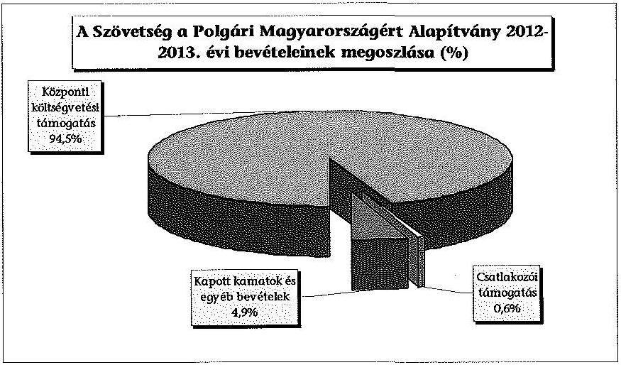
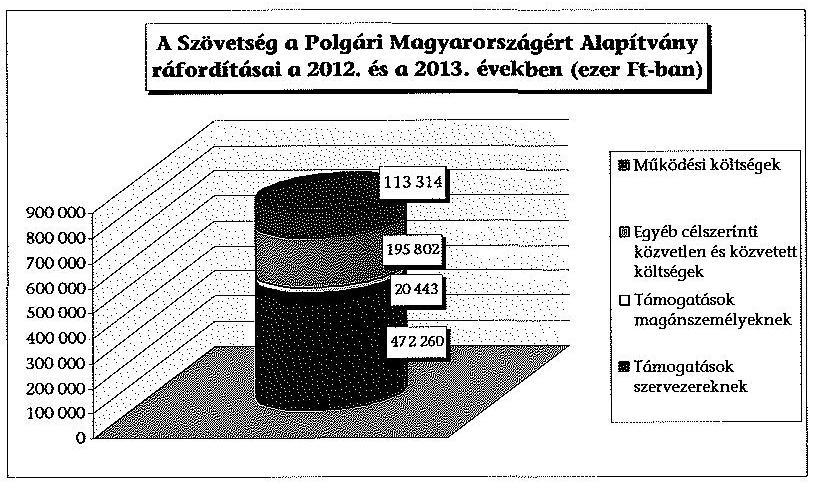
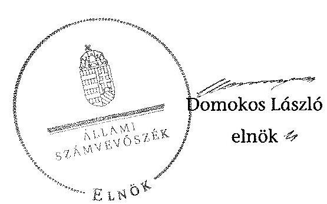
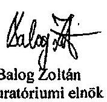
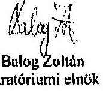

# ÁLLAMI   SZÁMVEVŐSZÉK 

## JELENTÉS

a Szövetség a Polgári Magyarországért Alapítvány 2012-2013. évi gazdálkodása törvényességének ellenőrzéséről

---

# Állami Számvevőszék 

Iktatószám: V-0715-211/2015.
Témaszám: 1749
Vizsgálat-azonosító szám: V070101

## Az ellenőrzést felügyelte:

Dr. Benedek Mária
felügyeleti vezető
Az ellenőrzést vezette és az ellenőrzés végrehajtásáért felelős:
Kulcsár Lászlóné
ellenőrzésvezető
A számvevőszéki jelentés összeállításában közreműködött:
Hegyes Mária
számvevő tanácsos
Az ellenőrzést végezték:

| Gergely Tilda | Hegyes Mária | Jenei Zsuzsanna |
| :-- | :-- | :-- |
| számvevő | számvevő tanácsos | számvevő |

A témához kapcsolódó eddig készített számvevőszéki jelentések:
címe
sorszáma
Jelentés a Szövetség a Polgári Magyarországért Alapítvány 2006- 0849
2007. évi gazdálkodása törvényességének ellenőrzéséről

Jelentés a Szövetség a Polgári Magyarországért Alapítvány 2008- 1102
2009. évi gazdálkodása törvényességének ellenőrzéséről

Jelentés a Szövetség a Polgári Magyarországért Alapítvány 2010- 13019
2011. évi gazdálkodása törvényességének ellenőrzéséről

---

# TARTALOMJEGYZÉK 

BEVEZETÉS ..... 7
I. ÖSSZEGZŐ MEGÁLLAPÍTÁSOK, KÖVETKEZTETÉSEK ..... 9
II. RÉSZLETES MEGÁLLAPÍTÁSOK ..... 11

1. Az alapítvány gazdálkodásának törvényessége ..... 11
1.1. A kuratórium és a munkaszervezet tevékenységének megfelelősége ..... 11
1.2. A költségvetési és egyéb kapott támogatások, adományok elfogadásának megfelelősége ..... 12
1.3. A költségvetési és egyéb kapott támogatások, adományok felhasználásának és közzétételének szabályszerűsége ..... 13
1.4. Az alapítvány által létrehozott szervezetre vonatkozó tulajdonosi döntések megfelelősége ..... 14
2. Az éves számviteli beszámolók és az alapítvány tevékenységéről szóló éves jelentések szabályszerűsége ..... 15
2.1. Az alapítvány tevékenységéről szóló éves jelentés megfelelősége ..... 15
2.2. A mérleg összeállításának szabályszerűsége ..... 15
2.3. Az eredménykimutatás szabályszerűsége ..... 16
3. Az alapítvány könyvvezetésének szabályszerűsége ..... 16
3.1. A könyvvezetés szabályozottsága ..... 16
3.2. A könyvvezetés gyakorlatának megfelelősége ..... 17
4. Az előző ÁSZ ellenőrzés javaslatai alapján készített intézkedési tervben foglaltak végrehajtása ..... 18

## MELLÉKLETEK

1. számú Beszámoló a Szövetség a Polgári Magyarországért Alapítvány 2012. évi tevékenységéről (6 oldal)
2. számú Beszámoló a Szövetség a Polgári Magyarországért Alapítvány 2013. évi tevékenységéről (6 oldal)

---

.

---

# RÖVIDÍTÉSEK JEGYZÉKE 

## TÖRVÉNYEK

ÁSZ tv.
Civil tv.

Kbt.
Párt tv.

Pártalapítványi tv.

Ptk.
Számv. tv.
RENDELETEK
224/2000. (XII. 19.) Korm. rendelet

350/2011. (XII. 30.) Korm. rendelet

SZÓRÖVIDÍTÉSEK
alapító
alapító okirat $_{1}$
alapító okirat ${ }_{2}$
alapító okirat ${ }_{3}$
alapítvány
ÁSZ
Felügyelő Bizottság
kuratórium
Leltározási szabályzat
az Állami Számvevőszékről szóló 2011. évi LXVI. törvény
az egyesülési jogról, a közhasznú jogállásról, valamint a civil szervezetek működéséről és támogatásáról szóló 2011. évi CLXXV. törvény (2014. III. 15-től a Civil tv. II-X. fejezeteiben foglaltakat a pártalapítványokra nem kell alkalmazni)
a közbeszerzésekről szóló 2011. évi CVIII. törvény a pártok működéséről és gazdálkodásáról szóló 1989. évi XXXIII. törvény
a pártok működését segítő tudományos, ismeretterjesztő, kutatási, oktatási tevékenységet végző alapítványokról szóló 2003. évi XLVII. törvény
a Polgári Törvénykönyvről szóló 1959. évi IV. törvény (hatályos 2014. március 15-ig)
a számvitelről szóló 2000. évi C. törvény
a számviteli törvény szerinti egyes egyéb szervezetek beszámoló készítési és könyvvezetési kötelezettségének sajátosságairól szóló 224/2000. (XII. 19.) Korm. rendelet
a civil szervezetek gazdálkodása, az adománygyűjtés, és a közhasznúság egyes kérdéseiről szóló 350/2011. (XII. 30.) Korm. rendelet

Fidesz - Magyar Polgári Szövetség
Szövetség a Polgári Magyarországért Alapítvány alapító okirata (hatályos 2011. május 9-2012. február 12. között)
Szövetség a Polgári Magyarországért Alapítvány alapító okirata (hatályos 2012. február 13-2013. október 15. között)
Szövetség a Polgári Magyarországért Alapítvány alapító okirata (hatályos 2013. október 16-ától)
Szövetség a Polgári Magyarországért Alapítvány
Állami Számvevőszék
Szövetség a Polgári Magyarországért Alapítvány Felügyelő Bizottsága
Szövetség a Polgári Magyarországért Alapítvány Kuratóriuma
Szövetség a Polgári Magyarországért Alapítvány Leltárkészítési és leltározási szabályzata (hatályos: 2011. január 31-étől)

---

| Pénzkezelési szabályzat ${ }_{1}$ | Szövetség a Polgári Magyarországért Alapítvány Pénzkezelési Szabályzata (hatályos: 2011. január 31-étől) (hatályos: 2013. január 1-jétől) |
| :--: | :--: |
| Pénzkezelési szabályzat ${ }_{2}$ | Szövetség a Polgári Magyarországért Alapítvány Pénzkezelési Szabályzata (hatályos: 2013. január 1-jétől) |
| PKA | Polgári Kultúráért Alapítvány |
| PSZA | Polgári Szemle Alapítvány |
| Selejtezési szabályzat | Szövetség a Polgári Magyarországért Alapítvány Selejtezési szabályzata (hatályos: 2004. február 4-étől) |
| Számlarend | Szövetség a Polgári Magyarországért Alapítvány Számlarendje (hatályos: 2012. január 1-jétől) |
| Számviteli politika ${ }_{1}$ | Szövetség a Polgári Magyarországért Alapítvány Számviteli politikája (hatályos: 2012. január 1-jétől) |
| Számviteli politika ${ }_{2}$ | Szövetség a Polgári Magyarországért Alapítvány Számviteli politikája (hatályos: 2013. január 1-jétől) |
| SZMSZ $_{1}$ | Szövetség a Polgári Magyarországért Alapítvány Szervezeti és Működési Szabályzata (hatályos: 2011. január 31-étől) |
| SZMSZ $_{2}$ | Szövetség a Polgári Magyarországért Alapítvány Szervezeti és Működési Szabályzata (hatályos: 2013. január 1-jétől) |

---

# ÉRTELMEZŐ SZÓTÁR 

adomány
adománygyűjtés
adományozott
civil szervezet
csatlakozói támogatás
gazdálkodó tevékenység
költségvetési támogatás
kuratórium
a civil szervezetnek - létesítő okiratban rögzített céljaira - ellenszolgáltatás nélkül juttatott eszköz, illetve nyújtott szolgáltatás (forrás: Civil tv. 2. § 1. pontja); az a pénzbeli vagy természetbeni juttatás, amelyet az adományozó az adományozott civil szervezet alapcéljának, illetve közhasznú céljának elérésére ellenszolgáltatás nélkül juttat (forrás: 350/2011. (XII. 30.) Korm. rendelet 1. § (5) bekezdés a) pontja)
a közhasznú szervezet részére törvényben meghatározott közhasznú tevékenysége támogatására, valamint az egyházi jogi személy részére törvényben meghatározott tevékenysége támogatására, továbbá a közérdekű kötelezettségvállalás céljára az adóévben visszafizetési kötelezettség nélkül adott támogatás, juttatás, térítés nélkül átadott eszköz könyv szerinti értéke, térítés nélkül nyújtott szolgáltatás bekerülési értéke, feltéve hogy az nem jelent az e törvényben meghatározottakon túl vagyoni előnyt az adományozónak, az adományozó tagjának vagy részvényesének, vezető tisztségviselőjének, felügyelő bizottsága vagy igazgatósága tagjának, könyvvizsgálójának, illetve ezen személyek vagy a természetes személy tag vagy részvényes közeli hozzátartozójának azzal, hogy nem minősül vagyoni előnynek az adományozó nevére, tevékenységére történő utalás (Tao. tv. 4. § 1/a. pont)
az a forrásteremtési tevékenység, amelyet az adományozott, illetve az általa meghatalmazottak, alapcéljának, illetve közhasznú céljának elérése érdekében folytatnak (forrás: 350/2011. (XII. 30.) Korm. rendelet 1. § (5) bekezdés b) pontja) az a civil szervezet, amely az adományt alapcéljának, illetve közhasznú céljának megfelelően gyűjti (forrás: 350/2011. (XII. 30.) Korm. rendelet 1. § (5) bekezdés d) pontja)
a civil társaság, illetve a Magyarországon nyilvántartásba vett egyesület - a párt kivételével -, valamint az alapítvány (forrás: Civil tv. 2. § 6. pontja); az alapítvány és az egyesület, ide nem értve a pártot és a civil társaságot (forrás: 350/2011. (XII. 30.) Korm. rendelet 1. § (5) bekezdés f) pontja)
A csatlakozó természetes személyektől és szervezetektől saját forrásukból az alapítvány részére, annak céljai megvalósításához nyújtott összeg, amelyet az alapítvány az egyéb bevételek között elkülönítetten köteles kimutatni.
azon tevékenységek összessége, amelyek a civil szervezet vagyoni, pénzügyi, jövedelmi helyzetére kiható gazdasági eseményt eredményeznek (Civil tv. 2. § 10. pont)
az államháztartás alrendszerei terhére nyújtott pénzbeli vagy nem pénzbeli juttatás, amelyet a támogató nem elsősorban ellenszolgáltatás ellenében, de konkrét program megvalósítása vagy meghatározott időszakban a támogatott szervezet működtetése érdekében nyújt (Civil tv. 2. § 15. pont)
az alapítvány kezelő szervezete (forrás: BH1991.449)

---

törzsvagyon
az induló tőke, megnövelve alapítvány esetében a csatlakozók által kifejezetten az induló tőke növelése érdekében rendelkezésre bocsátott vagyonnal (Civil tv. 2. § 28. pont)

---

# JELENTÉS 

## a Szövetség a Polgári Magyarországért Alapítvány 2012-2013. évi gazdálkodása törvényességének ellenőrzéséről

## BEVEZETÉS

A pártok működését segítő tudományos, ismeretterjesztő, kutatási, oktatási tevékenységet végző alapítványokról szóló 2003. évi XLVII. törvény (Pártalapítványi tv.) alapján a pártok a politikai kultúra fejlesztése érdekében tudományos, ismeretterjesztő, kutatási és oktatási tevékenységük elősegítésére a pártok működéséről és gazdálkodásáról szóló 1989. évi XXXIII. törvényben (Párt tv.) meghatározott mértékű költségvetési támogatásra jogosult alapítványt hozhatnak létre.
A Fidesz - Magyar Polgári Szövetség (Fidesz-MPSZ) - a törvényben biztosított lehetőséggel élve - 2003-ban létrehozta a Szövetség a Polgári Magyarországért Alapítványt (alapítvány). Az alapítvány célja a politikai kultúra fejlesztése, a nemzeti elkötelezettség és a kereszténydemokrata eszmekör jegyében. Ehhez kapcsolódóan célja az ország határain belül, illetve a határon túli magyarság lakta területeken tudományos, kutatási tevékenység szervezése, elsősorban a társadalomtudományok körében, majd részben e kutatások eredményeinek felhasználásával is oktatási, ismeretterjesztő tevékenység végzése, mely jelentős mértékben hozzájárulhat az állampolgárok közéleti ismereteinek szélesítéséhez, a politikai szféra, a pártok és az állampolgárok kapcsolatának erősítéséhez, valamint a határon túli magyarság nemzeti elkötelezettségének fejlesztéséhez, nemzettudatának erősítéséhez.
Az alapítvány a törvényi előírásoknak megfelelően a 2012. és 2013. évben egyaránt 611,7-611,7 M Ft költségvetési támogatásban részesült.
A Pártalapítványi tv. 4. § (2) bekezdése alapján az alapítvány gazdálkodása törvényességének ellenőrzésére az Állami Számvevőszék (ÁSZ) jogosult. A Pártalapítványi tv. 4. § (4) bekezdése alapján az ÁSZ kétévenként ellenőrzi azoknak az alapítványoknak a gazdálkodását, amelyek e törvény szerint költségvetési támogatásban részesültek. Az ÁSZ legutóbb 2012-ben az alapítvány 2010-2011. évi gazdálkodásának törvényességét ellenőrizte, jelentésében intézkedést igénylő javaslatot nem fogalmazott meg (13019 számú jelentés).
Jelen ellenőrzés célja volt annak megállapítása, hogy az alapítvány 2012-2013. években törvényesen gazdálkodott, amelynek keretében ellenőriztük:

- az alapítvány gazdálkodásának törvényességét;
- az éves számviteli beszámolók és éves jelentések jogszabályi előírásoknak való megfelelését;
- az alapítvány könyvvezetésében a Számv. tv., a pártalapítványok könyvvezetésére vonatkozó egyéb jogszabályi rendelkezések, valamint belső előírások betartását;

---

- az előző ÁSZ ellenőrzés javaslatai alapján készített intézkedési tervben foglalt feladatok végrehajtását.
Az ellenőrzött időszak: 2012. január 1. - 2013. december 31.
Az ellenőrzés hasznosulása: az ellenőrzés a gazdálkodás szabályszerűségének bemutatásával hozzájárul ahhoz, hogy a társadalom objektív képet alkothasson a pártalapítványok működéséről. A hiányosságok, szabálytalanságok feltárása, az ennek kapcsán megfogalmazott megállapítások elősegíthetik a pártalapítványok szabályszerű gazdálkodását. A gazdálkodás szabályszerűségének bemutatásával az ellenőrzés értékteremtő módon járul hozzá az ÁSZ stratégiai céljainak megvalósításához.
Az ellenőrzést a pénzügyi-szabályszerűségi ellenőrzés módszertani szabályai szerint, a Legfőbb Ellenőrző Intézmények Nemzetközi Szervezete (INTOSAI) által kiadott, nemzetközi standardok (ISSAI) figyelembevételével végeztük.
A kiadási főösszeg 2%-ánál magasabb összegű alapítvány által nyújtott támogatások esetében teljes körű ellenőrzést végeztünk. A személyi jellegű kifizetések, bérköltségek és járulékok közül évente egy véletlenszerűen választott hónap tételei kerültek ellenőrzésre. A ráfordításoknál továbbá az alacsony kockázatot jelentő kis összegű tételek esetén a késedelmi kamatok tételei közül a legnagyobbat, a posta-, és bankköltségek közül évente a két-két legnagyobb összegűt ellenőriztük. Véletlen mintavétellel ellenőriztük a kiadási főösszeg 2%-ánál alacsonyabb összegű támogatásokat és az előzőekben fel nem sorolt ráfordításokat. A levont következtetések a költségek és ráfordítások esetében a mintatételekhez kapcsolódó gazdasági események és bizonylatok vonatkozásában értelmezendők.
Az ellenőrzés jogszabályi alapját az Állami Számvevőszékről szóló 2011. évi LXVI. törvény 5. § (3) bekezdése, valamint a Pártalapítványi tv. 4. § (2) és (4) bekezdései szolgáltatták.
Az ÁSZ tv. 29. § (1) bekezdésében foglaltak alapján a jelentéstervezetet megküldtük az alapítvány kuratóriumának elnöke részére, aki az ÁSZ tv. 29. § (2) bekezdésében foglalt észrevételezési jogával nem élt, a jelentéstervezetre észrevételt nem tett.

---

# I. ÖSSZEGZŐ MEGÁLLAPÍTÁSOK, KÖVETKEZTETÉSEK 

Az alapítvány törvényesen gazdálkodott, kuratóriumának és munkaszervezetének tevékenysége megfelelt a jogszabályi és belső szabályozási előírásoknak.
A hatályos alapító okiratban foglaltak megfeleltek a Ptk. előírásainak, meghatározták az alapítvány célját, vagyona felhasználásának szabályait. Az alapító okiratot az alapító az ellenőrzött időszakban két alkalommal kisebb változások miatt módosította.
Az alapítvány $\mathbf{SZMSZ}_{1,2}$-je az alapító okirattal összhangban írta elő

 a kuratórium és a munkaszervezet feladat- és hatáskörét. Az SZMSZ ${ }_{1}$ módosítására egy alkalommal került sor, a szervezetben történt munkakör-elnevezések változása okán.
A kuratórium döntéseit a belső szabályzatok rendelkezéseinek megfelelő gyakorisággal összehívott, határozatképes üléseken, az alapítványi célok megvalósítása érdekében törvényesen, az alapító okirat ${ }_{1-3}$ előírásainak megfelelően hozta meg. Az alapítvány tevékenységét folyamatosan nyomon követte a költségvetés és az annak végrehajtásáról készített évenkénti alapítványi beszámolók elfogadásán keresztül. A képviseleti és a bankszámla feletti rendelkezési jog gyakorlása megfelelt az alapító okirat ${ }_{1-3}$, az SZMSZ ${ }_{1,2}$ és a pénzkezelési szabályzat ${ }_{1,2}$ előírásainak.
Az alapítvány összes bevétele az ellenőrzött időszakban 1295114 ezer Ft volt, melynek $94,5 \%$-a származott költségvetési támogatásból, amit a Párt tv. előírásainak megfelelő összegben és formában kapott. A csatlakozói támogatásokat a Pártalapítványi tv. szabályozásának megfelelően fogadta be és tette közzé honlapján, adományban nem részesült.
Az ellenőrzött időszak ráfordításainak összege 801819 ezer Ft volt, ennek $14,1 \%$-a működési ráfordítás, $85,9 \%$-a az alapító okirat ${ }_{1-3}$-ban meghatározott közvetlen és közvetett cél szerinti felhasználás volt. Az alapítvány a kapott költségvetési és egyéb támogatások felhasználása során betartotta a törvényi, a belső szabályozási és a csatlakozó által előírt szabályokat, azokat a Párt tv.-ben és az alapító okiratban meghatározott célokra használta fel.
A cél szerinti ráfordítások $71,6 \%$-át a továbbadott támogatások jelentették, melyek odaítéléséről minden esetben a kuratórium döntött. A támogatottakkal a kuratórium elnöke megkötötte a támogatási szerződéseket, melyekben rendelkeztek a támogatások felhasználásának, elszámolásának részletes szabályairól. A támogatottak elszámolásait a kuratórium fogadta el.
Az alapítvány által az ellenőrzött időszakot megelőzően létrehozott két szervezetre vonatkozó tulajdonosi, alapítói döntések megfeleltek a Ptk. és a belső szabályozási előírásoknak. Az alapítvány egyik szervezete működéséhez nyújtott támogatást, mellyel a szervezet szabályosan elszámolt.
Az alapítvány éves számviteli beszámolói és éves jelentései összességében megfeleltek a jogszabályi előírásoknak. Az egyszerűsített éves beszámolók mérlegeit a jogszabályi előírásoknak megfelelően állították össze. Az alapítvány éves beszámolóit a kuratórium általi jóváhagyást megelőzően a Felügyelő Bizottság véleményezte, és a könyvvizsgáló is jóváhagyta.

---

Az alapítvány könyvvezetésének szabályozottsága megfelelt a vonatkozó jogszabályi előírásoknak, rendelkezett a törvényi előírásoknak megfelelő számviteli politikával és az ahhoz kapcsolódó szabályzatokkal.
Az alapítvány könyvvezetésének gyakorlata megfelelt a jogszabályi és a belső szabályozási előírásoknak.
Az ÁSZ előző ellenőrzése során nem fogalmazott meg intézkedést igénylő javaslatot, ezért az alapítványnak intézkedési terv készítési kötelezettsége nem volt.

---

# II. RÉSZLETES MEGÁLLAPÍTÁSOK 

## 1. Az alapítvány gazdálkodásának törvényesség

### 1.1. A kuratórium és a munkaszervezet tevékenységének megfelelősége

Az alapítvány az ellenőrzött időszakban a Ptk. 74/B. § (1) bekezdésében foglalt rendelkezésnek megfelelő hatályos alapító okirat ${ }_{1-3}$-mal rendelkezett. Az alapító okirat ${ }_{1-2}$-ban foglalt célok és a célok érdekében meghatározott tevékenységek megfeleltek a Párt tv. 9/A. § (1) bekezdésében, illetve a Pártalapítványi tv. 1. §-ában előírtaknak. Az alapító okirat ${ }_{1-3}$ a képviseleti jog gyakorlását a Ptk. 74/C. § (1) és (4) előírásaival összhangban szabályozta.
Az alapító okirat ${ }_{1}$-et az ellenőrzött időszakban az alapító két alkalommal módosította, a kuratórium tagjainak kinevezésére jogosult személyében, a kapcsolódó kinevezési jog gyakorlásának időtartamában, továbbá az alapító címében és a Felügyelő Bizottság tagjainak személyében történt változást érintették a módosítások.
Az alapítvány az ellenőrzött években hatályos SZMSZ${ }_{1,2}$-vel rendelkezett, ami a kuratóriumra, a munkaszervezetre, ezek működésére és az alapítvány alkalmazottainak feladat- és hatáskörére vonatkozóan tartalmazott szabályozást. Az SZMSZ ${ }_{1}$ módosítására a szervezetben betöltött funkciók változásai miatt került sor.
Az alapítvány céljaira rendelt 600 ezer Ft vagyont és annak felhasználási módját az alapító okirat ${ }_{1-3}$ és az SZMSZ ${ }_{1,2}$ a Ptk. előírásaival összhangban rögzítette. A kuratórium az alapító okirat ${ }_{1-3}$-ban foglaltaknak megfelelően az alapítványi vagyon kezeléséről és felhasználásáról évente tájékoztatást adott az alapító részére a tevékenységről szóló beszámoló megküldésével.
Az alapítvány bankszámlája feletti rendelkezésre jogosultakat és a jogkör gyakorlásának módját az alapító okirat ${ }_{1-3}$, az SZMSZ ${ }_{1,2}$ és a pénzkezelési szabályzat ${ }_{1,2}$ egymással és a Ptk. 74/C. § (1) és (4) bekezdéseivel összhangban határozta meg. A jogosultak a képviseleti és a bankszámla feletti rendelkezés szabályait az ellenőrzött időszakban betartották.
A kuratórium az ellenőrzött időszakban az alapító okirat ${ }_{1-3}$ és az SZMSZ ${ }_{1-2}$ szabályainak megfelelő negyedévenkénti gyakoriságnál többször, (évente öt, illetve hét alkalommal) ülésezett, az ülések összehívása, a jegyzőkönyvek készítése során a vonatkozó előírásokat érvényesítették. A kuratórium működése megfelelt az alapító okirat ${ }_{1-3}$ és SZMSZ ${ }_{1,2}$ előírásainak.
A kuratórium gondoskodott a 350/2011. (XII. 30.) Korm. rendeletben előírt tartalom szerinti éves költségvetési tervek elkészítéséről, melyekben biztosították a kiadások és bevételek egyensúlyát. A kuratórium - az alapító okirat ${ }_{1-3}$ vonatkozó előírásának megfelelően - az alapítvány éves költségvetési tervét elfogadta. Az alapítvány folyamatosan nyomon követte a költségvetés alakulását, illetve arról tájékoztatta a kuratóriumot. A kuratórium döntött a nyújtott támogatásokról és a felhasználásukról készített beszámolók elfogadásáról, továbbá a képzési és a külügyi feladatok elvégzéséről félévenként beszámolót fogadott el. A gazdasági

---

igazgató az alapítvány pénzügyeiről, a feladatok teljesítéséhez a költségvetési sorok között szükséges átcsoportosításokról a kuratóriumot szóban tájékoztatta, amit az tudomásul vett.
A gazdálkodás operatív feladatait - könyvvezetés - külső számviteli szolgáltató szervezet látta el. A könyvelést végző Kft.-vel az alapítvány 2003 novemberében kötötte meg a 2013. év végéig folyamatosan hatályos, a Ptk. előírásainak megfelelő megbízási szerződést, amely tartalmazta - többek között - a megbízott feladatait, illetve az alapítvány szavatossági joga érvényesítésének módját. A szerződést az ellenőrzött időszakban nem módosították.
Az alapítvány kuratóriumának és munkaszervezetének tevékenysége megfelelt a jogszabályi és a belső szabályozási előírásoknak.

# 1.2. A költségvetési és egyéb kapott támogatások, adományok elfogadásának megfelelősége 

Az alapítvány az ellenőrzött időszakban éves beszámolóiban összesen 1295114 ezer Ft bevételt mutatott ki a következők szerint:

Az ellenőrzött 2012. és 2013. évben az összes bevétel 94,5\%-a (1 223400 ezer Ft) költségvetési támogatásból származott, melyre az alapítvány a Párt tv. 9/A. § (3) bekezdése alapján jogosult volt. Mértéke és folyósítása megfelelt a Párt tv. 9/A. § (2) és (5)-(6) bekezdésében foglalt rendelkezéseknek.
A bevételek 4,8\%-a ( 62460 ezer Ft) pénzeszköz-lekötés kamatából, 0,1\%-a ( 959 ezer Ft) költségtérítésekből, árfolyam-különbözetből és a dolgozók által megtérített telefonhasználatból származtak.
Az alapítvány csatlakozói támogatást 2012-ben a Konrad Adenauer alapítványtól kapott. A 8295 ezer Ft összegű támogatást az alapítvány a Pártalapítványi tv. 3. § (2)-(3) bekezdéseit betartva fogadta el, melyről az alapító okirat ${ }_{1-3}$ előírásaival összhangban a kuratórium az éves költségvetés jóváhagyása keretében döntött, az összeg a támogató bankszámlájáról érkezett az alapítvány bankszámlájára. A csatlakozói támogatási célok igazodtak a Párt. tv. 9/A. § (1) bekezdésében meghatározottakhoz, azokat képzésre, rendezvényre és a csatlakozó által meghatározott céloknak megfelelő működésre kapta az alapítvány. A csatlakozói támogatás felhasználásáról az alapítvány negyedévente dokumentáltan, határidőben, a szerződésben foglaltak szerint elszámolt.

---

Az alapítvány az ellenőrzött időszakban a Civil tv. 2. § 1. pontjában, illetve a 350/2011. (XII. 30.) Korm. rendelet 1. § (5) bekezdés a) pontjában meghatározott adományban nem részesült.
A költségvetési és egyéb támogatások elfogadása megfelelt a jogszabályi és a belső szabályozási előírásoknak.

# 1.3. A költségvetési és egyéb kapott támogatások, adományok felhasználásának és közzétételének szabályszerűsége 

Az alapítvány 2012. és 2013. évi összes ráfordítása 801819 ezer Ft volt, melyet a következő diagram szemléltet.

A 2012. és a 2013. évi összes ráfordítások 85,9\%-a ( 688505 ezer Ft) az alapítványi célok megvalósítása érdekében merült fel, közvetlen és közvetett cél szerinti ráfordításként. Az alapítvány működési kiadásai a ráfordítások 14,1\%-át (113 314 ezer Ft) tették ki.
Az alapítvány az ellenőrzött időszakban kapott költségvetési támogatást, valamint a 2012-ben a Konrad Adenauer alapítványtól kapott csatlakozói támogatást a Párt tv. 9/A. § (1) bekezdésében, az alapító okirat ${ }_{1-3}$-ban, illetve a támogatást nyújtó által meghatározott célokra használta fel.
Az alapítvány betartotta az alapító párttal való együttműködése során a Párt tv. 4. § (2) bekezdésében foglalt előírásokat.
Az ellenőrzött időszakban az alapítvány cél szerinti feladatellátására fordított összeg 71,6\%-át (492 703 ezer Ft) egyedi kérelmek alapján, az alapítvány pályázati koncepciójával összhangban álló támogatások nyújtására, 28,4\%-át (195 802 ezer Ft) saját szervezeti keretek között megvalósított képzésekre, rendezvényekre, kutatásokra, nemzetközi kapcsolatok szervezésére (konferenciák) és egyéb tevékenységekre használta fel. Az alapítvány a támogatások 4,1\%-át (20 443 ezer Ft) magánszemélyeknek, 95,9\%-át (472 260 ezer Ft) szervezeteknek nyújtotta.
A támogatások odaítéléséről az alapító okirat ${ }_{1-3}$ előírásának megfelelően minden esetben a kuratórium döntött. A kuratóriumi ülések jegyzőkönyveiben rögzítették a támogatottak nevét és a támogatás összegét. A támogatásokról hozott kuratóriumi határozatok, illetve a megkötött támogatási szerződések szabályosak voltak, azokat a kuratórium elnöke írta alá, és biztosították a támogatások cél szerinti felhasználását. A támogatási szerződések tartalmazták a kuratóriumi

---

döntés számát, a támogatás célját, jellegét, összegét, a folyósítás módját és határidejét, az elszámolás határidejét és feltételeit. Rögzítették, hogy az alapítvány jogosult a támogatás felhasználásának ellenőrzésére. Meghatározták a szerződésszegés eseteit és ezek jogkövetkezményeit, szankcióit.
Az alapítvány a támogatásokat a támogatási szerződésekben foglaltaknak megfelelően minden esetben a támogatott bankszámlájára utalta. A támogatottak elszámoltatása során az alapítvány a belső szabályzatokban és a támogatási szerződésekben foglaltaknak megfelelően járt el. Az alapítvány a nyilvántartásai szerinti elszámolási határidő betartására felszólította a támogatottakat. Az elszámolási határidő módosítására irányuló kérelmeket a kuratórium jóváhagyta. Az alapítvány munkatársai a támogatási összegek cél szerinti és szabályos felhasználásának ellenőrzését a támogatott szervezetek által beküldött dokumentumok alapján végezték el. A támogatottakat az esetleges hiányosságok pótlására felszólították. A támogatások elszámolásának elfogadásáról a kuratórium minden elszámolás esetében határozatot hozott.
Az ellenőrzött támogatások esetében a támogatottak egy kivétellel betartották a támogatási szerződésekben meghatározott, illetve kuratóriumi döntéssel meghosszabbított elszámolási határidőt és elszámolási szabályokat.

Egy ellenőrzött támogatás esetében a támogatott szervezet nem számolt el a támogatás teljes összegével. Az alapítvány az elvárható gondossággal járt el, kétszer felszólította a támogatottat a támogatás jogszerű felhasználását igazoló bizonylatok csatolására, illetve ennek hiányában az összeg visszafizetésére.
Az alapítvány a Pártalapítványi tv. 3. § (4) bekezdés b) pontjában foglaltak szerint a kapott támogatással kapcsolatos közzétételi kötelezettségét a honlapján, illetve az éves tevékenységéről készített jelentésének a Magyar Közlöny Hivatalos Értesítőjében történt közzététele útján teljesítette. E támogatások felhasználására vonatkozó beszámolási és közzétételi kötelezettségét az alapítvány szintén szabályszerűen teljesítette.
A kuratórium a 350/2011. (XII. 30.) Korm. rendelet 3. § (1)-(2) bekezdéseiben foglalt előírásoknak megfelelően határozatban döntött a saját szervezeti keretek között megvalósított cél szerinti tevékenységekről és azok költségeiről. A kuratórium a működési költségek keretösszegét mindkét évben meghatározta, melyeket a megállapított keretösszegen belül használtak fel.
Az alapítványnak nem voltak a Kbt. hatálya alá tartozó beszerzései.

# 1.4.
 Az alapítvány által létrehozott szervezetre vonatkozó tulajdonosi döntések megfelelősége 

Az alapítvány az ellenőrzött időszakban szervezetet nem alapított, korábban két alapítványt hozott létre, a PSZA-t és a PKA-t.
A PSZA és a PKA esetében az alapítói jogok gyakorlása az ellenőrzött időszakban a Ptk. előírásaiban és a belső szabályozásban foglaltaknak megfelelő volt. A PKA alapító okiratát az ellenőrzött időszakban az alapító nem módosította. A PSZA alapító okiratának módosítására egy alkalommal szabályszerűen került sor, az alapító és a PSZA székhelyének, illetve a PSZA Felügyelő Bizottságának összetételváltozása miatt.
Az alapítvány kuratóriuma az ellenőrzött időszakban a PSZA részére a Polgári Szemle folyóirat megjelentetésére három támogatási szerződésben összesen

---

8800 ezer Ft támogatást nyújtott. A PSZA a szerződésekben rögzített, illetve a kuratórium határozatával engedélyezett meghosszabbított határidőre, a támogatási szerződéseknek megfelelő módon elszámolt a támogatások cél szerinti felhasználásáról.
Az alapítvány kuratóriuma az ellenőrzött időszakban a PKA részére támogatást nem nyújtott. A kuratórium 2012-ben döntött a PKA 2013. január 1. napjával végelszámolással történő megszüntetéséről.

# 2. Az ÉVES SZÁMVITELI BESZÁMOLÓK ÉS AZ ALAPÍTVÁNY TEVÉKENYSÉGÉRŐL SZÓLÓ ÉVES JELENTÉSEK SZABÁLYSZERŰSÉGE 

### 2.1. Az alapítvány tevékenységéről szóló éves jelentés megfelelősége

Az alapítvány a 2012. és a 2013. évi tevékenységéről a Pártalapítványi tv. 3/A. § (1) bekezdésében előírt éves jelentéseket a Pártalapítványi tv. 3/A. § (3) bekezdésében előírt tartalommal elkészítette, a kuratórium azokat a Pártalapítványi tv. 3/A. § (2) bekezdésében foglalt rendelkezése szerint elfogadta. A jelentések közzétételi kötelezettségének az alapítvány a Pártalapítványi tv. 3/A. § (5) bekezdésében előírtak alapján a Magyar Közlöny Hivatalos Értesítőjében és a saját honlapján határidőben eleget tett. Az alapítvány éves jelentései összességében megfeleltek a jogszabályi előírásoknak.
Az alapítvány a 224/2000. (XII. 19.) Korm. rendelet 6. § (1)-(3), illetve a 7. § (2) bekezdésében és a számviteli politika ${ }_{1,2}$-ben meghatározott formában, tartalommal és határidőben tett eleget beszámolási kötelezettségének.
Az alapító okirat ${ }_{1-3}$-ban előírtaknak megfelelően a Felügyelő Bizottság az éves beszámolókat véleményezte, a kuratóriumnak elfogadásra ajánlotta, azokat a kuratórium elfogadta. Az egyszerűsített éves beszámolók részét képező mérleget és eredménykimutatást a Számv. tv. 20. § (6) bekezdésében előírtak szerint a képviseletre jogosult kuratóriumi elnök írta alá. Az alapítvány az ellenőrzött időszakban a számviteli politikájában előírtaknak megfelelően könyvvizsgálót alkalmazott. A választott könyvvizsgáló az alapítvány 2012. és 2013. évi egyszerűsített éves beszámolóit hitelesítő záradékkal látta el.
Az alapítvány egyszerűsített éves beszámolóiban a Számv. tv. 15. és 16. §-aiban megfogalmazott számviteli alapelvek érvényesültek, a beszámolók nem tartalmaztak a Számv. tv. 3. § (3) bekezdés 3. pontja szerinti, illetve a számviteli politikában meghatározott lényeges mértékű vagy jelentős összegű hibát. A beszámolókban szereplő adatok a Számv. tv. előírásainak megfelelően a számviteli nyilvántartások adataiból levezethetők voltak, a beszámolósorok adatai a kapcsolódó főkönyvi kivonatok, a főkönyvi számlák, az analitikus és egyeztető nyilvántartások adataival megegyeztek, bizonylatokkal alátámasztottak voltak és valós képet nyújtottak az alapítvány gazdálkodásáról.

### 2.2. A mérleg összeállításának szabályszerűsége

Az ellenőrzött években az éves mérlegekben kimutatott eszközök és források értékadatait a Számv. tv. 69. § (1)-(2) bekezdéseiben foglalt előírásokkal összhangban, a leltározási szabályzat szerinti leltárakkal és kapcsolódó jegyzőkönyvekkel

---

alátámasztották. Az éves mérlegekben az adott mérlegsoron a Számv. tv. szerinti tartalommal és értékkel szerepeltették az adatokat.
Az ellenőrzött időszakban az immateriális javak és tárgyi eszközök egyedi nyilvántartása és az állomány-változások (beruházások, aktiválások, selejtezés, terv szerinti értékcsökkenés, kis értékű eszközök) elszámolása és értékelése összhangban volt a Számv. tv., illetve a belső szabályzatok - a számviteli politika ${ }_{1,2}$, a számlarend, a leltározási szabályzat és a selejtezési szabályzat - előírásaival. Az eszközök beszerzése során 2012-ben és 2013-ban betartották az SZMSZ ${ }_{1,2}$-ben előírt kötelezettségvállalás szabályait.
A 2012. és a 2013. évi egyszerűsített éves beszámolóban a Számv. tv. előírásainak megfelelően a forgóeszközökön belül munkavállalókkal szembeni, illetve egyéb elismert követeléseket mutattak ki. A pénzeszközök év végi állományi értéke megegyezett az év végi pénztárjelentés záró állomány és a záró bankkivonatok egyenlegeinek összegével.
A kötelezettségek állománya a 2012. és a 2013. években hitelt nem tartalmazott, a rövid lejáratú kötelezettségek a Számv. tv. előírásának megfelelően a kuratórium által megítélt és a tárgyévben ki nem fizetett támogatásokat, a szállítói tartozások értékét, és az év végi adó- és járuléktartozásokat tartalmazták. A 2012. évben kimutatott hosszú lejáratú kötelezettség a tárgyévben odaítélt, de a következő években kifizetendő támogatásokhoz kapcsolódott.
A mérlegben az induló tőke az alapító okirat ${ }_{1-3}$ által meghatározott induló vagyon értékének megfelelően szerepelt.
Az aktív és passzív időbeli elhatárolások elszámolása megfelelt a Számv. tv. előírásainak.

# 2.3. Az eredménykimutatás szabályszerűsége 

Az ellenőrzött időszakban az eredménykimutatásban a bevételeket és a ráfordításokat a Számv. tv. előírásainak megfelelő könyvelési alapbizonylatokkal (szerződések, szállítói számlák, bér- és egyéb főkönyvi feladások) támasztották alá.
Az alapítvány betartotta a 224/2000. (XII. 19.) Korm. rendelet 15. § (1), illetve 17. § (4) bekezdésének eredménykimutatásra vonatkozó előírásai szerinti bontást. Az eredménykimutatás sorai az adott sorokon kimutatható bevételek, illetve ráfordítások körébe tartozó tételeket tartalmaztak.
A ráfordítások elszámolásánál érvényesítették a kötelezettségvállalás, a teljesítésigazolás és az utalványozás vonatkozásában a Számv. tv. 167. § (1) bekezdés c) pontjában, az SZMSZ ${ }_{1,2}$-ben és a pénzkezelési szabályzatban meghatározott előírásokat. A szerződéseket - az alapító okirat ${ }_{1-3}$ előírásával összhangban - a kuratórium elnöke kötötte meg.

## 3. Az alapítvány könyvvezetésének szabályszerűsége

### 3.1. A könyvvezetés szabályozottsága

Az alapítvány könyvvezetésének szabályozottsága megfelelt a vonatkozó jogszabályi előírásoknak. A könyvvezetés és az éves beszámolók elkészítésének belső szabályozási rendszere a Számv. tv. által kötelezően előírt szabályozáson alapult. A Számv. tv. 14. § (3)-(4) bekezdéseiben, illetve az (5) bekezdés a), b) és d)

---

pontjaiban foglalt előírásaival összhangban az alapítvány rendelkezett számviteli politikával ${ }_{1,2}$ (ennek keretében határozták meg az eszközök és források értékelési szabályait), leltárkészítési és leltározási, valamint pénzkezelési szabályzattal ${ }_{1,2}$, továbbá a Számv. tv. 161. §-ának megfelelően számlarenddel. Az elkészített szabályzatok módosítása és jóváhagyása a jogszabályi változásokat követően megtörtént. Az alapítvány a számviteli politikát kétszer, a pénzkezelési szabályzatot egyszer módosította, betartva a Számv tv. 14. § (11) bekezdésében foglalt előírásokat. A kuratórium a szabályzatokat és azok módosításait jóváhagyta.
A számviteli politika ${ }_{1,2}$ a Számv. tv 14. § (4) és (5) bekezdéseiben foglalt előírásokkal összhangban, a 224/2000. (XII. 19.) Korm. rendelet 6. § (1)-(6) bekezdéseit figyelembe véve, az alapítványi sajátosságoknak megfelelően tartalmazta az egyszerűsített éves beszámoló formáját és tartalmát, a zárlati feladatokat, az értékcsökkenés elszámolásának, továbbá az eszközök és források értékelésének szabályait, valamint az alapítványi célú tevékenység közvetlen és működési költségeinek elkülönített nyilvántartási rendjét, és a kötelezettségek analitikus nyilvántartásának szabályait.
Az eszközök és források leltárkészítési és leltározási szabályzata a Számv. tv. 69. § (1)-(2) bekezdésében foglaltak alapján az alapítványi gazdálkodás sajátosságainak megfelelően tartalmazta a mérlegtételeket alátámasztó leltárak elkészítését, formáit, a leltározással kapcsolatos feladatokat, a mennyiségi felvétellel és egyeztetéssel leltározandó eszközök és források körét, a leltározás gyakoriságát és idejét. A selejtezés szabályait és dokumentálásának módját külön selejtezési szabályzat tartalmazta.
A Számv. tv. 161. § (2) bekezdésében foglalt előírásoknak megfelelően a számlarend tartalmazta a főkönyvi számlák és az analitikus nyilvántartások kapcsolatát, a bizonylati rendet, az alkalmazásra kijelölt számlák számjelét és megnevezését, a számlák tartalmát, a növekedések és csökkenések jogcímeit, a számlákat érintő gazdasági eseményeket, azok más főkönyvi számlákkal való kapcsolatát.

# 3.2. A könyvvezetés gyakorlatának megfelelősége 

Az alapítvány könyvvezetésének gyakorlata megfelelt a Számv. tv. 14. § (1), a 15. § (1)-(9) és a 16. § (1)-(5) bekezdéseiben, valamint a 47-53., a 159-161/A., és a 164-165. §-okban foglalt rendelkezéseknek és a belső szabályozási előírásoknak. Az ellenőrzött időszakban az alapítvány könyvvezetését, bérszámfejtését, a beszámolók összeállítását szerződéses megbízással számviteli szolgáltató szervezet végezte, amely 2003 óta nem változott. A könyvvezetést az ellenőrzött időszakban azonos könyvelési programmal végezték, amelyből az ellenőrzéshez szükséges adatokat biztosították.
A gazdasági eseményeket idősorrendben rögzítették, a könyvelt tételekhez a Számv. tv. előírásainak megfelelő alapbizonylatok kapcsolódtak. A könyvviteli elszámolást közvetlenül alátámasztó számviteli bizonylatok alaki és tartalmi követelményei tekintetében, a mintatételek ellenőrzése során tapasztalt eseti és kisebb hiányosságok ellenére betartották a Számv. tv. 167. § (1) bekezdésében foglalt előírásokat, illetve a számlakijelölés gyakorlata összhangban volt a Számv. tv. és a számlarend előírásaival:

---

- négy bizonylaton feltüntetett könyvelési számlaszámot - szociális hozzájárulási adó - az alapítvány számlarendje, valamint annak mellékletét képező számlatükre a Számv. tv. 161. § (2) bekezdés a) pontjának rendelkezése ellenére nem tartalmazta, ugyanakkor a könyvelés megfelelő volt;
- két pénztári bizonylaton a Számv. tv. 167. § (1) bekezdés c) pontjának előírása ellenére nem szerepelt az átvevő aláírása.
Az egyszerűsített éves beszámolók elkészítését megelőzően a számviteli poli-tika ${ }_{1,2}$-ben megjelölt könyvviteli zárlati feladatokat a Számv. tv. előírásainak megfelelően elvégezték.
Az ellenőrzött időszakban a főkönyvi és analitikus nyilvántartások kapcsolata a belső szabályzatoknak megfelelő volt. Az alapítvány a Számv. tv. 161. § (2) bekezdés c) pontjában foglalt előírásnak megfelelően számlarendjében szabályozta a főkönyvi számlákhoz rendelt analitikák körét, tartalmát, vezetésük rendjét. Az ellenőrzött időszakban a számlarendben előírt nyilvántartásokat vezették, az év végi záráshoz a főkönyvi kivonatot az analitikus nyilvántartások és a főkönyvi számlák egyeztetése alapján állították össze.
A szigorú számadás alá vont bizonylatok körét a pénzkezelési szabályzat ${ }_{1,2}$-ben határozták meg, azok szigorú számadási kötelezettség alá vonása és nyilvántartásának vezetése megfelelt a Számv. tv. 168. § (1)-(3) bekezdéseiben és a belső szabályzatokban előírtaknak.
Az alapítvány a házipénztár kezelését, a pénztári nyilvántartások vezetését és ellenőrzését a pénzkezelési szabályzat ${ }_{1,2}$-ben foglaltak szerint végezte. A szabályzatban előírt nyilvántartásokat vezették, a havi pénztári zárásokat dokumentálták. A bankszámla feletti rendelkezési jog gyakorlása elektronikus banki utaláson keresztül volt biztosított.
Az alapítvány a Számv. tv. 169. § (1)-(3) bekezdéseiben foglalt előírásoknak megfelelően gondoskodott a mérlegek, leltárak, főkönyvi kivonatok, valamint a bizonylatok szabályszerű megőrzéséről.

# 4. Az előző ÁSZ ellenőrzés javasalatai alapján készített intézkedési tervben foglaltak végrehajtása 

Az ÁSZ a 13019. számú a Szövetség a Polgári Magyarországért Alapítvány 2010-2011. évi gazdálkodása törvényességének ellenőrzéséről szóló jelentésben intézkedést igénylő javaslatot nem fogalmazott meg, ezért az alapítványnak ezen jelentéshez kapcsolódó, az ÁSZ tv. 33. § (1) bekezdésében előírt intézkedési terv készítési kötelezettsége nem volt.

Budapest, 2015. május 4.

Melléklet: $\quad 2 \mathrm{db}$

---

# Beszámoló a Szövetség a Polgári Magyarországért Alapítvány 2012. évi tevékenységéről 

Az Alapítvány Kuratóriuma 2012-ben 5 alkalommal, a Felügyelő Bizottság 2 alkalommal ülésezett, minden ülés határozatképes volt. A Kuratórium 29 határozatot hozott, amely alpontjaival többszáz döntést jelent.

Alapítványunk képzésein „A Közéleti Akadémia” elnevezésű programjainkon összesen 236 fő vett részt. Mint felnőttképzést folytató intézmény, statisztikai adatszolgáltatást nyújtottunk a Nemzeti Munkaügyi Hivatal Szak- és Felnőttképzési Igazgatósága által működtetett
 OSAP statisztikai rendszer számára. Felnőttképzési tevékenységünket Budapest Főváros Kormányhivatalának Munkaügyi Központja ellenőrizte. A hatósági ellenőrzés során a képzések iratanyagát megfelelőnek és törvényesnek találta.

Rendezvényeink, konferenciáink közül kiemelem a hagyományos Kötőesi Polgári találkozónkat, melyet 11. alkalommal rendeztük meg, 2012. szeptember 8-án „Félidőben" címmel. Rendezvényünket nagy érdeklődés kísérte, több mint háromszázan voltunk a Dobozy kúrián.

A Hanns Seidel Alapítvánnyal közösen gazdasági konferenciát tartottunk Tatárszentgyörgyön, határmenti ifjúsági találkozót szerveztünk Bátonyterenyén, roma személyiségfejlesztő tréninget tartottunk budapesti helyszíneken, Emberi jogi Konferenciát szerveztünk a Független Rendészeti Panasztestülettel és a Hanns Seidel Alapítvánnyal.

## Díjak:

Március 15-e tiszteletére 7. alkalommal adtuk át a Fiatalok a Polgári Magyarországért Díjat, Összefogás Botfáért Egyesület a 2012. évi díjazott.
A Polgári Magyarországért Díjat, Alapítványunk életműdíját 2012-ben a Kuratórium a Békementnek ítélte oda.

## Támogatások:

Kiemelt egyesületek egyedi kérelmeire, alapítványok programjaihoz, konferenciáihoz, ismeretterjesztő rendezvényeihez nyújtottunk támogatást: pl. – a teljesség igénye nélkül: - Keresztény Értelmiségiek Szövetsége, Hermina Szalon, Civil Egyeztető Fórum, Civil Összefogás Közhasznú Alapítvány, Polgári Kultúráért Alapítvány, Szövetség a Nemzetért Alapítvány, Magyar Polgári Együttműködés Egyesület, Országos Nyugdíjas Polgári Egyesület ...

Támogattuk a Németh László Kulturális Alapítványt, a Végeken Egészséglélektani Alapítványt, a Polgárok Házában a Civil Közéleti Akadémiát, a Fidelitas Ifjúsági Közéleti Akadémiát, a Híd Magyarország és Erdély között az önkéntességért című rendezvényt, a XXIII. Nemzetközi Folklórfesztivált, a XI. Ifjúsági Etno Tábort, a Holdvilágárok Alapítvány Árpád Pajzs-díj rendezvényét, a Kommentár Alapítvány „Fesztivál a Határon" c. rendezvényét, a Csángó Magyar Tábor lebonyolítását, 1956 cigányhősei c. nyári tábor szervezését...

Több folyóirat, könyv kiadását és megjelentetését támogattuk, kiemelve: Polgári Szemle, Magyar Szemle, Hungarian Review, Baranyi Károly: Szerpentinen a magasban, Jókai Anna életműsorozat, Kurucz Gyula: Mire vársz még?, Szentesi Zöldi László: Székelyföldi vendégség...

Alapítványunk saját kiadásában megjelentette a „Szabadság és Hit: közéleti kalauz keresztényeknek" című tanulmánykötetét.

---

# Gyakornoki program: 

6 éve folyamatosan megvalósuló gyakornoki programunk keretében a politika iránt érdeklődő 12 fő egyetemi hallgató számára biztosítottunk tapasztalatszerzési lehetőséget ebben az évben.

Nemzetközi kapcsolataink közül kiemelem a Konrad Adenauer Alapítványtól érkező hagyományos támogatást. A Hanns Seidel Alapítvánnyal közösen több programot és konferenciát szerveztünk. A CES együttműködés ebben az évben is sikeresen folytatódott. A hagyományos ún. „országklubok" rendezvényein kiemelkedő, aktuális kérdésekről tájékoztatnunk a hazánkban élő és dolgozó, véleményformáló diplomatákat, külföldi üzletembereket.

Havonta egy alkalommal Alapítványunk a Fejlődő Vállalkozások Egyesületének szervezett találkozóknak ad otthont.

Ebben az évben kezdte meg vizsgálatát az Állami Számvevőszék Alapítványunk 2010-2011. évi gazdálkodásának törvényességét.

Itt szeretném tájékoztatni, hogy az Alapító Okiratban rögzített célokra közvetlenül 291 994 ezer Ft-ot (82,45%), közvetett költségekre 10 478 ezer Ft-ot (2,96%), működésre 51 671 ezer Ft-ot (14,59%) fordítottunk. Saját tőkénk 379 236 ezer Ft-ról 676 272 ezer Ft-ra gyarapodott.

Köszönetet szeretnénk mondani az Elnökség tagjainak a munkánkhoz nyújtott segítségükért és támogatásukért, a kuratóriumi tagoknak – Bíró Ildikónak és Kövér Lászlónak – munkájukért, a Konrad Adenauer Alapítványnak a támogatásukért, a Lakiteleki Népfőiskola Alapítványnak a képzések lebonyolításában végzett munkájukért, a képzéseink valamennyi előadójának, akik vállalták a hétvégi előadásokat, az alapítvány munkatársainak, akik ezeket a feladatokat látják el.

A 2012. évi munkánkról szóló bővebb pénzügyi beszámolót mellékelten csatolom a szöveges beszámolóhoz, amelyet az Alapító számára kötelezettségünk megküldeni.

Budapest, 2013. július 5.

Balog Zoltán
kuratóriumi elnök

Elfogadva: a 12/2013. (V.06.) számú kuratóriumi határozattal

Összeállította: Bathelt Krisztina
Melléklet: pénzügyi beszámoló

---

# Szövetség a Polgári Magyarországért Alapítvány

- Adószám: 18180987-1-41 Bírósági végzés száma: 61.038/2003 KSH statisztikai számjel: 18180987-9499-569-01

|  Szövetség a Polgári Magyarországért Alapítvány |  |  |  |  |   |
| --- | --- | --- | --- | --- | --- |
|  a) Egyéb szervezetek egyszerűsített éves beszámoló - Mérleg |  |  |  |  |   |
|  Sz. szám | Megnevezés/ E Ft | 2011 | Ellenőrzés | 2012 |   |
|   |  |  | hatása |  |   |
|  1 | A. | BEFEKTETETT ESZKÖZÖK | 2 767 | 0 | 2 210  |
|  2 | I. | IMMATERIÁLIS JAVAK | 516 | 0 | 322  |
|  3 | II. | TÁRGYI ESZKÖZÖK | 2251 | 0 | 1 888  |
|  4 | III. | BEFEKTETETT PÉNZÜGYI ESZKÖZÖK |  | 0 |   |
|  5 | B. | FORGÓESZKÖZÖK | 401 336 | 0 | 695 153  |
|  6 | I. | KÉSZLETEK | 0 | 0 | 0  |
|  7 | II. | KÖVETELÉSEK | 14 452 | 0 | 5 099  |
|  8 | III. | ÉRTÉKPAPÍROK | 0 | 0 | 0  |
|  9 | IV. | PÉNZESZKÖZÖK | 386 884 | 0 | 690 054  |
|  10 | C. | AKTÍV IDŐBELI ELHATÁROLÁSOK | 446 | 0 | 1 312  |
|  11 |  | ESZKÖZÖK ÖSSZESEN | 404 549 | 0 | 698 675  |

|  12 | D. | SAJÁT TÖKE | 379 236 | 0 | 676 272  |
| --- | --- | --- | --- | --- | --- |
|  13 | I. | INDULÓ TÖKE / JEGYZETT TÖKE | 600 | 0 | 600  |
|  14 | II. | TÖKEVÁLTOZÁS / EREDMÉNY | 112 497 | 0 | 378 636  |
|  15 | III. | LEKÖTÖTT TARTALÉK | 0 | 0 | 0  |
|  16 | IV. | ÉRTÉKELÉSI TARTALÉK | 0 | 0 | 0  |
|  17 | V. | TÁRGYÉVI EREDMÉNY ALAPTEVÉKENYSÉGBŐL (KÖZHASZNÚ TEVÉKENYSÉGBŐL) | 266 139 | 0 | 297 036  |
|  18 | VI. | TÁRGYÉVI EREDMÉNY VÁLLALKOZÁSI TEVÉKENYSÉGBŐL | 0 | 0 | 0  |
|  19 | E. | CÉLTARTALÉKOK | 0 | 0 | 0  |
|  20 | F. | KÖTELEZETTSÉGEK | 8 841 | 0 | 13 452  |
|  21 | I. | HÁTRASOROLT KÖTELEZETTSÉGEK | 0 | 0 | 0  |
|  22 | II. | HOSSZÚ LEJÁRATÚ KÖTELEZETTSÉGEK | 0 | 0 | 2 160  |
|  23 | III. | RÖVID LEJÁRATÚ KÖTELEZETTSÉGEK | 8 841 | 0 | 11 292  |
|  24 | G. | PASSZÍV IDŐBELI ELHATÁROLÁSOK | 16 472 | 0 | 8 951  |
|  25 |  | FORRÁSOK ÖSSZESEN | 404 549 | 0 | 698 675  |

---

# 1. SZÁMÚ MELLÉKLET

A V-0715-211/2015. SZÁMÚ JELENTÉSHEZ

Szövetség a Polgári Magyarországért Alapítvány a) Egyéb szervezetek egyszerűsített éves beszámoló - Eredménykimutatás

|  Ssz. | Megnevezés /E Ft | 2011 | Előző évek helyesbítésé | 2012  |
| --- | --- | --- | --- | --- |
|   |  | Alaptevékenység | Vállalkozási tevékenység | Összesen  |
|  1 | 1. ÉRTÉKESÍTÉS NETTŐ ÁRBEVÉTELE | 0 | 0 | 0  |
|  2 | 2. AKTIVÁLT SAJÁT TELJESÍTMÉNYEK ÉRTÉKE | 0 | 0 | 0  |
|  3 | 3. EGYÉB BEVÉTELEK | 624 240 | 0 | 624 240  |
|  4 | ebből: | 0 | 0 | 0  |
|  5 | - tagdíj, alapítótól kapott befizetés | 0 | 0 | 0  |
|  6 | - támogatások | 621 302 | 0 | 621 302  |
|  7 | 4. PÉNZÜGYI MŰVELETEK BEVÉTELEI | 12 506 | 0 | 12 506  |
|  8 | 5. RENDKÍVÜLI BEVÉTELEK | 0 | 0 | 0  |
|  9 | ebből: | 0 | 0 | 0  |
|  10 | - alapítótól kapott befizetés | 0 | 0 | 0  |
|  11 | - támogatások | 0 | 0 | 0  |
|  12 | A. ÖSSZES BEVÉTEL | 636 746 | 0 | 636 746  |
|  13 | ebből: közhasznú tevékenység bevételei | 0 | 0 | 0  |
|  14 | 6. ANYAGJELLEGŰ RÁFORDÍTÁSOK | 132 391 | 0 | 132 391  |
|  15 | 7. SZEMÉLYI JELLEGŰ RÁFORDÍTÁSOK | 58 010 | 0 | 58 010  |
|  16 | ebből: vezető tisztségviselők juttatása | 0 | 0 | 0  |
|  17 | 8. ÉRTÉKCSÖKKENÉSI LEÍRÁS | 2 631 | 0 | 2 631  |
|  18 | 9. EGYÉB RÁFORDÍTÁSOK | 177 395 | 0 | 177 395  |
|  19 | 10. PÉNZÜGYI MŰVELETEK RÁFORDÍTÁSAI | 180 | 0 | 180  |
|  20 | 11. RENDKÍVÜLI RÁFORDÍTÁSOK | 0 | 0 | 0  |
|  21 | B. ÖSSZES RÁFORDÍTÁS | 370 607 | 0 | 370 607  |
|  22 | ebből: közhasznú tevékenység ráfordításai | 0 | 0 | 0  |
|  23 | C. ADÓZÁS ELŐTTI EREDMÉNY | 266 139 | 0 | 266 139  |
|  24 | 12. ADÓFIZETÉSI KÖTELEZETTSÉG | 0 | 0 | 0  |
|  25 | D. ADÓZOTT EREDMÉNY | 266 139 | 0 | 266 139  |
|  26 | 13. JÓVÁHAGYOTT OSZTÁLYÉK | 0 | 0 | 0  |
|  27 | E. TÁRGYÉVI EREDMÉNY | 266 139 | 0 | 266 139  |

4

---

# A 2012. évi költségvetési támogatás felhasználására vonatkozó kimutatás 

(adatok E Ft-ban)

Állami költségvetésből kapott támogatás:
Célszerinti tevékenység közvetlen költségei:
Ebből:
Magánszemélyeknek nyújtott ösztöndíj, támogatás:
Gyakornoki program:
Külső szervezetek támogatása:
Nemzetközi kapcsolatok:
Képzés:
Rendezvények:
Díjak:
Kutatás, tanulmány:
Egyéb:
Célszerinti tevékenység közvetett költségei:
Működési költségek:
Költségek mindösszesen:
Állami költségvetés maradványösszege:
291994
14419
2536
212284
20808
12555
18424
3000
4826
3142
10478
51671
354143
257557
c) 2012. évi vagyon felhasználással kapcsolatos kimutatás

Forrás
adatok E Ft-ban

2012.6 vi

D Saját tőke
676272
I. Induló tőke: (jegyzett tőke)
600
II. Tőkeváltozás
378636
III. Lekötött tartalék
0
IV. Értékelési tartalék
0
V. Tárgyévi eredmény alaptevékenységből
297036
VI. Tárgyévi eredmény vállalkozási
tevékenységből
0
E Céltartalék
F Kötelezettségek
13452
I. Hosszú lejáratú kötelezettségek
2160
II. Rövid lejáratú kötelezettségek
11292
Passzív időbeli elhatárolások
8951
Források
összesen:

---

# 2012. évi célszerinti közvetlen juttatások kimutatása

(adatok E Ft-ban)

|  CÉLSZERINTI KÖZVETLEN JUTTATÁSOK |  |   |
| --- | --- | --- |
|  MEGNEVEZÉS |  | 2012. év  |
|  magánszemélyeknek nyújtott ösztöndíj, támogatás |  | 14 419  |
|  gyakornoki program |  | 2 536  |
|  külső szervezetek támogatásai |  | 212 284
  |
|  nemzetközi kapcsolatok |  | 20 808  |
|  képzés |  | 12 555  |
|  rendezvények (konferenciák, díjátadók) |  | 18 424  |
|  díjak |  | 3 000  |
|  kutatás, tanulmányok |  | 4 826  |
|  egyéb |  | 3 142  |
|  MINDÖSSZESEN: |  | 621 994  |

*a célszerű közvetett költségek: 10 478 eFt

e) 2012. évi kapott támogatások

TÁMOGATÁSOK a., központi költségvetési szervtől 611 700 b., elkülönített állami pénzalaptól 0 c., helyi önkormányzattól 0 d., települési önkormányzatok társulásától és mindezek szervezeteitől 0

f) Az Alapítvány vezető tisztségviselőinek nyújtott juttatások összege 2012. évben

(adatok E Ft-ban)

|   | 2012. év  |
| --- | --- |
|  VEZETŐ TISZTSÉGVISELŐK JUTTATÁSA | 2 226  |
|  ehből: |   |
|  tiszteleti díj | -  |
|  egyéb juttatás | -  |
|  tisztségéhez kapcsolódó kig | 1 506  |
|  tisztségéhez kapcsolódóan kig | 720  |

---

# Beszámoló a Szövetség a Polgári Magyarországért Alapítvány 2013. évi tevékenységéről 

Az Alapítvány Kuratóriuma 2013-ban 7 alkalommal, a Felügyelő Bizottság 2 alkalommal ülésezett, minden ülés határozatképes volt. 2013-ban az összes bevételünk 643 935 ezer Ft volt, a 2013. évi eredmény 196 259 ezer Ft.

Alapítványunk 2013-ban is fenntartotta az akkreditált felnőttképző intézmény és „Közéleti Akadémia" akkreditált képzési program minősítési státuszát. A Kuratórium a szeptemberi ülésén úgy határozott, hogy a megváltozott felnőttképzési szabályozás szerint a továbbiakban nem kíván hatósági engedélyezett felnőttképzési tevékenységet folytatni, ezért 2013. december 31-ei határidővel kivette az akkreditált képzési tevékenységét.

Rendezvényeink, konferenciáink közül kiemeljük a hagyományos Kötecei Polgári találkozónkat, melyet 12. alkalommal rendeztük meg. 2013. szeptember 15-én „Amit elvégeztünk és amit nem" címmel. Rendezvényünket nagy érdeklődés kísérte, több mint hatszázan voltunk a Dobozy kúrián.

Alapítványunk a Hanns Seidel Alapítvánnyal közösen a „Polgárok Európai Éve" tiszteletére konferenciát rendezett a közvetlen demokrácia európai és magyarországi helyzetéről. A Konrad Adenauer Alapítvánnyal közösen valósítottuk meg az ifjúság munkanélküliségéről és kilátásairól szóló konferenciát. Roma szakkollégiumi tréninget szerveztünk Berckfürdőn, gazdasági konferenciát tartottunk Szilóspusztán, emberjogi konferenciát rendeztünk a Petőfi Irodalmi Múzeumban, a Keresztény Roma Szakkollégium záró rendezvényét Balatonszárszón tartottuk. Antall József miniszterelnök úr halálának 20. évfordulójára rendezvénnyel emlékeztünk.

## Képzés:

2013. augusztusában és szeptemberében Kommunikációs Tréningeket szerveztünk Balatonszárszón.

## Díjak:

Március 15-e tiszteletére 8. alkalommal adtuk át a Flatalak a Polgári Magyarországért Díjat, a 2013. évi díjazott a Rákóczi Szövetség.

A Polgári Magyarországért Díjat 2013-ban megosztva a dunai árhullám elleni védekezés résztvevői közül a kárpátaljai Derceni Egyházi Önkéntes tűzoltók, Füsi Csaba zászlós és Miletics Andrea főtörzsörmester, valamint Szilvágyi Gergely kapták.

## Támogatások:

Kiemelt egyesületek egyedi kérelmeire, alapítványok programjaihoz, konferenciáihoz, ismeretterjesztő rendezvényeihez nyújtottunk támogatást: pl. – a teljesség igénye nélkül: - Keresztény Értelmiségiek Szövetsége, Hermina Szalon, Civil Egyeztető Fórum, Civil Összefogás Közhasznú Alapítvány, Polgári Kultúráért Alapítvány, Szövetség a Nemzetért Alapítvány, Magyar Polgári Együttműködés Egyesület, Országos Nyugdíjas Polgári Egyesület, Gubics András Gazdakör, E-Amarodrom Egyesület...

Támogattunk „A Siker kulcsa: Munka - Család" c. konferenciát, a Polgárok Házában a Civil Közéleti Akadémiát, a Fidelitas Ifjúsági Közéleti Akadémiát, a IX. Kárpát-medencei Asszonytalálkozót, az Ajkai Konzervatív Klub rendezvénysorozatát, a Csángó Magyar Tábor lebonyolítását, a Felvidéki nyári egyetem szervezését, a XXIV. Bukovinai Nemzetközi Folklórfesztivált, a Kommentár Alapítvány „Fesztivál a Határon" c. rendezvényét, XI. Vajdasági Szabadegyetem megrendezését...

Több folyóirat, könyv kiadását és megjelentetését támogattuk, kiemelve: Polgári Szemle, Magyar Szemle, Hungarian Review, „Bodrogközi útikönyv", Erdélyi Géza: Egyház és társadalom, Jókú Anna életműsorozat, Jávor Béla: Karácsonyi levelek, Móser Zoltán: Tájiratok...

---

# Gyakornoki programok: 

7 éve folyamatosan megvalósuló gyakornoki programunk keretében a politika iránt érdeklődő 13 fő egyetemi hallgató számára biztosítottunk tapasztalatszerzési lehetőséget ebben az évben.

Alapítványunk 2013-ban Kongresszusi Gyakornoki Programot indított 2 fő részvételével 30 év alatti magyar fiatalok részére.

## Nemzetközi kapcsolataink:

Tovább ápoltuk kapcsolatainkat a Hanns Seidel Alapítvánnyal, a Konrad Adenauer Alapítvánnyal és a Robert Schumann Intézettel. Több közös programot és konferenciát valósítottunk meg. A CES együttműködés ebben az évben is sikeresen folytatódott. A hagyományos ún. „országklubok" rendezvényein kiemelkedő, aktuális kérdésekről tájékoztattuk a hazánkban élő és dolgozó, véleményformáló diplomatákat, külföldi üzletembereket. Közjogi viták nemzetközi szempontból történő pártatlan és szakmai összehasonlító értékelése érdekében együttműködést alakítottunk ki a brüsszeli Összehasonlító Közjogi Intézettel.

## Az alapítvány munkaszervezete:

2013-ban Alapítványunk Kuratóriuma Dr. Gulyás Gergelyt nevezte ki főigazgatónak és Dr. Schaller Ernőt külügyi igazgatónak. Alapítványunk Felügyelő Bizottságának elnöke Dr. Bárány Tibor összeférhetetlenség miatt a nyár folyamán lemondott, helyette Tóth Józsefné folytatja a megkezdett és jól végzett munkát. Köszönjük mindkettőjüknek. Alapítványunk Felügyelő Bizottságának új tagja Nagy János lett.

Ebben az évben kapta kézhez Alapítványunk az Állami Számvevőszék 2010-2011. évi gazdálkodását vizsgáló 2012-ben lefolytatott számvevőszéki jelentését, amely Alapítványunk honlapján elérhető. A jelentés kedvező képet ad alapítványunk munkájáról, a hatályos törvényeknek, a jogszabályi és belső előírásoknak megfelelő működéséről.

Itt szeretném tájékoztatni, hogy az Alapító Okiratunkban rögzített célokra közvetlenül 371 926 ezer Ft-ot (83,08 %), közvetett költségekre 14 107 ezer Ft-ot (3,15 %), működésre 61 643 ezer Ft-ot (13,77 %) fordítottunk. Saját tőkénk 676 272 ezer Ft-ról 872 531 ezer Ft-ra gyarapodott.

Köszönetet szeretnénk mondani az Elnökség tagjainak a munkánkhoz nyújtott segítségükért és a támogatásukért, a kuratórium tagjainak – Bíró Ildikónak és Kövér Lászlónak – munkájukért, a Felügyelő Bizottság tagjainak – Bárány Tibornak, Tóth Józsefnének, Hegedűs Zoltánnak és Nagy Jánosnak – munkájukért.

A 2013. évi munkánkról szóló bővebb pénzügyi beszámolót mellékelten csatolom a szöveges beszámolóhoz, amelyet az Alapító számára kötelezettségünk megküldeni.

Budapest, 2014. július 10.

Elfogadva: a 14/2014. (V.26.) számú kuratóriumi határozattal

---

# Szövetség a Polgári Magyarországért Alapítvány

Adószám: 18180987-1-41 Bírósági végzés száma: 61.038/2003 KSH statisztikai számjel: 18180987-9499-569-01

|  Szövetség a Polgári Magyarországért Alapítvány |  |  |  |  |   |
| --- | --- | --- | --- | --- | --- |
|  n) Egyéb szervezetek egyszerűsített éves beszámoló - Mérleg |  |  |  |  |   |
|  Ssz. szám | Megnevezés/ E Ft |  | 2012 | Ellenőrzés | 2013  |
|   |  |  |  | hatása |   |
|  1 | A. | BEFEKTETETT ESZKÖZÖK | 2 210 | 0 | 2 125  |
|  2 | I. | IMMATERIÁLIS JAVAK | 322 | 0 | 129  |
|  3 | II. | TÁRGYI ESZKÖZÖK | 1 888 | 0 | 1 996  |
|  4 | III. | BEFEKTETETT PÉNZÜGYI ESZKÖZÖK |  | 0 |   |
|  5 | B. | FORGÓESZKÖZÖK | 695 153 | 0 | 902 030  |
|  6 | I. | KÉSZLETEK | 0 | 0 | 0  |
|  7 | II. | KÖVETELÉSEK | 5 099 | 0 | 5 213  |
|  8 | III. | ÉRTÉKPAPÍROK | 0 | 0 | 0  |
|  9 | IV. | PÉNZESZKÖZÖK | 690 054 | 0 | 896 817  |
|  10 | C. | AKTÍV IDŐBELI ELHATÁROLÁSOK | 1 312 | 0 | 1 590  |
|  11 |  | ESZKÖZÖK ÖSSZESEN | 698 675 | 0 | 905 745  |

|  12 | D. | SAJÁT TŐKE | 676 272 | 0 | 872 531  |
| --- | --- | --- | --- | --- | --- |
|  13 | I. | INDULÓ TŐKE / JEGYZETT TŐKE | 600 | 0 | 600  |
|  14 | II. | TŐKEVÁLTOZÁS / EREDMÉNY | 378 636 | 0 | 675 672  |
|  15 | III. | LEKÖTÖTT TARTALÉK | 0 | 0 | 0  |
|  16 | IV. | ÉRTÉKELÉSI TARTALÉK | 0 | 0 | 0  |
|  17 | V. | TÁRGYÉVI EREDMÉNY ALAPTEVÉKENYSÉGBŐL (KÖZHASZNÚ TEVÉKENYSÉGBŐL) | 297 036 | 0 | 196 259  |
|  18 | VI. | TÁRGYÉVI EREDMÉNY VÁLLALKOZÁSI TEVÉKENYSÉGBŐL | 0 | 0 | 0  |
|  19 | E. | CÉLTARTALÉKOK | 0 | 0 | 0  |
|  20 | F. | KÖTELEZETTSÉGEK | 13 452 | 0 | 17 355  |
|  21 | I. | HÁTRASOROLT KÖTELEZETTSÉGEK | 0 | 0 | 0  |
|  22 | II. | HOSSZÚ LEJÁRATÚ KÖTELEZETTSÉGEK | 2 160 | 0 | 0  |
|  23 | III. | RÖVID LEJÁRATÚ KÖTELEZETTSÉGEK | 11 292 | 0 | 17 355  |
|  24 | G. | PASSZÍV IDŐBELI ELHATÁROLÁSOK | 8 951 | 0 | 15 859  |
|  25 |  | FORRÁSOK ÖSSZESEN | 698 675 | 0 | 905 745  |

---

# 2. SZÁMÚ MELLÉKLET

A V-0715-211/2015. SZÁMÚ JELENTÉSHEZ

Szövetség a Polgári Magyarországért Alapítvány a) Egyéb szervezetek egyszerűsített éves beszámoló - Eredménykimutatás

|  Szr. | Megnevezés /E Ft | 2012 | Előző évek helyesbítését | 2013  |
| --- | --- | --- | --- | --- |
|   |  | Alapítványvég | Vállalkozási tevékenység | Összesen  |
|  1 | 1. ÉRTÉKESÍTÉS NETTŐ ÁRBEVÉTELE | 0 | 0 | 0  |
|  2 | 2. AKTÍVALT SAJÁT TELJESÍTMÉNYEK ÉRTÉKE | 0 | 0 | 0  |
|  3 | 3. EGYÉB BEVÉTELEK | 620 260 | 620 260 | 0  |
|  4 | ebből: | 0 | 0 | 0  |
|  5 | - tagdíj, alapítótól kapott befizetés | 0 | 0 | 0  |
|  6 | - támogatások | 619 995 | 619 995 | 0  |
|  7 | 4. PÉNZÜGYI MŰVELETEK BEVÉTELEI | 30 919 | 30 919 | 0  |
|  8 | 5. RENDEZVÉNYKÍVÜLI BEVÉTELEK | 0 | 0 | 0  |
|  9 | ebből: | 0 | 0 | 0  |
|  10 | - alapítótól kapott befizetés | 0 | 0 | 0  |
|  11 | - támogatások | 0 | 0 | 0  |
|  12 | A. ÖSSZES BEVÉTEL | 651 179 | 651 179 | 0  |
  13 | ebből: közhasznú tevékenység bevételei | 0 | 0 | 0  |
|  14 | 6. ANYAGJELLEGŰ RÁFORDÍTÁSOK | 87 614 | 87 614 | 0  |
|  15 | 7. SZEMÉLYI JELLEGŰ RÁFORDÍTÁSOK | 49 416 | 49 416 | 0  |
|  16 | ebből: vezető tisztségviselők juttatásai | 0 | 0 | 0  |
|  17 | 8. ÉRTÉKCSÖKKENÉSI LEÍRÁS | 964 | 964 | 0  |
|  18 | 9. EGYÉB RÁFORDÍTÁSOK | 216 148 | 216 148 | 0  |
|  19 | 10. PÉNZÜGYI MŰVELETEK RÁFORDÍTÁSAI | 1 | 1 | 0  |
|  20 | 11. RENKÍVÜLI RÁFORDÍTÁSOK | 0 | 0 | 0  |
|  21 | B. ÖSSZES RÁFORDÍTÁS | 354 143 | 354 143 | 0  |
|  22 | ebből: közhasznú tevékenység ráfordításai | 0 | 0 | 0  |
|  23 | C. ADÓZÁS ELŐTTI EREDMÉNY | 297 036 | 297 036 | 0  |
|  24 | 12. ADÓFIZETÉSI KÖTELEZETTSÉG | 0 | 0 | 0  |
|  25 | D. ADÓZOTT EREDMÉNY | 297 036 | 297 036 | 0  |
|  26 | 13. JÓVÁHAGYOTT OSZTÁLYÉK | 0 | 0 | 0  |
|  27 | E. TÁRGYÉVI EREDMÉNY | 297 036 | 297 036 | 0  |

4

---

b) A 2013. évi költségvetési támogatás felhasználására vonatkozó kimutatás
(adatok E Ft-ban)

Állami költségvetésből kapott támogatás: ..... 611700
Célszerinti tevékenység közvetlen költségei: ..... 371926
Ebből:
Gyakornoki program: ..... 3488
Külső szervezetek támogatása: ..... 259976
Nemzetközi kapcsolatok: ..... 24693
Képzés: ..... 13192
Rendezvények: ..... 33534
Díjak: ..... 4000
Kutatás, tanulmány: ..... 30418
Egyéb: ..... 2625
Célszerinti tevékenység közvetett költségei: ..... 14107
Működési költségek: ..... 61643
Költségek mindösszesen: ..... 447676
Állami költségvetés maradványösszege: ..... 164024
c) 2013. évi vagyon felhasználással kapcsolatos kimutatás
Forrás
adatok E Ft-ban
2013. évi
D Saját tőke ..... 872531
I. Induló tőke: (jegyzett tőke) ..... 600
II. Tőkeváltozás ..... 675672
III. Lekötött tartalék ..... 0
IV. Értékelési tartalék ..... 0
V. Tárgyévi eredmény alaptevékenységből ..... 196259
VI. Tárgyévi eredmény vállalkozási tevékenységből ..... 0
E Céltartalék
F Kötelezettségek ..... 17355
I. Hosszú lejáratú kötelezettségek ..... 0
II. Rövid lejáratú kötelezettségek ..... 17355
Passzív időbeli elhatárolások ..... 15859
Források
összesen: ..... 905745

---

# d) 2013. évi célszerinti közvetlen juttatások kimutatása

|  CÉLSZERINTI KÖZVETLEN JUTTATÁSOK |  |   |
| --- | --- | --- |
|  MEGNEVEZÉS |  | 2013.  |
|  magánszemélyeknek nyújtott ösztöndíj, támogatás |  | 0  |
|  gyakornoki program |  | 3488  |
|  külső szervezetek támogatásai |  | 259976  |
|  nemzetközi kapcsolatok |  | 24693  |
|  képzés |  | 13192  |
|  rendezvények (konferenciák, díjátadók) |  | 33534  |
|  díjak |  | 4000  |
|  kutatás, tanulmányok |  | 30418  |
|  egyéb |  | 2625  |
|  MINDÖSSZESEN: |  | 371926  |

*a célszerinti közvetett költségek: 14107 e Ft e) 2013. évi kapott támogatások (adatok E Ft-ban) TÁMOGATÁSOK a., központi költségvetési szervtől 611700 b., elkülönített állami pénzalaptól 0 c., helyi önkormányzattól 0 d., települési önkormányzatok társulásaitól és mindezek szervezeteitől 0 f) Az Alapítvány vezető tisztségviselőinek nyújtott juttatások összege 2013. évben (adatok E Ft-ban)

|   | 2013. év  |
| --- | --- |
|  VEZETŐ TISZTSÉGVISELŐK
JUTTATÁSA | 2226  |
|  |   |
|  ebből: |   |
|  tiszteletdíj | -  |
|  egyéb juttatás | -  |
|  tisztségéhez kapcs.működési kig | 2536  |
|  tisztségéhez kapcs.célszerinti kig | 720  |

