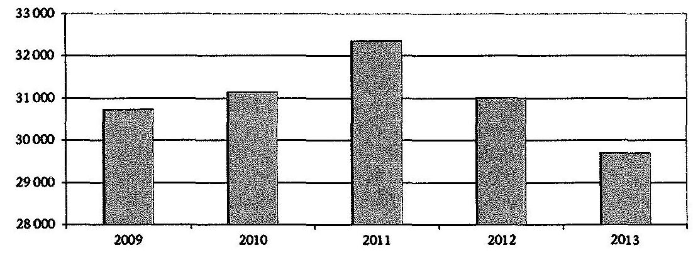
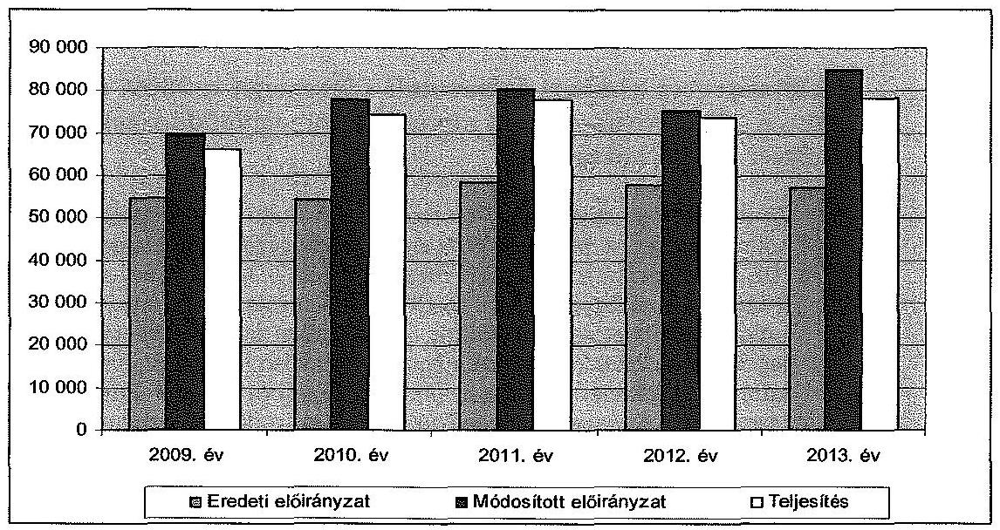
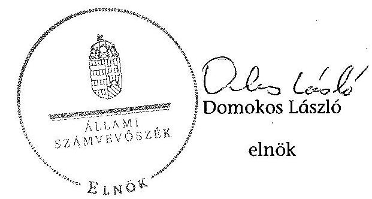
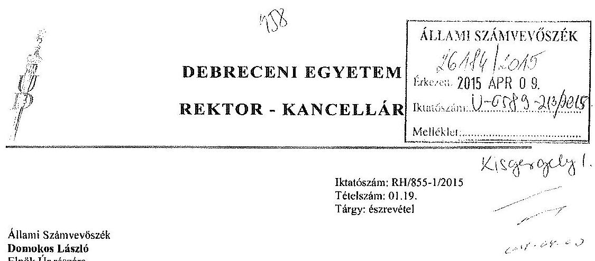
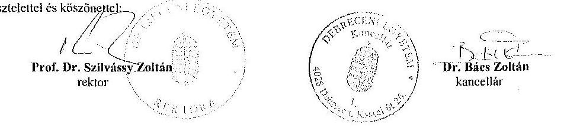
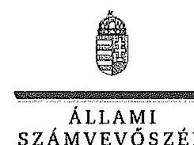
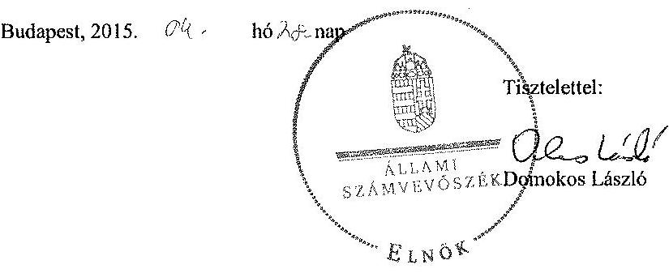

# ÁLLAMI   SZÁMVEVŐSZÉK 

## JELENTÉS

a Debreceni Egyetem ellenőrzéséről - Az állami felsőoktatási intézmények gazdálkodásának, múködésének ellenőrzése

---

# Állami Számvevőszék 

Iktatószám: V-0589-184/2014
Témaszám: 1623
Vizsgálat-azonosító szám: V068915
Az ellenőrzést felügyelte:
Kisgergely István
felügyeleti vezető
Az ellenőrzés végrehajtásáért felelős:
Kisné Agócs Éva
ellenőrzésvezető
A számvevői munkaanyagok feldolgozását és a Jelentés összeállítását végezte:

Kisné Agócs Éva
ellenőrzésvezető
Hámoriné Maróti Györgyi
számvevő vezető főtanácsos
Dr. Zelei Andrásné
számvevő
Lantos Józsefné
számvevő tanácsos

Az ellenőrzést végezték:

| Hadházy Sándor   számvevő tanácsos | Hámoriné Maróti   Györgyi   számvevő vezető főta-   nácsos | Lantos Józsefné   számvevő tanácsos |
| :-- | :-- | :-- |
| Nagy Erika   számvevő tanácsos | Ungár Ervin   számvevő | Unger Ferenc   számvevő |
| Dr. Zelei Andrásné   számvevő | Völgyesi Mátyás   számvevő tanácsos |  |

A témához kapcsolódó eddig készített számvevőszéki jelentések:
címe
sorszáma
Jelentés az oktatási és kulturális ágazat irányítási rendszerének, 1106 működésének ellenőrzéséről
Jelentés a felsőoktatás oktatási infrastruktúra-fejlesztési program- 1171 jának ellenőrzéséről

---

Jelentés az állami felsőoktatási intézmények érdekeltségébe tartozó ..... 1290 gazdasági társaságok támogatásának és nyereségük hasznosulásának ellenőrzéséről
Jelentés a Szolnoki Főiskola ellenőrzéséről - Az állami felsőoktatási ..... 14196 intézmények gazdálkodásának, múködésének ellenőrzése
Jelentés a Pannon Egyetem ellenőrzéséről - Az állami felsőoktatási ..... 14197 intézmények gazdálkodásának, múködésének ellenőrzése
Jelentés a Károly Róbert Főiskola ellenőrzéséről - Az állami felsőok- ..... 14198
tatási intézmények gazdálkodásának, múködésének ellenőrzése
Jelentés a Magyar Képzőmúvészeti Egyetem ellenőrzéséről - Az ál- ..... 14199 lami felsőoktatási intézmények gazdálkodásának, múködésének ellenőrzése
Jelentés a Miskolci Egyetem ellenőrzéséről - Az állami felsőoktatási ..... 14200 intézmények gazdálkodásának, múködésének ellenőrzése
Jelentés a Széchenyi István Egyetem ellenőrzéséről - Az állami fel- ..... 14201
sőoktatási intézmények gazdálkodásának, múködésének ellenőrzé- se
Jelentés az Eszterházy Károly Főiskola ellenőrzéséről - Az állami ..... 14204 felsőoktatási intézmények gazdálkodásának, múködésének ellenőrzése
Jelentés a Magyar Táncmúvészeti Főiskola ellenőrzéséről - Az ál- ..... 14205 lami felsőoktatási intézmények gazdálkodásának, múködésének ellenőrzése
Jelentés a Budapesti Múszaki és Gazdaságtudományi Egyetem el- ..... 14218 lenőrzéséről - Az állami felsőoktatási intézmények gazdálkodásának, múködésének ellenőrzése
Jelentés a Budapesti Corvinus Egyetem ellenőrzéséről - Az állami ..... 15032 felsőoktatási intézmények gazdálkodásának, múködésének ellenőrzése
Jelentés a Nyíregyházi Főiskola ellenőrzéséről - Az állami felsőok- ..... 15028
tatási intézmények gazdálkodásának, múködésének ellenőrzése
Jelentés az Eötvös József Főiskola ellenőrzéséről - Az állami felsőok- ..... 15025
tatási intézmények gazdálkodásának, múködésének ellenőrzése
Jelentés a Kecskeméti Főiskola ellenőrzéséről - Az állami felsőokta- ..... 15026
tási intézmények gazdálkodásának, múködésének ellenőrzése
Jelentés a Kaposvári Egyetem ellenőrzéséről - Az állami felsőokta- ..... 15030 tási intézmények gazdálkodásának, múködésének ellenőrzése
Jelentés a Liszt Ferenc Zeneművészeti Egyetem ellenőrzéséről - Az ..... 15033 állami felsőoktatási intézmények gazdálkodásának, múködésének ellenőrzése
Jelentés az Óbudai Egyetem ellenőrzéséről - Az állami felsőoktatási ..... 15034 intézmények gazdálkodásának, múködésének ellenőrzése

---

Jelentés a Szegedi Tudományegyetem ellenőrzéséről - Az állami felsőoktatási intézmények gazdálkodásának, múködésének ellen- 0̋rzése
Jelentés a Nyugat-Magyarországi Egyetem ellenőrzéséről - Az állami felsőoktatási intézmények gazdálkodásának, múködésének ellenőrzése
Jelentés a Szent István Egyetem ellenőrzéséről - Az állami felsőok- 15039 tatási intézmények gazdálkodásának, múködésének ellenőrzése
Jelentés a Dunaújvárosi Főiskola ellenőrzéséről - Az állami felsőok- 15040 tatási intézmények gazdálkodásának, múködésének ellenőrzése
Jelentés a Nemzeti Közszolgálati Egyetem ellenőrzéséről - Az állami felsőoktatási intézmények gazdálkodásának, múködésének ellenőrzése
Jelentés a Nemzeti Közszolgálati Egyetem ellenőrzéséről - Az állami felsőoktatási intézmények gazdálkodásának, múködésének ellenőrzése
Jelentés a Színház és Filmművészeti Egyetem ellenőrzéséről - Az 15043 állami felsőoktatási intézmények gazdálkodásának, múködésének ellenőrzése
Jelentés a Moholy-Nagy Művészeti Egyetem ellenőrzéséről - Az állami felsőoktatási intézmények gazdálkodásának, múködésének ellenőrzése
Jelentés a Semmelweis Egyetem ellenőrzéséről - Az állami felsőok- 15053 tatási intézmények gazdálkodásának, múködésének ellenőrzése

---

# TARTALOMJEGYZÉK 

BEVEZETÉS ..... 15
I. ÖSSZEGZŐ MEGÁLLAPÍTÁSOK, KÖVETKEZTETÉSEK, JAVASLATOK ..... 21
II. RÉSZLETES MEGÁLLAPÍTÁSOK ..... 33

1. A fenntartói és ágazati irányítási jogok gyakorlása ..... 33
2. Az intézmény belső kontrollrendszerének kialakítása és múködtetése ..... 35
3. Az intézmény döntéshozó szerveinek joggyakorlása, az oktatási és egyéb tevékenységei elkülönítése, pénzügyi gazdálkodása ..... 40
3.1. Az intézmény döntéshozó szerveinek gazdálkodással kapcsolatos joggyakorlása ..... 40
3.2. Az intézmény oktatási és egyéb tevékenységei elkülönítése, az ellátott feladatok átláthatósága ..... 42
3.3. Az intézmény pénzügyi egyensúlya, fizetőképessége ..... 42
3.4. Az intézmény előirányzat kezelése ..... 46
3.5. Az egyes hazai forrásból finanszírozott projektekhez, feladatokhoz kapott - nem normatív - költségvetési forrással való elszámolás ..... 54
4. Az intézmény vagyongazdálkodása ..... 55
4.1. A vagyongazdálkodási tevékenységek keretei ..... 55
4.2. A vagyonváltozások és a vagyonhasznosítás szabályszerűsége ..... 56
4.3. Az intézmény tulajdonosi jog gyakorlása ..... 60
5. A külső ellenőrzések által tett javaslatok hasznosulása ..... 65
5.1. ÁSZ ellenőrzések által tett javaslatok hasznosulása ..... 65
5.2. Az egyéb külső ellenőrzések javaslatainak hasznosulása ..... 67
6. Az integritás érvényesítése érdekében kialakított és múködtetett intézményi kontrollrendszer ..... 68

---

# MELLÉKLETEK 

1. számú A Debreceni Egyetem kiadási és bevételi előirányzatai, azok teljesítése a 2009-2013. években
2. számú A Debreceni Egyetem kiadásainak, bevételeinek változása a 2009-2013. években
3. számú Kimutatás a Debreceni Egyetem bevételeiről és kiadásairól, valamint adósságszolgálatáról a 2009-2013. években
4. számú A Debreceni Egyetem mérlegadatai a 2009-2013. években
5. számú A Debreceni Egyetem gazdálkodása szabályszerűségének értékelése a mintatételek alapján

## FÜGGELÉKEK

1. számú Az integritás érvényesítése érdekében kialakított és múködtetett intézményi kontrollrendszer

---

# RÖVIDÍTÉSEK JEGYZÉKE 

| Törvények |  |
| :--: | :--: |
| Áht. 1 | 1992. évi XXXVIII. törvény az államháztartásról (hatálytalan 2012. január 1-jétől) |
| Áht. 2 | 2011. évi CXCV. törvény az államháztartásról |
| ÁSZ tv. | 2011. évi LXVI. törvény az Állami Számvevőszékről |
| Feot. | 2005. évi CXXXIX. törvény a felsőoktatásról (hatálytalan 2012. szeptember 1-jétől) |
| Gt. | 2006. évi IV. törvény a gazdasági társaságokról |
| Info tv. | 2011. évi CXII. törvény az információs önrendelkezési jogról és az információszabadságról |
| Kbt. 1 | 2003. évi CXXIX. törvény a közbeszerzésekről (hatályon kívül helyezte a 2011. évi CXCV. törvény, hatálytalan 2012. január 1-jétől) |
| Kbt. 2 | 2011. évi CVIII. törvény a közbeszerzésekről |
| Kjt. | 1992. évi XXXIII. törvény a közalkalmazottak jogállásáról |
| Nftv. | 2011. évi CCIV. törvény a nemzeti felsőoktatásról (hatályos 2012. január 1-jétől) |
| Nvtv. | 2011. évi CXCVI. törvény a nemzeti vagyonról |
| Ptk. | 1959. IV. törvény a Magyar Köztársaság Polgári Törvénykönyvéről |
| Szja. tv. | 1995. évi CXVII. törvény a személyi jövedelemadóról |
| Sztv. | 2000. évi C. törvény a számvitelről |
| Vtv. | 2007. évi CVI. törvény az állami vagyonról |
| 2011. évi CXIV. törvény | 2011. évi CXIV. törvény a Magyar Köztársaság 2011. évi költségvetéséről szóló 2010. évi CLXIX. törvény módosításáról |
| Korm. rendeletek |  |
| Áhsz. | 249/2000. (XII. 24.) Korm. rendelet az államháztartás szervezetei beszámolási és könyvvezetési kötelezettségének sajátosságairól |
| Ámr. 1 | 217/1998. (XII. 30.) Korm. rendelet az államháztartás működési rendjéről (hatálytalan 2010. január 1-jétől) |
| Ámr. 2 | 292/2009. (XII. 19.) Korm. rendelet az államháztartás működési rendjéről (hatályon kívül helyezte a 368/2011. (XII. 31.) Korm. rendelet, hatálytalan 2012. január 1jétől) |
| Ávr. | 368/2011. (XII. 31.) Korm. rendelet az államháztartásról szóló törvény végrehajtásáról |

---

337/2011. (XII. 29.)
Korm. rendelet

Ber.
Bkr.
Vtvr.
50/2008. (III. 14.) Korm. rendelet

244/2012. (VIII. 31.)
Korm. rendelet
Határozatok
2091/2003. (V. 15.)
Korm. határozat

2207/2004. (VIII. 18.)
Korm. határozat

2028/2007. (II. 28.)
Korm. határozat

1161/2009. (IX. 17.)
Korm. határozat

1132/2010. (VI. 18.)
Korm. határozat
1268/2010. (XII. 3.)
Korm. határozat
1316/2011. (IX. 19.)
Korm. határozat

1036/2012. (II. 21.)
Korm. határozat

## Egyéb rövidítések

áfa
Agrárcentrum Kft.
Alapító Okirat
ÁSZ
Biomer Kft.

Gyógyító-megelőző ellátás jogcím-csoportból finanszírozott egészségügyi szolgáltatók adósságának rendezésére fordítható konszolidációs támogatásról és az egészségügyi szolgáltatások Egészségbiztosítási Alapból történő finanszírozásának részletes szabályairól szóló 43/1999. (III. 3.) Korm. rendelet módosításáról szóló 337/2011. (XII. 29.) Korm. rendelet

193/2003. (XI. 26.) Korm. rendelet a költségvetési szervek belső ellenőrzéséről
370/2011. (XII. 31.) Korm. rendelet a költségvetési szervek belső kontrollrendszeréről és belső ellenőrzéséről
254/2007. (X. 4.) Korm. rendelet az állami vagyonnal való gazdálkodásról
50/2008. (III. 14.) Korm. rendelet a felsőoktatási intézmények képzési, tudományos célú és fenntartói normatíva alapján történő finanszírozásáról
244/2012. (VIII. 31.) Korm. rendelet a felsőoktatási intézmények gazdasági tanácsairól

A Kormányprogram alapján létesítendő 10000 diákotthoni férőhely vállalkozói alapon történő megvalósításáról
Az Oktatási Minisztérium felügyelete alá tartozó felsőoktatási intézmények infrastruktúra fejlesztési programjának aktuális feladatairól
Az állami és a magánszektor közötti fejlesztési, szolgáltatási együttműködés (PPP) újszerű formáinak alkalmazásáról
Az állami és a magánszektor közötti fejlesztési, szolgáltatási együttműködés (PPP) újszerű formáinak alkalmazásáról szóló 2028/2007. (II. 28.) Korm. határozat hatályon kívül helyezéséről
a 2010. évi költségvetéssel összefüggő egyes feladatokról
a 2010. évi költségvetési egyenleg teljesítéséhez szükséges intézkedésekről
a 2011. évi költségvetési egyensúlyt megtartó intézkedésekrőlhttp://www.opten.hu/dijtalan-
szolgaltatasok/optijus-light
a 2012. és 2013. évi költségvetési hiánycél biztosításához szükséges további intézkedésekről
általános forgalmi adó
Debreceni Agrárcentrum Innovációs Nonprofit Közhasznú Kft.
A Debreceni Egyetem Alapító Okirata
Állami Számvevőszék
BIOMER Kutatási és Fejlesztési Kft.

---

Campus Kft.
DE/Egyetem
DE AGTC
DE OEC
DE TEK
DE KP
DETUDTOK Kft.
Educatio Kft.
Egyes munkakörök gyakorlásának szabályzata

EMMI
ENEREA Kft.
Eszközök és források értékelési szabályzata
Etikai Kódex
ÉAOP
EU
EUTAF
FEUVE
FIR
Gazdasági társaságok tulajdonkezelési szabályzata
Gazdálkodási szabály-zat1
Gazdálkodási szabály-zat2
GF
GOP-KMOP
GT
GYEMSZI
Hallgatói térítési és juttatási szabályzat
ICONO Pharma Kft.
IFT1
IFT2
INFO Park Kft.
Innova Kft.

Campus Praktika Nonprofit Közhasznú Kft.
Debreceni Egyetem
Debreceni Egyetem Agrártudományi Centrum
Debreceni Egyetem Orvostudományi Centrum
Debreceni Egyetem Tudományegyetemi Karok
Debreceni Egyetem Központ
Debreceni Egyetem Tudományegyetemi Továbbképző Központ Kft.
Educatio Közhasznú Nonprofit Kft.
A Debreceni Egyetem szabályzata az egyes munkakörök betöltésével kapcsolatos szabályokról, a pályáztatás rendjéről és egyéb foglalkoztatási szabályokról
Emberi Erőforrások Minisztériuma
ENEREA Észak-Alföldi Regionális Energia Ügynökség Nonprofit Kft.
Debreceni Egyetem eszközök és források értékelési szabályzata (hatályos: 2009. június 25-étől)
Debreceni Egyetem Etikai Kódexe
Észak-Alföldi Operatív Program
Európai Unió
Európai Uniós Támogatásokat Auditáló Főigazgatóság
folyamatba épített, előzetes, utólagos és vezetői ellenőrzés
Felsőoktatási Információs Rendszer
Debreceni Egyetem gazdasági társaságok tulajdonkezelési szabályzata. (hatályos 2012. július 1-jétől)

Debreceni Egyetem gazdálkodási szabályzata (hatálytalan 2012. december 20-ától)
Debreceni Egyetem gazdálkodási szabályzata (hatályos 2012. december 21-étől)
Debreceni Egyetem Gazdasági Főigazgatósága
Gazdaságfejlesztési Operatív Program, KözépMagyarországi Operatív Program
Debreceni Egyetem Gazdasági Tanácsa
Gyógyszerészeti és Egészségügyi Minőség- és Szervezetfejlesztési Intézet
Debreceni Egyetem hallgatói térítési és juttatási szabályzata
ICONO-Pharma Innovációs és Technológiai Szolgáltató Központ Kft.
Debreceni Egyetem Intézményfejlesztési Terv 2007-2011.
Debreceni Egyetem Intézményfejlesztési Terve 2012-2016.
Debreceni INFO Park Informatikai Fejlesztő és Innovációs Nonprofit Közhasznú Kft.
Innova Észak-alföld Regionális Fejlesztési és Innovációs Ügynökség Nonprofit Kft.

---

| Innovatív Kft. | Innovatív Élelmiszeripari Klaszter Kft. |
| :--: | :--: |
| KEHI | Kormányzati Ellenőrzési Hivatal |
| KEOP | Környezet és Energia Operatív Program |
| Kincstár | Magyar Államkincstár |
| KIT | Debreceni Egyetem AGTC Kutatóintézetek és Tangazdaság |
| Kormány | Magyarország Kormánya |
| Közbeszerzési Szabályzat | A 11/2005.(III. 24.) számú Egyetemi Tanács határozatával hagyta jóvá, az ellenőrzött időszakban Szenátusi határozattal többször módosították |
| Leltározási és leltárkészítési szabályzat | A Debreceni Egyetem Leltározási és leltárkészítési szabályata (hatályos 2007. május 24-étől) |
| MNV Zrt. | Magyar Nemzeti Vagyonkezelő Zrt. |
| Munkáltatói jogkör gyakorlásának rendje | A munkáltatói jogkör gyakorlásának rendje a Debreceni Egyetemen |
| NEFMI | Nemzeti Erőforrás Minisztériuma |
| NFM | Nemzeti Fejlesztési Minisztérium |
| NEPTUN | Tanulmányi hallgatói információs rendszer |
| NGM rendelet | 36/2013. (IX. 13.) NGM rendelet az államháztartás számvitelének 2014. évi megváltozásával kapcsolatos feladatokról |
| OH | Oktatási Hivatal |
| OKM | Oktatási és Kulturális Minisztérium |
| OM | Oktatási Minisztérium |
| OTKA | Országos Tudományos Kutatási Alapprogramok |
| Önköltségszámítási szabályzat | A Debreceni Egyetem Önköltség számítási szabályzata (hatályos 2002. március 28-ától) |
| Pénz és értékkezelési szabályzat | A Debreceni Egyetem Pénz és értékkezelési szabályzata (hatályos 2009. június 25-étől) |
| Pharmapolis Kft. | Pharmapolis Debrecen Kutató és Fejlesztő Kft. |
| Pharmatom Kft. | Pharmatom Hungaria Kft. |
| PM | Pénzügyminisztérium |
| PPP | Public Private Partnership (magán- és közszféra együttműködése) |
| SAP | SAP R/3 integrált gazdaságinformatikai rendszer a DE pénzügyi, számviteli nyilvántartásainak vezetésére |
| Selejtezési szabályzat | A Debreceni Egyetem szabályzata a felesleges vagyontárgyak feltárásáról, hasznosításáról és selejtezéséről (hatályos 2007. május 24-étől) |
| Számlarend1 | A Debreceni Egyetem számlarendje (hatálytalan 2012. január 1-jétől) |
| Számlarend2 | A Debreceni Egyetem számlarendje (hatályos 2012. január 1-jétől) |
| Számviteli Politika1 | A Debreceni Egyetem Számviteli Politikája (hatálytalan 2012. január 1-jétől) |

---

| Számviteli Politika2 | A Debreceni Egyetem Számviteli Politikája (hatályos   2012. január 1-jétől) |
| :-- | :-- |
| Szenátus | A Debreceni Egyetem Szenátusa |
| SZMSZ | A Debreceni Egyetem Szervezeti Müködési Szabályzata |
| TÁMOP | Társadalmi Megújulás Operatív Program |
| TIOP | Társadalmi Infrastruktúra Operatív Program |
| UD-Genomed Kft. | UD-GENOMED Medical Genomic Technologies Kutatás-   fejlesztési és Szolgáltató Kft. |
| Universitas Kft. | Debreceni Universitas Nonprofit Közhasznú Kft. |
| Vagyongazdálkodási | A Debreceni Egyetem vagyongazdálkodási szabályzata |
| Szabályzat | (hatályos 2010. október 7-étől). |

---

.

---

# ÉRTELMEZŐ SZÓTÁR 

alapító
állami felsőoktatási intézmény saját tulajdona
állami vagyon
állami vagyon hasznosítása

A központi költségvetési szerv alapítója az Országgyúlés, a Kormány vagy a miniszter. A felsőoktatási intézmények vonatkozásában az alapítói jogokat a felsőoktatásért felelős minisztérium gyakorolja.
A felsőoktatási intézmény saját bevételének a költségek teljes körű levonása, - az adományozás és öröklés kivételével - a rendelkezésre bocsátott vagyon állagának megóvásáról, pótlásáról való gondoskodás után fennmaradt része terhére szerzett vagyona.
A Vtv. 1. § (2) bekezdése szerint állami vagyonnak minősül:
a) az állami tulajdonban lévő ingó dolog, valamint a dolog módjára hasznosítható természeti erő,
b) az állami tulajdonban lévő termőföldekből álló, külön törvényben szabályozott Nemzeti Földalap,
c) az állami tulajdonban lévő - a b) pont hatálya alá nem tartozó - ingatlan,
d) az állami tulajdonban lévő értékpapír,
e) az államot megillető társasági részesedés és más vagyoni értékű jog.
(hatályos 2010. június 16 -áig)
a) az állam tulajdonában lévő dolog, valamint a dolog módjára hasznosítható természeti erő,
b) az a) pont hatálya alá nem tartozó mindazon vagyon, amely vonatkozásában törvény az állam kizárólagos tulajdonjogát nevesíti,
c) az állam tulajdonában lévő tagsági jogviszonyt megtestesítő értékpapír, illetve az államot megillető egyéb társasági részesedés,
d) az államot megillető olyan immateriális, vagyoni értékkel rendelkező jogosultság, amelyet jogszabály vagyoni értékű jogként nevesít.
(hatályos 2010. június 17-étől)
A Vtv. 23. § (1) bekezdése szerint: Az állami vagyont az MNV Zrt. maga kezeli, illetve szerződés - így különösen bérlet, haszonbérlet, szerződésen alapuló haszonélvezet, vagyonkezelés, megbízás - alapján központi költségvetési szervnek, természetes vagy jogi személynek, illetőleg jogi személyiséggel nem rendelkező gazdasági társaságnak hasznosításra átengedi.
(hatályos 2010. december 31-éig)
Az állami vagyont az MNV Zrt. maga kezeli, vagy szerződés - így különösen bérlet, haszonbérlet, szerződésen alapuló haszonélvezet, vagyonkezelés, megbízás - alapján központi költségvetési szervnek, természetes vagy jogi

---

óllami vagyon hasznosítására kötött szerződés
állami vagyon használója
állami vagyon kezelője /vagyonkezelő
személynek, vagy jogi személyiséggel nem rendelkező gazdálkodó szervezetnek hasznosításra átengedi.
(hatályos 2011. december 31-éig)
Az állami vagyont az MNV Zrt. maga kezeli, vagy szerződés - így különösen bérlet, haszonbérlet, megbízás alapján központi költségvetési szervnek, természetes vagy jogi személynek, vagy jogi személyiséggel nem rendelkező gazdálkodó szervezetnek hasznosításra átengedi.
(hatályos 2012. január 1-jétől)
A Vtv. 23. § (2) bekezdése szerint: Az állami vagyon hasznosítására kötött szerződések elsődleges célja az állami vagyon hatékony múködtetése, állagának védelme, értékének megőrzése, illetve gyarapítása, az állami és közfeladatok ellátásának elősegítése.
A Vtvr. 1. § (7) a) pontja szerint: Az a természetes személy, jogi személy, illetve jogi személyiséggel nem rendelkező gazdasági társaság, amely az MNV Zrt.-vel kötött szerződés alapján, bármely jogcímen (bérlet, haszonbérlet, vagyonkezelés, használat stb.) állami vagyont birtokol, használ, hasznosít.
(hatályos 2010. december 31-éig)
Az a természetes személy, jogi személy, illetve jogi személyiséggel nem rendelkező szervezet, amely, illetve aki törvény vagy szerződés alapján, bármely jogcímen (pl. bérlet, haszonbérlet, vagyonkezelési szerződés, használat stb.) állami vagyont birtokol, használ, szedi annak hasznait, hasznosít, ide nem értve a tulajdonosi jogok gyakorlóját.
(hatályos 2011. január 1-2011. december 31-éig)
Az a természetes vagy jogi személy, jogi személyiséggel nem rendelkező szervezet, aki, vagy amely törvény vagy szerződés alapján, bármely jogcímen (bérlet, haszonbérlet, használat stb.) állami vagyont birtokol, használ, szedi annak hasznait, hasznosít, ide nem értve a haszonélvezőt, a vagyonkezelőt és a tulajdonosi jogok gyakorlóját. (hatályos 2012. január 1-jétől)
A Vtv. 23. § (1) bekezdése szerint: Az állami vagyont az MNV Zrt. maga kezeli, vagy szerződés - így különösen bérlet, haszonbérlet, szerződésen alapuló haszonélvezet, vagyonkezelés, megbízás - alapján központi költségvetési szervnek, természetes vagy jogi személynek, illetőleg jogi személyiséggel nem rendelkező gazdasági társaságnak hasznosításra átengedi. (hatályos 2010. január 1-2010. december 31-éig)
Az állami vagyont az MNV Zrt. maga kezeli, vagy szerződés - így különösen bérlet, haszonbérlet, szerződésen alapuló haszonélvezet, vagyonkezelés, megbízás - alapján központi költségvetési szervnek, természetes vagy jogi személynek, illetőleg jogi személyiséggel nem rendelkező

---

gazdálkodó szervezetnek hasznosításra átengedi. (hatályos 2011. január 1-2011. december 31-éig)
Az állami vagyont az MNV Zrt. maga kezeli, vagy szerződés - így különösen bérlet, haszonbérlet, megbizás alapján központi költségvetési szervnek, természetes vagy jogi személynek, vagy jogi személyiséggel nem rendelkező gazdálkodó szervezetnek hasznosításra átengedi. Az állami vagyonra vonatkozóan az MNV Zrt. kizárólag az Nvtv.-ben meghatározott személyekkel köthet vagyonkezelési szerződést.
(hatályos 2012. január 1-jétől)
belső kontrollrendszer
A belső kontrollrendszer a kockázatok kezelése és tárgyilagos bizonyosság megszerzése érdekében kialakított folyamatrendszer, amely azt a célt szolgálja, hogy megvalósuljanak a következő célok:
a) a múködés és gazdálkodás során a tevékenységeket szabályszerűen, gazdaságosan, hatékonyan, eredményesen hajtsák végre,
b) az elszámolási kötelezettségeket teljesítsék, és
c) megvédjék az erőforrásokat a veszteségektől, károktól és nem rendeltetésszerú használattól.
CLF-módszer
A módszer a múködési és a felhalmozási költségvetés bevételeinek és kiadásainak, ezek egyenlegeinek elkülönített, majd összevont kimutatását alkalmazza valamely költségvetési intézmény pénzügyi helyzetének megítéléséhez. Kiemelten mutatja be a finanszírozási múveletek egyenlege nélküli és az azt magába foglaló pénzügyi pozíciót, valamint a tőketörlesztéssel, értékpapír beváltással csökkentett múködési jövedelmet.
Az értékelés a pénzügyi kapacitás fogalmát helyezi a középpontba.
Elöirányzat-maradvány Az államháztartás központi alrendszerébe tartozó költségvetési szerveknél a módosított bevételi és kiadási előirányzatok és azok teljesítésének a Kormány rendeletében meghatározott tételekkel korrigált különbözete az elő-irányzat-maradvány. (Áht. 2 2. § (1) bekezdés m) pontja)
Fenntartó
A Feot. 7. § (2) és az Nftv. 4. § (2) bekezdése szerint az, aki az alapítói jogot gyakorolja, ellátja a felsőoktatási intézmény fenntartásával kapcsolatos feladatokat.
finanszírozási múveletek A CLF módszer szerint számított múködési és felhalmozási tevékenység pénzügyi egyenlegének összevont értéke. Megmutatja, hogy a költségvetési intézmény bevételei fedezetet biztosítottak-e a kiadásokra. A finanszírozási műveletek nélküli (GFS) pozíció alapján a pénzügyi helyzetet akkor tekintettük megfelelőnek, ha az adott év múködési és felhalmozási bevételei fedezetet nyújtottak az adott év múködési és felhalmozási kiadásaira.

---

Gazdasági Tanács

hároméves fenntartói megállapodás
információs és kommunikációs rendszer

Integritás
intézményfejlesztési terv
irányító szerv
kincstári biztos

A felsőoktatási intézmény javaslattevő, véleményező, a stratégiai döntések előkészítésében részt vevő, és a döntések végrehajtásának ellenőrzésében közremúködő szerve. Az állami felsőoktatási intézmények központi költségvetési támogatására három éves fenntartói megállapodást kell kötni az állami felsőoktatási intézmény és a fenntartó között. A fenntartói megállapodás tartalmazza a felsőoktatási intézmény által meghatározott hároméves időszakra vállalt teljesítménykövetelményeket, továbbá az állandó jellegű támogatási részeket, valamint a változó jellegű támogatások megállapításának jogcímeit. A változó elemú támogatás évenkénti elszámolási kötelezettséggel kerül meghatározásra.
A költségvetési szerv vezetője köteles olyan rendszereket kialakítani és múködtetni, melyek biztosítják, hogy a megfelelő információk a megfelelő időben eljutnak az illetékes szervezethez, szervezeti egységhez, illetve személyhez.
Az integritás olyasvalakit vagy valamit jelöl, aki vagy ami romlatlan, sértetlen, feddhetetlen. Az integritás elvek, értékek, cselekvések, módszerek, intézkedések konzisztenciáját jelenti: olyan magatartásmódot, amely meghatározott értékeknek megfelel.
A Szenátus fogadja el az intézményfejlesztési tervet. Az intézményfejlesztési tervben kell meghatározni a fejlesztéssel, a fenntartó által a felsőoktatási intézmény rendelkezésére bocsátott vagyon hasznosításával, megóvásával, elidegenítésével kapcsolatos elképzeléseket, a várható bevételeket és kiadásokat. Az intézményfejlesztési tervet középtávra, legalább négyéves időszakra kell elkészíteni, évenkénti bontásban meghatározva a végrehajtás feladatait. Az intézményfejlesztési terv része a foglalkoztatási terv. A foglalkoztatási tervben kell meghatározni azt a létszámot, amelynek keretei között a felsőoktatási intézmény megoldhatja feladatait. (Feot. 27. § (3) bekezdés) A felsőoktatás ágazati irányítását - felsőoktatásszervezéssel, felsőoktatásfejlesztéssel, törvényességi ellenőrzéssel kapcsolatos feladatokat - ellátó miniszter által vezetett minisztérium. (Feot. 102-105/A. §, Nftv. 64-66. §) A kincstári biztos kijelölését az államháztartásért felelős miniszternél a Kincstár kezdeményezi. A kincstári biztos köteles figyelemmel kísérni megbízatásának időpontjától kezdve a költségvetési szerv tervezését, gazdálkodását, beszámolását, a jogszabályokban előírt feladatainak ellátását, feltárni azokat az okokat, amelyek a tartós fizetésképtelenséghez vezettek, a szükséges intézkedések azonnali végrehajtására irányuló intézkedési tervet készíteni, azonnali intézkedéseket kezdeményezni és írásbeli utasításokat kiadni a tartozásállomány felszámolására, a gazdálkodás egyensúlyának biztosítására, a követelések

---

kincstári költségvetés
kockázatkezelési rendszer

Kontrollkörnyezet
költségvetési fơfelügyelő, felügyelő
maximális hallgatói
létszám
behajtására. (Ávr. 116-117. §)
A központi költségvetésről szóló törvény elfogadását követően a fejezetet irányító szerv az államháztartás központi alrendszerébe tartozó költségvetési szerv és a fejezeti kezelésű előirányzat kiemelt előirányzatait, valamint az elkülönített állami pénzalapok és a társadalombiztosítás pénzügyi alapjai jogszabályi előirás szerinti bevételeit és kiadásait kincstári költségvetés kiadásával állapítja meg. (Äht. 1 24. § (3) bekezdés, Äht. 2 28. § (2) bekezdés, Ávr. 31. § (2) bekezdés)
Irányítási eszközök és módszerek összessége, melynek elemei a szervezeti célok elérését veszélyeztető tényezők (kockázatok) azonosítása, elemzése, csoportosítása, nyomon követése, valamint szükség esetén a kockázati kitettség mérséklése.
A kontrollkörnyezet a költségvetési szerv vezetőinek a szervezeti célok elérését segítő kontrollok kialakításával és múködtetésével, korszerüsítésével kapcsolatos magatartását, a kontrollpontokról érkező információkra való reagálását jelenti.
Azok az elvek, politikák és eljárások, amelyeket a kockázatok meghatározása és a szervezet céljainak elérése érdekében alakítanak ki.
A költségvetési szerv vezetője köteles a szervezeten belül kontrolltevékenységeket kialakítani, amelyek biztosítják a kockázatok kezelését, hozzájárulnak a szervezet céljainak eléréséhez.
Az államháztartásért felelős miniszter a Kormány irányítása alá tartozó fejezetet irányító szervhez, a Kormány irányítása vagy felügyelete alá tartozó költségvetési szervhez, valamint az elkülönített állami pénzalapok és a társadalombiztosítás pénzügyi alapjai kezelő szerveihez költségvetési főfelügyelőt, felügyelőt rendelhet ki. A költségvetési főfelügyelő, felügyelő a gazdálkodás költségve-tés-politikával való összhangja és a takarékos, szabályszerű, eredményes múködés érdekében a Kormány rendeletében meghatározott intézkedéseket tehet, így különösen előzetesen véleményezi a kötelezettségvállalásra irányuló eljárásokat és a nagy összegű kötelezettségvállalások tekintetében kifogással élhet. (Äht. 2 39. § (1)-(2) bekezdés)
Az a felsőoktatási intézmény alapító okiratában, múködési engedélyében meghatározott hallgatói létszám, ameddig terjedően a felsőoktatási intézmény - figyelembe véve a hallgatók fogadásához és az oktatói tevékenység folytatásához rendelkezésre álló személyi feltételeket, helyiségeket és eszközöket - valamennyi évfolyamára számítva, teljes kihasználtsággal múködve hallgatói jogviszonyt létesíthet.

---

Minisztérium

A felsőoktatásért felelős minisztérium, amely 2009-től 2010 májusáig az OKM, 2010 májusától 2012 májusáig a NEFMI, 2012 májusától az EMMI volt.
monitoring
A különböző szintű szervezeti célok megvalósításához szükséges folyamatok figyelemmel kísérése, melynek során a releváns eseményekről és tevékenységekről (együtt: folyamatokról) rendszeres jelleggel, strukturált, döntéstámogató információkhoz jutnak a szervezet vezetői.
működési jövedelem
A folyó bevételek és folyó kiadások egyenlege. Azt mutatja, hogy a folyó bevételek fedezetet nyújtanak-e a folyó kiadásokra.
normatív költségvetési támogatás felsőoktatási intézmények múködéséhez
normatív költségvetési tátomogatás lehet
a) hallgatói juttatásokhoz nyújtott,
b) képzési,
c) tudományos célú,
d) fenntartói,
e) egyes feladatokhoz nyújtott
támogatás. A központi költségvetésből biztosított normatív költségvetési támogatásra - a d) pontban meghatározott normatív költségvetési támogatás kivételével - a felsőoktatási intézmények azonos feltételek alapján válnak jogosulttá. Az a)-e) pontokban meghatározott jogcímek az a) és e) pontban meghatározott jogcímek kivételével nem jelentenek felhasználási kötöttséget. (Feot. 127. § (3) bekezdés)
normatív támogatások
Az ellenőrzési időszakban hatályos költségvetési törvények 3. sz. mellékletében megjelölt közoktatási hozzájárulások, az 5. sz. mellékletében megjelölt központosított előirányzatok, továbbá a 8. sz. mellékletében megjelölt normatív, kötött felhasználású támogatások együttesen.
saját bevétel
Az államháztartáson kívüli források - beleértve minden olyan, az Európai Uniótól származó támogatást, amelyhez nem az állami költségvetésen keresztül jut a felsőoktatási intézmény, továbbá a szakképzési hozzájárulási fizetési kötelezettség teljesítéseként elszámolt forrásokat is, ide nem értve az állami vagyon értékesítésének ellenértékét - valamint a Kutatási és Technológiai Innovációs Alapból származó bevételek.
Szenátus
A felsőoktatási intézmény, döntést hozó és a döntés végrehajtását ellenőrző testülete. (Feot. 20. § (1) bekezdés, Nftv. 12. § (1)-(3) bekezdés)
tárgyévi pénzügyi pozíció

A működési és felhalmozási bevételek, valamint kiadások egyenlege a finanszírozási műveletek egyenlegének figyelembe vételével.

---

# JELENTÉS 

## A Debreceni Egyetem ellenőrzéséről - Az állami felsőoktatási intézmények gazdálkodásának, múködésének ellenőrzése

## BEVEZETÉS

Az ÁSZ Stratégiája ${ }^{1}$ alapértékeinek egyike, hogy az államháztartás komplex folyamatainak átláthatósága érdekében rendszerszemléletű/holisztikus megközelítésű, egymásra épülő, a szinergiahatást kihasználó, összefoglaló értékelésre lehetőséget adó ellenőrzéseket végez. Az államháztartás központi alrendszerébe tartozó felsőoktatási intézmények ellenőrzése során az Állami Számvevőszék értékeli azok pénzügyi-gazdasági helyzetét, feltárja a működésükben rejlő kockázatokat, ezzel előmozdítja a közpénzügyek átláthatóságát, rendezettségét.

Az állami felsőoktatási intézmények gazdálkodását - az Áht. ${ }_{1-2}$ előírásai mellett - a felsőoktatásról szóló 2005. évi CXXXIX. törvény (Feot.), valamint a nemzeti felsőoktatásról szóló 2011. évi CCIV. törvény (Nftv.) előírásai határozták meg.

Magyarország Nemzeti Reform Programja keretében, a Széll Kálmán Terv 2020-ig a 30-34 évesek körében, a felsőfokú vagy annak megfelelő végzettséggel rendelkezők arányának $30,3 \%$-ra való növelését irányozta elő, amely a 2010. évhez képest $4,6 \%$ pontos növekedési célkitűzést jelent. A rendezett gazdasági környezet, az önállósággal élni tudó, felelős, elszámoltatható intézményi gazdálkodói magatartás elengedhetetlen feltétele a kitűzött szakmai célok elérésének.

Az ellenőrzés célja annak megállapítása, hogy szabályos volt-e az állami felsőoktatási intézmények pénzügyi és vagyongazdálkodása, biztosított volt-e a vagyonnal való felelős gazdálkodás követelményének érvényesülése, jogszabályi előírásoknak megfelelően működött-e a belső kontrollrendszer; az irányító szerv tevékenysége a jogszabályi előírásoknak megfelelt-e.

Ennek keretében értékeltük:

- a fenntartói és az ágazati irányítási jogok gyakorlása előírásoknak való megfelelőségét;
- az intézmény belső kontrollrendszere jogszabályoknak megfelelő kialakítását és múködtetését;

[^0]
[^0]:    ${ }^{1}$ Állami Számvevőszék: Stratégia. Az Állami Számvevőszék hivatalos stratégiai dokumentum rendszere 2011-2015. 2012. december. http://www.asz.hu/strategia/asz-strategia/asz-strategia-2011.pdf

---

- az intézmény döntéshozó szerveinek joggyakorlása jogszabályoknak való megfelelőségét; az intézmény oktatási és egyéb (gyakorlati és kutatási) tevékenységei elkülönítését, átláthatóságát, illetve pénzügyi gazdálkodása szabályszerűségét;
- az intézmény vagyongazdálkodása előírásoknak való megfelelőségét;
- az ellenőrzött időszakban végzett külső (ÁSZ, fenntartói, KEHI, Kincstári) ellenőrzések által tett javaslatok hasznosulását;
- az intézmény korrupcióval szembeni veszélyeztetettségének csökkentése érdekében az integritási szemlélet érvényesülését a gazdálkodási folyamatokban.

Az ellenőrzés várható hasznosulása: Az ellenőrzés eredményének hasznosulásaként képet kapunk a Debreceni Egyetemen kialakult pénzügyi helyzetről; a kormány által kirendelt költségvetési főfelügyelői rendszer működésének tapasztalatairól; az oktatási és egyéb tevékenységek és költségelszámolások elhatárolásáról, átláthatóságáról és szabályosságáról. A felsőoktatási intézmények gazdálkodási szabadságának pénzügyi és vagyoni helyzetre gyakorolt hatásairól, a vagyonnal való felelős, értékmegőrző gazdálkodás érvényesüléséről, továbbá a belső kontrollrendszer működéséről. Az ellenőrzés az ellenőrzött számára visszajelzést ad a gazdálkodása kereteinek kialakításáról, a működésében fellépő hiányosságokról, javaslataival hozzájárul azok kiküszöböléséhez és a jó kormányzáshoz. A törvényalkotás számára összegzett tapasztalatok állnak rendelkezésre a felsőoktatási intézmények döntéseinek, gazdálkodásának szabályszerűségéről, amelyek alapján - indokolt esetben - jogszabály-módosítás kezdeményezhető. Az integritás kultúra kialakítása hozzájárul az elszámoltathatóság és átláthatóság érvényesítéséhez, egyben támogatja a szervezet védettségét a korrupciós kitettséggel szemben, valamint annak megelőzése is irányítottabbá válik. A társadalom számára jelzi, hogy közpénz nem maradhat ellenőrizetlenül, az ÁSZ értékteremtő rend kialakításához és megőrzéséhez hozzájáruló tevékenysége pozitív hatással lesz a szervezetről kialakított összkép formálásában.

Az ellenőrzés típusa szabályszerűségi ellenőrzés.
Az ellenőrzött időszak 2009. január 1. - 2013. december 31. (az eredményszemléletű számvitel bevezetésével kapcsolatban az ellenőrzött időszak vége: 2014. április 30.)

Az ellenőrzéssel érintett szervezetek: az Emberi Erőforrások Minisztériuma és a Debreceni Egyetem

Az ellenőrzés jogszabályi alapját az ÁSZ tv. 1. § (3) bekezdése, az 5. § (3)-(6) bekezdései, 33. § (7) bekezdése, valamint az Áht. 2 61. § (2) bekezdésének előírásai képezik.

Az ellenőrzés kiterjed minden olyan körülményre és adatra, amely az ÁSZ jogszabályban meghatározott feladataiban, valamint a program végrehajtása folyamán felmerült újabb összefüggések feltárásához szükséges.

---

Az ellenőrzés az INTOSAI által kiadott nemzetközi standardok figyelembe vételével, az ellenőrzési programban foglalt értékelési szempontok szerint történt.

Az ÁSZ a 2011. évi LXVI. törvény 29. §-a szerint a jelentéstervezetet megküldte az emberi erőforrások miniszterének és a Debreceni Egyetem rektorának. Az Emberi Erőforrások Minisztérium minisztere az ÁSZ jelentéstervezetének észrevételezési jogával nem élt. A Debreceni Egyetem beérkezett észrevételét és az arra adott választ a jelentés 6-7. sz. mellékletei tartalmazzák.

A pénzügyi és vagyongazdálkodás terén az egyes területek szabályszerű működését mintavétellel ellenőriztük, ez alapján a sokaságban előforduló hibás tételek arányát becsültük. A jogszabályoknak és a belső előírásoknak megfelelőnek, azaz szabályszerűnek tekintettük az adott kiadási előirányzat felhasználását, bevétel beszedését, mérlegtétel értékelését, amennyiben a minta ellenőrzésének eredménye alapján $95 \%$-os bizonyossággal a teljes sokaságban a hibás tételek aránya kisebb volt, mint $10 \%$, nem megfelelőnek értékeltük, ha a hibás tételek aránya a $10 \%$-ot meghaladta. Kockázatot, illetve magas kockázatot jeleztünk, amennyiben egy adott terület vonatkozásában a minta alapján a teljes sokaságban nem volt teljes körűen biztosított a jogszabályoknak és a belső szabályzatoknak megfelelő működés. A mintatételek kiértékelését az 5. számú melléklet tartalmazza. A belső kontrollrendszer kialakításának és múködtetésének értékelése során a jogszabályi előírások mellett az Ámr. 1 145/A. § (1) és (3) bekezdése, az Ámr. 2 155. § (1) és (3) bekezdése, valamint a Bkr. 5. § (1) bekezdése alapján figyelembe vettük az államháztartásért felelős miniszter által közzétett irányelvekben és módszertani útmutatókban ${ }^{2}$ foglaltakat is. A belső kontrollrendszert az értékelés során legalább $85 \%$-os megfelelőség esetén megfelelőnek, legalább $70 \%$-os megfelelőség esetén részben megfelelőnek, $70 \%$-os megfelelőség alatt pedig nem megfelelőnek minősítettük.

A Debreceni Egyetem 2000. január 1-jével jött létre, az addig önállóan működő intézmények (újra)egyesítésével és jogutódlásával. Történelmi gyökerei a Debreceni Református Kollégium alapításáig (1538) nyúlnak vissza. A Debreceni Egyetem a 2009-2013. években önállóan működő és gazdálkodó központi költségvetési szerv volt. Az Egyetem alapképzést, mesterképzést, egységes, osztatlan jogászképzést, doktori képzést, szakirányú továbbképzést, valamint felsőfokú szakképzést folytatott. Kifutó rendszerben hagyományos egyetemi és főiskolai szintű képzések is zajlottak az Egyetemen, egyre csökkenő hallgatói létszámmal. Köznevelési és felnőttképzési feladatokat is elláttak.

A képzési területeken, tudományterületeken alap-, alkalmazott és kísérleti kutatásokat, továbbá fejlesztéseket, tudományszervezést, technológiai innovációt, valamint az oktatást támogató egyéb kutatásokat végzett az Egyetem. Részt vett az egészségügy és agrárgazdaság körébe tartozó feladatok ellátásában is. Közoktatási intézmény alapítójaként és fenntartójaként közoktatási feladatokat is ellátott. A DE pedagógusképzést folytatva gyakorló közoktatási intézmény fenntartója is. Az Egyetem gyakorlati képzés céljaira tanüzemet, tangazdaságot üzemeltetett, valamint egészségügyi szolgáltatót létesített és tartott fenn klinikai központként.

[^0]
[^0]:    ${ }^{2}$ 1/2009. (IX. 11.) PM irányelv, Pénzügyminisztérium Belső Kontroll Kézikönyv 2010.

---

A DE szerkezetében, szervezeti felépítésében az ellenőrzött időszakban intézményi átalakítás nem történt. Az Egyetemen négy önálló belső költségvetéssel rendelkező és annak végrehajtásában, a szakmai feladatellátásban - a belső szabályzatokban meghatározott kereteken belül - önálló gazdálkodási, döntési, végrehajtási jog- és hatáskörrel felruházott egység (centrum) múködött: a DE AGTC, a DE OEC, a DE TEK, valamint a DE KP. Az Egyetem mintegy 30000 hallgatója az ellenőrzött években 15 karon $^{3}$ folytathatott tanulmányokat. Alapképzésen 2009-ben 11; 2011-től 13 képzési területen ${ }^{4}$ (agrár területen Nagyváradon is) 2009-ben 63 akkreditált alapszakból 60; 2013-ban 66-ból 59 alapszak indult el. Mesterképzésre 11 képzési területen volt lehetőség, 2009-ben 61 akkreditált mesterszakból 48 indult el, 2013-ban 77-ből 68. A Debreceni Egyetem hallgatói létszáma az alábbi ábra szerint alakult. Az összlétszám folyamatos emelkedése után 2011-től csökkenő tendencia alakult ki.

Hallgatói létszám változása

Az Egyetem Alapító Okiratában rögzített maximálisan felvehetők száma - a Feot. alapján - a 2009. évben 39057 , a 2010-2012. években 41824 , a 2013. évben 41894 fő volt. Az Egyetem kapacitáskihasználtsága az egyes években csökkenő tendenciát mutatott: $78,7 \% ; 74,5 \% ; 77,4 \% ; 74,2 \% ; 70,9 \%{ }^{5}$.

A külföldi, teljes képzésre érkező hallgatók száma az ellenőrzött időszakban folyamatosan emelkedett. Míg a 2009. évben 64 országból 2800 fő, addig a 2013. évben 84 országból 3741 fő vett részt DE oktatásában.

[^0]
[^0]:    ${ }^{3}$ Általános Orvostudományi Kar, Gyógyszerésztudományi Kar, Fogorvos Tudományi Kar, Állam- és Jogtudományi Kar, Bölcsészettudományi Kar, Közgazdaságtudományi Kar, Informatikai Kar, Agrárgazdasági és Vidékfejlesztési Kar, Mezőgazdaság Tudományi Kar, Természettudományi és Technológiai Kar, Műszaki Kar, Egészségügyi Kar, Gyermeknevelési és Felnőttképzési Kar, Népegészségügyi Kar, Zeneművészeti Kar
    ${ }^{4}$ agrár, műszaki, művészet, művészetközvetítés, orvos- és egészségtudomány, bölcsészettudomány, gazdaságtudományok, informatika, jogi és igazgatási, , pedagógusképzés, társadalomtudomány, természettudomány, sporttudomány
    ${ }^{5}$ A párhuzamos képzéseken résztvevő hallgatókat képzésenként figyelembe véve a kihasználtság magasabbnak minősíthető.

---

A 2009-2013. években a DE az MTA Lendület programban öt pályázattal vett részt.

Az Egyetemhez 2012. január 1-jétől költségvetési főfelügyelőt rendeltek ki.
Az ellenőrzött időszakban az intézmény élén három rektor állt, akik a kinevezésük szerinti időtartamot kitöltötték, újbóli megbízásukra nem került sor. A DE gazdasági szervezetének élén 2009 és 2013 között három gazdasági vezető állt, gazdasági főigazgatói munkakörben. A belső ellenőrzési vezető személye az ellenőrzött időszakban nem változott.

Az Egyetemnek 2009. január 1-jén 24 gazdasági társaságban volt részesedése, 2009. év folyamán nyolcban szerzett tulajdoni részesedést, 2010 és 2013 között további három társaságot alapított, hétben csökkentette és ötben megszüntette részesedését, 2013 végén két társaság felszámolás alatt állt.

Az Egyetem jellemzőit, főbb gazdálkodási, vagyoni és létszám adatait az alábbi táblázat mutatja be:

| Megnevezés | Föbb gazdálkodási és vagyoni adatok (M Ft) |  |  |  |  |  |
| :--: | :--: | :--: | :--: | :--: | :--: | :--: |
|  | 2009 | 2010 | 2011 | 2012 | 2013 | $\begin{gathered} 2013 / \\ 2009 \end{gathered}$ |
| Kiadási föösszeg | 65976,1 | 74250,3 | 77834,5 | 73700,2 | 78085,3 | 118,4 |
| Bevételi föösszeg | 68524,0 | 79559,7 | 83054,2 | 79937,3 | 84509,1 | 123,3 |
| Ebből: költségvetési támogatások | 22338,1 | 21735,8 | 20793,3 | 19461,7 | 19115,4 | 85,6 |
| Támogatások aránya (\%) | 32,6 | 27,3 | 25,0 | 24,3 | 22,6 | 69,3 |
| Mérlegföösszeg | 60942,4 | 70328,4 | 78685,7 | 80705,8 | 83010,9 | 136,2 |
| Jellemző létszámadatok* (fő) |  |  |  |  |  |  |
| Oktatói létszám (fő) | 1634 | 1576 | 1590 | 1530 | 1753 | 107,3 |
| Hallgatói létszám (fő) | 30728 | 31160 | 32359 | 31021 | 29714 | 96,7 |

*az oktatói és hallgatói létszám a tárgyév október 15-ei statisztikában szereplő adat

---

A felsőoktatási intézmény kiadásai az öt év alatt 65 976,1 M Ft-ról 78 085,3 M Ft-ra, 18,4\%-kal, a bevételei (az előirányzat-maradvány felhasználásával) összességében 68 524,0 M Ft-ról 84 509,1 M Ft-ra, 23,3\%-kal nőttek.

A DE az ellenőrzött időszakot megelőzően vett részt PPP konstrukció keretében megvalósított fejlesztések (új kollégium építése, meglévő kollégiumok felújítása) megvalósításában. Az Egyetemen az ellenőrzött időszakban három olyan kollégium - egy új építésű, két felújított, illetve bővített - üzemelt, amelyek PPP konstrukcióban voltak érintettek. A PPP konstrukcióval összefüggésben a DE szolgáltatási dijként a 2009-2013 években összesen 6840,1 M Ft-ot fizetett ki. A DE által megvalósított projektek társadalmi hasznosulását mutatja, hogy az érintett kollégiumi férőhelyek iránt az ellenőrzött időszakban jelentős túljelentkezés mutatkozott, a kihasználtság több mint $99 \%$-os volt.

---

# I. ÖSSZEGZŐ MEGÁLLAPÍTÁSOK, KÖVETKEZTETÉSEK, JAVASLATOK 

Az ellenőrzött időszakban a felsőoktatásért felelős minisztérium kisebb hiányosságok kivételével a jogszabályi előírásoknak megfelelően látta el a fenntartói feladatait, szabályszerűen gyakorolta az alapító jogait, ennek keretében - a 2012. év kivételével - szabályszerűen módosította és adta ki az Egyetem - módosításokkal egységes szerkezetbe foglalt - Alapító Okiratát. A fenntartó az SZMSZ módosításokat, a 2010. évi módosítások kivételével, megvizsgálta.

A fenntartó a jogszabályoknak megfelelően kezdeményezte a DE rektorainak, gazdasági vezetőinek megbízását, továbbá gyakorolta a rektor felett a munkáltatói jogokat. A belső ellenőrzési vezető személye nem változott az ellenőrzött időszakban.

Az ellenőrzött időszakban a fenntartó az előírásoknak megfelelően közölte az Egyetem költségvetésének kereteit (főösszegeit) és 2009. évben írásban értékelte a számviteli rendelkezések szerint elkészített éves beszámolóját, az ezt követő években azonban a jogszabályi kötelezettség ellenére értékelés nem történt. A DE gazdálkodásának, működése törvényességének, hatékonyságának, a szakmai munka eredményességének, költségvetési beszámolóinak ellenőrzését a fenntartó a vonatkozó jogszabályi előírásoknak megfelelve az ellenőrzött időszakban elvégezte.

A DE és a fenntartó megkötötte a 2008-2010 évekre a három éves fenntartói megállapodást, melyben rögzítették a költségvetési támogatások nagyságát, az elérendő teljesítménykövetelményeket. A teljesítménycélok alakulására, a támogatások felhasználására vonatkozó éves beszámolási kötelezettségét az Egyetem teljesítette, a fenntartói értékelés, vizsgálat és ellenőrzés a jogszabályi előírásnak megfelelően - a 2010. év kivételével - kiterjedt a fenntartói megállapodásban foglaltak időarányos teljesítésére is.

A minisztérium fenntartói hatáskörében felülvizsgálta a DE 2012-2016. évekre szóló intézményfejlesztési tervét, arra hivatalos észrevételt nem tett, így az elfogadottnak tekintendő.

Az ellenőrzött időszakban a fenntartó az Egyetem gazdálkodását érintően három ellenőrzést és egy utóellenőrzést végzett. Az ellenőrzés során tett javaslatok hasznosultak, hozzájárultak a DE belső kontrollrendszerének javításához, szabályszerű múködésének biztosításához.

A miniszter az ágazati irányítási feladatait a 2009-2013. években nem látta el teljes körűen. Elmaradt az oktatási ágazatra vonatkozóan a nemzetgazdasági miniszter irányításával és az oktatásért felelős miniszter részvételével, a kormányhatározatban előírt szervezeti és feladat ellátási felülvizsgálati program kidolgozása. A felsőoktatási törvény rendelkezései ellenére a miniszter nem készíttetett a felsőoktatás rendszere vonatkozásában a Kormány által elfogadott középtávú fejlesztési tervet.

---

A minisztérium az Oktatási Hivatallal a FIR biztonságos üzemeltetéséhez, az adatok védelméhez szükséges alapvető szervezeti, szabályozási kontrollokat a 2012. év végéig nem teljes körűen alakította ki. A FIR átfogó megújítását követően rögzített - a nyitott jogviszonnyal rendelkező hallgatók és az oktatók vonatkozásában - adatok teljesek voltak. A visszamenőleges adatok tisztítása és rögzítése a FIR átfogó megújítását követően folyamatos volt. A fenntartó a FIR biztonságos üzemeltetéséhez, az adatok védelméhez szükséges szabályozási kontrollokat a 2013. év végére kialakította.

Az Egyetem belső kontrollrendszerének kialakítása és múködtetése az ellenőrzött évek vonatkozásában összességében megfelelt a vonatkozó jogszabályi előírásoknak. Ezen belül - a teljes ellenőrzött időszakra - a kockázatkezelési rendszer nem volt megfelelő, a kontrolltevékenység részben megfelelő, a monitoring rendszer, kontrollkörnyezet és az információs, kommunikációs rendszerek múködése megfelelő volt. Az ellenőrzött időszakban a belső kontrollrendszer kialakításában javulás volt tapasztalható. A rektor az ellenőrzött időszakban évente értékelte a belső kontrollrendszer minőségét; a fenntartó felé adott nyilatkozatai összhangban voltak a kontrollrendszer kialakításának és múködtetésének minőségével. A 2013. évben a kockázatkezelési rendszert fejlesztendőnek értékelte.

Az Egyetem kontrollkörnyezete a jogszabályi előírásoknak megfelelt, mert a szabályozás teljes körű volt, annak ellenére, hogy egyes tárgykörökben az aktualizálás elmaradt. Az Egyetem SZMSZ-ét, mely a kötelező tartalmi elemeket tartalmazta, folyamatosan aktualizálták. A Foglalkoztatási követelményrendszer a jogszabályi előírások ellenére nem tartalmazta a tanítási idő meghatározásának elveit. Az Egyetem a belső szabályzataiban a hatályos jogszabályi előírásoknak megfelelően határozta meg a pénz- és vagyongazdálkodással kapcsolatos folyamatokat, feladat és hatásköröket, felelősségi viszonyokat. A szabályzatok azonban több esetben aktualizálásra szorultak, illetve hiányosak voltak (GSZ, Önköltségszámítási szabályzat). A DE kialakította és alkalmazta az erőforrásokkal való szabályszerű és hatékony gazdálkodáshoz szükséges teljesítménykövetelményeket és mutatószámokat, azok teljesítéséről a fenntartónak beszámolt. A DE az ellenőrzött időszakban a jogszabályi előírásoknak megfelelően az Etikai kódexében határozta meg az etikai elvárásokat.

A kockázatkezelési rendszer kialakítása, működtetése nem volt megfelelő. A kockázatkezelés szabályozottsága a DE-n nem volt teljes körű, a szabályzatot nem módosították a Bkr. előírásainak megfelelően. Nem került sor a kockázatok teljes körű felmérésére. A jogszabályokban foglaltak ellenére nem volt azonosítható a célok elérését veszélyeztető kockázatok évenkénti elemzése, a kockázatkezelés keretében felmért kockázatokkal kapcsolatosan intézkedésekre pedig nem került sor.

A kontrolltevékenységek kialakítása és működtetése az ellenőrzött időszakban összességében részben megfelelő volt. Az Egyetem kialakította a folyamatba épített, előzetes és utólagos vezetői ellenőrzés szabályait, 2012. december 21étől teljes körűen kialakította a pénzügyi és vagyongazdálkodási folyamatokhoz kapcsolódó jogosultságok és jogkörök rendszerét is, azonban azok nem minden területen működtek a jogszabályoknak megfelelően, ami az ellenőrzés során feltárt szabályszerűségi hibákhoz vezetett. A hibák az ellenőrzött doku-

---

mentumokban foglaltak alapján jogosulatlan kifizetéseket nem eredményeztek, de felvetik annak kockázatát. A gazdálkodási jogkörök gyakorlása vonatkozásában - kötelezettségvállalás ellenjegyzése, dokumentálása kapcsán - tárt fel az ellenőrzés hiányosságokat a személyi juttatások, továbbá a közbeszerzési eljárások lefolytatásával is összefüggésben a dologi kiadások előirányzatainak felhasználása során. Az intézmény működési bevételének beszedése során szabálytalan volt, hogy önköltségszámítással nem alapozták meg a térítési díjak, költségtérítések megállapítását, továbbá a hallgatói befizetéseket gyűitőszámlán szedték be.

Az Egyetemen az információs és kommunikációs rendszer kialakítása és múködtetése a 2009-2013. években megfelelt a jogszabályi előírásoknak. A DE meghatározta az információ átadás szabályait, rendelkezett informatikai biztonsági szabályzattal, iratkezelési szabályzattal, 2012. évtől rendelkezett a jogszabályi követelményeknek megfelelő adatkezelési, adatvédelmi szabályzattal. A DE teljesítette a FIR-rel kapcsolatos, előírt adatszolgáltatásokat mind az alkalmazotti intézménytörzs, mind a hallgatói, doktorjelölti személyi törzs esetében. Az Egyetem a honlapján eleget tett a jogszabályokban előírt közzétételi kötelezettségének.

A monitoring rendszer kialakítása és múködése a 2009-2013. években megfelelő volt. Az Egyetem kialakította a tevékenységével kapcsolatos intézményi szintű vezetői monitoring rendszert. A független belső ellenőrzési egység szervezeti struktúrában elfoglalt helye és betöltött szerepe, múködése a jogszabályi előírásoknak megfelelő volt. Az ellenőrzési tervben foglaltak megvalósultak. 54 témában került sor belső ellenőrzésre 2009 - 2013. években, ebből 38 irányult pénzügyi-gazdasági területre. Intézkedési terv 20 ellenőrzéshez készült. 18 esetben pedig nem készült intézkedési terv, de 6 esetben intézkedést igénylő megállapítás hiányában nem kellett készíteni. Az ellenőrzés javaslatai az intézkedési terv készítésének elmaradása ellenére - az utóellenőrzések alapján - 23 ellenőrzés tekintetében megvalósultak, 5 ellenőrzéshez köthetően csak részben hasznosultak, 6 esetben nem volt intézkedést igénylő megállapítás, 2 esetben nem volt indokolt az intézkedés megtétele, 2 esetben pedig az intézkedés folyamatban volt.

A szenátus gazdálkodással kapcsolatos joggyakorlása részben felelt meg a Feot. és az Nftv. előírásainak. A Szenátus a Feot. és az Nftv. előírásai ellenére nem értékelte az ellenőrzött időszakban rektori tisztséget betöltő két személy vezetői tevékenységét. A Szenátus a minőség és teljesítmény alapján differenciáló jövedelemelosztás elvéről az ellenőrzött időszakban a jogszabályi előírás ellenére nem döntött. A DE a jogszabályban előírt kötelezettségének részben felelt meg, mivel a Szenátus döntését követően nem küldte meg a fenntartónak a költségvetés módosításait, a kötelezettségvállalási tervét és végrehajtásának ütemtervét, valamint ezek módosítását.

A Szenátus - a vonatkozó előírásnak megfelelően - a 2009-2013. években az elemi költségvetés elfogadása során belső költségvetésében jóváhagyta a képzési, tudományos célú és fenntartói normatív támogatás felosztását központosított és decentralizált részre, illetve a decentralizált rész felosztását a szervezeti egységek között. Az Egyetem döntéshozó szerveinek joggyakorlása a felsőoktatási normatív finanszírozási keretrendszerben mind a felhasználási kötöttség

---

nélküli, mind a kötött felhasználású normatív támogatások felhasználása esetében a jogszabályi előírásoknak megfelelően történt.

A díjak, költségtérítések megállapítása nem volt szabályszerű, mivel a díjbevételeket és költségtérítéseket a jogszabályi előírások ellenére nem alapozta meg önköltségszámítás. Az Egyetem hiányos, a jogszabályi változásokkal nem aktualizált Önköltségszámítási szabályzatban, továbbá a térítési és juttatási szabályzatában rendelkezett a díjak, költségtérítések megállapításának elveiről. Nem történt megalapozott önköltségszámítás többek között az egyetemi, főiskolai továbbképzési bevétel, eljárási díj meghatározásánál.

Az Egyetem a költségtérítéseket/térítési díjakat a jogszabály előírásaival ellentétesen nem a szakmai feladatra számított folyó kiadást/önköltséget alapul véve, hanem a korábbi évi térítéshez viszonyítva az infláció mértékével növelten, illetve a piaci igényekhez igazodva határozta meg.

A DE az oktatási és egyéb tevékenységeit a Feot.-ban és az Nftv.-ben előírtak szerint elkülönítette, az ellátott feladatok rendszere átlátható volt. A számviteli nyilvántartásokban a szakfeladatok, valamint a főkönyvi számlák alábontása mellett az egyes tevékenységek bevételeinek és kiadásainak elkülönítését témaszámok kialakításával biztosították.

A DE pénzügyi egyensúlya a 2009. és a 2013. évek között szigorú költségvetési gazdálkodás mellett biztosított volt. Az ellenőrzött időszakban a DE folyó bevételei - a 2009. évet kivéve - fedezetet nyújtottak a folyó kiadásokra. A 2009-2013. években az Egyetem működési költségvetése 5382,1 M Ft többletet, felhalmozási költségvetés 4501,2 M Ft hiányt mutatott. A DE a jogszabályi előírások szerinti előirányzat-felhasználási és likviditási tervet nem készített, azonban a pénzügyi egyensúlyi helyzetet - a belső költségvetéssel bíró egységekben - folyamatosan figyelemmel kísérték: számításokat és kimutatásokat készítettek a likviditási helyzetükre a tervezési egységek, melyet aktualizáltak és elemeztek. Tervezési egységenként készült nettó pozíció elnevezésű kimutatás, mely a pénzeszközökből kiindulva a követelések és kötelezettségek figyelembe vételével határozta meg a nettó pozíciót.

A DE pénzügyi helyzete a likviditási és a pénzügyi likviditási mutatók alapján az ellenőrzött időszakban megfelelő volt. A likviditási mutató értéke az ellenőrzött időszak minden évében meghaladta az „1" értéket, a forgóeszközök és a pénzeszközök minden évben meghaladták a rövid lejáratú kötelezettségek összegét. Kockázatot jelentett a kötelezettségállományok növekedése. A DE 2009. évi 3685,8 M Ft kötelezettségállománya az ellenőrzött időszakban 82,4\%$\mathrm{kal}(6722,3 \mathrm{M}$ Ft-ra) növekedett. A rövid lejáratú kötelezettségek állománya a 2009. évi 3083,3 M Ft-ról - az ellenőrzött időszak végére - több mint kétszeresére, 6398,1 M Ft-ra emelkedett. Az ellenőrzött években az összes szállítói kötelezettségből a lejárt szállítói állomány összege 1794,5 M Ft-ról 3042,4 M Ft-ra nőtt. A DE követelésállománya a 2009. évi 1433,9 M Ft-ról 2013. évre 1172,7 M Ft-ra (18,2\%) csökkent.

A DE gazdálkodását az ellenőrzött időszakban kedvezőtlenül befolyásolták az országgyűlési és kormányzat hatáskörben megvalósított előirányzat zárolások elvonások, maradványtartási kötelezettség.

---

A DE kutatóhelyként múködött az MTA Lendület program pályázati kiírásában. A program a DE pénzügyi egyensúlyára nem gyakorolt hatást.

Az államháztartásért felelős miniszter kincstári biztost nem jelölt ki a DEhez. Költségvetési föfelügyelő kinevezésére 2012. január 1-jével került sor. A költségvetési főfelügyelő intézkedésére nem volt szükség, mivel a DE-nek az ellenőrzött időszak alatt a pénzügyi helyzete stabil volt.

Az Egyetem a kiadási és bevételi előirányzatok tervezése során a jogszabályokban és a fenntartó által kiadott tervezési irányelvekben foglaltak szerint járt el. A 2009-2013. évek között a kincstári és intézményi költségvetés, valamint a tervezési- gazdálkodási egységek belső költségvetéseinek előirányzatai között az egyezőség fennállt. A DE a jogszabályokban előírt adatszolgáltatási kötelezettséget az ellenőrzött időszakban határidőre teljesítette.

Az ellenőrzött időszakban az előirányzatok-módosításakor biztosított volt a jogszabályoknak és a belső szabályzatoknak megfelelő múködés. Az intézményt érintő előirányzat-módosítások átvezetése a számviteli nyilvántartásokon megfelelt az előírásoknak.

A kiadások teljesítése minden ellenőrzött évben a módosított előirányzatnál alacsonyabb összegben realizálódott. A bevételek a módosított előirányzathoz viszonyítva - a 2009. és 2013. éveket kivéve - túlteljesültek. A költségvetési támogatások teljesítése a módosított előirányzatok szerint alakult.

A DE az ellenőrzött időszakban 103 444,4 M Ft költségvetési támogatásban részesült 267 283,0 M Ft bevételt ért el, a maradvány felhasználása 24 856,9 M Ft volt. A 2009. évet megelőzően képződött maradvány felhasználás 3513,7 M Ftot tett ki. A DE összesen 369 846,5 M Ft költségvetési kiadást teljesített, a 2013. év végét 6423,8 M Ft előirányzat-maradvánnyal zárta. A költségvetés kiadási és bevételi főösszegét a 2009. és 2013. évek között a DE betartotta.

Az intézmény pénzügyi gazdálkodása részben volt szabályszerű.
Az ellenőrzött időszakban a személyi juttatások előirányzatainak felhasználása a pénzügyi elszámolások, valamint a gazdálkodási jogkörök tekintetében nem volt teljes körűen biztosított a jogszabályoknak és a belső szabályoknak való megfelelőség, mert minden évre kiterjedően a kötelezettségvállalások ellenjegyzése terén hiányosságok mutatkoztak. A feltárt hiányosságok kockázatot jeleznek az ellenőrzött terület egészének szabályos működése szempontjából.

Az ellenőrzött időszakban a külső személyi juttatások előirányzatai terhére megkötött megbízási szerződések teljesítése, számfejtése a kötelezettségvállalás ellenjegyzése hiánya miatt - a jogszabályoknak és a belső szabályoknak nem felelt meg teljes körűen. Ez kockázatot jelez az ellenőrzött terület egészének szabályos múködése szempontjából.

Az ellenőrzött időszakban a dologi kiadások előirányzatainak felhasználása során a kötelezettségvállalások dokumentálása és a 2009-2010. évek tekintetében a közbeszerzési eljárások lefolytatása tekintetében nem érvényesültek teljes

---

körűen a jogszabályok és belső szabályok előírásai, amely kockázatot jelzett az ellenőrzött terület egészének szabályos működése szempontjából. Külföldi könyvet és folyóiratot szerzett be az Egyetem 2009. évben, mely beszerzés alapjául olyan szerződésre hivatkozott az Egyetem, amelyet 1997-ben kötöttek. E szerződésbe betoldottak egy cikkelyt, melynek rendeltetése a szerződés korlátlan érvényességének igazolása volt, ez a cikkely azonban az eredeti szerződésnek részét nem képezhette, így a szerződés nem tekinthető határozatlan idejű kötelezettségvállalásnak, hanem egy év határozott időre kötötték. Az Egyetem a 2009. évi beszerzése során nem tartotta be a közbeszerzési eljárás előírásait, mert a 2009. évben vásárolt könyvek és folyóiratok vonatkozásában mellőzte a közbeszerzést.

Az Egyetem egy kft.-vel 2010. évben kötött szerződései tekintetében a díjak egybeszámított mértéke meghaladta a nemzeti közbeszerzési értékhatárt (a szerződések értéke $8,4 \mathrm{M} \mathrm{Ft}+$ áfa volt), amivel megsértette a jogszabály szerinti egybeszámítási és közbeszerzési eljárás lefolytatásának kötelezettségét.

Az Egyetemen a felújítások, beruházások előirányzatainak felhasználása a pénzügyi elszámolások, valamint a gazdálkodási jogkörök gyakorlása, a kontrolltevékenység működése tekintetében megfelelt a jogszabályi és a belső előírásoknak.

Az Egyetemen az ellátottak juttatásainak megállapítása és kifizetése a jogszabályokban és a többször módosított Hallgatói térítési és juttatási szabályzatában foglaltak alapján történt. A pénzügyi elszámolások, valamint a gazdálkodási jogkörök gyakorlása a kontrolltevékenység múködése tekintetében megfelelt a jogszabályi és a belső szabályzatok előírásainak.

Az intézményi múködési bevételének beszedése, a pénzügyi elszámolások, valamint a gazdálkodási jogkörök gyakorlása tekintetében összességében nem volt szabályszerű, mivel az Egyetem az intézményi térítési díjak, költségtérítések megállapítását nem alapozta meg önköltségszámítással, valamint a hallgatói befizetéseket gyűjtőszámlán szedte be. Ez magas kockázatot jelent.

A hallgatói költségtérítések gyűjtőszámlán történő kezelése miatt az Egyetem megsértette a jogszabályi előírásokat, miszerint a kincstári kör fizetési számlái csak a Kincstárnál vezethetők. Nem tartották be továbbá az Áhsz. előírásait sem, mivel a gyűjtőszámlára befizetett bevételek nem azonnal, a pénzintézeti értesítést követően kerültek könyvelésre a főkönyvi könyvelésben, hanem csak a kincstári számlára történő átvezetéskor.

A külföldi hallgatók az Erste Bank Zrt.-nél fizették be valutában a tandíjukat. A bank a pénz kezelését a DE összevonással való megalakulása előtt, a Kossuth Lajos Tudományegyetemmel, a Debreceni Orvostudományi Egyetemmel, valamint a Debreceni Agrártudományi Egyetemmel kötött megállapodás alapján végezte. Az összevonás után az Egyetem és az Erste Bank Zrt. közötti bankszámlaszerződés megszűnt. A korábbi gyakorlatnak megfelelően a külföldi hallgatókat a bankszámla megszűnése után, továbbra is az Erste Bank Zrt. debreceni bankfiókjába irányították a befizetések rendezésére. A befizetéseket a bank HUF technikai számlán számolta el, aznapi valuta vételi árfolyamon. A bank a valutában befizetett és a HUF technikai számlán forintban jóváírt összegeket

---

2009 - 2013. év első feléig tételesen, 2013. év második felétől csoportosan utalta át a banki technikai számláról a DE kincstári forintszámlájára. Az Egyetem kincstári számláján megjelent összeg a kincstári értesítés után került bevételként elszámolásra az Egyetem könyveiben.

A vagyonhasznosítási bevételek ellenőrzése során az immateriális javak és tárgyi eszközök bérbeadása, értékesítése kapcsán hiányosság nem került megállapításra.

Az ellenőrzött időszakban a DE beszámolóiban, az azt alátámasztó főkönyvi és analitikus nyilvántartásaiban az elöirányzat-maradvány levezetése a jogszabályoknak és a belső szabályzatoknak megfelelően történt, míg az elö-irányzat-maradvány felhasználása az ellenőrzött időszakban nem felelt meg teljes körűen a jogszabályoknak és belső szabályzatoknak, ez kockázatot jelent a terület szabályos múködése szempontjából. Az előirányzat-maradvány kötelezettséggel való leterhelése - a 2013. év kivételével, amikor 3588,7 M Ft fedezetlen kötelezettségvállalásra került sor legnagyobb részben a betegellátás finanszírozásának csökkenésével összefüggésben - jellemzően szabályszerű volt.

Az egyes megvalósított, hazai forrásból finanszírozott projektekhez, feladatokhoz pályázati úton, vagy egyéb módon kapott (nem normatív) költségvetési forrással való elszámolás megfelelt a jogszabályoknak és belső szabályoknak. A Szenátus elfogadta az Egyetem IFT-jét és azok módosításait. A DE az ellenőrzött időszak minden évében rendelkezett az IFT-hez igazodó vagyongazdálkodási tervekkel, mely tartalmazta az alapfeladatokhoz illeszkedő célokat, infrastruktúra fejlesztését és a szükséges forrásokat.

Az Egyetem készített a beszerzéseinek szabályszerűségét, átláthatóságát biztosító szabályozást. A Közbeszerzési Szabályzat tartalmazta a Kbt. hatálya alá nem tartozó beszerzések egyes szabályait is. A DE a belső szabályzatokban meghatározta a vagyonnal történő gazdálkodás - az alapfeladat ellátásához rendelkezésre bocsátott vagyon nyilvántartásának, értékelésének, hasznosításának, beszerzéseinek, beruházásainak, felújításainak, értékesítéseinek, bérbeadásainak - eljárási szabályait.

Az Egyetem az ellenőrzött időszak alatt a rendelkezésre bocsátott vagyont és a saját vagyonát a jogszabályi előírásnak megfelelően elkülönítetten tartotta nyilván. A saját vagyon az ellenőrzött időszak alatt jelentősen megemelkedett. A Nemzeti Földalapba tartozó ingatlanok vagyonkezelésének szabályait a Vagyongazdálkodási szabályzat tartalmazta. A 2010. évben a MNV Zrt.-vel kötött vagyonkezelési szerződésben rögzítették a Nemzeti Földalapba tartozó földterületeket, azonban a hasznosításra vonatkozó kiegészítő megállapodás megkötése - a DE kezdeményezése ellenére - nem jött létre.

A saját tőke tartalmára vonatkozó előírásoknak megfelelően a 2010-2013. évi beszámolókban a saját tőkén belül elkülönítették a tulajdonba kapott, illetve a kezelésbe vett eszközök forrását a főkönyvi számlák megbontásával. A DE a könyvviteli mérlegében kimutatott eszközöket és forrásokat minden ellenőrzött évben teljes körűen leltárral támasztotta alá. A leltárak kiértékelése, a leltáreltérések megállapítása, rendezése, könyvviteli elszámolása szabályszerűen tör-

---

tént. A feleslegessé vált eszközök selejtezésének, hasznosításának előkészítése, végrehajtása és dokumentálása megfelelt a DE Selejtezési szabályzatában foglaltaknak.

A követelésállomány tartalma, besorolása és értékelése nem felelt meg teljes körűen a jogszabályoknak és belső szabályzatoknak. Ez kockázatot hordoz az ellenőrzött terület egészének szabályos működése szempontjából. Előfordult, hogy a követelés értékét a jogszabályi előírás ellenére nem egyeztették a vevővel az év végén. Tekintve, hogy a követelések leltározását egyeztetéssel kell végrehajtani, így a követelések leltározását sem hajtották végre teljes körűen. Továbbá megállapítható volt, hogy a DE nem élt a több éve rendezetlen követelések munkabérből való levonásának lehetőségével, továbbá a pénztartozással jelentős késedelembe eső egészségügyi intézmények tekintetében nem élt az Egyetem a késedelmi kamat felszámításának, kiszámlázásának és behajtásának Ptk.-ban előírt lehetőségével, az Egyetem részéről jogszerűen követelhető igény ellenére.

A kötelezettségek mérlegtételek tartalma, besorolása és értékelése kockázatosnak minősült, mivel előfordult, hogy jogszabályi előírás ellenére hiányzott a bizonylatról a teljesítésigazolás dátuma.

Az egyetemnél az aktív pénzügyi elszámolások mérlegtételek tartalma, besorolása és értékelése nem felelt meg a jogszabályi előírásoknak. A 2009. évben néhány tételt a DE nem tudott dokumentumokkal alátámasztani, ezáltal nem biztosították a valódiság számviteli alapelvét, valamint megsértették a Sztv. előírását. Másrészt az aktív pénzügyi elszámolások függő kiadásai között az Egyetem olyan tételeket vett nyilvántartásba, amelyeket a mérlegkészítés időpontjáig azonosított, így azokat a megfelelő kiadási számlákon kellett volna szerepeltetnie, ezzel megsértette az Áhsz.-ben foglaltakat.

A DE passzív pénzügyi elszámolások mérlegtételeinek tartalma, besorolása és értékelése nem felelt meg a jogszabályi előírásoknak. Az Egyetem a reprezentációs kiadásokat terhelő adó és járulék elszámolási gyakorlatával megsértette a jogszabályban foglalt passzív pénzügyi elszámolások pénzforgalmi szemléletben történő számba vételét.

Az eredményszemléletú számvitel bevezetésével kapcsolatosan a DE az előírt határidőben és formában elkészítette, és az EMMI számára megküldte a 2013. évi rendező mérlegét. A rendező mérleg készítésekor az előírt feladatokat, a rendező technikai tételek elszámolását megfelelően végrehajtották.

A fenntartói megállapodásban rögzítették, hogy az ingatlan vagyon állagmegóvására, felújítására, karbantartására kellett fordítani az ingatlanok könyvszerinti értékének minimum 1,5\%-át, mely kötelezettséget az Egyetem teljesített.

Az intézmény a beruházások, felújítások során betartotta a jogszabályi előírásokat és a belső szabályzatokban foglalt döntési, véleményezési hatásköröket. A beruházásokhoz, felújításokhoz a hosszú távú finanszírozhatóságot bemutató hatástanulmányok készültek, a működtetés többletforrás igényét érvényesítették. Az Egyetem a beszerzési értékek megállapítását, állományba vételt, értékcsökkenés elszámolását szabályosan végezte.

---

Az ellenőrzött időszakban az Egyetem vagyonkezelésében lévő ingatlanok és egyéb eszközök értékesítéséhez az MNV Zrt. hozzájárult. Az ellenőrzött időszak alatt két ingatlant vett át térítés mentes használatba adási szerződés alapján Debrecen megyei jogú várostól az Egyetem. Az Egyetem vagyonkezelésében lévő lakásokat, egyetemi épületekben található szolgáltató egységeket hosszú távú szerződések alapján adták bérbe, a bérleti díjakat a jogszabályok szerint állapították meg. A bérbeadási folyamat során az átláthatóság előírt követelményeinek való megfelelésről az Egyetem meggyőződött.

A DE 2009. január 1-jén a beszámoló mérlegadata szerint 2029,0 M Ft forgatási célú értékpapír-állománnyal rendelkezett, mely értékpapír beszerzésre a szabad pénzeszközök terhére még a 2007. és 2008. években került sor. A 2013. év végén értékpapírral a DE nem rendelkezett. Az ellenőrzött időszakban a jogszabálynak ellentmondva kincstárjegyet szereztek be olyan időpontokban is, amikor lejárt kötelezettsége volt az Egyetemnek. Az ellenőrzött időszakban a DE által vásárolt forgatási célú értékpapírok vásárlásához, visszaváltásához kapcsolódó vezetői döntések - a fent ismertetett jogszerűtlen eljárást leszámítva - szabályosak voltak, az értékpapírokról vezetett nyilvántartás a jogszabályi előírásoknak megfelelt.

Az Egyetemnek 2009. január 1-jén 24 gazdasági társaságban volt részesedése, 2009. év folyamán nyolcban szerzett tulajdoni részesedést, a 2010. és 2013. évek között további három társaságot alapított, hétben csökkentette és ötben megszüntette részesedését, 2013 végén két társaság felszámolás alatt állt. Az intézményfejlesztési tervvel összhangban volt a társaságok létrehozása, részesedések szerzése, azonban a részesedésekkel való felelős gazdálkodás mégsem valósult meg teljes körűen. Nem valósult meg, mert az Egyetem a jogszabályi előírás ellenére 2009. január 1. és 2012. augusztus 31. között nem hozott létre a saját bevételei terhére tartalék, illetve kockázati alapot a gazdasági társaságok esetleges veszteségeinek kezelésére. Továbbá az Egyetem a jogszabályban meghatározottak ellenére nem rendelkezett a megadott időn belül a szükséges saját tőke biztosításáról - pótbefizetéssel, vagy más módon - két olyan intézményi társasága esetében, melyek egymást követő két teljes üzleti évben nem rendelkeztek a társasági formájukra kötelezően előírt jegyzett tőkének megfelelő összegű saját tőkével; a törzstőke leszállításáról sem gondoskodott, továbbá a gazdasági társaságok más gazdasági társasággá sem alakultak át, jogutód nélküli megszűnésről sem történt rendelkezés. Ezen kívül az Egyetem 2010. január 1-je és 2012. augusztus 31. között a kisebbségi részesedésű intézményi táraságai vonatkozásában nem teljesítette a Feot. előírásait sem, mivel úgy vett részt kisebbségi részesedéssel intézményi társaságban, hogy nem hozott létre és nem múködtetett kockázatfedezeti alapot, s nem teljesített ilyen alapba befizetést a saját bevétele terhére. Az ellenőrzött időszakban működő 35 gazdasági társaság közül 17-nél fordult elő, hogy az Egyetem magasabb vezetői és vezetői megbízással rendelkező munkavállalói intézményi társaságban a jogszabályi előírások ellenére vezető tisztségviselői feladatot láttak el, vagy tagjai voltak a felügyelőbizottságnak. Az Egyetem a részesedés megszerzésekor a tagok/cégtagok cégkivonatainak beszerzésével meggyőződött arról, hogy az általa tulajdonolt gazdasági társaságok tulajdonosi szerkezete átlátható. Az Egyetem 2009 és 2013 között létrehozott társaságokba a pénzbeli hozzájárulását minden esetben saját bevételből, vagy apportként teljesítette. Működési és felhalmozási célú pénzeszközátadás minden esetben szabályszerűen, közhasz-

---

núsági szerződés alapján történt, amelyekben az Egyetem meghatározta a pénz felhasználásának célját.

Az Egyetem az ellenőrzött időszak alatt pótbefizetést egy esetben rendelt el. Az Egyetem öt társaságnak nyújtott tagi kölcsönt. Az Egyetem az ellenőrzött időszak alatt 2011-2013. években az intézményi társaságok nyeresége után összesen 20,0 M Ft osztalékot vett fel. A tartós részesedések nyilvántartása, értékelése megfelelő volt.

Az intézmény vagyongazdálkodása összességében részben szabályszerű volt.
Az ÁSZ három korábbi ellenőrzése során a felsőoktatás témakörében kilenc javaslatot fogalmazott meg a felsőoktatásért felelős minisztériumnak (OKM, NEFMI, EMMI). A minisztérium a javaslatokra intézkedési terveket készített. A jelentésben megfogalmazott javaslatok közül kettő (késéssel) valósult meg, egy (késéssel) részben hasznosult, hat pedig az elkészített intézkedési tervek ellenére nem realizálódott.

Az állami felsőoktatási intézmények érdekeltségébe tartozó gazdasági társaságok ellenőrzése során feltárt hiányosságok kiküszöbölésére a minisztérium felszólította az intézményeket, amelyek a megtett intézkedésekről tájékoztatták a minisztériumot. A minisztérium tájékoztatást kért az érintett állami felsőoktatási intézményektől az 50\% alatti intézményi részesedéssel működő gazdasági társaságok tevékenységének felülvizsgálatáról, működésük indokoltságáról és eredményességéről, valamint az intézményi részesedés megszüntetéséről és ütemezéséről.

Elvégezték az állami felsőoktatási intézményrendszer kapacitás kihasználtságának felmérését, azonban nem hasznosították a felmérés eredményeit, nem tettek intézkedést a felsőoktatási infrastruktúra közép- és hosszútávon történő hasznosítására.

Nem valósult meg a minisztérium felügyelete alá tartozó szervezetek feladatellátásának javítására számszerűsíthető mutatószámokon alapuló kritériumok és középtávú célrendszer kidolgozása. A felsőoktatási ágazat középtávú stratégiáját sem készítették el. Nem intézkedtek az oktatási infrastruktúra-fejlesztési programok előkészítési folyamatának hiányosságai miatti felelősség megállapításáról. Nem alakítottak ki a PPP projektek támogatásához kapcsolódó követelményrendszert. Nem került sor az oktatási infrastruktúra-fejlesztési programok lebonyolításával kapcsolatos hiányosságok (kedvezőtlen feltételű szerződéskötés és kockázatmegosztás) miatti felelősség megállapítására. Nem dolgoztatták ki az állami felsőoktatási intézményekkel azok gazdasági társaságai szakmai feladatellátásának és gazdaságossági eredményességének mérését biztosító mutatószámokat és értékelési rendszert.

Az ellenőrzött időszakban a felsőoktatást érintő ÁSZ ellenőrzések közül a DE vonatkozásában egyhez kapcsolódott - négy feladatot előíró - intézkedési terv, melynek intézkedései közül három határidőn túl, egy határidőben megvalósult.

Egyéb külső ellenőrzés keretében a fenntartó az ellenőrzött időszakban négy ellenőrzést - három gazdálkodási tárgyút és egy utóellenőrzést - végzett a DE-n.

---

Az utóellenőrzéshez kapcsolódó javaslatok az intézkedési terv feladatainakegy intézkedés esetében késedelmesen - végrehajtásával hasznosultak. A KEHI az ellenőrzött időszakban öt ellenőrzést végzett a DE-n, mely során hat gazdálkodási gyakorlatot érintő és kettő szabályozást érintő javaslatot fogalmazott meg a DE számára, melyek végrehajtásával javult a kontrollkörnyezet, valamint a gazdálkodási gyakorlat szabályszerűsége.

Az Egyetem az ellenőrzött időszakban nem vett részt az ÁSZ Integritás projektjében. Az ellenőrzés keretében kérdőív kitöltésére került sor.

Az ÁSZ tv. 33. § (1) bekezdésében foglaltak értelmében a jelentésben foglalt megállapításokhoz kapcsolódó intézkedési tervet köteles az ellenőrzött szervezet vezetője összeállítani, és azt a jelentés kézhezvételétől számított 30 napon belül az ÁSZ részére megküldeni. Amennyiben az intézkedési tervet határidőben nem küldi meg a szervezet, vagy az nem elfogadható, az ÁSZ elnöke a hivatkozott törvény 33. § (3) bekezdés a)-b) pontjaiban foglaltakat érvényesítheti.

A helyszíni ellenőrzés megállapításainak hasznosítása mellett javasoljuk:

# a Debreceni Egyetem rektora részére ${ }^{6}$ : 

1. A pénzügyi gazdálkodás területén az intézményi működési bevételek beszedése nem volt szabályszerű. Az Egyetem az intézményi térítési díjak, költségtérítések megállapítását az Áhsz. 9. sz. melléklet 12. pontjában előírtak ellenére nem alapozta meg önköltségszámítással.

Javaslat:
Intézkedjen a díjak és költségtérítések megállapításának önköltségszámításon alapuló meghatározásáról.
2. Az intézmény a Kbt. ${ }_{1}$, hatálya alá tartozó termékbeszerzéseknél, valamint szolgáltatásnyújtásra irányuló ügyletek igénybevétele esetében nem folytatta le a közbeszerzési eljárást, megsértve a Kbt. ${ }_{1} 240$. §-ában foglaltakat.

Javaslat:
a) Intézkedjen, hogy a gazdálkodás során a Kbt. előírásait tartsák be.
b) Intézkedjen a közbeszerzési eljárás mellőzésével kapcsolatosan feltárt szabálytalanság esetében a munkajogi felelősség kivizsgálására irányuló eljárás megindításáról, és vizsgálat eredményének ismeretében tegye meg a szükséges intézkedéseket.

[^0]
[^0]:    ${ }^{6}$ Az Nftv. 2014. július 24 -től hatályos módosítását követően a belső kontrollrendszer kialakításáért és múködtetéséért, továbbá a pénzügyi és vagyongazdálkodásért felelős személynek, valamint az összeférhetetlenséggel érintett magasabb vezetői és vezetői megbízással rendelkező munkavállalók felett munkáltatói jogkört gyakorló személynek.

---

3. A hallgatói díffizetéseket és költségtérítéseket nem a Kincstár által vezetett számlán kezelték, figyelmen kívül hagyva az Áht.1 18/C. § (5) és az Áht. 7 79. § (1) bekezdésének erre vonatkozó előírásait.

Javaslat:
Intézkedjen a kincstári körön kívüli számlavezetés miatti szabálytalan pénzkezelés tekintetében a munkajogi felelősséggel kapcsolatos körülmények kivizsgálására irányuló eljárás megindítása iránt, és a vizsgálat eredményének ismeretében tegye meg a szükséges intézkedéseket.
4. A Feot. 121. § (8) bekezdésben, az Nftv. 115. § (12) bekezdésében foglaltak ellenére az Egyetem magasabb vezetői és vezetői megbízással rendelkező munkavállalói intézményi társaságban vezető tisztségviselői feladatot láttak el, vagy tagjai voltak a felügyelőbizottságnak.

Javaslat:
Intézkedjen - figyelembe véve az ellenőrzött időszak óta bekövetkezett változásokat is - az érintett alkalmazottaknak az intézményben és a társaságban betöltött tisztségük között fennálló összeférhetetlenség megszüntetéséről.

---

# II. RÉSZLETES MEGÁLLAPÍTÁSOK 

## 1. A fenntartói És ÁGAZATI IRÁNYítÁsi JOGOK GYAKORLÁSA

Az ellenőrzött időszakban a DE fenntartói feladatait az EMMI, illetve annak jogelődjei (OKM, NEFMI) látták el.

A DE fenntartója a 2009-2010. évben az OKM, majd a NEFMI, 2012 májusától az EMMI volt.

A DE mindenkori fenntartó szerve - a feltárt kisebb hiányosságok kivételével - a jogszabályi előírásoknak megfelelően tett eleget fenntartói feladatainak.

Az ellenőrzött időszakban - a 2012. év kivételével - az alapítói jog gyakorlása ${ }^{7}$ keretében a fenntartó szerv az Alapító Okirat szükséges módosításait elvégezte, az Ámr. 10. § (11) bekezdésében, illetve az Ámr. 10. § (10) bekezdésében, Ávr. 5 § (4) bekezdésében foglaltaknak megfelelően elkészítette a - jogszabályi és szervezeti változásoknak megfelelő - módosításokkal egységes szerkezetbe foglalt Alapító Okiratát.

A fenntartói irányítást gyakorló szerv változása, valamint a DE közfeladatát előíró jogszabály változása ${ }^{8}$ miatt indokolt volt az Alapító Okirat módosítása, melyre 2012. év helyett 2013. évben került sor.

A fenntartó a vonatkozó jogszabályi előírással ${ }^{9}$ összhangban - a 2010. évi módosítások kivételével - megvizsgálta az SZMSZ módosításokat. A hatályba léptetésre a fenntartó szerv egyetértését követően került sor.

A fenntartó a jogszabályoknak ${ }^{10}$ megfelelően kezdeményezte a DE rektorainak, gazdasági vezetőinek megbízását, továbbá gyakorolta a rektor felett a munkáltatói jogokat. A belső ellenőrzési vezető személye nem változott az ellenőrzött időszakban.

A fenntartói irányítás keretében a minisztérium ellátta az éves költségvetés tervezésében a feladatait. A fenntartó bázis alapú tervezéssel évente kialakította a DE költségvetésének főösszegeit, meghatározta kiemelt előirányzatait, azokat az előírásoknak megfelelően évente közölte az intézménnyel, megállapította kincstári költségvetését, továbbá közremúködött a költségvetés tervezésében. Az elemi költségvetést megvizsgálta. Az intézmény éves beszámoló-

[^0]
[^0]:    ${ }^{7}$ Feot. 115. § (2) bekezdés b) pont, Nftv. 73. § (3) bekezdés a) pont
    ${ }^{8}$ Feot.-ot 2012. szeptember 1-jétől hatályon kívül helyezte az Nftv. 120. § (1) bekezdés 2. pontja.
    ${ }^{9}$ Feot. 115. § (2) bekezdés da) pont, Nftv. 73. § (3) bekezdés ca) pont
    ${ }^{10}$ Feot. 115. § (2) bekezdés f)-g) pontok, Nftv. 73. § (3) bekezdés e)-f) pontok, 2012. szeptember 1-jétől Nftv. 75. § (4) bekezdés b) pontja

---

ját 2009. évben értékelte írásban a fenntartó, ezt követően értékelés nem történt, mely gyakorlattal a fenntartó nem tett eleget a jogszabályi kötelezettségének ${ }^{11}$.

A fenntartó elvégezte a vonatkozó jogszabályi elöírásoknak ${ }^{12}$ megfelelően a DE gazdálkodásának, múködése törvényességének, hatékonyságának, a szakmai munka eredményességének, költségvetési beszámolóinak ellenőrzését a teljes ellenőrzött időszak tekintetében.

A DE és a fenntartó 2007. december 13-án megkötötte a 2008-2010. évekre a Feot. 133/A. § (1) bekezdésében elöírt három éves fenntartói megállapodást ${ }^{13}$, melyben rögzítették a költségvetési támogatások nagyságát, elérendő teljesítménykövetelményeket. A teljesítménycélok alakulására, a támogatások felhasználására vonatkozó éves beszámolási kötelezettségét az Egyetem teljesítette, melyet a fenntartó ellenőrzött. 2009-ben a fenntartó írásban értékelte a fenntartói megállapodásban foglaltak időarányos teljesítését, a teljesítménymutatók alakulását, 2010-ben az értékelés nem történt meg, ezáltal sérült a Feot. 2010. december 31-ig hatályos 133/A. § (5) bekezdés előírása, miszerint a 115. § szerinti fenntartói értékelés, vizsgálat és ellenőrzés kiterjed a fenntartói megállapodásban foglaltak időarányos teljesítésére is.

A fenntartó szakmai véleménye, hogy a 2009-es célérték teljesítmények mennyiségileg összességében $89 \%$-ban teljesültek. A fenntartó értékelése szerint a számszerú érték mögött - más intézmények szélsőséges értékeivel szemben - egyenletes teljesítmény húzódik meg, az összbenyomás alapján a DE-t a magyar felsőoktatás élmezőnyéhez sorolta.

A fenntartó az $\mathrm{IFT}_{2}$-re vonatkozóan 2012-ben külső szakértőkkel végeztetett értékelést, melynek eredménye pozitív volt. A fenntartó az Egyetemmel nem közölt hivatalos véleményt az $\mathrm{IFT}_{2}$-vel kapcsolatban, így az Nftv. 74. § (4) bekezdése alapján elfogadottnak tekintendő a minisztérium részéről.

A miniszter az ágazati irányítási feladatait az ellenőrzött időszakban nem látta el teljes körüen.

A miniszter - a vonatkozó jogszabályokban ${ }^{14}$ foglaltak ellenére - nem készítette el a felsőoktatás rendszere vonatkozásában a Kormány által elfogadott középtávú fejlesztési tervet.

A Kormány a FIR múködéséért felelős szervnek az Oktatási Hivatalt jelölte ki ${ }^{15}$. Az elektronikus nyilvántartás múködtetéséhez szükséges informatikai hátteret

[^0]
[^0]:    ${ }^{11}$ Feot. 115. § (2) bekezdés c) pontja, illetve Nftv. 73. § (3) bekezdés b) pontja
    ${ }^{12}$ 167/2006. Korm. rendelet 4. § (3) bekezdés d) pontja, 212/2010. (VII. 1.) Korm. rendelet 59. § e) pontja, Feot. 115. § (2) bekezdés e) és h) pontja, Nftv. 73. § (3) bekezdés d) és g) pontja, (5) bekezdés, 74. § (1)-(2) bekezdés
    ${ }^{13}$ 35707-2/2007. iktatószámú dokumentum
    ${ }^{14}$ Feot. 104. § (1) bekezdés b) pontja és az Nftv. 64. § (3) bekezdés a) pont
    ${ }^{15}$ 307/2006. (XII. 23.) Korm. rendelet az Oktatási Hivatalról 4/A. § (1) bekezdés b) pont; 121/2013. (IV. 26.) Korm. rendelet az Oktatási Hivatalról 3. § d) pont

---

és az adatok feldolgozását az Oktatási Hivatal az Educatio Társadalmi Szolgáltató Nonprofit Kft. bevonásával látta el. A felsőoktatási ágazati információs rendszer oktatásszakmai fejlesztési koncepcióját a fenntartó elkészítette.

A FIR Fejlesztési Stratégia címú dokumentumot 2011. november 15 -én írta alá a NEFMI Felsőoktatásért és tudománypolitikáért felelős helyettes államtitkára, az Oktatási Hivatal elnöke és az Educatio Társadalmi Szolgáltató Nonprofit Kft. ügyvezetője.

A miniszter az Oktatási Hivatallal a FIR biztonságos üzemeltetéséhez, az adatok védelméhez szükséges kontrollkörnyezetet a 2012. év végéig teljes körűen nem alakította ki. A FIR átfogó megújítását követően rögzített - a nyitott jogviszonnyal rendelkező hallgatók és az oktatók vonatkozásában - adatok teljesek voltak. A visszamenőleges adatok tisztítása és beküldése a FIR átfogó megújítását követően folyamatos volt. A fenntartó a FIR biztonságos üzemeltetéséhez, az adatok védelméhez szükséges szabályozási kontrollokat 2013. év végére kialakította.

Az OKM Ellenőrzési Főosztálya a FIR kialakításának és működésének jogszabályi megfelelőségét 2010. évben ellenőrizte az OKM-nél, az Oktatási Hivatalnál és az Educatio Társadalmi Szolgáltató Nonprofit Kft.-nél.

A jelentés megállapította, hogy a FIR kialakítása és múködése csak részben felelt meg a jogszabályi előírásoknak, hiányzott a szakmai célkitűzések egyértelmű és pontos meghatározása. Ezek hiányában a FIR megfelelősége nem volt mérhető. A fontosabb nyilvántartási funkciók részben voltak müködőképesek, az intézmények hiányos adatszolgáltatása veszélyeztette a FIR-től elvárt szolgáltatások teljesülését.

Elmaradt az oktatási ágazatra vonatkozóan az 1365/2011. (XI. 8.) Korm. határozatban - a nemzetgazdasági miniszter irányításával és az ágazatért felelős miniszter részvételével - előírt szervezeti és feladat ellátási felülvizsgálati program kidolgozása.

Az 1365/2011. (XI. 8.) Korm. határozat az NGM, a KIM és miniszter és a miniszterelnökséget vezető államtitkár számára a hatékony felsőoktatási feladatellátás érdekében közreműködési kötelezettséget írt elő a követelmények és feltételek (feladatmutatók, mennyiségi és minőségi teljesítménymutatók, létszám- és költségnormák) kialakításában, a felsőoktatási intézménystruktúra, illetve az intézményi belső múködés korszerűsítési javaslatainak megtételében. A minisztérium tájékoztatása szerint a 2012. február 20-áig határidős feladatot nem végezték el, mert nem rendelkeztek információval az 1365/2011. (XI. 8.) Korm. határozat 1. pontjában megjelölt miniszteri munkabizottság múködéséről, valamint az általa kidolgozott módszertani útmutatóról, amely a munkálatokhoz adott volna iránymutatást.

# 2. AZ INTÉZMÉNY BELSŐ KONTROLLRENDSZERÉNEK KIALAKÍTÁSA ÉS MÜKÖDTETÉSE 

Az Egyetem belső kontrollrendszerének kialakítása és múködtetése az ellenőrzött évek vonatkozásában összességében megfelelt a vonatkozó jogszabályi előírásoknak. Ezen belül - a teljes ellenőrzött időszakra - a kockázatkezelési rendszer nem volt megfelelő, a kontrolltevékenységek részben megfelel-

---

lőek voltak, a monitoring rendszer, a kontrollkörnyezet, valamint az információs és kommunikációs rendszerek múködése megfelelő volt. Az ellenőrzött időszakban a belső kontrollrendszer kialakításában javulás volt tapasztalható.

A rektor a 2009-2013. években évente értékelte a belső kontrollrendszer minőségét, valamint annak szabályszerű, hatékony, gazdaságos és eredményes múködéséről nyilatkozatot tett a fenntartó felé. A nyilatkozatok tartalma az ellenőrzés tapasztalatai szerint összhangban volt a kontrollrendszer kialakításának és múködtetésének minőségével. A rektor a 2013. évi nyilatkozatában a kockázatkezelési rendszert fejlesztendőnek értékelte.

Az intézmény kontrollkörnyezete a jogszabályi előírásoknak ${ }^{16}$ megfelel, mert a szabályozás teljes körű volt, annak ellenére, hogy egyes tárgykörökben az aktualizálás elmaradt.

Az Egyetem SZMSZ-ét az ellenőrzött időszakban folyamatosan aktualizálták. Az SZMSZ tartalmazta a jogszabályban ${ }^{17}$ előírt kötelező tartalmi elemeket. Az intézményi SZMSZ tartalmazta a Hallgatói, továbbá a Foglalkoztatási követelményrendszert. A Foglalkoztatási követelményrendszer azonban nem tartalmazta a tanítási idő meghatározásának elveit, a Feot. 84. § (3) és Nftv. 26. § (2) bekezdései ellenére. A DE a gazdálkodási feladat-, hatás-, felelősségi jogköröket a GF Úgyrendjébe foglalva, a Gazdálkodási szabályzat ${ }_{1-2}$-ben, a Számvitelei Politikában és annak mellékleteit képező szabályzataiban határozta meg, az alkalmazottak részére pedig munkaköri leírásban írta elő.

Az Egyetem a belső szabályzataiban a hatályos jogszabályi előírásoknak megfelelően határozta meg a pénz- és vagyongazdálkodással kapcsolatos folyamatokat, feladat és hatásköröket, felelősségi viszonyokat. A szabályzatok a pénzügyi, gazdálkodási területeket lefedték. A szabályzatok azonban több esetben aktualizálásra szorultak, illetve hiányosak voltak ${ }^{18}$.

A Gazdálkodási szabályzat ${ }_{1}$-ben 2012. december 21 -ét megelőzően a vonatkozó jogszabályi előírás ${ }^{19}$ ellenére nem szabályozták az előzetes írásbeli kötelezettségvállalást nem igénylő kifizetések rendjét. A hiányosságot a Gazdálkodási szabályzat ${ }_{2} 2012$. december 21 -étől megszüntette. A szabályozási hiányosság ellenére a végrehajtási gyakorlat megfelelt a jogszabályi előírásoknak.

Az Önköltségszámítási szabályzat 2002. március 28 -ától változatlan tartalommal érvényesített előírásai nem terjedtek ki a pályázati források eredményeként létrejött eszközök (szellemi termékek, vagyoni értékủ jogok) bekerülési értékének részét képező közvetlen önköltség számításának rendjére. Az eszközök tekintetében kizárólag az Egyetem asztalosműhelyében előállított bútorok önköltségének megállapítására tért ki a szabályzat (5.6.5. pont, kalkulációs séma 11. melléklet).

[^0]
[^0]:    ${ }^{16}$ Ámr. ${ }_{1}$ 145/D. §, Ámr. ${ }_{2}$ 156. § (1) bekezdése, Bkr. 6. § (1) bekezdése
    ${ }^{17}$ Ámr. ${ }_{1}$ 13/A. § (3) bekezdés, Ámr. ${ }_{2}$ 20. § (1)-(2), valamint a (7) bekezdés, Ávr. 13. § (1) bekezdés
    ${ }^{18}$ Ámr. ${ }_{1}$ 134. § (3) bekezdés, Ámr. ${ }_{2}$ 72. § (14) bekezdés, Ávr. 53. § (2) bekezdés, Sztv. 51. §, Áhsz. 8. § (14), (19) bekezdés, 9. sz. melléklet számloosztályok tartalmára vonatkozó előírások 12. pontja 2012. január 1-jei hatályba lépésére tekintettel
    ${ }^{19}$ Ámr. ${ }_{1}$ 134. § (3) bekezdés, Ámr. ${ }_{2}$ 72. § (14) bekezdés, Ávr. 53. § (2) bekezdés

---

Az önköltségszámítás rendjének belső szabályzatba való foglalásának jogszabályban ${ }^{20}$ meghatározott célja az eszközök bekerülési (előállítási) értékének ${ }^{21}$ megállapítása. Így a jogszabályban megfogalmazott cél nem teljesült a szabályzat hiányossága miatt, tekintve, hogy a vonatkozó eszközök tekintetében nem tartalmazta az önköltségszámítás során figyelembe vett adatok dokumentálásának rendjét, továbbá az adatok főkönyvi számlákkal, az éves költségvetési beszámolóval, valamint az ezeket alátámasztó részletező nyilvántartásokkal való kapcsolatát. A szabályzat továbbá nem tartalmazta a felsőoktatási intézmények önköltségszámítási rendjére vonatkozó speciális, a szabályzat hatályba lépése óta előírt új jogszabályi rendelkezéseket ${ }^{22}$. Így nem rendelkezett a szabályzat a 20092011. években az államilag támogatott képzés, a költségtérítéses képzés, a gyó-gyító-megelőző ellátás, illetve az egyéb tevékenységek költségeinek az elkülönítéséről, 2012. január 1-jétől az oktatási tevékenység (ezen belül elkülönítve az állami ösztöndíjjal, részösztöndíjjal támogatott képzés, az önköltséges képzés), a kutatási tevékenység, a gyógyító-megelőző ellátás, illetve az egyéb tevékenységek költségeinek, ráfordításainak az elkülönítéséről, továbbá az 1 hallgatóra jutó önköltség megfelelő megállapításának elveiről.

A DE az ellenőrzött időszakban a jogszabályi előírásoknak ${ }^{23}$ megfelelően határozta meg az etikai elvárásokat.

A DE - a hároméves fenntartói megállapodás keretei között - kialakította és alkalmazta az erőforrásokkal való szabályszerű és hatékony gazdálkodáshoz szükséges teljesítménykövetelményeket és mutatószámokat. A követelmények teljesítéséről és a mutatószámok alakulásáról az Egyetem beszámolt a fenntartónak.

A kockázatkezelési rendszer kialakítása, múködtetése nem volt megfelelő. A kockázatkezelés szabályait a FEUVE szabályzat keretein belül írták elő, azonban a szabályzatot a 2007. február 2-i hatályba lépését követően nem módosították a hatályba lépett új jogszabályi előírásoknak megfelelően ${ }^{24}$. Nem került sor a kockázatok teljes körű elemzésére. Az Egyetem rögzítette a szervezeti célok elérését célzó akciókat, valamint a gazdálkodási folyamatok egyes főbb általános kockázatait a FEUVE szabályzat mellékletét képező ellenőrzési nyomvonalban rögzítették. Nem volt azonban azonosítható a jogszabályokban ${ }^{25}$ foglaltaknak megfelelő, az összes múködési folyamatra kiterjedően évenként elvégzett kockázatfelmérés, kockázatelemzés, kockázatkezelési intézkedések előirása valamint a kockázatkezelési tevékenység nyomon követése.

A kontrolltevékenységek kialakítása és múködtetése az ellenőrzött időszakban összességében részben megfelelő volt. Az Egyetem kialakította a folya-

[^0]
[^0]:    ${ }^{20}$ Áhsz. 8. § (14) bekezdése
    ${ }^{21}$ Sztv. 51. § (1) bekezdése
    ${ }^{22}$ Áhsz. 8. § (19) bekezdés, 9. sz. melléklet számlaosztályok tartalmára vonatkozó előírások 12. pontja
    ${ }^{23}$ Ámr. ${ }_{1}$ 145/D. § c) pont, Ámr. ${ }_{2}$ 156. § (1) bekezdés c) pont, Bkr. 6. § (1) bekezdés c) pont
    ${ }^{24}$ Áht. ${ }_{1}$ 121. § (1) bekezdés, Bkr. 7-10. §
    ${ }^{25}$ Ámr. ${ }_{1}$ 145/C. § (2), az Ámr. ${ }_{2}$ 157. § (2) bekezdés, illetve a Bkr. 7. § (2) bekezdése

---

matba épített, előzetes, utólagos és vezetői ellenőrzés szabályait. A pénzügyi és vagyongazdálkodási folyamatokhoz kapcsolódó jogosultságok és jogkörök rendszerét 2012. december 21 -étől építette ki teljes körűen, azonban azok nem minden területen múködtek a jogszabályoknak ${ }^{26}$ megfelelően. A gazdálkodási jogkörök gyakorlásának hiányosságai az ellenőrzött időszakban az ellenőrzés során feltárt szabályszerűségi hibákhoz vezettek. A hibák az ellenőrzött dokumentumokban foglaltak alapján jogosulatlan kifizetéseket nem eredményeztek, de felvetik annak kockázatát.

A rendszeres és nem rendszeres személyi juttatások kontrolljainak múködése szempontjából hiányosság - a kötelezettségvállalás ellenjegyzése ${ }^{27}$-volt tapasztalható. A dologi kiadások előirányzatainak felhasználása során a kötelezettségvállalások dokumentálása ${ }^{28}$ és a közbeszerzési eljárások lefolytatása ${ }^{29}$ tekintetében nem érvényesültek teljes körűen a jogszabályok és belső szabályok előírásai.

Az intézményi múködési bevételek beszedése, a pénzügyi elszámolások, valamint a gazdálkodási jogkörök gyakorlása tekintetében összességében nem volt szabályszerű, mivel az Egyetem az intézményi térítési díjak, költségtérítések megállapítását nem alapozta meg önköltségszámítással ${ }^{30}$, valamint a hallgatói befizetéseket gyűjtőszámlán szedte be.

Az ellenőrzött időszakban a külső személyi juttatások előirányzatai terhére megkötött megbízási szerződések teljesítése, számfejtése - a kötelezettségvállalás ellenjegyzése hiánya miatt - a jogszabályoknak és a belső szabályoknak nem felelt meg teljes körűen. Ez kockázatot jelez az ellenőrzött terület egészének szabályos múködése szempontjából.

Az Egyetemen az információs és kommunikációs rendszer kialakítása és múködtetése a 2009-2013. években megfelelt a jogszabályi előírások$\mathrm{nak}^{31}$.

A DE meghatározta az információ átadás különböző formáinak szabályait, gondoskodott a bizalmas információk kezeléséről és az elektronikus adatáramlások rendszerbeli naplózásával az információ átadás nyomon követéséről.

A DE az ellenőrzött időszakban rendelkezett informatikai biztonsági szabályzattal. Az SAP biztonságos használatának szabályait biztosító előírásokat a Rendszerelérési szabályzatban, Üzemeltetési szabályzatban, az Informatikai müködésfolytonossági tervben és a Mentési szabályzatban rögzítették. A DE 2012. évtől rendelkezett a jogszabályi követelményeknek ${ }^{32}$ megfelelő adatkezelési, adatvé-

[^0]
[^0]:    ${ }^{26}$ Ámr. ${ }_{1}$ 134. § (8) bekezdése, Ámr. ${ }_{2}$ 74. § (1) bekezdése, Áht. ${ }_{2}$. 37. § (1) bekezdés, Ámr. ${ }_{1}$ 134. § (8) bekezdése, Ámr. ${ }_{2}$ 72. § (3) bekezdése, Ávr. 52. § (1) bekezdés, Kbt. ${ }_{1}$ 240. §, Áhsz. 8. § (19) bekezdés, 9. sz. melléklet, Feot. 125-126. §, Nftv. 81-83. §
    ${ }^{27}$ Ámr. ${ }_{1}$ 134. § (8) bekezdése, Ámr. ${ }_{2}$ 74. § (1) bekezdése, Áht. ${ }_{2}$. 37. § (1) bekezdés
    ${ }^{28}$ Ámr. ${ }_{1}$ 134. § (8) bekezdése, Ámr. ${ }_{2}$ 72. § (3) bekezdése, Ávr. 52. § (1) bekezdés
    ${ }^{29} \mathrm{Kbt} .{ }_{1} 240 . \S$
    ${ }^{30}$ Áhsz. 9. sz. melléklet számlaosztályok tartalmára vonatkozó előírások 12. pontja, Feot. 125. § (5) bekezdés, Nftv. 82. § (3) bekezdés, 83. § (1) bekezdés
    ${ }^{31}$ Ámr. ${ }_{1}$ 145/F. § (1) bekezdés, Ámr. ${ }_{2}$ 159. § (1) bekezdés, Bkr. 9. § (1) bekezdés
    ${ }^{32}$ Info tv. 24. § (3), 30. § (6), 35. § (3).

---

delmi szabályzattal. Az iratkezelési szabályzat tartalmazta az információ biztonságához szükséges intézkedéseket, az iratok biztonságos őrzésének módját, rendszerezését, nyilvántartását.

Az információs és kommunikációs rendszer működtetése keretében a DE teljesítette a FIR-rel kapcsolatos, előírt adatszolgáltatásokat mind az alkalmazotti intézménytörzs, mind a hallgatói, doktorjelölti személyi törzs esetében.

A DE gondoskodott a honlapjának adatok közlésre alkalmas kialakításáról, a honlap üzemeltetés folyamatosságának biztosításáról, valamint a jogszabályi előírások ${ }^{33}$ szerinti adattartalmak honlapon való közzétételéről.

A DE honlapján ${ }^{34}$ közzétette a hatályos Alapító Okiratát, szervezeti és személyi adatait, a tevékenységre és múködésre vonatkozó adatait, valamint gazdálkodási adatait.

A monitoring rendszer kialakítása és múködése a 2009-2013. években megfelelő volt. A DE kialakította a tevékenységével kapcsolatos intézményi szintü vezetői monitoring rendszert. Az operatív tevékenységek keretében megvalósuló folyamatos nyomon követési rendszerek a pénzügyi és vagyongazdálkodási folyamatok, az oktatási tevékenység vonatkozásában és a vezetői információk tekintetében rendelkezésre álltak. Az eseti nyomon követést a rektor közvetlen alárendeltségében lévő, önálló és független szervezeti egység keretein belül, az operatív tevékenységektől függetlenül működő belső ellenőrzés biztosította. A belső ellenőrzési egység szervezeti struktúrában elfoglalt helye és betöltött szerepe a jogszabályi előírásoknak megfelelő volt. A függetlensége megvalósult.

Az ellenőrzési tervben foglaltak megvalósultak.
A DE négy fős belső ellenőrzési egysége, a Belső Ellenőrzési Önálló Osztály a 2009-2013. közötti időszak éveiben - az évek sorrendjében 16, 11, 9, 9, 9 - összességében 54 db belső ellenőrzést végzett, melyből 38 ellenőrzés pénzügyigazdálkodási területre irányult. Az ellenőrzött szervezeti egységek vezetői 18 ellenőrzést kivéve az intézkedési terveket határidőben elkészítették, a belső ellenőrzési vezetői véleményezést követően határidőben ${ }^{35}$ megküldték. A pénzügyi tárgyú ellenőrzések közül 15 intézkedési terv feladatait határidőben és teljes körűen végrehajtották, négy intézkedési terv feladatai csak részben teljesültek, egy intézkedési tervben foglaltak realizálása nem történt meg. 18 ellenőrzéshez a jogszabály előírása ellenére ${ }^{36}$ nem kapcsolódott intézkedési terv.

Az ellenőrzés javaslatai 23 ellenőrzés esetében megvalósultak az intézkedési terv feladatainak teljesítésével, vagy intézkedési terv készítése nélkül megtett intézkedéssel, 5 ellenőrzéshez kötődően csak részben hasznosultak. Tíz esetben nem történt intézkedés, melyből hat ellenőrzésnél nem volt intézkedést igénylő megállapítást, két esetben nem volt indokolt az intézkedés megtétele, két esetben pedig az intézkedés folyamatban volt.

[^0]
[^0]:    ${ }^{33}$ Eisztv. 6. §, Info tv. 37. §, Ámr. 22. számú melléklet, Ávr. 8. számú melléklet
    ${ }^{34} \mathrm{http}: / / w w w . g f$. unideb.hu/gfweb/index.php?pageid=kozerdeku_0
    ${ }^{35}$ Ber. 29. § (1) és (2) bekezdés, Bkr. 45. § (3) bekezdés
    ${ }^{36}$ Ber. 17. § (1) bekezdés d) pontja, Bkr. 28. § c) pontja

---

Az intézkedési terv alapján tett intézkedések megtörténtének ellenőrzésére 2009ben elvégezték az informatikai rendszerek utóellenőrzését, 2013-ban pedig átfogó utóellenőrzést végeztek a 2009-2012. közötti lényeges belső ellenőrzési megállapításokra tett intézkedések végrehajtásának ellenőrzésére.

# 3. Az intézmény DÖntéshozó SZERVEINEK JOGGYAKORLÁSA, AZ OKTATÁSI ÉS EGYÉB TEVÉKENYSÉGEI ELKÜLÖNÍTÉSE, PÉNZÜGYI GAZDÁLKODÁSA 

### 3.1. Az intézmény döntéshozó szerveinek gazdálkodással kapcsolatos joggyakorlása

A szenátus gazdálkodással kapcsolatos joggyakorlása részben felelt meg a Feot. és az Nftv. előírásainak, mert az alábbi, a felsőoktatási törvényben elöírt feladatait nem látta el.

Az ellenőrzött időszakban az Egyetem két rektorának mandátuma járt le. A Szenátus a Feot. és az Nftv. előírásai ${ }^{37}$ ellenére - nem értékelte a rektorok vezetői tevékenységét. A Szenátus a minőség és teljesítmény alapján differenciáló jövedelemelosztás elvéről az ellenőrzött időszakban a jogszabályi ${ }^{38}$ előírás ellenére nem döntött. A DE a jogszabályban ${ }^{39}$ elöírt kötelezettségének részben felelt meg, mivel a Szenátus döntését követően az SZMSZ-t, az intézményfejlesztési tervet és költségvetést megküldte a fenntartónak, azonban a kötelezettségvállalási tervet és annak végrehajtási ütemtervét, valamint a költségvetés módosítását, a kötelezettségvállalási terv módosítását, valamint a végrehajtásának ütemterve módosításait nem.

Az ellenőrzött időszakban a múködéshez a fenntartó felhasználási kötöttség nélküli normatív (képzési, tudományos célú és fenntartói) támogatásokat, továbbá kötött felhasználású, a hallgatók részére nyújtható normatív támogatásokat biztosított.

Az Egyetem által igénybe vett felhasználási kötöttség nélküli normatív támogatások felhasználására irányuló intézményi döntések a jogszabályi ${ }^{40}$ elöírásoknak megfeleltek. A Szenátus - a vonatkozó előírásnak ${ }^{41}$ megfelelően - a 2009-2013. években az elemi költségvetés elfogadása során belső költségvetésében jóváhagyta a képzési, tudományos célú és fenntartói normatív támogatás felosztását központosított és decentralizált részre, illetve a

[^0]
[^0]:    ${ }^{37}$ Feot. 27. § (5) bekezdés, illetve Nftv. 12. § (3) bekezdés d) pont
    ${ }^{38}$ Feot. 27. § (6) bekezdés c) pont, illetve Nftv. 12. § (3) bekezdés ec) pont
    ${ }^{39}$ Feot. 115. § (7) bekezdés, illetve Nftv. 74. § (3) bekezdés
    ${ }^{40}$ 50/2008. (III. 14.) Korm. rendelet 9. § (1) és (2) bekezdése
    ${ }^{41}$ 50/2008. (III. 14.) Korm. rendelet 9. § (1)-(2) bekezdés

---

decentralizált rész felosztását a szervezeti egységek között. A Gazdasági Tanács véleményezte ${ }^{42}$ az Egyetem költségvetését.

A kötött felhasználású, normatív költségvetési támogatások felhasználása megfelelt a jogszabályi ${ }^{43}$ elöírásoknak, a hallgatói ösztöndíj támogatásra fordítható összeg megállapításakor a márciusi és októberi statisztikai adatközlések szerint a jogosult létszámok számtani közepét vették figyelembe.

A 2009-2013. években a DE a hallgatók részére nyújtható támogatások jogcímeit és feltételeit egy tanév időtartamára előre megállapította és azt az intézmény honlapján közzétette. A hallgatói támogatások terhére megállapított hallgatói juttatási előirányzatok tervezéséről, felhasználásáról az Egyetem az éves költségvetései és beszámolói keretében számolt el.

A díjak, költségtérítések megállapítása nem volt szabályszerű. Az Egyetem nem tartotta be az Áhsz-ben és az önköltségszámítási szabályzatában előírtakat, az ellenőrzött dijbevételeket és költségtérítéseket nem alapozta meg önköltségszámítás.

Nem történt megalapozott önköltségszámítás többek között az egyetemi, főiskolai továbbképzési bevétel, eljárási díj meghatározásánál.

Az Egyetem a 2002. március 28 -ától hatályos - a felsőoktatási intézmények önköltségszámítás rendjére vonatkozó jogszabályi rendelkezések ${ }^{44}$ hatályba lépését követően nem aktualizált ${ }^{45}$ - Önköltségszámítási szabályzatban, továbbá a térítési és juttatási szabályzatában rendelkezett a díjak, költségtérítések megállapításának elveiről.

A szabályzat felvételi előkészítő tanfolyam, tanfolyami képzés, térítéses fogorvosképzés, orvosképzés, szakorvosképzés, egyetemi/főiskolai továbbképzés, egyéb költségtérítéses képzés típusokra elő- és utókalkulációhoz szükséges sémát tartalmazott.

Az Egyetem a költségtérítéseket/térítési díjakat a jogszabály ${ }^{46}$ előírásaival ellentétesen nem a szakmai feladatra számított folyó kiadást/önköltséget alapul véve, hanem a korábbi évi térítéshez viszonyítva az infláció mértékével növelten, illetve a piaci igényekhez igazodva határozta meg.

[^0]
[^0]:    42 Feot. 25. § (1) bekezdés ac) pont, Nftv. 110. § (1) bekezdés 27. pont, 244/2012. (VIII. 31.) Korm. rendelet 3. § (1) bekezdés ac) pont
    ${ }^{43} 51 / 2007$. (III.26.) Korm. rendelet 32. § (1) bekezdés a) pont
    ${ }^{44}$ Áhsz. 8. § (19) bekezdés, 9. sz. melléklet számlaosztályok tartalmára vonatkozó előírások 12. pontja
    ${ }^{45}$ Lsd. korábban II/2. pontban a kontrollkörnyezettel kapcsolatosan írtakat
    ${ }^{46}$ Feot. 126. § (2) bekezdése, illetve az Nftv. 82. § (3) bekezdése

---

# 3.2. Az intézmény oktatási és egyéb tevékenységei elkülönítése, az ellátott feladatok átláthatósága 

A DE az oktatási és egyéb tevékenységeit a Feot.-ban és az Nftv.-ben elöirtak szerint elkülönítette, az ellátott feladatok rendszere átlátható volt. A számviteli nyilvántartásokban a szakfeladatok, valamint a főkönyvi számlák alábontása mellett az egyes tevékenységek bevételeinek és kiadásainak elkülönítését témaszámok kialakításával biztosították.

A DE éves költségvetési beszámolóinak 21-22. űrlapjai a bevételeket és kiadásokat tevékenységenként elkülönítve tartalmazták. Az elkülönített tevékenységek megfeleltek az Alapítói okiratban rögzített, államháztartási szakfeladatrend szerinti alaptevékenységeknek. A bevételek és kiadások átláthatósága biztosított volt, melyhez nagyban hozzájárultak az ellenőrzött időszakban alkalmazott integrált gazdálkodási rendszerek, továbbá az ezeket interfész kapcsolaton keresztül kiszolgáló alaprendszerek (NEPTUN, Jdolber, 2013-tól a KIR stb.).

### 3.3. Az intézmény pénzügyi egyensúlya, fizetőképessége

A DE pénzügyi helyzetét az ún. CLF módszer segítségével is elemeztük (3. számú melléklet). Az intézmény pénzügyi pozícióját, működési jövedelmét, felhalmozási költségvetési egyenlegét, valamint a nettó működési jövedelmet (M Ft-ban) az alábbi táblázat szemlélteti.

| Megnevezés | 2009. év | 2010. év | 2011. év | 2012. év | 2013. év |
| :--: | :--: | :--: | :--: | :--: | :--: |
| Folyó bevételek | 61065,7 | 65397,8 | 68225,6 | 68505,8 | 70900,2 |
| Folyó kiadások | 61771,7 | 63633,3 | 66858,5 | 65928,7 | 70520,8 |
| Müködési jövedelem | $-706,0$ | 1764,5 | 1367,1 | 2577,1 | 379,4 |
| Felhalmozási bevételek | 3944,6 | 9585,0 | 9519,1 | 6211,8 | 7371,8 |
| Felhalmozási kiadások | 4204,4 | 10617,1 | 10975,9 | 7771,6 | 7564,6 |
| Felhalmozási költségvetés egyenlege | $-259,8$ | $-1032,1$ | $-1456,8$ | $-1559,8$ | $-192,8$ |
| Folyó és felhalmozási bevételek összesen | 65010,3 | 74982,8 | 77744,8 | 74717,6 | 78272,0 |
| Folyó és felhalmozási kiadások összesen | 65976,1 | 74250,3 | 77834,5 | 73700,2 | 78085,3 |
| Finanszírozási múveletek nélküli pozíció | $-965,8$ | 732,5 | $-89,7$ | 1017,4 | 186,7 |
| Finanszírozási műveletek egyenlege | 556,2 | $-55,9$ | 564,3 | 892,6 | 72,0 |
| Tárgyévi pénzügyi pozíció (pénzeszköz változás) | $-409,6$ | 676,6 | 474,6 | 1910,0 | 258,6 |
| Hiteltörlesztés, értékpapír beváltás | 0 | 0 | 0 | 0 | 0 |
| Nettó müködési jövedelem | $-706,0$ | 1764,5 | 1367,1 | 2577,1 | 379,4 |

Az ellenőrzött időszakban a DE folyó bevételei - a 2009. évet kivéve - fedezetet nyújtottak a folyó kiadásokra. A müködési jövedelem 2009-ben negatív, míg 2010-2013. évek között pozitív volt, így összesen 5382,1 M Ft müködési jövede-

---

lem többlet keletkezett. A múködési jövedelem és a nettó múködési jövedelem összege megegyezett ${ }^{47}$.

A DE finanszírozási igénye a 2009. évben 965,8 M Ft, a 2011. évben 89,7 M Ft volt, finanszírozási többlete pedig a 2010. évben 732,4 M Ft, a 2012. évben 1017,3 M Ft, a 2013. évben 186,6 M Ft. Az ellenőrzött időszak alatt - a 2009. és a 2011. év kivételével - a bevételek meghaladták a kiadások összegét, így nem volt szükség más finanszírozási forrás biztosítására.

A felhalmozási költségvetés minden évben negatív egyenleget mutatott, mely az ellenőrzött időszakban összesen 4501,2 M Ft hiányt jelentett. A felhalmozási kiadások fedezetére felhasználható előirányzat-maradvány figyelembe vételével - a 2011. és a 2012. év kivételével - a hiány megszűnt. A 2011. és 2012. években a forráshiányt az épület és eszköz beruházás, valamint a felújítás tartalmú pályázatok megelőlegezése okozta, amit átmenetileg a múködési költségvetés pozitív egyenlegéből fedeztek.

A finanszírozási múveletek egyenlege az ellenőrzött időszakban változó képet mutatott. Az egyenleg a 2009. évi 556,2 M Ft-ról a 2013. évre 72,0 M Ft-ra csökkent. A DE a 2009-2013. években hitelfelvételről nem döntött, tőketörlesztési kötelezettsége nem volt. Az egyenleget alapvetően két tényező befolyásolta, az értékpapír forgalom, valamint a függő, átfutó, kiegyenlítő kiadások és bevételek forgalma.

A DE pénzügyi pozíciója - amely megegyezett az adott év idegen pénzeszközök nélküli záró, illetve nyitó pénzállományának különbségével - az ellenőrzött időszakban változóan alakult, de javuló tendenciát mutatott a 2013. év végére a 2009. évhez viszonyítva, mivel a folyó bevételek - a 2011. és a 2013. évet kivéve - nagyobb mértékben emelkedtek, mint a folyó kiadások.

A pénzállomány növekedését - egyenlegében - a hallgatói állomány befizetéseiből származó bevétel növekedés, a beszerzési tilalom, a kiadáskorlátozás, valamint a maradványtartási kötelezettség betartása eredményezte. A kiemelkedő érték a 2012. évben abból adódott, hogy a DE az átmenetileg szabad pénzeszközeiből 2012. szeptember 1-jétől jogszabályváltozás miatt ${ }^{48}$ már nem tudott kincstárjegyet vásárolni.

A folyó bevételek emelkedése a 2013. évre a 2009. évhez viszonyítva 16,1\% ( 9834,5 M Ft), a folyó kiadásoké $14,2 \%$ ( 8749,1 M Ft) volt. Az intézményi múködési bevételek $44,4 \%$-kal nőttek. A múködési költségvetési támogatások csökkenését az egyéb saját bevételek és a támogatás értékű bevételek nagyobb mértékű növekedése ellentételezte. A DE költségvetési támogatása az ellenőrzött időszakban folyamatosan csökkent, ezért kiemelt szerepet kapott a bevételek növelése, külső források bevonása a finanszírozásba. A folyó kiadások ingadozásában a dologi kiadások, valamint a személyi juttatások és járulékaik változásai voltak meghatározóak.

[^0]
[^0]:    ${ }^{47}$ A 2009-2013 között a DE-nek nem volt hiteltörlesztési kötelezettsége és értékpapír beváltása. A forgatási célú finanszírozási műveletek közé tartozó értékpapírok pénzügyi műveleteinek hatását az Áhsz.-nek megfelelő jogcímen mutatták ki. Az ellenőrzött időszakban ez a hatás értékesítési bevételként jelent meg.
    ${ }^{48}$ Feot. tv. 120. § (3) hatályát vesztette 2012. szeptember 1-jével

---

A DE a jogszabályi előírások ${ }^{49}$ szerinti előirányzat-felhasználási és likviditási tervet nem készített, azonban a pénzügyi egyensúlyi helyzetet folyamatosan figyelemmel kísérték, mind az Egyetem, mind a központi egységek (DE AGTC, DE OEC, DE TEK, DE KP) szintjén, a tervezés a négy tervezési egységben történt. A gazdasági információs rendszerből a költségvetés időarányos végrehajtását a keretfelelősök, a tervezési-gazdasági egységek, valamint az Egyetem szintjén folyamatosan figyelték. Számításokat és kimutatásokat készítettek a likviditási helyzetükre a tervezési egységek, melyet aktualizáltak és elemeztek. Tervezési egységenként készült nettó pozíció elnevezésű kimutatás, mely a pénzeszközökből kiindulva a követelések és kötelezettségek figyelembe vételével határozta meg a nettó pozíciót. A likviditási terv jogszabály szerinti elkészítésének hiánya nem volt a DE pénzügyi egyensúlyára negatív hatással.

A DE pénzügyi helyzete a likviditási ${ }^{50}$ és a pénzeszköz likviditási ${ }^{51}$ mutatók alapján az ellenőrzött időszakban megfelelő volt. A likviditási mutató értéke az ellenőrzött időszak minden évében meghaladta az „1" értéket, a forgóeszközök és a pénzeszközök minden évben meghaladták a rövid lejáratú kötelezettségek összegét.

A likviditási mutató értéke a 2009. évi 3,8\%-ról, 2013. évre 1,5\%-ra mérséklődött. A pénzeszköz likviditási mutató az ellenőrzött időszak első évének 2,2\%-os értékéről az utolsó évre 1,2\%-ra csökkent.

A DE likviditási hitelt, támogatási keret előrehozást az ellenőrzött időszakban nem igényelt, azonban pénzügyi egyensúlyi helyzetének alakulására kockázatot jelentett a kötelezettségállományok növekedése.

A DE 2009. évi 3685,8 M Ft kötelezettségállománya az ellenőrzött időszakban $82,4 \%$-kal ( $6722,3 \mathrm{M}$ Ft-ra) növekedett. Ezen belül a lizingszerződésből származó hosszú lejáratú kötelezettség állománya a folyamatos teljesítés miatt ütemesen csökkent. A rövid lejáratú kötelezettségek állománya a 2009. évi 3083,3 M Ft-ról - az ellenőrzött időszak végére - több mint kétszeresére, 6398,1 M Ft-ra emelkedett.

Az ellenőrzött időszakban a rövid lejáratú kötelezettségek állományának legnagyobb mértékủ növekedése a 2010. évet érintette. A $60,2 \%$-os ( $1857,4 \mathrm{M}$ Ft) növekedést elsősorban az 1268/2010. (XII. 3.) Korm. határozatban elrendelt kiadáscsökkentési korlátozás idézte elő.

Az ellenőrzött években az összes szállítói kötelezettségből a lejárt szállítói állomány összege 1794,5 M Ft-ról 3042,4 M Ft-ra nőtt. A lejárt tartozások alakulása változó volt, az első három évben az állomány radikális csökkenést mutatott. A lejárt szállítók állománya a 2011. évre 850,1 M Ft-ra csökkent. A 2012.

[^0]
[^0]:    ${ }^{49}$ Ámr. 1 138/B. § (1) bekezdés 2009. december 31-éig, Ámr. 2 200. § (1) bekezdés 2011. december 31-éig, Ávr. 122. § (1) bekezdés 2012. január 1-jétől
    ${ }^{50}$ A likviditási mutató mutatja, hogy a rövid lejáratú fizetési kötelezettségek kiegyenlítéséhez az aktív pénzügyi elszámolások nélküli forgóeszközök milyen arányban nyújtanak fedezetet.
    ${ }^{51}$ A pénzeszköz likviditási mutató kifejezi, hogy a pénzeszközök év végi állománya milyen arányban nyújt fedezetet a rövid lejáratú fizetési kötelezettségekre.

---

évtől újra emelkedő lejárt szállítók aránya a 2013. évben a teljes szállítói állomány 51,4\%-át, (3042,4 M Ft-ot) tette ki. A lejárt szállítói kötelezettségen belül 2013. évben a 30 napon belüli tartozás $74 \%$, mely jelentős mértékben a DE OEC-hez köthető. Az összes szállítói kötelezettségen belül 2013. év végén a DE OEC kötelezettsége $94 \%$. Az összes szállítói kötelezettség több mint $60 \%$-a szolgáltatás-vásárlással, több mint $28 \%$-a termékvásárlással kapcsolatos és a beruházással, felújítással kapcsolatos szállítók aránya képezi a szállítói kötelezettségek közel $12 \%$-át.

A lejárt szállítói kötelezettségek 2011. évi csökkenését a 337/2011. (XII. 29.) Korm. rendeletben foglaltak alapján az Egyetemnek konszolidációs támogatásként - az előző évben lejelentett és a finanszírozott teljesítmény alapján - a 2011. évi szállítói tartozás csökkentésére kapott $1010,0 \mathrm{M}$ Ft összegű, valamint a gyó-gyító-megelőző ellátás jogcímcsoport maradványa terhére juttatott $1048,0 \mathrm{M} \mathrm{Ft}$ finanszírozás eredményezte, tekintve, hogy az Egyetem egészségügyi szolgáltató, amely finanszírozása az Összevont szakellátás jogcímből történik. A 2012. év közben hozott kormányzati kiadáscsökkentő intézkedések (elvonások) - a DE-t érintő $976,5 \mathrm{M}$ Ft - következtében az Egyetem lejárt szállítói kötelezettségeinek összege ismét emelkedett.

A DE követelésállománya a 2009. évi 1433,9 M Ft-ról 2013. évre 1172,7 M Ft-ra (18,2\%) csökkent. Az ellenőrzött időszak első négy évében 2012. év végéig - összesen 15,7\%-kal növekedett, majd 2013. évben 29,3\%-os állománycsökkenés történt.

A lejárt követelések csökkenését jelentős részben a DE folyamatosan megtett intézkedései eredményezték. A korábban is a behajtási gyakorlat részét képező fizetési felszólításokon kívül - amennyiben a partner vevője és szállítója is az Egyetemnek - kompenzálási megállapodás alapján rendezték követeléseiket. A hallgatói tartozások mérséklése érdekében a NEPTUN tanulmányi rendszerben is beépítésre kerültek olyan ellenőrző pontok, amelyek elősegítik a tartozás állományának rendszeres figyelemmel kísérését és a kintlévőségek behajtását.

A DE behajthatatlanság címén az ellenőrzött időszakban összesen 20,2 M Ft összegű, túlnyomó részben kis összegű követelést írt le.

A DE gazdálkodását az ellenőrzött időszakban kedvezőtlenül befolyásolták az országgyűlési és kormányzat hatáskörben megvalósított előirányzat zárolások, elvonások, maradványtartási kötelezettség.

A 2009-2013. években az Egyetemet összesen 4487,3 M Ft előirányzat zárolás érintette, amely teljes egészében elvonásra került.

Maradványtartási kötelezettség előírása 2009. évben 1191,5 M Ft összegben történt. A 2011. évre előírt 5309,4 M Ft összegű maradványtartási kötelezettséget 2011. december 28-án feloldották.

A költségvetési egyensúly megőrzését biztosító kormányzati intézkedések (zárolások és elvonások), továbbá a 2011-től fokozatos hallgatói létszámcsökkenés pénzügyi egyensúlyra és a gazdálkodásra gyakorolt kedvezőtlen hatását a DE elsősorban a működési kiadásokat mérséklő, műszaki takarékossági intézkedésekkel, a 2012. évet érintően pedig oktatói létszám racionalizálással kompenzálta.

---

A megvalósított takarékossági intézkedések elsősorban a dologi kiadások és a személyi juttatások csökkentését célozták.

Az ellenőrzött időszakban az Egyetem pénzügyi pozíciója - a 2011. év kivételével -2012. évig javult. A 2013. évben az előző évhez képest romlott, de még mindig pozitív volt. A DE pénzügyi egyensúlya a 2009. és a 2013. évek között szigorú költségvetési gazdálkodás mellett biztosított volt.

A DE kutatóhelyként múködött az MTA Lendület program pályázati kiírásában. Az Egyetem kutatói az ellenőrzött időszak érintett éveiben (2011-2013.) összesen 25 db pályázatot nyújtottak be - a DE elfogadó nyilatkozatával - az MTA Titkárság Kutatóintézeti Főosztályára. A pályázatok közül öt db volt sikeres. A DE egyetlen esetben sem vállalta hozzájárulás nyújtását a pályázatokhoz és nem is teljesített ilyen jogcímen kifizetést. A program a DE pénzügyi egyensúlyára nem gyakorolt hatást.

Az összesen elnyert támogatás összege 843,6 M Ft volt. A pályázatot nyert támogatottakkal az MTA Támogatott Kutatócsoportok Irodája támogatási szerződést kötött.

Az államháztartásért felelős miniszter kincstári biztost nem jelölt ki a DEhez, mivel nem álltak fenn a kijelölés feltételei. ${ }^{52}$.

Költségvetési főfelügyelő kinevezésére 2012. január 1-jével került sor az 1360/2011. (XI. 5.) Korm. határozat alapján. 2012. március 1-jével a főfelügyelőt felmentették és más személyt jelöltek a helyére, aki 2015. március hóig rendelkezik kinevezéssel.

A költségvetési főfelügyelő a 2012. évben 71, a 2013. évben 141 esetben véleményezte a feladatát képező kötelezettségvállalásokat, amelyek közül 2012-ben kilenc esetben kért hiánypótlást. A 2013. évben összesen négy kötelezettségvállaláshoz igényelt további tájékoztatást. A véleményezett tételek között elutasított nem volt.

A költségvetési főfelügyelő intézkedésére egyéb esetekben nem volt szükség, mivel a DE-nek az ellenőrzött időszak alatt pénzügyi helyzete stabil volt, likviditási problémák csak egyes szervezeti egységeknél év közben fordultak elő, amelyek az év végére - a 2013. év kivételével - megoldódtak.

# 3.4. Az intézmény előirányzat kezelése 

A DE költségvetési kiadásainak és bevételeinek részletes adatait az 1. számú melléklet tartalmazza.

Az Egyetem a kiadási és bevételi előirányzatok tervezése során a jogszabályokban ${ }^{53}$ és a fenntartó által kiadott tervezési irányelvekben foglaltak szerint járt el.

[^0]
[^0]:    ${ }^{52}$ Ámr. ${ }_{1}$ 150. § (1) és az Ámr. ${ }_{2}$ 164. § (1) bekezdései
    ${ }^{53}$ Áht. ${ }_{1-2}$, Ámr. ${ }_{1-2}$, Ávr.

---

A költségvetés tervezéséhez kapcsolódó, az irányító szerv által meghatározott adatszolgáltatásokat (foglalkoztatotti létszám, előmenetelek, tárgyévi hallgatói létszám, saját bevételek tervezett összege) a DE - a 2011. évi költségvetés tervezéséhez kapcsolódó adatszolgáltatás kivételével - az előírt határidőben és tartalommal megküldte a fenntartó részére. A bevételek tervezését mellékszámításokkal alátámasztották. 2009-2013. évek között a kincstári és intézményi költségvetés, valamint a tervezési gazdálkodási egységek belső költségvetéseinek előirányzatai között az egyezőség fennállt.

Az ellenőrzött időszakban a költségvetés tervezésével kapcsolatos feladatokat a DE belső hatályos szabályzatai - GF Ügyrend, Gazdálkodási szabályzat ${ }_{1-2}$, FEUVE Szabályzat - és a munkaköri leírások határozták meg, azonban a belső szabályzatok aktualizálása, folyamatos karbantartása nem követte a jogszabályi változásokat ${ }^{54}$.

Az Egyetem gazdálkodása decentralizált formában, a központilag meghatározott normatívák alapján összeállított és jóváhagyott költségvetési keretgazdálkodásnak megfelelően folyt.

Az ellenőrzött időszakban az előirányzatok módosításakor biztosított volt a jogszabályoknak és a belső szabályzatoknak megfelelő múködés. Az intézményt érintő előirányzat-módosítások átvezetése a számviteli nyilvántartásokon megfelelt meg az előírásoknak.

A 2009 - 2013. évi előirányzat-módosításokat az alábbi táblázat mutatja be (M Ft-ban):

| Megnevezés | 2009. év | 2010. év | 2011. év | 2012. év | 2013. év | 2009-2013.   évek |
| :-- | --: | --: | --: | --: | --: | --: |
| Országgyúlési | 0,0 | 0,0 | $-2285,1$ | 0,0 | 54,0 | $-2231,1$ |
| hatáskör | 276,3 | 147,7 | 203,0 | $-519,1$ | 769,2 | 877,1 |
| Kormány hatáskör | 1057,6 | 2823,9 | 875,4 | 5076,6 | 6402,3 | 16235,8 |
| Felügyeleti szervi | 13534,3 | 20830,5 | 23436,4 | 13108,6 | 20317,8 | 91227,6 |
| hatáskör | 14868,2 | 23802,1 | 22229,7 | 17666,1 | 27543,3 | 106109,4 |

Az előirányzat-módosítások - a jelentős elvonások ellenére - számottevő mértékben növelték az ellenőrzött időszak valamennyi évében az eredeti előirányzatot.

Országgyűlési hatáskörben a 2011. évben az államháztartási egyensúly megőrzése érdekében az Egyetemtől összesen 2285,1 M Ft összeget zároltak. A pedagógus előmeneteli rendszer bevezetéséhez a 2013. évben 54,0 M Ft összegű támogatást biztosítottak.

[^0]
[^0]:    ${ }^{54}$ A szabályzatoknak a vizsgált időszakban bekövetkezett jogszabályi változásokkal (Ámr.2, Ávr, Áht.2, Bkr.) összhangban történő aktualizálására nem került sor, így azokban nem megfelelőek a jogszabályi hivatkozások.

---

Kormányzati hatáskörű előirányzat módosítások elsősorban a keresetkiegészítésre, a prémiumévek programban foglalkoztatottak juttatásaira, valamint az ösztöndíjas program költségeire biztosítottak fedezetet, összesen 877,1 M Ft összegben. A 2012. évben két kormányhatározattal ${ }^{55} 976,5$ M Ft-ot zároltak, majd ezt csökkentésre változtatták. A költségvetési szerveknél foglalkoztatottak 2012. évi bérkompenzációjának fedezete és az azzal való elszámolás teljesítése, valamint további két kormányhatározat ${ }^{56}$ alapján a FAO ösztöndíjas program 2011/2012. tanév II. félévi, illetve 2012/2013. tanév I. félévi megvalósítása költségeinek fedezetére nyújtott támogatások elszámolása érdekéen végrehajtott előirányzat módosítások váltak még szükségessé 2012. évben.
2013. évben a korábbiak mellett a felsőoktatási intézmények finanszírozási problémáinak kezelésére 2013. évben 321,0 M Ft, a Stipendium Hungaricum ösztöndíjprogram megvalósítására $11,4 \mathrm{M}$ Ft támogatást kapott az Egyetem.

Az irányító szerv többletbevétel, pályázatok, valamint más fejezetektől (MTA, FVM (VM), EÜM (NEFMI)) átvett előirányzat maradványok és támogatások terhére emelte a DE előirányzatát. A többletek az OTKA pályázatok költségeire, a PPP bérleti díjakhoz való hozzájárulásra, a kutatóegyetemi címmel járó támogatásra, rezidensképzésre, az ösztöndíjas képzés költségeire, és a kutatások finanszírozására nyújtottak fedezetet összesen 16 235,8 M Ft összegben.

Az intézményi hatáskörű előirányzat módosítások fedezete döntő mértékben többletbevétel, illetve az előző évi előirányzat maradvány felhasználása voltak. E módosítások az ellenőrzött időszak alatt 91 227,6 M Ft-tal növelték az előirányzatokat.

# A módosított előirányzatokon belül 2009. évről 2013. évre a kiadási előirányzat 21,9\%-kal (15 236,2 M Ft-tal), a bevételi előirányzat 37,9\%kal (16 331,3 M Ft-tal) emelkedett, a támogatási előirányzat ezzel szemben $14,4 \%$-kal ( $3222,7 \mathrm{M}$ Ft-tal) csökkent. 

Az előirányzat módosítások forrásait az ellenőrzött időszak alatt jellemzően az intézmény saját bevételének emelkedése, a más szervektől (döntően az OEP-től) átvett támogatás értékủ bevételek és a főleg pályázatokhoz (EU, OTKA stb.) kapcsolódó egyéb pénzeszközátvételek, valamint az előző évi előirányzat maradvány jelentették.

A DE az ellenőrzött időszakban 103 444,4 M Ft költségvetési támogatásban részesült 267 283,0 M Ft bevételt ért el, a maradvány felhasználása $24856,9 \mathrm{M} \mathrm{Ft}$ volt. A 2009. évet megelőzően képződött maradvány felhasználás 3513,7 M Ftot tett ki. A DE összesen 369 846,5 M Ft költségvetési kiadást teljesített, a 2013. év végét 6423,8 M Ft előirányzat maradvánnyal zárta.

[^0]
[^0]:    ${ }^{55}$ 1122/2012. (IV. 25.) Korm. határozat a Széll Kálmán Terv kiterjesztése keretében megvalósítandó egyes intézkedésekről, valamint az 1428/2012. (X. 8.) Korm. határozat a 2012. évi költségvetési egyenleg tartását biztosító intézkedésekről
    ${ }^{56}$ 1179/2012. (VI. 1.) Korm. határozat, 1478/2012. (XI. 6.) Korm. határozat

---

Az DE eredeti és módosított kiadási előirányzatainak változását és kiadásainak teljesülését M Ft-ban az alábbi ábra szemlélteti:

A DE eredeti kiadási előirányzatai 2009. évhez viszonyítva a 2013. évre az $4,7 \%$-kal ( $2561,1 \mathrm{M}$ Ft-tal), a bevételi előirányzatok - a kiadásokat jelentősen meghaladva - 26,6\%-kal ( $8967,5 \mathrm{M}$ Ft-tal) növekedtek, míg a támogatási előirányzat $30,5 \%$-kal ( $6406,4 \mathrm{M}$ Ft-tal) csökkent. Az előirányzat módosítások miatt a teljesítések minden évben meghaladták az eredeti előirányzatot.

Az eredeti előirányzatok alakulása és a bekövetkezett módosítások eredményeképpen a támogatások aránya az összes bevételből a 2009. évi 32,6\%-ról 2013. évre $22,6 \%$-ra csökkent.

A bevételek és kiadások teljesítési adatainak részletezését a 2. számú melléklet tartalmazza.

A teljesítés tekintetében az ellenőrzött időszak alatt a kiadásoknál 18,4\% (12 109,2 M Ft) a bevételeknél ${ }^{57} 41,6 \%$ (19 207,8 M Ft) növekedés volt, míg a támogatások a módosított elöirányzattal azonosan 14,4\%-kal ( $3222,7 \mathrm{M} \mathrm{Ft}$ ) csökkentek.

A kiadások teljesítése minden ellenőrzött évben a módosított előirányzatnál alacsonyabb összegben realizálódott.

A bevételek a módosított előirányzathoz viszonyítva - a 2009. és 2013. éveket kivéve - túlteljesültek ${ }^{58}$. A költségvetési támogatások teljesítése a módosított előirányzatok szerint alakult.

[^0]
[^0]:    ${ }^{57}$ A bevételek a törvény szerinti bevételek és az előző évi előirányzat maradvány felhasználás összegét tartalmazzák.
    ${ }^{58}$ A bevételek a törvény szerinti bevételek és az előző évi előirányzat maradvány felhasználás összegét tartalmazzák.

---

Az ellenőrzött időszakra jellemző, hogy az eredeti bevételi előirányzatot a teljesítés minden évben jelentős mértékben (137-172\%) meghaladta. Az előirányzat módosítások elsősorban - a zárolások és elvonások mellett - a tervezés időszakában még nem ismert, az év közben pályázati úton elnyert bevételek miatt történtek. Az előirányzat módosítások minden kiemelt előirányzatot érintettek.

# A költségvetés kiadási és bevételi főösszegét a 2009. és 2013. évek között - a 2013. évi előirányzat maradványt meghaladó kötelezettségvállalás kivételével - a DE betartotta. 

Az előirányzat maradvány összegét meghaladó kötelezettségvállalás az Egyetem költségvetésének mintegy $60 \%$-ával rendelkező tervezési-gazdálkodási egységét (DE OEC) érintette. A 2013. évben - az Áht.2. 36. § (1) bekezdése előírásaival ellentétben - az Egyetem (DE OEC) tárgyévi szabad előirányzat maradványt meghaladó kötelezettségeket vállalt. A fedezetlen kötelezettségvállalás részben a betegellátás finanszirozásának negatív változása - a 2013. évre 1200,0 M Ft finanszírozás csökkenés - miatt keletkezett. További negatív hatást jelentett, hogy a tárgyévben a gyógyító-megelőző kassza maradvány terhére biztosított konszolidációs támogatás nyújtásának elve megváltozott, amely alapján a korábbi évek 1500 M Ft -ot meghaladó összegével szemben 2013. évben csak 258,2 M Ft többlettámogatásban részesült az Egyetem. A támogatáscsökkenés mértékét többletbevételekkel és kiadási megtakarításokkal a DE OEC nem tudta pótolni.

A DE OEC a folyamatos feladatellátás biztosítása érdekében más feladatra (térítéses orvosképzés következỏ félévi bevétele) rendelkezésre álló ideiglenesen szabad források terhére finanszírozta a betegellátást. A hiányzó többletforrást a 2010-2012. években a DE OEC konszolidációs támogatás és a gyógyító-megelőző ellátás jogcímcsoport maradványából megkapta. 2013. évben a támogatás a korábbi évek 1500,0 M Ft-ot meghaladó összegével szemben $15 \%$ alatti értékre esett vissza.

A DE a jogszabályokban ${ }^{59}$ a költségvetési szervek részére előírt adatszolgáltatási kötelezettséget - az időközi mérlegjelentéseket, az intézményi elemi költségvetéseket, a féléves és az éves költségvetési beszámolókat - az ellenőrzött időszakban határidőre teljesítette.

Az ellenőrzött időszakban a személyi juttatások előirányzatainak felhasználása a pénzügyi elszámolások, valamint a gazdálkodási jogkörök tekintetében nem volt teljes körüen biztosított a jogszabályoknak és a belső szabályoknak való megfelelőség, mert minden évre kiterjedően a kötelezettségvállalások ellenjegyzése terén hiányosságok mutatkoztak. A feltárt hiányosságok kockázatot jeleznek az ellenőrzött terület egészének szabályos működése szempontjából.

A rendszeres személyi juttatások vonatkozásában az ellenőrzött személyek besorolása megfelelt a jogszabályi előírásoknak, a végzettséget és nyelvtudást igazoló okmányok jellemzően rendelkezésre álltak. Hiányosság volt tapasztalható a kötelezettségvállalás ellenjegyzése ${ }^{60}$ terén. A kifizetéseket a munkaidő elszámolások,

[^0]
[^0]:    ${ }^{59}$ Ámr. ${ }_{1}$ 145. § (1) bekezdés, 149. § (2) bekezdés a) pontja, Ámr. ${ }_{2}$ 206. § (1)-(2) bekezdés, Áht. ${ }_{2}$ 108. § (1)-(2) bekezdés, Ávr. 170. § (1)-(2) bekezdése, 160. §-161. §, Áhsz. 7. §, 10. § (1) bekezdése
    ${ }^{60}$ Ámr. ${ }_{1}$ 134. § (8) bekezdés, Ámr. ${ }_{2}$ 74. § (1) bekezdés, Áht. ${ }_{2}$ 37. § (1) bekezdés

---

a havi létszámjelentések alátámasztották. A jogszabályban ${ }^{61}$ és a DE szabályzatban meghatározott oktatók által teljesítendő óraszámokat a NEPTUN rendszerben írták elő. A bér számfejtése nem minden esetben felelt meg a kinevezési okiratban, munkaszerződésben foglaltaknak. A személyi juttatások előirányzatain belül a nem rendszeres személyi juttatások ellenőrzése hiányosságot nem tárt fel.

Az ellenőrzött időszakban a külső személyi juttatások előirányzatai terhére megkötött megbízási szerződések teljesítése, számfejtése - a 2010. és 2012. évben tapasztalt kötelezettségvállalás ellenjegyzése hiánya miatt - a jogszabályoknak és a belső szabályoknak nem felelt meg teljes körűen. Ez kockázatot jelez az ellenőrzött terület egészének szabályos működése szempontjából.

A feladat meghatározása több esetben nem volt pontos, mivel a feladat részletesebb leírását tartalmazó melléklet nem volt megtalálható. Saját dolgozóval munkakörébe tartozó feladat ellátására egy esetben sem kötöttek megbízási szerződést, s minden szerződés megkötésekor betartották az Ámr. 59. § (10) bekezdés, Ámr. 282. § (3) bekezdés, Ávr. 50. § (2) bekezdésében foglalt előírást.

Az ellenőrzött időszakban a dologi kiadások előirányzatainak felhasználása során a kötelezettségvállalások dokumentálása és a 20092010. évek tekintetében a közbeszerzési eljárások lefolytatása tekintetében nem érvényesültek teljes körűen a jogszabályok és belső szabályok előírásai, amely kockázatot jelzett az ellenőrzött terület egészének szabályos működése szempontjából.

Több esetben tapasztalható volt, hogy a jogszabályban ${ }^{62}$ és a belső szabályzatban előírtak ellenére nem állt rendelkezésre a kötelezettségvállalás dokumentuma.

Az Egyetem - az egybeszámítási szabályok figyelembe vétele mellett - a Kbt. ${ }_{1}$, hatálya alá tartozó beszerzéseknél, valamint szolgáltatás igénybevétele esetében két kereskedelmi partner tekintetében, három-három alkalommal megvalósított termékbeszerzésre, illetve szolgáltatásnyújtásra irányuló ügylet esetében a közbeszerzési értékhatárt elérő ügyletek tekintetében nem folytatta le a közbeszerzési eljárást, megsértve a Kbt. 1240 . §-ában foglaltakat.

Az egyik esetben külföldi könyvet és folyóiratot szerzett be az Egyetem 2009. évben 3 tételben, 178,8 M Ft értékben, mely beszerzés alapjául olyan szerződésre hivatkozott az Egyetem, amelyet 1997-ben kötöttek. E szerződésbe betoldottak egy cikkelyt (8. cikkely), melynek rendeltetése a szerződés korlátlan érvényességének igazolása volt. Ez a cikkely azonban az eredeti szerződésnek részét nem képezhette, így a szerződés nem tekinthető határozatlan idejű kötelezettségvállalásnak, hanem egy év határozott időre kötötték. Az Egyetem a 2009. évi beszerzése során nem tartotta be a közbeszerzési eljárás előírásait, mert a 2009. évben vásárolt könyvek és folyóiratok vonatkozásában mellőzte a közbeszerzést. Az Egyetem szakértői tevékenységre, szakmai munka koordinálására, stratégiai fejlesztésre, koordinációra, kontrolling feladat elvégzésére kötött három megbízási szerződést egy kft.-vel 2010. évben, a díjak egybeszámított mértéke meghaladta a nemzeti

[^0]
[^0]:    ${ }^{61}$ Feot. 84. § (2)-(5), Nftv. 26. § (1)-(3)
    ${ }^{62}$ Ámr. 1134. § (8) bekezdés, az Ámr. 2 72. § (3) bekezdés, az Ávr. 52. § (1) bekezdés

---

közbeszerzési értékhatárt (a szerződések értéke 8,4 M Ft + áfa volt), amivel megsértette Kbt. 40 . § szerinti egybeszámítási és 240 . §-ában előírt közbeszerzési eljárás lefolytatásának kötelezettségét.

Az Egyetemen a felújítások, beruházások előirányzatainak felhasználása a pénzügyi elszámolások, valamint a gazdálkodási jogkörök gyakorlása, a kontrolltevékenység működése tekintetében megfelelt a jogszabályi és a belső előírásoknak.

Az Egyetemen az ellátottak juttatásainak megállapítása és kifizetése a jogszabályokban ${ }^{63}$ és a többször módosított Hallgatói térítési és juttatási szabályzatában foglaltak alapján történt. A pénzügyi elszámolások, valamint a gazdálkodási jogkörök gyakorlása a kontrolltevékenység működése tekintetében megfelelt a jogszabályi és a belső szabályzatok előírásainak.

Az intézményi múködési bevételének beszedése, a pénzügyi elszámolások, valamint a gazdálkodási jogkörök gyakorlása tekintetében összességében nem volt szabályszerű, mivel az Egyetem az intézményi térítési díjak, költségtérítések megállapítását nem alapozta meg önköltségszámítással ${ }^{64}$, valamint a hallgatói befizetéseket nem az Egyetem, hanem egy társaság tulajdonában álló gyűjtőszámlán szedte be. Ez magas kockázatot jelent az ellenőrzött terület egészének szabályos múködése szempontjából.

A forintban történő befizetéseket az OTP Bank Zrt.-nél megnyitott „DE hallgatói befizetések" elnevezésű, a Debreceni Campus Nonprofit Közhasznú Kft. tulajdonában lévő alszámlán kezelték és könyvelték. A bankszámla pénzforgalma felett kizárólag az Egyetem főigazgatója által meghatározott, a DE Gazdasági Főigazgatóságának munkatársai rendelkeztek. A NEPTUN rendszerben történt hallgatói rendelkezések alapján az Egyetem a gyűjtőszámláról a kincstári számlájára havonta adott megbízást utalásra. Az ellenőrzött időszakban az Egyetem az összeget a kincstári számlára való megérkezés után, a kincstári értesítés követően havonta könyvelte le bevételként, minden egyes évben, egészen az adott év novemberélg. A november utáni hallgatói rendelkezés alapján a DE kincstári számláját megillető összeg az Egyetem mérlegében követelésként jelent meg, mely a következő évben került bevételként lekönyvelésre.

A hallgatói költségtérítések gyűjtőszámlán történő kezelése miatt az Egyetem megsértette az Áht. 18/C. § (5) és az Áht. 79 . § (1) bekezdéseit, miszerint a kincstári kör fizetési számlái csak a Kincstárnál vezethetők. Nem tartották be továbbá az Áhsz. 51. § (1) bekezdés a) pontja előírásait sem, mivel a gyűjtőszámlára befizetett bevételek nem azonnal, a pénzintézeti értesítést követően kerültek könyvelésre a főkönyvi könyvelésben, hanem csak a kincstári számlára történő átvezetéskor.

A külföldi hallgatók az Erste Bank Zrt.-nél fizették be valutában a tandíjukat. A bank a pénz kezelését a DE összevonással való megalakulása előtt, a Kossuth Lajos Tudományegyetemmel, a Debreceni Orvostudományi Egyetemmel, va-

[^0]
[^0]:    ${ }^{63}$ Feot. 120. § (1), (3) bekezdések, Nftv. 84-85.§, 51/2007. (III. 26.) Korm. rendelet
    ${ }^{64}$ Lásd korábban II.3.1. pontnál írtakat a díjak, költségtérítések megállapításával kapcsolatosan

---

lamint a Debreceni Agrártudományi Egyetemmel kötött megállapodás alapján végezte. Az összevonás után az Egyetem és az Erste Bank Zrt. közötti bankszámlaszerződés megszűnt. Továbbá az Egyetem az Áht. ${ }_{1}$ 18/C. § (10) bekezdés, illetve Áht. ${ }_{2}$ 79. § (6) bekezdés szerinti engedéllyel az Erste Banknál devizaszámla vezetésére nem rendelkezett. A korábbi gyakorlatnak megfelelően a külföldi hallgatókat a bankszámla megszűnése után, továbbra is az Erste Bank Zrt. debreceni bankfiókjába irányították a befizetések rendezésére.

A befizetéseket a bank HUF technikai számlán számolta el, aznapi valuta vételi árfolyamon. A bank a valutában befizetett és a HUF technikai számlán forintban jóváírt összegeket 2009-2013. év első feléig tételesen, 2013. év második felétől csoportosan utalta át a banki technikai számláról a DE kincstári forintszámlájára. Az Egyetem kincstári számláján megjelent összeg a kincstári értesítés után került bevételként elszámolásra az Egyetem könyveiben.

Az Egyetem a Kincstárnál rendelkezett devizaszámlával, valamint a Magyar Külkereskedelmi Banknál nyitott kincstári engedéllyel EUR, illetve USD pénznemben két devizaszámlát, utóbbit nem a külföldi hallgatói tandíjak beszedése céljából, hanem a külföldi kiküldetések elszámolásával kapcsolatos pénzforgalom kezelésére.

A külföldi hallgatók befizetéseit deviza helyett forintban realizálta és könyvelte az Egyetem a valutában történő hallgatói befizetéseknek forintszámlára történő teljesítésekor, annak ellenére, hogy devizaszámlákkal rendelkezett.

A vagyonhasznosítási bevételek ellenőrzése során az immateriális javak és tárgyi eszközök bérbeadása, értékesítése kapcsán hiányosság nem került megállapításra.

Az ellenőrzött időszakban az Egyetemnél minden évben jelentős összegű elő-irányzat-maradvány keletkezett. A maradvány teljes összege minden évben kötelezettségvállalással terhelt volt.

A jelentős előirányzat maradványt az ellenőrzött években törvénnyel65, illetve kormányhatározatokkal ${ }^{66}$ elrendelt zárolások, maradványtartási kötelezettség, illetve kiadáskorlátozás okozta, amelyek a DE gazdálkodásában lényeges fennakadást nem eredményeztek.

Az ellenőrzött időszakban a DE beszámolóiban, az azt alátámasztó főkönyvi és analitikus nyilvántartásaiban az előirányzat-maradvány levezetése a jogszabályoknak és a belső szabályzatoknak megfelelően történt. Az előirányzat maradvány kötelezettséggel való leterhelése szabályszerű volt.

A 2013. évben a DE tárgyévi előirányzat terhére vállalt kötelezettségeinek öszszege 3588,7 M Ft-tal meghaladta a keletkezett 6423,8 M Ft előirányzat marad-

[^0]
[^0]:    ${ }^{65}$ 2011. évi CXIV. tv.
    ${ }^{66}$ 2009. évben az 1001., az 1214. és a 1217. számú, 2010. évben az 1132. és az 1268. számú, 2011. évben az 1025. számú, 2012. évben az 1122 és az 1428. számú, 2013. évben az 1635. számú kormányhatározatok

---

vány összegét. A kötelezettségek szabad előirányzatot meghaladó vállalása nem felelt meg vonatkozó jogszabályokban ${ }^{67}$ foglaltaknak.

A DE előirányzat-maradvány felhasználása az ellenőrzött időszakban nem felelt meg teljes körűen a jogszabályoknak és belső szabályzatoknak, ez kockázatot jelent a terület szabályos működése szempontjából. A teljes egészében kötelezettségvállalással terhelt előző évi maradványt jellemzően a lekötéssel összhangban személyi juttatások és járulékaik, dologi kiadások, az ellátottak pénzbeli juttatásai, intézményi beruházási és felújítási kiadások, kölcsönök, és egyéb kiadások fedezetére használták fel, de előfordult, hogy a feladattal terhelt előirányzat - maradvány terhére tett kötelezettségvállalás nem felelt meg a jogszabályi előírásoknak.

Az Egyetem 2010. év óta a DE OEC évközi finanszírozási problémáit az év végén konszolidációs, illetve a gyógyító-megelőző ellátás jogcímcsoport maradványából juttatott támogatás segítségével oldotta meg. A 2011. évben a korábbi gyakorlat - illetve a kiosztható többlettámogatás összegének - ismeretében az angol nyelvű térítéses orvosképzés bevételének terhére jogszabályi felhatalmazással ${ }^{68}$ ideiglenesen átcsoportosítottak mintegy $725,0 \mathrm{M}$ Ft-ot, amelyet a betegellátás finanszírozására fordítottak. Az összeget az év végén kapott többlettámogatás terhére kívánták rendezni. A 2011. évben 1010,0 M Ft összegű többlettámogatást kapott a DE OEC. Azonban a finanszírozás feltételeinek változása (a támogatás csak a már lejárt tartozások fedezetére volt felhasználható) miatt 2012 júniusában $689,0 \mathrm{MFt}$ visszafizetését rendelték el, melynek a DE eleget tett. Közben a DE a fenntartóhoz fordult az elvont támogatás felhasználása érdekében, mivel az átcsoportosított összeg az orvosképzés II. félévi kiadásának fedezete volt. A DE OEC a 2012. évi gyógyító-megelőző ellátás jogcímcsoport maradványából $1589,0 \mathrm{MFt}$ többlettámogatásban részesült, amely tartalmazta az előző évi konszolidációs támogatás elvonásának kompenzációját is. Az ideiglenes átcsoportosítás rendezésre került.

# 3.5. Az egyes hazai forrásból finanszírozott projektekhez, feladatokhoz kapott - nem normatív - költségvetési forrás- 

sal való elszámolás

Az egyes megvalósított, csak hazai forrásból finanszírozott projektekhez, feladatokhoz pályázati úton, vagy egyéb módon kapott (nem normatív) költségvetési forrással való elszámolás megfelelt a jogszabályoknak ${ }^{69}$ és belső szabályoknak. A 2009-2013. között befolyt, a hazai forrásból finanszírozott projektekhez, feladatokhoz pályázati úton vagy egyéb módon kapott (nem normatív) költségvetési támogatások 152,6 milliárd Ft bevételt jelentettek a DE számára, mely évek közötti megoszlása egyenletesen alakult. A DE a hazai forrásból finanszírozott projektekhez kapott támogatásokat a támogatási célnak megfelelően használta fel, a forrásokkal való elszámolások szabályszerűen megtörténtek. A finanszírozott projekteket a támo-

[^0]
[^0]:    ${ }^{67}$ Áht.2. 36. § (1) bekezdés
    ${ }^{68}$ Feot. 120/A. §
    ${ }^{69}$ Áht.1. 13/A. § (2) bekezdés, Áht. 2 53. §

---

gatási szerződésben meghatározott tartalommal, a rendelkezésre álló pénzügyi, finanszírozási feltételekkel, a meghatározott ütem szerint valósították meg. Az előírt pénzügyi és szakmai beszámolókat minden esetben elkészítették. Az Egyetem a támogatási szerződésekben vállalt kötelezettségeket teljesítette, támogatási szerződések felmondására, támogatás visszavonására, szankció érvényesítésére nem került sor.

# 4. AZ INTÉZMÉNY VAGYONGAZDÁLKODÁSA 

### 4.1. A vagyongazdálkodási tevékenységek keretei

Az Egyetem az ellenőrzött időszakra a jogszabályban előírtaknak megfelelően elkészítette az IFT-jét és azok módosításait, melyet a Szenátus jogszabály alapján ${ }^{70}$ elfogadott. A DE az ellenőrzött időszak minden évében rendelkezett az IFT-hez igazodó vagyongazdálkodási tervekkel ${ }^{71}$.

Az IFT ${ }_{1}$ tartalmazta az Egyetem elérendő céljait, éves ütemezésben az infrastruktúra fejlesztését és az azokhoz szükséges forrásokat, illetve a fejlesztések hatásait. Az $\mathrm{IFT}_{2}$ tartalmazta a fejlesztéssel, a fenntartó által a felsőoktatási intézmény rendelkezésére bocsátott vagyon hasznosításával, megóvásával, elidegenítésével kapcsolatos elképzeléseket, a várható bevételeket és kiadásokat, valamint a NEFMI módszertani útmutatója alapján tett kiegészítéseket.

Az Egyetem készített a beszerzéseinek szabályszerűségét, átláthatóságát biztosító szabályozást. A Közbeszerzési Szabályzat tartalmazta a Kbt. hatálya alá nem tartozó beszerzések egyes szabályait is.

Az Egyetem négy tervezési-gazdálkodási egysége közül háromnak - a DE TEKnek, a DE AGTC-nek és a DE OEC-nek - volt hatásköre terület bérbe adására, helyiségek kezelésére. Az egységek szabályozták a bérbeadási folyamatot, a térítési díjak mértékét, figyelemmel az önköltségszámítási szabályzat vonatkozó előírásaira.

A tárgyi eszközök személyes használatának rendjét a Kollektív Szerződés ${ }^{72}$-ben szabályozták.

A DE a Sztv. 14. § (5) bekezdésében felsorolt belső szabályzatokban ${ }^{73}$ és a Gazdálkodási, továbbá a Selejtezési szabályzatban meghatározta a vagyonnal történő gazdálkodás - az alapfeladat ellátásához rendelkezésre bocsátott vagyon nyilvántartásának, értékelésének, hasznosításának - eljárási szabályait.

[^0]
[^0]:    ${ }^{70}$ Feot. 27. § (3) bekezdés, (6) bekezdés d) pontja, Nftv. 12. § (3) bekezdés c), gb) pontja, (4) bekezdése
    ${ }^{71}$ Feot. 27. § (3) bekezdés, (6) bekezdés d) pontja, Nftv. 12. § (3) bekezdés c), gb) pontja, (4) bekezdése
    ${ }^{72}$ A Szenátus a 17/2008. (X. 2.) határozattal fogadta el.
    ${ }^{73}$ A Számviteli Politika, Leltározási és leltárkészítési szabályzat, Értékelési szabályzat, Önköltségszámítás rendjére vonatkozó szabályzat, Pénzkezelési szabályzat

---

A vagyon értékesítésével és bérbeadásával kapcsolatos előírásokat a Vagyongazdálkodási szabályzatban, továbbá a Selejtezési szabályzatban rögzítették.

A DE kezelésében lévő feleslegessé vált vagyontárgyak - immateriális javak, tárgyi eszközök - bérbeadási, értékesítési folyamatát, térítésmentes átadásának szabályait a Selejtezési szabályzatban rögzítették.

A DE vagyonkezelésében a Nemzeti Földalapba tartozó földterületek is megtalálhatóak, melyek vagyonkezelésének szabályait a Vagyongazdálkodási szabályzat tartalmazta. A 2010. évben a MNV Zrt.-vel kötött vagyonkezelési szerződésben ezeket rögzítették, azonban a Nemzeti Földalapba tartozó földterületek hasznosítására vonatkozó kiegészítő megállapodás megkötése - a DE kezdeményezése ellenére - nem jött létre. Az Egyetem a vagyonkezelésbe kapott ingatlanokról a Vtvr. 14. § (1) bekezdésében elöírt vagyonnyilvántartást szabályszerüen vezette. Az ingatlanok tulajdoni lapjainak ellenőrzését az Egyetem folyamatosan végezte.

# 4.2. A vagyonváltozások és a vagyonhasznosítás szabályszerúsége 

A DE vagyongazdálkodásával kapcsolatos döntési hatásköröket az SZMSZ előírása alapján a Szenátus gyakorolta.

Az Egyetem a Feot. 123. § (1) bekezdése alapján saját tulajdonra tehetett szert. Az Egyetem az ellenőrzött időszak alatt a rendelkezésre bocsátott vagyont és a saját vagyonát a jogszabályi előírásnak ${ }^{74}$ megfelelően elkülönítetten tartotta nyilván. Az Nftv. 86. § (4) bekezdése alapján az Egyetem bármilyen jogcímen szerzett vagyonának tulajdonjoga az államot illeti meg.

A saját tőke tartalmára vonatkozó előírásoknak ${ }^{75}$ megfelelően a 2010-2013. évi beszámolókban a saját tőkén belül elkülönítették a tulajdonba kapott, illetve a kezelésbe vett eszközök forrását a főkönyvi számlák megbontásával.

A DE az Áhsz. 37. § (2) bekezdésének és a Leltározási és leltárkészítési szabályzatában előírtaknak megfelelően a könyvviteli mérlegében kimutatott eszközöket és forrásokat minden ellenőrzött évben teljes körűen leltárral támasztotta alá. A leltárak kiértékelése, a leltáreltérések megállapítása, rendezése, könyvviteli elszámolása szabályszerüen történt.

Az Egyetem a befektetett eszközök állományának alakulására vonatkozó űrlapon a beszámolójában 2009-ben 525,3 M Ft, 2010-ben 779,3 M Ft, 2011-ben 609,4 M Ft, 2012-ben 719,8 M Ft és 2013-ban 526,2 M Ft bruttó értékű selejtezést, megsemmisülést szerepeltetett. A feleslegessé vált eszközök selejtezésének, hasznosításának előkészítése, végrehajtása és dokumentálása megfelelt a Selejtezési szabályzatban foglaltaknak. Az ellenőrzött időszakban az elvégzett selejtezésekről jegyzőkönyvek készültek. A selejtezett eszközöket a nyilvántartásból kivezették.

[^0]
[^0]:    ${ }^{74}$ Feot. 120. § (2) bekezdése
    ${ }^{75}$ Áhsz. 24. § (8) bekezdés, illetve 9. számú melléklet 4/a. pont

---

A követelésállomány tartalma, besorolása és értékelése nem felelt meg teljes körűen a jogszabályoknak és belsö szabályzatoknak. Ez kockázatot jelent az ellenőrzött terület egészének szabályos múködése szempontjából.

Előfordult, hogy a követelés értékét nem egyeztették a vevővel az év végén, s tekintve, hogy a követelések leltározását egyeztetéssel kell végrehajtani az Áhsz. 37. § (3) bekezdése alapján, így - egyenlegközlő hiányában - e rendelkezések nem teljesültek.

A munkavállalókkal szembeni követelések között szerepeltek több éve rendezetlen tételek. A követelésállomány elemzése alapján megállapítható volt, hogy a DE - a munkavállalóval kötött megállapodás, szerződés és az Eszközök és források értékelési szabályzata 2. számú mellékletének 14. pontjában előírtak ellenére - nem élt a követelések munkabérből való levonásának lehetőségével.

A DE által egészségügyi intézményeknek nyújtott szolgáltatások tekintetében tapasztalható volt, hogy a fizetési határidőt több hónappal, egyes esetekben éven túl meghaladó pénzügyi teljesítés esetén sem élt az Egyetem a késedelmi kamat felszámításának, kiszámlázásának és behajtásának lehetőségével, a Ptk. 301. § (1) bekezdésében megfogalmazott, pénztartozással való késedelembe esés esetére előírt, kötelezettet terhelő kötelező kamatfizetési kötelezettség, így az Egyetem részéről jogszerűen követelhető igény ellenére.

A DE könyvviteli mérlegében 2009. évben 1433,9 M Ft, 2010. évben 1577,6 M Ft, 2011. évben 1558,7 M Ft, 2012. évben 1658,5 M Ft és 2013. évben 1172,7 M Ft értékben szerepeltek követelések.

A követeléseket évente értékelték.
Értékvesztés elszámolásával csak rendkívül indokolt esetekben élt az Egyetem. A partnerek között sok volt a likviditási problémával küzdő egészségügyi és egyéb intézmény, amelyek, ha nagy késedelemmel is, de kiegyenlítették tartozásaikat. Követelés elengedés nem történt. A behajthatatlan követelések kivezetését a jogszabályoknak megfelelően elvégezték.

A kötelezettségek mérlegtételeinek tartalma, besorolása és értékelése kockázatosnak minősült. 2013. évben az Ávr. 57. § (3) bekezdésekben foglaltakkal ellentétben hiányzott a bizonylatról a teljesítésigazolás dátuma.

Az egyetemnél az aktív pénzügyi elszámolások mérlegtételek tartalma, besorolása és értékelése nem felelt meg a jogszabályi előírásoknak. A 2009. évben a DE nem tudott dokumentumokkal alátámasztani minden ellenőrzött mérlegtételt, ezáltal nem biztosították a valódiság ${ }^{76}$ számviteli alapelvét, valamint megsértették a Sztv. 169. § (1) bekezdésének előírását. Másrészt az aktív pénzügyi elszámolások függő kiadásai között az Egyetem olyan tételeket vett nyilvántartásba, amelyeket a mérlegkészítés időpontjáig azonosított, így azokat a megfelelő kiadási számlákon kellett volna szerepeltetnie, ezzel megsértette az Áhsz. 22. § (8) bekezdésében foglaltakat.

[^0]
[^0]:    ${ }^{76}$ Sztv. 15. § (3) bekezdése

---

A PHARE nemzetközi projekthez kapcsolódó vissza nem igényelhető áfa tételeket és a Közbeszerzési Hatóság részére kifizetett ellenőrzési dijat helytelenül az aktív pénzügyi elszámolások függő kiadásai közötti mutatták ki.

A passzív pénzügyi elszámolások mérlegtételeinek tartalma, besorolása és értékelése nem felelt meg a jogszabályi előírásoknak. Az Egyetem a 2009-2011. években a reprezentációs kiadásokat tartalmazó számlák könyvviteli rögzítésével egyidejűleg tárgyévben rögzítette a reprezentáció után a kifizetőt terhelő adót és járulékot a passzív átfutó tételekkel szemben, miközben az Egyetem az Szja tv. ${ }^{77}$ rendelkezéseinek megfelelően az adót és járulékot a tárgy évet követő év február 12-éig fizette meg és vallotta be. Az Egyetem az adó és járulék elszámolási gyakorlatával megsértette az Áht., 13. §-ában foglalt passzív pénzügyi elszámolások pénzforgalmi szemléletben történő számba vételét.

Az eredményszemléletú számvitel bevezetésével kapcsolatosan a DE az előírt határidőben és formában elkészítette, és az EMMI számára megküldte a 2013. évi rendező mérlegét. A rendező mérleg készítésekor az NGM rendeletben elöírt feladatokat, a rendező technikai tételek elszámolását megfelelően végrehajtották.

Az intézmény a beruházások, felújítások során betartotta a Feot., az Nftv. és a Kbt. előírásait és a belső szabályzatokban foglalt döntési, véleményezési hatásköröket.

A beruházásokhoz, felújításokhoz a hosszú távú finanszírozhatóságot bemutató hatástanulmányok készültek - a különböző pályázati forrásokból megvalósultak esetében a beadott pályázati anyag része volt e dokumentum. Az éves költségvetésekben a működtetés többletforrás igényét érvényesítették, figyelemmel voltak az Áht., 9. § (1)-(3) bekezdés és az Áht. 2 12. § (1)-(2) bekezdés előírásaira.

Az Eszközök és források értékelési szabályzata ${ }^{78}$ szerint az intézmény a beszerzési értéken tartotta nyilván s értékelte az eszközeit és forrásait.

Az immateriális javakra és a tárgyi eszközökre a használatba vételtől kezdve az Áhsz. 30. § (2) bekezdésében meghatározott kulcsok alapján, a Számviteli politikában rögzítettek szerint, terv szerinti értékcsökkenési leírást számoltak el. A DE teljesítette a fenntartóval kötött megállapodásban az állami vagyon állagmegóvására előírt kötelezettségét, melyről a hároméves megállapodás teljesítéséről szóló jelentésben beszámolt a fenntartónak.

A DE a kezelésében lévő állami vagyon állagának megóvására, karbantartására és felújítására 2009-ben 1164,8 M Ft-ot, 2010-ben 1490,8 M Ft-ot fordított, mely az ingatlanvagyon 2008. decemberi könyvszerinti bruttó értékének (49 667,4 M Ft) 1,5\%-át, azaz a 745,0 M Ft-ot 56,4\%-kal, illetve 100\%-kal meghaladta.

[^0]
[^0]:    ${ }^{77}$ 2009-2010. években az Szja tv. 69. § (8) bekezdés a) pontja, 2011. évben az Szja tv. 69. § (5) bekezdés ba) pontja
    ${ }^{78}$ Hatályos 2009. június 25 -től

---

Az állományba vételezések megtörténtek, a bekerülési érték meghatározása megfelelt az Sztv. ${ }^{79}$ és az Egyetem számviteli politikájában foglalt előírásoknak.

Az ellenőrzött időszakban az Egyetem vagyonkezelésében lévő ingatlanok és egyéb eszközök értékesítéséből, valamint bérbeadással történő hasznosításából származó bevétel összesen 1423,2 M Ft volt, melynek 86,5\%-át 1231,2 M Ft értékben a bérbeadásból származó bevétel tette ki.

Az ellenőrzött időszakban jelentősebb bevételt eredményezett a 2010. évben Deb-recen-Kismacson $38090 \mathrm{~m}^{2}$ beépített terület értékesítése 266,6 M Ft értékben, 2011. évben pedig egy csereügylet keretében meghatározott területátadásból befolyt $24,7 \mathrm{M} \mathrm{Ft}$.

Az MNV Zrt. az értékesítéshez hozzájárult.
Az ellenőrzött időszak 2010-2013 éveiben összesen 2,1 M Ft térítésmentes eszközátadásra került sor, a selejtezett eszközök, gépek, berendezések és felszerelések köréből. A térítés nélküli átadás megfelelt a selejtezési szabályzatban rögzített feltételeknek és a gazdasági főigazgató részéről az előírt engedélyezés megtörtént.

Az ellenőrzött időszak alatt egy ingatlant vett át - határozatlan időre - térítésmentes használatba adási szerződés alapján Debrecen megyei jogú várostól az Egyetem, egy ingatlan tekintetében pedig határozott időre történt a térítésmentes használatba adás. Térítésmentes tulajdonjog átadás nem történt.

A Debrecen megyei jogú város Önkormányzatának Közgyűlése a 143/2013. (VI. 27.) számú határozatával az Önkormányzat tulajdonában lévő egykori Középiskolai Sportkollégium ( 22244 hrsz.-ú, 2 ha $8693 \mathrm{~m}^{2}$ területü) ingatlanát 2013. szeptember 1-jétől kezdődően határozatlan időre ingyenesen adta az Egyetem használatába közfeladat ellátása céljára.

Egy további ingatlant - Balásházy János Mezőgazdasági és Közgazdasági Szakközépiskola és Kollégium - 30 évre ingyenes használatba adott át az Önkormányzat az Egyetemnek, a közoktatási feladatok átadásával egyetemben.

Az Egyetem vagyonkezelésében lévő lakásokat, egyetemi épületekben található szolgáltató egységeket hosszú távú szerződések alapján adták bérbe, a bérleti díjakat a jogszabályok szerint állapították meg. Az Egyetem meggyőződött a bérbeadási folyamat során az átláthatóság Nvtv. 11. § (11) bekezdésében előírt követelményének való megfelelésről.

Az Egyetemen folyamatosan felülvizsgálták az aktivált, de nem múködtetett immateriális és tárgyi eszközöket, melyeket indokolt esetben meghirdetés útján kíséreltek meg értékesíteni.

A DE 2009. január 1-jén a beszámoló mérlegadata szerint 2029,0 M Ft forgatási célú értékpapír-állománnyal rendelkezett. Az értékpapírok még a 2007. évi (1027,5 M Ft) és 2008. évi (1001,5 M Ft) beszerzésekből származtak, mely beszerzésekre a szabad pénzeszközök terhére került sor. Az értékpapírállománya a

[^0]
[^0]:    ${ }^{79}$ Sztv. 47. §, 48. §, tekintettel Áhsz. 2. § (2) bekezdésére

---

forgóeszközökön belül az ellenőrzött időszakban fokozatosan csökkent, a 2009. év eleji $24,7 \%$-ról 2011. év végére $10,8 \%$-ra. A legjelentősebb értékbeli és aránybeli csökkenés 2012. évben történt, ebben az évben az értékpapírok állománya 803,7 M Ft-tal, míg aránya 1,95\%-ra csökkent. A 2013. év végén értékpapírral a DE nem rendelkezett.

A DE a 2009-2012. években - a Feot. 120. § (3) bekezdés alapján - a saját bevételéből a Kincstár hálózatában értékesített értékpapírokat vásárolt összesen 39 040,1 M Ft értékben. Az ellenőrzött időszakban a legtöbb értékpapír (legmagasabb értékű) vásárlás 2009. évben történt 17 559,3 M Ft összegben, értékesítésre pedig ugyanebben az évben 18 154,9 M Ft értékben került sor. A vásárlásnál a Gazdálkodási szabályzat ${ }_{1-2}$-ben előírtakat betartották. A forgatási célú értékpapírok beváltása során az ellenőrzött időszakban 376,7 M Ft kamatot realizáltak.

A Feot. 120. § (3) bekezdésével ellentétesen kincstárjegyet szereztek be olyan időpontokban is, amikor lejárt kötelezettsége volt az Egyetemnek (pl. 2010. évben a negyedéves mérlegjelentések alapján történt olyankor beszerzés, amikor lejárt kötelezettség is volt.)

Az ellenőrzött időszakban a DE által vásárolt forgatási célú értékpapírok vásárlásához, visszaváltásához kapcsolódó vezetői döntések - a fent ismertetett jogszabálysértést leszámítva - szabályosak voltak, az értékpapírokról vezetett nyilvántartás a jogszabályi előírásoknak megfelelt. Az éves beszámolók mérlegében kimutatott értékek megegyeztek a főkönyvi kivonatokkal, azok valódiságát az Áhsz. 37. § (2) bekezdése alapján leltárakkal alátámasztották.

A DE AGTC az oktatási feladatainak ellátása érdekében Tangazdaságot múködtetett négy telephelyen, melyekből három telephely szántó és gyümölcsös besorolású, míg egy telephely állattartó telep volt.

A DE AGTC Kutatóintézetek és Tangazdaság működési rendjét 2013. október 9én fogadták el.

A DE AGTC KTI 2010. évi eszközállománya 796,0 M Ft volt, mely az ellenőrzött időszak utolsó évére 1290,4 M Ft-ra ( $62,1 \%$-kal) emelkedett, mely növekedésből az épületek és a járművek értéknövekedése emelkedett ki. A 2009-2013. években realizált árbevétel összesen 973,8 M Ft volt.

# 4.3. Az intézmény tulajdonosi jog gyakorlása 

Az Egyetemnek 2009. január 1-jén 24 gazdasági társaságban volt részesedése, 2009. év folyamán nyolcban szerzett tulajdoni részesedést, a 2010. és 2013. évek között további három társaságot alapított, hétben csökkentette és ötben megszüntette részesedését, 2013 végén két társaság felszámolás alatt állt. Az intézményfejlesztési tervvel összhangban állt a társaságok létrehozása, részesedések szerzése.

---

Az Egyetem a jogszabályi előírás ${ }^{80}$ ellenére 2009. január 1.-2012. augusztus 31. között nem hozott létre a saját bevételei terhére tartalék, illetve kockázati alapot a gazdasági társaságok esetleges veszteségeinek kezelésére.

A Biomer Kutatási és Fejlesztési Kft., továbbá a PHARMAPOLIS DEBRECEN Kutató és Fejlesztő Kft. egymást követő két teljes üzleti évben nem rendelkezett a társasági formájára kötelezően előírt jegyzett tőkének megfelelő összegű saját tőkével és az Egyetem, mint a társaság tagja (részvényese) a második év számviteli törvény szerinti beszámolójának elfogadásától számított három hónapon belül a szükséges saját tőke biztosításáról - pótbefizetéssel, vagy más módon -, illetve a törzstőke leszállításáról nem gondoskodott. A gazdasági társaság más gazdasági társasággá sem alakult át, jogutód nélküli megszűnéséről sem történt rendelkezés. Az eljárás nem felelt meg a Gt. 143. § (3) bekezdése és 51. § (1) bekezdése előírásainak. Az Egyetem a Biomer Kutatási és Fejlesztési Kft.-ben lévő üzletrészét 2013. évben értékesítette.

Az Egyetem 2010. január 1. és 2012. augusztus 31. között a kisebbségi részesedésű intézményi táraságai vonatkozásában nem teljesítette a Feot. 121/A. § (1) bekezdés előírásait, mivel úgy vett részt kisebbségi részesedéssel intézményi társaságban, hogy nem hozott létre és nem müködtetett kockázatfedezeti alapot, s nem teljesített ilyen alapba befizetést a saját bevétele terhére.

Az Egyetemre, mint tulajdonosra vonatkozó vagyongazdálkodási jogok és kötelezettségek a társasági szerződésekben, az alapítói okiratokban valamint a 2012. április 5 -én jóváhagyott Gazdasági Társaságok tulajdonkezelési szabályzatában kerültek meghatározásra.

Az Egyetem tulajdonosi ellenőrzési jogait a rektor meghatalmazottjának a taggyűléseken való részvételével, az intézményi társaságok éves beszámolóinak elfogadásával, a következő évek üzleti terveinek jóváhagyásával, az ügyvezetők beszámolóinak megtárgyalásával, gazdasági tanácsi és szenátusi határozatokkal, továbbá alapítói határozatokkal gyakorolta. A 17 társaságból 11 társaság beszámolóját ellenőrizte könyvvizsgáló ${ }^{81}$.

A Gazdasági Főigazgató a Szenátusnak évente beszámolót készített a gazdasági társaságok gazdálkodásáról, melyben bemutatták a gazdasági társaságok éves beszámolóinak mérlegadatait, eredménykimutatásait és azok szöveges magyarázatát. A rektor a jogszabálynak ${ }^{82}$ megfelelve évente készített jelentést a gazdasági tanács részére a felsőoktatási intézmény által alapított vagy részvételével működő intézményi társaság működéséről. A jelentésben a rektor az intézményi társaságok főbb gazdasági adatait bemutatta, ennek alapján a Gazdasági Tanács véleményezte a beszámolót, azonban a hivatkozott jogszabály ellenére nem fogalmazott meg javaslatot az intézményi társaságok müködteté-

[^0]
[^0]:    ${ }^{80}$ Feot. 121. § (5) bekezdés
    ${ }^{81}$ Debreceni Universitas Kft., Universitas Kommunikáció Kft., Euro-Régió Ház Kft., Innova Észak-alföld Kft., Pharmatom Hungaria Kft., Campus Praktika Kft., Civis FIT Zrt., Debreceni Agrárcentrum Innovációs Kft., Debreceni Labdarúgó Akadémia Kft., Debreceni Lovasakadémia Kft., Debreceni Nyári Egyetem Kft.
    ${ }^{82}$ Feot. 121. § (4) bekezdés

---

sével kapcsolatban. Vagyonvesztés miatt intézkedés tételére nem került sor. A DE az intézményi társaságok múködéséről az ellenőrzött időszak minden évében beszámolt a fenntartói jogokat gyakorló minisztériumnak az éves költségvetési beszámoló indoklásában.

# Az Egyetem a részesedés megszerzésekor a tagok/cégtagok cégkivonatainak beszerzésével meggyőződött arról, hogy az általa tulajdonolt gazdasági társaságok tulajdonosi szerkezete átlátható. 

Az Egyetem 2009 és 2013 között létrehozott társaságokba állami vagyont hozzájárulásként nem vitt be, a pénzbeli hozzájárulását minden esetben saját bevételből, a kincstárnál vezetett számláról, vagy apportként know-how hozzájárulással teljesítette.

Az Egyetem tulajdonszerzése a gazdasági társaságokban 2009 és 2013 között minden esetben az előírásoknak ${ }^{83}$ megfelelően, 2009-2013. február 5-ig a DE Gazdasági Tanácsa véleménye alapján, a Szenátus fenntartó egyetértésével - meghozott döntése alapján történt.

A gazdasági társaságokat az Egyetem nem befektetési céllal, hanem nonprofit jelleggel alapította, know-how hasznosításra, kutatásra, sporttevékenységre, vagy saját tevékenységéhez kapcsolódó oktatásszervezési, pályázatkezelési feladatok ellátására. Jelentős számúak azok a projekttársaságok, amelyek pályázatok elnyerésére alakultak, profiljuk kutatási tevékenység, vagy szellemi termék hasznosítása. A közhasznú tevékenység folytatására az Egyetemnek a 2009., 2010., 2011. és 2013. években $12 \mathrm{db}, 2012$-ben 13 db nonprofit társasága volt.

A társaságok egy része az Egyetem oktatásszervezési, egyéb funkcionális szervezeti egységeinek kiszervezésére, továbbá sporttevékenységre jöttek létre, illetve kutatási tevékenységek végzésére, melyet az Egyetemmel együttmúködve láttak el, az Egyetem érdekeit nem sértve. A jelenleg ipari parkot múködtető két nonprofit gazdasági társaság megalapítása pályázatokon való indulással összefüggésben történt, amelynek eredményeként az Egyetem épületeiben informatikai hálózat kiépítését és ingatlanfejlesztést hajtottak végre. A tudományos eredmények hasznosítására alapított gazdasági társaságok általában egy konkrét pályázathoz kapcsolódóan alakultak meg, az Egyetem 10\% részesedésével. Az Egyetem részvételét az indokolta, hogy a 2007-2009-es években a GOP-KMOP pályázati feltételekben előírták a kutatóhely (Egyetem), mint tag részvételét a társaságban legalább $10 \%$-os tulajdonosi részesedéssel.

A DE részesedésével múködő gazdasági társaságok nem folytattak olyan tevékenységet, melyhez közszolgáltatási szerződést kellett volna kötni. Müködési és felhalmozási célú pénzeszközátadás minden esetben szabályszerűen, közhasznúsági szerződés alapján történt, amelyekben az Egyetem meghatározta a pénz felhasználásának célját. Az intézményi társaságok az Egyetem által átadott pénzeszközök felhasználásáról - a szerződésben előírtaknak megfelelően - az éves beszámolóhoz kapcsolódó közhasznúsági mellékletben adtak számot. Az Egyetem a közhasznúsági beszámolókat,

[^0]
[^0]:    ${ }^{83}$ Feot. 25. § (1) bekezdésének ag) pontja, 27. § (8) bekezdés b) pontja, Nftv. 12. § (3) bekezdés gc) pontja és a 244/2012. (VIII. 31.) Korm. rendelet 3. § ag) pontja

---

2011-től az éves beszámolókhoz tartozó közhasznúsági melléklettel együtt, taggyűlési határozattal elfogadta.

Múködési és felhalmozási célú pénzeszközátadás összesen 1976 M Ft értékben történt az Egyetem társaságai részére. Ebből az Egyetem sport-, tudományos tevékenységének, kutatásának támogatására a 2009. és 2013. közötti években összesen 277,5 M Ft összegben történt átadás. 340,6 M Ft az Universitas Kft. részére, míg 1079,3 M Ft a DETUDTOK Kft. részére került átadásra. A DETUDTOK Kft. 2008-ban, 100\%-os egyetemi részesedéssel, menedzser, pénzügy, marketing, PR, HR és nyelvi továbbképzések szervezésére alakult meg. A DETUDTOK Kft. által az Egyetem megbízásából szervezett tanfolyamok díjai közvetlenül az Egyetemhez folytak be.

Az intézményi társaságok veszteséges gazdálkodása miatt a 2009-2013. években az Egyetem pótbefizetést a taggyűlés 9/2011. számú határozatával egy esetben 160,0 E Ft összegben a Pharmatom Kft.-nél rendelt el.

Az Egyetem a 2009. és a 2010. évben öt társaságnak (Agrárcentrum Kft., INFO Park, Kazincbarcikai Kórház Nonprofit Kft., Campus Kft., ICONO Pharma Kft.). nyújtott tagi kölcsönt 785,3 M Ft összegben, a jogszabályban ${ }^{84}$ foglaltak alapján. A társaságok egy kivétellel a kölcsön teljes összegét visszafizették. 2013. december 31-én az Agrárcentrum Kft. tartozott 138,9 M Ft tőkével és 26,6 M Ft kamattal, együttesen 165,5 M Ft összegben.

2007-ben az Egyetem 100\%-os részesedést szerzett a 3,0 M Ft jegyzett tőkével múködő Agrárcentrum Kft.-ben. 2008-ban pályázati támogatásból ${ }^{85}$ az Agrárcentrum Kft. 762,0 M Ft összköltségű ingatlanfejlesztést hajtott végre. A pályázathoz 50\% önerő volt szükséges, amelyet az Egyetem ezt meghaladó összegű (426,9 millió Ft) tagi kölcsönből biztosított. A fejlesztést az Egyetem ingatlanán hajtották végre, amelynek értékét a fejlesztés jelentős mértékben növelte. Ezen az ingatlanon az Agrárcentrum a kapott forrásokból ipari parkot hozott létre. A bérleti díjakból és eladott ingatlanból származó - a kft.-t az értéknövekmény miatt szerződés alapján illető hányad - jövedelmeit fordította a cég a tagi kölcsön törlesztésére. A társaság fő tevékenysége az alapításkor szakmai képviselet, egyéb tevékenységei a műszaki kutatás, fejlesztés, munkaerő közvetítés volt. Jelenleg a főtevékenysége az ipari park üzemeltetése.

Az Egyetem biztosítottnak tartotta azt, hogy a kft. a tagi kölcsönt törleszteni tudja a kölcsönből megvalósított beruházás működtetésének a Kft. eredményét képező bevételeiből. Időközben azonban a 27/2013. (XII. 19.) számú szenátusi határozat alapján - a szenátusi előterjesztésben foglaltak szerint a kft. élelmiszeripari pályázatainak eredményessége céljából - az Egyetem a fennmaradt tőke- és kamattartozásból - mely értelemszerűen az Egyetem viszonylatában tagi kölcsön követelés és kamatkövetelés - 165,0 M Ft-ot a gazdasági társaság tőketartalékának feltöltésére, 500 E Ft-ot a jegyzett tőke emelésére fordított, mely eljárás megfelelt a hatályos jogszabályi ${ }^{86}$ előírásoknak. A tagi követelésnek nem pénzbeli hozzájárulásként - azaz apportként - a társaság rendelkezésére bocsátása azt jelenti, hogy az Egyetem a követelését átengedte a társaság

[^0]
[^0]:    ${ }^{84}$ Feot. 121. § (3), (6) bekezdések
    ${ }^{85}$ ÉAOP 2008. 1.1.1/A számú Debreceni Egyetem Ipari Park (Agrár Park)
    ${ }^{86}$ Gt. 13. § (2) bekezdése és Sztv. 36. § (1) bekezdés b) pontja

---

részére, ez azonban nem Áht. 2 97. § (1) bekezdése szerinti követelésről történő lemondás, tekintve, hogy a rövid lejáratú - kamat hozadékú - tagi kölcsönből határozatlan idejű, adott esetben osztalékkal járó tulajdonosi befektetés lett, a társaság vagyona feletti tulajdonosi joggyakorlás sérelme nélkül. Az ügylet csak a társaság forrásainak átrendezését jelenti - kötelezettségből lett saját tőkeelem. A tőkeemelést a cégbíróság 2014. január 23-án jegyezte be.

Az egyetem - mint finanszírozó - az ipari parkon lévő infrastruktúra üzemeltetésére szerződést kötött az Universitas Kft.-vel, mint rendelkezési jogosulttal - e cég az ipari parkon korábban beruházást végző, szintén az Egyetem által tulajdonolt társaság -, továbbá az Agrárcentrum Kft.-vel, mint üzemeltetővel. Ennek keretében a rendelkezésre jogosult az üzemeltető részére átadta az ipari park területét és építményeit. Az üzemeltetési szerződés módosítása tartalmazta, hogy az Universitas Kft. könyveiben lévő eszközök átkerültek Agrárcentrum Kft. könyveibe, továbbá rendelkezést tartalmazott arra nézve, hogy az Ipari Parkban lévő földterületek értékesítése esetén külön-külön kellett meghatározni a földben lévő infrastruktúra és a földrészlet értékét. Az értékesítési bevételből számla alapján az Agrárcentrum Kft.-t illette az infrastruktúra értéke, míg a földrészlet értéke az Egyetemet illette.

2012-ben a Hun-Office Kft. az Egyetemtől - az MNV Zrt. Engedélyével - az ingatlan egy részét megvásárolta. A fejlesztésből származó értéknövekményt az Egyetem számla ellenében - jogszabályi előírásba nem ütközően, üzemeltetési szerződésbe foglalt rendelkezésnek megfelelve - az Agrárcentrum Kft.-nek megfizette.

A DE az Eszközök és források értékelési szabályzatában a Sztv. és az Áhsz előírásainak megfelelően szabályozta a tartós részesedéseinek értékelését. Könyveiben az értékvesztéseket, visszaírásokat szabályszerűen elszámolta, az éves beszámolóiban a részesedéseket valós értéken szerepeltette.

Jelentős összegű értékvesztést két gazdasági társaságban szerzett részesedésére számolt el, a DE OEC Kazincbarcikai Kórház Nonprofit Kft.-nél 2010-ben 30 M Ft összegben - melyet 2012-ben a tulajdonosi jogok átadásával egyidejűleg kivezetett a könyveiből - és a Debreceni INFO Park Kft.-nél 159,2 M Ft összegben, amely 2013 végén is fennállt.

Az Egyetem részére 2009 és 2013 között 17 intézményi társaság nyújtott szolgáltatást szerződés alapján, összesen 1966,0 M Ft értékben. Négy, az Egyetem 100\%-os tulajdonába tartozó társaság (DETUDTOK, Universitas Kft., UDGenomed Kft., INFO Park Kft.) által nyújtott szolgáltatás ellenértéke összesen 1542,2 M Ft, valamint két kisebb, $50 \%$ alatti részesedésű társaság által nyújtott szolgáltatás (Innova Kft., Universitas Kft.) ellenértéke együttesen 267,5 M Ft.

Az Egyetem az ellenőrzött időszak alatt a 2011-2013. években az intézményi társaságok nyeresége után összesen 20,0 M Ft osztalékot vett fel.

Az ellenőrzött időszakban működő 35 gazdasági társaság közül 17-nél fordult elő, hogy az Egyetem magasabb vezetői és vezetői megbízással rendelkező munkavállalói intézményi társaságban vezető tisztségviselői feladatot láttak el, vagy tagjai voltak a felügyelőbizottságnak. Öt ügyvezetői poszt, 27 felügyelő bizottsági tagság - egyetemi vezetői megbízás mellett - jött lét-

---

re. A DE ezzel megsértette a jogszabályi előírásokat ${ }^{87}$, és a Kollektív szerződésben foglaltakat.

Az ellenőrzés lezárásakor öt felügyelő bizottsági tagsággal kapcsolatban állt fenn az összeférhetetlenség, a többi esetben már megszűntették azokat. A felügyelő bizottsági tagsággal összefüggő feladatokat az egyetemi dolgozók térítésmentesen látták el.

A Szenátus által jóváhagyott, illetve a rektor, mint alapító képviselője által aláírt Alapító Okiratban határozták meg az ügyvezető és a felügyelő bizottsági tagok személyét.

Az EMMI 2012. december 21 -én az 1290. sz. ÁSZ jelentésre hivatkozással az $50 \%$-os, vagy az alatti intézményi részesedéssel múködő gazdasági társaságok tevékenységének, múködésük indokoltságának, valamint eredményességük felülvizsgálatát és a felülvizsgálat eredményétől függően az esetleges intézményi részesedések megszüntetését rendelte el.

Az Egyetem az intézkedéseiről készített beszámolóját 2013. január 30-án határidőre megküldte az EMMI-nek. A beszámolóban a nagyszámú projekttársaság megalakítását az elnyert pályázati források hasznosításából származó pénzügyi eredmények elkülönített kezelésével indokolta.

# 5. A KÜLSŐ ELLENŐRZÉSEK ÁltAl TETT JAVASlatok hASZNOSULÁSA 

### 5.1. ÁSZ ellenőrzések által tett javaslatok hasznosulása

Az ÁSZ a korábbi ellenőrzései során a felsőoktatás témakörében kilenc javaslatot fogalmazott meg a felsőoktatásért felelős minisztériumnak (OKM, NEFMI, EMMI). A minisztérium a javaslatokra intézkedési terveket készített.

A jelentésben megfogalmazott javaslatok közül kettő (késéssel) valósult meg, egy (késéssel) részben hasznosult, hat pedig az elkészített intézkedési tervek ellenére nem realizálódott.

Az oktatási és kulturális ágazat irányítási rendszerének, múködésének ellenőrzéséről szóló 1106. sz. ÁSZ jelentés javaslatai közül jelen ellenőrzés keretében kettő javaslat utóellenőrzésére került sor. A kettő javaslat közül egyik sem hasznosult, mivel a minisztérium felügyelete alá tartozó szervezetek feladatellátásának javítására számszerűsíthető mutatószámokon alapuló kritériumok és középtávú célrendszer, illetve az oktatási ágazat középtávú stratégiájának kidolgozása nem valósult meg.

A tervezett intézkedés 2012. december 31-ei határideje előtt tíz nappal hozott kormányhatározat ${ }^{88}$ értelmében a felsőoktatásról szóló stratégiát 2013. október 31-ig kellett volna a Kormány elé terjeszteni. A stratégia elkészítése helyett a

[^0]
[^0]:    ${ }^{87}$ Feot. 121. § (8), Nftv. 115. § (12), Kjt. 41. § (1)
    ${ }^{88}$ 1657/2012. (XII.20.) Korm. határozat 12. pont

---

2013 januárjában megalakult Felsőoktatási Kerekasztal keretében fogalmaztak meg egyes felsőoktatási stratégiai irányokat tartalmazó dokumentumot ${ }^{89}$.

Az ellenőrzött EMMI (illetve jogelődje a NEFMI) A felsőoktatás oktatási infrastruktúra-fejlesztési programjának ellenőrzéséről szóló 1171 számú ÁSZ jelentésben a nemzeti erőforrás miniszternek címzett kettő javaslat közül egy - öthónapos késéssel - részben hasznosult, egy nem teljesült.

Elvégezték az államifelsőoktatási intézményrendszer kapacitás kihasználtságának felmérését, azonban nem hasznosították a felmérés eredményeit, nem tettek intézkedést a felsőoktatási infrastruktúra közép- és hosszútávon történő hasznosítására. Nem intézkedtek az oktatási infrastruktúra-fejlesztési programok előkészítési folyamatának hiányosságai miatti felelősség megállapításáról.

Az ÁSZ jelentés további két javaslatot fogalmazott meg közösen a nemzeti erőforrás miniszter és a nemzeti fejlesztési miniszter számára, amelyek szintén nem valósultak meg.

Nem alakítottak ki a PPP projektek támogatásához kapcsolódó követelményrendszert, mert kormányzati szinten nem terveztek indítani újabb projektet. A feladat határideje „folyamatos" volt. Az NFM-mel közös másik intézkedést sem hajtották végre. Így nem került sor az oktatási infrastruktúra-fejlesztési programok lebonyolításával kapcsolatos, ÁSZ által megállapított hiányosságok (kedvezőtlen szerződéskötés és kockázatmegosztás) miatti felelősség megállapítására. A tervezett intézkedés határideje 2013. december 31. volt.

Az ÁSZ Az állami felsőoktatási intézmények érdekeltségébe tartozó gazdasági társaságok támogatásának és nyereségük hasznosulásának ellenőrzése címú 1290 számú ÁSZ jelentésben három javaslatot fogalmazott meg az EMMI miniszternek. A minisztérium a javaslatokra készített intézkedési tervekben meghatározott feladatokból kettő késedelmesen valósított meg, egyet nem hajtott végre. Az állami felsőoktatási intézmények gazdasági társaságai szakmai feladatellátásának és gazdaságossági eredményességének mérését biztosító mutatószámokat és értékelési rendszert a felsőoktatási intézményekkel nem dolgoztatták ki.

Az intézkedési tervben vállalt megvalósítási határidő 2013. január 31. volt, amelyet követően a minisztérium Felsőoktatási Főosztálya, illetve Belső Ellenőrzési Főosztálya a mutatószám rendszer bevezetésére újabb felsőoktatási finanszírozási szabályozásig további halasztást javasolt a minisztériumi felső vezetésnek. A javaslattal kapcsolatos döntésről nincs információ, az intézkedési terv módosítására nem érkezett jelzés az EMMI-től az ÁSZ-hoz.

Az érintett felsőoktatási intézmények vezetőitől tájékoztató jelentést kért a minisztérium az $50 \%$ alatti intézményi részesedéssel működő gazdasági társaságok tevékenységének felülvizsgálatáról, működésük indokoltságáról és eredményességéről, valamint az intézményi részesedés megszüntetéséről és üteme-

[^0]
[^0]:    ${ }^{89}$ A felsőoktatás átalakításának stratégiai irányai és soron következő lépései, Készítette: Emberi Erőforrások Minisztériuma Felsőoktatásért Felelős Államtitkár és Kabinetje (Budapest, 2013. szeptember 26.).

---

zéséről. A 2013. március 31-ei határidőre tervezett intézkedést 2013 végére hajtották végre. Szintén késedelmesen, 2013. január 31. helyett 2013 decemberében hajtották végre azt az intézkedést, amely alapján az érintett felsőoktatási intézmények vezetőit felszólította a minisztérium az ÁSZ vizsgálat során feltárt szabálytalanságok és hiányosságok megszüntetésére és az intézkedésekről szóló tájékoztató megküldésére.

Az ellenőrzött időszakban a felsőoktatást érintő ÁSZ ellenőrzések közül a DE vonatkozásában egyhez kapcsolódott intézkedési terv.

DE 2012. évi költségvetési beszámolója pénzügyi (szabályszerüségi) ellenőrzése során az ÁSZ két javaslatot fogalmazott meg a DE részére, melyre még a helyszíni ellenőrzés ideje alatt intézkedtek.

# Az ÁSZ megállapításaira előírt intézkedések közül három késéssel hasznosult, egy intézkedés határidőben megvalósult. 

Az állami felsőoktatási intézmények érdekeltségébe tartozó gazdasági társaságok támogatásának és nyereségük hasznosulásának ellenőrzéséről készült 1290. sz. ÁSZ jelentésben négy szabályozást érintő megállapítás érintette az Egyetemet. A DE által elkészített intézkedési tervnek az ÁSZ megállapításait lefedő intézkedései közül három határidőn túl teljesült, egy intézkedés határidőben valósult meg.

A DE az intézkedési tevéken ${ }^{90}$ előírt tartalommal, de határidőn túl készítette el a „Gazdasági társaságok tulajdonkezelési szabályzata" című szabályzatát, melyben az ÁSZ által javasoltak teljes körűen szabályozásra kerültek. A szabályzatot - kiegészítve a társaságok tevékenységének értékelésére kidolgozott mutatószám rendszerrel - a DE a fenntartó adatkérésére, a fenntartó által megszabott határidőben megküldte.

A DE belső ellenőrzési egysége az ÁSZ ellenőrzések javaslataival összefüggésben megtett intézkedések hasznosulására irányuló utóellenőrzést nem végzett.

### 5.2. Az egyéb külső ellenőrzések javaslatainak hasznosulása

Egyéb külső ellenőrzés keretében a fenntartó az ellenőrzött időszakban négy ellenőrzést - három gazdálkodási tárgyút és egy utóellenőrzést - végzett ${ }^{91}$ a DEN. Az utóellenőrzéshez kapcsolódó javaslatok az intézkedési terv felada-tainak- egy intézkedés esetében késedelmes - végrehajtásával hasznosultak.

Az EMMI által végzett utóellenőrzés négy szabályozási jellegű és egy a gazdálkodási gyakorlatot érintő javaslatot tett a DE-nek. A jelentés javaslatai alapján készült, 5 pontból álló intézkedési terv ${ }^{92}$ feladatait végrehajtották, a megtett intézkedésekről a fenntartót tájékoztatták. A térítéses betegellátás múködési rendjének

[^0]
[^0]:    ${ }^{90}$ GF/530-47/2011. iktatószámú dokumentum.
    ${ }^{91}$ Feot. 115. § (2) bekezdés ea), illetve az Nftv. 73. § (3) bekezdés da) pontjának megfelelően.
    ${ }^{92}$ OGI/99-1/2013. számú intézkedési terv.

---

szabályozása határidőn túl, 2013. május 31. helyett 2014. június 15 -ével készült el.

A KEHI az ellenőrzött időszakban öt ellenőrzést végzett a DE-n, mely során öszszesen hat gazdálkodási gyakorlatot és két szabályozást érintő javaslatot fogalmazott meg a DE számára. Intézkedési terv egy ellenőrzéshez és annak öt javaslatához készült. Az intézkedési terv egy feladatát határidőben, négyet határidőn túl teljesítettek.

Az ellenőrzött időszakban hét db, a pályázati támogatások felhasználásának szabályszerűségére irányuló külső ellenőrzést tartottak nyilván a külső ellenőrzések között, melyből hármat az EUTAF, kettőt az EUTAF megbízásából eljáró könyvvizsgáló cég, további kettőt az Emberi Erőforrás Támogatáskezelő végzett.

A pályázati támogatásokat ellenőrző szervek két esetben ${ }^{93}$ állapítottak meg intézkedést igénylő hiányosságot, mindkét javaslat a szabályozási területet érintette. A határidőben végrehajtott intézkedések összhangban álltak az ellenőrző szerv javaslatával.

Az ellenőrzések pénzügyi elmarasztalással járó intézkedési kötelezettséget nem állapítottak meg.

A DE évenkénti nyilvántartást vezetett a külső ellenőrzésekről, azok intézkedési terveiről és az intézkedések megvalósulásáról.

# 6. Az integritás érvényesítÉse érdeKÉben kialakítOTT És MÜKÖDTETETT INTÉZMÉNYI KONTROLLRENDSZER 

Az Egyetem az ellenőrzött időszakban nem vett részt az ÁSZ Integritás projektjében ${ }^{94}$. Az ellenőrzés keretében kérdőív kitöltésére került sor. Ennek értékelését az 1. sz. Függelék tartalmazza.

Budapest, 2015. április 30

Melléklet: $\quad 7 \mathrm{db}$
Függelék: $\quad 1 \mathrm{db}$

[^0]
[^0]:    ${ }^{93}$ A TIOP-1.3.1-07/2/2F-2009-0001, valamint a TIOP-1.3.1-10/1-2010-0006 számú projektek ellenőrzése.
    94 "Korrupciós kockázatok feltérképezése - integritás alapú közigazgatási kultúra terjesztése" (kiemelt projekt) Projekt szám: ÁROP-1.2.4-09-2009-0002

---

|  5. |  | A Debreceni Egyetem kiadás és bevétel előirányzatai és azok teljesítése a 2009-2013. években |  |  |  |  |  |  |  |  |  |  |  |  |  |  |  |  |  |  |  |  |  |  |  |  |  |  |  |  |  |  |  |  |  |  |  |  |  |  |   |
| --- | --- | --- | --- | --- | --- | --- | --- | --- | --- | --- | --- | --- | --- | --- | --- | --- | --- | --- | --- | --- | --- | --- | --- | --- | --- | --- | --- | --- | --- | --- | --- | --- | --- | --- | --- | --- | --- | --- | --- | --- | --- | --- | --- |
|   |  |  |  |  |  |  |  |  |  |  |  |  |  |  |  |  |  |  |  |  |  |  |  |  |  |  |  |  |  |  |  |  |  |  |  |  |  |  |  |  |  |   |
|   |  |  |  |  |  |  |  |  |  |  |  |  |  |  |  |  |  |  |  |  |  |  |  |  |  |  |  |  |  |  |  |  |  |  |  |  |  |  |  |  |  |   |
|   |  |  |  |  |  |  |  |  |  |  |  |  |  |  |  |  |  |  |  |  |  |  |  |  |  |  |  |  |  |  |  |  |  |  |  |  |  |  |  |  |  |   |
|   |  |  |  |  |  |  |  |  |  |  |  |  |  |  |  |  |  |  |  |  |  |  |  |  |  |  |  |  |  |  |  |  |  |  |  |  |  |  |  |  |  |   |
|   |  |  |  |  |  |  |  |  |  |  |  |  |  |  |  |  |  |  |  |  |  |  |  |  |  |  |  |  |  |  |  |  |  |  |  |  |  |  |  |  |  |   |
|   |  |  |  |  |  |  |  |  |  |  |  |  |  |  |  |  |  |  |  |  |  |  |  |  |  |  |  |  |  |  |  |  |  |  |  |  |  |  |  |  |  |   |
|   |  |  |  |  |  |  |  |  |  |  |  |  |  |  |  |  |  |  |  |  |  |  |  |  |  |  |  |  |  |  |  |  |  |  |  |  |  |  |  |  |  |   |
|   |  |  |  |  |  |  |  |  |  |  |  |  |  |  |  |  |  |  |  |  |  |  |  |  |  |  |  |  |  |  |  |  |  |  |  |  |  |  |  |  |  |   |
|   |  |  |  |  |  |  |  |  |  |  |  |  |  |  |  |  |  |  |  |  |  |  |  |  |  |  |  |  |  |  |  |  |  |  |  |  |  |  |  |  |  |   |
|   |  |  |  |  |  |  |  |  |  |  |  |  |  |  |  |  |  |  |  |  |  |  |  |  |  |  |  |  |  |  |  |  |  |  |  |  |  |  |  |  |  |   |
|   |  |  |  |  |  |  |  |  |  |  |  |  |  |  |  |  |  |  |  |  |  |  |  |  |  |  |  |  |  |  |  |  |  |  |  |  |  |  |  |  |  |   |
|   |  |  |  |  |  |  |  |  |  |  |  |  |  |  |  |  |  |  |  |  |  |  |  |  |  |  |  |  |  |  |  |  |  |  |  |  |  |  |  |  |  |   |
|   |  |  |  |  |  |  |  |  |  |  |  |  |  |  |  |  |  |  |  |  |  |  |  |  |  |  |  |  |  |  |  |  |  |  |  |  |  |  |  |  |  |   |
|   |  |  |  |  |  |  |  |  |  |  |  |  |  |  |  |  |  |  |  |  |  |  |  |  |  |  |  |  |  |  |  |  |  |  |  |  |  |  |  |  |  |   |
|   |  |  |  |  |  |  |  |  |  |  |  |  |  |  |  |  |  |  |  |  |  |  |  |  |  |  |  |  |  |  |  |  |  |  |  |  |  |  |  |  |  |   |
|   |  |  |  |  |  |  |  |  |  |  |  |  |  |  |  |  |  |  |  |  |  |  |  |  |  |  |  |  |  |  |  |  |  |  |  |  |  |  |  |  |  |   |
|   |  |  |  |  |  |  |  |  |  |  |  |  |  |  |  |  |  |  |  |  |  |  |  |  |  |  |  |  |  |  |  |  |  |  |  |  |  |  |  |  |  |   |
|   |  |  |  |  |  |  |  |  |  |  |  |  |  |  |  |  |  |  |  |  |  |  |  |  |  |  |  |  |  |  |  |  |  |  |  |  |  |  |  |  |  |   |
|   |  |  |  |  |  |  |  |  |  |  |  |  |  |  |  |  |  |  |  |  |  |  |  |  |  |  |  |  |  |  |  |  |  |  |  |  |  |  |  |  |  |   |
|   |  |  |  |  |  |  |  |  |  |  |  |  |  |  |  |  |  |  |  |  |  |  |  |  |  |  |  |  |  |  |  |  |  |  |  |  |  |  |  |  |  |   |
|   |  |  |  |  |  |  |  |  |  |  |  |  |  |  |  |  |  |  |  |  |  |  |  |  |  |  |  |  |  |  |  |  |  |  |  |  |  |  |  |  |  |   |
|   |  |  |  |  |  |  |  |  |  |  |  |  |  |  |  |  |  |  |  |  |  |  |  |  |  |  |  |  |  |  |  |  |  |  |  |  |  |  |  |  |  |   |
|   |  |  |  |  |  |  |  |  |  |  |  |  |  |  |  |  |  |  |  |  |  |  |  |  |  |  |  |  |  |  |  |  |  |  |  |  |  |  |  |  |  |   |
|   |  |  |  |  |  |  |  |  |  |  |  |  |  |  |  |  |  |  |  |  |  |  |  |  |  |  |  |  |  |  |  |  |  |  |  |  |  |  |  |  |  |   |
|   |  |  |  |  |  |  |  |  |  |  |  |  |  |  |  |  |  |  |  |  |  |  |  |  |  |  |  |  |  |  |  |  |  |  |  |  |  |  |  |  |  |   |
|   |  |  |  |  |  |  |  |  |  |  |  |  |  |  |  |  |  |  |  |  |  |  |  |  |  |  |  |  |  |  |  |  |  |  |  |  |  |  |  |  |  |   |
|   |  |  |  |  |  |  |  |  |  |  |  |  |  |  |  |  |  |  |  |  |  |  |  |  |  |  |  |  |  |  |  |  |  |  |  |  |  |  |  |  |  |   |
|   |  |  |  |  |  |  |  |  |  |  |  |  |  |  |  |  |  |  |  |  |  |  |  |  |  |  |  |  |  |  |  |  |  |  |  |  |  |  |  |  |  |   |
|   |  |  |  |  |  |  |  |  |  |  |  |  |  |  |  |  |  |  |  |  |  |  |  |  |  |  |  |  |  |  |  |  |  |  |  |  |  |  |  |  |  |   |
|   |  |  |  |  |  |  |  |  |  |  |  |  |  |  |  |  |  |  |  |  |  |  |  |  |  |  |  |  |  |  |  |  |  |  |  |  |  |  |  |  |  |   |
|   |  |  |  |  |  |  |  |  |  |  |  |  |  |  |  |  |  |  |  |  |  |  |  |  |  |  |  |  |  |  |  |  |  |  |  |  |  |  |  |  |  |   |
|   |

---

.

---

2. sz. melléklet a V-0289-184/2014. számú státnevezéséki jelentősísz

A Debreceni Egyeten kiadásainak és bevételeinek változása a 2009-2013. években

|  Sz. | Megnevezés | 2009. év | 2010. év | 2011. év | 2012. év | 2013. év | Index  |
| --- | --- | --- | --- | --- | --- | --- | --- |
|   |  | Teljesítés | Teljesítés | Teljesítés | Teljesítés | Teljesítés | 2013/2009.  |
|  1 | BŐKTSÍGYETESZ KIADÁSOK | 65 976 100 | 74 250 517 | 77 854 459 | 73 700 245 | 78 085 521 | 118,4%  |
|  2 | Személyi juttatások | 19 910 063 | 21 001 670 | 21 015 685 | 21 687 234 | 23 692 745 | 119,0%  |
|  3 | Rendszersz és nem rendszeres | 18 591 272 | 19 022 052 | 18 569 595 | 18 697 927 | 21 540 598 | 117,1%  |
|  4 | Rendszersz személyi juttatás | 15 075 048 | 15 624 347 | 16 307 022 | 16 668 595 | 15 554 629 | 101,7%  |
|  5 | Alapdíszszány | 11 374 277 | 11 555 185 | 11 766 452 | 12 238 574 | 12 140 297 | 106,7%  |
|  6 | Ninti rendszeres | 3 517 964 | 3 399 345 | 3 662 241 | 3 229 624 | 4 205 779 | 187,0%  |
|  7 | Munkavégedelme kognó juttatások | 2 522 842 | 2 474 941 | 2 741 262 | 2 590 008 | 3 267 871 | 256,8%  |
|  8 | Hoznusév és teljesítéshez kötött jutalom | 293 287 | 335 878 | 147 312 | 141 501 | 85 788 | 14,5%  |
|  9 | Kérel személyi juttatások | 1 518 791 | 1 948 078 | 2 046 092 | 1 689 277 | 2 152 347 | 141,7%  |
|  10 | Munkinadói terhelő kéreleleke | 6 054 462 | 5 536 177 | 5 547 464 | 5 831 345 | 6 294 797 | 104,0%  |
|  11 | Dologi és folyó kiadások | 31 994 373 | 33 879 228 | 36 661 009 | 34 081 666 | 37 106 099 | 116,0%  |
|  12 | Dologi kiadások | 31 555 195 | 33 256 524 | 36 699 520 | 35 449 291 | 37 106 099 | 117,7%  |
|  13 | Késéletheznezés | 31 555 752 | 7 744 764 | 8 976 974 | 8 031 959 | 9 240 943 | 30,3%  |
|  14 | Komorandkérőis szolgáltatás | 941 036 | 1 071 947 | 1 252 734 | 998 525 | 1 025 788 | 108,9%  |
|  15 | Szolgáltatási kiadások | 10 686 381 | 11 025 555 | 11 231 264 | 11 766 921 | 11 921 185 | 111,6%  |
|  16 | Rédai és lióing | 996 634 | 558 229 | 1 049 580 | 1 324 550 | 1 325 408 | 133,0%  |
|  17 | ebből FFP | 751 334 | 706 352 | 763 312 | 1 125 226 | 1 147 390 | 153,7%  |
|  18 | Gás, válany, tároló, víz | 3 575 075 | 5 090 829 | 2 066 040 | 3 552 407 | 3 681 124 | 109,1%  |
|  19 | Működési célú ÁFA | 4 077 574 | 4 495 285 | 5 150 548 | 4 959 579 | 5 099 585 | 123,1%  |
|  20 | Kibiházás, eszreszenációt | 444 196 | 656 707 | 738 031 | 694 584 | 782 242 | 121,9%  |
|  21 | Széltemi tevékenység | 10 635 | 18 627 | 611 689 | 36 148 | 13 087 | 153,1%  |
|  22 | Egyéb fiója kiadások | 460 623 | 642 704 | 611 689 | 632 573 | 0,000 | 0,0%  |
|  23 | Ebből évi maradvány visszafizetés |  |  |  |  |  |   |
|  24 | Ebből évi zállásározat átadás | 99 740 | 24 827 | 65 771 | 726 409 | 0,000 | 0,0%  |
|  25 | Támogatásértékű működési kiadások | 31 002 | 24 047 | 22 027 | 19 581 | 46 033 | 138,5%  |
|  26 | Működési célú pénzeszköz átadás | 203 273 | 199 316 | 274 490 | 177 284 | 215 059 | 105,6%  |
|  27 | Alap- és vállalkozási tevékenység közötti elcsámolások |  |  |  |  |  |   |
|  28 | Előkezésű pénzhelyi juttatások | 3 004 865 | 2 981 806 | 3 327 118 | 3 429 228 | 3 196 600 | 106,4%  |
|  29 | Egyéb juttatás | 25 684 | 23 137 | 10 061 | 5 958 | 0,000 | 0,0%  |
|  30 | Felbukózatási kiadások | 3 683 450 | 10 346 459 | 10 888 701 | 7 698 090 | 7 511 579 | 202,9%  |
|  31 | Intézműnál beredelési kiadások | 2 852 272 | 7 049 328 | 8 827 104 | 6 969 200 | 7 065 455 | 349,5%  |
|  32 | ebből ingatlan | 1 122 684 | 3 575 176 | 4 777 724 | 2 152 769 | 2 843 293 | 246,7%  |
|  33 | Gépok, berendezések, felcserélések | 1 067 788 | 1 925 132 | 2 277 518 | 2 225 792 | 2 469 472 | 230,4%  |
|  34 | Felújítás | 851 148 | 2 297 101 | 2 051 597 | 728 890 | 445 826 | 52,4%  |
|  35 | ebből ingatlan (féjszaj) | 693 513 | 3 573 176 | 1 638 100 | 574 964 | 351 520 | 50,6%  |
|  36 | Kéreműlő beredelési kiadások ÁFA-val |  |  |  |  |  |   |
|  37 | Egyéb intézményi felbukozatai kiadás | 215 420 | 2 500 | 4 000 | 2 000 | 15 100 | 7,0%  |
|  38 | Támogatásértékű felbukozatai kiadás | 0 | 0 | 1 110 | 0 | 7 619 |   |
|  39 | Felbukozatai célú pénzeszköz átadás | 0 | 0 | 2 115 | 0 | 0 |   |
|  40 | Rájecsítsük | 753 496 | 231 150 | 14 908 | 25 650 | 0,000 | 0,0%  |
|  41 | BŐKTSÍGYETESZ KEVÉTELEK | 42 672 148 | 53 246 947 | 56 951 400 | 52 255 879 | 59 156 539 | 125,6%  |
|  42 | Kérőszabai bevételek | 35 118 | 34 141 | 46 519 | 37 166 | 54 033 |   |
|  43 | Működési bevételek | 39 778 852 | 44 671 790 | 48 144 864 | 40 472 276 | 52 130 452 | 131,1%  |
|  44 | Intézményi működési bevétel | 11 057 138 | 12 845 624 | 13 823 216 | 12 148 277 | 12 557 245 | 144,4%  |
|  45 | Szolgáltatások ellenértéke | 4 665 309 | 8 234 643 | 9 381 280 | 8 225 469 | 11 793 095 | 176,9%  |
|  46 | Intézményi ellátási díjak | 915 603 | 1 152 624 | 1 205 326 | 1 178 912 | 1 359 272 | 146,6%  |
|  47 | Tiszasz és komorbovétai | 255 120 | 190 151 | 186 491 | 78 979 | 43 974 | 17,4%  |
|  48 | Működési célú pénzeszköz átvételek | 925 135 | 844 593 | 7 348 876 | 954 181 | 1 337 827 | 140,3%  |
|  49 | Támogatásértékű működési bevétel | 37 654 459 | 30 793 415 | 33 786 381 | 32 280 859 | 34 991 386 | 126,5%  |
|  50 | Ebből évi maradvány átvétale | 429 458 | 335 448 | 242 332 | 680 480 | 0,000 | 0,0%  |
|  51 | Felbukózatási bevételek | 29 657 | 281 060 | 84 032 | 30 536 | 15 978 | 53,9%  |
|  52 | Felbukozatai célú pénzeszköz átvételek | 204 456 | 386 590 | 418 247 | 244 050 | 679 597 | 154,7%  |
|  53 | Támogatásértékű felbukozatai bevétel | 7 116 533 | 7 572 332 | 8 249 358 | 5 579 601 | 6 328 475 | 298,6%  |
|  54 | Támogatási kölcsönök visszatérülése és igénybevétele | 31 152 | 257 737 | 42 689 | 301 069 | 0,000 | 0,0%  |
|  55 | JEZSÍGYETESZ KEVÉTELEK | 25 338 145 | 21 735 817 | 20 795 287 | 19 461 747 | 19 315 445 | 55,6%  |
|  56 | ÉLEKTRÁSZATMÁRADVÁNY FEJELEZNÉLÉS | 3 512 749 | 4 576 964 | 5 309 411 | 5 219 719 | 6 237 100 | 177,4%  |
|  57 | JÓSSZESZN | 68 524 042 | 79 439 728 | 83 054 178 | 79 937 345 | 84 509 082 | 122,2%  |

---

.

---

# Kintutatások a Debreceni Egyetem bevételeiről és kiadásairól, valamint adósságszolgálatról a 2009-2013. években

|   |  |  |  |  |  | adatok ezer Ft-ban  |
| --- | --- | --- | --- | --- | --- | --- |
|   |  | CSF-számítást módszer szerint | 2009. év | 2010. év | 2011. év | 2012. év  |
|  1. |  | 1. FOLVÓ KÖLTÉGYETÉS |  |  |  |   |
|   | 2. 1.1.1. Hozószeg jogkötésén köttintő / méltágtólni |  | 10 768 762 | 13 630 203 | 13 609 011 | 15 098 140  |
|   | 3. 1.1.1. Méltágtól költségvetés támogatása |  | 21 143 551 | 30 576 420 | 30 181 082 | 19 155 555  |
|   | 4. 1.1.1.1. Támogatásérattól méltágtól bevételek |  | 37 654 429 | 30 755 411 | 32 786 281 | 32 200 828  |
|   | 5. 1.1.1.2. 10-14J és bélfölékről átvető pénzvezdetők |  | 222 774 | 475 722 | 542 180 | 638 852  |
|   | 6. 1.1.1.3. Méltágtól célú "egyéb" pénzvezdésétől állomháztartása kivétből |  | 302 561 | 368 877 | 402 696 | 305 538  |
|   | 7. 1.1.1.1. Hozzap. és bennelkevésbb |  | 202 130 | 190 161 | 186 491 | 18 272  |
|   | 8. 1.1.1.2. Kétbátulás elnezdésítése, igénybevétel |  | 1 000 | 155 910 | 15 000 | 253 301  |
|   | 9. 1.1.1.3. Tálcél ért előirányzat-monodvány, pénzmonodvány átvétel |  | 410 872 | 227 011 | 38 889 | 674 434  |
|   | 10. 1.1. Folyó bevételek (1.1.1.-1.1.2.-1.1.3.-1.1.4.-1.1.5.-1.1.6.-1.1.7.-1.1.8.) |  | 61 065 702 | 65 397 810 | 68 233 630 | 68 385 779  |
|   | 11. 1.1.1.1. Méltágtól kiadások bennelkevésből nélkül |  | 37 902 638 | 40 376 135 | 63 173 968 | 63 572 226  |
|   | 12. 1.1.2.1. Támogatásérattól méltágtól kiadások |  | 31 003 | 34 047 | 33 027 | 19 261  |
|   | 13. 1.1.2.1.1. Aliboltcsanoknak |  | 200 | 0 | 15 320 | 39 387  |
|   | 14. 1.1.2.1.2. 10-14J, illetve bélfölék |  | 14 743 | 33 767 | 78 110 | 8 282  |
|   | 15. 1.1.2.1.1. Megtételszellezések |  | 0 | 0 | 0 | 0  |
|   | 16. 1.1.2.1.2. 10-14J, mint érvényeszések |  | 188 378 | 176 240 | 151 214 | 120 265  |
|   | 17. 1.1.2.1.2. Javaszok, és benneljesítéséttól származó feltétele |  | 0 | 0 | 0 | 0  |
|   | 18. 1.1.2.2. Méltágtól célú pénzvezdésétszéteek (-1.2.2.1-1.2.1.1-1.2.2.2.-1.2.3.4.-1.2.3.5.) |  | 202 777 | 199 216 | 274 490 | 177 584  |
|   | 19. 1.1.3. Távszabályos, szociálpoltítást és egyéb juttatás, támogatás (2013-14) az előtérővé jelzővé |  | 25 684 | 23 137 | 10 061 | 3 558  |
|   | 20. 1.1.3.1. Előtétekek pénzbeáll juttatások |  | 3 004 803 | 2 981 806 | 3 327 118 | 3 439 238  |
|   | 21. 1.1.3.2. Kormolékoségek |  | 0 | 0 | 0 | 0  |
|   | 22. 1.1.3.3. Kétbátulás módjával, távbevétel |  | 204 413 | 0 | 0 | 0  |
|   | 23. 1.1.3.4. Tálcél ért előirányzat-monodvány átadás |  | 38 740 | 34 827 | 50 906 | 726 272  |
|   | 24. 1.1.3.5. Folyó kiadások (1.2.1.-1.2.2.-1.2.3.-1.2.4.-1.2.5.-1.2.6.-1.2.7.-1.2.8.) |  | 61 771 717 | 65 655 368 | 66 838 570 | 67 928 649  |
|   | 25. 1.1.3.6. Folyó költségvetés egyszerhag, méltágtól jövellősen (1.1. - 1.2.) |  | 786 915 | 1 764 443 | 1 367 060 | 2 277 130  |
|   | 26. 1.1.3.7. Az időtól ért előirányzat-monodvány igénybevételével korrigált folyó költségvetés |  | 426 883 | 353 220 | 218 793 | 77 820  |
|   | 27. 1.1.3.8. Javaszlat, méltágtól jövellősen (1.1. - 1.2. - 1.3. - 1.4.) |  | 1 987 782 | 5 028 763 | 6 218 000 | 6 880 438  |
|   | 28. 1.1.1.4. Felhalmozóal saját bevételek |  | 80 071 | 358 389 | 73 776 | 16 845  |
|   | 29. 1.1.1.2. Felhalmozóal kiadások költségvetési támogatása |  | 1 164 754 | 1 109 388 | 213 309 | 235 824  |
|   | 30. 1.1.1.3. Támogatásérattól felhalmozóal bevételek |  | 2 116 535 | 7 573 553 | 8 129 388 | 5 279 201  |
|   | 31. 1.1.1.4. 10-14J és bélfölékről átvető pénzvezdését |  | 77 573 | 53 270 | 99 455 | 106 310  |
|   | 32. 1.1.1.5. Felhalmozóal célú egyéb pénzvezdésététól állomháztartása kivétből |  | 426 883 | 353 220 | 218 793 | 77 820  |
|   | 33. 1.1.1.6. Hozzap. és bennelkevételek |  | 0 | 0 | 35 489 | 11 715  |
|   | 34. 1.1.1.7. Kétbátulás elnezdésítése, igénybevétel |  | 30 153 | 101 818 | 227 322 | 27 768  |
|   | 35. 1.1.1.8. Tálcél ért előirányzat-monodvány, pénzmonodvány átvétel |  | 18 520 | 4 437 | 3 890 | 6 064  |
|   | 36. 1.1.1.9. Felhalmozóal bevételek (1.1.1.-2.1.2.-2.1.3.-2.1.4.-2.1.5.-2.1.6.-2.1.7.-2.1.8.) |  | 2 944 291 | 9 584 914 | 9 219 237 | 6 513 847  |
|   | 37. 1.1.1.1.1.1.1.1.1.1.1.1.1.1.1.1.1.1.1.1.1.1.1.1.1.1.1.1.1.1.1.1.1.1.1.1.1.1.1.1.1.1.1.1.1.1.1.1.1.1.1.1.1.1.1.1.1.1.1.1.1.1.1.1.1.1.1.1.1.1.1.1.1.1.1.1.1.1.1.1.1.1.1.1.1.1.1.1.1.1.1.1.1.1.1.1.1.1.1.1.1.

---

.

---

|  Sze. | Megnevezés (firlap/sorcsám) | 2009. év | 2010. év | 2011. év | 2012. év | 2013. év | Inder 2013/2009.  |
| --- | --- | --- | --- | --- | --- | --- | --- |
|   | 1. | 2. | 3. | 4. | 5. | 6. | 7.  |
|  1. | IMMATERIÁLIS JAVAR | 745 737 | 644 343 | 529 929 | 552 800 | 500 406 | 67,1%  |
|  2. | Vágrosít értékű jogok | 696 660 | 632 172 | 525 065 | 518 345 | 478 142 | 68,6%  |
|  3. | Széllens termékes | 49 077 | 9 371 | 4 864 | 34 455 | 22 264 | 45,4%  |
|  4. | TÁRGYI ESZKÖZÖK | 51 175 575 | 59 648 089 | 68 149 905 | 69 486 064 | 72 622 965 | 141,9%  |
|  5. | Egyébünk és kapcsolódó vagyonértékű jogok | 45 688 059 | 44 660 326 | 48 409 110 | 60 048 805 | 63 127 609 | 144,5%  |
|  6. | Gépek, beosztásárok, felszerelések | 5 900 300 | 6 204 480 | 7 973 611 | 7 880 525 | 8 874 129 | 150,4%  |
|  7. | Jómalvek | 177 859 | 152 032 | 144 633 | 79 314 | 142 475 | 80,1%  |
|  8. | Tenekedésnek | 14 890 | 16 042 | 11 983 | 11 375 | 10 049 | 67,5%  |
|  9. | Beruházások, feltöltések | 1 394 464 | 8 615 209 | 11 610 569 | 1 466 145 | 430 766 | 30,9%  |
|  10. | Beruházásra adott előlegek | 0 | 0 | 0 | 0 | 37 936 |   |
|  11. | BEFEKETETT PÉNZÜGYI ESZKÖZÖK | 1 019 222 | 884 076 | 665 568 | 423 275 | 359 845 | 35,3%  |
|  12. | Tartós részesedés, értékpapír | 253 690 | 227 273 | 230 929 | 229 593 | 172 706 | 48,6%  |
|  13. | Tartósan adott kölcsön, hatátok, egyéb követelések, értékhelyesítési | 663 533 | 556 803 | 534 609 | 193 682 | 187 139 | 28,2%  |
|  14. | BEFEKETETT ESZKÖZÖK ÖSSZEMEN | 52 940 551 | 61 176 708 | 69 345 403 | 70 463 139 | 73 403 313 | 130,8%  |
|  15. | RESZLETEK | 376 346 | 429 863 | 399 294 | 466 539 | 579 242 | 100,5%  |
|  16. | Anyogok | 341 465 | 233 237 | 192 563 | 209 163 | 172 824 | 50,6%  |
|  17. | Belépzésben termelés és félkész termék, növekedés-, kizé és egyéb áltatok | 45 455 | 31 465 | 50 076 | 55 413 | 51 193 | 112,6%  |
|  18. | Eksztermékek | 118 354 | 107 019 | 111 269 | 169 118 | 322 955 | 273,1%  |
|  19. | Azuk, betöltésre görepzélyek, közvetített szolgáltatások | 71 175 | 58 143 | 65 586 | 52 645 | 52 270 | 45,3%  |
|  20. | KÖVETELÉSEK | 1 433 892 | 1 577 599 | 1 558 743 | 1 658 504 | 1 172 719 | 81,0%  |
|  21. | Követelések éjszattöltésből és szolgáltatásból | 1 242 313 | 1 221 214 | 1 304 591 | 1 244 526 | 1 129 125 | 20,7%  |
|  22. | Adókok | 2 708 | 2 708 | 2 708 | 0 | 0 | 0,0%  |
|  23. | Egyéb követelések | 185 871 | 253 677 | 251 444 | 113 978 | 43 594 | 23,5%  |
|  24. | Egyéb követelés (tartós kölcsönből, hosszútétjázstú követelésből mérleg kockázkozatát követő azú éves tétől eredőkre ránételek | 180 355 | 248 926 | 246 684 | 113 978 | 23 187 | 12,9%  |
|  25. | ÉRTÉKPAPÍROK | 1 433 288 | 1 300 015 | 1 003 706 | 500 015 | 0 | 0,0%  |
|  26. | Forgalitól célú határviszonyt megtestesítő értékpapír bekezdési (könyv szerteti) értéke | 1 433 288 | 1 300 015 | 1 003 706 | 200 015 | 0 | 0,0%  |
|  27. | PÉNZESZKÖZÖK | 4 439 600 | 5 502 981 | 6 113 279 | 7 829 733 | 7 751 839 | 175,0%  |
|  28. | Kéthelyzetési pénzforgalitól számíták | 395 222 | 674 125 | 698 083 | 604 830 | 643 337 | 162,8%  |
|  29. | Házámodási számíták | 3 732 891 | 4 130 550 | 4 581 241 | 6 584 492 | 6 804 614 | 182,3%  |
|  30. | Idegen pénzeszközök | 201 487 | 698 298 | 833 925 | 640 411 | 503 888 | 100,8%  |
|  31. | EGYÉR AKTÍV PÉNZÜGYI ELSZÁMOLÁSOK | 128 700 | 341 245 | 365 295 | 86 834 | 23 891 | 10,6%  |
|  32. | FORGÓESZKÖZÖK ÖSSZEMEN | 8 001 826 | 9 151 705 | 9 340 317 | 10 243 625 | 9 527 691 | 119,1%  |
|  33. | ESZKÖZÖK ÖSSZEMEN | 60 942 357 | 70 328 410 | 78 685 719 | 80 705 764 | 83 010 904 | 136,2%  |
|  34. | SAJÁT TÖKE | 51 399 554 | 57 712 479 | 65 493 854 | 66 120 078 | 68 545 715 | 133,6%  |
|  35. | Tartós tőke (induló) tőke 2009-ben) | 13 837 491 | 13 837 491 | 13 837 491 | 13 837 491 | 13 837 491 | 100,0%  |
|  36. | Hétéli kezelésre vett eszközök |  | 13 837 491 | 13 837 491 | 13 837 491 | 13 837 491 |   |
|  37. | Tőkeváltartások | 57 462 063 | 43 874 988 | 51 655 363 | 52 283 387 | 54 708 224 | 146,0%  |
|  38. | Hétéli kezelésre vett eszközök tőkeváltartása |  | 41 377 334 | 49 300 655 | 47 575 536 | 51 218 395 |   |
|  39. | TARTALÉKOK | 4 576 964 | 5 309 411 | 5 219 719 | 6 237 100 | 6 423 751 | 140,3%  |
|  40. | Kéthelyzetési tartalékok | 4 576 964 | 5 309 411 | 5 219 719 | 6 237 100 | 6 423 751 | 140,3%  |
|  41. | KÖTELEZETTSEGÉK | 5 685 794 | 5 509 065 | 5 845 183 | 6 493 276 | 6 722 245 | 182,4%  |
|  42. | Hosszú lejáratú kötelezettségek | 602 500 | 568 375 | 550 756 | 417 818 | 524 193 | 23,8%  |
|  43. | Kövid lejáratú kötelezettségek | 3 083 294 | 4 940 690 | 5 294 427 | 6 075 458 | 6 598 152 | 207,5%  |
|  44. | Kötelezettségek áronszól, eszég, (szállítók) | 2 845 907 | 4 327 090 | 4 358 294 | 5 909 711 | 5 918 183 | 208,0%  |
|  45. | Egyéb kötelezettségek | 237 387 | 613 600 | 968 133 | 165 747 | 379 969 | 202,2%  |
|  46. | EGYÉR PASSZÍV PÉNZÜGYI ELSZÁMOLÁSOK | 1 380 045 | 1 797 455 | 2 127 963 | 1 854 510 | 1 319 093 | 95,6%  |
|  47. | FORRÁSOK ÖSSZEMEN | 60 942 357 | 70 328 410 | 78 685 719 | 80 705 764 | 83 010 904 | 136,2%  |

---

.

---

5, sz. melléklet a V-2589-184/2014. jelentőshez

A Debreceni Egyetem gazdálkodása szabályozófejlődik értékelése a mántozételek alapján

|  |   |   |   |   |   |   |   |   |   |   |   |   |   |   |   |   |   |   |   |   |   |   |   |   |   |   |   |   |   |   |   |   |   |   |   |   |   |   |   |   |   |   |   |   |   |   |   |   |   |   |   |   |   |   |   |   |   |   |   |   |   |   |   |   |   |   |   |   |   |   |   |   |   |   |   |   |   |   |   |   |   |   |   |   |   |   |   |   |   |   |   |   |   |   |   |   |   |   |   |   |   |

---

.

---

Állami Számvevőszék
Domokos László
Elnök Úr részére

Budapest
Apáczai Csere János utca 10.
1052

Tisztelt Elnök Úr!

Az Állami Számvevőszék 2015. március 23-i napi keltezésű „A Debrecent Egyetem ellenőrzéséről – az állami
felvőoktatási intézmények gazdálkodásának, működésének ellenőrzés” e. jelentéstervezetét megkapjuk. Engedje
meg, hogy mi is köszönnétünket fejezzük ki kollégái együttműködése és az ellenőrzés korrekt lefolytatásának
vonatkozásában.

A jelentéstervezetben foglaltakra, különös tekintettel a 31-32. oldalon megfogalmazottakra, az alábbi
észrevételeket tesszük:

- A díjak és költségtérítések beszedésének vonatkozásában, a Debrecent Egyetem a működési bevételek
beszedésének szabályszerűsége céljából ki fogja dolgozni – különösen a képzések esetében – az
önköltségszámítások gazdasági informatikai rendszer adataival alátámasztott módszerét.

- A jelentéstervezetben megállapított, Kbt. szabályaiha ütköző beszerzés tekintetében megjegyezni
kívánjuk, hogy a jelentésben hivatkozott, 2010-ben egy Kft-vel megkötött, három szerződésből
összeadódó nettó 8,4 millió forintos beszerzést nem tudtuk beazonosítani. Mindazonáltal felhívjuk a
gazdálkodási jogkörrel rendelkező szervezeti egységek vezetőinek figyelmét arra, hogy a Kbt. előírásait
maradéktalanul tartsák és tartassák be.

- A hallgatói gyűjtőszámla vonatkozásában, az ellenőrzés során is elmondott információkon, és átadott
dokumentumokon túl tájékoztatom, hogy a Debrecent Egyetem a hallgatói gyűjtőszámla vezetésére
olyan szerződést kötött 2003-ban, amely biztosítja az elektronikus tanulmányi rendszerhez illeszkedő
pénzügyi rendszer zártságát, a gyűjtőszámla forgalmának egyetem által felügyelt, kezelt, ellenőrzött és
biztonságos, valamint az egyetem számára maximálisan költséghatékony, azaz költségmentes kezelését.
Hangsúlyozzuk, hogy a gyűjtőszámla speciális, nem fizetési számlatípus, a rajta megjelenő pénz a
hallgatók tulajdona, csak az elektronikus tanulmányi rendszerben végrehajtott, kifejezett befizetési
rendelkezést követően válik az egyetem bevételévé, ami ekkor utaltató át a kioszáti számlára. A
számla megnyitása óta eltelt időben a számla- és a pénzkezelés zökkenőmentesen zajlott, az egyetem
minden öt illető hallgatói befizetéshez hozzájutott, az mindig szerepelt költségvetési beszámolójában is.
A dinamikusan növekvő számú külföldi hallgatók befizetésének fogadására – más felsőoktatási
intézményekhez hasonlóan- szintén kereskedelmi banki megoldást voltunk kénytelenek igénybe venni.

H-4028 Debrezen, Kossó út 26; H-4010 Debrezen, PC-44 Telefon: (52) 460-949, Fax: (52) 460-952, E-mail: kancellari@fin.anideh.hu

---

# DEBRECENI EGYETEM 

## REKTOR - KANCELLÁR

- Ezúttal az egyetem közvetlenül használt kizárólag technikai jellegủ számlát az ERSTE Banknál, ahol a hallgatók befizetéseit fogadták, majd haladéktalanul átutalták a Magyar Államkincstárnál vezetett egyetemi számlára.
A Debreceni Egyetem nevében 2014 nyarán levélben fordultunk a kincstár elnökehez a gyüjtöszámla ügyében. A szeptemberben kapott válasz szerint immár a Kincstárnál is nyitható Neptun gyüjtöszámla, az intézmény írásbeli kezdeményezése alapján. Novemberben a Debreceni Egyetem rektoraként és gazdasági vezetőjeként a költségvetési feltügyelet vezetőjével közösen személyes látogatást tettünk a Magyar Államkincstár elnökénél fenti konstrukciók megváltoztatása és kincstári körbe való bevonása érdekében. A megbeszélésen mind a magyar, mind a külföldi hallgatók befizetéseinek kezelési lehetőségét megvánttuk. Ezt követően írásban is feltettük kérdéseinket, leírtuk igényeinket, melyre a Kincstár elnöke írásban válaszolt.
Válaszában kifejti, hogy a Kincstár csak a számlavezetési körébe utalt szervezetek számára nyújt szolgáltatást, a szervezetek ügyfelei, így az egyetem hallgatói nem lehetnek ügyfeleik. Felhívja a figyelmet a Kincstárnál nyútható gyüjtöszámla vezetés lehetőségére, ugyanakkor kifejti, hogy a gyüjtöszámla forgalma nem képezi a felsőoktatási intézmény költségvetésének részét.
Ez alapján - mivel a tájékoztatások szerint immár megnyílt a technikai lehetőség a gyüjtöszámla vezetésére - a magyar hallgatói befizetések gyüjtőszámilááa a kincstári körben megnyitottuk és megtettük a lépéseket a százezres nagyságú pénzügyi tranzakció elektronikus tanulmányi rendszerrel való összebangolására és a korábban is alkalmazott automatizált könyvelésére, amelyre a befizetéseket az új tanévben irányítjuk át.
A külföldi hallgatók készpénzes befizetéseit a kincstár elnékének novemberi válasza szerint a kincstár továbbra sem képes közvetlenül fogadni. Bár az ERSTE Bank-nál vezetett technikai számla 2014 decemberében megszűnt, az egyetemnek meg kell oldani, hogy a világ 70 országából érkező külföldi hallgatói számára nyújtott oktatási szolgáltatás ellenértékét hatékonyan és biztonságosan beszedje és eljuttassa a kincstári körben vezetett számlájára.
Az ÁSZ által tett javaslat alapján a korábbi számlavezetési gyakorlatot megvizsgáljuk, ugyanakkor hangsúlyozzuk, hogy ezt a gyakorlatot a Kincstár által újonnan nyújtott, 2015 évtől már költségmentes szolgáltatást igénybe véve megszüntetjük, az átállás jelenleg is zajlik. Reményünket fejezzük, ki, hogy a Debreceni Egyetem életében kiemelt fontosságú külföldi hallgatók devizás, valutás befizetéseinek fogadására is megnyílik a kincstári lehetőség.
- Az EBSCO GmbH-val kötött külföldi folyóirat szállítási szerződés tárgyában az alábbiakról tájékoztatom: Az érintett gazdasági társasággal előzetes közbeszerzési eljárás lefolytatását követően kötött szerződést a Debreceni Orvostudományi Egyetem (a Debreceni Egyetem egyik jogelődje), a közbeszerzési eljárás kiírása szerinti határozatlan időtartamra (továbbiakban: szerződés). Az eljárás megindításáról szóló ajánlati felhívás (Közbeszerzési Értesítő 1996. 34. szám) mészámát és a kapcsolódó jogyotékönyveket csatoljuk. A felhívás szerint, a megkötenéé szerződés hatálya határozatlan időtartamú (Ajánlati felhívás 4. pont: „A teljesítés határideje: 1997. január 01-jétől folyamatosan"). Az eljárás eredményeként megkötött szerződés 8. pontja valóban egy éves határozott időtartamot jelöl meg időbeli hatályáént (feltételezhetően a binnéćszerződéseikből adódó admiatszeratív hiba miatt), ellentmondva az ajánlati felhívásnak, valamint a szerződés 5. pontjában rögzített éveokénti megrendelési mechanizmusnak. Az ellennondást mindkét fél azonosította, szinte a szerződéskötést követően azonnal, ennek orvoglására a DOTE Kenézy Könyvtár akkori főigazgatója, Dr. Virágos Márta elektronikus levélben fordult a cég német ügyvezetőjéhez, Andrea Kaufmann-huz. A szkennelt, Állami Számvevőszék részére átadott szerződés 4. oldalaként beékelődött korrekció ezen levélváltás eredménye, melyből a sok éves másolások eredményeként olvasható aláirással rendelkező verzióval sajnos nem rendelkezünk. Ettől eltekintve mind a Debreceni Egyetem, mind az EBSCO GmbH a szerződést folyamatos hatályúnak tekintette, melyet az évenkénti megrendelések, szállítások, számlázások és kifizetések támogatottak alá. A szerződés a közbeszerzési eljárás dokumentumaiban lévő ellentmondások miatt korrigálásra került, de szerencsétlen módon annak dokumentuma az eredeti

H-4028 Debrecen, Kasaai út 26.; H-4010 Debrecen, Pf.: 44 Telefon: (52) 460-949, Fax: (52) 460-952, E-mail: kancellari@fin.uni-dob.hu

---

# DEBRECENI EGYETEM 

## REKTOR - KANCELLÁR

szerződéshez csatolva, de sajnos nem a klasszikus szerződésmódosító formában, és mára már nem látszódó aláírásokkal létező verzióban élt tovább 1997-től. Az ekképpeni módosítással mindkét fél egyet értett, azt támasztja alá az ezt követő 12 éven keresztül folytatott szerződésczerű együttműködés is, amely 2009-ben ért véget, azt követően új közbeszerzési eljárás lefolytatása alapján szerezzük be a szükséges folyóiratokat.

- A gazdasági társaságok esetében megállapított összeérhetetlenségekre az alábbi észrevételt tesszük: A Debreceni Egyetem elkötelezett az állami és intézményi gazdasági társaságokra irányadó hatályos jogszabályok maradéktalan betartásában.

Az egyes egyetemi cégekben betöltendő, összeférhetetlenségi szempontból fajsúlyon pozíciók (ügyvezetés, felügyelő bizottsági tagság) szempontjából - tekintettel arra az igényre, hogy köztulajdon védelméi maximálisan biztosítva lássuk - elsődlegesen érvényesítendő szempontnak tartjuk a kiemelkedő szakmai hozzáfértést. A Debreceni Egyetem, mint tag, vagy mint alapító törekszik olyan személyeket kijelölni a fent megnevezett pozíciókba, akik kellő rálátással és felelősségteljes munkával tudják ellátni feladatukat. E kompetenciákkal főleg olyan egyetemi polgárok rendelkeznek, akik képességeik alapján alkalmazniá válnak vezetői kinevezésre. Kühlő, nem egyetemi személyek megbízása az egyetem álláspontja szerint kockázati elemeket hordozhat.
A Debreceni Egyetem vezetői pozícióiban viszonylag nagy a fluktuáció, olykor tényszerűen felmerül olyan időszak, ami az egyes cégek vonatkozásában összeférhetetlenséget eredményez. A fentiekben meghatározott szándékaink mellett törekszünk ezen - részünkről átmenetinek szánt - időszakokat minimalizálni, és mielőbb, a pozícióra jogszerűen alkalmas személyeket kiválasztani. A cégek személyi állományát - különösen összeférhetetlenségi szempontból - folyamatosan monitorozzuk, de olykor sajnos minden igyekezetünk ellenére sem tudjuk feloldani azonnali hatállyal az összeférhetetlen helyzeteket. A gyakori pozícióváltás, és így annak a céges ügyekbe való közvetett begyűrűzése mellett további nehezítő körülmény az egyes tisztségekkel járó felelősség mértéke, és az elsől való elzárkózás, továbbá a felügyelőbiztonságok tagjai kapcsán, az egyetem valamennyi gazdasági támasága esetében az ellentételezés nélküli feladatellátás.

Fenti észrevételeink figyelembe vételében és megfontolásában bízva ismételten szeretnénk megköszönni az ÁSZ munkatársainak és vezetőinek munkáját, amely - a kancellári rendszer bevezetésének kezdetén - számunkra is hasznos észrevételeket hozott a felszínre, a jövőbeli müködésünket stabilabbá, még szabályozottabbá, szabályosabbá teheti. A jelentéstervezetben többször említett kockázatkezelési bizonytalanságok kiszűrése érdekében 2015.04.01. hatállyal e területre szakosodott kancellári megbízott kezdte meg munkáját.

Debrecen, 2015. április 3.

---

.

---

ELNÉK

Ikt.szám: V-0589-214/2015.

Prof. Dr. Szilvássy Zoltán úr
rektor
Debreceni Egyetem

Debrecen

# Tisztelt Rektor Úr! 

A „Jelentéstervezet a Debreceni Egyetem ellenőrzéséről - Az állami felsőoktatási intézmények gazdálkodásának, müködésének ellenőrzése" címmel készített számvevőszéki jelentéstervezetre tett észrevételeit köszönettel megkaptam.

Az Állami Számvevőszék észrevételekre vonatkozó álláspontjáról a felügyeleti vezető által készített részletes tájékoztatást csatoltan megküldőm.

Budapest, 2015.

Melléklet: Tájékoztatás az elfogadott és az el nem fogadott észrevételekről

---

# Tájékoztatás   az elfogadott és az el nem fogadott észrevételekről 

A „Jelentéstervezet a Debreceni Egyetem ellenőrzéséröl - Az állami felsőoktatási intézmények gazdálkodásának, müködésének ellenörzése" címü jelentéstervezetre 2015. április 9-én érkezett észrevételeit áttekintettük, azok kezelésével kapcsolatban a következő tájékoztatást adom.

1. A díjak és költségtérítések beszedésének vonatkozásában tett észrevételükben a megállapítások helytállóságát nem kérdőjelezték meg. Kiegészítő információt nyújtottak arról, hogy az Egyetem a müködési bevételek beszedésének szabályszerűsége céljából ki fogja dolgozni az önköltségszámítások megfelelő módszerét. A tájékoztatást köszönjük, de az nem indokolja a jelentéstervezet módosítását.
2. Az Egyetem szakértői tevékenységre, szakmai munka koordinálására, stratégiai fejlesztésre, koordinációra, kontrolling feladat elvégzésére kötött három megbízási szerződést ugyanazon Kft-vel 2010. évben. A Kft. nevének feltüntetésére a személyiségi jogok védelme miatt nem került sor. A számvevőszéki jelentésben feltüntetett a szerződésre vonatkozó adatok segíthetik az érintett gazdasági társaság beazonosítását. Köszönjük a tájékoztatást arról, hogy felhívták a szervezeti egységek vezetői figyelmét a Kbt. előírásai maradéktalan betartásának szükségességére, de ez nem indokolja a jelentéstervezet módosítását.
3. A hallgatói gyűjtőszámlával kapcsolatosan megjegyzem, hogy Magyar Államkincstárnál korábban is lehetőség volt a felsőoktatási hallgatók tanulmányaihoz kapcsolódó pénzügyi kötelezettségek befizetéseinek elkülönített gyűjtéséhez kapcsolódó számla nyitására. A külföldi hallgatók valutában történő befizetését az Âlampénztári Iroda valutapénztárán keresztül lehetett bonyolítani. Megköszönjük a tájékoztatását arról, hogy időközben - az ÁSZ ellenőrzés eredményeként - a Kincstárnál megnyitották a magyar hallgatói befizetések gyűjtőszámláját és lépéseket tettek a külföldi hallgatói befizetések kapcsán is megfelelő átállásra, ez azonban a jelentéstervezet módosítását nem indokolja.
4. Köszönjük tájékoztatását az EBSCO Gmbh-val kötött jogügyletről, a szerződést érintő feltételezhető adminisztrációs hibáról, mely indoklásul szolgálhat arra, hogy a szerződés szövegébe hogyan kerülhetett beillesztésre egy oda nem illő korrekció. Tájékoztatásuk azonban nem indokolja a jelentéstervezet korrekcióját, tekintettel arra is, hogy hiteles, aláirt szerződésmódosítással az észrevételben is elismerten nem rendelkeznek.

---

5. Észrevételük nem vitatja a gazdasági társaságok tekintetében az összeférhetetlenséggel kapcsolatosan tett megállapítást, csupán magyarázattal kívánnak szolgálni arra, hogy miért került sor az összeférhetetlenségre. A jelentéstervezet korrekcióját nem indokolja e tájékoztatásuk.

Tájékoztatom Rektor urat, hogy a számvevőszéki jelentés mellékleteként szerepeltetjük a jelentéstervezethez tett észrevételeit, valamint az azokra adott válaszunkat.

Budapest, 2015. C4. hó ${ }^{22}$ nap

Kisgergely István
felügyeleti vezető

---

.

---

# Az integritás érvényesítése érdekében kialakított és múködtetett intézményi kontrollrendszer 

A Debreceni Egyetemnél - az öt kockázati területet összességében tekintve - az integritás kontrollrendszere kiváló ${ }^{1}$ volt.

A helyszíni ellenőrzés tapasztalatai alapján az Egyetemen az integritás kontrollok előirása megfelelő volt, rendelkeztek etikai kódex-szel, meghatározták az összeférhetetlenségi követelményeket, rendelkeztek az adatvédelmi szabályokról és kialakították a közérdekű adatok közzé tételének eljárásrendjét. Az integritás kontrollok müködtetése megfelelő volt. Biztosították az intézmény átláthatóságát, a gazdálkodás vertikális folyamataiban előírt kontrollokat működtették.

Hiányosságként megállapítható volt, hogy nem végeztek rendszeresen korrupciós kockázatelemzést, így nem került sor a lehetséges korrupciós események felmérésére, nem fogalmaztak meg lépéseket e területen a lehetséges kockázatok mérséklése érdekében.

[^0]
[^0]:    ${ }^{1}$ Az intézmény a 2013. évi Kockázatokat Mérsék1ő Kontrollok Tényezője index tekintetében $84,1 \%$-os eredményt ért el. Az index azt tükrözi, hogy az adott szervezetnél létez-nek-e intézményesült kontrollok, illetőleg, hogy ezek ténylegesen működnek-e, betöltike rendeltetésüket. Ehhez az indexhez olyan faktorok tartoznak, mint a szervezet belső szabályozása, a belső ellenőrzés, valamint az egyéb integritás kontrollok: etikai követelmények meghatározása, összeférhetetlenségi helyzetek kezelése, a bejelentések, panaszok kezelése, rendszeres kockázatelemzés és tudatos stratégiai menedzsment.