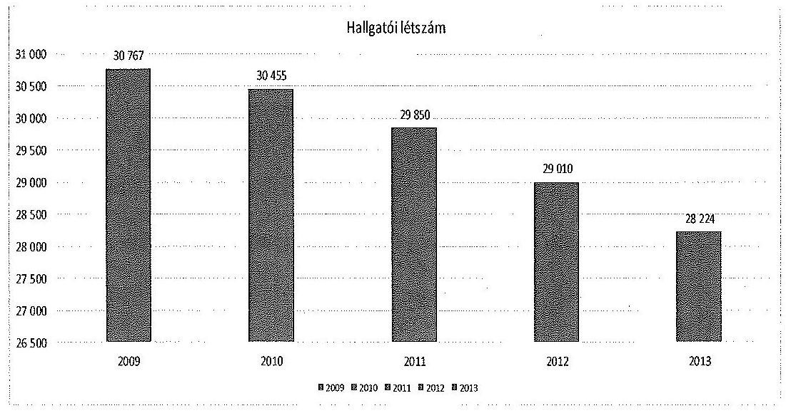
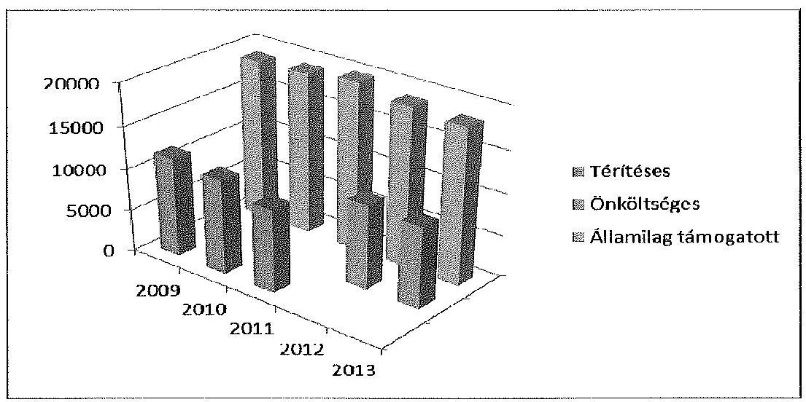
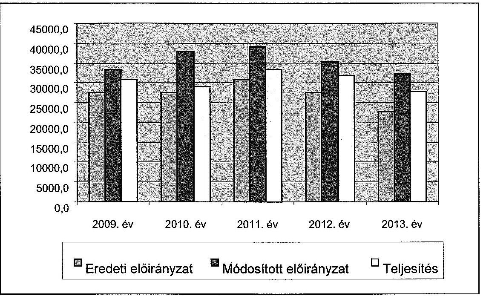
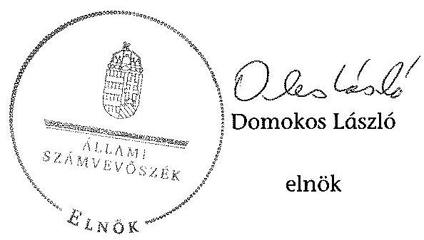
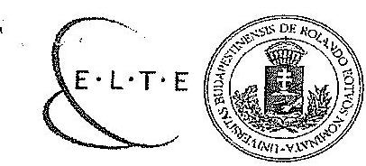
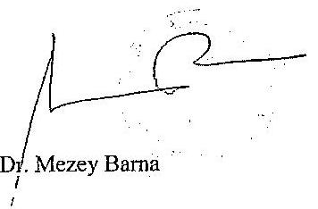
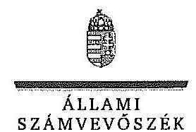
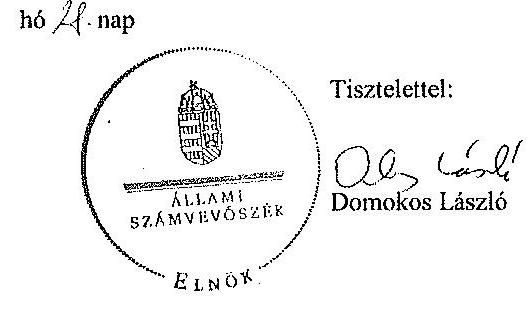

# ÁLLAMI   SZÁMVEVŐSZÉK 

## JELENTÉS

az Eötvös Loránd Tudományegyetem ellenőrzéséről - Az állami felsőoktatási intézmények gazdálkodásának, müködésének ellenőrzése

---

# Állami Számvevőszék 

Iktatószám: V-0586-178/2015
Témaszám: 1620
Vizsgálat-azonosító szám: V-068912
Az ellenőrzést felügyelte:
Kisgergely István
felügyeleti vezető
Az ellenőrzés végrehajtásáért felelős:
Kisné Agócs Éva
ellenőrzésvezető
A számvevői munkaanyagok feldolgozását és a Jelentés összeállítását végezte:

Kisné Agócs Éva
ellenőrzésvezető
Deák Tamásné
számvevő tanácsos
Klinger Zoltán
számvevő
Vitányi István
számvevő tanácsos

Az ellenőrzést végezték:

| Balázsné Antoni Erika | Balogné Dakó Eszter | Deák Tamásné |
| :-- | :-- | :-- |
| számvevő | számvevő főtanácsos | számvevő tanácsos |
| Dr. Fátrainé Zsebedics | Herczku Olívia Zsuzsanna | Klinger Zoltán |
| Katalin | számvevő | számvevő |
| számvevő tanácsos |  |  |
| Liziczai Imréné | Dr. Szima Mária |  |
| számvevő főtanácsos | számvevő tanácsos |  |

---

# A témához kapcsolódó eddig készített számvevőszéki jelentések: 

címe
sorszáma
Jelentés az oktatási és kulturális ágazat irányítási rendszerének, ..... 1106 működésének ellenőrzéséről
Jelentés a felsőoktatás oktatási infrastruktúra-fejlesztési program- ..... 1171 jának ellenőrzéséről
Jelentés az állami felsőoktatási intézmények érdekeltségébe tartozó ..... 1290 gazdasági társaságok támogatásának és nyereségük hasznosulásának ellenőrzéséről
Jelentés a Szolnoki Főiskola ellenőrzéséről - Az állami felsőoktatási ..... 14196 intézmények gazdálkodásának, múködésének ellenőrzése
Jelentés a Pannon Egyetem ellenőrzéséről - Az állami felsőoktatási ..... 14197 intézmények gazdálkodásának, múködésének ellenőrzése
Jelentés a Károly Róbert Főiskola ellenőrzéséről - Az állami felsőok- ..... 14198
tatási intézmények gazdálkodásának, múködésének ellenőrzése
Jelentés a Magyar Képzőművészeti Egyetem ellenőrzéséről - Az ál- ..... 14199 lami felsőoktatási intézmények gazdálkodásának, múködésének ellenőrzése
Jelentés a Miskolci Egyetem ellenőrzéséről - Az állami felsőoktatási ..... 14200 intézmények gazdálkodásának, múködésének ellenőrzése
Jelentés a Széchenyi István Egyetem ellenőrzéséről - Az állami fel- ..... 14201
sőoktatási intézmények gazdálkodásának, múködésének ellenőrzé- se
Jelentés az Eszterházy Károly Főiskola ellenőrzéséről - Az állami ..... 14204 felsőoktatási intézmények gazdálkodásának, múködésének ellenőrzése
Jelentés a Magyar Táncművészeti Főiskola ellenőrzéséről - Az ál- ..... 14205 lami felsőoktatási intézmények gazdálkodásának, múködésének ellenőrzése
Jelentés a Budapesti Műszaki és Gazdaságtudományi Egyetem el- ..... 14218 lenőrzéséről - Az állami felsőoktatási intézmények gazdálkodásának, múködésének ellenőrzése
Jelentés a Budapesti Corvinus Egyetem ellenőrzéséről - Az állami ..... 15032 felsőoktatási intézmények gazdálkodásának, múködésének ellenőrzése
Jelentés a Nyíregyházi Főiskola ellenőrzéséről - Az állami felsőok- ..... 15028
tatási intézmények gazdálkodásának, múködésének ellenőrzése
Jelentés az Eötvös József Főiskola ellenőrzéséről - Az állami felsőok- ..... 15025
tatási intézmények gazdálkodásának, múködésének ellenőrzése
Jelentés a Kecskeméti Főiskola ellenőrzéséről - Az állami felsőokta- ..... 15026

---

tási intézmények gazdálkodásának, múködésének ellenőrzése
Jelentés a Kaposvári Egyetem ellenőrzéséről - Az állami felsőokta- 15030 tási intézmények gazdálkodásának, múködésének ellenőrzése
Jelentés a Liszt Ferenc Zeneművészeti Egyetem ellenőrzéséről - Az 15033 állami felsőoktatási intézmények gazdálkodásának, múködésének ellenőrzése
Jelentés az Óbudai Egyetem ellenőrzéséről - Az állami felsőoktatási 15034 intézmények gazdálkodásának, múködésének ellenőrzése
Jelentés a Szegedi Tudományegyetem ellenőrzéséről - Az állami 15035 felsőoktatási intézmények gazdálkodásának, múködésének ellenőrzése
Jelentés a Nyugat-Magyarországi Egyetem ellenőrzéséről - Az állami felsőoktatási intézmények gazdálkodásának, múködésének ellenőrzése
Jelentés a Szent István Egyetem ellenőrzéséről - Az állami felsőok- 15039 tatási intézmények gazdálkodásának, múködésének ellenőrzése
Jelentés a Dunaújvárosi Főiskola ellenőrzéséről - Az állami felsőok- 15040 tatási intézmények gazdálkodásának, múködésének ellenőrzése
Jelentés a Nemzeti Közszolgálati Egyetem ellenőrzéséről - Az állami felsőoktatási intézmények gazdálkodásának, múködésének ellenőrzése
Jelentés a Nemzeti Közszolgálati Egyetem ellenőrzéséről - Az állami felsőoktatási intézmények gazdálkodásának, múködésének ellenőrzése
Jelentés a Színház és Filmművészeti Egyetem ellenőrzéséről - Az 15043 állami felsőoktatási intézmények gazdálkodásának, múködésének ellenőrzése
Jelentés a Moholy-Nagy Művészeti Egyetem ellenőrzéséről - Az állami felsőoktatási intézmények gazdálkodásának, múködésének ellenőrzése
Jelentés a Semmelweis Egyetem ellenőrzéséről - Az állami felsőok- 15053 tatási intézmények gazdálkodásának, múködésének ellenőrzése

---

# TARTALOMJEGYZÉK 

BEVEZETÉS ..... 17
I. ÖSSZEGZŐ MEGÁLLAPÍTÁSOK, KÖVETKEZTETÉSEK, JAVASLATOK ..... 22
II. RÉSZLETES MEGÁLLAPÍTÁSOK ..... 34

1. A fenntartói és az ágazati irányítási jogok gyakorlása ..... 34
2. Az intézmény belső kontrollrendszerének kialakítása és múködtetése ..... 36
3. Az intézmény döntéshozó szerveinek joggyakorlása, az oktatási és egyéb tevékenységei elkülönítése, pénzügyi gazdálkodása ..... 42
3.1. Az intézmény döntéshozó szerveinek gazdálkodással kapcsolatos joggyakorlása ..... 42
3.2. Az intézmény oktatási és egyéb tevékenységei elkülönítése, az ellátott feladatok átláthatósága ..... 45
3.3. Az intézmény pénzügyi egyensúlya, fizetőképessége ..... 46
3.4. Az intézmény előirányzat kezelése ..... 49
3.5. Az egyes hazai forrásból finanszírozott projektekhez, feladatokhoz kapott - nem normatív - költségvetési forrással való elszámolás ..... 57
4. Az intézmény vagyongazdálkodása ..... 58
4.1. A vagyongazdálkodási tevékenységek keretei ..... 58
4.2. A vagyonváltozások és a vagyonhasznosítás szabályszerűsége ..... 59
4.3. Az intézmény tulajdonosi jog gyakorlása ..... 65
5. A külső ellenőrzések által tett javaslatok hasznosulása ..... 67
5.1. ÁSZ ellenőrzések által tett javaslatok hasznosulása ..... 67
5.2. Az egyéb külső ellenőrzések javaslatainak hasznosulása ..... 69
6. Az integritás érvényesítése érdekében kialakított és múködtetett intézményi kontrollrendszer ..... 70

---

# MELLÉKLETEK 

1. számú Az Eötvös Loránd Tudományegyetem kiadási és bevételi előirányzatai, azok teljesítése a 2009-2013. években
2. számú Az Eötvös Loránd Tudományegyetem kiadásainak, bevételeinek változása a 2009-2013. években
3. számú Kimutatás az Eötvös Loránd Tudományegyetem bevételeiről és kiadásairól, valamint adósságszolgálatáról a 2009-2013. években
4. számú Az Eötvös Loránd Tudományegyetem mérlegadatai a 2009-2013. években
5. számú Az Eötvös Loránd Tudományegyetem gazdálkodása szabályszerűségének értékelése a mintatételek alapján

## FÜGGELÉKEK

1. számú Az integritás érvényesítése érdekében kialakított és múködtetett intézményi kontrollrendszer

---

# RÖVIDÍTÉSEK JEGYZÉKE 

| Törvények |  |
| :--: | :--: |
| Áht. 1 | 1992. évi XXXVIII. törvény az államháztartásról (hatálytalan 2012. január 1-jétől) |
| Áht. 2 | 2011. évi CXCV. törvény az államháztartásról |
| ÁSZ tv. ${ }_{1}$ | 1989. évi XXXVIII. törvény az Állami Számvevőszékről |
| ÁSZ tv. ${ }_{2}$ | 2011. évi LXVI. törvény az Állami Számvevőszékről |
| Eisztv. | 2005. évi XC. törvény az elektronikus információszabadságról (hatálytalan 2012. január 1-jétől) |
| Feot. | 2005. évi CXXXIX. törvény a felsőoktatásról (hatálytalan 2012. szeptember 1-jétől) |
| Gt. | 2006. évi IV. törvény a gazdasági társaságokról |
| Info tv. | 2011. évi CXII. törvény az információs önrendelkezési jogról és az információszabadságról |
| $\mathrm{Kbt}_{1}$ | 2003. évi CXXIX. törvény a közbeszerzésekről (hatálytalan 2012. január 1-től) |
| $\mathrm{Kbt}_{2}$ | 2011. évi CVIII. törvény a közbeszerzésekről (hatályos 2012. január 1-től) |
| Kjt. | 1992. évi törvény XXXIII. törvény a közalkalmazottak jogállásáról |
| Mt. ${ }_{1}$ | 1992. évi XXII. törvény a Munka Törvénykönyvéről (hatálytalan 2013. január 1-jétől |
| Mt. ${ }_{2}$ | 2012. évi I. törvény a munka törvénykönyvéről |
| Nftv. | 2011. évi CCIV. törvény a nemzeti felsőoktatásról (hatályos 2012. január 1-jétől) |
| NSK. | Nemzeti Sportközpontok |
| Nvtv. | 2011. évi CXCVI. törvény a nemzeti vagyonról |
| Ptk. | 1959. évi IV. törvény a polgári törvénykönyvről |
| Sztv. | 2000. évi C. törvény a számvitelről |
| Vtv. | 2007. évi CVI. törvény az állami vagyonról |
| Korm. rendeletek |  |
| Áhsz. | 249/2000. (XII. 24.) Korm. rendelet az államháztartás szervezetei beszámolási és könyvvezetési kötelezettségének sajátosságairól |
| Ámr. ${ }_{1}$ | 217/1998. (XII. 30.) Korm. rendelet az államháztartás múködési rendjéről (hatálytalan 2010. január 1-jétől) |
| Ámr. ${ }_{2}$ | 292/2009. (XII. 19.) Korm. rendelet az államháztartás múködési rendjéről (hatálytalan 2012. I. 1-jétől) |
| Ávr. | 368/2011. (XII. 31.) Korm. rendelet az államháztartásról szóló törvény végrehajtásáról |
| Ber. | 193/2003. (XI. 26.) Korm. rendelet a költségvetési szervek belső ellenőrzéséről |
| Bkr. | 370/2011. (XII. 31.) Korm. rendelet a költségvetési szervek belső kontrollrendszeréről és belső ellenőrzésről |

---

Vtvr.
hallgatói juttatások

Határozatok
1132/2010. (VI. 18.)
Korm. határozat
1268/2010. (XII. 3)
Korm. határozat
1316/2011. (IX. 19.)
Korm. határozat
1036/2012. (II. 21.)
Korm. határozat
1436/2013. (VII. 11.)
Korm. határozat

1274/2013. (V. 17.)
Korm. határozat

1365/2011. (XI. 8.)
Korm. határozat
1428/2012. (X. 8.) Korm. határozat
1982/2013. (XII. 29.)
Korm. határozat
1159/2013. (III. 28.)
Korm. határozat

1047/2013. (II. 7.)
Egyéb rövidítések
Áfa
ÁJK
ÁSZ
BGGYK
BME
Egyetem
EHÖK
ELTE
ELTE Egyetemi Szolgáltatásszervező Kft.
ELTE Eötvös Kiadó Kft.
ELTE ITK Kft.
ELTE Peregrinus Hotel Kft.

254/2007. (X. 4.) Korm. rendelet az állami vagyonnal való gazdálkodásról
51/2007. (III.26.) Korm. rendelet a felsőoktatásban részt vevő hallgatók juttatásairól és az általuk fizetendő egyes térítésekről
a 2010. évi költségvetéssel összefüggő egyes feladatokról
a 2010. évi költségvetési egyenleg teljesítéséhez szükséges intézkedésekről
a 2011. évi költségvetési egyensúlyt megtartó intézkedésekről
a 2012. és 2013. évi költségvetési hiánycél biztosításához szükséges további intézkedésekről
a felsőoktatási intézmények finanszírozási problémáinak kezeléséhez a rendkívüli kormányzati intézkedésekre szolgáló tartalékból történő előirányzat-átcsoportosításról
a Magyar-Kínai Ifjúsági Csereprogram lebonyolításához a rendkívüli kormányzati intézkedésekre szolgáló tartalékból történő előirányzat-átcsoportosításról
a 2012. évi költségvetési hiánycél tartását biztosító további feladatokról
a 2012. évi költségvetési egyenleg tartását biztosító intézkedésekről
a Kormány irányítása alá tartozó fejezetek költségvetési szerveinek eszközbeszerzéseiről
a központi költségvetési szerveknél foglalkoztatottak 2013. évi kompenzációjához szükséges előirányzatátcsoportosításról
a kiemelt felsőoktatási intézményekről
általános forgalmi adó
Állam- és Jogtudományi Kar
Állami Számvevőszék
Bárczi Gusztáv Gyógypedagógiai Főiskolai Kar
Budapesti Műszaki Egyetem
Eötvös Loránd Tudományegyetem
Egyetemi Hallgatói Önkormányzat
Eötvös Loránd Tudományegyetem
ELTE Egyetemi Szolgáltatásszervező Korlátolt Felelősségű Társaság
ELTE Eötvös Kiadó Korlátolt Felelősségű Társaság
ELTE Idegennyelvi Továbbképző Központ Korlátolt Felelősségű Társaság
ELTE Peregrinus Hotel Szálláshely-szolgáltató Korlátolt Felelősségű Társaság

---

| ELTE Soft Kft. | ELTE Soft Kutatás-fejlesztő Nonprofit Korlátolt Felelősségű Társaság |
| :--: | :--: |
| ELTE Sport Kft. | ELTE Sport Sportszolgáltató Korlátolt Felelősségű Társaság |
| EMMI | Emberi Erőforrások Minisztériuma |
| ETR | Egységes Tanulmányi Rendszer |
| EUR | euró |
| GMF | Eötvös Loránd Tudományegyetem Gazdasági és Műszaki Föigazgatósága |
| GT | Eötvös Loránd Tudományegyetem Gazdasági Tanácsa |
| FB | Felügyelő Bizottság |
| FEUVE | folyamatba épített, előzetes, utólagos és vezetői ellenőrzés |
| FIR | Felsőoktatási információs rendszer |
| FKR | SZMSZ III. kötete Foglalkoztatási Követelményrendszer |
| főtitkár | Az ELTE főtitkára |
| HKR | Hallgatói Követelményrendszer Szabályozása |
| HÖK | Hallgatói Önkormányzat |
| $\mathrm{IFT}_{1}$ | Eötvös Loránd Tudományegyetem Intézményfejlesztési Terve 2007-2011. |
| $\mathrm{IFT}_{2}$ | Eötvös Loránd Tudományegyetem Intézményfejlesztési Terve 2012-2015. |
| ISZTK | Intézményi szakmai, tudományos és közéleti ösztöndíj |
| $\mathrm{K}+\mathrm{F}$ | Kutatásfejlesztés |
| Kft. | Korlátolt Felelősségű Társaság |
| Kincstár | Magyar Államkincstár |
| KMOP | Közép-Magyarországi Operatív Program |
| minisztérium, fenntartó, irányító szerv | Az ELTE mindenkori irányító szerve (Oktatási és Kulturális Minisztérium, Nemzeti Erőforrás Minisztérium, Emberi Erőforrások Minisztériuma) |
| MNV Zrt. | Magyar Nemzeti Vagyonkezelő Zrt. |
| MTA | Magyar Tudományos Akadémia |
| NEFMI | Nemzeti Erőforrás Minisztériuma |
| NEPTUN | Tanulmányi hallgatói információs rendszer |
| NGM | Nemzetgazdasági Minisztérium |
| OH | Oktatási Hivatal |
| OKM | Oktatási és Közoktatási Minisztérium |
| OTKA | Országos Tudományos Kutatási Alapprogramok |
| OTP | Országos Takarékpénztár |
| PPP | public-private partnership (magán- és közszféra együttműködése) |
| rektor | Az ELTE rektora |
| SAP | Integrált Gazdálkodási Rendszer |
| Szenátus | Eötvös Loránd Tudományegyetem Szenátusa |
| TÁMOP | Társadalmi Megújulás Operatív Program |
| TUDPOL | Tudománypolitika |
| VIR | Vezetői Információs Rendszer |

---

| Zrt. | zártkörű részvénytársaság |
| :--: | :--: |
| szórövidítések |  |
| Alapító okirat ${ }_{1}$ | Az Eötvös Loránd Tudományegyetem 2008.11.17-től hatályos alapító okirata |
| Alapító okirat ${ }_{2}$ | Az Eötvös Loránd Tudományegyetem 2009.07.01-től hatályos alapító okirata |
| Alapító okirat ${ }_{3}$ | Az Eötvös Loránd Tudományegyetem 2010.11.02-től hatályos alapító okirata |
| Alapító okirat ${ }_{4}$ | Az Eötvös Loránd Tudományegyetem 2011.07.06-tól hatályos alapító okirata |
| Alapító okirat ${ }_{5}$ | Az Eötvös Loránd Tudományegyetem 2011.12.30-tól hatályos alapító okirata |
| Alapító okirat ${ }_{6}$ | Az Eötvös Loránd Tudományegyetem 2013.03.21-től hatályos alapító okirata |
| Értékelési szabályzat | 7/2006. (VII. 11.) számú rektori utasítás   1. sz. melléklete   (hatályos 2006. július 15-étől) |
| Fenntartói megállapodás | Az Eötvös Loránd Tudományegyetem és az Oktatási és Kulturális Minisztérium között 2007. december 13-án létrejött 35707-3/2007. iktatószámú 2008-2010. évekre szóló fenntartói megállapodás |
| Ingatlanhasznosítási szabályzat | a 11/2009. (V.11.), 16/2010. (X.25.) rektori utasításokkal és a CCII/2011. (IX.26.) Szen. számú határozattal módosított egységes szerkezetbe foglalt 21/2008. (VII.18.) számú rektori utasítás az Eötvös Loránd Tudományegyetem kezelésében levő ingatlanok hasznosításának részletes szabályairól (hatályos 2008. július 21-től) |
| Gazdálkodási szabályzat | az ELTE Szervezeti és Múködési Szabályzat I. kötet Szervezeti és Múködési Rend 5. számú melléklete egységes szerkezetben (hatályos 2006. október 1-től) |
| Hallgatói követelményrendszer | az ELTE Szervezeti és Múködési Szabályzat II. kötet Hallgatói Követelményrendszer egységes szerkezetben (hatályos 2006. szeptember 1-jétől) |
| Kötelezettségvállalási szabályzat | a 8/2011. (VII. 5.) számú rektori utasítással és a CLXXXI/2013. (V. 27.) Szen. sz. határozattal módosított egységes szerkezetbe foglalt 18/2008. (VII. 7.) számú rektori utasítás az Eötvös Loránd Tudományegyetem kötelezettségvállalási, utalványozási, ellenjegyzési, igazolási és érvényesitési rendjéről (hatályos 2008. július 15-étől) |
| Közbeszerzési szabály$\mathrm{zat}_{1}$ | a 10/2009. (III. 30.) számú rektori utasítás az Eötvös Loránd Tudományegyetem Közbeszerzési Szabályzatáról (hatálytalan 2010. november 22 -től) |
| Közbeszerzési szabály$\mathrm{zat}_{2}$ | 11/2012. (VII. 9.) számú rektori utasításokkal módosított egységes szerkezetbe foglalt 17/2010. (XI. 15.) számú rektori utasítás az Eötvös Loránd Tudományegyetem Közbeszerzési Szabályzatáról (hatályos 2010. november 22-től) |

---

| Leltározási szabályzat | Az Eötvös Loránd Tudományegyetem Leltározási szabályzata (A 7/2006-os rektori utasítás 2. sz. melléklete. Módosítva 2008.02.12.) |
| :--: | :--: |
| Önköltség számítási   szabályzat | az ELTE Számviteli szakmai szabályainak ideiglenes megállapításáról szóló LXXIII/2010. (IV. 26.) Szen. számú határozattal módosított egységes szerkezetbe foglalt 7/2006. (VII. 11.) számú rektori utasítás (hatályos 2006. július 16 -tól) |
| Pénzkezelési szabályzat ${ }_{1}$ | az ELTE Számviteli szakmai szabályainak ideiglenes megállapításáról szóló 7/2006. (VII. 11.) számú rektori utasítás   3. sz. melléklete (hatályos 2006. július 15 -től 2010. december 19 -ig) |
| Pénzkezelési szabályzat ${ }_{2}$ | az ELTE Számviteli szakmai szabályainak ideiglenes megállapításáról szóló 7/2006. (VII. 11.) számú rektori utasítás   3. sz. melléklete, módosítva a 20/2010. (XII. 16.) számú rektori utasítással. (hatályos: 2010. december 20. napjától) |
| Selejtezési szabályzat | a 20/2009. (III. 30.) számú és a 7/2011. (VII. 4.) számú rektori utasításokkal módosított egységes szerkezetbe foglalt 9/2009. (III. 30.) számú rektori utasítás a Magyar Állam tulajdonában és az Eötvös Loránd Tudományegyetem vagyonkezelésében lévő ingó vagyon feleslegesnek minősítése, hasznosítása és selejtezése szabályairól (hatályos 2009. április 1-től) |
| Számlarend | az ELTE Számviteli szakmai szabályainak ideiglenes megállapításáról szóló 1/2010 (I. 19.) számú rektori utasítással módosított egységes szerkezetbe foglalt 7/2006. (VII. 11.) számú rektori utasítás |
| Számviteli Politika | az 1/2010. (I. 19.) számú rektori utasítással módosított egységes szerkezetbe foglalt 7/2006. (VII. 11.) számú rektori utasítás 6. számú melléklete az Eötvös Loránd Tudományegyetem Számviteli Politikájáról (hatályos 2006. július 15 -étől). |
| Szerződéskötési szabály-   zat | a 19/2008. (VII. 7.) számú rektori utasítás a szerződéskötés rendjéről az Eötvös Loránd Tudományegyetemen egységes szerkezetben a módosítására kiadott 18/2009. (XI. 2.) és 8/2011. (VII. 5.) számú és 10/2012. (VI. 7.) számú rektori utasításokkal (hatályos 2008. július 15 -től) |
| SZMSZ | ELTE Szervezeti és Múködési Szabályzat egybeszerkesztve (hatályos 2007. július 2-től) |
| Vagyonkezelési szabály-   zat | a CXCI/2009. (VI. 29.) Szen. számú, a XXX/2012. (II. 13.)   Szen. számú és a CLXXXI/2013. (V.27.) Szen. számú határozattal módosított, egységes szerkezetbe foglalt CLVI/2007. (XII. 17.) Szen. számú határozat az Eötvös Loránd Tudományegyetem vagyonkezelési szabályzatáról (hatályos 2007. december 17-től) |

---

Versenyeztetési szabály- A 19/2009.(XI. 10.) számú rektori utasítás a versenyeztezat tés szabályairól (hatályos 2009. november 16-tól)

---

# ÉRTELMEZŐ SZÓTÁR 

| Alapító | A központi költségvetési szerv alapítója az Országgyúlés, a Kormány vagy a miniszter. A felsőoktatási intézmények vonatkozásában az alapítói jogokat a felsőoktatásért felelős minisztérium gyakorolja. |
| :--: | :--: |
| autonómia | A felsőoktatási intézmény Feot.-ban, illetve Nítv.-ben szabályozott önrendelkezése, amely biztosítja az intézmény önálló oktatási, kutatási, szervezeti és múködési, valamint gazdálkodási tevékenységét. |
| állami felsőoktatási intézmény saját tulajdona | A felsőoktatási intézmény saját bevételének a költségek teljes körű levonása, - az adományozás és öröklés kivételével - a rendelkezésre bocsátott vagyon állagának megóvásáról, pótlásáról való gondoskodás után fennmaradt része terhére szerzett vagyona. |
| állami vagyon | A Vtv. 1. § (2) bekezdése szerint állami vagyonnak minősül: $\square$   a) az állami tulajdonban lévő ingó dolog, valamint a dolog módjára hasznosítható természeti erő,   b) az állami tulajdonban lévő termőföldekből álló, külön törvényben szabályozott Nemzeti Földalap,   c) az állami tulajdonban lévő - a b) pont hatálya alá nem tartozó - ingatlan,   d) az állami tulajdonban lévő értékpapír,   e) az államot megillető társasági részesedés és más vagyoni értékű jog.   (hatályos 2010. június 16-ig)   a) az állam tulajdonában lévő dolog, valamint a dolog módjára hasznosítható természeti erő,   b) az a) pont hatálya alá nem tartozó mindazon vagyon, amely vonatkozásában törvény az állam kizárólagos tulajdonjogát nevesíti,   c) az állam tulajdonában lévő tagsági jogviszonyt megtestesítő értékpapír, illetve az államot megillető egyéb társasági részesedés,   d) az államot megillető olyan immateriális, vagyoni értékkel rendelkező jogosultság, amelyet jogszabály vagyoni értékű jogként nevesít.   (hatályos 2010. június 17-től) |
| állami vagyon hasznosítása | A Vtv. 23. § (1) bekezdése szerint: Az állami vagyont az MNV Zrt. maga kezeli, illetve szerződés - így különösen bérlet, haszonbérlet, szerződésen alapuló haszonélvezet, vagyonkezelés, megbízás - alapján központi költségvetési szervnek, természetes vagy jogi személynek, illetőleg jogi személyiséggel nem rendelkező gazdasági társaságnak hasznosításra átengedi.   (hatályos 2010. december 31-ig) |

---

állami vagyon haszná-
lója
állami vagyon értékesítése
állami vagyon kezelője /vagyonkezelő

Az állami vagyont az MNV Zrt. maga kezeli, vagy szerződés - így különösen bérlet, haszonbérlet, szerződésen alapuló haszonélvezet, vagyonkezelés, megbízás - alapján központi költségvetési szervnek, természetes vagy jogi személynek, vagy jogi személyiséggel nem rendelkező gazdálkodó szervezetnek hasznosításra átengedi.
(hatályos 2011. december 31-ig)
Az állami vagyont az MNV Zrt. maga kezeli, vagy szerződés - így különösen bérlet, haszonbérlet, megbízás alapján központi költségvetési szervnek, természetes vagy jogi személynek, vagy jogi személyiséggel nem rendelkező gazdálkodó szervezetnek hasznosításra átengedi.
(hatályos 2012. január 1-jétől)
A Vtv. 23. § (2) bekezdése szerint: Az állami vagyon hasznosítására kötött szerződések elsődleges célja az állami vagyon hatékony múködtetése, állagának védelme, értékének megőrzése, illetve gyarapítása, az állami és közfeladatok ellátásának elősegítése.
A Vtvr. 1. § (7) a) pontja szerint: Az a természetes személy, jogi személy, illetve jogi személyiséggel nem rendelkező gazdasági társaság, amely az MNV Zrt.-vel kötött szerződés alapján, bármely jogcímen (bérlet, haszonbérlet, vagyonkezelés, használat stb.) állami vagyont birtokol, használ, hasznosít.
(hatályos 2010. december 31-ig)
Az a természetes személy, jogi személy, illetve jogi személyiséggel nem rendelkező szervezet, amely, illetve aki törvény vagy szerződés alapján, bármely jogcímen (pl. bérlet, haszonbérlet, vagyonkezelési szerződés, használat stb.) állami vagyont birtokol, használ, szedi annak hasznait, hasznosít, ide nem értve a tulajdonosi jogok gyakorlóját.
(hatályos 2011. január 1 - 2011. december 31-ig)
Az a természetes vagy jogi személy, jogi személyiséggel nem rendelkező szervezet, aki, vagy amely törvény vagy szerződés alapján, bármely jogcímen (bérlet, haszonbérlet, használat stb.) állami vagyont birtokol, használ, szedi annak hasznait, hasznosít, ide nem értve a haszonélvezőt, a vagyonkezelőt és a tulajdonosi jogok gyakorlóját. (hatályos 2012. január 1-jétől)
Állami vagyon tulajdonjogának bármely jogcímen történő, visszterhes átruházása. (Vtvr. 1. § (7) d) pont)
A Vtv. 23. § (1) bekezdése szerint: Az állami vagyont az MNV Zrt. maga kezeli, vagy szerződés - így különösen bérlet, haszonbérlet, szerződésen alapuló haszonélvezet, vagyonkezelés, megbízás - alapján központi költségvetési szervnek, természetes vagy jogi személynek, illetőleg jogi személyiséggel nem rendelkező gazdasági társaságnak hasznosításra átengedi. (hatályos 2010. január 1 - 2010.

---

december 31-ig)
Az állami vagyont az MNV Zrt. maga kezeli, vagy szerződés - így különösen bérlet, haszonbérlet, szerződésen alapuló haszonélvezet, vagyonkezelés, megbízás - alapján központi költségvetési szervnek, természetes vagy jogi személynek, illetőleg jogi személyiséggel nem rendelkező gazdálkodó szervezetnek hasznosításra átengedi. (hatályos 2011. január 1 - 2011. december 31-ig)
Az állami vagyont az MNV Zrt. maga kezeli, vagy szerződés - így különösen bérlet, haszonbérlet, megbízás alapján központi költségvetési szervnek, természetes vagy jogi személynek, vagy jogi személyiséggel nem rendelkező gazdálkodó szervezetnek hasznosításra átengedi. Az állami vagyonra vonatkozóan az MNV Zrt. kizárólag az Nvtv-ben meghatározott személyekkel köthet vagyonkezelési szerződést.
(hatályos 2012. január 1-jétől)
belső kontrollrendszer
A belső kontrollrendszer a kockázatok kezelése és tárgyilagos bizonyosság megszerzése érdekében kialakított folyamatrendszer, amely azt a célt szolgálja, hogy megvalósuljanak a következő célok:
a) a múködés és gazdálkodás során a tevékenységeket szabályszerűen, gazdaságosan, hatékonyan, eredményesen hajtsák végre,
b) az elszámolási kötelezettségeket teljesítsék, és
c) megvédjék az erőforrásokat a veszteségektől, károktól és nem rendeltetésszerű használattól.
CLF-módszer
A módszer a múködési és a felhalmozási költségvetés bevételeinek és kiadásainak, ezek egyenlegeinek elkülönített, majd összevont kimutatását alkalmazza valamely költségvetési intézmény pénzügyi helyzetének megítéléséhez. Kiemelten mutatja be a finanszírozási múveletek egyenlege nélküli és az azt magába foglaló pénzügyi pozíciót, valamint a tőketörlesztéssel, értékpapír beváltással csökkentett múködési jövedelmet.
Az értékelés a pénzügyi kapacitás fogalmát helyezi a középpontba.
előirányzat-maradvány Az államháztartás központi alrendszerébe tartozó költségvetési szerveknél a módosított bevételi és kiadási előirányzatok és azok teljesítésének a Kormány rendeletében meghatározott tételekkel korrigált különbözete az elő-irányzat-maradvány. (Áht. 2 2. § (1) bekezdés m) pontja)
Fenntartó
A Feot. 7. § (2) és az Nftv. 4. § (2) bekezdése szerint az, aki az alapítói jogot gyakorolja, ellátja a felsőoktatási intézmény fenntartásával kapcsolatos feladatokat.
finanszírozási múveletek A CLF módszer szerint számított múködési és felhalmozásiélküli pozíció si tevékenység pénzügyi egyenlegének összevont értéke. Megmutatja, hogy a költségvetési intézmény bevételei fedezetet biztosítottak-e a kiadásokra. A finanszírozási

---

| Gazdasági Tanács | múveletek nélküli (GFS) pozíció alapján a pénzügyi helyzetet akkor tekintettük megfelelőnek, ha az adott év múködési és felhalmozási bevételei fedezetet nyújtottak az adott év múködési és felhalmozási kiadásaira. |
| :--: | :--: |
| hároméves fenntartói megállapodás | A felsőoktatási intézmény javaslattevő, véleményező, a stratégiai döntések előkészítésében részt vevő, és a döntések végrehajtásának ellenőrzésében közremúködő szerve. |
| hároméves fenntartói megállapodás | Az állami felsőoktatási intézmények központi költségvetési támogatására három éves fenntartói megállapodást kell kötni az állami felsőoktatási intézmény és a fenntartó között. A fenntartói megállapodás tartalmazza a felsőoktatási intézmény által meghatározott hároméves időszakra vállalt teljesítménykövetelményeket, továbbá az állandó jellegű támogatási részeket, valamint a változó jellegű támogatások megállapításának jogcímeit. A változó elemú támogatás évenkénti elszámolási kötelezettséggel kerül meghatározásra. |
| információs és kommunikációs rendszer | A költségvetési szerv vezetője köteles olyan rendszereket kialakítani és múködtetni, melyek biztosítják, hogy a megfelelő információk a megfelelő időben eljutnak az illetékes szervezethez, szervezeti egységhez, illetve személyhez. |
| Integritás | Az integritás olyasvalakit vagy valamit jelöl, aki vagy ami romlatlan, sértetlen, feddhetetlen. Az integritás elvek, értékek, cselekvések, módszerek, intézkedések konzisztenciáját jelenti: olyan magatartásmódot, amely meghatározott értékeknek megfelel. |
| intézményfejlesztési terv | A Szenátus fogadja el az intézményfejlesztési tervet. Az intézményfejlesztési tervben kell meghatározni a fejlesztéssel, a fenntartó által a felsőoktatási intézmény rendelkezésére bocsátott vagyon hasznosításával, megóvásával, elidegenítésével kapcsolatos elképzeléseket, a várható bevételeket és kiadásokat. Az intézményfejlesztési tervet középtávra, legalább négyéves időszakra kell elkészíteni, évenkénti bontásban meghatározva a végrehajtás feladatait. Az intézményfejlesztési terv része a foglalkoztatási terv. A foglalkoztatási tervben kell meghatározni azt a létszámot, amelynek keretei között a felsőoktatási intézmény megoldhatja feladatait. (Feot. 27. § (3) bekezdés) |
| irányító szerv | A felsőoktatás ágazati irányítását - felsőoktatás szervezéssel, felsőoktatás fejlesztéssel, törvényességi ellenőrzéssel kapcsolatos feladatokat - ellátó miniszter által vezetett minisztérium. (Feot. 102. - 105/A. §, Nftv. 64 - 66. §) |
| kincstári biztos | A kincstári biztos kijelölését az államháztartásért felelős miniszternél a Kincstár kezdeményezi. A kincstári biztos köteles figyelemmel kísérni megbízatásának időpontjától kezdve a költségvetési szerv tervezését, gazdálkodását, beszámolását, a jogszabályokban előírt feladatainak ellátását, feltárni azokat az okokat, amelyek a tartós fizetésképtelenséghez vezettek, a szükséges intézkedések |

---

kincstári költségvetés
kisebbségi jogokat biztosító részesedés
kockázatkezelési rendszer
kontrollkörnyezet
kontrolltevékenység
költségvetési föfelügyelő, felügyelő
azonnali végrehajtására irányuló intézkedési tervet készíteni, azonnali intézkedéseket kezdeményezni és írásbeli utasításokat kiadni a tartozásállomány felszámolására, a gazdálkodás egyensúlyának biztosítására, a követelések behajtására. (Ávr. 116-117. §)
A központi költségvetésről szóló törvény elfogadását követően a fejezetet irányító szerv az államháztartás központi alrendszerébe tartozó költségvetési szerv és a fejezeti kezelésű előirányzat kiemelt előirányzatait, valamint az elkülönített állami pénzalapok és a társadalombiztosítás pénzügyi alapjai jogszabályi előirás szerinti bevételeit és kiadásait kincstári költségvetés kiadásával állapítja meg. (Áht. 1 24. § (3) bekezdés, Áht. 2 28. § (2) bekezdés, Ávr. 31. § (2) bekezdés)
A részesedés mértéke legalább 5\%. (Gt. 49. §)
Irányítási eszközök és módszerek összessége, melynek elemei a szervezeti célok elérését veszélyeztető tényezők (kockázatok) azonosítása, elemzése, csoportosítása, nyomon követése, valamint szükség esetén a kockázati kitettség mérséklése.
A kontrollkörnyezet a költségvetési szerv vezetőinek a szervezeti célok elérését segítő kontrollok kialakításával és múködtetésével, korszerűsítésével kapcsolatos magatartását, a kontrollpontokról érkező információkra való reagálását jelenti.
Azok az elvek, politikák és eljárások, amelyeket a kockázatok meghatározása és a szervezet céljainak elérése érdekében alakítanak ki.
A költségvetési szerv vezetője köteles a szervezeten belül kontrolltevékenységeket kialakítani, amelyek biztosítják a kockázatok kezelését, hozzájárulnak a szervezet céljainak eléréséhez.
Az államháztartásért felelős miniszter a Kormány irányítása alá tartozó fejezetet irányító szervhez, a Kormány irányítása vagy felügyelete alá tartozó költségvetési szervhez, valamint az elkülönített állami pénzalapok és a társadalombiztosítás pénzügyi alapjai kezelő szerveihez költségvetési főfelügyelőt, felügyelőt rendelhet ki. A költségvetési főfelügyelő, felügyelő a gazdálkodás költségve-tés-politikával való összhangja és a takarékos, szabályszerű, eredményes múködés érdekében a Kormány rendeletében meghatározott intézkedéseket tehet, így különösen előzetesen véleményezi a kötelezettségvállalásra irányuló eljárásokat és a nagy összegű kötelezettségvállalások tekintetében kifogással élhet. (Áht. 2 39. § (1)-(2) bekezdés)

---

maximális hallgatói létszám
mértékadó befolyást biztosító részesedés minisztérium
minősített többséget biztosító részesedés
monitoring

Múködési jövedelem
normatív költségvetési támogatás felsőoktatási intézmények múködéséhez
normatív támogatások

Az a felsőoktatási intézmény alapító okiratában, múködési engedélyében meghatározott hallgatói létszám, ameddig terjedően a felsőoktatási intézmény - figyelembe véve a hallgatók fogadásához és az oktatói tevékenység folytatásához rendelkezésre álló személyi feltételeket, helyiségeket és eszközöket - valamennyi évfolyamára számítva, teljes kihasználtsággal múködve hallgatói jogviszonyt létesíthet.
A részesedés mértéke legalább 20\%, de 50\%-nál kisebb. (Sztv. 3. § (2) bekezdés 4. pont)
A felsőoktatásért felelős minisztérium, amely 2009-től 2010 májusáig az OKM, 2010 májusától 2012 májusáig a NEFMI, 2012 májusától az EMMI volt.
A minősített befolyásszerző az ellenőrzött társaságban a szavazatok legalább hetvenöt százalékával rendelkezik. (Gt. 52. § (2) bekezdés)
A különböző szintű szervezeti célok megvalósításához szükséges folyamatok figyelemmel kísérése, melynek során a releváns eseményekről és tevékenységekről (együtt: folyamatokról) rendszeres jelleggel, strukturált, döntéstámogató információkhoz jutnak a szervezet vezetői.
A folyó bevételek és folyó kiadások egyenlege. Azt mutatja, hogy a folyó bevételek fedezetet nyújtanak-e a folyó kiadásokra.
A felsőoktatási intézmények múködéséhez biztosított normatív költségvetési támogatás lehet
a) hallgatói juttatásokhoz nyújtott,
b) képzési,
c) tudományos célú,
d) fenntartói,
e) egyes feladatokhoz nyújtott
támogatás. A központi költségvetésből biztosított normatív költségvetési támogatásra - a d) pontban meghatározott normatív költségvetési támogatás kivételével - a felsőoktatási intézmények azonos feltételek alapján válnak jogosulttá. Az a)-e) pontokban meghatározott jogcímek az a) és e) pontban meghatározott jogcímek kivételével nem jelentenek felhasználási kötöttséget. (Feot. 127. § (3) bekezdés)
Az ellenőrzési időszakban hatályos költségvetési törvények 3. sz. mellékletében megjelölt közoktatási hozzájárulások, az 5. sz. mellékletében megjelölt központosított előirányzatok, továbbá a 8. sz. mellékletében megjelölt normatív, kötött felhasználású támogatások együttesen.

---

saját bevétel

Szenátus
tárgyévi pénzügyi pozíció

Az államháztartáson kívüli források - beleértve minden olyan, az Európai Uniótól származó támogatást, amelyhez nem az állami költségvetésen keresztül jut a felsőoktatási intézmény, továbbá a szakképzési hozzájárulási fizetési kötelezettség teljesítéseként elszámolt forrásokat is, ide nem értve az állami vagyon értékesítésének ellenértékét - valamint a Kutatási és Technológiai Innovációs Alapból származó bevételek.
A felsőoktatási intézmény, döntést hozó és a döntés végrehajtását ellenőrző testülete. (Feot. 20. § (1) bekezdés, Nftv. 12. § (1)-(3) bekezdés)
A múködési és felhalmozási bevételek, valamint kiadások egyenlege a finanszírozási múveletek egyenlegének figyelembe vételével.

---

.

---

# JELENTÉS 

## Az Eötvös Loránd Tudományegyetem ellenőrzéséről Az állami felsőoktatási intézmények gazdálkodásának, múködésének ellenőrzése

## BEVEZETÉS

Az ÁSZ Stratégiája ${ }^{1}$ alapértékeinek egyike, hogy az államháztartás komplex folyamatainak átláthatósága érdekében rendszerszemléletű/holisztikus megközelítésű, egymásra épülő, a szinergiahatást kihasználó, összefoglaló értékelésre lehetőséget adó ellenőrzéseket végez. Az államháztartás központi alrendszerébe tartozó felsőoktatási intézmények ellenőrzése során az Állami Számvevőszék értékeli azok pénzügyi-gazdasági helyzetét, feltárja a működésükben rejlő kockázatokat, ezzel előmozdítja a közpénzügyek átláthatóságát, rendezettségét.

Az állami felsőoktatási intézmények gazdálkodását - az Áht. előírásai mellett a felsőoktatásról szóló 2005. évi CXXXIX. törvény (Feot.), valamint a nemzeti felsőoktatásról szóló 2011. évi CCIV. törvény (Nftv.) előírásai határozták meg.

Magyarország Nemzeti Reform Programja keretében, a Széll Kálmán Terv 2020-ig a 30-34 évesek körében, a felsőfokú vagy annak megfelelő végzettséggel rendelkezők arányának 30,3\%-ra való növelését irányozta elő, amely a 2010. évhez képest $4,6 \%$ pontos növekedési célkitűzést jelent. A rendezett gazdasági környezet, az önállósággal élni tudó, felelős, elszámoltatható intézményi gazdálkodói magatartás elengedhetetlen feltétele a kitűzött szakmai célok elérésének.

Az ellenőrzés célja annak megállapítása, hogy szabályos volt-e az állami felsőoktatási intézmények pénzügyi és vagyongazdálkodása, biztosított volt-e a vagyonnal való felelős gazdálkodás követelményének érvényesülése, jogszabályi előírásoknak megfelelően működött-e a belső kontrollrendszer; az irányító szerv tevékenysége a jogszabályi előírásoknak megfelelt-e.

Ennek keretében értékeltük:

1) a fenntartói és az ágazati irányítási jogok gyakorlása előírásoknak való megfelelőségét;
[^0]
[^0]:    ${ }^{1}$ Állami Számvevőszék: Stratégia. Az Állami Számvevőszék hivatalos stratégiai dokumentum rendszere 2011-2015. 2012. december. http://www.asz.hu/strategia/asz-strategia/asz-strategia-2011.pdf

---

2) az intézmény belső kontrollrendszere jogszabályoknak megfelelő kialakítását és működtetését;
3) az intézmény döntéshozó szerveinek joggyakorlása jogszabályoknak való megfelelőségét; az intézmény oktatási és egyéb (gyakorlati és kutatási) tevékenységei elkülönítését, átláthatóságát, illetve pénzügyi gazdálkodása szabályszerűségét;
4) az intézmény vagyongazdálkodása előírásoknak való megfelelőségét;
5) az ellenőrzött időszakban végzett külső (ÁSZ, fenntartói, KEHI, kincstári) ellenőrzések által tett javaslatok hasznosulását;
6) az intézmény korrupcióval szembeni veszélyeztetettségének csökkentése érdekében az integritási szemlélet érvényesülését a gazdálkodási folyamatokban.

Az ellenőrzés várható hasznosulása: Az ellenőrzés eredményének hasznosulásaként képet kapunk az Eötvös Loránd Tudományegyetemen kialakult pénzügyi helyzetről; a kormány által kirendelt költségvetési (fő) felügyelői rendszer működésének tapasztalatairól; az oktatási és egyéb tevékenységek és költségelszámolások elhatárolásáról, átláthatóságáról és szabályosságáról. A felsőoktatási intézmények gazdálkodási szabadságának pénzügyi és vagyoni helyzetre gyakorolt hatásairól, a vagyonnal való felelős, értékmegőrző gazdálkodás érvényesüléséről, továbbá a belső kontrollrendszer múködéséről. Az ellenőrzés az ellenőrzött számára visszajelzést ad a gazdálkodása kereteinek kialakításáról, a múködésében fellépő hiányosságokról, javaslataival hozzájárul azok kiküszöböléséhez és a jó kormányzáshoz. A törvényalkotás számára öszszegzett tapasztalatok állnak rendelkezésre a felsőoktatási intézmények döntéseinek, gazdálkodásának szabályszerűségéről, amelyek alapján - indokolt esetben - jogszabály-módosítás kezdeményezhető. Az integritás kultúra kialakítása hozzájárul az elszámoltathatóság és átláthatóság érvényesítéséhez, egyben támogatja a szervezet védettségét a korrupciós kitettséggel szemben, valamint annak megelőzése is irányítottabbá válik. A társadalom számára jelzi, hogy közpénz nem maradhat ellenőrizetlenül, az ÁSZ értékteremtő rend kialakításához és megőrzéséhez hozzájáruló tevékenysége pozitív hatással lesz a szervezetről kialakított összkép formálásában.

Az ellenőrzés típusa: szabályszerűségi ellenőrzés.
Az ellenőrzött időszak: 2009. január 1. - 2013. december 31. (az eredményszemléletű számvitel bevezetésével kapcsolatban az ellenőrzött időszak vége: 2014. április 30.)

Az ellenőrzéssel érintett szervezetek: az EMMI és az Eötvös Loránd Tudományegyetem.

Az ellenőrzés jogszabályi alapját az ÁSZ tv. 2 1. § (3) bekezdése, az 5. §. (3)-(6) bekezdései, 33. § (7) bekezdése, valamint az államháztartásról szóló 2011. évi CXCV. törvény (Áht. ${ }_{2}$ ) 61. § (2) bekezdésének előírásai képezik. Az ellenőrzés kiterjedt minden olyan körülményre és adatra, amely az ÁSZ jogszabályban meghatározott feladataiban, valamint a program végrehajtása folyamán felmerült újabb összefüggések feltárásához szükséges volt.

---

Az ellenőrzés az INTOSAI által kiadott nemzetközi standardok figyelembe vételével, az ellenőrzési programban foglalt értékelési szempontok szerint történt.

Az ÁSZ a 2011. évi LXVI. törvény 29. §-a szerint a jelentéstervezetet megküldte az emberi erőforrások miniszterének és az Eötvös Loránd Tudományegyetem rektorának. Az Emberi Erőforrások Minisztérium minisztere az ÁSZ jelentéstervezetének észrevételezési jogával nem élt. Az Eötvös Loránd Tudományegyetem beérkezett észrevételét és az arra adott választ a jelentés 6-7. sz. mellékletei tartalmazzák.

A pénzügyi és vagyongazdálkodás terén az egyes területek szabályszerű működését mintavétellel ellenőriztük, ez alapján a sokaságban előforduló hibás tételek arányát becsültük. A jogszabályoknak és a belső előirásoknak megfelelőnek, azaz szabályszerűnek tekintettük az adott kiadási előirányzat felhasználását, bevétel beszedését, mérlegtétel értékelését, amennyiben a minta ellenőrzésének eredménye alapján $95 \%$-os bizonyossággal a teljes sokaságban a hibás tételek aránya kisebb volt, mint $10 \%$, nem megfelelőnek értékeltük, ha a hibás tételek aránya a $10 \%$-ot meghaladta. Kockázatot, illetve magas kockázatot jeleztünk, amennyiben egy adott terület vonatkozásában a minta alapján a teljes sokaságban nem volt teljes körűen biztosított a jogszabályoknak és a belső szabályzatoknak megfelelő működés. A mintatételek kiértékelését az 5. számú melléklet tartalmazza. A belső kontrollrendszer kialakításának és működtetésének értékelése során a jogszabályi előírások mellett az Ámr. ${ }_{1} 145 /$ A. § (1) és (3) bekezdése, az Ámr. ${ }_{2} 155 . \S$ (1) és (3) bekezdése, valamint a Bkr. 5. § (1) bekezdése alapján figyelembe vettük az államháztartásért felelős miniszter által közétett irányelvekben és módszertani útmutatókban ${ }^{2}$ foglaltakat is. A belső kontrollrendszert az értékelés során legalább $85 \%$-os megfelelőség esetén megfelelőnek, a legalább $70 \%$-os megfelelőség esetén részben megfelelőnek, $70 \%$-os megfelelőség alatt pedig nem megfelelőnek minősítettük

Az Eötvös Loránd Tudományegyetem történeti gyökerei a XVII. századig nyúlnak vissza. 1635-ben Pázmány Péter esztergomi érsek Nagyszombat városában alapította meg az egyetemet és vezetését a jezsuita rendre bízta. A jezsuita egyetem bölcsészeti és teológiai karból állott, és már 1667-ben jogi karral egészült ki. 1769-ben alakult meg orvosi fakultása. 1777-ben az egyetemet Nagyszombatból az ország közepébe, Buda városába, a királyi palotába, majd 1784ben a Duna túlsó partjára, Pestre költöztették, és itt nyert végleges elhelyezést. Az oktatás nyelve 1844-ig a latin volt, ami a soknemzetiségű hallgatóság számára közvetítő, semleges nyelvnek számított. Az Eötvös Loránd Tudományegyetem 2009-2013. évek között önállóan működő és gazdálkodó központi költségvetési szerv volt. Az Egyetem alapképzést, mesterképzést, egységes, osztatlan jogászképzést, doktori képzést, szakirányú továbbképzést, valamint felsőfokú szakképzést folytatott. Kifutó rendszerben hagyományos egyetemi és főiskolai szintű képzések is zajlottak az Egyetemen, egyre csökkenő hallgatói létszámmal, továbbá köznevelési és felnőttképzési feladatokat is elláttak.

Az Egyetem alapfeladata körében a képzési területeken - a Magyar Tudományos Akadémiával, annak intézményeivel közös kutatási, képzési feladatok el-

[^0]
[^0]:    ${ }^{2}$ 1/2009. (IX. 11.) PM irányelv, Pénzügyminisztérium Belső Kontroll Kézikönyv 2010.

---

látására kötött szerződés, illetve 2013. elejéig pályázat alapján múködő oktatá-si-kutatási egységekben - kutatási tevékenységet végzett. Az ellenőrzött időszakban 15-20 kutatócsoportban vett részt az Egyetem. Székhelyen kívüli képzések folytak Pécsett, Miskolcon és Salgótarjánban. Az Egyetem nyolc gyakorló intézménye (gyakorló óvoda, általános iskola, gimnázium, gyógypedagógiai és logopédiai szakszolgálat) biztosította a pedagógushallgatók gyakorlati képzését.

Az intézmény szervezeti felépítésében az ellenőrzött időszakban több változás is történt, így például tanszékek egyesültek, tanszékek alakultak (pl. az Informatikai Karon CLC Akadémiai-ipari Együttmúködési Központ alakult). Karonként önálló szervezeti egységként intézetek, illetve tanszékek, vagy intézet alá rendelt nem önálló szervezeti egységként tanszékek múködnek. Intézményi átalakítást az ellenőrzött időszakban nem hajtottak végre.

Az Egyetemen 8 kar múködött az ellenőrzött időszakban ${ }^{3}$. Alapképzésen 9 képzési területen ${ }^{4} 2009$-ben összesen 37; 2013-ban már 39 alapképzési szakot hirdetett meg az ELTE. Mesterképzésre 2009-ben 6 képzési területen volt lehetőség 74, 2013-ban pedig 93 mesterszakon. Doktori képzés 4 tudományterületen volt 17 doktori iskolával. A doktori programok száma 2009ben 115, 2013-ban már 117 volt.

Az ELTE hallgató létszáma 2009 óta folyamatosan csökkent, és először 2011ben került harmincezer fő alá.

A létszám alakulását a 2009-2013 közötti időszakra vonatkozóan az alábbi grafikon mutatja be.

[^0]
[^0]:    ${ }^{3}$ Állam és Jogtudományi Kar, Bölcsészettudományi Kar, Természettudományi Kar, Informatikai Kar, Pedagógiai és Pszichológiai Kar, Társadalomtudományi Kar, Bárczi Gusztáv Gyógypedagógiai Kar, Tanító és Óvóképző Kar
    ${ }^{4}$ bölcsészettudomány, gazdaságtudományok, informatika, jogi és igazgatási, múvészetközvetítés, pedagógusképzés, sporttudomány, társadalomtudomány, természettudomány

---

Az Egyetem többször módosított Alapító okiratában rögzített intézményi hallgatói létszám (maximálisan felvehetők száma) az Ftv. alapján 2009. és 20112012. évben 38316 fő, a 2010. évben 38466 és 2013. évben 38251 fő volt.

Az Egyetemhez 2012. évben költségvetési főfelügyelőt rendeltek ki.
Az ellenőrzött időszak alatt a rektor személyében 2010. év augusztusában történt változás.

Az ellenőrzéssel érintett intézmény jellemzőit, főbb gazdálkodási, vagyoni és létszám adatait az alábbi táblázat mutatja be.

| Megnevezés | Főbb gazdálkodási és vagyoni adatok (M Ft) |  |  |  |  |  |
| :--: | :--: | :--: | :--: | :--: | :--: | :--: |
|  | 2009. | 2010. | 2011. | 2012. | 2013. | $\begin{gathered} 2013 / \\ 2009 \\ (\%) \end{gathered}$ |
| KIADÁSI   FÖÖSSZEG | 30837,8 | 29140,1 | 33481,2 | 31917,9 | 27811,1 | 90,2 |
| BEVÉTELI   FÖÖSSZEG | 33011,4 | 37652,1 | 38897,7 | 35765,3 | 32343,4 | 98,0 |
| Költségvetési támogatások | 20925,8 | 20818,9 | 19807,5 | 19459,9 | 18457,5 | 88,2 |
| Támogatások aránya (\%) | 63,39 | 55,29 | 50,92 | 54,41 | 57,07 | - |
| Mérlegfőószszeg | 48117,6 | 49078,2 | 47614,8 | 47033,4 | 46558,7 | 96,8 |
| Jellemző létszámadatok (fő) |  |  |  |  |  |  |
| Oktatói létszám (fő) | 1664 | 1661 | 1615 | 1520 | 1447 | 87,0 |
| Hallgatói létszám (fő) | 30767 | 30455 | 29850 | 29010 | 28698 | 93,3 |

A felsőoktatási intézmény kiadásai az öt év alatt 9,8\%-kal, a bevételei összességében $2,0 \%$-kal csökkentek. A bevételeken belül a költségvetési támogatás $11,8 \%$-kal, a saját és átvett bevételek $1,3 \%$-kal csökkentek. A hallgatói létszám 2069,0 fővel, ( $6,7 \%$-kal) esett vissza, az oktatók létszáma pedig 1664 fơről 1447 fôre, $13 \%$-kal csökkent.

[^0]
[^0]:    ${ }^{5}$ Az oktatói és hallgatói létszámnál az október 15-i statisztikában szereplő adatokat kell megadni.

---

# I. ÖSSZEGZŐ MEGÁLLAPÍTÁSOK, KÖVETKEZTETÉSEK, JAVASLATOK 

Az ellenőrzött időszak alatt a felsőoktatásért felelős minisztérium (OKM, NEFMI, EMMI) a fenntartói feladatait a jogszabályoknak megfelelően gyakorolta. Alapítói jogosultságai keretében szabályszerűen adta ki az Egyetem jogszabályi és szervezeti változásoknak megfelelően módosított alapító okiratát. Az Egyetem által megküldött SZMSZ módosításokat a fenntartó felülvizsgálta és jóváhagyta.

A fenntartó a jogszabályoknak megfelelően gyakorolta az Egyetem rektorának, gazdasági főigazgatónak és belső ellenőrzési vezetőnek kinevezésével, megbízásával kapcsolatos jogosultságait, azonban 2011. november 1. és 2012. február 1. között a belső ellenőrzési vezetői státusz betöltetlen volt.

A minisztérium közremúködött az Egyetem éves költségvetésének tervezésében, meghatározta költségvetési kereteit, valamint megvizsgálta az intézmény elemi költségvetését, ellenőrizte, értékelte és jóváhagyta a számviteli beszámolókat. Ellenőrizte a felsőoktatási intézmény gazdálkodását, múködését, törvényességét, hatékonyságát. Az Egyetem szakmai munkájának eredményességét a fenntartó az éves gazdálkodásról készült beszámoló alapján értékelte, intézkedés kezdeményezésére az értékelés alapján nem került sor.

A fenntartó megkötette az Egyetemmel a 2008-2010. évekre vonatkozóan a fenntartói megállapodást, amelyben meghatározták a teljesítménykövetelményeket. A megállapodásban foglaltak időarányos teljesítését az Egyetem évente értékelte, a fenntartó azt elfogadta.

A minisztérium fenntartói hatáskörében megvizsgálta az $\mathrm{IFT}_{1,2}$-t. A 2012-2015. évekre szóló $\mathrm{IFT}_{2}$-jének értékelésében jól elkészített stratégiai dokumentumnak minősítette és jelezte annak fontosságát, hogy az intézményi stratégia megfelelően tükröződjön a kari stratégiákban is.

A miniszter az ágazati irányítási feladatait a 2009-2013. években nem látta el teljes körűen. Elmaradt az oktatási ágazatra vonatkozóan a nemzetgazdasági miniszter irányításával és az oktatásért felelős miniszter részvételével a kormányhatározatban előírt szervezeti és feladat ellátási felülvizsgálati program kidolgozása. A felsőoktatási törvény rendelkezései ellenére a miniszter nem készített a felsőoktatás rendszere vonatkozásában a Kormány által elfogadott középtávú fejlesztési tervet.

A miniszter az Oktatási Hivatallal a FIR biztonságos üzemeltetéséhez, az adatok védelméhez szükséges alapvető szervezeti, szabályozási kontrollokat a 2012. év végéig nem teljes körűen alakította ki. A FIR átfogó megújítását követően - a nyitott jogviszonnyal rendelkező hallgatók és az oktatók vonatkozásában - rögzített adatok teljesek voltak. A visszamenőleges adatok rögzítése és tisztítása a FIR átfogó megújítását követően folyamatos volt. A fenntartó a FIR

---

biztonságos üzemeltetéséhez, az adatok védelméhez szükséges szabályozási kontrollokat a 2013. év végére kialakította.

Az Egyetem belső kontrollrendszerének kialakítása és múködtetése az ellenőrzött évek vonatkozásában részben felelt meg a vonatkozó jogszabályi előírásoknak. Az ellenőrzött időszakban a belső kontrollrendszer kiépítése és múködtetése javulást mutatott. A rektor évente értékelte a belső kontrollok kialakítását, múködtetését, valamint nyilatkozatot tett a fenntartó felé arról, hogy melyek a még fejlesztendő területek, így a 2009. évi nyilatkozatában a FEUVE rendszert jelölte meg, mint olyan területet, amelyet ki kell építtetnie teljes körűen, a 2012. évi nyilatkozata a belső kontrollok fejlesztésének szükségességét fogalmazta meg. A rektor a nyilatkozatában kitért arra, hogy az általa fejlesztendőnek minősített területek tekintetében saját hatáskörben milyen intézkedést tett.

Az intézmény kontrollkörnyezete a jogszabályi előírásoknak részben felelt meg, 2010. évben az előző évhez viszonyítva kis mértékben javult, a szabálytalanságkezelési eljárásrend tartalma kibővült ebben az évben. Az SZMSZ kisebb tartalmi hiányossága volt, hogy a szervezeti egységek engedélyezett létszámadatait a jogszabályi előírás ellenére nem tartalmazta. A GMF rendelkezett aktualizált ügyrenddel, amelyben a feladatokat meghatározták, hatásköröket behatárolták. A szabályzatok mindazon pénzügyi, gazdálkodási területeket lefedték, amelyekre vonatkozóan a jogszabályok szabályzat készítését írták elő, így elkészítették a számviteli politikát, számlarendet, közbeszerzési szabályzatot, a gazdálkodási jogkörök - kötelezettségvállalás, ellenjegyzés, (szakmai) teljesítésigazolás, érvényesítés, utalványozás - tekintetében pedig a gazdálkodási szabályzatot is elkészítették. A belső szabályzatok egy része - pénzkezelési szabályzat, eszközök és források értékelési szabályzata, gazdálkodási szabályzat, önköltségszámítási szabályzat, - nem felelt meg teljes körűen a vonatkozó jogszabályi előírásoknak, mert a kötelezően szabályozandó területeket nem teljes körűen tartalmazta, vagy nem a jogszabálynak megfelelő módon tartalmazta, továbbá belső eljárási rendben a Kbt. hatálya alá nem tartozó beszerzések lebonyolítását nem szabályozta 2010-től - a jogszabályváltozást követően - az Egyetem. Az etikai elvárások sem kerültek meghatározásra.

Az Egyetem kockázatkezelési rendszerének kialakítása és múködtetése megfelelő volt. 2010. február 15-től épült be a szabályozásba az intézmény kockázatkezelési eljárásrendje. A FEUVE rendszerén belül azonosította a lehetséges kockázatokat. A szabályzat részeként meghatározta az ellenőrzési nyomvonalakat.

A kontrolltevékenységek kialakítása és működtetése az ellenőrzött időszakban nem volt megfelelő. Az Egyetemnél a kontrolltevékenység részeként minden tevékenységre vonatkozóan biztosított volt a folyamatba épített, előzetes, utólagos és vezetői ellenőrzés, a pénzügyi és vagyongazdálkodási folyamatokhoz kapcsolódó jogosultságok és jogkörök rendszerét azonban nem építették ki teljes körűen, továbbá azok nem működtek megfelelően. A gazdálkodási jogkörök gyakorlásának hiányosságai az ellenőrzött időszakban az ellenőrzés során feltárt szabályszerűségi hibákhoz vezettek. Jogosulatlan kifizetést az ellenőrzés a bemutatott dokumentumokban foglaltak alapján nem állapított meg, de fennáll annak kockázata. Hiányosságok érintették például a kötelezettségválla-

---

lást (kijelölés hiánya), nem volt megfelelő az érvényesítés, nem vezettek az érvényesítésre jogosult személyek aláírás-mintájáról a belső szabályzatnak megfelelő naprakész nyilvántartást. A kiadás teljesítésének elrendelését nem érvényesített okmány alapján végezte az utalványozásra jogosult személy, így az utalványozás nem felelt meg a jogszabályi előírásoknak. Elmaradt, vagy nem történt meg minden esetben szabályszerűen a (szakmai) teljesítésigazolás a vagyonhasznosítási bevételek esetében sem. Elmaradt több esetben a kötelezettségvállalások pénzügyi ellenjegyzése. A külső személyi juttatásokat helytelenül számolták el.

Az információs és kommunikációs rendszer kialakítása és múködtetése az Egyetemen 2009-2010. években részben megfelelő, a 2011-2013. években megfelelő volt. A kötelezően közzéteendő adatok nyilvánosságra hozatalának rendjét a 2011. november 8-tól hatályos SZMSZ I. kötetben rögzítették, annak az Egyetem eleget tett. A FIR rendszer múködtetésével kapcsolatos adatszolgáltatási kötelezettségeinek az Egyetem eleget tett.

A monitoring rendszer kialakítása és múködése a 2009-2013. években részben volt megfelelő. Az Egyetem a jogszabályoknak megfelelően kialakította a vezetői monitoring-rendszert. A belső ellenőrzés szabályszerűen kialakítva, a működés tekintetében a jogszabályoknak részben megfelelve látta el feladatait. Az ellenőrzési terveket nem valósították meg maradéktalanul. Az intézkedési terv jóváhagyásához a jogszabály előírása ellenére a belső ellenőrzési vezető véleményét nem kérték ki, továbbá az ellenőrzési vezető részére a jóváhagyás után küldték csak meg az intézkedési terveket. Az intézkedési tervekben foglaltakat néhány esetben nem, vagy részben hajtották végre, így az ellenőrzés megállapításai sem mindig hasznosultak. Az ellenőrzések nyomon követése sem történt meg teljes körűen. 2011. év kivételével vezettek nyilvántartást az elvégzett ellenőrzésekről, azonban a 2012. és 2013. évről vezetett nyilvántartásban szerepeltetett adatok köre hiányos volt.

A Szenátus gazdálkodással kapcsolatos joggyakorlása részben felelt meg a jogszabályi előírásnak. Az Egyetem vezetőjének vezetői tevékenységét a vonatkozó jogszabályokban előírtak ellenére nem értékelte a Szenátus. Az Egyetem 2009-2013. évi elemi költségvetése elfogadásáról a Szenátus a jogszabályi előírás ellenére az után döntött, hogy azokat a Fenntartó részére megküldte. Utólag változatlan tartalommal fogadta el a Szenátus a költségvetést.

A Fenntartó a felsőoktatási törvénynek megfelelően értékelte az Egyetem éves beszámolóját, majd a beszámoló alapján értékelte az intézmény szakmai munkájának eredményességét is.

Az Egyetem által igénybe vett felhasználási kötöttség nélküli és kötött felhasználású normatív költségvetési támogatások felhasználására vonatkozó intézményi döntések megfeleltek a jogszabályi előírásoknak és a belső szabályozásnak.

A díjak, költségtérítések megállapítása nem volt szabályszerű, mert a díjbevételeket és költségtérítéseket nem alapozta meg önköltségszámítás.

---

Az ellenőrzött években az oktatási és egyéb tevékenységelt a többször módosított Alapító okiratokkal és a hatályos szakfeladat-renddel összhangban elkülönítették, az Egyetem által ellátott feladatok rendszere átlátható volt.

Az intézmény pénzügyi gazdálkodása részben volt szabályszerű.
Az Egyetem pénzügyi helyzete egyensúlyban volt, fizetőképessége rövid és középtávon biztosított volt. A likviditási mutatók értéke az ellenőrzött időszak minden évében meghaladta az „1" értéket, ami stabil fizetőképességet, megfelelő pénzügyi egyensúlyt jelent. A forgóeszközök és a pénzeszközök minden évben meghaladták a rövid lejáratú kötelezettségek összegét. Az ellenőrzött időszakban az Egyetem folyó bevételei - a 2009. évet kivéve - fedezetet nyújtottak a folyó kiadásokra. A múködési jövedelem 2009-ben negatív, míg 2010-2013. évek között pozitív volt, így összesen 2135,3 M Ft múködési jövedelem többlet keletkezett. Az Egyetem finanszírozási igénye 2009-ben 710,8 M Ft, 2011-ben 3095,5 M Ft, 2012-ben 1569,1 M Ft volt, finanszírozási többlete 2010-ben 661,3 M Ft, 2013-ban 684,9 M Ft volt. Az ellenőrzött időszak alatt három évben is - a finanszírozási igény miatt - szükség volt finanszírozási forrás bevonására is, melyet részben a forgatási célú értékpapírok értékesítéséből fedeztek, melyek egy 2007. évben értékesítésre került nagy értékű ingatlan ( $\mathrm{ADS}^{6}$ ingatlan), befolyt bevételéből álltak rendelkezésre, 2009. évben 5101,2 M Ft, a 2010. évben 3532,6 M Ft, valamint a 2011. évben 1690,6 M Ft összegben.

A tárgyévi pénzügyi pozíció az ellenőrzött időszakban változó volt. Negatív volt két évben: 2009. évben ( $-128,9 \mathrm{M}$ Ft, oka a negatív múködési jövedelem), és 2011. évben (- 1698,2 M Ft, oka a felhalmozási költségvetési egyenleg), amelyet nem volt képes ellensúlyozni sem a múködési, sem a finanszírozási egyenleg. 2010. évben a negatív értékű felhalmozási egyenleget a múködési jövedelem és a finanszírozási műveletek pozitív egyenlege ellentételezni tudta, 2012. és 2013. években is hasonlóan pozitív volt a tárgyévi pénzügyi pozíció.

A 2012-től kirendelt költségvetési főfelügyelő - mivel az Egyetem múködésében nem mutatkoztak pénzügyi nehézségek - intézkedésére nem volt szükség.

Az Egyetem kapacitáskihasználtsága a felvett hallgatók és a felvehető létszám aránya alapján csökkent a 2009. évi 80,3 \%-ról a 2013. évi 73,8 \%7-ra.

Az Egyetem a kiadási és bevételi előirányzatok tervezése során a jogszabályokban és a fenntartó által kiadott tervezési irányelvekben foglaltak szerint járt el. A felügyeleti szerv által kért adatszolgáltatásokat határidőben teljesítették.

Az ellenőrzött időszakban az Egyetem az előirányzat-módosításokat szabályszerűen hajtotta végre. Az intézményt érintő előirányzat-módosítások átvezetése a számviteli nyilvántartásokon megfelelt az előírásoknak.

[^0]
[^0]:    ${ }^{6}$ Ajtósi Dürer Sor
    ${ }^{7}$ A párhuzamos képzéseken résztvevő hallgatókat képzésenként figyelembe véve a kihasználtság már a $90 \%$-ot közelíti az egyes években.

---

Az Egyetem 2009-2013 között az alaptevékenysége ellátásához szükséges forrásokat irányítószervi támogatásból és saját bevételekből fedezte. Az Egyetem az ellenőrzött időszakban 99469,7 M Ft költségvetési támogatásban részesült, 177 669,9 M Ft bevételt ért el, a maradvány felhasználása $28512,9 \mathrm{M}$ Ft volt. A 2009. évet megelőzően képződött maradvány felhasználás $2886,3 \mathrm{M}$ Ft volt. Az Egyetem összesen 153 188,1 M Ft költségvetési kiadást teljesített, a 2013. év végét 4532,3 M Ft előirányzat maradvánnyal zárta. Az Egyetem teljesített költségvetési bevételei a módosított előirányzathoz viszonyítva a 2012. évet kivéve minden évben alulteljesültek. Az ellenőrzött időszakban összesen 540,3 M Ft bevételi elmaradás keletkezett, ami a módosított előirányzatok 0,3 \%-a. Az ELTE a módosított kiadási előirányzatainak főösszegét az ellenőrzött években minden évben betartotta.

A rendszeres és nem rendszeres személyi juttatások előirányzatainak felhasználása nem felelt meg a jogszabályoknak és belső szabályoknak a pénzügyi elszámolások, valamint a gazdálkodási jogkörök gyakorlásának tekintetében. 2009-2011. között a költségvetési szerv állományába tartozók részére a munkakörön kívüli munkáért fizetett juttatásokkal kapcsolatban történtek szabálytalanságok, mivel külső személyi juttatás helyett rendszeres, illetve nem rendszeres jövedelemként kezelték a költségvetési szerv állományába tartozók részére a munkakörön kívüli munkáért fizetett juttatásokat.

A külső személyi juttatások előirányzatai terhére megkötött megbízási szerződések tartalma, a teljesítésigazolás alapján a teljesítés körülményei, számfejtése tekintetében nem volt teljes körűen biztosított a jogszabályoknak és a belső szabályoknak való megfelelőség. Ez magas kockázatot jelez az ellenőrzött terület egészének szabályos működése szempontjából. Többször előforduló hiba volt a kötelezettségvállaló és a teljesítésigazoló kijelölésének hiánya. A teljesítésigazolásnak fentiekben vázolt szabálytalanságai (okmányok hiánya, nem szerződésszerű teljesítés leigazolása) felvetik a jogosulatlan kifizetés kockázatát. Az ellenőrzés a dokumentumokban foglaltak alapján - egy 10 E Ft alatti, nem jelentős összeget érintő eset kivételével - nem tárt fel jogosulatlan kifizetést.

# A dologi kiadások elöirányzatának felhasználása során alkalmazott kontrolltevékenységek nem feleltek meg a jogszabályoknak és a belsö szabályoknak. A kontrolltevékenység keretében feltárt hiányosságok miatt jogosulatlan kifizetést - az ellenőrzött tételeknél - a bemutatott dokumentumokban foglaltak alapján az ellenőrzés nem állapított meg, de fennáll annak kockázata. A teljes ellenőrzési időszak tekintetében tapasztalható hiányosság, szabálytalanság volt a szakmai teljesítésigazolásra vonatkozó írásos kijelölés hiánya, továbbá az érvényesítésre jogosultak aláírás-mintájáról naprakész nyilvántartás hiánya, illetve a szabályszerű szakmai teljesítésigazolás hiányosságai. Továbbá az érvényesítés sem volt a jogszabálynak megfelelő. Jellemző szabálytalanság volt az utalványozásnak az érvényesítést megelőző időpontja, szabálytalan utalványozás és ellenjegyzés. 

Amennyiben az adott beszerzés, szolgáltatás összege meghaladta a közbeszerzési értékhatárt, a közbeszerzési eljárást az egybeszámítási szabályok figyelembevételével lefolytatták, kivéve a földgázbeszerzést: az Egyetem megsértette a jogszabályban foglaltakat azzal, hogy nem folytatott le közbeszerzést a földgáz

---

beszerzésére, ugyanis megszűnt az az átmeneti időszak, amikor a korábbi szerződések alapján, közbeszerzés mellőzésével lehetett beszerezni a földgázt a $20 \mathrm{~m}^{3} /$ óra fogyasztást elérő (az Egyetem $20 \mathrm{~m}^{3} /$ óra kapacitást meghaladó vásárolt kapacitással rendelkezik), de $100 \mathrm{~m}^{3} /$ óra fogyasztást el nem érő földgáz felhasználónak.

A felhalmozási kiadások előirányzatának felhasználása a pénzügyi elszámolások végrehajtása, a gazdálkodási jogkörök gyakorlása szempontjából kockázatos volt. A kontrolltevékenységek múködésének hiányosságai a gazdálkodási jogkörök terén a felhalmozási területen is jelentkeztek. Előfordult, hogy nem állt rendelkezésre a teljesítésigazolás jogosultságára vonatkozó írásbeli kijelölés. Érvényesítést megelőző utalványozás eredményezte, hogy néhány esetben kifizetésre is sor került az érvényesítés megtörténtét megelőzően. Ez devizában fennálló kötelezettségek esetében fordult elő. Bár utólag az érvényesítés megtörtént, s a minták alapján jogosulatlan kifizetést az ellenőrzés nem tárt fel, ez a gyakorlat mégis fokozottan felveti a jogosulatlan kifizetések kockázatát.

A hallgatói juttatás kifizetések előirányzatainak felhasználása a pénzügyi elszámolások, valamint a gazdálkodási jogkörök gyakorlása tekintetében megfelelt a jogszabályoknak és a belső szabályzatoknak. A hallgatói kifizetéseknél előírt pályázati kötelezettség teljesítésének az Egyetem eleget tett.

Az intézményi múködési bevételek beszedése a pénzügyi elszámolások, valamint a gazdálkodási jogkörök gyakorlása tekintetében nem felelt meg a jogszabályoknak és a belső szabályoknak. Szabálytalan volt a múködési bevételek beszedése tekintetében, hogy a (szakmai) teljesítésigazolás nem történt meg a vonatkozó jogszabályok és a belső szabályzatok előírása ellenére, továbbá az intézményi térítési díjak és költségtérítések megállapításánál a nyári szünidőben alkalmazott kollégiumi térítési díjakra vonatkozóan tárt fel az ellenőrzés szabálytalanságot.

Az ELTE-n az immateriális javak és tárgyi eszközök bérbeadása, értékesítése a pénzügyi elszámolások és a gazdálkodási jogkörök gyakorlása tekintetében nem volt megfelelő, mert a bérleti szerződéseket több esetben a jogszabályi és belső szabályozási előírások ellenére versenyeztetés nélkül kötötték meg. Nem felelt meg a jogszabályoknak továbbá, hogy a felmerült közvetlen és közvetett költségeknek a bérleti díjakban való megtérülése nem volt biztosított, mert a bérleti díj nem volt alátámasztva az Önköltség számítási szabályzat szerinti kalkulációval. A 2012. év előtt megkötött szerződések esetében a szerződő partnerek tulajdonosi szerkezet feltárását igazoló dokumentumok nem álltak rendelkezésre.

Az előirányzat maradvány megállapítása és felhasználása nem volt megfelelő. A valódiság elvét sértő rendszerbeli hiányosság volt, hogy a kötelezettségvállalással terhelt maradvány analitikus nyilvántartásában a december 31-ei záró állományban ún. nyitott - pénzügyileg még nem rendezett - tételként szerepeltek a nem rendszeres személyi kifizetésekhez kapcsolódóan rögzített kötelezettségvállalások, annak ellenére, hogy a tranzakciók pénzügyileg tárgyévben teljesültek. Továbbá 2010-2013. években az előirányzat maradvány felhasználása során a kiadások utalványozása nem az érvényesített okmány

---

alapján történt a jogszabály előírása ellenére. Nem minden esetben került sor az ellenőrzött időszakban a teljesítésigazolásra.

Az Egyetem a kötelezettségvállalással terhelt maradvány 2009-2011. évi analitikus nyilvántartásával kapcsolatos szabálytalanságokkal - a tárgyévi maradvány kötelezettségvállalással terhelt maradványként került kimutatásra, holott a kötelezettségvállalásra, szerződés aláírására csak a következő évben került sor - megsértette a számviteli törvényben előírt valódiság alapelvét, továbbá a bizonylati elv és fegyelem elvét.

A maradvány minden évben kötelezettségvállalással terhelt maradványként került kimutatásra.

A pályázati úton kapott költségvetési forrással való elszámolás nem felelt meg teljes körűen az előírásoknak. Kockázatot hordoz, hogy a pályázatok szabályszerűsége nem volt megfelelő, mert az elszámolási kötelezettség nem minden esetben teljesült. Több esetben fordult elő, hogy a pénzügyi elszámolás elfogadásáról nem álltak rendelkezésre a dokumentumok, így nem valósult meg az átláthatóság és elszámoltathatóság.

Az intézmény vagyongazdálkodása részben volt szabályszerű.
Az Egyetem elkészítette az Intézményfejlesztési Terveket és azok módosítását, melyeket a Feot., valamint az Nftv. előírásainak megfelelően a Szenátus elfogadott, az ezekkel összhangban álló és az alapfeladatok ellátásához illeszkedő beruházási, felújítási, karbantartási, üzemeltetési tervekkel, továbbá az Intézményfejlesztési Tervhez igazodó vagyongazdálkodási koncepcióval egyetemben. A közbeszerzések eljárási rendjét a közbeszerzési szabályzatban ${ }_{1,2}$ meghatározták. A vagyongazdálkodást érintő szabályozással kapcsolatos egyes szabályzatok hiányosságai kockázatot jelentettek a vagyongazdálkodási feladatok szabályszerű végrehajtásában. Így kockázatot jelentett, hogy nem készült el a 2010-2013. években a gépjárművek igénybevételének és használatának rendje a jogszabályok ellenére. A vagyongazdálkodást érintő további szabályozási hiányosságok a $\mathrm{Kbt}_{1,2}$ hatálya alá nem tartozó beszerzések szabályozatlansága, értékelési szabályzat, önköltség számítási szabályzat hiányosságai.

Az Egyetem a kezelésében, tulajdonában lévő immateriális javak, tárgyi eszközök bérbeadási, értékesítési folyamatát Vagyonkezelési szabályzat szabályozta.

Az Egyetem a leltározást az ellenőrzött időszakban a jogszabályi előírásoknak és belső szabályzatának megfelelően végezte. A könyvviteli mérleg leltárral való alátámasztottsága biztosított volt. Az Egyetem a 2009-2013. időszak minden évében selejtezte eszközeit. A selejtezések előkészítése, végrehajtása, dokumentálása megfelelt a belső szabályzatban foglaltaknak.

Az ellenőrzött időszakban egyes mérlegtételek tartalma, értékelése miatt a mérleg valódiság elve sérült. A követelések esetében a mérlegtételek értékelése nem felelt meg a jogszabályoknak és a belső szabályzatoknak, mert a vevőkövetelések tekintetében az értékvesztés elszámolása során nem tartották be a jogszabályok és a belső szabályzatok előírásait. A behajthatatlan, az elenge-

---

dett és az el nem ismert követelések fogalmát a jogszabályi előírásokkal szemben helytelenül értelmezte az Egyetem. A követelések állománya a 2009. évi 292,2 M Ft-ról a 2013. évben közel 109,7 \%-kal 612,7 M Ft-ra emelkedett.

A kötelezettségek mérleg szerinti tartalma, besorolása, értékelése megfelelt a jogszabályi követelményeknek. A mérleg szerinti kötelezettség 2009-ről ( 6681,6 M Ft) 2013-ra 6035,8 M Ft-tal emelkedett. A kötelezettségekben a legnagyobb részarányt a PPP beruházásokból eredő kötelezettségek képviselik. Az összes kötelezettségen belül a PPP kötelezettség aránya 2009-ben 80,0\% volt, ez 2013-ra 71,5-re csökkent. Az Egyetem által vállalt PPP kötelezettség a Trefort kollégium felújításhoz kapcsolódó szállítási szerződésekből ered. A mérleg fordulónapokon átlagosan 10,0 M Ft alatti szállítói állomány közül kivételt csak a 2010-es év képez, amikor központi intézkedések hatására a kifizetéseket felfüggesztették, és ennek következtében 291,0 M Ft szállítói tartozást mutattak ki. A szállítók pénzügyi rendezése 2011-ben megtörtént.

Az Egyetemnél az aktív és passzív pénzügyi elszámolások mérlegtételek tartalma, besorolása, értékelése megfelelt a jogszabályi követelményeknek.

Az eredményszemléletú számvitel bevezetésével kapcsolatos feladatait az Egyetem szabályosan határidőre teljesítette.

A három éves fenntartói megállapodásban előírt - az ingatlanvagyon állagmegóvására, felújítására vonatkozó - 1,5\%-os pótlási kötelezettségét teljesítette az Egyetem.

Az Egyetem a beruházások, felújítások során betartotta a Feot., az Nftv. és a Kbt. jogszabályi előírásait és a belső szabályzatokban foglalt döntési, véleményezési hatásköröket. Azonban a gazdálkodási jogkörök tekintetében a kontrolltevékenységek múködésének hiányosságai a felhalmozási területen is jelentkeztek, továbbá szabályozásbeli hiányosságok - úgymint a $\mathrm{Kbt}_{1,2}$ hatálya alá nem tartozó beszerzések tekintetében - is mutatkoztak. A beruházások, felújítások finanszírozhatóságát az éves ingatlanfejlesztési tervek tartalmazták. Az analitikus nyilvántartásokban az állománynövekedés elszámolása, az eszközök bekerülési értékének meghatározása, besorolása, értékelése, értékcsökkenés meghatározása megfelelt a követelményeknek.

Vagyon térítésmentes átvételére a jogszabálynak megfelelően került sor. A térítésmentesen átvett vagyontárgyak állományba vételezése a jogszabályi előírásoknak megfelelően megtörtént. Az Egyetem a belső szabályozásban előírta, hogy a térítésmentes átadást a gazdasági főigazgató, vagy megbízottja engedélyezheti. Az átadott eszközök bruttó értéke 439,5 M Ft, ebből a Tüskecsarnok projekt befejezéséhez kapcsolódó további feladatokról szóló 1456/2012. (X. 17.) számú Korm. határozat alapján történt 438,1 M Ft értékben vagyonkezelői jog átadása.

Az ELTE könyvviteli mérlegében forgatási célú értékpapír (diszkont kincstárjegy) állománnyal rendelkezett 2009-ben 5101,2 M Ft, 2010-ben 3532,6 M Ft, 2011-ben 1690,6 M Ft, értékben, melyet a jogszabályban foglaltaknak megfelelően, az átmenetileg szabad - saját bevételből származó - pénzeszközeiből vásárolt. Az értékpapír értékét a különböző felújítások, korszerűsíté-

---

sek, ingatlancsere és a PPP kifizetési kötelezettségek fedezetére használta fel, amelynek hatására 2012. év végén és 2013. évben értékpapír állománnyal már nem rendelkezett.

A vagyon értékesítésével és bérbeadással kapcsolatos döntések nem voltak megfelelőek (bérbeadásnál versenyeztetés hiánya, önköltség számítási szabályzat szerinti kalkuláció hiánya, tulajdonosi szerkezet feltárását igazoló dokumentumok hiánya).

Az Egyetem a kezelésében lévő, állami vagyonba tartozó ingatlannal kapcsolatban hajtott végre ingatlancserét, amely a hatályos jogszabályi rendelkezéseknek és megfelelően kialakított belső szabályozásnak megfelelt.

Az intézmény a tartós részesedéseivel - az ELTE Soft Kft. létrehozásához biztosított $0,5 \mathrm{M}$ Ft nem pénzbeli hozzájárulás (apport) nyilvántartása kivételével - felelősen gazdálkodott a 2009-2013. években. Az ellenőrzött időszak elején három gazdasági társaságban volt részesedése (ebből kettőnek volt egyszemélyes tulajdonosa), 2009-2010. között három gazdasági társaságot alapított, így az időszak végén már hat gazdasági társaságban volt tulajdonos, ezen kívül egy iskolaszövetkezetben részjegy vásárlás útján szerzett tartós részesedést. A gazdasági társaságokat a 2009-2013. években beszámoltatták az általuk végzett tevékenységről és gazdálkodásukról. Az Egyetem rektora, mint a tulajdonosi jogok gyakorlója a tulajdonosi ellenőrzési jogait gyakorolta. Az ellenőrzés rendelkezésére bocsátott dokumentumok alapján a rektor a 2010. évben a jogszabály előírása ellenére nem készített jelentést a GT részére a felsőoktatási intézmény által alapított vagy részvételével működő intézményi társaság működéséről, így a GT - előterjesztés hiányában - a 2010. évben nem tárgyalta meg az ELTE tulajdonában lévő gazdasági társaságok 2009. évi múködésének tapasztalatait.

A gazdasági társaságok nyeresége után az Egyetem a 2009-2012. években nem vett fel osztalékot, a taggyúlés az eredmény tartalékolásáról határozott.

Az ÁSZ a korábbi ellenőrzései során a felsőoktatás témakörében kilenc javaslatot fogalmazott meg a felsőoktatásért felelős minisztériumnak (OKM, NEFMI, EMMI). A minisztérium a javaslatokra intézkedési terveket készített. A jelentésben megfogalmazott javaslatok közül kettő (késéssel) valósult meg, egy (késéssel) részben hasznosult, hat pedig az elkészített intézkedési tervek ellenére nem realizálódott.

A felsőoktatási intézmények érdekeltségébe tartozó gazdasági társaságok ellenőrzése során feltárt hiányosságok kiküszöbölésére a minisztérium felszólította az intézményeket, amelyek a megtett intézkedésekről tájékoztatták a minisztériumot. A minisztérium tájékoztatást kért az érintett felsőoktatási intézményektől az 50\% alatti intézményi részesedéssel működő gazdasági társaságok tevékenységének felülvizsgálatáról, működésük indokoltságáról és eredményességéről, valamint az intézményi részesedés megszüntetéséről és ütemezéséről.

Elvégezték a felsőoktatási intézményrendszer kapacitás kihasználtságának felmérését, azonban nem hasznosították a felmérés eredményeit, nem tettek in-

---

tézkedést a felsőoktatási infrastruktúra közép- és hosszútávon történő hasznosítására.

Nem valósult meg a minisztérium felügyelete alá tartozó szervezetek feladatellátásának javítására számszerűsíthető mutatószámokon alapuló kritériumok és középtávú célrendszer kidolgozása. A felsőoktatási ágazat középtávú stratégiáját sem készítették el. Nem intézkedtek az oktatási infrastruktúra-fejlesztési programok előkészítési folyamatának hiányosságai miatti felelősség megállapításáról. Nem alakítottak ki a PPP projektek támogatásához kapcsolódó követelményrendszert. Nem került sor az oktatási infrastruktúra-fejlesztési programok lebonyolításával kapcsolatos hiányosságok (kedvezőtlen feltételű szerződéskötés és kockázatmegosztás) miatti felelősség megállapítására. Nem dolgoztatták ki az állami felsőoktatási intézményekkel azok gazdasági társaságai szakmai feladatellátásának és gazdaságossági eredményességének mérését biztosító mutatószámokat és értékelési rendszert.

Az ÁSZ a Magyar Köztársaság 2008. évi költségvetése végrehajtásának ellenőrzéséről szóló 0928 számú (T/10380/1), 2009. évben készített jelentése függeléke (0928F számú) tartalmaz az ELTE rektora számára megfogalmazott javaslatokat. A jelentés hét javaslatot fogalmazott meg. Az Egyetem rektora a javaslatok hasznosítására intézkedéseket rendelt el, a végrehajtási jelentésben az ELTE a megtett intézkedésekről beszámolt. Összességében a hét javaslat közül egy nem hasznosult. Nem valósult meg az utalványozás, ellenjegyzés teljes körű megvalósítására tett javaslat. E területen jelen ellenőrzés is hibákat tárt fel.

Egyéb külső ellenőrzés keretében a fenntartó három, a KEHI egy ellenőrzést végzett az Egyetemen. A fenntartó által végzett ellenőrzésekből kettő érintette a gazdálkodási tevékenységet, a harmadik az Egyetem informatikai rendszerének ellenőrzésére irányult. Az ellenőrzés megállapításai kapcsán az ELTE intézkedési tervet fogadott el, amelyet megküldött a fenntartónak. Az intézkedési tervben foglaltak - a szervezeti egységek rektori utasítás szerinti végrehajtási jelentései és a külső ellenőrzések javaslatai alapján készült intézkedési tervek megvalósulásáról készített beszámoló alapján - megvalósultak. Utóellenőrzést a fenntartó két ellenőrzésnél végzett.

Az Egyetem az ellenőrzött időszakban erőfeszítéseket tett az integritási szemlélet fejlesztésére, valamint a korrupciós kockázatok csökkentésére, a 2013. évben önként kitöltötte az ÁSZ integritás kérdőívét, amely - önbevallás alapján az integritáskontrollok magas szintjét állapította meg.

Az ÁSZ tv. 33. § (1) bekezdésében foglaltak értelmében a jelentésben foglalt megállapításokhoz kapcsolódó intézkedési tervet köteles az ellenőrzött szervezet vezetője összeállítani, és azt a jelentés kézhezvételétől számított 30 napon belül az ÁSZ részére megküldeni. Amennyiben az intézkedési tervet határidőben nem küldi meg a szervezet, vagy az nem elfogadható, az ÁSZ elnöke a hivatkozott törvény 33. § (3) bekezdés a)-b) pontjaiban foglaltakat érvényesítheti.

---

A helyszíni ellenőrzés megállapításainak hasznosítása mellett javasoljuk:

# az Eötvös Loránd Tudományegyetem rektora részére ${ }^{8}$ : 

1. Az intézményi költségvetéseket - a Feot. 115. § (7) bekezdésében, az Nftv. 74. § (3) bekezdésében foglaltak ellenére, figyelembe véve a Feot. 27. § (6) d) pontjában, az Nftv. 12. § (3) ed) pontjában foglaltak is - a szenátus általi elfogadásuk előtt küldték meg a fenntartónak.

Javaslat:
Intézkedjen a jövőben az intézmény költségvetésének a fenntartó részére a jogszabályban előírt módon történő megküldéséről.
2. Azokban az esetekben, amikor nem a rektor vállalt kötelezettséget - az Ámr. 134. § (1), Ámr. 2 72. § (3) bekezdés, 2010. augusztus 15-től 72. § (3) bekezdés a) pontja, Ávr. 52. § (1) bekezdés a) pontja ellenére - nem rendelkezett a kötelezettségvállaló írásban történő kijelöléséről.

Javaslat:
Intézkedjen a kötelezettségvállaló írásban történő kijelöléséről.
3. A pénzügyi gazdálkodás területén nem volt szabályszerű a dologi kiadások előirányzatának felhasználása, mivel azok elszámolásánál az Ámr. 135. § (2) bekezdése, az Ámr. 2 76. § (5) bekezdése, az Ávr. 57. § (4) bekezdése ellenére több esetben nem állt rendelkezésre írásos kijelölés a teljesítésigazolásra. Az intézmény az érvényesítésre jogosult személyekről és aláírásmintájukról - az Ámr. 2 80. § (3) bekezdése és az Ávr. 60. § (3) bekezdése ellenére - nem vezetett naprakész nyilvántartást. Az utalványozásnak és a 2011. december 31-éig kötelező utalványozás ellenjegyzésének időpontja - az Ámr. 1 136. § (1) bekezdése, az 137. § (3) bekezdése, az Ámr. 2 78. § (1) bekezdés, 79. § (2) bekezdése, valamint az Ávr. 59. § (1) bekezdése ellenére - megelőzte az érvényesítés időpontját.

Javaslat:
a) Intézkedjen a gazdálkodási jogkörök szabályszerű gyakorlásának érvényesítéséről.
b) Intézkedjen a szabálytalanságok vonatkozásában a munkajogi felelősség kivizsgálására irányuló eljárás megindításáról, és a vizsgálat eredményének ismeretében tegye meg a szükséges intézkedéseket.
4. A műszaki főigazgató-helyettes által aláírt, közbeszerzési eljárás lefolytatása nélküli beszerzésre vonatkozó megállapodásban az intézmény megsértette a Kbt. 1 21. § (1) bekezdés a) pontjában és a 243 . § jb) pontjában foglaltakat, mivel 2011. július 1jét követően nem folytatott le közbeszerzést földgáz beszerzésére.

[^0]
[^0]:    ${ }^{8}$ Az Nftv. 2014. július 24-től hatályos módosítását követően a belső kontrollrendszer kialakításáért és múködtetéséért, továbbá a pénzügyi és vagyongazdálkodásért felelős személynek.

---

Javaslat:
a) Intézkedjen, hogy a gazdálkodás során a Kbt2. illetve a mindenkor hatályos közbeszerzésekre vonatkozó jogszabályok előírásait tartsák be.
b) Intézkedjen a közbeszerzési eljárás mellőzésével kapcsolatosan feltárt szabálytalanság esetében a munkajogi felelősség kivizsgálására irányuló eljárás megindításáról, és vizsgálat eredményének ismeretében tegye meg a szükséges intézkedéseket.
5. A vagyongazdálkodás szabályszerűségét érintő hiányosság volt, hogy az intézmény az Áhsz. 22. § (1) bekezdés a) pontjába foglaltak ellenére követelésként számolta el a Budapesti Műszaki Egyetemmel kötött szolgáltatási szerződésből eredő, pénzértékben kifejezett fizetési igényt, amelyet a BME nem fogadott, nem ismert el, emiatt az nem minősül követelésnek, így azt a könyvekben kimutatni jogszerűen nem lehetett volna. A 2010. március 30-án létrejött megállapodást helytelenül kezelte az Egyetem követelés elengedésének.

Az Áhsz. 31. § (2) bekezdésében foglaltakkal ellentétesen késedelmes vevőkövetelésre annak ellenére számoltak el 100\% értékvesztést, hogy nem vizsgálták meg, hogy az adós minősítés alapján a könyv szerinti érték és a várhatóan megtérülő érték között jelentkezik-e veszteség jellegű különbözet, s az tartósnak és jelentősnek minősüle.

Javaslat:
Intézkedjen a követelések nyilvántartásokban való szabályszerű kimutatása, jogszabályoknak megfelelő értékelése, az értékvesztés elszámolásának jogszerűsége érdekében.
6. A vagyon hasznosításakor - a Vtv. 24. § (1) és (5) bekezdéseinek és a Vagyonkezelési szabályzat előírása ellenére - több bérleti szerződést versenyeztetés nélkül kötöttek meg, valamint a bérleti díj összegének megállapításakor - az Ámr.: 57. § (12) bekezdés, az Ámr. 2 81. § (6) bekezdés, az Ávr. 63. § (1) bekezdés és az Önköltség számítási szabályzat előírása ellenére - nem vették figyelembe a felhasználás, illetve az igénybevétel alapján felmerült közvetlen és közvetett költségeket.

Javaslat:
Intézkedjen a jövőben a versenyeztetés szabályainak betartásáról, valamint a bérleti díj összegének önköltségszámításon alapuló meghatározásáról.

---

# II. RÉSZLETES MEGÁLLAPÍTÁSOK 

## 1. A fenntartói és az ágazati irányítÁsi jogOK GYAKORLÁSA

Az ELTE alapítói és fenntartói feladatait az ellenőrzött időszakban az EMMI, illetve annak jogelődjei látták el.

Az Egyetem fenntartója 2010 májusáig az OKM, majd a NEFMI, illetve 2012 májusától az EMMI volt.

A miniszter a jogszabályokban meghatározott fenntartói feladatainak - a feltárt kisebb hiányosságoktól eltekintve - eleget tett.

Az alapítói jog gyakorlása ${ }^{9}$ keretében kiadta a jogszabályoknak ${ }^{10}$ megfelelően elkészített - módosításokkal egységes szerkezetbe foglalt - Alapító Okiratot. A fenntartó a vonatkozó jogszabályi előírással ${ }^{11}$ összhangban megvizsgálta az SZMSZ módosításokat. A hatályba léptetésre a fenntartó egyetértését követően került sor.

A fenntartó a jogszabályoknak ${ }^{12}$ megfelelően az Egyetem rektorának, gazdasági főigazgatójának, valamint a belső ellenőrzési vezetőnek megbízásával kapcsolatos feladatait elvégezte, azonban 2011. november 1. és 2012. február 1. között a belső ellenőrzési vezetői státusz betöltetlen volt.

A fenntartói irányítás keretében a minisztérium meghatározta és közölte az Egyetem költségvetésének kereteit, a kiemelt előirányzatok főösszegeit, valamint megvizsgálta az intézmény elemi költségvetését. A jogszabályban írtaknak megfelelve ${ }^{13}$ ellenőrizte, értékelte és jóváhagyta a számviteli beszámolókat, ellenőrizte a felsőoktatási intézmény gazdálkodását, működését, törvényességét, hatékonyságát.

2009-2013. között a fenntartó ellenőrizte az ELTE informatikai rendszerét; kiutalt támogatások pályázati célnak való felhasználását; a 2009. évi költségvetési beszámoló megbízhatóságát. Az utóbbihoz javaslatként fogalmazták meg a kötelezettségvállalás, érvényesítés, utalványozás, ellenjegyzés rendjéről szóló szabályzat pontosítását; az intézkedési tervben foglaltak végrehajtását a fenntartó utóellenőrzéssel kontrollálta.

[^0]
[^0]:    ${ }^{9}$ Feot. 115. § (2) bekezdés b) pont, Nftv. 73. § (3) bekezdés a) pont
    ${ }^{10}$ Ámr. ${ }_{1} 10 . \S$ (11) bekezdés, Ámr. ${ }_{2} 10 . \S$ (10) bekezdés, Ávr. $5 \S$ (4) bekezdés
    ${ }^{11}$ Feot. 115. § (2) bekezdés da) pont, Nftv. 73. § (3) bekezdés ca) pont
    ${ }^{12}$ Feot. 115. § (2) bekezdés f)-g) pontok, Nftv. 73. § (3) bekezdés e)-f) pontok
    ${ }^{13}$ Feot. 115. § (2) bekezdés ea) és h) pontja, (4)-(6) bekezdés, Nftv. 73. § (3) bekezdés da) és g) pontja, (5) bekezdés, 74. § (1)-(2) bekezdés

---

Az Egyetem szakmai munkájának eredményességét a fenntartó az éves gazdálkodásról készült beszámoló alapján értékelte, intézkedés kezdeményezésére az értékelés alapján nem került sor.

Az ELTE és a fenntartó megkötötte a 2008-2010. évekre a Feot. 133/A. § (1) bekezdésében előírt három éves fenntartói megállapodást, amelyben rögzítették a költségvetési támogatások nagyságát, az elérendő teljesítménykövetelményeket. A fenntartói megállapodásban foglaltak időarányos teljesítését az Egyetem évente értékelte az éves gazdálkodási beszámoló keretében, amelyeket a fenntartó elfogadott.

A fenntartó a 2009. évi beszámoló értékelése során hiányolta, hogy a beszámoló nem tér ki a kapacitáskihasználás alakulására. A fenntartó számítása szerint a hallgatói kapacitáskihasználtság az előző évihez viszonyítva csökkent három százalékkal (79\%-ra), így egyben intézkedések tételére is sürgetett. Az Egyetem kiegészítette beszámolóját, melyben ismertette, hogy a párhuzamos képzéseken résztvevő hallgatókat képzésenként figyelembe véve a kihasználtság már $90,8 \%$, továbbá kapacitásokat szükséges fenntartaniuk a passzív státuszú hallgatók aktívvá válásának esetére is. Intézkedés tételére ennek következtében nem volt szükség.

A minisztérium fenntartói hatáskörében ${ }^{14}$ megvizsgálta az $\mathrm{IFT}_{1,2}$-t. A 20122015. évekre szóló $\mathrm{IFT}_{2}$-jének értékelésében jól elkészített stratégiai dokumentumnak minősítette és jelezte annak fontosságát, hogy az intézményi stratégia megfelelően tükröződjön a kari stratégiákban is.

# A miniszter az ágazati irányítási feladatait az ellenőrzött időszakban nem látta el teljes körűen. 

A miniszter - a vonatkozó jogszabályokban ${ }^{15}$ foglaltak ellenére - nem készített a felsőoktatás rendszere vonatkozásában a Kormány által elfogadott középtávú fejlesztési tervet.

A Kormány a FIR múködéséért felelős szervnek az Oktatási Hivatalt jelölte ki ${ }^{16}$. Az elektronikus nyilvántartás múködtetéséhez szükséges informatikai hátteret és az adatok feldolgozását az Oktatási Hivatal az Educatio Társadalmi Szolgáltató Nonprofit Kft. bevonásával látta el. A felsőoktatási ágazati információs rendszer oktatásszakmai fejlesztési koncepcióját a fenntartó elkészítette.

A FIR Fejlesztési Stratégia címú dokumentumot 2011. november 15 -én írta alá a NEFMI Felsőoktatásért és tudománypolitikáért felelős helyettes államtitkára, az Oktatási Hivatal elnöke és az Educatio Társadalmi Szolgáltató Nonprofit Kft. ügyvezetője.

A miniszter az Oktatási Hivatallal a FIR biztonságos üzemeltetéséhez, az adatok védelméhez szükséges kontrollkörnyezetet a 2012. év végéig teljes körűen

[^0]
[^0]:    ${ }^{14}$ Feot. 115. § (2) bekezdés db) pont, Nftv. 73. § cb) pont
    ${ }^{15}$ Feot. 104. § (1) bekezdés b) pontja és az Nftv. 64. § (3) bekezdés a) pont
    ${ }^{16}$ 307/2006. (XII. 23.) Korm. rendelet az Oktatási Hivatalról 4/A. § (1) bekezdés b) pont; 121/2013. (IV. 26.) Korm. rendelet az Oktatási Hivatalról 3. § d) pont

---

nem alakította ki. A FIR átfogó megújítását követően rögzített - a nyitott jogviszonnyal rendelkező hallgatók és az oktatók vonatkozásában - adatok teljesek voltak. A visszamenőleges adatok beküldése és tisztítása a FIR átfogó megújítását követően folyamatos volt. A fenntartó a FIR biztonságos üzemeltetéséhez, az adatok védelméhez szükséges szabályozási kontrollokat 2013. év végére kialakította.

Az OKM Ellenőrzési Főosztálya a FIR kialakításának és működésének jogszabályi megfelelőségét 2010. évben ellenőrizte az OKM-nél, az Oktatási Hivatalnál és az Educatio Társadalmi Szolgáltató Nonprofit Kft.-nél.

A jelentés megállapította, hogy a FIR kialakítása és múködése csak részben felelt meg a jogszabályi előírásoknak, hiányzott a szakmai célkitűzések egyértelmű és pontos meghatározása. Ezek hiányában a FIR megfelelősége nem volt mérhető. A fontosabb nyilvántartási funkciók részben voltak működőképesek, az intézmények hiányos adatszolgáltatása veszélyeztette a FIR-től elvárt szolgáltatások teljesülését.

Elmaradt az oktatási ágazatra vonatkozóan az 1365/2011. (XI. 8.) Korm. határozatban - a nemzetgazdasági miniszter irányításával és az ágazatért felelős miniszter részvételével - előírt szervezeti és feladat ellátási felülvizsgálati program kidolgozása.

Az 1365/2011. (XI. 8.) Korm. határozat az NGM, a KIM miniszter és a miniszterelnökséget vezető államtitkár számára a hatékony felsőoktatási feladatellátás érdekében közreműködési kötelezettséget írt elő a követelmények és feltételek (feladatmutatók, mennyiségi és minőségi teljesítménymutatók, létszám- és költségnormák) kialakításában, a felsőoktatási intézménystruktúra, illetve az intézményi belső múködés korszerűsítési javaslatainak megtételében. A minisztérium tájékoztatása szerint a 2012. február 20-ig határidős feladatot nem végezték el, mert nem rendelkeztek információval az 1365/2011. (XI. 8.) Korm. határozat 1. pontjában megjelölt miniszteri munkabizottság múködéséről, valamint az általa kidolgozott módszertani útmutatóról, amely a munkálatokhoz adott volna iránymutatást.

# 2. AZ INTÉZMÉNY BELSŐ KONTROLLRENDSZERÉNEK KIALAKÍTÁSA ÉS MÜKÖDTETÉSE 

Az Egyetem belső kontrollrendszerének kialakítása és múködtetése az ellenőrzött évek vonatkozásában részben felelt meg a vonatkozó jogszabályi előírásoknak. Ezen belül - a teljes ellenőrzött időszakra - a kockázatkezelési rendszert megfelelőnek, a kontrollkörnyezetet, a monitoring rendszert részben megfelelőnek, a kontrolltevékenységet nem megfelelőnek, az információs és kommunikációs rendszert pedig 2009-2010-ig részben megfelelőnek, majd megfelelőnek minősítettük. Az ellenőrzött időszakban a belső kontrollrendszer kiépítése és működtetése javulást mutatott.

A rektor évente értékelte a belső kontrollok kialakítását, működtetését, valamint nyilatkozatot tett a fenntartó felé arról, hogy melyek a még fejlesztendő területek, így a 2009. évi nyilatkozatában a FEUVE rendszert jelölte meg, mint olyan területet, amelyet ki kell építtetnie teljes körűen, a 2012. évi nyilatkozata a belső kontrollok fejlesztésének szükségességét fogalmazta meg. A rektor a nyi-

---

latkozatában kitért arra, hogy az általa fejlesztendőnek minősített területek tekintetében saját hatáskörben milyen intézkedést tett.

Az intézmény kontrollkörnyezete a jogszabályi előírásoknak ${ }^{17}$ részben felelt meg, 2010. évben az előző évhez viszonyítva kis mértékben javult. A javulás pl. a szabálytalanságkezelési eljárásrend tartalmának kibővülésében nyilvánult meg.

Az Egyetem SZMSZ-ét az ellenőrzött időszakban folyamatosan aktualizálták, azonban az SZMSZ a szervezeti egységek engedélyezett létszámadatait az ellenőrzött időszakban nem tartalmazta, ami nem felelt meg a vonatkozó jogszabályokban ${ }^{18}$ előírt követelménynek. A Hallgatói, továbbá a Foglalkoztatási követelményrendszert kidolgozták, azt az SZMSZ tartalmazta. A GMF rendelkezett aktualizált ügyrenddel, melyben a feladatokat meghatározta, hatásköröket behatárolta.

Az Egyetem a belső szabályzataiban - egyes kivételektől eltekintve - a hatályos jogszabályi előírásoknak megfelelően határozta meg a pénz- és vagyongazdálkodással kapcsolatos folyamatokat, feladat és hatásköröket, felelősségi viszonyokat. A szabályzatok mindazon pénzügyi, gazdálkodási területeket lefedték, amelyekre vonatkozóan a jogszabályok ${ }^{19}$ szabályzat készítését írták elő. Elkészítették a számviteli politikát, számlarendet, közbeszerzési szabályzatot, a gazdálkodási jogkörök - kötelezettségvállalás, ellenjegyzés, (szakmai) teljesítésigazolás, érvényesítés, utalványozás - tekintetében pedig a gazdálkodási szabályzatot is elkészítették. A belső szabályzatok egy része azonban nem felelt meg teljes körüen a vonatkozó jogszabályi előírásoknak.

A pénzkezelési szabályzat ${ }_{1,2}$ nem tartalmazta a pénzforgalom bankszámlán történő lebonyolításának rendjét, amely ellentétes a Sztv. 14. § (8) bekezdésében foglaltakkal. A 2010. december 20 -tól érvényes pénzkezelési szabályzat ${ }_{2}$ hatályba lépéséig nem tartalmazta a készpénzállományt érintő pénzmozgások eljárási rendjét, valamint részben tartalmazta a készpénzben és a bankszámlán tartott pénzeszközök közötti forgalom szabályait, így az nem felelt meg a Sztv. 14. § (8) bekezdésében előírtaknak.

Az eszközök és források értékelési szabályzata nem tartalmazta a jogszabályon alapuló követelés (adósok) értékelésének elveit, a kis összegű követelések esetében a besorolás, minősítési kategóriák, csoportos értékelés meghatározásának elveit, szempontjait, a követelések dokumentálásának rendjét, mely ellentétes az Áhsz. 8. § (17) a) és d) pontjaiban, továbbá a (18) bekezdésében, és a 31/A. §-ban foglaltakkal.

Az Egyetem 2010. évtől nem szabályozta belső eljárási rendben a Kbt. hatálya alá nem tartozó beszerzések lebonyolítását ${ }^{20}$.

[^0]
[^0]:    ${ }^{17}$ Ámr. ${ }_{1}$ 145/D. §, Ámr. ${ }_{2}$ 156. § (1) bekezdés, Bkr. 6. § (1) bekezdés
    ${ }^{18}$ Ámr. ${ }_{1}$ 13/A § (3) bekezdés e) pontja, az Ámr. ${ }_{2}$ 20. § (2) bekezdés e) pontja, illetve az Ávr. 13. § (1) bekezdés e) pontja.
    ${ }^{19}$ Áhsz. 8. § (4) bekezdés, Ámr. ${ }_{2}$ 20. § (1)-(4) bekezdései, (7) bekezdése, Ávr. 13. § (2) bekezdés,
    ${ }^{20}$ Ámr. ${ }_{2}$ 20. § (3) bekezdés b) pontja, Ávr. 13. § (2) b) pontja

---

A bizonylati rend a szigorú számadású bizonylatokra vonatkozóan nem határozta meg azon bizonylatok körét, amelyeket szigorú számadás alá kell vonni, mindössze a Kincstár Készpénzfelvételi utalványt nevesítette ilyen nyomtatványként. Ez azt jelenti, hogy nem került felmérésre teljes körűen, hogy az Egyetemnél pontosan melyek azok a használatban lévő nyomtatványok (pl. Erzsébet utalvány, BKV bérlet, stb., gazdálkodónként eltérő ezek köre), melyekre teljesül, hogy a nyomtatvány értékét meghaladó, vagy a névértéknek megfelelő ellenértéket kell fizetni. Ennek pedig az a kockázata, hogy nem biztosított azok szigorú számadás alá vonása sem. Ennek a kockázatnak az elkerülése miatt szükséges, hogy az eljárási rend pontosan meghatározza azoknak a bizonylatoknak a körét, amelyeket használ az Egyetem, s teljesül rájuk, hogy a nyomtatvány értékét meghaladó, vagy annak megfelelő ellenértéket kell fizetni, így tudja csak a szabályzat biztosítani a jogszabályban ${ }^{21}$ előírtak teljesítését.

A gazdálkodási jogkörök tekintetében a gazdálkodási szabályzaton kívül rendelkezéseket tartalmazott továbbá a kötelezettségvállalási, utalványozási, ellenjegyzési, igazolási és érvényesítési rend tekintetében kiadott rektori utasítás ${ }^{22}$ is. A gazdálkodási jogkörök belső szabályozása - az alábbi kivétellel - a jogszabályi előírásoknak megfelelt. A gazdálkodási szabályzat 15. § (5) bekezdése a jogszabályi előírások ${ }^{23}$ ellenére úgy rendelkezett, hogy az utalványozó jelölte ki - a kötelezettségvállaló helyett - a (szakmai) teljesítés igazolására jogosult személyeket.

Az Egyetem rendelkezett önköltség-számítási szabályzattal, azonban az Önköltség számítási szabályzat hiányos volt ${ }^{24}$, így nem építették bele az oktatási tevékenység szakonkénti, képzési szintenkénti, munkarendenkénti önköltség számítási kötelezettségére vonatkozó rendelkezéseket. A hallgatók által fizetendő költségtérítés/önköltség, térítési díj, szolgáltatási, valamint a kollégiumi díj megállapítására során a belső szabályzat nem rendelkezett arról, hogy az egyes díjtételeket önköltségszámítással kell megalapozni. Az Egyetem az ellenőrzött időszakban a jogszabályi előírások ellenére ${ }^{25}$ nem határozta meg az etikai elvárásokat.

Az erőforrásokkal való szabályszerű és hatékony gazdálkodáshoz kialakított teljesítménykövetelményeket a három éves fenntartói megállapodásban rögzítették 2008-2010-re. Öt tevékenységi területen (oktatás, kutatás, gazdálkodás, vezetés, együttmúködés) összesen 13 mutatót határoztak meg, mely mutatók minden évben elérték vagy meghaladták a tervezett mértéket. A követelmények teljesítéséről, a mutatók alakulásáról beszámoltak a fenntartónak. A fenntartó számára 2011-től jogszabály nem írta elő az erőforrásokkal való szabályszerű és hatékony gazdálkodáshoz szükséges követelmények meghatározását.

[^0]
[^0]:    ${ }^{21}$ Sztv. 168. §
    ${ }^{22}$ 18/2008. (VII. 7.) számú, többször módosított rektori utasítás
    ${ }^{23}$ Ámr. 2 76. § (5) bekezdése, Ávr. 57. § (4) bekezdése
    ${ }^{24}$ Áhsz. 8. § (19) bekezdés, 9. sz. melléklet számlaosztályok tartalmára vonatkozó előírások 12. pontja,
    ${ }^{25}$ Ámr. ${ }_{1}$ 145/D. § c) pont, Ámr. ${ }_{2}$ 156. § (1) bekezdés c) pont, Bkr. 6. § (1) bekezdés c) pont

---

Az Egyetem kockázatkezelési rendszerének kialakítása és müködtetése megfelelő volt. 2010. február 15-től épült be a szabályozásba az intézmény kockázatkezelési eljárásrendje. A FEUVE rendszerén belül azonosította a lehetséges kockázatokat, meghatározta azok folyamatgazdáit, és Kockázatkezelő Bizottság működtetését. Az Egyetem értékelte a kockázatokat és felvázolta a kockázatkezelés lehetséges módjait, gondoskodott a kockázatok nyilvántartásáról és a válaszintézkedések folyamatba építéséről. A szabályzat részeként meghatározta az ellenőrzési nyomvonalakat. A kockázati környezet rendszeres felülvizsgálatáról is rendelkeztek.

A kontrolltevékenységek kialakítása és müködtetése az ellenőrzött időszakban nem volt megfelelő. Az Egyetemnél a kontrolltevékenység részeként minden tevékenységre vonatkozóan biztosított volt a folyamatba épített, előzetes, utólagos és vezetői ellenőrzés. A pénzügyi és vagyongazdálkodási folyamatokhoz kapcsolódó jogosultságok és jogkörök rendszerét azonban - az alábbiakban ismertetett, az ellenőrzés során feltárt hiányosságok miatt - nem építették ki teljes körűen, továbbá azok nem működtek a jogosultságok kijelölése ${ }^{26}$ tekintetében, továbbá a jogosultságok gyakorlása ${ }^{27}$ tekintetében a jogszabályoknak megfelelően. A gazdálkodási jogkörök gyakorlásának alábbiakban ismertetett hiányosságai az ellenőrzött időszakban az ellenőrzés során feltárt szabályszerűségi hibákhoz vezettek. A hibák - a mintatételek ellenőrzésének tapasztalati alapján - jogosulatlan kifizetéshez nem vezettek, de felvetik annak kockázatát. Az alábbi hiányosságok mutatkoztak a pénzügyi és vagyongazdálkodási folyamatokhoz kapcsolódó jogosultságok és jogkörök rendszerét érintően a kontrollok müködésében a dologi és felhalmozási kiadások, hallgatói juttatások, vagyonhasznosítási bevételek, rendszeres és nem rendszeres személyi juttatások, külső személyi juttatások területén: amikor a kötelezettségvállaló nem az egyetem rektora volt, akkor a kötelezettségvállalásra a rektor írásbeli megbízása, felhatalmazása nélkül került sor, a jogszabályi előírások ${ }^{28}$ ellenére. Szabálytalan eljárás volt 2009. évben, hogy a bizonylatokon (kontírozó lapon) szerepeltették ugyan az érvényesítő aláírását, azonban nem szerepelt az „érvényesítve" megjelölés, ami a hatályos jogi rendelkezésnek nem felelt meg. ${ }^{29}$ Az Egyetem 2010. évtől nem vezetett az érvényesítésre jogosult személyek aláírás-mintájáról a belső szabályzatában ${ }^{30}$ rögzített formában és módon naprakész nyilvántartást, ezzel nem felelt meg a jogszabályi előírásoknak ${ }^{31}$. A kiadás teljesítésének elrendelését nem érvényesített ok-

[^0]
[^0]:    ${ }^{26}$ Ámr. ${ }_{1}$ 134. § (1), 135. § (2) bekezdése, Ámr. 2 72. § (3), 2010. augusztus 15 -től 72. § (3) a) pontja, és 76. § (5) bekezdése azonos hatállyal, Ámr. 2 80. § (3) bekezdés, Ávr. 52. § (1) a) pontja, 57. § (4) bekezdés, Ávr. 60. § (3) bekezdés
    ${ }^{27}$ Ámr. ${ }_{1}$ 134. § (8) bekezdés, Ámr. ${ }_{1}$ 135. § (1), (3) és (5) bekezdés, Ámr. ${ }_{1}$ 136. § (1) és (3) bekezdés, Ámr. ${ }_{2}$ 74. § (1) bekezdés, Ámr. ${ }_{2}$ 76. § (1) bekezdés Ámr. ${ }_{2}$ 77. § (1) bekezdés, Ámr. ${ }_{2}$ 78. § (1) bekezdés, Ávr. 50. § (1) bekezdés d) pont, 55. § (1) bekezdés, Ávr. 57. § (1) és (3) bekezdés, Ávr. 58 § (1) bekezdés, Ávr. 59. § (1) bekezdés
    ${ }^{28}$ Ámr. ${ }_{1}$ 134. § (1), Ámr. 2 72. § (3), 2010. augusztus 15 -től 72. § (3) a) pontja, Ávr. 52. § (1) a) pontja
    ${ }^{29}$ Ámr. ${ }_{1}$ 135. § (5) bekezdés
    ${ }^{30}$ 18/2008. (VII. 7.) számú rektori utasítás 22. § c) pontja
    ${ }^{31}$ Ámr. 2 80. § (3) bekezdés, Ávr. 60. § (3) bekezdés

---

mány alapján végezte az utalványozásra jogosult személy, annak ellenére, hogy a jogszabály ${ }^{32}$ előírása értelmében a kiadások utalványozása érvényesített okmány alapján kell történjék.

A vagyonhasznosítási bevételek esetében szabálytalanság volt, hogy a jogszabályokkal ${ }^{33}$ és a belső szabályzatokkal ellentétesen hiányoztak a teljesítésigazolások ${ }^{34}$. 2009-2011 között külső személyi juttatás helyett rendszeres, illetve nem rendszeres jövedelemként kezelték a költségvetési szerv állományába tartozók részére a munkakörön kívüli munkáért fizetett juttatásokat, ami ellentétes a jogszabályi rendelkezésekkel ${ }^{35}$. Ezen kívül az egyoldalú megbízások (kijelölések), munkaköri leírások alapján megállapítható, hogy a munkáltató megsértette a jogszabályi rendelkezéseket ${ }^{36}$ azzal, hogy nem kötött megbízási szerződést a munkavállalókkal a munkakörükbe nem tartozó feladat ellátására, illetve a feladat ellátására adott egyoldalú jognyilatkozattal történő kijelölések sem feleltek meg tartalmilag az előírt megbízási szerződés kritériumának (a szerződés mindig kétoldalú jognyilatkozat, míg a kijelölés a munkáltató által egyoldalúan történt), továbbá a hivatkozott rendelkezések alapján a feladatok teljesítésének figyelemmel kísérése, erről szóló teljesítésigazolás kiállítása sem lett volna mellőzhető.

Ahol a teljesítésigazoló személye nem egyezett meg a kötelezettségvállaló személyével, a teljes ellenőrzési időszak tekintetében azt tapasztalta az ellenőrzés, hogy több bizonylat esetében a jogszabályok ${ }^{37}$ és belső szabályzat ${ }^{38}$ ellenére elmaradt a szabályszerű szakmai teljesítésigazolás (mert vagy nem is került rá sor, vagy a teljesítésigazolás nem tartalmazott dátumot, vagy felhatalmazás, kijelölés nélkül került rá sor, és/vagy az aláírás nem volt beazonosítható). Azokban az esetekben, ahol a szakmai teljesítésigazolás elmaradt, vagy nem szabályszerűen történt, ott az érvényesítés sem felelt meg a jogszabályi és belső szabályozási előírásnak ${ }^{39}$, továbbá az érvényesítőnek ellenőriznie kellett volna, hogy a megelőző ügymenetben az előírásokat betartották-e, továbbá szabálytalanság esetén 2010. évtől jeleznie is kellett volna e tényt az utalványozónak ${ }^{40}$,

[^0]
[^0]:    ${ }^{32}$ Ámr. ${ }_{1}$ 136. § (1) bekezdés, Ámr. ${ }_{2}$ 78. § (1) bekezdés, Ávr. 59. § (1) bekezdés, 18/2008. (VII. 7.) rektori utasítás 10. és $14 \S$-ai
    ${ }^{33}$ Ámr. ${ }_{1}$ 135. § (1) bekezdés, Ámr. ${ }_{2}$ 76. § (1) bekezdés, Ávr. 57. § (1) bekezdés
    ${ }^{34}$ A 2010-2013. években az Egyetem élt az Ámr. ${ }_{2}$ 76. § (2) bekezdése és az Ávr. 57. § (2) bekezdése szerinti lehetőséggel és a módosított gazdálkodási, továbbá a kötelezettségvállalási, utalványozási, ellenjegyzési igazolási és érvényesítés rendjéről szóló belső szabályzataiban 2010. évtől kezdődően továbbra is előírta a bevételekre vonatkozóan a szakmai teljesítésigazolás, illetve az Ávr. alapján a teljesítésigazolás kötelezettségét.
    ${ }^{35}$ Ámr. ${ }_{1}$ 58. § (6) bekezdés, Ámr. ${ }_{2}$ 84. § (4) bekezdés b) pontja,
    ${ }^{36}$ Ámr. ${ }_{1}$ 59. § (9) bekezdés, Ámr. ${ }_{2}$ 90. § (6) bekezdés
    ${ }^{37}$ Ámr. ${ }_{1}$ 135. § (1) - (2) bekezdés, Ámr. ${ }_{2}$ 76. § (1), (3) bekezdés, továbbá a 2010. augusztus 15 -től hatályos (5) bekezdés, Ávr. 57.§ (1), (3), (4) bekezdés
    ${ }^{38} 18 / 2008$. (VII. 7.) rektori utasítás 18. § (1) bekezdés
    ${ }^{39}$ Ámr. ${ }_{1}$ 135. § (3) bekezdés, Ámr. ${ }_{2}$ 77. § (1) bekezdés, Ávr. 58 § (1) bekezdés, 18/2008. (VII. 7.) rektori utasítás 12. § (2)
    ${ }^{40}$ Ámr. 77. § (2) bekezdés, Ávr. 58. § (2) bekezdés

---

így az érvényesítő sem látta el feladatát a hivatkozott jogszabályoknak megfelelően.

Hiányosságokat tapasztalt továbbá az ellenőrzés a kontrollok múködésében a kötelezettségvállalások pénzügyi ellenjegyzésének elmulasztása ${ }^{41}$, a hazai forrásból finanszírozott projektek esetében elszámolás hiánya terén.

A dokumentumokhoz, informatikai rendszerekhez való hozzáférések jogát szabályozták az Iratkezelési Szabályzatban, az Információbiztonsági Szabályzatban. A beszámolási eljárásokat a Gazdasági Szabályzat határozta meg.

Az információs és kommunikációs rendszer kialakítása és múködtetése az Egyetemen 2009-2010. években részben megfelelő volt, a 2011-2013. években megfelelt a jogszabályi előírásoknak ${ }^{42}$. Az SZMSZ, a szervezeti egységek ügyrendjei, az informatikai rendszerek használatának és üzemeltetésének szabályzatai, ${ }^{43}$ valamint az információk áramlását biztosító informatikai rendszerek ${ }^{44}$ lehetővé tették, hogy a megfelelő információk a megfelelő időben eljuthassanak az illetékes szervezeti egységekhez, illetve személyekhez. A szervezet tagjai részére a kommunikációt és az információk megfelelő áramlását biztosította az Egyetem honlapja, az alkalmazott levelezőrendszer, a monitoring tevékenység ellátásához is alkalmazott VIR rendszer, az SAP rendszer, az ETR tanulmányi információs rendszer. Az Egyetem a vizsgált időszakban nem rendelkezett adatvédelmi és adatbiztonsági szabályzattal.

A kötelezően közzéteendő adatok nyilvánosságra hozatalának rendjét a 2011. november 8-tól hatályos SZMSZ 1. kötet 139/A-C. §-aiban rögzítették. Az Egyetem a közérdekű szervezeti, múködési és gazdálkodási adataira vonatkozó közzétételi kötelezettségének - saját honlapján - eleget tett.

A FIR rendszer múködtetésével kapcsolatos adatszolgáltatási kötelezettségeinek az Egyetem eleget tett. Az adatszolgáltatást segítette, hogy az Egyetem által üzemeltetett tanulmányi információs rendszer közvetlen adatkapcsolatot biztosított a FIR rendszer felé.

A monitoring rendszer kialakítása és múködése a 2009-2013. években részben volt megfelelő. Az Egyetem az oktatási és a gazdálkodási tevékenységre egyaránt a jogszabályoknak ${ }^{45}$ megfelelően kialakította a vezetői monitoring-rendszert, utóbbit az SAP-ra épülő VIR segítette. Az Egyetem belső ellenőrzése az SZMSZ és a Belső Ellenőrzési Kézikönyv előírásai alapján látta el tevékenységét. A kézikönyv tartalma megfelelt a Ber. 5 . § (1)-(2) bekezdésében, illetve a Bkr. 17. § (1)-(2) bekezdésében előírtaknak. A belső ellenőrzés az

[^0]
[^0]:    ${ }^{41}$ Ámr. ${ }_{1}$ 134. § (8) bekezdés, Ámr. ${ }_{2}$ 74. § (1) bekezdés, Ávr. 50. § (1) bekezdés d) pont, 55. § (1) bekezdés
    ${ }^{42}$ Ámr. ${ }_{1}$ 145/F. § (1) bekezdés, Ámr. ${ }_{2}$ 159. § (1) bekezdés, Bkr. 9. § (1) bekezdés
    ${ }^{43}$ Információbiztonsági szabályzat, az egyes területek adatok védelmének szabályozása, hozzáférés szabályozás ügyrendje
    ${ }^{44}$ VIR, ETR, SAP, Egyetem honlapja
    ${ }^{45}$ Ámr. ${ }_{1}$ 145/G. §, 2011. január 1-jétől hatályos Ámr. ${ }_{2}$ 160. § (1) bekezdés, Bkr. 3. § e) pontja, 10. §

---

Egyetem rektorának közvetlenül alárendelve, független szervezetként, az összeférhetetlenségi szabályok betartásával szabályszerűen kialakítva, a működés tekintetében a jogszabályoknak ${ }^{46}$ részben megfelelve látta el feladatait.

2009-2010. években az ellenőrzési terv összeállítása - kockázatértékelés hiányában - a kiemelt külső ellenőrzések jelentéseiben, az Intézményfejlesztési Tervben, és a szervezeti egységek vezetőinek tervezési javaslataiban foglaltakon alapult. A 2011-2013. évek belső ellenőrzési tervének összeállítását már kockázatértékelés is megelőzte. Az ellenőrzési tervekben foglaltakat nem valósították meg maradéktalanul. Az ellenőrzött szervezeti egységek vezetői a javaslatokra a jogszabályban előírt határidőkön belül - egy eset kivételével - intézkedési tervet készítettek határidők, felelősök megjelölésével. Az intézkedési terveket a rektor jóváhagyása után megküldték az Ellenőrzési Osztálynak. A rektor jóváhagyásához a belső ellenőrzési vezető véleményét előzetesen nem kérték ki, a belső ellenőrzési vezető részére a már rektor által jóváhagyott intézkedési tervet küldték meg, ezzel nem valósult meg a jogszabály erre vonatkozó előírása. ${ }^{47}$

Az intézkedési tervekben foglaltakat néhány esetben nem, vagy részben hajtották végre, így az ellenőrzés megállapításai sem hasznosultak ezekben az esetekben.

A belső ellenőrzési szervezet kapacitásproblémái miatt teljes körűen az intézkedési tervekben foglaltak végrehajtásának nyomon követése nem valósult meg. A gyakorlat nem felel meg a jogszabályi előírásoknak. ${ }^{48}$

Az ellenőrzött időszakban 46 ellenőrzés volt, 12 utóellenőrzés elvégzésére került sor. Az utóellenőrzések megállapításai alapján az érintett szervezeti egységek vezetői az intézkedési tervben vállaltakat határidőre 7 esetben teljesítették, 3 esetben határidőn túl valósultak meg az intézkedések, és két esetben a javaslatok részben valósultak meg.

Az Egyetem belső ellenőrzése 2011. év kivételével nyilvántartást vezetett az elvégzett ellenőrzésekről. A 2012. és 2013. évről vezetett nyilvántartásban szerepeltetett adatok köre nem felelt meg a Bkr. 47. § (2) bekezdésében foglaltaknak, tekintve, hogy a megállapítások és javaslatok mellett nem tartalmazza az elfogadott intézkedési tervet, az intézkedési terv alapján végrehajtott intézkedések rövid leírását, és a végre nem hajtott intézkedések okát.

# 3. AZ INTÉZMÉNY DÖNTÉSHozó SZERVEINEK JOGGYAKORLÁSA, AZ OKTATÁSI ÉS EGYÉB TEVÉKENYSÉGEI ELKÜLÖNÍTÉSE, PÉNZÜGYI GAZDÁLKODÁSA 

### 3.1. Az intézmény döntéshozó szerveinek gazdálkodással kapcsolatos joggyakorlása

A Szenátus gazdálkodással kapcsolatos joggyakorlása részben felelt meg a jogszabályi előírásoknak.

[^0]
[^0]:    ${ }^{46}$ Ber 4. § (1)-(2) bekezdés, Bkr. 15. § (1)-(2) bekezdései
    ${ }^{47}$ Ber. 29. § (2) bekezdés, Bkr. 45. § (3)-(4) bekezdés
    ${ }^{48}$ Ber. 8. § f) pontja, illetve a Bkr. 21. § (2) bekezdés d) pontja

---

A Szenátus az ellenőrzött időszak minden évében a jogszabálynak ${ }^{48}$ megfelelően elfogadta a középtávra készített intézményfejlesztési terveit. Az Intézményfejlesztési tervek mindegyike tartalmazta az Egyetem kutatási-fejlesztési innovációs stratégiáját. Javaslatot tett a 2009. évben a rektori pályázat kiírására, elbírálta a 2009. évben a rektori tisztségre benyújtott pályázatot és megválasztotta a rektorjelöltet, erről a fenntartót értesítette. Az Egyetem vezetőjének vezetői tevékenységét a vonatkozó jogszabályokban ${ }^{50}$ előírtak ellenére nem értékelte.

A 2007. évben Szenátus által elfogadott Képzési programot, az SZMSZ-t (annak mellékletét képező HKR-t valamint a FKR-t) az ellenőrzött időszakban többször módosították. Az egyes módosítások elfogadásáról a jogszabálynak megfelelően ${ }^{51}$ határozatban döntött a Szenátus. A minőség és teljesítmény alapján differenciáló jövedelemelosztás elveit az FKR-ben határozta meg az Egyetem.

Az Egyetem 2009-2013. évi elemi költségvetése elfogadásáról a Szenátus a jogszabály ${ }^{52}$ vonatkozó előírásai ellenére az után döntött, hogy azokat a Fenntartó részére megküldte. Utólag változatlan tartalommal fogadta el a Szenátus a költségvetést.

A Fenntartó a jogszabálynak ${ }^{53}$ megfelelően értékelte az Egyetem éves beszámolóját és a beszámoló alapján az intézmény szakmai munkájának eredményességét.

2009-2011. évben három gazdasági társaság - ELTE Egyetemi Szolgáltatásszervező Kft, az ELTE Peregrinus Hotel Szálláshely-szolgáltató Kft és az ELTE Idegen nyelvű Továbbképző Központ Kft - alapításáról döntött a Szenátus.

A Szenátus a vonatkozó jogszabályoknak megfelelően ${ }^{54}$ a fenntartó egyetértésével a 2007-2010. évben hatályos Intézményfejlesztési terv és a 2009-2013. évi költségvetés jóváhagyása keretében döntött a fejlesztések indításáról.

Az Egyetem az ellenőrzött időszakban fejlesztési hitelt nem vett fel.
Az ellenőrzött időszakban a múködéshez a fenntartó felhasználási kötöttség nélküli normatív (képzési, tudományos célú és fenntartói) támogatásokat, továbbá kötött felhasználású, a hallgatók részére nyújtható normatív támogatásokat biztosított.

Az Egyetem által igénybe vett felhasználási kötöttség nélküli normatív támogatások felhasználására vonatkozó intézményi döntések meg-

[^0]
[^0]:    ${ }^{48}$ Feot. 27. § (3) bekezdés, illetve Nftv. 12. § (3) bekezdés c) pontja
    ${ }^{50}$ Feot. 27. § (5) bekezdése, a Nft. 12. § (3) bekezdés d) pontja
    ${ }^{51}$ Feot. 27. § (6) a), b) pontjai, Nftv. 12. § (3) bekezdés ea), eb) pontjai
    ${ }^{52}$ Feot. 27. § (6) bekezdés d) pont, 115. § (7) bekezdés, Nftv. 12. § (3) bekezdés ed) pont, 74. § (3) bekezdés
    ${ }^{53}$ Feot. 115. § (2) bekezdés c) pontja, (6) bekezdés, Nftv. 73. § (3) bekezdés b) pontja, 74. § (2) bekezdés
    ${ }^{54}$ Feot. 27. § (8) bekezdés a) pontja és Nftv. 12. § (3) bekezdés ga) pontja

---

feleltek a jogszabályi előírásoknak ${ }^{55}$. A Szenátus az ellenőrzött időszakban a felosztást központi és decentralizált részre, illetve a decentralizált rész szervezeti egységek közötti felosztását az un. belső költségvetése keretében hagyta jóvá.

Az ellenőrzött időszakban a kötött felhasználású normatív költségvetési támogatások felhasználásával kapcsolatos döntések megfeleltek a jogszabályi előírásoknak ${ }^{56}$ és a belső szabályozásnak. A Szenátus a folyó évi támogatási keretek felosztásánál a vonatkozó jogszabályok és belső szabályzatai szerint járt el ${ }^{57}$.

A hallgatói juttatások előirányzatát az éves belső költségvetésben bontották le szervezeti egységekre és juttatási jogcímekre, amit a Szenátus jóváhagyott. Az előirányzat felosztása a belső rendelkezések szerint történt az egyes években.

A 2009-2013. években a hallgatói juttatások a belső szabályozásnak megfelelően ${ }^{58}$ félévente kerültek megállapításra és kihirdetésre. A hallgatói juttatásokra és az egyéb feladatokra rendelkezésre álló előirányzatok felhasználásáról az Egyetem az éves szakmai és pénzügyi beszámoló keretében elszámolt, amit a Szenátus elfogadott. A hallgatók támogatására fordítandó keretek meghatározása a jogszabályi előírásokban meghatározott százalékos arányok alapján történt.

Az intézményi térítési díjak és költségtérítések megállapítása összességében nem felelt meg a jogszabályoknak ${ }^{59}$ és az önköltségszámítási, továbbá a hallgatói követelményrendszert ${ }^{60}$ tartalmazó szabályzatban (mely az Egyetemnél megfeleltethető a térítési és juttatási szabályzatnak) meghatározott belső előírásoknak. Az ellenőrzött díjbevételek (a hallgatók által fizetendő térítési díj, önköltség és a hallgatók által igénybe vehető szolgáltatásokért - pl. ismétlővizsga - Feot-ban, Nftv-ben előírt egyéb fizetési kötelezettség), és a hallgatói költségtérítések jelentős részét nem alapozta meg önköltségszámítás, annak ellenére, hogy a Feot. és Nftv. - Hkr-ben is hivatkozott - előírásai az e jogcímeken beszedhető bevételeket az önköltség mértékében, vagy az önköltséghez / folyó kiadásokhoz viszonyítva határozzák meg. Az Egyetem rendelkezett önköltségszámítási szabályzattal, azonban az egyrészt

[^0]
[^0]:    ${ }^{55}$ 50/2008. (III. 14.) Korm. rendelet 9. § (1) és (2) bekezdése
    ${ }^{56}$ Feot. 127 § (3) bekezdés a) és e) pontja, Nftv. 84. § 2) bekezdés, a felsőoktatásban részt vevő hallgatók juttatásairól és az általuk fizetendő térítésekről szóló 51/2007.(III.26.) Korm. rendelet 6-10. §-ai
    ${ }^{57}$ 51/2007. (III. 26.) Korm. rendelet 8-9. §-a, az SZMSZ II. kötet, a Hallgatói követelményrendszer, a hallgatói kifizetések eljárásrendjéről szóló 3/2008. (I. 14. ) számú hatályos rektori utasítás és a Gazdálkodási szabályzat
    ${ }^{58}$ SZMSZ II. kötet, Hallgatói követelményrendszer VI. fejezete
    ${ }^{59}$ Áhsz. 8. § (19) bekezdés és Áhsz. 9. számú melléklet számlaosztályok tartalmára vonatkozó előírások 12. pont, Feot 125. § (5) bekezdés, 126. § (2) bekezdés, Nftv. 82. § (3) bekezdés, 83. §
    ${ }^{60}$ Az Egyetem a hallgatók által fizetendő költségtérítés/önköltség, a térítési díj, a szolgáltatási valamint a kollégiumi díj megállapítására vonatkozó szabályokat a HKR-ben szabályozta.

---

hiányos volt ${ }^{61}$, másrészt nem is alkalmazta azt az Egyetem a költségek, térítési díjak megállapításakor.

Az önköltségszámítás elmaradása miatt az egyes karokon (szakokon) megvalósuló képzésért rögzített hallgatói költségtérítések és a tényleges költségek viszonya nem volt megállapítható. Önköltségszámítás hiányában az Egyetem a Feot. és az Nftv. azon előírásait ${ }^{62}$ sem teljesítette, amelyek az önköltséghez viszonyítva állapították meg a térítési díjak összegét.

A nyári szünidőben alkalmazott kollégiumi térítési díjak esetében - a mintatétel alapján - nem a belső szabályzat ${ }^{63}$ szerint járt el az Egyetem, mivel az alapdíjnál magasabb összegben meghatározott díjakat számításokkal nem támasztották alá. A megállapított hiányosságok sértik az Sztv. 15. § (3) bekezdésében előírt valódiság elvét is, mivel a beszámolóban szereplő tételeknek, értéküknek a valóságban is megtalálhatóknak, bizonyíthatóknak kell lenniük, kívülállók által is megállapíthatóaknak kell lenniük. A megállapított díjakról nem döntött a Szenátus. További egy tétel esetében nem szabályszerűen ${ }^{64}$ járt el az Egyetem, mivel 2009. szeptember 30-ai kifizetéshez alkalmazott díjtételekhez a 2001. és 2002. évi árjegyzéket csatoltak, de az nem volt azonos a kiszámlázott összeggel.

A fenntartó nem adott ki a költségtérítések megállapításához az egy hallgatóra jutó önköltség meghatározásának sajátos szakágazati követelményeiről egységes eljárást biztosító módszertani útmutatót, így nem élt az Áhsz. 8. § (19) bekezdésben foglalt lehetőséggel.

# 3.2. Az intézmény oktatási és egyéb tevékenységei elkülönítése, az ellátott feladatok átláthatósága 

Az ellenőrzött években az oktatási és egyéb (gyakorlati és kutatási) tevékenységeket a többször módosított Alapító okiratokkal és a hatályos szak-feladat-renddel összhangban elkülönítették, az Egyetem által ellátott feladatok rendszere átlátható volt.

Az Egyetem számlarendjében és főkönyvi könyvelésében kialakította az ellátott tevékenységek bevételeinek és kiadásainak elkülönített kimutatását. Az oktatási tevékenységek, továbbá az egyéb szolgáltatási tevékenységek (kollégiumi szállásnyújtás, a felsőoktatásban résztvevő hallgatók lakhatási támogatása, stb.) kiadási és bevételi adatait az ellenőrzött időszakban az éves beszámolókban kimutatták.

Az Egyetem az ellenőrzött időszakban csak 2009. évben folytatott vállalkozási tevékenységet ${ }^{65}$, az azt követő években nem. A 2009. évi vállalkozás eredmé-

[^0]
[^0]:    ${ }^{61}$ Kontrollkörnyezet bemutatásakor korábban ismertetésre kerültek az önköltségszámítási szabályzat vonatkozó hiányosságai
    ${ }^{62}$ Feot.126. § (2) bekezdés, Nftv. 82. § (3) bekezdés.
    ${ }^{63}$ HKR 123. § (1) bekezdés b) pontja és (2) bekezdése
    ${ }^{64}$ Sztv. 166. § (1)-(2) bekezdésében előírtak
    ${ }^{65}$ pl. kutatás, folyóirat és könyvkiadás, soksorosítás, informatikai programozás, szaktanácsadás, reklámtevékenység, munkaközvetítés, dísznövény, vetőmag, mútrágya hobbiállati eledel kiskereskedelmi tevékenység, stb.

---

nyét (1,9 M Ft-ot), a számviteli rendelkezéseknek megfelelően vállalkozási tartalékba helyezte és az alaptevékenységre használta fel.

# 3.3. Az intézmény pénzügyi egyensúlya, fizetőképessége 

Az Egyetem pénzügyi helyzetét az ún. CLF módszer segítségével elemeztük (3. számú melléklet). Az intézmény pénzügyi pozícióját, működési jövedelmét, felhalmozási költségvetési egyenlegét, illetve azok előirányzat-maradvány igénybevétellel korrigált összegét, valamint a nettó múködési jövedelmet a következő oldal táblázata szemlélteti M Ft-ban:

## A pénzügyi egyensúlyt befolyásoló tényezők (CLF)

| Év | 2009. | 2010. | 2011. | 2012. | 2013. |
| :--: | :--: | :--: | :--: | :--: | :--: |
| Folyó bevételek | 26787,9 | 29 145,9 | 28850,1 | 29084,1 | 27677,4 |
| Folyó kiadások | 28175,4 | 27343,2 | 28659,1 | 28210,8 | 27021,3 |
| Folyó költségvetés egyenlege, múködési jövedelem | $-1387,5$ | 1802,6 | 190,9 | 873,3 | 656,0 |
| Az előző évi előirányzat-maradvány igénybevételével korrigált folyó költségvetés egyenlege, múködési jövedelem | 1498,8 | 9653,4 | 8702,9 | 6289,8 | 4136,6 |
| Felhalmozási bevételek | 3337,2 | 655,5 | 1535,6 | 1264,7 | 818,6 |
| Felhalmozási kiadások | 2660,6 | 1796,9 | 4822,0 | 3707,1 | 789,7 |
| Felhalmozási költségvetés egyenlege | 676,7 | $-1141,4$ | $-3286,4$ | $-2442,4$ | 28,9 |
| Az előző évi előirányzat-maradvány igénybevételével korrigált felhalmozási költségvetés egyenlege | 676,7 | $-1141,4$ | $-3286,4$ | $-2442,4$ | 395,7 |
| FINANSZÍROZÁSI MÜVELETEK NÉLKÜLI (GFS) POZÍCIO | $-710,8$ | 661,3 | $-3095,5$ | $-1569,1$ | 684,9 |
| előző évi előirányzat-maradvány igénybevételével korrigált GFS pozíció | 2175,4 | 8512,0 | 5416,5 | 3847,4 | 4532,3 |
| TÁRGYÉVI PÉNZÜGYI POZÍCIÓ | $-128,9$ | 1401,3 | $-1698,2$ | 447,5 | 1070,1 |
| AZ ELŐZŐ ÉVI ELŐIRÁNYZAT.   MARADVÁNY IGÉNYBEVÉTELÉVEL KOR-   RIGÁLT TÁRGYÉVI PÉNZÜGYI POZÍCIÓ | 2757,3 | 9252,1 | 6813,7 | 5864,0 | 4917,4 |
| NETTÓ MÜKÖDÉSI JÖVEDELEM | $-1387,5$ | 1802,6 | 190,9 | 873,3 | 656,0 |

Az ellenőrzött időszakban az Egyetem folyó bevételei - a 2009. évet kivéve - fedezetet nyújtottak a folyó kiadásokra. A müködési jövedelem 2009-ben negatív, míg 2010-2013. évek között pozitív volt, így összesen 2135,3 M Ft múkö-

---

dési jövedelem többlet keletkezett. A működési jövedelem és a nettó működési jövedelem összege megegyezett ${ }^{66}$.

A folyó bevételek a 2013. évre a 2009. évhez viszonyítva 889,5 M Ft-tal nőttek, a folyó kiadások csökkentek 1154,1 M Ft-tal.

Az Egyetem finanszírozási igénye 2009-ben 710,8 M Ft, 2011-ben 3095,5 M Ft, 2012-ben 1569,1 M Ft volt, finanszírozási többlete 2010-ben 661,3 M Ft, 2013-ban 684,9 M Ft. Az ellenőrzött időszak alatt három évben is jelentős negatív egyenleg mutatkozott, így szükség volt más finanszírozási forrás bevonására is, melyet részben a forgatási célú értékpapírok értékesítéséből fedeztek.

Az ellenőrzött időszakban, az Egyetem pénzügyi egyensúlya, folyamatos fizetőképessége rövid és középtávon - egy nagy értékű ingatlan, még 2007. évben megvalósított értékesítéséből származó befektetésnek köszönhetően - biztosított volt. A folyamatos fizetőképesség, és a stabil pénzügyi helyzet biztosította a feladatok zavartalan ellátását.

A stabil pénzügyi helyzet kialakulásához jelentős mértékben hozzájárult a 2007. évben értékesített $\mathrm{ADS}^{67}$ ingatlan értékesítése, mivel a befolyt bevételből a 20092012. években is jelentős összeg állt rendelkezésre. Az Egyetemen a szabad pénzeszközt diszkont kincstárjegybe fektették. A tőke és a realizált kamatbevétel 2011ig hozzájárult az Egyetem stabil pénzügyi, likviditási helyzetéhez. Az Egyetemnek az ellenőrzött időszak vonatkozásában 2009-2011. évet érintően volt Kincstárjegyben tartott lekötött pénzeszköze, a 2009. évben 5101,2 M Ft, a 2010. évben 3532,6 M Ft, valamint a 2011. évben 1690,6 M Ft összegben.

A felhalmozási költségvetés az Egyetem esetében csak a 2009. és a 2013. év mutat pozitív felhalmozási egyenleget. Az ellenőrzött időszak alatt összesen 6164,6 M Ft hiány keletkezett. Maradvánnyal történő korrekció csak a 2013-as évet érintette. Csak a 2010. évben tudta a múködési költségvetés pozitív egyenlege fedezni a felhalmozási költségvetés negatív egyenlegét.

A tárgyévi pénzügyi pozíció - amely megegyezett az adott év idegen pénzeszközök nélkül záró, illetve nyitó pénzállományának különbségével - az ellenőrzött időszakban változó volt, a 2009. évi értékről 2013. évre 1199 M Ft-tal magasabb értékű lett. 2009. évben -128,9 M Ft-ot mutatott, melyet a negatív múködési jövedelem okozott. 2010. évben 1401,3 M Ft lett a 1141,4 M Ft értékű negatív felhalmozási egyenleg mellett a múködési jövedelem és a finanszírozási műveletek pozitív egyenlege ellentételezésével. 2011. évben ismét negatív érték a tárgyévi pénzügyi pozíció (- 1698,2 M Ft), amelynek oka a kiugró felhalmozási költségvetési egyenleg negatív rekordja (jelentős intézményi felújítások, beruházások kiadásai miatt, pl. Kőrösi kollégium A épületre pótmunkákkal és bútorozással együtt 1388,4 Mt-ot fizettek ki), amelyet

[^0]
[^0]:    ${ }^{66}$ A 2009-2013 között az ELTE-nek nem volt hiteltörlesztési kötelezettsége és értékpapír beváltása. A forgatási célú finanszírozási műveletek közé tartozó értékpapírok pénzügyi műveleteinek hatását az Áhsz.-nek megfelelő jogcímen mutatták ki. Az ellenőrzött időszakban ez a hatás értékesítési bevételként jelent meg.
    ${ }^{67}$ Ajtósi Dürer Sor

---

nem volt képes ellensúlyozni sem a múködési, sem a finanszírozási egyenleg. 2012. és 2013. években pozitív volt a tárgyévi pénzügyi pozíció.

Az Egyetem múködése stabil volt, amit a 2010-2013. évekre vonatkozó nettó múködési jövedelem is mutatott a 2009. év kivételével.

Az Egyetem részt vett az MTA Lendület programjának megvalósításában, és összesen 63 db befogadó nyilatkozatot állítottak ki az öt éves periódusban kutatási tevékenységre. Tekintettel arra, hogy az MTA-val kötött megállapodás szerint csak a kutatóhelyet biztosította a programban résztvevők számára és egyéb hozzájárulást nem fizetett, így a program végrehajtása nem okozott pénzügyi egyensúlyi problémát az Egyetem múködésében.

Kincstári biztos kijelölésére nem volt szükség, tekintettel az Egyetem stabil pénzügyi helyzetére.

Az Egyetemen 2012-től múködik a költségvetési főfelügyelő intézménye. Az Ávr. 54 § (6) bekezdése szerint a pénzügyi ellenjegyző meggyőződött arról, hogy a költségvetési főfelügyelő az előzetes véleményezési jogát gyakorolhatta, ennek során az intézkedés végrehajtásának felfüggesztését nem javasolta-. A föfelügyelő pozitív véleményt adott a havi jelentéseiben. A főfelügyelő beavatkozására nem volt szükség.

Az Egyetem a jogszabályi előírások ${ }^{68}$ szerinti előirányzat-felhasználási és likviditási tervet elkészítette. Teljesítményarányos finanszírozási tervet az Egyetemnek 2012. és 2013. éveket érintően kellett készítenie ${ }^{69}$, amelyek a jogszabályi kötelezettségeknek eleget tettek.

Az Egyetem pénzügyi helyzete a likviditási ${ }^{70}$ és a pénzeszköz likviditási ${ }^{71}$ mutatók alapján az ellenőrzött időszakban megfelelő volt. A likviditási mutató értéke az ellenőrzött időszak minden évében meghaladta az „1" értéket, a forgóeszközök és a pénzeszközök minden évben meghaladták a rövid lejáratú kötelezettségek összegét. ${ }^{72}$

[^0]
[^0]:    ${ }^{68}$ Ámr. ${ }_{1}$, 138/B.§(1) bekezdés 2009. december 31-éig, Ámr. ${ }_{2}$ 200. § (1) bekezdés 2011. december 31-éig, Ávr. 122. § (1) bekezdés 2012. január 1-jétől
    ${ }^{69}$ OTKA projektek finanszírozása miatt.
    ${ }^{70}$ A likviditási mutató mutatja, hogy a rövid lejáratú fizetési kötelezettségek kiegyenlítéséhez az aktív pénzügyi elszámolások nélküli forgóeszközök milyen arányban nyújtanak fedezetet.
    ${ }^{71}$ A pénzeszköz likviditási mutató kifejezi, hogy a pénzeszközök év végi állománya milyen arányban nyújt fedezetet a rövid lejáratú fizetési kötelezettségekre.
    ${ }^{72}$ A likviditási mutató a 2009. évi 6,70 értékről 2013-ra 1,62-re romlott, a pénzeszköz likviditási mutató pedig 2,43-ról 1,25-re csökkent.

---

# Hallgatók száma finanszírozási forma szerint (tárgyév október 15-ei létszámadatok alapján) (fő) 

Az Egyetem kapacitáskihasználtsága a felvett hallgatók és a felvehető létszám aránya alapján az egyes években az alábbi csökkenő tendenciát mutatja: $80,3 \% ; 79,2 \% ; 77,9 \% ; 75,7 \% ; 73,8 \%{ }^{72}$.

Az Egyetemen szakirányú továbbképzés is zajlott, 2009-ben 54 szakirányú továbbképzést hirdettek meg, de csak 45 -ön folyt képzés, és a 2007. évihez viszonyítva 199 fővel kevesebben vettek azon részt ( 2118 fő). A hallgatói létszám növelését remélték a képzési kínálat bővítésével elérni, így 2010. évben már 72 képzést hirdettek meg, de elindítani végül csak 53 -at tudtak, és azt is az előző évhez képest 355 -tel kevesebb hallgatói létszámmal. Ezek után az aktív reklámozás és a munkaerő piaci szereplőkkel való kapcsolattartásban jelölték meg a hallgatói létszám növelésének újabb útját. 2013-ban 96 meghirdetett képzésből 52 indult el. A hallgatói létszám folyamatos csökkenése a szakirányú továbbképzés terén 2013. évre állt meg ( 1669 fő), de ekkor sem érte el a 2010. évi szintet a hallgatók száma.

### 3.4. Az intézmény előirányzat kezelése

Az Egyetem költségvetési kiadásainak és bevételeinek részletes adatait az 1. számú melléklet tartalmazza.

Az Egyetem a bevételi és kiadási előirányzatainak megállapítása megfelelt a jogszabályi előírásoknak. Az Egyetem a kiadási és bevételi előirányzatok tervezése során betartotta az Áht. ${ }_{1-2}$, Ámr. ${ }_{1-2}$, Ávr. vonatkozó előírásait és a fenntartó által kiadott tervezési irányelvekben foglaltak szerint járt el.

[^0]
[^0]:    ${ }^{72}$ A párhuzamos képzéseken résztvevő hallgatókat képzésenként figyelembe véve a kihasználtság már a $90 \%$-ot közelítette az egyes években.

---

A költségvetési tervezéssel kapcsolatos feladatokat az SZMSZ, Gazdasági és Müszaki Főigazgatóság múködési szabályzata, ügyrendje, a gazdálkodási szabályzat továbbá a munkaköri leírások tartalmazták. A 6/2006-os ${ }^{74}$, illetve a 2/2010-es ${ }^{75}$ rektori utasítás melléklete a folyamatba épített előzetes és utólagos vezetői ellenőrzés rendjéről (FEUVE) tartalmazza a költségvetés tervezésének ellenőrzési nyomvonalát, amely megfelel az Ámr ${ }_{1} 145 /$ B. § (1) bekezdésében, az Ámr ${ }_{2} 156$. § (2) bekezdésében, a Bkr. 6. § (3) bekezdésében előírt követelményeknek, tartalmazza a felelősségi és információs szinteket és kapcsolatokat, irányítási és ellenőrzési folyamatokat, lehetővé téve azok nyomon követését és utólagos ellenőrzését. A gazdálkodási szabályzat tartalmazza az elemi költségvetés tervezésének részletszabályait, az alkalmazandó eljárási rendet.

Az Egyetem a költségvetés tervezéséhez kapcsolódó, az irányító szerv által meghatározott adatszolgáltatásokat (foglalkoztatott létszám, előmenetelek, tárgyévi hallgatói létszám, saját bevételek tervezett összege) az előírt határidőben és tartalommal megküldte a fenntartó részére. A bevételek tervezését mellékszámításokkal alátámasztották.

A kincstári költségvetés és az elemi költségvetés adatai közötti egyezőség fennáll. Az Egyetem a 2009-2013. években a jogszabályi előírásoknak megfelelően elkészítette és a fejezetet irányító szervnek megküldte a költségvetési javaslatát ${ }^{76}$, az elemi költségvetését ${ }^{77}$.

Az Egyetem az előirányzat-módosításokat szabályszerűen hajtotta végre. Az intézményt érintő előirányzat-módosítások átvezetése a számviteli nyilvántartásokon megfelelt az előírásoknak. A 2009-2010. években az Egyetem a saját hatáskörben végrehajtott költségvetési előirányzat-módosítások tételeinél - az Ámr. 1 55. § (6) bekezdésével, illetve az Ámr. 2 71. § (6) bekezdésével ellentétesen - az irányító szerv tájékoztatását a módosításról időszakonként (félévente) összesítve végezte.

A 2009-2013. évi előirányzat-módosításokat az alábbi táblázat mutatja be (M Ft-ban):

| Megnevezés | 2009. év | 2010. év | 2011. év | 2012. év | 2013. év |
| :-- | --: | --: | --: | --: | --: |
| Országgyűlési hatáskör | 0 | 0 | $-1510,1$ | 0 | 69,3 |
| Kormányzati hatáskör | 31,8 | 87,8 | 118,6 | 164,5 | 717,3 |
| Fejezeti hatáskör | 1587,1 | 1655,0 | 1292,2 | 1389,0 | 4227,2 |
| Intézményi hatáskör | 4103,8 | 8538,2 | 8512,0 | 6192,5 | 4505,9 |
| Összesen | 5722,7 | 10281,0 | 8412,7 | 7746,0 | 9519,7 |

[^0]
[^0]:    ${ }^{74}$ 6/2006 (VII. 11.) rektori utasítás melléklete a FEUVE ideiglenes szabályairól
    ${ }^{75}$ 2/2010 (II. 3.) rektori utasítás csatolmányaként kiadott FEUVE
    ${ }^{76}$ Ámr. ${ }_{1}$ 27. § (2) bekezdés, Ámr. ${ }_{2}$ 28-30. § és 32. § (1) bekezdés, Ávr. 17. § (1) bekezdés
    ${ }^{77}$ Ámr. ${ }_{1}$ 38. § (1) bekezdés, Ámr. ${ }_{2}$ 46. § (5) bekezdés, az Ávr. 32. § (1) bekezdés

---

Az intézmény végrehajtotta a Kormány által elrendelt zárolási, előirányzatcsökkentési kötelezettségét, és a felsőoktatási fejlesztési programhoz kapcsolódó előirányzat módosítást. Az évközi módosításokban az Országgyűlés által elrendelt zárolás 1510,1 M Ft volt. Az irányító szervi hatáskörben végrehajtott elő-irányzat-módosítások okai OTKA támogatások, irányítószervvel kötött szerződés alapján kapott Struktúra Átalakítási Alapból kapott támogatások. Az intézményi hatáskörben végrehajtott 7 előirányzat-módosítás megfelelő az Áht. 1,2 előírásainak. A saját hatáskörú előirányzat-módosításokat a Kincstárnak bejelentették, az előirányzat-átcsoportosítás során a dologi előirányzatokból személyi juttatások előirányzatát nem növelték. Maradvány átcsoportosítás, kiemelt előirányzat átcsoportosítás, előirányzat módosítás felújításról beruházásra szerepel az okok között. A kiemelt előirányzatok közötti átcsoportosítások indoka főként abból adódott, hogy az elrendelt zárolásokat a dologi kiadások terhére hajtották végre, és a projektek, pályázatok többletbevételét a cél szerinti felhasználáskor számolták el.
hirdettek meg, de csak 45 król vezetett tárgyévi analitikus nyilvántartást a jogszabályokban megfogalmazott követelményeknek megfelelően vezették. Az analitikus és a főkönyvi nyilvántartás egyezőséget mutatott egymással, valamint a beszámoló 23-as „Költségvetési elöirányzatok egyeztetése" úrlapjának adataival.

Az Egyetem költségvetési előirányzatait 2009-2013 között többször érintette előirányzat zárolása, illetve elvonás. Az elvonásokat az Egyetem maradéktalanul befizette, azok likviditási zavart nem okoztak a működésben. Az Egyetem megfelelő, likvid gazdálkodását mutatja, hogy a 2009-2013. gazdasági évben hitelfelvételre nem volt szükség.

Az Egyetem az ellenőrzött időszakban 177669,9 M Ft bevételt ért el, 99 469,7 M Ft költségvetési támogatásban részesült, költségvetési bevételei öszszege 49687,4 M Ft, a maradvány felhasználása 28512,9 M Ft volt. A 2009. évet megelőzően képződött maradvány felhasználás 2886,3 M Ft volt. Az Egyetem összesen 153 188,1 M Ft költségvetési kiadást teljesített, a 2013. év végét 4532,3 M Ft előirányzat maradvánnyal zárta.

Az ELTE eredeti és módosított kiadási előirányzatainak változását és kiadásainak teljesülését M Ft-ban a következő oldal ábrája szemlélteti.

---

Az intézmény eredeti kiadási elöirányzata a vizsgált időszakban a 2011. év kivételével folyamatosan csökkent. A 2013. évi eredeti kiadási előirányzat a 2009. évhez viszonyítva 4848,1 M Ft-tal volt kevesebb, amelyet több tényező együttesen okozott.

Meghatározó, 5573,1 M Ft-tal, a dologi kiadások visszaesése volt, ezen túl jelentősebb volt az ellátottak pénzbeli juttatásai $67,0 \mathrm{M}$ Ft-os, és a munkaadói járulék 342,3 M Ft-os csökkenése. A személyi juttatások eredeti előirányzata 862,8 M Fttal növekedett. A többi változás a felhalmozási előirányzatokban mutatkozott.

A költségvetési támogatás előirányzata az ellenőrzött időszakban összességében 6062,3 M Ft-tal csökkent.

Az Egyetem előirányzatai az év közben végrehajtott előirányzatmódosítások hatására jelentősen emelkedtek az elemi költségvetésben megállapított előirányzatokhoz képest: 2009. évben 20,7\%-kal, 2010. évben 37,3\%kal, 2011. évben $27,2 \%$-kal, 2012. évben $28,1 \%$-kal, és 2013. évben pedig $41,7 \%$-kal.

Az Egyetem teljesített költségvetési bevételei a módosított előirányzathoz viszonyítva ${ }^{78}$ a 2012. évet kivéve minden évben alulteljesültek (a 2012. év decemberében érkezett 490,5 M Ft pénzeszköz előirányzatosítására év végéig ${ }^{79}$ nem került sor). Az ellenőrzött időszakban összesen 540,3 M Ft bevételi elmaradás keletkezett, ami a módosított előirányzatok $0,3 \%$-a.

[^0]
[^0]:    ${ }^{78}$ Az adatokat az 1. sz melléklet a kiemelt kiadási és bevételi előirányzatok teljesítéséről 2009-2013. részletesen tartalmazza.
    ${ }^{79}$ Az EITKIC_12_1_2012_0001. számú Kutatási és Innovációs Alaptól 2012. decemberben érkezett pénzt év végén nem előirányzatosították.

---

Az ELTE a módosított kiadási előirányzatainak főösszegét az ellenőrzött öt évben minden évben betartotta.

A módosított kiadási előirányzaton belül a kiemelt kiadási előirányzatait az Egyetem a 2009-2013. évben egyetlen esetben sem lépte túl.

Az ELTE a jogszabályokban a költségvetési szervek részére előírt adatszolgáltatási kötelezettséget - az időközi mérlegjelentéseket, az intézményi elemi költségvetéseket, a féléves és az éves költségvetési beszámolókat - az ellenőrzött időszakban határidőre teljesítette.

A rendszeres és nem rendszeres személyi juttatások előirányzatainak felhasználása a pénzügyi elszámolások, valamint a gazdálkodási jogkörök tekintetében a jogszabályoknak és belső szabályoknak ${ }^{80}$ nem megfelelő volt. 2009-2011 között a költségvetési szerv állományába tartozók részére a munkakörön kívüli munkáért fizetett juttatásokkal kapcsolatban történtek szabálytalanságok, mivel külső személyi juttatás helyett rendszeres, illetve nem rendszeres jövedelemként kezelték a költségvetési szerv állományába tartozók részére a munkakörön kívüli munkáért fizetett juttatásokat, ami ellentétes a jogszabályi rendelkezésekkel ${ }^{81}$.

A munkáltatói jogok gyakorlása szabályszerűen történt, a kinevezéseket és azok módosításait, az illetmények, pótlékok, juttatások meghatározását az arra jogosultak végezték. Előfordult, hogy nem tudták bemutatni az ellenőrzött időszakban számfejtett illetményhez kapcsolódó kinevezés-módosítás és a veszélyességi pótlék folyósítására jogosító igazolást.

Egyedi hiba volt 2013. évet érintően, hogy az ösztöndíjas tanulmányútra kötött "Kiutazási megállapodás"-on az Áht. 2 előírásai ${ }^{82}$ ellenére nem szerepelt a pénzügyi fedezet rendelkezésre állását igazoló ellenjegyzés. Előfordult 2010. évben, hogy nem volt szabályszerű, hogy az Ámr. rendelkezéseivel ${ }^{83}$ ellentétesen az ellenjegyzés időpontját nem tüntették fel a dokumentumokon.

A külső személyi juttatások előirányzatai terhére megkötött megbízási szerződések tartalma, a teljesítés megtörténtét dokumentáló bizonylat alapján a teljesítése körülményei, számfejtése tekintetében nem volt teljes körűen biztosított a jogszabálynak ${ }^{84}$ és a belső szabályoknak való megfelelőség. Ez magas kockázatot jelez az ellenőrzött terület egészének szabályos múködése szempontjából: egy 2009. január 20-án számfejtett, 2008. december 15-én jegyzetírásra kötött megbízási szerződésben a feladat ellátásának időpontjaként 2008. december 15-től - 2008. december 31-ig tartó időszakot jelöltek meg a szerződő felek, azonban a teljesítésigazolás alapján, a teljesítésre 2008. február és november közötti időszakban került sor, azaz már a szerződés megkötése előtt. Így a szakmailag igazolt tevékenység legfeljebb egy korábbi szerződés teljesítését

[^0]
[^0]:    ${ }^{80}$ SZMSZ III. kötete Foglalkoztatási Követelményrendszer
    ${ }^{81}$ Ámr. 158. § (6) bekezdése, Ámr. 2 84. § (4) bekezdés b) pontja
    ${ }^{82}$ Áht. 2 37. § (1) bekezdése
    ${ }^{83}$ Ámr. 2 74. § (1) bekezdése
    ${ }^{84}$ Ámr. 1 135. § (1) bekezdése

---

testesítheti meg (melynek ellenértékét esetleg már ki is fizették), ennek körülményei azonban nem kerültek a teljesítés igazolója által tisztázásra. Így a teljesítés igazolása nem felelt meg a hatályos jogszabálynak ${ }^{85}$, mivel nem tárta fel a teljesítési időpont és a szerződésben meghatározottak közötti ellentmondást, a teljesítés tényleges megvalósulásának tényét és körülményeit nem tisztázta teljes körűen, a kiadás jogosultságát az okmányok alapján pedig nem kifogásolta a teljesítésigazoló, annak ellenére, hogy az indokolt lett volna. A szerződésnek megfelelően nem került sor teljesítésre, így jogszerűen kifizetésre e szerződés alapján nem kerülhetett volna sor. E megállapítás nem vitatja azt, hogy a jegyzetírást elvégezték-e, de a 2008. február és november közötti teljesítés nem tudható be e szerződés decemberi teljesítéseként.

A kontrolltevékenységnél ismertetetett szabálytalanságok közül e jogcímen többször fordult még elő a 2009-2010. évben a kötelezettségvállaló és a teljesítésigazoló kijelölésének hiánya is olyan esetekben, amikor e feladatokat nem a rektor látta el (az előbbi két esetben, az utóbbi ötször fordult elő).

A teljesítés igazolásának fentiekben vázolt szabálytalanságai (okmányok hiánya, nem szerződésszerű teljesítés leigazolása) felvetik a jogosulatlan kifizetés kockázatát. Jogosulatlan kifizetést a dokumentumokban foglaltak alapján ellenőrzés - a fentiekben említett eset kivételével - nem tárt fel.

A dologi kiadások előirányzatának felhasználása során alkalmazott kontrolltevékenységek nem feleltek meg a jogszabályoknak ${ }^{86}$ és a belső szabályoknak. A kontrolltevékenység keretében feltárt hiányosságok miatt jogosulatlan kifizetést - az ellenőrzött tételeknél - a bemutatott dokumentumokban foglaltak alapján az ellenőrzés nem állapított meg, de fennáll annak kockázata.

A hiányosságok, szabálytalanságok - az Egyetem kontrolltevékenységének ismertetésénél korábban részletezetteknek megfelelően - az alábbiak voltak: szakmai teljesítésigazolásra vonatkozó írásos kijelölés hiánya; érvényesítésre jogosultak aláírás-mintájáról naprakész nyilvántartás hiánya; szabályszerű szakmai teljesítésigazolás hiányosságai; érvényesítés különféle szabálytalanságai. Továbbá az utalványozásnak az érvényesítést megelőző időpontja; az utalványozás és annak ellenjegyzése szabálytalansága. E szabálytalanságok a teljes ellenőrzési időszak tekintetében tapasztalhatóak voltak.

Amennyiben az adott beszerzés, szolgáltatás összege meghaladta a közbeszerzési értékhatárt, az eljárást az egybeszámítási szabályok figyelembevételével lefolytatták, kivéve a földgázbeszerzést: az Egyetem megsértette a Kbt ${ }_{1}$. 21. § (1) bekezdés a) pontját azzal, hogy nem folytatott le közbeszerzést a földgáz beszerzésére, ugyanis 2011. július 1-jei hatállyal megszűnt az az átmeneti időszak, amikor a korábbi szerződések alapján, közbeszerzés mellőzésével lehetett beszerezni a földgázt a $\mathrm{Kbt}_{1} .243 . \S \mathrm{jb}$ ) pontja alapján a $20 \mathrm{~m}^{3} /$ óra fogyasz-

[^0]
[^0]:    ${ }^{85}$ Ámr. ${ }_{1}$ 135. § (1) bekezdés
    ${ }^{86}$ Ámr. ${ }_{1}$ 135. § (2) bekezdés, 136. § (1) bekezdés, 137. § (3) bekezdés, Ámr. ${ }_{2}$ 76. § (5) bekezdés, 78. § (1) bekezdés, 79. § (2) bekezdés, 80. § (3) bekezdés, Ávr. 57. § (4) bekezdés, 59. § (1) bekezdés, 60. § (3) bekezdés

---

tást elérő (az Egyetem $20 \mathrm{~m}^{2} /$ óra kapacitást meghaladó vásárolt kapacitással rendelkezik), de $100 \mathrm{~m}^{2} /$ óra fogyasztást el nem érő földgáz felhasználónak.

# A felhalmozási kiadások előirányzatának felhasználása a pénzügyi elszámolások végrehajtása, a gazdálkodási jogkörök gyakorlása szempontjából kockázatos volt. A kontrolltevékenységek müködésének hiányosságai a gazdálkodási jogkörök terén a felhalmozási területen is jelentkeztek. 

A teljesítésigazolások jellemzően rendelkezésre álltak, azonban előfordult olyan szabályszerűségi hiba (2010. és 2011. évben), amikor a teljesítést igazoló nem volt azonos a kötelezettségvállaló személyével, s így nem állt rendelkezésre a jogosultságra vonatkozó írásbeli kijelölés ${ }^{87}$.

Érvényesítést megelőző utalványozás eredményezte, hogy néhány esetben sor került kifizetésre is az érvényesítés megtörténtét megelőzően. Ez devizában fennálló kötelezettségek esetében fordult elő. Bár utólag az érvényesítés megtörtént, s a minták alapján jogosulatlan kifizetést az ellenőrzés nem tárt fel, ez a gyakorlat mégis fokozottan felveti a jogosulatlan kifizetések kockázatát.

A közbeszerzési, a nyilvántartásba vételei kötelezettség teljesítése a jogszabályok és a belső szabályzatok előírásai alapján történt.

## A hallgatói juttatás kifizetések elöirányzatainak felhasználása a pénzügyi elszámolások, valamint a gazdálkodási jogkörök gyakorlása tekintetében megfelelt a jogszabályoknak és a belső szabályzatoknak. A kötelezettségvállalás, az ellenjegyzés, a teljesítésigazolás a jogosultságok írásbeli kijelölései megfelelően múködtek.

A hallgatói kifizetéseknél előírt pályázati kötelezettség teljesítésének az Egyetem eleget tett.

#### Abstract

A hallgatói önkormányzatok múködtetése is a hallgatói juttatások terhére történik, de jogszabály nem rögzíti annak felhasználási módját. Az Egyetem meghatározta a HKR 92. § (3) bekezdés a) pontjában ennek mértékét, a 116. §-ban a HÖK múködtetésében résztvevő hallgatók részére 2009. évben „hallgatói jutalom", illetve 2010-2013. években „kiemelkedő hallgatói teljesítmény egyszeri ösztöndíj" jogcímeken történő kifizetés módját. A szabályozásnak megfelelően az ellenőrzött időszakban az évi 55,8-95,9 M Ft közötti kifizetésekről a kari hallgatói önkormányzat vezetője és a dékán, az Egyetemi hallgatói jutalom odaítéléséről a rektor és az EHÖK elnöke döntött.

A „közéleti ösztöndíj" jogcímen teljesített kifizetések nem feleltek meg a HKR 101102. §-ai által előírt követelményeknek, a jogcímek között sport, kulturális, informatikai és további egyéb jogcímen megítélt ösztöndíjak is szerepeltek. A felsorolt ösztöndíjak kifizetése azonban jogszerűen ugyanazon keretet (ISZTK) terhelte.

[^0]
[^0]:    ${ }^{87}$ Ámr. 276 . § (5) bekezdés

---

Az egyetemi és kari tisztségviselők részére jogszerűen 30,0-90,0 E Ft/hó közötti összeg kifizetése történt közéleti ösztöndíj jogcímen az ellenőrzött tétel alapján. A kollégiumi HÖK különböző feladatainak ellátására 10,0-40,0 E Ft/hó, a sport és kulturális jogcímeken kifizetett ösztöndíjak összege 14,0-20,0 E Ft/hó volt.

Az intézményi múködési bevételek beszedése a pénzügyi elszámolások, valamint a gazdálkodási jogkörök gyakorlása tekintetében nem felelt meg a jogszabályoknak és a belsö szabályoknak. Szabálytalanság volt, hogy a (szakmai) teljesítésigazolás a vonatkozó jogszabályokkal ${ }^{88}$ és a belső szabályzatokkal ellentétesen nem történt meg. A 2010-2013. években az Egyetem élt az Ámr. ${ }_{2}$ 76. § (2) bekezdése és az Ávr. 57. § (2) bekezdése szerinti lehetőséggel és a módosított gazdálkodási, továbbá a kötelezettségvállalási, utalványozási, ellenjegyzési igazolási és érvényesítés rendjéről szóló belső szabályzataiban 2010. évtől kezdődően továbbra is előírta a bevételekre vonatkozóan a szakmai teljesítésigazolás, illetve az Ávr. alapján a teljesítésigazolás kötelezettségét.

Az intézményi térítési díjak és költségtérítések megállapításánál ismertetetteknek megfelelően a nyári szünidőben alkalmazott kollégiumi térítési díjakra vonatkozóan tárt fel az ellenőrzés szabálytalanságot.

Az ELTE-n az immateriális javak és tárgyi eszközök bérbeadása, értékesítése a pénzügyi elszámolások és a gazdálkodási jogkörök gyakorlása tekintetében nem volt megfelelő, mert a bérleti szerződéseket több esetben a Vtv. 24. § (1) és (5) bekezdései és a vagyonkezelési szabályzat ellenére versenyeztetés nélkül kötötték meg. Nem felelt meg a jogszabályoknak ${ }^{89}$ továbbá, hogy a térítés előirásakor a felmerült közvetlen és közvetett költségeket nem teljes körüen vették figyelembe, mivel a költségek megtérülése a bérleti díjakban nem volt biztosított, mert a bérleti díj nem volt alátámasztva az Önklötség számítási szabályzat szerinti kalkulációval. A véletlenszerüen kiválasztott vagyonhasznosítási mintatételekben szereplő 2012. január 1-jét megelőzően megkötött szerződések esetében az Nvtv. 18. § (2) bekezdése szerinti, a szerződő partnerek tulajdonosi szerkezetét feltáró, igazoló dokumentumok nem álltak rendelkezésre.

A vagyonkezelési szabályzat előírta, hogy az állami vagyon használatát biztosító szerződés nyilvános, kivételesen indokolt esetben zártkörű versenyeztetés útján köthető. Öt, vagyonhasznosításra irányuló bérleti szerződést (három esetben édesség, illetve italautomata kihelyezése miatt területbérlet, egy esetben terembérlet, illetve tornaterem bérlése) versenyeztetés nélkül kötött, illetve módosított az Egyetem. Tekintettel arra, hogy a szerződések versenyeztetési kötelezettsége kapcsán nem állt fenn a vagyonkezelési szabályzatban felsorolt kivételek közül egyik sem, megállapítható, hogy az Egyetem a versenyeztetés mellőzésével létrejött szerződéseket szabálytalanul kötötte meg.

[^0]
[^0]:    ${ }^{88}$ Ámr. ${ }_{1}$ 135. § (1) bekezdés, az Ámr. ${ }_{2}$ 76. § (1) bekezdés, Ávr. 57. § (1) bekezdés
    ${ }^{89}$ Ámr ${ }_{1}$ 57. § (12) bekezdés, Ámr ${ }_{2}$ 81. § (6) bekezdés, Ávr. 63. § (1) bekezdés

---

Az előirányzat maradvány megállapítása és felhasználása nem volt megfelelő. Rendszerbeli hiányosság volt, hogy a kötelezettségvállalással terhelt maradvány analitikus nyilvántartásában a december 31-ei záró állományban ún. nyitott tételként (azaz december 31-én még fennálló, pénzügyileg még nem rendezett kötelezettségként) szerepeltek a nem rendszeres személyi kifizetésekhez kapcsolódóan rögzített kötelezettségvállalások, annak ellenére, hogy a tranzakciók pénzügyileg tárgyévben teljesültek, ezáltal a valódiság számviteli alapelve ${ }^{90}$ sérült. 2010-2013. években az előirányzat-maradvány felhasználása során a kiadások utalványozása nem az érvényesített okmány alapján történt, a jogszabály előírása ellenére ${ }^{91}$. Az ellenőrzött időszakban nem minden esetben került sor a teljesítésigazolásra a jogszabály ${ }^{92}$ ellenére.

Az Egyetem a beszámolóiban adatokat tüntetett fel, mint kötelezettségvállalással terhelt előirányzat-maradványt, azt múködési és felhalmozási cél tekintetében megosztotta. Az ellenőrzés számára átadásra kerültek a könyvviteli mérleg vonatkozó mérlegtételének alátámasztására szolgáló, adott költségvetési év december 31-i fordulónapra vonatkozó záró analitikus nyilvántartásai. 20092011. évek tekintetében ezen analitikus nyilvántartások az ellenőrzésre kiválasztott mintatételek tekintetében olyan adatokat tartalmaztak, melyek kapcsán a kötelezettségvállalásra, szerződés aláírására csak a következő évben több esetben a beszámoló elkészítése és fenntartó általi jóváhagyása után - került sor, így az analitikus nyilvántartások hitelesen nem támasztották alá a beszámoló részét képező, Áhsz. 3. sz. mellékletnek megfelelő 42. úrlap adatait, ezzel az Egyetem megsértette az Sztv. 15. §-ának (3) bekezdésében előírt valódiság elvét, továbbá a 165. §-ának (2) bekezdésében előírt bizonylati elv és fegyelem elvét.

A maradvány minden évben kötelezettségvállalással terhelt maradványként került kimutatásra.

# 3.5. Az egyes hazai forrásból finanszírozott projektekhez, feladatokhoz kapott - nem normatív - költségvetési forrásal való elszámolás 

A pályázati úton kapott költségvetési forrással való elszámolás nem felelt meg teljes körüen az elöírásoknak ${ }^{93}$. A mintatételek ellenőrzése feltárta, hogy kockázatot hordoz, miszerint nem minden esetben teljesítették a támogatással való elszámolási kötelezettséget. A pénzügyi elszámolás elfogadásáról több esetben nem állt rendelkezésre dokumentum, így sérült az átláthatóság és elszámoltathatóság kritériuma.

[^0]
[^0]:    ${ }^{90}$ Sztv. 15. § (3) bekezdés
    ${ }^{91}$ Ámr 2 78. § (1) bekezdés, Ávr. 59. § (1) bekezdés
    ${ }^{92}$ Ámr 1 135. § (1) bekezdés, Ámr 2 76. § (1) bekezdés, Ávr. 57. § (1) bekezdés
    ${ }^{93}$ Áht. 1 13/A § (2) bekezdése, Áht 2 53. §

---

A hazai forrásokból finanszírozott projektekhez, feladatokhoz az Egyetem a 20092013. években 15074,1 M Ft-ot kapott, amelyek között meghatározó volt a befektetői tőke bevonásával megvalósuló szolgáltatás bérleti díjának (PPP) fedezeteként a fenntartó által évente nyújtott támogatás ( 500 M Ft-ot közelítő változó összeg évente), valamint számosak a kutatási támogatásokra juttatott kisebb nagyobb összegű támogatások.

A pályázatokhoz rendelhető támogatási szerződésekben szerepelt a szakmai és pénzügyi beszámoló készítésének kötelezettsége és annak időpontja. Az Egyetem a hazai forrásból finanszírozott pályázatokra érkezett támogatás felhasználás kiadásait és a kapcsolódó bevételeket a számviteli nyilvántartásban témaszámokra elkülönítetten vezette a támogatási szerződésnek megfelelően. Ez lehetővé tette a támogatások elszámolását, ennek ellenére azokra nem került sor minden esetben.

Az intézmény pénzügyi gazdálkodása a fentiekben ismertetett szabálytalanságok és kockázatok miatt összességében részben volt szabályszerű.

# 4. AZ INTÉZMÉNY VAGYONGAZDÁLKODÁSA 

### 4.1. A vagyongazdálkodási tevékenységek keretei

Az Egyetem a Feot. előírása alapján elkészítette az Intézményfejlesztési Terveket és azok módosítását, melyeket a Feot. 27. § (3) bekezdés, valamint az Nftv. 12. § (3) bekezdés c) pontja előírásainak megfelelően a Szenátus elfogadott.

Az Egyetem beruházási, felájítási, karbantartási, üzemeltetési terveit a költségvetés és annak mellékletei ${ }^{94}$ keretében, továbbá az Intézményfejlesztési tervhez igazodó vagyongazdálkodási koncepciót a Szenátus elfogadta. Az Egyetem a kezelésében, tulajdonában lévő immateriális javak, tárgyi eszközök bérbeadási, értékesítési folyamatát az ellenőrzött időszakban - a Vtv., Nvtv., Vtvr. előírásainak figyelembe vételével elkészített a Vagyonkezelési szabályzat szabályozta. A közbeszerzések eljárási rendjét az Egyetem belső szabályzatokban meghatározta, azonban a $\mathrm{Kbt}_{1,2}$ hatálya alá nem tartozó beszerzésekre vonatkozóan előírásokat nem határozott meg.

Az ELTE a belső szabályzataiban ${ }^{95}$ meghatározta a vagyonnal történő gazdálkodás - alapfeladat ellátásához rendelkezésére bocsátott vagyon nyilvántartásának, hasznosításának - eljárási szabályait, valamint a felelősségi és döntési hatásköröket. A hivatali előfizetésű mobiltelefonok magáncélra történő igénybevételét és elszámolásának rendjét a Szervezeti

[^0]
[^0]:    ${ }^{94}$ 2009-2010. évi Szenátusi költségvetés 14-16. számú, 2011-2013. évi Szenátusi költségvetés 13-15. számú mellékletei
    ${ }^{95}$ gazdálkodási szabályzat, számviteli politika, számla- és bizonylati rend, értékelési szabályzat, pénzkezelési szabályzat, önköltség-számítási szabályzat, ingatlanhasznosítási szabályzat, versenyeztetési szabályzat, leltározási szabályzat, selejtezési szabályzat

---

és Múködési Szabályzat 5. számú mellékletében, a Gazdálkodási szabályzat 32. §-a tartalmazta.

A vagyongazdálkodást érintő szabályozással kapcsolatos egyes szabályzatok hiányosságai kockázatot jelentettek a vagyongazdálkodási feladatok szabályszerú végrehajtásában. A 2010-2013. években a gépjárművek igénybevételének és használatának rendjével kapcsolatban a vonatkozó jogszabályok ${ }^{96}$ ellenére nem szabályozták a pénzügyi kihatással bíró, jogszabályban nem szabályozott kérdéseket. Továbbá a kontrollkörnyezet ismertetésénél említetteknek megfelelően kockázatot hordozott, hogy 2010. évtől nem készült külön szabályozás a Kbt. ${ }_{1,2}$ hatálya alá nem tartozó beszerzésekről, továbbá az Egyetem Értékelési szabályzata ${ }^{97}$ hiányosságai is kockázatot hordoztak.

Az Egyetemnél térítésmentes átadásra kizárólag a selejtezett eszközök tekintetében kerülhetett sor. Ezért a Selejtezési szabályzatban írta elő az Egyetem, hogy a térítésmentes átadásra, (így a számviteli törvény fogalma értelmében ingyenes visszaadási kötelezettség nélküli átadásra, ingyenes átruházásra is) elsősorban kooperációs kapcsolat alapján - oktatási, karitatív, múzeumi célra és külön jogszabály szerint - kerülhetett sor, amelyet a Gazdasági Főigazgató, vagy megbízottja engedélyezhetett. E szabályozás nem volt megfelelő, mivel nagyobb mozgásteret engedett az ingyenes átruházásra, mint ahogyan az a jogszabályok ${ }^{98}$ alapján lehetséges volt.

# 4.2. A vagyonváltozások és a vagyonhasznosítás szabályszerűsége 

Az éves költségvetési beszámolók mérlegadatai szerint a vagyonmérleg főösszege a 2009. december 31-ei 48 117,6 M Ft-ról 2013. év végére - 3,2\%-kal 46 558,7 M Ft-ra csökkent. A változás összességében nem jelentős, a 2009-2013. években kialakult részletes eltéréseket a 4. számú melléklet mutatja be.

Az Egyetem vagyongazdálkodására vonatkozó döntési hatásköröket az SZMSZ előírása alapján a Szenátus gyakorolta.

Az Egyetem az előírásoknak megfelelően kialakította és vezette a fökönyvi és analitikus nyilvántartásait, azok egyezősége a könyvviteli mérleg adataival az ellenőrzött évek mindegyikében biztosított volt. Az Egyetem a rendelkezésére bocsátott és a saját vagyon elkülönített nyilvántartásáról gondoskodott. A saját vagyonból alapított társaságokban szerzett részesedéseket elkülönített főkönyvi számlákon tartják nyilván.

[^0]
[^0]:    ${ }^{96}$ Ámr. 2 20. § (3) bekezdés g) pontja, Ávr. 13. § (2) f) pontja
    ${ }^{97}$ Az ELTE számviteli szakmai szabályainak ideiglenes megállapításáról szóló 7/2006. (VII.11.) számú rektori utasítás 1. számú melléklete egységes szerkezetben a módosítására kiadott 5/2009. (II.17.) számú és 1/2010. (I.19.) számú rektori utasításokkal. (hatályos: 2006. július 15 -től)
    ${ }^{98}$ Vtv. 36. § (2) bekezdés

---

Az ELTE tartós részesedéseinek összege 2009. december 31-én 80,02 M Ft, 2010. december 31-én 85,02 M Ft, 2011. december 31-én 145,02 M Ft, 2012. december 31-én 165,02 M Ft és 2013. december 31-én 167,02 M Ft volt.

Az Egyetem a 2009-2013. évben a könyvviteli mérlegében kimutatott eszközök és források állományának valódiságát a Sztv. 69. § (1) bekezdésének megfelelően mennyiségben és értékben kimutatott leltárral támasztotta alá. A leltározás irányításáért, végrehajtásáért felelős személyek írásban megbízást kaptak a feladataik ellátására. A leltárak kiértékelése, az eltérések kimutatása, számviteli elszámolása - a leltározási szabályzatuknak megfelelően - megtörtént, a leltárfelelősök a leltáreltéréseket igazoló jelentésekben indokolták. A leltáreltérésekkel kapcsolatban személyi felelősséget több esetben állapítottak meg.

Az Egyetem a 2009-2013. időszak minden évében selejtezte eszközeit. A 2009. évben 293,6 M Ft, a 2010. évben 137,7 M Ft, a 2011. évben 707,4 M Ft, a 2012. évben 360,5 M Ft, valamint a 2013. évben 616,0 M Ft (bruttó) értékben került sor tárgyi eszköz selejtezésére.
2011. és 2013. években a kiugróan magas selejtezési érték oka az alkatrészhiányos, roncs állapotú gépek berendezések selejtezésével (hulladékként történt hasznosítás mellett) és az immateriális javak természetes avulásával, elhasználódásával volt összefüggésben.

A selejtezések előkészítése, végrehajtása, dokumentálása megfelelt a belső szabályzatban foglaltaknak. Az ellenőrzött időszakban végzett selejtezésekről - a Selejtezési szabályzatban előírtak szerinti - „tárgyi eszközök selejtezési jegyzőkönyv"-eket állítottak ki. A selejtezett vagyontárgyakat a selejtezési jegyzőkönyv rektori jóváhagyását követően a nyilvántartásból kivezették, és megsemmisítésre elszállították.

A befektetett pénzügyi eszközök állományát a részesedésekre és a munkáltatói kölcsönökre fordított kiadások tették ki. A 2009. évi 195,5 M Ft-ról 2013. év végére $270,7 \mathrm{M}$ Ft-ra, $38,4 \%$-kal nőtt. Ezen belül a tartós részesedések összege az ellenőrzött 5 év alatt $80,0 \mathrm{M}$ Ft-ról $167,0 \mathrm{M}$ Ft-ra nőtt, amely három, egyszemélyes gazdasági társaság alapításával, kettő gazdasági társaságban tőkeemelés végrehajtásával és egy iskolaszövetkezetben részjegy vásárlással függött össze. A részesedések értékelése megfelelt a jogszabályi előírások$\boldsymbol{n a k}^{99}$.

A követelések esetében a mérlegtételek értékelése nem felelt meg a jogszabálynak ${ }^{100}$ és a belső szabályzatnak, mert a vevőkövetelések tekintetében az értékvesztés elszámolása során nem tartották be a jogszabály ${ }^{101}$ és a belső szabályzat előírásait. A mérlegtétel tartalma, értékelése miatt továbbá a mérleg valódiság elve is sérült.

[^0]
[^0]:    ${ }^{99}$ Sztv. 54. § (1)-(3) bekezdés, Áhsz. 5. § 7. b) pont, Áhsz. 31. § (1) bekezdés
    ${ }^{100}$ Áhsz. 32. § (1) bekezdés
    ${ }^{101}$ Áhsz. 31. § (2) bekezdés

---

Késedelmes vevőkövetelésre annak ellenére számoltak el 100 \% értékvesztést, hogy nem vizsgálták meg, hogy az adós minősítése alapján a könyv szerinti érték és a várhatóan megtérülő érték között jelentkezik-e veszteségjellegű különbözet, s ez tartósnak és jelentősnek minősül-e.

A behajthatatlan, az elengedett és az el nem ismert követelések fogalmát a jogszabályi ${ }^{102}$ előírásokkal szemben helytelenül értelmezte az Egyetem.

A követelések között szerepeltette az Egyetem a BME és az ELTE között létrejött megállapodáson alapuló ellenértéket ( 400 E Ft), amely tárgya kollégiumi ellátás volt. Ez az összeg egy bruttó 1600 E Ft-os végösszegű havi díjra vonatkozó számlából fennmaradó követelés volt. A BME és az ELTE között a 2006. január és 2010. február között kollégiumi szállásdíjak tekintetében a havi számlázások alapján összesen 19600 E Ft követelés halmozódott fel. Az ELTE kiegyenlítetlen követeléseinek az oka volt, hogy a BME nem ismerte el a számlákban feltüntetett kollégiumi díjakat teljes egészében, az el nem ismert számlákat levélben BME minden esetben írásban megkifogásolta, e tényt az ELTE elismerte. Az el nem ismert összegek oka, hogy a kollégiumi díj emelésekor az ELTE nem küldte meg a BME részére a díj megállapítását alátámasztó dokumentumokat. Az ELTE e tényt is elismerte. A két intézmény között ezért született 2010. március 30 -án az a megállapodás, hogy teljes tartozás összegéből egyes számlákat kiegyenlítik, összességében 9900 E Ft összértékben. A megállapodás tartalmazza továbbá, hogy ezen összeg kifizetése után a fennmaradó 9960 E Ft összeg erejéig az ELTE további követelést nem támaszt a BME felé az adott időszakra. Az Egyetem e megállapodást követelés elengedésként kezelte, annak ellenére, hogy jellegét tekintve az el nem ismert követelés nem minősül követelésnek, így követelés elengedésnek végképpen nem minősíthető, továbbá követelés elengedésre, arról való lemondásra az Áht ${ }_{2}$ 97. § (1) bekezdése alapján abban az esetben sem kerülhetett volna sor, ha az ügylet mégis követelés elengedés jelleggel bírt volna. A kontírozó lap szerint a mintatétel 400 E Ft-os összegét behajthatatlan követelésként írták le. Ezen elszámolásban elkövetett hibák: az ELTE követelésként számolta el azt a Budapesti Műszaki Egyetemmel kötött szolgáltatási szerződésből eredő, pénzértékben kifejezett fizetési igényt, amelyet a másik fél nem fogadott, nem ismert el teljes egészében, s amely el nem ismert összeg emiatt az Áhsz. 22. § (1) bekezdés a) pontja alapján valójában nem minősül követelésnek, így azt a könyvekben kimutatni jogszerűen nem lehetett volna. A 2010. március 30 -án létrejött megállapodásnak ellentmondva - helytelenül kezelte az Egyetem az általa is elfogadottan nem létező és így helytelenül besorolt követelést követelés elengedésnek. Helytelenül számolta el továbbá az Egyetem behajthatatlan követelésként a 400 E Ft-ot, tekintettel arra, hogy az el nem ismert követeléssel összefüggésben nem értelmezhető az Áhsz. 5. § 3 pontja. Mindezekkel megsértette továbbá az ELTE az Sztv. 165. § (2) bekezdésében megfogalmazott bizonylati elvre és fegyelemre vonatkozó rendelkezéseit is, mivel a szolgáltatás igénybevevője által el nem ismert teljesítésről bizonylatot állított ki, illetve elmulasztotta a szabálytalanul kiállított számlák helyesbítését az elfogadott összegre.

El nem ismert követelések közé soroltak bérleti díjkövetelést, 2009. év végén kivezették a könyvekből, annak ellenére, hogy 2010 januárjában az ellenérték beérkezett. Ez sérti a Sztv. 15 § (3) bekezdésében foglalt valódiság elvét.

[^0]
[^0]:    ${ }^{102}$ Áhsz. 22. § (1) bekezdés, Áhsz. 5. § 3. pont

---

A követelések állománya a 2009. évi 292,2 M Ft-ról a 2013. évben közel 109,7 \%-kal 612,7 M Ft-ra emelkedett. A követelések állományának összetételében jelentős 506,2 M Ft-ot tett ki az adósok állománya, amiben költségtérítési díjak, kollégiumi díjak és hatósági díjak találhatók.

A kötelezettségek mérleg szerinti tartalma, besorolása, értékelése megfelelt a jogszabályi követelményeknek. 30 napon túli szállítói elmaradás egyetlen évben sem fordult elő. A mérleg fordulónapokon átlagosan 10,0 M Ft alatti szállítói állomány közül kivételt csak a 2010-es év képez, amikor is központi intézkedések hatására a kifizetéseket felfüggesztették, és ennek következtében 291,0 M Ft szállítói tartozást mutattak ki. A szállítók pénzügyi rendezése 2011-ben megtörtént. A saját tőkéhez viszonyított kötelezettségek aránya ${ }^{103}$ minden évben jelentős. A mérleg szerinti kötelezettség 2009-ről (6681,6 M Ft) 2013-ra 6035,8 M Ft-tal emelkedett. A kötelezettségekben a legnagyobb részarányt a PPP beruházásokból eredő, 2027. évig terjedő szerződéses kötelezettségek képviselik. Az összes kötelezettségen belül a PPP kötelezettség aránya 2009-ben 80,0\% volt, ez 2013-ra 71,5-re csökkent. Az Egyetem által vállalt PPP kötelezettség a Trefort kollégium felújításhoz kapcsolódó szállítási szerződésekből ered.

Az Egyetemnél az aktív és passzív pénzügyi elszámolások mérlegtételek tartalma, besorolása, értékelése megfelelt a jogszabályi követelményeknek.

Az eredményszemléletű számvitel bevezetésével összefüggő értékelés keretében megállapításra került, hogy a rendező mérleg elkészítéséhez szükséges, leltározási feladatokat 2013. december 31-ei mérleg-fordulónappal az Egyetem elvégezte. Az eredményszemléletű rendező mérleg elkészítését megelőzően a 2013. évi beszámoló mérlegében szereplő értékadatokat rendező, technikai tételek elszámolása is megtörtént, amivel megfeleltek az államháztartás számvitelének 2014. évi megváltoztatásával kapcsolatos feladatokról szóló 36/2013. (IX. 13.) NGM rendeletnek.

A három éves fenntartói megállapodásban elöírt - az ingatlanvagyon állagmegóvására, felújítására vonatkozó - 1,5\%-os pótlási kötelezettségét teljesítette az Egyetem. Az ELTE a kezelésében lévő ingatlanok állagmegóvására 2009. évben 1019,3 M Ft-ot (151,7\%), 2010. évben 2047,3 M Ft-ot (304,8\%) fordított. Az Egyetem beszámolt az állagmegóvási kötelezettség teljesítéséről a fenntartói megállapodáshoz kapcsolódó jelentésében. Az Egyetem a megállapodást követő időszakban is gondoskodott az ingatlanok felújításáról és karbantartásáról, mert 2011-2013. években - az évek sorrendjében 2343,7 M Ft, 2412,0 M Ft, 721,2 M Ft kiadást fordított e célokra.

Az Egyetem a beruházások, felújítások során betartotta a Feot., az Nftv. és a Kbt. jogszabályi előirásait és a belső szabályzatokban foglalt döntési, véleményezési hatásköröket. A 2009-2012. években a felhalmozási kiadások (ingatlanfejlesztések, felújítások) pénzügyi fedezetét a

[^0]
[^0]:    ${ }^{103}$ 2009-ben $20 \%$, 2010-ben $36 \%$, 2011-ben $28 \%$, 2012-ben $45 \%$, 2013-ban $44 \%$.

---

pénzügyi helyzettel összefüggésben már említett, az ellenőrzött időszakot megelőzően értékesített ingatlan bevétele biztosította. A beruházások, felújítások finanszírozhatóságát az éves ingatlanfejlesztési tervek tartalmazták. Az Egyetem az ellenőrzött időszakban olyan beruházást nem végzett, amely megvalósíthatósági, ill. hatástanulmány készítési kötelezettséget vont volna maga után. A tárgyévi múködési költségvetés dologi kiadási előirányzatai tartalmazták azokat a forrásokat, amelyek szükségesek voltak a meglévő és az újonnan üzembe helyezett eszközök folyamatos üzemben tartásához. A felhalmozási kiadások alapján az analitikus nyilvántartásokban az állománynövekedés elszámolása, az eszközök bekerülési értékének meghatározása, besorolása, értékelése, értékcsökkenés meghatározása megfelelt a jogszabályokban ${ }^{104}$ és a számviteli politikában megfogalmazott követelményeknek.

Vagyon térítésmentes átadás-átvételére az Egyetemnél az ellenőrzött időszakban - a 2012. év kivételével - került sor. A 2009-2011. évben térítésmentes átvétel, a 2013. évben térítésmentes átadás és átvétel is történt az Egyetemnél. A térítésmentes átvételek szoftverek ( $0,3-0,6 \mathrm{M} \mathrm{Ft}$ ), számítástechnikai eszközök ( $1,4 \mathrm{M} \mathrm{Ft}$ ) és egyéb gép, berendezés felszerelések ( $1,5-9,6 \mathrm{M} \mathrm{Ft}$ ) voltak. A térítésmentesen átvett vagyontárgyak állományba vételezése a jogszabályi előírásoknak megfelelően megtörtént. Az Egyetem a belső szabályozásban előírta, hogy a térítésmentes átadást a gazdasági főigazgató, vagy megbízottja engedélyezheti. Az átadott eszközök bruttó értéke $439,5 \mathrm{M} \mathrm{Ft}$, ebből a Tüskecsarnok projekt befejezéséhez kapcsolódó további feladatokról szóló 1456/2012. (X. 17.) számú Korm. határozat alapján történt 438,1 M Ft értékben vagyonkezelői jog átadása. Az Egyetem által rendelkezésre bocsátott dokumentumok szerint a Tüskecsarnok projekt térítésmentes átadása a 1456/2012. (X. 17.) számú Korm. határozatban foglaltak szerint rendben zajlott, azonban egyéb kis összegű vagyontárgyak térítésmentes átadása esetén nem tartották be az Egyetem belső szabályozásában előírtakat. Az Egyetem a kezelésében lévő, állami vagyonba tartozó ingatlannal kapcsolatban hajtott végre ingatlancserét, amely a hatályos jogszabályi rendelkezéseknek és megfelelően kialakított belső szabályozásnak megfelelt.

A Tüskecsarnok projekt befejezéséhez kapcsolódó további feladatoktól szóló 1456/2012. (X. 17.) számú Korm. határozatban előírták, hogy a beruházásra feljogosított Nemzeti Sportközpontok (NSK) vagyonkezelésébe kerüljön az ELTE és BME vagyonkezelésében levő Budapest XI. kerület, 4082/23 helyrajzi számú teljes ingatlan vagyonkezelői joga. A vagyonkezelői jog átadásáról szóló szerződésben ${ }^{105}$ az ELTE hozzájárult a vagyonkezelésében lévő ingatlan tulajdoni lapján a résztulajdoni hányadára bejegyzett vagyonkezelői jog törléséhez. Az átadott vagyonkezelői jog bruttó értéke $438,1 \mathrm{M}$ Ft volt, a vagyonkezelői jog törlése határozott időtartamra 2015. január 1-jéig történt meg. Az NSK felügyeletét ellátó EMMI Sportért Felelős Allamtitkára 2012. október 25-én ${ }^{106}$ hozzájárult az ingatlan teljes egészének NSK vagyonkezelésbe adásáról. Az MNV Zrt. 2013. január 22-én a kormányhatározatban foglaltakat végrehajtotta, az ELTE vagyonkezelői jogát az NSK részére átadta.

[^0]
[^0]:    ${ }^{104}$ Áhsz. 17-18. §, 28. §, 29/A§, 30. §, 32. §
    ${ }^{105}$ 2013. január 23-án kötött szerződés.
    ${ }^{106}$ A 47793-1/2012. SPORTIG számú hozzájárulása.

---

Az ELTE könyvviteli mérlegében - az Áhsz. 15. § (4) bekezdésének megfelelően a forgóeszközök közé sorolt - forgatási célú értékpapír állománnyal rendelkezett 2009-ben 5101,2 M Ft, 2010-ben 3532,6 M Ft, 2011-ben 1690,6 M Ft, értékben. Az Egyetem a Feot. 120. § (3) bekezdésében foglaltaknak megfelelően, az átmenetileg szabad - saját bevételből származó - pénzeszközeiből kincstári hálózatban vásárolt diszkont kincstárjegyet, amelyről nyilvántartást vezetett. Az értékpapír értékét a különböző felújítások, korszerűsítések, ingatlancsere és a PPP kifizetési kötelezettségek fedezetére használta fel, amelynek hatására 2012. év végén és 2013. évben értékpapír állománnyal már nem rendelkezett.

# A vagyon értékesítésével és bérbeadással kapcsolatos döntések nem voltak megfelelőek, az immateriális javak és tárgyi eszközök bérbe- 

adása, értékesítése kapcsán korábban kifejtettek alapján (versenyeztetés hiánya, önköltség számítási szabályzat szerinti kalkuláció hiánya, tulajdonosi szerkezet feltárását igazoló dokumentumok hiánya).

A tevékenységet szolgáló tárgyi eszközök saját dolgozó általi használatát az ELTE a mobil telefonokra vonatkozóan szabályozta ${ }^{107}$.

Az ellenőrzött időszakban az Egyetem az állami vagyonról szóló Vtv 33. § (2) bekezdésében meghatározott értékhatár ${ }^{108}$ feletti - engedélyhez kötött - eszközöket (egy ingatlancserét leszámítva) nem értékesített.

Az ellenőrzött időszakot megelőző, korábbi ingatlanértékesítéséből származó bevételét az Egyetem a jogszabályban meghatározott fejlesztésifelújítási célokra használta fel.

Az Egyetem 2009. évben ingatlan cserét végzett. A kezelésében lévő, állami vagyonba tartozó ingatlannal kapcsolatban hajtott végre ingatlancserét, amely a hatályos jogszabályi rendelkezéseknek és megfelelően kialakított belső szabályozásnak megfelelt. Az ingatlancsere a gazdasági tanács határozata és a Szenátus döntése alapján történt. A Feot. 122. § (2) bekezdés c) pontja és (3) bekezdésére hivatkozással 2009. január 29-én az Egyetem az ingatlancsere kezdeményezéséről az Oktatási és Kulturális minisztert az értékesítés megkezdése előtt tájékoztatta. Az ingatlancsere a miniszter előzetes egyetértésével és az MNV Zrt. előzetes értesítése mellett és egyetértésével történt. Az Egyetem az ingatlancseréből adódó vagyoni helyzet változásának megfelelően a földhivatali bejegyzéssel rendelkezett, az MNV Zrt.-vel kötött vagyonkezelési szerződését aktualizálta ${ }^{109}$.

Az ELTE az ellenőrzött időszakban egy állami vagyonba tartozó ingatlant értékesített, a Budapest, Bezerédi u. 14-16/A. szám alatti 34635 hrsz-ü 1264/2529 tulajdoni hányadú ingatlanra 2009-ben csere megállapodást kötött a Budapest VII.

[^0]
[^0]:    ${ }^{107}$ A Szervezeti és Müködési Szabályzat 5. számú mellékletében, a Gazdálkodási szabályzat 32. §-ban
    ${ }^{108}$ Az éves költségvetési törvényekben meghatározott 25 M Ft könyv szerinti bruttó értéket meghaladó
    ${ }^{109}$ Vagyonkezelési szerződés 2010. évi 33251. sz. módosítása (1/A sz. melléklet)

---

kerület Erzsébetvárosi Önkormányzattal. ${ }^{110}$ A csere megállapodás szerint a Budapest, VII. ker. Kazinczy u. 23-27. szám alatti 34263 és 34264 hrsz-ü ingatlanok 1/1 tulajdoni hányada a Magyar Állam tulajdonába került. Az elkészített ingat-lan-értékbecslések alapján a két ingatlan értéke közötti különbséget ( $415,2 \mathrm{M} \mathrm{Ft}-$ ot) az OKM engedélye ${ }^{111}$ alapján - a Kazinczy utcai ingatlanra vonatkozó vagyonkezelői jog megszerzésével - a Budapest, Ajtósi Dürer sor 19-21. szám alatti ingatlan értékesítéséből 2007. évben befolyt összeg fedezte.

Az ELTE ingatlan bérbeadásból származó bevétele 2009. évben 287,4 M Ft, 2010. évben $225,1 \mathrm{M}$ Ft, 2011. évben $290,2 \mathrm{M} \mathrm{Ft}, 2012$. évben $274,7 \mathrm{M}$ Ft és 2013. évben $314,3 \mathrm{M}$ Ft volt, az ellenőrzött időszakban 9,3\%-kal növekedett a bázisévhez viszonyítva.

# 4.3. Az intézmény tulajdonosi jog gyakorlása 

Az intézmény a tartós részesedéseivel - az ELTE Soft Kft. létrehozásához biztosított $0,5 \mathrm{M}$ Ft nem pénzbeli hozzájárulás (apport) nyilvántartása kivételével - felelősen gazdálkodott a 2009-2013. években. Az Egyetem az ellenőrzött időszakban fokozatosan növelte tartós részesedéseit. Az ellenőrzött időszak végén hat gazdasági társaságban és egy iskolaszövetkezetben rendelkezett tartós részesedéssel.

Az Egyetem 2009. január 1-jén három gazdasági társaságban rendelkezett tartós részesedéssel 60,02 M Ft összegben, egyszemélyes tulajdonosa volt az ELTE Eötvös Kiadó Kft.-nek, valamint az ELTE Sport Kft.-nek és mértékadó 26\%-os befolyással rendelkezett az ELTE Soft Kft.-ben. Az Egyetem az ELTE Soft Kft. alapításához a 2008. évben biztosított $0,5 \mathrm{M}$ Ft összegú nem pénzbeli hozzájárulást a 2009-2013. években az Áhsz. 19. § (2), valamint az Sztv. 27. § (1) bekezdésében foglalt előírások ellenére nem mutatta ki a számviteli nyilvántartásaiban részesedésként.

A gazdasági társaságok létrehozására, a tőkeemelés, az iskolaszövetkezeti részesedés megszerzése összhangban volt a 2009-2011. években a Feot 121. § (1)-(3) bekezdései, a 2012. szeptember 1. és 2013. közötti időszakban az Nftv. 115. § (10)-(11) bekezdései előírásaival és az $\mathrm{IFT}_{1,2}$-vel. Az Egyetem a részesedés megszerzésekor a tagok/cégtagok cégkivonatainak beszerzésével meggyőződött arról, hogy az általa tulajdonolt gazdasági társaságok tulajdonosi szerkezete átlátható. A gazdasági társaságokat az Egyetem saját bevétele terhére alapította, valamint a tőkeemelést saját bevétele terhére hajtotta végre.

A tartós részesedésekről vezetett nyilvántartás, az ELTE Soft kiadó 2008. évi apportja nyilvántartásának kivételével, valamint a tartós részesedések értékelése a 2009-2013. években megfelelt az Áhsz. előírásainak. A tartós részesedésekre a 2009-2013. években - annak indokoltsága hiányában - értékvesztést nem számoltak el. A gazdasági társaságok részére felhalmozási célú pénzeszközátadást a 2009-2013. években az Egyetem nem teljesített, hitelt nem nyújtott.

[^0]
[^0]:    ${ }^{110}$ A Gazdasági Tanács 12/2008. (IV.21.) számú véleménye és a Szenátus LXXXII/2008. (V.26.) számú állásfoglalása alapján.
    ${ }^{111}$ A 451-1/2009. számú OKM levél

---

A gazdasági társaságok részére szerződés, vagy egyedi megrendelésre tekintettel számla alapján a 2009. évben összesen 48,3 M Ft, a 2010. évben 80,0 M Ft, a 2011. évben 171,7 M Ft, a 2012. évben 150,3 M Ft, a 2013. évben 71,2 M Ft kiadást teljesítettek.

A gazdasági társaságok stratégiai ügyei terén a döntéseket a tulajdonosi joggyakorló a taggyúléséken gyakorolta, felügyeletét pedig az FB-ken keresztül látta el. A gazdasági társaságokat a 2009-2013. években beszámoltatták az általuk végzett tevékenységről és gazdálkodásukról. Az Egyetem rektora, mint a tulajdonosi jogok gyakorlója, a tulajdonosi ellenőrzési jogait a gazdasági társaságok éves beszámolóinak és az azokról készített könyvvizsgálói jelentések, FB jelentések, az ügyvezetői beszámolók áttekintésével, megtárgyalásával, a beszámolók elfogadásával és a következő évi üzleti tervek jóváhagyásával gyakorolta.

Az ellenőrzés rendelkezésére bocsátott dokumentumok alapján a rektor a 2010. évben a Feot. 121. § (4) bekezdése előirása ellenére nem készített jelentést a GT részére a felsőoktatási intézmény által alapított vagy részvételével működő intézményi társaság múködéséről, így a GT - előterjesztés hiányában - a 2010. évben nem tárgyalta meg az ELTE tulajdonában lévő gazdasági társaságok 2009. évi múködésének tapasztalatait. A GT a 2009. évben a főtitkár és a gazdasági főigazgató által összeállított, a gazdasági társaságok 2008. évi múködéséről szóló beszámolót tárgyalta meg. A 2011. és 2012. években a rektor tájékoztatót terjesztett a GT elé az Egyetem tulajdonában lévő gazdasági társaságok 2010. és 2011. évi múködéséről.

A GT emlékeztetői alapján a 2009. és a 2011-2012. években értékelték az Egyetem tulajdonában lévő gazdasági társaságok múködését, a GT megtárgyalta a gazdasági társaságok éves működéséről szóló beszámolót.

A gazdasági társaságok a 2009-2013. években az ELTE Peregrinus Hotel Kft. 2010. évi, valamint az ELTE Egyetemi Szolgáltatásszervező Kft. 2012. évi veszteséges gazdálkodása kivételével, nyereségesen gazdálkodtak. Veszteséges gazdálkodás miatt a 2009-2013. években kettő gazdasági társaság esetében került sor tulajdonosi intézkedésre.

Az ELTE Peregrinus Hotel Kft. 2010. évi veszteséges gazdálkodása, a 2011. év eleji likviditási problémák miatt az Egyetem Szenátusa 5,0 M Ft tagi kölcsön nyújtásáról és a társaság törzstőkéjének 10,0 M Ft-os emeléséről döntött.

Az ELTE Egyetemi Szolgáltatásszervező Kft. 2012. évi veszteséges gazdálkodása miatt a rektor, mint a tulajdonosi jogok gyakorlója, a 2/2013. (VIII. 21.) tagi határozatával a Gt. 141. § (2) bekezdés q) pontja és 168. § (1) bekezdés előírásai alapján a gazdasági társaság 2013. augusztus 22-i napjával történő jogutód nélküli végelszámolásáról döntött.

A gazdasági társaságok nyeresége után az Egyetem a 2009-2012. években nem vett fel osztalékot, a taggyúlés az eredmény tartalékolásáról határozott.

---

Az intézmény vagyongazdálkodása a fentiekben részletezett szabályszerűségi hibák miatt összességében részben volt szabályszerű.

# 5. A KÜLSŐ ELLENŐRZÉSEK ÁLTAL TETT JAVASLATOK HASZNOSULÁSA 

### 5.1. ÁSZ ellenőrzések által tett javaslatok hasznosulása

Az ÁSZ a korábbi ellenőrzései során a felsőoktatás témakörében kilenc javaslatot fogalmazott meg a felsőoktatásért felelős minisztériumnak (OKM, NEFMI, EMMI). A minisztérium a javaslatokra intézkedési terveket készített.

A jelentésben megfogalmazott javaslatok közül kettő (késéssel) valósult meg, egy (késéssel) részben hasznosult, hat pedig az elkészített intézkedési tervek ellenére nem realizálódott.

Az oktatási és kulturális ágazat irányítási rendszerének, múködésének ellenőrzéséről szóló 1106 számú ÁSZ jelentés javaslatai közül jelen ellenőrzés keretében kettő javaslat utóellenőrzésére került sor. A kettő javaslat közül egyik sem hasznosult, mivel a minisztérium felügyelete alá tartozó szervezetek feladatellátásának javítására számszerúsíthető mutatószámokon alapuló kritériumok és középtávú célrendszer, illetve az oktatási ágazat középtávú stratégiájának kidolgozása nem valósult meg.

A tervezett intézkedés 2012. december 31-i határideje előtt tíz nappal hozott kormányhatározat ${ }^{112}$ értelmében a felsőoktatásról szóló stratégiát 2013. október 31-ig kellett volna a Kormány elé terjeszteni. A stratégia elkészítése helyett a 2013. januárjában megalakult Felsőoktatási Kerekasztal keretében fogalmaztak meg egyes felsőoktatási stratégiai irányokat tartalmazó dokumentu$\mathrm{mot}^{113}$.

Az ellenőrzött EMMI (illetve jogelődje a NEFMI) A felsőoktatás oktatási infrastruktúra-fejlesztési programjának ellenőrzéséről szóló 1171 számú ÁSZ jelentésben a nemzeti erőforrás miniszternek címzett kettő javaslat közül egy - öthónapos késéssel - részben hasznosult, egy nem teljesült.

Elvégezték a felsőoktatási intézményrendszer kapacitás kihasználtságának felmérését, azonban nem hasznosították a felmérés eredményeit, nem tettek intézkedést a felsőoktatási infrastruktúra közép- és hosszútávon történő hasznosítására. Nem intézkedtek az oktatási infrastruktúra-fejlesztési programok előkészítési folyamatának hiányosságai miatti felelősség megállapításáról.

Az ÁSZ jelentés további két javaslatot fogalmazott meg közösen a nemzeti erőforrás miniszter és a nemzeti fejlesztési miniszter számára, amelyek szintén nem valósultak meg.

[^0]
[^0]:    112 1657/2012. (XII.20.) Korm. határozat 12. pont
    ${ }^{113}$ A felsőoktatás átalakításának stratégiai irányai és soron következő lépései, Készítette: Emberi Erőforrások Minisztériuma Felsőoktatásért Felelős Államtitkár és Kabinetje (Budapest, 2013. szeptember 26.).

---

A minisztérium tájékoztatása szerint a PPP projektek támogatásához kapcsolódó követelményrendszer kialakításában a nemzeti fejlesztési miniszterrel nem történt együttmüködés, mert kormányzati szinten nem terveztek indítani újabb projektet. A feladat határideje „folyamatos" volt. Az NFM-mel közös másik intézkedést sem hajtották végre. Így nem került sor az oktatási infrastruktúra-fejlesztési programok lebonyolításával kapcsolatos, ÁSZ által megállapított hiányosságok (kedvezőtlen szerződéskötés és kockázatmegosztás) miatti felelősség megállapítására. A tervezett intézkedés határideje 2013. december 31. volt.

Az ÁSZ Az állami felsőoktatási intézmények érdekeltségébe tartozó gazdasági társaságok támogatásának és nyereségük hasznosulásának ellenőrzése című 1290 számú ÁSZ jelentésben három javaslatot fogalmazott meg az EMMI miniszternek. A minisztérium a javaslatokra készített intézkedési tervekben meghatározott feladatokból kettőt késedelmesen valósított meg, egyet nem hajtott végre. Az állami felsőoktatási intézmények gazdasági társaságai szakmai feladatellátásának és gazdaságossági eredményességének mérését biztosító mutatószámokat és értékelési rendszert a felsőoktatási intézményekkel nem dolgoztatták ki.

Az intézkedési tervben vállalt megvalósítási határidő 2013. január 31-e volt, amelyet követően a minisztérium Felsőoktatási Főosztálya, illetve Belső Ellenőrzési Főosztálya a mutatószám rendszer bevezetésére újabb felsőoktatási finanszírozási szabályozásig további halasztást javasolt a minisztériumi felső vezetésének. A javaslattal kapcsolatos döntésről nincs információ, az intézkedési terv módosítására nem érkezett jelzés az EMMI-től az ÁSZ-hoz.

Az érintett felsőoktatási intézmények vezetőitől tájékoztató jelentést kért a minisztérium az $50 \%$ alatti intézményi részesedéssel működő gazdasági társaságok tevékenységének felülvizsgálatáról, működésük indokoltságáról és eredményességéről, valamint az intézményi részesedés megszüntetéséről és ütemezéséről. A 2013. március 31-ei határidőre tervezett intézkedést 2013. végére hajtották végre. Szintén késedelmesen, 2013. január 31. helyett 2013. decemberében hajtották végre azt az intézkedést, amely alapján az érintett felsőoktatási intézmények vezetőit felszólította a minisztérium az ÁSZ vizsgálat során feltárt szabálytalanságok és hiányosságok megszüntetésére és az intézkedésekről szóló tájékoztató megküldésére.

Az ÁSZ a Magyar Köztársaság 2008. évi költségvetése végrehajtásának ellenőrzéséről szóló 0928 számú (T/10380/1), 2009. évben készített jelentése függeléke (0928F számú) tartalmaz az ELTE rektora számára megfogalmazott javaslatokat ${ }^{114}$. A jelentés hét javaslatot fogalmazott meg. Az ÁSZ tv. ${ }_{1} 25$. § alapján az Egyetem rektora a javaslatok hasznosítására intézkedéseket rendelt el, a végrehajtási jelentésben az ELTE a megtett intézkedésekről beszámolt ${ }^{115}$ Ósszességében a hét javaslat közül egy nem hasznosult. A befejezetlen termelés és készlet évi értékelésének szabályait - 1. javaslat - kidolgozták az értékelési szabályzat módosításával; 2. javaslatnak megfelelően az Âht. ${ }_{1} 13 /$ A. § alapján az elszá-

[^0]
[^0]:    114 V-2020-005-029/2008-2009. számú számvevői jelentés, az Eötvös Loránd Tudományegyetem XX. fejezet 2008. évi költségvetése beszámolója pénzügyi (szabályszerüségi) ellenőrzése.
    ${ }^{115}$ Az 1/2010 (01.19) Rektori utasítás szerint.

---

molási kötelezettség előírása a támogatásértékű pénzeszköz átadások szerződéseiben megvalósult az ellenőrzés tapasztalatai szerint; a részjogkörű szervezeti egység 3. javaslatnak megfelelő tárgyi eszköz értékesítésére vonatkozó ellenőrzést 2010. évben folytatta le a belső ellenőrzés, kisebb szabálytalanságokat és kockázatokat tárt fel, ezekhez kapcsolódóan javaslatokat fogalmazott meg. A 4. javaslatként megfogalmazott hallgatói követelésekre vonatkozó egyeztetés megvalósulását az ellenőrzés megállapításai alátámasztották. Az 5. javaslat a szállítói állomány fordulónapi összegének beszámolóban való teljes körű kimutatására irányult, mely az ellenőrzés tapasztalatai szerint megvalósult. A függő, átfutó, kiegyenlítő tételek analitikus nyilvántartására vonatkozó javaslatra a végrehajtási jelentés nem tért ugyan ki, de az aktív, passzív elszámolások kapcsán a nyilvántartást érintő hiányosságot, vagy a gazdálkodást érintő szabálytalanságot jelen ellenőrzés nem tárt fel.

Nem valósult meg az utalványozás, ellenjegyzés teljes körű megvalósítására tett javaslat, mert jelen ellenőrzés is hibákat tárt fel a területen.

# 5.2. Az egyéb külső ellenőrzések javaslatainak hasznosulása 

Egyéb külső ellenőrzés keretében a fenntartó három, a KEHI egy ellenőrzést végzett az Egyetemen. A fenntartó által végzett ellenőrzésekből kettő érintette a gazdálkodási tevékenységet, a harmadik az Egyetem informatikai rendszerének ellenőrzésére irányult.

A fenntartó a gazdálkodást érintően ellenőrizte a pályázati céltámogatások szú-ró-próbaszerű helyszíni ellenőrzésével a kiutalt támogatások szerződésben rögzített, a pályázati célnak megfelelő felhasználását, a Munkaerőpiaci Alap képzési alaprész terhére, a szakképzési hozzájárulásra kötelezettek által felsőoktatási intézmény részére közvetlenül átadott fejlesztési támogatásokat, továbbá elvégezte az ELTE 2009. évtől készített költségvetési beszámoló megbízhatósági ellenőrzését.

A KEHI ellenőrzése "A RPO 3.3.1-05/1.-2005-03-0001/35 ELTE Karrier és Szolgáltató Központ" címú projekt 438/2001/EK Bizottsági rendelet 10. cikk szerinti mintavételes ellenőrzése volt.

Az ellenőrzés megállapításai kapcsán az ELTE intézkedési tervet fogadott el, amelyet megküldött a fenntartónak. Az intézkedési tervben foglaltak - a szervezeti egységek rektori utasítás szerinti végrehajtási jelentései és a külső ellenőrzések javaslatai alapján készült intézkedési tervek megvalósulásáról készített beszámoló alapján - megvalósultak. Utóellenőrzést a fenntartó két ellenőrzésnél végzett.

A Munkaerőpiaci Alap képzési alaprész terhére, a szakképzési hozzájárulásra kötelezettek által felsőoktatási intézmény részére közvetlenül átadott fejlesztési támogatások ellenőrzéséhez kapcsolatban intézkedési terv nem készült, a visszafizetési kötelezettség teljesítése megtörtént, a végrehajtási jelentésben ezt jelezték a fenntartónak.

Utóellenőrzésre a NEFMI 2010. évi két ellenőrzését követően került sor 2012. évben.

---

# 6. Az integritás érvényesítése érdekében kialakítOIT és MúKÖDTETETT INTÉZMÉNYI KONTROLLRENDSZER 

Az Egyetem az ellenőrzött időszakban erőfeszítéseket tett az integritási szemlélet fejlesztésére, valamint a korrupciós kockázatok csökkentésére. A 2013. évben önként kitöltötte az ÁSZ integritás kérdőívét. Az ellenőrzés keretében egy rövidített - a kontrollrendszerre összpontosító - kérdőív kitöltésére került sor, amely önbevallás alapján - az integritáskontrollok magas szintjét állapította meg. A kérdőívben előzetesen meghatározott öt szempont alapján az Egyetem önbevallásában értékelte az integritás kontrollok kiépítettségét és múködtetését. Ennek értékelését az 1. sz. Függelék tartalmazza.
Budapest, 2015. április 30

Melléklet: $\quad 7 \mathrm{db}$
Függelék: $\quad 1 \mathrm{db}$

---

1. sz. mobilitára a V-0256 170/2015. sz. jelentős

SÖTVÖS LOKÁND TUDOMÁNYGYETEM kiadási és bevételt előinté習yautat, azok teljesítése 2009-2013. évadában

|  DÉL | Megnevezés | Szadati előinté習yautat | Szadati előinté習yautat | Szadati előinté習yautat | Szadati előinté習yautat | Szadati előinté習yautat | Szadati előinté習yautat | Szadati előinté習yautat | Szadati előinté習yautat | Szadati előinté習yautat | Szadati előinté習yautat | Szadati előinté習yautat | Szadati előinté習yautat | Szadati előinté習yautat | Szadati előinté習yautat | Szadati előinté習yautat | Szadati előinté習yautat  |
| --- | --- | --- | --- | --- | --- | --- | --- | --- | --- | --- | --- | --- | --- | --- | --- | --- | --- |
|  1 | HANFÁSOK |  |  |  |  |  |  |  |  |  |  |  |  |  |  |  |   |
|  2 | Szabályi juttatások | 11 488 458 | 13 321 393 | 13 053 070 | 11 742 221 | 13 031 444 | 12 553 559 | 12 745 934 | 13 491 244 | 11 832 943 | 13 245 258 | 13 438 890 | 11 742 261 | 12 351 409 | 13 193 049 | 11 222 102 |   |
|  3 | Hívdámadó szabályi javaslások | 3 677 090 | 4 249 394 | 3 425 513 | 3 512 197 | 3 447 271 | 3 175 166 | 3 095 529 | 3 499 413 | 3 041 475 | 3 435 239 | 2 921 381 | 2 136 043 | 2 234 203 | 2 279 211 | 2 096 279 |   |
|  4 | Szágyi biadások | 9 344 818 | 8 019 252 | 7 779 673 | 7 227 538 | 9 212 211 | 7 761 665 | 8 912 524 | 10 319 214 | 8 637 942 | 7 226 358 | 10 391 325 | 8 528 160 | 8 692 430 | 9 524 343 | 8 343 343 |   |
|  5 | Egyéb helyi hivatások-menedvétel hatás | 212 279 | 479 539 | 440 214 | 652 180 | 783 171 | 593 833 | 364 054 | 809 423 | 903 234 | 279 018 | 279 900 | 139 431 | 219 416 | 269 881 | 251 217 |   |
|  6 | Tervegetsősítésű adásbálat kiadások | 223 434 | 548 134 | 484 697 | 233 434 | 473 434 | 41 519 | 333 434 | 427 358 | 43 881 |  |  |  |  |  | 0 |   |
|  7 | Tervegetsősítésű felhullásodási kiadások | 0 | 0 | 0 | 0 | 0 | 0 | 0 | 0 | 0 | 0 | 0 | 0 | 0 | 0 | 0 |   |
|  8 | Ebbőlő és időinté習yut kiadás | 0 | 119 366 | 119 367 |  | 70 000 | 69 994 |  | 0 | 33 112 |  | 0 | 0 | 0 | 0 | 0 |   |
|   | Ebbőlő és teresvásdány visszaállásakor |  | 0 | 0 | 0 | 0 | 0 |  | 0 | 0 |  | 0 | 0 | 0 | 0 | 0 |   |
|  9 | Működési elől. páramoktár kiadás | 40 000 | 40 000 | 39 040 | 40 000 | 60 000 | 22 694 | 40 000 | 40 000 | 30 304 |  | 0 | 0 | 0 | 0 | 0 |   |
|  10 | Előbiztosabb elől. páramoktár kiadás | 0 | 27 233 | 1 023 |  | 4 000 | 3 000 |  | 3 000 | 2 000 |  | 0 | 0 | 0 | 0 | 0 |   |
|  11 | Alap- és refládásodás tevékenység kiadási alacskozások |  | 0 | 0 | 0 | 0 | 0 |  | 0 | 0 |  | 0 | 0 | 0 | 0 | 0 |   |
|  12 | Előbiztosabb elől. páramoktár | 3 472 417 | 3 933 837 | 3 434 234 | 3 438 297 | 4 029 094 | 3 634 349 | 3 693 987 | 3 671 342 | 3 794 007 | 3 728 700 | 3 728 700 | 3 367 106 | 3 602 400 | 4 189 141 | 3 777 601 |   |
|  13 | Egyéb lezámás |  | 0 | 0 |  | 0 | 0 |  | 0 | 0 |  | 0 | 0 | 0 | 0 | 0 |   |
|  14 | Heljártás | 90 000 | 544 418 | 224 217 | 100 000 | 2 951 231 | 471 110 | 110 000 | 4 143 839 | 2 534 994 | 120 000 | 2 072 195 | 2 020 622 | 120 000 | 481 819 | 479 910 |   |
|  15 | Helzetehési havadások kiadások ÁfÁ-vel | 108 350 | 2 127 439 | 167 063 | 170 634 | 2 244 039 | 1 256 338 | 1 143 938 | 2 023 574 | 2 341 797 | 401 800 | 1 044 744 | 1 019 941 | 401 800 | 666 171 | 273 604 |   |
|  16 | Központi bevadások kiadások ÁfÁ-vel | 0 | 199 103 | 199 103 | 0 | 40 000 | 40 000 |  | 109 414 | 129 410 |  | 0 | 0 | 0 | 0 | 0 |   |
|  17 | Egyéb lezámaségi felhullásodási kiadás |  | 0 | 0 |  | 0 | 0 |  | 0 | 0 |  | 20 000 | 20 000 | 20 000 | 37 419 | 36 187 |   |
|  18 | Előbiztosabb | 50 000 | 39 738 | 25 738 | 32 000 | 46 333 | 46 333 | 32 000 | 22 000 | 21 735 | 30 000 | 50 000 | 47 107 | 0 | 0 | 0 |   |
|   | Jelentség, müködő kiadás |  | 1 831 | 1 831 |  | 0 | 0 |  | 0 | 0 |  | 0 | 0 | 0 | 0 | 0 |   |
|   | Hisszámlások vészletére |  | 20 000 |  | 2 000 | 3 000 |  | 40 000 | 40 000 |  |  | 0 | 0 | 0 | 0 | 0 |   |
|  19 | HÉSZPÁRNYEÉM HAVADÁNYK ÖSSZEGEDI | 27 071 639 | 23 294 229 | 20 037 642 | 27 071 279 | 27 021 514 | 29 199 124 | 30 079 131 | 29 299 613 | 29 421 212 | 17 053 135 | 20 349 979 | 21 917 044 | 22 823 796 | 22 362 427 | 27 811 972 |   |
|  20 | HÉSZPÁRNYEÉM HAVADÁNYK ÖSSZEGEDI |  |  |  |  |  |  |  |  |  |  |  |  |  |  |  |   |
|  21 | Előbiztosabb havadások | 34 000 | 34 000 | 31 461 | 34 000 | 34 000 | 40 000 | 40 000 | 40 000 | 36 434 | 40 000 | 40 000 | 39 414 | 40 000 | 31 461 | 31 461 |   |
|  22 | Helzetehési havadások bevételek | 4 079 719 | 7 084 464 | 5 702 779 | 6 240 399 | 6 333 099 | 5 634 491 | 6 517 509 | 5 247 360 | 6 190 000 | 6 279 990 | 6 279 990 | 5 848 411 | 6 730 000 | 6 439 079 | 6 439 079 |   |
|  23 | Hőkiadási elől. páramoktár bevételek | 800 000 | 983 000 | 1 162 479 | 873 437 | 1 023 437 | 1 173 900 | 876 437 | 876 437 | 1 147 131 | 876 000 | 876 000 | 1 421 333 | 873 000 | 1 447 000 | 1 447 000 |   |
|  24 | Alap- és refládásodás tevékenység kiadási alacskozások |  | 0 | 0 |  | 0 | 0 |  | 0 | 0 |  | 0 | 0 | 0 | 0 | 0 |   |
|  25 | Előbiztosabb havadások |  | 0 | 256 890 | 100 000 | 160 000 | 43 473 |  | 70 000 | 31 | 0 | 130 000 | 220 430 | 0 | 18 | 18 |   |
|  26 | Előbiztosabb elől. páramoktár bevételek | 44 000 | 44 000 | 0 |  | 0 | 0 | 130 000 | 110 000 | 0 | 110 000 | 110 000 | 39 000 | 140 000 | 34 172 | 34 172 |   |
|  27 | Tervegetsős élőszkelet és szobákdíjok- és igénybevétele | 32 000 | 39 738 | 25 661 | 32 000 | 46 333 | 46 173 | 32 000 | 32 000 | 31 731 | 39 000 | 33 938 | 47 000 | 0 | 0 | 0 |   |
|  28 | Tervegetsős értékủ adásbálat bevétel | 1 000 000 | 1 108 000 | 1 363 172 | 1 000 000 | 1 239 000 | 1 533 738 | 2 161 231 | 1 482 220 | 1 460 811 | 1 431 617 | 1 621 417 | 2 447 217 | 1 132 600 | 2 364 108 | 2 364 309 |   |
|  29 | Tervegetsős értékủ felhullásodási bevétel |  | 0 | 131 074 |  | 0 | 313 200 | 660 000 | 1 472 000 | 1 300 000 | 400 000 | 743 260 | 787 971 | 420 000 | 491 100 | 491 100 |   |
|  30 | Előbiztosabb elől. páramoktár bevételek |  | 199 103 | 294 738 |  | 197 738 | 198 213 |  | 198 610 | 198 220 |  | 207 471 | 451 000 |  | 0 | 0 |   |
|  31 | HÉSZPÁRNYEÉM HAVÁZSAZS ÖSSZEGEDI | 8 140 837 | 9 092 443 | 9 199 248 | 8 964 437 | 9 163 766 | 8 993 391 | 10 831 571 | 10 971 288 | 10 379 233 | 9 634 635 | 10 472 443 | 10 988 613 | 7 000 000 | 10 608 316 | 10 608 494 |   |
|  32 | Helzefél. szervől kapott távegyűte | 19 500 991 | 20 923 813 | 20 923 813 | 19 146 836 | 20 815 836 | 20 815 836 | 30 046 474 | 19 847 228 | 19 827 228 | 17 906 306 | 19 439 933 | 19 429 933 | 19 427 314 | 19 417 314 |  |   |
|  33 | Előbiztosabb szobákdínyi felhullásodás |  | 1 890 273 | 1 960 273 |  | 7 835 741 | 7 835 741 |  | 8 211 994 | 8 211 994 |  | 3 416 440 | 3 416 440 |  | 3 947 400 | 3 947 400 |   |
|  34 | Hisszáma | 27 071 639 | 23 294 229 | 23 411 431 | 27 331 279 | 27 822 314 | 27 453 119 | 29 879 134 | 29 299 519 | 28 837 077 | 27 083 199 | 23 333 079 | 23 763 269 | 22 823 700 | 23 343 437 | 23 343 437 |   |

---

.

---

#### Az Eötvös Loránd Tudományegyetem kiadásainak, bevételeinek változása 2009-2013. években

|   |  |  |  |  |  |  | adatok ezer Ft-ban |   |
| --- | --- | --- | --- | --- | --- | --- | --- | --- |
|   |  | 2009. év | 2010. év | 2011. év | 2012. év | 2013. év | Index |   |
|  Sze. | Megnevezés | Teljesítés | Teljesítés | Teljesítés | Teljesítés | Teljesítés | 2013/2009 |   |
|  1 | KIADÁSOK |  |  |  |  |  |  |   |
|  2 | Személyi juttatások | 12 033 070 | 12 053 026 | 11 832 963 | 11 742 201 | 11 523 192 | 95,8% |   |
|  3 | Rendszerek és nem rendszeres | 10 927 335 | 11 077 111 | 10 709 639 | 10 834 265 | 10 488 307 | 96,0% |   |
|  4 | Rendszerek személyi juttatás | 9 250 201 | 9 851 594 | 9 368 895 | 9 979 192 | 9 595 392 | 103,7% |   |
|  5 | Alapílláttudóny | 8 069 962 | 8 144 043 | 8 042 122 | 8 233 155 | 7 893 430 | 97,8% |   |
|  6 | Nem rendszeres | 1 677 134 | 1 245 517 | 1 340 744 | 855 071 | 892 915 | 53,2% |   |
|  7 | Műszemélyekben képes juttatások | 1 056 415 | 756 106 | 774 430 | 513 961 | 369 365 | 35,0% |   |
|  8 | Normatív és teljesítéshez kötött juttalom | 575 886 | 79 356 | 765 313 | 10 439 | 4 090 | 1,5% |   |
|  9 | Külső személyi juttatások | 1 105 735 | 975 915 | 1 123 324 | 907 938 | 1 034 885 | 93,6% |   |
|  10 | Műszemélyekben képes juttatások | 3 620 215 | 3 176 146 | 3 061 670 | 3 134 063 | 2 904 078 | 80,2% |   |
|  11 | Dologi és folyó kiadások | 8 220 086 | 8 145 512 | 9 841 194 | 10 226 824 | 8 816 480 | 107,3% |   |
|  12 | Dologi kiadások | 7 779 872 | 7 761 660 | 8 937 940 | 9 528 580 | 8 565 263 | 110,1% |   |
|  13 | Készletbeszerzés | 1 017 381 | 955 847 | 1 066 837 | 855 983 | 648 126 | 63,7% |   |
|  14 | Kommunikációs szolgáltatás | 299 590 | 250 515 | 300 625 | 258 318 | 293 081 | 97,8% |   |
|  15 | Szolgáltatási kiadások | 4 326 773 | 4 333 258 | 4 905 770 | 4 616 705 | 4 452 028 | 102,9% |   |
|  16 | Bérlet és lizing | 1 231 044 | 1 471 025 | 1 457 455 | 1 461 946 | 1 214 434 | 98,7% |   |
|  17 | ebből PPF | 776 687 | 849 182 | 827 176 | 921 529 | 925 486 | 118,9% |   |
|  18 | Gáz, villany, víz | 1 586 807 | 1 420 069 | 1 635 896 | 1 618 985 | 1 610 433 | 101,5% |   |
|  19 | Müködési célú ÁFA | 1 322 293 | 1 469 170 | 1 812 095 | 1 828 078 | 1 387 526 | 104,9% |   |
|  20 | Eiköléktés, representáció | 428 620 | 368 317 | 382 926 | 538 785 | 495 863 | 115,7% |   |
|  21 | Szellemi tevékenység | 245 474 | 228 391 | 282 854 | 115 765 | 134 171 | 54,7% |   |
|  22 | Egyéb folyó kiadások | 440 214 | 383 852 | 903 254 | 399 881 | 251 217 | 57,1% |   |
|  23 | Tölző évi maradvány visszafizetés | 0 | 0 | 0 | 0 | 0 | 0 |   |
|  24 | Adók, díjak, egyéb befizetések | 174 224 | 265 980 | 212 213 | 302 993 | 233 033 | 133,7% |   |
|  25 | Elláttottak pénzbeli juttatások | 3 656 264 | 3 824 249 | 3 794 007 | 3 667 330 | 3 777 621 | 103,3% |   |
|  26 | Egyéb juttatás | 0 | 0 | 0 | 0 | 0 | 0 |   |
|  27 | Támogatásértékű működési kiadások | 486 887 | 41 616 | 65 881 | 0 | 0 | 0,0% |   |
|  28 | Felhalmozási kiadások | 2 075 113 | 1 266 530 | 4 738 299 | 3 660 002 | 789 701 | 38,1% |   |
|  29 | Intézményi beruházási kiadások (Állóval) | 1 875 950 | 972 295 | 2 041 787 | 1 019 981 | 273 604 | 14,6% |   |
|  30 | ebből immateriális javak | 33 694 | 65 540 | 109 957 | 37 741 | 20 719 | 61,5% |   |
|  31 | Ingatlanok | 914 979 | 98 894 | 281 824 | 125 538 | 15 921 | 1,5% |   |
|  32 | gépek, berendezések, felszerelések | 723 166 | 845 079 | 1 357 190 | 644 315 | 181 366 | 25,1% |   |
|  33 | Járművek | 24 620 | 10 783 | 0 | 0 | 0 | 0,0% |   |
|  34 | beruházások Átlán | 216 589 | 246 235 | 432 432 | 212 387 | 57 598 | 26,6% |   |
|  35 | Felújítás (Állóval) | 524 517 | 471 153 | 2 556 896 | 2 620 021 | 479 910 | 91,5% |   |
|  36 | ebből ingatlanok | 435 314 | 352 073 | 1 982 520 | 2 118 379 | 375 573 | 85,8% |   |
|  37 | Kölcsönök nyújtása, törlesztése | 33 700 | 48 200 | 21 750 | 47 057 | 0 | 0,0% |   |
|  38 | Összesen | 30 837 842 | 29 140 116 | 33 481 181 | 31 917 864 | 27 811 072 | 90,2% |   |
|  42 | BEVÉTELEK |  |  |  |  |  |  |   |
|  43 | Működési bevételek | 7 029 815 | 8 560 403 | 9 083 424 | 9 774 603 | 9 313 204 | 132,5% |   |
|  44 | Intézményi működési bevétel | 5 792 779 | 6 838 464 | 6 188 585 | 5 446 611 | 5 439 078 | 93,9% |   |
|  45 | Szolgáltatások ellenértéke | 3 382 398 | 3 303 841 | 3 502 338 | 3 619 624 | 4 019 964 | 118,8% |   |
|  46 | Intézményi ellátási díjak | 1 237 575 | 1 330 168 | 1 333 593 | 791 763 | 769 364 | 62,2% |   |
|  47 | Horom és kamatbevétel | 419 735 | 312 591 | 0 | 6 070 | 12 035 | 2,9% |   |
|  48 | Működési célú pénzeszköz átvételek | 1 185 575 | 1 173 800 | 1 147 151 | 1 421 353 | 1 447 936 | 122,1% |   |
|  49 | Támogatásértékű működési bevétel | 1 363 172 | 1 323 726 | 1 660 811 | 2 467 217 | 2 394 509 | 175,7% |   |
|  50 | Felhalmozási bevételek | 356 890 | 373 925 | 21 | 1 067 215 | 19 | 0,0% |   |
|  51 | Tárgyi eszközök, immateriális javak értékezítése | 356 890 | 675 | 51 | 6 189 | 19 | 0,0% |   |
|  52 | Fénolygyt befektetések bevételek | 0 | 0 | 0 | 0 | 0 | 0 |   |
|  53 | Felvalmozdási célú pénzeszköz átvételek | 0 | 0 | 0 | 59 385 | 34 171 |  |   |
|  54 | Támogatásértékű felhalmozási bevétel | 151 076 | 212 220 | 1 333 355 | 787 371 | 691 105 | 457,5% |   |
|  55 | Kölcsönök visszatérülése, igénybevétele | 33 661 | 48 173 | 21 731 | 47 055 | 0 | 0,0% |   |
|  56 | Irányító szeretői kapott támogatás | 20 925 813 | 20 818 868 | 19 807 528 | 19 459 920 | 18 457 516 | 88,2% |   |
|  57 | Előző évi maradvány átvétela | 264 734 | 198 213 | 188 029 | 401 006 | 0 | 0,0% |   |
|  58 | Előbányszor maradvány felhasználás | 2 886 270 | 7 850 741 | 8 513 994 | 5 416 496 | 3 847 405 | 123,3% |   |
|  59 | Összesen | 33 011 431 | 37 652 110 | 38 897 677 | 35 765 269 | 32 243 417 | 98,0% |   |

---

.

---

|   |  |  |  |  |  |  |  |  |  |  |  |  |  |  |  |  |  |  |  |  |  |   |
| --- | --- | --- | --- | --- | --- | --- | --- | --- | --- | --- | --- | --- | --- | --- | --- | --- | --- | --- | --- | --- | --- | --- |
|   |  |  |  |  |  |  |  |  |  |  |  |  |  |  |  |  |  |  |  |  |  |   |
|   |  |  |  |  |  |  |  |  |  |  |  |  |  |  |  |  |  |  |  |  |  |   |
|   |  |  |  |  |  |  |  |  |  |  |  |  |  |  |  |  |  |  |  |  |  |   |
|   |  |  |  |  |  |  |  |  |  |  |  |  |  |  |  |  |  |  |  |  |  |   |
|   |  |  |  |  |  |  |  |  |  |  |  |  |  |  |  |  |  |  |  |  |  |   |
|   |  |  |  |  |  |  |  |  |  |  |  |  |  |  |  |  |  |  |  |  |  |   |
|   |  |  |  |  |  |  |  |  |  |  |  |  |  |  |  |  |  |  |  |  |  |   |
|   |  |  |  |  |  |  |  |  |  |  |  |  |  |  |  |  |  |  |  |  |  |   |
|   |  |  |  |  |  |  |  |  |  |  |  |  |  |  |  |  |  |  |  |  |  |   |
|   |  |  |  |  |  |  |  |  |  |  |  |  |  |  |  |  |  |  |  |  |  |   |
|   |  |  |  |  |  |  |  |  |  |  |  |  |  |  |  |  |  |  |  |  |  |   |
|   |  |  |  |  |  |  |  |  |  |  |  |  |  |  |  |  |  |  |  |  |  |   |
|   |  |  |  |  |  |  |  |  |  |  |  |  |  |  |  |  |  |  |  |  |  |   |
|   |  |  |  |  |  |  |  |  |  |  |  |  |  |  |  |  |  |  |  |  |  |   |
|   |  |  |  |  |  |  |  |  |  |  |  |  |  |  |  |  |  |  |  |  |  |   |
|   |  |  |  |  |  |  |  |  |  |  |  |  |  |  |  |  |  |  |  |  |  |   |
|   |  |  |  |  |  |  |  |  |  |  |  |  |  |  |  |  |  |  |  |  |  |   |
|   |  |  |  |  |  |  |  |  |  |  |  |  |  |  |  |  |  |  |  |  |  |   |
|   |  |  |  |  |  |  |  |  |  |  |  |  |  |  |  |  |  |  |  |  |  |   |
|   |  |  |  |  |  |  |  |  |  |  |  |  |  |  |  |  |  |  |  |  |  |   |
|   |  |  |  |  |  |  |  |  |  |  |  |  |  |  |  |  |  |  |  |  |  |   |
|   |  |  |  |  |  |  |  |  |  |  |  |  |  |  |  |  |  |  |  |  |  |   |
|   |  |  |  |  |  |  |  |  |  |  |  |  |  |  |  |  |  |  |  |  |  |   |
|   |  |  |  |  |  |  |  |  |  |  |  |  |  |  |  |  |  |  |  |  |  |   |
|   |  |  |  |  |  |  |  |  |  |  |  |  |  |  |  |  |  |  |  |  |  |   |
|   |  |  |  |  |  |  |  |  |  |  |  |  |  |  |  |  |  |  |  |  |  |   |
|   |  |  |  |  |  |  |  |  |  |  |  |  |  |  |  |  |  |  |  |  |  |   |
|   |  |  |  |  |  |  |  |  |  |  |  |  |  |  |  |  |  |  |  |  |  |   |
|   |  |  |  |  |  |  |  |  |  |  |  |  |  |  |  |  |  |  |  |  |  |   |
|   |  |  |  |  |  |  |  |  |  |  |  |  |  |  |  |  |  |  |  |  |  |   |
|   |  |  |  |  |  |  |  |  |  |  |  |  |  |  |  |  |  |  |  |  |  |   |
|   |

---

.

---

Az Eötvös Loránd Tudományegyetem mérlegudatai a 2009-2013. években adatok ezer Ft-ban

|  Sz. | Megnevezés | 2009. év | 2010. év | 2011. év | 2012. év | 2013. év | Index
(2013/2009)  |
| --- | --- | --- | --- | --- | --- | --- | --- |
|  1. | IMMATERIÁLIS JAVAK | 186 955 | 191 094 | 235 745 | 213 749 | 228 921 | 122,4%  |
|  4. | Vajgront értékű jogok | 179 676 | 184 892 | 233 200 | 213 263 | 228 861 | 127,4%  |
|  5. | Szellemi termékek | 7 279 | 6 202 | 2 545 | 486 | 60 | 0,8%  |
|  8. | TÁRGYI ESZKÖZÖK | 38 798 362 | 39 354 482 | 40 671 732 | 41 761 173 | 40 215 928 | 103,7%  |
|  9. | Ingatlanok és kapcsolódó vagyonértékű jogok | 36 590 832 | 36 543 144 | 37 530 157 | 38 994 777 | 38 138 879 | 104,3%  |
|  10. | Gépek, berendezések, felüzerelések | 1 872 862 | 2 556 330 | 2 863 721 | 2 729 761 | 2 071 975 | 110,6%  |
|  11. | Jórművek | 53 698 | 50 078 | 32 911 | 14 521 | 5 074 | 9,4%  |
|  15. | Beruházások, felújítások | 280 970 | 104 930 | 244 943 | 22 114 | - | 0,0%  |
|  17. | BEFEKETETT PÉNZÜGYI ESZKÖZÖK | 195 547 | 212 880 | 256 365 | 277 187 | 270 714 | 138,4%  |
|  18. | Tartós részesedés, értékpapír | 80 020 | 85 020 | 145 020 | 165 020 | 167 020 | 208,7%  |
|  19. | Tartósan adott kölcsön, betétek, egyéb követelések, értékhelyesbítés | 115 527 | 127 860 | 111 345 | 112 167 | 103 694 | 89,8%  |
|  20. | ÜZEMELTETÉSRE, KEZELÉSRE ÁTADOTT, VAGYONKEZELÉSRE VETT ESZKÖZÖK | - | - | - | - | - | -  |
|  21. | BEFEKETETETI ESZKÖZÖK ÖSSZESEN | 39 180 864 | 39 658 456 | 41 163 842 | 42 252 109 | 40 715 563 | 103,9%  |
|  22. | KÉSZLETEK | 288 748 | 269 327 | 237 640 | 246 583 | 134 896 | 46,7%  |
|  23. | Anyagok | 8 880 | 9 130 | 10 226 | 10 574 | 8 345 | 94,0%  |
|  26. | Árult, betétdűen göngyölégek, közvetített szolgáltatások | 279 868 | 260 197 | 227 414 | 236 009 | 126 553 | 45,2%  |
|  28. | KÖVETELÉSEK | 292 166 | 138 649 | 111 537 | 209 399 | 612 677 | 209,7%  |
|  29. | Követelések áruszállításból és szolgáltatásból | 240 789 | 100 545 | 67 627 | 68 096 | 65 455 | 57,2%  |
|  30. | Adások | 20 887 | 3 971 | 8 317 | 101 758 | 506 827 | 2426,5%  |
|  32. | Egyéb követelések | 30 490 | 34 133 | 35 593 | 39 545 | 40 395 | 132,5%  |
|  36. | garancia- és kerességvállalásból származó köv. | 292 166 | - | - | - | - | 0,0%  |
|  37. | Egyéb követelés (tartós kölcsönből, hosszúsajjároló követelésből már) | 30 201 | 34 000 | 35 213 | 38 914 | 39 173 | 129,7%  |
|  38. | ÉRTÉKPAPÍROK | 5 101 231 | 3 532 633 | 1 690 583 | - | - | 0,0%  |
|  39. | Forgatóai célú részesedés | - | - | - | - | - | -  |
|  40. | Forgatóai célú részesedés bekerülési (könyv szerinti) értékű | 5 101 231 | - | - | - | - | 0,0%  |
|  43. | Forgatóai célú hitelviszonyt megtestesítő értékpapír beker | - | 3 532 633 | 1 690 583 | - | - | -  |
|  45. | PÉNZESZKÖZÖK | 3 240 371 | 4 616 290 | 3 123 019 | 3 353 716 | 4 506 183 | 135,1%  |
|  46. | Pénzténok, csekkék, betétkönyvek | 38 | 149 | 94 | - | - | 0,0%  |
|  48. | Pénzmolási számúak | 2 736 266 | 4 137 526 | 2 439 348 | 2 886 949 | 3 957 023 | 144,6%  |
|  49. | Idegen pénzeszközök | 504 067 | 478 615 | 683 577 | 466 767 | 549 160 | 108,9%  |
|  50. | EGYÉB ÁKÚV PÉNZÜGYI ELSZÁMOLÁSOK | 14 205 | 862 868 | 1 388 141 | 971 557 | 589 405 | 6169,2%  |
|  51. | FORGÓESZKÖZÖK ÖSSZESEN | 8 936 721 | 9 419 747 | 6 450 920 | 4 781 255 | 5 843 161 | 65,4%  |
|  52. | ESZKÖZÖK ÖSSZESEN | 48 117 585 | 49 078 203 | 47 614 762 | 47 033 364 | 46 558 724 | 96,8%  |
|  53. | SAJÁT TÖKE | 33 101 700 | 29 485 344 | 32 431 107 | 29 567 360 | 28 866 983 | 87,3%  |
|  54. | Tartós tőke (frubító tőke 2009-ben) | 4 064 236 | 33 101 700 | 32 101 700 | 33 101 700 | 29 567 360 | 727,5%  |
|  55. | Előzői kezelésbe vett eszközök | - | 33 021 680 | 33 021 680 | 33 021 680 | 29 402 340 | -  |
|  56. | Tőkeváltozások | 29 037 464 | 3 616 356 | 670 593 | 3 534 340 | 700 377 | -2,4%  |
|  57. | Előzői kezelésbe vett eszközök tőkeváltozása | - | 3 621 356 | 733 593 | 3 619 340 | 702 377 | -  |
|  58. | Értékelési tartalék | - | - | - | - | - | -  |
|  59. | TARTALÉKOK | 7 850 741 | 8 511 994 | 5 416 496 | 3 847 405 | 4 532 345 | 57,7%  |
|  60. | Költségvetési tartalékok | 7 848 890 | 8 511 994 | 5 416 496 | 3 847 405 | 4 532 345 | 57,7%  |
|  61. | Vállalásodat tartalékok | 1 851 | - | - | - | - | 0,0%  |
|  62. | KÖTELEZETTSEGEK (passzív pügyi elszámolás nélkül) | 6 681 570 | 10 591 626 | 9 111 613 | 13 166 573 | 12 717 373 | 190,3%  |
|  63. | Hosszú lejáratú kötelezettségek | 5 348 170 | 8 677 170 | 7 518 243 | 10 856 010 | 9 100 171 | 170,2%  |
|  64. | Kövíd lejáratú kötelezettségek | 1 333 400 | 1 914 456 | 1 593 370 | 2 510 563 | 3 617 202 | 371,3%  |
|  65. | Kötelezettségek áruszállí, azotg. (szállítók) | 7 532 | 290 961 | 2 500 | 245 | 3 967 | 52,7%  |
|  66. | Egyéb kötelezettségek | 1 325 868 | 1 623 495 | 1 590 870 | 2 510 518 | 3 613 235 | 272,5%  |
|  67. | EGYÉB PASSZÍV PÉNZÜGYI ELSZÁMOLÁSOK | 483 574 | 489 239 | 655 546 | 452 026 | 442 023 | 91,4%  |
|  68. | FORRÁSOK ÖSSZESEN | 48 117 585 | 49 078 203 | 47 614 762 | 47 033 364 | 46 558 724 | 96,8%  |

---

.

---

|  Az Előövés Loránd Yudományegyetem gondolkodása szabályozórlaájának értékelése a mázistételek alapján |  |  |  |  |  |  |  |  |  |  |  |  |  |  |  |  |  |  |  |  |  |  |   |
| --- | --- | --- | --- | --- | --- | --- | --- | --- | --- | --- | --- | --- | --- | --- | --- | --- | --- | --- | --- | --- | --- | --- | --- |
|   |  |  |  |  |  |  |  |  |  |  |  |  |  |  |  |  |  |  |  |  |  |  |   |
|  értékelt terület |  |  |  |  |  |  |  |  |  |  |  |  |  |  |  |  |  |  |  |  |  |  |   |
|   |  |  |  |  |  |  |  |  |  |  |  |  |  |  |  |  |  |  |  |  |  |  |   |
|   |  |  |  |  |  |  |  |  |  |  |  |  |  |  |  |  |  |  |  |  |  |  |   |
|   |  |  |  |  |  |  |  |  |  |  |  |  |  |  |  |  |  |  |  |  |  |  |   |
|   |  |  |  |  |  |  |  |  |  |  |  |  |  |  |  |  |  |  |  |  |  |  |   |
|   |  |  |  |  |  |  |  |  |  |  |  |  |  |  |  |  |  |  |  |  |  |  |   |
|   |  |  |  |  |  |  |  |  |  |  |  |  |  |  |  |  |  |  |  |  |  |  |   |
|   |  |  |  |  |  |  |  |  |  |  |  |  |  |  |  |  |  |  |  |  |  |  |   |
|   |  |  |  |  |  |  |  |  |  |  |  |  |  |  |  |  |  |  |  |  |  |  |   |
|   |  |  |  |  |  |  |  |  |  |  |  |  |  |  |  |  |  |  |  |  |  |  |   |
|   |  |  |  |  |  |  |  |  |  |  |  |  |  |  |  |  |  |  |  |  |  |  |   |
|   |  |  |  |  |  |  |  |  |  |  |  |  |  |  |  |  |  |  |  |  |  |  |   |
|   |  |  |  |  |  |  |  |  |  |  |  |  |  |  |  |  |  |  |  |  |  |  |   |
|   |  |  |  |  |  |  |  |  |  |  |  |  |  |  |  |  |  |  |  |  |  |  |   |
|   |  |  |  |  |  |  |  |  |  |  |  |  |  |  |  |  |  |  |  |  |  |  |   |
|   |  |  |  |  |  |  |  |  |  |  |  |  |  |  |  |  |  |  |  |  |  |  |   |
|   |  |  |  |  |  |  |  |  |  |  |  |  |  |  |  |  |  |  |  |  |  |  |   |
|   |  |  |  |  |  |  |  |  |  |  |  |  |  |  |  |  |  |  |  |  |  |  |   |
|   |  |  |  |  |  |  |  |  |  |  |  |  |  |  |  |  |  |  |  |  |  |  |   |
|   |  |  |  |  |  |  |  |  |  |  |  |  |  |  |  |  |  |  |  |  |  |  |   |
|   |  |  |  |  |  |  |  |  |  |  |  |  |  |  |  |  |  |  |  |  |  |  |   |
|   |  |  |  |  |  |  |  |  |  |  |  |  |  |  |  |  |  |  |  |  |  |  |   |
|   |  |  |  |  |  |  |  |  |  |  |  |  |  |  |  |  |  |  |  |  |  |  |   |
|   |  |  |  |  |  |  |  |  |  |  |  |  |  |  |  |  |  |  |  |  |  |  |   |
|   |  |  |  |  |  |  |  |  |  |  |  |  |  |  |  |  |  |  |  |  |  |  |   |
|   |  |  |  |  |  |  |  |  |  |  |  |  |  |  |  |  |  |  |  |  |  |  |   |
|   |  |  |  |  |  |  |  |  |  |  |  |  |  |  |  |  |  |  |  |  |  |  |   |
|   |  |  |  |  |  |  |  |  |  |  |  |  |  |  |  |  |  |  |  |  |  |  |   |
|   |  |  |  |  |  |  |  |  |  |  |  |  |  |  |  |  |  |  |  |  |  |  |   |
|   |  |  |  |  |  |  |  |  |  |  |  |  |  |  |  |  |  |  |  |  |  |  |   |
|   |  |  |  |  |  |  |  |  |  |  |  |  |  |  |  |  |  |  |  |  |  |  |   |
|   |  |  |  |  |  |  |  |  |  |  |  |  |  |  |  |  |  |  |  |  |  |  |   |
|  

---

.

---

# EÖTVÖS LORÁND TUDOMÁNYEGYETEM REKTOR 

ELTE/4360/2/2015

## Domokos László

## elnök

## Magyar Állami Számvevőszék

Tisztelt Elnök Úr!

Az Eötvös Loránd Tudományegyetemen végzett - 2009-2013 közötti időszakot érintő - „Az Eötvös Loránd Tudományegyetem ellenőrzéséről- az állami felsőoktatási intézmények gazdálkodásának, müködésének ellenőrzése" címmél lefolytatott ellenőrzés megállapításait, javaslatait tartalmazó jelentéstervezetben foglaltakkal kapcsolatban az alábbi észrevételeket tesszük:

Az I. Összegzö megállapítások, következtetések, javaslatok c. fejezethez

## A kilencedik bekezdés (kontrollkörnyezet):

## 1. „Az SZMSZ a szervezeti egységek engedélyezett létszámadatait a jogszabályi elöirás ellenére nem tartalmazta."

Álláspontunk szerint, bár ez a megállapítás helytálló, de csak azzal a kiegészítéssel, hogy az Ávr. hivatkozott előírásának megalkotása során a jogalkotó nyilvánvalóan nem az Egyetemhez hasonló méretű és komplexitású szervezetekre kívánta ezt a rendelkezést alkalmazni, melyet az is alátámaszt, hogy 2015. január 1-től ez az előírás hatályon kívül helyezésre került. Fontos azt is hangsúlyozni, hogy az SzMSz ezen hiányossága semmilyen érdemi következménnyel nem járt, hiszen a vizsgált időszakban intézményi szinten is nagyságrenddel maradt el a betöltött létszám a betölthetőtől.

## A tizenegyedik bekezdés (kontrolltevékenységek kialakítása):

2. „Jogosulatlan kifizetést az ellenörzés a bemutatott dokumentumokban foglaltak alapján nem állapított meg, de fennáll annak kockázata"

Ez a megállapítást kérjük felülvizsgálni, hiszen az ellenőrzés módszertana szerint, amennyiben a mintavétellel ellenőrzött dokumentumok megfeleltek a szabályszerűségnek, akkor a szabályszerűség fennállása nem kérdőjelezhető meg.

---

# 3. „Hiányosságok érintették például a kötelezettségvállalást" 

A kötelezettségvállalásra az érvényben lévő belső szabályozás szerint a rektor minden esetben kijelölte az általa meghatalmazott személyt, a jelentésből nem állapítható meg, hogy e megállapítás min alapul.
4. „A kiadás teljesitésének elrendelését nem érvényesitett okmány alapján végezte az utalványozásra jogosult személy"

Az ELTE folyamatszabályozásában az érvényesités a központi pénzügyi osztályon történt az SAP rendszerben történő a bizonylat rögzités véglegesitésével egyidőben, de az utalványozást megelőzte az ellenjegyzés, amely lényegileg az érvényesitési feladatoknak megfelelő ellenőrzést végezte el, igy az utalványozás a szabályszerű pénzügyi ellenőrzést követően történt meg.

## 5. „Nem vezettek az érvényesitésre jogosult személyek aláirásmintájáról szabályszerü nyilvántartást"

Az érvényesitésre jogosultak az ELTE szabályozás szerint kizárólag a központi pénzügyi osztály munkatársai, akiknek ez a feladat a munkaköri leírásukban szerepel, és névsorukat, valamint aláírás mintájukat az ellenőrzés részére átadtuk, ezért kérjük e megállapítást mellőzni.
6. „Elmaradt, vagy nem történt meg minden esetben szabályszerüen a szakmal teljesités igazolás a vagyonhasznosítási bevételek esetében sem"

A bevételek esetén a teljesités igazolást jogszabály nem írja elő, igy ez csak az ELTE korábbi - belső - szabályozásának nem felelt meg.

## 7. „A külsö személyi juttatásokat helytelenül számolták el."

(részletes megállapítások 39. oldal: „2009-2011. között külsö személyi juttatás helyett rendszeres, illetve nem rendszeres jövedelemként kezelték a költségvetési szerv állományába tartozók részére a munkakörön kivül fizetett munkáért fizetett juttatásokat, ami ellentétes a jogszabályi rendelkezésekkel."

Az e körben tett sommás megállapítás figyelmen kívül hagyja a Kjt. és a vizsgált időszakban hatályos Ftv. közalkalmazottaknak megállapítandó többletfeladatra vonatkozó rendelkezéseit. Erre vonatkozóan a fenntartó is megküldte iránymutatását, és az ELTE ennek megfelelően járt el, amikor a közalkalmazottak részére nem megbízási szerződésben, hanem többletfeladat elrendelésként határozza meg a munkaköri leírásban nem szereplő, munkakörébe nem tartozó feladatok ellátásáért fizetendő többletjuttatást.

---

# 8. „Az Egyetem 2009-2013. évi elemi költségvetése elfogadásáról a Szenátus a jogszabályi elöirás ellenére az után döntött, hogy azokat a fenntartó részére megküldte." 

Ehhez a megállapításhoz szükségesnek tartjuk megjegyezni, hogy a felsőoktatás finanszírozási rendszerének szabályozottsága nem megfelelően kialakított. Ennek köszönhetően az a metodika, hogy a következő évre vonatkozó állami támogatás teljes összegét csak január elején ismeri meg az egyetem, és az elemi költségvetést február 28-ig kell elkészíteni.

Egy 30 mrd Ft összegủ költségvetés részletesen lebontott összeállításához, és annak szenátus elé terjesztéséhez egy ELTE méretű intézmény esetén ez az idő nem elegendő. A jogszabályban elöirt határidőt csak akkor tudjuk betartani, ha a szabályozás ezt figyelembe veszi. (A Gazdálkodási szabályzatban a költségvetési metodika részletesen szabályozásra került, amelyből az is látszik, hogy az elemi költségvetés a részletes, szervezeti egységekre lebontott költségvetésekből kerül aggregálásra, és ez kerül beküldésre a fenntartónak. A Szenátus tehát ezt fogadja el egy későbbi időpontban )

## 9. „A díjak és költségtérítések megállapítása nem volt szabályszerü, mert a dijbevételeket és költségtéritéseket nem alapozta meg önköltségszámitás"

Ahogy azt a vizsgálat folyamán átadott feljegyzésben az Egyetem részletesen kifejtette (ezért az abban foglaltakat nem ismételjük meg csak röviden utalunk rá), a vizsgált időszakban hatályos, az államháztartás szervezetei beszámolási és könyvvezetési kötelezettségének sajátosságairól szóló 249/2000. (XII. 24.) Korm. rendelet 9. sz. mellékletének 12. pontja szerint a felsőoktatási intézmények oktatási tevékenységük önköltségének meghatározása során szakonként (szakirányonként), képzési szintenként [felsőfokú szakképzés (OKJ szakmát adó), alapképzés (BA/BSc), mesterképzés (MA/MSc) beleértve az egységes, osztatlan képzést is, doktori képzés, szakirányú továbbképzés, illetve egyéb képzések (egyedi megrendelés alapú)], munkarend szerint (nappali, esti levelező osztatlan távoktatási forma) kötelesek meghatározni félévente az 1 hallgatóra jutó önköltség összegét, melynek meghatározása során kötelesek figyelembe venni a szakmai irányító szerv által kiadott módszertani útmutatóban foglaltakat, ugyanakkor a szakmai iránytó szerv módszertani útmutatót nem adott ki.

Emellett azonban a jelentés azt sem vette figyelembe, hogy az államilag támogatott hallgatók képzései költségeinek megtérítésére a felsőoktatási intézmények képzési, tudományos célú és fenntartói normatíva alapján történő finanszírozásáról szóló 50/2008. (III.14.) Korm. rendelet (a továbbiakban: Finanszírozási rendelet) 4. § (1) bekezdése meghatározta az intézmények számára az általuk kivethető díjak mértékét, hiszen kimondta: a képzési támogatás a felsőoktatási intézményeknek - az e rendelet módosításáról szóló 70/2008. (IV. 3.) Korm. rendelettel beiktatott -, e rendelet mellékletében részletezett szakjaihoz, képzési területeihez tartozó államilag támogatott számított hallgatói létszáma és a mellékletben szereplő képzési normatívák szorzatával megállapított támogatás összege, a Finanszírozási rendelet 9/A. § pedig azt is rögzítette, hogy a felsőoktatási intézmény a magyar állami (rész)ösztöndíjjal támogatott hallgatókkal kötendő hallgatói szerződésben meghatározott összeget a 2.

---

mellékletben meghatározott keretek között állapíthatja meg azzal, hogy az osztatlan tanárképzés es szakképzésben $140000-400000 \mathrm{~Ft} / \mathrm{fö}$.

Egyértelmú tehát a speciális jogszabály alapján az Egyetem nem hogy nem volt köteles, de jogosult sem volt önköltségszámítással megállapítani a költségtérítés/önköltség összegét. Ráadásául a költségtérítéses/önköltséges hallgatók által a képzésért fizetendő díj mértékét bár módszertani útmutatót nem adott ki - minden esetben a szakmai irányító szerv hagyta és hagyja jóvá akkor, amikor a felsőoktatási intézmények az egyes képzések meghirdetésekor javaslatot tettek és tesznek a költségtérítéses/önköltséges hallgatók által fizetendő képzési költségre.

# 10. „Az intézmény pénzügyi gazdálkodása részben volt szabályszerű." 

Kérjük ezt a megállapítást felülvizsgálni, tekintettel arra, hogy a jelentés megállapítása a továbbiakban ezt nem támasztja alá. Ugyanitt megállapításra kerül ugyanis, hogy:
„Az Egyetem pénzügyi helyzete egyensúlyban volt, fizetőképessége rövid és középtávon biztosított volt", valamint az is, hogy „A 2012-tól kirendelt költségvetési fófelügyelő, mivel az Egyetem müködésében pénzügyi nehézségek nem mutatkoztak, intézkedésére nem volt szükség."
11. „a rendszeres és nem rendszeres személyi juttatások elöirányzatainak felhasználása nem felelt meg a jogszabályoknak és a belsö szabályoknak...."
„2009-2011. között a költségvetési szerv állományába tartozók részére a munkakörön kivüli munkáért fizetett juttatásokkal kapcsolatban történtek szabálytalanságok, mivel a külsö személyi juttatások helyett rendszeres, illetve nem rendszeres juttatásként kezelték a költségvetési szerv állományába tartozók részére a munkakörön kivüli munkáért fizetett juttatásokat."

Erre a megállapításra már a 8. pontban megtett észrevételeinket kérjük figyelembe venni.
12. „A dologi kiadások elöirányzatának felhasználása nem felelt meg a jogszabályi elöírásoknak"

Kérjük ezt a megállapítást felülvizsgálni, tekintettel arra, hogy itt az a megállapítás szerepel, hogy:
„A kontrolltevékenységek keretében feltárt hiányosságok miatt jogosulatlan kifizetést a bemutatott dokumentumokban foglaltak alapján nem állapított meg az ellenörzés."
13. Ugyancsak kérjük felülvizsgálni ezen bekezdésben szereplő utolsó mondatot:
„Jellemzö szabálytalanság volt az utalványozásnak az érvényesitést megelözö idöpontja, szabálytalan utalványozás ellenjegyzés."

Amint azt a 4. pontban már kifejtettük, az ELTE folyamatszabályozásában az érvényesítés a központi pénzügyi osztályon történik, az SAP rendszerben történő a bizonylat rögzítés

---

véglegesítésével egyidőben, de az utalványozást minden esetben megelőzi az ellenjegyzés, amely lényegileg az érvényesítési feladatoknak megfelelő ellenőrzést végzi el, így az utalványozás a szabályszerű pénzügyi ellenőrzést követően történt meg, ezért szabálytalanság sem állapítható meg.
14. „Amennyiben az adott beszerzés, szolgáltatás összege meghaladta a közbeszerzési értékhatárt, a közbeszerzési eljárást az egybeszámítási szabályok figyelembevételével lefolytatták, kivéve a földgázbeszerzési, az Egyetem megsértette a jogszabályban foglaltakat azzal, hogy nem folytatott le közbeszerzést a földgáz beszerzésére"

2010-ben az ELTE Gazdasági és Müszaki Föigazgatósága egy többszakaszos energiaracionalizálási projektbe kezdett. A több, egymással összefüggő részből álló projekt célja az ELTE dologi kiadásainak csökkentése, alapvetően az épület-üzemeltetésre fordított kiadások, közüzemi díjak csökkentésével.

A fenti célok elérése érdekében közbeszerzési eljárás került lefolytatásra az Egyetemi ingatlanok energetikai racionalizálására vonatkozóan.

A közbeszerzés megvalósításával a következőket céloztuk meg: átfogó képet kapni az ELTE és az ELTE tulajdonú gazdasági társaságok - és egyéb felhasználók - energia vételezéséről, illetve energiatakarékossági intézkedések végrehajtására vonatkozó javaslatok tétele az energiafogyasztás és az energiaköltsegek csökkentése céljával.

A létrejött szerződés keretében átvizsgálásra kerültek a szerződés hatálybalépését megelőző időszak közüzemi vételezési adatai. A fent nevezett energiaracionalizálási folyamat utolsó fázisaként tudjuk a földgáz beszerzés vonatkozásában közbeszerzési eljárást lefolytatni, miután az energetikai racionalizálás eredményeként egy közbeszerzési eljárás lefolytatásához szükséges műszaki adatok rendelkezésünkre állnak és felelős, költséghatékony földgáz szerződés megkötését eredményezhetik.

A lefolytatundó közbeszerzési eljárás egyeztetését megkezdtük. Nyílt eljárás keretében, elektronikus árlejtés alkalmazásával kívánjuk a közbeszerzést megvalósítani a jelenleg hatályban lévő szerződésünk megszűnéséig.

# 15. „az elöirányzat maradvány megállapítása és felhasználása nem volt megfelelö" 

Az ebben a bekezdésben foglalt megállapítások a kis összegű tétel alapján nem mutatnak valós képet a maradvány felhasználás szabályszerűségére vonatkozóan, az általánosítás túlzó.

A maradvány kötelezettségvállalással terhelt maradványként került kimutatásra az Ftv. 120.§ (3) bekezdése alapján.

---

16. „A vagyongazdálkodás részben volt szabályszerű...... Kockázatot jelentett, hogy nem készült el a 2010.-1013. évekre a gépjármüvek igénybevételének és használatának szabályozása."

E megállapításhoz nem mellőzhető az a megjegyzés, hogy az egyetem nem rendelkezett jelentős gépjármúparkkal, a gépkocsik többsége pályázati forrásból, az adott pályázat megvalósításához került megvásárlásra és használatra. (jellemzően: régészeti ásítások).
17. „Vagyon térítésmentes átvétele..., az Egyetem belsö szabályozásban elöirta, hogy a téritésmentes átadást a gazdasági föigazgató, vagy megbizottja engedélyezheti, ennek ellenére az Egyetem által rendelkezésre bocsátott bizonylatok az engedélyezésre vonatkozó dokumentumot nem tartalmazták."

Nem hagyható figyelmen kívül az a körülmény, mely szerint az 1456/2012. (X.17.) kormányhatározat alapján, miniszteri utasításra történt az átadás, ezért a belső engedély kiadása szükségtelen volt, sőt fogalmilag kizárt, hiszen egy felsőbb utasítás alkalmazása nem függhet a belső szabályozástól (vö.: szabályozási hierarchia).
18. „Az Egyetem az ellenőrzött idöszakban eröfeszitéseket tett az integritási szemlélet fejlesztésére, valamint a korrupciós kockázatok csökkentésére, 2013-ban önként kitöltötte az ÁSZ integritás kérdővét"

Kérjük ezt a megállapítást pontosítani, tekintettel arra, hogy az ELTE - a bevezetésétől kezdve - valamennyi évben kitöltötte az ÁSZ integritás kérdőívét.

# II. Javaslatokhoz 

1. ponthoz

Ahhoz, hogy a Szenátus a költségvetést február 28. előtt el tudja fogadni (érdemben és megalapozottan) ahhoz a finanszírozás jogszabályi kereteit egyértelműen ki kell alakítani, hogy a tervezési folyamat időben véghez vihető legyen.

A 2. ponthoz:
Tekintettel az Avr. 13.§ (1) bekezdés e) pontja 2015. január 1-i módosítására 8a létszámadatok mint kötelező elem törlésére), kérjük a létszámadatok SZMSZ-ben történő feltüntetésére vonatkozó javaslatot mellőzni.

A 3. ponthoz
Az érvényesítőkő́l - tekintettel arra, hogy ezek a pénzügyi osztály dolgozói voltak - az Egyetem vezetett nyilvántartást, amelyet lista formájában át is adott az ellenőrzésnek, ezért kérjük e javaslatot mellőzni.

---

A 4. ponthoz:
lásd: 14. megjegyzésnél leírtakat.

Kérem, hogy a végleges jelentésben fenti észrevételcinket szíveskedjenek figyelembe venni.

Budapest, 2014. április 16.

Dr. Mezey Barna

---

.

---

ELHOK

Ikt.szám: V-0586-188/2015.

# Prof. Dr. Mezey Barna úr 

rektor
Eötvös Loránd Tudományegyetem

## Budapest

## Tisztelt Rektor Úr!

A „Jelentéstervezet az Eötvös Loránd Tudományegyetem ellenőrzéséről - Az állami felsőoktatási intézmények gazdálkodásának, müködésének ellenőrzése" címmel készített számvevőszéki jelentéstervezetre tett észrevételeit köszönettel megkaptam.

Az Állami Számvevőszék észrevételekre vonatkozó álláspontjáról a felügyeleti vezető által készített részletes tájékoztatást csatoltan megküldöm.

Tájékoztatom Rektor urat, hogy a számvevőszéki jelentés szövegezése az elfogadott észrevételek figyelembevételével készül. Az ÁSZ. tv. 29. § (3) bekezdése alapján a számvevőszéki jelentés mellékleteként szerepeltetjük a jelentéstervezethez tett figyelembe nem vett észrevételeket az elutasítás indokainak feltüntetésével.

Budapest, 2015.

Melléklet: Tájékoztatás az elfogadott és az el nem fogadott észrevételekről

---

# Tájékoztatás   az elfogadott és az el nem fogadott észrevételekröl 

A „Jelentéstervezet az Eötvös Loránd Tudományegyetem ellenörzéséröl - Az állami felsőoktatási intézmények gazdálkodásának, müködésének ellenörzése" címü jelentéstervezetre 2015. április 17 -én érkezett észrevételeit áttekintettük, azok kezelésével kapcsolatban a következő tájékoztatást adom.
Az összegző megállapítások, következtetések, javaslatok c. fejezethez

1. Az 1. sorszámmal tett észrevételében foglaltakat elfogadjuk, megjegyezve, hogy az észrevételében a megállapítás helytállóságát - kiegészítéssel - elismeri. A jelentésben a megállapítást kisebb módosítással látjuk el tekintettel arra, hogy az ellenőrzött időszakban a követelmény fennállt nem módosítjuk a megállapítást azonban kiegészítést teszünk. Az Összegző megállapítás a következő szerint módosult:
Az SZMSZ kisebb tartalmi hiányossága volt, hogy a szervezeti egységek engedélyezett létszámadatait a jogszabályi elöirás ellenére nem tartalmazta
A Részletes megállapítás a következő szerint módosult:
Az Egyetem SZMSZ-ét az ellenőrzött időszakban folyamatosan aktualizálták, azonban az SZMSZ a szervezeti egységek engedélyezett létszámadatait az ellenőrzött időszakban nem tartalmazta.
2. A 2. észrevételében leírtakat nem fogadjuk el. A vonatkozó megállapításunk nem mond ellent az ellenőrzés módszertanának, mely szerint amennyiben a mintavétellel ellenőrzött dokumentumok megfeleltek a szabályszerűségnek, akkor a szabályszerűség fennállása nem kérdőjelezhető meg. A megállapítás nem a szabályszerűség jelenlegi fennállását érinti, hanem a feltárt, müködésben rejlő hiányosságok, szabálytalanságok (pl. kiadás teljesítésének elrendelése még érvényesítetlen okmány alapján) jövőbeni szabályszerűséget érintő kockázatára vonatkozik, továbbá előtte megállapításra került, hogy a gazdálkodási jogkörök gyakorlásának hiányosságai az ellenőrzött időszakban az ellenőrzés során feltárt szabályszerűségi hibákhoz vezettek. Így észrevétele a megállapítás módosítását nem indokolja.
3. A 3. sorszámmal tett észrevételét nem fogadtuk el, mert az nem helytálló. A mindenkor hatályos állambáztartási jogszabályok alapján más személy kizárólag a költségvetési szerv vezetője általi írásbeli megbízás, illetve felhatalmazás által gyakorolhat kötelezettségvállalást, nem elégséges belső szabályzatban előírni a kötelezettségvállalási jogosultságot. Az ellenőrzés feltárta az ellenőrzött dokumentumokból, hogy több esetben, amikor a kötelezettségvállaló nem a rektor volt,

---

akkor írásbeli megbizás, felhatalmazás nélkül került sor a kötelezettségvállalásra. Jellemző volt, hogy a költséggazda, pl. a dékán adott a pénzgazdálkodási hatásköri lapon felhatalmazást kötelezettségvállalásra. Ugyanakkor a rektor a dékán részére nem adott írásbeli felhatalmazást a kötelezettségvállalásra. Ezen túl a pénzgazdálkodási hatásköri lapok több esetben nem tartalmazták a megbízó nevét, szervezeti egységét sem, csak a megbízó aláírását, amelyből nem volt megállapítható egyértelműen a kötelezettségvállalásra felhatalmazást adó személye. Így az észrevétele a megállapítás módosítását nem indokolja.
4. Nem fogadjuk el a 4. sorszámmal adott észrevételt, mert az nem helytálló. Az észrevételében hivatkozott folyamatszabályozás nem biztosította, hogy az utalványozásra az érvényesítést követően kerüljön sor, néhány esetben még kifizetésre is sor került az érvényesítés megtörténtét megelőzően. Ez nem igazolja állítását, miszerint az utalványozásra minden esetben a szabályszerű pénzügyi ellenőrzést követően került volna sor. A kiadási előirányzatok terhére történő utalványozásra a teljesítés igazolását, és az annak alapján végrehajtott érvényesítést követően kerülhetett volna csak sor. Az érvényesítés feladatait pedig nem az ellenjegyzőnek (2012. január 1től nem is volt utalvány ellenjegyzési kontrollfeladat), hanem a kifejezetten az érvényesítésre felhatalmazott, érvényesítésre jogosultsággal bíró személynek kell ellátnia. Így az észrevétele a megállapítás módosítását nem indokolja.
5. Nem fogadjuk el az 5. sorszámmal adott észrevételt. Az Egyetem által átadott szabályozás - 18/2008. (VII. 7.) számú rektori utasítás - 20. §-a tartalmazta, hogy az aláírásokat az aláírás mintatár alapján kell vizsgálni. Az aláírás mintatár azonban 18/2008. (VII. 7.) számú rektori utasítás 22. § c) pontja ellenére - nem tartalmazta az érvényesítésre jogosult személyek nevét. Ugyanez a szabályozás az érvényesítők nevén kívül előírta még névazonosság esetén természetes azonosítóit és aláírásait. Az érvényesítéshez az aláírás minta az aláírás mintatárban nem volt fellelhető, csak a munkaköri leírásokban volt megtalálható, mely nem tekinthető szabályszerűnek a kiadott rektori utasítás és jogszabályi elölrások miatt.
6. A 6. sorszámmal adott észrevételét nem fogadjuk el, mert az állambáztartás müködési rendjéről szóló 292/2009. (XII.19.) Korm rendelet (továbbiakban: Ámr3) 76 § (2) bekezdése 2010. január 1-től valóban nem írja elő a bevételek beszedése esetén kötelezően a teljesítés igazolását, de tartalmazza, hogy a kötelezettséget vállaló szerv belső szabályzatában elöírhatja a bevételek meghatározott körére nézve is a szakmai teljesítés igazolásának kötelezettségét. Az Egyetem belső szabályzatban a bevételekre is előírta a szakmai teljesítés igazolásának kötelezettségét. Ön által is elismerten a belső szabályozásnak nem felelt meg az Egyetem, így az észrevétele a megállapítás módosítását nem indokolja.
7. A 7. sorszámú észrevételét nem fogadjuk el, az nem helytálló. Észrevételében a fenntartó iránymutatására hivatkozik, ezzel összefüggésben pedig arra, hogy a többletfeladatok elvégzésére az Egyetem nem kötött megbízási szerződést a közalkalmazottakkal, hanem a munkáltató elrendelte a többletfeladatok elvégzését. Azonban az ellenőrzésre kiválasztott mintatételekhez kapcsolódó dokumentumokban a

---

az SzMSz III. kötete a Foglalkoztatási Követelményrendszer 19. §-a alapján bízták meg a dolgozókat a többletfeladatok ellátására. A Foglalkoztatási Követelményrendszer 19. § (2) bekezdése alapján a munkáltatói jogkört gyakorló vezető megállapodást köt az Egyetem közalkalmazottjával - annak munkakörébe nem tartozó - többletfeladat ellátására. Ez a gyakorlat ellentmondott az Egyetem belső szabályzatának, mely alapján megbízási szerződés kötésére lett volna szükség minden esetben.
Ezen túl az észrevételében hivatkozott a közalkalmazottak jogállásáról szóló 1992. évi XXXIII. törvény (továbbiakban: Kjt.) és a vizsgált időszakban hatályos a felsőoktatásról szóló 2005. évi CXXXIX. törvény (továbbiakban: Ftv.) közalkalmazottaknak megállapítandó többletfeladatra vonatkozó rendelkezései sem alkalmazhatóak az ellenőrzött mintatételek esetében. A mintában szereplő tételeknél a többletfeladat tárgya pl. pályáztatással kapcsolatos feladatok, projektirányitás, pályáztatással adminisztrációs feladatok és mentorálás. Az egyes megállapodások és a munkaköri leírások tartalma alapján megállapítható, hogy az elrendelt többletfeladatok a közalkalmazottak munkakörén kívüli tevékenységéhez kapcsolódtak. A munkakörbe nem tartozó feladatellátást észrevétele sem vitatja.
Az államháztartás müködéséről szóló 217/1998. (XII. 28.) Korm. rendelet (továbbiakban: Ámr.), illetve Ámr3, szabályai szerint a munkáltató megbízási szerződést is köthet a munkavállalóval, amennyiben olyan feladat elvégzésére kötelezi, mely munkaköri leírásban nem szerepel, munkakörébe nem tartozik. A kifizetés feltétele a megbízási szerződés megkötése, valamint teljesítésigazolás.
A 2009-2011. évek mintatételekkel érintett időszakában a hatályos felsőoktatásról szóló törvény 83. § (4) bekezdése alapján a felsőoktatási intézmény a vele közalkalmazotti, illetve munkaviszonyban álló személlyel a munkakörébe nem tartozó oktatói feladatok ellátására megbízási jogviszonyt létesíthetett. Ha a munkáltató átmeneti többletfeladat ellátásával bízza meg a munkavállalót, azt tehát szerződésben kellett rögzíteni.
Az Ámry. 84. § (4) bekezdés b) pontja alapján a külső személyi juttatások körébe tartoztak a költségvetési szerv állományába tartozók részére a 90. § (6) bekezdésének szabályai szerint a munkakörön kívüli munkáért fizetett juttatások. Ezért nem megfelelő volt a rendszeres illetve nem rendszeres jövedelmek között történő kezelése.
Erre való tekintettel a jelentéstervezet módosítása nem indokolt.
8. Az észrevételei 8. pontjában írtak nem vitatják a megállapítás helytállóságát, mindössze indoklását adják annak, hogy a Szenátus a jogszabályi előírás ellenére miért az után döntött a költségvetés elfogadásáról, hogy azt megküldte a fenntartó részére. Indoklását megértjük, azonban az észrevételét nem fogadjuk el.
9. Észrevételét tudomásul vettük a díjak és költségtérítések megállapítása tárgyában, azonban a következőkben leírtak miatt nem fogadjuk el. (9. észrevétel). Sajnálatos körülmény, hogy a szakmai irányító szerv részéről a 249/2000. (XII. 24.) Korm. rendelet 9. sz. melléklet 12. pontjában említett módszertani útmutató kiadására valóban nem került sor, ez azonban nem jelenti azt, hogy a jogszabály alapján ne lett volna kötelező az egy hallgatóra jutó önköltség összegének meghatározása.

---

A jelentéstervezet az államilag támogatott képzés keretében a hallgató által térítési díj fizetése mellett igénybe vehető többletszolgáltatások és az állami támogatásban, (rész)ösztöndíjban nem részesülő hallgatók által fizetendő költségtérítés (tandíj, önköltség) és térítési díj vonatkozásában tartalmazott megállapítást, így arra az észrevételében hivatkozott 50/2008. (III. 14.) Korm. rendelet - mely a képzési támogatás tekintetében, továbbá a (rész)ösztöndíjban részesülő hallgatók vonatkozásában tartalmaz rendelkezéseket - nem vonatkozik. A 4. § (1) bekezdése, amire Rektor Úr hivatkozik, nem tartalmaz arra vonatkozóan útmutatást, hogy mekkora összegủ legyen az Egyetem által kivethető díj mértéke, csak rögzíti a képzési támogatás összegének meghatározását. A 9/A. § amely 2013. február 6-tól hatályos szintén csak a kereteket rögzíti, amelyen belül kell az Egyetemnek a költségtérítés mértékét meg kellett határoznia.
10. Az intézmény pénzügyi gazdálkodása tekintetében adott észrevételt nem fogadjuk el. Az Ön által hivatkozottakon kívül a pénzügyi gazdálkodás értékelésénél további szempontokat is figyelembe kellett ugyanis venni, így pl. azt, hogy szabályszerűen került-e sor a díjak, költségtérítések megállapítására, a pénzügyi elszámolásokat érintették-e szabálytalanságok, kimutathatóak voltak-e kockázatok. A pénzügyi gazdálkodás szabályszerűsége még nem következik abból, hogy a pénzügyi helyzet egyensúlyban volt, s nem jelentkeztek likviditási problémák, pénzügyi nehézségek.
11. A 11. sorszámmal tett észrevételében hivatkozik a 8. számú észrevételére, melyet azonban nem fogadtunk el. Az megállapítás fenntartása a 7. pontban leírtak alapján továbbra is indokolt. Emiatt a jelentéstervezet módosítása a 11. észrevétel vonatkozásában sem indokolt.
12. A 12. sorszámmal tett észrevételt elfogadjuk, ezért a jelentéstervezet összegző és a részletes megállapításokban is módosítjuk a jelentés szövegét. Jelentéstervezeten az alábbi módosítást tesszük. Összegző megállapítások:
,,A dologi kiadások elöirányzatának felhasználása nem felett meg a jogszabályoknak és a belső szabályoknak. A kontrolltevékenység keretében feltárt hiányosságok miatt jogosulatlan kifizetést - az ellenörzött tételeknél - a bemutatott dokumentumokban foglaltak alapján ellenörzés nem állapitott meg, de fennáll annak kockázata"
Módosított megállapítás:
,,A dologi kiadások elöirányzatának felhasználása során alkalmazott kontrolltevékenységek nem feleltek meg a jogszabályoknak és a belső szabályoknak. A kontrolltevékenység keretében feltárt hiányosságok miatt jogosulatlan kifizetést - az ellenörzött tételeknél - a bemutatott dokumentumokban foglaltak alapján az ellenörzés nem állapitott meg, de fennáll annak kockázata."
Részletes megállapítások:
,,A dologi kiadások elöirányzatának felhasználása nem felett meg a jogszabályoknak és a belső szabályoknak. A kontrolltevékenység keretében feltárt hiányosságok miatt jogosulatlan kifizetést - az ellenörzött tételeknél - a bemutatott dokumentumokban foglaltak alapján ellenörzés nem állapitott meg, de fennáll annak kockázata"

---

Módositott megállapítás:
„A dologi kiadások elöirányzatának felhasználása során alkalmazott kontrolltevékenységek nem feleltek meg a jogszabályoknak és a belső szabályoknak. A kontrolltevékenység keretében feltárt hiányosságok miatt jogosulatlan kifizetést - az ellenőrzött tételeknél - a bemutatott dokumentumokban foglaltak alapján az ellenőrzés nem állapitott meg, de fennáll annak kockázata."
13. A 13. sorszámmal tett észrevételében hivatkozik a 4. számú észrevételére, melyet azonban nem fogadtunk el. Emiatt a jelentéstervezet módosítása tehát e helyt sem indokolt.
14. Köszönjük tájékoztatását arról, hogy megkezdték az egyeztetést a földgáz beszerzés közbeszerzési eljárása lefolytatásáról, továbbá beszámolóját az energiaracionalizálási folyamatról. Észrevétele a megállapítás helytállóságát azonban nem vitatja, nem érinti. Tájékoztatásuk nem indokolja a jelentéstervezet korrekcióját, így az észrevételt nem fogadjuk el.
15. Nem fogadtuk el a 15. számú észrevételt, tekintettel arra, hogy az egyes területek szabályszerű múködését mintavétellel ellenőriztük, a sokaságban előforduló hibás tételek arányát pedig becsléssel állapítottuk meg. Szabályszerünek tekintettük az adott kiadási előirányzat felhasználását, bevétel beszedését, mérlegtétel értékelését, amennyiben a minta ellenőrzésének eredménye alapján $95 \%$-os bizonyossággal a teljes sokaságban a hibás tételek aránya kisebb volt, mint $10 \%$, nem megfelelőnek értékeltük, ha a hibás tételek aránya a $10 \%$-ot meghaladta. Kockázatot, illetve magas kockázatot jeleztünk, amennyiben egy adott terület vonatkozásában a minta alapján a teljes sokaságban nem volt teljes körűen biztosított a jogszabályoknak és a belső szabályzatoknak megfelelő működés. A jelentéstervezet módosítása emiatt nem indokolt azon az alapon, hogy az ellenőrzött kis összegű tételek nem mutatnának valós képet.
16. Észrevételük nem vitatja a megállapítás, a gépjárművek alacsony száma, még nem indokolja a szabályozás hiányát, amelyet az államháztartási törvények végrehajtási rendeletei is előirtak. továbbá a beszerzési forrásukról és alkalmazási körükről számolnak be. Ez nem indokolja a jelentéstervezet módosítását, így az észrevételt nem fogadjuk el.
17. A vagyon térítésmentes átadása kapcsán 17. sorszámmal tett észrevételét részben elfogadtuk és a jelentés-tervezetet az összegző és a részletes megállapítások tekintetében módosítottuk. Az észrevételében jelzett projekthez kapcsolódó vagyon átadás valóban az a Rektor úr által idézett Kormány határozat alapján történt, azonban észrevételünk nem erre vonatkozott ezért pontositottuk a megállapítást.
Az Összegző megállapítás:
Az Egyetem a belső szabályozásban elöirta, hogy a téritésmentes átadást a gazdasági föigazgató, vagy megbizottja engedélyezheti, ennek ellenére az Egyetem által rendelkezésre bocsátott bizonylatok az engedélyezésre vonatkozó dokumentumot nem

---

tartalmazták. Az átadott eszközök bruttó értéke 439,5 M Ft, ebből a Tüskecsarnok projekt befejezéséhez kapcsolódó további feladatokról szóló 1456/2012. (X. 17.) számú Korm. határozat alapján történt 438,1 M Ft értékben vagyonkezelői jog átadása.
Módosított Összegző megállapítás:
Az Egyetem a belső szabályozásban elöirta, hogy a téritésmentes átadást a gazdasági föigazgató, vagy megbizottja engedélyezheti. Az átadott eszközök bruttó értéke 439,5 M Ft, ebből a Tüskecsarnok projekt befejezéséhez kapcsolódó további feladatokról szóló 1456/2012. (X. 17.) számú Korm. határozat alapján történt 438,1 M Ft értékben vagyonkezelöi jog átadása.
A Részletes megállapítás:
Az Egyetem a belső szabályozásban elöirta, hogy a téritésmentes átadást a gazdasági föigazgató, vagy megbizottja engedélyezheti, ennek ellenére az Egyetem által rendelkezésre bocsátott bizonylatok az engedélyezésre vonatkozó dokumentumot nem tartalmazták. Az átadott eszközök bruttó értéke 439,5 M Ft, ebből a Tüskecsarnok projekt befejezéséhez kapcsolódó további feladatokról szóló 1456/2012. (X. 17.) számú Korm. határozat alapján történt 438,1 M Ft értékben vagyonkezelöi jog átadása.
A Módosított részletes megállapítás:
Az Egyetem a belső szabályozásban elöirta, hogy a téritésmentes átadást a gazdasági föigazgató, vagy megbizottja engedélyezheti. Az átadott eszközök bruttó értéke 439,5 M Ft, ebből a Tüskecsarnok projekt befejezéséhez kapcsolódó további feladatokról szóló 1456/2012. (X. 17.) számú Korm. határozat alapján történt 438,1 M Ft értékben vagyonkezelöi jog átadása. Az Egyetem által rendelkezésre bocsátott dokumentumok szerint a Tüskecsarnok projekt téritésmentes átadása a 1456/2012. (X. 17.) számú Korm. határozatban foglaltak szerint rendben zajlott, azonban egyéb kis összegü vagyontárgyak téritésmentes átadása esetén nem tartották be az Egyetem belső szabályozásában elöirtakat.
18. Észrevételét az ÁSZ integritás kérdőív kapcsán nem fogadjuk el. Az ELTE 2012-20132014. években töltötte ki az integritás kérdőívet. 2011.évben is felkérést kapott a kitöltésre azonban nem válaszolt megkeresésére. 2014. év ellenőrzött időszakon kívüli év volt, valamint a megállapítás 2013. évre vonatkozóan értékelte az Egyetem erőfeszítéseit ugyanúgy, mint a többi ellenőrzött állami felsőoktatási intézmény esetében.
A II. Javaslatokra vonatkozó észrevételeivel kapcsolatosan az alábbiakról tájékoztatom:

1. A 8. pontban a költségvetés elfogadása kapcsán írt észrevételét, mint ahogy azt a jelzett ponthoz tartozóan írtuk tudomásul vesszük. A felsőoktatás finanszírozási rendszere̋nek szabályozottságának hiányosságai azonban nem teszik lehetővé, hogy a költségvetést a Szenátus döntése előtt küldjék meg a fenntartó részére. Mivel a jogszabálysértés tényét

---

rektor úr nem vitatja, a javaslatunk pedig a jogszabály betartatására irányul, ezért a javaslatot fenntartjuk.
2. 2. Észrevételét elfogadjuk és a javaslathoz tartozó intézkedést igénylő megállapítás és javaslat törlésre került, a módosított megállapítás és javaslat a következő lesz:
Megállapítás:
Azokban az esetekben, amikor nem a rektor vállalt kötelezettséget - az Ámr. 134. § (1), Ámr.; 72. § (3) bekezdés, 2010. augusztus 15-től 72. § (3) bekezdés a) pontja, Avr. 52. § (1) bekezdés a) pontja ellenére - nem rendelkezett a kötelezettségvállaló írásban történő kijelöléséről.
Módosított javaslat:
a) Intézkedjen a kötelezettségvállaló írásban történő kijelöléséről.
3. Az érvényesítéshez az aláírás minta az aláírás mintatárban nem volt felielhető, csak a munkaköri leírásokban volt megtalálható, mely nem tekinthető szabályszerűnek a kiadott rektori utasítás és jogszabályi előírások miatt. Ezért a javaslat fenntartása indokolt.
4. a 14. ponthoz tett észrevétele a megállapítás helytállóságát nem vitatja, ezért nem indokolt a hozzá kapcsolódó javaslat módosítása sem.

Tájékoztatom Rektor urat, hogy a számvevőszéki jelentés szövegezése az elfogadott észrevételek figyelembevételével készül. Az ÁSZ. tv. 29. § (3) bekezdése alapján a számvevőszéki jelentés mellékleteként szerepeltetjük a jelentéstervezethez tett figyelembe nem vett észrevételeket az elutasítás indokainak feltüntetésével.

Budapest, 2015. 08. bó $\mathcal{A}$ nap

Kisgergely István
felügyeleti vezető

---

# Az integritás érvényesítése érdekében kialakított és múködtetett intézményi kontrollrendszer 

Az Eötvös Loránd Tudományegyetemnél - az öt kockázati területet összességében tekintve - az integritás kontrollrendszere 2013. évben - az Egyetem önbevallása alapján - megfelelő ${ }^{1}$ volt.

Az Egyetem az ellenőrzött időszakban részt vett az ÁSZ Integritás projektjében. Az integritás kontrollok alkalmazásában az ellenőrzött időszak folyamán előrelépés történt, miszerint az etikai kódexet véglegesítették, valamint megalkották az Egyetem Adatvédelmi, adatbiztonsági és adatkezelési szabályzatát.

A humánerőforrás-gazdálkodás kontrollszintje megfelelő volt. Az ELTE alkalmazottai rendelkeztek munkaköri leírással, és alkalmaztak az új munkatársak kiválasztását szolgáló, az objektív megítélést segítő eljárást. Szabályozták összefoglalóan a humánpolitikai tevékenységet. A szervezet vagyonának megvédésére tett intézkedések terén a kontrollszint a szabályozás megfelelő kialakítása ellenére a bérbeadási tevékenység tekintetében nem volt teljes körűen megfelelő, mivel néhány esetben szabálytalanul, versenyeztetés nélkül került sor bérbeadásra. Intézkedések történtek az információk biztonsága érdekében. Szabályozták a külső személyekkel történő kapcsolattartást, az Egyetem alkalmazta a „négy szem elvet".

Az összeférhetetlenség és etikai elvárások kontrollszintje megfelelő volt, mert szabályozták az összeférhetetlenség kérdését és az annak fennállása esetén követendő eljárásokat, azonban a munkavégzésre vonatkozó etikai elvárásokat nem szabályozták. A nemkívánatos dolgozói magatartással szembeni intézkedések és azok érvényesülése érdekében eljárásrendet készítettek, szabályzatot a nem kívánatos magatartás kezelésére. Nem szabályozták a szervezeten belülről érkező közérdekű bejelentések kezelését, a bejelentést tevők megfelelő védelmének biztosítását. Az ELTE-nél nem működtettek a szervezeten kívülről érkező panaszokat és közérdekű bejelentéseket kezelő rendszert. Az ELTE tevékenységében az integritás erősítése, annak tudatosítása, valamint a kockázatelemzések területei fejlesztést nem igényeltek, mert szabályozták, és felhívták az alkalmazottak figyelmét a korrupció jellemző kockázataira, illetve azokat megelőző intézkedésekre. Hiányosságként állapítható meg, hogy nem végeztek rendszeresen korrupciós kockázatelemzést.

[^0]
[^0]:    1 Az intézmény a 2013. évi Kockázatokat Mérséklő Kontrollok Tényezője index tekintetében 73,4\%-os eredményt ért el. Az index azt tükrözi, hogy az adott szervezetnél létez-nek-e intézményesült kontrollok, illetőleg, hogy ezek ténylegesen működnek-e, betöltike rendeltetésüket. Ehhez az indexhez olyan faktorok tartoznak, mint a szervezet belső szabályozása, a belső ellenőrzés, valamint az egyéb integritás kontrollok: etikai követelmények meghatározása, összeférhetetlenségi helyzetek kezelése, a bejelentések, panaszok kezelése, rendszeres kockázatelemzés és tudatos stratégiai menedzsment.