# ÁLLAMI   SZÁMVEVÔSZÉK 

## JELENTÉS

A központi alrendszer egyes intézményei pénzügyi és vagyongazdálkodásának ellenőrzéséről

Nemzeti Innovációs Hivatal

---

# Állami Számvevôszék 

Iktatószám: V-0722-304/2015.
Témaszám: 1756
Vizsgálat-azonosító szám: V-067904

## Az ellenôrzést felügyelte:

Holman Magdolna Julianna
felügyeleti vezető
Az ellenôrzést vezette és az ellenőrzés végrehajtásáért felelős:
Nemesvári-Horthy Eszter
ellenőrzésvezető
Jogi támogatást nyújtott:
Dr. Pálmai Gergely
számvevő
A jelentés összeállításában közremüködött:
Mészáros Ildikó Éva
számvevő
Az ellenőrzést végezték:

| Krüzselyi Attila | Magyari Anna | Mészáros Ildikó Éva |
| :-- | :-- | :-- |
| számvevő tanácsos | számvevő tanácsos | számvevő |
| Molnár Gyula Mihály | Velkei András | Vicze Klára |
| számvevő főtanácsos | számvevő | számvevő tanácsos |

A témához kapcsolódó eddig készített számvevőszéki jelentések:
címe
sorszáma
Jelentés a Magyar Köztársaság 2008. évi költségvetése végrehajtásának ellenőrzéséről
Jelentés a 2013. évi zárszámadásról - Magyarország 2013. évi költségvetése végrehajtásának ellenőrzéséről

---

# TARTALOMJEGYZÉK 

BEVEZETÉS ..... 3
I. ÖSSZEGZŐ MEGÁLLAPÍTÁSOK, KÖVETKEZTETÉSEK, JAVASLATOK ..... 8
II. RÉSZLETES MEGÁLLAPÍTÁSOK ..... 13

1. A minisztérium intézményre vonatkozó feladatellátása ..... 13
2. A NIH átalakítása, a feladat átadás-átvételek szabályszerűsége ..... 15
3. A belső kontrollrendszer kialakítása és múködtetése ..... 16
3.1. A kontrollkörnyezet, a kockázatkezelési rendszer, a kontrolltevékenységek és az információs és kommunikációs rendszer kialakítása és múködtetése ..... 16
3.2. A monitoring rendszer kialakítása és múködtetetése, a belső ellenőrzés, integritási szemlélet ..... 18
4. A NIH pénzügyi gazdálkodása ..... 20
4.1. Az előirányzatok megállapítása és módosítása ..... 20
4.2. A kiadási előirányzatok felhasználása és a bevételi előirányzatok teljesítése ..... 22
4.3. Az előirányzat-maradványok kezelése ..... 24
4.4. A fizetőképesség alakulása ..... 25
5. A NIH vagyongazdálkodása ..... 26
5.1. A vagyongazdálkodás szabályozottsága ..... 26
5.2. Az eszközök és források értékének kimutatása, az eszközök értékének megőrzése ..... 26
5.3. A vagyonátadás-és átvétel, a vagyonelemek hasznosítása ..... 29
5.4. Az eredményszemléletű számvitel bevezetésével kapcsolatos feladatok végrehajtása ..... 29
6. Az ÁSZ korábbi ellenőrzései során tett javaslatok hasznosulása ..... 30

---

# MELLÉKLETEK 

1. számú A NIH feladatellátása a 2008-2013. közötti években
2. számú A NIH feladat átadás-átvételei a 2008-2013. közötti években
3. számú A NIH bevételi, kiadási előirányzatainak és teljesítésének adatai a 20082013. közötti években
4. számú A NIH mérlegadatai és változásuk a 2008-2013. közötti években
5. számú A Nemzeti Kutatási, Fejlesztési és Innovációs Hivatal elnökének jelentéstervezethez tett észrevételei
6. számú Az ÁSZ válasza a Nemzeti Kutatási, Fejlesztési és Innovációs Hivatal elnökének jelentéstervezethez tett észrevételeihez
7. számú A Nemzeti Kutatási, Fejlesztési és Innovációs Hivatal elnökének a jelentéstervezet teljesítmény-ellenőrzés értékelésére tett észrevétele

## FÜGGELÉKEK

1. számú Rövidítésjegyzék
2. számú Értelmező szótár
3. számú A gazdaságossági, hatékonysági és eredményességi követelmények kialakítása, a vezetői nyilatkozat helytállósága

---

# JELENTÉS 

## A központi alrendszer egyes intézményei pénzügyi és vagyongazdálkodásának ellenőrzéséről Nemzeti Innovációs Hivatal

## BEVEZETÉS

A közpénzek felhasználásában és az állami vagyonnal való gazdálkodásban a központi alrendszer egyes intézményei meghatározó súlyt képviselnek. Pénz-ügyi- és vagyongazdálkodásuk rendszeres ellenőrzésével az ÁSZ hozzájárul a hatékony közigazgatás megteremtéséhez. Az ÁSZ Stratégiával összhangban a közvagyon védelme, a közpénzügyek átláthatóságának előmozdítása érdekében került sor a Nemzeti Innovációs Hivatal ellenőrzésére.

A Nemzeti Innovációs Hivatal (továbbiakban: NIH, 2010. december 31-ig Nemzeti Kutatási és Technológiai Hivatal ${ }^{1}$ ) a kutatás-fejlesztésért és technológiai innovációért felelős központi hivatal, amelyet a Magyar Köztársaság Kormánya 2004. január 1-jén alapított. A NIH előirányzatai felett teljes jogkörrel rendelkező, önállóan gazdálkodó, 2009. június 1-jétől önállóan működő és gazdálkodó költségvetési szerv volt, amelynek költségvetése 2008. május 15 -től december 31-ig önálló költségvetési fejezetet képzett. A NIH irányító szerve 2008-2013. években négy alkalommal változott. A gazdasági és közlekedési miniszter 2008. április 30-ig, a kutatás-fejlesztésért felelős tárca nélküli miniszter 2008. május 1-jétől 2009. április 15 -ig, a nemzeti fejlesztési és gazdasági miniszter 2009. április 16-tól 2010. május 28 -ig, a nemzetgazdasági miniszter 2010. május 29 -étől az ellenőrzőtt időszak végéig irányította a NIH-et. 2014. június 6-tól a Miniszterelnökséget vezető miniszter felügyelte a Hivatalt.

A NIH általános és egyetemleges jogutódja 2015. január 1-jétől a Nemzeti Innovációs Hivatal és az Országos Tudományos Alapprogramok Iroda összeolvadásával létrejött Nemzeti Kutatási, Fejlesztési és Innovációs Hivatal.

Az éves költségvetési törvények 2008-ról 2013-ra a NIH kiadási előirányzatának föösszegét 1144,6-1284,0 M Ft-ban, költségvetési támogatását 345,61274,0 M Ft-ban, intézményi működési bevételi előirányzatát 0,0-10,0 M Ft-ban támogatás értékű bevételi előirányzatait 2008-ban 799,0 M Ft-ban határozták

[^0]
[^0]:    ${ }^{1}$ A Nemzeti Kutatási és Technológiai Hivatal elnevezése 2011. január 1-jétől a 303/2010. (XII. 23.) Korm. rendelet 12. § (1) bekezdése szerint Nemzeti Innovációs Hivatal elnevezésre változott, a Nemzeti Kutatási és Technológiai Hivatal ezzel az elnevezéssel müködött tovább.

---

meg, 2013-ban támogatás értékű bevételi előirányzatot nem terveztek. A NIH engedélyezett létszáma a 2008. évi 162 fơről 2013. évre 98 fơre csökkent.

A NIH-et elnök vezette, akinek munkáját elnökhelyettesek segítették. A NIH elnökének személyében három alkalommal történt változás, 2008 július 1-ig, 2008. szeptember 8-tól 2010 augusztus 6-ig, és 2011. március 17-től 2012. december 26 -ig más személy volt a NIH elnöke. Az elnöki tisztség négy időszakban nem volt betöltve, ekkor a hatályos SZMSZ szerint elnökhelyettes látta el az elnöki feladatokat: 2008. július 2-ától szeptember 7-ig az általános elnökhelyettes, 2010. augusztus 7 -től 2011. március 16 -ig a pályázati és regionális elnökhelyettes, 2012. december 27-től 2013. január 21-ig a stratégiai, majd 2013. január 22-étől az ellenőrzött időszak végéig a kül- és belkapcsolati elnökhelyettes.

Az intézményi költségvetés volumenének alakulását a következő diagram szemlélteti (az adatok a függő és átfutó tételeket nem tartalmazzák):
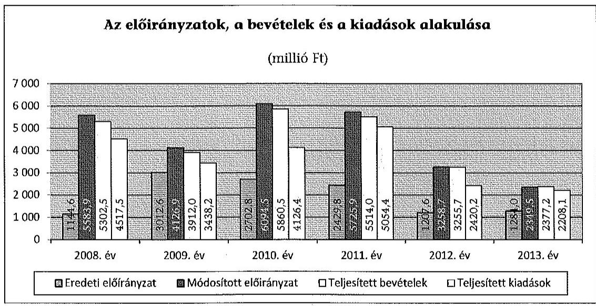

A kutatás-fejlesztésért és technológiai innovációért felelős szervként a NIH feladatait kormányrendeletek - 2010. december 31-ig a 277/2006. (XII. 23.) Korm. rendelet, 2011. január 1-jétől a 303/2010. (XII. 23.) Korm. rendelet - állapították meg. Feladatkörébe tartozott a tudomány-, technológia- és innovációpolitika kidolgozásában és megvalósításában való közremúködés. Az ellenőrzött időszakban a NIH négy alkalommal vett át és három alkalommal adott át feladatokat. A Kutatás-fejlesztési Pályázati és Kutatáshasznosítási Iroda jogutódjaként 2008. január 1-jétől 2010. december 31-ig ellátta a Kutatási és Technológiai Innovációs Alap felhasználásával, kezelésével és ellenőrzésével kapcsolatos feladatokat, amelyet 2011. január 1-jével az NFÜ-nek adott át. Az OKM-től és a GKM-től 2008. május 1-jével vette át a kutatás-fejlesztéssel és technológiai innovációval kapcsolatos feladatokat, majd 2009. október 1-jei hatállyal a tudománypolitikai koordinációs feladatokat az OKM-nek adta át. A magyarországi űrkutatás fő irányainak és programjainak kidolgozásában -KvVM-től átvett feladatként - 2009. január 1-jétől közreműködött, a feladatot 2010. július 1-jével az NFM vett át. A NIH által 2008-2013. között ellátott feladatok és feladatváltozások összefoglalását a 1-2. számú melléklet mutatja be.

---

Az ellenőrzés célja annak megállapítása volt, hogy a NIH-re vonatkozó irányító szervi feladatellátás a jogszabályi előírások betartásával történt-e; a NIH-nél a belső kontrollrendszer kialakítása és múködtetése szabályszerű volte; kialakították-e az erőforrásokkal való szabályszerű és hatékony gazdálkodáshoz szükséges követelményeket, megvalósították-e azok számon kérését, ellenőrzését; a NIH pénzügyi és vagyongazdálkodása megfelelt-e a jogszabályi előírásoknak és belső szabályzatainak; a NIH átalakításának vagy átszervezésének lebonyolítása szabályszerűen történt-e; az integritási kontrollokat kiala-kították-e, szabályszerűen működtetik-e; az ÁSZ korábbi ellenőrzései során megfogalmazott javaslatok, megállapítások tekintetében az ellenőrzés célja továbbá annak megítélése volt, hogy azok végrehajtása érdekében a NIH a szükséges intézkedéseket megtette-e.

A NIH-et az ÁSZ a Magyar Köztársaság 2008. évi költségvetése végrehajtásának ellenőrzése és Magyarország 2013. évi költségvetése végrehajtásának ellenőrzése keretében ellenőrizte.

Az ellenőrzés várható hasznosulása: A központi alrendszerbe tartozó intézmények jelentős hatást gyakorolhatnak a költségvetés egyensúlyának fenntartására, az állami vagyonnal való gazdálkodás minőségére, a kormányzati (szak)politikák végrehajtására, illetve közfeladat ellátásuk vonatkozásában az állampolgárok életminőségére, jogaik és kötelezettségeik gyakorlására. Az ellenőrzés a NIH pénzügyi és vagyongazdálkodása szabályosságának javításával előmozdítja a közpénzügyek átláthatóságát, rendezettségét. Eredményeként átfogó képet kaphatunk a NIH gazdálkodásának hiányosságairól és a jó gyakorlatokról is.

A közintézmények integritás alapú kultúrája meghatározó a belső kontrollrendszer működése szempontjából. Hozzájárulhat az elszámoltathatóság és átláthatóság érvényesítéséhez, egyben támogathatja a szervezet védettségét a korrupciós kitettséggel szemben. Az integritási kontrollok ellenőrzése az integritás szemlélet terjedését, az integritás kultúra erősítését támogatja.

Az ellenőrzés egyben hozzájárul az eredményszemléletű számvitel bevezetésével összefüggő feladatokra való felkészüléshez.

A belső kontrollrendszer államháztartási törvényben rögzített célja a múködés és gazdálkodás során a tevékenységek szabályszerű, gazdaságos, hatékony és eredményes végrehajtása. Az ÁSZ a központi intézmények ellenőrzését teljesítményellenőrzési modullal egészítette ki.

A Hivatal teljesítmény-ellenőrzésének célja annak értékelése volt, hogy a gazdálkodás folyamatában a gazdaságossági, hatékonysági és eredményességi követelmények kialakítása megtörtént-e és azokat működtették-e; a költségvetési szerv belső kontrollrendszerének minőségéről kiadott vezetői nyilatkozatban a költségvetési szerv tevékenységében a hatékonyság, eredményesség, gazdaságosság követelményeinek érvényesítése helytálló volt-e. A teljesítményellenőrzés a gazdálkodási feladatokra terjedt ki, a szakmai feladatellátást nem értékelte.

---

A teljesítményellenőrzés várható hasznosulása: A törvényalkotás számára támogatást nyújt a nemzeti kulcsindikátorok rendszerének kialakításához. A döntéshozók, ellenőrzöttek, irányító szervek, a társadalom számára az összehasonlítási, összemérési lehetőségek kihasználásával objektív visszajelzést ad a gazdálkodás területén végrehajtott szervezeti, szervezési, takarékossági és bürokráciacsökkentő intézkedések hatásairól, a közfeladat-ellátásnak keretet adó pénzügyi és vagyongazdálkodásban mérhető teljesítménykövetelmények kialakításáról, azok alkalmazásáról. Az ÁSZ értékteremtő elemzéseivel, tanácsadó szerepét erősítve támogatja a szervezetek önértékelő, alkalmazkodó (öntanuló) tevékenységét. Irányt mutat az ellenőrzött intézmények gazdálkodási és kapcsolódó adminisztratív folyamatainak optimalizációjához. Segíti a központi költségvetési szervek átláthatóságát, felügyelhetőségét, a „jó gyakorlatok" elterjesztésével támogatja a „jó kormányzást".

Az ellenőrzés típusa: szabályszerűségi ellenőrzés, amelyet a NIH-re vonatkozó teljesítmény-ellenőrzés egészített ki.

Az ellenőrzött időszak: 2008. január 1-jétől 2013. december 31-ig.
A helyszíni ellenőrzésre a szabályszerűségi ellenőrzés tekintetében a NIHnél és a Miniszterelnökségnél került sor. Az ellenőrzés során adatokat kértünk be a Nemzetgazdasági Minisztériumtól (NGM). A teljesítményellenőrzés vonatkozásában helyszíni ellenőrzésre a NIH-nél került sor.

Az ellenőrzés jogszabályi alapját az ÁSZ tv. 1. § (3) bekezdés, 5. § (2)(6) bekezdései, valamint Áht. ${ }_{2}$ 61. § (2) bekezdésének előírásai képezik.

A központi alrendszer intézményeinek ellenőrzése során a belső kontrollrendszer tekintetében a hangsúlyt az egyes kontrollterületek (kontrollkörnyezet, kockázatkezelési rendszer, kontrolltevékenységek, információs és kommunikációs rendszer, monitoring rendszer) kialakításának és az intézmény működési folyamataiba való beépülésének szabályszerűségére helyeztük, amelyet kizárólag jogszabályokból és intézményi belső szabályozásokból levezethető kritériumrendszer alapján ítélünk meg.

A belső kontrollrendszer jogszabályi előírások szerinti kialakításának és múködtetésének szabályszerűségét az erre irányuló egyedileg és összesítetten is értékeltük. A belső kontrollrendszer egyes kontrollterületei kialakítása és múködtetése „szabályszerü volt", tehát a feltárt hiányosságok nem gyakoroltak lényeges hatást a kontrollok kialakítására és múködtetésére, amennyiben az értékelt területen az elért és elérhető pontok százalékban kifejezett hányadosa elérte a $85 \%$-ot, „nem volt szabályszerü", ha nem haladta meg a $60 \%$-ot, és „részben szabályszerü volt", ha $61-84 \%$ között volt.

A belső kontrollrendszer összesített értékelése megegyezett a kontrollterületenként alkalmazott \%-os értékelésekkel, a következő kiegészítéssel. A kontrollrendszer egésze esetében a „szabályszerü" értékelésnek a \%-os értéken felül további feltétele volt, hogy egyik kontrollterületen sem kaphatott „nem volt szabályszerü" értékelést. A „részben szabályszerü" értékelés további feltétele volt, hogy legfeljebb egy ellenőrzött kontrollterület lehetett „nem volt szabályszerű" értékelésű. Az összesített értékelés a \%-os kiértékelés eredményétől függetlenül

---

„nem volt szabályszerű", ha az ellenőrzött kontrollterületek közül több mint egynek „nem volt szabályszerü" az értékelése.

A jogszabályoknak és a belső előírásoknak megfelelőnek, azaz szabályszerűnek tekintettük a vagyonhasznosítási bevételek, az előirányzat-módosítások és a kötelezettségvállalással terhelt maradványok megállapítását és felhasználását, amennyiben a minta ellenőrzésének eredménye alapján $95 \%$-os bizonyossággal a teljes sokaságban a hibaarány kisebb volt, mint $10 \%$, nem megfelelőnek értékeltük, ha a hibaarány a $10 \%$-ot meghaladta. Kockázatot, illetve magas kockázatot jeleztünk, amennyiben egy adott terület vonatkozásában a minta alapján a teljes sokaságban nem volt teljes körűen biztosított a jogszabályoknak és a belső szabályzatoknak megfelelő működés.

A személyi juttatások, a dologi és felhalmozási kiadások, valamint a pénzeszközátadások előirányzatai felhasználásánál a gazdálkodási jogkörök gyakorlását mintavétellel ellenőriztük. A 2008-2011. éveket érintően a szakmai teljesítésigazolás és az utalvány ellenjegyzése kulcskontrollok, a 2012-2013. éveket érintően a teljesítésigazolás és az érvényesítés kulcskontrollok múködését értékeltük. Megfelelőnek értékeltük a gazdálkodási jogkörök gyakorlását, amenynyiben $95 \%$-os bizonyossággal a teljes sokaságban a hibaarány legfeljebb $10 \%$, részben megfelelőnek értékeltük, ha a hibaarány felső határa legfeljebb $30 \%$, nem megfelelőnek pedig akkor, ha a sokaságbeli hibaarány felső határa meghaladta a $30 \%$-ot.

Az ellenőrzés az INTOSAI által kiadott nemzetközi standardok (ISSAI) figyelembe vételével, az ellenőrzési programban foglalt értékelési szempontok szerint történt.

Az Állami Számvevőszékről szóló 2011. évi LXVI. törvény 29. §-a szerint a jelentéstervezetet megküldtük egyeztetésre a Miniszterelnökség, a Nemzetgazdasági Minisztérium és a Nemzeti Kutatási, Fejlesztési és Innovációs Hivatal részére. A beérkezett észrevételeket és az ezekre adott válaszokat, és azok indokolását a jelentés 5-7. számú mellékletei tartalmazzák.

---

# I. ÖSSZEGZŐ MEGÁLLAPÍTÁSOK, KÖVETKEZTETÉSEK, JAVASLATOK 

#### Abstract

Az irányító szerv a NIH-re vonatkozó alapítói, irányító szervi és ellenőrzési jogosultságokat - a feltárt hiányosságok kivételével - összességében szabályszerűen látta el. Az alapítói jogosultságok körében - összhangban az Áht. ${ }_{1-2}$ előírásaival - az alapító okiratot és az SZMSZ-t jellemzően késedelmesen ugyan, de módosították, illetve jóváhagyták. Az irányító szervi jogosultságok gyakorlása során - a vezetői kinevezések visszavonása és a NIH elnökének a belső kontrollrendszer múködésével kapcsolatos beszámoltatása elmaradása kivételével - az Áht. ${ }_{1-2}$ előírásainak megfelelően jártak el. Ellenőrzési jogosultságukat az Áht. ${ }_{1-2}$ előírásaival összhangban szabályszerűen gyakorolták, ugyanakkor nem rögzítettek, nem érvényesítettek és nem kértek számon az Áht. ${ }_{1-2}$-ben meghatározott, a közfeladat ellátásához, az erőforrásokkal való hatékony gazdálkodáshoz számon kérhető követelményeket. Az irányító szerv alapítói, irányítói döntései a NIH 2008. évi átalakítása kapcsán az alapító okirat kiadásának időbeli késedelme kivételével megfelelek az Áht. ${ }_{1}$ előírásainak.

A pénzügyi gazdálkodás a feltárt hibák és hiányosságok következtében nem volt szabályszerú. A kiadási előirányzatok felhasználása és a bevételi előirányzatok teljesítése során a kulcskontrollok múködése nem volt megfelelő. Hibát a kötelezettségvállalás ellenjegyzése, a teljesítés igazolása, az utalvány ellenjegyzése és az érvényesítés gyakorlása során tárt fel az ellenőrzés. Az elő-irányzat-maradványok körében a kötelezettségvállalással terhelt maradvány felhasználása magas kockázatú volt. Az évközi korlátozó intézkedéseket betartották, a NIH-nek fizetési nehézségei nem voltak.

A vagyongazdálkodás a feltárt hiányosságok következtében nem volt szabályszerú. A vagyonhasznosítási bevételeknél a belső kontrollok nem múködtek megfelelően. Az üzemeltetésre adott eszközök mérlegértéke nem felelt meg a Számv. tv. és az Áhsz. előírásainak. A 2008-2009. években a leltárkiértékeléseknél nem a Számv. tv. és az Áhsz. előírásai szerint jártak el, a leltárkiértékelések az eszközök nettó értékét nem tartalmazták. A vagyon hasznosítása során gépjármú értékesítésénél a Vtv. és a Vtvr. előírásait nem tartották be. A vagyon állagának megóvásával összefüggésben fennálló kötelezettségeknek ugyan eleget tettek, a felújítások elmaradásával a tárgyi eszközök használhatósági foka romlott.

A belső kontrollrendszer kialakítása és múködtetése összességében részben volt megfelelő. A belső kontrollrendszer egyes pillérei közül a kontrollkörnyezet kialakítása és múködtetése szabályszerű volt, a kockázatkezelési rendszer, az információs és kommunikációs, és a monitoring rendszer részben volt szabályszerű, a kontrolltevékenységek kialakítása és múködtetése nem volt szabályszerű.

A kontrollkörnyezet szabályszerú volt, a feltárt hiányosságok ellenére is megteremtette a NIH-nél a szabályszerű múködés lehetőségét. A kockázatkezelési rendszer részben volt szabályszerű, miután a NIH elnöke ugyan

---

előírta a kockázatkezelés rendjét, de ellentétben az Ámr. ${ }_{1-2}$ és a Bkr. előírásaival nem végzett kockázatelemzést, nem mérte fel és nem állapította meg a NIH tevékenységében és gazdálkodásában rejlő kockázatokat, nem határozta meg az egyes kockázatokkal kapcsolatban szükséges intézkedéseket.

A kontrolltevékenységek kialakítása és múködtetése nem volt szabályszerű, mivel az ellenőrzési nyomvonalak hiányában - az Áht ${ }_{1}$ és a Bkr. előírásai ellenére - nem volt biztosított a kontrolltevékenységek megfelelő működése, nyomon követése és vizsgálata. A kiadások és bevételek teljesítése folyamatában a kulcskontrollok múködése nem volt megfelelő.

Az információs és kommunikációs rendszer kialakítása és múködtetése 2009. évben szabályszerű volt, a 2008. és a 2010-2013. években részben volt szabályszerű, mivel az Ámr. ${ }_{1.2}$ és a Bkr. előírásaival ellentétben részben működtettek hatékony, megbízható és pontos beszámolási rendszereket, a beszámolási szintek, határidők és módok nem voltak világosan meghatározva.

A monitoring rendszer kialakítása és működtetése részben volt szabályszerű, miután a NIH elnöke az Ámr. ${ }_{1-2}$ és a Bkr. előírásai ellenére csak részben alakította ki és működtette a szervezet tevékenységének, a célok megvalósításának nyomon követését biztosító monitoring rendszert, mivel a belső szabályzatokban előírt beszámoltatási rendszer és az azokat értékelő, megvitató vezetői értekezletek keretében nem biztosították a szervezeti célok megvalósulási folyamatának teljes körű nyomon követését. A NIH elnöke - ellentétben az Áht ${ }_{12}$ előírásaival - a NIH céljainak teljesítésére vonatkozóan, a gazdaságos, hatékony és eredményes gazdálkodásra vonatkozó a szervezet egészére kiterjedő követelmények kialakításáról és alkalmazásáról nem gondoskodott. A monitoring rendszer részeként a belső ellenőrzés működését lényegesen nem befolyásoló jogszabályi hiányosságok voltak jellemzőek a 2008-2012 közötti időszakban. A belső ellenőrzés az ÁSZ jelentésében megfogalmazott hiányosságokat a 2013. év kivételével nem tárt fel.

A NIH integritását fejlesztendőnek értékeltük, mivel a jelenlévő kockázatokat növelő tényezők szintje meghaladta az azok kezelésére kiépült kontrollok szintjét.

Az ÁSZ 2008. évi zárszámadási ellenőrzése keretében megfogalmazott javaslatokra intézkedtek, a megtett javaslatok hasznosultak.

Az ÁSZ tv. 33. § (1) bekezdésében foglaltak értelmében az ellenőrzött szervezet vezetője köteles a jelentésben foglalt megállapításokhoz kapcsolódó intézkedési tervet összeállítani, és azt a jelentés kézhezvételétől számított 30 napon belül az ÁSZ részére megküldeni. Amennyiben az intézkedési tervet határidőre nem küldi meg a szervezet, az ÁSZ elnöke a hivatkozott törvény 33. § (3) bekezdés a)-b) pontjaiban foglaltakat érvényesítheti.

---

A helyszíni ellenőrzés megállapításainak hasznosítása mellett javasoljuk:

# a Miniszterelnökséget vezető miniszternek 

Az irányító szerv a 2009-2013. évek között nem rögzített, nem érvényesített és nem kért számon az Áht. 149 . § (5) bekezdés f) pontja és az Áht. 2 9. § (1) bekezdés f) pontja szerint a közfeladat ellátásához és az erőforrásokkal való hatékony gazdálkodáshoz számon kérhető követelményeket és elvárásokat.

Javaslat:
Intézkedjen a Hivatal közfeladatellátására vonatkozó, és az erőforrásokkal való szabályszerű és hatékony gazdálkodáshoz szükséges követelmények kialakítására, számonkérésére és ellenőrzésére.

## a Nemzeti Kutatási, Fejlesztési és Innovációs Hivatal, mint a Nemzeti Innovációs Hivatal jogutódja elnökének

1. A Hivatal nem rendelkezett a Számv. tv. 14. § (5) bekezdés c) pontjában, az Áhsz. 8. § (4) bekezdés c) pontja, valamint (15) és (16) bekezdésében foglalt önköltségszámítási szabályzattal.

A számviteli politika - ellentétben az Áhsz. 8. § (5) bekezdés a) pontja előírásaival nem írta elő a vagyoni értékű jogok és szellemi termékek minősítésénél figyelembeveendő szempontokat.

Az értékelési szabályzat - ellentétben az Áhsz. 8. § (17) bekezdés a) és d) pontjában előírtakkal - nem rögzítette a jogszabályon alapuló jogerős követelések (adósok) értékelésének elveit, illetve követeléstípusonként a kis összegű követelések dokumentálásának szabályait.

A közbeszerzési szabályzatban az ellenőrzött időszak egészében - a Kbt. 1 6. § (1) bekezdés, valamint a Kbt. 2 22. § (1) bekezdésében foglalt előírás ellenére - nem rögzítették a belső ellenőrzés felelősségi rendjét.

Javaslat:
Intézkedjen a jogszabályi előírásoknak megfelelő kontrollkörnyezet kialakítására.
2. A Hivatal nem rendelkezett az Ámr. 145/B. §, az Ámr. 2 156. § (2) és a Bkr. 6.§ (3) bekezdésében foglalt ellenőrzési nyomvonalakkal.

Javaslat:
Intézkedjen a Hivatal ellenőrzési nyomvonalának elkészítésére.
3. A Hivatal elnöke - ellentétben Ámr. 145/C. § (1)-(2), az Ámr. 2 157. § (1)-(2), valamint a Bkr. 7. § (1)-(2) bekezdéseiben foglaltakkal - nem végzett kockázatelemzést, nem mérte fel és nem állapította meg a Hivatal tevékenységében és gazdálkodásá-

---

ban rejlő kockázatokat, nem határozta meg az egyes kockázatokkal kapcsolatban szükséges intézkedéseket, azok megtételének módját, a teljesítésük folyamatos nyomon követésének módját.

Javaslat:
Intézkedjen a kockázatkezelés jogszabályokban és szabályzatban foglalt előírásoknak megfelelő müködtetéséről.
4. A Hivatal elnöke - az Ámr. 1 145/E. § (2) bekezdés c), az Ámr. 2 158. § (2) bekezdés c), valamint a Bkr. 8. § (4) bekezdés b) pontjában előírtak ellenére - nem szabályozta az informatikai rendszerekhez való hozzáférés jogosultságait, és a hozzáférés szintjeit.

Javaslat:
Intézkedjen, hogy az informatikai rendszerekhez való hozzáférési jogosultságok és a hozzáférés szintjei szabályozva legyenek.
5. A kiadási előirányzatok felhasználása és a bevételi előirányzatok teljesítése során a kulcskontrollok müködése nem volt megfelelő.

A dologi és felhalmozási kiadásoknál a teljesítésigazoló - ellentétben az Ámr. 1 135. § (2) bekezdésével, az Ámr. 2 76. § (5) bekezdésével és az Ávr. 57. § (4) bekezdésével nem rendelkezett a szükséges kijelöléssel. A teljesítésigazolást az arra jogosult - az Ámr. 1 135. § (1)-(2) bekezdésében, az Ámr. 2 76. § (1) és (3) bekezdésében és az Ávr. 57. § (1) és (3) bekezdésében foglaltakkal ellentétben - nem végezte el. Az utalványrendeletek - ellentétben az Ámr. 1 136. § (4) bekezdés g) pontja, az Ámr. 2 78. § (2) bekezdés a) pontja, valamint az Ávr. 59. § (3) bekezdés g) pontja előírásaival - nem tartalmaztak keltezést.

A vagyonhasznosítási bevételeknél a kötelezettségvállaló - ellentétben az Ámr. 1 135. § (2) bekezdésével, az Ámr. 2 76. § (5) bekezdésével és az Ávr. 57. § (4) bekezdésével - a szakmai teljesítést igazoló személyt nem jelölte ki. A teljesítésigazoló 2013. évben - ellentétben az Ávr. 57. § (1)-(3) bekezdéseivel, illetve a 22/2011. számú elnöki utasítással kiadott gazdálkodási szabályzat 4.3.1. pontjával - nem végezte el a bevételek teljesítésének igazolását. Az érvényesítőt - ellentétben az Ávr. 58. § (4) bekezdésével - 2012-ben nem jelölték ki. 2012-ben és 2013-ban - az Ávr. 58. § (3) bekezdése ellenére - az érvényesítést nem végezték el.

A rendszeres és nem rendszeres személyi juttatásoknál - az Áht. 1 98. § (2) bekezdés (2008. december 31-ig), 100/B. § (3) bekezdés (2009. január 1-jétől), 100/C. § (3) bekezdés (2011. január 1-jétől), Áht. 237 § (1) bekezdés, valamint az Ámr. 1 134. § (8) bekezdés, az Ámr. 2 74. § (1) bekezdés, és az Ávr. 55. § (1) bekezdése előírásaival ellentétben - a kifizetések alapját képező kötelezettségvállalási dokumentum pénzügyi ellenjegyzése nem történt meg.

Javaslat:
Intézkedjen a kiadások és a bevételek teljesítése során a kontrollok jogszabályoknak megfelelő müködtetéséről.

---

6. A Hivatal a MAG Zrt-nek üzemeltetésre átadott informatikai eszközöket és bútorokat, a MAG Zrt. december 31-ei fordulónapra évenként leltározta, azonban a Számv. tv. 69. § (1)-(5) bekezdésében foglaltak ellenére a leltár az eszközök értékét nem tartalmazta.

Javaslat:
Intézkedjen a jogszabályi előírásoknak megfelelő leltár összeállításáról.
7. A Hivatal elnöke az Áht. 97. § (1) bekezdésben (2008.), a 88. § (1) bekezdés b) pontjában (2009. január 1-jétől 2010. augusztus 14-ig), a 94. § (1) b) pontjában, az Áht. 2 61. § (1) bekezdésben és a 69. § (1) bekezdés a) pontjában foglalt előírások ellenére a belső kontrollrendszer keretében a NIH céljainak teljesítésére vonatkozóan, a gazdaságos, hatékony és eredményes gazdálkodásra vonatkozó követelmények kialakításáról és alkalmazásáról nem gondoskodott.

Javaslat:
Intézkedjen a Hivatal tevékenységére vonatkozó hatékonysági, eredményességi és gazdaságossági követelmények kialakítására és érvényesítésére.

---

# II. RÉSZLETES MEGÁLLAPÍTÁSOK 

## 1. A MINISZTÉRIUM INTÉZMÉNYRE VONATKOZÓ FELADATELLÁTÁSA

Az irányító szerv a NIH-re vonatkozó alapítói, irányító szervi és ellenőrzési jogosultságait - a feltárt hiányosságok kivételével - összességében szabályszerűen ellátta.

Az irányító szerv alapítói jogosultságait - késedelmek és a feltárt hibák kivételével - szabályszerűen látta el. Az irányító szerv a NIH alapító okiratát összesen hét (a gazdasági és közlekedési miniszter kettő, a kutatásfejlesztésért és innovációért felelős tárca nélküli miniszter és a nemzeti fejlesztési és gazdasági miniszter egy-egy, a nemzetgazdasági miniszter három) alkalommal módosította. Az irányító szerv - az Áht. ${ }_{1-2}$ elöírásaival összhangban az irányító szerv változása, a NIH költségvetése önálló fejezetté válása miatt az alapító okiratot kisebb időbeli késedelemmel, de módosította. A 2008. május 1jétől, 15-étől, 2009. április 16-ától és 2010. május 29-étől hatályos változáshoz képest 2008. július 24-én, 2009. június 1-jén, illetve 2010. szeptember 30-án módosította az alapító okiratot. A NIH-nél történt feladatváltozások tekintetében - két eset kivételével - az irányító szerv az Áht. ${ }_{1-2}$ elöírásaival összhangban, de időbeli késedelemmel módosította az alapító okiratot. A kutatás-fejlesztésért és innovációért felelős tárca nélküli miniszter 2009. január 1-jei, a nemzeti fejlesztési és gazdasági miniszter 2009. október 1-jei feladatváltozás vonatkozásában - az Áht. ${ }_{1} 49 . \S$ (5) bekezdés c) pontjával ellentétben - az alapító okiratot nem módosította. A gazdasági és közlekedési miniszter a NIH alapító okiratát ellentétben az Áht. ${ }_{1} 89 . \S$ (1) bekezdésében foglaltakkal - nem a 392/2007. (XII.27.) Korm. rendelet, és a 277/2006. (XII.23.) Korm. rendelet módosításának 2008. január 1-jei hatályba lépésével, hanem 2008. január 29-ével, visszamenőlegesen módosította. Az alapító okiratokhoz (a gazdasági és közlekedési miniszter által módosított 2008. április 14-i és a nemzetgazdasági miniszter által módosított 2012. május 29-i alapító okirat kivételével) - ellentétben az Ámr. ${ }_{1}$ 10. § (11) pont, illetve Ámr. ${ }_{2} 10 . \S$ (10) pont előírásával - módosításkor a módosítást tartalmazó okirat mellé nem csatolták az egységes szerkezetű alapító okiratot.

A NIH szervezeti felépítését, feladatait és múködési folyamatait - a kutatásfejlesztésért és innovációért felelős tárca nélküli miniszternél feltárt hiányosságok kivételével - az Ámr. ${ }_{1-2}$ előírásaival és az alapító okiratokkal összhangban SZMSZ-ek rögzítették. Új SZMSZ hatályba helyezésére 10 alkalommal került sor, amelyeket az irányító szerv - az Áht. ${ }_{1-2}$ előírásaival összhangban - kisebb késedelmekkel, de jóváhagyott, azok a Gazdasági Közlönyben, Közlekedési Értesítőben és Hivatalos Értesítőben megjelentek. A kutatás-fejlesztésért és innovációért felelős tárca nélküli miniszter és a nemzeti fejlesztési és gazdasági miniszter ellentétben a 2008. évi XX. törvény 2. § (4) bekezdésével és a NIH alapító okiratával - az SZMSZ-ben nem vezette át a NIH költségvetése önálló költségvetési fejezetté válásának tényét. A kutatás-fejlesztésért és innovációért felelős tárca nélküli miniszter - ellentétben a Jat. 13. §-ával - az 1/2008. (VII. 1.) KFTNM utasítással 2008. július 1-jétől hatályos SZMSZ-el nem, csak a 2/2008. (X. 01.)

---

KFINM utasítással helyezte hatályon kívül a 2008. március 15 -én kiadott SZMSZ-t. A 2008. július 1-jétől 2008. október 1-jéig terjedő időszakban egyszerre két SZMSZ volt hatályban.

Az irányító szerv irányítói jogosultságainak gyakorlása - vezetői megbízások visszavonásának, valamint a belső kontrollrendszer múködésével kapcsolatos beszámoltatás elmaradásának kivételével - megfelelt az Áht.1-2 előirásainak. Az irányító szerv - összhangban a 2006. LVII. törvény, a 2010. évi XLIII. törvény, az Áht.2, valamint a 277/2006. (XII. 23.) és a 303/2010. (XII.23.) Korm. rendelet előírásaival - szabályosan nevezte ki a NIH elnökeit, egyéb munkáltatói jogát szabályszerűen gyakorolta. A kutatás-fejlesztésért felelős tárca nélküli miniszter, valamint a nemzetgazdasági miniszter - ellentétben a 2006. évi LVII. törvény 2. § (1) bekezdés b) és a 2010. évi XLIII. törvény 2. § (1) bekezdés b) pontjában rögzített előírással - új elnök kinevezésekor nem vonta vissza az elnöki feladatokra helyettesítéssel kijelölt személy ideiglenes megbízását. A gazdasági és közlekedési miniszter és a kutatás-fejlesztésért és innovációért felelős tárca nélküli miniszter nem vonta vissza a regionális elnökhelyettes kinevezését a 2008. január 1-október 10-e közötti időszakban, ellentétben a hatályos SZMSZ-ekkel, amelyek regionális elnökhelyettest nem nevesítettek (16/2007. (V. 8.) GKM utasítás, a 13/2008. (III. 14.) GKM utasítás és az 1/2008. (VII. 1.) KFINM utasítás). A nemzetgazdasági miniszter - ellentétben az Áht. 2 9. § (1) bekezdés c) pontjával - a 2004-ben határozatlan időre kinevezett gazdasági vezető megbízását nem vonta vissza annak ellenére, hogy feladatait ténylegesen 2010. február 23-ig látta el és az álláshelye 2012. június 1jével betöltésre került. Az elnöki feladatokra helyettesítéssel kijelölt személy, a regionális elnökhelyettes 2008. január 1-október 10-e között, valamint a 2004ben kinevezett gazdasági vezető 2010. február 24-étől 2012. május 31-ig terjedő időszakban a megbízás visszavonásának hiánya ellenére a megbízással járó jogait nem gyakorolta. A kutatás-fejlesztésért és innovációért felelős tárca nélküli miniszter és a nemzeti fejlesztési és gazdasági miniszter a 2008-2009. évekre - ellentétben az Áht. 1 49. § (5) bekezdés t) pontjában foglalt előírásokkal nem számoltatta be a NIH elnökét a belső kontrollrendszer múködéséről.

Az irányítószerv - összhangban az Áht. ${ }_{1-2}$ előírásaival - érvényesítette a közfeladat jellégnek megfelelő finanszírozási módot a közfeladat támogatásának meghatározásakor, a létszám-előirányzatot az éves költségvetésben jóváhagyta, gyakorolta az előirányzatokkal kapcsolatos jogköreit, figyelemmel kísérte a NIH költségvetésének végrehajtását, a bevételi és kiadási előirányzatokkal való gazdálkodását, irányította a tervezéssel kapcsolatos feladatait, jóváhagyta költségvetéseit, meghatározta a beszámoló készítési feladatokat. A nemzetgazdasági miniszter - az Áht. ${ }_{1-2}$ előírásaival összhangban - az ellátandó feladatok teljesülésének veszélye miatt 2011. évben, illetve 2012-2013. években a szükséges intézkedéseket megtette.

Az irányító szerv ellenőrzési jogosultságait - a feltárt hiányosságok kivételével - összhangban az Áht. ${ }_{1-2}$ előírásaival szabályszerűen látta el. Az NGM - ellentétben az Áht. 1 49. § (5) bekezdés j) pontjával - nem vizsgálta felül a 2011. I. féléves beszámolót. Az irányító szerv - összhangban a 2006. LVII. törvény, a 2010. évi XLIII. törvény előírásaival - törvényességi, szakszerűségi, pénzügyi ellenőrzéseket folytatott, 2009. és 2013. év kivételével szabályszerűségi, rendszer, és megbízhatósági ellenőrzéseket, egy esetben utóellenőrzést vég-

---

zett a NIH-nél. Az irányító szerv - ellentétben az Áht. 49. § (5) bekezdés d) pontjában és (6) bekezdésében előírtakkal 2010. augusztus 14-ig - hatásvizsgálat alapján nem vizsgálta a közfeladat-ellátás iránti igény meglétét, a közfel-adat-ellátás más megoldási módokkal, más szervezeti megoldásokkal szembeni előnyét, nem mérlegelte a szervezeti célszerüséget. Nem vizsgálta az ellátott, ellátandó közfeladat elvégzésére alkalmas államháztartáson belüli vagy kívüli szervezetek vagy személyek közötti versenyhelyzetet, továbbá annak feltételezett hatását a gazdaságos, hatékony, eredményes, valamint megfelelő garanciákkal rendelkező közfeladat-ellátásra, nem érvényesítette és nem értékelte a szakmai, mennyiségi, minőségi, valamint a múködés és gazdálkodás gazdaságosságára, hatékonyságára, továbbá a szerv egészére és szervezeti egységeire vonatkozó méretgazdaságossági követelményeket. Az irányító szervek a 2006. I.VII. törvény 2. §. (1) bekezdés c) pontjában, és 2010. évi XLIII. törvény 2. §. (1) bekezdés c) pontjában előírt hatékonysági ellenőrzéseket nem végeztek.

Az irányító szerv - ellentétben az Áht. 49 . § (5) bekezdés f) pontja, és az Áht. 2 9. § (1) bekezdés f) pontjában foglaltakkal - ellenőrzései során a közfeladatok ellátására vonatkozó, az erőforrásokkal való szabályszerű és hatékony gazdálkodáshoz szükséges követelmények érvényesítését nem ellenőrizte, nem kérte számon. Az irányító szerv a NIH felé követelményként a költségvetési gazdálkodás folyamatában szokásos követelményként állapította meg 2009-2011. években az előirányzat-maradvány jóváhagyását, 2010. évben előirányzat visszarendezést, kiadási keretösszeg meghatározását, a 2011. évben az 1316/2011. (IX. 19.) Korm. határozat végrehajtását, függő tételek rendezését, szerződéses állomány felülvizsgálatát, 2012. évben az előirányzat-maradvány terhére jutalom kifizetés felfüggesztését, 2013. évben a függő tételek rendezését határozta meg. Ezeknek a követelményeknek az ellenőrzését, számonkérését a NIH féléves és éves beszámolóinak ellenőrzésével biztosította.

# 2. A NIH átalakítása, a feladat átadás-átvételek szabálySZERŰSÉGE 

Az irányító szerv (gazdasági és közlekedési miniszter) alapítói, irányítói döntései a KPI 2008. évi beolvadása kapcsán - a feltárt hiányosságok kivételével - megfeleltek az Áht., előírásainak. A gazdasági és közlekedési miniszter - az Áht. ${ }_{1}$ előírásaival összhangban - döntött a KPI megszüntetéséről, azonban az alapító okiratot - az 1. fejezetben ismertetettek szerint visszamenőleges hatállyal módosította. A NIH jogutódlásának törzskönyvi átvezetését - az Ámr. ${ }_{1}$ előírásaival összhangban - szabályszerűen elvégezték, az Áht. ${ }_{1}$ 88/A. § (3) bekezdés szerinti adatváltozás bejelentési kötelezettségnek eleget tettek. A gazdasági és közlekedési miniszter az átalakításhoz kapcsolódóan a NIH SZMSZ-ének módosítását az Áht. ${ }_{1}$ előírásaival összhangban, de időbeli késedelemmel jóváhagyta (13/2008. (III. 14.) GKM utasítás). A KTIA felhasználásának, kezelésének és ellenőrzésének feladatait - a pályázatkezelés és a pályázatkezelési rendszer projekt kivételével - dokumentáltan vette át a NIH.

A végrehajtott feladat-átadásokra és átvételekre dokumentáltan, az átadó és átvevő között megkötött megállapodások alapján - a 2011. évi feladatátadás kivételével - a feladatváltozást előíró jogszabályok hatályba lépését követően

---

több hónapos késedelemmel került sor. Az OKM-től és a GKM-től a 103/2008. (IV. 29.) Korm. rendelet 1. § a) pontja alapján 2008. május 1-jei hatállyal átvett feladathoz kapcsolódó megállapodást 2008. szeptember 5-én, illetve 2008. július 10-én írták alá. A KvVM-től 306/2008. (XII. 08.) Korm. rendelet 6. § (2) bekezdése alapján 2009. január 1-jétől átvett feladathoz kapcsolódó megállapodást 2009. február 11-én írták alá. A 177/2006. (IX. 13.) Korm. rendelet 3. § (2)(6) bekezdése alapján 2009. október 1-jei hatállyal átvett feladatokra vonatkozó megállapodás 2009. decemberi keltezésű. A 212/2010. (VII. 1.) Korm. rendelet 84. § m) pontja alapján 2010. július 1-jével átadott feladatra vonatkozó megállapodást a felek 2010. október-november hónapban írták alá. A 2011. január 1-jétől a 303/2010. (XII. 23.) Korm. rendelet 12. § (2) bekezdése alapján a KTIA kezelésével kapcsolatos feladatok átadás-átvételére a megállapodást a felek 2011. január 31-én készült jegyzőkönyvben rögzítették. Az ellátott feladatokat a 1. számú, az átadott és átvett feladatokat összefoglalóan a 2. számú melléklet mutatja be.

# 3. A BELSŐ KONTROLLRENDSZER KIALAKÍTÁSA ÉS MÜKÖDTETÉSE 

A belső kontrollrendszer kialakítása és müködtetése az ellenőrzött időszakban összességében részben volt megfelelő. A belső kontrollrendszer egyes pillérei közül a kontrollkörnyezet kialakítása és müködtetése szabályszerű volt, a kockázatkezelési rendszer, az információs és kommunikációs rendszer, és a monitoring rendszer részben volt szabályszerű, a kontrolltevékenységek kialakítása és működtetése nem volt szabályszerű.

A NIH elnöke a 2008-2009. években - ellentétben az Áht. ${ }_{1} 97 . \S$ (2) bekezdésével - az éves költségvetési beszámoló keretében az Ámr. ${ }_{1}$ 23. sz. melléklete szerinti nyilatkozatban nem számolt be a NIH folyamatba épített, előzetes és utólagos vezetői ellenőrzésének, valamint belső ellenőrzésének müködtetéséről. A 2010-2013. években a NIH elnöke - az Áht. ${ }_{1-2}$, az Ámr. ${ }_{1-2}$ és a Bkr. előírásaival összhangban - a belső kontrollok müködéséről beszámolt, fejlesztési igényt (szabályzatok aktualizálása, belső ellenőrzési tevékenység ellátása) a 2012. évi és a 2013. január 1-21-e közötti időszakra vonatkozóan jelöltek meg.

### 3.1. A kontrollkörnyezet, a kockázatkezelési rendszer, a kontrolltevékenységek és az információs és kommunikációs rendszer kialakítása és müködtetése

A kontrollkörnyezet kialakítása és müködtetése az ellenőrzött időszak minden egyes évében - a feltárt hiányosságok mellett - szabályszerű volt. A NIH rendelkezett hatályos alapító okirattal, SZMSZ-el, a gazdasági szervezete ügyrendjével, a pénzgazdálkodási jogkörök gyakorlásának szabályzatával, számviteli politikával, számlarenddel, bizonylati renddel, pénzkezelési, értékelési, leltározási és leltárkészítési szabályzattal, selejtezési, valamint közbeszerzési szabályzattal. A NIH-nél szabályozták a kockázatkezelés rendjét, a szabálytalanságok kezelése eljárásrendjét, valamint etikai kódexben meghatározták az etikai elvárásokat a szervezet minden szintjén. A munkavállalók részére elkészítették a munkaköri leírásokat. A meglévő belső szabályzatokat rendszeres időközönként aktualizálták. A NIH ugyanakkor az ellenőrzött időszak egé-

---

szében - a Számv. tv. 14. § (5) bekezdés c) pontjában, az Áhsz. 8. § (4) bekezdés c) pontja, valamint (15) és (16) bekezdésében, illetve az Ámr. ${ }_{1}$ 145/B. §, az Ámr. 2 156. § (2) és a Bkr. 6.§ (3) bekezdése ellenére - nem rendelkezett önköltségszámítási szabályzattal, valamint ellenőrzési nyomvonalakkal.

A meglévő szabályzatok - a gazdasági szervezet ügyrendje, a számviteli politika, az értékelési, gazdálkodási és közbeszerzési szabályzat esetében feltárt hiányosságok kivételével - megfeleltek a jogszabályi előírásoknak. A gazdasági szervezet ügyrendje - az Ámr. ${ }_{1} 17 . \S$ (5) bekezdése, illetve az Ámr. 2 20. § (7) és az Ávr. 13. § (5) bekezdése ellenére - 2011-2012. között a beosztott munkavállalók feladat- és hatáskörét nem rögzítette. A számviteli politika - ellentétben az Áhsz. 8. § (5) és (8) bekezdésével - 2008-2009. években nem tartalmazta a mérlegkészítés időpontját, 2010-2013. között nem írta elő a vagyoni értékű jogok és szellemi termékek minősítésénél figyelembeveendő szempontokat. Az értékelési szabályzat 2008-2013. között - ellentétben az Áhsz. 8. § (17) bekezdés a) és d) pontjában előírtakkal - nem rögzítette a jogszabályon alapuló jogerős követelések (adósok) értékelésének elveit, illetve követeléstípusonként a kis összegű követelések dokumentálásának szabályait. A gazdálkodási szabályzat - ellentétben az Ámr. ${ }_{1}$ 162/B. § (1) bekezdésében, valamint az Ámr. 2 235. § (1) bekezdésében foglaltakkal - 2009-2010. között a 10 és 5 M Ft-os értékhatárt elérő kötelezettségvállalások Kincstárhoz történő bejelentésének feladatait. A közbeszerzési szabályzatban 2008. évben a Kbt. ${ }_{1} 59$. $\S$ ában előírtak ellenére nem határozták meg az ajánlati biztosíték kezelésével, nyilvántartásával, illetőleg visszaadásával kapcsolatos feladatokat, melyet 2009-től elnöki utasításban pótoltak. A közbeszerzési szabályzatban 2010-től 2012. augusztusig - ellentétben az Ámr. 2 20. § (3) bekezdés b) és az Ávr. 13. § (2) bekezdés b) pontjában előírtakkal - nem szabályozták a Kbt. hatálya alá nem tartozó beszerzések lebonyolításának eljárásrendjét. A közbeszerzési szabályzatban az ellenőrzött időszak egészében - a Kbt. 1 6. § (1) bekezdés, valamint a Kbt. 2 22. § (1) bekezdésében foglalt előírás ellenére - nem rögzítették a belső ellenőrzés felelősségi rendjét.

A kockázatkezelési rendszer kialakítása és müködtetése az ellenőrzött időszak minden egyes évében részben volt szabályszerű. A NIH elnöke az Ámr. ${ }_{12}$-ben, valamint a Bkr.-ben foglaltaknak megfelelően előírta a kockázatkezelés rendjét. A NIH elnöke - ellentétben Ámr. ${ }_{1}$ 145/C. § (1)-(2), az Ámr. 2 157. § (1)-(2), valamint a Bkr. 7. § (1)-(2) bekezdéseiben foglaltakkal nem végzett kockázatelemzést, nem mérte fel és nem állapította meg a NIH tevékenységében és gazdálkodásában rejlő kockázatokat, nem határozta meg az egyes kockázatokkal kapcsolatban szükséges intézkedéseket, azok megtételének módját, a teljesítésük folyamatos nyomon követésének módját.

A kontrolltevékenységek kialakítása és müködtetése az ellenőrzött idöszak minden egyes évében nem volt szabályszerű. A kontrolltevékenység részeként működő folyamatba épített, előzetes, utólagos és vezetői ellenőrzésre vonatkozó FEUVE szabályzat a 2008-2011. és a 2013. években nem volt aktualizált. A NIH-nél - az Áht. 1 121. § (2) bekezdés c) pontjában, illetve a Bkr. 8. § (2) bekezdés d) pontjában foglaltak ellenére - megfelelő, pontos és naprakész információk nem álltak rendelkezésre a költségvetési gazdálkodással kapcsolatban, illetve a kontrolltevékenység részeként a gazdasági események elszámolásának kontrollja nem volt biztosított. A 2009-2013. években a NIH

---

belső szabályzataiban az Ámr. ${ }_{1-2,}$, valamint a Bkr.-ben foglaltaknak megfelelően a felelősségi körök meghatározásával szabályozták az engedélyezési és jóváhagyási eljárásokat, a dokumentumokhoz való hozzáférést, a hozzáférés szintjeit, valamint a beszámolási eljárásokat. A NIH elnöke - az Ámr. ${ }_{1}$ 145/E. § (2) bekezdés c), az Ámr. ${ }_{2}$ 158. § (2) bekezdés c), valamint a Bkr. 8. § (4) bekezdés b) pontjában előírtak ellenére - nem szabályozta az informatikai rendszerekhez való hozzáférés jogosultságait, és a hozzáférés szintjeit. A kiadási előirányzatok felhasználása és a bevételi előirányzatok teljesítése során a kulcskontrollok működése nem volt megfelelő, a feltárt hiányosságokat részletesen a 4.2. fejezet tartalmazza.

Az információs és kommunikációs rendszer kialakítása és müködtetése 2009. évben szabályszerű volt, a 2008. és a 2010-2013. években részben volt szabályszerű. A NIH-nél 2008. és 2010-2013. években - ellentétben az Ámr. ${ }_{1}$ 145/F. § (2) bekezdésével, az Ámr. ${ }_{2}$ 159. § (2) bekezdésével és a Bkr. 9. § (2) bekezdésével - részben működtettek hatékony, megbízható és pontos beszámolási rendszereket, a beszámolási szintek, határidők és módok nem voltak világosan meghatározva. A NIH elnöke belső szabályzatokban (SZMSZek, Ügyrendek, Kommunikációs szabályzatok, Informatikai biztonsági szabályzat, Biztonsági keretszabályzat) meghatározta az információátadás formáit. A NIH rendelkezett a 2008. évben informatikai biztonsági, 2009. évtől biztonsági keret szabályzattal, amelyek aktualizálása azonban nem történt meg. A NIH a 2008-2010. években rendelkezett belső kommunikációs stratégiával, valamint a 2008-2013. években kommunikációs szabályzattal, amelyekben szabályozták az információs és kommunikációs folyamatokat. A 2009-2013. években az Ámr. ${ }_{1-2}$-ben valamint a Bkr.-ben foglaltaknak megfelelően az alkalmazottak a munkavégzéshez szükséges információhoz az Intranet segítségével megfelelően időben hozzájuthattak, valamint a vezetői döntéshez szükséges információk a beszámoltatások, illetve a rendszeres vezetői megbeszélések alapján időben rendelkezésre álltak.

# 3.2. A monitoring rendszer kialakítása és müködtetetése, a belső ellenőrzés, integritási szemlélet 

A monitoring rendszer kialakítása és müködtetése az ellenőrzött időszak minden egyes évében részben volt szabályszerű. A monitoring rendszer múködtetése érdekében - az Áht. ${ }_{1}$, az Ámr. ${ }_{2}$ és a Bkr. előírásaival összhangban - kidolgozták a folyamatba épített előzetes, utólagos és vezetői ellenőrzés rendszerét, azonban nem gondoskodtak annak fejlesztéséről. A NIH elnöke 2008-2013. években - ellentétben az Ámr. ${ }_{1}$ 145/G. §, az Ámr. ${ }_{2}$ 160. §, valamint a Bkr. 10. § előírásaival - csak részben alakította ki és müködtette a szervezet tevékenységének, a célok megvalósításának nyomon követését biztosító monitoring rendszert, mivel a belső szabályzatokban előírt beszámoltatási rendszer és az azokat értékelő, megvitató vezetői értekezletek keretében nem biztosították a szervezeti célok megvalósulási folyamatának teljes körű nyomon követését. A NIH elnöke az Áht. ${ }_{1}$ 97. § (1) bekezdésben (2008.), a 88. § (1) bekezdés b) pontjában (2009. január 1-jétől 2010. augusztus 14-ig), a 94. § (1) b) pontjában, az Áht. ${ }_{2}$ 61. § (1) bekezdésben és a 69. § (1) bekezdés a) pontjában foglalt előírások ellenére a belső kontrollrendszer keretében a NIH céljainak tel-

---

jesítésére vonatkozóan, a gazdaságos, hatékony és eredményes gazdálkodásra vonatkozó követelmények kialakításáról és alkalmazásáról nem gondoskodott.

A monitoring rendszer részeként a belső ellenőrzés múködésében a 2008-2012. években jogszabályi hiányosságok voltak jellemzőek. A NIH elnöke az Áht. ${ }_{1-2}$-ben foglaltaknak megfelelően gondoskodott a belső ellenőrzés szervezeti kialakításáról. A NIH elnöke - ellentétben az Áht. 1 97. § (1) bekezdés, 121/A. § (3) bekezdés (2009. január 1-jétől), 121/B. § (4) bekezdés (2011. január 1-jétől), az Áht. 2 70. § (1) bekezdése, valamint a Ber. 4. § (1), illetve a Bkr. 15. § (1) bekezdése előírásaiban foglaltakkal - nem gondoskodott a belső ellenőrzés megfelelő működtetéséről, mivel három időszakban a belső ellenőri munkakör nem volt betöltve (2008. január 1-je április 25-e, 2010. október 25-e november 30-a, 2011. december 1-je és a 2012. május 22-e között).

A belső ellenőrzés szervezeti szabályozása megfelelt a Ber. és Bkr. előírásainak, a belső ellenőri feladatokat teljes munkaidőben foglalkoztatott köztisztviselő (2008. április 26-a és a 2010. október 24-e, a 2010. december 1-je és a 2011. november 30-a, valamint a 2013. február 1-je és a december 31-e között), vagy külső szervezet (2012. május 23-a és 2013. február 28-a között) látta el. A belső ellenőrzés helye a szervezeti struktúrában a Ber. és a Bkr. előírásaival összhangban állt, a belső ellenőrzés az SZMSZ-ben előírtak szerint a NIH elnökének közvetlenül alárendelve működött. A belső ellenőri megbízásoknál a Ber. és a Bkr. előírásainak megfelelően érvényesültek az összeférhetetlenségi előírások.

A belső ellenőröket megillető betekintési és hozzáférési jogosultságokat a Ber. és a Bkr. előírásainak megfelelően biztosították, azonban a 2008-2010. években a Ber. 17. § (1) bekezdés a) pontjában foglaltak ellenére - az ellenőrzések során az ellenőrzöttek nem teljesítették maradéktalanul az ellenőrzéssel kapcsolatos együttműködési kötelezettségüket. A 2008-2012. években az elvégzett ellenőrzésekről - ellentétben a Ber. 32. § (1)-(2) bekezdésében, valamint a Bkr. 47. §ában foglaltakkal - nyilvántartást nem, azonban a 2013. évben már vezettek.

Az ellenőrzési megállapítások alapján intézkedési terveket - ellentétben a Ber. 29. § (1), valamint a Bkr. 45. § (3) bekezdésével - a megadott határidőn túl készítették el. Az intézkedési tervek véleményezése az ellenőrzés vezetője részéről a 2008-2012. években - a Ber. 29. § (2), valamint a Bkr. 45. § (4) bekezdésében előírtak ellenére - nem, a 2013. évben azonban már megtörtént. Az intézkedési tervek alapján tett intézkedések utóvizsgálata a Ber. és a Bkr. előírásainak megfelelően megtörtént. A belső ellenőrzés az ÁSZ jelentésében megfogalmazott hiányosságokat a 2013. év kivételével nem tárt fel.

A NIH által tanúsítványi adatszolgáltatás keretében kitöltött integritási kérdőív szabályozási, múködési hiányosságokra mutatott rá, egyes területeken nem érvényesült teljes körűen az integritási szemlélet. A NIH nem rendelkezett - nyilvánosan közzétett - stratégiával, nem múködött szervezett dolgozói érdekképviselet. Rendszerszerű kockázatelemzést a szervezetnél nem alkalmaztak, nem végeztek rendszeres korrupciós kockázatelemzést, a lehetséges korrupciós események felmérése, így a lehetséges kockázatok mérséklése érdekében sem fogalmaztak meg konkrét lépéseket. Több integritás kontroll területet nem szabályoztak, ugyanaz a személy látta el az utalványozás és ellenjegyzés feladatát (de nem azonos gazdasági eseménynél), a külső szakértők alkal-

---

mazásának feltételeiről nem rendelkeztek, a külső szervezetekkel, személyekkel való kapcsolattartást nem szabályozták. Titokvédelmi szabályzattal, önálló összeférhetetlenségi szabályzattal nem rendelkeztek, az ajándékok, meghívások utaztatás elfogadásának feltételeit, a szervezeten belüli közérdekű bejelentők védelmét nem szabályozták. Az új munkatársak felvételekor nem ellenőrizték a benyújtott (képzettséget, végzettséget igazoló) dokumentumok hitelességét, az új munkatársak kiválasztása során az esetek kevesebb, mint a felében írtak ki pályázatot, pszichológiai és tudásszint-felmérő tesztet nem alkalmaztak.

A NIH-nél az eredendő veszélyeztetettségi szint közepes, míg a kockázatokat növelő tényezők szintje magas, a kiépült, a kockázatok kezelésére hivatott kontrollok szintje közepes volt. A kockázatok és a kontrollok szintje alapján megállapítható, hogy a NIH-nél jelenlévő kockázatokat növelő tényezők szintje meghaladta az azok kezelésére kiépült kontrollok szintjét, a szervezet integritása fejlesztendő.

# 4. A NIH PÉNZÜGYI GAZDÁlKODÁSA 

A NIH pénzügyi gazdálkodása az ellenőrzött időszakban - az előirány-zat-módosítások kezelése kivételével - nem volt szabályszerú.

### 4.1. Az előirányzatok megállapítása és módosítása

A NIH elemi költségvetéseinek elkészítése, az előirányzatok megállapítása során a szintrehozások, szerkezeti változások figyelembe vételével - az elemi költségvetésekkel kapcsolatos hiányosság kivételével megfelel az Áht. ${ }_{1.2}$, az Ámr. ${ }_{1.2}$ és az Ávr. valamint a belső szabályzatok előírásainak.

A NIH-nél a költségvetési tervezéssel kapcsolatos feladatokat belső szabályzatokban és a munkavállalók munkaköri leírásaiban rögzítették. Az elemi költségvetést az ellenőrzött időszak minden évében elkészítették. A 2008-2011. évi elemi költségvetésekben - ellentétben az Ámr. ${ }_{1} 37 . \S$ d), e) pontjai, Ámr. ${ }_{2} 46 . \S$ (1) bekezdés c) pontja és (2) bekezdésével - nem szerepeltették a költségvetési feladatmutatók állományát, a teljesítménymutatókat, továbbá 2008-2009. években a kiadási és bevételi előirányzatokat megalapozó indokolásokat (számításokat) sem.

A NIH eredeti kiadási előirányzata az ellenőrzött időszakban széles intervallumban változott. A módosított kiadási előirányzatok és a teljesített kiadások 2009-ben, 2012-ben és 2013-ban csökkentek, míg 2010-ben növekedés volt tapasztalható az előző évhez képest. A NIH előirányzatait, azok változását 20082013. évek között a 3. számú melléklet mutatja be.

---

Az NIH kiadási előirányzatainak változását M Ft-ban az alábbi grafikon szemlélteti:
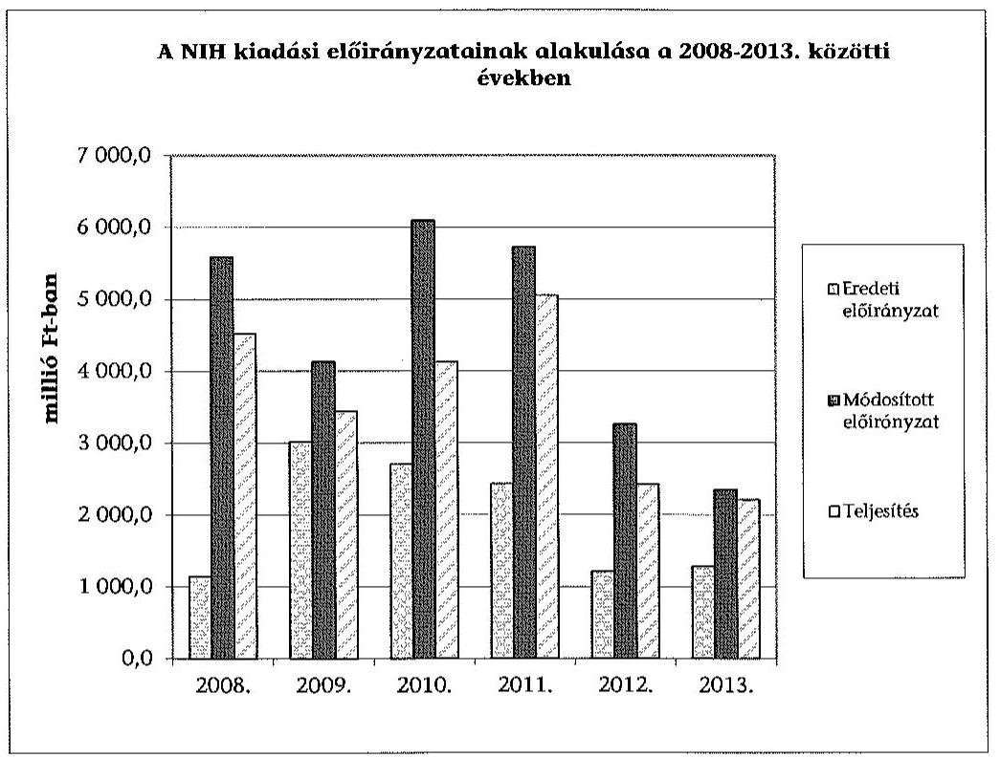

A NIH előirányzatait kormányzati, irányító szervi és intézményi hatáskörben egyaránt módosították. A módosított kiadási, bevételi előirányzatok minden ellenőrzött évben magasabbak voltak az éves eredeti kiadási, bevételi előirányzatoknál. A kiadási előirányzat-módosítások legnagyobb mértékben minden évben a dologi kiadásokat és az egyéb folyó kiadásokat érintették.

A NIH évenkénti előirányzat-módosításait az alábbi táblázat mutatja be:
Adatok M Ft-ban

| Kiadási elöirányzat-módosítások |  |  |  |  |
| :-- | --: | --: | --: | --: |
| Évek | Kormány | irányító szerv | intézmény | összesen |
| 2008. | 72,3 | 851,3 | 3515,7 | 4439,3 |
| 2009. | $-126,6$ | 105,1 | 1135,7 | 1114,2 |
| 2010. | $-136,7$ | 2084,3 | 1444,1 | 3391,7 |
| 2011. | 8,2 | $-459,7$ | 3747,6 | 3296,1 |
| 2012. | $-19,3$ | 215,8 | 1854,6 | 2051,1 |
| 2013. | $-108,5$ | 271,8 | 902,2 | 1065,5 |
| Összesen | $-310,6$ | 3068,6 | 12599,9 | 15357,9 |

Az elöirányzat-módosítások megfeleltek az Ámr.1-2 és az Ávr. előirásainak. Az irányító szerv által engedélyezett többletbevétel előirányzatosítása az Ámr. ${ }_{1-2}$ és az Ávr. alapján szabályszerűen megtörtént. Az egyéb intézményi

---

hatáskörű előirányzat-változtatások megfeleltek az Áht. ${ }_{1-2}$, az Ámr. ${ }_{1-2}$, valamint az Ávr. előírásainak. A NIH a saját hatáskörében végrehajtott előirányzatmódosításokról, átcsoportosításokról az intézkedés meghozatalát követő öt munkanapon belül tájékoztatta a Kincstárt és a fejezetet irányító szervet az Ámr. ${ }_{1-2}$, valamint az Ávr. előírásainak megfelelően. A NIH belső szabályzataiban (számviteli politika, számlarend) kialakították az előirányzatok, illetve azok módosítása főkönyvi könyvelésbe történő feladásának, továbbá az előirányzatok könyvelésének rendjét. Az előirányzatok, valamint azok módosításainak főkönyvi könyvelése az ellenőrzött időszakban - az Áhsz.-ben és a NIH számviteli politikájában és számlarendjében foglaltaknak megfelelően - szabályszerűen megtörtént.

# 4.2. A kiadási elöirányzatok felhasználása és a bevételi előirányzatok teljesítése 

A gazdálkodási jogkörökkel kapcsolatos kulcskontrollok müködésében - a 2008-2011. években a szakmai teljesítésigazolás és az utalványozás ellenjegyzése, 2012-2013. években a teljesítésigazolás és az érvényesítés tekintetében - az alábbi hiányosságok voltak jellemzőek:

- A dologi és felhalmozási kiadások ellenőrzött mintatételeinél előfordult, hogy a teljesítésigazoló - ellentétben az Ámr. ${ }_{1}$ 135. § (2) bekezdésével, az Ámr. ${ }_{2} 76 . \S$ (5) bekezdésével és az Ávr. 57. § (4) bekezdésével - nem rendelkezett a szükséges kijelöléssel. Előfordult, hogy a szakmai teljesítésigazolást/teljesítésigazolást az arra jogosult - az Ámr. ${ }_{1}$ 135. § (1)-(2) bekezdésében, az Ámr. ${ }_{2} 76 . \S$ (1) és (3) bekezdésében és az Ávr. 57. § (1) és (3) bekezdésében foglaltakkal ellentétben - nem végezte el. Az ellenőrzött mintatételeknél az utalványrendeleteknél előfordult, hogy - ellentétben az Ámr. ${ }_{1} 136 . \S$ (4) bekezdés g) pontja, az Ámr. ${ }_{2} 78 . \S$ (2) bekezdés a) pontja, valamint az Ávr. 59. § (3) bekezdés g) pontja előírásaival - nem tartalmaztak keltezést. Azokban az esetekben, ahol a szakmai teljesítésigazolás hiányzott, vagy jogosulatlan végezték, az érvényesítés nem felelt meg az Ámr. ${ }_{1} 135 . \S$ (3), az Ámr. ${ }_{2} 77 . \S$ (1) és az Ávr. 58. § (1) bekezdésében foglalt előírásoknak. Az érvényesítő - ellentétben az Ámr. ${ }_{2} 77 . \S$ (2) és az Ávr. 58. § (2) bekezdésével nem jelezte az utalványozónak, hogy a megelőző ügymenetben a teljesítés igazolást nem végezték el, vagy jogosulatlanul végezték.
- A pénzeszközátadások ellenőrzött mintatételeinél előfordult, hogy a teljesítésigazolást - az Ámr. ${ }_{1} 135 . \S$ (1) bekezdésében foglaltak ellenére -2008-2009. években nem az arra jogosult végezte, mert nem rendelkezett az Ámr. ${ }_{1} 135 . \S$ (2) bekezdése szerinti kijelöléssel. Az ellenőrzött mintatételeknél a szakmai teljesítés igazolására jogosult 2011-ben - az Ámr. ${ }_{2} 76 . \S$ (1) és (3) bekezdésében foglaltakkal ellentétben - nem végezte el a teljesítés igazolását. Az ellenőrzött mintatételeknél 2012-ben az utalványrendeleteken nem szerepelt - az Ávr. 58. § (3) bekezdésében foglaltak ellenére - az érvényesítés dátuma.

A nem a kulcskontrollok körébe tartozó gazdálkodási jogkörök gyakorlása tekintetében az alábbi egyéb szabálytalanságok, hiányosságok voltak:

---

- A rendszeres és nem rendszeres személyi juttatások ellenőrzött mintatételeinél - az Áht. 98. § (2) bekezdés (2008. december 31-ig), 100/B. § (3) bekezdés (2009. január 1-jétől), 100/C. § (3) bekezdés (2011. január 1-jétől), Áht. 237 § (1) bekezdés, valamint az Ámr. 134. § (8) bekezdés, az Ámr. 274. § (1) bekezdés, és az Ávr. 55. § (1) bekezdése előírásaival ellentétben - a kifizetések alapját képező kinevezés/módosítás (kötelezettségvállalás) pénzügyi ellenjegyzése nem történt meg.

A dologi és dologi jellegű, valamint a felhalmozási kiadások ellenőrzött mintatételei esetében a Kbt. ${ }_{1-2}$ hatálya alá tartozó beszerzéseknél a közbeszerzéseket lefolytatták. A felhalmozási kiadások ellenőrzött mintatételeinél - a 2010-ben a Fehérvári úti ingatlan és földterület 5. fejezetben ismertetett helytelen besorolása és a 2012. évi állományba vételi bizonylatok hiánya kivételével - a bekerülési érték megállapítása, állományba vétele, besorolása, az értékcsökkenés elszámolása megfelelt a Számvt. tv. és az Áhsz. előírásainak. A 2012. évben a bizonylatok megőrzésére vonatkozó, a Számv. tv. 169. § (2) bekezdésében foglalt előírás ellenére előfordult, hogy nem rendelkeztek állományba vételi és üzembe helyezési dokumentumokkal.

A bevételi előirányzatok teljesítésének kötelezettségét - egy eset kivételével - betartották az ellenőrzött időszak alatt. A NIH 2011. évi elemi költségvetésében betervezett 2149 M Ft támogatásértékű bevétel a KTIA-ból nem folyt be a NIH költségvetésébe, mivel a KTIA kezelése, felhasználása és ellenőrzése 2011. január 1-jétől átkerült az NFÜ-be. Az évközi előirányzat-módosítások során érvényesítették a feladatváltozáshoz kapcsolódó finanszírozási változásokat.

A vagyonhasznosítási bevételek teljesítése területén a kulcskontrollok nem működtek megfelelően. A megállapítások az alábbiak:

- A vagyonhasznosítási bevételeknél a kötelezettségvállaló - ellentétben az Ámr. 135. § (2), az Ámr. 2 76. § (5) és az Ávr. 57. § (4) bekezdésével - a szakmai teljesítést igazoló személyt nem jelölte ki. A 2008-2011. években az utalvány ellenjegyzőjének aláírása és a keltezés - ellentétben az Ámr. ${ }_{1} 136 . \S$ (4) bekezdés g) pontja 137. § (3) bekezdése, és az Ámr. 2 78. § (2) bekezdés a) pontja, 79. § (2) bekezdése ellenére - nem szerepelt az utalványon. Az érvényesítőt - ellentétben az Ávr. 58. § (4) bekezdésével - 2012-ben nem jelölték ki. 2013-ban - összhangban az Ávr. előírásaival - megtörtént a teljesítésigazoló kijelölése, de a teljesítésigazoló 2013. évben - ellentétben az Ávr. 57. § (1)-(3) bekezdéseivel, illetve a 22/2011. számú elnöki utasítással kiadott gazdálkodási szabályzat 4.3.1. pontjával - nem végezte el a bevételek teljesítésének igazolását. 2012-ben és 2013-ban - az Ávr. 58. § (3) bekezdése ellenére - az érvényesítést nem végezték el.
- A NIH az ellenőrzött időszakban az állami vagyon hasznosításának, bérbeadásának kereteit bérleti szerződésekben rögzítette. A szerződésekben meghatározták a bérleti díj összegét, a bérbeadás feltételeit. A bérleti díjakról, illetve az eszközértékesítésekről a NIH számlát bocsátott ki, amit a vevők egy kivétellel határidőben és a számlázott összegben kifizettek.

A NIH az évközi korlátozó intézkedéseket betartotta, a részére előírt befizetési kötelezettségeinek szabályszerűen eleget tett. Az irányító

---

szerv 2008. kivételével korlátozta a kiadási előirányzatok felhasználását. A 2009., és 2011. években maradványtartási kötelezettséget írt elő, évközi zárolásokat hajtott végre. A zárolt előirányzatokat 2009. évben 146,0 M Ft, 2010-ben 155,1 M Ft összegben elvonta. Az irányító szerv 2012. évben kormányhatározat alapján egy alkalommal 5,5 M Ft összegben zárolt előirányzatot, valamint két alkalommal hajtott végre elvonást, összesen 97,9 M Ft összegben. 2013. évben két kormányhatározat alapján - összesen 112,7 M Ft - évközi zárolás végrehajtása történt meg.

# 4.3. Az előirányzat-maradványok kezelése 

A NIH előirányzat-maradványának levezetése az ellenőrzött időszakban a jogszabályi előírásokkal összhangban történt. A NIH könyveiben az egyes években megállapított előirányzat-maradványként 1066,6 M Ft-ot, 704,1 M Ft-ot, 1963,5 M Ft-ot, 687,6 M Ft-ot, 839,9 M Ft-ot, illetve 169,1 M Ft-ot mutatott ki, amely elsősorban kiadási megtakarításból származott. A NIH kötelezettséggel nem terhelt maradványa 2008-2013. években 197,5 M Ft, 29,4 M Ft, 73,8 M Ft, 19,5 M Ft, 19,0 M Ft, illetve 0,0 M Ft volt. Az éves beszámolók 42. űrlapján, mérlegében, a kapcsolódó főkönyvi számlákon és a szöveges beszámolókban kimutatott előirányzat-maradvány megegyezett.

A megállapított előirányzat-maradvány, valamint a kötelezettségvállalással nem terhelt (szabad) előirányzat alakulását M Ft-ban 2008-2013. között az alábbi ábra szemlélteti:
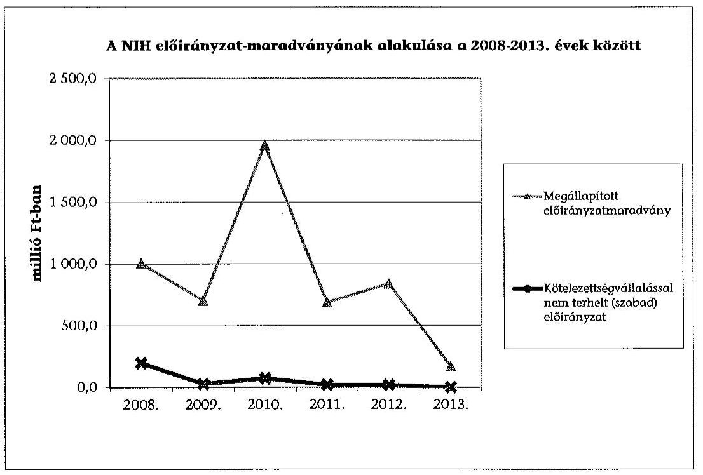

A NIH előirányzat-maradványairól - az Ámr. ${ }_{1} 65$. § (2) bekezdése, az Ámr. 2 207. § (5) bekezdés, az Ávr. 149. § (1) bekezdés, valamint az Áhsz. 10. § (1) bekezdés alapján - az előírt tartalommal, de minden évben késéssel teljesítette az irányító szerv felé előírt adatszolgáltatási kötelezettségét, az elemi költségvetési beszámoló benyújtását. A NIH minden ellenőrzött évben rendelkezett az irányí-

---

tó szerv értesítésével az előirányzat-maradvány jóváhagyásáról. Az ellenőrzött időszak egyes éveiben a fơkönyvi kivonatok és az éves beszámolók 10. űrlapja szerinti előirányzat-maradvány igénybevétel megegyezett. A NIH 2011-ben és 2013-ban tájékoztatta az NGM-et a tárgyévet követő év június 30 -áig pénzügyileg nem teljesült, továbbá meghiúsult kötelezettségvállalás miatt szabaddá váló előirányzat-maradványáról.

Az elöirányzat-maradványok esetében a kötelezettségvállalással terhelt maradvány felhasználása a mintavételi eredmények alapján magas kockázatú volt, tekintettel arra, hogy azok dokumentálása nem volt teljes körü. Egyes tételeknél nem tartották be a Számv. tv. 169. § (2) bekezdésében foglalt bizonylat megőrzési kötelezettséget (2008., 2009. és 2012-ben 1-1 tétel, 2010-ben 3 tétel alátámasztó dokumentuma hiányzott). A dokumentumokkal alátámasztott tételek megfeleltek az Ámr. ${ }_{1-2}$ és az Ávr. előírásainak.

# 4.4. A fizetőképesség alakulása 

A NIH folyamatos fizetőképessége biztosított volt, nem kért előirányzat előrehozást. A NIH likviditási mutatója, illetve pénzeszköz likviditási mutatója 2008-2010. között biztonságos finanszírozási helyzetet jelez, a 2011-2013. közötti magas értékek jellemezték, amelyek arra utalhatnak, hogy a NIH-nek sok volt ebben az időszakban a szabad, lekötetlen pénzeszköze. A NIH likviditási mutatója 2008-ban 5,4, 2009-ben 2,7, 2010-ben 4,2, 2011-ben 22,5, 2012-ben 21,4, míg 2013-ban 46,3 volt. A NIH pénzeszköz likviditási mutatója 2008-ban 5,1, 2009-ben 2,3, 2010-ben 4,0, 2011-ben 18,8, 2012-ben 18,3, míg 2013-ban 28,7 volt.

A NIH likviditási mutatója, illetve pénzeszköz likviditási mutatója alakulását 2008 és 2013. között az alábbi ábra szemlélteti:
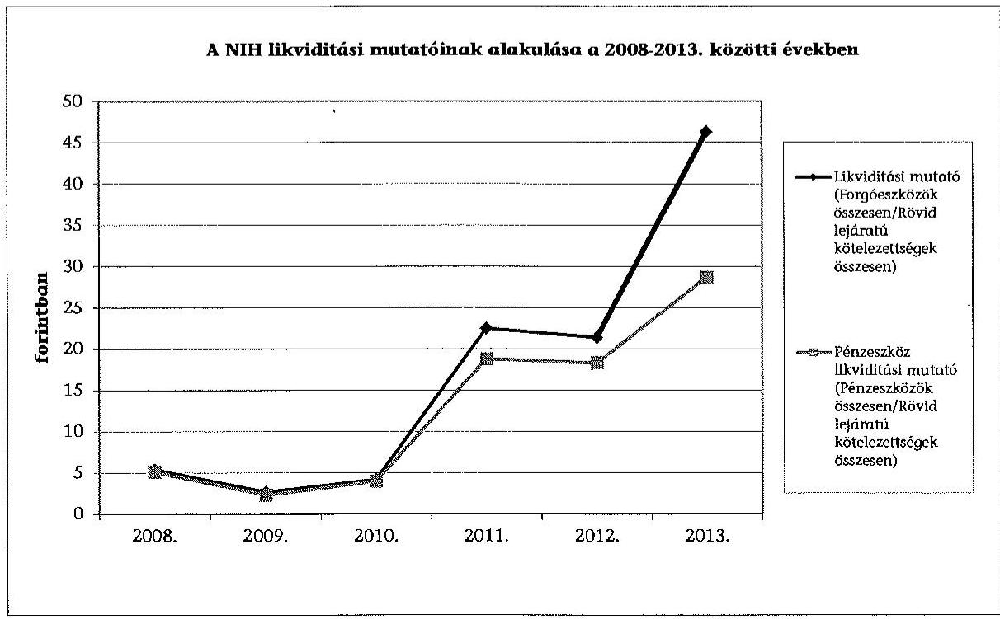

---

# 5. A NIH VAGYONGAZDÁlKODÁSA 

A NIH vagyongazdálkodása - az üzemeltetésre, kezelésbe átadott, átvett vagyon átadás-átvétele, a térítésmentes vagyonelemek tulajdonjogának át-adás-átvételei kivételével - nem volt szabályszerú.

### 5.1. A vagyongazdálkodás szabályozottsága

A vagyongazdálkodással kapcsolatos feladat- és hatásköröket az SZMSZ-ekben és a gazdálkodási szabályzatokban meghatározták. A NIH gazdálkodási, leltározási, beszerzési, értékelési, selejtezési szabályzataiban, számviteli politikájában előírta a vagyonnal történő gazdálkodás - alapfeladat ellátásához rendelkezésére bocsátott vagyon nyilvántartásának, értékelésének, hasznosításának, selejtezésének - eljárási szabályait. Az ellenőrzés a belső kontrollrendszer részét képező kontrollkörnyezet értékelése során a vagyongazdálkodással kapcsolatos szabályozási hiányosságokat (leltározási, értékelési, valamint a (köz)beszerzési szabályzat), valamint egyes szabályozási előírások hiányát (önköltségszámítási szabályzat) állapította meg. Az ezekkel kapcsolatos részletes megállapításokat a 3.1. számú fejezet tartalmazza.

### 5.2. Az eszközök és források értékének kimutatása, az eszközök értékének megőrzése

A NIH eszközeinek arányát és változását az ellenőrzött időszakban az alábbi grafikon szemlélteti:
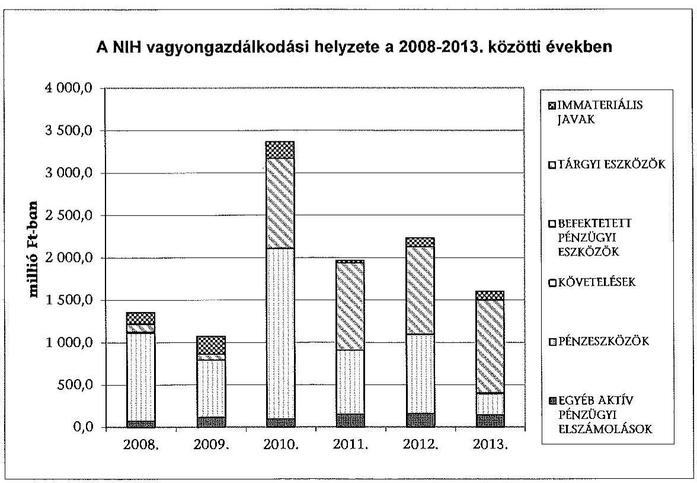

A befektetett eszközök állományának értéke a 2008. évi 242,5 M Ft-ról 2013-ra 1196,2 M Ft-ra növekedett, az összes eszközértékhez viszonyított aránya 17,9\%-

---

ról $74,7 \%$-ra változott. A forgóeszközök állományi értéke a 2008. évi 1111,9 M Ft-ról 2013-ra 406,2 M Ft-ra, összes eszközértékhez viszonyított aránya $82,1 \%$-ról $25,4 \%$-ra csökkent, az alapkezelői feladatok NFÜ-höz kerülésével összefüggésben. A követelésállomány - a 2013. évet kivéve - az ellenőrzött időszak egészében csekély, a teljes eszközérték 0,0-2,7\% között volt, amelynek döntő hányada behajtás alatt lévő tartozás volt.

A NIH-nek hosszú lejáratú kötelezettsége nem volt, a rövid lejáratú kötelezettségállomány a 2008. évi 205,0 M Ft-ról 2013. évre 8,8 M Ft-ra csökkent.

A saját tőke aránya mutató a 2008. évi $2,8 \%$-ról a 2013. évre $74,8 \%$-ra nőtt, ami a saját tőke forrásokon belüli részarányának jelentős mértékű növekedéséből adódott. A NIH mérlegtételeinek alakulását, változását részletesen az 4. számú mellékletben szereplő mérlegadatok szemléltetik.

# A mérlegben kimutatott eszközök nyilvántartását, értékének megállapítását - az üzemeltetésre adott eszközök kimutatása kivételével - a Számv. tv. és az Áhsz. előírásainak megfelelően szabályszerűen végezték el. Az üzemeltetésre adott eszközök mérlegtételek közötti kimutatásánál az alábbi hiányosságok fordultak elő: 

- A NIH a MAG Zrt.-nek - a 2008. január 29-én kelt megállapodás alapján üzemeltetésre átadott 7,0 M Ft bruttó, 2,2 M Ft nettó értékú informatikai eszközöket és bútorokat, amelyekről a MAG Zrt. december 31-ei fordulónapra évenként leltározott, azonban a Számv. tv. 69. § (1)-(5) bekezdésében foglaltak ellenére a leltár az eszközök értékét nem tartalmazta, így a NIH éves mérlegeiben az üzemeltetésre átadott eszközök mérlegsoron az eszközök értékét nem szerepeltették.
- A NIH vagyonkezelésében álló 1116 Budapest, Fehérvári út 132-144. sz. alatt található - érték nélkül nyilvántartott - ingatlanra vonatkozóan a 2010. évben értékbecslést végeztek, amelynek értékét 1008,0 M Ft-ban állapították meg (földterület 650,0 M Ft értékű és 358,0 M Ft értékű építmény), amelyet megállapodással más szervezet üzemeltetett. Az ingatlan értékét - ellentétben a Számtv. 16. § (3) és az Áhsz. 20. § (1) bekezdése, valamint az üzemeltetési megállapodások ellenére - a 2010-2013. évi beszámolók könyvviteli mérlegében nem az üzemeltetésre adott eszközök, hanem az ingatlanok között szerepeltették.

A NIH mérlegei - az üzemeltetésre, kezelésre átadott eszközöknél, ingatlanok és kapcsolódó vagyoni értékủ jogok mérlegsoroknál feltárt hibák kivételével megbízható és valós képet mutattak az intézmény vagyoni helyzetéről.

Követelés elengedés az ellenőrzött években nem volt, az el nem ismert követeléseik nullás számlaosztályba történő átvezetéséről, valamint kétes, illetve behajthatatlan követeléseik kivezetéséről gondoskodtak, az állományi számlák vezetése megfelelt az Áhsz. előírásainak.

A kötelezettségek nyilvántartása, analitikus nyilvántartása és könyvelése során elkülönítve - az Áhsz. előírásaival összhangban - mutatták ki a tárgyévi költségvetést terhelő előző évi és folyó évi, valamint a tárgyévet követő évi költségvetést terhelő kötelezettségeket.

---

A beszámolókban és a számviteli nyilvántartásokban kimutatott eszközök és források állományának valódiságát - a 2008-2009. évieknél feltárt hiányosságok kivételével - a Számv. tv. és az Áhsz előírásaival összhangban - leltárakkal alátámasztották, a 2008. és a 2010-2013. években mennyiségi felvétellel, 2009. évben irányító szervi engedély alapján egyeztetéssel hajtották végre. A 2008-2009. években a leltárkiértékelések - a Számv. tv. 69. § (1) bekezdésében és az Áhsz. 37. § (2) bekezdésében foglalt előírásokkal ellentétben - az eszközök nettó értékét nem tartalmazták.

A selejtezések végrehajtása megfelelt a NIH selejtezési szabályzatában foglalt előírásoknak. A 2008. évben négy, a 2009. és, a 2010. évben kettő selejtezési eljárás lebonyolítására került sor. A selejtezésbe vont eszközök bruttó értéke a 2008. évben 41,2 M Ft, nettó értéke $0,0 \mathrm{M}$ Ft, a 2009. évben bruttó értéke $47,7 \mathrm{M}$ Ft, nettó értéke 6,6 M Ft, a 2010. évben bruttó értéke $20,1 \mathrm{M} \mathrm{Ft}$, nettó érték $1,2 \mathrm{M}$ Ft volt.

A beszerzett, létesített immateriális javak és tárgyi eszközök bekerülési értékének megállapítása, állományba vétele, év végi értékelése és az értékcsökkenés elszámolása, valamint a belsö kontrollok múködése - az üzemeltetésbe adott eszközök kimutatása gyakorlatával kapcsolatban tett megállapítások, a vagyonhasznosítási bevételeknél a 4.2. fejezetben jelzett hiányosságok kivételével - megfelelt az Ámr. ${ }_{1-2}$ az Ávr., a Számv. tv. és az Áhsz. előírásainak.

A NIH-nek - a kezelt eszközök tekintetében - jogszabály által előírt vagyon visszapótlási kötelezettsége nem volt. A Vtv., az Nvtv., a Vtvr. alapján fennálló, a vagyon állagának megóvásával kapcsolatos kötelezettségeinek, valamint ezzel összefüggésben az Áhsz.-ben előírtaknak eleget tett. A NIH vagyona a 2008. év végi 1354,4 M Ft-ról 2013. év végére 18,3\%-kal 1602,4 M Ft-ra nőtt, ami elsősorban a befektetett eszközök 393,3\%-os ( $953,7 \mathrm{M}$ Ft-os) növekedésével függött össze. A vagyon alakulására hatást gyakorló feladatváltozás volt a KPI 2008. évi NIH-be történt beolvadása, az úrkutatással összefüggő feladatok KvVM-től történt 2009. évi átvétele és a pályázat kezelési tevékenység 2011. évi átadása az NFÜ részére. A feladat változásokon kívül az eszközök értékében és arányában bekövetkezett változást döntően a 2008-2013. évi beruházások, az időszak során elvégzett selejtezések és eszköz értékesítések, valamint - eseti jelleggel - egy 2010. évi, 1008,0 M Ft összegű ingatlan értékbecslésen alapuló állományba vétel eredményezték.

A tárgyi eszközök használhatósági foka (az eszközök nettó és bruttó értékének hányadosa) változó mértékben, de minden eszköz csoport tekintetében romlott. Az elhasználódási szint és az értékcsökkenési leírási kulcs hányadosaként meghatározott átlagos életkor az épületeknél a 2008. évi 3,2 évről a 2013ra 3,5 évre, az építményeknél 3,2 évről 8,2 évre, az egyéb gépek, berendezések felszerelések esetében 5,2 évről 6,3 évre, a járművek esetében 3,0 évről 5,0 évre nőtt. Az adatok jelzik, hogy az ellenőrzött időszakban végrehajtott beruházások nem ellensúlyozták az eszközök elszámolt amortizációban megjelenő avulását. A felújítások elmaradása a használhatósági fok alakulását szintén kedvezőtlenül befolyásolta.

---

# 5.3. A vagyonátadás-és átvétel, a vagyonelemek hasznosítása 

A vagyonelemek értékesítései (MNV Zrt. előzetes engedélyéhez nem kötött), bérbeadásai - a feltárt hiányosságok kivételével - megfeleltek az Áht. ${ }_{1-2}$, az Ámr. ${ }_{1-2}$, az Ávr., a Vtv., az Nvtv., továbbá a Vtvr. vonatkozó előírásainak, valamint a NIH vagyongazdálkodással kapcsolatos szabályzataiban foglaltaknak.

A 2008-2013. években történt ingatlan bérbe adásoknál (eseti jelleggel terem, a 2013. évben büfé üzemeltetéséhez helyiség bérbeadása) a szerződésekben úgy határozták meg a bérleti díj összegét, a bérbeadás feltételeit, hogy a realizált bérleti díjak fedezzék a bérbe adott ingatlanok fenntartási kiadásait. A vagyonhasznosítási bevételek ellenőrzése során a kapcsolódó belső kontrolloknál feltárt hiányosságokat részletesen a 4.2. fejezet tartalmazza.

A NIH 2008-2013. évi üzemeltetésre átadott, átvett vagyon átadásátvételei - az üzemeltetésre átadott, átvett eszközök könyvviteli kimutatása kapcsán feltárt, az 5.2. fejezetben ismertetett hiányosságok kivételével - megfeleltek a Számv. tv., az Áhsz, az Áht. ${ }_{1-2}$, valamint és az Ávr. vonatkozó előírásainak, valamint a NIH vagyongazdálkodással kapcsolatos szabályzataiban foglaltaknak. Vagyon üzemeltetésre történő átadás-átvételeire a NIH közfeladatainak változásával összhangban került sor.

A NIH-nek a 2008-2013. években szerződés alapján kezelésbe adott eszközei nem voltak. Az eszközök dolgozók részére történő személyi használatba adását a NIH mobil telefonok és hordozható számítógépek használatának belső szabályzatában foglaltak szerint végezték.

A NIH 2008-2013. éveket érintő vagyonelemek tulajdonjogának térítésmentes átadás-átvételei megfeleltek az Áht. ${ }_{1-2}$, a Vtv., a Számv. tv., valamint az Áhsz. vonatkozó előírásainak, valamint a NIH vagyongazdálkodással kapcsolatos szabályzataiban foglaltaknak. A 2008-2013. évek során végrehajtott térítésmentes átadás-átvételek a NIH közfeladatainak változásával összhangban történtek. A vagyonelemek hasznosítása során a 2009. évben értékesítettek egy feleslegesség vált személygépjárművet, amelynek könyv szerinti nettó értéke $6,7 \mathrm{M}$ Ft, az EUROTAX adatok szerinti becsült forgalmi érték $4,8 \mathrm{M}$ Ft volt. A gépjárművet $4,05 \mathrm{M}$ Ft-os bruttó értéken értékesítették. A Vtv. 34 § (2) bekezdés a) és b) pontja és a Vtvr. 24. § (1) bekezdése előírásaival ellentétben az értékesítés dokumentumai az állami vagyonnal való felelős gazdálkodást, valamint a gépjármú eladás tekintetében a versenyeztetés megtörténtét nem támasztják alá.

### 5.4. Az eredményszemléletú számvitel bevezetésével kapcsolatos feladatok végrehajtása

A NIH az eredmény szemléletű számvitel bevezetésével kapcsolatban a 36/2013. (IX. 13.) NGM rendeletben előírt feladatokat végrehajtotta. A rendező mérleget 2013. december 31-ei mérleg-fordulónappal - a 36/2013. (IX. 13.) NGM rendelet 2. § (1) bekezdése szerint, de a 8. § (2) bekezdés a) pontjában előírt 2014. március 31-i határidőhöz képest majd egy hónap késedelemmel, 2014. április 23-ára - elkészítették.

---

# 6. Az ÁSZ korábBi EllenŐrzései során tett javaslatok hasZNOSULÁSA 

A NIH-nél „A Magyar Köztársaság 2008. évi költségvetése végrehajtásának ellenörzéséröl" szóló jelentés (J 0928) fogalmazott meg 11 pontban javaslatokat. Az ÁSZ javaslatot tett a KTIA kiadási előirányzat-felhasználására, előirányzat maradványa csökkentésére, a pénzforgalma és -felhasználása belső ellenőrzésének erősítésére, a belső kontrollok múködtetésére, a FEUVE hatékonyságának fokozására, valamint a kutatás-nyilvántartási rendszere múködési költség előirányzata felhasználásának áttekintésére, a nyilvántartás teljes körűvé tételére, a pályázati rendszer teljes egészére kiterjedő szabályozás kiadására. A javaslatok között szerepelt a Pályázat Kezelő Program rendszer műszaki tartalmának, a rendszer múködése gazdaságosságának felülvizsgálata, pontosabb minősités az új szoftverek aktiválása során. Az ÁSZ jelentés javasolta a NIH egyes szabályzatainak (SZMSZ, Számviteli Politika, Számlarend, Pénzkezelési, Közbeszerzési és Gazdálkodási Szabályzat) aktualizálását, az MNV Zrt.-vel a vagyonkezelői szerződések megkötését, a részesedések értékesítésre történő felajánlását, továbbá a Kincstárral történő egyeztetést. A jelentés intézkedést javasolt az APEH folyószámla beszerzésére és az adatok egyeztetésére (különös tekintettel a jogelőd KPI folyószámlájának átvezetésére), a munkáltatót terhelő szja adatszolgáltatási, nyilvántartási és a KIR rendszerrel történő egyeztetési kötelezettsége rendszerének kidolgozására, a megbizásos jogviszonynál az utólagos szerződéskötés lehetőségének megszűntetésére. A NIH elnöke 2009. szeptemberben a jelentés javaslataira - ugyan az ÁSZ tv. ${ }_{1}$ nem írta elő - intézkedési tervet készített, amelynek végrehajtását a belső ellenőrzés is értékelte. Az ÁSZ által tett javaslatokra intézkedtek, azok hasznosultak.

Budapest, 2015. 05. hónap 27. nap

Melléklet: $\quad 7 \mathrm{db}$
Függelék: $\quad 3 \mathrm{db}$
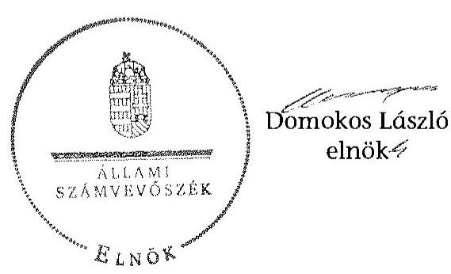

---

# A NIH feladatellátása a 2008-2013. közötti években

|  2008. év | 2009-2010. évek | 2011-2013. évek  |
| --- | --- | --- |
|  277/2006. (XII.23.) Korm. rendelet a Nemzeti Kutatási és Technológiai Hivatalról | 277/2006. (XII.23.) Korm. rendelet a Nemzeti Kutatási és Technológiai Hivatalról | 305/2010. (XII.23.) Korm. rendelet a Nemzeti Innovációs Hivatalról (névváltatás 2011. január 1-jétől)  |
|  A tudomány-, technológia- és innováció-politika kidolgozásában és megvalósításában való közreműködés, valamint az érvényesüléséhez szükséges állami intézkedések kezdeményezése, illetve végrehajtása. | A tudomány-, technológia- és innováció-politika kidolgozásában és megvalósításában való közreműködés, valamint az érvényesüléséhez szükséges állami intézkedések kezdeményezése, illetve végrehajtása. | A tudomány-, technológia- és innováció-politika kidolgozásában és megvalósításában való közreműködés, valamint az érvényesüléséhez szükséges állami intézkedések kezdeményezése, illetve végrehajtása.  |
|  A tudomány-, technológia- és innováció-politika érvényesülését biztosító jogszabályok koncepciójának előkészítésében való részvétel. | A tudomány-, technológia- és innováció-politika érvényesülését biztosító jogszabályok koncepciójának előkészítésében való részvétel. | A tudomány-, technológia- és innováció-politika érvényesülését elősegítő kormányzati információs és elemző tevékenység ellátása.  |
|  A tudomány-, technológia- és innováció-politika érvényesülését elősegítő kormányzati információs tevékenység ellátása. | A tudomány-, technológia- és innováció-politika érvényesülését elősegítő kormányzati információs tevékenység ellátása. | A tudomány-, technológia- és innováció-politika területén folyó nemzetközi, illetve európai integrációs együttműködés szakmai feladatainak ellátása.  |
|  A tudomány-, technológia- és innováció-politika területén folyó nemzetközi, illetve európai integrációs együttműködés szakmai feladatainak ellátása. | A tudomány-, technológia- és innováció-politika területén folyó nemzetközi, illetve európai integrációs együttműködés szakmai feladatainak ellátása. | A kutatás-fejlesztés területén megvalósuló magyarországi befektetések ösztönzése a Nemzeti Külgazdasági Hivataliai együttműködésben.  |
|  A Hivatal felügyeli a Nemzeti Kutatás-nyilvántartási Rendszert, és ellátja a Nemzeti Kutatás-nyilvántartási Rendszerről szóló jogszabályban meghatározott feladatait. | A magyarországi ízkutatás fő irányainak és programjainak kidolgozása. A feladatait a 306/2008. (XI.20.) Korm. rendelet látotta be 2009. január 1-jétől. | A kis- és középvállalkozások innovációs tevékenységének ösztönzése és innovációs képességének fejlesztése, valamint a fiatal innovatív vállalkozások inkubációjának elősegítése.  |
|  Feladatai ellátása során a Hivatal együttműködik az érintett miniszterekkel, államigazgatási szervekkel, a Magyar Tudományos Akadémióval és más köztestületekkel, valamint a regionális és támadalmi szervezetekkel. | A Hivatal felügyeli a Nemzeti Kutatás-nyilvántartási Rendszert, és ellátja a Nemzeti Kutatás-nyilvántartási Rendszerről szóló jogszabályban meghatározott feladatait. | A hazai kutatás-fejlesztési eredményeik nemzetközi piacra futtatásának ösztönzése a Nemzeti Külgazdasági Hivataliai együttműködésben, különös tekintettel a kis- és középvállalkozások különözőségeinek segítésére.  |
|   | Feladatai ellátása során a Hivatal együttműködik az érintett miniszterekkel, államigazgatási szervekkel, a Magyar Tudományos Akadémióval és más köztestületekkel, valamint a regionális és támadalmi szervezetekkel. | A hálózatosodás és kutatási együttműködések támogatása hazai és nemzetközi szinten.  |
|   |  | Az adaptív és a nem-technológiai innovációs tevékenységek ösztönzése elsősorban a kis- és középvállalkozások körében.  |
|   |  | Feladatai ellátása során a Hivatal együttműködik az ágazati kutatási, fejlesztési és innovációs tevékenységet illetően - az egyes miniszterek, valamint a Miniszterekökséget vezető államzitkár feladati és hatásköréről szóló 212/2010. (VII. 1.) Korm. rendelet alapján - e feladatkörükben eljáró érintett miniszterekkel, államigazgatási szervekkel, a Magyar Tudományos Akadémióval és más köztestületekkel, valamint a regionális és támadalmi szervezetekkel.  |

---

.

---

# A NIH feladat átadás-átvételei a 2008-2013. közötti években 

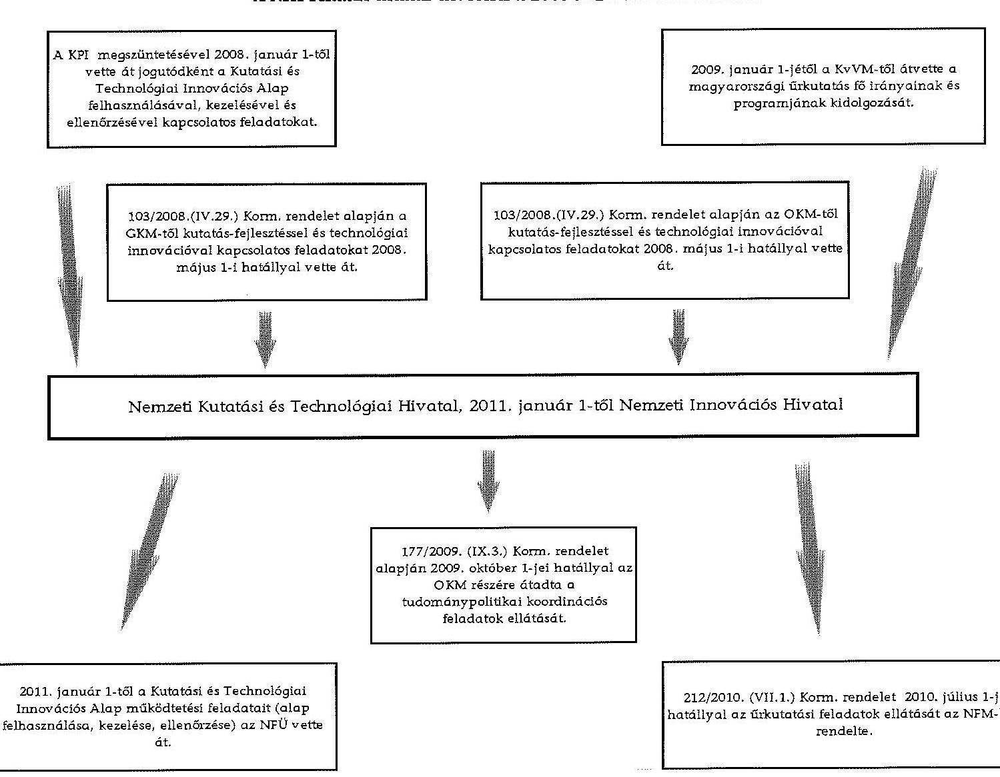

---

.

---

### A NIH bevételi, kiadási előirányzatainak és teljesítésének alakulása a 2008-2013. közötti években

|  Megnevezés | 2008. év |  | 2009. év |  | 2010. év |  | 2011. év |  | 2012. év |  | 2013. év |   |
| --- | --- | --- | --- | --- | --- | --- | --- | --- | --- | --- | --- | --- |
|   | Előirányzat |  | Előirányzat |  | Előirányzat |  | Előirányzat |  | Előirányzat |  | Előirányzat |   |
|   | Eredeti | Módosított | Teljesítés | Eredeti | Módosított | Teljesítés | Eredeti | Módosított | Teljesítés | Eredeti | Módosított | Teljesítés  |
|  KIADÁSOK |  |  |  |  |  |  |  |  |  |  |  |   |
|  Személyi jutkozások | 546,3 | 1053,5 | 573,2 | 1056,9 | 1164,4 | 1061,0 | 919,2 | 980,2 | 843,1 | 810,8 | 639,7 | 593,5  |
|  Munkaadóir terheldi járulékok | 166,6 | 337,0 | 293,2 | 319,0 | 390,5 | 313,1 | 236,0 | 267,3 | 217,0 | 211,9 | 173,1 | 156,5  |
|  Dologi kiadások | 407,8 | 1819,2 | 1233,3 | 1510,7 | 2141,6 | 1653,8 | 1492,2 | 2217,5 | 1318,2 | 1381,1 | 1447,1 | 1270,6  |
|  Egyéb folyó kiadások | 4,5 | 1988,1 | 1957,5 | 6,0 | 29,4 | 25,7 | 33,7 | 2233,8 | 1522,8 | 21,0 | 2285,4 | 2258,0  |
|  Támogatásértékű működési kiadások | 0,0 | 0,2 | 0,2 | 0,0 | 0,5 | 0,5 | 0,0 | 0,0 | 0,0 | 0,0 | 511,1 | 511,1  |
|  Támogatásértékű felhalmozási kiadások | 0,0 | 0,0 | 0,0 | 0,0 | 0,0 | 0,0 | 0,0 | 0,0 | 0,0 | 0,0 | 0,0 | 0,0  |
|  Előző évi előirányzat átadás | 0,0 | 26,5 | 24,3 | 0,0 | 239,1 | 239,1 | 0,0 | 129,6 | 109,6 | 0,0 | 455,9 | 253,5  |
|  Működési célú pénzeszköz átadás | 0,0 | 2,4 | 2,4 | 0,0 | 2,9 | 0,6 | 0,0 | 179,5 | 78,1 | 0,0 | 0,0 | 0,4  |
|  Felhalmozási célú pénzeszköz átadás | 0,0 | 0,0 | 0,0 | 0,0 | 17,1 | 0,0 | 0,0 | 0,0 | 0,0 | 0,0 | 0,0 | 0,0  |
|  Istékményi beruházási kiadások | 19,4 | 336,9 | 53,4 | 120,0 | 171,2 | 144,4 | 22,7 | 86,6 | 37,6 | 5,0 | 213,6 | 10,8  |
|  Összesen | 1144,6 | 5583,9 | 4517,5 | 3012,6 | 4126,9 | 3438,2 | 2705,8 | 6094,5 | 4126,6 | 2429,8 | 5725,9 | 5054,9  |
|  BEVÉTELEK |  |  |  |  |  |  |  |  |  |  |  |   |
|  Közhatalmi bevételek | 0,0 | 0,0 | 0,0 | 0,0 | 0,0 | 0,0 | 0,0 | 0,0 | 0,0 | 2145,7 | 676,7 | 0,0  |
|  Istékményi működési bevételek | 0,0 | 2,1 | 2,4 | 0,0 | 4,9 | 5,3 | 0,0 | 6,7 | 2,1 | 0,0 | 0,0 | 16,0  |
|  Működési célú pénzeszköz bevételek | 0,0 | 21,4 | 21,4 | 0,0 | 54,0 | 54,0 | 0,0 | 0,8 | 0,8 | 0,0 | 0,3 | 0,3  |
|  Felhalmozási bevételek | 0,0 | 2,8 | 2,8 | 0,0 | 6,6 | 6,6 | 0,0 | 3,2 | 3,2 | 3,3 | 0,0 | 0,0  |
|  Izánytló szervitű kapott támogatás | 345,6 | 513,8 | 514,0 | 416,7 | 395,2 | 395,2 | 403,8 | 2226,5 | 2226,5 | 280,8 | 1298,4 | 1298,4  |
|  Támogatás értékű működési bevétel | 788,6 | 4355,6 | 4355,6 | 2495,9 | 2505,9 | 2505,9 | 2295,7 | 2990,4 | 2990,4 | 0,0 | 1781,2 | 2469,2  |
|  Támogatás értékű felhalmozási bevétel | 10,4 | 66,0 | 66,0 | 100,0 | 100,0 | 100,0 | 3,3 | 3,3 | 3,3 | 0,0 | 0,1 | 12,1  |
|  Előző évi maradvány átvétele | 0,0 | 9,1 | 9,1 | 0,0 | 8,7 | 8,7 | 0,0 | 159,5 | 159,5 | 0,0 | 2,4 | 2,4  |
|  Előirányzat maradvány felhasználás | 0,0 | 613,1 | 331,2 | 0,0 | 1051,6 | 836,3 | 0,0 | 704,1 | 474,7 | 0,0 | 1963,5 | 1735,6  |
|  Összesen | 1144,6 | 5583,9 | 5302,5 | 3012,6 | 4126,9 | 3912,0 | 2705,8 | 6094,5 | 5860,5 | 2429,8 | 5725,9 | 5514,0  |

---

.

---

|  NIH mérlegadatai és változásuk a 2008-2013. közötti években |  |  |  |  |  |  |  |   |
| --- | --- | --- | --- | --- | --- | --- | --- | --- |
|  Megnevezés | 2008. év | 2009. év | 2010. év | 2011. év | 2012. év | 2013. év | Váltusás (2013/2008) |   |
|   |  |  |  | millió Ft-ban |  |  |  | \%-ban  |
|  IMMATERIÁLIS JAVAK | 136,4 | 210,3 | 193,0 | 22,8 | 102,7 | 103,5 | $-32,9$ | 75,9\%  |
|  TÁRGYI ESZKÖZÖK | 90,7 | 69,6 | 1061,9 | 1033,9 | 1036,7 | 1092,6 | 1001,9 | 1204,6\%  |
|  BEFEKTETETT PÉNZÜGYI ESZKÖZÖK | 15,4 | 0,0 | 2,0 | 0,1 | 0,1 | 0,1 | $-15,3$ | 0,6\%  |
|  BEFEKTETETT ESZKÖZÖK ÖSSZESEN | 242,5 | 279,9 | 1256,9 | 1056,8 | 1139,5 | 1196,2 | 953,7 | 493,3\%  |
|  KÉSZLETEK | 0,0 | 0,0 | 0,0 | 0,0 | 0,0 | 0,0 | 0,0 | 0,0\%  |
|  KÖVETELÉSEK | 0,4 | 0,0 | 0,3 | 0,3 | 0,1 | 10,8 | 10,4 | 2700,0\%  |
|  ÉRTÉKPAPÍROK | 0,0 | 0,0 | 0,0 | 0,0 | 0,0 | 0,0 | 0,0 | 0,0\%  |
|  PÉNZESZKÖZÖK | 1037,6 | 678,3 | 2012,1 | 758,8 | 933,3 | 251,4 | $-786,2$ | 24,2\%  |
|  EGYÉB AKTÍV PÉNZÜGYI ELSZÁMOLÁSOK | 73,9 | 116,7 | 95,2 | 149,8 | 161,3 | 144,0 | 70,1 | 194,9\%  |
|  FORGÓESZKÖZÖK ÖSSZESEN | 1111,9 | 795,0 | 2107,6 | 908,9 | 1094,7 | 406,2 | $-705,7$ | 36,5\%  |
|  ESZKÖZÖK ÖSSZESEN | 1354,4 | 1074,9 | 3364,5 | 1965,7 | 2234,2 | 1602,4 | 248,0 | 118,3\%  |
|  SAJÁT TÖRE | 37,9 | 15,2 | 755,0 | 1016,8 | 1088,5 | 1198,2 | 1160,3 | 3161,5\%  |
|  TARTALÉKOK | 1066,6 | 704,1 | 1963,5 | 687,6 | 839,9 | 169,1 | 897,5 | 15,9\%  |
|  KÖTELEZETTSEGEK (EGYÉB PASSZÍV PÖ-1 ELSZ NÉLKÜL) | 205,0 | 295,1 | 502,2 | 40,3 | 51,1 | 8,8 | 196,2 | 4,3\%  |
|  EGYÉB PASSZÍV PÉNZÜGYI ELSZÁMOLÁSOK | 44,9 | 90,9 | 143,8 | 221,0 | 254,7 | 226,3 | 181,5 | 504,0\%  |
|  FORRÁSOK ÖSSZESEN | 1354,4 | 1074,9 | 3364,5 | 1965,7 | 2234,2 | 1602,4 | 248,0 | 118,3\%  |

---

.

---

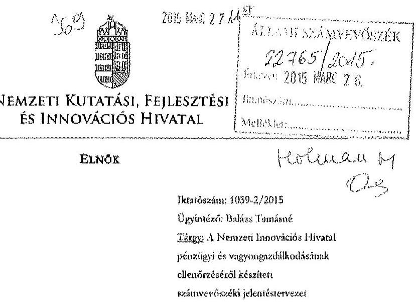

# ÁLLAMI SZÁMVEVŐSZÉK 

Domokos László út
elnök

Budapest

## Tisztelt Elnők Út!

Hivatkozással az Állami Számvevőszék V-0722-296/2015.sz. jelentéstervezetére, azzal kapcsolatban az alábbi észrevételt teszem:

## 1. Észrevétel

1.1. A jelentéstervezet I. Összegző megállapítások, következtésékek, javaslatok fejezet nyolcadik bekezdésének utolsó mondatában az ,,...ugyanskkor a belső ellenőrzés az ÁSZ jelentésében megfogalmazott hiányosságokat nem tátra fel." szövegéssz helyett az alábbi szövegészt javaslom: ,,...ugyanskkor a belső ellenőrzés az ÁSZ jelentésében megfogalmazott hiányosságokat 2013 év kivételével nem tátra fel."
1.2. A jelentéstervezet II. Részletes megállapítások fejezet 3.2. A monitoring rendszer kialakítása és müködtetése, a belső ellenőrzés, integritási szemlélet pontja második bekezdésének első mondata „A monitoring rendszer részeként a belső ellenőrzés müködésében jogszabályi hiányosságok voltak jellemzőek, a belső ellenőrzés az ÁSZ jelentésében megfogalmazott hiányosságokat nem tátra fel." helyett az alábbiakat javaslom. „A monitoring rendszer részeként a belső ellenőrzés múködésében a 2008 - 2012 közötti időszakban jogszabályi hiányosságok voltak jellemzőek, a belső ellenőrzés az ÁSZ jelentésében megfogalmazott hiányosságokat 2013 év kivételével nem tátra fel."

1061 Budapest, Andrássy út 12. (Postacím: 1241 Budapest, Pf. 160)
E-mail: elnoküjinklib.gov.hu | Telefon: +3617959582

---

# 2. Az észrevételek indoklása 

Az ellenőrzés ideje alatt az ÁSZ részére megküldött és a helyszínen is bemutatott 2013. évi ellenőrzési jelentések megállapítáasinak és javaslatainak egy része, továbbá a 2013. évi ellenőrzési tapasztalatokról szóló Éves ellenőrzési jelentésben foglaltak - amelyek a Bkr. által meghatározott határidőze az irányító szerv részére is megküldésre kerültek - az említett megállapítás ellenkezőjét bizonyítják. E dokumentumok:

- 1267/2013. iktatószámú Ellenőrzési jelentés a NIH tevékenységének szabályozottságától és a belső kontrollrendszer müködéséről (2013. 08. 30.);
- 711/2013. iktatószámú Ellenőrzési jelentés az ellenőrzésekhez kapcsolódó intézkedések végrehajtásának és nyilvántartásának vizsgálatától (2013. 05. 02.);
- 960/2013. iktatószámú Ellenőrzési jelentés a NIH által kötött szerződések felülvizsgálatától, a megbízási szerződések jogszerűségéről, szükségességéről, teljesüléséről és pénzügyi rendezéséről (2013. 06. 13.);
- 1872/2013. iktatószámú Ellenőrzési jelentés az intézményi költségvetés, valamint a rendelkezésre bocsátott pénzforrások felhasználásával kapcsolatos pénzügyi bonyolítási és finanszírozási, valamint a számviteli nyilvántartás és elszámolási, továbbá a NIH intézményi vagyonával való gazdálkodási feladatok vizsgálatától (2013. 12. 17.);
- 252-1/2014. iktatószámú Éves ellenőrzési jelentés 2013.

A továbbiakban a jelentéstervezet I. Összegző megállapítások, következtetések, javaslatok fejezetben a Nemzeti Kutatási, Fejlesztési és Innovációs Hivatal, mint a Nemzeti Innovációs Hivatal jogutódja elnökének tett javaslatok, valamint belső ellenőrzési javaslatok és megállapítások kerülnek összehasonlításra, amelyek azt bizonyítják, hogy 2013-ban a belső ellenőrzés is tárt fel hasonló vagy ugyanazon hiányosságokat, problémákat, amelyeket az ÁSZ ellenőrzés.

L.ÁSZ javaslat: Intézkedjen a jogszabályi előírásoknak megfelelő kontrollkörnyezet kialakítására. (Előzőekben nevesítve Önköltségszámítási szabályzat, Számviteli politika, Értékelési szabályzat, Közbeszerzési szabályzat)

## a) 1267/2013. iktatószámú Ellenőrzési jelentés

## III./2. Javaslatok

„2.2. A Bkr. 6. § (4) bekezdése szerinti Szabálytalanságok kezelése eljárásrendnek a Készkönyvben előírt módszertan és a Hivatal sajátosságainak figyelembevételével való felülvizsgálása és módosítása...
...2.10. A számviteli törvényben kötelezően előírt szabályzatokra ható külső és belső tényezők alapján azok felülvizsgálata, naprakészségük biztosítása."

## III./1. Megállapítások

„1.5. A jelenleginél szervezettebbé és hatékonyabbá kell tenni a belső szabályzók teljes körű, rendszeres felülvizsgálatát, az előírásokra ható külső és belső tényezők változásokól adódó módosítások, kiegészítések és átdolgozások időben történő végrehajtását, a belső szabályozók naprakészségének folyamatos biztosítását, ugyanis e területeken komoly hiányosságok tapasztalhatók. További fejlődésre van szükség annak érdekében, hogy a jogszabályban meghatározott követelményeknek minél jobban és az eddigieknél magasabb szinten eleget tudjon 1061 Budapest, Andrásy út 12. (Postacím: 1241 Budapest, Pf. 160) E-mail: elnok@ukfih.gov.hu | Telefon: +36 17959582

---

tenni a szcrvezet. A belső szabályozottság helyzetének részletes értékelését a jelentés IV. 1.2. pontja tartalmazza."

# b) 711/2013. iktatószámú Ellenörzési jelentés 

III./2. Javaslatok
„2.1. A 2010-ben kiadott Számlarend és Pénzkczelési szabályzat, valamint a 2011-ben kiadott Számviteli politika aktualizálása az elmúlt év ellenőrzési javaslatainak és a jogszabályváltozásoknak megfelelően.
„2.2. A Beszerzési szabályzat aktualizálása a közbeszerzésckről szóló 2011. évi CVIII. törvény elöirásaival és a helyi sajátosságokkal összhangban."

## III./1. Megállapítások

„1.12. Az ellenőrzésekhez kapcsolódó intézkedések végrehajtásának és nyilvántartásának vizsgálata" clnul belső ellenőrzés két javaslatot fogalmazott meg. Az intézkedési tervek és végrehajtási helyzetük decentralizált nyilvántartásának értékelése a vonatkozó jogszabályváltozások miatt aktualizását vezatette. A pénzügyi és számviteli tevékenységgel kapcsolatos szabályzatok (Számviteli politika, Számlarend, Pénzkczelési szabályzat) aktualizálása nem történt meg.
1.13. A Beszerzési szabályzat átdolgozása megtörtént, a tervezet véleményezésre került, a vélemények figyelembevétele után elkészített változat még nem áll rendelkezésre."

## c) 252-1/2014. iktatószámú Éves ellenőrzési jelentés 2013.

„II./2. A belső kontrollrendszer öt elemének értékelése (Bkr. 48. § bb) pont)
II./2.a) Kontrollkörnyezet
... A koráblaisknál nagyobb figyelmet kell fordítani a belső szabályozók rendszeres felülvizsgálatára, az előírások külső és belső tényezők változása miatti aktualizálására, mert ezek naprakészsége terén a belső ellenőrzések komoly hiányosságokat tapasztaltak, amelyek felszámolása érdekében konkrét javaslatokat cégsítették az ellenőrzési jelentésekben. A tárgyév során megfogalmazott javaslatok 60 \%-a ( 32 db ) belső szabályozással kapcsolatos, belső szabályzók kidolgozására, átdolgozására, kiegészítésére vagy módosítására vonatkoznak."
2. Á8Z javaslat: Intézkedjen a Hivatal ellenőrzési nyomvonalának elkészítésére.

## a) 1267/2013. iktatószámú Ellenörzési jelentés

## III./2. Javaslatok

„2.1. A Bkr. 6. § (3) bekezdésében előírtaknak megfelelő ellenőrzési nyomvonalak kidolgozásának és rendszeres aktualizálásának megszervezése és végrehajtása."

## III./1. Megállapítások

„1.8. Annak ellenére, hogy a Bkr. 6. § (3) bekezdése kötelezően előírja és a Hivatal PEUVE szabályzata részletesen foglalkozik az ellenőrzési nyomvonalfal (fogalma, jelentősége, tartalma, felelősségi szintek, együttmúködés, az ellenőrzési nyomvonal kialakítása, készítése, formája stb.), ilyen dokumentáció még nem került kidolgozásra."

## b) 252-1/2014. iktatószámú Éves ellenőrzési jelentés 2013.

„II./2. A belső kontrollrendszer öt elemének értékelése (Bkr. 48. § bb) pont)
II./2.a) Kontrollkörnyezet

A Bkr. 6. § (3) bekezdésében clőírt, a múködési folyamatok szöveges, táblázatokkal vagy folyamatöbrákkal szemléhetett leírása - tartalmazva a felelősségi és információs szinteket, kapcsolatokat, az irányítási és ellenőrzési folyamatokat, lehetővé téve azok nyomon követését és utólagos ellenőrzését (ellenőrzési nyomvonal) - a Hivatalnál nem került kidolgozásra."

1061 Budapest, Andrásay út 12. (Postacím: 1241 Budapest, Pf. 160)
E-mail: elnok@nkfih.gov.hu | Telefon: +36 17959582

---

3. ÁSZ javaslat: Intézkedjen a kockázatkezelés jogszabályokban és szabályzatban foglalt előírásoknak megfelelő müködéséről.

# a) 1267/2013. iktatószáma Ellenörzési jelentés 

## III./2. Javaslatok

„3.3. A kockázatkezelési szabályozásnak - a helyi sajátosságok figyelembevételevel - a kockázatkezelés minden elemére (Bkr. 7. §) való kiterjesztése.
2.4. A 19/2011. számú elnöki utasítás kockázatkezelésre vonatkozó előírásainak aktualizálása, kockázatkezelési bizottság tevékenységénck megszervezése, a kockázatkezelés aktualizált belső szabályzat szerinti gyakorlati végrehajtása és dokumentálása."

## III./1. Megállapitások

„1.10. A kockázatkezeléssel kapcsolatos ... szabályzat viszont nem tartalmazza a rendelkezésre álló adatok értékelésére bizottság vagy a kockázatkezelésért felelős személy kijelölését, a szervezet kockázati elsőképezégét és azt az értékragycógot, amely felett be kell svatkozni a folyamatokba, továbbá a kockázatokkal kapcsolatos választépéseket, a hozott intézkedések hatásának, hatékonyságának és gazdaságosságának felülvizsgálati módszerét, a kockázatkezelés időtartamát, a kockázatok nyilvántartását és jelentési rendszerét.
1.11. A szabályozás gyakorlati megvalósítása terén a szervezet kockázatkezelési rendszerének és a belső ellenőrzéshez tartozó kockázatelenzésnek egyes elemei keverednek. A két tevékenységet egyértelműen szét kell választani és a Bkr. 7. §-ában előírtak szerint a Hivatalban szervezeti szintű kockázatkezelési rendszeri szükséges müködtseni.
1.12. ... Ez az eljárás nincs összhangban a vonatkozó szabályzatban előírt értékelési módszerrel. Az elfogadható kockázati színt meghatározása, a kockázatokhoz kapcsolódó lehetséges reakciók azonosítása, a kritikus tényezők kezelésére kockázatkezelő javaslatok megfogalmazása, válaszintézkedések rendszerbe építése elmaradt, kockázati térkép nem készült, a folyamatok jelentőség és kockázatosság szempontjából való értékelése, a kockázatok mértékének meghatározása (kockázati szempontok mérése, súlyozós, összesített mértészém) nem történt meg. ...
...1.14. „Az ellenőrzésekhez kapcsolódó intézkedések végrehajtásának és nyilvántartásának vizsgálata" tárgyában 2011-ben készített belső ellenőrzési jelentés megállapításai és javaslatai alapján - a 19/2011. számú elnöki utasítással - kiadásra került Intézkedési terv 3. pontja kockázatkezelési bizottság megalakításáról és folyamatos müködésének elrendeléséről szól ... A Kockázatkezelési bizottság müködését bizonyító dokumentumokat nem tudtak az ellenőrzés részére bemutatni."

## b) 252-1/2014. iktatószáma Éves ellenörzési jelentés 2013.

„II./2. A belső kontrollrendszer öt elemének értékelése (Bkr. 48. § bb) pont)
...II./2.b) Kockázatkezelési rendszer
A Hivatalnál kockázatkezelési rendszer nem müködik, a kockázatok felmérése, elemzése, kezelése, vonatkozó szabályozás naprakésszé tétele nem történt meg. Következésképpen a kockázatok kezeléséhez szükséges aktualizált intézkedéseknek, az intézkedések teljesítése folyamatos nyomon követési módjának és a felülvizsgálat folyamatának a meghatározása is elmaradt."
4. ÁSZ javaslat: Intézkedjen, hogy az informatikai rendszerekhez való hozzáférési jogosultságok és a hozzáférés szintjei szabályozva legyenek.

1061 Budapest, Andrásay út 12. (Postacím: 1241 Budapest, Pf. 160)
E-mail: elnok@nkfih.gov.hu | Telefon: +36 17959582

---

# 1267/2013. iktatószámú Ellenörzési jelentés 

## III./2. Javaslatok

„2.7. Az SZMSZ. 16.2.d) a)pontjában elöírtskkal összhangban az informatikai rendszerek biztonságára, használatára és üzemeltetésére vonatkozó belső szabályozás elkézitése.
2.8. Az informatikai szabályzat kidolgozásakor és az abban elöirtsk gyakorlati végrehajtásakor kiemelt figyelmet kell fordítani a felhasználók mellett az informatikai szakállomány tevékenységében rejlő kockázatok bekövetkezésénck megelőzését biztosító munkafolyamatta épített és vezetői kontrollok kialakítására, bevezetésére és alkalmazására, az átláthatóság, a funkció elválasztás és a kontroll dokumentálás követelményeinck figyelembevételével"

## III./1. Megállapítások

„1.20. A Hivatal nem rendelkezik az informatikai rendszerek biztonságára, használatára és üzemeltetésére vonatkozó belső szabályozással.
1.21. Az informatikai rendszerek szabályozása, használata és müködtetése során célszerü kiemelt figyelmet fordítani a felhasználók mellett az informatikai szakállomány tevékenységében rejlő kockázatok bekövetkezésénck megelőzését biztosító munkafolyamatta épített és vezetői kontrollok bevezetésére és alkalmazására, az átláthatóság, a funkció elválasztás és a kontroll dokumentálás követelményeinck érvényesítésére."
5. ÁSZ javaslat: Intézkedjen a kiadások és bevételek teljesitése során a kontrollok jogszabályoknak megfelelő müködtetéséről.
(Előzőekben nevesítve teljesítésigazolási hiányosságok is.)

## a) 1267/2013. iktatószámú Ellenörzési jelentés

## III./2. Javaslatok

„2.5. A Bkr. 8. §-ában elöírt folyamatba épített, elözetes, utólagos és vezetői ellenőrzési rendszerről szóló szabályzat felülvizsgálata, helyi sajátosságok figyelembevételével való aktualizálása."

## III./1. Megállapítások

„1.24. Mivel a költségvetési szervek külső és belső környezete - és ahhoz alkalmazkodva - céljai, feladatai, eszközei és forrásai is folyamatosan változnak, a vezetésnck folyamatosan nyomon kell követnie a szervezet belső kontrollrendszerét, hogy a céljai elérésének megfelelő módosításához szükséges intézkedéseket megtehesse."

## b) 960/2013. iktatószámú Ellenörzési jelentés

## III./2. Javaslatok

„2.7. A megbízás tárgyának megfelelő szerzödésszerü teljesítést - az Ávr. elöírásaival összhangban - írásos dokumentummal alátámaszrani, annak érdekében, hogy a szerződések teljesítésének bizonyítéka a késöbbiekben ellenőrizhető legyen, és az elszámoltathatóság fennálljon.
2.8. A szerződések teljesitését bizonyító dokumentumokat (köztük pl. CD-ket, DVD-ket) az iratkezelési szabályoknak megfelelően iktatószámmal ellátni, és aktában megőrizni.
2.9. A „Teljesítésigazolás megbízási/vállalkozási díj elszámolásához" című nyomtatvány b) pontjának második bekezdésében az alábbi szövegcészt „Az elfogadott teljesítéssel összefüggő

---

dokumentáció, iratsnyag ......iktatószámon fellelhető ..." a teljesítést ténylegesen bizonyító dokumentum iktatószámának feltüntztćével kitölteni...."

# III./1. Megállapítások 

„1.3. ...A munkafolyamatba épített és vezetői ellenőrzések tartalmának egyes esetekben az eddigieknél részletesebb meghatározása szükséges annak érdekében, hogy a kontrollok minden területre kiterjedően elérjék céljukat, lefedjék a kockázatokat. ...
... 1.8. Ahhoz, hogy e kontrollszempontok folyamatosan és hatékonyan érvényesüljenek, heksỏ szabályzatban való konkrét rögzitésük szükséges. ...
... 1.16. Az Utasítás 3. számú melléklete szerinti „Teljesítésigazolás megbízási/vállalkozási díj elszámolásához" című nyomtatvány b) pontjának második bekezdésében az alábbi szövegrész található. „Az elfogadott teljesítéssel összefüggő dokumentáció, iratanyag ........iktatószámon fellelhető ......főosztályon/osztályon/iktatóban." Több esetben (lásd IV.3.3. pont) az elfogadott teljesítést tartalmazó, vagy azzal összefüggő dokumentáció, iratanyag iktatószámaként - annak ellenére, hogy rendelkezésre áll - nem a teljesítést bizonyító dokumentáció iktatószáma, hanem a szerződés iktatószáma van beírva, amely nem felel meg a követelményeknek. A hiányosság oka, a teljesítést bizonyító dokumentum iktatásának hiánya, vagy ennek megléte esetén a nyomtatvány pontatlan kitöltése. ...
... 1.19. Az előző pontban említett ellenőrzés javaslatai alapján készített Intézkedési terv (iktatószáma: 1588-7/2012) nem tartalmazza a következő javaslatot. „Intézkedjen továbbá azzól, hogy az Ávr. előirása szerint a megbízás tárgyának megfelelő szerződésszerú teljesítést minden esetben írásos dokumentummal (pl. emlékcztető) támasszák alá, hogy a későbbiekben ellenőrizhető legyen." Tekintettel arra, hogy e területen tapasztalhatók még hiányosságok, az intézkedési tervből kimaradt javaslatot céhucrónak tartja az ellenőrzés pótolni, ezért a 2.7. pontban újra megfogalmazásra került."
6. ÁSZ javaslat: Intézkedjen a jogszabályi előírásoknak megfelelő leltár összcállitásáról.

## 1872/2013. iktatószámi Ellenörzési jelentés

## III./2. Javaslatok

„2.1. A leltározási szabályzat felülvizsgálata, aktualizálása, kiegészítése ...
...2.9. Az aktualizált leltározási szabályzat, valamint a vonatkozó gyakorlati tevékenység - a leltározás megszervezése, végrehajtása, kiértékelése, dokumentálása - közötti összhang megteremtése a kövckező leltárosások alkalmával...."

A 252-1/2014. iktatószámi A 2013. évre vonatkozó Éves ellenörzési jelentés többek között táblázatos formában is tartalmazza a belső kontrollrendszerrel kapcsolatos fóbb belső ellenőrzési javaslatokat.
„II./1. A belső kontrollrendszer szabályszerűségének, gazdaságosságának, hatékonyságának, eredményességének növelése, javítása érdekében tett fontosabb javaslatok (Bkr. 48. §. ba) pont)

| Vizsgálat | Megállapítás | Következtetés | Javaslat |
| :--: | :--: | :--: | :--: |

1061 Budapest, Andrásy út 12. (Postacim: 1241 Budapest, Pf. 160)
E-mail: elnok@nkfih.gov.hu | Telefon: +3617959582

---

| címe |  |  |  |
| :--: | :--: | :--: | :--: |
| A Hivatal tevékenységének szabályozottsága, a belsö kontrollrendszer müködése. | Ellenőrzési nyomvonalak nincsenck kidolgozva. | A Bkr. 6. $\$ 3$ ) elöirtak nincsenck végrehajtva, a folyamatok nyomon követése és utólagos ellenörzése ellenőrzési nyomvonal alapján nem biztositott. | A Bkr. 6. $\$ 3$ ) bekezdésében elöirtaknak megfelelő ellenőrzési nyomvonalak kidolgozásának és rendszeres aktualizálásának megszervezése és végrehajtása. |
|  | Szabálytalanságok kezelése eljárásrend nem tartalmazza a Hivatal sajátosságait. | A Szabálytalanságok kezelése eljárásrend átdolgozása és aktualizálása szükséges. | A Bkr. 6. $\$ 4$ ) bekezdése szerinti Szabálytalanságok kezelése eljárásrendnek a Belső Kontroll Kézikönyvben elöirt módszertan és a Hivatal sajátosságainak figyelembevételével való felülvizsgálása és módosítása. |
|  | A kockázatkezelési elöírások nem terjednek ki a kockázatkezelés minden elemére. | A kockázatkezelési elöírások hiányozak, nem alkalmasak a vonatkozó feladatok megfelelő megszervezéséhez és végrehajtásához. | A kockázatkezelési szabályozásnak - a helyi sajátosságok   figyelembevételével - a kockázatkezelés minden elemére (Bkr. 7. §) való kiterjesztése. |
|  | A 19/2011. számú Elnöki utasításban kijelölt kockázatkezelési bizottság nem müködik. | A Bkr. 7. Sában elöirtak nem érvényesülnck, a kockázatkezelési rendszer nem müködik. | A 19/2011. számú elnöki utasítás kockázatkezelésre vonatkozó elöírásainak aktualizálása, kockázatkezelési bizottság tevékenységének megszervezése, a kockázatkezelés aktualizált belső szabályzat szerinti gyakorlati végrehajtása és dokumentálása. |
|  | Az informatikai rendszerek biztonságára, használatára és üzemeltetésére vonatkozó belső szabályozás nincs elkészitve. | Az informatikai terület és tevékenység nem szabályozott. | Az SZMSZ 16.2.d) alpontjában elöirtakkal összhangban az informatikai rendszerek biztonságára, használatára és üzemeltetésére vonatkozó belső szabályozás elkészítése. |
|  | Az informatikai tertileten az informatikai szakállomány tevékenységében rejlő kockázatok bekövetkezésének megelőzését szolgáló kontrollok nem lettek kidolgozva. | Az informatikai kontrollok nincsenck szabályozva. | Az Informatikai szabályzat kidolgozásakor és az abban elöírtak gyakorlati végrehajtásakor kiemelt figyelmet kell fordítani a felhasználók mellett az informatikai szakállomány tevékenységében rejlő kockázatok bekövetkezésének megelőzését biztosító munkatolyamatba épített és vezetői kontrollok kialakítására, bevezetésére és alkalmazására, az átláthatóság, a funkció elválasztás és a |

1061 Budapest, Andrássy út 12. (Postacím: 1241 Budapest, Pf. 160)
E-mail: elnok@nkfih.gov.hu | Telefon: +36 17959582

---

|  |  |  | kontroll dokumentálás követelményeinek figyelembevételével. |
| :--: | :--: | :--: | :--: |
|  | A számviteli   törvényben kötelezően   elöírt szabályzatok   nem naprakészek. | A számviteli   törvényben   kötelezően elöirt   szabályzatok   aktualizálása nem   történt meg. | A számviteli törvényben kötelezően előírt szabályzatokra ható külső és belső tényezők alapján azok felülvizsgálata, naprakészségük biztosítása. |
| Az   ellenőrzésekhez kapcsolódó intézkedések végrehajtásának és nyilvántartásának vizsgálata. | Számviteli politika,   Számlarend,   Pénzkezelési   szabályzat   aktualizálása az elmúlt   év ellenőrzési   javaslatainak és a   jogszabály   változásoknak   megfelelően nem lett   végrehajtva. | Számviteli politika,   Számlarend,   Pénzkezelési   szabályzat nem   naprakész. | Számviteli politika,   Számlarend, Pénzkezelési szabályzat aktualizálása az elmúlt év ellenőrzési javaslatainak és a jogszabály változásoknak megfelelően. |
|  | Beszerzési szabályzat aktualizálása a közbeszerzésekről szóló 2011. évi CVIII. törvény előirásával és a helyi sajátosságokkal összhangban nem történt meg. | Beszerzési szabályzat nem naprakész. | Beszerzési szabályzat aktualizálása a közbeszerzésekről szóló 2011. évi CVIII. törvény elólrásaival és a helyi sajátosságokkal összhangban. |
|  | A szerződéskötés rendjéről szóló belső szabályozó aktualizálása a külső és belső ellenőrzések javaslatai figyelembevételével nem lett végrehajtva. | A szerződéskötés rendjéről szóló belső szabályozó nem naprakész. | A szerződéskötés rendjéről szóló belső szabályozó aktualizálása a külső és belső ellenőrzések javaslatai figyelembevételével. |
| Az intézményi költségvetés... | A Leltározási szabályzat nem naprakész, hiányos. | A Leltározási szabályzat módosítása szükséges. | A leltározási szabályzat felülvizsgálata, aktualizálása, kiegészítése figyelembe véve az ellenőrzési jelentés III.1. és IV.8. pontjaiban foglaltakat is. |

Kérem T. Elnök Urat, hogy a fentiekben jelzett észrevételéket (1.1., 1.2. pont) a jelentéstervezetben módosítani szíveskedjék a részletes indoklásra tekintettel.

Budapest, 2015. március 25.
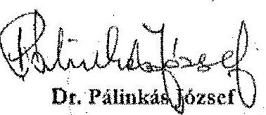

---

# 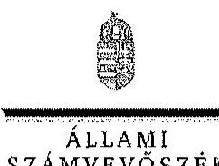 

## Dr. Pálinkás József úr

elnök
Nemzeti Kutatási, Fejlesztési és Innovációs Hivatal

## Budapest

## Tisztelt Elnök Úr!

A Nemzeti Innovációs Hivatal pénzügyi és vagyongazdálkodásának ellenőrzéséről készített számvevőszéki jelentéstervezetre telt észrevételeit köszönettel megkaptam.

Az Állami Számvevőszék észrevételekre vonatkozó álláspontjáról a felügyeleti vezető által készített részletes tájékoztatást csatoltan megküldöm.

Tájékoztatom Elnök urat, hogy a jelentésben - az Állami Számvevőszékről szóló 2011. évi LXVI. törvény 29. § (3) bekezdése alapján - az el nem fogadott észrevételeket szerepeltetjük az elutasítás indokának feltüntetésével együtt. Az elfogadott észrevételeket a jelentés szövegezésénél figyelembe vesszük.

Budapest, 2015. Ok. hó 23 nap
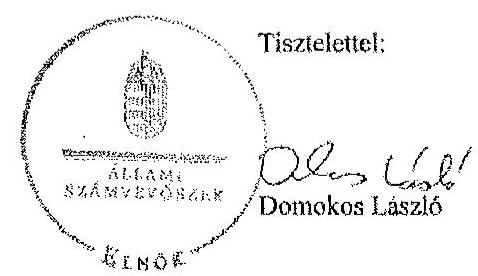

Melléklet: Tájékoztatás az elfogadott és az el nem fogadott észrevételekről

---

# Tájékoztatás az elfogadott és az el nem fogadott észrevételekről 

A Nemzeti Innovációs Hivatal pénzügyi és vagyongazdálkodásának ellenőrzéséről készített jelentéstervezetre a 1039-2/2015 iktatószámú levelében tett észrevételeit áttekintettük, azok kezeléséről az alábbi tájékoztatás adom.
Elfogadtam a belső ellenőrzés müködésében feltárt jogszabályi hiányosságra tett észrevételét. A jelentéstervezet részletes megállapításai 3.2 pontjában leírtak is tartalmazták, hogy az ellenőrzés által feltárt hiányosságok a 2008-2012. éveket érintették, 2013-ban már nem álltak fenn. Az észrevétel alapján az erre vonatkozó megállapítás összefoglaló mondatát kiegészítjük a jelentés szövegében.
Részben fogadtam el a belső ellenőrzés által tett megállapításokra vonatkozó észrevételét. Az észrevétel részletes indoklásában szereplő belső ellenőrzési jelentések belső kontrollrendszerre vonatkozó megállapításai nem tàrtak fel minden, a jelentéstervezetben megfogalmazott hiányosságot. A belső ellenőrzés a 2013. évben az indoklásban meghivatkozott 6 db ÁSZ javaslatból egy területen részben tárta fel az ÁSZ jelentésben rögzített megállapítást, ugyanis a kontrollkörnyezet ellenőrzéséről készült jelentésben nem hívta fel a figyelmet az önköltségszámitási szabályzat hiányára. Három területen pedig nem tárta fel az ÁSZ jelentésben rögzített megállapítást:

- nem állapította meg és nem tett javaslatot az Ámr. 12 és a Bkr. előírásai szerint az informatikai rendszerekhez való hozzáférési jogosultságok és a hozzáférési szintek szabályozására;
- nem állapította meg, hogy a folyamatba épített kontrollok müködése során az Áht.12, az Ámr.1,2, valamint az Ávr. előírásait nem tartották be;
- nem állapította meg, hogy a MAG Zrt. részére átadott eszközöket a leltárban - a Számv. tv. előírásaival ellentétben - érték nélkül szerepeltették.

Az észrevétel a jelentéstervezet belső kontrollrendszerre vonatkozó megállapításait nem módosítja, a belső kontrollrendszer hiányosságai a 2013. év végén is fennálltak.

Budapest, 2015. 04. hó 23. nap
Holman Magdolna
felügyeleti vezető

---

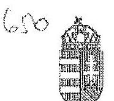

# NEMZETI KUTATÁSI, FEJLESZTÉS ÉS INNOVÁCIÓS HIVATAL 

## ELNÖK

Iksatósziem: 1039-5/2015
Ugniutésé Bzlács Tamáné
Tárge: Nemzetú Innovációs Hivatal
töljesitményecllenörzés értékelésénck
ellogadása

## Domokos László elnök út részére

## ÁLLAMI SZÁMVEVŐSZÉK

Budapest
Apáczai Csere J. u. 10.
1055

## Tisztelt Elnők Úr!

Hivatkozással az Állami Számvevőszék V-0722-322/2015.sz levelére, a Nemzeti Innovációs Hivatalnál a 2008-2013. évekre vonatkozóan végzett pénzügyi- és vagyongszdálkodás szabályszerűségének ellenőrzéséhez kapcsolódóan megküldött teljesítményellenőrzés értékelésre észrevételt nem teszek.

Köszönni
Budapest, 2015. május 19.
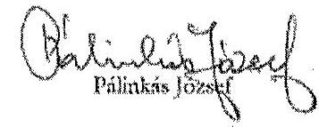

---

.

---

# RÖVIDÍTÉSEK JEGYZÉKE 

## Jogszabály rövidítések

## Törvények

| Áht. | az államháztartásról szóló 1992. évi XXXVIII. törvény (hatályon kívül helyezve: 2012. I. 1.) |
| :--: | :--: |
| Áht. | az államháztartásról szóló 2011. évi CXCV. törvény (hatályos: 2011. XII. 31.-étől) |
| ÁSZ tv. | 2011. évi LXVI. törvény az Állami Számvevőszékről (hatályos 2011. VII. 1.-jétől) |
| Jat. | 1987. évi XI. törvény a jogalkotásról (hatályon kívül helyezve: 2010. XII. 31-től) |
| Kbt. | 2003. évi CXXIX. törvény a közbeszerzésekről (hatályon kívül helyezve: 2012. I. 1.) |
| Kbt. | 2011. évi CVIII. törvény a közbeszerzésekről (hatályos: 2011. VIII. 21.-étől) |
| Nvtv. | 2011. évi CXCVI. törvény a nemzeti vagyonról (hatályos 2011. XII. 31.-étől) |
| Számv. tv. | 2010. évi C. törvény a számvitelről |
| Vtv. | 2007. évi CVI. törvény az állami vagyonról |
| 2006. évi LVII. törvény | a központi államigazgatási szervekről, valamint a kormány tagjai és az államtitkárok jogállásáról (hatálytalan: 2010. V. 29-től) |
| 2008. évi XX. törvény | a Magyar Köztársaság minisztériumainak felsorolásáról szóló 2006. évi LV. törvény módosításáról |
| 2010. évi XIIII. törvény | a központi államigazgatási szervekről, valamint a kormány tagjai és az államtitkárok jogállásáról |
| Korm. rendeletek |  |
| Ahsz. | 249/2000. (XII. 24.) Korm. rendelet az államháztartás szervezeti beszámolási és könyvvezetési kötelezettségének sajátosságairól (hatálytalan: 2014. I. 01-jétől) |
| Ámr. | 217/1998. (XII. 30.) Korm. rendelet az államháztartás múködési rendjéről (hatályos: 1999. I. 1.-2009. XII. 31.) |
| Ámr. | 292/2009. (XII. 19.) Korm. rendelet az államháztartás múködési rendjéről (hatályos: 2009. XII. 20. - 2011. XII. 31.) |
| Ávr. | az államháztartásról szóló törvény végrehajtásáról szóló 368/2011. (XII. 31.) Korm. rendelet (hatályos: 2012. I. 1.-jétől) |
| Ber. | 193/2003. (XI. 26.) Korm. rendelet a költségvetési szervek belső ellenőrzéséről (hatályos: 2003. XI. 27. - 2011. XII. 31.) |
| Bkr. | 370/2011. (XII. 31.) Korm. rendelet a költségvetési szervek belső kontrollrendszeréről és belső ellenőrzéséről |

---

Vtvr.
277/2006. (XII. 23.) Korm. rendelet
301/2006. (XII. 23.) Korm. rendelet
392/2007. (XII. 27.) Korm. rendelet
103/2008. (IV. 29.) Korm. rendelet
306/2008. (XII. 08.) Korm. rendelet

177/2009. (IX. 3.) Korm. rendelet
212/2010. (VII. 01.) Korm. rendelet

303/2010. (XII. 23.) Korm. rendelet
10/2013. (I. 21.) Korm. rendelet

## Miniszteri rendeletek

36/2013. (IX. 13.) NGM rendelet

## Kormányhatározatok

1316/2011. (IX. 19.)
Korm. határozat
1007/2013. (I. 10.) Korm. határozat

## Egyéb rövidítések

alapító okirat
APEH
ÁSZ
FEUVE
GKM
intézmény
INTOSAI
ISSAI
Kincstár
KIR

254/2007. (X. 4.) Korm. rendelet az állami vagyonnal való gazdálkodásról
a Nemzeti Kutatási és Technológiai Hivatalról (hatálytalan: 2011. január 1-től)
a köztisztviselői teljesítményértékelés és jutalmazás szabályairól (hatálytalan: 2010. VI. 30-tól)
az egyes, tudomány- és innovációpolitikával összefüggő jogszabályok módosításáról
a kutatás-fejlesztésért felelős tárca nélküli miniszter feladités hatásköréről (hatálytalan: 2009. IV. 16-tól)
egyes, a miniszteri feladat- és hatáskörök ellátását érintő kormányrendeletek módosításról (hatálytalan: 2009. I. 02ától)
egyes miniszteri statútumok módosításáról (hatálytalan: 2011. I. 01-től)
az egyes miniszterek, valamint a miniszterelnökséget vezető államtitkár feladat- és hatásköréről (hatálytalan: 2014. VI. 6 -ától)
a Nemzeti Innovációs Hivatalról (hatályos: 2011. január 1től)
a közszolgálati tisztviselők egyéni teljesítményértékelésről
az államháztartás számvitelének 2014. évi megváltoztatásával kapcsolatos feladatokról
a 2011. évi költségvetési egyensúlyt megtartó intézkedésekről
az államigazgatási szervezetrendszer átalakításáról

Nemzeti Kutatási és Technológiai Hivatal/Nemzeti Innovációs Hivatal alapító okirata
Adó- és Pénzügyi Ellenőrzési Hivatal
Állami Számvevőszék
folyamatba épített, előzetes, utólagos és vezetői ellenőrzés (ld.: Értelmező szótár)
Gazdasági és Közlekedési Minisztérium
Nemzeti Innovációs Hivatal
International Organisation of Supreme Audit Institutions (Legfőbb Ellenőrző Intézmények Nemzetközi Szervezete)
International Standards of Supreme Audit Institutions (az INTOSAI nemzetközi standardjai)
Magyar Államkincstár
Kincstári Információs Rendszer

---

| KFTNM | Kutatás-fejlesztésért felelős tárca nélküli miniszter |
| :-- | :-- |
| KPI | Kutatás-fejlesztési Pályázati és Kutatáshasznosítási Iroda |
| KTIA | Kutatási és Technológiai Innovációs Alap |
| KvVM | Környezetvédelmi és Vízügyi Minisztérium |
| MAG Zrt. | Magyar Gazdaságfejlesztési Központ Támogatásközvetítő |
|  | Zrt. |
| MNV Zrt. | Magyar Nemzeti Vagyonkezelő Zrt. |
| NFM | Nemzeti Fejlesztési Minisztérium |
| NFÜ | Nemzeti Fejlesztési Ügynökség (2013. december 18-án meg- |
|  | szűnt, egyes feladatait a Miniszterelnökség látja el) |
| NIH | Nemzeti Innovációs Hivatal |
|  | (2010. december 31-ig Nemzeti Kutatási és Technológiai Hi- |
| NGM | vatal) |
| OKM | Nemzetgazdasági Minisztérium |
| SZMSZ | Oktatási és Kulturális Minisztérium |
| Szervezeti és Müködési Szabályzat |  |

---

.

---

# ÉRTELMEZŐ SZÓTÁR 

belső kontrollrendszer
ellenőrzési nyomvonal
előirányzat-módosítás
eredendő veszélyeztetettségi szint

A belső kontrollrendszer a költségvetési szerv által a kockázatok kezelésére és tárgyilagos bizonyosság megszerzése érdekében kialakított folyamatrendszer, amely azt a célt szolgálja, hogy a költségvetési szerv megvalósítsa a következő fő célokat: a tevékenységeket (múveleteket) szabályszerűen, valamint a megbízható gazdálkodás elveivel (gazdaságosság, hatékonyság és eredményesség) összhangban hajtsa végre; teljesítse az elszámolási kötelezettségeket; megvédje a szervezet erőforrásait a veszteségektől (károktól) és a nem rendeltetésszerű használattól. (Forrás: Áht. ${ }_{1}$ 120/B § (1), hatályos: 2009. január 1-jétől 2011. december 31-ig)
A belső kontrollrendszer a kockázatok kezelése és tárgyilagos bizonyosság megszerzése érdekében kialakított folyamatrendszer, amely azt a célt szolgálja, hogy megvalósuljanak a következő célok: a múködés és gazdálkodás során a tevékenységeket szabályszerűen, gazdaságosan, hatékonyan, eredményesen hajtsák végre, az elszámolási kötelezettségeket teljesítsék, és megvédjék az erőforrásokat a veszteségektől, károktól és nem rendeltetésszerű használattól. (Forrás: Áht. ${ }_{2}$ 69. § (1) bek., hatályos: 2012. január 1-jétől)
Az ellenőrzési nyomvonal a költségvetési szerv múködési folyamatainak szöveges vagy táblázatba foglalt, vagy folyamatábrákkal szemléltetett leírása, amely tartalmazza különösen a felelősségi és információs szinteket és kapcsolatokat, továbbá irányítási és ellenőrzési folyamatokat, lehetővé téve azok nyomon követését és utólagos ellenőrzését. (Forrás: Ámr ${ }_{1}$ 145/B. § (1) bek., hatályos 2010. január 1-jéig, további időszakokra forrás: NGM honlapjáról elérhető Belső Kontroll kézikönyv PM 2010. 35. oldal)
Az előirányzat-módosítás a költségvetési szerv költségvetésének kiadási, illetve bevételi főösszegét és kiemelt előirányzatait is érintő előirányzat-növelés vagy -csökkentés. (Forrás: Áht. ${ }_{1}$ 97. § (2) bek., hatályos: 2010. augusztus 14 -ig)
Előirányzat-módosítás: a megállapított kiadási, bevételi, támogatási kiemelt előirányzat, létszám-előirányzat növelése vagy csökkentése. (Forrás Áht. ${ }_{1}$ 2/A § (3) k) pont, hatályos: 2011. december 31-ig)
Előirányzat-módosítás: a megállapított kiadási előirányzat növelése vagy csökkentése, a bevételi előirányzatok egyidejú növelése vagy csökkentése mellett. (Forrás: Áht. ${ }_{2}$ 2. § (1) bek. f) pont, hatályos: 2012. január 1-jétől).
Az ún. „eredendő veszélyeztetettség" olyan kockázati tényezők csoportja, amelyek a vizsgált költségvetési szerv

---

eredményesség

FEUVE

## gazdaságosság

hatékonyság
integritás
integritási kockázat
jogállásából eredően, az általa kezelt erőforrásokkal való gazdálkodás miatt gyakorlatilag objektív, „külső"szervezeti adottságként értelmezhetők.
Annak követelménye, hogy a kitűzött célok - az elfogadott módosításokat, változó körülményeket figyelembe véve megvalósuljanak, a tevékenység tervezett és tényleges hatása közötti különbség a lehető legkisebb mértékű legyen, vagy a tényleges hatás legyen kedvezőbb a tervezetinél; (Forrás: Áht. 91. § (1) bek. c) pontja, Bkr. 2. § g) pontja) Folyamatba épített, előzetes, utólagos és vezetői ellenőrzés. A FEUVE a szervezeten belül a gazdálkodásért felelős szervezeti egység által folytatott első szintű pénzügyi irányítási és ellenőrzési rendszer.
A folyamatba épített előzetes és utólagos vezetői ellenőrzésre vonatkozó szabályokat Áht. ${ }_{1,2}$, valamint az Ámr. határozza meg. Kidolgozására a pénzügyminisztérium költségvetési ellenőrzéssel kapcsolatban közzétett módszertani útmutatói, illetve ajánlásai figyelembevételével került sor.
2004. I. 1.-jétől: Áht. ${ }_{1} 121 . \S$, Ámr. ${ }_{1} 2 . \S 62$. pont
2009. I. 1.-jétől: Áht. ${ }_{1} 121 . \S$, Ámr. ${ }_{1} 2 . \S 62$. pont
2010. I. 1.-jétől: Ámr. ${ }_{2} 155 . \S$ (1) bek.,
2012. I. 1.-jétől: Bkr. 8. § (2)
Annak követelménye, hogy az erőforrások felhasználásához kapcsolódó kiadás vagy ráfordítás az elérhető legkisebb legyen, a jogszabályban meghatározott vagy általánosan elvárható minőség mellett;
(Forrás: Áht. ${ }_{1} 91 . \S$ (1) bek. a) pontja, Bkr. 2. § i) pontja)
Annak követelménye, hogy az előállított termékek, nyújtott szolgáltatások, az ellátott feladat más eredményének értéke, vagy az azokból származó bevétel a lehető legnagyobb mértékben haladja meg a felhasznált erőforrásokhoz kapcsolódó kiadásokat vagy ráfordításokat; (Forrás: Áht. 91. § (1) bek. b) pontja, Bkr. 2. § j) pontja)
Az integritás az elvek, értékek, cselekvések, módszerek, intézkedések konzisztenciáját jelenti, vagyis olyan magatartásmódot, amely meghatározott értékeknek megfelel. (Forrása NGM Útmutató: Magyarországi államháztartási belső kontroll standardok 1.6.1. pont, 2012. december.) Az államigazgatási szerv múködésére vonatkozó szabályoknak, valamint a hivatali szervezet vezetője és az irányító szerv által meghatározott célkitűzéseknek, értékeknek és elveknek megfelelő múködés.
(Forrás: integritásirányítási rendelet 2. § a) pont.)
Az államigazgatási szerv integritása sérülésének lehetősége. (Forrás: integritásirányítási rendelet 2. § c) pont.)

---

intézkedési terv
irányító szerv
kockázatok kezelésére
hivatott kontrollok
korrupciós kockázat
kulcskontrollok
likviditási mutató
monitoring
pénzeszköz likviditási mutató

Az ellenőrzési javaslatok alapján az ellenőrzött szervezet, szervezeti egység által készített intézkedések végrehajtásának ütemezése a végrehajtásáért felelős személyek és a vonatkozó határidők megjelölésével. (Forrás: 370/2011. (XII. 31.) Korm. rendelet 2. § (k) pontja, hatályos 2012. január 1-jétől)
A központi alrendszer egyes intézményével és annak gazdálkodásával kapcsolatos irányítási jogokkal felruházott szerv vagy személy.
A belső és külső kontrollok célja, hogy megfelelő eszközökkel, intézményekkel és eljárásokkal védelmet biztosítson a közpénzből, közérdekből múködő, vagyis közcélokat követő szervek múködésével kapcsolatos ún. eredendő, valamint az egyéb, veszélyeztetettséget növelő körülményekből származó korrupciós kockázatokkal szemben. A belső és külső kontrollok tehát a - bármilyen típusú - korrupciós kockázatokkal szembeni védettség elemeit, azok összességét jelentik.
A jogtalan előny nyújtásának vagy megszerzésének lehetősége. (Forrás: integritásirányítási rendelet 2. § d) pont.)
A kiadások utalványozását megelőző kötelező kontrolltevékenységek. Az Ámr. ${ }_{1-2}$ a 2008-2011. években a szakmai teljesítésigazolást és az utalvány ellenjegyzését, az Ávr. a 2012-2013. években a teljesítésigazolást és az érvényesítést írta elő egyenrangú kulcskontrollként.
A mutató kifejezi, hogy a szervezet forgóeszközei milyen mértékben nyújtanak fedezetet a rövid lejáratú kötelezettségekre az éves könyvviteli mérleg adatai alapján. Számítása: Forgóeszközök összesen/ Rövid lejáratú kötelezettségek összesen.
A monitoring a különböző szintű szervezeti célok megvalósításának folyamatát kíséri figyelemmel, melynek során a releváns eseményekről és tevékenységekről (együtt: folyamatokról) rendszeres jelleggel, strukturált, döntéstámogató információkhoz jutnak a szervezet vezetői. (NGM útmutató a költségvetési szervek monitoring rendszeréhez 3. oldal, 2011. november)
A költségvetési szerv vezetője köteles olyan monitoring rendszert múködtetni, mely lehetővé teszi a szervezet tevékenységének, a célok megvalósításának nyomon követését. (Forrás: Ámr. 160. §, hatályos: 2010. január 1-jétől 2011. december 31.)
A mutató kifejezi, hogy a szervezet pénzeszközei milyen mértékben nyújtanak fedezetet a rövid lejáratú kötelezettségekre az éves könyvviteli mérleg adatai alapján. Számítása: Pénzeszközök összesen/Rövid lejáratú kötelezettségek összesen.

---

saját tőke aránya
tárgyi eszközök használhatósági foka
vezetői nyilatkozat

A mutató kifejezi, hogy a saját tőke és a tartalékok milyen arányt képviselnek az összes forráson belül. A mutató növekedése a tőkeellátottság javuló tendenciáját fejezi ki.
Az eszközgazdálkodás vizsgálatának elemzése során használt mutató. Számítása: tárgyi eszközök könyv szerinti (nettó) értéke/tárgyi eszközök bruttó (beszerzési/létesítési) értéke. A \%-ban kifejezett mutató csökkenése az eszköz állagának romlására, avulására utal, ami maga után vonja az üzemeltetési és fenntartási költségek növekedését is. A költségvetési szerv vezetője köteles - az előírt tartalmú nyilatkozatban értékelni a költségvetési szerv belső kontrollrendszerének minőségét és azt az éves költségvetési beszámolóval együtt megküldeni az irányító szervnek. Ha a költségvetési szervnél év közben változás történik a szerv vezetője személyében, vagy a költségvetési szerv átalakul, megszűnik, a távozó vezető, illetve az átalakuló, megszűnő költségvetési szerv vezetője köteles az előírt tartalmú nyilatkozatot az addig eltelt időszak vonatkozásában kitölteni, és az új vezetőnek, illetve a jogutód költségvetési szerv vezetőjének átadni, aki azt saját nyilatkozatához mellékeli. Jelen ellenőrzés során vezetői nyilatkozaton a fentebb említett nyilatkozatokban tett következő résznyilatkozatot értjük, ennek helytállóságát értékeljük a pénzügyi és vagyongazdálkodási folyamatok tekintetében: „gondoskodtam ... a költségvetési szerv tevékenységében a hatékonyság, eredményesség és a gazdaságosság követelményeinek érvényesitéséről, ...".
(Forrás: Ámr. 149. § (1) bek. c) pontja, (11) bek., 23. számú melléklete; Ámr. 2 217. § c) pontja, 226. § (3) bek., 21. számú melléklete; Bkr. 11. § (1) és (4) bek., 1. számú melléklete)

---

# A gazdaságossági, hatékonysági és eredményességi követelmények kialakítása, a vezetői nyilatkozat helytállósága a Nemzeti Innovációs Hivatalnál 

A Hivatalnál a pénzügyi és vagyongazdálkodás folyamatában a teljesítmény mérésére mérhető célokat nem tűztek ki, teljesítménymérésre alkalmas gazdaságossági, hatékonysági és eredményességi követelményeket nem határoztak meg. A NIH 2007-2010. évi intézményi stratégiai dokumentuma a gazdálkodás területén a pénzügyi és vagyongazdálkodásra vonatkozó célkitűzéseket nem rögzített.
A Hivatal pénzügyi és vagyongazdálkodási folyamati tekintetében a gazdaságosság, hatékonyság és eredményesség követelményeinek érvényesítéséről kiadott vezetői nyilatkozat nem volt helytálló. A NIH elnöke a 2008-2009. években a belső kontroll vezetői nyilatkozatot nem adta ki. A 2010-2013. években a NIH elnöke nyilatkozott arról, hogy a NIH tevékenységében a hatékonyság, eredményesség és a gazdaságosság követelményeiről gondoskodott, azonban a NIH belső szabályzatai nem támasztották alá nyilatkozatát. A pénzügyi és vagyongazdálkodás folyamatában nem hoztak intézkedéseket, nem alakítottak ki gazdaságossági, hatékonysági és eredményességi követelményeket és nem is alkalmaztak.