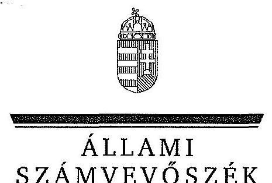
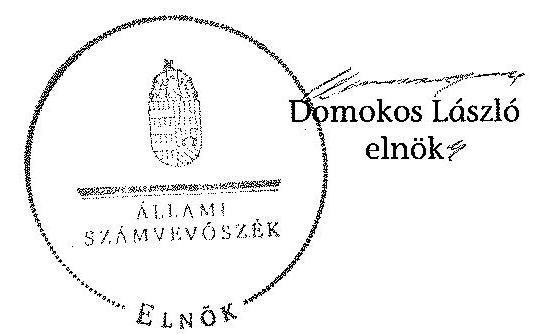

ÁLLAMI
SZÁMVEVÔSZÉK

# JELENTÉS 

az önkormányzatok belső kontrollrendszere kialakításának, egyes
kontrolltevékenységek és a belső ellenőrzés
múködésének ellenőrzése
Révfülöp
15074
2015. május

---

# Állami Számvevőszék 

Iktatószám: V-0682-057/2015.
Témaszám: 1716
Vizsgálat-azonosító szám: V067717

## Az ellenőrzést felügyelte:

Dr. Benedek Mária
felügyeleti vezető
Az ellenőrzést vezette és az ellenőrzés végrehajtásáért felelős:
Gál Magdolna
ellenőrzésvezető
A számvevőszéki jelentés összeállításában közremúködött:
Molnár Istvánné
számvevő főtanácsos
Az ellenőrzést végezték:
Hajdu Károlyné
Molnár Istvánné
számvevő tanácsos
számvevő főtanácsos

---

# TARTALOMJEGYZÉK 

BEVEZETÉS ..... 7
I. ÖSSZEGZŐ MEGÁLLAPÍTÁSOK, KÖVETKEZTETÉSEK, JAVASLATOK ..... 11
II. RÉSZLETES MEGÁLLAPÍTÁSOK ..... 14

1. Az Önkormányzat belső kontrollrendszere kialakításának és múködtetésének megfelelősége ..... 14
1.1. A kontrollkörnyezet kialakítása és múködtetése ..... 14
1.2. A kockázatkezelési rendszer kialakítása és múködtetése ..... 15
1.3. A kontrolltevékenységek kialakítása és múködtetése ..... 16
1.4. Az információs és kommunikációs rendszer kialakítása és múködtetése ..... 17
1.5. A monitoring rendszer kialakítása és múködtetése ..... 17
2. A monitoring rendszer részeként a belső ellenőrzés kialakítása és múködtetése ..... 18
3. A pénzügyi folyamatokban kulcsszerepet betöltő belső kontrollok (teljesítésigazolás és érvényesítés) múködése ..... 19
4. Az integritás szemlélet érvényesülése ..... 22
FÜGGELÉKEK
5. számú Értelmező szótár
6. számú Az integritás érvényesítése érdekében kialakított és működtetett kontroll- rendszer

---

.

---

# RÖVIDÍTÉSEK JEGYZÉKE 

## Törvények

Áht.
ÁSZ tv.
Info tv.
Kttv.
Ltv.
Mötv.
Vnytv.

## Rendeletek, határozatok

Ávr.
Bkr.
képviselő-testületi
SZMSZ
vagyonrendelet

26/2000. (IX. 27.) BM rendelet

## Szórövidítések

adatvédelmi szabályzat
alapító okirat
ÁSZ
belső kontrollrendszer szabályzat
bizonylati szabályzat
ellenőrzési nyomvonal

2011. évi CXCV. törvény az államháztartásról
2011. évi LXVI. törvény az Állami Számvevőszékről
2011. évi CXII. törvény az információs önrendelkezési jogról és az információszabadságról
2011. évi CXCIX. törvény a közszolgálati tisztviselőkő̋l
1995. évi LXVI. törvény a köziratokról, a közlevéltárakról és a magánlevéltári anyag védelméről
2011. évi CLXXXIX. törvény Magyarország helyi önkormányzatairól
2007. évi CLII. törvény az egyes vagyonnyilatkozat-tételi kötelezettségekről

368/2011. (XII. 31.) Korm. rendelet az államháztartásról szóló törvény végrehajtásáról
370/2011. (XII. 31.) Korm. rendelet a költségvetési szervek belső kontrollrendszeréről és belső ellenőrzéséről
Révfülöp Nagyközség Önkormányzata Képviselő-testülete 3/2011. (III. 23.) önkormányzati rendelete a Révfülöp Nagyközség Önkormányzata Szervezeti és Múködési Szabályzatáról (hatályos 2013. március 31-éig)
Révfülöp Nagyközség Önkormányzata Képviselő-testülete 6/2013. (III. 27.) önkormányzati rendelete a Révfülöp Nagyközség Önkormányzata Szervezeti és Múködési Szabályzatáról (hatályos 2013. április 1-jétől)
Révfülöp Nagyközség Önkormányzat Képviselő-testülete 11/2013. (V. 30.) önkormányzati rendelete az önkormányzat vagyonáról és a vagyonhasznosítás szabályairól
26/2000. (IX. 27.) BM rendelet a polgármesteri munkakör átadása jegyzőkönyvének tartalmáról

Kővágóörsi Közös Önkormányzati Hivatal Adatvédelmi szabályzat (hatályos 2013. április 10-étől)
Kővágóörsi Közös Önkormányzati Hivatal Alapító okirata (hatályos 2013. március 21-étől)
Állami Számvevőszék
Kővágóörsi Közös Önkormányzati Hivatal belső kontrollrendszer szabályzata (hatályos 2013. április 1-jétől)
Kővágóörsi Közös Önkormányzati Hivatal bizonylati szabályzat (hatályos 2013. július 1-jétől)
Kővágóörsi Közös Önkormányzati Hivatal belső kontrollrendszer szabályzata II. Kontrollkörnyezet fejezet 1.6. Az ellenőrzési nyomvonal pont és a szabályzat 1. számú melléklete (hatályos 2013. április 1-jétől)

---

értékelési szabályzat
gazdasági program
gazdálkodási jogkörök szabályzata

Hivatal
hivatali SZMSZ
informatikai biztonsági szabályzat
INTOSAI
iratkezelési szabályzat
ISSAI
jegyzó

Képviselő-testület
Kormányhivatal
közérdekú adatok szabályzata
leltározási szabályzat
Önkormányzat
pénzkezelési szabályzat
polgármester
szabálytalanságok kezelésének eljárásrendje

Kővágóörsi Közös Önkormányzati Hivatal Eszközök és források értékelési szabályzata (hatályos 2013. április 1-jétől) 33/2011. (IV. 18.) sz. képviselő-testületi határozattal elfogadott Révfülöp Nagyközség Önkormányzata gazdasági programja 2011-2014.
Révfülöp Nagyközség Polgármesteri Hivatala Gazdálkodási szabályzat (hatályos 2013. március 31-éig), Kővágóörsi Közös Önkormányzati Hivatal Kötelezettségvállalási, utalványozási, érvényesitési és ellenjegyzési rendjének szabályzata (hatályos 2013. április 1-jétől)
Révfülöp Nagyközség Önkormányzata Polgármesteri Hivatala (2013. március 31-éig), Kővágóörsi Közös Önkormányzati Hivatal (2013. április 1-jétől)
Révfülöp Nagyközség Önkormányzata Képviselőtestületének Szervezeti és Müködési Szabályzatáról szóló 3/2011. (III. 23.) önkormányzati rendeletének 4. függeléke a Polgármesteri Hivatal Szervezeti és Müködési Szabályzata (hatályos 2013. március 31-éig), Kővágóörsi Közös Önkormányzati Hivatal Szervezeti és Müködési Szabályzat (hatályos 2013. március 22-étől)
Kővágóörsi Közös Önkormányzati Hivatal Informatikai Biztonsági Szabályzat (hatályos 2013. július 10-étől)
International Organization of Supreme Audit Institutions (Legfőbb Ellenőrző Intézmények Nemzetközi Szervezete)
Kővágóörsi Közös Önkormányzati Hivatal iratkezelési szabályzata (hatályos 2013. január 16-ától)
International Standards of Supreme Audit Institutions (Legfőbb Ellenőrző Intézmények Nemzetközi Standardjai)
Révfülöp Nagyközség Önkormányzata jegyzője (2013. március 31-éig), Kővágóörsi Közös Önkormányzati Hivatal jegyzője (2013. április 1-jétől)
Révfülöp Nagyközség Önkormányzata Képviselő-testülete Veszprém Megyei Kormányhivatal
Kővágóörsi Közös Önkormányzati Hivatal Szabályzat a közérdekú adatok megismerésére irányuló kérelmek intézésének, továbbá a kötelezően közzéteendő adatok nyilvánosságra hozatalának rendjéről (hatályos 2013. július 10étől)
Kővágóörsi Közös Önkormányzati Hivatal Leltározási és Leltárkészítési Szabályzat (hatályos 2013. április 1-jétől)
Révfülöp Nagyközség Önkormányzata
Kővágóörsi Közös Önkormányzati Hivatal pénzkezelési szabályzat (hatályos 2013. augusztus 31-étől)
Révfülöp Nagyközség Önkormányzata polgármestere
Kővágóörsi Közös Önkormányzati Hivatal belső kontrollrendszer szabályzata II. Kontrollkörnyezet fejezet 2. A szabálytalanságok kezelésének eljárásrendje pont (hatályos 2013. április 1-jétől)

---

| számlarend | Kővágóörsi Közös Önkormányzati Hivatal számlarend (hatályos 2013. július 1-jétől) |
| :--: | :--: |
| számviteli politika | Kővágóörsi Közös Önkormányzati Hivatal számviteli politika (hatályos: 2013. július 1-jétől) |
| Társulás | Tapolca Környéki Önkormányzati Társulás |
| ügyrend | Kővágóörsi Közös Önkormányzati Hivatal ügyrend (hatályos 2013. február 16-ától) |

---

.

---

# JELENTÉS 

## az önkormányzatok belső kontrollrendszere kialakításának, egyes kontrolltevékenységek és a belső ellenőrzés múködésének ellenőrzése Révfülöp

## BEVEZETÉS

Révfülöp nagyközség állandó lakosainak száma 2013. január 1-jén 1195 fő volt. Az Önkormányzat hét tagú Képviselő-testületének munkáját kettő állandó bizottság segítette. Az Önkormányzat a Hivatalon kívül 2013. június 30 -áig kettő önállóan múködő intézményt múködtetett, többségi tulajdoni hányadú gazdasági társasággal nem rendelkezett. A polgármester a 2013. február 24-én tartott időközi választás óta tölti be tisztségét. A jegyző 2013. január 1-jétől látja el feladatait. A Hivatal szervezeti egységekre nem tagolódott, elkülönített gazdasági szervezettel nem rendelkezett. A foglalkoztatott köztisztviselők száma 2013. január 1-jén kilenc fő volt. Szervezeti változás következtében az Önkormányzat gazdálkodási feladatait az önálló hivatal helyett 2013. április 1-jétől közös önkormányzati hivatal látta el. Az Önkormányzat a 2013. évi költségvetési beszámolója szerint 425904 ezer Ft tárgyévi bevételt ért el, valamint 334994 ezer Ft tárgyévi kiadást teljesített. A 2013. december 31-ei könyvviteli mérleg szerint 2612554 ezer Ft értékű eszközvagyonnal rendelkezett, a rövid lejáratú kötelezettségállománya 9194 ezer Ft, hosszú lejáratú kötelezettség állománya nem volt.

A demokratikus társadalmakban alapvető igény, hogy a közpénzeket, a közvagyont használók valamennyi tevékenységükhöz kapcsolódó pénzfelhasználásról elszámoljanak, ahhoz egyértelmű és érvényesíthető felelősségi szabályok társuljanak. Ennek a jogos igénynek az érvényesítéséhez meg kell teremteni azokat a folyamatokat, rendszereket, amelyek nélkülözhetetlenek az elszámoltatáshoz. Az elszámoltatás eredményes múködtetéséhez szükség van a megfelelő információs, kontroll, értékelési és beszámolási rendszerek kialakítására.

Magyarországon az uniós csatlakozási tárgyalások idejére nyúlnak vissza a belső kontrollrendszer szabályozásának gyökerei. Az uniós elvárásoknak megfelelő új terminológia szerinti államháztartási belső pénzügyi ellenőrzési (ÁBPE) rendszer területén a jogharmonizáció 2003-ban teljes körűen megvalósult, míg az önkormányzati alrendszerre vonatkozó, Ötv.-ben megjelenített speciális szabályozás 2005-ben lépett hatályba. Az államháztartási belső kontrollrendszer koncepciója 2009-ben továbbfejlődött. A változások irányát mutatja, hogy a költségvetési szervek belső kontrollrendszere már magában foglalja a korszerű felelős szervezetirányítás elemeit (kontrollkörnyezet, kockázatkezelés, kontrolltevékenység, információ és kommunikáció, monitoring) is. E kontrollrendszer szabályozása háromszintű, a törvényi előírásokat az Áht. és a Mötv., a rendeleti

---

szintű szabályozást az Ávr. és a Bkr. tartalmazza, amelyeket útmutatói szinten az NGM által kiadott standardok és kézikönyvek támogatnak.

A belső kontrollrendszer azt a célt szolgálja, hogy a költségvetési szervek működésük és gazdálkodásuk során a tevékenységeket szabályszerűen, gazdaságosan, hatékonyan, eredményesen hajtsák végre, teljesítsék elszámolási kötelezettségeiket és megvédjék az erőforrásokat a veszteségektől, a károktól és a nem rendeltetésszerű használattól. A belső kontrollrendszer magában foglalja mindazon szabályokat, eljárásokat, gyakorlati módszereket és szervezeti struktúrákat, kockázatkezelési technikákat, kontrolltevékenységeket, amelyek segítséget nyújtanak a szervezetnek céljai eléréséhez.

Az ÁSZ középtávú stratégiájában hangsúlyos szerepet szánt annak, hogy szilárd szakmai alapon álló, értékteremtő ellenőrzéseivel előmozdítsa a közpénzügyek átláthatóságát, rendezettségét. A számvevőszéki ellenőrzés nemzetközi alapelvei is rögzítik, hogy a megfelelő belső kontrollrendszer minimálisra csökkenti a hibák és szabálytalanságok kockázatát.

Az ellenőrzés célja annak értékelése, hogy

- a jogszabályi előírásoknak megfelelően alakították-e ki és működtették-e a belső kontrollrendszert;
- a gazdálkodás folyamatában kulcsszerepet betöltő teljesítésigazolás és érvényesítés kontrolltevékenységeit megfelelően működtették-e;
- biztosították-e a belső ellenőrzés szabályos működését;
- kialakították-e az erőforrásokkal való szabályszerű és hatékony gazdálkodáshoz szükséges követelményeket, megvalósították-e azok számonkérését, ellenőrzését;
- hasznosították-e a 2009-2013. évek között végzett ÁSZ ellenőrzések során megfogalmazott javaslatokat.

A közintézmények integritás alapú kultúrájának kialakítása, megerősítése és működése szorosan összefügg a belső kontrollrendszer múködésével, ezért az ellenőrzés kitért a gazdálkodáshoz kapcsolódó integritás kontrollok meglétének és működésének ellenőrzésére is. Az integritási kultúra kialakítása hozzájárul az elszámoltathatóság és átláthatóság érvényesítéséhez, egyben támogatja a szervezet védettségét a korrupciós kitettséggel szemben, valamint annak megelőzése is irányítottabbá válik.

Az ellenőrzés várható hasznosulását négy szinten tervezzük. A törvényalkotás számára összegzett tapasztalatok állnak rendelkezésre a belső kontrollrendszer önkormányzati területen való kialakításáról, múködéséről és hatásairól, a belső ellenőrzés múködéséről. Az ellenőrzés az ellenőrzött számára visszajelzést ad a belső kontrollrendszer kialakításában és múködésében fellépő hiányosságokról, javaslataival hozzájárul azok kiküszöböléséhez, amely csökkentheti a későbbi ellenőrzések gyakoriságát. Az ellenőrzés megállapításait és javaslatait más szervezetek is hasznosíthatják a rendezett gazdálkodási keretek kiala-

---

kításához. A társadalom számára jelzi, hogy közpénz nem maradhat ellenőrizetlenül, az ÁSZ értékteremtő rend kialakításához és megőrzéséhez hozzájáruló tevékenysége pozitív hatással lesz a szervezetről kialakított összkép formálásában. A szervezeten belül lehetőség nyílik arra, hogy a megállapítások szintetizálásával az ÁSZ a hozzáadott értéket teremtő elemző tevékenységét és tanácsadó szerepét is erősítse.

Az önkormányzatok belső kontrollrendszere kialakításának, az egyes kontrolltevékenységek és a belső ellenőrzés működésének ellenőrzéséről szóló jelentés I. fejezetének összegző része az ellenőrzés céljára ad rövid, szintetizáló összefoglalót, és tartalmazza a következtetéseket a II. fejezet részletes megállapításain alapulóan. A jelentés intézkedést igénylő megállapításait és javaslatait az ellenőrzés során feltárt, a jelentés II. fejezetében rögzített részletes megállapítások alapozzák meg.

# Az ellenőrzés típusa: szabályszerűségi ellenőrzés 

Az ellenőrzött időszak: a belső kontrollrendszer kialakítása és múködtetése megfelelőségét a 2013. évre vonatkozóan (2013. december 31-i állapotnak megfelelően), a pénzügyi folyamatokban kulcsszerepet betöltő teljesítésigazolás és érvényesítés belső kontrollok múködésének megfelelőségét, és a belső ellenőrzés szabályszerű működését a 2013. január 1. - december 31-e közötti időszakot figyelembe véve értékeltük, míg az ÁSZ javaslatainak utóellenőrzése a 2009-2013. években végzett ellenőrzések nyilvánosságra hozott jelentéseiben tett javaslatok áttekintésére terjedt ki.

## Az ellenőrzött szervezet: az Önkormányzat

Az ellenőrzés jogszabályi alapját az ÁSZ tv. 1. § (3) bekezdése, az 5. § (2) és (6) bekezdései, valamint az Áht. 61. § (2) bekezdése képezik.

Az ellenőrzés szakmai módszertana az ÁSZ hivatalos honlapján (www.asz.hu) közzétett szakmai szabályokon alapult, amely az INTOSAI által kiadott ISSAI figyelembevételével készült.

Az ellenőrzés lefolytatásához az Önkormányzat a kimutatások és a tanúsítvány elektronikus kitöltésével, valamint az ÁSZ által kért dokumentumok elektronikus megküldésével szolgáltatott adatokat. Az így rendelkezésre bocsátott adatok, információk kontrollja és a munkalapok kitöltése a helyszíni ellenőrzés keretében történt. A jelentésben használt fogalmak magyarázatát az 1. számú függelék, az integritás érvényesítése érdekében kialakított és múködtetett intézményi kontrollrendszer minősítését a 2. számú függelék tartalmazza.

A belső kontrollrendszer, valamint a belső ellenőrzés jogszabályi előírások szerinti kialakításának és múködtetésének szabályszerűségét az erre irányuló ellenőrzési kérdésekre adott válaszok összesítése alapján értékeltük. A belső kontrollrendszert kontrollterületenként (kontrollkörnyezet, kockázatkezelési rendszer, kontrolltevékenységek, információs és kommunikációs rendszer, monitoring rendszer) és összesítetten is értékeltük.

A belső kontrollrendszer egyes kontrollterületei és a belső ellenőrzés kialakítása és múködtetése „szabályszerü volt", amennyiben az értékelt területen az elért és

---

az elérhető pontok százalékban kifejezett hányadosa elérte a $81 \%$-ot, „részben szabályszerű volt", ha $61-80 \%$ közé esett, és „nem volt szabályszerű", ha nem haladta meg a $60 \%$-ot. A belső kontrollrendszer összesített értékelése megegyezett a kontrollterületenként alkalmazott \%-os értékelésekkel, a következő eltérésekkel. A kontrollrendszer egésze esetében a „szabályszerü" értékelésnek a \%-os értéken felül további feltétele volt, hogy egyik kontrollterület sem kaphatott „nem volt szabályszerű" értékelést, a „részben szabályszerű" értékelés további feltétele volt, hogy legfeljebb egy ellenőrzött kontrollterület lehetett „nem volt szabályszerű" értékelésű. Az összesített értékelés a \%-os értéktől függetlenül „nem volt szabályszerű", ha az ellenőrzött kontrollterületek közül több mint egynek „nem volt szabályszerű" az értékelése.

A gazdálkodás folyamatában kulcsszerepet betöltő két kulcskontroll - teljesítésigazolás, érvényesítés - múködésének megfelelőségét a személyi juttatásokkal, a dologi és felhalmozási kiadásokkal, működési és felhalmozási célú pénzeszköz átadásokkal, ellátottak pénzbeli juttatásaival kapcsolatos kifizetések esetében mintavétellel ellenőriztük. „Megfelelőnek" értékeltük a gazdálkodási jogkörök gyakorlását, amennyiben 95\%-os bizonyossággal a teljes sokaságban a hibaarány legfeljebb $10 \%$, „részben megfelelőnek" értékeltük, ha a hibaarány felső határa 10-30\% között volt, „nem megfelelőnek" pedig akkor, ha a mintavételi eredmények alapján a sokaságbeli hibaarány felső határa meghaladta a 30\%-ot.

Az integritás szemlélet érvényesülésének minősítése az Önkormányzat önbevallás által kitöltött tanúsítványa alapján történt.

Utóellenőrzésre nem került sor, mivel az ÁSZ az Önkormányzatnál a 2009-2013. évek között ellenőrzést nem végzett.

Az ÁSZ tv. 29. § (1) bekezdése szerint a jelentéstervezetet megküldtük a polgármester részére, aki az ÁSZ tv. 29. § (2) bekezdésében foglalt észrevételezési jogával nem élt, a jelentéstervezetre észrevételt nem tett.

---

# I. ÖSSZEGZŐ MEGÁLLAPÍTÁSOK, KÖVETKEZTETÉSEK, JAVASLATOK 

A belső kontrollrendszeren belül 2013-ban a kontrollkörnyezet, a kockázatkezelési rendszer, a kontrolltevékenységek, az információs és kommunikációs rendszer, valamint a monitoring rendszer kialakítását és múködtetését külön-külön és együttesen is értékeltük. A belső kontrollrendszer kialakítása és múködtetése az összesített értékelés alapján részben volt szabályszerű.

A belső kontrollrendszer egyes területei kialakításának és múködtetésének minősítése a következő:

| Kontrollterület | Minősítés |  |
| :-- | :-- | :-- |
| Kontrollkörnyezet | szabályszerű |  |
| Kockázatkezelési rendszer |  | nem   szabályszerű |
| Kontrolltevékenységek | szabályszerű |  |
| Információs és kommuni-   kációs rendszer | szabályszerű |  |
| Monitoring rendszer |  | részben   szabályszerű |

Szabályszerú volt a kontrollkörnyezet, a kontrolltevékenységek, valamint az információs és kommunikációs rendszer kialakítása és múködtetése, mivel a jegyző a jogszabályi előírásokban foglaltakat figyelembe véve - kisebb hiányosságok mellett - megteremtette a kontrollterületeken a szabályszerű működés lehetőségét.

Részben szabályszerú volt a monitoring rendszer kialakítása és múködtetése, mivel a megállapított szabályozásbeli hiányosságok nem veszélyeztették e kontrollterületen a szabályszerű működést.

Nem volt szabályszerű a kockázatkezelési rendszer kialakítása és működtetése, mivel az ellenőrzésünk során megállapított szabályozásbeli hiányosságok magukban hordozzák a szabálytalan múködés, valamint a korrupció kockázatát.

A 2013. évben a személyi juttatásokkal, a dologi kiadásokkal, a felhalmozási kiadásokkal, valamint a múködési és felhalmozási célú pénzeszköz átadásokkal, illetve az ellátottak pénzbeli juttatásaival kapcsolatos kifizetések során a pénzügyi folyamatokban kulcsszerepet betöltő teljesítésigazolás és érvényesítés belső kontrollok múködése nem volt megfelelő, mivel azok nem biztosították a hibák megelőzését, feltárását.

A számvevőszéki ellenőrzés az ellenőrzött kifizetésekkel összefüggésben a rendelkezésre bocsátott dokumentumok alapján kár bekövetkeztére utaló adatot, tényt

---

nem állapított meg, azonban a gazdálkodásban kulcsszerepet betöltő kontrollok működésében feltárt hiányosságok miatt fennáll a hibák bekövetkezésének kockázata. A nem megfelelően működtetett belső kontrollok korrupciós kockázatot hordoznak.

A 2013. évben a belső ellenőrzés kialakítása és múködtetése nem volt szabályszerű, a belső ellenőrzés nem tárta fel a belső kontrollrendszer kialakításának és múködtetésének, valamint a pénzügyi folyamatokban kulcsszerepet betöltő teljesítésigazolás és érvényesítés belső kontrollok múködésének hiányosságait.

A Képviselő-testület a 2013. évben kialakította az erőforrásokkal való szabályszerű és hatékony gazdálkodáshoz szükséges követelményeket, azok számonkérése, ellenőrzése megvalósult.

Az Önkormányzat nem vett részt az ÁSZ 2013. évi integritás felmérésében, ezért az integritás szemlélet érvényesülésének ellenőrzéséhez az önkormányzat tanúsítványon - önbewallás útján - szolgáltatott adatokat. Az integritás szemlélet érvényesülésének minősítését a 2. számú függelék tartalmazza.

Az ÁSZ tv. 33. § (1) bekezdésében foglaltak értelmében az ellenőrzött szervezet vezetője köteles a jelentésben foglalt megállapításokhoz kapcsolódó intézkedési tervet összeállítani, és azt a jelentés kézhezvételétől számított 30 napon belül az ÁSZ részére megküldeni. Amennyiben az intézkedési tervet határidőre nem küldi meg a szervezet, vagy az ÁSZ tv. 33. § (2) bekezdésében foglalt póthatáridő elteltével megküldött intézkedési terv továbbra sem elfogadható, az ÁSZ elnöke a hivatkozott törvény 33. § (3) bekezdés a)-b) pontjaiban foglaltakat érvényesítheti.

Az ellenőrzés intézkedést igénylő megállapításai és javaslatai:

# a polgármesternek 

1. Az Önkormányzat kiadási előirányzata terhére történt kötelezettségvállalásra - az Áht. 37. § (1) bekezdésében és az Ávr. 55. § (1) bekezdésében foglaltak ellenére pénzügyi ellenjegyzés nélkül került sor.

Javaslat:
Intézkedjen annak érdekében, hogy az Önkormányzat nevében történő kötelezettségvállalásra az Áht. 37. § (1) bekezdésében és az Ávr. 55. § (1) bekezdésében foglaltaknak megfelelően - az Ávr. 53. §-ában meghatározott kivételekkel - kizárólag pénzügyi ellenjegyzés után kerüljön sor.
2. A Képviselő-testület bizottságai nem helyi önkormányzati képviselő tagjai - a Vnytv. 5. § (1) bekezdésében foglaltak ellenére - vagyonnyilatkozat-tételi kötelezettségüknek nem tettek eleget. A Képviselő-testület bizottságai nem helyi önkormányzati képviselő tagjai vonatkozásában a vagyonnyilatkozatok őrzéséért felelős bizottság nem került kijelölésre.

---

Javaslat:
Kezdeményezze a Képviselő-testületnél az Mötv. 65. §-a alapján az Mötv. 57. § (2) bekezdésének, valamint a Vnytv.-ben foglaltaknak megfelelően a bizottságok nem helyi önkormányzati képviselő tagjai vonatkozásában a vagyonnyilatkozatok őrzéséért felelős bizottság kijelölését e személyek vagyonnyilatkozat-tételi kötelezettsége teljesítésével kapcsolatos jogsértő gyakorlat megszüntetése érdekében.
3. A számvevőszéki jelentés ellenőrzési megállapításai alapján az Önkormányzatnál a belső kontrollrendszer kialakítása és müködtetése az összesített értékelés alapján részben volt szabályszerű, a kulcskontrollok müködése nem volt megfelelő. A számvevőszéki ellenőrzés során feltárt hibákat, hiányosságokat és szabálytalanságokat a számvevőszéki jelentés II. Részletes megállapítások fejezetcím tartalmazza.

Javaslat:
Kísérje figyelemmel a Mötv. 115. § (1) bekezdésében foglaltak alapján az Önkormányzat gazdálkodásának szabályszerűségét. A Mötv. 67. § f) pontja alapján gondoskodjon a belső kontrollrendszer kialakítására és működtetésére vonatkozó jogszabályi rendelkezések be nem tartása, valamint a teljesítésigazolás, illetve az érvényesítés kontrollokkal összefüggésben feltárt hibák, hiányosságok, szabálytalanságok tekintetében az esetleges munkajogi felelősséggel kapcsolatos körülmények kivizsgálásáról, majd a vizsgálat eredményének függvényében tegye meg a szükséges intézkedéseket.

# a jegyzőnek 

1. A számvevőszéki jelentés ellenőrzési megállapításai alapján az Önkormányzatnál a belső kontrollrendszer kialakítása és működtetése az összesített értékelés alapján részben volt szabályszerű, a kulcskontrollok müködése nem volt megfelelő, illetve a belső ellenőrzés kialakítása és müködtetése nem volt szabályszerű. A számvevőszéki ellenőrzés során feltárt hibákat, hiányosságokat és szabálytalanságokat a számvevőszéki jelentés II. Részletes megállapítások fejezetcím tartalmazza.

Javaslat:
A jogszabályoknak megfelelő belső kontrollrendszer kialakítása és működtetése érdekében - az ellenőrzött időszak óta bekövetkezett esetleges jogszabályi változásokra figyelemmel - intézkedjen a belső kontrollrendszer kialakításában és müködtetésében, a kulcskontrollok müködésében, illetve a belső ellenőrzés kialakításában és müködtetésében az ellenőrzés által feltárt hibák, hiányosságok, szabálytalanságok kijavítására.

Kezdeményezze, hogy az éves ellenőrzési terv kiterjedjen a kifizetések szabályszerűségi ellenőrzésére, különös tekintettel a személyi juttatásokkal, a dologi kiadásokkal, a felhalmozási kiadásokkal, a működési és felhalmozási célú pénzeszköz átadásokkal, az ellátottak pénzbeli juttatásaival kapcsolatos kiadási jogcímekből teljesített kifizetésekre.

---

# II. RÉSZLETES MEGÁLLAPÍTÁSOK 

## 1. Az ÖNKORMÁNYZAT BELSŐ KONTROLLRENDSZERE KIALAKÍTÁSÁNAK ÉS MŰKÖDTETÉSÉNEK MEGFELELŐSÉGE

A belső kontrollrendszeren belül 2013-ban a kontrollkörnyezet, a kockázatkezelési rendszer, a kontrolltevékenységek, az információs és kommunikációs rendszer, valamint a monitoring rendszer kialakítását és múködtetését külön-külön és együttesen is értékeltük. A belső kontrollrendszer kialakítása és múködtetése az összesített értékelés alapján részben volt szabályszerű.

### 1.1. A kontrollkörnyezet kialakítása és múködtetése

## A kontrollkörnyezet kialakítása és múködtetése - kisebb hiányosságok mellett - szabályszerú volt.

A Hivatal rendelkezett a Képviselő-testület által elfogadott alapító okirattal, a Képviselő-testület megalkotta a képviselő-testületi SZMSZ-t. A Képviselő-testület elfogadta az Önkormányzat vagyonrendeletét, amelyben meghatározta a vagyongazdálkodás főbb szabályait. Az Önkormányzat rendelkezett a Képviselőtestület által elfogadott gazdasági programmal.

A Hivatal rendelkezett - a Képviselő-testület által elfogadott - hivatali SZMSZszel. A szervezet megfelelő múködése érdekében a Hivatalban kialakították a belső szabályzatokat. A jegyző elkészítette a számviteli politikát és annak részeként a pénzkezelési szabályzatot, a leltározási szabályzatot, valamint az értékelési szabályzatot. A jegyző a belső kontrollrendszer szabályzat részeként elkészítette szöveges és táblázatos formában az ellenőrzési nyomvonalat, továbbá a szabálytalanságok kezelésének eljárásrendjét, valamint a Hivatal számlarendjét és bizonylati szabályzatát.

A Hivatalban dolgozó köztisztviselők rendelkeztek munkaköri leírással. A jegyző által a gazdálkodási feladatok ellátására írásban kijelölt személyek rendelkeztek az előírt végzettséggel, szakképesítéssel és a könyvviteli szolgáltatás körébe tartozó tevékenység ellátására jogosító engedéllyel.

A Képviselő-testület kialakította az erőforrásokkal való, szabályszerű és hatékony gazdálkodáshoz szükséges követelményeket és betartását számon kérte, ellenőrizte. A Képviselő-testület a Hivatal létszámát a hivatali SZMSZ-ben határozta meg. A jegyző meghatározta a köztisztviselők 2013. évi teljesítményértékelésének kötelező elemeit, továbbá az előírt formában és tartalommal elkészítette a köztisztviselők 2013. évi teljesítményértékelését.

A kontrollkörnyezet kialakítása és múködtetése - az alábbi kisebb hiányosságok mellett - szabályszerű volt.

---

| Sorszám | Megállapítás |
| :--: | :--: |
| 37. | A jegyző - a Kttv. 75. § (1) bekezdés d) pontjában foglaltak ellenére - a munkaköri leírásokban nem rögzítette a munkakör betöltésével kapcsolatos követelményeket (végzettség, szakképzettség, szakképesítés, tapasztalat, képességek). |
| 46. | A jegyző - a Mötv. 81. § (3) bekezdés c) pontjában előírt feladata ellenére - nem készítette elő a Kttv. 83. §-ában előírt, a köztisztviselökre vonatkozó hivatásetikai alapelvek részletes tartalmát, valamint az etikai eljárás szabályait. |

# 1.2. A kockázatkezelési rendszer kialakítása és müködtetése 

A kockázatkezelési rendszer kialakítása és müködtetése nem volt szabályszerű, mert:

| Sorszám | Megállapítás | Megjegyzés |
| :--: | :--: | :--: |
| 2.- 4. | A jegyző - a Bkr. 7. § (2) bekezdésében foglalt előírás ellenére - nem mérte fel és nem állapította meg a Hivatal tevékenységében, gazdálkodásában rejlő kockázatokat, nem határozta meg az egyes kockázatokkal kapcsolatban a szükséges intézkedéseket, valamint azok teljesítésének folyamatos nyomon követési módját. |  |
| 5. | A Vnytv. 4. § a) és d) pontjaiban foglaltak ellenére a vagyonnyilatkozat-tételre kötelezett köztisztviselők, továbbá a Képviselő-testület bizottságai nem helyi önkormányzati képviselő tagjai vagyonnyilatkozat-tételi kötelezettségét a hivatali SZMSZ-ben, illetve a képviselő-testületi SZMSZ-ben nem tüntették fel. | A 2013. március 31ig hatályban lévő hivatali SZMSZ-ben meghatározták a vagyonnyilatkozattételre kötelezett köztisztviselők körét. A képviselő-testületi SZMSZ tartalmazta a polgármester és a képviselők vagyonnyilatkozat-tételi kötelezettségét. |
| 6. | A Képviselő-testület bizottságai nem helyi önkormányzati képviselő tagjai - a Vnytv. 5. § (1) bekezdésében foglaltak ellenére - vagyonnyilatkozat-tételi kötelezettségüknek nem tettek eleget. A Képviselő-testület bizottságai nem helyi önkormányzati képviselő tagjai vonatkozásában a vagyonnyilatkozatok őrzéséért felelős bizottság nem került kijelölésre. | A jogszabályokban foglalt előírásoknak megfelelően a va-gyonnyilatkozat-tételre kötelezett köztisztviselők és helyi önkormányzati képviselők a vagyonnyilatkozat-tételi kötelezettségüknek eleget tettek. |

---

# 1.3. A kontrolltevékenységek kialakitása és müködtetése 

## A kontrolltevékenységek kialakítása és müködtetése - kisebb hiányosság mellett - szabályszerú volt.

A jegyző az ellenőrzési nyomvonalban előírt módon biztosította a folyamatba épített, előzetes, utólagos és vezetői ellenőrzést a költségvetés tervezése, a beszerzések lebonyolítása, a vagyonhasznosítási tevékenység, valamint a támogatások elszámolása vonatkozásában.

A jegyző a gazdálkodási jogkörök szabályzatában meghatározta a kötelezettségvállalás, ellenjegyzés, teljesítés igazolása, érvényesítés, utalványozás gyakorlásának módjával, eljárási és dokumentációs részletszabályaival, valamint az ezeket végző személyek kijelölésének rendjével kapcsolatos belső előírásokat.

A Hivatalban a jegyző kijelölte a pénzügyi ellenjegyzési és az érvényesítési feladatra a Hivatal állományába tartozó, az előírt szakképzettséggel rendelkező köztisztviselőket.

A jegyző az iratkezelési és az adatvédelmi szabályzatban meghatározta az üzemeltetés és az adatbiztonság feladatait, az elektronikus iratkezelés szabályait, az üzemeltetésért és az adatok biztonságos kezeléséért felelősöket, továbbá az informatikai biztonsági szabályzatban előírta az adatok biztonságának érvényre juttatásához szükséges eljárási szabályokat.

A jegyző az ügyrendben határozta meg a beszámolók elkészítésével kapcsolatos feladatokat, az ahhoz kapcsolódó felelősségi köröket. A gazdasági feladatot ellátók helyettesítésének rendjét a jegyző a hivatali SZMSZ-ben szabályozta. A költségvetési beszámoló elkészítésével a jegyző által megbízott személy rendelkezett a jogszabályban előírt képesítéssel és a tevékenység ellátására jogosító engedéllyel.

A polgármester a Képviselő-testületet a jogszabályi előírásoknak megfelelően a megadott határidőig írásban tájékoztatta az Önkormányzat gazdálkodásának első félévi helyzetéről, továbbá a költségvetési koncepció Képviselő-testület elé terjesztésével egyidejúleg tájékoztatást adott az Önkormányzat háromnegyed évi gazdálkodási helyzetéről.

A hivatali SZMSZ-ben szabályozták a közszolgálati jogviszony megszűnése és a munkakör megváltozása esetén a munkakör átadásának rendjét, az előírtakat az átadás-átvétel során betartották. A polgármester személyében bekövetkezett változás során a munkakör átadásáról a 26/2000. (IX. 27.) BM rendeletben előírt jegyzőkönyvet az előírt határidőben és tartalommal elkészítették.

---

A kontrolltevékenységek kialakítása és múködtetése - az alábbi kisebb hiányosság mellett - szabályszerű volt:

| Sor-   szám | Megállapítás |
| :-- | :-- |
| 6. | A jegyző lehetővé tette a gazdálkodási jogkörök szabályzatában a 100 ezer Ft alatti kifizetések előzetes írásbeli kötelezettségvállalás nélküli teljesítését, azonban - az Ávr. 53. § (2) bekezdésében foglaltak ellenére - annak kifizetésének rendjét nem határozta meg. |

# 1.4. Az információs és kommunikációs rendszer kialakítása és múködtetése 

## Az információs és kommunikációs rendszer kialakítása és múködtetése - kisebb hiányosság mellett - szabályszerű volt.

A jegyző kialakította a szervezeten belüli és kívüli információáramlás rendszerét, biztosította, hogy a megfelelő információk a megfelelő időben eljussanak az illetékes szervezethez, szervezeti egységhez, illetve személyhez. A Hivatal rendelkezett az Info tv. előírásainak megfelelő adatvédelmi szabályzattal. A jegyző a közérdekú adatok szabályzatában meghatározta a kötelezően közzéteendő adatok nyilvánosságra hozatalának és a közérdekú adatok megismerésére irányuló igények teljesítésének rendjét. Az Önkormányzat a 2013. évben eleget tett az elektronikus közzétételi kötelezettségének. A Hivatal rendelkezett iratkezelési szabályzattal, amelyben szabályozták az ügyintézés folyamatát. A jegyző az iratforgalom dokumentálásával biztosította az ügyintézés folyamatának, az iratok szervezeten belüli útjának pontos követhetőségét és ellenőrizhetőségét, az iratok hollétének naprakész megállapíthatóságát. A jegyző az ellenőrzési nyomvonalban szabályozta a beszámolási szinteket, határidőket, módokat.

Az információs és kommunikációs rendszer kialakítása és múködtetése - az alábbi kisebb hiányosság mellett - szabályszerű volt.

| Sor-   szám | Megállapítás |
| :-- | :-- |
| 9. | A jegyző - az Ltv. 10. § (1) bekezdés c) pontjában foglalt előírás ellenére   - a Hivatal egyedi iratkezelési szabályzatát nem a Magyar Nemzeti Le-   véltár és a Kormányhivatal egyetértésével adta ki. |

### 1.5. A monitoring rendszer kialakítása és múködtetése

## A monitoring rendszer kialakítása és múködtetése részben volt szabályszerű.

A jegyző kialakította a Hivatal tevékenységének, a célok megvalósításának nyomon követését biztosító rendszert. Az Önkormányzatnál a 2013. évben a Magyar Államkincstár Veszprém Megyei Igazgatósága kettő ellenőrzést végzett, amelyek

---

során nem tett intézkedést igénylő megállapítást. Hatósági ellenőrzést az Országos Egészségbiztosítási Pénztár Közép-dunántúli Területi Hivatala folytatott le 2013. évben, a megállapításokat tartalmazó jegyzőkönyvben felhívták az Önkormányzat figyelmét a jogszabályi előírások betartására. Az Önkormányzat 2012. évi költségvetési beszámolóját könyvvizsgáló felülvizsgálta.

A helyi önkormányzatok törvényességi felügyeletét ellátó Kormányhivatal törvényességi felhívással vagy más törvényességi felügyeleti eszközzel 2013-ban nem élt.

A monitoring rendszer kialakítása és múködtetése részben volt szabályszerű, mert:

| Sorszám | Megállapítás |
| :--: | :--: |
| 2. | A jegyző - a Bkr. 11. § (1) bekezdésében foglalt kötelezettsége ellenére - a Bkr. 1. mellékletében foglalt nyilatkozatban a 2013. évre vonatkozóan nem értékelte a Hivatal belső kontrollrendszerének minőségét. |

# 2. A MONITORING RENDSZER RÉSZEKÉNT A BELSŐ ELLENŐRZÉS KIALAKÍTÁSA ÉS MŰKÖDTETÉSE 

A jegyző a belső ellenőrzés kialakításáról a 2013. évben Társulás útján gondoskodott.

A belső ellenőrzési rendszer kialakítása és múködtetése nem volt szabályszerű, mert

| Sorszám | Megállapítás | Megjegyzés |
| :--: | :--: | :--: |
| 2. | A jegyző - a Bkr. 19. § (1) bekezdés a) pontjában foglalt előírás ellenére - nem biztosította a belső ellenőrök funkcionális függetlenségét a 2014. évi ellenőrzési terv kidolgozása során. | Az éves ellenőrzési tervet a jegyző készítette el. |
| 5. | A belső ellenőrzés Társulással történő ellátása során - a Bkr. 16. § (4) bekezdésében foglalt előírás ellenére - a Társulási megállapodásban nem rendelkeztek a belső ellenőrzési vezetői tevékenységek és kötelességek ellátásának módjáról. |  |
| 7. | A Bkr. 56. § (3) bekezdés a) pontjában foglaltak ellenére stratégiai ellenőrzési tervvel az Önkormányzat nem rendelkezett. |  |

---

| 8.a)   12. | A 2014. évi ellenőrzési terv - a Bkr. 31. § (2), valamint a (4) bekezdés a) pontjának előírása ellenére - nem alapult a stratégiai ellenőrzési tervben és a kockázatelemzés alapján felállított prioritásokon, továbbá nem tartalmazta az ellenőrzési tervet megalapozó elemzések és a kockázatelemzés eredményének összefoglaló bemutatását. | Az ellenőrzési programot a jegyző és a polgármester írta alá. |
| :--: | :--: | :--: |
| 11. | A 2014. évi ellenőrzési tervet - a Bkr. 29. § (1) bekezdésében foglaltak ellenére - kockázatelemzés nem alapozta meg. |  |
| 18. | Az ellenőrzési programot - a Bkr. 33. § (2) bekezdés j) pontjában foglalt előírás ellenére nem a belső ellenőrzési vezető írta alá. | Az ellenőrzési programot a jegyző és a polgármester írta alá. |
| 19.b) | Az elvégzett ellenőrzésről készített jelentés - a Bkr. 39. § (3) bekezdés e) pontjában foglaltak ellenére - nem tartalmazta az ellenőrzés tárgyát. |  |
| $\begin{aligned} & 25 . \\ & 25 . \mathrm{a}) \\ & 25 . \mathrm{b}) \end{aligned}$ | A 2013. évre vonatkozó éves ellenőrzési jelentést - a Bkr. 22. § (1) bekezdés g) pontjában, és a 49. § (1) bekezdésében foglaltak ellenére nem a belső ellenőrzési vezető készítette el. A polgármester által a zárszámadási rendelet tervezettel együtt beterjesztett éves ellenőrzési jelentés - a Bkr. 48. § b) pontjának ba) és bb) alpontjában foglaltak ellenére - nem tartalmazta a belső kontrollrendszer szabályszerűségének, gazdaságosságának, hatékonyságának és eredményességének növelése, javítása érdekében tett fontosabb javaslatokat és a belső kontrollrendszer öt elemének értékelését. |  |

# 3. A PÉNZÜGYI FOLYAMATOKBAN KULCSSZEREPET BETÖLTŐ BELSŐ KONTROLLOK (TELJESÍTÉSIGAZOLÁS ÉS ÉRVÉNYESÍTÉS) MŰKÖDÉSE 

A 2013. évben a személyi juttatásokkal, a dologi kiadásokkal, a felhalmozási kiadásokkal, a múködési és felhalmozási célú pénzeszköz átadásokkal, illetve az ellátottak pénzbeli juttatásaival kapcsolatos kifizetések során - összefoglalóan értékelve - a pénzügyi folyamatokban kulcsszerepet betöltő teljesítésigazolás és érvényesítés belső kontrollok múködése nem volt megfelelő az alábbi hiányosságok miatt:

Kulcs-kontrollok
Megállapítás

Teljesítésigazolás

A teljesítésigazolást a kifizetéseket megelőzően - az Áht. 38. § (1) bekezdésében és az Ávr. 57. § (1), (3) bekezdésében előírtak ellenére - nem, vagy nem szabályszerűen, illetve kijelöléssel nem rendelkező személy jogosulatlanul végezte.

---

# Érvényesítés 

Az érvényesítést a kifizetéseket megelőzően - az Áht. 38. § (1) bekezdésében és az Ávr. 58. § (1), (3), (4) bekezdésében előírtak ellenére nem, vagy nem szabályszerűen, illetve kijelöléssel nem rendelkező jogosulatlanul végezte.
Az érvényesítő - az Ávr. 58. § (2) bekezdésében foglalt előírás ellenére - nem jelezte az utalványozónak, hogy a megelőző ügymenetben az Áht., az államháztartási számviteli kormányrendelet és az Ávr. előírásaiban foglaltakat nem tartották be.

A 2013. évben az ellenőrzött kifizetési jogcímek mintatételei alapján a teljesítésigazolás kulcskontroll múködése során az alábbi hiányosságok, szabálytalanságok fordultak elő:

- a személyi juttatásokkal és a múködési célú pénzeszközátadással kapcsolatos kifizetéseket megelőzően a teljesítésigazolást - az Áht. 38. § (1) bekezdésében és az Ávr. 57. § (1) bekezdésben foglaltak ellenére - nem végezték el;
- a személyi juttatásokkal és a dologi kiadásokkal kapcsolatos kifizetéseket megelőzően a teljesítésigazolás nem volt szabályszerű, mivel - az Ávr. 57. § (1) bekezdésben foglaltak ellenére - ellenőrizhető okmányok (kötelezettségvállalási bizonylat) hiányában nem ellenőrizték a kiadások teljesítésének jogosságát, összegszerűségét, valamint az ellenszolgáltatás teljesítését;
- a személyi juttatásokkal kapcsolatos kifizetéseket megelőzően a teljesítésigazolás nem volt szabályszerű, mivel - az Ávr. 60 § (2) bekezdésében előírt öszszeférhetetlenségi követelmény ellenére - a teljesítésigazoló a teljesítésigazolást a csoportosan elkészített utalványrendeleten a maga javára is ellátta;
- a személyi juttatásokkal kapcsolatos kifizetéseket megelőzően a teljesítésigazolás - az Ávr. 57. § (3) bekezdésben foglaltak ellenére - nem tartalmazta a teljesítésigazolás dátumát;
- a dologi kiadásokkal kapcsolatos kifizetéseket megelőzően - az Ávr. 57. § (3) bekezdésében előírtak ellenére - a teljesítésigazolás nem volt szabályszerű, mivel a teljesítésigazolást kijelöléssel nem rendelkező személy jogosulatlanul végezte;
- a dologi kiadásokkal kapcsolatos kifizetéseket megelőzően - az Ávr. 57. § (1) bekezdésben foglaltak ellenére - a teljesítésigazolás nem volt szabályszerű, mivel a kötelezettségvállalás dokumentumán és a számlán szereplő összeg eltért egymástól, illetve a kötelezettségvállalás dokumentuma az összeget nem tartalmazta;
- a felhalmozási kiadásokkal kapcsolatos kifizetést megelőzően a teljesítésigazolás nem volt szabályszerű, mivel - az Ávr. 57. § (1) bekezdésben foglaltak ellenére - a teljesítésigazoló nem ellenőrizte a kiadás teljesítésének jogosságát, mert a kötelezettségvállalás dokumentumán feltüntetett jogosult nem egyezett meg a kifizetés bizonylatán szereplő̉ jogosulttal;
- az ellátottak pénzbeli juttatásaival kapcsolatos kifizetéseket megelőzően - az Ávr. 57. § (1) bekezdésében előírtak ellenére - a teljesítésigazoló az összegsze-

---

rűség ellenőrzését nem végezte el, mivel (a rosszul végrehajtott kerekítés miatt) a kötelezettségvállalás dokumentumán szereplő összeg és a ténylegesen kifizetett összeg eltért egymástól.

A 2013. évben az ellenőrzött kifizetési jogcímek mintatételei alapján az érvényesítés kulcskontroll múködése során az alábbi hiányosságok, szabálytalanságok fordultak elő:

- a személyi juttatásokkal és a dologi kiadásokkal kapcsolatos kifizetéseket megelőzően az érvényesítést - az Áht. 38. § (1) bekezdésében és az Ávr. 58. § (1) bekezdésében foglaltak ellenére - nem végezték el;
- a személyi juttatásokkal kapcsolatos kifizetéseket megelőzően az érvényesítés nem volt szabályszerű, mivel azt - az Ávr. 58. § (4) bekezdésben előírtak ellenére - kijelöléssel nem rendelkező személy jogosulatlanul végezte;
- a dologi kiadásokkal kapcsolatos kifizetéseket megelőzően az érvényesítés az Ávr. 58. § (3) bekezdésében foglalt előírás ellenére - nem tartalmazta az érvényesítés dátumát;
- a dologi kiadásokkal kapcsolatos kifizetéseket megelőzően az - Ávr. 58. § (1) bekezdésében előírtak ellenére - az érvényesítés nem szabályszerűen történt, mivel ellenőrizhető okmány hiányában az összegszerűséget nem ellenőrizték, illetve a kötelezettségvállalás dokumentumán és a számlán szereplő összeg eltért egymástól, vagy a kötelezettségvállalás dokumentuma az összeget nem tartalmazta;
- a személyi juttatásokkal, a dologi és a felhalmozási kiadásokkal, valamint a működési célú pénzeszközátadásokkal, illetve az ellátottak pénzbeli juttatásaival kapcsolatos kifizetéseket megelőzően az érvényesítő - az Ávr. 58. § (1) bekezdésében foglaltak ellenére - a fedezet meglétét nem tudta ellenőrizni, mivel a 2013. január 1-jétől 2013. június 30 -áig terjedő időszakban a kötelezettségvállalásokról nyilvántartást nem vezettek;
- a személyi juttatásokkal, a dologi kiadásokkal, a múködési célú pénzeszközátadásokkal, illetve az ellátottak pénzbeli juttatásaival kapcsolatos kifizetéseket megelőzően - az Ávr. 58. § (1) bekezdésében előírtak ellenére - az érvényesítés nem volt szabályszerű, mivel az érvényesítés a teljesítésigazolást megelőzően történt;
- a személyi juttatásokkal, a dologi és a felhalmozási kiadásokkal, valamint a múködési célú pénzeszközátadásokkal kapcsolatos kifizetéseket megelőzően az érvényesítő - az Ávr. 58. § (2) bekezdésében foglaltak ellenére - nem jelezte az utalványozónak, hogy a megelőző ügymenetben nem tartották be az Áht. 37. § (1) bekezdésében és az Ávr. 55 § (1) bekezdésében foglaltakat, mivel az Önkormányzat és a Hivatal kiadásaival kapcsolatban kötelezettségvállalásra pénzügyi ellenjegyzés nélkül került sor;
- a személyi juttatásokkal, a dologi és a felhalmozási kiadásokkal, a múködési célú pénzeszközátadásokkal, illetve az ellátottak pénzbeli juttatásaival kapcsolatos kifizetéseket megelőzően az érvényesítő - az Ávr. 58. § (2) bekezdésé-

---

ben foglaltak ellenére - nem jelezte az utalványozónak, hogy a megelőző ügymenetben a teljesítésigazolást nem, vagy nem szabályszerűen, illetve kijelöléssel nem rendelkező jogosulatlanul végezte.

A számvevőszéki ellenőrzés az ellenőrzött kifizetésekkel összefüggésben a rendelkezésre bocsátott dokumentumok alapján kár bekövetkeztére utaló adatot, tényt nem állapított meg, azonban a gazdálkodásban kulcsszerepet betöltő kontrollok múködésében feltárt hiányosságok miatt fennáll a hibák, szabálytalanságok bekövetkezésének kockázata. A nem megfelelően múködtetett belső kontrollok korrupciós kockázatot hordoznak.

# 4. AZ INTEGRITÁS SZEMLÉLET ÉRVÉNYESÜLÉSE 

Az Önkormányzat nem vett részt az ÁSZ 2013. évi integritás felmérésében, ezért az integritás szemlélet érvényesülésének ellenőrzéséhez az önkormányzat tanúsítványon - önbevallás útján - szolgáltatott adatokat. Az integritás szemlélet érvényesülésének minősítését a 2. számú függelék tartalmazza.

Budapest, 2015. 05 hónap 42 . nap

Függelék: $\quad 2 \mathrm{db}$

---

# ÉRTELMEZŐ SZÓTÁR 

## Megnevezés

belső ellenőrzés
belső kontrollrendszer
belső kontrollrendszer területei
egyszerű véletlen minta
integritás
kockázat
kockázatkezelési rendszer

## Fogalom magyarázat

Független, tárgyilagos bizonyosságot adó és tanácsadó tevékenység, amelynek célja, hogy az ellenőrzött szervezet működését fejlessze és eredményességét növelje, az ellenőrzött szervezet céljai elérése érdekében rendszerszemléletű megközelítéssel és módszeresen értékeli, illetve fejleszti az ellenőrzött szervezet irányítási és belső kontrollrendszerének hatékonyságát.
(Forrás: Bkr. 2. § b) pontja)
A belső kontrollrendszer a kockázatok kezelése és tárgyilagos bizonyosság megszerzése érdekében kialakított folyamatrendszer, amely azt a célt szolgálja, hogy a múködés és gazdálkodás során a tevékenységeket szabályszerűen, gazdaságosan, hatékonyan, eredményesen hajtsák végre, az elszámolási kötelezettségeket teljesítsék, megvédjék az erőforrásokat a veszteségektől, károktól és nem rendeltetésszerű használattól.
(Forrás: Áht. 69. § (1) bekezdése)
A kontrollkörnyezet, a kockázatkezelési rendszer, a kontrolltevékenységek, az információ és kommunikáció, valamint a nyomon követés (monitoring).
(Forrás: Bkr. 3. §-a)
Az alapsokaságból egyszerű véletlen kiválasztással képzett részsokaság.
(Forrás: Az ÁSZ ellenőrzési mintavételezés támogatásához készült segédletének 4.1.1. pontja)
Az integritás elvek, értékek, cselekvések, módszerek, intézkedések konzisztenciáját jelenti: olyan magatartásmódot, amely meghatározott értékeknek felel meg. Az integritás a közszféra esetében a társadalom által elvárt nyilvánossági, átláthatósági, illetve jogi/etikai normáknak történő megfelelést jelenti.
(Forrás: a http://integritas.asz.hu honlapon közzétett „A 2012. évi integritás felmérés eredményeinek összefoglalója dokumentum 3. oldal 1. bekezdése)
A kockázat annak a valószínűségét jelenti, hogy egy vagy több esemény vagy intézkedés nem kívánt módon befolyásolja a rendszer múködését, céljainak megvalósulását. (Forrás: Javaslatok a korrupciós kockázatok kezelésére Kockázatkezelési és ellenőrzési módszertan 35. oldal, ÁSZ)
Olyan irányítási eszközök és módszerek összessége, melynek elemei a szervezeti célok elérését veszélyeztető tényezők

---

kontrollkörnyezet
kontrolltevékenységek
kommunikáció
korrupció
kulcskontrollok
lényegesség
monitoring
(kockázatok) azonosítása, elemzése, csoportosítása, nyomon követése, valamint szükség esetén a kockázati kitettség mérséklése. (Forrás: Bkr. 2. § m) pontja)
A kontrollkörnyezet alakítja ki a szervezet belső kontrollrendszerhez való viszonyát, hozzáállását, befolyásolja az alkalmazottak belső kontrollal kapcsolatos tudatosságát, magatartását. Elemei a személyes és szakmai elkötelezettség és a vezetés, valamint az alkalmazottak által vallott erkölcsi értékek, a szakmai hozzáértés iránti elkötelezettség, a felső vezetés hozzáállása - a vezetés filozófiája és tevékenységének stílusa, a szervezeti struktúra, a humánerőforrás - politika és gazdálkodási gyakorlat.
A kontrolltevékenységek azok a politikák és eljárások, amelyeket a kockázatok megoldására hoznak létre a szervezet céljainak teljesítése érdekében.
Az a tevékenység, melynek során információ továbbítása valósul meg. A kommunikációs folyamat résztvevői között tájékoztatás történik, mely során tényeket, ezek magyarázatát közlik. „A szervezetben eredményes kommunikációnak kell áramlania lefelé, horizontálisan és felfelé, a szervezet egészében és annak valamennyi elemében."
Azok a cselekmények, amelyek során a köz érdekében való eljárással megbízott és döntéshozatali felelősséggel felruházott személy a köz érdeke helyett önös vagy részérdekeket követve, mástól jogtalan vagy etikátlan előnyt elfogadva és őt jogtalan vagy etikátlan előnyhöz juttatva jár el, illetve amikor valaki a köz érdekében való eljárással megbízott és döntéshozatali felelősséggel felruházott személynek jogtalan vagy etikátlan előnyt nyújtva vagy felajánlva jogtalan vagy etikátlan előnyt kér. (Forrás: A Kormány korrupció megelőzési programja 2012-2014.)
Az azonosított kockázatok mérséklése érdekében kialakított kontrollok közül azok, amelyek elégtelen működése esetén a szervezetet jelentős veszteség érheti, vagy a múködésükben bekövetkező hiba/hiányosság más kontrollok eredményességét csökkenti. Ezek ellenőrzése, értékelése elegendő bizonyítékot szolgáltat adott területen a kontrollrendszer értékeléséhez. Az önkormányzatok kontrollrendszere kialakításának ellenőrzése során a pénzügyi folyamatokban kulcsszerepet betöltő belső kontrollok a teljesítésigazolás és érvényesítés.
Egy információ akkor lényeges, ha hiánya vagy téves állítása befolyásolhatja ezen információkat felhasználók döntéseit, véleményét. Az ellenőrzés során a lényegesség három szempontból értelmezhető: érték, jelleg és összefüggés szerint.
A monitoring a különböző szintű szervezeti célok megvalósításának folyamatát kíséri figyelemmel, melynek során a

---

utóellenőrzés
releváns eseményekről és tevékenységekről (együtt: folyamatokról) rendszeres jelleggel, strukturált, döntéstámogató információkhoz jutnak a szervezet vezetői. (NGM útmutató a költségvetési szervek monitoring rendszeréhez 3. oldal, 2011. november)

Az intézkedések nyomon követése érdekében elrendelt ellenőrzés, amelynek célja, hogy az ellenőrzés bizonyosságot szerezzen az elfogadott intézkedések végrehajtásáról, vagy arról a tényről, hogy az ellenőrzött szerv, illetve az ellenőrzött szervezeti egység vezetője nem, vagy nem az elfogadott intézkedésnek megfelelően hajtja végre az intézkedéseket, továbbá meggyőződni arról, hogy a végrehajtott intézkedésekkel a megállapított kockázat ténylegesen megszűnt, vagy a kockázati tűréshatár alá csökkent.

---

.

---

# Az integritás érvényesítése érdekében kialakított és múködtetett kontrollrendszer 

Az integritás szemlélet érvényesülésének ellenőrzéséhez Révfülöp Nagyközség Önkormányzata tanúsítványon szolgáltatott adatokat. Ezen adatok alapján az eredendő veszélyeztetettségi szint közepes, míg a kockázatokat növelő tényező szintje magas. Emellett a szervezetnél kiépült, kockázatok kezelésére hivatott kontrollok szintje is közepes.
A kockázatok és a kontrollok szintje alapján megállapítható, hogy a szervezetnél jelenlévő kockázatokat növelő tényező szintje meghaladja az azok kezelésére kiépült kontrollok szintjét. A szervezet integritása fejlesztendő.
Az Önkormányzat nem rendelkezett olyan, nyilvánosan közzétett stratégiával, amely tartalmazta a szervezeti kultúra javítása, az integritás erősítése, a korrupció elleni fellépés témaköröket.
Belső szabályozásban nem tették kötelezővé, hogy a dolgozók nyilatkozzanak gazdasági, vagy egyéb, az Önkormányzat tevékenysége szempontjából releváns érdekeltségeikről. Nem rendelkeztek szabályozással a szervezeten belüli közérdekű bejelentők védelmére. Nem múködtettek külső (a szervezeten kívülről érkező) panaszokat és a közérdekű bejelentéseket kezelő rendszert. Az Önkormányzat nem végzett rendszeresen korrupciós kockázatelemzést.