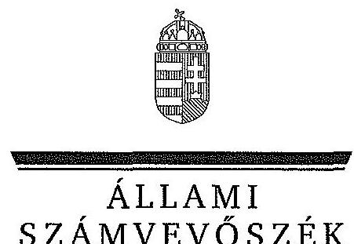
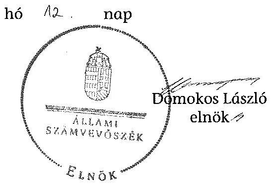

ÁLLAMI
SZÁMVEVÔSZÉK

# JELENTÉS 

az önkormányzatok belső kontrollrendszere kialakításának, egyes
kontrolltevékenységek és a belső ellenőrzés
müködésének ellenőrzése
Maklár
15075
2015. május

---

# Állami Számvevôszék 

Iktatószám: V-0676-073/2015.
Témaszám: 1710
Vizsgálat-azonosító szám: V067711

## Az ellenôrzést felügyelte:

Dr. Benedek Mária
felügyeleti vezető
Az ellenőrzést vezette és az ellenőrzés végrehajtásáért felelős:
Gál Magdolna
ellenőrzésvezető
A számvevőszéki jelentés összeállításában közremüködött:
Molnár-Sipos Judit
számvevő
Az ellenőrzést végezték:
Molnár-Sipos Judit Puskás Balázs
számvevő
számvevő

---

# TARTALOMJEGYZÉK 

BEVEZETÉS ..... 5
I. ÖSSZEGZŐ MEGÁLLAPÍTÁSOK, KÖVETKEZTETÉSEK, JAVASLATOK ..... 9
II. RÉSZLETES MEGÁLLAPÍTÁSOK ..... 12

1. Az önkormányzat belső kontrollrendszere kialakításának és múködtetésének megfelelősége ..... 12
1.1. A kontrollkörnyezet kialakítása és múködtetése ..... 12
1.2. A kockázatkezelési rendszer kialakítása és múködtetése ..... 13
1.3. A kontrolltevékenységek kialakítása és múködtetése ..... 14
1.4. Az információs és kommunikációs rendszer kialakítása és múködtetése ..... 15
1.5. A monitoring rendszer kialakítása és múködtetése ..... 16
2. A monitoring rendszer részeként a belső ellenőrzés kialakítása és múködtetése ..... 17
3. A pénzügyi folyamatokban kulcsszerepet betöltő belső kontrollok (teljesítésigazolás és érvényesítés) múködése ..... 18
4. Az integritás szemlélet érvényesülése ..... 20
FÜGGELÉKEK
5. számú Értelmező szótár
6. számú Az integritás érvényesítése érdekében kialakított és működtetett kontrollrendszer

---

.

---

# RÖVIDÍTÉSEK JEGYZÉKE 

## Törvények

Áht.
ÁSZ tv.
Info tv.
Kttv.
Ltv.
Mötv.
Vnytv.

## Rendeletek, határozatok

Ávr.
Bkr.
Ikr.
képviselő-testületi
SZMSZ

10/2013. (I. 21.) Korm. rendelet

## Szórövidítések

adatvédelmi szabályzat
alapító okirat
ÁSZ
belső ellenőrzési kézikönyv
bizonylati szabályzat
eszközök és források értékelési szabályzata FEUVE
FEUVE szabályzat
gazdasági program
2011. évi CXCV. törvény az államháztartásról
2011. évi LXVI. törvény az Állami Számvevőszékről
2011. évi CXII. törvény az információs önrendelkezési jogról és az információszabadságról
2011. évi CXCIX. törvény a közszolgálati tisztviselők ről
1995. évi LXVI. törvény a köziratokról, a közlevéltárakról és a magánlevéltári anyag védelméről
2011. évi CLXXXIX. törvény Magyarország helyi önkormányzatairól
2007. évi CLII. törvény az egyes vagyonnyilatkozat-tételi kötelezettségekről

368/2011. (XII. 31.) Korm. rendelet az államháztartásról szóló törvény végrehajtásáról
370/2011. (XII. 31.) Korm. rendelet a költségvetési szervek belső kontrollrendszeréről és belső ellenőrzéséről
335/2005. (XII. 29.) Korm. rendelet a közfeladatot ellátó szervek iratkezelésének általános követelményeiről
Maklár Község Önkormányzata képviselő-testületének 3/2013. (III.27.) önkormányzati rendelete a képviselő-testület szervezeti és múködési szabályzatáról (hatályos 2013. március 28 -tól)
10/2013. (I. 21.) Korm. rendelet a közszolgálati egyéni teljesítményértékelésről

Maklári Közös Önkormányzati Hivatal adatvédelmi és informatikai szabályzata (hatályos 2013. március 1-től)
Maklári Közös Önkormányzati Hivatal Alapító Okirata (hatályos 2013. március 1-től)
Állami Számvevőszék
Maklári Közös Önkormányzati Hivatal Belső ellenőrzési kézikönyve (hatályos 2013. április 1-től)
Maklár Község Önkormányzata Bizonylati Szabályzata (hatályos 2013. március 1-től)
Maklár Község Önkormányzata Eszközök és források értékelési szabályzata (hatályos 2013. március 1-től)
folyamatba épített, előzetes, utólagos és vezetői ellenőrzés Maklári Közös Önkormányzati Hivatal Jegyzőjének Szabályzata a belső kontrollrendszer és FEUVE rendszer müködtetéséről (hatályos 2013. március 1-től)
17/2011. (IV.26.) sz. képviselő-testületi határozattal elfogadott Maklár Község Önkormányzata Képviselő-testületének Gazdasági programja 2011-2014. évre

---

| gazdálkodási jogkörök   szabályzata | Maklári Közös Önkormányzati Hivatal Pénzgazdálkodással kapcsolatos kötelezettségvállalás, utalványozás, érvényesítés és pénzügyi ellenjegyzés rendje (hatályos 2013. január 1-től) |
| :--: | :--: |
| Hivatal | Maklár és Nagytálya Községek Körjegyzősége 2009. május 31-től 2013. február 28-ig, és a Maklári Közös Önkormányzati Hivatal 2013. március 1-jétől |
| hivatali SZMSZ | Maklár Község Önkormányzata képviselő-testületének szervezeti és múködési szabályzatának 4. sz. melléklete, a Hivatal múködésének ügyrendje (hatályos 2013. március 28 -tól) |
| INTOSAI | International Organization of Supreme Audit Institutions (Legfőbb Ellenőrző Intézmények Nemzetközi Szervezete) |
| iratkezelési szabályzat | Maklár és Nagytálya Községek Körjegyzőségének Iratkezelési Szabályzata (hatályos 2007. január 1-től) |
| ISSAI | International Standards of Supreme Audit Institutions (Legfőbb Ellenőrző Intézmények Nemzetközi Standardjai) |
| jegyző | Maklár és Nagytálya Községek Körjegyzőségének körjegyzöje 2009. május 31-től 2013. február 28-ig és a Maklári Közös Önkormányzati Hivatal jegyzője 2013. március 1től |
| Képviselő-testület | Maklár Község Önkormányzata képviselő-testülete |
| Kormányhivatal | Heves Megyei Kormányhivatal |
| költségvetési rendelet | Maklár Község Önkormányzata Képviselő-testületének 1/2013. (II.20.) számú rendelete az Önkormányzat 2013. évi költségvetéséről |
| leltározási és leltárkészítési szabályzat | Maklár Község Önkormányzata Leltározási és leltárkészítési szabályzat (hatályos 2013. március 1-től) |
| Önkormányzat | Maklár Községi Önkormányzat |
| pénzkezelési szabályzat | Maklár Község Önkormányzata Pénzkezelési szabályzata (hatályos 2013. január 1-től) |
| polgármester   számviteli politika | Maklár Község Önkormányzat polgármestere   Maklár Község Önkormányzata Számviteli politika (hatályos 2013. március 1-től) |
| vagyonrendelet | Maklár Község Önkormányzata Képviselő-testületének 5/2013. (V.01.) önkormányzati rendelete az Önkormányzat vagyonáról és a vagyongazdálkodás főbb szabályairól (hatályos 2013. június 1-től) |

---

# JELENTÉS 

## az önkormányzatok belsó kontrollrendszere kialakításának, egyes kontrolltevékenységek és a belső ellenőrzés múködésének ellenőrzése Maklár

## BEVEZETÉS

Maklár község állandó lakosainak száma 2013. január 1-jén 2470 fő volt. Az Önkormányzat hét tagú Képviselő-testületének munkáját kettő állandó bizottság segítette. Az Önkormányzat az önállóan múködő és gazdálkodó Hivatalon kívül egy önállóan múködő intézményt múködtetett, egy többségi tulajdoni hányadú gazdasági társasággal rendelkezett. A polgármester a 2006. évi önkormányzati választások óta tölti be tisztségét. A jegyző 1988 -tól látja el feladatait. A Hivatal szervezeti egységekre nem tagolódott, elkülönített gazdasági szervezettel nem rendelkezett, a foglalkoztatott köztisztviselők száma 2013. január 1-jén kilenc fő volt. Szervezeti változás következtében az Önkormányzat gazdálkodási feladatait 2013. március 1-től a Körjegyzőség helyett a Hivatal látja el. Az Önkormányzat a 2013. évi költségvetési beszámolója szerint 233395 ezer Ft tárgyévi bevételt ért el, valamint 220520 ezer Ft tárgyévi kiadást teljesített. A 2013. december 31-i könyvviteli mérleg szerint 1342295 ezer Ft értékű eszközvagyonnal rendelkezett, a rövid lejáratú kötelezettségállománya 22305 ezer Ft volt, hosszú lejáratú kötelezettség állománya nem volt.

A demokratikus társadalmakban alapvető igény, hogy a közpénzeket, a közvagyont használók valamennyi tevékenységükhöz kapcsolódó pénzfelhasználásról elszámoljanak, ahhoz egyértelmú és érvényesíthető felelősségi szabályok társuljanak. Ennek a jogos igénynek az érvényesítéséhez meg kell teremteni azokat a folyamatokat, rendszereket, amelyek nélkülözhetetlenek az elszámoltatáshoz. Az elszámoltatás eredményes múködtetéséhez szükség van a megfelelő információs, kontroll, értékelési és beszámolási rendszerek kialakítására.

Magyarországon az uniós csatlakozási tárgyalások idejére nyúlnak vissza a belső kontrollrendszer szabályozásának gyökerei. Az uniós elvárásoknak megfelelő új terminológia szerinti államháztartási belső pénzügyi ellenőrzési (ÁBPE) rendszer területén a jogharmonizáció 2003-ban teljes körűen megvalósult, míg az önkormányzati alrendszerre vonatkozó, Ötv.-ben megjelenített speciális szabályozás 2005-ben lépett hatályba. Az államháztartási belső kontrollrendszer koncepciója 2009-ben továbbfejlődött. A változások irányát mutatja, hogy a költségvetési szervek belső kontrollrendszere már magában foglalja a korszerű felelős szervezetirányítás elemeit (kontrollkörnyezet, kockázatkezelés, kontrolltevékenység, információ és kommunikáció, monitoring) is. E kontrollrendszer szabályozása háromszintű, a törvényi előírásokat az Áht. és a Mötv, a rendeleti szintű szabályozást az Ávr. és a Bkr. tartalmazza, amelyeket útmutatói szinten az NGM által kiadott standardok és kézikönyvek támogatnak.

---

A belső kontrollrendszer azt a célt szolgálja, hogy a költségvetési szervek működésük és gazdálkodásuk során a tevékenységeket szabályszerűen, gazdaságosan, hatékonyan, eredményesen hajtsák végre, teljesítsék elszámolási kötelezettségeiket és megvédjék az erőforrásokat a veszteségektől, a károktól és a nem rendeltetésszerű használattól. A belső kontrollrendszer magában foglalja mindazon szabályokat, eljárásokat, gyakorlati módszereket és szervezeti struktúrákat, kockázatkezelési technikákat, kontrolltevékenységeket, amelyek segítséget nyújtanak a szervezetnek céljai eléréséhez.

Az ÁSZ középtávú stratégiájában hangsúlyos szerepet szánt annak, hogy szilárd szakmai alapon álló, értékteremtő ellenőrzéseivel előmozdítsa a közpénzügyek átláthatóságát, rendezettségét. A számvevőszéki ellenőrzés nemzetközi alapelvei is rögzítik, hogy a megfelelő belső kontrollrendszer minimálisra csökkenti a hibák és szabálytalanságok kockázatát.

Az ellenőrzés célja annak értékelése, hogy

- a jogszabályi előírásoknak megfelelően alakították-e ki és működtették-e a belső kontrollrendszert;
- a gazdálkodás folyamatában kulcsszerepet betöltő teljesítésigazolás és érvényesítés kontrolltevékenységeit megfelelően működtették-e;
- biztosították-e a belső ellenőrzés szabályos múködését;
- kialakították-e az erőforrásokkal való szabályszerű és hatékony gazdálkodáshoz szükséges követelményeket, megvalósították-e azok számonkérését, ellenőrzését;
- hasznosították-e a 2009-2013. évek között végzett ÁSZ ellenőrzések során megfogalmazott javaslatokat.

A közintézmények integritás alapú kultúrájának kialakítása, megerősítése és működése szorosan összefügg a belső kontrollrendszer múködésével, ezért az ellenőrzés kitért a gazdálkodáshoz kapcsolódó integritás kontrollok meglétének és működésének ellenőrzésére is. Az integritási kultúra kialakítása hozzájárul az elszámoltathatóság és átláthatóság érvényesítéséhez, egyben támogatja a szervezet védettségét a korrupciós kitettséggel szemben, valamint annak megelőzése is irányítottabbá válik.

Az ellenőrzés várható hasznosulását négy szinten tervezzük. A törvényalkotás számára összegzett tapasztalatok állnak rendelkezésre a belső kontrollrendszer önkormányzati területen való kialakításáról, múködéséről és hatásairól, a belső ellenőrzés múködéséről. Az ellenőrzés az ellenőrzött számára visszajelzést ad a belső kontrollrendszer kialakításában és múködésében fellépő hiányosságokról, javaslataival hozzájárul azok kiküszöböléséhez, amely csökkentheti a későbbi ellenőrzések gyakoriságát. Az ellenőrzés megállapításait és javaslatait más szervezetek is hasznosíthatják a rendezett gazdálkodási keretek kialakításához. A társadalom számára jelzi, hogy közpénz nem maradhat ellenőrizetlenül, az ÁSZ értékteremtő rend kialakításához és megőrzéséhez hozzájáruló tevékenysége pozitív hatással lesz a szervezetről kialakított összkép formálásá-

---

ban. A szervezeten belül lehetőség nyílik arra, hogy a megállapítások szintetizálásával az ÁSZ a hozzáadott értéket teremtő elemző tevékenységét és tanácsadó szerepét is erősítse.

Az önkormányzatok belső kontrollrendszere kialakításának, az egyes kontrolltevékenységek és a belső ellenőrzés működésének ellenőrzéséről szóló jelentés I. fejezetének összegző része az ellenőrzés céljára ad rövid, szintetizáló összefoglalót, és tartalmazza a következtetéseket a II. fejezet részletes megállapításain alapulóan. A jelentés intézkedést igénylő megállapításait és javaslatait az ellenőrzés során feltárt, a jelentés II. fejezetében rögzített részletes megállapítások alapozzák meg.

# Az ellenőrzés típusa: szabályszerűségi ellenőrzés 

Az ellenőrzött időszak: a belső kontrollrendszer kialakítása és múködtetése megfelelőségét a 2013. évre vonatkozóan (2013. december 31-i állapotnak megfelelően), a pénzügyi folyamatokban kulcsszerepet betöltő teljesítésigazolás és érvényesítés belső kontrollok múködésének megfelelőségét, és a belső ellenőrzés szabályszerű működését a 2013. január 1 - december 31-e közötti időszakot figyelembe véve értékeltük, míg az ÁSZ javaslatainak utóellenőrzése a 2009-2013. években végzett ellenőrzések nyilvánosságra hozott jelentéseiben tett javaslatok áttekintésére terjedt ki.

## Az ellenőrzött szervezet: az Önkormányzat

Az ellenőrzés jogszabályi alapját az ÁSZ tv. 1. § (3) bekezdése, az 5. § (2) és (6) bekezdései, valamint az Áht. 61. § (2) bekezdése képezik.

Az ellenőrzés szakmai módszertana az ÁSZ hivatalos honlapján (www.asz.hu) közzétett szakmai szabályokon alapult, amely az INTOSAI által kiadott ISSAI figyelembevételével készült.

Az ellenőrzés lefolytatásához az Önkormányzat a kimutatások és a tanúsítvány elektronikus kitöltésével, valamint az ÁSZ által kért dokumentumok elektronikus megküldésével szolgáltatott adatokat. Az így rendelkezésre bocsátott adatok, információk kontrollja és a munkalapok kitöltése a helyszíni ellenőrzés keretében történt. A jelentésben használt fogalmak magyarázatát az 1. számú függelék, az integritás érvényesítése érdekében kialakított és múködtetett intézményi kontrollrendszer minősítését a 2. számú függelék tartalmazza.

A belső kontrollrendszer, valamint a belső ellenőrzés jogszabályi előírások szerinti kialakításának és múködtetésének szabályszerűségét az erre irányuló ellenőrzési kérdésekre adott válaszok összesítése alapján értékeltük. A belső kontrollrendszert kontrollterületenként (kontrollkörnyezet, kockázatkezelési rendszer, kontrolltevékenységek, információs és kommunikációs rendszer, monitoring rendszer) és összesítetten is értékeltük.

A belső kontrollrendszer egyes kontrollterületei és a belső ellenőrzés kialakítása és múködtetése „szabályszerü volt", amennyiben az értékelt területen az elért és elérhető pontok százalékban kifejezett hányadosa elérte a $81 \%$-ot, „részben szabályszerü volt", ha 61-80\% közé esett, és „nem volt szabályszerü", ha nem haladta

---

meg a 60\%-ot. A belső kontrollrendszer összesített értékelése megegyezett a kontrolterületenként alkalmazott \%-os értékelésekkel, a következő eltérésekkel. A kontrollrendszer egésze esetében a „szabályszerü" értékelésnek a \%-os értéken felül további feltétele volt, hogy egyik kontrollterület sem kaphatott „nem volt szabályszerü" értékelést, a „részben szabályszerü" értékelés további feltétele volt, hogy legfeljebb egy ellenőrzött kontrollterület lehetett „nem volt szabályszerü" értékelésü. Az összesített értékelés a \%-os értéktől függetlenül „nem volt szabályszerű", ha az ellenőrzött kontrollterületek közül több mint egynek „nem volt szabályszerü" az értékelése.

A gazdálkodás folyamatában kulcsszerepet betöltő két kulcskontroll - teljesítésigazolás, érvényesítés - múködésének megfelelőségét a személyi juttatásokkal, a dologi és felhalmozási kiadásokkal, múködési és felhalmozási célú pénzeszköz átadásokkal, ellátottak pénzbeli juttatásaival kapcsolatos kifizetések esetében mintavétellel ellenőriztük. „Megfelelőnek" értékeltük a gazdálkodási jogkörök gyakorlását, amennyiben 95\%-os bizonyossággal a teljes sokaságban a hibaarány legfeljebb 10\%, „részben megfelelőnek" értékeltük, ha a hibaarány felső határa 10-30\% között volt, „nem megfelelőnek" pedig akkor, ha a mintavételi eredmények alapján a sokaságbeli hibaarány felső határa meghaladta a 30\%-ot.

Az integritás szemlélet érvényesülésének minősítése az Önkormányzat önbevallás által kitöltött tanúsítványa alapján történt.

Utóellenőrzésre nem került sor, mivel az ÁSZ az Önkormányzatnál a 2009-2013. évek között ellenőrzést nem végzett.

Az ÁSZ tv. 29. § (1) bekezdése szerint a jelentéstervezetet megküldtük a polgármester részére, aki az ÁSZ tv. 29. § (2) bekezdésében foglalt észrevételezési jogával nem élt, a jelentéstervezetre észrevételt nem tett.

---

# I. ÖSSZEGZŐ MEGÁLLAPÍTÁSOK, KÖVETKEZTETÉSEK, JAVASLATOK 

A belső kontrollrendszeren belül 2013-ban a kontrollkörnyezet, a kockázatkezelési rendszer, a kontrolltevékenységek, az információs és kommunikációs rendszer, valamint a monitoring rendszer kialakítását és múködtetését külön-külön és együttesen is értékeltük. A belső kontrollrendszer kialakítása és múködtetése az összesített értékelés alapján részben volt szabályszerű.

A belső kontrollrendszer egyes területei kialakításának és múködtetésének minősítése a következő:

| Kontrollterület | Minősítés |
| :-- | :-- |
| Kontrollkörnyezet | részben szabály-   szerú |
| Kockázatkezelési rendszer | részben szabály-   szerú |
| Kontrolltevékenységek | nem sza-   bályszerü |
| Információs és kommuni-   kációs rendszer | részben szabály-   szerú |
| Monitoring rendszer | részben szabály-   szerú |

Részben szabályszerú volt a kontrollkörnyezet, a kockázatkezelési rendszer, az információs és kommunikációs rendszer, valamint a monitoring rendszer kialakítása és múködtetése, mivel a megállapított szabályozásbeli hiányosságok nem veszélyeztették e kontrollterületeken a szabályszerű működést.

Nem volt szabályszerű a kontrolltevékenységek kialakítása és múködtetése, mivel az ellenőrzésünk során megállapított szabályozásbeli hiányosságok magukban hordozzák a szabálytalan múködés, valamint a korrupció kockázatát.

A 2013. évben a személyi juttatásokkal, a dologi kiadásokkal, a felhalmozási kiadásokkal, valamint a múködési célú pénzeszköz átadásokkal, illetve az ellátottak pénzbeli juttatásaival kapcsolatos kifizetések során a pénzügyi folyamatokban kulcsszerepet betöltő teljesítésigazolás és érvényesítés belső kontrollok múködése nem volt megfelelő, mivel azok nem biztosították a hibák megelőzését és feltárását.

A számvevőszéki ellenőrzés az ellenőrzött kifizetésekkel összefüggésben a rendelkezésre bocsátott dokumentumok alapján kár bekövetkeztére utaló adatot, tényt nem állapított meg, azonban a gazdálkodásban kulcsszerepet betöltő kontrollok múködésében feltárt hiányosságok miatt fennáll a hibák bekövetkezésének kockázata. A nem megfelelően múködtetett belső kontrollok korrupciós kockázatot hordoznak.

---

A 2013. évben a belső ellenőrzés kialakítása és múködtetése - kisebb hiányosságok mellett - szabályszerű volt, azonban a belső ellenőrzés nem tárta fel a belső kontrollrendszer kialakításának és múködtetésének, valamint a pénzügyi folyamatokban kulcsszerepet betöltő teljesítésigazolás és érvényesítés belső kontrollok múködésének hiányosságait.

A Képviselő-testület a 2013. évben nem alakította ki az erőforrásokkal való szabályszerű és hatékony gazdálkodáshoz szükséges követelményeket.

Az Önkormányzat intézkedéseket tett az integritás szemlélet fejlesztésére, valamint a korrupciós kockázatok csökkentésére, a 2013. évben önként részt vett az ÁSZ integritási felmérésében. Az integritás szemlélet érvényesülésének minősítését a 2. számú függelék tartalmazza.

Az ÁSZ tv. 33. § (1) bekezdésében foglaltak értelmében az ellenőrzött szervezet vezetője köteles a jelentésben foglalt megállapításokhoz kapcsolódó intézkedési tervet összeállítani, és azt a jelentés kézhezvételétől számított 30 napon belül az ÁSZ részére megküldeni. Amennyiben az intézkedési tervet határidőre nem küldi meg a szervezet, vagy az ÁSZ tv. 33. § (2) bekezdésében foglalt póthatáridő elteltével megküldött intézkedési terv továbbra sem elfogadható, az ÁSZ elnöke a hivatkozott törvény 33. § (3) bekezdés a)-b) pontjaiban foglaltakat érvényesítheti.

Az ellenőrzés intézkedést igénylő megállapításai és javaslatai:

# a polgármesternek 

1. A számvevőszéki jelentés ellenőrzési megállapításai alapján az Önkormányzatnál a belső kontrollrendszer kialakítása és müködtetése összesített értékelés alapján részben szabályszerű, a kulcskontrollok működése nem volt megfelelő. A számvevőszéki ellenőrzés során feltárt hibákat, hiányosságokat és szabálytalanságokat a számvevőszéki jelentés II. Részletes megállapítások fejezetcím tartalmazza.

Javaslat:
Kísérje figyelemmel a Mötv. 115. § (1) bekezdésében foglaltak alapján az Önkormányzat gazdálkodásának szabályszerűségét. A Mötv. 67. § f) pontja alapján gondoskodjon a belső kontrollrendszer kialakítására és működtetésére vonatkozó jogszabályi rendelkezések be nem tartása, valamint a teljesítésigazolás, illetve az érvényesítés kontrollokkal összefüggésben feltárt hibák, hiányosságok, szabálytalanságok tekintetében az esetleges munkajogi felelősséggel kapcsolatos körülmények kivizsgálásáról, majd a vizsgálat eredményének függvényében tegye meg a szükséges intézkedéseket.

## a jegyzőnek

1. A számvevőszéki jelentés ellenőrzési megállapításai alapján az Önkormányzatnál a belső kontrollrendszer kialakítása és müködtetése összesített értékelés alapján részben szabályszerű, a kulcskontrollok müködése nem volt megfelelő, illetve a belső ellenőrzés - a kisebb hiányosságok mellett - szabályszerű volt. A számvevőszéki ellenőrzés során feltárt hibákat, hiányosságokat és szabálytalanságokat a számvevőszéki jelentés II. Részletes megállapítások fejezetcím tartalmazza.

---

Javaslat:
A jogszabályoknak megfelelő belső kontrollrendszer kialakítása és múködtetése érdekében - az ellenőrzött időszak óta bekövetkezett esetleges jogszabályi változásokra figyelemmel - intézkedjen a belső kontrollrendszer kialakításában és müködtetésében, a kulcskontrollok müködésében, illetve a belső ellenőrzés kialakításában és müködtetésében az ellenőrzés által feltárt hibák, hiányosságok, szabálytalanságok kijavítására.

Kezdeményezze, hogy az éves ellenőrzési terv kiterjedjen a kifizetések szabályszerűségi ellenőrzésére, különös tekintettel a személyi juttatásokkal, a dologi kiadásokkal, a felhalmozási kiadásokkal, a müködési és felhalmozási célú pénzeszköz átadásokkal, az ellátottak pénzbeli juttatásaival kapcsolatos kiadási jogcímekből teljesített kifizetésekre.

---

# II. RÉSZLETES MEGÁLLAPÍTÁSOK 

## 1. Az önkORMÁNYZAT BELSŐ KONTROLLRENDSZERE KIALAKÍTÁSÁNAK ÉS MÜKÖDTETÉSÉNEK MEGFELELŐSÉGE

A belső kontrollrendszeren belül 2013-ban a kontrollkörnyezet, a kockázatkezelési rendszer, a kontrolltevékenységek, az információs és kommunikációs rendszer, valamint a monitoring rendszer kialakítását és múködtetését külön-külön és együttesen is értékeltük. A belső kontrollrendszer kialakítása és múködtetése az összesített értékelés alapján részben volt szabályszerű.

### 1.1. A kontrollkörnyezet kialakítása és múködtetése

## A kontrollkörnyezet kialakítása és múködtetése részben volt szabályszerű.

A Hivatal rendelkezett alapító okirattal, amely tartalmazta az alaptevékenységeket. Az Önkormányzat rendelkezett a Képviselő-testület által elfogadott gazdasági programmal, a Képviselő-testület megalkotta a képviselő-testületi SZMSZt, amelynek mellékleteként elfogadta a hivatali SZMSZ-t. A szervezet megfelelő működése érdekében a Hivatalban kialakították a belső szabályzatokat. A Kép-viselő-testület elfogadta a vagyonrendeletét, amelyben meghatározta a vagyongazdálkodás főbb szabályait. A jegyző elkészítette a számviteli politikát, és annak részeként a pénzkezelési szabályzatot, a leltározási és leltárkészítési szabályzatot, valamint az eszközök és források értékelési szabályzatát. A jegyző kialakította a Hivatal szabálytalanságkezelési eljárásrendjét a FEUVE szabályzatban. A jegyző elkészítette a Hivatal bizonylati szabályzatát.

A Hivatalban dolgozó köztisztviselők rendelkeztek munkaköri leírással. A jegyző által a gazdálkodási feladatok ellátására írásban kijelölt személyek rendelkeztek az előírt végzettséggel, szakképesítéssel és a könyvviteli szolgáltatás körébe tartozó tevékenység ellátására jogosító engedéllyel. A Képviselő-testület a költségvetési rendeletében meghatározta a Hivatal engedélyezett létszámát.

A kontrollkörnyezet kialakítása és múködtetése részben volt szabályszerű, mert:

| Sorszám ${ }^{1}$ | Megállapítás |
| :--: | :--: |
| 8. | A jegyző - az Ávr. 13. § (1) bekezdése g) pontja ellenére - nem rögzítette a hivatali SZMSZ-ben a munkakörökhöz tartozó hatáskörök gyakorlásának módját, a helyettesítés rendjét, az ezekhez kapcsolódó felelősségi szabályokat. |

[^0]
[^0]:    ${ }^{1}$ A megállapítások számozása az Önkormányzat által az adatszolgáltatás során kitöltött kimutatások kérdéseinek sorszámával azonos.

---

| 37. | A jegyző - a Kttv. 75. § (1) bekezdés d) pontjában foglaltak ellenére - a munkaköri leírásokban nem rögzítette a munkakör betöltésével kapcsolatos követelményeket (végzettség, szakképzettség, szakképesítés, tapasztalat, képesség). |
| :--: | :--: |
| 38. | A jegyző - a Bkr. 6. § (3) bekezdésében foglaltak ellenére - nem készítette el a Hivatal ellenőrzési nyomvonalát. |
| 40. | A Képviselő-testület - az Áht. 9. § (1) bekezdés f.) pontjában foglaltak ellenére - nem alakította ki az erőforrásokkal való szabályszerű és hatékony gazdálkodáshoz szükséges követelményeket. |
| 44. | A jegyző nem a 10/2013. (I. 21.) Korm. rendelet 5. § és 25. § (2) bekezdésben foglaltak szerint határozta meg a köztisztviselők 2013. évi teljesítményértékelésének második félévre vonatkozó kötelező elemeit. |
| 45. | A jegyző nem a 10/2013. (I.21.) Korm. rendelet 6. §, 12. § (1) bekezdés b) pontjában és az 1., 2., 3. számú mellékletében foglalt formában, tartalommal és határidőre készítette el a köztisztviselők teljesítményértékelését. |
| 46. | A jegyző - az Mötv. 81. § (3) bekezdés c) pontjában előírt feladata ellenére - nem dolgozta ki a Kttv. 83. §-ában előírt, a köztisztviselökre vonatkozó hivatásetikai alapelvek részletes tartalmát, valamint az etikai eljárás szabályait. |

# 1.2. A kockázatkezelési rendszer kialakítása és müködtetése 

## A kockázatkezelési rendszer kialakítása és müködtetése részben volt szabályszerű.

A jegyző a FEUVE szabályzatban kialakította a Hivatal kockázatkezelési rendszerét, amely tartalmazta a kockázatok azonosításával, elemzésével, csoportosításával, nyomon követésével, illetve a kockázati kitettség csökkentésével kapcsolatos szabályokat, felmérte és megállapította a Hivatal tevékenységében, gazdálkodásában rejlő kockázatokat, és meghatározta egyes kockázatokkal kapcsolatban a szükséges intézkedéseket.

A kockázatkezelési rendszer kialakítása és müködtetése részben volt szabályszerű, mert:

| Sorszám | Megállapítás | Megjegyzés |
| :--: | :--: | :--: |
| 4. | A jegyző - a Bkr. 7. § (2) bekezdésében foglaltak ellenére - nem határozta meg az egyes kockázatokkal kapcsolatban a szükséges intézkedések teljesítésének folyamatos nyomon követési módját. |  |
| 5. | A Vnytv. 4. § a), d) pontjaiban foglaltak ellenére a vagyonnyilatkozat-tételre kötelezett köztisztviselők, továbbá a képviselők és a Képviselő-testület bizottságainak nem helyi | A jogszabályokban foglalt előírásoknak megfelelően a vagyonnyilat-kozat-tételre kötelezet- |

---

önkormányzati képviselő tagjai vagyonnyi-latkozat-tételi kötelezettségét a hivatali SZMSZ-ben, valamint a képviselő-testületi SZMSZ-ben nem tüntették fel.
tek a vagyonnyilatko-zat-tételi kötelezettségüknek eleget tettek. (polgármester, alpolgármester, képviselők, bizottsági tagok, jegyző, gazdálkodási, pénzügyi, adóügyi feladatokat ellátó köztisztviselők).

# 1.3. A kontrolltevékenységek kialakítása és müködtetése 

A kontrolltevékenységek kialakítása és müködtetése nem volt szabályszerű, mert:

| Sorszám | Megállapítás | Megjegyzés |
| :--: | :--: | :--: |
| 1.   2.   4. | A jegyző - a Bkr. 8. § (2) bekezdésében foglaltak ellenére - nem biztosította a beszerzési folyamat, valamint a pénzügyi döntések - köztük a költségvetés tervezése és a támogatásokkal való elszámolás - dokumentumainak elkészítésével kapcsolatban a folyamatba épített, előzetes, utólagos és vezetői ellenőrzést. |  |
| 6. | A jegyző - az Ávr. 53. § (2) bekezdésében foglaltakat figyelmen kívül hagyva - annak ellenére nem határozta meg az előzetes írásbeli kötelezettségvállalást nem igénylő kifizetések rendjét, hogy a gazdálkodási jogkörök szabályzata lehetővé tette a 100 ezer Ft alatti kifizetések előzetes írásbeli kötelezettségvállalás nélküli teljesítését. |  |
| 9.   16. | A jegyző - az Ávr. 13. § (2) bekezdés a) pontjában foglaltak ellenére - belső szabályzatban nem határozta meg a teljesítésigazolás és az érvényesítés gyakorlásának módjával, eljárási és dokumentációs részletszabályaival, valamint az ezeket végző személyek kijelölésének rendjével, továbbá a beszámolási feladatok teljesítésével kapcsolatos belső előírásokat, feltételeket. |  |
| 17. | A jegyző - a Bkr. 8. § (4) bekezdés c) pontjában foglaltak ellenére - nem határozta meg a beszámolási eljárásokhoz kapcsolódó felelősségi köröket. |  |
| 18. | A jegyző - az Ávr. 13. § (5) bekezdésében foglaltak ellenére - nem határozta meg a gazdálkodási feladatot ellátó vezető és a gazdálkodási feladatot ellátó alkalmazottak helyettesítésének rendjét. | A munkaköri leírások tartalmazták a helyettesítő munkavállaló munkakörének megnevezését. |
| 21. | A polgármester - az Áht. 87. § (1)* bekezdésé- | A Képviselő-testület az Önkormányzat 2013. |

---

|  | ben elöirt határidőt túllépve - a Képviselö-testületet 2013. szeptember 24-én tájékoztatta az Önkormányzat gazdálkodásának első félévi helyzetéről. | évi költségvetésének első félévi teljesítéséről szóló beszámolót a 2013. szeptember 24-ei ülésén megtárgyalta és a 68/2013. (IX. 24.) számú határozatával elfogadta.   *2014. szeptember 30ától hatályon kívül helyezve. |
| :--: | :--: | :--: |
| 24. | A jegyző - az Ávr. 55. § (2) bekezdés f) pontjában foglaltak ellenére - nem jelölt ki az Önkormányzat kötelezettségvállalásaival kapcsolatban a Hivatal állományába tartozó köztisztviselőt pénzügyi ellenjegyzési feladat ellátására. | Az Önkormányzattal kapcsolatos kötelezettségvállalások pénzügyi ellenjegyzésére a polgármester a jegyzőt jelölte ki. |
| 28. | A jegyző - az Ávr. 58. § (4) bekezdésében foglaltak ellenére - az Önkormányzat kiadási előirányzataira vonatkozó érvényesítési feladatok ellátására nem jelölt ki a Hivatal állományába tartozó köztisztviselőt. | Az Önkormányzati kifizetésekkel kapcsolatos érvényesitési feladatok ellátására a jegyző helyett a polgármester jelölte ki az érvényesitőt. |
| 32. | A jegyző - a Kttv. 74. § (1) bekezdése, 226. § (2) bekezdés b) pontja, és az Ikr. 15. §-ában foglaltak ellenére - nem szabályozta a Hivatalban a közszolgálati jogviszony megszüntetése (megszünése) esetére a munkakör átadásának rendjét. | Az iratkezelési szabályzat VII. fejezete tartalmazta, hogy munkaköri átadásátvétel során az ügyintéző az iratokkal munkanaplója alapján számol el, és a folyamatban lévő ügyiratokról jegyzéket készít, azonban a konkrét forma és tartalom meghatározása nem történt meg. |

# 1.4. Az információs és kommunikációs rendszer kialakítása és müködtetése 

## Az információs és kommunikációs rendszer kialakítása és müködtetése részben volt szabályszerű.

A jegyző́ kialakította a szervezeten kívülre történő információátadás rendszerét, amely biztosította, hogy a külső felek (illetékes szervezetek) részére a megfelelő információk a megfelelő időben eljussanak. A Hivatal rendelkezett az Info tv. előírásainak megfelelő adatvédelmi szabályzattal. A jegyző́ kialakította a kötelezően közzéteendő adatok nyilvánosságra hozatalának rendjét. A jegyző az iratkezelési szabályzatban meghatározta a küldemények átvételének, felbontásának, érkeztetésének, szignálásának, továbbításának rendjét, valamint az iratok iktatásának, kiadmányozásának, irattárban történő elhelyezésének, selejtezésének, megsemmisítésének szabályait. A jegyző az iratforgalom dokumentálásával biztosította az ügyintézés folyamatának, az iratok szervezeten belüli útjának

---

pontos követhetőségét és ellenőrizhetőségét, az iratok hollétének naprakész megállapíthatóságát.

Az információs és kommunikációs rendszer kialakítása részben volt szabályszerű, mert:

| Sorszám | Megállapítás |
| :--: | :--: |
| 1. | A jegyző - Bkr. 3. § d) pontjában és 9. § (1) bekezdésében foglaltak ellenére - nem alakított ki a szervezeten belül olyan rendszert, amely biztosítja, hogy a megfelelő információk a megfelelő időben eljutnak az illetékes személyhez. |
| 3. | A jegyző - a Bkr. 9. § (2) kezdésében foglaltak ellenére - nem határozta meg a beszámolási szinteket, határidőket, módokat. |
| 6. | A jegyző - az Info tv. 33. § (1) és (3) bekezdéselben foglaltak ellenére nem gondoskodott arról, hogy az Önkormányzat az elektronikus közzétételi kötelezettségének a 2013. évben eleget tegyen. |
| 9. | A jegyző - az Ltv. 10. § (1) bekezdés c) pontjában foglaltak ellenére - nem a Magyar Nemzeti Levéltár és a Kormányhivatal egyetértésével adta ki a Hivatal egyedi iratkezelési szabályzatát. |

# 1.5. A monitoring rendszer kialakítása és múködtetése 

## A monitoring rendszer kialakítása és múködtetése részben volt szabályszerű.

Az Önkormányzat kialakította a szervezet tevékenységének, a célok megvalósításának nyomon követését biztosító rendszert. Az Önkormányzat 2012. évi beszámolóját könyvvizsgáló felülvizsgálta. Az Önkormányzatnál nem volt külső vagy hatósági ellenőrzés.

A monitoring rendszer kialakítása és múködtetése részben volt szabályszerű, mert:

Sorszám
Megállapítás
A jegyző - a Bkr. 11. § (1) bekezdésében foglalt kötelezettsége ellenére - a
2. Bkr. 1. mellékletében foglalt nyilatkozati formában nem értékelte a Hivatal belső kontrollrendszerének minőségét.
A helyi önkormányzatok törvényességi felügyeletét ellátó Kormányhivatal két esetben élt törvényességi felhívással 2013-ban, az Önkormányzat vagyonrendeletének és az Egri Kistérségi Többcélú Társulás Társulási Megállapodásának szükséges módosítására hívta fel a figyelmet. A Hivatal határidőben tájékoztatta a Kormányhivatalt a megtett intézkedésekről.

---

# 2. A MONITORING RENDSZER RÉSZEKÉNT A BELSŐ ELLENŐRZÉS KIALAKÍTÁSA ÉS MÜKÖDTETÉSE 

Az Önkormányzatnál a belső ellenőrzés kialakítása és múködtetése - kisebb hiányosságok mellett - szabályszerű volt.

Az Önkormányzat a belső ellenőrzés kialakításáról külső szolgáltató útján gondoskodott vállalkozási szerződés keretében, a feladatellátás kiterjedt az Önkormányzatra, a Hivatalra és az intézményekre is. A belső ellenőrzés szervezeti és funkcionális függetlenségét biztosították. Az Önkormányzat rendelkezett aktualizált belső ellenőrzési kézikönyvvel. A belső ellenőrzési vezetői feladatok és kötelességek ellátásának módjáról a jogszabályi előírásoknak megfelelően a belső ellenőrzési tevékenység megszervezésére vonatkozó írásbeli megállapodásban rendelkeztek. A belső ellenőrzést végző rendelkezett a jogszabályban előírt szakirányú szakképzettséggel és szakmai gyakorlattal.

A belső ellenőr a 2014. évre elkészítette az Önkormányzat éves ellenőrzési tervét, amelyet a Képviselő-testület az előírt határidőig jóváhagyott.

A 2013. évi ellenőrzési tervben foglalt ellenőrzéseket végrehajtották, melyhez megfelelő tartalmú ellenőrzési program és jelentés készült. Soron kívüli ellenőrzésre nem került sor. A belső ellenőrzés javaslatainak végrehajtása érdekében a jegyző intézkedési tervet készített. A belső ellenőr az elvégzett ellenőrzésekről éves bontásban nyilvántartást vezetett, amellyel a belső ellenőrzési jelentésekben tett megállapításokat, javaslatokat, a vonatkozó intézkedési terveket és azok végrehajtását nyomon követte. A belső ellenőr a 2013. évre vonatkozó éves (összefoglaló) ellenőrzési jelentést elkészítette és megküldte a jegyzőnek. A belső ellenőr az ellenőrzések során büntető-, szabálysértési-, kártérítési-, vagy fegyelmi eljárás megindítására okot adó cselekményt nem tárt fel.

A belső ellenőrzés kialakítása és múködtetése az alábbi kisebb súlyú hiányosságok mellett szabályszerű volt:

| Sorszám | Megállapítás | Megjegyzés |
| :--: | :--: | :--: |
| 7. | Az Önkormányzat nem rendelkezett - a Bkr. 22. § (1) b) pontja ellenére - a Képviselő-testület által elfogadott stratégiai ellenőrzési tervvel, mivel a jegyző nem kezdeményezte a polgármesternél a stratégiai terv Képviselő-testület elé terjesztését. | A belső ellenőrzési vezető elkészítette a stratégiai tervet és megküldte a jegyzőnek. |
| 12. | A 2014. évi ellenőrzési terv - a Bkr. 31. § (2) bekezdésének előírása ellenére - nem alapult stratégiai terven. | Az éves ellenőrzési terv a kockázatelemzés alapján felállított prioritásokon, és a belső ellenőrzés rendelkezésére álló erőforrásokon alapult. |
| $\begin{aligned} & 25 \mathrm{a} . \\ & 25 \mathrm{~b} . \end{aligned}$ | A 2013. évre vonatkozó éves ellenőrzési jelentés - a Bkr. 48. § b) pontjának ba) és bb) alpontjában foglaltak ellenére - nem tartal- | Az éves jelentés általánosságban tartalmazta, hogy több területen nem múködtek megfelelően a |

---

| Sorszám | Megállapítás | Megjegyzés |
| :--: | :--: | :--: |
|  | mazta a belső kontrollrendszer szabályszerűségének, gazdaságosságának, hatékonyságának és eredményességének növelése, javítása érdekében tett fontosabb javaslatokat és a belső kontrollrendszer öt elemének értékelését. | belső kontrollok. |

# 3. A PÉNZÜGYI FOLYAMATOKBAN KULCSSZEREPET BETÖLTŐ BELSŐ KONTROLLOK (TELJESÍTÉSIGAZOLÁS ÉS ÉRVÉNYESÍTÉS) MŰKÖDÉSE 

A 2013. évben a személyi juttatásokkal, a dologi kiadásokkal, a felhalmozási kiadásokkal, a múködési célú pénzeszköz átadásokkal, illetve az ellátottak pénzbeli juttatásaival kapcsolatos kifizetések során - összefoglalóan értékelve - a pénzügyi folyamatokban kulcsszerepet betöltő teljesítésigazolás és érvényesítés belső kontrollok müködése nem volt megfelelő az alábbi hiányosságok miatt:

| Kulcs-kontrollok | Megállapítás |
| :--: | :--: |
| Teljesítésigazolás | A teljesítésigazolást a kifizetéseket megelőzően - az Áht. 38. § (1) bekezdésében és az Ávr. 57. § (1) és (3) bekezdésében foglaltak ellenére - nem, vagy nem szabályszerűen, vagy kijelöléssel nem rendelkező személy jogosulatlanul végezte. |
| Érvényesítés | Az érvényesítést a kifizetéseket megelőzően - az Áht. 38. § (1) bekezdésében és az Ávr. 58. § (1), (3) és (4) bekezdésében foglaltak ellenére - nem, vagy nem szabályszerűen, vagy szabálytalan kijelölés alapján végezték.   Az érvényesítő - az Ávr. 58. § (2) bekezdés előírása ellenére - nem jelezte az utalványozónak, hogy a megelőző ügymenetben az Áht., az államháztartási számviteli kormányrendelet és az Ávr. előírásaiban foglaltakat nem tartották be. |

A 2013. évben az ellenőrzött kifizetési jogcímek mintatételei alapján a teljesítésigazolás kulcskontroll müködése során az alábbi hiányosságok, szabálytalanságok fordultak elő:

- a személyi juttatásokkal kapcsolatos kifizetéseket megelőzően a teljesítésigazolást - az Áht. 38. § (1) bekezdésében és az Ávr. 57. § (1) bekezdésében foglaltak ellenére - nem végezték el;
- a személyi juttatásokkal kapcsolatos kifizetéseket megelőzően - az Ávr. 57. § (3) bekezdésében foglaltak ellenére - a teljesítésigazolás nem volt szabályszerű, mivel a teljesítésigazolást kijelöléssel nem rendelkező személy jogosulatlanul végezte;

---

- a dologi kiadásokkal, a felhalmozási kiadásokkal, a múködési célú pénzeszköz átadásokkal, illetve az ellátottak pénzbeli juttatásaival kapcsolatos kifizetéseket megelőzően a teljesítésigazolás - az Ávr. 57. § (3) bekezdésében foglalt előírás ellenére - nem tartalmazta a teljesítésigazolás dátumát;
- a dologi kiadásokkal kapcsolatos kifizetéseket megelőzően a teljesítésigazolás - az Ávr. 57. § (1) bekezdésében foglaltak ellenére - nem szabályszerűen történt, mivel a teljesítésigazoló ellenőrizhető okmány (kötelezettségvállalási bizonylat) hiányában nem tudta ellenőrizni a kiadások teljesítésének jogosságát, összegszerűségét, valamint az ellenszolgáltatás teljesítését;
- a dologi kiadásokkal kapcsolatos kifizetéseket megelőzően - az Ávr. 57. § (1) bekezdésében foglaltak ellenére - a teljesítésigazolás nem volt szabályszerű, mivel a szerződésben és a számlán szereplő összeg eltért egymástól.

A 2013. évben az ellenőrzött kifizetési jogcímek mintatételei alapján az érvényesítés kulcskontroll múködése során az alábbi hiányosságok, szabálytalanságok fordultak elő:

- a személyi juttatásokkal kapcsolatos kifizetést megelőzően az érvényesítést az Áht. 38. § (1) bekezdésében és az Ávr. 58. § (1) bekezdésében foglaltak ellenére - nem végezték el;
- a személyi juttatásokkal, a dologi kiadásokkal, a felhalmozási kiadásokkal és a múködési célú pénzeszköz átadásokkal, illetve az ellátottak pénzbeli juttatásaival kapcsolatos kifizetéseket megelőzően az érvényesítés nem volt szabályszerű, mivel - az Ávr. 58. § (4) bekezdésében foglaltak ellenére - érvényesítési feladatok ellátására az érvényesítőt nem az arra jogosult személy jelölte ki az Önkormányzat kiadásaival kapcsolatban;
- a személyi juttatásokkal kapcsolatos kifizetést megelőzően az érvényesítés az Ávr. 58. § (3) bekezdésében előírtak ellenére - nem volt szabályszerű, mivel az Ávr. 60. § (3) bekezdése szerint vezetett nyilvántartás (aláírás-minta) alapján az érvényesítést végző személy aláírása nem volt beazonosítható;
- a személyi juttatásokkal, a dologi kiadásokkal, a felhalmozási kiadásokkal és a múködési célú pénzeszköz átadásokkal, illetve az ellátottak pénzbeli juttatásaival kapcsolatos kifizetéseket megelőzően az érvényesítés - az Ávr. 58. § (3) bekezdésében foglalt előírás ellenére - nem tartalmazta az érvényesítés dátumát;
- a dologi kiadásokkal kapcsolatos kifizetéseket megelőzően - az Ávr. 58. § (1) bekezdésében foglaltak ellenére - az érvényesítés nem volt szabályszerű, mivel a szerződésben és a számlán szereplő összeg eltért egymástól.
- a személyi juttatásokkal, a dologi kiadásokkal, a felhalmozási kiadásokkal és a múködési célú pénzeszköz átadásokkal, illetve az ellátottak pénzbeli juttatásaival kapcsolatos kifizetéseket megelőzően az érvényesítő - az Ávr. 58. § (1) bekezdésében foglaltak ellenére - a fedezet meglétét nem tudta ellenőrizni, mivel - az Ávr. 56. § (1) bekezdésében foglaltak ellenére - a kötelezettségvállalásokról nyilvántartást nem vezettek;

---

- a személyi juttatásokkal, a dologi kiadásokkal, a felhalmozási kiadásokkal, valamint a múködési célú pénzeszközátadásokkal, illetve az ellátottak pénzbeli juttatásaival kapcsolatos kifizetéseket megelőzően az érvényesítő - az Ávr. 58. § (2) bekezdésében foglaltak ellenére - nem jelezte az utalványozónak, hogy a megelőző ügymenetben a teljesítésigazolást nem, vagy nem szabályszerűen, vagy kijelöléssel nem rendelkező jogosulatlanul végezte;
- a személyi juttatásokkal, a dologi kiadásokkal, a felhalmozási kiadásokkal, valamint a múködési célú pénzeszközátadásokkal, illetve az ellátottak pénzbeli juttatásaival kapcsolatos kifizetéseket megelőzően az érvényesítő - az Ávr. 58. § (2) bekezdésében foglaltak ellenére - nem jelezte az utalványozónak, hogy a megelőző ügymenetben nem tartották be az Áht. 37. § (1) bekezdésében, az Ávr. 55 § (1) bekezdésében, és az Ávr. 55. § (2) bekezdés f) pontjában foglaltakat, mivel a Hivatal kiadásaival kapcsolatban kötelezettségvállalásra pénzügyi ellenjegyzés nélkül került sor, illetve az Önkormányzat kiadásaival kapcsolatban a pénzügyi ellenjegyzőt nem az arra jogosult személy jelölte ki.

A számvevőszéki ellenőrzés az ellenőrzött kifizetésekkel összefüggésben a rendelkezésre bocsátott dokumentumok alapján kár bekövetkeztére utaló adatot, tényt nem állapított meg, azonban a gazdálkodásban kulcsszerepet betöltő kontrollok működésében feltárt hiányosságok miatt fennáll a hibák, szabálytalanságok bekövetkezésének kockázata. A nem megfelelően múködtetett belső kontrollok korrupciós kockázatot hordoznak.

# 4. AZ INTEGRITÁS SZEMLÉLET ÉRVÉNYESÜLÉSE 

Az Önkormányzat intézkedéseket tett az integritás szemlélet fejlesztésére, valamint a korrupciós kockázatok csökkentésére, a 2013. évben önként részt vett az ÁSZ integritási felmérésében. Az integritás szemlélet érvényesülésének minősítését a 2. számú függelék tartalmazza.

Budapest, 2015.

Függelék: $\quad 2 \mathrm{db}$

---

# ÉRTELMEZŐ SZÓTÁR 

belső ellenőrzés
belső kontrollrendszer
belső kontrollrendszer területei
egyszerú véletlen mintavétel

Hivatal
integritás
kockázat
kockázatkezelési rendszer

Független, tárgyilagos bizonyosságot adó és tanácsadó tevékenység, amelynek célja, hogy az ellenőrzött szervezet múködését fejlessze és eredményességét növelje, az ellenőrzött szervezet céljai elérése érdekében rendszerszemléletű megközelítéssel és módszeresen értékeli, illetve fejleszti az ellenőrzött szervezet irányítási és belső kontrollrendszerének hatékonyságát. (Forrás: Bkr. 2. § b) pontja)
A belső kontrollrendszer a kockázatok kezelése és tárgyilagos bizonyosság megszerzése érdekében kialakított folyamatrendszer, amely azt a célt szolgálja, hogy a múködés és gazdálkodás során a tevékenységeket szabályszerűen, gazdaságosan, hatékonyan, eredményesen hajtsák végre, az elszámolási kötelezettségeket teljesítsék, megvédjék az erőforrásokat a veszteségektől, károktól és nem rendeltetésszerű használattól. (Forrás: Áht. 69. § (1) bekezdése)
A kontrollkörnyezet, a kockázatkezelési rendszer, a kontrolltevékenységek, az információs és kommunikációs rendszer, valamint a nyomon követési (monitoring) rendszer. (Forrás: Bkr. 3. §-a)

Az alapsokaságból egyszerú véletlen kiválasztással képzett részsokaság. (Forrás: Az ÁSZ ellenőrzési mintavételezés támogatásához készült segédletének 4.1.1. pontja)
A programban (beleértve a mellékleteket is) a polgármesteri hivatal megnevezés alatt értjük a polgármesteri hivatalt, a főpolgármesteri hivatalt, a megyei önkormányzati hivatalt (illetve 2013. január 1-jét követően a közös önkormányzati hivatalt).
Az integritás elvek, értékek, cselekvések, módszerek, intézkedések konzisztenciáját jelenti: olyan magatartásmódot, amely meghatározott értékeknek felel meg. Az integritás a közszféra esetében a társadalom által elvárt nyilvánossági, átláthatósági, illetve jogi/etikai normáknak történő megfelelést jelenti. (Forrás: a http://integritas.asz.hu honlapon közzétett „A 2012. évi integritás felmérés eredményeinek összefoglalója dokumentum 3. oldal 1. bekezdése)
A kockázat annak a valószínűségét jelenti, hogy egy vagy több esemény vagy intézkedés nem kívánt módon befolyásolja a rendszer múködését, céljainak megvalósulását. (Forrás: Javaslatok a korrupciós kockázatok kezelésére - Kockázatkezelési és ellenőrzési módszertan 35. oldal, ÁSZ)
Olyan irányítási eszközök és módszerek összessége, melynek elemei a szervezeti célok elérését veszélyeztető tényezők (kockázatok) azonosítása, elemzése, csoportosítása, nyomon követése, valamint szükség esetén a kockázati kitettség mérséklése. (Forrás: Bkr. 2. § m) pontja)

---

kontrollkörnyezet

A kontrollkörnyezet alakítja ki a szervezet belső kontrollrendszerhez való viszonyát, hozzáállását, befolyásolja az alkalmazottak belső kontrollal kapcsolatos tudatosságát, magatartását. Elemei a személyes és szakmai elkötelezettség és a vezetés, valamint az alkalmazottak által vallott erkölcsi értékek; a szakmai hozzáértés iránti elkötelezettség; a felső vezetés hozzáállása - a vezetés filozófiája és tevékenységének stílusa; a szervezeti struktúra; a humánerőforrás-politika és gazdálkodási gyakorlat.
kontrolltevékenységek A kontrolltevékenységek azok a politikák és eljárások, amelyeket a kockázatok megoldására hoznak létre a szervezet céljainak teljesítése érdekében.
kommunikáció

Az a tevékenység, melynek során információ továbbítása valósul meg. A kommunikációs folyamat résztvevői között tájékoztatás történik, mely során tényeket, ezek magyarázatát közlik. „A szervezetben eredményes kommunikációnak kell áramlania lefelé, horizontálisan és felfelé, a szervezet egészében és annak valamennyi elemében."
korrupció Azok a cselekmények, amelyek során a köz érdekében való eljárással megbízott és döntéshozatali felelősséggel felruházott személy a köz érdeke helyett önös vagy részérdekeket követve, mástól jogtalan vagy etikátlan előnyt elfogadva és őt jogtalan vagy etikátlan előnyhöz juttatva jár el, illetve amikor valaki a köz érdekében való eljárással megbízott és döntéshozatali felelősséggel felruházott személynek jogtalan vagy etikátlan előnyt nyújtva vagy felajánlva jogtalan vagy etikátlan előnyt kér. (Forrás: A Kormány korrupció megelőzési programja 2012-2014.)
kulcskontrollok Az azonosított kockázatok mérséklése érdekében kialakított kontrollok közül azok, amelyek elégtelen múködése esetén a szervezetet jelentős veszteség érheti, vagy a múködésükben bekövetkező hiba/hiányosság más kontrollok eredményességét csökkenti. Ezek ellenőrzése, értékelése elegendő bizonyítékot szolgáltat adott területen a kontrollrendszer értékeléséhez. Az önkormányzatok kontrollrendszere kialakításának ellenőrzése során a pénzügyi folyamatokban kulcsszerepet betöltő belső kontrollok a teljesítésigazolás és az érvényesítés.
lényegesség Egy információ akkor lényeges, ha hiánya vagy téves állítása befolyásolhatja ezen információkat felhasználók döntéseit, véleményét. Az ellenőrzés során a lényegesség három szempontból értelmezhető: érték, jelleg és összefüggés szerint.
monitoring A monitoring a különböző szintű szervezeti célok megvalósításának folyamatát kíséri figyelemmel, melynek során a releváns eseményekről és tevékenységekről (együtt: folyamatokról) rendszeres jelleggel, strukturált, döntéstámogató információkhoz jutnak a szervezet vezetői. (NGM útmutató a költségvetési szervek monitoring rendszeréhez 3. oldal, 2011. november)

---

utóellenőrzés

Az intézkedések nyomon követése érdekében elrendelt ellenőrzés, amelynek célja, hogy a belső ellenőrzés bizonyosságot szerezzen az elfogadott intézkedések végrehajtásáról vagy arról a tényről, hogy ha az ellenőrzött szerv, illetve az ellenőrzött szervezeti egység vezetője nem, vagy nem az elfogadott intézkedésnek megfelelően hajtja végre az intézkedéseket, továbbá meggyőződni arról, hogy a végrehajtott intézkedésekkel a megállapított kockázat ténylegesen megszűnt, vagy a kockázati türéshatár alá csökkent.)

---

.

---

# Az integritás érvényesítése érdekében kialakított és múködtetett kontrollrendszer 

Maklár Községi Önkormányzatnál - az öt kockázati területet összességében tekintve - az Önkormányzat által kitöltött kérdőív alapján az integritás kontrollrendszere fejlesztendő minősítést kapott.
Az összeférhetetlenség és az etikai elvárások kontrollszintje fejlesztendő volt, mivel a dolgozók nem nyilatkoztak gazdasági érdekeltségeikről, vagy egyéb, az Önkormányzat tevékenysége szempontjából releváns összeférhetetlenségekről, nem szabályozták az összeférhetetlenség fennállása esetén követendő eljárásokat, a munkavégzésre vonatkozó etikai elvárásokat, sem a különféle ajándékok, meghívások, utaztatás elfogadásának feltételeit.
A humánerőforrás-gazdálkodás megfelelő volt, mert rendelkezett minden alkalmazott munkaköri leírással és a megfelelő felkészültségű szakemberek kiválasztásához az Önkormányzat alkalmazott objektív megítélést lehetővé tevő, általánosan elfogadott módszert. A szervezet vagyonának megvédésére tett intézkedések megfelelőek voltak, mert intézkedtek az információ és vagyon biztonsága érdekében, de nem határozták meg az Önkormányzat tulajdonában, kezelésében lévő egyes eszközök használatára vonatkozó szabályokat.
A nemkívánatos dolgozói magatartással szembeni intézkedések és azok érvényesülése fejlesztendő minősítést kapott, mert nem rendelkeztek szabályozással a nem kívánatos magatartás kezelésére és a bejelentést tevők védelmére. Nem múködtettek a szervezeten kívülről érkező panaszokat és közérdekű bejelentéseket kezelő rendszert.
Az Önkormányzat tevékenysége az integritás erősítése, annak tudatosítása, valamint a kockázatelemzések alkalmazása területén fejlesztendő volt, mivel nem hívták fel a korrupciós szempontból veszélyeztetett beosztásokban dolgozó alkalmazottak figyelmét a jellemző kockázatokra és a kockázatokat megelőző intézkedésekre, valamint az Önkormányzat nem végzett rendszeresen korrupciós kockázatelemzést.