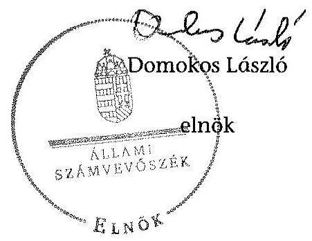

# JELENTÉS 

az önkormányzatok belső kontrollrendszere kialakításának, egyes
kontrolltevékenységek és a belső ellenőrzés
működésének ellenőrzéséről
Álmosd
15077
2015. június

---

# Állami Számvevőszék 

Iktatószám: V-0667-130/2015.
Témaszám: 1701
Vizsgálat-azonosító szám: V067709

## Az ellenőrzést felügyelte:

## dr. Benedek Mária

felügyeleti vezető
Az ellenőrzést vezette és az ellenőrzés végrehajtásáért felelős:
dr. Győri Gabriella
ellenőrzésvezető
A számvevőszéki jelentéstervezet összeállításában közreműködött:
Klinger Zoltán
számvevő
Az ellenőrzést végezték:
Horváthné Menyhárt Erika
számvevő főtanácsos

Klinger Zoltán
számvevő

---

# TARTALOMJEGYZÉK 

BEVEZETÉS ..... 5
I. ÖSSZEGZŐ MEGÁLLAPÍTÁSOK, KÖVETKEZTETÉSEK, JAVASLATOK ..... 9
II. RÉSZLETES MEGÁLLAPÍTÁSOK ..... 13

1. Az önkormányzat belső kontrollrendszere kialakításának és működtetésének megfelelősége ..... 13
1.1. A kontrollkörnyezet kialakítása és működtetése ..... 13
1.2. A kockázatkezelési rendszer kialakítása és működtetése ..... 14
1.3. A kontrolltevékenységek kialakítása és működtetése ..... 15
1.4. Az információs és kommunikációs rendszer kialakítása és működtetése ..... 17
1.5. A monitoring rendszer kialakítása és működtetése ..... 18
2. A monitoring rendszer részeként a belső ellenőrzés kialakítása és működtetése ..... 18
3. A pénzügyi folyamatokban kulcsszerepet betöltő belső kontrollok (teljesítésigazolás és érvényesítés) működése ..... 19
4. Az integritás szemlélet érvényesülése ..... 20
FÜGGELÉKEK
5. számú Értelmező szótár
6. számú Az integritás érvényesítése érdekében kialakított és működtetett intézményi kontrollrendszer

---

.

---

# RÖVIDÍTÉSEK JEGYZÉKE 

## Törvények

Áht.
ÁSZ tv.
Info tv.
Kttv.
Ökjtv.
Ötv.
Mötv.
Számv. tv.
Vnytv.

## Rendeletek, határozatok

Áhsz $_{1}$

Áhsz $_{2}$
Ávr.
Bkr.
$\mathrm{SZMSZ}_{1}$
$\mathrm{SZMSZ}_{2}$

## Szórövidítések

adatvédelmi és adatbiztonsági szabályzat ÁSZ
gazdálkodási jogkörök szabályzata

Hivatal
hivatali SZMSZ $_{1}$
hivatali SZMSZ $_{2}$

2011. évi CXCV. törvény az államháztartásról
2011. évi LXVI. törvény az Állami Számvevőszékről
2011. évi CXII. törvény az információs önrendelkezési jogról és az információszabadságról
2011. évi CXCIX. tv. a közszolgálati tisztviselők ről
2000. évi XCVI. törvény a helyi önkormányzati képviselők jogállásának egyes kérdéseiről
1990. évi LXV. törvény a helyi önkormányzatokról
2011. évi CLXXXIX. törvény Magyarország helyi önkormányzatairól
2000. évi C. törvény a számvitelről
2007. évi CLII. törvény az egyes vagyonnyilatkozat-tételi kötelezettségekről

249/2000. (XII. 24.) Korm. rendelet az államháztartás szervezetei beszámolási és könyvvezetési kötelezettségének sajátosságairól (hatálytalan 2014. január 1-jétől)
4/2013. (I. 11.) Korm. rendelet az államháztartás számviteléről (hatályos 2014. január 1-jétől)
368/2011. (XII. 31.) Korm. rendelet az államháztartásról szóló törvény végrehajtásáról
370/2011. (XII. 31.) Korm. rendelet a költségvetési szervek belső kontrollrendszeréről és belső ellenőrzéséről
8/2012. (VI.21.) önkormányzati rendelet Álmosd Község Önkormányzata Képviselő-testülete és szervei szervezeti és működési szabályzatáról
18/2013. (XII. 21.) önkormányzati rendelet a Szervezeti és Működési Szabályzatról

Álmosdi Közös Önkormányzati Hivatal Informatikai Biztonsági Szabályzata (hatályos 2013. január 1-jétől)
Állami Számvevőszék
1/2012. számú együttes polgármesteri és jegyzői utasítás a kötelezettségvállalás, utalványozás, pénzügyi ellenjegyzés, érvényesítés rendjéről (hatályos 2012. június 1-jétől)
Álmosdi Közös Önkormányzati Hivatal
Álmosdi Közös Önkormányzati Hivatal Szervezeti és Működési Szabályzata (jóváhagyva a 20/2013. (III. 11.) Kép-viselő-testület határozattal, hatályos 2013. január 1-jétől)
Álmosdi Közös Önkormányzati Hivatal Szervezeti és Működési Szabályzata (jóváhagyva a 93/2013. (XII. 21.) Kép-viselő-testület határozattal, hatályos 2013. december 23-tól)

---

INTOSAI
iratkezelési szabályzat

ISSAI
jegyző ${ }_{1}$
jegyző ${ }_{2}$
Képviselő-testület
kockázatkezelési szabályzat
kormányhivatal
NAV
nemzetiségi önkormányzat
Önkormányzat
polgármester
Társulás
ügyrend

International Organization of Supreme Audit Institutions (Legfőbb Ellenőrző Intézmények Nemzetközi Szervezete)
Álmosd Község Önkormányzatának Iratkezelési Szabályzata (hatályos 2007. március 23-tól)
International Standards of Supreme Audit Institutions (Legfőbb Ellenőrző Intézmények Nemzetközi Standardjai)
Álmosdi Közös Önkormányzati Hivatal jegyzője (2013. június 30-ig)

Álmosdi Közös Önkormányzati Hivatal jegyzője (2013. július 1-jétől)

Álmosd Község Önkormányzata Képviselő Testülete
Álmosdi Közös Önkormányzati Hivatal Kockázatkezelési Szabályzata (hatályos 2013. szeptember 1-jétől)
Hajdú-Bihar Megyei Kormányhivatal
Nemzeti Adó és Vámhivatal
Álmosdi Roma Nemzetiségi Önkormányzat
Álmosd Község Önkormányzata
Álmosd Község polgármestere
Derecske Létavértesi Kistérség Többcélú Kistérségi Társulás Ügyrend-Álmosdi Közös Önkormányzati Hivatal gazdasági szervezetének gazdálkodással összefüggő feladataira (hatályos 2013. szeptember 1-jétől)

---

# JELENTÉS 

## az önkormányzatok belső kontrollrendszere kialakításának, egyes kontrolltevékenységek és a belső ellenőrzés működésének ellenőrzése   Álmosd

## BEVEZETÉS

Álmosd község állandó lakosainak száma 2013. január 1-jén 1786 fő volt. Az Önkormányzat héttagú Képviselő-testületének munkáját kettő állandó bizottság segítette, melyek valamennyi tagja települési képviselő volt. Az Önkormányzat az önállóan működő és gazdálkodó Hivatalon kívül önállóan működő intézményt nem működtetett, egy többségi tulajdoni hányadú gazdasági társasággal rendelkezett. A polgármester a 2010. évi önkormányzati választások óta tölti be tisztségét. A jegyző 2013. július 1-jétől látja el feladatait. A Hivatal kettő szervezeti egységre tagolódott, elkülönített gazdasági szervezettel rendelkezett, a foglalkoztatott köztisztviselők száma 2013. január 1-jén 12 fő volt. A Hivatalnál 2013. január 1-jétől szervezeti változás történt, Álmosd Község Polgármesteri Hivatalából és Újléta Község Polgármesteri Hivatalából megalapították az Álmosdi Közös Önkormányzati Hivatalt. Álmosd Község Önkormányzata a 2013. évi költségvetési beszámoló szerint 350359 ezer Ft tárgyévi bevételt ért el, valamint 336787 ezer Ft tárgyévi kiadást teljesített. A 2013. december 31-i könyvviteli mérleg szerint 1297319 ezer Ft értékű eszközvagyonnal rendelkezett, a rövid lejáratú kötelezettségállománya 9510 ezer Ft, hosszú lejáratú kötelezettségállománya nem volt.

A demokratikus társadalmakban alapvető igény, hogy a közpénzeket, a közvagyont használók valamennyi tevékenységükhöz kapcsolódó pénzfelhasználásról elszámoljanak, ahhoz egyértelmű és érvényesíthető felelősségi szabályok társuljanak. Ennek a jogos igénynek az érvényesítéséhez meg kell teremteni azokat a folyamatokat, rendszereket, amelyek nélkülözhetetlenek az elszámoltatáshoz. Az elszámoltatás eredményes működtetéséhez szükség van a megfelelő információs, kontroll, értékelési és beszámolási rendszerek kialakítására.

Magyarországon az uniós csatlakozási tárgyalások idejére nyúlnak vissza a belső kontrollrendszer szabályozásának gyökerei. Az uniós elvárásoknak megfelelő új terminológia szerinti államháztartási belső pénzügyi ellenőrzési (ÁBPE) rendszer területén a jogharmonizáció 2003-ban teljes körűen megvalósult, míg az önkormányzati alrendszerre vonatkozó, Ötv.-ben megjelenített speciális szabályozás 2005-ben lépett hatályba. Az államháztartási belső kontrollrendszer koncepciója 2009-ben továbbfejlődött. A változások irányát mutatja, hogy a költségvetési szervek belső kontrollrendszere már magában foglalja a korszerű felelős szervezetirányítás elemeit (kontrollkörnyezet, kockázatkezelés, kontrollte-

---

vékenység, információ és kommunikáció, monitoring) is. E kontrollrendszer szabályozása háromszintű, a törvényi előírásokat az Áht., és a Mötv., a rendeleti szintű szabályozást az Ávr. és a Bkr. tartalmazza, amelyeket útmutatói szinten az NGM által kiadott standardok és kézikönyvek támogatnak.

A belső kontrollrendszer azt a célt szolgálja, hogy a költségvetési szervek működésük és gazdálkodásuk során a tevékenységeket szabályszerűen, gazdaságosan, hatékonyan, eredményesen hajtsák végre, teljesítsék elszámolási kötelezettségeiket és megvédjék az erőforrásokat a veszteségektől, a károktól és a nem rendeltetésszerű használattól. A belső kontrollrendszer magában foglalja mindazon szabályokat, eljárásokat, gyakorlati módszereket és szervezeti struktúrákat, kockázatkezelési technikákat, kontrolltevékenységeket, amelyek segítséget nyújtanak a szervezetnek céljai eléréséhez.

Az ÁSZ a középtávú stratégiájában hangsúlyos szerepet szánt annak, hogy szilárd szakmai alapon álló, értékteremtő ellenőrzéseivel előmozdítsa a közpénzügyek átláthatóságát, rendezettségét. A számvevőszéki ellenőrzés nemzetközi alapelvei is rögzítik, hogy a megfelelő belső kontrollrendszer minimálisra csökkenti a hibák és szabálytalanságok kockázatát.

Az ellenőrzés célja annak értékelése, hogy

- a jogszabályi előírásoknak megfelelően alakították-e ki és működtették-e a belső kontrollrendszert;
- a gazdálkodás folyamatában kulcsszerepet betöltő teljesítésigazolás és érvényesítés kontrolltevékenységeit megfelelően működtették-e;
- biztosították-e a belső ellenőrzés szabályos működését;
- kialakították-e az erőforrásokkal való szabályszerű és hatékony gazdálkodáshoz szükséges követelményeket, megvalósították-e azok számonkérését, ellenőrzését;
- hasznosították-e a 2009-2013. években végzett ÁSZ ellenőrzések során megfogalmazott javaslatokat.
A közintézmények integritás alapú kultúrájának kialakítása, megerősítése és működése szorosan összefügg a belső kontrollrendszer működésével, ezért az ellenőrzés kitért a gazdálkodáshoz kapcsolódó integritás kontrollok meglétének és működésének ellenőrzésére is. Az integritási kultúra kialakítása hozzájárul az elszámoltathatóság és átláthatóság érvényesítéséhez, egyben támogatja a szervezet védettségét a korrupciós kitettséggel szemben, valamint annak megelőzése is irányítottabbá válik.

Az ellenőrzés várható hasznosulását négy szinten tervezzük. A törvényalkotás számára összegzett tapasztalatok állnak rendelkezésre a belső kontrollrendszer önkormányzati területen való kialakításáról, működéséről és hatásairól, a belső ellenőrzés működéséről. Az ellenőrzés az ellenőrzött számára visszajelzést ad a belső kontrollrendszer kialakításában és működésében fellépő hiányosságokról, javaslataival hozzájárul azok kiküszöböléséhez, amely csökkentheti a későbbi ellenőrzések gyakoriságát. Az ellenőrzés megállapításait és javaslatait más szervezetek is hasznosíthatják a rendezett gazdálkodási keretek kiala-

---

kításához. A társadalom számára jelzi, hogy közpénz nem maradhat ellenőrizetlenül, az ÁSZ értékteremtő rend kialakításához és megőrzéséhez hozzájáruló tevékenysége pozitív hatással lesz a szervezetről kialakított összkép formálásában. A szervezeten belül lehetőség nyílik arra, hogy a megállapítások szintetizálásával az ÁSZ a hozzáadott értéket teremtő elemző tevékenységét és tanácsadó szerepét is erősítse.

Az önkormányzatok belső kontrollrendszere kialakításának, egyes kontrolltevékenységek és a belső ellenőrzés működésének ellenőrzéséről szóló jelentés I. fejezetének összegző része az ellenőrzés céljára ad rövid, szintetizáló összefoglalót, és tartalmazza a következtetéseket a II. fejezet részletes megállapításain alapulóan. A jelentés, intézkedést igénylő megállapításait és javaslatait az ellenőrzés során feltárt, a jelentés II. fejezetében rögzített részletes megállapítások alapozzák meg.

# Az ellenőrzés típusa: szabályszerűségi ellenőrzés 

Az ellenőrzött időszak: a belső kontrollrendszer kialakítása és működtetése megfelelőségét a 2013. évre vonatkozóan (2013. december 31-i állapotnak megfelelően), a pénzügyi folyamatokban kulcsszerepet betöltő teljesítésigazolás és érvényesítés belső kontrollok működésének megfelelőségét, és a belső ellenőrzés szabályszerű működését a 2013. január 1. - december 31-e közötti időszakot figyelembe véve értékeltük, míg az ÁSZ javaslatainak utóellenőrzése a 2009-2013. években végzett ellenőrzések nyilvánosságra hozott jelentéseiben tett javaslatok áttekintésére terjedt ki.

## Az ellenőrzött szervezet: az Önkormányzat

Az ellenőrzés jogszabályi alapját az ÁSZ tv. 1. § (3) bekezdése, az 5. § (2) és (6) bekezdései, valamint az Áht. 61. § (2) bekezdése képezik.

Az ellenőrzés szakmai módszertana az ÁSZ hivatalos honlapján (www.asz.hu) közzétett szakmai szabályokon alapult, amely az INTOSAI által kiadott ISSAI figyelembevételével készült.

Az ellenőrzés lefolytatásához az Önkormányzat a kimutatások és a tanúsítvány elektronikus kitöltésével, valamint az ÁSZ által kért dokumentumok elektronikus megküldésével szolgáltatott adatokat. Az így rendelkezésre bocsátott adatok, információk kontrollja és a munkalapok kitöltése a helyszíni ellenőrzés keretében történt. A jelentésben használt fogalmak magyarázatát az 1. számú függelék, az integritás érvényesítése érdekében kialakított és működtetett intézményi kontrollrendszer értékelésénél alkalmazott egységes értékelési szempontokat a 2. számú függelék tartalmazza.

A belső kontrollrendszer, valamint a belső ellenőrzés jogszabályi előírások szerinti kialakításának és működtetésének szabályszerűségét az erre irányuló ellenőrzési kérdésekre adott válaszok összesítése alapján értékeltük. A belső kontrollrendszert kontrollterületenként (kontrollkörnyezet, kockázatkezelési rendszer, kontrolltevékenységek, információs és kommunikációs rendszer, monitoring rendszer) és összesítetten is értékeltük.

A belső kontrollrendszer egyes kontrollterületei és a belső ellenőrzés kialakítása és működtetése „szabályszerű volt", amennyiben az értékelt területen az elért és

---

elérhető pontok százalékban kifejezett hányadosa elérte a 81%-ot, „részben szabályszerű volt", ha 61-80% közé esett, és „nem volt szabályszerű", ha nem haladta meg a 60%-ot. A belső kontrollrendszer összesített értékelése megegyezett a kontrollterületenként alkalmazott %-os értékelésekkel, a következő eltérésekkel. A kontrollrendszer egésze esetében a „szabályszerű" értékelésnek a %-os értéken felül további feltétele volt, hogy egyik kontrollterület sem kaphatott „nem volt szabályszerű" értékelést, a „részben szabályszerű" értékelés további feltétele volt, hogy legfeljebb egy ellenőrzött kontrollterület lehetett „nem volt szabályszerű" értékelésű. Az összesített értékelés a %-os értéktől függetlenül „nem volt szabályszerű", ha az ellenőrzött kontrollterületek közül több mint egynek „nem volt szabályszerű" az értékelése.

A gazdálkodás folyamatában kulcsszerepet betöltő két kulcskontroll - teljesítésigazolás, érvényesítés - működésének megfelelőségét a személyi juttatásokkal, a dologi és felhalmozási kiadásokkal, működési és felhalmozási célú pénzeszköz átadásokkal, ellátottak pénzbeli juttatásaival kapcsolatos kifizetések esetében mintavétellel ellenőriztük. Az ellenőrzött területek esetében minden egyes tétel vonatkozásában a szabályszerűségre vonatkozó kérdéseket tettünk fel, amelyekre adott válaszok eredménye összesítésre került. „Megfelelőnek" értékeltük a gazdálkodási jogkörök gyakorlását, amennyiben
 95%-os bizonyossággal a teljes sokaságban a hibaarány legfeljebb 10%, „részben megfelelőnek" értékeltük, ha a hibaarány felső határa 10-30% között volt, „nem megfelelőnek" pedig akkor, ha a mintavételi eredmények alapján a sokaságbeli hibaarány felső határa meghaladta a 30%-ot.

Értékeltük az Önkormányzatnál a belső ellenőrzés kialakításának és működésének szabályosságát. Minősítettük a gazdálkodáshoz kapcsolódó integritás kontrollok meglétét és működését. Az integritás szemlélet érvényesülésének értékelése az Önkormányzat által önbevallással kitöltött tanúsítvány alapján történt. Utóellenőrzésre nem került sor, mivel az ÁSZ az Önkormányzatnál a 2009-2013. években ellenőrzést nem végzett.

Az ÁSZ tv. 29. § (1) bekezdése szerint a jelentéstervezetet megküldtük a polgármester részére, aki az ÁSZ tv. 29. § (2) bekezdésében foglalt észrevételezési jogával nem élt, a jelentéstervezetre észrevételt nem tett.

---

# I. ÖSSZEGZŐ MEGÁLLAPÍTÁSOK, KÖVETKEZTETÉSEK, JAVASLATOK 

A belső kontrollrendszeren belül 2013-ban a kontrollkörnyezet, a kockázatkezelési rendszer, a kontrolltevékenységek, az információs és kommunikációs rendszer, valamint a monitoring rendszer kialakítását és működtetését külön-külön és együttesen is értékeltük. Az Önkormányzatnál a belső kontrollrendszer kialakítása és működtetése az összesített értékelés alapján nem volt szabályszerű.

A belső kontrollrendszer egyes területei kialakításának és működtetésének minősítése a következő:

| Kontrollterület | Minősítés |
| :-- | :--: |
| Kontrollkörnyezet | nem   szabályszerű |
| Kockázatkezelési rendszer | részben   szabályszerű |
| Kontrolltevékenységek | részben   szabályszerű |
| Információs és kommunikációs rendszer | részben   szabályszerű |
| Monitoring rendszer | nem   szabályszerű |

Részben szabályszerűnek értékeltük a kockázatkezelési rendszer, a kontrolltevékenységek, valamint az információs és kommunikációs rendszer kialakítását és működtetését, mivel a megállapított szabályozásbeli hiányosságok nem veszélyeztették e kontrollterületeken a szabályszerű működést.

Nem volt szabályszerű a kontrollkörnyezet és a monitoring rendszer kialakítása és működtetése, mivel az ellenőrzésünk során megállapított szabályozásbeli hiányosságok magukban hordozzák a szabálytalan működés, valamint a korrupció kockázatát.

A 2013. évben a személyi juttatások, dologi kiadások, felhalmozási kiadások, működési és felhalmozási célú pénzeszköz átadások, illetve az ellátottak pénzbeli juttatásaival kapcsolatos kifizetések során a pénzügyi folyamatokban kulcsszerepet betöltő teljesítésigazolás és érvényesítés belső kontrollok működése nem volt megfelelő, mivel azok nem biztosították a hibák megelőzését, feltárását.

A számvevőszéki ellenőrzés az ellenőrzött kifizetésekkel összefüggésben a rendelkezésre bocsátott dokumentumok alapján kár bekövetkeztére utaló adatot, tényt nem állapított meg, azonban a gazdálkodásban kulcsszerepet betöltő kontrollok

---

működésében feltárt hiányosságok miatt fennáll a hibák, szabálytalanságok bekövetkezésének kockázata. A nem megfelelően működtetett belső kontrollok korrupciós kockázatot hordoznak.

Az Önkormányzat a belső ellenőrzési feladatok ellátásáról a Társulás útján gondoskodott. A 2013. évben a belső ellenőrzés kialakítása és működtetése nem volt szabályszerű, mert a 2013. évre belső ellenőrzést nem terveztek és nem végeztek. A 2014. évi ellenőrzési terv nem tartalmazta a tervet megalapozó kockázatelemzést valamint az ellenőrzési tervet a jogszabályban rögzített határidőn túl fogadta el a Képviselő-testület. A számvevőszéki ellenőrzés által megállapított szabályozási és működési hiányosságok számossága magában hordozza a szabálytalan önkormányzati gazdálkodás és feladatellátás kockázatát.

A Képviselő-testület a 2013. évben nem alakította ki az erőforrásokkal való, szabályszerű és hatékony gazdálkodáshoz szükséges követelményeket.

Az integritás szemlélet érvényesülésének ellenőrzéséhez az Önkormányzat önbevallás útján szolgáltatott adatokat. Az adatok értékelése alapján az eredendő veszélyeztetettségi szint és a kockázatokat növelő tényező szintje is magas. Emellett a szervezetnél kiépült, a kockázatok kezelésére hivatott kontrollok szintje alacsony. A szervezet integritása fejlesztendő. Az adatok részletes kiértékelését a 2. számú függelék tartalmazza.

Az ÁSZ tv. 33. § (1) bekezdésében foglaltak értelmében az ellenőrzött szervezet vezetője köteles a jelentésben foglalt megállapításokhoz kapcsolódó intézkedési tervet összeállítani, és azt a jelentés kézhezvételétől számított 30 napon belül az ÁSZ részére megküldeni. Amennyiben az intézkedési tervet határidőre nem küldi meg a szervezet, vagy az ÁSZ tv. 33. § (2) bekezdésében foglalt póthatáridő elteltével megküldött intézkedési terv továbbra sem elfogadható, az ÁSZ elnöke a hivatkozott törvény 33. § (3) bekezdés a)-b) pontjaiban foglaltakat érvényesítheti.

Az ellenőrzés intézkedést igénylő megállapításai és javaslatai:

# a polgármesternek 

1. A Képviselő-testület megalkotta az SZMSZ₂-t, amely a polgármester és a jegyző₂ által - a Mötv. 51. § (1) bekezdésében foglaltak ellenére -nem került aláírásra.

Javaslat:
Intézkedjen annak érdekében, hogy a Képviselő-testület által megalkotott rendelet az Mötv. 51. § (1) bekezdésében foglaltaknak megfelelően - minden esetben a polgármester és a jegyző által aláírásra kerüljön.
2. Az Önkormányzat kiadási előirányzata terhére történt visszterhes szerződések nem tartalmazták - az Áht. 37. § (1) és az Ávr. 50. § (1) bekezdés d) pontjában foglaltak ellenére - a pénzügyi ellenjegyzés tényét és a pénzügyi ellenjegyző keltezéssel ellátott aláírását.

---

Javaslat:
Intézkedjen annak érdekében, hogy az Önkormányzat nevében történő visszterhes szerződések - az általános adatokon, feltételeken túlmenően - az Áht. 37. § (1) bekezdésében és az Ávr. 50. § (1) bekezdés d) pontjában foglaltaknak megfelelően tartalmazzák a pénzügyi ellenjegyzés tényét és a pénzügyi ellenjegyző keltezéssel ellátott aláírását.
3. Az önkormányzati képviselők közül hárman - az Ökjtv. 10/A. § (1) bekezdésében foglaltak ellenére - a vagyonnyilatkozat-tételi kötelezettségüknek nem tettek eleget, akiket az őrzésért felelős a Vnytv. 8. § (4) bekezdésében foglaltak ellenére nem tájékoztatott a vagyonnyilatkozat-tételi kötelezettségük fennállásáról és esedékességének időpontjáról az esedékességet legalább 30 nappal megelőzően, továbbá - a 10. § (1) bekezdésében foglaltak ellenére - írásban nem szólította fel a kötelezetteket arra, hogy kötelezettségüket a felszólítás kézhezvételétől számított nyolc napon belül teljesítsék.
Javaslat:
Kezdeményezze a Képviselő-testület intézkedését a Mötv. 57. § (2) bekezdésében és a 65. §-ában, valamint a Vnytv.-ben foglaltak alapján a három önkormányzati képviselő vonatkozásában a vagyonnyilatkozat-tételi kötelezettség teljesítésével kapcsolatos, a vagyonnyilatkozat őrzésére kijelölt bizottság általi jogsértő állapot megszüntetése érdekében.
4. A számvevőszéki jelentés ellenőrzési megállapításai alapján az Önkormányzatnál a belső kontrollrendszer kialakítása és működtetése összesített értékelés alapján nem volt szabályszerű, a kulcskontrollok működése nem volt megfelelő.
Javaslat:
Kísérje figyelemmel a Mötv. 115. § (1) bekezdésében foglaltak alapján az Önkormányzat gazdálkodásának szabályszerűségét. A Mötv. 67. § f) pontja alapján gondoskodjon a belső kontrollrendszer kialakítására és működtetésére vonatkozó jogszabályi rendelkezések be nem tartása, valamint a teljesítésigazolás, illetve az érvényesítés kontrolokkal összefüggésben feltárt hibák, hiányosságok, szabálytalanságok tekintetében az esetleges munkajogi felelősséggel kapcsolatos körülmények kivizsgálásáról, majd a vizsgálat eredményének függvényében tegye meg a szükséges intézkedéseket.

# a jegyzőnek 

1. A számvevőszéki jelentés ellenőrzési megállapításai alapján az Önkormányzatnál a belső kontrollrendszer kialakítása és működtetése összesített értékelés alapján nem volt szabályszerű, a kulcskontrollok működése nem volt megfelelő, valamint a belső ellenőrzés kialakítása és működtetése nem volt szabályszerű. A számvevőszéki ellenőrzés során feltárt hibákat, hiányosságokat és szabálytalanságokat a számvevőszéki jelentés II. Részletes megállapítások fejezetcím tartalmazza.
Javaslat:
A jogszabályoknak megfelelő belső kontrollrendszer kialakítása és működtetése érdekében - az ellenőrzött időszak óta bekövetkezett esetleges jogszabályi változásokra figyelemmel - intézkedjen a belső kontrollrendszer kialakításában és működtetésében,

---

a kulcskontrollok működésében, illetve a belső ellenőrzés kialakításában és működtetésében az ellenőrzés által feltárt hibák, hiányosságok, szabálytalanságok kijavítására.

Kezdeményezze, hogy az éves ellenőrzési terv kiterjedjen a kifizetések szabályszerűségi ellenőrzésére, különös tekintettel a személyi juttatásokkal, a dologi kiadásokkal, a felhalmozási kiadásokkal, a működési és felhalmozási célú pénzeszköz átadásokkal, az ellátottak pénzbeli juttatásaival kapcsolatos kiadási jogcímekből teljesített kifizetésekre.

---

# II. RÉSZLETES MEGÁLLAPÍTÁSOK 

## 1. AZ ÖNKORMÁNYZAT BELSŐ KONTROLLRENDSZERE KIALAKÍTÁSÁNAK ÉS MŰKÖDTETÉSÉNEK MEGFELELŐSÉGE

A belső kontrollrendszeren belül 2013-ban a kontrollkörnyezet, a kockázatkezelési rendszer, a kontrolltevékenységek, az információs és kommunikációs rendszer, valamint a monitoring rendszer kialakítását és működtetését külön-külön és együttesen is értékeltük. A belső kontrollrendszer kialakítása és működtetése az összesített értékelés alapján nem volt szabályszerű.

### 1.1. A kontrollkörnyezet kialakítása és működtetése

A kontrollkörnyezet kialakítása és működtetése nem volt szabályszerű, mert:

| Sorszám ${ }^{1}$ | Megállapítás | Megjegyzés |
| :--: | :--: | :--: |
| 5-7. | A jegyző, a hivatali SZMSZ₁-ben, illetve a jegyző₂ a hivatali SZMSZ₂-ben - az Ávr. 13. § (1) bekezdés c), f), i) pontjában és az Ávr. 10. § (1)-(3) bekezdésében foglaltak ellenére - nem rögzítette a rendszeresen ellátott vállalkozási tevékenységek felsorolását, az alaptevékenységet szabályozó jogszabályok megjelölését, azon ügyköröket, amelyek során a szervezeti egységek vezetői a költségvetési szerv képviselőjeként járhatnak el, továbbá a költségvetési szervhez rendelt más költségvetési szervek felsorolását. |  |
| 10. | A Képviselő-testület megalkotta az SZMSZ₂-t, amely a polgármester és a jegyző₂ által - a Mötv. 51. § (1) bekezdésében foglaltak ellenére - nem került aláírásra. A rendelet kihirdetése - a Mötv. 51. § (2) bekezdésében foglaltak ellenére nem volt dokumentált. | Az SZMSZ₁ kihirdetése megfelelt az Ötv. előírásainak. |
| $\begin{aligned} & 15-16 . \\ & 23 . \\ & 25 . \\ & 27 . \end{aligned}$ | A jegyző₁,₂ - az Áht. 3. § (3) bekezdés b) pontjában, az Áhsz₁ 8. § (3) bekezdésében, (4) bekezdés a), b) és d) pontjában, valamint a Számv. tv. 14. § (5) bekezdés a), b) és d) pontjaiban foglaltak ellenére - nem alakította ki a nemzetiségi önkormányzat számviteli politikáját és nem készítette el annak keretében az eszközök és források | 2014. január 1-jétől az Áhsz₂ 50. § (1) bekezdése szabályozza a számviteli politikát és - a Számv. tv. 161. § (1) bekezdése és az Áhsz₂ 51. § (2) bekezdése - írja elő a számlarend készítésének kötelezettségét. |

[^0]
[^0]:    ${ }^{1}$ A témacsoportos ellenőrzés miatt a megállapítás számozása az önkormányzat által kitöltött kimutatások - adatszolgáltatások - kérdéseinek sorszámával azonos.

---

|  | leltárkészítési és leltározási szabályzatát, továbbá az eszközök és források értékelési szabályzatát, és a pénzkezelési szabályzatot, valamint a Számv. tv. 161. § (1) és (4) bekezdésében foglaltak alapján a számlarendet. |
| :--: | :--: |
| 36. | A jegyző₁,₂ - a Kttv. 75. § (1) bekezdés d) pontjában foglaltak ellenére - nem készítette el a Hivatalban a pénzügyi ügyintéző, valamint a pénzügyi, a műszaki, és a szociálpolitikai előadói munkakörben dolgozó köztisztviselők munkaköri leírását. |
| 31.   38. | A jegyző₁,₂ - a Bkr. 6. § (3)-(4) bekezdésében foglaltak ellenére - nem készítette el az ellenőrzési nyomvonalat és nem szabályozta a szabálytalanságok kezelésének eljárásrendjét. |
| 40. | A Képviselő-testület - az Áht. 9. § (1) bekezdés f) pontjában foglaltak ellenére - az erőforrásokkal való, szabályszerű és hatékony gazdálkodáshoz szükséges követelményeket nem alakította ki. |
| 46. | A jegyző₁,₂ - a Mötv. 81. § (3) bekezdés c) pontjában előírt feladata ellenére - nem dolgozta ki a Kttv. 83. §-ában előírt, a köztisztviselőkre vonatkozó hivatásetikai alapelvek részletes tartalmát, valamint az etikai eljárás szabályait. |

# 1.2.
 A kockázatkezelési rendszer kialakítása és működtetése 

A kockázatkezelési rendszer kialakítása és működtetése részben volt szabályszerű.

A jegyző ${ }_{2}$ kialakította a Hivatal kockázatkezelési rendszerét, amely tartalmazta a kockázatok azonosításával, elemzésével, csoportosításával, nyomon követésével, illetve a kockázati kitettség csökkentésével kapcsolatos szabályokat, és megállapította a Hivatal tevékenységében, gazdálkodásában rejlő kockázatokat.

A Képviselő-testület tagjaira vonatkozó vagyonnyilatkozat-tételi kötelezettséget az SZMSZ ${ }_{1,2}$-ben rögzítették.

---

A kockázatkezelési rendszer kialakítása és működtetése részben volt szabályszerű, mert:

| Sorszám | Megállapítás | Megjegyzés |
| :--: | :--: | :--: |
| 3-4. | A jegyző ${ }_{1}$ - a Bkr. 7. § (2) bekezdésében foglaltak ellenére - nem határozta meg az egyes kockázatokkal kapcsolatban szükséges intézkedéseket és azok teljesítésének folyamatos nyomon követési módját. | A Hivatal kockázatkezelési szabályzata 2013. szeptember 1-jétől hatályos. |
| 6. | A jegyző ${ }_{1}$ - a Vnytv. 4. § a) pontjában foglaltak ellenére - a vagyonnyilatkozat-tételre kötelezett köztisztviselők körét nem határozta meg a hivatali $5 \mathrm{ZMSZ}_{1}$-ben.   Az önkormányzati képviselők közül hárman az Ökjtv. 10/A § (1) bekezdésében foglaltak ellenére - a vagyonnyilatkozat-tételi kötelezettségüknek nem tettek eleget, akiket az őrzésért felelős a Vnytv. 8. § (4) bekezdésében foglaltak ellenére nem tájékoztatott a vagyonnyilatkozat-tételi kötelezettségük fennállásáról és esedékességének időpontjáról az esedékességet legalább 30 nappal megelőzően, továbbá - a 10. § (1) bekezdésében foglaltak ellenére - írásban nem szólította fel a kötelezetteket arra, hogy kötelezettségüket a felszólítás kézhezvételétől számított nyolc napon belül teljesítsék. | A jegyző ${ }_{2}$ a hivatali $5 \mathrm{ZMSZ}_{2}$-ben meghatározta a vagyonnyilatkozat-tételre kötelezett köztisztviselők körét, mely kötelezettségnek az érintettek a 2013. évben eleget tettek.   Az önkormányzati képviselők vagyonnyilatkozatának őrzéséért az $5 \mathrm{ZMSZ}_{1,2}$ alapján a Pénzügyi és Vagyonnyilatkozat kezelő Bizottság volt felelős. |

# 1.3. A kontrolltevékenységek kialakítása és működtetése 

A kontrolltevékenységek kialakítása és működtetése részben volt szabályszerű.

A jegyző ${ }_{1}$ a gazdálkodási jogkörök szabályzatában meghatározta a kötelezettségvállalás, a kötelezettségvállalás pénzügyi ellenjegyzése, a teljesítésigazolás, az érvényesítés és az utalványozás gyakorlásának módjával, eljárási és dokumentációs részletszabályaival, valamint az ezeket végző személyek kijelölésének rendjével kapcsolatos belső előírásokat, feltételeket. A kötelezettségvállaló írásban kijelölte az Önkormányzat vonatkozásában a teljesítés igazolására jogosult személyeket.

A jegyző ${ }_{1}$ a jogszabályi előírásoknak megfelelően gondoskodott az iratkezelési szoftver által kezelt adatok biztonságáról, kialakította az üzembiztonsági, adatvédelmi szabályok érvényre juttatásához szükséges eljárási szabályokat. A jegyző ${ }_{1}$ az iratkezelési rendszer kialakítása során az üzemeltetés és adatbiztonság szabályozásában a jogszabályi előírásoknak megfelelően végrehajtható módon, pontosan meghatározta a hatásköröket. A jegyző ${ }_{1}$ az informatikai rendszer szabályozása során a jogszabályi előírásoknak megfelelően megtette azokat a technikai és szervezési intézkedéseket és kialakította azokat az eljárási szabályokat, amelyek biztosítják az adatok biztonságát és védelmét.

---

Az ügyrendben a jegyző ${ }_{2}$ meghatározta a beszámolási feladatok (időközi és éves beszámolók) teljesítésével kapcsolatos belső előírásokat, feltételeket, meghatározta a beszámolási eljárásokhoz kapcsolódó felelősségi köröket.

A költségvetési beszámoló elkészítésével megbízott személy rendelkezett a jogszabályban előírt képesítéssel és a tevékenység ellátására jogosító engedéllyel.

A polgármester a jogszabályi előírásoknak megfelelően az Önkormányzat gazdálkodásának első félévi és háromnegyed éves helyzetéről a Képviselő-testületet írásban a megadott határidőig tájékoztatta.

A Hivatalban a pénzügyi ellenjegyzésre kijelölt személy rendelkezett a jogszabályban előírt végzettséggel, illetve pénzügyi-számviteli képesítéssel.

A kontrolltevékenységek kialakítása és működtetése részben volt szabályszerű, mert:

| Sorszám | Megállapítás | Megjegyzés |
| :--: | :--: | :--: |
| $1-4$. | A jegyző ${ }_{1,2}$ - a Bkr. 8. § (2) bekezdés a) pontjában foglaltak ellenére - nem biztosította a pénzügyi döntések - köztük a költségvetés tervezése, a beszerzések lebonyolítása, a vagyonhasznosítási tevékenység és a támogatások elszámolása - dokumentumainak elkészítésével kapcsolatban a folyamatba épített, előzetes, utólagos és vezetői ellenőrzést. |  |
| 6. | A jegyző ${ }_{1,2}$ a gazdálkodási jogkörök szabályzatban lehetővé tette a 100 ezer forint alatti kifizetések előzetes írásbeli kötelezettségvállalás nélküli teljesítését, azonban - az Ávr. 53. § (2) bekezdésében foglaltak ellenére belső szabályzatban nem határozta meg az előzetes írásbeli kötelezettségvállalást nem igénylő kifizetések rendjét. |  |
| 15. | A jegyző ${ }_{1,2}$ - a Bkr. 8. § (4) bekezdés b) pontjában foglaltak ellenére - belső szabályzatban nem határozta meg a dokumentumokhoz és információkhoz való hozzáférésre vonatkozóan a felelősségi köröket. |  |
| 18. | A jegyző ${ }_{1,2}$ - az Ávr. 13. § (5) bekezdésében foglaltak ellenére - nem határozta meg a gazdasági feladatot ellátó vezető és a gazdasági feladatot ellátó alkalmazottak helyettesítésének rendjét belső szabályzatban. | A helyettesítés rendjét munkaköri leírás tartalmazta. |
| 27. | A gazdasági szervezettel rendelkező Hivatalban - az Ávr. 58. § (4) bekezdésében foglaltak ellenére - nem a gazdasági vezető jelölte ki az érvényesítési feladatot ellátó, a Hivatal állományában dolgozó köztisztviselőt. | Az érvényesítési feladatot ellátó, képesítési követelményeknek megfelelő köztisztviselőt a jegyző jelölte ki. |

---

| 32. | A jegyző ${ }_{1,2}$ - a Kttv. 74. § (1) bekezdésében foglaltak ellenére - a közszolgálati jogviszony megszünése esetére nem szabályozta a munkakör átadásának rendjét. A jegyző ${ }_{1,2}$ - a 335/2005. (XII. 29.) Korm. rendelet 15. §-ában foglaltak ellenére - a munkakör változása esetére nem szabályozta a munkakör átadásának rendjét. |
| :--: | :--: |
| 33. | A jegyző ${ }_{1}$ - a Kttv. 74. § (1) bekezdésében foglaltak ellenére - a jogviszony megszűnésekor nem gondoskodott a munkakör dokumentált átadásáról. |

# 1.4. Az információs és kommunikációs rendszer kialakítása és működtetése 

Az információs és kommunikációs rendszer kialakítása és működtetése részben szabályszerű volt.

A Hivatal rendelkezett az Info tv. előírásainak megfelelő adatvédelmi és adatbiztonsági szabályzattal.

A jegyző ${ }_{1,2}$ meghatározta a közérdekű adatok megismerésére irányuló igények teljesítésének rendjét.

A Hivatal rendelkezett a jogszabályi előírásoknak megfelelő tartalmú, egyedi iratkezelési szabályzattal, amelyet elláttak az előírt levéltári és kormányhivatali záradékokkal. Az iratkezelési szabályzat kiterjedt a küldemények átvételének, felbontásának és érkeztetésének, a küldemények iktatási rendjének, a továbbításának és az irattárba történő elhelyezésének, továbbá irattári kezelésének, valamint a selejtezésének és megsemmisítésének szabályozására.

Az információs és kommunikációs rendszer kialakítása és működtetése a következő hiányosságok mellett részben volt szabályszerű:

| Sorszám | Megállapítás |
| :--: | :--: |
| $1-2$. | A jegyző ${ }_{1,2}$ - a Bkr. 3. § d) pontjában és a 9. § (1) bekezdésében foglaltak ellenére - nem alakított ki olyan rendszert, amely biztosítja, hogy a szervezeten belül és kívül a megfelelő információk a megfelelő időben eljutnak az illetékes szervezethez, szervezeti egységhez, illetve személyhez. |
| 3. | A jegyző ${ }_{1,2}$ - a Bkr. 9. § (2) bekezdésében foglaltak ellenére - nem szabályozta a beszámolási szinteket, határidőket, módokat. |
| 6. | A jegyző ${ }_{1,2}$ - az Info. tv. 33. § (1) és (3) bekezdéseiben foglaltak ellenére - nem gondoskodott arról, hogy az Önkormányzat az elektronikus közzétételi kötelezettségének a 2013. évben eleget tegyen. |

---

# 1.5. A monitoring rendszer kialakítása és működtetése 

A monitoring rendszer kialakítása és működtetése nem volt szabályszerű.

| Sor-   szám | Megállapítás |
| :-- | :-- |

1. A jegyző ${ }_{1,2}$ - a Bkr. 3. § e) pontja és 10. §-ában foglaltak ellenére - nem alakította ki a Hivatal tevékenységének, a célok megvalósításának nyomon követését biztosító rendszert.
2. A jegyző ${ }_{1}$ - a Bkr. 11. § (1) bekezdésében foglalt kötelezettsége ellenére, a Bkr. 1. mellékletében foglalt nyilatkozatban - a 2012. évre vonatkozóan nem értékelte a Hivatal belső kontrollrendszerének minőségét.
A helyi önkormányzatok törvényességi felügyeletét ellátó kormányhivatal törvényességi felhívással, egy alkalommal élt 2013-ban, a Képviselő-testület üléseiről készített jegyzőkönyvek megküldésének késedelmével összefüggésben. Az Önkormányzat a kormányhivatal felhívására a szükséges intézkedéseket megtette.

Hatósági ellenőrzést egy alkalommal végzett a NAV a foglalkoztatottak társadalombiztosítási bejelentési kötelezettségének teljesítésére vonatkozóan. A feltárt bejelentési hiányosság megszüntetésére a jegyző intézkedett.

## 2. A MONITORING RENDSZER RÉSZEKÉNT A BELSŐ ELLENŐRZÉS KIALAKÍTÁSA ÉS MŰKÖDTETÉSE

Az Önkormányzatnál a belső ellenőrzés kialakítása és működtetése nem volt szabályszerű.

| Sor-   szám | Megállapítás | Megjegyzés |
| :--: | :--: | :--: |
| 7. | Az Önkormányzat a - Bkr. 56. § (3) bekezdés   a) pontjában foglaltak ellenére - stratégiai ellenőrzési tervvel nem rendelkezett. |  |
| 8.   a),b),   f),g) | A 2014. évi ellenőrzési terv - a Bkr. 31. § (4) bekezdés a), b), f) és g) pontjában foglaltak ellenére - nem tartalmazta az ellenőrzési tervet megalapozó elemzések és a kockázatelemzés eredményének összefoglaló bemutatását, a tervezett ellenőrzések tárgyát, típusát és ütemezését. |  |
| 9. | A Képviselő-testület a 2014. évi ellenőrzési tervet - a Mötv. 119. § (5) bekezdésében foglaltak ellenére - határidőn túl hagyta jóvá. | A 2014. évi ellenőrzési tervet 2014. február 13-án hagyta jóvá a Képviselő-testület. |
| 13. | A jegyző ${ }_{1,2}$ - az Áht. 70. § (1) bekezdése, a Bkr. 15. § (1) bekezdése valamint a Mötv. 119. § (4) bekezdésében foglaltak ellenére - a belső ellenőrzés megfelelő működéséről nem gondoskodott, a 2013. évben ellenőrzést nem terveztek és nem végeztek. | A jegyző ${ }_{1,2}$ a belső ellenőrzés kialakításáról a Társulás útján gondoskodott. |

---

# 3. A PÉNZÜGYI FOLYAMATOKBAN KULCSSZEREPET BETÖLTŐ BELSŐ KONTROLLOK (TELJESÍTÉSIGAZOLÁS ÉS ÉRVÉNYESÍTÉS) MŰKÖDÉSE 

A 2013. évben a személyi juttatások, dologi kiadások, felhalmozási kiadások, működési és felhalmozási célú pénzeszköz átadásokkal, ellátottak pénzbeli juttatásaival kapcsolatos kifizetések során - összefoglalóan értékelve - a pénzügyi folyamatokban kulcsszerepet betöltő teljesítésigazolás és érvényesítés belső kontrollok működése nem volt megfelelő, mert:

| Kulcs-kontrollok | Megállapítás |
| :--: | :--: |
| Teljesítésigazolás | A teljesítésigazolást a kifizetéseket megelőzően - az Áht. 38. § (1) bekezdésében és az Ávr. 57. § (1), (3)-(4) bekezdésében foglaltak ellenére - nem vagy nem szabályszerűen végezték, illetve kijelölés hiányában nem az arra jogosult személy végezte. |
| Érvényesítés | Az érvényesítést a kifizetést megelőzően - az Áht. 38. § (1) bekezdésében és az Ávr. 58. § (1) és (4) bekezdésében foglaltak ellenére - nem, vagy nem szabályszerűen, továbbá kijelölés hiányában nem az arra jogosult személy végezte.   Az érvényesítő - az Ávr. 58. § (2) bekezdésében foglaltak ellenére nem jelezte az utalványozónak, hogy a megelőző ügymenetben az Áht., az államháztartási számviteli kormányrendelet, az Ávr. előírásait és a belső szabályzatokban foglaltakat nem tartották be. |

A 2013. évben az ellenőrzött kifizetési jogcímek mintatételei alapján a teljesítésigazolás kulcskontroll működése során az alábbi hiányosságok, szabálytalanságok fordultak elő:

- a személyi juttatásokkal, a dologi kiadásokkal, a működési és felhalmozási célú pénzeszközátadásokkal, valamint az ellátottak pénzbeli juttatásaival kapcsolatos kifizetéseket megelőzően a
 teljesítésigazolást - az Ávr. 57. § (1) és (4) bekezdésében foglaltak ellenére - nem, vagy kijelölés hiányában nem az arra jogosult személy végezte;
- a dologi kiadásokkal kapcsolatos kifizetéseket megelőzően a teljesítésigazolást - az Ávr. 57. § (3) bekezdésében foglaltak ellenére - nem szabályszerűen végezték, mert az nem tartalmazta a teljesítés tényére történő utalást.
A 2013. évben az ellenőrzött kifizetési jogcímek mintatételei alapján az érvényesítés kulcskontroll működése során az alábbi hiányosságok, szabálytalanságok fordultak elő:
- a személyi juttatásokkal, a dologi kiadásokkal, működési és felhalmozási célú pénzeszközátadásokkal, valamint az ellátottak pénzbeli juttatásaival kapcsolatos kifizetéseket megelőzően az érvényesítő - az Ávr. 58. § (2) bekezdésében foglaltak ellenére - nem jelezte az utalványozónak, hogy a megelőző ügymenetben a teljesítésigazolást nem, vagy kijelölés hiányában nem az arra jogosult személy, vagy nem szabályszerűen végezte el;
- az érvényesítés a személyi juttatások, a dologi kiadások, a működési célú pénzeszközátadások, továbbá az ellátottak pénzbeli juttatásaival kapcsolatos kiadások tekintetében - az Ávr. 58. § (3) bekezdésében foglaltak ellenére -

---

nem volt szabályszerű, mivel az Ávr. 60. § (3) bekezdése szerint vezetett nyilvántartás (aláírás-minta) alapján nem volt megállapítható, hogy a keltezéssel ellátott aláírás az érvényesítésre kijelölt személytől származott;

- az érvényesítő a személyi juttatások, a dologi kiadások, a működési és felhalmozási célú pénzeszközátadások, valamint az ellátottak pénzbeli juttatásaival kapcsolatos kiadások kifizetését megelőzően - az Ávr. 58. § (1) bekezdésében foglaltak ellenére - a fedezetet nem tudta ellenőrizni, mert a kötelezettségvállalásokat - az Ávr. 56. § (1) bekezdésében foglaltak ellenére - nem vették nyilvántartásba;
- az érvényesítő a dologi kiadások, a felhalmozási kiadások kifizetését megelőzően - az Ávr. 58. § (2) bekezdésben foglaltak ellenére - nem jelezte az utalványozónak, hogy a megelőző ügymenetben az Önkormányzat kiadási előirányzata terhére történt visszterhes szerződések nem tartalmazták - az Áht. 37. § (1) és az Ávr. 50. § (1) bekezdés d) pontjában foglaltak ellenére - a pénzügyi ellenjegyzés tényét és a pénzügyi ellenjegyző keltezéssel ellátott aláírását.
A számvevőszéki ellenőrzés az ellenőrzött kifizetésekkel összefüggésben a rendelkezésre bocsátott dokumentumok alapján kár bekövetkeztére utaló adatot, tényt nem állapított meg, azonban a gazdálkodásban kulcsszerepet betöltő kontrollok nem megfelelő működése miatt fennáll a hibák, szabálytalanságok bekövetkezésének kockázata. A nem megfelelően működtetett belső kontrollok korrupciós kockázatot hordoznak.

# 4. AZ INTEGRITÁS SZEMLÉLET ÉRVÉNYESÜLÉSE 

Az integritás szemlélet érvényesülésének ellenőrzéséhez az Önkormányzat önbevallás útján szolgáltatott adatokat. Az adatok értékelése alapján az eredendő veszélyeztetettségi szint és a kockázatokat növelő tényező szintje is magas. Emellett a szervezetnél kiépült, a kockázatok kezelésére hivatott kontrollok szintje alacsony. A szervezet integritása fejlesztendő. Az adatok részletes kiértékelését a 2. számú függelék tartalmazza.

Budapest, 2015. OG hónap 10. nap

Függelék: $\quad 2 \mathrm{db}$

---

# ÉRTELMEZŐ SZÓTÁR 

belső ellenőrzés
belső kontrollrendszer
belső kontrollrendszer területei
egyszerű véletlen minta
integritás
kockázat

Független, tárgyilagos bizonyosságot adó és tanácsadó tevékenység, amelynek célja, hogy az ellenőrzött szervezet működését fejlessze és eredményességét növelje, az ellenőrzött szervezet céljai elérése érdekében rendszerszemléletű megközelítéssel és módszeresen értékeli, illetve fejleszti az ellenőrzött szervezet irányítási és belső kontrollrendszerének hatékonyságát. (Forrás: Bkr. 2. § b) pontja)
A belső kontrollrendszer a kockázatok kezelése és tárgyilagos bizonyosság megszerzése érdekében kialakított folyamatrendszer, amely azt a célt szolgálja, hogy a működés és gazdálkodás során a tevékenységeket szabályszerűen, gazdaságosan, hatékonyan, eredményesen hajtsák végre, az elszámolási kötelezettségeket teljesítsék, megvédjék az erőforrásokat a veszteségektől, károktól és nem rendeltetésszerű használattól. (Forrás: Áht. 69. § (1) bekezdése)
A kontrollkörnyezet, a kockázatkezelési rendszer, a kontrolltevékenységek, az információ és kommunikáció, valamint a nyomon követés (monitoring). (Forrás: Bkr. 3. §-a)
Az alapsokaságból egyszerű véletlen kiválasztással képzett részsokaság. (Forrás: Az ÁSZ ellenőrzési mintavételezés támogatásához készült segédletének 4.1.1. pontja)

Az integritás elvek, értékek, cselekvések, módszerek, intézkedések konzisztenciáját jelenti: olyan magatartásmódot, amely meghatározott értékeknek felel meg. Az integritás a közszféra esetében a társadalom által elvárt nyilvánossági, átláthatósági, illetve jog1/etikai normáknak történő megfelelést jelenti.
(Forrás: a http://integritas.asz.hu honlapon közzétett „A 2012. évi integritás felmérés eredményeinek összefoglalója dokumentum 3. oldal 1. bekezdése)
A kockázat annak a valószínűségét jelenti, hogy egy vagy több esemény vagy intézkedés nem kívánt módon befolyásolja a rendszer működését, céljainak megvalósulását. (Forrás: Javaslatok a korrupciós kockázatok kezelésére - Kockázatkezelési és ellenőrzési módszertan 35. oldal, ÁSZ)

---

kockázatkezelési rendszer
kontrollkörnyezet
kontrolltevékenységek
kommunikáció
korrupció
kulcskontrollok

Olyan irányítási eszközök és módszerek összessége, melynek elemei a szervezeti célok elérését veszélyeztető tényezők (kockázatok) azonosítása, elemzése, csoportosítása, nyomon követése, valamint szükség esetén a kockázati kitettség mérséklése. (Forrás: Bkr. 2. § m) pontja)

A kontrollkörnyezet alakítja ki a szervezet belső kontrollrendszerhez való viszonyát, hozzáállását, befolyásolja az alkalmazottak belső kontrollal kapcsolatos tudatosságát, magatartását. Elemei a személyes és szakmai elkötelezettség és a vezetés, valamint az alkalmazottak által vallott erkölcsi értékek, a szakmai hozzáértés iránti elkötelezettség, a felső vezetés hozzáállása - a vezetés filozófiája és tevékenységének stílusa, a szervezeti struktúra, a humánerőforrás - politika és gazdálkodási gyakorlat.

A kontrolltevékenységek azok a politikák és eljárások, amelyeket a kockázatok megoldására hoznak létre a szervezet céljainak teljesítése érdekében.
Az a tevékenység, melynek során információ továbbítása valósul meg. A kommunikációs folyamat résztvevői között tájékoztatás történik, mely során tényeket, ezek magyarázatát közlik. „A szervezetben eredményes kommunikációnak kell áramlania lefelé, horizontálisan és felfelé, a szervezet egészében és annak valamennyi elemében."
Azok a cselekmények, amelyek során a köz érdekében való eljárással megbízott és döntéshozatali felelősséggel felruházott személy a köz érdeke helyett önös vagy részérdekeket követve, mástól jogtalan vagy etikátlan előnyt elfogadva és őt jogtalan vagy etikátlan előnyhöz juttatva jár el, illetve amikor valaki a köz érdekében való eljárással megbízott és döntéshozatali felelősséggel felruházott személynek jogtalan vagy etikátlan előnyt nyújtva vagy felajánlva jogtalan vagy etikátlan előnyt kér. (Forrás: A Kormány korrupció megelőzési programja 2012-2014.)

Az azonosított kockázatok mérséklése érdekében kialakított kontrollok közül azok, amelyek elégtelen működése esetén a szervezetet jelentős veszteség érheti, vagy a működésükben bekövetkező hiba/hiányosság más kontrollok eredményességét csökkenti. Ezek ellenőrzése, értékelése elegendő bizonyítékot szolgáltat adott területen a kontrollrendszer értékeléséhez. Az önkormányzatok kontrollrendszere kialakításának ellenőrzése során a pénzügyi folyamatokban kulcsszerepet betöltő belső kontrollok a teljesítésigazolás és érvényesítés.

---

lényegesség
monitoring
polgármesteri hivatal
utóellenőrzés

Egy információ akkor lényeges, ha hiánya vagy téves állítása befolyásolhatja ezen információkat felhasználók döntéseit, véleményét. Az ellenőrzés során a lényegesség három szempontból értelmezhető: érték, jelleg és összefüggés szerint.
A monitoring a különböző szintű szervezeti célok megvalósításának folyamatát kíséri figyelemmel, melynek során a releváns eseményekről és tevékenységekről (együtt: folyamatokról) rendszeres jelleggel, strukturált, döntéstámogató információkhoz jutnak a szervezet vezetői. (NGM útmutató a költségvetési szervek monitoring rendszeréhez 3. oldal, 2011. november)
A programban (beleértve a mellékleteket is) a polgármesteri hivatal megnevezés alatt értjük a polgármesteri hivatalt, a főpolgármesteri hivatalt, a megyei önkormányzati hivatalt (illetve 2013. január 1-jét követően a közös önkormányzati hivatalt).
Az intézkedések nyomon követése érdekében elrendelt ellenőrzés, amelynek célja, hogy az ellenőrzés bizonyosságot szerezzen az elfogadott intézkedések végrehajtásáról, vagy arról a tényről, hogy az ellenőrzött szerv, illetve az ellenőrzött szervezeti egység vezetője nem, vagy nem az elfogadott intézkedésnek megfelelően hajtja végre az intézkedéseket, továbbá meggyőződni arról, hogy a végrehajtott intézkedésekkel a megállapított kockázat ténylegesen megszűnt, vagy a kockázati tűréshatár alá csökkent.

---

.

---

# Az integritás érvényesítése érdekében kialakított és működtetett intézményi kontrollrendszer 

Az Önkormányzatnál - a kockázati területeket összességében tekintve - az integritás kontrollrendszere fejlesztendő.

Az integritás szemlélet érvényesülésének ellenőrzéséhez az Önkormányzat tanúsítványon szolgáltatott adatokat. Ezen adatok értékelése alapján az eredendő veszélyeztetettségi szint és a kockázatokat növelő tényező szintje is magas. Emellett a szervezetnél kiépült, a kockázatok kezelésére hivatott kontrollok szintje alacsony.

A kockázatok és a kontrollok szintje alapján megállapítható, hogy a szervezetnél jelenlévő eredendő korrupciós kockázatok és a kockázatokat növelő tényezők szintje egyaránt meghaladja az azok kezelésére kiépült kontrollok szintjét. Így a kontrollok a jelenlegi szinten nem képesek megfelelően kezelni a kockázatokat, illetve nem tudnak kellő mértékben hozzájárulni a szervezet feladatellátásához.

Az Önkormányzat jelen ellenőrzésig nem vett részt az önkéntes integritáskérdőív kitöltésével teljesíthető felmérésben. A jelen ellenőrzés során önbevallás útján szolgáltatott adatok alapján az alábbiak miatt szükséges az integritás fejlesztése:

- az Önkormányzatnak nem volt nyilvánosan közzétett stratégiája, amelyben a szervezeti kultúra javítása, az integritás erősítése, a korrupció elleni fellépés témaköre szerepelne;
- az Önkormányzat 2013-ban nem rendelkezett etikai szabályzattal;
- az Önkormányzatnál 2013-ban nem működött a belső ellenőrzés, 2013. évre belső ellenőrzési terv sem készült. A 2014. évi belső ellenőrzési terv nem tartalmazta a tervezett ellenőrzések típusát, az ellenőrzési tervet megalapozó elemzések és a kockázatelemzés eredményének összefoglaló bemutatását;
- a jegyző1,2 nem készítette el a Hivatalban a pénzügyi ügyintéző, pénzügyi előadó, műszaki előadó, szociálpolitikai előadó munkakörben dolgozó köztisztviselők munkaköri leírását.
