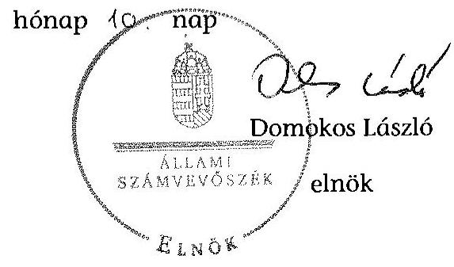

# ÁLLAMI   SZÁMVEVŐSZÉK 

## JELENTÉS

az önkormányzatok belső kontrollrendszere kialakításának, egyes
kontrolltevékenységek és a belső ellenőrzés működésének
ellenőrzése
Nyírmada
15078
2015. június

---

# Állami Számvevőszék 

Iktatószám: V-0663-058/2015.
Témaszám: 1697
Vizsgálat-azonosító szám: V067705

## Az ellenőrzést felügyelte:

## dr. Benedek Mária

felügyeleti vezető
Az ellenőrzést vezette és az ellenőrzés végrehajtásáért felelős:
dr. Győri Gabriella
ellenőrzésvezető
A számvevőszéki jelentéstervezet összeállításában közreműködött:
Temesváry Miklós
számvevő tanácsos
Az ellenőrzést végezték:
Beck Miklós
számvevő tanácsos

Temesváry Miklós
számvevő tanácsos

---

# TARTALOMJEGYZÉK 

BEVEZETÉS ..... 5
I. ÖSSZEGZŐ MEGÁLLAPÍTÁSOK, KÖVETKEZTETÉSEK, JAVASLATOK ..... 9
II. RÉSZLETES MEGÁLLAPÍTÁSOK ..... 12

1. Az önkormányzat belső kontrollrendszere kialakításának és működtetésének megfelelősége ..... 12
1.1. A kontrollkörnyezet kialakítása és működtetése ..... 12
1.2. A kockázatkezelési rendszer kialakítása és működtetése ..... 14
1.3. A kontrolltevékenységek kialakítása és működtetése ..... 15
1.4. Az információs és kommunikációs rendszer kialakítása és működtetése ..... 16
1.5. A monitoring rendszer kialakítása és működtetése ..... 17
2. A monitoring rendszer részeként a belső ellenőrzés kialakítása és működtetése ..... 17
3. A pénzügyi folyamatokban kulcsszerepet betöltő belső kontrollok (teljesítésigazolás és érvényesítés) működése ..... 19
4. Az integritás szemlélet érvényesülése ..... 20

## FÜGGELÉKEK

1. számú Értelmező szótár
2. számú Az integritás érvényesítése érdekében kialakított és működtetett kontroll- rendszer

---

.

---

# RÖVIDÍTÉSEK JEGYZÉKE 

## Törvények

Áht.
ÁSZ tv.
Info tv.
Kttv.
Mötv.
Ökjtv.
Ötv.
Számv. tv.
Vnytv.

## Rendeletek, határozatok

Áhsz $_{1}$

Áhsz $_{2}$
Ávr.
Bkr.
hivatali SZMSZ
képviselő-testületi SZMSZ
vagyongazdálkodási rendelet

## Szórövidítések

alapító okirat

ÁSZ
belső ellenőrzési kézikönyv
2011. évi CXCV. törvény az államháztartásról
2011. évi LXVI. törvény az Állami Számvevőszékről
2011. évi CXII. törvény az információs önrendelkezési jogról és az információszabadságról
2011. évi CXCIX. törvény a közszolgálati tisztviselőkről
2011. évi CLXXXIX. törvény Magyarország helyi önkormányzatairól
2000. évi XCVI. törvény a helyi önkormányzati képviselők jogállásának egyes kérdéseiről
1990. évi LXV. törvény a helyi önkormányzatokról
2000. évi C. törvény a számvitelről
2007. évi CLII. törvény az egyes vagyonnyilatkozat-tételi kötelezettségekről

249/2000. (XII. 24.) Korm. rendelet az államháztartás szervezetei beszámolási és könyvvezetési kötelezettségének sajátosságairól (hatályos 2013. december 31-ig)
4/2013. (I. 11.) Korm. rendelet az államháztartás számviteléről (hatályos 2014. január 1-jétől)
368/2011. (XII. 31.) Korm. rendelet az államháztartásról szóló törvény végrehajtásáról
370/2011. (XII. 31.) Korm. rendelet a költségvetési szervek belső kontrollrendszeréről és belső ellenőrzéséről
Nyírmada Város Önkormányzat Képviselőtestületének 8/2010. (X. 20.) rendelete a Szervezeti és Működési Szabályzatáról 5. számú melléklete
Nyírmada Város Önkormányzat Képviselőtestületének 8/2010. (X. 20.) rendelete a Szervezeti és Működési Szabályzatáról
Nyírmada Város Önkormányzata Képviselő-testületének 14/2012. (XI. 30.) önkormányzati rendelete az önkormányzat vagyonáról és a vagyongazdálkodás szabályairól (hatályos 2012. november 30-ától)

Nyírmada Város Önkormányzat Képviselő-testülete 3/2013. (I. 9.) határozatával elfogadott alapító okirat (hatályos 2013. január 10-től)
Állami Számvevőszék
Közép-Nyírségi Önkormányzati Többcélú Kistérségi Társulás Belső ellenőrzési Kézikönyve (hatályos 2011. február 1-jétől)

---

bizonylati szabályzat
ellenőrzési nyomvonal
értékelési szabályzat
gazdasági program
gazdálkodási jogkörök szabályzata

Hivatal
INTOSAI
iratkezelési szabályzat

ISSAI
jegyző
Képviselő-testület
Kincstár
kormányhivatal
leltározási szabályzat
nemzetiségi
Önkormányzat
pénzkezelési szabályzat
polgármester
szabálytalanságok kezelésének szabályzata
számlarend
számviteli politika
Társulás
tűzvédelmi szabályzat
ügyrend

Nyírmadai Polgármesteri Hivatal Bizonylati Szabályzata (hatályos 2013. január 1-jétől)
Nyírmadai Polgármesteri Hivatal Ellenőrzési Nyomvonala (hatályos 2013. január 1-jétől)
Nyírmadai Polgármesteri Hivatal Eszközök és Források Értékelési Szabályzata (hatályos 2013. január 1-jétől)
Nyírmada Város Önkormányzatának Gazdasági Programja 2011-2014. évre
Nyírmadai Polgármesteri Hivatal kötelezettségvállalás, utalványozás, ellenjegyzés, érvényesítés rendjének szabályzata (hatályos 2013. január 1-jétől)
Nyírmada Város Polgármesteri Hivatal
International Organization of Supreme Audit Institutions (Legfőbb Ellenőrző Intézmények Nemzetközi Szervezete)
Nyírmada Város Önkormányzatának a közokiratokról, a közlevéltárakról, a magánlevéltári anyag védelméről szóló 1995. évi LXVI törvény 10. § (1) bekezdésében előírtak szerint készített iratkezelési szabályzat (hatályos 2012. január 1-jétől)

International Standards of Supreme Audit Institutions (Legfőbb Ellenőrző Intézmények Nemzetközi Standardjai)
Nyírmada Város Önkormányzatának jegyzője
Nyírmada Város Önkormányzata Képviselő-testülete
Magyar Államkincstár
Szabolcs-Szatmár-Bereg Megyei Kormányhivatal
Nyírmadai Polgármesteri Hivatal Leltározási és Leltárkészítési Szabályzata (hatályos 2013. január 1-jétől)
Nyírmada Város Roma Nemzetiségi Önkormányzata
Nyírmada Város Önkormányzata
Nyírmadai Polgármesteri Hivatal Pénzkezelési Szabályzata (hatályos 2013. január 1-jétől)
Nyírmada Város polgármestere
Nyírmadai Polgármesteri Hivatal a Szabálytalanságok Kezelésének Rendje Szabályzata (hatályos 2013. január 1-jétől)
Nyírmadai Polgármesteri Hivatal Számlarendje (hatályos 2013. január 1-jétől)
Nyírmadai Polgármesteri Hivatal Számviteli politikája (hatályos 2013. január 1-jétől)
Közép-Nyírségi Önkormányzati Többcélú Kistérségi Társulás
Nyírmadai Polgármesteri Hivatal Tűzvédelmi Szabályzata (hatályos 2013. január 16-ától)
Ügyrend a Polgármesteri Hivatal pénzügyi csoportjának gazdálkodással összefüggő feladataira (hatályos 2013. január 1-jétől)

---

# JELENTÉS 

## az önkormányzatok belső kontrollrendszere kialakításának, egyes kontrolltevékenységek és a belső ellenőrzés működésének ellenőrzése Nyírmada

## BEVEZETÉS

Nyírmada város állandó lakosainak száma 2013. január 1-jén 4998 fő volt. Az Önkormányzat kilenctagú Képviselő-testületének munkáját négy állandó bizottság segítette. Az Önkormányzat az önállóan működő és gazdálkodó Hivatalon kívül három önállóan működő intézményt működtetett, két többségi tulajdoni hányadú gazdasági társasággal rendelkezett. A polgármester 2002 óta tölti be tisztségét. A jegyző 1991-től látja el feladatait. A Hivatal szervezeti egységekre nem tagolódott, elkülönített gazdasági szervezettel nem rendelkezett, a foglalkoztatott köztisztviselők száma 2013. január 1-jén 14 fő volt. A Hivatalnál 2013. január 1-jétől szervezeti változás nem volt. Az Önkormányzat a 2013. évi költségvetési beszámolója szerint 1899410 ezer Ft tárgyévi bevételt ért el, valamint 1767114 ezer Ft tárgyévi kiadást teljesített. A 2013. december 31-i könyvviteli mérleg szerint 3662255 ezer Ft értékű eszközvagyonnal rendelkezett, a rövid lejáratú kötelezettségállománya 35074 ezer Ft, hosszú lejáratú kötelezettség állománya nem volt.

A demokratikus társadalmakban alapvető igény, hogy a közpénzeket, a közvagyont használók valamennyi tevékenységükhöz kapcsolódó pénzfelhasználásról elszámoljanak, ahhoz egyértelmű és érvényesíthető felelősségi szabályok társuljanak. Ennek a jogos igénynek az érvényesítéséhez meg kell teremteni azokat a folyamatokat, rendszereket, amelyek nélkülözhetetlenek az elszámoltatáshoz. Az elszámoltatás eredményes működtetéséhez szükség van a megfelelő információs, kontroll, értékelési és beszámolási rendszerek kialakítására.

Magyarországon az uniós csatlakozási tárgyalások idejére nyúlnak vissza a belső kontrollrendszer szabályozásának gyökerei. Az uniós elvárásoknak megfelelő új terminológia szerinti államháztartási belső pénzügyi ellenőrzési (ÁBPE) rendszer területén a jogharmonizáció 2003-ban teljes körűen megvalósult, míg az önkormányzati alrendszerre vonatkozó, Ötv.-ben megjelenített speciális szabályozás 2005-ben lépett hatályba. Az államháztartási belső kontrollrendszer koncepciója 2009-ben továbbfejlődött. A változások irányát mutatja, hogy a költségvetési szervek belső kontrollrendszere már magában foglalja a korszerű felelős szervezetirányítás elemeit (kontrollkörnyezet, kockázatkezelés, kontrolltevékenység, információ és kommunikáció, monitoring) is. E kontrollrendszer szabályozása háromszintű, a törvényi előírásokat az Áht. és a Mötv., a rendeleti szintű szabályozást az Ávr. és a Bkr. tartalmazza, amelyeket

---

útmutatói szinten az NGM által kiadott standardok és kézikönyvek támogatnak.

A belső kontrollrendszer azt a célt szolgálja, hogy a költségvetési szervek működésük és gazdálkodásuk során a tevékenységeket szabályszerűen, gazdaságosan, hatékonyan, eredményesen hajtsák végre, teljesítsék elszámolási kötelezettségeiket és megvédjék az erőforrásokat a veszteségektől, a károktól és a nem rendeltetésszerű használattól. A belső kontrollrendszer magában foglalja mindazon szabályokat, eljárásokat, gyakorlati módszereket és szervezeti struktúrákat, kockázatkezelési technikákat, kontrolltevékenységeket, amelyek segítséget nyújtanak a szervezetnek céljai eléréséhez.

Az ÁSZ a középtávú stratégiájában hangsúlyos szerepet szánt annak, hogy szilárd szakmai alapon álló, értékteremtő ellenőrzéseivel előmozdítsa a közpénzügyek átláthatóságát, rendezettségét. A számvevőszéki ellenőrzés nemzetközi alapelvei is rögzítik, hogy a megfelelő belső kontrollrendszer minimálisra csökkenti a hibák és szabálytalanságok kockázatát.

Az ellenőrzés célja annak értékelése, hogy

- a jogszabályi előírásoknak megfelelően alakították-e ki és működtették-e a belső kontrollrendszert;
- a gazdálkodás folyamatában kulcsszerepet betöltő teljesítésigazolás és érvényesítés kontrolltevékenységeit megfelelően működtették-e;
- biztosították-e a belső ellenőrzés szabályos működését;
- kialakították-e az erőforrásokkal való szabályszerű és hatékony gazdálkodáshoz szükséges követelményeket, megvalósították-e azok számonkérését, ellenőrzését;
- hasznosították-e a 2009-2013. években végzett ÁSZ ellenőrzések során megfogalmazott javaslatokat.

A közintézmények integritás alapú kultúrájának kialakítása, megerősítése és működése szorosan összefügg a belső kontrollrendszer működésével, ezért az ellenőrzés kitért a gazdálkodáshoz kapcsolódó integritás kontrollok meglétének és működésének ellenőrzésére is. Az integritási kultúra kialakítása hozzájárul az elszámoltathatóság és átláthatóság érvényesítéséhez, egyben támogatja a szervezet védettségét a korrupciós kitettséggel szemben, valamint annak megelőzése is irányítottabbá válik.

Az ellenőrzés várható hasznosulását négy szinten tervezzük. A törvényalkotás számára összegzett tapasztalatok állnak rendelkezésre a belső kontrollrendszer önkormányzati területen való kialakításáról, működéséről és hatásairól, a belső ellenőrzés működéséről. Az ellenőrzés az ellenőrzött számára visszajelzést ad a belső kontrollrendszer kialakításában és működésében fellépő hiányosságokról, javaslataival hozzájárul azok kiküszöböléséhez, amely csökkentheti a későbbi ellenőrzések gyakoriságát. Az ellenőrzés megállapításai és javaslatait más szervezetek is hasznosíthatják a rendezett gazdálkodási keretek kialakításához. A társadalom számára jelzi, hogy közpénz nem maradhat ellenőrizetlenül, az ÁSZ értékteremtő rend kialakításához és megőrzéséhez hozzájá-

---

ruló tevékenysége pozitív hatással lesz a szervezetről kialakított összkép formálásában. A szervezeten belül lehetőség nyílik arra, hogy a megállapítások szintetizálásával az ÁSZ a hozzáadott értéket teremtő elemző tevékenységét és tanácsadó szerepét is erősítse.

Az önkormányzatok belső kontrollrendszere kialakításának, az egyes kontrolltevékenységek és a belső ellenőrzés működésének ellenőrzéséről szóló jelentés I. fejezetének összegző része az ellenőrzés céljára ad rövid, szintetizáló összefoglalót, és tartalmazza a következtetéseket a II. fejezet részletes megállapításain alapulóan. A jelentés intézkedést igénylő megállapításait és javaslatait az ellenőrzés során feltárt, a jelentés II. fejezetében rögzített részletes megállapítások alapozzák meg.

# Az ellenőrzés típusa: szabályszerűségi ellenőrzés 

Az ellenőrzött időszak: a belső kontrollrendszer kialakítása és működtetésének megfelelőségét a 2013. évre vonatkozóan (2013. december 31-i állapotnak megfelelően), a pénzügyi folyamatokban kulcsszerepet betöltő teljesítésigazolás és érvényesítés belső kontrollok működésének megfelelőségét, és a belső ellenőrzés szabályszerű működését a 2013. január 1 - december 31-e közötti időszakot figyelembe véve értékeltük, míg az ÁSZ javaslatainak utóellenőrzése a 2009-2013. években végzett ellenőrzések nyilvánosságra hozott jelentéseiben tett javaslatok áttekintésére terjedt ki.

## Az ellenőrzött szervezet: az Önkormányzat

Az ellenőrzés jogszabályi alapját az ÁSZ tv. 1. § (3) bekezdése, az 5. § (2) és (6) bekezdései, valamint az Áht. 61. § (2) bekezdése képezik.

Az ellenőrzés szakmai módszertana az ÁSZ hivatalos honlapján (www.asz.hu) közzétett szakmai szabályokon alapult, amely az INTOSAI által kiadott ISSAI figyelembevételével készült.

Az ellenőrzés lefolytatásához az Önkormányzat a kimutatások és a tanúsítvány elektronikus kitöltésével, valamint az ÁSZ által kért dokumentumok elektronikus megküldésével szolgáltatott adatokat. Az így rendelkezésre bocsátott adatok, információk kontrollja és a munkalapok kitöltése a helyszíni ellenőrzés keretében történt. A jelentésben használt fogalmak magyarázatát az 1. számú függelék, az integritás érvényesítése érdekében kialakított és működtetett intézményi kontrollrendszer értékelését a 2. számú függelék tartalmazza.

A belső kontrollrendszer, valamint a belső ellenőrzés jogszabályi előírások szerinti kialakításának és működtetésének szabályszerűségét az erre irányuló ellenőrzési kérdésekre adott válaszok összesítése alapján értékeltük. A belső kontrollrendszert kontrollterületenként (kontrollkörnyezet, kockázatkezelési rendszer, kontrolltevékenységek, információs és kommunikációs rendszer, monitoring rendszer) és összesítetten is értékeltük.

A belső kontrollrendszer egyes kontrollterületei és a belső ellenőrzés kialakítása és működtetése „szabályszerű volt", amennyiben az értékelt területen az elért és elérhető pontok százalékban kifejezett hányadosa elérte a 81 %-ot, „részben szabályszerű volt", ha 61-80% közé esett, és „nem volt szabályszerű", ha nem haladta

---

meg a 60 %-ot. A belső kontrollrendszer összesített értékelése megegyezett a kontrollterületenként alkalmazott %-os értékelésekkel, a következő eltérésekkel. A kontrollrendszer egésze esetében a „szabályszerű" értékelésnek a %-os értéken felül további feltétele volt, hogy egyik kontrollterület sem kaphatott „nem volt szabályszerű" értékelést, a „részben szabályszerű" értékelés további feltétele volt, hogy legfeljebb egy ellenőrzött kontrollterület lehetett „nem volt szabályszerű" értékelésű. Az összesített értékelés a %-os értéktől függetlenül „nem volt szabályszerű", ha az ellenőrzött kontrollterületek közül több mint egynek „nem volt szabályszerű" az értékelése.

A gazdálkodás folyamatában kulcsszerepet betöltő két kulcskontroll -
 teljesítésigazolás, érvényesítés – működésének megfelelőségét a személyi juttatásokkal, a dologi és felhalmozási kiadásokkal, működési és felhalmozási célú pénzeszköz átadásokkal, ellátottak pénzbeli juttatásaival kapcsolatos kifizetések esetében mintavétellel ellenőriztük. „Megfelelőnek” értékeltük a gazdálkodási jogkörök gyakorlását, amennyiben 95%-os bizonyossággal a teljes sokaságban a hibaarány legfeljebb 10%, „részben megfelelőnek” értékeltük, ha a hibaarány felső határa 10-30% között volt, „nem megfelelőnek” pedig akkor, ha a mintavételi eredmények alapján a sokaságbeli hibaarány felső határa meghaladta a 30%-ot.

Értékeltük az Önkormányzatnál a belső ellenőrzés kialakításának és működésének szabályosságát. Minősítettük a gazdálkodáshoz kapcsolódó integritás kontrollok meglétét és működését. Az integritás szemlélet érvényesülésének értékelése az Önkormányzat által önbevallással kitöltött tanúsítvány alapján történt. Utóellenőrzésre nem került sor, mivel az ÁSZ az Önkormányzatnál a 2009-2013. években ellenőrzést nem végzett.

Az ÁSZ tv. 29. § (1) bekezdése szerint a jelentéstervezetet megküldtük a polgármester részére, aki az ÁSZ tv. 29. § (2) bekezdésében foglalt észrevételezési jogával nem élt, a jelentéstervezetre észrevételt nem tett.

---

# I. ÖSSZEGZŐ MEGÁLLAPÍTÁSOK, KÖVETKEZTETÉSEK, JAVASLATOK 

A belső kontrollrendszeren belül 2013-ban a kontrollkörnyezet, a kockázatkezelési rendszer, a kontrolltevékenységek, az információs és kommunikációs rendszer, valamint a monitoring rendszer kialakítását és működtetését külön-külön és együttesen is értékeltük. A belső kontrollrendszer kialakítása és működtetése az összesített értékelés alapján nem volt szabályszerű.

A belső kontrollrendszer egyes területei kialakításának és működtetésének minősítése a következő:

| Kontrollterület | Minősítés |  |
| :-- | :--: | :--: |
| Kontrollkörnyezet | szabályszerű |  |
| Kockázatkezelési rendszer |  | nem   szabályszerű |
| Kontrolltevékenységek |  | részben   szabályszerű |
| Információs és kommunikációs rendszer |  | részben   szabályszerű |
| Monitoring rendszer |  | nem   szabályszerű |

Szabályszerű volt a kontrollkörnyezet kialakítása és működtetése, mivel a jegyző a jogszabályi előírásokban foglaltakat figyelembe véve kisebb hiányosságok mellett is megteremtette a kontrollterületen a szabályszerű működés lehetőségét.

Részben volt szabályszerű a kontrolltevékenységek, valamint az információs és kommunikációs rendszer kialakítása és működtetése, mivel a megállapított szabályozásbeli hiányosságok nem veszélyeztették e kontrollterületeken a szabályszerű működést.

Nem volt szabályszerű a kockázatkezelési rendszer, valamint a monitoring rendszer kialakítása és működtetése, mivel az ellenőrzésünk során megállapított szabályozásbeli hiányosságok magukban hordozzák a szabálytalan működés, valamint a korrupció kockázatát.

Az Önkormányzat a belső ellenőrzési feladatokat a Társulás útján látta el. A 2013. évben a belső ellenőrzés kialakítása és működtetése nem volt szabályszerű, mert – többek között – a 2013. évi belső ellenőrzési tervet nem teljes körűen hajtották végre és a terv módosításáról nem gondoskodtak. A 2014. évi ellenőrzési tervet a Képviselő-testület nem hagyta jóvá. A számvevőszéki ellenőrzés által megállapított szabályozási és működési hiányosságok számossága magában hordozza a szabálytalan önkormányzati gazdálkodás és feladatellátás kockázatát.

---

A 2013. évben a személyi juttatásokkal, a dologi kiadásokkal, a felhalmozási kiadásokkal, a működési és felhalmozási célú pénzeszköz átadásokkal, illetve az ellátottak pénzbeli juttatásaival kapcsolatos kifizetések során a kulcsszerepet betöltő teljesítésigazolás és érvényesítés belső kontrollok működése nem volt megfelelő, mivel azok nem biztosították a hibák megelőzését, feltárását.

A számvevőszéki ellenőrzés az ellenőrzött kifizetésekkel összefüggésben a rendelkezésre bocsátott dokumentumok alapján kár bekövetkeztére utaló adatot, tényt nem állapított meg, azonban a gazdálkodásban kulcsszerepet betöltő kontrollok működésében feltárt hiányosságok miatt fennáll a hibák, szabálytalanságok bekövetkezésének kockázata. A nem megfelelően működtetett belső kontrollok korrupciós kockázatot hordoznak.

A Képviselő-testület a 2013. évben nem alakította ki az erőforrásokkal való szabályszerű és hatékony gazdálkodáshoz szükséges követelményeket.

Az integritás szemlélet érvényesülésének értékelése a 2013. évre az Önkormányzat önbevallás útján szolgáltatott adatai alapján történt.

Az ÁSZ tv. 33. § (1) bekezdésében foglaltak értelmében az ellenőrzött szervezet vezetője köteles a jelentésben foglalt megállapításokhoz kapcsolódó intézkedési tervet összeállítani, és azt a jelentés kézhezvételétől számított 30 napon belül az ÁSZ részére megküldeni. Amennyiben az intézkedési tervet határidőre nem küldi meg a szervezet, vagy az ÁSZ tv. 33. § (2) bekezdésében foglalt póthatáridő elteltével megküldött intézkedési terv továbbra sem elfogadható, az ÁSZ elnöke a hivatkozott törvény 33. § (3) bekezdés a)-b) pontjaiban foglaltakat érvényesítheti.

Az ellenőrzés intézkedést igénylő megállapításai és javaslatai:

# a polgármesternek 

1. A polgármester, mint kötelezettségvállaló – az Ávr. 57. § (4) bekezdésében foglaltak ellenére – nem jelölte ki írásban az Önkormányzat kiadási előirányzatai vonatkozásában a teljesítésigazolására jogosult személyeket.

Javaslat:
Gondoskodjon az Ávr. 57. § (4) bekezdésében foglaltak szerint az Önkormányzat kiadási előirányzatai vonatkozásában a teljesítésigazolására jogosult személyek írásban történő kijelöléséről.
2. A Képviselő-testület tagjai – az Ökjtv. 10/A. § (1) bekezdésében foglaltak és az őrzésért felelős Vnytv. 8. § (4) bekezdésében foglaltak szerinti tájékoztatása ellenére –, valamint a Képviselő-testület bizottságai nem helyi önkormányzati képviselő tagjai a Vnytv. 5. §-ában foglaltak ellenére – vagyonnyilatkozat-tételi kötelezettségüknek nem tettek eleget. Továbbá az őrzésért felelős – a Vnytv. 10. § (1) bekezdésében foglaltak ellenére – írásban nem szólította fel a kötelezetteket arra, hogy kötelezettségüket a felszólítás kézhezvételétől számított nyolc napon belül teljesítsék.

---

Javaslat:
Kezdeményezze a Képviselő-testület intézkedését a Mötv. 57. § (2) bekezdésében és a 65. §-ában, továbbá a Vnytv.-ben foglaltak alapján a képviselő-testület tagjai, valamint a bizottságok nem helyi önkormányzati képviselő tagjai vonatkozásában a vagyonnyilatkozat-tételi kötelezettség teljesítésével kapcsolatos, a vagyonnyilatkozat őrzésére kijelölt bizottság általi jogsértő állapot megszüntetése érdekében.
3. A számvevőszéki jelentés ellenőrzési megállapításai alapján az Önkormányzatnál a belső kontrollrendszer kialakítása és működtetése összesített értékelés alapján nem volt szabályszerű, a kulcskontrollok működése nem volt megfelelő.

Javaslat:
Kísérje figyelemmel a Mötv. 115. § (1) bekezdésében foglaltak alapján az Önkormányzat gazdálkodásának szabályszerűségét. A Mötv. 67. § f) pontja alapján gondoskodjon a belső kontrollrendszer kialakítására és működtetésére vonatkozó jogszabályi rendelkezések be nem tartása, valamint a teljesítésigazolás, illetve az érvényesítés kontrolokkal összefüggésben feltárt hibák, hiányosságok, szabálytalanságok tekintetében az esetleges munkajogi felelősséggel kapcsolatos körülmények kivizsgálásáról, majd a vizsgálat eredményének függvényében tegye meg a szükséges intézkedéseket.

# a jegyzőnek 

1. A számvevőszéki jelentés ellenőrzési megállapításai alapján az Önkormányzatnál a belső kontrollrendszer kialakítása és működtetése összesített értékelés alapján nem volt szabályszerű, a kulcskontrollok működése nem volt megfelelő, valamint a belső ellenőrzés kialakítása és működtetése nem volt szabályszerű. A számvevőszéki ellenőrzés során feltárt hibákat, hiányosságokat és szabálytalanságokat a számvevőszéki jelentés II. Részletes megállapítások fejezetcím tartalmazza.

Javaslat:
A jogszabályoknak megfelelő belső kontrollrendszer kialakítása és működtetése érdekében – az ellenőrzött időszak óta bekövetkezett esetleges jogszabályi változásokra figyelemmel – intézkedjen a belső kontrollrendszer kialakításában és működtetésében, a kulcskontrollok működésében, illetve a belső ellenőrzés kialakításában és működtetésében az ellenőrzés által feltárt hibák, hiányosságok, szabálytalanságok kijavítására.

Kezdeményezze, hogy az éves ellenőrzési terv kiterjedjen a kifizetések szabályszerűségi ellenőrzésére, különös tekintettel a személyi juttatásokkal, a dologi kiadásokkal, a felhalmozási kiadásokkal, a működési és felhalmozási célú pénzeszköz átadásokkal, az ellátottak pénzbeli juttatásaival kapcsolatos kiadási jogcímekből teljesített kifizetésekre.

---

# II. RÉSZLETES MEGÁLLAPÍTÁSOK 

## 1. Az önkormányzat belső kontrollrendszere kialakításának és működtetésének megfelelősége

A belső kontrollrendszeren belül 2013-ban a kontrollkörnyezet, a kockázatkezelési rendszer, a kontrolltevékenységek, az információs és kommunikációs rendszer, valamint a monitoring rendszer kialakítását és működtetését külön-külön és együttesen is értékeltük. A belső kontrollrendszer kialakítása és működtetése az összesített értékelés alapján nem volt szabályszerű.

### 1.1. A kontrollkörnyezet kialakítása és működtetése

## A kontrollkörnyezet kialakítása és működtetése szabályszerű volt.

A Hivatal rendelkezett a Képviselő-testület által elfogadott alapító okirattal és hivatali SZMSZ-szel. Meghatározták az Önkormányzat 2011-2014. évre vonatkozó gazdasági programját, elfogadták a képviselő-testületi SZMSZ-t és a vagyongazdálkodási rendeletet.

A Hivatal rendelkezett számviteli politikával, valamint az annak keretében elkészített pénzkezelési-, leltározási-és értékelési szabályzatokkal, melyek hatálya a nemzetiségi önkormányzatra is kiterjedt. A jegyző elkészítette a Hivatal számlarendjét, bizonylati szabályzatát, a szabálytalanságok kezelésének szabályzatát, valamint a tűzvédelmi szabályzatot.

A Hivatalban dolgozó köztisztviselők rendelkeztek munkaköri leírással. A jegyző elkészítette – szöveges és táblázatos formában – az ellenőrzési nyomvonalat és gondoskodott annak a jogszabályi változásokhoz igazodó aktualizálásáról. Meghatározta az egészséget nem veszélyeztető és biztonságos munkavégzés követelményei megvalósításának módját.

A jegyző ügyrendben rendelkezett a Hivatal pénzügyi csoportja által ellátott feladatok munkafolyamatainak leírásáról, a köztisztviselők feladat- és hatásköréről, a helyettesítés rendjéről, továbbá a költségvetési szerven belüli belső és azon kívüli külső kapcsolattartás módjáról, szabályairól.

A gazdasági szervezettel nem rendelkező Hivatalban a gazdálkodási feladatok ellátásának irányítását a jegyző által írásban kijelölt személy végezte, aki az előírt végzettséggel, szakképesítéssel rendelkezett.

A Képviselő-testület a 2013. évi költségvetési rendeletében meghatározta a Hivatal engedélyezett létszámát. A jegyző a 2013. évben, határidőben meghatározta a köztisztviselők teljesítményértékelésének második félévre vonatkozó kötelező elemeit, és elkészítette a köztisztviselők 2013. évi teljesítményértékelését.

---

A kontrollkörnyezet kialakítása és működtetése szabályszerű volt az alábbi kisebb hiányosságok mellett:

| Sorszám ${ }^{1}$ | Megállapítás | Megjegyzés |
| :--: | :--: | :--: |
| 3. | A Képviselő-testület által jóváhagyott hivatali SZMSZ nem tartalmazta – az Ávr. 13. § (1) bekezdés b)-c) és e) pontjaiban foglaltak ellenére – az alapító okirat keltét, számát és az alapítás időpontját; az alaptevékenységet szabályozó jogszabályok megjelölését; a szervezeti felépítés és működés rendjét és a Hivatal szervezeti ábráját. |  |
| 27. | A jegyző – a Számv. tv. 161. § (1) és (4) bekezdésében, az Áhsz ${ }_{1} 49 . \S$ (1) bekezdésében, valamint az Áht. 3. § (3) bekezdés b) pontjában foglaltak ellenére – nem készítette el a nemzetiségi önkormányzat számlarendjét. | 2014. január 1-jétől a Számv. tv. 161. § (1) bekezdése és az Áhsz ${ }_{2}$ 51. § (2) bekezdése írja elő a számlarend készítésének kötelezettségét. |
| 37. | A jegyző – a Kttv. 75. § (1) bekezdés d) pontjában foglaltak ellenére – nem írta elő a Hivatalban dolgozó köztisztviselők munkaköri leírásaiban a munkakör betöltésével kapcsolatos követelményeket (végzettség, szakképzettség, szakképesítés, tapasztalat, képességek). |  |
| 40. | A Képviselő-testület – az Áht. 9. § (1) bekezdés f) pontjában foglaltak ellenére – nem alakította ki az erőforrásokkal való, szabályszerű és hatékony gazdálkodáshoz szükséges követelményeket |  |
| 46. | A jegyző – a Mötv. 81. § (3) bekezdés c) pontjában előírt feladata ellenére – nem dolgozta ki a Kttv. 83. §-ában előírt, a köztisztviselőkre vonatkozó hivatásetikai alapelvek részletes tartalmát, valamint az etikai eljárás szabályait. |  |

[^0]
[^0]:    ${ }^{1}$ A témacsoportos ellenőrzés miatt a megállapítás számozása az önkormányzat által kitöltött kimutatások – adatszolgáltatások – kérdéseinek sorszámával azonos.

---

# 1.2. A kockázatkezelési rendszer kialakítása és működtetése 

A kockázatkezelési rendszer kialakítása és működtetése nem volt szabályszerű, mert:

| Sorszám | Megállapítás | Megjegyzés |
| :--: | :--: | :--: |
| 1. | A jegyző – a Bkr. 3. § b) pontjában foglaltak ellenére – a Hivatal kockázatkezelési rendszerét nem alakította
 ki |  |
| $2-4$. | A jegyző - a Bkr. 7. § (2) bekezdésében foglaltak ellenére - nem mérte fel és nem állapította meg a Hivatal tevékenységében, gazdálkodásában rejlő kockázatokat, nem határozta meg az egyes kockázatokkal kapcsolatban a szükséges intézkedéseket és azok teljesítésének folyamatos nyomon követési módját. |  |
| 5. | A jegyző - a Vnytv. 4. § d) pontjában foglaltak ellenére - a vagyonnyilatkozat-tételre kötelezett Képviselő-testület bizottságai nem helyi önkormányzati képviselő tagjai, továbbá a köztisztviselők vagyonnyilatkozat-tételi kötelezettségét a képviselő-testületi SZMSZ-ben, illetve a hivatali SZMSZ-ben nem rögzítette. A jegyző - a Vnytv. 3. § (1) bekezdésében foglaltak ellenére - nem szabályozta a vagyonnyilatkozat átadására, nyilvántartására, a vagyonnyilatkozatban foglalt személyes adatok védelmére vonatkozó eljárási szabályokat. | A jegyző vagyonnyilatkozat-tételi kötelezettségét - a Vnytv. 4. § a) pontjában foglaltak ellenére - a hivatali SZMSZ helyett a képviselőtestületi SZMSZ-ben rögzítették. |
|  | A Képviselő-testület tagjai vagyonnyilatkozat-tételi kötelezettségüknek - az Ökjtv. 10/A. § (1) bekezdésében foglaltak, valamint az őrzésért felelős Vnytv. 8. § (4) bekezdésében foglaltak szerinti tájékoztatása ellenére - nem tettek eleget. Továbbá az őrzésért felelős - a Vnytv. 10. § (1) bekezdésében foglaltak ellenére - írásban nem szólította fel a vagyonnyilatkozat-tételre kötelezetteket arra, hogy kötelezettségüket a felszólítás kézhezvételétől számított nyolc napon belül teljesítsék. | A képviselő-testületi SZMSZ alapján az őrzésért az Ügyrendi Bizottság volt felelős. |
| 6. | A Képviselő-testület bizottságai nem helyi önkormányzati képviselő tagjai - a Vnytv. 5. §-ában foglaltak ellenére - vagyonnyilatkozat-tételi kötelezettségüknek nem tettek eleget. |  |
|  | A jegyző - a Vnytv. 3. § (1) bekezdésében foglaltak ellenére - vagyonnyilatkozat-tételi kötelezettségének nem tett eleget. Az őrzésért felelős polgármester - a Vnytv. 8. § (4) bekezdésében foglaltak ellenére - nem tájékoztatta a jegyzőt a vagyonnyilatkozat-tételi kötelezettségének fennállásáról és esedékességének időpontjáról az esedékességet |  |

---

legalább 30 nappal megelőzően, továbbá - a Vnytv. 10. § (1) bekezdésében foglaltak ellenére - írásban nem szólította fel arra, hogy a vagyonnyilatkozat-tételi kötelezettségét a felszólítás kézhezvételétől számított nyolc napon belül teljesítse.

# 1.3. A kontrolltevékenységek kialakítása és működtetése 

## A kontrolltevékenységek kialakítása és működtetése részben volt szabályszerű.

A jegyző a gazdálkodási jogkörök szabályzatában meghatározta a kötelezettségvállalás pénzügyi ellenjegyzése, a teljesítésigazolás, az érvényesítés és az utalványozás gyakorlásának módjával, eljárási és dokumentációs részletszabályaival, valamint az ezeket végző személyek kijelölésének rendjével kapcsolatos belső előírásokat.

A jegyző meghatározta a beszámolási feladatok (időközi és éves beszámolók) teljesítésével kapcsolatos belső előírásokat, feltételeket, a beszámolási eljárásokhoz kapcsolódó felelősségi köröket. A költségvetési beszámoló elkészítésével megbízott személy rendelkezett a jogszabályban előírt képesítéssel és a tevékenység ellátására jogosító engedéllyel.

A polgármester a jogszabályi előírásoknak megfelelően az önkormányzat gazdálkodásának első féléves és harmadik negyedéves helyzetéről a Képviselőtestületet határidőben, írásban tájékoztatta.

A kontrolltevékenységek kialakítása és működtetése részben volt szabályszerű, mert:

| Sorszám | Megállapítás | Megjegyzés |
| :--: | :--: | :--: |
| $1-4$. | A jegyző - a Bkr. 8. § (2) bekezdése a) pontjában foglaltak ellenére - nem biztosította a beszerzési folyamat, a vagyonhasznosítási tevékenység, valamint a pénzügyi döntések - köztük a költségvetés tervezése és a támogatásokkal való elszámolás - dokumentumainak elkészítésével kapcsolatban a folyamatba épített, előzetes, utólagos és vezetői ellenőrzést. |  |
| 6. | A jegyző a gazdálkodási jogkörök szabályzatában lehetővé tette a 100 ezer Ft alatti kifizetések előzetes írásbeli kötelezettségvállalás nélküli teljesítését, azonban - az Ávr. 53. § (2) bekezdésében foglaltak ellenére - belső szabályzatban nem határozta meg az előzetes írásbeli kötelezettségvállalást nem igénylő kifizetések rendjét. |  |
| 9. | A gazdálkodási jogkörök szabályzata - az Ávr. 60. § (3) bekezdésében foglaltak ellenére - nem tartalmazta a gazdálkodási jogkörök gyakorlására (kötelezettségvállalásra, | A gazdálkodási jogkörök szabályzata a gazdálkodási jogkörök gyakorlására jogosult személyek |

---

|  | pénzügyi ellenjegyzésre, teljesítésigazolásra, érvényesítésre és utalványozásra) jogosult személyek aláírás mintáját. | nevét tartalmazta. |
| :--: | :--: | :--: |
| 14. | A jegyző - az Info tv. (7) § (2)-(3) bekezdéseiben foglaltak ellenére - az informatikai rendszer szabályozása során nem tette meg azokat a technikai és szervezési intézkedéseket és nem alakította ki azokat az eljárási szabályokat, amelyek biztosítják az adatok biztonságát és védelmét. |  |
| 15. | A jegyző - a Bkr. 8. § (4) bekezdés b) pontjában foglaltak ellenére - belső szabályzatban nem határozta meg a dokumentumokhoz és információkhoz való hozzáférésre vonatkozóan a felelősségi köröket. |  |
| 18. | A jegyző - az Ávr. 13. § (5) bekezdésében foglaltak ellenére - nem határozta meg a gazdasági feladatot ellátó alkalmazottak helyettesítésének rendjét. |  |
| 30. | A jegyző - a Kttv. 74. § (1) bekezdésében foglaltak ellenére - a közszolgálati jogviszony megszűnése esetére nem szabályozta a munkakör átadásának rendjét. |  |

# 1.4. Az információs és kommunikációs rendszer kialakítása és működtetése 

## Az információs és kommunikációs rendszer kialakítása és működtetése részben volt szabályszerű.

A jegyző kialakította a kötelezően közzéteendő adatok nyilvánosságra hozatalának rendjét. Az Önkormányzat az elektronikus közzétételi kötelezettségének a 2013. évben eleget tett. A jegyző meghatározta a közérdekű adatok megismerésére irányuló igények teljesítésének rendjét.

A Hivatal rendelkezett a Magyar Nemzeti Levéltár és a kormányhivatal egyetértésével kiadott, a jogszabályi előírásoknak megfelelő tartalmú iratkezelési szabályzattal. A jegyző az iratok iktatásával, az iratforgalom dokumentálásával biztosította az ügyintézés folyamatának, az iratok szervezeten belüli útjának pontos követhetőségét és ellenőrizhetőségét, az iratok hollétének naprakész megállapíthatóságát.

Az információs és kommunikációs rendszer kialakítása és működtetése részben volt szabályszerű:

| Sorszám | Megállapítás |
| :--: | :--: |
| $1-2$. | A jegyző - a Bkr. 3. § d) pontjában és a 9. § (1) bekezdésében foglaltak ellenére - nem alakított ki olyan rendszert, amely biztosítja, hogy a szervezeten belül és kívül a megfelelő információk a megfelelő időben eljutnak |

---

az illetékes szervezethez, illetve személyhez.
3. A jegyző - a Bkr. 9. § (2) bekezdésében foglaltak ellenére - nem határozta meg a beszámolási szinteket, határidőket, módokat.
4. A jegyző - az Info tv. 24. § (3) bekezdésében foglaltak ellenére - nem készítette el a Hivatal adatvédelmi és adatbiztonsági szabályzatát.

# 1.5. A monitoring rendszer kialakítása és működtetése 

Az Önkormányzat monitoring rendszerének kialakítása és működtetése nem volt szabályszerű, mert:

| Sor-   szám | Megállapítás | Megjegyzés |
| :-- | :-- | :-- |

A jegyző - a Bkr. 3. § e) pontjában és 10. §-ában foglaltak ellenére - nem alakította ki a Hivatal tevékenységének, a célok megvalósításának nyomon követését biztosító rendszert.

A jegyző -a Bkr. 14. § (1) bekezdésében foglalt előírás ellenére - nem gondoskodott a külső ellenőrzések javaslatai alapján készült intézkedési tervek végrehajtására vonatkozó nyilvántartás vezetéséről.

A 2013. évben az Önkormányzatnál a Kincstár egy ellenőrzést végzett.

A helyi önkormányzatok törvényességi felügyeletét ellátó kormányhivatal törvényességi felhívással vagy más törvényességi felügyeleti eszközzel 2013-ban nem élt.

## 2. A MONITORING RENDSZER RÉSZEKÉNT A BELSŐ ELLENŐRZÉS KIALAKÍTÁSA ÉS MŰKÖDTETÉSE

A 2013. évben a belső ellenőrzési feladatokat Társulás keretében látták el. A belső ellenőrzés kialakítása és működtetése nem volt szabályszerű, mert:

| Sor-   szám | Megállapítás | Megjegyzés |
| :--: | :--: | :--: |
| 3. | A belső ellenőrzési vezető - a Bkr. 17. § (4) bekezdésében foglaltak ellenére - a belső ellenőrzési kézikönyv rendszeres, de legalább kétévenkénti felülvizsgálati kötelezettségének nem tett eleget. | A 2013. évben használt belső ellenőrzési kézikönyvet 2011. február 1-jén hagyták jóvá, a 2013. évben a felülvizsgálata nem történt meg. |
| 4. | A belső ellenőrzési kézikönyvet a Társulás munkaszervezeti feladatait ellátó költségvetési szerv vezetője - a Bkr. 56. § (7) bekezdésében foglaltak ellenére - nem hagyta jóvá. |  |

---

| 7. | Stratégiai ellenőrzési tervvel - a Bkr. 56. § (3) bekezdés a) pontjában foglaltak ellenére - nem rendelkezett az Önkormányzat. |  |
| :--: | :--: | :--: |
| $8 / a$. | A 2014. évi ellenőrzési terv - a Bkr. 31. § (4) bekezdés a) pontjában foglaltak ellenére - nem tartalmazta az ellenőrzési tervet megalapozó elemzések és a kockázatelemzés eredményének összefoglaló bemutatását. |  |
| 9. | A Képviselő-testület a 2014. évi ellenőrzési tervet - a Bkr. 32. § (4) bekezdésében foglalt előírás ellenére - nem hagyta jóvá. | A jegyző nem kezdeményezte a 2014. évi ellenőrzési terv Képviselő-testület elé terjesztését. |
| 10. | A 2014. évi ellenőrzési terv összeállítása - a Bkr. 56. § (2) bekezdésében foglalt előírás ellenére - nem a jegyző írásos véleményének figyelembe vételével történt, mivel a jegyző véleményt, javaslatot nem fogalmazott meg. |  |
| $\begin{aligned} & 11- \\ & 12 . \end{aligned}$ | A 2014. évi ellenőrzési terv - a Bkr. 22. § (1) bekezdés b) pontjában, a 29. § (1) bekezdésében és a 31. § (2) bekezdésében foglaltak ellenére - nem a stratégiai tervben és a kockázatelemzés alapján felállított prioritásokon alapult. |  |
| $\begin{aligned} & 13- \\ & 14 . \end{aligned}$ | A jegyző a belső ellenőrzés megfelelő működéséről nem gondoskodott, mivel a 2013. évi ellenőrzési tervben foglaltakhoz képest - a Bkr. 56. § (5) bekezdésének előírása ellenére - ellenőrzést az ellenőrzési terv módosítása nélkül hagytak el. | A 2013. évben nevesített kettő ellenőrzés közül egyet hajtottak végre. |
| $18 /$ c. | Az ellenőrzési jelentés - a Bkr. 39. § (3) bekezdés i) pontjában foglaltak ellenére - nem tartalmazta az alkalmazott ellenőrzési módszereket és eljárásokat. |  |
| 23. | A belső ellenőrzési vezető által vezetett nyilvántartás - a Bkr. 22. § (2) bekezdés e) pontjában és az 50. § (2) bekezdés f) és g) pontjában foglaltak ellenére - nem tartalmazta a vizsgált időszakot és az intézkedési terv készítésének szükségességét. |  |
| 25. | A belső ellenőrzési vezető - a Bkr. 56. § (8) bekezdésében foglaltak ellenére - a 2013. évre vonatkozó éves (összefoglaló) ellenőrzési jelentést a jegyző részére a jogszabályban előírt határidőre nem küldte meg. | Az éves ellenőrzési jelentést a Társulás munkaszervezeti feladatát ellátó költségvetési szerv vezetője az előírt március 20-i határidő helyett, április 28-án küldte meg a jegyző részére. |

---

# 3. A PÉNZÜGYI FOLYAMATOKBAN KULCSSZEREPET BETÖLTŐ BELSŐ KONTROLLOK (TELJESÍTÉSIGAZOLÁS ÉS ÉRVÉNYESÍTÉS) MŰKÖDÉSE 

A 2013. évben a személyi juttatásokkal, a dologi kiadásokkal, a felhalmozási kiadásokkal, a működési és felhalmozási célú pénzeszköz átadásokkal, illetve az ellátottak pénzbeli juttatásával kapcsolatos kifizetések során - összefoglalóan

 értékelve - a pénzügyi folyamatokban kulcsszerepet betöltő teljesítésigazolás és érvényesítés belső kontrollok működése nem volt megfelelő, mert:

| Kulcskontrollok | Megállapítás |
| :--: | :--: |
| Teljesítésigazolás | A teljesítésigazolást a kifizetéseket megelőzően - az Áht. 38. § (1) bekezdésében, az Ávr. 57. § (1) és (3) bekezdéseiben foglaltak ellenére - nem szabályszerűen végezték. |
| Érvényesítés | Az érvényesítést a kifizetést megelőzően - az Ávr. 58. § (1) bekezdésében foglaltak ellenére - nem szabályszerűen végezték. |
|  | Az érvényesítő - az Ávr. 58. § (2) bekezdésében foglaltak ellenére nem jelezte az utalványozónak, hogy a megelőző ügymenetben az Áht., az államháztartási számviteli kormányrendelet, az Ávr. előírásait és a belső szabályzatokban foglaltakat nem tartották be. |

A 2013. évben az ellenőrzött kifizetési jogcímek mintatételei alapján a teljesítésigazolás kulcskontroll működése során az alábbi hiányosságok, szabálytalanságok fordultak elő:

- a személyi juttatásokkal, a dologi és a felhalmozási kiadásokkal, valamint a működési és felhalmozási célú pénzeszközátadásokkal, illetve az ellátottak pénzbeli juttatásával kapcsolatos kifizetéseket megelőzően - az Ávr. 57. § (3) bekezdésében előírtak ellenére - a teljesítésigazoló személye nem volt beazonosítható, mert - az Ávr. 60. § (3) bekezdésében foglaltak ellenére - a teljesítésigazolásra jogosult személyek aláírás-mintájáról nyilvántartást nem vezettek;
- a személyi juttatásokkal, a dologi és felhalmozási kiadásokkal, valamint a működési és felhalmozási célú pénzeszközátadásokkal, illetve az ellátottak pénzbeli juttatásával kapcsolatos kifizetéseket megelőzően a teljesítésigazolás - az Ávr. 57. § (3) bekezdésében foglalt előírás ellenére - nem tartalmazta a teljesítésigazolás dátumát.

A 2013. évben az ellenőrzött kifizetési jogcímek mintatételei alapján az érvényesítés kulcskontroll működése során az alábbi hiányosságok, szabálytalanságok fordultak elő:

- a személyi juttatásokkal, a dologi és felhalmozási kiadásokkal, a működési és felhalmozási célú pénzeszközátadásokkal, az ellátottak pénzbeli juttatásával kapcsolatos kifizetéseket megelőzően az érvényesítő személye nem volt beazonosítható, mert - az Ávr. 60. § (3) bekezdésében foglaltak ellenére - az érvényesítésre jogosult személyek aláírás-mintájáról nyilvántartást nem vezettek;
- az érvényesítő a személyi juttatások, a dologi és felhalmozási kiadások, a működési és felhalmozási célú pénzeszközátadások, illetve az ellátottak

---

pénzbeli juttatásaival kapcsolatos kiadások kifizetését megelőzően - az Ávr. 58. § (1) bekezdésében foglaltak ellenére - a fedezetet nem tudta ellenőrizni, mert a kötelezettségvállalásokról vezetett nyilvántartás nem felelt meg az Ávr. 56. § (1)2 bekezdésében foglalt rendelkezéseknek;

- a személyi juttatásokkal, a dologi és felhalmozási kiadásokkal, a működési és felhalmozási célú pénzeszközátadásokkal, az ellátottak pénzbeli juttatásaival kapcsolatos kifizetést megelőzően az érvényesítő - az Ávr. 58. § (2) bekezdésében foglaltak ellenére - nem jelezte az utalványozónak, hogy a megelőző ügymenetben a teljesítésigazolást nem szabályszerűen végezték, továbbá a kötelezettségvállalásról nem vezettek a jogszabályi előírásnak megfelelő tartalmú nyilvántartást;
- a személyi juttatásokkal, a dologi és felhalmozási kiadásokkal, a működési és felhalmozási célú pénzeszközátadásokkal, az ellátottak pénzbeli juttatásaival kapcsolatos kifizetést megelőzően az érvényesítő - az Ávr. 58. § (2) bekezdésében foglaltak ellenére - nem jelezte az utalványozónak, hogy a kötelezettségvállaló, a pénzügyi ellenjegyző illetve a teljesítésigazoló - az Ávr. 60. § (3) bekezdésében foglaltak ellenére - nem volt beazonosítható, mert a kötelezettségvállalásra, pénzügyi ellenjegyzésre és a teljesítésigazolásra jogosult személyek aláírás-mintájáról nyilvántartást nem vezettek.

A számvevőszéki ellenőrzés az ellenőrzött kifizetésekkel összefüggésben a rendelkezésre bocsátott dokumentumok alapján kár bekövetkeztére utaló adatot, tényt nem állapított meg, azonban a gazdálkodásban kulcsszerepet betöltő kontrollok működésében feltárt hiányosságok miatt fennáll a hibák, szabálytalanságok bekövetkezésének kockázata. A nem megfelelően működtetett belső kontrollok korrupciós kockázatot hordoznak.

# 4. AZ INTEGRITÁS SZEMLÉLET ÉRVÉNYESÜLÉSE 

Az integritás szemlélet érvényesülésének értékeléséhez az Önkormányzat önbevallás útján szolgáltatott adatokat. Az adatok értékelése alapján az eredendő veszélyeztetettségi szint és a kockázatokat növelő tényező szintje is magas. Emellett a szervezetnél kiépült, a kockázatok kezelésére hivatott kontrollok szintje alacsony. A szervezet integritása fejlesztendő. Az adatok részletes kiértékelését a 2. számú függelék tartalmazza.

Budapest, 2015.

Függelék: $\quad 2 \mathrm{db}$

[^0]
[^0]:    ${ }^{2}$ 2014. január 1-jétől az Áhsz ${ }_{2}$ 39. §-a és 14. számú melléklete szabályozza.

---

# ÉRTELMEZŐ SZÓTÁR 

belső ellenőrzés
belső kontrollrendszer
belső kontrollrendszer területei
egyszerű véletlen min-
ta
integritás
kockázat

Független, tárgyilagos bizonyosságot adó és tanácsadó tevékenység, amelynek célja, hogy az ellenőrzött szervezet működését fejlessze és eredményességét növelje, az ellenőrzött szervezet céljai elérése érdekében rendszerszemléletű megközelítéssel és módszeresen értékeli, illetve fejleszti az ellenőrzött szervezet irányítási és belső kontrollrendszerének hatékonyságát. (Forrás: Bkr. 2. § b) pontja)
A belső kontrollrendszer a kockázatok kezelése és tárgyilagos bizonyosság megszerzése érdekében kialakított folyamatrendszer, amely azt a célt szolgálja, hogy a működés és gazdálkodás során a tevékenységeket szabályszerűen, gazdaságosan, hatékonyan, eredményesen hajtsák végre, az elszámolási kötelezettségeket teljesítsék, megvédjék az erőforrásokat a veszteségektől, károktól és nem rendeltetésszerű használattól. (Forrás: Áht. 69. § (1) bekezdése)
A kontrollkörnyezet, a kockázatkezelési rendszer, a kontrolltevékenységek, az információ és kommunikáció, valamint a nyomon követés (monitoring). (Forrás: Bkr. 3. §-a)
Az alapsokaságból egyszerű véletlen kiválasztással képzett részsokaság. (Forrás: Az ÁSZ ellenőrzési mintavételezés támogatásához készült segédletének 4.1.1. pontja)
Az integritás elvek, értékek, cselekvések, módszerek, intézkedések konzisztenciáját jelenti: olyan magatartásmódot, amely meghatározott értékeknek felel meg. Az integritás a közszféra esetében a társadalom által elvárt nyilvánossági, átláthatósági, illetve jogi/etikai normáknak történő megfelelést jelenti.
(Forrás: a http://integritas.asz.hu honlapon közzétett „A 2012. évi integritás felmérés eredményeinek összefoglalója dokumentum 3. oldal 1. bekezdése)
A kockázat annak a valószínűségét jelenti, hogy egy vagy több esemény vagy intézkedés nem kívánt módon befolyásolja a rendszer működését, céljainak megvalósulását. (Forrás: Javaslatok a korrupciós kockázatok kezelésére - Kockázatkezelési és ellenőrzési módszertan 35. oldal, ÁSZ)

---

kockázatkezelési rendszer
kontrollkörnyezet
kontrolltevékenységek
kommunikáció
korrupció
kulcskontrollok

Olyan irányítási eszközök és módszerek összessége, melynek elemei a szervezeti célok elérését veszélyeztető tényezők (kockázatok) azonosítása, elemzése, csoportosítása, nyomon követése, valamint szükség esetén a kockázati kitettség mérséklése. (Forrás: Bkr. 2. § m) pontja)

A kontrollkörnyezet alakítja ki a szervezet belső kontrollrendszerhez való viszonyát, hozzáállását, befolyásolja az alkalmazottak belső kontrollal kapcsolatos tudatosságát, magatartását. Elemei a személyes és szakmai elkötelezettség és a vezetés, valamint az alkalmazottak által vallott erkölcsi értékek, a szakmai hozzáértés iránti elkötelezettség, a felső vezetés hozzáállása - a vezetés filozófiája és tevékenységének stílusa, a szervezeti struktúra, a humánerőforrás - politika és gazdálkodási gyakorlat.
A kontrolltevékenységek azok a politikák és eljárások, amelyeket a kockázatok megoldására hoznak létre a szervezet céljainak teljesítése érdekében.
Az a tevékenység, melynek során információ továbbítása valósul meg. A kommunikációs folyamat résztvevői között tájékoztatás történik, mely során tényeket, ezek magyarázatát közlik. „A szervezetben eredményes kommunikációnak kell áramlania lefelé, horizontálisan és felfelé, a szervezet egészében és annak valamennyi elemében."
Azok a cselekmények, amelyek során a köz érdekében való eljárással megbízott és döntéshozatali felelősséggel felruházott személy a köz érdeke helyett önös vagy részérdekeket követve, mástól jogtalan vagy etikátlan előnyt elfogadva és őt jogtalan vagy etikátlan előnyhöz juttatva jár el, illetve amikor valaki a köz érdekében való eljárással megbízott és döntéshozatali felelősséggel felruházott személynek jogtalan vagy etikátlan előnyt nyújtva vagy felajánlva jogtalan vagy etikátlan előnyt kér. (Forrás: A Kormány korrupció megelőzési programja 2012-2014.)
Az azonosított kockázatok mérséklése érdekében kialakított kontrollok közül azok, amelyek elégtelen működése esetén a szervezetet jelentős veszteség érheti, vagy a működésükben bekövetkező hiba/hiányosság más kontrollok eredményességét csökkenti. Ezek ellenőrzése, értékelése elegendő bizonyítékot szolgáltat adott területen a kontrollrendszer értékeléséhez. Az önkormányzatok kontrollrendszere kialakításának ellenőrzése során a pénzügyi folyamatokban kulcsszerepet betöltő belső kontrollok a teljesítésigazolás és érvényesítés.

---

lényegesség
monitoring
polgármesteri hivatal
utóellenőrzés

Egy információ akkor lényeges, ha hiánya vagy téves állítása befolyásolhatja ezen információkat felhasználók döntéseit, véleményét. Az ellenőrzés során a lényegesség három szempontból értelmezhető: érték, jelleg és összefüggés szerint.
A monitoring a különböző szintű szervezeti célok megvalósításának folyamatát kíséri figyelemmel, melynek során a releváns eseményekről és tevékenységekről (együtt: folyamatokról) rendszeres jelleggel, strukturált, döntéstámogató információkhoz jutnak a szervezet vezetői. (NGM útmutató a költségvetési szervek monitoring rendszeréhez 3. oldal, 2011. november)
A programban (beleértve a mellékleteket is) a polgármesteri hivatal megnevezés alatt értjük a polgármesteri hivatalt, a főpolgármesteri hivatalt, a megyei önkormányzati hivatalt (illetve 2013. január 1-jét követően a közös önkormányzati hivatalt).
Az intézkedések nyomon követése érdekében elrendelt ellenőrzés, amelynek célja, hogy az ellenőrzés bizonyosságot szerezzen az elfogadott intézkedések végrehajtásáról, vagy arról a tényről, hogy az ellenőrzött szerv, illetve az ellenőrzött szervezeti egység vezetője nem, vagy nem az elfogadott intézkedésnek megfelelően hajtja végre az intézkedéseket, továbbá meggyőződni arról, hogy a végrehajtott intézkedésekkel a megállapított kockázat ténylegesen megszűnt, vagy a kockázati tűréshatár alá csökkent.

---

.

---

# Az integritás érvényesítése érdekében kialakított és működtetett intézményi kontrollrendszer 

Az integritás szemlélet érvényesülésének ellenőrzéséhez az Önkormányzat önbevallás útján szolgáltatott adatokat. Ezen adatok értékelése alapján az eredendő veszélyeztetettségi szint és a kockázatokat növelő tényező szintje is magas. Emellett a szervezetnél kiépült, kockázatok kezelésére hivatott kontrollok szintje alacsony.

A kockázatok és a kontrollok szintje alapján megállapítható, hogy a szervezetnél jelenlévő eredendő korrupciós kockázatok és a kockázatokat növelő tényezők szintje egyaránt meghaladja az azok kezelésére kiépült kontrollok szintjét. Így a kontrollok a jelenlegi szinten nem képesek megfelelően kezelni a kockázatokat, illetve nem tudnak kellő mértékben hozzájárulni a szervezet feladatellátásához. A szervezet integritása fejlesztendő.

Az Önkormányzat jelen ellenőrzésig nem vett részt az integritás-kérdőív önkéntes kitöltésével teljesíthető felmérésben. A jelen ellenőrzés során önbevallás útján szolgáltatott adatok alapján az alábbiak miatt szükséges az integritás fejlesztése:

- az Önkormányzat 816000 ezer Ft értékben részesült az elmúlt három évben európai uniós támogatásban, a támogatások felhasználása kapcsán hazai intézmény indított szabálytalansági eljárást, amely elmarasztalással végződött;
- az Önkormányzat az elmúlt három évben részt vett közbeszerzési eljárás lebonyolításában, azonban rendszerszerűen nem vizsgálta a közbeszerzések útján beszerzett áruk vagy szolgáltatások teljesítésének megfelelőségét;
- az Önkormányzatnak nincsen nyilvánosan közzétett stratégiája;
- a belső ellenőrzési feladatok megtervezésétől eltekintve az Önkormányzatnál nem alkalmaznak rendszerszerű kockázat elemzést;
- az Önkormányzatnál nincsen külön szabályozás a külső szakértők alkalmazásának feltételeire, illetve az olyan egyéb (nem gépjármű) vagyontárgyakra, amelyek valamely vezető vagy más munkatárs használatába vannak adva;
- az Önkormányzat belső szabályozása nem teszi kötelezővé a munkatársaknak, hogy nyilatkozzanak gazdasági vagy - az Önkormányzat tevékenysége szempontjából releváns - egyéb érdekeltségeikről;
- az Önkormányzat nem rendelkezett adatvédelmi, titokvédelmi, informatikai, illetve a közbeszerzési értékhatárt el nem érő beszerzések lebonyolítására szolgáló szabályzatokkal.
