# ÁLLAMI   SZÁMVEVÔSZÉK 

## JELENTÉS

a Barankovics István Alapítvány 2012-2013. évi gazdálkodása törvényességének ellenőrzéséről

---

# Állami Számvevőszék 

Iktatószám: V-0716-104/2015.
Témaszám: 1750
Vizsgálat-azonosító szám: V070102

## Az ellenőrzést felügyelte:

Dr. Benedek Mária
felügyeleti vezető
Az ellenőrzést vezette és az ellenőrzés végrehajtásáért felelős:
Kulcsár Lászlóné
ellenőrzésvezető
A számvevőszéki jelentés összeállításában közremüködött:
Joó Erika
számvevő tanácsos
Az ellenőrzést végezték:
Joó Erika
számvevő tanácsos

Luhály Matild
számvevő

Szabó Leonóra Ildikó
számvevő főtanácsos

A témához kapcsolódó eddig készített számvevőszéki jelentések:
címe
sorszáma
Jelentés a Barankovics István Alapítvány 2006-2007. évi gazdálko- 0910
dása törvényességének ellenőrzéséről
Jelentés a Barankovics István Alapítvány 2008-2009. évi gazdálko- 1041
dása törvényességének ellenőrzéséről
Jelentés a Barankovics István Alapítvány 2010-2011. évi gazdálko- 13024
dása törvényességének ellenőrzéséről

---

# TARTALOMJEGYZÉK 

BEVEZETÉS ..... 7
I. ÖSSZEGZŐ MEGÁLLAPÍTÁSOK, KÖVETKEZTETÉSEK, JAVASLATOK ..... 9
II. RÉSZLETES MEGÁLLAPÍTÁSOK ..... 11

1. Az alapítvány gazdálkodásának törvényessége ..... 11
1.1. A kuratórium és a munkaszervezet tevékenységének megfelelősége ..... 11
1.2. A költségvetési és egyéb kapott támogatások, adományok elfogadásának megfelelősége ..... 12
1.3. A költségvetési és egyéb kapott támogatások, adományok felhasználásának és közzétételének szabályszerűsége ..... 13
1.4. Az alapítvány által létrehozott szervezetre vonatkozó tulajdonosi döntések megfelelősége ..... 15
2. Az éves számviteli beszámolók és az alapítvány tevékenységéről szóló éves jelentések szabályszerűsége ..... 15
2.1. Az alapítvány tevékenységéről szóló éves jelentés megfelelősége ..... 15
2.2. A mérleg összeállításának szabályszerűsége ..... 15
2.3. Az eredménykimutatás szabályszerűsége ..... 16
3. Az alapítvány könyvvezetésének szabályszerűsége ..... 16
3.1. A könyvvezetés szabályozottsága ..... 16
3.2. A könyvvezetés gyakorlatának megfelelősége ..... 17
4. Az előző ÁSZ ellenőrzés javaslatai alapján készített intézkedési tervben foglaltak végrehajtása ..... 18

## MELLÉKLETEK

1. számú Beszámoló a Barankovics István Alapítvány 2012. évi tevékenységéről (6 oldal)
2. számú Beszámoló a Barankovics István Alapítvány 2013. évi tevékenységéről (6 oldal)
3. számú Az alapítvány kuratóriumának elnöke észrevételét tartalmazó levél
4. számú Észrevételre vonatkozó elnöki válaszlevél

---

.

---

# RÖVIDÍTÉSEK JEGYZÉKE 

## Törvények

Áht.
ÁSZ tv.

Civil tv.

Párt tv.
Pártalapítványi tv.

Ptk.
Számv. tv.
Szja. tv.

## Rendeletek

224/2000. (XII. 19.) Korm. rendelet

350/2011. (XII. 30.) Korm. rendelet

## Szórövidítések

ÁSZ
alapító
alapítvány
elnök

Felügyelő Bizottság
KDNP
kuratórium
leltározási szabályzat
pénzkezelési szabályzat
az államháztartásról szóló 2011. évi CXCV. törvény
az Állami Számvevőszékről szóló 2011. évi LXVI. törvény
az egyesülési jogról, a közhasznú jogállásról, valamint a civil szervezetek múködéséről és támogatásáról szóló 2011. évi CLXXV. törvény (2014. III. 15től a Civil tv. II-X. fejezeteiben foglaltakat a pártalapítványokra nem kell alkalmazni)
a pártok múködéséről és gazdálkodásáról szóló 1989. évi XXXIII. törvény
a pártok múködését segítő tudományos, ismeretterjesztő, kutatási, oktatási tevékenységet végző alapítványokról szóló 2003. évi XLVII. törvény
a Polgári Törvénykönyvről szóló 1959. évi IV. törvény (hatályon kívül helyezve 2014. március 15.)
a számvitelről szóló 2000. évi C. törvény
a személyi jövedelemadóról szóló 1995. évi CXVII. törvény
a számviteli törvény szerinti egyes egyéb szervezetek beszámoló készítési és könyvvezetési kötelezettségének sajátosságairól szóló 224/2000. (XII. 19. ) Korm. rendelet
a civil szervezetek gazdálkodása, az adománygyűjtés, és a közhasznúság egyes kérdéseiről szóló 350/2011. (XII. 30.) Korm. rendelet

Állami Számvevőszék
a Barankovics István Alapítvány alapítója - a Kereszténydemokrata Néppárt
Barankovics István Alapítvány
a Barankovics István Alapítvány Kuratóriumának Elnöke
Barankovics István Alapítvány Felügyelő Bizottsága
Kereszténydemokrata Néppárt
a Barankovics István Alapítvány kezelő szervezete
a Barankovics István Alapítvány Leltározási szabályzata (hatályos 2011. január 1-jétől)
a Barankovics István Alapítvány Pénzkezelési szabályzata (hatályos 2011. január 1-jétől)

---

| számlarend $_{1}$ | a Barankovics István Alapítvány Számlarend és   Számlatükör (hatályos 2009. december 16-tól) |
| :-- | :-- |
| számlarend $_{2}$ | a Barankovics István Alapítvány Számlarend és   Számlatükör (hatályos 2013. február 19-től) |
| számviteli politika $_{1}$ | a Barankovics István Alapítvány Számviteli politi-   kája (hatályos 2010. január 1-jétől 2013. február   18-ig) |
| számviteli politika $_{2}$ | a Barankovics István Alapítvány Számviteli politi-   kája (hatályos 2013. február 19-től) |
| SZMSZ | Szervezeti és Múködési Szabályzat |

---

# ÉRTELMEZŐ SZÓTÁR 

adomány
adománygyűjtés
adományozott
civil szervezet
csatlakozói támogatás
gazdálkodó tevékenység
költségvetési támogatás
kuratórium
a civil szervezetnek - létesítő okiratban rögzített céljaira - ellenszolgáltatás nélkül juttatott eszköz, illetve nyújtott szolgáltatás (forrás: Civil tv. 2. § 1. pontja); az a pénzbeli vagy természetbeni juttatás, amelyet az adományozó az adományozott civil szervezet alapcéljának, illetve közhasznú céljának elérésére ellenszolgáltatás nélkül juttat (forrás: 350/2011. (XII. 30.) Korm. rendelet 1. § (5) bekezdés a) pontja)
a közhasznú szervezet részére törvényben meghatározott közhasznú tevékenysége támogatására, valamint az egyházi jogi személy részére törvényben meghatározott tevékenysége támogatására, továbbá a közérdekú kötelezettségvállalás céljára az adóévben visszafizetési kötelezettség nélkül adott támogatás, juttatás, térítés nélkül átadott eszköz könyv szerinti értéke, térítés nélkül nyújtott szolgáltatás bekerülési értéke, feltéve hogy az nem jelent az e törvényben meghatározottakon túl vagyoni előnyt az adományozónak, az adományozó tagjának vagy részvényesének, vezető tisztségviselőjének, felügyelőbizottsága vagy igazgatósága tagjának, könyvvizsgálójának, illetve ezen személyek vagy a természetes személy tag vagy részvényes közeli hozzátartozójának azzal, hogy nem minősül vagyoni előnynek az adományozó nevére, tevékenységére történő utalás (Tao. tv. 4. § 1/a. pont)
az a forrásteremtési tevékenység, amelyet az adományozott, illetve az általa meghatalmazottak, alapcéljának, illetve közhasznú céljának elérése érdekében folytatnak (forrás: 350/2011. (XII. 30.) Korm. rendelet 1. § (5) bekezdés b) pontja) az a civil szervezet, amely az adományt alapcéljának, illetve közhasznú céljának megfelelően gyüjti (forrás: 350/2011. (XII. 30.) Korm. rendelet 1. § (5) bekezdés d) pontja)
a civil társaság, illetve a Magyarországon nyilvántartásba vett egyesület - a párt kivételével -, valamint az alapítvány (forrás: Civil tv. 2. § 6. pontja), az alapítvány és az egyesület, ide nem értve a pártot és a civil társaságot (forrás: 350/2011. (XII. 30.) Korm. rendelet 1. § (5) bekezdés f) pontja)
A csatlakozó természetes személyektől és szervezetektől saját forrásukból az alapítvány részére, annak céljai megvalósításhoz nyújtott összeg, amelyet az alapítvány az egyéb bevételek között elkülönítetten köteles kimutatni.
azon tevékenységek összessége, amelyek a civil szervezet vagyoni, pénzügyi, jövedelmi helyzetére kiható gazdasági eseményt eredményeznek (Civil tv. 2. § 10. pont)
az államháztartás alrendszerei terhére nyújtott pénzbeli vagy nem pénzbeli juttatás, amelyet a támogató nem elsősorban ellenszolgáltatás ellenében, de konkrét program megvalósítása vagy meghatározott időszakban a támogatott szervezet müködtetése érdekében nyújt (Civil tv. 2. § 15. pont)
az alapítvány kezelő szervezete (forrás: BH1991.449)

---

törzsvagyon
az induló tőke, megnövelve alapítvány esetében a csatlakozók által kifejezetten az induló tőke növelése érdekében rendelkezésre bocsátott vagyonnal (Civil tv. 2. § 28. pont)

---

# JELENTÉS 

## a Barankovics István Alapítvány 2012-2013. évi gazdálkodása törvényességének ellenőrzéséről

## BEVEZETÉS

A pártok múködését segítő tudományos, ismeretterjesztő, kutatási, oktatási tevékenységet végző alapítványokról szóló 2003. évi XLVII. törvény (Pártalapítványi tv.) alapján a pártok a politikai kultúra fejlesztése érdekében tudományos, ismeretterjesztő, kutatási és oktatási tevékenységük elősegítésére a pártok működéséről és gazdálkodásáról szóló 1989. évi XXXIII. törvényben (Párt tv.) meghatározott mértékű költségvetési támogatásra jogosult alapítványt hozhatnak létre.

A Kereszténydemokrata Néppárt (KDNP), a törvényben biztosított lehetőséggel élve, 2006-ban létrehozta a Barankovics István Alapítványt (alapítvány). Az alapítvány célja az európai kereszténydemokrata és keresztény-szociális eszme megismertetése, a nemzeti elkötelezettség és a kereszténydemokrata eszmekör jegyében az alapító szándékával és a közjó szolgálatával összhangban a politikai kultúra fejlesztése érdekében tudományos, ismeretterjesztő, kutatási és oktatási tevékenység elősegítése.

Az alapítvány a törvényi előírásoknak megfelelően a 2012. és 2013. évben egyaránt 69,4-69,4M Ft költségvetési támogatásban részesült.

A Pártalapítványi tv. 4. § (2) bekezdése alapján az alapítvány gazdálkodása törvényességének ellenőrzésére az Állami Számvevőszék (ÁSZ) jogosult. A Pártalapítványi tv. 4. § (4) bekezdése alapján az ÁSZ kétévenként ellenőrzi azoknak az alapítványoknak a gazdálkodását, amelyek e törvény szerint költségvetési támogatásban részesültek. Az ÁSZ legutóbb 2012-ben az alapítvány 2010-2011. évi gazdálkodásának törvényességét ellenőrizte, jelentésében több intézkedési javaslatot tett ( 13024 számú jelentés).

Jelen ellenőrzés célja volt annak megállapítása, hogy az alapítvány a 20122013. években törvényesen gazdálkodott-e, amelynek keretében ellenőriztük:

- az alapítvány gazdálkodásának törvényességét;
- az éves számviteli beszámolók és éves jelentések jogszabályi előírásoknak való megfelelését;
- az alapítvány könyvvezetésében a Számv. tv., a pártalapítványok könyvvezetésére vonatkozó egyéb jogszabályi rendelkezések, valamint belső előírások betartását;

---

- az előző ÁSZ ellenőrzés javaslatai alapján készített intézkedési tervben foglalt feladatok végrehajtását.

Az ellenőrzött időszak: 2012. január 1. - 2013. december 31.
Az ellenőrzés hasznosulása: az ellenőrzés a gazdálkodás szabályszerűségének bemutatásával hozzájárul ahhoz, hogy a társadalom objektív képet alkothasson a pártalapítványok múködéséről. A hiányosságok, szabálytalanságok feltárása, az ennek kapcsán megfogalmazott megállapítások elősegíthetik a pártalapítványok szabályszerű gazdálkodását. A gazdálkodás szabályszerűségének bemutatásával az ellenőrzés értékteremtő módon járul hozzá az ÁSZ stratégiai céljainak megvalósításához.

Az ellenőrzést a pénzügyi-szabályszerűségi ellenőrzés módszertani szabályai szerint, a Legfőbb Ellenőrző Intézmények Nemzetközi Szervezete (INTOSAI) által kiadott, nemzetközi standardok (ISSAI) figyelembevételével végeztük.

A kiadási főösszeg 2\%-ánál magasabb összegű, az alapítvány által nyújtott támogatások és a ráfordítások esetében teljes körű ellenőrzést végeztünk. A személyi jellegű kifizetések, bérköltségek és járulékok közül évente egy véletlenszerűen választott hónap tételei kerültek ellenőrzésre. A ráfordításoknál továbbá az alacsony kockázatot jelentő kis összegű tételek (posta- és bankköltség) közül évente a két-két legnagyobb összegűt ellenőriztük. Véletlen mintavétellel ellenőriztük a kiadási főösszeg 2\%-ánál alacsonyabb összegű támogatásokat és az előzőekben fel nem sorolt ráfordításokat. A levont következtetések a költségek és ráfordítások esetében a mintatételekhez kapcsolódó gazdasági események és bizonylatok vonatkozásában értelmezendők.

Az ellenőrzés jogszabályi alapját az Állami Számvevőszékről szóló 2011. évi LXVI. törvény 5. § (3) bekezdése, valamint a Pártalapítványi tv. 4. § (2) és (4) bekezdései szolgáltatták.

Az Ász tv. 29. § (1) bekezdésében foglaltak alapján a jelentéstervezetet megküldtük az alapítvány kuratóriumának elnöke részére, aki az ÁSZ tv. 29. § (2) bekezdésében foglalt észrevételezési jogával élt, a jelentéstervezetre észrevételt tett (3. számú melléklet). Az ÁSZ tv. 29. § (3) bekezdésében előírtaknak megfelelően a figyelembe nem vett észrevételeket és annak indokairól szóló tájékoztatást a jelentés tartalmazza (4. számú melléklet).

---

# I. ÖSSZEGZŐ MEGÁLLAPÍTÁSOK, KÖVETKEZTETÉSEK, JAVASLATOK 

Az alapítvány törvényesen gazdálkodott, kuratóriumának és munkaszervezetének tevékenysége megfelelt a jogszabályi és belső szabályozási előírásoknak.

Az alapító az alapító okiratot, illetve a kuratórium az SZMSZ-t az ellenőrzött időszakban nem módosította. A képviseleti és a bankszámla feletti rendelkezési jog szabályozása a Ptk. előírásaival és az alapító okirattal összhangban volt. E jogok gyakorlása megfelelt az alapító okirat előírásainak.

Az ellenőrzött időszakban a kuratóriumi döntések meghozatala az alapító okiratban és az SZMSZ-ben foglaltaknak megfelelően történt. A kuratórium az alapítvány tevékenységét folyamatosan nyomon követte a költségvetések, valamint azok végrehajtásáról készített beszámolók elfogadásán keresztül.

Az alapítvány összes bevétele az ellenőrzött időszakban 150934 ezer Ft volt, melynek $92,0 \%$-a származott költségvetési támogatásból. A kapott csatlakozói támogatásokat a Pártalapítványi tv. előírásainak megfelelően fogadta be és eleget tett az előírt közzétételi kötelezettségének. A külföldről származó külföldi jogi személyektől kapott támogatást közös rendezvényekhez való hozzájárulásként fogadta be az alapítvány, és a rendezvényről szóló beszámolókat közzétette a honlapján.

Az ellenőrzött időszak ráfordításai 145513 ezer Ft-ot tettek ki, melynek 31,9\%a múködési kiadás, $68,1 \%$-a az alapító okiratban meghatározott célokhoz igazodó közvetlen célszerinti felhasználás volt. Az alapítvány a Párt tv.-ben meghatározott célokra fordította a kapott költségvetési és egyéb támogatás összegét.

Az alapítvány ráfordításainak 38,5\%-át támogatásra fordították, odaítéléséről az SZMSZ előírásainak megfelelően döntöttek. A támogatottakkal a kuratórium elnöke kötötte meg a szerződéseket, melyek az alapítvány támogatási szabályzatával összhangban tartalmazták a támogatással való elszámolás módját. A támogatottak benyújtott elszámolásait a kuratórium fogadta el.

Az alapítvány határidőben elkészítette és közzétette a jogszabályi előírásoknak megfelelő éves beszámolóját - mérleg és eredménykimutatás -, azonban nem tett eleget a Pártalapítványi tv. rendelkezései szerinti jelentéskészítési és közzétételi kötelezettségének. Az éves beszámolókat a kuratórium - a Felügyelő Bizottság véleményének ismeretében - elfogadta.

Az alapítvány gazdálkodásának, az éves beszámolója elkészítésének és a könyvvezetésének szabályozási rendszere megfelelt a jogszabályi előírásoknak, rendelkezett a Számv. tv. előírásainak megfelelő számviteli politikával és az ehhez kapcsolódó szabályzatokkal.

Az alapítvány könyvvezetési gyakorlata megfelelt a jogszabályi rendelkezéseknek, valamint a belső előírásoknak.

---

A számlakijelölés gyakorlata, a főkönyvi és analitikus nyilvántartások kapcsolata összhangban volt a Számv. tv.-ben és a számlarend ${ }_{1,2}$-ben elöírtakkal.

Az előző ÁSZ ellenőrzés javaslataihoz kapcsolódóan az alapítvány által öszszeállított, dokumentumokkal alátámasztott intézkedésekről szóló, határidőben megküldött tájékoztatást az ÁSZ a számvevőszéki jelentés által feltárt hiányosságok megszüntetésére alkalmas intézkedési tervként elfogadta. A korábbi ÁSZ ellenőrzés javaslatai közül egy javaslat nem hasznosult, mert az alapítvány a 2012. és a 2013. évben nem tett eleget a Pártalapítványi tv.-ben rögzített közzétételi kötelezettségének.

Az ellenőrzés intézkedést igénylő megállapításai és javaslatai:

# a kuratórium elnökének 

1. Az Alapítvány az ellenőrzött időszakban nem teljesítette a Pártalapítványi tv. 3/A. § (1) és (5) bekezdése szerinti jelentéskészítési és közzétételi kötelezettségét.

Javaslat
Intézkedjen a Pártalapítványi tv.-ben előírt éves jelentés elkészítéséről és közzétételéről.
2. Az ellenőrzött időszakban hatályos számviteli politika ${ }_{1,2}$ előírása ellenére a 2012. és a 2013. évben könyvvizsgálatra nem került sor, így az alapítvány nem tartotta be a belső szabályzatában foglaltakat.

Javaslat
Gondoskodjon a hatályos számviteli politika könyvvizsgálatra vonatkozó előírásának betartatásáról.
3. Az alapítvány a munkavállalók természetbeni juttatásáról a Természetbeni Juttatások Szabályzatban rendelkezett, amelyen nem vezették át a személyi jövedelemadóról szóló 1995. évi CXVII. törvény 71. § (1) és (3) bekezdéseinek cafeteria elemekre és korlátokra vonatkozó többszöri módosítását.

Javaslat
Gondoskodjon a Természetbeni Juttatások Szabályzatnak az Szja tv.-ben foglalt előírásaival összhangban történő módosításáról.
4. A bizonylatok feldolgozási rendjéről szóló Számv. tv. 165. § (3) bekezdés b) pontjában foglaltak ellenére a 2012. évben az egyéb gazdasági eseményeket nem minden esetben rögzítették a törvényi előírások betartásával.

Javaslat
Intézkedjen, hogy az egyéb gazdasági események minden esetben a Számv. tv. előírásának betartásával kerüljenek rögzítésre.

---

# II. RÉSZLETES MEGÁLLAPÍTÁSOK 

## 1. Az alapítvány gazdálkodásáNAK TÖRVÉnVESsÉGE

### 1.1. A kuratórium és a munkaszervezet tevékenységének megfelelősége

Az alapítvány az ellenőrzött időszakban a Ptk. 74/B. § (1) bekezdésében foglaltaknak megfelelő hatályos alapító okirattal rendelkezett. Az alapító okiratban rögzített alapítványi célok és azok megvalósítása érdekében meghatározott tevékenységek megfeleltek a Párt tv. 9/A. § (1) bekezdésében és a Pártalapítványi tv. 1. §-ában foglalt előírásoknak. Az alapító az alapító okiratot az ellenőrzött időszakban nem módosította.

Az alapító okirat a képviseleti jog gyakorlását a Ptk. 74/C. § (1) és (4) bekezdései előírásával összhangban szabályozta. A képviseleti és a bankszámla feletti rendelkezési jog gyakorlása az ellenőrzött időszakban megfelelt a Ptk.-ban és az alapító okiratban foglaltaknak.

Az alapítvány a céljaira rendelt vagyont és annak felhasználási módját az alapító okiratban és az SZMSZ-ben a Ptk. 74/B. § (1) bekezdés c) pontjában rögzített előírásokkal összhangban meghatározta, az induló vagyon összege 700 ezer Ft volt. Az ellenőrzött időszakban az SZMSZ-t nem módosították.

Az alapító az alapítvány döntéshozó és kezelő szerveként az alapító okiratban rögzítetteknek megfelelően hét tagú kuratóriumot hozott létre. A kuratóriumi tagok jogait és kötelességeit az alapító okirat és az SZMSZ egymással és a Ptk. előírásaival összhangban szabályozta. A kuratórium betartotta az alapító okirat ülések számára és összehívására vonatkozó előírásait, a döntéseket az alapító okirat rendelkezése szerint, határozatképes ülésen, szabályosan hozták, az ülésekről készített jegyzőkönyvek és nyilvántartások vezetése az alapító okirat és az SZMSZ előírásainak megfelelően történt.

A kuratórium - az alapító okirat vonatkozó előírásának megfelelően - döntött az alapítvány éves költségvetési tervének elfogadásáról, melyeket a 350/2011. (XII. 30.) Korm. rendeletben foglalt előírásoknak megfelelő tartalommal állítottak össze, és biztosították benne a kiadások és bevételek egyensúlyát. A költségvetési terveket a kuratórium döntése előtt az általa létrehozott háromtagú Felügyelő Bizottság is véleményezte. A 2012. évben a költségvetést módosították, amely elsősorban az alapítványi célú közvetett és közvetlen költségeket, valamint a személyi jellegű ráfordítások összegét érintette. A 2013. évben az alapítvány költségvetése nem került módosításra.

Az alapító okirat felhatalmazása alapján az SZMSZ-ben rögzítettek szerint az elnök 1000 ezer Ft összeghatárig saját hatáskörben dönthetett támogatás odaítéléséről, illetve elutasításáról. Az ellenőrzött időszakban az elnök negyedévente

---

beszámolt a kuratóriumnak az előző kuratóriumi ülés óta saját hatáskörben hozott döntéseiről, az alapítvány adott időszaki tevékenységéről, a gazdálkodás aktuális helyzetéről.

A kuratórium az elnöki beszámolók elfogadásával nyomon követte az alapítvány tevékenységét és a költségvetések végrehajtását, így az alapítványi gazdálkodás során az alapító okiratban előírt kuratóriumi kontroll érvényesült.

Az ellenőrzött időszak mindkét évében külső megbízással foglalkoztattak belső ellenőrt, aki a megbízási szerződésekben rögzítettek szerint látta el a feladatát. A megbízási szerződések hatályát 2012-ben negyedévente, 2013-ban félévente meghosszabbították.

Az ellenőrzött időszakban az alapítvány gazdálkodásának operatív feladatait külső cég, a megkötött szerződésnek megfelelően látta el. A vállalkozással a 2009. évben kötött megbízási szerződés megfelelt a hatályos Ptk. előírásainak. A szerződés módosítására nem került sor az ellenőrzött időszakban.

Az alapítvány kuratóriumának és munkaszervezetének tevékenysége megfelelt a jogszabályi és belső szabályozási előírásoknak.

# 1.2. A költségvetési és egyéb kapott támogatások, adományok elfogadásának megfelelősége 

Az alapítvány az ellenőrzött időszakban, az éves beszámolóiban összesen 150934 ezer Ft bevételt mutatott ki a következők szerint.
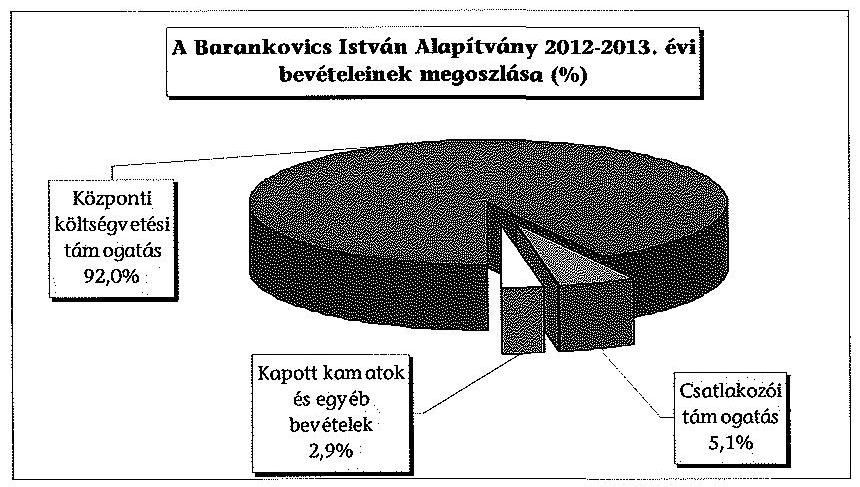

Az ellenőrzött 2012. és 2013. évben az összes bevétel 92,0\%-a (138 800 ezer Ft) volt a központi költségvetési támogatás összege, amelyre az alapítvány a Párt tv. 9/A. § (3) bekezdésében foglaltak alapján jogosult volt. A támogatás mértéke és folyósítása megfelelt a Párt tv. 9/A. § (2) és (5)-(6) bekezdésében meghatározottaknak.

Az ellenőrzött időszakban a bevételek 2,9\%-a pénzügyi műveletek eredményeként 4316 ezer Ft összegű, pénzeszköz lekötésből kapott kamatokból és a 2013. évben két, használaton kívüli eszköz értékesítéséből befolyt 60 ezer Ft összegű egyéb bevételből származott.

---

A csatlakozói támogatások a 2012-2013. években összesen 7758 ezer Ft-ot tettek ki, ami az összes bevétel 5,1\%-a volt, céljuk igazodott a Párt tv. 9/A. § (1) bekezdésében meghatározottakhoz.

Az alapítvány a 2012. évben összesen 512 ezer Ft összegű magánszemélytől kapott támogatásban részesült. Az összegek a magánszemélyek pénzforgalmi számlájáról érkeztek az alapítvány számlájára, összhangban a Pártalapítványi tv. 3. § (3) bekezdésében foglaltakkal. Az adományok gyűjtése megfelelt a 350/2011. (XII. 30.) Korm. rendelet 11. §-ában rögzített előírásoknak. Az alapítvány a 2013. évben összesen 7246 ezer Ft egyéb támogatásban részesült, amit három belföldi ( 5510 ezer Ft) és két külföldi (1736 ezer Ft) jogi személytől kapott. Az ellenőrzött időszakban kapott támogatások elfogadásáról a Pártalapítványi tv. 3. § (2) bekezdésében és az alapító okiratban foglaltakkal összhangban döntött a kuratórium.

# 1.3. A költségvetési és egyéb kapott támogatások, adományok felhasználásának és közzétételének szabályszerűsége 

Az alapítvány 2012. és 2013. évi összes ráfordítása 145513 ezer Ft volt, melynek összetételét a következő diagram szemlélteti.
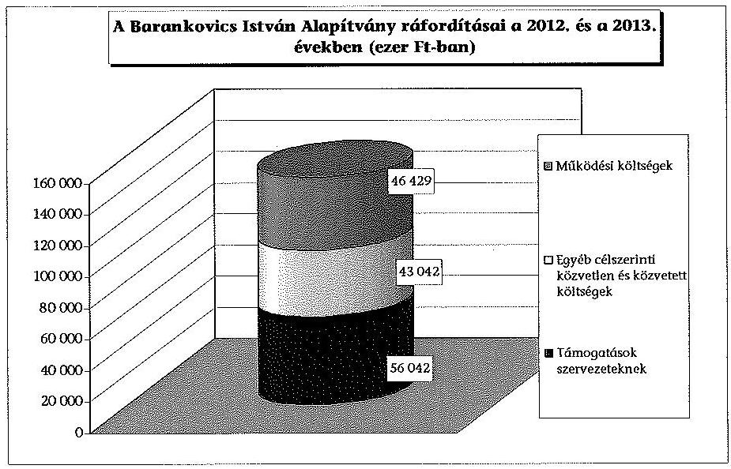

A 2012. és a 2013. évi összes ráfordítások 68,1\%-a ( 99084 ezer Ft) közvetlenül vagy közvetetten az alapítványi célok megvalósítását szolgálta, 31,9\%-a (46 429 ezer Ft) működési kiadás és ráfordítás volt.

Az alapítvány a Párt tv. 9/A. § (1) bekezdésében meghatározott célokra fordította a kapott költségvetési és az egyéb támogatások összegét. A költségvetési támogatáson kívül kapott támogatásokat és adományokat a támogatást nyújtók és adományozók által meghatározott céloknak megfelelően az alapítvány céljaival összhangban használták fel.

Az alapítvány a Párt tv. 4. § (2) bekezdésében foglalt előírásoknak megfelelően vagyoni hozzájárulást párt részére nem teljesített, az alapító párttal közös együttműködés keretében nem végzett tevékenységet.

---

Az alapító az alapító okiratban meghatározta az alapítvány cél szerinti tevékenységeit. Cél szerinti tevékenység az alapító okirat szerint az alapítvány céljait szolgáló oktatási, tudományos, ismeretterjesztő tevékenységi formák szervezése és támogatása, előadások, konferenciák szervezése és támogatása, szakkönyvek, illetve egyéb kiadványok kiadása, támogatása.

Az alapítvány a célszerinti feladatellátására fordított összeg 56,6\%-át (az összes ráfordítás $38,5 \%$-a) szervezetek támogatásra fordította, magánszemélyeknek nem nyújtott támogatást. Az alapító okiratban rögzítették a támogatások nyújtásához kapcsolódó szerződések tartalmi elemeit, ezzel összhangban az alapítvány elkészítette a támogatási és pályázati szabályzatát, melyben részletesen rendelkezett a támogatások és elszámolásuk rendjéről. Az alapítvány az általa támogatott szervezetekkel minden esetben az alapító okirat, illetve a támogatási és pályázati szabályzat előírásainak megfelelő tartalmú támogatási szerződést kötött. A támogatási szerződésekben részletesen meghatározták a támogatás célját, a pénzügyi feltételeket, a cél szerinti felhasználás ellenőrzésére vonatkozó megállapodást, a támogatási összeggel való elszámolás módját és határidejét, valamint az elmaradt vagy késedelmes elszámolás esetén alkalmazandó szankciókat.

A támogatások odaítéléséről a kuratórium minden esetben döntött, az elnöki jogkörben odaítélt támogatásokról az elnök tájékoztatta a kuratóriumot. A kuratórium a támogatási kérelmek, pályázatok elbírálásakor figyelembe vette a Pártalapítványi tv. 1. §-ában foglaltakhoz és az alapítvány céljaihoz való kapcsolódást.

A támogatott szervezetek részére a szerződésekben meghatározottak szerint folyósította az alapítvány a megítélt összeget. A támogatás felhasználásáról a kedvezményezettek szöveges és pénzügyi beszámolóban adtak számot. A támogatással való elszámolások megfeleltek a támogatott és az alapítvány által kötött szerződésben rögzített feltételeknek, szankciók érvényesítésére nem volt szükség. A beszámolók elfogadásáról a kuratórium határozataiban döntött.

Az alapítvány a Pártalapítványi tv. 3. § (4) bekezdésében rögzítettek szerint a támogatókra vonatkozó közzétételi kötelezettségének határidőben eleget tett, a külföldről származó külföldi jogi személyektől kapott támogatást közös rendezvényekhez való hozzájárulásként fogadta be, és a rendezvényről szóló beszámolókat közzétette a honlapján. A honlapon vagyoni támogatás címszó alatt jelenik meg valamennyi támogató neve, a rendelkezésre bocsátott összeg és a támogatás célja.

Az alapítvány az éves költségvetés tervezése során a 350/2011. (XII. 30.) Korm. rendelet 3. § (2) bekezdése szerint járt el, bevételei és kiadásai egyensúlyban voltak. A kuratórium a költségvetés tervezetét és a költségvetést a 2012. és a 2013. év vonatkozásában megtárgyalta és elfogadta. A költségvetés tervezetében a kuratórium a müködési költségek keretösszegét a 2012. és a 2013. évben meghatározta.

Közbeszerzési értékhatárt elérő beszerzésre, beruházásra az ellenőrzött időszakban nem került sor az alapítványnál.

---

# 1.4. Az alapítvány által létrehozott szervezetre vonatkozó tulajdonosi döntések megfelelősége 

Az alapítvány az ellenőrzött időszakban nem rendelkezett saját szervezettel.

## 2. Az ÉVES SZÁMVITELI BESZÁMOLÓK ÉS AZ ALAPÍTVÁNY TEVÉKENYSÉGÉRŐL SZÓLÓ ÉVES JELENTÉSEK SZABÁLYSZERŰSÉGE

### 2.1. Az alapítvány tevékenységéről szóló éves jelentés megfelelősége

Az alapítvány nem rendelkezett közhasznú jogállással, így nem volt a Civil tv. 29. § (3) bekezdésében rögzített közhasznúsági melléklet készítési kötelezettsége, ennek ellenére elkészítette azt az egyszerúsített éves beszámoló részeként. A kuratórium elnöke mindkét évben gondoskodott a beszámoló közzétételéről, melyre a Magyar Közlöny Hivatalos Értesítőjében került sor. Az alapítvány a 2012. és 2013. évben nem készített a Pártalapítványi tv. 3/A. § (1) bekezdése szerinti éves jelentést.

A 2012. és a 2013. évben az alapítvány a Számv. tv. 17 § (1) és (2) bekezdéseiben, illetve a számviteli politika ${ }_{1,2}$-ben meghatározott formában, egyszerúsített éves beszámolót készített. A beszámolók összhangban voltak a 224/2000. (XII. 19.) Korm. rendelet 6. § (1)-(3) és a 17. § (2) bekezdésében meghatározottakkal. Az alapító okiratnak megfelelően az egyszerúsített éves beszámolókat a Felügyelő Bizottság véleményezte, azokat a kuratórium elfogadta.

Az ellenőrzött időszakban hatályos számviteli politika ${ }_{1,2}$ előírása ellenére a 2012. és a 2013. évben könyvvizsgálatra nem került sor. Könyvvizsgálatra vonatkozó jogszabályi kötelezettsége nem volt az alapítványnak.

A 2012-2013. évek egyszerúsített éves beszámolóinak készítése során érvényesültek a Számv. tv. 15. és 16. §-aiban megfogalmazott számviteli alapelvek. A beszámolók a Számv. tv. 3. § (3) bekezdésében rögzített lényeges, illetve az alapítvány számviteli politika ${ }_{1,2}$-jében megjelölt jelentős összegű hibát nem tartalmaztak. A beszámolók adatainak alátámasztása során figyelembe vették az elvégzendő feladatokkal és a bizonylatok tartalmával összefüggő Számv. tv. előírásait. A beszámoló soraiban kimutatott összegek a számviteli nyilvántartásokból levezethetők voltak, megegyeztek a kapcsolódó főkönyvi számlák, az analitikus és egyéb nyilvántartások adataival, és valós képet mutattak az alapítvány gazdálkodásáról.

### 2.2. A mérleg összeállításának szabályszerűsége

A mérlegben kimutatott eszközök és források értékadatai a Számv. tv. 69. § (1)(2) bekezdésében és a leltározási szabályzatban foglalt előírásoknak megfelelően leltárral alátámasztottak voltak. Az éves mérlegekben, egy kivétellel, az adott mérlegsoron a Számv. tv. szerinti tartalommal és megfelelő értékkel szerepeltették az adatokat.

---

Az ellenőrzött időszakban a befektetett eszközök esetében a számviteli politika ${ }_{1,2}{ }^{-}$ ben rögzítettekkel összhangban volt az egyedi nyilvántartás, az aktiválás, az értékelés, a kis értékű eszközök elszámolása és a terv szerinti értékcsökkenés kimutatása. Selejtezésre a 2012. évben került sor, a selejtezett eszközök elavultak, nullára leírtak voltak. Az eszközök a selejtezési bizottság előtt megsemmisítésre kerültek.

A 2012. és a 2013. évben a forgóeszközökön belül követeléseket nem mutattak ki, a pénzeszközök és készletek az év végi bankkivonatok egyenlegeivel, illetve a házipénztár év végi pénztárjelentése záró állományával megegyezően szerepeltek.

A mérlegben a saját tőkén belül az induló vagyon az alapító okiratban rögzített értéket tartalmazta.

A kötelezettségek között a tárgyévben elszámolt, de a következő évben esedékes szállítói állományt és a munkabérekhez kapcsolódó adókat, járulékokat mutattak ki. Az alapítvány lejárt (fizetési határidőn túli) szállítói állománnyal egyik év végén sem rendelkezett. Hátrasorolt kötelezettsége, hosszú lejáratú kötelezettsége, hitelállománya, továbbá rövid lejáratú kölcsöne az alapítványnak a 2012. és a 2013. év végén nem volt.

Aktív időbeli elhatárolásokat egyik évben sem mutatott ki az alapítvány. A paszszív időbeli elhatárolások elszámolása szabályos volt, melyeket szállítói számlák támasztottak alá.

# 2.3. Az eredménykimutatás szabályszerűsége 

Az alapítvány bevételeinek és ráfordításainak elszámolása az ellenőrzött időszakban a Számv. tv. előírásainak megfelelő (szerződések, számlák bér- és egyéb főkönyvi feladások) bizonylatokkal alátámasztott volt.

Az alapítvány a 224/2000. (XII. 19.) Korm. rendelet 15. § (1) bekezdésében, valamint a 17. § (4) bekezdésében foglalt eredménykimutatásra vonatkozó előírásoknak megfelelően mutatta ki a bevételeket és ráfordításokat, azokat a megfelelő sorokon szerepeltetve.

Az ellenőrzött időszakban a mintatételek elszámolásánál érvényesültek a kötelezettségvállalás, a teljesítésigazolás és az utalványozás szabályai a Számv. tv. 167. § (1) bekezdés c) pontjának és a pénzkezelési szabályzat előírásainak megfelelően.

## 3. Az alapíivány könyvvezetésének szabályszerűsége

### 3.1. A könyvvezetés szabályozottsága

Az alapítvány gazdálkodásának, éves beszámolója elkészítésének és könyvvezetésének belső szabályozási rendszere megfelelt a Számv. tv. előírásainak. A Számv. tv. 14. § (3)-(4) bekezdéseiben, illetve az (5) bekezdés a), b) és d) pontjaiban foglalt előírásokat és az alapítványi sajátosságokat a számviteli politika ${ }_{1,2}$ összeállítása során betartották.

---

A számviteli politika ${ }_{1,2}$ keretein belül elkészítették az eszközök és források leltárkészítési és leltározási szabályzatát, a pénzkezelési szabályzatot, továbbá a Számv. tv. 161. §-ában előírt számlarend ${ }_{1,2}$-őt. A számviteli politika ${ }_{1,2}$-ben foglaltak szerint az eszközök és források értékelésére külön szabályzatot nem készítettek, az értékelések módját a számviteli politika ${ }_{2}$-ben rögzítették. A számviteli politikát és a számlarendet egyszer módosították a Számv. tv. változásával összhangban, valamint új leltározási szabályzatot és pénzkezelési szabályzatot léptettek hatályba. A szabályzatokat a kuratórium jóváhagyásával, a kuratórium elnökének aláírásával adták ki.

Az alapítvány a munkavállalók természetbeni juttatásáról a Természetbeni Juttatások Szabályzatban rendelkezett, amelyen nem vezették át az Szja. tv. 71. § (1) és (3) bekezdéseiben foglalt rendelkezések cafeteria elemekre és korlátokra vonatkozó többszöri módosítását, ami azonban a kifizetés szabályosságát nem befolyásolta.

# 3.2. A könyvvezetés gyakorlatának megfelelősége 

Az alapítvány könyvvezetésének gyakorlata megfelelt a vonatkozó jogszabályi és belső szabályozási előírásoknak. A számviteli bizonylatok számítógépes feldolgozása alapján az egyszerúsített éves beszámolók összeállítását, valamint a bérszámfejtést megbízási szerződés alapján külső szolgáltató végezte. A könyvelési rendszerből az ellenőrzéshez szükséges adatok lekérdezhetők voltak, az alkalmazott számítógépes könyvelő program, illetve a külső könyvelést végző megbízott az ellenőrzött időszakban nem változott.

Az alapítvány betartotta a könyvviteli elszámolást alátámasztó bizonylatok alaki és tartalmi követelményeire vonatkozóan a Számv. tv. 167. § (1) bekezdésében foglalt előírásokat. A számlakijelölés gyakorlata, a főkönyvi és analitikus nyilvántartások kapcsolata összhangban volt a Számv. tv.-ben és a számlarend ${ }_{1,2}$-ben előírtakkal. A bizonylatok feldolgozási rendjéről szóló Számv. tv 165. § (3) bekezdés b) pontjában foglaltak ellenére az egyéb gazdasági eseményeket nem minden esetben rögzítették a törvényi előírások betartásával.

A 2012. évben a 2012. május havi bérfeladás tételeit a könyvviteli nyilvántartásokban 2012. december 31 -én rögzítették.

A Számv. tv. 164. § (1)-(2) bekezdéseiben és a számviteli politika ${ }_{1,2}$-ben előírt könyvviteli zárlattal kapcsolatos feladatokat az éves beszámoló elkészítését megelőzően elvégezték. A leltározási szabályzat előírásainak megfelelően a tárgyi eszközöket mennyiségi felvétellel, az egyéb eszköz és forrás tételeket a főkönyvi számláknak az analitikus nyilvántartásokkal történt egyeztetése útján leltározták.

A szigorú számadású nyomtatványok szigorú számadás alá vonása és nyilvántartása megfelelt a Számv. tv. 168. § (1)-(3) bekezdéseiben előírt feltételeknek.

Az alapítvány házipénztárának múködtetése a pénzkezelési szabályzatban előírtaknak megfelelően történt. A banki átutalásokat - internet alapú elektronikus banki szolgáltatásokra kötött szerződés alapján - elektronikus úton a pénzkezelési szabályzat előírásait betartva teljesítették.

---

Az alapítvány a Számv. tv. 169. § (1)-(3) bekezdéseiben foglalt előírásoknak megfelelően gondoskodott a mérlegek, leltárak, főkönyvi kivonatok, bizonylatok szabályszerű megőrzéséről.

# 4. Az elöző ÁSZ ellenőrzés javaslatai alapján Készített intéZkEDÉSI TERVBEN FOGLALTAK VÉGREHAJTÁSA 

Az alapítvány az előző ÁSZ ellenőrzés - 13024. számú a Barankovics István alapítvány 2010-2011. évi gazdálkodása törvényességének ellenőrzéséről szóló jelentés - javaslataihoz kapcsolódóan, az ÁSZ tv. 33. § (1) bekezdésében foglalt előírás teljesítéseként, határidőben tájékoztatást küldött intézkedéseiről, melyet az ÁSZ a számvevőszéki jelentés által feltárt hiányosságok megszüntetésére alkalmas intézkedési tervként elfogadott.

Az előző ÁSZ ellenőrzés hat javaslatából öt javaslat az alapítvány intézkedései során hasznosult, amely intézkedések az ÁSZ javaslatokkal összhangban voltak. A korábbi ÁSZ ellenőrzés javaslatai közül egy javaslat nem hasznosult, mert az alapítvány a 2012. és a 2013. évben nem tett eleget a Pártalapítványi tv. 3/A. § (5) bekezdésében előírt jelentés közzétételi kötelezettségének.

Budapest, 2015. május 1 H .

Melléklet: $\quad 4 \mathrm{db}$
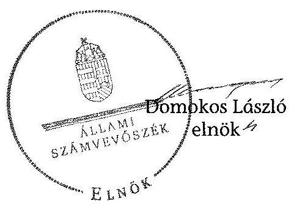

---

# Beszámoló a Barankovics István Alapítvány 2012. évi tevékenységéről 

Adószám: $\quad 18191705-1-42$
Törvényszék: $\quad 01$ Fővárosi Törvényszék
Bejegyzö határozat száma: PK 60540/2006/
Nyilvántartási szám: 01/ /

## Barankovics István Alapítvány

1078 Budapest, István utca 44

## Éves beszámoló "A" eredménykimutatása (összköltség eljárással)

Beszámolási időszak: 2012. január 01.-2012. december 31.

Budapest, 2013. március 19.
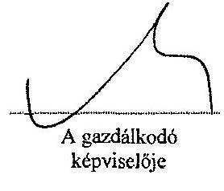
P.h.

A közzétett adatok könyvvizsgálattal nincsenek alátámasztva.

---

# Barankovics Alapítvány

**18191705-1-42**

**Bejegyzó határozat száma:** FK 60540/2006/

**Nyilvételartási szám:** 01/

**Éves beszámoló "A" eredménykimutatása (összköltség eljárással)**

**Beszámolási időszak:** 2012. január 01. - 2012. december 31.

|  ID | Alaptevékenység
Előző év | Vállalkozási tevékenység
Előző év | Összesen
Előző év | Tárgyév  |
| --- | --- | --- | --- | --- |
|  1 | Értékesítés nettó árbevétele (01+02. sor) | 0 | 0 | 0  |
|  11 | Aktivált saját teljesítésények értéke (+03+-04. sor) | 0 | 0 | 0  |
|  111 | Egyéb bevételek | 69 805 | 69 912 | 0  |
|  01 | Adomány (magánszemélyektől) | 8 | 512 | 0  |
|  111 | III. sorból: vitézakt értékvesztés | 0 | 0 | 0  |
|  01 | Adomány (magánszemélyektől) | 8 | 512 | 0  |
|  05 | Anyagköltség | 1 013 | 425 | 0  |
|  06 | Igénybevett szolgáltatások értéke | 23 706 | 18 841 | 0  |
|  07 | Egyéb szolgáltatások értéke | 206 | 206 | 0  |
|  19 | Anyagjellegő ráfordítások (05-09. sorok) | 24 925 | 19 472 | 0  |
|  10 | Bérköltség | 31 969 | 17 389 | 0  |
|  11 | Személyi jellegű egyéb kifizetések | 4 068 | 3 688 | 0  |
|  12 | Bérjáratékok | 6 049 | 3 804 | 0  |
|  V | Személyi jellegű ráfordítások (10-12. sorok) | 32 086 | 24 881 | 0  |
|  VI | Értékcsökkentési leírás | 759 | 983 | 0  |
|  VII | Egyéb ráfordítások | 28 694 | 27 500 | 0  |
|   | VII. sorból: értékvesztés | 0 | 0 | 0  |

**Budapest, 2013. március 19.**

**A közzétett adatok könyvvizsgálattal nincsenek alátámasztva.**

**1. SZÁMÚ MELLEKLET**

**A V-0716-104/2015, SZÁMÚ TELENTÉSHEZ**

**Oldal:** 2

**1. SZÁMÚ MELLEKLET**

**A V-0716-104/2015, SZÁMÚ TELENTÉSHEZ**

---

# Barankovics Alapítvány

**Adozás:** 18191705-1-42

**Bejegyzó határozat száma:** PK 60540/2006/

**Nyilvántartási szám:** 01/

**Éves beszámoló "A" eredménytámutatása (összköltség eljárással)**

**Beszámolási időszak:** 2012. január 01. - 2012. december 31.

|   | 1000HUF | Alaptevékenység
Előző év | Vállalkozási tevékenység
Előző év | Összesen
Előző év | Tárgyév  |
| --- | --- | --- | --- | --- | --- |
|  A. | ÜZEMI (ÜZLETI) TEVÉKENYSÉG EREDMÉNYE (I+II+III-IV-V-VI-VII. sor) | -16 659 | -2 924 | 0 | 0  |
|  17. | Pénzügyi műveletek egyéb bevételei | 2 704 | 2 792 | 0 | 0  |
|   | 17. sorból: értékelési különbözet | 0 | 0 | 0 | 0  |
|  VIII. | Pénzügyi műveletek bevételei (13-17. sorok) | 2 704 | 2 792 | 0 | 0  |
|  19. | Fizetendő kamatok és kamatjellegű ráfordítások | 0 | 7 | 0 | 0  |
|   | 19. sorból: kapcsolt vállalkozásnak adott | 0 | 0 | 0 | 0  |
|  IX. | Pénzügyi műveletek ráfordításai (18+19+-20+21. sor) | 0 | 7 | 0 | 0  |
|  B. | PÉNZÜGYI MŰVELÉTEK EREDMÉNYE (VIII-IX. sor) | 2 704 | 2 785 | 0 | 0  |
|  C. | SZOKÁSOS VÁLLALKOZÁSI EREDMÉNY (+-A+-B. sor) | -13 955 | -139 | 0 | 0  |
|  X. | Rendkívüli bevételek | 0 | 0 | 0 | 0  |
|  XI. | Rendkívüli ráfordítások | 0 | 0 | 0 | 0  |
|  D. | BENDEIJÚSI EREDMÉNY (X-XI. sor) | 0 | 0 | 0 | 0  |
|  E. | ADÓZÁS ELŐTTI EREDMÉNY (+-C+-D. sor) | -13 955 | -139 | 0 | 0  |
|  XII. | Adófizetési kötelezettség | 0 | 0 | 0 | 0  |
|  F. | ADÓZOTT EREDMÉNY (+-E-XII. sor) | -13 955 | -139 | 0 | 0  |

Budapest, 2013. március 19.

A gazdálkodó képviselője

A közzétett adatok könyvvizsgálattal nincsenek alátámasztva.

[Eslto program]

---

# Barankovics Alapítvány

**Oldal:** 4

**Adószám:** 18191705-1-42

**Bejegyző határozat száma:** PK 60540/2006/

**Nyilváníartási szám:** 01/

**Éves beszámoló "A" eredménykimutatása (összköltség eljárással)**

**Beszámolási időszak:** 2012. január 01. - 2012. december 31.

|  G. | MÉRLEG SZERINTI ÉRKIMÉNY (+-F+22-23. sor) | Alaptevékenység | Vállalkozási tevékenység | Összesen  |
| --- | --- | --- | --- | --- |
|   |  | Előző év | Tárgyév | Előző év  |
|   |  | 13 955 | 139 | 0  |

Budapest, 2013. március 19.

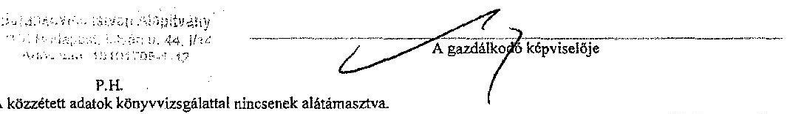

A közzétett adatok könyvvizsgálattal nincsenek alátámasztva.

[Esti's program]

---

# Barankovics Alapítvány

**Oldal:** 1

**Adószám:** 18191705-1-43

**Bejegyző határozat száma:** PK 60540/2006/

**Nyilvántartási szám:** 01/

**Éves beszámoló mérlege - "A"**

A mérleg fordulónapja: 2012. december 31.

|   | 1000HUF | Előző év | Tárgyév  |
| --- | --- | --- | --- |
|   | ESZKÖZÖK (aktívák) |  |   |
|  01. | A. Befektetett eszközök (02+10+18.sor) | 937 | 2 668  |
|  02. | I. Immateriális javak (03-09. sorok) | 0 | 935  |
|  06. | 4. Szellemi ternekek | 0 | 935  |
|  10. | II. Tárgyi eszközök (11-17. sorok) | 937 | 1 733  |
|  11. | 1. Ingatlanok és a kapcsolódó vagyoni értékű jogok | 166 | 152  |
|  12. | 2. Műszaki berendezések, gépek, járművek | 602 | 818  |
|  13. | 3. Egyéb berendezések, felszerelezések, járművek | 169 | 763  |
|  18. | III. Befektetett pénzügyi eszközök (19-26. sorok) | 0 | 0  |
|  27. | B. Forgóeszközök (28+35+43+49. sor) | 55 857 | 52 794  |
|  28. | I. Készletek (29-34. sorok) | 0 | 0  |
|  35. | II. Követelések (36-42. sorok) | 0 | 0  |
|  43. | III. Értékpapírok (44-48. sorok) | 0 | 0  |
|  49. | IV. Pénzeszközök (50-51. sorok) | 55 857 | 52 794  |
|  50. | 1. Pénztár, csekkek | 78 | 361  |
|  51. | 2. Bankbetétek | 55 779 | 52 433  |
|  52. | C. Aktív időbeli elhatárolások (53-55. sorok) | 0 | 0  |
|  56. | ESZKÖZÖK (AKTIVÁK) ÖSSZESEN | 56 794 | 55 462  |

Budapest, 2013. március 19.

A kifizetett adatok könyvvizsgálattal nincsenek alátámasztva.

[Esős program]

---

# 1. SZÁMÚ MELLÉKLET A V-0716-104/2015. SZÁMÚ JELENTÉSHEZ

## Barankovics Alapítvány

Oldal: 2

Adószám: 18191705-1-42

Bejegyző határozat száma: PK 60540/2006/

Nyilvántartási szám: 01/

## Éves beszámoló mérlege - "A"

A mérleg fordulónapja: 2012. december 31.

|   | 1000HUF | Előző év | Tárgyév  |
| --- | --- | --- | --- |
|   | FORRÁSOK (passzívák) |  |   |
|  57. | D. Saját tőke (58+60+61+62+63+64+67. sor) | 53 366 | 53 226  |
|  58. | I. Jegyzett tőke | 700 | 700  |
|  60. | II. Jegyzett, de még be nem fizetett tőke (-) | 0 | 0  |
|  61. | III. Töhetartalék | 0 | 0  |
|  62. | IV. Eredménytartalék | 66 621 | 52 665  |
|  63. | V. Lekötött tartalék | 0 | 0  |
|  64. | VI. Értékelési tartalék (65-66. sorok) | 0 | 0  |
|  67. | VII. Mérleg szerinti eredmény | -13 955 | -139  |
|  68. | E. Céltartalékok (69-71. sorok) | 0 | 0  |
|  72. | F. Kötelezettségek (73+77+86 sor) | 3 308 | 2 236  |
|  73. | I. Hátrasorolt kötelezettségek (74-76. sorok) | 0 | 0  |
|  77. | II. Hosszú lejáratú kötelezettségek (78-85. sorok) | 0 | 0  |
|  86. | III. Rövid lejáratú kötelezettségek (87. és 89-97. sorok) | 3 308 | 2 236  |
|  95. | 8. Egyéb rövid lejáratú kötelezettségek | 3 308 | 2 236  |
|  98. | G. Passzív időbeli elhatárolások (99-101. sorok) | 120 | 0  |
|  100. | 2. Költségek, ráfordítások passzív időbeli elhatárolása | 120 | 0  |
|  102. | FORRÁSOK (PASSZÍVÁK) ÖSSZESEN | 56 794 | 55 462  |

Budapest, 2013. március 19.

A közzétett adatok könyvvizsgálattal nincsenek alátámasztva.

[Esős program]

---

# Beszámoló a Barankovics István Alapítvány 2013. évi tevékenységéről 

Adószám: $\quad 18191705-1-42$
Törvényszék: $\quad 01$ Fövárosi Törvényszék
Bejegyzö határozat száma: 12 PK 60.540/2006/
Nyilvántartási szám: $\quad 01 / 03 / 60540$

## Barankovics István Alapítvány

1078 Budapest, István utca 44

## Éves beszámoló mérlege - "A"

A mérleg fordulónapja: 2013. december 31.

Budapest, 2014. február 20.
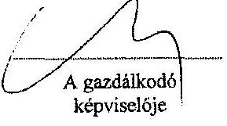
P.h.

A közzétett adatok könyvvizsgálattal nincsenek alátámasztva.
A szervezet vállalkozási tevékenységet nem folytat.

---

# 2. SZÁMÚ MELLÉKLET A V-0716-104/2015. SZÁMÚ JELENTÉSHEZ

Barankovics Alapítvány

Oldal: 1

Adószám: 18191705-1-42 Rejegyű határozat száma: 12 PK 60.540/2006/ Nyilvántartási szám: 01/03/60540 Éves beszámoló mérlege - "A" A mérleg fordulónania: 2013. december 31.

|  ID |  | Előző év | Tárgyév  |
| --- | --- | --- | --- |
|  01. | ESZKÖZÖK (aktívák) |  |   |
|  02. | A. Befektetett eszközök (02+10218 sor) | 2 668 | 4 672  |
|  03. | I. Immateriális javak (03-09. sorok) | 935 | 1 387  |
|  04. | 4. Szellemi termékek | 935 | 1 387  |
|  05. | II. Tárgyi eszközök (11-17. sorok) | 1 733 | 3 285  |
|  06. | 1. Ingatlanok és a kapcsolódó vagyoni értékủ jogok | 152 | 2 378  |
|  07. | 2. Mászaki berendezések, gépek, járművek | 818 | 859  |
|  08. | 3. Egyéb berendezések, felszerelések, járművek | 763 | 48  |
|  09. | III. Befektetett pénzügyi eszközök (19-26. sorok) | 0 | 0  |
|  10. | IV. Forgóeszközök (28+5+43+49. sor) | 52 794 | 57 319  |
|  11. | 1. Készletek (29-34. sorok) | 0 | 96  |
|  12. | 4. Késztermékek | 0 | 96  |
|  13. | II. Követelések (36-42. sorok) | 0 | 0  |
|  14. | III. Értékpapírok (44-48. sorok) | 0 | 0  |
|  15. | IV. Pénzeszközök (50-51. sorok) | 52 794 | 57 319  |
|  16. | 1. Pénztár, csekkok | 361 | 34  |
|  17. | 2. Bankbetétek | 52 433 | 57 285  |
|  18. | 1. Aktív időbeli elhatárolások (53-55. sorok) | 0 | 0  |
|  19. | ESZKÖZÖK (AKTÍVÁK) OSSZESTA | 55 462 | 62 607  |

Budapest, 2014. február 20.

A gazdálkodó képviselője

P.H. A közzétett adatok könyvvizsgálattal nincsenek alátámasztva.

[EsBo program]

---

# 2. SZÁMÚ MELLÉKLET A V-0716-104/2015. SZÁMÚ JELENTÉSHEZ

## Barankovics Alapítvány

Oldal: 2

Adószám: 18191705-1-42

Bejegyzó határozat száma: 12 PK 60.540/2006/

Nyilvántartási szám: 01/03/60540

Éves beszámoló mérlege - "A"

A mérleg fordulónapja: 2013. december 31.

|   | 1000HUF | Előző év | Tárgyév  |
| --- | --- | --- | --- |
|   | FORRÁSOK (passzívák) |  |   |
|  57. | D. Saját tőke (58+60+61+62+63+64+67. sor) | 53 226 | 58 793  |
|  58. | I. Jegyzett tőke | 700 | 700  |
|  60. | II. Jegyzett, de még be nem fizetett tőke (-) | 0 | 0  |
|  61. | III. Tőketartalék | 0 | 0  |
|  62. | IV. Eredmény/artalék | 52 665 | 52 526  |
|  63. | V. Lekötött tartalék | 0 | 0  |
|  64. | VI. Értékelési tartalék (65-66. sorok) | 0 | 0  |
|  67. | VII. Mérleg szerinti eredmény | -139 | 5 567  |
|  68. | E. Cattarbolások (69-71. sorok) | 0 | 0  |
|  72. | F. Kötelezettségek (73+77+86 sor) | 2 236 | 3 261  |
|  73. | I. Hátrasorolt kötelezettségek (74-76. sorok) | 0 | 0  |
|  77. | II. Hosszú lejáratú kötelezettségek (78-85. sorok) | 0 | 0  |
|  86. | III. Rövid lejáratú kötelezettségek (87. és 89-97. sorok) | 2 236 | 3 261  |
|  91. | 4. Kötelezettségek áruzzállításból és szolgáltatásból (szállítók) | 0 | 2 486  |
|  95. | 8. Egyéb rövid lejáratú kötelezettségek | 2 236 | 775  |
|  98. | C. Passzív időbeli elhatárolások (99-101. sorok) | 0 | 33  |
|  100. | 2. Költségek, ráfordítások passzív időbeli elhatárolása | 0 | 33  |
|  102. | FORRÁSOK (PASSZÍVÁK) ÖSSZESZEN | 55 862 | 62 087  |

Budapest, 2014. február 20.

A gazdálkodó képviselője

P.H.

A közzétett adatok könyvvizsgálattal nincsenek alátámasztva.

[EsBo program]

---

Adószám: 18191705-1-42
Törvényszék: 01 Fővárosi Törvényszék
Bejegyzö határozat száma: 12 PK 60.540/2006/
Nyilvántartási szám: 01/03/60540

# Barankovics István Alapítvány

1078 Budapest, István utca 44

# Éves beszámoló "A" eredménykimutatása (összköltség eljárással)

Beszámolási időszak: 2013. január 01. - 2013. december 31.

Budapest, 2014. február 20.

Barankovics István Alapítvány
1078 Budapest, István utca 44, 01.
Adószám: 18191705-1-42
P.h.

A közzétett adatok könyvvizsgálattal nincsenek alátámasztva.
A szervezet vállalkozási tevékenységet nem folytat.

(EsBo program)

---

# 2. SZÁMÚ MELLÉKLET A V-0716-104/2015. SZÁMÚ JELENTÉSHEZ

## Barankovics Alapítvány

Oldal: 1

Adószám: 18191705-1-42

Bejegyző határozat száma: 12 PK 60.540/2006/

Nyilvántartási szám: 01/03/60540

Éves beszámoló "A" eredménykimutatása (összköltség eljárással)

Beszámolási időszak: 2013. január 01. - 2013. december 31.

|  ID | Tárgyév | Előző év | Tárgyév  |
| --- | --- | --- | --- |
|  1. | Értékesítés nettó árbevétele (01+02. sor) | 0 | 0  |
|  II. | Aktivált saját teljesítmények értéke (+-03+-04. sor) | 0 | 0  |
|  III. | Egyéb bevételek | 69 912 | 76 706  |
|  01. | Adomány (magánszemélyektől) | 0 | 0  |
|  IIII. | III. sorból: visszaéri értékvesztés | 0 | 0  |
|  01. | Adomány (magánszemélyektől) | 0 | 0  |
|  05. | Anyagköltség | 425 | 332  |
|  06. | Igénybevett szolgáltatások értéke | 18 841 | 24 672  |
|  07. | Egyéb szolgáltatások értéke | 206 | 493  |
|  IV. | Anyagjellegű ráfordítások (05-09. sorok) | 19 472 | 25 497  |
|  10. | Bérköltség | 17 389 | 10 073  |
|  11. | Személyi jellegű egyéb kifizetések | 3 688 | 3 490  |
|  12. | Bérjárulékok | 3 804 | 2 547  |
|  V. | Személyi jellegű ráfordítások (10-12. sorok) | 24 881 | 16 110  |
|  VI. | Értékcsökkenési leírás | 983 | 2 436  |
|  VII. | Egyéb ráfordítások | 27 500 | 28 620  |
|   | VII. sorból: értékvesztés | 0 | 0  |
|  A. | ÜZEMÍ (ÜZLETI) TEVEKENYSÉG EREDMÉNYE (1+11+11. sor) | 2 924 | 4 043  |
|  17. | Pénzügyi műveletek egyéb bevételei | 2 792 | 1 524  |
|   | 17. sorból: értékelési különbözet | 0 | 0  |
|  VIII. | Pénzügyi műveletek bevételei (13-17. sorok) | 2 792 | 1 524  |
|  19. | Fizetendő kamatok és kamatjellegű ráfordítások | 7 | 0  |
|   | 19. sorból: kapcsolt vállalkozásnak adott | 0 | 0  |
|  IX. | Pénzügyi műveletek ráfordításai (18+19+-20+21. sor) | 7 | 0  |
|  B. | PÉNZÜGYI MÜVELÉTEK EREDMÉNYE (V111-13. sor) | 2 985 | 1 524  |
|  C. | EJOKÁSOS VÁLLAI KOZÁSI EREDMÉNY (+-A+-0. sor) | 899 | 5 567  |
|  X. | Rendkívüli bevételek | 0 | 0  |
|  XI. | Rendkívüli ráfordítások | 0 | 0  |
|  D. | RÉNDKÍVÜLÍ EREDMÉNY (X-XI. sor) | 0 | 0  |
|  E. | ADÓZÁS ELŐTTI EREDMÉNY (+-C+-D. sor) | 139 | 5 567  |
|  XII. | Adófizetési kötelezettség | 0 | 0  |

Barankovics István Alapítvány

Budapest, 2014. február 20.

A gazdálkodó képviselője

A közzétett adatok könyvvizsgálattal nincsenek alátámasztva.

[Esős program]

---

# 2. SZÁMÚ MELLÉKLET A V-0716-104/2015. SZÁMÚ JELENTÉSHEZ 

## Barankovics Alapitvány

Oldal: 2
Adószám:
18191705-1-42
Bejegyzö határozat száma: 12 PK 60.540/2006/
Nyilvāotartási szám:
01/03/60540
Éves beszámoló "A" credménykimutatása (összköltség eljárással)
Beszámolási időszak: 2013. január 01.- 2013. december 31.

| 1000HUF | Előző év | Tárgyév |
| :--: | :--: | :--: |
| ADOZOTT EREDMENV (+-E-XII. sor) | 159 | 5567 |
| MERLEG SZERINTI ERESMENY (+-F+2F-25. sor) | 139 | 5567 |

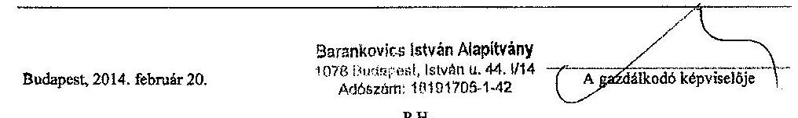

---

# 3. SZÁMÚ MELLÉKLET A V-0716-104/2015. SZÁMÚ JELENTÉSHEZ 

## Domokos László úr

elnők
Állami Számvevőszék

Hivatkozási szám: V-0716-100/2015.

Tisztelt Elnök Úr!

Köszönettel vettük 2015. április 8-án kelt levelüket, a Barankovics István Alapítvány 20122013. évi gazdálkodása törvényességének ellenőrzéséről szóló számvevőszéki jelentéstervezetet, illetve az abban foglalt megállapításokat.

Az ellenőrzés intézkedést igénylő megállapításaival és javaslataival egyet értünk, azokat köszönettel hasznosítani fogjuk.

- a 2. pontban tett megállapításukra a Számviteli Politika szabályzatunkat módosítjuk.
- a 3. pontban tett megállapításukra a Természetbeni juttatásokról szóló 2008. évi Szabályzatunkat, a jogszabályi változások figyelembevételével aktualizáljuk.
- a 4. pontban tett megállapításukra: a külső könyvelő partnerünkkel történt egyeztetés alapján ezúton jelezzük, hogy az egyéb gazdasági események könyvelése minden esetben a Számviteli törvény előírásaival összhangban, a megfelelő időben fog történni.
- az 1. pontban jelzett megállapításuk kapcsán a kövekező észrevételt szeretnénk tenni:
- Alapítványunk mindkét vizsgált évben határidőre elkészítette és (a Magyar Közlöny Hivatalos Értesítőjében, valamint saját honlapján) közzétette a 224/2000. kormányrendelet vonatkozó rendelkezése szerinti, egyszerűsített éves beszámolóját (mérleg, eredménykimutatás), valamint az Ectv. szerinti

---

kiegészítő mellékletet, továbbá elkészítette és közzétette a közhasznúsági jelentést is.

- A jelentéstervezetben jelezett hiány - miszerint „az Alapitvány az ellenőrzött időszakban nem teljesitette a Pártalapítványi tv. 3/A.§ (1) és (5)bekezdése szerinti jelentéskészítési és közzétételi kötelezettségét" - értelmezésünk szerint kizárólag a szöveges beszámolóra / éves jelentésre vonatkozik. Ám az általunk határidőre elkészített és közzétett közhasznúsági jelentés, illetve kiegészítő melléklet szinte teljes egészében tartalmazza azokat az adatokat és információkat, amelyek a szöveges beszámoló részeit képezik.
Természetesen a hiányzó 2012-2013 évi szöveges beszámolókat jelzésük alapján haladéktalanul pótolni kívánjuk, és a 2015. április 28-i kuratóriumi ülés elé terjesztjük. Ezt követően gondoskodunk beszámolók mihamarabbi közzétételéről; azonnali hatállyal a www.barankovics.hu oldalon, és lehetőség szerint leghamarabbi időpontban a Magyar Közlöny Hivatalos Értesítőjében.

Tisztelettel kérjük azonban ennél a pontnál a jelentés végleges szövegének módosítását, pontositását, mivel úgy véljük, hogy a jelenlegi megfogalmazás félreérthető: a jogszabályokban nem jártas olvasó számára úgy értelmezhető, mintha az Alapítvány a vizsgált években egyáltalán nem tett volna eleget beszámolási és közzétételi kötelezettségének. Kérjük, hogy a végleges jelentés egyértelműsítse, hogy a jelzett időszakban az Alapítvány részben nem tett eleget beszámolási és közzétételi kötelezettségének.
Javasolta szövegmódosítás: „az Alapitvány az ellenőrzött időszakban csak részben tett eleget beszámolási kötelezettségének, mivel nem teljesítette a Pártalapítványi tv. 3/A.§ (1) és (5)bekezdése szerinti jelentéskészítési és közzétételi kötelezettségét"

Kérjük, hogy fenti észrevételeinket szíveskedjenek figyelembe venni a végleges Számvevői Jelentés elkészítésénél.
Az Ön és munkatársai munkáját ezúton is köszönjük, további tevékenységükhöz kívónunk sok erőt és jó egészséget!

Budapest, 2015. április 16.

Tisztelettel és üdvözlettel:

Barankovics István Alapitvány 1078 Budapest, István u. 44, I/14 Adószám: 18191705-1-42

|  |  |
| :-- | --: |
|  | Dr. Mészáros József |
|  | a BJA Kuratóriumnak elnöke |

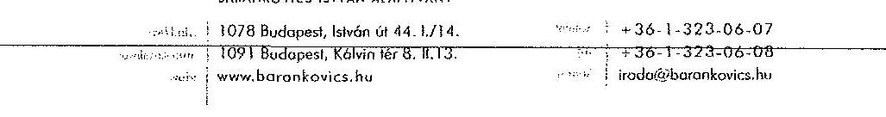

---

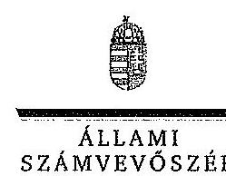

ELNÖK

Ikt. szám: V-0716-102/2015

Dr. Mészáros József úr
elnök
Barankovics István Alapitvány

# Budapest 

## Tisztelt Elnök Úr!

Köszönettel megkaptam a 2015. április 20. napján az Állami Számvevőszékhez érkezett ,, a Barankovics István Alapitvány 2012-2013. évi gazdálkodása törvényességének ellenôrzéséröl" készült számvevőszéki jelentéstervezetben foglalt megállapításokra tett észrevételét.

Tájékoztatom Elnök urat, hogy a jelentésben - az Állami Számvevőszékről szóló 2011. évi LXVI. törvény 29. § (3) bekezdése alapján - az el nem fogadott észrevételt szerepeltttjük az elutasítás indokának feltüntetésével együtt.

Az Állami Számvevőszék észrevételre vonatkozó álláspontjáról a felügyeleti vezető által készített részletes tájékoztatást csatoltan megküldöm.

Budapest, 2015. ơ 4 hó $<r$ nap
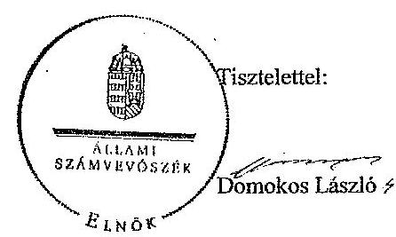

Melléklet: Tájékoztatás az el nem fogadott észrevételről, annak indokairól

---

# Tájékoztatás 

az el nem fogadott észrevételről, annak indokairól

| 1. | Ézzrevétel: | „Az ellenôrzés intézkedést igénylô megállapításai és javaslatai 1. pontjában jelzett megállapítás kapcsán: Alapítványunk mindkét vizsgált évben határidôre elkészítette és (a Magyar Közlöny Hivatalos Értesitójében, valamint saját honlapján) közzétette a 224/2000. kormányrendelet vonatkozó rendelkezése szerinti egyszerüsitett éves beszámolóját (mérleg, eredménykimutatás), valamint az Ectv. szerinti kiegészitő mellékletet, továbbá elkészítette és közzétette a közhasznúsági jelentést is. A jelentéstervezetben jelzett hiány - miszerint „az Alapítvány az ellenőrzött időszakban nem teljesítette a Pártalapítványi tv. 3/A. § (1) és (5) bekezdése szerinti jelentéskészitési és közzétételi kötelezettségét" - értelmezésünk szerint kizárólag a szöveges beszámolóra / éves jelentésre vonatkozik. Ám az általunk határidôre elkészített és közzétett közhasznúsági jelentés, illetve kiegészitő melléklet szinte teljes egészében tartalmazza azokat az adatokat és információkat, amelyek a szöveges beszámoló részeit képezik. Természetesen a hiányzó 2012-2013. évi szöveges beszámolókat jelzésük alapján haladéktalanul pótolni kivánjuk, és a 2015. április 28-i kuratóriumi ülés elé terjesztjük. Ezt követően gondoskodunk beszámolók mihamarabbi közzétételéről; azonnali hatállyal a www.barankovics.hu oldalon, és lehetôség szerint leghamarabbi idöpontban a Magyar Közlöny Hivatalos Értesitójében."   „...a jogszabályokban nem járatos olvasó számára úgy értelmezhetô, mintha az Alapítvány a vizsgált években egyáltalán nem tett volna eleget beszámolási és közzétételi kötelezettségének. Kérjük, hogy a végleges jelentés egyértelmüsiise, hogy a jelzett idöszakban az Alapítvány részben nem tett eleget beszámolási és közzétételi kötelezettségének." |
| :--: | :--: |
|  | Válasz: | Az Állami Számvevőszék az észrevételt nem fogadja el. |
|  | Indoklás: | Az észrevétel nem megalapozott. A Civil tv. 32. §-a rendelkezik a közhasznú jogállás megszerzésének feltételeiről, azonban ez lehetôség volt a pártalapítványok részére, nem kötelezettség. A civil szervezetek kérhették a közhasznúvá minösitést (Civil tv. 32. § (1) bekezdés). |

---

melyet a Civil tv. 33. § szerinti nyilvántartásba bejegyzéssel szerezhettek meg, így a pártalapítványok dönthettek arról, hogy tevékenységük közhasznúnak minősül, vagy sem. A Civil tv. 29. § (6) bekezdése alapján a közhasznú pártalapítványoknak „a közhasznúsági mellékletben be kell mutatni a szervezet által végzett közhasznú tevékenységeket, ezen tevékenységek fö célcsoportjait és eredményeit, valamint a közhasznú jogállás megállapításához szükséges 32 . § szerinti adatokat, mutatókat". Amennyiben egy pártalapítvány nem szerzett közhasznú jogállást, úgy a közhasznúsági melléklet kitöltése fogalmilag sem értelmezhető, mivel a nem közhasznú pártalapítvány nem végez közhasznú tevékenységet. Tekintettel arra, hogy a Barankovics István Alapítvány nem közhasznú pártalapítvány, így az ellenőrzött időszakban sem vonatkozott rá a Civil tv. 29. (3) bekezdése, azaz nem kellett közhasznúsági mellékletet készítenie, sem közzétennie. Ebben az esetben az alapítványnak a Pártalapítványi tv. 3/A. § szerinti jelentés készítési kötelezettsége állt fenn. A Civil tv. 29. § (6) bekezdése szerinti közhasznúsági melléklet tartalma nem egyezik meg a Pártalapítványi tv. 3/A. § szerint elkészítendő jelentés tartalmával, így az egyik kötelezettség teljesítésével a másik kötelezettség nem minősíthető teljesítettnek. Azaz a közhasznúsági melléklet közzétételével a Pártalapítványi tv. 3/A. § szerinti jelentés készítési és közzétételi kötelezettségét az alapítvány nem teljesítette.
Fent leírtakon túl a jelentéstervezet „I. Összegzö és II. Részletes megállapítások" részeiben az alapítvány beszámolási és közzétételi kötelezettségeinek teljesítése vonatkozásában tett megállapítások részletezése, minősítése során egyértelműen került megfogalmazásra, hogy az alapítvány mely beszámolási és közzétételi kötelezettségeinek tett, illetve melyeknek nem tett eleget.
„I. Összegzö megállapítások: Az alapitvány határidöben elkészitette és közzétette a jogszabályi elöírásoknak megfelelö éves beszámolóáát - mérleg és eredménykimutatás -, azonban nem tett eleget a Pártalapitványi tv. rendelkezéset szerinti jelentéskészitési és közzétételi kötelezettségének."
„II. Részletes megállapítások: Az alapitvány nem rendelkezett közhasznú jogállással, igy nem volt a Civil tv. 29. § (3) bekezdésében rögzitett közhasznúsági melléklet készitési kötelezettsége, ennek ellenére elkészítette azt az egyszerüeltett éves beszámoló részeként. A kuratórtum elnöke mindkét évben gondoskodott a beszámoló közzétételéröl, melyre a Magyar Közlöny Hivatalos Értesitöjében került sor. Az alapitvány a 2012. és 2013. évben nem készitett a Pártalapitványi tv. 3/A. § (1) bekezdése szerinti éves jelentést."

---

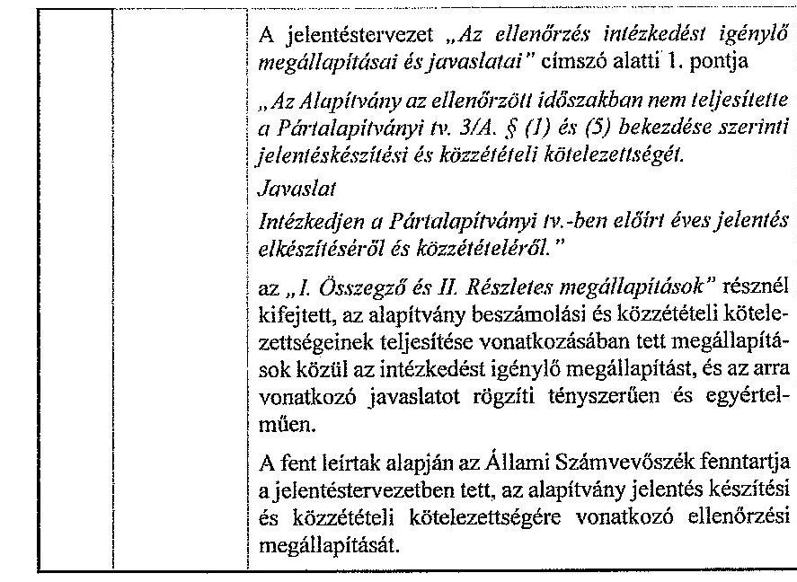

Budapest, 2015. 04 hó ${ }^{2,5} \cdot$ nap
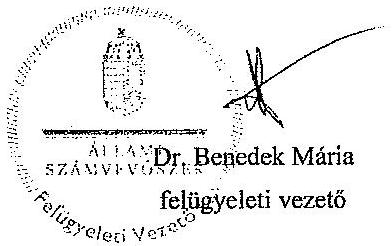