ÁLLAMI
SZÁMVEVÔSZÉK

# JELENTÉS 

A Magyar Orvosi Kamara gazdálkodásának, továbbá a feladatai finanszírozására kapott költségvetési támogatások felhasználásának ellenőrzéséről

---

Állami Számvevőszék
Iktatószám: V-0531-1722/2015.
Témaszám: 1565
Vizsgálat-azonosító szám: V0690
Az ellenőrzést felügyelte:
Holman Magdolna Julianna
felügyeleti vezető
Az ellenőrzést vezette és az ellenőrzés végrehajtásáért felelős:
Pető Krisztina
ellenőrzésvezető
A számvevőszéki jelentés összeállításában közremüködtek:
Pető Krisztina
ellenőrzésvezető
Balogné Dakó Eszter
számvevő főtanácsos
Dr. Dorogi Zsolt Pál
számvevő
Nagy Ildikó
számvevő tanácsos
Szikszainé Király Mária
számvevő tanácsos
Az ellenőrzést végezték:
Balogné Dakó Eszter
számvevő főtanácsos
Dr. Korbuly Andrea
számvevő tanácsos
Gelencsér Zoltán
számvevő főtanácsos
Koczor László
számvevő tanácsos
Nagy Ildikó
számvevő tanácsos
Samu István
számvevő tanácsos
Szikszainé Király Mária
számvevő tanácsos
Vida László
számvevő tanácsos

Dr. Dorogi Zsolt Pál
számvevő
Dr. Vass Gábor
számvevő tanácsos
Hegyes Mária
számvevő tanácsos
Lödiné Cser Zsuzsanna
számvevő főtanácsos
Orosz Diána
számvevő tanácsos
Szabó Tamás
számvevő tanácsos
Vámos Rita
számvevő
Villányi Antal
számvevő főtanács

---

# TARTALOMJEGYZÉK 

BEVEZETÉS ..... 5
I. ÖSSZEGZŐ MEGÁLLAPÍTÁSOK, KÖVETKEZTETÉSEK, JAVASLATOK ..... 9
II. RÉSZLETES MEGÁLLAPÍTÁSOK ..... 21

1. A MOK országos szerveinek és belső szabályozási rendszerének kialakítása és múködtetése ..... 21
1.1. A MOK országos szerveinek és belső szabályozási rendszerének kialakítása ..... 21
1.2. A MOK országos szervei működésének szabályszerűsége ..... 22
1.3. Az adatvédelmi szabályok érvényesítése és a közérdekủ adatok közzétételére vonatkozó kötelezettség teljesítése a MOK Országos Hivatalánál ..... 23
2. A MOK gazdálkodási tevékenységének szabályszerűsége ..... 25
2.1. A MOK éves beszámolójának szabályszerűsége ..... 25
2.2. A költségvetési támogatások felhasználásának, elszámolásának szabályszerűsége ..... 30
2.3. Az éves tagdíjak megállapításának, felhasználásának szabályszerűsége ..... 33
3. A MOK vállalkozási tevékenységének szabályszerűsége ..... 34
4. A MOK TESZ rendszere kialakításának és múködésének szabályszerűsége ..... 36
5. A folyamatba épített, felügyelő bizottsági, valamint a külső ellenőrzések hasznosulása ..... 39
5.1. A folyamatba épített ellenőrzési rendszer kialakításának és múködtetésének szabályszerűsége ..... 39
5.2. A Felügyelő Bizottság javaslatainak hasznosulása ..... 44
5.3. A külső ellenőrzések javaslatainak hasznosulása ..... 45
MELLÉKLETEK
6. számú Magyar Orvosi Kamara szervezeti rendszerének felépítése
7. számú Az Alapszabály1-4-ben előírt, a TESZK hatáskörébe tartozó feladatok elmulasztása 2010-2012. években
8. számú A 2010-2012. években hatályos jogszabályi és belső szabályok által előírtakat figyelmen kívül hagyó TESZ-ek megnevezése (1)
9. számú A 2010-2012. években hatályos jogszabályi és belső szabályok által előírtakat figyelmen kívül hagyó TESZ-ek megnevezése (2)
10. számú A Magyar Orvosi Kamara Bács-Kiskun Megyei Területi Szervezete elnökének jelentéstervezethez tett észrevételei

---

| 6. számú | Az ÁSZ válasza a Magyar Orvosi Kamara Bács-Kiskun Megyei Területi Szervezete elnökének jelentéstervezethez tett észrevételeihez |
| :--: | :--: |
| 7. számú | A Magyar Orvosi Kamara Baranya Megyei Területi Szervezete elnökének jelentéstervezethez tett észrevételei |
| 8. számú | Az ÁSZ válasza a Magyar Orvosi Kamara Baranya Megyei Területi Szervezete elnökének jelentéstervezethez tett észrevételeihez |
| 9. számú | A Magyar Orvosi Kamara Békés Megyei Területi Szervezete elnökének jelentéstervezethez tett észrevételei |
| 10. számú | Az ÁSZ válasza a Magyar Orvosi Kamara Békés Megyei Területi Szervezete elnökének jelentéstervezethez tett észrevételeihez |
| 11. számú | A Magyar Orvosi Kamara Budapesti Területi Szervezete elnökének jelentéstervezethez tett észrevételei |
| 12. számú | Az ÁSZ válasza a Magyar Orvosi Kamara Budapesti Területi Szervezete elnökének jelentéstervezethez tett észrevételeihez |
| 13. számú | A Magyar Orvosi Kamara Fejér Megyei Területi Szervezete elnökének jelentéstervezethez tett észrevételei |
| 14. számú | Az ÁSZ válasza a Magyar Orvosi Kamara Fejér Megyei Területi Szervezete elnökének jelentéstervezethez tett észrevételeihez |
| 15. számú | A Magyar Orvosi Kamara Fogorvosok Területi Szervezete elnökének jelentéstervezethez tett észrevételei |
| 16. számú | Az ÁSZ válasza a Magyar Orvosi Kamara Fogorvosok Területi Szervezete elnökének jelentéstervezethez tett észrevételeihez |
| 17. számú | A Magyar Orvosi Kamara Győr-Moson-Sopron Megyei Területi Szervezete elnökének jelentéstervezethez tett észrevételei |
| 18. számú | Az ÁSZ válasza a Magyar Orvosi Kamara Győr-Moson-Sopron Megyei Területi Szervezete elnökének jelentéstervezethez tett észrevételeihez |
| 19. számú | A Magyar Orvosi Kamara Komárom-Esztergom Megyei Területi Szervezete elnökének jelentéstervezethez tett észrevételei |
| 20. számú | Az ÁSZ válasza a Magyar Orvosi Kamara Komárom-Esztergom Megyei Területi Szervezete elnökének jelentéstervezethez tett észrevételeihez |
| 21. számú | A Magyar Orvosi Kamara Nógrád Megyei Területi Szervezete elnökének jelentéstervezethez tett észrevételei |
| 22. számú | Az ÁSZ válasza a Magyar Orvosi Kamara Nógrád Megyei Területi Szervezete elnökének jelentéstervezethez tett észrevételeihez |
| 23. számú | A Magyar Orvosi Kamara Országos Felügyelő Bizottsága elnökének jelentéstervezethez tett észrevételei |
| 24. számú | Az ÁSZ válasza a Magyar Orvosi Kamara Országos Felügyelő Bizottsága elnökének jelentéstervezethez tett észrevételeihez |
| 25. számú | A Magyar Orvosi Kamara Országos Hivatala vezetőjének jelentéstervezethez tett észrevételei |
| 26. számú | Az ÁSZ válasza a Magyar Orvosi Kamara Országos Hivatala vezetőjének jelentéstervezethez tett észrevételeihez |
| 27. számú | A Magyar Orvosi Kamara Pest Megyei Területi Szervezete elnökének jelentéstervezethez tett észrevételei |
| 28. számú | Az ÁSZ válasza a Magyar Orvosi Kamara Pest Megyei Területi Szervezete elnökének jelentéstervezethez tett észrevételeihez |
| 29. számú | A Magyar Orvosi Kamara Szabolcs-Szatmár-Bereg Megyei Területi Szervezete elnökének jelentéstervezethez tett észrevételei |
| 30. számú | Az ÁSZ válasza a Magyar Orvosi Kamara Szabolcs-Szatmár-Bereg Megyei Területi Szervezete elnökének jelentéstervezethez tett észrevételeihez |

---

31. számú A Magyar Orvosi Kamara Vas Megyei Területi Szervezete elnökének jelentéstervezethez tett észrevételei
32. számú Az ÁSZ válasza a Magyar Orvosi Kamara Vas Megyei Területi Szervezete elnökének jelentéstervezethez tett észrevételeihez
33. számú A Magyar Orvosi Kamara Jász-Nagykun-Szolnok Megyei Területi Szervezete elnökének jelentéstervezethez tett észrevételei
34. számú A Magyar Orvosi Kamara Borsod-Abaúj-Zemplén Megyei Területi Szervezete elnökének jelentéstervezethez tett észrevételei
35. számú A Magyar Orvosi Kamara Tolna Megyei Területi Szervezete elnökének jelentéstervezethez tett észrevételei

# FÜGGELÉKEK 

1. számú Rövidítések jegyzéke
2. számú Fogalomtár

---

.

---

# JELENTÉS 

## A Magyar Orvosi Kamara gazdálkodásának, továbbá a feladatai finanszírozására kapott költségvetési támogatások felhasználásának ellenőrzéséről

## BEVEZETÉS

Az Állami Számvevőszék (továbbiakban ÁSZ) stratégiájában foglaltak szerint az államháztartáson kívülre nyújtott költségvetési támogatások ellenőrzésével kíván hozzájárulni a közfeladatok szerződésben vállalt gazdaságos, hatékony és eredményes ellátásához. Az ellenőrzések kiválasztásánál kiemelkedő szerepet játszik a közpénzek értékelvű, rendeltetésszerű felhasználására, az átláthatóság megteremtésére irányuló fokozott társadalmi elvárásnak való megfelelés.

Az egészségügy területén működő szakmai kamarák az orvosok és fogorvosok, gyógyszerészek, egészségügyi szakdolgozók önkormányzattal rendelkező szakmai, érdekképviseleti köztestületei. Az egészségügyben múködő szakmai kamarák országos feladatait a Magyar Orvosi Kamara (továbbiakban MOK), a Magyar Gyógyszerészi Kamara és a Magyar Egészségügyi Szakdolgozói Kamara látja el.

A MOK választott testületei, tisztségviselői útján maga látja el a törvényekben meghatározott közhatalmi, szakmai, illetve érdekképviseleti feladatait, intézi szakmai ügyeit, véleményezi a gyógyító tevékenység körülményeit meghatározó egészségpolitikát. Feladatkörébe tartozik egyebek mellett tagjai tevékenységének etikai szempontú kontrollja, és e kontroll alapjául szolgáló normatívák megalkotása, illetve véleményezése, anyagi és szakmai helyzetüket érintő folyamatokban való részvétel. A MOK szakmai, orvosetikai szabályokat, etikai kódexet alkot, tagjait érintően etikai eljárást folytat le, egyetértési jogot gyakorol, és részt vesz a hivatás gyakorlói és az egészségbiztosítás szervei közötti általános szerződési feltételek kialakításában, továbbá véleményezési jogot gyakorol minden olyan jogszabály megalkotásánál, amely érinti az egészségügyet, illetve közvetlenül befolyásolhatja tagjai szakmai tevékenységét.

A MOK felépítése kétszintű, önkormányzati elvű múködése a területi szervezetek, valamint az országos testületek és tisztségviselők tevékenysége révén valósul meg. Az országos képviseleti, illetve ügyintéző kamarai szervek vagy azok valamely tisztségviselőjének kizárólagos hatáskörébe nem tartozó országos kamarai feladatok irányítására, illetve összehangolására országos ügyviteli feladatokat ellátó szerv, az Országos Hivatal múködik, amelynek vezetését az országos elnökséggel munkaviszonyban álló hivatalvezető látja el. Az Ekt. 27. § (1) bekezdése értelmében az egészségügyért felelős miniszter törvényességi felügyeletet gyakorol a szakmai kamarák működése felett. Ebben a jogkörében ellenőrzi,

---

hogy az alapszabály jogszerú-e, továbbá más kamarai szabályzatok, illetve a kamarai szervek és tisztségviselők határozatai nem sértik-e a jogszabályokat, illetőleg az alapszabályt.

A MOK feladatai ellátásához a 2010-2012. évek közötti időszakban az államháztartás központi alrendszeréből 47,0 millió Ft költségvetési támogatásban részesült. Ebből 2010-ben 6,0 millió Ft az elfogadott szakmai továbbképzések jegyzékének közzétételéhez és a kamarai tagokra vonatkozóan a területi és országos I. fokú etikai bizottságok múködéséhez, 2011-ben 25,0 millió Ft, míg 2012-ben 16,0 millió Ft az etikai ítélkezés személyi és tárgyi feltételeinek biztosításához kapcsolódott.

Az ellenőrzés lefolytatását - az ÁSZ stratégiájában megfogalmazott célokon túl - az indokolja, hogy a MOK feladatai ellátására kapott költségvetési támogatások felhasználását az ÁSZ 2002-ben ellenőrizte utoljára.

Az ellenőrzés célja annak megítélése volt, hogy a MOK gazdálkodása során betartotta-e a vonatkozó jogszabályi előírásokat, továbbá szabályszerűen használta-e fel a feladatai ellátására kapott költségvetési támogatásokat.

Ennek keretében értékeltük, hogy:

- a MOK kialakította és betartotta-e a feladatai ellátására kapott költségvetési támogatások szabályszerű felhasználásának, nyilvántartásának, szakmai beszámolásának/beszámoltatásának és pénzügyi elszámolásának feltételeit, követelményeit; kialakították és múködtették-e a költségvetési támogatások szabályszerű felhasználásának ellenőrzési rendszerét;
- a MOK gazdálkodása a jogszabályoknak megfelelően történt-e, a számviteli feladatok teljesítése a számviteli törvény és az egyéb szervezetekre vonatkozó sajátos előírások betartásával valósult-e meg, a MOK tulajdonosi részesedésével múködő gazdasági társaságaival kapcsolatos tranzakciók, pénzeszközátadások a jogszabályi előírásokkal összhangban történtek-e;
- a MOK kialakította-e a feladatai ellátása érdekében a belső szabályozási rendszerét;
- végzett-e a belső ellenőrzés/felügyelőbizottság vagy arra jogosítvánnyal rendelkező független szervezet a MOK-nál ellenőrzést, az ellenőrzések megállapításai nyomán a szükséges intézkedések megtörténtek-e.
Az ellenőrzés eredményeként véleményt mondtunk arról, hogy a MOK országos és területi szervezeteinek gazdálkodása, a kapott költségvetési támogatások felhasználása és elszámolása a vonatkozó jogszabályok rendelkezéseivel összhangban volt-e.

Az ellenőrzéssel rámutatunk a szakmai kamarák tevékenységének szabályozási problémáira, így ellenőrzésünk megalapozza a joggyakorlásban résztvevő szervezetek tevékenységét szabályozó törvényi előírások, belső szabályzatok, eljárási rendek felülvizsgálatát. Kapcsolódó megállapításainkkal elősegítjük, támogatjuk a jogalkotói és szabályozói tevékenységet. A támogatások felhasználásának ellenőrzése során szerzett tapasztalatok kiértékelésének feladata, hogy elősegítse azoknak a javaslatoknak a megfogalmazását, amelyek biztosítják a jó gyakor-

---

latok beépülését, a közpénzfelhasználás átláthatóságát. Az ellenőrzés az összefüggések bemutatásával elősegíti a társadalom általános tájékozottságát a Magyarországon praktizáló orvosokat tömörítő szakmai kamara gazdálkodási helyzetéről, ezáltal hozzájárul a civil kontroll erősítéséhez és javítja az átláthatóságot. Az ellenőrzéssel az ÁSZ hozzájárulhat a jó kormányzáshoz, az értékteremtő rend kialakításához és megőrzéséhez. A lefolytatott ellenőrzés egyaránt erősíti az ÁSZ hozzáadott értéket teremtő elemző tevékenységét és tanácsadó szerepét.

Az ellenőrzés típusa: szabályszerűségi ellenőrzés
Az ellenőrzött időszak: a 2010-2012. évek
Az Emberi Erőforrások Minisztériumát tanúsítványi adatbekéréssel vontuk be az ellenőrzésbe. Helyszíni ellenőrzést az első ütemben az Országos Hivatalnál, a Fogorvosok Területi Szervezeténél, a Budapesti Területi Szervezetnél és 7 megyei területi szervezetnél, a második ütemben a további 12 megyei területi szervezetnél végeztünk.

A Csongrád Megyei Területi Szervezetnél a helyszíni ellenőrzés során megismert tény, hogy a 2010-2011. évekre vonatkozóan a számviteli dokumentumok (a könyvviteli nyilvántartás bizonylatai) nem állnak az ellenőrzés rendelkezésére nyomozóhatósági lefoglalás miatt. Így a Csongrád Megyei Területi Szervezet esetében nem történt megállapítás a 2010-2011. évekre vonatkozóan az immateriális javak és tárgyi eszközök, a befektetett pénzügyi eszközök, a követelések, a pénzeszközök, az igénybevett szolgáltatások, a rendszeres és nem rendszeres személyi juttatások, továbbá a külső személyi juttatások elszámolásának szabályszerűsége tekintetében.

Az ellenőrzés jogszabályi alapját az ÁSZ tv. 1. § (3) bekezdésében és az 5. § (3) bekezdésében foglaltak képezték.

Az ellenőrzés szakmai módszertana az ÁSZ hivatalos honlapján (www.asz.hu) közzétett szakmai szabályokon alapult, amely a Legfőbb Ellenőrző Intézmények Nemzetközi Szervezete (INTOSAI) által kiadott nemzetközi standardok (ISSAI) figyelembevételével készült.

Az Országos Hivatal és a területi szervezetek esetében mintavétellel ellenőriztük az igénybe vett és egyéb szolgáltatások költségei elszámolásának, valamint a személyi jellegű ráfordítások elszámolásának szabályszerűségét. Az Országos Hivatalnál és a területi szervezeteknél emellett mintavétellel ellenőriztük az immateriális javak és tárgyi eszközök, a befektetett pénzügyi eszközök, a követelések és a pénzeszközök év végi értékelésének megfelelőségét, leltárral való alátámasztottságát, valamint az Országos Hivatalnál a felújítási, beruházási ráfordítások dokumentálását és elszámolását. A minták alapján a sokaságban előforduló hibás tételek arányát becsültük. A jogszabályoknak és a belső előírásoknak megfelelőnek, azaz szabályszerűnek tekintettük az adott költség és ráfordítás elszámolását, mérlegtétel értékelését, amennyiben a minta ellenőrzésének eredménye alapján $95 \%$-os bizonyossággal a teljes sokaságban a hibás tételek aránya kisebb volt, mint $10 \%$, nem megfelelőnek értékeltük, ha a hibás tételek aránya a 10\%-ot meghaladta. Kockázatot, illetve magas kockázatot jeleztünk, amennyiben egy adott terület vonatkozásában a minta alapján a teljes sokaságban nem

---

volt teljes körűen biztosított a jogszabályoknak és a belső szabályzatoknak megfelelő múködés. Emellett egyes esetekben ismertettük az ellenőrzött mintatételek között előforduló, különböző típusú hibák számát, TESZ-enkénti megoszlását.

A MOK szervezeti rendszerének felépítését az 1. számú melléklet, az ellenőrzés által megállapított hiányosságok és szervezetek megnevezését a 2-4. számú melléklet, valamint az alkalmazott rövidítéseket és az egyes fogalmak magyarázatát az 1-2. számú függelék tartalmazza.

Az Állami Számvevőszékről szóló 2011. évi LXVI. törvény 29. §-a szerint a jelentéstervezetet megküldtük egyeztetésre az Emberi Erőforrások Minisztériuma, a Magyar Orvosi Kamara elnöke, a Magyar Orvosi Kamara Országos Hivatal vezetője, a Magyar Orvosi Kamara Országos Felügyelő Bizottság elnöke, a Fogorvosok Területi Szervezet, a Budapesti Területi Szervezet és 19 megyei területi szervezet elnöke részére. A beérkezett észrevételeket és az ezekre adott válaszokat, valamint azok indokolását a jelentés 5-35. számú mellékletei tartalmazzák.

---

# I. ÖSSZEGZŐ MEGÁLLAPÍTÁSOK, KÖVETKEZTETÉSEK, JAVASLATOK 

Az ellenőrzött időszakban a MOK részben alakította ki feladatai ellátása érdekében a jogszabályi előírásoknak megfelelő belső szabályozási rendszerét.

A MOK rendelkezett alapszabállyal a 2010-2012. években, azonban az Alapszabály ${ }_{3,4}$ egy vonatkozásban 2011 szeptemberétől ellentétes előírást tartalmazott az Ekt.-ben foglaltakkal, mivel a tagdíj mértékének megállapítását az OKGY kizárólagos hatásköréből a TESZ1 hatáskörébe utalta. A tagdíj mértékét azonban az Ekt. előírásának megfelelően az OKGY állapította meg. Az OE és a TESZ1 múködési szabályait az OKGY döntéseinek részben megfelelően alakították ki, mert a működési szabályaikat meghatározó, érvényes ügyrendekkel nem rendelkeztek a teljes ellenőrzött időszakban. Az Országos Hivatal az Alapszabály ${ }_{1-4}$-ben foglaltak ellenére szervezeti-múködési, ügyrendi szabályzatot nem készített, ezért szabályszerű működése nem volt biztosított. Az Országos Hivatal az ellenőrzött időszakban a Számv. tv.-ben előírt gazdálkodási szabályzatokat - egy kivétellel - hiányosan készítette el, azok tartalmukban részben feleltek meg a törvényi előírásoknak.

A tisztújító OKGY ülésen az Ekt.-ben foglaltaknak megfelelően megválasztották az OE, az OFB, az OEB és az Etikai Kollégium tagjait, tisztségviselőit.

Az OKGY üléseit minden évben megtartották, azonban két esetben szabályellenesen múködött, mivel a határozatképtelenség miatt megismételt OKGY meghívójában közzétett napirendi pontok tárgyalásán túl a megtartott két gyűlésen az Alapszabály ${ }_{2-4}$-ben foglaltak ellenére - további napirendi pont megtárgyalására került sor.

Az OE 2010. és 2012. években az Ekt. és az Alapszabály ${ }_{1-4}$ szerinti múködését nem biztosította, mert öt esetben testületi ülést nem tartott.

A TESZK-ek - két TESZK kivételével - az Ekt.-ben foglalt határidőig teljes körűen megválasztották a területi szerveiket és tisztségviselőiket. Az ellenőrzött időszakban a TESZK-eket szabályszerűen minden évben összehívták, azonban - az Alapszabály ${ }_{1-4}$-ben foglaltak ellenére - a kizárólagos hatáskörükbe tartozó feladatokat teljes körűen nem végezték el, így szabályszerű múködésük nem volt biztosított.

A TESZ-ek múködésük és gazdálkodásuk szabályait az ellenőrzött időszakban a Számv. tv.-ben, az Avtv.-ben, az Info tv.-ben és az Alapszabály ${ }_{1-4}$-ben foglalt előírások ellenére részben határozták meg.

Az Országos Szervezet 2012. február 7-ig - az Avtv. és az Info tv-ben foglaltak ellenére - adatkezelési és adatvédelmi szabályzattal nem rendelkezett. A 2012. február 8-tól hatályos Adatkezelési és adatvédelmi szabályzat szabályszerűen tartalmazta a személyes adatok célhoz kötött kezelésének követelményét.

---

Az adatok céltól eltérő, az érintettek hozzájárulása nélküli továbbítására került sor a MOK belső szervezetrendszerén kívülre 2011-ben és 2012-ben annak ellenére, hogy az Avtv., az Info tv., valamint az Adatkezelési és adatvédelmi szabályzat rendelkezései kimondják az adatkezelés célhoz kötöttségének követelményét és az adattovábbítást az érintett hozzájárulásához kötik. A MOK a közérdekű adatok közzétételére vonatkozó kötelezettségének részben tett eleget, mert közzétételi listája az Info. tv.-ben és az 1. számú mellékletében előírt adatokat nem teljes körűen tartalmazta. 2011. szeptember 24. és 2012. december 31. között - az Eisztv.-ben, az Avtv.-ben, az Info. tv.-ben, valamint a 305/2005. (XII. 25.) Korm. rendeletben foglaltak ellenére - 18 TESZ adatvédelmi és adatbiztonsági szabályzattal, 21 TESZ közzétételi szabályzattal nem rendelkezett.

Az Országos hivatalvezető - az Országos Szervezet és a TESZ-ek egyszerűsített éves beszámolóinak felhasználásával - elkészítette a szakmai kamara egészének vagyoni-pénzügyi helyzetére vonatkozó 2011. évi és 2012. évi MOK beszámolót. Az Ekt. és az Alapszabály ${ }_{3.4}$-ben foglaltak ellenére 2012-ben az OKGY kizárólagos hatáskörében a szakmai kamara Számv. tv. szerinti 2011. évi MOK beszámolóját nem fogadta el, mert az Alapszabály ${ }_{3.4}$-ben rögzítettek ellenére az Országos hivatalvezető nem terjesztette az OKGY elé.

Az Országos Szervezet részére a Számv. tv. és a 224/2000. (XII. 19.) Korm. rendelet egyszerűsített éves beszámoló készítési kötelezettséget írt elő. Az Országos Hivatal a 2010-2012. években eleget tett az Országos Szervezetre vonatkozó egyszerűsített éves beszámoló készítési kötelezettségének. Az MOK Elnöke a 20102012. évi egyszerűsített éves beszámolóit a Számviteli politika ${ }_{1,2}$-ben meghatározott május 30-i határidőn túl írta alá.

A 2012. évi MOK beszámoló, valamint az Országos Szervezet 2012. évi egyszerűsített éves beszámoló eredménykimutatása a 224/2000. (XII. 19.) Korm. rendeletben előírt formai és tartalmi követelmények ellenére nem tartalmazta az egyéb bevételeken belül a támogatások sora, valamint a tájékoztató adatok „A. Központi költségvetési támogatás" sora a központi költségvetési támogatás összegét, továbbá a személyi jellegű ráfordításokon belül a vezető tisztségviselők juttatásait. A 2011. évi és 2012. évi MOK beszámoló nem tartalmazta továbbá elkülönítetten, illetve összesítve az alaptevékenységből és a vállalkozási tevékenységből származó bevételeket és ráfordításokat.

A TESZ-ek az ellenőrzött időszakban - a Számv. tv.-ben és a 224/2000. (XII. 19.) Korm. rendeletben foglaltaknak megfelelően - eleget tettek éves beszámolási kötelezettségüknek, de a beszámolókat az Alapszabály ${ }_{1.4}$-ben foglaltak ellenére négy TESZ nem terjesztette a TESZK-ek elé elfogadásra. A 2010-2012. években hat TESZ - az Alapszabály ${ }_{2-4}$-ben foglaltak ellenére - nem küldte meg az egyszerűsített éves beszámolóját az OFB részére.

Az Országos Hivatalnál a kifizetések elszámolásánál a főkönyvi könyvelés, az analitikus nyilvántartások, a bizonylatok közötti egyeztetés és ezek folyamatának ellenőrzése nem volt teljes körű, valamint a 2010-2012. években a főkönyvi és az analitikus nyilvántartás egyezősége az immateriális javak esetében elszámolt értékcsökkenésnél nem volt biztosított. A TESZ-ek közel fele a főkönyvi könyvelés, az analitikus nyilvántartások, bizonylatok közötti egyezőséget a Számv. tv.-ben foglalt előírások ellenére nem biztosította.

---

Az Országos Hivatalnál a beruházások, felújítások ráfordítása és az értékcsökkenés elszámolása nem felelt meg teljes körűen a Számviteli politika ${ }_{1}$-ben és az Eszközök és források értékelési szabályzat ${ }_{1}$-ben foglaltaknak, mert azokban nem rögzített leírási kulcsot is alkalmaztak. A könyvviteli bizonylatok a Számv. tv.-ben előírtak ellenére nem tartalmazták a beruházásokat és felújításokat elrendelő személy vagy szervezet megjelölését. Az év végi mérlegtételeket leltárral nem támasztották alá. Ez magas kockázatot jelez az ellenőrzött terület egészének múködése szempontjából.

Az Országos Hivatalnál az igénybe vett és egyéb szolgáltatások költségei, valamint a külső személyi juttatások elszámolása nem felelt meg a Számv. tv. és a 224/2000. (XII. 19.) Korm. rendelet előírásainak, nem történt meg minden esetben az utalványozás és a ráfordítások végrehajtásának igazolása.

A rendszeres és a nem rendszeres személyi jellegú ráfordítások elszámolása az Országos Hivatalnál nem felelt meg teljes körűen a Számv. tv. előírásainak, mivel nem állt rendelkezésre a bérszámfejtés alapját képező munkaszerződés, mert a munkáltatói jogokat gyakorló OE - az Mt. előírása ellenére - a MOK Elnökével a 2010. január 1-jétől 2011. április 1-jéig, valamint a 2012. évben fennálló munkaviszonyára vonatkozó munkaszerződéseit nem foglalta írásba. Ez kockázatot jelent a vizsgált terület szabályszerű működése szempontjából.

A TESZ-eknél az igénybe vett és egyéb szolgáltatások költségeinek elszámolása nem felelt meg a Számv. tv., valamint a TESZ-ek belső szabályzatainak, mert a kifizetéseket alátámasztó bizonylatok nem tartalmazták az utalványozó, valamint a rendelkezés végrehajtását igazoló aláírását, továbbá az érintett fökönyvi számlára való hivatkozást és a könyvviteli nyilvántartásokba való rögzítés időpontját.

A rendszeres és a nem rendszeres személyi jellegú ráfordítások elszámolása a TESZ-eknél nem felelt meg teljes körűen a Számv. tv., az Mt. és a TESZ-ek belső szabályzatainak. A jövedelem elszámolásokat és kifizetéseket tartalmazó bizonylatok nem vagy nem teljes körűen tartalmazták az utalványozó, valamint a rendelkezés végrehajtását igazoló személy aláírását, továbbá a könyvviteli számlákra történő hivatkozást és a nyilvántartásokba történő rögzítés időpontját. A bérszámfejtéseket az Mt.-ben foglaltak ellenére írásban rögzített munkaszerződések, továbbá a ledolgozott munkaidő nyilvántartásokat dokumentumok nem támasztották alá. Ez kockázatot jelez az ellenőrzött terület egészének szabályos múködése szempontjából. A külső személyi juttatások elszámolása TESZ-eknél megfelelt a Számv. tv.-ben és a TESZ-ek belső szabályaiban foglaltaknak.

Az Országos Hivatalnál és a TESZ-eknél ellenőrzött mérlegtételeknél az immateriális javak és tárgyi eszközök, a befektetett pénzügyi eszközök, a követelések, a pénzeszközök mérlegtételeinek év végi értékelése és leltárral való alátámasztottsága nem felelt meg a Számv. tv.-ben foglalt előírásoknak.

A könyvvizsgáló véleménye szerint az Országos Szervezet 2010. évi, 2011. évi és 2012. évi egyszerűsített éves beszámolói, valamint a 2011. és 2012. évi MOK beszámoló a tárgyévi december 31-én fennálló vagyoni, pénzügyi és jövedelmi helyzetről megbízható és valós képet adott.

---

A MOK-nál az éves tagdíj mértéke a 2010-2012. években megfelelt a jogszabályi előírásoknak. Az Országos Hivatal által kezelt tagdíjszámlára befizetett tagdíjak az Alapszabály ${ }_{1-4}$-ben foglalt előírás szerinti célra voltak felhasználhatóak. Az ellenőrzés a rendelkezésre bocsátott dokumentumok alapján 2010-2012. években a kamarai céltól eltérő tagdíjfelhasználást nem állapított meg.

A MOK a 2010-2012. években közfeladatai ellátására összesen 47,0 millió Ft költségvetési támogatást kapott. Az etikai bizottságok tevékenységére fordított költségvetési támogatásokkal történő elszámolás érdekében a MOK a 224/2000. (XII. 19.) Korm. rendeletben és a 2010., a 2011., a 2012. évi támogatási szerződésekben foglaltak ellenére elkülönített nyilvántartási rendszert nem alakított ki. Csak az Országos Szervezetnél jelentkező OEB költségek elkülönített elszámolását biztosította külön munkaszám alkalmazásával az Országos Hivatal, miközben az elszámolás a 2011-2012. években tartalmazta a TESZeknél felmerült költségeket is. A MOK a 2010., a 2011. és a 2012. évi támogatási szerződésekben foglalt követelmények teljesítési módját nem alakította ki.

A 2011. évben az etikai költségek féléves fedezetére az Országos Hivatal megyénként továbbutalt költségvetési támogatást biztosított, amelyet a 224/2000. (XII. 19.) Korm. rendeletben foglaltakkal ellentétben továbbutalt támogatásként számviteli elszámolásában nem mutatott ki.

A MOK nem teljesítette a 2011. évi támogatási szerződésben foglaltakat, mivel nem igazolta, hogy melyek azok a dokumentumok, amelyeket a támogatási öszszeg felhasználását alátámasztó számla és egyéb bizonylat eredetivel megegyező hiteles másolataként a minisztérium részére az Országos hivatalvezető által elkészített beszámolóhoz csatoltak. A TESZ-ek által az Országos Hivatalnak megküldött elszámolásokat alátámasztó bizonylatok hiteles másolatával sem rendelkezett az Országos Hivatal.

A MOK a minisztérium felé a költségvetési támogatással a 2010-2012. években a megkötött támogatási szerződésekben előírt határidőn túl számolt el.

A MOK a Ptk.-val és az Ectv.-vel összhangban, kamarai céljai megvalósításának érdekében 2010-2012. években vállalkozási tevékenységet folytatott, továbbá a Szondi 100 Kft . és a MOK Komplex Kft.-ben 100\%-os részesedése volt. A gazdasági társaságok alapító okirataiban meghatározták a gazdasági társaságok gazdálkodását érintően a MOK döntési jogosultságait, szabályozták a MOK és a gazdasági társaságok pénzügyi kapcsolatait, előírták a társaság beszámoltatását. A MOK a gazdasági társaságokban meglévő részesedéseit az Országos Szervezet 2010-2012. évi egyszerúsített éves beszámolólban szabályszerűen a befektetett pénzügyi eszközök között mutatta ki.

A 2010-2012. években a MOK - az OE jóváhagyásával - a MOK Komplex Kft. múködésére évente tagi kölcsönt nyújtott összesen 22,3 millió Ft összegben. A 2010. évben 5,0 millió Ft, a 2011. évben 5,3 millió Ft és a 2012. évben 12,0 millió Ft összegű tagi kölcsön nyújtását és annak visszafizetését írásban nem rögzítették. A tagi kölcsön nyújtásánál az írásbeli megállapodás megkötésének elmaradása miatt - a könyvviteli nyilvántartásban rögzítéskor - nem érvényesültek a Számv. tv. bizonylatokra vonatkozó előírásai, mert a számviteli elszámolást alátámasztó, lényeges tartalmi elemeket (visszafizetés feltételei, futamidő, kamat mértéke és számítási módszere) tartalmazó dokumentum nem készült. A

---

tagi kölcsönt a 2010-2012. években a számviteli nyilvántartások alapján nem fizették vissza. A gazdasági társaságok az ellenőrzött években beszámoltak a tulajdonosi jogokat gyakorló OE felé az éves tevékenységükről, gazdálkodásuk eredményéről.

Az ellenőrzött időszakban az OFB a 2012. évben ellenőrizte az Országos Hivatal gazdálkodását, illetve a 2011. évi BTESZ józsefvárosi választókerület választását. Szabálytalan múködésből eredő hibát egy esetben, a BTESZ józsefvárosi választókerület választásának ellenőrzése során tárt fel. Az OFB a hiba megszüntetését nem kezdeményezte, mert a miniszter törvényességi felügyeleti eljárást indított. A TESZ FB-k az ellenőrzött időszakban részben tettek eleget az Alapszabály ${ }_{1-4}{ }^{-}$ ben meghatározott ellenőrzési feladataiknak, mert $52,4 \%$-uk a teljes ellenőrzött időszakban vagy annak egy részében nem végzett ellenőrzéseket. A TESZ FB-k ellenőrzéseik során szabályellenes múködést nem tártak fel, intézkedést igénylő javaslatot a JNSZ Megyei TESZ FB és a Tolna Megyei TESZ FB fogalmazott meg, amelyet végrehajtottak.

2011-ben a miniszter törvényességi felügyeleti jogkörében eljárva négy eljárást indított. Három esetben a MOK Elnöke a felügyeleti intézkedésekben foglaltakat maradéktalanul teljesítette és a miniszter az eljárásokat megszüntetette. Egy esetben a miniszter keresetet nyújtott be a Fővárosi Bírósághoz, amely eljárás az ellenőrzött időszak végéig jogerősen nem zárult le.

Az ÁSZ tv. 33. § (1) bekezdésében foglaltak értelmében az ellenőrzött szervezet vezetője köteles a jelentésben foglalt megállapításokhoz kapcsolódó intézkedési tervet összeállítani, és azt a jelentés kézhezvételétől számított 30 napon belül az ÁSZ részére megküldeni. Amennyiben az intézkedési tervet határidőre nem küldi meg a szervezet, az ÁSZ elnöke a hivatkozott törvény 33. § (3) bekezdés a)-b) pontjaiban foglaltakat érvényesítheti.

A helyszíni ellenőrzés megállapításainak hasznosítása mellett javasoljuk:

# a Magyar Orvosi Kamara elnökének 

1. 2010. és 2012. években az Országos Elnökség az Ekt. 6. § (6) bekezdésében, az Alapszabály ${ }_{1-3}$ 34. d) pontjában foglaltak ellenére öt esetben (2010. július és augusztus, valamint 2012. április, július és augusztus hónapokban) testületi ülést nem tartott.

Javaslat:
Intézkedjen a törvényben, az Alapszabályban foglalt előírások betartása érdekében.
2. A MOK az általa vállalt szerződéses kötelezettséget teljesítve 2011-ben, a nyilvántartott személyes adatokat az érintettek előzetes hozzájárulása nélkül az Avtv. 8. § (1) bekezdésében foglaltak ellenére a MOK belső szervezetrendszerén kívülre továbbította. A MOK az Avtv. 5. § (1) bekezdésében foglaltak ellenére a személyes adatokat az érintett tagok szükséges hozzájárulása nélkül a meghatározott céltól eltérően kezelte. Az adatok céltól eltérő, az érintettek hozzájárulása nélkül a MOK belső szervezetrendszerén kívülre történő továbbítására 2012-ben is sor került az Info tv. 5. § (1) bekezdésében, valamint az Adatkezelési és adatvédelmi szabályzat 5.5. pontjában foglaltak ellenére.

---

Javaslat:
Intézkedjen a MOK által nyilvántartott személyes adatok Adatkezelési és adatvédelmi szabályzatban foglaltak szerinti kezelésének, valamint az Info tv.-ben foglalt előírásoknak a betartásáról.
3. A MOK az Info tv. 37. §-ban és az 1. számú mellékletben előírt - a közérdekű adatok közzétételére vonatkozó - kötelezettségének részben tett eleget, mert közzétételi listája nem teljes körűen tartalmazta az előírt adatokat. A közzétételi lista I. 7. pontjában a MOK tulajdonában lévő gazdasági társaság elektronikus elérhetőségének közzététele; az I. 2. pontban az ügyintéző szervek teljes körű feltüntetése; az I. 10. pontban a MOK által kiadott Orvosok lapja törvényi előírásoknak megfelelő teljes körű elérhetősége a szerkesztőség és a kiadó címének feltüntetése elmaradt.

Javaslat:
Intézkedjen, hogy a MOK által közzétett adatok köre feleljen meg az Info. tv. előírásainak.
4. A MOK az ellenőrzött időszakban az Országos Szervezet és a TESZ-ek mellett múködő etikai bizottságok tevékenységére fordítandó költségvetési támogatás összegéről és annak felhasználásáról a 2010. évi, a 2011. évi és a 2012. évi támogatási szerződésben foglaltak ellenére nem vezetett elkülönített analitikus nyilvántartást. A 224/2000. (XII. 19.) Korm. rendelet 17. § (8) bekezdésben előírt kötelezettség ellenére a MOK nem alakított ki olyan nyilvántartási rendszert, amelyből a támogatás felhasználásával kapcsolatos információk - az Országos Szervezetre és a TESZ-ekre együttesen - rendelkezésre álltak.

Javaslat:
Intézkedjen olyan nyilvántartási rendszer kialakításáról, hogy abból a közpénzek felhasználásával, a köztulajdon használatának nyilvánosságával, átláthatóbbá tételével és ellenőrzésének bővítésével összefüggő külön jogszabályokban meghatározott adatokkal, a továbbutalási céllal kapott támogatásokkal kapcsolatos információk is rendelkezésre álljanak.
5. A 2010-2012. években a MOK az OE jóváhagyásával a MOK Komplex Kft. müködésére évente tagi kölcsönt nyújtott, összesen 22,3 millió Ft összegben. A tagi kölcsön nyújtásánál az írásbeli megállapodás megkötésének elmaradása miatt - a könyvviteli nyilvántartásban rögzítéskor - nem érvényesültek a Számv. tv. 165. § (1)-(2) és a 166. § (2) bekezdéseinek előírásai, mert a számviteli elszámolást alátámasztó, lényeges tartalmi elemeket (visszafizetés feltételei, futamidő, kamat mértéke és számítási módszere) tartalmazó dokumentum nem készült. A tagi kölcsönt a 2010-2012. években a számviteli nyilvántartások alapján nem fizették vissza.

Javaslat:
a) Intézkedjen a tagi kölcsön nyújtásának és visszafizetésének számviteli elszámolását biztosító, jogszabályoknak megfelelő bizonylat kiállításáról.
b) Intézkedjen a feltárt hiányosságok tekintetében a munkajogi felelősség kivizsgálására irányuló eljárás megindítása iránt és ennek eredményének ismeretében a szükséges intézkedéseket tegye meg.

---

6. A MOK a Szondi 100 Kft.-vel kötött megállapodása alapján az ellenőrzött időszakban folyamatosan bérelte a MOK székhelyéül szolgáló Szondi utca 100. szám alatt fekvő épületben lévő 500 m 2 nagyságú ingatlanrészt. A bérleti szerződés 2011. december 31-i módosításának aláírásakor az Alapszabály ${ }_{3}$ 36. ac) pontjában foglaltak ellenére az Országos hivatalvezető jogosulatlanul gyakorolta a MOK képviseletét, mert az Alapszabály ${ }_{3}$-ban foglaltaknak megfelelően erre a MOK Elnöke volt jogosult, valamint az Országos hivatalvezető a képviselet gyakorlását igazoló egyedi felhatalmazással sem rendelkezett.

Javaslat:
Intézkedjen a feltárt hiányosság tekintetében a munkajogi felelősség kivizsgálására irányuló eljárás megindítása iránt és ennek eredményének ismeretében a szükséges intézkedéseket tegye meg.
7. A MOK nem teljesítette a 2011. évi támogatási szerződés 4.3. b.) és d.), valamint a 4.4. a.) pontban foglaltakat, mivel nem igazolta, hogy melyek azok a dokumentumok, amelyeket a támogatási összeg felhasználását alátámasztó számla és egyéb bizonylat eredetivel megegyező hiteles másolataként a minisztérium részére az Országos hivatalvezető által elkészített beszámolóhoz csatoltak. A TESZ-ek által az Országos Hivatalnak megküldött elszámolásokat alátámasztó bizonylatok hiteles másolatával sem rendelkezett az Országos Hivatal.

Javaslat:
Intézkedjen a költségvetési támogatások felhasználása során a támogatási szerződésben foglaltak betartására.
8. A TESZT múködésének, a feladat- és hatáskörök megosztásának részletes szabályait az ellenőrzött időszakban szervezeti-működési, ügyrendi és egyéb szabályzat nem tartalmazta.

Javaslat:
Kezdeményezze, hogy az Alapszabály 55. pontjában foglaltaknak megfelelően a TESZT müködésének, a feladat- és hatáskörök megosztásának részletes szabályait a szervezeti-működési, ügyrendi szabály tartalmazza.

# a Magyar Orvosi Kamara Országos Hivatala vezetőjének 

1. Az Országos Hivatal az Alapszabály ${ }_{1.4}$ 37. a) és 55. pontjára figyelemmel müködésének, a feladat- és hatáskörök megosztásának részletes szabályait tartalmazó szervezetimüködési, illetve ügyrendi szabályzatát nem készítette el.

Javaslat:
Intézkedjen a MOK alapszabályában foglaltaknak megfelelően az Országos Hivatal fel-adat- és hatáskörök megosztásának részletes szabályait tartalmazó szervezeti-működési, illetve ügyrendi szabályzat elkészítésére.
2. Az Országos Hivatal az Eszközök és források értékelési szabályzat ${ }_{1,2}$-ben a Számv. tv. 14. § (4) bekezdésében foglaltak ellenére nem rögzítették, hogy a számviteli értékelés szempontjából mit tekintenek lényegesnek, nem lényegesnek. Nem határozták meg

---

a gazdálkodó szervezet egyedi jellemzőihez igazodó szabályokat, előírásokat, módszereket.

A Számv. tv. 14. § (8) bekezdésében foglaltak ellenére a Pénzkezelési szabályzat ${ }_{1,7}$-ben - a pénzkezeléssel kapcsolatos bizonylatok rendjére vonatkozó Számv. tv. 168. § (3) bekezdésében foglalt előírások ellenére nem szabályozták a pénztárhoz kapcsolódó szigorú számadás alá vont bizonylatok nyilvántartásának, kezelésének módját.

A Számlarend - a Számv. tv. 161. § (2) a-d) pontjaiban foglaltak ellenére - nem tartalmazta a 941 Országos Iroda kvóta, valamint 942 Országos Iroda tagszolgáltatás bevételi számlákra vonatkozóan az alkalmazásra kijelölt számla számlajelét és megnevezését, a számla tartalmát, a számla értéke növekedésének és csökkenésének jogcímeit, a fókönyvi könyvelés és az analitikus nyilvántartások kapcsolatát, valamint a számlarendben foglaltakat alátámasztó bizonylati rendet. A Számlarend a Számv. tv. 161/A. § (2) bekezdésében foglaltak ellenére nem részletezte tovább a közpénzek felhasználásának és a köztulajdon használatának nyilvánossága és ellenőrizhetősége érdekében a gazdálkodó nyilvántartási (könyvvezetési) rendszerét oly módon, hogy abból a vonatkozó külön jogszabályban meghatározott adatok rendelkezésre álljanak.

Javaslat:
Intézkedjen, hogy eszközök és források értékelési szabályzata, a pénzkezelési szabályzat és a számlarend feleljen meg a számvitelről szóló törvény előírásainak.
3. A beruházások, felújítások ráfordítása és az értékcsökkenés elszámolása az Országos Hivatalánál nem felelt meg teljes körűen a Számviteli Politika ${ }_{1}$-ben és az Eszközök és források értékelési szabályzat ${ }_{1}$-ben előírtaknak, mivel azokban nem rögzítették az alkalmazott értékcsökkenési leírási kulcsokat. Az értékcsökkenés elszámolását alátámasztó bizonylatok nem feleltek meg továbbá a Számv. tv. 167. § (1) bekezdés c) pontjában foglaltaknak, mert a bizonylatok nem tartalmazták a beruházást, felújítást elrendelő személy vagy szervezet megjelölését.
Az Országos Hivatalnál az igénybe vett és egyéb szolgáltatások költségei elszámolása nem felelt meg a Számv. tv. és a 224/2000. (XII. 19.) Korm. rendelet előírásainak, mivel nem történt meg az utalványozás és a ráfordítások végrehajtásának igazolása.

A rendszeres és a nem rendszeres személyi jellegű ráfordítások elszámolása az Országos Hivatalnál nem felelt meg teljes körűen a Számv. tv. előírásainak, mivel nem állt rendelkezésre a bérszámfejtés alapját képező munkaszerződés.

Az Országos Hivatalnál ellenőrzött mérlegtételeknél az immateriális javak és tárgyi eszközök, a befektetett pénzügyi eszközök, a követelések, a pénzeszközök mérlegtételeinek év végi értékelése és leltárral való alátámasztottsága nem felelt meg a Számv. tv.ben foglalt előírásoknak.

A külső személyi juttatások elszámolása az Országos Hivatalánál nem felelt meg a Számv. tv. előírásának, mert az ellenőrzött mintatételek esetében a Számv. tv. 167. § (1) bekezdés c) pontja előírása ellenére nem történt meg az utalványozás és egy eset kivételével a ráfordítások végrehajtásának igazolása.

---

Javaslat:
Intézkedjen, hogy a költségek elszámolása feleljen meg a jogszabályokban és belső szabályzatokban előírt követelmények, és történjen meg az év végi leltározás végrehajtása a számviteli törvényben foglaltaknak megfelelően.
4. 2012-ben az OKGY az Ekt. 4. § (1) bekezdésében foglaltak ellenére a szakmai kamara a Számv. tv. szerinti 2011. évi MOK beszámolót nem fogadta el, mert az Országos hivatalvezető az Alapszabály ${ }_{3-4}$ 37. dd) pontjában foglaltak ellenére azt nem terjesztette az OKGY elé.

Javaslat:
Terjessze az OKGY elé az Ekt.-ben előírt, a MOK egészére vonatkozó éves beszámolóját.

# Területi Szervezetek 

## a Baranya Megyei, a Fejér Megyei, a Somogy Megyei, a Budapesti Területi Szervezet elnökének:

1. Az Alapszabály ${ }_{1-4}$ 28. ca) pontjában foglaltak ellenére a Baranya Megyei, a Fejér Megyei, a Somogy Megyei, a Budapesti TESZ nem rendelkezett szervezeti-működési szabályzattal.

Javaslat:
Intézkedjen az Alapszabályban foglaltak alapján a feladatai ellátását szabályozó szervezeti és müködési belső ügyrendek kialakítására.
a Baranya Megyei, a Fejér Megyei, a Heves Megyei, a Nógrád Megyei, a Szabolcs-Szatmár-Bereg Megyei, a Vas Megyei Területi Szervezet elnökének
2. A TESZ-ek az Alapszabály ${ }_{1-4}$ 28. ca) pontjában foglaltak ellenére elnökségi ügyrenddel nem rendelkeztek.

Javaslat:
Intézkedjen az Alapszabályban foglaltak alapján az elnökségi ügyrend kialakítására.

---

a Baranya Megyei, a Bács-Kiskun Megyei, a Békés Megyei, a Borsod-AbaújZemplén Megyei, a Csongrád Megyei, a Fejér Megyei, a Györ-Moson-Sopron Megyei, a Hajdú-Bihar Megyei, a Heves Megyei, a Jász-Nagykun-Szolnok Megyei, a Komárom Esztergom Megyei, a Nógrád Megyei, a Pest megyei, a Somogy Megyei, a Szabolcs-Szatmár-Bereg Megyei, a Tolna Megyei, a Vas Megyei, a Veszprém Megyei, a Zala Megyei, a Budapesti Területi Szervezet elnökének:
3. A TESZ-ek müködésük és gazdálkodásuk szabályait az ellenőrzött időszakban a Számv. tv.-ben, és az Alapszabály ${ }_{1-4}$-ben foglalt előírások ellenére részben határozták meg.

Javaslat:
Intézkedjen annak érdekében, hogy müködésük szabályai, valamint a számviteli politika és ennek keretében elkészített szabályzatok feleljenek meg a jogszabályi előírásoknak és az Alapszabályban foglaltaknak.
a Baranya Megyei, a Bács-Kiskun Megyei, a Békés Megyei, a Borsod-AbaújZemplén Megyei, a Csongrád Megyei, a Fejér Megyei, a Györ-Moson-Sopron Megyei, a Hajdú-Bihar Megyei, a Heves Megyei, a Komárom-Esztergom Megyei, a Nógrád Megyei, a Pest Megyei, a Somogy Megyei, a Szabolcs-Szatmár-Bereg Megyei, a Vas Megyei,a Zala Megyei, a Budapesti, a Fogorvosok Területi Szervezet elnökének:
4. A TESZ 2011. szeptember 24. és 2012. december 31. között - az Eisztv.-ben, az Avtv.ben, az Info. tv.-ben, valamint a 305/2005. (XII. 25.) Korm. rendeletben foglaltak ellenére - adatvédelmi és adatbiztonsági szabályzattal nem rendelkezett.

Javaslat:
Intézkedjen az Info. tv. szerinti szabályzat elkészítéséről.
a Baranya Megyei, a Bács-Kiskun Megyei, a Békés Megyei, a Borsod-AbaújZemplén Megyei, a Csongrád Megyei, a Fejér Megyei, a Györ-Moson-Sopron Megyei, a Hajdú-Bihar Megyei, a Heves Megyei, a Jász-Nagykun-Szolnok Megyei, a Komárom-Esztergom Megyei, a Nógrád Megyei, a Somogy Megyei, a Szabolcs-Szatmár-Bereg Megyei, a Tolna Megyei, a Pest Megyei, a Vas Megyei, a Veszprém Megyei, a Zala Megyei, a Budapesti Területi Szervezet, a Fogorvosok Területi Szervezet elnökének:
5. A TESZ 2011. szeptember 24. és 2012. december 31. között - a 305/2005. (XII. 25.) Korm. rendeletben foglaltak ellenére - közzétételi szabályzattal nem rendelkezett.

Javaslat:
Intézkedjen a 305/2005. (XII. 25.) Korm. rendelet szerinti szabályzat elkészítéséről.
6. A TESZ-ek a 2011. évi beszámoló készítése során a Számv. tv. 15. § (3) bekezdésében rögzített valódiság számviteli alapelvet, valamint a Számv. tv. 165. § (1)-(2) bekezdésében előírtakat megsértve - bizonylat nélkül - rögzítették a könyvvizsgáló cég által, a jegyzett tőke módosítására vonatkozó helyesbítő könyvelési tételeket, továbbá a

---

gazdasági események elszámolásához belső bizonylatot nem készítettek.
Javaslat:
Intézkedjen, hogy a számviteli nyilvántartásokba csak szabályszerűen kiállított bizonylat alapján jegyezzenek be adatokat.
a Csongrád Megyei, a Győr-Moson-Sopron Megyei, a Hajdú-Bihar Megyei, a Komárom-Esztergom Megyei, a Nógrád Megyei, a Somogy Megyei, a Sza-bolcs-Szatmár-Bereg Megyei, a Tolna Megyei, a Pest Megyei, a Veszprém Megyei, a Budapesti Területi Szervezet, a Fogorvosok Területi Szervezet elnökének:
7. A TESZ-eknél ellenőrzött mérlegtételeknél az immateriális javak és tárgyi eszközök, a befektetett pénzügyi eszközök, a követelések, a pénzeszközök mérlegtételeinek év végi értékelése és leltárral való alátámasztottsága nem felelt meg a Számv. tv.-ben foglalt előírásoknak.

Javaslat:
Intézkedjen az év végi értékelések és leltározás végrehajtása során a számviteli törvényben foglaltaknak betartására.
a Bács-Kiskun Megyei, a Csongrád Megyei, a Hajdú-Bihar Megyei, a Heves Megyei, a Nógrád Megyei, a Somogy Megyei, a Szabolcs-Szatmár-Bereg Megyei, a Pest Megyei, a Zala Megyei, a Budapesti Területi Szervezet elnökének:
8. A TESZ-ek részben alakították ki és működtették a gazdálkodási jogkörök gyakorlásának rendjét, ezért a könyvviteli elszámolást alátámasztó bizonylatok az alaki és formai követelményeknek - a Számv. tv. 167. § (1) bekezdés a-c) pontjában foglalt ellenére - részben feleltek meg.

Javaslat:
Alakítsa ki és múködtesse a gazdálkodási jogkörök gyakorlásának rendjét annak érdekében, hogy a könyvviteli elszámolást alátámasztó bizonylatok az alaki és formai követelményeknek megfeleljenek.
a Baranya Megyei, a Bács-Kiskun Megyei, a Békés Megyei, a Borsod-AbaújZemplén Megyei, a Csongrád Megyei, a Fejér Megyei, a Győr-Moson-Sopron Megyei, a Hajdú-Bihar Megyei, a Heves Megyei, a Nógrád Megyei, a Szabolcs-Szatmár-Bereg Megyei, a Pest Megyei, a Veszprém Megyei, a Zala Megyei, a Budapesti Területi Szervezet elnökének:
9. Az igénybe vett és egyéb szolgáltatások költségei elszámolása a TESZ-eknél nem felelt meg a Számv. tv. 167. § (1) bekezdés c), h), i) pontokban, az Szja tv. 3. számú melléklet II. 4. és 6. pontokban, a 60/1992. (IV. 1.) Korm. rendelet 2. § (1) bekezdésben foglaltaknak, valamint a TESZ-ek belső szabályainak.

---

Javaslat:
Intézkedjen, hogy a költségek elszámolása feleljen meg a jogszabályokban és belső szabályzatokban előírt követelmények.
a Békés Megyei, a Fejér Megyei, a Győr-Moson-Sopron Megyei, a Heves Megyei, a Nógrád Megyei, a Somogy Megyei, a Veszprém Megyei Területi Szervezet elnökének
10. A rendszeres és a nem rendszeres személyi juttatások elszámolása a TESZ-eknél nem felelt meg teljes körűen a Számv. tv., az Mt., valamint a TESZ-ek belső szabályzataiban foglaltaknak.

Javaslat:
Intézkedjen, hogy a rendszeres és a nem rendszeres személyi juttatások ráfordításainak elszámolása feleljen meg a jogszabályokban és a belső szabályzataiban foglaltaknak.

# A Fejér megyei TESZ, a Heves Megyei TESZ, a Győr-Moson-Sopron Megyei TESZ elnökének 

11. A Fejér Megyei TESZ-nél az egyik munkavállaló részére 2010-2011. években magasabb összegű munkabér került kifizetésre a munkaszerződésben foglalt munkabérnél, amely kifizetés jogszerűségét a számfejtett összeggel egyező, írásban rögzített - a Számv. tv. 165. § (1) és (2) bekezdésben foglaltak ellenére - bizonylattal (módosított munkaszerződéssel) az ellenőrzött nem támasztotta alá. Az Mt. 82. § (3) bekezdésében foglaltak ellenére a Heves Megyei TESZ elnöke egy fő munkavállalót érintő, a Győr-Moson-Sopron Megyei TESZ elnöke két fő munkavállalót érintő munkaszerződés módosításának írásba foglalásáról nem gondoskodott, így az Mt. 76. § (2) és (5) bekezdéseivel ellentétben a munkavállalók tényleges személyi alapbérének emelését a munkaszerződéseken nem vezették át.

Javaslat:
Intézkedjen, hogy a munkaszerződések módosításának írásba foglalása a jövőben megtörténjen.

---

# II. RÉSZLETES MEGÁLLAPÍTÁSOK 

## 1. A MOK ORSZÁGOS SZERVEINEK ÉS BELSŐ SZABÁLYOZÁSI RENDSZERÉNEK KIALAKÍTÁSA ÉS MÜKÖDTETÉSE

### 1.1. A MOK országos szerveinek és belső szabályozási rendszerének kialakítása

Az Alapszabály ${ }_{1-4}$ - az Ekt. előírásainak megfelelően - meghatározta a MOK, mint köztestület nevét, székhelyét, céljait, szervezetét, a tagsági jogviszony keletkezésének és megszűnésének módját, feltételeit, a tagok jogait és kötelezettségeit.

Az ellenőrzés megállapította, hogy az Alapszabály ${ }_{3,4}$ egy pontjában foglalt szabály ellentétes volt az Ekt. előírásaival. Az Alapszabály ${ }_{3,4} 42$. a) pontja - az Ekt. 4. § (1) és 29/A. § (1) bekezdésében foglaltak ellenére - a tagdíj mértékének megállapítását az OKGY kizárólagos hatásköréből a TESZT hatáskörébe utalta. Az Alapszabály ${ }_{3,4}$-ben foglaltak ellenére a tagdíj mértékét az Ekt. előírásának megfelelően az OKGY állapította meg.

Az Alapszabály ${ }_{1.4}$-ben - az Ekt. előírásaival összhangban - meghatározták az OE, az OEB és az OFB feladatait. Az Alapszabály ${ }_{1-4} 55$. pontja értelmében „a MOK müködésének, a feladat- és hatáskörök megosztásának részletes szabályait a szervezeti-müködési, ügyrendi és egyéb szabályzatok tartalmazzák, összhangban az Alapszabállyal".

- Az OE 2012. február 7-ig, a TESZT az ellenőrzött időszakban működésének, a feladat- és hatáskörök megosztásának részletes szabályait szervezeti-múködési, ügyrendi és egyéb szabályzat nem tartalmazta.
- Az OEB szervezeti és működési szabályait meghatározó OEB Ügyrend ${ }_{1,2}$-vel rendelkezett, ezzel megteremtette a szabályszerű múködés alapját.
- Az Országos Hivatal - az Alapszabály ${ }_{1-4}$ 37. a) és 55. pontjára figyelemmel - müködésének, a feladat- és hatáskörök megosztásának részletes szabályait tartalmazó szervezeti-múködési, illetve ügyrendi szabályzatát nem készítette el.

Az ügyviteli feladatok ellátását az egyes munkavállalók munkaköri leírásaiban, munkaszerződéseiben határozták meg.

Az Országos Hivatal az ellenőrzött időszakban a Számv. tv.-ben előírt gazdálkodási szabályzatokat - Számviteli politika ${ }_{1,2}$-t, Eszközök és források értékelési szabályzat ${ }_{1,2}$-t, Leltározási szabályzat ${ }_{1,2}$-t, Számlarendet és Pénzkezelési szabályzat ${ }_{1,2}$-t - elkészítette, azok tartalmukban - a Leltározási szabályzat ${ }_{1,2} \mathrm{kiv}$ vételével - csak részben feleltek meg a Számv. tv.-ben foglalt előírásoknak:

- az Eszközök és források értékelési szabályzat ${ }_{1,2}$-ben - a Számv. tv. 14. § (4) bekezdésében foglaltak ellenére - nem rögzítették, hogy a számviteli értékelés

---

szempontjából mit tekintenek lényegesnek, nem lényegesnek. Nem határozták meg a gazdálkodó szervezet egyedi jellemzőihez igazodó szabályokat, előírásokat, módszereket;

- a Számv. tv. 14. § (8) bekezdésében foglaltak ellenére a Pénzkezelési szabály-$\mathrm{zat}_{1,2}$-ben - a pénzkezeléssel kapcsolatos bizonylatok rendjére vonatkozó Számv. tv. 168. § (3) bekezdésében foglalt előírások ellenére - nem szabályozták a pénztárhoz kapcsolódó szigorú számadás alá vont bizonylatok nyilvántartásának, kezelésének módját;
- a Számlarend - a Számv. tv. 161. § (2) a-d) pontjaiban foglaltak ellenére nem tartalmazta az Országos Szervezet által alkalmazott 941 Országos Iroda kvóta, valamint 942 Országos Iroda tagszolgáltatás bevételi számlákra vonatkozóan az alkalmazásra kijelölt számla számjelét és megnevezését, a számla tartalmát. Nem tartalmazta továbbá a 941 Országos Iroda kvóta, valamint 942 Országos Iroda tagszolgáltatás bevételi számlákra vonatkozóan a számla értéke növekedésének, csökkenésének jogcímeit, a számlát érintő gazdasági eseményeket, azok más számlákkal való kapcsolatát, továbbá a főkönyvi számla és az analitikus nyilvántartás kapcsolatát, valamint a számlarendben foglaltakat alátámasztó bizonylati rendet. A Számlarend - a Számv. tv. 161/A. § (2) bekezdésében foglaltak ellenére - nem részletezte tovább a közpénzek felhasználásának és a köztulajdon használatának nyilvánossága és ellenőrizhetősége érdekében a gazdálkodó nyilvántartási (könyvvezetési) rendszerét oly módon, hogy abból a vonatkozó külön jogszabályban meghatározott adatok rendelkezésre álljanak. Az Országos Szervezetnél az ellenőrzött időszakban Úgyviteli utasítás írta elő, hogy a kapott költségvetési támogatást a nyilvántartásban külön főkönyvi számlán kell szerepeltetni az egyéb bevételek között, a támogatás felhasználását pedig az etikai tevékenység költségei, ráfordításai között kell elszámolni.

# 1.2. A MOK országos szervei múködésének szabályszerűsége 

A MOK az OE, az OFB, az OEB és az Etikai Kollégium tagjait, tisztségviselőit az Ekt. 33. § (3) bekezdésben foglalt határidőig, 2011. december 10-én megtartott tisztújító OKGY ülésén megválasztották.

Az ellenőrzött időszakban a MOK országos ügyintéző szerveit az OKGY döntéseinek megfelelően - az Ekt.-ben és az Alapszabály ${ }_{1-4}$-ben foglalt előírásokkal össz-hangban-kialakították, valamint az OKGY üléseit minden évben megtartották.

Az ellenőrzött időszakban az OKGY - az Ekt. 4. § (1) bekezdésében és az Alapszabály 33. fa) alpontjában foglaltaknak megfelelően - kizárólagos hatáskörében, az Ekt. 33. § (1) bekezdésében előírt határidőben, 2011. szeptember 24-én módosította az Alapszabály ${ }_{2}$-t, továbbá megalkotta, majd módosította az Etikai Kódexet. Az Etikai Kódexet - az Ekt. 8. § (3) bekezdésében és 33/A. § (1) bekezdés a) és b) pontjában foglaltaknak megfelelően - 2012. január 1-jétől hatályba léptették és a MOK honlapján elektronikus formában, nyomtatható, elmenthető és kimásolható formában 15 nappal a hatálybalépést megelőzően közzétették.

Az ellenőrzés két esetben megállapította az OKGY Alapszabály ${ }_{2-4}$-gyel ellentétes múködését, mert a 2011. szeptember 24-én és a 2012. december 1-jén megtartott és határozatképtelenség miatt megismételt OKGY meghívójában köz-

---

zétett napirendi pontok tárgyalásán túl - az Alapszabály ${ }_{2-4} 50$. pontjában foglaltak ellenére - további napirendi pont megtárgyalására került sor annak ellenére, hogy a megismételt OKGY ülés változatlan napirenddel tartható meg.
2010. és 2012. években az OE - az Ekt. 6. § (6) bekezdésében és az Alapsza-bály ${ }_{1}$ ${ }_{3}$ 34. d) pontjában foglaltak ellenére - öt esetben (2010. július és augusztus, valamint 2012. április, július és augusztus hónapokban) testületi ülést nem tartott. 2010-ben a MOK Elnöke - az Ekt. 6. § (6) bekezdésben és az Alapszabály ${ }_{1}$ 34. d) pontjában foglaltak ellenére - az elnökségi ülés összehívására vonatkozó kötelességének két esetben nem tett eleget.

A 2010-2012. években az OFB - az Ekt. 7. § (3) bekezdésében és az Alapszabály ${ }_{1,3}$ 39. g) pontjában foglaltaknak megfelelően - évente egy alkalommal, 2010. december 4-én, 2011. december 10-én és 2012. december 1-jén beszámolt az OKGY-nak, amelyet az OKGY - az Ekt. 4. § (1) bekezdésében és az Alapszabály ${ }_{1}$. 4 33. fc) pontjában foglaltaknak megfelelően - elfogadott.

2010-ben az OEB - az OEB Ügyrend ${ }_{1}$ III.1. pontjában foglaltak ellenére - az előírt két havonkénti ülésezéssel szemben összesen két alkalommal ülésezett. A 20112012. években - az OEB Ügyrend ${ }_{1,2}$ III.1. pontjában foglaltaknak megfelelően kéthavonta ülésezett.

Az OKGY - az Ekt. előírásainak megfelelően - létrehozta az Etikai Kollégiumot, amelyet az Etikai Kódex tartalmát érintő javaslatok kidolgozására múködtetett.

Az ellenőrzött időszakban a TESZT egy esetben a 2011. november 9-én megtartott ülést követően - az Alapszabály ${ }_{3}$ 43. a) pontjában foglaltak ellenére - három hónapon túl, 2012. március 21-én ülésezett.

Az ellenőrzött időszakban az Ekt. 10. § (1) bekezdése alapján létrehozott Országos Hivatalt az Országos hivatalvezető csak részben megfelelően müködtette, mivel az Alapszabály ${ }_{1-4}$ 37. a) és 55. pontjában előírtak ellenére müködésének szabályait nem határozta meg.

Az Ekt. 12. § (1) bekezdése szerinti összeférhetetlenségi ok a kamara országos tisztségviselőivel és az ügyintéző szerv nem tisztségviselő tagjaival szemben nem állt fent.

# 1.3. Az adatvédelmi szabályok érvényesítése és a közérdekü adatok közzétételére vonatkozó kötelezettség teljesítése a MOK Országos Hivatalánál 

Az Országos Szervezet 2012. február 7-ig - az Avtv. 31/A. § (3) és az Info tv. 24. § (3) bekezdésében foglaltak ellenére - adatkezelési és adatvédelmi szabályzattal nem rendelkezett.

A 2012. február 8-tól hatályos Adatkezelési és adatvédelmi szabályzat - az Info tv. 4. § (1) bekezdésének megfelelően - tartalmazta a személyes adatok célhoz tartott kezelését. A belső adatvédelmi felelőst - az Info tv.-ben foglaltaknak megfelelően - 2012. január 1-jéig kijelölték.

---

A MOK a tagsági jogviszony létesítésére irányuló tagfelvételi kérelmeken adott tagi hozzájárulás tartalma alapján a rendelkezésére bocsátott adatokat kizárólag a tagsági jogviszony létesítése, fenntartása és megszüntetése, valamint az abból származó jogok és kötelezettségek érvényesítése céljából kezelhette. Az Avtv. 8. § (1) bekezdése alapján a tagok előzetes hozzájárulása nélkül a tagfelvételi lapon közölt személyes adatokat nem továbbíthatta.

A MOK képviseletében eljáró alelnök egy biztosítótársasággal kötött csoportos életbiztosítási szerződést, amelyet az ellenőrzött időszakban két alkalommal módosítottak. A szerződés szerint a MOK vállalja, hogy a biztosító rendelkezésére bocsátja az aktuális biztosítotti tagok adatait.

2011-ben a MOK - az Avtv. 6. § (2) bekezdésében foglaltak ellenére - nem tájékoztatta a biztosítási szerződés aláírásakor az érintetteteket egyértelműen és részletesen a személyes adataik kezelésével kapcsolatos minden tényről, illetve arról, hogy kik ismerhetik meg adataikat. A MOK az általa vállalt szerződéses kötelezettséget teljesítve 2011-ben, a nyilvántartott személyes adatokat az érintettek előzetes hozzájárulása nélkül - az Avtv. 8. § (1) bekezdésében foglaltak ellenére - a MOK belső szervezetrendszerén kívülre továbbította. A MOK - az Avtv. 5. (1) bekezdésében foglaltak ellenére - a személyes adatokat az érintett tagok szükséges hozzájárulása nélkül a meghatározott céltól eltérően kezelte.

Az adatok céltól eltérő, az érintettek hozzájárulása nélkül a MOK belső szervezetrendszerén kívülre történő továbbítására 2012-ben is sor került az Info tv. 5. § (1) bekezdésében, valamint az Adatkezelési és adatvédelmi szabályzat 5.5. pontjában foglaltak ellenére.

Az Országos Hivatal a közérdekú adatok megismerésére irányuló igények teljesítésének rendjét a Közzétételi szabályzat ${ }_{1,2}$-ben írta elő. Az Országos hivatalvezető munkaszerződése rögzítette a közérdekú adatokra vonatkozó közzétételi kötelezettség teljesítéséért való munkavállalói felelősségét.

A MOK általános közzétételi listája az Info tv.-ben foglalt formai követelményeknek megfelelt. A MOK az Info tv. 37. §-ban és az 1. számú mellékletben előírt a közérdekú adatok közzétételére vonatkozó - kötelezettségének részben tett eleget, mert közzétételi listája nem teljes körűen tartalmazta az előírt adatokat.

A közzétételi lista I. 7. pontjában a MOK tulajdonában lévő gazdasági társaság elektronikus elérhetőségének közzététele; az I. 2. pontban az ügyintéző szervek teljes körű feltüntetése; az I. 10. pontban a MOK által kiadott Orvosok lapja törvényl előírásoknak megfelelő teljes körű elérhetősége - a szerkesztőség és a kiadó címének feltüntetése - elmaradt.

A MOK honlapján a kötelezően közzéteendő közérdekű adatokat - az Info tv.ben foglaltaknak megfelelően - kinyomtatható, adatvesztés és torzulás nélkül kimásolható módon, a betekintés, a letöltés, a nyomtatás és a kimásolás szempontjából is hozzáférhetővé tette.

---

# 2. A MOK GAZDÁLKODÁSI TEVÉKENYSÉGÉNEK SZABÁLYSZERŰSÉGE 

### 2.1. A MOK éves beszámolójának szabályszerűsége

A MOK az Ekt 4. § (1) bekezdése alapján - az Ekt. 29. § (4) bekezdésére figyelemmel - a Számv. tv. szerinti beszámoló készítésére vonatkozó kötelezettségének az Országos Szervezet és TESZ-ek egyszerűsített éves beszámolóinak adatait tartalmazó 2011. évi és 2012. évi MOK beszámoló elkészítésével eleget tett.

A 2011. április 1-jétől az Ekt. 4. § (1) bekezdése alapján az OKGY kizárólagos hatáskörébe tartozott a szakmai kamara Számv. tv. szerinti - a szakmai kamara egészének vagyoni-pénzügyi helyzetére vonatkozó - MOK beszámoló elfogadása. 2012-ben az OKGY - az Ekt. 4. § (1) bekezdésében foglaltak ellenére - a szakmai kamara a Számv. tv. szerinti 2011. évi MOK beszámolót nem fogadta el, mert az Országos hivatalvezető az Alapszabály ${ }_{3-4}$ 37. dd) pontjában foglaltak ellenére azt nem terjesztette az OKGY elé.

A 2011. és 2012. évi MOK beszámoló eredménykimutatásai - a 224/2000. (XII. 19.) Korm. rendelet 5. számú mellékletében előírt formai és tartalmi követelmények ellenére - nem tartalmazták:

- a 2011. és 2012. évben elkülönítetten, illetve összesítve az alaptevékenységből és a vállalkozási tevékenységből származó bevételeket és ráfordításokat;
- a 2012. évben az egyéb bevételeken belül a támogatások sora, valamint a tájékoztató adatok „A. Központi költségvetési támogatás" sora a központi költségvetési támogatás összegét;
- a 2012. évben a személyi jellegű ráfordításokon belül a vezető tisztségviselők juttatásait.
Az Országos Szervezet és a TESZ-ek részére a Számv. tv. és a 224/2000. (XII. 19.) Korm. rendelet egyszerűsített éves beszámolókészítési kötelezettséget ír elő, ami a 224/2000. (XII. 19.) Korm. rendelet 4. és 5. számú melléklete alapján egyszerűsített éves beszámoló mérlegéből és egyszerűsített éves beszámoló eredménykimutatásából áll.

Az Országos Szervezet és az ellenőrzött 21 TESZ a 2010-2012. években - a Számv. tv. 4. § (1) bekezdés, 6. § (2) bekezdés és 9. § (2) bekezdés, illetve a 224/2000. (XII. 19.) Korm. rendelet 6. § (1) bekezdésében és 7. § (2) bekezdésében foglaltaknak megfelelően - eleget tett egyszerűsített éves beszámoló készítési kötelezettségének.

A 2010., a 2011. és a 2012. években a TESZ-ek egyszerűsített éves beszámolóit a Baranya Megyei TESZ, a Hajdú-Bihar Megyei TESZ, a Heves Megyei TESZ és a Somogy Megyei TESZ kivételével - az Alapszabály ${ }_{1-4} 27 \mathrm{~cd}$ ) pontjában leírtaknak megfelelően a TESZK-ek elfogadták.

Az Országos Szervezet és a TESZ-ek az egyszerűsített éves beszámolók készítése során betartották a Számv. tv. 15. § (6) bekezdésében rögzített folytonosság alapelvét, azaz a mérlegek nyitóadatai megegyeztek az előző évi záró adatokkal, azzal a kivétellel, hogy 2012. évben a 2011. év vonatkozásában önrevíziós módosítások feltárására került sor, mely miatt a 2011. év záró adata nem egyezett meg a 2012. év nyitó adatával.

---

Az Országos Hivatal egy könyvvizsgáló céget kért fel, hogy a 2011-2012. évekre vonatkozóan könyvvizsgálói módszerekkel vizsgálja felül a TESZ-ek beszámolóit.

A TESZ-ek a 2011. évi beszámoló készítése során a Számv. tv. 15. § (3) bekezdésében rögzített valódiság számviteli alapelvet ${ }^{1}$, valamint a Számv. tv. 165. § (1)(2) bekezdésében előírtakat megsértve - bizonylat nélkül - rögzítették a könyvvizsgáló cég által, a jegyzett tőke módosítására vonatkozó helyesbítő könyvelési tételeket, továbbá a gazdasági események elszámolásához belső bizonylatot nem készítettek. A változtatások indoka a TESZ-eknél nem volt ismert, mert azt a könyvvizsgáló nem jelölte meg az átvezetésre vonatkozó kérésében. A jegyzett tőke kimutatásának alapbizonylatai nem álltak rendelkezésre.

Az Országos Szervezet a 2010., a 2011. és a 2012. évi, a Számv. tv. szerinti egyéb szervezetek egyszerúsített éves beszámolóit a MOK Elnöke - a Számviteli poli$\operatorname{tika}_{1,2} 10$. pontjában foglalt május 30 -i határidő ellenére - határidőn túl írta alá, a 2010. évi egyszerúsített éves beszámolót 2011. november 9-én, a 2011. és a 2012. évi egyszerúsített éves beszámolót pedig a tárgyévet követő év május 31én. A 2010-2012. évi egyszerúsített éves beszámolók a 224/2000. (XII. 19.) Korm. rendelet 6. § (6) bekezdése előírásainak megfelelően tartalmazták a mérleget és az eredménykimutatást.

Az Országos Szervezet 2010. és 2011. évi egyszerúsített éves beszámoló mérlegét, a 21 TESZ a 2011. évi egyszerúsített éves beszámolójának mérlegét nem a 224/2000. (XII. 19.) Korm. rendelet 4. számú mellékletében és a hatályos számviteli politikákban előírtak szerint ${ }^{2}$ készítették el, mert a kötelezettségek között külön sorban nem mutatták ki a hátrasorolt kötelezettségeket.

Az Országos Szervezet 2012. évi egyszerúsített éves beszámoló eredménykimutatása - a 224/2000. (XII. 19.) Korm. rendelet 5. számú mellékletében előírt formai és tartalmi követelmények ellenére - nem tartalmazta:

- az egyéb bevételeken belül a támogatások sora, valamint a tájékoztató adatok „A. Központi költségvetési támogatás" sora a központi költségvetési támogatás összegét;
- a személyi jellegű ráfordításokon belül a vezető tisztségviselők juttatásait.

Az ellenőrzött TESZ-ek közül két TESZ a 2010. évről elkészített beszámolóban megsértette a Számv. tv. 15. § (3) bekezdésében foglalt valódiság elvét, mivel a mérlegben nem szerepeltette teljes körűen a tulajdonában lévő eszközök értékét.

A Nógrád Megyei TESZ 2010. évi mérlegében megsértette a Számv. tv. 15. § (3) bekezdésében foglalt valódiság elvét, az eszközök kimutatott értéke nem felelt meg a Számv. tv. 4. § (2) bekezdésében szereplő megbízható és valós kép követelményének, mivel nem tartalmazta a szervezet tulajdonában lévő ingatlant. A Zala Megyei TESZ 2010. évi mérlegében a vásárolt ingatlan értékét a Számv. tv. 100. § (3) bekezdésében foglaltakat megsértve 15000 ezer Ft helyett a kifizetett részletek

[^0]
[^0]:    ${ }^{1}$ A könyvvitelben rögzített és a beszámolóban szereplő tételeknek a valóságban is megtalálhatóknak, bizonyíthatóknak, kívülállók által is megállapíthatóknak kell lenniük.
    ${ }^{2}$ Az Országos Szervezet a Számviteli politika ${ }_{1,2}$ és a TESZ-ek számviteli politikái szerint a szervezet a mérleget és az eredménykimutatást a 224/2000. (XII. 19.) Korm. rendelet 4. és 5. számú mellékletében foglalt szerkezetben készíti el.

---

10000 ezer Ft-os összegében mutatta ki, továbbá kötelezettségként nem tüntette fel a 2010. december 31 -én még fennálló 5000 ezer Ft összegű vételár részletet.

A Számv. tv. 77. § (1) bekezdésében foglaltak ellenére a KEM TESZ és a Győr-MosonSopron Megyei TESZ az Országos Szervezettől kapott támogatást az egyéb bevételek helyett az értékesítés nettó árbevétele címen tüntették fel eredménykimutatásukban. A Nógrád Megyei TESZ 2012. évi beszámoló eredménylevezetésében az egyéb bevételek összege ( 8336 ezer Ft) nem egyezett meg a fókönyvi kivonatban szereplő 8268 ezer Ft összeggel), mert az egyéb bevételek sorban - a Számv. tv. 15. § (3) foglaltakat megsértve - az összes bevétel összegét mutatták ki. Továbbá a 2011. évben az 52. igénybe vett szoláltatások számla és az 53. egyéb szolgáltatások költségei számla összegét nem az anyagjellegủ ráfordítások között szerepeltette az eredménykimutatásban a Számv. tv. 78. § (1) bekezdésében előírtak ellenére. Az 52. számla összegét az egyéb ráfordítások, az 53. számla összegét a pénzügyi műveletek ráfordításai között mutatták ki a 2011. évi eredménykimutatásban.

A Bács-Kiskun Megyei TESZ a 2010. évben, a Baranya Megyei TESZ, a BTESZ és a JNSZ Megyei TESZ a 2011. és a 2012. években, a Győr-Moson-Sopron Megyei TESZ és a Vas Megyei TESZ a 2010., a 2011. és a 2012. években - az Alapszabály ${ }_{2}$ 4 22. c) pontjában foglaltak ellenére - nem küldte meg az egyszerűsített éves beszámolóit az OFB részére.

Az ellenőrzött szervezetek mérlegtételeinek ellenőrzésekor megállapítottuk, hogy:

- az immateriális javak és tárgyi eszközök mérlegtételeinek év végi értékelése nem felelt meg a Számv. tv. 25. § (7) bekezdésben, 169. § (2) bekezdésben és a TESZ-ek hatályos számviteli politikájában foglaltaknak, mert az elszámolást alátámasztó bizonylatot nem őrizték meg ${ }^{3}$, a 2010-2011. évben a tárgyi eszköz az analitikus nyilvántartásokban a Számv. tv. 15. § (4) bekezdése ellenére nem volt egyedileg azonosítható4, a 2010. évben a Számv. tv. 25. § (7) és 26. § (1) bekezdéseiben foglaltakat megsértve szellemi terméket a számítástechnikai eszköz értékében aktiváltak ${ }^{5}$ vagy nem megfelelő értékcsökkenési kulcsot alkalmaztak az amortizáció elszámolása során ${ }^{6}$. Az immateriális javak és tárgyi eszközök mérlegtételeinek leltárral való alátámasztottsága nem felelt meg ${ }^{7}$ a Számv. tv. 69. §-ában és a TESZ-ek hatályos leltározási szabályzataiban foglalt előírásoknak. Az ellenőrzött szervezetek $36,4 \%$-ánál nem történt meg az év végi leltározás mennyiségben vagy egyeztetéssel ${ }^{8}$.

[^0]
[^0]:    ${ }^{3}$ Országos Hivatal
    ${ }^{4}$ KEM TESZ
    ${ }^{5}$ KEM TESZ
    ${ }^{6}$ Veszprém Megyei TESZ
    ${ }^{7}$ A kiválasztott mintatételekben a hibás tételek aránya $26,2 \%$ volt.
    ${ }^{8}$ Országos Hivatal, Fogorvosok TESZ, Győr-Moson-Sopron Megyei TESZ, Hajdú-Bihar Megyei TESZ (2012. évben), Nógrád Megyei TESZ, Pest Megyei TESZ, KEM TESZ, SZSZB Megyei TESZ

---

- a befektetett pénzügyi eszközök mérlegtételeinek év végi értékelése és leltárral való alátámasztottsága nem felelt meg ${ }^{9}$ a Számv. tv. 69. §-ában, a Leltározási szabályzat ${ }_{1,2}$-ben és a TESZ-ek hatályos leltározási szabályzataiban foglalt előírásoknak. A befektetett pénzügyi eszközzel rendelkező három ellenőrzött szervezetből kettőnél nem történt meg az év végi, egyeztetéssel történő leltározás ${ }^{10}$;
- a követelések mérlegtételeinek év végi értékelése és leltárral való alátámasztottsága nem felelt meg ${ }^{11}$ a Számv. tv. előírásainak. Egy-egy TESZ-nél ${ }^{12}$ a Számv. tv. 55. §-a előírása ellenére nem számoltak el értékvesztést, illetve a Számv. tv. 46. § (3) bekezdése és a 65. § (1) bekezdése ellenére nem történt meg a követelések minősítése, továbbá a Számv. tv. 69. §-a előírása ellenére nem történt meg az ellenőrzött szervezetek 50,0\%-ánál az év végi leltározás ${ }^{13}$. A követelések értékelése során egy esetben a Számv. tv. 29. § (6) bekezdés előírásai ellenére a NAV folyószámlán, a fordulónapon fennálló túlfizetések összegei nem kerültek a követelések közé átsorolásra ${ }^{14}$, továbbá sérült a Számv. tv. 16. § (1) bekezdésében rögzített egyedi értékelés számvitelei alapelv, mert egyedileg nem voltak azonosíthatók az analitikus nyilvántartás hiánya miatt a NAV felé fennálló különféle túlfizetések ${ }^{15}$;
- a pénzeszközök mérlegtételeinek év végi értékelése során megsértették a Számv. tv. 30. § (1) bekezdését, mert értékpapírt pénzeszközként mutattak ki, továbbá a Számv. tv. 69. § (2), a 161. § (3) és a 165. § (4) bekezdésében rögzítetteket, mert nem volt biztosított az analitikus és főkönyvi nyilvántartások egyezősége, valamint a 165. § (2) bekezdésében foglaltak ellenére számviteli bizonylat nélkül jegyeztek be gazdasági eseményt a számviteli nyilvántartásokba. Továbbá a pénzeszközök leltárral való alátámasztottsága nem felelt meg $^{16}$ a Számv. tv. 69. §-ában foglalt előírásnak. Az ellenőrzött szervezetek $47,6 \%$-ánál nem történt meg az év végi leltározás. ${ }^{17}$

A Tolna Megyei TESZ esetében az ellenőrzött időszakban a pénzeszközök értéke a házipénztár és bankszámla fordulónapi záró egyenlegein túl - a Számv. tv. 30. § (1) bekezdésében foglaltak ellenére - tartalmazott egy pénzügyi instrumentumban (Likviditási Befektetési Alapban) tartott rövid lejáratú értékpapírok (2010.
${ }^{9}$ A kiválasztott mintatételekben a hibás tételek aránya $57,1 \%$ volt.
${ }^{10}$ Országos Hivatal, BTESZ
${ }^{11}$ A kiválasztott mintatételekben a hibás tételek aránya $31,8 \%$ volt.
${ }^{12}$ BTESZ, Pest Megyei TESZ
${ }^{13}$ Országos Hivatal, BTESZ, Csongrád Megyei TESZ, Győr-Moson-Sopron Megyei TESZ, KEM TESZ, Nógrád Megyei TESZ, Pest Megyei TESZ, Somogy Megyei TESZ, SZSZB Megyei TESZ (2012. évben), Tolna Megyei TESZ, Veszprém Megyei TESZ
${ }^{14}$ Tolna Megyei TESZ
${ }^{15}$ A Győr-Moson-Sopron Megyei TESZ-nél a főkönyvi könyvelésben kimutatott követelések értékét ( 12,7 ezer Ft szakképzési hozzájárulás és 48,5 ezer Ft különféle közterhek) annak hiánya miatt részletező, illetve analitikus nyilvántartások nem támasztották alá.
${ }^{16}$ A kiválasztott mintatételekben a hibás tételek aránya 22,2\% volt.
${ }^{17}$ Országos Hivatal, BTESZ, Fogorvosok TESZ (2010-2011. években), Győr-Moson-Sopron Megyei TESZ, Nógrád Megyei TESZ, Pest Megyei TESZ, Tolna Megyei TESZ (2010. évben), Somogy Megyei TESZ (2011. évben), SZSZB Megyei TESZ, Veszprém Megyei TESZ

---

évben 5,5 millió Ft; 2011. évben 3,0 millió Ft és 2012. évben 4,2 millió Ft) értékét is.

A Somogy Megyei TESZ - a Számv. tv. 69. § (2), 161. § (3) és 165. § (4) bekezdéseiben foglaltakat figyelmen kívül hagyva - a pénzeszközök mérlegtételének meghatározása során az analitikus és főkönyvi könyvelés adatai közötti egyeztetést nem végezte el. A házipénztár 2011. december havi záró egyenlege az analitikus (pénztárnapló) és főkönyvi nyilvántartásokban (főkönyvi karton) nem egyezett meg. Az eltérés javítására a 2012. évi január havi pénztárnaplóban került sor.

A SZSZB Megyei TESZ esetében a 2011. évi pénzeszközök mérlegtétel könyvviteli nyilvántartással való egyezősége nem volt biztosított, mivel az időszakos pénztárkönyvben és a könyvelésben szereplő pénztári záró pénzkészlet között 1,0 ezer Ft eltérés mutatkozott könyvelési hiba miatt. Egy 1,0 ezer Ft összegű bevételi tételt a könyvviteli szolgáltatást végző cég tévesen, a Számv. tv. 165. § (2) bekezdésének ellenére számviteli bizonylat nélkül jegyezett be a számviteli nyilvántartásokba. Az eltérés a Számv. tv. 3. § (3) bekezdésének 3. pontja alapján nem minősült jelentős összegűnek.

A beruházások, felújítások ráfordítása és az értékcsökkenés elszámolása az Országos Hivatalánál nem felelt meg teljes körűen ${ }^{18}$ a Számviteli Politika ${ }_{1}$-ben és az Eszközök és források értékelési szabályzat ${ }_{1}$-ben előírtaknak, mivel azokban nem rögzített értékcsökkenési leírási kulcsot is alkalmaztak. Az értékcsökkenés elszámolását alátámasztó bizonylatok nem feleltek meg továbbá a Számv. tv. 167. § (1) bekezdés c) pontjában foglaltaknak, mert a bizonylatok nem tartalmazták a beruházást, felújítást elrendelő személy vagy szervezet megjelölését. Ez magas kockázatot jelez az ellenőrzött terület egészének szabályos működése szempontjából.

Az Országos Hivatalnál - egy mintatétel kivételével - a Számv. tv. 167. § (1) bekezdés c) pontja előírása ellenére a bizonylaton nem tüntették fel a beruházást, felújítást elrendelő személyt, a szerződésekből, illetve megrendelésekből sem volt megállapítható. Kettő kifizetés esetében - az Eszközök és források értékelési szabályzat ${ }_{1}$ 3.2. pontban foglaltak ellenére - $14,5 \%$ és $33 \%$ helyett magasabb, 50 és 100\% értékcsökkenési leírási kulcsot alkalmaztak annak ellenére, hogy a Tao. tv. 2. számú melléklet IV. pontban foglaltaktól eltérő leírási kulcsok alkalmazását a Számviteli Politika ${ }_{1}$-ben nem szabályozták.

Az Országos Hivatalnál a 2010-2012. években a Számv. tv. 69. § (2), 161. § (3) és 165. § (4) bekezdéseiben rögzítettek ellenére - az ellenőrzött mintatételek alapján - a főkönyvi könyvelés, az analitikus nyilvántartások és a bizonylatok közötti egyeztetés, ellenőrzés nem volt teljes körűen biztosított. A főkönyvi kivonat és az analitika egyezőségét az immateriális javak elszámolt értékcsökkenésénél a 2011. és a 2012. években nem biztosították. Emiatt a beszámoló mérlegében szereplő nettó eszközérték eltért az analitikus nyilvántartásban kimutatott eszközök nettó értékétől.

A 2011. évben a főkönyvi kivonatban az immateriális javak értékcsökkenése főkönyvi számlán 21 167,6 ezer Ft-ot mutattak ki, az analitikában szereplő 22 354,8 ezer Ft-tal szemben. Így a 2012. évben az immateriális javak analitikájában az immateriális javak értékcsökkenése főkönyvi számlán nyitó adatként téves adatot

[^0]
[^0]:    ${ }^{18}$ A kiválasztott mintatételekben a hibás tételek aránya $23,3 \%$ volt.

---

szerepeltettek. Az Országos Hivatalnál a 2011. évi főkönyvi kivonatban a 149 egyéb berendezések, felszerelések tervszerinti értékcsökkenés főkönyvi számlán 38 115,9 ezer Ft-ot számoltak el, míg a 2011. évi tárgyi eszköz analitika szerint az egyéb berendezések, felszerelések elszámolt terv szerinti értékcsökkenése 36928,7 ezer Ft volt, így a 2012. évben nyitó adatként a 38 115,9 ezer Ft-ot mutatták ki 36928,7 ezer Ft-tal szemben.

# 2.2. A költségvetési támogatások felhasználásának, elszámolásának szabályszerűsége 

A MOK a 2010-2012. években a közfeladatai ellátására a 2010. évi, a 2011. évi és a 2012. évi, a minisztériummal megkötött támogatási szerződés alapján 2010ben 6,0 millió Ft, 2011-ben 25,0 millió Ft, 2012-ben 16,0 millió Ft, összesen 47,0 millió Ft költségvetési támogatásban részesült.

A MOK a 2010. évi költségvetési törvény alapján közfeladatai ellátására 6,0 millió Ft vissza nem térítendő támogatást kapott, 100,0\%-os támogatás intenzitás mellett. A támogatási kérelemhez benyújtott az állami támogatás felhasználásra vonatkozó szakmai terv szerint a MOK a támogatást két feladatra, az elfogadott szakmai továbbképzések jegyzékének közzétételére 0,6 millió Ftban, továbbá a TESZ-eknél működő 25 elsőfokú EB ${ }^{19}$ működési költségeire, ezen belül a bizottságok mellett múködő egy-egy fő adminisztrátor bér- és járulékköltségeire 5,4 millió Ft összegben tervezte felhasználni. A minisztérium részére a 32/2010. (V. 13.) EüM rendelet és a 2010. évi támogatási szerződés 4.4. pont előírásai alapján elkészített szakmai és pénzügyi beszámoló szerint az EB-k múködtetésének összköltsége a 2010. évben 30,8 millió Ft volt, amelyből 6,0 millió Ftot finanszíroztak költségvetési támogatásból és 24,8 millió Ft-ot saját forrásból. A 2010. években a MOK részére folyósított költségvetési támogatásból maradvány nem keletkezett.

A 2011. évben a MOK az első- és másodfokú etikai ítélkezés tárgyi és személyi feltételeinek biztosítására a 2011. évi költségvetési törvény alapján 25,0 millió Ft 38,0\%-os támogatás intenzitású vissza nem térítendő költségvetési támogatásban részesült. ${ }^{20}$ A 2011. évben megkötött támogatási szerződés 66,2 millió Ft költséget és 25,0 millió Ft költségvetési támogatást tartalmazott. A MOK a támogatási összeget kizárólag a szakmai feladat megvalósítására, a 2011. évi támogatási szerződés III. számú mellékletében meghatározott költségekre használhatta fel. ${ }^{21}$ A MOK - az 54/2011. (IX. 1.) NEFMI rendelet és a 2011. évi támogatási szerződés 4.4. pontja szerint - elkészítette a szerződésben előírt kötelezettségek teljesítéséről szóló részletes szakmai és pénzügyi beszámolót a minisztérium részére, amelyben 33,9 millió Ft etikai költségről számolt el.

[^0]
[^0]:    ${ }^{19}$ BTESZ 3, Fogorvosok TESZ 3, megyei TESZ-ek 19 bizottság.
    ${ }^{20}$ A 2011. évi támogatási szerződés III. számú melléklete szerinti, összesen 66,2 millió Ft összegű részletes költségtervben szereplő összegek 38,0\%-ának jogszerú felhasználását igazoló etikai költségről kellett bizonylatokat a minisztérium felé benyújtani.
    ${ }^{21} 19$ TESZ esetében az EB-k mellett egy-egy fő jogász, valamint egy-egy fő adminisztrátor, a Fogorvosok TESZ három EB-je mellett összesen három fő jogász és három fő adminisztrátor, a BTESZ három EB-je mellett egy fő jogász és három fő adminisztrátor, az OEB mellett egy fő jogász, egy fő adminisztrátor és egy fő etikai jegyzőkönyvvezető megbízási díj, illetve bér és járulék költségeire.

---

2011. november végén a TESZ-ek mellett múködő etikai bizottságok költségeinek fedezetére a havi rendszeres finanszírozáson túl a MOK megyénként költségvetési támogatást utalt tovább, amely a 224/2000. (XII. 19.) Korm. rendelet 16. § (7) bekezdése szerinti továbbutalt támogatásnak minősült. Ezt az Országos Hivatal a 224/2000. (XII. 19.) Korm. rendelet 16. § (7) bekezdésében foglaltakkal ellentétben továbbutalt támogatásként számviteli elszámolásában nem mutatta ki. A MOK a TESZ-ek számára nem írta elő a költségvetési támogatás felhasználási időszakát, a finanszírozás és az elszámolás határidejét, a számviteli nyilvántartási követelményeket, az elszámoláshoz benyújtandó pénzügyi dokumentumok körét és kellékeit, a szakmai beszámolás módját, az ellenőrzési és intézkedési kötelezettséget. A MOK nem teljesítette a 2011. évi támogatási szerződés 4.3. b.) és d.), valamint a 4.4. a.) pontban foglaltakat, mivel nem igazolta, hogy melyek azok a dokumentumok, amelyeket a támogatási összeg felhasználását alátámasztó számla és egyéb bizonylat eredetivel megegyező hiteles másolataként a minisztérium részére az Országos hivatalvezető által elkészített beszámolóhoz csatoltak. A TESZ-ek által az Országos Hivatalnak megküldött elszámolásokat alátámasztó bizonylatok hiteles másolatával sem rendelkezett az Országos Hivatal.

2012-ben a MOK az első- és másodfokú etikai ítélkezés tárgyi és személyi feltételeinek biztosítására a 2012. évi költségvetési törvény alapján 16,0 millió Ft vissza nem térítendő költségvetési támogatásban részesült 25,0\%-os támogatás intenzitás mellett. A 2012. évben a 34/2012. (X. 17.) EMMI rendelet és a 2012. évi támogatási szerződés 4.4. a) pontjában előírt szakmai beszámolóban kimutatott költség 77,1 millió Ft volt, amely a $25,0 \%$-os támogatás intenzitás mellett a 16,0 millió Ft központi költségvetési támogatás felhasználását igazolta. A 2012. évben a MOK részére folyósított költségvetési támogatási összegből maradvány nem keletkezett.

Az ellenőrzött időszakban a MOK a 2010., a 2011. és a 2012. évi támogatási szerződésben foglalt követelmények teljesítési módját nem alakította ki.

A MOK az ellenőrzött időszakban az Országos Szervezet és a TESZ-ek mellett múködő etikai bizottságok tevékenységére fordítandó költségvetési támogatás összegéről és annak felhasználásáról - a 2010. évi, a 2011. évi és a 2012. évi támogatási szerződésben foglaltak ellenére ${ }^{22}$ - nem vezetett elkülönített analitikus nyilvántartást. A 224/2000. (XII. 19.) Korm. rendelet 17. § (8) bekezdésben előírt kötelezettség ellenére a MOK nem alakított ki olyan nyilvántartási rendszert, amelyből a támogatás felhasználásával kapcsolatos információk - az Országos Szervezetre és a TESZ-ekre együttesen - rendelkezésre álltak. Ennek következtében az ellenőrzött időszakban a központi költségvetésből kapott támogatás felhasználása a MOK-nál nem volt átlátható, a 2010., a 2011. és a 2012. évi támogatási szerződésben biztosított utólagos ellenőrzés nem volt biztosított. ${ }^{23}$

Az Országos Szervezet a 2010. évi egyszerűsített éves beszámolójában 6,0 millió Ft, a 2011. évi egyszerűsített éves beszámolójában 25,0 millió Ft költségvetési

[^0]
[^0]:    ${ }^{22}$ A 2010-2011. évi támogatási szerződések 4.3. c) és a 2012. évi támogatási szerződés 6.2. pontjai.
    ${ }^{23}$ A 2010-2011. évi támogatási szerződések 6.1. és a 2012. évi támogatási szerződés 6.7. pontjai.

---

támogatást mutatott ki a 224/2000. (XII. 19.) Korm. rendelet 5. számú melléklete előírásainak megfelelően elkülönítetten az eredménykimutatás egyéb bevételei között. A 2012. évi egyszerúsített éves beszámolójában a 16,0 millió Ft összegű költségvetési támogatást - a 224/2000. (XII. 19.) Korm. rendelet 5. számú mellékletében foglaltak ellenére - az eredménykimutatás tájékoztató adatai között elkülönítetten nem mutatta ki.

A MOK által kapott támogatásokból finanszírozott költségek közül az Országos Hivatal csak az Országos Szervezetnél jelentkező költségek elkülönített nyilvántartását biztosította külön munkaszám alkalmazásával.

Az Országos Hivatalban az OEB költségek tekintetében kialakított nyilvántartási, elszámolási rendszer biztosította ugyanazon bizonylat többszöri elszámolásának kizárását. A pénzügyi elszámolás számviteli bizonylatokkal dokumentált volt. A rendelkezésre álló dokumentumok a támogatott tevékenység végzésében közreműködő személyek munkaszerződései, illetve vállalkozási szerződései, a költségek elszámolását alátámasztó számlák, a pénzügyi teljesítést igazoló bankszámla-kivonatok, továbbá a könyvelés bizonylatai voltak.

A 2011. és 2012. évi támogatások felhasználásáról az Országos Hivatal felé a TESZ-ek által benyújtott pénzügyi elszámolások bizonylatai jellemzően bérkifizetéseket igazoló bérjegyzékek, valamint azok járulékairól szóló igazolások, továbbá ügyvédeknek fizetett jogi szolgáltatási díjak, illetve útiköltség elszámolások voltak. A bizonylatokon - néhány kivételtől eltekintve - feltüntették a támogatási szerződés számot, ezzel biztosították, hogy az adott bizonylat más támogatás igénybevételéhez ne kerülhessen felhasználásra.

A Győr-Moson-Sopron Megyei TESZ az elszámolás elkészítéséhez az Országos Hivataltól 2013. január 8-án kapott e-mailben elküldött „Segédlet a szakmai beszámoló és pénzügyi elszámolás elkészitéséhez" dokumentum 2. a) pontjában előírtak ellenére nem vezette rá a támogatás elszámolása érdekében benyújtott bérjegyzékekre a támogatási szerződésben az elszámolás formai feltételeként előírt szöveget.

A beszámolókban feltüntetett költségeket igazoló számviteli bizonylatok megőrzéséről mind az Országos Hivatalban, mind a TESZ-eknél a Számv. tv. 169. § előírásai szerint gondoskodtak.

A MOK - az Országos Hivatal és a TESZ-ek - a minisztérium felé a folyósított költségvetési támogatás felhasználásáról az ellenőrzött időszak minden évében a támogatási szerződésekben rögzített határidőn túl számolt el.

A 2010. évi 6,0 millió Ft költségvetési támogatás felhasználásáról az Országos hivatalvezető 2011. május 10-i keltezéssel nyújtotta be a minisztérium felé a beszámolót. A 2010. évi támogatási szerződés 4.4. pontja szerint az írásos beszámoló benyújtásának határideje 2011. január 31-e volt. A 2011. évi 25,0 millió Ft költségvetési támogatás felhasználásáról az Országos hivatalvezető 2012. február 7-i keltezéssel nyújtotta be a minisztérium felé a beszámolót. A minisztérium a beszámolót 2012. február 8-án vette át. A 2011. évi támogatási szerződés 4.4. pontja szerint az írásos beszámoló benyújtásának határideje 2012. január 31-e volt. A 2012. évi 16,0 millió Ft költségvetési támogatás felhasználásáról az Országos hivatalvezető 2013. február 28-i keltezéssel nyújtotta be a miniszter felé a beszámolót. A 2012. évi támogatási szerződés 6.3. pontja szerint az írásos beszámoló benyújtásának határideje 2013. március 1-je volt. A 2012. évi támogatásról történő

---

beszámoló elfogadását tartalmazó 17610-4/2013/EGP iktatószámú levél szerint a beszámoló a minisztériumhoz 2013. március 18-án érkezett meg.

Az OFB nem ellenőrizte a 2010-2012. években a költségvetési támogatások felhasználását és elszámolását. A TESZ FB-k nem ellenőrizték a TESZ-ek által az Országos Hivatal felé megküldött költségelszámolásokat.

# 2.3. Az éves tagdíjak megállapításának, felhasználásának szabályszerűsége 

2011. április 1-jéig az Alapszabály ${ }_{1,2} 42$. pontja előírása alapján a kamarai tagdíj és a tagdíikedvezmények mértékének megállapítása, illetve 2010. december 4-től a tagdíjszabályzat elfogadása a TESZT feladatai közé tartozott. A 2010. december 4-től hatályos Tagdíjszabály ${ }_{1}$-et, meghatározva abban a tagdíj mértékét, a TESZT 2010. november 3-án megtartott ülésén fogadta el.

Az Ekt. 29/A. § (1) bekezdés 2011. április 1-jétől hatályos előírásának megfelelően az OKGY a 2011. szeptember 24-én és 2012. december 1-jén megtartott ülésein az Alapszabály ${ }_{3}$ 2. számú és az Alapszabály ${ }_{4}$ 2. számú mellékleteként elfogadta a Tagdíjszabályzat ${ }_{2}$-t, illetve Tagdíjszabályzat ${ }_{3}$-at, amelyekben a korábban meghatározott tagdíj mértékét változatlanul hagyta. Az éves tagdíj mértéke a 2011-2012. években megfelelt az Ekt. 29/A. § (2) bekezdés c) pontjában foglalt előírásoknak, mert a szakmai kamarai tagdíj egy naptári évre eső mértéke nem haladta meg az adott naptári évben a kamarai tagra irányadó kötelező legkisebb munkabér, illetve garantált bérminimum egyhavi összegének harminc százalékát.

A 2010-2012. években a tagdíj mértéke havi 1,7 ezer Ft, évi 20,4 ezer Ft volt, ami nem haladta meg a garantált bérminimum egyhavi összegének $30 \%$-át ${ }^{24}$.

A Tagdíjszabályzat ${ }_{1-3}$-ban meghatározták a tagdíjfizetési kötelezettség kezdő és befejező napját, valamint a tagdíjmentességek, kedvezmények mértékét.

A tagok a tagdíakat az Országos Hivatal által kezelt tagdíjszámlára fizették be. A tagdíjszámlára befizetett tagdíjak az Alapszabály ${ }_{1-4} 18$. pontjában foglalt előírás szerint kizárólag az Országos Szervezet és a TESZ-ek múködtetésére, az Ekt.ban, az Alapszabály ${ }_{1-4}$-ben elrendelt, valamint az OKGY által az OE-nek a TESZT egyetértésével hozott határozataiban megjelölt feladatok, tagi szolgáltatások céljaira használható fel, a kamarai céltól eltérő felhasználásról az OKGY dönthetett. A tagi szolgáltatások körét a TESZT által elfogadott hatályos tagi szolgáltatási szabályzatban határozták meg. Az ellenőrzés a rendelkezésre bocsátott dokumentumok alapján kamarai céltól eltérő tagdíjfelhasználást nem állapított meg.

[^0]
[^0]:    ${ }^{24}$ A garantált bérminimum a 295/2009. (XII. 21.) Korm. rendelet 2. § (2) bekezdése előírása szerint a 2010. évben 89,5 ezer Ft volt, ennek 30\%-a 26,9 ezer Ft, a 337/2010. (XII. 27.) Korm. rendelet 2. § (2) bekezdése előírása szerint a 2011. évben 94,0 ezer Ft volt, ennek 30\%-a 28,2 ezer Ft, a 298/2011. (XII. 22.) Korm. rendelet 2. § (2) bekezdése szerint 108,0 ezer Ft volt, ennek 30\%-a 32,4 ezer Ft.

---

Az OE az Országos Hivatal közreműködésével az Alapszabály ${ }_{1-4}$ szerint előkészítette a MOK 2010-2012. évi kamarai tagdíjak felosztásához kapcsolódó költségvetés tervezetet, melyet a TESZT megtárgyalt és elfogadott. A 2010. évi költségvetés tervezetét a TESZT 2010. február 17-i, a 2011. évi költségvetési tervezetet módosításokkal a 2011. február 9-i, a 2012. évi költségvetés tervezetét a 2012. március 21-i ülésén fogadta el. A TESZT által megállapított havi finanszírozási összeget az Országos Hivatal az Alapszabály ${ }_{1}$ 20., illetve az Alapszabály ${ }_{2-4}$ 21. pontja alapján a tagdíjszámlájáról az Országos Szervezet, valamint a TESZ-ek részére a múködésük biztosítása érdekében átutalta. A közös tagdíjszámláról átutalt pénzösszegekkel az Alapszabály ${ }_{1} 21$. pontja, valamint az Alapszabály ${ }_{2-4}$ 22. pontja szerint az Országos Szervezet és a TESZ-ek, költségvetésükben meghatározott módon, önállóan gazdálkodtak. A TESZ-ek, valamint az Országos Szervezet a TESZT által jóváhagyott költségvetés végrehajtásáról, a részükre a közös tagdíjszámláról leutalt pénzeszközök felhasználásáról az éves beszámolóikban számoltak el. Az Országos Szervezet 2010-2012. évi egyszerűsített éves beszámolói a MOK közös tagdíjszámlára befolyó teljes tagdíjbevételét tartalmazták.

# 3. A MOK VÁllalKOZÁSI TEVÉKENYSÉGÉNEK SZABÁLYSZERŰSÉGE 

A MOK az Ekt. 29. § (1) bekezdés d) pontjával és a Ptk. 61. § (2) bekezdésében foglaltakkal összhangban, kamarai céljai megvalósításának érdekében a 20102012. években vállalkozási tevékenységet folytatott, továbbá a Szondi 100 Kft. és a MOK Komplex Kft.-ben 100\%-os részesedése volt. Az Alapszabály ${ }_{1-4}$ 19. pontja rendelkezett arról, hogy a MOK nem tagdíj eredetű bevételei, köztük a vállalkozási tevékenységből származó bevételek nem képezik a MOK osztatlan vagyonát, ezen bevételek kamarai céltól eltérő felhasználásáról a TESZ-eknél a TESZ Elnöksége, az Országos Szervezetnél az OE volt jogosult dönteni.

Mindkét gazdasági társaság alapítója és tulajdonosa a MOK volt. Mindkét gazdasági társaság tevékenységi köre a 2010-2012. években az orvosok biztosítása, illetve a működéshez szükséges saját tulajdonú, bérelt ingatlan bérbeadása, üzemeltetése a MOK Alapszabály ${ }_{1-4}$-ben rögzített céljainak megvalósítását szolgálta. A gazdasági társaságok alapító okirataiban meghatározták a gazdasági társaságok gazdálkodását érintően a MOK részére fenntartott döntési jogosultságot, szabályozták a MOK és a gazdasági társaságok pénzügyi kapcsolatát, előírva a társaság beszámoltatását.

A MOK által alapított DQM Szociális Ellátó Kft. nevét és főtevékenységét - idősek, fogyatékosok bentlakásos ellátása - az alapító okirat módosításával 2010. június 1-jei hatállyal változtatta meg MOK Komplex Kft.-re, a társaság főtevékenysége ettől az időponttól a biztosítási ügynöki, brókeri tevékenység lett. Az alapító okirat 2010. május 31-i módosításában döntöttek a társaság törzstőkéjének a korábbi 3,0 millió Ft-ról 5,0 millió Ft-ra emeléséről is. Az alapító okiratban előírták, hogy a társaság ügyvezetője 1,0 millió Ft feletti jogügylettet, illetve a társaság tulajdonában lévő ingatlanra vonatkozó szerződést - az ingatlan fenntartására, karbantartására vonatkozó szerződés kivételével - csak az alapító előzetes, írásbeli hozzájárulásával köthet.

A Szondi 100 Kft. törzstőkéje a 2008. szeptember 15-i alapító okirat szerint 87,5 millió Ft, főtevékenysége saját tulajdonú, bérelt ingatlan bérbeadása, üzemeltetése volt. Az Alapító okiratban előírták, hogy az ügyvezető 0,1 millió Ft-ot meghaladó bármilyen jogügylettet csak az alapító előzetes hozzájárulásával köthet.

---

A MOK a Szondi 100 Kft.-vel kötött megállapodása alapján az ellenőrzött időszakban folyamatosan bérelte a MOK székhelyéül szolgáló Szondi utca 100. szám alatt fekvő épületben lévő $500 \mathrm{~m}^{2}$ nagyságú ingatlanrészt. A megállapodásban a Szondi 100 Kft . vállalta, hogy a MOK múködéséhez, ügyviteléhez további szolgáltatásokat nyújt. A megállapodás és a módosítások alapján 20102011. évben havi 2,3 millió Ft + áfa, a 2012. évtől havi 2,8 millió Ft díjat fizetett a MOK a Szondi 100 Kft . részére az ingatlan bérléséért és a nyújtott technikai, ügyviteli szolgáltatásokért. A bérleti szerződés 2011. december 31-i módosításának aláírásakor - az Alapszabály 36 . ac) pontjában foglaltak ellenére - az Országos hivatalvezető jogosulatlanul gyakorolta a MOK képviseletét, mert az Alapszabály ${ }_{3}$-ban foglaltaknak megfelelően erre a MOK Elnöke volt jogosult, valamint az Országos hivatalvezető a képviselet gyakorlását igazoló egyedi felhatalmazással sem rendelkezett.

A MOK és a tulajdonában lévő gazdasági társaságok pénzügyi kapcsolatait a 2010-2012. években a gazdasági társaságok alapító okiratai és a Számlarend szabályozták. A MOK és a gazdasági társaságok pénzügyi kapcsolatai, a MOK Komplex Kft. 2010. évi 2,0 millió Ft tőkeemelése és a 2010-2012. években a részére nyújtott 22,3 millió Ft tagi kölcsön a számviteli nyilvántartásokból megállapíthatóak voltak.

A MOK a gazdasági társaságokban meglévő részesedéseit az Országos Szervezet 2010-2012. évi egyszerúsített éves beszámolóiban a Számv. tv. 27. § (1) bekezdés előírásainak megfelelően a befektetett pénzügyi eszközök között mutatta ki. Az üzletrészek könyv szerinti értéke az ellenőrzött években a tárgyév december 31én a Szondi 100 Kft. esetében 195,0 millió Ft, míg a MOK Komplex Kft. esetében 176,3 millió Ft volt.

A 2010-2012. években a MOK - az OE döntése alapján - a MOK Komplex Kft. múködésére a 2010. évben 5,0 millió Ft, a 2011. évben 5,3 millió Ft és a 2012. évben 12,0 millió Ft összegű tagi kölcsönt nyújtott. A tagi kölcsön nyújtásánál az írásbeli megállapodás megkötésének elmaradása miatt - a könyvviteli nyilvántartásban rögzítéskor - nem érvényesültek a Számv. tv. 165. § (1)-(2) és a 166. § (2) bekezdéseinek előírásai, mert a számviteli elszámolást alátámasztó, lényeges tartalmi elemeket (visszafizetés feltételei, futamidő, kamat mértéke és számítási módszere) tartalmazó dokumentum nem készült. A tagi kölcsönt a 20102012. években a számviteli nyilvántartások alapján nem fizették vissza.

Mindkét gazdasági társaság esetében az OE gyakorolta a tulajdonosi jogokat. A gazdasági társaságok az ellenőrzött években beszámoltak a tulajdonosi jogokat gyakorló felé az éves tevékenységükről, gazdálkodásuk eredményéről. A gazdasági társaságoknál a saját tőke a 2010-2012. években minden évben meghaladta a jegyzett tőke összegét.

A Szondi 100 Kft. jegyzett tőkéje a 2010-2012. évek december 31-én 87,5 millió Ft volt, saját tőkéje tárgyév december 31-én, 2010-ben 106,4 millió Ft, 2011-ben 102,8 millió Ft, 2012-ben 153,3 millió Ft volt. A Szondi 100 Kft. adózott eredménye 2010-ben 3,2 millió Ft, 2011-ben -3,5 millió Ft, 2012-ben 0,4 millió Ft volt. A MOK Komplex Kft. jegyzett tőkéje a 2010-2012. évek december 31-én 5,0 millió Ft volt, saját tőkéje tárgyév december 31-én, 2010-ben 132,0 millió Ft, 2011-ben 127,0 millió Ft, 2012-ben 83,2 millió Ft volt. A MOK Komplex Kft. adózott eredménye a 20102012. években negatív volt, 2010-ben -11,7 millió Ft, 2011-ben -18,5 millió Ft, 2012-ben -23,5 millió Ft volt.

---

# 4. A MOK TESZ RENDSZERE KIALAKÍTÁSÁNAK ÉS MÜKÖDÉSÉNEK SZABÁLYSZERŰSÉGE 

A TESZK-ek - a BTESZK és a Nógrád Megyei TESZK kivételével ${ }^{25}$ - az Ekt. 33. § (3) bekezdésében foglalt határidőig megválasztották az Alapszabály ${ }_{3} 26$. pontja szerinti területi szerveket és tisztségviselőket. Az ellenőrzött időszakban a TESZK-eket - az Alapszabály ${ }_{1-4}$ 27. d) pontjában előírtaknak megfelelően - minden évben összehívták.
2012. január 1 - június 15. között a BTESZ választott testületei nem szabályszerűen működtek, mert a BTESZK 2012. június 16-án választotta meg területi szerveit és tisztségviselőit. Ennek oka, hogy az OFB a 2011. évi józsefvárosi választókerületi választással kapcsolatban szabálytalanságot állapított meg, amely miatt intézkedésre szólította fel a MOK Elnökét és a BTESZ elnökét, valamint a vizsgálat eredményéről értesítette a minisztériumot. A minisztérium levélben tájékoztatta a MOK Elnökét a törvényességi eljárás megindításáról, és egyúttal kötelezte a MOKot, hogy a józsefvárosi választókerületi gyűlés ismételt megtartását a felügyeleti eljárás lezárásig halassza el.

A Nógrád Megyei TESZK a 2011. október 19-én megtartott ülésen az Elnökség és az Etikai Bizottság mellett az Alapszabály ${ }_{3}$ 26. d) pontja ellenére FB-t nem hozott létre, csak FB elnököt választott meg.

Az ellenőrzött időszakban a TESZK-ek 42,9\%-a - az Alapszabály ${ }_{1-4}$ 27. cc) és cd) pontokban foglaltak ellenére - nem teljes körűen gyakorolta a hatáskörébe tartozó feladatait, így működésük nem volt szabályszerű. ${ }^{26}$

Az ellenőrzött időszak teljes tartama alatt vagy időszakosan - az Alapszabály ${ }_{1-4}$ 28. ca) pontjában foglaltak ellenére - a TESZ-ek 28,6\%-a érvényes szervezetiés múködési szabályzattal, továbbá $42,9 \%$-a elnökségi ügyrenddel nem rendelkezett. ${ }^{27}$

Az Alapszabály ${ }_{1-4}$-ben meghatározták a TESZ FB feladatait. Az ellenőrzött időszakban - az Alapszabály ${ }_{1-4} 30$. e) pontjában foglaltak ellenére - az ellenőrzött TESZ FB-k 71,4\%-a időszakosan vagy az ellenőrzött időszak teljes tartama alatt nem rendelkezett érvényes ügyrenddel ${ }^{28}$, így szabályszerű működésük kialakítása nem volt biztosított. Továbbá az Alapszabály ${ }_{1-4} 30$. e) pontjában foglaltak ellenére a Bács-Kiskun Megyei TESZ FB és a Veszprém Megyei TESZ FB 2010-2011ben, a Zala Megyei TESZ FB 2010-2012. években évente négy alkalommal, illetve negyedévente nem ülésezett. Az SZSZB Megyei TESZ FB az Alapszabály ${ }_{1-4} 58$. pontjában foglaltak ellenére az ülésekről írásos jegyzőkönyvet nem készített, így az FB szabályszerű működése az ellenőrzött időszakban nem volt biztosított.

[^0]
[^0]:    ${ }^{25}$ a BTESZK a területi szerveit és tisztségviselőit, a Nógrád Megyei TESZK a felügyelő bizottságát nem választotta meg.
    ${ }^{26}$ A 2. számú melléklet tartalmazza a TESZK hatáskörébe tartozó feladatok és a feladatok gyakorlását elmulasztó TESZK-ek megnevezését.
    ${ }^{27}$ A 3. és 4. számú melléklet tartalmazza a szabálytalanságot és a szabálytalanságot elkövető TESZ-ek megnevezését.
    ${ }^{28}$ A 3. és 4. számú melléklet tartalmazza a szabálytalanságot és a szabálytalanságot elkövető TESZ-ek megnevezését.

---

Az ellenőrzött időszakban a Számv. tv.-ben, az Avtv.-ben, az Info tv.-ben és az Alapszabály ${ }_{1-4}$-ben foglalt előírások ellenére a TESZ-ek múködésének és gazdálkodásának szabályait részben határozták meg.

Az Alapszabály ${ }_{3}$ 2011. szeptember 24-ei hatályba lépését követően a TESZ-ek elnökei által kiadott, a TESZK által jóvá nem hagyott szabályzatok nem érvényesek, mivel azokat az Alapszabály ${ }_{3,4}$ 27. cf) pontjában előírtak ellenére nem az arra jogosult szerv hagyta jóvá. Ennek következtében, valamint a szabályzatok elkészítésének hiánya miatt a TESZ-ek 47,6\%-a a 2012. év végén nem rendelkezett érvényes számviteli politikával, illetve az ahhoz kapcsolódó szabályzatokkal.

A számviteli politika keretében az ellenőrzött időszakban - a Számv. tv. 14. § (3)(4) bekezdésben foglaltak ellenére - kilenc TESZ nem határozta meg, hogy az értékelésnél mit tekint lényegesnek, nem lényegesnek, hét TESZ pedig az értékelésnél mit tekint jelentős összegnek, illetve nem jelentős összegnek. Továbbá hathat TESZ nem határozta meg saját magára irányadóan a megbízható és valós képet lényegesen befolyásoló hiba nagyságát (a Számv. tv. 3. § (3) bekezdés 5. pont), az eszközök minősítési szempontjait (a Számv. tv. 23. § (4) bekezdés), az eszközök bekerülési értékének tartalmát (a Számv. tv. 47-51. §), öt TESZ az amortizációs politika elemeit (a Számv. tv. 52-53. §), hét TESZ nem rögzítette a források minősítési szempontjait (a Számv. tv. 57-59. §). ${ }^{29}$

Az ellenőrzött időszakban - a Számv. tv. 14. § (5) bekezdésben a), b) és d) pontban foglaltak ellenére - a számviteli politikán belül nem készített hét TESZ leltárkészítési és leltározási, öt TESZ pénzkezelési szabályzatot, valamint kilenc TESZ az eszközök és források értékelését tartalmazó szabályzatot. A Számv. tv. 161. § (1) bekezdésben foglaltak ellenére 16 TESZ nem készített számlarendet.

Az TESZ-ek 47,6\%-a a Számv. tv. 69. § (2), 161. § (3) és 165. § (4) bekezdéseiben foglaltak ellenére a főkönyvi könyvelés, az analitikus nyilvántartások és a bizonylatok adatai között nem biztosította az egyeztetés és az ellenőrzés lehetőségét, illetve azok egyezőségét.

A BTESZ 2010-2011. években a főkönyvi könyvelés, az analitikus nyilvántartások és a bizonylatok adati között nem biztosította az egyeztetést és az ellenőrzést, azonban a 2012. október 9-től hatályos számviteli politikájában előírta a főkönyvi könyvelés, az analitikus nyilvántartások és a könyvelési adatok egyeztetését, ellenőrzését havonta, félévente és évente. 2012. év végén a számviteli nyilvántartások egyeztetése és ellenőrzése megtörtént a Számv. tv.-ben és a BTESZ számviteli politikája 9. pont előírásainak megfelelően.

A Pest Megyei TESZ az ellenőrzött időszakban a Számv. tv. 14. § (3) bekezdésében előírt számviteli politikában nem határozta meg a Számv. tv. 165. § (4) bekezdésben előírt főkönyvi könyvelés, az analitikus nyilvántartások és a könyvelési adatok egyeztetésének és ellenőrzésének módszereit, eszközeit. A 2010-2012. években az év végi zárlati munka keretében biztosították az adatok egyezőségét.

[^0]
[^0]:    ${ }^{29}$ A 3. és 4. számú melléklet tartalmazza a szabálytalanságot és a szabálytalanságot elkövető TESZ-ek megnevezését.

---

A Tolna Megyei TESZ-nél a tárgyi eszköz kartonokon az értékcsökkenés elszámolásának és az eszköz nettó értékének folyamatos (az eszköz nulla értékéig történő) vezetése nem valósult meg, ezért a fókönyvi könyvelés és analitika közötti egyeztetés lehetősége nem állt fenn. A Somogy Megyei TESZ-nél és az SZSZB Megyei TESZ-nél a 2011. évi házipénztár analitikában a záró pénzkészlet egyenlege nem egyezett meg a főkönyvi kartonon és főkönyvi kivonatban szereplő értékkel, így az egyezőség nem volt biztosított. A KEM TESZ-nél a tárgyi eszköz mintatételei és a jegyzett tőke kimutatása 2010-2012-ben, valamint a Nógrád Megyei TESZ-nél és a Zala Megyei TESZ-nél a tulajdonukban lévő, a bizonylatokon, illetve az analitikában feltüntetett ingatlanok mérlegben történő kimutatásának elmaradása miatt a 2010. évben a mérleg, illetve a főkönyvi könyvelés, az analitikus nyilvántartások és a bizonylatok adatai között az egyezőség nem állt fenn. A Győr-Moson-Sopron Megyei TESZ-nél a NAV felé fennálló követelések analitikus nyilvántartásának hiánya miatt nem volt biztosított a főkönyvi és analitikus nyilvántartások adatainak egyeztethetősége, és az egyezőség sem állt fenn.

A Csongrád Megyei TESZ 2012. évi mérlegtételeinek ellenőrzése a tárgyi eszközökre, valamint a követelésekre terjedt ki. Az ellenőrzött mérlegtételek vonatkozásában a Számv. tv. 159. §-ában előirtak ellenére részletes analitikus nyilvántartással nem rendelkeztek. Az analitikus nyilvántartások hiányában nem tettek eleget a főkönyvi könyvelés és az analitikus nyilvántartások közötti egyeztetési kötelezettségnek.

A TESZ-ek a rendelkezésükre bocsátott bevételeket az Alapszabály ${ }_{1.4} 18$. pontjával összhangban az Alapszabály ${ }_{1}$ 21. d), illetve az Alapszabály ${ }_{2.4}$ 22. d) alpontjában meghatározott feladatokra, alapfeladataik ellátására, az ügyviteli szervezet müködtetésére, az infrastruktúra fenntartására, az etikai és tagi szolgáltatásnyújtásra, továbbá tárgyi eszközök vásárlására és felújítására fordították. Az ellenőrzött időszakban az Országos Szervezettől kapott pénzeszközök a felmerülő kiadások kifizetéséhez nem voltak elegendőek, azt a TESZ-ek a korábban tartalékolt pénzeszközeik felhasználásával tudták csak finanszírozni.
2011. szeptember 24. és 2012. december 31. között - az Eisztv. 4. § (3) bekezdésben, az Avtv. 20. § (8) bekezdésben, 31/A. § (3) bekezdésben, az Info. tv. 24. § (3) bekezdésben, 30. § (6) bekezdésben, valamint a 305/2005. (XII. 25.) Korm. rendelet 3. § (1) pontban foglaltak ellenére - 18 TESZ adatvédelmi és adatbiztonsági szabályzattal, a 21 TESZ közzétételi szabályzattal nem rendelkezett. ${ }^{30}$

A MOK Elnöke által kiadott Adatkezelési és Adatvédelmi Szabályzat hatályát a Zala Megyei TESZ ügyviteli vezetője 2012. április 17-én terjesztette ki az ügyviteli szervezetre, rendelkezéseit ettől kezdődően az ügyviteli munkatársak alkalmazták. A szabályzat az Alapszabály ${ }_{3.4} 27 \mathrm{cl}$ ) pontja alapján érvénytelen, mivel a Zala Megyei TESZK a szabályzatot nem fogadta el. A Bács-Kiskun Megyei TESZ-nél a MOK 2012. február 8-tól hatályos adatkezelési és adatvédelmi szabályzatát a Bács-Kiskun Megyei TESZK helyett az Elnökség hagyta jóvá, amely nem felelt meg az Alapszabály ${ }_{3}$ 27. cf) pontjában foglaltaknak. A további TESZ-ek a MOK 2012. február 8tól hatályos - az Avtv. 31/A. § (3) és az Info tv. 24. § (3) bekezdésében foglaltaknak megfelelő - adatkezelési és adatvédelmi szabályzatát alkalmazták, a szabályzat

[^0]
[^0]:    ${ }^{30}$ A 3. és 4. számú melléklet tartalmazza a szabálytalanságot és a szabálytalanságot elkövető TESZ-ek megnevezését.

---

hatályának TESZ-re való kiterjesztéséről azonban a TESZK-ek az Alapszabály ${ }_{3}$ 27. cf) pontjának ellenére nem döntöttek.

Az ellenőrzés nem tárt fel olyan eseményt, cselekményt, amelyből megállapítható, hogy a TESZ-ek tagjai személyes adatainak kezelése során - a belső szabályzatok hiánya ellenére - az Avtv. 5. § (1) bekezdésben és az Info tv. 4. §, valamint 20. §-ban foglalt szabályozást nem tartották be.

Az ellenőrzés a B.-A.-Z. Megyei TESZ (2010. év) esetében megállapította, hogy a munkavállalók részére esedékes tárgyhavi munkabér kifizetéseket házipénztárból fizette ki oly módon, hogy az összes munkavállalóra vonatkozóan csoportosan készítette el a kiadási pénztárbizonylatot és a mellékletét képező bérjegyzéket, amely az aláíró munkavállalók munkabéreit tételenként tartalmazta.

Győr-Moson-Sopron Megyei TESZ esetében (2011 júliusáig) a bérfizetés mellékletét képező, a munkavállalók munkabéreit tételenként tartalmazó bérjegyzéken az azt aláíró a munkavállalók saját munkabérükön túl más személy bérét is megismerték.

A B.-A.-Z. Megyei TESZ pénzkezelési szabályzatában előírt és az ellenőrzött időszakban alkalmazott, valamint a Győr-Moson-Sopron Megyei TESZ által 2011. júliusig alkalmazott munkabér kifizetési gyakorlat az Mt. 3. § (4) bekezdésében ${ }^{31}$ foglaltakkal ellentétes, mivel az érintett munkavállalók előzetes hozzájárulása nélkül lehetőséget biztosított az egyes munkaviszonyokhoz kapcsolódó adatok, munkavállalói munkabér adatsorok harmadik fél általi megismeréséhez. A munkaviszony során a munkáltató a munkavállalóra vonatkozó tényt, adatot harmadik személyre csak törvényben meghatározott esetben vagy a munkavállaló hozzájárulásával közölhet. Az ellenőrzés részére átadott okiratok - az $\mathrm{Mt}_{1} 3$. § (4) bekezdésében foglaltak ellenére - az érintett munkavállalók részéről történő ez irányú hozzájárulást nem tartalmaztak.

# 5. A folYamatba ÉPíTETT, FELÜGYELŐ BIZOTTSÁGI, VALAMINT A KÜLSŐ ELLENŐRZÉSEK HASZNOSULÁSA 

### 5.1. A folyamatba épített ellenőrzési rendszer kialakításának és múködtetésének szabályszerűsége

Az ellenőrzött időszakban az Országos Hivatal - az Alapszabály ${ }_{1-4}$ 55. pontjára figyelemmel - az Alapszabály ${ }_{1-4}$ 37. a) pontjában foglaltak ellenére múködésének, a feladat- és hatáskörök megosztásának részletes szabályait szervezeti és múködési szabályzat, ügyrend, illetve egyéb belső szabályzat nem tartalmazta. A folyamatba épített ellenőrzési rendszert részben alakították ki és múködtették, mert a kötelezettségvállalás és utalványozás eljárásrendjén kívül más gazdálkodáshoz kapcsolódó folyamatokra eljárásrendet nem alakítottak ki.

Az Országos Szervezet kötelezettségvállalására vonatkozóan az Alapszabály ${ }_{1-4}$, valamint az OE Úgyrendje tartalmazott 2012-ben előírásokat. Az Ekt. 10. §-a a személyi juttatásokat érintően kijelölte az egyes munkavállalók esetében a munkáltatói jogok gyakorlóját. Az Országos hivatalvezető tekintetében - az Ekt. 10.

[^0]
[^0]:    ${ }^{31}$ 2012. július 1-jétől az $\mathrm{Mt}_{2} 10 . \S$ (2)-(4) bekezdései

---

§ (2) bekezdése szerint - a munkaviszony létesítésével és megszüntetésével kapcsolatos jogokat az OE gyakorolja. Az Országos Hivatal foglalkoztatottjai feletti munkáltatói jogokat az Ekt. 10. § (5) bekezdésében ${ }^{32}$ foglaltak szerint az Országos hivatalvezető gyakorolja.

Az utalványozási jogkört a Pénzkezelési szabályzat ${ }_{1,2}$-ben szabályozták, amely szerint az „utalványozó az a személy, aki a kiadások kifizetését, a bevételek beszedését elrendelheti. Utalványozó nélküli kifizetéseket még ideiglenes jelleggel sem lehet teljesíteni." A Pénzkezelési szabályzat ${ }_{1,2}$ alapján utalványozásra az Országos hivatalvezető volt jogosult, azonban a Számv. tv. 14. § (8) bekezdése ellenére a személyi feltételeket (helyettesítés rendjét, illetve az összeférhetetlenség eseteit) nem szabályozták.

A TESZ-ek 47,6\%-ánál ${ }^{33}$ részben alakították ki és működtették a gazdálkodási jogkörök gyakorlásának rendjét, illetőleg a folyamatba épített belső ellenőrzési rendszert, ezért a könyvviteli elszámolást alátámasztó bizonylatok az alaki és formai követelményeknek - a Számv. tv. 167. § (1) bekezdés a-c) pontjában foglalt ellenére - részben feleltek meg.

A TESZ-ek 28,6\%-a ${ }^{34}$ nem jelölte meg a Számv. tv. 167. § (1) bekezdése c) pontjában előírt utalványozást és a rendelkezés végrehajtását igazoló személyt. A gazdálkodási jogkörök gyakorlásának rendjére és azok jogosultjaira vonatkozó szabályozási hiányosságok következtében csak részben érvényesítették a Számv. tv.-nek a bizonylati elvre és a bizonylati fegyelemre vonatkozó fejezetében rögzített, 165. § (2) bekezdésben és 167. § (1) bekezdés a-c) pontjában előírt szabályokat.

A TESZ-ek $23,8 \%-a^{35}$ az ellenőrzött időszak egyes éveire vonatkozóan, a Számv. tv. 14. § (5) bekezdés d) pontban előírt, a gazdálkodási jogköröket meghatározó pénzkezelési szabályzattal nem rendelkezett. A pénzkezelési szabályzattal rendelkező TESZ-ek 12,5\%-a ${ }^{36}$ azonban Számv. tv. 14. § (8) bekezdésében foglaltak ellenére abban nem teljes körűen határozta meg a jogkörök gyakorlati alkalmazásával összefüggő szabályrendszert, így pl. nem határozták meg az utalványozó személyét, a bankszámlákkal kapcsolatos pénzkezelési szabályokat.

Az igénybe vett és egyéb szolgáltatások költségei elszámolása az Országos Hivatalnál nem felelt meg ${ }^{37}$ a Számv. tv., a 224/2000. (XII. 19.) Korm. rendelet előírásainak. A Számv. tv. 165. § (2) bekezdés előírása ellenére az igénybe vett szolgáltatások esetében nem csatolták a költségelszámolást alátámasztó dokumentumokat, nem történt meg az utalványozás és nem történt meg a végrehajtás igazolása. A TESZ-ek müködésére biztosított havi finanszírozási

[^0]
[^0]:    ${ }^{32}$ 2011. április 1-je előtt az Ekt. 10. § (4) bekezdése
    ${ }^{33}$ BTESZ, Bács-Kiskun Megyei TESZ, Csongrád Megyei TESZ, Hajdú-Bihar Megyei TESZ, Heves Megyei TESZ, Nógrád Megyei TESZ, Pest Megyei TESZ, Somogy Megyei TESZ, SZSZB Megyei TESZ, Zala Megyei TESZ
    ${ }^{34}$ BTESZ, Csongrád Megyei TESZ, Hajdú-Bihar Megyei TESZ, Heves Megyei TESZ, Pest Megyei TESZ, Zala Megyei TESZ
    ${ }^{35}$ Bács-Kiskun Megyei TESZ, Csongrád Megyei TESZ, Nógrád Megyei TESZ, Pest Megyei TESZ, Somogy Megyei TESZ
    ${ }^{36}$ SZSZB Megyei TESZ, Zala Megyei TESZ
    ${ }^{37}$ A kiválasztott mintatételekben a hibás tételek aránya $53,3 \%$ volt.

---

költséget a Számv. tv. 81. § (2) bekezdés c) pontja, valamint a továbbutalt költségvetési támogatást a 224/2000. (XII. 19.) Korm. rendelet 16. § (6)-(7) bekezdésében foglaltak ellenére nem egyéb ráfordításként, hanem igénybe vett szolgáltatásként számolták el.

Az igénybe vett és egyéb szolgáltatások költségei elszámolása a TESZeknél nem felelt meg ${ }^{38}$ a Számv. tv. 167 § (1) bekezdés c), h), i) pontokban, az Szja tv. 3. számú melléklet II. 4. és 6. pontban, a 60/1992. (IV. 1.) Korm. rendelet 2. § (1) bekezdése, valamint a TESZ-ek belső szabályainak, mert a kifizetéseket alátámasztó bizonylatok nem tartalmazták az utalványozó, valamint a rendelkezés végrehajtását igazoló aláírását, továbbá az érintett főkönyvi számlára való hivatkozást és a könyvviteli nyilvántartásokba való rögzítés időpontját, valamint nem megfelelő üzemanyag normát alkalmaztak az elszámolás során.

A TESZ-ek 33,3\%-a ${ }^{39}$ mintatételekhez kapcsolódó kifizetések bizonylatait - a Számv. tv. 167 § (1) bekezdés c) pontjában foglaltak ellenére - nem vagy nem minden esetben tartalmazta az utalványozó aláírását.

A TESZ-ek 47,6\%-a ${ }^{40}$ a Számv. tv. 167 § (1) bekezdés c) pontjában előírtak ellenére a költség elszámolásokat alátámasztó bizonylatok nem vagy nem minden esetben tartalmazták a rendelkezés végrehajtását igazoló személy aláírását.

A TESZ-ek 14,3\%-ánál ${ }^{41}$ a mintatételek bizonylatain a Számv. tv. 167 § (1) bekezdés h) pontjában foglaltak ellenére nem vagy nem minden esetben tüntették fel az elszámoláshoz kapcsolódó főkönyvi számlákat.

A TESZ-ek 33,3\%-a ${ }^{42}$ a Számv. tv. 167 § (1) bekezdés i) pontjában leírtakkal szemben a költség elszámolásokat alátámasztó bizonylatokon nem vagy nem minden esetben szerepeltette a könyvviteli nyilvántartásokba történt rögzítés időpontját.

A Békés Megyei TESZ egy belföldi kiküldetést tartalmazó mintatétele esetében, a gazdálkodási jogkörrel nem rendelkező Etikai Bizottság elnöke jogosulatlanul engedélyezett és vállalt kötelezettséget saját gépjármú használattal járó útiköltség térítésre. A szervezeti és múködési szabályzat kötelezettségvállalási és utalványozási jogkör gyakorlására csak az elnököt, az alelnököt és a titkárokat jogosította fel. Az Etikai Bizottság elnöke nem szerepelt a jogosultak között. Az ellenőrzés megállapította, hogy a Békés Megyei TESZ a belföldi kiküldetés gépjármú használata után a költségtérítést nem az Szja tv. 3. számú melléklete „II. Igazolás nélkül elszámolható költségek" címú fejezetének 6. pontja szerint számolta el. Nem alkalmazták a gépjármúvek üzemanyag fogyasztásának költségtérítésként elszámolható mértékét tartalmazó 60/1992. (IV. 1.) Korm. rendelet 2. § (1) bekezdésében foglaltakat,

[^0]
[^0]:    ${ }^{38}$ A kiválasztott mintatételekben a hibás tételek aránya $18,3 \%$ volt.
    ${ }^{39}$ Baranya Megyei TESZ, BTESZ; Fejér Megyei TESZ, Nógrád Megyei TESZ, Pest Megyei TESZ, Zala Megyei TESZ, Veszprém Megyei TESZ
    ${ }^{40}$ BTESZ, Bács-Kiskun Megyei TESZ, Csongrád Megyei TESZ, Fejér Megyei TESZ, Győr-Moson-Sopron Megyei TESZ, Hajdú-Bihar Megyei TESZ, Heves Megyei TESZ, Pest Megyei TESZ, Veszprém Megyei TESZ, Zala Megyei TESZ
    ${ }^{41}$ Győr-Moson-Sopron Megyei TESZ, Heves Megyei TESZ, Zala Megyei TESZ
    ${ }^{42}$ Baranya Megyei TESZ, Bács-Kiskun Megyei TESZ, Fejér Megyei TESZ, Győr-Moson-Sopron Megyei TESZ, SZSZB Megyei TESZ, Veszprém Megyei TESZ, Zala Megyei TESZ

---

mert az üzemanyag fogyasztás mértékét a gépjármú tulajdonosok egyéni - dokumentumokkal alá nem alátámasztott - nyilatkozatai alapján vették figyelembe.

A B.-A.-Z. Megyei TESZ és a Békés Megyei TESZ a kiadási pénztárbizonylatok esetében a belső szabályzatok és a Számv. tv. előírásainak megfelelően gyakorolták az utalványozási jogkörüket. Megsértették ugyanakkor a kiadási pénztárbizonylat egyik tartalmi kellékére, az átvevő aláírására vonatkozó a Számv. tv. 167. § (1) bekezdés c) pontjának előírásait. Az elszámolásra kiadott előlegek tekintetében a B.-A.-Z. Megyei TESZ-nél úgy vettek fel pénzt a házipénztárból szolgáltatások kifizetése céljára, hogy a kiadási pénztárbizonylat nem tartalmazta a pénz átvevője aláírását. Az aláírás helyett a kifizetett összeg elszámolásakor a bizonylatként csatolt mellékletre hivatkozás szerepelt. A Békés Megyei TESZ-nél az útiköltség térítések pénztári kifizetése esetében ún. csoportos - több névre szóló - kifizetést alkalmaztak és a kiadási pénztárbizonylatokon, a pénzt felvevők aláírása helyett a bizonylatként csatolt mellékletre hivatkozás szerepelt.

A Hajdú-Bihar Megyei TESZ-nél a Számv. tv. 165. § (2) bekezdésében előírtak ellenére a rendszeresen jelentkező ügyvédi megbízási díj esetében a költségelszámolást megalapozó számla kiállítása a pénzügyi teljesítést (2012. augusztus 1-je) követően 2012. augusztus 3-án történt, így az átutalás időpontjában a bizonylat még nem állt rendelkezésre.

Az SZSZB Megyei TESZ-nél három esetben a kiadási pénztárbizonylatokon - a Számv. tv 167. § (1) bekezdés c) pontjában foglaltak ellenére - nem szerepeltek a pénzt átvevők aláírásai.

A Győr-Moson-Sopron Megyei TESZ-nél egy mintatétel esetében az útiköltség elszámoláson - az elrendelés megtörténtét - a Számv. tv. 167. § (1) bekezdés c) pontjában foglaltak ellenére a TESZ elnöke az elszámolás alapját képező bizonylaton aláírásával nem igazolta, továbbá két útiköltség elszámolás esetében a hatályos pénzkezelési szabályzatában foglaltak ellenére az utalványozó nem a Győr-Mo-son-Sopron Megyei Tesz elnöke, hanem az ügyintézője volt.

A rendszeres és a nem rendszeres személyi juttatások elszámolása az Országos Hivatalnál nem felelt meg teljes körüen a Számv. tv. és az Mt. előírásainak. A Számv. tv. 165. § (2) és az Mt. 76. § (2) és (5) bekezdése ellenére a számfejtett összeget az azt alátámasztó munkaszerződés hiányában jegyezték be a számviteli nyilvántartásokba. Ez kockázatot jelent a vizsgált terület szabályszerű működése szempontjából.

A munkáltatói jogokat gyakorló OE a MOK Elnökével 2010. január 1-jétől 2011. március 31-ig, valamint a 2011. évi újraválasztását követően 2012. évben fennálló munkaviszonyára vonatkozó munkaszerződéseit az Mt. 76. § (2) bekezdését megsértve nem foglalta írásba, emiatt a MOK Elnöke az ellenőrzött időszak nagy részében munkaszerződéssel nem rendelkezett.

A rendszeres és a nem rendszeres személyi juttatások elszámolása a TESZ-eknél nem felelt meg teljes körüen a Számv. tv. 165. § (2) bekezdésében és a 167. § (1) bekezdés c), h), és i) pontban, továbbá az Mt. 76. § (2), (5), 82. § (3) bekezdéseiben, valamint a TESZ-ek belső szabályzataiban foglaltaknak. A jövedelem elszámolásokat és kifizetéseket tartalmazó bizonylatok nem tartalmazták az utalványozó, valamint a rendelkezést végrehajtását igazoló személy aláírását, továbbá a könyvviteli számlákra történő hivatkozást és a nyilvántartásokba történő rögzítés időpontját. A bérszámfejtési bizonylatok a Számv. tv.

---

165. § (2) bekezdésben foglaltak ellenére nem voltak alátámasztva a más jogszabályban előírt szerződések adataival. A bérszámfejtések nem a munkaszerződésben meghatározott összegben történtek, továbbá a dolgozók munkaidejével kapcsolatos nyilvántartásokat nem vezettek. Ez kockázatot jelent az ellenőrzött terület egészének szabályos működése szempontjából.

A TESZ-ek 9,5\%-ánál ${ }^{43}$ a rendszeres és nem rendszeres személyi juttatás elszámolásánál a Számv. tv. 167. § (1) bekezdés c) pontja ellenére a munkabérek pénzügyi rendezését megelőzően a bizonylatok nem tartalmazták az utalványozó aláírását.

A TESZ-ek 14,3\%-ánál ${ }^{44}$ a munkabér kifizetés alapját igazoló jelenléti íveket a TESZ elnöke aláírásával nem igazolta, így a Számtv. 167. § (1) bekezdés c) pontja ellenére a bizonylatok nem tartalmazták a végrehajtását igazoló személy aláírását.

A TESZ-ek 9,5\%-ánál ${ }^{45}$ a rendszeres és nem rendszeres személyi juttatás elszámolásánál a Számv. tv. 167. § (1) bekezdés h) pontja ellenére a bizonylaton nem szerepelt az érintett könyvviteli számlákra történő hivatkozás, továbbá a Számv. tv. 167. § (1) bekezdés i) pontjában foglaltak ellenére nem szerepelt a könyvviteli nyilvántartásokban történt rögzítés időpontja.

A Békés Megyei TESZ-nél és a Somogy Megyei TESZ-nél a munkabér elszámolás alapbizonylatául szolgáló személyenkénti rendes munkaidejével kapcsolatos adatokat tartalmazó nyilvántartást nem vezettek az ellenőrzött időszakban, így a havi bérelszámolások a munkaszerződések szerinti munkaidő ledolgozását igazoló analitika nélkül készültek el. A bérek kifizetése a Békés Megyei TESZ esetében a dolgozók banki számlájára átutalással történtek az elektronikusan kiállított és papír alapra kinyomtatott átutalási megbízások alapján. Az utalványozás ellenőrizhetősége így nem volt biztosított, miután a megbízások utalványozott része a bankhoz másolati példány nélkül leadásra kerültek.

A Fejér Megyei TESZ-nél az egyik munkavállaló részére 2010-2011. években 4,0 ezer Ft-tal magasabb összegű munkabér került kifizetésre a munkaszerződésben foglalt munkabérnél, amely kifizetés jogszerűségét a számfejtett összeggel egyező, írásban rögzített - a Számv. tv. 165. § (1) és (2) bekezdésben foglaltak ellenére - bizonylattal (módosított munkaszerződéssel) az ellenőrzött nem támasztotta alá. Az Mt. 82. § (3) bekezdésében foglaltak ellenére a Heves Megyei TESZ elnöke egy fő munkavállalót érintő, a Győr-Moson-Sopron Megyei TESZ elnöke két fő munkavállalót érintő munkaszerződés módosításának írásba foglalásáról nem gondoskodott, így az Mt. 176 . § (2) és (5) bekezdéseivel ellentétben a munkavállalók tényleges személyi alapbérének emelését a munkaszerződéseken nem vezették át. Ennek következtében a Heves Megyei TESZ-nél a 2010. év januári bérkifizetés idején, a Győr-Moson-Sopron Megyei TESZ-nél 2012. márciustól 2012. december 31ig történő bérkifizetések idején a jogszerűségét megalapozó munkaszerződések nem álltak rendelkezésre.

# A külső személyi juttatások elszámolása az Országos Hivatalánál nem 

felelt meg ${ }^{46}$ a Számv. tv. előírásának. Az ellenőrzött mintatételek esetében - a

[^0]
[^0]:    ${ }^{43}$ Nógrád Megyei TESZ, Veszprém Megyei TESZ
    ${ }^{44}$ Heves Megyei TESZ, Győr-Moson-Sopron Megyei TESZ, Veszprém Megyei TESZ
    ${ }^{45}$ Győr-Moson-Sopron Megyei TESZ, Veszprém Megyei TESZ
    ${ }^{46}$ A kiválasztott mintatételekben a hibás tételek aránya $26,7 \%$ volt.

---

Számv. tv. 167. § (1) bekezdés c) pontja előírása ellenére - nem történt meg az utalványozás és a ráfordítások végrehajtásának igazolása.

A külső személyi juttatások elszámolása a TESZ-eknél megfelelt a Számv. tv.-ben és a TESZ-ek belső szabályaiban foglaltaknak.

# 5.2. A Felügyelő Bizottság javaslatainak hasznosulása 

Az ellenőrzött időszakban az OFB ellenőrizte a 2012. évben az Országos Hivatal gazdálkodását, illetve egy bejelentés alapján a 2011. évi józsefvárosi választókerület választását. Az ellenőrzött időszakban az OFB ellenőrzései nem irányultak Ekt. 7. § (2) bekezdésében előírt, a szakmai kamara pénzügyi-számviteli rendjére vonatkozó jogszabályok és belső szabályzatok érvényesülésének ellenőrzésére.

Az OFB szabálytalan múködésből eredő hibát csak egy esetben, a BIESZ Józsefváros választókerületi választásának ellenőrzése során tárt fel. Az OFB a hiba megszüntetését nem kezdeményezte, mert a miniszter törvényességi eljárást indított a BIESZ-nél, a Józsefvárosban lefolytatott kamarai küldöttválasztások törvényessége tárgyban. Az eljárás lefolytatásáig a miniszter felfüggesztett minden folyamatban lévő intézkedést.

A BIESZ Józsefváros választókerületi választások során személyt terhelő felelősség merült fel, így az OE etikai eljárást kezdeményezett. A BTE5Z III. számú Etikai Bizottsága által lefolytatott vizsgálata etikai vétség elkövetését - az E-3/21-15/2011. ügyiratszámú, 2012. január 11-i határozata alapján - nem állapította meg.

A TESZ FB az ellenőrzött időszakban részben tettek eleget az Alapszabály ${ }_{14}{ }^{-}$ ben meghatározott ellenőrzési feladataiknak, mivel hét TESZ FB ${ }^{47}$ a 2010-2011. évekre vonatkozóan, négy TESZ $\mathrm{FB}^{48}$ a teljes ellenőrzési időszak tekintetében ellenőrzési tevékenységet nem végzett. A TESZ FB-k ellenőrzéseik során szabályellenes működést nem tártak fel. Intézkedést igénylő javaslatot a JNSZ Megyei TESZ FB és a Tolna Megyei TESZ FB fogalmazott meg, amelyeket végrehajtottak.

A 2012-ben a JNSZ Megyei TESZ FB jóváhagyott ellenőrzési program alapján 13 ellenőrzést végzett a tagi kvóta felhasználása, a 2011. évi mérleg, a beszámoló vizsgálata, a leltár, az iratselejtezés, az iroda működési költségének ellenőrzése, adók járulékok fizetése, kiküldetési rendelvények ellenőrzése, szerződés alapján járó kifizetések határidejének ellenőrzése, kintlévőségek vizsgálata témában. Az ellenőrzésekről a megállapításokat a JNSZ Megyei TESZ FB ülések jegyzőkönyveiben rögzítették és javaslatokat is megfogalmaztak. Javaslat alapján kétirányú intézkedés történt. Egyrészt felhívták az Országos Hivatal apparátusának a figyelmét, hogy továbbra is igyekezzen elkerülni a hátralékos tagjainak kizárását, másrészt a kamara ügyintézői minden lehetséges módon hívják fel a tagok figyelmét a pontos adatváltozás bejelentésére.

[^0]
[^0]:    ${ }^{47}$ B.-A.-Z. Megyei TESZ FB, Bács-Kiskun Megyei TESZ FB, Heves Megyei TESZ FB, JNSZ Megyei TESZ FB, SZSZB Megyei TESZ FB, Tolna Megyei TESZ FB, Veszprém Megyei TESZ FB
    ${ }^{48}$ KEM Megyei TESZ FB, Nógrád Megyei TESZ FB, Pest Megyei TESZ FB, Somogy Megyei TESZ FB

---

A 2012. évben a Tolna Megyel TESZ FB összesen hat alkalommal végzett ellenőrzést a gazdálkodás különböző részterületeit érintően, így a leltározás, selejtezési szabályzatban foglaltak megtartása, az iroda fenntartásával kapcsolatos szerződések felülvizsgálata, bér-munkaügyi szabályok megtartása, a 2011. évi beszámoló könyvvizsgálóval történő felülvizsgálata. Az ellenőrzési jegyzőkönyvekben rögzített javaslatok alapján az ellenőrzött területen feltárt számviteli, gazdálkodási szabálytalanságok megszüntetésre kerültek.

# 5.3. A külső ellenőrzések javaslatainak hasznosulása 

Az Országos Szervezet 2010-2012. évi egyszerűsített éves beszámolóinak könyvvizsgálatát egy könyvvizsgáló cég végezte el. A könyvvizsgálói vélemény szerint az Országos Szervezet 2010-2012. évi egyszerúsített éves beszámolói a tárgyév december 31-én fennálló vagyoni, pénzügyi és jövedelmi helyzetről megbízható és valós képet adtak.

A MOK a TESZ-ek 2011. és 2012. évi beszámolójának előzetes - a könyvvizsgálatra vonatkozó szabályoknak megfelelő - áttekintésére megbízási szerződést kötött egy könyvvizsgáló céggel annak érdekében, hogy a 2011. évi és 2012. évi MOK beszámoló auditált formában rendelkezésre álljon. A könyvvizsgáló véleménye szerint a 2011. és a 2012. évi MOK beszámoló a tárgyévben december 31én fennálló vagyoni, pénzügyi és jövedelmi helyzetről megbízható és valós képet adtak.

2011-ben a miniszter törvényességi felügyeleti jogkörében eljárást indított a BTESZ I. és III. számú Etikai Bizottságai által lefolytatott eljárásai, továbbá a Józsefvárosban lefolytatott választókerület választás szabályszerűsége, valamint a kamarai tagfelvételi eljárással kapcsolatos regisztrációs dij jogalapjának megítélése tárgyában.

A miniszter a BTESZ I. és III. számú Etikai Bizottságai által lefolytatott etikai eljárások tárgyában felhívta a MOK Elnökét, hogy - az Állampolgári Jogok Országgyűlési Biztosának megkeresése nyomán - állapítsa meg a határidők elmulasztásában megnyilvánuló eljárási szabálytalanságot. A MOK Elnöke határidőben végrehajtotta a törvényességi felhívásokban előírt intézkedéseket.

A miniszter törvényességi felügyeleti eljárás keretében felhívta a MOK-ot, hogy a Józsefvárosban lefolytatott választókerületi választás szabálytalanságát megállapító OFB 17/10/2011. számú határozatát alátámasztó iratok megküldésére és kötelezte a MOK-ot a józsefvárosi választókerületi választás ismételt megtartásának törvényességi felügyeleti eljárás lezárásáig történő elhalasztására. Kérte továbbá, hogy az Alapszabály ${ }_{2,3}$ 48. c) pontja szerinti országos jelöltlistát a BTESZ-t érintő választási folyamat jogerős befejezésig ne zárja le és a jelöltállításhoz szükséges méltányos határidőt biztosítsa. A BTESZ Elnöke a megismételt választókerületi gyűlés elhalasztása mellett döntött. A MOK Elnöke a felügyeleti intézkedésben foglaltakat maradéktalanul teljesítette és a miniszter az eljárást megszüntetette.

A miniszter 2011. május 16-án a kamarai tagfelvételi eljárással kapcsolatos regisztrációs díj jogalapjának megítélésével kapcsolatban felhívta a MOK Elnökét, hogy a Tagdíjszabályzat ${ }_{1}$ tagfelvételi eljárással kapcsolatos díjakat megállapító rendelkezéseit ne alkalmazza, gondoskodjon a szabályzat felülvizsgálatáról és az ilyen jogcímen beszedett regisztrációs díjakat fizessék vissza a kamarai tagok

---

részére. A MOK Elnöke a regisztrációs díjat nem tartotta aggályosnak, valamint tájékoztatást nyújtott arról, hogy a Tagdíjszabályzat ${ }_{1}$ rendelkezéseit továbbra is alkalmazza. A miniszter keresetet nyújtott be a Fővárosi Bírósághoz. Az eljárás az ellenőrzött időszak végéig jogerősen nem zárult le.

A TESZ-eknél hatósági, továbbá a törvényességi felügyeletet gyakorló szervek külső ellenőrzést nem végeztek.

Budapest, 2015. 06, hónap 01. nap

Melléklet: $\quad 35 \mathrm{db}$
Függelék: $\quad 2 \mathrm{db}$
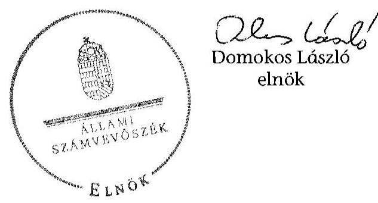

---

Magyar Orvosi Kamara szervezeti rendszerének felépítése
(2012. december 31-i állapot)
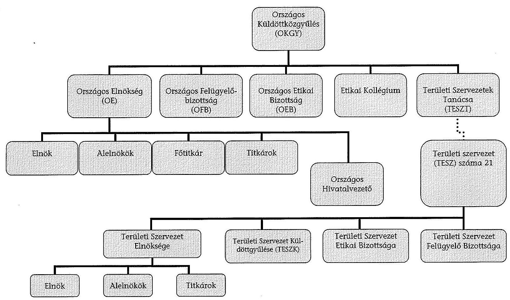

---

.

---

# AZ ALAPSZABÁLY ${ }_{1-4}$-BEN ELŐÍRT, A TESZK HATÁSKÖRÉBE TARTOZÓ FELADATOK ELMULASZTÁSA 2010-2012. ÉVEKBEN

(A listát a jelentéstervezet szövege nem tartalmazza)

|  a TESZK hatáskörébe tartozó feladatok | Baranya Megyei TESZK | Békés
Megyei
TESZK | BTESZK | Fejér Me-
gyei
TESZK | Hajdú-Bi-
har Me-
gyei
TESZ | Heves
Megyei
TESZ | Nógrád
Megyei
TESZ | Somogy
Megyei
TESZ | SZSZB
Megyei
TESZ  |
| --- | --- | --- | --- | --- | --- | --- | --- | --- | --- |
|  döntés a TESZ belső szervezetéről, a fel-adat- és hatáskörök megosztásáról (Alapszabály ${ }_{1-4}$ 27. cc) pont) | X | X | X |  |  |  | X |  |   |
|  TESZK SZMSZ-ének (óváhagyása (Alapszabály ${ }_{3,4}$ 27. cc) pont) | X | X | X | X |  | X |  |  |   |
|  a TESZ éves müködéséről szóló elnökségi beszámoló elfogadása 2010. évben (Alapszabály ${ }_{1} 27$. cd) pont) | X |  |  |  |  | X |  |  |   |
|  a TESZ éves müködéséről szóló elnökségi beszámoló elfogadása 2011. évben (Alapszabály ${ }_{2,3} 27$. cd) pont) |  |  |  |  |  | X |  | X | X  |
|  a TESZ éves müködéséről szóló elnökségi beszámoló elfogadása 2012. évben (Alapszabály ${ }_{3,4} 27$. cd) pont) |  |  |  |  | X |  |  |  |   |

---

| a TESZK hatáskörébe tartozó feladatok | Baranya Megyei TESZK | Békés Megyei TESZK | BTESZK | Fejér Me-   gyei   TESZK | Hajdú-Bi-   har Me-   gyei   TESZ | Heves   Megyei   TESZ | Nógrád Megyei TESZ | Somogy Megyei TESZ | SZSZB   Megyei   TESZ |
| :--: | :--: | :--: | :--: | :--: | :--: | :--: | :--: | :--: | :--: |
| a TESZ éves költségvetési tervének elfogadása 2010. évben   (Alapszabály 27 . cd) pont) |  |  |  |  |  |  |  |  |  |
| a TESZ éves költségvetési tervének elfogadása 2011. évben   (Alapszabály ${ }_{2,3} 27$. cd) pont) | X |  |  |  |  | X |  | X |  |
| a TESZ éves költségvetési tervének elfogadása 2012. évben   (Alapszabály ${ }_{3,4} 27$. cd) pont) |  |  |  |  |  |  |  |  |  |
| a TESZ éves záró mérlegének elfogadása 2010. évben (Alapszabály ${ }_{1} 27$. cd) pont) | X |  |  |  | X |  |  | X |  |
| a TESZ éves záró mérlegének elfogadása 2011. évben (Alapszabály ${ }_{2,3} 27$. cd) pont) |  |  |  |  | X | X |  | X |  |
| a TESZ éves záró mérlegének elfogadása 2012. évben (Alapszabály ${ }_{3,4} 27$. cd) pont) |  |  |  |  | X |  |  |  |  |

---

# A 2010-2012. ÉVEKBEN HATÁLYOS JOGSZABÁLYI ÉS BELSŐ SZABÁLYOK ÁLTAL ELŐÍRTAKAT FIGYELMEN KÍVÜL HAGYÓ TESZ-EK MEGNEVEZÉSE (1)

(A listát a jelentéstervezet szövege nem tartalmazza)

|  A szervezet sajátosságokhoz igazodóan nem készítették el/nem rögzítették/nem szabályozták teljes körüen | Baranya Megyei TESZ | B.-A.-Z.
Megyei
TESZ | Békés
Megyei
TESZ | BTESZ | Fejér Megyei TESZ | Fogorvosok TESZ | JNSZ
TESZ | Pest Megyei TESZ | Vas
Megyei
TESZ  |
| --- | --- | --- | --- | --- | --- | --- | --- | --- | --- |
|  az TESZ Elnökség ügyrendjének elkészítése
(Alapszabály ${ }_{1-4} 28$. ca) pont) | X | $\mathrm{X}^{1}$ |  |  | X |  |  |  | X  |
|  a TESZ FB ügyrendjének elkészítése (Alapszabály ${ }_{1-4} 30$. e) pont) |  | $\mathrm{X}^{2}$ | X |  | X |  | $\mathrm{X}^{3}$ | $\mathrm{X}^{4}$ | X  |
|  TESZ szervezeti-müködési, ügyrendi szabályzatának elkészítése (Alapszabály ${ }_{1-4} 28$. ca) és 55 . pont) | X |  |  | X | X |  |  | $\mathrm{X}^{5}$ |   |

${ }^{1}$ A B.-A.-Z. Megyei TESZ elnökségi ügyrenddel 2012. április 24-ig nem rendelkezett. ${ }^{2}$ A B.-A.-Z. Megyei TESZ FB 2010. január 1. és 2012. február 28. között nem rendelkezett ügyrenddel. ${ }^{3}$ A JNSZ TESZ FB 2012. november 30 -ig nem rendelkezett ügyrenddel. ${ }^{4}$ A Pest Megyei TESZ FB 2010. január 1. és 2011. december 11. között nem rendelkezett ügyrenddel. ${ }^{5}$ A Pest Megyei TESZ 2010. január 1. és 2011. október 25. között nem rendelkezett szervezeti és müködési, ügyrendi szabályzattal.

---

|  A szervezet sajátosságokhoz igazodóan nem készítették el/nem rögzítették/nem szabályozták teljes körüen | Baranya Megyei TESZ | B.-A.-Z. Megyei TESZ | Békés Megyei TESZ | BTESZ | Fejér Megyei TESZ | Fogorvosok TESZ | JNSZ TESZ | Pest Megyei TESZ | Vas Megyei TESZ  |
| --- | --- | --- | --- | --- | --- | --- | --- | --- | --- |
|  a TESZ pénzügyi, számviteli szabályzatainak elkészítése (Számv. tv. és Alapszabály ${ }_{3-4}$ 27. cf) pont) |  |  |  | $X^{6}$ |  |  |  | $X$ | $X^{7}$  |
|  a könyvvezetés módját (Számv. tv. 12. § (2) bekezdés) |  |  |  |  |  |  |  | X |   |
|  az évközi és év végi zárlatok időpontját, feladatait (Számv. tv. 164. § (1)-(3) bekezdés) |  |  |  |  |  |  |  | X |   |
|  az értékelésnél mit tekintenek lényegesnek, nem lényegesnek (Számv. tv. 14. § (4) bekezdés) | X |  |  |  | X |  |  | X |   |
|  az értékelésnél mit tekintenek jelentős összegnek, nem jelentős összegnek (Számv. tv. 14. § (4) bekezdés) | X |  |  |  |  |  | X | X | X  |
|  a megbízható és valós képet lényegesen befolyásoló hiba nagyságát (Számv. tv. 3. § (3) bekezdés 3-4. pont) |  | X |  |  | X |  |  | X |   |
|  az eszközök minősítési szempontjait (Számv. tv. 23. § (4) és 24-33. §) | X |  |  |  | X |  |  | X |   |

[^0] [^0]: ${ }^{6}$ A BTESZ 2010. január 1. és 2012. október 8. között nem rendelkezett hatályos számviteli politikával, 2012. október 9-től a TESZK által jóváhagyott számviteli szabályzatokkal nem rendelkezett. ${ }^{7}$ A Vas Megyei TESZ 2012. január 1-jétől a TESZK által jóváhagyott számviteli szabályzatokkal nem rendelkezett.

---

|  A szervezet sajátosságokhoz igazodóan nem készítették el/nem rögzítették/nem szabályozták teljes körüen | Baranya Megyei TESZ | B.-A.-Z. Megyei TESZ | Békés Megyei TESZ | BTESZ | Fejér Megyei TESZ | Fogorvosok TESZ | INSZ   TESZ | Pest Megyei TESZ | Vas Megyei TESZ  |
| --- | --- | --- | --- | --- | --- | --- | --- | --- | --- |
|  a források minősítési szempontjait (Számv. tv. 34-45. §) | X | X |  |  | X |  |  | X |   |
|  az eszközök bekerülési érték tartalmát (Számv. tv. 47-51. §) | X |  |  |  | X |  |  | X |   |
|  az amortizációs politika elemeit (Számv. tv. 52-53. §) | X |  |  |  | X |  |  | X |   |
|  számviteli politikán belül az eszközök és források leltárkészítési és leltározási szabályozást (Számv. tv. 14. § (5) bekezdés a) pont) |  |  |  |  |  |  |  | X |   |
|  számviteli politikán belül az eszközök és források értékelési szabályzat elkészítése (Számv. tv. 14. § (5) bekezdés b) pont) | X |  |  |  |  |  |  | X | X  |
|  számviteli politikán belül a pénzkezelési szabályzatot (Számv. tv. 14. § (5) bekezdés d) pont) |  |  |  |  |  |  |  | X |   |
|  pénzforgalom lebonyolításának rendjét (Számv. tv. 14. § (8) bekezdés) |  |  |  | X |  |  |  |  |   |
|  pénzkezelés személyi és tárgyi feltételeinek rögzítése (Számv. tv. 14. § (8) bekezdés) | X |  |  |  | X |  |  |  |   |

---

|  A szervezet sajátosságokhoz igazodóan nem készítették el/nem rögzítették/nem szabályozták teljes körüen | Baranya Megyei TESZ | B.-A.-Z. Megyei TESZ | Békés Megyei TESZ | BTESZ | Fejér Megyei TESZ | Fogorvosok TESZ | JNSZ TESZ | Pest Megyei TESZ | Vas Megyei TESZ  |
| --- | --- | --- | --- | --- | --- | --- | --- | --- | --- |
|  Számv. tv. szerinti számlarend elkészítése (Számv. tv. 161. §) | X | X | X | X | X |  | X | X |   |
|  adatvédelmi és adatbiztonsági szabályzat elkészítése 2011. szeptember 24-ét követően
(Eitv. 4. § (3) bekezdés, Avtv. 31/A. § (3) bekezdés és az Info tv. 24. § (3) bekezdés) | X | X | X | X | X | X |  | X | X  |
|  közzétételi szabályzat elkészítése 2011. szeptember 24-ét követően (305/2005. (XII. 25.) számú Korm. rendelet 3. §) | X | X | X | X | X | X | X | X | X  |

---

# A 2010-2012. ÉVEKBEN HATÁLYOS JOGSZABÁLYI ÉS BELSŐ SZABÁLYOK ÁLTAL ELŐÍRTAKAT FIGYELMEN KÍVÜL HAGYÓ TESZ-EK MEGNEVEZÉSE (2)

(A listát a jelentéstervezet szövege nem tartalmazza)

|  A szervezet sajátossá-
gokhoz igazodóan
nem készítették
el/nem rögzítet-
ték/nem szabályozták
teljes körüen | Bács-
Kiskun
Megyei
TESZ | Csong-
rád Me-
gyei
TESZ | Győr-
Moson-
Sopron
Megyei
TESZ | Hajdú-
Bihar
Megyei
TESZ | Heves
Megyei
TESZ | KEM
TESZ | Nógrád
Megyei
TESZ | Somogy
Megyei
TESZ | SZSZB
Megyei
TESZ | Tolna
Megyei
TESZ | Vesz-
prém
Megyei
TESZ | Zala
Megyei
TESZ  |
| --- | --- | --- | --- | --- | --- | --- | --- | --- | --- | --- | --- | --- |
|  az TESZ Elnökség ügy-
rendjének elkészítése
(Alapszabály1-4 28. ca)
pont) |  | $\mathrm{X}^{1}$ |  |  | X |  | X | $\mathrm{X}^{2}$ | X |  |  |   |
|  a TESZ FB ügyrendjének
elkészítése
(Alapszabály1-4 30. e)
pont) | $\mathrm{X}^{3}$ | $\mathrm{X}^{4}$ |  | X | $\mathrm{X}^{5}$ |  | X | X | X |  | $\mathrm{X}^{6}$ | $\mathrm{X}^{7}$  |

${ }^{1}$ A Csongrád Megyei TESZ Elnöksége 2010. január 1. és 2011. december 14. között ügyrenddel nem rendelkezett. ${ }^{2}$ A Somogy Megyei TESZ Elnöksége 2010. január 1. és 2012. szeptember 13. között ügyrenddel nem rendelkezett. ${ }^{3}$ A Bács-Kiskun Megyei TESZ FB 2010. január 1. és 2012. március 22. között ügyrenddel nem rendelkezett. ${ }^{4}$ A Csongrád Megyei TESZ FB 2010. január 1. és 2011. december 14. között ügyrenddel nem rendelkezett. ${ }^{5}$ A Heves Megyei TESZ FB 2010. január 1. és 2012. december 31. között ügyrenddel nem rendelkezett. ${ }^{6}$ A Veszprém Megyei TESZ 2010. január 1. és 2011. december 11. között ügyrenddel nem rendelkezett. ${ }^{7}$ A Zala Megyei TESZ FB 2010. január 1. és 2011. december 31. között ügyrenddel nem rendelkezett.

---

| A szervezet sajátosságokhoz igazodóan nem készítették el/nem rögzítették/nem szabályozták teljes körüen | BácsKiskun Megyei TESZ | Csong-rád Megyei TESZ | Győr-Moson-Sopron Megyei TESZ | Hajdú-Bihar Megyei TESZ | Heves Megyei TESZ | KEM TESZ | Nógrád Megyei TESZ | Somogy Megyei TESZ | SZSZB   Megyei TESZ | Tolna Megyei TESZ | Veszprém Megyei TESZ | Zala Megyei TESZ |
| :--: | :--: | :--: | :--: | :--: | :--: | :--: | :--: | :--: | :--: | :--: | :--: | :--: |
| TESZ szervezeti-múködési, ügyrendi szabályzatának elkészítése (Alapszabály ${ }_{3-}$ 4 28. ca) és 55 . pont) |  |  |  |  |  |  |  | $X^{8}$ |  |  |  |  | $X^{9}$ |
| a TESZ pénzügyi, számviteli szabályzatainak elkészítése (Számv. tv. és Alapszabály ${ }_{3-4}$ 27. cf) pont) | $X^{10}$ | $X^{11}$ |  | $X^{12}$ | $X^{13}$ |  | $X^{14}$ | X | $X^{15}$ | $X^{16}$ |  |  | $X^{17}$ |

[^0]
[^0]:    ${ }^{8}$ A Somogy Megyei TESZ 2012. szeptember 14-től TESZK által jóváhagyott szervezeti-működési, ügyrendi szabályzattal nem rendelkezett.
    ${ }^{9}$ A Zala Megyei TESZ 2010. január 1. és 2011. december 31. között szervezeti-működési, ügyrendi szabályzattal nem rendelkezett.
    ${ }^{10}$ A Bács-Kiskun Megyei TESZ 2012. január 1-jétől a TESZK által jóváhagyott számviteli politikával nem rendelkezett.
    ${ }^{11}$ A Csongrád Megyei TESZ 2010. január 1. és 2011. december 31. között számviteli politikával nem rendelkezett.
    ${ }^{12}$ A Hajdú-Bihar Megyei TESZ 2012. január 1-jétől a TESZK által jóváhagyott számviteli politikával nem rendelkezett.
    ${ }^{13}$ A Heves Megyei TESZ 2012. január 1-jétől a TESZK által jóváhagyott számviteli szabályzatokkal nem rendelkezett.
    ${ }^{14}$ A Nógrád Megyei TESZ 2010. január 1-jétől 2011. december 31-ig számviteli szabályzatokkal nem rendelkezett, 2012-évben a TESZK által jóváhagyott számviteli politikával, leltározási, értékelési és pénzkezelési szabályzatokkal nem rendelkezett.
    ${ }^{15}$ Az SZSZB Megyei TESZ 2010. január 1-je és 2011. december 31. között számviteli politikával nem rendelkezett.
    ${ }^{16}$ A Tolna Megyei TESZ 2010. január 1-je és 2011. december 31. között számviteli szabályzatokkal - a pénzkezelési és a leltározási szabályzatokon kívül - nem rendelkezett.
    ${ }^{17}$ A Zala Megyei TESZ 2010. január 1-je és 2012. december 31. között - pénzkezelési szabályzaton kívül - érvényes számviteli szabályzatokkal nem rendelkezett.

---

|  A szervezet sajátosságokhoz igazodóan nem készítették el/nem rögzítették/nem szabályozták teljes körüen | Bács-
Kiskun
Megyei
TESZ | Csong-
rád Me-
gyei
TESZ | Győr-
Moson-
Sopron
Megyei
TESZ | Hajdú-
Bihar
Megyei
TESZ | Heves
Megyei
TESZ | KEM
TESZ | Nögrád
Megyei
TESZ | Somogy
Megyei
TESZ | SZSZB
Megyei
TESZ | Tolna
Megyei
TESZ | Vesz-
prém
Megyei
TESZ | Zala
Megyei
TESZ  |
| --- | --- | --- | --- | --- | --- | --- | --- | --- | --- | --- | --- | --- |
|  a könyvvezetés módját (Számv. tv. 12. § (2) bekezdés) |  |  |  |  |  |  | X |  |  |  |  | X  |
|  az évközi és év végi zárlatok időpontját, feladatait (Számv. tv. 164. § (1)-(3) bekezdés) | X |  |  |  |  |  | X |  |  |  |  | X  |
|  az értékelésnél mit tekintenek lényegesnek, nem lényegesnek (Számv. tv. 14. § (4) bekezdés) | X |  | X |  |  |  | X |  | X |  | X | X  |
|  az értékelésnél mit tekintenek jelentős összegnek, nem jelentős összegnek (Számv. tv. 14. § (4) bekezdés) | X |  |  |  |  |  | X |  |  |  |  | X  |
|  a megbízható és valós képet lényegesen befolyásoló hiba nagyságát (Számv. tv. 3. § (3) bekezdés 3-4. pont) | X |  |  |  |  |  | X |  |  |  |  | X  |
|  az eszközök minősítési szempontjait (Számv. tv. 23. § (4) és 24-33. §) |  | X |  |  |  |  | X |  |  |  |  | X  |

---

| A szervezet sajátossá-gokhoz igazodóan nem készítették el/nem rögzítették/nem szabályozták teljes körüen | BácsKiskun Megyei TESZ | Csong-rád Me-gyei TESZ | Győr-Moson-Sopron Megyei TESZ | Hajdú-Bihar Megyei TESZ | Heves Megyei TESZ | KEM TESZ | Nógrád Megyei TESZ | Somogy Megyei TESZ | SZSZB   Megyei TESZ | Tolna Megyei TESZ | Vesz-prém Megyei TESZ | Zala Megyei TESZ |
| :--: | :--: | :--: | :--: | :--: | :--: | :--: | :--: | :--: | :--: | :--: | :--: | :--: |
| a források minősítési szempontjait (Számv. tv. 34-45. §) |  | X |  |  |  |  | X |  |  |  |  |  | X |
| az eszközök bekerülési érték tartalmát (Számv. tv. 47-51. §) |  | X |  |  |  |  | X |  |  |  |  |  | X |
| az amortizációs politika elemeit (Számv. tv. 5253. §) |  |  |  |  |  |  | X |  |  |  |  |  | X |
| számviteli politikán belül az eszközök és források leltárkészítési és leltározási szabályozást (Számv. tv. 14. § (5) bekezdés a) pont) | $\mathrm{X}^{18}$ | X |  | X |  |  |  | X | X |  |  |  |  | X |
| számviteli politikán belül az eszközök és források ér- | $\mathrm{X}^{19}$ | X |  |  |  |  | X | X | $\mathrm{X}^{20}$ |  |  |  | X |

[^0]
[^0]:    ${ }^{18}$ A Bács-Kiskun Megyei TESZ 2012. január 1-jétől a TESZK által jóváhagyott leltárkészítési és leltározási szabályzattal nem rendelkezett.
    ${ }^{19}$ A Bács-Kiskun Megyei TESZ 2012. január 1-jétől a TESZK által jóváhagyott értékelési szabályzattal nem rendelkezett.
    ${ }^{20}$ Az SZSZB Megyei TESZ 2010. január 1. és 2011. december 31. között értékelési szabályzattal nem rendelkezett.

---

|  A szervezet sajátos |  |  |  | Győr- | Hajdú- |  |  |  |  |  |  |  |  |  |  |  |  |  |  |  |  |  |  |  |  |  |   |
| --- | --- | --- | --- | --- | --- | --- | --- | --- | --- | --- | --- | --- | --- | --- | --- | --- | --- | --- | --- | --- | --- | --- | --- | --- | --- | --- | --- |
|  a szervezet sajátosságokhoz igazodóan nem készítették el/nem rögzítették/nem szabályozta | Bács-
Kiskun
Megyei
TESZ | Csong-
rád Me-
gyei
TESZ |  |  |  |  |  |  |  |  |  |  |  |  |  |  |  |  |  |  |  |  |  |  |  |  |   |
|  tékelési szabályzat elkészítése (Számv. tv. 14. § (5) bekezdés b) pont) |  |  |  |  |  |  |  |  |  |  |  |  |  |  |  |  |  |  |  |  |  |  |  |  |  |  |   |
|  számviteli politikán belül a pénzkezelési szabályzatot (Számv. tv. 14. § (5) bekezdés d) pont) | $\mathrm{X}^{21}$ | $\mathrm{X}^{22}$ |  |  |  |  |  |  |  |  |  |  |  |  |  |  |  |  |  |  |  |  |  |  |  |  |  |   |
|  pénzforgalom lebonyolításának rendjét (Számv. tv. 14. § (8) bekezdés) |  |  |  |  |  |  |  |  |  |  |  |  |  |  |  |  |  |  |  |  |  |  |  |  |  |  |  |   |
|  pénzkezelés személyi és tárgyi feltételeinek rögzítése (Számv. tv. 14. § (8) bekezdés) |  |  |  |  |  |  |  |  |  |  |  |  |  |  |  |  |  |  |  |  |  |  |  |  |  |  |  |   |
|  Számv. tv. szerinti számlarend elkészítése (Számv. tv. 161. §) | X | $\mathrm{X}^{24}$ | X |  |  |  |  |  |  |  |  |  |  |  |  |  |  |  |  |  |  |  |  |  |  |  |  |   |

${ }^{21}$ A Bács-Kiskun Megyei TESZ 2012. január 1-jétől a TESZK által jóváhagyott pénzkezelési szabályzattal nem rendelkezett. ${ }^{22}$ A Csongrád Megyei TESZ 2012. január 1-jétől TESZK által jóváhagyott pénzkezelési szabályzattal nem rendelkezett. ${ }^{23}$ A Somogy Megyei TESZ 2010. január 1. és 2012. szeptember 13. között nem rendelkezett pénzkezelési szabályzattal. 2012. szeptember 14-től a TESZK által jóváhagyott pénzkezelési szabályzattal nem rendelkezett. ${ }^{24}$ A Csongrád Megyei TESZ 2010. január 1. és 2011. december 31. között számlarenddel nem rendelkezett.

---

4 SZÁMÚ MELLÉKLET A V-0531-1722/2015. SZÁMÚ SZÁMVEVÓSZÉKI JELENTÉSHEZ

| A szervezet sajátossá- | Bács- | Csong- | Győr- | Hajdú- | Heves | KEM | Nógrád | Somogy | SZSZB | Tolna | Vesz- | Zala |
| :-- | :--: | :--: | :--: | :--: | :--: | :--: | :--: | :--: | :--: | :--: | :--: | :--: |
| gokhoz igazodóan | Kiskun | rád Me- | Sopron | Bihar | Megyei | TESZ | TESZ | Megyei | Megyei | Megyei | TESZ | Megyei |
| nem készítették | Megyei | TESZ | Megyei | TESZ | TESZ |  |  | TESZ | TESZ | TESZ | TESZ | TESZ |
| telen szabályozaták |  |  | TESZ |  |  |  |  |  |  |  |  |  |
| teljes körűen |  |  |  |  |  |  |  |  |  |  |  |  |

adatvédelmi és adatbiztonsági szabályzat elkészítése 2011. szeptember 24-ét követően (Eitv. 4. § (3) bekezdés, Avtv. 31/A. § (3) bekezdés és az Info tv. 24. § (3) bekezdés)
közzétételi szabályzat elkészítése 2011. szeptember 24-ét követően (305/2005. (XII. 25.) számú Korm. rendelet 3. §)

---

# Magyar Orvosi Kamara Bács- Kiskun Megyei Teruleti Szervezete   6000 Kecskemét, Nyiri út 38.   Elnok; Dr. Borda Ferenc   Tel./Fax:76/516-767 E-mail: bacsmek@kmk.hu 

Ikt.: szám: 308/2015.
Ügyintéző: Eszes Lásztiné

Állami Számvevőszék
D o m o k o s László elnök

## Budapest

Apáczai Csere János u. 10.
1052
Tisztelt Elnők Úrl

$$
\begin{aligned}
& \text { Állami Számvevőszék } \\
& 23195 / 2015 \\
& \text { Ér. 2015 MARC } 30 \\
& \text { Ikaros: } \\
& \text { Melléklet: }
\end{aligned}
$$

Az ÁSZ V-0531-1645/2015. iktatószámú jelentéstervezetéhez az alábbi észrevételeket kivánom tenni a MOK Bács- Kiskun Megyei Területi Szervezete részéröl:
Megitélésem szerint az elsô két pontban jelzett esetben a tervezet megállapitásával ellentétben, vétlenek vagyunk.
A harmadik pontban felsorolt szabályzatokkal folyamatosan rendelkezlünk, az elfogadás során történt hiba.
A negyedik pontban említett szabályzattal az ellenôrzólt idôszak egy részében már rendelkezlünk.

1. A 4. sz. melléklet harmadik oldalán hiányként jelzett 4 tételt tartalmazza a „Számviteli Politika" szabályzatunk 7. és 9. pontja (Zárlat idópontja, értékelésnél mit tekintünk lényegesnek, vagy lényegtelennek, mit tekintünk jelentös, vagy nem jelentös összegnek, lényeges hiba nagysága. ).
2. A 4. számú melléklet ötödik oldalán hiányolt számlarenddel rendelkezünk. A könyvelésünket számitógépen, a REGRAM programban rögzitett számlarend szerint végezzük. Ezt az ellenörzés során jeleztük.
3. A 4. sz. melléklet 2., 4. és 5. oldalán jelzett számviteli politika, leltározási, leltárkészitơsi, értékelési, pénzkezelési szabályzatot az egységesités jegyében 2012ben lecseréltük. A szabályzatok elfogadása tévesen az elnokség által történt.
4. Adatkezelési és adatblztonsági szabályzatunk 2012. márc. 21. óta van.

Kecskemét, 2015. március 24.
Tisztelettel:
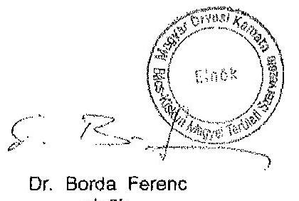

---

.

---

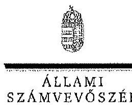

ELNÖK

Ikt. szám: V-0531-1691/2015.

Dr. Borda Ferenc ór
elnök
Magyar Orvosi Kamara Bács-Kiskun Megyei Területi Szervezetc

# Kecskemét 

## Tisztelt Elnök Úr!

A Magyar Orvosi Kamara gazdálkodásának, továbbá a feladatai finanszírozására kapott költségvetési támogatások felhasználásának ellenőrzéséről készített számvevőszéki jelentéstervezetre tett észrevételeit köszönettel megkaptam.

Az Állami Számvevőszék észrevételekre vonatkozó álláspontjáról a felügyeleti vezető által készített részletes tájékoztatást csatoltan megküldöm.

Tájékoztatom Elnök urat, hogy a jelentésben - az Állami Számvevőszékről szóló 2011. évi LXVI. törvény 29. § (3) bekezdése alapján - az el nem fogadott észrevételeket szerepeltetjük az elutasítás indokának feltüntetésével együtt.

Budapest, 2015. 04. hó. 20. nap
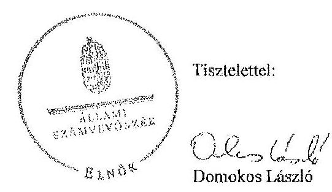

Melléklet: Tájékoztatás az el nem fogadott észrevételekről

---

# Tájékoztatás az el nem fogadott észrevételekröl 

A Magyar Orvosi Kamara gazdálkodásának, továbbá a feladatai finanszírozására kapott költségvetési támogatások felhasználásának ellenőrzéséről készített jelentéstervezetre a 308/2015. iktatószámú levelében tett észrevételeit áttekintettük, azok kezeléséről az alábbi tájékoztatást adom.

Nem fogadluk el az 1., 3. és 4. számú észrevételét, mivel az ellenőrzött időszakban az Alapszabály 27. cf) pontja kifejezetten a TESZK hatáskörébe utalja valamennyi belsö szabályzat jóváhagyását. Ennek alapján a számviteli politikát és az adatkezelési és adatvédelmi szabályzatot is a TESZK-nek kellett volna jóváhagynia. A TESZK jóváhagyása nélkül a szabályzatokat nem felelnck meg a szabályossági követelményeknek, ezért azokat az ellenőrzés nem fogadta el hatályban lévô szabályzatként. Ennek következtében az észrevételében jelzett területeket (pl. értékelésnél mit tekint lényegesnek, lényeges hiba nagysága, stb.), mint nem szabályozott területeket értékelte.

Nem fogadtuk el a 2. számú észrevételét. Elnök úr észrevételében kitért arra, hogy könyvelésüket számítógépen, könyvelőprogramban rögzített számlarend szerint végezték. A könyvelő programban szereplő számlarend (számlatükör) nem felelt meg a Számv. tv. 161. § (2) bekezdésében meghatározott számlarendnek. Az nem tartalmazta a számla tartalmát (növekedés, csökkenés jogcímei, számlát érintő gazdasági események, azok más számlákkal való kapcsolatát), a fökönyvi számla és az analitikus nyilvántartás kapcsolatát, valamint az elszámolást alátámasztó bizonylati rendet. A jelentéstervezet megállapítása ezért helytálló, a területi szervezet az ellenőrzött idöszakban nem rendelkezett számlarenddel.

Budapest, 2015. 04. hó. 23 . nap

Holman Magdolna
felügyeleti vezetö

---

# Magyar Orvosi Kamara   Baranya Megyei Terïleti Szervezete 

7621 Pécs, Ferencesek u. 7.
Tel./Fax: 72/210-903
e-mail: bmorvkam@bok.axelero.net

Állami Számvevöszék
Domokos László Elnök Úr részére
Budapest
Apáczai csere János utca 10.
1052

Tisztelt Elnök Úr!
ikt.szám: 119/2015.
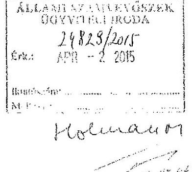

A Magyar Orvosi Kamara gazdálkodásával kapcsolatosan elvégzett ellenörzésére a Magyar Orvosi Kamara Baranya Megyei Területi Szervezetének megküldött és 2015. március 13.-án átveti jelentéstervezetére az alábbi észrevételt tesszük:

A jelentéstervezetben megfogalmazásra került, hogy a területi szervezetünk alapszabálya nem felel meg a jogszabályi elöírásoknak.
Az alapszabályunkat a Magyar Orvosi Kamara alapszabálya szerint készilettünk el, melyet aláirás után felterjesztettünk, és jóváírásra került.
Amennyiben az alapszabályunkban foglaltak nem felelnek meg a jogszabályi elöírásoknak. a Magyar Orvosi Kamara útmutatásai szerint korrigálni fogjuk.

Hiányosságként szerepel, hogy helyi kamaránk nem rendelkezik Szervezeti és Müködési Szabályzattal, nincs elnökségi ügyrendje, valamint közzétételi szabályzattal sem rendelkeziink. Ezen hiányosságokat az Magyar Orvosi Kamara kamaránk felé nem jelezte, amennyiben jelezte volna, természetesen ennek kamaránk eleget tett volna.
Mellékelten csatoljuk a pénzkezelési szabályzat, adatkezelési és adatvédelmi szabályzat valamint számviteli politika másolati példányait.
A közzétételi szabályzattal kapcsolatban az alábbiakat rögzítjük:
A mérleget összevontan késziti el a Magyar Orvosi Kamara a Területi Szervezetek mérlegelnek felhasználásával.
Továbbá a Magyar Orvosi Kamara teszi közzé az összesittett mérleget, a megyéket nem lehet közzé tenni, mert egy szervezet vagyunk, egy birósági bejegyzés alati.
A számviteli politikával kapcsolatban:
A vizsgálat hiányosnak találta a 3. számú mellékletben rögzítetteket, melyet kiegészítünk, de észrevételünk, hogy miután egy szervezet vagyunk, az elmúlt időszakban most kaptunk utasitást az egységes számlakeret alkalmazására, természetesen már alkalmazzuk, ugyanígy, ennek megfelelően kellene - e g y s é g e s e n-meghatározni a szabályzatokat is.
A számlakeret része a számviteli politikának.
Az utalványozás kamaránkban minden esetben megtörténik. A jutalom kifizetését találta még a vizsgálat bizonylat szempontjából hiányosnak, mert nem szerepelt a munkaszerzödésben.

---

Észrevétel: álláspontunk szerint nem kell, hogy a munkoszerzödésben szerepeljen, meri a kifizetésre eseti jelleggel keriilt sor, minden esetben elnöki engedéllyel.
A vizsgálat hibaként jeizi, hogy a könyvelés dátuma a bizonylatokon nem szerepel. Megjegyezni kivánom, hogy a 3. számú mellékletben szereplő ügyrendi hiányosságok között szereplő 2010 évi mérleg, elnökségi beszámoló, és 2011 évi költségvetés elfogadása megtörtént, de az erre vonatkozó dokumentációkat csatolni nem tudtuk.

Kérjük a Tisztelt Számvevöszéket, hogy az észrevételünkben foglaltakat elfogadni szíveskedjék, a nála felmerülö hiányosságokat záros határidőn belül a kamara Baranya Megyei Területi Szervezete pótolja.

Kelt, Pécs, 2015. március 25.

Tisztelettel:
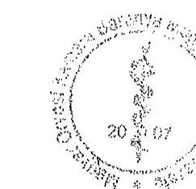

Dr. Veszprémi Béla
Magyar Orvosi Kamara
Baranya Megyei Teruileti Szervezetének
elnöke

---

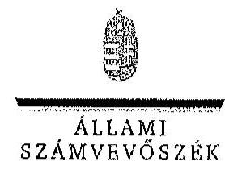

ELNBK

Ikl. szim: V-0531-1690/2015.

Dr. Veszprémi Béla úr
elnök
Magyar Orvosi Kamara Baranya Megyei Tertileti Szervezete

Pécs

Tisztelt Elnök Úr!

A Magyar Orvosi Kamara gazdálkodásának, továbbá a feladatai finanszírozására kapott költségvetési támogatások felhasználásának ellenőrzéséről készített számvevőszéki jelentéstervezetre tett észrevételeit köszönettel megkaptam.

Az Állami Számvevőszék észrevételekre vonatkozó álláspontjáról a felügyeleti vezető által készített részletes tájékoztatást csatoltan megküldöm.

Tájékoztatom Elnök urat, hogy a jelentésben - az Állami Számvevőszékről szóló 2011. évi LXVI. törvény 29. § (3) bekezdése alapján - az el nem fogadott észrevételeket szerepeltetjük az elutasítás indokának feltüntetésével együtt.

Budapest, 2015. 04. hó 25. nap
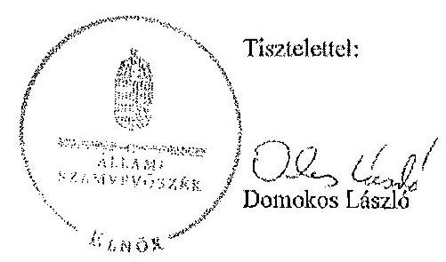

Melléklet: Tájékoztatás az el nem fogadott észrevételekről

---

# Tájékoztatás az el nem fogadott észrevételekröl 

A Magyar Orvosi Kamara gazdálkodásának, továbbá a feladatai finanszírozására kapott költségvetési támogatások felhasználásának ellenőrzéséről készített jelentéstervezetre a 119/2015. iktatószámú levelében tett észrevételeit áttekintettük, azok kezeléséről az alábbi tájékoztatást adom.

Nem fogadtuk el az alapszabályra vonatkozó észrevételét, mert az Alapszabályra vonatkozó megállapítást a jelentéstervezet nem tartalmazott. Az Alapszabályban foglaltak betartása volt része az ellenőrzésnek. A jelentéstervezet megállapítása szerint az alapszabályban, valamint jogszabályban foglalt elöírások ellenére a területi szervezet nem rendelkezett szervezetimüködési szabályzattal, elnökségi ügyrenddel, adatvédelmi és adatbiztonsági szabályzattal, közzétételi szabályzattal, továbbá müködésük és gazdálkodásuk szabályait a Számv. tv.-ben, és az Alapszabályı-a-ben foglalt elöírások ellenére részben határozták meg.

Tájékoztatom Elnök urat, hogy levelének mellékleteként megküldött Adatkezelési és adatvédelmi Szabályzat nem a Baranya Megyei Területi Szervezet, hanem a Magyar Orvosi Kamara szabályzata. Külön döntés hiányában a Magyar Orvosi Kamara Adatkezelési és adatvédelmi szabályzata nem érvényes a területi szervezetre.

A részünkre eljuttatott Számviteli politika, illetve Pénzkezelési szabályzattal kapcsolatban tájékoztatom Elnök urat, hogy a jelentéstervezetben nem a szabályzatok hiányát, hanem az abban foglaltak jogszabályi és alapszabályi hiányosságait állapítottuk meg.

Nem fogadtuk el az SZMSZ-re, valamint az elnökségi ügyrendre vonatkozó észrevételét. Az a jelentéstervezet megállapítását nem módosítja. Az ellenőrzött időszakban hatályos Alapszabály 28. ca) pontja értelmében ugyanis a területi szervezet elnöksége előkészíti és a küldöttgyülés elé terjeszti a területi szervezet szervezeti és müködési szabályzatát, és megalkotja saját ügyrendjét. Ezen alapszabályi elöírás alapján a területi szervezetnek önálló SZMSZ-el és elnökségi ügyrenddel kell rendelkeznie, függetlenül a Magyar Orvosi Kamarától.

Nem fogadtuk el a közzétételi szabályzatra vonatkozó észrevételét. A jelentéstervezetben hiányosságként azt állapítottuk meg, hogy az ellenőrzött időszak végén a területi szervezet nem rendelkezett közzétételi szabályzattal, amelyet nem kifogásolt. Az egészségügyben müködő kamarákról szóló 2006. évi XCVII. törvény 1. § (4) pontja alapján a területi szervezetek és az országos szervek jogi személyek. Az alapszabály 2011. szeptember 24-ét követő módosítását követően az alapszabály 28. ca) pontja alapján a Területi Szervezet Elnöksége megalkotja saját ügyrendjét, előkészíti és a küldöttgyülés elé terjeszti a területi szervezet szakszerü és jogszerü müködéséhez szükséges belső szabályzatokat, így a területi szervezeteknek rendelkeznükk kell a müködésükhöz szükséges belső szabályzatokkal. A szabályzatok tartalma a területi szervezet döntése.

---

A számviteli politikára vonatkozó észrevétele a jelentéstervezetben foglalt megállapítást nem kifogásolja. Örömmel vettük azonban a számviteli politikával kapcsolatos módosításokra vonatkozó lépéseket.

Nem fogadtuk el a jutalom munkaszerzödésben való rögzítésére vonatkozó észrevételét, ugyanis a jelentéstervezetben nincsen a területi szervezetet érintő ilyen jellegủ megállapítás. Megállapításunk arra vonatkozott, hogy a mintatételekhez kapcsolódó kifizetések bizonylatai a Számv. tv. 167 § (1) be-kezdés c) pontjában foglaltak ellenére - nem, vagy nem minden esetben tartalmazták az utalványozó aláírását.

Nem fogadtuk el a könyvelés dátumára vonatkozó észrevételét, ugyanis az új körülményt, tényt nem mutat be. Indoklása nincs összefüggésben a megállapításunkkal, mert az a 2010. évi mérleg, elnökségi beszámoló, valamint a 2011. évi költségvetés elfogadására vonatkozik. Megállapításunk helytálló, miszerint a költség elszámolásokat alátámasztó bizonylatokon nem, vagy nem minden esetben szerepeltette a könyvviteli nyilvántartásokba történt rögzítés időpontját.

Budapest, 2015. C.4. hó 29 nap

Holman Magdolna
felügyeleti vezető

---

.

---

Magyar Orvosi Kamara
Békés Megyei Területi Szervezete
5700 Gyula, Dob u. 3. IV/409.
Tel./fax.: 06-66-526-526/2386.

Állami Számvevőszék
Domokos László Elnök Úr részére

Budapest
Apáczai Csere János u. 10.

Ikt.sz.: 34-1/2015.
Tárgy: Észrevétel jelentéstervezettel
kapcsolatban

ÁLLAMI SZÁMVVVÓSZÉK
23h06/2015
Érkeze: 2015 MóR 30
Iktarószár:
Melléklet:

1364

Tisztelt Elnők Úr!

Hivatkozással a V-0531-1647/2015 iktatószámú levelére, az abban mellékelt jelentéstervezettel kapcsolatban az alábbi észrevételt szeretném tenni.

Területi szervezetünket érintően megállapított hiányosságok:

- döntés a TENZ belső szervezetéről, a feladat- és hatáskörök megosztásáról
- TESZK SZMSZ-ének jóváhagyása
- TENZ FB ügyrendjének elkészítése
- Számv. tv. szerinti számlarend elkészitése
- adatvédelmi és adatbiztonsági szabályzat elkészitése 2011. szepi. 24-ét követöen
- közzétételi szabályzat elkészitése 2011. szepi. 24-ét követöen
- az igénybe vett és egyéb szolgáltatások költségei elszámolása nem volt megfelelö
- a rendszeres és a nem rendszeres személyi juttatások elszámolása nem felelt meg teljes körüen
- nem készült személyenkénti numkatdő nyilvántartás és igazoló analitika.

Ezen megállapításokat köszönettel tudomásul vesszük, a javasolt intézkedéseket amennyiben még nem történtek meg – megtesszük.

További megállapítások voltak:

- nem volt biztosított az utalványozás ellenőrizhetősége

Értelmezésünk szerint az alkalmazott eljárás ellenőrizhető, mivel a nyomtatott átutalási megbízások két jogosult tisztségviselő általi aláírás után kerülnek a bankba, csak ezen a módon kerülhetnek átutalásra az összegek, és a banki számlakivonatokban tételesen megjelenik minden átutalás. Mindazonáltal mai gyakorlatunkban már az átutalási szelvény bent maradó részén is hitelesítő aláírást alkalmazunk.

---

# - az Etikai Bizottság elnöke jogosulatlamul engedélyezett átiköltség térítési 

Értelmezésünk szcrint az utalványon az EB elnők a bizottsági tag „a kiküldetésben eltöltőtt idö szükségességét és a kiküldetés teljesitését igazolta" és nem a térités kifizetését engedélyezte, a pénztári kifizetések az utalványozási jogkörrel felhatalmazott tisztségviselők aláirása után történtek.

Bízunk abban, hogy Elnők úr munkatársai számára a tevékenységünkról alkotott hiteles kép kialalításához hozzájárulhattunk. A jelentéstervezci megállapításainak értelmezése, a javaslatok figyelembe vétele reményeink szcrint köztestületünk müködésénck további javitását segiti.
(Gyula, 2015. március 26.

Tisztelettel:
a MOK Békés Megyei Teri
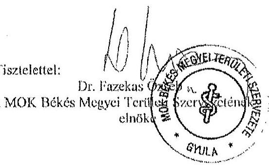

---

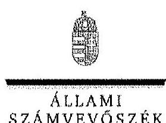

ELNÖK

# Dr. Fazekas Özseb úr 

elnök
Magyar Orvosi Kamara Békés Megyei Területi Szervezete

## Gyula

## Tisztelt Elnök Úr!

A Magyar Orvosi Kamara gazdálkodásának, továbbá a feladatai finanszírozására kapott költségvetési támogatások felhasználásának ellenőrzéséről készített számvevőszéki jelentéstervezetre tett észrevételeit köszönettel megkaptam.

Az Állami Számvevőszék észrevételekre vonatkozó álláspontjáról a felügyeleti vezető által készített részletes tájékoztatást csatoltan megküldöm.

Tájékoztatom Elnök urat, hogy a jelentésben - az Állami Számvevőszékről szóló 2011. évi LXVI. törvény 29. § (3) bekezdése alapján - az el nem fogadott észrevételeket szerepeltetjük az elutasítás indokának feltüntetésével együtt.

Budapest, 2015.
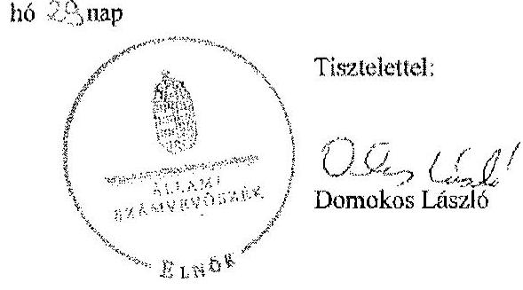

Melléklet: Tájékoztatás az el nem fogadott észrevételekről

---

# Tájékoztatás az el nem fogadott észrevételekről 

A Magyar Orvosi Kamara gazdálkodásának, továbbá a feladatai finanszírozására kapott költségvetési támogatások felhasználásának ellenőrzéséről készített jelentéstervezetre a 341/2015. iktatószámú levelében tett észrevételeit áttekintettük, azok kezeléséről az alábbi tájékoztatást adom.
Örömmel vettük tájékoztatását, hogy a feltárt hiányosságok megszüntetése érdekében Elnök úr lépéseket tesz. A jelentéstervezetre tett ezen észrevételei a jelentéstervezet megállapításait nem kifogásolják.
Nem fogadtuk el az utalványozás biztosítottságával kapcsolatban tett észrevételét. A Számv. tv. 165. § (1) bekezdés szerint minden gazdasági múveletről, eseményről, amely az eszközök, illetve az eszközök forrásainak állományát vagy összetételét megváltoztatja, bizonylatot kell kiállítani (készíteni). A gazdasági múveletek (események) folyamatát tükröző összes bizonylat adatait a könyvviteli nyilvántartásokban rögzíteni kell. Tekintettel arra, hogy a bérek kifizetéséről szóló papír alapra kinyomtatott átutalási megbízásokkal a szervezet nem rendelkezett (másolati példány nélkül kerültek a bankhoz) az utalványozás ellenőrizhetősége nem volt biztosított.
Nem fogadtuk el a belföldi kiküldetés engedélyezésére vontakozó észrevételét, mivel az Etikai Bizottság elnöke nem szerepelt a kötelezettségvállalási és utalványozási jogosultak között. A szervezeti és müködési szabályzat kötelezettségvállalási és utalványozási jogkör gyakorlására csak az elnököt, az alelnököt és a titkárokat jogosította fel. Szabályzatuk szerint kötelezettségvállalás „a Kamara feladatának ellátására vonatkozó fizetési vagy más teljesitési kötelezettségvállalás ... elrendelése". Az etikai bizottság elnöke a kiküldetés teljesítését a belföldi kiküldetési utasítás és költségelszámoláson igazolta, de ezen túlmenően kifizetésre szóló engedélyt is aláírt.

Budapest, 2015. 04 hó 23 nap

Holman Magdolna
felügyeleti vezető

---

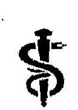

# MAGYAR ORVOSIKAMARA 

Budapesti Területi Szervezete
1075 Budapest, Wesselényi utca 6. I/2.
Levélcím: 1243 Budapest, Pf.: 607
Telefon, Fax: 06-1-344-4833, 06-1-344-4928
E-mail: bol@hpok.hu

## ÁLLAMI SZÁMVEVŐSZÉK

## Domokos László elnök részére

## Budapest

## Tisztelt Elnök Úrl

Hivatkozva a Magyar Orvosi Kamara gazdálkodásának, továbbá a feladatai finanszírozására kapott költségvetési támogatások felhasználásának ellenőrzéséről szóló jelentéstervezetben a MOK Budapesti Területi Szervezetére vonatkozó megállapításokra, azzal kapcsolatban az alábbi észrevételeket teszem:

1. A Budapesti TESZ ügyrenddel rendelkezik, melyben foglaltak meghatározzák annak müködését. Az Alapszabályban foglaltak alapján a „hiányzó" SZMSZ elkészitése folyamatban van.
2. A Budapesti TESZ a müködési és gazdálkodási szabályait a Számviteli tv. és az Alapszabály előírásaihoz megfelelően módosítja.
3. A hiányzó adatvédelmi és adatbiztonsági szabályzat elkészitése folyamatban van.
4. A hiányzó közzétételi szabályzatot pótlólag elkészítjük.
5. A számviteli nyilvántartások, az év végi értékelések és leltározások ellenőrzése a - Számv. tv.-ben foglaltak szerint - ismételten megtörtént.
6. A pénzügyi szabályzatunk módosítása jelenleg folyamatban van.
7. Az év végi leltározás (leltárfelvételi lap) a BTSZ részéről elkészült.
8. A választás határidőn túli elhúzódásának oka, hogy a VIII. kerületi választások törvényességi felügyeleti vizsgálatának eredményére vártunk, ami a sajnos a mai napig sem érkezett meg.
9. Az etikai bizottságok által a határidők be nem tartása:

Az eljárási rendre az egészségügyben müködő szakmai kamarákról szóló 2006. évi XCVII. törvény 23. § (5) bekezdése szerint az etikai eljárásra a közigazgatási hatósági eljárás és szolgáltatás általános szabályairól szóló 2004. évi CXL. törvény (Ket) megfelelő alkalmazását irtja elő. Különös, hogy az összes szakmai kamarak vonatkozásában egyedül az egészségügyben müködő szakmai kamarák számára nem teszi lehetővé a jogalkotó a saját

---

eljárási rend megalkotását, annak ellenére, hogy 2008-ig ez a joga megvolt a MOK-nak. A Ket megfelelő alkalmazásának értelmezése jogbizonytalanságot, nehézségeket okoz, mivel a Ket. valós közigazgatási ügyintézési határidöket állapít meg, elsősorban törvényes munkaidöben dolgozó köztisztviselők számára. Az etikai felelősségre vonás azonban nem csupán ügyintézés, hanem eljárás, melynek során etikai normasértést, mintegy szabálysértést kell kivizsgálni, felderíteni, elbírálni. Az etikai bizottságok nem is közigazgatási hatóságok. Az eljárás kérdéseit a jogalkotó nemcsak nem rendezte, de annak rendezését meg sem engedte a kamara részére, így az eljárás során vagy a határidő sérül, vagy a tényállás felderítése, vagy az ügyfelek jogos érdeke ugyanis csak gyanú esetén kell és lehet eljárást indítani az orvos ellen. Az eljárási szabályozatlanságot, az abból eredő nehézségeket számtalan helyen felvetettük, de az meghallgatásra nem talált, ezért - mivel a határidő sérelme felrovásra került - itt is feltétlenül szükségesnek tartjuk megjegyezni.

Budapest, 2015. március 31.
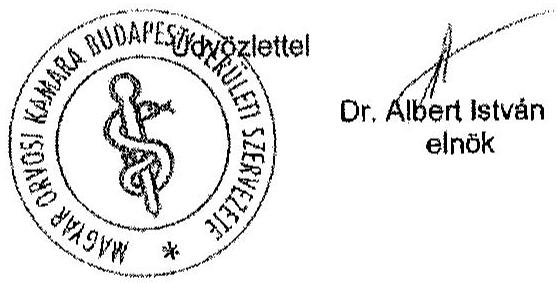

---

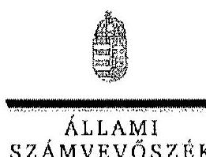

ELKÖK

Ikt.szám: V-0531-1699/2015.

Dr. Albert István úr
elnök
Magyar Orvosi Kamara Budapesti Területi Szervezete

Budapest

Tisztelt Elnök Úr!

A Magyar Orvosi Kamara gazdálkodásának, továbbá a feladatai finanszírozására kapott költségvetési támogatások felhasználásának ellenőrzéséről készített számvevőszéki jelentéstervezetre tett észrevételeit köszönettel megkaptam.

Az Állami Számvevőszék észrevételekre vonatkozó álláspontjáról a felügyeleti vezető által készített részletes tájékoztatást csatoltan megküldöm.

Tájékoztatom Elnök urat, hogy a jelentésben – az Állami Számvevőszékről szóló 2011. évi LXVI. törvény 29. § (3) bekezdése alapján – az el nem fogadott észrevételeket szerepeltetjük az elutasítás indokának feltüntetésével együtt.

Budapest, 2015.

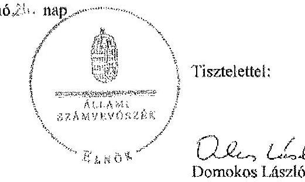

Melléklet: Tájékoztatás az el nem fogadott észrevételekről

1052 BUDAPEST, APÁCZNI CSERE LÁNOS UTCA 16. 1364 Budapest 4. Pl. 54 teleton: 484 9101 fax: 484 0201

---

# Tájékoztatás az el nem fogadott észrevételekröl 

A Magyar Orvosi Kamara gazdálkodásának, továbbá a feladatai finanszírozására kapott költségvetési támogatások felhasználásának ellenôrzéséről készített jelentéstervezetre a 482/V/2015. iktatószámú levelében tett észrevételeit áttekintettük, azok kezeléséről az alábbi tájékoztatást adom.

Örömmel vettük tájékoztatását, hogy a feltárt hiányosságok megszüntetése érdekében Elnök úr lépéseket tesz. Az etikai bizottságok határidőtartására vonatkozó megjegyzése a jelentéstervezet megállapítását nem kifogásolja, ahhoz kiegészitő információt nyújt.

Budapest, 2015. 04. hó 24 nap

Holman Málgdoina
felügyeleti vezető

---

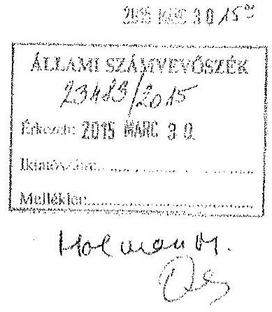

# Állami Számvevőszék 

Domokos László úr
Énök

Tisztelt Elnök Úr

Az Ön által idézett, az Állami Számvevôszékrôl szóló 2011.évi LXVI.tv. 29,§ (2) bekezdése szerint élek a 15 napon belüli írásbeli észrevétel lehetőségével, levelének 2015. március 13.-án történt kézhez vétele után.

Szeretném tájékoztatni, hogy az ÁSZ vizsgálat javaslatait Szervezetünk meg fogja valósítani. Elnökségünk megtárgyalta és a MOK Fejér Megyei Szervezet 2015.április 09.-n tartandó Küldöttgyüléstünk elé terjeszti, a jelentésük mellékletében feltüntetett SZMSZ és hiányzó szabályzók, valamint az adatvédelmi és közzétételi szabályzat tárgyalását.

Külön kitért az ÁSZ vizsgálat, hogy Szervezetünk egyik munkavállalója 4 eFt-tal magasabb összegủ munkabéri kapott, mint arról a munkaszerzödése szólt. A jelentésben azonban nem szerepel - az egyébként vizsgált tény -, hogy a magasabb bár szerint fizettük a közterheket, illetve állítottuk ki az adóigazolást. Járulékfizetési kötelezettségünknek eleget tettünk.

Szintén nem szerepel az anyagban, hogy szervezetünk 2006 óta országosan a MOK területi szervezetei közül az elsök között tért át a kettős könyvvitelre, megítélésem szerint könyvelésünk számszaki hibát nem tartalmazott, átlátható, amit valós adatok támasztottak alá.

---

Fontosnak éreztem a Magyar Orvosi Kamara gazdálkodásának, továbbá a feladatai finansziriozására kapott költségvetési támogatások felhasználásának ellenőrzéséről folytatott vizsgálatot. Mint állampolgár örömmel konstatáltam, hogy bizonyára rend van abban az országban, ahol a mintegy 70 ezer forint közpénzböl (Etikai Bizottságunk müködésének támogatása) gazdálkodó területi kamarát a legmagasabb ellenőrző állami szervezet vizsgálja. Megjegyezni kívánom, hogy a fenti összegről az Egészségügyi Államtitkárság felé hosszas, részletes elszámolás minden évben megtörtént. A vizsgálat évében (2014) a támogatás 0 Ft-ra csökkent.

Megtisztelő számunkra, hogy az ÁSZ vizsgálat olyan szigorú szempontrendszer szerint zajlott, mint egy sok milliárd forintos közpénzből gazdálkodó állami szervezetnél.

A MOK Fejér Megyei Szervezete a szűkös eröforrás ellátottság miatt különös figyelmet fordít arra, hogy minden tevékenységének a tervezése, megvalósítása és ellenőrzése során a költség és haszon elve kiemelten érvényesüljön továbbra is.

Számomra lényeges, hogy tagságunk győződjön meg arról, hogy az ÁSZ jelentése a MOK Fejér Megyei Szervezetének gazdálkodása ellenőrzése során visszaélést, csalást, hütlen kezelést nem állapított meg.

Székesfehérvár 2015. március 26.

Szívélyes üdvözlettel:
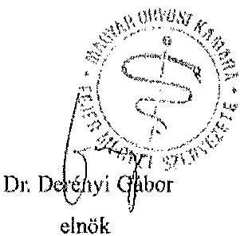

---

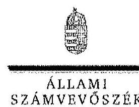

ELNÖK

# Dr. Derényi Gábor úr 

elnök
Magyar Orvosi Kamara Fejér Megyei Területi Szervezete

## Székesfehérvár

## Tisztelt Elnök Úr!

A Magyar Orvosi Kamara gazdálkodásának, továbbá a feladatai finanszirozására kapott költségvetési támogatások felhasználásának ellenőrzéséről készített számvevőszéki jelentéstervezetre tett észrevételeit köszönettel megkaptam.

Az Állami Számvevőszék észrevételekre vonatkozó álláspontjáról a felügyeleti vezető által készített részletes tájékoztatást csatoltan megküldöm.

Tájékoztatom Elnök urat, hogy a jelentésben - az Állami Számvevőszékről szóló 2011. évi LXVI. törvény 29. § (3) bekezdése alapján - az el nem fogadott észrevételeket szerepelhetjük az elutasítás indokának feltüntetésével együtt.

Budapest, 2015. 2. hó 23. nap
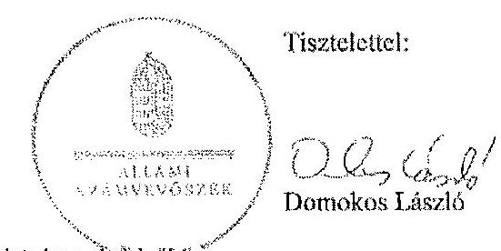

Melléklet: Tájékoztatás az el nem fogadott észrevételekről?

---

# Tájékoztatás az el nem fogadott észrevételekröl 

A Magyar Orvosi Kamara gazdálkodásának, továbbá a feladatai finanszírozására kapott költségvetési támogatások felhasználásának ellenőrzéséről készített jelentéstervezetre a 7/15/11-15. iktatószámú levelében tett észrevételeit áttekintettük, azok kezeléséről az alábbi tájékoztatást adom.
Örömmel vettük tájékoztatását, hogy a feltárt hiányosságok megszüntetése érdekében Elnök úr lépéseket fog tenni. Fontos számunkra, hogy előmozdítsuk a közpénzügyek átláthatóságát, rendezettségét. Meggyőződésünk, hogy a rend értéket teremt, és ez független a közpénz nagyságától.
Az ellenőrzésünk szabályszerűségi ellenőrzés volt, és többek között a számviteli törvény és az egyéb szervezetekre vonatkozó előírások betartására irányult. Ennek keretében tárt fel az ellenőrzés hiányosságokat a számviteli politikában, valamint a számviteli politika keretében elkészítendő szabályzatokban, a költségek és a ráfordítások elszámolásában. A könyvvezetés alapfeltétele a jogszabályoknak megfelelő belső szabályzatok megléte. A kettős könyvvitelre való átállás nem volt az ellenőrzés tárgya.
A munkabér kifizetésére vonatkozó észrevétele megállapításunkat nem módosítja, mert az nem a járulékfizetési kötelezettség teljesítésére vonatkozott.

Budapest, 2015. 04. hó 20. nap

Holman Magdolna
felügyeleti vezető

---

# Magyar Orvosi Kamara Fogorvosok Területi Szervezete 

1068 Budapest, Szondi u. 100.
Telefon: +36-1-353-2188 Fax: +36-1-269-1876
E-mail: kamara@fogorvos.hu

285 HARE 31 $9^{3 / 4}$
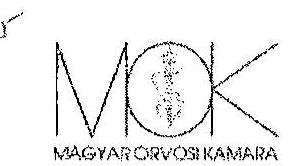

Ugyiratszám: III/292-10/2015.
Tárgy: Állami Számvevőszék jelentéstervezet észrevételesése
Ugyintézz: Matolesiné és Szimon Ildikó
Hiv. szém: V-0531-1652/2015.

## Domokos László

elnök
Állami Számvevőszék

## Budapest

Apáczai Csere János utca 10.
1052
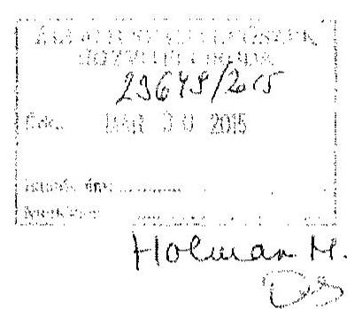

Tisztelt Elnök Úr!

A Magyar Orvosi Kamara Fogorvosok Területi Szervezete (a továbbiakban: MOK Fogorvosok TESZ) 2015. március 16-án köszönettel megkapta az Állami Számvevőszék (a továbbiakban: ÁSZ) „A Magyar Orvosi Kamara gazdálkodásának, továbbá feladatai finanssportozására kapati költségecéssi támogatásak felbazyedásának elinórzééért" című jelentéstervezetét.

A MOK Fogorvosok TESZ - munkájukat megköszönve - összességében és területi szervezetére nézve is áttekintette a jelentéstervezetet, melynek tartalmát a területi szervezet tekintetében általánosságban elfogadja, csupán néhány észrevételt kíván tenni, valamint jelezni kívánja a már az ellenőrzést megelőzően tett, a vizsgált tárgykört érintő intézkedéseit.

> Jelentéstervezet összegege megállapításook 15. oldal, 4. számú területi szervezetrkeu vonatkozági megállapítáá és javaslat:

## ÁSZ megállapítás:

A TESZ 2011. szeptember 24. és 2012. december 31. közölt - az Eleztv.-ben, az Avtv.-ben, az Info. tv-ben, valamint a 305/2005. (XII.25.) Korm. rendeletben foglaltak ellenére - adatvédelmi és adatbiztonsági szabályzattal nem rendelkezett.

## ÁSZ javaslat:

Intézkedjen az Info. tv. szerinti szabályzat elkészítésérćl.

## Megterr MOK Fogorvosok TESZ intézkedés:

A MOK Fogorvosok TESZ a 2014. évi ÁSZ ellenőrzést megelőzően elkészítette és 2013. május 10-én elfogadta adatvédelmi és adatbiztonsági szabályzatát.

## MOK Fogorvosok TESZ megjegyzés:

A fenti megtett intézkedés ellenére, véleményünk szerint a MOK Fogorvosok TESZ nem kötelezett adatvédelmi és adatbiztonsági szabályzat készítésére. Az információs önrendelkezési jogról és az információszabadságról szóló 2011. évi CXII. törvény vonatkozó rendelkezései szerint, a MOK Fogorvosok TESZ nem országos hatóság, nem állami adatkezelő, és adatokat kizárólag a vele tagsági viszonyban álló személyekkel kapcsolatban kezel (24.§ (1)-(3) bekezdései, 65.§ (3) bekezdés), így az adatvédelmi nyilvántartásba bejelentési kötelezettség alá nem cső adatkezelő.

---

$>$ Jelentésterveget észzegzé megállapistások 16. oldal, 5. számú terïleti szerveszetekre vonatkozá megállapítás és javaslat:

# ÁSZ megállapítás: 

A TESZ 2011. szeptember 24. és 2012. december 31. között - a 305/2005. (XII.25.) Korm. rendeletben foglaltak ellenére - közzétételi szabályzattal nem rendelkezett.

## ÁSZ javaslat:

intézkedjen a 305/2005. (XII.25.) Korm. rendelet szerinti szabályzat elkészitéséröi.
Megtett MOK Fogorvosok TESZ intézkedés:
A MOK Fogorvosok TESZ a 2014. évi ÁSZ ellenőrzést megelőzően elkészítette és 2012. november 30-án elfogadta közzétételi szabályzatát. Közérdekủ adatait 2012. december 3-tól 2012. december 6-ig terjedő időszakban, 5 évre visszamenőlegesen saját honlapján közzé tette, továbbá közérdekủ adatait ettől az időponttól kezdődően folyamatosan közzé teszi.
> Jelentésterveget észzegzé megállapitások 16. oldal, 7. számú terïleti szerveszetekre vonatkozó megállapítás és javaslat; valamint részletes vizsgálat 24. oldal 2. francia bekezdés és 25. oldal 2. francia bekezdés megállapitásai:

## ÁSZ megállapítás:

„A TESZ-eknél ellenőrzött mérlegtételeknél az immateriális javak és tárgyi eszközök a befektetett pénzügyi eszközök, a követelések, a pénzeszközök mérlegtételeinek év végi értékelése és leltárral való alátámasztottsága nem felett meg a Számv. tv.-ben foglalt előírásoknak."

## ÁSZ javaslat:

„Intézkedjen az év végi értékelések és leltározás végrehajtása során a számviteli törvényben foglaltak betartására."

## ÁSZ részletes vizsgálat:

Az ellenőrzött szervezetek 38,4\%-nál nem történt meg az év végi leltározás mennyiségben vagy egyeztetéssel (Fogorvos TESZ is).
Az ellenőrzött szervezetek 47,6\%-nál nem történt meg az év végi leltározás (Fogorvosok TESZ 2010-2011. években).

## Megtett MOK Fogorvosok TESZ intézkedés:

A MOK Fogorvosok TESZ a 2014. évi ÁSZ ellenőrzést megelőzően, 2012. óta még fokozottabban veszi figyelembe és tartja be a számvitelre vonatkozó jog- és egyéb szabályok, valamint belső szabályzatai - nem csak a leltározási tevékenységre vonatkozó - előírásait.

## MOK Fogorvosok TESZ megjegyzés:

A vizsgált 2010-2012. években a MOK Fogorvosok TESZ-nél az analitikus nyilvántartások vezetése folyamatos volt, a főkönyvi könyvelés és az analitikus nyilvántartások adatai közötti egyeztetés az üzleti év mérlegfordulónapjára vonatkozóan megtörtént a számvitelről szóló 2000. évi C. törvény 69.§ (2) bekezdés alapján.
Sajnálatos módon, a MOK Fogorvosok TESZ vizsgált időszakban hatályos vonatkozó belső szabályzata a törvényi előírásnál gyakoribb, évenkénti leltározási kötelezettséget írt elő. A számvitelről szóló törvény 69.§ (3) bekezdése szerinti legalább 3 évente kötelezően elvégzendő leltározás a vizsgált évekből 2012-ben megtörtént, a 2010-2011. években tételes, mennyiségi leltározás nem volt.

Megköszönve együttműködésüket, a szervezetünket érintő konkrét és egyéb általános észrevételeiket, javaslataikat a jövőbeni tevékenységünk végzése során feltétlenül számvitőtt tartjuk.

Budapest, 2015. március 30.
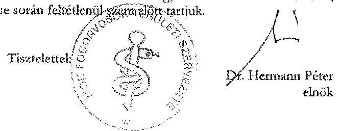

---

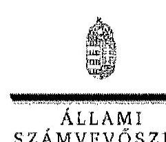

ELNÖK

# Dr. Hermann Péter úr

elnök

Magyar Orvosi Kamara Fogorvosok Területi Szervezete

## Budapest

## Tisztelt Elnök Úr!

A Magyar Orvosi Kamara gazdálkodásának, továbbá a feladatai finanszírozására kapott költségvetési támogatások felhasználásának ellenőrzéséről készített számvevőszéki jelentéstervezetre tett észrevételeit köszönettel megkaptam.

Az Állami Számvevőszék észrevételekre vonatkozó álláspontjáról a felügyeleti vezető által készített részletes tájékoztatást csatoltan megküldöm.

Tájékoztatom Elnök urat, hogy a jelentésben – az Állami Számvevőszékről szóló 2011. évi LXVI. törvény 29. § (3) bekezdése alapján – az el nem fogadott észrevételeket szerepeltetjük az elutasítás indokának feltüntetésével együtt.

Budapest, 2015.  04. hó 28. nap

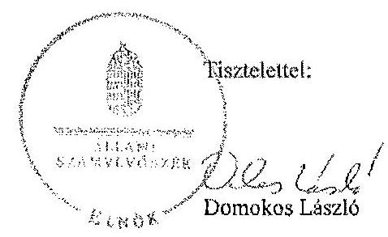

Melléklet: Tájékoztatás az el nem fogadott észrevételekről

1057 BUDAPEST, AFÁCZAI CSERE JÁRÓS UTCA 1B, 1364 Budapest 4. PL. 54 telefon: 484 9101 fax: 484 9201

---

# Tájékoztatás az el nem fogadott észrevételekröl 

A Magyar Orvosi Kamara gazdálkodásának, továbbá a feladatai finanszírozására kapott költségvetési támogatások felhasználásának ellenőrzéséről készített jelentéstervezetre a III/292-10/2015. Iktatószámú levelében tett észrevételeit áttekintettük, azok kezeléséről az alábbi tájékoztatást adom.
Az adatvédelmi és adatbiztonsági szabályzatra vonatkozó észrevételét nem fogadtuk el. Az ellenőrzött időszak a 2010-2012. évek voltak. Az adatvédelmi és adatbiztonsági szabályzatot 2013. május 10 -én - az ellenőrzött időszakot követően - készítették és fogadták el, amely így az ellenőrzött időszakra vonatkozó megállapításunkat nem módosítja. Az egészségügyben müködő kamarákról szóló 2006. évi XCVII. törvény 1. § (4) pontja alapján a területi szervezetek és az országos szervek jogi személyek. Az Alapszabály 2011. szeptember 24-ét követő módosítását követően az Alapszabály 28. ca) pontja alapján a Területi Szervezet Elnöksége megalkotja saját ügyrendjét, előkészíti és a küldöttgyülés elé terjeszti a területi szervezet szakszerű és jogszerű működéséhez szükséges belső szabályzatokat, így a területi szervezeteknek rendelkeznük kell a müködésükhöz szükséges belső szabályzatokkal. Az információs önrendelkezési jogról és az információszabadságról szóló 2011. évi CXII. törvény 24. § (3) bekezdésében, 30. § (6) bekezdésében, valamint a 303/2005. (XII. 25.) Korm. rendelet 3. § (1) pontjában foglaltak alapján nem rendelkezett adatvédelmi és adatkezelési szabályzattal. A területi szervezetnek a közérdekú adatok megismerésére tekintetében is van szabályzatkészítési kötelezettsége.
Nem fogadtuk el a közzétételi szabályzatra vonatkozó észrevételét. Az Alapszabály 27. cf) pontjában foglaltak szerint területi szervezet küldöttgyülésének a hatáskörébe tartozik a területi szervezet, mint önálló jogi személy szakszerủ és jogszerủ müködéséhez szükséges belső szabályzatok jóváhagyása. A közzétételi szabályzatot 2012. november 30 -ai dátummal a területi szervezet elnöksége hagyta jóvá.

Nem fogadtuk el az év végi értékelésre és leltározás végrehajtására vonatkozó észrevételét. A jelentéstervezet területi szervezetet érintő megállapítása az immateriális javak, tárgyi eszközök, illetve pénzeszközök mérlegtételeinek év leltározására vonatkozott, nem pedig a fökönyvi könyvelés és az analitikus nyilvántartás adatainak év végi egyeztetésére. Elnök úr észrevétele megerősítette a jelentéstervezet leltározásra vonatkozó megállapítását. A Számv. tv. 69. § (3) bekezdés előirása szerint a leltárkészítés és leltározási szabályzatban meghatározott időszakonként, de legalább háromévente kell mennyiségi felvétellel leltározni. A területi szervezet szabályzata évenkénti leltározást írt elő, azonban azt nem tartották be, a 2010-2011. években tételes, mennyiségi leltározás nem történt.

Budapest, 2015. 04. hó 3. nap

Holman Magdolna
felügyeleti vezető

---

# MAGYAR ORVOSI KAMARA Győr-Moson-Sopron Megyei Területi Szervezet 

9022 Győr, Bajcsy-Zsilinszky út 74.1. emetet 2 fax: $36 * 96 * 519-687$ Bankszámle:17600035-00147172-00200004 www.mokgyor.hu, e-mail: orvkasn@mokgyor.t-online.hu, info@mokgyor.hu, irodel@mokgyor.hu, elnok@mokgyor.hu, otikailitzettseg@mokgyor.hu

Ügyszám: 115-3/2015.
Hiv. szám: V-0531-1640/2015., V0690

Állami Számvevőszék

Budapest
Apáczai Csere János utca 10.
1364

Tárgy: ÁSZ ellenőrzés jelentéstervezet észrevételezése
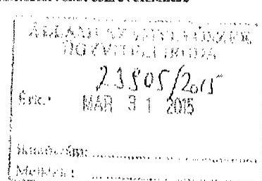

Tisztelt Állami Számvevőszék!

Az alábbiakban kívánunk magálni a Magyar Orvosi Kamara Győr-Moson-Sopron Megyei Területi Szervezet működését érintő megállapításokra, észrevételekre.

AZ ÁSZ összegsö megállapítósok, következtetések, javaslatok 15. oldal 3. pontjában:
A MOK Győr-Moson-Sopron Megyei Területi Szervezet (továbbiakban: TESZ) szervezeti és müködési szabályzata az egészségügyben működő szakmai kamarakról szóló 2006. évi XCVII. törvény (továbbiakban: likt.) és a Magyar Orvosi Kamara Alapszabályával összhangban eddig is szabályozta a müködés, gazdálkodás alapvető szabályait.

A gazdálkodás, számviteli részletes szabályait tartalmazó számviteli politikát a MOK Győr-Moson-Sopron Megyei Területi Szervezettel szerződéses jogviszonyban álló számviteli látraság a hatályos jogszabályi előírásokkal összevetve aktualizálta, azt, mint belső szabályzatot a Magyar Orvosi Kamara Alapszabályának (továbbiakban: Alapszabály) 27 cf) pontja alapján a soron következö küldöttgyűlés lesz jogosult elfogadni.

A számviteli politika a számviteli törvény 14.§ (4) bekezdése értelmében tartalmazni fogja, hogy az értékelésnél mit tekintünk lényegesnek, nem lényegesnek.

A müködés és gazdálkodás körében a pénzkezelési szabályzatot a jogszabályi előírásoknak, és a területi szervezet müködési rendjének megfelelően módosítjuk, a tervezetet a területi szervezet elnöksége már elfogadta, azt az Alapszabály rendelkezése értelmében jóváhagyásra benyújtjuk a megyei küldöttgyülésnek. A pénzkezelési szabályzat keretében pontosan rendelkezünk a pénzkezelés személyi és tárgyi feltételeiről.

AZ ÁSZ összegsö megállapítósok, következtetések, javaslatok 15. oldal 4. és 5. pontjában:
A Magyar Orvosi Kamara egységes müködésének elve alapján a MOK által elfogadott adatvédelmi, adatbiztonsági szabályzatokat, valamint közzétételi szabályzatot alkalmazzuk. A MOK Alapszabály 27 cf) pontja értelmében, azokat - mint a TESZ belső szabályzatai - a soron következö küldöttgyülés elé jóváhagyásra beterjesztjük.

AZ ÁSZ összegsö megállapítósok, következtetések, javaslatok 16. oldal 6. pontjában:
Annyiban helytálló a megállapítás, hogy a már elkészített beszámolót kellett módosítani a könyvvizsgáló utasítására. A könyvvizsgálói utasítás e-mail-ben érkezett, amelyet az ÁSZ ellenőrnck bemutatott a TESZ, illetve azt kinyomtatott formában átadjuk. Nálunk két beszámoló van a kérdéses évre. Az ellenőr rá is kérdezett, hogy miért, és ő kérte, hogy támaszzuk alá a könyvvizsgálói utasításra vonatkozó állítást, ezért is kapta meg a könyvvizsgáló e-mail-jét.

---

AZ ÁSZ összegeô megállapítások, következtetések, javaslatok 16. oldal 7. pontjához, és a 25 oldal megállapításaihoz:
A TESZ-nél volt elmaradás tárgyi eszköz feltár tekintetében, melynek pótlása már folyamatban van.
AZ ÁSZ összegeô megállapítások, következtetések, javaslatok 17. oldal 9. pontjához:
Az igénybevett szolgáltatások egységes elszámolás 2015. január 01. napjától a Magyar Orvosi Kamara Országos Hivatala által kiadott egységes számlarend, számlakeret alapján történik. A könyvelő társasággal kötött szerződést is módosítottuk. A módosítás értelmében a könyvelő társaság kötelezettséget vállalt arra, hogy a könyvelést az egységes számlarend, számlakeret alapján végzi.

AZ ÁSZ összegeô megállapítások, következtetések, javaslatok 17. oldal 10. pontjához:
A TESZ-el szerződéses jogviszonyban álló számviteli társasággal egyeztetve a kérdést, álláspontjuk szerint a személyi juttatások elszámolása mindig az aktuális törvényi előírások szerint tơrténik, a könyvelést a számletükör behatárolja.

AZ ÁSZ összegeô megállapítások, következtetések, javaslatok 17. oldal 11. pontjához:
A 2012. évi esztendőben valóban elmaradt két fő munkavállaló munkaszerződésének a személyi alaphér emelését rögzítő módosítása, melyet pótoltunk.

AZ ÁSZ összegeô megállapítások, következtetések, javaslatok 24. oldal 2. bekezdéshez:
A TESZ a beszámolókat a kérdéses években az OBH, és a MOK Országos Hivatala felé küldte el, az OFB részére most pótoltuk a beszámolók elküldését.

AZ ÁSZ összegeô megállapítások, következtetések, javaslatok 29. oldal 3. bekezdéshez:
A támogatás elszámolása érdekében benyújtott bérjegyzékekıe a jövőben rávezetjük az elszámolás formai felabisleként elóírt szöveget.

AZ ÁSZ összegeô megállapítások, következtetések, javaslatok 34. oldal 6. bekezdéshez:
A könyveléssel egyeztetve, ők nem értenek egyet a megállapítással, mert a beszámoló mellé csatolják a kinyomtatott folyószámla kivonatot, ami alapján végezték ez év végi rendezéseket.

AZ ÁSZ összegeô megállapítások, következtetések, javaslatok 35. oldal munkavállalók részére történő munkahér kifizetéssel kapcsolatos megállapításához:

A kétezres évek első felében a munkahér kifizetés még késapénzes formában történt, de már a vizsgált időszakban is és jelenleg is a munkahér kifizetés mindig banki utalással történik. Ezen kívül a dolgozók külön bérjegyzéket kapnak. A könyvelésben a bank mellékleteként lehet összesített havi bérjegyzék a személyi adatokkal, az azonban nem publikus, illetéktelen abba be nem tekinthet. A bankkivonatokkal tudjuk igazolni, hogy kizárólag banki utalással történt bérfizetés.

Véleményünk szerint a jelentéstervezetben a területi szervezetünkre vonatkozó megállapítások részben már több éve nem tekinthetők hiányosságnak, mert 2011. szeptemberétől egységes adatvédelmi és küzzétételi szabályzatmi rendelkezünk. A pénzügyi és számviteli hiányosságok megszüntetésével pedig még az ÁSZ jelentés megismerése előtt intézkedtiünk, azokat pótoltuk, a hatályos jogszabályt előírásoknak megfelelően átdolgozjuk, melynek megvitatása és elfogadása a 2015. évi áprilisi megyei küldöttgyűlés feladata lesz.

Győr, 2015. március 30.

Tisztelettel
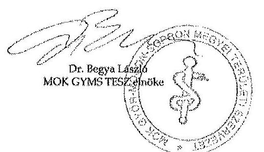

---

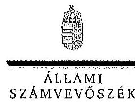

ELKÖK

# Dr. Begya László úr 

elnök
Magyar Orvosi Kamara Győr-Moson-Sopron Megyei Területi Szervezete

## Győr

## Tisztelt Elnök Úr!

A Magyar Orvosi Kamara gazdálkodásának, továbbá a feladatai finanszírozására kapott költségvetési támogatások felhasználásának ellenőrzéséről készített számvevőszéki jelentéstervezetre tett észrevételeit köszönettel megkaptam.

Az Állami Számvevőszék észrevételekre vonatkozó álláspontjáról a felügyeleti vezető által készített részletes tájékoztatást csatoltan megküldöm.

Tájékoztatom Elnök urat, hogy a jelentésben - az Állami Számvevőszékről szóló 2011. évi LXVI. törvény 29. § (3) bekezdése alapján - az el nem fogadott észrevételeket szerepeltetjük az elutasítás indokának feltüntetésével együtt.

Budapest, 2015. Ck. hó 25. nap
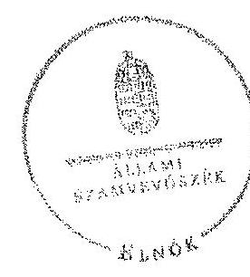

Tisztelettel:

## Domokos László

Melléklet: Tájékoztatás az elfogadott és az el nem fogadott észrevételekrül

---

# Tájékoztatás az elfogadott és az el nem fogadott észrevételekröl 

A Magyar Orvosi Kamara gazdálkodásának, továbbá a feladatai finanszírozására kapott költségvetési támogatások felhasználásának ellenőrzéséről készített jelentéstervezetre a 1153/2015. iktatószámú levelében tett észrevételeit áttekintettük, azok kezeléséről az alábbi tájékoztatást adom.

Az összegző megállapítások, következtetések, javaslatok 15. oldal 3., 4. és 5. pontjához, 16. oldal 7., 17. oldal 9., és 11. pontjához, a 24. oldal 2. bekezdéséhez, valamint a 29. oldal 3. bekezdéséhez tett észrevétele a jelentéstervezet megállapításait nem módosítják, mivel azok az ellenőrzött időszakon túl mutatnak. Örömmel vettük azonban tájékoztatását, hogy az ellenőrzött idöszakot követően elindult az egyes gazdálkodási szabályzatok aktualizálása, valamint az adatvédelmi és adatbiztonsági szabályzat küldöttgyülés elé jóváhagyásra történő beterjesztése, a tárgyi eszköz leltárak elkészítése, az ellenőrzés során feltárt számviteli hiányosságok megszüntetése.

Az összegző megállapítások, következtetések, javaslatok 16. oldal 6. pontjához tett észrevételét nem fogadtuk el. Elnök úr 2014. november 21 -ei nyilatkozatában rámutatott arra - és ezt az ellenőrzés is megállapította - , hogy a fökönyvi könyvelésben szereplő induló tőke növekedés bizonylat nélkül lett elszámolva. A számvitelről szóló 2000 . évi C. törvény (Számv. tv.) 165. § (2) bekezdésében foglalt előirások alapján a számviteli nyilvántartásokba csak szabályszerűen kiállított bizonylat alapján szabad adatokat bejegyezni. E törvény 167. § (1) bekezdése részletesen leírja az elszámolást alátámasztó bizonylat általános alaki és tartalmi kellékeit. Az emailben megküldött könyvvizsgálói utasítás ennek nem felelt meg.

Az összegző megállapítások, következtetések, javaslatok 17. oldal 10. pontjához tett észrevételét nem fogadtuk el. A jelentéstervezet 39. oldal utolsó két részbekezdése, valamint a 40. oldal második részbekezdése megállapításai részletesen tartalmazzák a rendszeres és nem rendszeres személyi juttatások elszámolására vonatkozó, ellenőrzés során feltárt hiányosságokat. A Számv. tv. 167. §-ában foglalt követelménynek való megfelelésről, azok alátámasztásáról az ellenőrzés részére teljességi és hitelességi nyilatkozattal lezárt dokumentumok alapján mondtuk véleményt. Az észrevétel új bizonyítékot nem mutatott be, ezért megállapításunk helytálló.

A jelentéstervezet 34. oldal 6. bekezdéséhez tett észrevétele a jelentéstervezetben foglalt megállapításhoz új bizonyítékot nem mutatott be, ezért azt nem fogadtuk el. A beszámoló mellé csatolt folyószámla kivonat önmagában még nem biztosítja az analitika és a fơkönyv egyezőségét.

A jelentéstervezet 35. oldalán a munkavállalók munkabér kifizetésére vonatkozó észrevételét részben fogadtson el. A munkavállalók tárgyhavi munkabérének pénztárból történő kifizetésére vonatkozó, a jelentéstervezet 6. bekezdésében szerepelő megállapításunkat töröljük. A személyes adatok kezelésére vonatkozó megállapításunk azonban helytálló. Ezért a megállapításunk-

---

ban csak azt szerepeltetjük, hogy a bérfizetés mellékletét képező, a munkavállalók munkabéreit tételenként tartalmazó bérjegyzéken az azt aláiró a munkavállalók saját munkabérükön túl más személy bérét is megismerték. Az ellenőrzés rendelkezésére bocsátott dokumentumok szerint 2010-ben a két bérjegyzéken is szerepel a dolgozók aláírása.

Az adatvédelmi és közzétételi szabályzatna vonatkozó észrevételét nem fogadtuk el. A területi szervezet küldöttgyülése 2011-ben az Alapszabály 27. cf) pontja ellenére nem hagyta jóvá sem a közzétételi szabályzatot, sem az adatvédelmi és adatbiztonsági szabályzatot, ezért az nem tekinthető hatályosnak.

Budapest, 2015. cts. hó 23 nap

Holman Magdolna
felügyeleti vezető

---

.

---

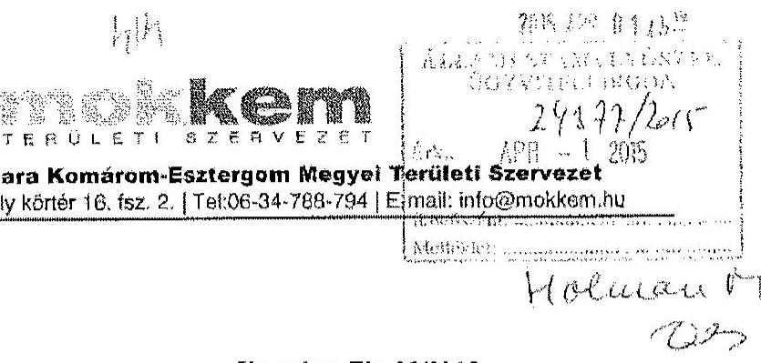

Állami Számvevőszék
Domokos László
elnök

Ikt.szám: Eln-23/2015.

# Budapest 

Apáczai Csere János utca 10.
1052

## Tisztelt Elnök Úr!

Hivatkozva a V-0531-1657/2015. ikt. számú levélében foglaltakra, az Állami Számvevőszékről szóló 2011. évi LXVI. tv. 29. § (2) bekezdése alapján az ellenőrzés megállapításaira az alábbi észrevételt tesszük.

Az ellenőrzési javaslat alapján a MOK KEM Területi Szervezet elnöke, elnöksége intézkedéseket foganatosít annak érdekében, hogy a Területi Szervezet müködési szabályai, valamint a számviteli politika és ennek keretében elkészített szabályzatok feleljenek meg a jogszabályi előirásoknak és az Alapszabályban foglaltaknak. Ezen intézkedések egy részére már sor került (a MOK adatvédelmi és adatkezelési szabályzatának a Területi Szervezetre való kiterjesztése, a 2010. évi közérdekủ adatok közzététele a Szervezet honlapján), a további javaslatoknak megfelelően pedig intézkedéseket tesz az Információs önrendelkezési jogról és az információszabadságról szóló törvény szerinti szabályzatok (közzétételi szabályzat) elkészítésére, valamint intézkedik a leltározás végrehajtása során a számviteli törvényben foglaltak betartására. Ezen rendelkezések végrehajtása folyamatban van.

Egyidejűleg megköszönjük az Állami Számvevőszék megállapításait, javaslatait, örömmel vettük, hogy Területi Szervezetünknek a szabályszerűségi ellenőrzés keretén belül csak néhány hiányossága veít, és köszönjük, hogy az ellenőrzéssel hozzájárulnak Szervezetünk közfeladatainak gazdaságos, hatékony és eredményesebb ellátásához.

Tatabánya, 2015. március 27.
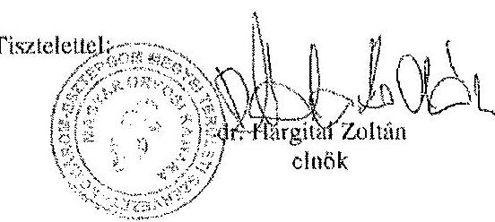

---

.

---

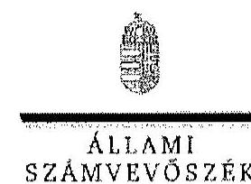

ELNÖK

Ikt.szám: V-0531-1697/2015.

Dr. Hargitai Zoltán úr
elnök
Magyar Orvosi Kamara Komárom-Esztergom Megyei Területi Szervezete

# Tatabánya 

## Tisztelt Elnők Úr!

A Magyar Orvosi Kamara gazdálkodásának, továbbá a feladatai finanszírozására kapott költségvetési támogatások felhasználásának ellenőrzéséről készített számvevőszéki jelentéstervezetre tett észrevételeit köszönettel megkaptam.

Az Állami Számvevőszék észrevételekre vonatkozó álláspontjáról a felügyeleti vezető által készített részletes tájékoztatást csatoltan megküldöm.

Tájékoztatom Elnők urat, hogy a jelentésben - az Állami Számvevőszékről szóló 2011. évi LXVI. törvény 29. § (3) bekezdése alapján - az el nem fogadott észrevételeket szerepelhetjük az elutasítás indokának feltüntetésével együtt.

Budapest, 2015. Oit hó 24 nap
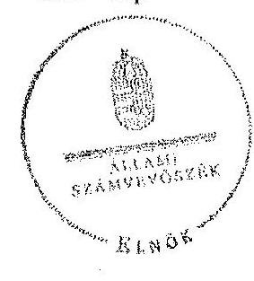

Tisztelettel:

## Domokos Laszlo

Melléklet: Tájékoztatás az el nem fogadott észrevételekröl

---

# Tájékoztatás az el nem fogadott észrevételekröl 

A Magyar Orvosi Kamara gazdálkodásának, továbbá a feladatai finanszirozására kapott költségvetési támogatások felhasználásának ellenőrzéséről készített jelentéstervezetre a Eln23/2015. iktatószámú levelében tett észrevételeit áttekintettük, azok kezeléséről az alábbi tájékoztatást adom.

Örömmel vettük tájékoztatását, hogy a feltárt hiányosságok megszüntetése érdekében Elnök úr lépéseket tett, és tenni fog.

A jelentéstervezetre tett észrevételei a jelentéstervezet megállapításait nem kifogásolják.
Budapest, 2015. 01. hó 21. nap

Holman Magdolna
felügyeleti vezesó

---

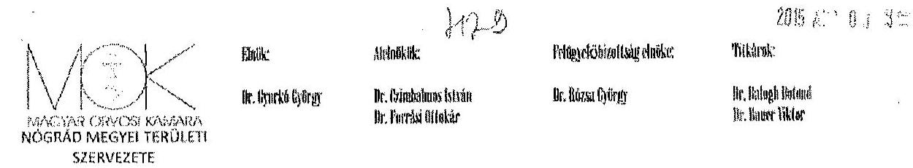

3100 Salgótarján, Báthory út 2. 1/4 Tel/Fax.: 06-32/430-049 E-Mail: nogradorvkam@chello.hu

Ikt. sz.: Á/112/2015.
Ügyintéző: Mocsárynć Tuska Sarolta

ÁLLAMI SZÁMVEVŐSZÉK
Domokos László részére
Budapest
Apáczai Csere János utca 10.
1052
Tisztelt Elnök Úr!

Tárgy: észrevétel jelentéstervezetre
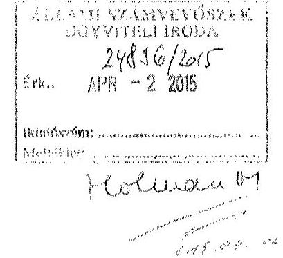

A Nógrád Megyei TESZ-re vonatkozóan megfogalmazott javaslatokkal kapcsolatosan a következők az észrevételeim:

Az összegző megállapítások 6. bekezdésében megfogalmazott „, A TESZK- ek - a BTESZ és a Nógrád Megyei TESZK kivételével - az Ekt.- ben foglalt határidőig megválasztották a területi szerveiket és tisztségviselöiket." Az idézett megállapítás teljes mértékben nem tükrözi a valóságot, mivel a tisztségviselők megválasztása megtörtént. Egyedül az FB nem jött létre, mivel Bizottsági tagnak nem jelentkeztek elegendően a tagság köréből.

A 2. pontban megfogalmazott javaslattal, miszerint a TESZ nem rendelkezik elnökégi ügyrenddel az elkészítésével kapcsolatosan az alábbi intézkedést tettem: az elnökségi ügyrend elkészítéséről az előkészületet megtettem. A feladat végrehajtását 2015. május 31 -ei határidővel elöíttam.

A 3. pontban megfogalmazottak alapján, miszerint a müködés és gazdálkodás szabályai csak részben feleltek meg a jogszabályi előírásoknak és az Alapszabálynak az alábbiról tájékoztatom: 2012. évben a hiányzó dokumentumok pótlása megtörtént, amelyet csak az Elnökség fogadott el és a TESZK nem hagyott jóvá. Az említett szabályzatok felülvizsgálatát elöírtam, illetve a következő Küldöttgyülés alakalmára az elfogadását napirendként tüztem ki.

---

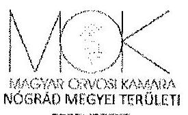

|  |  |  |  |
| :-- | :-- | :-- | :-- |
|  |  |  |  |

3100 Salgótarján, Báthory út 2. 1/4 Tel/Fax.: 06-32/430-049 E-Mail: nogradorvkam@chello.hu

A 4. pontban leírt adatvédelmi és adatbiztonsági szabályzat felülvizsgálatát előírtam, a 2011. évi CXII. törvénynek (Info tv.) megfelelően.

A 5. pontban említett közzétételi szabályzat elkészítését a 305/ 2005. (XII. 25.) Korm. rendelet alapján előírtam.

A 6. pontban kifogásolt megállapítással kapcsolatosan: Belső bizonylat azért nem készült, mert a mérleg elkészítését követően a könyvvizsgáló cég kérésére a 12962 e Ft tőkeváltozás eredményből 227 e Ft induló tökéhez került, így a tőkeváltozás eredménye 12735 e Forintra változott. Kérni fogjuk a könyvvizsgáló céget, hogy utólagosan bocsássa ezt rendelkezésünkre, mert kifejezetten az ő kérésük alapján történt meg a fent említett változtatás.

A 7. pontban kifogásolt megállapítást, miszerint az ellenőrzött mérlegtételeknél az immateriális javak és tárgyi eszközök, a befektetett pénzügyi eszközök, a követelések, a pénzeszközök mérlegtételeinek év végi értékelése és leltárral való alátámasztottsága nem felelt meg a Számviteli törvényben foglalt előírásoknak az alábbiak tájékoztatom: az említett időszakban a tárgyi eszközök kivételével a többi mérlegsor leltárral alátámasztott volt.
Az egyes mérlegtételek alátámasztottsága, mint például bank, pénztár, egyéb eszközök, szállítóvevők kellően alátámasztott volt, mert a hozzá tartozó analitikával a szervezetünk rendelkezett. A tárgyi eszközökre vonatkozó tételes leltározás nem történt meg teljes körűen és az ezt követő időszakra vonatkozóan a tárgyi eszközök leltározási kötelezettségét előírtam.

A 8. pontban észrevételezett a Számviteli törvénynek megfelelő gazdálkodási jogkörök gyakorlás rendjének felülvizsgálatát előírtam.

Az igénybe vett és egyéb szolgáltatások elszámolására vonatkozóan az alábbi intézkedést tettem: az alkalmazott könyvelőcég és a Felügyelőbizottságunk figyelmét felhívtam, hogy figyeljenek oda, hogy a költségek elszámolása feleljen meg a jogszabályi és belső szabályzatokban elöirt követelményeknek.

A 10. pontban megfogalmazott rendszeres és nem rendszeres személyi juttatások elszámolásával kapcsolatban az alábbi az észrevételem: A kiragadott mintatételekben valóban volt egyetlen olyan pénztárbizonylat, amelyen az utalványozó aláírása elmaradt, amely elkerülte a figyelmünket. Összességében azonban igyekszünk, hogy a költségek elszámolása bizonylatokkal alátámasztottak, dokumentáltak és költségvetésben jóváhagyottak legyenek.

---

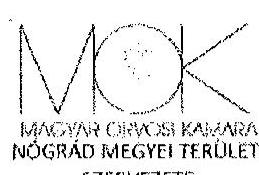

Obrik:
Dr. Gyurkó Gyürgy

Hirbelkik:
Dr. Caimtukana Irihika
Dr. Fiverté Búakke

Felügyelöbizottság cibliks:
Dr. Kúma Gyürgy

Tirkkirnk:
Dr. Rübigh Duhand
Dr. Huser Tökler

3100 Salgótarján, Báthory út 2. 1/4 Tel/Fax.: 06-32/430-049 E-Mail: nogradorvkam@chello.hu

A TESZ a 2010. évi mérlegében a Számviteli tơrvény valódiságának elvét megsértette, mert valóban nem tartalmazta az ingatlant. A hibával kapcsolatosan az alábbiakról tájékoztatom: Az egyszeres könyvvitelről történő áttérés és az ezzel párhuzamos könyvelőváltás kapcsán a hiba feltárásra, pótlásra és kijavításra került. A 2011. évtől kezdődően már megfelelő módon szerepel az ingatlan is a könyvekben és a nyilvántartásainkban.

A 2012. évi beszámoló eredmény-levezetésében az egyéb bevételek összege ( 8336 ezer) nem egyezik meg a fókönyvi kivonatban szereplő 8268 ezer Forint összeggel. A helyes összeg a 8268 ezer Forint és a könyvelés során számszaki hiba történt. Sajnos az eredmény-kimutatás során használt könyvelőprogramban ellenőrzési funkció nem volt és ezért ez valóban tévesen lett szerepeltetve.

Tájékozatom továbbá, hogy a Felügyelőbizottság számára az ellenőrzésről megfogalmazott megállapításokat továbbítom és ügyelek arra, hogy a Bizottság az elöírt ellenőrzési tevékenységét maradéktalanul végrehajtsa.

A fent említett hibákat és hiányosságokat elismerve meg kell jegyeznem, hogy a Nógrád megyei TESZ -nél kifejezetten ügyeltünk és odafigyeltünk arra, hogy csakis szigorúan a legszükségesebb költségek, ráfordítások kerüljenek kifizetésre. A TESZ-t a takarékos gazdálkodás jellemezte és jellemzi, a gazdálkodásunkban semmi olyan nem történt, ami ne lett volna indokolt.

Salgótarján, 2015. március 26.

Megköszönve a segitő együttmüködést és iránymutatást és köszönjük a figyelemfelhivást,
tisztelettel:
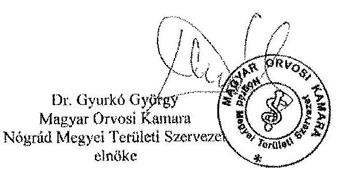

---

.

---

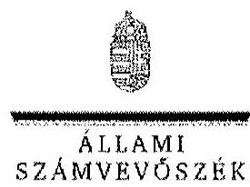

# Dr. Gyurko György úr 

elnök
Magyar Orvosi Kamara Nógrád Megyei Területi Szervezete

## Salgótarján

## Tisztelt Elnök Úr!

A Magyar Orvosi Kamara gazdálkodásának, továbbá a feladatai finanszírozására kapott költségvetési támogatások felhasználásának ellenőrzéséről készített számvevőszéki jelentéstervezetre tett észrevételeit köszönettel megkaplan.

Az Állami Számvevőszék észrevételekre vonatkozó álláspontjáról a felügyeleti vezető által készített részletes tájékoztatást csatoltan megküldöm.

Tájékoztatom Elnők urat, hogy a jelentésben - az Állami Számvevőszékről szóló 2011. évi LXVI. törvény 29. § (3) bekezdése alapján - az el nem fogadott észrevételeket szerepeltetjük az elutasítás indokának feltüntetésével együtt. Az elfogadott észrevételeket a jelentés szövegczésénél figyelembe vesszük.

Budapest, 2015. 04. hó 33. nap
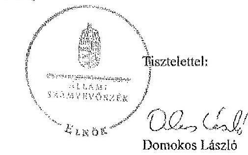

Melléklet: Tájékoztatás az elfogadott és az el nem fogadott észrevételekről

---

# Tájékoztatás az elfogadott és az el nem fogadott észrevételekröl 

A Magyar Orvosi Kamara gazdálkodásának, továbbá a feladatai finanszírozására kapott költségvetési támogatások felhasználásának ellenörzéséről készített jelentéstervezetre az Á/112/2015. iktatószámú levelében tett észrevételeit áttekintettük, azok kezeléséről az alábbi tájékoztatást adom.

Elfogadtuk az összegző megállapítások 6. bekezdéséhez tett észrevételét, azt a jelentés szövegezésénél figyelembe vesszük. A jelentés készitésénél az összegző megállapításokból töröljük a konkrét területi szervezetre való hivatkozást, a részletes megállapítások 4. pontjában (jelentéstervezet 32. oldal) a megállapításnál szerepeltetjük, hogy ,,a Nógrád Megyei TESZK a felügyelö bizottságát nem választotta meg".

A jelentéstervezet Területi Szervezetekre vonatkozó intézkedést igénylő megállapítások és javaslatok 2., 3., 4., 5., 6., 8., 10. pontjában megfogalmazott megállapításokkal kapcsolatban tervezett intézkedésiről, valamint az igénybe vett és egyéb szolgáltatások elszámolása területén tett intézkedéseiről szóló tájékoztatását örömmel vettem. Erre a pontokra vonatkozó észrevételei az ellenőrzött időszakon túl mutatnak, a megtett megállapításokat nem kifogásolják.

Nem fogadtuk el a jelentéstervezet 7. pontjához tett észrevételét. Amint azt az ellenőrzés feltárta, és Elnök úr 2014. november 19-ei keltezésű nyilatkozatának 8. pontja is alátámasztja a területi szervezet az ellenőrzött időszakban a beszámoló elkészitéséhez, a mérleg tételeinek alátámasztásához leltárt nem állított össze. Az jelentéstervezetben tett megállapítások nem az analitikus nyilvántartás, hanem az év végi leltározás elvégzésének a hiányát állapították meg az immeteriális javak és tárgyi eszközök, a követelések, valamint a pénzeszközök tekintetében. Ezt a jelentéstervezet részletes megállapításai (24. - 25. oldal) is tartalmazzák. A leltározás hiányát Elnök úr észrevételében most sem kifogásolta.

A TESZ 2010. évi mérlegére és beszámolójára vonatkozó észrevétele nem kifogásolja a jelentéstervezet megállapítását, ahhoz további információt, tájékoztatást ad, melyet köszönettel vettünk.

Budapest, 2015. 04. hó. 23. nap

Holman Magdolna
felügyeleti vezető

---

# ÁLLAMI SZÁMVEVÓSZÉK 

## Domokos László úr

elnök

Budapest, Pf: 54.
1364

## Tisztelt Elnök Úr!

Hiv.sz.: V-0531-1643/2015. Tárgy: MOK OFB észrevételei
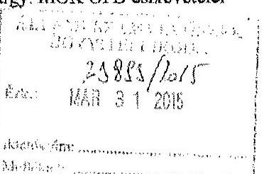

A MOK gazdálkodásának tárgyában készült ÁSZ jelentés tervezet (a továbbiakban:Jt.) MOK OFB részére történt megküldését köszönöm.
A Jt.-vel kapcsolatosan - annak kizárólag az OFB-re vonatkozó egyes részeit érintően - a következő észrevételeket teszem.

## 1.

9.old.6.bck.: „Az OFB az Ekt. ellenôrzésére vonatkozó rendelkezései alapján nem ellenôrizte a 2010-2012. években a költségvetési támogatások szabályos, rendeltetésszert́ felhasználását és elszámolását, továbbá a TESZ FB-k sem ellenôrizték a TESZ által az Országos Hivatal felé megküldött költségelszámolásokat."

## Kérjük a megállapítás törlését.

Indoklás:
Ez a megállapítás azt sugallja, hogy az OFB quasi jogszabályt (Ekt.-t) sértett. Ugyanakkor sem az Ekt.-nak sem az Asz.-nak az OFB tevékenységére vonatkozó, általános rendelkezései nem irnak elő kifejezetten a költségvetési támogatásra, mint a célterületre vonatkozó, és minden évben kötelező érvényű ellenőrzést. Amennyiben valamelyik évben tehát az OFB célzottan nem ellenőrizte ezt a területet, ezzel semmilyen jogszabálysértést nem valósított meg.

Ezen túlmenően nem lehet figyelmen kívül hagyni két további tényezőt és összefüggést, mely a jelentésben ugyanakkor nem kapott sem említést, sem hangsúlyt:
a) A Jt-ben kifogásolt célellenőrzés elmaradása olyan terület, amelyet a felügyeleti szerv minden évben külön ellenőriz és OFB célellenőrzés lefolytatására vonatkozó információk nem merültek fel.
b) a közpénz felhasználásának célellenőrzése a konkrét esetekben (években) nem is valósulhatott volna meg, tekintettel arra, hogy az állami feladat ellátására biztosítandó - arra egyébiránt teljesen elégtelen - állami forrás csak jelentős késedelemmel került átutalásra a köztestület részére. Ennek eredményeképpen - és lényegében - az adott években (is) a köztestület előlegezte (előfinanszírozta) az állam helyett a közfeladat ellátását.
2.
14. old.: A Jt. észrevételezte, hogy az OFB 2012. január 18-tól nem rendelkezett ügyrenddel.

## Kérjük fenti megállapítás törlését.

Indoklás:
az Alapszabály nem rendelkezik arról, hogy valamely szerv meglévő ügyrendje mely esetben vesziti hatályát. Tekintettel arra, hogy még a négyéves választási ciklus esetében felálló újonnan megválasztott kamarai szerv számára sem írja elő az Asz. új ügyrend megalkotásának kötelezettségét, az adott szerv már meglévő ügyrendje álláspontunk szerint mindaddig hatályos,

---

ameddig azt a szerv nem módosítja, vagy nem alkot új ügyrendet (helyezi hatályon kivül a szerv hatályban lévô ugyrendjét). Igy nem tudjuk értelmezni azon kitételt és errôl dokumentum sem áll rendelkezésünkre, miként és milyen indokkal szüut volna meg a korábbi ügyrend hatályossága.

Kérem a most regnáló MOK OFB észrevételeit elfogadni és azokat a jelentésükben szerepeltetni.

Budapest, 2015. március 29.
Tisztelettel:
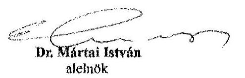

Dr. Komlóssy Attila sk. elnok

---

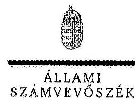

ELNOK

Ikt. szám: V-0531-1689/2015.

Dr. Komlóssy Attila úr
elnök
Magyar Orvosi Kamara Országos Felügyelö Bizottság

Budapest

# Tisztelt Elnök Úr! 

A Magyar Orvosi Kamara gazdálkodásának, továbbá a feladatai finanszirozására kapott költségvetési támogatások felhasználásának ellenörzéséről készített számvevőszéki jelentéstervezetre tett észrevételeit köszönettel megkaptam.

Az Állami Számvevőszék észrevételekre vonatkozó álláspontjáról a felügyeleti vezető által készített részletes tájékoztatást csatoltan megküldöm.

Tájékoztatom Elnök urat, hogy a jelentésben - az Állami Számvevőszékről szóló 2011. évi LXVI. törvény 29. § (3) bekezdése alapján - az el nem fogadott észrevételeket szerepeltetjük az elutasitás indokának feltüntetésével együtt. Az elfogadott észrevételeket a jelentés szövegezésénél figyelembe vesszük.

Budapest, 2015.
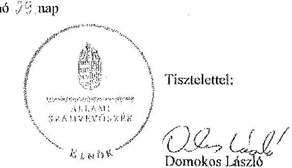

Melléklet: Tájékoztatás az elfogadott és az el nem fogadott észrevételekröl

---

# Tájékoztatás az elfogadott és az el nem fogadott észrevételekröl 

A Magyar Orvosi Kamara gazdálkodásának, továbbá a feladatai finanszírozására kapott költségvetési támogatások felhasználásának ellenőrzéséről készített jelentéstervezetre a 2015. március 29 -ei keltezésú levelében tett észrevételeit áttekintettük, azok kezeléséről az alábbi tájékoztatást adom.
Részben fogadtuk el az 1. számú észrevételét. A jelentéstervezetben tényként, és nem hibaként állapítottuk meg, hogy az Országos Felügyelő Bizottság (OFB) az Ekt. 7. § (2) bekezdése elöírásai szerinti ellenőrzései keretében nem ellenőrizte a 2010-2012. években a költségvetési támogatások szabályos, rendeltetésszerü felhasználását és elszámolását. Az észrevétele alapján azonban a megfogalmazáson módosítunk a jelentés készitése során úgy, hogy abból a jogszabályi hivatkozás törlésre kerül.
Elfogadtuk az OFB ügyrendjére vonatkozó észrevételét. A MOK Felügyelő Bizottságának 2012. január 18-án megtartott alakuló üléséről szóló jegyzőkönyv szerint a felügyelő bizottság az Úgyrendet módosításokkal elfogadta. A határozatban foglaltak szerinti ügyrend nem került aláírásra, a „meglévő ügyrend" hatályban maradt, ezért az ügyrend hiányára vonatkozó megállapítást és javaslatot töröljük a jelentés érintett szövegrészeiből.

Budapest, 2015. 2h. hó 23. nap

Holman Magdolna
felügyeleti vezető

---

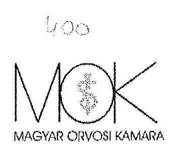

# ORSZÁGOS HIVATAL 

Clm: 2068 Budapest, Szondi u. 100. Levélcím: 1390 Budapest 62., Pf. 175. Tel: (36-1) 302-4140 Fax. (36-1) 269-4392

Ikt.sz.: 1299-38/2014.

## ÁLLAMISZÁNVEVÓSZÉK

Demokos László elnök úr részére
Budapest, Pf.: 54.
1364
Hiv.sz.: V-0531-1643/2015.
Tárgy: MOK észrevételek

## Tisztelt Elnök Úr!

Hivatkozással a 2015. március 16. napján kézhez vett, A Magyar Orvosi Kamara gazdálkodásának, továbbá a feladatai finanszírozására kapott költségvetési támogatások felhasználásának ellenőrzéséről szóló jelentéstervezetre (a továbbiakban: jelentéstervezet vagy jt.), a MOK, illetve Országos Hivatala (a továbbiakban: OH ) vonatkozásában, a törvényes 15 napos határidőn belül, az alábbi
észrevételeket tesszük:

## I.

## Általános észrevételek

A Magyar Orvosi Kamara országos szervezete és Országos Hivatala részéről, figyelemmel a jelentéstervezetben megfogalmazott ellenőrzési célokra ${ }^{1}$ örömmel vettük az Állami Számvevőszék (a továbbiakban: ÁSZ) azon megnyugtató megállapítását, mely szerint „Az ellenörzés a rendelkezésre bocsátott dokumentumok alapján 2010-2012. években a kamarai céltól eltérő tagdíjfelhasználást nem állapított meg. "2 Ez a megállapítás igazolja, hogy kamaránk felelősen, a mindenkori tagság érdekében, tisztességesen bánt a rábízott tagi vagyonnal!

A jelentéstervezet 5. oldalán leírtak szerint az ellenőrzés jogszabályi alapját az ÁSZ tv. 1. § (3) bekezdésében és az 5. § (3) bekezdésében foglaltak képezték, ezek így rendelkeznek:

[^0]
[^0]:    ${ }^{1}$ jt. 4. old.
    ${ }^{2}$ jt. 8. old utolsó bek.

---

1. § (3) Az Állami Számvevôszék általános hatáskörrel végzi a közpénzekkel és az állami és önkormányzati vagyonnal való felelüs gazdálkodás ellenôrzését.
2. § (3) Az Állami Számvevôszék az államháztartásból szórmazó források felhasználásának keretében ellenôrzi a központi költségvetésbôl gazdálkodó szervezeteket (intézményeket), valamint az államháztartásból nyújtott támogatás vagy az államháztartásból meghatározott célra ingyenesen juttatott vagyon felhasználását a helyi önkormányzatoknál, az országos és helyi nemzetiségi önkormányzatoknál, a közalapítványoknál (ide értve a közalapítvány által alapított gazdasági társaságot is), a köztestületeknél, a közhasznú szervezeteknél, a gazdálkodó szervezeteknél, az egyesületeknél, az alapítványoknál és az egyéb kedvezményezett szervezeteknél. Amennyiben a kedvezményezeit szervezet az államháztartásból támogatásban - ide nem értve a személyi jövedelemadó meghatározott részének az adózó rendelkezése alapján történő átutalását - vagy ingyenes vagyonjuttatásban részesül, gazdálkodási tevékenységének egésze ellenôrizhetô.

A jelentéstervezet tartalmával (és így a vizsgálattal) kapcsolatban felvetôdik, hogy az legalábbis részben nem felelt meg a fenti törvényi rendelkezésnek. A törvény helyes értelmezése szerint esetünkben:
a) a gazdálkodási tevékenység
b) egésze
c) ellenôrizhetö.

A fenti értelmezés alapján a jelentéstervezet (és a vizsgálat) nem felel meg az a) pontban foglaltaknak. Szükséges ezért, hogy a jelentéstervezetből a gazdálkodási tevékenységnek nem minősülő vizsgálati részek és megállapítások az ÁSZ tv. 5. § (3) bek. alapján kerüljenek ki, mivel ezek vizsgálatára és ezekkel kapcsolatos megállapítások megtételére a jelentésben nincs lehetőség. Példaként említhetőek - a késöbbiekben részletesen is kifejtésre kerülő - adatvédelemmel kapcsolatos megállapítások vagy az elnökségi ülések darabszáma.

Ugyancsak itt kell kiemelni, hogy vannak olyan kamarai szervek - lásd pl. TESZT, OKGY, OFB, EK, TESZFB - amelyek semmilyen gazdálkodási tevékenységet nem folytatnak! Ezen kamarai szervek esetében a vizsgálat megállapításait teljes egészében törölni kell a jelentéstervezetből, hasonlóan a gazdálkodással össze nem kapcsolható belső szervezeti szabályozás (ügyrend, SZMSZ) hiányára vonatkozó megállapításokat.

Hivatkozva az ÁSZ tv. 1. § (3) bekezdésére ugyancsak kérjük, hogy kerüljenek törlésre a jelentésből azok a megállapítások, melyeknek semmilyen kapcsolatuk a közpénzekkel kapcsolatos gazdálkodáshoz. A kamara müködését 99\%-ban nem közpénzből fedezte sem a vizsgált időszakban, sem jelenleg! A jelentéstervezet nem adja indokát, hogy az ÁSZ - figyelemmel az állami támogatás / MOK költségvetés hihetetlen aránykülönbségére - miért vizsgálta a teljes gazdálkodást, mi indokolta egy ilyen vizsgálat elvégzését.

Elmaradt, bár a jelentéstervezet céljaként jelöli meg ${ }^{3}$, azoknak a javaslatoknak a megfogalmazását, melyek hozzájárulnak a jó kormányzáshoz, az értékteremtő rend kialakításához és megőrzéséhez. Ebben a körben kérjük, hogy állapítsa meg jelentésében az ÁSZ, hogy az állami támogatás (a vizsgált időszakban ténylegesen folyósított támogatási összegek alapján) az állami feladatként (közfeladatként)

[^0]
[^0]:    ${ }^{3}$ jt. 3. old. utolsó bek.

---

ellátott etikai rendszer müködtetésének finanszírozására teljességgel elégtelen, egyben alkalmatlan volt az állami feladat ellátására. Állapítsa meg hangsúlyos tényként, hogy a kamara saját forrásból finanszírozta a tárgyidőszakban az etikai rendszer - lényegében - teljes müködtetését.

A tények alapján állapítsa meg, hogy az évente jutatott - teljességgel elégtelen - állami forrást is a Kamara az államháztartási finanszírozási szabályokkal ellentétben utólag, jelentős késedelmekkel kapta meg és ezért saját anyagi forrásai terhére kellett megelőlegeznie annak érdekében, hogy a közfeladat ellátása biztosított legyen. Ennek következtében, bár a Kamara a támogatásokkal pontosan elszámolt, melyet a felügyeleti szerv minden esetben elfogadott, az államháztartási szabályok betartása a Kamara részéről az elszámolások tekintetében ezen objektív okok miatt nem volt teljes körűen lehetséges.

Tegyen javaslatot az állami döntéshozatal irányába ennek a helyzetnek a soron kívüli megszüntetésére.
Állapítsa meg továbbá, hogy az etikai rendszer müködtetésére az állam által a tárgyidőszakban biztosított anyagi forrásnak - a kamara esetében nem csak elégtelenségét - hanem annak az aránynak és elosztási elvnek a tarthatatlanságát, amellyel az állami támogatás a három egészségügyi szakmai kamarai között elosztásra került, teljességgel figyelmen kívül hagyva az egyes szakmai kamarák között az etikai ügyek száma alapján egyértelműen látható tényleges és valós finanszírozási igényeket.

Azon kamarai szervek esetében, ahol az Alapszabály az adott szervre vonatkozóan tartalmazza az ügyrendre vonatkozó utalást, de a jelentés az ügyrend hiányát állapította meg, annak ellenére, hogy a szerv a jt. alapján rendelkezett korábban ügyrenddel (pl. OFB esetében 2012.január 18 -tól, ld.jt.14.oldal), kérjük a megállapítás(ok) törlését. A törlési kérelem indoka a következő: az Alapszabály nem rendelkezik arról, hogy valamely szerv - meglévő - ügyrendje mely esetben vesziti hatályát. Tekintettel arra, hogy még a négyéves választási ciklus esetében felálló újonnan megválasztott kamarai szerv számára sem írja elő az Asz. új ügyrend megalkotásának kötelezettségét, az adott szerv már meglévő ügyrendje mindaddig hatályos, ameddig azt a szerv nem módosítja vagy nem alkot új ügyrendet (helyezi hatályon kívül a szerv hatályban lévő ügyrendjét).

# II. 

## Részletes észrevételek

Jelen pontban követve és pontosan hivatkozva a jelentéstervezet egyes megállapításaira, részletesen tesszük meg észrevételeinket azzal, hogy álláspontunk szerint a jelentéstervezet több ponton meglehetősen tendenciózus, csekély jelentőségủ anomáliákkal kapcsolatban úgy fogalmaz meg véleményt, hogy az a megfogalmazástól sokkal súlyosabbnak hat, a jelentéstervezet tárgyi tévedéseket is tartalmaz, a tévedések kivétel nélkül egy, a ténylegesnél jóval súlyosabb képet adnak a vizsgálat tárgyáról, a kamaráról. Tekintettel arra a tényre, hogy a jelentéstervezet önmagát ismétli az I. Összegző megállapítások, következtetések, javaslatok fejezetben és a II. Részletes megállapítások fejezetben, így az egyes megállapításokat észrevételeink során összevontan kezeljük.

---

# Megállapítás: 

A MOK rendelkezett alapszabállyal a 2010-2012. években, azonban az Alapszabály egy vonatkozásban 2011 szeptemberétől ellentétes előírást tartalmazott az Ekt.-ben foglaltakkal, mivel a tagdij mértékének megállapítását az OKGY kizárólagos hatásköréből a TESZT hatáskörébe utalta (jt. 6. old. 2. bek.).

## Észrevétel:

## A megállapítás tárgyi tévedésen alapul.

Az Ekt. nem azt a szabályt állítja fel pontosan, hogy a tagdij mértékének megállapítása az OKGY kizárólagos hatáskörébe tartozik, hanem azt, hogy a tagdij mértékét az Alapszabályban kell meghatározni (Ekt. 29/A. § (1) bekezdése). A tagdij mértékét a törvényben meghatározott lehetséges mértéke utalással tartalmazta a MOK Alapszabálya a vizsgált időszakban, ezen belül az aktuális, pontos mértéket pedig az Alapszabály melléklete tartalmazta, vagyis a tagdij mértékét mindenképpen az Alapszabály tartalmazta.

Utóbb ezen a technikán - még jóval az ÁSZ vizsgálat megindulása előtt - változtatott a MOK Országos Küldöttközgyülése, de ennek a ténynek sincs nyoma a vizsgálat megállapításai között.

Az Emberi Eröforrások Minisztériuma 4681-13/2014/JOGI iktatószámú, A Magyar Orvosi Kamara tagdijával kapcsolatos törvényességi felügyeleti eljárás lezárása tárgyú, 2014. szeptember 30 -án kelt állásfoglalása szerint:
„A Magyar Orvosi Kamra felügyeleti ellenőrzés céljából beküldött, legutóbb 2014. február 15-én módosított Alapszabályát áttekintettem. Az egészségügyben működő szakmai kamarákról szóló 2006. évi XCVII. törvény (a továbbiakban: Ekt.) 27. § (1) bekezdésében foglalt jogkörömben eljárva az Alapszabállyal kapcsolatosan a következőkról határoztam:

1. Magyar Orvosi Kamara tagdijemelése tárgyában 16672/2013/JOGI és 4681/4/2014/JOGI iktatószámon indult és lefolytatott törvényességi felügyeleti eljárást megszüntetem.
Döntésem indoka, hogy a Magyar Orvosi Kamara - többszöri levélváltást követően - a törvényességi felügyeleti eljárás során képviselt álláspontomnak megfelelően módosította Alapszabályát. A 2014. február 15-i Alapszabály-módosítás során a MOK Országos Küldöttközgyülése az Alapszabály 16./ pontjába összegszerűen beiktatta a kamarai tagdij mértékét, továbbá a tagdij emelésére 2014. február 16tól, tehát a jövőre nézve került sor. Ezzel a köztestület eleget tett az Ekt. 29/A. § (1) bekezdésében foglalt azon kötelezettségének, miszerint a kamarai tagdij mértékét a szakmai kamara alapszabályában kell meghatározni. Az Ekt. 29/A. § (2) bekezdése szerint a kamarai tagdij egy naptári évre eső mértéke nem haladhatja meg az adott naptári évben a kamarai tagra irányadó kötelező legkisebb munkabér, illetve garantált bérminimum egyhavi összegének harminc százalékát. A törvényes korlát ennek megfelelően 2014-ben - tekintettel arra, hogy az orvosi kamarai tagsághoz kötött tevékenységre a garantált bérminimum az irányadó - 35.400,- Ft. Az alapszabályban megállapított tagdij mértéke - évi 27.600 ,Ft - összegszerűen nem haladja meg a törvényes korlátot."

A megállapítás nincs kapcsolatban a közpénzzel történő gazdálkodással!

---

# Megállapítás: 

Az Országos Hivatal az Alapszabályban foglaltak ellenére szervezeti-múködési, ügyrendi szabályzatot nem készített, ezért szabályszerű müködése nem volt biztosított (jt. 6. old. 2. bek).

## Észrevétel:

A megállapítás tárgyi tévedésen alapul.
Az Ekt. 10. § (6) bekezdése alapján, a MOK Alapszabályának 37./ pontja állapítja meg az Országos Hivatalra vonatkozó szabályokat. Sem az Ekt. 10. §-a, sem az Alapszabály 37./ pontja nem írja elő az OH részére, hogy tevékenységét ügyrendje vagy szervezeti és müködési szabályzata szerint végzi. Ezzel szemben pl. a TESZ (22./ cc) pont), a TESZFB (30./ e) pont) vagy az OFB (39./ f) pont) esetében igen. Téves a jt-nek az Alapszabály 55./ pontjára történő hivatkozása. Az Alapszabály 55./ pontjának helyes értelmezése szerint, azon szerveknél, ahol az Alapszabály előírja a szervezeti-müködési, ügyrendi és egyéb szabályzatok létét, ott azt létre kell hozni, mely az Alapszabállyal ellentétes rendelkezéseket nem tartalmazhat.

A megállapítás nincs kapcsolatban a közpénzzel történő gazdálkodással!

## Kérjük a megállapítást törölni szíveskedjenek!

## Megállapítás:

Az OKGY üléseit minden évben megtartották, azonban két esetben szabályellenesen müködött, mivel a határozatképtelenség miatt megismételt OKGY meghívójában küzzétett napirendi pontok tárgyalásán túl a megtartott két gyűlésen - az Alapszabálys-4-ben foglaltak ellenére - további napirendi pont megtárgyalására került sor (jt. 6. old. 4. bek.).

## Észrevétel:

A megállapítás tárgyi tévedésen alapul.
Határozatképtelenség miatt ismételt OKGY összehívásra egy esetben került sor: a 2008. november 29ére összehívott OKGY határozatképtelensége miatt 2009. január 31. napjára hívták össze az OKGY-t ismételten, változatlan napirenddel.

A megállapítás nincs kapcsolatban a közpénzzel történő gazdálkodással!
Kérjük a megállapítást törölni szíveskedjenek, különös tekintettel arra, hogy az rendkívül rossz fényt vet köztestületünk müködésére a valóság legkisebb alapja nélkül!

## Megállapítás:

Az OE 2010. és 2012. években az Ekt. és az Alapszabály szerinti müködését nem biztosította, mert öt esetben testületi ülést nem tartott (jt. 6. old. 5. bek.).

## Észrevétel:

A megállapítás tárgyi tévedésen alapul.

---

Az Alapszabály 34./ d) pontja szerint az Országos Elnökség szükség szerint, de legalább havonta egy alkalommal ülésezik.

# Elnükségi ülések 2010-2011-2012 évckhen 

| 2010. | 2011. | 2012. |
| :--: | :--: | :--: |
| január 13. | január 27. | január 11. |
| február 3. | február 2. | február 8. |
| március 3. | február 16. | február 22. |
| március 17. | március 2. | március 7. |
| március 31. | március 30. | április 4. |
| április 14. | április 13. | május 2. |
| április 28. | április 27. | május 16. |
| május 19. | május 11. | június 22. |
| június 9. | június 8. | szeptember 5. |
| június 23. | június 22. | október 3. |
| szeptember 1. | július 19. | október 17. |
| szeptember 15. | augusztus 31. | november 7. |
| szeptember 30. rendkívüli | szeptember 28. | november 28. |
| október 13. | október 12. | december 12. |
| november 17. | október 26. |  |
| december 1. | november 23. |  |
| december 15. | december 7. |  |
|  | december 14. |  |

A fenti táblázatból megállapítható, hogy 2010 évben 17 alkalommal (havi: 1,4db), 2011 évben 18 alkalommal (havi: 1,5db) míg 2012 évben 14 alkalommal (havi: 1,16db) volt Országos Elnökségi ülés.

A megállapítás nincs kapcsolatban a közpénzzel történő gazdálkodással!

## Kérjük a megállapítást tïrölni szíveskedjenek!

## Megállapítás:

Az Országos Hivatal az ellenőrzött időszakban a Számviteli törvényben előírt gazdálkodási szabályzatokat - egy kivétellel - hiányosan készítette el, azok tartalmukban részben feleltek meg a törvényi előírásoknak (jt. 6. old. 2. bek.) ${ }^{4}$, továbbá az Eszközök és források értékelési szabályzatban a Számv. tv. 14. § (4) bekezdésben foglaltak ellenére nem rögzítették, hogy a számviteli értékelés szempontjából mit tekintenek lényegesnek, nem lényegesnek. Nem határozták meg a gazdálkodó szervezet egyedi jellemzőihez igazodó szabályokat, előírásokat, módszereket.

## Észrevétel:

A megállapítás elfogadhatatlan a következö okok miatt:

[^0]
[^0]:    ${ }^{4}$ Részletezi, megismétli: jt. 13. old. 2. pont; jt. 18-19. old.

---

A hivatkozott törvényhely szerint: „A számviteli politika keretében írásban rögzíteni kell azokat a gazdálkodóra jellemző szabályokat, előírásokat, módszereket, amelyekkel meghatározza, hogy mit tekint a számviteli elszámolás, az értékelés szempontjából lényegesnek, jelentő́snek, nem lényegesnek, nem jelentösnek..."

A Számviteli politika és annak keretében készített Eszközök és Források Értékelési szabályzata a Számv. tv. előírásainak megfelelően tartalmazza a lényegesség kérdésének szabályozását:

A számviteli politikában rögzítésre került a megbízható és valós képet lényegesen befolyásoló hiba meghatározása. Más esetre a lényegesség nem vonatkoztatható a Számv. tv. terminológiája alapján, mert nem fordulnak elő (PI: üzleti vagy cégérték, értékhelyesbítés).
A szabályozás teljes körűen tartalmazza, a gazdálkodó szervezet egyedi jellemzőihez igazodó értékelési szabályokat: a számviteli politikában a „tartós" és „jelentős" kategóriák normáit, az értékelési szabályzatban eseti jellegü alkalmazásait.

# Kérjük a megállapítást törölni szíveskedjenek! 

## Megállapítás:

A 2012. február 8-tól hatályos Adatkezelési és adatvédelmi szabályzat szabályszerűen tartalmazta a személyes adatok célhoz kötött kezelésének követelményét. Az adatok céltól eltérő, az érintettek hozzájárulása nélküli továbbítására került sor a MOK belső szervezetrendszerén kívülre 2011-ben és 2012-ben annak ellenére, hogy az Avtv., az Infotv., valamint az Adatkezelési és adatvédelmi szabályzat rendelkezései kimondják az adatkezelés célhoz kötöttségének követelményét és az adattovábbítást az érintett hozzájárulásához kötik (jt. 6. old. 8. bek) ${ }^{5}$.

## Észrevétel:

A megállapításra okot adó tények rendezése még az ÁSZ vizsgálat megindulása elött megtörtént, a megállapítás túlterjeszkedik az ÁSZ, tv. 1. § (3) és 5. § (3) bekezdésén.

Az Ekt. 2. § a) pontja alapján az egészségügyi hivatás gyakorlásával és az egészségügyi tevékenységgel összefüggő kérdésekben képviseli és védi tagjainak érdekeit és jogait, és - külön jogszabályokban meghatározott keretek között - egyedi ügyekben is elősegíti ezen jogok érvényesítését.

A fenti jogszabályi felhatalmazás alapján a MOK Csoportos Életbiztosítási Szerződést kötött tagjai részére az MKB Életbiztositó Zrt-vel 2011. 05. 31-én.

A szerződés 13. 1. pontja definiálja azt a négy adatot (név, pecsét száma, MOK tagság kezdete, MOK tagság vége, ahol ez szükséges), amely a biztosított azonosításához és kamarai tagságának érvényességéhez szükséges, mivel a személyi kockázatvállalás feltétele a biztosított személyének beazonosíthatósága, valamint az egyéni kockázatviselés hatálya a kamarai tagság érvényességéhez kötött.

A MOK tagság kezdete/vége kivételével a továbbított többi személyes adat (név és pecsétszám), közérdekből nyilvános adat (közérdekből nyilvános adat: a közérdekủ adat fogalma alá nem tartozó

[^0]
[^0]:    ${ }^{5}$ Részletezi, megismétli: jt. 10-11. old. 2. pont; jt. 20. old. 1.8. pont

---

minden olyan adat, amelynek nyilvánosságra hozatalát, megismerhetőségét vagy hozzáférhetővé tételét törvény közérdekből elrendeli).

Márpedig a MOK által a biztosítónak átadott, fentebb felsorolt adatfajtákat az Egészségügyi Engedélyezési és Közigazgatási Hivatal (a továbbiakban: EEKH) is nyilvántartja és közzéteszi az Egészségügyi Engedélyezési és Közigazgatási Hivatalról szóló 295/2004. (X. 28.) Korm. rendelet alapján, amelynek 4. §-a aképpen rendelkezik, hogy a Hivatalt jelöli ki az egészségügyről szóló 1997. évi CLIV. törvény (a továbbiakban: Eütv.)
a) szerint az alapnyilvántartást vezető egészségügyi államigazgatási szervként,
b) szerint a müködési nyilvántartást vezető államigazgatási szervként.

Az EEKH a mindenki számára elérhető, közérdekủ nyilvántartásában vezetett adatlapon ezen adatok összessége elérhető

A konkrét káresemények kapcsán a biztosított tagoknak önkéntesen lehetősége volt/van igénybe venni a biztosítást, így a káresemény bekövetkezésekor a szükséges további személyes adataikat nem a Kamara továbbította a Biztosító felé, hanem azokat a tagok önkéntes hozzájárulással adták meg a Biztosító részére.

A Kamara által megadott adatok csakis azon célt szolgálták, hogy a biztosító részére valós betekintést adjon a MOK tagjainak valós létszámáról, amelyet névvel, pecsétszámmal, valamint a ki-és belépési adatokkal lehet igazolni.

A fentiek fényében, a nagy nyilvánosságot megjárt és a fals információk okán közizgalmat keltő hírek kapcsán a szerződő felek úgy döntöttck, hogy az esetlegesen közérdekből nyilvános adatnak minősített adatokat is a biztosító hitelt érdemlő módon megsemmisíti, és a jövőben a MOK kizárólag havi rendszerességgel a biztosítandók létszámát adja át a biztosító részére.
2013. december 17. napján érkezett meg a kamarába a Nemzeti Adatvédelmi és Információszabadság Hatóság (a továbbiakban: NAIH) NAIH-3090-2/2013/V. ügyszámú, 2013. december 11 -én kelt levele. A levélből kitünik, hogy Dr. Bánki Magdolna korábbi MOK OFB elnök bejelentése alapján a MOK és az MKB Életbiztosító Zrt. közötti szerződéssel kapcsolatosan az Infotv. alapján a NAIH vizsgálatot indított. 2014. március 18-án kelt a Hatóság NAIH-3090-10/2013/V. ügyiratszámú levele, mely levélben rögzíti, hogy vizsgálatát az Infotv. 53. § (5) bek. b) pontja alapján megszünteti, tekintettel arra, hogy a vizsgálat folytatására okot adó körülmény nem áll fenn. A Hatóság további eljárást, így különösen az Infotv. 55. § (1) bek. a) pont ab) alpont szerinti adatvédelmi hatósági eljárást nem indított!

A megállapítás nincs kapcsolatban a közpénzzel történő gazdálkodással!

# Kérjük a megállapítást törölni szíveskedjenek! 

## Megállapítás:

A MOK az Infotv. 37.§-ban és az 1. számú mellékletben előírt - a közérdekủ adatok közzétételére vonatkozó - kötelezettségének részben tett eleget, mert közzétételi listája nem teljes körűen tartalmazta az elöirt adatokat. A közzétételi lista I.7. pontjában a MOK tulajdonában lévő gazdasági társaság elektronikus elérhetőségének közzétételc, az I.2. pontban az ügyintéző szervek teljes körű feltüntetése,

---

az I. 10. pontban a MOK által kiadott Orvosok Lapja törvényi előírásoknak megfelelő, teljes körű elérhetősége, a szerkesztőség és a kiadó címének feltüntetése elmaradt (jt. 11. old. 3. pont) ${ }^{6}$.

# Észrevétel: 

A megállapításra okot adó tények rendezése még az ÁSZ vizsgálat megindulása elött megtörtént, a megállapítás túlterjeszkedik az ÁSZ. tv. 1. § (3) és 5. § (3) bekezdésén.

A megállapítás nincs kapcsolatban a közpénzzel történő gazdálkodással!

## Kérjük a megállapítást törölni szíveskedjenek!

## Megállapítás:

A munkáltatói jogokat gyakorló OE - az Mt. előírása ellenére - a MOK Elnökével a 2010. január 1-jétől 2011. április 1-jéig, valamint a 2012. évben fennálló munkaviszonyára vonatkozó munkaszerződéseit nem foglalta írásba. Ez kockázatot jelent a vizsgált terület szabályszerű müködése szempontjából (jt. 8. old. 3. bek.).

## Észrevétel:

A megállapítás tárgyi tévedésén alapul.
A MOK Elnöke mind a vizsgált időszakban, mind az azt megelőző és azt követő időszakokban rendelkezett és jelenleg is rendelkezik írásba foglalt munkaszerződéssel.

Megjegyezzük, hogy a MOK elnöki tisztség nem az Mt. alapján jön létre, hanem az Ekt., illetve az Alapszabály rendelkezései szerinti választás eredményeként. Az elnök (vagy bármely tisztségviselő) írásba foglalt munkaszerződésének hiánya-amennyiben ez elő is fordulna - semmilyen kockázatot nem jelent a kamara müködésére, azért sem, mert esetleges tiszteletdíjuk, bérük nem közpénzből kerül kifizetésére.

A megállapítás nincs kapcsolatban a közpénzzel történő gazdálkodással!
Kérjük a megállapítást törölni szíveskedjenek, különös tekintettel arra, hogy az rendkívül rossz fényt vet köztestületünk müködésére a valóság legkisebb alapja nélkül!

## Megállapítás:

„A Számviteli törvény 14. § (8) bekezdésében foglaltak ellenére a Pénzkezelési szabályzatban a pénzkezeléssel kapcsolatos bizonylatok rendjére vonatkozó Számviteli törvény 168.§ (3) bekezdésében foglalt előírások ellenére nem szabályozták a pénztárhoz kapcsolódó szigorú számadás alá vont bizonylatok nyilvántartásának, kezelésének módját."

## Észrevétel:

A megállapítás elfogadhatatlan a következö okok miatt:

[^0]
[^0]:    ${ }^{6}$ Részletezi, megismétli: jt. 21. old. 4. bek.

---

A Számviteli törvény 14. § (8) bekezdés felsorolja, hogy a pénzkezelési szabályzatban, legalább milyen témákban kell rendelkezni. A felsorolás nem tartalmazza a szigorú számadási kötelezettség alá vont bizonylatokkal kapcsolatos rendelkezést. Ez azt jelenti, hogy ennek a kötelezettségnek nem a pénzkezelési szabályzat keretein belül kell kötelezően eleget tenni.

A pénztári műveletek, bizonylatok, nyilvántartások előállítása (kibocsátása) kizárólag elektronikusan történik (integrált ügyviteli rendszerben) ezért a szigorú számadási kötelezettséget az elektronikus bizonylatok előállítására, nyilvántartására vonatkozó szabályokat külön jogszabály tartalmazza. Ez a jogszabályi előírás az elektronikus rendszer által teljes mértékben biztosított.

# Kérjük a megállapítást törölni szíveskedjenek! 

## Megállapítás:

„A Számlarend a Számv. tv. 161/A. § (2) bekezdésében foglaltak ellenére nem részletezte tovább a közpénzek felhasználásának és a köztulajdon használatának nyilvánossága és ellenőrizhetősége érdekében a gazdálkodó nyilvántartási (könyvvezetési) rendszerét oly módon, hogy abból a vonatkozó külön jogszabályban meghatározott adatok rendelkezésre álljanak." (jt. 13. old.)

## Észrevétel:

A megállapítás elfogadhatatlan a következö okok miatt:
A vonatkozó törvényhely, a külön jogszabályban meghatározott adatok rendelkezésre állása érdekében előírja a nyilvántartások olyan továbbrészletezését, melyböl e kötelezettség teljesíthető. A továbbrészletezést a közpénzek felhasználásáról az egyes fơkönyvi számlákhoz tartozó munkaszámos rendszer biztosítja. Ez a megoldás teljes mértékben megfelel a hivatkozott szabályoknak, alkalmazását külön ügyviteli utasítás írja elő.

## Kérjük a megállapítást törölni szíveskedjenek!

Kérjük továbbá, hogy a Számv. tv.-ben előírt gazdálkodási szabályzatokra vonatkozó összegző megállapításukat módosítani szíveskedjenek a következők miatt.

A megállapítás első része az, hogy „hiányosan készítette el". Észrevételeink miatt, a hiányosság kizárólag - az összes szabályzat tekintetében - a Számlarendben két számla feltüntetésének hiányában merül ki. A megállapítás második része pedig az, hogy „azok tartalmukban részben feleltek meg a törvényi előírásoknak". Ezt az állítást a vizsgálat semmilyen módon nem támasztotta alá, nem is indokolható, hiszen a szabályzatok közül tartalmi előírás kizárólag a Számviteli politika egyes részcire, a Pénzkezelési szabályzatra és a Számlarendre vonatkozik. Ezek az előírások a szabályzatokban érvényesülnek. Tehát az összes gazdálkodási szabályzat „hiányossága" a számlarendnél leírt számlák szerepeltetésének elmaradása.

Kérjük, szíveskedjenek az összegző megállapítást elözöek figyelembe vételével megváltoztatni!

## Megállapítás:

,Az Országos Hivatalnál a kifizetések elszámolásánál a főkönyvi könyvelés, az analitikus yjilvántartások, a bizonylatok közötti egyeztetés és ezek folyamatának ellenőrzése nem volt teljes körü,

---

valamint a 2010-2012. években a fökönyvi és analitikus nyilvántartás egyezősége az immateriális javak esetében elszámolt értékcsökkenésnél nem volt biztosított." (jt. 7. old. 6. bek.) ${ }^{7}$

# Észrevétel: 

A megállapítás elfogadhatatlan a következö okok miatt:
A kifizetések elszámolásánál is, az egyeztetések a számviteli politikában rögzítettek szerint minden esetben megtörténtek. Az ellenőrzés semmilyen bizonyítással nem támasztotta alá a megállapítás jogosságát. Az immateriális javaknál az analitika és fökönyv egyezősége a vizsgált években biztosított volt. Az ellenőrzés, olyan példára hivatkozik, melyet a belső revízió tárt fel és javított a következők miatt és szerint. Az elkövetett hiba az, hogy tévedésből a tárgyi eszközök közé került besorolásra egy, az immateriális javakhoz tartozó tétel. Természetesen ettől függetlenül, mind az immaterális javaknál, mind a tárgyi eszközöknél az analitikus és fökönyvi nyilvántartások egymással egyezöek voltak az adott években.

## Kérjük a megállapítást törölni szíveskedjenek!

## Megállapítás:

„a beruházások, felújítások ráfordítása és az értékcsökkenés elszámolása nem felelt meg teljes körűen a Számviteli politika-ben és az Eszközök és Források értékelési szabályzat-ben foglaltaknak, mert helytelen leírási kulcsot alkalmaztak. A könyvelési bizonylatok a Számviteli törvényben előírtak ellenére nem tartalmazták a beruházásokat és felújításokat elrendelő személy vagy szervezet megjelölését. Az év végi mérlegtételeket leltárral nem támasztották alá. Ez magas kockázatot jelez az ellenőrzött terület egészének müködése szempontjából." (jt. 7-8. old.) ${ }^{8}$

## Észrevétel:

A megállapítás elfogadhatatlan a következő okok miatt:
A helytelen leírási kulcs megállapítás, egyetlen esetre, a szabályzatban nem szereplő $50 \%$-os mértékủ kulcsra vonatkozik, mely alkalmazását a vonatkozó törvény (Társasági adó törvény) lehetővé teszi. A leírási kulcs nem helytelen, hanem az állítással ellentétben megfelelő leírási kulcs került alkalmazásra, mely azonban a szabályzatban kitüntetetten nem szerepelt.

A beruházások engedélyezése, elrendelése az Alapszabálynak megfelelő rendben történik - a Testületnél belső pályáztatás keretében. A Szervezetek tételes pályázatot állítanak össze, melyeket Elbíráló Testület véleményez, majd a TESZ elé terjeszti jóváhagyás végett. A beruházásokat elrendelő szervezet tehát minden esetben azonos.

A leltári alátámasztottság hiánya értelmezhetetlen számunkra, a vizsgált években ugyanis a beruházások, felújítások záró értéke nulla, ez nem jelenthet „magas kockázatot az ellenőrzött terület müködése szempontjából".

## Kérjük a megállapítást törölni szíveskedjenek!

[^0]
[^0]:    ${ }^{7}$ Részletezi, megismétli; jt. 26. old. 2.1. pont
    ${ }^{8}$ Részletezi, megismétli; jt. 13-14. old. 4. pont; jt. 26. old. 2.1. pont

---

# Megállapítás: 

„az igénybevett és egyéb szolgáltatások költségei, valamint a külső személyi juttatások elszámolása nem felelt meg a Számv. tv. és a 224/2000 (XII. 19.) Korm. Rendelet előírásainak, nem történt meg az utalványozás és a ráfordítások végrehajtásának igazolása." (jt. 8. old. 2. bek.) ${ }^{9}$

## Észrevétel:

Az igénybevett és egyéb szolgáltatások elszámolása teljes mértékben megfelel a vonatkozó jogszabályoknak.

A végrehajtások igazolása értelemszerüen nem igényel külön elfogadási nyilatkozatot (teljesítés igazolás), a számla befogadása és utalványozás egyúttal jelenti a teljesités elfogadását, kifizethetőségét. Az igénybevett és egyéb szolgáltatások körében minden szállítói bizonylaton szerepel a teljesités és kifizethetőséget jelentő bélyegző lenyomat és a Hivatalvezető aláírása.

## Kérjük, elózóek miatt megállapításukat módosítani szíveskedjenek!

## Megállapítás:

„az ellenőrzött mérlegtételeknél az immateriális javak és tárgyi eszközök, a befektetett pénzügyi eszközök, a követelések, a pénzeszközök mérlegtételeinek év végi értékelése és leltárral való alátámasztottsága nem felel meg a Számv. tv.-ben foglalt elöírásoknak." (jt. 8. old. 6. bek. $)^{10}$

## Észrevétel:

## A megállapítás elfogadhatatlan a következö okok miatt:

Az ellenőrzés semmilyen konkrét bizonyítékot nem tàrt fel, amellyel igazolni lehetne, hogy az ellenőrzött mérlegtételek év végi értékelése bármilyen ok miatt nem felelt meg a Számviteli törvényben foglalt elöírásoknak. Az értékelések a Számviteli törvénynek megfelelően, a Számviteli politikában és az Értékelési szabályzatban leírtakkal összhangban, ellenőrizhető módon, elvégzésre kerültek. Az egyes mérlegsorok leltárral való alátámasztottsága mindenben megfelel a Számviteli törvény elöírásainak.

A Számv. tv. 69. § rendelkezik a mérlegtételek leltárral való alátámasztásáról:
„(1) A könyvek üzleti év végi zárásához, a beszámoló elkészitéséhez, a mérleg tételeinek alátámasztásához olyan leltárt kell összeállítani és e törvény elöírásai szerint megőrizni, amely tételesen, ellenőrizhető módon tartalmazza - az (5) bekezdés figyelembevételével - a vállalkozónak a mérleg fordulónapján meglévő eszközeit és forrásait mennyiségben és értékben.
(2) Az (1) bekezdés szerinti kötelezettség teljesítése keretében a vállalkozónak a fökönyvi könyvelés és az analitikus nyilvántartások adatai közötti egyeztetést az üzleti év mérlegfordulónapjára vonatkozóan el kell végeznie.
(3) ...a csak értékben kimutatott eszközöknél és kötelezettségeknél ...egyeztetéssel kell elvégeznie."

Az ellenőrzés nem tárt fel olyan tényeket mely alátámaszthatná megállapítását. Az egyeztetés értelemszerüen azt jelenti, hogy mérlegtételenként a fökönyvi könyvelés és analitikus nyilvántartás

[^0]
[^0]:    ${ }^{9}$ Részletezi, megismétli: jt. 13-14. old. 4. pont
    ${ }^{10}$ Részletezi, megismétli: jt. 13-14. old. 4. pont

---

egyezőségét az eredeti számviteli nyilvántartások adatainak tételes egybevetésével kell biztosítani úgy, hogy annak megtörténte igazolható legyen. Az ellenőrzés részére átadott dokumentáció alapján nyilvánvaló, hogy a leltárral való alátámasztottság kritériumának eleget tettünk.

Kérjük a megállapítást törölni szíveskedjenek!

# Megállapítás: 

Az immateriális javak és tárgyi eszközöknél hiányosságként került megállapításra, „az elszámolást alátámasztó bizonylatot nem őrizték meg" (jt. 24-25. old. 2.1. pont).

## Észrevétel:

Az állitással ellentétben valamennyi, elszámolást alátámasztó bizonylat rendelkezésre áll.
Kérjük a megállapítást törölni szíveskedjenek!

## Megállapítás:

A befektetett pénzügyi eszközöknél „nem történt meg az év végi, egyeztetéssel történő leltározás" (jt. 24-25. old. 2.1. pont).

## Észrevétel:

A megállapítással ellentétben az ellenörzés részére átadott dokumentációból egyértelmüen megállapítható, hogy az értékelés és év végi leltározás a vonatkozó szabályoknak megfelelöen megtörtént.

Kérjük a megállapítást törölni szíveskedjenek!

## Megállapítás:

A követeléseknél a „mérlegtételeinek év végi értékelése és leltárral való alátámasztottsága nem történt meg" (jt. 25. old. 1. bek.)

## Észrevétel:

Ezzel ellentétben az ellenörzés részére átadott dokumentáció bizonyitja, hogy az értékelés és leltározás a vonatkozó szabályoknak megfelelöen megtörtént.

Kérjük a megállapítást törölni szíveskedjenek!

## Megállapítás:

A pénzeszközöknél „nem történt meg az év végi leltározás" (jt. 25. old. 2. bek.).

## Észrevétel:

Ezzel ellentétben az ellenörzés részére átadott dokumentáció bizonyítja, hogy az év végi értékelés és leltározás szabályszerüen megtörtént.

Kérjük a megállapítást törölni szíveskedjenek!

---

# Megállapítás: 

„Az előzőekben felsorolt hiányosságok ellenére a könyvvizsgáló véleménye szerint az Országos Szervezet 2010. évi, 2011. évi és 2012. évi egyszerüsített éves beszámolói, valamint a 2011. és 2012. évi MOK beszámoló a tárgyévi december 31-én fennálló vagyoni, pénzügyi és jövedelmi helyzetről megbízható és valós képet adott." (jt. 8. old. 7. bek.)

## Észrevétel:

A megállapítás elfogadhatatlan a következö okok miatt:
Az előzőekben felsorolt hiányosságokat észrevételeztük, az észrevételezés figyelembe vételével is összegezzük a vizsgálat megállapításait:

- Szabályzatok: hiányosság - a Számlarendben 2 számla nem került feltüntetésre.
- Beszámolók (mérleg, eredménykimutatás) formai követelményeinek esetenkénti, nem megfelelő alkalmazása (nem észrevételeztük).
- Kifizetések elszámolásánál egyeztetés (bizonylat-analitika-fökönyv) az immateriális javaknál écs. elszámolás egyeztetés - konkrétan bemutattuk, hogy besorolási hiba történt (1 eszköznél) immateriális javak/tárgyi eszközök esetén, egyező bizonylat/analitika/fökönyv mellett.
- Beruházások, felújítások ráfordítása és écs. elszámolása: - egy $50 \%$-os mértékủ écs. leírási kulcs alkalmazásra került, de a szabályzatban nem szerepel.
- Külső személyi juttatások (tiszteletdíjak) utalványozása: - a kifizetéseket az OH hivatalvezető személyes (az átutalást lehetővé tevő) banki azonosító kódjával intézi.
- Mérlegtételek év végi értékelése és leltárral való alátámasztottsága: - előzőekben, részletes észrevételünkben, tényszerüen alátámasztottuk a megállapítás tarthatatlanságát.
Ezek miatt értelmezhetetlen számunkra, hogy ezek a hiányosságok hogyan és miért vetik fel a könyvvizsgálói jelentés, elfogadó záradékának kérdését. Az ellenőrzés megjegyzése minden alapot nélkülöző, szakszerütlen indokkal, kétséget támasztó a független könyvvizsgálói jelentéssel szemben.

## Megállapítás:

„a Számviteli politikában, valamint a Számlarendben - a Számv. tv., az Ekt. tv., valamint az Alapszabály elöírása ellenére - nem írták elő a kamarni tagdíj bevételek felhasználásának elkülönített kimutatását." jt. 8-9. old. $)^{11}$

## Észrevétel:

A megállapítás elfogadhatatlan a következö okok miatt:
Idézzük a hivatkozott törvényhelyeket:
Számv. tv. 161/A. § (2) bekezdés:
„A közpénzek felhasználásának és a köztulajdon használatának nyilvánossága és ellenőrizhetősége érdekében a gazdálkodó nyilvántartási (könyvvezetési) rendszerét köteles oly módon továbbrészletezni, hogy abból a vonatkozó külön jogszabályban meghatározott adatok rendelkezésre álljanak."

Ekt. 29. § (1) a) pontja:
„A szakmai kamara müködésének költségeit
a) a tagjai által befizetett tagdíj és egyéb díjbevételek...fedezik."

[^0]
[^0]:    ${ }^{11}$ Részletezi, megismétli: jt. 13-14. old. 3. pont

---

A MOK Alapszabályában nincs olyan intézkedés, mely a kamarai tagdij bevételek felhasználásának elkülönített kimutatását írná elő.
Ugyanez állapítható meg a tételesen idézett tv. helyek előirásaiból is.
Tehát a tagdij bevételek felhasználásának elkülönített nyilvántartása sem jogszabályi, sem Alapszabályi előírásból nem következik, az ellenőrzés tévesen hivatkozik az ezt előíró szabályokra.

# Kérjük a megállapítást törölni szíveskedjenek! 

## Megállapítás:

„A tagi kölcsön nyújtásánál az írásbeli megállapodás megkötésének elmaradása miatt - a könyvviteli nyilvántartásokban rögzítéskor - nem érvényesültek a Számv. tv. bizonylatokra vonatkozó előírásai, mert a számviteli elszámolást alátámasztó, lényeges tartalmi elemeket (visszafizetés feltételei, futamidő, kamat mértéke és számítási módszere) tartalmazó dokumentum nem készült." (jt. 9-10. old.) ${ }^{12}$

## Észrevétel:

A megállapítás elfogadhatatlan a következö okok miatt:
A kölcsönt igénybe vevő társaság a MOK 100\%-os tulajdona. Az egyszemélyes társasággal kapcsolatos tulajdonosi döntéseket, a tulajdonos alapítói határozat formájában rögzíti. A kölcsön nyújtásokat minden esetben az OE hagyta jóvá, ezek a határozatok képezik a számviteli elszámolás alapját. A tényleges pénzügyi teljesítéseket bankbizonylatok igazolják. A megtörtént gazdasági események állományba vétele tehát, a Számv. tv. bizonylatokra vonatkozó előírásai szerint történtek.

A kamat előírás, a 2006-ban először folyósított kölesön, meghatározott kamat mértékhez igazodott. A visszafizetés feltételeit, nyilvánvalóan a társaság gazdasági helyzete determinálja, melynek aktuális helyzete mindenkor ismert a tulajdonos számára. A kölcsön folyósiáások ezért határozatlan idejűek, visszafizetésük a társaság pénzügyi helyzetének függvénye. Előzőek miatt a tulajdonos és társasága közötti külön okiratba foglalt kölcsönszerződés nem szükségszerű.

Jelenleg már nem tartozik a tulajdonosnak az egyszemélyes tulajdonában álló gazdasági társaság, ami azért is lényeges, mert a jelentéstervezet különböző utólagos intézkedéseket ír elő a MOK számára a felfedezni vélt szabálytalanságok korrekciójával kapcsolatban (szerződések, bizonylatok utólagos elkészítése), ami - tekintettel arra, hogy az alapul szolgáló gazdálkodási események évekkel ezelőtt történtek - gyakorlatilag okirathamisításra utasítaná az ügyben eljáró személyeket.

A megállapítás nincs kapcsolatban a közpénzzel történő gazdálkodással!

## Kérjük a megállapítást módosítani szíveskedjenek!

## Megállapítás:

„A MOK az ellenőrzött időszakban az Országos Szervezet és a TESZ-ek mellett müködő etikai bizottságok tevékenységére fordítandó költségvetési támogatás összegéről és annak felhasználásáról - a 2010. évi, a 2011. évi és a 2012. évi támogatási szerződésben foglaltak ellenére - nem vezetett

[^0]
[^0]:    ${ }^{12}$ Részletezi, meglsmétli: jt. 11-12. old. 5. pont

---

elkülönített analitikus nyilvántartást.....a központi költségvetésből kapott támogatás felhasználása a MOK-nál nem volt átlátható... utólagos ellenőrzés nem volt biztosított." (jt. 11. old. 4. pont) ${ }^{13}$

# Észrevétel: 

## A megállapítás tárgyi tévedésen alapul.

Az etikai tevékenység ellátását a MOK-nál költségvetési támogatás is biztosítja. A költségvetési támogatás mértéke (a vizsgálat éveiben) átlagban, az összes etikai költség alig egynegyedét finanszírozta. A támogatási szerződések létrejötte, valamint költségvetési támogatások tényleges kiutalása a tárgyévek utolsó negyedévében történtek meg, utófinanszírozással. A minisztérium támogatásának kiutalási rendje lehetetlenné teszi a folyamatos és következetes elkülönített költség elszámolást, mert csak év végén derül ki, hogy az etikai feladatok ellátása érdekében felmerült költséget a támogatási összegből vagy a tagdij bevételekből kénytelen finanszírozni a kamara. Ekkor kerül kijelölésre a támogatás intenzitása is, mely úgyszintén befolyásolja az elszámolások módját.

A támogatások elkülönített nyilvántartásának kialakítása során tehát azt kellene megoldani, hogy az összes etikai ráfordítás negyed része konkrétan melyik tételekhez köthető az összes elszámolt tétel közül. Ez a kritérium nem teljesíthető, hiszen bármelyik, az etikai tevékenység érdekében felmerült ráfordítás egyúttal a költségvetési támogatás felhasználhatóságának jogcímét is jelenti (mely a sokaság mintegy $25 \%$-át képviseli).

A MOK a költségvetési támogatás elkülönített nyilvántartását és elszámolását úgy oldotta meg, hogy először az országos hivatal elszámolásában szereplő összes etikai ráfordítást költségvetési támogatásból megvalósitottnak minősített, majd a teljes költségvetési támogatás elszámolásának érdekében, az egyes TESZ-ek konkrét etikai ráfordításokat tartalmazó bizonylataiból állította össze, a minisztérium elszámoltatási igényének megfelelően.

Az OH és a területi szervezetek önálló jogi személy szervezetek, melyek önállóan gazdálkodnak. Olyan nyilvántartási rendszer kialakítása, melyben a „támogatás felhasználásával kapcsolatos információk -az Országos Szervezetre és a TESZ-ekre együttesen- rendelkezésre állnak" nem alakítható ki, csupán az egyedi elszámolások összesítésével mutatható be.

A költségvetési támogatások elszámolását - a támogatási szerződésben foglalt határidők előtt kezdeményeztük a minisztériumnál, az elszámolások befejezésének időpontja túllépte az említett határidőt. A minisztérium a támogatással való elszámolást nem kifogásolta, a szakmai beszámolót a benyújtott dokumentumokkal együtt elfogadta az elszámolás átláthatóságát nem vitatta.

Kérjük a t. ÁSZ segítségét abban, hogy a 2014. évi támogatás elkülönült könyvelését megtudjuk valósítani úgy, hogy a támogatási lehetőségről szóló minisztériumi tájékoztatást 2014. december 18-án vettük kézhez. Ennek alapján a szükséges dokumentumokat 2014. december 19-én benyújtottuk, majd 2015. január 13-én kaptuk kézhez aláírásra - a 2014. évi - támogatási szerződést! Tényleges kifizetés első részletét 2015. március 2-án (!) írták jóvá számlánkon.

## Kérjük a megállapítást törölni szíveskedjenek!

[^0]
[^0]:    ${ }^{13}$ Részletezi, meglométli; jt. 9. old. 2. bek.; jt. 26-29. old. 2.2. pont

---

# Megállapítás: 

„A TESZ-ek a 2011.évi beszámoló készítése során a Számv. tv. 15. § (3) bekezdésében rögzített valódiság számviteli alapelvét, valamint a 165. § (1) - (2) bekezdésében elöírtakat megsértve - bizonylat nélkül - rögzítették a könyvvizsgáló cég által, a jegyzett tőke módosítására vonatkozó helyesbítő könyvelési tételeket, továbbá a gazdasági események elszámolásához belső bizonylatot nem készítettek. A változtatások indoka a TESZ-eknél nem volt ismert, mert azt a könyvvizsgáló nem jelölte meg az átvezetésre vonatkozó kérésében. A jegyzett tőke kimutatásának alapbizonylatai, továbbá analitikus nyilvántartásai nem állnak rendelkezésre." (jt. 22-23. old. 2.1. pont)

## Észrevétel:

A megállapítás tárgyi tévedésen alapul.
A Területi Szervezetekre vonatkozó éves egyszerüsített beszámolók és azok módosítását előiró utasítások, melyek a 2011. évi induló tőke/jegyzett tőke helyes meghatározását tartalmazzák az Országos Hivatalnál is rendelkezésre állnak. Egyértelműen megállapítható, hogy a megbízott könyvvizsgáló cég minden adott szervezet esetében a 2007. évet követően évről, évre levezette, majd rögzítette a 2011. évi helyes állapotot, tekintetbe véve a kettős könyvvitelt vezető, illetve a korábban egyszeres könyvvitelt alkalmazók sajátosságait is. A Területi Szervezetek előtt természetesen ismert volt, hogy az induló/jegyzett tőke összegét a 2007. évi átszervezés/átalakulás követően helytelenül értelmezték (nem szerepelt induló/jegyzett tőke a beszámolókban). Az induló/jegyzett tőke kimutatásának alapbizonylata az alapításkori, átalakuláskori jegyzett tőke (analitikus nyilvántartást, a megállapítással ellentétben, természetesen nem kell vezetni - az nem értelmezhető).

Kérjük a megállapítást módosítani szíveskedjenek!

## III.   Összegzés

Sajnálattal, de nyomatékosan szükséges kifejezésre juttatnunk fentiek alapján kialakított összegző véleményünket. Ezek szerint az Állami Számvevőszék Magyar Orvosi Kamaránál 2014. öszén folytatott ellenőrző vizsgálata számos ponton a valóságnak meg nem felelő tényeket állapított meg, az ÁSZ működését szabályozó törvény keretein túlterjeszkedve avatkozik bele nem költségvetési szervként működő független köztestületünk gazdálkodást egyáltalán nem is érintő belügyeibe, azokról szakszerőtlen és a közvélemény félrevezetésére alkalmas, a kamara müködésének nem ismeretéről árulkodó megállapításokat tesz.

Mindezzel nem segíti elő a szabályos müködést, ellenkezőleg a Magyar Orvosi Kamara szerveit, azok tevékenységét rossz színben feltüntetve ássa alá nemcsak a tagság, de a közvélemény bizalmát is, mindez pedig egyetlen állami, közpénzből müködő, költségvetést terhelő intézmény számára sem engedhető meg! Különösen igaz ez olyan intézményekre, melyek ellenőrző tevékenységének szakszerűnek, tényszerünek és a közbizalom erősítését célzónak kellene lennie.

---

A Magyar Orvosi Kamara kénytelen visszautasitani valamennyi rá nézve hátrányos és megalapozatlan megállapítást, és kéri azok maradéktalan eltávolítását a jelentésbőlt

Kelt: Budapest, 2015. március 30.

Tisztelettel:
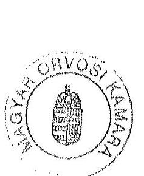
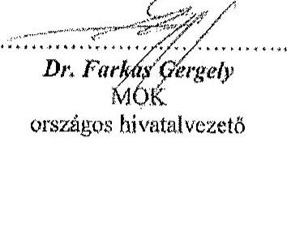

---

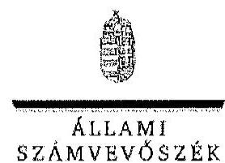

ELNOK

Ikt. szám: V-0531-1688/2015

Dr. Farkas Gergely úr
hivatalvezető
Magyar Orvosi Kamara Országos Hivatala

# Budapest 

## Tisztelt Hivatalvezető Úr!

A Magyar Orvosi Kamara gazdálkodásának, továbbá a feladatai finanszírozására kapott költségvetési támogatások felhasználásának ellenőrzéséről készített számvevőszéki jelentéstervezetre tett észrevételeit köszönettel megkaptam.

Az Állami Számvevőszék észrevételekre vonatkozó álláspontjáról a felügyeleti vezető által készített részletes tájékoztatást csatoltan megküldöm.

Tájékoztatom Hivatalvezető urat, hogy a jelentésben - az Állami Számvevőszékről szóló 2011. évi LXVI. törvény 29. § (3) bekezdése alapján - az el nem fogadott észrevételeket szerepeltetjük az elutasítás indokának feltüntetésével együtt. Az elfogadott észrevételeket a jelentés szövegezésénél figyelembe vesszük.

Budapest, 2015. 031. hó 29. nap
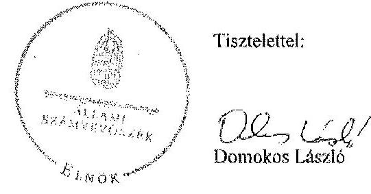

Melléklet: Tájékoztatás az elfogadott és az el nem fogadott észrevételekről

---

# Tájékoztatás az elfogadott és az el nem fogadott észrevételekröl 

A Magyar Orvosi Kamara gazdálkodásának, továbbá a feladatai finanszírozására kapott költségvetési támogatások felhasználásának ellenőrzéséről készített jelentéstervezetre az 129938/2014. iktatószámú levelében tett észrevételeit áttekintettük, azok kezeléséről az alábbi tájékoztatást adom.

Az Állami Számvevőszék a Magyar Orvosi Kamaránál 2014-ben folytatott ellenőrzését az Állami Számvevőszékről szóló 2011. évi LXVI. törvény 5.§ (3) bekezdése alapján végezte, mely szerint az Állami Számvevőszék az államháztartásból származó források keretében ellenőrzi az államháztartásból nyújtott támogatás felhasználását. Szintén e törvény elöírása alapján, amenynyiben a kedvezményezett szervezet az államháztartásból támogatásban, vagy ingyenes vagyonjuttatásban részesül, gazdálkodási tevékenységének egésze ellenőrizhető. A gazdálkodás pedig nem csak a kiadások és a bevételek elszámolását foglalja magába. Ezek alapján nem fogadtuk el azon észrevételeit, hogy a megállapítások nem kapcsolódnak a közpénz felhasználásához, emiatt a megállapítások törlésére nem került sor.

A jelentéstervezetben tett megállapítások az Önök által rendelkezésre bocsátott azon dokumentumokon, tényeken alapulnak, amelyet az Országos Hivatal, valamint a Területi Szervezetek az ellenőrzés részére átadtak és teljességi és hitelességi nyilatkozattal támasztottak alá.

A Magyar Orvosi Kamara gazdálkodásának, továbbá a feladatai finanszírozására kapott költségvetési támogatások felhasználásának ellenőrzése szabályszerűségi ellenőrzés volt. A jelentéstervezet bevezetőjében leírtaknak megfelelően a szabályszerűségi ellenőrzés célja annak megítélése volt, hogy a MOK gazdálkodása során betartotta-e a vonatkozó jogszabályi előírásokat, továbbá szabályszerűen használta-e fel a feladatai ellátására kapott költségvetési támogatásokat. Az etikai rendszer müködtetéséhez szükséges kiadások nagyságrendjének meghatározása a szabályszerűségi ellenőrzésnek nem volt tárgya, ezért az ellenőrzés erre nem terjed ki. Ezek alapján az „Általános észrevételek" részben javasolt megállapításokat mivel az nem volt az ellenőrzés tárgya, nem áll módunkban a jelentésben szerepeltetni. A jelentéstervet tényszerüen bemutatja a MOK által kapott költségvetési támogatást és az ahhoz kapcsolódó elszámolását.

A jelentéstervezethez tett részletes észrevételeire az alábbi tájékoztatást adom:
Nem fogadtuk el a tagdíj mértékére vonatkozó észrevételét, mert nem felel meg az ellenőrzés rendelkezésére bocsátott dokumentumokban foglaltaknak Az Alapszabály3.4 42./a pontjában foglaltak szerint a TESZT feladatai közé tartozott, hogy a Törvény, illetve az Alapszabály 16./ pontja adta keretek között megállapítja a kamarai tagdíj mértékét, fizetésének módját, a tagdijkedvezmények mértékét, elfogadja a tagdíjszabályzatot az OKGY felhatalmazása alapján. Az egészségügyben müködő szakmai kamarákról szóló 2006. évi XCVII. törvény (Ekt.) 4. § (1), valamint a 29/A. § (1) bekezdésének elöírásai alapján a szakmai kamarai a tagdíj mértékét a szakmai kamara alapszabályában kell meghatározni. A jelentéstervezet az Alapszabály tör-

---

vénynek nem megfelelő szabályozását tartalmazza, amelyet az észrevételében sem kifogásolt. A jelentéstervezet egyben azt is rögzíti, hogy a tagdij mértékét az OKGY határozia meg. Az Alapszabály 2014. évi módosítása túlmutat a 2010-2012 évekre irányuló ellenőrzési időszakon, ezért nem tartalmazhat arra vonatkozó megállapítást. Örömmel vettem ugyanakkor, hogy a 2014. évben már a jogszabálynak megfelelően szabályozták a kamarai tagdij mértékének meghatározását.

Az Országos Hivatal szervezeti-működési, ügyrendi szabályzatra vonatkozó észrevétele nem helytálló, tekintettel arra, hogy az Alapszabály1-4 55./ pontja kimondja, hogy a MOK müködésének, a feladat- és hatáskörök megosztásának részletes szabályait a szervezeti-müködési, ügyrendi és egyéb szabályzatok tartalmazzák, összhangban az Alapszabállyal. Az Alapszabály 37. pontja az Országos Hivatal feladatait tartalmazza, müködésének részletes szabályait nem. Az Alapszabály 37. pontjában hivatkozott országos kamarai ügyrendet, országos kamarai szabályzatot az ellenőrzésnek nem adtak át. A MOK feladatait az Ekt. alapján a területi szerveik, valamint országos szerveik útján látja el. Sem a hivatkozott törvény, sem az Alapszabály nem tesz kivételt az Országos Hivatallal szemben. Az ellenőrzés végrehajtása során nem bocsátottak rendelkezésünkre szervezeti-müködési, ügyrendi szabályzatra vonatkozó dokumentumot. A jelentéstervezet megállapítása ezért meglapozott.

Az ellenőrzés rendelkezésére bocsátott dokumentumok alapján az OKGY üléseinek szabályszerű megtartására vonatkozó észrevételét nem fogadtuk el. Az Alapszabályz-4 50./ pontja szerint a testületi ülés határozatképtelensége miatt megismételt ülés - változatlan napirenddel határozatképes, ha azon a testületi tagok, illetve küldöttek több mint $33 \%$-a jelen van. A 2011. szeptember 24-én és a 2012. december 1-jén megtartott OKGY alkalmával a meghívóban között napirendek tárgyalásán túl az Alapszabály; 50./ pontjával ellentétesen a határozatképtelenség miatt megismételt OKGY ülésen a meghívóban szereplő napirendi pontokon túl más napirendi pont is szerepelt. Ezt az ellenőrzés részére átadott OKGY ülés jegyzőkönyvei igazolják.

Nem megalapozott és nem helytálló az Országos Elnökség ülésére vonatkozó észrevétele. Az Ekt. 6.§ (6) bekezdése és az Alapszabály1-4 34./ d) pontja szerint az Országos Elnökség szükség szerint, de legalább havonta egy alkalommal ülésezik. Az észrevételében leírtak is azt támasztják alá, hogy a 2010. és a 2012. években nem tartott havonta ülést az Országos Elnökség.

Megállapításunk helytálló a Számv. tv.-ben előírt gazdálkodási szabályzatok hiányos elkészítésére vonatkozóan. Az ellenőrzés rendelkezésére bocsátott dokumentumok alapján az Eszközök és források értékelési szabályzata nem tartalmazza a Számv. tv. 14.§ (4) bekezdésben foglaltak ellenére, hogy a számviteli értékelés szempontjából mit tekint lényegesnek, nem lényegesnek. A Számviteli Politika csak a jelentös és lényeges hibákra vonatkozóan tartalmaz meghatározást. Észrevételét dokumentumokkal, bizonyítékokkal nem támasztotta alá, így azt nem fogadtuk el.

Nem fogadtuk el az adatok céltól eltérő, az érintettek hozzájárulása nélküli továbbítására vonatkozó észrevételét. Az észrevétel a továbbítás tényét nem cáfolta, az ellenőrzés megindulása előtti, ellenőrzött időszakot követő, megállapításra okot adó tények rendezése az ellenőrzött időszakra vonatkozó megállapítást nem befolyásolja. Ezen túl, amint azt a jelentéstervezet is

---

tartalmazza a MOK a tagsági jogviszony létesitésére irányuló tagfelvételi kérelmeken adott tagi hozzájárulás tartalma alapján a rendelkezésre bocsátott adatokat kizárólag a tagsági jogviszony létesítése, fenntartása és megszüntetése, valamint az abból származó jogok és kötelezettségek érvényesítése céljából kezelhette. Ez más irányú felhasználást nem tett lehetővé, ezért megállapításunk helytálló. A Nemzeti Adatvédelmi és Információszabadság Hatóság Állami Számvevőszék részére megküldött tájékoztatása is ezt támasztja alá.

Köszönettel vettem tájékoztatását, hogy a közérdekủ adatok közzététele a vonatkozó jogszabályok alapján történik. Észrevétele az ellenőrzött időszakban megállapított hiányosságot nem cáfolta, az az ellenőrzött időszakon túl mutat, ezért a megállapítást nem módosítja.

Nem fogadtuk el a MOK elnök munkaviszonyának szerződésére vonatkozó észrevételét. A Munka Törvénykönyvéről szóló 1992. évi XXII. törvény (Mt.) 79. § (6) bekezdése - mely szerint „a határozott idejű munkaviszony határozatlan idejűvé alakul át, ha a munkavállaló az időtartam lejártát követően legalább egy munkanapot, közvetlen vezetője tudtával tovább dolgozik - álláspontunk szerint a szóban forgó munkaviszony esetében nem alkalmazható, mivel az az Mt. 79. § (7) bekezdése szerinti „választással keletkezett" munkaviszony. Az elnök munkaviszonyának - újbóli megválasztása utáni - fenntartása akkor lett volna jogszerü, ha a felek a következő elnöki periódusra újabb határozott idejű munkaszerződést kötnek. Ezen időszakra, munkaszerződésre vonatkozó dokumentumot nem adtak át az ellenőrzés részére.

Nem fogadtuk el a pénztárhoz kapcsolódó szigorú számadás alá vont bizonylatok nyilvántartásának, kezelésének módjára vonatkozó észrevételt, tekintettel arra, hogy a Számv. tv. 14.§ (8) bekezdés szerint a pénzkezelési szabályzatban rendelkezni kell a pénzkezeléssel kapcsolatos bizonylatok rendjéről, a 168.§ (1) bekezdés pedig előírja a bizonylatokra vonatkozó szigorú számadási kötelezettséget. Az ellenőrzés részére olyan dokumentumot nem adtak át, amely tartalmazta volna, hogy mely bizonylatok tartoznak szigorú számadás alá.

Nem helytálló a gazdálkodó nyilvántartási (könyvvezetési) rendszerének továbbrészletezésével kapcsolatos észrevétele, ezért azt nem fogadtuk el. A Számv. tv. 161./A. § (2) bekezdésben foglaltaknak megfelelően a közpénzek felhasználásának és a köztulajdon használatának nyilvánossága és ellenőrizhetősége érdekében a gazdálkodó nyilvántartási (könyvvezetési) rendszerét köteles oly módon továbbrészletezni, hogy abból a vonatkozó külön jogszabályban meghatározott adatok rendelkezésre álljanak. A rendelkezésre bocsátott szabályzatában az elkülönített nyilvántartást nem írták elő, a munkaszámok alkalmazására nincs hivatkozás. Elkülönített nyilvántartást az ellenőrzés részére nem mutattak be, ezért a Számv. tv.-ben előírt gazdálkodási szabályzatokra vonatkozó összegző módosítás törlése nem áll módunkban, a hiányosságra vonatkozó megállapításunkat továbbra is fenntartjuk. A jelentéstervezet 18-19. oldalán részletesen felsorolásra kerültek a gazdálkodási szabályzatok hiányosságai. Az ellenőrzés az eszközök és források értékelési szabályzatánál, valamint a pénzkezelési szabályzatnál is tárt fel hiányosságot, a vonatkozó jogszabályi előírás megjelölésével.

A főkönyvi kivonat és az analitika nem egyezőségére vonatkozó észrevételével kapcsolatban örömmel vettük, hogy a jelentésben megállapított eltérést beisỏ ellenőrzés is feltárta, azonban a megállapított tényen ez nem változtat. A jelentéstervezet 2.1. pontjának utolsó bekezdése részletesen tartalmazza az immateriális javak értékcsökkenésének, valamint az egyéb berendezé-

---

sek, felszerelések értékcsökkenésének fökönyvi számla és az analitika közötti eltérésének megállapítását, amelyet az ellenőrzés rendelkezésére bocsátott dokumentumok alapján tettünk meg.

Nem fogadtuk el a beruházások, felújitások ráfordítása és az értékcsökkenés elszámolására vonatkozó észrevételét. A jelentésben szereplő megállapítás nem az Alapszabály meg nem felelését mondja ki, hanem a törvény be nem tartásáról szól. A Számv. tv. 14. § (4) bekezdése szerint a számviteli politika keretében meg kell határozni, hogy a törvényben biztosított választási, minősitési lehetőségek közül melyeket, milyen feltételek fennállása esetén alkalmaz, az alkalmazott gyakorlatot milyen okok miatt kell megváltoztatni. Ezért az $50 \%$-os mértékủ leírási kulcs alkalmazásának lehetőségét a számviteli politikának tartalmaznia kellett volna az alkalmazáshoz. A leltári alátámasztottságra vonatkozó megállapításunk helytálló, tekintettel arra, hogy nem a beruházások, felújitások, hanem az év végi mérlegtételek leltárral való alátámasztottságát kifogásoljuk.
Nem fogadtuk el az igénybe vett szolgáltatások elszámolására vonatkozó észrevételét. Amint azt a jelentéstervezet 37. oldal harmadik bekezdése is résztelesen tartalmazza, az elszámoláshoz nem csatoltak költségelszámolást alátámasztó dokumentumot. A Számv. tv. 167. § (1) bekezdés c) pontja szerint a jogszabálynak megfelelő bizonylat tartalmazza az utalványozó és a rendelkezés végrehajtását igazoló személy aláírását. A Országos Hivatal ellenőrzött időszakban hatályos szabályzatai nem rendelkeztek a rendelkezés végrehajtását igazoló személyről, az Országos Hivatal vezetője utalványozásra volt jogosult.

Nem fogadtuk el a jelentéstervezet 8. oldal 6. bekezdésére tett észrevételét. A Számv. tv. 69. § (1) bekezdése alapján "a könyvek üzleti év végi zárásához, a beszámoló elkészitéséhez, a mérleg tételeinek alátámasztásához olyan leltárt kell összeállítani és e törvény előírásai szerint megőrizni, amely tételesen, ellenőrizhető módon tartalmazza - az (5) bekezdés figyelembevételével - a vállalkozónak a mérleg fordulónapján meglévő eszközeit és forrásait mennyiségben és értékben." A megállapítás összefoglaló és helytálló, mert az egyes ellenőrzött szervezeteknél fennálló hiányosságokat, a megállapítás alátámasztását felsoroló hibákat már egyedileg is beazonosítható módon tartalmazza a jelentéstervezet. Megjegyzem, hogy az elszámolást alátámasztó bizonylat hiánya miatt az eszközök előírásoknak megfelelő értékelésének ellenőrzése nem biztosított.

Nem fogadtuk el a befektetett pénzügyi eszközök, követelések, és a pénzeszközök leltárral való alátámasztottságára vonatkozó észrevételét. A Számv. tv. 69. § előírásai ellenére a könyvek üzleti év végi zárásához, a beszámoló elkészitéséhez a 2010-2012. években nem készítettek leltárt, amely az eszközöket és forrásokat tételesen tartalmazta.
Nem fogadtuk el az immateriális javak és tárgyi eszközök elszámolását alátámasztó bizonylat megőrzésére vonatkozó észrevételét, mert a tételes ellenőrzésre kiválasztott tételek között volt olyan, amelyre vonatkozó dokumentum az ellenőrzés részére nem került átadásra.
A jelentéstervezet 8. oldal 7. bekezdésére vonatkozó észrevétele alapján a megfogalmazást módosítjuk és csak a könyvvizsgálói véleményt jelenítjük meg.
A kamarai tagdíj bevételek felhasználásának elkülönített kimutatására vonatkozó észrevételét elfogadtuk, azt a jelentés szövegezésénél figyelembe vesszük.

---

Nem fogadtuk el a tagi kölcsönnyújtására vonatkozó észrevételét, mert nem veszi figyelembe a Számv. tv. clöírásait. A Számv. tv. 165. § (1) bekezdése értelmében minden gazdasági müveletről, eseményről, amely az eszközök, illetve az eszközök forrásainak állományát vagy összetételét megváltoztatja, bizonylatot kell kiállítani (készíteni). A gazdasági müveletek (események) folyamatát tükrözö összes bizonylat adatait a könyvviteli nyilvántartásokban rögzíteni kell. Tagi kölcsön számviteli nyilvántartásokban történő rögzítéshez a Számv. tv.-nek megfelelő bizonylatot kell kiállítani. A Számv. tv. 165. § (2) bekezdése alapján a számviteli nyilvántartásokba csak szabályosan kiállított bizonylat alapján szabad adatokat bejegyezni. Szabályszerú az a bizonylat, amely megfelel a bizonylat általános alaki és tartalmi kellékeinek. A könyvviteli elszámolást alátámasztó bizonylat általános alaki és tartalmi kellékeit a törvény 167. § (1) bekezdése tartalmazza. A Számv. tv. 166. § (2) bekezdése alapján a számviteli bizonylat adatainak alakilag és tartalmilag hitelesnek, megbízhatónak, helytállónak kell lennie. A számviteli elszámolást alátámasztó, lényeges tartalmi elemeket (visszafizetés feltételei, futamidő, kamat mértéke, számítási módszere) tartalmazó bizonylat nem készült, ilyen bizonylatot az ellenőrzés részére nem adtak át. Tulajdonosi határozattal nem lehet alátámasztani, hogy a tagi kölcsönt igénybe vevő fél a kölcsönnyújtás feltételeit elfogadta. A tagi kölcsön visszafizetése a megállapított tényen nem változtat, javaslatunkat továbbra is fenntartjuk.
Megállapításunk helytálló a támogatási szerződés vonatkozásában, mivel dokumentumokkal nem támasztották alá, hogy a támogatási szerződésben foglaltaknak megfelelően jártak el. A támogatási szerződésben foglaltak betartását nem befolyásolja, hogy a támogatási összeget mikor utalták át a szervezet részére. Az ellenőrzés részére a támogatási szerződésben foglalt kritériumoknak megfelelő bizonylatot a teljes támogatási összeg vonatkozásában nem adtak át, ezért észrevételét nem fogadtuk el.
Az ellenőrzés rendelkezésére álló dokumentumok alapján a TESZ-ek 2011. évi beszámoló készítésére vonatkozó megállapításunk helytálló. A jegyzett tőke számviteli nyilvántartásokban történő módosítása a Számv. tv. előírásainak megfelelő bizonylat nélkül történt. Ezt több területi szervezet észrevétele is alátámasztotta. Így észrevételének erre vonatkozó részét nem fogadtuk el. Az analitikus nyilvántartásokra vonatkozó észrevételét elfogadtuk, erre vonatkozó megállapításunkat töröljük.

Tájékoztatom, hogy a Magyar Orvosi Kamara Országos Felügyelő Bizottságának ügyrendjére vonatkozó megállapításunkat az Országos Felügyelő Bizottság észrevétcle alapján kezelttük, azt elfogadtuk.

Meggyőződésünk, hogy a rend értéket teremt. Az elfogadott normák, jogszabályok, belső szabályzatok betartása erősíti a társadalmi bizalmat, hozzájárul a szervezet átlátható gazdálkodásához, biztosítja az elszámoltathatóságot.

Budapest, 2015. c. 1. hó 3 nap

Holman Magdolna
felügyeleti vezető

---

# MOK Pest Megyei Területi Szervezete 

051115 Budapest, Fraknó u. 26/B. fxzt. 3.
2/fax: 06-1/312-4040 (1): pnokiroda@pmok.axclero.net
Honlap: http://www.pmok.hu

Einté: a. Forbes Jdzay/
Abdaflk: a. Current Zatida
a. Nagy Zanzarone
Tüder: a. Hosszáa Huttig
a. Szilíre Gaterit

Ikt.szám: 2015/21-2.
Hiv.szám: V-0531-1659/2015.

## Domokos László elnök úr részére   Állami Számvevőszék

Budapest
Apáczai Csere János u. 10. 1052

Tisztelt Elnök Úr!

Az Állami Számvevőszék (továbbiakban ÁSZ), stratégiájának megfelelően, az államháztartáson kivülre nyújtott, esetünkben a Magyar Orvosi Kamarán (továbbiakban MOK) belül, a kétszintü felépítésbe tartozó Pest Megyei TESZ részére biztosított költségvetési támogatások ellenőrzését végzi.

Bevezetőként szükségesnek tartom leszögezni, hogy a MOK Pest Megyei TESZ, illetve annak választott testületei és tisztségviselői alapvetően érdekeltek az átlátható, gazdaságos és hatékony müködés biztosításában, így annak ellenőrzését is a legmesszemenőbbekig segítik saját eszközeikkel.

Így történt ez a 2014. szeptember 11-12. között lebonyolított helyszíni ellenőrzés során, és az ÁSZ jelen észrevétel alagjául szolgáló jelentéstervezetének megállapításaival kapcsolatosan is ugyanez mondható el.

Megjegyezni kívánom mindazonáltal, hogy amint a jelentéstervezet 4. oldalán olvasható, kizárólag a MOK kapott feladatai ellátáshoz az állambáztartás központi alrendszeréből költségvetési támogatást, a Pest Megyei TESZ, ahogyan a többi TESZ is - kizárólag a MOK költségvetéséből részesült juttatásban, állami támogatást nem vett igénybe a jelzett időszakban.

## I. A Pest Megyei TESZ-re vonatkozó megállapítások:

1. 

A Pest Megyei TESZK az Ekt.-ben foglalt határidőig megválasztotta a területi szerveit és tisztségviselőit. Az ellenőrzött időszakban a Pest Megyei TESZK-et szabályszerűen minden évben összefiívták, azonban - az Alapszabály 1-4-ben foglaltak ellenére - a kizárólagos hatáskörükbe tartozó feladatokat teljes körűen nem végezték el, így szabályszerű müködéstük nem volt biztosított.
A TESZ-ek müködéstik és gazdálkodásuk szabályait az ellenőrzött időszakban a Számv. tv.ben, ez Avtv.-ben, az Info tv.-ben és az Alapszabály 1-4-ben foglalt előírások ellenére részben határozták meg.

---

Ezen a kifogásolt időszak után változtatva a Pest Megyei TESZ rendelkezik a kifogásolt TESZ FB ügyrenddel és a TESZ ugyancsak rendelkezik szervezeti-müködési, ügyrendi szabályzattal is.
2.

A Pest Megyei TESZ az ellenőrzött időszakban - a Számv. tv.-ben és a 224/2000. (XII. 19.) Korm. rendeletben foglaltaknak megfelelően - eleget tett éves beszámolási kötelezettségének.
3.

Az előzőekben felsorolt hiányosságok ellenére a könyvvizsgáló véleménye szerint az Országos Szervezet 2010. évi, 2011. évi és 2012. évi egyszerűsített éves beszámolói, valamint a 2011. és 2012. évi MOK beszámoló a tárgyévi december 31-én fennálló vagyoni, pénzügyi és jövedelmi helyzetről megbízható és valós képet adott.
4.

A TESZ FB-k ellenőrzéseik során szabályellenes múködést nem tártak fel a Pest Megyei TESZ esetében.

# II. Tervezett intézkedések: 

1. 

A TESZ-ek müködésük és gazdálkodásuk szabályait az ellenőrzött időszakban a Számv. tv.ben, és az Alapszabály 1-4-ben foglalt előírások ellenére részben határozták meg.

A Pest Megyei TESZ megalkotta és alkalmazza, a TESZ FB ügyrendjét és a TESZ szervezetimüködési, ügyrendi szabályzatát. A müködési szabályok, valamint a számviteli politika és az ennek keretében elkészittett szabályzatok megfelelnek a jogszabályi elöírásoknak és az Alapszabályban foglaltaknak.
2.

A TESZ 2011. szeptember 24. és 2012. december 31. között - az Eisztv.-ben, az Avtv.-ben, az Info tv.-ben valamint a 305/2005. (XII. 25.) Korm. rendeletben foglaltak ellenére adatvédelmi és adatbiztonsági szabályzattal nem rendelkezett.

Az adatvédelmi és adatbiztonsági szabályzatot a Pest Megyei TESZ elkészítette 2011. szeptember 24-ét követően, melynek elfogadása a soron következü elnökségi ülésen várható. A Pest Megyei TESZ a szabályzatok szerint müködik, az adminisztratív elfogadás fog megtörténni április folyamatán.
3.

A TESZ 2011. szeptember 24. és 2012. december 31. között - a 305/2005. (XII. 25.) Korm. rendeletben foglaltak ellenére - közzétételi szabályzattal nem rendelkezett.

A Pest Megyei TESZ 2015. március 18-án megtartott Elnökségi Ülésén elfogadta a 305/2005. (XII. 25.) Korm. rendeletben foglaltaknak megfelelő közzétételi szabályzatot.

---

4. 

A TESZ-ek a 2011. évi beszámoló készítése során a Számv. tv. 15. § (3) bekezdésében rögzített valódiság számviteli alapelvet, valamint a Számv. tv. 165. § (1)-(2) bekezdésében előírtakat megsértve - bizonylat nélkül - rögzítették a könyvvizsgáló cég által, a jegyzett tőke módosítására vonatkozó helyesbítő könyvelési tételeket, továbbá a gazdasági események elszámolásához belső bizonylatot nem készítettek.

A Pest Megyei TESZ intézkedett, mely elfogadás alatt van, hogy a számviteli nyilvántartásokba csak szabályszertien kiállított bizonylat alapján jegyeszenek be adatokat.

A TESZ-eknél ellenőrzött mérlegtételeknél az immateriális javak és tárgyi eszközök, a befektetett pénzügyi eszközök, a követelések, a pénzeszközök mérlegtételeinek év végi értékelése és leltárral való alátámasztottsága nem felelt meg a Számv. tv.-ben foglalt előírásoknak.

A Pest Megyei TESZ-nél elfogadás alatt áll az amortizációs politika elemeinek szabályozása, valamint a számviteli politikán belül az eszközök és források leltárkészitési és leltározási szabályozása, mely megfelel a Számv. tv. 14. § (56) bekezdésének.

A TESZ-ek részben alakították is és működtették a gazdálkodási jogkörök gyakorlásának rendjét, azért a könyvviteli elszámolást alátámasztó bizonylatok az alaki és formai követelményeknek - a Számv. tv. 167. § (1) bekezdés a-c) pontjában foglaltak ellenére részben feleltck meg.

A Pest Megyei TESZ esetében a gazdálkodási jogkörök gyakorlásának rendje kialakult annak érdekében, hogy a könyvviteli elszámolást alátámasztó bizonylatok az alaki és formai követelményeknek megfeleljenek.
A Pest Megyei TESZ rendelkezik a számviteli politikán belül pénzkezelési szabályzattal, elfogadásra vár a források minősitési szempontjainak és az eszközök bekerülési értéktartalmának szabályozása.

Ugyanigy a számviteli politikán belül az eszközök és források értékelési szabályzata is elfogadás elôtt áll.

A Pest Megyei TESZ 2015. január 1. napjával elfogadta a Számv. tv. szerinti számlarendet, mely egységesen, a MOK útmutatása alapján került bevezetésre a TESZ-eknél.

# 5. 

Az igénybe vett és egyéb szolgáltatások költségei elszámolása a TESZ-eknél nem felelt meg a Számv. tv. 167 § (1) bekezdés c), h), i) pontokban, az Szja tv. 3. számú melléklet II.4. és 6. pontokban, a 60/1992. (IV. 1.) Korm. rendelet 2. § (1) bekezdésében foglaltaknak, valamint a TESZ-ek belső szabályainak.

A költségek elszámolása a jelzett időszak után megfelel a jogszabályokban és belsö szabályzatokban elöltt követelményeknek.

---

# III. Általános érvényü, a Pest Megyei TESZ-re is vonatkozó megállapítások 

Az Országos Szervezet és a TESZ-ek részére a Számv. tv. és a 224/2000. (XII. 19.) Korm. rendelet egyszerüsített éves beszámoló készítési kötelezettséget ír elő, ami a 224/2000. (19.) Korm. rendelet 4. és 5. számú melléklete alapján egyszerüsített éves beszámoló mérlegéből és egyszerüsített éves beszámoló eredmény-kimutatásából áll.
Az Országos Szervezet és a Pest Megyei TESZ a 2010-2012. években - a Számv. tv. 4. § (1) bekezdés, 6. § (2) bekezdés és a 9 § (2) bekezdés, illetve a 224/2000. (XII. 19.) Korm. rendelet 6. § (1) bekezdésében és 7. § (2) bekezdésében foglaltaknak megfelelően - eleget tett egyszerüsített éves beszámoló készítési kötelezettségének.

A 2010., a 2011. és a 2012. években a Pest Megyei TESZ egyszerüsített éves beszámolóit az Alapszabály 1-4 27cd) pontjában leírtaknak megfelelően a Pest Megyei TESZK elfogadta.

Az Országos Szervezet és a Pest Megyei TESZ az egyszerüsített éves beszámolók készítése során betartották a Számv. tv. 15. § (6) bekezdésében rögzített folytonosság alapelvét, azaz a mérlegek nyitóoldalai megegyeznek az előző évi záró adatokkal, azzal a kivétellel, hogy a 2012. évben a 2011. év vonatkozásában önrevíziós módosítások feltárására került sor, mely miatt a 2011. év záró adata nem egyezett meg a 2012. év nyitó adatával.

A tagok a tagdijakat az Országos Hivatal által kezelt tagdíjszámlára fizették be. A tagdíjszámlára befizetett tagdíjak az Alapszabály 1-4 18. pontjában foglalt előírás szerint kizárólag az Országos Szervezet és a TESZ-ek müködtetésére, az Ekt.-ban, az Alapszabály 1-4-ben elrendelt, valamint az OKGY által az OE-nek a TESZT egyetértésével hozott határozataiban megjelölt feladatok, tagi szolgáltatások céljaira használható fel, a kamarai céltól eltérő felhasználásáról az OKGY dönthetett. A tagi szolgáltatások körét a TESZT által elfogadott hatályos tagi szolgáltatási szabályzatban határozzák meg. Az ellenörzés a rendelkezésre bocsátott dokumentumok alapján kamarai céltól eltérő tagdijfelhasználást nem állapított meg.

A Pest Megyei TESZ az Ekt. 33. § (3) bekezdésében foglalt határidőig megválasztotta az Alapszabály 26. pontja szerinti területi szerveket és tisztségviselöket. Az ellenőrzött időszakban a TESZK-et - az Alapszabály 1-4 27. d) pontjában előírtaknak megfelelően minden évben összehívták.

A Pest Megyei TESZ az ellenőrzött időszakban a Számv. tv. 14. § (3) bekezdésében előírt számviteli politikában nem határozta meg a Számv. tv. 14. 165. § (4) bekezdésében előírt fökönyvi könyvelés, az analitikus nyilvántartások és a könyvelési adatok egyeztetésének és ellenőrzésének módszereit, eszközeit, de a 2010-2012. években az év végi zárlati munka keretében biztosították az adatok egyezőségét.

A Pest Megyei TESZ a rendelkezésére bocsátott bevételeket az Alapszabály 1-4 18. pontjával összhangban az Alapszabály 1 21.d), illetve az Alapszabály 2-4 22. d) alpontjával meghatározott feladatokra, alapfeladataik ellátására, az ügyviteli szervezet müködtetésére, az infrastruktúra fenntartására, az etikai és tagi szolgáltatásnyújtásra, továbbá tárgyi eszközök vásárlására és felújítására fordította. Az ellenőrzött időszakban az Országos Szervezettől kapott pénzeszközök a felmerülő kiadások kifizetéséhez nem voltak elegendőek, azt a Pest Megyei TESZ a korábban tartalékolt pénzeszközci felhasználásával tudta csak finanszírozni. Az ellenőrzés nem tárt fel olyan eseményt, csclekményt, amelyből megállapítható, hogy a Pest Megyei TESZ tagjai személyes adatainak kezelése során - a belső szabályzatok hiánya

---

ellenére - az Avtv. 5. § (1) bekezdésben és az Info tv. 4. §, valamint 20. §-ban foglalt szabályozást nem tartotta be.

# Összegzés: 

Álláspontom szerint megállapítható a fentiek figyelembevételével, hogy a Pest Megyei TESZ mindent megtett, és a jövőben is mindent el fog követni, hogy a hatályos jogszabályok alapján, az általa megalkotott szabályzatok és müködési rend legteljesebb figyelembevételével múködjön.
A feltárt hiányosságokat nagy részben kijavította, a hiányzó elemeket az idei év első felében, a lehető leghamarabb a döntésre hivatott grémium elé terjeszti.

Kérem Elnök urat, hogy a fentiekben jelzett szempontok alapján szíveskedjen a jelentés végleges szövegét kialakítani.

Budapest, 2015. március 27.
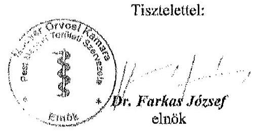

---

.

---

ELHÖK

Ikt. szám: V-0531-1695/2015.

Dr. Farkas József úr
elnök
Magyar Orvosi Kamara Pest Megyei Területi Szervezetc

# Budapest 

## Tisztelt Elnök Úr!

A Magyar Orvosi Kamara gazdálkodásának, továbbá a feladatai finanszírozására kapott költségvetési támogatások felhasználásának ellenőrzéséről készített számvevôszéki jelentéstervezetre tett észrevételeit köszönettel megkaptam.

Az Állami Számvevőszék észrevételekre vonatkozó álláspontjáról a felügyeleti vezető által készített részletes tájékoztatást csatoltan megküldőm.

Tájékoztatom Elnök urat, hogy a jelentésben - az Állami Számvevőszékről szóló 2011. évi LXVI. törvény 29. § (3) bekezdése alapján - az el nem fogadott észrevételeket szerepeitetjük az elutasítás indokának feltüntetésével együtt.

Budapest, 2015. 04 . hő 25 nap

Melléklet: Tájékoztatás az el nem fogadott észrevételekröl

---

# Tájékoztatás az el nem fogadott észrevételekröl 

A Magyar Orvosi Kamara gazdálkodásának, továbbá a feladatai finanszirozására kapott költségvetési támogatások felhasználásának ellenőrzéséről készített jelentéstervezetre a 2015/21-2. iktatószámú levelében tett észrevételeit áttekintettük, azok kezeléséről az alábbi tájékoztatást adom.

Tájékoztatom Elnök urat, hogy észrevételei nem módosítják a jelentéstervezet megállapításait, azokat részben megismétlik, részben a tervezett intézkedéseket mutatják be. Örömmel vettem, hogy Elnők úr az ellenőrzött időszakot követően intézkedett, vagy intézkedni fog az ellenőrzés során feltárt hiányosságok megszüntetéséről. Amennyiben a hiányosságokat a területi szervezet 2012. évet követően már megszüntette - részben az ellenőrzés megállapításai és javaslatai alapján -, azt az intézkedési tervében tudja szerepeltetni végrehajtott feladatként.

Budapest, 2015. 04 hó 23 nap

Holman Magdolna
felügyeleti vezető

---

# MAGYAR ORVOSI KAMARA   Szabolcs-Szatmár-Bereg Megyei Területi Szervezete 

4400 Nyíregyháza, Bocskai utca 60.
Telefon/Fax: (06) 42/461-170
E-mail: mokszszb@mokreg.axclero.net

Állami Számvevőszék

Budapest
Apáczai Csere János utca 10. 1052

Domokos László
Elnök részére

Tisztelt Elnök Úr!
Ikaz: 118 /2015
Hiv.sz: V-0531-1661/2015
ÁLLAMI SZÁNVEVÓSZÉK
25007/2015
Eilnok: 2015 MÁRE 27.
Iktak: 2015.
Melték: 1
A Magyar Orvosi Kamara Szabolcs-Szatmár-Bereg Megyei Területi Szervezete részére az ÁSZ vizsgálattal kapcsolatosan megküldött jelentéstervezetre az elnökség nevében alábbi észrevételt teszem.

Területi Szervezetünknél megállapított hiányosságok a vizsgált időszakban valóban fennálltak. Haladéktalanul megkezdtük a hiányosságok kiküszöbölését.
2014. december 2. napján a Küldöttgyülés elfogadta a Szervezeti és Müködési Szabályzat, Pénzkczelési Szabályzat, Leltározási Szabályzat módosításait, valamint a Felügyelő Bizottság és az Elnökség ügyrendjét.

Az immateriális javak és tárgyi eszközök mérlegtételeinek év végi értékelése során a leltárral való alátámasztottsága szerint intézkedünk a Számviteli törvény betartásáról.
Úgyszintén ennek figyelembe vételével kerülnek már kiállításra a könyvviteli elszámolást alátámasztó bizonylatok, alaki és formai követelmények előírásainak megfelelően.

A vizsgált időszakot követően már rendelkeztink Adatvédelmi és Adatbiztonsági Szabályzattal, valamint Közzétételi Szabályzattal.

Javaslataikat a hiányosságok megszüntetésére köszönttel vettük.

Nyíregyháza, 2015. március 23.
Tisztelettel:

---

.

---

ELNOK

Ikt.szám: V-0531-1696/2015.

Dr. Losonezy János úr
elnök
Magyar Orvosi Kamara Szabolcs-Szatmár-Bereg Megyei Területi Szervezete

Nyiregyháza

# Tisztelt Elnök Úr! 

A Magyar Orvosi Kamara gazdálkodásának, továbbá a feladatai finanszirozására kapott költségvetési támogatások felhasználásának ellenörzéséről készített számvevőszéki jelentéstervezetre tett észrevételeit köszönettel megkaptam.

Az Állami Számvevőszék észrevételekre vonatkozó álláspontjáról a felügyeleti vezető által készített részletes tájékoztatást csatoltan megküldöm.

Tájékoztatom Elnök urat, hogy a jelentésben - az Állami Számvevőszékről szóló 2011. évi LXVI. törvény 29. § (3) bekezdése alapján - az el nem fogadott észrevételeket szerepeltetjük az elutasítás indokának feltüntetésével együtt.

Budapest, 2015. 04 hó 24 nap

Tisztelettel:

Domokos László

Melléklet: Tájékoztatás az el nem fogadott észrevesetlestel

---

# Tájékoztatás az el nem fogadott észrevételekröl 

A Magyar Orvosi Kamara gazdálkodásának, továbbá a feladatai finanszirozására kapott költségvetési támogatások felhasználásának ellenôrzéséről készittett jelentéstervezetre a 118/2015. iktatószámú levelében tett észrevételeit áttekintettük, azok kezeléséről az alábbi tájékoztatást adom.

Örömmel vettük tájékoztatását, hogy a feltárt hiányosságok megszüntetése érdekében Elnök úr lépéseket tett, vagy tenni fog. A jelentéstervezetre tett észrevételei a jelentéstervezet megállapításait nem kifogásolják.

Budapest, 2015. 04 bő 24 nap

---

# MAGYAR ORVOSI KAMARA   VAS MEGYEI TERÜLETI SZERVEZETE 

9700 Szombathely, Thököly Imre utca 14. 9701 Szombathely, Pf.: 298.
28/28 94/508-951 - intervok@t-online.hu - http://vok.fw.hu/
Ikt.sz.: 48/2015-2
Hiv.szám: V-0531-1663/2015

Állami Számvevőszék
1052 Budapest
Apáczai Csere János u. 10

Domokos László
elnök úr részére

Tisztelt Elnök úr!

Kamaránk megkapta az ÁSZ vizsgálat jelentészervezetét. Mindenekelőtt szeretnénk megköszönni a lefolytatott vizsgálatot, mely számunkra nagyon tanulságos volt.

Elnökségünk áttekintette a tervezet megállapításait és javaslatait, melyhez az alábbi megjegyzéseket kivánjuk tenni:

1. Összegzö megállapítások, következtetések, javaslatok fejezetben a Területi Szervezetek alfejezetben az elnöknek tett javaslatok közül a minket érintő alábbi pontokkal egyetértünk, és néhány megállapitást teszünk ezekkel kapcsolatban (kékkel kiemelve):

## Javaslat a TESZ elnükének

2. Intézkedjen az elnökségi ügyrend kialakítására. - Az elnökségi tlyyrend a vizsgálatot követö idöszakban már kiulakitásra keriül, küldöttgyilési elfogadása folyamatban van.
3. Intézkedjen, hogy müködésük szabályai és a számviteli politika és az ennek keretében elkészített szabályok feleljenek meg az Alapszabályban és egyéb jogszabályokban elöírtaknak. - A vizsgált idöszakot követöen a szükséges intézkedéseket már megtettem.
4. Intézkedjen az Info tv. szerinti szabályzat elkészítéséröl. - Kamaránk a 2012. 03. 21-iöl MOK által készített szabályzatot használja, melynek helyi adaptációja folyamatban van.
5. Intézkedjen a 305/2005.(XII.25.)Korm.rendelet szerinti szabályzat elkészítéséröl. (Közzétételi szabályzat) - Kamaránk a 2012. 07. 10-iöl MOK által készített szabályzatot használja, melynek helyi adaptációja folyamatban van.

## Egyéb megállapítások

24.o. a Vas Megyei TESZ a 2010, a 2011 és a 2012. évben - az Alapszabály 2-4 22.c) pontjában foglaltak ellenére - nem küldte meg az egyszerüsített éves beszámolót az OFB

---

részére. - Ez valóban hiányossáa volt a részükröl, melyhez nézileg hozzájárult az is, hogy az OFB-töl nem kaplunk felszólítást a hiány pótlására. A hiánypótlás megtörtént.

# Mellékletek: 

3.sz. melléklet

## Ügyrendek

- Elnökségi ügyrend elkészitése (Alapszabály 1-4, 28.ca pont) - 1996. évben készült, a módosítás 2012-ben elkészült, de elnökségi elfogadására csak 2014-ben került sor. Küldöttgyülési jóváhagyása folyamatban van.
- FB ügyrend elkészitése (Alapszabály 1-4 30.c pont)- 2008-2011 és 2012-2015. I. félévig elkészült. ÁSZ felé felküldve e-mailben 2014. 07. 03.

## Pénzügyi szabályzatok

- a TESZ pénzügyi számviteli szabályzatainak elkészítése (Számv.tv. és Alapszabály 1-4 27.ef pont) 2012.01.01-től TESZK által jóváhagyott. - 2002-tól folyamatosan a szükséges változásokat figyelembe véve készült (2007., 2008., 2011.,2012., és jelenleg érvényes 2015.), e-mailben felküldve 2014. 07. 03.
- Értékelésnél mit tekintenek jelentős összegnek, nem jelentős összegnek (Számv.tv. 14§ (4) bek.)- A hiánypótlás folyamatban van.
- Számviteli politikán belül az eszközök és források értékelési szabályzat elkészítése ( Számv.tv. 14§ (5) bek. b)pont)- 2008-as Gazállkodásai vonatkozó szabályzatok III. fejezetében szerepel az amortizációs politikánk, melyet 2014. 07. 02-án hitelesítve megkïlülünk az ÁSZ részére. Hasznló módon a Számviteli szabályzat 2011. 01. 01-tól érvényben lévő példányát is 2014. 07. 02-án hitelesítve felkülülünk, melyben a mérlegtételek értékelésének általános szabályai szerepelnek.

## Adatvédelem

- Adatvédelmi és adatbiztonsági szabályzat elkészítése 2011.szept 24-ét követően (Eitv. 4§ (3) bek., Avtv. 31/A.§ (3) bek. és INfo tv. 24§ (3) bekezdés) - 2012.03.21-tól MOK által készített jelenleg is érvényben lévó szabályzatot használjuk, melynek helyi adaptálása folyamatos.
- Közzétételi szabályzat elkészítése 2011.szept.24-ét követően (305/2005.(XII.25) sz.Korm.rendelet 3.§)- 2012.07.10-tól MOK által készített jelenleg is érvényben lévó szabályzatot használjuk, melynek helyi adaptálása folyamatos.

Még egyszer megköszönve az ÁSZ ellenőrzését és észrevételeit kérjük a fenti megjegyzéseink szíves figyelembevételét.

Szombathely, 2015. március 24.

---

# Elnök 

Ilk.szám: V-0531-1701/2015.

## Dr. Hermesz Antal úr

elnök
Magyar Orvosi Kamara Vas Megyei Területi Szervezete

## Szombathely

## Tisztelt Elnök Úr!

A Magyar Orvosi Kamara gazdálkodásának, továbbá a feladatai finanszírozására kapott költségvetési támogatások felhasználásának ellenőrzéséről készített számvevőszéki jelentéstervezetre tett észrevételeit köszönettel megkaptam.

Az Állami Számvevőszék észrevételekre vonatkozó álláspontjáról a felügyeleti vezető által készített részletes tájékoztatást csatoltan megküldöm.

Tájékoztatom Elnők urat, hogy a jelentésben - az Állami Számvevőszékről szóló 2011. évi LXVI. törvény 29. § (3) bekezdése alapján - az el nem fogadott észrevételeket szerepeltetjük az elutasítás indokának feltüntetésével együtt.

Budapest, 2015. 04. hó 28. nap

Melléklet: Tájékoztatás az el nem fogadott észrevételekről

---

# Tájékoztatás az el nem fogadott észrevételekröl 

A Magyar Orvosi Kamara gazdálkodásának, továbbá a feladatai finanszírozására kapott költségvetési támogatások felhasználásának ellenőrzéséről készített jelentéstervezetre a 48/2015-2. iktatószámú levelében tett észrevételeit áttekintettük, azok kezeléséről az alábbi tájékoztatást adom.

Örömmel vettük tájékoztatását, hogy a feltárt hiányosságok megszüntetése érdekében Elnök úr lépéseket tett, vagy azok folyamatban vannak. A jelentéstervezet $2 ., 3 ., 4 ., 5$. sorszámú javaslatára vonatkozó észrevételei a jelentéstervezet megállapításait nem kifogásolják, azok az ellenőrzött időszakon túl mutatnak.

Az elnökségi ügyrend elkészitésére vonatkozó észrevétele a megállapításunkat nem kifogásolja, mivel az ügyrend Küldöttgyülési jóváhagyása még csak most van folyamatban.

Az ellenőrzés rendelkezésére bocsátott dokumentumok alapján nem fogadtuk el az FB ügyrendjére vonatkozó észrevételét, mivel erre vonatkozó ellenőrzési bizonyítékot nem bocsátottak az ellenőrzés rendelkezésére. A Felügyelő Bizottság munkatervet fogadott el. Az ellenőrzött időszakra szóló FB ügyrendet az Állami Számvevőszék részére későbbiekben sem küldtek.

Nem fogadtuk el a pénzügyi, számviteli szabályzatok, valamint az eszközök és források értékelési szabályára vonatkozó észrevételét. Az ellenőrzött időszakban az Alapszabály 27. cf) pontja kifejezetten a TESZK hatáskörébe utalja valamennyi belső szabályzat jóváhagyását. Ennek alapján a számviteli politikát és eszközök és források értékelési szabályzatát is a TESZKnel kellett volna jóváhagynia. A TESZK jóváhagyása nélkül a szabályzatok nem felelnek meg a szabályossági követelményeknek.

Örömmel vettük, hogy az értékelésre vonatkozó jelentős és nem jelentős összeg meghatározásának pólása folyamatban van.

Az adatvédelmi és adatbiztonsági szabályzatra, valamint a közzétételi szabályzatra vonatkozó észrevételét nem fogadtuk el. Az egészségügyben müködő kamarákról szóló 2006. évi XCVII. törvény 1. § (4) pontja alapján a területi szervezetek és az országos szervek jogi személyek. Az Alapszabály 2011. szeptember 24-ét követő módosítását követően az Alapszabály 28. ca) pontja alapján a Területi Szervezet Elnöksége megalkotja saját ügyrendjét, előkészíti és a küldöttgyűlés elé terjeszti a területi szervezet szakszerủ és jogszerủ müködéséhez szükséges belső szabályzatokat, így a területi szervezeteknek rendelkeznük kell a müködésükhöz szükséges, saját belső szabályzatokkal.

Budapest, 2015. 04. hó 28 nap

---

ikt.sz: $43 / 2015$.
Hiv.szám: V-0531-1656/2015.

Domokos László Úr
Állami Számvevőszék Elnöke

Budapest

Tisztelt Elnők Úr!

A Magyar Orvosi Kamara gazdálkodásának, továbbá a feladatai finanszírozására kapott költségvetési támogatások felhasználásának ellenôrzéséről készített számvevôszéki jelentéstervezetet területi kamaránk 2015. március 14 -én tartott elnökségi ülésén - a felügyelô bizottság elnöke részvételével - részletesen ismertettük, az abban foglaltakra észrevételt nem kivánunk tenni.

Elnökségünk határozatban fogadta el a hiányosságok megszüntetésére vonatkozó intézkedési tervet. ( 1 . számú melléklet )

Felügyelő bizottságunk a III. negyedéves ülésén vizsgálni fogja az elnökség határozatában megállapított intézkedési terv végrehajtását.

Köszönjük észrevételeiket, javaslataikat, azokat munkánk során folyamatosan hasznosítani fogjuk a jövőben.

Szolnok, 2015. március 25.

Tisztelettel:

---

# 1. számú melléklet 

Kivonat a MOK Jász-Nagykun-Szolnok Megyei Területi Szervezete 2015. március 14-i elnükségi ülésének jegyzőkönyvéből
8/2015. (III.14.) MOK JNSZ Megyei Területi Szervezet elnökségi határozata: Az Állami Számvevőszék V-0531-1656/2015. számú jelentés tervezeténck megállapításaira az elnökség észrevételt nem tesz, az abban foglaltak végrehajtására az alábbi intézkedési tervet fogadja el:

- Az Országos Felügyelő bizottságnak minden évben határidőre meg kell küldeni a pénzügyi beszámolót. (hiányzott a 2011. 2012. év )
Felelős: dr. Papp Edit ügyviteli vezető
dr. Nemes József FB elnök
Határidő: minden év máj. 31.
- Müködésünk, gazdálkodásunk szabályzatai rendelkezéscinek teljes körüségét átvizsgáljuk, azokat Alapszabály és a Számviteli törvényben foglaltak szerint pontosítjuk.
Felelős: dr. Papp Edit ügyviteli vezető
Könyvelóiroda
Határidő: 2015. évi legközelebbi küldöttgyülés
- A MOK által rendelkezésünkre bocsátott Számlarend alapján végezzük számviteli feladatainkat 2015. január 1.-től, ezen Számlarendet a küldöttgyülés elé kell terjeszteni elfogadásra.

Felelős: dr. Papp Edit ügyviteli vezető
Könyvelóiroda
Határidő: 2015. évi legközelebbi küldöttgyülés

- A Számviteli tv. 14. §. (4) bekezdésben ( az értékelésnél mi tekinthető jelentős, nem jelentős összegnek ) elöírt módosítást el kell végezni számviteli politikai szabályzatunkban.
Felelős: dr. Papp Edit ügyviteli vezető
Könyvelóiroda
Határidő: 2015. évi legközelebbi küldöttgyülés
- Közzétételi listával rendelkezik kamaránk a MOK szabályzata alapján. El kell készíteni saját Közzétételi Szabályzatunkat, azt a küldöttgyülés elé terjeszteni elfogadásra.
Határidő: 2015. évi legközelebbi küldöttgyülés
Felelős: dr. Papp Edit ügyviteli vezető

---

Tisztelt Elnök Úr!

Hivatkozva a 2015. március 10. napján kelt, a Területi Szervezetünkhöz 2015. március 16. napján érkezett V-0531-1648/2015. iktatószámú levelükre és a mellékelt Jelentéstervezetre az alábbi kijelentést tesszük.

A jelentéstervezetben foglaltakkal egyet értünk és tudomásul vesszük. A hiányosságok felszámolására az intézkedéseket folyamatba tettük.

Tisztelettel:

---

.

---

Ügyiratszám:33-2/2015
Ügyintéza: dr. Kaiser Katalin

Tárgy: ÁSZ vizsgálat jegyzökönyv
Hiv. szám: V-0531-1662/2015.

Domokos László Elnök

Állami Számvevőszék

Budapest 4.
Pf. 54.
1364

Tisztelt Elnők Úr!

A Magyar Orvosi Kamara gazdálkodásának, továbbá a feladatai finanszírozására kapott költségvetési támogatások ellenőrzéséről szóló Jelentéstervezetben a Tolna Megyei Területi Szervezetre (TESZ) tett megállapításait köszönettel vesszük, azzal kapcsolatban észrevételt tenni nem kívánunk.

Az ÁSZ megállapításait a TESZ Elnöksége és Felügyelö Bizottsága fogja megtárgyalni. A feltárt hiányosságok megszüntetésére - határidő és felelős megnevezésével - Elnökség által jóváhagyott Intézkedési Terv készül.

Szekszárd, 2015. március 18.

Tisztelettel:

MOK Tolna Megyei TESZ Elnöke

Kapják:
1/ Címzeti
2/ Irattár

---

.

---

# RÖVIDÍTÉSEK JEGYZÉKE 

| Törvények |  |
| :--: | :--: |
| Áht. 1 | az államháztartásról szóló 1992. évi XXXVIII. törvény (hatályos 2011. december 31-ig) |
| Áht. 2 | az államháztartásról szóló 2011. évi CXCV. törvény (hatályos 2012. január 1-jétől) |
| ÁSZ tv. | 2011. évi LXVI. törvény az Állami Számvevőszékről |
| Avtv. | a személyes adatok védelméről és a közérdekú adatok nyilvánosságáról szóló 1992. évi LXIII. törvény (hatályos 2011. december 31ig) |
| Ectv. | az egyesülési jogról, a közhasznú jogállásról, valamint a civil szervezetek múködéséről és támogatásáról szóló 2011. évi CLXXV. törvény |
| Eisztv. | az elektronikus információszabadságról szóló 2005. évi XC. törvény (hatályos 2011. december 31-ig) |
| Ekt. | az egészségügyben múködő szakmai kamarákról szóló 2006. évi XCVII. törvény |
| Info tv. | az információs önrendelkezési jogról és az információszabadságról szóló 2011. év CXII. törvény (hatályos 2012. január 1-jétől) |
| Mt. $_{1}$ | a Munka Törvénykönyvéről szóló 1992. évi XXII. törvény (hatályos 2012. december 31-ig, egyes rendelkezései 2012. június 30-ig) |
| Mt. 2 | a munka törvénykönyvéről szóló 2012. évi I. törvény (hatályos 2013. január 1-jétől, egyes rendelkezései 2012. július 1-jétől) |
| Ptk. | a Polgári törvénykönyvról szóló 1959. évi IV. törvény (hatályon kívül helyezve 2014. március 14-től) |
| Számv. tv. | a számvitelről szóló 2000 . évi C. törvény |
| Szja tv. | a személyi jövedelemadóról szóló 1995. évi CXVII. törvény |
| Tao. tv. | a társasági adóról és az osztalékadóról szóló 1996. évi LXXXI. törvény |
| 2010. évi költségvetési törvény | a Magyar Köztársaság 2010. évi költségvetéséről szóló 2009. évi CXXX. törvény |
| 2011. évi költségvetési törvény | a Magyar Köztársaság 2011. évi költségvetéséről szóló 2010. évi CLXIX. törvény |
| 2012. évi költségvetési törvény | Magyarország 2012. évi központi költségvetéséről szóló 2011. évi CLXXXVIII. törvény |
| Rendeletek |  |
| 32/2010.   (V. 13.) EüM rendelet | a XXI. Egészségügyi Minisztérium költségvetési fejezethez tartozó fejezeti kezelésú előirányzatok 2010. évi felhasználásának szabályairól szóló 32/2010. (V. 13.) EüM rendelet |

---

34/2012.
(X. 17.) EMMI rendelet
54/2011. (IX. 1.) NEFMI rendelet
60/1992. (IV. 1.) Korm. rendelet

224/2000.
(XII. 19.) Korm. rendelet
305/2005.
(XII. 25.) Korm. rendelet

## Egyéb rövidítések

2010. évi egyszerúsített éves beszámoló
2010. évi támogatási szerződés 2011. évi egyszerúsített éves beszámoló
2011. évi MOK beszámoló
2011. évi támogatási szerződés 2012. évi egyszerúsített éves beszámoló
2012. évi MOK beszámoló
2012. évi támogatási szerződés Alapszabály ${ }_{1}$

Alapszabály $_{2}$
Alapszabály ${ }_{3}$
a XX. Emberi Erőforrások Minisztériuma költségvetési fejezethez tartozó fejezeti kezelésű előirányzatok 2012. évi felhasználásának szabályairól szóló 34/2012. (X. 17.) EMMI rendelet
a XX. Nemzeti Erőforrás Minisztérium költségvetési fejezethez tartozó fejezeti kezelésű előirányzatok 2011. évi felhasználásának szabályairól szóló 54/2011. (IX. 1.) NEFMI rendelet
a közúti gépjárművek, az egyes mezőgazdasági, erdészeti és halászati erőgépek üzemanyag- és kenőanyag-fogyasztásának igazolás nélkül elszámolható mértékéről szóló 60/1992. (IV. 1.) Korm. rendelet
a számviteli törvény szerinti egyes egyéb szervezetek beszámolókészítési és könyvvezetési kötelezettségének sajátosságairól szóló 224/2000. (XII. 19.) Korm. rendelet
a közérdekű adatok elektronikus közzétételére, az egységes közadatkereső rendszerre, valamint a központi jegyzék adattartalmára, az adatintegrációra vonatkozó részletes szabályokról szóló 305/2005. (XII. 25.) Korm. rendelet
az Országos Szervezet 2010. évi egyszerúsített éves beszámolója
a MOK és az Egészségügyi Minisztérium között 2010-ben létrejött 1447-6/2010-0003EGP iktatószámú támogatási szerződés az Országos Szervezet 2011. évi egyszerúsített éves beszámolója
a MOK 2011. évi összesített pénzügyi kimutatása a kettős könyvvitelt vezető egyéb szervezetek egyszerűsített éves beszámolójából
a MOK és a Nemzeti Erőforrás Minisztérium között 2011-ben létrejött 16075-2/2011-EGP iktatószámú támogatási szerződés az Országos Szervezet 2012. évi egyszerűsített éves beszámolója
a MOK 2012. évi összesített pénzügyi kimutatása a kettős könyvvitelt vezető egyéb szervezetek egyszerűsített éves beszámolójából
a MOK és az Emberi Erőforrások Minisztériumával 2012-ben létrejött 15406-8/2012-EGP iktatószámú támogatási szerződés a Magyar Orvosi Kamara Alapszabálya (hatályos 2010. december 3-ig)
a Magyar Orvosi Kamara Alapszabálya (hatályos 2010. december 4-től 2011. szeptember 24-ig)
a Magyar Orvosi Kamara Alapszabálya (hatályos 2011. szeptember 24-től 2012. december 1-jéig)

---

| Alapszabály ${ }_{4}$ | a Magyar Orvosi Kamara Alapszabálya (hatályos 2012. decem-   ber 1-jétől) |
| :--: | :--: |
| ÁSZ | Állami Számvevőszék |
| Baranya Megyei TESZ | MOK Baranya Megyei Területi Szervezete |
| B.-A.-Z. Megyei TESZ | MOK Borsod-Abaúj-Zemplén Megyei Területi Szervezete |
| Bács-Kiskun Me-   gyei TESZ | MOK Bács-Kiskun Megyei Területi Szervezete |
| Békés Megyei   TESZ | MOK Békés Megyei Területi Szervezete |
| BTESZ | MOK Budapesti Területi Szervezete |
| BTESZK | MOK Budapesti Területi Szervezet Küldöttgyülése |
| Csongrád Me-   gyei TESZ | MOK Csongrád Megyei Területi Szervezete |
| Eszközök és for-   rások értékelési   szabályzat ${ }_{1}$ | a MOK Országos Szervezete Eszközök és Források Értékelési Sza-   bályzata (hatályos 2011. december 31-ig) |
| Eszközök és for-   rások értékelési   szabályzat ${ }_{2}$ | a MOK Országos Szervezete Eszközök és Források Értékelési Sza-   bályzata (hatályos 2012. január 1-jétől) |
| FB | Felügyelő Bizottság |
| Fejér Megyei   TESZ | MOK Fejér Megyei Területi Szervezete |
| Fogorvosok   TESZ | MOK Fogorvosok Területi Szervezete |
| Győr-Moson-   Sopron Megyei   TESZ | MOK Győr-Moson-Sopron Megyei Területi Szervezete |
| Hajdú-Bihar   Megyei TESZ | MOK Hajdú-Bihar Megyei Területi Szervezete |
| Heves Megyei   TESZ | MOK Heves Megyei Területi Szervezete |
| JNSZ Megyei   TESZ | MOK Jász-Nagykun-Szolnok Megyei Területi Szervezete |
| KEM TESZ | MOK Komárom-Esztergom-Megyei Területi Szervezete |
| Közzétételi sza-   bályzat ${ }_{1}$ | Magyar Orvosi Kamara Közzétételi Szabályzata (hatályos 2010. ja-   nuár 1-jétől) |
| Közzétételi sza-   bályzat ${ }_{2}$ | Magyar Orvosi Kamara Közzétételi Szabályzata (hatályos 2012. jú-   lius 10 -től) |
| Leltározási sza-   bályzat ${ }_{1}$ | a MOK Országos Szervezet leltározási szabályzata (hatályos 2011.   december 31-ig) |
| Leltározási sza-   bályzat ${ }_{2}$ | a MOK Országos Hivatala leltározási szabályzata (hatályos 2012.   január 1-jétől) |

---

| miniszter | az egészségügyi miniszter 2010. május 25-ig, a nemzeti erőforrás minisztere 2012. május 14-ig, az emberi erőforrások minisztere 2012. május 15 -től |
| :--: | :--: |
| minisztérium | az Egészségügyi Minisztérium 2010. május 25-ig, a Nemzeti Eröforrás Minisztérium 2012. május 14-ig, az Emberi Erőforrások Minisztériuma 2012. május 15 -től |
| MOK | Magyar Orvosi Kamara |
| NAV | Nemzeti Adó- és Vámhivatal |
| Nógrád Megyei TESZ | MOK Nógrád Megyei Területei Szervezete |
| Nógrád Megyei TESZK | MOK Nógrád Megyei Területi Szervezet Küldöttgyúlése |
| OFB | Magyar Orvosi Kamara Országos Felügyelő Bizottsága |
| OE | Magyar Orvosi Kamara Országos Elnöksége |
| OEB | Magyar Orvosi Kamara Országos Etikai Bizottsága |
| OE Ügyrend | Magyar Orvosi Kamara Országos Elnökségének Ügyrendje (hatályos 2012. február 8-tól) |
| OEB Ügyrend ${ }_{1}$ | Magyar Orvosi Kamara Országos Etikai Bizottság Ügyrendje (hatályos 2012. március 6-ig) |
| OEB Ügyrend ${ }_{2}$ | Magyar Orvosi Kamara Országos Etikai Bizottság Ügyrendje (hatályos 2012. március 7 -től) |
| OFB Ügyrend | Magyar Orvosi Kamara Országos Felügyelő Bizottságának Ügyrendje (hatályos 2012. január 16-ig) |
| OKGY | Országos Küldöttközgyúlés |
| Országos Hiva-   tal | Magyar Orvosi Kamara Ügyviteli Szervezete 2011. április 3-ig, Magyar Orvosi Kamara Országos Hivatala 2011. április 4-től |
| Országos hiva-   ialvezető | Magyar Orvosi Kamara országos ügyviteli vezetője 2011. április 3 -ig, Magyar Orvosi Kamara Országos Hivatal vezetését ellátó hivatalvezető 2011. április 4-től |
| Országos Szer-   vezet | az Ekt. 6. § (1) bekezdése szerinti Országos ügyintéző szervek (elnökség, etikai bizottság, felügyelőbizottság, etikai kollégium, a MOK alapszabályában meghatározott más állandó bizottságok). valamint az Ekt. 10. § (1) bekezdése szerinti Országos Hivatal |
| Pénzkezelési szabályzat ${ }_{1}$ | a MOK Országos Szervezet pénzkezelési szabályzata (hatályos 2011. december 31-ig) |
| Pénzkezelési szabályzat ${ }_{2}$ | a MOK Országos Hivatalának pénzkezelési szabályzata (hatályos 2012. január 1-jétől) |
| Pest Megyei TESZ | MOK Pest Megyei Területi Szervezete |
| Somogy Megyei TESZ | MOK Somogy Megyei Területi Szervezete |
| Számviteli poli-   tika $_{1}$ | a MOK Országos Szervezet számviteli politikája (hatályos 2011. december 31-ig) |
| Számviteli poli-   $t i k a_{2}$ | a MOK Országos Hivatal számviteli politikája (hatályos 2012. január 1-jétől) |

---

SZSZB Megyei TESZ
Tagdíjszabály-zat $_{1}$

Tagdíjszabály$\mathrm{zat}_{2}$

Tagdíjszabály$\mathrm{zat}_{3}$

Tagi szolgáltatási szabályzat TESZ
TESZ FB
TESZK
TESZT
Tolna Megyei TESZ
Ügyviteli utasítás
Vas Megyei TESZ
Veszprém Megyei TESZ
Zala Megyei TESZ

MOK Szabolcs-Szatmár-Bereg Megyei Területi Szervezete
Tagdíjszabályzat, amelyet a Magyar Orvosi Kamara Területi Szervezetek Tanácsa fogadott el 2010. november 3-án megtartott ülésén (hatályos 2010. december 4-től 2011. szeptember 23-ig)
a Magyar Orvosi Kamara Alapszabály ${ }_{3}$ 2. számú mellékletét képező Tagdíjszabályzat (hatályos 2011. szeptember 24-től 2012. november 7 -ig)
a Magyar Orvosi Kamara Alapszabály ${ }_{4}$ 2. számú mellékletét képező Tagdíjszabályzat (hatályos 2012. november 8-tól a tagdíj mértékére vonatkozó pont kivételével, amely 2012. december 1jétől hatályos)
a Magyar Orvosi Kamara Tagi szolgáltatási szabályzata (hatályos 2012. június 9-től)
Területi Szervezet
Területi Szervezet Felügyelő Bizottság
Területi Szervezet Küldöttgyűlése
Területi Szervezetek Tanácsa
MOK Tolna Megyei Területi Szervezete
a támogatások elszámolásáról szóló Magyar Orvosi Kamara ügyviteli utasítása
MOK Vas Megyei Területi Szervezete
MOK Veszprém Megyei Területi Szervezete
MOK Zala Megyei Területi Szervezete

---

.

---

# FOGALOMTÁR 

beruházás
felújítás
közfeladat
köztestület

MOK területi szervezete

MOK országos szervezete

MOK országos ügyintéző szerv
szabályszerú felhasználás

A tárgyi eszköz beszerzése, létesítése, saját vállalkozásban történő előállítása, a beszerzett tárgyi eszköz üzembe helyezése. A beruházás a meglévő tárgyi eszköz bővítését, rendeltetésének megváltoztatását, átalakítását, élettartamának, teljesítőképességének közvetlen növelését eredményező tevékenység. (Forrás: Számv. tv. 3. § (4) bekezdés 7. pontja)

Az elhasználódott tárgyi eszköz eredeti állaga (kapacitása, pontossága) helyreállítását szolgáló időszakonként visszatérő olyan tevékenység, melynek során az eszköz élettartama megnövekszik, minősége, használata jelentősen javul, így a pótlólagos ráfordításból a jövőben gazdasági előnyök származnak. (Forrás: Számv. tv. 3. § (4) 8. pont)
Jogszabályban meghatározott állami vagy önkormányzati feladat, amit az arra kötelezett közérdekből, jogszabályban meghatározott követelményeknek és feltételeknek megfelelve végez, ideértve a lakosság közszolgáltatásokkal való ellátását, továbbá az állam nemzetközi szerződésekben vállalt kötelezettségeiből adódó közérdekú feladatokat, valamint e feladatok ellátásához szükséges infrastruktúra biztosítását is. (Nvtv. 3. § (1) bekezdés 7. pontja)
A köztestület önkormányzattal és nyilvántartott tagsággal rendelkező szervezet, amelynek létrehozását törvény rendeli el. A köztestület a tagságához, illetőleg a tagsága által végzett tevékenységhez kapcsolódó közfeladatot lát el. A köztestület jogi személy. A szakmai kamarák köztestületként folytatják tevékenységüket (az 1959. évi IV. törvény 65. § (1) és (2) bekezdés alapján).

A MOK által az orvos és egyéb diplomás tagjai számára a megyékben, valamint a fővárosban létrehozott területi szervezet (Ekt. 3. §., MOK alapszabálya 24. pont)
Az Országos Küldöttközgyűlés, valamint az Országos ügyintéző szervek (elnökség, etikai bizottság, felügyelőbizottság, etikai kollégium, a MOK alapszabályában meghatározott más állandó bizottságok) Ekt. 4. § (1) bekezdés és 6. § (1) bekezdés.
elnökség, etikai bizottság, felügyelőbizottság, etikai kollégium, a MOK alapszabályában meghatározott más állandó bizottságok
A jogszabályi előírásoknak és a támogatási szerződésekben foglalt előírásoknak megfelelően dokumentált és nyilvántartott felhasználás.

---

támogatás intenzitás

A támogatási intenzitás a támogatás összegének és az elszámolható költségek hányadosa, százalékos formában kifejezve.