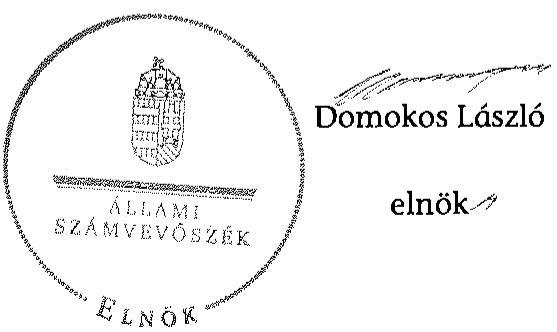
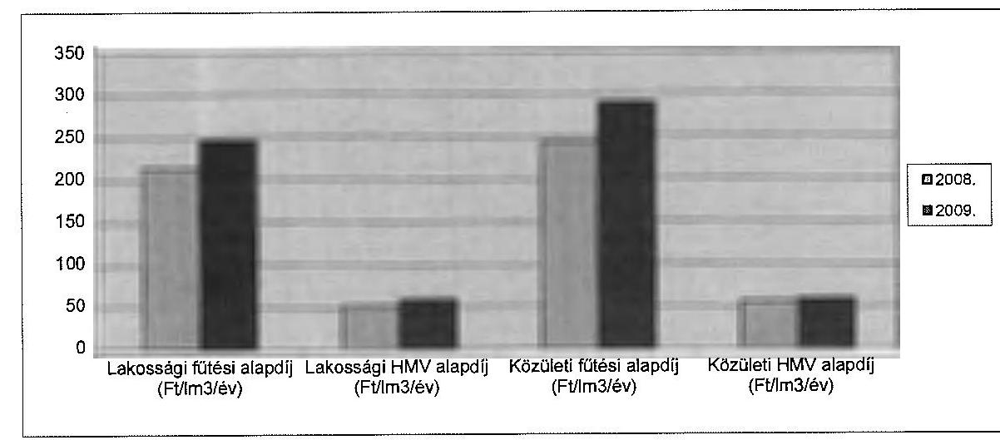
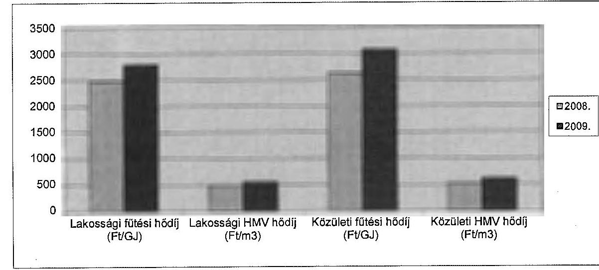
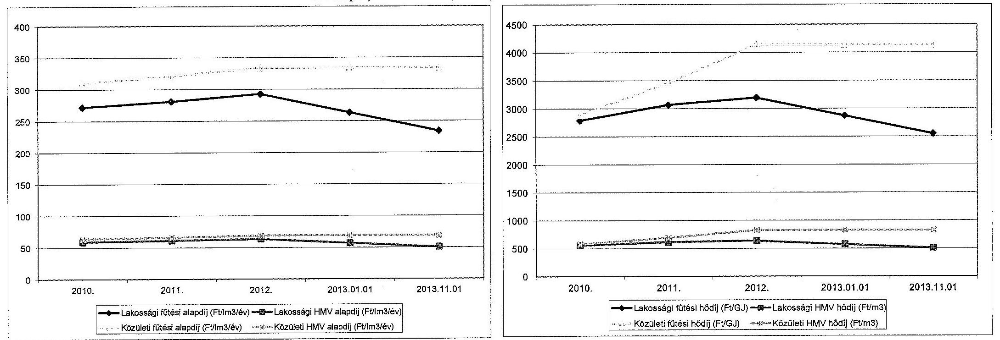
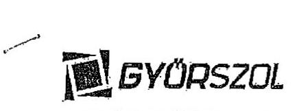
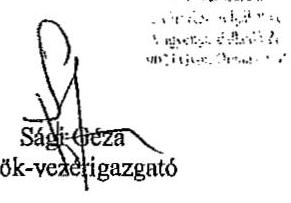
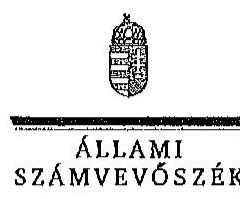
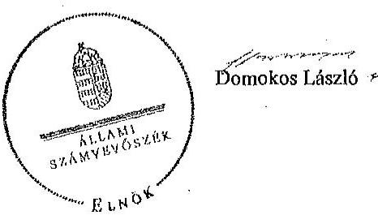

ÁLLAMI
SZÁMVEVŐSZÉK

# JELENTÉS 

Az önkormányzatok gazdasági társaságai - Az önkormányzatok többségi tulajdonában lévő gazdasági társaságok közfeladat ellátását érintő gazdálkodási tevékenysége szabályszerűségének ellenőrzése GYŐR-SZOL Győri Közszolgáltató és Vagyongazdálkodó Zrt.

---

# Állami Számvevőszék 

Iktatószám: V-0729-061/2015
Témaszám: 1763
Vizsgálat-azonosító szám: V067137

## Az ellenőrzést felügyelte:

Dr. Horváth Margit
felügyeleti vezető
Az ellenőrzést vezette és az ellenőrzés végrehajtásáért felelős:
Salamin Viktor
ellenőrzésvezető
A jelentéstervezet összeállításában közreműködött:
Robák Ferencné
számvevő tanácsos

Az ellenőrzést végezték:
Kozma Gábor
számvevő tanácsos

Nagyné Lakhézi Éva
számvevő tanácsos

Robák Ferencné
számvevő tanácsos

---

# TARTALOMJEGYZÉK 

BEVEZETÉS ..... 5
I. ÖSSZEGZŐ MEGÁLLAPÍTÁSOK, KÖVETKEZTETÉSEK, JAVASLATOK ..... 9
II. RÉSZLETES MEGÁLLAPÍTÁSOK ..... 14

1. Az Önkormányzat közfeladat-ellátásának szabályszerűsége ..... 14
1.1. A közfeladat-ellátás megszervezése és a feladatellátás feltételrendszerének kialakítása ..... 14
1.2. A közfeladat-ellátás felügyelete és a tulajdonosi jogok érvényesítése ..... 16
2. A gazdasági társaságok közfeladat-ellátással kapcsolatos tevékenysége ..... 19
2.1. A gazdasági társaságok gazdálkodásának szabályozottsága ..... 19
2.2. A gazdasági társaságok vagyongazdálkodása ..... 21
2.3. A beszámolási kötelezettség teljesítése ..... 24
3. A távhőszolgáltatás közfeladata bevételei és ráfordításai elszámolásának és önköltségszámításának szabályszerűsége ..... 25
3.1. A távhőszolgáltatás közfeladat bevételeinek és ráfordításainak szabályszerűsége ..... 25
3.2. Az önköltségszámítás szabályszerűsége ..... 28
4. Az ÁSZ korábbi, az önkormányzatok többségi tulajdonában lévő gazdasági társaságok közfeladat-ellátását, gazdálkodását, pénzügyi helyzetét érintő javaslataira tett intézkedések ..... 30
MELLÉKLETEK
1A. számú A GYŐRHŐ Kft. tevékenységének főbb adatai
1B. számú A GYŐR-SZOL Zrt. tevékenységének főbb adatai
2A. számú A GYŐRHŐ Kft. működésének főbb jellemzői
2B. számú A GYŐR-SZOL Zrt. működésének főbb jellemzői
3A. számú A GYŐRHŐ Kft. által biztosított távhőszolgáltatás díjai
3B. számú A GYŐR-SZOL Zrt. által biztosított távhőszolgáltatás díjai
4. számú Beérkezett észrevételek és az azokra adott válaszok
FÜGGELÉKEK
5. számú Értelmező szótár
6. számú Mintavételi eljárások ellenőrzési területenként

---

.

---

# RÖVIDÍTÉSEK JEGYZÉKE 

## Törvények

Áht.
Ámt.
ÁSZ tv.
Gt.
Mötv.

Nvtv.

Ötv.

Rezsi tv.
Számv. tv.
Tszt.
Vet.

## Rendeletek

157/2005. (VIII. 15.)
Korm. rendelet
50/2011. (IX. 30.) NFM rendelet

51/2011. (IX. 30.) NFM rendelet
önkormányzati SZMSZ
az államháztartásról szóló 2011. évi CXCV. törvény (hatályos: 2011. december 31-étől)
az árak megállapításáról szóló 1990. évi LXXXVII. törvény (hatályos: 1991. január 1-jétől)
az Állami Számvevőszékről szóló 2011. évi LXVI. törvény (hatályos: 2011. július 1-jétől)
a gazdasági társaságokról szóló 2006. évi IV. törvény (hatálytalan: 2014. március 15-étől)
Magyarország helyi önkormányzatairól szóló 2011. évi CLXXXIX. törvény (hatályos: 2012. január 1-jétől, kivéve a 144. § (2) bekezdésben meghatározott paragrafusok, amelyek 2012. április 15-én, a (3) bekezdésben meghatározott paragrafusok, amelyek 2013. január 1-jén léptek hatályba, a (4) bekezdésben meghatározott paragrafusok a 2014. évi általános önkormányzati választások napján lépnek hatályba)
a nemzeti vagyonról szóló 2011. évi CXCVI. törvény (hatályos: 2011. december 31-étől, kivéve a 20. § (2) bekezdésben meghatározott paragrafusok, amelyek 2012. január 1-jétől, a (3) bekezdésben meghatározott paragrafusok 2013. január 1-jétől, a (4) bekezdésben meghatározott paragrafus 2012. március 2-ától léptek hatályba)
a helyi önkormányzatokról szóló 1990. évi LXV. törvény (hatálytalan: a 2014. évi általános önkormányzati választások napjától)
az egyes törvényeknek a rezsicsökkentés végrehajtásához szükséges módosításáról szóló 2013. évi CLXVII. törvény
a számvitelről szóló 2000. évi C. törvény (hatályos: 2001. január 1-jétől)
a távhőszolgáltatásról szóló 2005. évi XVIII. törvény (hatályos: 2005. július 1-jétől)
a villamos energiáról szóló 2007. évi LXXXVI. törvény
a távhőszolgáltatásról szóló 2005. évi XVIII. törvény végrehajtásáról (hatályos: 2005. szeptember 29-étől)
a távhőszolgáltatónak értékesített távhő árának, valamint a lakossági felhasználónak és a külön kezelt intézménynek nyújtott távhőszolgáltatás díjának megállapításáról szóló 50/2011. (IX. 30.) NFM rendelet (hatályos: 2011. október 1-jétől)
a távhőszolgáltatási támogatásról szóló 51/2011. (IX. 30.) NFM rendelet (hatályos: 2011. október 1-jétől)
Győr Megyei Jogú Város Önkormányzatának 11/2007. (III. 23.) sz. rendelete az Önkormányzat Szervezeti és Mű-

---

távhőszolgáltatási rendelet
távhőszolgáltatás díjairól szóló rendelet
vagyongazdálkodási rendelet

## Szórövidítések

ÁSZ
FB
gazdasági társaságok
GYŐRHŐ Kft.
GYŐRHŐ Kft. Alapító
Okirata
GYŐR-SZOL Zrt.
GYŐR-SZOL Zrt. Alapító
Okirata
Igazgatóság
jegyző
KEOP
Közgyűlés
MEH
NGM
Önkormányzat
polgármester
SZMSZ
ködési Szabályzatáról (hatályos: 2007. március 23-tól 2012. december 31-ig)
Győr Megyei Jogú Város Önkormányzata Közgyűlésének 26/2006. (IX. 25.) számú rendelete a távhőszolgáltatásról hatályos: 2006. október 1-jétől)
Győr Megyei Jogú Város Önkormányzata Közgyűlésének 39/2006. (XII. 22.) számú rendelete a távhőszolgáltatás díjairól (hatályos: 2007. január 1-jétől)
Győr Megyei Jogú Város Közgyűlésének 16/2001. (IV. 10.) számú rendelete Győr Megyei Jogú Város Önkormányzata vagyonának meghatározásáról, a vagyon feletti tulajdonosi jogok gyakorlásának és a vagyon kezelésének szabályozásáról (hatályos: 2001. április 10-től)

Állami Számvevőszék
a GYŐR-SZOL Zrt. Felügyelőbizottsága
a GYŐRHŐ Kft. 2010. szeptember 30-ig és a GYŐR-SZOL Zrt. 2010. október 1-jétől
GYŐRHŐ Győri Hőszolgáltató Korlátolt Felelősségű Társaság
a GYŐRHŐ Győri Hőszolgáltató Korlátolt Felelősségű Társaság Alapító Okirata és annak módosításai
GYŐR-SZOL Győri Közszolgáltató és Vagyongazdálkodó Zártkörűen Működő Részvénytársaság
a GYŐR-SZOL Győri Közszolgáltató és Vagyongazdálkodó Zrt. Alapító Okirata és annak módosításai
a GYŐR-SZOL Zrt. Igazgatósága
Győr Megyei Jogú Város Önkormányzatának jegyzője
Környezet és Energia Operatív Program
Győr Megyei Jogú Város Önkormányzatának Közgyűlése
Magyar Energia Hivatal (2013. április 1-jétől jogutódja a Magyar Energetikai és Közmű-szabályozási Hivatal)
Nemzetgazdasági Minisztérium
Győr Megyei Jogú Város Önkormányzata
Győr Megyei Jogú Város Önkormányzatának polgármestere
szervezeti és működési szabályzat

---

# JELENTÉS 

## Az önkormányzatok gazdasági társaságai Az önkormányzatok többségi tulajdonában lévő gazdasági társaságok közfeladat ellátását érintő gazdálkodási tevékenysége szabályszerűségének ellenőrzése

## GYŐR-SZOL Győri Közszolgáltató és Vagyongazdálkodó Zártkörűen Működő Részvénytársaság

## BEVEZETÉS

Az Állami Számvevőszék középtávra szóló stratégiájában megfogalmazta, hogy a helyi önkormányzatok gazdálkodásában rejlő pénzügyi kockázatok feltárásával, az államháztartáson kívülre nyújtott költségvetési támogatások és ingyenes vagyonjuttatások, valamint az államháztartáson kívül működő közfeladat-ellátó rendszerek ellenőrzéseivel hozzájárul ahhoz, hogy a közpénzeket az államháztartáson kívül működő szervezetek is átlátható, rendezett módon használják fel a közfeladatok szerződésben vállalt ellátása érdekében.

Az önkormányzatok szervezetalakítási szabadságának következménye, hogy a korábban is vállalati formában működő (nagyvárosi tömegközlekedés, víz-, szennyvízcsatorna, köztisztasági, ingatlankezelés stb.) közszolgáltatások mellett, mind a kötelező, mind az önként vállalt feladatok ellátásában a gazdasági társaságok kiemelt fontosságú szerephez jutottak.

Az Önkormányzat az 1992. évben alapította a GYŐRHŐ Kft.-t az 1969. évben alakult Győri Hőszolgáltató Vállalat átalakulásával, annak jogutódjaként. Az Önkormányzat a GYŐR-SZOL Zrt.-t a 2009. évben hozta létre, majd június 24-én döntött arról, hogy - másik három 100\%-os önkormányzati tulajdonú gazdasági társasággal együtt - beolvasztja a Zrt.-be a GYŐRHŐ Kft.-t. A GYŐRSZOL Zrt. 2010. szeptember 30-tól a beolvadó társaságok jogutódja volt.

A gazdasági társaságok kizárólagos tulajdonosa az Önkormányzat volt. A GYŐRHŐ Kft. főtevékenysége gőzellátás, légkondicionálás volt. A GYŐR-SZOL Zrt. alapító okirat szerinti, cégjegyzékben szereplő főtevékenysége vagyonkezelés, a Központi Statisztikai Hivatal nyilvántartásaiban a gőzellátás, légkondicionálás szerepelt. Szervezetében a Távhőszolgáltatási Igazgatóság végezte a GYŐRHŐ Kft. korábbi feladatait, a távhőtermelést és -szolgáltatást valamint a villamosenergia-termelést.

---

A GYŐRHŐ Kft. jegyzett tőkéje 958,6 M Ft volt. A GYŐR-SZOL Zrt. 2009. december 31-i 5,0 M Ft-os jegyzett tőkéje 2013. december 31-re - a szervezeti változások miatt - 6561,0 M Ft-ra nőtt. A GYŐR-SZOL Zrt. a 2012. évtől elkülönített gázmotoros erőmű, távhőtermelés és szolgáltatás mérlegében 973,1 M Ft jegyzett tőke szerepelt.

A GYŐRHŐ Kft., illetve 2010. szeptember 30-tól a GYŐR-SZOL Zrt. Magyarország egyik legnagyobb távhőpiacának, Győr város távhőszolgáltatási rendszerének kizárólagos ellátója volt. Az ellenőrzött időszakban a gazdasági társaságok a több mint 128 ezer fő lakosú Győr lakásállományának 50\%-át, mintegy 24000 lakást, a város közintézményeit, valamint jelentős számú üzleti fogyasztót láttak el a fűtéshez, és kisebb mértékben a használati melegvíz előállításához használt hőenergiával.

A gazdasági társaságok a távhőszolgáltatás közfeladatát a szabadpiacon beszerzett földgáz, fűtőolaj és vásárolt hőenergia felhasználásával végezték. A 2008. évben vásárolt 65,1 millió $\mathrm{m}^{3}$ földgáz 74,2\%-a szolgálta a távhőszolgáltatás együttes hőigényének kielégítését, emellett 58 tonna fűtőolaj és 4358 GJ vásárolt hőenergia felhasználására volt szükség. Ezzel szemben a 2013. évben vásárolt 53,7 millió $\mathrm{m}^{3}$ földgáz 80,9\%-a (43,5 millió $\mathrm{m}^{3}$ ) szolgálta a távhőszolgáltatás együttes hőigényének kielégítését, emellett 43 tonna fűtőolaj és 3021 GJ vásárolt hőenergia hőmennyiség felhasználására volt szükség.

A 2008. évben a GYŐRHŐ Kft. éves nettó árbevétele 8580,5 M Ft volt, a 2013. évben a GYŐR-SZOL Zrt. távhőszolgáltatási tevékenységének 9277,4 M Ft volt a nettó árbevétele. A 2008. évben a GYŐRHŐ Kft. eszközeinek és forrásainak mérleg szerinti értéke 8687,5 M Ft, a 2013. évben a GYŐR-SZOL Zrt. távhőszolgáltatás és gázmotoros erőmű mérlegfőösszege 10152,1 M Ft volt. A gazdasági társaságok a távhőszolgáltatás közfeladatát az ellenőrzött időszak éveiben nyereséggel látták el. Az Önkormányzat határozata alapján a nyereség részben, vagy egészében a tulajdonos Önkormányzat részére osztalék formájában kifizetésre, illetve részben az eredménytartalékba átvezetésre került. Ezek után a tevékenység mérleg szerinti eredménye a GYŐRHŐ Kft.-nél az ellenőrzött időszakban együttesen 1198,7 M Ft, a GYŐRSZOL Zrt.-nél 481,5 Mft volt. A GYŐRHŐ Kft.-nél az eredmény terhére kifizetett osztalék együttesen 1605,9 M Ft volt. A gazdasági társaságok által a közfeladat ellátására foglalkoztatottak létszáma a 2008. évi 214 főről a 2013. évre 140 főre csökkent. Ez utóbbi adat csak a távhőszolgáltatási igazgatóság és a gázmotoros erőmű dolgozóinak létszámát tartalmazza, figyelmen kívül hagyva az igazgatás, a gazdasági és pénzügyi igazgatóság dolgozóinak létszámát.

Az ellenőrzött időszakban a polgármester személye nem, a jegyző személye egy alkalommal változott. A polgármester a 2006. évi önkormányzati választások óta tölti be tisztségét, a helyszíni ellenőrzés időszakában a munkakört betöltő jegyző 2008. június 13. óta látta el feladatait. Az ellenőrzött időszakban a GYŐRHŐ Kft.-nél az ügyvezető és a gazdasági igazgató személye egy-egy alkalommal változott. A GYŐR-SZOL Zrt.-nél az ügyvezető, a gazdasági igazgató személye nem változott. Az ügyvezető az alapítás óta, a gazdasági igazgató az egyesülés napjától, 2010. szeptember 30-tól töltötte be tisztségét.

---

Az önkormányzati tulajdonú gazdasági társaságok teljes körű ellenőrzésének lehetőségét az Állami Számvevőszékről szóló 1989. évi XXXVIII. törvény 2011. január 1-jétől hatályos módosítása teremtette meg.

Az ellenőrzés célja annak értékelése volt, hogy

- az önkormányzat a jogszabályi előírások figyelembevételével döntött-e az ellenőrzésre kerülő közfeladat megszervezéséről; az önkormányzat szabályszerűen gyakorolta-e a tulajdonosi jogokat;
- a gazdasági társaság közfeladat-ellátása bevételeinek, ráfordításainak elszámolása és vagyongazdálkodási tevékenysége megfelelte a jogszabályi, illetve a közszolgáltatási szerződésben foglalt tulajdonosi előírásoknak, azok végrehajtása szabályszerű volt-e;
- a közfeladatok átláthatósága és elszámoltathatósága érdekében biztosítva volt-e a közszolgáltatás díjának megalapozottsága szabályszerű önköltségszámítással.

Az ellenőrzés kiterjedt Győr Megyei Jogú Város Önkormányzatára, a GYŐRHŐ Kft. dokumentumaira és a GYŐR-SZOL Zrt.-re.

Az ellenőrzés várható hasznosulása: A törvényalkotás számára - az észlelt problémák, szabálytalanságok, vagy egyéb nem kívánatos jelenségek felszínre kerülésével - az ellenőrzés megállapításai segítséget nyújthatnak az államháztartáson kívüli közfeladat-ellátás értékeléséhez, jogszabályi keretei pontosításához, átláthatóságot biztosító szabályozásához. Meghatározhatóvá válnak a közfeladat ellátásában részt vevő államháztartáson kívüli szervezeteknek - az önkormányzat költségvetését, pénzügyi helyzetét is befolyásoló - kockázatai, lehetővé válik ezen kockázatok csökkentése. Értékelhető válik, hogy a feladatot ellátó gazdasági társaság a közszolgáltatási szerződésben foglaltak betartásával, a közvagyon használatával biztosította-e a szolgáltatás folytatásának feltételeit. Ezzel az ellenőrzöttek és a helyi döntéshozók számára visszajelzést ad feladatszervezési, feladat-ellátási kockázataikról, alapot ad a meglévő hibák megszüntetéséhez, a jobb közfeladat-ellátás biztosításához. Fokozza a fegyelmet, igazolja, hogy lejárt a következmények nélküli ellenőrzések időszaka. Az ÁSZ értékteremtő rend kialakításához és megőrzéséhez hozzájáruló tevékenysége pozitív hatással van a szervezetről kialakított összkép formálására is.

A bevételek és ráfordítások elszámolása, valamint a vagyonnyilvántartás terén
 az egyes területek szabályszerű működését mintavétellel ellenőriztük, ez alapján a sokaságokban előforduló hibás tételek arányát becsültük. A jogszabályoknak és a belső előírásoknak megfelelőnek, azaz szabályszerűnek tekintettük az adott bevételek és ráfordítások elszámolását, a vagyonnyilvántartást, amennyiben a minta ellenőrzésének eredménye alapján $95 \%$-os bizonyossággal a teljes sokaságban a hibás tételek aránya kisebb volt, mint $10 \%$, nem megfelelőnek értékeltük, ha a hibás tételek aránya a 10\%-ot meghaladta. Kockázatot, illetve magas kockázatot jeleztünk, amennyiben egy adott terület vonatkozásában a minta alapján a teljes sokaságban nem volt teljes körűen biztosított a jogszabályoknak és a belső szabályzatoknak megfelelő működés.

---

Az ellenőrzést a számvevőszéki ellenőrzés szakmai szabályai szerint, szabályszerűségi ellenőrzés módszerével, a vonatkozó nemzetközi standardok figyelembevételével végeztük. Az ellenőrzés a 2008-2013. évekre terjedt ki.

Az ellenőrzés végrehajtásának jogszabályi alapját az Állami Számvevőszékről szóló 2011. évi LXVI. törvény 5. § (3)-(5) bekezdései képezték.

Az ÁSZ az Állami Számvevőszékről szóló 2011. évi LXVI. törvény 29. §-a alapján a jelentéstervezetet észrevételezésre megküldte a polgármesternek és a gazdasági társaság vezérigazgatójának. A beérkezett észrevételeket a jelentés véglegesítése során hasznosítottuk. Az észrevételeket és az azokra adott válaszokat a jelentés 4. számú melléklete tartalmazza.

---

# I. ÖSSZEGZŐ MEGÁLLAPÍTÁSOK, KÖVETKEZTETÉSEK, JAVASLATOK 

Győr Megyei Jogú Város Önkormányzata a Tszt.-ben előírt távhőszolgáltatási feladatát 1992. december 4-től a GYŐRHŐ Kft., 2010. szeptember 30-tól a GYŐR-SZOL Zrt. tevékenységén keresztül látta el. A GYŐRHŐ Kft. és a GYŐR-SZOL Zrt. kizárólagos tulajdonosa az Önkormányzat volt. Az Önkormányzat közigazgatási területén - a távhőszolgáltatás közfeladatának megszervezéséről az Ötv. előírásainak megfelelően döntött. Az ellenőrzött időszakban az Önkormányzat által alapított gazdasági társaságok feletti tulajdonosi jogokat a Gt.-ben meghatározott előírások szerint a Közgyűlés - egyes hatásköreinek bizottsági átadásával - szabályszerűen gyakorolta. Az Önkormányzat az önkormányzati SZMSZ 5. számú mellékletében írta elő, hogy a közreműködés a helyi energiaszolgáltatásban (távhő- és melegvíz-szolgáltatás) kötelezően ellátandó feladat. Az Önkormányzat a 2006-2010. és a 2011-2014. évekre szóló gazdasági programja a távhőszolgáltatás működtetésével, fejlesztésével kapcsolatban célokat nem fogalmazott meg. Az Önkormányzat a 2008. illetve a 2011. évben elfogadott Középtávú Integrált Városfejlesztési Stratégiája, vagyongazdálkodási terve a távhőszolgáltatással kapcsolatban konkrét elképzeléseket nem tartalmazott. Az Önkormányzat, mint a gazdasági társaságok tulajdonosa a vagyongazdálkodási terv előírásai ellenére a szakmai tevékenység mérésére alkalmas rendszert nem alakított ki.

Az Önkormányzat a távhőszolgáltatásra vonatkozóan a Tszt. szerinti rendeletalkotási kötelezettségének a vagyongazdálkodási rendelet és a távhőszolgáltatási rendelet megalkotásával tett eleget. A rendeletek alapjában megfeleltek a jogszabályi előírásoknak. A GYŐRHŐ Kft., valamint a GYŐRSZOL Zrt. távhőszolgáltatási díjainak Önkormányzat általi megállapítása a hatályos jogszabályi előírásoknak megfelelt.

Az Önkormányzat az ellenőrzött időszakban a GYŐRHŐ Kft.-vel, valamint a GYŐR-SZOL Zrt.-vel kapcsolatos tulajdonosi jogokat nem adott át. Az Önkormányzat részéről a gazdasági társaságok tulajdonosi ellenőrzése elsősorban az FB keretében működött. Az FB-k tagjait az Önkormányzat mint tulajdonos delegálta. Az Önkormányzat belső ellenőrzése a távhőszolgáltatás mint közfeladat ellátás szabályszerű teljesítéséhez, az önkormányzati vagyon megóvásához érdemben nem járult hozzá, mivel a GYŐRHŐ Kft.-nél, illetve a GYŐR-SZOL Zrt.-nél ellenőrzést nem végzett.

Az ellenőrzött időszakban az Önkormányzat illetékes bizottságai a gazdasági társaságok üzleti terveit megtárgyalták és határozatban elfogadták. Az üzleti tervek az adott gazdasági évre vonatkozóan tartalmaztak bevételi és kiadási tervet, a karbantartási és beruházási tevékenységre vonatkozó koncepciót.

Az FB - a könyvvizsgálói hitelesítő záradék ismeretében - minden évben határozatot hozott a beszámoló elfogadásáról. A bizottságok az éves beszámoló részeként egyidejűleg fogadták el a gazdasági társaságok üzleti jelentéseit, me-

---

lyekben a távhőszolgáltatással kapcsolatos feladatok teljesítéséről kaptak tájékoztatást.

Az ellenőrzött éveket a gazdasági társaságok nyereséggel zárták. A tulajdonos Önkormányzat illetékes bizottságai osztalék kifizetéséről illetve a nyereség egy részének eredménytartalékba helyezéséről határoztak. A 2009. évtől a mérleg szerinti eredmény mindkét gazdasági társaság esetében - az eredményfelosztásról hozott tulajdonosi döntés után - pozitív volt (2008-ban 0 Ft, 2009-ben 624,5 M Ft, 2010-ben 574,2 M Ft, 2012-ben 287,4 M Ft, 2013-ban 194,1 M Ft). A GYŐR-SZOL Zrt. a 2011. évben 426,0 M Ft, a 2012. évben 1139,4 M Ft, a 2013. évben 1576,5 M Ft távhőszolgáltatási támogatásban részesült, amely pozitívan hatott az adott gazdálkodási évek eredményére.

Az Önkormányzat az ellenőrzött időszakban a GYŐRHŐ Kft.-nek, illetve a GYŐR-SZOL Zrt.-nek működési és felhalmozási célú pénzeszközt nem adott át, kölcsönt nem nyújtott, a társaság kötelezettségvállalásaival kapcsolatban garanciát, kezességet nem vállalt.

A gazdasági társaságok elkészítették SZMSZ-üket, de üzletszabályzatot csak a GYŐRHŐ Kft. készített a 2007. évben. A GYŐRSZOL Zrt. - a Tszt.-ben előírtak ellenére - az ellenőrzött időszakban üzletszabályzattal nem rendelkezett. A gazdasági társaságok számviteli rendszerének szabályozottsága megfelelt a törvényi előírásoknak. Elkészítették és a jogszabályi változásokat követően aktualizálták számviteli politikájukat és a kötelezően elkészítendő belső szabályzatokat. A belső szabályzatokban egyértelműen előírták a távhőszolgáltatással kapcsolatos elszámolások, bevételek, ráfordítások továbbá a vagyonelemek elkülönített nyilvántartását. Az ellenőrzött időszakban évente elkészítették az önköltségszámítás rendjére vonatkozó szabályzatukat. A közfeladatok átláthatósága és elszámoltathatósága érdekében biztosították a távhőszolgáltatás díjának megalapozottságát szabályszerű önköltségszámítással.

A GYŐRHŐ Kft. a távhőszolgáltatás számlázási rendjére, valamint a behajtási tevékenységekre önálló szabályozást adott ki. A behajtási tevékenységet a díjbeszedési és behajtási csoport végezte. A GYŐR-SZOL Zrt. a GYŐRHŐ Kft. beolvadását követően a díjbeszedési, számlázási és behajtási tevékenységeket egységes rendszerben, valamennyi közszolgáltatásra vonatkozóan szervezte meg. A GYŐRHŐ Kft. és a GYŐR-SZOL Zrt. távhőszolgáltatással összefüggő vevőköveteléseinek analitikus nyilvántartásából a hátralékos díjbevételek állománya megállapítható volt. Az ellenőrzött időszakban a távhőszolgáltatással összefüggő nem vitatott, jogszerű vevőkövetelések év végi állománya 2011-ig folyamatosan növekedett, majd 2012-2013-ban csökkent.

A gazdasági társaságok könyvvizsgálója az ellenőrzött időszak éves beszámolóit hitelesítő záradékkal látta el. A gazdasági társaságok az éves beszámolók közzétételi, illetve letétbe helyezési kötelezettségüknek minden évben eleget tettek.

A gazdasági társaságok közfeladat-ellátása bevételeinek, ráfordításainak elszámolása megfelelt a jogszabályi előírásoknak, azok végrehajtása szabályszerű volt.

---

A távhőszolgáltatási közfeladat anyagjellegű ráfordításainak elszámolása során a gazdasági társaságok szabályszerűen jártak el. A költségelszámolást megalapozó vezetői döntés, a költségek elszámolása a jogszabályi előírásoknak és a belső szabályozásnak megfelelt. A költségek a tevékenységgel összefüggésben merültek fel, azokat megfelelő költségnemre, közfeladatra számolták el.

A gazdasági társaságok vagyongazdálkodási tevékenysége - beleértve a vagyon kezelését, gyarapítását, hasznosítását - összességében megfelelt a jogszabályi előírásoknak. A távhőszolgáltatási közfeladat-ellátást szolgáló vagyon a gazdasági társaságok saját vagyona volt, vagyonkezelésbe, üzemeltetésre az Önkormányzat tulajdonát képező vagyont nem vettek át. A közfeladat-ellátást szolgáló vagyonnal kapcsolatos változások az eszközök egyedi nyilvántartókartonjain, illetve elkülönített főkönyvi nyilvántartásban kerültek rögzítésre. Az ellenőrzött időszak mérlegbeszámolóiban szereplő eszközök és források értékét leltárral támasztották alá.

A gazdasági társaságok a vagyon megóvása érdekében folyamatosan elvégezték a közfeladat biztonságos ellátáshoz szükséges felújítási, karbantartási munkákat mind a távhővezeték, mind a hőközpontok és egyéb távhő vagyon esetében. Az eszközök pótlását a GYŐRHŐ Kft. és a GYŐR-SZOL Zrt. eredménye terhére finanszírozta.

A GYŐRHŐ Kft. és a GYŐR-SZOL Zrt. a távhőszolgáltatási közfeladathoz kapcsolódó beruházásait, felújításait szabályszerűen bonyolította és számolta el az ellenőrzött időszakban. Az immateriális javak és tárgyi eszközök állománynövekedésének, valamint értékcsökkenésének elszámolása megfelelt a rá vonatkozó szabályozásnak. A beszerzett eszközök állományba vétele, üzembe helyezése megtörtént. A bekerülési érték meghatározása, az eszközök besorolása és nyilvántartása, valamint az értékcsökkenés elszámolása szabályosan történt.

A GYŐRHŐ Kft. és a GYŐR-SZOL Zrt. meghatározták az árképzéshez szükséges önköltségszámítás során alkalmazandó utókalkuláció tartalmát, az elkészítés időpontjait, az adatszolgáltatás és a főkönyvi egyeztetés módját. A Közgyűlés a lakossági felhasználókra vonatkozóan 2008. január 1. és 2011. április 14. között önkormányzati rendeletekben határozta meg a távhőszolgáltatási díjakat. A távhőszolgáltatás önköltségszámítási adatai a díjelőterjesztések esetében megalapozták az árképzést, amely kéttarifás rendszerű volt, alap- és hődíjat tartalmazott. A közszolgáltatási díjak módosításait megalapozó önköltségszámítások megfelelttek a belső szabályzatoknak. A GYŐRHŐ Kft. és a GYŐR-SZOL Zrt. az utókalkulációt tartalmazó önköltségszámításokat az önköltségszámítási szabályzatokban előírt tartalommal, havi gyakorisággal készítették el. Az Önkormányzat hatósági ár-megállapítási joga 2011. április 15-től megszűnt. A GYŐR-SZOL Zrt. 2012. január 1-jétől az NFM rendelet szerinti $4,2 \%$-os díjemelést érvényesítette.

A fentiekben leírtak összegzéseként az alábbi megállapításokat tesszük:
Az Önkormányzat gazdasági programjai a távhőszolgáltatás működtetésével, fejlesztésével kapcsolatban célokat nem fogalmaztak meg, a Középtávú Integrált Városfejlesztési Stratégiában, a vagyongazdálkodási tervben a távhőszol-

---

gáltatással kapcsolatban konkrét elképzelések nem szerepeltek. Az Önkormányzat a gazdasági társaságok szakmai tevékenysége mérésére alkalmas rendszert nem alakított ki. Az Önkormányzat a távhőszolgáltatás közfeladatának megszervezéséről a jogszabályi előírásoknak megfelelően döntött, a gazdasági társaságok feletti tulajdonosi jogokat szabályszerűen gyakorolta. A tulajdonosi ellenőrzés elsősorban az FB működésén és a beszámoltatás rendszerén keresztül érvényesült. Az Önkormányzat belső ellenőrzése a távhőszolgáltatás, mint közfeladat ellátás szabályszerű teljesítéséhez, az önkormányzati vagyon megóvásához érdemben nem járult hozzá.

A gazdasági társaságok ellátták a távhőszolgáltatás közfeladatot, működésük megfelelt a jogszabályi előírásoknak, gazdálkodásuk eredményes, tőkehelyzetük stabil volt. A gazdasági társaságok számviteli rendszerének szabályozottsága megfelelt a törvényi előírásoknak. A közfeladat ellátása bevételeinek, ráfordításainak elszámolása, vagyongazdálkodási tevékenysége összességében megfelelt a jogszabályi előírásoknak.

Az Állami Számvevőszékről szóló 2011. évi LXVI. törvény 33. § (1) bekezdésében foglaltak értelmében a jelentésben foglalt megállapításokhoz kapcsolódó intézkedési tervet köteles az ellenőrzött szervezet vezetője összeállítani, és azt a jelentés kézhezvételétől számított 30 napon belül az ÁSZ részére megküldeni. Amennyiben az intézkedési tervet határidőben nem küldi meg a szervezet, vagy az nem elfogadható, az ÁSZ elnöke a hivatkozott törvény 33. § (3) bekezdés a)-b) pontjaiban foglaltakat érvényesítheti.

Az ellenőrzés intézkedést igénylő megállapításai és javaslatai:
Javaslataink célja a Zrt. gazdálkodása szabályszerűségének javítása annak érdekében, hogy a szabályozási környezet megfelelően tudja támogatni az átlátható működést.

# Javasoljuk a GYŐR-SZOL Zrt. Vezérigazgatójának: 

1.  A GYŐR-SZOL Zrt. nem készítette el távhőszolgáltatási tevékenysége üzletszabályzatát, azt nem tette a Tszt. 53. §-a szerint a felhasználók részére hozzáférhetővé, illetve a Tszt. 57/C. § (4) bekezdés a) pontja szerint nem tette közzé honlapján.

Javaslat:
Intézkedjen a szabályozási hiányosságok megszüntetésére, ennek keretében:
gondoskodjon a GYŐR-SZOL Zrt. távhőszolgáltatási tevékenységére vonatkozó üzletszabályzatát elkészítéséről és annak a Tszt. előírása szerint a felhasználók részére hozzáférhetővé tételéről, valamint közzétételéről a gazdasági társaság honlapján.

Javaslataink célja az önkormányzat szabályszerű működésének elősegítése, továbbá az önkormányzati tulajdonosi joggyakorlás kontrolljainak erősítése.

---

# Javasoljuk Győr Megyei Jogú Város Önkormányzata Jegyzőjének: 

1.  Az Önkormányzat belső ellenőrzése az ellenőrzéseivel a távhőszolgáltatás, mint köz-feladat-ellátás szabályszerű teljesítéséhez, valamint az önkormányzati vagyon megóvásához ellenőrzéseivel nem járult hozzá. Az ellenőrzött időszakban a társaság gazdálkodásával és működésével kapcsolatban ellenőrzést nem folytatott le.

Az Önkormányzat nem a Gt. 35. § (3) bekezdésében foglaltaknak megfelelően fogadták el a GYŐRHŐ Kft., valamint a jogutód GYŐR-SZOL Zrt. éves beszámolóit, mivel az elfogadáshoz hiányzott az FB írásbeli jelentése.

Javaslat:
Intézkedjen a jogszabályi előírások szerinti gyakorlat és a szabályos működés biztosítására, ezen belül:
a) fordítson kiemelt figyelmet arra, hogy az önkormányzat belső ellenőrzése
 az ellenőrzéseivel a távhőszolgáltatás, mint közfeladat-ellátás szabályszerű teljesítéséhez, valamint az önkormányzati vagyon megóvásához ellenőrzéseivel járuljon hozzá.
b) hívja fel a tulajdonosi joggyakorló figyelmet arra, hogy a gazdasági társaságok beszámolóinak elfogadásához a Felügyelő Bizottság írásbeli jelentése szükséges.

---

# II. RÉSZLETES MEGÁLLAPÍTÁSOK 

## 1. Az ÖNKORMÁNYZAT KÖZFELADAT-ELLÁTÁSÁNAK SZABÁLYSZERŰSÉGE

### 1.1. A közfeladat-ellátás megszervezése és a feladatellátás feltételrendszerének kialakítása

Az Ötv. 91. § (6) bekezdése szerint az önkormányzatoknak a gazdasági programjukban kellett meghatározni azon célkitűzéseket, amelyek az ellátandó feladatok biztosítását és fejlesztését szolgálták. Az Önkormányzat 2006-2010., illetve a 2011-2014. évekre a Közgyűlés által elfogadott ${ }^{1}$ gazdasági programja a távhőszolgáltató rendszer fejlesztésével kapcsolatban stratégiai célokat, feladatokat a távhőszolgáltatás ellátására, színvonalának javítására vonatkozó fejlesztési elképzeléseket ${ }^{2}$ nem fogalmazott meg.

#### Abstract

A gazdasági programok tartalmazták Győr társadalmi-gazdasági helyzetét, a gazdasági program alapjait, a kiemelt projekteket és a szakterületenként meghatározott programokat. A gazdasági programok környezetvédelemmel kapcsolatos részében szerepeltek elképzelések az energiatermelés és felhasználás környezetkímélőbbé tételével kapcsolatban. Hosszútávon megvalósítható feladatként szerepelt az alternatív energia előtérbe helyezése a hagyományos energiahordozókkal szemben, valamint a hévizek, termálvizek nagyobb arányú hasznosítása középületek, városrészek fűtésére. A biomassza erőművek építésének támogatását, valamint a napenergia felhasználásának támogatását is tervezték a programok. Az elavult fűtőberendezések cseréjének, a hőszigetelésnek, a mérhető, szabályozható fűtési rendszer kialakításának támogatását is célul tűzték ki.

Az Önkormányzat a 2008. illetve a 2011. évben elfogadott Középtávú Integrált Városfejlesztési Stratégiája a távhőszolgáltatással kapcsolatban konkrét elképzeléseket nem tartalmazott. A 2011-ben elfogadott Középtávú Integrált Városfejlesztési Stratégia a távhőellátást a GYŐRHŐ Kft. feladataként írta le annak ellenére, hogy a GYŐRHŐ Kft. 2010. szeptember 30-án beolvadt a GYŐR-SZOL Zrt.-be.

A Középtávú Integrált Városfejlesztési Stratégiák szerint Győr „jelenlegi és belátható távlati energiaigénye az országos hálózatokról biztosítható, illetőleg a távfűtés esetében a meglévő rendszer elegendő kapacitással bír".

[^0]
[^0]:    ${ }^{1}$ A Közgyűlés 71/2007. (III. 22.), illetve 67/2011. (III. 25.) számú határozata.
    ${ }^{2}$ Az Ötv. 8 § (1), valamint a Mötv. 13 § (1) pontja meghatározta az önkormányzatok kötelező feladatát. A Mötv 116. §-ában előírta, hogy a képviselő-testület hosszú távú fejlesztési elképzeléseit gazdasági programban, fejlesztési tervben köteles rögzíteni. Az elkészítésért a helyi önkormányzat felelős. A gazdasági programnak tartalmaznia kell különösen: az egyes közszolgáltatások biztosítására, színvonalának javítására vonatkozó fejlesztési elképzeléseket.

---

Az Ötv. 8. § (3) bekezdése rendelkezett arról, hogy törvény kötelezheti a települési önkormányzatokat egyes közszolgáltatási feladatok ellátásáról történő gondoskodásra. A Tszt. 6. § (1) bekezdése értelmében a területileg illetékes települési önkormányzat engedélyes vagy engedélyesek útján köteles biztosítani a távhőszolgáltatással ellátott létesítmények távhőellátását.

Az Önkormányzat az Nvtv. 9. § (1) bekezdésében előírtaknak eleget tett, de a közép- és hosszú távú vagyongazdálkodási tervet ${ }^{3}$ késedelemmel készítette el. Az Nvtv. vagyongazdálkodási terv készítési kötelezettséget előíró paragrafusa 2012. január 1-jétől volt hatályos, de a Közgyűlés a vagyongazdálkodási tervet csak 2013. március 29-én fogadta el. A vagyongazdálkodási terv a távhőszolgáltatási közfeladat ellátásával - a vagyongazdálkodás hatékony és költségtakarékos működtetésével, értékének megőrzésével, állagának védelmével, értéknövelő használatával, hasznosításával, gyarapításával - kapcsolatosan a Nvtv. 7. § (2) bekezdése rendelkezése ellenére nem fogalmazott meg feladatokat.

A hosszú távú vagyongazdálkodási célkitűzések között célként szerepelt az önkormányzat tulajdonában álló gazdasági társaságok működésének, jogi és szervezeti kereteinek, tevékenységi körének, az általuk biztosított feladatellátásnak a felülvizsgálata, vagyongazdálkodásuk kiemelt figyelemmel kísérése, a társaságoknál lévő önkormányzati vagyon értékének megőrzése, növelése, eredményesebb működtetése, hatékony tulajdonosi kontrolling, beszámoltatási rendszer kialakítása. A vagyongazdálkodási terv szerint indokolt társaságonként differenciált tulajdonosi elvárások megfogalmazása az ellátott feladatok és a működtetett vagyon figyelembevételével, valamint az éves üzleti terv időarányos végrehajtásáról rendszeres beszámolási kötelezettség előírása.

Az Ötv. 9. § (4) bekezdésének rendelkezése értelmében a Képviselő-testület a feladatkörébe tartozó közszolgáltatások ellátása céljából többek között gazdasági társaságot alapíthat. A jogszabályi rendelkezéssel összhangban az Önkormányzat a vagyongazdálkodási rendelet 9. § (4) bekezdésében rögzítette, hogy gazdasági, illetve közhasznú társaságot, közalapítványt alapítani, a vagyon vagyonrész gazdasági, illetve közhasznú társaságba, alapítványba, közalapítványba való apportálására kizárólag a Közgyűlés jogosult.

Az Önkormányzat - közigazgatási területén - a távhőszolgáltatás közfeladatának megszervezéséről az Ötv. 9. § (4) bekezdésében foglalt ${ }^{4}$ előírásoknak megfelelően döntött. Az Önkormányzat a távhőszolgáltatás közszolgáltatási feladatát 100%-os tulajdonában lévő gazdasági társaság alapításával biztosította az Ötv. 9. § (4) bekezdésének és a vagyongazdálkodási rendeletének előírásaival összhangban. A távhőszolgáltatási feladatok a GYÖRHŐ Kft, részére történő átadása az ellenőrzött időszakot megelőzően történt.

Az Önkormányzat a kizárólagos tulajdonában lévő GYŐRHŐ Kft.-be apportálta a távhőszolgáltatást biztosító vagyont, így a közfeladat-ellátást szolgáló vagyon a társaság saját vagyonát képezte. Az Önkormányzat a

[^0]
[^0]:    ${ }^{3}$ A Közgyűlés a 77/2013. (III. 29.) számú határozatával fogadta el az Önkormányzat közép-, és hosszú távú vagyongazdálkodási tervét.
    ${ }^{4}$ hatálytalan 2013. január 1-jétől

---

GYŐRHŐ Kft. részére a közfeladat ellátásához kezelésre vagyont nem adott át. GYŐRHŐ Kft. 958,6 M Ft jegyzett tőkéje a 2008. évtől a beolvadásig nem változott. A GYŐRHŐ Kft. Alapító Okirata szerinti fő tevékenysége gőzellátás, légkondicionálás volt, távhőszolgáltatói működési engedély birtokában végezte a tevékenységét. (A GYŐRHŐ Kft. főbb adatait az 1A. számú melléklet, működésének főbb jellemzőit a 2A. számú melléklet tartalmazza.)

A GYŐR-SZOL Zrt.-t az Önkormányzat 2009. december 4-én alapította ${ }^{5}$ azzal a céllal, hogy a 2010. évben a négy 100%-ban önkormányzati tulajdonban álló gazdasági társaság: a GYŐRHŐ Kft., a Győri Kommunális Szolgáltató Kft., az INSZOL Győri Vagyongazdálkodó és Szolgáltató Zrt. és a Győri Városfejlesztési Kft. a társaságba beolvadjon. A 2010. szeptember 30-i időponttal beolvadt gazdasági társaságokkal a GYŐR-SZOL Zrt. jegyzett tőkéje 4500,0 M Ft lett, ami 2013. december 31-re 6561,0 M Ft-ra nőtt. A 2012. évtől a GYŐR-SZOL Zrt. távhőtermelés, és -szolgáltatás valamint gázmotoros erőmű elkülönített mérlegében a jegyzett tőke 973,1 M Ft volt, ami az ellenőrzött időszak végéig nem változott. Az Önkormányzat a GYŐR-SZOL Zrt. részére nem adott át vagyont kezelésre a közfeladat ellátásához. A GYŐR-SZOL Zrt. alapító okirat szerinti, cégjegyzékben szereplő főtevékenysége vagyonkezelés, a Központi Statisztikai Hivatal nyilvántartásaiban a gőzellátás, légkondicionálás szerepelt. Szervezetében a Távhőszolgáltatási Igazgatóság végezte a GYŐRHŐ Kft. korábbi feladatait, a távhőtermelést és -szolgáltatást továbbá a villamosenergia-termelést. (A GYŐR-SZOL Zrt. főbb adatait az 1B. számú melléklet, működésének főbb jellemzőit a 2B. számú melléklet tartalmazza.)

Az Önkormányzat a távhőszolgáltatásra vonatkozóan a Tszt. 6. § (2) bekezdés szerinti rendeletalkotási kötelezettségének eleget téve megalkotta a távhőszolgáltatási rendeletét.

Az ellenőrzött időszakban az Önkormányzat egyik gazdasági társasággal sem kötött a távhőszolgáltatás tárgyában közszolgáltatási szerződést, erre jogszabályi kötelezettsége nem volt.

A 2013. december 21-én kötött közszolgáltatási szerződésben hangsúlyozták, hogy az öt éves időtartamra szóló szerződés megléte a feltétele annak, hogy a GYŐR-SZOL Zrt. KEOP pályázaton beruházási támogatáshoz juthasson.

# 1.2. A közfeladat-ellátás felügyelete és a tulajdonosi jogok érvényesítése 

A GYŐRHŐ Kft., illetve a GYŐR-SZOL Zrt. esetében az Önkormányzat, mint tulajdonos részéről a szakmai tevékenység mérésére alkalmas rendszert annak ellenére nem alakítottak ki, hogy a közép- és hosszú távú vagyongazdálkodási terv ennek kötelezettségét előírta. Az objektív mérhetőségre értékelési kritériumokat, mutató- vagy mérőszámokat nem határoztak meg, valamint az azokhoz kapcsolódó számonkérés módját sem alakították ki.

[^0]
[^0]:    ${ }^{5}$ 384/2009. (XII. 04.) számú határozat

---

A GYŐRHŐ Kft. alapító okirata az alapító kizárólagos hatáskörébe utalta a szokásos üzleti tevékenység körén kívül eső olyan szerződés jóváhagyását, amelynek értéke a törzstőke 25%-át meghaladja, a társaság szervezeti és működési szabályzatának jóváhagyását, valamint azon további hatásköröket, amelyeket a Gt. tv. 141. §-a előírt.

A GYŐR-SZOL Zrt. alapító okirata az alapító kizárólagos hatáskörébe utalta a Számv. tv. szerinti beszámoló jóváhagyását, döntést az adózott eredmény felosztásáról , az üzleti terv jóváhagyását, és azon további hatásköröket, amelyeket a Gt. tv.231. § (2) bekezdése előírt.

Az Önkormányzat a gazdasági társaságok feletti tulajdonosi jogok gyakorlására vonatkozóan a vagyongazdálkodási rendeletben rögzített előírásokat.

A vagyongazdálkodási rendelet 12. § (1) bekezdése rögzítette, hogy a kizárólagos önkormányzati tulajdonú gazdasági, illetve közhasznú társaságokban az Önkormányzat alapító jogait a Közgyűlés, illetve átruházott hatáskörben a Tulajdonosi Bizottság, a 2011 második félévtől a Gazdasági és Tulajdonosi Bizottság gyakorolja.

A vagyongazdálkodási rendeletben foglaltaknak megfelelően a GYŐRHŐ Kft., illetve a GYŐR-SZOL Zrt. feletti tulajdonosi jogokat a Közgyűlés, illetve a Tulajdonosi Bizottság, a 2011 második félévtől a Gazdasági és Tulajdonosi Bizottság gyakorolta. A Közgyűlés a hatáskörei közül a gazdasági társaságok vonatkozásában a Számv. tv. szerinti beszámoló elfogadását, ideértve az adózott eredmény felosztását, továbbá az éves üzleti terv jóváhagyását az illetékes bizottságokra ruházta át.

Az Önkormányzat a gazdasági társaságok tulajdonosi ellenőrzését alapvetően az FB-n keresztül gyakorolta. A GYŐRHŐ Kft.-nél az FB nyolc, a GYŐR-SZOL Zrt.-nél három, 2011. január 28-tól ${ }^{6}$ hat tagból állt. A tagokat az Önkormányzat, mint tulajdonos delegálta.

A gazdasági társaságok alapító okirata szerint az FB az alapító Önkormányzat részére ellenőrizhette a gazdasági társaság ügyvezetését. Az FB jogában állt a gazdasági társaságok vezető tisztségviselőitől, vezető állású munkavállalóitól felvilágosítást kérni, a társaság könyveit és iratait megvizsgálni. Az FB testületként járhatott el. A GYŐR-SZOL Zrt. FB-jének tagjait és elnökét a Közgyűlés választotta meg öt évre.

Az ellenőrzött évek éves beszámolóinak elfogadását a gazdasági társaságok FB-i napirendjükre tűzték, elfogadták. Az Önkormányzat illetékes bizottságai az éves beszámolók elfogadásáról határozattal döntöttek.

A távhőszolgáltatás hatósági díjáról és a díjalkalmazás feltételeiről az Önkormányzat rendeletben döntött. ${ }^{7}$ A lakossági és az üzemi felhasználók távhőszolgáltatási díját alapdíjban és hődíjban határozták meg. A lakos-

[^0]
[^0]:    ${ }^{6}$ GYŐR-SZOL Zrt. Alapító Okirat 2011. január 28.
    ${ }^{7}$ 39/2006. (XII. 22.) számú rendelet módosításai: 33/2008. (IX. 25.) számú rendelet, 42/2009. (XII. 18.) számú rendelet, 42/2010. (XII. 17.) számú rendelet

---

sági távhőszolgáltatás állandó költségeit az alapdíjban, a változó költségeket a hődíjban számították fel. A lakossági távhőszolgáltatás díjának megváltoztatását a távhőszolgáltató a GYŐRHŐ Kft. és a GYŐR-SZOL Zrt. a MEH-nél kezdeményezte, majd jogerős határozattal az Önkormányzat a távhőszolgáltatás díjairól szóló rendeletben tette közzé a díjemelést. A rendelet módosításaiban az Önkormányzat folyamatosan felülvizsgálta a távhőszolgáltatás árait. A gazdasági társaságok távhőszolgáltatási díjainak Önkormányzat általi megállapítása a hatályos jogszabályi előírások szerint történt. Az Önkormányzat belső ellenőrzése a 2008-2012. években nem élt az Ötv. 92. § (11) bekezdés b) pontjában ${ }^{8}$ biztosított lehetőséggel, mivel a belső ellenőrzése által ellenőrzéseket nem végeztetett a GYŐRHŐ Kft.-nél, valamint annak 2010-től jogutódjánál, a GYŐR-SZOL Zrt.-nél. Így az Önkormányzat belső ellenőrzése a távhőszolgáltatás, mint közfeladat-ellátás szabályszerű teljesítéséhez, az önkormányzati vagyon (alaptőke) megóvásához nem járult hozzá.

A 2009. évben az Önkormányzat megbízást adott a GYŐRHŐ Kft.-nél egy vállalkozásnak hatékonyságjavítási
 lehetőségek feltárását célzó átvilágítás elvégzésére, és ennek eredményei alapján középtávú stratégia, valamint az ehhez kapcsolódó üzleti előrejelzés kialakításában való szakértői részvételre. Ennek eredményeként elkészült a GYŐRHŐ Kft. átvilágítása és középtávú stratégiája.

Ugyancsak a 2009. évben került sor az Önkormányzat tulajdonában álló gazdasági társaságok jogi, gazdasági szempontú szervezeti átvilágítására. Az elkészült tanulmány áttekintette a lehetséges irányítási modelleket és javaslatot tett egy új, egységes irányítású vállalat létrehozására, mivel a tanulmány megállapításai alapján ez a megoldás hozhatja a legjelentősebb gazdasági előnyöket. A tanulmány megállapította, hogy az egységes irányítás eredményeként növekedni fog az Önkormányzat tulajdonosi érdekérvényesítő képessége, létrejön a vállalatok stratégiai irányítása és kontrollja, javul a vállalatok működésének hatékonysága, kihasználásra kerülnek a közös működésből eredő megtakarítások, javul a lakosság számára nyújtott szolgáltatások színvonala. A tanulmány megállapításait felhasználva az Önkormányzat döntött ${ }^{9}$ arról, hogy az önkormányzati tulajdonú gazdasági társaságok működtetése egységes vállalat típusú irányítással valósuljon meg, ezáltal elősegítve a gazdasági társaságok hatékonyabb koordinációját, együttműködésének erősítését, és a hathatós tulajdonosi joggyakorlás kereteinek megteremtését.

Az ellenőrzött időszakban a gazdasági társaságoknak a távhőszolgáltatás évről évre nyereséget hozott. Átruházott hatáskörben a Közgyűlés tulajdonosi jogokat gyakorló bizottsága döntött az eredmény felosztásáról. A tulajdonos Önkormányzat az eredményt részben vagy teljes egészében osztalék formájában megkapta, illetve az eredményből eredménytartalékot képeztek.

A GYŐRHŐ Kft. 2008. évi adózott eredménye 1005,9 M Ft volt. A tulajdonos Önkormányzat döntése alapján a nyereség - az eredménytartalék egy részével kiegészítve - osztalékként kifizetésre került. Emiatt a GYŐRHŐ Kft. 2008. évi mér-

[^0]
[^0]:    ${ }^{8}$ hatálytalan: 2013. január 1-jétől
    ${ }^{9}$ 347/2009. (X. 29.) számú. határozat

---

legszerinti eredménye 0 Ft volt. A 2009. évben 600 M Ft volt a kifizetett osztalék, a mérleg szerinti eredmény $624,5 \mathrm{M} \mathrm{Ft}$.

Az ellenőrzött időszakban a gazdasági társaságok gazdálkodása nyomán veszteség nem keletkezett, így a veszteség rendezésének módjáról nem kellett dönteni. Az Önkormányzat az ellenőrzött időszakban a GYŐRHŐ Kft.-nek, illetve a GYŐR-SZOL Zrt.-nek működési és felhalmozási célú pénzeszközt nem adott át, kölcsönt nem nyújtott, a gazdasági társaságok kötelezettségvállalásaival kapcsolatban garanciát, kezességet nem vállalt.

Az Önkormányzat az ellenőrzött időszakban nem adott át a tulajdonosi joggyakorlással kapcsolatos jogokat a közfeladatot ellátó gazdasági társaságok vonatkozásában.

# 2. A GAZDASÁGI TÁRSASÁGOK KÖZFELADAT-ELLÁTÁSSAL KAPCSOLATOS TEVÉKENYSÉGE 

### 2.1. A gazdasági társaságok gazdálkodásának szabályozottsága

A GYŐR-SZOL Zrt. nem készített középtávú fejlesztési tervet, de a jogelőd GYŐRHŐ Kft. részére készített fejlesztési terv időtávja és szakmai tartalma illeszkedett a GYŐR-SZOL Zrt. Távhőszolgáltatási Igazgatósága célkitűzéseihez.

A GYŐRHŐ Kft. egy külső vállalkozást kért fel hatékonyságjavítási lehetőségek feltárását célzó átvilágítási munka elvégzésére, és ennek eredményei alapján középtávú stratégia, valamint az ehhez kapcsolódó üzleti előrejelzés kialakításában való szakértői részvételre. Ennek eredményeként 2009. január 30-án elkészült a GYŐRHŐ Kft. átvilágítása és középtávú stratégiája.

A 2008-2010. években a GYŐRHŐ Kft. elkészítette üzleti terveit, amelyeket az FB véleményezett és azokat a Tulajdonosi Bizottság részére elfogadásra javasolta. Az üzleti tervet a bizottság évente elfogadta, az elfogadásról határozatot ${ }^{10}$ hozott.

A GYŐRHŐ Kft. üzleti terveiben megtervezte a termelés, a szolgáltatás és az energiagazdálkodás legfontosabb természetes mértékegységben mért adatait, a karbantartás, a beruházás, a fejlesztés értékadatait mind a hőszolgáltatásra és annak kiegészítő tevékenységeire, mind a gázmotoros erőműre vonatkozóan. Része volt az üzleti tervnek a munkaerő- és bérgazdálkodásra vonatkozó előrejelzés és a gazdasági, pénzügyi terv.

A GYŐR-SZOL Zrt. évente elkészített pénzügyi-üzleti terveinek előterjesztését a Gazdasági és Tulajdonosi Bizottság minden évben megtárgyalta és határozattal ${ }^{11}$ elfogadta.

[^0]
[^0]:    ${ }^{10} 11 / 2008$. (III. 18.) számú, 26/2009. (IV. 21.) számú, 18/2010. (III. 30.) számú határozat
    ${ }^{11} 16 / 2011$. (V. 11.) számú, 31/2012. (IV. 19.) számú, 19/2013. (III. 20.) számú határozata

---

A GYŐR-SZOL Zrt. pénzügyi-üzleti terveiben meghatározta az éves városgazdálkodási, távhőszolgáltatási, beruházási, kivitelezési és ingatlangazdálkodási tevékenységének feladatait. Megtervezte e tevékenységek és az egyéb nem főtevékenységekhez kapcsolódó üzleti folyamatok pénzügyi hátterét. Tartalmazta a humánpolitikai, bérpolitikai és az anyagi érdekeltségi rendszert, valamint a tulajdonosi elvárásokat.

A GYŐR-SZOL Zrt. pénzügyi-üzleti terveinek a Távhőszolgáltatási Igazgatóságra vonatkozó részei meghatározták az igazgatóság távhőszolgáltatásra és a gázmotoros erőműre vonatkozó céljait. Tartalmazták a távhőszolgáltatás és a villamosenergia-termelés költségeinek és bevételeinek, valamint az egyéb tevékenységek bevételeinek tervezését.

Az ellenőrzött időszakban a GYŐRHŐ Kft. rendelkezett a Tszt. 3. § v) bekezdése szerinti üzletszabályzattal, melyet az Önkormányzat jegyzője a Tszt. 7. § (1) bekezdés a)-b) pontjaiban foglaltaknak megfelelően a fogyasztóvédelmi hatóságnak véleményezésre megküldött, majd jóváhagyott. A távhőszolgáltatási tevékenység jogszabályi környezetének jelentős változásai szerint az üzletszabályzatot nem aktualizálták. A GYŐR-SZOL Zrt. nem készítette el távhőszolgáltatási tevékenysége üzletszabályzatát, azt nem tette a Tszt. 53. §-a szerint a felhasználók részére hozzáférhetővé, illetve a Tszt. 57/C. § (4) bekezdés a) pontja szerint nem tette közzé honlapján.

A GYŐRHŐ Kft. 2006. január 1-jén léptette hatályba SZMSZ-ét. A GYŐR-SZOL Zrt. a 2012. évben készítette el az ISO 9001 számú szabványnak megfeleltetett Társasági Belső Szabályozási Rendszerét. Ennek második - Szervezeti Rend - és harmadik kötete - Működési Rend - felelt meg tartalmilag az SZMSZ-nek.

Mindkét társaság elkészítette és a jogszabályi változásokat követően aktualizálta számviteli politikáját és a Számv. tv. 14. § (5) bekezdésében előírt, kötelezően elkészítendő belső szabályzatokat.

A GYŐRHŐ Kft. ügyvezető igazgatója kiadta és 2001. január 1-jétől elrendelte ${ }^{12}$ a társaság számviteli szabályzatának alkalmazását. A szabályzat része volt a számviteli politika, a számlarend és a számlatükör. A számviteli politika keretében elkészítették az eszközök és források leltárkészítési és leltározási szabályzatát és a pénzkezelési szabályzatot is. Évente kiadták az önköltségszámítási szabályzatot. Az utasítás elrendelte a szabályzat évenkénti felülvizsgálatának kötelezettségét. Az ellenőrzött időszakban GYŐRHŐ Kft. számviteli szabályzatát 2008.január 1-jével hatállyal a Számv. tv. változása, ${ }^{13}$ 2009. december 31-én a tulajdonos Önkormányzat átalakulásra vonatkozó döntése ${ }^{14}$ miatt módosították.

A GYŐR-SZOL Zrt. - a GYŐRHŐ Kft. beolvadása előtt - 2009. december 29-én adta ki számviteli politikáját. A 2010. szeptember 30-tól hatályba lépő számviteli politika már figyelembe vette a beolvadó társaságok sajátosságait, így a GYŐRHŐ Kft.-jét is. A számviteli politika tartalmazta az eszközök és források

[^0]
[^0]:    ${ }^{12} 8 / 2000$. sz. Ügyvezető Igazgatói Utasítás
    ${ }^{13} 6 / 2007$. sz. Ügyvezető Igazgatói Utasítás
    ${ }^{14} 10 / 2009$. sz. Ügyvezető Igazgatói Utasítás

---

értékelési szabályzatát. Külön szabályzatban adták ki a számlarendet, a pénzkezelési, a leltározási és a számviteli szétválasztási szabályzatot. A 2012. január 1-jétől és a 2013. január 1-jétől aktualizált számviteli politika elkészítését a Számv. tv. változása indokolta. A szabályzatok megfeleltek a Számv. tv. előírásainak.

A GYŐR-SZOL Zrt. 2012. január 1-jétől az elsődleges költséghely és költségviselő, másodlagos költségnem elszámolásról áttért az elsődlegesen költségnem, másodlagos költséghely és költségviselő elszámolásra.

# 2.2. A gazdasági társaságok vagyongazdálkodása 

A távhőszolgáltatási közfeladat-ellátást szolgáló vagyon a GYŐRHŐ Kft., majd a GYŐR-SZOL Zrt. saját vagyona volt, vagyonkezelésbe, üzemeltetésre az Önkormányzat tulajdonát képező vagyont nem vett át. A közfeladat-ellátást szolgáló vagyonnal kapcsolatos változások elkülönített főkönyvi nyilvántartásban kerültek rögzítésre. Az ellenőrzött időszak beszámolóinak mérlegét leltárral támasztották alá. A leltár tételesen, ellenőrizhető módon tartalmazta a gazdasági társaságok mérleg fordulónapján meglévő eszközeit és forrásait mennyiségben és értékben, ami megfelelt a Számv. tv. 69. § (1) bekezdése és a gazdasági társaságok leltározási szabályzatai előírásainak. A GYŐR-SZOL Zrt. vagyonnyilvántartásán belül elkülönítetten szerepelt a távhőszolgáltatási közfeladat ellátását biztosító eszközállomány és az arra elszámolt értékcsökkenési leírás. Az éves számviteli beszámolók kiegészítő mellékleteiben a vagyonelemeket összesített kimutatásban, az azokban bekövetkezett változásokat - 2012. január 1-jétől üzletáganként a Tszt. 18/A. § (3) bekezdésében előírtak szerinti részletezettségben - bemutatták.

A GYŐRHŐ Kft. és a GYŐR-SZOL Zrt. vagyongazdálkodási tevékenysége - beleértve a vagyon kezelését, gyarapítását, hasznosítását - összességében megfelelt a jogszabályi előírásoknak. A gazdasági társaságok a vagyon megóvása érdekében folyamatosan elvégezték a felújítási, karbantartási munkákat. Minden évben elkészítették beruházási, fejlesztési és karbantartási tervüket. Az üzleti jelentésben beszámoltak a feladatok teljesítéséről. A fejlesztések esetében az üzleti terv elfogadásakor az Önkormányzat egyetértett a célkitűzésekkel azzal, hogy a társaságok gazdálkodják ki az elvégzendő tevékenységek fedezetét.

Az ellenőrzött időszakban a gazdasági társaságoknak a távhőszolgáltatás évről évre nyereséget hozott. A tulajdonos Önkormányzat az eredményt részben vagy teljes egészében osztalék formájában megkapta, illetve a GYŐR-SZOL Zrt. eredménytartalékot képzett belőle.

---

A GYŐRHŐ Kft. és a GYŐR-SZOL Zrt. éves beszámolóinak távhőszolgáltatási tevékenységére vonatkozó mérlegadatai 2008. december 31. és 2013. december 31. között ${ }^{15}$ :

| Megnevezés | GYŐRHŐ Kft. távhőszolgáltatás és kiegészítő tevékenységei |  |  | GYŐR-SZOL Zrt. távhőtermelés és -szolgáltatás |  |
| :--: | :--: | :--: | :--: | :--: | :--: |
|  | 2008.12.31 | 2009.12.31 | 2010.09.30 | 2012.12.31 | 2013.12.31 |
| Befektetett eszközök | 2838 | 3143 | 3342 | 3330 | 3452 |
| ebből: tárgyi eszközök | 2764 | 3097 | 3297 | 3255 | 3312 |
| Forgóeszközök | 455 | 811 | 649 | 2187 | 2091 |
| ebből: követelések | 323 | 337 | 222 | 678 | 887 |
| Aktív időbeli elhatárolások | 618 | 566 | 43 | 879 | 804 |
| ESZKÖZÖK ÖSSZESEN | 3911 | 4519 | 4035 | 6396 | 6346 |
| Saját tőke | 2860 | 2936 | 3056 | 4952 | 5107 |
| ebből: jegyzett tőke | 959 | 959 | 959 | 972 | 972 |
| ebből: mérleg szerinti eredmény | -1290 | 76 | 121 | 129 | 155 |
| Céltartalékok | 0 | 0 | 0 | 0 | 29 |
| Kötelezettségek | 605 | 919 | 609 | 214 | 146 |
| Passzív időbeli elhatárolások | 446 | 665 | 369 | 1229 | 1064 |
| FORRÁSOK ÖSSESEN | 3911 | 4519 | 4035 | 6396 | 6346 |

A GYŐRHŐ Kft. távhőszolgáltatás és kiegészítő tevékenységei eszközeinek mérlegfőösszege az ellenőrzött időszakban, a 2010. szeptember 30-i beolvadásig nem változott jelentős mértékben. A 2012 és a 2013. évben nem változott érdemben a távhőtermelés és -szolgáltatás mérlegében szereplő eszközállomány értéke. Az ellenőrzött időszakban a két gazdasági társaság mérlegében kimutatott forgóeszköz-állomány eltérését nem a követelések értékének növekedése okozta. A GYŐRHŐ Kft. 2008. évi követelésállományának kétszerese volt a GYŐR-SZOL Zrt. Távhőszolgáltatási Igazgatósága által nyilvántartott követelések értéke, miközben a forgóeszközök állománya az ötszöröse volt.

A saját tőke összes forráson belüli aránya - a tőkeerő mutatója - a GYŐRHŐ Kft.-nél a 2008. évben 73,1\%, a 2009. évben 65,0\%, a 2010. évben a beolvadás előtti zárómérlegben 75,8\% volt. Ugyanez a mutató a GYŐR-SZOL Zrt. Távhőszolgáltatási Igazgatósága 2012. évi mérlegében 77,4\%-ot, a 2013. évi mérlegében 80,5\%-ot mutatott.

Az ellenőrzött években a távhőtermelés és -szolgáltatás mérleg szerinti eredménye a 2008. évben 129,0 M Ft veszteség és a 2009. évben 75,6 M Ft, a 2010. évben 120,7 M Ft, a 2012. évben 129,1 M Ft, a 2013. évben 154,8 M Ft

[^0]
[^0]:    ${ }^{15}$ A Számv. tv. szerinti beszámolók kiegészítő mellékleteinek tevékenységenként elkülönített mérlegadatai alapján

---

nyereség volt. ${ }^{16}$ A kötelezettségek állománya jelentősen csökkent. A GYŐRHŐ Kft.-nél a 2008. évi mérlegben 604,9 M Ft szerepelt, ami a 2010. évi zárómérlegben 609,1 M Ft-ra nőtt. A GYŐR-SZOL Zrt. 2012. évi mérlegében 214,3 M Ft kötelezettséget mutatott ki, ami a 2013. évre 145,9 M Ft-ra csökkent.

A GYŐR-SZOL Zrt. az 51/2011. (IX. 30.) NFM rendelet alapján a 2011. évben 426,0 M Ft, a 2012. évben 1139,4 M Ft, a 2013. évben 1576,5 M Ft távhőszolgáltatási támogatásban részesült, amely pozitívan hatott az adott gazdálkodási évek eredményére. A GYŐR-SZOL Zrt. Távhőszolgáltatási Igazgatósága minden évben nyereséget ért el.

A GYŐRHŐ Kft. és a GYŐR-SZOL Zrt. számviteli politikájában meghatározta a távhőszolgáltatással összefüggő vevőkövetelések értékelésére vonatkozó előírásokat. A Számv. tv. 3. § (4) bekezdés 10. pontja szerinti behajthatatlannak minősített vevőkövetelések esetében, azok teljes összegének leírásáról rendelkeztek. A gazdasági társaságok az adósok minősítése alapján, a mérleg fordulónapján fennálló, a mérlegkészítés időpontjáig (január 31.) be nem folyt vevőkövetelésekre értékvesztés elszámolását írták elő. Az értékvesztés mértékét a fennálló késedelem napjai szerint határozták meg.

A 90 -től 180 napig fennálló késedelem alapján 40\%, 185-365 napig 70\%, 365 napon túl 100\% értékvesztés elszámolásáról rendelkeztek.

A GYŐRHŐ Kft. a távhőszolgáltatás számlázási rendjére, valamint a behajtási tevékenységekre önálló szabályozást adott ki. ${ }^{17}$ A behajtási tevékenységet a szabályozásnak megfelelően a Számlázási és Díjbeszedési Osztály végezte.

A GYŐR-SZOL Zrt. a GYŐRHŐ Kft. beolvadását követően a díjbeszedési, számlázási és behajtási tevékenységeket egységes rendszerben, valamennyi közszolgáltatásra vonatkozóan szervezte meg. A 2010. október 1-jétől létrehozott szervezeti egységek a szervezetre vonatkozó szabályozás szerint látták el feladataikat 2013. február 28-ig. A GYŐR-SZOL Zrt. valamennyi ellátott közfeladatra, illetve további üzleti tevékenységeire egységes számlázási és díjbeszedési szabályzatot adott ki 2013. március 1-jei hatállyal. A számlázás és díjbeszedés munkafolyamataihoz kapcsolódóan 2013. július 15-én hátralékkezelési és behajtási szabályzatot adtak ki.

A számlázási és díjbeszedési szabályzatban meghatározták a távhőszolgáltatási díjak kiszámlázásának munkafolyamatait, rögzítették a tevékenységeket végző szervezeti egységek ${ }^{18}$ feladatkörét, kapcsolatait. A szabályzatban külön fejezetben rendelkeztek a lakossági távhőszolgáltatási díjfizetők hátralékainak rendszeres fe-

[^0]
[^0]:    ${ }^{16}$ 2011. évi adat nem állt rendelkezésre, mert a GYŐR-SZOL Zrt. Távhőszolgáltatási Igazgatósága a Tszt. 18/A. § (2)-(4) bekezdései alapján a 2012. évtől volt kötelezett a távhőszolgáltatási tevékenységre elkülönített mérleget készíteni.
    ${ }^{17}$ 8/2002. számú ügyvezetői igazgatói utasítás a díjbeszedési és hátralékkezelési szabályzatról.
    ${ }^{18}$ A Jogi és Közbeszerzési Osztály, az Ügyfélszolgálati Osztály, a Gazdasági és Pénzügyi Igazgatóság Számlázási és Díjbeszedési Osztálya és Hátralékkezelési és Behajtási Osztálya, valamint a Távhőszolgáltatási Igazgatóság Energiagazdálkodási Osztálya.

---

lülvizsgálatáról, a felszólításukkal összefüggő munkafolyamatokról és az alkalmazott dokumentumokról.

A hátralékkezelési és behajtási szabályzatban rendelkeztek a díjbeszedés során eredménytelenül felszólított, 70 ezer Ft feletti tartozással rendelkező fogyasztókkal szembeni intézkedések szabályairól. A szabályzat szerint a behajtási feladatokat a Hátralékkezelési és Behajtási Osztály végzi, a behajthatatlan követelés minősítésére a szabályzat szerinti cselekmények ${ }^{19}$ eredménytelensége esetén javaslatot tesz. A behajthatatlanná minősítési javaslatot a Gazdasági és Pénzügyi Igazgató hagyja jóvá.

A GYŐRHŐ Kft. és a GYŐR-SZOL Zrt. távhőszolgáltatással összefüggő vevőköveteléseinek analitikus nyilvántartásából a hátralékos tételek állománya megállapítható volt. Az ellenőrzött időszakban a távhőszolgáltatással összefüggő nem vitatott, jogszerű vevőkövetelések év végi állománya a 2011. évig folyamatosan növekedett, majd a 2012. és a 2013. évben csökkent. ${ }^{20}$

A gazdasági társaságok a távhőszolgáltatással összefüggő vevőkövetelésekről korosított analitikus nyilvántartást vezettek. A nyilvántartás alapján beazonosíthatók voltak a lejárt, valamint a behajtásra átadandó követelések. Az év végi lejárt vevőkövetelések állományának a távhőszolgáltatásból származó értékesítési árbevételhez viszonyított aránya 4,4\%-7,9\% között mozgott az ellenőrzés időszakában.

A gazdasági társaságok a behajtás alatt lévő hátralékos díjbevételekről elkülönített nyilvántartással rendelkeztek. A határidő lejárta után a gazdasági társaságok folyamatos intézkedéseket tettek a követelések behajtására, a behajtási cselekményekről nyilvántartást vezettek. A GYŐR-SZOL Zrt. követelések behajtására kialakított belső szabályzatait maradéktalanul alkalmazták az eredményes behajtás érdekében. A gazdasági társaságok a behajtás eredményéről negyedéves tájékoztatást adtak a tulajdonos Önkormányzat részére.

### 2.3. A beszámolási kötelezettség teljesítése

Az Önkormányzat illetékes bizottságai a 2008-2013. évi Számv. tv. szerinti beszámolók elfogadása alkalmával, továbbá a FB üléseken résztvevő képviselőin keresztül kapott információt, tájékoztatást a gazdasági társaságok működéséről.

A gazdasági társaságok számviteli politikájukban a Számv. tv.-nek megfelelően határozták meg az éves beszámolójukkal szembeni elvárásokat. A mérlegkészítés napját a tárgyévet követő január 1. napjában határozták meg. Meghatározták a kiegészítő melléklet és az üzleti jelentés tartalmát.

[^0]
[^0]:    ${ }^{19}$ Fizetési meghagyás kibocsátása, végrehajtási eljárások indítása, a melegvíz használatának korlátozása, a távhőszolgáltatás felfüggesztése, valamint a szolgáltatásból kizárás (utóbbi üzeml és egyéb fogyasztók esetében).
    ${ }^{20}$ A távhőszolgáltatással összefüggő lejárt ( 30 napon túli) vevőkövetelések év végi záró állománya 2008-ban 242,3 M Ft, 2009-ben 354,1 M Ft, 2010-ben 427,9 M Ft, 2011-ben 434,0 M Ft, 2012-ben 389,0 M Ft, 2013-ban 333,6 M Ft volt.

---

A gazdasági társaságok az ellenőrzött időszakban a számvitel politikájukban rögzítetteknek megfelelően minden évben elkészítették a Számv. tv. szerinti éves beszámolójukat. Az éves számviteli beszámoló részei - Számv. tv.-nek megfelelően - a mérleg, az eredmény-kimutatás, a kiegészítő melléklet, amelyek mellett elkészítették az üzleti jelentést és az adott év üzletági beszámolóját is. A könyvvizsgáló jelentésében az éves számviteli beszámolókat korlátozás nélküli hitelesítő záradékkal látta el.

A 2008. évi éves beszámolót is a könyvvizsgáló korlátozás nélküli hitelesítő záradékkal látta el, de komfortlevelet adott ki, melyben arra hívta fel a figyelmet, hogy a GYŐRHŐ Kft. távhőszolgáltatási üzemi tevékenysége veszteséges, míg a gázmotoros erőmű nyereséget realizált.

A könyvvizsgáló a 2012. és a 2013. évi könyvvizsgálói jelentésében a Tszt. 18/B. § (1) bekezdésének megfelelően igazolta, hogy a GYŐR-SZOL Zrt. által kidolgozott és alkalmazott számviteli szétválasztási szabályok, valamint az egyes tevékenységek közötti tranzakciók árazása biztosítják a társaság tevékenységei közötti keresztfinanszírozás-mentességet. Minden ellenőrzött évben az FB, az Önkormányzat illetékes bizottságai, illetve az Igazgatóság az éves beszámolót a könyvvizsgáló hitelesítő záradéka birtokában fogadták el.

Az ellenőrzött évek éves beszámolóinak elfogadását a gazdasági társaságok FBI napirendjükre tűzték, az elfogadásról határozatot hoztak. Az Önkormányzat illetékes bizottságai az éves beszámolók elfogadásáról határozatban döntöttek.

A gazdasági társaságok éves beszámolójukat a Számv. tv. 153 § (1) bekezdésének megfelelően, határidőben letétbe helyezték.

### 3. A TÁVHŐSZOLGÁLTATÁS KÖZFELADATA BEVÉTELEI ÉS RÁFORDÍTÁSAI ELSZÁMOLÁSÁNAK ÉS ÖNKÖLTSÉGSZÁMÍTÁSÁNAK SZABÁLYSZERŰSÉGE

### 3.1. A távhőszolgáltatás közfeladat bevételeinek és ráfordításainak szabályszerűsége

A távhőszolgáltatási tevékenységet ellátó gazdasági társaságok belső szabályzataikban meghatározták a közfeladatok ráfordításainak és bevételeinek egyértelmű elhatárolásához szükséges előírásokat.

A GYŐRHŐ Kft. a távhőszolgáltatáson kívül további közfeladatot nem végzett. Egyéb tevékenységeitől - a Vet. 105. § (4) bekezdése ${ }^{21}$ alapján - a villamos energiatermelési tevékenység elkülönítésének kötelezettsége fennállt az ellenőrzött időszakban. A GYŐRHŐ Kft. belső szabályozási, valamint könyvviteli rendszerében biztosította további tevékenységei, köztük a távhőszolgáltatás ráfordításainak és bevételeinek egyértelmű elkülönítését.

[^0]
[^0]:    ${ }^{21}$ 2011. április 14-ig a Vet. 104. § (3) bekezdése írta elő

---

A GYŐRHŐ Kft. 2010. szeptember 30-i beolvadását követően távhőszolgáltatás feladatait a GYŐR-SZOL Zrt. látta el. A GYŐR-SZOL Zrt. a távhőszolgáltatás mellett a köztemető üzemeltetés, a parkok és egyéb közterületek fenntartása, a közterületi parkolás, a hulladékkezelés és -szállítás, önkormányzati ingatlanok kezelése közfeladatokat is ellátta. A Tszt. 18/A. § (3) bekezdés a) pontja szerinti telephelyenkénti szétválasztási kötelezettsége fennállt, melynek a 2012-2013. évek vonatkozásában eleget tett. A társaság a távhőszolgáltató tevékenységet Győrben látta el, így a Tszt. 18/A. § (3) bekezdés b) pontjának előírása szerint Győr vonatkozásában bemutatta, egyéb településenkénti szétválasztási kötelezettsége nem volt az ellenőrzött időszakban. Az egyéb tevékenységre vonatkozóan a Tszt. 18/A. § (3) bekezdés c) pontja alapján az elkülönítési kötelezettsége fennállt, amelynek eleget tett.

A GYŐR-SZOL Zrt. belső szabályozási valamint könyvviteli rendszerében 2010. október 1-jétől kezdődően folyamatosan biztosította a távhőszolgáltatási feladatok ráfordításainak és bevételeinek egyértelmű elkülönítését.
2010. október 1-jétől a GYŐR-SZOL Zrt. köteles volt további közfeladataitól, valamint egyéb tevékenységeitől - a Vet. 104. § (3) bekezdése alapján - a villamos energiatermelési tevékenységet elkülöníteni. A GYŐR-SZOL Zrt. belső szabályozási, valamint könyvviteli rendszerében megkülönböztette közfeladataival - köztük a távhőszolgáltatással - és egyéb tevékenységeivel összefüggő ráfordításait és bevételeit.
2012. január 1-jétől a GYŐR-SZOL Zrt. részére - a Tszt. 18/A. § (2)-(4) bekezdései alapján - fennállt a távhőszolgáltatási tevékenység elkülönítésének kötelezettsége. A Tszt. 18/A. § (2)-(4) bekezdésének előírásai alapján - a Vet. 105. § (4) bekezdése előírásaival párhuzamosan - a GYŐR-SZOL Zrt. belső szabályzataiban valamint könyvviteli rendszerében biztosította a távhőszolgáltatás, további közfeladatai és egyéb tevékenységei ráfordításainak és bevételeinek egyértelmű elkülönítését.

A számviteli elkülönítés részletes szabályait a GYŐR-SZOL Zrt. számviteli szétválasztási szabályzata, valamint önköltségszámítási szabályzata tartalmazta. Az engedélyköteles kiserőműi tevékenységek mérlegét és eredmény-kimutatását a gazdasági társaságok a 2008-2013. évi, a távhőtermelés- és szolgáltatás tevékenységeinek mérlegét és eredménykimutatását a GYŐR-SZOL Zrt. 2012. és 2013. évi éves számviteli beszámolóinak kiegészítő mellékletében bemutatták. Az elkülönítésről és a számviteli szétválasztásról - a Tszt. 18/B. § (1) bekezdésének megfelelően - a társaság könyvvizsgálója nyilatkozott az éves számviteli beszámolók minősítésekor.

Az ellenőrzött időszakban a távhőszolgáltatási közfeladat bevételeit a GYŐRHŐ Kft. és a GYŐR-SZOL Zrt. szabályszerűen számolta el. A bevételeket a távhőszolgáltatási közfeladat ellátással kapcsolatban elkülönítették. A bevételek előírása és kiszámlázása a belső szabályozásnak megfelelően történt, a bevételeket a megfelelő számlacsoportban számolták el. Az alkalmazott szolgáltatási díjak megfeleltek a belső szabályozásnak és a tulajdonosi követelményeknek.

---

Az ellenőrzött időszakban a távhőszolgáltatási közfeladat anyagjellegű ráfordításainak elszámolása a GYŐRHŐ Kft. és a GYŐR-SZOL Zrt. a mintavételes ellenőrzés kiértékelése alapján megfelelő volt. A költségelszámolást megalapozó vezetői döntés, a költségek elszámolása a Számv tv. 165. §-ában és a 167. § (1)-(3) bekezdéseiben foglalt előírásoknak és a belső szabályozásnak megfelelően történt. A költségelszámolást megalapozó dokumentumok rendelkezésre álltak. A költségeket a megfelelő költségnemre, közfeladatra számolták el.

A GYŐRHŐ Kft. és a GYŐR-SZOL Zrt. a távhőszolgáltatási közfeladathoz kapcsolódó beruházásait, felújításait szabályszerűen bonyolította és számolta el. Az immateriális és tárgyi eszközök állománynövekedésének valamint értékcsökkenésének elszámolása megfelelt a
 vonatkozó szabályozásnak. A beszerzett eszközök állományba vétele, üzembe helyezése megtörtént. A bekerülési érték meghatározása, az eszközök besorolása és nyilvántartása, valamint az értékcsökkenés elszámolása szabályszerű volt.

A GYŐRHŐ Kft., valamint a GYŐR-SZOL Zrt. számviteli politikájában lineáris értékcsökkenés elszámolásáról döntött, valamennyi eszközcsoportra vonatkozóan. A leírás alapját a bekerülési érték jelentette, az elszámolás szabályai szerint az üzembe helyezés napjától kezdődően, napra arányosan, havonta történt az értékcsökkenés elszámolása. Az ellenőrzött időszakban az értékcsökkenési leírás módszere, elszámolási rendje nem változott, az alkalmazott leírási kulcsok megfeleltek a gazdasági társaságok számviteli politikájában előírt mértéknek. A GYŐR-SZOL Zrt. számviteli politikájában a GYŐRHŐ Kft. beolvadással átkerült eszközeit az egyesülési szerződésben meghatározott értéken vette állományba.

A távhőszolgáltatási feladatok ellátásával összefüggő eszközök használhatósági foka az ellenőrzött időszakban, a GYŐRHŐ Kft. könyveiben kimutatott 2008. évi 60,4\%-ról 2013. év végére GYŐR-SZOL Zrt.-nél 73,8\%-ra emelkedett. Az eszközök pótlását a GYŐRHŐ Kft. és a GYŐR-SZOL Zrt. eredménye terhére finanszírozta.

A GYŐRHŐ Kft. könyveiben elszámolt értékcsökkenést - a 2008. évtől a 2010. évben történt beolvadásáig - a karbantartások, felújítások és beruházások összértéke minden évben jelentősen meghaladta, az évek sorrendjében 160,0\%, 206,8\%, 201,4\% volt.

A GYŐRHŐ Kft. könyveiben szereplő immateriális javak és a tárgyi eszközök bruttó értéke a 2008. január 1-jei 7645,8 M Ft-ról a 2010. szeptemberi beolvadási mérleg elkészítéséig 9005,8 M Ft-ra növekedett. A jelentős, 1360,0 M Ft (17,8\%) növekedést a folyamatosan, a terv szerinti értékcsökkenés értékét meghaladóan végzett beruházási tevékenység okozta.

A GYŐR-SZOL Zrt. könyveiben a távhőszolgáltatási tevékenység eszközeire elszámolt értékcsökkenéstől - a 2011. gazdálkodási évtől a 2013. évig - a távhőszolgáltatás eszközeivel összefüggő karbantartások, felújítások és beruházások összértéke az első két gazdálkodási évben elmaradt, majd a 2013. évben újra megnövekedett. Az állagmegóvás és eszközpótlás aránya az értékcsökkenés százalékában a 2011. évtől a 2013. évig az évek sorrendjében 90,4\%, 84,0\%, majd 133,5\% volt.

---

A GYŐR-SZOL Zrt. könyveiben szereplő, a távhőszolgáltatási feladatok ellátását szolgáló immateriális javak és a tárgyi eszközök bruttó értéke a beolvadást követően elkészített 2010. december 31-i zárómérleg szerinti 4773,5 M Ft-ról a 2013. év végére 5351,5 M Ft-ra növekedett. Az 578,0 M Ft (12,1\%) növekedést a 2013-ban a terv szerinti értékcsökkenés értékét meghaladóan végzett beruházási tevékenység okozta.

A GYŐRHŐ Kft. és a GYŐR-SZOL Zrt. éves számviteli beszámolóinak kiegészítő mellékleteiben részletesen bemutatták az elszámolt értékcsökkenési leírást valamint a terven felüli értékcsökkenéseket annak indoklásaival együtt. Terven felüli értékcsökkenés visszaírására az ellenőrzött időszakban nem került sor.

A mintavétel alapján az ellenőrzés megállapította, hogy a GYŐRHŐ Kft. és a GYŐR-SZOL Zrt. által ellátott távhőszolgáltatás meghatározott önköltsége nem tartalmazott az önköltségszámítási szabályzatok alapján el nem számolható költségelemet. Az önköltségben érvényesítendő értékcsökkenést szabályszerűen vették figyelembe, az önköltség nem tartalmazta a felhalmozási célú támogatásból megvalósult eszközök értékcsökkenését. A távhőszolgáltatás meghatározott önköltsége tényszerűen, a könyvviteli elszámolásokkal egyezően biztosította az árkalkuláció elkészítéséhez szükséges adatokat.

# 3.2. Az önköltségszámítás szabályszerűsége

A gazdasági társaságok az ellenőrzött időszakban rendelkeztek az önköltségszámítás rendjére vonatkozó szabályozással, eleget téve a Számv. tv. 14. § (5) bekezdés c) pontjában előírt szabályzatkészítési kötelezettségnek. Az önköltségszámítási szabályzatokban megjelenítették a távhőszolgáltatásra vonatkozó ágazati előírásokat, a Vet. 105. § (4) bekezdése alapján a villamos energiatermelési tevékenység elkülönítésének, valamint 2012. január 1-jétől a Tszt. 18/A. § (2)-(4) bekezdései alapján a távhőszolgáltatási tevékenység elkülönítésének kötelezettségét. Az önköltségszámítási szabályzatok elő- és utókalkulációs rendjét az Önkormányzat tulajdonosi rendelkezéseinek ${ }^{22}$ megfelelően, az alap- és hődíj számításának alátámasztására alkalmas módon alakították ki. Az önköltségszámítási szabályzatok minden felosztandó költségre kiterjedtek, továbbá elkülönítették a közvetlen és közvetett költségeket. Az önköltségszámítás módszereként a különböző vetítési alapokra épülő pótlékoló kalkulációt alkalmazták. Az önköltségszámítási szabályzatok, valamint a számviteli szétválasztási szabályzatok teljes körűen tartalmazták a felosztandó költségek vetítési alapjait.

A távhőszolgáltatással összefüggésben két fő tevékenység, a termelt és szolgáltatott hő valamint a termelt villamos energia kalkulációs egységeit szabályozták részletesen, az összes ráfordítás szintjéig.

A GYŐRHŐ Kft. és a GYŐR-SZOL Zrt. meghatározta az árképzéshez szükséges önköltségszámítás során alkalmazandó előkalkuláció, a közbeeső kal-

[^0]
[^0]:    ${ }^{22}$ A távhőszolgáltatási rendelet 12-14. §-ai alapján

---

kuláció, valamint az utókalkuláció tartalmát, az elkészítés időpontjait, az adatszolgáltatás és a főkönyvi egyeztetés módját.

A Közgyűlés a lakossági felhasználókra vonatkozóan 2008. január 1. és 2011. április 14. között a távhőszolgáltatás díjairól szóló rendeletben határozta meg a távhőszolgáltatási díjakat. A távhőszolgáltatás önköltségszámítási adatai a díjelőterjesztések esetében megalapozták az árképzést, amely kéttarifás rendszerű volt, alap- és hődíjat tartalmazott.

A távhőszolgáltatás díjairól szóló rendelet 1. számú mellékletében szereplő díjelemek előkalkulált önköltsége, valamint a 2. számú mellékletében foglalt számítási képletek alapján a GYŐRHŐ Kft., majd a GYŐR-SZOL Zrt. elkészítette árkalkulációját a javasolt távhőszolgáltatási alapdíjra és hődíjra vonatkozóan. A gazdasági társaságok által benyújtott árváltoztatási kezdeményezéseket a MEH a 2009. és a 2010. évben véleményezte.

A GYŐRHŐ Kft. és a GYŐR-SZOL Zrt. az utókalkulációt tartalmazó önköltségszámításokat az önköltségszámítási szabályzatokban előírt tartalommal, havi gyakorisággal készítette el. A közszolgáltatási díjak módosításait megalapozó önköltségszámítások megfeleltek a belső szabályzatoknak.

A lakossági távhőszolgáltatási díjak 2011. áprilisig három alkalommal módosultak. ${ }^{23}$ A díjak az önköltségszámítással alátámasztott és korrigált bázisadatokra épülve, a termelt hő előállításához szükséges földgáz- és fűtőolaj-árak, a felhasznált mennyiségek arányai, valamint a vásárolt hő ára és felhasználási aránya, továbbá a dollár és euró keresztárfolyamok, illetve az infláció alakulásának megfelelően változtak.

Az Önkormányzat hatósági ármegállapítási joga a Tszt. 57. § továbbá az Ámt. 7. § (5) bekezdésének 2011. április 15-től hatályos módosításával megszűnt. A GYŐR-SZOL Zrt. 2012. január 1-jétől az 50/2011. (IX. 30.) NFM rendelet 4. § szerinti 4,2\%-os díjemelést érvényesítette.

A GYŐR-SZOL Zrt. a rezsicsökkentés keretében 2013. január 1-jétől a 78/2012. (XII. 21.) NFM rendelet 44. § (2) bekezdése alapján a lakosság részére nyújtott távhőszolgáltatás alapdíját és hődíját 10%-kal mérsékelte. A Rezsi tv. 5. § (3) bekezdése alapján 2013. november 1-jétől a lakosság részére nyújtott távhőszolgáltatás alapdíját és hődíját további 11,1%-kal csökkentették. A költségek ellentételezéseként a GYŐR-SZOL Zrt. központi távhőszolgáltatási támogatásban részesült, amely a 2011. évben 426,0 MFt, 2012. évben 1139,4 MFt, a 2013. évben 1576,5 MFt volt. A rezsicsökkentések mellett, a távhőszolgáltatási támogatás igénybevételével a GYŐR-SZOL Zrt. továbbra is eredményesen gazdálkodott. A GYŐR-SZOL Zrt. tárgyévi adózás előtti eredménye nem haladta meg a Tszt. 18/C. § (1) bekezdése és az 50/2011. (IX.30.) NFM rendelet 5. § (2) bekezdése szerinti nyereségkorlát összegét.

A rezsicsökkentés keretében 2013. január 1-jétől a lakosság részére nyújtott távhőszolgáltatáson belül, a fűtés 2012. évi 292,8 (Ft/légköbméter/év alapdíja 263,5 Ft-ra, a melegvíz szolgáltatás alapdíja 63,5 Ft-ról 57,1 Ft-ra csökkent. A fű-

[^0]
[^0]:    ${ }^{23}$ 33/2008. (IX. 25.), 42/2009. (XII. 18.), 42/2010. (XII. 17.) számú rendeletek

---

tés hődíja 3194,0 Ft-ról 2874 Ft-ra, a melegvíz szolgáltatás hődíja 638,0 Ft-ról 574,0 Ft-ra csökkent.

A rezsicsökkentés második ütemében 2013. november 1-jétől a fűtés alapdíja 234,2 Ft-ra, a melegvíz szolgáltatás alapdíja 50,7 Ft-ra, a fűtés hődíja 2554 Ft-ra, a melegvíz szolgáltatás hődíja 510,0 Ft-ra csökkent.

Az ellenőrzött időszakban a távhőszolgáltatási díjak alakulását a 3A. és 3B. számú melléklet tartalmazza.

# 4. Az ÁSZ Korábbi, AZ ÖNKORMÁNYZATOK TÖBBSÉGI TULAJDONÁBAN LÉVŐ GAZDASÁGI TÁRSASÁGOK KÖZFELADAT-ELLÁTÁSÁT, GAZDÁLKODÁSÁT, PÉNZÜGYI HELYZETÉT ÉRINTŐ JAVASLATAIRA TETT INTÉZKEDÉSEK

A „Jelentés Győr Megyei Jogú Város Önkormányzata pénzügyi helyzetének ellenőrzéséről (43/3)” 1134. számú számvevőszéki jelentésében az ÁSZ a polgármesternek és a jegyzőnek egy-egy javaslatot fogalmazott meg, amely az Önkormányzat többségi tulajdonban lévő gazdasági társaságaihoz kapcsolódott. Az Önkormányzat az ÁSZ jelentést megtárgyalta, az abban foglalt javaslatokra elkészített intézkedési tervét a Közgyűlés elfogadta.

A javaslatoknak és az intézkedési tervnek megfelelően a polgármester által beterjesztett, jegyző által véleményezett költségvetés végrehajtásáról szóló beszámoló, illetve a féléves beszámoló mellékletében bemutatásra került a többségi tulajdonú gazdasági társaságok aktuális pénzügyi helyzete, valamint kötelezettségeik alakulása.

Budapest, 2015. C6. hó 04. nap

Melléklet: 7 db
Függelék: 2 db

---

# A GYŐRHŐ Kft. tevékenységének főbb adatai

| Sorszám | Megnevezés | 2008. | 2009. | 2010.09.30-ig |
| --- | --- | --- | --- | --- |
| 1. | A gazdasági társaság székhelye | 9027 Győr, Rozgonyi u. 44. | | |
| 2. | adószáma | 11124591-2-08 | | |
| 3. | alapításának éve | 1993. | | |
| 4. | A gazdasági társaság többségi tulajdonú leányvállalatainak száma (db) | 0 | 0 | 0 |
| 5. | A gazdasági társaság leányvállalataiban való részesedésének mértéke (\%) | 0 | 0 | 0 |
| 6. | Az önkormányzat számára (megbízásából, koncessziós, közszolgáltatási, vagy egyéb szerződéses jogviszony alapján) ellátott közfeladatok szakágai besorolása: | | | |
| 7. | Egészségügy | | | |
| 8. | Kultúra és sport | | | |
| 9. | Település üzemeltetés, ezen belül: | | | |
| 10. | köztemető üzemeltetés | | | |
| 11. | kéményseprés | | | |
| 12. | helyi közutak fejlesztése, fenntartása és üzemeltetése | | | |
| 13. | parkok és egyéb közterület fenntartás | | | |
| 14. | közterületi parkolás | | | |
| 15. | Lakás és helyiséggazdálkodás | | | |
| 16. | Víz és csatorna közmű-szolgáltatás | | | |
| 17. | Hulladékkezelés- szállítás | | | |
| 18. | Távhő- és energiaszolgáltatás | X | X | X |
| 19. | Helyi közösségi közlekedés | | | |
| 20. | Vagyongazdálkodás | | | |
| 21. | Pénzügyi gazdasági szolgáltatás | | | |
| 22. | Egyéb: éspedig | | | |
| 23. | A közfeladatellátására a gazdasági társaságnál alkalmazottak éves átlagos statisztikai létszáma (fő) | 214 | 211 | 208 |

---

# A GYŐR-SZOL Zrt. tevékenységének főbb adatai

| Sorszám | Megnevezés | 2010. | 2011. | 2012. | 2013. |
| --- | --- | --- | --- | --- | --- |
|  1. | A gazdasági társaság székhelye |  |  |  |   |
|  2. | adószáma |  |  |  |   |
|  3. | alapításának éve |  |  |  |   |
|  4. | A gazdasági társaság többségi tulajdonú leányvállalatainak száma (db) | 0 | 1 | 3 | 3  |
|  5. | A gazdasági társaság leányvállalataiban való részesedésének mértéke (\%) | 0 | 100 | $\begin{gathered} 2 \mathrm{db} 100 \% \ 1 \mathrm{db} 51 \% \end{gathered}$ | 100  |
|  6. | Az önkormányzat számára (megbízásából, koncessziós, közszolgáltatási, vagy egyéb szerződéses jogviszony alapján) ellátott közfeladatok szakági besorolása: |  |  |  |   |
|  7. | Egészségügy |  |  |  |   |
|  8. | Kultúra és sport |  |  |  |   |
|  9. | Település üzemeltetés, ezen belül: |  |  |  |   |
|  10. | köztemető üzemeltetés | X | X | X | X  |
|  11. | kéményseprés |  |  |  |   |
|  12. | helyi közutak fejlesztése, fenntartása és üzemeltetése |  |  |  |   |
|  13. | parkok és egyéb közterület fenntartás | X | X | X | X  |
|  14. | közterületi parkolás | X | X | X | X  |
|  15. | Lakás és helyiséggazdálkodás |  |  |  |   |
|  16. | Víz és csatorna közmű-szolgáltatás |  |  |  |   |
|  17. | Hulladékkezelés- szállítás | X | X | X | X  |
|  18. | Távhő- és energiaszolgáltatás | X | X | X | X  |
|  19. | Helyi közösségi közlekedés |  |  |  |   |
|  20. | Vagyongazdálkodás |  |  |  |   |
|  21. | Pénzügyi gazdasági szolgáltatás |  |  |  |   |
|  22. | Egyéb: KGY határozatban történt kijelölés alapján megbízási szerződéssel önkormányzati tulajdonú ingatlanok (lakás, nem lakás, sport) technikai kezelése és üzemeltetése | X | X | X | X  |
|  23. | A közfeladatellátására a gazdasági társaságnál alkalmazottak éves átlagos statisztikai létszáma (fő) | 919 | 807 | 775 | 787  |

---

# A GYŐRHŐ Kft. működésének főbb jellemzői

|  Sorszám | Megnevezés |  | 2008. | 2009. | 2010. 09. 30-ig  |
| --- | --- | --- | --- | --- | --- |
|  1. | A gazdasági társaság cégformája |  |  |  |   |
|  2. | A gazdasági társaság tulajdonosi összetétele: |  |  |  |   |
|   | Önkormányzat megnevezése: |  | Győr Megyei Jogú Város Önkormányzat |  |   |
|  3. | Önkormányzat tulajdoni részesedésének arány | $\%$ | 100,0 | 100,0 | 100,0  |
|  4. | Önkormányzat tulajdoni részesedésének összege | ezer Ft | 958570 | 958570 | 958570  |
|   | Más önkormányzatok, többcélú társulás megnevezése: |  |  |  |   |
|  5. | Más önkormányzatok, többcélú társulások tulajdoni részesedésének arány | $\%$ | 0,0 | 0,0 | 0,0  |
|  6. | Más önkormányzatok, többcélú társulások tulajdoni részesedésének összege | ezer Ft | - | - | -  |
|   | Gazdasági társaság megnevezése: |  |  |  |   |
|  7. | Gazdasági társaságok tulajdoni részesedés arány | $\%$ | 0,0 | 0,0 | 0,0  |
|  8. | Gazdasági társaságok tulajdoni részesedés összege | ezer Ft | 0,0 | 0,0 | 0,0  |
|   | Egyéb tulajdonos megnevezése: |  |  |  |   |
|  9. | Egyéb tulajdonosok tulajdoni részesedés arány | $\%$ | 0,0 | 0,0 | 0,0  |
|  10. | Egyéb tulajdonosok tulajdoni részesedés összege | ezer Ft |  |  |   |
|  12. | A tárgyévben a gazdasági társaság vagyonkezelésben lévő önkormányzati vagyon után elszámolt értékcsökkenés összege (ezer Ft) |  | - | - | -  |
|  13. | A tárgyévben az önkormányzati tulajdonú, gazdasági társaság által kezelt eszközök pótlására (karbantartás, felújítás, beruházás) elszámolt kiadás (ezer Ft) |  | - | - | -  |
|  14. | A tárgyévben a gazdasági társaság saját vagyona után elszámolt értékcsökkenés összege (ezer Ft) |  | 470132 | 499343 | 369215  |
|  15. | A tárgyévben a saját tulajdonú eszközök pótlására (karbantartás, felújítás, beruházás) elszámolt kiadás (ezer Ft) |  | 752268 | 1032472 | 743763  |

---

A GYŐR-SZOL Zrt. működésének főbb jellemzői

|  Sorszám | Megnevezés |  | 2009. | 2010. | 2011. | 2012. | 2013.  |
| --- | --- | --- | --- | --- | --- | --- | --- |
|  1. | A gazdasági társaság cégformája |  | Zrt. | Zrt. | Zrt. | Zrt. | Zrt.  |
|  2. | A gazdasági társaság tulajdonosi összetétele: |  |  |  |  |  |   |
|   | Önkormányzat megnevezése: |  | Győr Megyei Jogú Város Önkormányzat | Győr Megyei Jogú Város Önkormányzat | Győr Megyei Jogú Város Önkormányzat | Győr Megyei Jogú Város Önkormányzat | Győr Megyei Jogú Város Önkormányzat  |
|  3. | Önkormányzat tulajdoni részesedésének arány | $\%$ | 100,0 | 100,0 | 10,0 | 100,0 | 100,0  |
|  4. | Önkormányzat tulajdoni részesedésének összege | ezer Ft | 5000 | 4756000 | 5476000 | 6175000 | 6670000  |
|  5. | Más önkormányzatok, többcélú társulás megnevezése: |  |  |  |  |  |   |
|   | Más önkormányzatok, többcélú társulások tulajdoni részesedésének arány | $\%$ | 0,0 | 0,0 | 0,0 | 0,0 | 0,0  |
|  6. | Más önkormányzatok, többcélú társulások tulajdoni részesedésének összege | ezer Ft | - | - | - | - | -  |
|   | Gazdasági társaság megnevezése: |  |  |  |  |  |   |
|  7. | Gazdasági társaságok tulajdoni részesedés arány | $\%$ | 0,0 | 0,0 | 0,0 | 0,0 | 0,0  |
|  8. | Gazdasági társaságok tulajdoni részesedés összege | ezer Ft | - | - | - | - | -  |
|   | Egyéb tulajdonos megnevezése: |  |  |  |  |  |   |
|  9. | Egyéb tulajdonosok tulajdoni részesedés arány | $\%$ | 0,0 | 0,0 | 0,0 | 0,0 | 0,0  |
|  10. | Egyéb tulajdonosok tulajdoni részesedés összege | ezer Ft | - | - | - | - | -  |
|  12. | A tárgyévben a gazdasági társaság vagyonkezelésben lévő önkormányzati vagyon után elszámolt értékcsökkenés összege (ezer Ft) |  | - | - | - | - | -  |
|  13. | A tárgyévben az önkormányzati tulajdonú, gazdasági társaság által kezelt eszközök pótlására (karbantartás, felújítás, beruházás) elszámolt kiadás (ezer Ft) |  | - | - | - | - | -  |
|  14. | A tárgyévben a gazdasági társaság saját vagyona után elszámolt értékcsökkenés összege (ezer Ft) |  |  | 204254 | 743165 | 837031 | 861193  |
|   | ebből távhőszolgáltatás és gázmotoros erőmű |  |  | 115653 | 429383 | 437372 | 427875  |
|  15. | A tárgyévben a saját tulajdonú eszközök pótlására (karbantartás, felújítás, beruházás) elszámolt kiadás (ezer Ft) |  |  | 788618 | 935221 | 2854542 | 3267810  |
|   | ebből távhőszolgáltatás és gázmotoros erőmű |  |  | 107861 | 388260 | 367224 | 571384  |

---

# A GYŐRHŐ Kft. által biztosított távhőszolgáltatás díjai 

Az alapdíjak alakulása (Ft-ban)

A hődíjak alakulása (Ft-ban)

---

# A GYŐR-SZOL Zrt. által biztosított távhőszolgáltatás díjai 

Az alapdíjak alakulása (Ft-ban)

---

# Beérkezett észrevételek és az azokra adott válaszok

---

.

---

# Győri Közszolgáltató és Vagyongazdálkodó Zrt. 

9024 Győr, Orgona u. 10.

## Állami Számvevőszék   Domonkos László elnök ÁLLAMI SZÁMVEVŐSZÉK   1364 Budapest 4   Pf.: 54

## Tisztelt Elnök Úr!

24.36.12045
Iktatószám: 2015 APR 01
Fktatószám:
Melléklet:
Köszönettel vettük a GYŐR-SZOL Győri Közszolgáltató és Vagyongazdálkodó Zrt. ellenőrzéséről készült számvevőszéki jelentéstervezetüket.
A szabályszerűségi jelentésben foglaltakkal társaságunk egyetért, azonban az alábbi észrevételt kívánja tenni:
A gazdasági társaságok gazdálkodásának szabályozottsága részben a következő megállapítás szerepel:
„Az ellenőrzött időszakban a GYŐRHŐ Kft. rendelkezett a Tszt. 3.§ v) bekezdése szerinti üzletszabályzattal, melyet az Önkormányzat jegyzője a Tszt. 7. § (1) bekezdés a)-b) pontjaiban foglaltaknak megfelelően a fogyasztóvédelmi hatóságnak véleményezésre megküldött, majd jóváhagyott. A távhőszolgáltatási tevékenység jogszabályi környezetének jelentős változása szerint az üzletszabályzatot nem aktualizálták. A GYŐR-SZOL Zrt. nem készítette el távhőszolgáltatási tevékenysége üzletszabályzatát, azt nem tette a Tszt. 53. §-a szerint a felhasználók részére hozzáférhetővé, illetve a Tszt. 57/C. § (4) bekezdés a) pontja szerint nem tettek közzé honlapján."
A GYŐR-SZOL Zrt.-re mint a GYŐRHŐ Kft. általános jogutódjára a GYŐRHŐ Kft.-t megillető minden jog és kötelezettség az egyetemes jogutódlás szabályainak megfelelően átszállt. Az üzletszabályzat tekintetében, amely az ügyfél és a szolgáltató jogait és kötelezettségeit és az ezzel kapcsolatos eljárásokat hivatott szabályozni, csak a jogviszony alanyában történt változás, ami nem kötelezően eredményezi új üzletszabályzat készítésének kötelezettségét. A GYŐR-SZOL Zrt. - mint általános jogutód - a GYŐRHŐ Kft. jóváhagyott üzletszabályzatát magára nézve kötelezőnek ismerte el, honlapján közzétette, ügyfélszolgálatán azt kifüggesztette és az abban szereplő eljárásokat alkalmazta. Az általános jogutódlás szabályainak megfelelően tehát a GYŐR-SZOL Zrt. rendelkezett üzletszabályzattal, de azt - ahogyan a Tisztelt Számvevőszék megállapította - a jogszabályi környezet változásainak megfelelően nem aktualizálta.
Kérjük a Tisztelt Számvevőszéket, hogy jelentésében módosítani szíveskedjék azon megállapítást, hogy a GYŐR-SZOL Zrt. nem rendelkezett üzletszabályzattal és azt nem tette hozzáférhetővé akképpen, hogy rendelkezett üzletszabályzattal, de az nem volt megfelelően aktualizálva.

Győr, 2015. március 30.
Tisztelettel:

---

ELBök

Ikt.szám: V-0729-055/2015.

Sági Géza úr
elnök-vezérigazgató
GYŐR-SZOL Győri Közszolgáltató és Vagyongazdálkodó Zrt.

Győr

Tisztelt Elnök-vezérigazgató Úr!

Köszönettel vettem a GYŐR-SZOL Győri Közszolgáltató és Vagyongazdálkodó Zrt. ellenőrzéséről készített számvevőszéki jelentéstervezetre küldött válaszát.

Az Állami Számvevőszék észrevételekre vonatkozó álláspontjáról a felügyeleti vezető által készített részletes tájékoztatásban kap választ, amelyet levelemhez mellékeltem.

Tájékoztatom Elnök-vezérigazgató urat, hogy a számvevőszéki jelentés véglegesítése az elfogadott észrevételek figyelembevételével történik.

Budapest, 2015. 05. hó 10. nap

Tisztelettel:

1052 BUDAPEST, AFRICZAI CSUNK JÁNOS UTCA 10, 1364 Budapest 4. Pf. 54 telefon. 484 9101 fax. 484 9201

---

# Tájékoztatás az észrevételek kezeléséről 

A GYŐR-SZOL Győri Közszolgáltató és Vagyongazdálkodó Zrt. ellenőrzéséről készített jelentéstervezetre Elnök-vezérigazgató úr észrevételeit megköszönöm. Az észrevétele a jelentéstervezet 20. oldal 3. bekezdésében leírt megállapítást és a GYŐR-SZOL Győri Közszolgáltató és Vagyongazdálkodó Zrt. Elnök-vezérigazgatójának megfogalmazott 1. javaslatot érinti.

Tekintettel arra, hogy Elnök-vezérigazgató úr levelében beterjesztett észrevétel nem tár fel olyan új tényeket, illetve nem mutat be olyan további dokumentumokat, amelyek a jelentéstervezetünk megállapításait befolyásolnák, ezért azt elfogadni nem áll módomban.

Egyúttal jelezni kívánom, hogy a levelében ismertetett, a jogalany személyében bekövetkezett változás különösen indokolta volna a társaság üzletszabályzatának átdolgozását, adatainak frissítését.

Budapest, 2015. 05. hó 18 nap

Dr. Horváth Margit
felügyeleti vezető

---

.

---

# ÉRTELMEZŐ SZÓTÁR 

garancia
gazdasági társaság
gazdálkodó szervezet
keresztfinanszírozás tilalma
kezesség
közfeladat

A garancia olyan önálló, az önkormányzat nevében vállalt kötelezettség, amely alapján az önkormányzat az önkormányzati költségvetés terhére szerződésben meghatározott feltételek szerint, a kötelezett nem teljesítése esetén a jogosultnak fizetést teljesít az előzetesen rögzített összeghatárig.
A Gt. 3. § (1) bekezdése szerint „gazdasági társaságot üzletszerű közös gazdasági tevékenység folytatására külföldi és belföldi természetes és jogi személyek, valamint jogi személyiség nélküli gazdasági társaságok alapíthatnak, működő társaságba tagként beléphetnek, társasági részesedést (részvényt) szerezhetnek."
A Ptk. 685. § c) pontja szerint gazdálkodó szervezet: „az állami vállalat, az egyéb állami gazdálkodó szerv, a szövetkezet, a lakásszövetkezet, az európai szövetkezet, a gazdasági társaság, az európai részvénytársaság, az egyesülés, az európai gazdasági egyesülés, az európai területi együttműködési csoportosulás, az egyes jogi személyek vállalata, a leányvállalat, a vízgazdálkodási társulat, az erdőbirtokossági társulat, a végrehajtói iroda, az egyéni cég, továbbá az egyéni vállalkozó."
A közszolgáltatás díját úgy kell megállapítani, hogy az maradéktalanul fedezetet nyújtson a közszolgáltatás indokolt költségeire és ráfordításaira, valamint a közszolgáltató e tevékenységével kapcsolatos ésszerű nyereségére; az ésszerű nyereség nem tartalmazhatja a közszolgáltatáson kívül eső egyéb gazdasági tevékenységei költségeinek, ráfordításainak fedezetét.
A kezességre vonatkozó előírásokat a Ptk. 272-276. §-ai tartalmazzák. A kezesség a polgári jogban a szerződést biztosító járulékos mellékkötelezettség, amely egy másik kötelem teljesítését biztosítja azáltal, hogy a kezes a főadós nem teljesítése esetére kötelezettséget vállal a főadósi kötelem teljesítésére. A kezes tehát a főadóshoz képest járulékos adós. A kezesség kiterjed az elvállalása utáni mellékszolgáltatásokra, ha a kezes ezek kikötéséről tudott.
A Ptk. szerint kezességet csak írásban lehet vállalni. Lényeges, hogy a kezesség mindig az alapügylet hitelezője és a kezes közötti ingyenes szerződéssel jön létre. A kezesség a különböző hitelfelvételekhez kapcsolódóan a hitel visszafizetésének biztosítékaként jöhet szóba. Az adós helyett nemfizetés esetén a kezes felel, ő tartozik fizetni. Az egyszerű kezesség esetén előbb az adóson kell behajtani a tartozást, s ha ez sikertelen, akkor lehet a kezestől követelni a fizetést. Készfizető kezesség esetében a fizetést elmulasztó adós helyett rögtön a kezesen követelhetik a tartozást. Ha bank vállalja a kezességet, akkor az minden esetben készfizetői kezesség.
Jogszabályban meghatározott állami vagy önkormányzati feladat, amit az arra kötelezett közérdekből, jogszabályban

---

# közszolgáltatás 

nemzeti vagyon
tulajdonosi joggyakorló
meghatározott követelményeknek és feltételeknek megfelelve végez, ideértve a lakosság közszolgáltatásokkal való ellátását, továbbá az állam nemzetközi szerződésekben vállalt kötelezettségeiből adódó közérdekű feladatokat, valamint e feladatok ellátásához szükséges infrastruktúra biztosítását is (Nvtv. 3. § (1) bekezdés 7. pont).

A közszolgáltatás: „közcélú, illetőleg közérdekű szolgáltatást jelent, amely egy nagyobb közösség (állam, település) minden tagjára nézve megközelítőleg azonos feltételek mellett vehető igénybe, ezért valamilyen mértékig közösségi megszervezést, illetve szabályozást, ellenőrzést igényel." Az Ebktv. 3. § d) pontja a következőképpen határozza meg a közszolgáltatást: „szerződéskötési kötelezettség alapján a lakosság alapvető szükségleteinek ellátására irányuló szolgáltatás, így különösen a villamos energia-, gáz-, hő-, víz-, szennyvíz- és hulladékkezelési, köztisztasági, postai és távközlési szolgáltatás, továbbá a menetrend alapján közlekedő járművekkel végzett közforgalmú személyszállítás"
Az Nvtv. 1. § (2) bekezdése szerint:
„az állam vagy a helyi önkormányzat kizárólagos tulajdonában álló dolgok,
az a) pont hatálya alá nem tartozó, állam vagy a helyi önkormányzat tulajdonában lévő dolog,
az állam vagy a helyi önkormányzatot tulajdonában lévő pénzügyi eszközök, továbbá az államot vagy a helyi önkormányzatot megillető társasági részesedések,
az államot vagy a helyi önkormányzatot megillető bármely vagyoni értékkel rendelkező jogosultság, amelyet jogszabály vagyoni értékű jogként nevesít,
Magyarország határa által körbezárt terület feletti légtér,
az üvegházhatású gázok kibocsátási egységeinek kereskedelméről szóló törvény szerint kibocsátási egység és légiközlekedési kibocsátási egység, valamint az ENSZ Éghajlat változási Keretegyezménye és annak Kiotói Jegyzőkönyve végrehajtási keretrendszeréről szóló törvény szerinti kiotói egység,
állami vagy helyi önkormányzati fenntartású közgyűjtemény (muzeális intézmény, levéltár, közgyűjteményként működő kép- és hangarchivum, valamint könyvtár) saját gyűjteményében nyilvántartott kulturális javak körébe tartozó dolog,
a régészeti lelet,
a nemzeti adatvagyon körébe tartozó állami nyilvántartások fokozottabb védelméről szóló törvény szerinti nemzeti adatvagyon." (hatályos 2012. január 1-jétől, a g) pont módosult 2012. június 30 -ától)
Aki a nemzeti vagyon felett az államot vagy a helyi önkormányzatot megillető tulajdonosi jogok és kötelezettségek összességének gyakorlására jogosult (Nvtv. 3. § (1) bekezdés 17. pont).

---

# Mintavételi eljárások ellenőrzési területenként

|  Sze. | Mintavétellet ellenőrzendő területek | Főbb kérdés | Ellenőrzési kérdések | Adatforrások | Alapuskuság | Mintavételi eljárás  |
| --- | --- | --- | --- | --- | --- | --- |
|   | 1. | 2. | 3. | 4. | 5. | 6.  |
|  1. | Az ellátott közfeladat ráfordításainak elkülönített, szabályszerű elszámolása területén |  |  |  |  |   |
|  2. | Anyagjellegű ráfordítások | Az anyagjellegű ráfordítások elszámolása során betartották-e a belső szabályzatokban és a jogszabályokban foglaltakat és azokat a közfeladat- ellátással kapcsolatosan elkülönítették-e? | - a számolások az alábbiak a belső szabályzatnak, a bőségelszámolás az alábbiak a bőségelszámoláshoz benyújtott számúak, teljesítés megtörténeti, a kifizetést alátámasztó egyéb dokumentumok, - analitikus nyilvántartások, anyagok nyilvántartásba vételét igazoló dokumentumok, ha a számvitelt politikas szertel nyilvántartásba kell venni azokat. | Az anyagjellegű ráfordítások közül az 51-53. Elkönyvi számúcsoportokból vett szánta esetében - a költségelszámolást megalapozó dokumentumok (szerződések, megrendelések, stb.), költségelszámoláshoz benyújtott számúak, teljesítés megtörténeti, a kifizetést alátámasztó egyéb dokumentumok, - analitikus nyilvántartások, anyagok nyilvántartásba vételét igazoló dokumentumok, ha a számvitelt politikas szertel nyilvántartásba kell venni azokat. | Évente a Elkönyvi adatházából - külön rész sokszágot képeznek az 51-53. Anyagjellegű ráfordítások számúcsoportba a tartozó ráfordítások, kivéve az ELÁBÉ és az eladott közvetített szolgáltatások értéke. | A mintavételi megelőzően a sokszághől ki kell emelni - tételei ellenőrzésre - évente a 3-5 legnagyobb összegű tételt mindkét csoportból. Egyszerű véletlen mintavétel évenként és csoportonként elemszámmal arányos rétegezéssel.  |
|  3. | Beruházások, felújítások aktiválása és értékcsökkenési leírás | A feladat ellátásához az önkormányzattól kezelésre átvett közvagyon állományba vételi, nyilvántartási és elszámolási kötelezettségének teljesítése kapcsán a felújítások, beruházások kiadások aktiválása és az értékcsökkenési leírás elszámolása megfelel-e az előírásoknak? | - a külsebb megelőzően a kötelezettségvállalás megfelel-e az előírásoknak, továbbá be lett kézre a tulajdonosi jogok gyakorlójának előzetes, írásbeli engedélye - amennyiben előírták az önkormányzati tulajdonban lévő eszközön elszámolt beruházáshoz/felújításhoz? - a beruházások, felújítások állományba vételre, besorolása, a bekerülési érték meghatározása, az üzembehelyezések (aktiválások) dokumentálása megfelel-e az Sztv., a számviteli politikai, illetve az értékelési szabályzat előírásainak? - az ellenőrzésre kiválasztott immateriális javak és tárgyi eszközök szerepének a mérlegel alátámasztó leltárban? - az értékcsökkenés elszámolása a jogszabályban és a számvitelt politikában meghatározott szabályozásnak megfelel-e? | A kiválasztott beruházásra vagy felújításra: szerződések, számúak, a befejezetlen beruházások, felújítások analitikus nyilvántartása, immateriális javak, tárgyi eszközök analitikus nyilvántartása, a beszerzett eszköz üzembehelyezési okmánya, állományba vételi bizonytalta, egyedi eszköznylvántartó kartonja - az értékcsökkenés elszámolása az egyedi eszköznylvántartó kartonja, illetve analitikus nyilvántartása | Évente a Elkönyvi adatházából a 11-14. számúcsoportok állománynövekedési tételei, előlesi kapcsolton az értékcsökkenés elszámolásának tételét | A mintavételi megelőzően a sokszághól ki kell emelni - tételei ellenőrzésre - évente a 3-5 legnagyobb összegű tételt. Egyszerű véletlen mintavétel évenként és csoportonként elemszámmal arányos rétegezéssel. Kiválasztott tételek eszközkartonának tételei ellenőrzése.  |
|  4. | Az ellátott közfeladat bevételeinek elkülönített, szabályszerű elszámolása területén |  |  |  |  |   |
|  5. | Értékesítés nettó árbevételei | Az értékesítés nettó árbevétele beszedése, elszámolása során betartották-e a belső szabályzatokban és a jogszabályokban foglaltakat és azokat a közfeladat- ellátással kapcsolatosan elkülönítették-e? | - a bevétel előírása, elszámolása a belső szabályozásnak megfelelően történ-e? - a bevételi előírás és a befolyt bevétel nyilvántartásba vétele (analitikus, elkönyvi megtörtént-e, azokat a közfeladat-ellátással kapcsolatosan elkülönítették-e? - a bevételre beszedése, elszámolása során betartották-e a szabályozásban foglaltakat és a megfelelő számúcsoportba számolták el a bevételt? - a tulajdonosi követelményeknek, belső szabályozásnak megfelelő árat alkalmazták-e? | A kiválasztott értékesítés nettó árbevételei jogcímen befolyt bevételei: - az egyes bevételek díjmegállapítása, - a kibocsátott számú, befolyt bevétel analitikus nyilvántartása, behajtásra tett intézkedések dokumentumai, - kapcsolódó Elkönyvi számú tételei forgalma, - bevétel beérkezését igazoló banki kivonat(ész). | Évente a Elkönyvi adatházából a 91-94. számúcsoportok bevételei | Egyszerű véletlen mintavétel évenként, elemszámmal arányos rétegezéssel.  |