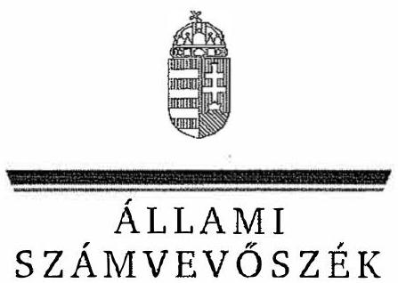
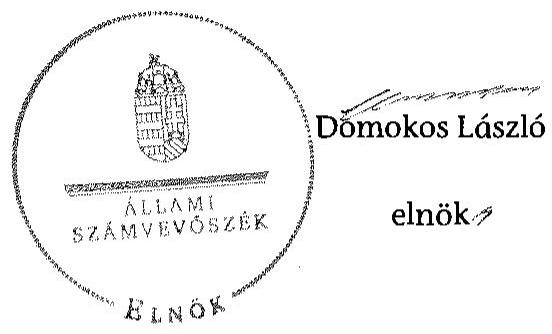

ÁLLAMI
SZÁMVEVÔSZÉK

# JELENTÉS 

Az önkormányzatok gazdasági társaságai - Az önkormányzatok többségi tulajdonában lévő gazdasági társaságok közfeladat ellátását érintő gazdálkodási tevékenysége szabályszerűségének ellenőrzése

Barcika Szolg Vagyonkezelő és Szolgáltató Kft.

---

# Állami Számvevőszék 

Iktatószám: V-0718-056/2015
Témaszám: 1752
Vizsgálat-azonosító szám: V067128

## Az ellenőrzést felügyelte:

Dr. Horváth Margit
felügyeleti vezető
Az ellenőrzést vezette és az ellenőrzés végrehajtásáért felelős:
Salamin Viktor
ellenőrzésvezető
A jelentéstervezet összeállításában közremüködött:
Lakatos József
számvevő tanácsos

Az ellenőrzést végezték:

| Kúnosné Talián Márta | Lakatos József | Tamás László |
| :-- | :-- | :-- |
| számvevő | számvevő tanácsos | számvevő tanácsos |

---

# TARTALOMJEGYZÉK 

BEVEZETÉS ..... 7
I. ÖSSZEGZŐ MEGÁLLAPÍTÁSOK, KÖVETKEZTETÉSEK, JAVASLATOK ..... 10
II. RÉSZLETES MEGÁLLAPÍTÁSOK ..... 16

1. Az Önkormányzat közfeladat-ellátásának szabályszerűsége ..... 16
1.1. A közfeladat-ellátás megszervezése és a feladatellátás feltételrendszerének kialakítása ..... 16
1.2. A közfeladat-ellátás felügyelete és a tulajdonosi jogok érvényesítése ..... 19
2. A Barcika Szolg Kít. közfeladat ellátással kapcsolatos tevékenysége ..... 22
2.1. A Barcika Szolg Kít. gazdálkodásának szabályozottsága ..... 22
2.2. A Barcika Szolg Kít. vagyongazdálkodása ..... 24
2.3. A beszámolási kötelezettség teljesítése ..... 27
3. A távhőszolgáltatás közfeladat bevételei és ráfordításai elszámolásának és az önköltségszámításának szabályszerűsége ..... 29
3.1. A távhőszolgáltatási közfeladat bevételeinek és ráfordításainak szabályszerűsége ..... 29
3.2. Az önköltségszámítás szabályszerűsége ..... 31
MELLÉKLETEK
4. számú A Barcika Szolg Kít. tevékenységének főbb adatai
5. számú A Barcika Szolg Kít. múködésének főbb jellemzői
6. számú A Barcika Szolg Kft. által biztosított távhőszolgáltatás díjai 2008-2013. évek között
FÜGGELÉKEK
7. számú Értelmező szótár
8. számú Mintavételi eljárások ellenőrzési területenként

---

.

---

# RÖVIDÍTÉSEK JEGYZÉKE 

## Törvények

Adatvédelmi tv.

Ámt.

ÁSZ tv.

Gt.

Info tv.

Mötv.

Ötv.

Rezsi tv.

Számv. tv.

Taktv.

Tszt.

## Rendeletek

157/2005. (VIII. 15.)
Korm. rendelet
50/2011. (IX. 30.) NFM rendelet

51/2011. (IX. 30.) NFM rendelet
önkormányzati SZMSZ ${ }_{1}$
a személyes adatok védelméről és a közérdekú adatok nyilvánosságáról szóló 1992. évi LXIII. törvény (hatályon kívül: 2012. január 1-jétől)
az árak megállapításáról szóló 1990. évi LXXXVII. törvény (hatályos: 1991. január 1-jétől)
az Állami Számvevőszékről szóló 2011. évi LXVI. törvény (hatályos: 2011. július 1-jétől)
a gazdasági társaságokról szóló 2006. évi IV. törvény (hatálytalan: 2014. március 15-étől)
2011. évi CXII. törvény az információs önrendelkezési jogról és az információszabadságról (hatályos: 2011. július 27-től)
Magyarország helyi önkormányzatairól szóló 2011. évi CLXXXIX. törvény (hatályos: 2012. január 1-jétől, kivéve a 144. § (2) bekezdésben meghatározott paragrafusok, amelyek 2012. április 15 -én, a (3) bekezdésben meghatározott paragrafusok, amelyek 2013. január 1-jén léptek hatályba, a (4) bekezdésben meghatározott paragrafusok a 2014. évi általános önkormányzati választások napján lépnek hatályba)
a helyi önkormányzatokról szóló 1990. évi LXV. törvény (hatálytalan: a 2014. évi általános önkormányzati választások napjától)
a rezsicsökkentések végrehajtásáról szóló 2013. évi LIV. törvény (hatályos: 2013. május 10-től)
a számvitelről szóló 2000. évi C. törvény (hatályos: 2001. január 1-jétől)
a köztulajdonban álló gazdasági társaságok takarékosabb múködéséről szóló 2009. évi CXXII. törvény
a távhőszolgáltatásról szóló 2005. évi XVIII. törvény (hatályos: 2005. július 1-jétől)
a távhőszolgáltatásról szóló 2005. évi XVIII. törvény végrehajtásáról (hatályos: 2005. szeptember 25-étől)
a távhőszolgáltatónak értékesített távhő árának, valamint a lakossági felhasználónak és a külön kezelt intézménynek nyújtott távhőszolgáltatás dijának megállapításáról szóló 50/2011. (IX. 30.) NFM rendelet (hatályos: 2011. október 1-jétől)
a távhőszolgáltatási támogatásról szóló 51/2011. (IX. 30.) NFM rendelet (hatályos: 2011. október 1-jétől)
Kazincbarcika Város Önkormányzatának 1/1995. (I. 20.) számú rendelete az Önkormányzat Szervezeti és Múködési Szabályzatáról (hatályon kívül: 2013. május 1-jétől)

---

önkormányzati SZMSZ ${ }_{2}$ távhőszolgáltatási rendelet
távhőszolgáltatási dij- rendelet
vagyongazdálkodási rendelet

## Szórövidítések

alapító okirat
ÁSZ
Barcika Centrum Kft.
Barcika Szolg Kft.

## BAZMKH

Céginformációs Szolgálat
EU
FB
Gazdasági és pénzügyi bizottság
javadalmazási szabály$\mathrm{zat}_{1}$
javadalmazási szabály$\mathrm{zat}_{3}$

Kazincbarcika Város Önkormányzatának 8/2013. (IV. 19.) számú rendelete a Képviselő-testület Szervezeti és Müködési Szabályzatáról (hatályos: 2013. május. 1-jétől)
Kazincbarcika Város Önkormányzata Képviselőtestületének 48/2005. (XII. 22.) számú rendelete a távhőszolgáltatásról szóló 2005. évi XVIII. törvény egyes rendelkezéseinek Kazincbarcika Város területén történő végrehajtásáról (hatályos: 2006. január 1-jétől)
Kazincbarcika Város Önkormányzata Képviselőtestületének 49/2005. (XII. 22.) számú rendelete a távhőszolgáltatás legmagasabb hatósági dijáról és a dijalkalmazás feltételeiről (hatályos: 2006. január 1-jétől)
Kazincbarcika Város Önkormányzatának 29/2004. (IX. 3.) számú rendelete az Önkormányzat vagyonáról, és a vagyongazdálkodás szabályairól (hatályos: 2004. szeptember 3-tól)
a Timpanon Kft., majd Barcika Szolg Kft. alapító okirata és annak módosításai
Állami Számvevőszék
Barcika Centrum Vagyonkezelő és Szolgáltató Kft.
Barcika Szolg Vagyonkezelő és Szolgáltató Kft. (2013. szeptember 16-tól, előtte TIMPANON Vagyonkezelő és Szolgáltató Kft.)
Borsod-Abaúj-Zemplén Megyei Kormányhivatal
Igazságügyi Minisztérium Céginformációs és az Elektronikus Cégeljárásban Közremüködő Szolgálat
Európai Unió
A Barcika Szolg Kft. Felügyelőbizottsága
Kazincbarcika Város Önkormányzata Képviselőtestületének Gazdasági és Pénzügyi Bizottsága
A Timpanon Kft. vezető tisztségviselője, felügyelő bizottsági tagjai javadalmazásának, a jogviszonyuk megszűnése esetére biztosított juttatások módjának, mértékének elveiről, annak rendszeréről (a Képviselő-testület 41/2008. (II. 22.) számú határozatának melléklete, hatályos: 2010. január 31-ig)
A Timpanon Kft. vezető tisztségviselője, felügyelő bizottsági tagjai javadalmazásának, a jogviszonyuk megszűnése esetére biztosított juttatások módjának, mértékének elveiről, annak rendszeréről (a Képviselő-testület 22/2010. (I. 29.) számú határozatának melléklete, hatályos: 2010. február 1-jétől 2012. február 28-ig)
A Timpanon Kft. vezető tisztségviselője, felügyelő bizottsági tagjai javadalmazásának, a jogviszonyuk megszűnése esetére biztosított juttatások módjának, mértékének elveiről, annak rendszeréről (a Képviselő-testület 22/2012. (II. 28.) számú határozatának melléklete, hatá-

---

jegyzö
Kazinc Távhőszolgáltató Kft.
Kazinc-Therm Kft.
KEOP
KIOP
Képviselő-testület

Kincstár
közszolgáltatási szerződés
leltározási szabályzat ${ }_{1}$
leltározási szabályzat ${ }_{2}$
MEKH
MEKH ajánlás

NAV
Önkormányzat
önköltségszámítási szabályzat
pénzkezelési szabályzat ${ }_{1}$
pénzkezelési szabályzat ${ }_{2}$
polgármester
Polgármesteri hivatal
számviteli politika és számlarend $_{1}$
számviteli politika és
számlarend $_{2}$
számviteli politika és
számlarend $_{3}$
SZMSZ $_{1}$

SZMSZ $_{2}$
lyos: 2012. március 1-jétől)
Kazincbarcika Város Önkormányzatának jegyzője
Kazinc Távhőszolgáltató Korlátolt felelősségű társaság, a Timpanon Kft. jogelődje
Kazinc-Therm Fútőerőmú Kft.
Környezet és Energia Operatív Program
Környezet és Infrastruktúra Operatív Program
Kazincbarcika Város Önkormányzatának Képviselőtestülete
Magyar Államkincstár
Kazincbarcika Város Önkormányzata és a Timpanon Kft. között létrejött Közszolgáltatási Szerződés, amelyet a Kép-viselő-testület a 249/2010. (VIII. 3.) számú határozatával fogadott el, és annak módosításai
a Timpanon Kft. leltározási, értékelési szabályzata, hatályos 2008. március 1-jétől 2012. január 1-jéig
a Timpanon Kft. leltározási, értékelési szabályzata, hatályos 2012. január 2-től
Magyar Energetikai és Közmú-szabályozási Hivatal (2013. április 4-étől, előtte Magyar Energia Hivatal)
A MEKH 1/2013. (II. 22.) számú ajánlása a távhőtermelők és távhőszolgáltatók számára előírt számviteli szétválasztási szabályok gyakorlati alkalmazásáról
Nemzeti Adó- és Vámhivatal (2011. előtt Adó- és Pénzügyi Ellenőrzési Hivatal)
Kazincbarcika Város Önkormányzata
a Timpanon Kft. önköltségszámítási szabályzata, hatályos: 2008. március 1-jétől
a Timpanon Kft. pénzkezelési szabályzata, hatályos: 2008. március 1-jétől 2012 január 1-jéig
a Timpanon Kft. pénzkezelési szabályzata, hatályos: 2012. január 2-től
Kazincbarcika Város Önkormányzatának polgármestere
Kazincbarcika Város Önkormányzatának Polgármesteri hivatala
a Timpanon Kft. számviteli politika és számlarend szabályzata, hatályos 2008. április 30-tól 2011. január 1-jéig) a Timpanon Kft. számviteli politika és számlarend szabályzata, hatályos 2011. január 2-től 2012. január 1-jéig) a Timpanon Kft. számviteli politika és számlarend szabályzata (hatályos 2012. január 2-től)
a Timpanon Kft. Szervezeti és Müködési Szabályzata, amelyet a Képviselő-testület a 42/2008. (II. 22.) számú határozatával fogadott el (hatályon kívül: 2012. február 6-tól)
a Timpanon Kft. Szervezeti és Müködési Szabályzata, amely az 1/2012. számú ügyvezetői igazgatói utasítással

---

taggyúlés
távhőtermelési és hőszolgáltatási szerződés

Telekép Kft.
Timpanon Ingatlankezelési Kft.
Timpanon Kft.
ügyvezető igazgatói utasítás
vagyongazdálkodási koncepció
lépett hatályba 2012. február 6-án
a Barcika Szolg Kft. legfőbb szerve (2008-2011 között a Képviselő-testület, 2012-2013-ban a társaság tagjainak gyúlése)
Távhőtermelő beruházási és hosszú távú hőszolgáltatási szerződés, amelyet az Önkormányzat 2001. évben kötött (hatályos: 2022. szeptember 15-ig)
TELEKÉP Músorszolgáltató Oktatási és Kereskedelmi Kft.
TIMPANON Ingatlankezelési Kft. (a Timpanon Vagyonkezelő és Szolgáltató Kft. jogelődje 2008. február 28-ig)
TIMPANON Vagyonkezelő és Szolgáltató Kft., 2008. március 1-jétől
2/2011. számú ügyvezető igazgatói utasítás, rendkívüli intézkedési terv a Timpanon Kft. költségtakarékos múködésére
Kazincbarcika Város Önkormányzatának vagyongazdálkodási koncepciója, közép- és hosszú távú terve (2013-2020.), melyet a Képviselő-testület a 101/2013. (V. 24.) számú határozatával fogadott el

---

# JELENTÉS 

## Az önkormányzatok gazdasági társaságai Az önkormányzatok többségi tulajdonában lévő gazdasági társaságok közfeladat ellátását érintő gazdálkodási tevékenysége szabályszerűségének ellenőrzése

## Barcika Szolg Vagyonkezelő és Szolgáltató Korlátolt Felelősségú Társaság

## BEVEZETÉS

Az Állami Számvevőszék középtávra szóló stratégiájában megfogalmazta, hogy a helyi önkormányzatok gazdálkodásában rejlő pénzügyi kockázatok feltárásával, az államháztartáson kívülre nyújtott költségvetési támogatások és ingyenes vagyonjuttatások, valamint az államháztartáson kívül múködő köz-feladat-ellátó rendszerek ellenőrzéseivel hozzájárul ahhoz, hogy a közpénzeket az államháztartáson kívül múködő szervezetek is átlátható, rendezett módon használják fel a közfeladatok szerződésben vállalt ellátása érdekében.

Az önkormányzatok szervezetalakítási szabadságának következménye, hogy a korábban is vállalati formában múködő (nagyvárosi tömegközlekedés, víz-, szennyvízcsatorna, köztisztasági, ingatlankezelés stb.) közszolgáltatások mellett, mind a kötelező, mind az önként vállalt feladatok ellátásában a gazdasági társaságok kiemelt fontosságú szerephez jutottak.

Kazincbarcika Város Önkormányzata a Barcika Szolg Kft. (2013. szeptember 15-ig Timpanon Kft.) jogelődjét, a Kazinc Távhőszolgáltató Kft.-t az ellenőrzött időszakot megelőzően, a 94/1992. (VI. 19.) számú határozatával 100,0\%-os önkormányzati tulajdonú gazdasági társaságként alapította. Az Önkormányzat 2008. március 1-jével a Kazinc Távhőszolgáltató Kft.-t és a Telekép Kft.-t a Timpanon Ingatlankezelési Kft.-be beolvasztva hozta létre a Timpanon Vagyonkezelő és Szolgáltató Kft.-t (rövid nevén Timpanon Kft.), amely névváltoztatást követően 2013. szeptember 16-tól Barcika Szolg Kft. néven múködött. A Timpanon Kft., majd Barcika Szolg Kft. fő tevékenysége az ingatlankezelés volt, a távhőszolgáltatást - gőzellátás, légkondícionálás tevékenységi besorolással - 2008. március 1-jétől látta el.

A Barcika Szolg Kft., illetve előző nevén a Timpanon Kft. egyszemélyes társaságként Kazincbarcika Város Önkormányzatának kizárólagos tulajdonában volt 2008. január 1-je és 2011. december 9. között. Ezt követően a Barcika Szolg

---

Kft. tulajdonosai az Önkormányzat ( $98,8 \%$ tulajdoni hányad) és a 100\%-os önkormányzati tulajdonú Barcika Centrum Kft. ( $1,2 \%$ tulajdoni hányad) voltak.

A Barcika Szolg Kft. hőtermelést nem végzett, a távhőellátáshoz szükséges hőenergiát a piaci szereplőként múködő Kazinc-Therm Kft.-től vásárolta hosszú távú szerződés keretében. A vásárolt hőmennyiség 2008. évben 474 452,0 GJ volt, ami a 2013. évben 405197 GJ-ra csökkent. A Barcika Szolg Kft. nettó árbevétele 2008-ban 1816,1 M Ft, 2013-ban 1743,5 M Ft volt, a mérleg szerinti eredmény - a 2011. év kivételével, amikor $324,8 \mathrm{MFt}$ veszteség keletkezett 1,1 M Ft és 21,7 M Ft közötti nyereséget mutatott. A jegyzett tőke 2008-ban 411,1 M Ft, 2013-ban 417,1 M Ft volt. Az eszközök és források értéke a 2008. évi összeolvadási vagyonmérleg szerinti 1128,9 M Ft-ról 2013. év végére 2705,5 M Ft-ra nőtt. A közfeladatok ellátására a társaságnál 2008-ban 105 főt, 2013-ban 61 főt foglalkoztattak, melyből a távhőszolgáltatás területén 42, illetve 28 fő állt alkalmazásban.

Az ellenőrzött időszakban a polgármester személye nem, a jegyző személye három alkalommal változott. A polgármester a 2006. évi önkormányzati választások óta tölti be tisztségét, a helyszíni ellenőrzés időszakában a munkakört betöltő jegyző 2013. január 1-jétől látja el feladatait. A Barcika Szolg Kft.-nél az ellenőrzött időszakban az ügyvezető és a gazdasági igazgató személye egy-egy alkalommal változott. Az ügyvezető 2012. január 1-jétől, a gazdasági igazgató 2013. július 1-jétől tölti be tisztségét.

Az önkormányzati tulajdonú gazdasági társaságok teljes körű ellenőrzésének lehetőségét az Állami Számvevőszékről szóló 1989. évi XXXVIII. törvény 2011. január 1-jétől hatályos módosítása teremtette meg.

Az ellenőrzés célja annak értékelése volt, hogy

- az önkormányzat a jogszabályi előírások figyelembevételével döntött-e az ellenőrzésre kerülő közfeladat megszervezéséről; az önkormányzat szabályszerűen gyakorolta-e a tulajdonosi jogokat;
- a gazdasági társaság közfeladat-ellátása bevételeinek, ráfordításainak elszámolása, és vagyongazdálkodási tevékenysége megfelelt-e a jogszabályi, illetve a közszolgáltatási szerződésben foglalt tulajdonosi előírásoknak, azok végrehajtása szabályszerű volt-e;
- a közfeladatok átláthatósága és elszámoltathatósága érdekében biztosítva volt-e a közszolgáltatás díjának megalapozottsága szabályszerű önköltségszámítással.

Az ellenőrzés kiterjedt Kazincbarcika Város Önkormányzatára és a Barcika Szolg Vagyonkezelő és Szolgáltató Korlátolt Felelősségű Társaságra.

Az ellenőrzés várható hasznosulása: A törvényalkotás számára - az észlelt problémák, szabálytalanságok, vagy egyéb nem kívánatos jelenségek felszínre kerülésével - az ellenőrzés megállapításai segítséget nyújthatnak az államháztartáson kívüli közfeladat-ellátás értékeléséhez, jogszabályi keretei pontosításához, átláthatóságot biztosító szabályozásához. Meghatározhatóvá vál-

---

nak a közfeladat ellátásában részt vevő államháztartáson kívüli szervezeteknek - az önkormányzat költségvetését, pénzügyi helyzetét is befolyásoló - kockázatai, lehetővé válik ezen kockázatok csökkentése. Feltárja, hogy az önkormányzat közfeladat-ellátási kötelezettségének szabályszerűen tett-e eleget, a feladatellátáshoz rendelt közvagyon működtetését szabályszerűen szervezte-e meg és a tulajdonosi felügyelete hozzájárult-e a közfeladat-ellátásához. A feladatot ellátó gazdasági társaság a közszolgáltatási szerződésben foglaltak betartásával, a közvagyon használatával biztosította-e a szolgáltatás folytatásának feltételeit. Ezzel az ellenőrzöttek és a helyi döntéshozók számára visszajelzést ad feladatszervezési, feladat-ellátási kockázataikról, alapot ad a meglévő hibák megszüntetéséhez, a jobb közfeladat-ellátás biztosításához. Fokozza a fegyelmet, igazolja, hogy lejárt a következmények nélküli ellenőrzések időszaka. Az ÁSZ értékteremtő rend kialakításához és megőrzéséhez hozzájáruló tevékenysége pozitív hatással van a szervezetről kialakított összkép formálására is.

A bevételek és ráfordítások elszámolása, valamint a vagyonnyilvántartás terén az egyes területek szabályszerű működését mintavétellel ellenőriztük, ez alapján a sokaságokban előforduló hibás tételek arányát becsültük. A jogszabályoknak és a belső előírásoknak megfelelőnek, azaz szabályszerűnek tekintettük az adott bevételek és ráfordítások elszámolását, a vagyonnyilvántartást, amennyiben a minta ellenőrzésének eredménye alapján $95 \%$-os bizonyossággal a teljes sokaságban a hibás tételek aránya kisebb volt, mint $10 \%$, nem megfelelőnek értékeltük, ha a hibás tételek aránya a 10\%-ot meghaladta. Kockázatot, illetve magas kockázatot jeleztünk, amennyiben egy adott terület vonatkozásában a minta alapján a teljes sokaságban nem volt teljes körűen biztosított a jogszabályoknak és a belső szabályzatoknak megfelelő működés.

Az ellenőrzést a számvevőszéki ellenőrzés szakmai szabályai szerint, szabályszerűségi ellenőrzés módszerével, a nemzetközi standardok figyelembevételével végeztük. Az ellenőrzés a 2008-2013. évekre terjedt ki.

Az ellenőrzés végrehajtásának jogszabályi alapját az ÁSZ tv. 5. § (3)-(5) bekezdése képezte.

Az ÁSZ az Állami Számvevőszékről szóló 2011. évi LXVI. törvény 29. §-a alapján a jelentéstervezetet észrevételezésre megküldte Kazincbarcika Város polgármesterének, valamint a gazdasági társaság ügyvezetőjének. Az érintettek érdemi észrevételt nem tettek.

---

# I. ÖSSZEGZŐ MEGÁLLAPÍTÁSOK, KÖVETKEZTETÉSEK, JAVASLATOK 

A Képviselő-testület az Önkormányzat közigazgatási területén a távhőszolgáltatás közfeladatának megszervezéséről a jogszabályi előírásoknak megfelelően döntött. Az ellenőrzött időszakban az Önkormányzat által alapított gazdasági társaságok feletti tulajdonosi jogokat a Képviselő-testület szabályszerűen gyakorolta. A Képviselő-testület az önkormányzati SZMSZ ${ }_{2}$-ben kötelezően ellátandó feladatként határozta meg a távhőszolgáltatást a Tszt. előírásával összhangban. A 2007-2010. évekre elfogadott gazdasági program és az annak keretében elfogadott 2007-2013. évekre vonatkozó gazdasági stratégia a távhőszolgáltatás múködtetésével, fejlesztésével kapcsolatban hatékonysági és távhőszolgáltatási infrastruktúra fejlesztési célokat tartalmazott. A Képviselőtestület a 2011-2013. évre vonatkozó gazdasági programot nem fogadott el. Az Önkormányzat a távhőszolgáltatási közfeladat ellátásához az ellenőrzés időszakában múködési, fejlesztési célú támogatást nem nyújtott.

Az Önkormányzat a távhőszolgáltatásra vonatkozóan a Tszt. szerinti rendeletalkotási kötelezettségének eleget tett. A Képviselő-testület a jogszabályi előírásoknak megfelelően megalkotta az ellenőrzött időszakban hatályos vagyongazdálkodási rendeletet és a távhőszolgáltatási, valamint a távhőszolgáltatási díjrendeletet. Az Önkormányzat a távhőszolgáltatási díjrendelet mellékletében rögzítette a távhőszolgáltatásra vonatkozó árkalkulációt. A Barcika Szolg Kft. távhőszolgáltatási díjainak Képviselő-testület általi megállapítása a hatályos jogszabályi előírásoknak megfelelt.

A Barcika Szolg Kft. alapító okirata alapján a taggyűlés kizárólagos hatáskörébe tartoztak mindazok a kérdések, amelyeket törvény a taggyűlés kizárólagos hatáskörébe utalt. Az alapító okirat az ellenőrzött időszakban az ügyvezetőnek a Képviselő-testület és az FB egyetértése mellett, korlátozott mértékben biztosított tulajdonosi jogokat. Az Önkormányzat a tulajdonosi ellenőrzést az FB múködtetésével biztosította, tulajdonosi jogait a Képviselő-testület, a Gazdasági és pénzügyi bizottság és a taggyűlés keretében gyakorolta.

A Barcika Szolg Kft. éves beszámolóját és üzleti tervét a taggyűlés határozataival elfogadta, azonban a 2012. évre vonatkozó üzleti tervet a közszolgáltatási szerződés előírása ellenére nem készítették el. A Barcika Szolg Kft. az ellenőrzés időszakában a 2011. évet kivéve eredményesen gazdálkodott. Az ellenőrzött időszakot megelőzően a Barcika Szolg Kft. jogelődje által kötött bankgarancia szerződéshez az Önkormányzat készízető kezességet vállalt 74,6 M Ft összegben, ami 2013. december 31 -én $29,5 \mathrm{M}$ Ft összegben állt fenn.

A Barcika Szolg Kft. vagyongazdálkodási tevékenysége a távhőszolgáltatási közfeladat ellátása során - a beruházások aktiválásának és az értékcsökkenés elszámolása módjának szabályozási, és az anyagjellegú ráfordítások elszámolása hiányosságai mellett - megfelelt a jogszabályi előírásoknak, valamint a közszolgáltatási szerződésben foglalt tulajdonosi előírásoknak.

---

A Barcika Szolg Kft. rendelkezett a távhőszolgáltatási tevékenység ellátásához szükséges múködési engedéllyel, a feladatainak ellátási módját, a beszámolási követelményeket és múködési szabályokat az Önkormányzattal kötött közszolgáltatási szerződésben rögzítették. A távhőszolgáltatási feladat ellátásához szükséges hőenergiát hosszú távú szerződés keretében vásárolta. A Barcika Szolg Kft. múködését az ellenőrzött időszak során - a 2012. év kivételével - az elkészített üzleti tervek alapozták meg, amelyek nem voltak összhangban az Önkormányzat 2007-2010. évi gazdasági programjával és az annak keretében elfogadott 2007-2013. évekre szóló stratégiájával, mivel nem tartalmaztak fejlesztési, beruházási és felújítási célokat.

A Barcika Szolg Kft. elkészítette a múködéséhez szükséges belsö szabályzatokat, az SZMSZ ${ }_{1,2}$-t, a számviteli politika és számlarend ${ }_{1-3}$-et, valamint a számviteli politika keretében előírt szabályzatokat - a Számv. tv.-ben előírtak ellenére - az eszközök és források értékelési szabályzata kivételével. A bevételek és ráfordítások tevékenységenkénti szétválasztását a főkönyvi számlák megfelelő kialakításával, 2012-től pedig a számviteli politika és számlarend ${ }_{3}$ szerinti, valamint a MEKH ajánlásnak megfelelő számviteli szétválasztással biztosították.

A Barcika Szolg Kft. a távhőszolgáltatási célú vagyonának nyilvántartását a számviteli politika és számlarend ${ }_{1-3}$-ben meghatározott módon, az eszközök és források mérlegben szereplő értékének leltárral való alátámasztását a leltározási szabályzat ${ }_{1,2}$ szerint biztosította. Távhőszolgáltatási célra az Önkormányzattól üzemeltetésre, vagyonkezelésre eszközöket nem kapott, feladatát a jogelődje alapításakor apportált, majd a saját és EU-s forrásokkal megvalósított fejlesztéseivel növelt saját vagyonával látta el.

A Barcika Szolg Kft. vagyona a 2008. évi összeolvadáskor mutatott 1128,9 M Ftról a 2013. év végére 2705,5 M Ft-ra növekedett az időszak során megvalósított fejlesztések eredményeként, miközben a követelések állománya közel a kétszeresére, 403,8 M Ft-ról 783,1 M Ft-ra nőtt. Az ellenőrzött időszak során a távhőszolgáltatásból származó árbevétel 1455,6 M Ft-ról 1375,6 M Ft-ra csökkent. Az ellenőrzött időszakban a mérleg szerinti eredmény - 2011. év kivételével - pozitív volt, osztalékfizetésre nem került sor. A 2011. évi 324,8 M Ft veszteség meghatározó mértékben a termelői hődíj áremelkedésének és annak a következménye, hogy a megnövekedett költségek bevételben való érvényesítésére nem volt mód. A távhőszolgáltatási díjakból származó kintlévőség beszedésére fizetési meghagyások kibocsátásával és bírósági végrehajtások kezdeményezésével intézkedtek, a lejárt határidejú követelésekre a számviteli politika és számlarend ${ }_{1-3}$-ben meghatározott értékvesztést számoltak el.

A Barcika Szolg Kft. az ellenőrzött időszak során két fejlesztési projektjéhez nyert el EU-s forrásokból támogatást, a pályázatok benyújtásához a Képviselőtestület az önkormányzati SZMSZ ${ }_{1,2}$-ben meghatározott módon előzetesen hozzájárult.

A társaság a közszolgáltatási szerződésben előírtaknak megfelelően - a 2012. év kivételével - elkészítette és az Önkormányzatnak határidöben benyújtotta az üzleti terveket és az éves beszámolókat, valamint kétévente beszámolt a Képviselő-testület előtt a távhőszolgáltatás helyzetéről. Előterjesztéseket nyújtottak be továbbá a távhőszolgáltatási díjak megváltoztatása, valamint a köz-

---

szolgáltatási szerződésben előírt esetekben a múködést érintő, önkormányzati intézkedést igénylő kérdésekben.

A társaság könyvvizsgálója 2008-2013 között az éves beszámolókat hitelesítő záradékkal látta el, azonban a 2012. és a 2013. évi beszámoló esetében figyelemfelhívó megjegyzést tett a vállalkozás folytatása elvének érvényesülésével kapcsolatban. A könyvvizsgáló a 2012. és a 2013. évi jelentésében igazolta, hogy az alkalmazott szétválasztási szabályok biztosították a vállalkozás tevékenységeinek keresztfinanszírozás mentességét. A Képviselő-testület a 20082011. közötti, illetve a taggyűlés a 2012-2013. évi beszámolókat a könyvvizsgálói jelentés és az FB beszámoló elfogadását tartalmazó jegyzőkönyve alapján megtárgyalta és elfogadta, azonban a könyvvizsgáló a Gt. előírása ellenére nem volt jelen a 2008. és 2011., valamint a 2012. és 2013. évi beszámoló elfogadásakor. A beszámolókat a jogszabályok előírásainak megfelelően, határidőben letétbe helyezték.

A Barcika Szolg Kft. a Tszt. és az Info tv. előírásainak megfelelően a honlapján teljesítette közzétételi kötelezettségét. A közvagyonnal kapcsolatos adatok védelmét nem biztosították, mivel az Adatvédelmi tv., illetve az Info tv. előírása ellenére nem bíztak meg, illetve nem jelöltek ki adatvédelmi felelőst és nem vezettek adatvédelmi nyilvántartást.

Az Önkormányzat belső ellenőrzése a távhőszolgáltatás bevételeinek és múködési kiadásainak pénzügyi-szabályszerüségi, és a kintlévőségei állományára vonatkozó intézkedések pénzügyi-szabályszerüségi ellenőrzésével hozzájárult a szabályszerű működés biztosításához. A társaságnál végzett külső ellenőrzések hiányosságot nem tártak fel.

A Barcika Szolg Kft. a közfeladat ellátásának átláthatósága és a keresztfinanszírozás elkerülése érdekében az egyes tevékenységeinek bevételeit és ráfordításait elkülönítetten tartotta nyilván. A számviteli szétválasztásra vonatkozó előírásoknak megfelelően a 2012. évtől a távhőszolgáltatási tevékenységet az éves beszámoló kiegészítő mellékletében elkülönítetten is bemutatták.

A távhőszolgáltatás bevételeinek elszámolása a jogszabályoknak és a belső szabályozásnak, valamint a távhőszolgáltatási díjrendeletnek megfelelően történt. Az anyagjellegű ráfordítások elszámolása a mintatételes ellenőrzés eredményeként kockázatot mutatott. Az ellenőrzés tapasztalatai szerint a Számv. tv. előírásai ellenére előfordult, hogy a kötelezettségvállalást megalapozó dokumentum hiányzott, valamint egy eszközt szolgáltatásként számoltak el. A beruházások és felújítások elszámolása során szabályszerűen jártak el, az eszközök bekerülési értékének, állomány növekedésének és értékcsökkenésének elszámolása megfelelt a szabályozásnak. Az eszközállomány használhatósági foka az ellenőrzött időszakban a végrehajtott beruházások és felújítások ellenére romlott.

A lejárt követelések állományának alakulását figyelemmel kísérték, a likviditási helyzet javítása és a követelések beszedése érdekében intézkedtek. A lejárt követelésállomány összege az ellenőrzött időszak során az éves nettó árbevétel közel harmada volt. A követelésállományt a számviteli politika és számlarend ${ }_{1}$. ${ }_{3}$ előírásainak megfelelően minősítették és számolták el az értékvesztést.

---

A Barcika Szolg Kft. rendelkezett önköltségszámítási szabályzattal. A szabályzatban azonban nem határozták meg a Tszt.-ben előírtaknak megfelelő számviteli szétválasztás szabályokat, továbbá a közvetlen önköltség tételeinek részletezését és elkülönítését, az alkalmazandó költségfelosztási módszerek eljárási szabályait és az utókalkuláció végrehajtására vonatkozó előírásokat. A Számv. tv. előírásával ellentétben nem végeztek utókalkulációt.

A Rezsi. tv-ben előírt feladatot végrehajtották, az árbevétel csökkenése ellenére az igénybevett távhőszolgáltatási támogatás biztosította az eredményességet.

A fentiekben leírtak összegzéseként az alábbi megállapításokat tesszük:
Kazincbarcika Város Önkormányzatának Képviselő-testülete a távhőszolgáltatás közfeladatának megszervezéséről, a tulajdonosi jogainak biztosításáról a jogszabályi előírásoknak megfelelően gondoskodott. A távhőszolgáltatást biztosító, önkormányzati tulajdonú társasággal közszolgáltatási szerződést kötöttek, amelynek előírásait a társaság a 2012. évi üzleti terv elkészítése kivételével teljesítette. A Barcika Szolg Kft. a távhőszolgáltatási közfeladata mellett más közfeladatokat és egyéb tevékenységeket is végzett az ellenőrzött időszak során. A távhőszolgáltatási közfeladatát a saját vagyonát képező eszközállományával látta el, a feladatellátáshoz az Önkormányzat működési vagy fejlesztési támogatást nem nyújtott. A távhőszolgáltatást biztosító vagyon kezelése szabályszerűen történt. A vásárolt hőenergia árának növekedését a szolgáltatási díjakban a 2010-2011. években nem tudták érvényesíteni, emiatt a likviditást csak a folyószámla hitelkeret megemelésével lehetett biztosítani és a 2011. évben veszteség keletkezett. Az ellenőrzött időszak további éveiben a társaság eredményesen gazdálkodott. A társaság belső szabályzatai nem feleltek meg teljes körűen a jogszabályi előírásoknak, valamint a közfeladat ellátással kapcsolatosan kezelt adatok védelmére vonatkozó előírásokat nem tartották be. A Barcika Szolg Kft. múködésének szabályozottsága és annak gyakorlati alkalmazása az anyagjellegű ráfordítások elszámolását kivéve az előírásoknak megfelelt. A kialakított számviteli rend nem biztosította teljes körűen a távhőszolgáltatási közfeladat átláthatóságát és elszámoltathatóságát. A követelésállomány a beszedésére tett intézkedések ellenére folyamatosan magas volt.

Az Állami Számvevőszékről szóló 2011. évi LXVI. törvény 33. § (1) bekezdésében foglaltak értelmében a jelentésben foglalt megállapításokhoz kapcsolódó intézkedési tervet köteles az ellenőrzött szervezet vezetője összeállítani, és azt a jelentés kézhezvételétől számított 30 napon belül az ÁSZ részére megküldeni. Amennyiben az intézkedési tervet határidőben nem küldi meg a szervezet, vagy az nem elfogadható, az ÁSZ elnöke a hivatkozott törvény 33. § (3) bekezdés a)-b) pontjaiban foglaltakat érvényesítheti.

Az ellenőrzés intézkedést igénylő megállapításai és javaslatai:
Javaslataink célja a Kft. gazdálkodása szabályszerűségének javítása annak érdekében, hogy a szabályozási környezet megfelelően tudja támogatni az átlátható müködést.

---

# Javasoljuk a Barcika Szolg Vagyonkezelő és Szolgáltató Kft. Ügyvezetőjének: 

1. A Barcika Szolg Kft. nem rendelkezett Számv. tv. 14. § (5) bekezdés b) pontjában meghatározott eszközök és források értékelésére vonatkozó szabályzattal. Az üzemeltetésre, vagyonkezelésre átvett eszközök leltározásának előírásait a leltározási szabályzat ${ }_{1,2}$-ben nem határozták meg, ezzel megsértették a 14. § (3)-(5) bekezdésében, továbbá a 69. § (3) bekezdésében foglalt előírásokat. A Barcika Szolg Kft. elkészítette számlarendjét, amely azonban nem felelt meg a Számv. tv. 161. § (2) bekezdés a)-c) pontjában foglalt követelményeknek, mivel nem tartalmazta az összes alkalmazott számla megnevezését, tartalmát, a hozzá kapcsolódó gazdasági eseményeket, analitikus nyilvántartásokat, zárlati és egeztetési feladatokat. Nem tartalmazta továbbá a befejezett beruházások állományba vételével kapcsolatos előírásokat, az alkalmazandó bizonylatok körét és tartalmát, így a szabályozás nem felelt meg a Számv. tv. 161. § (2) bekezdés d) pontjában előírt követelményeknek.

A Barcika Szolg Kft. az Adatvédelmi tv. 31/A § (1) bekezdésének, illetve az Info tv. 24. § (1)-(3) bekezdéseinek előírása ellenére a közvagyonnal kapcsolatosan kezelt adatok védelmét nem biztosította, mivel nem jelöltek ki, illetve nem bíztak meg belső adatvédelmi felelőst, nem készítettek belső adatvédelmi és adatbiztonsági szabályzatot és nem vezettek adatvédelmi nyilvántartást.

Javaslat:

## Intézkedjen a szabályozási hlányosságok megszüntetésére, ennek keretében:

a) gondoskodjon Barcika Szolg Kft. Számv. tv.-ben meghatározott eszközök és források értékelésére vonatkozó szabályzatának elkészítéséről, továbbá a leltározási szabályzatának kiegészítéséről az üzemeltetésre, vagyonkezelésre átvett eszközök leltározásának előírásai vonatkozásában, valamint végezze el a számlarend aktualizálását a Számv. tv.-ben foglaltaknak megfelelően;
b) jelöljön ki belső adatvédelmi felelőst, készítsen belső adatvédelmi és adatbiztonsági szabályzatot, valamint a Kft-nél vezessen adatvédelmi nyilvántartást.
2. Az anyagjellegű ráfordítások számviteli elszámolásánál nem megfelelő besorolással éltek, mivel egy vásárolt eszközt az igénybe vett szolgáltatások között számoltak el, továbbá nem rendelkeztek a kötelezettségvállalást megalapozó dokumentummal, ezzel nem tettek eleget a Számv. tv. 169. § (2) bekezdésében előírt bizonylat megőrzési kötelezettségnek.

A Barcika Szolg Kft.-nél az önköltségszámítási szabályzatot a 2008. évi kiadása óta nem módosították, az önköltségszámítás során a Számv. tv. 14. § (7) bekezdésének előírásai ellenére utókalkulációt nem végeztek. Továbbá az önköltségszámítási szabályzata nem felelt meg a Tszt. 18/A. §-ában 2012. évtől hatályos követelményeknek, mivel abban nem határozta meg a számviteli szétválasztáshoz a követelményrendszert, abból hiányzott a közvetlen önköltség tételeinek részletezése és elkülönítése, továbbá az alkalmazandó költségfelosztási módszerek eljárási szabályainak és az utókalkuláció elvégzésére vonatkozó előírásoknak a rögzítése.

---

Javaslat:

# Gondoskodjon a jogszabályi elöírások szerinti gyakorlat és a szabályos müködés biztosítására, ennek keretében: 

a) intézkedjen a Barcika Szolg Kft. vásárolt eszközeinek megfelelő elszámolásáról, valamint az elszámolásaihoz kapcsolódó bizonylat megőrzési kötelezettség teljes körű betartásáról;
b) aktualizálja az önköltségszámítási szabályzatot, melynek keretében jelenítse meg a közfeladatra vonatkozó szétválasztás követelményrendszerét és ahhoz alakítsa ki a megfelelő nyilvántartási hátteret.

---

# II. RÉSZLETES MEGÁLLAPÍTÁSOK 

## 1. Az ÖNKORMÁNYZAT KÖZFELADAT-ELLÁTÁSÁNAK SZABÁLYSZERŰSÉGE

### 1.1. A közfeladat-ellátás megszervezése és a feladatellátás feltételrendszerének kialakítása

A Képviselő-testület a 195/2007. (VI. 29.) számú határozatával elfogadta az Önkormányzat 2007-2010. évekre szóló gazdasági programját, amelyben az Ötv. 91. § (6) bekezdésének megfelelően meghatározta a településfejlesztési és városüzemeltetési, adópolitikai, befektetés támogatási politika célkitűzéseit, valamint a közszolgáltatások és városüzemeltetés feladatait és az Önkormányzat fejlesztési terveit. A gazdasági program célkitűzései között szerepelt a közszolgáltatásokat biztosító önkormányzati gazdasági társaságok müködésének, gazdálkodásának átvilágítása és a közfeladatok hatékonyabb ellátása. A gazdasági program keretében elfogadott, 2007-2013. évekre szóló gazdasági stratégia céljai között szerepelt az infrastruktúra fejlesztése és a panel-rehabilitáció, valamint a közszolgáltatások színvonalának javítása, míg a 2008-ban elfogadott Integrált Városfejlesztési Stratégia ${ }^{1}$ célkitűzései között szerepelt a városi távhőszolgáltatási hálózat és a hőközpontok korszerűsítése. Az Önkormányzat a 2011-2013. évekre vonatkozó gazdasági programját az Ötv. 91. § (1) bekezdésének előirása ellenére nem határoztta meg.

A Tszt. 6. § (1) bekezdése értelmében a települési önkormányzat az engedélyes vagy engedélyesek útján köteles biztosítani a távhőszolgáltatással ellátott létesítmények távhőellátását. Az Önkormányzat a távhőszolgáltatási közfeladat megszervezéséről a jogszabályi előirásoknak megfelelően döntött. Az önkormányzati SZMSZ ${ }_{1}$ a kötelező feladatok között a helyi energiaszolgáltatásban való közreműködést nevesítette. Az Önkormányzati SZMSZ ${ }_{2}$-ben rögzítették, ${ }^{2}$ hogy „az Önkormányzat ellátja az Mötv.-ben meghatározott kötelezö feladatokat". Az Mötv. 13. § (1) bekezdésének 20. pontja a távhőszolgáltatást helyi önkormányzati feladataként határoztta meg. A távhőszolgáltatást 2008. február 28-ig biztosító Kazinc Távhőszolgáltató Kft. alapítása az ellenőrzött időszakot megelőzően történt.

A Kazinc Távhőszolgáltató Kft.-t 1992. június 29-én alapította az Önkormányzat 100\%-os önkormányzati tulajdonú társaságként, melynek főtevékenysége a távhőszolgáltatás volt. A Timpanon Ingatlankezelési Kft.-t 1991. december 1-jén alapították 100\%-os önkormányzati tulajdonú társaságként, ingatlankezelés főtevékenységre. A Képviselő-testület a 289/2007. (X. 12.) számú határozatával döntött a 100\%-os tulajdonában álló Timpanon Ingatlankezelési Kft., a Kazinc

[^0]
[^0]:    ${ }^{1}$ Az Integrált Városfejlesztési Stratégiát a Képviselő-testület a 176/2008. (VI. 13.) számú határozattal fogadta el.
    ${ }^{2}$ az önkormányzati SZMSZ ${ }_{2}$ 3. § (1) bekezdése

---

Távhőszolgáltató Kft. és a Telekép Kft. összeolvadásáról. Az összeolvadási vagyonmérleg 2008. február 29. napjával elkészült, melyről a könyvvizsgáló elfogadó jelentést adott. A Kazinc Távhőszolgáltató Kft. és a Telekép Kft. 2008. február 29-én a Képviselő-testület 289/2007. (X. 12.) és 290/2007. (X. 12.) határozatával elhatározott egyesülés során beolvadt az átvevő Timpanon Ingatlankezelési Kft.-ből létrehozott Timpanon Kft-be.

Kazincbarcika város mintegy nyolcezer lakásának (a lakások közel 65\%-a), valamint az intézmények és egyéb felhasználók távhővel való ellátását az ellenőrzött időszakban a Barcika Szolg Kft. (2013. szeptember 16-ig Timpanon Kft. néven) működési engedély birtokában biztosította. Tevékenységének főbb adatait az 1. számú melléklet, a működés jellemzőit pedig a 2. számú melléklet tartalmazza. A Barcika Szolg Kft. saját fűtőerőművel nem rendelkezett, a fűtéshez szükséges hőenergiát a - nem önkormányzati tulajdonú, önálló piaci szereplőként működő - Kazinc Therm Fűtőerőmű Kft.-től távhőtermelési és hőszolgáltatási szerződés alapján vásárolta.

Az Önkormányzat a Képviselő-testület a 285/2011. (XI. 30.) számú határozatával döntött a Barcika Centrum Kft. alapításáról, majd a 295/2011. (XII. 16.) számú határozatával a Timpanon Kft.-ben meglévő tulajdonából - üzletrészének felosztásával - 6,0 M Ft értékű törzsbetétet a Barcika Centrum Kft.-be apportált. Ez alapján 2011. december 9-től az Önkormányzat 100\%-os tulajdonában álló, 8,5 M Ft törzstőkéjű Barcika Centrum Kft. a Timpanon Kft.-ben 1,2\%-os tulajdoni hányaddal, az Önkormányzat pedig minősített többséggel rendelkezett. Az Önkormányzat tulajdonában álló Barcika Centrum Kft., a Barcika Park Kft., a Timpanon Kft., a TH Timpanon Kft., a Barcika Ipari Park Kft. és a Barcika Príma Kft. 2012. július 13-ától elismert vállalatcsoportként működött, amelynek uralkodó tagja a Barcika Centrum Kft meghatározó befolyással rendelkezett a társaságokban. Az elismert vállalatcsoport kialakítása a Képviselő-testület 277/2011. (XI. 30.) számú határozatával elfogadott településüzemeltetési rendszerkoncepció alapján történt.

A Timpanon Kft., illetve a Barcika Szolg Kft. alapító okiratát az ellenőrzött időszakban a Képviselő-testület határozataival, 10 alkalommal módosították. A módosítások érintették a tevékenységi kört és a cégnevet is, amely 2013. szeptember 16-ától Barcika Szolg Kft. lett. Az ellátott tevékenységek között 2008-2013 között szerepelt az ingatlankezelés (főtevékenység), valamint a távhőszolgáltatás és vagyonkezelés.

Az Önkormányzat a lakossági és egyéb fogyasztók ellátásával kapcsolatos távhőszolgáltatási feladatokat a távhőszolgáltatási rendeletben és 2010. augusztus 3-tól a Timpanon Kft.-vel kötött közszolgáltatási szerződésben határozta meg, amelyet az ellenőrzött időszak során egy alkalommal módosítottak. 2010. augusztus 3-át megelőzően közszolgáltatási szerződés nem volt hatályban. A közszolgáltatási szerződést egy alkalommal, 2012. december 14-én módosították. A közszolgáltatási szerződés tartalmazta, hogy annak megkötése a KEOP pályázatban elnyert beruházási támogatási szerződés létrejötte és végrehajtása érdekében történt.

A 2010. évben létrejött közszolgáltatási szerződés előírása szerint a közszolgáltató köteles a gazdálkodást úgy megszervezni, hogy a távhőszolgáltatás folyamatosan biztosított és finanszírozható legyen, a távhőszolgáltatási közfeladaton kívüli tevékenységből származó veszteségért köteles helytállni, a keletkezett

---

veszteség a közszolgáltatás diját nem terhelheti. Rögzítette továbbá, hogy a közszolgáltató minden évben köteles üzleti tervet és az előző évi tevékenységéről szóló beszámolót és ügyfél elégedettségi felmérést készíteni az Önkormányzat részére. A közszolgáltatási szerződés tartalmazta továbbá, hogy a távhőszolgáltatás költségeit és ráfordításait az egyéb tevékenységek költségeitől és ráfordításaitól elkülönítetten, a közszolgáltatással és egyéb tevékenységekkel is összefüggő költségeket és ráfordításokat pedig a számviteli politikában meghatározott költségfelosztás szabályai szerint, a közszolgáltatásra eső mértékben veszi figyelembe.

Az Önkormányzat az ellenőrzött időszakban a távhőszolgáltatást ellátó gazdasági társaságok részére a szakmai tevékenység mérésére alkalmas rendszert nem alakított ki. A tulajdonosi joggyakorlás módját, eseteit, az alapító számára fenntartott jogokat az alapító okiratban és az SZMSZ ${ }_{1,2}$-ben meghatározták.

A Barcika Szolg Kft. a beszámolási kötelezettségét 2011-ig az alapító okiratban előírtaknak megfelelően a gazdasági év lezárását követően elkészített számviteli beszámoló Képviselő-testület, majd 2012-től a taggyűlés számára történt benyújtásával teljesítette. A beszámolókat az FB és az SZMSZ ${ }_{1,2}$ előírásának megfelelően az Önkormányzat Gazdasági-és pénzügyi bizottsága előzetesen megtárgyalta és a könyvvizsgáló jelentésében véleményezte.

Az Önkormányzat a Tszt. 6. §-ának megfelelően a távhőszolgáltatásról szóló rendeletben meghatározta az Önkormányzat ellátási kötelezettségét, a távhőszolgáltató és a fogyasztó között jogviszony tartalmát, a távhőszolgáltatás mérési helyét és a mérés szerinti elszámolás szabályait, a távhőszolgáltatás szüneteltetésének, korlátozásának eseteit, valamint a fogyasztóvédelemmel kapcsolatos rendelkezéseket. A távhőszolgáltatási rendelet szabályozta a közüzemi szerződés felmondását, meghatározta a szerződésszegés eseteit és következményeit. A Tszt. 6. § (2) bekezdése c) pontjában előírtak szerint a távhőszolgáltatási rendelet 2. számú melléklete tartalmazta Kazincbarcika város azon területeit, ahol a területfejlesztési, környezetvédelmi szempontok alapján célszerű a távhőszolgáltatás fejlesztése.

A távhőszolgáltatás legmagasabb hatósági díjáról és a díjalkalmazás feltételeiről az Önkormányzat távhőszolgáltatási dijrendeletében döntött. A rendeletben az Ámt., valamint a Tszt. 6. §, 57. §-ai alapján állapították meg a távhőszolgáltatás legmagasabb hatósági díját. Az árkalkuláció a rendelet mellékletét képezte, amelyet a Nemzeti Fogyasztóvédelmi Hatóság 2008. évben elfogadott. A lakossági és az üzemi felhasználók távhőszolgáltatási díját alapdíjban és hődíjban határozták meg. A távhőszolgáltatási dírendeletben a Tszt. 57. § (1), (3) és az 57/A. § (1)-(8) bekezdések alapján került meghatározásra a csatlakozási díj fogalma és fizetési kötelezettsége.

Az Önkormányzat a Barcika Szolg Kft. részére távhőszolgáltatási célra üzemeltetésre, vagyonkezelésre nem adott át eszközöket. Az Önkormányzat a távhőszolgáltatáshoz szükséges vagyont az ellenőrzési időszakot megelőzően, a Kazinc Távhő Kft. alapításakor 1992-ben apportként bocsátotta a társaság rendelkezésére, amely annak saját vagyonát képezte. Mivel a va-

---

gyonelemek átadására az ellenőrzött időszakot megelőzően került sor, annak körülményeire az ellenőrzés nem terjedt ki.

# 1.2. A közfeladat-ellátás felügyelete és a tulajdonosi jogok érvényesítése 

Az Önkormányzat a tulajdonosi jogok gyakorlásának szabályait a vagyongazdálkodási rendeletben határozta meg.

A szabályozás szerint a tulajdonosi jogokat a Képviselő-testület, átruházott hatáskörben a polgármester, illetve az Önkormányzat bizottságai gyakorolhatták.

A Barcika Szolg Kft. feletti tulajdonosi jogokat 2008-2013. között a vagyongazdálkodási rendeletnek megfelelően a Képviselő-testület gyakorolta. Az alapító okirat szerint a taggyúlés hatáskörébe tartozó kérdésekben 2011-ig a Képviselőtestület határozattal döntött. 2011-et követően a döntési jogkört a taggyúlés gyakorolta, amelyben az Önkormányzat 100\%-os képviselettel rendelkezett.

A Barcika Szolg Kft. múködését az ellenőrzött időszakban az ügyvezető irányításával, a Képviselő-testület által megválasztott FB folyamatos ellenőrzése mellett végezte. Az FB tagjait a Képviselő-testület választotta meg és hívta vissza, az FB létszáma az ellenőrzés időszakában a Taktv. 4. § (2) bekezdésének megfelelően hét főről három főre csökkent. Az FB elkészítette és a Képviselő-testület elfogadta ${ }^{3}$ a múködését megalapozó ügyrendjét.

Az Önkormányzat tulajdonosi jogosítványokat a Képviselő-testület és az FB egyetértése mellett a Barcika Szolg Kft. ügyvezetőjére az alapító okirat szerint korlátozott mértékben ruházott át. Az ügyvezető $10,0 \mathrm{M}$ Ft-ot meg nem haladó értékben vállalhatott garanciát, kezességet vagy más kötelezettséget, idegeníthetett el vagyontárgyat. Az ügyvezető az alapító okirat 2012. február 28-i módosítása szerint az FB hozzájárulásával dönthetett a $10,0 \mathrm{M}$ Ft és 20,0 M Ft értékhatárok közötti jogügyleteknél.

A Barcika Szolg Kft. a 2012. évre a közszolgáltatási szerződés - 7.4 c) pontjának - előírása ellenére nem készített üzleti tervet. Az ellenőrzött időszakban a 2008-2011. és a 2013. évekre elkészítették az üzleti terveket, melyeket a Képviselő-testület határozataival elfogadott. ${ }^{4}$ Az ellenőrzött időszak üzleti terveinek felépítése megegyezett, azok tartalmazták az eredménykimutatást, továbbá szolgáltatási áganként a nettó árbevétel és az igénybevett szolgáltatások, valamint az anyag- és bérköltségek tervezett alakulását. A számviteli mérleg adatainak tervezésén és a költségek jogcímenkénti kimutatásán túl az üzleti tervek nem tartalmaztak a távhőszolgáltatási tevékenységre vonatkozó ágazati elemzést, megvalósíthatósági tanulmányt, kockázatelemzést, cash-flow kimutatást és pénzügyi mutatókat, valamint nem mutatták be a fedezeti és megtérülési pontokat.

[^0]
[^0]:    ${ }^{3}$ a Képviselő-testület 89/2008. (III. 28.) számú határozatával
    4 a Képviselő-testület 193/2008. (VI. 26.), 43/2009. (II. 2.), 108/2010. (III. 26.), 176/2011. (VII. 8.), 36/2013. (II. 20.) számú határozataival

---

Az Önkormányzat jóváhagyta a Barcika Szolg. Kft. vezető tisztségviselőinek és az FB tagjainak javadalmazási szabályzatát ${ }_{1-3}$, melyben meghatározta a javadalmazás módját, elveit, és a jogviszony megszűnésének esetére biztosított juttatásokat. Az ügyvezető igazgató havi díjazásának szabályozása a Taktv. 5. § (1) bekezdése alapján került megállapításra, és a Képviselő-testület fogadta el. A javadalmazási szabályzat ${ }_{1,2}$ tartalmazott rendelkezést a prémium, illetve prémiumelőleg kifizetésére. A teljesítendő feladatra és a prémium mértékére az FB tehetett javaslatot, melynek jóváhagyása alapítói hatáskörbe tartozott. Prémium, prémium előleg kifizetésére - az FB előterjesztése és a Képviselőtestület határozatai alapján - a 2008., a 2009. és a 2010. években került sor. A javadalmazási szabályzat ${ }_{3}$ már nem tartalmazott prémium feladatok kitűzésére vonatkozó lehetőséget.

Az Önkormányzat az ellenőrzött időszakban rendelkezett távhőszolgáltatási díjkoncepcióval, a díjmegállapításra vonatkozó szabályokat előírta, és meghatározta a hatósági díjak nyereségtartalmát is. Az Önkormányzat a Barcika Szolg Kft. előterjesztése alapján tárgyalta a távhő- és melegvíz-díjak változtatására tett javaslatot, amit a Képviselő-testület a távhőszolgáltatási díjrendelet módosításaként fogadott el.

A közszolgáltatási szerződésben előírták, hogy a Barcika Szolg Kft.-nek kétévente a közszolgáltatással összefüggő beszámolója keretében, reprezentatív mintán alapuló ügyfél elégedettségi felmérést kell végeznie, és az annak eredményéről készült jelentést, intézkedési tervet az Önkormányzat rendelkezésére bocsátania. A Képviselő-testület a távhőszolgáltatási feladat ellátásáról készített beszámolókat határozataival ${ }^{5}$ elfogadta, azonban a beszámolók a közszolgáltatási szerződésben előírt ügyfél elégedettségi felmérést nem tartalmazták. A 2009. évet megelőzően a Barcika Szolg Kft. üzletszabályzattal nem rendelkezett. A 2009-ben elkészített üzletszabályzatot a jegyző jóváhagyta, és a fogyasztóvédelmi hatóság a Tszt. 7. § (1) bekezdés b) pontjának megfelelően véleményezte. Az üzletszabályzatot az ellenőrzött időszak során - a közszolgáltató nevének megváltozására tekintettel - azonban nem módosították.

A Barcika Szolg Kft. az ellenőrzött időszakban a likviditását folyószámlahitellel biztosította. A hitelszerződés meghosszabbításához és keretösszegének megemeléséhez az Önkormányzat azzal a feltétellel járult hozzá, hogy készfizető kezessége biztosítékként nem merülhet fel.

A Képviselő-testület a 33/2012. (II. 28.) számú határozatával hozzájárult a hitelkeret $100,0 \mathrm{M}$ Ft összeggel $400,0 \mathrm{M}$ Ft-ra történő megemeléséhez, majd a 139/2013. (VI. 21.) számú határozatával a $400,0 \mathrm{M}$ Ft keretösszegű folyószámla hitelkeret fenntartása mellett további 100,0 M Ft összegű, 2016. március 31-ei lejáratú forgóeszköz hitel felvételéhez járult hozzá.

A Barcika Szolg Kft. a 2008-2013. közötti gazdálkodásáról az alapító okiratnak és közszolgáltatási szerződésnek, valamint a Számv. tv. 4. § (1)-(4) bekezdésben rögzített előírásainak megfelelően az elkészített számviteli beszámolók keretében számolt be. A beszámolókat a tulajdonosi jogokat gyakorló Képviselő-

[^0]
[^0]:    5 A müködésről szóló beszámolókat elfogadó Képviselő-testületi határozatok: 281/2009. (IX. 25.), 261/2011. (XI. 18.), 282/2013. (XII. 19.)

---

testület, illetve a taggyűlés elfogadta. A Barcika Szolg Kft. a 2013. évben a Kép-viselő-testület előtt beszámolt a 2008-2012. közötti kintlévőségei alakulásáról és a behajtásra tett intézkedésekről. A Képviselő-testület a beszámolót elfogadta.

Az Önkormányzat belső ellenőrzése 2008-2013. között az elfogadott belső ellenőrzési tervek alapján két alkalommal végzett ellenőrzést a Barcika Szolg Kft. távhőszolgáltatási tevékenységével kapcsolatban. A 2010. évi ellenőrzési tervben szerepelt a távhőszolgáltatás bevételeinek és múködési kiadásainak, a gazdaságossági szempontok érvényesülésének pénzügyiszabályszerűségi ellenőrzése. A 2012. évi belső ellenőrzési terv alapján került sor a kintlévőségek állományának nagyságára és szerkezetére, valamint az azok behajtására vonatkozó intézkedések pénzügyi-szabályszerüségi ellenőrzésére. A Barcika Szolg Kft. a belső ellenőrzési jelentésekben foglalt szabályozási javaslatok végrehajtására intézkedési tervet készített, amelyet végrehajtott. Az Önkormányzat megbízása alapján a gazdasági társaságnál külső szakértői ellenőrzésekre nem került sor.

A Barcika Szolg Kft. az ellenőrzött időszakban - a 2011. gazdasági év kivételével - nyereségesen gazdálkodott.

A 2011. évi múködésre kedvezőtlenül hatott, hogy a MEKH a távhőszolgáltatási díjak megváltoztatására vonatkozó kérelmet 2010 novemberében elutasította, majd a szolgáltatói távhő díjtételek a 2011. március 31-i szinten befagyasztásra kerültek. A megnövekedett termelői költségek érvényesítése a bevételekben elmaradt, emiatt a 2011. évben veszteség keletkezett.

A mérleg szerinti eredmény 2011-ben 324,8 M Ft veszteség volt, amely csökkentette a társaság saját tőkéjét, a jegyzett tőke és a saját tőke aránya az előző évi $268,7 \%$-ról $189,8 \%$-ra csökkent. A 2011. évi veszteség miatt a Gt. 51. § (1) bekezdése szerinti intézkedésre nem volt szükség, mivel a saját tőke értéke folyamatosan magasabb volt a jegyzett tőke értékénél. A veszteség rendezésére az alapító okirat pótbefizetési kötelezettséget nem írt elő. A Képviselőtestület - a veszteséges 2011. év kivételével - minden évben az adózott eredmény teljes összegének eredménytartalékba helyezéséről döntött, osztalékfizetésre nem került sor. A Képviselő-testület a 2011. évi veszteség eredménytartalék terhére történő elszámolását elfogadta.

Az ellenőrzött időszakot megelőzően, 2007. február 6-án a társaság jogelődje, a Kazinc Távhőszolgáltó Kft. az Önkormányzat jóváhagyásával bankgarancia szerződést kötött, melyhez az Önkormányzat készfizető kezességet vállalt 74,6 M Ft összegben. A kezességvállalás összege 2010-től 29,5 M Ft-ra csökkent, és azonos összegben 2013. december 31-én is fennállt.

Az Önkormányzat az ellenőrzött időszakban a Barcika Szolg Kft.-nek távhőszolgáltatási célra fejlesztési vagy működési célú támogatást nem nyújtott.

---

# 2. A Barcika Szolg Kft. köZfeladat ellátással KAPCSOLatos TEVÉKENYSÉGE 

### 2.1. A Barcika Szolg Kft. gazdálkodásának szabályozottsága

A Barcika Szolg Kft. rendelkezett a MEKH által a Tszt. 4. § (1) bekezdés a) pontja alapján kiadott távhőszolgáltatási múködési engedéllyel. Tevékenységét a közszolgáltatási szerződés, a távhőtermelési és hőszolgáltatási szerződés és a jegyző által a Tszt. 7. § (1) bekezdés d) pontja alapján jóváhagyott üzletszabályzat alapján végezte.

Az SZMSZ ${ }_{1,2}$ előírta, hogy a Barcika Szolg Kft. éves üzleti tevékenységét az FB és a Képviselő-testület által elfogadott üzleti tervek alapján végzi, azonban a 2012. évre a közszolgáltatási szerződés 7.4 c) pontjában előírtak ellenére nem készítettek üzleti tervet. A 2008-2011. évi, valamint 2013. évi üzleti terveket elkészítették.

Az üzleti tervekben az egyes tevékenységek - ingatlankezelés, távhőszolgáltatás, kommunikációs és közétkeztetési, valamint egyéb tevékenységek - tervezett éves bevételeit és ráfordításait meghatározták, és az előző évi teljesítést bemutatták. A távhőszolgáltatás 2008. évi tervezett 1547,8 M Ft árbevétele az 1806,3 M Ft öszszes árbevétel $85,7 \%$-a volt, míg a 2013 . évi $1570,8 \mathrm{M}$ Ft távhőszolgáltatási árbevétel az 1778,5 M Ft összes értékesítés árbevétel $88,0 \%$-át tette ki.

Az elkészített üzleti tervek nem voltak összhangban az Önkormányzat 2007-2010. évi gazdasági programjával és 2007-2013. évekre szóló gazdasági stratégiájával, valamint az Integrált Városfejlesztési Stratégiával és a vagyongazdálkodási koncepcióval, mivel az azokban megfogalmazott, távhőszolgáltatással kapcsolatos fejlesztési (beruházási, felújítási) és karbantartási feladatokat nem tartalmazták.

A Barcika Szolg Kft. jogelődjének, a Timpanon Kft.-nek az SZMSZ ${ }_{1}$-ét a Képvise-lő-testület a 42/2008. (II. 22.) számú határozatával fogadta el, amely 2008. március 1 -jén lépett hatályba, és tartalmazta a szervezeti felépítésre, a múködésre és a feladatok és hatáskörök meghatározására vonatkozó előírásokat. Az SZMSZ ${ }_{1}$ rögzítette, hogy a társaság divizionális szervezeti formában múködik, az ingatlangazdálkodási, a távhőszolgáltatási és a kommunikációs szolgáltatási tevékenységüket elkülönült szervezeti egységekben látja el. Az SZMSZ ${ }_{1}$ (2012. február 6-ig hatályos) nem tartalmazta az időközben történt feladatváltozásokat. A felülvizsgálatok alapján az SZMSZ ${ }_{1}$ újraszabályozására és az SZMSZ ${ }_{2}$ aktuális feladatokhoz illesztett kiadására a 2012. évben került sor. Az SZMSZ ${ }_{1,2}$ tartalmazta a kizárólagos alapítói - képviselő-testületi - hatásköröket, az FB és az ügyvezető igazgató feladat- és hatáskörét, valamint az egyes divíziók feladatait. Rögzítette továbbá a társaság múködését biztosító dokumentumok és szabályzatok körét.

Az SZMSZ ${ }_{1,2}$-ben és a Számv. tv.-ben előírt szabályzatok közül elkészítették a számviteli politikát, ennek kertében a pénzkezelési, a leltározási és leltárértékelési, továbbá az önköltségszámítási szabályzatot.

---

A számviteli politika és számlarend ${ }_{1-3}$ tartalma a számlarendre vonatkozóan nem felelt meg a számlarenddel szemben a Számv. tv. 161. § (2) bekezdés a)-c) pontjaiban felsorolt követelményeknek, mivel nem tartalmazta az összes alkalmazott számla megnevezését, tartalmát, a hozzá kapcsolódó gazdasági eseményeket, analitikus nyilvántartásokat, a zárlati és egyeztetési feladatokat. Nem tartalmazta továbbá a befejezett beruházások állományba vételével kapcsolatos előírásokat, az állományba vételhez szükséges bizonylatok körét és tartalmát, így a szabályozás nem felelt meg a Számv. tv. 161. § (2) bekezdés d) pontjában előírt követelményeknek. Az évente meghatározott számlakeret-tükör a távhőszolgáltatáshoz kapcsolódó bevételek és ráfordítások elkülönített kimutatására szolgáló számlákat tartalmazta. A számviteli politika és számlarend ${ }_{1,2}$ felülvizsgálatát és módosítását rendszeresen elvégezték, azonban a társaság nevének és tevékenységi körének megváltozásával összefüggésben nem módosították. A számviteli politika és számlarend ${ }_{2}$ a 2012-től érvényes számviteli szétválasztásra vonatkozóan a Tszt. 18/A § (2)-(3) bekezdésének való megfelelést biztosította.

A Barcika Szolg Kft. az évente összeállított számlakeret-tükörben meghatározta a távhőszolgáltatás, ingatlankezelés, kommunikációs, közétkeztetési és egyéb tevékenységek bevételeinek és ráfordításainak, valamint az egyes tevékenységekhez kapcsolódó eszközállomány elkülönített nyilvántartására szolgáló számlákat. A bevételek és ráfordítások elszámolása a megfelelő számlákon történt, ily módon biztosították az egyes közszolgáltatások bevételei és ráfordításai elkülönített nyilvántartását. A MEKH ajánlása alapján a számviteli szétválasztás a 2012. és a 2013. évi beszámoló kiegészítő mellékletében megtörtént.

A Barcika Szolg Kft. Számv. tv. 14. § (5) bekezdés b) pontjában meghatározottak ellenére nem rendelkezett eszközök és források értékelésére vonatkozó szabályzattal. A számviteli politika és számlarend ${ }_{1,3}$ és a leltározási szabályzat ${ }_{1,2}$ is tartalmazta a tárgyi eszközök hasznos időtartamára és leírási kulcsokra - amortizációs politika - vonatkozó előírásokat.

A számviteli politika és számlarend ${ }_{1,2}$ részeként a 2008. évben elkészítették a leltározási szabályzat ${ }_{1}$-ot, majd felülvizsgálat és aktualizálás után 2012ben hatályba lépett a leltározási szabályzat ${ }_{2}$. Az üzemeltetésre, vagyonkezelésre átvett eszközök leltározásának előírásait a Számv. tv. 69. § (3) bekezdésének előírásai ellenére a leltározási szabályzat ${ }_{1,2}$-ban nem határozták meg. A Barcika Szog Kft. és jogelődjel az Önkormányzattól távhőszolgáltatási célra üzemeltetésre, vagyonkezelésre átvett eszközökkel nem rendelkeztek, üzemeltetésre átvett eszközök az ingatlankezeléssel kapcsolatosak voltak.

A Számv. tv. 14. § (6) bekezdése alapján az önköltségszámítási szabályzat készítési kötelezettsége fennállt. Az önköltségszámítási szabályzatot a 2008. évi kiadása óta nem módosították. Aktualizálás hiányában a szabályzatban nem határozták meg a Tszt. 18. § (2)-(3) bekezdéseiben foglalt, 2012. január 1-jétől hatályos módosításának megfelelően a számviteli szétválasztás szabályait, továbbá a közvetlen önköltség tételeinek részletezését és elkülönítését, az alkalmazandó költségfelosztási módszerek eljárási szabályait és az utókalkuláció végrehajtására vonatkozó előírásokat. Az önköltségszámítási szabályzat hiányosságai ellenére a távhőszolgáltatással kapcsolatos önköltségszámi-

---

tásra vonatkozó előírásokat az Önkormányzat a távhőszolgáltatási dijrendelet 3. számú mellékletében részletesen meghatározta. A rendelet hatálya kiterjedt a távhőszolgáltatóra és a szolgáltatást igénybe vevőkre egyaránt.

A pénzkezelési szabályzat ${ }_{1,2}$ tartalma megfelelt a jogszabályi előírásoknak. Az SZMSZ ${ }_{1,2}$-ben felsorolt szabályzatok közül nem készítették el a vagyongazdálkodás ügyviteli szabályzatát és az adatvédelmi szabályzatot.

# 2.2. A Barcika Szolg Kft. vagyongazdálkodása 

A Barcika Szolg Kft. a távhőszolgáltatást biztosító eszközöket a számviteli politika és számlarend ${ }_{1,2}$-ben meghatározott módon kezelte a nyilvántartási számlákon, és a leltározási szabályzat ${ }_{1,2}$-ban előírt módon leltározta. Az évente elkészített leltárak a társaság vagyontárgyait, eszközállományát az egyes ellátott közfeladatok - ingatlankezelés, távhőszolgáltatás, közétkeztetés, kommunikációs és egyéb feladatok - szerint leltárkörzetenként elkülönítve tartalmazták.

A Barcika Szolg Kft. vagyoni helyzetét, gazdálkodását jellemző, könyvviteli mérleg adatokat az 1. számú táblázat tartalmazza. ${ }^{6}$

A Barcika Szolg Kft. vagyona a 2008. évi (beolvadáskori) nyitó értékhez képest 2013. december 1-jéig 139,7\%-kal - 1128,9 M Ft-ról 2705,5 M Ft-ra növekedett - az időszakban megvalósított EU-s támogatások (KIOP és KEOP pályázatok), valamint a saját fejlesztések eredményeként. A fejlesztések hatására a tárgyi eszközök állománya $214,3 \%$-kal ( $571,0 \mathrm{M}$ Ft-ról 1794,5 M Ft-ra) nőtt. A forgóeszközök értéke $58,9 \%$-os ( $552,2 \mathrm{M}$ Ft-ról 877,4 M Ft-ra) növekedést mutatott a követelések állományának közel kétszeres ( $403,8 \mathrm{M}$ Ft-ról 783,1 M Ft-ra) növekedése miatt. Ezzel szemben a kötelezettségek állománya ugyanezen időszak alatt több, mint háromszorosára - $224,3 \%$-kal $400,7 \mathrm{M}$ Ft-ról 1299,7 M Ft-ra - növekedett, amelynek meghatározó oka a termelői hódijak megemelkedése és a be nem folyt dijbevételek miatt igénybe vett hitelállomány növekedése volt. A 2013. évi kötelezettségek 93,3\%-a (1212,8 M Ft) a távhőszolgáltatás, $6,7 \%$-a ( $86,9 \mathrm{M} \mathrm{Ft}$ ) pedig az egyéb tevékenységek körében merült fel.

A Barcika Szolg Kft. értékesítésének nettó árbevétele a 2008. évi 1816,1 M Ftról a 2013. év végére 1743,5 M Ft-ra ( $4,5 \%$-kal) csökkent. Az értékesítés nettó árbevételéből a távhőszolgáltatás árbevétele - a beszámolók kiegészítő mellékletében bemutatott adatok alapján - a 2008. évben 1455,6 M Ft (az öszszes tevékenység árbevételének $80,2 \%$-a) volt, a 2013. évben 1375,6 M Ft-ot (az összes tevékenység árbevételének 78,9\%-a) tett ki. Az értékesítés nettó árbevételének - és ezen belül a meghatározó távhőszolgáltatási árbevétel - csökkenését egyrészt a lakossági díffizetők körében a Rezsi tv. által

[^0]
[^0]:    ${ }^{6}$ A 2008. évi nyitó és 2013. évi záró adatok összehasonlítását befolyásolja, hogy a Kazinc Távhőszolgáltató Kft. Timpanon Kft.-be való beolvadása nem a 2008. év első napjával, hanem március 1-jével történt meg. Emiatt a Timpanon Kft. mérlegének 2008. évi nyitó adatai a Kazinc Távhőszolgáltató Kft. és a Telekép Kft. vagyonértéke nélküli érteket mutatják. A 2008-2013. évek közötti, tevékenység-alapú összehasonlítás érdekében a vagyoni helyzet elemzése a könyvvizsgáló által hitelesített összeolvadási vagyonmérleg 2008. március 1-jei nyitó értékei alapján történt.

---

bevezetett rezsicsökkentés okozta, amelynek első üteme 2013. január 1jétől, második üteme 2013. november 1-jétől lépett hatályba, másrészt pedig a lakóépületek energetikai korszerűsítése és a költségmegosztó ${ }^{7}$ berendezések felszerelését követő hőenergia-felhasználás csökkenése befolyásolta.

A Barcika Szolg Kft. (Timpanon Kft.) gazdálkodásának főbb adatait az alábbi táblázat mutatja:

| Megnevezés | 2008.01.01 2008.03.01 2008.12.31 2009.12.31 2010.12.31 2011.12.31 2011.12.31 2012.12.31 2013.12.31 |  |  |  |  |  |  |  |
| :--: | :--: | :--: | :--: | :--: | :--: | :--: | :--: | :--: |
| A. Refektetett eszközök | 785,2 | 575,2 | 1272,1 | 1255,6 | 1392,5 | 1634,9 | 1633,8 | 1823,2 |
| - ebből: tárgyi eszközök | 782 | 571 | 1262,8 | 1248,5 | 1387,9 | 1626,2 | 1601,4 | 1794,5 |
| B. Forgóeszközök | 58,2 | 552,2 | 531,1 | 766,4 | 837,2 | 777,1 | 957,3 | 877,4 |
| - ebből: követelések | 36,3 | 403,8 | 391,4 | 354,6 | 450,9 | 660,9 | 902,7 | 783,1 |
| C. Aktív idóbeli elhat. | 0,7 | 1,4 | 15,6 | 4 | 5,5 | 184 | 5,6 | 4,8 |
| ESZKÖZÖK ÖSSZESEN | 844,1 | 1128,9 | 1818,8 | 2026,1 | 2235,2 | 2596 | 2596,7 | 2705,5 |
| D. Saját tőke | 727,8 | 503,4 | 1159 | 1162 | 1104,8 | 786,2 | 787,2 | 809,1 |
| - ebből: jegyzett tőke | 57,6 | 411,1 | 411,1 | 411,1 | 411,1 | 417,1 | 417,1 | 417,1 |
| - ebből: mérleg sz. eredmény | 5,6 | 0 | 6 | 5,8 | 2,8 | $-324,8$ | 1,1 | 21,7 |
| E. Céltartalékok | 0 | 0 | 5 | 53 | 5 | 10,7 | 0 | 35,8 |
| F. Kötelezettségek | 87,7 | 400,7 | 434,7 | 603,3 | 935,9 | 1339,6 | 1465,1 | 1299,7 |
| G. Passzív idóbeli elhat. | 28,5 | 224,7 | 220 | 207,8 | 189,6 | 459,6 | 344,4 | 560,9 |
| FORRÁSOK ÖSSZESEN | 844,1 | 1128,9 | 1818,8 | 2026,1 | 2235,2 | 2596 | 2596,7 | 2705,5 |

A Barcika Szolg Kft. saját tőkéjének a jegyzett tőkéhez viszonyított aránya a nyitó értékhez képest 2009. év végéig növekvő, majd a 2013. év végére csökkenő tendenciát mutatott, a nyitó $122,5 \%$ után rendre $281,9 \%$, $282,7 \%, 268,7 \%, 188,5 \%, 188,7 \%$, majd 2013. december 31 -én $194,0 \%$ volt.

A Barcika Szolg Kft. és jogelődje a távhőszolgáltatási támogatásról szóló 50/2011. (IX. 30.) NFM rendelet alapján a 2011. évben 226,0 M Ft, a 2012. évben 686,1 M Ft, a 2013. évben 1088,2 M Ft támogatást kapott, amely - egyéb bevételként elszámolva - növelte a tárgyévi üzemi eredményt. A költségek ellentételezéseként kapott támogatás a hatékonyságnövelő intézkedésekkel együtt kedvezően hatott az eredményességre.

A Barcika Szolg Kft. mérleg szerinti eredménye a 2008. évben 6,0 M Ft, a 2009ben 5,8 M Ft, a 2010. évben 2,8 M Ft volt. A 2011. évben kimutatott mérleg szerinti eredmény $324,8 \mathrm{M}$ Ft veszteség volt. A veszteség kialakulásában meghatározó szerepet játszott, hogy a MEKH a Barcika Szolg Kft. által 2010 novemberében kezdeményezett távhőszolgáltatási díjemelést elutasította, majd a díjtételek 2011. március 31-én befagyasztásra kerültek, emiatt nem volt mód a vásárolt hőenergia megnövekedett termelői költségeinek érvényesítésére a bevételben.

[^0]
[^0]:    ${ }^{7}$ költségmegosztó: a felhasználási helyen igénybe vett hőmennyiségnek az épületrészek közötti fogyasztásarányos megosztására alkalmas eszköz vagy műszer (157/2005. (VIII. 15.) Korm. rendelet 17/A § (3) bekezdése)

---

A Barcika Szolg Kft. ügyvezetése a Képviselő-testületet a 2011. évben tájékoztatta a várható veszteségről és előterjesztést készített a távhőszolgáltatás aktuális helyzetével összefüggő döntések meghozatalára. A Képviselőtestület az általa megalakított eseti bizottság javaslata alapján a 2012. évben döntött a folyószámla hitelkeret 400,0 M Ft-ra emeléséről, továbbá az Önkormányzat által működtetett intézmények fennálló távhőszolgáltatási díjhátralékának rendezéséről. A 2011. évi veszteség miatt a Gt. 51. § (1) bekezdése szerinti intézkedésre nem volt szükség, mivel a saját tőke értéke folyamatosan magasabb volt a jegyzett tőke értékénél. A 2011. évi veszteséget követő két évben ismét pozitív mérleg szerinti eredményt mutattak ki, a 2012. évben 1,1 M Ft, a 2013. évben 21,7 M Ft összegben. A 2008-2013. évek során osztalékfizetésre nem került sor, a kimutatott pozitív mérleg szerinti eredményt a Képvise-lő-testület döntése alapján az eredménytartalék javára átvezették, ami a saját tőkét növelte.

A Tszt. 18/C §, valamint az 50/2011. (IX. 30.) NFM rendelet 5. § szerint a távhőszolgáltató tárgyévi auditált éves beszámolójában szereplő, a Tszt. hatálya alá tartozó tevékenységéből származó adózás előtti eredménye nem haladhatja meg az ármegállapítás során figyelembe vett könyv szerinti bruttó eszközérték és a nyereségtényező szorzatának mértékét ( $2,0 \%$ mértékủ nyereségkorlát). A számviteli szétválasztás szerinti, távhőszolgáltatásból származó 2012. évi adózás előtti eredmény 755,0 ezer Ft volt 1178,4 M Ft figyelembe vett eszközérték mellett, ami a $23,6 \mathrm{M}$ Ft nyereségkorlátot nem haladta meg. A 2013. évben a távhőszolgáltatásból származó adózás előtti eredmény $59,4 \mathrm{M}$ Ft volt, ami a nyereségkorlátot $35,8 \mathrm{M}$ Ft-tal meghaladta, emiatt erre az értékre a társaság a várható befizetési kötelezettség miatt céltartalékot képzett. A Barcika Szolg Kft. a beszámoló benyújtását követően kérelmet nyújtott be a MEKH felé, amely alapján a MEKH hozzájárult ${ }^{8}$ a nyereségkorlát feletti eredmény fejlesztési, felújítási célú felhasználásához és mentesítette a társaságot a befizetési kötelezettség alól.

Az ellenőrzött időszak során a Barcika Szolg Kft. a távhőszolgáltatáshoz kapcsolódóan két alkalommal ${ }^{9}$ pályázatot nyújtott be EU-s forrásokkal támogatott fejlesztések megvalósítására. Az elkészített üzleti tervekben a KEOP pályázatok keretében megvalósítani tervezett fejlesztések nem szerepeltek. A Képviselő-testület a pályázatok benyújtását határozataiban előzetesen támogatta, a saját forrás biztosításához és a szükséges hitel felvételéhez az alapító okiratnak megfelelően a tulajdonosi hozzájárulást megadta.

Az ellenőrzött időszakot megelőzően, a 2006. évben a KIOP-2005.1.7.0 pályázat keretében elnyert támogatást a hőközpontok és a hálózat fejlesztésére fordították, melynek megvalósítása, eszközállományra gyakorolt hatása áthúzódott az ellenőrzött időszakra is.

[^0]
[^0]:    ${ }^{8}$ a MEKH 2594/2014 számú határozatával
    ${ }^{9}$ 2009. évben a KEOP-2009-5.4.0 „Távhő-szektor energetikai korszerüsítése", 2013-ban KEOP-2012-5.4.0 pályázat keretében, az ellenőrzött időszak során kapott támogatás 143,7 M Ft, illetve 30,1 M Ft előleg volt

---

# 2.3. A beszámolási kötelezettség teljesítése 

A Barcika Szolg Kft. a közszolgáltatási szerződésben előírtaknak megfelelően a 2012. év kivételével - elkészítette üzleti terveit, melyeket az FB jóváhagyását követően a Képviselő-testület, illetve a taggyűlés elé terjesztettek elfogadásra. A közszolgáltatási szerződésben előírt, a távhőszolgáltatás helyzetéről kétévente történő beszámolási kötelezettséget a 2009., a 2011. és a 2013. években teljesítették. Az ügyvezető igazgató az FB részére féléves beszámolókat készített, melyeket az FB elfogadott. Más, rendszeres vagy alkalmi adatszolgáltatási feladatot a belső szabályzatokban nem írtak elő.

A Barcika Szolg Kft. az ellenőrzött időszakban a jogszabályi előírásoknak megfelelően minden évben, határidőben elkészítette az éves beszámolóját - a mérleget, az eredmény-kimutatást, a kiegészítő mellékletet és az üzleti jelentést -, melyet az ügyvezető igazgató az FB elé terjesztett és az FB által történt jóváhagyást követően a társaság legfőbb tulajdonosi szervezete, a Képvise-lő-testület, illetve a taggyűlés számára benyújtott. A Barcika Szolg Kft. ellenőrzött időszakban készített éves beszámolóinak jóváhagyásakor a taggyűlés az FB elfogadó határozata, illetve a könyvvizsgáló jelentésének birtokában határozott. A könyvvizsgáló 2008-2013. között minden évben elvégezte a könyvvizsgálatot és hitelesítő záradékkal látta el a beszámolót, azonban a 2012. és a 2013. évi beszámoló esetében - véleményének korlátozása nélkül - figyelemfelhívó megjegyzést tett. A figyelemfelhívás szerint mindkét évben romlott a tőkefeszültségi mutató és a likviditási ráta, továbbá a rövid lejáratú kötelezettségek meghaladták a forgóeszközök értékét, ami a könyvvizsgáló véleménye szerint bizonytalanságot jeleztett a vállalkozás folytatásának elve érvényesülésével kapcsolatban.

A könyvvizsgáló a 2012. és a 2013. évi beszámolóról készített jelentésében a Tszt. 18/B. § (1) bekezdése előírásának megfelelően igazolta, hogy a kidolgozott és alkalmazott számviteli szétválasztási szabályok, valamint az egyes tevékenységek közötti tranzakciók árazása biztosítja a vállalkozás tevékenységei közötti keresztfinanszírozás mentességet.

A 2008-2011. évi számviteli beszámolók esetében a társaság legfőbb szervének a Képviselő-testület minősült, mivel az Önkormányzat kizárólagos tulajdonnal rendelkezett a társaságban. A Képviselő-testület 2008. és 2011. évi beszámolót tárgyaló ülésein, valamint a 2012. és a 2013. évi beszámolót elfogadó taggyűlésen a jelenléti ívek tanúsága szerint a könyvvizsgáló nem volt jelen a Gt. 44. § (1) bekezdésének előírása ellenére. ${ }^{10}$

Az éves beszámolókat a polgármester előterjesztése alapján a taggyűlés (2011. évig a Képviselő-testület) minden évben, határidőben - május 31-ig - megtárgyalta és elfogadta. Az éves beszámolók letétbe helyezése a gazdasági társaság feladata volt, melynek a Számv. tv. 153. § (1) bekezdése szerinti tartalommal és az ott meghatározott határidőben eleget tett. Az éves beszámolók közzététele a Számv. tv. 153. § (1) bekezdésének megfelelően, a cégnyilvá-

[^0]
[^0]:    ${ }^{10}$ A könyvvizsgáló a 2009. és a 2010. évi beszámolót tárgyaló képviselő-testületi ülésen részt vett.

---

nosságról, a bírósági cégeljárásról és a végelszámolásról szóló 2006. évi V. törvény 18. § (1) és (7) bekezdésében meghatározott módon a Céginformációs Szolgálat informatikai rendszerén keresztül történt, mely a nyilvánosság számára is elérhető. ${ }^{11}$

A Barcika Szolg Kft. a Tszt. 57/C § (1) és (4) bekezdésének és az Info tv. 1. számú mellékletének megfelelően a honlapján teljesítette közzétételi kötelezettségét. Közzétette az Önkormányzattal kötött közszolgáltatási szerződést, a hővásárlási és ármegállapítási célú megállapodásokat, az üzletszabályzatát, a felhasználói panaszok intézésével kapcsolatos információkat, a fogyasztóvédelmi szervek és érdekképviseletek elérhetőségét, továbbá a 2013. évi beszámolóját. A Taktv. 2. § (1) bekezdésében előírtaknak megfelelően közzétette honlapján a vezető tisztségviselők és vezető beosztású munkavállalók, valamint az FB tagjai részére a 2013. évben közvetlenül és közvetve nyújtott pénzbeli juttatásokat és megbízási díjakat. Közzétette továbbá honlapján a 157/2005. (VII. 15.) Korm. rendelet 4. számú mellékletében meghatározott, az előző két - 2012. és 2013. - üzleti évben távhőszolgáltatással kapcsolatban elért, az eredménykimutatásban szereplő árbevételre és egyéb bevételekre vonatkozó információkat és egyéb adatokat.

Az ellenőrzött időszak során az FB, vagy a könyvvizsgáló a vagyon védelme érdekében nem kezdeményezte a Barcika Szolg Kft. taggyülésének összehívását, erre okot adó körülmény az ellenőrzött időszakban nem merült fel.

A Barcika Szolg Kft.-nél külső ellenőrzéseket 2008-2013 között a Kincstár, a NAV és a BAZMKH végeztek. Az ellenőrzések kapcsán - a távhőszolgáltatási tevékenységgel összefüggő - hiányosságot rögzítő megállapítást az ellenőrző szervek nem tettek. A külső ellenőrzésekkel kapcsolatos tájékoztatási kötelezettséget az Önkormányzat nem írt elő.

A BAZMKH Fogyasztóvédelmi Felügyelősége 2013. augusztus 14-én ellenőrzést végzett a Barcika Szolg Kft-nél, melynek tárgya a számlakép vizsgálata, fogyasztók tájékoztatása és a rezsicsökkentések végrehajtásáról szóló 2013. évi LIV. törvény 3. § (1) és (3) bekezdéseiben, valamint az 5. §-ban meghatározott előírások érvényesülésének ellenőrzése volt. Az ellenőrzés megállapítása szerint a szolgáltató eleget tett a Rezsi tv.-ben foglaltaknak.

A Barcika Szolg Kft. az Adatvédelmi tv. 31/A § (1) bekezdésének, illetve az Info tv. 24. § (1)-(3) bekezdésének előírása ellenére a közvagyonnal kapcsolatosan kezelt adatok védelmét nem biztosította, mivel nem jelöltek ki, illetve nem bíztak meg belsó adatvédelmi felelőst, nem készítettek belső adatvédelmi és adatbiztonsági szabályzatot és nem vezettek adatvédelmi nyilvántartást.

[^0]
[^0]:    ${ }^{11}$ http://e-beszamolo.kim.gov.hu/

---

# 3. A távhőszolgáltatás köZFELADAT BEVÉTELEI És RÁFORDÍTÁSAI ELSZÁMOLÁSÁNAK ÉS AZ ÖNKÖLTSÉGSZÁMÍTÁSÁNAK SZABÁLYSZERŰSÉGE 

### 3.1. A távhőszolgáltatási közfeladat bevételeinek és ráfordításainak szabályszerűsége

A Barcika Szolg Kft. - mivel az ellenőrzött időszakban a távhőszolgáltatási közfeladat mellett egyéb tevékenységeket is ellátott - a közfeladat átláthatósága és a keresztfinanszírozás elkerülése érdekében az egyes tevékenységekből származó bevételeket és ráfordításokat tevékenységenként elkülönített nyilvántartását nem biztosította teljes körúen. A szabályzatban nem határozták meg a Tszt. 18. § (2)-(5) bekezdéseiben foglalt, 2012. január 1-jétől hatályos módosításának megfelelően a számviteli szétválasztás szabályait, továbbá a közvetlen önköltség tételeinek részletezését és elkülönítését, az alkalmazandó költségfelosztási módszerek eljárási szabályait és az utókalkuláció végrehajtására vonatkozó előírásokat. Az önköltségszámítás során a Számv. tv. 14. § (7) bekezdésének előírásai ellenére utókalkulációt nem végeztek.

A Barcika Szolg Kft. a 2012. és a 2013. évi éves beszámolójában a távhőszolgáltatás bevételeit és ráfordításait az éves beszámoló kiegészítő mellékletében elkülönítetten mutatta be. Az Önkormányzat a távhőszolgáltatás felhasználóinak kedvezményeket, díjmentességeket nem biztosított. A lakossági felhasználók részére szociális rászorultság alapján adtak támogatást.

A távhőszolgáltatás bevételeinek elszámolása az ellenőrzött időszakban szabályszerűen történt. A bevételek előírása és számlázása a távhőszolgáltatási díjrendeletnek megfelelően valósult meg, az alkalmazott szolgáltatási díjak megfeleltek a jogszabályokban foglalt, valamint a tulajdonos Önkormányzat által meghatározott díjaknak.

A távhőszolgáltatás anyagjellegú ráfordításainak elszámolása a mintatételes ellenőrzés eredményeként kockázatot mutatott. A számviteli elszámolásoknál nem megfelelő besorolással éltek, mivel egy vásárolt eszközt az igénybe vett szolgáltatások között számoltak el. Az ellenőrzés tapasztalatai szerint előfordult, hogy nem rendelkeztek a kötelezettségvállalást megalapozó dokumentummal, ezzel nem tettek eleget a Számv. tv. 169. § (2) bekezdésében előírt bizonylat megőrzési kötelezettségnek. A költségelszámolást megalapozó kötelezettségvállalás, a költségek elszámolása a jogszabályi előírásoknak és a belső szabályozásnak megfelelő volt, a költségelszámolást megalapozó dokumentumok rendelkezésre álltak. A költségeket a megfelelő költségnemre és közfeladatra számolták el.

Az önköltségszámítási szabályzat nem határozta meg a felmerülő költségek és ráfordítások tevékenységenkénti elszámolását biztosító dokumentálását, valamint az egyes tevékenységek közötti felosztásának módját, emiatt a szabályozás a 2012. évtől nem biztosította a Tszt. 18/A. § (2) bekezdésében foglaltakat. Az ellenőrzött mintatételeknél az alapító okiratban előírt tulajdonosi jóváhagyások megtörténtek.

---

A Barcika Szolg Kft. a beruházások és felújítások elszámolása során szabályszerűen járt el. Az immateriális javak és tárgyi eszközök állománynövekedésének, valamint értékcsökkenésének elszámolása megfelelt a vonatkozó szabályozásnak. A beszerzett eszközök állományba vétele, üzembe helyezése megtörtént. A bekerülési érték meghatározása, az eszközök besorolása és nyilvántartása, valamint az értékcsökkenés elszámolása szabályos volt.

A számviteli politika keretében elkészített szabályzatok a 2008-2011. évekre vonatkozóan a 100 ezer Ft alatti beszerzési értékű, kis értékủ tárgyi eszközök kivételével - a Számv. tv. 14. § (4) bekezdésének előírásával ellentétesen nem tartalmaztak az eszközök értékcsökkenési leírásának módjára vonatkozó előírásokat. Ebben az időszakban a szabályozás hiánya mellett a jogelőd Kazinc Távhő Kft.-nél alkalmazott értékcsökkenési leírások számviteli elszámolása alapján végezték az értékcsökkenés számviteli elszámolását. A leltározási szabályzat ${ }_{2}$ 2012-től már tartalmazta az egyes eszközöknél alkalmazandó értékcsökkenési leírási kulcsokat. Az eszközök pótlásának, felújításának, karbantartásának és az értékcsökkenésnek az elszámolása megfelelt a jogszabályokban és a belső szabályzatokban foglalt előírásoknak.

A saját beruházások esetében az aktiválásra a felhasznált anyag és a teljesített munkaidő költségelszámolásai alapján került sor. Az ellenőrzött mintatételek között egy esetben nem megfelelő összegben - 5800 Ft helyett 58 Ft-ban - határozták meg a bekerülési értéket.

A 2008-2013. évek alatt a távhőszolgáltatási célú immateriális javak és a tárgyi eszközök bruttó értéke kétszeresére, 530,5 M Ft-ról 1101,0 M Ft-ra növekedett, mialatt a halmozott értékcsökkenés összege több mint hatszorosára, $46,4 \mathrm{M}$ Ft-ról $310,5 \mathrm{M}$ Ft-ra nőtt. Terven felüli értékcsökkenést az ellenőrzött időszakban a 2013. évben egy alkalommal $0,4 \mathrm{M}$ Ft összegben számoltak el. Az eszközök elhasználódási szintje a 2008. év végén kimutatott 8,7\%-ról a 2013. év végére $28,0 \%$-ra emelkedett, azaz az eszközök használhatósági foka $91,3 \%$-ról $72,0 \%$-ra csökkent. A távhőszolgáltatást biztosító eszközök pótlását saját forrásból és EU-s pályázati támogatások felhasználásával biztosították. Az elszámolt értékcsökkenési leírást az éves beszámolók kiegészítő mellékletében részletesen bemutatták.

A Barcika Szolg Kft. távhőszolgáltatási tevékenységével kapcsolatban folyamatosan figyelemmel kísérte a lejárt vevôkövetelések állományának alakulását. A likviditási helyzet javítására, a múködés és a behajtás hatékonyabbá tételére vonatkozó intézkedéseket ügyvezető igazgatói utasításban fogalmazták meg. A kintlévőségek kezelését a számlázási rendszeren belül vezetett analitikus nyilvántartás segítette. Az ellenőrzött időszakban az éves beszámolók kiegészítő mellékletében minden évben bemutatták a vevőkövetelések alakulását a lakossági és egyéb díjfizetők körében. A távhőszolgáltatás kintlévősége a 2008. év végén 490,8 M Ft volt, ami a tárgyévi távhőszolgáltatásból származó nettó árbevétel $33,7 \%$-a ( $1455,6 \mathrm{MFt}$ ) volt. A vevői követelések között a lakossági fogyasztókkal szemben $260,4 \mathrm{MFt}$, a nem lakossági fogyasztókkal szemben $230,5 \mathrm{M}$ Ft követelés állt fenn. A lakossági hátralékállomány az ellenőrzött időszakban $31,1 \%$-kal, $341,3 \mathrm{M}$ Ft-ra növekedett, legmagasabb értékét a 2012. év végén érte el $343,4 \mathrm{M}$ Ft összegben. A nem lakossági díffizetők hátraléka a 2011. év végén 168,9 M Ft volt, majd a 2013. év

---

végére 64,0 M Ft-ra (a 2008. évi érték 27,8\%-ára) csökkent az önkormányzati és megyei fenntartású intézmények és a városi kórház tartozásállományának csökkenése, valamint a behajtási intézkedések eredményeként.

A Barcika Szolg Kft. a díjhátralékok beszedése érdekében intézkedett, felszólította a hátralékosokat, majd felülvizsgálatot követően 2008-2013 között 5053 esetben fizetési meghagyást bocsátott ki és 3425 esetben bírósági végrehajtást kezdeményezett összesen 623,1 M Ft értékben. A behajtási cselekményeket követően 2008-2013 között 235,4 M Ft követelés folyt be, ami 37,8\%-os eredményességet jelentett.

A követelések állományát a számviteli politika és számlarend ${ }_{1,2}$-ben meghatározottak szerint vevőnként, illetve adósonként minősítették és értékvesztést számoltak el. Az elszámolt értékvesztés 2008. évi nyitó állománya 198,2 M Ft volt. Az ellenőrzött években 133,7 M Ft értékvesztés visszaírása mellett 176,0 M Ft értékvesztést számoltak el, melynek eredményeként az értékvesztés 2013. évi záró állománya 240,5 M Ft-ra növekedett. A Barcika Szolg Kft. a 2008-2012. évi kintlévőségeiről, a behajtásra tett intézkedésekről és azok eredményéről 2013. évben beszámoló keretében tájékoztatta a Képviselő-testületet, amely a beszámolót a 197/2013. (IX. 20.) határozatával elfogadta.

# 3.2. Az önköltségszámítás szabályszerűsége 

A Barcika Szolg Kft. az ellenőrzött időszakban rendelkezett a számviteli politika és számlrend ${ }_{1-2}$ részeként elkészített önköltségszámítási szabály. zattal. A szabályzat tartalmazta a kalkulációs sémákat. A szabályzatban nem határozták meg a Tszt. 18. § (2)-(5) bekezdéseiben foglalt, 2012. január 1-jétől hatályos módosításának megfelelően a számviteli szétválasztás szabályait, továbbá a közvetlen önköltség tételeinek részletezését és elkülönítését, az alkalmazandó költségfelosztási módszerek eljárási szabályait és az utókalkuláció végrehajtására vonatkozó előírásokat. Az önköltségszámítás során a Számv. tv. 14. § (7) bekezdésének előírásai ellenére utókalkulációt nem végeztek.

A Barcika Szolg Kft. a távhőszolgáltatási díjrendelet 3. számú melléklete alapján elkészítette árkalkulációját. A díjak megállapításaira vonatkozó javaslatokat - a társaság ügyvezető igazgatója kezdeményezésére - a polgármester terjesztette a Képviselő-testület elé, amely azokat elfogadta. Az előterjesztések alapdíjra és hődíjra vonatkoztak, lakossági és egyéb felhasználókra elkülönítve. A Barcika Szolg Kft. a lakossági felhasználók esetében 2008. január 1-je és 2011. december 31-e között a Képviselő-testület által rendeletben meghatározott díjakat alkalmazta. A távhőszolgáltatási díjak 2008-2013. közötti alakulását a 3. számú melléklet mutatja be.

A Tszt. módosításával 2011. április 15. napjával az Önkormányzat hatósági ármegállapítás joga az Ámt. 7. § (5) bekezdésének 2011. április 15-től hatályos módosítására való tekintettel megszünt. 2012. január 1-jétől az 50/2011. (IX. 30.) NFM rendelet 4. §-ában foglaltak szerinti 4,2\%-os díjemelést alkalmaztak.

---

A Barcika Szolg Kft. végrehajtotta a rezsicsökkentések végrehajtásáról szóló 2013. évi LIV. törvény 3. § (1) bekezdésében előírt rezsicsökkentést, amely 2013. évben a lakossági díjfizetők körében két ütemben valósult meg. 2013. január 1-jétől az 50/2011. (IX. 30.) NFM rendelet 3. § (2) bekezdésében foglalt 10,0\%-os díjcsökkentést és ugyanezen rendelet 2013. november 1-jétől hatályos további $11,1 \%$-os díjcsökkentést érvényesítette.

Budapest, 2015. 00 . hó 01 - nap

Melléklet: $\quad 3 \mathrm{db}$
Függelék: $\quad 2 \mathrm{db}$

---

# A Barcika Szolg Kft. tevékenységének főbb adatai

|  Sorszám | Megnevezés | 2008. | 2009. | 2010. | 2011. | 2012. | 2013.  |
| --- | --- | --- | --- | --- | --- | --- | --- |
|  1. | A gazdasági társaság székhelye | 3700 Kazincbarcika, Eszpereantó u. 2. |  |  |  |  |   |
|  2. | adószáma | 10697180-2-05 | 10697180-2-05 | 10697180-2-05 | 10697180-2-05 | 10697180-2-05 | 10697180-2-05  |
|  3. | alapításának éve | 1992. | 1992. | 1992. | 1992. | 1992. | 1992.  |
|  4. | A gazdasági társaság más gazdasági társaságokban való részesedése esetén a részesedéssel érintett (kapcsolt) gazdasági társaságok száma (db) |  |  |  |  |  |   |
|  5. | A gazdasági társaság többségi tulajdonú leányvállalataitnak száma (db) |  |  |  |  |  |   |
|  6. | A gazdasági társaság többségi tulajdonú leányvállalataiban való részesedésének mértéke összesen (\%) |  |  |  |  |  |   |
|  7. | Az önkormányzat számára (meghízásából, koncessziós, közszolgáltatási, vagy egyéb szerződéses jogviszony alapján) ellátott közfeladatok szakági besorolása: |  |  |  |  |  |   |
|  8. | Közoktatás |  |  |  |  |  |   |
|  9. | Szociális ellátás (közétkeztetés) |  | $\mathbf{x}$ | $\mathbf{x}$ | $\mathbf{x}$ |  |   |
|  10. | Egészségügy |  |  |  |  |  |   |
|  11. | Kultúra és sport | $\mathbf{x}$ | $\mathbf{x}$ | $\mathbf{x}$ | $\mathbf{x}$ | $\mathbf{x}$ |   |
|  12. | Település üzemeltetés, ezen belül: |  |  |  |  |  |   |
|  13. | köztemető üzemeltetés |  |  |  |  |  |   |
|  14. | kéményseprés |  |  |  |  |  |   |
|  15. | helyi közutak fejlesztése, fenntartása és üzemeltetése |  |  |  |  |  |   |
|  16. | parkok és egyéb közterület fenntartás |  |  |  |  |  |   |
|  17. | közterületi parkolás |  |  |  |  |  |   |
|  18. | Lakás és helyiséggazdálkodás | $\mathbf{x}$ | $\mathbf{x}$ | $\mathbf{x}$ | $\mathbf{x}$ | $\mathbf{x}$ | $\mathbf{x}$  |
|  19. | Víz és csatorna közmú-szolgáltatás |  |  |  |  |  |   |
|  20. | Hulladékkezelés- szállítás |  |  |  |  |  |   |
|  21. | Távhő- és energiaszolgáltatás | $\mathbf{x}$ | $\mathbf{x}$ | $\mathbf{x}$ | $\mathbf{x}$ | $\mathbf{x}$ | $\mathbf{x}$  |
|  22. | Helyi közösségi közlekedés |  |  |  |  |  |   |
|  23. | Vagyongazdálkodás | $\mathbf{x}$ | $\mathbf{x}$ | $\mathbf{x}$ | $\mathbf{x}$ | $\mathbf{x}$ | $\mathbf{x}$  |
|  24. | Pénzügyi gazdasági szolgáltatás |  |  |  |  |  |   |
|  25. | Egyéb: éspedig kommunikáció | $\mathbf{x}$ | $\mathbf{x}$ | $\mathbf{x}$ | $\mathbf{x}$ | $\mathbf{x}$ |   |
|  26. | Városfejlesztés tervezés |  |  |  |  |  | $\mathbf{x}$  |
|  27. | A közfeladat ellátására a gazdasági társaságnál alkalmazottak száma (fő) | 105 | 115 | 120 | 127 | 75 | 61  |
|  28. | - ebből a távhőszolgáltatás ellátására alkalmazottak száma (fő) | 42 | 41 | 41 | 40 | 28 | 28  |

---

.

---

# A Barcika Szolg Kft. müködésének főbb jellemzői

|  Sers
zám | Megnevezés |  | 2008. | 2009. | 2010. | 2011. | 2012. | 2013.  |
| --- | --- | --- | --- | --- | --- | --- | --- | --- |
|  1. | A gazdasági társaság cégformája |  | Kft | Kft | Kft | Kft | Kft | Kft  |
|  2. | A gazdasági társaság tulajdonosi összetétele: |  |  |  |  |  |  |   |
|   | Önkormányzat megnevezése: |  |  | Kazincbarcika Város Önkormányzata |  |  |  |   |
|  3. | Önkormányzat tulajdoni részesedésének arány | $\%$ | 100,0 | 100,0 | 100,0 | 100,0 | 98,8 | 98,8  |
|  4. | Önkormányzat tulajdoni részesedésének összege | ezer Ft | 411090,0 | 411090,0 | 411090,0 | 417090,0 | 412090,0 | 412090,0  |
|   | Más önkormányzatok, többcélú társulás megnevezése: |  | - | - | - | - | - | -  |
|  5. | Más önkormányzatok, többcélú társulások tulajdoni részesedésének aránya | $\%$ | 0,0 | 0,0 | 0,0 | 0,0 | 0,0 | 0,0  |
|  6. | Más önkormányzatok, többcélú társulások tulajdoni részesedésének összege | ezer Ft | 0,0 | 0,0 | 0,0 | 0,0 | 0,0 | 0,0  |
|   | Gazdasági társaság megnevezése: |  | - | - | - | - | Barcika Centrum Kft. |   |
|  7. | Gazdasági társaságok tulajdoni részesedés arány | $\%$ | 0,0 | 0,0 | 0,0 | 0,0 | 1,2 | 1,2  |
|  8. | Gazdasági társaságok tulajdoni részesedés összege | ezer Ft | 0,0 | 0,0 | 0,0 | 0,0 | 5000,0 | 5000,0  |
|   | Egyéb tulajdonos megnevezése: |  | - | - | - | - | - | -  |
|  9. | Egyéb tulajdonosok tulajdoni részesedés arány | $\%$ | 0,0 | 0,0 | 0,0 | 0,0 | 0,0 | 0,0  |
|  10. | Egyéb tulajdonosok tulajdoni részesedés összege | ezer Ft | 0,0 | 0,0 | 0,0 | 0,0 | 0,0 | 0,0  |
|  11. | A tárgyévben a gazdasági társaság vagyonkezelésben lévő önkormányzati vagyon után elszámolt értékcsökkenés összege (ezer Ft) |  | 0,0 | 0,0 | 0,0 | 0,0 | 0,0 | 0,0  |
|  12. | A tárgyévben az önkormányzati tulajdonú, gazdasági társaság által kezelt eszközök pótlására (karbantartás, felújítás, beruházás) elszámolt költsé (ezer Ft) |  | 0,0 | 0,0 | 0,0 | 0,0 | 0,0 | 0,0  |
|  13. | A tárgyévben a gazdasági társaság távhőszolgáltatási célú saját vagyona után elszámolt értékcsökkenés összege (ezer Ft) |  | 46452,0 | 56582,0 | 54832,0 | 54168,0 | 48294,0 | 49917,0  |
|  14. | A tárgyévben a távhőszolgáltatási célú saját tulajdonú eszközök pótlására (karbantartás, felújítás, beruházás) elszámolt költség (ezer Ft) |  | 109784,0 | 26901,0 | 93981,0 | 315017,0 | 28556,0 | 191194,0  |

---

.

---

# A Barcika Szolg Kft. által biztosított távhőszolgáltatás díjai a 2008-2013. évekre vonatkozóan

|  Alapdíjak |  |  |  | Adatok: Ft/MW/év | Hődíjak |  |   |
| --- | --- | --- | --- | --- | --- | --- | --- |
|  Időszak | Egyéb
üzemi | Fütés
lakossági | Fütés
egyéb nem
üzemi | HMV
lakossági | HMV
egyéb nem
üzemi |  |   |
|  2008.01.01-től | 7271644 | 7868283 | 8854605 | 21063445 | 12076294 |  |   |
|  2008.03.01-től | 7234381 | 8203477 | 9141276 | 21476288 | 9016553 |  |   |
|  2008.06.01-től | 7861745 | 8767003 | 9769309 | 22951503 | 9635337 |  |   |
|  |   |   |   |   |   |   |   |
|  |   |   |   |   |   |   |   |
|  2009.04.01-től | 7924991 | 8984567 | 10040424 | 23521939 | 9901695 |  |   |
|  2009.09.01-től | 5739742 | 7038222 | 7838779 | 18424740 | 7726812 |  |   |
|  2012.01.01-től | 10422582 | 10777987 | 11237334 | 25029960 | 23779352 |  |   |
|   | 10422582 | 7333828 | 8168008 | 19198579 | 8051338 |  |   |
|  2013.01.01-től | 10422582 | 6600445 | 8168008 | 17278721 | 8051338 |  |   |
|  2013.11.01-től | 10422582 | 5867796 | 8168008 | 15360783 | 8051338 |  |   |

|  Időszak | háztartási
célú | egyéb | szek |  |   |
| --- | --- | --- | --- | --- | --- |
|  2008.01.01-től | 2896 | 2896 |  |  |   |
|  2008.03.01-től | 2988 | 2988 |  |  |   |
|  2008.06.01-től | 3142 | 3142 |  |  |   |
|  2008.10.01-től | 3319 | 3319 |  |  |   |
|  2008.11.01-től | 3658 | 3658 |  |  |   |
|  2009.04.01-től | 3652 | 3652 | 3962 |  |   |
|  2009.09.01-től | 2968 | 2968 | 3220 | 4690 |   |
|  2012.01.01-től | 3093 | 3093 | 3355 | 4690 |   |
|   |  |  |  |  | 3093  |
|  2013.01.01-től | 2784 | 2784 | 3020 | 4690 | 3093  |
|  2013.11.01-től | 2475 | 2475 | 2684 | 4690 | 3093  |

---

.

---

# ÉRTELMEZŐ SZÓTÁR 

garancia

gazdasági társaság
gazdálkodó szervezet
keresztfinanszírozás tilalma
kezesség
közfeladat

A garancia olyan önálló, az önkormányzat nevében vállalt kötelezettség, amely alapján az önkormányzat az önkormányzati költségvetés terhére szerződésben meghatározott feltételek szerint, a kötelezett nem teljesítése esetén a jogosultnak fizetést teljesít az előzetesen rögzített összeghatárig.
A Gt. 3. § (1) bekezdése szerint „gazdasági társaságot üzletszerü közös gazdasági tevékenység folytatására külföldi és belföldi természetes és jogi személyek, valamint jogi személyiség nélküli gazdasági társaságok alapithatnak, müködő társaságba tagként beléphetnek, társasági részesedést (részvényt) szerezhetnek."
A Ptk. 685. § c) pontja szerint gazdálkodó szervezet: „az állami vállalat, az egyéb állami gazdálkodó szerv, a szövetkezet, a lakásszövetkezet, az európai szövetkezet, a gazdasági társaság, az európai részvénytársaság, az egyesülés, az európai gazdasági egyesülés, az európai területi együttmüködési csoportosulás, az egyes jogi személyek vállalata, a leányvállalat, a vízgazdálkodási társulat, az erdő birtokossági társulat, a végrehajtói iroda, az egyéni cég, továbbá az egyéni vállalkozó."
A közszolgáltatás díját úgy kell megállapítani, hogy az maradéktalanul fedezetet nyújtson a közszolgáltatás indokolt költségeire és ráfordításaira, valamint a közszolgáltató e tevékenységével kapcsolatos ésszerü nyereségére; az ésszerü nyereség nem tartalmazhatja a közszolgáltatáson kívül eső egyéb gazdasági tevékenységei költségeinek, ráfordításainak fedezetét.
A kezességre vonatkozó előírásokat a Ptk. 272-276. §-ai tartalmazzák. A kezesség a polgári jogban a szerződést biztosító járulékos mellékkötelezettség, amely egy másik kötelem teljesítését biztosítja azáltal, hogy a kezes a főadós nem teljesítése esetére kötelezettséget vállal a főadósi kötelem teljesítésére. A kezes tehát a főadóshoz képest járulékos adós. A kezesség kiterjed az elvállalása utáni mellékszolgáltatásokra, ha a kezes ezek kikötéséről tudott.
A Ptk. szerint kezességet csak írásban lehet vállalni. Lényeges, hogy a kezesség mindig az alapügylet hitelezője és a kezes közötti ingyenes szerződéssel jön létre. A kezesség a különböző hitelfelvételekhez kapcsolódóan a hitel visszafizetésének biztosítékaként jöhet szóba. Az adós helyett nemfizetés esetén a kezes felel, ő tartozik fizetni. Az egyszerü kezesség esetén előbb az adóson kell behajtani a tartozást, s ha ez sikertelen, akkor lehet a kezestől követelni a fizetést. Készfizető kezesség esetében a fizetést elmulasztó adós helyett rögtön a kezesen követelhetik a tartozást. Ha bank vállalja a kezességet, akkor az minden esetben készfizetői kezesség.
Jogszabályban meghatározott állami vagy önkormányzati feladat, amit az arra kötelezett közérdekből, jogszabályban

---

# 1. SZÁMÚ FÜGGELÉK 

A V-0718-056/2015 SZÁMÚ JELENTÉSHEZ
meghatározott követelményeknek és feltételeknek megfelelve végez, ideértve a lakosság közszolgáltatásokkal való ellátását, továbbá az állam nemzetközi szerződésekben vállalt kötelezettségeiből adódó közérdekű feladatokat, valamint e feladatok ellátásához szükséges infrastruktúra biztosítását is (Nvtv. 3. § (1) bekezdés 7. pont).

A közszolgáltatás
nemzeti vagyon
tulajdonosi joggyakorló
a közszolgáltatás: „közcélú, illetőleg közérdekú szolgáltatást jelent, amely egy nagyobb közösség (állam, település) minden tagjára nézve megközelítőleg azonos feltételek mellett vehető igénybe, ezért valamilyen mértékig közösségi megszervezést, illetve szabályozást, ellenőrzést igényel." Az Ebktv. 3. § d) pontja a következőképpen határozza meg a közszolgáltatást: „szerződéskötési kötelezettség alapján a lakosság alapvető szükségleteinek ellátására irányuló szolgáltatás, így különösen a villamos energia-, gáz-, hő-, víz-, szennyvíz- és hulladékkezelési, köztisztasági, postai és távközlési szolgáltatás, továbbá a menetrend alapján közlekedő jármúvekkel végzett közforgalmú személyszállitás"
Az Nvtv. 1. § (2) bekezdése szerint:
„az állam vagy a helyi önkormányzat kizárólagos tulajdonában álló dolgok,
az a) pont hatálya alá nem tartozó, állam vagy a helyi önkormányzat tulajdonában lévő dolog,
az állam vagy a helyi önkormányzatot tulajdonában lévő pénzügyi eszközök, továbbá az államot vagy a helyi önkormányzatot megillető társasági részesedések,
az államot vagy a helyi önkormányzatot megillető bármely vagyoni értékkel rendelkező jogosultság, amelyet jogszabály vagyoni értékú jogként nevesít,
Magyarország határa által körbezárt terület feletti légtér,
az üvegházhatású gázok kibocsátási egységeinek kereskedelméról szóló törvény szerint kibocsátási egység és légiközlekedési kibocsátási egység, valamint az ENSZ Éghajlat változási Keretegyezménye és annak Kiotói Jegyzökönyve végrehajtási keretrendszeréröl szóló törvény szerinti kiotói egység,
állami vagy helyi önkormányzati fenntartású közgyűjtemény (muzeális intézmény, levéltár, közgyűjteményként müködő kép- és hangarchivum, valamint könyvtár) saját gyüjteményében nyilvántartott kulturális javak körébe tartozó dolog,
a régészeti lelet,
a nemzeti adatvagyon körébe tartozó állami nyilvántartások fokozottabb védelméről szóló törvény szerinti nemzeti adatvagyon." (hatályos 2012. január 1-jétől, a g) pont módosult 2012. június 30 -ától)
Aki a nemzeti vagyon felett az államot vagy a helyi önkormányzatot megillető tulajdonosi jogok és kötelezettségek öszszességének gyakorlására jogosult (Nvtv. 3. § (1) bekezdés 17. pont).

---

2. SZÁMÚ FÜGGELEK A V-0718-056/2015 SZÁMÚ JELENTÉSHEZ

**Mintavételi eljárások ellenőrzési területenként**

|  Szz. | Mintavétellel ellenőrzendő területek | Főbb kérdés | Ellenőrzési kérdések | Adatforrások | Alapsokaság | Mintavételi eljárás  |
| --- | --- | --- | --- | --- | --- | --- |
|   | 1. | 2. | 3. | 4. | 5. | 6.  |
|  1. | Az ellátott közfeladat ráfordításainak elkülönített, szabályszerű elszámolása területén |  |  |  |  |   |
|  2. | Anyagjellegű ráfordítások | Az anyagjellegű ráfordítások elszámolása során betartották-e a belső szabályzatokban és a jogszabályokban foglaltakat és azokat a közfeladat- ellátással kapcsolatosan elkülönítették-e? | - a számolásott anyagjellegű ráfordításokra kötött szerződésnél betartották-e az Számv.tv. előírását, a kifizetés megelőzően a kötelezettségvállalás megfelel-e az előírásoknak?
- a beszerzett anyagok nyilvántartásba vétele megtörtént-e, azokat a közfeladat-ellátással kapcsolatosan elkülönítették-e a szabályozásnak megfelelően,?
- a készlet bekerülési értékét a Számv.tv., a számviteli politika, illetve az értékelési szabályzat előírásai szerint vették-e számításba, azokat a közfeladat-ellátással kapcsolatosan elkülönítették-e?
- az anyagjellegű ráfordításokat a megfelelő költségnemre, illetve közfeladatra számották-e el? | Az anyagjellegű ráfordítások közül az 51-53. főkönyi számlacsoportokból vett minte esetében
- a költségelszámolást megalapozó dokumentumok (zserződések, megrendelések, stb.),
költségelszámoláshoz benyújtott számák, teljesítés megtörtézett, a kifizetést alátámasztó egyéb dokumentumok,
- analitikus nyilvántartások, anyagok nyilvántartásba vételét igazoló dokumentumok, ha a számviteli politika szerint nyilvántartásba kell venni azokat. | Évente a főkönyvi adatbázisból - külön rész sokaságot képeznek az 51-53.
Anyagjellegű ráfordítások számlacsoportba a tartozó ráfordítások, kivéve az ELÅSÉ és az eladott közvetített szolgáltatások értéke. | A mintavételt megelőzően a sokasághól ki kell emelni - tételez ellenőrzésre - évente a 3-3 legnagyobb összegű téteit mindkét csoportból. Egyszerű véletlen mintavétel évenként és csoportonként elemszámmal arányos rétegeéssel.  |
|  3. | Beruhásások, felújítások aktiválása és értékcsökkenési leírás | A feladat ellátásához az önkormányzattól kezelésre átvett közvagyon állományba vételi, nyilvántartási és elszámolási kötelezettségének teljesítésre kapcsán a felújítások, beruhásások kiadások aktiválása és az értékcsökkenési leírás elszámolása megfelel-e az előírásoknak? | - a kifizetés megelőzően a kötelezettségvállalás megfelel-e az előírásoknak, továbbá be lett kérve a tulajdonosi jogok gyakorlájának előzetes, leírások engedélye - amennyiben előírták az önkormányzati tulajdonban lévő eszközön elszámolt beruhásához/felújításhoz?
- a beruhásások, felújítások állományba vétele, beszerülési érték meghatározása, az üzembehelyezések (aktiválások) dokumentálása megfelel-e az Sztv., a számviteli politika, illetve az értékelési szabályzat előírásainak?
- az ellenőrzésre kiválasztott immatertális javak és tárgyi eszközök szerepének a mérteget oldalmasztó leltárban?
- az értékcsökkenés elszámolása a jogszabályban és a számviteli politikában meghatározott szabályozásnak megfelel-e? | A kiválasztott beruhásásra vagy felújításra: szerződések, számáik, a befejezetlen beruhásások, felújítások analitikus nyilvántartása, immatertális javak, tárgyi eszközök analitikus nyilvántartása, a beszerzett eszköz üzembehelyezési okmányo, állományba vételi bizonylata, egyedi eszköznylivántartó kartonja - az értékcsökkenés elszámolása az egyedi eszköznylivántartó kartonja, illetve analitikus nyilvántartása | Évente a főkönyvi adatbázisból a 11-14. számlacsoportok állománynévételést tételét, ehhez kapcsolton az értékcsökkenés elszámolásának tételét | A mintavételt megelőzően a sokasághól ki kell emelni - tételez ellenőrzésre - évente a 3-3 legnagyobb összegű tételt. Egyszerű véletlen mintavétel évenként?, elemszámmal arányos rétegeéssel. Kiválasztott tételek eszközkartonának tételez ellenőrzése.  |
|  4. | Az ellátott közfeladat bevételeinek elkülönített, szabályszerű elszámolása területén |  |  |  |  |   |
|  5. | Értékesítés nettó árbevétel | Az értékesítés nettó árbevétele beszedése, elszámolása során betartották-e a belső szabályzatokban és a jogszabályokban foglaltakat és azokat a közfeladat- ellátással kapcsolatosan elkülönítették-e? | - a bevétel előírása, kiszámidítása a belső szabályozásnak megfelelően történte?
- a bevételt előírás és a befolyt bevétel nyilvántartásba vétele (analitika, főkönyv) megtörtént-e, azokat a közfeladat-ellátással kapcsolatosan elkülönítették-e?
- a bevételét beszedése, elszámolása során betartották-e a szabályozásban foglaltakat és a megfelelő számlacsoportba számolták el a bevételt?
- a tulajdonosi követelményeknek, belső szabályozásnak megfelelő árat alkalmazták-e? | A kiválasztott értékesítés nettó árbevétel jogcímen befolyt bevételére:
- az egyes bevételék díjmegállapítása,
- a kibocsátott számla, befolyt bevétel analitikus nyilvántartása, behajtásra tett intézkedések dokumentumai,
- kapcsolódó főkönyvt számla tételez forgalma,
- bevétel beérkezését igazoló bonát kivonott/ész). | Évente a főkönyvi adatbázisból a 91-94. számlacsoportok bevételét | Egyszerű véletlen mintavétel évenként, elemszámmal arányos rétegeéssel.  |