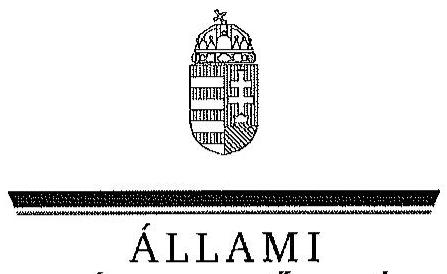
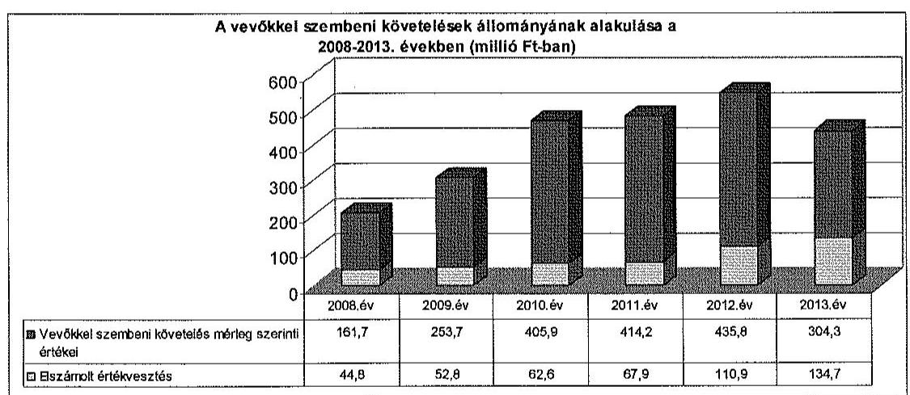
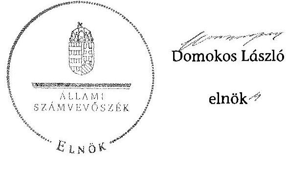
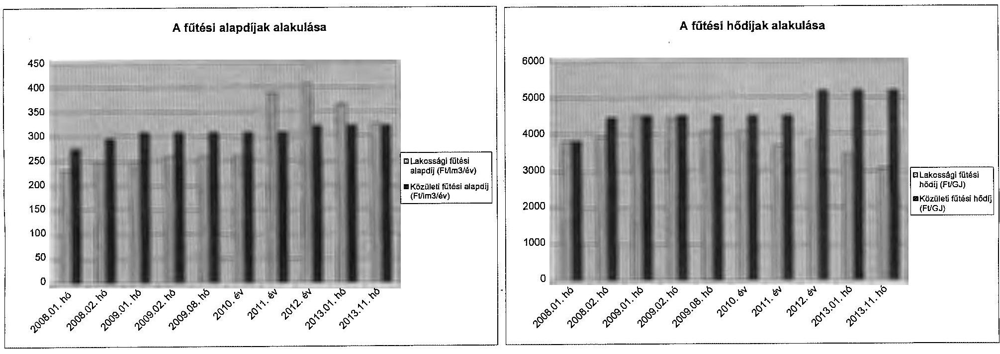
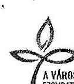
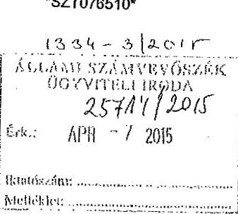
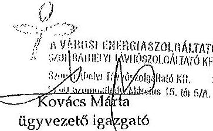
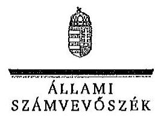
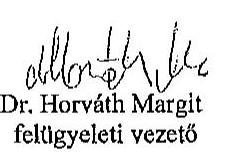
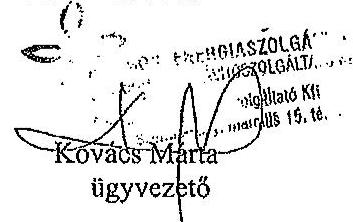

ÁLLAMI
SZÁMVEVÔSZÉK

# JELENTÉS 

Az önkormányzatok gazdasági társaságai - Az önkormányzatok többségi tulajdonában lévő gazdasági társaságok közfeladat ellátását érintő gazdálkodási tevékenysége szabályszerűségének ellenőrzése Szombathelyi Távhőszolgáltató Korlátolt Felelősségű Társaság

---

# Állami Számvevőszék 

Iktatószám: V-0735-080/2015
Témaszám: 1769
Vizsgálat-azonosító szám: V067142

## Az ellenőrzést felügyelte:

Dr. Horváth Margit
felügyeleti vezető
Az ellenőrzést vezette és az ellenőrzés végrehajtásáért felelős:
Valastyánné dr. Vízhányó Júlia
ellenőrzésvezető
A jelentéstervezet összeállításában közremüködött:
Pálfiné Pusztai Magdolna
számvevő tanácsos
Az ellenőrzést végezték:
Pálfiné Pusztai Mag-
dolna
számvevő tanácsos

## Ritecz Tibor

számvevő tanácsos

A témához kapcsolódó eddig készített számvevőszéki jelentések:
címe
sorszáma
Szombathely Megyei Jogú Város Önkormányzata pénzügyi helyzetének ellenőrzéséről

---

# TARTALOMJEGYZÉK 

BEVEZETÉS ..... 7
I. ÖSSZEGZŐ MEGÁLLAPÍTÁSOK, KÖVETKEZTETÉSEK, JAVASLATOK ..... 10
II. RÉSZLETES MEGÁLLAPÍTÁSOK ..... 16

1. Az önkormányzat közfeladat-ellátásának szabályszerűsége ..... 16
1.1. A közfeladat-ellátás megszervezésére és a feladatellátás feltételrendszerének kialakítása ..... 16
1.2. A közfeladat-ellátás felügyelete és a tulajdonosi jogok érvényesítése ..... 19
2. A TÁVHŐ Kft. közfeladat ellátással kapcsolatos tevékenysége ..... 21
2.1. A TÁVHŐ Kft. gazdálkodásának szabályozottsága ..... 21
2.2. A TÁVŐ Kft. vagyongazdálkodása ..... 24
2.3. A beszámolási kötelezettség teljesítése ..... 29
3. A gazdasági társaságnál az ellátott közfeladat bevételei és ráfordításai elszámolásának és önköltségszámításának szabályszerűsége ..... 30
3.1. A távhőszolgáltatás közfeladat bevételeinek és ráfordításainak szabályszerűsége ..... 30
3.2. Az önköltségszámítás szabályszerűsége ..... 31
4. Az ÁSZ korábbi, az önkormányzatok többségi tulajdonában lévő gazdasági társaságok közfeladat-ellátását, gazdálkodását, pénzügyi helyzetét érintő javaslataira tett intézkedések ..... 34
MELLÉKLETEK
5. számú A TÁVHŐ Kft. tevékenységének főbb adatai
6. számú A TÁVHŐ Kft. múködésének főbb jellemzői
7. számú A Szombathelyi Távhőszolgáltató Kft. által biztosított távfűtés díjainak alakulása
8. számú Beérkezett észrevételek és az azokra adott válaszok
FÜGGELÉKEK
9. számú Értelmező szótár
10. számú Mintavételi eljárások ellenőrzési területenként

---

$\cdot$
$\cdot$
$\cdot$

---

# RÖVIDÍTÉSEK JEGYZÉKE 

## Törvények

Ámt.
Az árak megállapításáról szóló 1990. évi LXXXVII. törvény (hatályos: 1991. január 1-jétől)
ÁSZ tv.
az Állami Számvevőszékről szóló 2011. évi LXVI. törvény (hatályos: 2011. július 1-jétől)
Gt.
a gazdasági társaságokról szóló 2006. évi IV. törvény (hatálytalan: 2014. március 15-étől)
Info. tv
az információs önrendelkezési jogról és az információszabadságról szóló 2011. évi CXII. törvény (hatályos: 2011. július 27-étől kivéve a 1-37. §, a 38. § (1)-(3) bekezdése, a 38. § (4) bekezdés a)-f) pontja, a 38. § (5) bekezdése, a 39. §, a 41-68. §, a 70-72. §, a 75-77. § és a 79-88. §, valamint az 1. melléklet, ami 2012. január 1-jén lépett hatályba és a 38. § (4) bekezdés g) és h) pontja, valamint a 69. §, ami 2013. január 1-jén lépett hatályba)
Mötv.
Magyarország helyi önkormányzatairól szóló 2011. évi CLXXXIX. törvény (hatályos: 2012. január 1-jétől, kivéve a 144. § (2) bekezdésben meghatározott paragrafusok, amelyek 2012. április 15 -én, a (3) bekezdésben meghatározott paragrafusok, amelyek 2013. január 1-jén léptek hatályba, a (4) bekezdésben meghatározott paragrafusok a 2014. évi általános önkormányzati választások napján lépnek hatályba)
Nvtv.
a nemzeti vagyonról szóló 2011. évi CXCVI. törvény (hatályos: 2011. december 31-étől, kivéve a 20. § (2) bekezdésben meghatározott paragrafusok, amelyek 2012. január 1-jétől, a (3) bekezdésben meghatározott paragrafusok 2013. január 1-jétől, a (4) bekezdésben meghatározott paragrafus 2012. március 2-ától léptek hatályba)
Ötv.
a helyi önkormányzatokról szóló 1990. évi LXV. törvény (hatálytalan: a 2014. évi általános önkormányzati választások napjától)
Rezsi tv.
a rezsicsökkentések végrehajtásáról szóló 2013. évi LIV. törvény
Számv. tv.
a számvitelről szóló 2000. évi C. törvény (hatályos: 2001. január 1-jétől)
Tszt.
a távhőszolgáltatásról szóló 2005. évi XVIII. törvény (hatályos: 2005. július 1-jétől)
Vet.
a 2007. évi LXXXVI. törvény a villamos energiáról (hatályos: 2007. október 15-étől)

---

## Rendeletek

50/2011. (IX. 30.) NFM rendelet

51/2011. (IX. 30.) NFM rendelet
Áhsz.
árrendelet

SZMSZ $_{1}$

SZMSZ $_{2}$

SZMSZ $_{3}$
távhőszolgáltatási rendelet $_{1}$
távhőszolgáltatási rendelet $_{2}$
távhőszolgáltatási rendelet $_{3}$
vagyongazdálkodási rendelet

## Szórövidítések

adatvédelmi szabályzat Szombathelyi Távhőszolgáltó Kft. Adatvédelmi szabály. zata (hatályos 2004. január 1-jétől)

---

| Alapító Okirat | a Szombathelyi Vagyonkezelő és Városgazdálkodási Zrt. Alapító Okirata és annak módosításai |
| :--: | :--: |
| Alapszabály | a Szombathelyi Vagyonkezelő és Városgazdálkodási Zrt. Alapszabálya és annak módosításai |
| ÁSZ | Állami Számvevőszék |
| EON Kft. | EON Energiatermelő Kft. |
| értékelési szabályzat | Szombathelyi Távhőszolgáltó Kft. értékelési szabályzata (hatályos 2001. március 31-étől, módosítva 2008. augusztus 1 -jén) |
| hátralékkezelési sza-   bályzat | Hátralékkezelési szabályzat (hatályos 2001. november 15-étől) |
| javadalmazási szabály-   zat | a Szombathelyi Távhőszolgáltatási Kft. javadalmazási szabályzata (hatályos: 2003. december 10-étől, módosítva 2008. május 30-án és 2010. június 16-án) |
| jegyző | Szombathely Megyei Jogú Város Önkormányzatának jegyzője |
| KAT rendszer | Kötelező átvételi rendszer |
| Közgyűlés | Szombathely Megyei Jogú Város Önkormányzatának Közgyűlése |
| leltározási szabályzat | Szombathelyi Távhőszolgáltó Kft. Leltározási szabályzata (hatályos 2001. november 1-jétől) |
| MEKH | Magyar Energia Hivatal és annak jogutódja 2013. április 4-étől Magyar Energetikai és Közmű-szabályozási Hivatal millió forint |
| M Ft | Szombathely Megyei Jogú Város Önkormányzata |
| Önköltség számítási sza-   bályzat | Szombathelyi Távhőszolgáltó Kft. Önklötség számítási szabályzata (hatályos: 1993. január 1-jétől) |
| pénzkezelési szabályzat ${ }_{1}$ | Szombathelyi Távhőszolgáltó Kft. Házipénztár kezelési szabályzata (hatályos: 2009.július 1-jéig) |
| pénzkezelési szabályzat ${ }_{2}$ | Szombathelyi Távhőszolgáltó Kft. Házipénztár kezelési szabályzata (hatályos: 2011.július 8 -áig) |
| pénzkezelési szabályzat ${ }_{3}$ | Szombathelyi Távhőszolgáltó Kft. Házipénztár kezelési szabályzata (hatályos: 2011.július 8-ától) |
| PGB | Szombathely Megyei Jogú Város Közgyűlésének Pénzügyi és Gazdasági Bizottsága (2008-2010. évek) |
| PGJB | Szombathely Megyei Jogú Város Közgyűlésének Pénzügyi Gazdasági és Jogi Bizottsága (2011-2013. évek) |
| polgármester | Szombathely Megyei Jogú Város Önkormányzatának Polgármestere |
| Polgármesteri hivatal | Szombathely Megyei Jogú Város Önkormányzatának Polgármesteri hivatala |
| selejtezési szabályzat | Szombathelyi Távhőszolgáltó Kft. Selejtezési szabályzata (hatályos: 2006. március 14-étől) |
| számlarend | Szombathelyi Távhőszolgáltó Kft. Számlarendje (hatályos 2001. március 1-jétől) |
| számviteli politika ${ }_{1}$ | Szombathelyi Távhőszolgáltó Kft. Számviteli politikája (hatályos: 2001. március 1-jétől) |

---

számviteli politika $2_{2}$
Szombathelyi Távhőszolgáltó Kft. Számviteli politikája (hatályos: 2008. augusztus 1-jétől, módosítva 2009. január 1-jén és 2012. december 6-án)
SZOVA FB
Szombathelyi Vagyonkezelő és Városgazdálkodási Zrt. Felügyelő Bizottsága
SZOVA IG
Szombathelyi Vagyonkezelő és Városgazdálkodási Zrt. Igazgatósága
SZOVA Zrt.
Taggyưlés
TÁVHŐ Kft
TÁVHŐ Kft. FB
TÁVHŐ Kft. SZMSZ

Társasági szerződés
üzletszabályzat

Szombathelyi Távhőszolgáltó Kft. Felügyelőbizottsága
Szombathelyi Távhőszolgáltó Kft. Szervezeti és Múködési Szabályzata, hatályos: 1993. július 1-jétől, amelyet a 2008-2013. év során négy alkalommal módosítottak (a 4. számú módosítása 2007. július 4-én, az 5. számú módosítása 2008. május 30-án, a 6. számú módosítása 2009. december 11-én, a 7. számú módosítása 2010. március 3-án, a 8. számú módosítása 2013. március 6-án lépett hatályba)
Szombathelyi Távhőszolgáltó Kft. Társasági szerződése hatályos 2007. március 30-ától, amelyet tíz alkalommal módosítottak, módosításokkal egységes szerkezetben (a Taggyűlés a 13/2013. (V. 09) számú határozatával jóváhagyta)
Szombathelyi Távhőszolgáltó Kft. Üzletszabályzata (hatályos 2007. január 1-jétől, módosítva 2011. március 1jétől)

---

# JELENTÉS 

## Az önkormányzatok gazdasági társaságai Az önkormányzatok többségi tulajdonában lévő gazdasági társaságok közfeladat ellátását érintő gazdálkodási tevékenysége szabályszerűségének ellenőrzése

## Szombathelyi Távhőszolgáltató Korlátolt Felelősségú Társaság

## BEVEZETÉS

Az Állami Számvevőszék középtávra szóló stratégiájában megfogalmazta, hogy a helyi önkormányzatok gazdálkodásában rejlő pénzügyi kockázatok feltárásával, az államháztartáson kívülre nyújtott költségvetési támogatások és ingyenes vagyonjuttatások, valamint az államháztartáson kívül múködő köz-feladat-ellátó rendszerek ellenőrzéseivel hozzájárul ahhoz, hogy a közpénzeket az államháztartáson kívül múködő szervezetek is átlátható, rendezett módon használják fel a közfeladatok szerződésben vállalt ellátása érdekében.

Az önkormányzatok szervezetalakítási szabadságának következménye, hogy a korábban is vállalati formában múködő (nagyvárosi tömegközlekedés, víz-, szennyvízcsatorna, köztisztasági, ingatlankezelés stb.) közszolgáltatások mellett, mind a kötelező, mind az önként vállalt feladatok ellátásában a gazdasági társaságok kiemelt fontosságú szerephez jutottak.

Szombathely Megyei Jogú Város Önkormányzata a TÁVHŐ Kft.-t az ellenőrzött időszakot megelőzően, 1992. évben alapította. Az 1992. október 9-én kelt Társasági szerződés alapján az Önkormányzat a TÁVHŐ Kft.-t 75\%-os tulajdonú gazdasági társaságként 460,1 M Ft tulajdonosi részesedéssel hozta létre. A 25\%os 153,4 M Ft tulajdonosi részesedéssel az ellenőrzött időszakban az EON Kft. rendelkezett. A Közgyűlés a 19/2009. (I. 30) számú határozatával holding létrehozását tervezte, - a SZOVA Zrt. holding-szerű működésének lehetőségét vizsgálta - azonban a holding szervezet az ellenőrzött időszakban nem jött létre. A Közgyűlés a 458/2009. (X. 8.) számú határozata alapján a TÁVHŐ Kft-ben lévő 75\%-os üzletrészét - az Önkormányzat 100\%-os tulajdonában lévő - a SZOVA Zrt.-be apportálta. A TÁVHŐ Kft. új tulajdonosa a 2009. év II. félévtől a SZOVA Zrt., a tulajdonosi jogokat a SZOVA Zrt., illetve közvetetten az Önkormányzat gyakorolta. A Közgyűlés által hozott tulajdonosi döntés képviseletére a SZOVA Zrt. vezérigazgatója kapott felhatalmazást. Az Önkormányzat, majd a 2009. év II. félévtől a SZOVA Zrt. a TÁVHŐ Kft.-ben 75\%-os minősített többséget biztosí-

---

tó részesedéssel rendelkezett az ellenőrzött időszakban. A társaság fő tevékenysége a gőzellátás, légkondicionálás volt.

A TÁVŐ Kft. a 2013. év végén a 77566 fős lakosságszámú Szombathely Megyei Jogú Város közigazgatási területén 11094 lakást, továbbá 422 közületi fogyasztókat (ipari, intézményi, vállalkozási) látott el távhővel. A távhőrendszer kilenc - részben összekötött - kazánból állt, a termelt hőmennyiség a 2013. évben 455,7 ezer GJ, az értékesített hőmennyiség 422,8 ezer GJ volt. A TÁVHŐ Kft dolgozóinak létszáma a 2013. évben 84 fő volt.

A 2008-2013. években a TÁVHŐ Kft. éves nettó árbevétele 3125,1 M Ft és 2739,5 M Ft között, az eszközök és források értéke 3611,4 M Ft és 4866,7 M Ft között alakult. A társaság mérleg szerinti eredménye a 2008. év és a 2011. évek kivételével, mely években - 158,9 M Ft és $-76,8 \mathrm{M}$ Ft veszteség képződött - nyereség volt. A 2009. évben 48,3 M Ft, a 2010. évben 224,1 M Ft, a 2012. évben 76,3 M Ft és a 2013. évben 114,8 M Ft nyereséget ért el.

A 2008-2013. években a polgármester és a jegyző személye egy alkalommal változott. A TÁVHŐ Kft. ügyvezetőjének személye három alkalommal változott, a gazdasági igazgató 2008. február 1-je óta látja el feladatát.

Az önkormányzati tulajdonú gazdasági társaságok teljes körű ellenőrzésének lehetőségét az Állami Számvevőszékről szóló 1989. évi XXXVIII. törvény 2011. január 1-jétől hatályos módosítása teremtette meg.

Az ellenőrzés célja annak értékelése volt, hogy

- az önkormányzat a jogszabályi előírások figyelembevételével döntött-e az ellenőrzésre kerülő közfeladat megszervezéséről; az önkormányzat szabályszerűen gyakorolta-e a tulajdonosi jogokat;
- a gazdasági társaság közfeladat-ellátása bevételeinek, ráfordításainak elszámolása, és vagyongazdálkodási tevékenysége megfelelt-e a jogszabályi, illetve a közszolgáltatási szerződésben foglalt tulajdonosi előírásoknak, azok végrehajtása szabályszerű volt-e;
- a közfeladatok átláthatósága és elszámoltathatósága érdekében biztosítva volt-e a közszolgáltatás dijának megalapozottsága szabályszerű önköltségszámítással.

Az ellenőrzés kiterjedt Szombathely Megyei Jogú Város Önkormányzatára, a Szombathelyi Vagyonkezelő és Városgazdálkodási Zrt.-re és a Szombathelyi Távhőszolgáltató Korlátolt Felelősségű Társaságra.

Az ellenőrzés várható hasznosulása: A törvényalkotás számára - az észlelt problémák, szabálytalanságok, vagy egyéb nem kívánatos jelenségek felszínre kerülésével - az ellenőrzés megállapításai segítséget nyújthatnak az államháztartáson kívüli közfeladat-ellátás értékeléséhez, jogszabályi keretei pontosításához, átláthatóságot biztosító szabályozásához. Meghatározhatóvá válnak a közfeladat ellátásában részt vevő államháztartáson kívüli szervezeteknek - az önkormányzat költségvetését, pénzügyi helyzetét is befolyásoló - kockázatai, lehetővé válik ezen kockázatok csökkentése. Értékelhetővé válik, hogy a felada-

---

tot ellátó gazdasági társaság a közszolgáltatási szerződésben foglaltak betartásával, a közvagyon használatával biztosította-e a szolgáltatás folytatásának feltételeit. Ezzel az ellenőrzöttek és a helyi döntéshozók számára visszajelzést ad feladatszervezési, feladat-ellátási kockázataikról, alapot ad a meglévő hibák megszüntetéséhez, a jobb közfeladat-ellátás biztosításához. Fokozza a fegyelmet, igazolja, hogy lejárt a következmények nélküli ellenőrzések időszaka. Az ÁSZ értékteremtő rend kialakításához és megőrzéséhez hozzájáruló tevékenysége pozitív hatással van a szervezetről kialakított összkép formálására is.

Az ellenőrzést a számvevőszéki ellenőrzés szakmai szabályai szerint, szabályszerűségi ellenőrzés módszerével, a vonatkozó nemzetközi standardok figyelembevételével végeztük. Az ellenőrzés a 2008-2013. évekre terjedt ki.

Az ellenőrzés végrehajtásának jogszabályi alapját az Állami Számvevőszékről szóló 2011. évi LXVI. törvény 5. § (3)-(5) bekezdései képezték.

Az ÁSZ az Állami Számvevőszékről szóló 2011. évi LXVI. törvény 29. §-a alapján a jelentéstervezetet észrevételezésre megküldte Szombathely Megyei Jogú Város polgármesterének és a gazdasági társaság ügyvezető igazgatójának. A beérkezett észrevételeket a jelentés véglegesítése során hasznosítottuk. Az észrevételeket és az azokra adott válaszokat a jelentés 4. számú melléklete tartalmazza.

---

# I. ÖSSZEGZŐ MEGÁLLAPÍTÁSOK, KÖVETKEZTETÉSEK, JAVASLATOK 

Szombathely Megyei Jogú Város Önkormányzata a távhőszolgáltatás kötelező feladatát az ellenőrzött időszakban a TÁVHŐ Kft. tevékenységén keresztül látta el. A TÁVHŐ Kft. törzstőkéje $613,5 \mathrm{M}$ Ft volt, amely az ellenőrzött időszakban nem változott. A TÁVHŐ Kft. 75\%-os tulajdonosa 460,1 M Ft tulajdonosi részesedéssel az Önkormányzat, majd 2009. év II. félévtől - az Önkormányzat 100\%-os tulajdonában lévő - SZOVA Zrt. A 25\%-os 153,4 M Ft tulajdonosi részesedéssel az ellenőrzött időszakban az EON Kft. rendelkezett. Az Önkormányzat a közigazgatási területén a távhőszolgáltatás közfeladatának megszervezéséről a jogszabályi előírásoknak megfelelően döntött. A feladatellátáshoz szükséges vagyont az ellenőrzött időszakot megelőzően apportként bocsátotta a TÁVHŐ Kft. rendelkezésére.

Az Önkormányzat a 2009. évben tervezte a holding szervezet létrehozását, vizsgálta a SZOVA Zrt. holding szervezetként való működésének lehetőségét, azonban a holding szervezet az ellenőrzött időszakban nem jött létre.

Az Önkormányzat 2007-2010. évi gazdasági programja a távhőszolgáltatás működtetésével, fejlesztésével kapcsolatban stratégiai célokat, feladatokat nem tartalmazott. Az Önkormányzat 2011-2015. évi gazdasági programjában meghatározták a távhőszolgáltatás biztosítására, fejlesztésére vonatkozó fő célkitűzéseket, kockázati tényezőket. A TÁVHŐ Kft. középtávú fejlesztési koncepciója a fejlesztési irányok célját, a továbbfejlesztés feladatait tartalmazta, összhangban a gazdasági program célkitűzéseivel. A TÁVHŐ Kft. éves üzleti tervei összhangban voltak a középtávú fejlesztési koncepcióval. Az Önkormányzat a közép- és hosszú távú vagyongazdálkodási tervét a 2013. évben az előírt határidőt követően készítette el.

A távhőszolgáltatással ellátott létesítmények távhőellátásának biztosítása Tszt. előírása értelmében a területileg illetékes települési önkormányzat kötelező feladatát jelentette. Az Önkormányzat a 2013. február 15-étől hatályos SZMSZ-e a távhőszolgáltatás kötelező feladatellátására vonatkozó előírásokat a Tszt. és a Mötv. előírásai ellenére nem tartalmazott.

Az Önkormányzat a távhőszolgáltatásra vonatkozóan a Tszt. szerinti rendeletalkotási kötelezettségének az ellenőrzött időszakban eleget tett. Az Önkormányzat a távhőszolgáltatási rendelet ${ }_{2}$-t a jogszabályi változásoknak megfelelően időben nem módosította. Az Önkormányzat a vagyongazdálkodási rendeletében szabályozta a gazdasági társaságok feletti tulajdonosi jogok gyakorlásának rendjét, a kizárólagos tulajdonosi részesedéssel múködő gazdasági társaságaira vonatkozóan. Az ellenőrzött időszakban a TÁVHŐ Kft. feletti tulajdonosi jogokat az Alapító Okirat, az Alapszabály és a vagyongazdálkodási rendelet előírásainak megfelelően az Önkormányzat, majd a SZOVA Zrt. szabályszerűen gyakorolták. Az ellenőrzött időszakban a TÁVHŐ Kft. közfeladat ellátási tevékenységének szabályszerűségével kapcsolat-

---

ban az Önkormányzat belső ellenőrzést nem végzett, a közvagyonnal kapcsolatos felelős gazdálkodását külső szakértő nem ellenőrizte.

A TÁVHŐ Kft. az ellenőrzött időszakban a társasági szerződésében az üzletszabályzatában, a távhőszolgáltatási rendeletben meghatározottak szerint látta el a távhőszolgáltatás kötelező közfeladatát. Az ellenőrzött időszakban a távhő ágazatra irányadó jogszabályi rendelkezések nem írták elő az Önkormányzatnak és a távhőszolgáltatónak közszolgáltatási szerződés kötését. Az Önkormányzat, majd a SZOVA Zrt. a TÁVHŐ Kft. részére távhőszolgáltatási közfeladattal összefüggő beszámolási kötelezettséget nem írt elő. A TÁVHŐ Kft. a beszámolási kötelezettségének a Számv. tv. előírásai szerint tett eleget. A könyvvizsgáló az ellenőrzött időszak minden évében minősítés nélküli, hitelesítő záradékkal látta el a TÁVHŐ Kft. éves számviteli beszámolóját.

A TÁVHŐ Kft. közfeladat ellátással kapcsolatos bevételeinek elszámolása során nem teljes körűen érvényesültek a jogszabályok és belső szabályok előírásai a bevételek előírása, kiszámlázása tekintetében. A 20082013. években a bevételek előírása és kiszámlázása - a belső szabályozási hiányosságok ellenére - megfelelő volt. A bevételeket közfeladatonként elkülönítetten a megfelelő számlacsoportban számolták el, az alkalmazott szolgáltatási díjak megfeleltek a jogszabályi előírásoknak. A TÁVHŐ Kft. a távhőszolgáltatási közfeladat anyagjellegú ráfordításainak elszámolása során szabályszerűen járt el. A költségelszámolást megalapozó kötelezettségvállalás, a költségek elszámolása a jogszabályi előírásoknak és 2013. évtől a belső szabályozásnak megfelelően történt. A TÁVHŐ Kft. a beruházásainak, felújításainak elszámolása során nem járt el szabályszerűen az ellenőrzött időszakban. A számviteli alapelveknek megfelelő mennyiségi nyilvántartással nem rendelkeztek és nem végezték el a mennyiségi felvétellel történő leltározást a Számv. tv.-ben előírtakat ellenére.

A TÁVHŐ Kft. mérleg szerinti eredménye - a 2008. és a 2011. évek kivételével, amikor $158,9 \mathrm{M}$ Ft és $76,8 \mathrm{M}$ Ft veszteséget mutatott ki - az ellenőrzött időszakban nyereség volt. A 2009. évben $48,3 \mathrm{MFt}, 2010 . \mathrm{évben} 224,1 \mathrm{M}$ Ft 2012.évben $76,3 \mathrm{M}$ Ft, a 2013 évben $114,8 \mathrm{M}$ Ft nyereséget ért el. Az ellenőrzött időszakban osztalék fizetésére nem került sor. Az eredményt az ellenőrzött időszakban eredménytartalékba helyezték. Az Önkormányzat az ellenőrzött időszakban a TÁVHŐ Kft.-nek múködési célú pénzeszközt nem adott át, kölcsönt nem nyújtott. Felhalmozási célú pénzeszköz átadásra egy alkalommal, a 2009. évben került sor 243,8 M Ft összegben. A SZOVA Zrt. az ellenőrzött időszakban a TÁVHŐ Kft.-nek működési és felhalmozási célú pénzeszközt nem adott át, kölcsönt nem nyújtott.

A TÁVHŐ Kft. folyószámla-hitelkeretéhez az Önkormányzat a 2008. évben 200 M Ft , a 2009. évben 300 M Ft összegben vállalt készízető kezességet. A 2010-2013. években az Önkormányzat és a TÁVHŐ Kft. garancia- vagy kezességvállalást igénylő szerződést nem kötött, a 2008-2009. években vállalt kezesség beváltására nem került sor. A SZOVA Zrt. egyéb biztosítékot -garancia-, kezességvállalást - igénylő szerződést nem kötött a TÁVHŐ Kft.-vel. A 2011. évtől kezdődően kapott távhőtámogatást (2011. évben 137,7 M Ft-ot, a 2012. évben 833,9 M Ft-ot, a 2013. évben 757,5 M Ft), amely pozitívan hatott az adott gazdálkodási évek eredményére.

---

A TÁVHŐ Kft. az ellenőrzött időszakot megelőzően - a 2007. évben - készítette el az üzletszabályzatát, melyet a 2011. évben módosított. A módosított üzletszabályzatot az Önkormányzat jegyzője a Tszt. előírásainak megfelelően a fogyasztóvédelmi hatóságnak véleményezésre megküldött, majd jóváhagyott. A jegyző́ nem ellenőrizte a Tszt. -ben előírtak ellenére, az üzletszabályzatban foglaltak betartását. A TÁVHŐ Kft. a Számv. tv. szerinti szabályzatokat elkészítette, az ellenőrzött időszakban rendelkezett számviteli politikával és a számviteli politika keretében elkészítette a leltározási, értékelési, önköltségszámítási, és pénzkezelési szabályzatokat, valamint a számlarendet. A szabályzatokat a jogszabályi változásoknak megfelelően - a Számv. tv. előírása ellenére - az ellenőrzött időszakban nem módosították, nem aktualizálták. A TÁVHŐ Kft. külön számviteli szétválasztási szabályzatot készített, a Tszt. hatályba lépését követően, egy év négy hónapos késéssel. A szabályozás hiánya ellenére a TÁVHŐ Kft. eleget tett a Tszt.-ben elöírtaknak és az engedélyes tevékenységeket elkülönítetten bemutatta a 2012-2013. évek éves számviteli beszámolóinak kiegészítő mellékleteiben.

A TÁVHŐ Kft. a 2008. évben az üzemeltetésre átvett vagyont, a 20082013. években az ingyenesen átvett vagyont a mérlegen kívüli tételek között, elkülönítetten nem tartotta nyilván. Az éves számviteli beszámolók kiegészítő mellékleteiben erre vonatkozó információkat a Számv. tv. előírásai ellenére nem rögzítettek. A TÁVHŐ Kft-nek üzemeltetésre, vagyonkezelésbe átvett vagyona a 2009-2013. években nem volt.

A TÁVHŐ Kft. a távhőszolgáltatási díjak megállapításához 2008. január 1jétől szeptember 30-áig kalkulációs sémát, 2008. október 1-jétől 2009. december 31-éig belső díjszámítást készített. A 2010. és 2011. években nem készült árképzéssel kapcsolatos előterjesztés, mert a díjak nem változtak. A Közgyűlés a távhőszolgáltatási rendelet ${ }_{1,2}$-ben meghatározta a távhődíj mértékének alapját és a kiszámítási szabályait. A távhőszolgáltatás díjairól és annak módosításairól az Önkormányzat rendeletet alkotott. A Tszt. módosításával az Önkormányzat ármegállapítás joga, az Ámt. 2011. április 15-től hatályos módosítására való tekintettel megszűnt.

A TÁVHŐ Kft-nek az ellenőrzött időszakban a 2010. évben volt a legmagasabb a távhőszolgáltatás árbevétele, ezt követően folyamatosan csökkent. A TÁVHŐ Kft. az ellenőrzött időszakban jelentős követelésállománnyal rendelkezett, amelyből a vevőkkel szembeni követelés mérleg szerinti összege a 2008. évi 161,7 M Ft-ról a 2013. évre 304,3 M Ft-ra nőtt. A ráfordítások elszámolását megalapozó kötelezettségvállalás, a költségek elszámolása az ellenőrzött időszakban a hatályos szabályozások szerint történt. A TÁVHŐ Kft. vagyongazdálkodási tevékenysége, beleértve a vagyon kezelését, gyarapítását, hasznosítását, - a nagy értékű tárgyi eszközök leltározását kivéve- megfelelt a jogszabályi előírásoknak.

A fentiekben leírtak összegzéseként az alábbi megállapításokat tesszük:
A konstrukcióból eredő sajátosság az volt, hogy az Önkormányzat a távhőszolgáltatási feladatai maradéktalan végrehajtása érdekében - az ellenőrzött időszakot megelőzően - az Önkormányzat 75\%-os tulajdonában lévő TÁVHŐ Kft.-be apportálta a távhő vagyont. A 2009. év II. félévben az Önkor-

---

mányzat az üzletrészét (75\%) átadta (apportálta) a SZOVA Zrt.-nek. Az Önkormányzat a 2009. évben tervezte a holding szervezet létrehozását, azonban az ellenőrzött időszakban nem jött létre. A Tulajdonosi jogokat az Önkormányzat, majd a SZOVA Zrt. szabályszerűen gyakorolta.

A müködés kockázata magas volt, mivel TÁVHŐ Kft. a számviteli rendszerének szabályozottsága hiányosságokat mutatott, a szabályzatait a jogszabályi változásoknak megfelelően nem módosította.

Pénzügyi kockázatot jelentett a 2010. évtől a TÁVHŐ Kft. árbevételének folyamatos csökkenése. A ráfordítások (anyagi, személyi) növekedése, valamint a lejárt követelésállomány, és az elszámolt értékvesztés nagymértékben hozzájárult a TÁVHŐ Kft. likviditási helyzetének romlásához. A 2012-2013. években az egyéb bevételek között elszámolt távhőtámogatás nélkül veszteséges lett volna a gazdálkodása.

Az Állami Számvevőszékről szóló 2011. évi LXVI. törvény 33. § (1) bekezdésében foglaltak értelmében a jelentésben foglalt megállapításokhoz kapcsolódó intézkedési tervet köteles az ellenőrzött szervezet vezetője összeállítani, és azt a jelentés kézhezvételétől számított 30 napon belül az ÁSZ részére megküldeni. Amennyiben az intézkedési tervet határidőben nem küldi meg a szervezet, vagy az nem elfogadható, az ÁSZ elnöke a hivatkozott törvény 33. § (3) bekezdés a)-b) pontjaiban foglaltakat érvényesítheti.

Az ellenőrzés intézkedést igénylő megállapításai és javaslatai:
Javaslataink célja a Kft. gazdálkodása szabályszerűségének helyreállítása annak érdekében, hogy a szabályozási környezet megfelelően tudja támogatni az átlátható müködést.

# Javasoljuk a TÁVHŐ Kft. Ügyvezetőjének: 

1. A TÁVHŐ Kft. a számviteli politika keretében elkészített szabályzatokat (leltározási, értékelési, önköltségszámítási, szabályzat), valamint a számlarendet a Számv. tv. 161/A. § (2) bekezdésében és a Számv. tv. 14. § (11) bekezdésében ${ }^{1}$ foglalt előírások ellenére a jogszabályi változásoknak megfelelően az ellenőrzött időszakban nem módosította.

Számviteli szabályozásukba nem illesztették be a 2012-től hatályos előírásoknak megfelelően - Tszt. 18/A. § (2) bekezdésében² ${ }^{2}$ foglaltak alapján - a számviteli szétválasztásra vonatkozó követelményeket és a teljesítéshez szükséges nyilvántartásokat, figyelmen kívül hagyva a Számv. tv. 161/A. § (2) bekezdésében előírtakat.

A leltározási szabályzatban nem rendelkeztek a befektetett eszközöknél az üzemeltetésre, kezelésre átadott, vagyonkezelésbe vett, illetve idegen helyen tárolt eszközök leltározása szabályainak rögzítéséről a Számv. tv. 14. § (3)-(5), valamint a

[^0]
[^0]:    ${ }^{1}$ A 2008. december 31-ig a 14. § (9) bekezdése írta elő.
    ${ }^{2}$ 2012. január 1-jétől hatályos előírás.

---

69. § (3) bekezdésében ${ }^{3}$ előírtak ellenére. Nem tartalmazta a szabályzat a leltározás minden szakaszát felölelő ellenőrzési feladatokat, a leltáreltérések megállapításainal, rendezésével, azok könyvviteli elszámolásával, egyeztetésével kapcsolatos szabályokat, a Számv. tv. 14. § (3)-(5) bekezdéseiben előírt követelmények ellenére.

Az értékelési szabályzat nem mutatta be a Számv. tv. 14. § (3)-(5), valamint az 51. § (1) bekezdésében előírtak alapján az eszközök bekerülési (előállítási) értékének részét képező költségeket, a tárgyi eszközöknél az eszközcsoportokra vonatkozó részletes értékelési előírásokat, a források értékelésének részletes szabályait.

A számlarendet az ellenőrzött időszakot jóval megelőzően hagyta jóvá az ügyvezető, ezt követően a Számv. tv. 161/A. § (2) bekezdésében előírtak ellenére a törvényi változásoknak megfelelően nem aktualizálták.

Az önköltségszámítási szabályzatot a 2008-2013. években a jogszabályi változásoknak megfelelően nem módosították, megsértve ezzel a Számv. tv. 14. § (11) bekezdésében ${ }^{4}$ foglalt előírásokat.

A pénzkezelési szabályzat a Számv. tv. 14. § (8) bekezdésében foglaltak ellenére nem tartalmazta a pénzforgalom készpénzben és a bankszámlán történő lebonyolításának rendjét, a készpénzben és a bankszámlán tartott pénzeszközök közötti forgalom szabályait, továbbá a pénzforgalmi számlák feletti rendelkezési jog gyakorlásának feltételeit.

A TÁVHŐ Kft. a közvagyonnal kapcsolatos adatok védelmére vonatkozó feladatkörében elkészítette az ellenőrzött időszakot megelőzően az adatvédelmi szabályzatát, nem tartalmazta az időközben (2009. VII. 1.) hatálya lépő Tszt. 57/C. §-ban meghatározott adatkörre a közzétételi kötelezettséget.

Javaslat:

# Intézkedjen a szabályozási hiányosságok megszüntetésére, ennek keretében: 

a) Intézkedjen a számviteli politika keretében elkészített szabályzatok, valamint a számlarend aktualizálásáról a Számv. tv.-ben előírtak alapján, továbbá egészítse ki a számviteli szabályozását a Tszt. szerinti szétválasztási szabály teljesítéséhez szüksége követelmények és nyilvántartások meghatározásával.
b) Intézkedjen az adatvédelmi szabályzat módosításáról a Tszt. és az Info. tv. előírásai alapján.
2. A nagy értékű tárgyi eszközök - földben lévő vezetékek, nagy értékű berendezések, speciális eszközök - mérlegtételeinek alátámasztására a 2008-2013. években nem rendelkeztek teljes körűen olyan leltárral, amely tételesen, ellenőrizhető módon tartalmazta volna a társaságnak a mérleg forduló napján meglévő eszközeit és forrásait, ezzel megsértették a Számv. tv. 69. § (1) bekezdésében előírtakat.

[^0]
[^0]:    ${ }^{3}$ 2012. január 1-jéig a Számv. tv. 69. § (2) bekezdése írta elő.
    ${ }^{4}$ A Számv. tv. 14. § (9) bekezdése írta elő 2008. december 31.-élg.

---

A TÁVHŐ Kft. a 2008. évben az üzemeltetésre átvett vagyont, a 20082013. években az ingyenesen átvett vagyont a mérlegen kívüli tételek között, elkülönítetten nem tartott nyilván. Az éves számviteli beszámolók kiegészítő mellékleteiben erre vonatkozó információkat nem rögzítették, ezzel megsértették a Számv. tv. 88. § (1) bekezdésének előírásait.

# Gondoskodjon a jogszabályi elöírások szerinti gyakorlat és a szabályos müködés biztosítására, ennek keretében: 

a) Biztosítsa a nagy értékű tárgyi eszközök teljes körű mennyiségi leltározását a leltározási szabályzat és a Számv. tv. előírásainak megfelelően;
b) Mutassa be az ingyenesen átvett vagyont a mérlegen kívüli tételek között és a Számv. tv.-ben előírtak alapján a kiegészítő mellékletben;

Javaslataink célja az önkormányzat szabályszerű müködésének elősegítése, továbbá az önkormányzati tulajdonosi joggyakorlás kontrolljainak erősítése.

## Javasoljuk Szombathely Megyei Jogú Város Önkormányzata Jegyzöjének:

1. Az ellenőrzött időszakban a TÁVHŐ Kft. közfeladat ellátási tevékenységének szabályszerűségével kapcsolatban az Önkormányzat belső ellenőrzést nem végzett, ezáltal az Önkormányzat belső ellenőrzése a távhőszolgáltatás, mint közfeladat ellátás szabályszerű működésének elősegítéséhez az önkormányzati vagyon megóvásához nem járult hozzá.

A TÁVHŐ Kft. az ellenőrzött időszakot megelőzően - a 2007. évben - elkészítette üzletszabályzatát, amit 2011-ben módosított. A TÁVHŐ Kft. tevékenységét az ellátás biztonsága, a működés hatékonysága és a működési engedélyben előírt feltételek, valamint az üzletszabályzatban foglaltak betartása szempontjából a jegyző nem ellenőrizte a Tszt. 7. § (1) bekezdés e) pontjában, illetőleg 2011. április 15-étől a Tszt. 7. § (1) bekezdésének c) pontjában előírtak ellenére.

Javaslat:
Intézkedjen a jogszabályi elöírások szerinti gyakorlat és a szabályos müködés biztosítására, ezen belül:
a) az Önkormányzat belső ellenőrzése az ellenőrzéseivel a távhőszolgáltatás, mint közfeladat-ellátás szabályszerű teljesítéséhez, valamint az önkormányzati vagyon megóvásához érdemben járuljon hozzá;
b) tegyen eleget a Tszt-ben előírt ellenőrzési kötelezettségének és végezze el a távhőszolgáltató tevékenységének ellenőrzését az üzletszabályzatában foglaltak betartása szempontjából.

---

# II. RÉSZLETES MEGÁLLAPÍTÁSOK 

## 1. Az ÖNKORMÁNYZAT KÖZFELADAT-ELLÁTÁSÁNAK SZABÁLYSZERÜSÉGE

### 1.1. A közfeladat-ellátás megszervezésére és a feladatellátás feltételrendszerének kialakítása

Az Ötv. 91. § (6) bekezdésében előírtak szerint az Önkormányzatnak a gazdasági programjában kellett meghatároznia azokat a célkitűzéseket, amelyek az ellátandó feladatok biztosítását, fejlesztését szolgálják. Az előírással ellentétben a közgyűlési határozattal jóváhagyott ${ }^{3}$ 2007-2010. évi gazdasági program a távhőszolgáltatás múködtetésével, fejlesztésével kapcsolatban stratégiai célokat, feladatokat nem tartalmazott. A Közgyűlés által elfogadott ${ }^{6}$ 20112015. évi társadalmi-gazdasági programban ${ }^{7}$ meghatározták a távhőszolgáltatás biztosítására, fejlesztésére vonatkozó fő célkitüzéseket, kockázati tényezőket.

A távfütés jövőbeni feladatai és céljai között rögzítették többek között a tulajdonosok befektetett tőkéjének minél jobb hasznosulását, a fogyasztóknak nyújtott megfelelő színvonalú szolgáltatás biztosítását. A fejlesztések esetében jelentős hangsúlyt kapott a gázfüggőség csökkentése, az energia megtakarítás érdekében a megújuló energiák alkalmazásának növelése. Kockázati tényezők között határozták meg többek között a megújuló energiaforrások alkalmazásának magas költségét, a rendszer fenntarthatóságát veszélyeztető kintlévőségek növekedését.

A TÁVHŐ Kft. középtávú fejlesztési koncepciójában ${ }^{8}$ a földgázellátástól való függőség csökkentése érdekében a megújuló energiaforrást felhasználó hőtermelő egységek létesítési lehetőségeit határozták meg. A koncepció a javasolt fejlesztési irányok célját a korszerü, biztonságos, gazdaságos, szolgáltatás továbbfejlesztési és bővítési feladatait tartalmazta, összhangban a gazdasági program célkitűzéseivel.

Az Önkormányzat középtávú vagyongazdálkodási tervét ${ }^{9}$ 2013. év márciusában, a hosszú távú vagyongazdálkodási tervét ${ }^{10}$ 2013. év szeptemberében készítette el. Az Önkormányzat a közép- és hosszú távú vagyongazdálkodási

[^0]
[^0]:    ${ }^{3}$ A Közgyűlés 176/2007. (IV. 26.) számú határozata.
    ${ }^{6}$ A Közgyűlés 147/2011. (IV.21.) számú határozata.
    ${ }^{7}$ „Szombathely a XXI. század második évtizedében" Szombathely MJV társadalmigazdasági programja.
    ${ }^{8}$ A 2010-2012. évre vonatkozó fejlesztési feladatokat tartalmazta.
    ${ }^{9}$ A Közgyűlés a 141/2013. (III.28.) számú határozatával hagyta jóvá.
    ${ }^{10}$ A Közgyűlés a 425/2013. (IX.26.) számú határozatával hagyta jóvá.

---

tervét az Nvtv. 9. § (1) bekezdésének 2011. december 31-ei hatálybalépését követően készítette el.

A 2008-2012. években az Ötv. 8. § (1) bekezdése a települési önkormányzatok közszolgáltatási feladatai közé sorolta a helyi energiaszolgáltatásban való közreműködést. Az Ötv. 1. § (5) bekezdése kimondja, hogy törvény helyi önkormányzatnak kötelező feladat- és hatáskört is megállapíthat. Az Ötv. 8. § (3) bekezdése ugyancsak rendelkezik arról, hogy törvény a települési önkormányzatokat kötelezheti arra, hogy egyes közszolgáltatási feladatok ellátásáról gondoskodjanak. A 2013. évben a Mötv. 13. § (1) bekezdés 20. pontja írja a helyi közügyek, valamint a helyben biztosítható közfeladatok körében ellátandó helyi önkormányzati feladatok között a távhőszolgáltatás biztosítását. A 20082013. években a Tszt. 6. § (1) bekezdése értelmében a távhőszolgáltatással ellátott létesítmények távhőellátásának - távhőszolgáltatásra engedéllyel rendelkezők útján történő - biztosítása a területileg illetékes települési önkormányzat kötelező feladatát jelentette. Az Önkormányzat az SZMSZ ${ }_{1,3}$-ben előírta, hogy az Önkormányzat közreműködik a helyi energiaszolgáltatásban a távhőszolgáltatásra létrehozott gazdasági társasága útján.

Az Önkormányzat a távhőszolgáltatást az ellenőrzött időszakot megelőzően, az 1992. évben létrehozott TÁVHŐ Kft.-vel biztosította. Az Önkormányzat az Ötv. 9 § (4) bekezdésében előírtak figyelembevételével szabályszerűen döntött a távhőszolgáltatás kötelező közfeladat ellátásának gazdasági társaságban történő megszervezéséről. A TÁVHŐ Kft. által a távhőszolgáltatás múködtetése, feladatellátása az ellenőrzött időszakban hatályos vagyongazdálkodási rendelet előírásaival összhangban, szabályszerűen valósult meg. Az ellenőrzött időszakban a távhő ágazatra irányadó jogszabályi rendelkezések nem írták elő az Önkormányzatnak és a távhőszolgáltatónak közszolgáltatási szerződés kötését.

Az Önkormányzatnak az ellenőrzött időszakban, szándékában állt - a 19/2009. (I.30) számú közgyűlési határozata alapján - elismert vállalatcsoportot létrehozni az önkormányzati tulajdonú gazdasági társaságok hatékonyabb múködtetése érdekében. Az elismert vállalatcsoport uralkodó tagjaként az Önkormányzat kizárólagos tulajdonában álló SZOVA Zrt.-t tervezték megjelölni. A SZOVA Zrt. elismert vállalatcsoporttá történő átszervezésére az ellenőrzött idôszakban nem került sor. A Közgyűlés a 458/2009. (X. 8.) számú határozatával a TÁVHŐ Kft.-ben lévő $75 \%$-os üzletrészének 1815,7 M Ft értéken, a SZOVA Zrt.-be történő apportálásáról döntött. A SZOVA Zrt. jegyzett tőkéjét a változásnak megfelelően 1815,7 M Ft-tal megemelték, a változást az Alapító Okiratában 2009. december 2-án átvezették. A tulajdonosváltással kapcsolatos feladatokat szabályszerűen végrehajtották.

A vagyongazdálkodási rendeletben előírtak alapján a Közgyűlés kizárólagos hatáskörébe tartozott a Számv. tv. szerinti beszámolók és az adózott eredmény felhasználására vonatkozó döntés meghozatala. A vagyongazdálkodási rendeletben határozták meg a gazdasági társaságok részére, hogy kötelesek az SZMSZ-t, Alapító Okiratot, a döntést igénylő előterjesztéseket a Polgármesteri hivatalnak elküldeni, továbbá a mindenkori adatszolgáltatási kötelezettségüket teljesíteni.

---

Az Önkormányzat a távhőszolgáltatásra vonatkozóan a Tszt. 6. § (2) bekezdése szerinti rendeletalkotási kötelezettségének az ellenőrzött időszakban eleget tett. A Közgyűlés a távhőszolgáltatási rendeleteiben meghatározta a távhőszolgáltató és a felhasználó közötti jogviszony részletes szabályait, a felhasználóra vonatkozó jogokat és kötelezettségeket. Emellett a távhőszolgáltatási rendelet ${ }_{1,2}$ a távhő díj mértékének alapját és a kiszámítási szabályait, az ármegállapítás rendjére vonatkozó előírásokat is tartalmazott. A jogszabály - Ámt. 7. § (5) bekezdésének 2011. április 15 -től hatályos - módosításával az Önkormányzat lakossági távhőszolgáltatás díjára vonatkozó hatósági ármegállapítási joga megszűnt. Az Önkormányzat a távhőszolgáltatási rendelet ${ }_{2}$-t a jogszabályi változásoknak megfelelően azonban idöben nem módosította. A változás átvezetése a távhőszolgáltatási rendelet ${ }_{2}$-ban a jogszabály hatálybalépését követően, 2013. április 1-jén, közel két éves késéssel történt meg, figyelmen kívül hagyva az Ámt. 7. § (5) bekezdésének 2011. április 15 -től hatályos előírását.

Az Önkormányzat a távhőszolgáltatási díjakat árrendeletében hagyta jóvá. A Tszt. 57/D. § (1) bekezdésének 2011. április 15 -ei hatályos rendelkezése értelmében az energiapolitikáért felelős miniszter rendeletben állapítja meg a távhőszolgáltatás díját, azok szerkezetét. Az árrendeletet nem határidőben módosították a jogszabályi változásokkal, a távhőszolgáltatási díjak megállapítására vonatkozó szabályaival. Az Önkormányzat az árrendeletét a 2011. április 15étől hatályos jogszabályi változásokkal közel egy éves késéssel 2012. évben a 13/2012. (IV. 05.) számú rendelettel módosította.

A TÁVHŐ Kft. Társasági szerződése, valamint a távhőszolgáltatási rendelet ${ }_{1,2,3}$ alapján látta el feladatát.

Az ellenőrzött időszakban az Önkormányzatnak a 2008. évben volt üzemeltetésre átadott vagyona, a TÁVHŐ Kft közszolgáltatási feladatainak ellátásához. Az Önkormányzat az üzemeltetésre átadott vagyont a 2008. évi beszámolójában, az üzemeltetésre átadott eszközök helyett, a gépek, berendezések között mutatta ki, ezáltal nem biztosították a Számv. tv. 15. § (3) bekezdésében előírt valódiság számviteli alapelv érvényesülését. Nem tartották be továbbá az Áhsz. 9. számú melléklet - Számlaosztályok tartalmára vonatkozó előírások - 1. f) pontjában előírtakat. Az üzemeltetésre átadott vagyon tulajdonjogát az Önkormányzat 2009. május 27. napján eladta a TÁVHŐ Kft-nek, azok értékét az Önkormányzat a főkönyvi könyveléséből, a gépek, berendezések közül kivezette és a TÁVHŐ Kft. szabályszerűen nyilvántartásba vette.

A TÁVHŐ Kft. a 2009. év II. félévtől vagyonkezelésbe, üzemeltetésre az Önkormányzat, illetve a SZOVA Zrt. tulajdonát képező vagyont nem vett át, feladatait túlnyomórészt saját vagyonával látta el. A TÁVHŐ Kft. főbb adatait az 1. számú melléklet, a múködésének főbb jellemzőit a 2. számú melléklet tartalmazza.

---

# 1.2. A közfeladat-ellátás felügyelete és a tulajdonosi jogok érvényesítése 

Az Önkormányzat az ellenőrzött időszakban hatályos vagyongazdálkodási rendeletében szabályozta a gazdasági társaságok feletti tulajdonosi jogok gyakorlását, amelyet a szabályozásnak megfelelően szabályszerűen végeztek. Az Önkormányzat a vagyongazdálkodási rendeletében az általa alapított gazdasági társaságok esetében a tulajdonosi jogok gyakorlásának szabályait a vonatkozó jogszabályok - a Gt. 19. § (1)-(6) és 33. § (1)-(2) bekezdései, Ötv. 33./A. § (1) bekezdés p) pont - előírásainak betartásával határozta meg.

A vagyongazdálkodási rendeletben Közgyűlési döntést írtak elő többek között az alapításért felelős tagok, az ügyvezetők és a felügyelő bizottsági tagok ellen kártérítési igények érvényesítéséhez, a társaság jogutód nélküli megszűnésének, átalakulásának elhatározásához, a társasági szerződés módosításához, a Számv. tv. szerinti beszámoló elfogadásához, illetve a szervezeti és múködési szabályzat elfogadásához.

Az Alapító Okirat, illetve az Alapszabály 7. pontjában - vagyongazdálkodási rendelettel összhangban - a TÁVHŐ Kft.-ben fennálló tulajdonrész vonatkozásában a képviseleti-tulajdonosi jogok gyakorlását részletesen szabályozták. Ebben rögzítették, hogy a SZOVA Zrt.-t, mint tulajdonost a TÁVHŐ Kft. Taggyűlésein - a SZOVA Zrt. mindenkori vezérigazgatója képviseli.

A vagyongazdálkodási rendeletben, az Alapító Okiratban, illetve az Alapszabályban foglaltaknak megfelelően a TÁVHŐ Kft. feletti tulajdonosi jogokat a 2008. évben az Önkormányzat (a Közgyűlés), a 2009-2013. években a SZOVA Zrt., illetve közvetetten az Önkormányzat szabályszerűen gyakorolta. Az Önkormányzat majd a SZOVA Zrt. a közfeladatot ellátó TÁVHŐ Kft. vonatkozásában nem döntött tényleges tulajdonosi joggyakorlással kapcsolatos jogosítványok átadásáról.

Az Önkormányzat részéről az ellenőrzött időszakban a gazdasági társaságaira, így a TÁVHŐ Kft.-re vonatkozó anyagi ösztönzési rendszert szabályszerűen kialakították. A Közgyűlés a TÁVHŐ Kft.-re is kiterjesztett javadalmazási szabályzatban rendelkezett az ügyvezető, az FB tagok és a vezető állású munkavállalók javadalmazásáról, a munkaviszony megszűnése esetén biztosított juttatásokról, a juttatás módjának, mértékének főbb elveiről. A szabályzatokat a Taggyűlés határozataival ${ }^{11}$ jóváhagyta.

A TÁVHŐ Kft. mérleg szerinti eredménye a 2009. évben 48,3 M Ft, a 2010. évben 224,1 M Ft, a 2012. évben 76,3 M Ft, a 2013. évben 114,8 M Ft nyereség volt. A TÁVHŐ Kft.-nek a 2008. évben 158,9 M Ft, illetve a 2011. évben 76,8 M Ft vesztesége keletkezett, amelyre az eredménytartalék nyújtott fedezetet. Az ellenőrzött időszakban osztalék fizetésére nem került sor. A Közgyűlés a

[^0]
[^0]:    ${ }^{11}$ A Taggyűlés a 20/2003 (XII. 10), 11/2008 (V. 30), és 13/2010 (VI. 16.) számú határozataival hagyta jóvá.

---

TÁVHŐ Kft. számviteli éves beszámolóinak elfogadásával egyidejűleg évente a mérleg szerinti eredmény eredménytartalékba történő helyezéséről is döntött. Az eredménytartalék összege az ellenőrzött időszakban 278,4-550,8 M Ft között változott. A 2009-2010. évi és a 2012-2013. évi eredmény eredménytartalékba helyezése hozzájárult a közfeladat ellátásához szükséges fejlesztésekhez, a közvagyon gyarapításához.

A TÁVHŐ Kft. a 2008. évben 450,0 M Ft összegű folyószámla-hitelkeret szerződést kötött egy pénzintézettel. Ennek biztosítékaként 200,0 M Ft összegben vállalt készfizető-kezességet az Önkormányzat. ${ }^{12}$ A TÁVHŐ Kft. a 2009. évben 550,0 M Ft összegű folyószámla-hitelkeretéhez az Önkormányzat készfizető kezességvállalása 300,0 M Ft volt. ${ }^{13}$ A 2010-2013. években az Önkormányzat és a TÁVHŐ Kft. garancia- vagy kezességvállalást igénylő szerződést nem kötött, a 2008-2009. években vállalt kezesség beváltására nem került sor. A SZOVA Zrt. egyéb biztosítékot (garancia-, kezességvállalást) igénylő szerződést nem kötött a TÁVHŐ Kft-vel.

Az Önkormányzat az ellenőrzött időszakban a TÁVHŐ Kft.-nek múködési célú pénzeszközt nem adott át, kölcsönt nem nyújtott. Felhalmozási célú pénzeszköz átadásra egy alkalommal, a 2009. évben került sor 243,8 M Ft összegben, amelyet közmúfejlesztésre nyújtottak. A SZOVA Zrt. az ellenőrzött időszakban a TÁVHŐ Kft.-nek múködési és felhalmozási célú pénzeszközt nem adott át, kölcsönt nem nyújtott.

A TÁVHŐ Kft. minden évben elkészítette a Számv. tv. előírásai alapján a számviteli éves beszámolóit (mérleg, eredmény kimutatás) és a kiegészítő mellékleteket. A számviteli éves beszámolók megbízhatóságát minden évben független könyvvizsgáló ellenőrizte és azokat az ellenőrzött években korlátozás nélküli hitelesítő záradékkal látta el.

A TÁVHŐ Kft. minden évben értékelte az üzleti tervben megfogalmazott fejlesztések, beruházások tényleges megvalósulását is, amit az ellenőrzött időszakban az éves számviteli beszámoló kiegészítő mellékletében mutatottak be.

Az éves számviteli beszámolókat a Taggyűlés a Gt. előírásainak megfelelően az FB és a könyvvizsgálói jelentés alapján - megtárgyalta és határozattal elfogadta. Az éves beszámolók jóváhagyása az ellenőrzött időszakban a jogszabályi előírásoknak megfelelően szabályszerűen történt.

Az ellenőrzött időszakban a TÁVHŐ Kft. közfeladat ellátási tevékenységének szabályszerűségével kapcsolatban az Önkormányzat belső ellenőrzést nem végzett, ezáltal az Önkormányzat belső ellenőrzése a távhőszolgáltatás, mint közfeladat ellátás szabályszerű múködésének elősegítéséhez az önkormányzati vagyon megóvásához nem járult hozzá. A TÁVHŐ Kft. közvagyonnal kapcsolatos felelős gazdálkodását külső szakértő nem ellenőrizte.

[^0]
[^0]:    ${ }^{12}$ A Közgyűlés a 362/2008. (IX. 25.) számú határozatával hagyta jóvá.
    ${ }^{13}$ A Közgyűlés a 12/2009. (I. 30.) számú határozatával hagyta jóvá.

---

# 2. A TÁVHŐ Kft. KÖZFELADAT ELLÁTÁSSAL KAPCSOLATOS TEVÉKENYSÉGE 

### 2.1. A TÁVHŐ Kft. gazdálkodásának szabályozottsága

A TÁVHŐ Kft. az üzleti terveiben ${ }^{14}$ bemutatta a távhőszolgáltatási rendszert érintő előző évben megvalósított és a tárgyévre tervezett fejlesztési feladatokat, a gazdálkodás várható bevételeit, költségeit és az eredmény tervét. Az üzleti tervek tartalmazták továbbá a pénzügyi- és a vagyoni helyzet alakulásának bemutatását, a humánerőforrás, illetve a beruházások, karbantartások, és műszaki fejlesztési, az értékcsökkenés, valamint az energetikai tervek bemutatását. Részletezték a kockázati tényezőket és azok kezelésének lehetőségét. Az üzleti tervek jelentős szervezeti változást érintő feladatokat az ellenőrzött időszakban nem tartalmaztak.

Az üzleti tervek végrehajtását, megvalósulását az éves számviteli beszámolókkal együtt a Taggyúlés határozataival elfogadta. ${ }^{15}$

A TÁVHŐ Kft. az ellenőrzött időszakban rendelkezett a Számv. tv. 14. § (3)(4) bekezdésében előírtak alapján hatályos számviteli politika ${ }_{1,2}$ - val, a Számv. tv. 14. § (5) bekezdés a-d) pontjai előírásának megfelelően leltározási, értékelési, önköltségszámítási, valamint pénzkezelési ${ }_{1,2,3}$ szabályzattal. A számviteli politika keretében elkészített szabályzatokat, illetve a Számv. tv. 161. § (1) bekezdésében előírt számlarendet önálló szabályzatként adták ki.

A TÁVHŐ Kft. számviteli politika ${ }_{2}$-ját 2008. augusztus 1-jétől helyezték hatályba ${ }^{16}$, amelyet az ellenőrzött időszakban két alkalommal módosítottak. A 2009. január 1-jei hatállyal az értékvesztés elszámolásának mértékét változtatták meg, a 2012. december 6-ától érvényes módosítás a terven felüli értékcsökkenések, értékvesztések, valamint a visszaírás elszámolásra vonatkozó előírásokat módosította. A számviteli politika ${ }_{2}$ a Számv. tv. 15-16. §-aiban foglalt alapelvek figyelembevételével, általános megfogalmazással készült. A Számv. tv. 14. § (3)-(4) bekezdésében előírtak ellenére a TÁVHŐ Kft. számviteli politikája nem tért ki - a Tszt. alapján - az ágazati sajátosságokra, gazdálkodó szervezetre jellemző előírásokra. Az értékelés szempontjából lényeges kritériumokat általános megfogalmazásban tartalmazta, a nem lényeges kritériumra vonatkozó előírásokat nem rögzítettek. Nem módosították Tszt. 18/A § (2) bekezdésében ${ }^{17}$ előírtak alapján a számviteli politikát a számviteli szétválasztásra vonatkozó szabályozásnak megfelelően, figyelmen kívül hagyva a Számv. tv. 161/A. § (2) bekezdésében előírtakat.

[^0]
[^0]:    ${ }^{14}$ A Taggyúlés az üzleti terveket a 4/2008. (V. 30.), 19/2009. (V. 29.), 4/2010. (III. 3., 10/2011. (V. 27.), 7/2012. (III. 23.) és a 9/2013. (V. 9.) számú határozataival hagyta jóvá.
    ${ }^{15}$ A Taggyúlés a 17/2009. (V. 29.), 8/2010. (V. 14.), 3/2011. (IV. 29.),13/2012. (V. 03.), 10/2013. (V. 09.), 18/2014. (IV. 29.) számú határozataival hagyott jóvá.
    ${ }^{16}$ Azt megelőzően a számviteli politika ${ }_{1} 2001$. március 31-től volt hatályban.
    ${ }^{17}$ 2012. január 1-jétől hatályos előírás.

---

A TÁVHŐ Kft. külön szabályzatot készített, a számviteli szétválasztási szabályzatot, amelyet az ügyvezető jóváhagyott. A 2013. évben elkészített szabályzatban bemutatták a jogszabályi környezetet, a számviteli szétválasztásra alkalmazott alapelveket. A számviteli szétválasztás módszerének a Számv. tv. 71. § (1) bekezdés a) pontjában meghatározott összköltség eljárással határozták meg. Bemutatták a szétválasztás közös szabályait, a költségek, ráfordítások és az árbevétel szétválasztására, valamint az eszközök szétválasztására vonatkozó előírásokat. A Tszt. 18/A. § (2) bekezdésének 2012. január 1-jei hatálybalépését követően a számviteli szétválasztásra vonatkozó szabályozással a TÁVHỐ Kft. nem rendelkezett, a számviteli szétválasztási szabályzatot egy év négy hónapos késéssel - 2013. május 2-án készítette el.. Erre vonatkozó előírásokkal a számviteli politikát nem módosították, megsértették ezzel a Számv. tv. 14. § (11) bekezdésében ${ }^{18}$ foglalt előírásokat. A szabályozás hiánya ellenére a TÁVHŐ Kft. eleget tett a Tszt. 18/A. § (3) bekezdés a-c) pontjaiban előírtaknak és az engedélyes tevékenységeket elkülönítetten bemutatta a 2012-2013. évek éves számviteli beszámolóinak kiegészítő mellékleteiben.

A számlarendet az ellenőrzött időszakot megelőzően 2001. március 31-én hagyta jóvá az ügyvezető, ezt követően a Számv. tv. 161/A. § (2) bekezdésében előírtakat ellenére, a törvényi változásoknak megfelelően nem aktualizálták.

A TÁVHŐ Kft. leltározási szabályzatát az ellenőrzött időszakot megelőzően 2001. november 1-jén hagyták jóvá, a selejtezési szabályzat - ugyancsak az ellenőrzött időszakot megelőzően - 2006. március 14-től volt hatályban, a szabályzatokat ezt követően nem módosították. A leltározási szabályzatban rögzítették a Számv.tv. 69. § (1) bekezdése alapján a mérlegtételek alátámasztására vonatkozóan a mérleg fordulónapján meglévő eszközök és források mennyiségben és értékben történő leltár összeállítását. A szabályzat tartalmazta, hogy amennyiben nem vezetnek mennyiségi nyilvántartást, vagy azt nem folyamatosan vezetik, a leltározást mennyiségi felvétellel kell elvégezni. A leltározási szabályzatban a megfelelő mennyiségi nyilvántartás függvényében a tárgyi eszközök 3 évenkénti tételes leltározását rögzítették. A készleteknél december 31-i fordulónappal írtak elő tényleges mennyiségi leltárfelvételt.A leltározási szabályzat azonban nem rendelkezett azidegen helyen tárolt eszközök leltározásának módjáról a Számv. tv. 69. § (3) bekezdésében ${ }^{19}$ előírtak ellenére. A szabályzat hiányosságai ellenére a TÁVHŐ Kft-nél az ellenőrzött időszakban évente leltározási utasítást készítettek, a leltározási feladatok szabályozására, a gazdasági társaság raktáron tárolt anyag és eszközkészleteinek leltározásáról, rendezéséről, elszámolásáról.

Az értékelési szabályzatot az ellenőrzött időszakot megelőzően 2001. március 31-én hagyták jóvá, majd 2008. augusztus 1-jén módosították. Ezt követően a jogszabályi változások miatt aktualizálására nem került sor. A számviteli politika keretében elkészített szabályzat a Számv. tv. 14. § (4) bekezdésében foglaltakkal szemben általánosan sorolta fel

[^0]
[^0]:    ${ }^{18}$ A 2008. december 31-ig a 14. § (9) bekezdése írta elő.
    ${ }^{19} 2012$. január 1-jéig a Számv. tv. 69. § (2) bekezdése írta elő.

---

a főbb értékelési módokat, az eszközök értékcsökkenésének elszámolása során alkalmazott leírási módszereket. Nem szabályozta az értékvesztés szempontjából lényegesnek, jelentősnek minősülő tételeket.

Az önköltségszámítási szabályzatot az ellenőrzött időszakot megelőzően 1993. január 1-jén helyezték hatályba, ezt követően a 2008-2013. években a jogszabályi változásoknak megfelelően nem módosították. A törvénymódosításokat nem vezették át, megsértették ezzel a Számv. tv. 14. § (11) bekezdésében ${ }^{20}$ foglalt előírásokat.

Az ellenőrzött időszakban a távhőszolgáltatási rendelet ${ }_{1,2}$ tartalmazta a távhődíj mértékének alapjára és a kiszámítási szabályaira, az ármegállapítás rendjére vonatkozó általános előírásokat. A TÁVHŐ Kft. a távhőszolgáltatási díjak megállapításához kalkulációs sémát, valamint a gázolaj és fűtőolaj árának világpiaci tendenciákhoz igazodva, gördülő üzleti tervezési rendszeren alapuló belső díjszámítást készített. Az aktuális ár megállapítási elveket az árelőterjesztések tartalmazták, az árak megalapozásához táblázatokat, mellékszámításokat készítettek. Az árkalkulációban a közszolgáltatási díjak alapdíjra és hődíjra bontva - közvetlen és közvetett költségenként részletezve - kerültek megállapításra. A TÁVHŐ Kft.-nél a Tszt. 57. § (4) bekezdésében ${ }^{21}$ előírtaknak megfelelően biztosították a közszolgáltatási tevékenység díjainak átláthatóságát.

A TÁVHŐ Kft. az ellenőrzött időszakot megelőzően, 2001. március 31-én hatályba helyezett pénzkezelési szabályzat,-ot két alkalommal 2009. július 1-jén és 2011. július 8-án módosította. ${ }^{22}$ A szabályzat - a Számv. tv. 14. § (8) bekezdésében foglaltak ellenére - nem tartalmazta a pénzforgalom készpénzben és a bankszámlán történő lebonyolításának rendjét, a készpénzben és a bankszámlán tartott pénzeszközök közötti forgalom szabályait, továbbá nem tartalmazta a pénzforgalmi számlák feletti rendelkezési jog gyakorlásának feltételeit, a TÁVHŐ Kft. bankszámláinak felsorolását.

A TÁVHŐ Kft. az ellenőrzött időszakot megelőzően - a 2007. évben - elkészítette üzletszabályzatát, amit a 2011. évben módosított. A módosított üzletszabályzatot az Önkormányzat jegyzője a Tszt. 7. § (1) bekezdés cd) pontjaiban ${ }^{23}$ foglaltaknak megfelelően a fogyasztóvédelmi hatóságnak véleményezésre megküldött, majd jóváhagyott. A jegyző nem ellenőrizte Tszt. 7. § bekezdés e) pontjában ${ }^{24}$ előírtak ellenére, az üzletszabályzatban foglaltak betartását.

[^0]
[^0]:    ${ }^{20}$ A Számv. tv. 14. § (9) bekezdése írta elő 2008. december 31.-éig.
    ${ }^{21}$ A Tszt. 57. § (3) bekezdése írta elő 2009. június 30 -áig.
    ${ }^{22}$ A 2011. július 1-jei módosítás a pénztárban elhelyezett összeg 200 ezer Ft-ról 500 ezer Ft-ra történő növelését jelentette.
    ${ }^{23}$ 2011. április 15-étől Tszt. 7. § (1) bekezdés a-b) pontja tartalmazza.
    ${ }^{24}$ 2011. április 15-étől Tszt. 7. § (1) bekezdés c) pontja tartalmazza.

---

# 2.2. A TÁvŐ Kft. vagyongazdálkodása 

A TÁVHŐ Kft.-nek az Önkormányzattól üzemeltetésre átvett vagyona a 2008. évben volt, amely 2009. május 27 -én a tulajdonába került. Az átvett vagyont a 2008. évben a Számv. tv. 88. § (1) bekezdésében előírtak ellenére a gazdasági társaság a mérlegen kívüli tételek között nem tartotta nyilván, éves számviteli beszámoló kiegészítő mellékletében nem mutatta be. Ezt követően a 2009-2013. években üzemeltetésre, vagyonkezelésbe átvett vagyona nem volt.

A TÁVHŐ Kft. részére a feladatai ellátásához a tulajdonos SZOVA Zrt. a vagyonkezelésében lévő 13 ingatlant adott át ingyenes használatba. A TÁVHŐ Kft. és a SZOVA Zrt. között létrejött használatbaadási szerződések I. számú módosítása, az ellenőrzött időszak előtt - 2007. május 25 -én - kötött használatba adási szerződés módosítását jelentette, amelyben az ingyenes átadásra vonatkozó határidőt 2021. december 31-ig meghosszabbították. Az ingyenes használati jogviszony a hőközpont rendeltetési célt szolgáló helyiségek, TÁVHŐ Kft. részére történt ingyenes használatba adását jelentette. Az átadott ingatlanok az Önkormányzat törzsvagyonához tartoztak.

A TÁVHŐ Kft. a Számv. tv. 88. § (1) bekezdésében előírtak ellenére a 20082013. években az ingyenesen átvett vagyont a mérlegen kívüli tételek között, elkülönítetten nem tartott nyilván,az éves számviteli beszámolók kiegészítő mellékleteiben erre vonatkozó információkat nem rögzített.

A közfeladatellátást szolgáló, a társaság saját vagyonával kapcsolatos változások elkülönített főkönyvi nyilvántartásban kerültek rögzítésre. Az immateriális javak és tárgyi eszközök analitikus nyilvántartása egyedi nyilvántartó-kartonokon történt, amelyeken folyamatosan nyomon követhetők voltak az eszközök bruttó értékében és értékcsökkenési leírásában történő változások. Az ellenőrzött időszak mérlegbeszámolóiban szereplő készletek értékét leltárral, a tárgyi eszközök és források értékét analitikus nyilvántartással támasztották alá. A készletleltár tételesen, ellenőrizhető módon tartalmazta a gazdasági társaság mérleg fordulónapján meglévő készleteit mennyiségben és értékben, ami megfelelt a Számv. tv. 69. § (1) bekezdése előírásainak. A nagy értékú tárgyi eszközök - földben lévő vezetékek, nagy értékű berendezések, speciális eszközök - mérlegtételeinek alátámasztására a 20082013. években nem készült teljes körű mennyiségi leltár megsértve a Számv. tv. 69. § (1) bekezdésében előírtakat. Nem végezték el továbbá a nagy értékű eszközök teljes körénél a háromévente történő mennyiségi leltárfelvételt figyelmen kívül hagyták a leltározási szabályzat ${ }^{25}$ előírásait, és 2012. január 1-jétől Számv. tv. 69. § (3) bekezdésében előírtakat. A nagy értékủ tárgyi eszközöknél az egyeztetést értékben végrehajtották, így a mérlegben kimutatott eszközök a társaság vagyoni helyzetéről megbízható és valós képet adtak, amelyet a könyvvizsgálói záradék is tartalmazott.

[^0]
[^0]:    ${ }^{25}$ A leltározási szabályzat 3.1.3. pontja a tárgyi eszközök leltározására három évenkénti tételes tényleges leltározást írt elő.

---

A TÁVHŐ Kft. elvégezte az ellenőrzött időszakban a főkönyvi könyvelés és az analitikus nyilvántartás adatai közötti egyeztetést az üzleti év mérlegfordulónapjára vonatkozóan.

Az ellenőrzött időszakban a gazdasági társaság részéről ingatlan vagyon értékesítésére a 2008. évben került sor. Belterületi ingatlant értékesítettek, ezt követően a 2009-2013. években ingatlanértékesítés nem volt. A vagyontárgyak értékesítése során betartották a jogszabályi előírásokat és a belső szabályzatokban a vagyonhasznosításra előírt követelményeket.

A TÁVHŐ Kft. a folyószámla hitelkeretének fedezeteként felajánlott 600,0 M Ft összegű jelzáloggal terhelt ingatlanokat az ellenőrzött időszakban a - a 2009. év és a 2010. évek kivételével - az éves beszámolók kiegészítő mellékleteiben tételesen bemutatta. A 2009. év és a 2010. évben az éves számviteli beszámolók kiegészítő mellékleteiben a Számv. tv. 90. § (3) bekezdés a) pontjában előírtakat megsértve nem mutatta be a jelzáloggal terhelt ingatlanokat és a hitelkeret összegét. Ezt követően a 2011-2013. években az éves számviteli beszámoló kiegészítő mellékletei szabályszerűen tételesen tartalmazták.

A TÁVHŐ Kft. vagyongazdálkodási tevékenysége, beleértve a vagyon kezelését, gyarapítását, hasznosítását, - a nagy értékủ tárgyi eszközök leltározását kivéve - megfelelt a jogszabályi előirásoknak.

A távhőszolgáltatási tevékenység fejlesztési és fenntartási feladatainak ellátásához évente karbantartási és beruházási tervet készített a TÁVHŐ Kft., amely az üzleti terv részét képezte. A felújítási feladatokat az évente készített beruházási tervek alapján ütemezték, a karbantartási feladatokat az éves karbantartási tervek, valamint a karbantartásra kötött szerződések alapján látták el. Minden évben értékelték a tervben megfogalmazott fejlesztések, beruházások tényleges megvalósulását, amelyet a 2008-2013. években az éves számviteli beszámolók kiegészítő mellékleteiben mutattak be, és a TÁVHŐ Kft. FB előzetes véleménye, valamint a tulajdonosi jogkört gyakorló bizottságok ${ }^{26}$ javaslatai alapján a Taggyúlés jóváhagyott. A TÁVHŐ Kft. szabályszerűen járt el a saját tulajdonban lévő eszközfejlesztések döntéshozatalakor, és az üzleti tervek Taggyúlés által történő jóváhagyásakor.

A TÁVHŐ Kft. vagyoni helyzetét jellemző, főbb könyvviteli mérleg szerinti adatok 2008. január 1. és 2013. december 31. között az alábbiak voltak:

|  Megnevezés | 2008. év |  | 2009. év | 2010. év | 2011. év | 2012. év | 2013. év  |
| --- | --- | --- | --- | --- | --- | --- | --- |
|   | január 1. | december 31. | december 31. | december 31. | december 31. | december 31. |   |
|  1. Befektetett eszközök | 2792759 | 2816044 | 3103696 | 3926266 | 3235405 | 3115799 | 3308611  |
|  elstól tárgyi eszköz | 2793379 | 2746863 | 3015598 | 2840492 | 2145556 | 3038068 | 2220030  |
|  2. Fiegneszközök | 341553 | 515644 | 479653 | 674891 | 890969 | 1246085 | 1353796  |
|  elstól követelések | 307597 | 365928 | 416059 | 631060 | 813309 | 811841 | 857413  |
|  3. Aktív idöseti elhalámlások | 264304 | 379683 | 303913 | 257491 | 210879 | 223095 | 174270  |
|  ESZKÖZÖK ÖSSZÉSEN | 3418615 | 3611370 | 3853642 | 3860368 | 4297266 | 4096949 | 4066677  |
|  IV. Sogót tőke | 2612404 | 2578665 | 2703538 | 2755335 | 3000075 | 3077888 | 3240465  |
|  elstól jegyzett tőke | 613440 | 613440 | 613440 | 613440 | 613440 | 613440 | 613440  |
|  elstól mérleg szerinti eredmény | 22593 | $-108313$ | 46288 | 224081 | $-79629$ | 76288 | 114831  |
|  V. Gökertelések | 0 | 0 | 0 | 0 | 0 | 185972 | 14603  |
|  VI.Kötelesettségek | 362039 | 703851 | 682662 | 666230 | 898953 | 984847 | 974098  |
|  VS.Presszív idöseti elhalámlások | 444172 | 377634 | 497341 | 338808 | 398245 | 348241 | 637521  |
|  FORRÁSOK ÖSSZÉSEN | 3418615 | 3611370 | 3853642 | 3860368 | 4297266 | 4096949 | 4066677  |

[^0] [^0]: ${ }^{26}$ A SZOVA FEB, SZOVA IG, a PGB, PGJB, valamint a Közgyűlés.

---

A TÁVHŐ Kft. eszközállományának 2008. január 1-je és 2013. december 31e közötti 42,4\%-os ( $1448,1 \mathrm{M}$ Ft-os) emelkedését döntően a forgóeszközök négyszeres ( $1042,2 \mathrm{M}$ Ft-os), valamint a tárgyi eszközök 16,9\%-os ( $466,7 \mathrm{M}$ Ft-os) növekedése, továbbá az aktív időbeli elhatárolások 38,7\%-os ( $110,0 \mathrm{M}$ Ft-os) csökkenése együttesen eredményezte. A TÁVHŐ Kft. befektetett eszközei értékének 97-98\%-át a tárgyi eszközök értéke képezte. A befektetett eszközök aránya a 2008. január 1-jéről a 2013. év végére 81,7\%-ról 68,0\%-ra csökkent, a csökkenés azt jelezte, hogy a tevékenység eszközellátottsága nem javult az ellenőrzött időszakban.

A tárgyi eszközök mérleg szerinti értéke az ellenőrzött időszakban az év végi adatok alapján - a fejlesztések és az értékhelyesbítések hatására - a 2009-2011-2013. években az előző időszakhoz viszonyítva növekedett, amely 9,8\%-$10,8 \%-6,0 \%$-os növekedést mutatott. A 2010. évben és a 2012. évben az előző évhez viszonyítottan - a beruházások, felújítások és értékhelyesbítések csökkenése miatt - 5,8\%-os illetve 3,4\%-os csökkenés következett be. A tárgyi eszközök - értékhelyesbítés nélküli nettó értéke - a fejlesztések, felújítások értékét meghaladóan elszámolt amortizáció hatására - a 2009-2012. években folyamatosan csökkent, 1740,5 M Ft-ról 1629,8 M Ft-ra. A 2009. és a 2013. évben az előző évhez képest $9,4 \%$-os és $8,6 \%$-os növekedés következett be, amelyet az eszközpótlások, hatékonyságnövelő beruházások eredményezték. Az eszközök értékhelyesbítés nélküli nettó értéke 5,6\%-kal nőtt, a 2008. január 1-jei 1676,4 M Ftról 2013. december 31-ére 1769,9 M Ft-ra. A fejlesztések ellenére az immateriális javak, ingatlanok átlagos életkor mutatója az ellenőrzött időszakban növekedett, - az immateriális javaknál 2,9 évről 8,4 évre, az ingatlanoknál 8,5 évről 11,8 évre - amely az eszközállomány öregedését jelezte.

A TÁVHŐ Kft. a folyamatos működtetés érdekében elvégezte a szükséges karbantartási munkákat, mind a távhővezeték, mind a hőközpontok és egyéb berendezések esetében. A társaság a kazánházak, hőközpontok, távhőrendszer folyamatos, biztonságos üzemeltetéséről az éves számviteli beszámolók előterjesztése alkalmával adott tájékoztatást. A beruházások, élettartam növelő felújítások azonban nem az eszközök elhasználódásának megfelelő arányban történtek. Az immateriális javaknál, ingatlanoknál az ellenőrzött időszakban, valamint a berendezéseknél 2012. évig, az eszközök elhasználódási szintje növekedett, és a használhatósági foka csökkent, amely az eszközök elavultságának növekedését jelentette. Kedvező folyamat a 2013. évtől a műszaki és egyéb berendezéseknél következett be, a hatékonyság növelő beruházások következtében a használhatósági fok növekedett és az elhasználódási szint csökkent.

A forgóeszközök év végi állományának alakulását a követelések, készletek és a pénzeszközök állományának alakulása határozta meg. A 2008-2011. években a követelések $71,0 \%, 87,5 \%, 93,5 \%$ és $95,6 \%$-os növekvő, a 20122013. években $65,0 \%, 62,0 \%$-os csökkenő részarányt képviseltek a forgóeszközökön belül. A követelések állománya a 2008. január 1-je és 2013. december 31-e között több mint 2,7 szeresére nőtt, ezen belül a vevőkövetelések kétszeresére ( $152,7 \mathrm{M}$ Ft-tal) az egyéb követelések 3,5 szeresére ( $397,0 \mathrm{M}$ Ft-tal) növekedtek. A követelések év végi állománya - a 2012. év kivételével - minden évben meghaladta az előző évi állományt. A 2009. évre 13,8\%-kal (50,6 M Ft-tal), a 2010. évre 51,5\%-kal (214,5 M Ft-tal), a 2011. évre 29,0\%-kal (182,9 M Ft-tal)

---

növekedett. A 2013. évre 5,6\%-kal ( $45,6 \mathrm{M}$ Ft-tal) nőtt az állomány értéke. A 2010. évre az $51,5 \%$-os növekedést a kapcsolt vállalkozásokkal szembeni követelések növekedése jelentette, mivel az év végén kiszámlázott gázdíjak befizetését a következő évben teljesítették. A 2011. évre a jelentős növekedés az egyéb követeléseknél az adó visszatérítés és a távhőtámogatásból eredő követelések eredménye volt.

A TÁVHŐ Kft. mérleg szerinti eredménye - 2008. és a 2011. évek kivételével, amikor $158,9 \mathrm{M}$ Ft és $76,8 \mathrm{M}$ Ft veszteséget mutatott ki - az ellenőrzött időszakban nyereség volt. A 2009. évben $48,3 \mathrm{MFt}, 2010 . \mathrm{évben} 224,1 \mathrm{MFt}$ 2012.évben $76,3 \mathrm{MFt}$, a 2013 évben $114,8 \mathrm{M}$ Ft nyereséget ért el. Az ellenőrzött időszakban osztalék fizetésére nem került sor. A TÁVHŐ Kft. az 50/2011. (IX. 30) NFM rendelet és az 51/2011. (IX. 30.) NFM rendelet alapján összesen a 2011. évben 137,7 M Ft, a 2012. évben 833,9 M Ft, a 2013. évben 757,5 M Ft távhőtámogatásban részesült, amely pozitívan hatott az adott gazdálkodási évek eredményére. A távhőtámogatás az összárbevétel 4,7-27,7-27,7\%-át jelentette, amely összegek nélkül a TÁVHŐ Kft. a 20122013. években veszteséges lett volna.

A kötelezettségek állománya hosszúlejáratú kötelezettséget nem tartalmazott. A rövid lejáratú kötelezettségek meghatározó részét a hitelek és a szállítókkal szembeni kötelezettségek tették ki. A szállítókkal szembeni kötelezettségek a rövidlejáratú kötelezettségállománynak 43,7-81,8\%-át képezte az ellenőrzött időszakban. A kötelezettségek állománya a 2008. január 1-jei 362,0 M Ft-ról a 2013. december 31-ére 169,1\%-kal 974,1 M Ft-ra növekedett. A ellenőrzött időszak éveiben a kötelezettségállomány változatos képet mutatott, mivel növekedés, csökkenés egyaránt megfigyelhető volt az évek során. A kötelezettségeken belül a 2008-2010. években a csökkenést a rövid lejáratú hitelek állománya és a kapcsolt vállalkozással szembeni kötelezettség állományának csökkenése, a 2011-2013. években a növekedést szállítói- és az egyéb rövidlejáratú kötelezettségek - bér, lakásfenntartási támogatás - állományának növekedései jelentették.

A TÁVHŐ Kft. az ellenőrzött időszakban jelentős követelésállománnyal rendelkezett, amelyből a vevőkkel szembeni követelés mérleg szerinti összege 2008-ban 161,7 M Ft, 2009-ben 253,7 M Ft, 2010-ben 405,9 M Ft, 2011-ben 414,2 M Ft, 2012-ben 435,9 M Ft, 2013-ban 304,3 M Ft volt. Az éves beszámolók kiegészítő mellékleteiben bemutatták a vevőkkel szembeni követeléseket lejárat szerint, azonban a behajthatatlan követeléseket a TÁVHŐ Kft. Számv. tv. 88. § (1) bekezdésében előírtak ellenére a 2010. 2011, és a 2012. évi éves beszámolók kiegészítő mellékleteiben nem mutatta be. A TÁVHŐ Kft. a hátralékkezelési szabályzatában rögzítette a lejárt követelésállomány értékelésének elveit, amelyek alapján a 2008-ban 44,8 M Ft, 2009-ben 52,8 M Ft, 2010ben 62,6 M Ft, 2011-ben 67,9 M Ft, 2012-ben 110,9 M Ft, 2013-ban 134,7 M Ft értékvesztést számolt el. Az ellenőrzött időszakban a társaság 20082013. években az évek sorrendjében $4,9 \mathrm{MFt}, 4,2 \mathrm{MFt}, 4,0 \mathrm{MFt}, 1,4 \mathrm{MFt}$,

---

5,6 M Ft és 0,4 M Ft összegben írt le behajthatatlan követelést, a hátralékkezelési szabályzatában előírtaknak megfelelően ${ }^{27}$.

A TÁVHŐ Kft. a kintlévőségek alakulásáról folyamatos tájékoztatást adott a mérlegbeszámoló és az üzleti terv elkészítésekor, továbbá havonta adatot szolgáltatott a hátralékállományáról az Önkormányzat részére. A kintlévőségek kezelésére, valamint a hátralékos vevőkövetelések csökkentése érdekében, a hátralékkezelés módszeri között alkalmazták a fizetési felszólításokat, fizetési meghagyásokat, végrehajtást, a szolgáltatás felfüggesztését. A 2012. évtől hátralékbehajtással foglalkozó céget bíztak meg a hátralékos követelések beszedésére. Az intézkedések eredményeként a hátralékos vevőkövetelések állománya a TÁVHŐ Kft. adatszolgáltatása alapján - a 2013. évre 36,6\%-kal 121,4 M Fttal csökkent az előző évhez képest.

A TÁVHŐ Kft. vevőivel szemben fennálló követelések alakulását az ellenőrzött időszakban a következő ábra szemlélteti:

A saját tőke összes forráson belüli aránya - a tőkeerő mutatója - a 2008. évben $70,1 \%$, 2009-ben $69,6 \%$, 2010-ben $71,4 \%$, 2011-ben $69,8 \%$, 2012-ben $67,0 \%$, a 2013 . évben $66,6 \%$ volt. A 2010 . év kivételével a mutató értéke folyamatosan csökkent a 2008. évhez képest, amely kedvezőtlen irányú tendenciát jelez.

A passzív idöbeli elhatárolások állománya 289,3 M Ft-tal növekedett 2012. évről 2013. évre. TÁVHŐ Kft. a Számv. tv. 45. § 1) bekezdés a) pontja szerint a passzív időbeli elhatárolások között, mutatta ki a fejlesztési célra - visszafizetési kötelezettség nélkül - kapott támogatás összegét. A 2013. évben elhatárolt bevétel feloldása, bevételként való elszámolása a fejlesztések értékcsökkenése arányában történt.

A TÁVHŐ Kft. a 2012. és a 2013. évben kérvényt nyújtott be a MEKH részére, hogy mentesítse az eredménykorlátot meghaladó eredmény visszafizetése alól. A MEKH a TÁVHŐ Kft. részére a 1597/2013. számú és a 2600/2014. számú ha-

[^0]
[^0]:    ${ }^{27}$ A behajthatatlan követeléseket az elévülés, felszámolás, a behajtás költségeinek aránytalan nagysága az ismeretlen adós jogcímek miatt írták le.

---

tározataival a mentesítést megadta azzal, hogy a kérelemben feltüntetett beruházások teljesítése, valamint számviteli aktiválása 2013. december 31-élg, illetve az ellenőrzött időszakot követően - 2015. december 31-élg - történjen meg.

# 2.3. A beszámolási kötelezettség teljesítése 

A TÁVHŐ Kft. a tulajdonos SZOVA Zrt. és az Önkormányzat részére beszámolási, adatszolgáltatási és tájékoztatási kötelezettségének, a Számv. tv.-ben, Tszt.-ben, és a Gt.-ben előírtak szerint tett eleget. Ezen kívül az Önkormányzat részére havi gyakorisággal szolgáltatott adatot az önkormányzati ingatlanokat érintő hátralékállomány alakulásáról. Az Önkormányzat, majd a SZOVA Zrt. a 2008-2013. években a TÁVHŐ Kft. múködéséről a Taggyúléseken - az éves számviteli beszámoló elfogadása során -, továbbá az FB üléseken a képviselőin keresztül kapott információt, tájékoztatást.

A könyvvizsgáló az ellenőrzött időszak minden évében minősítés nélküli, hitelesítő záradékkal látta el a TÁVHŐ Kft. éves számviteli beszámolót. A 2012. és a 2013. évi könyvvizsgálói jelentés tartalmazta a Tszt. 18/B. § (1) bekezdésében előírt igazolást arról, hogy a vállalkozás által kidolgozott és alkalmazott számviteli szétválasztási szabályok, valamint az egyes tevékenységek közötti tranzakciók árazása biztosítják a vállalkozás tevékenységei közötti keresztfinanszírozás-mentességet. A TÁVHŐ Kft a 2012. évi és a 2013. évi beszámolójának kiegészítő mellékletében bemutatta a Tszt. 18/A. § (3) bekezdés a)-c) pontjaiban előírtaknak megfelelően a kapcsolt villamosenergia termelést és a távhőtermelést telephelyenkénti bontásban, a távhőszolgáltató tevékenységet településenként (Szombathelyre) szétválasztva, valamint az egyéb tevékenységet, és ennek megfelelő megbontásban készítették el a mérleget és az eredmény-kimutatást. A TÁVHŐ Kft - a szabályozási hiányosságok ellenére - a Tszt. előírásait figyelembe véve a 2012-2013. években eleget tett a számviteli szétválasztásra vonatkozó előirásoknak.

Az FB minden évben elkészítette a számviteli törvény szerinti beszámolókról az írásos jelentését a Gt. tv 35. § (3) bekezdésében előírtaknak megfelelően, és azt a Taggyúlés rendelkezésére bocsátotta. A Taggyúlés az FB írásbeli jelentésének illetve a könyvvizsgáló véleményének, jelentésének ismeretében minden évben határozattal döntött az éves beszámolók jóváhagyásáról. A könyvvizsgáló - a Gt. tv 44. § (1) bekezdésében előírt kötelezettségét teljesítve - minden évben részt vett az éves beszámolókat tárgyaló Taggyúléseken.

A közfeladatot ellátó TÁVHŐ Kft. a 2008-2013. évi számviteli beszámolóit a jogszabályi és a Tszt. előírásoknak megfelelően elkészítette és a letétbe helyezési kötelezettségét a Számv. tv. 153. § (1) bekezdésében előírt tartalommal és határidőben teljesítette.

Az ellenőrzéssel érintett időszakban 2013. augusztus 24-étől az ügyvezetőt a Szombathelyi Törvényszék Cégbíróságának végzése értelmében, eltiltották a TÁVHŐ Kft-nél az ügyvezetői tisztség betöltésétől. Az általa ebben az időszakban kötött jogügyleteket az ellenőrzött időszakot követően utólag a TÁVHŐ FB megvizsgálta és megállapította, hogy valamennyi szerződés megkötése a TÁVHŐ Kft. SZMSZ-ének rendelkezései szerint történt, és gazdaságilag indokol-

---

tak voltak. A Közgyűlés az ügyvezető által tett jognyilatkozatokat utólag az ellenőrzött időszakot követően jóváhagyta.

A TÁVHŐ Kft. közvagyonnal kapcsolatos felelős gazdálkodására vonatkozó belső ellenőrzés illetve külső szakértői ellenőrzés nem volt az ellenőrzött időszakban.

A TÁVHŐ Kft. a közvagyonnal kapcsolatos adatok védelmére vonatkozó feladatkörében elkészítette az ellenőrzött időszakot megelőzően az adatvédelmi szabályzatát, de a jogszabályi változásoknak - a Tszt. 57/C. § és az Info. tv. 24. § - megfelelően nem módosítottak.

A TÁVHŐ Kft-nél gondoskodtak az adatvédelmi felelős kijelöléséről és a szabályozási hiányosságok ellenére biztosított volt az adatvédelem, adatbiztonság. A közérdekú adatok közzététele a jogszabályi előírásoknak megfelelően megtörtént.

# 3. A GAZDASÁGI TÁRSASÁGNÁL AZ ELLÁTOTT KÖZFELADAT BEVÉTELEI ÉS RÁFORDÍTÁSAI ELSZÁMOLÁSÁNAK ÉS ÖNKÖLTSÉGSZÁMÍTÁSÁNAK SZABÁLYSZERŰSÉGE 

### 3.1. A távhőszolgáltatás közfeladat bevételeinek és ráfordításainak szabályszerüsége

A 2008-2013. években a TÁVHŐ Kft. a közfeladat ellátásával kapcsolatos bevételeinek és ráfordításainak elkülönített nyilvántartási kötelezettségét a Számv. tv. és a Tszt. előírásainak megfelelően szabályosan végezte. A társaság 2013. május 2-án, külön elkészítette a számviteli szétválasztási szabályzatot, amelyet aTszt. 18/A. § (2) bekezdésének 2012. január 1-jei hatálybalépését követően egy év négy hónapos késéssel készítettek el.

Az ellenőrzött időszakban a TÁVHŐ Kft. alaptevékenysége a hőtermelés és a hőszolgáltatás volt. Emellett villamosenergia-értékesítést, valamint egyéb tevékenységként többek között szállítást, karbantartást, egyéb szolgáltatást - vil-lany-, víz-, gáz-, fűtés- és épületgépészeti szerelést - végzett. Az egyéb tevékenységre vonatkozóan a Tszt. 18/A. § (3) bekezdés c) pontja alapján az elkülönítési kötelezettsége fennállt, amelynek eleget tett. A társaság a távhőszolgáltató tevékenységet Szombathelyen látta el, így a Tszt. 18/A. § (3) bekezdés b) pontjának előírása szerint Szombathely vonatkozásában bemutatta, egyéb településenkénti szétválasztási kötelezettsége nem volt az ellenőrzött időszakban. A TÁVHŐ Kft. a távhőtermelést kilenc telephelyen, a villamosenergia-termelést a 2012. évben két, a 2013. évben egy telephelyen végezte, ezért a Tszt. 18/A. § (3) bekezdés a) pontja szerinti telephelyenkénti szétválasztási kötelezettsége fennállt.

A 2012-2013. években a TÁVHŐ Kft. a közfeladat ellátásával kapcsolatos bevételeinek és kiadásainak a felmerülésük helye szerinti - telephelyenkénti bemutatása az éves számviteli beszámoló kiegészítő mellékletében megtörtént. A Tszt. 18/A. § (3) bekezdésében előírtaknak megfelelően a villamosenergia-

---

termelést és távhőtermelést telephelyenkénti bontásban a távhőszolgáltató tevékenységet Szombathely településre bemutatva, valamint az egyéb tevékenység megbontásban készítették el a mérleget és az eredmény-kimutatást.

A 2008-2013. években a bevételek előírása és kiszámlázása - a belső szabályozási hiányosságok ellenére - megfelelő volt, mivel a véletlenszerűen kiválasztott mintatételek ellenőrzésének eredménye alapján 95\%-os bizonyossággal a teljes sokaságban a hibás tételek aránya kevesebb volt, mint 10\%. A bevételeket közfeladatonként elkülönítetten a megfelelő számlacsoportban számolták el, az alkalmazott szolgáltatási díjak megfeleltek a jogszabályi előírásoknak és a tulajdonosi követelményeknek. A bevételek elszámolásához kapcsolódóan - a Számv. tv. 15. § (3) bekezdésének, illetve a Számv. tv. 169. § (2) bekezdésének előírásait megsértve - három esetben a társaság nem tudta bemutatni - az ellenőrzött időszakra vonatkozóan - a számviteli elszámolás alapját képező bizonylatokat.

A TÁVHŐ Kft. a távhőszolgáltatási közfeladat anyagjellegú ráfordításainak elszámolása során szabályszerűen járt el. A költségelszámolást megalapozó kötelezettségvállalás, a költségek elszámolása a jogszabályi előírásoknak és 2013. évtől a belső szabályozásnak megfelelően történt. A költségelszámolást megalapozó dokumentumok rendelkezésre álltak. Az elszámolt költségek a tevékenységgel összefüggésben merültek fel. A költségeket a megfelelő költségnemre, közfeladatra számolták el.

A TÁVHŐ Kft. a beruházásainak, felújításainak elszámolása során nem szabályszerűen járt el, a véletlenszerűen kiválasztott mintatételek ellenőrzésének eredménye alapján $95 \%$-os bizonyossággal a teljes sokaságban a hibás tételek aránya meghaladta a $10 \%$-ot. Az ellenőrzött időszakban 20 esetben a véletlen mintavétellel kiválasztott tételeknél, a mérlegtételek alátámasztására nem vezettek a számviteli alapelveknek megfelelő mennyiségi nyilvántartást. Nem végezték el a mennyiségi felvétellel történő leltározást, megsértve a Számv. tv. 69. § (4) bekezdésében ${ }^{28}$ előírtakat. Az értékadatok számszerú egyeztetését végrehajtották és a mérlegtételeket értékben kimutatott nyilvántartással alátámasztották. Az immateriális-, és tárgyi eszközök állománynövekedésének, valamint értékcsökkenésének elszámolása megfelelt a vonatkozó számviteli előírásoknak. A beszerzett eszközök állományba vétele, üzembehelyezése megtörtént. A bekerülési érték meghatározása, az eszközök besorolása és nyilvántartása szabályos volt.

# 3.2. Az önköltségszámítás szabályszerűsége 

A TÁVHŐ Kft. rendelkezett önköltségszámítási szabályzattal, amelynek hatályba lépése az ellenőrzött időszakot megelőző - 1993. január 1-je - volt, azóta a szabályzatot a jogszabályi változások ellenére, a Számv. tv. 14. § (11) bekezdésében ${ }^{29}$ előírtak alapján nem aktualizálták. A Számv. tv. 14. § (7) bekezdésében előírtak ellenére az önköltségszámítás rendjé-

[^0]
[^0]:    ${ }^{28}$ 2012. január 1-jéig a Számv. tv. 69. § (2) bekezdése írta elő.
    ${ }^{29}$ A Számv. tv. 14. § (9) bekezdése írta elő 2008. december 31.-élg.

---

re vonatkozó szabályzat nem tartalmazta teljes körűen a kalkulációs módszerek leírásait.

A TÁVHŐ Kft. a távhőszolgáltatási díjak megállapításához 2008. január 1-jétől szeptember 30-áig kalkulációs sémát, 2008. október 1-jétől 2009. december 31-éig külön gázolaj és fűtőolaj árának világpiaci tendenciáihoz (szabadpiaci áron elérhető árszínvonalhoz) igazodva, gördülő üzleti tervezési rendszeren alapuló belső díjszámítást készített. A 2010. és 2011. években nem készült árképzéssel kapcsolatos előterjesztés az alapdíj, teljesítménydíj, hődíj lakossági felhasználók, illetve használati melegvíz vonatkozásában, mert a díjak nem változtak.

A Közgyűlés a távhőszolgáltatási rendelet ${ }_{1,2,3}$-ban meghatározta a távhőszolgáltató és a felhasználó közötti jogviszony részletes szabályait, a felhasználóra vonatkozó jogokat és kötelezettségeket, valamint a távhőszolgáltatási rendelet ${ }_{1,2}$ a távhődíj mértékének alapját és a kiszámítási szabályait, amely az ármegállapítás rendjére vonatkozó előírásokat is tartalmazott. Az ellenőrzött időszakban az alapdíjak és hődíjak alakulását a 3. számú melléklet tartalmazza.

A TÁVHŐ Kft. a 2008. január 1-jétől szeptember 30-áig az árkalkuláció sémát üzemi, lakossági és egyéb fogyasztókra bontva készítette el. Az árkalkulációban a közszolgáltatási díjak alapdíjra, hődíjra és használati melegvíz díjra bontva kerültek megállapításra. A díjakat közvetlen és közvetett költségenként részletezték. A közvetlen költségek között mutatták ki az anyag-, bérköltségeket, személyi jellegű kifizetéseket, bérjárulékokat, értékcsökkenéseket, fenntartási költségeket, igénybe vett szolgáltatásokat és egyéb szolgáltatásokat. A közvetett költségek között számolták el az üzemi általános és igazgatási költségeket. A felosztásra kerülő üzemi általános költségek elszámolása során a vetítési alap a hőenergia közvetlen és hőenergia nélküli költségek, az igazgatási költségek elszámolása során a vetítési alap a hőenergia nélküli közvetlen költségek voltak.
2008. október 1-jétől a 2009. év végéig a világpiaci áron alapuló belső díjszámítás az időszakra vonatkozó induló ár, a negyedéves árazást megelőző 9 hónap gázolaj és a fűtőolaj Platt's jegyzési átlagérték és az aktuális USD/Ft árfolyam figyelembe vételével történt. Az egyes díjelemek esetében a közvetlen költségek lakossági és közületi hődíj és használati melegvíz vonatkozásában kerültek módosításra a díjszámítás alapját képező kalkulációban. A közvetett költségek és a felosztásra kerülő vetítési alapok nem változtak. A költségek felosztása az értékesített energia megoszlása szerint történt, ebből kifolyólag a lakossági és közületi alapdíjak kalkulációs értékeit nem érintették. Az előterjesztésekben a TÁVHŐ Kft. eredményét, a likviditási helyzetét és az USD/Ft árfolyam alakulását vették figyelembe. A 2010. és 2011. években nem készült árképzéssel kapcsolatos előterjesztés, mert a díjak nem változtak. A szabályozási hiányosságok ellenére az árképzés megfelelő a jogszabályi előírásoknak. Az alkalmazott árképzés során elkülönítetten bemutatták a közvetlen, közvetett költségeket.

A díjak megállapítására vonatkozó javaslatokat a TÁVHŐ Kft. kezdeményezésére a polgármester terjesztette be a Közgyűlésnek. A távhőszolgáltatás díjairól és annak módosításairól az Önkormányzat rendeletet alkotott.

A lakossági, valamint az intézményi fogyasztóknak nyújtott távhőszolgáltatás ármegállapítása 2011. április 15-ei hatállyal - a Tszt. 57/D. § alapján -

---

önkormányzati hatáskörből miniszteri hatáskörbe került. A lakossági távhődijakat 2011. március 31-ével befagyasztották, majd 2012. január 1-jétől 4,2\%-kal megemelték, ezt követően a 2013. évben két lépcsőben összesen 20\%kal csökkentették. A díjak azonban nem fedezték a hő előállításának költségeit. A veszteség kompenzálására a lakossági értékesítés után a miniszter ártámogatást állapított meg. Az ártámogatás megállapítása a nemzeti fejlesztési miniszter hatáskörébe tartozott, aki döntését a MEKH előkészítő munkája alapján hozta meg. A TÁVHŐ Kft. számára a 2012-2013. években juttatott központi távhőtámogatás ${ }^{30} 833,9 \mathrm{M}$ Ft és $757,5 \mathrm{M}$ Ft volt.

A TÁVHŐ Kft. értékesítési nettó árbevételének 62,0\%-76,8\%-át a távhőszolgáltatás árbevétele képezte az ellenőrzött időszakban az éves beszámoló kiegészítő melléklete alapján. A TÁVHŐ Kft-nek a 2010. évben volt a legmagasabb a távhőszolgáltatás árbevétele 2334,9 M Ft. A 2011. évi értékesítés nettó árbevétele ${ }^{31}$ (2 901,2 M Ft), és a távhőszolgáltatás árbevétele ( $2228,1 \mathrm{M}$ Ft) az előző évhez képest $15,9 \%$-kal valamint $4,6 \%$-kal csökkent. Az értékesítés nettó árbevételének csökkenését egyrészt a villamosenergia-értékesítés bevételének ( $64,4 \%$-os) az egyéb tevékenységek bevételének ( $30,2 \%$-os), valamint a távhőszolgáltatás árbevételének ( $4,6 \%$-os) csökkenése együttesen eredményezte. A gázmotorokkal termelt és értékesített villamos energia bevételének 64,4\%-os csökkenését a KAT rendszer által biztosított támogatott ár 2011. június 30 -ától történt megszűnése eredményezte. A távhőszolgáltatás árbevételének csökkenése döntően az értékesített hőmennyiség 6,7\%-os csökkenésének következménye. A TÁVHŐ Kft. a 2011. évtől kezdődően kapott távhőtámogatást ${ }^{32}$ (137,7 M Ft), amely a bevételkiesést és a költségek növekedését részben kompenzálta.

A TÁVHŐ Kft. 2012. évi nettó árbevétele ( $3010,8 \mathrm{M}$ Ft) az előző évhez viszonyítva $3,8 \%$-kal, (109,6 M Ft-tal) nőtt, ebből az egyéb tevékenységek bevétele 39,4\%-kal (222,2 M Ft-tal) növekedett. Ugyanakkor a távhőszolgáltatás árbevétele $0,7 \%$-kal ( $15,8 \mathrm{M}$ Ft-tal), a villamosenergia-értékesítési árbevétele 88,4\%-kal ( $96,9 \mathrm{M}$ Ft-tal) csökkent. A 2012. évben az előző évhez viszonyítva az értékesített hőmennyiség 6,6\%-kal csökkent, a 4,2\%-os díjemelés ellenére a távhőszolgáltatás nettó árbevétele $0,7 \%$-kal ( $15,8 \mathrm{M}$ Ft-tal) volt kevesebb. A TÁVHŐ Kft. összes anyagjellegú ráfordításai - a 3,8\%-os nettó árbevétel növekedést meghaladó arányban - 15,6\%-kal növekedtek az előző időszakhoz viszonyítva. Kedvezőtlenül alakultak a 2012. évben a távhőszolgáltatás anyagi és személyi jellegű ráfordításai, mivel 18,2\%-kal meghaladták a távhőszolgáltatás bevételét. A távhőszolgáltatás árbevétel csökkenéséből és a ráfordítások növekedéséből származó eredménycsökkenést kompenzálta az egyéb bevételek között elszámolt távhőtámogatás ( $833,9 \mathrm{M} \mathrm{Ft}$ ), amely nélkül a TÁVHŐ Kft. a tárgy évben veszteséges lett volna. A társaság 2013. évi nettó árbevétele 9,0\%kal (271,3 M Ft-tal), a távhőszolgáltatás árbevétele 7,0\%-kal (155,6 M Fttal) volt kevesebb az előző évinél. A csökkenést alapvetően a lakossági távhődíjak 2013. január 1-jétől 10,0\%-kal, és november 1-jétől 11,1\%-kal tör-

[^0]
[^0]:    ${ }^{30}$ A 50/2011. (IX. 30) NFM rendelet és az 51/2011. (IX. 30.) NFM rendelet alapján.
    ${ }^{31}$ Tartalmazta a távhőszolgáltatás, villamos energia értékesítés és az egyéb tevékenységek bevételeit.
    ${ }^{32}$ A 50/2011. (IX. 30) NFM rendelet és az 51/2011. (IX. 30.) NFM rendelet alapján.

---

tént csökkentése, a rezsicsökkentések ${ }^{33}$ okozták. A 2013. évben a távhődijak csökkenéséből származó bevételkiesést, továbbá az anyagi és személyi jellegű ráfordítások 27,5\%-os - távhőszolgáltatás bevételét meghaladó - növekedését kompenzálta a 757,5 M Ft összegben kapott távhőtámogatás. A TÁVHŐ Kft-nél a 2013. évben az egyéb bevételek között elszámolt távhőtámogatás nélkül a realizált $90,8 \mathrm{M} F$ t adózás előtti eredmény helyett vesztesség keletkezett volna.

# 4. Az ÁSZ KORÁBBI, AZ ÖNKORMÁNYZATOK TÖBBSÉGI TULAJDONÁBAN LÉVŐ GAZDASÁGI TÁRSASÁGOK KÖZFELADAT-ELLÁTÁSÁT, GAZDÁLKODÁSÁT, PÉNZÜGYI HELYZETÉT ÉRINTŐ JAVASLATAIRA TETT INTÉZKEDÉSEK 

A „JELENTÉS Szombathely Megyei Jogú Város Önkormányzata pénzügyi helyzetének ellenôrzéséről (43/3)" 1149. számú számvevőszéki jelentésében az ÁSZ két intézkedést igénylő javaslatot tett a polgármesternek az Önkormányzat pénzügyi helyzete alapján, amely a minősített többségi tulajdonban lévő gazdasági társaságaira vonatkozott. Az Önkormányzat az ÁSZ jelentést megtárgyalta, az abban foglalt javaslatokra elkészített intézkedési tervét a Közgyűlés 6/2012. (I. 18.) számú határozatával elfogadta. Az intézkedési terv alapján, a polgármester bemutatta a Közgyűlésnek - a TÁVHŐ Kft. és a SZOVA Zrt. által készített - 2012-2013. évek féléves, éves beszámolók keretében a pénzügyi helyzetét, fennálló követeléseit, kötelezettségeinek alakulását. A TÁVHŐ Kft. havonta tájékoztatta az Önkormányzatot a követelések alakulásáról. Az intézkedési tervnek megfelelően, az abban meghatározott tartalmú beszámolási kötelezettségének a TÁVHŐ Kft., illetve a SZOVA Zrt. eleget tett, a féléves, éves beszámolókat a Közgyűlés megtárgyalta, határozataival elfogadta.

Az ÁSZ a TÁVHŐ Kft-nél, illetve a SZOVA Zrt.ki-nél 2008-2013. években ellenőrzést nem végzett.

Budapest, 2015. C6. hó Ơ. nap

Melléklet: 4 db
Függelék
2 db

[^0]
[^0]:    ${ }^{33}$ A 2013. évi LIV. törvény alapján végrehajtott díjcsökkentés.

---

# A Szombathelyi Távhőszolgáltató Kft. tevékenységének főbb adatai

|  Sorszám | Megnevezés | 2008. | 2009. | 2010. | 2011. | 2012. | 2013.  |
| --- | --- | --- | --- | --- | --- | --- | --- |
|  1. | A gazdasági társaság székhelye | Szombathely, Március 15. tér 5/A. |  |  |  |  |   |
|  2. | adószáma | 11301587-2-18 |  |  |  |  |   |
|  3. | alapításának éve | 1992 |  |  |  |  |   |
|  4. | A gazdasági társaság többségi tulajdonú leányvállalatainak száma (db) | 0 | 0 | 0 | 0 | 0 | 0  |
|  5. | A gazdasági társaság leányvállalataiban való részesedésének mértéke (\%) | 0 | 0 | 0 | 0 | 0 | 0  |
|  6. | Az önkormányzat számára (megbízásából, koncessziós, közszolgáltatási, vagy egyéb szerződéses jogviszony alapján) ellátott közfeladatok szakági besorolása: |  |  |  |  |  |   |
|  7. | Egészségügy |  |  |  |  |  |   |
|  8. | Kultúra és sport |  |  |  |  |  |   |
|  9. | Település üzemeltetés, ezen belül: |  |  |  |  |  |   |
|  10. | köztemető üzemeltetés |  |  |  |  |  |   |
|  11. | kéményseprés |  |  |  |  |  |   |
|  12. | helyi közutak fejlesztése, fenntartása és üzemeltetése |  |  |  |  |  |   |
|  13. | parkok és egyéb közterület fenntartás |  |  |  |  |  |   |
|  14. | közterületi parkolás |  |  |  |  |  |   |
|  15. | Lakás és helyiséggazdálkodás |  |  |  |  |  |   |
|  16. | Víz és csatorna közmú-szolgáltatás |  |  |  |  |  |   |
|  17. | Hulladékkezelés- szállítás |  |  |  |  |  |   |
|  18. | Távhő- és energiaszolgáltatás | X | X | X | X | X | X  |
|  19. | Helyi közösségi közlekedés |  |  |  |  |  |   |
|  20. | Vagyongazdálkodás |  |  |  |  |  |   |
|  21. | Pénzügyi gazdasági szolgáltatás |  |  |  |  |  |   |
|  22. | Egyéb: éspedig |  |  |  |  |  |   |
|  23. | A közfeladatellátására a gazdasági társaságnál alkalmazottak éves átlagos statisztikai létszáma (fő) | 78 | 85 | 89 | 85 | 82 | 84  |

---

2. SZÁMÚ MELLEKLET A V-0735-080/2015 SZÁMÚ JELENTÉSHEZ

A Szombathelyi Távhőszolgáltató Kft. müködésének főbb jellemzői

|  Sorszám | Megnevezés |  | 2008. | 2009. | 2010. | 2011. | 2012. | 2013.  |
| --- | --- | --- | --- | --- | --- | --- | --- | --- |
|  1. | A gazdasági társaság cégformája |  | KFT | KFT | KFT | KFT | KFT | KFT  |
|  2. | A gazdasági társaság tulajdonost összetétele: |  |  |  |  |  |  |   |
|   | Önkormányzat megnevezése: |  | Szombathely Megyei Jogú Város Önkormányzat | 0,0 | 0,0 | 0,0 | 0,0 | 0,0  |
|  3. | Önkormányzat tulajdoni részesedésének arány | % | 75,0 | 0,0 | 0,0 | 0,0 | 0,0 | 0,0  |
|  4. | Önkormányzat tulajdoni részesedésének összege | ezer Ft | 460080 | 0,0 | 0,0 | 0,0 | 0,0 | 0,0  |
|   | Más önkormányzatok, többcélú társulás megnevezése: |  |  | 0,0 | 0,0 | 0,0 | 0,0 | 0,0  |
|  5. | Más önkormányzatok, többcélú társulások tulajdoni részesedésének arány | % | 0,0 | 0,0 | 0,0 | 0,0 | 0,0 | 0,0  |
|  6. | Más önkormányzatok, többcélú társulások tulajdoni részesedésének összege | ezer Ft | 0,0 | 0,0 | 0,0 | 0,0 | 0,0 | 0,0  |
|   | Gazdasági társaság megnevezése |  | EON Energiatermelő Kft. |  | EON Energiatermelő Kft. és a SZOVA Zrt. |  |  |   |
|  7. | Gazdasági társaságok tulajdoni részesedés arány | % | 25,0 | 25+75,0 | 25+75,0 | 25+75,0 | 25+75,0 | 25+75,0  |
|  8. | Gazdasági társaságok tulajdoni részesedés összege | ezer Ft | 153 360,0 | 613 440,0 | 613 440,0 | 613 440,0 | 613 440,0 | 613 440,0  |
|   | Egyéb tulajdonos megnevezése: |  | 0,0 | 0,0 | 0,0 | 0,0 | 0,0 | 0,0  |
|  9. | Egyéb tulajdonosok tulajdoni részesedés arány | % | 0,0 | 0,0 | 0,0 | 0,0 | 0,0 | 0,0  |
|  10. | Egyéb tulajdonosok tulajdoni részesedés összege | ezer Ft | 0,0 | 0,0 | 0,0 | 0,0 | 0,0 | 0,0  |
|  12. | A tárgyévben a gazdasági társaság vagyonkezelésben lévő önkormányzati vagyon után elszámolt értékcsökkenés összege (ezer Ft) |  | 0,0 | 0,0 | 0,0 | 0,0 | 0,0 | 0,0  |
|  13. | A tárgyévben az önkormányzati tulajdonú, gazdasági társaság által kezelt eszközök pótlására (karbantartás, felújítás, beruházás) elszámolt kiadás (ezer Ft) |  | 3 566,0 | 0,0 | 0,0 | 0,0 | 0,0 | 0,0  |
|  14. | A tárgyévben a gazdasági társaság saját vagyona után elszámolt értékcsökkenés összege (ezer Ft) |  | 193 738,0 | 208 566,0 | 209 483,0 | 217 133,0 | 207 439,0 | 196 093,0  |
|  15. | A tárgyévben a saját tulajdonú eszközök pótlására (karbantartás, felújítás, beruházás) elszámolt kiadás (ezer Ft) |  | 283 208,0 | 400 681,0 | 219 621,0 | 198 316,0 | 159 863,0 | 412 008,0  |

---

# A Szombathelyi Távhőszolgáltató Kft. által biztosított távfűtés díjainak alakulása

---

.

---

# Beérkezett észrevételek és az azokra adott válaszok

---

.

---

Állami Számvevőszék

Budapest
Apáczai Csere János u. 10.
1052
Tisztelt Állami Számvevőszék!

Az Állami Számvevőszék 2015. március 18. napján társaságunkhoz érkezett, a Szombathelyi Távhőszolgáltató Kft. (továbbiakban: TÁVHÓ Kft.) ellenőrzéséről készült számvevőszéki jelentéstervezetre vonatkozóan az alábbi észrevételeket tesszük a jelentéstervezet „I. ÖSSZEGZŐ MEGÁLLAPÍTÁSOK, KÖVETEKEZTETÉSEK, JAVASLATOK" címszó alatt részletezettek sorrendjében:

1. „A TÁVHŐ Kft. közfeladat ellátásával kapcsolatos bevételeinek elszámolása során nem teljes körűen érvényesültek a jogszabályok és belső szabályok előírásai a bevételek előírása, kiszámlázása tekintetében."

A fenti megállapításra vonatkozóan a Számvevőszék problémaként vetette fel, hogy „három esetben a társaság nem tudta bemutatni... a számviteli elszámolás alapját képező bizonylatokat."

A Távhőszolgáltatásról szóló 2005. évi XVIII. törvény (továbbiakban: Tszt.) 37. § (5) bekezdése alapján „a távhőszolgáltató és a felhasználó között a közszolgáltatási szerződés a jogszabályokban és az üzletszabályzatban meghatározott feltételekkel - a szolgáltatás igénybevételével is létrejön". A hivatkozott jogszabályi rendelkezésből következik, hogy a jogalkotó is számolt azzal a gyakran előforduló esettel, hogy a közszolgáltatási szerződés írásban nem kerül megkötésre a felhasználó és a szolgáltató között (mert például azt a felhasználó nem írja alá). Tehát, mivel a jogszabály nem ír elő írásbeli szerződéskötési kötelezettséget mindkét fél részéről, ezért jogsértés a hivatkozott esetben - álláspontunk szerint - a távhőszolgáltató részéről nem történt.
2. „A TÁVHŐ Kft. a beruházásainak, felújításainak elszámolása során nem járt el szabályszerűen az ellenőrzött időszakban. A számviteli alapelveknek megfelelő mennyiségi nyilvántartással nem rendelkeztek és nem végezték el a mennyiségi felvétellel történő leltározást a Számv. tv.-ben előírtakat ellenére."

A TÁVHŐ Kft. évente elvégezteti immateriális javainak és tárgyi eszközeinek értékbecslését - független szakértővel - minden év december 31-i állapotnak megfelelően. Tehát rendelkezik a tárgyi eszközökre és azok értékére vonatkozóan is aktualizált nyilvántartással.
3. „A szabályzatokat a jogszabályi változásoknak megfelelően - a Számv. tv. előirása ellenére - az ellenőrzött időszakban nem módosították, nem aktualizálták.

---

A TÁVHŐ Kft. külön számviteli szétválasztási szabályzatot készített, a Tszt. hatályába lépését követően, egy éve négy hónapos késéssel. A szabályozás hiánya ellenére a TÁVHŐ Kft. eleget tett a Tszt.-ben elöírtaknak és az engedélyes tevékenységeket elkülönítetten bemutatta a 2012-2013. évek éves számviteli beszámolóinak kiegészítő mellékletelben."

A Tszt. 18/A. § (2) arról rendelkezik, hogy számviteli szétválasztási szabályzatot kell kidolgozni, és az egyes tevékenységekre olyan nyilvántartást kell vezetni, amely biztosítja az egyes tevékenységek átláthatóságát és a diszkriminációmentességet, kizárja a keresztifinanszírozást és a versenytorzítást.

A TÁVHŐ Kft. elkészítette a szétválasztási szabályzatát, ami önálló szabályzatként lépett hatályba. A Tszt. szerint a szétválasztási szabályzatot nem feltétlenül a számviteli politika részeként kell kidolgozni, önálló szabályzatként is funkcionálhat. Ami lényeges, hogy a számviteli politika, önköltségszámítás szinkronban legyen a szétválasztási szabályzattal. Az Számvevőszék jelentéstervezete is elismeri, hogy az engedélyes tevékenységek elkülönítetten történő bemutatása helyesen történt.
A számviteli elszámolásban a tevékenységekre történő költségek gyüjtése az önköltség-számítási szabályzatban meghatározott kalkulációs egységekre kerültek könyvelésre a szétválasztási szabályzat hatályba lépését megelőzően is. A hatályos számviteli politikában rögzítettek nem mondanak ellent a szétválasztási szabályzatban rögzítettekkel. A szétválasztási szabályzat egyrészt kiegészíti a számviteli politikát, és az önköltség számítási szabályzatban rögzített felosztási elveket fogalmazza meg, másrészt az előző szabályzatokban nem található felosztási elveket - pl. tevékenységekhez tartozó mérleg sorok - szabályozza.

A számviteli szétválasztási szabályzat kidolgozására vonatkozó Tszt. 18/A. § hatályba lépése 2012. január 1. napján történt. A távhőszolgáltatási területen nagy volt a bizonytalanság a szétválasztás gyakorlati megvalósításában. A probléma nem a költségek és bevételek tevékenységenkénti megosztásában volt (ez az utókalkuláció, önköltség meghatározásánál több tíz év óta változatlan módszer alapján müködik), hanem a közvetett ráfordítások-bevételek, és a_mérleg_sorok tevékenységenkénti megosztásával voltak bizonytalanságok. A Magyar Energia Hivatal 2013. február 22-én (a Tszt. idevonatkozó hatályosságát követően több, mint egy évvel később) 1/2013. számú ajánlást adott ki a távhőtermelők és távhőszolgáltatók számára előírt számviteli szétválasztási szabályok gyakorlati alkalmazásáról. Ezt megelőzően többféle és ellentétes szakmai vélemények voltak a szétválasztás, és a nyereség korlát meghatározásával, elszámolásával kapcsolatosan. Azok a távhő társaságok, akik ezen ajánlást megelőzően készítették el szabályzatukat vagy beszámolójukat, többségében nem feleltek meg a Magyar Energia Hivatali elvárásainak.
A TÁVHŐ Kft. ezen ajánlásban foglaltak szerint véglegesítette szabályzatát, ennek megfelelően készítette el a 2012. évre vonatkozó első tevékenységenkénti szétválasztást. A 2012. évi beszámoló és a számviteli szétválasztási szabályzat párhuzamosan készült, amelynek dátuma 2013. április 8. volt, ami megegyezik a beszámoló készítés dátumával. A számviteli szétválasztási szabályzat véglegesítése a Magyar Energia Hivatal iránymutatását követően rövid időn belül elkészült, és a

---

2012. évi beszámolóban a Tszt. szerinti számviteli szétválasztás helyesen került bemutatásra, ahogy az a jelentéstervezet is megállapította.

A TÁVHŐ Kft. azzal, hogy a 2012. évi beszámoló készítésének az ideje alatt véglegesítette a számviteli szétválasztási szabályzatát, nem okozott magas müködési kockázatot, inkább az óvatosság jellemezte tevékenységét.
4. „A TÁVHŐ Kft. a 2008. évben az üzemeltetésre átvett vagyont, a 2008-2013. években az ingyenesen átvett vagyont a mérlegen kívüli tételek között, elkülönítetlen nem tartotta nyilván. Az éves számviteli beszámolók kiegészítő mellékleteiben erre vonatkozó információkat a Számv. tv. előírásai ellenére nem rögzítettek. A TÁVHŐ Kft-nek üzemeltetésre, vagyonkezelésbe átvett vagyona a 2009-2013. években nem volt."

Az ingyenes átvett vagyon a SZOVA Zrt. (tulajdonos) vagyonkezelésében lévő 13 ingatlan - hőközpont - ingyenes használatára vonatkozott, amely átadás szabályosan megkötött szerződés alapján történt.
A Számv. tv. 90. § (3) bekezdés c) pontja alapján be kell mutatni a kiegészítő mellékletben azon mérlegen kívüli tételek és mérlegben nem szereplő megállapodások jellegét, üzleti célját és pénzügyi kihatásait, amelyek bemutatásáról a törvény külön nem rendelkezik, ha e tételekből és megállapodásokból származó kockázatok vagy előnyök lényegesek, és bemutatásuk szükséges a vállalkozó pénzügyi helyzetének megítéléséhez.
A SZOVA Zrt. által ingyenesen használatba adott hőközpontok vagyoni értéke, és annak kockázata nem jelentős, nem befolyásolja a TÁVHŐ Kft. valós pénzügyi, vagyoni helyzetének a megítélését, ezért a Számv. tv. előírása alapján nem volt indokolt ezek bemutatása.

Összefoglalva: ezeknek az ingatlanoknak a használata nem jelentett kockázatot a TÁVHŐ Kft. gazdálkodásában, és nem befolyásolta lényegesen a TÁVHŐ Kft. pénzügyi és vagyoni helyzetét.
5. „Pénzügyi kockázatot jelentett a 2010. évtől a TÁVHŐ Kft. árbevételének folyamatos csökkenése."

Figyelemmel arra, hogy az árhatóság nem a helyi önkormányzat volt, és az árképzésre vonatkozóan kötelező jogszabály rendelkezett, a TÁVHŐ Kft-nek - mint, ahogy a többi távhőszolgáltatónak - sem volt lehetősége a távhőszolgáltatási díjmegállapításra.
6. Valamennyi szabályzat módosítására vonatkozóan - általánosságban hivatkozunk a jogalkotásról szóló 2010. évi CXXX törvény 3.§ rendelkezésére, amely szerint: „Az azonos vagy hasonló életviszonyokat azonos vagy hasonló módon, szabályozási szintenként lehetőleg ugyanabban a jogszabályban kell szabályozni. A szabályozás nem lehet indokolatlanul párhuzamos vagy többszintü. A jogszabályban nem ismételhető meg az Alaptörvény vagy olyan jogszabály rendelkezése, amellyel a jogszabály az Alaptörvény alapján nem lehet ellentétes."

---

A hivatkozott jogszabályi rendelkezésből - analóg - következik, hogy nem szükséges szabályzati szinten sem a jogszabályi rendelkezések megismétlése, tehát jogsértés a TÁVHÓ Kft. részéről a jogszabályszövegek beépítésének hiánya miatt - álláspontunk szerint - nem történt.

Megállapítható továbbá az is, hogy a jelentéstervezetben hivatkozott „szabályozási hiányok" nem jelentettek jelentős kockázatot a társaság üzemelésében és gazdálkodásában, hiszen az üzemelés, gazdálkodás jogszerűen, problémamentesen történt.
7. „A TÁVHŐ Kft. a számviteli politika keretében elkészített szabályzatokat (leltározási, értékelési, önköltség-számítási, szabályzat) valamint a számlarendet a Számv. tv. 161/A. § (2) bekezdésében és a Számv. tv. 14. § (11) bekezdésében foglalt előírások ellenére a jogszabályi változásoknak megfelelően az ellenőrzött időszakban nem módosította."

Álláspontunk szerint az időközben szükséges módosítások - amelyek többségében a törvény szövegének szabályzatba történő beépítése miatt lett volna indokolt - nem bírnak olyan jelentőséggel, amely érdemben befolyásolta volna a jelentéstervezetben megállapított szabályos müködést.

A Számv. tv. 14.§ (4) bekezdése alapján a számviteli politikában kell rögzíteni a gazdálkodóra jellemző szabályokat, amelyekkel meghatározza, hogy mit tekint a számviteli elszámolás, az értékelés szempontjából lényegesnek, jelentősnek, nem lényegesnek, nem jelentősnek, továbbá meghatározza azt, hogy a törvényben biztosított választási, minősítési lehetőségek közül melyeket, milyen feltételek fennállása esetén alkalmaz.
A Számvevőszék a jelentéstervezetben hiányolja, hogy a TÁVHŐ Kft. számviteli politikájában az értékelési szempontokban a lényes kritériumokat általános megfogalmazásban tartalmazza, a nem lényeges kritériumra vonatkozó előírásokat nem rögzítette. A megállapítás ellenére a TÁVHŐ Kft. számviteli politikája jellemző eszköz csoportoknál határozta meg ezeket a fogalmakat a következő pontokban:

- 12.1. Jelentős hiba, lényeges hiba konkrét megfogalmazások:
„Jelentős összegű hiba... saját tőke növelő-csökkentő értékének együttes összege meghaladja az ellenőrzött üzleti év mérleg föösszegének 2\%-át"
„A Sztv. 47. \% (9) bekezdése szerinti eszközök bekerülési értékét módosító jelentős eltérés: amennyiben az eltérés meghaladja a bekerülési érték 5\%-át."
„Ha jelentős összegű hibák és hibahatások összevont értéke... a saját tőke értékét legalább 20\%-kal megváltoztatja... lényeges mértékủ hibának kell tekinteni..."
- 12.4. Devizás, valutás követelések kötelezettségek év végi értékeléséből adódó jelentős eredményhatás nagysága:
„A valutás, devizás tételek mérleg-fordulónapi értékelése során az összevont árfolyam különbözet akkor minősül jelentősnek, ha annak összege meghaladja a 300 eFt-ot. Jelentős eltérés, ha a devizás eszközök és kötelezettségek év végi értékelési árfolyam különbözzete eléri a könyvszerinti érték $8 \%$-át" (Ez az előírás 2010. december 31. napjáig hatályos.)

---

- 14. Maradványérték esetében a nem jelentő́s érték megfogalmazása:
„Nem jelentős a maradványérték, ha annak értéke a beszerzési érték 10\%-át, vagy ha az kevesebb, mint 50 eFt , akkor az 50 eFt -ot nem éri el. Nem jelentő́s akkor sem, ha az eszköz csak eredeti rendeltetésétől megfosztva, vagy hulladékként értékesíthető..."
- 14. Terven felüli értékcsökkenések, értékvesztések, visszaírásuk elszámolásának eseteinél a piaci érték és a könyvszerinti érték eltérés jelentős nagyságának pontos megfogalmazása:
„Ha a vásárolt készlet bekerülési, illetve könyv szerinti értéke jelentősen és tartósan magasabb ( $20 \%$-kal és 6 hónapon túli), mint a mérleg készítéskori ismert tényleges piaci értéke..."
„Amennyiben az üzleti év mérleg-fordulónapján az egyedi eszköz piaci értéke jelentősen meghaladja ( $20 \%$-kal, tartósan 1 éven túli) a könyv szerinti értékét, immateriális jöszágoknál, tárgyi eszközöknél..."
8. „A leltározási szabályzatban nem rendelkeztek a befektetett eszközöknél az üzemeltetésre, kezelésre átadott, vagyonkezelésbe vett, illetve idegen helyen tárolt eszközök leltározása szabályainak rögzítéséről a Számv. tv. 14.§ (3)-(5), valamint a 69.§ (3) bekezdésében elớrtak ellenére. Nem tartalmazta a szabályzat a leltározás minden szakaszát felőlelő ellenőrzési feladatokat, a leltáreltérések megállapításaival, rendezésével, azok könyvviteli elszámolásával, egyeztetésével kapcsolatos szabályokat, a Számv. tv. 14.§ (3)-(5) bekezdéseiben elớrt követelmények ellenére."

A leltározási szabályzat 2001. november 1. napjától lépett hatályba. A Számv. tv. leltározásra vonatkozó jelentősebb módosítása 2012. évben volt, amely szigorította a tárgyi eszközök leltározásának gyakoriságát 5 évról 3 évre. A TÁVHÓ Kft. szabályzatában 3 évenkénti leltározás szerepel a tárgyi eszközök vonatkozásában. A leltározási szabályzat tartalmazza a Számv. tv-ben rögzített tartalmi követelményeket.
Fontosnak tartjuk megjegyezni, hogy a leltározásra vonatkozó operatív feladatot nem a leltározási szabályzat, hanem a mindenkori leltár-utasítások határozzák meg pontosan azért, hogy a mindenkori helyzethez igazítsák azok végrehajtását.
A tárgyi eszközöket a TÁVHŐ Kft. piaci értéken mutatja be a mérlegében, ezért minden évben független szakértővel készittette el a társaság a tárgyi eszközök teljes körű értékelését. A szakértő három évente tételesen értékelte az eszközöket - különös a nagy értékủ ingatlanokat - ezért úgy ítéljük meg, hogy az eszközök fizikai megléte nem kérdőjelezhető meg a független szakértő írásban nyilatkozott ezek piaci értékéről, azok meglétéről.
Az előzőek alapján - véleményünk szerint - a tárgyi eszközök fizikai leltározásának elmaradása nem okoz magas múködési kockázatot a TÁVHŐ Kft-nél.

A tárgyi eszközök fizikai leltározása TÁVHŐ Kft részéről 2015. február 28. napján befejeződött, amely egyúttal az egyes hőközpontok tartozékainak - műszaki leltárnak - a felvételével párosult.
9. „Az értékelési szabályzat nem mutatta be a Számv. tv. 14.§ (3)-(5), valamint a 51.§ (1) bekezdésében előírta alapján az eszközök bekerülési (előállitási)

---

értékének részét képező költségeket, a tárgyi eszközöknél az eszközcsoportokra vonatkozó részletes értékelési előirásokat, a források értékelésének részletes szabályait.

A tárgyi eszközök vonatkozásában - különösen az egyedi és speciális eszközöknél a műszaki vezetés határozza meg egyedileg a tárgyi eszközök hasznos élettartamát. „Alkalmazott leírási módszere: A tárgyi eszközök élettartama, leírás ideje aktiváláskor egyedileg kerül meghatározásra."
Az értékcsökkenés elszámolás módszerét egyértelműen szabályozza a számviteli politika:
„Az évenként elszámolandó értékcsökkenésnek a bekerülési értékhez viszonyított arányát, az egyedi eszközök várható használata...."
Az értékelési szabályzat 2.1.2. pontja alapján is megfogalmazott:
„Az immateriális javak, a tárgyi eszközöknek a hasznos élettartam végén várható maradványértékkel csökkentett bekerülési értékét azokra az évekre kell felosztani, amelyekben ezeket az eszközöket előreláthatóan használni fogják."
A számviteli politika meghatározza az időarányos értékcsökkenés fogalmát is, ezekkel együtt egyértelművé teszi, hogy a TÁVHÓ Kft. a bruttó értéken alapuló lineáris leírási módszert alkalmazza.

A jelentéstervezet szerint az értékvesztés szempontjából lényegesnek, jelentősnek minősülő tételek nincsenek az értékelési szabályzatban rögzítve. A számviteli politika 14. pontjának a „Terven felüli értékcsökkenések és értékvesztések és ill. visszaírása elszámolásnak esetei" fejezetben kerül szabályozásra a vásárolt készletek értékvesztése és a tárgyi eszközök terven felüli értékcsökkenése szempontjából mi minősül jelentősnek (könyvszerinti érték $20 \%$-kal magasabb, mint a piaci érték). A nagy számú vevő állomány miatt, az egy éven túli kis összegủ követeléseknél minden követelést jelentősnek minősítenek. Az egyedileg értékelendő vevöknél is ezt alkalmazzák, és ezért nem tartalmaz a számviteli politika a lényegességre, jelentős értékre vonatkozó szabályozást.
10. „Az önköltségszámítási szabályzatot a 2008-2013. években a jogszabályi változásoknak megfelelően nem módosítottak, megsértve ezzel a Számv. tv. 14.§ (11) bekezdésében foglalt előírásokat.

Az önköltség számítási szabályzat ugyan az ellenőrzött időszakot megelőzően lépett hatályba, de az abban leírt kalkulációs sémák, és költség felosztási elvek érvényben vannak jelenleg is a gyakorlatban. A szabályzatban rögzített elvek alapján készül jelenleg is az árkalkuláció, utókalkuláció, amelyek szabályos meghatározását a jelentéstervezet is elismerte. Jogszabályi változás volt, hogy korábban elsődlegesen költség helyekre könyveltek, jelenleg elsődlegesen költség nemekre könyvelnek, de ezen belül a korábbi költség helyekre gyújtik most is a költségeket.

Álláspontunk szerint a gyakorlatban helyesen múködött az önköltség számítás, és nem okoz magas múködési kockázatot a TÁVHÓ Kft-nél a nem aktualizált szabályzat.

---

11. „A pénzkezelési szabályzat a Számv. tv. 14. § (8) bekezdésében foglaltak ellenére - nem tartalmazta a pénzfogalom készpénzben és a bankszámlán történő lebonyolításának rendjét, a készpénzben és a bankszámlán tartott pénzeszközök közötti fogalom szabályait, továbbá a pénzfogalmi számlák feletti rendelkezési jog gyakorlásának feltételeit.

A TÁVHŐ Kft-nek Házipénztár kezelési szabályzata van, amelyben a házipénztár kezelésére vonatkozó előírásokat szabályozzák.
A bankszámlán tartott pénzeszközök forgalmának szabályozása a társasági szerződésben, és a Szervezeti és Müködési Szabályzatban került rögzítésre.
12. „A TÁVHŐ Kft. a közvagyonnal kapcsolatos adatok védelmére vonatkozó feladatkörében elkészítette az ellenőrzött időszakot megelőzően az adatvédelmi szabályzatát, nem tartalmazta az időközben (2009. VII. 1.) hatályba lépő Tszt. 57/C. §-ban meghatározott adatkörre a közzétételi kötelezettséget.

E körben hivatkozunk észrevételünk 6. pontjában foglaltakra, és arra, hogy a jelentéstervezetben megállapítottak szerint is „A TÁVHŐ Kft-nél gondoskodtak az adatvédelmi felelő kijelöléséről és.... biztosított volt az adatvédelem, adatbiztonság.", tehát nem jelentett kockázatot a müködésre vonatkozóan a jelentéstervezetben megállapított tény.
13. „Javaslataink célja az önkormányzat szabályszerű működésének elősegítése, továbbá az önkormányzati tulajdonosi joggyakorlás kontrolljainak erősítése."

Ahogy az a jelentéstervezet is megállapította, a vizsgált időszakban hatályban volt gazdasági társaságokról szóló 2006. évi IV. törvény, a vonatkozó önkormányzati rendeletek, és a SZOVA Zrt. tulajdonos alapító okirata rendelkezéseinek megfelelően történt a tulajdonosi joggyakorlás eljárása és módja. Szombathely Megyei Jogú Város Közgyűlése elé kerülő döntéseket előzetesen a TÁVHŐ Kft. Felügyelő bizottsága, a tulajdonos SZOVA Zrt. - többnyire - két fóruma (Igazgatóság és Felügyelő bizottság), valamint az illetékes önkormányzati bizottságok véleményezték. Fontos megemlíteni, hogy a társasági szerződés szerint négy tagot Szombathely Megyei Jogú Város Önkormányzata, és egy tagot az E.ON Energiatermelő Kft. (tag) delegál a TÁVHŐ Kft. Felügyelő bizottságába, tehát a tulajdonosi kontroll így is biztosított.

Ezúton kössönjük meg a tisztelt Állami Számvevőszék Képviselőinek, hogy észrevételeikkel segítették a TÁVHŐ Kft. munkáját. Törekedni fogunk arra, hogy a jelentéstervezetben megállapított cél megvalósulását elősegítsük.

Szombathelyen, 2015. április hó 2. napján

Tisztelettel

---

ELHOK

Ikt.szám: V-0735-071/2015.

Kovács Márta úrhölgy
ügyvezető igazgató
Szombathelyi Távhőszolgáltató Kft.

Szombathely

Tisztelt Ügyvezető Igazgató Úrhölgy!

Köszönettel vettem a Szombathelyi Távhőszolgáltató Kft. ellenőrzéséről készített számvevőszéki jelentéstervezetre tett észrevételeit.

Az Állami Számvevőszék észrevételekre vonatkozó álláspontjáról a felügyeleti vezető által készített részletes tájékoztatásban kap választ, amelyet levelemhez mellékeltem.

Tájékoztatom Ügyvezető Igazgató úrhölgyet, hogy a számvevőszéki jelentés véglegesítése az elfogadott észrevételek figyelembevételével történik.

Budapest, 2015. 25. hó 1/3 nap

Melléklet: Tájékoztatás az észrevételek kezeléséről

Tisztelettel:

Bomokos László

1012 BIBRAPEST, AFRICZAI CSZÁSZ GÓZSZÁSZÁSZÁG TÍRÓK 10. 1364 Budapest 4. Pl. 54 telefon: 484 9101 fax: 484 9201

---

# Tájékoztatás az észrevételek kezeléséről 

A Szombathelyi Távhőszolgáltató Kft. ellenőrzéséről készített jelentéstervezetre Ügyvezető Igazgató úrhölgy észrevételeit megköszönöm. Az észrevételek a jelentéstervezet 13 megállapítását vitatják.

1. Észrevétele a jelentéstervezet összefoglaló megállapításainak 11. oldal 3. bekezdés első mondatát vitatja.
„A TÁVHŐ Kft. közfeladat ellátással kapcsolatos bevételeinek elszámolása során nem teljes körüen érvényesültek a jogszabályok és belsö szabályok elöírásai a bevételek elöírása, kiszámáazása tekintetében."

A jelentéstervezet összefoglalójában szereplő megállapítás a jelentéstervezet 31. oldal 2. bekezdés utolsó mondatában kifejtett hiányosság megállapításán alapszik.
„A bevételek elszámolásához kapcsolódóan - a Számv. tv. 15. § (3) bekezdésének, illetve a Számv. tv. 169. § (2) bekezdésének elöírásait megsértve - három esetben a társaság nem tudta bemutatni - az ellenőrzött idöszakra vonatkozóan - a számviteli elszámolás alapját képező bizonylatokat."

Ézzrevételében kifejti, hogy a vonatkozó jogszabály a távhőszolgáltatásról szóló 2005. évi XVIII. tv. 37. § (5) bekezdése alapján a közszolgáltatási kötelezettség a szolgáltatás igénybevételével létrejön, azonban a távhőszolgáltatásról szóló 2005. évi XVIII. tv. 3. §-a "E törvény alkalmazásában [...] b) díjfizető: épületrészenkénti díjmegosztás esetén az épületrésznek a közszolgáltatási szerződésben megnevezett tulajdonosa, az e törvényben meghatározott esetekben az épület, építmény vagy az épületrész bérlője, használója;", illetve Szombathely Megyei Jogú Város Közgyűlésének 2/2006. (I. 26.), valamint 26/2008. (XII. 04.) rendelete a távhőszolgáltatásról szóló 2005. évi XVIII. törvény helyi végrehajtásáról 6. § (1) pontja „A szolgáltató kötelezettségei [...] g) általános közüzemi és egyedi közitzemi szerződést köt a távhőszolgáltatásra a felhasználókkal" alapján a szolgáltatót írásbeli szerződéskötési kötelezettség terheli. A közszolgáltatási kötelezettség igénybevétellel történő létrejötte a szolgáltatót a szerződéskötési kötelezettség alól nem mentesíti, annak kezdeményezését hitelt érdemlően bizonyítani szükséges, ezért tájékoztatása alapján az észrevételét elfogadni nem tudom.
2. Észrevétele a jelentéstervezet összefoglaló megállapításainak 11. oldal 3. bekezdés utolsó mondatát vitatja.
„A TÁVHŐ Kft. a beruházásainak, felújitásainak elszámolása során nem járt el szabályszerűen az ellenőrzött idöszakban. A számviteli alapelveknek megfelelő mennyiségi nyilvántartással nem rendelkeztek és nem végezték el a mennyiségi felvételel történő leltározást a Számv. tv.-ben elöírtakat ellenére."

A megállapítás a jelentéstervezet 31. oldal 4. bekezdés utolsó mondatában kifejtett hiányosság megállapításán alapszik.

---

„A TÁVHŐ Kft. a beruházásainak, felújitásainak elszámolása során nem szabályszerűen járt el, a véletlenszerüen kiválasztott mintatételek ellenőrzésének eredménye alapján $95 \%$-os bizonyossággal a teljes sokaságban a hibás tételek aránya meghaladta a 10\%-ot. Az ellenőrzött időszakban 20 esetben a véletlen mintavétellel kiválasztott tételeknél, a mérlegtételek alátámasztására nem vezettek a számviteli alapelveknek megfelelő mennyiségi nyilvántartást. Nem végezték el a mennyiségi felvétellel történő leltározást, megsértve a Számv. tv. 69. § (4) bekezdésében elöírtakat. Az értékadatok számszerü egyeztetését végrehajtották és a mérlegtételeket értékben kimutatott nyilvántartással alátámasztották."

A megállapítással kapcsolatos észrevételét elfogadni nem tudom, mert a helyszíni ellenőrzés során a megállapításban szereplő dokumentumokat bemutatni nem tudta, 2014. november 13 -án aláírt, jelen levelemhez mellékletként csatolt, feljegyzésben nyilatkozott arról, hogy a táraságnál a tárgyi eszközök (kivéve a kísértékö tárgyi eszközök) között az ellenőrzött években mennyiségi felvétellel lefolytatott leltározásra nem került sor.
3. Észrevétele a jelentéstervezet 12. oldal 1. bekezdésének utolsó mondatát érinti.
„A TÁVHŐ Kft. külön számviteli szétválasztási szabályzatot készített, a Tszt. hatályba lépését követően, egy év négy hónapos késéssel. A szabályozás hiánya ellenére a TÁVHŐ Kft. eleget tett a Tszt.-ben elöírtaknak és az engedélyes tevékenységeket elkülönítetten bemutatta a 2012-2013. évek éves számviteli beszámolóinak kiegészitő mellékletében."

A megállapítást a jelentéstervezet 21. oldal utolsó bekezdésének utolsó mondatában fejti ki részletesen.
„A számviteli politika 2 a Számv. tv. 15-16. §-ában foglalt alapelvek figyelembevételével, általános megfogalmazással készült. A Számv. tv. 14. § (3)-(4) bekezdésében elöírtak ellenére a TÁVHŐ Kft. számviteli politikája nem tért ki - a Tszt. alapján - az ágazati sajátosságokra, gazdálkodó szervezetre jellemző elöírásokra. Az értékelés szempontjából lényeges kritériumokat általános megfogalmazásban tartalmazta, a nem lényeges kritériumra vonatkozó elöírásokat nem rögzítettek. Nem módosították Tszt. 18/A § (2) bekezdésében elöírtak alapján a számviteli politikát a számviteli szétválasztásra vonatkozó szabályozásnak megfelelően, figyelmen kívül hagyva a Számv. tv. 161/A. § (2) bekezdésében elöírtakat."

Észrevételében nem vitatja, hogy a távhőszolgáltatásról szóló 2005. évi XVIII. tv. 18/A. §-ában előírt számviteli szétválasztásra vonatkozó szabályzatát egy év négy hónapos késéssel léptették hatályba, ezt a mellékletként csatolt, már említett feljegyzés ötödik bekezdése is alátámasztja. Észrevétele azt sem vitatja, hogy a gazdasági társaság számviteli politikája keretében nem mutatta be a számviteli szétválasztásra vonatkozó kötelezettségét és annak végrehajtásával összefüggő beszámolási sajátosságait annak ellenére, hogy számviteli politikájában határozza meg a kiegészítő melléklet tartalmi követelményeit. A jelentéstervezet emellett megállapította, hogy a szabályozási hiányosságok ellenére a 2012. évi beszámoló kiegészítő mellékletében eleget tett a - vonatkozó paragrafusban előírt - elkülönített beszámolási kötelezettségének. Észrevételei megállapításainkat nem befolyásolják, kizárólag magyarázattal szolgálnak a kialakult helyzet megértéséhez.

---

4. Észrevétele a jelentéstervezet 12. oldal 2. bekezdését érinti.
„A TÁVHŐ Kft. a 2008. évben az üzemeltetésre átvett vagyont, a 2008-2013. években az ingyenesen átvett vagyont a mérlegen kivüli tételek között, elkülönlttetten nem tartotta nyilván. Az éves számviteli beszámolók ki-egészitő mellékleteiben erre vonatkozó információkat a Számv. tv. elöírásai ellenére nem rögzitettek. A TÁVHŐ Kft-nek üzemeltetésre, vagyonkezelés-be átvett vagyona a 2009-2013. években nem volt."

Észrevételét elfogadom, a jelentést az alábbiak szerint módosítom:
A jelentéstervezet 12. oldal 2. bekezdését töröljük
A-TÁVHŐ-Kft-a-2008. évben-az-üzemeltetésre-átvett-vagyont,-a-2008-2013.-években-az-ingyenesen-átvett-vagyont-a-mérlegen-kivüli-tételek-között,-elkülönlttetten-nem-tartotta-nyilván.-Az-eves-számviteli-beszámolók-ki-egészitő-mellékleteiben-erre-vonatkozó-információkat-a-Számv-tv-elöírásai-ellenére-nem-rögzitettek.-A-TÁVHŐ-Kft-nek-üzemeltetésre,-vagyonkezelés-be-átvett-vagyona-a-2009-2013. években-nem-volt.

A TÁVHŐ Kft. Ügyvezetőjének szóló 2. számú intézkedést igénylő megállapítás második bekezdését és a hozzá tartozó b) pontban rögzített javaslatot töröljük:
„2. A nagy értékủ tárgyi eszközök - földben lévő vezetékek, nagy értékủ berendezések, speciális eszközök - mérlegtételeinek alátámasztására a 2008-2013. években nem rendelkeztek teljes körüen olyan leltárral, amely tételezsen, ellenőrizhető módon tartalmazta volna a társaságnak a mérleg forduló napján meglévő eszközelt és forrásait, ezzel megsértették a Számv. tv. 69. § (1) bekezdésében elöirtakat.

A-TÁVHŐ-Kft.-a-2008. évben-az-üzemeltetésre-átvett-vagyont,-a-2008-2013.-években-az-ingyenesen-átvett-vagyont-a-mérlegen-kivüli-tételek-között,-elkülönlttetten-nem-tartott-nyilván.-Az-eves-számviteli-beszámolók-kiegészitő-mellékleteiben-erre-vonatkozó-információkat-nem-rögzítették,-ezsel-megsértették-a-Számv-tv-88. §(1)-bekeszésének elöírásait.

Gondoskodjon a jogszabályi elöírások szerinti gyakorlat és a szabályos müködés biztosítására, ennek keretében:
a) Biztosítsa a nagy értékủ tárgyi eszközök teljes körü mennyiségi leltározását a leltározási szabályzat és a Számv. tv. elöírásainak megfelelően;
b) -Mutassa-be-az-ingyenesen-átvett-vagyont-a-mérlegen-kivüli-tételek-között-és-a-Számv-tv,-ben elöirtak-alapján-a-kiegészitő-mellékletben;"

A jelentés 24. oldal 1-3. bekezdését töröljük
„A-TÁVHŐ-Kft.-nek-az-Önkormányzattól-üzemeltetésre-átvett-vagyona-a-2008.-évben-volt,-amely-2009.-május-27-én-a-talajdonába-került.-Az-átvett-vagyont-a-2008.-évben-a-Számv-tv-88. §-(1)-bekeszésében-elöirtak-ellenére-a-gazdasági-társaság-a-mérlegen-kivüli-tételek-között-nem-tartotta-nyilván,-éves-számviteli-beszámoló-kiegészitő-mellékletében-nem-mutatta-be.-Est-követően-a-2009-2013.-években-üzemeltetésre,-vagyonkezelésbe-átvett-vagyona-nem-volt.

---

A-TÁVHŐ-Kft.-részére-a-feladatai-ellátásához-a-tulajdonos-SZOVA-Zrt-a vagyonkeselésében-lévô-13 ingatlant-adott-át-ingyenes-használatba. A-TÁVHŐ-Kft. és-a-SZOVA-Zrt. között-létrejött-használatba adósi-szerzödések-I. számú-módosítása, az ellenőrzött-időszak-clött-2007.-májuz-25-én-kötött használatba-adási-szerzödés-módosítását-jelentette,-amelyben-az-ingyenes-átadásra-vonatkozó határidőt-2021-december-31-ig-meghosszabbították.-Az-ingyenes-használati jogviszony-a-hőközpont rendelketési-célt-szolgáló-helyiségek, TÁVHŐ-Kft.-részére-történt-ingyenes-használatba-adását jelentette.-Az-átadott-ingatlanok az-Önkormányzat-törszvagyonához-tartoztak."
5. Észrevétele az összefoglaló 13. oldal 3. bekezdésével kapcsolatban fogalmaz meg magyarázatot. Magyarázata alátámasztja a jelentéstervezet megállapításait, a pénzügyi kockázat fennállását.
6. Észrevétele a szabályzatok módosítására, aktualizálására vonatkozó megállapításokat általánosságban - vitatja.

Az észrevételében hivatkozott a jogalkotásról szóló 2010. évi CXXX tv. 3. §-ára:
„Az azonos vagy hasonló életviszonyokat azonos vagy hasonló módon, szabályozási szintenként lehetőleg ugyanabban a jogszabályban kell szabályozni. A szabályozás nem lehet indokolatlamú párhuzamos vagy többszintú. A jogszabályban nem ismételhető meg az Alaptörvény vagy olyan jogszabály rendelkezése, amellyel a jogszabály az Alaptörvény alapján nem lehet ellentétes."

Észrevételével kapcsolatban tájékoztatom, hogy a hivatkozott jogszabály hatálya a jogszabályokra, valamint a normatív határozatra és normatív utasításra (a továbbiakban együtt: közjogi szervezetszabályozó eszköz) terjed ki.

A társaság szabályzatai nem tekinthetők közjogi szervezetszabályozó eszközöknek, szereplik a társaság szabályos, kontrollok között megvalósított müködésének biztosítása, ezért észrevételét figyelembe venni nem tudom.
7. Észrevétele a TÁVHŐ Kft. Ügyvezetőjének szóló 1. számú intézkedést igénylő megállapítás első bekezdését vitatja.
„Javasoljuk a TÁVHŐ Kft. Ügyvezetőjének:

1. A TÁVHŐ Kft. a számviteli politika keretében elkészített szabályzatokat (leltározási, értékelési, önköltségszámitási, szabályzat), valamint a számlarendet a Számv. tv. 161/A. § (2) bekezdésében és a Számv. tv. 14. § (11) bekezdésében foglalt elöírások ellenére a jogszabályi változásoknak megfelelően az ellenőrzött időszakban nem módosította."

A vitatott intézkedést igénylő megállapítást a jelentéstervezet a részletes megállapítások között a 2123. oldalakon támasztja alá. Megállapításaink a 2001. március 31-én jóváhagyott és a 2008. augusztus 1-jén módosított értékelési szabályzatot, az 1993. január 1-jén hatályba léptetett önköltségszámítási szabályzatot és a 2006. március 14-tól hatályba léptetett leltározási szabályzatot érintették.

---

Álláspontja szerint „az idöközben szükséges módosítások - amelyek többségében a törvény szövegének szabályzatba történő beépitése miatt lett volna indokolt - nem bírnak olyan jelentöséggel, amely érdemben befolyásolta volna a jelentéstervezetben megállapított szabályos müködést"

A számvitelről szóló 2000 . évi C. tv. 14. § (11) bekezdése szerint „[...] Törvénymódosítás esetén a változásokot annak hatálybalépését követő 90 napon belül kell a számviteli politikán keresztülvezetni." Észrevételét ezért figyelembe venni nem tudom.
8. Észrevétele a TÁVHÓ Kft. Ügyvezetőjének szóló 1. számú intézkedést igénylő megállapítás 3. bekezdését vitatja.
„A leltározási szabályzatban nem rendelkeztek a befektetett eszközöknél az üzemeltetésre, kezelésre átadott, vagyonkezelésbe vett, illetve idegen helyen tárolt eszközök leltározása szabályainak rögzitéséről a Számv. tv. 14. § (3)-(5), valamint a 69. § (3) bekezdésében elölrtak ellenére. Nem tartalmazta a szabályzat a leltározás minden szakaszát felölelő ellenőrzési feladatokat, a leltáreltérések megállapitásával, rendezésével, azok könyvviteli elszámolásával, egyeztetésével kapcsolatos szabályokat, a Számv. tv. 14. § (3)-(5) bekezdéselben elölrt követelmények ellenére."

Az észrevételében vitatott számú intézkedést igénylő megállapítás szoros összefüggésben van a 2. és 7. észrevételében szereplő megállapításokkal. A társaság 2001. november 1-jétől hatályos leltározási szabályzatának az ellenőrzési időszakot is érintő aktualizálását a számvitelről szóló 2000 . évi C. tv. módosításai indokolták volna, így észrevételének ezen részét nem tudom elfogadni.

A mennyiségi felvétellel történő leltározási kötelezettségének elmulasztását pedig a mellékletként már az előzőekben is - bemutatott feljegyzése aláírásával elismerte, ezért ezt az észrevételét sem tudom elfogadni.
9. Észrevétele a TÁVHŐ Kft. Ügyvezetőjének szóló 1. számú intézkedést igénylő megállapítás 4. bekezdését vitatja.
„Az értékelési szabályzat nem mutatta be a Számv. tv. 14. § (3)-(5), valamint az 51. § (1) bekezdésében elölrtak alapján az eszközök bekerülési (elöállitási) értékének részét képező költségeket, a tárgyi eszközöknél az eszközcsoportokra vonatkozó részletes értékelési elölrásokat, a források értékelésének részletes szabályait."

A számvitelről szóló 2000 . évi C. tv. 51. § (1) bekezdésében elölrtakra vonatkozó észrevételét elfogadom, ennek megfelelően a jelentés szövege az alábbiak szerint módosul.
„Javasoljuk a TÁVHŐ Kft. Ügyvezetöjének:
$[\ldots]$
Az értékelési szabályzat nem mutatta be a Számv. tv. 14. § (3)-(5), valamint-az-51.§(1) bekezdésében elölrtak alapján az-esszközök-bekerülési-(elöállitási)-értékének-részét-képező-költségeket, a tárgyi eszközöknél az eszközcsoportokra vonatkozó részletes értékelési elölrásokat, a források értékelésének részletes szabályait. [...]"

---

10. Észrevétele a TÁVHŐ Kft. Ügyvezetőjének szóló 1. számú intézkedést igénylő megállapítás 6. bekezdését vitatja.
„Az önköltségszámitási szabályzatot a 2008-2013. években a jogszabályi változásoknak megfelelöen nem módositották, megsértve ezzel a Számv. tv. 14. § (11) bekezdésében foglalt elölrásokat."

Észrevételében vitatja az 1993. január 1-jétől hatályos önköltségszámítási szabályzat módosításának szükségességét, annak ellenére, hogy észrevételei 3. pontjában fontosnak említi az önköltségszámitási szabályzat és a számviteli szétválasztási szabályzat összhangját. A számvitelről szóló 2000. évi C. tv. 14. § (11) bekezdése, valamint a távhőszolgáltatásról szóló 2005. évi XVIII. tv. 18/A. §-ában előírt számviteli szétválasztásra vonatkozó kötelezettségek teljesítéséhez az önköltségszámítási szabályzat aktualizálása különösen indokolt, ezért észrevételét figyelembe venni nem tudom.
11. Észrevétele a TÁVHŐ Kft. Ügyvezetőjének szóló 1. számú intézkedést igénylő megállapítás 7. bekezdését vitatja.
„A pénzkezelési szabályzat a Számv. tv. 14. § (8) bekezdésében foglaltak ellenére - nem tartalmazza a pénzforgalom készpénzben és a bankszámlán történő lebonyolításának rendjét, a készpénzben és a bankszámlán tartott pénzeszközök közötti forgalom szabályait, továbbá a pénzforgalmi számlák feletti rendelkezési jog gyakorlásának feltételeit."

Észrevételében arra hivatkozik, hogy a pénzforgalom bankszámlán történő lebonyolításának rendjét, a bankszámlán tartott pénzeszközök közötti forgalom szabályait, továbbá a pénzforgalmi számlák feletti rendelkezési jog gyakorlásának feltételeit a társasági szerződés és a Szervezeti és Müködési Szabályzat tartalmazza.

A számvitelről szóló 2000. évi C. tv. (8) bekezdése szerint a gazdálkodó a pénzkezelési szabályzatban rendelkezik legalább a pénzforgalom bankszámlán történő lebonyolításának rendjéről, a pénzkezelés személyi és tárgyi feltételeiről, felelősségi szabályairól, a készpénzben és a bankszámlán tartott pénzeszközök közötti forgalomról, a készpénzállományt érintő pénzmozgások jogcímeiről és eljárási rendjéről, a napi készpénz záró állomány maximális mértékéről, a készpénzállomány ellenőrzésekor követendő eljárásról, az ellenőrzés gyakoriságáról, a pénzszállítás feltételeiről, a pénzkezeléssel kapcsolatos bizonylatok rendjéről és a pénzforgalommal kapcsolatos nyilvántartási szabályokról. A társaság pénzkezelési szabályzata nem tesz eleget a számvitelről szóló 2000. évi C. tv. (8) bekezdésében megfogalmazott követelményeknek, ezért észrevételét elfogadni nem tudom.
12. Észrevétele a TÁVHŐ Kft. Ügyvezetőjének szóló 1. számú intézkedést igénylő megállapítás 8. bekezdését vitatja.
„A TÁVHŐ Kft. a közvagyonnal kapcsolatos adatok védelmére vonatkozó feladat-körében elkészítette az ellenőrzött időszakot megelőzően az adatvédelmi szabályzatát, nem tartalmazza az időközben (2009. VII. 1.) hatálya lépő Tszt. 57/C. §-ban meghatározott adatkörre a közzétételi kötelezettséget."

Észrevételében érdemben nem vitatja a jelentéstervezetben megfogalmazott megállapításokat, ezért észrevételét elfogadni nem tudom.

---

Egyben felhívom figyelmét, hogy a távhőszolgáltatásról szóló 2005. évi XVIII. tv. 57/C. §-ban, valamint a köztulajdonban álló gazdasági társaságok takarékosabb müködéséről szóló 2009. évi CXXII. tv.-ben elölrt közzétételi kötelezettségek szabályzatban történő rögzítése mellett a közzététel folyamatos és teljes körű teljesítése is kiemelten fontos a közbizalom fenntartásához.
13. Észrevétele a TÁVHŐ Kft.-vel kapcsolatos önkormányzati tulajdonosi kontrollok erősítését célzó, a tulajdonos önkormányzat számára megfogalmazott javaslataink általános céljára vonatkozott.

Köszönöm jelentéseink tulajdonosi joggyakorlóknak szánt javaslatai általános céljára vonatkozó észrevételét, melyben kitér a társaságával kapcsolatos tulajdonosi joggyakorlás részletes bemutatására. Jelentésünk ezen része az önkormányzatnak címzett intézkedést igénylő megállapításain és az azokhoz kapcsolódó javaslatain keresztül kizárólag az önkormányzati többségi tulajdonos joggyakorlását érintő szabályozás javítása és a jó gyakorlat erősítése irányába kíván hatni, nem vonatkozik a társaság belső szabályozási rendjében és gyakorlatában alkalmazott eljárásra, így észrevétele alapján a tulajdonos önkormányzatnak szánt javaslatok felvezető szövegét nem szükséges módosítani.

Budapest, 2015. május " ".

Melléklet: Feljegyzés (kelt: Szombathely, 2014. november 13.)

---

# Feljegyzés 

A Szombathelyi Távhőszolgáltató Kft képviseletében 2008-2013. évekre vonatkozóan az alábbi nyilatkozatot teszem:

- a társaság az önkormányzattól, illetve a SZOVA Zrt-től vagyonkezelésbe vagyont nem vett át a 2009-2013 években, az Önkormányzattól üzemeltetésre átvett vagyona 2008. december 31-ig volt a gazdasági társaságnak;
- a társaság részéről a közvagyon tulajdonjogának ingyenes átadására, bérbeadására valamint üzemeltetésre átadásra nem került sor;
- a közfeladat ellátásához kapcsolódó fejlesztéseihez a gazdasági társaság a SZOVA Zrt-től, illetve az Önkormányzattól garancia vagy kezességvállalást nem kapott, az Önkormányzat 2008. és 2009. években folyószámlahitelhez vállalt kezességet;
- a közvagyon (ingatlan) értékesítésére a vizsgált időszakban 2008. évben került sor: Szombathely, belterületi ingatlan (Hrsg 3587/9i és Hrsz 3587/10), négy gépjármü, 2db kazán, gázégővel és 1 db számítógép szerver, 1db telefon, 1db segédmotor kerékpár értékesítése történt a 20082013.években;
- a vizsgált időszakban a belső szabályzataiban nem írta elő a közfeladatellátással kapcsolatos elszámolások, bevételek, ráforditások, vagyonelemek elkülönített nyilvántartását, erre vonatkozón a 2013. május 2-án kelt szétválasztási szabályzata tartalmazott előírásokat;
- a 2012.évi éves beszámoló összeállításakor a gazdasági társaság nem rendelkezett a Tszt. 18/A-C§-ában elölrt számviteli szétválasztási szabályzattal, azonban az évente készített éves beszámoló kiegészítő mellékletében szétválasztva, külön bemutatta;
- A készletleltár tételesen, ellenőrizhető módon tartalmazta a gazdasági társaság mérleg fordulónapján meglévő készleteit mennyiségben és értékben, a tárgyi eszközöknél (kivéve a kisértékủ tárgyi eszközök) 20082013. években mennyiségi leltárfelvétel nem volt.

Szombathely,2014. november 13.

---

# ÉRTELMEZŐ SZÓTÁR 

garancia

gazdasági társaság
gazdálkodó szervezet
keresztfinanszírozás tilalma
holding
kezesség

A garancia olyan önálló, az önkormányzat nevében vállalt kötelezettség, amely alapján az önkormányzat az önkormányzati költségvetés terhére szerződésben meghatározott feltételek szerint, a kötelezett nem teljesítése esetén a jogosultnak fizetést teljesít az előzetesen rögzített összeghatárig.
A Gt. 3. § (1) bekezdése szerint „gazdasági társaságot üzletszerü közös gazdasági tevékenység folytatására külföldi és belföldi természetes és jogi személyek, valamint jogi személyiség nélküli gazdasági társaságok alapithatnak, müködő társaságba tagként beléphetnek, társasági részesedést (részvényt) szerezhetnek."
A Ptk. 685. § c) pontja szerint gazdálkodó szervezet: „az állami vállalat, az egyéb állami gazdálkodó szerv, a szövetkezet, a lakásszövetkezet, az európai szövetkezet, a gazdasági társaság, az európai részvénytársaság, az egyesülés, az európai gazdasági egyesülés, az európai területi együttmüködési csoportosulás, az egyes jogi személyek vállalata, a leányvállalat, a vízgazdálkodási társulat, az erdő birtokossági társulat, a végrehajtói iroda, az egyéni cég, továbbá az egyéni vállalkozó."
A közszolgáltatás díját úgy kell megállapítani, hogy az maradéktalanul fedezetet nyújtson a közszolgáltatás indokolt költségeire és ráfordításaira, valamint a közszolgáltató e tevékenységével kapcsolatos ésszerú nyereségére; az ésszerú nyereség nem tartalmazhatja a közszolgáltatáson kívül eső egyéb gazdasági tevékenységei költségeinek, ráfordításainak fedezetét.
A holding olyan gazdasági társaság, amely tartós részesedéssel rendelkezik egy vagy több jogilag önálló társaságban.
A kezességre vonatkozó előírásokat a Ptk. 272-276. §-ai tartalmazzák. A kezesség a polgári jogban a szerződést biztosító járulékos mellékkötelezettség, amely egy másik kötelem teljesítését biztosítja azáltal, hogy a kezes a főadós nem teljesítése esetére kötelezettséget vállal a főadósi kötelem teljesítésére. A kezes tehát a főadóshoz képest járulékos adós. A kezesség kiterjed az elvállalása utáni mellékszolgáltatásokra, ha a kezes ezek kikötéséről tudott.
A Ptk. szerint kezességet csak írásban lehet vállalni. Lényeges, hogy a kezesség mindig az alapügylet hitelezője és a kezes közötti ingyenes szerződéssel jön létre. A kezesség a különböző hitelfelvételekhez kapcsolódóan a hitel visszafizetésének biztosítékaként jöhet szóba. Az adós helyett nemfizetés esetén a kezes felel, ő tartozik fizetni.

---

közfeladat
közszolgáltatás

Közvetett tulajdon, illetve közvetett befolyás

Minősített többséget biztosító részesedés
nemzeti vagyon

Az egyszerű kezesség esetén előbb az adóson kell behajtani a tartozást, s ha ez sikertelen, akkor lehet a kezestől követelni a fizetést. Készfizető kezesség esetében a fizetést elmulasztó adós helyett rögtön a kezesen követelhetik a tartozást. Ha bank vállalja a kezességet, akkor az minden esetben készfizetői kezesség.
Jogszabályban meghatározott állami vagy önkormányzati feladat, amit az arra kötelezett közérdekből, jogszabályban meghatározott követelményeknek és feltételeknek megfelelve végez, ideértve a lakosság közszolgáltatásokkal való ellátását, továbbá az állam nemzetközi szerződésekben vállalt kötelezettségeiből adódó közérdekü feladatokat, valamint e feladatok ellátásához szükséges infrastruktúra biztosítását is (Nvtv. 3. § (1) bekezdés 7. pont).

A közszolgáltatás: „közcélú, illetőleg közérdekü szolgáltatást jelent, amely egy nagyobb közösség (állam, település) minden tagjára nézve megközelítőleg azonos feltételek mellett vehető igénybe, ezért valamilyen mértékig közösségi megszervezést, illetve szabályozást, ellenőrzést igényel." Az Ebktv. 3. § d) pontja a következőképpen határozza meg a közszolgáltatást: „szerződéskötési kötelezettség alapján a lakosság alapvető szükségleteinek ellátására irányuló szolgáltatás, így különösen a villamos energia-, gáz-, hő-, víz-, szennyvíz- és hulladékkezelési, köztisztasági, postai és távközlési szolgáltatás, továbbá a menetrend alapján közlekedő jármüvekkel végzett közforgalmú személyszállitás"
Egy vállalkozás tulajdoni hányadának, illetőleg szavazati jogának a vállalkozásban tulajdoni részesedéssel, illetőleg szavazati joggal rendelkező más vállalkozás (köztes vállalkozás) tulajdoni hányadán, szavazati jogán keresztül történő gyakorlása. A közvetett tulajdon, a közvetett befolyás arányának megállapításához a közvetett tulajdonnal, közvetett befolyással rendelkezőnek a köztes vállalkozásban fennálló szavazati jogát vagy tulajdoni hányadát meg kell szorozni a köztes vállalkozásnak a vállalkozásban fennálló szavazati vagy tulajdoni hányada közül azzal, amelyik a nagyobb. Ha a köztes vállalkozásban fennálló szavazati vagy tulajdoni hányad az ötven százalékot meghaladja, akkor azt egy egészként kell figyelembe venni (a tőkepiacról szóló 2001. évi CXX. törvény 5. § (1) bekezdés 84. pont).
A minősített befolyásszerző az ellenőrzött társaságban a szavazatok legalább hetvenöt százalékával rendelkezik. (Gt. 52. § (2) bekezdés)
Az Nvtv. 1. § (2) bekezdése szerint:
„az állam vagy a helyi önkormányzat kizárólagos tulajdonában álló dolgok,
az a) pont hatálya alá nem tartozó, állam vagy a helyi ön-

---

kormányzat tulajdonában lévő dolog,
az állam vagy a helyi önkormányzatot tulajdonában lévő pénzügyi eszközök, továbbá az államot vagy a helyi önkormányzatot megillető társasági részesedések,
az államot vagy a helyi önkormányzatot megillető bármely vagyoni értékkel rendelkező jogosultság, amelyet jogszabály vagyoni értékú jogként nevesít,
Magyarország határa által körbezárt terület feletti légtér, az üvegházhatású gázok kibocsátási egységeinek kereskedelméról szóló törvény szerinti kibocsátási egység és légiközlekedési kibocsátási egység, valamint az ENSZ Éghajlat változási Keretegvezménye és annak Kiotói Jegyzökönyve végrehajtási keretrendszeréról szóló törvény szerinti kiotói egység, állami vagy helyi önkormányzati fenntartású közgyűjtemény (muzeális intézmény, levéltár, közgyűjteményként müködő kép- és hangarchivum, valamint könyvtár) saját gyüjteményében nyilvántartott kulturális javak körébe tartozó dolog, a régészeti lelet,
a nemzeti adatvagyon körébe tartozó állami nyilvántartások fokozottabb védelméről szóló törvény szerinti nemzeti adatvagyon." (hatályos 2012. január 1-jétől, a g) pont módosult 2012. június 30 -ától)
tulajdonosi joggyakorló Aki a nemzeti vagyon felett az államot vagy a helyi önkormányzatot megillető tulajdonosi jogok és kötelezettségek összességének gyakorlására jogosult (Nvtv. 3. § (1) bekezdés 17. pont).

---

.

---

## 2. SZÁMÓ FÜGGELEK A V-0735-080/2015 SZÁMÓ JELENTÉSHEZ

|  Sz. | Mintavétel | Főbb kérdés | Ellenőrzési kérdések | Adatforrások | Alapsokaság | Mintavételi eljárás  |
| --- | --- | --- | --- | --- | --- | --- |
|  1. | 2. | 3. | 4. | 5. | 6. | 7.  |
|  1. Az ellátott közfeladat ráfordításainak elkülönített, szabályszerű elszámolása területén |  |  |  |  |  |   |
|  2. Anyagjellegű ráfordítások |  | Az anyagjellegű ráfordítások elszámolása során betartották-e a belső szabályzatokban és a jogszabályokban foglaltakat és azokat a közfeladat-ellátással kapcsolatosan elkülönítették-e? | - a számításott anyagjellegű ráfordításokra kötött szerződésnél betartották-e az Számv. tv. előjelesti, a kitartés megelőzően a kötelezettségvállalás megfelelő-e az előírásoknak?
- a beszerzett anyagok nyilvántartásba vétele megfizetett-e, azokat a közfeladat-ellátással kapcsolatosan elkülönítették-e a szabályozásnak megfelelően,?
- a között bekerülési értékét a Számv. tv., a számviteli politika, illetve az értékelési szabályzat előírásai szerint vették-e számításba, azokat a közfeladat-ellátással kapcsolatosan elkülönítették-e?
- az anyagjellegű ráfordításokat a megfelelő költségnyesné, illetve közfeladatra számolták-e el? |  | Az anyagjellegű ráfordítások közül az 31-53. főkönyi számítasoportokból vett szánta esetében
- a költségelszámolást megalapozó dokumentumok (szemfizések, megrendelések, stb.), költségelszámoláshoz benyújtott számíták, teljesítés megtör脚esíti, a kitartást alátámasztó egyéb dokumentumok,
- analitikus nyilvántartások, anyagok nyilvántartásba vételét igazoló dokumentumok, ha a számviteli politika szerint nyilvántartásba kell venni azokat. |  | Évente a főkönyvi adatbázisból
- külön rész sokaságot képeznek az 31-53.
Anyagjellegű ráfordítások
számítasoportba a tartozó
ráfordítások, kivéve az ELABÉ és az elszámolási díjazóok értéke.  |
|  3. | Beruházások, felújítások aktiválása és értékcsökkenési leírás | A feladat eljátékolhoz az önkormányzattól kezelésre átvett közvagyon állományba vételi, nyilvántartási és elszámolási kötelezettségének teljesítése kapcsán a felújítások, beruházások kiadások aktiválása és az értékcsökkenési leírás elszámolása megfelelő-e az előírásoknak? | - a kitartés megelőzően a kötelezettségvállalás megfelelő-e az előírásoknak, továbbá be lett kézve a tulajdonosi jogok gyakorlójának előzetes, írásbeli engedélye - amennyiben előírták az önkormányzati tulajdonban lévő eszközön elszámolt beruházáshoz/felújításhoz?
- a beruházások, felújítások állományba vétele, besorolása, a bekerülési érték meghatározása, az üzembehelyezések (aktiválások) dokumentálása megfelelő-e az SzV., a számviteli politika, illetve az értékelési szabályzat előírásainak?
- az ellenőrzésre kívánasztott immatretális javak és tárgyi eszközök szerepének a mérlegel alátámasztó leltárban?
- az értékcsökkenés elszámolása a jogszabályban és a számviteli politikában meghatározott szabályozásnak megfelelő-e? |  | A kiválasztott beruházásra vagy felújításos: szerződések, számíták, a befejezetlen beruházások, felújítások analitikus nyilvántartása, immatretális javak, tárgyi eszközök analitikus nyilvántartása, a beszerzett eszköz üzembehelyezési olcsánya, állományba vételi bizonyítást, egyedi eszköznyilvántartó kertonyi - az értékcsökkenés elszámolása az egyedi eszköznyilvántartó kertonyi, illetve analitikus nyilvántartása |  | Évente a főkönyvi adatbázisból a 31-54. számítasoportok állományszívesedési tételét, ehhez kapcsolton az értékcsökkenés elszámolásának tételét  |
|  4. | Az ellátott közfeladat bevételeinek elkülönített, szabályszerű elszámolása területén |  |  |  |  |   |
|  5. | Értékesítés nettó árbevétel | Az értékesítés nettó árbevételei beszédére, elszámolása során betartották-e a belső szabályzatokban és a jogszabályokban foglaltakat és azokat a közfeladat-ellátással kapcsolatosan elkülönítették-e? | - a bevétel előírása, kiszámolásba a belső szabályozásnak megfelelően történt-e?
- a bevételi előírás és a befolyt bevétel nyilvántartásba vétele (analitikus, főkönyvi) megtörtént-e, azokat a közfeladat-ellátással kapcsolatosan elkülönítették-e?
- a bevételék beszédére, elszámolása során betartották-e a szabályozásban foglaltakat és a megfelelő számítasoportba számolták el a bevételé?
- a tulajdonosi követelményeknek, belső szabályozásnak megfelelő árat alkalmazták-e? |  | A kiválasztott értékesítés nettó árbevétel jogcímen befolyt bevételre:
- az egyes bevételék díjmeglátapítása,
- a kibocsátott számíták, befolyt bevétel analitikus nyilvántartása, befojtásra tett intézkedések dokumentumai,
- kapcsolódó főkönyvi számíták tételét forgalma,
- bevétel beérkezését igazoló banki kivonat(étsz). |  | Évente a főkönyvi adatbázisból a 91-94. számítasoportok bevételét  |