# ÁLLAMI   SZÁMVEVŐSZÉK 

## JELENTÉS

Az önkormányzatok gazdasági társaságai - Az önkormányzatok többségi tulajdonában lévő gazdasági társaságok közfeladat ellátását érintő gazdálkodási tevékenysége szabályszerűségének ellenőrzése
Budapesti Távhőszolgáltató Zártkörűen Működő Részvénytársaság

---

# Állami Számvevőszék 

Iktatószám: V-0731-103/2015
Témaszám: 1765
Vizsgálat-azonosító szám: V067138

## Az ellenőrzést felügyelte:

Dr. Horváth Margit
felügyeleti vezető
Az ellenőrzést vezette és az ellenőrzés végrehajtásáért felelős:
Valastyánné dr. Vízhányó Júlia
ellenőrzésvezető
A jelentéstervezet összeállításában közreműködött:
Dr. Csapó Anna
számvevő tanácsos
Az ellenőrzést végezték:
Dr. Csapó Anna Tóth Sándor Vámos Imre
számvevő tanácsos számvevő

A témához kapcsolódó eddig készített számvevőszéki jelentések:
címe
sorszáma
Az Önkormányzatok többségi tulajdonában lévő gazdasági társaságok közfeladat-ellátásának ellenőrzéséről Fővárosi Közterületfenntartó Zrt.

---

# TARTALOMJEGYZÉK 

BEVEZETÉS ..... 9
I. ÖSSZEGZŐ MEGÁLLAPÍTÁSOK, KÖVETKEZTETÉSEK, JAVASLATOK ..... 13
II. RÉSZLETES MEGÁLLAPÍTÁSOK ..... 17

1. Az Önkormányzat közfeladat-ellátásának szabályszerűsége ..... 17
1.1. A közfeladat-ellátás megszervezése és a feladatellátás feltételrendszerének kialakítása ..... 17
1.2. A közfeladat-ellátás felügyelete és a tulajdonosi jogok érvényesítése ..... 20
2. A FŐTÁV Zrt. közfeladat ellátással kapcsolatos tevékenysége ..... 23
2.1. A FŐTÁV Zrt. gazdálkodásának szabályozottsága ..... 23
2.2. A FŐTÁV Zrt. vagyongazdálkodása ..... 25
2.3. A beszámolási kötelezettség teljesítése ..... 29
3. A távhőszolgáltatás közfeladata bevételei és ráfordításai elszámolásának és önköltség-számításának szabályszerűsége ..... 31
3.1. A távhőszolgáltatás közfeladat bevételeinek és ráfordításainak szabályszerűsége ..... 31
3.2. Az önköltségszámítás szabályszerűsége ..... 33
4. Az ÁSZ korábbi, az önkormányzatok többségi tulajdonában lévő gazdasági társaságok közfeladat-ellátását, gazdálkodását, pénzügyi helyzetét érintő javaslataira tett intézkedések ..... 34
MELLÉKLETEK
5. számú A Budapesti Távhőszolgáltató Zrt. tevékenységének főbb adatai
6. számú A Budapesti Távhőszolgáltató Zrt. működésének főbb jellemzői
7. számú A Budapesti Távhőszolgáltató Zrt. által biztosított távfűtés díjainak alakulása
8. számú Beérkezett észrevételek és az azokra adott válaszok
FÜGGELÉKEK
9. számú Értelmező szótár
10. számú Mintavételi eljárások ellenőrzési területenként

---

.

---

# RÖVIDÍTÉSEK JEGYZÉKE 

## Törvények

Áht. 1
Áht. 2
Ámt.
ÁSZ tv.
Ctv.

Ebktv.

Gt.
Info tv.

Mötv.

Nvtv.

Ptk.
Számv. tv.
Taktv.

Tao tv.
az államháztartásról szóló 1992. évi XXXVIII. törvény (hatálytalan: 2012. január 1-jétől)
az államháztartásról szóló 2011. évi CXCV. törvény (hatályos: 2012. december 31-étől)
az árak megállapításáról szóló 1990. évi LXXXVII. törvény (hatályos: 1991. január 1-jétől)
az Állami Számvevőszékről szóló 2011. évi LXVI. törvény (hatályos: 2011. július 1-jétől)
a cégnyilvánosságról, a bírósági cégeljárásról és a végelszámolásról szóló 2006. évi V. törvény (hatályos: 2006. július 1-jétől)
az egyenlő bánásmódról és az esélyegyenlőség előmozdításáról szóló 2003. évi CXXV. törvény (hatályos: 2004. január 27-étől)
a gazdasági társaságokról szóló 2006. évi IV. törvény (hatálytalan: 2014. március 15-étől)
az információs önrendelkezési jogról és az információ szabadságról szóló 2011. évi CXII. törvény (hatályos: 2011. július 27-étől)
Magyarország helyi önkormányzatairól szóló 2011. évi CLXXXIX. törvény (hatályos: 2012. január 1-jétől, kivéve a 144. § (2) bekezdésben meghatározott paragrafusok, amelyek 2012. április 15-én, a (3) bekezdésben meghatározott paragrafusok, amelyek 2013. január 1-jén léptek hatályba, a (4) bekezdésben meghatározott paragrafusok a 2014. évi általános önkormányzati választások napján léptek hatályba)
a nemzeti vagyonról szóló 2011. évi CXCVI. törvény (hatályos: 2011. december 31-étől, kivéve a 20. § (2) bekezdésben meghatározott előírások, amelyek 2012. január 1-jétől, a (3) bekezdésben meghatározott előírások 2013. január 1-jétől, a (4) bekezdésben meghatározott előírások 2012. március 2-ától léptek hatályba)
a helyi önkormányzatokról szóló 1990. évi LXV. törvény (hatálytalan: a 2014. évi általános önkormányzati választások napjától)
a Polgári Törvénykönyvről szóló 1959. évi IV. törvény
a számvitelről szóló 2000. évi C. törvény (hatályos: 2001. január 1-jétől)
a köztulajdonban álló gazdasági társaságok takarékosabb működéséről szóló 2009. évi CXXII. törvény (hatályos: 2009. december 4-étől)
a társasági adóról és az osztalékadóról szóló 1996. évi LXXXI. törvény (hatályos: 1997. január 1-jétől)

---

Tszt.
Vet.

## Rendeletek

SZMSZ $_{1}$

SZMSZ $_{2}$

SZMSZ $_{3}$
távhőszolgáltatási rendelet $_{1}$
távhőszolgáltatási rendelet $_{2}$
távhőszolgáltatási díjrendelet
vagyongazdálkodási rendelet $_{1}$
vagyongazdálkodási rendelet $_{2}$

50/2011. (IX.30.) NGM rendelet

51/2011. (IX. 30.) NGM rendelet

## Szórövidítések

adatszolgáltatási szabályzat ${ }_{1}$
adatszolgáltatási szabályzat ${ }_{2}$
a távhőszolgáltatásról szóló 2005. évi XVIII. törvény (hatályos: 2005. július 1-jétől)
a villamos energiáról szóló 2007. évi LXXXVI. törvény (hatályos: 2007. október 15-étől)

Budapest Főváros Önkormányzatának 7/1992. (XII. 28.) Főv. Kgy. rendelete az Önkormányzat Szervezeti és Működési Szabályzatáról (hatályos: 1992. március 26-ától)
Budapest Főváros Önkormányzatának 55/2010. (XII. 9.) Főv. Kgy. rendelete az Önkormányzat Szervezeti és Működési Szabályzatáról (hatályos: 2011. január 1-jétől)
Budapest Főváros Önkormányzatának 11/2013. (III. 18.) Főv. Kgy. rendelete az Önkormányzat Szervezeti és Működési Szabályzatáról (hatályos: 2013. március 19-étől)
Budapest Főváros Önkormányzatának 83/2005. (XII. 16.) Főv. Kgy. rendelete a távhőszolgáltatásról szóló 2005. évi XVIII. törvény egyes rendelkezéseinek Budapest főváros területén történő végrehajtásáról (hatályos: 2006. január 1-jétől)
Budapest Főváros Önkormányzatának 66/2012. (IX. 28.) Főv. Kgy. rendelete a Budapest főváros területén végzett távhőszolgáltatásról (hatályos: 2012. október 1-jétől)
Budapest Főváros Önkormányzatának 84/2005. (XII. 16.) Főv. Kgy. rendelete a lakossági távhőszolgáltatási díjakról, az áralkalmazási és díjfizetési feltételekről, valamint a távhő-szolgáltatási csatlakozási díjakról (hatályos: 2006. január 1-jétől)
Budapest Főváros Önkormányzatának 75/2007. (XII. 28.) Főv. Kgy. rendelete a Fővárosi Önkormányzat vagyonáról, a vagyontárgyak feletti tulajdonosi jogok gyakorlásáról (hatályos: 2008. február 1-jétől)
Budapest Főváros Önkormányzatának 22/2012. (III. 14.) Főv. Kgy. rendelete a Fővárosi Önkormányzat vagyonáról, a vagyontárgyak feletti tulajdonosi jogok gyakorlásáról (hatályos: 2012. március 15-étől)
a távhőszolgáltatónak értékesített távhő árának, valamint a lakossági felhasználónak és a külön kezelt intézményeknek nyújtott távhőszolgáltatás díjának megállapításáról szóló 50/2011. (IX. 30.) NFM rendelet (hatályos: 2011. október 1-jétől)
a távhőszolgáltatási támogatásról szóló 51/2011. (IX. 30.) NFM rendelet (hatályos: 2011. október 1-jétől)

Budapesti Távhőszolgáltató Zártkörűen Működő Részvénytársaság 0621-04 számú adatszolgáltatási szabályzata (hatályos: 2006. február 1-jétől)
Budapesti Távhőszolgáltató Zártkörűen Működő Részvénytársaság 1106-05 számú adatszolgáltatási kötelezett-

---

áfa
Alapító Okirat
ÁSZ
bérpolitikai irányelvek
beszerzési szabályzat

BVK Zrt.

BVK HOLDING Zrt.
Csepeli Hőszolgáltató Kft.
DHK Zrt.
együttműködési megállapodás
értékelési szabályzat ${ }_{1}$
értékelési szabályzat ${ }_{2}$
értékelési szabályzat ${ }_{3}$
FB
főjegyző
főpolgármester
Főpolgármesteri Hivatal
FŐTÁV-KOMFORT Kft.
FŐTÁV Rt.
FŐTÁV Zrt.
Fővárosi Önkormányzat
Fővárosi Távfűtő Művek
Gazdasági Bizottság
ség teljesítésének rendje (hatályos: 2011. november 6-tól) általános forgalmi adó
a FŐTÁV Zrt. Alapító Okirata és annak módosításai
Állami Számvevőszék
a Közgyűlés 1809/2010. (X. 27.) számú határozatával elfogadott egyszemélyes tulajdonú fővárosi társaságok bérpolitikai irányelveire vonatkozó előterjesztés
a Budapesti Távhőszolgáltató Zrt. 1109-02. számú 2010. május 1-jétől hatályos beszerzési szabályzata
BVK Budapesti Városüzemeltetési Zártkörűen Működő Részvénytársaság (2010. október 27-étől 2011. június 21-éig)
BVK HOLDING Budapesti Városüzemeltetési Zártkörűen Működő Részvénytársaság (2011. június 22-étől)
Csepeli Hőszolgáltató Korlátolt Felelősségű Társaság
DHK Hátralékkezelő és Pénzügyi Szolgáltató Zártkörűen Működő Részvénytársaság
A Budapest Főváros Önkormányzata és a Budapesti Távhőszolgáltató Zártkörűen Működő Részvénytársaság között, Budapest főváros távhőszolgáltatási feladatainak ellátása tárgyában megkötött együttműködési megállapodás (Hatályos: 2008. január 1-jétől, módosítva egy alkalommal: 2009. február 1-jétől)
a Budapesti Távhőszolgáltató Zrt. 0518-01 számú 2007. szeptember 1-jétől hatályos eszközök és források értékelési szabályzata
a Budapesti Távhőszolgáltató Zrt. 1119-02. számú 2010. december 1-jétől hatályos eszközök és források értékelési szabályzata
a Budapesti Távhőszolgáltató Zrt. 1119-05. számú 2011. december 16-tól hatályos eszközök és források értékelési szabályzata
a FŐTÁV Zrt. Felügyelő Bizottsága
Budapest Főváros Önkormányzatának Főjegyzője
Budapest Főváros Önkormányzatának Főpolgármestere
Budapest Főváros Önkormányzatának Főpolgármesteri hivatala
FŐTÁV-KOMFORT Épületenergetikai Szolgáltató és Fővállalkozó Korlátolt Felelősségű Társaság
Budapesti Távhőszolgáltató Részvénytársaság (1994. június 1-jétől 2006. február 9-éig)
Budapesti Távhőszolgáltató Zártkörűen Működő Részvénytársaság (2006. február 10-étől)
Budapest Főváros Önkormányzata
Fővárosi Önkormányzat Fővárosi Távfűtő Művek
Budapest Főváros Önkormányzata Közgyűlésének Gaz-

---

Gazdasági Program
javadalmazási szabályzat$_{1}$
javadalmazási szabályzat$_{2}$
javadalmazási szabályzat$_{3}$

KEOP
követeléskezelési szabályzat $_{1}$
követeléskezelési szabályzat $_{2}$
közérdekű adatok megismerése teljesítésének rendjéről szóló szabályzat

Közgyűlés
leltározási szabályzat ${ }_{1}$
leltározási szabályzat ${ }_{2}$

M Ft
MEKH
önköltség-számítási szabályzat $_{1}$
önköltség-számítási szabályzat $_{2}$
pénzkezelési szabályzat ${ }_{1}$
pénzkezelési szabályzat ${ }_{2}$
pénzkezelési szabályzat ${ }_{3}$
SAP Controlling Műkö-
dasági Bizottsága
ALAPVETÉSEK A főváros fejlesztésének és gazdálkodásának stabilizálása és reformkoncepciója a 2011-2014. választási ciklusra (Gazdasági Program) (a Közgyűlés 937/2011. (IV. 27.) számú határozata)
a Budapesti Távhőszolgáltató Zrt. javadalmazási szabályzata (hatályos: 2003. december 10-étől)
a Budapesti Távhőszolgáltató Zrt. javadalmazási szabályzata (hatályos: 2010. május 1-jétől)
a BVK HOLDING 100%-os tulajdonában lévő társaságok szabályzata a munkáltatói joggyakorlásról és a javadalmazásról (hatályos: 2013. május 29-étől)
Környezet és Energia Operatív Program
a Budapesti Távhőszolgáltató Zrt. 1018-04. számú 2010. március 1-jétől hatályos követeléskezelési szabályzata
a Budapesti Távhőszolgáltató Zrt. 1018-04. számú 2013. május 15-étől hatályos követeléskezelési szabályzata
Budapesti Távhőszolgáltató Zártkörűen Működő Részvénytársaság 0521-07 számú 2005. december 1-jétől hatályos szabályzat a közérdekű adatok megismerésére irányuló igények teljesítésének rendjéről (Hatályos 2005. december 1-jétől 2010. július 14-éig)
Budapest Főváros Önkormányzatának Közgyűlése
Budapesti Távhőszolgáltató Zártkörűen Működő Részvénytársaság 0616-01 számú 2006. július 1-jétől hatályos leltárkészítési és leltározási szabályzata
Budapesti Távhőszolgáltató Zártkörűen Működő Részvénytársaság 1017-04 számú 2010. augusztus 23-ától hatályos leltárkészítési és leltározási szabályzata millió forint
Magyar Energetikai Hivatal, 2013. április 4-étől Magyar Energetikai és Közmű-szabályozási Hivatal
a Budapesti Távhőszolgáltató Zrt. 0415.04. számú 2004. október 1-jétől hatályos önköltség-számítási szabályzata
a Budapesti Távhőszolgáltató Zrt. 1005-04. számú 2010. január 1-jétől hatályos önköltség-számítási szabályzata
Budapesti Távhőszolgáltató Zártkörűen Működő Részvénytársaság 0714-01 számú 2007. január 1-jétől hatályos pénzkezelési szabályzata (módosítva: 2007. április 1-jével és 2007. november 1-jével)
Budapesti Távhőszolgáltató Zártkörűen Működő Részvénytársaság 0814-01 számú 2008. június 1-jétől hatályos pénzkezelési szabályzata (módosítva: 2008. szeptember 1-jével)
Budapesti Távhőszolgáltató Zártkörűen Működő Részvénytársaság 1018-01 számú 2010. január 8-tól hatályos pénzkezelési szabályzata (módosítva: 12 alkalommal)
a Budapesti Távhőszolgáltató Zrt. 0615.04. számú 2006.

---

dési Szabályzat ${ }_{1}$
SAP Controlling Működési Szabályzat ${ }_{2}$
számlarend $_{1}$
számlarend $_{2}$
számlarend $_{3}$
számlarend $_{4}$
számviteli politika $_{1}$
számviteli politika $_{2}$
számviteli politika $_{3}$
számviteli szétválasztási szabályzat

Tulajdonosi Ellenőrzési Szabályzat
üzletszabályzat ${ }_{1}$
üzletszabályzat ${ }_{2}$
üzletszabályzat ${ }_{3}$
üzletszabályzat ${ }_{4}$
június 1-jétől hatályos SAP Controlling Működési Szabályzata
a Budapesti Távhőszolgáltató Zrt. 1005-03. számú 2010. június 1-jétől hatályos SAP Controlling Működési Szabályzata
Budapesti Távhőszolgáltató Zártkörűen Működő Részvénytársaság 2004. január 1-jétől hatályos számlarendje
Budapesti Távhőszolgáltató Zártkörűen Működő Részvénytársaság 1119-03. számú, 2009. január 1-jétől hatályos számlarendje
Budapesti Távhőszolgáltató Zártkörűen Működő Részvénytársaság 1219-02. számú, 2012. január 1-jétől hatályos számlarendje
Budapesti Távhőszolgáltató Zártkörűen Működő Részvénytársaság 1319-02. számú, 2013. január 1-jétől hatályos számlarendje
a Budapesti Távhőszolgáltató Zrt. 2005. január 1-jétől hatályos számviteli politikája
a Budapesti Távhőszolgáltató Zrt. 1119-03. számú 2010. december 1-jétől hatályos számviteli politikája
a Budapesti Távhőszolgáltató Zrt. 1109-04. számú 2011. december 16-ától hatályos számviteli politikája
a Budapesti Távhőszolgáltató Zrt. 1319-03. számú 2012. december 1-jétől hatályos számviteli szétválasztási szabályzata
BVK HOLDING Budapesti Zrt. 218/2012. (V. 24.) számú Igazgatósági határozatával jóváhagyott 2012. június 1-jétől hatályos Tulajdonosi Ellenőrzési szabályzata
a Budapesti Távhőszolgáltató Zrt. 1999. június 1-jétől hatályos üzletszabályzata (Főjegyző 1999. október 8-án jóváhagyta)
a Budapesti Távhőszolgáltató Zrt. 2011. november 1-jétől hatályos üzletszabályzata (Főjegyző 2011. október 19-én jóváhagyta)
a Budapesti Távhőszolgáltató Zrt. 2013. március 1-jétől hatályos üzletszabályzata (Főjegyző 2013. február 27-én jóváhagyta)
a Budapesti Távhőszolgáltató Zrt. 2013. október 16-tól hatályos üzletszabályzata (Főjegyző 2013. október 11-én jóváhagyta)

---

.

---

# JELENTÉS 

## Az önkormányzatok gazdasági társaságai Az önkormányzatok többségi tulajdonában lévő gazdasági társaságok közfeladat ellátását érintő gazdálkodási tevékenysége szabályszerűségének ellenőrzése Budapesti Távhőszolgáltató Zártkörűen Működő Részvénytársaság

## BEVEZETÉS

Az Állami Számvevőszék középtávra szóló stratégiájában megfogalmazta, hogy a helyi önkormányzatok gazdálkodásában rejlő pénzügyi kockázatok feltárásával, az államháztartáson kívülre nyújtott költségvetési támogatások és ingyenes vagyonjuttatások, valamint az államháztartáson kívül működő köz-feladat-ellátó rendszerek ellenőrzéseivel hozzájárul ahhoz, hogy a közpénzeket az államháztartáson kívül működő szervezetek is átlátható, rendezett módon használják fel a közfeladatok szerződésben vállalt ellátása érdekében.

Az önkormányzatok szervezetalakítási szabadságának következménye, hogy a korábban is vállalati formában működő (nagyvárosi tömegközlekedés, víz-, szennyvízcsatorna, köztisztasági, ingatlankezelés stb.) közszolgáltatások mellett, mind a kötelező, mind az önként vállalt feladatok ellátásában a gazdasági társaságok kiemelt fontosságú szerephez jutottak.

Budapest Főváros Önkormányzata az ellenőrzött időszakot megelőzően, 1994. június 1-jével hozta létre a Budapesti Távhőszolgáltató Részvénytársaságot a Fővárosi Távfűtő Művek általános
 jogutódjaként. A FŐTÁV Rt. jegyzett tőkéje az ellenőrzött időszakban $28359,9 \mathrm{M}$ Ft volt.

A Fővárosi Önkormányzat 2010. október 27-én alapította a BVK Budapesti Városüzemeltetési Központ Zrt-t. Az alaptőkéje $25,0 \mathrm{M}$ Ft, egyedüli részvényese a Fővárosi Önkormányzat volt. A BVK Zrt.-be bevonásra kerültek a Fővárosi Önkormányzat kizárólagos tulajdonában lévő egyes közműszolgáltató gazdasági társaságok, amelyek vállalatcsoportként működtek. A vállalatcsoport irányító tagja a BVK Zrt. volt. A kizárólagos önkormányzati tulajdonban lévő közműszolgáltató gazdasági társaságok a Budapesti Távhőszolgáltató Zrt., a Budapest Gyógyfürdői és Hévizei Zrt., a Budapesti Temetkezési Intézet Zrt., a Fővárosi Kertészeti Nonprofit Zrt., a FŐKÉTŰSZ Fővárosi Kéményseprőipari Kft., a FTSZV Fővárosi Településtisztasági és Környezetvédelmi Kft. tagtársaságként működtek. A vállalatcsoportot azért hozták létre, hogy a városüzemeltetés új rendszerében a tagtársaságok üzleti céljai, a csoport egészének célkitűzéseihez igazodjanak.

---

rében a tagtársaságok üzleti céljai, a csoport egészének célkitűzéseihez igazodjanak.

A Közgyűlés 2011. június 22-én döntött a Fővárosi Önkormányzat 100%-os tulajdonát képező egyes közműszolgáltató gazdasági társaságok üzletrészeinek, részvényeinek a BVK Zrt.-be történő apportálásáról. A Közgyűlés 2011. június 22-ei döntésével a BVK Zrt. nevét BVK HOLDING Zrt.-re változtatta.

A FŐTÁV Zrt. egyedüli részvényese az ellenőrzött időszakban 2008. január 1-jétől 2011. június 21-éig a Fővárosi Önkormányzat, 2011. június 22-étől a BVK HOLDING Zrt. volt.

A FŐTÁV Zrt. főtevékenysége a gőzellátás, légkondicionálás volt. Egyéb tevékenységként villamosenergia termelést és ingatlan bérbeadási tevékenységet, valamint az üzemeltetési feladatokkal kapcsolatban felmerült lakossági szolgáltatásokat végzett. A FŐTÁV Zrt. dolgozóinak létszáma a 2013. évben 658 fő volt, a 2008. évhez képest 175 fővel csökkent.

A FŐTÁV Zrt. az ellenőrzött időszakban négy gazdasági társaságban rendelkezett tulajdonosi részesedéssel. A FŐTÁV Zrt. 100%-os tulajdoni hányaddal rendelkezett a FŐTÁV-KOMFORT Kft-ben és a Csepeli Hőszolgáltató Kft-ben, 99%-os tulajdoni hányaddal a DHK Zrt.-ben, valamint 0,45%-os tulajdonosi részesedéssel a Budapesti Erőmű Zrt.-ben.

A FŐTÁV Zrt. 17 fővárosi kerületben több mint 238000 lakást és 6600 egyéb ipari fogyasztót látott el távfűtéssel, melegvízzel, illetve hőenergiával. A távhőszolgáltatás két üzemeltetési régióra felosztva, hat szigetszerűen elkülönült hőkörzetben működött. A társaság 550 nyomvonal-kilométer távhővezetéket, 3500 hőközpontot, öt fűtőművet, négy tömbkazánházat és számos egyéb közterületi létesítményt (szerelőaknát, szivattyúállomásokat, közműalagutat) üzemeltetett. A távhővezetékek átlagéletkora meghaladta a 25 évet. A 2012. évben a szervezetracionalizálási és költségcsökkentési intézkedések végrehajtásának részeként kezdték meg a modulrendszerű hőközpontok saját előállítású sorozatgyártását. A 2013. év végére 700 távfelügyeleti rendszerrel felszerelt hőközpont üzembe helyezését végezték el.

A FŐTÁV Zrt. a hőtermelés és a hőszolgáltatás keretében a saját fűtőműveiben előállított, valamint közcélú erőművektől, illetve egyéb hőtermelőktől vásárolt hőenergiát juttatott el a fogyasztókhoz. A FŐTÁV Zrt. a 2008-2013. években az általa szolgáltatott hőmennyiség 12-14%-át saját előállítású, 86-88%-át vásárolt hőenergiával biztosította. A FŐTÁV Zrt. által értékesített hőmennyiségre vetítve a hálózati hőveszteség mértéke 2013. évben 11,7% volt. A fogyasztók megoszlása a 2013. évi árbevétel arányában 74,2% lakossági, 12,8% közületi és 13,0% külön kezelt intézményi célú felhasználó volt.

A 2008-2013. években a FŐTÁV Zrt. éves értékesítési nettó árbevétele 56 130,2 M Ft-ról 47 142,3 M Ft-ra csökkent, az eszközök és a források értéke 55 538,2 M Ft-ról 65 705,6 M Ft-ra növekedett. A FŐTÁV Zrt. az ellenőrzött években eredményesen gazdálkodott, a hat gazdálkodási évben összesen 11 885,8 M Ft adózott eredményt ért el és 8677,5 M Ft osztalékot fizetett. A hatósági árszabályozás bevezetését követően kieső bevételeinek pótlására 2011.

---

október 1. és 2013. december 31. között mindösszesen 31511,9 M Ft távhőszolgáltatási támogatásban részesült.

Az ellenőrzött időszakban a főpolgármester személye egy alkalommal változott. A főjegyző 2010. december 20-ától töltötte be tisztségét. A 2008-2013. években a Budapesti Távhőszolgáltató Zrt.-nél a vezérigazgató személye 2010. október 28-án, a gazdasági igazgató személye 2010. december 1-jén változott. A BVK HOLDING Zrt. vezérigazgatójának személye 2012. október 3-án változott.

Az önkormányzati tulajdonú gazdasági társaságok teljes körű ellenőrzésének lehetőségét az Állami Számvevőszékről szóló 1989. évi XXXVIII. törvény 2011. január 1-jétől hatályos módosítása teremtette meg.

Az ellenőrzés célja annak értékelése volt, hogy

- az önkormányzat a jogszabályi előírások figyelembevételével döntött-e az ellenőrzésre kerülő közfeladat megszervezéséről; az önkormányzat szabályszerűen gyakorolta-e a tulajdonosi jogokat;
- a gazdasági társaság közfeladat-ellátása bevételeinek, ráfordításainak elszámolása, és vagyongazdálkodási tevékenysége megfelelt-e a jogszabályi, illetve a közszolgáltatási szerződésben foglalt tulajdonosi előírásoknak, azok végrehajtása szabályszerű volt-e;
- a közfeladatok átláthatósága és elszámoltathatósága érdekében biztosítva volt-e a közszolgáltatás dijának megalapozottsága szabályszerű önköltségszámítással.

Az ellenőrzés kiterjedt Budapest Főváros Önkormányzatára, a BVK HOLDING Budapesti Városüzemeltetési Központ Zrt.-re és a Budapesti Távhőszolgáltató Zrt.-re.

Az ellenőrzés várható hasznosulása: A törvényalkotás számára - az észlelt problémák, szabálytalanságok, vagy egyéb nem kívánatos jelenségek felszínre kerülésével - az ellenőrzés megállapításai segítséget nyújthatnak az államháztartáson kívüli közfeladat-ellátás értékeléséhez, jogszabályi keretei pontosításához, átláthatóságot biztosító szabályozásához. Meghatározhatóvá válnak a közfeladat ellátásában részt vevő államháztartáson kívüli szervezeteknek - az önkormányzat költségvetését, pénzügyi helyzetét is befolyásoló - kockázatai, lehetővé válik ezen kockázatok csökkentése. Értékelhetővé válik, hogy a feladatot ellátó gazdasági társaság a közszolgáltatási szerződésben foglaltak betartásával, a közvagyon használatával biztosította-e a szolgáltatás folytatásának feltételeit. Ezzel az ellenőrzöttek és a helyi döntéshozók számára visszajelzést ad feladatszervezési, feladat-ellátási kockázataikról, alapot ad a meglévő hibák megszüntetéséhez, a jobb közfeladat-ellátás biztosításához. Fokozza a fegyelmet, igazolja, hogy lejárt a következmények nélküli ellenőrzések időszaka. Az ÁSZ értékteremtő rend kialakításához és megőrzéséhez hozzájáruló tevékenysége pozitív hatással van a szervezetről kialakított összkép formálására is.

A bevételek és ráfordítások elszámolása, valamint a vagyonnyilvántartás terén az egyes területek szabályszerű működését mintavétellel ellenőriztük, ez alap-

---

ján a sokaságokban előforduló hibás tételek arányát becsültük. A jogszabályoknak és a belső előírásoknak megfelelőnek, azaz szabályszerűnek tekintettük az adott bevételek és ráfordítások elszámolását, a vagyonnyilvántartást, amennyiben a minta ellenőrzésének eredménye alapján 95%-os bizonyossággal a teljes sokaságban a hibás tételek aránya kisebb volt, mint 10%, nem megfelelőnek értékeltük, ha a hibás tételek aránya a 10%-ot meghaladta. Kockázatot, illetve magas kockázatot jeleztünk, amennyiben egy adott terület vonatkozásában a minta alapján a teljes sokaságban nem volt teljes körűen biztosított a jogszabályoknak és a belső szabályzatoknak megfelelő működés.

Az ellenőrzést a számvevőszéki ellenőrzés szakmai szabályai szerint, szabályszerűségi ellenőrzés módszerével, a vonatkozó nemzetközi standardok figyelembevételével végeztük. Az ellenőrzés a 2008-2013. évekre terjedt ki.

Az ellenőrzés végrehajtásának jogszabályi alapját az Állami Számvevőszékről szóló 2011. évi LXVI. törvény 5. § (3)-(5) bekezdései képezték.

Az ÁSZ az Állami Számvevőszékről szóló 2011. évi LXVI. törvény 29. §-a alapján a jelentéstervezetet észrevételezésre megküldte Budapest főpolgármesterének, a tulajdonosi joggyakorló holdingnak és a gazdasági társaság vezérigazgatójának. A beérkezett észrevételeket a jelentés véglegesítése során hasznosítottuk. Az észrevételeket és az azokra adott válaszokat a jelentés 4. számú melléklete tartalmazza.

---

# I. ÖSSZEGZŐ MEGÁLLAPÍTÁSOK, KÖVETKEZTETÉSEK, JAVASLATOK 

Budapest Főváros Önkormányzata közigazgatási területén a távhőszolgáltatás közfeladatát főként a FŐTÁV Zrt. tevékenységén keresztül látta el, melynek 2008. januártól 2011. júniusig egyedüli tulajdonosa volt. A BVK Budapesti Városüzemeltetési Központ Zrt. létrehozását követően 2011 júniusától a FŐTÁV Zrt.-t az önkormányzati holding társaságba apportálta. A feladatellátáshoz szükséges vagyonnal a FŐTÁV Zrt. rendelkezett. Az ellenőrzött időszakban a társaság jegyzett tőkéje 28 359,9 M Ft volt.

A Közgyűlés a távhőszolgáltatás közfeladatának megszervezése során betartotta a jogszabályi előírásokat. A Fővárosi Önkormányzat nevében a Közgyűlés, a bizottságok és a főpolgármester szabályszerűen gyakorolták a tulajdonosi jogokat. A ellenőrzött időszakban hatályos SZMSZ$_{1,2,3}$ tartalmazta a távhőszolgáltatásról való gondoskodás alapvető kérdéseiben véleményezési jog gyakorlását, azonban - a Tszt. előírásait figyelmen kívül hagyva - kötelező önkormányzati feladatként nem rögzítették a távhőszolgáltatást.

A Fővárosi Önkormányzat a 2008-2010. évi költségvetési koncepcióival együtt évente előterjesztett hétéves fejlesztési terveiben nem fogalmazott meg stratégiai célokat a távhőszolgáltató rendszer fejlesztésével kapcsolatban. A 2011-2014. évre elfogadott Gazdasági Program, az energetikai koncepció és az energetikai cselekvési program részét képező távhőrekonstrukciós program már tartalmazták a távhőszolgáltatással kapcsolatos elképzeléseket. A FŐTÁV Zrt. üzleti tervei összhangban voltak a Fővárosi Önkormányzat távhőrekonstrukciós programjával és a 2011-2014. évre szóló Gazdasági Programjával.

A FŐTÁV Zrt. 2008. januártól 2011. december 31-éig a főjegyző, 2012. január 1-jétől a MEKH által kiadott működési engedély alapján látta el a feladatait.

Az Önkormányzat a távhőszolgáltatási feladat ellátására vonatkozó rendeletalkotási kötelezettségének az ellenőrzött időszakban eleget tett. A távhőszolgáltatási rendelet$_{1,2}$ és a távhőszolgáltatási díjrendelet a Tszt. előírásainak megfelelt.

A FŐTÁV Zrt. a közfeladatot főként saját vagyonával látta el. Üzemeltetésre, illetve vagyonkezelésbe vett eszközökkel az ellenőrzött időszakban nem rendelkezett, de a feladat ellátásához az önkormányzat tulajdonában álló eszközöket is igénybe vett.

A Fővárosi Önkormányzat, majd a 2011. év júniusától a BVK Holding Zrt. a tulajdonosi jogokat az ellenőrzött időszakban szabályszerűen gyakorolta. A Fővárosi Önkormányzat belső ellenőrzése a távhőszolgáltatási közfeladatellátás szabályszerű teljesítése, az önkormányzati vagyon megóvása érdekében a FŐTÁV Zrt. közfeladat-ellátási tevékenységének szabályszerűségével kapcso-

---

latban az ellenőrzési időszakban nem, de 2014-ben egy ellenőrzést végzett. Külső ellenőrzést a Magyar Államkincstár és a MEKH végzett a FŐTÁV Zrt.-nél.

A FŐTÁV Zrt. gazdálkodásának szabályozottsága megfelelt a vonatkozó törvényi előírásoknak. Az ellenőrzött időszakban rendelkezett a Számv. tv.-nek megfelelő számviteli politika$_{1,2,3}$-val. A leltározási szabályzat$_{1,2}$, az értékelési szabályzat$_{1,2,3}$, az önköltségszámítási szabályzat$_{1,2}$ és a pénzkezelési szabályzat$_{1,2,3}$, illetve a számlarend$_{1,2,3,4}$ megfelelt a a Számv. tv.-ben foglaltak szerint a szabályzatok aktualizálása részben megtörtént.

Hiányosság volt, hogy a leltározási szabályzat$_{2}$-ban a tárgyi eszközök leltározási gyakoriságának 2012. január 1-jétől hatályos változását a Számv. tv.-ben előírtak ellenére nem vezették át 90 napon belül. A SAP Controlling Működési Szabályzat$_{1,2}$ és a számviteli szétválasztási szabályzat együtt tartalmazta a távhőszolgáltatási tevékenység sajátosságaihoz igazodó főkönyvi és analitikus nyilvántartás rendjét, amely alkalmas volt a bevételek és a ráfordítások telephelyenkénti és tevékenységenkénti elkülönített elszámolására. A FŐTÁV Zrt. elkészítette az üzletszabályzat$_{1,2,3,4}$-t, amelyeket a főjegyző a Tszt.-ben foglaltaknak megfelelően jóváhagyott.

A FŐTÁV Zrt. a távhőszolgáltatási közfeladat bevételeinek elszámolása során a belső szabályozásnak megfelelő volt. Az anyagjellegű ráfordítások elszámolása megfelelő volt. A beruházások, felújítások elszámolása nem megfelelő volt. Az értékcsökkenési leírást az ellenőrzött időszakban a vonatkozó számviteli előírások, valamint a belső szabályozás figyelembevételével számolták el.

A FŐTÁV Zrt. vagyongazdálkodása megfelelt a vonatkozó szabályozásnak. A számviteli beszámolóban és a könyvviteli nyilvántartásokban lévő vagyontárgyak állományát szabályszerűen elkészített leltárral támasztották alá. A gazdasági társaság a saját vagyonáról átlátható, naprakész vagyonnyilvántartással rendelkezett.

A FŐTÁV Zrt. vagyona 52 507,3 M Ft-ról 65 705,6 M Ft-ra, 25,1%-kal növekedett 2008. január 1-je és 2013. december 31-e között. Az eszközállomány növekedését döntően a forgóeszközök állományának 129,2%-os emelkedése okozta, amelyen belül a követelések állománya 78,9%-kal növekedett. A befektetett eszközök állománya 7,1%-kal csökkent, ezen belül a tárgyi eszközök értéke 8,9%-kal volt kevesebb.

A tárgyi eszközök állománya 35 967,8 M Ft-ról 32 767,0 M Ft-ra
 csökkent. A beruházásokra és fejlesztésekre fordított összegek az ellenőrzés alá vont időszakban nem érték el az elszámolt értékcsökkenés összegét annak ellenére sem, hogy a társaság a 2012. évben a hőközpontok élettartamát - az üzemeltetési tapasztalatok alapján - 7 évről 15 évre emelte.

A FŐTÁV Zrt. távhőszolgáltatás kintlévőségeinek összege a 2008. évhez képest 2013. év végére 2,3%-kal, 7595,7 M Ft-ról 7771,3 M Ft-ra nőtt. A DHK Zrt.-nek értékesített lakossági tartozás összege 26,8%-kal, 3395,0 M Ft-ról 4305,6 M Ft-ra növekedett az ellenőrzött időszakban. A társaság 2013. évi 120 napon túli követelésállománya 2008. évhez képest 16,1%-kal nőtt, viszont a

---

2013. évben - részben a rezsicsökkentés hatására - csökkenés figyelhető meg az előző évhez képest.

A FŐTÁV Zrt. minden évben elszámolt, illetve a feltételek fennállása esetén visszaírt értékvesztést a követelések után a társaság számviteli politikája ${ }_{1,2,3}$, illetve értékelési szabályzata ${ }_{1,2,3}$ alapján.

A kötelezettségek állománya 2008. január 1-je és 2013. december 31-e között 10 925,0 M Ft-ról 9636,5 M Ft-ra csökkent. Ennek elsődleges oka az ellenőrzött időszakot megelőzően felvett 2228,0 M Ft beruházási és fejlesztési hitel visszafizetése volt. A rövid lejáratú kötelezettségek 8697,1 M Ft-ról 9629,9 M Ft-ra növekedtek a szállítókkal és a kapcsolt vállalkozásokkal szembeni kötelezettségek növekedése következtében.

A FŐTÁV Zrt. az ellenőrzött időszakban a Számv. tv. előírásainak megfelelő éves beszámolót, 2008-2010. években konszolidált beszámolót és üzleti jelentést készített. A beszámolókat az FB írásbeli jelentése és a könyvvizsgálói jelentés ismeretében hagyták jóvá, közzétételük határidőben megtörtént. A könyvvizsgáló a jelentésében minősítés nélküli hitelesítő záradékkal látta el a FŐTÁV Zrt. éves beszámolóit az ellenőrzött időszakban. A 2012. és a 2013. évi jelentés tartalmazta a Tszt. 18/B. § szerinti igazolást arról, hogy a vállalkozás által kidolgozott és alkalmazott számviteli szétválasztási szabályok, valamint az egyes tevékenységek közötti tranzakciók árazása biztosította a vállalkozás tevékenységei közötti keresztfinanszírozás-mentességet.

A FŐTÁV Zrt. mérleg szerinti eredménye a 2008. évben 1188,3 M Ft, a 2009. évben 1788,4 M Ft, a 2010. évben 1225,2 M Ft, valamint a 2013. évben 290,1 M Ft volt. A 2011. és a 2012. évben sem nyeresége, sem vesztesége nem keletkezett.

A Fővárosi Önkormányzat részére a FŐTÁV Zrt. osztalékot 2008-2009-ben nem fizetett, 2010-ben 3414,0 M Ft osztalékot fizetett. A BVK HOLDING Zrt. a 2011-2013. években 5263,5 M Ft osztalékot a Fővárosi Önkormányzat éves költségvetési rendeleteiben meghatározott osztalékbevétel teljesítésére befizette. A Fővárosi Önkormányzat az ellenőrzött időszakban a FŐTÁV Zrt. részére működési és felhalmozási célú pénzeszközt nem adott át, kölcsönt nem nyújtott.

A FŐTÁV Zrt. a távhőszolgáltatás díjait a 2008. év januárjától fennálló együttműködési megállapodásnak és a távhőszolgáltatási díjrendeletnek megfelelően terjesztette elő a Közgyűlés részére. A Közgyűlés által jóváhagyott díjtételeket (lakossági és nem lakossági alap- és hődíj) a 2008. évben önköltségszámítással, 2009-2011. között a megállapodásban rögzített ársapka alkalmazásával támasztották alá. Az induló díjak 2012. január 1-jén esedékes felülvizsgálatára a hatósági ármegállapítás 2011. április 15-ei bevezetését követően már nem került sor.

A FŐTÁV Zrt. nettó árbevétele 16,0%-kal csökkent, a 2008. évi 56 130,2 M Ft-ról a 2013. évre 47 142,3 M Ft-ra. A FŐTÁV Zrt. a 2011. évtől - az életbe lépett hatósági árszabályozás miatt - utólag visszaigényelhető távhőszolgáltatási támogatásban részesült, amelynek összege a 2011-2013. években 31512,0 M Ft

---

volt. A támogatás nélkül mindhárom évben veszteséges lett volna a társaság gazdálkodása.

Az Állami Számvevőszék „JELENTÉS az Önkormányzatok többségi tulajdonában lévő gazdasági társaságok közfeladat-ellátásának ellenőrzéséről a Fővárosi Közterületfenntartó Zrt." 14002 számú jelentésében három intézkedést igénylő javaslatot tett az önkormányzati gazdasági társasághoz kapcsolódóan. Két javaslatot hasznosítottak és egy javaslatot részben teljesítettek.

Az ellenőrzés intézkedést igénylő megállapításai és javaslatai:
A konstrukcióból eredő sajátosság volt, hogy a Fővárosi Önkormányzat szervezetfejlesztés eredményeként - 2011. június 22-étől egyes gazdasági társaságait, köztük a FŐTÁV Zrt.-t holding-szervezetben működtette. Ettől az időponttól kezdve a Fővárosi Önkormányzat közvetetten, a 100%-os tulajdonában álló BVK Holding Zrt. irányításán keresztül látta el a közszolgáltatási feladat felügyeletét és a tulajdonosi jogainak gyakorlását.

A működés kockázata alacsony volt, mivel a mindenkori tulajdonosok a közfeladat-ellátás felügyeletét és a tulajdonosi jogok érvényesítését ellátták. A folyamatos beavatkozás lehetőségeként 2012. június 1-jétől negyedévenkénti adatszolgáltatás működött. Külső ellenőrzések is hozzájárultak a kockázatok csökkentéséhez.

Pénzügyi kockázatot jelentett a távhő vevőkövetelések növekedése az ellenőrzött időszakban. A 2012-2013. években az egyéb bevételek között elszámolt távhőtámogatás nélkül veszteséges lett volna a társaság gazdálkodása.

Az Állami Számvevőszékről szóló 2011. évi LXVI. törvény 33. § (1) bekezdésében foglaltak értelmében a jelentésben foglalt megállapításokhoz kapcsolódó intézkedési tervet köteles az ellenőrzött szervezet vezetője összeállítani, és azt a jelentés kézhezvételétől számított 30 napon belül az ÁSZ részére megküldeni. Amennyiben az intézkedési tervet határidőben nem küldi meg a szervezet, vagy az nem elfogadható, az ÁSZ elnöke a hivatkozott törvény 33. § (3) bekezdés a)-b) pontjaiban foglaltakat érvényesítheti.

---

# II. RÉSZLETES MEGÁLLAPÍTÁSOK 

## 1. Az ÖNKORMÁNYZAT KÖZFELADAT-ELLÁTÁSÁNAK SZABÁLYSZERŰSÉGE

### 1.1. A közfeladat-ellátás megszervezése és a feladatellátás feltételrendszerének kialakítása

Az Ötv. 91. § (6) bekezdése szerint az Önkormányzatnak a gazdasági programjában kell meghatároznia azon célkitűzéseket, amelyek az ellátandó feladatok biztosítását, fejlesztését szolgálják. Az Önkormányzat 2008-2010. évekre vonatkozó költségvetési koncepcióival együtt évente előterjesztett hétéves fejlesztési tervében az Ötv. 91. § (6) bekezdésében ${ }^{1}$ foglalt előírások ellenére a távhőszolgáltatás, mint kötelezően ellátandó közfeladattal kapcsolatban stratégiai célokat, feladatokat nem fogalmazott meg. A Fővárosi Önkormányzat a 2011-2014. évi Gazdasági Programban az Ötv. 91. § (6) bekezdésében foglalt előírásoknak megfelelően stratégiai célokat fogalmazott meg a távhőszolgáltatás közfeladat vonatkozásában. Ebben a FŐTÁV Zrt. versenyképességének biztosítását, a meglévő piac megőrzését, kismértékű bővítését jelölték meg.

A Közgyűlés a 2008. évben a fővárosi távhőszolgáltatás helyzetével „Budapest Főváros energetikai koncepciójában"2 részletesen foglalkozott. A Közgyűlés a 2009. évben fogadta el az Energetikai Koncepcióban megfogalmazott feladatok bekerülési költséggel alátámasztott „Budapest Főváros Energetikai Cselekvési Programját", ${ }^{3}$ amely tartalmazta a távhő-rekonstrukciós program megvalósítását. Ennek célja a hatékonyság javítása volt, a szigetüzemű távhőrendszerek összekapcsolása kooperációs távvezetékek kiépítésével.

A távhő-rekonstrukciós program elsődlegesen a távhőszolgáltatásnak, mint a legkörnyezetkímélőbb tömeges fütési módnak a fejlesztését, a versenyhátrány ledolgozását jelölte meg. A feladatok között nevesítésre került a hulladékok energetikai hasznosításának fokozása, a földgázfogyasztás csökkentése, a geotermikus, illetve az egyéb hőforrásokban (pl. szennyvíz) rejlő hőpotenciál felhasználása, új hőforrások létesítése, az önálló fogyasztói energiagazdálkodást lehetővé tevő ÖKOPlusz Program megvalósítása, továbbá piacbővítés új távhőfogyasztók bekapcsolásával.

A Közgyűlés a 2010. évben határozatot ${ }^{4}$ hozott a FŐTÁV Zrt. stratégiájának részeként a FŐTÁV Zrt. szigetüzemű távhőszolgáltató rendszereit összekötő vezetékrendszer megvalósításáról. A tervezett vezetékszakaszok építését öt ütemre

[^0]
[^0]:    ${ }^{1}$ 2013. január 1-jétől az Mötv. 116. § (3) bekezdése.
    ${ }^{2}$ A Közgyűlés 1505/2008. (IX. 25.) számú határozata.
    ${ }^{3}$ A Közgyűlés 619/2009. (IV. 30.) számú határozata.
    ${ }^{4}$ A Közgyűlés 79/2010. (I. 28.) számú határozata.

---

bontották a 2010-2017. évek között. Az ellenőrzött időszakban megvalósítás alatt állt az Észak-Pest-Újpalota hőkooperációs rendszer létrehozása és a Fővárosi Hulladékhasznosító Mű hőkiadó állomásának és bekötővezetékének kapacitásbővítése.

A FŐTÁV Zrt. elkészítette a 2013-2016. évekre szóló stratégiai programját, ${ }^{5}$ melynek középpontjába a távhőszolgáltatás versenyképessé tételét állította. Ennek érdekében célkitűzésként határozták meg új olcsóbb hőforrások beillesztését a rendszerbe, a működés hatékonyságának javítását, valamint a távhőellátásba kapcsolt fogyasztók számának növelését és a területek bővítését.

A távhőszolgáltatással ellátott létesítmények távhőellátásának biztosítása a Tszt. 6. § (1) bekezdése alapján a fővárosban a Fővárosi Önkormányzat kötelező feladata volt. Az SZMSZ ${ }_{1,2,3}$-ben a távhőszolgáltatás közfeladat ellátással kapcsolatos véleményezési jogosultságról rendelkeztek.

A távhőszolgáltatásról való gondoskodás alapvető kérdéseiben véleményezési jogot gyakorolt az SZMSZ ${ }_{1}$-ben foglaltak szerint a Városüzemeltetési és Környezetgazdálkodási Bizottság, az SZMSZ ${ }_{2,3}$-ben foglaltak alapján a Városfejlesztési és Környezetvédelmi Bizottság.

A Közgyűlés 2008. február 1-jétől a vagyongazdálkodási rendelet ${ }_{1}$-ben, majd 2012. március 15-étől a vagyongazdálkodási rendelet ${ }_{2}$-ben a távhőszolgáltatás közfeladat ellátására a FŐTÁV Zrt. részére kizárólagos jogot biztosított.

A Közgyűlés az ellenőrzött időszakot megelőzően, 1994. június 1-jétől az Ötv. 9. § (4) bekezdésében előírtak figyelembevételével döntött a távhőszolgáltatás közfeladat ellátásának gazdasági társaságban történő megszervezéséről. A Fővárosi Önkormányzat 1994. június 1-jével ${ }^{6}$ alapította a Budapesti Távhőszolgáltató Részvénytársaságot. A társaságot a Fővárosi Távfűtő Művek általános jogutódaként hozta létre. A Fővárosi Önkormányzat a FŐTÁV Rt. alapítója és egyedüli részvényese volt. A jegyzett tőkéje az ellenőrzött időszakban 28 359,9 M Ft volt. Az Alapító Okirathoz csatolt apportjegyzékben 28 359,9 M Ft értékben - a jegyzett tőkével azonos értékben - a távhőszolgáltatás ellátásához kapcsolódó eszközök szerepeltek, amelyek értékét a könyvvizsgáló hitelesítette. A FŐTÁV Zrt. Alapító Okirata megfelelt a Gt. 12. § (1) bekezdés tartalmi előírásainak.

A városüzemeltetési koncepció végrehajtásának érdekében a Közgyűlés 2010. október 27-én döntött ${ }^{7}$ a BVK Budapesti Városüzemeltetési Központ Zrt. megalapításáról, melynek alapítója és egyedüli részvényese ${ }^{8}$ a Fővárosi Önkormányzat volt. A BVK Zrt.-be bevonásra kerültek a Fővárosi Önkormányzat kizárólagos tulajdonában lévő egyes közműszolgáltató gazdasági társaságok, amelyek elismert vállalatcsoportként működtek. Az elismert vállalatcsoport irányító tagja a BVK Zrt. volt. Az elismert vállalatcsoporthoz tartozó kizárólagos önkormányzati tulajdonban lévő egyes közműszolgáltató gazdasági társaságok a Budapesti Távhőszolgáltató Zrt., a Budapest Gyógyfürdői és Hévizei Zrt., a Budapesti Temetkezési Intézet Zrt., a Fővárosi Kertészeti Nonprofit Zrt., a FŐKÉTÚSZ Fővárosi Kéményseprőipari Kft., a FTSZV Fővárosi Településtisztasági és Környezetvédelmi Kft. tagtársaságként működtek.

A BVK Zrt. feladataként került meghatározásra, hogy a Fővárosi Önkormányzat tulajdonosi érdekeinek megfelelően irányítsa és ellenőrizze a tagtársaságokat, optimalizálja a vállalatcsoport működését, érvényesítse a csoport nagyságából eredő piaci előnyöket és javítsa a tagtársaságok működésének hatékonyságát. A Közgyűlés a BVK Zrt. elismert vállalatcsoport létrehozásáról szóló döntését - a Gt. 55-58. §-aiban foglaltakat figyelembe véve - szabályszerűen hozta meg.

A Közgyűlés a 2011. június 22-ei ${ }^{9}$ határozatával a közműszolgáltatási gazdasági társaságok üzletrészének, részvényének nem pénzbeli hozzájárulásáról (apportálásáról) döntött a BVK Zrt. részére. A Közgyűlés 2011. június 22-én módosította a BVK Zrt. Alapító Okiratát. ${ }^{10}$ A BVK Zrt. jegyzett tőkéjét 25,0 M Ft-ról 35319,0 M Ft-ra emelték a tagtársaságok jegyzett tőkéjének

[^0]
[^0]:    ${ }^{5}$ A BVK HOLDING Zrt. a 415/2012. (XII.12.) számú Igazgatósági határozatával, az aktualizált stratégiát a 423/2013 (XII. 27.) számú Igazgatósági határozatával elfogadta.
    ${ }^{6}$ A Közgyűlés 461/1994. (IV. 28.) számú határozata.
    ${ }^{7}$ A Közgyűlés 1815/2010. (X. 27.) számú határozata.
    ${ }^{8}$ Alapító Okiratot a Közgyűlés az 1819/2010. (X. 27.) számú határozatával jóváhagyta. Alapító Okirat kelte 2010. november 16.

---

 megfelelő összeggel. A Közgyűlés 2011. június 22-én döntött a BVK Budapesti Városüzemeltetési Központ Zrt. nevének megváltoztatásáról, a cégneve BVK HOLDING Budapesti Városüzemeltetési Központ Zrt. lett.

A FŐTÁV Zrt. 2008. januártól 2011. december 31-éig a főjegyző, 2012. január 1-jétől a MEKH által kiadott működési engedélyben foglaltak szerint látta el a feladatait. ${ }^{11}$ A FŐTÁV Zrt. főbb adatait az 1. számú melléklet, a társaság működésének főbb jellemzőit a 2. számú melléklet tartalmazza.

A Fővárosi Önkormányzat a Tszt. 6. § (2) bekezdésében előírtaknak megfelelően a távhőszolgáltatás szabályozásáról rendeletet alkotott. A Közgyűlés jóváhagyta az ellenőrzött időszakban a távhőszolgáltatási rendelet ${ }_{1,2}$-t és a távhőszolgáltatási díjrendeletet. A rendeletek a Tszt. előírásainak megfeleltek. A távhőszolgáltatási rendelet ${ }_{1,2}$-ben és a távhőszolgáltatási díjrendeletben szabályozták a távhőszolgáltatás területi és személyi hatályát, a távhőszolgáltató és a felhasználó közötti jogviszony részletes szabályait, a mérés szerinti elszámolás feltételeit, a hőmennyiségmérés helyét, a távhőszolgáltatás szüneteltetésének, korlátozásának, a csökkentett mértékű szolgáltatásnak az eseteit, szabályait. Meghatározták a távhőszolgáltatás ár- és díjrendszerét, a pótdíjfizetés eseteit és mértékét, a csatlakozási díj fizetésére kötelezettek körét és a csatlakozási díj tartalmát, valamint a távhőszolgáltatás fejlesztésére kijelölt területeket.

[^0]
[^0]:    ${ }^{9}$ A Közgyűlés 1981/2011. (VI. 22.) számú határozata.
    ${ }^{10}$ Alapító Okirat módosítást a Közgyűlés az 1984/2011. (VI. 22.) számú határozatával hagyta jóvá, az Alapító Okirat kelte 2011. június 22.
    ${ }^{11}$ Működési engedélyek száma: távhőszolgáltatás 11792/2/1999. (2011.XII. 31-éig) (főjegyzö), távhőtermelés: 74/2012. (2012.II. 21-étől) (MEKH), 76/2012. (2012.II. 1-jétől) (MEKH) és villamos energia termelés: 1905/2013 (2013.X. 14-étől) (MEKH).

---

A Közgyűlés a lakossági (háztartási) célú távhőszolgáltatási díjakat, az áralkalmazás és díjfizetési feltételeket, valamint a távhőszolgáltatási csatlakozási díjakat a távhőszolgáltatási díjrendeletben ${ }^{12}$ állapította meg 2011. április 14-éig. A távhőszolgáltatási díjrendelet mellékletei a miniszteri hatáskörben történt ármegállapítás időpontjáig tartalmazták a lakossági célú távhőszolgáltatás díjait, a távhőszolgáltatási díjak kiszámítására vonatkozó árképleteket. A 2011. április 15-ei hatállyal módosított Tszt. 57/D. §-ában előírtak alapján, a lakossági felhasználóknak és a külön kezelt intézményeknek nyújtott távhőszolgáltatás (fütés és használati melegvíz) díját, valamint távhőtermelő által távhőszolgáltatónak értékesített hő árát a MEKH javaslatára az energiapolitikáért felelős miniszter (nemzeti fejlesztési miniszter) rendeletben állapította meg. A távhőszolgáltatási csatlakozási díjat és a fizetés feltételeit az Ámt. 7. § (5) bekezdésében foglaltak alapján a Közgyűlés határozta meg a távhőszolgáltatási rendelet ${ }_{2}$-ben. A Közgyűlés a távhőszolgáltatási rendelet ${ }_{2}$-ben meghatározta a csatlakozási díjat és a díjfizetési feltételeket.

A FŐTÁV Zrt. a közfeladat ellátását főként saját vagyonával végezte. Üzemeltetésre, illetve vagyonkezelésbe vett eszközökkel az ellenőrzött időszakban nem rendelkezett, de a feladat ellátásához az önkormányzat tulajdonában álló eszközöket is igénybe vett.

# 1.2. A közfeladat-ellátás felügyelete és a tulajdonosi jogok érvényesítése 

A gazdasági társaságok feletti tulajdonosi jogokat - összhangban a Gt. vonatkozó előírásaival - az Alapító Okiratban, vagyongazdálkodási rendelet ${ }_{1,2}$-ben szabályozták és az előírtaknak megfelelően a Közgyűlés, illetve átruházott hatáskörben a polgármester és a Gazdasági Bizottság gyakorolták. A vagyongazdálkodási rendelet ${ }_{1}$ 52. § (1) bekezdésében felsorolt tulajdonosi jogokat a Közgyűlés közvetlenül gyakorolta az Alapító Okirat módosítása, az alaptőke változtatása, más társasági formába átalakulás elhatározása kérdésekben 2008. február 1-jétől 2011. június 22-éig, a BVK Zrt.-be apportálás időpontjáig.

Az Igazgatóság és az FB tagjainak, a könyvvizsgáló, a vezérigazgató megbízására és díjazásának megállapítására és visszavonására vonatkozó jogokat a vagyongazdálkodási rendelet ${ }_{1}$ 52. § (2) bekezdés a) pontjában előírtaknak megfelelően 2008. február 1-jétől 2009. szeptember 4-éig a Gazdasági Bizottság gyakorolta. A tulajdonosi jogok gyakorlását a vagyongazdálkodási rendelet ${ }_{1}$ 52. § (1) bekezdés c) pontjának 2009. szeptember 5-ei módosítása a Közgyűlés, az 52. § (2) bekezdés a) pontjának 2011. január 1-jei módosítása 2011. június 22-éig a főpolgármester hatáskörébe utalta.

A vagyongazdálkodási rendelet ${ }_{1}$ 52. § (3) bekezdés 2011. június 22-étől hatályos módosítása alapján a BVK HOLDING Zrt. legfőbb szervének (alapítójának) törvény által hatáskörébe tartozó jogait a Főpolgármester közvetlenül gyakor-

[^0]
[^0]:    ${ }^{12}$ 84/2005. (XII. 16.) Főv. Kgy. rendelet, amelyet három alkalommal (1/2009. (I. 30.) Főv. Kgy. rendelettel, 48/2009. (IX. 5.) Főv. Kgy. rendelettel, 66/2009. (X. 28.) Főv. Kgy. rendelettel) módosítottak.

---

olta - a BVK HOLDING Zrt. Igazgatósága javaslata alapján - az FB tagjai és a vezérigazgató megválasztására, visszahívására és díjazásának megállapítására vonatkozóan.

A Ctv. 51. § (2) bekezdésének rendelkezése alapján módosított Alapító Okiratban a Közgyűlés saját hatáskörébe vonta a részvényes BVK HOLDING Zrt. egyes jogait. Az Alapító Okirat VII. 1. a)-k) pontjaiban foglaltak szerint - ha a Gt. eltérően nem rendelkezett - a működési forma megváltoztatásáról, a szervezeti átalakulásról, az alapító okirat módosításáról, osztalékelőleg fizetéséről, a részvények kezeléséről, ingatlanok, vagyoni értékű jogok elidegenítéséről, az alaptőke felemeléséről és leszállításáról a BVK HOLDING Zrt. javaslata alapján a Közgyűlés határozott.

Az Igazgatóság tagjainak száma 2008-tól 2010. októberéig 7-9 fő volt. A Közgyűlés 2010. október 27-én alapítói jogkörében eljárva a Gt. 247. §-ában biztosított lehetőséggel élve úgy rendelkezett, hogy Igazgatóság választására nem kerül sor és az Igazgatóság Gt.-ben meghatározott jogait egy vezető tisztségviselő, a vezérigazgató gyakorolja. A Fővárosi Önkormányzat a 2008-2013. években az Alapító Okiratban foglaltak szerint a Közgyűlés képviselői közül tagokat delegált az FB-be. A 2012. év októberétől a BVK HOLDING Zrt. kijelölt munkatársai az FB üléseken részt vettek, továbbá az ülések jegyzőkönyveit megküldték a BVK HOLDING Zrt.-nek.

A FŐTÁV Zrt.-re vonatkozó anyagi ösztönzési rendszer szabályozását a 2008-2009. évekre a javadalmazási szabályzat ${ }_{1}$ tartalmazta. A Taktv. 5. § (3) bekezdésének felhatalmazása alapján a javadalmazási szabályzat ${ }_{2}$ 2010. május 1-jén, a javadalmazási szabályzat ${ }_{3}$ 2013. május 29-étől lépett hatályba. A Közgyűlés az egyszemélyes tulajdonú gazdasági társaságok bérpolitikai irányelveit - amely kiterjedt a gazdasági társaságok összes vezetőjére - 2010. október 10-én fogadta el. A BVK HOLDING Zrt. Igazgatósága 2012. áprilisában hagyta jóvá - a Fővárosi Önkormányzat bérpolitikai irányelvei szerint elkészített - a BVK HOLDING Zrt. és a tulajdonában álló társaságok ösztönzési szabályzatát. ${ }^{13}$

A 2008-2010. években az Igazgatóság, a 2011. évtől a főpolgármester hatáskörébe tartozott a vezérigazgató prémium feladatainak kitűzése és a teljesítésének elfogadása. ${ }^{14}$ A célkitűzések között a 2008-2010. években első helyen állt a FŐTÁV Zrt. éves üzleti tervének teljesítése. A célfeladatok között szerepelt továbbá a FŐTÁV Zrt. szervezetének átalakítása, a hőteljesítmény növekedése, az ÖKOplusz program kialakítása, elindítása, a körvezetéki távvezeték koncepció kidolgozása. A 2011-2013. években fő célkitűzés az üzleti tervben szereplő korrigált üzemi eredmény teljesítése volt. A 2011. évben prémium feladat volt az eszközhatékonysági mutató tervhez képest 5%-kal való túlteljesítése, a 2012. évben az egyéb tevékenység veszteségének 10%-os csökkentése, a 2013. évben a vállalatcsoporti IT stratégia meghatározása és megvalósítása.

[^0]
[^0]:    ${ }^{13}$ BVK HOLDING Zrt. 90/2012. (IV. 4.) számú igazgatósági határozata.
    ${ }^{14}$ A 2011. évtől a BVK HOLDING Zrt.-nek javaslattételi kötelezettsége volt a prémium feladatokra és értékelésükre.

---

Az ellenőrzött időszakban a FŐTÁV Zrt. üzleti terveit a Közgyűlés elfogadta. A FŐTÁV Zrt. a Számv. tv. előírásainak megfelelő 2008-2009. évi éves számviteli beszámolóját és konszolidált beszámolóját, 2008-2010. évi üzleti tervét - a vagyongazdálkodási rendelet ${ }_{1}$ (2009. szeptember 4-éig hatályos) 52. § (2) bekezdése előírásának megfelelően - a Gazdasági Bizottság és a Városüzemeltetési és Környezetgazdálkodási Bizottság együttes ülésén ${ }^{15}$ fogadta el. A 2010. évi éves számviteli beszámolóját és konszolidált beszámolóját, 2011. évi üzleti tervét - a vagyongazdálkodási rendelet ${ }_{1}$ 2009. szeptember 5-étől hatályos 52. § (1) bekezdése szerint - a Közgyűlés elfogadta. ${ }^{16}$

A BVK HOLDING Zrt. Alapító Okiratának VII. fejezet 2.20. m) pontjának előírása alapján az Igazgatóság határozatával elfogadta a FŐTÁV Zrt. 2011-2013. évi könyvvizsgálói jelentését, éves számviteli beszámolóját és a kapcsolódó üzleti jelentését, ${ }^{17}$ valamint a 2012-2013. évi üzleti tervét. ${ }^{18}$ Az üzleti tervek az adott gazdasági évre vonatkozóan tartalmazták a bevételi és kiadási tervet, a karbantartási és beruházási tevékenységre vonatkozó koncepciót.

A Fővárosi Önkormányzat belső ellenőrzése a távhőszolgáltatási közfeladatellátás szabályszerű teljesítése, az önkormányzati vagyon megóvása érdekében a FŐTÁV Zrt. közfeladat-ellátási tevékenységének szabályszerűségével kapcsolatban az ellenőrzési időszakban nem, de 2014-ben a Főpolgármesteri Hivatal Belső Ellenőrzési Osztálya egy ellenőrzést végzett. A FŐTÁV Zrt. közvagyonnal kapcsolatos felelős gazdálkodását külső szakértő nem ellenőrizte. Külső ellenőrzést a FŐTÁV Zrt.-nél a távhőszolgáltatással kapcsolatban a 2008-2010. években a Magyar Államkincstár Közép-Magyarországi Regionális Igazgatósága és a 2011-2012. években a Magyar Államkincstár Budapest és Pest Megyei Igazgatósága végzett. A távhőfelhasználás szociális támogatásáról szóló rendeletben ${ }^{19}$ előírtak alkalmazását, az állami pénzeszközök igénylésének és a jogosultakat megillető támogatás jogszerűségét ellenőrizték. A 2008-2012. években a tíz ellenőrzésből három esetben tártak fel hiányosságot.

A 2009. év júniusában a Magyar Államkincstár Közép-Magyarországi Regionális Igazgatósága által végzett ellenőrzés során megállapításra került, hogy a 2/2009-es adatlapon a számlázott hőmennyiségnél kevesebb került kimutatásra. Kérték az adatlap módosításának beadását 15 napon belül. A FŐTÁV Zrt. az adatlapot a határidőn belül módosította.

A 2009. év októberében egy fogyasztó számláinak felülvizsgálatakor a Magyar Államkincstár Közép-Magyarországi Regionális Igazgatósága által megállapításra került, hogy nem érvényesítettek részére támogatást, csak távhődíj juttatást.

[^0]
[^0]:    ${ }^{15}$ Gazdasági Bizottság 327/2008. (V. 27.), 260/2009. (V. 26.) és 240/2010. (V. 25.) számú határozata.
    ${ }^{16}$ Fővárosi Közgyűlés 1396/2011. (V. 25.) számú határozata.
    ${ }^{17}$ BVK HOLDING Zrt. Igazgatóságának 112/2012. (IV. 18.) és 164/2012. (V. 10.), 79/2013. (IV. 11.), 54/2014. (IV. 10.) számú határozata.
    ${ }^{18}$ BVK HOLDING Zrt. Igazgatóságának 94/2012. (IV. 10.), 343/2012. (X. 18.) számú határozata.
    ${ }^{19}$ A lakossági vezetékes gázfogyasztás és távhőfelhasználás szociális támogatásáról szóló 289/2007. (X. 31.) Korm. rendelet.

---

Kérték a fogyasztó számára a támogatás rendezését és a számlamásolat megküldését 30 napon belül. A FŐTÁV Zrt. a fogyasztó részére a támogatást érvényesítette és a távhődíj támogatást visszavonta.

A 2010. év decemberében a J adatjellegű adatkérési felhívás teljesítését kérte a Magyar Államkincstár Közép-Magyarországi Regionális Igazgatósága 15 napon belül, amelyet a FŐTÁV Zrt. határidőre teljesített.

A MEKH 2012. október 11-én TAFO-267/2012. ügyszámon végzett ellenőrzést a FŐTÁV Zrt. számviteli szabályzatainak törvényi megfelelősége tárgyában. Az ellenőrzés szabálytalanságot nem állapított meg, de felhívta a FŐTÁV Zrt. vezérigazgatójának figyelmét, hogy a 2009-es szétválasztási szabályzatot aktualizálják a 2012. január 1-jétől érvényes változások követelményrendszerének megfelelően. A számviteli szétválasztási szabályzatot 2012. december 1-jei hatállyal aktualizálták.

A FŐTÁV Zrt. az
 ellenőrzött időszakban nyereségesen gazdálkodott. Az osztalék kifizetését és az évenként keletkezett mérleg szerinti eredmény eredménytartalékba helyezését jóváhagyták a FŐTÁV Zrt. éves számviteli beszámolójának és tevékenységéről készült jelentésének elfogadásáról szóló határozattal. ${ }^{20}$ A FŐTÁV Zrt. osztalékot a 2008-2009. években nem fizetett, 2010-2011-2012-2013. években fizetett a tulajdonosoknak. A Fővárosi Önkormányzatnak 2010-ben 3414,0 M Ft, a BVK HOLDING Zrt-nek a 2011. évben 3000,0 M Ft, a 2012. évben 993,5 M Ft, a 2013. évben 1270,0 M Ft került kifizetésre. A BVK HOLDING Zrt. a 2011-2013. években a Fővárosi Önkormányzat éves költségvetési rendeleteiben előírt osztalékbevétel teljesítésére fizette be az osztalékot. A FŐTÁV Zrt.-nél az ellenőrzött időszakban a saját tőke nem csökkent a jegyzett tőke szintje alá, a tulajdonosnak nem keletkezett saját tőke visszapótlási kötelezettsége.

A Fővárosi Önkormányzat az ellenőrzött időszakban a FŐTÁV Zrt. részére működési és felhalmozási célú pénzeszközt nem adott át, kölcsönt nem nyújtott. A Fővárosi Önkormányzat a FŐTÁV Zrt. kötelezettségvállalásaival kapcsolatban garanciát, kezességet nem vállalt.

# 2. A FŐTÁV ZRT. KÖZFELADAT ELLÁTÁSSAL KAPCSOLATOS TEVÉKENYSÉGE 

### 2.1. A FŐTÁV Zrt. gazdálkodásának szabályozottsága

A FŐTÁV Zrt. üzleti terveiben a működési, fejlesztési és szervezeti célkitűzések, az ellenőrzött időszakban összhangban voltak a Fővárosi Önkormányzat távhőrekonstrukciós programjában és a 2011-2014. évi Gazdasági Programjában megfogalmazott célokkal.

[^0]
[^0]:    ${ }^{20}$ Gazdasági Bizottság 260/2009. (V. 26.), 240/2010. (V. 25.), Fővárosi Közgyűlés 1396/2011. (V. 25.), BVK HOLDING Zrt. Igazgatóságának 164/2012. (V. 10.), 79/2013. (IV. 11.), 54/2014. (IV. 10.) számú határozata.

---

A FŐTÁV Zrt. tevékenységi körét, közfeladat ellátás alapfeltételeit az Alapító Okirata tartalmazta. A gazdálkodásának szabályozottsága az ellenőrzött időszakban megfelelő volt. A FŐTÁV Zrt a számviteli szétválasztásra vonatkozó Tszt. 18/A. §-ában előírtak teljesítése érdekében 2012. december 1-jei hatállyal készítette el a számviteli szétválasztási szabályzatát, amelyet 2013. október 1-jei hatállyal kiegészített a Vet. 105. §-a alapján a villamosenergiatermelés elkülönítésével. Az egyes tevékenységekről olyan elkülönült nyilvántartást vezetett, amely biztosította az átláthatóságot és a diszkriminációmentességet, kizárta a keresztfinanszírozást és a versenytorzítást.

A FŐTÁV Zrt. az ellenőrzött időszakban rendelkezett a Számv. tv. 14. § (3)-(4) bekezdéseinek előírása alapján elkészített számviteli politika${ }_{1,2,3}$-val. A leltározási szabályzat${ }_{1,2}$-t az értékelési szabályzat${ }_{1,2,3}$-t, az önköltség-számítási szabályzat${ }_{1,2}$-t és a pénzkezelési szabályzat${ }_{1,2,3}$-t a Számv. tv. 14. § (5) bekezdés a)-d) pontjai, illetve a számlarend${ }_{1,2,3,4}$-t a Számv. tv. 161. § (1)-(2) bekezdésének előírása alapján elkészítette. A Számv. tv. 14. § (11) bekezdésében ${ }^{21}$ foglaltak szerint a szabályzatok aktualizálása részben megtörtént.

A számviteli politika${ }_{1,2,3}$-ban a Számv. tv. 14. § (4) bekezdésében előírtak alapján rögzítették, hogy a gazdálkodó mit tekint a számviteli elszámolás az értékelés szempontjából lényegesnek, jelentősnek, nem lényegesnek, illetve nem jelentősnek. Továbbá rögzítésre került, hogy a választási, minősítési lehetőségek közül melyeket, és milyen feltételek fennállása esetén alkalmazta. Tartalmazta a társaság vezetése által megválasztott beszámolási formát, a mérleg és az eredménykimutatás fajtáját, a mérlegkészítés időpontját, a mérleg és eredménykimutatás tagolását. Meghatározta az eszközök besorolását, a céltartalék képzés szabályait, a könyvvizsgálat szabályait, valamint az éves beszámoló nyilvánosságra hozatalát.

A számlarend${ }_{1,2,3,4}$ a Számv. tv. 161. §-ában előírtaknak megfelelően tartalmazta minden alkalmazásra kijelölt számla számát, megnevezését, tartalmát, a számla értéke növekedésének és csökkenésének jogcímeit, a számlát érintő gazdasági eseményeket, azok más számlákkal való kapcsolatát.

A leltározási szabályzat${ }_{1,2}$-ban a Számv. tv. 69. §-ában előírtak alapján szabályozták a leltározási folyamatot, a leltáregyeztetést, a leltárhiányért való felelősség érvényesítésének rendjét. A FŐTÁV Zrt. 2012. július 1-jétől a leltározási szabályzat${ }_{2}$-ban a Számv. tv. 69. § (3) bekezdésének előírása alapján 5 évről 3 évre módosította a tárgyi eszközök leltározási gyakoriságát. A 2012. január 1-jétől hatályos változást a Számv. tv. 14. § (11) bekezdésében előírtak ellenére nem vezették át 90 napon belül.

Az eszközök és források értékelési szabályzata${ }_{1,2,3}$ a Számv. tv. 51. §-ában előírtaknak megfelelően tartalmazta a bekerülési érték fogalmát, az arra ható változások elszámolásának módját, meghatározta a követelések minősítésének, az értékvesztés elszámolásának szabályait, a külföldi pénzértékre szóló kötelezettségek értékelési módját.

[^0]
[^0]:    ${ }^{21}$ 2008. december 31-éig a Számv. tv. 14. § (9) bekezdése írta elő.

---

A FŐTÁV Zrt a Számv. tv. 14. § (5) bekezdés d) pontjában előírtak alapján rendelkezett pénzkezelési szabályzat${ }_{1,2,3}$-tal. A szabályzat tartalmazta a készpénzes és a bankszámlán történő pénzforgalom lebonyolítását, a pénzmegőrzéssel és tárolással, a pénzszállítással kapcsolatos eljárásokat, a bankkártya használatát, a valutapénztár rendjét és a pénztári ellenőrzést. A pénzkezelési szabályzat${ }_{1}$ 2013. április 1-jétől hatályos módosításában a Számv. tv. 14. § (8) bekezdésében foglaltak ellenére nem írták elő a napi készpénz záró állományának maximális mértékét, mely hiányosságot a 2013. szeptember 16-tól hatályos módosításban már pótolták.

A FŐTÁV Zrt a Számv. tv. 14. § (5) bekezdés c) pontjában előírtak alapján rendelkezett önköltségszámítási szabályzat${ }_{1,3}$-tal. Az önköltség-számítási szabályzat${ }_{1}$ az alaptevékenység és egyéb ágazati kalkulációs egységekre, a 2010. január 1-jétől hatályos önköltség-számítási szabályzat${ }_{2}$ a közszolgáltatási és nem közszolgáltatási ágazatokra bontva tartalmazta a teljes költségelszámolásnak a felépítését és sorainak tartalmát. Az önköltség-számítási szabályzat${ }_{1}$ szerint a társaság közvetett költségei nem kerültek ágazatonkénti kimutatásra, ezeket a költségelemeket a vezetői eredményszámításban mutatták ki társasági szinten. A 2010. január 1-jétől hatályos önköltség-számítási szabályzat${ }_{2}$ tartalmazta a közszolgáltatási és nem közszolgáltatási ágazatokra a közös költségek elszámolásának és megosztásának szabályait.

A FŐTÁV Zrt. a 2010. január 1-jétől hatályos önköltség-számítási szabályzat${ }_{2}$-ban, a 2010. június 1-jétől hatályos SAP Controlling Működési Szabályzat${ }_{2}$-ban és a 2012. december 1-jétől hatályos számviteli szétválasztási szabályzatban szabályozta a távhőszolgáltatás (2013. október 1-jétől a villamos energia termelés) ellátással kapcsolatos elkülönített elszámolásokat.

A számviteli politika${ }_{1,2,3,4}$ és a számlarend${ }_{1,2,3,4}$, a SAP Controlling Működési Szabályzat${ }_{2}$ és a számviteli szétválasztási szabályzat együtt tartalmazta a távhőszolgáltatási tevékenység sajátosságaihoz igazodó főkönyvi és analitikus nyilvántartás rendjét, amely alkalmas volt a bevételek és a ráfordítások telephelyenkénti és tevékenységenként elkülönített elszámolására.

A FŐTÁV Zrt. elkészítette az üzletszabályzat${ }_{1,2,3,4}$-t, amelyeket a főjegyző a Tszt. 7. § (1) bekezdés a) pontjában foglaltaknak megfelelően a Fogyasztóvédelmi Hatóságnak véleményezésre megküldött és a Tszt. 7. § (1) bekezdés b) pontjában foglaltaknak megfelelően jóváhagyott.

# 2.2. A FŐTÁV Zrt. vagyongazdálkodása 

A FŐTÁV Zrt. vagyongazdálkodási tevékenysége - beleértve a vagyon kezelését, gyarapítását, hasznosítását - összességében megfelelt a jogszabályi előírásoknak.

A FŐTÁV Zrt. nem rendelkezett a Fővárosi Önkormányzattól átvett vagyonnal az ellenőrzött időszakban. Az éves számviteli beszámolókban és a számviteli nyilvántartásokban lévő saját tulajdonú vagyontárgyak állományát a leltározási szabályzat${ }_{1,2}$-ban foglaltak alapján szabályszerűen végrehajtott és dokumentált leltárral alátámasztották. A FŐTÁV Zrt. a saját vagyonáról a Számv. tv. 161. §-ában előírtaknak megfelelő számlarend${ }_{1,2,3,4}$-ben rögzített átlátható,

---

naprakész vagyonnyilvántartással rendelkezett, amelyben a vagyonváltozás kimutatása folyamatos volt.

A FŐTÁV Zrt. vagyoni helyzetét a 2008-2013. évek között az alábbi táblázat szemlélteti:

A FŐTÁV Zrt. vagyonának alakulása 2008-2013. között
adatok M Ft-ban

| Megnevezés | 2008.01.01 | 2008.12.31 | 2009.12.31 | 2010.12.31 | 2011.12.31 | 2012.12.31 | 2013.12.31 |
| :--: | :--: | :--: | :--: | :--: | :--: | :--: | :--: |
| 1. Befektetett eszközök | 37147,0 | 35680,9 | 38562,4 | 38840,7 | 37219,3 | 35300,9 | 34523,2 |
| előbb: tárgyi eszközök | 35967,8 | 34871,3 | 37367,3 | 36407,8 | 35202,3 | 33452,5 | 32767,0 |
| II. Forgóeszközök | 10079,5 | 13087,6 | 12988,3 | 13282,9 | 20192,0 | 20023,0 | 23098,3 |
| előbb: követelések | 8816,7 | 10245,3 | 9106,1 | 10401,2 | 19473,8 | 18875,2 | 15770,8 |
| III. Aktív időbeli   elhatárolások | 5280,7 | 6769,8 | 5364,7 | 6937,4 | 2693,2 | 4046,5 | 8084,2 |
| ESZKÖZÖK   ÖSSZESEN | 52507,3 | 55538,3 | 56915,3 | 59061,0 | 60104,6 | 59370,4 | 65705,6 |
| IV. Saját tőke | 35625,9 | 36814,2 | 38602,6 | 39712,0 | 38428,3 | 38428,3 | 38718,4 |
| előbb: jegyzett tőke | 28359,9 | 28359,9 | 28359,9 | 28359,9 | 28359,9 | 28359,9 | 28359,9 |
| előbb: művelet szerinti eredmény | 74,4 | 1188,3 | 1788,4 | 1225,2 | - | - | 290,1 |
| V. Céltartalékok | 1030,0 | 3655,3 | 2884,4 | 971,7 | 552,1 | 3040,1 | 4740,2 |
| VI. Kötelezettségek | 10925,0 | 9936,5 | 8219,5 | 13354,2 | 15266,8 | 12407,2 | 9636,5 |
| VII. Passzív időbeli   elhatárolások | 4926,3 | 5132,3 | 7208,9 | 5025,1 | 5857,4 | 5494,9 | 12610,5 |
| FORRÁSOK   ÖSSZESEN | 52507,3 | 55538,3 | 56915,3 | 59061,0 | 60104,6 | 59370,4 | 65705,6 |

Forrás: FŐTÁV Zrt. 2008-2013. év beszámoló
A FŐTÁV Zrt. vagyona 2008. január 1-je és 2013. december 31-e között, 25,1%-kal (52 507,3 M Ft-ról 65 705,6 M Ft-ra) növekedett. A tárgyi eszközök állománya a 2008-2013. évek között 8,9%-kal csökkent (35967,8 M Ft-ról 32 767,0 M Ft-ra).

A távhőszolgáltatási feladatok ellátásával összefüggő eszközök használhatósági foka a 2008. évről a 2013. évre csökkent. A használhatósági foka az immateriális javaknak 2008. évben 10,0% és a 2013. évben 7,3%, az ingatlanoknak 2008. évben 59,2% és a 2013. évben 48,8%, a műszaki berendezéseknek 34,9% és a 2013. évben 23,1%, az egyéb berendezéseknek 2008. évben 20,9% és a 2013. évben 12,1% volt. A használhatósági fok csökkenésének oka, hogy az eszközök nettó értékének csökkenése nagyobb mértékű volt, mint a bruttó érték növekedése. A FŐTÁV Zrt.-nél az ellenőrzött időszakban a jóváhagyott beruházási tervekhez képest minden évben elmaradt a tényleges beruházásra fordított összeg. A beruházásokra és fejlesztésekre fordított összeg az ellenőrzött időszakban nem érte el az elszámolt értékcsökkenés összegét, annak ellenére, hogy a 2012. évben a hőközpontok élettartamát - az üzemeltetési tapasztalatok alapján - 7 évtől 15 évre emelték.

Az ellenőrzött időszakban a forgóeszközök állománya 129,2%-kal nőtt (10 079,5 M Ft-ról 23 098,3 M Ft-ra), döntően a követelések állományának növekedése miatt. A FŐTÁV Zrt. követelések állománya 2008. január 1-je és 2013. december 31-e között 78,9%-kal (8816,7 M Ft-ról 15 770,8 M Ft-ra) növekedett. Ezen belül a kapcsolt vállalkozásokkal szembeni követelések 3295,4 M Ft-tal növekedtek, mert a 2013. évben a leányvállalatok részére cash-

---

pool számlán rendelkezésre álló pénzösszegeket a pénzeszközökből a követelések közé sorolták át. Az egyéb követelések állománya 120,5%-kal (2003,2 M Ft-ról
 $4416,9 \mathrm{M}$ Ft-ra) nőtt, elsősorban az áfa és a társasági adó, valamint a visszaigényelt energiaadó követelés emelkedése miatt.

A kötelezettségek állománya 2008. január 1-je és 2013. december 31-e között 11,8\%-kal (10 925,0 M Ft-ról 9636,5 M Ft-ra) csökkent. Ennek elsődleges oka az ellenőrzött időszakot megelőzően felvett 2228,0 M Ft beruházási és fejlesztési hitel visszafizetése volt. A rövid lejáratú kötelezettségek 10,7\%-kal (8697,1 M Ft-ról 9629,9 M Ft-ra) növekedtek a szállítókkal és a kapcsolt vállalkozásokkal szembeni kötelezettségek növekedése következtében.

A FŐTÁV Zrt. jegyzett tőke/saját tőke arányának alakulását a 2008-2013. években az alábbi ábra mutatja be:
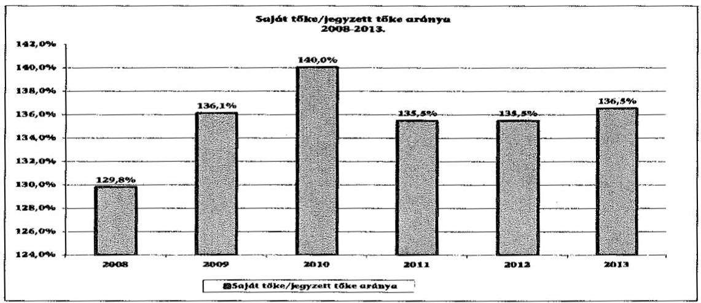

A FŐTÁV Zrt. saját tőke/jegyzett tőke aránya a 2008-2010. években 10,2 százalékponttal növekedett, mert a mérleg szerinti eredményből eredménytartalékot képeztek, majd a 2011-2013. években csökkent, mert osztalékot fizettek.

Az értékesítés nettó árbevétele a 2008. évi 56 130,2 M Ft-ról a 2013. évre 47 142,3 M Ft-ra, 16,0\%-kal csökkent. Az értékesítés nettó árbevétele az előző évhez képest a 2009. évben, a 2012. és a 2013. években csökkent, a 2010. évben és a 2011. évben növekedett.

A 2009. évi csökkenést a február 1-jétől elrendelt 5,0\%-os alapdíj és 3,5\%-os hődíj csökkentés okozta. A hődíj árát a 2009. év szeptemberében és októberében a gázárak csökkentése miatt mérsékelték. Emellett az ÖKOPlusz program keretében a felhasználók számára az alapdíjból 2008. január 1-jéig visszamenőleg 10\% kedvezményt adott a társaság. A 2013. évi árbevétel visszaesés fő oka a lakossági távhőszolgáltatási díjakat érintő rezsicsökkentés ${ }^{22}$, valamint a lakossági fogyasztóknak nyújtott 10% alapdíjkedvezmény volt.

[^0]
[^0]:    ${ }^{22}$ Az 50/2011. (IX. 30.) NFM rendelet 2012. január 1-jétől 10\%-kal, a 64/2013. (X. 30.) NFM rendelet 2013. november 1-jétől további 11,1\%-kal csökkentette a lakossági távhőszolgáltatási díjakat.

---

A FŐTÁV Zrt. mérleg szerinti eredménye a 2008. évben 1188,3 M Ft, a 2009. évben 1788,4 M Ft, a 2010. évben 1225,2 M Ft, valamint a 2013. évben 290,1 M Ft volt. A 2011. és a 2012. évben sem nyeresége, sem vesztesége nem volt, az adózott eredmény osztalékként kifizetésre került.

A MEKH a 2012. évre vonatkozó nyereségkorlát ellenőrzése során megállapította, hogy a FŐTÁV Zrt. távhőszolgáltatási tevékenysége vonatkozásában a figyelembe vett könyv szerinti bruttó eszközérték ( $77960,1 \mathrm{M}$ Ft) 2\%-át, vagyis 1559,2 M Ft összegű nyereségkorlátot ${ }^{23}$ 2660,1 M Ft-tal meghaladta. A FŐTÁV Zrt. kérelmet nyújtott be a MEKH részére, hogy az 50/2011. (IX. 30.) NFM rendelet 5. § (5) bekezdésében foglaltak alapján mentesítse a nyereségkorláton felül elért nyereség visszafizetési kötelezettsége alól. A MEKH az 1608/2013. számú határozatával mentesítette a FŐTÁV Zrt.-t a visszafizetés alól azzal, hogy a kérelemben feltüntetett beruházások teljesítése és aktiválása legkésőbb 2014. december 31-éig megtörténik. A társaság a visszafizetési kötelezettség miatt a 2012. évben 2660,1 M Ft, a 2013. évben 1820,0 M Ft összegben céltartalékot képzett.

A FŐTÁV Zrt. minden évben elszámolt, illetve a feltételek fennállása esetén visszaírt értékvesztést a követelések után a társaság számviteli politikája ${ }_{1,2,3}$, illetve értékelési szabályzata ${ }_{1,2,3}$ alapján.

A FŐTÁV Zrt. üzleti jelentései a 2008-2013. években tartalmazták a távhőszolgáltatás kintlévőségeinek alakulását, melynek összege a 2008. évi 7595,7 M Ft-ról a 2013. évre 7771,3 M Ft-ra, 2,3\%-kal nőtt. A DHK Zrt.-nek értékesített lakossági tartozás összege 3395,0 M Ft-ról 4305,6 M Ft-ra, 26,8\%-kal nővekedett.

A FŐTÁV Zrt.-nél a követelések kezelését a számviteli politika ${ }_{1,2,3}$ és az értékelési szabályzat ${ }_{1,2,3}$, 2010. március 1-jétől a követeléskezelési szabályzat ${ }_{1,2}$ határozták meg. A követeléskezelési szabályzat ${ }_{1,2}$-ban rendelkeztek a vevőkövetelések nyilvántartásáról, kezeléséről, a beszedés módjának meghatározásáról. A FŐTÁV Zrt. a lakossági lejárt követeléseket 2008. június 1-je előtt 180 nap, azt követően 120 nap elteltével a DHK Zrt. részére értékesítette.

Az értékesítés részleteit a DHK Zrt.-vel kötött engedményezési keretszerződésben határozták meg. A fennálló lakossági követeléseiket 2008. január 1-jétől június 1-jéig 40\%-os, azt követően 60\%-os értéken engedményezték a DHK Zrt. részére.

A közületi fogyasztók esetében nem történt engedményezés, a hátralékot saját szervezeti keretein belül hajtotta be a FŐTÁV Zrt. Az ismételt számlaértesítő megküldését követően, 90 nap elteltével a FŐTÁV Zrt. Jogi Főosztálya vette át a követelések kezelését.

Ismételt felszólítást követően közjegyző bevonásával fizetési meghagyást küldtek, majd szükség esetén bírósági behajtást kezdeményeztek.

A Tsz. 3. § w) pontjában 2011. április 15-étől meghatározott külön kezelt intézményi körben a rendszeresen megküldött fizetési felszólítások mellett elsősorban tárgyalásos eljárással próbálták érvényesíteni jogos követeléseiket.

[^0]
[^0]:    ${ }^{23}$ 50/2011. (IX. 30.) NFM rendelet 5. § (2) bekezdés c) pontja

---

A FŐTÁV Zrt. 2008-2013. közötti korosított követeléseinek adatait az alábbi táblázat tartalmazza:

| Lakossági követelések |  |  |  |  |  |  | adatok M Ft-ban |  |
| :--: | :--: | :--: | :--: | :--: | :--: | :--: | :--: | :--: |
| Év | Határidőn |  |  | Határidőn túli |  |  | Mindösszesen |  |
|  | belüli | 1-30 | 31-90 | 91-120 | 121-360 | 360-on túl |  |  |  |
| 2008 | 5032,5 | 262,5 | 81,8 | 3,7 | -9 | -23,9 | 315,1 | 5347,6 |
| 2009 | 3587,7 | 105,7 | 75,9 | 9,5 | 0,8 | -5,2 | 186,6 | 3774,3 |
| 2010 | 3489,7 | 258,4 | 50,7 | 2,1 | -22,3 | -3,2 | 285,7 | 3775,4 |
| 2011 | 4675,5 | 200,9 | 44,7 | -0,4 | -4,7 | -25,3 | 215,4 | 4890,9 |
| 2012 | 9756,2 | 209,7 | 26,5 | -10,4 | -13,2 | -18 | 194,7 | 9950,9 |
| 2013 | 4617,2 | 129,3 | 43,5 | -9,7 | -20,6 | -28,3 | 114,3 | 4731,5 |

A negatív értékek a követelés kiegyenlítését követően fennálló túllizetéseket mutatják.
A FŐTÁV Zrt. 2013. évi 120 napon túli követelésállománya a 2008. évhez viszonyítva 16,1\%-kal nőtt, viszont a 2012. évhez képest - részben a rezsicsökkentés hatására - 21,8\%-kal csökkent.

A FŐTÁV Zrt. minden évben elszámolt, illetve a feltételek fennállása esetén visszaírt a követelések után értékvesztést a társaság számviteli politikája ${ }_{1,2,3}$, illetve értékelési szabályzata ${ }_{1,2,3}$ alapján.

| Közületi követelések |  |  | adatok M Ft-ban |  |  |  |  |  |
| :-- | --: | --: | --: | --: | --: | --: | --: | :--: |
| Év | Határidőn |  |  | Határidőn túli |  |  | Mindösszesen |  |
|  | belüli | 1-30 | 31-90 | 91-120 | 121-360 | 360-on túl |  |  |  |
| 2008 | 1645,6 | 51,8 | 47,8 | 12,5 | 216,6 | 273,9 | 602,5 | 2248,1 |
| 2009 | 1347,2 | 95,5 | 51 | 19,7 | 260,3 | 337,5 | 764 | 2111,2 |
| 2010 | 1360,1 | 114,5 | 59,8 | 8,6 | 173,3 | 418 | 774,2 | 2134,4 |
| 2011 | 1614,6 | 104,7 | 56,4 | 56,1 | 194,4 | 390,4 | 802,1 | 2416,7 |
| 2012 | 3594,3 | 72,3 | 45,5 | 26,3 | 264,1 | 446,3 | 854,6 | 4448,9 |
| 2013 | 2308,3 | 122,5 | 15,4 | 13,7 | 149 | 430,9 | 731,6 | 3039,9 |

A FŐTÁV Zrt. 2008-2013. között követelésekre elszámolt értékvesztésének adatait az alábbi táblázat mutatja be:

A FŐTÁV Zrt. követelései értékvesztésének alakulása 2008-2013. között

|  |  |  |  |  |  | adatok M Ft-ban |  |
| :-- | --: | --: | --: | --: | --: | --: | --: |
| Megnevezés | 2008. | 2009. | 2010. | 2011. | 2012. | 2013. |  |
| Követelések értékvesztése | 22,1 | 386,5 | 193,6 | 452,8 | 79,2 | - |  |
| Követelések értékvesztés | 232,1 | 46,7 | 170,6 | 196,4 | 258,7 | 340,4 |  |
| visszaírása | -210,0 | 339,8 | 23,0 | 256,4 | -179,5 | -340,4 |  |
| Változás |  |  |  |  |  |  |  |

Forrás: FŐTÁV Zrt. 2008-2013. évi beszámolói

# 2.3. A beszámolási kötelezettség teljesítése 

A FŐTÁV Zrt. Alapító Okiratában rögzítették az éves számviteli beszámoló és üzleti jelentés részvényes elé terjesztését. A társaságnak negyedévente jelentéskészítési kötelezettsége volt az ügyvezetésről, a vagyoni helyzetről, az üzleti terv időarányos teljesítéséről a részvényes felé.

---

A BVK HOLDING Zrt. szabályozta a holding és a tagvállalatainak kontrolling rendszerét és elkészítette az egységes kontrolling kézikönyvet, ${ }^{24}$ amely meghatározta a FŐTÁV Zrt. részére az éves üzleti terv, az évközi adatszolgáltatások és a pénzügyi előrejelzések adattartalmának, az üzleti terv várható teljesítéséről készített beszámolók elkészítési folyamatát és a vezetői információnyújtás rendjét.

A kontrolling kézikönyv szerint a FŐTÁV Zrt.-nek havi, negyedéves, féléves és éves beszámolókat kellett átadni a BVK HOLDING Zrt. részére. A havi jelentések tartalmazták a főkönyvi adatokat, a tevékenység és objektumszintű eredménykimutatást, a likviditási riportot, a havi naturáliákat és a mutatókat, illetve a szöveges beszámolót. A negyedéves jelentésekben a beruházásokat, a korosított követeléseket, a kötelezettségeket, a HR beszámolót, a marketing PR beszámolót, a tagvállalatok közötti átadásokat mutatták be. Féléves riport készült a vagyongazdálkodási költségekről és a közbeszerzésekről. Éves beszámolóban a vagyongazdálkodási alapadatokat és a hasznosítási adatokat, valamint az éves naturáliákat és mutatókat szerepeltették.

A FŐTÁV Zrt. határidőben, illetve az előírt adattartalommal tett eleget az Alapító Okiratban, valamint a BVK HOLDING Zrt. kontrolling kézikönyvében meghatározott adatszolgáltatási kötelezettségének.

A FŐTÁV Zrt. a Számv. tv. előírásainak megfelelően elkészítette az éves beszámolóját és üzleti jelentését, a 2008-2010. években konszolidált beszámolóját és üzleti jelentését. ${ }^{25}$ Az éves számviteli beszámolókat a Gt.-ben előírtaknak megfelelően az FB írásbeli jelentésének birtokában és a könyvvizsgáló írásbeli véleményének ismeretében a 2008. és a 2009. évben a Gazdasági
 Bizottság, a 2010. évben a Közgyűlés, a 2011. és 2012. évben a BVK HOLDING Zrt. Igazgatósága megtárgyalta és az előírt határidőig jóváhagyta. ${ }^{26}$ A könyvvizsgáló részt vett a FŐTÁV Zrt. éves számviteli beszámolóját tárgyaló üléseken a Gt. tv. 44. § (1) bekezdés előírásának megfelelően. Az éves számviteli beszámoló letétbe helyezését az ellenőrzött időszak minden évében a Számv. tv. 153. § (1) bekezdésében előírt határidőben teljesítették, valamint a Számv. tv. 154. § (1) bekezdésében előírt közzétételi kötelezettségüknek eleget tettek.

A könyvvizsgáló az ellenőrzött időszak minden évében minősítés nélküli, hitelesítő záradékkal látta el a FŐTÁV Zrt. éves számviteli beszámolóját. A 2012. és a 2013. évi beszámolóról készült könyvvizsgálói jelentés tartalmazta a Tszt. 18/B. § (1) bekezdésében előírt igazolást, amely szerint a vállalkozás által kidolgozott és alkalmazott számviteli szétválasztási szabályok, valamint az egyes tevékenységek közötti tranzakciók árazása biztosították a vállalkozás tevékenységei közötti keresztfinanszírozás-mentességet.

[^0]
[^0]:    ${ }^{24}$ A BVK HOLDING Zrt. Igazgatósága a 39/2012. (II.22.) határozatával elfogadta, hatályos 2012. február 25-étől.
    ${ }^{25}$ A FŐTÁV Zrt. a 2011. évtől a Számv. tv. 116. §-a alapján mentességet kapott a konszolidált beszámoló és üzleti jelentés készítése alól.
    ${ }^{26}$ Gazdasági Bizottság 260/2009. (V. 26.) és 240/2010. (V. 25.) számú határozata, Fővárosi Közgyűlés 1396/2011. (V. 25.) számú határozata, BVK HOLDING Zrt. Igazgatóságának 112/2012. (IV. 18.) és 164/2012. (V. 10.), 79/2013. (IV. 11.), 54/2014. (IV. 10.) számú határozata.

---

Az ellenőrzött időszakban a könyvvizsgáló és az FB sem kezdeményezte a FŐTÁV Zrt.-nél az Igazgatóság összehívását, illetve 2010. októberétől a vezérigazgató tájékoztatását, mivel a társaság vagyona nem csökkent és az ügyvezetés tevékenysége jogszabályba, társasági szerződésbe, illetve a gazdasági társaság legfőbb szervének határozataiba nem ütközött, emellett nem sértette a gazdasági társaság, illetve a tagok érdekeit.

A FŐTÁV Zrt.-nél az Info tv.-ben foglalt előírásokkal összhangban, az adatvédelmi szabályzat ${ }_{1,2}$-ban, illetve a közérdekű adatok megismerése teljesítésének rendjéről szóló szabályzatban foglaltaknak megfelelően biztosították a különböző nyilvántartásokban elektronikusan kezelt adatállományok információ biztonsági védelmét. A FŐTÁV Zrt. a közzétételre vonatkozó kötelezettségeiről megalkotta az adatszolgáltatási szabályzat ${ }_{1,2}$-t. A FŐTÁV Zrt. honlapján ${ }^{27}$ megtalálhatók voltak a közérdekű adatok között a szervezetére, a tevékenységére és a gazdálkodására vonatkozó adatok.

# 3. A TÁVHŐSZOLGÁLTATÁS KÖZFELADATA BEVÉTELEI ÉS RÁFORDÍTÁSAI ELSZÁMOLÁSÁNAK ÉS ÖNKÖLTSÉG-SZÁMÍTÁSÁNAK SZABÁLYSZERŰSÉGE 

### 3.1. A távhőszolgáltatás közfeladat bevételeinek és ráfordításainak szabályszerűsége

A FŐTÁV Zrt. nyilvántartásai megfelelően biztosították a bevételek, a költségek és a ráfordítások közfeladat ellátással kapcsolatos elkülönítését. A főkönyvi nyilvántartást a Tszt. 18/A. § (2)-(3) bekezdései előírásainak megfelelő részletezettséggel alakították ki.

A FŐTÁV Zrt. alaptevékenysége a 2008-2013. években a távhőszolgáltatás biztosítása volt. Alaptevékenysége mellett kapcsolt üzemi villamosenergia termelést és ingatlanvagyonának hasznosítása céljából ingatlan bérbeadási tevékenységet, valamint az üzemeltetési feladatokkal kapcsolatban felmerült lakossági szolgáltatásokat folytatott.

A Tszt. 18/A. § (2) bekezdésében meghatározott számviteli elkülönítési kötelezettsége a jogszabály 2012. január 1-jei hatályba lépését követően fennállt. A FŐTÁV Zrt. a távhőtermelést több - összesen kilenc, ebből három tömbkazán - telephelyen látta el, emellett egy telephelyen (Rózsakert) kapcsolt üzemi villamosenergia termelést is folytatott. A Tszt. 18/A. § (3) bekezdés a) pontja alapján a kapcsolt villamosenergia-termelés és a távhőtermelés telephelyenkénti számviteli szétválasztási kötelezettségének a 2012-2013. években eleget tett. A távhőszolgáltató tevékenységet kizárólag Budapest területén végezte, ezért a Tszt. 18/A. § (3) bekezdés b) pontjában meghatározott településenkénti szétválasztási kötelezettség nem terhelte. A Tszt. 18/A. § (3) bekezdés c) pontjában meghatározott számviteli elkülönítési kötelezettsége alapján a 2012. évtől az éves számviteli beszámolók kiegészítő mellékletében bemutatta a

[^0]
[^0]:    ${ }^{27}$ http://www.fotav.hu

---

távhőszolgáltatási tevékenység telephelyenkénti mérleg és eredménykimutatását.

A FŐTÁV Zrt. a távhőszolgáltatási közfeladat bevételeinek elszámolása a 2008-2013. években megfelelő volt. A bevételek előírása és kiszámlázása a belső szabályozásnak megfelelően történt. Közfeladatonként elkülönítetten, a megfelelő számlacsoportba számolták el a bevételeket. A tulajdonosi követelményeknek, belső szabályozásnak megfelelő árat alkalmazták a bevételek elszámolásánál.

A FŐTÁV Zrt. a távhőszolgáltatási közfeladat anyagjellegű ráfordításainak elszámolása a 2008-2013. években a jogszabályoknak és a belső előírásoknak megfelelő, azaz szabályszerű volt, mivel a minta ellenőrzésének eredménye alapján 95%-os bizonyossággal a teljes sokaságban a hibás tételek aránya kevesebb volt, mint 10%. Tanácsadással kapcsolatos kiadást a Számv. tv. 160. § (3) bekezdés a) pontjában előírtak ellenére az anyagjellegű ráfordítások között nem megfelelő számlacsoportban számolták el.

A FŐTÁV Zrt. beruházásoknak, felújításoknak az elszámolása a jogszabályoknak és a belső előírásoknak nem megfelelően történt. A Számv. tv. 69. § (1)-(2) bekezdésében előírtakat megsértve tárgyi eszközök leltári bizonylata, valamint a beszerzési szabályzatban előírtak ellenére tárgyi eszköz beszerzést megalapozó szerződés, megrendelés nem állt rendelkezésre.

A FŐTÁV Zrt. amortizációs politikájának elveit a számviteli politika ${ }_{1,2,3}$ tartalmazta. Az immateriális javak és a tárgyi eszközök terv szerinti értékcsökkenési leírási kulcsait a FŐTÁV Zrt. értékelési szabályzat ${ }_{1,2,3}$ tartalmazta. Az alkalmazott kulcsok mértéke az ellenőrzött időszakban jelentősen nem változott.

A kulcsok megállapításánál a Tao tv. 2. számú mellékletében elismert várható élettartamokat vették figyelembe. Az értékelési szabályzat ${ }_{1,2,3}$ a Számv. tv. 52. §-ának megfelelően a műszaki dokumentáció alapján a várható hasznos élettartamot figyelembe véve lehetővé tette az eszközcsoportban meghatározott kulcstól való eltérést. Magasabb várható élettartammal különösen a gőz- és forróvíz vezetékeknél, a hőtermelő berendezéseknél, a hőfogadók és a hőközpontok, valamint a villamosenergia-vezetékek terv szerinti értékcsökkenési leírásának megállapításánál kalkuláltak. 2012. január 1-jétől az említett eszközök esetében a korábban alkalmazott 7 éves hasznos élettartamot 15 évre módosították.

Az éves számviteli beszámolók kiegészítő mellékleteiben részletesen, eszközcsoportok szerinti bontásban mutatták be az elszámolt terv szerinti értékcsökkenés összegeit. A kiegészítő mellékletek tartalmazták az elszámolt terven felüli értékcsökkenésként elszámolt összegeket is, azonban a terven felüli értékcsökkenés, illetve annak visszaírása elszámolásának indokait a Számv. tv. 92. § (2) bekezdésében foglaltak ellenére nem részletezték.

Az ellenőrzött időszakban terven felüli értékcsökkenési leírás elszámolására főként a beruházások eszközcsoportjában került sor a beruházásoknak a Számv. tv. 53. § (1) bekezdésében előírtak alapján megállapított piaci értékelésének következményeként.

---

# 3.2. Az önköltségszámítás szabályszerűsége 

A FŐTÁV Zrt. és a Fővárosi Önkormányzat között a 2008. év januárjától fennálló együttműködési megállapodás rögzítette a 2008. január 1-jétől alkalmazandó induló díjakat és díjmechanizmust.

Az Együttműködési megállapodás 1. függeléke tartalmazta a díjszámítás módját, a hődíj és az alapdíj módosításának képletét. A 2. függelék a lakossági és nem lakossági fogyasztók esetében 2008. január 1-jétől alkalmazott indulódíjait tartalmazta. Az együttműködési megállapodásban rögzítették, hogy az induló díjakat négy évente felülvizsgálják. A lakossági és nem lakossági alap- és hődíj tarifarendszere összetett rendszert alkotott, amely a kialakított távhőszolgáltatási rendszernek megfelelően biztosította a fogyasztási helyek elszámolását (légköbméterben, költségmegosztáson alapuló tarifákkal).

A FŐTÁV Zrt. a távhőszolgáltatás díjait az együttműködési megállapodásnak és a távhődíjrendeletnek megfelelően terjesztette elő a Közgyűlés részére. A Közgyűlés által jóváhagyott díjtételeket (lakossági és nem lakossági alap- és hődíj) a 2008. évben önköltségszámítással, a 2009-2011. évek között a megállapodásban rögzített ársapka alkalmazásával támasztották alá.

Az önköltség telephelyenkénti meghatározásának módját, a tevékenységek elkülönítését és az önköltség pontos meghatározását az egyes tevékenységek vonatkozásában a számviteli nyilvántartás (SAP) biztosította. A távhőtermelés, a kapcsolt üzemi villamosenergia-termelés, a távhőszolgáltatás és az egyéb tevékenységek vonatkozásában a közvetlen költségek elkülönítése és a közvetett költségek indokolt és arányos felosztása biztosított volt.

Az önköltségszámítási szabályzat ${ }_{1,2}$-ban rögzítették az önköltségszámítás megalapozását biztosító nyilvántartás vezetésének elveit. A költségek és a bevételek csoportosítását költséghelyenként biztosították. Az alaptevékenységek közvetlen költségeit a hő- és villamos-energiatermelő egységek, a hőelosztó körzetek, a hővásárlás, valamint a távvezetékek költséghelyeire csoportosították. A felosztandó költségek (általános költségek) csoportosítására szervezeti egységenként kialakított költséghelyeket hoztak létre. A felosztandó költségeket az adott tevékenységre leginkább jellemző mutató alapján (szűkített önköltség, timesheet rendszeren alapuló munkaidő nyilvántartás) osztották fel az elsődleges költséghelyekre.

A távhőszolgáltatás díjainak ármegállapítása, az alapdíj és a hődíj vonatkozásában 2011. április 15-ei hatállyal - a Tszt. 57/D. §-a alapján - önkormányzati hatáskörből miniszteri hatáskörbe került. A lakossági díjtételeket 2011. március 31-ével befagyasztották, ezt követően 2012. január 1-jétől 4,2%-kal megemelték. A 2013. évben két alkalommal (összesen 20%-kal) tovább mérsékelték a lakossági díjszabást. A veszteség kompenzálására a miniszter hatáskörében ártámogatást állapított meg a FŐTÁV Zrt. által az áthatóság részére benyújtott önköltségszámítások alapján. ${ }^{28}$

[^0]
[^0]:    ${ }^{28}$ a távhőszolgáltatási támogatásról szóló 51/2011. (IX. 30.) NFM rendelet

---

A FŐTÁV Zrt. távhőszolgáltatási támogatásának adatai a 2011-2013. évek között az alábbi táblázat szemlélteti:

A FŐTÁV Zrt. távhőszolgáltatást támogatásának alakulása

| Megnevezés | 2011.12.01.-2011.12.31 | 2012.01.01.-2012.10.31 | 2012.11.01-2012.12.31 | 2013.01.01.-2012.10.31 | 2013.11.01.-2013.12.31 |
| :--: | :--: | :--: | :--: | :--: | :--: |
| Lakossági értékedési után járó bejelgő   támogatás H/Gj | 1095,00 | 1068,00 | 1402,00 | 1899,00 | 2195,00 |
| Távhőszolgáltatási támogatás M H | 2741,29 | 12513,70 |  | 16254,96 |  |

A FŐTÁV Zrt. a távhőszolgáltatási támogatásról szóló 51/2011. (IX. 30.) NFM rendelet alapján 2011. október 1-jétől támogatást kapott, amely egyéb bevételként a 2011-2013. években 31511,9 M Ft-tal növelte a tárgyévi üzemi eredményét.

A 2011. évben bevezetett hatósági ármeghatározást követően, a vonatkozó előírásoknak megfelelően, havi rendszerességgel szolgáltattak utókalkuláción alapuló önköltségszámítást a felügyeleti szerv (MEKH) részére. Az ellenőrzött időszakban az alapdíjak és hődíjak alakulását a 3. számú melléklet tartalmazza.

A távhőszolgáltatás díjainak - a Tszt. 57/D. §-a által előírt - hatósági ármegállapítását követően az alkalmazott díjak már nem fedezték a távhő előállításának költségeit. A FŐTÁV Zrt. számára nyújtott (a kötelező villamos energia átvételi rendszer átalakítását és a rezsicsökkentés negatív hatásait kompenzáló) állami támogatás az ellenőrzött időszakban a 2011. és 2013. évek között pótolta a központi ármegállapítás miatti veszteségeket.

# 4. Az ÁSZ KORÁBBI, AZ ÖNKORMÁNYZATOK TÖBBSÉGI TULAJDONÁBAN LÉVŐ GAZDASÁGI TÁRSASÁGOK KÖZFELADAT-ELLÁTÁSÁT, GAZDÁLKODÁSÁT, PÉNZÜGYI HELYZETÉT ÉRINTŐ JAVASLATAIRA TETT INTÉZKEDÉSEK 

Az „Önkormányzatok többségi tulajdonában lévő gazdasági társaságok közfeladatellátásának ellenőrzéséről a Fővárosi Közterület-fenntartó Zrt." 14002 számvevőszéki jelentésben az ÁSZ három szabályszerűségi javaslatot fogalmazott meg a főjegyzőnek. A javaslatok realizálása érdekében a főjegyző a felelősöket és a határidőket tartalmazó intézkedési tervet készített, melynek kiegészítését kérte az ÁSZ elnöke. A kiegészített intézkedési tervet az ÁSZ elnöke már elfogadta. A főjegyző az intézkedési tervet bemutatta a Közgyűlésnek.

A főjegyző intézkedett, hogy a Fővárosi Közterület-fenntartó Zrt.-vel kötött keretszerződésben foglaltakra tekintettel alternatív javaslat (műszaki és pénzügyi tartalom/összeg szempontjából) kerüljön benyújtásra a Közgyűlésnek a 2014. évi közszolgáltatási szerződés jóváhagyása érdekében. A főjegyző intézkedett a 2014. évi közszolgáltatási szerződés összeállítása során a Keretszerződés 2. számú mellékletében előírtak maradéktalan érvényesítése
 és alátámasztottsága érdekében a Fővárosi Közterület-fenntartó Zrt. önköltség-számítási szabályzatában foglaltak alkalmazásáról, valamint biztosította az előző évi díjak utókalkulációjának bemutatását. Részben teljesítették, a közfeladatok ellátása rendszeres helyszíni ellenőrzéséről, valamint a közszolgáltatási beszámoló Fő-

---

polgármesteri Hivatal ellenőrzését követően Közgyűlés elé elfogadásra előterjesztésére vonatkozó javaslatot. A koncepcionális javaslatot 2014. augusztus 31-ére készítették el. A koncepcionális javaslat véglegesítése az önkormányzati választásokat követő városvezetői elvárások ismeretében lehetséges.

A Fővárosi Önkormányzatnál a 2013-ban végzett ÁSZ ellenőrzés során tett három javaslatból kettőt hasznosítottak, egyet részben teljesítettek.

Az utóellenőrzéssel érintett intézkedési terv nem volt összefüggésben a távhőszolgáltatással.

Budapest, 2015. 06. hónap 19. nap

|  |  |
| :-- | :-- |
| Melléklet: | 4 db |
| Függelék: | 2 db |

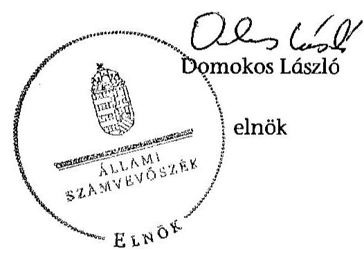

---

.

---

# A Budapesti Távhőszolgáltató Zrt. tevékenységének főbb adatai

|  Sorszám | Megnevezés | 2008. | 2009. | 2010. | 2011. | 2012. | 2013.  |
| --- | --- | --- | --- | --- | --- | --- | --- |
|  1. | A gazdasági társaság székhelye | 1116. Budapest, Kalotaszeg út 31. |  |  |  |  |   |
|  2. | adószáma | 10941362-2-44 |  |  |  |  |   |
|  3. | alapításának éve | 1994. |  |  |  |  |   |
|  4. | A gazdasági társaság többségi tulajdonú leányvállalatainak száma (db) | 3 | 3 | 3 | 3 | 3 | 3  |
|  5. | A gazdasági társaság leányvállalataiban való részesedésének mértéke (\%) | 299 | 299 | 299 | 299 | 299 | 299  |
|  6. | Az önkormányzat számára (megbízásából, koncessziós, közszolgáltatási, vagy egyéb szerződéses jogviszony alapján) ellátott közfeladatok szakági besorolása: |  |  |  |  |  |   |
|  7. | Egészségügy |  |  |  |  |  |   |
|  8. | Kultúra és sport |  |  |  |  |  |   |
|  9. | Település üzemeltetés, ezen belül: |  |  |  |  |  |   |
|  10. | köztemető üzemeltetés |  |  |  |  |  |   |
|  11. | kéményseprés |  |  |  |  |  |   |
|  12. | helyi közutak fejlesztése, fenntartása és üzemeltetése |  |  |  |  |  |   |
|  13. | parkok és egyéb közterület fenntartás |  |  |  |  |  |   |
|  14. | közterületi parkolás |  |  |  |  |  |   |
|  15. | Lakás és helyiséggazdálkodás |  |  |  |  |  |   |
|  16. | Víz és csatorna közmű-szolgáltatás |  |  |  |  |  |   |
|  17. | Hulladékkezelés-szállítás |  |  |  |  |  |   |
|  18. | Távhő- és energiaszolgáltatás | X | X | X | X | X | X  |
|  19. | Helyi közösségi közlekedés |  |  |  |  |  |   |
|  20. | Vagyongazdálkodás |  |  |  |  |  |   |
|  21. | Pénzügyi gazdasági szolgáltatás |  |  |  |  |  |   |
|  22. | Egyéb: éspedig |  |  |  |  |  |   |
|  23. | A közfeladatellátására a gazdasági társaságnál alkalmazottak létszáma (fő) | 833 | 772 | 772 | 766 | 734 | 658  |

---

# A Budapesti Távhőszolgáltató Zrt. működésének főbb jellemzői

|  Sorszám | Megnevezés |  | 2008. | 2009. | 2010. | 2011. | 2012. | 2013.  |
| --- | --- | --- | --- | --- | --- | --- | --- | --- |
|  1. | A gazdasági társaság cégformája |  |  | Zártkörűen Működő Részvénytársaság |  |  |  |   |
|  2. | A gazdasági társaság tulajdonosi összetétele: |  |  |  |  |  |  |   |
|   | Önkormányzat megnevezése: |  |  | Budapest Főváros Önkormányzata |  |  |  |   |
|  3. | Önkormányzat tulajdoni részesedésének arány | $\%$ | 100,0 | 100,0 | 100,0 | 100,0 | 0,0 | 0,0  |
|  4. | Önkormányzat tulajdoni részesedésének összege | ezer Ft | 28359 900,0 | 28359 900,0 | 28359 900,0 | 28359 900,0 | 0,0 | 0,0  |
|   | Más önkormányzatok, többcélú társulás megnevezése: |  |  |  |  |  |  |   |
|  5. | Más önkormányzatok, többcélú társulások tulajdoni részesedésének arány | $\%$ | 0,0 | 0,0 | 0,0 | 0,0 | 0,0 | 0,0  |
|  6. | Más önkormányzatok, többcélú társulások tulajdoni részesedésének összege | ezer Ft | . | 0,0 | 0,0 | 0,0 | 0,0 | 0,0  |
|   | Gazdasági társaság megnevezése: |  |  |  |  |  | BVK HOLDING Zrt. |   |
|  7. | Gazdasági társaságok tulajdoni részesedés arány | $\%$ | 0,0 | 0,0 | 0,0 | 0,0 | 100,0 | 100,0  |
|  8. | Gazdasági társaságok tulajdoni részesedés összege | ezer Ft | 0,0 | 0,0 | 0,0 | 0,0 | 28359 900,0 | 28359 900,0  |
|   | Egyéb tulajdonos megnevezése: |  |  |  |  |  |  |   |
|  9. | Egyéb tulajdonosok tulajdoni részesedés arány | $\%$ | 0,0 | 0,0 | 0,0 | 0,0 | 0,0 | 0,0  |
|  10. | Egyéb tulajdonosok tulajdoni részesedés összege | ezer Ft | 0,0 | 0,0 | 0,0 | 0,0 | 0,0 | 0,0  |
|  12. | A tárgyévben a gazdasági társaság vagyonkezelésben lévő önkormányzati vagyon után elszámolt értékcsökkenés összege (ezer Ft) |  | 0,0 | 0,0 | 0,0 | 0,0 | 0,0 | 0,0  |
|  13. | A tárgyévben az önkormányzati tulajdonú, gazdasági társaság által kezelt eszközök pótlására (karbantartás, felújítás, beruházás) elszámolt kiadás (ezer Ft) |  | 0,0 | 0,0 | 0,0 | 0,0 | 0,0 | 0,0  |
|  14. | A tárgyévben a gazdasági társaság saját vagyona után elszámolt értékcsökkenés összege (ezer Ft) |  | 5544 173,0 | 5095 389,0 | 5775 390,0 | 5548 931,0 | 4016 510,0 | 3841 824,0  |
|  15. | A tárgyévben a saját tulajdonú eszközök pótlására (karbantartás, felújítás, beruházás) elszámolt kiadás (ezer Ft) |  | 4664 769,0 | 11096 266,0 | 6055 416,0 | 5008 281,0 | 3475 254,0 | 3618 482,0  |

---

# A Budapesti Távhőszolgáltató Zrt. által biztosított távfűtés díjainak alakulása 

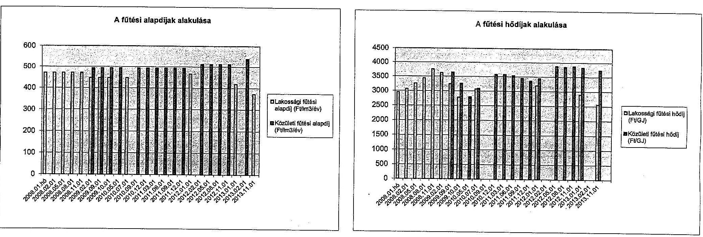

---

.

---

# Beérkezett észrevételek és az azokra adott válaszok

---

.

---

# BUDAPEST

FŐVÁROSI ÖNKORMÁNYZAT FŐPOLGÁRMESTERE

| 106. 10601 | $70 / 302-7 / 2019$ |
| :--: | :--: |
| Tárgy: | V-0731-070/2015. számú |
| vizsgálati jelentés megállapításainak |  |
| észrevételezése |  |

Állami Számvevőszék
Domokos László Elnök úr részére

## Tisztelt Elnök Úr!

Köszönettel megkaptam a fenti iktatószámú, „az önkormányzatok gazdasági társaságai, - az önkormányzatok többségi tulajdonában lévő gazdasági társaságok közfeladat-ellátását érintő gazdálkodási tevékenysége szabályszerűségének ellenőrzése, Budapesti Távhőszolgáltató Zártkörűen Működő Részvénytársaság" (továbbiakban: FŐTÁV) jelentés tervezetét.

Tekintettel arra, hogy a FŐTÁV részére a közvetlen észrevételezési lehetőséget biztosították, kizárólag a Fővárosi Önkormányzat szempontjából teszem meg alábbi, konkrét észrevételeinket, amelyek szíves figyelembevételét kérem.

## > 13. oldal első bekezdés:

a „Fővárosi Önkormányzat közigazgatási területén a távhőszolgáltatási közfeladatot a FŐTÁV Zrt. tevékenységén keresztül biztosítja"

## Ellenvetés:

a megállapítást pontosítani szükséges, mivel a fővárosban a FŐTÁV Zrt.-n kívül még három vállalkozás rendelkezik távhőszolgáltatásra vonatkozó engedéllyel és szolgáltat távhőt, így a Dalkia Energia Zrt., a Csepeli Távhőszolgáltató Kft. és a GM Köérberek 30 Kft.
> 13. oldal hatodik bekezdés, valamint a 21. oldal 2. bekezdés, és a 26. oldal 4. bekezdés: a „FŐTÁV Zrt. a közfeladatot saját vagyonával látta el"
Ellenvetés:
a megállapítást pontosítani, mivel több hőközpontot magában foglaló helyiség, valamint két távhővezeték szakasz a Fővárosi Önkormányzat tulajdonában van, azonban azokat a FŐTÁV Zrt. a távhőszolgáltatás ellátása érdekében igénybe vesz.
> 13. oldal hetedik bekezdés, valamint a 23. oldal második bekezdés:
„a Fővárosi Önkormányzat a FŐTÁV Zrt. közfeladat ellátási tevékenységével kapcsolatban ellenőrzést nem végzett"
Ellenvetés:
A megállapítás téves. A Főpolgármesteri Hivatal Városüzemeltetési Főosztálya (Főjegyző nevében eljárva) részben ügyféli megkeresés, részben pedig hivatalból kezdeményezett ellenőrzéseket végzett, azt vizsgálva, hogy a FŐTÁV Zrt. az

[^0]
[^0]:    1062 Budapest, Városház utca 9-11. | levátulm: 1840 Budapest | talajon: 06-1-327-1023| fax: 06-1-327-1819, e-mail: tarinell@budapest.hu|

---

üzletszabályzatában foglaltak szerint látja-e el a közszolgáltatási tevékenységét. ${ }^{1}$ Az ellenőrzések lezárásakor meghozott határozatokat CD-n mellékeljük.

A Főpolgármesteri Hivatal belső ellenőrzése valóban nem végzett ellenőrzést a FŐTÁV-nál a vizsgált, 2008-2013. évek közötti időszakban. Fontos jelezni azonban, hogy a 2011. évben létrejött Belső Ellenőrzési Osztályunk az államháztartásról szóló 2011. évi CXCV. törvény, valamint a költségvetési szervek kontrollrendszeréről és belső ellenőrzéséről szóló 370/2011. (XII.31.) Korm. rendelet szerint, előzetes kockázatbecslés alapján állítja össze a stratégiai és az éves ellenőrzési terveit. A kockázatelemzések alapján egyik évben sem került a magas kockázatú szervezetek közé. Szempont azonban, hogy egy választási ciklusban, valamennyi társaság legalább egyszer kerüljön ellenőrzésre. Erre tekintettel 2014. évben sor került a FŐTÁV közszolgáltatási tevékenysége szabályszerűségének ellenőrzésére. A jelentés 2014. december 10-én került lezárásra és a FŐTÁV által készített intézkedési terv jóváhagyására, amelynek végrehajtásáról 2015. július 8-án kell a társaságnak beszámolni. Szíves
 tájékoztatására a jelentést mellékelten átadom.

Előzőekre tekintettel, valamint arra, hogy az említett belső ellenőrzési vizsgálat indítására (2014. július 16. - 2014. augusztus 15. között történt a helyszíni vizsgálat) már az Önök ellenőrzését megelőzően sor került, célszerű e tényt a végleges jelentésben szerepeltetni, a egyben a Főjegyzőnek címzett javaslatot törölni.

Kérem, T. Elnök Urat, hogy a végleges jelentésének kialakítása során észrevételeinkben foglaltakat figyelembe venni szíveskedjen.

Intézkedését és segítőkész munkájukat megköszönöm.

Budapest, 2015. április „ „

Tisztelettel:
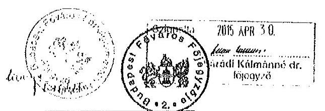

Tarlós István

[^0]
[^0]:    ${ }^{1}$ A távbőszolgáltatásról szóló 2005. évi XVIII. törvény 7. § (1) A területileg illetékes települési önkormányzat jegyzője, a táváruskan a távárusi önkormányzat főjegyzője (a továbbiakban: önkormányzat jegyzője):[...] a) ellenőrzi a távbőszolgáltató tevékenységét az üzletszabályzatában foglaltak betartása szempontjából;

---

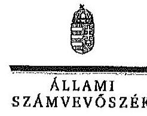

ELMOK

Ikt.szám: V-0731-093/2015

Tarlós István úr
főpolgármester
Budapest Főváros Önkormányzata

Budapest

Tisztelt Főpolgármester Úr!

Köszönettel vettem a Budapesti Távhőszolgáltató Zrt. ellenőrzéséről készített számvevőszéki jelentéstervezetre tett észrevételeit.

Az Állami Számvevőszék észrevételekre vonatkozó álláspontjáról a felügyeleti vezető által készített részletes tájékoztatásban kap választ, amelyet levelemhez mellékeltem.

Tájékoztatom Főpolgármester urat, hogy a számvevőszéki jelentés véglegesítése az elfogadott észrevételek figyelembevételével történik.

Budapest, 2015. 06. hó 04. nap

Tisztelettel:

Domokos László

Melléklet: Tájékoztatás az észrevételek kezeléséről

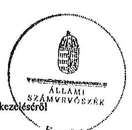

1052 BUDAPEST, AFÁGZAI CSERE JÁNOS MICA 10. 1364 Budapest 4. Pl. 54 telefon: 484 9101 fax: 484 9201

---

# Tájékoztatás az észrevételek kezeléséről 

A Budapesti Távhőszolgáltató Zrt. ellenőrzéséről készített jelentéstervezetre Főpolgármester úr észrevételeit megköszönöm. Az észrevételek a jelentéstervezet három megállapítását vitatják.

1. Észrevétele a jelentéstervezet összefoglaló megállapításainak 13. oldal 1. bekezdés első mondatát érinti.

Észrevételét elfogadom. A jelentés szövegét az alábbiak szerint pontosítjuk.
„Budapest Főváros Önkormányzata közigazgatási területén a távhő-szolgáltatás közfeladatát főként a FŐTÁV Zrt. tevékenységén keresztül látta el, melynek 2008. januártól 2011. júniusig egyedül tulajdonosa volt."
2. Észrevétele a jelentéstervezet összefoglaló megállapításainak 13. oldal 6. bekezdését, valamint a 21. oldal 2. bekezdését és a 26. oldal 4. bekezdését érinti.

Észrevételét elfogadom. A jelentés szövegét az alábbiak szerint pontosítjuk.
13. oldal 6. bekezdés
„A FŐTÁV Zrt. a közfeladatot főként saját vagyonával látta el. Üzemeltetésre, illetve vagyonkezelésbe vett eszközökkel az ellenőrzött időszakban nem rendelkezett, de a feladat ellátásához az önkormányzat tulajdonában álló eszközöket is igénybe vett."
21. oldal 2. bekezdés
„A FŐTÁV Zrt. a közfeladat ellátását főként saját vagyonával végezte. Üzemeltetésre, illetve vagyonkezelésbe vett eszközökkel az ellenőrzött időszakban nem rendelkezett, de a feladat ellátásához az önkormányzat tulajdonában álló eszközöket is igénybe vett."

A 26. oldal 4. bekezdése észrevételével nem összeegyezhetetlen, ezért módosítása nem indokolt.
„A FŐTÁV Zrt. nem rendelkezett a Fővárosi Önkormányzattól átvett vagyonnal az ellenőrzött időszakban."
3. Észrevétele a jelentéstervezet összefoglaló megállapításainak 13. oldal 7. bekezdését, valamint a 23. oldal 2. bekezdését érinti.

Észrevétele alapján a jelentéstervezet 13. oldalának 7. bekezdését az alábbiak szerint módosítom:

---

A Fővárosi Önkormányzat belső ellenőrzése a távhőszolgáltatás, mint közfeladat ellátás szabályszerű teljesítéséhez, az önkormányzati vagyon megóvásához nem járult hozzá, mert az ellenőrzött időszakban a FŐTÁV Zrt. közfeladat-ellátási tevékenységének szabályszerűségével kapcsolatban az ellenőrzési időszakban nem, de 2014-ben egy ellenőrzést nem végzett.

Észrevétele alapján a jelentéstervezet 23. oldalának 2. bekezdését az alábbiak szerint módosítom:
A Fővárosi Önkormányzat belső ellenőrzése az Ötv. 92. § (11) bekezdés b) pontjában foglaltak ellenére ellenőrzést nem végzett a távhőszolgáltatási közfeladat-ellátás szabályszerű teljesítése, az önkormányzati vagyon megóvása érdekében a FŐTÁV Zrt. közfeladat-ellátási tevékenységének szabályszerűségével kapcsolatban az ellenőrzési időszakban nem, de 2014-ben a Főpolgármesteri Hivatal Belső Ellenőrzési Osztálya egy ellenőrzést végzett, ezáltal az Önkormányzat belső ellenőrzése a távhőszolgáltatás, mint közfeladat ellátás szabályszerű működésének elősegítéséhez az önkormányzati vagyon megóvásához nem járult hozzá.

Észrevétele alapján Budapest Főváros Önkormányzata Főjegyzőjének említett intézkedést igénylő megállapítást és javaslatot töröltem:
„Javaslataink célja az önkormányzat szabályszerű működésének elősegítése, továbbá az önkormányzati tulajdonosi joggyakorlás kontrolljainak erősítése.

# Javasoljuk Budapest Főváros Önkormányzata Főjegyzőjének: 

1. A Fővárosi Önkormányzat belső ellenőrzése az Ötv. 92. § (11) bekezdés b) pontjában foglaltak ellenére ellenőrzést nem végzett a FŐTÁV Zrt. közfeladat-ellátási tevékenységének szabályszerűségével kapcsolatban, ezáltal az Önkormányzat belső ellenőrzése a távhőszolgáltatás, mint közfeladat-ellátás szabályszerű működésének elősegítéséhez az önkormányzati vagyon megóvásához nem járult hozzá.

## Javaslat:

Intézkedjen a jogszabályi előírások szerinti gyakorisággal és a szabályos működés biztosítására, ezen belül:
fordítson kiemelt figyelmet arra, hogy az Önkormányzat belső ellenőrzése a távhőszolgáltatás, mint közfeladat-ellátás szabályszerű teljesítéséhez, valamint az önkormányzati vagyon megóvásához ellenőrzéseivel járuljon hozzá:"

Budapest, 2015. június " 20 ".
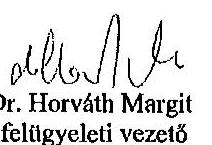

---

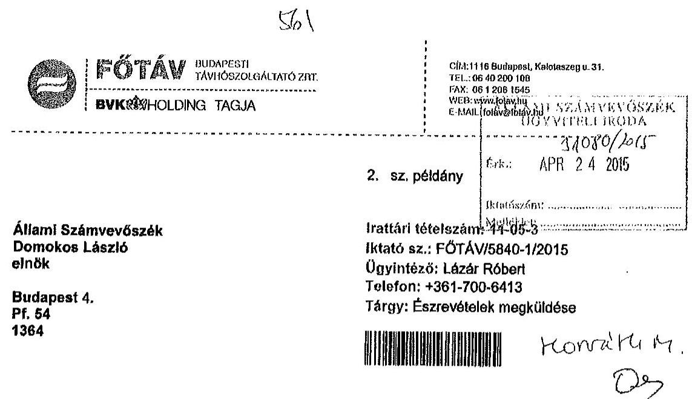

Tisztelt Elnök Úr!

Hivatkozva 2015. április 8-án kelt, V-0731-069/2015. iktatószámú levelére a Budapesti Távhőszolgáltató Zrt. ellenőrzéséről készült számvevőszéki jelentéstervezetről az Állami Számvevőszékről szóló 2011. évi LXVI. törvény 29. § (2) bekezdése szerint az alábbi két észrevételt teszem.

1. A jelentéstervezet a 14. és 25. oldalain megállapítja, hogy a Számviteli törvény 14. § (11) bekezdése szerinti, 2012. január 1-jei hatállyal történő változását a leltározási szabályzatában a FŐTÁV Zrt. az előírtak szerint nem vezette át 90 napon belül.

E megállapítással egyetértve tájékoztatom, hogy a szabályozás aktualizálása 2012.07.01-től - vagyis 90 napos késéssel - megtörtént. A Számviteli törvény 14. § (11) bekezdése szerint módosított leltározási szabályzat 2012.07.01-től hatályba lépett.
2. A jelentéstervezet 14. és 25. oldalain megállapítja, hogy a FŐTÁV Zrt. pénzkezelési szabályzatának 2013. április 1-től hatályos módosításában a Számviteli törvény 14. § (8) bekezdésében foglaltak ellenére nem írták elő a napi készpénz záró állományának maximális mértékét. A jelentéstervezet 16. oldalán a FŐTÁV Zrt. vezérigazgatójának címezve azt javasolja, hogy gondoskodjon a napi készpénz záró állományának maximális mértékének meghatározásáról a FŐTÁV Zrt. pénzkezelési szabályzatában a Számviteli törvényben foglaltaknak megfelelően.

A jelentéstervezet 14. és 25. oldalain szereplő, a pénzkezelési szabályzattal kapcsolatos megállapításaival összefüggésben tájékoztatom, hogy a 2013. április
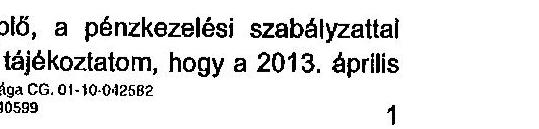

---

1-től hatályos számviteli törvény változására a szabályozás aktualizálása 2013.09.16.-tól megtörtént. A FŐTÁV Zrt. pénzkezelési szabályzatának 12. kiadásába - amely 2013.09.16-tól hatályos - a következők épültek be:
„9.1.1. Készpénzfelvétel bankból
A központi pénztárban a napi pénztárzárás után tartható készpénz, utalványok és egyéb értékcikkek összegének felső határát a Társaság Gazdasági igazgatója határozza meg, összege a biztosított összeget, azaz a 10.000.000,- Ft-ot (Tízmillió forintot) nem haladhatja meg, ezen belül a készpénz összege az 5.000.000,- Ft-ot (Ötmillió forintot) nem haladhatja meg."
Íly módon a hiányosság a napi készpénz záró állomány maximális mértékének meghatározásában 2013.09.16.-tól társaságunknál már megszüntetésre került.

A fentiek alapján megfontolásra javasoljuk, hogy a jelentéstervezet 16. oldalán a FŐTÁV Zrt. vezérigazgatójának címzett javaslat a következők szerint módosuljon:
„Javaslat:
Intézkedjen a szabályozási hiányosságok megszüntetésére, ennek keretében:
gondoskodjon, hogy a FŐTÁV Zrt. belső szabályzatában a jogszabályi változások az előírt határidőre kerüljenek átvezetésre."

Kérem fenti észrevételeim és javaslatom szíves figyelembe vételét.

Budapest, 2015. április 23.

Tisztelettel:

Készül: 2 eredeti pótlányban
Egy pótlány: 2 lap
Kapják: 1. sz. pótlány:...
1 elektronikus pótlány: Elektronikus kolkezelő rendszer
2. sz. pótlány: Címzett

---

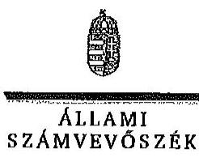

ELHÖK

Ikt.szám: V-0731-104/2015

Dr. Mitnyan György úr
vezérigazgató
Budapesti Távhőszolgáltató Zrt.

Budapest

Tisztelt Vezérigazgató Úr!

Köszönettel vettem a Budapesti Távhőszolgáltató Zrt. ellenőrzéséről készített számvevőszéki jelentéstervezetre tett észrevételeit.

Az Állami Számvevőszék észrevételekre vonatkozó álláspontjáról a felügyeleti vezető által készített részletes tájékoztatásban kap választ, amelyet levelemhez mellékeltem.

Tájékoztatom Vezérigazgató urat, hogy a számvevőszéki jelentés véglegesítése az elfogadott észrevételek figyelembevételével történik.

Budapest, 2015. 06. hó 04. nap

Tisztelettel:

Domokos László

Melléklet: Tájékoztatás az észrevételek kezeléséről

1102 BUDAPEST, APÁSZON CSISKI JÁNOS UTCA 19. 1204 Budapest 4. Pl. 54 telefon: 484 9101 fax: 484 9291

---

# Tájékoztatás az észrevételek kezeléséről 

A Budapesti Távhőszolgáltató Zrt. ellenőrzéséről készített jelentéstervezetre Vezérigazgató úr észrevételeit megköszönöm. Az észrevételek a jelentéstervezet két megállapítását és egy intézkedést igénylő megállapítását érintik.

1. Észrevétele a jelentéstervezet 14. oldal 2. bekezdését és a 25. oldal 4. bekezdését érinti.

Észrevételét nem tudom figyelembe venni, mivel észrevételében Ön is elismerte, hogy a szabályzat módosítása az előírt 90 napos határidőt 90 nappal meghaladó időponttal történt.
2. Észrevétele a jelentéstervezet összefoglaló megállapításai a 14. oldal 2. bekezdésének 2. mondatát és a 25. oldal 6. bekezdésének 3. mondatát érintik.
Észrevételét elfogadom. A jelentés tervezetéből a pénzkezelési szabályzat hiányosságára irányuló megállapítást módosítottam, mivel a jelzett szabályzat módosított verziója az ellenőrzés során a rendelkezésre bocsátott dokumentumok között szerepelt.

A jelentéstervezet 14. oldalán az alábbi mondat törlésre került:
„A pénzkezelési szabályzat 2013. április 1-jétől hatályos módosításában a Számv. tv.-ben foglaltak ellenére nem írták elő a napi készpénz záró állomány maximális mértékét."
A jelentéstervezet 25. oldal 6. bekezdésének 3. mondatát az alábbi részmondattal egészítem ki: „[...], mely hiányosságot a 2013. szeptember 16-tól hatályos módosításban már pótolták."

Észrevétele egyúttal érinti a Vezérigazgató úrnak címzett intézkedést igénylő megállapítást és az arra alapozott javaslatot, melyeket észrevétele alapján töröltem:
„Javaslataink célja a FŐTÁV Zrt. gazdálkodása szabályszerűségének javítása annak érdekében, hogy a szabályozási környezet megfelelően tudja támogatni az átlátható működést.
Javasoljuk a FŐTÁV Zrt. Vezérigazgatójának:
1. A pénzkezelési szabályzat 2013. április 1-jétől hatályos módosításában a Számv. tv. 14. § (8) bekezdésében foglaltak ellenére nem írták elő a napi készpénz záró állományának maximális mértékét.
Javaslat:
Intézkedjen a szabályozási hiányosságok megszüntetésére, ennek keretében:
gondoskodjon a napi készpénz záró állományának maximális mértékének meghatározásáról a FŐTÁV Zrt. pénzkezelési szabályzatában a Számv. tv.-ben foglaltaknak megfelelően."

Budapest, 2015. június " (N.".
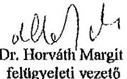

---

.

---

# ÉRTELMEZŐ SZÓTÁR 

cash-pool
garancia
gazdasági társaság
gazdálkodó szervezet
hőkörzet
holding
keresztfinanszírozás tilalma
kezesség
csoportos számlavezetés, integrált likviditáskezelési megoldás, az ügyfélcsoport bankszámláinak összevezetése egy főszámlára, az egyes pool-tagok a főszámla erejéig egymást hitelezik, a bank a főszámla mínuszba menetele esetén nyújt hitelt

A garancia olyan önálló, az önkormányzat nevében vállalt kötelezettség, amely alapján az önkormányzat az önkormányzati költségvetés terhére szerződésben meghatározott feltételek szerint, a kötelezett nem teljesítése esetén a jogosultnak fizetést teljesít az előzetesen rögzített összeghatárig.
Gt. 3. § (1) bekezdése szerint „gazdasági társaságot üzletszerű közös gazdasági tevékenység folytatására külföldi és belföldi természetes és jogi személyek, valamint jogi személyiség nélküli gazdasági társaságok alapíthatnak, működő társaságba tagként beléphetnek, társasági részesedést (részvényt) szerezhetnek."
A Ptk. 685. § c) pontja szerint gazdálkodó szervezet: „az állami vállalat, az egyéb állami gazdálkodó szerv, a szövetkezet, a lakásszövetkezet, az európai szövetkezet, a gazdasági társaság, az európai részvénytársaság, az egyesülés, az európai gazdasági egyesülés, az európai területi együttműködési csoportosulás, az egyes jogi személyek vállalata, a leányvállalat, a vízgazdálkodási társulat, az erdő birtokossági társulat, a végrehajtói iroda, az egyéni cég, továbbá az egyéni vállalkozó."
egységes üzemeltetésű távhőrendszer
A holding olyan gazdasági társaság, amely tartós részesedéssel rendelkezik egy vagy több jogilag önálló társaságban.
A közszolgáltatás díját úgy kell megállapítani, hogy az maradéktalanul fedezetet nyújtson a közszolgáltatás indokolt költségeire és ráfordításaira, valamint a közszolgáltató e tevékenységével kapcsolatos ésszerű nyereségére; az ésszerű nyereség nem tartalmazhatja a közszolgáltatáson kívül eső egyéb gazdasági tevékenységei költségeinek, ráfordításainak fedezetét.
A kezességre vonatkozó előírásokat a Ptk. 272-276. §-ai tartalmazzák. A kezesség a polgári jogban a szerződést biztosító járulékos mellékkötelezettség, amely egy másik kötelem teljesítését biztosítja azáltal, hogy a kezes a főadós nem teljesítése esetére kötelezettséget vállal a főadósi kötelem teljesítésére. A kezes tehát a főadóshoz képest járulékos adós. A kezesség kiterjed az elvállalása utáni mellékszolgáltatásokra, ha a kezes ezek kikötéséről tudott.

---

# 1. SZÁMÚ FÜGGELÉK 

A V-0731-103/2015. SZÁMÚ JELENTÉSHEZ
közfeladat
közszolgáltatás
nemzeti vagyon

A Ptk. szerint kezességet csak írásban lehet vállalni. Lényeges, hogy a kezesség mindig az alapügylet hitelezője és a kezes közötti ingyenes szerződéssel jön létre. A kezesség a különböző hitelfelvételekhez kapcsolódóan a hitel visszafizetésének biztosítékaként jöhet szóba. Az adós helyett nemfizetés esetén a kezes felel, ő tartozik fizetni. Az egyszerű kezesség esetén előbb az adóson kell behajtani a tartozást, s ha ez sikertelen, akkor lehet a kezesől követelni a fizetést. Készfizető kezesség esetében a fizetést elmulasztó adós helyett rögtön a kezesen követelhetik a tartozást. Ha bank vállalja a kezességet, akkor az minden esetben készfizetői kezesség.
Jogszabályban meghatározott állami vagy önkormányzati feladat, amit az arra kötelezett közérdekből, jogszabályban meghatározott követelményeknek és feltételeknek megfelelve végez, ideértve a lakosság közszolgáltatásokkal való ellátását, továbbá az állam nemzetközi szerződésekben vállalt kötelezettségeiből adódó közérdekű feladatokat, valamint e feladatok ellátásához
 szükséges infrastruktúra biztosítását is (Vagyon tv. 3. § (1) bekezdés 7. pont).
A közszolgáltatás: „közcélú, illetőleg közérdekű szolgáltatást jelent, amely egy nagyobb közösség (állam, település) minden tagjára nézve megközelítőleg azonos feltételek mellett vehető igénybe, ezért valamilyen mértékig közösségi megszervezést, illetve szabályozást, ellenőrzést igényel.” Az Ebktv. 3. § d) pontja a következőképpen határozza meg a közszolgáltatást: „szerződéskötési kötelezettség alapján a lakosság alapvető szükségleteinek ellátására irányuló szolgáltatás, így különösen a villamos energia-, gáz-, hő-, víz-, szennyvíz- és hulladékkezelési, köztisztasági, postai és távközlési szolgáltatás, továbbá a menetrend alapján közlekedő járművekkel végzett közforgalmú személyszállítás”
Nvt. 1. § (2) bekezdése szerint:
„az állam vagy a helyi önkormányzat kizárólagos tulajdonában álló dolgok,
az a) pont hatálya alá nem tartozó, állam vagy a helyi önkormányzat tulajdonában lévő dolog,
az állam vagy a helyi önkormányzat tulajdonában lévő pénzügyi eszközök, továbbá az államot vagy a helyi önkormányzatot megillető társasági részesedések,
az államot vagy a helyi önkormányzatot megillető bármely vagyoni értékkel rendelkező jogosultság, amelyet jogszabály vagyoni értékű jogként nevesít,
Magyarország határa által körbezárt terület feletti légtér, az üvegházhatású gázok kibocsátási egységeinek kereskedelméről szóló törvény szerint kibocsátási egység és légiközlekedési kibocsátási egység, valamint az ENSZ Éghajlatváltozási Keretegyezménye és annak Kiotói Jegyzőkönyve végrehajtási keretrendszeréről szóló törvény szerinti kiotói

---

nonprofit gazdasági társaság

ÖKOplusz program
távhő
timesheet munkaidő nyilvántartási rendszer
tulajdonosi joggyakor-
ló
egység,
állami vagy helyi önkormányzati fenntartású közgyűjtemény (muzeális intézmény, levéltár, közgyűjteményként működő kép- és hangarchívum, valamint könyvtár) saját gyűjteményében nyilvántartott kulturális javak körébe tartozó dolog,
a régészeti lelet,
a nemzeti adatvagyon körébe tartozó állami nyilvántartások fokozottabb védelméről szóló törvény szerinti nemzeti adatvagyon.” (hatályos 2012. január 1-jétől, g) pont módosult 2012. június 30-tól)
Gt. 4. § (1) bekezdése szerint „gazdasági társaság nem jövedelemszerzésre irányuló közös gazdasági tevékenység folytatására is alapítható (nonprofit gazdasági társaság). Nonprofit gazdasági társaság bármely társasági formában alapítható és működtethető. A gazdasági társaság nonprofit jellegét a gazdasági társaság cégnevében a társasági forma megjelölésénél fel kell tüntetni.”
A FŐTÁV Zrt. ÖKOplusz programja az ÖKO programhoz kapcsolódva - és annak maximális kihasználása érdekében - komplex megoldást nyújt a fűtéskorszerűsítés végrehajtásához (helyszíni felmérésen alapuló ingyenes ajánlatadás, pályázat összeállítása, finanszírozás biztosítása, tervezés, kivitelezés, utógondozás), továbbá 10%-os mértékű alapdíjkedvezményt biztosít a programban résztvevő lakóközösségek részére.
A távhő az a hőenergia, amelyet a távhőtermelő létesítményből hőhordozó közeg (szinte kizárólag melegített víz) alkalmazásával, a távhővezeték-hálózaton keresztül, közüzemi szolgáltatás keretében jut el a felhasználási helyre, ahol (a lakossági fogyasztók esetében) fűtési célra, vagy használati melegvíz (HMV) előállításhoz használják fel.
A TimeSheet munkaidő nyilvántartó rendszer segítségével nyomon követhető a dolgozók munkaideje. A rendszer az RFID technológiát alkalmazza, minden egyes munkavállaló belépést, illetve kilépését a munkaterületről (legyen az gyár, iroda, üzlethelyiség) a dolgozókhoz rendelt chipek segítségével nyomon követi a rendszer, és adatbázisban tárol. A dolgozók munkaidejéről a SAP-ban elérhető riportok informálják a vezetőket, ezáltal nyomon követhetővé válik a munkára fordított idő, a szüneten töltött idők elemzése.
Aki a nemzeti vagyon felett az államot vagy a helyi önkormányzatot megillető tulajdonosi jogok és kötelezettségek összességének gyakorlására jogosult (Vagyon tv. 3. § (1) bekezdés 17. pont).

---

.

---

2. SZÁMÚ FÜGGELÉK A V-0731-103/2015. SZÁMÚ JELENTÉSHEZ

|  Szz. | Mintavétellel ellenőrzendő területek | Főbb kérdés | Ellenőrzési kérdések | Adatforrások | Alapgaskaság | Mintavételi eljárás  |
| --- | --- | --- | --- | --- | --- | --- |
|   | 1. | 2. | 3. | 4. | 5. | 6.  |
|  1. | Az ellátott közfeladat ráfordításainak elkülönített, szabályszerű elszámolása területén |  |  |  |  |   |
|  2. | Anyagjellegű ráfordítások | Az anyagjellegű ráfordítások elszámolása során betartották-e a belső szabályzatokban és a jogszabályokban foglaltakat és azokat a közfeladat-ellátással kapcsolatosan elkülönítették-e? | - a számákszámít anyagjellegű ráfordításokra kötött szerződés betartották-e az Számv.tv. előírását, a külzetés megelőzően a kötelezettségvállalás megfelelő-e az előírásoknak?
- a beszerzett anyagok nyilvántartásba vétele megtörtént-e, azokat a közfeladat-ellátással kapcsolatosan elkülönítették-e a szabályozásnak megfelelően?
- a között bekerülési értékét a Számv.tv., a számviteli politika, illetve az értékelési szabályzat előírásai szerint vették-e számításba, azokat a közfeladat-ellátással kapcsolatosan elkülönítették-e?
- az anyagjellegű ráfordításokat a megfelelő költségnemre, illetve közfeladatra számolták-e el? | Az anyagjellegű ráfordítások közül az 51-52. főkönyvi számlacsoportokból vett minta esetében
- a költségelszámolást megalapozó dokumentumok (szerződések, megrendelések, stb.), költségelszámoláshoz benyújtott számlák, teljesítés megtörténtét, a külzetést alátámasztó egyéb dokumentumok,
- analitikus nyilvántartások, anyagok nyilvántartásba vételét igazoló dokumentumok, ha a számviteli politika szerint nyilvántartásba kell venni azokat. | Évente a főkönyvi adatbázisból - külön részsokszágot képeznek az 51-52. Anyagjellegű ráfordítások számlacsoportba tartozó ráfordítások, kivéve az ELÁBÉ és az eladott közvetített szolgáltatások értéke. | A mintavétel megelőzően a sokszágból ki kell emelni - tételes ellenőrzésre - évente a 3-5 legnagyobb összegű tétel/mindkét csoportból. Egyszerű véletlen mintavétel évenként és csoportonként elemszámmal arányos rétegezésel. |   |
|  3. | Beruházások, felújítások aktiválása és értékcsökkenési leírás | A feladat ellátásához az önkormányzattól kezelésre átvett közvagyon állományba vételi, nyilvántartási és elszámolási kötelezettségének teljesítése kapcsán a felújítások, beruházások kiadások aktiválása és az értékcsökkenési leírás elszámolása megfelelő-e az előírásoknak? | - a külzetés megelőzően a kötelezettségvállalás megfelelő-e az előírásoknak, továbbá be lett-e kézhez a tulajdonosi jogok gyakorlójának előzetes, írásbeli engedélye - amennyiben előérték az önkormányzati tulajdonban lévő eszközön elszámolt beruházáshoz/felújításhoz?
- a beruházások, felújítások állományba vétele, besorolása, a bekerülési érték meghatározása, az üzembehelyezések (aktiválások) dokumentálása megfelelő-e az Sztv., a számviteli politika, illetve az értékelési szabályzat előírásainak?
- az ellenőrzésre kiválasztott immateriális javak és tárgyi eszközök szerepeltek-e a mérleget alátámasztó bérázban?
- az értékcsökkenés elszámolása a jogszabályban és a számviteli politikában meghatározott szabályozásnak megfelelő-e? | A kiválasztott beruházásra vagy felújításra: szerződések, számlák, a befejezetlen beruházások, felújítások analitikus nyilvántartása, immateriális javak, tárgyi eszközök analitikus nyilvántartása, a beszerzett eszköz üzembehelyezési olománya, állományba vételi bizonylat, egyedi eszközkartonja - az értékcsökkenés elszámolása az egyedi eszközkartonja, illetve analitikus nyilvántartása | Évente a főkönyvi adatbázisból a 11-14. számlacsoportok állományszámváltozási tételét, ehhez kapcsolódóan az értékcsökkenés elszámolásának tételét | A mintavétel megelőzően a sokszágból ki kell emelni - tételes ellenőrzésre - évente a 3-5 legnagyobb összegű tételt. Egyszerű véletlen mintavétel évenként, elemszámmal arányos rétegezésel. Kiválasztott tételek eszközkartonjának tételes ellenőrzése.  |
|  4. | Az ellátott közfeladat bevételeinek elkülönített, szabályszerű elszámolása területén |  |  |  |  |   |
|  5. | Értékesítés nettó árbevétel | Az értékesítés nettó árbevételének beszedése, elszámolása során betartották-e a belső szabályzatokban és a jogszabályokban foglaltakat és azokat a közfeladat-ellátással kapcsolatosan elkülönítették-e? | - a bevétel előírása, kiszámítása a belső szabályozásnak megfelelően történt-e?
- a bevételi előírás és a befolyt bevétel nyilvántartásba vétele (analitikus, főkönyvi) megtörtént-e, azokat a közfeladat-ellátással kapcsolatosan elkülönítették-e?
- a bevételek beszedése, elszámolása során betartották-e a szabályozásban foglaltakat és a megfelelő számlacsoportba számolták el a bevételeket?
- a tulajdonosi követelményeknek, belső szabályozásnak megfelelő árat alkalmazták-e? | A kiválasztott értékesítés nettó árbevétel jogcímen befolyt bevételre:
- az egyes bevételek díjmegállapítása,
- a kibocsátott számla, befolyt bevétel analitikus nyilvántartása, behajtásra tett intézkedések dokumentumai,
- kapcsolódó főkönyvi számla tételes forgalma,
- bevétel beérkezését igazoló bankkivonat(részlet). | Évente a főkönyvi adatbázisból a 91-92, 94. számlacsoportok bevételét | Egyszerű véletlen mintavétel évenként, elemszámmal arányos rétegezésel.  |

