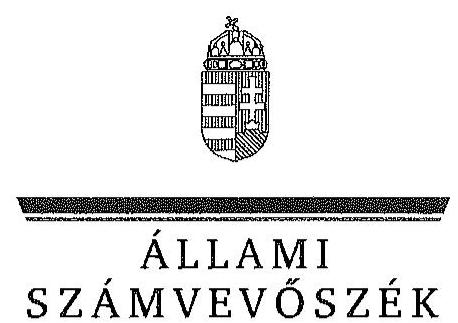
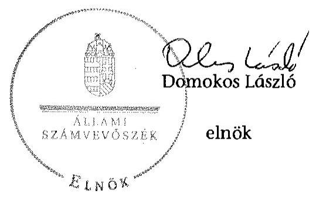
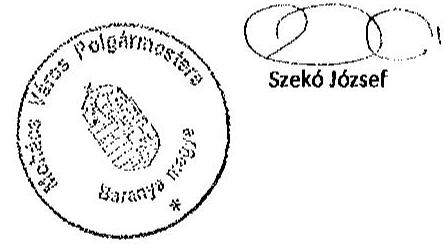
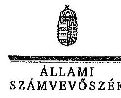
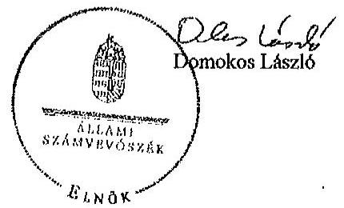

ÁLLAMI
SZÁMVEVŐSZÉK

# JELENTÉS 

Az önkormányzatok gazdasági társaságai - Az önkormányzatok többségi tulajdonában lévő gazdasági társaságok közfeladat ellátását érintő gazdálkodási tevékenysége szabályszerűségének ellenőrzése Mohács-Hő Hőszolgáltató Korlátolt Felelősségű Társaság

---

# Állami Számvevőszék 

Iktatószám: V-0719-071/2015
Témaszám: 1753
Vizsgálat-azonosító szám: V067129

## Az ellenőrzést felügyelte:

Dr. Horváth Margit
felügyeleti vezető
Az ellenőrzést vezette és az ellenőrzés végrehajtásáért felelős:
Valastyánné dr. Vízhányó Júlia
ellenőrzésvezető
A jelentéstervezet összeállításában közreműködött:
Zaroba Szilvia
számvevő tanácsos
Az ellenőrzést végezték:

| Magyaricsné Hajdú | Szabó Balázsné Zsíros | Zaroba Szilvia |
| :-- | :-- | :-- |
| Regina | Andrea | számvevő tanácsos |
| számvevő | számvevő |  |

---

# TARTALOMJEGYZÉK 

BEVEZETÉS ..... 5
I. ÖSSZEGZŐ MEGÁLLAPÍTÁSOK, KÖVETKEZTETÉSEK, JAVASLATOK ..... 8
II. RÉSZLETES MEGÁLLAPÍTÁSOK ..... 14

1. Az Önkormányzat közfeladat-ellátásának szabályszerűsége ..... 14
1.1. A közfeladat-ellátás megszervezése és a feladatellátás feltételrendszerének kialakítása ..... 14
1.2. A közfeladat-ellátás felügyelete és a tulajdonosi jogok érvényesítése ..... 16
2. A Mohács-Hő Kft. közfeladat ellátással kapcsolatos tevékenysége ..... 17
2.1. A Mohács-Hő Kft. gazdálkodásának szabályozottsága ..... 17
2.2. A Mohács-Hő Kft. vagyongazdálkodása ..... 19
2.3. A beszámolási kötelezettség teljesítése ..... 21
3. A távhőszolgáltatás közfeladata bevételei és ráfordításai elszámolásának és önköltségszámításának szabályszerűsége ..... 22
3.1. A távhőszolgáltatás közfeladat bevételeinek és ráfordításainak szabályszerűsége ..... 22
3.2. Az önköltségszámítás szabályszerűsége ..... 23
4. Az ÁSZ korábbi, az önkormányzatok többségi tulajdonában lévő gazdasági társaságok közfeladat-ellátását, gazdálkodását, pénzügyi helyzetét érintő javaslataira tett intézkedések ..... 24
MELLÉKLETEK
5. számú A Mohács-Hő Hőszolgáltató Kft. tevékenységének főbb adatai
6. számú A Mohács-Hő Hőszolgáltató Kft. működésének főbb jellemzői
7. számú A Mohács-Hő Hőszolgáltató Kft. által biztosított távfűtés díjainak alakulása
8. számú Beérkezett észrevételek és az azokra adott válaszok
FÜGGELÉK
9. számú Értelmező szótár
10. számú Mintavételi eljárások ellenőrzési területenként

---

.

---

# RÖVIDÍTÉSEK JEGYZÉKE 

## Törvények

Ámt.
ÁSZ tv.
Gt.
Mötv.

Nvtv.

Ötv.

Számv. tv.
Tszt.

## Rendeletek

50/2011. (IX. 30.) NFM rendelet

51/2011. (IX. 30.) NFM rendelet

SZMSZ $_{1}$

SZMSZ $_{2}$
távhőszolgáltatási rendelet
az árak megállapításáról szóló 1990. évi LXXXVII. törvény (hatályos: 1991. január 1-jétől)
az Állami Számvevőszékről szóló 2011. évi LXVI. törvény (hatályos: 2011. július 1-jétől)
a gazdasági társaságokról szóló 2006. évi IV. törvény (hatálytalan: 2014. március 15-étől)
Magyarország helyi önkormányzatairól szóló 2011. évi CLXXXIX. törvény (hatályos: 2012. január 1-jétől, kivéve a 144. § (2) bekezdésben meghatározott paragrafusok, amelyek 2012. április 15-én, a (3) bekezdésben meghatározott paragrafusok, amelyek 2013. január 1-jén léptek hatályba, a (4) bekezdésben meghatározott paragrafusok a 2014. évi általános önkormányzati választások napján lépnek hatályba)
a nemzeti vagyonról szóló 2011. évi CXCVI. törvény (hatályos: 2011. december 31-étől, kivéve a 20. § (2) bekezdésben meghatározott paragrafusok, amelyek 2012. január 1-jétől, a (3) bekezdésben meghatározott paragrafusok 2013. január 1-jétől, a (4) bekezdésben meghatározott paragrafus 2012. március 2-ától léptek hatályba)
a helyi önkormányzatokról szóló 1990. évi LXV. törvény (hatálytalan: a 2014. évi általános önkormányzati választások napjától)
a számvitelről szóló 2000. évi C. törvény (hatályos: 2001. január 1-jétől)
a távhőszolgáltatásról szóló 2005. évi XVIII. törvény (hatályos: 2005. július 1-jétől)
a távhőszolgáltatónak értékesített távhő árának, valamint a lakossági felhasználónak és a külön kezelt intézménynek nyújtott távhőszolgáltatás díjának megállapításáról (hatályos: 2011. október 1-jétől)
A távhőszolgáltatási támogatásról (hatályos: 2011. október 1-jétől)
Mohács Város Önkormányzatának többször módosított 23/1998. (XI. 20.) számú rendelete az Önkormányzat és szervei Szervezeti és Működési Szabályzatáról (hatályos: 1998. december 1-jétől-2013. június 1-jéig)
Mohácsi Város Önkormányzatának többször módosított 9/2013. (V. 31.) számú rendelete az Önkormányzat Szervezeti és Működési Szabályzatáról (hatályos: 2013. június 1-jétől)
Mohács Város Önkormányzatának 12/2011. (VI. 6.) rendeletével módosított 11/2006. (VI. 6.) számú rendelete a távhőszolgáltatásról (hatályos: 2006. június 6-ától)

---

vagyongazdálkodási rendelet ${ }_{1}$
vagyongazdálkodási rendelet ${ }_{2}$

## Szórövidítések

Alapító Okirat ÁSZ
FB
jegyző
Képviselő-testület
Kormányhivatal Egészségbiztosítási Szakigazgatási Szerve
Kormányhivatal Fogyasztóvédelmi Felügyelősége
MÁK
NAV
Önkormányzat
polgármester
Polgármesteri Hivatal
számviteli politika
számlarend
Üzletszabályzat
vagyongazdálkodási terv

Mohács Város Önkormányzatának 19/1993. (XII.13.) számú rendelete az Önkormányzat vagyonáról és vagyongazdálkodásáról (hatályos: 1993. december 13-ától 2012. október 29-éig)

Mohácsi Önkormányzat 25/2012. (X.29.) számú rendelete az Önkormányzat vagyonáról és vagyongazdálkodásáról (hatályos: 2012. október 29-étől)
a Mohács-Hő Kft. Alapító Okirata és annak módosításai Állami Számvevőszék
a Mohács-Hő Kft. Felügyelőbizottsága
Mohács Város Önkormányzatának jegyzője
Mohács Város Önkormányzatának Képviselő-testülete
Baranya Megyei Kormányhivatal Egészségbiztosítási Szakigazgatási Szerve

Baranya Megyei Kormányhivatal Fogyasztóvédelmi Felügyelőség

Magyar Államkincstár Dél-dunántúli Regionális Igazgatóság Állampénztári Iroda
Nemzeti Adó- és Vámhivatal Baranya Megyei Igazgatósága
Mohács Város Önkormányzata
Mohács Város Önkormányzatának Polgármestere
Mohács Város Önkormányzatának Polgármesteri Hivatala
a Mohács-Hő Kft. számviteli politikája 2006.
a Mohács-Hő Kft. számlarendje 2006.
a Mohács-Hő Kft. Üzletszabályzata 2006.
Mohács Város Önkormányzatának közép- és hosszú távú vagyongazdálkodási terve

---

# JELENTÉS 

## Az önkormányzatok gazdasági társaságai Az önkormányzatok többségi tulajdonában lévő gazdasági társaságok közfeladat ellátását érintő gazdálkodási tevékenysége szabályszerűségének ellenőrzése

Mohács-Hő Hőszolgáltató Kft.

## BEVEZETÉS

Az Állami Számvevőszék középtávra szóló stratégiájában megfogalmazta, hogy a helyi önkormányzatok gazdálkodásában rejlő pénzügyi kockázatok feltárásával, az államháztartáson kívülre nyújtott költségvetési támogatások és ingyenes vagyonjuttatások, valamint az államháztartáson kívül működő köz-feladat-ellátó rendszerek ellenőrzéseivel hozzájárul ahhoz, hogy a közpénzeket az államháztartáson kívül működő szervezetek is átlátható, rendezett módon használják fel a közfeladatok szerződésben vállalt ellátása érdekében.

Az önkormányzatok szervezetalakítási szabadságának következménye, hogy a korábban is vállalati formában működő (nagyvárosi tömegközlekedés, víz-, szennyvízcsatorna, köztisztasági, ingatlankezelés stb.) közszolgáltatások mellett, mind a kötelező, mind az önként vállalt feladatok ellátásában a gazdasági társaságok kiemelt fontosságú szerephez jutottak.

A Mohács-Hő Kft.-t az ellenőrzött időszakot megelőzően az 1992. évben az Önkormányzat hozta létre, jogelődje nem volt. A 2004. január 5-én kelt Alapító Okirat alapján a társaság 100%-os önkormányzati tulajdonban volt. A társaság tulajdonosi szerkezete, illetve a törzsbetét összege az ellenőrzött időszak végéig nem változott.

A Mohács-Hő Kft. alaptevékenysége gőzellátás, légkondicionálás volt. A társaság a 2013. év végén a közel 20 ezer fő lakosságszámú Mohács város közigazgatási területén a 2013. évben 2015 lakást továbbá 35 közintézményt látott el távhővel. Egyéb tevékenységként villamosenergia termelést (kb. 30%) és karbantartási szolgáltatást (kb. 4%) végzett. A Mohács-Hő Kft. az ellenőrzött időszakban 2013. augusztus 14-étől 100%-os tulajdonosi részesedéssel rendelkezett a Bionergy-Duna Kft-ben.

A 2008-2013. években a Mohács-Hő Kft. éves nettó árbevétele 423,4 M Ft és 591,2 M Ft között, az eszközök és források értéke 347,9 M Ft és 1316,5 M Ft között alakult. A társaság mérleg szerinti eredménye - a 2008-2010. évek kivételével, amikor 2,4 M Ft, 19,7 M Ft, illetve 0,7 M Ft nyereség képződött - negatív (-127,7 M Ft, -13,7 M Ft, és -9,7 M Ft) volt.

Az ellenőrzött időszakban a 100%-ban az Önkormányzat tulajdonában lévő Mohács-Hő Kft. törzstőkéje 88,7 M Ft volt.

Az ellenőrzött időszakban a polgármester személye nem változott. A polgármester az 1998. évi önkormányzati választások óta tölti be tisztségét. A helyszíni ellenőrzés időszakában a munkakört betöltő jegyző 2005. április 1-jétől 2012. december 31-éig, majd 2013. április 1-jétől folyamatosan látta el feladatait. 2013. január 1.-2013. március 31. között az aljegyző látta el a jegyzői feladatokat. Az ellenőrzött időszakban az ügyvezető személye egy alkalommal változott. A jelenlegi ügyvezető 2009. július 1-je óta, a gazdasági vezető 2010. február 1-je óta tölti be tisztségét.

Az önkormányzati tulajdonú gazdasági társaságok teljes körű ellenőrzésének lehetőségét az Állami Számvevőszékről szóló 1989. évi XXXVIII. törvény 2011. január 1-jétől hatályos módosítása teremtette meg.

Az ellenőrzés célja annak értékelése volt, hogy

- az önkormányzat a jogszabályi előírások figyelembevételével döntött-e az ellenőrzésre kerülő közfeladat megszervezéséről; az önkormányzat szabályszerűen gyakorolta-e a tulajdonosi jogokat;
- a gazdasági társaság közfeladat-ellátása bevételeinek, ráfordításainak elszámolása, és vagyongazdálkodási tevékenysége megfelelt-e a jogszabályi, illetve a közszolgáltatási szerződésben foglalt tulajdonosi előírásoknak, azok végrehajtása szabályszerű volt-e;
- a közfeladatok átláthatósága és elszámoltathatósága érdekében biztosítva volt-e a közszolgáltatás díjának megalapozottsága szabályszerű önköltségszámítással.

Az ellenőrzés kiterjedt Mohács Város Önkormányzatára és a Mohács-Hő Hőszolgáltató Korlátolt Felelősségű Társaságra.

Az ellenőrzés várható hasznosulása: A törvényalkotás számára - az észlelt problémák, szabálytalanságok, vagy egyéb nem kívánatos jelenségek felszínre kerülésével - az ellenőrzés megállapításai segítséget nyújthatnak az államháztartáson kívüli közfeladat-ellátás értékeléséhez, jogszabályi keretei pontosításához, átláthatóságot biztosító szabályozásához. Meghatározhatóvá válnak a közfeladat ellátásában részt vevő államháztartáson kívüli szervezeteknek - az önkormányzat költségvetését, pénzügyi helyzetét is befolyásoló - kockázatai, lehetővé válik ezen kockázatok csökkentése. Értékelhetővé válik, hogy a feladatot ellátó gazdasági társaság a közszolgáltatási szerződésben foglaltak betartásával, a közvagyon használatával biztosította-e a szolgáltatás folytatásának feltételeit. Ezzel az ellenőrzöttek és a helyi döntéshozók számára visszajelzést ad feladatszervezési, feladat-ellátási kockázataikról, alapot ad a meglévő hibák megszüntetéséhez, a jobb közfeladat-ellátás biztosításához. Fokozza a fegyelmet, igazolja, hogy lejárt a következmények nélküli ellenőrzések időszaka. Az

---

ÁSZ értékteremtő rend kialakításához és megőrzéséhez hozzájáruló tevékenysége pozitív hatással van a szervezetről kialakított összkép formálására is.

A bevételek és ráfordítások elszámolása, valamint a vagyonnyilvántartás terén az egyes területek szabályszerű működését mintavétellel ellenőriztük, ez alapján a sokaságokban előforduló hibás tételek arányát becsültük. A jogszabályoknak és a belső előírásoknak megfelelőnek, azaz szabályszerűnek tekintettük az adott bevételek és ráfordítások elszámolását, a vagyonnyilvántartást, amennyiben a minta ellenőrzésének eredménye alapján 95%-os bizonyossággal a teljes sokaságban a hibás tételek aránya kisebb volt, mint 10%, nem megfelelőnek értékeltük, ha a hibás tételek aránya a 10%-ot meghaladta.

Az ellenőrzést a számvevőszéki ellenőrzés szakmai szabályai szerint, szabályszerűségi ellenőrzés módszerével, a vonatkozó nemzetközi standardok figyelembevételével végeztük. Az ellenőrzés a 2008-2013. évekre terjedt ki.

Az ellenőrzés végrehajtásának jogszabályi alapját az Állami Számvevőszékről szóló 2011. évi LXVI. törvény 5. § (3)-(5) bekezdései képezték. A jelentéstervezetet észrevételezésre megküldtük a társaság ügyvezetőjének és az Önkormányzat polgármesterének. Az érintettek észrevételeit és azok kezelését a jelentés 4. számú melléklete tartalmazza.

Az ÁSZ az Állami Számvevőszékről szóló 2011. évi LXVI. törvény 29. §-a alapján a jelentéstervezetet észrevételezésre megküldte a polgármesternek és a gazdasági társaság vezérigazgatójának. A beérkezett észrevételeket a jelentés véglegesítése során hasznosítottuk. Az észrevételeket és az azokra adott válaszokat a jelentés 4. számú melléklete tartalmazza.

---

# I. ÖSSZEGZŐ MEGÁLLAPÍTÁSOK, KÖVETKEZTETÉSEK, JAVASLATOK 

Mohács Város Önkormányzata az Ötv.-ben előírtak figyelembevételével a távhőszolgáltatás kötelező közfeladat ellátásának gazdasági társaság általi megszervezéséről szabályszerűen döntött. Az ellenőrzött időszakban a 100%-ban az Önkormányzat tulajdonában lévő Mohács-Hő Kft. törzstőkéje 88,7 M Ft volt. A közfeladat-ellátást szolgáló vagyon a Mohács-Hő Kft. saját vagyona volt, vagyonkezelésbe, üzemeltetésre vagyont nem vett át.

Az Önkormányzat az Ötv. előírásainak megfelelő gazdasági programmal nem rendelkezett. Az Önkormányzat a 2007-ben képviselő-testületi határozattal elfogadott „Stratégia Mohács város fejlesztésére" címú dokumentumban kitér többek között az energiaracionalizálásra, a fütési rendszerek átalakítására, a beruházásokon belül a vezetékes gázellátásra, amelyek közvetve érintik a távhőszolgáltatás fejlesztését is.

Az Önkormányzat a távhőszolgáltatásra vonatkozóan a Tszt.-ben foglaltak szerinti rendeletalkotási kötelezettségének eleget tett. Az Önkormányzat 2011. április 15-étől az Ámt.-ben, majd a Tszt.-ben foglaltakat megsértve nem tett eleget rendeletalkotási kötelezettségének a távhőszolgáltatási csatlakozási díj vonatkozásában.

A Gt. és a vagyongazdálkodási rendeletben foglaltaknak megfelelően a Mohács-Hő Kft. feletti tulajdonosi jogokat a 2008-2013. években a Képviselőtestület szabályszerűen gyakorolta.

A Mohács-Hő Kft. évente egy alkalommal, az egyszerűsített éves beszámoló elkészítéséhez kapcsolódóan mutatta be adott évi tevékenységét az Önkormányzatnak. A Gt. előírásai alapján az FB minden évben megtárgyalta és elfogadta a társaság egyszerűsített éves
 beszámolóját. A beszámolók megbízhatóságát független könyvvizsgáló minden évben megállapította. A jelentések nem tartalmaztak figyelemfelhívó megállapításokat. A Képviselő-testület a Gt.-ben előírtaknak megfelelően az FB írásbeli jelentéseinek, valamint a könyvvizsgálói jelentések birtokában határozott az egyszerűsített éves beszámolók jóváhagyásáról. A számviteli beszámolót tárgyaló üléseken a Gt.-ben foglaltak ellenére a könyvvizsgáló nem vett részt.

Az egyszerűsített éves beszámolók letétbe helyezése határidőben megtörtént. A társaság a közzétételre vonatkozó kötelezettségének eleget tett. Az egyszerűsített éves beszámolókat - a Számv. tv.-ben foglalt kötelezettségének eleget téve - a céginformációs szolgálatnak megküldte, valamint internetes honlapján is közzétette. A közérdekű adatok közzétételére vonatkozó kötelezettségét a Tszt. előírásainak megfelelően teljesítette.

Az Önkormányzat belső ellenőrzéseket nem végeztetett a Mohács-Hő Kft.-nél, megbízása alapján a társaságnál külső szakértői ellenőrzésre nem került sor.

---

A 2008-2010. években a Mohács-Hő Kft. nyereségesen gazdálkodott, a Képviselő-testület döntött az adózott eredmény eredménytartalékba helyezéséről. A 2011-2013. években negatív mérleg szerinti eredménnyel zárt a társaság. A társaságnál pótbefizetés elrendelésére nem volt szükség, a saját tőke összege minden évben meghaladta a jegyzett tőke összegét. Az Önkormányzat az ellenőrzött időszakban a Mohács-Hő Kft.-nek működési és felhalmozási célú pénzeszközt nem adott át.

A távhőrendszer energetikai korszerűsítésére a 2011. évben a Mohács-Hő Kft. kereskedelmi banki beruházási hitelt vett fel az Önkormányzat készfizető kezességvállalása mellett. A biomassza fűtőmű létesítésére 15 éves futamidejű, 100,0 M Ft visszatérítendő kölcsönt nyújtott az Önkormányzat a 2013. évben. Ezen kívül az Önkormányzat további 163,0 M Ft rövid lejáratú kölcsönt nyújtott.

A társaság elkészítette gazdálkodással kapcsolatos belső szabályzatait, az ellenőrzött időszak alatt érvényben lévő számviteli politika és számlarend az ellenőrzött időszakot megelőzően, 2006. december 1-jén lépett hatályba. A Számv. tv.-ben foglalt előírás ellenére a szabályzatok szükségszerű aktualizálása nem történt meg, az ellenőrzött időszakban a törvénymódosítások miatti változásokat nem vezették át. A Tszt.-ben 2012. január 1-jétől előírt számviteli szétválasztási szabályokra vonatkozó előírásokat és annak kötelezettségeit belső szabályozásban nem rögzítették. A Mohács-Hő Kft. a Számv. tv. alapján önköltségszámítás rendjére vonatkozó szabályzat készítésére nem volt kötelezett.

A 2008-2013. években a Mohács-Hő Kft. vagyongazdálkodási tevékenysége - beleértve a vagyon kezelését, gyarapítását, hasznosítását - részben felelt meg a jogszabályi előírásoknak és a tulajdonosok által meghatározott követelményeknek. A Mohács-Hő Kft. az ellenőrzött időszak mérlegbeszámolóiban szereplő eszközök és források értékét - a 2008. év kivételével - a Számv. tv. és a leltározási szabályzatban foglaltak alapján szabályszerűen végrehajtott leltározással és dokumentált leltárral támasztotta alá. A társaság a 2008. évi mérleget alátámasztó leltár dokumentumait nem őrizte meg, ezzel nem tett eleget a Számv. tv.-ben foglalt, a bizonylatok megőrzésére vonatkozó előírásoknak.

A társaság az ellenőrzött időszakban a vagyon megóvása érdekében folyamatosan elvégezte a szükséges felújítási, karbantartási munkákat mind a távhővezeték, mind a hőközpontok és az egyéb távhő vagyon esetében. A Mohács-Hő Kft. vagyona 2008. és 2013. december 31-e között közel négyszeresére (347,9 M Ft-ról 1316,5 M Ft-ra) nőtt. A mérleg szerinti eredmény az ellenőrzött időszak első három éve után pozitívról negatívra változott. A társaság 2008. január 1-től 2011. április 14-ig a Képviselő-testület által jóváhagyott díjakat alkalmazta. A díjak megállapítására vonatkozó javaslatokat, amelynek önköltségszámítással történő megalapozására nem volt kötelezett, az ügyvezető igazgató kezdeményezésére - a polgármester terjesztette a Képviselő-testület elé. A társaság a 2010-2011. években nem kezdeményezett díjmódosítást, a 2009. évi árszinten tartotta a hőszolgáltatási díjakat.

---

A lakossági, valamint az intézményi fogyasztóknak nyújtott távhőszolgáltatás ármegállapítása 2011. április 15-ei hatállyal önkormányzati hatáskörből miniszteri hatáskörbe került. A díjak nem fedezték a hő előállításának költségeit. A veszteség kompenzálására a lakossági értékesítés után a nemzeti fejlesztési miniszter ártámogatást állapított meg. A 2013. évi - távhőszolgáltatással kapcsolatos - jogszabályi változások a társaság hőértékesítési árbevételének további csökkenését eredményezték. A rezsicsökkentések végrehajtásáról szóló 2013. évi LIV. törvény alapján a hatósági távhődíjakat 2013. január 1-jétől 10,0%-kal, november 1-jétől újabb 11,1%-kal az előírásoknak megfelelően csökkentették. A Mohács-Hő Kft. számára az 51/2011. (IX. 30.) NFM rendelet alapján juttatott központi támogatás a 2013. évig részben pótolta az 50/2011. (IX. 30.) NFM rendelettel bevezetett központi ármegállapítás miatti veszteségeket.

A 2012. és a 2013. években a társaság közfeladat ellátásával kapcsolatos bevételeinek és kiadásainak a felmerülésük helye szerinti (telephelyenkénti) és egyéb tevékenységektől történő számviteli elkülönítése megtörtént, a számviteli beszámolók kiegészítő mellékletében a távhőtermelési és szolgáltatási tevékenység bevételeit és ráfordításait telephelyenként részletezve, illetve az egyéb tevékenységektől elkülönítetten is bemutatták.

A távhőszolgáltatási közfeladat bevételeinek elszámolása során teljes körűen érvényesültek a jogszabályok és a belső szabályok előírásai, a 2008-2013. években a bevételek előírása és kiszámlázása szabályszerű volt. A bevételeket a megfelelő számlacsoportban számolták el. Az alkalmazott szolgáltatási díjak megfeleltek a belső szabályozásnak és a tulajdonosi követelményeknek. A Mohács-Hő Kft. a távhőszolgáltatási közfeladat anyagjellegű ráfordításainak elszámolása során szabályszerűen járt el, a költségelszámolást megalapozó dokumentumok rendelkezésre álltak. A jogszabályoknak és a belső előírásoknak nem megfelelő volt az immateriális javak és tárgyi eszközök értékcsökkenésének elszámolása, mivel a minta ellenőrzésének eredménye alapján 95%-os bizonyossággal a teljes sokaságban a hibás tételek aránya a 10%-ot meghaladta. A 2008. és a 2009. évi értékcsökkenési leírások elszámolásához kapcsolódóan a Számv. tv. előírásait megsértve egyes tételeknél a társaság nem tudta bemutatni a számviteli elszámolás alapját képező egyedi nyilvántartó lapot, leltárívet.

A Mohács-Hő Kft. a Számv. tv. alapján önköltségszámítás rendjére vonatkozó szabályzat készítésére nem volt kötelezett, ilyen szabályzattal az ellenőrzött időszakban nem is rendelkezett.

A társaság 2008. január 1-től 2011. április 14-ig a Képviselő-testület által jóváhagyott díjakat alkalmazta. A díjak megállapítására vonatkozó javaslatokat az ügyvezető igazgató kezdeményezésére - a polgármester terjesztette a Képviselő-testület elé.

A fentiekben leírtak összegzéseként az alábbi megállapításokat tesszük:
Az Önkormányzat a 2006. és a 2010. években gazdasági programot nem készített, távhőszolgáltatással kapcsolatos célokat, feladatokat nem fogalmazott meg. Az Önkormányzat a távhőszolgáltatásra vonatkozó rendeletalkotási köte-

---

lezettségének a csatlakozási díj vonatkozásában nem tett eleget, távhőszolgáltatási rendeletét a jogszabályi változásokat követően nem módosította. A Mohács-Hő Kft. feletti tulajdonosi jogokat a Képviselő-testület szabályszerűen gyakorolta.

A közfeladat-ellátást szolgáló vagyon a Mohács-Hő Kft. saját vagyona volt, feladatait az alapítás során apportként bevitt eszközökkel látta el. A Mohács-Hő Kft. az Alapító Okirat, az Üzletszabályzat és a távhőszolgáltatási rendelet előírásainak megfelelően látta el feladatát. A Mohács-Hő Kft. az egyszerűsített éves beszámolóját minden évben elkészítette, de a beszámolókat tárgyaló üléseken a könyvvizsgáló nem vett részt. A Mohács-Hő Kft. által a távhőrendszer energetikai korszerűsítésére felvett 180,0 M Ft kereskedelmi banki beruházási hitelhez az Önkormányzat készfizető kezességet vállalt. Biomassza fűtőmű létesítéséhez 100,0 M Ft visszatérítendő, továbbá 163,0 M Ft rövid lejáratú kölcsönt nyújtott az Önkormányzat.

A Mohács-Hő Kft. számviteli szabályzatainak jogszabályi változásokat követő aktualizálása elmaradt, a számviteli szétválasztási szabályokra vonatkozó előírásokat nem rögzítette, ennek ellenére a 2012-2013. évben a bevételeket és ráfordításokat a közfeladat ellátásával kapcsolatosan a jogszabályi előírásoknak megfelelően elkülönítette.

Az ellenőrzés intézkedést igénylő megállapításai és javaslatai:
Javaslataink célja a Mohács-Hő Hőszolgáltató Kft. gazdálkodása szabályszerűségének javítása annak érdekében, hogy a szabályozási környezet megfelelően tudja támogatni az átlátható működést.

# Javasoljuk a Mohács-Hő Hőszolgáltató Kft. ügyvezetőjének:

1. A Mohács-Hő Kft. elkészítette gazdálkodással kapcsolatos belső szabályzatait, az ellenőrzött időszak alatt érvényben lévő számviteli politika és számlarend az ellenőrzött időszakot megelőzően, 2006. december 1-jén lépett hatályba. A számviteli politika keretében készült el az eszközök és források értékelési, a leltárkészítési, valamint a pénzkezelési szabályzat. A Számv. tv. 14. § (11) bekezdésében foglalt előírás ellenére a szabályzatok szükségszerű aktualizálása nem történt meg, az ellenőrzött időszakban a törvénymódosítások miatti változásokat nem vezették át.

A Mohács-Hő Kft. a Tszt. 18/A. § előírásait figyelmen kívül hagyva a 2012. január 1-jétől előírt számviteli szétválasztási szabályokra vonatkozó előírásokat és annak kötelezettségeit belső szabályozásban nem rögzítette.

Az ellenőrzött időszakban a számlarend - a Számv. tv. 161. § (2) bekezdésének d) pontjában foglaltak ellenére - nem tartalmazta a számlarendben foglaltakat alátámasztó bizonylati rendet.

Az értékelési szabályzat előírásai nem terjedtek ki a társaság teljes vagyonára, a befektetett pénzügyi eszközök és a források értékelésére vonatkozóan nem rögzítettek szabályokat.

---

A pénzkezelési szabályzat - a Számv. tv. 14. § (8) bekezdésében előírtak ellenére - nem sorolta fel a készpénzállományt érintő pénzmozgások jogcímeit, nem rendelkezett a készpénzben és a bankszámlán tartott pénzeszközök közötti forgalomról, és nem tartalmazta a bankszámlán történő pénzforgalom lebonyolításának rendjét.

Javaslat:
Intézkedjen a szabályozási hiányosságok megszüntetésére, ennek keretében:
a) aktualizálja a számviteli politikát és a számviteli politika keretében elkészített szabályzatait a Számv. tv. előírásainak megfelelően;
b) számviteli szabályozásában rögzítse a szétválasztási szabályok teljesítéséhez szükséges követelményeket és gondoskodjon annak alátámasztására szolgáló nyilvántartásokról;
c) egészítse ki a számlarendjét a Számv. tv.-ben előírt bizonylati renddel;
d) módosítsa az értékelési szabályzatát a befektetett pénzügyi eszközök és a források értékelésére vonatkozó előírásokkal;
e) gondoskodjon pénzkezelési szabályzat kiegészítéséről a Számv. tv.-ben foglalt előírásoknak megfelelően a készpénzállományt érintő pénzmozgások jogcímei, a készpénzben és a bankszámlán tartott pénzeszközök közötti forgalom és a bankszámlán történő pénzforgalom lebonyolításának rendje vonatkozásában.

Javaslataink célja az önkormányzat szabályszerű működésének elősegítése, továbbá az önkormányzati tulajdonosi joggyakorlás kontrolljainak erősítése.

# Javasoljuk Mohács Város Önkormányzata Polgármesterének:

1. Az éves számviteli beszámolókat tárgyaló üléseken - a Gt. 44. § (1) bekezdésében előírt kötelezettsége ellenére - a könyvvizsgáló nem vett részt.

Javaslat:
Intézkedjen a jogszabályi előírások szerinti gyakorlat és a szabályos működés biztosítására, ezen belül:

Hívja fel a Képviselő-testület figyelmét arra, hogy az éves számviteli beszámolókat tárgyaló üléseken a könyvvizsgáló részvételét biztosítani kell.

## Javasoljuk Mohács Város Önkormányzata Jegyzõjének:

1. Az Önkormányzat az ellenőrzött időszakban az Ámt. 7. § (5) bekezdésében és a Tszt. 6. § (2) bekezdés b) pontjában foglaltakat megsértve nem tett eleget rendeletalkotási kötelezettségének a távhőszolgáltatási csatlakozási díj vonatkozásában.

---

Javaslat:

# Intézkedjen a szabályozási hiányosságok megszüntetésére, ennek keretében:

kezdeményezze az Ámt. és a Tszt. előírásainak megfelelően a távhőszolgáltatási csatlakozási díj vonatkozásában a távhőszolgáltatási rendelet módosítását.
2. 2011. április 15-től a Tszt. 7. § (1) c) pontjának előírása ellenére a jegyző nem ellenőrizte a távhőszolgáltató tevékenységét az üzletszabályzatban foglaltak betartása szempontjából.

Javaslat:
Intézkedjen a jogszabályi előírások szerinti gyakorlat és a szabályos működés biztosítására, ezen belül:
ellenőrizze a Tszt. előírása szerint a távhőszolgáltató tevékenységét az üzletszabályzatban foglaltak betartása szempontjából.

---

# II. RÉSZLETES MEGÁLLAPÍTÁSOK

## 1. Az ÖNKORMÁNYZAT KÖZFELADAT-ELLÁTÁSÁNAK SZABÁLYSZERŰSÉGE

### 1.1. A közfeladat-ellátás megszervezése és a feladatellátás feltételrendszerének kialakítása

Az Ötv. 91. § (6) bekezdése¹ szerint az Önkormányzat gazdasági programjában határozza meg azon célkitűzéseket, amelyek az ellátandó feladatok biztosítását, fejlesztését szolgálják. Az Önkormányzat az Ötv., 2013. január 1-jétől a Mötv. előírásainak megfelelő gazdasági programmal nem rendelkezett.

Az Ötv. 91. § (6) bekezdése² szerint az Önkormányzat gazdasági programjában határozza meg azon célkitűzéseket, amelyek az ellátandó feladatok biztosítását, fejlesztését szolgálják. Az
 Önkormányzat az Ötv., 2013. január 1-jétől a Mtötv. előírásainak megfelelő gazdasági programmal nem rendelkezett. Az Önkormányzat a 2007-2013. évekre vonatkozó Integrált Városfejlesztési Stratégiája kitér többek között az energiaracionalizálásra, a fűtési rendszerek átalakítására, a beruházásokon belül a vezetékes gázellátásra, amelyek közvetve érintik a távhőszolgáltatás fejlesztését is.

Az Nvtv. 9. § (1) bekezdése szerint a helyi önkormányzat a vagyongazdálkodásának az Alaptörvényben, valamint az Nvtv. 7. § (2) bekezdésében meghatározott rendeltetése biztosításának céljából vagyongazdálkodási tervet köteles készíteni, mely kötelezettségének a Képviselő-testület határidőn túl, több mint négy hónapos késéssel tett eleget. ${ }^{3}$

Az Ötv. 8. § (1) bekezdése ${ }^{4}$ a települési önkormányzatok közszolgáltatási feladatai közé sorolta a helyi energiaszolgáltatásban való közreműködést. Az Ötv. 1. § (5) bekezdése kimondja, hogy „törvény a helyi önkormányzatnak kötelező feladat- és hatáskört is megállapíthat”. Az Ötv. 8. § (3) bekezdése ugyancsak rendelkezik arról, hogy törvény a települési önkormányzatokat egyes közszolgáltatási feladatok ellátásáról történő gondoskodásra kötelezheti. A távhőszolgáltatással ellátott létesítmények távhőellátásának távhőszolgáltatásra engedéllyel rendelkezők útján történő biztosítása a Tszt. 6. § (1) bekezdése értelmében a területileg illetékes települési önkormányzat kötelező feladata.

[^0]
[^0]:    ${ }^{1}$ 2013. január 1-től az Mtötv. 116. § (1) bekezdése
    ${ }^{2}$ 2013. január 1-től az Mtötv. 116. § (1) bekezdése
    ${ }^{3}$ 70/2013. (IV. 26.) képviselő-testületi határozat
    ${ }^{4}$ A helyi közügyek, valamint a helyben biztosítható közfeladatok körében ellátandó helyi önkormányzati feladatként a távhőszolgáltatást 2013. január 1-jétől az Mtötv. 13. § (1) bekezdés 20. pontja írja elő.

---

Az Önkormányzat az Ötv. 9. § (4) bekezdésében előírtak figyelembe vételével a távhőszolgáltatás kötelező közfeladat ellátásának gazdasági társaságban történő megszervezéséről szabályszerűen döntött.

Az ellenőrzött időszakban a közfeladat ellátásának választott módját az Önkormányzat saját, 100%-os tulajdonú gazdasági társaságával biztosította.

Az ellenőrzött időszakban a Mohács-Hő Kft. törzstőkéje 88,7 M Ft volt. A közfeladat-ellátást szolgáló vagyon a Mohács-Hő Kft. saját vagyona volt. A Mohács-Hő Kft. feladatait az alapítás során apportként bevitt eszközökkel látta el, a törzsbetét összege 13,5 M Ft készpénzből és 75,2 M Ft apportból származott. Az Önkormányzat a Mohács-Hő Kft. részére a közfeladat ellátásához vagyonkezelésbe, üzemeltetésre vagyont nem adott át. A Mohács-Hő Kft. Alapító Okirata szerinti főtevékenysége gőzellátás, légkondicionálás volt. Egyéb tevékenységként villamosenergia termelést és szállítást, illetve karbantartást végzett. A társaság tevékenységének főbb adatait az 1. számú melléklet, működésének főbb jellemzőit a 2. számú melléklet tartalmazza.

A 2008-2013. években a Mohács-Hő Kft. az Alapító Okirat, valamint az Üzletszabályzat szerint, és a távhőszolgáltatási rendelet előírásainak megfelelően látta el feladatát.

Az Önkormányzat a távhőszolgáltatásra vonatkozóan a Tszt. 6. § (2) bekezdésében foglaltak szerinti rendeletalkotási kötelezettségének az ellenőrzött időszakban eleget tett. Az ellenőrzött időszakot megelőzően a 2006. évben megalkotta a 2008-2013. években hatályos távhőszolgáltatási rendeletét. A 2006-os távhőszolgáltatási rendeletben meghatározták a távhőszolgáltató és a felhasználó közötti jogviszony részletes szabályait, a fogyasztóvédelmi rendelkezéseket, a közüzemi szerződéssel létrejött jogviszonyhoz kapcsolódó előírásokat, a felhasználóra vonatkozó jogokat és kötelezettségeket, a távhőszolgáltatás szüneteltetésének és korlátozásának szabályait, valamint az áralkalmazási és díjfizetési feltételeket. A távhőszolgáltatási rendelet 1. és 2. számú melléklete tartalmazta a távhőszolgáltatás alapdíját és hődíját, valamint az árképzés módját.

Az Önkormányzat 2011. április 15-étől az Ámt. 7. § (5) bekezdésében, majd Tszt. 6. § (2) bekezdés b) pontjában foglaltakat megsértve nem tett eleget rendeletalkotási kötelezettségének a távhőszolgáltatási csatlakozási díj vonatkozásában. Az Önkormányzat az ellenőrzött időszakban hatályos távhőszolgáltatási rendeletét az Ámt. és a Tszt. 2011. április 15-étől hatályos változásait követően nem módosította.

A jogszabályváltozásokat követően (2011. április 15-től) a Képviselő-testületnek a lakossági távhőszolgáltatás díjára vonatkozó korábbi árhatósági jogköre megszűnt, kizárólag a távhőszolgáltatás csatlakozási díja tekintetében minősült ármegállapítónak.

---

# 1.2. A közfeladat-ellátás felügyelete és a tulajdonosi jogok érvényesítése 

Az ellenőrzött időszakban hatályos vagyongazdálkodási rendelet ${ }_{1,2}$ rendelkezett az Önkormányzat vagyonának hasznosításáról, annak módjáról, céljáról, a tulajdonosi jogok gyakorlásáról.

A Gt. és a vagyongazdálkodási rendelet ${ }_{1,2}$-ben foglaltaknak megfelelően a Mohács-Hő Kft. feletti tulajdonosi jogokat a 2008-2013. években a Képviselő-testület szabályszerűen gyakorolta, a társaságban az Önkormányzatot a polgármester képviselte.

A Képviselő-testület a közfeladatot ellátó Mohács-Hő Kft. vonatkozásában nem döntött tulajdonosi joggyakorlási jogosítványok átadásáról.

Az Alapító Okirat az alapító kizárólagos jogosítványai között nevesítette az ügyvezető megválasztását, visszahívását és díjazásának megállapítását, valamint az FB tagjainak és a könyvvizsgáló megválasztását, visszahívását. Az erről szóló képviselő-testületi határozatok alapján a fenti jogosítványokat a Gt. előírásainak megfelelően a Képviselő-testület szabályszerűen gyakorolta. Az üzleti terv teljesítését elősegítő anyagi ösztönzési rendszerre vonatkozó követelményeket a Képviselő-testület minden év áprilisában a beszámoló megtárgyalása kapcsán fogalmazta meg az ügyvezető prémium-feladataként, valamint ekkor értékelte az előző évi feladatok teljesítését is.

Az Önkormányzat az éves munkatervei keretében határozta meg az egyszerűsített éves beszámoló összeállítására vonatkozó határidőket, h. A Mohács-Hő Kft. évente egy alkalommal, az egyszerűsített éves beszámoló elkészítéséhez kapcsolódóan mutatta be adott évi tevékenységét.

A Mohács-Hő Kft. ügyvezetője az Alapító Okiratban foglaltaknak megfelelően a 2008-2013. években benyújtotta az egyszerűsített éves beszámolókat, az ügyvezető éves tevékenységéről szóló beszámolóját és a következő évi üzleti terveket (a 2008. és a 2009. évek kivételével) a Képviselő-testület részére. Az üzleti terveket a Képviselő-testület megtárgyalta és elfogadta.

Az FB minden évben megtárgyalta és elfogadta a társaság egyszerűsített éves beszámolóját, az ügyvezető éves tevékenységéről szóló beszámolóját, - a 2008-2009. évek kivételével - az üzleti terveket, a fejlesztési terveket, valamint az ügyvezető alapbérére és prémium feladataira vonatkozó javaslatot.

A Képviselő-testület - a Gt. 35. § (3) bekezdésében előírtaknak megfelelően az FB írásbeli jelentéseinek, valamint a könyvvizsgálói jelentések birtokában határozott az egyszerűsített éves beszámolók jóváhagyásáról. Az éves számviteli beszámolókat tárgyaló üléseken - a Gt. 44. § (1) bekezdésében előírt kötelezettsége ellenére - a könyvvizsgáló nem vett részt.

Az egyszerűsített éves beszámolók megbízhatóságát - a Számv. tv. 155. § (1) bekezdése alapján kötelezően - független könyvvizsgáló minden évben megállapította. A jelentések nem tartalmaztak figyelemfelhívó megállapításokat.

---

Az Önkormányzat a 2008-2012. években nem élt az Ötv. 92. § (11) bekezdés b) pontjában biztosított lehetőséggel, mivel belső ellenőrzése által ellenőrzéseket nem végeztetett a Mohács-Hő Kft.-nél.

Az Önkormányzat megbízása alapján a társaságnál külső szakértői ellenőrzésre nem került sor. Az ellenőrzött időszak ideje alatt a MÁK, a NAV, a Kormányhivatal Fogyasztóvédelmi Felügyelősége és a Kormányhivatal Egészségbiztosítási Szakigazgatási Szerve végzett ellenőrzéseket.

A Kormányhivatal Fogyasztóvédelmi Felügyelősége a 2012. évben a távhőszolgáltatás ügyfélszolgálatának működése tárgyában hajtott végre ellenőrzést, javaslatai alapján intézkedtek az általános szerződési feltételek kifüggesztéséről, valamint megváltoztatták az ügyfélszolgálat nyitvatartási rendjét.

A 2008-2010. években a Mohács-Hő Kft. nyereségesen gazdálkodott. A Képviselő-testület ezekben az években az adózott eredmény eredménytartalékba helyezéséről döntött, osztalék kifizetésére nem került sor. A 2011-2013. években negatív mérleg szerinti eredménnyel zárt a társaság (-127,7 M Ft, -13,7 M Ft, és -9,7 M Ft).

A társaságnál pótbefizetés elrendelésére - a Gt. 120. §-a előírásai alapján - nem volt szükség, a saját tőke összege minden évben meghaladta a jegyzett tőke összegét.

Az Önkormányzat az ellenőrzött időszakban a Mohács-Hő Kft.-nek működési és felhalmozási célú pénzeszközt nem adott át.

A távhőrendszer energetikai korszerűsítésére a 2011. évben a Mohács-Hő Kft. 180,0 M Ft kereskedelmi banki beruházási hitelt vett fel az Önkormányzat készfizető kezességvállalása mellett.

A biomassza fűtőmű létesítésére 15 éves futamidejű, 100,0 M Ft visszatérítendő kölcsönt nyújtott az Önkormányzat a 2013. évben. Ezen kívül az Önkormányzat további 163,0 M Ft rövid lejáratú kölcsönt nyújtott, melyet a Mohács-Hő Kft. az ellenőrzött időszakot követően, a 2014. évben egy összegben visszafizetett.

# 2. A Mohács-Hő Kft. közfeladat ellátással kapcsolatos TEVÉKENYSÉGE 

### 2.1. A Mohács-Hő Kft. gazdálkodásának szabályozottsága

A Mohács-Hő Kft. számára az Önkormányzat az ellenőrzött időszakban üzleti terv készítését nem írta elő. Ennek ellenére a Mohács-Hő Kft. a 2010. évtől minden évben elkészítette üzleti tervét, melyeket az FB véleményezett és elfogadott. Az üzleti terveket a Képviselő-testület a 2010-2013. években, a számviteli egyszerűsített beszámoló elfogadását tárgyaló ülésén hagyta jóvá. Az üzleti tervek a 2010. évben 44,9 M Ft, a 2011. évben 0,9 M Ft, a 2012. évben 0,0 M Ft, a 2013. évben 19,1 M Ft eredményt irányoztak elő.

---

Az üzleti tervek bemutatták a távhőszolgáltatásra vonatkozó tervezett fejlesztési projekteket, azok műszaki tartalmát, a megvalósítás tervezett lépéseit és eredményeit. Tartalmazták továbbá a marketing és pénzügyi terveket.

Az Önkormányzat a távhőszolgáltatási közfeladat ellátására vonatkozó szakmai tervekkel az Ötv. 91. § (6) bekezdésében ${ }^{5}$ előírtak ellenére nem rendelkezett, a Mohács-Hő Kft.-vel, illetve a távhőszolgáltatással kapcsolatos célokat és elképzeléseket nem fogalmazott meg.

Az üzleti tervek a fejlesztési projektek megvalósításának indokai között szerepeltették a földgázfüggőséget, célul tűzték ki ennek részbeni kiváltását, a hőtermelés több bázisra helyezését, és a megújuló primer energiafelhasználás növelését. A korszerűsítéssel elérhető megtakarítások között kimutatták a földgáz kiváltás tervezett értékét.

A Számv. tv. 14. § (3)-(5) bekezdései előírták a számviteli politika és annak keretében szabályzatok elkészítését. A Mohács-Hő Kft. elkészítette gazdálkodással kapcsolatos belső szabályzatait, az ellenőrzött időszak alatt érvényben lévő számviteli politika és számlarend az ellenőrzött időszakot megelőzően, 2006. december 1-jén lépett hatályba. A számviteli politika keretében készült el az eszközök és források értékelési, a leltárkészítési, valamint a pénzkezelési szabályzat. A Számv. tv. 14. § (11) bekezdésében foglalt előírás ellenére a szabályzatok szükségszerű aktualizálása nem történt meg, az ellenőrzött időszakban a törvénymódosítások miatti változásokat nem vezették át.

A Mohács-Hő Kft. a Tszt. 18/A. § előírásait figyelmen kívül hagyva a 2012. január 1-jétől előírt számviteli szétválasztási szabályokra vonatkozó előírásokat és annak kötelezettségeit belső szabályozásban nem rögzítette.

Az ellenőrzött időszakban a számlarend - a Számv. tv. 161. § (2) bekezdésének d) pontjában foglaltak ellenére - nem tartalmazta a számlarendben foglaltakat alátámasztó bizonylati rendet. Az értékelési szabályzat előírásai nem terjedtek ki a társaság teljes vagyonára, a befektetett pénzügyi eszközök és a források értékelésére vonatkozóan nem rögzítettek szabályokat. A pénzkezelési szabályzat - a Számv. tv. 14. § (8) bekezdésében előírtak ellenére - nem sorolta fel a készpénzállományt érintő pénzmozgások jogcímeit, nem rendelkezett a készpénzben és a bankszámlán tartott pénzeszközök közötti forgalomról, és nem tartalmazta a bankszámlán történő pénzforgalom lebonyolításának rendjét.

A társaság a Számv. tv. 14. § (6) bekezdésének előírása alapján - mivel egyszerűsített éves beszámolót állított össze az ellenőrzött időszakban - önköltségszámítás rendjére vonatkozó szabályzat készítésére nem volt kötelezett, azt a társaság nem készített.

A társaság elkészítette Üzletszabályzatát, melyet a jegyző a Tszt. 7. § (1) bekezdés b) pontjában foglaltaknak megfelelően jóváhagyott. 2011. április 15-től a Tszt. 7. § (1) c) pontjának előírása ellenére a jegyző nem ellenőrizte a

[^0]
[^0]:   
 ${ }^{5}$ 2013. január 1-től az Mtötv. 116. § (1) bekezdése

---

távhőszolgáltató tevékenységét az üzletszabályzatban foglaltak betartása szempontjából.

# 2.2. A Mohács-Hő Kft. vagyongazdálkodása 

A 2008-2013. években a Mohács-Hő Kft. vagyongazdálkodási tevékenysége - beleértve a vagyon kezelését, gyarapítását, hasznosítását - részben felelt meg a jogszabályi előírásoknak és a tulajdonosok által meghatározott követelményeknek.

A távhőszolgáltatási közfeladat-ellátást szolgáló vagyon a Mohács-Hő Kft. saját vagyona volt, vagyonkezelésbe, illetve üzemeltetésre az Önkormányzat tulajdonát képező vagyont nem vett át. A közfeladat-ellátást szolgáló vagyonnal kapcsolatos változásokat a főkönyvi nyilvántartásban elkülönítetten rögzítették. Az immateriális javak és tárgyi eszközök analitikus nyilvántartása egyedi nyilvántartó kartonokon történt, amelyeken vezették az eszközök bruttó értékében és értékcsökkenési leírásában történő változásokat. Az egyszerűsített éves beszámolók kiegészítő mellékletében a vagyonelemeket összesített kimutatásban és a 2012. évtől kezdődően a Tszt. 18/A. §-nak megfelelően elkülönítetten is, az azokban bekövetkezett változásokat részletesen bemutatták. Az ellenőrzött időszak mérlegbeszámolóiban szereplő eszközök és források értékét - a 2008. év kivételével - a Számv. tv. 69. §-ában és a leltározási szabályzatban foglaltak alapján szabályszerűen végrehajtott leltározással és dokumentált leltárral támasztotta alá. A 2008. évi mérleget alátámasztó leltár dokumentumait nem őrizte meg, ezzel nem tett eleget a Számv. tv. 169. § (1) bekezdésében foglalt, a bizonylatok megőrzésére vonatkozó előírásoknak.

A Mohács-Hő Kft. vagyoni helyzetét jellemző, főbb számviteli mérleg szerinti adatok 2008. december 31. és 2013. december 31. között az alábbiak voltak:

| Megnevezés | 2008.01.01 | 2008.12.31 | 2009.12.31 | 2010.12.31 | 2011.12.31 | 2012.12.31 | 2013.12.31 |
| :--: | :--: | :--: | :--: | :--: | :--: | :--: | :--: |
| I. Befektetett eszközök | 145957 | 113860 | 66307 | 84964 | 91769 | 195850 | 703134 |
| ebből: Tárgyi eszközök | 145049 | 113285 | 66040 | 84451 | 91504 | 195762 | 702608 |
| II. Forgóeszközök | 187526 | 233874 | 230083 | 344158 | 282490 | 266019 | 611969 |
| ebből: Követelések | 115616 | 140834 | 77584 | 170797 | 165392 | 194380 | 200021 |
| III. Aktív időbeli elhatárolások | 133 | 164 | 62744 | 2732 | 16494 | 72693 | 1423 |
| ESZKÖZÖK ÖSSZESEN | 333616 | 347898 | 359134 | 431854 | 390753 | 534562 | 1316526 |
| IV. Saját tőke | 278839 | 281204 | 326087 | 326809 | 199125 | 185407 | 175685 |
| ebből: Jegyzett tőke | 88700 | 88700 | 88700 | 88700 | 88700 | 88700 | 88700 |
| ebből: Mérleg szerinti eredmény | 1502 | 2365 | 19674 | 722 | -127684 | -13718 | -9722 |
| V. Céltartalékok | - | - | - | - | - | - | - |
| VI. Kötelezettségek | 50490 | 62465 | 5757 | 104259 | 190839 | 349010 | 676451 |
| VII. Passzív időbeli elhatárolások | 4287 | 4229 | 27290 | 786 | 789 | 145 | 464390 |
| FORRÁSOK ÖSSZESEN | 333616 | 347898 | 359134 | 431854 | 390753 | 534562 | 1316526 |

A társaság az ellenőrzött időszakban a vagyon megóvása érdekében folyamatosan elvégezte a szükséges felújítási, karbantartási munkákat mind a távhővezetékek, mind a hőközpontok és az egyéb távhő vagyon esetében.

A Mohács-Hő Kft. vagyona 2008. január 1. és 2013. december 31-e között közel négyszeresére (333,6 M Ft-ról 1316,5 M Ft-ra) nőtt, melyet döntően a

---

tárgyi eszközök és a pénzeszközök állományának 2013. évi növekedése eredményezett.

A tárgyi eszközök állománya 620,2%-kal növekedett, melynek oka az volt, hogy a Mohács-Hő Kft. az ellenőrzési időszakban (2013. augusztus 14-én) 100%-os tulajdoni részesedést szerzett a Bioenergy-Duna Kft.-ben. A pénzeszközök állománya, döntően a felvett hitelek hatására 507,3%-kal növekedett. Az ingatlanok használhatósági foka 68,8%-ról 88,8%-ra növekedett, az átlagos életkor 21,7 évről 2,2 évre csökkent. A műszaki berendezések használhatósági foka a 21,4%-ról 81,9%-ra növekedett.

A kötelezettségek és a passzív időbeli elhatárolások év végi állománya többszörösére (több mint tízszeresére) nőtt az ellenőrzési időszak alatt. A 2012. évtől a társaság forrásai között megjelentek a hosszú lejáratú kötelezettségek (2012-ben 109,4 M Ft, 2013-ban 295,2 M Ft), mivel beruházási hitelt vett fel a fűtőmű, a hőközpontok és a távhővezeték-rendszer rekonstrukciós munkálataira, valamint biomassza fűtőmű létesítésére.

A Mohács-Hő Kft. az ellenőrzött időszakban jelentős követelésállománnyal rendelkezett. A követelésállomány mérleg szerinti összege a 2008. évben 140,8 M Ft, a 2009. évben 77,6 M Ft, a 2010. évben 170,8 M Ft, a 2011. évben 165,4 M Ft, a 2012. évben 194,4 M Ft, a 2013. évben 200,0 M Ft volt. Az egyszerűsített éves beszámoló kiegészítő melléklete a 2008-2010. években nem tartalmazott információt az értékvesztések alakulásáról. A lejárt határidejű követelésekre a 2011. évben 5,7 M Ft, a 2012. évben 0,9 M Ft, a 2013. évben 45,1 M Ft értékvesztést számoltak el. A követelések behajtása érdekében éltek a fizetési felszólítások kiküldésével, a melegvíz-szolgáltatás kikapcsolásával, bírósági és bírósági úton kívüli eljárásokkal.

A saját tőke jegyzett tőke arány az ellenőrzött időszak első három évében magas volt, majd fokozatosan csökkent az évek során. Hasonlóan alakult a saját tőke összes forráshoz viszonyított aránya is. Az ellenőrzött időszakban az Önkormányzatnak a Gt. 51. § (1) bekezdésében meghatározott intézkedési kötelezettsége nem keletkezett.

A saját tőke jegyzett tőke arány a 2008. évben 317,0%, a 2009. évben 367,6%, a 2010. évben 368,4%, a 2011. évben 224,5%, a 2012. évben 209,0%, a 2013. évben 198,1% volt. A tőkeerősség mutatója a 2008. évben 80,8%, 2009-ben 90,8%, 2010-ben 75,7%, 2011-ben 51,0%, 2012-ben 34,7%, 2013-ban 13,3% volt.

A mérleg szerinti eredmény az ellenőrzött időszak első három éve után pozitívról negatívra változott. A 2011. évi jelentős veszteség oka az 50/2011. (IX. 30.) NFM rendelettel 2011. március 31-ével történt hatósági ármegállapítás volt. Ezáltal a társaság nettó árbevételei jelentősen lecsökkentek. A 2012. évtől csökkent a veszteség, mivel a kieső bevételeket részben ellensúlyozta az 51/2011. (IX. 30.) NFM rendelettel kapott távhőszolgáltatási támogatás (2011-ben 25,7 M Ft, 2012-ben 179,7 M Ft, 2013-ban 287,8 M Ft).

---

| Megnevezés | 2008.12.31 | 2009.12.31 | 2010.12.31 | 2011.12.31 | 2012.12.31 | 2013.12.31 |
| :-- | --: | --: | --: | --: | --: | --: |
| Értékesítés nettó árbevétele | 423426 | 466021 | 591164 | 458487 | 429014 | 451454 |
| Mérleg szerinti eredmény | 2365 | 19674 | 722 | -127684 | -13718 | -9722 |

A rezsicsökkentések végrehajtásáról szóló 2013. évi LIV. törvény alapján a hatósági távhődíjakat 2013. január 1-jétől 10,0%-kal, november 1-jétől újabb 11,1%-kal az előírásoknak megfelelően csökkentették. Az ebből származó bevételkiesést részben a távhőtámogatás összegének előző évhez viszonyított növekedése, részben a társaság egyéb tevékenységeiből származó bevételeinek növekedése kompenzált.

# 2.3. A beszámolási kötelezettség teljesítése 

A Mohács-Hő Kft. a 2008-2013. évi beszámolási kötelezettségének a Számv. tv. előírásai szerint tett eleget. Az Önkormányzat a társaság részére a közszolgáltatással összefüggő beszámolási kötelezettséget nem írt elő. Az Önkormányzat az éves számviteli beszámolók elfogadása alkalmával, továbbá az FB üléseken résztvevő képviselőin keresztül kapott információt, tájékoztatást a társaság működéséről.

A társaság FB tagjai közül 2008. és 2009. év első félévében 2 fő az Önkormányzat képviselő-testületének tagja volt, további 1 fő pedig a Polgármesteri Hivatal tisztségviselője volt. 2009. július 1-jétől mindhárom FB tag egyben képviselő-testületi tag is volt. Az FB tagok megválasztásáról a Képviselő-testület határozattal döntött. ${ }^{6}$

A társaság a Számv. tv. 9. § (2) bekezdése előírásainak megfelelően az ellenőrzött időszak minden évében elkészítette egyszerűsített éves beszámolóját, melyről az FB - a Gt. 35. § (3) bekezdésében előírtaknak megfelelően - írásbeli jelentést készített, és a Képviselő-testület részére elfogadásra javasolt.

Az FB nem tett olyan megállapítást, mely szerint az ügyvezetés tevékenysége jogszabályba, a társasági szerződésbe, illetve a gazdasági társaság legfőbb szervének határozataiba ütközött volna, vagy egyébként sértette volna a gazdasági társaság, illetve a tagok érdekeit, ezek alapján az ellenőrzött időszakban nem kezdeményezte rendkívüli taggyűlés összehívását.

A 2008-2013. években a társaság könyvvizsgálói szolgáltatást is igénybe vett. A könyvvizsgáló az éves számviteli beszámolókat korlátozás nélküli hitelesítő záradékkal látta el. A 2012. évi és a 2013. évi könyvvizsgálói jelentés tartalmazta a Tszt. 18/B. § (1) bekezdésében előírt igazolást arról, hogy „a társaság által kidolgozott és alkalmazott számviteli szétválasztási szabályok, valamint az egyes tevékenységek közötti tranzakciók árazása biztosítják a vállalkozás tevékenységei közötti keresztfinanszirozás-mentességet". A Mohács-Hő Kft. a 2012. és 2013. évi beszámolójának kiegészítő mellékletében - eleget téve a Tszt. 18/A. § (3)

[^0]
[^0]:    ${ }^{6}$ 186/2008. (XII. 11.) Kh., 107/2009. (VI. 26.) Kh., 83/2013. (V. 30.) Kh.

---

bekezdés a) pontjában foglalt előírásnak - telephelyenként bemutatta mérlegét és eredménykimutatását.

Az egyszerűsített éves beszámolók letétbe helyezése - a Számv. tv. 153. § (1) bekezdésében foglalt előírásoknak megfelelően - az ellenőrzött időszak minden évében határidőben megtörtént.

A társaság a közzétételre vonatkozó kötelezettségének eleget tett. Az egyszerűsített éves beszámolókat - a Számv. tv. 154. § (1) bekezdésében foglaltak kötelezettségének eleget téve - a céginformációs szolgálatnak megküldte, valamint internetes honlapján is közzétette. A közérdekű adatok közzétételére vonatkozó kötelezettségét a Tszt. 57/C. §-ában előírtaknak megfelelően teljesítette.

# 3. A távhőszolgáltatás közfeladata bevételei és ráfordításai elszámolásának és önköltségszámításának szabályszerűsége 

### 3.1. A távhőszolgáltatás közfeladat bevételeinek és ráfordításainak szabályszerűsége

Az ellenőrzött időszakban a Mohács-Hő Kft. közfeladat-ellátással kapcsolatos bevételeinek és ráfordításainak elkülönített nyilvántartási kötelezettségét a Számv. tv., továbbá 2012. január 1-től a Tszt. előírásai határozták meg. A társaság 2006. december 1-jétől hatályos számviteli politikája, illetve számlarendje erre vonatkozóan előírásokat nem tartalmazott, mivel a szabályzatokat 2012. január 1-jétől nem aktualizálták a Számv. tv. 14. § (11) bekezdésében foglalt előírások ellenére.

A Mohács-Hő Kft. alaptevékenysége a 2008-2013. években a távhő- és használati melegvíz szolgáltatás biztosítása volt. A társaság alaptevékenységen kívül egyéb tevékenységet is végzett, ezért a Tszt. 18/A. § (3) bekezdés c) pontja alapján elkülönítési kötelezettsége volt. A társaság a távhőszolgáltató tevékenységet csak Mohácson végezte, ezért a Tszt. 18/A. § (3) bekezdés b) pontja szerinti, településenkénti szétválasztási kötelezettsége nem állt fenn. Távhőtermelést két telephelyen (Liszt Ferenc utca és Vörösmarty utca) végzett, ezért a Tszt. 18/A. § (3) bekezdés a) pontja szerinti, telephelyenkénti számviteli szétválasztási kötelezettsége fennállt, melynek eleget tett.

A 2012. és a 2013. években a társaság közfeladat ellátásával kapcsolatos bevételeinek és kiadásainak a felmerülésük helye szerinti (telephelyenkénti) és egyéb
 tevékenységektől történő számviteli elkülönítése megtörtént, a számviteli beszámolók kiegészítő mellékletében a távhőtermelési és szolgáltatási tevékenység bevételeit és ráfordításait bemutatták telephelyenként részletezve, illetve az egyéb tevékenységektől elkülönítetten is.

A távhőszolgáltatási közfeladat 2008-2013. évi bevételeinek elszámolása során teljes körűen érvényesültek a jogszabályok és a belső szabályok előírásai. A 2008-2013. években a bevételek előírása és kiszámlázása szabályszerű

---

volt, a bevételeket a megfelelő számlacsoportban számolták el. Az alkalmazott szolgáltatási díjak megfeleltek a belső szabályozásnak és a tulajdonosi követelményeknek.

A Mohács-Hő Kft. a távhőszolgáltatási közfeladat anyagjellegű ráfordításainak elszámolása során szabályszerűen járt el. A költségelszámolást megalapozó kötelezettségvállalás, a költségek elszámolása a jogszabályi előírásoknak és a belső szabályozásnak megfelelően történt. A költségelszámolást megalapozó dokumentumok rendelkezésre álltak. A költségeket és a ráfordításokat a belső szabályzatban előírtak szerint a megfelelő költségnemre számolták el.

A Mohács-Hő Kft. a beruházásainak, felújításainak elszámolása során az ellenőrzött időszak egészében nem járt el szabályszerűen. A jogszabályoknak és a belső előírásoknak nem megfelelő volt az immateriális javak és tárgyi eszközök értékcsökkenésének elszámolása, mivel a minta ellenőrzésének eredménye alapján 95%-os bizonyossággal a teljes sokaságban a hibás tételek aránya a 10%-ot meghaladta. A 2008. és a 2009. évi értékcsökkenési leírások elszámolásához kapcsolódóan a Számv. tv. 169. § (2) bekezdésének előírásait megsértve egyes tételeknél a társaság nem tudta bemutatni a számviteli elszámolás alapját képező egyedi nyilvántartó lapot, leltárívet.

# 3.2. Az önköltségszámítás szabályszerűsége 

A Mohács-Hő Kft. a Számv. tv. 14. § (6)-(7) bekezdései előírásai alapján önköltségszámítás rendjére vonatkozó szabályzat készítésére nem volt kötelezett, ilyen szabályzattal az ellenőrzött időszakban nem is rendelkezett.

A társaság 2008. január 1-től 2011. április 14-ig a Képviselő-testület által - a Tszt. 6. §. alapján - rendeletekkel 7 jóváhagyott díjakat alkalmazta. A díjak megállapítására vonatkozó javaslatokat, amelynek önköltségszámítással történő megalapozására nem volt kötelezett - az ügyvezető igazgató kezdeményezésére - a polgármester terjesztette a Képviselő-testület elé. A társaság a 2008. és 2009. évi áremelési javaslatát a földgáz közüzemi díjainak megállapításáról szóló 97/2007. (XII. 1.) GKM rendeletben előírt energiaár-emelés és előrejelzés függvényében állította össze. A 2010-2011. évben nem kezdeményezett díjmódosítást, a 2009. évi árszinten tartotta a hőszolgáltatási díjakat. Az ellenőrzött időszakban az alapdíjak és a hődíjak alakulását a 3. számú melléklet tartalmazza.

A lakossági, valamint az intézményi fogyasztóknak nyújtott távhőszolgáltatás ármegállapítása 2011. április 15-ei hatállyal - a Tszt. 57/D. § (1) bekezdés b) pontja alapján - önkormányzati hatáskörből miniszteri hatáskörbe került. A lakossági távhő díjakat 2011. március 31-ével befagyasztották, majd 2012. január 1-jétől 4,2%-kal megemelték, ezt követően a 2013. évben két lépcsőben (összesen 20%-kal) csökkentették. A díjak nem fedezték a hő előállításá-

[^0]
[^0]:    7 35/2007. (XII. 22.) ör., 29/2008. (XII. 12.) ör., 28/2009. (XII. 19.) ör., 173/2011. (XII. 15.) ör.

---

nak költségeit. A veszteség kompenzálására a lakossági értékesítés után a nemzeti fejlesztési miniszter ártámogatást állapított meg. A Mohács-Hő Kft. számára az 51/2011. (IX. 30.) NFM rendelet alapján juttatott központi támogatás a 2013. évig nem fedezte az 50/2011. (IX. 30.) NFM rendelettel bevezetett központi ármegállapítás miatti árbevétel kiesést.

Az ellenőrzött időszakban az értékesítés nettó árbevétele a 2010. évben volt a legmagasabb (591,2 MFt), az azt következő három évben jelentősen lecsökkent, 450,0 M Ft körül alakult. Az 51/2011. (IX. 30.) NFM rendelet alapján kapott árkompenzáció összege 2011-ben 25,7 MFt, 2012-ben 179,7 MFt, 2013-ban 287,8 MFt volt.

# 4. Az ÁSZ korábbi, az önkormányzatok többségi tulajdonában lévő gazdasági társaságok közfeladat-ellátását, gazdálkodását, pénzügyi helyzetét érintő javaslataira tett intézkedések 

Az ÁSZ az Önkormányzat gazdasági társaságai közfeladat-ellátását, gazdálkodását érintően korábban ellenőrzést nem végzett.

Budapest, 2015. 06. hó 19. nap

Melléklet: 4 db
Függelék: 2 db

---

# A Mohács-Hő Hőszolgáltató Kft. tevékenységének főbb adatai

|  Sorszám | Megnevezés | 2008. | 2009. | 2010. | 2011. | 2012. | 2013.  |
| --- | --- | --- | --- | --- | --- | --- | --- |
|  1. | A gazdasági társaság székhelye | 7700 Mohács, Liszt Ferenc u. 22. |  |  |  |  |   |
|  2. | adószáma | 11003746-2-02 |  |  |  |  |   |
|  3. | alapításának éve | 1993. |  |  |  |  |   |
|  4. | A gazdasági társaság többségi tulajdonú leányvállalatainak száma (db) | 0 | 0 | 0 | 0 | 0 | 1  |
|  5. | A gazdasági társaság leányvállalataiban való részesedésének mértéke (%) | 0 | 0 | 0 | 0 | 0 | 100  |
|  6. | Az önkormányzat számára (megbízásából, koncessziós, közszolgáltatási, vagy egyéb szerződéses jogviszony alapján) ellátott közfeladatok szakági besorolása: |  |  |  |  |  |   |
|  7. | Egészségügy |  |  |  |  |  |   |
|  8. | Kultúra és sport |  |  |  |  |  |   |
|  9. | Település üzemeltetés, ezen belül: |  |  |  |  |  |   |
|  10. | köztemető üzemeltetés |  |  |  |  |  |   |
|  11. | kéményseprés |  |  |  |  |  |   |
|  12. | helyi közutak fejlesztése, fenntartása és üzemeltetése |  |  |  |  |  |   |
|  13. | parkok és egyéb közterület fenntartás |  |  |  |  |  |   |
|  14. | közterületi parkolás |  |  |  |  |  |   |
|  15. | Lakás és helyiséggazdálkodás |  |  |  |  |  |   |
|  16. | Víz és csatorna közmű-szolgáltatás |  |  |  |  |  |   |
|  17. | Hulladékkezelés- szállítás |  |  |  |  |  |   |
|  18. | Távhő- és energiaszolgáltatás | x | x | x | x | x | x  |
|  19. | Helyi közösségi közlekedés |  |  |  |  |  |   |
|  20. | Vagyongazdálkodás |  |  |  |  |  |   |
|  21. | Pénzügyi gazdasági szolgáltatás |  |  |  |  |  |   |
|  22. | Egyéb: éspedig |  |  |  |  |  |   |
|  23. | A közfeladatellátására a gazdasági társaságnál alkalmazottak létszáma (fő) | 26 | 25 | 28 | 27 | 24 | 24  |

---

# A Mohács-Hő Hőszolgáltató Kft. működésének főbb jellemzői

|  Sorszám | Megnevezés |  | 2008. | 2009. | 2010. | 2011. | 2012. | 2013.  |
| --- | --- | --- | --- | --- | --- | --- | --- | --- |
|  1. | A gazdasági társaság cégformája |  |  | Korlátolt Felelősségű Társaság |  |  |  |   |
|  2. | A gazdasági társaság tulajdonosi összetétele: |  |  |  |  |  |  |   |
|   | Önkormányzat megnevezése: |  |  | Mohács Város Önkormányzata |  |  |  |   |
|  3. | Önkormányzat tulajdoni részesedésének arány | % |  | 100,0 |  |  |  |   |
|  4. | Önkormányzat tulajdoni részesedésének összege | ezer Ft |  | 88700,0 |  |  |  |   |
|   | Más önkormányzatok, többcélú társulás megnevezése: |  |  |  |  |  |  |   |
|  5. | Más önkormányzatok, többcélú társulások tulajdoni részesedésének arány | % | 0,0 | 0,0 | 0,0 | 0,0 | 0,0 | 0,0  |
|  6. | Más önkormányzatok, többcélú társulások tulajdoni részesedésének összege | ezer Ft | 0,0 | 0,0 | 0,0 | 0,0 | 0,0 | 0,0  |
|   | Gazdasági társaság megnevezése: |  |  |  |  |  |  |   |
|  7. | Gazdasági társaságok tulajdoni részesedés arány | % | 0,0 | 0,0 | 0,0 | 0,0 | 0,0 | 0,0  |
|  8. | Gazdasági társaságok tulajdoni részesedés összege | ezer Ft | 0,0 | 0,0 | 0,0 | 0,0 | 0,0 | 0,0  |
|   | Egyéb tulajdonos megnevezése: |  |  |  |  |  |  |   |
|  9. | Egyéb tulajdonosok tulajdoni részesedés arány | % | 0,0 | 0,0 | 0,0 | 0,0 | 0,0 | 0,0  |
|  10. | Egyéb tulajdonosok tulajdoni részesedés összege | ezer Ft | 0,0 | 0,0 | 0,0 | 0,0 | 0,0 | 0,0  |
|  12. | A tárgyévben a gazdasági társaság vagyonkezelésben lévő önkormányzati vagyon után elszámolt értékcsökkenés összege (ezer Ft) |  | 0,0 | 0,0 | 0,0 | 0,0 | 0,0 | 0,0  |
|  13. | A tárgyévben az önkormányzati tulajdonú, gazdasági társaság által kezelt eszközök pótlására (karbantartás, felújítás, beruházás) elszámolt kiadás (ezer Ft) |  | 0,0 | 0,0 | 0,0 | 0,0 | 0,0 | 0,0  |
|  14. | A tárgyévben a gazdasági társaság saját vagyona után elszámolt értékcsökkenés összege (ezer Ft) |  | 36519,0 | 32912,0 | 22750,0 | 9278,0 | 6718,0 | 47660,0  |
|  15. | A tárgyévben a saját tulajdonú eszközök pótlására (karbantartás, felújítás, beruházás) elszámolt kiadás (ezer Ft) |  | 24452,0 | 24200,0 | 12997,0 | 7782,0 |

 5093,0 | 38512,0  |

---

# A Mohács-Hő Hőszolgáltató Kft. által biztosított távfűtés díjainak alakulása

|  A közszolgáltatás díjainak megnevezése** | Alkalmazott díj |  |  |  |  |  |  |   |
| --- | --- | --- | --- | --- | --- | --- | --- | --- |
|   | 2008. | 2009. | 2010. | 2011. | 2012. | 2013. |  |   |
|   |  |  |  |  |  | Lakossági I. | Lakossági II. | Nem lakossági  |
|  Alapdíj - (Ft/lm3/hó) | 27 | 30 | 30 | 30 | 31,26 | 28,13 | 25 | 31,26  |
|  Hődíj - (Ft/GJ) | 2707 | 3032 | 3032 | 3032 | 3159,3 | 2843,4 | 2527,5 | 3159,34  |
|  Melegvíz hődíj - (Ft/GJ) | 2707 | 3032 | 3032 | 3032 | 3159,3 | 2843,4 | 2527,5 | 3159,34  |

---

.

---

# Beérkezett észrevételek és az azokra adott válaszok

---

.

---

# MOHÁCS VÁROS POLGÁRMESTERE 

## Domokos László Úr

Állami Számvevőszék Elnöke

Budapest 4. Pf. 54
1364

ÁLLAMI SZÁMVEVŐSZÉK
3/24/2015
Érkezett: 2015. ÁPR. 27.
Tárgyszám: V-04P1-065/0015
Melléklet: 1.00
Hewrd 10 M.
D₀ ・

Tisztelt Elnök Úr!
Az Állami Számvevőszéknek a Mohács-Hő Hőszolgáltató Kft.-nél a gazdálkodási tevékenység szabályszerűségének ellenőrzése tárgyában 2014. október 27. és december 10. között lefolytatott ellenőrzése kapcsán megküldött jelentéstervezethez az alábbi észrevételeket teszem:

A jelentéstervezetben nem értelmezhető az a megállapítás, mely szerint az önkormányzat nem rendelkezett megfelelő gazdasági programmal, másrészt a 2010. évi polgármesteri programot a Képviselő-testület határozattal nem fogadta el.

A fenti megállapítások nem értelmezhetőek egyrészt azért, mert az ellenőrzés tárgya a Mohács-Hő Hőszolgáltató Kft. gazdálkodási tevékenységének szabályszerűsége - még akkor sem, ha a Hőszolgáltató az önkormányzat 100%-os tulajdonában áll és közfeladatot lát el. A társaság gazdálkodási tevékenységének szabályszerűsége ugyanis semmilyen összefüggésben nincs az önkormányzat gazdasági programjával, illetve a polgármesteri programmal, ezért ezek vizsgálatára az ellenőrzött feladatok vonatkozásában megítélésünk szerint nem is volt szükség. Ugyanakkor jelzem, hogy 1998 óta vagyok Mohács város polgármestere, a tevékenységemet mindvégig tervszerűen, az általam közép és hosszú távra kitűzött célok szem előtt tartásával végeztem. Ezen célokat és polgármesteri programot a Képviselő-testület több ízben is az önkormányzat fejlesztési koncepciója, terve feladataként határozta meg és fogadta el. Így történt ez a 2010-es helyhatósági választást követően is, mikor a - mellékelt - polgármesteri programban célul tűztem ki a távhő rendszer korszerűsítését, új fütési módok kialakítását, mely vállalást maradéktalanul teljesítettük is.

Nem emlékszem olyan önkormányzati ciklus kezdetre, amikor az alakuló ülésen ismertetett polgármesteri programmal kapcsolatban a Képviselő-testületnek bármilyen ellenvetése, kiegészítése, javaslata lett volna. Megítélésem szerint nem életszerű ennek testületi határozattal történő elfogadtatása - gondoljunk csak arra, ha egy polgármesternek nincs meg a többségi támogatása a Képviselő-testületben, de a választópolgárok a polgármester által meghirdetett program, vállalások

---

alapján szavaztak bizalmat számára. Tudomásom szerint nem is kell(ett) a Képviselő-testületnek polgármesteri programmal kapcsolatban alak szerű határozatot hozni.

A jelentéstervezet szerint: „Az Önkormányzat 2011. április 15-étől az Ámt.-ben, majd a Tszt.-ben foglaltakat megsértve nem tett eleget rendeletalkotási kötelezettségének a távhőszolgáltatási csatlakozási díj vonatkozásában."

- Erre azért nem került sor, mert ilyen távhő szolgáltatási csatlakozási díjat Mohács város területén nem alkalmazunk, nem érvényesítünk, de természetesen pótoljuk ezt a hiányosságot.

A jelentéstervezet szerint: „A számviteli beszámolót tárgyaló üléseken a GT.-ben foglaltak ellenére a könyvvizsgáló nem vett részt."

- Ezzel szemben a könyvvizsgáló a Képviselő-testületi üléseken részt vett, esetenként az észrevételeit felszólalásaiban is megtette.

A jelentéstervezet szerint: „Az Önkormányzat belső ellenőrzéseket nem végeztetett a Mohács-Hő Kft.-nél, megbízása alapján a társaságnál külső szakértői ellenőrzésre nem került sor."

- A hőszolgáltatás speciális szolgáltatási tevékenység, melynek ellenőrzésére megfelelő szaktudással rendelkező belső ellenőrrel nem rendelkezünk. Ehhez forrásunk nincs. Mindezt pótoltuk azzal, hogy a hivatal alkalmazásában álló, megfelelő felkészültségű épületgépész mérnök, környezetvédő szakmérnök munkatársunkkal ellenőriztettük folyamatosan a társaság működését, aki a Felügyelő Bizottság elnöki tisztét is ellátta. 2009. július 1-tól ez a munkatársunk megbízásos munkaviszony keretében a társaság ügyvezetői teendőit is ellátja. Fentieken túl a Felügyelő Bizottságba folyamatosan önkormányzati képviselőket delegáltunk, akik a törvény szerinti ellenőrzési feladatukat ellátták.

Egyébként az Ötv. 92.§ (11) bekezdés b.) pontja nem ír elő az önkormányzatok számára ellenőrzési kötelezettséget, csak lehetőséget kínál.

A jelentéstervezet szerint: „Az Önkormányzat a 2006. és a 2010. években gazdasági programot nem készített, távhőszolgáltatással kapcsolatos célokat, feladatokat nem fogalmazott meg."

- A megállapítás nem megalapozott, mert az önkormányzat a 2006. és a 2010. években és más időszakokban is készített rövid és középtávú fejlesztési programot, a távhőszolgáltatással kapcsolatos célokat, feladatokat évente a társaság ügyvezetőjének kitűzött prémiumfeladatokban és a társaság üzleti terveiben meghatározta. Egyébként megjegyezzük, hogy a megállapítással érintett időszak részben kiesik az ellenőrzött időszakból.
- Távhőszolgáltatással kapcsolatos célokat nemcsak a gazdasági programokban, hanem a középtávú fejlesztési koncepcióban, Integrált Városfejlesztési Stratégiában, illetve annak módosításában is megfogalmazott a Képviselő-testület (173/2006.(X.27.)Kh. számú, 100/2007.(VI.22.)Kh. számú, 81/2008.(V.9.)Kh. számú, 166/2008.(XI.7.)Kh. számú, 45/2010.

---

[II.12.]Kh. számú határozatokkal), illetve rendszeresen tárgyalt és fogadott el a fejlesztési feladatok végrehajtásával kapcsolatos előterjesztést [187/2010. (IX.24.)Kh. számú, 145/2011. (X.28.)Kh. számú, 156/2012.(XI.30.)Kh. számú határozatok];

- Ezen kívül, távhőszolgáltatással kapcsolatos célokat, feladatokat fogalmazott meg, a teljesség igénye nélkül például a 87/2010.(IV.30.)Kh. számú, 135/2011.(IX.29.)Kh. számú, 83/2013. (V.30.)Kh. számú határozataiban is a Képviselő-testület, mely feladatok maradéktalanul végrehajtásra kerültek a társaság részéről.

Kérem Tisztelt Elnök Urat, hogy az Állami Számvevőszék jelentésének véglegesítése során fenti észrevételeimet figyelembe venni szíveskedjenek.

Mohács, 2015. április 23.

Tisztelettel:

---

# KIVONAT 

Mohács Város Képviselő-testülete 2010. október 15-ei alakuló ülésének jegyzőkönyvéből

## 1. A polgármesteri program ismertetése

Szekó József írásos prezentációját a képviselő-testület tagjai rendelkezésére bocsátja.
(1. melléklet)

Rögzíti, hogy az elmúlt helyhatósági választásokon a választók arról döntöttek, hogy folytassuk a 12 évvel ezelőtt megkezdett munkát, amelynek révén elmondható, hogy eredményes több mint egy évtizedet zártunk az eddigi tevékenységünkkel.
A nagyarányú támogatásban megnyilvánuló összefogás, ami a választási eredményekben tükröződött, arra kötelez bennünket, hogy munkánkat további folytassuk ugyanabba az irányba és ugyanolyan elkötelezettséggel, ahogy eddig tettük. Úgy gondolja dr. Legányi Jenő úr intelmét illik megfogadni, de elmondható, hogy eddig is ezek szerint igyekeztünk végezni a munkánkat.
A polgármesteri program minden választási ciklus alapja. Olyan program összeállítására törekedett, amely később alapja lehet a ciklusra terjedő gazdasági programnak és megalapozhatja egy ciklus munkáját, azonban nem elég csak négy évre gondolkodni, hanem hosszú távra kell tervezni. Ha eredményesen akarjuk végezni munkánkat, célszerű több évtizedre előre gondolni és elképzelni azt, hogy milyennek szeretnénk látni városunkat, és ennek rendeljük alá munkánkat, ennek érdekében alakítsuk ki stratégiánkat, alkossuk meg a céljainkat és készítsünk terveket a feladatok ellátására.
A több ciklust átívelő tervek elkészültek - úgy gondolja az a dolgunk, hogy most ezeket folytassuk - a választók erre adtak biztatást.
Az eddigi munkát tartalmazza a kiosztott anyag. Az előttünk álló feladatokról: alapvető feladatunk a város kiegyensúlyozott működése, működtetése, üzemeltetése, emellett fontos az intézményhálózat magas színvonalú működtetése, a helyi szolgáltatások színvonalas fenntartása. Vannak eredményeink, de még nagyon sok feladatunk van: a változó körülményekhez nekünk is igazodni kell, versenyképesnek kell maradnunk, arra kell törekednünk, hogy lakosságunk jól, biztonságban érezze magát, megélhetését is biztonságban érezhesse. Ez nem egyszerű feladat, de a bekövetkezett kormányváltás után látva az elszántságot, amely arra irányul, hogy sok-sok munkahelyet teremtsen a kormány, és javítson az emberek megélhetési feltételein, úgy gondolja ennek tükrében mi is bizakodhatunk és célul tűzhetjük ki azt, hogy segíteni kívánunk a helyi foglalkoztatás helyzetén.
Azért vállalt többlet feladatokat - a parlamenti képviselőséget és a regionális területfejlesztésben vezető szerepet -, hogy ezeken a területeken jelentősen segíthessen, támogathassa a kormány törekvéseit és elősegíthesse a város és a térség dinamikus fejlődését. Elsősorban az lesz a szerepe, hogy olyan intézkedéseket segítsen elő, legyen részese, amely révén a foglalkoztatás helyzete javulhat városunkban és a térségben is. Amit ezen a téren mint önkormányzat megtehettünk korábban azt megtettük: kialakítottunk olyan befektetői környezetet, olyan iparterületet, ipari parkot, amely bármely befektető számára vonzó lehet és olyan helyi támogatási rendszert alakítottunk ki a helyi kisvállalkozásoknak, amely révén könnyítettük a családi vállalkozások adóterheit, és amelynek a révén képesek vagyunk hozzájárulni a helyi vállalkozások pályázatai önerőjéhez, önrészéhez. Mégis úgy gondolja, hogy van még tennivalónk ezen a téren. A lakosság támogatása adhat biztatást arra, hogy városunkban eddig soha nem látott fejlesztéseket kezdeményezzünk. A kapott bizalommal van jogosultságunk arra, hogy kezdeményezzük az autópálya bekötését Mohács városába, a mohácsi Duna-híd megépítését és a Mohács-szigeti városrész feltárását; ennek a közlekedési útnak az 51. sz. útig terjedő megépítését. Ezt azért tartja fontosnak, mert az autópálya a nyomvonalától jobbra-balra 15-20 km-es sávban különböző fejlesztő hatást fejt ki. Ezek lehetnek gazdaságélénkítő, gazdaságfejlesztő hatások, befolyással lehet a turisztikára, és adott esetben lehetnek negatív hatásai is, ezeket igyekeztük azzal elkerülni, hogy úgy véli az autópálya optimális távolságra halad Mohácstól, de megfelelő közelségben. Szeretnénk egy olyan feltáró utat építeni az autópályától Bács-Kiskun megye déli részéig, amely ezen területeket feltárja és lehetővé teszi, hogy az autópálya ezeken a területeken is a területfejlesztő hatását kifejtse. Ha ez nem történik

---

meg, az a mintegy 100 milliárd forint, amit az autópályára költöttek, az csak fele részben hasznosul, hiszen a Duna nem engedi kifejteni az autópálya területfejlesztő hatását, ha a Dunán nincsenek 20-25 km-enként hidak, és nem teszik lehetővé, hogy ez a területfejlesztés érvényesüljön. Úgy véli ez a törekvésünk megalapozott.
A reális célkitűzés az, hogy ez a program ebben a kormányzati ciklusban megkezdődjön olyan formán, hogy a híd, az út megvalósítása, az előkészítés olyan állapotba kerüljön, hogy ez már visszafordíthatatlan, visszavonhatatlan legyen, és már biztosan lehessen látni, tudni, ki lehessen mondani, hogy 2-3-4 év múlva lesz híd.
A másik feladat, amit a foglalkoztatás elősegítése érdekében fontosnak tart, hogy a gazdaságélénkítés szempontjából a Dunát jobban használjuk ki. Ehhez az kell, hogy legyen olyan logisztikai bázis Mohácson, amely azokat a közlekedési előnyöket érvényesítheti, amelyekkel rendelkezünk, de amelyek nem kihasználtak azért, mert nincs európai színvonalú közlekedési csomópont kialakítva. Régóta dolgozunk ezen a programon, úgy véli reális lehetőség van arra, hogy ebben a választási ciklusban elinduljon egy olyan logisztikai bázis fejlesztése, amelynek eredményeképpen egy közforgalmú kikötő valósul meg Mohácson, és amely Dél-Dunántúl számára biztosíthat szolgáltatásokat, befektetéseket vonzhat városunkba és környékére, amelyek a vízi szolgáltatásban érdekeltek.
Úgy gondolja ezt a két programot érdemes kiemelni, ugyanakkor nem szabad megfeledkezni egy másik területről sem, amelyben eddig is megtettük azt, ami feladatunk volt, és ez továbbra is kötelezettségünk:
 ha számba vesszük akár a vállalkozásokat, akár a különböző intézeteket, akkor messze kiemelkedően a legtöbb, több mint 1200 embert az önkormányzat foglalkoztat. E foglalkoztatás megtartása, megőrzése és ezzel összefüggésben az intézményhálózat biztonságos fenntartása, működtetése alapvető feladatunk. Mi az elmúlt időszakban nem zártuk be intézmények sorát, nem küldtünk el embereket százával, úgy gondolja ezáltal is elősegítettük a foglalkoztatást - ez továbbra is feladatunk. Akkor, amikor válaszút elé kerültünk, hogy mit tegyünk az intézményhálózatunkkal, intézményszerkezetünkkel, akkor nem azt az utat választottuk, mint az önkormányzatok többsége, hogy összehúzzunk, leépítünk, megszorítunk, hanem fejlesztettük létesítményeinket, intézményeinket, igyekeztük őket még vonzóbbá tenni; lakóparkot kezdtünk el építeni, családokat letelepíteni, fiatalokat igyekszünk itt tartani. Ennek eredményeképpen az utóbbi években nőtt a lakosság létszáma és úgy látjuk, hogy bölcsődéink, óvodáink, iskoláink jól kihasználtak. Élén álltunk a környékbeli oktatásnak és egy integráció keretében a térség több településének az oktatási házává, központjává váltunk. Ennek a tevékenységnek a folytatása alapfeladatunk, az eredmények igazolják a korábbi döntésünket. Úgy véli ezen az úton célszerű tovább haladnunk. Ugyanakkor kötelességünk az is, hogy gondoskodjunk az idősekről, az elesettekről, rászorulókról, ezért nem feledkeztünk meg a szociális hálózatunk fejlesztéséről. Több programot kidolgoztunk, most is vannak folyamatos beruházások a szociális intézményeinkben, és lesznek is. A pályázati lehetőségektől függően igyekszünk továbbképzést és minél jobb feltételeket kialakítani az időseknek, akikről a gondoskodás alapvető kötelességünk.
Az egészségügyi ágazatban sajnos az elmúlt években nem tudtuk megvalósítani azokat a nagyobb fejlesztéseket, amelyekre szükség lett volna a mintegy 60 ezer ember ellátása érdekében. Szükséges lett volna a kórházunkban is több milliárdos fejlesztéseket végrehajtani úgy, mint sok más kormánypárti településen sikerült. Nálunk sajnos ez nem sikerült akkor, amikor a régió egészségügyi intézményei között kevés olyan van, amelyik még talpon áll, nincs eladósodva és a tevékenységét változatlan színvonalon tudta többségében végezni. Az a törekvésünk, hogy a kórházban amikor a jövő év elején kialakul és meghatározzák azt az egészségügyi struktúrát, szerkezetet, amely jellemző lesz a megyére, a régióra és amelyben a mohácsi kórháznak és a mohácsi egészségügyi ellátó rendszernek szerepe kell hogy legyen, akkor ehhez igazodóan tervezzük a kórházunkban is jelentős fejlesztések, beruházások elvégzését azért, hogy a kor színvonalának megfelelő körülmények között, megfelelő műszerezettséggel és megfelelő felkészültséggel rendelkező orvosok segítségével színvonalas ellátást tudjunk biztosítani.
A városüzemeltetés működtetése mindig visszatérő téma főként az interpellációkban. Sokat javítottunk az úthálózaton, a járdák állapotán, de sok tennivalónk van. A közeljövőben elsősorban a déli városrészen sok beruházás indul. Az ezzel a területtel foglalkozók tudják, hogy ennek a munkának soha nincs vége.

---

Gazdasági helyzetünkről: az eddig ismertetettekből látható, hogy vannak ambiciózus célkitűzéseink, komoly, nagy fejlesztéseket tervezünk megvalósítani. Folytatni kívánjuk a lakópark fejlesztést, amelyhez eddig sem volt pályázati támogatás az utóbbi időszakban. Több mint fél milliárd forintba fog kerülni, de tovább fogjuk építeni a lakóparkunkat azért, hogy közel 200 családnak ismét lehetővé tegyük azt, igen kedvező feltételekkel telekhez jussanak, családi házakat építhessenek és letelepedhessenek ezáltal is elősegítve azt, hogy Mohács népességmegtartó ereje növekedjen és intézményhálózatunk kihasználtsága is közel legyen a 100%-hoz. Ahhoz, hogy ezeket megvalósítsuk szükséges az, hogy gazdálkodásunk, működésünk kiegyensúlyozott legyen. Továbbra is azt a szoros, feszes gazdálkodást folytatjuk, amit eddig végeztünk. Ennek a gazdálkodásnak az eredménye az, hogy az országban kevés olyan település, önkormányzat van, amely nemhogy nincs eladósodva, de a költségvetésének mintegy 25-30%-ának megfelelő tartalékkal is rendelkezik. Továbbra sem fogjuk megengedni azt sem az intézményhálózatban, sem a városgazdálkodásban, városüzemeltetésben, hogy pazarlás, tékozlás legyen.
Azt várja el minden kollégájától, és abban kéri a Képviselő-testület támogatását, hogy továbbra is a racionális, észszerű gazdálkodás legyen ránk jellemző és úgy az intézményeknél és az önkormányzat működtetésénél, a városüzemeltetésnél olyan beruházásokat végezzünk, úgy költsük el a pénzünket, hogy annak értelme, haszna legyen. Nem kívánjuk forrásainkat gyorsan, látványos beruházásokra elkölteni.
Az a célja, hogy négy év múlva is úgy adja át az önkormányzatot, hogy hasonlóan jó gazdasági helyzetben van, stabil, megalapozott a működése, nem kell anyagi gondokkal küszködnie.
Meg kell említeni, hogy ma a világban, országunkban is nagyon fontos az energiapolitika, nagyon fontos az, hogy ki hogy gazdálkodik az energiakészletével, illetve milyen hatékonyan működteti az energiaellátó hálózatát. Ezen a területen több helyen történtek különböző beruházások, programok. Több fejlesztésre, beruházásra kaptunk már korábban is javaslatot. Ebben a kérdésben óvatosságra int. Hangsúlyozza, hogy vannak első látásra vonzónak tűnő programok, amelyeknél látványos eredményeket ígérnek, ugyanakkor a megtérülési időt számolva, és azt, hogy egyébként mennyi a költségünk bizonyos területen, akkor érdemes elgondolkodni, hogy például szabad-e ma olyan közvilágítás-korszerűsítésbe fogni és a világon a legmodernebb technológiát megvalósítani abban az esetben, ha annak a megtérülési ideje 10-20 év között van. Ezen a téren is szeretnénk előrelépni, de megfontoltan, racionálisan elsősorban úgy, hogy rendszereinket minél hatékonyabbá, minél gazdaságosabbá kívánjuk tenni. Dolgozunk azon is, hogy az energiaellátás hosszú távú biztonságát megteremtsük - ne legyünk csak gázfüggők például a távfűtésben. Erre ki fogunk dolgozni a közeljövőben programokat és be fogjuk mutatni a Képviselő-testületnek. Fel kell arra készülniük, hogy legyenek alternatív energiaforrásaink, hogy adott esetben ne legyünk kiszolgáltatottak, de ugyanakkor ezt úgy kell végrehajtani, hogy indokoltan erre a célra ne dobjunk ki pénzeket.
Nem a legfontosabb terület, de úgy véli nem elhanyagolható, hogy milyen képet adunk városunkról a világnak, az országnak. Ez fontos lehet olyan szempontból is, hogy el akar-e jönni valaki a világ más részéből megnézni városunkat, vagy fontos lehet olyan szempontból is, hogy megragad-e a szeme beruházónak, befektetőnek Mohácson, de fontos olyan szempontból is, hogy mi mohácsiak büszkék lehessünk városunkra. Nemrégiben hírt adtunk arról, hogy számunkra váratlanul egy ún. város-imázs felmérésen a 20 ezer főig terjedő kategóriában városunk az országban a harmadik helyet érte el úgy, hogy nem is tudtunk arról, hogy van ilyen vizsgálat. Érdemes megszívlelni az észrevételeket, a tapasztalatokat és törekednünk kell arra, hogy ezt a jó képet, ezt a jó imázst tovább építsük. Ennek egyik fontos eszköze, hogy olyan városi rendezvényeket, programokat szervezzünk, amelyeknek a révén nemcsak a város lakói érzik jobban magukat, vehetnek részt színes programokon, hanem a világ minden részéből ide látogatók is jó hírét kelthetik és vihetik városunknak. A Busójárást tavaly október elején az UNESCO a Szellemi Világörökség rangjára emelte, felvette az Emberiség Szellemi Kulturális Örökségének reprezentatív listájára. Ezzel városunk neve világszerte egyre ismertebbé válik. Tapasztalhatjuk, hogy ennek a révén is nagy az érdeklődés. Magyarországról elsőkén kaptuk meg ezt a kitüntető címet, rangot, ami kötelez bennünket arra, hogy megőrizzük a Busójárást és egyéb rendezvényeinket is olyannak, amilyen volt, a hagyományokhoz illőnek, minél színvonalasabbnak és olyannak, hogy az a mohácsiaknak is tetszen, hogy a mohácsiak is minél jobban érezzék magukat a programokon. Ennek érdekében több beruházást, fejlesztést is tervezünk, amelyről úgy gondolja, hogy már többen hallottak, tudnak róla.

---

Az a törekvése és abban kéri a képviselők támogatását, hogy a következő hónapokban összeállítandó önkormányzati gazdasági program ezen polgármesteri program alapján történjen, amely program nem feltétlenül csak négy évre szól, hanem cikluson túlnyúló, de nekünk a négy évre szóló gazdasági programunkat meg kell alkotni.
A program végrehajtásában szeretne összefogni minden jó szándékú, jóakaratú, segítőkész mohácsival. A gazdasági program végrehajtásáról szóló döntéskor úgy gondolja elkötelezettségünkről, elszámoltatásunkról is tanúbizonyságot fogunk adni.
Mindent megtesz a program megvalósulásáért.
K. m. f.

Szekó József s. k.
polgármester

Dr. Kovács Mirella s. k.
jegyző

A kivonat hiteles:
Mohács, 2015. április 23.

---

ELHők

Ikt.szám: V-0719-069/2015

Szekó József úr
polgármester
Mohács Város Önkormányzata

Mohács

Tisztelt Polgármester Úr!

Köszönettel vettem a Mohács-Hő Hőszolgáltató Kft. ellenőrzéséről készített számvevőszéki jelentéstervezetre küldött tájékoztatását.

Az Állami Számvevőszék észrevételekre vonatkozó álláspontjáról a felügyeleti vezető által készített részletes tájékoztatásban kap választ, amelyet levelemhez mellékeltem.

Tájékoztatom Polgármester urat, hogy a számvevőszéki jelentés véglegesítése az elfogadott észrevételek figyelembevételével történik.

Budapest, 2015. 06. hó 08. nap

Tisztelettel:

1052 BUDAPEST,  AFÜCZKI CSERF. JÁNOS BTCA 10. 1384 Budapest 4. Pl. 54 telefon: 464 9101 fax: 464 6201

---

# Tájékoztatás az észrevételek kezeléséről 

A Mohács-Hő Kft. ellenőrzéséről készített jelentéstervezetre Polgármester úr észrevételeit megköszönöm. Az észrevételei alapján a jelentéstervezet szövegezése helyenként megváltozott.

1. Polgármester úr levele harmadik bekezdésében arra utal, hogy a társaság gazdálkodási tevékenységének szabályszerűsége semmilyen összefüggésben nincs az Önkormányzat gazdasági programjával. E tekintetben utalni kívánok a közműcégeket érintő ellenőrzéseink komplexitására, melyek során nemcsak a társaságok gazdálkodásának szabályszerűségét nézzük, hanem a többségi tulajdonos önkormányzatoknál a döntés-előkészítési, a felügyeleti tevékenységet és a tulajdonosi joggyakorlást. Ebben az összefüggésben az önkormányzati programok és a távhőszolgáltatási tevékenységgel kapcsolatban az Önkormányzatok közép- és hosszú távú koncepciói is jelentőséggel bírnak, de - természetesen - nem ezek képezik az ellenőrzéseink fókuszát.
Az Önkormányzat gazdasági programjának hiányára vonatkozó megállapításra írt tájékoztatása alapján jelzem, hogy a helyi önkormányzatokról szóló 1990. évi LXV. törvény (Ötv.) 91. §-ában, illetőleg Magyarország helyi önkormányzatairól szóló 2011. évi CLXXXIX. törvény (Mötv.) 116. §-ában az ellenőrzési időszakban hatályos szabályozása alapján az Önkormányzat gazdasági programját, fejlesztési tervét az Önkormányzat képviselő-testületének az alakuló ülését követő hat hónapon belül kell elfogadnia. A képviselő-testület hosszú távú fejlesztési elképzeléseit gazdasági programban, fejlesztési tervben rögzíti, melynek Polgármesteri programmal történő kiváltását a jogszabály nem teszi lehetővé. Észrevételét részben elfogadom, a jelentéstervezetet az alábbiak szerint módosítom:

A jelentéstervezet 8. oldalán 2. bekezdés 2. mondata helyébe a következő lép:
„A 2010. évi polgármesteri programot célul tűzte ki az energiaellátás hosszú távú biztonságának megteremtését és távfűtésben a gáztól való függőség csökkentését."

A jelentéstervezet 14. oldalán első bekezdés negyedik mondata a következőkben változik:
„A polgármester a 2006. és 2010. évi önkormányzati választások után a Képviselő-testület alakuló ülésére polgármesteri programot terjesztett elő. A 2010. évi polgármesteri programot célul tűzte ki az energiaellátás hosszú távú biztonságának megteremtését és a távfűtésben a gáztól való függőség csökkentését. A programot a Képviselő-testület az Ötv. 91. § (7) bekezdésében és az Ötv. 12. § (6) bekezdésében foglaltak ellenére határozattal nem fogadta el, megtárgyalta."
2. A csatlakozási díjra vonatkozó rendeletalkotási kötelezettségének teljesítésére vonatkozó előzetes jelzését köszönöm, az a jelentés megállapításait jelen formájukban nem befolyásolja.

---

3. Észrevétele alapján a Mohács-Hő Kft. gazdálkodása, működése vonatkozásában a belső ellenőrzések lehetőségére tett intézkedést igénylő megállapítást és a hozzá kapcsolódó javaslatot törlöm. Ehhez kapcsolódóan ugyancsak töröltem a 11. oldal első bekezdésének utolsó mondatát.
4. A társaság számviteli beszámolóinak elfogadását érintő megállapításra tett észrevételét nem tudom elfogadni, mivel az ellenőrzés során a Mohács-Hő Kft. ügyvezetője, Szekó Józsefné által tett írásos nyilatkozat szerint a gazdasági társaság éves számviteli beszámolóit elfogadó üléseken a könyvvizsgáló nem vett részt, a nyilatkozatból viszont nem állapítható meg, hogy a távolmaradás a Gt. törvényben előírt meghívási kötelezettség ellenére történt. Továbbá a
 részvétel tényével kapcsolatban Polgármester úr sem mutat be bizonyító erejű dokumentumokat, így a jelentéstervezetünk szövegén változtatni nem áll módomban.
5. A 2006. és a 2010. évi gazdasági programokra vonatkozó megállapításra adott tájékoztatása szerinti Képviselő-testületi határozatok alapján megállapítható, hogy az Önkormányzat a 81/2008. (V. 9.) Képviselő-testületi határozatában elfogadta 2007-2013. évekre vonatkozóan Mohács Város Integrált Városfejlesztési Stratégiáját, amely hosszú távú átfogó célként tűzte ki a stabil alapokon nyugvó, kiegyensúlyozott, fenntartható módon fejlődő gazdaság megvalósítását és minőségi életkörülmények biztosítását. A középtávú, tematikus célok alapvetően a településfejlesztési koncepciónak megfelelően, azt kismértékben kiegészítve, ágazati bontásban kerültek meghatározásra. Mohács Város Integrált Városfejlesztési Stratégiáját a Képviselő-testület a 45/2010. (II. 12.) számú határozatával módosította az Új Magyarország fejlesztési terv keretein belül a Regionális Operatív Program város-rehabilitációs forrásaira kiírt pályázatnak való megfelelés miatt, de sem az eredeti, sem a módosított dokumentum nem tért ki távhőszolgáltatással kapcsolatos elképzelésekre.
Az Önkormányzat a 100/2007. (VI. 22.) Képviselő-testületi határozatában elfogadta Mohács Város Önkormányzata a „Stratégia Mohács város fejlesztésére" dokumentumot. A stratégia kitért a lakás- és helyiséggazdálkodásra, az intézmény- és városfejlesztési programon belül az energiaracionalizálásra (világítási és fütési rendszerek átalakítása), az infrastruktúrális beruházásokon belül többek között a vezetékes gázellátásra, a vízellátásra, szennyvízcsatornázásra, valamint a kereskedelemre, szolgáltatásra, a természetvédelemre, az iparterületfejlesztésre, és a munkahelyteremtésre. Távhőszolgáltatás fejlesztéssel kapcsolatos elképzeléseket azonban csak közvetve tartalmazott. Észrevétele során adott tájékoztatását elfogadom, annak alapján a jelentéstervezet érintett megállapítását az alábbiak szerint módosítom:

Összegző megállapítások második bekezdése:
„Az Önkormányzat az Ötv. előírásainak megfelelő gazdasági programmal nem rendelkezett. Az Önkormányzat a 2007-ben képviselő-testületi határozattal elfogadott „Stratégia Mohács város fejlesztésére" című dokumentumban kitér többek között az energiaracionalizálásra, a fütési rendszerek átalakítására, a beruházásokon belül a vezetékes gázellátásra, amelyek közvetve érintik a távhőszolgáltatás fejlesztését is."

---

Részletes megállapítások 1. pont második-harmadik bekezdése:
„Az Ötv. 91. § (6) bekezdése ${ }^{1}$ szerint az Önkormányzat gazdasági programjában határozza meg azon célkitűzéseket, amelyek az ellátandó feladatok biztosítását, fejlesztését szolgálják. Az Önkormányzat az Ötv., 2013. január 1-jétől a Mötv. előírásainak megfelelő gazdasági programmal nem rendelkezett. Az Önkormányzat a 2007-2013. évekre vonatkozó Integrált Városfejlesztési Stratégiájában kitér többek között az energiaracionalizálásra, a fütési rendszerek átalakítására, a beruházásokon belül a vezetékes gázellátásra, amelyek közvetve érintik a távhőszolgáltatás fejlesztését is."

Budapest, 2015. 06. hó 05. nap

Dr. Horváth Margit
felügyeleti vezető

[^0]
[^0]:    ${ }^{1}$ 2013. január 1-től az Mötv. 116. § (1) bekezdése

---

.

---

# ÉRTELMEZŐ SZÓTÁR 

garancia

gazdasági társaság
gazdálkodó szervezet
keresztfinanszírozás tilalma
kezesség
közfeladat

A garancia olyan önálló, az önkormányzat nevében vállalt kötelezettség, amely alapján az önkormányzat az önkormányzati költségvetés terhére szerződésben meghatározott feltételek szerint, a kötelezett nem teljesítése esetén a jogosultnak fizetést teljesít az előzetesen rögzített összeghatárig.
A Gt. 3. § (1) bekezdése szerint „gazdasági társaságot üzletszerű közös gazdasági tevékenység folytatására külföldi és belföldi természetes és jogi személyek, valamint jogi személyiség nélküli gazdasági társaságok alapíthatnak, működő társaságba tagként beléphetnek, társasági részesedést (részvényt) szerezhetnek."
A Ptk. 685. § c) pontja szerint gazdálkodó szervezet: „az állami vállalat, az egyéb állami gazdálkodó szerv, a szövetkezet, a lakásszövetkezet, az európai szövetkezet, a gazdasági társaság, az európai részvénytársaság, az egyesülés, az európai gazdasági egyesülés, az európai területi együttműködési csoportosulás, az egyes jogi személyek vállalata, a leányvállalat, a vízgazdálkodási társulat, az erdő birtokossági társulat, a végrehajtói iroda, az egyéni cég, továbbá az egyéni vállalkozó."
A közszolgáltatás díját úgy kell megállapítani, hogy az maradéktalanul fedezetet nyújtson a közszolgáltatás indokolt költségeire és ráfordításaira, valamint a közszolgáltató e tevékenységével kapcsolatos ésszerű nyereségére; az ésszerű nyereség nem tartalmazhatja a közszolgáltatáson kívül eső egyéb gazdasági tevékenységei költségeinek, ráfordításainak fedezetét.
A kezességre vonatkozó előírásokat a Ptk. 272-276. §-ai tartalmazzák. A kezesség a polgári jogban a szerződést biztosító járulékos mellékkötelezettség, amely egy másik kötelem teljesítését biztosítja azáltal, hogy a kezes a főadós nem teljesítése esetére kötelezettséget vállal a főadósi kötelem teljesítésére. A kezes tehát a főadóshoz képest járulékos adós. A kezesség kiterjed az elvállalása utáni mellékszolgáltatásokra, ha a kezes ezek kikötéséről tudott.
A Ptk. szerint kezességet csak írásban lehet vállalni. Lényeges, hogy a kezesség mindig az alapügylet hitelezője és a kezes közötti ingyenes szerződéssel jön létre. A kezesség a különböző hitelfelvételekhez kapcsolódóan a hitel visszafizetésének biztosítékaként jöhet szóba. Az adós helyett nemfizetés esetén a kezes felel, ő tartozik fizetni. Az egyszerű kezesség esetén előbb az adóson kell behajtani a tartozást, s ha ez sikertelen, akkor lehet a kezestől követelni a fizetést. Készfizető kezesség esetében a fizetést elmulasztó adós helyett rögtön a kezesen követelhetik a tartozást. Ha bank vállalja a kezességet, akkor az minden esetben készfizetői kezesség.
Jogszabályban meghatározott állami vagy önkormányzati feladat, amit az arra kötelezett közérdekből, jogszabályban

---

# 1. SZÁMÚ FÜGGELÉK 

A V-0719-071/2015. SZÁMÚ JELENTÉSHEZ
közszolgáltatás
nemzeti vagyon
tulajdonosi joggyakorló
meghatározott követelményeknek és feltételeknek megfelelve végez, ideértve a lakosság közszolgáltatásokkal való ellátását, továbbá az állam nemzetközi szerződésekben vállalt kötelezettségeiből adódó közérdekű feladatokat, valamint e feladatok ellátásához szükséges infrastruktúra biztosítását is (Nvtv. 3. § (1) bekezdés 7. pont).

A közszolgáltatás: „közcélú, illetőleg közérdekű szolgáltatást jelent, amely egy nagyobb közösség (állam, település) minden tagjára nézve megközelítőleg azonos feltételek mellett vehető igénybe, ezért valamilyen mértékig közösségi megszervezést, illetve szabályozást, ellenőrzést igényel." Az Ebktv. 3. § d) pontja a következőképpen határozza meg a közszolgáltatást: „szerződéskötési kötelezettség alapján a lakosság alapvető szükségleteinek ellátására irányuló szolgáltatás, így különösen a villamos energia-, gáz-, hő-, víz-, szennyvíz- és hulladékkezelési, köztisztasági, postai és távközlési szolgáltatás, továbbá a menetrend alapján közlekedő járművekkel végzett közforgalmú személyszállítás"
Az Nvtv. 1. § (2) bekezdése szerint:
„az állam vagy a helyi önkormányzat kizárólagos tulajdonában álló dolgok,
az a) pont hatálya alá nem tartozó, állam vagy a helyi önkormányzat tulajdonában lévő dolog,
az állam vagy a helyi önkormányzat tulajdonában lévő pénzügyi eszközök, továbbá az államot vagy a helyi önkormányzatot megillető társasági részesedések,
az államot vagy a helyi önkormányzatot megillető bármely vagyoni értékkel rendelkező jogosultság, amelyet jogszabály vagyoni értékű jogként nevesít,
Magyarország határa által körbezárt terület feletti légtér,
az üvegházhatású gázok kibocsátási egységeinek kereskedelméről szóló törvény szerint kibocsátási egység és légiközlekedési kibocsátási egység, valamint az ENSZ Éghajlatváltozási Keretegyezménye és annak Kiotói Jegyzőkönyve végrehajtási keretrendszeréről szóló törvény szerinti kiotói egység,
állami vagy helyi önkormányzati fenntartású közgyűjtemény (muzeális intézmény, levéltár, közgyűjteményként működő kép- és hangarchívum, valamint könyvtár) saját gyűjteményében nyilvántartott kulturális javak körébe tartozó dolog,
a régészeti lelet,
a nemzeti adatvagyon körébe tartozó állami nyilvántartások fokozottabb védelméről szóló törvény szerinti nemzeti adatvagyon." (hatályos 2012. január 1-jétől, a g) pont módosult 2012. június 30-ától)
Aki a nemzeti vagyon felett az államot vagy a helyi önkormányzatot megillető tulajdonosi jogok és kötelezettségek összességének gyakorlására jogosult (Nvtv. 3. § (1) bekezdés 17. pont).

---

# Mintavételi eljárások ellenőrzési területenként

|  Ssz. | Mintavétellel ellenőrzendő területek | Főbb kérdés | Ellenőrzési kérdések | Adatforrások | Alapsokaság | Mintavételi eljárás  |
| --- | --- | --- | --- | --- | --- | --- |
|   | 1. | 2. | 3. | 4. | 5. | 6.  |
|  1. | Az ellátott közfeladat ráfordításainak elkülönített, szabályszerű elszámolása területén |  |  |  |  |   |
|  2. | Anyagjellegű ráfordítások | Az anyagjellegű ráfordítások elszámolása során betartották-e a belső szabályzatokban és a jogszabályokban foglaltakat és azokat a közfeladat-ellátással kapcsolatosan elkülönítették-e? | - a számhámozott anyagjellegű ráfordításokra kötött szerződésnél betartották-e az Számv.tv. előírását, a kifizetés megelőzően a kötelezettségállás megfelel-e az előírásoknak?
- a beszerzett anyagok nyilvántartásba vétele megtörtént-e, azokat a közfeladat-ellátással kapcsolatosan elkülönítették-e a szabályozásnak megfelelően?
- a készlet bekerülési értékét a Számv.tv., a számviteli politika, illetve az értékelési szabályzat előírásai szerint vették-e számításba, azokat a közfeladat-ellátással kapcsolatosan elkülönítették-e?
- az anyagjellegű ráfordításokat a megfelelő költségnemenre, illetve közfeladatra számolták-e el? | Az anyagjellegű ráfordítások közül az 51-53. főkönyvi számlacsoportból vett minta esetében
- a költségelszámolást megalapozó dokumentumok (szerződések, megrendelések, stb.),
költségelszámoláshoz benyújtott számla, teljesítés megtörténtét, a kifizetést alátámasztó egyéb dokumentumok,
- analitikus nyilvántartások, anyagok nyilvántartásba vételét igazoló dokumentumok, ha a számviteli politika szerint nyilvántartásba kell venni azokat. | Évente a főkönyvi adatbázisból
- külön részsokaságot képeznek az 51-53.
Anyagjellegű ráfordítások számlacsoportba tartozó ráfordítások, kivéve az ELÁBÉ és az eladott közvetített szolgáltatások értéke. | A mintavétel megelőzően a sokaságból ki kell emelni -
tételes ellenőrzésre - évente a 3-3 legnagyobb összegű tételt mindkét csoportból. Egyszerű véletlen mintavétel évenként és csoportonként elemszámmal arányos rétegezéssel.  |
|  3. | Beruházások, felújítások aktiválása és értékcsökkenési leírás | A feladat ellátásához az önkormányzattól keretátadással átvett közvagyon állományba vételi, nyilvántartási és elszámolási kötelezettségének teljesítése kapcsán a felújítások, beruházások kiadásainak aktiválása és az értékcsökkenési leírás elszámolása megfelel-e az előírásoknak? | - a kifizetés megelőzően a kötelezettségállás megfelel-e az előírásoknak, továbbá be lett-e szerezve a tulajdonosi jogok gyakorlójának előzetes, írásbeli engedélye - amennyiben előzetes engedély szükséges az önkormányzati tulajdonban lévő eszközön elszámolt beruházáshoz/felújításhoz?
- a beruházások, felújítások állományba vétele, besorolása, a bekerülési érték meghatározása, az üzembevételezések (aktiválások) dokumentálása megfelel-e az Intv., a számviteli politika, illetve az értékelési szabályzat előírásainak?
- az ellenőrzésre kiválasztott immateriális javak és tárgyi eszközök szerepelnek-e a mérleget alátámasztó leltárban?
- az értékcsökkenés elszámolása a jogszabályban és a számviteli politikában meghatározott szabályozásnak megfelel-e? | A kiválasztott beruházásra vagy felújításra: szerződések, számítások, a befejezetlen beruházások, felújítások analitikus nyilvántartása, immateriális javak, tárgyi eszközök analitikus nyilvántartása, a beszerzett eszköz üzembehelyezési okmánya, állományba vételi bizonylata, egyedi eszkönyv nyilvántartó karszonya - az értékcsökkenés elszámolása az egyedi eszkönyv nyilvántartó karszonya, illetve analitikus nyilvántartása | Évente a főkönyvi adatbázisból a 11-14. számlacsoport állománynövekedési tételeihez kapcsolódó az értékcsökkenés elszámolásának tételes | A mintavétel megelőzően a sokaságból ki kell emelni -
tételes ellenőrzésre - évente a 3-3 legnagyobb összegű tételt. Egyszerű véletlen mintavétel évenként, elemszámmal arányos rétegezéssel. Kiválasztott tételes eszközkartonjának tételes ellenőrzése.  |
|  4. | Az ellátott közfeladat bevételeinek elkülönített, szabályszerű elszámolása területén |  |  |  |  |   |
|  5. | Üzletszerű nettó árbevétel | Az értékesítés nettó árbevételének beszedése, elszámolása során betartották-e a belső szabályzatokban és a jogszabályokban foglaltakat és azokat a közfeladat-ellátással kapcsolatosan elkülönítették-e? | - a bevétel előírása, elszámolása a belső szabályozásnak megfelelően történt-e?
- a bevételi előírás és a befolyt bevétel nyilvántartásba vétele (analitikus, főkönyv) megtörtént-e, azokat a közfeladat-ellátással kapcsolatosan elkülönítették-e?
- a bevételek beszedése, elszámolása során betartották-e a szabályozásban foglaltakat és a megfelelő számlacsoportba számolták el a bevételeket?
- a tulajdonosi követelményeknek, belső szabályozásnak megfelelő árat alkalmazták-e? | A kiválasztott értékesítés nettó árbevétel jogcímen befolyt bevételre:
- az egyes bevételek díjmegállapítása,
- a kibocsátott

 számla, befolyt bevétel analitikus nyilvántartása, behajtásra tett intézkedések dokumentumai,
- kapcsolódó főkönyvi számla tételes forgalma, bevétel beérkezését igazoló banki kivonat(ok). | Évente a főkönyvi adatbázisból a 91. számlacsoportok bevételei | Egyszerű véletlen mintavétel évenkénti, elemszámmal arányos rétegezéssel.  |
