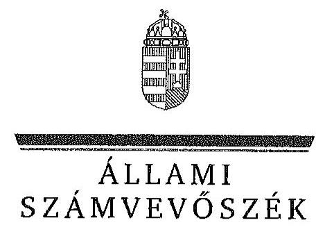
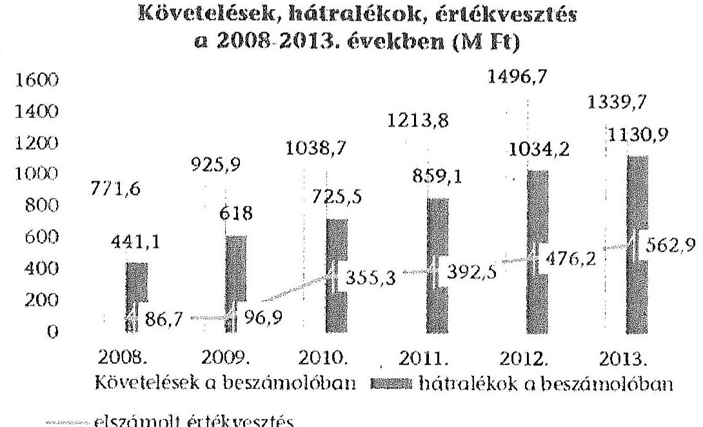
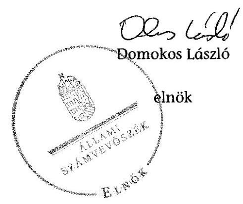
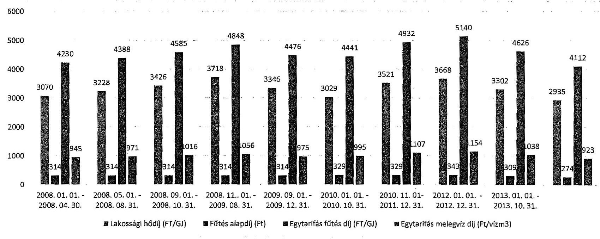
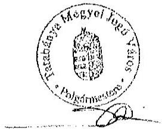
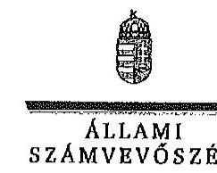
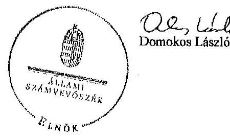

ÁLLAMI
SZÁMVEVŐSZÉK

# JELENTÉS 

Az önkormányzatok gazdasági társaságai - Az önkormányzatok többségi tulajdonában lévő gazdasági társaságok közfeladat-ellátását érintő gazdálkodási tevékenysége szabályszerűségének ellenőrzése
T-Szol Tatabányai Szolgáltató Zártkörűen Működő Részvénytársaság
15086
2015. június

---

# Állami Számvevőszék 

Iktatószám: V-0720-072/2015
Témaszám: 1754
Vizsgálat-azonosító szám: V067130

## Az ellenőrzést felügyelte:

Dr. Horváth Margit
felügyeleti vezető
Az ellenőrzést vezette és az ellenőrzés végrehajtásáért felelős:
Valastyánné dr. Vízhányó Júlia
ellenőrzésvezető
A jelentéstervezet összeállításában közreműködött:
Szilágyi Nándorné
számvevő főtanácsos
Az ellenőrzést végezték:

| Szabó Tamás | Szilágyi Nándorné | Turai Erzsébet |
| :-- | :-- | :-- |
| számvevő tanácsos | számvevő főtanácsos | számvevő |

A témához kapcsolódó eddig készített számvevőszéki jelentések:
címe
sorszáma
Tatabánya Megyei Jogú Város Önkormányzata pénzügyi helyzeté- 1150 nek ellenőrzéséről

---

# TARTALOMJEGYZÉK 

BEVEZETÉS ..... 7
I. ÖSSZEGZŐ MEGÁLLAPÍTÁSOK, KÖVETKEZTETÉSEK, JAVASLATOK ..... 10
II. RÉSZLETES MEGÁLLAPÍTÁSOK ..... 17

1. Az önkormányzat közfeladat-ellátásának szabályszerűsége ..... 17
1.1. A közfeladat-ellátás megszervezése és a feladatellátás feltételrendszerének kialakítása ..... 17
1.2. A közfeladat-ellátás felügyelete és a tulajdonosi jogok érvényesítése ..... 20
2. A T-Szol Zrt. közfeladat-ellátással kapcsolatos tevékenysége ..... 22
2.1. A T-Szol Zrt. gazdálkodásának szabályozottsága ..... 22
2.2. A T-Szol Zrt. vagyongazdálkodása ..... 24
2.3. A beszámolási kötelezettség teljesítése ..... 28
3. A távhőszolgáltatás közfeladata bevételei és ráfordításai elszámolásának és önköltségszámításának szabályszerűsége ..... 29
3.1. A távhőszolgáltatás közfeladat bevételeinek és ráfordításainak szabályszerűsége ..... 29
3.2. Az önköltségszámítás szabályszerűsége ..... 30
4. Az ÁSZ korábbi, az önkormányzatok többségi tulajdonában lévő gazdasági társaságok közfeladat-ellátását, gazdálkodását, pénzügyi helyzetét érintő javaslataira tett intézkedések ..... 31

## MELLÉKLETEK

1. számú A T-Szol Tatabányai Szolgáltató Zrt. tevékenységének főbb adatai
2. számú A T-Szol Tatabányai Szolgáltató Zrt. működésének főbb jellemzői
3. számú A T-Szol Tatabányai Szolgáltató Zrt. által biztosított távfűtés díjainak alakulása
4. számú Beérkezett észrevételek és az azokra adott válaszok

## FÜGGELÉKEK

1. számú Értelmező szótár
2. számú Mintavételi eljárások ellenőrzési területenként

---

.

---

# RÖVIDÍTÉSEK JEGYZÉKE 

## Törvények

Áht. 1
Áht. 2
Ámt.
ÁSZ tv.
Gt.
Info tv.

Inytv.
Mötv.

Nvtv.

Ötv.

Ptk.
Számv. tv.
Taktv.

Tszt.

## Rendeletek

50/2011. (IX. 30.) NFM rendelet
az államháztartásról szóló 1992. évi XXXVIII. törvény (hatálytalan: 2012. január 1-jétől)
az államháztartásról szóló 2011. évi CXCV. törvény (hatályos: 2011. december 31-étől)
az árak megállapításáról szóló 1990. évi LXXXVII. törvény (hatályos: 1991. január 1-jétől)
az Állami Számvevőszékről szóló 2011. évi LXVI. törvény (hatályos: 2011. július 1-jétől)
a gazdasági társaságokról szóló 2006. évi IV. törvény (hatálytalan: 2014. március 15-étől)
2011. évi CXII. törvény az információs önrendelkezési jogról és az információszabadságról (hatályos 2011. július 27-től)
az ingatlan nyilvántartásról szóló 1997. CXLI. törvény (hatályos 1999. január 1-jétől)
Magyarország helyi önkormányzatairól szóló 2011. évi CLXXXIX. törvény (hatályos: 2012. január 1-jétől, kivéve a 144. § (2) bekezdésben meghatározott paragrafusok, amelyek 2012. április 15-én, a (3) bekezdésben meghatározott paragrafusok, amelyek 2013. január 1-jén léptek hatályba, a (4) bekezdésben meghatározott paragrafusok a 2014. évi általános önkormányzati választások napján lépnek hatályba)
a nemzeti vagyonról szóló 2011. évi CXCVI. törvény (hatályos: 2011. december 31-étől, kivéve a 20. § (2) bekezdésben meghatározott paragrafusok, amelyek 2012. január 1-jétől, a (3) bekezdésben meghatározott paragrafusok 2013. január 1-jétől, a (4) bekezdésben meghatározott paragrafus 2012. március 2-ától léptek hatályba)
a helyi Önkormányzatokról szóló 1990. évi LXV. törvény (hatálytalan: a 2014. évi általános Önkormányzati választások napjától)
a Polgári Törvénykönyvről szóló 1959. évi IV. törvény
a számvitelről szóló 2000. évi C. törvény (hatályos: 2001. január 1-jétől)
a köztulajdonban álló gazdasági társaságok takarékosabb működéséről szóló 2009. évi CXXII. Törvény (hatályos 2009. december 4-től)
a távhőszolgáltatásról szóló 2005. évi XVIII. törvény (hatályos: 2005. július 1-jétől)

## a távhőszolgáltatónak értékesített távhő árának, valamint a lakossági felhasználónak és a külön kezelt intézménynek nyújtott távhőszolgáltatás díjának megállapítá-

---

51/2011. (IX. 30.) NFM rendelet
Önkormányzati SZMSZ ${ }_{1}$

Önkormányzati SZMSZ ${ }_{2}$

SZMSZ $_{1}$

SZMSZ $_{2}$
vagyongazdálkodási rendelet $_{1}$
vagyongazdálkodási rendelet $_{2}$
távhőszolgáltatási rendelet $_{1}$
távhőszolgáltatási rendelet $_{2}$
távhőszolgáltatási rendelet $_{3}$
önkormányzati díjrendelet $_{1}$
sáról (hatályos: 2011. október 1-jétől)
a távhőszolgáltatási támogatásról (hatályos: 2011. október 1-jétől)
Tatabánya Megyei Jogú Város Önkormányzatának Szervezeti és Működési Szabályzatáról szóló többször módosított 1/1991. (II. 14.) számú rendelete (hatályon kívül helyezték az Önkormányzati SZMSZ ${ }_{2}$ elfogadásával egyidejűleg)
Tatabánya Megyei Jogú Város Önkormányzat Közgyűlésének Szervezeti és Működési Szabályzatáról szóló 9/2013. (III. 22.) számú rendelet, amelyet a 29/2013. (X. 2.) számú rendelettel módosítottak (hatályos 2013. március 23-tól)
Komárom-Esztergom Megyei T-Szol Zrt. Zártkörűen Működő Részvénytársaság Szervezeti és Működési Szabályzata 2008. január 1-jétől hatályos
Komárom-Esztergom Megyei T-Szol Zrt. Zártkörűen Működő Részvénytársaság Szervezeti és Működési Szabályzata 2011. január 1-jétől hatályos
Tatabánya Megyei Jogú Város Önkormányzat Közgyűlésének többször módosított 30/2000. (VI. 22.) számú rendelete az Önkormányzati vagyonnal való gazdálkodásáról (utolsó módosítás 2006. június 1-jétől, a vagyongazdálkodási rendelet ${ }_{2}$ hatályba lépésével egyidejűleg hatályát vesztette)
Tatabánya Megyei Jogú Város Önkormányzata Közgyűlésének többször módosított 8/2011. (II. 25) számú rendelete az Önkormányzat vagyonnal való gazdálkodásról (hatályos 2011. március 1-jétől)
Tatabánya Megyei Jogú Város Közgyűlésének a távhőszolgáltatásról szóló 51/2005. (XII. 20) számú rendelete, hatályos 2010. június 1-jéig
Tatabánya Megyei Jogú Város Közgyűlésének a távhőszolgáltatásról szóló 2005. évi XVIII. törvény egyes rendelkezéseinek végrehajtásáról szóló 14/2010. (V. 20.) számú rendelete (hatályos 2010. június 1-jétől)
Tatabánya Megyei Jogú Város Közgyűlésének a lakossági távhőszolgáltatási díjakról, az áralkalmazási és díjfizetési feltételekről, valamint a távhőszolgáltatási csatlakozási díjról szóló 15/2010. (V. 20.) számú rendelete (hatályos 2010. június 1-jétől)

Tatabánya Megyei Jogú Város Közgyűlésének 44/2007. (XII. 17.) számú rendelete a lakossági távfűtés és melegvíz szolgáltatás díjának megállapításáról (hatályos 2008. január 1-jétől).
Tatabánya Megyei Jogú Város Közgyűlésének 15/2008. (IV. 28.) számú rendelete a lakossági távfűtés és melegvíz szolgáltatás díjának megállapításáról (hatályos 2008. május 1-jétől).
Tatabánya Megyei Jogú Város Közgyűlésének 21/2008.

---

| delet $_{3}$ | (IX. 01.) számú rendelete a lakossági távfűtés és melegvíz szolgáltatás díjának megállapításáról (hatályos 2009. szeptember 1-jétől). |
| :--: | :--: |
| önkormányzati díjrendelet $_{4}$ | Tatabánya Megyei Jogú Város Közgyűlésének 27/2008. (XI. 03.) számú rendelete a lakossági távfűtés és melegvíz szolgáltatás díjának megállapításáról (hatályos 2008. november 1-jétől). |
| önkormányzati díjrendelet $_{5}$ | Tatabánya Megyei Jogú Város Közgyűlésének 50/2009. (XII. 18.) számú rendelete a lakossági távfűtés és melegvíz szolgáltatás díjának megállapításáról (hatályos 2010. január 1-jétől 2010. június 1-jéig). |
| Szórövidítések |  |
| áfa | általános forgalmi adó |
| Alapszabály | A Komárom-Esztergom Megyei Távhőszolgáltató Zártkörűen Működő Részvénytársaság Alapszabálya módosításokkal egységes szerkezetben 2013. február 12-ig. |
| Alapító okirat | A Komárom-Esztergom Megyei Távhőszolgáltató Zártkörűen Működő Részvénytársaság Alapító Okirata 2013. február 12. napjától, a Tatabányai Szolgáltató Zártkörűen Működő Részvénytársaság Alapító okirata 2013. július 01. napjától és a T-Szol Tatabányai Szolgáltató Zártkörűen Működő Részvénytársaság Alapító okirata 2013. augusztus 13. napjától. |
| alpolgármester | Tatabánya Megyei Jogú Város Önkormányzat Alpolgármestere |
| ÁSZ | Állami Számvevőszék |
| FB | T-Szol Zrt. Felügyelőbizottsága |
| gazdasági program ${ }_{1}$ | Tatabánya Megyei Jogú Város Önkormányzatának 2007-2010 közötti időszakra vonatkozó gazdasági programja (217/2007. (08. 30.) számú Közgyűlési határozat) |
| gazdasági program ${ }_{2}$ | Tatabánya Megyei Jogú Város Önkormányzatának 2010-2014 közötti időszakra vonatkozó gazdasági programja (69/2011. (04. 28.) számú Közgyűlési határozat) |
| GLB | Gazdasági és Lakásügyi Bizottság 2010. október 14-től, azt megelőzően Gazdasági Bizottság |
| használati díjas megállapodás | Tatabánya Megyei Jogú Város Önkormányzata és a T-Szol Zrt. között létrejött használati díjas megállapodás a 2008-2011. években, tartalmában üzemeltetési szerződés. |
| hosszú távú fejlesztési koncepció | A T-Szol Zrt. hosszú távú fejlesztési koncepciójának és 10 éves felújítási és rekonstrukciós ütemterve, a GLB 1036/2013. (09.18.) számú határozatával fogadta el. |
| ISO rendszer | MSZ EN ISO 9001: 2009 szabványrendszer követelményeinek megfelelően kiépített minőségbiztosítási rendszer, 1999. december 1-jétől működik. |
| jegyző $_{1}$ | Tatabánya Megyei Jogú Város Önkormányzat jegyzője 2013. március 1-éig |
| jegyző $_{2}$ | Tatabánya Megyei Jogú Város Önkormányzat jegyzője 2013. március 1-jétől |

---

KEOP
Közgyűlés
MEKH
NAV
Önkormányzat
polgármester
Polgármesteri Hivatal
T-Szol Zrt.

T-Szol Zrt. Közgyűlés
vagyongazdálkodási
terv
vagyonkezelési szerződés
ügyvezetés

Környezet és Energia Operatív Program
Tatabánya Megyei Jogú Város Önkormányzat Közgyűlése
Magyar Energetikai és Közmű-szabályozási Hivatal
Komárom-Esztergom Megyei Adóigazgatósága
Tatabánya Megyei Jogú Város Önkormányzata
Tatabánya Megyei Jogú Város Önkormányzatának Polgármestere
Tatabánya Megyei Jogú Város Önkormányzatának Polgármesteri Hivatala
Komárom-Esztergom Megyei Távhőszolgáltató Zártkörűen Működő Részvénytársaság 2013. július 1-jéig, Tatabányai Szolgáltató Zártkörűen Működő Részvénytársaság 2013. augusztus 12-ig, T-Szol Tatabányai Szolgáltató Zártkörűen Működő Részvénytársaság
Komárom-Esztergom Megyei Távhőszolgáltató Zártkörűen Működő Részvénytársaság Közgyűlése 2013. február 12-ig. Tatabánya Megyei Jogú Város Önkormányzatának közép- és hosszú távú vagyongazdálkodási terve, a Közgyűlés 145/2013. (VIII. 29.) számú határozatával elfogadta.
Tatabánya Megyei Jogú Város Önkormányzat és T-Szol Zrt. között létrejött vagyonkezelési szerződés (2011. december 22-én aláírt)
T-Szol Zrt. ügyvezetése: igazgatóság, vezérigazgató

---

# JELENTÉS 

## Az önkormányzatok gazdasági társaságai Az önkormányzatok többségi tulajdonában lévő gazdasági társaságok közfeladat-ellátását érintő gazdálkodási tevékenysége szabályszerűségének ellenőrzése

## T-Szol Tatabányai Szolgáltató Zártkörűen Működő Részvénytársaság

## BEVEZETÉS

Az Állami Számvevőszék középtávra szóló stratégiájában megfogalmazta, hogy a helyi Önkormányzatok gazdálkodásában rejlő pénzügyi kockázatok feltárásával, az államháztartáson kívülre nyújtott költségvetési támogatások és ingyenes vagyonjuttatások, valamint az államháztartáson kívül működő közfeladat-ellátó rendszerek ellenőrzéseivel hozzájárul ahhoz, hogy a közpénzeket az államháztartáson kívül működő szervezetek is átlátható, rendezett módon használják fel a közfeladatok szerződésben vállalt ellátása érdekében.

Az Önkormányzatok szervezetalakítási szabadságának következménye, hogy a korábban is vállalati formában működő (nagyvárosi tömegközlekedés, víz-, szennyvízcsatorna, köztisztasági, ingatlankezelés stb.) közszolgáltatások mellett, mind a kötelező, mind az önként vállalt feladatok ellátásában a gazdasági társaságok kiemelt fontosságú szerephez jutottak.

A T-Szol Zrt. a Komárom-Esztergom Megyei Távhőszolgáltató Vállalat általános jogutódjaként 1992. évben jött létre. Az Önkormányzat, mint főtulajdonos mellett a Turulgáz Rt. és a dolgozók rendelkeztek a többi részvényhányaddal. Az ellenőrzött időszakban a T-Szol Zrt.-ben az Önkormányzat tulajdoni részesedése a 2008. évben 72,4 % volt, a 2012. évben elérte a 100 %-ot. Az Önkormányzat tulajdoni részesedésének összege a 2008. évi 300,6 M Ft-ról 2012. évre 415,2 M Ft-ra növekedett, majd a 2013. évi apportálás következtében 980,0 M Ft-ra változott.

A T-Szol Zrt. 2012. augusztus 29-től egyszemélyes részvénytársasággá ${ }^{1}$ alakult.

[^0]
[^0]:    ${ }^{1}$ A 2013. február 12-től hatályos Alapító Okirat tartalmazta.

---

A 2008-2013. években a T-Szol Zrt. fő tevékenysége a 2013. január 1-jén 71006 fő lakosság számú Tatabánya, valamint Baj közigazgatási területén a távhő- és használati melegvíz szolgáltatás volt. Tatabánya város közigazgatási területén a 2008. évben 22500 lakást a 2013. évben 22637 lakást, Baj község közigazgatási területén a 2008. évben 280 lakást a 2013. évben 283 lakást, továbbá közintézményeket láttak el távhővel. Egyéb tevékenysége az önkormányzati tulajdonú eszközökön végzett munkák, bérbeadás volt. A T-Szol Zrt.-nél az ellenőrzött időszakban a közfeladat-ellátására foglalkoztatottak éves átlagos statisztikai létszáma 2008. évben 84 fő és 2013. évben 97,9 fő volt.

A 2008-2013. években a T-Szol Zrt. éves nettó árbevétele 5733,5 M Ft és 5294,9 M Ft között, az eszközök és források értéke 2051,5 M Ft és 8045,8 M Ft között alakult. A társaság mérleg szerinti eredménye a 2008. évben 55,4 M Ft, a 2009. évben 8,1 M Ft, a 2010. évben 30,8 M Ft, a
 2011. évben 168,4 M Ft, a 2012. évben 0,1 M Ft, a 2013. évben pedig 18,4 M Ft nyereség volt.

Az ellenőrzött időszakban a polgármester és a jegyző személye egy alkalommal változott. A polgármester megbízatása 2010. június 17-től a korábbi polgármester tisztségről való lemondása miatt, helyettesítéssel jött létre. A helyszíni ellenőrzés időszakában a munkakört betöltő jegyző 2013. március 1. óta látja el feladatait. A T-Szol Zrt.-t 2008-2010. évek között elnök, a 2011-2012. években vezérigazgató, a 2013. évben az igazgatóság elnöke irányította, személye egy alkalommal - 2011. évben - változott.

Az Önkormányzati tulajdonú gazdasági társaságok teljes körű ellenőrzésének lehetőségét az Állami Számvevőszékről szóló 1989. évi XXXVIII. törvény 2011. január 1-jétől hatályos módosítása teremtette meg.

Az ellenőrzés célja annak értékelése volt, hogy

- az Önkormányzat a jogszabályi előírások figyelembevételével döntött-e az ellenőrzésre kerülő közfeladat megszervezéséről; az Önkormányzat szabályszerűen gyakorolta-e a tulajdonosi jogokat;
- a gazdasági társaság közfeladat-ellátása bevételeinek, ráfordításainak elszámolása, és vagyongazdálkodási tevékenysége megfelelt-e a jogszabályi, illetve a közszolgáltatási szerződésben foglalt tulajdonosi előírásoknak, azok végrehajtása szabályszerű volt-e;
- a közfeladatok átláthatósága és elszámoltathatósága érdekében biztosítva volt-e a közszolgáltatás díjának megalapozottsága szabályszerű önköltségszámítással.

Az ellenőrzés kiterjedt a Tatabánya Megyei Jogú Város Önkormányzatára és a T-Szol Tatabányai Szolgáltató Zrt.-re.

Az ellenőrzés várható hasznosulása: A törvényalkotás számára - az észlelt problémák, szabálytalanságok, vagy egyéb nem kívánatos jelenségek felszínre kerülésével - az ellenőrzés megállapításai segítséget nyújthatnak az államháztartáson kívüli közfeladat-ellátás értékeléséhez, jogszabályi keretei pontosításához, átláthatóságot biztosító szabályozásához. Meghatározóvá válnak a közfeladat ellátásában részt vevő államháztartáson kívüli szervezeteknek -

---

az Önkormányzat költségvetését, pénzügyi helyzetét is befolyásoló - kockázatai, lehetővé válik ezen kockázatok csökkentése. A feladatot ellátó gazdasági társaság a közszolgáltatási szerződésben foglaltak betartásával, a közvagyon használatával biztosította-e a szolgáltatás folytatásának feltételeit. Ezzel az ellenőrzöttek és a helyi döntéshozók számára az ÁSZ visszajelzést ad feladatszervezési, feladat-ellátási kockázataikról, alapot ad a meglévő hibák megszüntetéséhez, a jobb közfeladat-ellátás biztosításához. Fokozza a fegyelmet, igazolja, hogy lejárt a következmények nélküli ellenőrzések időszaka. Az ÁSZ értékteremtő rend kialakításához és megőrzéséhez hozzájáruló tevékenysége pozitív hatással van a szervezetről kialakított összkép formálására is.

A bevételek és ráfordítások elszámolása, valamint a vagyonnyilvántartás terén az egyes területek szabályszerű működését mintavétellel ellenőriztük, ez alapján a sokaságokban előforduló hibás tételek arányát becsültük. A jogszabályoknak és a belső előírásoknak megfelelőnek, azaz szabályszerűnek tekintettük az adott bevételek és ráfordítások elszámolását, a vagyonnyilvántartást, amennyiben a minta ellenőrzésének eredménye alapján 95%-os bizonyossággal a teljes sokaságban a hibás tételek aránya kisebb volt, mint 10%.

Az ellenőrzést a számvevőszéki ellenőrzés szakmai szabályai szerint, szabályszerűségi ellenőrzés módszerével, a nemzetközi standardok figyelembevételével végeztük. Az ellenőrzés a 2008-2013. évekre terjedt ki.

Az ellenőrzés végrehajtásának jogszabályi alapját az Állami Számvevőszékről szóló 2011. évi LXVI. törvény 5. § (3)-(5) bekezdései képezték.

A Jelentés tervezetét észrevételezésre megküldtük Tatabánya Város Önkormányzata polgármesterének, valamint a T-Szol Tatabányai Szolgáltató Zrt. vezérigazgatójának. Az érintettek érdemi észrevételt nem tettek, a polgármester pontosító észrevételét a jelentés véglegezése során átvezettük.

---

# I. ÖSSZEGZŐ MEGÁLLAPÍTÁSOK, KÖVETKEZTETÉSEK, JAVASLATOK 

Tatabánya Megyei Jogú Város Önkormányzata a távhőszolgáltatás kötelező feladatát a T-Szol Zrt. tevékenységén keresztül látta el. Az ellenőrzött időszakban az Önkormányzat tulajdoni részesedése a 2008. évben 72,4% volt (300,6 M Ft), a 2012. évben elérte a 100%-ot (415,2 M Ft). A Közgyűlés az Önkormányzat közigazgatási területén a távhőszolgáltatás közfeladatának megszervezéséről a jogszabályi előírásoknak megfelelően döntött.

Az Önkormányzat a 2006-2010. és a 2011-2014. évekre szóló gazdasági program1,2-jaiban a távhőszolgáltatási rendszer fejlesztésével kapcsolatban stratégiai célokat, feladatokat fogalmazott meg. A távhőszolgáltatás általános feladat ellátását, fejlesztési koncepcióját, célkitűzéseit az Önkormányzat egyéb programokban is rögzítette. A GLB a T-Szol Zrt. hosszú távú fejlesztési koncepcióját a 2013. év végén fogadta el. Az Önkormányzat a távhőszolgáltatásra vonatkozóan a Tszt. szerinti rendeletalkotási kötelezettségének eleget tett. A Közgyűlés megalkotta az ellenőrzött időszakban hatályos távhőszolgáltatási rendelet1,2,3-t, az önkormányzati díjrendelet1-5-t, továbbá a vagyongazdálkodási rendelet1,2,3-t. A távhőszolgáltatási rendelet1,2,3 a Tszt. előírásainak megfelel, mellékletei tartalmazták a lakossági célú távhőszolgáltatás díjait, a távhőszolgáltatási díjak kiszámítására vonatkozó árképleteket. A vagyongazdálkodási rendelet2-t 2012. március 1-jén léptette hatályba, az Nvtv.ben előírt határidőben.

A távhőellátás biztosítása céljából az Önkormányzat és a T-Szol Zrt. a 2008-2011. években használati díjra vonatkozó megállapodást kötött a közművagyon körére. A közművagyont érintő tervezett karbantartási és beruházási munkák elvégzésére felmerült költségek pénzügyi forrása a távhő díjba beépített, a tárgyi eszközök után megállapított használati díj volt. Az Önkormányzati tulajdonban lévő távhővagyon rendszeren végzett értéknövelő beruházás, felújítás után számított amortizációs költség a használati díjban nem térült meg.

Az Önkormányzat 2011. december 22-én a közművagyonra az Áht.1-ban előírtak alapján vagyonkezelési szerződést kötött a T-Szol Zrt.-vel. Rögzítették a tartalék-képzési kötelezettséget, annak elszámolására és felhasználására vonatkozó feladatokat. Az Ötv.-ben előírtak ellenére a vagyonkezelői jog részletes szabályait a vagyongazdálkodási rendelet1,2 2012. augusztus 30-áig nem tartalmazta. A vagyonkezelési szerződés az Áht.1-ben foglaltaknak megfelelően a T-Szol Zrt. részére adatszolgáltatási és adatnyilvántartási kötelezettséget tartalmazott.

Az Önkormányzat a vagyonkezelésbe adással egyidejűleg az Áhsz.-ben foglaltak ellenére értékelési szabályzatában nem rögzítette a vagyonkezelésbe adott eszközök vagyonértékelése során alkalmazandó értékelési eljárás elveit, módszerét, dokumentálásának szabályait, felelőseit. Az Áhsz.-ben foglaltak ellenére a bekerülési értéket a könyveibe nem rögzítette. A vagyonkezelésbe

---

adott eszközök főkönyvi számláinak módosítását - 10 hónap késéssel - 2012. október 1-jével rendezte. A vagyonkezelésbe adott eszközök esetében nem gondoskodott az Áhsz.-ben előírtak szerinti leltározási szabályok rögzítéséről.

Az Önkormányzat az Áhsz.-ben előírtaknak megfelelően rendelkezett Leltározási Szabályzattal. Az Önkormányzat vagyonáról az Áhsz. és a Leltározási Szabályzat1,2 alapján évente leltárt volt köteles készíteni. A Leltározási Szabályzat1,2-ban rögzítésre került, hogy amennyiben a vagyonba bekövetkezett változásokról folyamatosan nyilvántartást vezettek mennyiségben és értékben, akkor kétévente kellett a leltárt végrehajtani. Az Áhsz. 37. § (7) bekezdése ellenére a Közgyűlés nem szabályozta rendeletben a két évenkénti leltározást.

Az ellenőrzött időszakban a T-Szol Zrt. feletti tulajdonosi jogokat az Alapszabály, illetve az Alapítói Okirat alapján, a Gt. és a vagyongazdálkodási rendelet1,2 előírásait figyelembe véve a Közgyűlés és a GLB szabályszerűen gyakorolta. A T-Szol Zrt. Közgyűlésében - 2013. február 12-ig - az Önkormányzatot a GLB mandátum kijelölése alapján a polgármester, illetve akadályoztatása esetén az alpolgármester képviselte. Az ügyvezetést, az FB tagokat és a könyvvizsgálót az Alapszabályban, illetve az Alapító Okiratban meghatározottak szerint, a Gt. és a Taktv. rendelkezéseivel összhangban választották meg. Az ellenőrzött időszakban az ügyvezetők és az FB tagok díjazása elveit, feltételeit javadalmazási szabályzatban rögzítették.

Az Önkormányzat a tulajdonosi ellenőrzési, beszámoltatási kötelezettségét az ellenőrzött időszakban az FB működésén keresztül biztosította. Az Önkormányzat az Ötv.-ben biztosított lehetőségével élve a 2011. évben belső ellenőrzéssel a közfeladat ellátásának szabályosságát ellenőrizte, a számviteli szabályzatok aktualizálásának hiányát megállapította. A jegyző1-2 a Tszt.-ben foglaltak ellenére - 2011. április 15-e után - nem ellenőrizte a távhőszolgáltató tevékenységét az üzletszabályzatában foglaltak betartása szempontjából.

A T-Szol Zrt. az ellenőrzött időszakban nyereségesen gazdálkodott. A mérleg szerinti eredmény a 2008-2013. években 55,4 M Ft, 8,1 M Ft, 30,8 M Ft, 168,4 M Ft, 0,1 M Ft, 18,4 M Ft nyereség volt. Az osztalék kifizetésére a Gt. előírásait betartva, a 2012. évben 137,0 M Ft, 2013. évben 49,4 M Ft összegben került sor. A T-Szol Zrt. az ellenőrzött időszak minden évében - a 2010. év kivételével - az adózás előtti eredmény terhére a Számv. tv.-ben előírtak alapján céltartalékot képzett. A T-Szol Zrt. az ellenőrzött időszakban a gazdálkodás likviditásának érdekében folyószámla-hitelt vett igénybe. Az Önkormányzat az ellenőrzött időszakban a T-Szol Zrt. gazdálkodásának finanszírozásában nem vett részt, a társaság kötelezettségvállalásaival kapcsolatban garanciát, kezességet nem vállalt.

Az ellenőrzött időszakban a T-Szol Zrt. számviteli rendszerének szabályozottsága hiányosságokat mutatott. A Számv. tv. előírásai ellenére a számviteli politika nem tartalmazta az eszközök és a források értékelésének részletes szabályait. Az értékelési szabályzata 2011. december 1-jén lépett hatályba. A T-Szol Zrt. 2012. január 1-jétől számlarendjét a Tszt. 18/A. §-ában előírt számviteli szétválasztási szabályokra vonatkozó előírásoknak megfelelően nem aktualizálta, az előírt számviteli szétválasztási szabályokra vonatkozó előírásokat és annak kötelezettségeit szabályzatban nem rögzítette. A pénzkezeléshez

---

kapcsolódó feladatait házipénztár kezelési-, pénzintézeti számlák kezelésének rendjéről szóló szabályzataiban, valamint SZMSZ1,2-ben rögzítette. 2011. június 30-ig a Számv. tv.-ben előírt napi készpénz záróállomány maximális mértékét nem határozta meg. A számlarendben a Számv. tv. előírásai alapján a vagyon működtetéséből származó bevételek, illetve közvetlen költségek és ráfordítások telephelyenkénti elkülönített nyilvántartására a számlarendhez tartozó számlatükrök elkészítésével gondoskodtak. A vagyonkezelésre átvett eszközök főkönyvi elkülönítésének kötelezettségét a 2012-2013. évek számlatükrök tartalmazták. A kialakított számviteli nyilvántartási rendszer az ellenőrzött időszak egészében lehetővé tette, hogy a bevételeket és a költségeket, ráfordításokat lekérdezzék. A leltározási és selejtezési szabályzatot a Számv. tv. 2012. január 1-jétől hatályos - háromévenkénti leltározási kötelezettségre vonatkozó - előírásának megfelelően nem aktualizálták. Önköltségszámítási szabályzattal rendelkeztek. A Számv. tv.-ben előírtak ellenére nem rögzítették a költségek elszámolási és a feladás dokumentálásának részletszabályait, pótlékoló kalkuláció alkalmazásához nem határoztak meg vetítési alapot, az éves utókalkuláció készítését, annak eljárásrendjét nem szabályozták az önköltségszámítási szabályzatban. Az ellenőrzött időszakban az Üzletszabályzatot a T-Szol Zrt. nem aktualizálta.

A T-Szol Zrt. vagyongazdálkodási tevékenysége - beleértve a vagyon kezelését, gyarapítását, hasznosítását - részben felelt meg a jogszabályi előírásoknak és a tulajdonosok által meghatározott követelményeknek. Az immateriális javak és tárgyi eszközök bruttó értékében és értékcsökkenési leírásában történő változások az analitikus nyilvántartásokban nyomon követhetők voltak. A T-Szol Zrt. a 2012-2013. években a vagyonkezelésre átvett eszközöket elkülönítetten tartotta nyilván. Az éves számviteli beszámolók kiegészítő mellékleteiben a vagyonelemeket és az azokban bekövetkezett változásokat bemutatták. A T-Szol Zrt. a folyamatos működtetés érdekében elvégezte a szükséges karbantartási munkákat mind a távhővezeték, mind a hőközpontok és egyéb távhővagyon esetében. A beruházások, élettartam-növelő felújítások azonban nem az eszközök elhasználódásának megfelelő arányban történtek az ellenőrzött időszakban.

A T-Szol Zrt. a 2008-2013. években a beszámolási kötelezettségének a Számv. tv. és a Gt. előírásai szerint tett eleget. Éves számviteli beszámolóit a GLB határozattal megtárgyalta, egyidejűleg jóváhagyva - a 2013. évet kivéve - az éves üzleti terveket, elfogadta az FB és a könyvvizsgáló jelentéseit is. A 2013. évben az üzleti jelentés szeptemberben került elfogadásra. A GLB határozataiban a 2008-2011. években mandátumot adott a polgármesternek a T-Szol Zrt. Közgyűlésén való részvételre, illetve az Önkormányzat álláspontjának képviseletére. Az éves számviteli beszámoló letétbe helyezése és közzététele a Számv. tv.-ben előírt határidőben és formában megtörtént.

A Gt.-ben előírtaknak
 megfelelően a könyvvizsgáló az ellenőrzött időszak minden évében részt vett az éves számviteli beszámolót tárgyaló üléseken. A 2012-2013. évekre vonatkozóan a könyvvizsgáló jelentés tartalmazta a Tszvt.-ben előírt igazolást. A könyvvizsgáló a 2011-2013. években figyelemfelhívással élt, amely nem jelentette a vélemény korlátozását, de kiterjedt a vevő kintlévőségek növekedésére, behajtásának nehézségeire, a hitelállomány növekedésére és a kintlévőségek behajtásának romlására, amelyek véleménye szerint gyengítették a T-Szol Zrt. likviditási helyzetét. A könyvvizsgáló az ellenőrzött időszakban nem változott.

A követelések állománya 2008. január 1. és 2013. december 31. között közel kétszeresére, a kötelezettségeké több mint ötszörösére nőtt. Évente értékvesztést számoltak el a határidőn túli követelésekre a Számv. tv.-ben előírtaknak megfelelően. A behajthatatlan követelésekre hitelezési veszteséget számoltak el a Számv. tv. alapján a 2009-2013. években, 25,0 MFt, 29,7 MFt, 20,7 MFt, 24,8 MFt, 34,8 M Ft összegben. A T-Szol Zrt. a kintlévőségeinek kezelésére az ellenőrzött időszakban az ISO rendszer keretében határozott meg szabályokat. A követelések behajtása érdekében éltek a melegvíz-szolgáltatás kikapcsolásával, korlátozásával, bírósági eljárással, önkormányzati bérlakások és bérlemények esetében a hátralékra vonatkozó tulajdonosi helytállási kötelezettség érvényesítésével, részletfizetések engedélyezésével. A behajtási tevékenység ellenére is emelkedett a kintlévőség állománya, amely 2009. december 31. és 2012. december 31. között közel megháromszorozódott, 430,5 M Ft-ról 1130,9 M Ft-ra nőtt.

Az ellenőrzött időszakban a T-Szol Zrt. értékesítési nettó árbevétele a 2008. évi 5733,6 M Ft-ról 5294,8 M Ft-ra (9,8%-kal) csökkent. Ennek oka elsősorban a növekvő hátralékos állomány volt. A T-Szol Zrt. a 2011. évtől kezdődően az 51/2011. (IX. 30.) NFM rendelet alapján távhőtámogatást kapott, a tárgyévben 724,9 M Ft, a 2012. évben 2558,5 M Ft, a 2013. évben pedig 3056,4 M Ft összeget.

A kötelezettségek - a 2008. évről a 2011. évre történő - több mint ötszörös növekedésének az oka elsősorban a 2011. december 31-én vagyonkezelésbe kapott távhőrendszer 4501,1 M Ft becsült piaci értéke.

A 2012. és a 2013. években a T-Szol Zrt. közfeladat-ellátásával kapcsolatos bevételeinek és kiadásainak a felmerülésük helye szerinti (Tatabánya város, Baj község) számviteli elkülönítése megtörtént. A 2012. és a 2013. éves beszámolóban a távhőtermelési és szolgáltatási tevékenység bevételeit és ráfordításait bemutatták telephelyenként részletezve. A számviteli beszámoló készítésekor a MEKH VK 5/2013. számú szabályozási ajánlásában foglalt módszertani előírásokat alkalmazta a bevételek és ráfordítások elkülönítésére.

A távhőszolgáltatási közfeladat bevételeinek elszámolása során teljes körűen érvényesültek a jogszabályok és a belső szabályzatok előírásai. A T-Szol Zrt. a távhőszolgáltatási közfeladat anyagjellegű ráfordításainak, beruházásainak, felújításainak elszámolása során szabályszerűen járt el.

Az ellenőrzött időszakban a távhőszolgáltatási díjak megállapítása a Tszvt. és a helyi előírásoknak megfelelően szabályszerűen történt. A számítás alapja a távhőszolgáltatási rendelet 1,3 díjképzési előírásai voltak. Az ellenőrzött időszakban kilenc alkalommal módosultak a lakossági távhő szolgáltatási díjak. Év végén a vállalati általános költségeket is tartalmazó utókalkulációt elkészítette.

Az ÁSZ az Önkormányzat pénzügyi helyzetét a 2011. évben ellenőrizte. Az Önkormányzat Közgyűlése a feltárt hiányosságok megszüntetése érdekében intézkedési tervet fogadott el. A polgármester - az ÁSZ javaslata alapján - a féléves és év végi beszámolók keretében mutatta be a gazdasági társaságok aktuális pénzügyi helyzetét. A jegyző a gazdasági társaságok kötelezettségeinek alakulását, valamint az Önkormányzat likviditására, pénzügyi-egyensúlyi helyzetére gyakorolt hatását a féléves és éves beszámolók előkészítése során értékelte.

A fentiekben leírtak összegzéseként az alábbi megállapításokat tesszük:
A T-Szol Zrt.-nél a menedzsment jogokat az Alapszabály, illetve az Alapító Okirat alapján az Önkormányzat gyakorolta. A tulajdonos és a vagyonkezelő számviteli szabályozottsága az Áhsz. és a Számv. tv. előírásainak nem felelt meg teljeskörűen. A T-Szol Zrt. gazdálkodása nyereséges volt. Az Önkormányzat a T-Szol Zrt. gazdálkodásának finanszírozásában nem vett részt. Az Önkormányzat a tulajdonosi ellenőrzési, beszámoltatási kötelezettségét az FB működésén keresztül biztosította.

A megállapítások alapján feltárt kockázatok mind az Önkormányzatnál, mind a gazdasági társaságnál alátámasztják, hogy a vagyongazdálkodás csak részben felelt meg a jogszabályoknak.

Ezen túlmenően a működés kockázata fennállt, mert az Önkormányzat 2011. évi belső ellenőrzése után, a vagyonkezelésbe adás szabályszerűségét nem ellenőrizte. Így a közfeladat ellátás szabályszerű teljesítéséhez, az önkormányzati vagyon megóvásához érdemben nem járult hozzá. A T-Szol Zrt. közvagyonnal kapcsolatos felelős gazdálkodását külső szakértő nem ellenőrizte. Az ellenőrzött időszakban a T-Szol Zrt. számviteli rendszerének szabályozottsága hiányosságokat mutatott. A távhőszolgáltatási közfeladat bevételeinek elszámolása során érvényesültek a jogszabályok és a belső szabályzatok előírásai. A Tszvt.-ben előírtak ellenére a számviteli szétválasztás szabályozottsága nem volt teljes körű. A főkönyvi könyvelésben azonban gondoskodott a bevételei, költségei és ráfordításai elkülönítéséről.

Az Állami Számvevőszékről szóló 2011. évi LXVI. törvény 33. § (1) bekezdésében foglaltak értelmében a jelentésben foglalt megállapításokhoz kapcsolódó intézkedési tervet köteles az ellenőrzött szervezet vezetője összeállítani, és azt a jelentés kézhezvételétől számított 30 napon belül az ÁSZ részére megküldeni. Amennyiben az intézkedési tervet határidőben nem küldi meg a szervezet, vagy az nem elfogadható, az ÁSZ elnöke a hivatkozott törvény 33. § (3) bekezdés a)-b) pontjaiban foglaltakat érvényesítheti.

Az ellenőrzés intézkedést igénylő megállapításai és javaslatai:
Javaslataink célja a T-Szol Tatabányai Szolgáltató Zrt. gazdálkodása szabályszerűségének helyreállítása annak érdekében, hogy a szabályozási környezet megfelelően tudja támogatni az átlátható működést.

Javasoljuk a T-Szol Tatabányai Szolgáltató Zrt. Igazgatósága Elnökének:

1. A T-Szol Zrt. számviteli szabályozásából 2012. január 1-jétől hiányzott a Tszvt. 18/A. §-ában előírt számviteli szétválasztási szabályok érvényesítéséhez szükséges követelményrendszer meghatározása, valamint az azt megalapozó nyilvántartási rendszerek kialakítása.

Az ellenőrzött időszakban a T-Szol Zrt. a szabályozásában az eszközök bekerülési, (előállítási) értékének részét képező költségeket, továbbá az eszközcsoportokra és forrásokra vonatkozó részletes értékelési előírásokat nem a Számv. tv. 51. § (1) bekezdésében foglaltak szerint határozta meg.

A Számv. tv. 14. § (4) bekezdésében és a Számv. tv. 52. §-ban foglaltak ellenére nem rögzítették az eszközök értékcsökkenésének elszámolása során alkalmazott leírási kulcsokat.

Az ellenőrzött időszakban a T-Szol Zrt. a Számv. tv. 14. § (5) bekezdése c) pontja alapján rendelkezett önköltség-számítási szabályzattal. Az önköltség-számítási szabályzat előírásai azonban nem biztosították a Tszvt. 57. § (4) bekezdésében előírt közszolgáltatási tevékenység díjainak átláthatóságát, mert abban nem mutatták be a tevékenységeket terhelő költségek felosztásának módját, továbbá nem rögzítették a Számv. tv. 51. § (1) bekezdésében foglaltak ellenére a hatályos számlarendben meghatározott költséghelyekhez kapcsolódó költségek elszámolásának és a feladás dokumentálásának részletszabályait. A pótlékoló kalkuláció alkalmazásához nem határoztak meg vetítési alapot, nem szabályozták az éves utókalkuláció készítését, annak eljárásrendjét.

Javaslat:

# Intézkedjen a szabályozási hiányosságok megszüntetésére, ennek keretében: 

a) a számviteli szabályozást egészítse ki a Tszvt.-ben előírt számviteli szétválasztási szabályok érvényesítéséhez szükséges követelményrendszer meghatározásával, valamint alakítsa ki az ezt megalapozó nyilvántartási rendszert;
b) egészítse ki a T-Szol Zrt. eszközök és források értékelési szabályzatát az eszközök bekerülési, (előállítási) értékének részét képező költségek, valamint a tárgyi eszközöknél az eszközcsoportokra vonatkozó részletes értékelési előírásokkal, továbbá a források értékelése követelményeinek meghatározásával a Számv. tv-ben előírtaknak megfelelően;
c) határozza meg a T-Szol Zrt. vonatkozó számviteli szabályzatában az eszközök értékcsökkenésének elszámolása során alkalmazott leírási kulcsokat a Számv. tv-ben foglalt rendelkezéseknek megfelelően;
d) egészítse ki a T-Szol Zrt. önköltség-számítási szabályzatát a tevékenységeket terhelő költségek felosztásának módjával, továbbá a hatályos számlarendben meghatározott költséghelyekhez kapcsolódó költségek elszámolásának és a feladás dokumentálásának részletszabályaival, valamint a pótlékoló kalkuláció alkalmazásához határozza meg a vetítési alapot, írja elő az éves utókalkuláció elkészítésének kötelezettségét és szabályozza annak eljárásrendjét.

Javaslataink célja az Önkormányzat szabályszerű működésének elősegítése, továbbá az önkormányzati tulajdonosi joggyakorlás kontrolljának erősítése.

# Javasoljuk Tatabánya Megyei Jogú Város Önkormányzata Jegyzöjének: 

1. Az Önkormányzat a vagyonkezelésbe adással egyidejűleg az Áhsz. B/A. §-ban foglaltak ellenére értékelési szabályzatában nem rögzítette a vagyonkezelésbe adott eszközök vagyonértékelése során alkalmazandó értékelési eljárás elveit, módszerét, dokumentálásának szabályait, felelősét.

Az Önkormányzat (Hivatala) 2011-től a T-Szol Zrt. vagyonkezelésébe adott eszközei esetében az Áhsz. 37. § (4) bekezdésében előírtak szerinti leltározási szabályok rögzítéséről nem gondoskodott.

Javaslat:

## Intézkedjen a szabályozási hiányosságok megszüntetésére, ennek keretében:

a) határozza meg az Áhsz.-ben foglaltaknak megfelelően a vagyonkezelésbe adott eszközök vagyonértékelése során alkalmazandó értékelési eljárás elveit, módszerét, a dokumentálás szabályait és felelősöket az Önkormányzat (Hivatala) értékelési szabályzatában;
b) egészítse ki az Önkormányzat (Hivatala) leltározási szabályzatát az Áhsz.-ben előírtak szerinti a vagyonkezelésbe adott eszközök leltározási szabályok rögzítéséről.
2. A jegyző 2011. április 15-e után a Tszvt. 7. § (1) bekezdés c) pontjában foglaltak ellenére nem ellenőrizte a távhőszolgáltató tevékenységét az üzletszabályzatában foglaltak betartása szempontjából.

Javaslat:
Intézkedjen a jogszabályi előírások szerinti gyakorlat és a szabályos működés biztosítására, ezen belül:
ellenőrizze a Tszvt. előírása szerint a távhőszolgáltató tevékenységét az üzletszabályzatban foglaltak betartása szempontjából.

# II. RÉSZLETES MEGÁLLAPÍTÁSOK 

## 1. AZ ÖNKORMÁNYZAT KÖZFELADAT-ELLÁTÁSÁNAK SZABÁLYSZERÜSÉGE

### 1.1. A közfeladat-ellátás megszervezése és a feladatellátás feltételrendszerének kialakítása

Az Önkormányzat a 2006-2010., illetve a 2011-2014. évekre vonatkozó gazdasági programjaiban az Ötv. 91. § (6) bekezdése szerint meghatározta azokat a célkitűzéseket, amelyek a kötelező és önként vállalt feladatok ellátását, fejlesztését szolgálták. Az Önkormányzat a gazdasági programban a távhőszolgáltatási rendszer fejlesztésével kapcsolatban stratégiai célokat, feladatokat fogalmazott meg. A távhőszolgáltatás általános feladat-ellátását, fejlesztési koncepcióját, célkitűzéseit az Önkormányzat egyéb programokban is rögzítette. A GLB a T-Szol Zrt. hosszú távú fejlesztési koncepcióját a 2013. év végén fogadta el.

A gazdasági programban a stratégiai célok között szerepelt az energiahatékonyság növelése, a fűtéskorszerűsítési program előkészítése, majd annak elindítása a panelprogramhoz kapcsolódóan, valamint a lakosság részére a szabályozható távfütési rendszer kiépítése. A gazdasági programban az Új Széchenyi Terv Zöldgazdaság fejlesztési programjának keretein belül a távhő rendszer korszerűsítését, a lakóközösségek részére fűtéskorszerűsítési alap létrehozását rögzítették.

Az Önkormányzat az ellenőrzött időszakot megelőzően, a 2007. évi Települési Klímastratégiájában meghatározta, hogy a hatékonyabb, korszerűbb rendszer esetén kevesebb az üvegházgáz-kibocsátás. Az Önkormányzat a 2008-2014. évekre vonatkozó Környezetvédelmi Programjában döntött a fűtéskorszerűsítések elősegítéséről, a gáztüzelés és távhő kiterjesztésének támogatásáról a lakóterületeken, intézményeknél, illetve javasolták, hogy a földfeletti rendszer fokozatosan földalatti vezetésűre kerüljön átépítésre.

A T-Szol Zrt. 2013. évben elfogadott hosszú távú fejlesztési koncepciójában részletesen meghatározták a primer és szekunder távhőrendszerek korszerűsítésének paramétereit, a megtakarítások és a megtérülési idők tervezett alakulását.

Az Ötv. 8. § (1) bekezdése a települési önkormányzatok közszolgáltatási feladatai közé sorolta a helyi energiaszolgáltatásban való közreműködést. Az Ötv. 1. § (5) bekezdése kimondja, hogy „törvény a helyi önkormányzatnak kötelező feladat- és hatáskört is megállapíthat”. A távhőszolgáltatással ellátott létesítmények távhőellátásának távhőszolgáltatásra engedéllyel rendelkezők útján történő biztosítása a Tszvt. 6. § (1) bekezdése értelmében a területileg illetékes

[^0]
[^0]:    A helyi közügyek, valamint a helyben biztosítható közfeladatok körében ellátandó helyi önkormányzati feladatként a távhőszolgáltatást 2013. január 1-jétől az Mötv. 13. § (1) bekezdés 20. pontja írja elő.

 települési önkormányzat kötelező feladata. A Közgyűlés az önkormányzati SZMSZ ${ }_{1}$ 2. számú függelékében a jogszabályok által kötelezően ellátandó feladatként határozta meg a távhő- és a melegvíz szolgáltatás biztosítását. Az Önkormányzat az Ötv. 9. § (4) bekezdésében előírtak figyelembe vételével szabályszerűen döntött a távhőszolgáltatás kötelező közfeladat ellátásának gazdasági társaságban történő megszervezéséről.

A vagyongazdálkodás feladatait az ellenőrzött időszakban az Önkormányzat a vagyongazdálkodási rendelet ${ }_{1,2}$-ben szabályozta. A vagyongazdálkodási rendelet ${ }_{2}$ módosítását 2012. március 1-jén, az Nvtv. 18. § (1) bekezdésében előírt határidőben léptették hatályba. Az Nvtv. 9. § (1) bekezdése szerint a helyi önkormányzat a vagyongazdálkodásának az Alaptörvényben, valamint a 7. § (2) bekezdésében meghatározott rendeltetése biztosításának céljából közép- és hosszú távú vagyongazdálkodási tervet köteles készíteni, melyet a Közgyűlés az Nvtv. 9. § (1) bekezdésének 2012. január 1-jei hatálybalépését követően, 2013. augusztus 29-én fogadott el. ${ }^{3}$

A T-Szol Zrt. Alapszabálya, illetve Alapító Okirata szerinti főtevékenysége a gőzellátás, légkondicionálás volt. A T-Szol Zrt. főbb adatait az 1. számú melléklet, a társaság működésének főbb jellemzőit a 2. számú melléklet tartalmazza.

Az Önkormányzat a Tszt. 6. § (2) bekezdése alapján a távhőszolgáltatási rendelet ${ }_{1,2,3}$-ban meghatározta a díjalmazás feltételeit, a távhőszolgáltatás felhasználókra és díjfizetőkre vonatkozó részletes szabályait. A távhőszolgáltatási rendelet ${ }_{1,2,3}$ a Tszt. előírásainak megfelelt, mellékletei tartalmazták a lakossági célú távhőszolgáltatás díjait, a távhőszolgáltatási díjak kiszámítására vonatkozó árképleteket. A miniszteri hatáskörben történő ármegállapítás időpontjáig az Önkormányzat az önkormányzati díjrendelet ${ }_{1,5}$-ben és a távhőszolgáltatási rendelet ${ }_{2}$ 2. számú mellékletében rögzítette a lakossági távfűtés és melegvíz használati díjait. A csatlakozási díj tartalmára vonatkozó szabályokat a távhőszolgáltatási rendelet ${ }_{1,3}$ rögzítette, amely megfelelt az Ámt. 11. § (1) bekezdés és a Tszt. 6. § (2) bekezdése szerinti előírásoknak.

A Tszt. módosítása alapján 2011. április 15-től az árhatósági feladat az energiapolitikáért felelős miniszter hatáskörébe került. Az Önkormányzat jogköre ezután a csatlakozási díjak és a fizetési feltételek megállapítására terjedt ki.

A Tszt. 6. § (1) bekezdésében előírtak alapján, a távhőellátás biztosítása céljából az Önkormányzat és a T-Szol Zrt. a 2008-2011. években - évente - használati díjra vonatkozó megállapodást kötött - összesen 830,0 M Ft+áfa összegben - az Önkormányzat tulajdonában lévő közművagyon körére. A közművagyont érintő hiba elhárítási, tervezett javítási, karbantartási és beruházási munkák elvégzésére felmerült költségek pénzügyi forrása a távhődíjba beépített, a tárgyi eszközök után megállapított használati díj volt. A felek rögzítették, hogy az Önkormányzati tulajdonban lévő távhőrendszeren végzett értéknövelő beruházás, felújítás után számított amortizációs költség a

[^0]
[^0]:    ${ }^{3}$ 145/2013. (VIII. 29.) számú Kgy. határozat

---

használati díjban nem térül meg. Az Önkormányzat a használati díjat a 2008-2011. évekre vonatkozóan kiszámlázta.

Az Áht. ${ }_{1}$ 105/A.-105/D. §-okban és az Ötv. 80/A.-80/B. §-okban foglaltak alapján az Önkormányzat 2011. december 22-én a korlátozottan forgalomképes törzsvagyonát képező közművagyonra vagyonkezelési szerződést ${ }^{4}$ kötött a T-Szol Zrt.-vel. A vagyonkezelési szerződés megkötését megelőzően a Közgyűlés vizsgálta az apportba adás és a vagyonkezelésbe adás lehetőségét. A vagyonvesztés elkerülése érdekében a T-Szol Zrt. a vagyonkezelői jogokat kijelöléssel, ingyenesen kapta. A vagyonkezelői jog az Inytv. 16. § a) pontjában foglaltak alapján a 2012. évben - ingyenes átadás jogcímén - bejegyzésre került az ingatlan nyilvántartásba.

Az Önkormányzat az Áhsz. 29/A. § (2) bekezdésében foglaltak ellenére, a 2011. december 31-én vagyonkezelésbe átadott eszközei bruttó értékét és elszámolt értékcsökkenését könyveiből nem vezette ki, és ezzel egyidejűleg a vagyonkezelési szerződésben meghatározott, mint bekerülési értéket a könyveibe nem vette fel. Az Önkormányzat az Áhsz. 1. számú melléklete könyvviteli mérleg előírt tagolás ellenére a 2011. évi könyvviteli mérlegében, a vagyonkezelésbe adott eszközöket az üzemeltetésre, kezelésre átadott eszközök soron mutatta ki a vagyonkezelésbe adott eszközök sor helyett. A főkönyvi könyvelésében a helyes főkönyvi számlák alkalmazását 2012. október 1-jével valósította meg.

Az Áht. ${ }_{1}$ 105/A. § (6) bekezdése alapján a vagyonkezelési szerződésben előírták az értékcsökkenésnek megfelelő mértékű tartalékképzési kötelezettséget, annak elszámolására és felhasználására vonatkozó feladatokat. A T-Szol. Zrt. köteles volt az átvett vagyon után legalább az elszámolt értékcsökkenés összegének megfelelő mértékű tartalékot képezni, annak felhasználására ütemtervet készíteni, az önkormányzatnak a felhasználásról beszámolni. Az ütemterv az előírt 2012. december 31-i határidő helyett - közel egy év késéssel 2013. szeptemberben került elfogadásra a hosszú távú fejlesztési koncepció részeként. A T-Szol Zrt. a vagyontárgyak hasznosításából keletkezett bevételekből köteles volt a vagyontárgyak állapotát és értékét megőrizni.

Az Ötv. 80/B. §, valamint 2012. január 1-től az Mötv. 109. § (4) bekezdésének előírása ellenére a vagyonkezelői jog részletes szabályait a vagyongazdálkodási rendelet ${ }_{1,2}$ 2012. augusztus 30-áig nem tartalmazta. Az Áht. ${ }_{1}$ 105/A. § (13) bekezdésében előírtak alapján az Önkormányzat a vagyongazdálkodási rendelet ${ }_{2}$ 17/C. § (1) bekezdésében ${ }^{5}$ rögzítette, hogy a vagyonkezelő a vagyonkezelésbe kapott vagyon elemeket nyilvántartásában a saját eszközeitől elkülönítetten köteles nyilvántartani.

[^0]
[^0]:    ${ }^{4}$ A Közgyűlés 244/2011. (XII. 16.) számú határozata alapján
    ${ }^{5}$ A vagyongazdálkodási rendelet ${ }_{2}$ módosítása a Közgyűlés 40/2012. (VIII. 30.) számú rendeletével.

---

Az Önkormányzat a vagyonkezelésbe adással egyidejűleg az Áhsz. 8/A. §-ban foglaltak ellenére értékelési szabályzatában ${ }^{6}$ nem rögzítette a vagyonkezelésbe adott eszközök vagyonértékelése során alkalmazandó értékelési eljárás elveit, módszerét, dokumentálásának szabályait, felelőseit.

Az Önkormányzat az Áhsz. 8. § (4) bekezdés a) pontjában előírtaknak megfelelően rendelkezett leltározási szabályzattal. Az Áhsz. 37. § (7) bekezdése ellenére a Közgyűlés 2011. március 1-jétől nem szabályozta rendeletben a két évenkénti leltározást. Ennek megfelelően leltározási szabályzatát nem módosította. Továbbá nem gondoskodott az Önkormányzat - a 2011. évtől - a vagyonkezelésbe adott eszközök esetében az Áhsz. 37. §. (4) bekezdésében előírtak szerinti leltározási szabályok rögzítéséről.

# 1.2. A közfeladat-ellátás felügyelete és a tulajdonosi jogok érvényesítése 

Az ellenőrzött időszakban gazdasági társaság alapításáról, önkormányzati vagyon gazdasági társaságba történő beviteléről kizárólag a Közgyűlés volt jogosult dönteni. A vagyongazdálkodási rendelet ${ }_{1,2}$ az egyes társaságokhoz kapcsolódó tulajdonosi jogkörök gyakorlását a GLB feladataként határozta meg.

A vagyongazdálkodási rendelet ${ }_{1}$ 4. § (1) és (2) bekezdése rögzítette, hogy a forgalomképes ingatlan és ingó vagyonnal, valamint a vagyonértékű jogokkal kapcsolatban a tulajdonosi jogokat a Közgyűlés, illetve átruházott hatáskörben a polgármester 1 M Ft-ig, a GLB 1-25 M Ft-ig gyakorolja.

A vagyongazdálkodási rendelet ${ }_{2}$ rendelkezései alapján a GLB határozott az Önkormányzat tulajdonában lévő többszemélyes gazdasági társaság tag, illetve a társasági közgyűlésen képviselendő önkormányzati álláspontról és a képviseletet ellátó személyről. Egyszemélyes társaság esetében a GLB gyakorolta a tulajdonosi jogok közül az üzleti terv és a beszámoló elfogadásában, a vezető tisztségviselők prémium feladatainak értékelésében, munkaszerződés módosításában, társasági szerződés módosításában való döntést, amennyiben az kötelezettséggel nem járt, valamint a könyvvizsgáló megbízását, visszahívását és az alaptőke leszállítását.

Az ellenőrzött időszakban a T-Szol Zrt. feletti tulajdonosi jogokat az Alapszabály, illetve az Alapító Okirat, a Gt. és a vagyongazdálkodási rendelet ${ }_{1,2}$ előírásait figyelembe véve a Közgyűlés és a GLB szabályszerűen gyakorolta. A T-Szol Zrt. Közgyűlésében - 2013. február 12-ig - az Önkormányzatot a GLB mandátum kijelölése alapján a polgármester, illetve akadályoztatása, távolléte esetén az alpolgármester képviselte.

Az ügyvezetést ${ }^{7}$, az FB tagokat az alapszabályban meghatározottak szerint a tulajdonosok jelölése alapján a T-Szol Zrt. Közgyűlése, az Alapító Okirat

[^0]
[^0]:    ${ }^{6}$ Az Önkormányzat értékelési szabályzata 2007. január 1-től hatályos, egy alkalommal 2008. március 31-én módosították a követelések értékelése, értékvesztés elszámolása miatt.
    ${ }^{7}$ Igazgatóság, vagy Vezérigazgató.

---

szerint az Önkormányzat, mint 100%-os részvényes választotta meg. A GLB gyakorolta a könyvvizsgáló megbízásának jogát. A könyvvizsgáló személye az ellenőrzött időszakban nem változott. ${ }^{8}$

A 2008-2013. években a T-Szol Zrt. ügyvezetését a Gt. 247. §-a alapján vezérigazgató, vagy a Gt. 21. § (4) bekezdésének előírásával összhangban igazgatóság látta el. A T-Szol Zrt.-t ügyvezetése 2010. december 31-ig igazgatóság volt, élén az elnökkel. 2011. január 1-től 2013. június 30-ig vezérigazgató vezette a társaságot, aki 2013. július 1-jétől a négytagú igazgatóság ${ }^{9}$ elnökeként látta el a társaság irányítását.

Az ellenőrzött időszakban a T-Szol Zrt. a 2010. január 1-jén hatályba lépett Taktv. 5. § (3) bekezdésének előírásaival összhangban rendelkezett az anyagi ösztönzési rendszert tartalmazó javadalmazási szabályzattal. A vezetők, az FB tagok javadalmazási elveire, fizetési feltételeire vonatkozó szabályokat a T-Szol Zrt. Közgyűlése elfogadta. A szabályzatban meghatározták a vezető tisztségviselők személyi alapbérének és éves prémiumának, az FB elnöke és tagjai, valamint a könyvvizsgáló díjazásának maximumát. Pontos összegeket a vonatkozó szerződések/munkaszerződések tartalmaztak.

A Gt. 33. § (1) bekezdése, valamint a 2010. január 1-jén hatályba lépett Taktv. 4. § (1) bekezdése előírásaira is tekintettel létrehozott FB az ellenőrzött időszakban a Gt. szabályozása alapján gyakorolta a tulajdonosi ellenőrzést. A 2011-2013. években az FB éves munkaterve alapján végezte feladatát. Az FB a Gt. 34. § (4) bekezdésében előírtaknak megfelelően rendelkezett a T-Szol Zrt. Közgyűlése által jóváhagyott ${ }^{10}$ ügyrenddel.

Az ellenőrzött időszakban az Alapszabály, illetve az Alapító Okirat V. fejezete alapján a T-Szol Zrt. kidolgozta az üzleti és fejlesztési terv megvalósítását és koncepcióját.

Az Alapszabály, illetve az Alapító Okirat alapján a 2008-2013. évek üzleti terveiben foglaltak megvalósulásáról a T-Szol Zrt. az Önkormányzat felé rendszeresen, az éves számviteli beszámoló elfogadásának alkalmával tárgyévet követő évek májusában szolgáltatott adatot. A 2008-2013. években a T-Szol Zrt. éves számviteli beszámolóit, az FB és a könyvvizsgáló jelentéseit, valamint - a 2013. évet kivéve ${ }^{11}$ az éves üzleti terveket is - a GLB megtárgyalta és határozattal ${ }^{12}$ elfogadta. A GLB ezen határozataiban a 2008-2011. években

[^0]
[^0]:    ${ }^{8}$ A könyvvizsgálatot a Moore Stephens Wagner Könyvkiadó Iroda Kft. (Wágner Vilmos könyvvizsgáló) látta el
    ${ }^{9}$ 2013. július 1-től ismét igazgatóság működött.
    ${ }^{10}$ 24/2003. (IX. 26.) számú határozat. Az 5/2011. (III. 25.) számú Közgyűlési határozatot nem tudták az ellenőrzés rendelkezésére bocsájtani.
    ${ }^{11}$ A GLB 1112/2013. (09. 25.) számú határozat,
    ${ }^{12}$ A GLB 598/2014. (05. 30.) határozata, 632/2013. (05. 27.) határozata, GLB 463/2012. (05. 21.) határozata, GLB 225/2011. (05. 23.) határozata, GB 366/2010 (05. 18.) határozata, GB 273/2009 (05. 19.) határozata a T-Szol Zrt. beszámolójának elfogadásáról. Ezek a határozatokban fogadta el a GLB a következő év üzleti terveit, a 2013. évet kivéve.

---

mandátumot adott a polgármesternek a T-Szol Zrt. Közgyűlésén való részvételre, illetve az Önkormányzat álláspontjának
 képviseletére. Az FB a Gt. 35. § (3) bekezdésében előírt írásbeli jelentéskészítési kötelezettségének az ellenőrzött években eleget tett. A könyvvizsgáló a T-Szol Zrt. a 2008-2013. évi éves számviteli beszámolóiról a független könyvvizsgálói jelentésében megállapította, hogy az megbízható és valós képet adott a társaság vagyoni, pénzügyi és jövedelmi helyzetéről. A könyvvizsgáló a 2011-2013. években figyelemfelhívással élt, amely nem jelentette a vélemény korlátozását, de kiterjedt a vevő kintlévőségek növekedésére, behajtásának nehézségeire, a hitelállomány növekedésére és a kintlévőségek behajtásának romlására, amelyek véleménye szerint gyengítették a T-Szol Zrt. likviditási helyzetét.

Az Önkormányzat belső ellenőrzése az Ötv. 92. § (11) bekezdés b) pontjában biztosított lehetőséggel élve a T-Szol Zrt.-nél a 2011. évben ellenőrzést hajtott végre. Az Önkormányzat belső ellenőrzése - kockázatelemzés alapján a T-Szol Zrt.-nél pénzügyi ellenőrzést végzett a 2010-2011. évekre vonatkozóan. A belső ellenőrzés a hiányosságok megszüntetése érdekében javaslatokat fogalmazott meg, amelyre a T-Szol Zrt. intézkedési tervet készített, majd beszámolt annak végrehajtásáról. A belső ellenőrzés a számviteli szabályzatok módosítását, hiányzó munkaszerződések pótlását, valamint a szigorú számadású nyomtatványok nyilvántartási rendszere szabályozásának kiegészítését írta elő. Az Önkormányzat belső ellenőrzése a távhőszolgáltatás, mint közfeladat ellátás szabályszerű teljesítéséhez, az önkormányzati vagyon megóvásához a 2011. évi ellenőrzéssel hozzájárult. A társaság közvagyonnal kapcsolatos felelős gazdálkodását külső szakértő nem ellenőrizte.

Az Önkormányzat az ellenőrzött időszakban a T-Szol Zrt.-nek működési és felhalmozási célú pénzeszközt nem adott át, a vagyonváltozáshoz, fejlesztést eredményező döntés végrehajtásához kölcsönt nem nyújtott. Az Önkormányzat a T-Szol Zrt. kötelezettségvállalásaival kapcsolatban garanciát, kezességet nem vállalt.

# 2. A T-SZOL ZRT. KÖZFELADAT ELLÁTÁSSAL KAPCSOLATOS TEVÉKENYSÉGE 

### 2.1. A T-Szol Zrt. gazdálkodásának szabályozottsága

Az üzleti tervek a 2008-2013. évekre 20,5 M Ft, 2,9 M Ft, 27,1 M Ft, 27,2 M Ft, 322,2 M Ft, illetve $80,7 \mathrm{M}$ Ft adózott eredményt irányoztak elő. A T-Szol Zrt. üzleti tervei összhangban voltak az Önkormányzat közfeladat ellátásra vonatkozó gazdasági, fejlesztési célkitűzéseivel.

A T-Szol Zrt. az üzleti terveiben bemutatta a távhőszolgáltatási rendszert érintő előző évben megvalósított és a tárgyévre tervezett fejlesztési, műszaki feladatokat, a gazdálkodás várható bevételeit, költségeit és az eredménytervet. A feladatokat gépészeti, valamint villamossági és automatika felújítások bontásban részletezték naturális mutatókkal és keretösszeggel.

A T-Szol Zrt. az ellenőrzött időszakban rendelkezett a Számv. tv. 14. § (5) bekezdésében előírt számviteli szabályzatokkal, kivéve az értékelési szabályzattal.

---

A T-Szol Zrt. értékelési szabályzata 2011. december 1-től hatályos. A Számv. tv. 14. § (11) bekezdésében ${ }^{13}$ foglaltak szerint a szabályzatok aktualizálása részben megtörtént a 2011. évben az Önkormányzat belső ellenőrzése hatására.

A T-Szol Zrt. az ellenőrzött időszakban rendelkezett a Számv. tv. 161. §-ában előírt számlarenddel, bizonylati renddel, valamint a számlarendhez kapcsolódó számlatükrökkel. A számlarendben a Számv. tv. 161/A. § (2) bekezdés előírásai alapján a vagyon működtetéséből származó bevételek, illetve közvetlen költségek és ráfordítások telephelyenkénti elkülönített nyilvántartására a számlarendhez tartozó számlatükrök elkészítésével gondoskodtak. A vagyonkezelésre átvett eszközök főkönyvi elkülönítésének kötelezettségét a 2012-2013. évek számlatükröi tartalmazták. A kialakított számviteli nyilvántartási rendszer az ellenőrzött időszak egészében lehetővé tette a bevételek, költségek, ráfordítások elkülönített nyilvántartását. A T-Szol Zrt. 2012. január 1-jétől számlarendjét a Tszt. 18/A. §-ában előírt számviteli szétválasztási szabályokra vonatkozó előírásoknak megfelelően nem aktualizálta.

A T-Szol Zrt. leltározási szabályzata az ellenőrzött időszakot megelőzően 2007. évben került jóváhagyásra, egy alkalommal ${ }^{14}$ módosították. A közfeladat-ellátást szolgáló, a társaság saját - 2008-2013. évekre vonatkozóan - és vagyonkezelésbe vett - 2012-2013. években - vagyonával kapcsolatos változások elkülönített főkönyvi nyilvántartásban kerültek rögzítésre. Az immateriális javak és tárgyi eszközök analitikus nyilvántartása egyedi nyilvántartókartonokon történt ${ }^{15}$, amelyeken folyamatosan nyomon követhetők voltak az eszközök bruttó értékében és értékcsökkenési leírásában történő változások. A leltározási szabályzatban az ingatlanoknál előírt 5 évenkénti leltározási kötelezettség nem felelt meg a Számv. tv. 69. § (3) bekezdésének, a 2012. január 1-jétől hatályos előírás szerint a leltározást legalább háromévente, mennyiségi felvétellel kell elvégezni. A Számv. tv. 69. § (5) bekezdésében előírtaknak megfelelően a készleteknél évente egyszer írtak elő tényleges mennyiségi leltárfelvételt.

Az ellenőrzött időszakban a T-Szol Zrt. a szabályozásában az eszközök bekerülési, (előállítási) értékének részét képező költségeket, továbbá az eszközcsoportokra és forrásokra vonatkozó részletes értékelési előírásokat nem a Számv. tv. 51. § (1) bekezdésében foglaltak szerint határozta meg.

A Számv. tv. 14. § (4) bekezdésében és a Számv. tv. 52. §-ban foglaltak ellenére nem rögzítették az eszközök értékcsökkenésének elszámolása során alkalmazott leírási kulcsokat. Az értékvesztések elszámolására, a behajthatatlan követelések egyedi értékelésére vonatkozóan szabályokat a számviteli politikában határozták meg.

[^0]
[^0]:    ${ }^{13}$ 2008. december 31-ig a Számv. tv. 14. § (9) bekezdése írta elő.
    ${ }^{14}$ 2011. december 1.
    ${ }^{15}$ A Távhőszolgáltató a 2012. évi vagyonértékelést követően a közvagyon a megfelelő főkönyvi számlákon rögzítette és ennek megfelelően nyitotta meg az analitikus kartonokat.

---

A T-Szol Zrt. a Számv. tv 14. § (5) bekezdés d) pontjában és a Számv. tv. 14. § (8) bekezdésében meghatározottak ellenére nem készített pénzkezelési szabályzatot. A pénzkezeléshez kapcsolódó feladatait a házipénztár kezelési-, pénzintézeti számlák kezelésének rendjéről szóló szabályzataiban, valamint az SZMSZ ${ }_{1,2}$-ben rögzítette. 2011. június 30-ig a Számv. tv. 14. § (8) bekezdésében előírt napi készpénz záróállomány maximális mértéke nem került meghatározásra.

Az ellenőrzött időszakban a T-Szol Zrt. a Számv. tv. 14. § (5) bekezdés c) pontja alapján rendelkezett ${ }^{16}$ önköltségszámítási szabályzattal. Az önköltségszámítási szabályzatban azonban a Számv. tv. 51. § (1) bekezdésében foglaltak ellenére nem rögzítették a - hatályos számlarendben meghatározott költséghelyekhez kapcsolódó - költségek elszámolásának és a feladás dokumentálásának részletszabályait, pótlékoló kalkuláció alkalmazásához nem határoztak meg vetítési alapot, az éves utókalkuláció készítését, annak eljárásrendjét nem szabályozták.

A T-Szol Zrt. elkészítette Üzletszabályzatát, amelyet az Önkormányzat jegyzője - az ellenőrzött időszakot megelőzően - a Tszt. 7. § (1) bekezdés c)-d) pontjaiban foglaltaknak megfelelően a fogyasztóvédelmi hatóságnak véleményezésre megküldött, majd jóváhagyott. Az ellenőrzött időszakban az Üzletszabályzatot a T-Szol Zrt. nem aktualizálta. Az aktualizálás indokolt lett volna a Tszt. 2011. április 15-ei változása, a hatósági árak, és az ármegállapítás hatásköri változása miatt. A jegyző 2011. április 15-e után a Tszt. 7. § (1) bekezdés c) pontjában foglaltak ellenére nem ellenőrizte a távhőszolgáltató tevékenységét az üzletszabályzatában foglaltak betartása szempontjából.

# 2.2. A T-Szol Zrt. vagyongazdálkodása 

A T-Szol Zrt. vagyongazdálkodási tevékenysége - beleértve a vagyon kezelését, gyarapítását, hasznosítását - részben felelt meg a jogszabályi előírásoknak és a tulajdonosok által meghatározott követelményeknek.

A T-Szol Zrt. a közszolgáltatási feladatait a 2008-2013. években saját vagyona mellett a 2008-2011. években használatba kapott, a 2012-2013. években pedig vagyonkezelésbe átvett vagyonnal látta el. A 2012-2013. években a T-Szol Zrt. az általa kezelt, az Önkormányzat kizárólagos tulajdonában álló nemzeti vagyonra tekintettel az Nvtv. 6. §-ában előírt rendelkezéseknek megfelelően járt el. A vagyonkezelésbe vett eszközöket nem idegenítette el, ingatlanra közérdekből jogot nem alapított, biztosítékul nem adta, azon osztott tulajdont nem létesített.

A T-Szol Zrt. a Számv. tv. 26. §-ában előírtak ellenére a vagyonkezelésbe átvett eszközöket a 2011. évben az ingatlanok főkönyvi számlán mutatta ki egy összegben. Nem bontotta meg a vagyonkezelési szerződés 1. számú mellékletében részletezettek alapján ingatlan, műszaki berendezések, és egyéb berendezések főkönyvi számlára.

[^0]
[^0]:    ${ }^{16}$ a 2001. április 26. napján hatályba lépett szabályzatát 2010. január 15-én aktualizálta.

---

Az ellenőrzött időszakban a Számv. tv. és az Áht előírásait betartva a közfeladat-ellátást szolgáló saját és vagyonkezelésbe vett vagyonával kapcsolatos változások elkülönített főkönyvi nyilvántartásban kerültek rögzítésre. Az immateriális javak és tárgyi eszközök analitikus nyilvántartása egyedi nyilvántartókartonokon történt ${ }^{17}$, amelyeken folyamatosan nyomon követhetők voltak az eszközök bruttó értékében és értékcsökkenési leírásában történő változások. A T-Szol Zrt. a 2012-2013. években elkülönítetten - a 15. számlaosztályban a vagyonkezelésre átvett eszközök főkönyvi számlák között - tartotta nyilván az épületek, a távvezeték, a hőközpont és egyéb eszközönkénti bontásban a távhőszolgáltatásra átvett eszközöket, illetve ezek értékcsökkenési leírását.

A T-Szol Zrt. a Számv. tv. 88. § (2) bekezdéseiben előírtaknak megfelelően a 2011-2013. évek éves számviteli beszámolóinak kiegészítő mellékleteiben bemutatták és értékelték a vagyonkezelésbe átvett eszközöket és az ehhez kapcsolódó kötelezettségek alakulását.

A T-Szol Zrt. vagyoni helyzetére jellemző főbb könyvviteli mérleg szerinti adatok a 2008-2013. években az alábbiak voltak:

| Megnevezés | 2008.01.01 | 2008.12.31 | 2009.12.31 | 2010.12.31 | 2011.12.31 | 2012.12.31 | 2013.12.31 |
| :--: | :--: | :--: | :--: | :--: | :--: | :--: | :--: |
| I. Befektetett eszközök | 689201 | 697323 | 427322 | 444749 | 4919745 | 4786740 | 5445341 |
| ebből: tárgyi eszközök | 432076 | 442473 | 430502 | 434016 | 4909434 | 4775742 | 4705954 |
| II. Forgóeszközök | 724711 | 906258 | 1158356 | 1073275 | 1241260 | 1528542 | 1358629 |
| ebből: követelések | 608992 | 771591 | 925911 | 1038688 | 1213849 | 1496667 | 1339731 |
| III. Aktív időbeli elhatárolások | 637630 | 769441 | 676863 | 748502 | 1195632 | 1484486 | 1241864 |
| ESZKÖZÖK   ÖSSZESEN | 2051542 | 2373022 | 2262541 | 2266526 | 7356637 | 7799768 | 8045834 |
| IV. Saját tőke | 545357 | 600710 | 608766 | 639598 | 808030 | 807890 | 1474088 |
| ebből: jegyzett tőke | 415370 | 415370 | 415370 | 415370 | 415370 | 415370 | 944670 |
| ebből: mérleg szerinti eredmény | 5249 | 55353 | 8056 | 30832 | 168432 | 60 | 18365 |
| V. Céltartalékok | 178083 | 130000 | 330000 | - | 64185 | 264309 | 358791 |
| VI. Kötelezettségek | 1148066 | 1464963 | 1074307 | 1337605 | 6148170 | 6534631 | 6018480 |
| VII. Passzív időbeli elhatárolások | 180036 | 177349 | 249468 | 289323 | 336252 | 192938 | 194475 |
| FORRÁSOK   ÖSSZESEN | 2051542 | 2373022 | 2262541 | 2266526 | 7356637 | 7799768 | 8045834 |

A T-Szol Zrt. eszközállományának 2008. január 1-je és 2013. december 31-e közötti közel négyszeres emelkedését döntően a 2011. évben vagyonkezelésbe átvett eszközök állománya eredményezte. A forgóeszközökön belül a követelések állománya 120%-kal (730,7 M Ft-tal) növekedett főleg a lakossági és közületi kintlévőségek miatt. A vagyonkezelésbe átvett eszközökön kívül is növekedett a befektetett eszközök értéke, amelynek oka az Önkormányzat által appor-

[^0]
[^0]:    ${ }^{17}$ A T-Szol Zrt. a 2012. évi vagyonértékelést
 követően a közvagyon a megfelelő főkönyvi számlákon rögzítette és ennek megfelelően nyitotta meg az analitikus kartonokat.

---

tált üzletrészek értéknövelő hatása volt. A Távhőszolgáltató a 2008-2013. években a folyamatos működtetés érdekében az üzleti tervekben jóváhagyottak alapján a szükséges karbantartási munkákat, felújításokat elvégezte.

A követelések állománya 2008. január 1. és 2013. december 31. között közel kétszeresére, a kötelezettségeké több mint ötszörösére nőtt. A 2013. év végi követeléseken belül a vevő követelések 87,4%-a ( $988,4 \mathrm{M}$ Ft) 180 napon túli volt. Az egyéb követelések elsősorban az adó követelésekből, folyamatos teljesítések áfa visszaigénylésből, valamint a 2008-2011. években energiatámogatás visszaigénylésből származtak. Évente értékvesztést számoltak el a határidőn túli követelésekre a Számv. tv. 55. § (1) bekezdésében előírtaknak megfelelően. A behajthatatlan követelésekre hitelezési veszteséget számoltak el a Számv. tv. 65. § (7) bekezdésben előírtak alapján a 2009-2013. években, $25,0 \mathrm{M} \mathrm{Ft}$, 29,7 M Ft, 20,7 M Ft, 24,8 M Ft, 34,8 M Ft összegben.

Az évenkénti követelések, a távhőszolgáltatáshoz kapcsolódó hátralékok és az elszámolt értékvesztések arányát az alábbi diagram mutatja be:

A kötelezettségek - a 2008. évről a 2011. évre történő - több mint ötszörös növekedésének az oka elsősorban a 2011. december 31-én vagyonkezelésbe kapott távhőrendszer $4501,1 \mathrm{M}$ Ft becsült piaci értéke. Az év végi mérlegértékben meghatározó szerepe volt a rövid lejáratú hitelek állományának és a kapcsolt vállalkozással (Tatabányai Erőmú Kft.) szemben fennálló szállítói kötelezettségeknek.

A T-Szol Zrt. az ellenőrzött időszakban nyereségesen gazdálkodott. A mérleg szerinti eredmény a 2008. évben 55,4 M Ft, a 2009. évben 8,1 M Ft, a 2010. évben 30,8 M Ft, a 2011. évben 168,4 M Ft, a 2012. évben 0,1 M Ft, a

---

2013. évben 18,4 M Ft nyereség volt. A 2008-2013. évben a T-Szol Zrt. az adózott eredmény ${ }^{18}$ felhasználására minden évben javaslatot tett a tulajdonosoknak az éves számviteli beszámolók jóváhagyására történő előterjesztésével egyidejűleg. A Gt. előírásainak megfelelően a T-Szol Zrt. mérleg szerinti eredménye az előterjesztett határozati javaslatok alapján elfogadásra került. Az osztalékfizetés törvényi feltétele a Gt. előírásai szerint fennállt ${ }^{19}$, osztalékfizetésre 2012. évben 137,0 M Ft, 2013. évben 49,4 M Ft összegben került sor.

A T-Szol. Zrt. osztalékfizetési lehetőségét korlátozta az 50/2011. (IX. 30.) NFM rendelet 5. § (1) bekezdése alapján meghatározott, a távhőszolgáltatók nyereségkorlátjára vonatkozó előírás, mely szerint a nyereségkorlát a könyv szerinti bruttó eszközérték és nyereségtényező (2%) szorzata.

A T-Szol Zrt. az ellenőrzött időszak minden évében - a 2010. év kivételével - az adózás előtti eredmény terhére a Számv. tv. 41. § (1) bekezdésében előírtak alapján céltartalékot képzett.

A 2008-2009. években a Tatabányai Erőmú Kft-vel fennálló peresített és vitatott kötelezettségeire - hődíj és késedelmi kamatok számolt értékére - összesen 330,0 M Ft céltartalékot képzett. A 2011. évben a NAV 2007-2009. évekre vonatkozó bevallások ellenőrzése megállapítása ${ }^{20}$ miatti előírt terhelésekre, az önellenőrzés költségeire, valamint a villamosenergia fogyasztási helyek utólagos elszámolási különbözeteinek várható összegére 64,2 M Ft céltartalékot képeztek.

A közvagyont érintően a 2012. évben 253,2 M Ft, a 2013. évben 334,9 M Ft beruházást hajtottak végre. Az év végén elszámolt amortizáció a 2012. évben 320,6 M Ft, a 2013. évben 340,6 M Ft volt. Az éves számviteli beszámolókban, mint mérlegen kívüli tételek között az elszámolást szerepeltették, - a Számv. tv. előírásait betartva - tartalékképzési kötelezettségként 73,1 M Ft-ot mutattak ki.

A T-Szol Zrt. a kintlévőségeinek kezelésére az ellenőrzött időszakban az ISO rendszer keretében határozott meg szabályokat. A határidőn túli kintlévőségekből közel azonos mértékű volt a lakossági, illetve a közületi fogyasztók aránya. A követelések behajtása érdekében éltek a melegvíz-szolgáltatás korlátozásával, bírósági eljárással, önkormányzati bérlakások és bérlemények esetében a hátralékra vonatkozó tulajdonosi helytállási kötelezettség érvényesítésével, részletfizetések engedélyezésével. A behajtási tevékenység ellenére is emelkedett a kintlévőség állománya, amely 2009. december 31. és 2012. december 31. között közel megháromszorozódott, 430,5 M Ft-ról 1130,9 M Ft-ra nőtt.

[^0]
[^0]:    ${ }^{18}$ A T-Szol Zrt. adózott eredménye 2008. évben 55,3 M Ft, 2009. évben 8,0 M Ft, 2010. évben 30,8 M Ft, 2011. évben 305,4 M Ft, 2012. évben 49,5 M Ft, 2013. évben 48,4 M Ft volt.
    ${ }^{19}$ A Gt. 131. § (1) bekezdésének és a Számv. tv. 39. § (3) bekezdésének előírása értelmében az osztalékfizetés után az értékelési tartalékkal csökkentett saját tőke összege nem csökkent a jegyzett tőke összege alá.
    ${ }^{20}$ A NAV megállapításaiból vitatott tétel a behajtást végző vállalkozóknak kifizetett jutalékok bérköltséggé történő átminősítése.

---

A T-Szol Zrt. az ellenőrzött időszakban a gazdálkodás likviditása érdekében folyószámla-hitelt ${ }^{21}$ vett igénybe, változó mértékben, rulírozó jelleggel. A folyószámla hitelkeret összegét, valamint a jelzálogjoggal terhelt ingatlant a Számv. tv. 90. §-ában foglaltaknak megfelelően az éves beszámoló kiegészítő mellékleteiben bemutatták. A jelzálogjoggal terhelt ingatlan ${ }^{22}$ a saját vagyon része volt.

# 2.3. A beszámolási kötelezettség teljesítése 

A T-Szol Zrt. Alapszabályaiban, Alapító okirataiban az ügyvezetők részére fogalmaztak meg beszámolási, adatszolgáltatási és egyéb tájékoztatási kötelezettségeket, többek között az üzleti- és fejlesztési terv, valamint Számv. tv. szerinti beszámoló készítési kötelezettséget.

A vagyonkezelési szerződés az Áht-1 105/A. § (6) bekezdésében foglaltaknak megfelelően a T-Szol Zrt. részére adatszolgáltatási és adatnyilvántartási kötelezettséget tartalmazott. A vagyonkezelési szerződésben előírt, a vagyonkimutatáshoz - tárgyévet követő év február 15-ig - összesítő kimutatás módját és formáját az Önkormányzat nem határozta meg. Az eszközöket érintő adatszolgáltatásra az ehhez szükséges informatikai rendszer kialakításának elhúzódása miatt - a vagyonkezelési szerződés és a vagyongazdálkodási rendelet ${ }_{2}$ előírásai ellenére - a 2012. évben egy alkalommal év végén, a 2013. évben azonban havonta sor került.

A 2008-2013. években a T-Szol Zrt. az Önkormányzat felé történő adatszolgáltatás - beszámolási és egyéb tájékoztatási - teljesítésére vonatkozó szabályozásokat, előírásokat az SZMSZ ${ }_{1-2}$, a munkaköri leírások és az ISO rendszer tartalmazott. Az SZMSZ ${ }_{1-2}$-ben szabályozták a dolgozók általános feladatait, valamint a szervezeti egységek feladat- és hatásköreit. A szabályozások határidőket nem tartalmaztak. A T-Szol Zrt. az ellenőrzött időszakban a tulajdonosi joggyakorló felé történő adatszolgáltatási kötelezettségének összességében ${ }^{23}$ eleget tett.

A Gt. 44. § (1) bekezdésének megfelelően a könyvvizsgáló az ellenőrzött időszak minden évében részt vett az éves számviteli beszámolót tárgyaló üléseken. A 2012-2013. évekre vonatkozóan a könyvvizsgáló jelentés tartalmazta a Tszt. 18/B. §-ában előírt igazolást. Jelentésében igazolta, hogy „a T-Szol Zrt. a kiegészítő mellékletben bemutatott szétválasztás során alkalmazta a MEKH 1/2013. számú szabályozási ajánlásában foglalt módszertani előírásokat, és hogy az egyes tevékenységek közötti tranzakciók árazása biztosította a vállalkozás tevékenységei közötti keresztfinanszírozás mentességet".

[^0]
[^0]:    ${ }^{21}$ A 2004. december 15. napján létrejött bankszámlaszerződés kiegészítéseként folyószámlahitel szerződést kötöttek. A 2008. évi 600,0 M Ft-os keret a 2013. év végére 800,0 M Ft-ra növekedett, azonban 2009. évtől évközben a rendelkezésre tartott hitelkeret 350,0 M Ft-ban is rögzítésre került.
    ${ }^{22}$ 7711/11. helyrajzi számú, $1 / 1$. tulajdoni hányadú kivett telephely megnevezésű.
    ${ }^{23}$ Az amortizációra vonatkozó megállapítás kivételével.

---

Az éves számviteli beszámoló letétbe helyezése a Számv. tv. 153. § (1) bekezdésében előírt határidőben, a közzététele a Számv. tv. 154. § (1) bekezdésében előírtak szerint megtörtént.

A 2008-2013. évek beszámolóit a T-Szol Zrt. az Igazságügyi Minisztérium Céginformációs és az Elektronikus Cégeljárásban Közreműködő Szolgálat részére megküldték, minden évben a tárgyévet követő - legkésőbb - május 30-ig.

A T-Szol Zrt. az ISO rendszer keretein belül rendelkezett Internet Biztonsági Szabályzattal, Titokvédelmi Szabályzattal és Etikai Kódex-szel. Adatvédelmi szabályzata 2013. június 1-jétől hatályos, amelyet az Info tv.-ben foglalt előírásokkal összhangban készített el. E szabályozásokban előírtaknak megfelelően biztosította a különböző nyilvántartásokban elektronikusan kezelt adatállományok - közvagyonnal kapcsolatos adatok is - információ biztonsági védelmét, az adatszolgáltatási kötelezettség teljesítésének rendjét.

# 3. A TÁVHŐSZOLGÁLTATÁS KÖZFELADATA BEVÉTELEI ÉS RÁFORDÍTÁSAI ELSZÁMOLÁSÁNAK ÉS ÖNKÖLTSÉGSZÁMÍTÁSÁNAK SZABÁLYSZERŰSÉGE 

### 3.1. A távhőszolgáltatás közfeladat bevételeinek és ráfordításainak szabályszerűsége

Az ellenőrzött időszakban a T-Szol Zrt. közfeladat-ellátással kapcsolatos bevételeinek és költségeinek, ráfordításainak elkülönített nyilvántartási kötelezettségét a számviteli politikája és az önköltségszámítási szabályzata tartalmazta. Meghatározta a tevékenységeket terhelő költségek felosztásának módját, azonban annak részletes szabályait nem mutatta be.

A T-Szol Zrt. alaptevékenysége a 2008-2013. években a távhő- és melegvíz biztosítása volt. Miután a T-Szol Zrt. Baj község területére távhőtermelői engedéllyel is rendelkezik, ezért a Tszt. 18/A. § (3) bekezdés a) pontja által előírt telephelyenkénti elkülönítési kötelezettsége 2012. január 1-étől fennállt. A T-Szol Zrt. a távhőszolgáltató tevékenységet Tatabánya és Baj településeken végezte, ezért 2012. január 1-étől a Tszt. 18/A. § (3) bekezdés b) pontja szerinti, településenkénti szétválasztási kötelezettsége is fennállt 2012. január 1-étől. A társaság alaptevékenységen kívül egyéb tevékenységet ${ }^{24}$ is végzett, ezért a Tszt. 18/A. § (3) bekezdés c) pontja által előírt elkülönítési kötelezettsége 2012. január 1-étől fennállt.

A 2008-2013. években a T-Szol Zrt. közfeladat ellátásával kapcsolatos bevételeinek és kiadásainak a felmerülésük helye szerinti (településenkénti) számviteli elkülönítése a főkönyvi könyvelésben megtörtént.

A Tszt. 18/A. § (3) bekezdés a-c) pontjában előírt kötelezettségeinek eleget téve a T-Szol Zrt. a 2012-2013. éves beszámolók kiegészítő mellékleteiben te-

[^0]
[^0]:    ${ }^{24}$ önkormányzati tulajdonú eszközökön végzett munkák, bérbeadás, közvetített szolgáltatás

---

lephelyenként, településenként és az egyéb tevékenységre elkülönítetten is bemutatta a bevételeket és a ráfordításokat, valamint a mérlegtételeket. A T-Szol Zrt. a 2012-2013. évi számviteli beszámoló készítésekor a MEKH VK 5/2013. számú szabályozási ajánlásában foglalt módszertani előírásokat alkalmazta a bevételek és ráfordítások elkülönítésére.

A T-Szol Zrt. a távhő szolgáltatási közfeladat bevételeinek elszámolása szabályszerű volt. A kiszámlázás folyamatát az ISO eljárásrendben szabályozták és annak előírásait betartották. A bevételeket a főkönyvi könyvelésben elkülönítve, a megfelelő számlacsoportban számolták el.

A T-Szol Zrt. a távhőszolgáltatási közfeladat anyagjellegű ráfordításainak elszámolása során szabályszerűen járt el. A költségelszámolást megalapozó kötelezettségvállalás, a költségek elszámolása a jogszabályi előírásoknak és a belső szabályozásnak megfelelően történt. A költségelszámolást megalapozó dokumentumok rendelkezésre álltak. A költségeket a megfelelő költségnemre számolták el. A költségeket elsődlegesen az 5. Költségnemek számlaosztályban, másodlagosan pedig a 6. Költséghelyek, általános költségek és a 7. Tevékenységek költségei számlaosztályok számláin könyvelték.

A T-Szol Zrt. a beruházásainak, felújításainak elszámolása során a Számv. tv. előírásai szerint járt el. Az immateriális javak és tárgyi eszközök után a belső szabályzatok előírásai alapján, a hasznos élettartam figyelembevételével az értékcsökkenést elszámolták. A 2012. évtől a vagyonkezelésbe átvett eszközök után külön szakértői tanulmány alapján határozta meg egyedileg az évenkénti leírás elszámolandó mértékét. ${ }^{25}$ A tanulmányban kidolgozott módszer alkalmazási kötelezettségét belső szabályzatban nem
 rögzítették. A beszerzett eszközök állományba vétele, üzembe helyezése a Számv. tv. 47-51. §-ai előírásainak megfelelően megtörtént.

# 3.2. Az önköltségszámítás szabályszerűsége 

A T-Szol Zrt. elkészítette a Számv. tv. 14. § (5) bekezdése c) pontja szerinti önköltségszámítási szabályzatot, amely azonban nem tette lehetővé a Tszt. 57. § (4) bekezdésében előírt közszolgáltatási tevékenység díjak átláthatóságát, mert nem mutatta be a tevékenységeket terhelő költségek felosztásának módját.

Az ellenőrzött időszakban az önköltségszámítás megalapozásához a T-Szol Zrt. az önköltség-számítási szabályzatban meghatározta a kalkulációs egységek önköltségének tartalmát, részletezte a közvetlen, a szűkített és a vállalati önköltség összetevőit. Az elkészített kalkulációs séma tartalmazta a közvetlen és a közvetett költségeket. A felosztandó általános és vállalati költségek elszámolásához vetítési alapként a tényleges közvetlen bérköltséget határozták meg, azonban annak részletes szabályait nem mutatták be. A T-Szol Zrt. negyed-

[^0]
[^0]:    ${ }^{25}$ REÁL-ENERGO Mérnökiroda és Szolgáltató Kft. 2012 augusztusában a „KOMTÁVHŐ Zrt. részére 2011. december 31-én vagyonkezelésbe átadott távhővagyon egyedi tárgyi eszköz nyilvántartási rendszerének kialakítása, hasznos élettartamának, maradványértékének, értékcsökkenésének meghatározása" címmel elkészült tanulmánya

---

évente felosztotta az üzemi általános költségeket. Év végén a vállalati általános költségeket is tartalmazó utókalkulációt elkészítette.

Az ellenőrzött időszakban a díjmegállapítás a Tszt. és a helyi előírásoknak megfelelően szabályszerűen történt. A T-Szol Zrt. a 2008-2010. években kezdeményezett díjváltoztatások alkalmával minden esetben javaslatot nyújtott be a szolgáltatási díjak mértékére vonatkozóan az Önkormányzatnak. A számítás alapja a távhőszolgáltatási rendelet ${ }_{1,3}$ díjképzési előírásai voltak. Az ellenőrzött időszakban kilenc alkalommal módosultak a lakossági távhő szolgáltatási díjak. A költségek jelentős részét a fűtőerőműtől vásárolt hő költsége tette ki. Az ellenőrzött időszakban az alapdíjak és hődíjak alakulását a 3. számú melléklet tartalmazza.

A lakossági, valamint az intézményi fogyasztóknak nyújtott távhőszolgáltatás ármegállapítása 2011. április 15-ei hatállyal - a Tszt. 57/D. §-a alapján - önkormányzati hatáskörből miniszteri hatáskörbe került. A lakossági távhő díjakat 2011. március 31-ével befagyasztották, majd 2012. január 1-jétől 4,2%-kal megemelték, ezt követően a 2013. évben két lépcsőben (összesen 20%-kal) csökkentették. A díjak nem fedezték a szolgáltatás költségeit, amelynek kompenzálására a lakossági értékesítés után az energiapolitikáért felelős miniszter ártámogatást állapíthatott meg. Az ártámogatás megállapítása a nemzeti fejlesztési miniszter hatáskörébe tartozott, aki döntését a MEKH előkészítő munkája alapján hozta meg.

A rezsicsökkentés végrehajtásáról a Nemzeti Fogyasztóvédelmi Hatóság részére havonta jelentést készítettek. A 2013. évre vonatkozóan a T-Szol Zrt. kimutatást készített a rezsicsökkentéshez kapcsolódó lakossági megtakarítások mértékéről, amely a hődíj esetében 432,3 M Ft-ot tett ki.

Az ellenőrzött időszakban a T-Szol Zrt. értékesítési nettó árbevétele a 2008. évi 5733,6 M Ft-ról 5294,8 M Ft-ra (9,8%-kal) csökkent. Ennek legfőbb oka a növekvő hátralékos állomány és a rezsicsökkentés hatása. Az értékesítés nettó árbevétele a 2010. évben volt a legmagasabb 6046,3 M Ft. A T-Szol Zrt. a 2011. évtől kezdődően az 51/2011. (IX. 30.) NFM rendelet alapján távhőtámogatást kapott, a 2011. évben 724,9 M Ft, a 2012. évben 2558,5 M Ft, a 2013. évben pedig 3056,4 M Ft összeget.

# 4. Az ÁSZ korábbi, az önkormányzatok többségi tulajdonában lévő gazdasági társaságok közfeladat-ellátását, gazdálkodását, pénzügyi helyzetét érintő javaslataira tett intézkedések 

Az ÁSZ 2011. évben végzett az Önkormányzatnál pénzügyi ellenőrzést. Ennek keretében a gazdasági társaságokat érintően a polgármesternek és a jegyzőnek egy-egy javaslatot fogalmaztak meg.

A polgármester - az ÁSZ javaslata alapján - a féléves és év végi beszámolók keretében gazdasági társaságonként és összevontan bemutatta a saját tőke, a forgóeszközök, a rövid és a hosszú lejáratú kötelezettségek közlésével a minősített többségű gazdasági társaságai aktuális pénzügyi helyzetét. A jegyző - az

---

ÁSZ javaslata alapján - a gazdasági társaságok kötelezettségeinek alakulását, valamint az Önkormányzat likviditására, pénzügyi-egyensúlyi helyzetére gyakorolt hatását azzal látta el, hogy a Polgármesteri Hivatal munkájáról szóló féléves és éves beszámolók előkészítése során beszámoltatta a Költségvetési és Vagyongazdálkodási Irodát, illetve véleményezte a GLB, valamint a Közgyűlés részére készített előterjesztéseket a gazdasági társaságok működésével kapcsolatosan.

Budapest, 2015. 06. hó 40. nap

Melléklet: 4 db
Függelék:  2 db

---

A T-Szol Tatabányai Szolgáltató Zrt. tevékenységének főbb adatai

|  Sor-
szám | Megnevezés | 2008. | 2009. | 2010. | 2011. | 2012. | 2013.*  |
| --- | --- | --- | --- | --- | --- | --- | --- |
|  1. | A gazdasági társaság székhelye |  |  |  | 2800. Tatabánya, Győri út 23. |  |   |
|  2. | adószáma |  |  |  | 11183934211 |  |   |
|  3. | alapításának éve |  |  |  | 1992 |  |   |
|  4. | A gazdasági társaság más gazdasági társaságokban való részesedése esetén a részesedéssel érintett (kapcsolt) gazdasági társaságok száma (db) | 2 | 2 | 3 | 3 | 3 | 10  |
|  5. | A gazdasági társaság többségi tulajdonú leányvállalatainak száma (db) | 0 | 0 | 0 | 0 | 0 | 6  |
|  6. | A gazdasági társaság többségi tulajdonú leányvállalataiban való részesedésének mértéke összesen (\%) | 0 | 0 | 0 | 0 | 0 | 1.,TRF NONPROFIT KFT: 100 %, 2., VÉRTES VIDÉKE KFT: 56,9 %, 3., TKKN KFT: 100 %, 4.,AGORA KFT: 100 %, 5., CSERI STRAND ÉS ÉLMÉNYFÜRDŐ KFT: 100 %, 6., GFSZ KFT: 100 %  |
|  7. | Az önkormányzat számára (megbízásából, koncessziós, közszolgáltatási, vagy egyéb szerződéses jogviszony alapján) ellátott közfeladatok szakági besorolása: |  |  |  |  |  |   |
|  8. | Közoktatás |  |  |  |  |  |   |
|  9. | Szociális ellátás |  |  |  |  |  |   |
|  10. | Egészségügy |  |  |  |  |  |   |
|  11. | Kultúra és sport |  |  |  |  |  |   |
|  12. | Település üzemeltetés, ezen belül: |  |  |  |  |  |   |
|  13. | köztemető üzemeltetés |  |  |  |  |  |   |
|  14. | kéményseprés |  |  |  |  |  |   |
|  15. | helyi közutak fejlesztése, fenntartása és üzemeltetése |  |  |  |  |  |   |
|  16. | parkok és egyéb közterület fenntartás |  |  |  |  |  |   |
|  17. | közterületi parkolás |  |  |  |  |  |   |
|  18. | Lakás és helyiséggazdálkodás |  |  |  |  |  |   |
|  19. | Víz és csatorna közmű-szolgáltatás |  |  |  |  |  |   |
|  20. | Hullodékkezelés- szállítás |  |  |  |  |  |   |
|  21. | Távhő- és energiaszolgáltatás | $x$ | $x$ | $x$ | $x$ | $x$ | $x$  |
|  22. | Helyi közösségi közlekedés |  |  |  |  |  |   |
|  23. | Vagyongazdálkodás |  |  |  |  |  |   |
|  24. | Pénzügyi gazdasági szolgáltatás |  |  |  |  |  |   |
|  25. | Egyéb: éspedig |  |  |  |  |  |   |
|  26. | A közfeladatellátására a gazdasági társaságnál alkalmazottak száma (fő) | 84 | 86 | 91 | 92,5 | 96,5 | 97,9  |

---

# A T-Szol Tatabányai Szolgáltató Zrt. működésének főbb jellemzői

|  Sors
szám | Megnevezés |  | 2008. | 2009. | 2010. | 2011. | 2012. | 2013.***  |
| --- | --- | --- | --- | --- | --- | --- | --- | --- |
|  1. | A gazdasági társaság cégformája |  |  | Zártkörűen Működő Részvénytársaság |  |  |  |   |
|  2. | A gazdasági társaság tulajdonosi összetétele**: |  |  |  |  |  |  |   |
|   | Önkormányzat megnevezése: |  |  | Tatabánya Megyei Jogú Város Önkormányzata |  |  |  |   |
|  3. | Önkormányzat tulajdoni részesedésének arány | $\%$ | 72,4 | 72,4 | 96,3 | 99,9 | 100,0 | 100  |
|  4. | Önkormányzat tulajdoni részesedésének összege | ezer Ft | 300580 | 300580 | 399815 | 415170 | 415170 | 979970  |
|   | Más önkormányzatok, többcélú társulás megnevezése: |  |  |  |  |  |  |   |
|  5. | Más önkormányzatok, többcélú társulások tulajdoni részesedésének arány | $\%$ | 0 | 0 | 0 | 0 | 0 | 0  |
|  6. | Más önkormányzatok, többcélú társulások tulajdoni részesedésének összege | ezer Ft | 0 | 0 | 0 | 0 | 0 | 0  |
|   | Gazdasági társaság megnevezése: |  |  | Turulgáz Rt. |  |  |  |   |
|  7. | Gazdasági társaságok tulajdoni részesedés arány | $\%$ | 23,9 | 23,9 | 0 | 0 | 0 | 0  |
|  8. | Gazdasági társaságok tulajdoni részesedés összege | ezer Ft | 99235 | 99235 | 0 | 0 | 0 | 0  |
|   | Egyéb tulajdonos megnevezése: |  |  | dolgozók |  |  |  |   |
|  9. | Egyéb tulajdonosok tulajdoni részesedés arány | $\%$ | 3,7 | 3,7 | 3,7 | 0,1 |  |  |

 | 0,0 | 0  |
|  10. | Egyéb tulajdonosok tulajdoni részesedés összege | ezer Ft | 15555 | 15555 | 15555 | 200 | 0 | 0  |
|  12. | A tárgyévben a gazdasági társaság vagyonkezelésben lévő önkormányzati vagyon után elszámolt értékcsökkenés összege (azegc. Kft.) |  | 0 | 0 | 0 | 0 | 320593 | 340648  |
|  13. | A tárgyévben az önkormányzati tulajdonú, gazdasági társaság által kezelt eszközök pótlására (karbantartás, felújítás, beruházás) elszámolt költség (ezer Ft) |  | 0 | 0 | 0 | 0 | 253232 | 334946  |
|  14. | A tárgyévben a gazdasági társaság saját vagyona után elszámolt értékcsökkenés összege (ezer Ft) |  | 48372 | 48839 | 49540 | 48306 | 45625 | 46114  |
|  15. | A tárgyévben a saját tulajdonú eszközök pótlására (karbantartás, felújítás, beruházás) elszámolt költség (ezer Ft) |  | 57874 | 26539 | 61535 | 22284 | 10739 | 43036  |

---

# A T-Szol Tatabányai Szolgáltató Zrt. által biztosított távfűtés díjainak alakulása

---

.

---

# Beérkezett észrevételek és az azokra adott válaszok

---

.

---

537

TATABÁNYA MEGYEI JOGÚ VÁROS
SCHMIDT CSABA
polgármester

ÁLLAMI SZÁMVEVŐSZÉK
35.583/2015
Érkezet: 2015. MÁJUS 07.

Ikt.sz.: 8-2139/1/2015.
Ügyintéző: Gál Csaba
Telefon: 06/34/515-713.

Tárgy: Észrevétel
Hiv.sz.: V-0720-058/2015.

Állami Számvevőszék
Domokos László úr
elnök

Budapest

Tisztelt Elnök Úr!

A 2015. április 8-án kelt V-0720-058/2015. számú levelének mellékleteként megküldött
jelentéstervezetben foglaltakkal kapcsolatosan az alábbi észrevételeket kívánom tenni:

1.) Az Állami Számvevőszék által „Az önkormányzatok gazdasági társaságai – Az
önkormányzatok többségi tulajdonában lévő gazdasági társaságok közfeladat-ellátását
érintő gazdálkodási tevékenysége szabályszerűségének ellenőrzése – T-Szol
Tatabányai Szolgáltató Zártkörűen Működő Részvénytársaság” címmel végzett
ellenőrzés során az Önkormányzatra, annak szerveire és a Jegyzőre vonatkozóan a
számvevők által tett megállapításokat elfogadjuk.

2.) Tájékoztatom, hogy a jelentéstervezet T-Szol Zrt-t érintő megállapításaira a társaság
önállóan, az Önkormányzat észrevételeitől függetlenül teszi meg az esetleges
észrevételeit.

2800 Tatabánya, V., Fő tér 6. ✉ ☎ 34/515-777 ✉ Fax: 34/515-793
www.tatabanya.hu ✉ E-mail: polgermester@tatabanya.hu

1

---

3.) A bevezető részben (a 8. oldal harmadik bekezdésében) helytelenül szerepel a polgármester megbízatásának kezdetére vonatkozó szövegrész. A polgármester megbízatása a leírtakkal ellentétben nem időközi önkormányzati választással, hanem a korábbi polgármesternek, Benesik János úrnak a tisztségről való lemondása miatt, helyettesítéssel jött létre.

Kérem tájékoztatásom szíves elfogadását.

Tatabánya, 2015. április 28.

Schmidt Csaba
polgármester

---

ELNÖK

Ikt.szám: V-0720-068/2015

Schmidt Csaba úr
polgármester
Tatabánya Megyei Jogú Város Önkormányzata

Tatabánya

Tisztelt Polgármester Úr!

Köszönettel vettem a T-Szol Tatabányai Szolgáltató Zrt. ellenőrzéséről készített
számvevőszéki jelentéstervezetre küldött válaszát.

Az Állami Számvevőszék észrevételekre vonatkozó álláspontjáról a felügyeleti vezető által
készített tájékoztatásban kap választ, amelyet levelemhez mellékeltem.

Tájékoztatom Polgármester urat, hogy a számvevőszéki jelentés véglegesítése az elfogadott
észrevételek figyelembevételével történik.

Budapest, 2015. 06. hó 03. nap

Tisztelettel:

1052 BUDAPEST, AFRICAN COURT, IZHO UTCA 10, 1364 Budapest 4. Pl. 54 telefon. 484 0181 fax. 484 5201

---

# Tájékoztatás az észrevételek kezeléséről 

Megköszönöm Polgármester úrnak a T-Szol Tatabányai Szolgáltató Zrt. ellenőrzéséről készített jelentéstervezetre tett észrevételét. Az észrevétele a jelentéstervezet 8. oldal 3. bekezdésében leírtakat pontosította.

Polgármester úr jelentéstervezetre tett észrevétele alapján az érintett bekezdés második, illetőleg harmadik mondatát a jelentés véglegesítése során a következők szerint módosítottuk:
„A polgármester megbízatása 2010. június 17-től az időközi önkormányzati választásokig tölti be tisztségét, a korábbi polgármester tisztségről való lemondása miatt, helyettesítéssel jött létre. A helyszíni ellenőrzés időszakában a munkakört betöltő jegyző 2013. március 1. óta látja el feladatait."

Budapest, 2015. 06. hó 03. nap

Dr. Horváth Margit
felügyeleti vezető

---

# ÉRTELMEZŐ SZÓTÁR 

garancia

gazdasági társaság
gazdálkodó szervezet
keresztfinanszírozás tilalma
kezesség
közfeladat

A garancia olyan önálló, az önkormányzat nevében vállalt kötelezettség, amely alapján az önkormányzat az önkormányzati költségvetés terhére szerződésben meghatározott feltételek szerint, a kötelezett nem teljesítése esetén a jogosultnak fizetést teljesít az előzetesen rögzített összeghatárig.
A Gt. 3. § (1) bekezdése szerint „gazdasági társaságot üzletszerű közös gazdasági tevékenység folytatására külföldi és belföldi természetes és jogi személyek, valamint jogi személyiség nélküli gazdasági társaságok alapíthatnak, működő társaságba tagként beléphetnek, társasági részesedést (részvényt) szerezhetnek."
A Ptk. 685. § c) pontja szerint gazdálkodó szervezet: „az állami vállalat, az egyéb állami gazdálkodó szerv, a szövetkezet, a lakásszövetkezet, az európai szövetkezet, a gazdasági társaság, az európai részvénytársaság, az egyesülés, az európai gazdasági egyesülés, az európai területi együttműködési csoportosulás, az egyes jogi személyek vállalata, a leányvállalat, a vízgazdálkodási társulat, az erdő birtokossági társulat, a végrehajtói iroda, az egyéni cég, továbbá az egyéni vállalkozó."
A közszolgáltatás díját úgy kell megállapítani, hogy az maradéktalanul fedezetet nyújtson a közszolgáltatás indokolt költségeire és ráfordításaira, valamint a közszolgáltató e tevékenységével kapcsolatos ésszerű nyereségére; az ésszerű nyereség nem tartalmazhatja a közszolgáltatáson kívül eső egyéb gazdasági tevékenységei költségeinek, ráfordításainak fedezetét.
A kezességre vonatkozó előírásokat a Ptk. 272-276. §-ai tartalmazzák. A kezesség a polgári jogban a szerződést biztosító járulékos mellékkötelezettség, amely egy másik kötelem teljesítését biztosítja azáltal, hogy a kezes a főadós nem teljesítése esetére kötelezettséget vállal a főadósi kötelem teljesítésére. A kezes tehát a főadóshoz képest járulékos adós. A kezesség kiterjed az elvállalása utáni mellékszolgáltatásokra, ha a kezes ezek kikötéséről tudott.
A Ptk. szerint kezességet csak írásban lehet vállalni. Lényeges, hogy a kezesség mindig az alapügylet hitelezője és a kezes közötti ingyenes szerződéssel jön létre. A kezesség a különböző hitelfelvételekhez kapcsolódóan a hitel visszafizetésének biztosítékaként jöhet szóba. Az adós helyett nemfizetés esetén a kezes felel, ő tartozik fizetni. Az egyszerű kezesség esetén előbb az adóson kell behajtani a tartozást, s ha ez sikertelen, akkor lehet a kezestől követelni a fizetést. Készfizető kezesség esetében a fizetést elmulasztó adós helyett rögtön a kezesen követelhetik a tartozást. Ha bank vállalja a kezességet, akkor az minden esetben készfizetői kezesség.
Jogszabályban meghatározott állami vagy önkormányzati feladat, amit az arra kötelezett közérdekből, jogszabályban meghatározott követelményeknek és feltételeknek megfelelve

---

# közszolgáltatás 

nemzeti vagyon
végez, ideértve a lakosság közszolgáltatásokkal való ellátását, továbbá az állam nemzetközi szerződésekben vállalt kötelezettségeiből adódó közérdekű feladatokat, valamint e feladatok ellátásához szükséges infrastruktúra biztosítását is (Nvtv. 3. § (1) bekezdés 7. pont).

A közszolgáltatás: „közcélú, illetőleg közérdekű szolgáltatást jelent, amely egy nagyobb közösség (állam, település) minden tagjára nézve megközelítőleg azonos feltételek mellett vehető igénybe, ezért valamilyen mértékig közösségi megszervezést, illetve szabályozást, ellenőrzést igényel." Az Ebktv. 3. § d) pontja a következőképpen határozza meg a közszolgáltatást: „szerződéskötési kötelezettség alapján a lakosság alapvető szükségleteinek ellátására irányuló szolgáltatás, így különösen a villamos energia-, gáz-, hő-, víz-, szennyvíz- és hulladékkezelési, köztisztasági, postai és távközlési szolgáltatás, továbbá a menetrend alapján közlekedő járművekkel végzett közforgalmú személyszállítás"
Az Nvtv. 1. § (2) bekezdése szerint:
„az állam vagy a helyi önkormányzat kizárólagos tulajdonában álló dolgok,
az a) pont hatálya alá nem tartozó, állam vagy a helyi önkormányzat tulajdonában lévő dolog,
az állam vagy a helyi önkormányzat tulajdonában lévő pénzügyi eszközök, továbbá az államot vagy a helyi önkormányzatot megillető társasági részesedések,
az államot vagy a helyi önkormányzatot megillető bármely vagyoni értékkel rendelkező jogosultság, amelyet jogszabály vagyoni értékű jogként nevesít,
Magyarország határa által körbezárt terület feletti légtér,
az üvegházhatású gázok kibocsátási egységeinek kereskedelméről szóló törvény szerint kibocsátási egység és légiközlekedési kibocsátási egység, valamint az ENSZ Éghajlatváltozási Keretegyezménye és annak Kiotói Jegyzőkönyve végrehajtási keretrendszeréről szóló törvény szerinti kiotói egység,
állami vagy helyi önkormányzati fenntartású közgyűjtemény (muzeális intézmény, levéltár, közgyűjteményként működő kép- és hangarchívum, valamint könyvtár) saját gyűjteményében nyilvántartott kulturális javak körébe tartozó dolog,
a régészeti lelet,
a nemzeti adatvagyon körébe tartozó állami nyilvántartások fokozottabb védelméről szóló törvény szerinti nemzeti adatvagyon." (hatályos 2012. január 1-jétől, a g) pont módosult 2012. június 30-ától)
tulajdonosi joggyakorló

Aki a nemzeti vagyon felett az államot vagy a helyi önkormányzatot megillető tulajdonosi jogok és kötelezettségek összességének gyakorlására jogosult (Nvtv. 3. § (1) bekezdés 17. pont).

---

# Mintavételi eljárások ellenőrzési területenként

|  Szz. | Mintavételre ellenőrzendő területen | Főbb kérdés | Ellenőrzési kérdések | Adatforrások | Alaposság | Mintavételi eljárás  |
| --- | --- | --- | --- | --- | --- | --- |
|   | 1. | 2. | 3. | 4. | 5. | 6.  |
|  1. | Az ellátott közfeladat ráfordításainak elkülönített, szabályszerű elszámolása területén |  |  |  |  |   |
|  2. | Anyagjellegű ráfordítások | Az anyagjellegű ráfordítások elszámolása során betartották-e a belső szabályzatokban és a jogszabályokban foglaltakat és azokat a közfeladat-ellátással kapcsolatosan elkülönítették-e? | - a számításba vett anyagjellegű ráfordításokra kötött szerződéssel betartották-e a számv. tv. előírását, a kifizetés megelőzően a kötelezettségvállalás megfelel-e az előírásoknak?
- a beszerzett anyagok nyilvántartásba vétele megtörtént-e, azokat a közfeladat-ellátással kapcsolatosan elkülönítették-e a szabályozásnak megfelelően?
- a között bekerülési értékét a számv. tv., a számviteli politika, illetve az értékelési szabályzat előírásai szerint vették-e számításba, azokat a közfeladat-ellátással kapcsolatosan elkülönítették-e?
- az anyagjellegű ráfordításokat a megfelelő költségvetésre, illetve közfeladatra számolták-e el? | Az anyagjellegű ráfordítások közül az 51-53. főkönyvi számításcsoportokból vett minták esetében - a költségszámolást megalapozó dokumentumok (szerződések, megrendelések, stb.), költségszámoláshoz benyújtott számlák, teljesítés megtörténtét, a kifizetést alátámasztó egyéb dokumentumok, - analitikus nyilvántartások, anyagok nyilvántartásba vételét igazoló dokumentumok, ha a számviteli politika szerint nyilvántartásba kell venni azokat. | Évente a főkönyvi adatbázisból - külön részsokaságot képeznek az 51-53. Anyagjellegű ráfordítások számításcsoportba tartozó ráfordítások, kivéve az ELÁBE és az eladott közvetített szolgáltatások értéke. | A mintavétel megelőzően a sokaságból ki kell emelni - tételes ellenőrzésre - évente a 3-3 legnagyobb összegű tételt mindkét csoportból. Egyszerű véletlen mintavétel évenként és csoportonként elemszámmal arányos rétegzéssel.  |
|  3. | Beruházások, felújítások aktiválása és értékcsökkenési leírás | A feladat ellátásához az önkormányzattól kezelésre átvett közvagyon állományba vételi, nyilvántartási és elszámolási kötelezettségének teljesítése kapcsán a felújítások, beruházások kiadásainak aktiválása és az értékcsökkenési leírás elszámolása megfelel-e az előírásoknak? | - a kifizetés megelőzően a kötelezettségvállalás megfelel-e az előírásoknak, továbbá be lett kérve a tulajdonosi jogok gyakorlásának előzetes, írásbeli engedélye - amennyiben előírták az önkormányzati tulajdonban lévő eszközön elszámolt beruházáshoz/felújításhoz?
- a beruházások, felújítások állományba vétele, besorolása, a bekerülési érték meghatározása, az üzembehelyezések (aktiválások) dokumentálása megfelel-e a számv. tv., a számviteli politika, illetve az értékelési szabályzat előírásainak?
- az ellenőrzésre kiválasztott immateriális javak és tárgyi eszközök szerepének a mérleget alátámasztó feltételei?
- az értékcsökkenés elszámolása a jogszabályban és a számviteli politikában meghatározott szabályozásnak megfelel-e? | A kiválasztott beruházásra vagy felújításra: szerződések, számlák, a befejezetlen beruházások, felújítások analitikus nyilvántartása, immateriális javak, tárgyi eszközök analitikus nyilvántartása, a beszerzett eszköz üzembehelyezési okmányai, állományba vételi bizonylat, egyedi eszköznyilvántartó kartonja - az értékcsökkenés elszámolása az egyedi eszköznyilvántartó kartonja, illetve analitikus nyilvántartása | Évente a főkönyvi adatbázisból a 11-14. számításcsoportok állományba vételi/beszerzési tételei, ehhez kapcsolódóan az értékcsökkenés elszámolásának tételei | A mintavétel megelőzően a sokaságból ki kell emelni - tételes ellenőrzésre -

 évente a 3-3 legnagyobb összegű tételt. Egyszerű véletlen mintavétel évenként, elemszámmal arányos rétegezéssel. Kiválasztott tételek eszközkartotékának tételes ellenőrzése.  |
|  4. | Az ellátott közfeladat bevételének elkülönített, szabályszerű elszámolása területén |  |  |  |  |   |
|  5. | Értékesítés nettó árbevétel | Az értékesítés nettó árbevételeinek beszedése, elszámolása során betartották-e a belső szabályzatokban és a jogszabályokban foglaltakat és azokat a közfeladat-ellátással kapcsolatosan elkülönítették-e? | - a bevétel előírása, kiszámítása a belső szabályozásnak megfelelően történt-e?
- a bevételi előírás és a befolyt bevétel nyilvántartásba vétele (analitikus, főkönyvi) megtörtént-e, azokat a közfeladat-ellátással kapcsolatosan elkülönítették-e?
- a bevételek beszedése, elszámolása során betartották-e a szabályozásban foglaltakat és a megfelelő számítási csoportba számolták el a bevételt?
- a tulajdonosi követelményeknek, belső szabályozásnak megfelelő árat alkalmazták-e? | A kiválasztott értékesítés nettó árbevétel jogcímen befolyt bevételre:
- az egyes bevételek díjmegállapítása,
- a kibocsátott számla, befolyt bevétel analitikus nyilvántartása, beszedésre tett intézkedések dokumentumai,
- kapcsolódó főkönyvi számla tételes forgalma,
- bevétel beérkezését igazoló banki kivonat(ok). | Évente a főkönyvi adatbázisból a 91. számítási csoportok bevételét | Egyszerű véletlen mintavétel évenként, elemszámmal arányos rétegezéssel.  |
