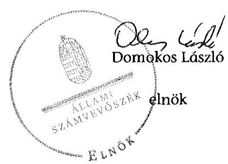

# ÁLLAMI   SZÁMVEVŐSZÉK 

## JELENTÉS

Az önkormányzatok gazdasági társaságai - Az önkormányzatok többségi tulajdonában lévő gazdasági társaságok közfeladat-ellátását érintő gazdálkodási tevékenysége szabályszerűségének ellenőrzése VKSZ Veszprémi Közüzemi Szolgáltató Zrt.

---

# Állami Számvevőszék 

Iktatószám: V-0734-048/2015
Témaszám: 1768
Vizsgálat-azonosító szám: V067141

## Az ellenőrzést felügyelte:

Dr. Horváth Margit
felügyeleti vezető

## Az ellenőrzést vezette és az ellenőrzés végrehajtásáért felelős:   Salamin Viktor   ellenőrzésvezető

A jelentéstervezet összeállításában közreműködtek:
Domonkosné Kurilla Edit
számvevő tanácsos

Az ellenőrzést végezte:
Domonkosné Kurilla Edit
Fekete Győr László
Laczi Hedvig Anna
számvevő tanácsos
számvevő
számvevő

---

# TARTALOMJEGYZÉK 

BEVEZETÉS ..... 7
I. ÖSSZEGZŐ MEGÁLLAPÍTÁSOK, KÖVETKEZTETÉSEK, JAVASLATOK ..... 10
II. RÉSZLETES MEGÁLLAPÍTÁSOK ..... 16

1. Az Önkormányzat közfeladat-ellátásának szabályszerűsége ..... 16
1.1. A közfeladat-ellátás megszervezése és a feladatellátás feltételrendszerének kialakítása ..... 16
1.2. A közfeladat-ellátás felügyelete és a tulajdonosi jogok érvényesítése ..... 17
2. A VKSZ Zrt. közfeladat-ellátással kapcsolatos tevékenysége ..... 20
2.1. A VKSZ Zrt. gazdálkodásának szabályozottsága ..... 20
2.2. A VKSZ Zrt. vagyongazdálkodása ..... 22
2.3. A beszámolási kötelezettség teljesítése ..... 26
3. A távhőszolgáltatás közfeladata bevételei és ráfordításai elszámolásának és önköltségszámításának szabályszerűsége ..... 28
3.1. A távhőszolgáltatás közfeladat bevételeinek és ráfordításainak szabályszerűsége ..... 28
3.2. Az önköltségszámítás szabályszerűsége ..... 29
4. Az ÁSZ korábbi, az önkormányzatok többségi tulajdonában lévő gazdasági társaságok közfeladat-ellátását, gazdálkodását, pénzügyi helyzetét érintő javaslataira tett intézkedések ..... 30
MELLÉKLETEK
5. számú A VKSZ Zrt. tevékenységének főbb adatai
6. számú A VKSZ Zrt. működésének főbb jellemzői
7. számú A VKSZ Zrt. által biztosított távhőszolgáltatás díjai a 2008-2013. évekre vonatkozóan
FÜGGELÉK
8. számú Értelmező szótár
9. számú Mintavételi eljárások ellenőrzési területenként

---

.

---

# RÖVIDÍTÉSEK JEGYZÉKE 

## Törvények

Adatvédelmi tv.

ÁSZ tv.
Gt.
Info tv.
Ltv.

Nvtv.

Ötv.

Ptk.
Rezsi. tv.
Számv. tv.
Tszt.

## Rendeletek

50/2011. (IX. 30.)
NFM rendelet

51/2011. (IX. 30.)
NFM rendelet
távhőszolgáltatási
rendelet
távhőszolgáltatási
díjrendelet
a személyes adatok védelméről és a közérdekű adatok nyilvánosságáról szóló 1992. évi LXIII. törvény (hatálytalan: 2012. január 1-jétől)
az Állami Számvevőszékről szóló 2011. évi LXVI. törvény (hatályos: 2011. július 1-jétől)
a gazdasági társaságokról szóló 2006. évi IV. törvény
2011. évi CXII. törvény az információs önrendelkezési jogról és az információszabadságról (hatályos: 2011. július 27-től)
az 1995. évi LXVI. törvény a köziratokról, a közlevéltárakról és a magánlevéltári anyag védelméről (hatályos: 1995. június 30-tól)
a nemzeti vagyonról szóló 2011. évi CXCVI. törvény (hatályos: 2011. december 31-étől, kivéve a 20. § (2) bekezdésben meghatározott paragrafusok, amelyek 2012. január 1-jétől, a (3) bekezdésben meghatározott paragrafusok 2013. január 1-jétől, a (4) bekezdésben meghatározott paragrafus 2012. március 2-ától léptek hatályba)
a helyi önkormányzatokról szóló 1990. évi LXV. törvény (hatálytalan: a 2014. évi általános önkormányzati választások napjától)
a Polgári Törvénykönyvről szóló 1959. évi IV. törvény
a rezsicsökkentések végrehajtásáról szóló 2013. évi LIV. törvény (hatályos: 2013. május 10-étől)
a számvitelről szóló 2000. évi C. törvény
a távhőszolgáltatásról szóló 2005. évi XVIII. törvény (hatályos: 2005. július 1-jétől)
a távhőszolgáltatónak értékesített távhő árának, valamint a lakossági felhasználónak és a külön kezelt intézménynek nyújtott távhőszolgáltatás díjának megállapításáról szóló 50/2011. (IX. 30.) NFM rendelet (hatályos: 2011. október 1-jétől)
a távhőszolgáltatási támogatásról szóló 51/2011. (IX. 30.) NFM rendelet (hatályos 2011. október 1-jétől)
Veszprém Megyei Jogú Város Önkormányzata Közgyűlésének 58/2006. (VI. 26.) számú rendelete a távhőszolgáltatásról szóló 2005. évi XVIII. törvény egyes rendelkezéseinek Veszprém város területén történő végrehajtásáról (hatályos: 2006. július 1-jétől módosításaival)
Veszprém Megyei Jogú Város Önkormányzata Közgyűlésének 59/2005. (XII. 15.) számú rendelete a Veszprém város területén érvényesülő távhőszolgáltatási díjak megállapításáról, valamint az áralkalmazási és díjfizetési feltételekről (hatályos: 2006. január 1-jétől módosításaival)

---

vagyongazdálkodási Veszprém Megyei Jogú Város Önkormányzata Közgyűlésének rendelet ${ }_{1} \quad$ 22/2005. (VI.27.) számú rendelete az Önkormányzat vagyonáról, a vagyongazdálkodás és vagyonhasznosítás szabályairól (hatályos: 2010. július 1-jétől 2010. június 27-éig)
vagyongazdálkodási Veszprém Megyei Jogú Város Önkormányzata Közgyűlésének rendelet ${ }_{2} \quad$ 22/2010. (VI. 28.) rendelete az Önkormányzat vagyonáról, a vagyongazdálkodás és vagyonhasznosítás szabályairól (hatályos: 2010. június 28-ától 2012. február 24-éig)
vagyongazdálkodási Veszprém Megyei Jogú Város Önkormányzata Közgyűlésének rendelet ${ }_{3} \quad$ 6/2012. (II. 24.) rendelete az Önkormányzat vagyonáról, a vagyongazdálkodás és vagyonhasznosítás szabályairól (hatályos: 2012. február 25-étől)

# Szórövidítések 

adatvédelmi szabályzat
Alapszabály
áfa
ÁSZ
Céginformációs
Szolgálat
értékelési szabályzat

FB
hátralékkezelés szabályzata

Hőforg Kft.

Hőszolgáltatási
Igazgatóság
Igazgatóság
javadalmazási szabályzat
jegyző
KEOP
Kötelezettségvállalási és Utalványozási szabályzat
leltározási szabályzat
a „VKSZ" Veszprémi Közüzemi Szolgáltató Zrt. adatvédelmi szabályzata (hatályos: 2008. október 1-jétől)
a „VKSZ" Veszprémi Közüzemi Szolgáltató Zártkörűen Működő Részvénytársaság Alapszabálya
általános forgalmi adó
Állami Számvevőszék
Céginformációs és az Elektronikus Cégeljárásban Közreműködő Szolgálat
a „VKSZ" Veszprémi Közüzemi Szolgáltató Zrt. Eszközök és források értékelési szabályzata (hatályos: 2005. október 7-étől)
a „VKSZ" Veszprémi Közüzemi Szolgáltató Zrt. Felügyelőbizottsága
„VKSZ" Veszprémi Közüzemi Szolgáltató Zrt. „A hátralékkezelés folyamata a távhőszolgáltatás üzletágnál" elnevezésű szabályzata (hatályos: 2010. június 21-étől)
„HÖFORG" Hőtermelő, Üzemeltető és Szolgáltató Kft., a „VKSZ" Veszprémi Közüzemi Szolgáltató Zrt. egyik jogelődje 2005. június 29-éig
a „VKSZ" Veszprémi Közüzemi Szolgáltató Zrt. Hőszolgáltatási Igazgatósága
a „VKSZ" Veszprémi Közüzemi Szolgáltató Zrt. Igazgatósága
a „VKSZ" Veszprémi Közüzemi Szolgáltató Zrt. javadalmazási szabályzata (hatályos: 2007. szeptember 26-ától)
Veszprém Megyei Jogú Város Önkormányzatának jegyzője
Környezet és Energia Operatív Program
a „VKSZ" Veszprémi Közüzemi Szolgáltató Zrt. kötelezettségvállalási és utalványozási szabályzata (hatályos: 2009. július 1-jétől)
a „VKSZ" Veszprémi Közüzemi Szolgáltató Zrt. eszközök és források leltározási, és leltárkészítési szabályzata (hatályos: 2007. január 15-étől)

---

| MEKH | Magyar Energetikai és Közmű-szabályozási Hivatal (2013. április 12-ig Magyar Energia Hivatal) |
| :--: | :--: |
| MEH ajánlás | a Magyar Energia Hivatal 2013. február 22-én kiadott 1/2013. ajánlása a távhőtermelők és távhőszolgáltatók számára előírt számviteli szétválasztási szabályok gyakorlati alkalmazásáról |
| Önkormányzat | Veszprém Megyei Jogú Város Önkormányzata |
| Önkormányzat | Veszprém Megyei Jogú Város Önkormányzatának Közgyűlése |
| önköltségszámítási szabályzat | a „VKSZ" Veszprémi Közüzemi Szolgáltató Zrt. önköltségszámítási szabályzata (hatályos: 2009. április 15-étől) |
| Önkormányzati SZMSZ ${ }_{1}$ | Veszprém Megyei Jogú Város Önkormányzata Közgyűlésének 35/2002. (XI. 15.) számú önkormányzati rendelete az Önkormányzat Szervezeti és Működési Szabályzatáról (hatályos: 2002. november 15-étől) |
| Önkormányzati SZMSZ ${ }_{2}$ | Veszprém Megyei Jogú Város Önkormányzata Közgyűlésének 29/2010. (VI. 28.) számú önkormányzati rendelete az Önkormányzat Szervezeti és Működési Szabályzatáról (hatályos: 2010. június 28-ától) |
| Önkormányzati SZMSZ ${ }_{3}$ | Veszprém Megyei Jogú Város Önkormányzata Közgyűlésének 9/2011. (III. 31.) számú önkormányzati rendelete az Önkormányzat Szervezeti és Működési Szabályzatáról (hatályos: 2011. március 31-étől) |
| Önkormányzati SZMSZ ${ }_{4}$ | Veszprém Megyei Jogú Város Önkormányzata Közgyűlésének a 1/2013. (I. 31.) számú önkormányzati rendelete az Önkormányzat Szervezeti és Működési Szabályzatáról (hatályos: 2013. január 31-étől) |
| pénzkezelési szabályzat | a „VKSZ" Veszprémi Közüzemi Szolgáltató Zrt. pénzkezelési szabályzata (hatályos: 2007. július 1-jétől) |
| polgármester | Veszprém Megyei Jogú Város Önkormányzatának polgármestere |
| Polgármesteri hivatal | Veszprém Megyei Jogú Város Önkormányzatának Polgármesteri hivatala |
| számviteli politika | a „VKSZ" Veszprémi Közüzemi Szolgáltató Zrt. számviteli politikája (hatályos: 2006. január 2-ától) |
| számviteli szétválasztási szabályzat társaság Közgyűlése | a „VKSZ" Veszprémi Közüzemi Szolgáltató Zrt. számviteli szétválasztási szabályzata (hatályos: 2012. július 1-jétől) |
| Távhőszolgáltatási | a „VKSZ" Veszprémi Közüzemi Szolgáltató Zrt. Közgyűlése |
| Üzletszabályzat | a „VKSZ" Veszprémi Közüzemi Szolgáltató Zrt. távhőszolgáltatási üzletszabályzata (hatályos: 2011. március 4-től) |
| Tulajdonosi Bizottság | Veszprém Megyei Jogú Város Önkormányzatának Tulajdonosi Bizottsága (2011. március 31-éig Gazdasági Bizottság) |
| Városfejlesztési Stratégia | Veszprém Megyei Jogú Város Önkormányzatának Integrált Városfejlesztési Stratégiája |
| VKSZ Zrt. | „VKSZ" Veszprémi Közüzemi Szolgáltató Zártkörűen Működő Részvénytársaság |

---

.

---

# JELENTÉS 

## Az önkormányzatok gazdasági társaságai Az önkormányzatok többségi tulajdonában lévő gazdasági társaságok közfeladat-ellátását érintő gazdálkodási tevékenysége szabályszerűségének ellenőrzése

## VKSZ Veszprémi Közüzemi Szolgáltató Zrt.

## BEVEZETÉS

Az Állami Számvevőszék középtávra szóló stratégiájában megfogalmazta, hogy a helyi önkormányzatok gazdálkodásában rejlő pénzügyi kockázatok feltárásával, az államháztartáson kívülre nyújtott költségvetési támogatások és ingyenes vagyonjuttatások, valamint az államháztartáson kívül működő köz-feladat-ellátó rendszerek ellenőrzéseivel hozzájárul ahhoz, hogy a közpénzeket az államháztartáson kívül működő szervezetek is átlátható, rendezett módon használják fel a közfeladatok szerződésben vállalt ellátása érdekében.

Az önkormányzatok szervezetalakítási szabadságának következménye, hogy a korábban is vállalati formában működő (nagyvárosi tömegközlekedés, víz-, szennyvízcsatorna, köztisztasági, ingatlankezelés stb.) közszolgáltatások mellett, mind a kötelező, mind az önként vállalt feladatok ellátásában a gazdasági társaságok kiemelt fontosságú szerephez jutottak.

Veszprém Megyei Jogú Város Önkormányzata az ellenőrzött időszakot megelőzően hozta létre a VKSZ Veszprémi Közüzemi Szolgáltató Zrt.-t, amely az ellenőrzött időszakban a távhőszolgáltatást egyik közfeladataként látta el. A 2008-2013. években a VKSZ Zrt. fő tevékenységi köre Veszprém közigazgatási területén a nem veszélyes hulladék kezelése, ártalmatlanítása, hasznosítása volt. Egyéb tevékenységi körében ellátta a köztemető üzemeltetés, kéményseprés, parkok és egyéb közterület fenntartása, közterületi parkolás, a lakás és helyiséggazdálkodás, valamint 2013-tól a vagyongazdálkodás feladatait.

Az ellenőrzött időszakban a VKSZ Zrt.-n belül a Hőszolgáltatási Igazgatóság végezte Veszprém város területén a távhőtermelés és a távhőszolgáltatás szakági feladatait. A hőellátást saját hőtermeléssel, valamint vásárolt hőenergia felhasználásával biztosította.

---

A VKSZ Zrt. az 57867 fő állandó lakosú ${ }^{1}$ Veszprém lakásállományának (26493 db) 30%-át a távfűtésbe bekapcsolt 128 épület hőenergia ellátását közel 29 km hosszú hőtávvezetéken keresztül biztosította. Veszprémben a távhővel ellátott 7869 lakás mellett 335 db egyéb felhasználónak (közintézmény és egyéb fogyasztó) is biztosították a hőszolgáltatást, a fűtési célú hőenergiát, és a használati melegvíz-ellátást. A távhőszolgáltató tulajdonában lévő hőközpontok száma 120 db. Az ellátott lakóépületek mintegy 60%-a rendelkezett szabályozható, költségmegosztásra, a mérés szerinti elszámolásra alkalmas belső fűtési rendszerrel.

Az ellenőrzött időszakban az Önkormányzat 97,93-98,72%-os minősített többségi befolyással rendelkezett a VKSZ Zrt.-ben. A VKSZ Zrt.-nek 2008-ban hét, a 2013. év végén nyolc gazdasági társaságban volt tulajdoni részesedése. Kizárólagos tulajdonában az ellenőrzött időszak elején három, a végén kettő gazdasági társaság állt.

Az VKSZ Zrt. éves nettó árbevétele a 2008-2013. években 3678,1 M Ft-ról 4798,9 M Ft-ra nőtt. A társaság a 2008-2009. években és a 2012. évben nyereségesen gazdálkodott, adózás előtti eredménye 70,7 M Ft és 596,3 M Ft között változott. A 2010-2011. években és a 2013. évben 471,2 M Ft, 2494,6 M Ft és 205,3 M Ft vesztesége keletkezett. A közfeladatok ellátására 2008-ban 292 főt, 2013-ban 422 főt, a távhőszolgáltatás területén 47 főt, illetve 54 főt foglalkoztattak.

Az ellenőrzött időszakban a polgármester és a jegyző személye egy alkalommal változott. A polgármester a 2010. évi önkormányzati választások óta tölti be tisztségét. A helyszíni ellenőrzés időszakában a munkakört betöltő jegyző 2011. április 1-je óta látja el feladatait. A 2008-2013. évek között a vezérigazgató személye nem, a gazdasági igazgató személye egy alkalommal változott. A helyszíni ellenőrzés idején hivatalban lévő vezérigazgató 2014. január 1-je, a gazdasági igazgató 2014. március 10-e óta tölti be tisztségét. A társaságot az ellenőrzött időszakban a 3-7 tagú Igazgatóság vezette, operatív munkáját a vezérigazgató irányította. Az ügyvezetés ellenőrzését a 3-9 tagú FB látta el.

Az önkormányzati tulajdonú gazdasági társaságok teljes körű ellenőrzésének lehetőségét az Állami Számvevőszékről szóló 1989. évi XXXVIII. törvény 2011. január 1-jétől hatályos módosítása teremtette meg.

# Az ellenőrzés célja annak értékelése volt, hogy 

- az önkormányzat a
 jogszabályi előírások figyelembevételével döntött-e az ellenőrzésre kerülő közfeladat megszervezéséről; az önkormányzat szabályszerűen gyakorolta-e a tulajdonosi jogokat;
- a gazdasági társaság közfeladat-ellátása bevételeinek, ráfordításainak elszámolása, és vagyongazdálkodási tevékenysége megfelelt-e a jogszabályi, illetve a közszolgáltatási szerződésben foglalt tulajdonosi előírásoknak, azok végrehajtása szabályszerű volt-e;

[^0]
[^0]:    ${ }^{1}$ Forrás: KSH: Tájékoztatási Adatbázis 2012. december 31.

---

- a közfeladatok átláthatósága és elszámoltathatósága érdekében biztosítva volt-e a közszolgáltatás díjának megalapozottsága szabályszerű önköltségszámítással.

Az ellenőrzés várható hasznosulása: A törvényalkotás számára - az észlelt problémák, szabálytalanságok, vagy egyéb nem kívánatos jelenségek felszínre kerülésével - az ellenőrzés megállapításai segítséget nyújthatnak az államháztartáson kívüli közfeladat-ellátás értékeléséhez, jogszabályi keretei pontosításához, átláthatóságot biztosító szabályozásához. Meghatározhatóvá válnak a közfeladat ellátásában részt vevő államháztartáson kívüli szervezeteknek - az önkormányzat költségvetését, pénzügyi helyzetét is befolyásoló - kockázatai, lehetővé válik ezen kockázatok csökkentése. Feltárja, hogy az önkormányzat közfeladat-ellátási kötelezettségének szabályszerűen tett-e eleget, a feladatellátáshoz rendelt közvagyon működtetését szabályszerűen szervezte-e meg és a tulajdonosi felügyelete hozzájárult-e a közfeladat-ellátásához. A feladatot ellátó gazdasági társaság a közszolgáltatási szerződésben foglaltak betartásával, a közvagyon használatával biztosította-e a szolgáltatás folytatásának feltételeit. Ezzel az ellenőrzöttek és a helyi döntéshozók számára visszajelzést ad feladatszervezési, feladat-ellátási kockázataikról, alapot ad a meglévő hibák megszüntetéséhez, a jobb közfeladat-ellátás biztosításához. Fokozza a fegyelmet, igazolja, hogy lejárt a következmények nélküli ellenőrzések időszaka. Az ÁSZ értékteremtő rend kialakításához és megőrzéséhez hozzájáruló tevékenysége pozitív hatással van a szervezetről kialakított összkép formálására is.

Az ellenőrzést a számvevőszéki ellenőrzés szakmai szabályai szerint, szabályszerűségi ellenőrzés módszerével, a vonatkozó nemzetközi standardok figyelembevételével végeztük. Az ellenőrzés kiterjedt Veszprém Megyei Jogú Város Önkormányzatára és a „VKSZ" Veszprémi Közüzemi Szolgáltató Zártkörűen Működő Részvénytársaságra. Az ellenőrzés a 2008-2013. évekre terjedt ki.

Az ellenőrzés végrehajtásának jogszabályi alapját az ÁSZ törvény 5. § (3)-(5) bekezdései képezték.

Az ÁSZ az Állami Számvevőszékről szóló 2011. évi LXVI. törvény 29. §-a alapján a jelentéstervezetet észrevételezésre megküldte a polgármesternek és a Zrt. vezérigazgatójának. Az érintettek egyetértő észrevételt tettek.

---

# I. ÖSSZEGZŐ MEGÁLLAPÍTÁSOK, KÖVETKEZTETÉSEK, JAVASLATOK 

Veszprém Megyei Jogú Város Önkormányzata közigazgatási területén a távhőszolgáltatás közfeladatának megszervezéséről a jogszabályi előírásoknak megfelelően döntött. Az Önkormányzat kötelező feladataként meghatározott távhőszolgáltatási feladatot a VKSZ Zrt. látta el. A VKSZ Zrt. a Hőforg Kft.-nek a Veszprémi Kommunális Rt.-be való beolvadása révén az ellenőrzött időszakot megelőzően jött létre az Önkormányzat kizárólagos tulajdonaként. Az Önkormányzat a kizárólagos tulajdonában lévő Hőforg Kft.-be apportálta a távhőszolgáltatást biztosító vagyont, így a közfeladat-ellátást szolgáló vagyon az összeolvadást követően a VKSZ Zrt. saját vagyonát képezte. Az Önkormányzat a 2008-2013. évek között a VKSZ Zrt. részére a távhőszolgáltatás közfeladat ellátásához kezelésre vagyont nem adott át. Az Önkormányzat gazdasági programjaiban és a Városfejlesztési Stratégiában a távhőszolgáltató rendszer fejlesztésével összefüggésben stratégiai célokat, fejlesztési irányokat, konkrét feladatokat nem határozott meg.

Az Önkormányzat a távhőszolgáltatásra vonatkozó, a Tszt.-ben előírt feladatokkal összefüggő szabályozási kötelezettségét a távhőszolgáltatási rendelet és a távhőszolgáltatási díjrendelet elfogadásával teljesítette. A távhőszolgáltatási rendeletben a Tszt.-ben előírtak szerint kijelölték azon területeket, ahol a területfejlesztési, környezetvédelmi és levegőtisztaság-védelmi szempontok alapján célszerű a távhőszolgáltatás fejlesztése. A távhőszolgáltatási díjrendeletben a Tszt. előírásainak változásához igazodóan meghatározták az ármegállapítói feladatokat, az áralkalmazási és díjfizetési feltételeket, a távhőszolgáltatási díjra vonatkozó részletszabályokat, a csatlakozási díj mértékét, a csatlakozási díjat és a díjfizetés feltételeit.

Az Önkormányzat a vagyongazdálkodási rendelet 1-3.§-ban határozta meg a tulajdonosi jogok gyakorlásának szabályait. A vagyongazdálkodási rendelet 1-3.§ a polgármester hatásköreként határozta meg az Önkormányzat Közgyűlésének, mint a tulajdonosi jogok gyakorlójának képviseletét a tulajdonában lévő gazdasági társaság legfőbb döntést hozó testületének hatáskörébe tartozó döntések meghozatala során. A Tulajdonosi Bizottság hatáskörébe utalta a társaság Közgyűlésének döntéshozatalát megelőző állásfoglalás kialakítását a Számv. tv. szerinti beszámoló jóváhagyásáról és az adózott eredmény felhasználásáról, továbbá a társaság vagyonát képező ingatlan, ingatlanrész elidegenítéséről, az éves üzleti terv elfogadásáról.

A VKSZ Zrt. az ellenőrzött időszak minden évében elkészítette üzleti tervét, amelyet a társaság Közgyűlése elfogadott. Az éves üzleti terveket a Tulajdonosi Bizottság a társaság Közgyűlése általi elfogadást megelőzően megtárgyalta és a vagyongazdálkodási rendelet 1-3.§-nek megfelelően elfogadta. Az Önkormányzat az üzleti tervek vonatkozásában tulajdonosi elvárásokat nem fogalmazott meg. A VKSZ Zrt. az üzleti tervekben meghatározott gazdasági célkitűzések teljesülését az üzleti jelentésekben értékelte. Az üzleti tervek összhangban voltak az Ön-

---

kormányzat távhőszolgáltatási közfeladat ellátására vonatkozó távhőszolgáltatási rendelet és a távhőszolgáltatási díjrendelet tartalmával.

A VKSZ Zrt. a távhőtermelési és távhőszolgáltatási tevékenységét működési engedélyek alapján végezte. A társaság 2011. március 4-ét megelőzően nem rendelkezett a Tszt. előírásaival összhangban lévő távhőszolgáltatási üzletszabályzattal. A 2011. március 4-étől hatályos Távhőszolgáltatási Üzletszabályzat az előírásoknak megfelelő tartalommal készült. A VKSZ Zrt. elkészítette a működéséhez szükséges belső szabályzatokat, a számviteli politikát, valamint a számviteli politika keretében előírt szabályzatok közül a leltározási szabályzatot, az értékelési szabályzatot és a pénzkezelési szabályzatot. A Számv. tv. előírásai ellenére számlarendet nem készített. A Tszt. 2012. évtől hatályos előírásainak megfelelően a távhőszolgáltatás bevételeinek és ráfordításainak tevékenységenkénti szétválasztását a számviteli szétválasztási szabályzatban határozták meg.

A társaság távhőszolgáltatási célra az Önkormányzattól üzemeltetésre, vagyonkezelésre eszközöket nem kapott. Az ellenőrzött időszakban a VKSZ Zrt. a távhőszolgáltatási célú saját vagyonának nyilvántartását az értékelési szabályzatban, a számviteli politikában meghatározott módon, az eszközök és források mérlegben szereplő értékének leltárral való alátámasztását a leltározási szabályzat szerint biztosította. Az eszközök és források értékét leltárral támasztotta alá. A társaság átlátható, naprakész vagyonnyilvántartással rendelkezett. A VKSZ Zrt. vagyongazdálkodási tevékenysége a távhőszolgáltatási közfeladat ellátása - a távhő ágazat bevételeinek és felhalmozási kiadásainak ellenőrzése során tapasztalt hiányosságok kivételével - megfelelt a jogszabályi előírásoknak.

A VKSZ Zrt. eszközeinek könyv szerinti értéke az ellenőrzött időszakban végrehajtott jelentős vagyonváltozások ellenére a 2013. év végére lényegében nem változott, mindössze 0,9%-os növekedést mutatott a 2008. évhez viszonyítva, miközben a 2010. évben a tárgyi eszközök értéke közel megkétszereződött az előző évhez képest. A 2010-2011. években a tárgyi eszközök kiugróan magas állományi értékét a Veszprémi Aréna beruházás aktiválása, 2012. évi drasztikusan csökkenő összegét ezen eszközök átalakulás miatt könyvekből történő kivezetése eredményezte. A tárgyi eszközök mérlegben kimutatott értéke a 2008. évi 4567,9 M Ft-ról a 2013. évre 13,8%-kal, 3936,7 M Ft-ra csökkent, amely a tárgyi eszközök pótlásának hiányát mutatja. A VKSZ Zrt. forrásainak változásában a saját tőke csökkenése és a kötelezettségek állományának közel kétszeresére történt növekedése játszott szerepet.

A 2012-2013. években a távhő üzletág eszközállománya a VKSZ Zrt. teljes eszközállományának egyötödét tette ki. A távhő-ellátást szolgáló tárgyi eszköz vagyon a 2013. év végére a 2008. évről 19,7%-kal csökkent, mert az eszközök fejlesztésére, karbantartására fordított költségek az elszámolt értékcsökkenés alatt maradtak. A tárgyi eszközökön belül az ingatlanok elhasználódási szintje 2008-ról 2013-ra 10,2%-ról 23,0%-ra, a műszaki berendezések és egyéb eszközöké 27,3%-ról 71,1%-ra nőtt.

A távhőágazat nettó árbevétele a 2013. évben 23,7%-kal növekedett, ezen belül a távhőszolgáltatás nettó árbevétele nagyrészt a rezsicsökkentés hatására

---

9,7%-kal mérséklődött az előző évhez viszonyítva. A távhőszolgáltatás költségeinek kompenzálására a VKSZ Zrt. a 2011. évben 96,2 M Ft, a 2012. évben 586,6 M Ft, a 2013. évben 682,0 M Ft távhőtámogatást kapott, amely kedvezően hatott az ágazat eredményességére, de a 2013. évi veszteséget nem tudta kompenzálni.

A távhő üzletágban kimutatott vevőkövetelés a behajtási tevékenység és az értékvesztés elszámolásának következtében a 2013. évben 18,7%-kal csökkent az előző évhez viszonyítva. A VKSZ Zrt.-nél a kintlévőségek kezelése a hátralékkezelési szabályzatnak megfelelően történt. A lejárt követelések állományának alakulását figyelemmel követték, a likviditási helyzet javítása és a követelések beszedése érdekében intézkedtek. A követelésállományt a számviteli politika előírásainak megfelelően minősítették és az értékvesztést elszámolták.

A VKSZ Zrt. az ellenőrzött időszak során a távhő üzletághoz kapcsolódóan egy fejlesztési projektjéhez nyert Európai uniós forrásból támogatást. A beruházáshoz az Önkormányzat Közgyűlése a vagyongazdálkodási rendelet 1,2.§ előírásainak megfelelően tulajdonosi hozzájárulást adott. Az Önkormányzat az ellenőrzött időszakban a VKSZ Zrt.-nek a távhőszolgáltatással kapcsolatosan működési és felhalmozási célú pénzeszközt nem adott át, kölcsönt, garancia- és kezességvállalást nem nyújtott.

A VKSZ Zrt. a Számv. tv. előírásai szerinti éves beszámoló és üzleti jelentés készítési kötelezettségének eleget tett. A Tulajdonosi Bizottság a VKSZ Zrt. éves beszámolóit megtárgyalta, állást foglalt, majd elfogadásra javasolta a polgármesternek, aki a társaság Közgyűlésén gyakorolta az Önkormányzat Közgyűlésének tulajdonosi jogait. A társaság Közgyűlése az éves beszámolók elfogadásáról az FB és a könyvvizsgáló jelentésének ismeretében döntött. A VKSZ Zrt. a Számv. tv.-ben foglaltakkal összhangban közzétette a társaság Közgyűlése által elfogadott éves beszámolót.

Az éves beszámolókról az FB jelentést készített, elfogadásukat javasolta a társaság Közgyűlésének. A könyvvizsgáló az éves beszámolókat hitelesítő záradékkal látta el, a 2012. és a 2013. évi beszámolóhoz kapcsolóan a Tszt.-ben előírtaknak megfelelően igazolta a keresztfinanszírozás-mentességet. Az ellenőrzött időszakban az FB és a könyvvizsgáló figyelemfelhívást nem tett, nem kezdeményezte a társaság Közgyűlésének összehívását.

A VKSZ Zrt. a 2012-2013. években a Tszt. és az Info tv. előírásainak megfelelően teljesítette közzétételi kötelezettségét. A honlapján megtalálhatóak a szervezetére, tevékenységére és a gazdálkodására vonatkozó adatok.

Az Önkormányzat belső ellenőrzése az ellenőrzéseivel a távhőszolgáltatás, mint közfeladat szabályszerű ellátásához nem járult hozzá. Az Önkormányzat a 2008-2012 közötti időszakban nem élt az Ötv.-ben biztosított lehetőséggel, mivel a társaság gazdálkodásával és működésével kapcsolatban ellenőrzést nem folytatott le.

A VKSZ Zrt. az ellenőrzött időszakban végzett külső ellenőrzés által a távhőszolgáltatási tevékenységgel összefüggően tett javaslatot végrehajtotta. A

---

külső ellenőrzésekkel kapcsolatban az Önkormányzat tájékoztatási kötelezettséget nem írt elő.

A VKSZ Zrt. a távhőszolgáltatás közfeladat ellátásának átláthatósága és a keresztfinanszírozás elkerülése érdekében e tevékenységeinek bevételeit és ráfordításait elkülönítetten, a számviteli nyilvántartások részletezésével tartotta nyilván. A Tszt. számviteli szétválasztásra vonatkozó előírásainak megfelelően 2012. évtől a távhőszolgáltatási tevékenységet az éves beszámoló kiegészítő mellékletében elkülönítetten is bemutatta.

A távhőszolgáltatás anyagjellegű ráfordításainak elszámolása szabályszerű volt. Az árbevételek elszámolása - a mintavételes ellenőrzés tapasztalatai alapján - az ellenőrzött időszakban nem volt szabályszerű, mivel 2008. és 2011. március 4. között a Tszt.-ben foglaltaknak ellenére a társaság nem rendelkezett a bevételek kiszámlázásának folyamatát szabályozó távhőszolgáltatási üzletszabályzattal. A VKSZ Zrt. beruházásainak és felújításainak elszámolása - a mintavételes ellenőrzés eredményeként - kockázatot mutatott. Az eszközök nem a tényleges gazdasági tartalmuknak megfelelő besorolása következtében az értékcsökkenés elszámolása esetenként nem a Számv. tv. előírásainak, valamint a számviteli politikában meghatározott szabályoknak megfelelően történt. A beszerzett eszközök állományba vételét a Kötelezettségvállalási és Utalványozási szabályzatban foglaltak ellenére nem minden esetben támasztotta alá kötelezettségvállalás, továbbá az Ltv. előírása ellenére nem állt rendelkezésre a mintatétel teljes dokumentációja.

A VKSZ Zrt. a 2008. és 2009. április 15. közötti időszakban a Számv. tv.-ben foglaltak ellenére önköltségszámítási szabályzat készítési kötelezettségének nem
 tett eleget. Ezt követően elkészített önköltségszámítási szabályzat nem határozta meg az alkalmazandó kalkulációs módszereket, a kalkulációs időszakot, hiányos volt a költségek vetítési alapjának, a tevékenységek önköltségének meghatározása tekintetében. Az önköltségszámítási szabályzat nem felelt meg a Számv. tv.-ben foglaltaknak, mivel nem tartalmazta az utókalkulációra vonatkozó szabályokat. A közszolgáltatások díjának 2008 és 2011. április 15. közötti megállapítása szabályos önköltségszámítási szabályzattal nem volt megalapozott.

A Rezsi. tv.-ben előírt feladatokat végrehajtották. A távhőszolgáltatásból származó árbevétel csökkenését a kapott és igénybevett távhőtámogatás nem kompenzálta.

Az ÁSZ az ellenőrzött időszakban két önálló jelentéssel lezárt ellenőrzést végzett az Önkormányzatnál. A 2011-ben kiadott jelentésben megfogalmazott két javaslat közül az egyik javaslat részben teljesült, mert féléves gyakorisággal szemben évente történt meg a gazdasági társaságok szerepének, gazdálkodásának, eredményeik alakulásának bemutatása az Önkormányzat Közgyűlése számára. A másik javaslat teljesült, mivel a jegyző a tulajdonosi jogkört gyakorlók közreműködésével folyamatosan figyelemmel kísérte a gazdasági társaságok kötelezettségeinek alakulását, az Önkormányzat likviditására, pénzügyi egyensúlyi helyzetére gyakorolt hatását.

---

A fentiekben leírtak összegzéseként az alábbi megállapításokat tesszük:
Veszprém Megyei Jogú Város Önkormányzatának Közgyűlése a távhőszolgáltatás közfeladatának megszervezéséről, a tulajdonosi jogainak biztosításáról a jogszabályi előírásoknak megfelelően gondoskodott. A távhőszolgáltatás kötelező feladatát önkormányzati többségi tulajdonú társasággal teljesítette. A VKSZ Zrt. a távhőszolgáltatási közfeladata mellett más közfeladatokat és egyéb tevékenységeket is végzett az ellenőrzött időszak során. A távhőszolgáltatási közfeladatát a saját vagyonát képező eszközállományával látta el, a feladatellátáshoz az Önkormányzat működési vagy fejlesztési támogatást nem nyújtott. A távhőszolgáltatáshoz kapcsolódó vagyongazdálkodási tevékenység - a mintavételes ellenőrzés során tapasztalt hiányosságok kivételével - szabályszerű volt. A VKSZ Zrt. működésének szabályozottsága és annak gyakorlati alkalmazása az ellenőrzött időszakban - az üzletszabályzat, a számlarend, valamint az árbevételek, a beruházások, felújítások aktiválása és értékcsökkenési leírásuk elszámolása, illetve dokumentálása kivételével - az előírásoknak megfelelt. Az árbevételek elszámolása nem volt szabályszerű, a beruházások és felújítások elszámolása kockázatot mutatott. A számviteli szétválasztási szabályzat és az alkalmazott gyakorlat biztosította a távhőszolgáltatási közfeladat átláthatóságát és elszámoltathatóságát. A társaságnál a kintlévőségek kezelése a szabályozás szerint működött. A vevők felé fennálló követelésállomány a 2013. évben csökkent.

Az Állami Számvevőszékről szóló 2011. évi LXVI. törvény 33. § (1) bekezdésében foglaltak értelmében a jelentésben foglalt megállapításokhoz kapcsolódó intézkedési tervet köteles az ellenőrzött szervezet vezetője összeállítani, és azt a jelentés kézhezvételétől számított 30 napon belül az ÁSZ részére megküldeni. Amennyiben az intézkedési tervet határidőben nem küldi meg a szervezet, vagy az nem elfogadható, az ÁSZ elnöke a hivatkozott törvény 33. § (3) bekezdés a)-b) pontjaiban foglaltakat érvényesítheti.

Az ellenőrzés intézkedést igénylő megállapításai és javaslatai:
Javaslataink célja a Zrt. gazdálkodása szabályszerűségének helyreállítása annak érdekében, hogy a szabályozási környezet megfelelően tudja támogatni az átlátható működést.

# Javasoljuk a VKSZ Veszprémi Közüzemi Szolgáltató Zrt. Vezérigazgatójának: 

1. Az önköltségszámítási szabályzat részben tartalmazta a felosztandó költségek vetítési alapjait, a tevékenységek önköltségének meghatározását, nem tartalmazta az alkalmazandó kalkulációs módszereket, az elő- és utókalkulációs módszerek leírását, valamint az elő- és utókalkulációs időszak meghatározását. Az önköltségszámítási szabályzat nem felelt meg a Számv. tv. 14. § (7) bekezdésben foglaltaknak, mivel nem tartalmazta az utókalkulációra vonatkozó szabályokat.

A VKSZ Zrt. beruházásainak és felújításainak elszámolása a mintavételes ellenőrzés eredményeként kockázatot mutatott. Az eszközök besorolása nem a tényleges gazdasági tartalmuknak megfelelően történt meg, ezáltal az értékcsökkenés elszámolása

---

nem felelt meg a Számv. tv. 16. § (3) bekezdésében és az 52. § (1) bekezdésében, valamint a társaság számviteli politikájában foglaltaknak. A beszerzett eszközök állományba vételét - a Kötelezettségvállalási és Utalványozási szabályzatban foglaltak ellenére - nem minden esetben támasztotta alá kötelezettségvállalás, valamint nem minden esetben állt rendelkezésre - az Ltv. 9. § (1) bekezdésben, az iratok megőrzésére vonatkozó előírás ellenére - a mintatétel teljes dokumentációja.

Javaslat:

# Intézkedjen a szabályozási hiányosságok megszüntetésére, ennek keretében: 

a) a jogszabályi előírásoknak, valamint a helyi sajátosságoknak megfelelően aktualizálja az önköltségszámítási szabályzatot, abban jelenítse meg a felosztandó költségek vetítési alapját, a tevékenységek önköltségének meghatározását, az alkalmazandó kalkulációs módszereket, az elő- és utókalkulációs módszerek leírását, az elő- és utókalkulációs időszak meghatározását, valamint az utókalkulációra vonatkozó előírásokat;
b) a jogszabályi előírásoknak, valamint a hatályos Kötelezettségvállalási és Utalványozási szabályzatnak megfelelően gondoskodjon a beruházások és felújítások elszámolásáról, a dokumentumok megőrzéséről.

Javaslataink célja az önkormányzat szabályszerű működésének elősegítése, továbbá az önkormányzati tulajdonosi joggyakorlás kontrolljainak erősítése.

## Javasoljuk Veszprém Város Önkormányzata Jegyzöjének:

1. Az Önkormányzat belső ellenőrzése az ellenőrzéseivel a távhőszolgáltatás, mint közfeladat szabályszerű ellátásához nem járult hozzá. Az Önkormányzat a 2008-2012. közötti időszakban nem élt az Ötv-ben biztosított lehetőséggel, a társaság gazdálkodásával és működésével kapcsolatban ellenőrzést nem folytatott le.

Javaslat:
Intézkedjen a jogszabályi előírások szerinti gyakorlat és a szabályos működés biztosítására, ezen belül:
fordítson kiemelt figyelmet arra, hogy az önkormányzat belső ellenőrzése az ellenőrzéseivel a távhőszolgáltatás, mint közfeladat-ellátás szabályszerű ellátásához ellenőrzéseivel járuljon hozzá.

---

# II. RÉSZLETES MEGÁLLAPÍTÁSOK 

## 1. Az ÖNKORMÁNYZAT KÖZFELADAT-ELLÁTÁSÁNAK SZABÁLYSZERŰSÉGE

### 1.1. A közfeladat-ellátás megszervezése és a feladatellátás feltételrendszerének kialakítása

Az Önkormányzat a gazdasági programjaiban és a Városfejlesztési Stratégiában határozta meg azon célkitűzéseket, amelyek az ellátandó feladatok biztosítását, fejlesztését szolgálják. A 2007-2010., illetve a 2011-2014. évekre vonatkozó gazdasági programok ${ }^{2}$ és a Városfejlesztési Stratégiában a távhőszolgáltatás ellátásának biztosításával, a távhőszolgáltató rendszer fejlesztésével kapcsolatban stratégiai célokat, feladatokat nem fogalmaztak meg. Az Nvtv. 9. § (1) bekezdésében előírtak ellenére az Önkormányzat 2012. január 1. és 2012. október 25. között közép- és hosszú távú vagyongazdálkodási tervvel nem rendelkezett. A közép- és hosszú távú vagyongazdálkodási tervet az Önkormányzat Közgyűlése a 321/2012. (X. 26.) számú határozatával 2012. október 26-án fogadta el.

A távhőszolgáltatással ellátott létesítmények távhőellátásának távhőszolgáltatásra engedéllyel rendelkezők útján történő biztosítása a Tszt. 6. § (1) bekezdése értelmében a területileg illetékes települési önkormányzat kötelező feladata. Az ellenőrzött időszakban az Önkormányzati SZMSZ ${ }_{1-4}$ az Önkormányzat kötelező feladataként határozta meg a távhőszolgáltatás közfeladatának ellátását. Az Önkormányzat a távhőszolgáltatási közfeladat-ellátás megszervezéséről és a közfeladat-ellátás módjáról a jogszabályi előírásoknak megfelelően döntött. A távhőszolgáltatás kötelező feladatát a VKSZ Zrt. látta el.

A távhőszolgáltatási közfeladatot ellátó VKSZ Zrt. többségi befolyással - a 2013. évben 98,72%-kal - rendelkező tulajdonosa az Önkormányzat volt. A társaság a Hőforg Kft.-nek a Veszprémi Kommunális Rt.-be való beolvadásával 2005. április 28-án az Önkormányzat kizárólagos tulajdonaként jött létre, amely 2005. június 30-ától VKSZ Zrt. néven működött.

Az Önkormányzat - az ellenőrzött időszakot megelőzően - a kizárólagos tulajdonában lévő Hőforg Kft.-be apportálta a távhőszolgáltatást biztosító vagyont, így az a társaság saját vagyonát képezte. Az összeolvadás révén a távhőszolgáltatást biztosító vagyon a VKSZ Zrt. tulajdonába került. Az Önkormányzat a 2008-2013. évek között a VKSZ Zrt. részére a hőellátással kapcsolatos közfeladat ellátásához kezelésre vagyont nem adott át.

[^0]
[^0]:    ${ }^{2}$ Az Önkormányzat Közgyűlése a 157/2007. (VI. 27.) számú, illetve a 66/2011. (IV. 1.) számú határozataival fogadta el.

---

Az ellenőrzött időszakban a VKSZ Zrt. fő tevékenységi köre Veszprém Város közigazgatási területén a nem veszélyes hulladék kezelése, ártalmatlanítása, hasznosítása volt. Egyéb tevékenységi körei között szerepelt a távhőszolgáltatás, amelyet a VKSZ Zrt.-n belül a Hőszolgáltatási Igazgatóság látta el. A hőellátást egyrészt saját hőtermeléssel (négy telephelyen), másrészt külső távhőtermelőtől hosszú távú hőszállítási szerződések keretében vásárolt hőenergia felhasználásával biztosította. A VKSZ Zrt. főbb adatait az 1. számú melléklet, a társaság működésének főbb jellemzőit a 2. számú melléklet tartalmazza.

Az Önkormányzat a távhőszolgáltatásra vonatkozóan a Tszt. 6. § (2) bekezdésében előírt szabályozási kötelezettségének eleget tett. Az Önkormányzat a vonatkozó jogszabályi előírások figyelembevételével alkotta meg a távhőszolgáltatási rendeletet és a távhőszolgáltatási díjrendeletet.

Az Önkormányzat Közgyűlése a távhőszolgáltatási rendeletben meghatározta a távhőszolgáltató és a felhasználó közötti jogviszony részletes szabályait, a felhasználóra vonatkozó jogokat és kötelezettségeket, a közüzemi szerződés tartalmát, felmondásának feltételeit, a szüneteltetés, korlátozás szabályait, a mérés feltételeit, a tájékoztatási kötelezettségeket, a távhőfejlesztésre kijelölt területeket. A távhőszolgáltatási rendelet mellékletében a Tszt. 6. § (2) bekezdés c) pontjában előírtak szerint kijelölték Veszprém város azon területeit, ahol a területfejlesztési, környezetvédelmi és levegőtisztaság-védelmi szempontok alapján célszerű a távhőszolgáltatás fejlesztése.

Az Önkormányzat Közgyűlése a távhőszolgáltatási díjrendeletben határozta meg az ármegállapítói feladatokat, az áralkalmazási és díjfizetési feltételeket, köztük a távhőszolgáltatási díj mértékét és összetevőit, a díj mértékének alapját és a kiszámítási szabályait, a melegvíz hődíj alapjául szolgáló átalány szerinti havi vízmennyiséget, a díjtételek megváltoztatásának automatizmusát, a csatlakozási díj mértékét, a díjvisszatérítés és pótdíjfizetés eseteit. A távhőszolgáltatási díjrendelet 2011. december 16-ától hatályos módosítása késedelmesen, de a Tszt. 6. § (2) bekezdés b) pontjának 2011. április 15-étől hatályos módosításához igazodóan rögzítette a távhőszolgáltatásért fizetendő díjak szerkezetének, legmagasabb díjainak, azok alkalmazása időpontjának - a Tszt. 60. § (2) bekezdés b) pontjában adott felhatalmazás alapján - miniszteri rendelet szerinti megállapítását, továbbá a csatlakozási díjat és a díjfizetés feltételeit.

# 1.2. A közfeladat-ellátás felügyelete és a tulajdonosi jogok érvényesítése 

Az Önkormányzat a vagyongazdálkodási rendelet ${ }_{1-3}$-ben határozta meg a tulajdonosi jogok gyakorlásának szabályait. Az Önkormányzat a vagyongazdálkodási rendelet ${ }_{1-3}$-ében a tulajdonosi jogok gyakorlására az Önkormányzat Közgyűlése és a polgármester kapott felhatalmazást.

Az Önkormányzat Közgyűlésének a vagyongazdálkodási rendelet ${ }_{1-3}$-ben rögzítettek szerint feladata volt állást foglalni többek között a legfőbb döntést hozó testület (társaság Közgyűlése) elé kerülő - társasági szerződés stratégiai jellegű módosítása, a társaság alaptőkéjének felemelése és leszállítása, a társaság átalakulásának, megszűntetésének, valamint más társasági formába történő működésének ügyében, valamint a vezérigazgató, igazgatósági tag kinevezéséről, a könyvvizsgáló személyéről, a nettó 50,0 M Ft forgalmi érték feletti ingatlan elidegenítéséről.

A vagyongazdálkodási rendelet ${ }_{1-3}$ a polgármester hatásköreként határozta meg az Önkormányzat Közgyűlésének, mint a tulajdonosi jogok gyakorlójának képviseletét a tulajdonában lévő gazdasági társaság legfőbb döntést hozó testületének (a társaság Közgyűlésének) hatáskörébe tartozó döntések meghozatala során.

A vagyongazdálkodási rendelet ${ }_{1-3}$ a Tulajdonosi Bizottság hatáskörébe utalta a társaság Közgyűlésének döntéshozatalát megelőzően állásfoglalás kialakítását a Számv. tv. szerinti beszámoló jóváhagyásáról és az adózott eredmény felhasználásáról, a VKSZ Zrt. vagyonát képező ingatlan elidegenítéséről, az éves üzleti terv elfogadásáról.

Az ellenőrzött időszakban az Önkormányzat Közgyűlése tulajdonosi jogait a vagyongazdálkodási rendelet ${ }_{1-3}$-ben előírtak szerint gyakorolta. A társaság Közgyűlésében az Önkormányzat Közgyűlését a polgármester képviselte. Az Önkormányzat Közgyűlése a közfeladatot ellátó VKSZ Zrt.-nek a távhőszolgáltatási közfeladat tekintetében tulajdonosi jogokat nem adott át.

A VKSZ Zrt. az ellenőrzött időszak minden évében készített üzleti tervet, melyekben meghatározta a műszaki-szolgáltatási és a gazdálkodásra vonatkozó éves terveket. Az Önkormányzat az üzleti tervek vonatkozásában tulajdonosi elvárásokat nem fogalmazott meg. Az éves üzleti tervek és az éves számviteli beszámolók társasági Közgyűlés elé történő előterjesztését Tulajdonosi Bizottság határozatában minden esetben a vagyongazdálkodási rendelet ${ }_{1-3}$-ban meghatározottak szerint véleményezte és
 jóváhagyásra javasolta a társaság Közgyűlése számára.

Az Önkormányzat a VKSZ Zrt. számára az üzleti terven és az éves beszámolón túlmenően adatszolgáltatási, beszámolási kötelezettséget nem írt elő. A Tulajdonosi Bizottság a VKSZ Zrt. a távhőszolgáltatási tevékenységének alakulásáról, a közszolgáltatási feladatainak ellátásáról összeállított éves beszámolóit megtárgyalta, állást foglalt, majd elfogadásra javasolta a polgármesternek, aki a társaság Közgyűlésén gyakorolta az Önkormányzat Közgyűlésének tulajdonosi jogait.

A VKSZ Zrt. Alapszabályának megfelelően a társaság vezető tisztviselői, az FB tagjai és más, a legfőbb szerv által meghatározott vezető állású munkavállalói javadalmazása módjáról, mértékének főbb elveiről, annak rendszeréről a társaság Közgyűlése Javadalmazási szabályzatot fogadott el. A VKSZ Zrt. Alapszabályának megfelelően a társaság Közgyűlése évente értékelte a vezető tisztségviselők munkáját.

Az Önkormányzat belső ellenőrzése az ellenőrzéseivel a távhőszolgáltatás, mint közfeladat szabályszerű ellátásához nem járult hozzá. Az Önkormányzat a 2008-2012. években nem élt az Ötv. 92. § (11) bekezdés b) pontjában ${ }^{3}$ biztosított lehetőséggel, mivel a társaság gazdálkodásával és működésével kapcsolatban ellenőrzést nem folytatott le. A társaságnál az Önkormányzat által megbízott külső szervezet ellenőrzést nem végzett.

Az Önkormányzat belső ellenőrzése 2012-ben végzett ellenőrzést a VKSZ Zrt.-nél az ingatlan-hasznosítási tevékenységgel kapcsolatban, azonban az ellenőrzés a távhőszolgáltatási közfeladat-ellátására nem terjedt ki.

A VKSZ Zrt. 2008. évi 1650,0 M Ft-os jegyzett tőkéje az ellenőrzött időszak végére - az Önkormányzat tőkeemeléseinek eredményeképpen - 2739,8 M Ft-ra növekedett. A tőkeemelésre az ellenőrzött időszakban végrehajtott feladatváltozások, szervezeti átalakulások miatt volt szükség. A változások a távhőszolgáltatást nem érintették. A VKSZ Zrt. a 2008-2009-ben és a 2012. évben nyereségesen, 2010-2011-ben és 2013-ban veszteségesen gazdálkodott. Az ellenőrzött időszakban összesen 3171,1 M Ft veszteséget és 941,5 M Ft nyereséget számolt el. Osztalékfizetésre nem került sor.

A VKSZ Zrt. saját tőkéjének a jegyzett tőkéhez viszonyított aránya a 2008. évi 245,2 %-ról 2011. év végére 42,0 %-ra csökkent, majd a 2012. évi 123,6 %-ról, a 2013. évben 116,1 %-ra mérséklődött. A 2011. évben saját tőke csökkenését alapvetően a deviza árfolyam-különbözetek elszámolása miatt keletkezett veszteség okozta.

A Polgármesteri hivatal Pénzügyi Irodája az ellenőrzött időszakban évente végzett „részvényértékelés” keretében megállapította, hogy a VKSZ Zrt.-nél a saját tőke/jegyzett tőkemutató előírt szintje a 2011. év kivételével megfelelt a Gt. 51. § (1) bekezdésében előírtnak, a társaság gazdálkodása kiegyensúlyozott, értékvesztés elszámolásának feltétele nem állt fenn. 2011-ben a társaság saját tőkéje jelentős, de nem tartós értékvesztést szenvedett el az előző évhez képest.

A távhőszolgáltatás üzletágra külön tőkemutató értékelést nem készítettek. A saját tőkének a jegyzett tőkéhez viszonyított aránya a 2012-2013. évi mérlegadatok a saját tőke 31,2 %-os (907,1 M Ft-ról 623,9 M Ft-ra) csökkenését mutatták az üzletág eredményének romlása miatt. A mérleg szerinti eredmény 2012-ben 13,4 M Ft nyereség, 2013-ban -58,4 M Ft veszteség volt.

Az Önkormányzat az ellenőrzött időszakban a VKSZ Zrt. számára a távhőszolgáltatással kapcsolatosan működési és felhalmozási célú pénzeszközt nem adott át, kölcsönt, garancia- és kezességvállalást nem nyújtott.

[^0]
[^0]:    ${ }^{3}$ hatálytalan: 2013. január 1-jétől

---

# 2. A VKSZ ZRT. KÖZFELADAT-ELLÁTÁSSAL KAPCSOLATOS TEVÉKENYSÉGE 

### 2.1. A VKSZ Zrt. gazdálkodásának szabályozottsága

Az ellenőrzött időszakban az Önkormányzat távhőellátással kapcsolatos közfeladatait a VKSZ Zrt. működési engedélyek alapján látta el. A VKSZ Zrt. feladatait az Alapszabályban meghatározottak szerint látta el.

A társaság Közgyűlésének döntését követően a VKSZ Zrt. Alapszabálya az ellenőrzött időszakban 13 alkalommal módosult a tevékenységi kör, a részvények részvényesek közötti megoszlása, az igazgatósági tagok személyének, valamint a társaság alaptőkéjének változása miatt.

A VKSZ Zrt. 2011. március 4-ét megelőzően nem rendelkezett a Tszt. 3. § v) bekezdése szerinti, a Tszt. 7. § (1) bekezdés a)-b) pontjaiban foglaltaknak megfelelően a jegyző által jóváhagyott távhőszolgáltatási üzletszabályzattal. A jegyző jóváhagyásával 2011. március 4-étől hatályos Távhőszolgáltatási Üzletszabályzat az előírásoknak megfelelő tartalommal készült ${ }^{4}$.

A Távhőszolgáltatási Üzletszabályzat a Tszt. 3. § v.) pontjában foglaltakkal összhangban szabályozta a helyi szolgáltatási sajátosságok figyelembevételével a távhőszolgáltató működését, meghatározta a távhőszolgáltató kötelezettségeit és jogait, szabályozta a távhőszolgáltató és a felhasználó szerződéses viszonyát, a mérés és elszámolás rendjét, valamint a szolgáltatónak a felhasználóval, a fogyasztóvédelmi hatósággal és a felhasználók társadalmi érdekképviseleti szervezeteivel való együttműködését. A Tszt. 53. §-a előírásának megfelelően a VKSZ Zrt. a Távhőszolgáltatási Üzletszabályzatot az ügyfélfogadásra kijelölt helyen és honlapján is közzé tette.

Az Önkormányzat és a VKSZ Zrt. számára a távhőszolgáltatásra vonatkozó közfeladatok ellátására jogszabály szerződéskötési kötelezettséget nem írt elő. A távhőszolgáltatással kapcsolatos közszolgáltatási szerződést az Önkormányzat és a VKSZ Zrt. az ellenőrzési időszakot követően megvalósuló KEOP pályázaton elnyert támogatás feltételeként és annak végrehajtása érdekében 2013. december 23-án írták alá.

A VKSZ Zrt. az ellenőrzött időszak minden évében elkészítette az üzleti tervét, amelyet a Tulajdonosi Bizottság megtárgyalt és a FB véleménye alapján határozatban a társaság Közgyűlése részére elfogadásra javasolt. Az üzleti tervet a társaság Közgyűlése évente, a számviteli éves beszámoló elfogadását tárgyaló ülésén hagyta jóvá, amelyről határozatot hozott.

A VKSZ Zrt. az üzleti tervekben meghatározta üzletpolitikájának főbb irányait, a műszaki és a gazdálkodásra vonatkozó feltételeket, terveket, a hőszolgáltatási díjaira tett javaslataikat. Bemutatta a távhőszolgáltatási tevékenységet érintően az előző évben megvalósított és a tárgyévre tervezett beruházási, fejlesztési feladatokat, a hőszolgáltatás várható bevételeit, költségeit és eredménytervét.

[^0]
[^0]:    ${ }^{4}$ Jóváhagyását megelőzően a VKSZ Zrt. jogelődjének a Hőforg Kft.-nek a 1999. évben hatályba lépett, nem aktulizált üzletszabályzata állt rendelkezésére,

---

Az üzleti tervekben meghatározott gazdasági célkitűzések teljesülését a VKSZ Zrt. a 2008-2013. évi számviteli éves beszámolóhoz készült üzleti jelentéseiben értékelte. A 2008-2013. évi üzleti tervek összhangban voltak az Önkormányzat távhőszolgáltatási közfeladat ellátására vonatkozó távhőszolgáltatási rendelet és a távhőszolgáltatási díjrendelet tartalmával.

A VKSZ Zrt. az ellenőrzött időszak minden évében értékelte az éves számviteli beszámolóban, valamint az üzleti jelentéseiben az üzleti tervekben meghatározott fejlesztések megvalósulását.

Az ellenőrzött időszakban a VKSZ Zrt. a Számv. tv. 14. § (5) bekezdésében foglalt előírások szerinti szabályzatok közül elkészítette a számviteli politikát, ennek keretében a leltározási szabályzatot, az értékelési szabályzatot és a pénzkezelési szabályzatot.

A számviteli politikát a jogszabályi változásoknak megfelelően aktualizálták. A számviteli politika a beszámoló készítés, a könyvvezetés, a lényegesség és a hibák kritériumait, az amortizációs politikát és az eszközök besorolásának szempontjait a Számv. tv.-ben rögzített előírások szerint szabályozta. A számviteli politika is tartalmazott a számviteli szétválasztásra, a közfeladat ellátással kapcsolatos bevételek, ráfordítások elkülönített nyilvántartására vonatkozó szabályokat, amely összhangban volt a számviteli szétválasztási szabályzattal.

Az ellenőrzött időszakban aktualizált értékelési szabályzat a Számv. tv. előírásainak megfelelően tartalmazta az eszközök és források év végi értékelésének elveit, módszereit. A leltározási szabályzatban a Számv. tv. előírásainak megfelelően határozták meg a leltározás módjának, előkészítésének, végrehajtásának, kiértékelésének, a könyvviteli adatokkal való egyeztetésnek, valamint a leltáreltérések rendezésének szabályait, a leltárellenőrzési kötelezettséget. A pénzkezelési szabályzat tartalma megfelelt a Számv. tv. 14. § (8) bekezdés előírásainak. E szabályzatban meghatározták a pénzforgalom (készpénzben, illetve bankszámlán történő) lebonyolításának rendjét, a pénz- és értékkezelés általános szabályait, személyi és tárgyi feltételeit, felelősségi szabályait, bizonylati rendjét, a pénzszállítás szabályait, valamint az elszámolási és a nyilvántartási szabályokat.

A pénzkezelési szabályzatot az ellenőrzött időszakban 13 alkalommal módosították, különösen a pénzszállítás feltételeinek, a házipénztár készpénz keretének, a díjbeszedést végző munkavállalók pénzkezelési feladatainak, az egyes pénztárak működési feltételeinek változása miatt.

A VKSZ Zrt. a Számv. tv. 14. § (5) c) pontja és a (6)-(7) bekezdésben előírt önköltségszámítási szabályzat készítési kötelezettségének a 2008. január 1. és a 2009. április 15. közötti időszakra vonatkozóan nem tett eleget. A VKSZ Zrt. 2009. április 15-étől rendelkezett önköltségszámítási szabályzattal. ${ }^{5}$ A szabályzat részben tartalmazta a felosztandó költségek vetítési alapjait, a tevékenységek önköltségének meghatározását, nem tartalmazta az alkalmazandó kalkulációs módszereket, az elő- és utókalkulációs módszerek leírását, valamint az elő-és utókalkulációs időszak meghatározását. Az önköltségszámítási szabályzat nem felelt meg a Számv. tv. 14. § (7) bekezdésben foglaltaknak, mivel nem tartalmazta az utókalkulációra vonatkozó szabályokat.

A VKSZ Zrt. a Tszt. 18/A § (1)-(4) bekezdésben előírtaknak megfelelően a számviteli szétválasztás szabályait a számviteli szétválasztási szabályzatban határozta meg.

A szabályzat a távhőszolgáltatási tevékenység egységeire vetített költség és ráfordítás számításokat a tevékenység telephelyenkénti meghatározását írta elő a társaság számviteli éves beszámolója keretében olyan módon, mintha azt önálló vállalkozás keretén belül végezték volna. A tevékenység elkülönült bemutatása önálló mérleget és eredménykimutatást jelentett a 2012. és a 2013. évekre. A számviteli szétválasztás érdekében a társaság szervezetén belül három üzletágat - távhőtermelés, távhőszolgáltatás, egyéb - határozott meg, amelyekre a mérleg és az eredménykimutatás készült.

A VKSZ Zrt. az ellenőrzött időszakban a Számv. tv. 161. § (1) bekezdésben foglaltak ellenére nem rendelkezett saját szervezetére jóváhagyott számlarenddel. A VKSZ Zrt. az egyik jogelőd számlarendjét tekintette számlarendjének és alkalmazta annak előírásait.

A jogelőd Veszprémi Kommunális Rt. számlarendjét alkalmazták, amely tartalmazta minden, alkalmazásra kijelölt számla számjelét és megnevezését, számla tartalmát, továbbá a számla értéke növekedésének, csökkenésének jogcímeit, a számlát érintő gazdasági eseményeket, azok más számlákkal való kapcsolatát, a főkönyvi számla és az analitikus nyilvántartás kapcsolatát.

Az évente aktualizált számlakeret-tükör megfelelt a tevékenységek elszámolásának és elkülönítésének, mivel a társaság gazdálkodási sajátosságait figyelembe véve alakították ki.

# 2.2. A VKSZ Zrt. vagyongazdálkodása 

Az ellenőrzött időszakban az Önkormányzat a távhőszolgáltatási tevékenységhez kapcsolódóan a VKSZ Zrt. számára üzemeltetésre, kezelésre vagyont nem adott át. A távhőszolgáltatási közfeladat-ellátást szolgáló vagyon a VKSZ Zrt. saját vagyona volt. A VKSZ Zrt. vagyonának kezelésére, nyilvántartására és eljárási szabályaira az ellenőrzött időszakban hatályos számviteli politika, értékelési szabályzat és leltározási szabályzat tartalmazott előírásokat. A VKSZ Zrt. a távhőszolgáltatási célú saját vagyonát, a vagyonnal kapcsolatos változásokat számviteli nyilvántartásában rögzítette, az eszközök és források értékét leltárral támasztotta alá. A társaság átlátható, naprakész vagyonnyilvántartással rendelkezett.

A VKSZ Zrt. könyvviteli mérleg szerinti vagyona a 2008. és 2013. évek között lényegében nem változott, mindössze 0,9 %-os növekedést mutatott. A tárgyi eszközök elszámolt értékcsökkenésének növekedése következtében csökkenő könyv szerinti érték, a jelentős vagyonmozgások, valamint a követelések növekedésének hatásai egymást kioltották. A 2010-2011. években a tárgyi eszközök kiugróan magas könyv szerinti értékét a Veszprémi Aréna beruházás 2010. évi 4582,3 M Ft összegű aktiválása eredményezte. A tárgyi eszközök 2012. évi

---

csökkenését meghatározta, hogy a VKSZ Zrt. átalakulása révén az Aréna beruházás eszközei egy másik gazdasági társaságba kerültek, amely társaságot 2012-ben értékesítettek az Önkormányzatnak.

A VKSZ Zrt. vagyoni helyzetét jellemző könyvviteli mérleg szerinti főbb adatok 2008. december 31. és 2013. december 31. között az alábbiak voltak:
adatok M Ft-ban

| Megnevezés | $\begin{aligned} & 2008 . \\ & 12.31 . \end{aligned}$ | $\begin{aligned} & 2009
 . \\ & 12.31 . \end{aligned}$ | $\begin{aligned} & 2010 . \\ & 12.31 . \end{aligned}$ | $\begin{aligned} & 2011 . \\ & 12.31 . \end{aligned}$ | $\begin{aligned} & 2012 . \\ & 12.31 . \end{aligned}$ | $\begin{aligned} & 2013 . \\ & 12.31 . \end{aligned}$ |
| :--: | :--: | :--: | :--: | :--: | :--: | :--: |
| I. Befektetett eszközök | 4661,3 | 4931,5 | 8700,1 | 8518,9 | 4150,1 | 4021,7 |
| - ebből: Tárgyi eszközök | 4567,9 | 4392,9 | 8609,8 | 8422,0 | 4061,3 | 3936,7 |
| II. Forgóeszközök | 1451,1 | 1422,8 | 1230,2 | 1781,9 | 1666,0 | 1993,9 |
| - ebből: Követelések | 759,5 | 831,4 | 496,3 | 517,0 | 608,9 | 1056,1 |
| III. Aktív időbeli elhatárolások | 85,3 | 68,1 | 2020,2 | 256,2 | 398,8 | 237,7 |
| Eszközök összesen | 6197,7 | 6422,4 | 11950,5 | 10557,0 | 6214,9 | 6253,4 |
| IV. Saját tőke | 4046,5 | 4553,9 | 3229,4 | 1097,5 | 3386,7 | 3180,6 |
| - ebből: Jegyzett tőke | 1650,0 | 1950,0 | 2250,0 | 2612,7 | 2739,8 | 2739,8 |
| - ebből: Mérleg szerinti eredmény | 7,6 | 207,4 | $-472,9$ | $-2494,6$ | 590,3 | $-206,1$ |
| V. Céltartalékok | 230,0 | 118,5 | 504,7 | 177,0 | 216,6 | 187,0 |
| VI. Kötelezettségek | 1393,9 | 1337,6 | 7619,8 | 8665,2 | 2422,0 | 2665,9 |
| VII. Passzív időbeli elhatárolások | 527,3 | 412,4 | 596,5 | 617,3 | 189,6 | 219,9 |
| Források összesen | 6197,7 | 6422,4 | 11950,5 | 10557,0 | 6214,9 | 6253,4 |

Forrás: 4. számú Tanúsítvány
A társaság befektetett eszközeinek 89,1%-99,0%-át a tárgyi eszközök tették ki. A mérlegben kimutatott forgóeszközök értéke a 2008. év végi 1451,1 M Ftról, a 2013. évre 1993,9 M Ft-tal (37,4%-kal) növekedett, amely elsősorban a követelések (a vevőkövetelések, a kapcsolt vállalkozással szembeni követelések és az egyéb követelések) 296,5 M Ft-os (39,0%-os) növekedésének a következménye. Az aktív időbeli elhatárolások 2010. évi kiugróan magas értéket elsősorban a számviteli szabályok változása miatt, a nem realizált árfolyamveszteség halasztott ráfordításként való elszámolása okozta. A VKSZ Zrt. forrásai az ellenőrzött időszak végére 0,9%-kal (55,7 M Ft-tal) nőttek, elsősorban a saját tőke csökkenése és a kötelezettségek állományának közel kétszeresére történt növekedése következtében.

A VKSZ Zrt. teljes eszközállományán belül a távhő üzletág immateriális javainak és tárgyi eszközeinek aránya a 2008. évben 19,2%-ot, a 2009. évben 19,1%-ot, a 2010. évben 9,0%-ot, a 2011. évben 8,7%-ot, a 2012. évben 16,5%-ot, a 2013. évben 15,8%-ot tett ki. Az ellenőrzött időszakban a VKSZ Zrt. könyveiben nyilvántartott a távhőszolgáltatással összefüggő tárgyi eszköz vagyon (nettó értéke) a 2013. év végére a 2008. évi 886,8 M Ftról 711,9 M Ft-ra (19,7%-kal) csökkent. A csökkenés a távhő üzletág eszközeinek pótlására a 2008-2013. évek között elszámolt felújítási, beruházási és karbantartási költségeket (273,0 M Ft) meghaladóan elszámolt értékcsökkenés (414,2 M Ft) hatására következett be. Az eszközállomány folyamatosan avult. A tárgyi eszközökön belül az ingatlanok elhasználódási szintje 2008-ról 2013-ra 10,2%-ról 23,0%-ra, a műszaki berendezések és egyéb eszközöké 27,3%-ról 71,1%-ra, együttesen 18,8%-ról 47,0%-ra nőtt.

A távhő üzletágban a forgóeszközök 2012. évi állománya 2013. év végére 51,9 M Ftról 318,7 M Ft-ra (51,9 M Ft-ról 318,7 M Ft-ra, azaz 511,8 M Ft-tal, ami 511,8/51,9 = 9,86 ≈ 9,9%-kal) csökkent a követelések állományának 205,0 M Ftról 206,6 M Ft-ra növekedése, valamint a pénzeszközök állományának 130,8 M Ftról 96,8 M Ft-ra (35,4%-os) csökkenése miatt. Az éves beszámolók kiegészítő mellékletének számviteli szétválasztás szerinti mérlege alapján a 2012. évben a követelésállomány 72,6%-át (148,9 M Ft-ot), 2013. évben 58,6%-át (121,1 M Ft-ot) a vevőkövetelések alkották. A vevőkövetelések csökkenését befolyásolta a díjhátralékok behajtási eredményessége növelése érdekében tett intézkedések hatása és az értékvesztés elszámolása.

A számviteli politikában meghatározottak szerint a 0-tól 90-nap hátralék alapján 15%, a 91-180 napig 20%, a 181-360 napig 40%, a 361 napon túl 100% értékvesztést számoltak el. A 2008-2011. évekre a teljes vevőállományra számolták el az értékvesztést, tevékenységekre, így a távhőszolgáltatásra megbontva értékvesztést nem állapítottak meg.

A VKSZ Zrt. a távhőszolgáltatás üzletág követelésállományának csökkentésére intézkedéseket tett, a behajtás szabályozottsága érdekében hátralékkezelési szabályzatot adott ki. A szabályzat tartalmazta a kintlévőségek kezelésének célját és módját, a kintlévőség-kezeléssel kapcsolatos általános szabályokat, a kintlévőség csökkentésére irányuló egyéb feladatokat, a fizetési kedvezményeket, a kintlévőség-kezelést érintő költségeket, behajtási díjakat, a jogi úton történő érvényesítés költségeit.

A VKSZ Zrt. a kintlévőség kezelést a hátralékkezelési szabályzatban előírtaknak megfelelően végezte. A lejárt követelések állományának alakulását figyelemmel követték, a likviditási helyzet javítása és a követelések beszedése érdekében egyenlegközlő, felszólító leveleket küldtek, fizetési meghagyás kibocsátása iránti kérelmet adtak be az illetékes bíróságnál, végrehajtási eljárásokat kezdeményeztek. A kintlévőségek kezelésére egy gazdasági társasággal 2011. július 11-én szerződést kötöttek.

A távhőtermelés és -szolgáltatás nettó árbevétele együtt - az éves beszámolók kiegészítő melléklet számviteli szétválasztási adatai alapján - a 2012. évben 1870,7 M Ft volt, amely a 2013. évben 23,7%-kal (2314,9 M Ft-ra) növekedett. Ezen belül a távhőszolgáltatás nettó árbevétele a 2012. évi 1505,0 M Ftról 1358,8 M Ft-ra (9,7%-kal) csökkent. A távhőszolgáltatás árbevételének csökkenéséhez hozzájárult a rezsicsökkentés hatásaként kimutatott közel 53,0 M Ft árbevétel kiesés is. Az anyagjellegű ráfordításokon belül a földgázfelhasználás költsége 5,4%-kal (944,8 M Ftról 894,1 M Ft-ra), a gázmotorok vásárolt hődíja 1,5%-kal (594,7 M Ftról 585,7 M Ft-ra) csökkent.

A távhőszolgáltatási üzletág 2011-2012. évi gazdálkodását kedvezőtlenül befolyásolta, hogy 2011. március végével az 50/2011. (IX. 30.) NFM rendeletnek megfelelően a lakossági távhőszolgáltatási díjak rögzítésre kerültek, majd 2012. év elejétől 4,2%-kal emelkedtek. 2011. júliustól a földgáz rendszerhasználati díjak mintegy 15%-kal emelkedtek, amely helyzetet súlyosbította az árfolyamok kedvezőtlen alakulása. 2011. októbertől a vásárolt hő után hőártámogatást kapott a VKSZ Zrt., de az átvett hő ára és a támogatás különbségeként maradt áreltérés jelentős költségemelkedést jelentett. 2011. decembertől a társaság a lakossági hőértékesítés után támogatást kapott, amelynek következményeként 2011 végére az energia költség és az árbevétel egyensúlyba került, azonban nem tudta kompenzálni az előtte felmerült költségnövekedéseket. Az árbevétel és energiaköltség egyensúlya 2012-ben teremtődött meg.

A távhő előállításának költségeire, a veszteségek kompenzálására az értékesített hőmennyiség után a VKSZ Zrt. a 2011. évben 96,2 M Ft, a 2012. évben 586,6 M Ft, a 2013. évben 682,0 M Ft, összesen 1364,8 M Ft központi támogatást kapott, amely kedvezően hatott az eredményességre, teljes mértékben nem pótolta a központi ármegállapítás miatti veszteségeket. A támogatás ellenére VKSZ Zrt. távhőszolgáltatásra kimutatott eredménye 2012-ben 13,4 M Ft nyereség, 2013-ban 58,4 M Ft veszteség volt.

A számviteli szétválasztás szabályai alapján elkészített eredménykimutatás szerint 2012-ben a társaság távhőszolgáltatásból származó tevékenységének 13,4 M Ft-os adózás előtti eredménye a 1282,2 M Ft figyelembe vehető eszközérték mellett nem lépte túl a Tszt. 18/C §-ában és az 50/2011. (IX. 30.) NFM rendelet 5. §-ában megállapított nyereségkorlátot (ami a VKSZ Zrt. esetében 25,6 M Ft volt).

A VKSZ Zrt.-nél a távhőszolgáltatási feladataihoz kapcsolódó saját vagyona tekintetében az ellenőrzött időszakban egy beruházás indult KEOP pályázat keretében. A Haszkovó úti fűtőmű energetikai korszerűsítését szolgáló rekonstrukciós beruházás nettó összköltsége 1091,7 M Ft, a támogatás mértéke 458,7 M Ft, amelyhez az Önkormányzattal közszolgáltatási szerződést kötöttek. A beruházáshoz az Önkormányzat Közgyűlése a vagyongazdálkodási rendelet 1-3. előírásainak megfelelően tulajdonosi hozzájárulást adott.

Az ellenőrzött időszakban a VKSZ Zrt. a hőszolgáltatáshoz kapcsolódó fejlesztéseihez garancia, vagy kezességvállalást, illetve működési vagy fejlesztési célú támogatást az Önkormányzattól nem kapott.

# 2.3. A beszámolási kötelezettség teljesítése 

A VKSZ Zrt. a Számv. tv. 4. § (1) bekezdés, 9. § (1) bekezdés előírásai szerinti, az éves beszámoló és üzleti jelentés készítésére vonatkozó kötelezettségének eleget tett.

Az Alapszabály az Igazgatóság feladataként határozta meg a társaság éves mérlegének, vagyonkimutatásának és a nyereség felosztására vonatkozó javaslatának kidolgozását, majd annak az FB jelentésével együtt történő előterjesztését a társaság Közgyűlése számára. További kötelezettsége volt az FB részére három havonta beszámoló készítése a társaság ügyvezetéséről, vagyoni helyzetéről és üzletpolitikájáról.

A VKSZ Zrt. éves beszámolóit az FB a Gt. 35. § (3) bekezdés alapján és az Alapszabály általános feladatai részeként megtárgyalta és azokról minden évben határozatot hozott és írásbeli jelentés keretében elfogadásukat javasolta a társaság Közgyűlésének. A társaság Közgyűlése az FB írásbeli jelentésének birtokában az ellenőrzési időszakra vonatkozóan - eleget téve a Számv. tv. 8. § (5) bekezdésében foglaltaknak - határozott az éves számviteli beszámoló jóváhagyásáról.

A Tulajdonosi Bizottság a VKSZ Zrt. éves beszámolóit megtárgyalta és elfogadásra javasolta a polgármesternek, aki a társaság Közgyűlésén gyakorolta az Önkormányzat tulajdonosi jogait.

A társaság Közgyűlése az éves beszámolók elfogadásakor - a Gt. 30. § (5) bekezdése és az Alapszabály 6.3 pontjában szabályozottak szerint - értékelte a vezető tisztségviselők előző évben végzett munkáját. A társaság Közgyűlése határozattal igazolta, hogy a vezető tisztségviselők az értékelt időszakban munkájukat a VKSZ Zrt. érdekeinek elsődlegességét szem előtt tartva végezték.

A könyvvizsgáló az ellenőrzött időszak minden évében minősítés nélküli, hitelesítő záradékkal látta el a VKSZ Zrt. éves számviteli beszámolóját. A 2012. és a 2013. évi könyvvizsgálói jelentések tartalmazták a Tszt. 18/B. § (1) bekezdésében előírt igazolást arról, hogy a vállalkozás által kidolgozott és alkalmazott számviteli szétválasztási szabályok, valamint az egyes tevékenységek közötti tranzakciók árazása biztosítják a vállalkozás tevékenységei közötti keresztfinanszírozás-mentességet. Az ellenőrzött időszakban a könyvvizsgáló személye nem változott. A könyvvizsgáló az ellenőrzött időszak minden évében a Gt. 44. § (1) bekezdése előírásának megfelelően részt vett a társaság Közgyűlésének a számviteli éves beszámolót tárgyaló ülésein. Az ellenőrzött időszakban az FB és a könyvvizsgáló figyelemfelhívást nem tett, nem kezdeményezte a társaság Közgyűlésének összehívását.

[^0]
[^0]:    ${ }^{6}$ 12/2014. (III. 24.), 12/2013. (IV. 15.), 25/2012. (III. 19.), 20/2011. (IV. 11.), 25/2010. (III. 11.), 22/2009. (IV. 29.) számú határozatok
    ${ }^{7}$ 9/2014. (V. 30.), 7/2013. (IV. 26.), 21/2012. (IV. 18.), 18/2011. (IV. 18.), 17/2010. (III. 22.), 12/2009. (V. 25.) számú határozatok

A VKSZ Zrt. a Számv. tv. 154. § (1) bekezdésében foglaltakkal összhangban közzétette a társaság Közgyűlése által elfogadott éves beszámolóit. A könyvvizsgálói záradékot tartalmazó független könyvvizsgálói jelentéssel együtt megküldte a Céginformációs Szolgálat részére. A VKSZ Zrt. ezzel eleget tett a Számv. tv. 154. § (7) bekezdésében foglalt
 letétbe helyezési kötelezettségének. A VKSZ Zrt. a 2012. és a 2013. évi éves beszámolóját a könyvvizsgálói jelentéssel együtt - összhangban a Tszt. 18/B. § (2) bekezdésében foglaltakkal - megküldte a MEKH-nek is.

A VKSZ Zrt.-nél az ellenőrzött időszakban két szervezet végzett külső ellenőrzést a távhőszolgáltatási tevékenységgel összefüggően. A társaság az egyik ellenőrzés során feltárt hiányosság kiküszöbölése céljából tett javaslatot végrehajtotta. A külső ellenőrzésekkel kapcsolatban az Önkormányzat tájékoztatási kötelezettséget nem írt elő.

A MEKH 2011-ben ellenőrizte a VKSZ Zrt.-nél a távhő ár- és a távhőszolgáltatási díjmegállapításának szabályszerűségét. Az ellenőrzés javaslatokat nem fogalmazott meg és intézkedési terv készítését nem írta elő.

A Veszprém Megyei Kormányhivatal Fogyasztóvédelmi Felügyelősége 2012-ben ellenőrizte a Távhőszolgáltatók üzletszabályzatának szabályszerűségét. Intézkedési terv készítését a Veszprém Megyei Kormányhivatal Fogyasztóvédelmi Felügyelősége nem írta elő. A VKSZ Zrt. az általános szerződési feltételek közzétételével és hozzáférhetőségének biztosításával összefüggő javaslatát végrehajtotta.

A VKSZ Zrt. 2008. október 1-jétől rendelkezett - az Adatvédelmi tv. 31/A. § (3) bekezdése ${ }^{8}$ szerinti, 2011. július 26-tól az Info tv. 24. § (3) bekezdése szerinti - adatvédelmi szabályzattal, amely biztosította a különböző nyilvántartásokban elektronikusan kezelt adatállományok információbiztonsági védelmét.

A VKSZ Zrt. a Tszt. 57/C § (1)-(4) bekezdés és az Info tv. 1. melléklet előírásainak megfelelően a 2012-2013 közötti időszakban teljesítette közzétételi kötelezettségét. A honlapján megtalálhatók a szervezetére, a tevékenységére és a gazdálkodására vonatkozó adatok. Közzétette a Távhőszolgáltatási Üzletszabályzatát, a műszaki adatokat, a távhőtámogatások feltételeit, pályázatok adatait, a felhasználói panaszok intézésével kapcsolatos információkat, valamint a fogyasztóvédelmi szervek és felhasználói érdekek képviseletét ellátó szervezetek elérhetőségét.

[^0]
[^0]:    ${ }^{88}$ hatálytalan: 2012. január 1-jétől

---

# 3. A távhőszolgáltatás közfeladata bevételei és ráfordításai elszámolásának és önköltségszámításának szabályszerűsége 

### 3.1. A távhőszolgáltatás közfeladat bevételeinek és ráfordításainak szabályszerűsége

A VKSZ Zrt. a több telephelyen végzett távhőtermelés és távhőszolgáltatás mellett egyéb tevékenységeket is folytatott az ellenőrzött időszakban, ezért 2012. január 1-jétől a Tszt. 18/A. § (2)-(4) bekezdései alapján a számviteli szétválasztási kötelezettsége állt fenn. A közfeladat átláthatósága és a keresztfinanszírozás elkerülése érdekében a VKSZ Zrt. a 2012. és 2013. évben a számviteli szétválasztási kötelezettségének szabályait - a MEH ajánlást figyelembe véve - számviteli szétválasztási szabályzatban rögzítette.

A 2012. és a 2013. években a VKSZ Zrt. közfeladat ellátásával kapcsolatos bevételeinek és kiadásainak a felmerülésük helye szerinti - tevékenységenkénti és a távhőtermelés esetében telephelyenkénti - számviteli elkülönítésének eleget tett. A VKSZ Zrt. a saját vagyonként kimutatott, a távhőtermelési, a távhőszolgáltatási tevékenységéhez szükséges eszközökről és forrásokról a Tszt. 18/A. § (2) bekezdésében foglalt előírásoknak megfelelően elkészített és vezetett nyilvántartással rendelkezett. A nyilvántartás a Tszt. 18/A. § (2) bekezdésben előírtak szerint biztosította az egyes tevékenységek átláthatóságát, a diszkriminációmentességet, kizárta a keresztfinanszírozást és a versenytorzítást.

A Tszt. 18/A. § (3) bekezdésben előírtaknak megfelelően, a számviteli szétválasztási szabályzattal összhangban a 2012. és a 2013. évi számviteli éves beszámolók kiegészítő mellékletében bemutatták a településen végzett távhőtermelés és távhőszolgáltatás eszközeinek, forrásainak, bevételeinek és ráfordításainak alakulását, számviteli szétválasztását. A VKSZ Zrt. a Tszt. 18/A. § (3) bekezdés a)-c) pontban előírtak szerint a távhőtermelést telephelyenkénti bontásban, a távhőszolgáltató tevékenységet településenként szétválasztva, és az egyéb tevékenységeit a számviteli éves beszámolója kiegészítő mellékletében oly módon mutatta be, mintha azt önálló vállalkozás keretében végezte volna. A tevékenységek elkülönült bemutatása tevékenységre önálló mérleget és eredmény-kimutatást jelentett a 2012. és a 2013. évre a távhőtermelés, a távhőszolgáltatás és az egyéb tevékenységek vonatkozásában.

A VKSZ Zrt. 2011. március 4-ét megelőzően a távhőszolgáltatás üzletágnál az értékesítés nettó árbevételeinek beszedése, és elszámolása - a mintavételes ellenőrzés tapasztalatai alapján - az ellenőrzött időszakban nem volt szabályszerű, mivel 2008. és 2011. március 4. között a társaság nem rendelkezett a Tszt. 3. § v) bekezdése szerinti, a Tszt. 7. § (1) bekezdés a)-b) pontjaiban foglaltaknak megfelelően a jegyző által jóváhagyott távhőszolgáltatási üzletszabályzattal. A társaság saját üzletszabályzatának hiánya miatt a bevételek kiszámlázásának folyamata 2011. március 4-éig nem alapult belső szabályozáson. A 2011. március 4-e előtti időszakban a VKSZ Zrt. a jogelőd Hőforg Kft. üzletszabályzatának megfelelő gyakorlatot folytatott a számlázással kapcsolatosan. A bevételek előírása az Igazgatóság árakra vonatkozó döntésének megfelelően történt, az alkalmazott szolgáltatási díjak megfeleltek a jogszabályok-

---

ban és a belső szabályozásban foglalt, valamint a tulajdonos Önkormányzat által megfogalmazott követelményeknek.

A VKSZ Zrt.-nél a távhőszolgáltatási közfeladat anyagjellegű ráfordításainak elszámolása szabályszerű volt. A költségelszámolást megalapozó kötelezettségvállalás, a költségek elszámolása a jogszabályi előírásoknak és a belső szabályozásnak megfelelően történt. A költségelszámolást megalapozó dokumentumok rendelkezésre álltak. A költségeket a megfelelő költségnemre számolták el.

A VKSZ Zrt. beruházásainak és felújításainak elszámolása - a mintavételes ellenőrzés eredményei szerint - kockázatot mutatott. Az eszközök besorolása nem a tényleges gazdasági tartalmuknak megfelelően történt meg, ezáltal az értékcsökkenés elszámolása nem felelt meg a Számv. tv. 15. § (3) bekezdésében, a 16. § (3) bekezdésében és az 52. § (1) bekezdésében foglaltaknak, valamint a számviteli politikában előírtaknak. A beszerzett eszközök állományba vételét - a Kötelezettségvállalási és Utalványozási szabályzatban foglaltak ellenére - nem minden esetben támasztotta alá kötelezettségvállalás, valamint nem minden esetben állt rendelkezésre - az Ltv. 9 § (1) bekezdésben, az iratok megőrzésére vonatkozó előírás ellenére - a mintatétel teljes dokumentációja. Az immateriális javak és tárgyi eszközök állományba vétele megfelelt a vonatkozó számviteli előírásoknak. Az eszközök üzembe helyezése megtörtént. A bekerülési érték meghatározása, az eszközök besorolása és nyilvántartása szabályos volt.

# 3.2. Az önköltségszámítás szabályszerűsége 

A VKSZ Zrt. a Számv. tv. 14. § (5) bekezdés c) pontjában előírtaknak megfelelően az ellenőrzött időszakban kötelezett volt önköltségszámítási szabályzat készítésére, mely kötelezettségének a 2008. és 2009. április 15. között nem tett eleget. A 2009. április 15-étől hatályos önköltségszámítási szabályzat és a 2012. július 1-jétől hatályos számviteli szétválasztási szabályzat szerint szabályozták és határozták meg a távhőszolgáltatás ágazati kiadásait. A telephelyenkénti távhőtermelésre és a távhőszolgáltatásra vonatkozó önköltségszámításhoz szükséges adatokat a kialakított számviteli nyilvántartás közvetlenül biztosította.

Az önköltségszámítási szabályzat részben tartalmazta a felosztandó költségek vetítési alapjait, a tevékenységek önköltségének meghatározását, nem tartalmazta az alkalmazandó kalkulációs módszereket, az elő- és utókalkulációs módszerek leírását, valamint az elő- és utókalkulációs időszak meghatározását. Az önköltségszámítási szabályzat nem felelt meg a Számv. tv. 14. § (7) bekezdésben foglaltaknak, mivel nem tartalmazta az utókalkulációra vonatkozó szabályokat. A közszolgáltatások díjának 2008 és 2011. április 15. közötti ${ }^{9}$ megállapítása szabályos önköltségszámítási szabályzattal nem volt megalapozott. A VKSZ Zrt. a 2012-2013. években a távhőszolgáltatás önköltségét nem az önköltségszámítási szabályzat alapján, hanem a számviteli szétválasztási

[^0]
[^0]:    ${ }^{9}$ Az önkormányzati ármegállapítói hatáskör Tszt. 18/A. §-ával miniszteri hatáskörbe kerüléséig.

---

szabályzatban előírtak szerint határozta meg, amely a Tszt. 18/A. § (1)-(4) bekezdésben foglaltaknak megfelel.

A VKSZ Zrt. a 2008. és 2011. április 15. közötti időszakban a távhőszolgáltatási díjrendeletnek megfelelően készítette el a távhőszolgáltatási árak megállapításához szükséges kalkulációt. A távhőszolgáltatás árak megállapítása esetében az előkalkuláció készítéséhez az ármeghatározás időpontjáig eltelt időszak tényköltségeit, az időszakra még várható költségeket, az infláció, és a vásárolt hő árának változásait vette figyelembe. A VKSZ Zrt. a számítás alapján az adott évre vonatkozó távhőszolgáltatási alapdíj és hődíj javaslatát az Önkormányzat felé benyújtotta.

Az Önkormányzat Közgyűlése a VKSZ Zrt. által benyújtott távhőszolgáltatási lakossági alapdíj és hődíj javaslat alapján a távhőszolgáltatási díjrendeletben határozta meg az adott időszakra vonatkozó lakossági díjakat. A VKSZ Zrt. Igazgatósága ezektől a hődijaktól a 2008. és 2011. április 15. közötti időszakban - a 2008. október 1. és a 2008. december 31. közötti időszak kivételével - a szolgáltatást igénybevevők felé kedvező mértékben eltért. A távhőszolgáltató által adott időszakban alkalmazandó alapdíjak és hődíjak mértékéről az Igazgatóság határozatokat hozott.

A lakossági, valamint az intézményi fogyasztóknak nyújtott távhőszolgáltatás ármegállapítása 2011. április 15-ei hatállyal - a Tszt. 57/D. §-a alapján - önkormányzati hatáskörből miniszteri hatáskörbe került. A lakossági távhődíjakat 2011. március 31-ével rögzítették, majd 2012. január 1-jétől 4,2%-kal megemelték, ezt követően a 2013. évben - a Rezsi. tv.-ben előírt csökkentési korlátra vonatkozó előírást betartva - két lépcsőben (10,0%-kal és 11,1%-kal) csökkentették. A Rezsi. tv.-ben előírt feladatokat végrehajtották. A VKSZ Zrt.-nél a rezsicsökkentés közel 53,0 M Ft díjcsökkenéssel, árbevétel-kieséssel járt. A kiszámlázott díjak nem nyújtottak fedezetet a távhő előállításának költségeire, ezért a veszteségek kompenzálására - a lakossági és a külön kezelt intézményi körben - az értékesített hőmennyiség után a nemzeti fejlesztési miniszter 2011-ben 96,2 M Ft, 2012-ben 586,6 M Ft, 2013-ban 682,0 M Ft összegű támogatást állapíthatott meg. A VKSZ Zrt. számára juttatott központi támogatás nem pótolta a központi ármegállapítás miatti veszteségeket.

# 4. Az ÁSZ korábbi, az önkormányzatok többségi tulajdonában lévő gazdasági társaságok közfeladat-ellátását, gazdálkodását, pénzügyi helyzetét érintő javaslataira tett intézkedések 

Az ÁSZ 2008-2013 között két önálló jelentéssel lezárt ellenőrzést végzett az Önkormányzatnál, melyek közül a 2011-ben kiadott jelentésben ${ }^{10}$ az intézkedést igénylő javaslatok közül kettő érintette a társaságot is. Az egyik javaslat részben teljesült, mert a féléves gyakorisággal szemben évente történt meg a minősített többségi tulajdonú gazdasági társaságok közfeladat-ellátásban betöltött

[^0]
[^0]:    ${ }^{10}$ V056052 - Jelentés Veszprém Megyei Jogú Város Önkormányzata pénzügyi helyzetének ellenőrzéséről (43/3)

---

szerepének, a részükre nyújtott pénzeszközök felhasználásának, kötelezettségeik, működési eredményük alakulásának az Önkormányzat Közgyűlése számára történő bemutatása. A jegyző a tulajdonosi jogkört gyakorlók közreműködésével folyamatosan figyelemmel kísérte a minősített többségi tulajdonú gazdasági társaságok kötelezettségeinek alakulását, az Önkormányzat likviditására, pénzügyi-egyensúlyi helyzetére gyakorolt hatását.

Budapest, 2015. ő. hó 16. nap

Melléklet: $\quad 3 \mathrm{db}$
Függelék: $\quad 2 \mathrm{db}$

---

.

---

A "VKSZ" Veszprémi Közüzemi Szolgáltató Zrt. tevékenységének főbb adatai

|  Sor-
szám | Megnevezés | 2008. | 2009. | 2010. | 2011. | 2012. | 2013.  |
| --- | --- | --- | --- | --- | --- | --- | --- |
|  1. | A gazdasági társaság székhelye | 8200 Veszprém, Házgyári út 1. |  |  |  |  |   |
|  2. | adószáma | 13519869-2-19 |  |  |  |  |   |
|  3. | alapításának éve | 2005. |  |  |  |  |   |
|  4. | A gazdasági társaság többségi tulajdonú leányvállalatainak száma (db) | 3 | 5 | 4 | 5 | 2 | 2  |
|  5. | A gazdasági társaság leányvállalataiban való részesedésének mértéke (\%) | 300 | 500 | 400 | 500 | 200 | 200  |
|  6. | Az önkormányzat
 számára (meghízásából, koncessziós, közszolgáltatási, vagy egyéb szerződéses jogviszony alapján) ellátott közfeladatok szakági besorolása: |  |  |  |  |  |   |
|  7. | Egészségügy |  |  |  |  |  |   |
|  8. | Kultúra és sport |  |  |  |  |  |   |
|  9. | Település üzemeltetés, ezen belül: |  |  |  |  |  |   |
|  10. | köztemető üzemeltetés | $\mathbf{x}$ | $\mathbf{x}$ | $\mathbf{x}$ | $\mathbf{x}$ | $\mathbf{x}$ | $\mathbf{x}$  |
|  11. | kéményseprés | $\mathbf{x}$ | $\mathbf{x}$ | $\mathbf{x}$ | $\mathbf{x}$ | $\mathbf{x}$ | $\mathbf{x}$  |
|  12. | helyi közutak fejlesztése, fenntartása és üzemeltetése |  |  |  |  |  |   |
|  13. | parkok és egyéb közterület fenntartás | $\mathbf{x}$ | $\mathbf{x}$ | $\mathbf{x}$ | $\mathbf{x}$ | $\mathbf{x}$ | $\mathbf{x}$  |
|  14. | közterületi parkolás | $\mathbf{x}$ | $\mathbf{x}$ | $\mathbf{x}$ | $\mathbf{x}$ | $\mathbf{x}$ | $\mathbf{x}$  |
|  15. | Lakás és helyiséggazdálkodás | $\mathbf{x}$ | $\mathbf{x}$ | $\mathbf{x}$ | $\mathbf{x}$ | $\mathbf{x}$ | $\mathbf{x}$  |
|  16. | Víz és csatorna közmű-szolgáltatás |  |  |  |  |  |   |
|  17. | Hulladékkezelés-szállítás | $\mathbf{x}$ | $\mathbf{x}$ | $\mathbf{x}$ | $\mathbf{x}$ | $\mathbf{x}$ | $\mathbf{x}$  |
|  18. | Távhő- és energiaszolgáltatás | $\mathbf{x}$ | $\mathbf{x}$ | $\mathbf{x}$ | $\mathbf{x}$ | $\mathbf{x}$ | $\mathbf{x}$  |
|  19. | Helyi közösségi közlekedés |  |  |  |  |  |   |
|  20. | Vagyongazdálkodás |  |  |  |  |  | $\mathbf{x}$  |
|  21. | Pénzügyi gazdasági szolgáltatás |  |  |  |  |  |   |
|  22. | Egyéb-éspedig |  |  |  |  |  |   |
|  23. | A közfeladatellátására a gazdasági társaságnál alkalmazottak éves átlagos statisztikai létszáma | 292 | 306 | 316 | 304 | 315 | 422  |

---

# A "VKSZ" Veszprémi Közüzemi Szolgáltató Zrt. működésének főbb jellemzői

|  Sorszám | Megnevezés |  | 2008. | 2009. | 2010. | 2011. | 2012. | 2013.  |
| --- | --- | --- | --- | --- | --- | --- | --- | --- |
|  1. | A gazdasági társaság cégformája |  |  | Zártkörűen működő Részvénytársaság |  |  |  |   |
|  2. | A gazdasági társaság tulajdonosi összetétele: |  |  |  |  |  |  |   |
|   | Önkormányzat megnevezése: |  |  | Veszprém Megyei Jogú Város Önkormányzata |  |  |  |   |
|  3. | Önkormányzat tulajdoni részesedésének arány | $\%$ | 97,93 | 98,25 | 98,48 | 98,69 | 98,72 | 98,72  |
|  4. | Önkormányzat tulajdoni részesedésének összege | ezer Ft | 1615800,0 | 1915800,0 | 2215800,0 | 2578500,0 | 2704800,0 | 2704800,0  |
|   | Más önkormányzatok, többcélú társulás megnevezése: |  |  |  |  |  |  |   |
|  5. | Más önkormányzatok, többcélú társulások tulajdoni részesedésének arány | $\%$ |  |  |  |  |  |   |
|  6. | Más önkormányzatok, többcélú társulások tulajdoni részesedésének összege |  |  |  |  |  |  |   |
|   | Gazdasági társaság megnevezése: |  |  | Közép-Pannon Regionális Fejlesztési Zrt. |  |  |  |   |
|  7. | Gazdasági társaságok tulajdoni részesedés arány | $\%$ | 2,07 | 1,75 | 1,52 | 1,31 | 1,28 | 1,28  |
|  8. | Gazdasági társaságok tulajdoni részesedés összege |  | 34200,0 | 34200,0 | 34200,0 | 34200,0 | 35000,0 | 35000,0  |
|   | Egyéb tulajdonos megnevezése: |  |  |  |  |  |  |   |
|  9. | Egyéb tulajdonosok tulajdoni részesedés arány | $\%$ |  |  |  |  |  |   |
|  10. | Egyéb tulajdonosok tulajdoni részesedés összege |  |  |  |  |  |  |   |
|  12. | A tárgyévben a gazdasági társaság vagyonkezelésben lévő önkormányzati vagyon után elszámolt értékcsökkenés összege (ezer Ft): CSAK TEMETKEZÉS ÜZLETÁGRA VONATKOZÓ ADATOK |  | 72997 | 78852 | 83834 | 88519 | 93236 | 99524  |
|  13. | A tárgyévben az önkormányzati tulajdonú, gazdasági társaság által kezelt eszközök pótlására (karbantartás, felújítás, beruházás) elszámolt kiadás (ezer Ft) CSAK TEMETKEZÉS ÜZLETÁGRA VONATKOZÓ ADATOK |  | 23177 | 6001 | 49055 | 2803 | 21587 | 119  |
|  14. | A tárgyévben a gazdasági társaság saját vagyona után elszámolt értékcsökkenés összege (ezer Ft): TÁRSASÁG EGÉSZÉRE VONATKOZÓ ADATOK |  | 787410 | 1085543 | 1493229 | 1839670 | 1844587 | 1941068  |
|  14. | A tárgyévben a gazdasági társaság saját vagyona után elszámolt értékcsökkenés összege (ezer Ft): CSAK TÁVHŐRE VONATKOZÓ ADATOK |  | 203110 | 271797 | 342249 | 413116 | 484577 | 555558  |
|  15. | A tárgyévben a saját tulajdonú eszközök pótlására (karbantartás, felújítás, beruházás) elszámolt költség (ezer Ft) TÁRSASÁG EGÉSZÉRE VONATKOZÓ ADATOK |  | 562572 | 479143 | 5958167 | 345712 | 291601 | 214004  |
|  15. | A tárgyévben a saját tulajdonú eszközök pótlására (karbantartás, felújítás, beruházás) elszámolt költség (ezer Ft): CSAK TÁVHŐRE VONATKOZÓ ADATOK |  | 72772 | 35442 | 14576 | 29850 | 57168 | 214004  |

---

A "VKSZ" Veszprémi Közüzemi Szolgáltató Zrt. által biztosított távhőszolgáltatás díjai a 2008-2013. évre vonatkozóan

|  Időszak | Önkormányzatáltal jóváhagyott legmagasabb hatósági díjak |  |  |  |  | VKSZ Távhőszolgáltató által alkalmazott díjak |  |  |  |   |
| --- | --- | --- | --- | --- | --- | --- | --- | --- | --- | --- |
|   | Együttes alapdíj Ft/lm3/év | Primer hődíj lakossági Ft/GJ | Szekunder hődíj lakossági Ft/GJ |  |  | Együttes alapdíj Ft/lm3/év | Primer hődíj lakossági Ft/GJ | Primer hődíj egyéb Ft/GJ | Szekunder hődíj lakossági Ft/GJ | Szekunder hődíj egyéb Ft/GJ  |
|  2008.01.01.-2008.09.30. | 379,80 | 3027 | 3244 |  |  | 379,80 | 2643 | 2695 | 2833 | 2888  |
|  2008.10.01.-2008.12.31. | 379,80 | 3027 | 3244 |  |  | 379,80 | 3027 | 3096 | 3244 | 3300  |
|  2009.01.01.-2009.10.31. | 398,16 | 3331 | 3567 |  |  | 398,16 | 3216 | 3276 | 3444 | 3508  |
|  2009.11.01.-2010.12.31. | 398,16 | 3331 | 3567 |  |  | 398,16 | 2900 | 2959 | 3105 | 3169  |
|  2011.01.01.-2011.12.31. | 398,16 | 3331 | 3567 |  |  | 398,16 | 3167 | 3235 | 3391 | 3464  |
|   | Miniszteri rendelet által megállapított legmagasabb hatósági ár |  |  |  |  | VKSZ Távhőszolgáltató által alkalmazott díjak |  |  |  |   |
|   | Együttes alapdíj Ft/lm3/év | Primer hődíj lakossági Ft/GJ | Szekunder hődíj lakosságiFt/GJ | Primer hődíj külön kezelt Ft/GJ | Szekunder hődíj külön kezelt Ft/GJ | Együttes alapdíj Ft/lm3/év | Primer hődíj Ft/GJ | Primer hődíj egyéb Ft/GJ | Szekunder hődíj Ft/GJ | Szekunder hődíj egyéb Ft/GJ  |
|  2012.01.01.-2012.12.31. | 414,84 | 3300 | 3533 | 3370 | 3609 | 414,84 | 3300 | 3370 | 3533 | 3609  |
|  2013.01.01.-2013.10.31. | 373,32 | 2970 | 3180 | 3370 | 3609 | 373,32 | 2970 | 3370 | 3180 | 3609  |
|  2013.11.01.-2014.09.30. | 331,80 | 2640 | 2826 | 3370 | 3609 | 331,80 | 2640 | 3370 | 2826 | 3609  |
|  2014.10.01.- | 320,76 | 2552 | 2732 | 3370 | 3609 | 320,76 | 2552 | 3370 | 2732 | 3609  |

---

.

---

# ÉRTELMEZŐ SZÓTÁR 

garancia

gazdasági társaság
gazdálkodó szervezet
keresztfinanszírozás tilalma
kezesség
közfeladat

A garancia olyan önálló, az önkormányzat nevében vállalt kötelezettség, amely alapján az önkormányzat az önkormányzati költségvetés terhére szerződésben meghatározott feltételek szerint, a kötelezett nem teljesítése esetén a jogosultnak fizetést teljesít az előzetesen rögzített összeghatárig.
A Gt. 3. § (1) bekezdése szerint „gazdasági társaságot üzletszerű közös gazdasági tevékenység folytatására külföldi és belföldi természetes és jogi személyek, valamint jogi személyiség nélküli gazdasági társaságok alapíthatnak, működő társaságba tagként beléphetnek, társasági részesedést (részvényt) szerezhetnek."
A Ptk. 685. § c) pontja szerint gazdálkodó szervezet: „az állami vállalat, az egyéb állami gazdálkodó szerv, a szövetkezet, a lakásszövetkezet, az európai szövetkezet, a gazdasági társaság, az európai részvénytársaság, az egyesülés, az európai gazdasági egyesülés, az európai területi együttműködési csoportosulás, az egyes jogi személyek vállalata, a leányvállalat, a vízgazdálkodási társulat, az erdő birtokossági társulat, a végrehajtói iroda, az egyéni cég, továbbá az egyéni vállalkozó."
A közszolgáltatás díját úgy kell megállapítani, hogy az maradéktalanul fedezetet nyújtson a közszolgáltatás indokolt költségeire és ráfordításaira, valamint a közszolgáltató e tevékenységével kapcsolatos ésszerű nyereségére; az ésszerű nyereség nem tartalmazhatja a közszolgáltatáson kívül eső egyéb gazdasági tevékenységei költségeinek, ráfordításainak fedezetét.
A kezességre vonatkozó előírásokat a Ptk. 272-276. §-ai tartalmazzák. A kezesség a polgári jogban a szerződést biztosító járulékos mellékkötelezettség, amely egy másik kötelem teljesítését biztosítja azáltal,
 hogy a kezes a főadós nem teljesítése esetére kötelezettséget vállal a főadós kötelem teljesítésére. A kezes tehát a főadóshoz képest járulékos adós. A kezesség kiterjed az elvállalása utáni mellékszolgáltatásokra, ha a kezes ezek kikötéséről tudott.
A Ptk. szerint kezességet csak írásban lehet vállalni. Lényeges, hogy a kezesség mindig az alapügylet hitelezője és a kezes közötti ingyenes szerződéssel jön létre. A kezesség a különböző hitelfelvételekhez kapcsolódóan a hitel visszafizetésének biztosítékaként jöhet szóba. Az adós helyett nemfizetés esetén a kezes felel, ő tartozik fizetni. Az egyszerű kezesség esetén előbb az adóson kell behajtani a tartozást, s ha ez sikertelen, akkor lehet a kezestől követelni a fizetést. Készfizető kezesség esetében a fizetést elmulasztó adós helyett rögtön a kezesen követelhetik a tartozást. Ha bank vállalja a kezességet, akkor az minden esetben készfizetői kezesség.
Jogszabályban meghatározott állami vagy önkormányzati feladat, amit az arra kötelezett közérdekből, jogszabályban

---

# 1. SZÁMÚ FÜGGELÉK 

A V-0734-048/2015. SZÁMÚ JELENTÉSHEZ
meghatározott követelményeknek és feltételeknek megfelelve végez, ideértve a lakosság közszolgáltatásokkal való ellátását, továbbá az állam nemzetközi szerződésekben vállalt kötelezettségeiből adódó közérdekű feladatokat, valamint e feladatok ellátásához szükséges infrastruktúra biztosítását is (Nvtv. 3. § (1) bekezdés 7. pont).

A közszolgáltatás
nemzeti vagyon
tulajdonosi joggyakorló
A közszolgáltatás: „közcélú, illetőleg közérdekű szolgáltatást jelent, amely egy nagyobb közösség (állam, település) minden tagjára nézve megközelítőleg azonos feltételek mellett vehető igénybe, ezért valamilyen mértékig közösségi megszervezést, illetve szabályozást, ellenőrzést igényel." Az Ebktv. 3. § d) pontja a következőképpen határozza meg a közszolgáltatást: „szerződéskötési kötelezettség alapján a lakosság alapvető szükségleteinek ellátására irányuló szolgáltatás, így különösen a villamos energia-, gáz-, hő-, víz-, szennyvíz- és hulladékkezelési, köztisztasági, postai és távközlési szolgáltatás, továbbá a menetrend alapján közlekedő járművekkel végzett közforgalmú személyszállítás"
Az Nvtv. 1. § (2) bekezdése szerint:
„az állam vagy a helyi önkormányzat kizárólagos tulajdonában álló dolgok,
az a) pont hatálya alá nem tartozó, állam vagy a helyi önkormányzat tulajdonában lévő dolog,
az állam vagy a helyi önkormányzat tulajdonában lévő pénzügyi eszközök, továbbá az államot vagy a helyi önkormányzatot megillető társasági részesedések,
az államot vagy a helyi önkormányzatot megillető bármely vagyoni értékkel rendelkező jogosultság, amelyet jogszabály vagyoni értékű jogként nevesít,
Magyarország határa által körbezárt terület feletti légtér,
az üvegházhatású gázok kibocsátási egységeinek kereskedelméről szóló törvény szerint kibocsátási egység és légiközlekedési kibocsátási egység, valamint az ENSZ Éghajlatváltozási Keretegyezménye és annak Kiotói Jegyzőkönyve végrehajtási keretrendszeréről szóló törvény szerinti kiotói egység,
állami vagy helyi önkormányzati fenntartású közgyűjtemény (muzeális intézmény, levéltár, közgyűjteményként működő kép- és hangarchívum, valamint könyvtár) saját gyűjteményében nyilvántartott kulturális javak körébe tartozó dolog,
a régészeti lelet,
a nemzeti adatvagyon körébe tartozó állami nyilvántartások fokozottabb védelméről szóló törvény szerinti nemzeti adatvagyon." (hatályos 2012. január 1-jétől, a g) pont módosult 2012. június 30-ától)
Aki a nemzeti vagyon felett az államot vagy a helyi önkormányzatot megillető tulajdonosi jogok és kötelezettségek összességének gyakorlására jogosult (Nvtv. 3. § (1) bekezdés 17. pont).

---

2. SZÁMÚ FÜGGELÉK A V0734-048/2016. JELENTÉSHEZ

Mintavételi eljárások ellenőrzési területenként

|  Sz. | Mintavétellel ellenőrzendő területek | Főbb kérdés | Ellenőrzési kérdések | Adatforrások | Alapsokaság | Munkalap | Mintavételi eljárás | A minta elemszáma  |
| --- | --- | --- | --- | --- | --- | --- | --- | --- |
|   | 1. | 2. | 3. | 4. | 5. | 6. | 7. | 8.  |
|  1. | Az ellátott közfeladat ráfordításainak elkülönített, szabályszerű elszámolása területén |  |  |  |  |  |  |   |
|  2. | Anyagjellegű ráfordítások | Az anyagjellegű ráfordítások elszámolása során betartották-e a belső szabályzatokban és a jogszabályokban foglaltakat és azokat a közfeladat-ellátással kapcsolatosan elkülönítették-e? | - a számlaazonosított anyagjellegű ráfordításokra kötött szerződésnél betartották-e az Számv. tv. előírását, a kifizetés megelőzően a kötelezettségvállalás megfelelő-e az előírásoknak?
- a beszerzett anyagok nyilvántartásba vétele megtörtént-e, azokat a közfeladat-ellátással kapcsolatosan elkülönítették-e a szabályozásnak megfelelően?
- a készlet bekerülési értékét a Számv. tv., a számviteli politika, illetve az értékelési szabályzat előírásai szerint vették-e számításba, azokat a közfeladat-ellátással kapcsolatosan elkülönítették-e?
- az anyagjellegű ráfordításokat a megfelelő költségnemre, illetve közfeladatra számolták-e el? | Az anyagjellegű ráfordítások közül az 21-23. főkönyvi számlacsoportokból vett minta esetében
- a költségelszámolást megalapozó dokumentumok (számlák, megrendelések, stb.), költségelszámoláshoz benyújtott számla, teljesítés megtörténtét, a kifizetést alátámasztó egyéb dokumentumok,
- analitikus nyilvántartások, anyagok nyilvántartásba vételét igazoló dokumentumok, ha a számviteli politika szerint nyilvántartásba kell venni azokat. | Évente a főkönyvi adatbázisból
- külön részsokaságot képeznek az 21-23. Anyagjellegű ráfordítások számlacsoportba tartozó ráfordítások, kivéve az ELÁSÉ és az eladott közvetített szolgáltatások értéke. | 6.A. számú munkalap | A mintavétel megelőzően a sokaságból ki kell emelni - térdes ellenőrzése - évente a 3-5 legnagyobb összegű tételt mindkét csoportból. Egyszerű véletlen mintavétel (tételenként és csoportonként elemszámmal arányos rétegezésre). | 50  |
|  3. | Beruházások, felújítások aktiválása és értékcsökkenési leírás | A feladat ellátásához az önkormányzattól kezelésre kapott közvagyon állományba vételi, nyilvántartási és elszámolási kötelezettségének teljesítése kapcsán a felújítások, beruházások kiadásainak aktiválása és az értékcsökkenési leírás elszámolása megfelelő-e az előírásoknak? | - a kifizetés megelőzően a kötelezettségvállalás megfelelő-e az előírásoknak, továbbá be lett kérve a tulajdonosi jogok gyakorlójának előzetes, írásbeli engedélye - amennyiben előírva - az önkormányzati tulajdonban lévő eszközön elszámolt beruházáshoz, felújításhoz?
- a beruházások, felújítások állományba vétele, besorolása, a bekerülési érték meghatározása, az üzembehelyezések (aktiválások) dokumentálása megfelelő-e az Számv. tv., a számviteli politika, illetve az értékelési szabályzat előírásainak?
- az ellenőrzésre kiválasztott immateriális javak és tárgyi eszközök szerepelnek-e a mérleget alátámasztó leltárban?
- az értékcsökkenés elszámolása a jogszabályban és a számviteli politikában meghatározott szabályozásnak megfelelő-e? | A kiválasztott beruházásra vagy felújításra: számlák, számla, a befejezetlen beruházások, felújítások analitikus nyilvántartása, immateriális javak, tárgyi eszközök analitikus nyilvántartása, a beszerzett eszköz üzembehelyezési okmánya, állományba vételi bizonylata, egyedi eszköznyilvántartó kórlap - az értékcsökkenés elszámolása az egyedi eszköznyilvántartó kórlap, illetve analitikus nyilvántartása | Évente a főkönyvi adatbázisból a 11-14. számlacsoportok állománynövekedési tételeit, ehhez kapcsolva az értékcsökkenés elszámolásának tételeit | 6.A. számú munkalap | A mintavétel megelőzően a sokaságból ki kell emelni - térdes ellenőrzése - évente a 3-5 legnagyobb összegű tételt. Egyszerű véletlen mintavétel (tételenként, elemszámmal arányos rétegezésre). Kiválasztott tételek eszközkartotékjainak térdes ellenőrzése. | 30  |
|  4. | Az ellátott közfeladat bevételeinek elkülönített, szabályszerű elszámolása területén |  |  |  |  |  |  |   |
|  5. | Értékesítés nettó árbevétel | Az értékesítés nettó árbevételének beszedése, elszámolása során betartották-e a belső szabályzatokban és a jogszabályokban foglaltakat és azokat a közfeladat-ellátással kapcsolatosan elkülönítették-e? | - a bevétel előírása, kiszámlázása a belső szabályozásnak megfelelően történt-e?
- a bevételi előírás és a befolyt bevétel nyilvántartásba vétele (analitikus, főkönyv) megtörtént-e, azokat a közfeladat-ellátással kapcsolatosan elkülönítették-e?
- a bevételek beszedése, elszámolása során betartották-e a szabályozásban foglaltakat és a megfelelő számlacsoportba számolták el a bevételeket?
- a tulajdonosi követelményeknek, belső szabályozásnak megfelelő utat alkalmazták-e? | A kiválasztott értékesítés nettó árbevétel jogcímen befolyt bevételre
- az egyes bevételek díjmegállapítása,
- a kifogásolt számla, befolyt bevétel analitikus nyilvántartása, behajtásra tett intézkedések dokumentumai,
- kapcsolódó főkönyvi számla tételes forgalma,
- bevétel beérkezését igazoló banki kivonat(ok). | Évente a főkönyvi adatbázisból a 61-94. számlacsoportok bevételeit | 6.B. számú munkalap | Egyszerű véletlen mintavétel (tételenként, elemszámmal arányos rétegezésre). | 50  |

