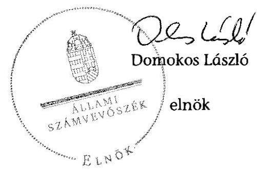

# ÁLLAMI   SZÁMVEVÔSZÉK 

## JELENTÉS

Az önkormányzatok gazdasági társaságai - Az önkormányzatok többségi tulajdonában lévő gazdasági társaságok közfeladat ellátását érintő gazdálkodási tevékenysége szabályszerűségének ellenőrzése Halasi Városgazda Beruházó, Szolgáltató és Vagyonkezelő Zrt.

---

# Állami Számvevőszék 

Iktatószám: V-0732-050/2015
Témaszám: 1766
Vizsgálat-azonosító szám: V067139

## Az ellenőrzést felügyelte:

Dr. Horváth Margit
felügyeleti vezető
Az ellenőrzést vezette és az ellenőrzés végrehajtásáért felelős:
Salamin Viktor
ellenőrzésvezető
A jelentéstervezet összeállításában közremüködött:
Kriston-Vizi János
számvevő tanácsos
Az ellenőrzést végezte:
Illésné Borsik Andrea
Kóródi Gábor
Kriston-Vizi János
számvevő
számvevő
számvevő tanácsos

---

# TARTALOMJEGYZÉK 

BEVEZETÉS ..... 7
I. ÖSSZEGZŐ MEGÁLLAPÍTÁSOK, KÖVETKEZTETÉSEK, JAVASLATOK ..... 10
II. RÉSZLETES MEGÁLLAPÍTÁSOK ..... 16

1. Az Önkormányzat közfeladat-ellátásának szabályszerűsége ..... 16
1.1. A közfeladat-ellátás megszervezése és a feladatellátás feltételrendszerének kialakítása ..... 16
1.2. A közfeladat-ellátás felügyelete és a tulajdonosi jogok érvényesítése ..... 18
2. A Halasi Városgazda Zrt. közfeladat ellátással kapcsolatos tevékenysége ..... 21
2.1. A Halasi Városgazda Zrt. gazdálkodásának szabályozottsága ..... 21
2.2. A Halasi Városgazda Zrt. vagyongazdálkodása ..... 23
2.3. A beszámolási kötelezettség teljesítése ..... 23
3. A távhőszolgáltatás közfeladata bevételei és ráfordításai elszámolásának és önköltségszámításának szabályszerűsége ..... 25
3.1. A távhőszolgáltatás közfeladat bevételeinek és ráfordításainak szabályszerűsége ..... 25
3.2. Az önköltségszámítás szabályszerűsége ..... 28

## MELLÉKLETEK

1. számú A Halasi Városgazda Zrt. tevékenységének főbb adatai
2. számú A Halasi Városgazda Zrt. múködésének főbb jellemzői
3. számú A Halasi Városgazda Zrt. által biztosított közszolgáltatás díjai a 20122013. évekre vonatkozóan

## FÜGGELÉKEK

1. számú Értelmező szótár
2. számú Mintavételi eljárások ellenőrzési területenként

---

.

---

# RÖVIDÍTÉSEK JEGYZÉKE 

## Törvények

Áht.
Ámt.
ÁSZ tv.
Ebktv.
Gt.
Info tv.
Nvtv.

Ötv.

Ptk.
Rezsi tv.
Számv. tv.
Taktv.
Tszt.

## Rendeletek

157/2005. (VIII. 15.)
Korm. rendelet
50/2011. (IX. 30.) NFM rendelet
távhőrendelet ${ }_{1}$
távhőrendelet ${ }_{2}$
vagyongazdálkodási rendelet ${ }_{1}$
az államháztartásról szóló 1992. évi XXXVIII. törvény (hatálytalan: 2012. január 1-jétől)
Az árak megállapításáról szóló 1990. évi LXXXVII. törvény (hatályos: 1991. január 1-jétől)
az Állami Számvevőszékről szóló 2011. évi LXVI. törvény (hatályos: 2011. július 1-jétől)
2003. évi CXXV. törvény az egyenlő bánásmódról és az esélyegyenlőség előmozdításáról
a gazdasági társaságokról szóló 2006. évi IV. törvény
2011. évi CXII. törvény az információs önrendelkezési jogról és az információszabadságról
a nemzeti vagyonról szóló 2011. évi CXCVI. törvény (hatályos: 2011. december 31-étől, kivéve a 20. § (2) bekezdésben meghatározott paragrafusok, amelyek 2012. január 1-jétől, a (3) bekezdésben meghatározott paragrafusok 2013. január 1-jétől, a (4) bekezdésben meghatározott paragrafus 2012. március 2-ától léptek hatályba)
a helyi önkormányzatokról szóló 1990. évi LXV. törvény (hatálytalan: a 2014. évi általános önkormányzati választások napjától)
a Polgári Törvénykönyvről szóló 1959. évi IV. törvény
a rezsicsökkentések végrehajtásáról szóló 2013. évi LIV. törvény (hatályos: 2013. május 10-től)
a számvitelről szóló 2000 . évi C. törvény
2009. évi CXXII. törvény a köztulajdonban álló gazdasági társaságok takarékosabb müködéséről
a távhőszolgáltatásról szóló 2005. évi XVIII. törvény (hatályos: 2005. július 1-jétől)
a távhőszolgáltatásról szóló 2005. évi XVIII. törvény végrehajtásáról (hatályos: 2005. szeptember 25-étől)
a távhőszolgáltatónak értékesített távhő árának, valamint a lakossági felhasználónak és a külön kezelt intézménynek nyújtott távhőszolgáltatás díjának megállapításáról
Kiskunhalas Város Önkormányzatának 14/2004. (IV.29.) rendelete a távhőszolgáltatásról, a távhőszolgáltatás legmagasabb díjáról és a díjalkalmazás feltételeiről (hatályos: 2004. április 29-től 2013. január 31-ig)
Kiskunhalas Város Önkormányzatának 2/2013. (II. 01.) rendelete a távhőszolgáltatásról (hatályos: 2013. február 1-jétől)
Kiskunhalas Város Önkormányzatának 6/2000. (II. 29.) rendelete az Önkormányzat vagyonáról, és a vagyon-

---

vagyongazdálkodási rendelet $_{2}$

## Szórövidítések

adatvédelmi szabályzat
Alapító Okirat
Áfa
ÁSZ
beszerzési szabályzat
értékelési szabályzat ${ }_{1}$
értékelési szabályzat ${ }_{2}$
FB
gazdasági program ${ }_{1}$
gazdasági program ${ }_{2}$
Halas-T Kft.
Halas Távhő Kft.
Halasi Városgazda Zrt.
Jegyzó
Képviselő-testület
leltározási szabályzat ${ }_{1}$
leltározási szabályzat ${ }_{2}$
MEKH
Önkormányzat
pénzkezelési szabályzat ${ }_{1}$
pénzkezelési szabályzat ${ }_{2}$
számlarend $_{1}$
számlarend $_{2}$
számviteli politika ${ }_{1}$
gazdálkodás szabályairól (hatályos: 2000. február 29-től 2012. március 28 -ig)
Kiskunhalas Város Önkormányzatának 13/2012. (III. 28.) rendelete az Önkormányzat tulajdonában álló vagyonnal való rendelkezés egyes szabályairól (hatályos: 2012. március 29 -től)

A Halasi Városgazda Zrt. adatvédelmi szabályzata (hatályos: 2012. június 1-jétől)
a Halasi Városgazda Zrt. alapiító okirata és annak módosításai
általános forgalmi adó
Állami Számvevőszék
a Halasi Városgazda Zrt. beszerzési szabályzata (hatályos: 2007. október 1-jétől)
Az eszközök és a források értékelési szabályzata, Halasi Városgazda Zrt. (hatályos: 2007. június 29-től)
Értékelési szabályzat, Halasi Városgazda Zrt. (hatályos: 2012. november 1 -jétől)

Halasi Városgazda Zrt. felügyelőbizottsága
Kiskunhalas Város gazdasági programjának alapjai 2007-2013
Stabilitás-bizalom_fejlődés, Kiskunhalas város gazdasági programja 2011-2014. év
Halas-T Vagyonhasznosító Korlátolt Felelősségú Társaság
Halas-Távhő Távhőszolgáltató Korlátolt Felelősségú Társaság
Halasi Városgazda Beruházó, Szolgáltató és Vagyonkezelő Zártkörűen Müködő Részvénytársaság
Kiskunhalas Város Önkormányzatának jegyzője
Kiskunhalas Város Önkormányzatának Képviselőtestülete
Halasi Városgazda Zrt. leltározási szabályzata (hatályos: 2007. június 29 -től)

Halasi Városgazda Zrt. leltározási szabályzata (hatályos: 2012. november 1 -jétől)

Magyar Energetikai és Közmű-szabályozási Hivatal
Kiskunhalas Város Önkormányzata
Halasi Városgazda Zrt. házipénztár kezelési szabályzata (hatályos: 2010. április 1 -jétől)
Halasi Városgazda Zrt. házipénztár kezelési szabályzata (hatályos: 2012. november 1 -jétől)
Halasi Városgazda Zrt. számlarendje (hatályos 2008. október 1 -jétől)
Halasi Városgazda Zrt. számlarendje (hatályos: 2012. november 1 -től)
Halasi Városgazda Zrt. számviteli politikája (hatályos:

---

számviteli politika $_{2} \quad$ Halasi Városgazda Zrt. számviteli politikája (hatályos: 2012. november 1-jétől)
SZMSZ
Társaság
üzletszabályzat a Halasi Városgazda Zrt. Szervezeti és Müködési Szabályzata (hatályos 2007. július 1-jétől)
Halasi Városgazda Beruházó, Szolgáltató és Vagyonkezelő Zártkörűen Müködő Részvénytársaság, rövid neve: Halasi Városgazda Zrt.
a Halasi Városgazda Zrt. távhőszolgáltatási üzletszabályzata (jóváhagyva: 2012. augusztus 29-én)

---

.

---

# JELENTÉS 

## Az önkormányzatok gazdasági társaságai - Az önkormányzatok többségi tulajdonában lévő gazdasági társaságok közfeladat ellátását érintő gazdálkodási tevékenysége szabályszerűségének ellenőrzése   Halasi Városgazda Beruházó, Szolgáltató és Vagyonkezelő Zártkörűen Müködő Részvénytársaság

## BEVEZETÉS

Az Állami Számvevőszék középtávra szóló stratégiájában megfogalmazta, hogy a helyi önkormányzatok gazdálkodásában rejlő pénzügyi kockázatok feltárásával, az államháztartáson kívülre nyújtott költségvetési támogatások és ingyenes vagyonjuttatások, valamint az államháztartáson kívül múködő köz-feladat-ellátó rendszerek ellenőrzéseivel hozzájárul ahhoz, hogy a közpénzeket az államháztartáson kívül múködő szervezetek is átlátható, rendezett módon használják fel a közfeladatok szerződésben vállalt ellátása érdekében.

Az önkormányzatok szervezetalakítási szabadságának következménye, hogy a korábban is vállalati formában múködő (nagyvárosi tömegközlekedés, víz-, szennyvízcsatorna, köztisztasági, ingatlankezelés stb.) közszolgáltatások mellett mind a kötelező, mind az önként vállalt feladatok ellátásában a gazdasági társaságok kiemelt fontosságú szerephez jutottak.

Kiskunhalason 1999-től a 100\%-ban magántulajdonú Halas Távhő Kft. végezte a távhőszolgáltatást 2012. augusztus 31-ig. Az Önkormányzat 2012. szeptember 1-jétől a Halas Távhő Kft. szolgáltatásának fizetési problémák okozta ellehetetlenülése miatt az önkormányzati tulajdonú Halasi Városgazda Zrt.-t bízta meg a távhőszolgáltatási feladat ellátásával. A Halasi Városgazda Zrt. a távhőszolgáltatási feladat átvételével egyidejűleg a Halas Távhő Kft. követeléseit és kötelezettségeit nem vette át.

Az Önkormányzat a távhőtermeléshez és -szolgáltatáshoz szükséges eszközöket az ellenőrzési időszak előtt alapított kizárólagos tulajdonában álló gazdasági társaságába, a Halas-T Kft.-be apportálta. Az Önkormányzat a Halas-T Kft.ben lévő $49 \%$-os üzletrészét még az alapítás évében, 1999-ben eladta a magántulajdonban lévő Halas Távhő Kft.-nek, ezáltal a korábbi kizárólagos tulajdona $51 \%$-ra mérséklődött. Az Önkormányzat 2012-ben ismét kizárólagos tulajdonosa lett a Halas-T Kft.-nek miután visszavásárolta a Halas Távhő Kft. üzletrészét. A távhővagyon tulajdonosa változatlanul a Halas-T Kft. maradt.

---

A távhőszolgáltatási feladat ellátása érdekében, valamint a távhőszolgáltatás eszközeinek használatára a Halas-T Kft. a Halas Távhő Kft.-vel, majd 2012. szeptember 1-jétől a Halasi Városgazda Kft.-vel üzemeltetési szerződést kötött. A Halasi Városgazda Zrt.-t 2007. július 1-jén alapította az Önkormányzat. Kizárólagos tulajdonosa az Önkormányzat, főtevékenysége 2012. augusztus 31-ig vagyonkezelés, illetve saját, bérelt ingatlan bérbeadása, üzemeltetése, 2012. szeptember 1-jétől a távhőszolgáltatás volt. Az ellenőrzött időszakban a Halasi Városgazda Zrt. jegyzett tőkéje 100,0 M Ft volt. A Halasi Városgazda Zrt. 2012. szeptember 1. - 2013. december 31. között a főtevékenységét a Halas-T Kft.-től forróvíz hőhordozó formájában vásárolt hőenergia felhasználásával végezte, a 2013. január 1-jén 28101 fő lakosságszámú Kiskunhalas város közigazgatási területén belül. A távhőszolgáltatást 2012-ben 1350 lakásban, illetve közületi fogyasztónál vették igénybe.

A Halasi Városgazda Zrt. távhőszolgáltatásból származó éves nettó árbevétele a 2012. évben 84,5 M Ft a 2013. évben 190,7 M Ft volt, az eszközök és források mérleg szerinti értéke a 2012. év végén 243,3 M Ft, a 2013. év végén 252,5 M Ft volt. A Halasi Városgazda Zrt. mérleg szerinti eredménye a 2012. évben 0,4 M Ft, a 2013. évben 1,2 M Ft volt. Ezen belül a távhőszolgáltatás mindkét évben veszteséget mutatott a 2012. évben -12,2 M Ft-ot, a 2013. évben -39,7 M Ft-ot. A Társaság által a távhőszolgáltatás közfeladat ellátására foglalkoztatottak létszáma a 2012. évben 4 fő, a 2013. évben 6 fő volt.

Az ellenőrzött időszakban a polgármester személye egy alkalommal, a 2010. évi önkormányzati választások alkalmával változott, a jegyző személye változatlan volt, aki 2000. április 1-jétől látta el feladatait. A Társaság vezérigazgatójának, illetve gazdasági vezetőjének személye a távhőszolgáltatással érintett 2012. szeptember 1-je és 2013. december 31-e közötti időszakban nem változott.

Az önkormányzati tulajdonú gazdasági társaságok teljes körű ellenőrzésének lehetőségét az Állami Számvevőszékről szóló 1989. évi XXXVIII. törvény 2011. január 1-jétől hatályos módosítása teremtette meg.

# Az ellenőrzés célja annak értékelése volt, hogy 

- az önkormányzat a jogszabályi előírások figyelembevételével döntött-e az ellenőrzésre kerülő közfeladat megszervezéséről; az önkormányzat szabályszerűen gyakorolta-e a tulajdonosi jogokat;
- a gazdasági társaság közfeladat-ellátása bevételeinek, ráfordításainak elszámolása és vagyongazdálkodási tevékenysége megfelelt-e a jogszabályi, illetve a közszolgáltatási szerződésben foglalt tulajdonosi előírásoknak, azok végrehajtása szabályszerű volt-e;
- a közfeladatok átláthatósága és elszámoltathatósága érdekében biztosítva volt-e a közszolgáltatás dijának megalapozottsága szabályszerű önköltségszámítással.

Az ellenőrzés várható hasznosulása: A törvényalkotás számára - az észlelt problémák, szabálytalanságok, vagy egyéb nem kívánatos jelenségek felszínre kerülésével - az ellenőrzés megállapításai segítséget nyújthatnak az államház-

---

tartáson kívüli közfeladat-ellátás értékeléséhez, jogszabályi keretei pontosításához, átláthatóságot biztosító szabályozásához. Meghatározhatóvá válnak a közfeladat ellátásában részt vevő államháztartáson kívüli szervezeteknek - az önkormányzat költségvetését, pénzügyi helyzetét is befolyásoló - kockázatai, lehetővé válik ezen kockázatok csökkentése. Értékelhető válik, hogy a feladatot ellátó gazdasági társaság a közszolgáltatási szerződésben foglaltak betartásával, a közvagyon használatával biztosította-e a szolgáltatás folytatásának feltételeit. Ezzel az ellenőrzöttek és a helyi döntéshozók számára visszajelzést ad feladatszervezési, feladat-ellátási kockázataikról, alapot ad a meglévő hibák megszüntetéséhez, a jobb közfeladat-ellátás biztosításához. Fokozza a fegyelmet, igazolja, hogy lejárt a következmények nélküli ellenőrzések időszaka. Az ÁSZ értékteremtő rend kialakításához és megőrzéséhez hozzájáruló tevékenysége pozitív hatással van a szervezetről kialakított összkép formálására is.

A bevételek és ráfordítások elszámolása, valamint a vagyonnyilvántartás terén az egyes területek szabályszerű működését mintavétellel ellenőriztük, ez alapján a sokaságokban előforduló hibás tételek arányát becsültük. A jogszabályoknak és a belső előírásoknak megfelelőnek, azaz szabályszerűnek tekintettük az adott bevételek és ráfordítások elszámolását, a vagyonnyilvántartást, amennyiben a minta ellenőrzésének eredménye alapján $95 \%$-os bizonyossággal a teljes sokaságban a hibás tételek aránya kisebb volt, mint $10 \%$, nem megfelelőnek értékeltük, ha a hibás tételek aránya a $10 \%$-ot meghaladta. Kockázatot, illetve magas kockázatot jeleztünk, amennyiben egy adott terület vonatkozásában a minta alapján a teljes sokaságban nem volt teljes körűen biztosított a jogszabályoknak és a belső szabályzatoknak megfelelő működés. A vagyonnyilvántartás területeit nem ellenőriztük, mivel a Halasi Városgazda Zrt. a távhőszolgáltatással összefüggően tárgyi eszköz vagyonnal nem rendelkezett, ilyen jellegű telel könyvelését nem hajtotta végre. A bevételek és ráfordítások elszámolásának ellenőrzését a társaságnál a távhőszolgáltatási feladat átvételét követően, a 2012. szeptember 1. és a 2013. december 31. közötti időszakra vonatkozóan hajtottuk végre.

Az ellenőrzést a számvevőszéki ellenőrzés szakmai szabályai szerint, szabályszerűségi ellenőrzés módszerével, a vonatkozó nemzetközi standardok figyelembevételével végeztük. Az ellenőrzés kiterjedt Kiskunhalas Város Önkormányzatára és a Halasi Városgazda Beruházó, Szolgáltató és Vagyonkezelő Zártkörűen Múködő Részvénytársaságra.

Az ellenőrzést a számvevőszéki ellenőrzés szakmai szabályai szerint, szabályszerűségi ellenőrzés módszerével, a vonatkozó nemzetközi standardok figyelembevételével végeztük. Az ellenőrzés az Önkormányzatnál a közfeladatellátás megszervezése és a feladatellátás feltételrendszerének kialakítása tekintetében a 2008-2013. évekre, a Társaságnál pedig a 2012. szeptember 1-től 2013. december 31-ig tartó időszakra terjedt ki.

Az ellenőrzés végrehajtásának jogszabályi alapját az ÁSZ törvény 5. § (3)-(5) bekezdései képezték.

Az ÁSZ az Állami Számvevőszékről szóló 2011. évi LXVI. törvény 29. §-a alapján a jelentéstervezetet észrevételezésre megküldte a polgármesternek és a Zrt. vezérigazgatójának. Az érintettek észrevételt nem tettek.

---

# I. ÖSSZEGZŐ MEGÁLLAPÍTÁSOK, KÖVETKEZTETÉSEK, JAVASLATOK 

A Halasi Városgazda Zrt.-t 2007. július 1-jén alapította az Önkormányzat, fő tevékenysége a vagyonkezelés volt. A távhőszolgáltatási tevékenységet 2012. szeptember 1-jétől végezte az Önkormányzat kijelölése alapján Kiskunhalason. A Társaság tulajdonosa 100\%-os tulajdonrésszel az Önkormányzat volt. 2012. szeptember 1-jét megelőzően a távhőszolgáltatást egy magántulajdonban lévő gazdasági társaság, a Halas Távhő Kft. végezte, melyre jelen ellenőrzés nem terjedt ki.

A Halas Távhő Kft. felhalmozott pénzügyi tartozásai miatt beszállítója 2012 nyarán felfüggesztette a gázszállítást, ami a távhő-, illetve melegvizellátás megszűnését eredményezte. 2008. és 2012 augusztuṡa között a kialakított távhőszolgáltatási konstrukció nem biztosította a közfeladat folyamatos ellátását. A bizonytalanná vált távhőszolgáltatás miatt a Képviselő-testület az önkormányzati tulajdonú Halasi Városgazda Zrt.-t jelölte ki távhőszolgáltatónak 2012. szeptember 1-jétől.

Az Önkormányzat 2007-2013. és 2011-2014. évekre szóló gazdasági programjai tartalmaztak elképzeléseket a távhőszolgáltatás múködtetésével, fejlesztésével kapcsolatban. Mindkét programban kívánatosnak tartották a megújuló energiaforrások felhasználásának növelését. A 2011-2014. évi program 2011-2012-re előirányozta a geotermikus energia kihasználását.

A Képviselő-testület a Tszt. által előírt rendeletalkotási kötelezettségének eleget tett. A Tszt., valamint az Ámt. előírásával ellentétben azonban a távhőrendelet ${ }_{1,2}$ nem tartalmazta a csatlakozási díj megállapítására vonatkozó szabályokat, valamint azon területek kijelölését, ahol területfejlesztési, környezetvédelmi és levegő-tisztaságvédelmi szempontok alapján szükséges a távhőszolgáltatás fejlesztése.

Az Önkormányzat a Halasi Városgazda Zrt. részére a távhőszolgáltatás közfeladat ellátásához nem adott át vagyont. A Társaság az eszközei között nem tartott nyilván a távhőszolgáltatáshoz szükséges vagyonelemeket, ezekkel kapcsolatos nyilvántartási és gazdálkodási kötelezettsége nem volt. A távhőszolgáltatással kapcsolatos vagyont az Önkormányzat 1999-ben a Halas-T Kft.-be aprtálta, a Halasi Városgazda Zrt. tőle vásárolta szerződés alapján a távhőszolgáltatáshoz szükséges hőt és használati melegvizet. A Társaság vagyoni helyzete és eredményessége javult a 2012. évről a 2013. évre, de azon belül a távhőszolgáltatás mindkét évben veszteséget - 2012-ben -12,2 M Ft-ot, 2013ban -39,7 M Ft-ot - mutatott.

A Halasi Városgazda Zrt. a távhőszolgáltatással érintett 2012-2013. években évenként elkészítette az üzleti terveit a vagyongazdálkodási rendelet ${ }_{1,2}$-ben előírtaknak megfelelően. A 2012. évi üzleti terv az év közben történt feladatbővülés miatt nem tartalmazta a távhőszolgáltatás feladatait. Az üzleti terveket a Képviselő-testület határozattal fogadta el.

---

A Képviselő-testület 2008. január 1. és 2011. április 15. között a lakossági táv-fűtés- és melegvíz-szolgáltatási díjak legmagasabb hatósági árát és a díjalkalmazás feltételeit a Tszt. előírásai szerint a távhőrendelet ${ }_{1,2}$-ében rögzítette. A rendeletek nem írták elő a díjmegállapításra vonatkozó szabályokat, továbbá a rendelet módosítása alkalmával az Ámt. vonatkozó előírásai ellenére az árváltozásokhoz nem készült önköltségszámítás.

A tulajdonosi jogok gyakorlásának rendjét a Gt.-nek, az Ötv.-nek és a vagyongazdálkodási rendelet ${ }_{1,2}$-nek megfelelően alakították ki. Meghatározták a Halasi Városgazda Zrt. feletti tulajdonosi joggyakorló személyét, a Képviselőtestület hatáskörét, a független könyvvizsgáló személyét, az FB összetételét és múködésének szabályait. Az Alapító Okirat értelmében a Halasi Városgazda Zrt. tulajdonosi jogait a Képviselő-testület gyakorolta.

Az Önkormányzat nem élt az Ötv.-ben biztosított lehetőséggel, mivel a belső ellenőrzés nem végzett ellenőrzéseket a Halasi Városgazda Zrt.-nél, ezáltal a távhőszolgáltatás, mint közfeladat szabályszerű ellátásához nem járult hozzá. A jegyző a Társaság üzletszabályzatát jóváhagyta, de a Tszt. előírása ellenére nem véleményeztette a fogyasztóvédelmi hatósággal.

A Társaság kialakította belső számviteli szabályrendszerét. A szabályozás biztosította, hogy a Társaság határidőben és meghatározott adattartalommal, a tulajdonosi joggyakorló elvárásainak megfelelően tegyen eleget az adatszolgáltatási kötelezettségének. A Társaság éves beszámolóit a Számv. tv. előírásainak megfelelően közzétették, letétbe helyezték. A 2012. üzleti évtől a Tszt. előírásának megfelelő számviteli szétválasztási szabályokat a gyakorlatban alkalmazták. A számviteli politikát nem aktualizálták, ezért elmaradt a Számv. tv.-ben meghatározott jelentős összegű hiba fogalmának módosítása, valamint a lényeges hiba fogalmának törlése. A számlarendben a Számv. tv. előírtak ellenére nem határozták meg a távhőszolgáltatással kapcsolatos főkönyvi számlák számjelét, megnevezését, a számla tartalmát, továbbá a számla értéke növekedésének, csökkenésének jogcímeit, a számlát érintő gazdasági eseményeket és azok más számlákkal való kapcsolatát.

A Halasi Városgazda Zrt. az ellenőrzött időszakban önköltségszámítási szabályzat készítésére nem volt kötelezett a Számv. tv. alapján, a szabályzatot ennek ellenére elkészítette. A szabályzatában határozta meg a közfeladatok ráfordításai és bevételei, illetve mérlegei Tszt.-ben előírt számviteli szétválasztásának előírásait. A szabályzat elkülönítette a közvetlen és közvetett költségeket, tartalmazta a felosztandó költségek vetítési alapjait.

A távhőszolgáltatást végző Halasi Városgazda Zrt. múködésére és beszámoltatására vonatkozóan az Önkormányzat vagyongazdálkodási rendelet ${ }_{1,2}$-el és az Alapító Okirat tartalmaztak előírásokat. A Társaság elkészítette a Számv. tv. szerinti 2012. és 2013. éves beszámolóját. A könyvvizsgáló a Számv. tv. szerinti határidőn belül, minősítés nélküli záradékot adott az ellenőrzött időszak beszámolóiról. A beszámolókat az FB megtárgyalta és elfogadásra javasolta, a Képviselő-testület pedig elfogadta. A Halasi Városgazda Zrt. távhőszolgáltatás közfeladat-ellátása bevételeinek, ráfordításainak elszámolása összességében szabályszerű volt. A távhőszolgáltatási közfeladat anyagjellegű ráfordításainak elszámolása során a Halasi Városgazda Zrt. betartotta a Tszt.

---

tevékenységek elkülönítésére és a díjak átláthatóságára vonatkozó előírásait. A távhőszolgáltatási közfeladat bevételeinek előírása és kiszámlázása a belső szabályozásnak megfelelően történt, a bevételeket a megfelelő számlacsoportban számolták el. A Halasi Városgazda Zrt. által alkalmazott szolgáltatási díjak megfeleltek a távhőrendelet ${ }_{1}$, valamint a hatályos 50/2011. (IX. 30.) NFM rendelet előírásainak.

A Halasi Városgazda Zrt. a kintlévőségek kezelését, a követelések behajtását az üzletszabályzatban határozta meg. Az év végi vevő követelések összege a 2012. évi 29,0 M Ft-ról 2013-ra 29,6 M Ft-ra, az éven túliak állománya 0 -ról $2,2 \mathrm{M}$ Ft-ra növekedett. A tartósan fennállt követeléseket az értékelési szabályzat ${ }_{2}$ előírásai ellenére nem minősítették,és a Számv. tv., valamint az értékelési szabályzat ${ }_{2}$ előírásai ellenére utánuk értékvesztést nem számoltak el.

A Társaság központi forrásból 2012-ben 19,4 M Ft, 2013-ban 67,0 M Ft távhőszolgáltatási támogatásban részesült. A távhőszolgáltatás az igénybe vett támogatás ellenére mindkét évben veszteséges volt.

Az Info. tv, illetve a Tszt. előírásainak megfelelő közérdekű adatok közzététele nem történt meg, gazdálkodási adatait a Társaság honlapján nem tette közzé. A Társaság elkészítette adatvédelmi szabályzatát, amely meghatározta a kezelt fogyasztói személyes adatok védelmének eszközeit és módját. A Halasi Városgazda Zrt. az adatok védelmét munkaszervezési eszközökkel és az informatikai eszközök technikai védelmével biztosította.

A fentiekben leírtak összegzéseként az alábbi megállapításokat tesszük:
Az Önkormányzat a jogszabályoknak megfelelően alakította ki a távhőszolgáltatás feltételrendszerét, a közfeladat ellátásához az ellenőrzött időszakban közvagyont nem adott át. A tulajdonosi jogokat az Önkormányzata jogszabályi előírásoknak megfelelően gyakorolta. A távhőrendeleteiben az Önkormányzat nem határozta meg a csatlakozási díj alkalmazási feltételeit. Az Önkormányzat rendszeresen és a jogszabályoknak megfelelően beszámoltatta a Halasi Városgazda Zrt.-t a távhőszolgáltatással kapcsolatosan. Az Önkormányzat belső ellenőrzése a távhőszolgáltatás, mint közfeladat-ellátás szabályszerű teljesítéséhez nem járult hozzá. A jegyző nem véleményeztette a Társaság üzletszabályzatát a fogyasztóvédelmi hatósággal.

A Társaság elkészítette a jogszabályokban előírt gazdálkodási szabályzatait, de a számviteli politika aktualizálása elmaradt, a számlarend nem felelt meg a jogszabályi előírásoknak. A Társaság eleget tett a tulajdonos Önkormányzat részére előírt beszámolási kötelezettségének, a távhőszolgáltatással kapcsolatos bevételeit és a ráfordításait szabályszerűen számolta el. A Halasi Városgazda Zrt. az ellenőrzött időszak alatt nyereségesen gazdálkodott, azonban a távhőszolgáltatás az igénybe vett központi távhőszolgáltatási támogatás ellenére 2012-2013-ban veszteséges volt. A Társaság az ellenőrzött időszakban jelentős követelésállománnyal rendelkezett, azonban a vevököveteléseit nem minősítette, értékvesztést nem számolt el.

Az Állami Számvevőszékről szóló 2011. évi LXVI. törvény 33. § (l) bekezdésében foglaltak értelmében a jelentésben foglalt megállapításokhoz kapcsolódó intéz-

---

kedési tervet köteles az ellenőrzött szervezet vezetője összeállítani, és azt a jelentés kézhezvételétől számított 30 napon belül az ÁSZ részére megküldeni. Amennyiben az intézkedési tervet határidőben nem küldi meg a szervezet, vagy az nem elfogadható, az ÁSZ elnöke a hivatkozott törvény 33. § (3) bekezdés a)-b) pontjaiban foglaltakat érvényesítheti.

A helyszíni ellenőrzést igénylő megállapításai és javaslatai:
Javaslataink célja a Halasi Városgazda Zrt. gazdálkodása szabályszerűségének helyreállítása annak érdekében, hogy a szabályozási környezet megfelelően tudja támogatni az átlátható müködést.

# Javasoljuk a Halasi Városgazda Beruházó, Szolgáltató és Vagyonkezelő Zrt. Vezérigazgatójának: 

1. A számviteli politikáa-t nem aktualizálták, így elmaradt a Számv. tv. 3. § (3) bekezdés 3. pontjában meghatározott jelentős összegű hiba fogalmának 2013. január 1-től történő módosítása, valamint az 5. pontban meghatározott, megbízható és valós képet lényegesen befolyásoló hiba fogalmának a Számv. tv.-nyel összhangban való törlése.

A Társaság a számlarend ${ }_{1,2}$-ben a Számv. tv. 161. § (2) bekezdés a) és b) pontjában előírtak ellenére nem határozta meg a távhőszolgáltatással kapcsolatos főkönyvi számlák számjelét, megnevezését, a számla tartalmát, továbbá a számla értéke növekedésének, csökkenésének jogcímeit, a számlát érintő gazdasági eseményeket és azok más számlákkal való kapcsolatát.

Javaslat:

## Intézkedjen a szabályozási hiányosságok megszüntetésére, ennek keretében:

a) aktualizálja a számviteli politikát a jelentős összegű hiba, valamint a megbízható és valós képet lényegesen befolyásoló hiba fogalmát érintően.
b) a számviteli szabályozását egészítse ki a távhőszolgáltatással kapcsolatos főkönyvi számlákra vonatkozóan a Számv. tv-ben előírt követelmények szerint.
2. A Halasi Városgazda Zrt. a 2012. szeptember 1. és 2013. december 31. közötti ellenőrzött időszakban nem tette közzé a honlapján az Info tv. 26. § (2) bekezdésében és az 1. melléklete szerinti általános közzétételi listában meghatározott, továbbá a Tszt. 57/C. § (1) bekezdés a) pontjában és (4) bekezdésében előírt, valamint a 4. sz. mellékletben az aktuális, a tárgyévre, illetve a megelőző üzleti évre meghatározott adatokat, dokumentumokat.

A társaságnál a 2013. december 31-én meglévő távhőszolgáltatással kapcsolatos vevő követelések értékéből 2,2 M Ft hátralék már 2012. december 31-én is fennállt, így tartósnak minősült. A Társaság a 2013. évi zárlati munkái során a 2012. év végén kimutatott hátralékot a szabályozás ellenére nem minősítette tartósnak vagy jelentősnek, illetve behajthatatlannak. A Társaság az értékelési szabályzat ${ }_{2}$-ban foglaltak ellenére 2013-ban a tartós, illetve jelentős összegű vevőkövetelések után értékvesztést nem számolt el.

---

Javaslat:
Intézkedjen a jogszabályi előírások szerinti gyakorlat és a szabályos müködés biztosítására, ezen belül:
a) tegye közzé a Halasi Városgazda Zrt. internetes honlapján az Info tv.-ben, a Tszt.-ben, továbbá a vonatkozó Korm. rendeletben előírt közérdekű adatokat, dokumentumokat;
b) végezze el a tartós vevő követelések minősítését, és számoljon el utánuk értékvesztést a Társaság értékelési szabályzatának megfelelően.

Javaslataink célja az önkormányzat szabályszerű müködésének elősegítése, továbbá az önkormányzati tulajdonosi joggyakorlás kontrolljainak erősítése.

# Javasoljuk Kiskunhalas Város Jegyzöjének: 

1. Az Önkormányzat által kiadott távhőrendelet ${ }_{1,2}$-ből hiányzott a csatlakozási díj mértékének meghatározása, ezzel megsértették az Ámt. 11. § (1) bekezdésében és a Tszt. 6. § (2) bekezdésének b) pontjában foglaltakat. Mindkét távhőrendeletből hiányzott továbbá a távhőszolgáltatás területfejlesztési, környezetvédelmi és levegőtisztaságvédelmi szempontok alapján szükséges fejlesztési területének meghatározása, így az Önkormányzat nem tett eleget a Tszt. 6. § (2) bekezdés c) pontjában foglalt előírásnak.

Javaslat:

## Intézkedjen a szabályozási hiányosságok megszüntetésére, ennek keretében:

tegye meg a szükséges intézkedéseket a csatlakozási díj mértékének, valamint a távhőszolgáltatás területfejlesztési, környezetvédelmi és levegő-tisztaságvédelmi szempontok alapján szükséges fejlesztési területének a távhőrendeletben történő meghatározására.
2. Az Önkormányzat belső ellenőrzése az ellenőrzéseivel a távhőszolgáltatás, mint közfeladat ellátásának szabályszerű teljesítéséhez nem járult hozzá. A 2012-2013. években a társaság gazdálkodásával és múködésével kapcsolatban ellenőrzést nem folytatott le.

A jegyző a Tszt. 7. § (1) bekezdés b) pontjának megfelelően 2012. augusztus 29-én jóváhagyta a Társaság üzletszabályzatát, de az üzletszabályzatot fogyasztóvédelmi hatósági véleményezésre nem küldte meg, így a Tszt. 7. § (1) bekezdés a) pontjában foglalt kötelezettségének nem tett eleget.

---

Javaslat:
Intézkedjen a jogszabályi elöírások szerinti gyakorlat és a szabályos müködés biztosítására, ezen belül:
a) fordítson kiemelt figyelmet arra, hogy az önkormányzat belső ellenőrzése az ellenőrzéseivel a távhőszolgáltatás, mint közfeladat-ellátás szabályszerű teljesítéséhez ellenőrzéseivel járuljon hozzá.
b) Intézkedjen a Halasi Városgazda Zrt. távhőszolgáltatási üzletszabályzatának a fogyasztóvédelmi hatóság részére véleményezésre történő megküldéséről.

---

# II. RÉSZLETES MEGÁLLAPÍTÁSOK 

## 1. Az ÖNKORMÁNYZAT KÖZFELADAT-ELLÁTÁSÁNAK SZABÁLYSZERÜSÉGE

### 1.1. A közfeladat-ellátás megszervezése és a feladatellátás feltételrendszerének kialakítása

Az Önkormányzat az ellenőrzési időszakra vonatkozóan két gazdasági programot készített, egyet a 2007-2013. év közötti időszakra és egyet a 2011-2014 évekre vonatkozóan. A 2011-2014. évekre szóló önkormányzati gazdasági program ${ }_{2}$-ot „Stabilitás-Bizalom-Fejlődés" címmel 2011. június 27-én, az Ötv. 91. § (7) bekezdés szerinti áprilisi határidő letelte után két hónappal fogadta el a Képviselő-testület ${ }^{1}$.

Az ellenőrzött időszakban a gazdasági program ${ }_{1,2}$-ok tartalmaztak távhőszolgáltatás ellátására, színvonalának javítására vonatkozó fejlesztési elképzeléseket. A gazdasági program ${ }_{1}$ bemutatta a közfeladatok ellátási rendszerének helyzetét és meghatározta a fejlesztési célokat. A program a távhőszolgáltatás elérendő céljaként a távhő ár csökkentését fogalmazta meg. A gazdasági program ${ }_{2}$ mindezeken túl operatív programként környezetbarát energetikai fejlesztési prioritást is megfogalmazott a távhőszolgáltatással kapcsolatban, azaz a megújuló energiaforrások felhasználásának önkormányzati kezdeményezését, a geotermikus energia kihasználását irányozta elő 2011-2012-re.

A közintézményi fütési rendszerekben az alternatív (geotermikus) energiaforrások bővítését tervezték. Az elkészített SWOT analízis szerint a város gyengesége, hogy a megújuló energiaforrások, a szél-, nap-, bioenergia, a termálvíz hasznosítása még nem terjedt el.

Az Önkormányzat 2008. május 22-én elfogadott Integrált Városfejlesztési Stratégiája a távhőszolgáltatási feladatok ellátására és fejlesztésére vonatkozóan nem tartalmazott elképzeléseket.

Az Önkormányzat a távhőrendelet ${ }_{1,2}$-ben a Tszt. 6. § (1) bekezdésével összhangban rögzítette a távhőszolgáltatási feladat ellátásának kötelezettségét. Az ellenőrzött időszakban a távhőszolgáltatást két gazdasági társaságon keresztül szervezte az Önkormányzat. A távhőrendelet ${ }_{1}$ 2012. augusztus 31-ig a 100\%-ban magántulajdonban lévő Halas Távhő Kft.-t jelölte meg távhő-szolgáltatónak.

A Halas Távhő Kft. a távhőszolgáltatáson kívül földgáz felhasználással a Halas-T Kft. távhő tüzelőberendezéseinek üzemeltetését is végezte üzemeltetési

[^0]
[^0]:    ${ }^{1}$ A képviselő-testület 150/2011. (VI. 27.) számú határozata.

---

szerződés alapján. A Halas Távhő Kft. felhalmozott pénzügyi tartozásai miatt a GDF SUEZ Energia Magyarország Zrt. 2012 nyarán felfüggesztette a gázszállítást, ami a távhő-, illetve melegvízellátás átmeneti megszűnését eredményezte. 2008. és 2012 augusztusa között a kialakított távhőszolgáltatási konstrukció nem biztosította a közfeladat folyamatos, hosszútávú, biztonságos ellátását.

A bizonytalanná vált távhőszolgáltatás miatt a Képviselő-testület az önkormányzati tulajdonú Halasi Városgazda Zrt.-t jelölte ki távhőszolgáltatónak azzal, hogy a távhőszolgáltatási feladatot 2012. szeptember 1-jétől lássa el.

A gázszolgáltató jelzései alapján az Önkormányzat 2012. május 31-i képviselőtestületi határozatában kezdeményezte a többségi tulajdonában lévő Halas-T Kft. és a Halas Távhő Kft. közötti üzemeltetési szerződés azonnali hatályú felmondását. 2012. augusztus 2-án háromoldalú megállapodás született Kiskunhalas polgármestere, az $51 \%$-ban önkormányzati tulajdonú Halas-T Kft. és a magántulajdonú Halas Távhő Kft. között a távhőrendszer átalakítására vonatkozóan. Megállapodtak abban, hogy a Halas Távhő Kft. felméri valamennyi kintlévőségét és azt engedményezi a Halas-T Kft.-re. Döntöttek továbbá a Halas Távhő Kft. HalasT Kft.-ben lévő üzletrészének megvásárlásáról, valamint a Halas Távhő Kft. gázszolgáltató felé fennálló tartozásának Halas-T Kft. általi kiegyenlítéséről. A Kép-viselő-testület 191/2012. (VIII. 6.) határozatában a megállapodásban foglaltakat jóváhagyta.

A Halas Távhő Kft. követeléseit és kötelezettségeit a Halasi Városgazda Zrt. nem vette át. A Halas Távhő Kft. csak a nyilvántartásában szereplő fogyasztók - név és lakcím - adatait adta át a Halasi Városgazda Zrt.nek.

A Halasi Városgazda Zrt.-t 2007. július 1-én alapította az Önkormányzat. Az Alapító Okiratot a Képviselő-testület ${ }^{2}$ elfogadta, fő tevékenysége vagyonkezelés volt. Alapító Okiratát az ellenőrzési időszak alatt többször módosították, de a 2012. szeptember 1-i feladat változás alapján a távhőszolgáltatás, mint főtevékenység csak késve, a 2013. február 28-ai módosítás rögzítette. A későbbi, 2013. november 12-ei módosításban a feladatok felsorolása közül kimaradt a távhőszolgáltatás megjelölése.

A Halasi Városgazda Zrt. - a MEKH által 2012. augusztus 29-én kiadott, 765/2012. számú - távhőszolgáltatói múködési engedély birtokában végezte tevékenységét. ${ }^{3}$ A Társaság tevékenységének főbb adatait az 1. számú melléklet, működésének főbb jellemzőit a 2. számú melléklet tartalmazza.

Az Önkormányzat a kizárólagos tulajdonában lévő Halasi Városgazda Zrt. részére a távhőszolgáltatás közfeladat ellátásához nem adott át vagyont ap-

[^0]
[^0]:    ${ }^{2}$ A Képviselő-testület 174/2007. (VI. 18.) számú határozata.
    ${ }^{3}$ A Halas-T Kft. 2012. szeptember 1-jétől átvette a távhőtermelői szolgáltatást a Halas Távhő Kft.-től. Távhőtermelői múködési engedély alapján a tulajdonában lévő eszközökkel állítja elő Kiskunhalas város közigazgatási határain belül a távhőszolgáltatásba bekapcsolt lakások és egyéb felhasználók érdekében termelt hőenergiát.

---

portként, kezelésre, illetve használatra, valamint erre a közfeladatra nem nyújtott pénzbeli támogatást sem. A távhőellátáshoz szükséges eszköz vagyonnal (kazánok, vezetékhálózat) a szintén önkormányzati tulajdonú Halas-T Kft. rendelkezett. Az Önkormányzat a távhő eszközvagyont 1999-ben a Halas-T Kft.-be apportként vitte be. Ezt követően a távhővagyon a Halas-T Kft. vagyonát képezte. A távhővagyon alakulását az Önkormányzat a Halas-T Kft. évenkénti beszámolójának tulajdonosi elfogadása során kísérte figyelemmel. A Halasi Városgazda Zrt. a Halas-T Kft.-től mint távhőtermelőtől szerződés alapján vásárolta a távhőszolgáltatáshoz szükséges hőt és használati melegvizet.

A Halasi Városgazda Zrt. és a Halas-T Kft. 2020. december 31-ig érvényes üzemeltetési és hőszolgáltatási szerződést kötött. A szerződés tartalmazta a termelő és a szolgáltató kötelezettségeit, a hőszolgáltatás mennyiségi és minőségi adatait, a szolgáltatott hőenergia mennyiségének meghatározásához szükséges mérési, elszámolási, üzemeltetési és karbantartási adatokat, továbbá a hőszolgáltatásért fizetendő díjakat és fizetési feltételeket, a szerződésszegés és annak jogkövetkezményeit, a megszűnés és módosítás feltételeit.

A Képviselő-testület a Tszt. 6. § (2) bekezdés szerinti rendeletalkotási kötelezettségének eleget tett, megalkotta az ellenőrzött időszakban hatályos távhőrendelet ${ }_{1,2}$-t. A távhőrendelet ${ }_{1,2}$ szabályozta az ellátási kötelezettségét, engedélyezési hatáskörét, távhőrendszer müködtetését, fejlesztését, de nem tartalmazta a csatlakozási díj megállapítására - mértékre, fizetési feltételekre - vonatkozó szabályokat, ezzel megsértették az Ámt. 11. § (1) bekezdésében és a Tszt. 6. § (2) bekezdésének b) pontjában foglaltakat. A távhőrendelet ${ }_{1,2}$ nem jelölte ki továbbá a távhőszolgáltatás területfejlesztési, környezetvédelmi és levegő-tisztaságvédelmi szempontok alapján szükséges fejlesztési területeit, így a Képviselő-testület nem tett eleget a Tszt. 6. § (2) bekezdés c) pontjában foglalt előírásnak. A távhőszolgáltatás számon kérhető paramétereiként a távhőrendelet ${ }^{4}{ }_{1,2}$ előírta a fűtött helyiségek fajtánkénti legalacsonyabb hőmérsékletét és a fűtési idény tartamát.

# 1.2. A közfeladat-ellátás felügyelete és a tulajdonosi jogok érvényesítése 

Az Önkormányzat a tulajdonosi jogai gyakorlásának rendjét a Gt.-nek, az Áht.-nek és a helyi rendeleteinek megfelelően alakította ki. A Képviselő-testület a vagyongazdálkodási rendeletben ${ }_{1,2}$ határozta meg az Önkormányzat által alapított gazdasági társaságok tulajdonosi jogai gyakorlásának szabályait. A szabályozás szerint a tulajdonosi jogokat a Képviselő-testület gyakorolja, illetve átruházott hatáskörben a polgármester és a bizottságok, továbbá az Önkormányzat, mint tulajdonos képviseletében a polgármester jár el.

A Képviselő-testület a vagyongazdálkodási rendelet ${ }_{1,2}$ alapján gyakorolta jogait, tulajdonosi jogosítványokat sem a Társaság vezérigazgatójára, sem az FB-re nem ruházott át, ami megfelelt az Ötv. 9. § (3) bekezdése korlátozó előírásának. A Társaság Alapító Okiratában meghatározták a tulajdonosi képviseletet, a vezérigazgató személyét, feladatait és felelősségi körét, valamint az FB ta-

[^0]
[^0]:    ${ }^{4}$ A távhőrendelet ${ }_{1,2}$ 2. § (3)-(5) bekezdése.

---

gok adatait. A Gt. 33. § (2) bekezdés c) pontja értelmében az Képviselő-testület a Társaság ellenőrzésére FB-t választott, amely a Taktv. (2) bekezdésben előírtaknak megfelelően három tagból állt. A Gt. 34. § (4) bekezdésében előírt ügyrenddel rendelkezett, azt a Képviselő-testület határozattal ${ }^{5}$ fogadta. Az FB hatásköre kiterjedt a Társaság ügyvezetésének, gazdálkodásának (jelentések, mérlegek, vagyonkimutatás, éves tervek) teljeskörű ellenőrzésére, amelyhez külső szakértőt is igénybe vehetett.

A Halasi Városgazda Zrt. a távhőszolgáltatással érintett 2012-2013. években évenként elkészítette az üzleti terveit a vagyongazdálkodási rendelet ${ }_{1,2}$-ben előírt tartalommal és szerkezetben.

A vagyongazdálkodási rendelet ${ }_{1,2}$ előírta, hogy az üzleti tervet a gazdasági társaság vezetőjének a képviselő-testületi ülést megelőzően 15 nappal kell beterjesztenie. Az üzleti tervnek tartalmaznia kellett a vállalkozás tevékenységének rövid ismertetését, a várható bevételek-költségek részletezését, létszámtervet, illetményadatokat a szervezet irányítási, végrehajtási és ellenőrzési területeire bontva, cash-flow kimutatást, jelentősebb összegű szerződéses kötelezettségvállalások ismertetését, hitel állomány alakulásának ismertetését, fejlesztési tervet, vezetői összefoglalót.

A 2012. évi üzleti terv az év közben történt feladatbővülés miatt nem tartalmazta a távhőszolgáltatás feladatait. A 2012. évi üzleti tervben $0,4 \mathrm{M} \mathrm{Ft}$, a 2013. évben 3,7 M Ft eredményt irányoztak elő. Az üzleti terveket a Képviselőtestület határozattal fogadta el.

Az Önkormányzat anyagi érdekeltségi rendszert nem vezetett be. A Társaság vezérigazgatói munkakörének betöltésére pályázatot írt ki. A Képviselőtestület 2011. május 30 -án zárt ülésen megválasztotta a Társaság vezérigazgatóját 2011. június 1-jétől 2014. május 31-ig, valamint meghatározta munkabérét és a járó költségtérítést. A Társaság Alapító Okiratában a változást átvezették.

A távhőszolgáltatás legmagasabb hatósági díjairól és a díjalkalmazás feltételeiről a Képviselő-testület a távhőrendelet ${ }_{1}$-ben döntött. A távhőszolgáltatást igénybe vevők által fizetendő dí alapdíjból és hődíjból tevődött össze. A rendelet nem írt elő a díjmegállapításra vonatkozó szabályokat, továbbá a rendelet módosításai ${ }^{6}$ alkalmával, az Ámt. 8. § (1) bekezdésben előírt gazdaságossági követelmény teljesülésének előírása ellenére a díjváltozásokhoz nem készült önköltségszámítás a 2008. január 1-je és 2011. április 15-e közötti önkormányzati árhatósági időszakban.

A Képviselő-testület 2013. július 24-i rendkívüli ülésén megtárgyalta a városi távfűtési rendszer távhő-ármegállapítását. A MEKH-nek megküldött határozat ${ }^{7}$ szerint a rezsicsökkentési intézkedések következtében a távhőszolgáltató a felhasználóknak alacsonyabb áron értékesíti a felhasznált hőmennyiséget, mint

[^0]
[^0]:    ${ }^{5}$ A Képviselő-testület 27/2011. (II. 28.) számú határozata.
    ${ }^{6}$ Az Önkormányzat 19/2008. (VII. 01.) számú és 27/2008. (X. 01.) számú rendelete.
    ${ }^{7}$ A Képviselő-testület 222/2013. (VII. 24.) számú határozata.

---

amennyiért a távhőtermelőtől vásárolja, a távhőszolgáltató ebből adódó veszteségének teljes kompenzálása szükséges a távhőszolgáltatási támogatással. A határozat szerint szükséges továbbá a távhőtermelő és távhőszolgáltató gazdasági társaságok múködési költségeinek kompenzálása egy méltányolható nyereség biztosításával. A javaslat szerint a központi ártámogatást jelentősen növelni kell, hogy a távhőszolgáltatónál ne keletkezzen veszteség, a mértéke azonban ne legyen kiugró a többi távhőrendszerhez képest, és lehetőleg hoszszabb távon csökkenjen is.

Az Önkormányzat beszámoltatta a Társaságot a tevékenységéről az Alapító Okiratban, illetve a vagyongazdálkodási rendelet ${ }_{2}$-ben előírtak alapján.

Az Alapító Okirat szerint a vezérigazgató hatáskörébe tartozott a beszámoló és a nyereség felosztására vonatkozó javaslat készítése az alapító részére. A vagyongazdálkodási rendelet ${ }_{2}$ előirta továbbá az Sztv. szerinti beszámolóval együtt benyújtandó további dokumentumokat (a bevételek és költségek részletezése, lét-szám- és illetményadatok a szervezet irányitási, végrehajtási és ellenőrzési területeire bontva, cash-flow kimutatás, jelentősebb összegű szerződéses kötelezettségvállalások ismertetése, hitel állomány alakulásának ismertetése, fejlesztési kiadások részletezése, üzleti jelentés, a vállalkozás müködése szempontjából fontosabb adatok, mellékletek, az FB határozata és a könyvvizsgáló auditálása a beszámolóhoz), valamint az előterjesztés benyújtásának határidejét. Az Alapító Okirat szerint a vezérigazgató feladata volt az alapítónak évente, az FB részére pedig háromhavonta jelentés készítése az ügyvezetésről, a társaság vagyoni helyzetéről, üzletpolitikájáról.

A 2012-2013. évekre elkészített éves számviteli beszámolók tartalmazták a távhőszolgáltatási feladatok ellátásának eredményeit. A beszámolókat és a könyvvizsgálói jelentéseket az $\mathrm{FB}^{8}$ és a Képviselő-testület ${ }^{9}$ is megtárgyalta és határozattal elfogadta. A beszámolókat tárgyaló képviselő-testületi ülések jegyzőkönyveinek jelenléti íve szerint a könyvvizsgáló a Gt. 44. § (1) bekezdésében előírtakkal szemben nem volt jelen a Társaság Sztv. szerinti beszámolóját tárgyaló képviselő-testületi üléseken.

Az éves beszámolók szabályossági felülvizsgálatára a Társaság könyvvizsgálót bízott meg a Számv. tv. 155. § (2) bekezdésében foglaltaknak megfelelően, amelyet az Alapító Okiratban is rögzített. A Társaság Alapító Okiratának 2013. november 12-i módosított, egységes szövegében a 10.3. pontban 2018. május 31. helyett hibásan szerepeltették 2012. december 31-ét a választott könyvvizsgáló megbízásának határidejeként.

A jegyző a Tszt. 7. § (1) bekezdés b) pontjának megfelelően 2012. augusztus 29én jóváhagyta a Társaság üzletszabályzatát, de az üzletszabályzatot fogyasztóvédelmi hatósági véleményezésre nem küldte meg, így a Tszt. 7. § (1) bekezdés a) pontjában foglalt kötelezettségének nem tett eleget. A Tszt. 3. § v) pontjának megfelelően elkészített üzletszabályzat szabályozta a távhőszolgáltató tevékenységét, müködését, meghatározta a távhőszolgáltató

[^0]
[^0]:    ${ }^{8} \mathrm{Az} 1 / 2013$. (V. 27.) számú FB határozat, 1/2014. (V. 20.) számú FB határozat.
    ${ }^{9}$ A Képviselő-testület 155/3013. (V. 31.) számú és 176/2014. (V. 29.) számú határozata.

---

kötelezettségeit és jogait, szabályozta a távhőszolgáltató és a felhasználó szerződéses viszonyát, a mérés és elszámolás rendjét, valamint a szolgáltatónak a felhasználóval, a fogyasztóvédelmi hatósággal és a felhasználók társadalmi érdekképviseleti szervezeteivel való együttmúködését.

Az Önkormányzat nem élt az Ötv. 92. § (11) bekezdés b) pontjában ${ }^{10}$ biztosított lehetőséggel, mivel a belső ellenőrzés nem végzett ellenőrzéseket a Halasi Városgazda Zrt.-nél, ezáltal a távhőszolgáltatás, mint közfeladat szabályszerű ellátásához, a vagyon megóvásához nem járult hozzá.

A Társaság a 2012. gazdasági évet 0,4 M Ft, a 2013. évet pedig 1,2 M Ft mérleg szerinti eredménnyel zárta. Az Önkormányzat mint tulajdonos rendelkezése alapján a Társaság a 2012-2013. évi eredményéből, illetve eredménytartalékból osztalék nem került kifizetésre.

Az Önkormányzatnak a Halasi Városgazda Zrt. távhőszolgáltatási tevékenységére vonatkozóan közvagyon változását, fejlesztését eredményező döntéséhez kölcsön, garancia és kezességvállalás nem kapcsolódott.

# 2. A Halasi Városgazda Zrt. közfeladat ellátással kapcsoLATOS TEVÉKENYSÉGE 

### 2.1. A Halasi Városgazda Zrt. gazdálkodásának szabályozottsága

A Társaság a Számv. tv. 14. § (3), (5) bekezdésében előírtak szerint elkészítette a számviteli politikát, valamint ennek keretében az eszközök és a források leltárkészítési és leltározási szabályzatát, az eszközök és a források értékelési szabályzatát és a pénzkezelési szabályzatot. A Számv. tv. 161. § (1)-(2) bekezdésében előírtaknak megfelelően a Társaság rendelkezett számlarenddel és bizonylati renddel. A Társaság a számlarend ${ }_{1,2}$-ben a Számv. tv. 161. § (2) bekezdés a) és b) pontjában előírtak ellenére nem határozta meg a távhőszolgáltatással kapcsolatos fókönyvi számlák számjelét, megnevezését, a számla tartalmát, továbbá a számla értéke növekedésének, csökkenésének jogcímeit, a számlát érintő gazdasági eseményeket és azok más számlákkal való kapcsolatát. A számlarend ${ }_{2}$ mellékletét képező számlatükör 2012. november 1-jétől tartalmazta a távhőszolgáltatási tevékenység ráfordításainak elkülönítéséhez használt külön főkönyvi számlákat. Elkészítette a Társaság önköltségszámítási szabályzatát, valamint selejtezési szabályzatát is.

A távhőszolgáltatási tevékenység 2012. szeptember 1-jei megkezdését követően 2012. november 1-jétől a Társaság megújította számviteli politikáját és számlarendjét, illetve a Számv. tv. 14. § (5) bekezdése értelmében a számviteli politika keretében elkészítendő szabályzatokat. A számviteli politika ${ }_{1,2}$ azok hatályba helyezésekor megfelelt a Számv. tv. 14. § (4) bekezdése követelményeinek. A számviteli politikáa-t nem aktualizálták, ezért elmaradt a Számv. tv. 3. § (3) bekezdés 3. pontjában meghatározott jelentős összegű hiba fogalmának

[^0]
[^0]:    ${ }^{10}$ hatálytalan: 2013. január 1-jétől

---

2013. január 1-től történő módosítása, valamint az 5. pontban meghatározott, megbízható és valós képet lényegesen befolyásoló hiba fogalmának a Számv. tv.-nyel összhangban való törlése.

A leltározási szabályzat ${ }_{1,2}$-ban meghatározták a leltározás fajtáit, módját és időpontját, a leltározás előkészítésének, végrehajtásának, kiértékelésének, a leltáreltérések rendezésének, valamint a leltár ellenőrzésének a szabályait.

A számviteli politika ${ }_{1,2} 2$. számú mellékleteként hatályba léptetett értékelési szabályzat ${ }_{1,2}$ a számviteli politikával együttesen tartalmazta az eszközök és források értékelési szabályait.

A 2012. november 1-jén hatályba léptetett önköltségszámítási szabályzatban a Tszt. 18/A. § (1)-(3) bekezdésében foglaltaknak megfelelően szabályozta az egyes tevékenységekhez tartozó ráfordítások, bevételek, illetve mérlegtételek számviteli szétválasztását, a távhőszolgáltatással kapcsolatos elszámolások elkülönített nyilvántartását. A szabályzatban meghatározták a távhőszolgáltatáshoz elszámolható közvetlen, illetve közvetett költségek körét. A közvetett költségeket, illetve ráfordításokat, valamint az egyes tevékenységekhez nem közvetlenül kapcsolódó bevételeket, illetve mérlegtételeket az összes bevétel arányában választatta szét a szabályzat. A Társaság nem kezelt távhőszolgáltatással kapcsolatos vagyont, ezért ahhoz kapcsolódó elkülönített nyilvántartást nem vezetett.

A pénzkezelési szabályzat ${ }_{1,2}$-ban rendelkeztek a pénzforgalom lebonyolításának rendjéről, a pénzkezelés személyi és tárgyi feltételeiről, felelősségi szabályairól, a készpénzállományt érintő pénzmozgások jogcímeiről és eljárási rendjéről, a napi készpénz záró állomány maximális mértékéről, a készpénzállomány ellenőrzésekor követendő eljárásról, az ellenőrzés gyakoriságáról, a pénzszállítás feltételeiről, a pénzkezeléssel kapcsolatos bizonylatok rendjéről és a pénzforgalommal kapcsolatos nyilvántartási szabályokról.

A Társaság selejtezési szabályzat ${ }_{1,2}$-ban rendelkezett a feleslegessé vált vagyontárgyak feltárására, hasznosítására és selejtezésére, amelyekben - helyesen - nem engedélyezte a leltározás alatti eszközselejtezést.

A Társaság a távhőszolgáltatással érintett időszakában rendelkezett SZMSZszel, amelyet a Képviselő-testület határozatával 2007. július 1-jétől léptettek hatályba. Az SZMSZ tartalmazta a vezetőség és a gazdasági szervezeti egység feladatait, azonban nem aktualizálták. Az SZMSZ szerint a Társaságot három tagú igazgatóság vezeti, ezzel szemben 2012. szeptember 1. és 2013. december 31. között a tulajdonos Önkormányzat már nem jelölt igazgatóságot, hanem az igazgatóságnak a Gt. 21. § (4) bekezdésében, illetve 247. §-ában meghatározott jogait és kötelezettségeit a Taktv. 3. § (1)-(2) bekezdésében foglaltakkal összhangban megbízott vezérigazgató gyakorolta. A szabályzatban a Társaság tevékenységi körei között nem tüntettek fel távhőszolgáltatási, illetve ezzel kapcsolatos tevékenységet.

---

# 2.2. A Halasi Városgazda Zrt. vagyongazdálkodása 

A Társaság az Önkormányzattól nem vett át üzemeltetésre, vagyonkezelésre közvagyont, a távhőszolgáltatási feladat ellátásához az ellenőrzött időszakban, ezért arra nem volt állományba vételi, nyilvántartási és elkülönítési kötelezettsége. A Társaság az eszközei között nem tartott nyilván a távhőszolgáltatáshoz szükséges vagyonelemeket. A Halasi Városgazda Zrt. vagyoni helyzete összességében javulást mutatott. Az összes vagyonérték (mérleg főösszeg) a 2012. év végén 243,3 M Ft, a 2013. év végén 252,5 M Ft volt. A mérleg szerinti eredmény 2012-ben 0,4 M Ft, 2013-ban 1,2 M Ft volt. Ezen belül azonban a távhőszolgáltatás mindkét évben veszteséges volt -12,2 M Ft-os, illetve 39,7 M Ft-os mérleg szerinti eredménnyel.

A követelések és a kötelezettségek egyaránt 3,3 százalékponttal (a mérleg fơöszszeg 40,0\%-áról 43,3\%-ára, illetve 52,5\%-áról 55,8\%-ára) nőttek az ellenőrzött időszakban. A távhőszolgáltatási közfeladatot díjhátralékból származó követelések nélkül vette át a Társaság 2012. szeptember 1-jétől. A 2012. év végére azonban 29,0 M Ft (nem vitatott) lejárt követelés halmozódott fel. A díjhátralék követelések nagysága a 2013. év végére 29,6 M Ft-ra nőtt, ebből 2,2 M Ft egy éven túli volt. A távhőszolgáltatásból adódó kötelezettségek 95,8 M Ft-ról 90,4 M Ft-ra csökkentek 2012-ről 2013-ra.

A távhőszolgáltatás éves nettó árbevétele 2012-ben 84,5 M Ft, 2013-ban 207,2 M Ft volt. A Társaság központi forrásból 2012-ben 19,4 M Ft, 2013-ban 67,0 M Ft távhőszolgáltatási támogatásban részesült. ${ }^{11}$ Távhőszolgáltatáshoz kapcsolódó tulajdonosi támogatást sem 2012-ben, sem 2013-ban nem kapott a Társaság.

### 2.3. A beszámolási kötelezettség teljesítése

A Halasi Városgazda Zrt. elkészítette a Számv. tv. szerinti 2012. és 2013. évi éves számviteli beszámolóját, amelyet a Képviselő-testület a Gt.-ben előírtaknak megfelelően az FB írásbeli jelentésének birtokában és a könyvvizsgáló írásbeli véleményének ismeretében megtárgyalt és határozattal jóváhagyott. Az előterjesztett 2012. évi beszámolóból hiányzott a jelentősebb összegű szerződéses kötelezettségek ismertetése és a fejlesztési kiadások részletezése, az előterjesztés nem tartalmazta továbbá az éves beszámolóval egyidőben már elkészített üzleti jelentést. Mindezzel nem tartották be a vagyongazdálkodási rendelet 2. számú mellékletében a Gazdasági társaság beszámolójának részei 4., 6. és 7. pontjaiban felsoroltakat. A beszámoló részét képező mérleg 2013. május 10-i elkészítésével 10 nappal túllépték a számviteli politika 5.3 . pontjában foglalt április 30-i határidőt.

A megbízott független könyvvizsgáló megvizsgálta a Társaság 2012. és 2013. éves beszámolóját, és elkészítette a jelentéseit. A jelentések tartalmazták a Tszt. 18/B. § (1) pontjában előírt igazolást arról, hogy a vállalkozás által kidolgozott

[^0]
[^0]:    ${ }^{11}$ 2011. december 1. és 2012. október 31. között az 51/2011. (IX. 3.0.) NFM rendelet szerint a Halas Távhő Kft. vette igénybe a lakossági értékesítés után járó állami támogatást.

---

és alkalmazott számviteli szétválasztási szabályok, valamint az egyes tevékenységek közötti tranzakciók árazása biztosítják a vállalkozás tevékenységei közötti keresztfinanszírozás-mentességet. A könyvvizsgáló minősítés nélküli, hitelesítő záradékkal látta el a Halasi Városgazda Zrt. éves számviteli beszámolóit. A könyvvizsgáló jelentései a beszámolók képviselő-testületi jóváhagyásakor rendelkezésre álltak. Az ellenőrzött időszakban a könyvvizsgáló személye nem változott.

Az éves beszámolókat az igazságügyért felelős miniszter által vezetett minisztérium szervezeti egységeként működő Céginformációs és Elektronikus Cégeljárásban Közreműködő Szolgálatnál (céginformációs szolgálatnál) az Számv. tv. 153. § (1) bekezdésének megfelelően határidőben letétbe helyezték, egyúttal a Számv. tv. 154. § (1) bekezdésének megfelelően közzé tették.

A Halasi Városgazda Zrt. eleget tett az üzleti terv alapító részére történő beterjesztési kötelezettségének. A Társaság a 2013. évi üzleti tervet előterjesztette az alapítónak. A Képviselő-testület a beterjesztett üzleti tervet határozattal jóváhagyta.

A könyvvizsgáló és az FB nem kezdeményezte a Társaságnál rendkívïli kép-viselő-testületi ülés összehívását az ellenőrzött időszakban, mivel vagyoncsökkenés nem történt, a Társaság vezetésének tevékenysége jogszabályba, az Alapító Okiratba, illetve az alapító határozataiba nem ütközött és nem sértette a Társaság, illetve a tulajdonos érdekeit.

A Halasi Városgazda Zrt. a személyes adatok védelméről az Info tv. 7. § paragrafusában előírtaknak megfelelően gondoskodott. A Társaság a belső adatvédelmi felelős feladatainak ellátására alkalmas személyt bízott meg 2012. június 15 -től, aki az Info tv. 24. § (1) bekezdésében előírtaknak megfelelt. Az adatvédelmi felelős a feladatait a számára előírtak szerint végezte és az Info tv. 24. § (3) bekezdésében előírtak szerint elkészítette a Társaság 2012. június 1jétől hatályos adatvédelmi és adatbiztonsági szabályzatát.

A szabályzat meghatározta a kezelt fogyasztói személyes adatok védelmének eszközeit és módját. A személyes adatok biztonságát szolgálati titokkezelés alkalmazásával biztosították. Az elektronikus adatok hozzáférési biztonsága érdekében felhasználói azonosítást és jelszavas hozzáférés-korlátozást alkalmaztak. A technikai adatvédelemre az irat- és adattároló helyiségek zárását, tűz- és vagyonvédelmét, továbbá az adatok rendszeres archiválását alkalmazták.

A Halasi Városgazda Zrt. nem tett eleget az Info tv. 33. § (1), (3) bekezdésében előírt közzétételi kötelezettségének, mert a 2012. szeptember 1. és 2013. december 31. közötti időszakban honlapján nem tette közzé az Info tv. 1. melléklete szerinti általános közzétételi listában, továbbá a Tszt. 57/C. § (1) bekezdés a) pontjában és (4) bekezdésében előírt, valamint a 157/2005. (VIII. 15.) Korm. rendelet 3. számú melléklet 26.3. pontjában az aktuális, a tárgyévre, illetve a megelőző üzleti évre meghatározott adatokat, dokumentumokat.

---

# 3. A TÁVHŐSZOLGÁltATÁs KÖZFELADATA BEVÉTELEI ÉS RÁFORDÍTÁSAI ELSZÁMOLÁSÁNAK ÉS ÖNKÖLTSÉGSZÁMÍTÁSÁNAK SZABÁLYSZERÜSÉGE 

### 3.1. A távhőszolgáltatás közfeladat bevételeinek és ráfordításainak szabályszerűsége

A Halasi Városgazda Zrt.-nél - mivel az ellenőrzött időszakban a távhőszolgáltatási közfeladat mellett egyéb tevékenységet is ellátott - a közfeladat átláthatósága és a keresztfinanszírozás elkerülése érdekében fennállt a bevételek és ráfordítások elkülönítésének kötelezettsége. A Halasi Városgazda Zrt. 2012. november 1-jétől a Tszt. 18/A. §-ában szereplő számviteli szétválasztásról szóló előírásoknak megfelelően meghatározta a ráfordítások és a bevételek elkülönített nyilvántartásának szabályait az önköltségszámítási szabályzatában. A 2012. szeptember 1. és október 31. közötti időszakban a Tszt. 18/A. §-ában előírtak ellenére nem rendelkezett szabályzatban a közfeladatok ráfordításainak és bevételeinek egyértelmű elhatárolásáról. A szabályozás késedeleme ellenére a szétválasztást az önköltségszámítási szabályzat hatályba lépését követően, a gazdálkodási évre vonatkozóan végrehajtották. A Halasi Városgazda Zrt. a távhőszolgáltató tevékenység Tszt. 18/A. § (3) bekezdés b) pontjában előírt településenkénti szétválasztására nem volt kötelezett mivel csak Kiskunhalas város közigazgatási területén végezte a feladatot.

Az önköltségszámítási szabályzat szerint a tevékenységek közvetlen költségeinek könyvelése rovatalábontással történt. A távhőszolgáltatáshoz kapcsolódó gazdasági események elszámolására a 11. rovat állt rendelkezésre. Az egyes közfeladatokhoz kapcsolódó bevételek elkülönítése érdekében tevékenységenként külön főkönyvi számlákat határoztak meg a számlatükörben, illetve a rovatalábontást is alkalmazták egyidejűleg.

Az önköltségszámítási szabályzat a költségfelosztásokat ellentmondásosan szabályozta. A szabályzat III. pontja szerint azon közvetett költségek esetében, melyek több, számvitelileg szétválasztandó tevékenység érdekében merülnek fel a vetítési alap az összes bevétel aránya, míg a VIII. pontban a közvetett költségek és ráfordítások tevékenységenkénti elszámolására a közvetlen költségek arányában történő felosztást írták elő. Ezt az ellentmondást a 2013. március 1jén kiadott önköltségszámítási szabályzat módosítás megszüntette azzal, hogy a VIII. pontba az összes bevétel arányában történő költségfelosztás került. A 2012. évi számviteli beszámolóban ez nem okozott hibát, mert a közvetett költségeket az értékesítés nettó árbevétele és az egyéb bevételek összegének arányában osztották fel az ellátott tevékenységek között évente egy alkalommal, a beszámoló elkészítésekor a szabályozás már egyértelmű volt.

A Halasi Városgazda Zrt. az önköltségszámítási szabályzatban határozt a meg a mérlegsorok és az eredménysorok tekintetében a számviteli szétválasztás módszereit.

A mérlegtételek tevékenységenkénti bemutatását az eszköz oldalon az immateriális javak, tárgyi eszközök és a vevők esetében az analitikus nyilvántartás adatavival egyező összegben tételes elkülönítéssel írták elő, míg az eszköz oldal többi

---

eleme az összes bevételhez viszonyított arány alapján került felosztásra. A mérleg forrás oldalán az egyes tevékenységekhez kapcsolódó vagyonelemek kimutatására a tételes elkülönítés módszerét határozták meg, a tételesen el nem különíthető rész esetében pedig az összes bevétel arányában történő felosztást határozták meg. A 2012. évi éves beszámoló kiegészítő mellékletében az eszközök számviteli szétválasztásakor az ellenőrzött a távhőszolgáltatási tevékenység esetében az immateriális javak és tárgyi eszközök oszlopban nem szerepeltetett értéket, mivel a Társaság ezen feladatához kapcsolódóan nem rendelkezett eszközökkel.

A Társaság az önköltségszámítási szabályzatában rögzítette, hogy a szétválasztással tételesen elkülönített, illetve a felosztott ráfordítások és bevételek együttes összege kerül a kiegészítő mellékletben bemutatandó összköltség eljárással készült „A" típusú eredménykimutatás soraiba az adózás előtti eredmény szintig levezetve.

A 2012. és 2013. évi beszámolóhoz készült könyvvizsgálói jelentésben a Tszt. 18/B. § (1) bekezdésében előírtak szerint a könyvvizsgáló igazolta, hogy a Társaság által kidolgozott és alkalmazott számviteli szétválasztási szabályok, valamint az egyes tevékenységek közötti tranzakciók árazása biztosítják a vállalkozás tevékenységei közötti keresztfinanszírozás-mentességet.

A Társaságnál a bevételek, valamint a ráfordítások elszámolása szabályszerú volt. A távhőszolgáltatással kapcsolatos gazdasági események könyvelése külön rovatra, külön főkönyvi számlára történt. A közvetett költségek felosztására év végén egy alkalommal az összes bevétel arányában került sor. A 2012. és 2013. évi beszámoló kiegészítő mellékletében a távhőszolgáltatáshoz kapcsolódó bevételek és ráfordítások bemutatása megtörtént.

A Társaság 2011. június 1-én kiadott utalványozási rendje szerint a pénztárból történő kifizetés csak a vezérigazgató, vagy a gazdasági vezető utalványozása esetén történhetett, az átutalásos számlák kiegyenlítése előtt pedig a vezérigazgatónak kellett ellenőrizni a számlák befogadását. Az ellenőrzött kiadási mintatételeknél minden esetben rendelkezésre álltak a szükséges aláírások. A kiadások utalása szabályszerűen történt. A Társaság 2007. október 1-től hatályos beszerzési szabályzata szerint ajánlatkérés nélkül lehet azokat a beszerzéseket bonyolítani, amelyek becsült beszerzési ára a bruttó $2,0 \mathrm{M}$ Ft-ot nem haladja meg. Ebben az esetben szerződéskötési kötelezettséget sem írtak elő. Az ellenőrzött kiadási mintatételek közül a 2,0 M Ft-ot meghaladó tételek esetében a szerződés rendelkezésre állt.

Az ellenőrzött bevételi mintatételek esetében a bevételek előírása, kiszámlázása minden esetben a belső szabályozásnak megfelelően történt. A bevételeket közfeladatonként elkülönítetten, a megfelelő számlacsoportba számolták el és a megfelelő árakat alkalmazták. A távhőszolgáltatás ábevétele a számlázó program által összeállított számlaösszesítő alapján - távhő és vízdíj, illetve lakossági és közület bontásban - került kontírozásra. Az Önkormányzat a távhő felhasználók számára kedvezményeket, illetve díjmentességet nem biztosított.

A MEKH a Társaság 2012. és 2013. évekre vonatkozó nyereségkorlátjának ellenőrzése során bruttó eszközértékként 126,7 M Ft értéket vett figyelembe. A

---

távhőszolgáltatási tevékenység mindkét évben veszteséges volt, így a nyereségkorlátot nem lépték túl.

A Társaság a hátralékos követelések behajtásának feladatait az üzletszabályzatban határozta meg. Az üzletszabályzat szerint a szolgáltatási díjhátralék keletkezését követő 30 napon belül a Társaság írásban felhívja a tulajdonos figyelmét díjfizetési kötelezettségének elmulasztására és felszólítja annak teljesítésére. Ezt követően a felhasználóval személyes kapcsolatfelvételt kell kezdeményezni a hátralék rendezésére vonatkozó fizetési megállapodás megkötésére. A felszólítás és megállapodás eredménytelensége esetén a díjhátralék keletkezését követő 90 nap után fizetési meghagyás kezdeményezését írták elő.

A követelések behajtásának gyakorlata részben felelt meg a szabályozásnak, mert a korábbi távhőszolgáltató (Halas Távhő Kft.) az általa nyilvántartott felhasználók személyes adatai közül csupán a név és lakcím adatokat adta át, ezek azonban nem voltak elegendőek ahhoz, hogy a feladat átvételét követően keletkezett követelések kezelésében jogi eljárásokat kezdeményezhessenek. Emiatt csak a fizetési felszólításokat és a személyes megkereséseket alkalmazták, melynek eredményeképpen az ellenőrzött időszak végéig 48 darab tartozáselismerő nyilatkozat és fizetési megállapodás született. A szükséges további személyes adatok (fogyasztó születési adatai, anyja neve, stb.) begyűjtését a Társaság megkezdte.

A távhő- és melegvíz szolgáltatás felhasználóknak történő kiszámlázására a WIN DíJ-HAL nevű programot használta a Társaság, melyből lejárat szerint korosítva megállapítható volt a hátralékos lakossági és közületi díjbevételek állománya. A programban nyomon követhető volt az ügyfelek 2012. szeptember 1-je utáni számlatörténete és a követelések behajtása érdekében tett intézkedések.

A távhőszolgáltatási feladat átvételekor - 2012. szeptember 1-jén - a Társaság nem rendelkezett hátralékos állománnyal, mert azt engedményezéssel a távhőtermelő Halas-T Kft. vette át a Halas Távhő Kft-től. Az ellenőrzött idöszak végére azonban a nem vitatott, jogszerű követelések határidőre ki nem fizetett összege 29,0 M Ft-ra nőtt, amely 489 lakossági és 44 közületi felhasználó hátralékából tevődött össze.

A 2013. december 31-én fennálló távhőszolgáltatással kapcsolatos vevő követelések értékéből 2,2 M Ft hátralék már 2012. december 31-én is fennállt, így tartósnak minősült. Továbbá a vevőnként kisösszegű követelések esetében együttes minősítést írt elő az értékelési szabályzat ${ }_{2}$ és ezért jelentős ( 100 E Ft-ot meghaladó) összegű az eltérés a követelés könyv szerinti értéke és a várhatóan megtérülő összeg között. A Társaság a 2013. évi zárlati munkái során már a 2012. év végén is kimutatott hátralékot az értékelési szabályzat ${ }_{2}$-ban előírtak ellenére nem minősítette tartósnak, vagy jelentősnek, illetve behajthatatlannak. A Társaság a 2013. évben a Számv. tv. 55. § (1) bekezdésében és az értékelési szabályzat ${ }_{2}$-ban előírtak ellenére a tartós, illetve jelentős összegű vevőkövetelések után értékvesztést nem számolt el.

---

# 3.2. Az önköltségszámítás szabályszerűsége 

A Halasi Városgazda Zrt. az ellenőrzött időszakban önköltségszámítási szabályzat készítésére a Számv. tv. 14. § (6) bekezdése alapján nem volt kötelezett, azonban a távhőszolgáltatási feladat átvétele, illetve a Tszt. 18/A. § (2) bekezdésében foglalt, a számviteli szétválasztásra vonatkozó előírások miatt, 2012. november 1-jel hatályba lépéssel önköltségszámítási szabályzatot készített. Az ármeghatározás vonatkozásában a távhőszolgáltatásra vonatkozó ágazati előírásokban - Tszt.-ben és az 50/2011. (IX. 30.) NFM rendeletben - megállapított hatósági árakat rögzítette az önköltségszámítási szabályzat.

A Társaságnál a távhőszolgáltatási feladat átvételét követően a távhő és a melegvíz felhasználói dijának megállapítása nem önköltség számítás alapján történt. A távhőszolgáltatási feladat átvételekor a távhő és a melegvíz szolgáltatási diját az 50/2011. (IX. 30.) NFM rendelet 3. §-a alapján a 2011. március 31-én - a korábbi szolgáltató által - alkalmazottnál 4,2\%-kal magasabb mértékben (legmagasabb hatósági ár) határozták meg. A 2011. március 31-én hatályban lévő dijakat az Önkormányzat - a 27/2008. (X. 1.) számú rendeletével módosított - távhőrendelet ${ }_{1}$-ben határozta meg. ${ }^{12}$

A Társaság a lakosság részére nyújtott távhőszolgáltatás alapdiját és hődiját 2013. január 1-jétől az 50/2011. (IX. 30.) NFM rendelet 3. § (2) bekezdése alapján a Rezsi tv.-ben meghatározottak szerint 10,0\%-kal, míg 2013. november 1jétől $11,1 \%$-kal csökkentette.

A rezsicsökkentési intézkedések bevezetésének hatását a Társaság - nyilatkozata szerint - nem tudta kimutatni, mert a 2012. évben csupán négy hónapban végezték a távhőszolgáltatási tevékenységet, így nem rendelkeztek a változással kapcsolatban összehasonlítható éves adatokkal, amelyek felhasználhatók lehettek volna a változások értékeléséhez.

Budapest, 2015. 06. hó 10. nap

Melléklet: $\quad 3 \mathrm{db}$
Függelék: $\quad 2 \mathrm{db}$

[^0]
[^0]:    ${ }^{12}$ A távhőrendelet ${ }_{1}$ módosítását megelőzően a szolgáltató (Halas Távhő Kft.) nem végzett önköltségszámítást.

---

# A Halasi Városgazda Zrt. tevékenységének főbb adatai

|  Sorszám | Megnevezés | 2012. | 2013.  |
| --- | --- | --- | --- |
|  1. | A gazdasági társaság székhelye | 6400
Kiskunhalas
Bem u.1. | 6400
Kiskunhalas
Bem u.1.  |
|  2. | adószáma | 13993492-2-03 |   |
|  3. | alapításának éve | 2007. |   |
|  4. | A gazdasági társaság többségi tulajdonú leányvállalatainak száma (db) | 1 | 1  |
|  5. | A gazdasági társaság Halasthermál Kft. leányvállalatában való részesedésének mértéke összesen (\%) | 100 | 100  |
|  6. | A gazdasági társaság többségi tulajdonú leányvállalatának jegyzett tőkéje (e Ft) | 12000 | 12000  |
|  7. | Az önkormányzat számára (megbízásából, koncessziós, közszolgáltatási, vagy egyéb szerződéses jogviszony alapján) ellátott közfeladatok szakági besorolása: |  |   |
|  8. | Közoktatás |  |   |
|  9. | Szociális ellátás |  |   |
|  10. | Egészségügy |  |   |
|  11. | Kultúra és sport |  |   |
|  12. | Település üzemeltetés, ezen belül: |  |   |
|  13. | köztemető üzemeltetés |  |   |
|  14. | kéményseprés |  |   |
|  15. | helyi közutak fejlesztése, fenntartása és üzemeltetése | $x$ | $x$  |
|  16. | parkok és egyéb közterület fenntartás | $x$ | $x$  |
|  17. | közterületi parkolás | $x$ | $x$  |
|  18. | Lakás és helyiséggazdálkodás | $x$ | $x$  |
|  19. | Víz és csatorna közmú-szolgáltatás |  |   |
|  20. | Hulladékkezelés- szállítás |  |   |
|  21. | Távhő- és energiaszolgáltatás | $x$ | $x$  |
|  22. | Helyi közösségi közlekedés |  |   |
|  23. | Vagyongazdálkodás | $x$ | $x$  |
|  24. | Pénzügyi gazdasági szolgáltatás |  |   |
|  25. | Egyéb: éspedig |  |   |
|  26. | A közfeladatellátására a gazdasági társaságnál alkalmazottak száma (fő) | 4 | 6  |

---

# A Halasi Városgazda Zrt. müködésének főbb jellemzői

|  Sorszám | Megnevezés |  | 2012. | 2013.  |
| --- | --- | --- | --- | --- |
|  1. | A gazdasági társaság cégformája |  | Zártkörűen működő |   |
|  2. | A gazdasági társaság tulajdonosi összetétele: |  |  |   |
|   | Önkormányzat megnevezése: |  | Kiskunhalas Város |   |
|  3. | Önkormányzat tulajdoni részesedésének arány | $\%$ | 100,0 |   |
|  4. | Önkormányzat tulajdoni részesedésének összege | ezer Ft | 100000,0 |   |
|   | Más önkormányzatok, többcélú társulás megnevezése: |  |  |   |
|  5. | Más önkormányzatok, többcélú társulások tulajdoni részesedésének arány | $\%$ |  |   |
|  6. | Más önkormányzatok, többcélú társulások tulajdoni részesedésének összege | ezer Ft |  |   |
|   | Gazdasági társaság megnevezése: |  |  |   |
|  7. | Gazdasági társaságok tulajdoni részesedés arány | $\%$ |  |   |
|  8. | Gazdasági társaságok tulajdoni részesedés összege | ezer Ft |  |   |
|   | Egyéb tulajdonos megnevezése: |  |  |   |
|  9. | Egyéb tulajdonosok tulajdoni részesedés arány | $\%$ |  |   |
|  10. | Egyéb tulajdonosok tulajdoni részesedés összege | ezer Ft |  |   |
|  11. | A tárgyévben a gazdasági társaság vagyonkezelésben lévő önkormányzati vagyon után elszámolt értékcsökkenés összege (ezer Ft) |  | 0,0 | 0,0  |
|  12. | A tárgyévben az önkormányzati tulajdonú, gazdasági társaság által kezelt eszközök pótlására (karbantartás, felújítás, beruházás) elszámolt költség (ezer Ft) |  | 0,0 | 0,0  |
|  13. | A tárgyévben a gazdasági társaság saját vagyona után elszámolt értékcsökkenés összege (ezer Ft) |  | 0,0 | 0,0  |
|  14. | A tárgyévben a saját tulajdonú eszközök pótlására (karbantartás, felújítás, beruházás) elszámolt költség (ezer Ft) |  | 0,0 | 0,0  |

---

A Halasi Városgazda Zrt. által biztosított közszolgáltatás díjai a 2012-2013. években

|  Ssz. | A közszolgáltatás díjainak
megnevezése | 2012.09.01-től | 2013.01.01-től | 2013.11.01-től  |
| --- | --- | --- | --- | --- |
|  1. | Fütés alapdíj (Ft/hó/Im ${ }^{3}$ ) | 24,17 | 21,753 | 19,33  |
|  2. | Fütés hődíj (Ft/GJ) | 4473,827 | 4026,444 | 3579,06  |
|  3. | Melegvíz alapdíj (Ft/hó/Im ${ }^{3}$ ) | 5,86 | 5,274 | 4,68  |
|  4. | Melegvíz hődíj (Ft/m ${ }^{3}$ ) | 874,05 | 786,645 | 699,24  |

---

.

---

# ÉRTELMEZŐ SZÓTÁR 

garancia

A garancia olyan önálló, az önkormányzat nevében vállalt kötelezettség, amely alapján az önkormányzat az önkormányzati költségvetés terhére szerződésben meghatározott feltételek szerint, a kötelezett nem teljesítése esetén a jogosultnak fizetést teljesít az előzetesen rögzített összeghatárig.
gazdasági társaság A Gt. 3. § (1) bekezdése szerint „gazdasági társaságot üzletszerü közös gazdasági tevékenység folytatására külföldi és belföldi természetes és jogi személyek, valamint jogi személyiség nélküli gazdasági társaságok alapithatnak, müködő társaságba tagként beléphetnek, társasági részesedést (részvényt) szerezhetnek."
gazdálkodó szerve- A Ptk. 685. § c) pontja szerint gazdálkodó szervezet: zet
keresztfinanszírozás tilalma
kezesség
közfeladat
„az állami vállalat, az egyéb állami gazdálkodó szerv, a szövetkezet, a lakásszövetkezet, az európai szövetkezet, a gazdasági társaság, az európai részvénytársaság, az egyesülés, az európai gazdasági egyesülés, az európai területi együttmüködési csoportosulás, az egyes jogi személyek vállalata, a leányvállalat, a vízgazdálkodási társulat, az erdő birtokossági társulat, a végrehajtói iroda, az egyéni cég, továbbá az egyéni vállalkozó."
A közszolgáltatás díját úgy kell megállapítani, hogy az maradéktalanul fedezetet nyújtson a közszolgáltatás indokolt költségeire és ráfordításaira, valamint a közszolgáltató e tevékenységével kapcsolatos ésszerü nyereségére; az ésszerü nyereség nem tartalmazhatja a közszolgáltatáson kívül eső egyéb gazdasági tevékenységei költségeinek, ráfordításainak fedezetét.
A kezességre vonatkozó előírásokat a Ptk. 272-276. §-ai tartalmazzák. A kezesség a polgári jogban a szerződést biztosító járulékos mellékkötelezettség, amely egy másik kötelem teljesítését biztosítja azáltal, hogy a kezes a főadós nem teljesítése esetére kötelezettséget vállal a főadósi kötelem teljesítésére. A kezes tehát a főadóshoz képest járulékos adós. A kezesség kiterjed az elvállalása utáni mellékszolgáltatásokra, ha a kezes ezek kikötéséről tudott.
A Ptk. szerint kezességet csak írásban lehet vállalni. Lényeges, hogy a kezesség mindig az alapügylet hitelezője és a kezes közötti ingyenes szerződéssel jön létre. A kezesség a különböző hitelfelvételekhez kapcsolódóan a hitel visszafizetésének biztosítékaként jöhet szóba. Az adós helyett nemfizetés esetén a kezes felel, ő tartozik fizetni. Az egyszerű kezesség esetén előbb az adóson kell behajtani a tartozást, s ha ez sikertelen, akkor lehet a kezestől követelni a fizetést. Készfizető kezesség esetében a fizetést elmulasztó adós helyett rögtön a kezesen követelhetik a tartozást. Ha bank vállalja a kezességet, akkor az minden esetben készfizetői kezesség.
Jogszabályban meghatározott állami vagy önkormányzati feladat, amit az arra kötelezett közérdekből, jogszabályban meghatározott követelményeknek és feltételeknek megfelelve

---

# 1. SZÁMÚ FÜGGELÉK 

A V-0732-050/2015. SZÁMÚ JELENTÉSHEZ
végez, ideértve a lakosság közszolgáltatásokkal való ellátását, továbbá az állam nemzetközi szerződésekben vállalt kötelezettségeiből adódó közérdekű feladatokat, valamint e feladatok ellátásához szükséges infrastruktúra biztosítását is (Nvtv. 3. § (1) bekezdés 7. pont).
közszolgáltatás A közszolgáltatás: „közcélú, illetőleg közérdekü szolgáltatást jelent, amely egy nagyobb közösség (állam, település) minden tagjára nézve megközelítőleg azonos feltételek mellett vehető igénybe, ezért valamilyen mértékig közösségi megszervezést, illetve szabályozást, ellenőrzést igényel." Az Ebktv. 3. § d) pontja a következőképpen határozza meg a közszolgáltatást: „szerződéskötési kötelezettség alapján a lakosság alapvető szükségleteinek ellátására irányuló szolgáltatás, így különösen a villamos energia-, gáz-, hő-, víz-, szennyvíz- és hulladékkezelési, köztisztasági, postai és távközlési szolgáltatás, továbbá a menetrend alapján közlekedő jármüvekkel végzett közforgalmú személyszállitás"
nemzeti vagyon Az Nvtv. 1. § (2) bekezdése szerint:
„az állam vagy a helyi önkormányzat kizárólagos tulajdonában álló dolgok,
az a) pont hatálya alá nem tartozó, állam vagy a helyi önkormányzat tulajdonában lévő dolog,
az állam vagy a helyi önkormányzatot tulajdonában lévő pénzügyi eszközök, továbbá az államot vagy a helyi önkormányzatot megillető társasági részesedések,
az államot vagy a helyi önkormányzatot megillető bármely vagyoni értékkel rendelkező jogosultság, amelyet jogszabály vagyoni értékü jogként nevesít,
Magyarország határa által körbezárt terület feletti légtér,
az üvegházhatású gázok kibocsátási egységeinek kereskedelméről szóló törvény szerint kibocsátási egység és légiközlekedési kibocsátási egység, valamint az ENSZ Éghajlat változási Keretegyezménye és annak Kiotói Jegyzökönyve végrehajtási keretrendszeréröl szóló törvény szerinti kiotói egység,
állami vagy helyi önkormányzati fenntartású közgyűjtemény (muzeális intézmény, levéltár, közgyűjteményként müködő kép- és hangarchívum, valamint könyvtár) saját gyüjteményében nyilvántartott kulturális javak körébe tartozó dolog,
a régészeti lelet,
a nemzeti adatvagyon körébe tartozó állami nyilvántartások fokozottabb védelméről szóló törvény szerinti nemzeti adatvagyon." (hatályos 2012. január 1-jétől, a g) pont módosult 2012. június 30-ától)
tulajdonosi joggyakorló

Aki a nemzeti vagyon felett az államot vagy a helyi önkormányzatot megillető tulajdonosi jogok és kötelezettségek öszszességének gyakorlására jogosult (Nvtv. 3. § (1) bekezdés 17. pont).

---

# Mintavételi eljárások ellenőrzési területenként

|  Szz. | Mintavétellet ellenőrzendő területek | Főbb kérdés | Ellenőrzési kérdések | Adatforrások | Alapsokosság | Mintavételi eljárás  |
| --- | --- | --- | --- | --- | --- | --- |
|   | 1. | 2. | 3. | 4. | 5. | 6.  |
|  1. | Az ellátott közfeladat ráfordításainak elkülönített, szabályszerű elszámolása területén |  |  |  |  |   |
|  2. | Anyagjellegű ráfordítások | Az anyagjellegű ráfordítások elszámolása során betartották-e a belső szabályzatokban és a jogszabályokban foglaltakat és azokat a közfeladat- ellátással kapcsolatosan elkülönítették-e? | - a számlázott anyagjellegű ráfordításokra kötött szerződésnél betartották-e az Számv. tv. előírását, a kifizetés megelőzően a kötelességvállalás megfelelő-e az előírásoknak?
- a beszerzett anyagok nyilvántartásba vétele megtörtént-e, azokat a közfeladat-ellátással kapcsolatosan elkülönítették-e a szabályozásnak megfelelően,?
- a készlet bekerülési értékét a Számv. tv., a számviteli politika, illetve az értékelési szabályzat ellátásai szerint vették-e számításba, azokat a közfeladat-ellátással kapcsolatosan elkülönítették-e?
- az anyagjellegű ráfordításokat a megfelelő költségnemre, illetve közfeladatra számolták-e el? | Az anyagjellegű ráfordítások közül az 51-53. főkönyv számhuzoportokból vett minta esetében - a költségénzámolást megalapozó dokumentumok (szemődések, megrendelések, eth.), költségénzámoláshoz benyújtott számúak, teljesítés megtörténtét, a kifizetést alátámasztó egyéb dokumentumok,
- analitikus nyilvántartások, anyagok nyilvántartásba vételét igazoló dokumentumok, ha a számviteli politika szerint nyilvántartásba kell venni azokat. | Évente a főkönyvi adatbázisból
- külön rész sokszágot képeznek az 51-53.
Anyagjellegű ráfordítások
számhuzoportba a
tartozó ráfordítások,
kivéve az ELÁSÉ és az
eladott közvetített
szolgáltatások értéke. | A mintavételi megelőzően a sokszágból ki kell emelni
tételes ellenőrzésre - évente
a 3-3 legnagyobb összegű
tételt mindkét csoportból,
figyezerü véletlen mintavétel
évenként és csoportonként
elemszámmal arányos
rétegeissel.  |
|  3. | Beruházások, felújítások aktíválása és értékcsökkenési leírás | A feladat ellátásához az önkormányzatiól kezelésre átvett közvagyon állományba vételi, nyilvántartási és elszámolási kötelezettségének teljesítése kapcsán a felújítások, beruházások kiadások aktiválása és az értékcsökkenési leírás elszámolása megfelelő-e az előírásoknak? | - a kifizetés megelőzően a kötelességvállalás megfelelő-e az előírásoknak, továbbá be lett kézre a tulajdonosi jogok gyakorlójának előzetes, írásbeli engedélye - amennyiben elöinták az önkormányzati tulajdonban lévő eszközön elszámolt beruházáshoz/felújításhoz?
- a beruházások, felújítások állományba vétele, besorolása, a bekerülési érték meghatározása, az üzembebelyezések (aktíválások) dokumentálása megfelelő-e az Íztv., a számviteli politika, illetve az értékelési szabályzat előírásainak?
- az ellenőrzésre kiválasztott immateriális javak és tárgyi eszközök szerepének a mérleget alátámasztó időtárban?
- az értékcsökkenés elszámolása a jogszabályban és a számviteli politikában meghatározott szabályozásnak megfelelő-e? | A kiválasztott beruházásra vagy felújításra: személyének, számúak, a befejezetlen beruházások, felújítások analitikus nyilvántartása, immateriális javak, tárgyi eszközök analitikus nyilvántartása, a beszerzett eszköz üzembebelyezési okmányo, állományba vételi bizonylata, egyedi eszkönyilvántartó kartonja az értékcsökkenés elszámolása az egyedi eszkönyilvántartó kartonja, illetve analitikus nyilvántartása | Évente a főkönyvi adatbázisból a 11-14. számhuzoportok állománynövekedési tételei, ehhez kapcsolton az értékcsökkenés elszámolásának tételei | A mintavételi megelőzően a sokszágból ki kell emelni tételes ellenőrzésre - évente a 3-3 legnagyobb összegű tételt. Egyszerű véletlen mintavétel évenkénti, elemszámmal arányos rétegeissel. Kiválasztott tételek eszközkartonának tételes ellenőrzése.  |
|  4. | Az ellátott közfeladat bevételeinek elkülönített, szabályszerű elszámolása területén |  |  |  |  |   |
|  5. | Eftékelítés nettó árbevétele | Az értékesítés nettó árbevétele beszedése, elszámolása során betartották-e a belső szabályzatokban és a jogszabályokban foglaltakat és azokat a közfeladat- ellátással kapcsolatosan elkülönítették-e? | - a bevétel előírása, elszámítására a belső szabályozásnak megfelelően történt-e?
- a bevételi előírás és a befolyt bevétel nyilvántartásba vétele (analitikus, főkönyv) megtörtént-e, azokat a közfeladat-ellátással kapcsolatosan elkülönítették-e?
- a bevételek beszedése, elszámolása során betartották-e a szabályozásban foglaltakat és a megfelelő számhuzoportba számolták el a bevételt?
- a tulajdonosi követelményeknek, belső szabályozásnak megfelelő árat alkalmazták-e? | A kiválasztott értékesítés nettó árbevétel jogcímen befolyt bevételei:
- az egyes bevételek díjmegállapítása,
- a kibocsátott számú, befolyt bevétel analitikus nyilvántartása, behajtásra tett intézkedések dokumentumai,
- kapcsolódó főkönyvt számla tételes forgalma,
- bevétel beérkezését igazoló banki kivonat(zész). | Évente a főkönyvi adatbázisból a 91-94. számhuzoportok bevételei | Egyszerű véletlen mintavétel évenkénti, elemszámmal arányos rétegeissel.  |