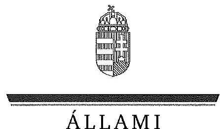
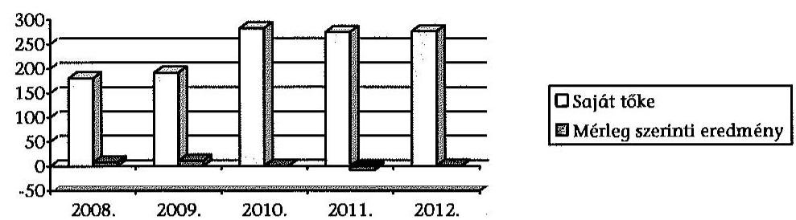
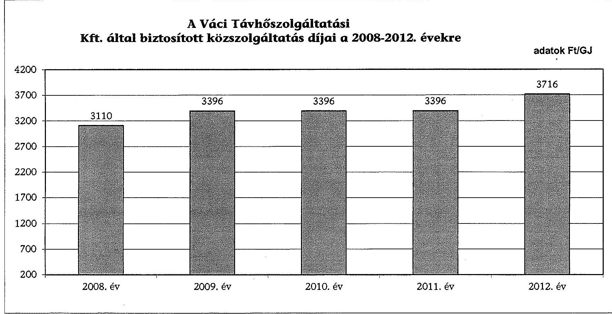
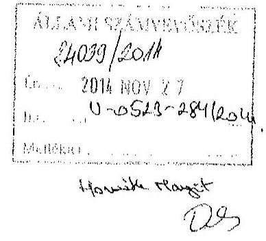
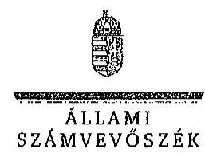
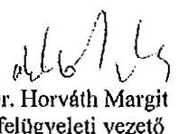

Á L L A M I
S ZÁMVEVŐSZÉK

# JELENTÉS 

Az önkormányzatok gazdasági társaságai - Az önkormányzatok többségi tulajdonában lévő gazdasági társaságok közfeladat ellátását érintő gazdálkodási tevékenysége szabályszerűségének ellenőrzése

Váci Távhőszolgáltatási Kft.

---

# Állami Számvevőszék 

Iktatószám: V-0523-305/2015
Témaszám: 1557
Vizsgálat-azonosító szám: V067118

## Az ellenőrzést felügyelte:

Dr. Horváth Margit
felügyeleti vezető
Az ellenőrzést vezette és az ellenőrzés végrehajtásáért felelős:
Salamin Viktor
ellenőrzésvezető
A jelentéstervezet összeállításában közremüködtek:
Dr. Mezei Imréné
számvevő tanácsos
Dr. Elek László
számvevő

## Az ellenőrzést végezték:

Semerédy Andrea
okleveles könyvvizsgáló, külső szakértő

Tatár Zsuzsanna
okleveles könyvvizsgáló, külső szakértő

Jeszenkovits Tamás
okleveles könyvvizsgáló, külső szakértő

---

# TARTALOMJEGYZÉK 

BEVEZETÉS ..... 5
I. ÖSSZEGZŐ MEGÁLLAPÍTÁSOK, KÖVETKEZTETÉSEK, JAVASLATOK ..... 8
II. RÉSZLETES MEGÁLLAPÍTÁSOK ..... 16

1. Az Önkormányzat közfeladat-ellátásának szabályszerűsége ..... 16
1.1. A közfeladat-ellátás megszervezése és a feladatellátás feltételrendszerének kialakítása ..... 16
1.2. A közfeladat-ellátás felügyelete és a tulajdonosi jogok érvényesítése ..... 18
2. A Váci Távhőszolgáltatási Kft. közfeladat ellátással kapcsolatos tevékenysége ..... 22
2.1. A Váci Távhőszolgáltatási Kft. gazdálkodásának szabályozottsága ..... 22
2.2. A Váci Távhőszolgáltatási Kft. vagyongazdálkodása ..... 25
2.3. A beszámolási kötelezettség teljesítése ..... 31
3. A távhőszolgáltatás közfeladata bevételei és ráfordításai elszámolásának és önköltségszámításának szabályszerűsége ..... 32
3.1. A távhőszolgáltatás közfeladat bevételeinek és ráfordításainak szabályszerűsége ..... 32
3.2. Az önköltségszámítás szabályszerűsége ..... 34

## MELLÉKLETEK

1. számú A Váci Távhőszolgáltatási Kft. tevékenységének főbb adatai
2. számú A Váci Távhőszolgáltatási Kft. múködésének főbb jellemzői
3. számú A Váci Távhőszolgáltatási Kft. által biztosított közszolgáltatás díjai a 2008-2012. évekre
4. számú Beérkezett észrevételek és az azokra adott válaszok

## FÜGGELÉKEK

1. számú Értelmező szótár
2. számú Mintavételi eljárások ellenőrzési területenként

---

.

---

# RÖVIDÍTÉSEK JEGYZÉKE 

## Törvények

| Áht $_{1}$ | az államháztartásról szóló 1992. évi XXXVIII. törvény (hatálytalan: 2012. január 1-jétől) |
| :--: | :--: |
| Gt. | a gazdasági társaságokról szóló 2006. évi IV. törvény (hatálytalan: 2014. március 15 -től) |
| Nvtv. | a nemzeti vagyonról szóló 2011. évi CXCVI. törvény (hatályos: 2011. december 31-étől, kivéve a 20. § (2) bekezdésben meghatározott paragrafusok, amelyek 2012. január 1-jétől, a (3) bekezdésben meghatározott paragrafusok 2013. január 1-jétől, a (4) bekezdésben meghatározott paragrafus 2012. március 2-ától léptek hatályba) |
| Ötv. | a helyi önkormányzatokról szóló 1990. évi LXV. törvény (hatálytalan: a 2014. évi általános önkormányzati választások napjától) |
| Számv. tv. | a számvitelről szóló 2000. évi C. törvény (hatályos: 2001. január 1-jétől) |
| Tak. tv. | a köztulajdonban álló gazdasági társaságok takarékosabb müködéséről szóló 2009. évi CXXII. törvény (hatályos: 2009. december 4-től) |
| Távhő árszabályozási tv. | 2011. évi CXXVI. törvény a távhőszolgáltatástól 2005. évi XVIII. Törvény és az árak megállapításáról szóló 1990.évi LXXXVII. törvény módosításáról (hatályos 2011. szeptember 30 -tól) |
| Tszt. | a távhőszolgáltatásról szóló 2005. évi XVIII. törvény (hatályos: 2005. július 1-jétől) |

## Rendeletek

Kormányrendelet a Tszt. végrehajtásáról távhő árrendelet
távhő támogatási rendelet
távhő árrendelet és támogatási rendelet módosítása
SZMSZ $_{1}$

SZMSZ $_{2}$
vagyongazdálkodási rendelet
157/2005. (XII. 19.) Kormányrendelet a távhőszolgáltatásról szóló 2005. évi XVIII. törvény végrehajtásáról 50/2011. (IX. 30.) NFM rendelet a távhőtermelői, távhőértékesítői és távhőszolgáltatói árakról
51/2011. (IX. 30.) NFM rendelet a távhőszolgáltatók által értékesített távhő árának, valamint a lakossági felhasználóknak és a külön kezelt intézményeknek nyújtott távhőszolgáltatás dijának megállapításáról
66/2011. (XI. 30.) NFM rendelet a távhőszolgáltatóknak és a lakosságnak értékesített távhő áráról szóló 50/2011. és $51 / 2011$. NFM rendeletek módosítása
Vác Város Önkormányzatának 9/1995. (V. 08.) rendelete az Önkormányzat Szervezeti és Müködési Szabályzatáról (hatályos: 1995. május 8 -tól - 2012. március 21-ig)
Vác Város Önkormányzatának 9/2012. (III. 22.) rendelete az Önkormányzat Szervezeti és Müködési Szabályzatáról (hatályos: 2012. március 22 -től)
Vác Város Önkormányzatának 29/2005 (X. 17.) rendelete az Önkormányzat vagyonáról, a vagyontárgyak feletti

---

városi
távhőszolgáltatási rendelet

## Szórövidítések

Alapító Okirat
ÁFA
ÁSZ
FB
Integrált Városfejlesztési
Stratégia
jegyzö
KEOP
Képviselő-testület
MEH
MEKH
NFM
Önkormányzat
polgármester
Társaság
ügyrend
Váci Távhőszolgáltatási Kft.

Váci Távhőszolgáltatási Kft. Felügyelőbizottsága
Vác Város Integrált Városfejlesztési Stratégiája (20082013)

Vác Város Önkormányzatának jegyzője
Környezet és Energia Operatív Program
Vác Város Önkormányzatának Képviselő-testülete
Magyar Energia Hivatal
Magyar Energetikai és Közműszabályozási Hivatal
Nemzeti Fejlesztési Minisztérium
Vác Város Önkormányzat
Vác Város Önkormányzat Polgármestere
Váci Távhőszolgáltatási Kft.
A Polgármesteri Hivatal ügyrendje (hatályos: 2009. február 2-től)
Váci Távhőszolgáltatási Kft. (jogelődje: Vác Városüzemeltetési Kft.)
Váci Városfejlesztő Kft. Váci Városfejlesztő és Szolgáltató Kft. (az önkormányzati holding uralkodó tagja)
Vác Város Energiahatékonyság-növelési és Megújuló Energia Stratégiája (Készítette: CHIC Középmagyarországi Innovációs Központ Kht., 2010.jálius)

---

# JELENTÉS 

## Az önkormányzatok gazdasági társaságai - Az önkormányzatok többségi tulajdonában lévő gazdasági társaságok közfeladat ellátását érintő gazdálkodási tevékenysége szabályszerűségének ellenőrzése Váci Távhőszolgáltatási Kft.

## BEVEZETÉS

Az Állami Számvevőszék középtávra szóló stratégiájában megfogalmazta, hogy a helyi önkormányzatok gazdálkodásában rejlő pénzügyi kockázatok feltárásával, az államháztartáson kívülre nyújtott költségvetési támogatások és ingyenes vagyonjuttatások, valamint az államháztartáson kívül múködő köz-feladat-ellátó rendszerek ellenőrzéseivel hozzájárul ahhoz, hogy a közpénzeket az államháztartáson kívül múködő szervezetek is átlátható, rendezett módon használják fel a közfeladatok szerződésben vállalt ellátása érdekében.

Az önkormányzatok szervezetalakítási szabadságának következménye, hogy a korábban is vállalati formában működő (nagyvárosi tömegközlekedés, víz-, szennyvízcsatorna, köztisztasági, ingatlankezelés stb.) közszolgáltatások mellett, mind a kötelező, mind az önként vállalt feladatok ellátásában a gazdasági társaságok kiemelt fontosságú szerephez jutottak.

Vác Város Önkormányzata a korábbi Váci Városüzemeltetési Kft. tevékenységének szétválasztásával, annak általános jogutódjaként, 1996. július 1-jével, a 139/1996. (IX. 9.) számú Képviselő-testületi határozatával, 100\%-os tulajdonosi részesedéssel hozta létre a Váci Távhőszolgáltatási Kft.-t. Az alapítói jogokat az Önkormányzat Képviselő-testülete gyakorolta.

A Váci Távhőszolgáltatási Kft. feladata a közel 34 ezer lakóval rendelkező Vác területén lévő Távhőszolgáltatási rendszer üzemeltetése, a termelt hő elosztása, értékesítése, fűtés- és használati melegvíz- szolgáltatás valamint hőtermelő, hőelosztó, hőszolgáltató és hőfelhasználó berendezések létesítése, javítása, üzemeltetése. A Társaság alaptevékenysége mellett a távhőszolgáltatáshoz kapcsolódó kiegészítő tevékenységeket (kazán, radiátor gyártása, villamosenergia- termelés, szállítás, elosztás, víz-, gáz-, fűtés-, légkondicionáló-, központi fűtés szerelés) is folytat. A Társaság négy kazánháza 2715 lakást, három önkormányzati intézményt és mintegy 50 kisebb üzlethelyiséget lát el távhővel. A Társaság távhőszolgáltatáshoz kapcsolódó foglalkoztatotti létszá-ma 2008-ban 28 fő, míg 2012-ben 27 fő volt.

---

A Társaság összes árbevétele 2008-ban 814,7 M Ft, a 2012. évben 901,1 M Ft volt, amelyből $663,9 \mathrm{M}$ Ft-ot az értékesítés nettó árbevétele címén realizáltak. Az árbevételek az ellenőrzött időszakban 10,6\%-kal, a ráfordítások 3,9\%kal emelkedtek.

A Váci Távhőszolgáltatási Kft. az ellenőrzött időszakban - a 2011. évi veszteséget kivéve - pozitív mérleg szerinti eredménnyel zárt. A Társaság a 2012. évben mindössze $1,7 \mathrm{M}$ Ft összegű eredményt realizált, amelyet $152,3 \mathrm{M} \mathrm{Ft}$ távhőszolgáltatási támogatás igénybevétele mellett ért el.

A Társaság mérleg szerinti eszközállománya a 2008. január 1-jei 306,2 M Ft-ról a 2012. év végére 73,3\%-os növekedést követően 530,8 M Ft-ra nőtt, ezen belül a tárgyi eszközök állománya $64,1 \%$-kal emelkedett. A saját tőke a 2008. január 1-jei 171,7 M Ft-ról a 2012. év végére 276,3 M Ft-ra változott.

A Képviselő-testület a 2011. február 18-tól az önkormányzati tulajdonú gazdasági társaságait holdingba szervezte. A vállalatcsoport tulajdonosi jogokat ellátó uralkodó tagja a Váci Városfejlesztő Kft. lett, a Váci Távhőszolgáltatási Kft. ezen időponttól kezdődően a holding tagvállalataként müködött.

Az ellenőrzött időszakban a polgármester személye kettő, a jegyző személye három alkalommal változott. A polgármester a 2010. évi önkormányzati választások, a jegyző 2011. március 17. óta tölti be tisztségét. A Váci Távhőszolgáltatási Kft. ügyvezetője 2005. július 1-jétől, a főkönyvelője 2012. május 1-jétől látja el feladatait.

Az önkormányzati tulajdonú gazdasági társaságok teljes körű ellenőrzésének lehetőségét az Állami Számvevőszékről szóló 1989. évi XXXVIII. törvény 2011. január 1-jétől hatályos módosítása teremtette meg.

Az ellenőrzés célja annak értékelése, hogy:

- az önkormányzat a jogszabályi előírások figyelembevételével döntött-e az ellenőrzésre kerülő közfeladat megszervezéséről; az önkormányzat szabályszerűen gyakorolta-e a tulajdonosi jogokat;
- a gazdasági Társaság közfeladat-ellátása bevételeinek, ráfordításainak elszámolása, és vagyongazdálkodási tevékenysége megfelelt-e a jogszabályi, illetve a közszolgáltatási szerződésben foglalt tulajdonosi előírásoknak, azok végrehajtása szabályszerű volt-e;
- a közfeladatok átláthatósága és elszámoltathatósága érdekében biztosítva volt-e a közszolgáltatás dijának megalapozottsága szabályszerű önköltségszámítással.

Az ellenőrzéssel érintett szervezetek: Vác Város Önkormányzata, a Váci Távhőszolgáltatási Kft., valamint a tulajdonosi joggyakorlás tekintetében 2011. februártól - a Váci Városfejlesztő és Szolgáltató Kft. Az önkormányzatok pénzügyi és vagyongazdálkodása szabályszerűségének ellenőrzése keretében folyamatban van Vác Város Önkormányzatának ellenőrzése. Az ellenőrzés kitér az Önkormányzat gazdasági társaságait érintően a tulajdonosi jogokkal kapcsolatos kötelezettségek teljesítésére, valamint a gazdasági társaságok bizton-

---

ságának kialakítása, továbbá hatékonyságának növelése érdekében tett intézkedésekre.

Az ellenőrzés várható hasznosulása: A törvényalkotás számára - az észlelt problémák, szabálytalanságok, vagy egyéb nem kívánatos jelenségek felszínre kerülésével - az ellenőrzés megállapításai segítséget nyújthatnak az államháztartáson kívüli közfeladat-ellátás értékeléséhez, jogszabályi keretei pontosításához, átláthatóságot biztosító szabályozásához. Meghatározhatóvá válnak a közfeladat ellátásában részt vevő államháztartáson kívüli szervezeteknek - az önkormányzat költségvetését, pénzügyi helyzetét is befolyásoló - kockázatai, lehetővé válik ezen kockázatok csökkentése. Értékelhetővé válik, hogy a feladatot ellátó gazdasági társaság a közszolgáltatási szerződésben foglaltak betartásával, a közvagyon használatával biztosította-e a szolgáltatás folytatásának feltételeit. Ezzel az ellenőrzöttek és a helyi döntéshozók számára visszajelzést ad feladatszervezési, feladat-ellátási kockázataikról, alapot ad a meglévő hibák megszüntetéséhez, a jobb közfeladat-ellátás biztosításához. Fokozza a fegyelmet, igazolja, hogy lejárt a következmények nélküli ellenőrzések időszaka. Az ÁSZ értékteremtő rend kialakításához és megőrzéséhez hozzájáruló tevékenysége pozitív hatással van a szervezetről kialakított összkép formálására is.

A bevételek és ráfordítások elszámolása, valamint a vagyonnyilvántartás terén az egyes területek szabályszerű működését mintavétellel ellenőriztük, ez alapján a sokaságokban előforduló hibás tételek arányát becsültük. A jogszabályoknak és a belső előírásoknak megfelelőnek, azaz szabályszerűnek tekintettük az adott bevételek és ráfordítások elszámolását, a vagyonnyilvántartást, amennyiben a minta ellenőrzésének eredménye alapján $95 \%$-os bizonyossággal a teljes sokaságban a hibás tételek aránya kisebb volt, mint $10 \%$, nem megfelelőnek értékeltük, ha a hibás tételek aránya a $10 \%$-ot meghaladta. Kockázatot, illetve magas kockázatot jeleztünk, amennyiben egy adott terület vonatkozásában a minta alapján a teljes sokaságban nem volt teljes körűen biztosított a jogszabályoknak és a belső szabályzatoknak megfelelő működés.

Az ellenőrzést a számvevőszéki ellenőrzés szakmai szabályai szerint, szabályszerűségi ellenőrzés módszerével, a vonatkozó nemzetközi standardok figyelembevételével végeztük. Az ellenőrzés a 2008-2012. évekre terjedt ki.

Az ellenőrzés végrehajtásának jogszabályi alapját az Állami Számvevőszékről szóló 2011. évi LXVI. törvény 5. § (3)-(4)-(5) bekezdése képezi.

Az ÁSZ az Állami Számvevőszékről szóló 2011. évi LXVI. törvény 29. §-a alapján a jelentéstervezetet észrevételezésre megküldte Vác Város Önkormányzata polgármesternek, a Váci Távhőszolgáltatási Kft. és a Váci Városfejlesztő és Szolgáltató Kft. ügyvezetőinek. A beérkezett észrevételeket a jelentés véglegesítése során hasznosítottuk. Az észrevételeket és az azokra adott válaszokat a jelentés 4. számú melléklete tartalmazza.

---

# I. ÖSSZEGZŐ MEGÁLLAPÍTÁSOK, KÖVETKEZTETÉSEK, JAVASLATOK 

Vác Város Önkormányzata az Ötv.-ben és a Tszt.-ben foglalt távhőszolgáltatási feladatainak ellátására 1996. július 1-jével hozta létre a Váci Távhőszolgáltatási Kft.-t, amely 2011 februárjáig - a Társaság holding szervezetbe való átalakításáig - 100\%-os Önkormányzati tulajdonban volt, tulajdonosi jogait addig a Képviselő-testület gyakorolta. A holding szervezet kialakítását követően a tulajdonosi joggyakorlás rendje a Gt.-ben szabályozott - elismert vállalatcsoport múködésére vonatkozó - előírásoknak megfelelően módosult.

Az Önkormányzat a jogszabályi előírások figyelembevételével döntött a távhőszolgáltatási közfeladat megszervezéséről, a feladatellátáshoz szükséges közmúvagyont apportként bocsátotta a gazdasági társaság rendelkezésére.

A Váci Távhőszolgáltatási Kft. feladata a város területén lévő Távhőszolgáltatási rendszer üzemeltetése, a termelt hő elosztása, értékesítése, fűtés- és használati melegvíz-szolgáltatás valamint hőtermelő, hőelosztó, hőszolgáltató és hőfelhasználó berendezések létesítése, javítása, üzemeltetése.

A Képviselő-testület által elfogadott városi távhőszolgáltatási rendelet figyelembe vette a Tszt.-ben előírtakat, tartalmazta a Távhőszolgáltatási és a felhasználó közötti jogviszony szabályait, a mérés szerinti távhőszolgáltatásra vonatkozó előírásokat, a távhőszolgáltatási díjak elszámolásával kapcsolatos előírásokat, a csatlakozási díjra, a díjképzési előírásokra, a távhőszolgáltatás szüneteltetésére, a távhőszolgáltatás korlátozására, a környezetvédelmi és levegő tisztaságvédelmi szempontokra, a hőközponti mérési kötelezettségére vonatkozó szabályokat. A távhőszolgáltatás árszabályozása 2011 áprilisától átalakult, így az önkormányzat szabályozási kötelezettsége a csatlakozás díjának meghatározására korlátozódott.

Az Önkormányzat és a Váci Távhőszolgáltatási Kft. 2011. szeptember 15-től a nyertes KEOP pályázatban meghatározott beruházás támogatási feltételeinek való megfelelés érdekében 5 évre szóló közszolgáltatási szerződést kötött. Ezt megelőzően az ellenőrzött időszakban az Önkormányzat és a Társaság - jogszabályi előírás hiányában - közszolgáltatási szerződést nem kötött.

A közszolgáltatási szerződés - a pályázati feltételek szerint - előírásokat tartalmazott a szolgáltató üzleti terveinek összeállítására vonatkozóan, az itt előírt kötelezettségének azonban a Váci Távhőszolgáltatási Kft. a 2011-et követő két év koncepcionális (gördülő) üzleti terveinek készítése során nem tett eleget maradéktalanul, így nem mutatta be a közszolgáltatás ellátásához kapcsolódó ráfordításainak és bevételeinek a szerződésben előírt részletezés szerinti bontású tervezett adatait és tényleges alakulását.

---

Vác város energiahatékonyság-növelési és megújuló energia stratégiája részletesen foglalkozott a városi távfütés helyzetével. A városfejlesztésre vonatkozó, 2011-2014. évekre megfogalmazott Gazdasági program az önkormányzati tulajdonú gazdasági társaságok feladatait érintő szervezeti változások kapcsán is célul tűzte ki a hatékonyság növelését. E szervezeti változások részeként az Önkormányzat a Váci Távhőszolgáltatási Kft.-t 2011. február 18-tól holdingba szervezte. Az átszervezés során az elvárt megtakarítási célokat nem számszerúsítették.

Az ellenőrzési időszak alatt a Váci Távhőszolgáltatási Kft. Alapító okiratában a Gt. előírásaival összhangban szabályozta a tulajdonosi joggyakorlás kereteit. Az Önkormányzat a Váci Távhőszolgáltatási Kft.-nél 2008-2009-ben Felügyelő Bizottság létrehozásáról nem gondoskodott. Az Önkormányzat a Gt. előírásainak megfelelően az FB múködését csak 2010. január 21 - 2011. február 17-ig tartó időszakban biztosította. Az FB azonban a Gt.-ben foglaltak ellenére nem rendelkezett ügyrenddel. A Holding társaság létrehozását követően, 2011. február 18-tól az FB a holding keretén belül múködött, tevékenységét a holding egészére vonatkozóan fejtette ki. A tulajdonosi jogok gyakorlása a holding társaság megalakítását követően szabályszerű volt.

A Váci Távhőszolgáltatási Kft. az ellenőrzött időszakban csak a 2010. és 2011. évekre készített üzleti tervet. A 2010. évi üzleti tervét az Önkormányzat kép-viselő-testülete a 281/2009. (XII. 17.) számú Képviselő-testületi határozatával elfogadta. A 2011-es üzleti tervet már a tulajdonosi jogokat gyakorló holding társaság nyújtotta be elfogadásra. Az Önkormányzat üzleti tervet a Társaságtól a 2008-2009. évekre nem kért, s azt a Társaság nem is készített. A Társaság a 2012. évre vonatkozóan sem rendelkezett elfogadott üzleti tervvel.

A Váci Távhőszolgáltatási Kft. 2008-2012 közötti években a Számv. tv. által előírt beszámolási kötelezettségét teljesítette, valamennyi beszámolóját a Képvise-lő-testület határozatban fogadta el. A 2008-2010 években a mérleg szerinti eredményt (összesen 20,5 M Ft-ot) eredménytartalékba helyeztették. A gazdálkodás 2011-ben évben veszteséges volt. A 2012. évben képződött 1,8 M Ft összegű eredmény felhasználásáról - a Számv. tv. előírása ellenére - a Képvi-selő-testület nem döntött.

Az Önkormányzat Képviselő-testülete - mivel a Váci Távhőszolgáltatási Kft.-nél az FB nem múködött - megsértette a Gt. előírásait is, mivel a Képviselő-testület az FB írásbeli jelentésének hiányában nem is határozhatott volna a Váci Távhőszolgáltatási Kft. a 2008., 2009. és a 2010. üzleti éveket érintő beszámolójáról. Az FB hiányában a beszámolóval és annak nyilvánosságra hozatalával összefüggésben nem érvényesülhettek a Gt.-ben - az ellenőrzési kötelezettség elmaradásával okozott kárért való felelősség tekintetében - meghatározott jogkövetkezmények sem.

A holding létrehozását követő tulajdonosi és szervezeti változásokat, valamint az emiatt bekövetkezett hatáskör és jogkörváltozásokat a Váci Távhőszolgáltatási Kft. SZMSZ-ében nem határozták meg. A Váci Városfejlesztő Kft. - a holding kijelölt uralkodó tagja - nem alakította ki az ellenőrzési időszakban az összehangolt számviteli rendszer részeként az ellenőrzött Társaság számviteli politikáját, az éves és egyéb beszámolók formáját és adattartal-

---

mát, nem biztosította vállalatcsoport szinten az összehangolt kontrolling rendszer múködtetését. A holding nem szabályozta a tulajdonosi elvárásoknak megfelelően a Váci Távhőszolgáltatási Kft. vonatkozásában az adatszolgáltatási, beszámolási és egyéb tájékoztatási feladatait a Tszt. előírásai szerint. A Társaság holdingba való szervezése kimutatható megtakarítást a Váci Távhőszolgáltatási Kft. múködésében az ellenőrzési időszakban nem eredményezett. A Váci Távhőszolgáltatási Kft. - a tevékenységét érintő szabályozásbeli hiányosságok ellenére - alapítása óta megbízhatóan látja el közszolgáltatási feladatait.

A beszámolót hitelesítő könyvvizsgálói jelentés egyik évben sem tartalmazott korlátozó záradékot. A könyvvizsgáló a 2012. évi beszámoló felülvizsgálatáról szóló könyvvizsgálói jelentésében - a Tszt.-ben előírt kötelezettsége ellenére - nem nyilatkozott a távhőszolgáltatás vonatkozásában a Tszt. által előírt számviteli szétválasztási szabályok kidolgozásának és alkalmazásának vizsgálatáról, nem igazolta, hogy a Társaság egyes tevékenységei közötti tranzakciók árazása biztosítja a vállalkozás tevékenységei közötti keresztfinanszírozás mentességet.

Az Önkormányzat belső ellenőrzése keretében végzett kockázatelemzés nem terjedt ki a gazdasági társaságokra, az ellenőrzött időszakban az Önkormányzat a Társaságnál belső ellenőrzést nem végzett, külső szakértői ellenőrzésről nem intézkedett.

A Váci Távhőszolgáltatási Kft. ellenőrzött időszakra vonatkozóan rendelkezett üzletszabályzattal. A Váci Távhőszolgáltatási Kft. üzletszabályzata részletesen meghatározta a társaságnak az érvényben lévő jogszabályok által meghatározott múködési kereteit. Az üzletszabályzat kitért azokra a legfontosabb feltételekre, amelyek elengedhetetlenül szükségesek a felhasználók és a szolgáltató vállalat eredményes együttműködéséhez. Az üzletszabályzatot az ellenőrzési időszak alatt egy alkalommal - 2010. január 1-i hatállyal - módosították. A módosítás során az Önkormányzat jegyzője nem a jogszabályi előírásoknak megfelelően járt el, mert a Tszt.-ben foglaltak ellenére az üzletszabályzatot nem küldte meg véleményezésre a fogyasztóvédelmi hatóságnak, továbbá azt jegyzői határozattal nem hagyta jóvá.

A Váci Távhőszolgáltatási Kft. az ellenőrzött időszakban rendelkezett ugyan a Számv. tv. által előírt számviteli politikával, azonban a holding társaság annak szervezeti átalakítás miatti aktualizálásáról nem gondoskodott, valamint a bevételek és ráfordítások elszámolásakor a Tszt.-ben a 2012. évtől kezdődően előírt távhőszolgáltatásra vonatkozó számviteli szétválasztás elvét nem alkalmazták. A Társaság a számviteli politikában és annak mellékletét képező értékelési szabályzatában a Számv. tv. előírását figyelmen kívül hagyva nem határozta meg az üzembe helyezés dokumentálásának és az évente elszámolandó értékcsökkenés megtervezésének és elszámolásának módját.

A Társaság az ellenőrzött időszakban rendelkezett értékelési, leltározási és selejtezési szabályzatokkal, azonban ezek egyikének sem történt meg a jogszabályi és szervezeti változások által indokolt módosítása.

---

A Társaság 2011 szeptemberétől rendelkezik a holding társaság egészre vonatkozó javadalmazási szabályzattal. Az ellenőrzött időszakban, a szabályzat hatályba lépését követően a vezető tisztségviselőknek a javadalmazási szabályzat alapján biztosított prémiumfizetésre nem került sor.

A Váci Távhőszolgáltatási Kft. a Számv. tv. alapján nem volt kötelezett Önköltség számítási szabályzat készítésére, de Tszt. előírásai alapján ki kellett volna dolgoznia a tevékenységenkénti közvetlen és közvetett költségek elszámolásának és felosztásának a szabályait. A nem szabályozott önköltségszámítás miatt a költségkalkulációkat nem alapozta meg átlátható és következetes önköltségszámítás, hiányoztak az árképzés stabil előkalkulációs alapjai, nem érvényesültek a Tszt.-ben előírt ár-megállapítási szempontok. Nem volt biztosított a pontos utókalkuláció és az elszámoltathatóság, a Számv. tv.-ben meghatározott világosság elvének betartása. Ennek következtében a közszolgáltatás dijának szabályszerű önköltségszámítással való megalapozottságát nem biztosították. A Társaság és a tulajdonos Önkormányzat a fogyasztók fizetőkészségének fenntartása érdekében az alapdíjak alacsonyan tartására törekedett, 2009 januárjától 2010 decemberéig a fogyasztók számára összesen 101,3 M Ft összegben hődíj visszatérítési kedvezményt is nyújtottak.

A Váci Távhőszolgáltatási Kft. vagyongazdálkodásának szabályozottsága és a vagyonnal való gazdálkodása az ellenőrzött időszakban nem felelt meg a jogszabályi és az Önkormányzat által meghatározott előírásoknak. A Váci Távhőszolgáltatási Kft. a Tszt. előírása ellenére nem tartotta be a saját vagyona elkülönítésére, annak változására, a közfeladat ellátásával való kapcsolatára vonatkozó rendelkezéseket. A Társaság befektetéseinek rendjét nem szabályozta, holott az ellenőrzési időszak mindegyik évében rendelkezett rövidejáratú, forgatási célú (tőkegarantált) értékpapírokkal. A Társaság az értékpapír vásárlásra a tulajdonostól engedélyt nem kért és nem kapott, a tulajdonos erre vonatkozóan előírást nem határozott meg. Ezzel nem volt biztosított, hogy a tulajdonos határozza meg a Gt. előírásai szerint, hogy kinek a jóváhagyásával, milyen pénzügyi instrumentumba és milyen kockázattal fektetheti be a Társaság az átmenetileg szabad pénzeszközeit.

A Váci Távhőszolgáltatási Kft. 2010-ben a KEOP-ból megvalósuló fejlesztési program keretében pályázatot nyújtott be a váci primer távhővezeték rendszer rekonstrukciójának megvalósítására. A pályázati feltételek értelmében a kivitelezési költség 50\%-át saját forrásból kellett fedezni, ezért a Képviselőtestület 90 M Ft-tal emelte a Társaságjegyzett tőkéjét. Az ellenőrzött időszakban Uniós forrásból összesen 82,3 M Ft támogatást vettek igénybe. A megvalósult fejlesztés összköltsége 173,1 M Ft volt.

A KEOP pályázathoz szükséges saját forrás előteremtése miatt a Váci Távhőszolgáltatási Kft. követeléseit 2012 augusztusában engedményezési szerződés útján értékesítette. Az engedményezett követelés értékesítése a könyv szerinti érték $76 \%$-án történt. A KEOP pályázat miatt került sor a Váci Távhőszolgáltatási Kft. tulajdonát képező vagyona terhére zálogjog bejegyezésére is. A KEOP pályázathoz szükséges Bankgaranciát a Társaság 2010-ben az Önkormányzat képviselő-testülete jóváhagyásával szabályszerűen vette igénybe. Az Nvtv. hatálybalépését követően a pályázathoz szükséges biztosítékot az Önkormányzat nem nyújthatott, ezért a támogatási összeg megtartása

---

érdekében a beruházás eredményeként létrejött vagyona terhére jelzálogjogot jegyeztetett be.

A távhő támogatási rendelet alapján bevezetett távhőszolgáltatási támogatásból származó bevétel 2011-ben 37,8 M Ft, 2012-ben 152,3 M Ft volt. A távhő támogatási rendeletben előírt támogatás igénylését a Társaság a valós hőtermelés alapján nyújtotta be, az előírt külön nyilvántartást szabályosan vezette.

A közfeladat ellátás bevételeinek és ráfordításainak, valamint vagyongazdálkodási tevékenységének nyilvántartása és elszámolásának szabályszerűségi ellenőrzése során megállapítottuk, hogy az anyagjellegü ráfordítások a költségelszámolása és az értékesítés nettó árbevétele elszámolásának szabályszerűsége megfelelő volt. A vagyon nyilvántartás szabályszerűségének megítéléséhez kapcsolódó mintatételek ellenőrzése során az ellenőrzés megállapította, hogy a hibás tételek aránya $17,8 \%$ volt, amely az alsó hibahatárt ( $12,09 \%$-ot) meghaladta, így a vagyonnyilvántartás szabályszerűségének minősítése nem megfelelő.

A fentiekben leírtak összegzéseként az alábbi megállapításokat tesszük:
Vác Város Önkormányzatának Képviselő-testülete a távhőszolgáltatás közfeladatának megszervezéséről, annak felügyeletéről a jogszabályi előírásoknak megfelelően gondoskodott, a helyi közszolgáltatások szervezésének célszerűségi és gazdaságossági szempontjai érdekében holding társaságot alakítottak ki. A tulajdonosi jogok gyakorlása a holding társaság megalakítását követően szabályszerű volt. Az Önkormányzat az ellenőrzött időszakban a Társaságnál keletkező eredményt eredménytartalékba helyeztette, valamint fogyasztók fizetőkészségének fenntartása érdekében az alapdíjak alacsonyan tartásával a fogyasztók számára hődíj visszatérítési kedvezményt is nyújtott. A holding létrehozását követő tulajdonosi és szervezeti változásokat, valamint az emiatt bekövetkezett hatáskör és jogkörváltozásokat a Váci Távhőszolgáltatási Kft. szakmai tevékenységének és számviteli és vagyongazdálkodási feltételeinek szabályozása során nem követték, számviteli szabályzataikat nem aktualizálták, a Tszt.-ben a 2012. évtől kezdődően előírt távhőszolgáltatásra vonatkozó számviteli szétválasztás elvét nem alkalmazták, a közszolgáltatás díjának szabályszerű önköltségszámítással való megalapozottságát nem biztosították. A Váci Távhőszolgáltatási Kft. - a tevékenységét érintő szabályozásbeli hiányosságok ellenére - alapítása óta megbízhatóan látja el közszolgáltatási feladatait. A tulajdonos Önkormányzat ellenőrzései segíthették volna a Társaságot a szabályszerű működésben, ráirányíthatták volna a figyelmét az adatszolgáltatási, tervezési, beszámolási kötelezettségeit érintő változtatások szükségességére.

Az Állami Számvevőszékről szóló 2011. évi LXVI. törvény 33. § (1) bekezdésében foglaltak értelmében a jelentésben foglalt megállapításokhoz kapcsolódó intézkedési tervet köteles az ellenőrzött szervezet vezetője összeállítani, és azt a jelentés kézhezvételétől számított 30 napon belül az ÁSZ részére megküldeni. Amennyiben az intézkedési tervet határidőben nem küldi meg a szervezet, vagy az nem elfogadható, az ÁSZ elnöke a hivatkozott törvény 33. § (3) bekezdés a)-b) pontjaiban foglaltakat érvényesítheti.

---

Az ellenőrzés intézkedést igénylő megállapításai és javaslatai:
Javaslataink célja a Kft. gazdálkodása szabályszerűségének helyreállítása annak érdekében, hogy a szabályozási környezet megfelelően tudja támogatni az átlátható müködést.

# Javasoljuk a Váci Távhőszolgáltatási Kft. ügyvezető igazgatójának: 

1. A Tszt. 18/A. § (3) bekezdése előírja, hogy 2012. január 1-től a társaság köteles a távhőtermelést telephelyenkénti bontásban, a Távhőszolgáltatási tevékenységet településenként szétválasztva, valamint az egyéb tevékenységeit a számviteli éves beszámolója kiegészítő mellékletében oly módon bemutatni, mintha azokat önálló vállalkozás keretében végezte volna. Az engedélyes tevékenység elkülönült bemutatása a távhőtermelés esetében telephelyenként, a Távhőszolgáltatási tevékenység esetében településenként önálló mérleget és eredmény-kimutatást jelent. A társaság Számviteli politikája, ennek alapján a számviteli elszámolásai 2012. január 1-től nem feleltek meg a Tszt. 18/A. §-ában foglaltaknak.

A társaság a Számv. tv. 14. § (6) bekezdése értelmében mentesült ugyan az Önkölt-ség-számítási szabályzatkészítési kötelezettség alól, de a Tszt. 18/A. § (2) bekezdésének előírásai szerint köteles olyan számviteli szétválasztási szabályokat kidolgozni, és az egyes tevékenységeire olyan elkülönült nyilvántartást vezetni, amelyek együtt biztosítják az egyes tevékenységek átláthatóságát, egyben kizárják a keresztfinanszírozást. A rendelkezések betartása érdekében a társaságnak meg kellett volna határoznia az egyes tevékenységek közötti általános költségek felosztásának elveit és szabályait a Számviteli politikában és/vagy az Értékelési szabályzatában.

A Váci Távhőszolgáltatási Kft. a számviteli politikában és annak mellékletét képező értékelési szabályzatában a Számv. tv 52. § (2) bekezdésének előírását figyelmen kívül hagyva nem határozta meg az üzembe helyezés dokumentálásának és az évente elszámolandó értékcsökkenés megtervezésének és elszámolásának módját.

A társaság tulajdonosa a holding szervezet 2011. február 18-i kialakítását követően Vác Város Önkormányzata helyett a Váci Városfejlesztő Szolgáltató Kft. lett. A tulajdonosváltozást a cégbíróság bejegyezte. Ez a jelentős szervezeti változás a társaság SZMSZ-ében azonban nem került átvezetésre. Ennek következményeként a holding és a társaság vezetőjének hatásköre és jogköre nem volt egyértelműen szétválasztva, amely a társaság működtetésében okozott zavarokat, főként a holding és a társaság ügyvezetőjének stratégiai és operatív irányítási jogosultságait tekintve.

Javaslat:

## Intézkedjen a szabályozási hiányosságok megszüntetésére, ennek keretében:

a) egészítse ki a számviteli szabályozásait a Tszt. rendelkezéseinek megfelelően olyan előírásokkal, amelyek biztosítják a társaság különböző engedélyes tevékenységeinek feladatonként és településenként történő szétválasztását, továbbá alakítson ki az egyes tevékenységeire olyan elkülönült nyilvántartást, amely biztosítja az egyes tevékenységek elszámolásának átláthatóságát, egyben kizárja a keresztfinanszírozást;

---

b) egészítse ki a Számviteli politikáját az üzembe helyezés dokumentálásának és az évente elszámolandó értékcsökkenés megtervezésének és elszámolásának módjára vonatkozó előírásokkal;
c) aktualizálja a társaság SZMSZ-ét a holding szervezet müködtetésének megfelelő feladat-és hatáskörök szabályozásával, kiemelt figyelemmel a holding és a társaság vezetésének kapcsolatrendszerére.
2. A társaság 2012-re vonatkozóan nem rendelkezett üzleti tervvel, amelynek készítését számára 2012-től a Közszolgáltatási szerződés 7.7 b)- d). pontjai kötelezően előírták.

A Képviselő-testület a holding tagvállalatainak 2012. évi beszámolójáról szóló határozatot úgy fogadta el, hogy a dokumentumok közül hiányzott a tagvállalatok adózott eredményének felhasználására vonatkozó javaslat, ezzel megsértették a Számv. tv. 153. § (1) bekezdésében foglalt előírásokat.

Javaslat:
Gondoskodjon a jogszabályi elöírásoknak megfelelő gyakorlat és szabályos müködés biztositására, ezen belül:
a) intézkedjen a Közszolgáltatási szerződésben előírt éves üzleti tervek elkészítésére.
b) gondoskodjon arról, hogy a Váci Városfejlesztő Kft. beszámolójának a Képviselő testületi jóváhagyásra történő előterjesztése a Számv. tv előírásai szerint tartalmazza az adózott eredmény felhasználására vonatkozó javaslatot is.

Javaslataink célja az önkormányzat szabályszerű müködésének elősegítése, továbbá az önkormányzati tulajdonosi joggyakorlás kontrolljainak erősítése.

# Javasoljuk Vác Város Önkormányzata Polgármesterének: 

1. A társaság Felügyelő Bizottsága nem rendelkezett a Gt. tv. 34. § (4) bekezdésében előírt ügyrenddel.

Javaslat:
Intézkedjen a szabályozási hiányosságok megszüntetésére, ennek keretében:
hívja fel a tulajdonosi jogokat gyakorló Képviselő-testület figyelmét arra, hogy az FB nem rendelkezett Ügyrenddel.

## Javasoljuk Vác Város Önkormányzata Jegyzöjének:

1. Az Önkormányzat - a Képviselő-testület 11/2011 (I.10.) sz. határozata alapján - a Váci Városfejlesztő Kft részére ruházta át a Váci Távhő Kft-ben meglévő üzletrészét, amelyet a vagyonrendeletében üzleti vagyonként tüntetett fel (1. számú melléklet II. pont). Az Önkormányzat a Váci Városfejlesztő Kft.-ben az Nvtv. 3. § (1) bekezdés 8., 9., 16. pontja és (3) bekezdése alapján az értékesítést követően többségi befolyással

---

bír. Egyúttal a Váci Városfejlesztő Kft. az önkormányzat Vagyonrendeletének hivatkozott pontja szerint a törzsvagyon részeként nemzetgazdasági szempontból kiemelt jelentőségű vagyonnak minősült.

Az Nvtv. 2012. június 30 -ától hatályos módosításával az ilyen vagyonelemek az Nvtv. 5. § (5). bekezdés c.) pontja alapján korlátozottan forgalomképesek. A vagyonrendelet ennek megfelelő módosítása viszont elmaradt.

Javaslat:

# Intézkedjen a szabályozási hiányosságok megszüntetésére, ennek keretében: 

készítse elő az Önkormányzat Vagyonrendeletének módosítását a hatályos Nvtv. rendelkezéseivel való összhang megteremtése érdekében, ezt követően gondoskodjon a belső szabályozás szerint a Képviselő-testület elé terjesztéséről.
2. Az Önkormányzat belső ellenőrzése az ellenőrzéseivel a távhőszolgáltatás, mint köz-feladat-ellátás szabályszerű teljesítéséhez, valamint az önkormányzati vagyon megóvásához ellenőrzéseivel nem járult hozzá. Az ellenőrzött időszakban a társaság gazdálkodásával és müködésével kapcsolatban ellenőrzést nem folytatott le.

## Intézkedjen a jogszabályi elöírások szerinti gyakorlat és a szabályos müködés biztosítására, ezen belül:

Javaslat:
fordítson kiemelt figyelmet arra, hogy az önkormányzat belső ellenőrzése az ellenőrzéseivel a távhőszolgáltatás, mint közfeladat-ellátás szabályszerű teljesítéséhez, valamint az önkormányzati vagyon megóvásához ellenőrzéseivel járuljon hozzá.

---

# II. RÉSZLETES MEGÁLLAPÍTÁSOK 

## 1. Az ÖNKORMÁNYZAT KÖZFELADAT-ELLÁTÁSÁNAK SZABÁLYSZERŰSÉGE

### 1.1. A közfeladat-ellátás megszervezése és a feladatellátás feltételrendszerének kialakítása

Az Önkormányzat a jogszabályi előírások figyelembevételével döntött a távhőszolgáltatási közfeladat megszervezéséről.

Vác Város Önkormányzata az ellenőrzött időszakra vonatkozóan két gazdasági programot készített, egyet a 2006-2010. és egyet a 2011-2014. évekre vonatkozóan. Gazdasági programjai ${ }^{1}$ azonban az Ötv. 91. § (1), (6) bekezdéseiben foglaltak ellenére nem tartalmaztak elképzeléseket az Önkormányzat távhőszolgáltatási feladatainak ellátására és fejlesztésére vonatkozóan. Az Önkormányzat a 2008-2013. évekre vonatkozó Integrált Városfejlesztési Stratégiájában sem foglalkozott a távhőszolgáltatás fejlesztésével, annak ellenére, hogy a városban a távhővel ellátott lakások részaránya a 2012. évben 18,7\%-os volt, amely meghaladta a $14,7 \%$-os országos átlagot.

Az Integrált Városfejlesztési Stratégia energiagazdálkodási fejezete a földgáz városi térhódítását állapította meg a háztartási szektorban, a földgázzal fűtött lakások száma jelentősen emelkedett. A Városfejlesztési Stratégia energiagazdálkodási fejezete szerint a város túlzottan támaszkodik a szénhidrogén alapú energiahordozókra, ezen belül a földgázra, ennek következtében az energiahordozók jelenlegi forrásszerkezetének fenntartása drága és növeli az ország importfüggőségét. A Városfejlesztési Stratégia javaslata szerint a megújuló energiaforrások hasznosításának indokolt nagyobb teret adni, a biomassza, a nap, a szél energiájának felhasználásával. A térségben különösen a biomassza hasznosításának adottak a lehetőségei.

A városi távfűtés helyzetével részletesen „Vác város energiahatékonyság-növelési és megújuló energia stratégiája" foglalkozott. A városi energiastratégia megfogalmazta, hogy az energiahatékonyság növelésével lehetővé kell tenni, hogy az energiaigények kevesebb vagy olcsóbb energia felhasználásával, illetve energiahordozó váltással legyenek kielégíthetőek.

Az ellenőrzött időszakban - a Tszt. 6. § (1) bekezdésével összhangban az Önkormányzat az SZMSZ ${ }_{1,2}$ mellékleteiben rögzítette a távhőszolgáltatási feladat ellátásának kötelezettségét. A Távhőszolgáltatási rendszer fejlesztésének, üzemeltetésének feltételeit az Önkormányzat az Ötv. 9. § (4) bekezdésének megfelelően, az ellenőrzött időszakot megelőzően alapított Váci Távhőszolgáltatási Kft. múködtetésével biztosította. A közszolgáltatási fel-

[^0]
[^0]:    ${ }^{1}$ Jóváhagyva a 22/2007. (II. 22.) számú, valamint a 121/2011. (IV. 21.) számú önkormányzati határozatokkal.

---

adat ellátásához szükséges vagyont az Önkormányzat - apportként - a Társaság rendelkezésére bocsátotta.

A Társaság alapításakor a törzstőkéje 114,4 M Ft volt, amely 20,5 M Ft nem pénzbeli betétből (apport) és 93,9 M Ft pénzbeli hozzájárulásból állt. Az apportlistában a távhőszolgáltatás ellátásához kapcsolódó eszközök szerepeltek, amelyek értékét a könyvvizsgáló hitelesítette.

Az Önkormányzat a lakossági távhőszolgáltatás színvonalának és a gazdálkodás eredményességének javítása érdekében a Váci Távhőszolgáltatási Kft.-t 2011. február 18-tól holdingba szervezte. A Váci Városfejlesztő Kft. holding feladataként határozták meg, hogy az Önkormányzat tulajdonosi érdekeinek megfelelően irányítsa és ellenőrizze a tagvállalatokat. Tegye optimálissá az önkormányzati vállalatcsoport működését, érvényesítse a vállalatcsoport nagyságából eredő piaci előnyöket, s javítsa a társaságok működésének hatékonyságát. Az átszervezés során az elvárt megtakarításokat nem számszerúsítették. Az ellenőrzött időszakban a holding működésének következtében megtakarítás nem volt kimutatható.

A 2011-2014-ig tartó városfejlesztésre vonatkozó Gazdasági program (Ciklusprogram) 2. pontja a szervezetfejlesztéssel kapcsolatban a városi tulajdonú gazdasági társaságok feladataival és munkavégzésével kapcsolatban célul tűzte ki a hatékonyság növelését - szükséges szervezeti változások útján - a költségek csökkentésével és gyorsabb, átláthatóbb feladatellátással. E cél realizálására hozta létre a holdingot a tulajdonos Önkormányzat képviselő-testülete. A döntést megelőzően az alpolgármester az Önkormányzat tulajdonában álló gazdasági társaságok, valamint a Polgármesteri Hivatal városüzemeltetési és vagyonhasznosítási tevékenységét felülvizsgáló gazdasági koncepciót dolgozott ki. A kidolgozott gazdasági koncepció szerint a holding rendszer kialakítása következtében az Önkormányzat tulajdonosi érdeke jobban érvényesül, az erőforrásokat optimálisan lehet koncentrálni, közös beszerzési és könyvviteli rendszer alakítható ki. A holding központi szervezetébe kerültek át a társaságtól annak létrehozásától kezdve a munkavédelmi, jogi és könyvvizsgálói feladatok ellátására a megbízási jogok. A Képviselő-testület 13/2011. (I. 10.) Képviselő-testületi határozatával elfogadta a vállalatcsoport létrehozását, a Váci Városfejlesztő Kft. és tagvállalatai társasági szerződéseinek módosítását.

Az Önkormányzat a Váci Távhőszolgáltatási Kft. - a holding társaság létrehozásáig hatályos - Alapító Okiratában meghatározta az ügyvezetőre vonatkozó jogokat, kötelezettségeket, feladatokat, felelősséget. Az ügyvezető megválasztása az alapító Önkormányzat joga, az ügyvezetőt határozott időre, öt évre választják. A Képviselő-testület hatáskörébe tartozik az Alapító Okirat 7. i), j) pontja szerint a Társaság FB tagjainak, könyvvizsgálójának megválasztása, visszahívása, díjazásának megállapítása.

A Tszt. 6. § (2) bekezdésének megfelelően az Önkormányzat a városi távhőszolgáltatási rendeletben ${ }^{2}$ határozta meg a távhőszolgáltatással kapcsolatos részletes szabályokat. A városi távhőszolgáltatási rendelet hatálya

[^0]
[^0]:    ${ }^{2}$ 41/2005. (XII.19.) számú önkormányzati rendelet, amelyet 3 alkalommal (a 15/2008. (III. 31.) számú, a 28/2008. (VII. 14.) számú, valamint a 32/2008. (IX. 29.) számú önkormányzati rendelettel) módosítottak.

---

kiterjedt az Önkormányzat területén lévő távhővel ellátott lakóépületekre, vegyes célra használt épületekre, nem lakás céljára szolgáló épületekre, az ellátást igénybe vevő egyéb felhasználókra. A Képviselő-testület a városi távhőszolgáltatási rendeletében szabályozta és megállapította a távhőszolgáltatás legmagasabb hatósági díját és szabályozta a díjalkalmazás feltételeit.

A Képviselő-testület által elfogadott távhőszolgáltatási rendelet tartalmazta a Távhőszolgáltatási és a felhasználó közötti jogviszony szabályait, a mérés szerinti távhőszolgáltatás szabályait, a távhőszolgáltatási díjakat, azok elszámolását, a csatlakozási díjat, a díjképzési előírásokat, a távhőszolgáltatás szüneteltetésének és a távhőszolgáltatás korlátozásának szabályait, a környezetvédelmi és levegő tisztaságvédelmi szempontokat, a hőközponti mérési kötelezettséget.

A távhő árrendelet hatályba lépésétől, 2011 áprilisától, átalakult a távhőszolgáltatás árszabályozása, a korábbi $\mathrm{MEH}^{3}$ felügyelte önkormányzati árszabályozást felváltotta a központi árszabályozás. Ettől kezdve a Képviselőtestület ármeghatározási jogköre kizárólag a csatlakozási díjakra és a fizetési feltételekre terjedt ki.

Az Önkormányzat és a Váci Távhőszolgáltatási Kft. között az ellenőrzött időszakban távhőszolgáltatás tevékenységének ellátásával kapcsolatban 2011 szeptemberét megelőzően közszolgáltatási szerződés nem volt érvényben. A közszolgáltatási szerződés megkötése az elnyert beruházási támogatásra vonatkozó támogatási szerződés aláírásának feltétele volt. A szerződést 5 évre kötötték, hatályát a KEOP támogatással megvalósuló primer távhővezeték rendszer rekonstrukciójára irányuló projekt várható fizikai befejezésének várható határidejéhez kötötték. E szerint a közszolgáltatási szerződés a 2011. szeptember 15. és 2016. szeptember 15. közötti időszakra vonatkozik, de hatálya meghosszabbítható.

A Közszolgáltatási szerződés 9. pontja rögzíti a közszolgáltatási díj megállapításának és érvényesítésének főbb szabályait. Az Önkormányzat a távhőszolgáltatás díjának jóváhagyásakor figyelembe vette a Tszt. 57. §-ban foglalt, ármegállapításra vonatkozó előírásokat. A termelésre és szolgáltatásra vonatkozó díjak kiszámítására díjkalkulációs sémát alkalmaztak, a díjképletet a szerződés 5. számú melléklete tartalmazta. Az ármegállapítás lényeges kitétele volt, hogy a közszolgáltatással összefüggő saját tőkére vetített nyereség mértékét 6\%-ban maximálták.

Az ármegállapításra vonatkozó egyéb feltételek között a felek megállapodtak abban, hogy a hatósági ármegállapítás hatálya alá nem tartozó, közüzemi szerződés alapján végzett közszolgáltatás árát a Váci Távhőszolgáltatási Kft. a Tszt. 57.§ (2) bekezdésében meghatározott elvek alapján, saját hatáskörben jogosult megállapítani. A díjváltoztatási eljárást a szerződés 7.2 b) pontja szabályozta.

# 1.2. A közfeladat-ellátás felügyelete és a tulajdonosi jogok ér- 

[^0]
[^0]:    ${ }^{3}$ 2013. április 4-től Magyar Energetikai és Közműszabályozási Hivatal

---

# vényesítése 

Az Önkormányzat a Váci Távhőszolgáltatási Kft. tulajdonosi jogai gyakorlásának feladatait, annak módját és rendjét a Gt. előírásainak megfelelően, az Önkormányzat SZMSZ-eiben, a Vagyongazdálkodási rendeletében, és a Társaság Alapító Okiratában szabályozta. A tulajdonosi jogok gyakorlása a holding társaság megalakítását követően szabályszerű volt.

Az Önkormányzat a Váci Távhőszolgáltatási Kft.-nél a köztulajdon védelme érdekében 2008-2009-ben Felügyelő Bizottság létrehozásáról nem gondoskodott Az ellenőrzött időszakon belül a Gt. 33. § (1) bekezdés c.) pontja előirása alapján a Váci Távhőszolgáltatási Kft.-nél csak a 2010. január 21-től 2011. február 17-ig terjedő időszakban múködött Felügyelő Bizottság. Az FB a Gt. 34.§ (4) bekezdésében foglaltak ellenére nem rendelkezett ügyrenddel, és nem készített éves ellenőrzési ütemtervet sem.

A 2011. február 18-tól holding keretek közt múködő Váci Távhőszolgáltatási Kft. hatályos alapító okirata rögzíti, hogy a Társaságnál felügyelő bizottság nem múködik.

Az Önkormányzat vagyontárgyak feletti rendelkezési jogot a vagyongazdálkodási rendeletben a vagyonelem típusa, a tulajdonosi jog, illetve döntés tartalma, valamint értékhatár alapján osztották meg a Képviselő-testület, a polgármester között. Szabályozták a rendeletben a forgalomképes vagyon értékesítésére, hasznosítására, ingyenes átruházásra vonatkozó előírásokat.

Az Önkormányzat Vagyonrendelete a Váci Távhőszolgáltatási Kft. üzletrészének átruházását követően az Nvtv. előírásaival nem volt összhangban.

Az Önkormányzat 11/2011 (I. 10.) Képviselő-testületi határozata alapján a Váci Városfejlesztő Kft. részére ruházta át a Váci Távhő Kft. üzletrészét. Az Önkormányzat hatályos vagyonrendeletének 1. számú mellékletének II pontját az üzletrész átruházását követően nem módosította. A 2012. január 1-től hatályos nemzeti vagyonról szóló törvény 5. § (4) bekezdése előírja, hogy a „Nemzetgazdasági szempontból kiemelt jelentőségü nemzeti vagyonnak minősül a 2. mellékletben meghatározott, valamint törvényben vagy a helyi önkormányzat rendeletében ekként meghatározott a helyi önkormányzat tulajdonában álló vagyonelem". Az Nvtv. 18. § (1) bekezdése előírja, hogy „A helyi önkormányzat a rendelete alapján forgalomképtelennek minősülő vagyonából - az e törvény hatálybalépésétől számított 60 napon belül - rendeletben köteles megjelölni azokat a tulajdonában álló vagyonelemeket, amelyeket az 5. § (4) bekezdés szerinti nemzetgazdasági szempontból kiemelt jelentőségü nemzeti vagyonként forgalomképtelen törzsvagyonnak minösít". Mivel 2012. január 1. és 2012. június 29. között a Váci Távhő Kft. az Nvtv. 2. melléklet II. pont b) alpontja alapján az Önkormányzat nemzetgazdasági szempontból kiemelt jelentőségű nemzeti vagyonába, 2012 június 30 -ától az Nvtv. 5. § (5) bekezdés c) pontja alapján a korlátozottan forgalomképes törzsvagyon részét képezte, nem szerepelhet az üzleti vagyonelemek között.

A Váci Távhőszolgáltatási Kft. az ellenőrzött időszakban csak a 2010. és 2011. évekre készített üzleti tervet. A 2010. évi üzleti tervét az Önkormányzat kép-viselő-testülete a 281/2009. (XII. 17.) számú Képviselő-testületi határozatával elfogadta. A 2011-es üzleti tervet már a tulajdonosi jogokat gyakorló holding társaság nyújtotta be elfogadásra. Az Önkormányzat üzleti tervet a Társaságtól

---

az ellenőrzési időszakban 2008-2009. évekre nem kért, s azt a Társaság nem is készített ${ }^{4}$. A 2012. évre vonatkozóan elfogadott üzleti tervvel a Társaság nem rendelkezett.

Az üzleti terv készítésének kötelezettségét a 2010. június 15 -én aláírt Közszolgáltatási szerződés ugyanakkor előírta a Váci Távhőszolgáltatási Kft. számára. A Társaságvezetése csak részben tett eleget a Közszolgáltatási szerződés 7.4 b), c), d) pontjában előírtaknak, miszerint a Közszolgáltató köteles minden tárgyévet megelőző év október 31. napjáig a következő évre vonatkozó részletes és az azt követő két év koncepcionális üzleti tervét (Gördülö Üzleti Terv) elkészíteni és az Önkormányzat részére elfogadásra benyújtani. A Váci Távhőszolgáltatási Kft. elkészítette ugyan a 2011. évi üzleti tervét, de azt - a Közszolgáltatási szerződésben előírtaktól eltérően - az önkormányzat Képviselő-testülete határozattal nem fogadta el. A 2011. évre vonatkozó üzleti terv nem tartalmazta a 2011. évet követő két év koncepcionális Gördülö Üzleti Tervét. Nem mutatták be elkülönítetten a következő évre tervezett, a közszolgáltatás ellátásához kapcsolódó bevételek, közvetlen költségek és ráfordítások és az egyéb tevékenységek bevételeinek és ráfordításainak várható alakulását. A 2011. évi üzleti terv alátámasztására a tárgyév részletes tervadatai mellett fel kellett volna tüntetni a tárgyévet megelőző év tervadatait és a hozzá kapcsolódó egy-háromnegyedév tényadatait, a várható éves tényadatokat, kimutatva terv-tény eltérések okait. Ennek bemutatása szintén elmaradt.

A Váci Távhőszolgáltatási Kft. Alapító Okirata és annak módosítása szerint az éves beszámoló elfogadásának előterjesztése nem az FB, hanem az ügyvezető feladatkörébe tartozott. A Váci Távhőszolgáltatási Kft. éves számviteli beszámolóit az alapító okiratában az ügyvezető feladataként előírtak szerint készítette el, számviteli beszámolási kötelezettségének eleget tett.

A Váci Távhőszolgáltatási Kft. 2008-2012. közötti valamennyi beszámolóját Képviselő-testületi határozattal ${ }^{5}$ fogadták el.

A 2011. és 2012. években az Önkormányzat Képviselő-testülete már a holding Társaság éves számviteli beszámolóit fogadta el határozataiban.

A könyvvizsgálói jelentés egyik esetben sem tartalmazott korlátozó záradékot. A könyvvizsgáló a 2012. évi beszámoló felülvizsgálatáról szóló könyvvizsgálói jelentésében - a Tszt. 18/B. §-ában előírt kötelezettsége ellenére - nem nyilatkozott a távhőszolgáltatás vonatkozásában a Tszt. 18/A. § (2) bekezdése által előírt számviteli szétválasztási szabályok kidolgozásának és alkalmazásának vizsgálatáról, nem igazolta, hogy a Társaság egyes tevékenységei közötti tranzakciók árazása biztosítja a vállalkozás tevékenységei közötti keresztfinanszírozás mentességet.

[^0]
[^0]:    ${ }^{4}$ A Társaság a 2009-2013-ig tartó időszakra készített középtávú fejlesztési tervet, melyet az Önkormányzat a 152/2008. (IX. 25.) sz. Képviselő-testületi határozatával hagyott jóvá.
    ${ }^{5}$ 108/2009. (V. 21.) számú, 138/2010. (V. 20.) számú, 168/2011. (V. 19.) számú, 128/2012. (V. 17.) számú, valamint 130/2013 (V. 23.) számú Képviselő-testületi határozatok.

---

A 2008-2010 években a mérleg szerinti eredményt (összesen 20,5 M Ft-ot) eredménytartalékba helyeztették a Számv. tv. 153.§ (1) bekezdésében előírtak szerint. A gazdálkodás csak a 2011-es évben volt veszteséges.

A Társaság eredménye az ellenőrzött években rendre $8,4 \mathrm{MFt}, 11,3 \mathrm{MFt}$, $0,8 \mathrm{MFt},-7,9 \mathrm{MFt}$, valamint $1,7 \mathrm{MFt}$ volt.

A 2012. évben képződött $1,8 \mathrm{M}$ Ft összegű eredmény felhasználásáról (eredménytartalékba való helyezéséről) az előterjesztés ellenére a Képviselő-testület nem döntött. Ezzel megsértették a Számv. tv. 153. § (1) bekezdésében előírtakat.

A Váci Városfejlesztő Kft. holding társaság számviteli beszámoló előterjesztésében kérte a testületi döntést a pénzügyi eredmény felhasználásáról, de a 2012-es számviteli beszámolót elfogadó határozat már nem tartalmazza az eredmény felhasználásról szóló döntést.

Az Önkormányzat Képviselő-testülete - mivel a Váci Távhőszolgáltatási Kft.-nél az FB nem működött - megsértette a Gt. 35. § (3) bekezdésében foglaltakat is, mivel a Képviselő-testület az FB írásbeli jelentésének hiányában nem is határozhatott volna a Váci Távhőszolgáltatási Kft. a 2008., 2009. és a 2010. üzleti éveket érintő beszámolójáról. Az FB hiányában a beszámolóval és annak nyilvánosságra hozatalával összefüggésben a Gt. 36. § (4) bekezdésében meghatározott jogkövetkezmények - ellenőrzési kötelezettség elmaradásával okozott kárért való felelősség - sem érvényesülhettek.

A Váci Városfejlesztő Kft. a tagvállalatok beszámolói alapján a Számv. tv. 117. § (1) bekezdésében foglaltak szerint nem volt köteles az összevont (konszolidált) éves beszámoló készítésére.

A Váci Városfejlesztő Kft. az Alapító Okiratában meghatározott feladatai közül az egységes számviteli, pénzügyi és kontrolling rendszert nem hozta létre az ellenőrzési időszak végéig.

Az Önkormányzat Ellenőrzési Osztályán belül működő Belső ellenőrzési részleg ellenőrzéseket végzett az önkormányzat által nyújtott támogatások felhasználásával kapcsolatosan a kedvezményezetteknél, továbbá tanácsadói feladatokat is ellátott. Az Önkormányzat belső ellenőrzésének éves munkaterveit elkészítették ${ }^{6}$, a Társaság ellenőrzésére vonatkozóan azonban az elvégzett kockázatelemzés nem terjedt ki, az ellenőrzött időszakban az Önkormányzat a Társaságnál ellenőrzést nem végzett.

[^0]
[^0]:    ${ }^{6}$ A belső ellenőrzési terveket - az Ötv. 92. § (6) bekezdésével összhangban - a tárgyévet megelőző év november 15 -ei határidő előtt hagyták jóvá.

---

# 2. A VÁci TÁvhőszolgáltatási Kft. köZfeladat ellátással KAPCSOLATOS TEVÉKENYSÉGE 

### 2.1. A Váci Távhőszolgáltatási Kft. gazdálkodásának szabályozottsága

A Váci Távhőszolgáltatási Kft. gazdálkodásának szabályozottsága az ellenőrzött időszakban - szabályzatok szervezeti változások miatti aktualizálásának elmaradása miatt - nem felelt meg teljes körűen a Számv. tv. és a Tszt. előírásainak.

A Társaság az ellenőrzött időszakban rendelkezett ugyan a Számv. tv. által előírt számviteli politikával, azonban a holding társaság annak szervezeti átalakítás miatti aktualizálásáról nem gondoskodott, valamint a bevételek és ráfordítások elszámolásakor a Tszt.-ben a 2012. évtől kezdődően előírt távhőszolgáltatásra vonatkozó számviteli szétválasztás elvét nem alkalmazták.

A társaságnak az ellenőrzési időszakra vonatkozóan az üzletszabályzata 2005. december 1-jétől hatályos, melyet 2010. január 1-jétől a jogszabályváltozások miatt módosítottak. A Társaság Üzletszabályzata határozatlan időre szól.

A Tszt. 3. §-a értelmében az üzletszabályzat a Távhőszolgáltatási által készített azon dokumentum, amely a helyi szolgáltatási sajátosságok figyelembevételével szabályozza a Távhőszolgáltatási múködését és meghatározza a Távhőszolgáltatási kötelezettségeit és jogait, szabályozza a Távhőszolgáltatási és a felhasználó szerződéses viszonyát, a mérés és elszámolás rendjét, valamint a szolgáltatónak a felhasználóval, a fogyasztóvédelmi hatósággal és a felhasználók társadalmi érdekképviseleti szervezeteivel való együttmúködését.

A Váci Távhőszolgáltatási Kft. üzletszabályzata részletesen meghatározta a társaságnak az érvényben lévő jogszabályok által meghatározott múködési kereteit. Az üzletszabályzat kitért azokra a legfontosabb feltételekre, amelyek elengedhetetlenül szükségesek a felhasználók és a szolgáltató vállalat eredményes együttműködéséhez.

A Tszt. 7. § (1) bekezdése az illetékes önkormányzat jegyzője feladatai között határozza meg, hogy az általa jóváhagyott üzletszabályzatot megküldi a fogyasztóvédelmi hatóságnak, valamint ellenőrzi a Távhőszolgáltatási tevékenységét az üzletszabályzatában foglaltak betartása szempontjából.

A Váci Távhőszolgáltatási Kft. üzletszabályzatát az ellenőrzési időszak alatt egyszer módosították, 2009. december 28-án, az új szabályzat 2010. január 1vel hatályos. Az új szabályzat kiadása során az Önkormányzat jegyzője nem a jogszabályi előírásoknak megfelelően járt el, mert a Tszt. 7. § (1) bekezdés c) pontjában foglaltak ellenére az üzletszabályzatot nem küldte meg véleményezésre a fogyasztóvédelmi hatóságnak, továbbá a d) pontban foglaltak ellenére azt jegyzői határozattal nem hagyta jóvá. A Társaság az Üzletszabályzatát a Tszt. 53. §-ának megfelelően a honlapján a felhasználók részére hozzáférhetővé tette.

---

A társaságnak az ellenőrzött időszakban két szervezeti és múködési szabályzata volt. Az első 2006-tól 2010. június 30-ig volt hatályos (SZMSZ ${ }_{1}$ ), majd ezt követően 2010. július 1-től került bevezetésre az SZMSZ ${ }_{2}$. A Társaság tulajdonosa - a holding szervezet 2011. február 18-i kialakítását követően - Vác Város Önkormányzata helyett a Váci Városfejlesztő Szolgáltató Kft. lett. A tulajdonosváltozást a Cégbíróság bejegyezte. A tulajdonosváltáshoz kapcsolódó szervezeti változások a Társaság SZMSZ-ében azonban nem kerültek átvezetésre. Ennek következményeként a holding és a Társaság vezetőjének hatásköre és jogköre nem volt egyértelműen szétválasztva, ez a Társaság müködtetésében, a holding és a Társaság ügyvezetője általi stratégiai és operatív irányítás tekintetében zavart okozott.

A társasági SZMSZ ${ }_{2}$ V. 4. pontja szabályozta a bankszámlák feletti rendelkezés jogát, amely szerint az ügyvezető egyedül, vagy a fömérnök és a főkönyvelő együttesen írhat alá. A cégbíróság jelenleg hatályos cégkivonatában még mindig a régi főkönyvelő és a jelenleg is dolgozó fömérnök van bejegyezve együttes aláírónak. Az ellenőrzés ideje alatt a Társaság- a holding ügyvédjén keresztül - kezdeményezte az együttes aláírásra jogosultak nevének a jelenlegi állapotra való módosítását a cégbírósági nyilvántartásban. A Társaság SZMSZ ${ }_{2}$-ében az ügyvezető távollétében való helyettesítéséről nem rendelkeztek, hogy jogszerűen milyen módon, kinek, milyen jogkörrel, mely esetekben (betegség, szabadság) adhatja át az ügyvezetés operatív feladatait.

A Tszt. 18/A. § (3) bekezdése előírja, hogy a Társaság köteles 2012. január 1jétől a távhőtermelést telephelyenkénti bontásban, a Távhőszolgáltatási tevékenységet településenként szétválasztva, valamint az egyéb tevékenységeit a számviteli éves beszámolója kiegészítő mellékletében oly módon bemutatni, mintha azt önálló vállalkozás keretében végezte volna. Az engedélyes tevékenység elkülönült bemutatása a távhőtermelés esetében telephelyenként, a Távhőszolgáltatási tevékenység esetében településenként önálló mérleget és eredmény-kimutatást jelent. A Társaság számviteli politikája, és ez alapján a számviteli elszámolásai 2012. január 1-jétől nem feleltek meg a Tszt. 18/A. §-ában foglaltaknak.

A Társaság a Számv. tv. 14. § (6) bekezdése értelmében mentesült ugyan az Önköltségszámítási szabályzat készítési kötelezettsége alól, de a Tszt. 18/A. § (2) bekezdése előírásai miatt - miszerint a szolgáltató „köteles olyan számviteli szétválasztási szabályokat kidolgozni, és az egyes tevékenységeire olyan elkülönült nyilvántartást vezetni, amely biztositja az egyes tevékenységek átláthatóságát és a diszkriminációmentességet, kizárja a keresztfinanszírozást és a versenytorzitást" szükséges lett volna az egyes tevékenységek közötti általános költségek felosztásának elveit és szabályait legalább a Számviteli politikában, és/vagy az Értékelési szabályzatában meghatározni.

A Társaság 2011. február 18. óta elismert vállaltcsoport (holding) tagja ${ }^{7}$. A Társaság számviteli politikáját a holding tagjaként az ellenőrzési időszak végéig, azaz 2012. december 31-ig nem aktualizálták sem a Tszt.-ben bekövetkezett jogszabályváltozások, sem a szervezeti változások miatt, meg-

[^0]
[^0]:    ${ }^{7}$ A Társaság 2011. március 28. óta van elismert vállaltcsoport tagjaként a cégbíróságnál bejegyezve.

---

sértve ezzel a Számv. tv. 14. § (11) bekezdését, mivel a szabályzatok aktualizálásra előírt 90 napos határidőt csak a 2012. évi módosítások átvezetése során tartották be.

A Társaság nem rendelkezett vagyonkezelésbe átvett eszközökkel, ezért a számviteli politikája erre vonatkozó rendelkezéseket nem tartalmazott. A saját vagyon tekintetében a Számviteli politikában előírták, hogy a nem kis értékű eszközök értékcsökkenése a várható használati időt és az erkölcsi avulást figyelembe véve kerül elszámolásra. A számviteli politika maradványértékre vonatkozó meghatározását következetlenül, egyedi döntés alapján alkalmazták, megsértve ezzel a Számviteli politika 11. pontjában, valamint a Számv. tv. 52. § (1)-(2), valamint az 53. § (4)-(5) bekezdésében foglaltakat.

A Társaság rendelkezik a Számviteli politika keretében kialakított értékelési szabályzattal, - hatályos 2005. szeptember 1-jétől - ennek jogszabályi környezet változása által indokolt aktualizálása azonban elmaradt. Az értékelési szabályzatban nem szabályozták, hogy a Számv. tv. 3. § (4) bekezdés 10. pontja szerinti behajthatatlanság tényét és mértékét milyen eljárással és dokumentumok alapján kell bizonyítani.

A Társaság rendelkezik 1998. december 8-tól hatályos, és 2012. május 1-jén aktualizált Leltározási szabályzatial, de a módosítás nem tartalmazza a Számv. tv. 69. §-ának 2012. január 1-jétől hatályos módosításait. Nem tartalmazta a szabályzat a tárgyi eszközök, ingatlanok esetében a 3 évenkénti menynyiségi leltárfelvételi kötelezettséget, a leltárfelvétel bizonylatait, a leltárfelelősöket, a leltározás (mennyiségi leltárfelvétel) lebonyolításának a rendjét, határidejét, a könyvvizsgáló és a tulajdonos értesítésének a kötelezettségét a leltározás kezdetéről, a leltár-eltérések kezelésének, elszámolásának a szabályait, és az esetlegesen keletkező leltárhiányért való felelősség szabályait. A Társaság 2005.szeptember 1-jétől rendelkezik hatályos selejtezési szabályzattal, amely tartalmazza, hogy milyen vagyontárgyakat, milyen körülmények miatt, és milyen feltételekkel lehet és kell selejtezni. A feleslegessé vált vagyontárgyak értékesítése tekintetében nem határozza meg, hogy melyek azok a feltételek, körülmények, amelyek fennállása esetén versenytárgyalás útján köteles a Társaság az értékesítést lefolytatni. Nem tartalmazza továbbá a tulajdonos és a könyvvizsgáló előzetes értesítését a selejtezés lebonyolításáról, és a feleslegessé vált vagyontárgyak hasznosításáról a Tulajdonos előzetes tájékoztatási kötelezettségét. A leltározás, a selejtezés és az értékvesztés elszámolása során a szabályzataikban foglaltak szerint jártak el.

A Társaság Házipénztári szabályzatát 1996. szeptember 24-től alkalmazták, ennek aktualizálása azonban csak 2012. május 4 -től történt meg. Ezzel megsértették a Számv. tv. 14. § (11) bekezdését, amely előírta, hogy törvénymódosítás esetén a változásokat annak hatálybalépését követő 90 napon a szabályzatokban át kell vezetni.

A Társaság rendelkezett érvényes számlarenddel. A Társaság a számlarendjében azonban nem alkalmazta a Tszt. 18/A § (3)-(4) bekezdésében előírt számviteli szétválasztási szabályokat, ezért számlarendje nem volt alkalmas arra, hogy a Tszt. 18/A. §-a szerint a Társaság különböző engedélyes tevékenységeit - a kapcsolt hő- és villamos energia termelést és a távhőterme-

---

lést telephelyenkénti bontásban, a Távhőszolgáltatási tevékenységet településenként szétválasztva és az egyéb tevékenységeit - oly módon bemutassa, mintha azokat önálló vállalkozások keretében végezték volna.

Az egyes tevékenységek elkülönült bemutatása legalább az eszközök, kötelezettségek, időbeli elhatárolások szétválasztott bemutatását és önálló eredménykimutatás készítését jelenti. A számviteli szétválasztás elmulasztásának következtében Társaság a Tszt. 18/A. §-a szerinti beszámolóját a 2012. évtől a MEKH felé nem a számviteli nyilvántartások alapján készítette el. A szükséges adatokat a Társaság fömérnöke szabályzattal nem alátámasztott módon, a saját szakmai szempontjai alapján érvényesített szétválasztást követő beszámoló keretében biztosította. A 2012. évben az eszközök, kötelezettségek, időbeli elhatárolások számviteli szétválasztását az Egyszerűsített Éves Beszámoló alapjául szolgáló főkönyvi kivonat, ennek következtében Beszámoló Kiegészítő melléklete sem tartalmazta az előírt részletezésben.

A Társaság a Tak. tv. 5. §-a alapján 2011. szeptemberétől rendelkezik a Holding egészére vonatkozó Javadalmazási szabályzattal.

A Szabályzat II.1. pontjában meghatározott jövedelem maximum az ellenőrzési időszakban a törvény 2010. augusztus 21-től hatályon kívül helyezett viszonyításai alapját tartalmazza ${ }^{8}$. A Vezető tisztségviselők és vezető állású munkavállalók díjazásának maximumát nem a legkisebb munkabér törvény szerinti többszöröseként határozták meg.

A Váci Távhőszolgáltatási Kft. vezető tisztségviselőinek és munkavállalónak a javadalmazása a törvényi kereten belül történt. A vezető tisztségviselőknek a Javadalmazási szabályzatban biztosított prémiumfizetési lehetőségével a munkáltató a szabályzat hatálybalépése óta nem élt.

# 2.2. A Váci Távhőszolgáltatási Kft. vagyongazdálkodása 

A Váci Távhőszolgáltatási Kft. vagyongazdálkodásának szabályozottsága és a vagyonnal való gazdálkodása az ellenőrzött időszakban nem felelt meg a jogszabályi és az Önkormányzat által meghatározott előírásoknak.

A Társaság az Önkormányzattól kezelésbe átvett közvagyonnal nem rendelkezett az ellenőrzési időszakban. A saját vagyona elkülönítésére, annak változására a közfeladat ellátásával való kapcsolatára vonatkozó, Tszt. 18/A. § (4) bekezdése szerinti elkülönítéseket nem alkalmazta.

Mivel a Társaság több tevékenységet is folytatott az ellenőrzési időszakban, a Tszt. szerint a nyilvántartásait 2012. január 1-jétől úgy kellett volna vezetnie, hogy azok alkalmasak legyenek arra, hogy a számviteli éves beszámolója kiegészítő mellékletében be tudja a különböző engedélyes tevékenységeit oly módon mutatni, mintha azokat önálló vállalkozások keretében végezték volna. Az enge-

[^0]
[^0]:    ${ }^{8}$ A köztulajdonban álló gazdasági társasággal munkaviszonyban álló munkavállaló havi személyi alapbére, valamint a GT. 22.§. (2) bekezdés a.) pontja szerinti vezető tisztségviselőjének e jogviszonyára tekintettel megállapított havi díjazása legfeljebb a Magyar Nemzeti Bank elnöke tárgyévi összes keresete egy tizenkettedének az egynegyede lehet.

---

délyes tevékenységek elkülönült bemutatása legalább az eszközök, kötelezettségek, időbeli elhatárolások szétválasztott bemutatását és önálló eredménykimutatást jelenti.

A Társaság nem tartotta be a saját vagyona elkülönítésére, annak változására, a közfeladat ellátásával való kapcsolatára vonatkozó rendelkezéseket.

1. számú táblázat: A vagyoni helyzetet jellemző főbb mérleg szerinti adatok 2008 és 2012 között
(adatok: M Ft-ban)

| Megnevezés | $\begin{aligned} & 2008 . \\ & 01.01 \end{aligned}$ | $\begin{aligned} & 2008 . \\ & 12.31 \end{aligned}$ | $\begin{aligned} & 2009 . \\ & 12.31 \end{aligned}$ | $\begin{aligned} & 2010 . \\ & 12.31 \end{aligned}$ | $\begin{aligned} & 2011 . \\ & 12.31 \end{aligned}$ | $\begin{aligned} & 2012 . \\ & 12.31 \end{aligned}$ |
| :--: | :--: | :--: | :--: | :--: | :--: | :--: |
| Befektetett eszközök | 110,5 | 89,9 | 84,6 | 158,3 | 206,5 | 185,6 |
| ebből tárgyi eszközök | 110,5 | 89,9 | 77,7 | 155,8 | 203,0 | 181,3 |
| Forgóeszközök | 133,2 | 146,4 | 189,6 | 187,5 | 242,4 | 274,2 |
| Aktív időbeli elhatárolások | 62,5 | 67,9 | 45,1 | 60,0 | 70,2 | 71,0 |
| ESZKÖZÖK ÖSSZESEN | 306,2 | 304,2 | 319,3 | 405,8 | 519,1 | 530,8 |
| Saját tőke | 171,7 | 180,4 | 191,7 | 282,5 | 274,6 | 276,3 |
| Céltartalékok | 6,0 | 6,0 | 6,0 | 3,0 | 2,0 | 2,0 |
| Kötelezettségek | 116,5 | 96,4 | 101,7 | 106,8 | 113,2 | 76,6 |
| Passzív időbeli elhatárolások | 12,0 | 21,4 | 19,9 | 13,5 | 129,3 | 175,9 |
| FORRÁSOK ÖSSZESEN | 306,2 | 304,2 | 319,3 | 405,8 | 519,1 | 530,8 |

A Váci Távhőszolgáltatási Kft. eszközeinek állománya az ellenőrzött időszakban 224,6 M Ft-tal ( $73,3 \%$-kal), ezen belül a tárgyi eszközök összege $70,8 \mathrm{MFt}$ tal ( $64,1 \%$-kal) emelkedett. A Társaság saját tőke összege 2008-2012 között 104,6 M Ft összegű növekedést követően 2012 év végére 276,3 M Ft-ra változott. A mérleg szerinti eredmény 2008-ban 8,4 M Ft, 2009-ben 11,3 M Ft, 2010-ben 0,8 M Ft, 2011-ben -7,9 M Ft, 2012-ben 1,7 M Ft volt. A Társaság saját tőkéjének és mérleg szerinti eredményének alakulását 2008-2012. között az 1. számú ábra szemlélteti.

---

1. számú ábra: a Társaság saját tőke és mérleg szerinti alakulása
(adatok M Ft-ban)

Forrás: 2008 - 2012. évek beszámolói
A Társaság az ellenőrzött időszak mindegyik évében rendelkezett rövidlejáratú, forgatási célú (tőkegarantált) értékpapírokkal. A Társaság az értékpapír vásárlásra a tulajdonostól engedélyt nem kért és nem kapott, a vásárolható értékpapír fajtájára és mennyiségére (értékére) vonatkozóan a tulajdonos előírást nem alkalmazott annak ellenére, hogy a Társaság egyszerúsített éves beszámolója Kiegészítő Mellékletében a vásárolt értékpapír vásárlás-eladás eredménye minden évben bemutatásra került. A tulajdonos nem határozta meg, hogy a Társaság milyen feltételekkel, milyen kockázattal fektetheti be az átmenetileg szabad pénzeszközeit.
2. számú táblázat: A Társaság értékpapír állományának alakulása
(adatok M Ft)

| Megnevezés/év | $\mathbf{2 0 0 8}$. | $\mathbf{2 0 0 9}$. | $\mathbf{2 0 1 0}$. | $\mathbf{2 0 1 1}$. | $\mathbf{2 0 1 2}$. |
| :-- | :--: | :--: | :--: | :--: | :--: |
| Értékpapírok | 35,3 | 61,4 | 44,9 | 34,4 | 35,0 |
| Pénzeszközök | 27,1 | 23,9 | 30,0 | 57,1 | 52,6 |
| Mérleg föösszeg (Eszközök) | 304,2 | 319,3 | 405,8 | 519,1 | 530,9 |
| Értékpapírok   a Mérleg föösszeg \%-ában | $11,6 \%$ | $19,2 \%$ | $11,1 \%$ | $6,6 \%$ | $6,6 \%$ |

Forrás: 2008 - 2012. évek beszámolói
A Váci Távhőszolgáltatási Kft. 2010-ben a KEOP-ból megvalósuló fejlesztési program keretében pályázatot nyújtott be a váci primer távhővezeték rendszer rekonstrukciójának megvalósítására. Mivel a pályázati feltételek értelmében a kivitelezési költség 50\%-át saját forrásból kellett fedezni, a Képviselőtestület 90 M Ft-tal emelte a Társaság jegyzett tőkéjét. Uniós forrásból összesen 82,3 M Ft támogatás kifizetése történt meg. Összesen 173,1 M Ft összegű fejlesztés valósult meg.

A Társasága követeléseit 2012. augusztus 17-én kötött engedményezési szerződés útján értékesítette. Az Nvtv. 2. §-a alapján nem terjed ki a követelésekre, ezért nem volt kötelezett az Nvtv. 11. § (16) bekezdése szerint a vagyon versenyeztetés útján való hasznosítására. A szerződés értékét tekintve az Ön-

---

kormányzat törzsvagyona részét jelentő Váci Távhőszolgáltatási Kft. vagyona feletti felelős gazdálkodás követelményei viszont sérültek azzal, hogy a követelések engedményezése nem versenyeztetés útján történt.

Az értékesítésre a KEOP pályázat miatti saját rész előteremtése miatt volt soron kívül szüksége a Társaságnak, melyhez rendelkezett az Önkormányzat képviselőtestületének jóváhagyásával.

A szerződés a 120 napon túli, lejárt távhőszolgáltatási díjból eredő követelésekre terjedt ki bruttó $26,9 \mathrm{M}$ Ft kialkudott eladási értéken. A tényleges eladási érték $25,9 \mathrm{M}$ Ft volt. Az 1 M Ft-tal kisebb eladási ár oka az volt, hogy a tételes átadásátvételkor derült ki, hogy e követelések között volt olyan tétel is, amely már behajthatatlannak minősül, továbbá olyanok is voltak a szerződéskori listában, amelyekre idő közben már fizetési meghagyás illetve végrehajtás volt beadva. Az ily módon értékesített követelések könyv szerinti értéke $34,1 \mathrm{M}$ Ft volt. Az engedményezett követelések nyilvántartás szerinti bruttó értéke (áfá-val növelt) $87,3 \mathrm{M}$ Ft és az ezekre elszámolt értékvesztés $53,2 \mathrm{M}$ Ft. A követelés a könyv szerinti érték $76 \%$-án került értékesítésre.

A Társaság írásbeli előterjesztésben egyeztetett a tulajdonosi jogokat gyakorló Holding vezetésével. A holding ügyvezetőjével együtt a Társaság ügyvezetője előterjesztést készített az Önkormányzat képviselőtestületének a távhőszolgáltatással kapcsolatos kinnlevőségei értékesítésére. Az Önkormányzat képviselőtestülete kérdés és ellenvélemény nélkül hagyta jóvá az engedményezést. Sem a Pénzügyi bizottsági határozatban, sem a Gazdasági bizottsági határozatában nem szerepelt, hogy a követelés értékesítése könyv szerinti érték hány \%-án történhet.

A Képviselő-testület az önkormányzati tulajdonú gazdasági társaságok követeléseinek az elengedésére, értékesítésére vonatkozóan konkrét szabályokat nem alkotott.

A döntésre való jogosultságot az Önkormányzat Vagyonrendelete alapján csak következtetni lehet annak 23/a. §-ából, mivel a Vagyonrendelet a gazdasági társaságok ingó és ingatlan vagyona tekintetében fogalmaz csak meg jogokat és kötelezettségeket, illetve az Önkormányzatot megillető követelések kezelésére vonatkozóan állapít meg eljárási szabályokat. A holding uralkodó tagjának a Társaság vagyonának értékesítésével kapcsolatban döntési jogköre az Alapító Okirat szerint nincs. Az értékesítéssel kapcsolatos döntést a holding feletti tulajdonosi jogokat gyakorló Képviselő-testület határozatban hozta meg.

Szintén a KEOP Pályázat miatt került sor a Társaság tulajdonát képező vagyona terhére zálogjog bejegyzésére. A KEOP pályázathoz szükséges bankgaranciát a Társaság 2010-ben az Önkormányzat képviselő-testülete jóváhagyásával szabályszerűen vette igénybe. Az Nvtv. hatálybalépését követően pályázathoz szükséges biztosítékot az Önkormányzat nem nyújthatott, ezért a támogatási összeg megtartása érdekében kényszerült a beruházás eredményeként létrejött vagyona terhére jelzálogjogot bejegyeztetni.

A Közszolgáltatási szerződés 7.4. i.) pontja alapján a Közszolgáltató eszközein nem alapítható teher, pl. zálogjog, jelzálogjog, óvadék, követelés biztosítására irányuló engedményezés, vagy bármilyen más szerződés vagy megállapodás, amelynek célja valamely személy kötelezettségeinek a biztosítása. Az Önkormányzat az államháztartásról szóló 2011. évi CXCV törvény 96. § (1) bekezdése alapján - mint tulajdonos - készfizető kezességet nem vállalhatott, e nélkül pedig

---

a Bank nem adta meg a KEOP pályázathoz szükséges bankgaranciát. A Társaság megszegte a Közszolgáltatási szerződés 7.4. 1.) pontja szerinti tilalmat, miszerint az eszközein nem alapítható teher.

A Váci Távhőszolgáltatási Kft. az Önkormányzat Vagyonrendelete 1. számú melléklete 1.2. pontja alapján azzal, hogy a tulajdonosa a Váci Városfejlesztő Szolgáltató Kft. lett, 2011. március 28 -tól a nemzetgazdasági szempontból kiemelt jelentőségü önkormányzati vagyon részévé vált. Az Nvtv. 6. § (5) bekezdése értelmében „a helyi önkormányzati vagyon tekintetében a helyi önkormányzat rendeletében nemzetgazdasági szempontból kiemelt jelentőségü nemzeti vagyonként meghatározott vagyonelem az erről rendelkező jogszabály erejénél fogva terhelési tilalom alatt áll, biztositékul nem adható, azon osztott tulajdon nem létesíthető". A Társaság részére az Önkormányzat az Nvtv. hatályba lépését követően a pályázathoz kötelezően igénybe veendő bankgaranciához kézfizető kezességet nem vállalhatott, ezért jegyeztetett be jelzálogjogot a beruházás eredményeként létrejött vagyona terhére. Amennyiben a jelzálogjogot a Társaság nem tudta volna bejegyezni, az igénybevett KEOP támogatás teljes összegét ( $82,3 \mathrm{M} \mathrm{Ft}$ ) vissza kellett volna fizetnie.

A jelzálog bejegyzés kapcsán a Váci Távhőszolgáltatási Kft. 2011. október 17től hatályos Alapító Okirata és az Önkormányzat hatályos Vagyonrendelete között ellentmondást tárt fel az ellenőrzés.

A Közszolgáltatási Szerződés 9.4. pontja rendelkezett arról, hogy az Önkormányzat kötelezettséget vállal arra, hogy rendeletalkotási jogkörében nem hoz olyan döntést, amely a Közszolgáltató által elnyert KEOP támogatás célját, vagy a Közszolgáltató fenntartási időszak alatti kötelezettségeit veszélyezteti, vagy meghiúsítja.

A Váci Távhőszolgáltatási Kft. 2011. október 17-től hatályos Alapító Okirata 7.m. pontja kimondja, hogy „A legfőbb szerv kizárólagos hatáskörébe tartozik az üzletrész kivülálló személyre történő átruházásánál a beleegyezés megadása". A Váci Távhőszolgáltatási Kft. egyedüli tagja 2011. február 24-től a Váci Városfejlesztő Kft., képviseletében az ügyvezető jár el.

Az Alapító Okirat 7. m. pontja, valamint a Tszt. 6. §-a, illetőleg a Közszolgáltatási szerződés 9.4.a. pontjának együttes értelmezése alapján megállapítható, hogy a Társaság Alapító Okiratának 7.m. pontjában foglalt, a legfőbb szervének kizárólagos hatáskörébe sorolt jogosultság nem ütközik kifejezetten jogszabályi előírásba, azonban a korlátozottan forgalomképes vagyon vonatkozásában előírt feltételek biztosítása érdekében indokolt az Önkormányzat Vagyonrendeletében pontosítani a képviselő-testület előzetes engedélyhez kötöttséget az üzletrész kívülálló személyre történő átruházásánál is.

---

3. számú táblázat: A külső forrásokkal korrigált fejlesztési források alakulása és azok felhasználása 2008-2012 évek közötti időszakban
(Adatok millió Ft-ban)

|  | 2008 | 2009 | 2010 | 2011 | 2012 | Összesen |
| :--: | :--: | :--: | :--: | :--: | :--: | :--: |
| Tárgyévben elszámolt értékcsökkenés | 21,7 | 21,4 | 22,2 | 24,8 | 23,6 | 113, 7 |
| Jegyzett tőke emelésből származó forrás |  |  | 90,0 |  |  | 90,0 |
| KEOP támogatás kifizetése |  |  |  | 45, 8 | 36, 5 | 82,3 |
| Összes forrás | 21,7 | 21,4 | 112,2 | 70,6 | 60,1 | 286,0 |
| Tárgyévben aktivált beruházás, felújítás | 1,7 | 6,3 | 98,0 | 78,1 | 3,1 | 187,2 |
| Befejezetlen beruházás |  | 3,3 | 5,7 | 1,7 | 1,0 | 11,7 |
| Összes beruházási, felújítási felhasználás | 1,7 | 9,6 | 103,7 | 79,8 | 4,1 | 198,9 |
| Különbség | 20,0 | 11,8 | 8,5 | $-9,2$ | 56,0 | 87,1 |

Forrás: 2008 - 2012. évek beszámolói
Az adatok azt mutatják, hogy a Váci Távhőszolgáltatási Kft. az ellenőrzött időszakban a fejlesztésre rendelkezésre álló/számítottan képződő fejlesztési forráshoz lépest 87,1 M Ft-tal kevesebbet használt fel. Eközben az ellenőrzött időszakban a kiemelt tárgyi eszközök használhatósági foka valamennyi eszköz csoportban csökkent.
4. számú táblázat: Kiemelt tárgyi eszközök használhatósági fokának alakulása a 2008-2012 évek közötti időszakban
(Adatok \%-ban)

|  | Gőz- és forróvízvezetékek (4\%-os leírási kulcs) | Táv-hővezeték rekonstrukció I. fütőmúhőközpont (10\%-os leírási kulcs) | Távhőellátás gépi berendezések müszer, szerszám (14,5\%-os leírási kulcs) | Múszerek, szerszámok (10\%-os leírási kulcs) |
| :--: | :--: | :--: | :--: | :--: |
| 2008 | 50,8 |  | 34,0 | 54,5 |
| 2009 | 46,8 |  | 19,8 | 49,0 |
| 2010 | 42,8 | 97,5 | 8,3 | 39,0 |
| 2011 | 39,3 | 91,6 | 2,2 | 29,3 |
| 2012 | 35,3 | 81,6 | 2,3 | 22,0 |

---

# 2.3. A beszámolási kötelezettség teljesítése 

A Váci Távhőszolgáltatási Kft. 2008-2012 közötti években a Számv. tv. által előírt beszámolási kötelezettségét teljesítette.

A beszámolási, adatszolgáltatási és egyéb tájékoztatási feladatait a Számv. tv., a Tszt., a társaságnak az Önkormányzattal megkötött Közszolgáltatási szerződés és a holding által kiadott havi adatszolgáltatási utasítás határozta meg. A Váci Távhőszolgáltatási Kft. a Számv. tv. 9. §-a és a számviteli politikája alapján egyszerüsített éves beszámoló készítésére volt kötelezett.

A Társaság a holding létrehozása óta a tulajdonos önkormányzat felé a holding uralkodó tagján keresztül volt köteles a beszámolási kötelezettségeit teljesíteni. A holding uralkodó tagja a Váci Városfejlesztő Szolgáltató Kft. 2011. március 28. óta van a Cégbíróság által a Váci Távhőszolgáltatási Kft. tulajdonosaként bejegyezve. A Számv. tv. 119. § (1) a. pontja értelmében 2011-re vonatkozóan még nem volt kötelezett a Társaság beszámolási kötelezettségét teljesíteni.

A Váci Városfejlesztő Szolgáltató Kft. Alapítói Okiratban meghatározott feladatai között előírt egységes számviteli rend kialakítását az ellenőrzési időszakban a holding uralkodó tagja nem teljesítette, valamint nem alakította ki az összehangolt kontrolling rendszer müködtetését. Ezáltal a holding az ellenőrzött Váci Távhőszolgáltatási Kft. vonatkozásában sem szabályozta a tulajdonosi elvárásoknak és a Tszt. előírásainak megfelelően az adatszolgáltatási, a beszámolási és az egyéb tájékoztatási feladatokat ${ }^{9}$.

A Váci Városfejlesztő Kft., mint a holding uralkodó tagja a 2011. évről a Számviteli politikája 2. fejezete 3.) a.) pontja értelmében éves beszámoló készítésére volt kötelezett. Ugyanakkor a 2012. május 17 -én a Képviselő-testületnek benyújtott előterjesztésben a Váci Városfejlesztő Kft. Kiegészítő mellékletében a Képviselőtestületet arról tájékoztatta, hogy a Társaság Egyszerúsített éves beszámolót készített. Erről a beszámolóról készült könyvvizsgálói jelentés a Számv. tv. 156. § (5) bekezdése h) pontjában foglaltakkal ellentétben nem tartalmazta a könyvvizsgáló véleményét arról, hogy az éves beszámoló összhangban áll-e az ugyanazon üzleti évről készített üzleti jelentéssel.

A Képviselő-testület a holding tagvállalatainak a 2011. és 2012. évi beszámolóiról szóló határozata megsértette a Számv. tv. 153.§ (1). bekezdését, mert nem tartalmazza tagvállalatonként az adózott eredmény felosztására vonatkozó határozatot.

[^0]
[^0]:    ${ }^{9}$ 2012-ben megkezdték a felkészülést az egységes számviteli rend kialakítására egységes könyvviteli program alkalmazásával, valamint az egységes számlarend és számlakeret kiadásával. Ezt azonban nem előzte meg az egységes Számviteli politika, Értékelési szabályzat és Önköltségszámítási szabályzat kialakítása, az egységes számviteli rend és a konszolidált éves beszámoló feltételei a számviteli alapok megteremtésének hiánya miatt továbbra sem állnak fenn.

---

# 3. A TÁVHŐSZOLGÁltATÁs KÖZFELADATA BEVÉTELEI ÉS RÁFORDÍTÁSAI ELSZÁMOLÁSÁNAK ÉS ÖNKÖLTSÉGSZÁMÍTÁSÁNAK SZABÁLYSZERŰSÉGE 

### 3.1. A távhőszolgáltatás közfeladat bevételeinek és ráfordításainak szabályszerűsége

A Váci Távhőszolgáltatási Kft.-nél a távhőszolgáltatás közfeladat bevételeinek és ráfordításainak szabályszerűsége teljes körűen nem volt biztosított.

A Váci Távhőszolgáltatási Kft. a távhőszolgáltatás bevételeit, költségeit és ráfordításait a Társaság számlarendjének mellékletét képező számlatükörben részletezett főkönyvi számlákon számolta el. Ez az elszámolás a Számv. tv. 74., 77. és 83. § tartalmi előírásainak megfelelit ugyan, de a Tszt. 18/A. § (2) bekezdésében foglaltak ellenére nem gondoskodtak a számviteli szétválasztási szabályok kidolgozásáról és annak alkalmazásáról. A nyilvántartások elkülönített vezetésének hiányában nem biztosították az ellátott tevékenységek átláthatóságát és diszkrimináció mentességét, nem zárták ki a keresztfinanszírozást és a versenytorzítást. A Váci Távhőszolgáltatási Kft. a közfeladatok bevételeit és ráfordításait az éves egyszerűsített beszámolói kiegészítő mellékleteiben sem mutatta be. Ezzel a Társaság megsértette a Tszt. 18/A § (3) bekezdését is.

A bevételek és ráfordítások elszámolását nem megfelelően szabályozta társaság, mert a számlarend a Számv. tv. 161. § (2) bekezdés előírása ellenére nem tartalmazta az alkalmazott számlák tartalmát, a számlák növekedésének és csökkenésének jogcímeit, a számlát érintő gazdasági eseményeket, a főkönyvi számla és az analitikus nyilvántartás kapcsolatát. A bizonylati rend általános meghatározásokat tartalmazott, nem a társaságnál ténylegesen alkalmazott bizonylatforgalmat szabályozta.
5. számú táblázat: A ráfordítások és az eredmény alakulása
(adatok M Ft-ban)

| Megnevezés | 2008. | 2009. | 2010. | 2011. | 2012. |
| :-- | --: | --: | --: | --: | --: |
| anyagjellegú ráfordí-   tás | 587,0 | 573,5 | 620,5 | 597,4 | 670,2 |
| személyi jellegű ráf. | 99,4 | 98,1 | 104,9 | 106,5 | 95,7 |
| értékcsökkenési leírás | 21,7 | 21,5 | 22,3 | 24,9 | 23,6 |
| üzemi tevékenység   eredménye | $\mathbf{6 , 9}$ | $\mathbf{- 1 2 , 4}$ | $\mathbf{- 3 1 , 8}$ | $\mathbf{- 3 6 , 8}$ | $\mathbf{- 1 8 , 4}$ |
| pénzügyi eredmény | 2,2 | 2,0 | 6,8 | 2,6 | 2,3 |
| rendkívüli eredmény | 2,4 | 25,2 | 28,3 | 26,9 | 20,0 |
| adózott eredmény | $\mathbf{8 , 4}$ | $\mathbf{1 1 , 3}$ | $\mathbf{0 , 8}$ | $\mathbf{- 7 , 9}$ | $\mathbf{1 , 8}$ |
| mérleg szerinti   eredmény | $\mathbf{8 , 4}$ | $\mathbf{1 1 , 3}$ | $\mathbf{0 , 8}$ | $\mathbf{- 7 , 9}$ | $\mathbf{1 , 8}$ |

---

A ráfordítások, költségek elszámolása és a bevételek elszámolása során megállapítható volt, hogy a kötelezettségvállalásokat a teljesítésigazolást és az utalványozást egyaránt az ügyvezető igazgató végezte. A Társaság által adott nyilatkozat szerint ez az ügyvezető igazgató távollétében együttesen a fömérnök és a főkönyvelő feladata volt. Az ellenőrzött tételek elszámolását és pénzügyi kezelését a Számv. tv. és a belső szabályzataik előírásainak megfelelően végezték.

Az anyagjellegú ráfordítások ellenőrzésére kiválasztott 15 legnagyobb és 50 véletlenszerű mintatétel ellenőrzése alapján megállapítható volt, hogy a költségelszámolás szabályos volt. A költségelszámolást megalapozó dokumentumok rendelkezésre álltak, az elszámolás a megfelelő számlacsoportokban történt, hibás mintaelem nem volt, a szabályszerűsége megfelelő.

Az értékesítés nettó árbevételének ellenőrzéséhez 50 véletlenszerűen kiválasztott mintatétel alapján megállapítást nyert, hogy az értékesítés nettó árbevételének számlázása, beszedése és elszámolása, azok közfeladat-ellátással kapcsolatos elkülönítése szabályszerűen történt. A bevételeket a megfelelő számlacsoportban, a belső szabályozásnak megfelelően számolták el, hibás mintaelem nem volt, a szabályszerűsége megfelelő.

Az értékcsökkenési leírás elszámolásának elveit (bekerülési érték tartalma, hasznos élettartam fogalma, maradványérték meghatározásának szempontjai, kisértékű tárgyi eszközök értékelése) a Számv. tv. 14.§ (5) bekezdés b) pontjának előírása alapján a Váci Távhőszolgáltatási Kft. a számviteli politikában és annak mellékletét képező értékelési szabályzatban határozta meg. A szabályzatokban a Számv. tv 52. § (2) bekezdésének előírását figyelmen kívül hagyva nem határozták meg az üzembe helyezés dokumentálásának és az évente elszámolandó értékcsökkenés megtervezésének és elszámolásának a módját.

Az értékcsökkenést a szabályozások szerint az üzembe helyezés napjától a használatból való kivonás napjáig számolták el. A tárgyi eszközök használati idejének és maradványértékének megállapítása, az üzembe helyezés módjáról és az értékcsökkenés kulcsának megállapítása módszeréröl szóló nyilatkozat szerint a használati időt és az értékcsökkenést a főkönyvelő, a maradványértéket az eszközt átvevő vezető állapította meg.

A Váci Távhőszolgáltatási Kft.-nél az értékcsökkenési leírás elszámolásának szabályozása, a megállapítás módjának és az üzembe helyezésnek a dokumentálása, valamint az elszámolás végrehajtása nem felelt meg a Számv. tv. 52. § (2) bekezdése előírásainak.

A vagyon nyilvántartás szabályszerűségének megítéléséhez kapcsolódó mintatételek ellenőrzése során az ellenőrzés megállapította, hogy tárgyi eszközök élettartamának és az elszámolandó éves értékcsökkenésnek meghatározását a Számv. tv 52. § (2) bekezdésének ellenére 8 esetben nem dokumentálták megfelelően. A 15 legnagyobb és a 30 véletlenszerủen kiválasztott mintatétel alapján a hibás tételek aránya $17,8 \%$ volt, amely az alsó hibahatárt, 12,09\%ot meghaladja, így a vagyonnyilvántartás szabályszerűségének minősítése nem megfelelő.

---

Az üzembe helyezéskor a tárgyi eszközök esetében üzembe helyezési jegyet állítottak ki, amely tartalmazta az eszköz megnevezését, tervezett használati idejét, az évente elszámolandó értékcsökkenést, a maradványértéket és az aktiválás napját. Az immateriális javak esetében (6 tétel) nem állítottak ki üzembe helyezési jegyet. A tárgyi eszközök esetében a távhővezetéki rekonstrukció I. és II. ütemének esetében az ellenőrzött tételek ( 2 db ) esetben nem állítottak ki üzembe helyezési jegyet ezért az üzembe helyezés időpontja nem volt alátámasztva. 37 ellenőrzött tétel esetében az üzembe helyezési jegyet kiállították és így az üzembe helyezés időpontját és az amortizáció elszámolásának körülményeit szabályosan dokumentálták.

# 3.2. Az önköltségszámítás szabályszerűsége 

A Váci Távhőszolgáltatási Kft.-nél az ellenőrzött időszakban a közszolgáltatás dijának szabályszerű önköltségszámítással való megalapozottsága nem volt biztosított.

A Társasága Számv. tv. 14.§ (6) bekezdésében biztosított lehetőség alapján Önköltségszámítási szabályzat készítésére nem volt kötelezett. Ugyanakkor a Tszt. 18/A § (2) bekezdésének előírása szerint az engedélyes köteles olyan számviteli szétválasztási szabályokat kidolgozni, és az egyes tevékenységeire olyan elkülönült nyilvántartást vezetni, amely biztosítja az egyes tevékenységek átláthatóságát, kizárja a keresztfinanszírozást és a versenytorzítást. A Váci Távhőszolgáltatási Kft. a közfeladatokra vonatkozó ágazati előírásokat a számviteli szabályzataiban nem jelenítette meg. Nem határozta meg a közfeladathoz tartozó ráfordításokat, bevételeket és azok tartalmát, nem tett eleget Tszt. 18/A § (2) bekezdés előírásának. Ennek következtében a közszolgáltatás dijának szabályszerű önköltségszámítással való megalapozottsága nem volt biztosított.

A Társaság szabályzatai a költségnemek szerinti elszámolást határozták meg. A szabályozás nem különített el közvetlen és közvetett költségeket. A felosztandó költségeket ebből következően nem határoztak meg.

A Társaság távhő árkalkulációra vonatkozó szabályzatot nem készített, ezért Tszt 57. § (2) b) pontjában leírt ármegállapítási szempontok érvényesítése nem volt biztosított. A Számv. tv. 15. § (4) pontjában meghatározott világosság elvének betartása önköltségszámításra vonatkozó szabályozás hiányában nem volt biztosított. A Társaság és a tulajdonos önkormányzat az alapdijak alacsonyan tartására törekedett, a fogyasztók fizetőkészségének fenntartása érdekében. A távfűtési alapdíjakat 2008-ban a lehetségesnél alacsonyabb mértékben állapították meg, mivel a kalkulációban nem vették figyelembe a teljes kalkulálható (felosztható) költséget. Az alapdíjak 2008. április 2-től 2011. december 31. között nem változtak.

A Váci Távhőszolgáltatási Kft. - tekintettel arra, hogy a Számv. tv. 14. § (6) bekezdésében foglalt lehetőséggel élve önköltségszámítási szabályzattal nem rendelkezett - a távhőszolgáltatás önköltségét a Tszt. 57. §-ában rögzített előíráso-

---

kat figyelembe vevő városi távhőszolgáltatási rendelet ${ }^{10} 5$. számú mellékletében meghatározott kalkulációs séma alapján kalkulálta.

A Társaságnál a hődi̇akat a valós beszerzett mennyiségek és beszerzési árak alapján vették számításba. Az alapdijak kalkulációjánál a lehetségesnél kevesebb költséget érvényesitettek, és a lehetségesnél alacsonyabb díjat állapítottak meg. A kedvezöbb áron történő földgázbeszerzés és a vásárolt hő nagyobb arányú beszerzéséből származó nyereséggel kompenzálták az alapdijak veszteségét. Emellett a Társaság- az Önkormányzat Gazdasági és Városüzemeltetési Bizottságának határozatára alapozva ${ }^{11}$ - 2009 januárjától 2010 decemberéig a fogyasztók számára összesen 101,3 M Ft összegben hődij visszatérítési kedvezményt is nyújtott. Az érvényes hődij összege ebben az időszakban $3396 \mathrm{Ft} / \mathrm{GJ}$ volt, a szolgáltató a Gazdasági és Városüzemeltetési Bizottság hozzájárulása alapján havonta eltérő, 15-40\% közötti részarányú kedvezményt érvényesített a fogyasztók irányába.

A Társaságnak az alapdijaknál alkalmazott kalkulációs megoldás következtében 2008-2012 között összesen 212,5 M Ft vesztesége keletkezett. A távfütés árának rögzítése, a beszerzési árak változása és az ártámogatás hatására a távhőszolgáltatás eredménye az 2012-ben előző évhez képest 37,4 M Ft-tal nőtt, így $1,7 \mathrm{M}$ Ft eredményt realizáltak.

A 2012-ben igénybevett távhőszolgáltatási támogatás $152,3 \mathrm{M}$ Ft volt. A távhő támogatási rendelet 7. § (1) bekezdésében előírt külön elszámolást az ellenőrzés megállapítása szerint a Társaság szabályszerűen vezette és támogatás igénylését a valós hőtermelés alapján nyújtotta be.

Budapest, 2015. 06. hó 49. nap

Melléklet: $\quad 4 \mathrm{db}$
Függelék: $\quad 2 \mathrm{db}$

[^0]
[^0]:    ${ }^{10}$ Vác Város Önkormányzatának 41/2005 (XII. 19.) rendelete a távhőszolgáltatásról és a távhőszolgáltatás legmagasabb hatósági dijáról és a dijalkalmazás feltételeiről egységes szerkezetben
    ${ }^{11}$ A Gazdasági és Városüzemeltetési Bizottság 94/2009. (IX.14) számú határozata a Váci Távhőszolgáltatási Kft. által benyújtott „A földgáz árak alakulásáról és a távhőszolgáltatási díjak alkalmazásáról" szóló beszámoló elfogadására vonatkozott. A beszámoló kitért a gázárak csökkenése miatti engedmény fogyasztók részére való átengedésének javasolt megoldásaira.

---

.

---

# A Váci Távhőszolgáltatási Kft. tevékenységének főbb adatai

|  Sorszám | Megnevezés | 2008. | 2009. | 2010. | 2011. | 2012.  |
| --- | --- | --- | --- | --- | --- | --- |
|  1. | A gazdasági társaság székhelye | 2600 Vác Zrínyi út 9. | 2600 Vác Zrínyi út 9. | 2600 Vác Zrínyi út 9. | 2600 Vác Zrínyi út 9. | 2600 Vác Zrínyi út 9.  |
|  2. | adószáma | 12165591-2-13 |  |  |  |   |
|  3. | alapításának éve | 1996. július 1. |  |  |  |   |
|  4. | A gazdasági társaság többségi tulajdonú leányvállalatainak száma (db) | 0 | 0 | 0 | 0 | 0  |
|  5. | A gazdasági társaság ............(név) leányvállalataiban való részesedésének mértéke (\%) | - | - | - | - | -  |
|  6. | Az önkormányzat számára (megbízásából, koncessziós, közszolgáltatási, vagy egyéb szerződéses jogviszony alapján) ellátott közfeladatok szakági besorolása: |  |  |  |  |   |
|  7. | Egészségügy |  |  |  |  |   |
|  8. | Kultúra és sport |  |  |  |  |   |
|  9. | Település üzemeltetés, ezen belül: |  |  |  |  |   |
|  10. | köztemető üzemeltetés |  |  |  |  |   |
|  11. | kéményseprés |  |  |  |  |   |
|  12. | helyi közutak fejlesztése, fenntartása és üzemeltetése |  |  |  |  |   |
|  13. | parkok és egyéb közterület fenntartás |  |  |  |  |   |
|  14. | közterületi parkolás |  |  |  |  |   |
|  15. | Lakás és helyiséggazdálkodás |  |  |  |  |   |
|  16. | Víz és csatorna közmú-szolgáltatás |  |  |  |  |   |
|  17. | Hulladékkezelés- szállítás |  |  |  |  |   |
|  18. | Távhő- és energiaszolgáltatás | X | X | X | X | X  |
|  19. | Helyi közösségi közlekedés |  |  |  |  |   |
|  20. | Vagyongazdálkodás |  |  |  |  |   |
|  21. | Pénzügyi gazdasági szolgáltatás |  |  |  |  |   |
|  22. | Egyéb: éspedig |  |  |  |  |   |
|  23. | A közfeladatellátására a gazdasági társaságnál alkalmazottak éves átlagos statisztikai létszáma | 28 | 27 | 27 | 29 | 27  |

---

# A Váci Távhőszolgáltatási Kft. müködésének főbb jellemzői

|  Sors
zám | Megnevezés |  | 2008. | 2009. | 2010. | 2011. | 2012.  |
| --- | --- | --- | --- | --- | --- | --- | --- |
|  1. | A gazdasági társaság cégformája |  | Kft. | Kft. | Kft. | Kft. | Kft.  |
|  2. | A gazdasági társaság tulajdonosi összetétele: |  |  |  |  |  |   |
|   | Önkormányzat megnevezése: |  | Vác Város
Önkormányzata | Vác Város
Önkormányzata | Vác Város
Önkormányzata | Váci
Városfejlesztő Kft
(Holdina) | Váci
Városfejlesztő Kft
(Holdina)  |
|  3. | Önkormányzat tulajdoni részesedésének arány | $\%$ | 100,0 | 100,0 | 100,0 | 100,0 | 100,0  |
|  4. | Önkormányzat tulajdoni részesedésének összege | ezer Ft | 24400,0 | 24400,0 | 114400,0 | 114400,0 | 114400,0  |
|   | Más önkormányzatok, többcélú társulás megnevezése: |  | - | - | - | - | -  |
|  5. | Más önkormányzatok, többcélú társulások tulajdoni részesedésének arány | $\%$ | - | - | - | - | -  |
|  6. | Más önkormányzatok, többcélú társulások tulajdoni részesedésének összege | ezer Ft | - | - | - |  | -  |
|   | Gazdasági társaság megnevezése: |  | - | - |  |  |   |
|  7. | Gazdasági társaságok tulajdoni részesedés arány | $\%$ | - | - |  |  |   |
|  8. | Gazdasági társaságok tulajdoni részesedés összege | ezer Ft | - | - |  |  |   |
|   | Egyéb tulajdonos megnevezése: |  | - | - | - | - | -  |
|  9. | Egyéb tulajdonosok tulajdoni részesedés arány | $\%$ | - | - | - | - | -  |
|  10. | Egyéb tulajdonosok tulajdoni részesedés összege | ezer Ft | - | - | - | - | -  |
|  12. | A tárgyévben a gazdasági társaság vagyonkezelésben lévő önkormányzati vagyon után elszámolt értékcsökkenés összege (ezer Ft) |  | - | - | - | - | -  |
|  13. | A tárgyévben az önkormányzati tulajdonú, gazdasági társaság által kezelt eszközök pótlására (karbantartás, felújítás, beruházás) elszámolt kiadás (ezer Ft) |  | - | - | - | - | -  |
|  14. | A tárgyévben a gazdasági társaság saját vagyona után elszámolt értékcsökkenés összege (ezer Ft) |  | 21687,0 | 21398,0 | 22215,0 | 24832,0 | 23556,0  |
|  15. | A tárgyévben a saját tulajdonú eszközök pótlására (karbantartás, felújítás, beruházás) elszámolt kiadás (ezer Ft) |  | 1721,0 | 9697,0 | 103706,0 | 79774,0 | 4155,0  |

---

# A Váci Távhőszolgáltatási

## Kft. által biztosított közszolgáltatás díjai a 2008-2012. évekre

|  Adatok Ft/GJ | 2008. év | 2009. év | 2010. év | 2011. év | 2012. év  |
| --- | --- | --- | --- | --- | --- |
|  3716 | 3396 | 3396 | 3396 | 3396 | 3716  |
|  3716 | 3396 | 3396 | 3396 | 3396 | 3716  |

---

.

---

# Beérkezett észrevételek és az azokra adott válaszok

---

.

---

# 4. SZÁMÚ MELLÉKLET A V-0523-305/2015. SZÁMÚ JELENTÉSHEZ 

## 4. Váci Távhő Kft.

2600 Vác Zríayi u. 9.
Tel/Fax: 27-510-135 510-125 www.vactavho.hu E-mail: vactavho@vactavho.hu Beskss.: OTP 11742094-20154620

Állami Számvevőszék
Domokos László
Elnök Úr
és
Dr. Horváth Margit
Felügyeleti vezetö
részére
1364 Budapest 4.
Pf. 54
Tárgy: Váci Távhő kft. vizsgálati jelentéstervezet

Ikt. Számuk: V-0523-278/2014

Ittusitk Margit
229

Tisztelt Dr. Horváth Margit és Domokos László Úr!

Köszönettel vettük a Váci Távhő Kft.-nél végzett ÁSZ vizsgálat megküldött jelentéstervezetét.

A jelentéstervezetben a Váci Távhő Kft.-re vonatkozó megállapítások alapjában véve helytállóak, ugyanakkor néhány kiegészítésre az alábbiakban teszünk javaslatokat.

## I. Összegzö megállapítások, következtetések, javaslatok.

## 10. oldal 2. bekezdés:

A beszámolót hitelesitő könyvvizsgálói jelentés egyik évben sem tartalmazott korlótozó záradékot. A könyvvizsgáló a 2012. évi beszámoló felülvizsgálatáról szóló könyvvizsgálói jelentésében - a Tszt.-ben elöírt kötelezettsége ellenére - nem nyilatkozott a távhőszolgálatás vonatkozásában a Tszt. által elöírt számviteli szétválasztási szabályok kidolgozásának és alkalmazásának vizsgálatáról, nem igazolta, hogy a Társaság egyes tevékenységei közötti tranzakciók árazása biztosítja a vállalkozás tevékenységei közötti keresztfinanszírozás men-
tességet.

A számviteli szétválasztást a könyvvizsgáló kiegészítő nyilatkozatban hitelesítette.
A kiegészítő nyilatkozatot a vizsgálatot végzőknek is bematattuk és e-mail-en is beküldtük.

---

# 10. oldal 5. bekezdés: 

A Váci Távhőszolgáltatási Kft. az ellenőrzött időszakban rendelkezett ugyan a Számv. tv. által előírt számviteli politikával, azonban a holding társaság annak szervezeti átalakítás miatti aktualizálásáról nem gondoskodott, valamint a bevételek és ráfordítások elszámolásakor a Tszt.-ben a 2012. évtől kezdödően előírt távhőszolgáltatásra vonatkozó számviteli szétválasztás elvét nem alkalmazták. A Társaság a számviteli politikában és annak mellékletét képező értékelési szabályzatában a Számv. tv. előírását figyelmen kívül hagyva nem határozta meg az üzembe helyezés dokumentálásának és az évente elszámolandó értékcsökkenés megtervezésének és elszámolásának módját.

A tulajdonos felé benyújtott mérlegbeszámoló valóban nem tartalmazta a Tszt. szerinti számviteli szétválasztást, de kiegészíteni javasoljuk azzal, hogy a Váci Távhő Kft. ezt a szétválasztást elkészítette, és a Magyar Energia Hivatal felé a kiegészítő könyvvizsgálói nyilatkozattal együtt határidőre benyújtotta.

A számviteli szétválasztást a vizsgálatot végzőknek is bematattuk és e-mail-en is beküldtük.

A számviteli szétválasztás az éves mérleg sorait és fő összegeit nem befolyásolta, és a könyvvizsgáló a kiegészítő nyilatkozatban hitelesítette.

## 11. oldal 2. bekezdés:

A Váci Távhőszolgáltatási Kft. a Számv. tv. alapján nem volt kötelezett Önköltség számítási szabályzat készitésére, de Tszt. előírásai alapján ki kellett volna dolgoznia a tevékenységenkénti közvetlen és közvetett költségek elszámolásának és felosztásának a szabályait. A nem szabályozott önköltségszámítás miatt a költségkalkulációkat nem alapozta meg átlátható és következetes önköltségszámítás, hiányoztak az árképzés stabil előkalkulációs alapjai, nem érvényesültek a Tszt.-ben előírt ár-megállapítási szempontok. Nem volt biztosított a pontos utókalkuláció és az elszámoltathatóság, a Számv. tv.-ben meghatározott világosság elvének betartása. Ennek következtében a közszolgáltatás díjának szabályszerú önköltségszámítással való megalapozottságát nem biztosították. A Társaság és a tulajdonos Önkormányzat a fogyasztók fizetőkészségének fenntartása érdekében az alapdíjak alacsonyan tartására törekedett, 2009 januárjától 2010 decemberélg a fogyasztók számára összesen 101,3 M Ft összegben hődi) visszatérítési kedvezményt is nyújtottak.

A fenti megállapítást elfogadjuk, de azt vitatjuk, hogy a díjkalkuláció nem volt megalapozott, mert valós költségek és árbevételek alapján határoztuk meg a díjtételeket.

Az önkormányzati rendelet szerint alkalmazott kalkulációs séma önmagában is alkalmas az önköltség meghatározására.

---

# 11. oldal 3. bekezdés: 

A Váci Távhőszolgáltatási Kft. vagyongazdálkodásának szabályozottsága és a vagyonnal való gazdálkodása az ellenőrzött idôszakban nem felelt meg a jogszabályt és az Onkormányzat által meghatározott elöírásoknak. A Váci Távhőszolgáltatási Kft. a Tszt. elöírása ellenére nem tortotta be a saját vagyona elkülönitésére, annak vâltozására, a közfeladat ellátásával való kapcsolattára vonatkozó rendelkezéseket. A Társaság befektetésének rendjét nem szabályozta, holott az ellenőrzési idószak mindegyik évében rendelkezett rövidlejáratú, forgatási célú (tőkegarantált) értékpapírokkal. A Társaság az értékpapír vásárlásra a tulajdonostól engedélyt nem kért és nem kapott, a tulajdonos erre vonatkozóan elöirást nem határozott meg. Ezzel nem volt biztosított, hogy a tulajdonos határozza meg a Gt. elöírásai szerint, hogy kinek a jóváhagyásával, milyen pénzügyi instrumentumba és milyen kockázattal fektetheti be a Társaság az átmenetileg szabad pénzeszközeit.

A fenti bekezdésben foglaltakkal egyetértünk.
Kiegészíteni javasoljuk annyiban, hogy a vizsgálat megállapítása szerint is „tőkegarantált" értékpapírról volt szó, igy a gazdasági társaság semmilyen kockázatot nem vállalt, vagyonát nem veszélyeztette.

Vác, 2014. november 25.

Tisztelettel:

## Rakonczai Róbert   ügyvezetö igazgató

Váci Távhő Kft.
2600 Vár Y. 10

---

# Ralkonczai Róbert úr 

ügyvezető igazgató
Váci Távhó Kft.

Vác

Tisztelt Ügyvezető Igazgató Úr!

Közzönettel vettem a Váci Távhó Kft. ellenőrzéséről készített számvevőszéki jelentéstervezetre tett észrevételeit.

Az Állami Számvevőszék észrevételekre vonatkozó álláspontjáról a felügyeleti vezető által készített részletes tájékoztatást csatoltan megküldöm.

Tájékoztatom Ügyvezető igazgató urat, hogy a számvevőszéki jelentés véglegesítése az elfogadott észrevételek figyelembevételével történik.

Budapest, 2014. dececuter hó 22, nap

Tisztelettel:
D2, $6^{2} 8^{2}$
Domokos László

Melléklet: Tájékoztatás az észrevételek kezeléséről

---

# Tájékoztatás az észrevételek kezeléséről 

A Váci Távhő Kft. ellenőrzéséről készített jelentéstervezet megállapításait Ügyvezető Igazgató úr helytállónak minősítette, észrevételében a jelentéstervezet kiegészítésére tett javaslatot.

Az észrevételek 1. pontja a jelentéstervezet összegző megállapításaiban (10. oldal) szereplő, 2012. évi beszámoló könyvvizsgálói felülvizsgálatáról szóló jelentéshez kapcsolódóan tartalmaz kiegészítő információt. A jelentéstervezet a szétválasztási szabályok kidolgozásának és alkalmazásának vizsgálatáról szóló könyvvizsgálói nyilatkozat hiányára tartalmaz megállapítást. A kiegészítésre tett javaslat a távhőszolgáltatásra vonatozó számviteli szétválasztás gyakorlatára (utólagos szétválasztás) és annak könyvvizsgálói hitelesítésére nyújt kiegészítő információt, ezért a jelentéstervezet kiegészítése nem indokolt.

Az észrevételek 2. pontja a jelentéstervezet számviteli politikára vonatkozó összegző megállapításhoz (10. oldal) füz kiegészítő információt. A jelentéstervezet a számviteli politika hiányosságaként rögzíti, hogy nem tartalmazza „a bevételek és rájöválítások elszámolásakor a Tsziben a 2012. évtől kezdődően elölrt távhőszolgáltatásra vonatkozó számviteli szétválasztás elvét." A kiegészítés a szétválasztás gyakorlatára tartalmaz információt, ezért a jelentéstervezet módosítása nem indokolt.

Az észrevételek 3. pontja a jelentéstervezet azon összegző megállapítására tartalmaz kiegészítést, mely szerint azzal, hogy nem dolgozták ki a tevékenységenkénti közvetlen és közvetett költségek elszámolásának és felosztásának szabályait nem biztosították a közszolgáltatás díjának szabályszerű önköltségszámítással való megalapozottságát (11. oldal). A jelentéstervezet módosítását a kiegészítés alapján, mely szerint „az önkormányzati rendelet szerint alkalmazott kalkulációs séma önmagában is alkalmas az önköltség meghatározására" nem tartjuk indokoltnak.

Az észrevételek 4. pontjában javasolt kiegészítést nem áll módunkban elvégezni, mivel az összegző megállapítások vonatkozó része (11. oldal 3. bekezdés) a vagyongazdálkodás tulajdonos általi szabályozásának hiányára tett megállapítást, és nem a tőkegarantált értékpapír megvásárlását, illetve annak kockázatát minősítette.

Budapest, 2014. december " $32^{\circ}$ ".

---

.

---

# ÉRTELMEZŐ SZÓTÁR 

garancia

gazdasági társaság
gazdálkodó szervezet
keresztfinanszírozás tilalma
kezesség

A garancia olyan önálló, az önkormányzat nevében vállalt kötelezettség, amely alapján az önkormányzat az önkormányzati költségvetés terhére szerződésben meghatározott feltételek szerint, a kötelezett nem teljesítése esetén a jogosultnak fizetést teljesít az előzetesen rögzített összeghatárig.
A Gt. 3. § (1) bekezdése szerint „gazdasági társaságot üzletszerü közös gazdasági tevékenység folytatására külföldi és belföldi természetes és jogi személyek, valamint jogi személyiség nélküli gazdasági társaságok alapithatnak, müködő társaságba tagként beléphetnek, társasági részesedést (részvényt) szerezhetnek."
A Ptk. 685. § c) pontja szerint gazdálkodó szervezet: „az állami vállalat, az egyéb állami gazdálkodó szerv, a szövetkezet, a lakásszövetkezet, az európai szövetkezet, a gazdasági társaság, az európai részvénytársaság, az egyesülés, az európai gazdasági egyesülés, az európai területi együttmüködési csoportosulás, az egyes jogi személyek vállalata, a leányvállalat, a vízgazdálkodási társulat, az erdő birtokossági társulat, a végrehajtói iroda, az egyéni cég, továbbá az egyéni vállalkozó."
Az ésszerű nyereség nem tartalmazhatja a közszolgáltatáson kívül eső egyéb gazdasági tevékenységei költségeinek, ráfordításainak fedezetét.
A kezességre vonatkozó előírásokat a Ptk. 272-276. §-ai tartalmazzák. A kezesség a polgári jogban a szerződést biztosító járulékos mellékkötelezettség, amely egy másik kötelem teljesítését biztosítja azáltal, hogy a kezes a főadós nem teljesítése esetére kötelezettséget vállal a főadósi kötelem teljesítésére. A kezes tehát a főadóshoz képest járulékos adós. A kezesség kiterjed az elvállalása utáni mellékszolgáltatásokra, ha a kezes ezek kikötéséről tudott.
A Ptk. szerint kezességet csak írásban lehet vállalni. Lényeges, hogy a kezesség mindig az alapügylet hitelezője és a kezes közötti ingyenes szerződéssel jön létre. A kezesség a különböző hitelfelvételekhez kapcsolódóan a hitel visszafizetésének biztosítékaként jöhet szóba. Az adós helyett nemfizetés esetén a kezes felel, ő tartozik fizetni. Az egyszerú kezesség esetén előbb az adóson kell behajtani a tartozást, s ha ez sikertelen, akkor lehet a kezesŐl követelni a fizetést. Készfizető kezesség esetében a fizetést elmulasztó adós helyett rögtön a kezesen követelhetik a tartozást. Ha bank vállalja a kezességet, akkor az minden esetben készízetől kezesség.

---

közfeladat
közszolgáltatás
közvetett tulajdon, illetve közvetett befolyás
nemzeti vagyon

Jogszabályban meghatározott állami vagy önkormányzati feladat, amit az arra kötelezett közérdekből, jogszabályban meghatározott követelményeknek és feltételeknek megfelelve végez, ideértve a lakosság közszolgáltatásokkal való ellátását, továbbá az állam nemzetközi szerződésekben vállalt kötelezettségeiből adódó közérdekű feladatokat, valamint e feladatok ellátásához szükséges infrastruktúra biztosítását is (Nvtv. tv. 3. § (1) bekezdés 7. pont).
A közszolgáltatás: „közcélú, illetőleg közérdekü szolgáltatást jelent, amely egy nagyobb közösség (állam, település) minden tagjára nézve megközelítőleg azonos feltételek mellett vehető igénybe, ezért valamilyen mértékig közösségi megszervezést, illetve szabályozást, ellenőrzést igényel." Az egyenlő bánásmódról és az esélyegyenlőség előmozdításáról szóló 2003. évi CXXV. törvény 3. § d) pontja a következőképpen határozza meg a közszolgáltatást: „szerződéskötési kötelezettség alapján a lakosság alapvető szükségleteinek ellátására irányuló szolgáltatás, így különösen a villamos energia-, gáz-, hő-, víz-, szennyvíz- és hulladékkezelési, köztisztasági, postai és távközlési szolgáltatás, továbbá a menetrend alapján közlekedő jármüvekkel végzett közforgalmú személyszállitás"
Egy vállalkozás tulajdoni hányadának, illetőleg szavazati jogának a vállalkozásban tulajdoni részesedéssel, illetőleg szavazati joggal rendelkező más vállalkozás (köztes vállalkozás) tulajdoni hányadán, szavazati jogán keresztül történő gyakorlása. A közvetett tulajdon, a közvetett befolyás arányának megállapításához a közvetett tulajdonnal, közvetett befolyással rendelkezőnek a köztes vállalkozásban fennálló szavazati jogát vagy tulajdoni hányadát meg kell szorozni a köztes vállalkozásnak a vállalkozásban fennálló szavazati vagy tulajdoni hányada közül azzal, amelyik a nagyobb. Ha a köztes vállalkozásban fennálló szavazati vagy tulajdoni hányad az ötven százalékot meghaladja, akkor azt egy egészként kell figyelembe venni (a tőkepiacról szóló 2001. évi CXX. törvény 5. § (1) bekezdés 84. pont).
Az Nvtv. 1. § (2) bekezdése szerint:
„az állam vagy a helyi önkormányzat kizárólagos tulajdonában álló dolgok,
az a) pont hatálya alá nem tartozó, állam vagy a helyi önkormányzat tulajdonában lévő dolog,
az állam vagy a helyi önkormányzatot tulajdonában lévő pénzügyi eszközök, továbbá az államot vagy a helyi önkormányzatot megillető társasági részesedések,
az államot vagy a helyi önkormányzatot megillető bármely vagyoni értékkel rendelkező jogosultság, amelyet jogszabály vagyoni értékű jogként nevesít,
Magyarország határa által körbezárt terület feletti légtér,

---

az üvegházhatású gázok kibocsátási egységeinek kereskedelméről szóló törvény szerint kibocsátási egység és légiközlekedési kibocsátási egység, valamint az ENSZ Éghajlat változási Keretegyezménye és annak Kiotói Jegyzőkönyve végrehajtási keretrendszeréről szóló törvény szerinti kiotói egység,
állami vagy helyi önkormányzati fenntartású közgyűjtemény (muzeális intézmény, levéltár, közgyűjteményként működő kép- és hangarchívum, valamint könyvtár) saját gyűjteményében nyilvántartott kulturális javak körébe tartozó dolog,
a régészeti lelet,
a nemzeti adatvagyon körébe tartozó állami nyilvántartások fokozottabb védelméről szóló törvény szerinti nemzeti adatvagyon." (hatályos 2012. január 1-jétől, a g) pont módosult 2012. június 30 -ától)
többségi befolyást biztosító részesedés

A Ptk. 685/B. § (1) bekezdése szerint „többségi befolyás: az olyan kapcsolat, amelynek révén természetes személy, jogi személy vagy jogi személyiség nélküli gazdasági társaság (a továbbiakban együtt: befolyással rendelkező) egy jogi személyben a szavazatok több mint ötven százalékával vagy meghatározó befolyással rendelkezik."
tulajdonosi joggyakorló Aki a nemzeti vagyon felett az államot vagy a helyi önkormányzatot megillető tulajdonosi jogok és kötelezettségek összességének gyakorlására jogosult (Nvtv. 3. § (1) bekezdés 17. pont).

---

.

---

## 2. SZÁMÚ FÜGGELÉK A V-0523-305/2015. SZÁMÚ JELENTÉSHEZ

|  Sz. |  |  |  |  |  |  |  |  |  |  |  |  |  |  |  |  |  |  |  |  |  |  |  |  |  |   |
| --- | --- | --- | --- | --- | --- | --- | --- | --- | --- | --- | --- | --- | --- | --- | --- | --- | --- | --- | --- | --- | --- | --- | --- | --- | --- | --- |
|   |  |  |  |  |  |  |  |  |  |  |  |  |  |  |  |  |  |  |  |  |  |  |  |  |  |   |
|   |  |  |  |  |  |  |  |  |  |  |  |  |  |  |  |  |  |  |  |  |  |  |  |  |  |   |
|   |  |  |  |  |  |  |  |  |  |  |  |  |  |  |  |  |  |  |  |  |  |  |  |  |  |   |
|   |  |  |  |  |  |  |  |  |  |  |  |  |  |  |  |  |  |  |  |  |  |  |  |  |  |   |
|   |  |  |  |  |  |  |  |  |  |  |  |  |  |  |  |  |  |  |  |  |  |  |  |  |  |   |
|   |  |  |  |  |  |  |  |  |  |  |  |  |  |  |  |  |  |  |  |  |  |  |  |  |  |   |
|   |  |  |  |  |  |  |  |  |  |  |  |  |  |  |  |  |  |  |  |  |  |  |  |  |  |   |
|   |  |  |  |  |  |  |  |  |  |  |  |  |  |  |  |  |  |  |  |  |  |  |  |  |  |   |
|   |  |  |  |  |  |  |  |  |  |  |  |  |  |  |  |  |  |  |  |  |  |  |  |  |  |   |
|   |  |  |  |  |  |  |  |  |  |  |  |  |  |  |  |  |  |  |  |  |  |  |  |  |  |   |
|   |  |  |  |  |  |  |  |  |  |  |  |  |  |  |  |  |  |  |  |  |  |  |  |  |  |   |
|   |  |  |  |  |  |  |  |  |  |  |  |  |  |  |  |  |  |  |  |  |  |  |  |  |  |   |
|   |  |  |  |  |  |  |  |  |  |  |  |  |  |  |  |  |  |  |  |  |  |  |  |  |  |   |
|   |  |  |  |  |  |  |  |  |  |  |  |  |  |  |  |  |  |  |  |  |  |  |  |  |  |   |
|   |  |  |  |  |  |  |  |  |  |  |  |  |  |  |  |  |  |  |  |  |  |  |  |  |  |   |
|   |  |  |  |  |  |  |  |  |  |  |  |  |  |  |  |  |  |  |  |  |  |  |  |  |  |   |
|   |  |  |  |  |  |  |  |  |  |  |  |  |  |  |  |  |  |  |  |  |  |  |  |  |  |   |
|   |  |  |  |  |  |  |  |  |  |  |  |  |  |  |  |  |  |  |  |  |  |  |  |  |  |   |
|   |  |  |  |  |  |  |  |  |  |  |  |  |  |  |  |  |  |  |  |  |  |  |  |  |  |   |
|   |  |  |  |  |  |  |  |  |  |  |  |  |  |  |  |  |  |  |  |  |  |  |  |  |  |   |
|   |  |  |  |  |  |  |  |  |  |  |  |  |  |  |  |  |  |  |  |  |  |  |  |  |  |   |
|   |  |  |  |  |  |  |  |  |  |  |  |  |  |  |  |  |  |  |  |  |  |  |  |  |  |   |
|   |  |  |  |  |  |  |  |  |  |  |  |  |  |  |  |  |  |  |  |  |  |  |  |  |  |   |
|   |  |  |  |  |  |  |  |  |  |  |  |  |  |  |  |  |  |  |  |  |  |  |  |  |  |   |
|   |  |  |  |  |  |  |  |  |  |  |  |  |  |  |  |  |  |  |  |  |  |  |  |  |  |   |
|   |  |  |  |  |  |  |  |  |  |  |  |  |  |  |  |  |  |  |  |  |  |  |  |  |  |   |
|   |  |  |  |  |  |  |  |  |  |  |  |  |  |  |  |  |  |  |  |  |  |  |  |  |  |   |
|   |  |  |  |  |  |  |  |  |  |  |  |  |  |  |  |  |  |  |  |  |  |  |  |  |  |   |
|   |  |  |  |  |  |  |  |  |  |  |  |  |  |  |  |  |  |  |  |  |  |  |  |  |  |   |
|   |  |  |  |  |  |  |  |  |  |  |  |  |  |  |  |  |  |  |  |  |  |  |  |  |  |   |
|   |  |  |  |  |  |  |  |  |  |  |  |  |  |  |  |  |  |  |  |  |  |  |  |  |  |   |
