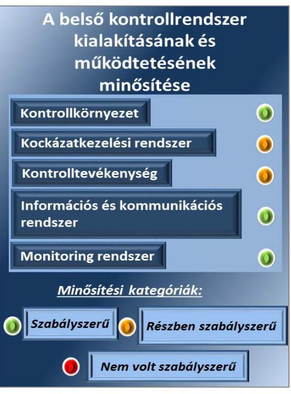
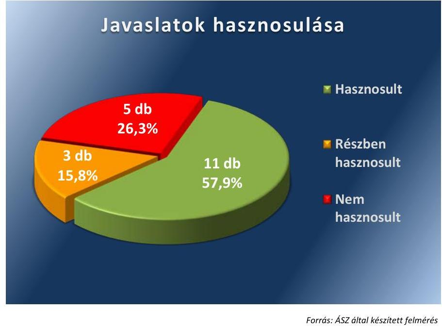

# Jelentés 

## Mályi Község Önkormányzata belső kontrollrendszere

Mályi Község Önkormányzata belső kontrollrendszere kialakításának és múködtetésének ellenőrzése 2015. június

---

.

---

# Jelenetés 

## Mályi Község Önkormányzata belsö kontrollrendszere

Mályi Község Önkormányzata belső kontrollrendszere kialakításának és múködtetésének ellenőrzése
2015. OG hó 13. nap

---

# AZ ELLENŐRZÉST FELÜGYELTE:

DR. BENEDEK MÁRIA felügyeleti vezető

## AZ ELLENŐRZÉST VEZETTE ÉS A VÉGREHAJTÁSÁÉRT FELELŐS:

BÍRÓ ZSOLT ellenőrzésvezető

## A PROGRAM ÖSSZEÁLLÍTÁSÁÉRT FELELŐS:

LAJTERNÉ HUDÁK MAGDOLNA osztályvezető

IKTATÓSZÁM: V-0730-040/2015.

TÉMASZÁM: 1764

ELLENŐRZÉS-AZONOSÍTÓ SZÁM: V0712

Jelentéseink az Országgyűlés számítógépes hálózatán és az Interneta a www.asz.hu címen is olvashatóak.

---

# TARTALOMJEGYZÉK 

■ ÖSSZEGZÉS ..... 5
■ AZ ELLENŐRZÉS CÉLJA ..... 7
■ AZ ELLENŐRZÉS TERÜLETE ..... 8
■ AZ ELLENŐRZÉS HÁTTERE, INDOKOLTSÁGA ..... 9
■ FÓKUSZKÉRDÉSEK ..... 11
■ ELLENŐRZÉS HATÓKÖRE ÉS MÓDSZEREI ..... 12
■ MEGÁLLAPÍTÁSOK ..... 14
■ JAVASLATOK ..... 25
■ MELLÉKLETEK ..... 27
I. sz. melléklet: Értelmező szótár ..... 27
II. sz. melléklet: Az integritás érvényesítése érdekében kialakított és múködtetett kontrollrendszer ..... 29
■ FÜGGELÉK: ÉSZREVÉTELEK ..... 31
■ RÖVIDÍTÉSEK JEGYZÉKE ..... 33

---

.

---

# ÖSSZEGZÉS 

Az Állami Számvevőszék Mályi Község Önkormányzata belső kontrollrendszere, valamint a belső ellenőrzés kialakítását és müködtetését, továbbá egyes kontrolltevékenységek müködését 2014. január 1. és szeptember 30. közötti időszakra vonatkozóan ellenőrizte. Az összesített értékelés alapján a belső kontrollrendszer kialakítása és müködtetése szabályszerű volt. A pénzügyi folyamatokban kulcsszerepet betöltő egyes belső kontrollok müködése nem volt megfelelő. A belső ellenőrzés kialakítása és müködtetése szabályos volt.

## Az ellenőrzés társadalmi indokoltsága

A demokratikus társadalmakban alapvető igény, hogy a közpénzeket, a közvagyont használók tevékenységükről elszámoljanak, ahhoz egyértelmű és érvényesíthető felelősségi szabályok társuljanak. Ennek a jogos igénynek az érvényesítéséhez meg kell teremteni azokat a folyamatokat, rendszereket, amelyek nélkülözhetetlenek az elszámoltatáshoz. Az elszámoltatás eredményes működtetéséhez szükség van a megfelelő információs, kontroll, értékelési és beszámolási rendszerek kialakítására. A belső kontrollok kiépítettsége hozzájárul az integritási szemlélet kialakításához és érvényesüléséhez. A belső kontrollrendszer kialakítása és működtetése nélkül nem valósítható meg a közpénzek, a közvagyon szabályozott, szabályos, gazdaságos, hatékony és eredményes felhasználása.

## Főbb megállapítások, következtetések, javaslatok

A belső kontrollrendszer kialakítása és működtetése az összesített értékelés alapján szabályszerű volt, támogatta az integritás szemlélet érvényesülését. Szabályszerűen alakították ki és működtették a kontrollkörnyezetet, az információs és kommunikációs rendszert, valamint a monitoring rendszert. Részben szabályszerű volt a kockázatkezelési rendszer és a kontrolltevékenységek kialakítása és működtetése a megállapított szabályozásbeli és működtetési hiányosságok miatt. Az Önkormányzat nem vett részt az ÁSZ 2014. évi integritás felmérésében.

A pénzügyi folyamatokban kulcsszerepet betöltő teljesítésigazolás és érvényesítés belső kontrollok müködése nem volt megfelelő, mivel azok nem biztosították a hibák megelőzését, feltárását. A számvevőszéki ellenőrzés a kifizetésekkel összefüggésben ugyanakkor kár bekövetkeztére utaló adatot, tényt nem állapított meg.

A belső ellenőrzés kialakítása és működtetése szabályszerű volt, azonban a belső ellenőrzés nem tárta fel a belső kontrollrendszer kialakításának és müködtetésének, valamint a pénzügyi folyamatokban kulcsszerepet betöltő teljesítésigazolás és érvényesítés belső kontrollok müködésének hiányosságait.

A 2013. évben végzett ÁSZ ellenőrzés során megfogalmazott javaslatok közel háromnegyedét részben vagy egészében hasznosították.

---

Az ÁSZ Mályi Község polgármestere, illetve jegyzője részére fogalmaz meg javaslatokat. A jelentés ellenőrzési megállapításaira az ellenőrzött szervezet vezetőjének intézkedési tervet kell összeállítania, amelynek megvalósítását az ÁSZ utóellenőrzés keretében ellenőrizheti.

---

# **AZ ELLENŐRZÉS CÉLJA**

## **Mályi Község Önkormányzata belső kontrollrendszerének ellenőrzése**

Az ellenőrzés célja annak megállapítása volt, hogy az önkormányzatok belső kontrollrendszere kialakítása, továbbá egyes elemeinek működtetése, ezen belül kiemelten a pénzügyi folyamatokban kulcsszerepet betöltő teljesítésigazolás és érvényesítés, valamint a belső ellenőrzés működése biztosította-e az önkormányzatnál a közpénzfelhasználás szabályosságát. A belső kontrollrendszer kialakítása és működése erősítette-e az integritás szemlélet érvényesülését.

Az ellenőrzés során értékeltük a belső kontrollrendszer kialakításának és működtetésének szabályszerűségét. Fennállásuk esetén bemutattuk azokat a lényeges szabályozási hiányosságokat, amelyek miatt az ellenőrzött kulcskontrollok (teljesítésigazolás, érvényesítés) nem nyújtottak elegendő védelmet a lehetséges hibákkal szemben. Rámutattunk arra, ha a kulcskontrollok valamely hibát nem előztek meg, nem tártak fel vagy nem javítottak ki, valamint minősítettük működésük megfelelőségét. Értékeltük továbbá, hogy az adott önkormányzat biztosította-e a belső ellenőrzés jogszabályi előírások szerinti szabályos működését.

---

# **AZ ELLENŐRZÉS TERÜLETE**

## **Mályi Község Önkormányzata**

Mályi község állandó lakosainak száma 2014. január 1-jén 4295 fő volt. Az Önkormányzat1 hét tagú Képviselő-testületének2 munkáját három állandó bizottság segítette. Az Önkormányzat az önállóan működő és gazdálkodó Hivatalon3 kívül egy önállóan működő intézményt működtetett, valamint egy 100%-os tulajdonú gazdasági társasággal rendelkezett. A településen 2014. január 1. és szeptember 30. közötti időszakban nemzetiségi önkormányzat nem működött.

A polgármester4 a 2010. évi önkormányzati választások óta tölti be tisztségét. A jegyző5 2008. november 4-étől látja el feladatait. A Hivatal szervezeti egységekre nem tagolódott, elkülönített gazdasági szervezettel nem rendelkezett, a foglalkoztatott köztisztviselők száma 2014. január 1-jén 10 fő volt. A Hivatalnál 2014. január 1-jétől szervezeti változás nem történt.

Az Önkormányzat a 2014. III. negyedévi költségvetési jelentése szerint 462 688 ezer Ft bevételt ért el, valamint 413 826 ezer Ft kiadást teljesített. A 2014. szeptember 30-ai mérlegjelentés szerint 1 040 064 ezer Ft értékű eszközvagyonnal rendelkezett, a rövid lejáratú kötelezettségállománya 26 731 ezer Ft volt, hosszú lejáratú kötelezettség állománnyal nem rendelkezett.

---

# AZ ELLENŐRZÉS HÁTTERE, INDOKOLTSÁGA 

Az ÁSZ tv6. szerint az Állami Számvevőszék feladata a jól irányított állam kiépítésének elősegítése. Az ÁSZ ${ }^{7}$ Stratégiájában ezért hangsúlyos szerepet szánt annak, hogy szilárd szakmai alapon álló, értékteremtő ellenőrzéseivel előmozdítsa a közpénzügyek átláthatóságát, rendezettségét. Az ÁSZ a Stratégiájában célul tűzte ki, hogy az önkormányzatok ellenőrzése során azok pénzügyi-gazdasági helyzetét értékeli, kockázatait feltárja. A számvevőszéki ellenőrzés nemzetközi alapelvei is rögzítik, hogy a megfelelő belső kontrollrendszer minimálisra csökkenti a hibák és szabálytalanságok kockázatát.

A belső kontrollrendszer azt a célt szolgálja, hogy a költségvetési szervek működésük és gazdálkodásuk során a tevékenységeket szabályszerűen, gazdaságosan, hatékonyan, eredményesen hajtsák végre, teljesítsék elszámolási kötelezettségeiket és megvédjék az erőforrásokat a veszteségektől, a károktól és a nem rendeltetésszerű használattól. A belső kontrollrendszer magában foglalja mindazon szabályokat, eljárásokat, gyakorlati módszereket és szervezeti struktúrákat, kockázatkezelési technikákat, kontrolltevékenységeket, amelyek segítséget nyújtanak a szervezetnek céljai eléréséhez.

Az államháztartási rendszer jogi szabályozása 2012. január 1-jétől átalakult. Az államháztartási belső kontrollrendszer elemei és a költségvetési szervek szabályozási, működési kötelezettségei tartalmukat tekintve alapvetően nem változtak, azonban a pénzügyi folyamatokban kulcsszerepet betöltő belső kontrollok rendszere módosult. Ez alátámasztja a belső kontrollrendszer kialakításának és működtetésének általános értékelése mellett a teljesítésigazolás és érvényesítés kontrollok kiemelt ellenőrzésének szükségességét.

Az önkormányzatok belső kontrollrendszerének ellenőrzése az ÁSZ "jó kormányzással" kapcsolatos stratégiai céljainak megvalósítását is szolgálja. Az ÁSZ célja, hogy javuljon az ellenőrzött önkormányzatok belső kontrollrendszerének szabályozottsága, működésének megfelelősége, és ezek hatására az egyensúlyi helyzet fenntarthatóságának biztosítása, azaz az adósság újratermelődésének megakadályozása. Az ÁSZ ellenőrzés tapasztalatai nem csupán a közvetlenül ellenőrzött önkormányzatokat segíthetik, hanem a „jó gyakorlat" elterjesztésével azok az önkormányzatok is átvehetik a pozitív példákat, ahol nem végez ellenőrzést az ÁSZ.

A közintézmények integritás alapú kultúrájának kialakítása, megerősítése és működése szorosan összefügg a belső kontrollrendszer működésével, ezért az ellenőrzés kiterjedt annak értékelésére is, hogy a belső kontrollrendszer kialakítása és működtetése hogyan hatott az integritás szemlélet érvényesülésére.

Az államháztartás önkormányzati alrendszerében a 2014. év elején öszszesen 3177 települési önkormányzat működött: a 23 kerülettel rendelkező főváros, 345 város, 2691 község és 117 nagyközség volt. A belső kontrollrendszer kialakítása és működtetése ellenőrzését az ÁSZ által lefolytatott, kisebb településeket is érintő ellenőrzéseinek tapasztalatai, valamint a közérdekű bejelentések kockázati szempontú értékelése alapozták meg,

---

amelyek a községek, nagyközségek gazdálkodásának, belső kontrollrendszere kialakításának és múködésének hiányosságaira mutattak rá. Az ellenőrzések helyszíneinek kiválasztása során az ÁSZ célzott adatfeldolgozáson alapuló kockázatelemző rendszerére támaszkodik, amely elősegíti, hogy azokon a területeken végezzen ellenőrzéseket, összpontosítsa erőforrásait, ahol a valódi kockázatok, az aktuális problémák vannak. Az ellenőrzések helyszíneinek kiválasztása során a kockázatelemzés konkrét szempontjait az ellenőrzési programban rögzített ellenőrzési cél, az ellenőrzött időszak, az ellenőrzés által érintett fókuszterületek és a főbb ellenőrzési kérdések határozzák meg.

# AZ ELLENŐRZÉS VÁRHATÓ HASZNOSULÁSA 

NÉGY SZINTEN valósul meg. A törvényalkotás számára összegzett tapasztalatok állnak rendelkezésre a belső kontrollrendszer önkormányzati területen való kialakításáról, múködtetéséről és hatásairól, a belső ellenőrzés múködéséről. Az ellenőrzés az ellenőrzött számára visszajelzést ad a belső kontrollrendszer kialakításában és múködésében lévő hiányosságokról, javaslataival hozzájárul azok kiküszöböléséhez, amely csökkentheti a későbbi ellenőrzések gyakoriságát. Az ellenőrzés megállapításait és javaslatait más szervezetek is hasznosíthatják a rendezett gazdálkodási keretek kialakításához. A társadalom számára jelzi, hogy közpénz nem maradhat ellenőrizetlenül, az ÁSZ értékteremtő rend kialakításához és megőrzéséhez hozzájáruló tevékenysége pozitív hatással lesz a szervezetről kialakított összkép formálásában. A szervezeten belül lehetőség nyílik arra, hogy a megállapítások szintetizálásával az ÁSZ a hozzáadott értéket teremtő elemző tevékenységét és tanácsadó szerepét is erősítse.

---

# FÓKUSZKÉRDÉSEK 

1. Az önkormányzat belső kontrollrendszerének kialakítása és müködtetése szabályszerű volt-e, támogatta-e az integritás szemlélet érvényesülését?
2. A pénzügyi folyamatokban kulcsszerepet betöltő belső kontrollok (teljesítésigazolás és érvényesités) müködése megfelelte a jogszabályokban és a belső szabályzatokban foglaltaknak?
3. A belső ellenőrzés kialakítása és müködése szabályos volt-e?
4. Hasznosították-e a 2010-2014. években végzett ÁSZ ellenőrzések során megfogalmazott javaslatokat?

---

# ELLENŐRZÉS HATÓKÖRE ÉS MÓDSZEREI 

## Az ellenőrzés típusa

Szabályszerűségi ellenőrzés

## Az ellenőrzött időszak

A belső kontrollrendszer kialakítása és működtetése megfelelőségét a 2014. január 1. és szeptember 30. közötti időszakra vonatkozóan (a 2014. szeptember 30-i állapotnak megfelelően), a belső kontrollrendszer működtetése keretében a pénzügyi folyamatokban kulcsszerepet betöltő teljesítésigazolás és érvényesítés belső kontrollok működésének megfelelőségét, továbbá a belső ellenőrzés szabályszerű működését a 2014. január 1. és 2014. szeptember 30-a közötti időszakot figyelembe véve értékeltük.

## Az ellenőrzés tárgya

A helyi önkormányzat, mint éves költségvetési beszámoló készítésére kötelezett szervezet és annak költségvetési szerve a polgármesteri hivatal belső kontrollrendszere.

## Az ellenőrzött szervezet

Mályi Község Önkormányzata

## Az ellenőrzés jogalapja

Az ÁSZ tv. 1. § (3) bekezdésében foglaltak alapján az ÁSZ általános hatáskörrel végzi a közpénzekkel és az állami és önkormányzati vagyonnal való felelős gazdálkodás ellenőrzését. Az ÁSZ tv. 5. § (2) bekezdése alapján az államháztartás gazdálkodásának ellenőrzése keretében az ÁSZ ellenőrzi a helyi önkormányzatok gazdálkodását, valamint az ÁSZ tv. 5. § (6) bekezdése alapján ellenőrzése során értékeli az államháztartás számviteli rendjének betartását és a belső kontrollrendszer múködését.

## Az ellenőrzés módszerei

Az ellenőrzést a nemzetközi standardokat irányadónak tekintve az ellenőrzési program ellenőrzési kérdései, az ellenőrzött időszakban hatályos jogszabályok, az ellenőrzés szakmai szabályok és módszertanok figyelembe vételével végeztük.

---

Az ellenőrzés lefolytatásához az Önkormányzat a tanúsítványok elektronikus kitöltésével, valamint az ÁSZ által kért dokumentumok elektronikus megküldésével szolgáltatott adatokat. Az így rendelkezésre bocsátott adatok, információk kontrollja és a munkalapok kitöltése a helyszíni ellenőrzés keretében történt. A jelentésben használt fogalmak magyarázatát az I. számú melléklet, az integritás érvényesítése érdekében kialakított és működtetett intézményi kontrollrendszer minősítését a II. számú melléklet tartalmazza.

A belső kontrollrendszer, valamint a belső ellenőrzés jogszabályi előírások szerinti kialakításának és működtetésének szabályszerűségét az erre irányuló ellenőrzési kérdésekre adott válaszok összesítése alapján értékeltük. A belső kontrollrendszert kontrollterületenként (kontrollkörnyezet, kockázatkezelési rendszer, kontrolltevékenységek, információs és kommunikációs rendszer, monitoring rendszer) és összesítetten is értékeltük.

A belső kontrollrendszer egyes kontrollterületei és a belső ellenőrzés kialakítása és működtetése „szabályszerü volt", amennyiben az értékelt területen az elért és elérhető pontok százalékban kifejezett hányadosa elérte a $81 \%$-ot, „részben szabályszerű volt", ha 61-80\% közé esett és „nem volt szabályszerü", ha nem haladta meg a 60\%-ot. A belső kontrollrendszer öszszesített értékelése megegyezett a kontrollterületenként alkalmazott \%-os értékelésekkel, a következő eltérésekkel. A kontrollrendszer egésze esetében a „szabályszerü" értékelésnek a \%-os értéken felül további feltétele volt, hogy egyik kontrollterület sem kaphatott „nem volt szabályszerü" értékelést, a „részben szabályszerű" értékelés további feltétele volt, hogy legfeljebb egy ellenőrzött kontrollterület lehetett „nem volt szabályszerü" értékelésű. Az összesített értékelés a \%-os értéktől függetlenül „nem volt szabályszerű", ha az ellenőrzött kontrollterületek közül több mint egynek „nem volt szabályszerű" az értékelése.

A gazdálkodás folyamatában kulcsszerepet betöltő két kulcskontroll teljesítésigazolás, érvényesítés - működésének megfelelőségét a személyi juttatásokkal, a dologi kiadásokkal, a beruházási, felújítási kiadásokkal, valamint az ellátottak pénzbeli juttatásaival és az egyéb működési, felhalmozási célú kiadásokkal kapcsolatos kifizetések esetében mintavétellel ellenőriztük. „Megfelelőnek" értékeltük a gazdálkodási jogkörök gyakorlását, amennyiben 95\%-os bizonyossággal a teljes sokaságban a hibaarány legfeljebb 10\%, „részben megfelelőnek" értékeltük, ha a hibaarány felső határa 10-30\% között volt, „nem megfelelőnek" pedig akkor, ha a mintavételi eredmények alapján a sokaságbeli hibaarány felső határa meghaladta a $30 \%$-ot.

Az integritás szemlélet érvényesülésének minősítése az Önkormányzat önbevallás által kitöltött tanúsítványa alapján történt.

---

# 1. Az önkormányzat belső kontrollrendszerének kialakítása és múködtetése szabályszerű volt-e, támogatta-e az integritás szemlélet érvényesülését? 

Összegző megállapítás

A belső kontrollrendszer kialakítása és múködtetése az összesített értékelés alapján - kisebb hiányosságok mellett - szabályszerű volt, támogatta az integritás szemlélet érvényesülését.
1.1. számú megállapítás

A kontrollkörnyezet kialakítása és múködtetése szabályszerű volt.
Az Önkormányzat rendelkezett a - 2011-2014. évekre vonatkozó - gazdasági programmal ${ }^{8}$, továbbá képviselő-testületi SZMSZ ${ }^{9}$-szel, amely tartalmazta a Képviselő-testület müködésének rendjét. A Hivatal rendelkezett a Képviselő-testület által elfogadott alapító okirattal ${ }^{10}$. A hivatali SZMSZ ${ }_{1}{ }^{11}$ tartalmazta a szervezeti felépítést és a müködés rendjét, a vagyonnyilatkozat tételi kötelezettséggel járó munkaköröket. A Képviselő-testület önkormányzati rendeletben előírta a vagyongazdálkodás szabályait.

A jegyző kialakította a Hivatal számviteli politikáját ${ }^{12}$, annak keretében elkészítette a pénzkezelési ${ }^{13}$-, a leltározási ${ }^{14}$-, az értékelési ${ }^{15}$ - és az önkölt-ség-számítási szabályzatokat ${ }^{16}$, valamint a számlarendet ${ }^{17}$ és a bizonylati rendet ${ }^{18}$.

A jegyző elkészítette a szabálytalanságok kezelésének eljárásrendjét ${ }^{19}$. A Hivatal a jogszabályi előírásoknak megfelelően rendelkezett tűzvédelmi szabályzattal ${ }^{20}$.

A jegyző elkészítette táblázatos formában az ellenőrzési nyomvonal ${ }_{1,2}$ - $t^{21}$, meghatározta az egészséget nem veszélyeztető és biztonságos munkavégzés követelményei megvalósításának módját.

A költségvetési beszámoló elkészítésével megbízott köztisztviselő rendelkezett a feladat ellátásához szükséges végzettséggel, előírt szakképesítéssel és a könyvviteli szolgáltatás körébe tartozó tevékenység ellátására jogosító engedéllyel.

A jegyző elkészítette a Hivatalban dolgozó köztisztviselők munkaköri leírását, amelyekben a köztisztviselők feladatait meghatározta.

A kontrollkörnyezet kialakítása és múködtetése az értékelés szempontjából az 1. táblázatban részletezett - kisebb súlyú - hiányosságok mellett szabályszerű volt.

---

| Sorszám | Részmegállapítás | Megjegyzés |
| :--: | :--: | :--: |
| 1. | A hivatali SZMSZ ${ }_{1}$ - az Ávr. ${ }^{22}$ 13. § (1) bekezdés c) és g) pontjában előírtak ellenére - nem tartalmazta az ellátandó, és a kormányzati funkció szerint besorolt alaptevékenységek megjelölését, és a szervezeti és múködési szabályzatban nevesített munkakörökhöz a helyettesítés rendjét, az ezekhez kapcsolódó felelősségi szabályokat. |  |
| 2. | A Hivatalban a pénzügyi-számviteli területen dolgozó köztisztviselők munkaköri leírásában - a Kttv. ${ }^{23} 75 . \S$ (1) bekezdés d) pontjában foglalt előírás ellenére - a jegyző nem rögzítette a munkakör betöltésével kapcsolatos követelményeket (végzettség, szakképzettség, szakképesítés, tapasztalat, képességek). |  |
| 3. | A Képviselő-testület - a Kttv. 231. § (1) bekezdésében foglaltak ellenére - nem állapította meg a Kttv. 83. §ában előírt, a köztisztviselökre vonatkozó hivatásetikai alapelvek részletes tartalmát, valamint az etikai eljárás szabályait, mivel a jegyző - az Mötv. ${ }^{24}$ 81. § (3) bekezdés c) pontjában előírt feladata ellenére - nem kezdeményezte a polgármesternél az előkészített dokumentum Képviselő-testület elé terjesztését. | A jegyző 2014. március 1-jén kiadmányozta az etikai szabályzatot ${ }^{25}$. |
| 4. | A Képviselő-testület - az Áht. ${ }^{26}$ 9. § (1) bekezdés f) pontjában foglaltak ellenére - nem határozta meg a humán erőforrásokkal való, szabályszerű és hatékony gazdálkodáshoz szükséges követelményeket. |  |
| 5. | A számviteli politika - a Számv. tv. ${ }^{27}$ 14. § (4) bekezdésében foglaltak ellenére - nem tartalmazta, hogy a számviteli elszámolás és az értékelés szempontjából az Önkormányzat mit tekint lényegesnek. |  |
| 6. | A jegyző - az Áhsz. ${ }^{28}$ 51. § (3) bekezdésében foglaltak ellenére - a számlarendben nem szabályozta a részletező nyilvántartásoknak a kapcsolódó könyvviteli és nyilvántartási számlákkal való egyeztetése dokumentálásának módját. |  |

1.2. számú megállapítás

# A kockázatkezelési rendszer kialakítása és múködtetése részben szabályszerű volt. 

A jegyző a Hivatal kockázatkezelési rendszerét kialakította. A Hivatal rendelkezett kockázatkezelési szabályzattal ${ }^{29}$, beazonosították a tevékenységében rejlő külső és belső kockázatokat, valamint meghatározták az egyes kockázati tényezőkkel kapcsolatban a szükséges intézkedéseket, és azok teljesítése folyamatos nyomon követési módját.

A hivatali SZMSZ ${ }_{1}$-ben szabályozták a köztisztviselők vagyonnyilatkozattételi kötelezettségét. A vagyonnyilatkozat tételre kötelezett köztisztviselők vagyonnyilatkozat tételi kötelezettségüknek eleget tettek.

---

A kockázatkezelési rendszer kialakítása és múködtetése az értékelés szempontjából a 2. táblázatban részletezett hiányosságok mellett részben szabályszerű volt.
2. táblázat

| Sorszám | Részmegállapítás | Megjegyzés |
| :--: | :-- | :-- |

1. A képviselő-testületi SZMSZ - a Vnytv. ${ }^{30}$ 4. § d.) pontjaiban foglaltak ellenére - az önkormányzati bizottságok nem képviselő tagjai vagyonnyilatkozat tételi kötelezettségével kapcsolatos szabályokat nem tartalmazta.

A bizottságok nem helyi önkormányzati képviselő tagjai a Vnytv. 5. § (1) bekezdésében foglaltak ellenére - vagyon-nyilatkozat-tételi kötelezettségüknek nem tettek eleget. A bizottságok nem helyi önkormányzati képviselő tagjai vonatkozásában a vagyonnyilatkozatok őrzéséért felelős a képviselő-testületi SZMSZ-ben nem került kijelölésre.

A települési képviselők vagyonnyilatkozat-tételre vonatkozó kötelezettségével kapcsolatos szabályokat a vagyonnyilatkozat-kezelő bizottság ügyrendje ${ }^{31}$ tartalmazta.

A jogszabály által vagyonnyilatkozat tételre kötelezett települési képviselők vagyonnyilatkozat-tételi kötelezettségüknek a 2013. évre vonatkozóan eleget tettek.

# 1.3. számú megállapítás 

## A kontrolltevékenységek kialakítása és múködtetése részben szabályszerű volt.

A jegyző az ellenőrzési nyomvonal ${ }_{1,2}$-ben és egyéb belső szabályzatokban - a beszerzési- ${ }^{32}$, a közbeszerzési- ${ }^{33}$, a selejtezési szabályzatban ${ }^{34}$ és az ügyrendben - biztosította a beszerzési folyamat, a vagyonhasznosítási tevékenység, valamint a pénzügyi döntések - köztük a költségvetés tervezése és a támogatásokkal való elszámolás - dokumentumainak elkészítésével kapcsolatban a folyamatba épített, előzetes, utólagos és vezetői ellenőrzést. A felelősségi körök meghatározásával szabályozták - az ellenőrzési nyomvonal ${ }_{1,2}$-ben, az iratkezelési ${ }_{1}{ }^{35}$, az adatvédelmi szabályzatban ${ }^{36}$ - az engedélyezési, jóváhagyási és kontrolleljárásokat, a dokumentumokhoz, információkhoz való hozzáférést, a beszámolási eljárásokat.

A jegyző meghatározta a gazdálkodási szabályzatban ${ }^{37}$ és az ügyrendben az időközi és éves beszámolók teljesítésével kapcsolatos belső előírásokat, feltételeket.

A jegyző írásban kijelölte a pénzügyi ellenjegyzési és érvényesítési feladatra a Hivatal állományába tartozó köztisztviselőket, akik rendelkeztek az előírt végzettséggel, pénzügyi, számviteli képesítéssel. A kötelezettségvállalók írásban kijelölték a teljesítésigazolására jogosult személyeket.

A kontrolltevékenységek kialakítása és múködtetése az értékelés szempontjából - figyelemmel a teljesítésigazolás és érvényesítés múködése során feltárt hiányosságokra - részben szabályszerű volt. A kontrolltevékenységek kialakítása és múködtetése hiányosságait a 3. táblázat tartalmazza.

---

3. táblázat

| Sorszám | Részmegállapítás | Megjegyzés |
| :--: | :--: | :--: |
| 1. | A jegyző - az Ávr. 13. § (5) bekezdésében előírtak ellenére - belső szabályzatban nem határozta meg a gazdasági feladatot ellátó vezető és alkalmazottak helyettesítésének rendjét. |  |
| 2. | A polgármester - az Áht. 87. § (1) bekezdésében foglaltak ellenére - a jogszabályban előírt határidőn túl tájékoztatta írásban a Képviselő-testületet az Önkormányzat gazdálkodásának első félévi helyzetéről. | A polgármester 2014. október 4-én tájékoztatta a Képviselő-testületet az Önkormányzat gazdálkodásának első félévi helyzetéről. Az Áht. 87. §-a 2014. szeptember 30ától nem hatályos. |
| 3. | A jegyző - a Kttv. 74. § (1) bekezdésében foglaltak ellenére - nem szabályozta a jogviszony megszűnése esetére a munkavállaló folyamatban lévő feladatai átadásának rendjét. |  |

1.4. számú megállapítás

Az információs és kommunikációs rendszer kialakítása és múködtetése szabályszerű volt.

Szabályozták a szervezeten belüli és külső feleknek történő információ átadás rendszerét, valamint meghatározták a beszámolási szinteket, határidőket és módokat. A Hivatal rendelkezett adatvédelmi szabályzattal. A jegyző elkészítette az adat megismerési és közzétételi szabályzatot ${ }^{38}$, amelyben kialakította a kötelezően közzéteendő adatok nyilvánosságra ho-zatalának-, és a közérdekú adatok megismerésére irányuló igények teljesítésének rendjét. Az Önkormányzat az elektronikus közzétételi kötelezettségének eleget tett.

A Hivatal rendelkezett iratkezelési szabályzat ${ }_{1}$-gyel, amelyben szabályozták az ügyintézés folyamatát.

Az információs és kommunikációs rendszer kialakítása és múködtetése az értékelés szempontjából a 4. táblázatban részletezett - kisebb súlyú hiányosságok mellett szabályszerű volt.
4. táblázat

| Sorszám | Részmegállapítás |
| :--: | :--: |
| 1. | A jegyző az iratkezelési szabályzat ${ }_{1}$-ben - az lkr. ${ }^{39}$ 8. § (1) bekezdésében foglaltak ellenére - nem gondoskodott az iratkezelési szoftver által kezelt adatok biztonságáról, nem alakította ki az üzembiztonsági, adatvédelmi szabályok érvényre juttatásához szükséges eljárási szabályokat. |
| 2. | A jegyző iratkezelési szabályzat ${ }_{1}$-ben- az lkr. 8. § (2) bekezdésében foglaltak ellenére - nem szabályozta az üzemeltetés és adatbiztonság feladatait, végrehajtható módon, pontosan nem határozta meg az üzemeltetés és adatbiztonság szabályozásában a hatásköröket. |

---

1.5. számú megállapítás

A monitoring rendszer kialakítása és múködtetése szabályszerű volt.

A JEGYZŐ KIALAKÍTOTTA ÉS MÚKÖDTETTE A MONITORING-RENDSZERT a szervezeti tevékenységek és célok elérésének folyamatos és eseti nyomon követésére. Ennek keretében meghatározta az alkalmazásának rendjét, értékelését.

A jegyző nyilatkozatban értékelte a belső kontrollok múködését a 2013. évre vonatkozóan.

# A HIVATALNÁL VÉGZETT KÜLSŐ ELLENŐRZÉ- 

SEK javaslatainak hasznosítására a jegyző intézkedési tervet készített, annak végrehajtásáról nyilvántartást vezetett.

Az Önkormányzatnál végzett külső ellenőrzésekről készült jelentések javaslatainak hasznosítását nyomon követték.

Az Önkormányzat törvényességi felügyeletét ellátó Kormányhivatal ${ }^{40}$ a 2014. évben nem élt törvényességi felhívással, vagy más törvényességi felügyeleti eszközzel.
1.6. számú megállapítás

A belső kontrollrendszer kialakítása és múködtetése támogatta az integritás szemlélet érvényesülését.

Az Önkormányzat nem vett részt az ÁSZ 2014. évi integritás felmérésében.

A helyszíni ellenőrzés keretében került sor egy tanúsítvány (kérdőív) kitöltésére. Az integritás szemlélet érvényesülésének minősítését a II. számú melléklet tartalmazza.

## 2. A pénzügyi folyamatokban kulcsszerepet betöltő belső kontrollok (teljesítésigazolás és érvényesítés) múködése megfelelt-e a jogszabályokban és a belső szabályzatokban foglaltaknak?

Összegző megállapítás

A pénzügyi folyamatokban kulcsszerepet betöltő teljesítésigazolás és érvényesítés belső kontrollok múködése nem felelt meg a jogszabályokban és a belső szabályzatokban foglaltaknak.

A személyi juttatásokkal, a dologi kiadásokkal, a beruházási, felújítási kiadásokkal, valamint az ellátottak pénzbeli juttatásaival és az egyéb múködési, felhalmozási célú kiadásokkal kapcsolatos kifizetéseknél nem megfelelően múködött a teljesítésigazolás és érvényesítés.

A 2014. január 1-jétől szeptember 30-áig - összefoglalóan értékelve - a pénzügyi folyamatokban kulcsszerepet betöltő teljesítésigazolás és érvé-

---

nyesítés belső kontrollok múködése nem volt megfelelő. A teljesítésigazolás és az érvényesítés múködésének ellenőrzése során feltárt hiányosságokat az 5. táblázat tartalmazza.
5. táblázat

# Sorszám 

## Részmegállapítás

## Teljesítésigazolás

1. A teljesítésigazolást a kifizetéseket megelőzően - az Ávr. 57. § (1) és (4) bekezdésében és a gazdálkodási szabályzatban foglaltak ellenére - nem szabályszerűen végezték el, vagy kijelölés hiányában nem az arra jogosult végezte.

## Érvényesítés

Az érvényesítést az - Áht. 38. § (1) bekezdésében, az Ávr. 58. § (1) és (4) bekezdésében és a gazdálkodási szabályzatban foglaltak ellenére - nem, vagy nem szabályszerűen végezték el, vagy kijelölés hiányában nem az arra jogosult végezte.
Az érvényesítő - az Ávr. 58. § (2) bekezdés előírása ellenére - nem jelezte az utalványozónak, hogy a megelőző ügymenetben az Áht., az államháztartási számviteli kormányrendelet, az Ávr. és a belső szabályzatokban foglaltakat nem tartották be.

## 3. A kulcskontrollok ellenőrzése során feltárt egyéb hiányosság:

Az utalványokon nem tüntették fel az Ávr. 59. § (3) bekezdés e) és f) pontjaiban előírtakat.

## A 2014. JANUÁR 1-JÉTŐL SZEPTEMBER 30-ÁIG A TELJESÍTÉSIGAZOLÁS KULCSKONTROLL MŰKÖDÉSE során az ellenőrzött kifizetési jogcímek mintatételei alapján az alábbi hiányosságok, szabálytalanságok fordultak elő:

az ellenőrzött valamennyi jogcímmel kapcsolatos, átutalással történő kifizetések esetében a teljesítésigazolás nem szabályszerűen történt, mert a teljesítésigazoló - az Ávr. 57. § (1) bekezdésében és a gazdálkodási szabályzatban foglaltak ellenére - nem ellenőrizte a kiadások teljesítésének jogosságát, összegszerűségét, - az ellátottak pénzbeli juttatásai és az egyéb múködési, felhalmozási célú kiadások kivételével - az ellenszolgáltatás teljesítését, mivel a teljesítésigazolást a kifizetéseket követően végezte;
a személyi juttatásokkal összefüggő kifizetéseket megelőzően a teljesítésigazolást - az Ávr. 57. § (4) bekezdésében foglaltak ellenére kijelölés hiányában nem az arra jogosult végezte;
a személyi juttatásokkal, valamint a dologi- és a beruházási kiadásokkal kapcsolatos kifizetést megelőzően a teljesítésigazoló - az Ávr. 57. § (1) bekezdésében és a gazdálkodási szabályzatban foglaltak ellenére - ellenőrizhető okmányok hiányában nem tudta ellenőrizni az összegszerűséget, illetve az ellenszolgáltatás teljesítését, mert a megbízási díj számfejtése a kifizetés után történt, illetve az ellenszolgáltatás teljesítését nem dokumentálták;

---

$\longrightarrow$ a dologi kiadásokkal kapcsolatos kifizetést megelőzően a teljesítésigazolás - az Ávr. 57. § (1) bekezdésében és a gazdálkodási szabályzatban foglaltak ellenére - nem volt szabályszerű, mert a szerződésben és a számlán szereplő összeg eltért egymástól;
$\longrightarrow$ a dologi kiadásokkal kapcsolatos kifizetést megelőzően a teljesítésigazoló - az Ávr. 57. § (1) bekezdésében és a gazdálkodási szabályzatban foglaltak ellenére - nem tudta ellenőrizni a kiadás teljesítésének jogosságát, összegszerűségét, az ellenszolgáltatás teljesítését, mert a teljesítést a számla kiállítását megelőző dátummal igazolta;
a dologi kiadásokkal kapcsolatos kifizetést megelőzően a teljesítésigazoló - az Ávr. 57. § (1) bekezdésében és a gazdálkodási szabályzatban foglaltak ellenére - nem tudta ellenőrizni a kiadás teljesítésének jogosságát, összegszerűségét, az ellenszolgáltatás teljesítését, mert a kötelezettségvállalást - az Áht. 37. § (1) bekezdésében foglaltak ellenére - nem foglalták írásba.

# A 2014. JANUÁR 1-JÉTŐL SZEPTEMBER 30-ÁIG AZ ÉRVÉNYESÍTÉS KULCSKONTROLL MŰKÖ- 

DÉSE során az ellenőrzött kifizetési jogcímek mintatételei alapján az alábbi hiányosságok, szabálytalanságok fordultak elő:
az ellenőrzött valamennyi jogcímmel kapcsolatos, átutalással történő kifizetések esetében az érvényesítő - az Ávr. 58. § (1) bekezdésében és a gazdálkodási szabályzatban foglaltak ellenére - az érvényesítést nem szabályszerűen végezte el, mert a kifizetéseket követően, utólag került sor az érvényesítésre;
a személyi juttatásokkal összefüggő kifizetéseket megelőzően az érvényesítést - az Áht. 38. § (1) bekezdésében, az Ávr. 58. § (1) és (4) bekezdésében és a gazdálkodási szabályzatban foglaltak ellenére nem, valamint kijelölés hiányában nem az arra jogosult végezte;
a személyi juttatásokkal és a dologi kiadásokkal kapcsolatos kifizetéseket megelőzően az érvényesítő - az Ávr. 58. § (1) bekezdésében és a gazdálkodási szabályzatban foglaltak ellenére - ellenőrizhető okmányok hiányában nem tudta ellenőrizni az összegszerűséget;
a dologi kiadásokkal összefüggő kifizetést megelőzően az érvényesítő - az Ávr. 58. § (1) bekezdésében és a gazdálkodási szabályzatban foglaltak ellenére - ellenőrzési feladatát nem szabályszerűen végezte el, mert a számla kiállítását megelőzően került sor az érvényesítésre;
az ellátottak pénzbeli juttatásaival kapcsolatos kifizetéseket megelőzően az érvényesítő - az Ávr. 58. § (1) bekezdésében és a gazdálkodási szabályzatban foglaltak ellenére - nem tudta ellenőrizni a fedezet meglétét, mert az ellátotti juttatással kapcsolatos kötelezettségvállalást - az Ávr. 56. § (1) bekezdésében és az Áhsz. 39. § (1) és (3) bekezdésében foglaltak ellenére - nem vették nyilvántartásba;
az ellenőrzött valamennyi jogcímmel kapcsolatos kifizetéseket megelőzően az érvényesítő - az Ávr. 58. § (2) bekezdésében foglaltak ellenére - nem jelezte az utalványozónak, hogy a megelőző ügymenetben az Önkormányzat és a Hivatal kiadási előirányzatára történt kötelezettségvállalásra - az Áht. 37. § (1) bekezdésében és az

---

Ávr. 55. § (1) bekezdésében foglaltak ellenére - pénzügyi ellenjegyzés nélkül került sor, továbbá az Önkormányzat kiadási előirányzatára történt kötelezettségvállalás pénzügyi ellenjegyzését - az Ávr. 55. § (2) bekezdés f) pontjában előírtak ellenére - kijelölés hiányában nem az arra jogosult végezte;
$\longrightarrow$ a személyi juttatásokkal, a dologi kiadásokkal összefüggő kifizetéseket megelőzően az érvényesítő - az Ávr. 58. § (2) bekezdésében foglaltak ellenére - nem jelezte az utalványozónak, hogy a Hivatal kiadási előirányzatára történt kötelezettségvállalást nem foglalták írásba, vagy a kötelezettségvállalást - az Ávr. 52. § (1) bekezdésében foglaltak ellenére - kijelölés hiányában nem az arra jogosult végezte, továbbá nem jelezte, hogy az ellátotti juttatásokkal kapcsolatos kifizetéseket nem vették nyilvántartásba;
az ellenőrzött valamennyi jogcímmel kapcsolatos kifizetések esetében az érvényesítő - az Ávr. 58. § (2) bekezdésében foglaltak ellenére - nem jelezte az utalványozónak, hogy a megelőző ügymenetben a teljesítésigazolás nem szabályszerűen történt, vagy nem az arra jogosult végezte.
Az Ávr. 59. § (3) bekezdés e) pontjában előírtak ellenére az ellenőrzött valamennyi jogcímmel kapcsolatos kifizetések utalványai nem tartalmazták a terheléssel érintett pénzeszköz államháztartás számviteli kormányrendelet szerinti könyvviteli számlájának számát, a kiadás kormányzati funkció szerinti megnevezését. Továbbá a személyi juttatásokkal, a dologi és a beruházási, felújításai kiadásokkal kapcsolatos kifizetések utalványain nem rögzítették a kiadás egységes rovatrend szerinti megnevezését és a személyi juttatások esetében annak számát. Az ellenőrzött valamennyi jogcímmel kapcsolatos kifizetések utalványai - a beruházási, felújítási kiadások kivételével - nem tartalmazták az Ávr. 59. § (3) bekezdés f) pontjában előírtak ellenére a kötelezettségvállalás nyilvántartási számát.

A számvevőszéki ellenőrzés az ellenőrzött kifizetésekkel összefüggésben a rendelkezésre bocsátott dokumentumok alapján kár bekövetkeztére utaló adatot, tényt nem állapított meg, azonban a gazdálkodásban kulcsszerepet betöltő kontrollok múködésében feltárt hiányosságok miatt fennáll a hibák, szabálytalanságok bekövetkezésének kockázata. A nem megfelelően múködtetett belső kontrollok korrupciós kockázatot hordoznak.

# 3. A belső ellenőrzés kialakítása és múködése szabályos volt-e? 

## Összegző megállapítás

### 3.1. számú megállapítás

A belső ellenőrzés kialakítása és múködtetése az összesített értékelés alapján szabályszerű volt.

## A belső ellenőrzés kialakítása szabályszerű volt.

Az Önkormányzat a belső ellenőrzési feladatokat Társulás ${ }^{41}$ útján látta el. A belső ellenőrzési vezető rendelkezett az előírt szakirányú szakképzettséggel és szakmai gyakorlattal. A Társulás rendelkezett aktualizált belső ellenőrzési kézikönyvvel ${ }^{42}$.

A belső ellenőrzés kialakítása az értékelés szempontjából a 6. táblázatban részletezett - kisebb súlyú - hiányosság mellett szabályszerű volt.

---

6. táblázat

| Sorszám | Részmegállapítás |
| :-- | :-- |

1. Nem rendelkeztek írásbeli megállapodásban - a Bkr. 16. § (4) bekezdésében foglalt előírás ellenére - a belső ellenőrzési feladatok és kötelességek ellátásának módjáról.

# 3.2. számú megállapítás 

## A belső ellenőrzés múködtetése szabályszerű volt.

A belső ellenőrzési vezető elkészítette az Önkormányzatra vonatkozó 2014. évi ellenőrzési tervet, amelyet a Képviselő-testület az előírt határidőig jóváhagyott. A 2014. évi ellenőrzési tervben szereplő ellenőrzéseket végrehajtották.

A belső ellenőrzés a 2014. január 1-jétől szeptember 30-áig az ellenőrzési tevékenységét ellenőrzési program alapján végezte, az elvégzett ellenőrzésről jelentés készült.

A belső ellenőrzés javaslatainak megvalósítására intézkedési tervet készítettek, a belső ellenőrzési vezető nyilvántartást vezetett a belső ellenőrzésről, a javaslatokról, a vonatkozó intézkedési tervről, annak végrehajtásáról.

Az éves ellenőrzési jelentést a belső ellenőrzési vezető az előírt határidőre elkészítette.

A belső ellenőrzés múködtetése az értékelés szempontjából a 7. táblázatban részletezett - kisebb súlyú - hiányosságok mellett szabályszerű volt.
7. táblázat

| Sorszám | Részmegállapítás |
| :--: | :--: |
| 1. | Az Önkormányzat - a Bkr. 29. § (1) bekezdésében és 56. § (3) bekezdés a) pontjában foglaltak ellenére - nem rendelkezett stratégiai ellenőrzési tervvel. |
| 2. | Az 2014. évi ellenőrzési terv - a Bkr. 31. § (2) bekezdésében és (4) bekezdés c) és f) pontjában foglaltak ellenére - nem alapult a stratégiai tervben felállított prioritásokon, valamint nem tartalmazta az ellenőrzések célját, továbbá az ellenőrzések típusát. |
| 3. | Az elvégzett ellenőrzésről készített jelentés - a Bkr. 39. § (3) bekezdés i) pontjában foglaltak ellenére - nem tartalmazta az alkalmazott ellenőrzési módszereket és eljárásokat. |
| 4. | A belső ellenőrzési vezető által készített éves ellenőrzési jelentés - a Bkr. 48. § b) pontjának bb) alpontjában foglaltak ellenére - nem tartalmazta a belső kontrollrendszer öt elemének értékelését. |

---

# 4. Hasznosították-e a 2010-2014. években végzett ÁSZ ellenőrzések során megfogalmazott javaslatokat? 

Összegző megállapítás

### 4.1. számú megállapítás

A 2013. évben végzett ÁSZ ellenőrzés során megfogalmazott javaslatok közel háromnegyedét részben vagy egészében hasznosították.

A jegyző elkészítette az ÁSZ jelentésben foglalt megállapításokhoz kapcsolódó intézkedési tervet.

Az ÁSZ a 2013. évben ellenőrizte az Önkormányzat belső kontrollrendszere kialakítását, egyes kontrolltevékenységek és a belső ellenőrzés múködését. A jegyző részére a belső kontrollrendszer kialakításával kapcsolatban 11, a pénzügyi folyamatokban kulcsszerepet betöltő kontrollok múködésével és a belső ellenőrzés múködésével kapcsolatban négy-négy javaslatot tett.

Az ÁSZ jelentésben foglalt javaslatok megvalósítására a jegyző felelősök és határidők megjelölésével intézkedési tervet készített, amelyet határidőben megküldtek az ÁSZ részére.

A jegyző öt javaslatot kivéve gondoskodott az intézkedési tervben foglaltak határidőben történő teljes körű vagy részbeni megvalósításáról, hasznosulásáról.

A szabályszerűségi javaslatok - intézkedési tervben foglalt határidőre - történő hasznosulása a 1. ábra szerint alakult:

1. ábra

HASZNOSULT 11 JAVASLAT, mert a jegyző elkészítette a hivatali SZMSZ ${ }_{1}$ módosítását - a hivatali SZMSZ ${ }_{2}{ }^{43}$-t - és kezdeményezte annak Képviselő-testület elé terjesztését. (A Képviselő-testület a hivatali SZMSZ ${ }_{2}$-t 2014. december 17-én hagyta jóvá.) A hivatali SZMSZ ${ }_{2}$ már tar-

---

talmazta az ellátandó, és a kormányzati funkció szerint besorolt alaptevékenységek megjelölését, a szervezeti és működési szabályzatban nevesített munkakörökhöz - köztük a gazdasági feladatot ellátó vezetőre és alkalmazottakra vonatkozóan - a helyettesítés rendjét, az ezekhez kapcsolódó felelősségi szabályokat. A jegyző a hivatali SZMSZ2-ben gondoskodott a jogviszony megszűnése esetére a munkavállaló folyamatban lévő feladatai átadása rendjének szabályozásáról.

A jegyző meghatározta a kockázatok kezelése érdekében szükséges intézkedések teljesítése folyamatos nyomon követésének módját, szabályozta az informatikai rendszer adatainak biztonságát, valamint a felelősségi körök meghatározásával az elektronikusan kezelt dokumentumokhoz és információkhoz való hozzáférést. Intézkedett a pénzügyi ellenjegyzési és az érvényesítési feladatra történő, a jogszabályi előírásoknak megfelelő kijelölésről, valamint a 2013. évre vonatkozóan a Bkr. 1. melléklete szerinti nyilatkozatban értékelte a Hivatal belső kontrollrendszerének minőségét.

A belső ellenőrzés javaslatainak végrehajtása érdekében készített intézkedési tervben rögzítették a végrehajtásért felelős személyeket, valamint a jegyző kezdeményezésére a belső ellenőrzési vezető az elvégzett ellenőrzésekről, a belső ellenőrzési jelentésben megfogalmazott javaslatokról, intézkedési tervről, a megtett intézkedésekről nyilvántartást vezetett és nyomon követte az intézkedési terv végrehajtását.

RÉSZBEN HASZNOSULT HÁROM JAVASLAT, mert a jegyző az előírt határidőre előkészítette a köztisztviselőkkel szembeni hivatásetikai alapelvek részletes tartalmának, valamint az etikai eljárás szabályainak dokumentumait, azonban nem kezdeményezte a polgármesternél annak Képviselő-testület elé terjesztését.

Az Iratkezelési szabályzat ${ }_{2}$-ben ${ }^{44}$ gondoskodott az iratkezelési szoftver által kezelt adatok biztonságáról, az üzembiztonsági, adatvédelmi szabályok érvényre juttatásához szükséges eljárási szabályok kialakításáról. Szabályozta az iratkezelési rendszer kialakítása során az elektronikusan kezelt adatok üzemeltetése és adatbiztonsága védelmét, melynek keretében meghatározta pontosan a feladatokat, hatásköröket úgy, hogy azok végrehajthatók legyenek. Az elkészült szabályzathoz a Kormányhivatal és a Magyar Nemzeti Levéltár egyetértésének megszerzése folyamatban van.

NEM HASZNOSULT ÖT JAVASLAT, mert a teljesítésigazolásra kijelölt személyek a kifizetéseket megelőzően nem ellenőrizték a kiadások teljesítésének jogosságát, összegszerűségét, az ellenszolgáltatást is magában foglaló kötelezettségvállalás esetén az ellenszolgáltatás teljesítését, valamint az érvényesítést nem az írásban kijelölt személyek végezték, továbbá az érvényesítő a kifizetéseket megelőzően nem ellenőrizte az öszszegszerűséget. Az érvényesítő nem jelezte az utalványozónak, hogy a megelőző ügymenetben az Áht., az államháztartási számviteli kormányrendelet, az Ávr. és a belső szabályzatokban foglaltakat nem tartották be.

A jegyző nem kezdeményezte, hogy a belső ellenőrzési vezető készítsen stratégiai ellenőrzési tervet.

---

# JAVASLATOK 

Az ÁSZ tv. 33. § (1) bekezdésében foglaltak értelmében az ellenőrzött szervezet vezetője köteles a jelentésben foglalt megállapításokhoz kapcsolódó intézkedési tervet összeállítani és azt a jelentés kézhezvételétől számított 30 napon belül az ÁSZ részére megküldeni. Amennyiben az intézkedési tervet határidőre nem küldi meg a szervezet, vagy amennyiben az nem elfogadható, az ÁSZ elnöke az ÁSZ tv. 33. § (3) bekezdés a)-b) pontjaiban foglaltakat érvényesítheti.
Az Állami Számvevőszék az ellenőrzése során kizárólag az ellenőrzött időszakra vonatkozó dokumentumokat értékelt. Az ellenőrzött időszakot követő változásokat a jelentésben tényként rögzítette, azok jogszabályoknak való megfelelőségét azonban nem minősítette.

## A polgármesternek

1. Az Önkormányzat kiadási előirányzata terhére történt kötelezettségvállalásra - az Áht. 37. § (1) bekezdésében és az Ávr. 55. § (1) bekezdésében foglaltak ellenére - pénzügyi ellenjegyzés nélkül került sor. Javaslat:
Intézkedjen annak érdekében, hogy az Önkormányzat nevében történő kötelezettségvállalásra az Áht. 37.§ (1) bekezdésében és az Ávr. 55.§ (1) bekezdésében foglaltaknak megfelelően - az Ávr. 53. §ában meghatározott kivételekkel - kizárólag pénzügyi ellenjegyzés után, a pénzügyi teljesités esedékességét megelőzően, írásban kerüljön sor.
2. A bizottságok nem helyi önkormányzati képviselő tagjai - a Vnytv. 5. § (1) bekezdésében foglaltak ellenére - vagyonnyilatkozat-tételi kötelezettségüknek nem tettek eleget. A Képviselő-testület bizottságai nem helyi önkormányzati képviselő tagjai vonatkozásában a vagyonnyilatkozatok őrzéséért felelős a képviselő-testületi SZMSZ-ben nem került kijelölésre.
Javaslat:
Kezdeményezze a Képviselő-testületnél az Mötv. 65. §-a alapján az Mötv. 57. § (2) bekezdésének, valamint a Vnytv.-ben foglaltaknak megfelelően a bizottságok nem helyi önkormányzati képviselő tagjai vonatkozásában a vagyonnyilatkozatok őrzéséért felelős képviselő-testületi SZMSZ-ben történő kijelölését e személyek vagyonnyilatkozat-tételi kötelezettsége teljesitésével kapcsolatos jogsértő gyakorlat megszüntetése érdekében.

---

# A jegyzönek 

1. A számvevőszéki jelentés ellenőrzési megállapításai alapján a belső kontrollrendszer kialakítása és müködtetése az összesített értékelés alapján - a kisebb hiányosságok mellett - szabályszerű volt és a kulcskontrollok müködése nem volt megfelelő. A belső ellenőrzés kialakítása és müködtetése szabályszerű volt, azonban a belső ellenőrzés nem tárta fel a belső kontrollrendszer kialakításának és müködtetésének, valamint a pénzügyi folyamatokban kulcsszerepet betöltő teljesítésigazolás és érvényesités belső kontrollok müködésének hiányosságait.
Javaslat:
A jogszabályoknak megfelelő belső kontrollrendszer kialakítása és müködtetése érdekében - az ellenőrzött időszak óta bekövetkezett esetleges jogszabályi változásokra figyelemmel - intézkedjen a belső kontrollrendszer kialakításában és müködtetésében, a kulcskontrollok müködésében, illetve a belső ellenőrzés kialakításában és müködtetésében az ellenőrzés által feltárt hibák, hiányosságok, szabálytalanságok kijavítására.
Kezdeményezze, hogy az éves ellenőrzési terv kiterjedjen a kifizetések szabályszerűségi ellenőrzésére, különös tekintettel a személyi juttatásokkal, a dologi kiadásokkal, a beruházási, felújítási kiadásokkal, valamint az ellátottak pénzbeli juttatásaival és az egyéb müködési, felhalmozási kiadásokkal kapcsolatos kiadási jogcímekből teljesített kifizetésekre.
2. A 2013. évben végzett ÁSZ ellenőrzés során megfogalmazott javaslatok közel háromnegyedét részben vagy egészében hasznosították. A számvevőszéki ellenőrzés során feltárt hibákat, hiányosságokat és szabálytalanságokat a számvevőszéki jelentés Megállapítások fejezete tartalmazza.
Javaslat:
Intézkedjen a 2013. évben végzett ÁSZ ellenőrzés során megfogalmazott és nem hasznosított javaslatok hasznosulásáról.

---

# MELLÉKLETEK 

I. SZ. MELLÉKLET: ÉRTELMEZŐ SZÓTÁR

ÁSZ Integritás Projekt
belső ellenőrzés
belső kontrollrendszer
belső kontrollrendszer területei

Hivatal
integritás
kockázat
kockázatkezelési rendszer

Az Állami Számvevőszék 2009-ben indította el a „Korrupciós kockázatok feltérképezése - Integritás alapú közigazgatási kultúra terjesztése" című, európai uniós forrásból megvalósított kiemelt projektjét (Integritás Projekt). Az Integritás Projekt célja, hogy felmérje a közszféra intézményei korrupciós kockázatoknak való kitettségét, illetőleg az azok mérséklésére hivatott kontrollok szintjét. Az Állami Számvevőszék a projekt révén az integritás szemlélet minél szélesebb körrel történő megismertetését, gyakorlatba ültetését kívánja elérni. Az integritás követelményeinek megfelelő szervezeti működést előnyben részesítő közigazgatási kultúra elterjesztését és a korrupció elleni fellépést az ÁSZ önmagára nézve is stratégiai jelentőségű célként fogalmazta meg. A projekt a felmérésben résztvevő intézmények számára helyzetükről egyfajta „tükörképet" mutat be, ami alapot teremt a jövőbeni pozitív irányú elmozduláshoz. (Forrás: a http://integritas.asz.hu honlapon közzétett, a 2013. évi Integritás felmérés eredményeiről készült összefoglaló tanulmány)
Független, tárgyilagos bizonyosságot adó és tanácsadó tevékenység, amelynek célja, hogy az ellenőrzött szervezet működését fejlessze és eredményességét növelje, az ellenőrzött szervezet céljai elérése érdekében rendszerszemléletű megközelítéssel és módszeresen értékeli, illetve fejleszti az ellenőrzött szervezet irányítási és belső kontrollrendszerének hatékonyságát. (Forrás: Bkr. 2. § b) pontja)
A belső kontrollrendszer a kockázatok kezelése és tárgyilagos bizonyosság megszerzése érdekében kialakított folyamatrendszer, amely azt a célt szolgálja, hogy a müködés és gazdálkodás során a tevékenységeket szabályszerűen, gazdaságosan, hatékonyan, eredményesen hajtsák végre, az elszámolási kötelezettségeket teljesítsék, megvédjék az erőforrásokat a veszteségektől, károktól és nem rendeltetésszerű használattól. (Forrás: Áht. 69. § (1) bekezdése)
A kontrollkörnyezet, a kockázatkezelési rendszer, a kontrolltevékenységek, az információs és kommunikációs rendszer, valamint a nyomon követési (monitoring) rendszer. (Forrás: Bkr. 3. §-a)
A programban a Hivatal megnevezés alatt értjük a polgármesteri hivatalt.
Az integritás elvek, értékek, cselekvések, módszerek, intézkedések konzisztenciáját jelenti: olyan magatartásmódot, amely meghatározott értékeknek felel meg. Az integritás a közszféra esetében a társadalom által elvárt nyilvánossági, átláthatósági, illetve jogi/etikai normáknak történő megfelelést jelenti.
(Forrás: a http://integritas.asz.hu honlapon közzétett „A 2012. évi integritás felmérés eredményeinek összefoglalója" című dokumentum 3. oldal 1. bekezdése)
A kockázat annak a valószínűségét jelenti, hogy egy vagy több esemény vagy intézkedés nem kívánt módon befolyásolja a rendszer müködését, céljainak megvalósulását. (Forrás: Javaslatok a korrupciós kockázatok kezelésére - Kockázatkezelési és ellenőrzési módszertan 35. oldal, ÁSZ)
Olyan irányítási eszközök és módszerek összessége, melynek elemei a szervezeti célok elérését veszélyeztető tényezők (kockázatok) azonosítása, elemzése, csoportosítása, nyomon követése, valamint szükség esetén a kockázati kitettség mérséklése. (Forrás: Bkr. 2. § m) pontja)

---

| kommunikáció | Az a tevékenység, melynek során információ továbbítása valósul meg. A kommunikációs folyamat résztvevői között tájékoztatás történik, mely során tényeket, ezek magyarázatát közlik. |
| :--: | :--: |
| kontrollkörnyezet | A kontrollkörnyezet alakítja ki a szervezet belső kontrollrendszerhez való viszonyát, hozzáállását, befolyásolja az alkalmazottak belső kontrollal kapcsolatos tudatosságát, magatartását. Elemei a személyes és szakmai elkötelezettség és a vezetés, valamint az alkalmazottak által vallott erkölcsi értékek; a szakmai hozzáértés iránti elkötelezettség; a felső vezetés hozzáállása - a vezetés filozófiája és tevékenységének stílusa; a szervezeti struktúra; a humánerőforrás-politika és gazdálkodási gyakorlat. |
| kontrolltevékenységek | A kontrolltevékenységek azok a politikák és eljárások, amelyeket a kockázatok megoldására hoznak létre a szervezet céljainak teljesítése érdekében. |
| korrupció | Azok a cselekmények, amelyek során a köz érdekében való eljárással megbízott és döntéshozatali felelősséggel felruházott személy a köz érdeke helyett önös vagy részérdekeket követve, mástól jogtalan vagy etikátlan előnyt elfogadva és őt jogtalan vagy etikátlan előnyhöz juttatva jár el, illetve amikor valaki a köz érdekében való eljárással megbízott és döntéshozatali felelősséggel felruházott személynek jogtalan vagy etikátlan előnyt nyújtva vagy felajánlva jogtalan vagy etikátlan előnyt kér. (Forrás: A Kormány korrupció megelőzési programja 20122014.) |
| kulcskontrollok | Az önkormányzatok kontrollrendszere kialakításának ellenőrzése során a pénzügyi folyamatokban kulcsszerepet betöltő belső (kulcs)kontrollok a teljesítésigazolás és az érvényesítés. |
| monitoring | A monitoring a különböző szintű szervezeti célok megvalósításának folyamatát kíséri figyelemmel, melynek során a releváns eseményekről és tevékenységekről (együtt: folyamatokról) rendszeres jelleggel, strukturált, döntéstámogató információkhoz jutnak a szervezet vezetői. (NGM útmutató a költségvetési szervek monitoring rendszeréhez 3. oldal, 2011. november) |
| szabályszerűségi ellenőrzés | A szabályszerűségi ellenőrzés a megfelelőségi ellenőrzés általánosan alkalmazott altípusa. A szabályszerűségi ellenőrzés az egyes kritériumok - jogszabályi előírások, egyéb szabályok és megállapodások - teljesülésének ellenőrzését foglalja magában, ide értve a költségvetéssel kapcsolatos jogszabályokban foglaltak teljesülésének ellenőrzését is. |

---

Mályi Község Önkormányzata által kitöltött tanúsítvány alapján három indexérték meghatározására került sor. Ezek a következők:

Az Eredendő Veszélyeztetettségi Tényezők (EVT) index a szervezetek jogállásától és feladatköreitől függő eredendő - veszélyeztetettség összetevőit teszi mérhetővé. Olyan tényezők határozzák meg, amelyek alakítása az alapítószerv jogalkotási hatáskörébe tartozik, így például a hatósági jogalkalmazás, a (jogi) szabályozás, vagy a különféle (oktatási, egészségügyi, szociális és kulturális) közszolgáltatások nyújtása.
A Korrupciós Veszélyeket Növelő Tényezők (KVNT) index az egyes intézmények napi működésétől függő - az eredendő veszélyeztetettséget növelő - összetevőket jeleníti meg. Leképezi a költségvetési szervek jogi/intézményi környezetének jellemzőit, működésük kiszámíthatóságát, stabilitását, továbbá az intézmények működtetése során jelentkező - alapvetően a mindenkori menedzsment döntéseitől befolyásolt - olyan változó tényezőket, mint a stratégiai célok meghatározása, a szervezeti struktúra és kultúra alakítása, valamint a személyi és költségvetési erőforrásokkal, illetve a közbeszerzésekkel való gazdálkodás.
A Kockázatokat Mérséklő Kontrollok Tényezője (KMKT) index azt tükrözi, hogy az adott szervezetnél léteznek$\cdot$ e intézményesült kontrollok, illetőleg, hogy ezek ténylegesen működnek-e, betöltik-e rendeltetésüket. Ehhez az indexhez olyan faktorok tartoznak, mint a szervezet belső szabályozása, a belső ellenőrzés, valamint az egyéb integritás kontrollok: etikai követelmények meghatározása, összeférhetetlenségi helyzetek kezelése, a bejelentések, panaszok kezelése, rendszeres kockázatelemzés.
Az egyes indexértékek szintjének (alacsony, közepes, magas) meghatározásához viszonyítási pontként a 2014. évi Integritás felmérésben válaszadó helyi önkormányzatokra számított indexértékek számtani átlaga szolgált.

A tanúsítványon szolgáltatott adatok alapján az ellenőrzött szervezetre kiszámolt indexértékek, illetve a 2014. évi Integritás felmérésben a helyi önkormányzatokra kalkulált átlagos mutatószámok összevetése alapján megállapítható, hogy a Mályi Község Önkormányzatnál:

- az eredendő veszélyeztetettségi (EVT) szintje magas,
- a kockázatokat növelő tényező (KVNT) szintje közepes, illetve
- a szervezetnél kiépült, kockázatok kezelésére hivatott kontrollok (KMKT) szintje magas.

Az ellenőrzött szervezet indexértékeit, illetve azok szintjét a 2014. évi Integritás felmérésben adatszolgáltató helyi önkormányzatokra számolt átlagos mutatószámainak tükrében a 8. táblázat szemlélteti.
8. táblázat

| Index neve | A 2014. évi Integ-   ritás felmérésben   válaszadó helyi   önkormányzatok   átlagos indexérté-   kei | Mályi Község Önkor-   mányzata által kitöl-   tött tanúsítvány   alapján számított in-   dexértékek | Mályi Község   Önkormányzata   indexértékeinek   szintje (alacsony,   közepes, magas) |
| :--: | :--: | :--: | :--: |
| Eredendő Veszélyezte-   tettségi Tényezők (EVT) | $53,76 \%$ | $66,43 \%$ | Magas |
| Korrupciós Veszélyeket   Növelő Tényezők (KVNT) | $25,62 \%$ | $30,07 \%$ | KÖZEPES |
| Kockázatokat Mérséklő   Kontrollok Tényező   (KMKT) | $61,15 \%$ | $74,34 \%$ | MAGAS |

---

Az ellenőrzött szervezet indexértékei szintjének meghatározását követően külön-külön összevetettük az eredendő veszélyeztetettségi, illetve a korrupciós veszélyeztetettséget növelő tényezők szintjét a kockázatok mérséklő kontrollok szintjével. Megállapítottuk, hogy a szervezetnél jelenlévő korrupciós kockázatok, valamint az azok kezelésére kiépült kontrollok szintje között egyensúly van. Így a kiépült kontrollok kiválóan képesek kezelni a kockázatokat, valamint hatékonyan támogatni a szervezet feladatellátását. A mutatószámok összevetésének eredményét a 9. táblázat szemlélteti.
9. táblázat

| Összevetett   mutatószámok | A kockázati tényezők és a kiépült kontrollok szintjének együttes értékelése   (fejlesztendő, megfelelő, kiváló) |
| :--: | :--: |
| EVT - KMKT | KIVÁLÓ |
| KVNT - KMKT | KIVÁLÓ |

---

# FÜGGELÉK: ÉSZREVÉTELEK 

A jelentéstervezetet a Számvevőszék 15 napos észrevételezésre megküldte az ellenőrzött szervezet vezetőjének az ÁSZ tv. 29. §* (1) bekezdése előírásának megfelelően.
A polgármester az ÁSZ tv. 29. § (2) bekezdésében foglalt észrevételezési jogával nem élt, a jelentéstervezetre észrevételt nem tett.

[^0]
[^0]:    * 29. § (1) Az Állami Számvevőszék az ellenőrzési megállapításait megküldi az ellenőrzött szervezet vezetőjének vagy az általa megbízott személynek, és annak, akinek személyes felelősségét állapította meg.
    (2) Az ellenőrzött szervezet vezetője és a felelősként megjelölt személy az ellenőrzés megállapításaira tizenöt napon belül írásban észrevételt tehet.
    (3) Az Állami Számvevőszék az észrevételre a beérkezésétől számított harminc napon belül írásban válaszol. A figyelembe nem vett észrevételeket köteles a jelentésben feltüntetni, és megindokolni, hogy azokat miért nem fogadta el.

---

.

---

# RÖVIDÍTÉSEK JEGYZÉKE 

${ }^{1}$ Önkormányzat
${ }^{2}$ Képviselő-testület
${ }^{3}$ Hivatal
${ }^{4}$ polgármester
${ }^{5}$ jegyző
${ }^{6}$ ÁSZ tv.
${ }^{7}$ ÁSZ
${ }^{8}$ gazdasági program
${ }^{9}$ képviselő-testületi SZMSZ
${ }^{10}$ alapító okirat
${ }^{11}$ hivatali SZMSZ ${ }_{1}$
${ }^{12}$ számviteli politika
${ }^{13}$ pénzkezelési szabályzat
${ }^{14}$ leltározási szabályzat
${ }^{15}$ értékelési szabályzat
${ }^{16}$ önköltségszámítási szabályzat
${ }^{17}$ számlarend
${ }^{18}$ bizonylati szabályzat
${ }^{19}$ szabálytalanságok kezelésének
eljárásrendje
${ }^{20}$ tűzvédelmi szabályzat
${ }^{21}$ ellenőrzési nyomvonal ${ }_{1,2}$
ellenőrzési nyomvonal ${ }_{1}$
ellenőrzési nyomvonal ${ }_{2}$
${ }^{22}$ Ávr.
${ }^{23} \mathrm{Kttv}$.
${ }^{24}$ Mötv.
${ }^{25}$ etikai szabályzat
${ }^{26}$ Áht.

Mályi Község Önkormányzata
Mályi Község Önkormányzatának Képviselő-testülete
Mályi Község Polgármesteri Hivatal
Mályi Község polgármestere
Mályi Község jegyzője
2011. évi LXVI. törvény az Állami Számvevőszékről (hatályos 2011. július 1-jétől)

Állami Számvevőszék
Mályi Község Önkormányzat Képviselő-testületének 2011-től 2014-ig terjedő időszakra szóló gazdasági programja (hatályos 2011. május 10-étől)
Mályi Község Önkormányzat Képviselő-testületének 13/2013. (XII. 13.) önkormányzati rendelete a Képviselő-testület Szervezeti és Működési szabályzatáról (hatályos 2014. január 1-től)
Mályi Község Polgármesteri Hivatal alapító okirata (hatályos 2013. május 8-ától)
A Polgármesteri Hivatal szervezeti és múködési szabályzata, Mályi Község Önkormányzat Képviselő-testületének 5/2011. (V. 01.) önkormányzati rendelete az Önkormányzat Szervezeti és Múködési szabályzatáról 5. számú függeléke (hatályos 2011. május 1-től 2014. december 16-áig)
Mályi Polgármesteri Hivatal Számviteli politikája (hatályos 2014. január 2-ától)
Mályi Polgármesteri Hivatal Pénzkezelési szabályzata (hatályos 2014. január 2ától)
Mályi Polgármesteri Hivatalának Leltározási és leltárkészítési szabályzata (hatályos 2014. január 2-ától)
Mályi Polgármesteri Hivatal Eszközök és források értékelési szabályzat (hatályos 2014. január 2-ától)

Mályi Polgármesteri Hivatal Önköltségszámítási szabályzata (hatályos 2014. január 2-ától)
Mályi Polgármesteri Hivatal Számlarendje (hatályos 2014. január 2-ától)
Mályi Polgármesteri Hivatal Bizonylati szabályzata (hatályos 2014. január 2-ától)

Mályi Polgármesteri Hivatal Szabálytalanságok kezelésének eljárásrendje (hatályos 2014. június 30-ától)
Mályi Község Önkormányzat Polgármesteri Hivatal Tűzvédelmi szabályzata (hatályos 2014. január 3-ától)

Mályi Polgármesteri Hivatal FEUVE ellenőrzési nyomvonala (hatályos 2014. január 2-ától)
Mályi Polgármesteri Hivatal Ellenőrzési nyomvonal és folyamatábrája (hatályos 2014. június 30-ától)

368/2011. (XII. 31.) Korm. rendelet az államháztartásról szóló törvény végrehajtásáról (hatályos 2012. január 1-jétől)
2011. évi CXCIX. tv. a közszolgálati tisztviselőkről (hatályos 2012. március 1-jétől)
2011. évi CLXXXIX. törvény Magyarország helyi önkormányzatairól

Mályi Polgármesteri Hivatal A köztisztviselői etikai alapelvekről és az etikai eljárás szabályairól (hatályos 2014. március 1-jétől)
2011. évi CXCV. törvény az államháztartásról (hatályos 2012. január 1-jétől)

---

${ }^{27}$ Számv. tv.
${ }^{28}$ Áhsz.
${ }^{29}$ kockázatkezelési szabályzat
${ }^{30}$ Vnytv.
${ }^{31}$ vagyonnyilatkozat-kezelő
bizottság Ügyrendje
${ }^{32}$ beszerzési szabályzat
${ }^{33}$ közbeszerzési szabályzat
${ }^{34}$ selejtezési szabályzat
${ }^{35}$ iratkezelési szabályzat ${ }_{1}$
${ }^{36}$ adatvédelmi szabályzat
${ }^{37}$ gazdálkodási szabályzat
${ }^{38}$ adat megismerési és közzétételi szabályzat
${ }^{39} \mathrm{Ikr}$.
${ }^{40}$ Kormányhivatal
${ }^{41}$ Társulás
${ }^{42}$ belső ellenőrzési kézikönyv
${ }^{43}$ hivatali SZMSZ ${ }_{2}$
${ }^{44}$ Iratkezelési szabályzat ${ }_{2}$
2000. évi C. törvény a számvitelről

4/2013. (I. 11.) Korm. rendelet az államháztartás számviteléről (hatályos 2014. január 1-jétől)
Mályi Polgármesteri Hivatal Kockázatkezelési szabályzata (hatályos 2014. június 30-ától)
2007. évi CLII. törvény egyes vagyonnyilatkozat-tételi kötelezettségekről

Mályi Község Önkormányzat Képviselő-testület Vagyonnyilatkozat-kezelő Bizottságának Ügyrendje (hatályos 2010. október 18-ától)
Mályi Község Önkormányzat Polgármesteri Hivatal Beszerzési szabályzata (hatályos 2012. április 18-ától)
Mályi Község Önkormányzat Polgármesteri Hivatal Közbeszerzési szabályzata (hatályos 2011. január 17-étől)
Mályi Polgármesteri Hivatal Felesleges vagyontárgyak hasznosításának, selejtezésének szabályzata (hatályos 2014. január 2-ától)
Mályi Község Önkormányzatának Polgármesteri Hivatala 949/2007. számú Irattári szabályzata. egyedi iratkezelési szabályzata (hatályos 2007. március 1jétől)
Mályi Polgármesteri Hivatal Adatvédelmi és számítástechnikai védelmi szabályzata (hatályos 2014. március 1-jétől)
Mályi Polgármesteri Hivatalának Gazdálkodási szabályzata (hatályos 2014. január 2-ától)

A közérdekű adatok megismerésére irányuló kérelmek intézésének és a kötelezően közzéteendő adatok nyilvánosságra hozatalának szabályzata (hatályos 2014. március 1-jétől)

335/2005. (XII. 29.) Korm. rendelet a közfeladatot ellátó szervek iratkezelésének általános követelmén
Borsod-Abaúj-Zemplén Megyei Kormányhivatal
Miskolci Kistérségi Többcélú Társulás
Miskolc Megyei Jogú Város Polgármesteri Hivatal Belső ellenőrzési kézikönyve (hatályos 2013. október 1-jétől)
Mályi Polgármesteri Hivatal Szervezeti és Működési Szabályzata (hatályos 2014. december 17-étől)
1/2014. számú jegyzői utasítás a Mályi Polgármesteri Hivatal Iratkezelési Szabályzatáról és Irattári tervéről

---

.

---

# ÁLLAMI SZÁMVEVŐSZÉK 

1052 Budapest, Apáczai Csere János utca 10.
Levélcím: 1364 Budapest 4. Pf. 54
Telefon: +36 14849100 Telefax: +36 14849200
www.asz.hu