# JELENTÉS 

a foglalkoztatási célú adó- és járulékkedvezmények igénybevételének szabályszerűségi ellenőrzéséről

---

# Állami Számvevőszék 

Iktatószám: V-0457-317/2015.
Témaszám: 1491
Vizsgálat-azonosító szám: V0685

## Az ellenőrzést felügyelte:

## Makkai Mária

felügyeleti vezető

## Az ellenőrzést vezette:

Imre Zsuzsanna
ellenőrzésvezető

## A számvevői jelentések feldolgozásában és a jelentés összeállításában közremúködődtek:

Lődiné Cser Zsuzsanna számvevő főtanácsos Molcsánné Márta Tünde számvevő tanácsos Dr. Lomnici Adrienn Éva számvevő asszisztens

## Az ellenőrzést végezték:

## Bencsik Árpád

számvevő
Lődiné Cser Zsuzsanna
számvevő főtanácsos

## Kalmár István

számvevő tanácsos
Molcsánné Márta Tünde
számvevő tanácsos

## A témához kapcsolódó eddig készített számvevőszéki jelentések:

## címe

Jelentés a beruházásokhoz kapcsolódó adókedvezmények és támogatások ellenőrzéséről
Jelentés a Magyar Köztársaság 2009. évi költségvetése végrehajtásának helyszíni ellenőrzéséről
Jelentés a helyi adók rendszerében a hatékonyság és az eredményesség érvényesülésének ellenőrzéséről
sorszáma
12102
1016
1031

---

# TARTALOMJEGYZÉK 

BEVEZETÉS ..... 5
I. ÖSSZEGZŐ MEGÁLLAPÍTÁSOK, KÖVETKEZTETÉSEK, JAVASLATOK ..... 9
II. RÉSZLETES MEGÁLLAPÍTÁSOK ..... 17

1. A belső kontrollkörnyezet és az adatbekérés, adatszolgáltatás rendszerének kialakítása és múködtetése a PM/NGM-nél ..... 17
1.1. A foglalkoztatási célú adó- és járulékkedvezmények jogszabály- előkészítő és költségvetés-tervezési tevékenységének belső kontrollkörnyezete ..... 17
1.2. Adatszolgáltatási kötelezettségek szabályozása a jogszabály előkészítéshez, felülvizsgálathoz és a költségvetés tervezéséhez ..... 18
1.3. A foglalkoztatási célú adó- és járulékkedvezmények jogszabály előkészítését, módosítását támogató előzetes és utólagos hatásvizsgálatok ..... 19
2. A belső kontrollkörnyezet és a belső ellenőrzés kiépítése és múködtetése az APEH/NAV-nál ..... 20
2.1. A belső kontrollkörnyezet kialakítása a foglalkoztatási célú adó- és járulékkedvezmények bevallási, nyilvántartási, adatfeldolgozási, adatszolgáltatási, ellenőrzési tevékenységek vonatkozásában ..... 20
2.2. A belső ellenőrzés által végrehajtott ellenőrzésekről készült jelentések ..... 24
3. Az APEH/NAV START kártyákhoz és a Munkahelyvédelmi Akciótervhez kapcsolódó tevékenysége ..... 25
3.1. A START kártyák adattartalma kialakításának és kiállításának szabályszerűsége ..... 26
3.2. A nyilvántartási tevékenység szabályszerűsége a START kártyák, illetve a Munkahelyvédelmi Akcióterv kedvezményei esetében ..... 27
3.3. Az adatszolgáltatási kötelezettség a START kártyák, valamint a Munkahelyvédelmi Akcióterv kedvezményei vonatkozásában ..... 28
3.4. A START kártyákhoz és a Munkahelyvédelmi Akciótervhez kapcsolódó ellenőrzési tevékenység ..... 30
4. A fejlesztési adókedvezményhez kapcsolódó nyilvántartási, adatszolgáltatási, ellenőrzési tevékenység és az információcsere értékelése ..... 34
4.1. A fejlesztési adókedvezmény igénybevételéhez kapcsolódó kérelmek, bejelentések vizsgálata, adatszolgáltatások teljesítése a PM/NGM-nél ..... 34
4.2. Az APEH/NAV nyilvántartása és adatszolgáltatása a fejlesztési adókedvezményről ..... 35
4.3. A fejlesztési adókedvezmények APEH/NAV ellenőrzése ..... 36

---

5. A helyi iparűzési adó bevallásának, a foglalkoztatási kedvezmények érvényesítésének ellenőrzése ..... 40
5.1. Az önkormányzatok helyi iparűzési adó rendeletei és a közzétételi kötelezettség teljesítésének értékelése ..... 40
5.2. A helyi iparűzési adó ellenőrzése ..... 42
5.3. A feladatellátás szabályszerűségét támogató belső kontrollkörnyezet kialakítása és a monitoring rendszer múködtetése ..... 44
6. A korábbi ÁSZ ellenőrzések javaslatainak hasznosulása ..... 45
MELLÉKLETEK
7. számú Kimutatás az igénybe vett foglalkoztatási célú adó- és járulékkedvezmé- nyek alakulásáról a 2009-2013. években
8. számú Kimutatás a helyi iparűzési adóalap-mentesség és az adómentesség igénybevételéről a 2009-2013. években
9. számú Kimutatás a helyi iparűzési adóból a foglalkoztatás növeléséhez kapcsolódó (Helyi adó tv. 39/D. § szerinti) adóalap-mentesség igénybevételének ellenőrzöttségéről a 2009-2013. években
4.A. számú A helyi iparűzési adó bevallásának, a foglalkoztatási kedvezmények érvé- nyesítésének ellenőrzése Budapest Főváros Önkormányzatánál
4.B. számú A helyi iparűzési adó bevallásának, a foglalkoztatási kedvezmények érvé- nyesítésének ellenőrzése Győr Megyei Jogú Város Önkormányzatánál
4.C. számú A helyi iparűzési adó bevallásának, a foglalkoztatási kedvezmények érvé- nyesítésének ellenőrzése Szombathely Megyei Jogú Város Önkormányzatánál
4.D. számú A helyi iparűzési adó bevallásának, a foglalkoztatási kedvezmények érvé- nyesítésének ellenőrzése Tatabánya Megyei Jogú Város Önkormányzatánál
4.E. számú A helyi iparűzési adó bevallásának, a foglalkoztatási kedvezmények érvé- nyesítésének ellenőrzése Veszprém Megyei Jogú Város Önkormányzatánál
10. számú A Nemzeti Adó- és Vámhivatal elnökének észrevétele
11. számú A Nemzeti Adó- és Vámhivatal elnökének észrevételére adott válasz
12. számú A Fővárosi Önkormányzat főpolgármesterének észrevétele
13. számú A Fővárosi Önkormányzat főpolgármesterének észrevételére adott válasz
14. számú A Nemzetgazdasági Minisztérium miniszterének észrevétele
15. számú A Nemzetgazdasági Minisztérium miniszterének észrevételére adott válasz
16. számú Szombathely Megyei Jogú Város Önkormányzata polgármesterének nem- leges észrevétele
17. számú Tatabánya Megyei Jogú Város Önkormányzata polgármesterének nemle- ges észrevétele
18. számú Veszprém Megyei Jogú Város Önkormányzata polgármesterének nemleges észrevétele

---

# FÜGGELÉKEK 

1. számú Rövidítések jegyzéke
2. számú Fogalomtár

---

.

---

# JELENTÉS 

## a foglalkoztatási célú adó- és járulékkedvezmények igénybevételének szabályszerűségi ellenőrzéséről

## BEVEZETÉS

A magyar gazdaság egyensúlyi és növekedési problémái mögött elsősorban az uniós összehasonlításban is kirívóan alacsony foglalkoztatási szint, illetve gazdasági aktivitás áll, amely a gazdasági problémákon túl súlyos társadalmi következményekkel is jár és a szegénység elmélyülését, tartóssá válását idézheti elő̉ ${ }^{1}$. A foglalkoztatottság bővítése az elmúlt évek kormányzati célkitűzései között kiemelt feladatként szerepel. A foglalkoztatás bővítését számos területen és gazdálkodói körben különböző intézkedések ösztönzik. Az elmúlt évek egyik kiemelt foglalkoztatáspolitikai eszköze a munkaadók ösztönzésére az adó- és járulékkedvezmények rendszere, melynek elvárt működéséhez az ellenőrzés a hiányosságok, szabálytalanságok feltárásával hozzáadott értéket adhat.

Az elmúlt évek kormányzati célkitűzései között kiemelt feladatként szerepelt a foglalkoztatottság bővítése, amelynek ösztönzése - többek között - az adó- és járulékkedvezmények biztosításán keresztül valósult meg. Az ellenőrzött időszakban a munkáltatók a foglalkoztatási célú adó- és járulékkedvezményeket a társasági és osztalékadóból, a munkajövedelmet terhelő társadalombiztosítási járulékból (2012. évtől szociális hozzájárulási adóból), valamint a helyi iparűzési adóból vehettek igénybe. A 2009-2013. években a társasági és osztalékadóból igénybe vett fejlesztési adókedvezmények összege 146220,0 millió Ft volt. A munkajövedelmet terhelő adókból és járulékokból igénybe vett - a munkaerő-piaci szempontból hátrányos helyzetű csoportok elhelyezkedését elősegítő - kedvezmény a START Program keretében 2009-2013. években 76202,0 millió Ft volt. A lezárult START Program helyébe lépő Munkahelyvédelmi Akcióterv keretében igénybe vett és egyéb szociális hozzájárulási adókedvezmények összege az ellenőrzött időszakban 286 107,0 millió Ft volt.

A foglalkoztatást ösztönző adópolitikák eredményessége érdekében is elvárás az érintett szervezetek átlátható, pontos és szakszerű tevékenysége. Az adóbevételekből az igénybevett kedvezmények miatt kieső bevételek számbavétele, az adó- és járulékkedvezmények szabályos igénybevétele a Nemzeti Adó- és Vámhivatal (NAV) bevallás-feldolgozási, adóalany-nyilvántartási és revíziós rendszerén keresztül valósul meg.

[^0]
[^0]:    ${ }^{1}$ Széll Kálmán Terv 2.0 A következő lépés (2012. április) 9. oldal.

---

Az Állami Számvevőszék (ÁSZ) stratégiai céljaival összhangban, az időszerű és a közvélemény érdeklődésére számot tartó ellenőrzéseivel járul hozzá a közvagyonnal való gazdálkodás átláthatóságához, illetve választ ad arra, hogy az Országgyűlés döntéshozatali folyamataiban és a Kormány stratégiai elképzeléseinek megvalósításában a közreműködő (végrehajtó) szervezetek hogyan teremtették meg a közpénzzel való gazdálkodás átláthatóságát és szabályszerűségét. Az ÁSZ stratégiai célkitűzése továbbá, hogy a közpénzfelhasználás eddig nem ellenőrzött területeit is lefedje ellenőrzéseivel. Az ÁSZ a foglalkoztatást közvetlenül vagy közvetve ösztönző adó- és járulékkedvezményeket átfogóan még nem ellenőrizte.

Az ellenőrzés célja a foglalkoztatási célú adó- és járulékkedvezmények rendszere szabályszerűségének megítélése volt. Ennek keretében értékeltük, hogy

- az Nemzetgazdasági Minisztérium (NGM) kialakította és múködtette-e a belső kontrollkörnyezetet és az adatbekérés/adatszolgáltatás rendszerét a jog-szabály-előkészítési, felülvizsgálati és költségvetés tervezési tevékenysége ellátása érdekében;
- a feladatok szabályszerű ellátását biztosító belső kontrollkörnyezet és monitoring tevékenység kiépítése és működtetése a jogszabályi előírásoknak meg-felelt-e a NAV-nál;
- kedvezménytípusonként a NAV/NGM kapcsolódó jogosultság-megítélési, a NAV bevallás-kialakítási, nyilvántartási, adatszolgáltatási, ellenőrzési tevékenysége, illetve a jogszabályi előírások szerint közreműködő intézmények és szervezetek egymás közötti információcseréje szabályszerű volt-e;
- hasznosultak-e a korábbi ÁSZ ellenőrzések javaslatai.

Az ellenőrzés várható hasznosulásaként az ellenőrzés eredményeképpen tárgyszerű új információkat kaptunk a foglalkoztatást elősegítő adó- és járulékkedvezményekkel kapcsolatos végrehajtó szervezetek tevékenységének és egymás közötti adatcseréjének szabályszerűségéről. Rámutatunk a NAV adó- és járulékkedvezménnyel kapcsolatos tevékenységének értékelésével az esetleges törvényi és a belső szabályozás hiányosságaira a fejlesztendő területek megjelölésével, valamint a jó gyakorlatok bemutatása is hozzájárul a szabályszerűbb, átláthatóbb feladatellátás elősegítéséhez. Az ellenőrzés a közvélemény számára jelzi, hogy a közpénz felhasználása e vonatkozásban sem maradhat ellenőrizetlenül. Az ÁSZ értékteremtő rend kialakításához és megőrzéséhez hozzájáruló tevékenysége várhatóan pozitív hatással lesz a szervezetről kialakított összkép formálására.

Az ellenőrzött időszak: 2009. január 1 - 2013. december 31.
Az ellenőrzés típusa: szabályszerűségi ellenőrzés
Az ellenőrzést a szabályszerűségi ellenőrzés módszertani szabályai szerint, a Legfőbb Ellenőrző Intézmények Nemzetközi Szervezete (INTOSAI) által kiadott nemzetközi standardok (ISSAI) figyelembevételével végeztük.

Az ellenőrzött szervezeteknél, az NGM-nél, a NAV-nál, Budapest Főváros Önkormányzatánál (Önkormányzat ${ }_{1}$ ), Győr Megyei Jogú Város Önkormányza-

---

tánál (Önkormányzat ${ }_{2}$ ), Szombathely Megyei Jogú Város Önkormányzatánál (Önkormányzat ${ }_{2}$ ), Tatabánya Megyei Jogú Város Önkormányzatánál (Önkormányzat ${ }_{4}$ ), és Veszprém Megyei Jogú Város Önkormányzatánál (Önkormányzat ${ }_{5}$ ), helyszíni ellenőrzést folytattunk le. A foglakoztatási célú adó- és járulékkedvezmények rendszeréhez kapcsolódó, a helyi iparűzési adóból a foglalkoztatás növelését célzó, a foglalkoztatónál létszámnövekedés után igénybe vehető helyi iparűzési adóalap-mentesség indokolta az ellenőrzés helyi önkormányzatokra való kiterjesztését. Az ellenőrzés - az ÁSZ által azonos időszakban, más témában is ellenőrzött - önkormányzat ${ }_{1-5}$-re terjedt ki. Az ellenőrzés végrehajtására az ÁSZ tv. 1. § (3) bekezdésében, valamint 5. § (2), (3), (6) és (8) bekezdéseiben foglaltak adtak jogszabályi alapot.

Mintavétellel ellenőriztük, a NAV-nál a START kártyák jogosult részére történő kiállítása és kiadása szabályszerűségét, amelyek eredménye összesítésre került. A jogszabályoknak és a belső előírásoknak megfelelőnek, azaz szabályszerűnek tekintettük az adott terület múködését, amennyiben a minta ellenőrzésének eredménye alapján $95 \%$-os bizonyossággal a teljes sokaságban a hibaarány kisebb volt, mint $10 \%$, nem megfelelőnek értékeltük, ha a hibaarány a $10 \%$-ot meghaladta.

Mintavétellel ellenőriztük továbbá az NGM-nél a fejlesztési adókedvezményekre vonatkozó kérelmek és bejelentések kezelésének, a NAV foglakoztatási célú adó- és járulékkedvezmények, a Budapest Főváros Önkormányzat helyi iparúzési adókedvezményekre és adóalap- mentességek igénybevételére irányuló ellenőrzési tevékenységének szabályszerűségét. Megállapításainkat az ellenőrzött mintatételek értékelése alapján tettük meg.

Mintavételezésre nem került sor az Önkormányzat ${ }_{2-4}$ esetében az alacsony tételszámra tekintettel, az ellenőrzési tevékenységük szabályszerűségét az általuk az ellenőrzött időszakban a helyi iparűzési adókedvezmények és adóalapmentességek tekintetében végzett valamennyi utólagos ellenőrzés dokumentációja alapján értékeltük. Megállapításainkat az ellenőrzött tételek értékelése alapján rögzítettük. Az önkormányzatok (önkormányzat ${ }_{1-5}$ ) vonatkozásában megfogalmazott, a jelentés összegző megállapításaiban, a részletes megállapítások 5. pontjában és 4. számú Mellékleteiben rögzítettek nem általánosíthatók.

A 2009-2013. években a START Program keretében érvényesíthető adó és járulékkedvezmények igénybe vételének lehetőségét és feltételeit a pályakezdő fiatalok, az ötven év feletti munkanélküliek, valamint a gyermek gondozását, illetve családtag ápolását követően munkát keresők foglalkoztatásának elősegítéséről, továbbá az ösztöndíjas foglalkoztatásról szóló 2004. évi CXXIII. törvény határozta meg. A szociális hozzájárulási adóból igénybe vehető foglalkoztatási és egyéb célú adókedvezmények feltételeit az egyes adótörvények és azzal összefüggő egyéb törvények módosításáról szóló - 2011. évi CLVI. törvény 460-462. és a 462/A-462/F. §-ai határozták meg. Adókedvezményt azon foglalkoztatók vehették igénybe, akik a munkaerőpiaci szempontból hátrányos helyzetűnek számító személyeket (kismamák, 50 év feletti, 25 év alatti, vagy szakképzettség nélküliek, a tartósan állást keresők, a megváltozott munkaképességűek) foglalkoztattak. A társasági adóból igénybe vehető foglalkoztatási célú fejlesztési adókedvezmények jogszabályi alapját a fejlesztési adókedvezményről szóló

---

206/2006. (X. 16.) Korm. rendelet, valamint a társasági adóról és osztalékadóról szóló 1996. évi LXXXI. törvény 22/B. §- a határozták meg. Az adózók adókedvezményt vehettek igénybe, amennyiben olyan beruházást valósítottak meg, amely új munkahelyeket teremtett, s azokat legalább három illetve öt éven keresztül fenntartották. A fejlesztési adókedvezmény igénybevételének többek között - feltétele volt, hogy az adózó az adókedvezmény igénybevételére irányuló kérelmet vagy bejelentést a beruházás megkezdése előtt a Pénzügyminisztériumhoz, 2010. január 1-jétől az adópolitikáért felelős miniszterhez benyújtsa. A helyi adókról szóló 1990. évi C. törvény 39/C. §-a a vállalkozás vállalkozási szintű adóalapjából érvényesíthető adókedvezményről, a 39/D. §-a a foglalkoztatás növeléséhez kapcsolódó helyi iparűzési adóalap-mentességről rendelkezett.

A foglalkoztatást ösztönző eredményes adópolitikák érdekében a Pénzügyminisztérium (PM) (2010. június 30-ig), majd az NGM feladata volt a kapcsolódó jogszabály-előkészítési, felülvizsgálati és a költségvetés tervezési tevékenységek ellátása, ezt támogató belső kontrollkörnyezet és adatbekérési/adatszolgáltatási rendszer kialakítása és múködtetése. Az adózók által benyújtott, a fejlesztési adókedvezmény igénybevételére irányuló kérelmek elbírálása, a bejelentések felülvizsgálata, valamint a kapcsolódó nyilvántartási feladatok ellátása a PM, 2010. január 1-jétől az adópolitikáért felelős miniszter feladat- és hatáskörébe tartozott. A PM/NGM a bejelentésekkel, kérelmekkel kapcsolatos tevékenysége során hatósági jogkörrel rendelkezett, hatóságként járt el. A NAV, valamint az önkormányzat ${ }_{1-5}$ helyi adóztatási tevékenységére kijelölt szervezeti egységei (önkormányzati adóhatóságok) feladata volt a bevallás kialakítási és feldolgozási, nyilvántartási és ellenőrzési rendszereken keresztül - az adóbevételekből az igénybe vett kedvezmények miatt - a kieső bevételek számbevételének, továbbá az adó- és járulékkedvezmények szabályos igénybevételének a biztosítása. Az adózók által benyújtott bevallások alapján igénybe vett adó- és járulékkedvezmények jogszerűségének ellenőrzése az állami adóhatóság (2010. december 31-ig az Adó- és Pénzügyi Ellenőrzési Hivatal (APEH), majd 2011. január 1-től az APEH és a Vám- és Pénzügyőrség összevonásával megalakult NAV) feladata volt. A két intézmény egy szervezetté való összevonását követően az adóbevallások utólagos ellenőrzését továbbra is az adóigazgatóságok végezték.

Az ÁSZ a 2011. évi LXVI. törvény 29. §-a szerint a jelentéstervezetet megküldte a Nemzeti Adó- és Vámhivatal elnökének, a Nemzetgazdasági Minisztérium miniszterének, a Fővárosi Önkormányzat főpolgármesterének, Győr Megyei Jogú Város Önkormányzata polgármesterének, Szombathely Megyei Jogú Város Önkormányzata polgármesterének, Tatabánya Megyei Jogú Város Önkormányzata polgármesterének és Veszprém Megyei Jogú Város Önkormányzata polgármesterének egyeztetésre. A Nemzeti Adó- és Vámhivatal elnökének, a Nemzetgazdasági Minisztérium miniszterének és a Fővárosi Önkormányzat főpolgármesterének észrevételét és az arra adott választ a 5-10. számú melléklet tartalmazza. A Szombathely Megyei Jogú Város Önkormányzata polgármesterének, a Tatabánya Megyei Jogú Város Önkormányzata polgármesterének és a Veszprém Megyei Jogú Város Önkormányzata polgármesterének nemleges észrevételét a 11-13. számú melléklet tartalmazza. Győr Megyei Jogú Város Önkormányzata polgármestere az ÁSZ tv. 29. § (2) bekezdésében foglalt észrevételezési jogával nem élt, a törvényes határidőn belül észrevételt nem tett.

---

# I. ÖSSZEGZŐ MEGÁLLAPÍTÁSOK, KÖVETKEZTETÉSEK, JAVASLATOK 

A PM/NGM-nél a foglalkoztatási célú adó- és járulékkedvezményekre vonatkozó tevékenységeket szabályozó belsö kontrollkörnyezet kialakítása és müködtetése teljes körűen nem felelt meg az Áht. ${ }_{1}$ és a Bkr. előírásainak az ellenőrzött időszakban.

A fejlesztési adókedvezményekhez kapcsolódó a jogszabály-előkészítő és költ-ségvetés-tervezési feladatokat, valamint az adókedvezmény igénybevételére vonatkozó bejelentések, kérelmek feldolgozásának, vizsgálatának folyamatát, a kapcsolódó adatszolgáltatás rendjét eljárásrendben nem szabályozták, a feladat meghatározást a PM/NGM Szervezeti és Müködési Szabályzatok (SZMSZ) tartalmazták. A foglalkoztatási programokkal összefüggő tervezési, koordinálási feladatok ellátása az ellenőrzött időszakban szabályozott volt.

Az ellenőrzött időszakban a PM/NGM a foglalkoztatási célú adó- és járulékkedvezményekhez kapcsolódóan a jogszabály-előkészítéshez, a jogszabályok felülvizsgálatához és a költségvetés tervezéséhez szükséges adatok és információk rendelkezésre állását biztosító adatszolgáltatási kötelezettségeket nem határozott meg. Nem szabályozta az adatáramlás, adatkapcsolat formáját az állami adóhatósággal. Az adóbevallási adatok az APEH/NAV által biztosított rendszeres és eseti adatszolgáltatások alapján az ellenőrzött időszakban rendelkezésre álltak. Az NGM fejlesztési adókedvezmény igénybevételére irányuló bejelentésekkel és kérelmekkel kapcsolatos adatokról az állami adóhatóság felé teljesítendő adatszolgáltatási, információátadási kötelezettségét a társasági adóról és osztalékadóról szóló törvény megfogalmazta 2013. január 1-jétől. Az adatszolgáltatás teljesítésének határidejét a Tao tv. nem szabályozza.

A foglalkoztatási célú adó- és járulékkedvezményekhez kapcsolódó tevékenységekre vonatkozóan az APEH/NAV-nál a belső kontrollkörnyezet kialakítása és müködtetése az ellenőrzött időszakban részben felelt meg az Áht. ${ }_{1}$ és a Bkr. előírásainak.

A foglalkoztatási célú adó- és járulékkedvezmények igénybevételének egyik eszköze az állami adóhatóság által a magánszemélyek részére kiadott START kártya volt. Az APEH/NAV a START kártyák kiadási folyamatára vonatkozóan rendelkezett a Pftv.-vel, a 31/2005. (IX. 29.) PM és az 55/2011. (XII. 30.) NGM rendeletek előírásaival összhangban lévő, hatályos belső irányítási eszközzel. A START kártya kiadási szabályzat ${ }_{2,5}$ módosítását azonban a jogszabályváltozások hatályba lépését követően esetenként 6-9 hónapos késedelemmel végezték el. 2012. október 1-jétől, a Bkr. előírásai ellenére egy időben - a helyszíni ellenőrzés végéig - két eljárásrend is hatályban volt. A 2013. évben a jogszabályi környezet változása ellenére a START kártya kiadási szabályzat ${ }_{5}$ aktualizálását nem végezték el. Az ellenőrzött időszakban az APEH/NAV elnöke által kiadott irányító és a jogalkalmazást segítő belső irányítási eszközök nem határozták meg a szabályzatok - jogszabályváltozás miatt szükséges - módosításának határidejét.

---

Az APEH/NAV az ellenőrzött időszakban a foglalkoztatási célú adó- és járulékkedvezményekkel kapcsolatos bevallási, nyilvántartási, adatszolgáltatási és ellenőrzési tevékenységekre külön eljárás rendekkel nem rendelkezett, azokat a szervezet egész tevékenységére vonatkozó belső irányítási eszközökben szabályozta. Az APEH/NAV számára előírt adatszolgáltatások teljesítését biztosító adatbázisok kezelését, valamint az állami adóhatóság által teljesítendő adatszolgáltatások eljárási kérdéseit belső eljárásrendekben szabályozta. Az állami adóhatóság rendelkezett az ellenőrzések tervezésének és az ellenőrzésre történő kijelölésnek, kiválasztásnak az általános alapelveit, módszereit szabályozó belső irányítási eszközzel. Az állami adóhatóság hatáskörébe tartozó ellenőrzések feldolgozására és nyilvántartására szolgáló rendszer használatának és müködésének a rendjét külön eljárásrendben szabályozták.

Az APEH/NAV-nál a monitoring tevékenységen belül a belső ellenőrzés nem terjedt ki a foglalkoztatási célú adó- és járulékkedvezményekhez kapcsolódó tevékenységekre az ellenőrzött időszakban.

A munkáltatók által igénybe vett foglalkoztatási célú adó- és járulékkedvezmények összetétele megváltozott, nagyságrendje jelentős mértékben megnőtt.
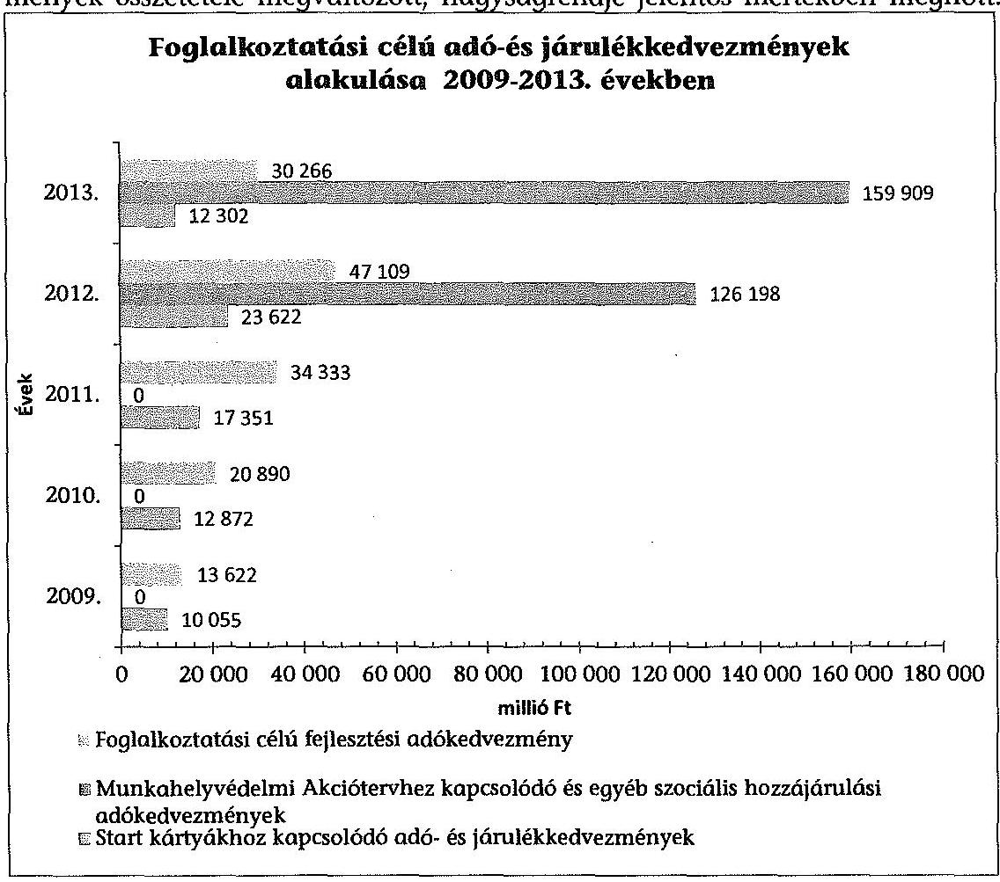

A Munkahelyvédelmi Akcióterv keretében 2013. évben igénybe vett foglalkoztatási és egyéb célú szociális hozzájárulási adó- (SZOCHO) kedvezmények öszszege tizenháromszorosa volt az azonos időszakban a START Program keretében érvényesített kedvezményeknek. A 2009-2013. években az adózók által a START Program és a Munkahelyvédelmi Akcióterv keretében igénybe vett adó-

---

és járulékkedvezmények összege meghaladta a 350 milliárd Ft-ot. A foglalkoztatási célú fejlesztési adókedvezmények összege közel 150 milliárd Ft volt az ellenőrzött időszakban.

A 2009-2013. években sem a Pftv. és a végrehajtására kiadott 31/2005. (IX. 29.) PM és az 55/2011. (XII. 30.) NGM rendeletek, sem a Munkahelyvédelmi Akcióterv keretében érvényesíthető kedvezményeket szabályozó, az egyes adótörvények és azzal összefüggő egyéb törvények módosításáról szóló törvény nem fogalmaztak meg ellenőrzési kötelezettséget az adóhatóság számára a foglalkoztatási célú társadalombiztosítási járulék- (TB járulék) és SZOCHO kedvezmények igénybevétele jogszerűségének ellenőrzésére. Az APEH/NAV az ellenőrzési tevékenysége során a foglalkoztatási célú adó- és járulékkedvezmények igénybevételét önállóan nem ellenőrizte, az ellenőrzött időszakban célzott kiválasztást nem alkalmazott. Az adó- és járulékkedvezmények igénybevételének jogszerűségét csak a bevallások utólagos vizsgálatára, az egyes adókötelezettségek teljesítésére irányuló, a kedvezménnyel érintett adónemek ellenőrzése keretében vizsgálta.

Az APEH/NAV az ellenőrzött időszakban az Art. rendelkezései szerint a kötelező ellenőrzéseken túl végzendő ellenőrzési irányai meghatározására évenként közzétette az ellenőrzési irányelveit. A 2009-2011. évi ellenőrzési irányelvekben nem nevesítették a foglalkoztatási célú TB járulékból érvényesíthető kedvezmények igénybevételének ellenőrzését. A 2012-2013. évi ellenőrzési irányelvek szerint - SZOCHO kedvezmények bevezetését követően - kiemelt figyelmet kellett fordítani a fizetendő adó megállapításánál figyelembe vett kedvezmények érvényesítése jogszerűségének vizsgálatára.

Az ellenőrzött időszakban az állami adóhatóságnál nem volt szempont a foglalkoztatási célú adó- és járulékkedvezményeket igénybe vevő adóalanyok ellenőrzésre történő kiválasztása. Az ellenőrzött tételeknél egyetlen esetben sem szerepelt kiválasztási okként a foglalkoztatási célú adó- és járulékkedvezmények ellenőrzése. Az állami adóhatóság által végzett vizsgálatokból ellenőrzésre kiválasztott, - a NAV által rendelkezésre bocsátott ellenőrzötti listából - kettő dokumentáció tartalmazott foglalkoztatási célú adó- és járulékkedvezményt igénybe vevő adózóra vonatkozó ellenőrzést, ezért az APEH/NAV - a Tb járulékból és a SZOCHO-ból a foglalkoztatási célú adó- és járulékkedvezmények igénybevétele szabályszerűségére irányuló - ellenőrzési tevékenységét értékelni nem tudtuk.

A START Program keretében az adó- és járulékkedvezmények igénybevételére jogosító START kártyák adattartalmának kialakítása, a kártyajogosult részére történő kiállítása megfelelt az Art.-ban, a Pftv.-ben és annak végrehajtására kiadott 31/2005. (IX. 29.) PM és 55/2011. (XII. 30.) NGM rendeletekben foglalt előírásoknak. Az ellenőrzött időszakban a START kártyákhoz kapcsolódó és a Munkahelyvédelmi Akcióterv keretében a TB járulékból és a SZOCHO-ból igénybe vett kedvezményekről benyújtott és feldolgozott munkáltatói/kifizetői adó- és járulékbevallások adattartalma biztosította a jogszabályokban előírt adatszolgáltatások szerinti részletezettséget.

Az APEH/NAV az ellenőrzött időszakban a jogszabályokban meghatározott határidőben az adatszolgáltatási kötelezettségeit teljesítette a START kártyák

---

vonatkozásában a Szociális és Munkaügyi Minisztérium (SZMM), a Munkaerőpiaci Alap (MPA)/a Nemzeti Foglalkoztatási Alap (NFA) alapkezelő szervezetei és a Munkahelyvédelmi Akciótervet illetően a társadalombiztosítás pénzügyi alapjait kezelő szervezetei, a rehabilitációs hatóság, illetve az állami foglalkoztatási szervezet és a munkaügyi hatóság részére. Az állami adóhatóság az adatszolgáltatási szabályzata ${ }_{1-7}$ előírásainak megfelelően, az adóbevallásokból feldolgozott adatállományokból rendszeres adatszolgáltatásokat teljesített a PM/NGM részére. Az állami adóhatóság az adózók által igénybe vett fejlesztési adókedvezményekhez kapcsolódó adatszolgáltatási kötelezettségét a Magyar Államkincstár (Kincstár) részére a Tao tv. rendelkezéseinek megfelelően teljesítette.

A fejlesztési adókedvezmény igénybevételére irányuló bejelentések 30 napon belüli vizsgálatáról dokumentált módon az NGM-nél csak részben gondoskodtak. Az NGM eljárása nem felelt meg a 206/2006. (X. 16.) Korm. rendeletben előírtaknak, mivel az NGM általi vizsgálat megtörténte, időpontja nem volt megállapítható. A bejelentésekről és kérelmekről a jogszabályban előírt nyilvántartást vezették.

Az APEH/NAV a fejlesztési adókedvezményekről az adópolitikáért felelős miniszter tájékoztatása alapján rendelkezésre álló adatokról (bejelentésekről, határozatokról), a benyújtott bevallásokról, valamint az ellenőrzésekről nyilvántartást vezetett. A nyilvántartások alapján biztosított volt a bevallások adatainak, az ellenőrzések megállapításainak összegezése, feldolgozása, az előírt adatszolgáltatás teljesítése a Kincstár felé.

Az APEH/NAV a fejlesztési adókedvezmények igénybevétele jogszerűségének ellenőrzésére önálló vizsgálatokat az ellenőrzött időszakban nem indított. A fejlesztési adókedvezményeket a bevallások utólagos és az egyes adókötelezettségek teljesítésére irányuló társasági adónem ellenőrzései keretében vizsgálta.

A 2009-2012. évi ellenőrzési irányelvekben az ellenőrzések gyakorisága nem volt összhangban a fejlesztési adókedvezményről szóló kormányrendeletben foglaltakkal. A 2013. évi ellenőrzési irányelvben az ellenőrzések gyakoriságát már a jogszabályi előírásokkal összhangban határozták meg. A 2009-2013. években az APEH/NAV a fejlesztési adókedvezmény igénybevétele feltételeinek teljesítését a fejlesztési adókedvezményről szóló kormányrendeletben foglaltak ellenére az adókedvezmény első igénybevételét követő harmadik adóév végéig legalább egyszer - valamennyi fejlesztési adókedvezményt igénybe vevő adózó esetében - nem ellenőrizte.

A 2009-2011. években az APEH/NAV nem alkalmazott az ellenőrzésre történő kiválasztáskor szűréseket a foglalkoztatási célú fejlesztési adókedvezmények jogosulatlan igénybevételének feltárása érdekében. A kiválasztást támogató informatikai rendszerek adatbázisai tartalmaztak - a bevallásokból származó olyan specifikált adatot, amelyek alapján a fejlesztési adókedvezményt igénybe vevő adózók az Art. rendelkezései alapján célzottan ellenőrzésre kiválasztásra kerülhettek. Az ellenőrzésre való kiválasztás során betartották a belső szabályzatokat. Az ellenőrzött esetekben az ellenőrzésekről vezetett nyilvántartásokban az Art. rendelkezései szerint az ellenőrzésre történő kiválasztás és az elrendelés közvetlen okát megjelölték.

---

Az állami adóhatóság regionális ellenőrzési szervezetei az ellenőrzött esetekben a foglalkoztatási célú fejlesztési adókedvezményt igénybe vett adóalanyok ellenőrzésre való kijelölése során az ellenőrzésre kiválasztás belső szabályai, az éves irányelvek, a saját kockázatelemzéseik és a NAV KH körlevelei alapján célzott kiválasztást alkalmaztak. Az ellenőrzési tevékenységet a fejlesztési adókedvezmények ellenőrzéséhez kiadott módszertan támogatta. A NAV fejlesztési adókedvezményeket érintő ellenőrzési tevékenysége - az ellenőrzött esetekben megfelelt az Art. rendelkezéseinek.

Az ellenőrzött önkormányzatok a Helyi adó tv. előírásainak megfelelően a foglalkoztatási célú adóalap-mentességet minden vállalkozás számára azonos mértékben biztosították. A helyi adórendeleteikben a Helyi adó tv. szerinti vállalkozási szintű adómentesség határát meghatározták.

Az önkormányzati adóhatóságok ${ }_{1.5}$ az ellenőrzési tevékenységük során 2009-2013. évek között az adózók ellenőrzésre való kijelölésénél a helyi iparűzési adóalap-mentességet és adómentességet igénybe vevő adózók ellenőrzésre történő kiválasztása nem volt cél. A foglalkoztatás növeléséhez kapcsolódó adóalap-mentességet igénybe vevő adózók ellenőrzöttsége minimális volt, arányuk az adóalap-mentességet igénybe vevők számán belül nem érte el átlagban a 2\%-ot. A Helyi adó tv. szerinti foglalkoztatás növelését segítő adóalapmentesség igénybevételének szabályszerűsége vonatkozásában az Art.-ban biztosított ellenőrzési jogkörét két önkormányzat nem gyakorolta.

A helyi iparűzési adó (HIPA) ellenőrzések lefolytatásának szabályszerűsége - az ellenőrzésre kiválasztott tételek esetében - három önkormányzatnál megfelelt, egy önkormányzatnál részben felelt meg az Art. rendelkezéseinek, továbbá a helyi szabályozásoknak. Egy önkormányzatnál nem készítettek vizsgálati programot, egy eset kivételével nem állítottak ki megbízólevelet, és nem éltek a mulasztási bírság kiszabásával sem. Egy önkormányzat utólagos HIPA ellenőrzéseket nem végzett.

A HIPA adóbevallások adattartalma nem biztosította az önkormányzati adóhatóságok számára a foglalkoztató előző időszakra igénybe vett adóalapmentességhez kapcsolódó létszámtartási kötelezettségének ellenőrizhetőségét. Az önkormányzati adóhatóságok az ellenőrzött időszakban a helyi iparűzési adó bevallási nyomtatványaikban jellemzően nem szerepeltettek tájékoztató adatot az átlagos statisztikai állományi létszámról. Az önkormányzatok az adóbevallás lapjainak adattartalma alapján a Helyi adó tv.-ben meghatározott, foglalkoztatáshoz kapcsolódó adóalap-mentesség érvényesítését kizáró állami támogatás igénybevételére vonatkozó nyilatkozatot a bevallásban nem kértek. Az önkormányzatok a helyi iparűzési adó bevallására szolgáló nyomtatvány garnitúráikat az önkormányzati adóhatóságok által rendszeresíthető bevallási, bejelentési nyomtatványok tartalmáról szóló PM rendelet ajánlása szerinti adattartalommal alakították ki. A PM rendelet mellékletei nem tartalmazták - a foglalkoztatás növeléséhez kapcsolódó adóalap-mentesség megállapításához szükséges - létszámadatokat.

Az önkormányzatoknál az ellenőrzött időszakban a bevallások kezelésével, feldolgozásával kapcsolatos tevékenységeket a 13/1991. (VI. 21.) PM rendelet előírásainak és a belső szervezetszabályozási eszközeiknek megfelelően látták el.

---

Az önkormányzati adóhatóságok a HIPA-val kapcsolatos közzétételi, a Kincstárral szembeni adatszolgáltatási kötelezettségeiknek az ellenőrzött időszakban eleget tettek. A Helyi adó tv.-ben meghatározott, az önkormányzati és állami adóhatóságok közötti együttműködési kötelezettségüket, amennyiben az bekövetkezett - egy önkormányzatot kivéve - szabályszerűen teljesítették.

Az önkormányzatoknál a helyi iparűzési adóalap-mentességek, adókedvezmények nyilvántartási, bevallási, adatfeldolgozási és adatszolgáltatási tevékenységekre vonatkozó belsô szabályozó eszközök előírásai megfeleltek az Art.ban, a Helyi adó tv.-ben foglaltaknak. A helyi iparűzési adózáshoz kapcsolódó feladatellátás szabályszerűségét támogató, a monitoring tevékenységen belül a belső ellenőrzés tekintetében az Ötv.-ben és az Mötv.-ben foglalt előírásokat négy önkormányzat betartotta, egy figyelmen kívül hagyta.

Az ÁSZ 2009-2013. években közzétett jelentéseiben a nemzetgazdasági miniszternek, illetve a NAV elnökének tett javaslatai hasznosultak.

A nemzetgazdasági miniszter az ÁSZ 2009. évi javaslata alapján a START kártyához kapcsolódó adatszolgáltatás tartalmát módosította, amely - többek között - tartalmazta a NFA kezelője és az állami adóhatóság közötti adatszolgáltatás rendjét, tartalmát, határidejét. Az ÁSZ 2010. évi javaslata alapján a nemzetgazdasági miniszter felszólította a Kincstárt az önkormányzati adófeldolgozást és nyilvántartást végző, elavult Önkormányzati Adók Nyilvántartási Rendszere (ÖNKADÓ) program kiváltását biztosító állami szoftver kidolgozására. Az ÁSZ 2012. évi javaslata alapján a Tao tv. rendelkezései 2013. évtől az adózó beruházáshoz kapcsolódó bejelentési kötelezettségei pontositásával, valamint az adópolitikáért felelős miniszter évenkénti adatszolgáltatási kötelezettségének meghatározásával kiegészítésre kerültek. A jogszabály a módosítást követően az adatszolgáltatás teljesítésére határidőt nem írt elő.

A NAV elnöke az ÁSZ 2012. évi javaslata alapján intézkedési tervet készített, az abban meghatározott feladatokat határidőben végrehajtották. A fejlesztési adókedvezmények soron kívüli ellenőrzését elrendelte, a 2013. évi ellenőrzési irányelvben a fejlesztési adókedvezmény ellenőrzése gyakoriságát a jogszabályokkal összhangban határozta meg.

Az Állami Számvevőszékről szóló 2011. évi LXVI. törvény 33. § (1) bekezdésében foglaltak értelmében a jelentésben foglalt megállapításokhoz kapcsolódó intézkedési tervet köteles az ellenőrzött szervezet vezetője összeállítani, és azt a jelentés kézhezvételétől számított 30 napon belül az ÁSZ részére megküldeni. Amennyiben az intézkedési tervet határidőben nem küldi meg a szervezet, vagy az nem elfogadható, az ÁSZ elnöke a hivatkozott törvény 33. § (3) bekezdés a)-b) pontjaiban foglaltakat érvényesítheti.

Az ellenőrzés intézkedést igénylő megállapításai és javaslatai:

# a nemzetgazdasági miniszternek 

A PM/NGM-nél az ellenőrzött idôszakban a foglalkoztatási célú adó- és járulékkedvezményekre vonatkozó tevékenységek szabályszerű ellátásához szükséges - a Bkr.

---

3. § a) és 6. § (1) bekezdése b) pontjaiban foglaltaknak megfelelő - kontrollkörnyezet kialakítása és müködtetése nem volt teljes körű.
a) A fejlesztési adókedvezmény igénybevételéhez kapcsolódó bejelentések megvizsgálását, a kérelmek elbírálását, mint feladatot a hatályos SZMSZ-ek tartalmazták, azonban azok ellátásának módját, határidejét nem szabályozták. A fejlesztési adókedvezményekkel kapcsolatos, a 2013. január 1-jétől hatályos Tao tv. 22/B. § (18) bekezdése szerinti adatszolgáltatás rendje az NGM-nél nem szabályozott.
b) A 206/2006. (X. 16.) Korm. rendelet 10. § (6) bekezdése 2010. január 1-jétől írta elő az adópolitikáért felelős miniszter részére a fejlesztési adókedvezmény érvényesítésére irányuló, az adózók által benyújtott bejelentések beérkezéstől számított 30 napon belüli megvizsgálását. A megvizsgálás elvégzésének tényét, annak dátumát az ellenőrzött - 2010-2013. évi - bejelentések közül (43-ból) 32 esetben (74\%) a dokumentumokon nem rögzítették. Ezért nem volt megállapítható, hogy megtörtént-e a bejelentések megvizsgálása.

Javaslat:
a) Intézkedjen a foglalkoztatási célú adó- és járulékkedvezményekkel kapcsolatos tevékenységek szabályszerű ellátásához szükséges kontrollkörnyezet hiányosságainak megszüntetéséről úgy, hogy a szabályozás a minisztérium valamennyi vonatkozó tevékenységére kiterjedjen.
b) Intézkedjen a fejlesztési adókedvezmény igénybevételéhez kapcsolódó bejelentések megvizsgálásáról és annak dokumentálásáról.

# a Nemzeti Adó- és Vámhivatal elnökének 

A 2009-2013. években az APEH/NAV valamennyi fejlesztési adókedvezményt igénybe vevő adózó esetében a fejlesztési adókedvezmény igénybevétele feltételeinek teljesítését a fejlesztési adókedvezményről szóló 206/2006. (X. 16.) Korm. rendelet 13. §-ában foglaltak ellenére az adókedvezmény első igénybevételét követő harmadik adóév végéig legalább egyszer nem ellenőrizte.

Javaslat:
Intézkedjen, hogy a fejlesztési adókedvezmények igénybevételéhez kapcsolódó ellenőrzés a vonatkozó, hatályos jogszabályi előírásoknak megfelelően megtörténjen.

## Győr Megyei Jogú Város jegyzőjének

A HIPA ellenőrzések lefolytatásának szabályszerűsége az ellenőrzésre kiválasztott mintatételek esetében az Önkormányzatnál részben felelt meg az Art. 92. § (3) bekezdésében, valamint a 93. § (1) és (3) bekezdésében foglaltaknak, mivel az ellenőrzésekhez - egy eset kivételével - nem állítottak ki megbízólevelet.

---

Javaslat:
Intézkedjen arról, hogy a HIPA ellenőrzéseknél a vonatkozó jogszabályi előírásoknak megfelelően a megbízólevelek rendelkezésre álljanak.

---

# II. RÉSZLETES MEGÁLLAPÍTÁSOK 

## 1. A BELSŐ KONTROLLKÖRNVEZET ÉS AZ ADATBEKÉRÉS, ADATSZOLGÁLTATÁS RENDSZERÉNEK KIALAKÍTÁSA ÉS MŰKÖDTETÉSE A PM/NGM-NÉL

### 1.1. A foglalkoztatási célú adó- és járulékkedvezmények jog-szabály-előkészítő és költségvetés-tervezési tevékenységének belsö kontrollkörnyezete

Az ellenőrzött időszakban a PM/NGM-nél ${ }^{2}$ a foglalkoztatási célú adó- és járulékkedvezményekre vonatkozó tevékenységek - a Bkr. 3. § a) és 6. § (1) bekezdés b) pontjaiban foglaltaknak megfelelő - belső kontrollkörnyezetének kialakítása - a belső kontrollrendszer részeként - és múködtetése nem volt teljes körű. A fejlesztési adókedvezményeket érintően nem teljesültek a Bkr. 4. § a) pontjában ${ }^{3}$ előírtak, mert a költségvetési szerv vezetője nem gondoskodott arról, hogy „a költségvetési szerv valamennyi tevékenysége és célja összhangban legyen a szabályszerűséggel, szabályozottsággal ... ." A fejlesztési adókedvezményekkel kapcsolatos jogszabály-előkészítő és költségvetés-tervezési feladatok ellátását eljárásrendben nem szabályozták. A 2013-tól hatályos PM/NGM SZMSZ 52. §-ában a fejlesztési adókedvezményekkel kapcsolatos költ-ségvetés-tervezési feladatokat meghatározták. A fejlesztési adókedvezmény igénybevételéhez kapcsolódó bejelentések felülvizsgálata, a kérelmek elbírálása a pénzügyminiszter, 2010. január 1-től az adópolitikáért felelős miniszter hatáskörébe tartozott. A feladatot a hatályos PM/NGM SZMSZ-ek tartalmazták, az ellátásának módját, határidejét nem szabályozták, a tevékenység ellátására dokumentált módon nem jelöltek ki munkavállalót. A fejlesztési adókedvezményekkel kapcsolatos, a 2013. január 1-jétől hatályos Tao tv. 22/B. § (18) bekezdése szerinti adatszolgáltatás rendjét az adópolitikáért felelős miniszter - a belső kontrollkörnyezet részeként - eljárásrendben 2013. december 31-ig nem szabályozta.

A fejlesztési adókedvezményekkel kapcsolatos ügyek a 2009. évben az 5/2008. (MK 48.) PM utasítás alapján a költségvetési bevételekért és a számvitelért felelős szakállamtitkárhoz tartoztak. 2010. október 5-től az adóügyekért felelős helyettes államtitkárhoz tartozó szervezeti egység, a Jövedelem és Forgalmi Adók Főosztály látta el az adókedvezményekkel kapcsolatos jogszabály-előkészítői feladatokat. A

[^0]
[^0]:    ${ }^{2}$ Az adópolitika, ezen belül az adókedvezményekkel kapcsolatos irányító feladatok ellátása 2010. június 30 -ig a pénzügyminiszter feladat- és hatásköréről szóló 169/2006. (VII. 28.) Korm. rendelet 1. § b) pontja alapján a pénzügyminiszter, 2010. július 1-jétől az egyes miniszterek, valamint a Miniszterelnökséget vezető államtitkár feladat- és hatásköréről szóló 212/2010. (VII. 1.) Korm. rendelet 73. § b) pontja alapján a nemzetgazdasági miniszter hatáskörébe tartozott.
    ${ }^{3}$ 2010. december 31-ig az Áht. ${ }_{1}$ 120/B. § (2) bekezdése, 2011. január 1-től december 31ig az Áht. ${ }_{1}$ 121/A. § (2) a) bekezdése szabályozta.

---

kérelmek, bejelentések feldolgozása, nyilvántartása és az adatszolgáltatás az adóhatóság részére a Jövedelem és Forgalmi Adók Főosztályon belül a Társasági Adó Osztály feladatkörébe tartozott. A 11/2013. (VI. 3.) NGM utasítással kiadott NGM SZMSZ 52. § (1) bekezdése a) pontja alapján az adózásért és számvitelért felelős helyettes államtitkár javaslatot készít az adórendszert érintően a Kormány gazdaságpolitikai céljaira, a gazdaságpolitikai programok végrehajtására és az ezek megvalósításához szükséges eszközökre. A helyettes államtitkár felelős volt az adók, járulékok, hozzájárulások beszedésének törvényességéért, azok kiutalásáért és ellenőrzéséért és az ezekkel kapcsolatos adatszolgáltatásokért az 52. § (1) bekezdés d) pontja alapján. A 2013-tól hatályos NGM SZMSZ-ben a fejlesztési adókedvezményekkel kapcsolatos költségvetés-tervezési feladatok ellátása az Adópolitikai és Nemzetközi Adózási Főosztály feladata volt. A fejlesztési adókedvezményekkel kapcsolatos ügyeket a Jövedelemadók és Járulékok Főosztály, ezen belül a Társasági Adó Osztály látta el.

A foglalkoztatási programokkal összefüggő, a foglalkoztatási célú adóés járulékkedvezményekkel kapcsolatos tervezési, koordinálási feladatok ellátása az ellenőrzött időszakban az NGM-nél szabályozott volt.

A foglalkoztatási programokkal összefüggő, a foglalkoztatási célú adó- és járulékkedvezményekkel kapcsolatos tervezési, koordinálási feladatok ellátása 20092010. években az SZMM foglalkoztatási szakterületén az SZMSZ kiadásáról szóló 20/2008. (HÉ 48.) SZMM utasítás alapján az SZMM Tervezési és Fejlesztési Főosztály feladatkörébe tartozott. 2010. július 1-jétől az egyes miniszterek, valamint a Miniszterelnökséget vezető államtitkár feladat- és hatásköréről szóló 212/2010. (VII. 1.) Korm. rendelet 73. § m) pontja alapján a nemzetgazdasági miniszter lett a Kormány foglalkoztatáspolitikáért felelős tagja. A 2010. július 9-től a PM/NGM SZMSZ ideiglenes meghatározásáról szóló 1/2010. (VII. 8.) NGM utasítás alapján a foglalkoztatáspolitikai programokkal összefüggő feladatokat az NGM foglalkoztatáspolitikáért felelős államtitkára felügyelte és az 1. § (2) bekezdés d) pontja alapján az SZMM utasítást megfelelően kellett alkalmazni. 2010. október 5-től az PM/NGM SZMSZ-ről szóló 4/2010. (X. 5.) NGM utasítás, majd 2013. június 4-től a 11/2013. (VI. 3.) NGM utasítás, valamint az NGM Foglalkoztatáspolitikai Államtitkárságon a Foglalkoztatási Programok Főosztálya, ezen belül a Tervezési és Monitoring Osztály látta el a programok tervezésével kapcsolatos feladatokat.

A PM/NGM az ellenőrzött időszakban rendelkezett a szervezet felépítését világosan, áttekinthető módon meghatározó szervezeti ábrával, amelyeket a hatályos PM/NGM SZMSZ-ek 1. számú mellékletei tartalmaztak. A munkavállalók rendelkeztek a Ktv. 11. § (6) bekezdésének, illetve a Kttv. 43. § (4) bekezdésének, valamint a 75. § (1) bekezdés d) pontjának megfelelő munkaköri leírásokkal, amelyek - a fejlesztési adókedvezményekkel kapcsolatos feladatok kivételével - tartalmazták az ellenőrzéssel érintett feladatok meghatározását, a munkakörök betöltésével kapcsolatos (a végzettségre, szakképzettségre, szakképesítésre, tapasztalatra, képességekre vonatkozó) követelményeket.

# 1.2. Adatszolgáltatási kötelezettségek szabályozása a jogszabály előkészítéshez, felülvizsgálathoz és a költségvetés tervezéséhez 

Az ellenőrzött időszakban a foglalkoztatási célú adó- és járulékkedvezményekhez kapcsolódóan a jogszabály előkészítéshez, felülvizsgálathoz a költségvetés tervezéséhez és a hatásvizsgálatokhoz szükséges adatok és információk

---

rendelkezésre állását biztosító adatszolgáltatás, kapcsolattartás rendjét a PM/NGM-nél nem szabályozták. A pénzügyminiszter/nemzetgazdasági miniszter a Jat. ${ }_{1}$ 23. §-a alapján a jogszabály tárgya szerinti felelősségi körében, illetve a Jat. 2 21. § (1) bekezdése szerinti, a jogszabályok hatályosulásának folyamatos figyelemmel kíséréséhez kapcsolódóan nem határozta meg - a PM/NGM-mel véleményeztetett, és a PM/NGM-mel egyetértésben kialakított APEH/NAV szabályzatokon túl - az adatáramlás, adatkapcsolat formáját az adóhatósággal. A PM/NGM a jogszabály-előkészítő, a jogszabályok felülvizsgálatához és a költségvetés tervezéséhez szükséges adatok és információk rendelkezésre állását biztosító adatszolgáltatási kötelezettségeket nem írt elő.

Az adóbevallási adatok az APEH/NAV által biztosított adatszolgáltatások (a rendszeres adatszolgáltatások, illetve gyorsjelentések) alapján az ellenőrzött időszakban rendelkezésre álltak (beleértve az egyedi azonosításra alkalmatlan adózói szintű, teljes adóbevallási adatbázisokat is). A PM/NGM az egyes intézkedések hatáselemzéséhez szükség esetén egyedi adatbekéréseket is végzett.

Az APEH/NAV rendszeres, havi gyakorisággal szolgáltatott adatokat, illetve éves elemzésekben és eseti adatszolgáltatásokban értékelte az adó- és járulékkedvezmények alakulását. Az APEH/NAV adatszolgáltatás lehetővé tette kedvezménytípusonként az előzetes, utólagos hatásvizsgálatot, az elemzés, értékelés elvégzését, az adott kedvezmény hatásának kimutatását, illetve a költségvetés tervezését.

Az APEH/NAV az elemzésekben a számláira közvetlenül érkező TB járulék, egészségügyi hozzájárulás és SZOCHO bevételek alakulását, valamint a foglalkoztatói és a biztosítotti kötelezettségek változását, összetételét értékelte a kifizetői bevallások adatai alapján.

Az NGM a NAV-tól a fejlesztési adókedvezményekre vonatkozóan a 2013. évben a 2004-2011., illetve a 2004-2012. években a társasági adóból fejlesztési adókedvezményt érvényesítőkről kért legyűjtést. A 2012. évben a május hónapban érvényesített kedvezményekről egy esetben nemenkénti (nő/férfi) egyedi adatbekérésre került sor a Munkahelyvédelmi Akciótervvel, a SZOCHO-ból érvényesíthető kedvezményekkel összefüggésben. A 2013. évben érvényesített kedvezményekről két esetben megyénkénti, illetve a 2013. szeptember hónapra nemenkénti, egyedi adatbekérés történt. Az adatbekérések alapján készített hatástanulmányok a jogszabály módosítási javaslatok előterjesztéseit alapozták meg.

# 1.3. A foglalkoztatási célú adó- és járulékkedvezmények jogszabály előkészítését, módosítását támogató előzetes és utólagos hatásvizsgálatok 

A PM/NGM az ellenőrzött időszakban a szabályozás szükségessége, a költségvetésre gyakorolt hatásának elemzése - előzetes, illetve utólagos hatásvizsgálata - alapján kezdeményezte a foglalkoztatási célú adó- és járulékkedvezményeket meghatározó jogszabályok módosítását. Az előterjesztéseket 2010. december 30-ig a Jat. ${ }_{1}$ 18. § (1) bekezdése alapján elemzésekkel, azt követően a Jat. ${ }_{2}$ 17. § (1) bekezdése szerint a (2) bekezdésben előírt, szakmai tartalommal bíró, az egyes kedvezmény típusokat értékelő előzetes, illetve utólagos hatásvizsgálattal támasztották alá. Az egyes módosításokat megalapozó

---

elemzések következtetései, hatásvizsgálatok és az előterjesztések vezetői összefoglalóiban megtalálhatók voltak. Az előterjesztéseket a Kormány ügyrendjéről szóló 1088/1994. (IX. 20.) Korm. határozat ${ }^{4}$ 18-19. pontjai, illetve a Kormány ügyrendjéről szóló 1144/2010. (VII. 7.) Korm. határozat 7-19. pontjai alapján készítették elő és egyeztették, azok tartalmazták a kitöltött hatásvizsgálati lapokat. A jogszabály módosításokhoz az egyeztetés során beérkezett módosító javaslatokat a tervezet kidolgozásakor figyelembe vették. Az egyeztetés folyamata követhető volt.

Az adó- és járulékkedvezmények igénybevételét jelző adatok makrogazdasági szinten való kiértékelése az ellenőrzött időszakban minden évben - a költségvetés készítése időszakában, 2011. december 31-ig az Áht. 1 114. § (1) bekezdése, majd 2012. január 1-jétől az Áht. 2 12. § (1) és a 102. § (1) bekezdései figyelembevételével - megtörtént. Az elemzések kiterjedtek a fejlesztési adókedvezmények és a START Program keretében nyújtott adó- és járulékkedvezmények eredményeinek értékelésére is. A kiértékelés eredménye beépítésre került a fő makrogazdasági mutatókba, amelyeket az éves költségvetés összeállításakor figyelembe vettek, továbbá az eredmények összegzésre kerültek a Konvergencia Programokban.

Az eredmények összegzése megjelent Magyarország 2007-2011. évekre szóló Aktualizált Konvergencia Programjában (2007. november)5, a 2009-2012. Aktualizált Konvergencia Programban (2010. január)6, továbbá a 2012 áprilisában közzétett Konvergencia Programban ${ }^{7}$ és a 2013 áprilisában, a 2013-2016. időszakra vonatkozó Konvergencia Programban ${ }^{8}$. A Munkahelyvédelmi Akcióterv makrogazdasági hatásait az ellenőrzött időszakban, a bevezetést követően először a 2013. évben értékelték.

# 2. A BELSŐ KONTROLLKÖRNVEZET ÉS A BELSŐ ELLENŐRZÉS KIÉPÍTÉSE ÉS MŰKÖDTETÉSE AZ APEH/NAV-NÁL 

### 2.1. A belső kontrollkörnyezet kialakítása a foglalkoztatási célú adó- és járulékkedvezmények bevallási, nyilvántartási, adatfeldolgozási, adatszolgáltatási, ellenőrzési tevékenységek vonatkozásában

Az APEH/NAV-nál a belső kontrollkörnyezet kialakítása - a belső kontrollrendszer részeként - és múködtetése az ellenőrzött időszakban a foglalkoztatási célú adó- és járulékkedvezményekhez kapcsolódó tevékenységekre vonatkozóan részben felelt meg az Áht. 1 és a Bkr. előírásainak. Az ellenőrzött időszakban

[^0]
[^0]:    ${ }^{4}$ Hatályon kívül helyezte 2010. július 8-tól a Kormány ügyrendjéről szóló 1144/2010. (VII. 7.) Korm. határozat.
    ${ }^{5}$ Makrogazdasági célok és prognózis 1.4. és 1.6. pontjában.
    ${ }^{6}$ Makrogazdasági kilátások 2.4. és 2.6. pontjaiban.
    ${ }^{7}$ Széll Kálmán Terv 2.0 A következő lépés (2012. április).
    ${ }^{8}$ Makrogazdasági folyamatok és előrejelzés címú fejezetben, a Kormányzati Intézkedések gazdasági hatásainak vizsgálata címú pontban.

---

az APEH/NAV belső irányítási eszközeinek a jogszabályváltozásokhoz kapcsolódó módosításai, valamint az egyes tevékenységei ellátásának szabályozása során nem volt figyelemmel a Bkr. 4. § a) bekezdésében foglaltakra ${ }^{9}$, a belső kontrollrendszer azon elvére, amely szerint a költségvetési szerv valamennyi tevékenysége és célja összhangban kell, hogy legyen a szabályszerűséggel, szabályozottsággal.

Az APEH/NAV a START kártyák kiadásának folyamatára vonatkozóan a jogszabályi előírásokkal összhangban ${ }^{10}$ rendelkezett az ellenőrzött időszakban hatályos, a START kártyák (a START, a START PLUSZ, a START EXTRA és a START BÓNUSZ kártyák) kiadásáról szóló belső irányítási eszközzel (START kártya kiadási szabályzat ${ }_{1-5}$ ). A magánszemélyek START kártyával történő ellátásával kapcsolatos feladatokat, az utasítások, eljárásrendek kiadásának előkészítését az APEH/NAV Adóügyi Főosztálya ${ }^{11}$ koordinálta.

A START kártya kiadási szabályzat ${ }_{1-5}$ módosításai a jogszabályi változások hatályba lépését követően több hónapos (hat-kilenc hónap) késedelemmel történtek meg.

A START kártyát érintő, a 2009. január 1-jétől módosuló jogszabályokat nyolc hónappal, a 2010. január 1-jétől hatályos jogszabályi változásokat közel hat hónappal később követte a START kártya kiadási szabályzat ${ }_{2-3}$ kiadása. A 2011. január 1-jétől megváltozott jogszabályi környezet után három hónap múlva adták ki a START kártya kiadási szabályzat ${ }_{4}$-et. A START kártya család kiváltásának jogszabályi háttere megváltozott, a 31/2005. (IX. 29.) PM rendeletet 2012. január 1-jével az 55/2011. (XII. 30.) NGM rendelet váltotta fel. A jogszabályi környezet jelentős változása ellenére a START kártya kiadási szabályzat ${ }_{5}$ kilenc hónap késéssel 2012. október 1-től lépett hatályba.
2012. október 1-jétől két szabályzat, a START kártya kiadási szabályzat ${ }_{4-5}$ is hatályban volt, mert a START kártya kiadási szabályzat ${ }_{5}$ hatályba lépésével a START kártya kiadási szabályzat ${ }_{4}$-et nem helyezték hatályon kívül ${ }^{12}$.

A 2013. évben a START kártya kiadási szabályzat ${ }_{5}$ módosítását nem készítették el annak ellenére, hogy a jogszabályi környezet megváltozott. A Pftv. módosításával 2013. január 1-jétől megszűnt a törvényi lehetőség új START kártya kiváltására, ezzel szemben a START kártya kiadási szabályzat ${ }_{5}$-öt nem módosították.

[^0]
[^0]:    ${ }^{9}$ 2010. december 31-ig az Áht. ${ }_{1}$ 120/B. § (2) bekezdés, 2011. január 1-től december 31ig az Áht. ${ }_{1} 121 /$ A. § (2) bekezdés a) pontja szabályozta.
    ${ }^{10}$ Pftv., 31/2005. (IX. 29.) PM rendelet, 7/2005. (II. 8.) PM-FMM együttes rendelet, 7/2009. (IV. 11.) PM-SZMM együttes rendelet, 55/2011. (XII. 30.) NGM rendelet.
    ${ }^{11}$ Az APEH/NAV SZMSZ ${ }_{1-4} \mathrm{KH}$ szervezeti egységeinek feladatai fejezetében foglaltak alapján.
    ${ }^{12}$ A NAV 2014. december 30-i elektronikus levele szerint 2014. december 23-án adták ki az 1101/2014. számú eljárásrendet a START (PLUSZ, EXTRA, BÓNUSZ) kártyák kiadásáról szóló 1025/2011. számú és 1125/2012. számú eljárási rendek érvénytelenítéséről (START kártya kiadási szabályzat ${ }_{4-5}$ ).

---

A START Programba tartozó kártyák közül a START PLUSZ és a START EXTRA kártyákat a kedvezményezettek 2011. december 31-éig igényelhették. A kártyák cseréjét - érvényességi idejük alatt, de legkésőbb 2013. december 31-éig - továbbra is belső szabályok (START kártya kiadási szabályzat ${ }_{4.5}$ ) alapján lehetett kérni. A 2012. évben az alap START kártya igénylésének szabályozása nem változott, 2012. január 1-jétől bevezetett START BÓNUSZ kártya kiváltására 2012. december 31 -éig volt lehetőség a Pftv. alapján.

Az ellenőrzött időszakban az irányító és a jogalkalmazást segítő belső irányítási eszközök előírták, hogy jogszabályváltozás esetén az intézkedés módosításáig, hatályon kívül helyezéséig a hatályos jogszabályi rendelkezések alapján kellett eljárni. A belső irányítási eszközöket előkészítő főosztálynak ezzel egyidejűleg haladéktalanul intézkednie kellett a belső irányítási eszköz módosításáról, vagy új belső szabályzat kiadása mellett, a jogszabállyal ellentétes intézkedés hatályon kívül helyezéséről. Az APEH/NAV elnöke által kiadott irányító és a jogalkalmazást segítő belső irányítási eszközök nem határozták meg azt a végső határidőt, amely időtartamon belül jogszabályváltozás esetén a belső irányítási eszközöket módosítani szükséges.

Az APEH/NAV az ellenőrzött időszakban a foglalkoztatási célú adó- és járulékkedvezményekre vonatkozó bevallási, nyilvántartási, adatszolgáltatási és ellenőrzési tevékenységekhez kapcsolódóan külön eljárásrendekkel nem rendelkezett.

Az ellenőrzött időszakban az APEH/NAV a bevallások készítésének - az adójogszabály kihirdetésétől a nyomtatványgarnitúrák közzétételéig terjedő folyamatára vonatkozó belső eljárásrendet nem alakított ki, a feladatokat az APEH/NAV SZMSZ ${ }_{1-4}{ }^{13}$, a NAV KH Ügyrendje ${ }_{1.3}$, valamint a munkaköri leírások tartalmazták.

Az ellenőrzött időszakban a bevallások megtervezése, a kontrolladatszolgáltatások, a kitöltő-ellenőrző, belső feldolgozó programok tesztelése, a kitöltési útmutatók elkészítése, valamint a bevallás-, adatszolgáltatás-feldolgozás ügyvitelének országos irányítása a Bevallási Főosztály ${ }^{14}$ feladata volt. A szakmai főosztály által engedélyezett információk honlapon történő elhelyezésével kapcsolatos feladatokat, azaz a központi web szerkesztést a Sajtó- és Kommunikációs Főosztály web szerkesztői látták el, melyről az ellenőrzött időszakon belül 2009. december 20-tól 2011. december 31-ig ${ }^{15}$ az APEH internetes (külső) és intranetes (belső) portál múködtetéséről szóló 1106/B/2009. APEH utasítás és annak 2. számú melléklete rendelkezett. A 2012-2013. években a NAV annak ellenére nem szabályozta belső irányítási eszközben a tevékenységet, hogy a NAV KH Ügyrendje ${ }_{2.3}$ 125. m) pontja szerint a Sajtó- és Kommunikációs Főosztály Kommunikációs Osztályának a vonatkozó NAV utasításban foglaltak alapján kellett ellátnia a NAV internetes és intranetes honlapjával kapcso-

[^0]
[^0]:    ${ }^{13}$ SZMSZ ${ }_{1}$ IX fejezet 97. §; SZMSZ ${ }_{2}$ 65. §; SZMSZ ${ }_{3}$ és SZMSZ ${ }_{4}$ 2. függelék 3.2 pont.
    ${ }^{14}$ Az APEH/NAV SZMSZ ${ }_{1-4} \mathrm{KH}$ szervezeti egységeinek feladatai fejezetében foglaltak alapján.
    ${ }^{15}$ Az 1/2011. számú NAV utasítás 24. § (3) bekezdése 2012. január 1-jétől hatályon kívül helyezte.

---

latos tartalomszolgáltatási feladatokat. A NAV KH Ügyrendje ${ }_{2-3}$ 125. m) pontjában hivatkozott szabályozás 2013. december 31-ig nem került kiadásra ${ }^{16}$.

Az elektronikus bevallások, adatszolgáltatások benyújtására szolgáló állami adóhatósági informatikai rendszer kialakítása, müködtetése, karbantartása az APEH Számítástechnikai és Adóelszámolási Intézete, illetve a NAV Informatikai Intézet (NAV INIT) feladatkörébe tartozott.

Az APEH/NAV szervezet egész tevékenységére vonatkozó adatszolgáltatási eljárásrendeket és az ahhoz kapcsolódó adatbázisok kezelésének eljárásrendjeit, valamint az adóztatási szakterület ellenőrzési tevékenységének belső eljárásrendjeit kialakították.

Az ellenőrzött időszakban az APEH/NAV részére a foglalkoztatási célú adó- és járulékkedvezményekhez kapcsolódó, jogszabályokban ${ }^{17}$ előírt adatszolgáltatási kötelezettségei teljesítését informatikai rendszerek/adatbázisok - a Bevallás Feldolgozó Rendszer (BEVFELD), az Adóalany Nyilvántartó Keretrendszer (ANYK), a START- és Rehabilitációs kártyaigények feldolgozása, a jogosultság ellenőrzésére szolgáló ANYK_8 - támogatták. Az APEH/NAV rendelkezett az informatikai rendszerek kezelésére vonatkozóan felhasználói kézikönyvekkel, a BEVFELD alkalmazásához a bevallások feldolgozásának szabályzata ${ }_{1-5}$-öt adták ki. A szabályzat melléklete határozta meg a magánszemélyeknek teljesített kifizetésekkel, juttatásokkal összefüggő adók/járulékok és egyéb adatok bevallására szolgáló 08-as bevallás feldolgozásának részletszabályait. A 08-as bevallás tartalmazta a munkajövedelmet terhelő járulékból/adóból igénybe vehető foglalkoztatási célú kedvezményeket, míg a bevallás adóévenként eltérő számú M lapjai a munkavállalónkénti részletezést. Az ellenőrzött időszakban az adó- és társadalombiztosítási jogszabályok minden naptári év elejétől változtak, a bevallások feldolgozásának szabályzata ${ }_{1.5}$ kiadása két-három hónapon belül követte a jogszabályváltozásokat.
$\forall$ ellenőrzött időszakban az állami adóhatóság az általa teljesítendő adatszolgáltatások egyes szakmai eljárási kérdéseit az adatszolgáltatási szabályzat ${ }_{1.7}$-ben határozt a meg. A mindenkor hatályos adatszolgáltatási szabályzat ${ }_{1.7}$ mellékletei tartalmazták az adatszolgáltatás körét, jogszabályi alapjait, határidejét és a felelősöket, melyeket évenkénti gyakorisággal felülvizsgáltak és aktualizáltak. Az APEH/NAV a START Programhoz és a Munkahelyvédelmi Akciótervhez kapcsolódó, a jogszabályokban meghatározott szervezetek részére teljesítendő adatszolgáltatási kötelezettségét az adatszolgáltatási szabályzat ${ }_{1.7} 1$. és 2 . számú mellékletei tartalmazták, azokat a Tervezési

[^0]
[^0]:    ${ }^{16}$ A NAV 2014. december 23-án kelt tájékoztatása szerint „2014-ben kiadásra került a 2020/2014. szabályzat a NAV internet portáljának működtetéséről".
    ${ }^{17}$ A 31/2005. (IX. 29.) PM rendelet 5. § (3)-(4) bekezdése és 7. §, a 7/2005. (II. 8.) PMFMM együttes rendelet 3. § (1) bekezdése és 4. § (3) bekezdése, a 7/2009. (IV. 11.) PMSZMM együttes rendelet 3. § (3) bekezdése és az 55/2011. (XII. 30.) NGM rendelet 6., 8., 10-11. §-ai, az Art 52. § (7) bekezdés b) pontja, valamint a 424/2012. (XII. 29.) Korm. rendelet 2. § n) pontja és a 3. § k) pontja alapján.

---

Elemzési Főosztály - az APEH/NAV SZMSZ ${ }_{1.4}$-ben ${ }^{18}$ előírt feladataként - nyilvántartotta.

Az APEH/NAV ellenőrzési tevékenysége az Art. 87. § (1) bekezdése a) és c) pontjainak megfelelően a bevallások utólagos vizsgálatára és az egyes adókötelezettségek teljesítésére irányult, ezért a foglalkoztatási célú adó- és járulékkedvezmények ellenőrzésére külön belső szabályozást nem alakított ki, azokat az adóztatási tevékenységgel együtt kezelte.

Az adózók ellenőrzésre történő kiválasztására vonatkozóan az Art. 89-90. §-ai tartalmaztak előírást. Az APEH/NAV ellenőrzési folyamatainak tervezését, az ellenőrzésre kijelölési, kiválasztási tevékenységének főbb elemeit, valamint az ezzel kapcsolatos feladatokat, azok teljesítésének határidejét az ellenőrzésre kiválasztás belső szabályai ${ }_{1.3}$-ban írta elő. Az APEH/NAV az ellenőrzések közvetlen okáról nyilvántartást vezetett és a nyilvántartás tartalmának egységes szabályozása érdekében az ellenőrzések elrendelésének közvetlen okáról szóló szabályzat ${ }_{1.3}$-at adta ki.

Az ellenőrzés közvetlen okát az ellenőrzések elrendelésének közvetlen okáról szóló szabályzat ${ }_{1} 2 . \S$ (1) bekezdése, az ellenőrzések elrendelésének közvetlen okáról szóló szabályzat ${ }_{2} 2.1$. pontja és az ellenőrzések elrendelésének közvetlen okáról szóló szabályzat ${ }_{3} 2$. pontja szerint határozták meg. A kiválasztás módszerét az ellenőrzésre kiválasztás belső szabályai ${ }_{1.2} 15 . \S$-a, az ellenőrzésre kiválasztás belső szabályai ${ }_{3} 17$. pontja alapján kellett a nyilvántartásokban szerepeltetni.

Az állami adóhatóság az Art. 72. §-a szerinti hatáskörébe tartozó ellenőrzések, valamint az elsőfokú eljárás és jogorvoslati eljárás szakaszainak feldolgozására és nyilvántartására a Revíziót követő információs rendszer (REV rendszer) szolgált. A REV rendszer használatának és múködésének a rendjét az ellenőrzött időszakban az ellenőrzések feldolgozásáról és nyilvántartásáról szóló belső szabályzat ${ }_{1.2}$-ban határozták meg.

# 2.2. A belső ellenőrzés által végrehajtott ellenőrzésekről készült jelentések 

Az APEH/NAV-nál a monitoring tevékenységen belül a belső ellenőrzés nem terjedt ki a foglalkoztatási célú adó- és járulékkedvezményekhez kapcsolódó tevékenységekre az ellenőrzött időszakban. Az APEH/NAV a foglalkoztatási célú adó- és járulékkedvezmények igénybevételéhez kapcsolódó célzott belső ellenőrzést a 2009-2013. évek között nem végzett.

A jogosultságok ellenőrzése, bevallások kezelése, adatfeldolgozási, adatszolgáltatási, ellenőrzési tevékenységgel kapcsolatos feladatokat az ellenőrzött időszakban az APEH/NAV belső ellenőrzése $14^{19}$ alkalommal vizsgálta, azok nem érintették a foglalkoztatási célú adó- és járulékkedvezményekhez kapcsolódó tevékenységet. A jelentések minden esetben tartalmaztak megállapításokat, és két eset kivételével - javaslatokat is. A belső ellenőrzés megállapításaira, ja-

[^0]
[^0]:    ${ }^{18}$ SZMSZ ${ }_{1}$ IX. fejezet 146. §; SZMSZ ${ }_{2}$ 93. §; SZMSZ ${ }_{3}$ és SZMSZ ${ }_{4} 2$. függelék 6.2 pont.
    ${ }^{19}$ A NAV Belső Ellenőrzési Főosztály által kitöltött adatszolgáltatás alapján.

---

vaslataira - 2011. december 31-ig a Ber. 29. § (1) bekezdése, azt követően a Bkr. 28. § c) pontja előírásának megfelelően - intézkedési tervek készültek. Az intézkedési tervekben meghatározott feladatok megvalósultak, a belső ellenőrzés a Ber. 29/A. § (3) bekezdése (2011. december 31-ig) és a Bkr. 46. § (3) bekezdése előírásainak megfelelően utóellenőrzéssel és beszámoltatással győződött meg a végrehajtásról.

Az adóigazolvány (adókártya), a Rehabilitációs és a START kártya legyártását és a magánszemélyek (adóalanyok) részére történő átadását akadályozó tényezők feltárása céljából 2012 augusztusában a NAV elnöke soron kívüli belső ellenőrzést rendelt el. „Az adókártya, Rehabilitációs kártya és START kártyák elkészitése, valamint az ehhez kapcsolódó tervezési, beszerzési, müszaki-, informatikai fejlesztési és pénzügyi elszámolási folyamatok vizsgálata"-ról készült belső ellenőrzési jelentést 2013. április 8-án hagyták jóvá. Az Információvédelmi, Folyamatszabályozási és Adatvagyon-gazdálkodási Főosztály (IFAF) intézkedési tervét 2013. július 19-én, a NAV INIT intézkedési tervét 2013. július 29-én, mindkét szervezeti egységnél a Bkr. 45. § (3) bekezdésében előírt határidőkhöz ${ }^{20}$ képest jelentős késedelemmel adták ki. Az intézkedési tervek a végrehajtás során további módosításra szorultak. A belső ellenőrzési jelentésben a megállapítások során több szakmai osztály felelőssége is felmerült, a javaslatokban azonban ez már nem fogalmazódott meg. A NAV INIT és az IFAF intézkedési tervében megfogalmazott feladatok végrehajtását a belső ellenőrzés folyamatosan figyelemmel kísérte, a beszámoló után új intézkedési tervek készültek, azok végrehajtása a helyszíni ellenőrzés időpontjában is folyamatban volt.

# 3. Az APEH/NAV START KÁrTYÁkhoz És a MunKAHELYVÉdeLMI AKCIÓTERVHEZ KAPCSOLÓDÓ TEVÉKENYSÉGE 

Az ellenőrzött időszakban a munkáltatók foglalkoztatási célú adó- és járulékkedvezményeket vehettek igénybe a munkajövedelmet terhelő TB járulékból és a SZOCHO-ból. A 2009-2013. években igénybe vett, a munkaerőpiaci szempontból hátrányos helyzetű csoportok elhelyezkedését elősegítő kedvezmény a START Program keretében 76 202,0 millió Ft volt. A 2013. évben lezárult START Program helyébe lépő Munkahelyvédelmi Akcióterv keretében és egyéb címen (pl.: a munkabérek nettó értékének megőrzésére, a szakképzettség nélküliek foglalkoztatására) a 2012-2013. években 286 107,0 millió Ft SZOCHO kedvezményt vettek igénybe a foglalkoztatók. A Munkahelyvédelmi Akcióterv keretében 2013. évben igénybe vett foglalkoztatási és egyéb célú szociális hozzájárulási adókedvezmény tizenháromszorosa volt az azonos időszakban a START Program keretében érvényesített kedvezményeknek. Az ellenőrzött időszakban az adózók által a START Program és a Munkahelyvédelmi Akcióterv keretében igénybe vett adó- és járulékkedvezmények együttes összege meghaladta a 350 milliárd Ft-ot. (1. számú melléklet)

[^0]
[^0]:    ${ }^{20}$ A Bkr. 45. § (3) bekezdése szerint az intézkedési tervet a lezárt ellenőrzési jelentés kézhezvételétől számított 8 napon belül kell elkészíteni és megküldeni a költségvetési szerv vezetője és a belső ellenőrzési vezetője részére. Indokolt esetben a belső ellenőrzési vezető javaslatára a költségvetési szerv vezetője ennél hosszabb, legfeljebb 30 napos határidőt is megállapíthat.

---

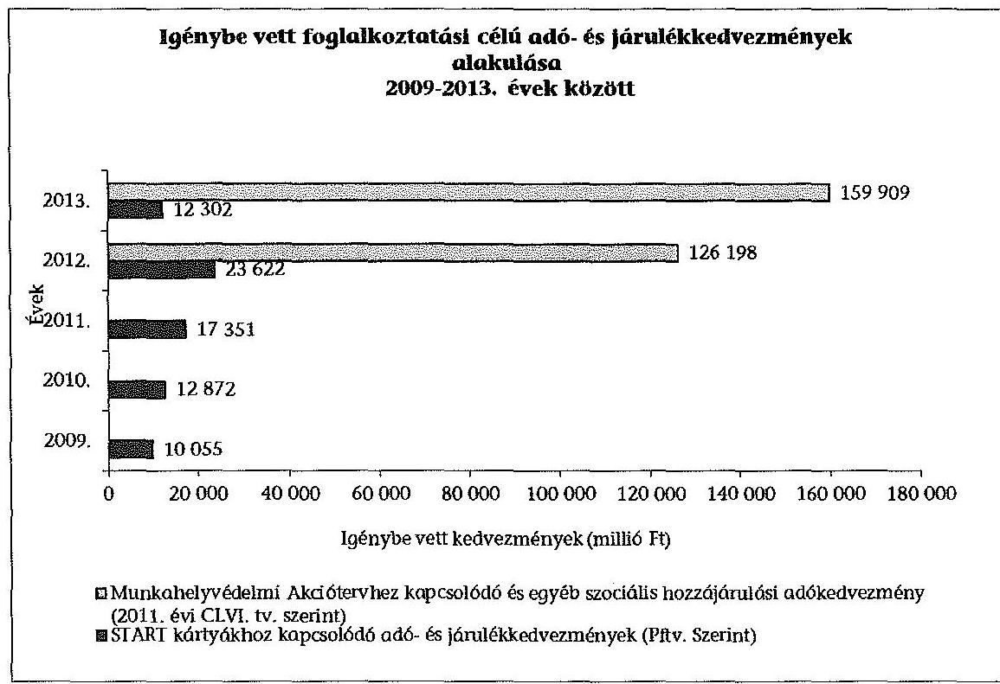

# 3.1. A START kártyák adattartalma kialakításának és kiállításának szabályszerűsége 

Az APEH/NAV-nál az ellenőrzött időszakban a START kártyák adattartalmának kialakítása, a kártyajogosult részére történő kiállítása megfelelt a jogszabályi előírásoknak ${ }^{21}$. A 2.1. pontban ismertetett, az ellenőrzött időszakban hatályos START kártya kiadási szabályzat ${ }_{1.5}$ késedelmes kiadása a kártyák kiállításával és a jogosultságok elbírálásával kapcsolatos eljárás szabályszerűségét nem befolyásolta.

A START kártyákhoz kapcsolódó igénylések, elbírálások, kártyakiállítások és az adó- és járulékkedvezmény igénybevétel-jogosultságok szabályszerűségének megítélése az ellenőrzésre kiválasztott tételek alapján történt.

A kártyaigénylés T34START adatlapjai és a kitöltési útmutatók a 2009-2013. években - követve a jogszabályváltozásokat - rendelkezésre álltak. A kitölthető űrlapok az Általános Nyomtatványkitöltő Program rendszerében jelenleg is elérhetőek a NAV honlapján (www.nav.gov.hu).

Az ellenőrzött időszak meghatározott szakaszában az illetékes adóigazgatóságokon a kártya alapanyag hiánya miatt nem állítottak ki kártyát az adatlap beérkezésétől számított - az Art. 20. § (1) és a 20/A. § (1) bekezdéseiben meghatározott - 15 napon belül. A kártya alapanyag hiány ideje alatt - a NAV elnökhelyettese által kiadott körlevélben foglaltaknak megfelelően - szárazbé-

[^0]
[^0]:    ${ }^{21}$ A Pftv. 2-8. §-ai, az Art. 20/A. § (2) bekezdése, a 31/2005. (IX. 29.) PM rendelet, az 55/2011. (XII. 30.) NGM rendelet és a 273/2010. (XII. 9.) Korm. rendelet 45. § (4) bekezdés c) pontja szerint.

---

lyegzővel ellátott igazolásokat állítottak ki az igénylők részére, amelyek a START kártyákat teljes körűen helyettesítették.

A START kártyákhoz és a Munkahelyvédelmi Akciótervhez kapcsolódóan igénybe vett kedvezmények esetében az ellenőrzött időszakban az adó- és járulék bevallására vonatkozó főszabályt az Art. 31. § (2) bekezdése 23. pontja tartalmazta. A munkáltatók/kifizetők számára - a rá vonatkozó bevallási gyakoriságtól függetlenül - a magánszemélyeknek teljesített kifizetésekkel, juttatásokkal összefüggő adók/járulékok és egyéb adatok bevallására a 08-as számú bevallás nyomtatvány szolgált. A munkáltató a START kártyával foglalkoztatott munkavállaló után, illetve a Munkahelyvédelmi Akcióterv alapján igénybe vett adó- és járulékkedvezményeket a 08-as számú bevallás - adóévenként eltérő számmal jelölt - M lapjain, munkavállalónként vallotta be, illetve szolgáltatott adatot.

A bevallások adattartalma biztosította a Pftv. és a végrehajtására vonatkozó rendeletekben ${ }^{22}$ előírt részletezettséget, amely elkülönült az igénybe vett, az MPA, az Nyugdíjbiztosítási Alap és az Egészségbiztosítási Alap javára megtérítendő adó- és járulékkedvezmény összegekre.

A START kártyák, illetve a Munkahelyvédelmi Akcióterv kedvezményei esetében az adóbevallásban bekért, a BEVFELD rendszerben feldolgozott adatok lehetővé tették az elöirt ${ }^{23}$ adatszolgáltatás teljesítését. A BEVFELD rendszer felhasználói leírásai és alkalmazását szabályozó belső irányítási eszközrendszere alapján a havonta munkáltatónként és munkavállalónként elektronikus formában rögzített adatállomány, mint egy dinamikus alapadatbázis biztosította az adatszolgáltatások alapját. A bevallásokon alapuló adatbázis - az önrevíziók és az adóhatósági ellenőrzések eredményének következtében - folyamatosan változott, így az adatbázisból ugyanazon időszakra vonatkozóan más-más adattartalom került legyűjtésre.

# 3.2. A nyilvántartási tevékenység szabályszerűsége a START kártyák, illetve a Munkahelyvédelmi Akcióterv kedvezményei esetében 

Az APEH/NAV a magánszemélyek általi START kártya igénylés esetén a jogosultság megállapítását megelőzően ellenőrizte a magánszemélyek adatait, adóazonosító jelét az adóhatóság által a magánszemélyekről kialakított adatbázisban, az Magánszemélyek Adatbankjában (MBANK). Az ANYK_8 adatbázis szolgált az adókártyák, így a START kártya, mint az adókártya társkártyája nyilvántartására is. Az összes ellenőrzött tétel dokumentációja tartalmazta a -

[^0]
[^0]:    ${ }^{22}$ A 31/2005. (IX. 29.) PM rendelet és 1-2. számú mellékletei, illetve az 55/2011. (XII. 30.) NGM rendelet és 1-3. számú mellékletei alapján.
    ${ }^{23}$ A 31/2005. (IX. 29.) PM rendelet 7. § (1) bekezdése, a 2. melléklete, az 1. melléklet 47. pontjai, az 55/2011. (XII. 30.) NGM rendelet 8. § (1) bekezdése és az 1. melléklet IVVIII. pontjai, a NAV tv. 13. § (2) bekezdés a)-c) pontjai, az Art. 52. § (7) bekezdés b) pontja, valamint a 424/2012. (XII. 29.) Korm. rendelet 2. § n) pontja és a 3. § k) pontja alapján.

---

START kártyaigénylők - kártya adatbázis adatait, melyek alapján megállapítottuk, hogy a jogosultságok és a kártyára vonatkozó adatok (adóalany, kártyaérvényesség, adatlap Bárkód/vonalkód, stb.) nyilvántartásba vétele megtörtént. Az adóhatóság az ellenőrzött időszakban betartotta a START kártya kiadási szabályzat ${ }_{1-5}$-ben meghatározott előírásokat.

Az APEH/NAV a 2009-2013. években a START kártyák érvényességi idején belüli egyéb változásai esetén az adóalany adatainak nyilvántartására szolgáló adatbázisokat az MBANK-ban dokumentáltan - új Bárkódú adatlap kiállításával - aktualizálta.

A START kártyák ellenőrzéséhez kapcsolódóan 4 tétel tartalmazott érvényességi időn belüli változásokat, melyek kártyatípus váltáshoz, felsőfokú végzettség megszerzéséhez kapcsolódtak. A START kártya az adóigazolvány társkártyája, az adatbázisban a kártyákra vonatkozó előzmények (korábbi kártyák adatai) megtalálhatók voltak. A START kártya kiadási szabályzat ${ }_{1-5} 18$ helyen tartalmazott ellenőrzési pontot az MBANK-ban szereplő adat (START kártyán, személyi okmányokon, stb.) egyeztetésére, amely eltérés esetén a követendő eljárásrendet is meghatározta.

Az ellenőrzött időszakban a START kártyákhoz kapcsolódó és a Munkahelyvédelmi Akcióterv keretében a TB járulékból és a SZOCHO-ból igénybe vehető részkedvezményekre vonatkozó adatokat a 08 -as bevallási nyomtatvány M lapjai munkavállalónként tartalmazták. A benyújtott és a BEVFELD rendszerben feldolgozott bevallások a jogszabályi előírásoknak ${ }^{24}$ megfelelő részletezettséggel biztosították a részkedvezményekre vonatkozó nyilvántartások vezetését. A NAV adatszolgáltatási kötelezettségének teljesítését támogató nyilvántartási rendszerek, adatbázisok szabályszerűen kerültek kialakításra, az adatbázisok aktualizálása az elektronikus bevallásból következően folyamatos volt. Külön nyilvántartás nem készült, a rendszer a 08-as bevallás részletezettségével tartalmazta az adatokat.

A BEVFELD rendszerbe beérkező bevallások feldolgozása zárt rendszerben valósult meg, a beérkező bevallásadatokon a rendszer a bevallás típustól függően, jellemzően közel ezer összefüggés ellenőrzést végzett. A rendszer által végzett ellenőrzések kiterjedtek a bevallások adattípus helyességi, nagyságrendi és belső összefüggés vizsgálatára, továbbá a NAV belső nyilvántartásaival való egyezőségének és az előzményadatokkal való konzisztenciájának ellenőrzésére is. A bevallás feldolgozás lépései nyomon követhetőek voltak.

# 3.3. Az adatszolgáltatási kötelezettség a START kártyák, valamint a Munkahelyvédelmi Akcióterv kedvezményei vonatkozásában 

Az ellenőrzött időszakban az APEH/NAV adatszolgáltatási kötelezettsége tartalmát és a határidőket a START kártyák vonatkozásában az SZMM és az MPA kezelőszervezete felé a 31/2005. (IX. 29.) PM rendelet 7. § (1)-(2) be-

[^0]
[^0]:    ${ }^{24}$ A Pftv. 2-8. §, az Art. 20/A. §, a 31/2005. (IX. 29.) PM rendelet, az 55/2011. (XII. 30.) NGM rendelet és a 273/2010. (XII. 9.) Korm. rendelet 45. § (4) bekezdés c) pontja, illetve a 2011. évi CLVI. tv. 460-462., és a 462/A-462/F. §-ok alapján.

---

kezdései és az 1-2. számú mellékletei határozták meg. Az adatszolgáltatási kötelezettség 2012. január 1-jétől az 55/2011. (XII. 30.) NGM rendelet 8. § (1) bekezdése, a 10-11. §-ai, valamint az 1-2. számú mellékletei szerint az NFA ${ }^{25}$ kezelőszervezete felé a havi bevallások alapján a SZOCHO-ból érvényesített, illetve az adóhatósági megállapítás alapján visszafizetett, jogosulatlanul igénybe vett kedvezményeket illetően kiegészült.

Az APEH/NAV adatszolgáltatási kötelezettsége tartalmát és a határidőket a Munkahelyvédelmi Akciótervhez kapcsolódóan az Országos Nyugdíjbiztosítási Főigazgatóság (ONYF), az Országos Egészségbiztosítási Pénztár (OEP) és az Nemzeti Rehabilitációs és Szociális Hivatal (NRSZH) felé az Art. 52. § (7) bekezdés b) pontja, az ONYF, az OEP, a Kincstár, a nyugdíjpolitikáért, illetve az egészségbiztosításért és az államháztartásért felelős miniszterek felé az Ávr. 138. § (5) bekezdése határozta meg. Az APEH/NAV adatszolgáltatást teljesített az Art. 52. § (7) bekezdés bc) és bd) pontjai, illetve 2012. január 1-jétől a 424/2012. (XII. 29.) Korm. rendelet 2. § n) pontja alapján a társadalombiztosítás pénzügyi alapjai kezelő szervezetei (OEP, ONYF) részére, illetve a 3. § k) pontja alapján az állami foglalkoztatási szervezet és a munkaügyi hatóság felé. Az adatszolgáltatási kötelezettségek teljesítését az APEH/NAV az ellenőrzött időszakban az adatszolgáltatási szabályzat ${ }_{1-7} 1$. és 2 . számú mellékleteiben szabályozta.

A NAV az adatszolgáltatások nyilvántartására, a határidők folyamatos figyelésére 2009-2011 időszakban kézi nyilvántartást (Excel táblázatban), míg 2012. második félévtől külön informatikai rendszert (ANYIL) alkalmazott. A nyilvántartás tartalmazta valamennyi, az adó- és járulékkedvezményekhez kapcsolódó adatszolgáltatási kötelezettséget is.

Az adatszolgáltatás teljesítését részben az ellenőrzött időszakban a kiadott START kártyákra vonatkozóan a T34START kártyaigénylő nyomtatvány adatszerkezete, és az ANYK_8 nyilvántartási rendszer biztosította. A foglalkoztatási célú adó- és járulékkedvezményekhez kapcsolódó TB járulék és SZOCHO kedvezmények igénybe vett összegei a 08-as bevallási nyomtatvány adatszerkezete, a havi kifizetői bevallások BEVFELD rendszerben feldolgozott adatai alapján álltak rendelkezésre.

Az APEH/NAV az adatszolgáltatási szabályzat ${ }_{1-7}$ előírásainak megfelelően rendszeres (havi, éves gyakorisággal és eseti) adatszolgáltatásokat teljesített az adóbevallásokból feldolgozott adatállományokból a PM/NGM részére. Az évenkénti, havi és heti adatszolgáltatások alapján megállapítottuk, hogy az APEH/NAV az ellenőrzött időszakban a START kártyák vonatkozásában az SZMM, az MPA/NFA alapkezelő szervezetei, a Munkahelyvédelmi Akciótervet illetően a társadalombiztosítás pénzügyi alapjai kezelő szervezetei (OEP, ONYF), az NRSZH, illetve az állami foglalkoztatási szervezet és a munkaügyi

[^0]
[^0]:    ${ }^{25}$ 2012. január 1-jétől az MPA megnevezése NFA-ra változott.

---

hatóság részére a jogszabályokban ${ }^{26}$ előírt határidőben az adatszolgáltatásokat teljesítette. A munkaadónként benyújtott bevallásokból feldolgozott kedvezmény igények korrekcióját az adózó által végrehajtott önellenőrzés, illetve adóhatósági ellenőrzés kapcsán megállapított járulékkülönbözet vonatkozásában az önellenőrzés, illetve az adóhatósági ellenőrzés feldolgozását követően végezték el.

A NAV a 2013. évben a 424/2012. (XII. 29.) Korm. rendeletben előírt adatszolgáltatás teljesítésére megállapodást kötött az OEP-pel, ONYF-fel, a Nemzeti Munkaügyi Hivatallal (NMH) és az NRSZH-val.

A NAV 2014. december 23-ai tájékoztatása szerint az adatállományokat az informatikai szakterület az adatszolgáltatásért felelős bevallási szakterület részletes specifikációja alapján zárt informatikai rendszerben állította elő és adta át tesztelésre. A tesztelést követően a hibátlan adatállományok továbbításra kerültek az adatot fogadó fél részére. Az adatszolgáltatási kötelezettsége teljesítéseként továbbított adatok külön tárolásra nem kerültek az APEH/NAV-nál, így az ellenőrzésre kiválasztott adatszolgáltatások megbízhatóságáról, tartalmáról a jelen ellenőrzés során meggyőződni nem tudtunk. A foglalkoztatási célú adó és járulékkedvezmények igénybevételét lehetővé tévő és az APEH/NAV részére adatszolgáltatási kötelezettséget előíró jogszabályok nem határoztak meg a teljesített adatszolgáltatások tartalmának megőrzésére vonatkozó kötelezettséget.

Az ellenőrzött időszakban a START kártyák kiállításához az adókedvezményre való jogosultságot a munkaügyi központok a foglalkoztatás elősegítéséről és a munkanélküliek ellátásáról szóló 1991. évi IV. törvény 54. § (7) bekezdése alapján hatósági bizonyítvány kiállításával igazolták. A jogosultságot igazoló dokumentumok az ellenőrzött esetekben a jogszabályi előírásoknak megfelelő tartalommal és formában kerültek kiállításra.

Az ellenőrzött tételekből 26 esetben került sor hatósági bizonyítvány kiállítására, amelyekben azok kiállítása szabályszerű volt. A további ellenőrzött tételeknél nem munkanélküliek foglalkoztatása valósult meg, így hatósági bizonyítvány kiállítására nem volt szükség.

# 3.4. A START kártyákhoz és a Munkahelyvédelmi Akciótervhez kapcsolódó ellenőrzési tevékenység 

Az APEH/NAV a foglalkoztatási célú adó- és járulékkedvezmények igénybevételét önállóan nem ellenőrizte. Az adó- és járulékkedvezményekről szóló, a START Programhoz kapcsolódó, a Pftv. és a végrehajtására kiadott 31/2005. (IX. 29.) PM rendelet, az 55/2011. (XII. 30.) NGM rendelet, valamint a Munkahelyvédelmi Akcióterv keretében érvényesíthető kedvezményeket szabályozó az egyes adótörvények és azzal összefüggő egyéb törvények módosításáról szóló 2011. évi CLVI. törvény nem fogalmaz meg az adóhatóság

[^0]
[^0]:    ${ }^{26}$ A 31/2005. (IX. 29.) PM rendelet 7. § (1)-(2) bekezdései, és az 1-2. számú mellékletei, az 55/2011. (XII. 30.) NGM rendelet 8. § (1) bekezdése, 10-11. §-ai és az 1-2. számú mellékletei, az Art 52. § (7) bekezdés b), bc), bd) pontjai, az Ávr. 138. § (5) bekezdése, valamint a 424/2012. (XII. 29.) Korm. rendelet 2. § n) pontja és a 3. § k) pontja alapján.

---

számára ellenőrzési kötelezettséget. Az APEH/NAV az Art. 87. § (1) bekezdés a) és c) pontjai alapján, a bevallások utólagos és az egyes adókötelezettségek teljesítésére irányuló, a kedvezménnyel érintett adónem ellenőrzése során vizsgálta az adó- és járulékkedvezmények igénybevételének jogszerűségét.

Az APEH/NAV az ellenőrzött időszakban az Art. 90. § (1) bekezdése értelmében a kötelező ellenőrzéseken túl végzendő ellenőrzési irányai meghatározására évenként február 20-áig közzétette az ellenőrzési irányelveit. Az irányelvek minden évben kiemelték a társadalombiztosítás pénzügyi alapjait megillető bevételek - így a járulékalapot képező jövedelmek körének - ellenőrzését. Kiemelt fontosságú volt a járulékalapoknak az egyes járulékok tekintetében eltérő szabályai megfelelő alkalmazásának figyelemmel kísérése. Az APEH/NAV a 2009-2011. évi ellenőrzési irányelvekben nem nevesítette a foglalkoztatási célú Tb járulékkedvezmények igénybevételének ellenőrzését. A 2012. évi ellenőrzési irányelvben ${ }^{27}$ a SZOCHO bevezetésével egyidejúleg és a 2013. évi ellenőrzési irányelv ${ }^{28}$ szerint az ezzel az adónemmel összefüggő ellenőrzési feladatoknál kiemelt figyelmet kellett fordítani a fizetendő adó megállapításánál figyelembe vett adókedvezmények érvényesítése jogszerűségének vizsgálatára.

A NAV Adószakmai Ellenőrzési Főosztálya 2011 januárjában - elektronikus levélben történt megkeresés útján - felmérést végzett a NAV regionális adó főigazgatóságainál a START PLUSZ, illetve START EXTRA kártyákkal igénybe vehető járulékkedvezmény érvényesítésével kapcsolatos tapasztalatokról. A jelen ellenőrzés rendelkezésére bocsátott öt régióból beérkezett jelentésekből mindöszsze két régiónál és összesen két esetben volt e témában vizsgálati megállapítás.

A jelentések összefoglalták, hogy a START kártyákhoz kapcsolódó járulékkedvezmények ellenőrzése az átfogó vizsgálatok, valamint a kifizetésekkel, juttatásokkal összefüggő adó- és járulékbevallások utólagos ellenőrzése keretében valósultak meg. A Dél-Dunántúli Regionális Adó Föigazgatóság tájékoztatása szerint nem készültek olyan utólagos kiválasztást segítő szürések, amelyek kimondottan a járulékkedvezményt igénybe vevő adózók vizsgálatára irányultak. A tájékoztatás tartalmazta továbbá, hogy a kiutalás előtti ellenőrzést támogató rendszer sem tartalmazott olyan kiválasztási paramétert, amellyel a START PLUSZ, illetve START EXTRA kártyával rendelkező alkalmazottat foglalkoztató munkáltatók bevallásait célzottan ellenőrzés alá lehetett volna vonni. A jelentések alapján a legtöbb esetben nem születtek megállapítások, ellenőrzési tapasztalatról sem tudtak beszámolni.

Az APEH/NAV a 2009-2011. évi ellenőrzési beszámolókban nem tért ki a START kártyákhoz kapcsolódó járulékkedvezmény ellenőrzések tapasztalataira. A 2012. évi ellenőrzési beszámoló 46. oldalán a START Program kapcsán a NAV azt emelte ki, hogy a vizsgálatok csekély mértékben tartalmaztak a foglalkoztatási célú adó- és járulékkedvezményekkel kapcsolatos megállapításokat.

Az APEH/NAV kiválasztást támogató adatbázisai az ellenőrzött időszakban tartalmaztak - a törzsadatokból és/vagy a bevallásokból származó -

[^0]
[^0]:    ${ }^{27}$ A 2012. évi ellenőrzési irányelv 7. oldalán.
    ${ }^{28}$ A 2013. évi ellenőrzési irányelv 9. oldalán.

---

olyan specifikált adatokat, amelyek alapján a foglalkoztatási célú adó- és járulékkedvezményt igénybe vevő adózók célzottan ellenőrzésre kiválasztásra kerülhettek.

Az ellenőrzött időszakban a munkáltatói bevallások adatai a bevallás feldolgozása során összevezetésre kerültek a magánszemélyek törzsadataival a bevallások feldolgozásának szabályzata ${ }_{1-5}$ alapján.

A BEVFELD rendszer tartalmazott olyan összefüggés-vizsgálatot, melynek során az APEH/NAV az ANYK-ban szereplő adatokhoz viszonyította az adott bevallásban szereplő adatokat. Ellenőrizték többek között a START kártyával rendelkezőként feltüntetett magánszemély START kártyájának érvényességét, típusát.

A bevallások feldolgozásának szabályzata ${ }_{1-5}$ alapján a 08 -as bevallások feldolgozásának folyamatába összefüggés-vizsgálatok kerültek beépítésre. A vizsgálatok egy része már a kitöltő-ellenőrző program keretében, a bevallás elkészítése során ellenőrizte a nyomtatványban elvárható összefüggések teljesülését, így a foglalkoztatási célú adó- és járulékokra vonatkozó kedvezmények mértékének helyességét. A bevallások akkor kerültek teljes körűen feldolgozásra, amennyiben az előírt összes kritériumnak megfeleltek. A BEVFELD-ben azok a bevallások is kiszürésre kerültek, ahol a jogosultság időtartamának lejárta után próbálták meg érvényesíteni a kedvezőbb járulékmértéket.

Az adóhatóság regionális ellenőrzési szervezeteinél a saját hatáskörben történő ellenőrzésre való kijelöléskor az ellenőrzött eseteknél nem volt szempont a foglalkoztatási célú adó- és járulékkedvezményeket igénybe vevő adóalanyok kiválasztása.

Az APEH/NAV az ellenőrzésekről vezetett nyilvántartásából, a REV rendszerből lekérdezhető revíziót követő információs rendszerből előállítható nyilvántartólapokban (REV lap) az adózó azonosítására szolgáló adatok feltüntetése mellett az Art. 90. § (8) bekezdése szerint, az ellenőrzésre kiválasztás belső szabályai ${ }_{1-3} 15$. §-ában és az ellenőrzések elrendelésének közvetlen okáról szóló szabályzat ${ }_{1-3}$ előírásainak megfelelően ${ }^{29}$ megjelölte az ellenőrzésre történő kiválasztás közvetlen okát, amely minden ellenőrzött esetben REV lapjában megtalálható volt.

Az ellenőrzés elrendelésének közvetlen okát a vizsgálat elrendelési ok-kód rendszer tartalmazta. Az ellenőrzött tételeknél egyetlen esetben sem szerepelt kiválasztási okként a foglalkoztatási célú adó és járulékkedvezmények ellenőrzése. Az APEH/NAV a foglalkoztatási célú adó- és járulékkedvezményeket a társadalombiztosítás pénzügyi alapjait megillető bevételek ellenőrzési kötelezettségén belül ellenőrizte.

A NAV a START kártyákhoz és a Munkahelyvédelmi Akciótervhez kapcsolódó vizsgálati tevékenységének ellenőrzéséhez nem tudott rendelkezésre bocsátani olyan ellenőrzési listát, amely kizárólag a foglalkoztatási célú adó- és járulék-

[^0]
[^0]:    ${ }^{29}$ Az ellenőrzések elrendelésének közvetlen okáról szóló szabályzat ${ }_{1} 2$. §, ellenőrzések elrendelésének közvetlen okáról szóló szabályzat ${ }_{2}$ I. fejezet 2.2 pont, ellenőrzések elrendelésének közvetlen okáról szóló szabályzat ${ }_{3} 1$ fejezet 3. pont.

---

kedvezmények igénybevételének ellenőrzéseit tartalmazta. Az ellenőrzött esetekből kettő volt olyan ellenőrzés, amelyekben az adózók foglalkoztatási célú adó- és járulékkedvezményt vettek igénybe. A két esetből egy alkalommal kettő foglalkoztatott után igénybe vett START kártyás, illetve egy alkalommal SZOCHO kedvezmény igénybevételével kapcsolatos foglalkoztatási célú adó- és járulékkedvezmény ellenőrzéséről tartalmazott megállapítást a jegyzőkönyv.

Az első esetben a bevallás utólagos vizsgálatára azért került sor, mert az adózó egy adott hónapban „0"-s bevallást küldött be. Az ellenőrzés átvizsgálta a foglalkoztató könyvelését, az alkalmazott 31 munkavállalóból kettő fő START kártyás foglalkoztatott volt. Az ellenőrzés 9,0 ezer Ft hiányt állapított meg az adózó terhére.

A másik esetben a foglalkoztató a munkabérek nettó értékének megőrzéséhez szükséges munkabéremelés 2012. évi elvárt mértékéhez kapcsolódó SZOCHO kedvezményt az ellenőrzés elfogadta.

A további vizsgálatokról készült jegyzőkönyvekből megállapítottuk, hogy az adóhatóság ellenőrzései az általános forgalmi adó, illetve a be nem jelentett foglalkoztatottak ellenőrzésére irányultak. Az ellenőrzött több esetben egyéni vállalkozó, vagy egy-két személyes társas vállalkozás volt. Ezekben az esetekben nem is születhetett a vizsgálat során a foglalkoztatási célú adó- és járulékkedvezményeket tartalmazó megállapítás.

A NAV ellenőrzés nyilvántartó REV rendszerében az ellenőrzés alá vont adó-nem-időszakok, a vizsgált adónemben feltárt adókülönbözetek és az ehhez kapcsolódó szankciók kerültek rögzítésre. A NAV által az ellenőrzéshez átadott kimutatások adattartalma nem a foglalkoztatási célú adó- és járulékkedvezmények igénybevételének ellenőrzése során feltárt adókülönbözeteket, hanem az adónemek egészére vonatkozó adatokat tartalmazta. Az APEH/NAV az ellenőrzött időszakban az Art. 87. § (1) bekezdés a) és c) pontjainak megfelelően a bevallások utólagos és az egyes adókötelezettségek teljesítésének ellenőrzését végezte, vagyis a foglalkoztatási célú adó- és járulékkedvezményeket önállóan nem ellenőrizte. Az adó- és járulékkedvezménnyel érintett adónemek átfogó ellenőrzése során vizsgálta a kedvezmények igénybevételének jogszerűségét.

Az APEH/NAV - a Tb járulékból és a SZOCHO-ból a foglalkoztatási célú adó- és járulékkedvezmények igénybevétele szabályszerűségére irányuló - ellenőrzési tevékenységét értékelni nem tudtuk, mivel az ellenőrzésre kiválasztott,- a NAV által rendelkezésre bocsátott ellenőrzötti listából az állami adóhatóság által végzett vizsgálatokból mindössze kettő dokumentáció tartalmazott foglalkoztatási célú adó és járulékkedvezményt igénybe vevő adózóra vonatkozó ellenőrzést. Az ellenőrzött esetekben - ellenőrzésre kiválasztott valamennyi tétel alapján - a határidők számítása az Art. 92. §-a, a megbízólevelek kiállítása az Art. 93. § (1) bekezdése szerint történt. Az Art. 92. § (16) bekezdése alapján a vizsgálati program az ellenőrzés megkezdésekor rendelkezésre állt. Az ellenőrzésekről az Art. 104. § (1) bekezdés szerint jegyzőkönyv készült. A megállapításokat a feltárt adóhiányról, adóbírságról és késedelmi pótlékról az Art. 105. § alapján határozatban rögzítették.

---

# 4. A feJlesztési adókedvezményhez kapcsolódó nyilvántartási, adatszolgáltatási, ellenőrzési teVékEnysÉG És az INFORMÁCIÓCSERE ÉRTÉKELÉSE 

Az ellenőrzött időszakban a munkáltatók a társasági és osztalékadóból - a munkahelyteremtést szolgáló beruházásokhoz kapcsolódóan - fejlesztési adókedvezményt vehettek igénybe a Tao tv. 22/B. §-ában szabályozott rendelkezések szerint. A 2009-2013. években az igénybe vett fejlesztési adókedvezmények összege 146220,0 millió Ft volt (1. számú melléklet).
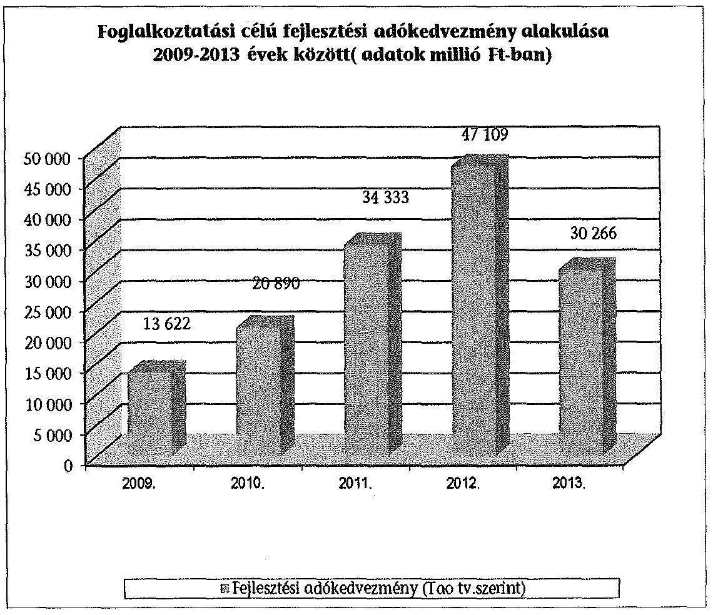
4.1. A fejlesztési adókedvezmény igénybevételéhez kapcsolódó kérelmek, bejelentések vizsgálata, adatszolgáltatások teljesítése a PM/NGM-nél

A fejlesztési adókedvezmények igénybevételével kapcsolatos eljárásokat, az igénybevétel feltételeit, a PN/MGM-nek az adózók által benyújtott bejelentésekkel, illetve kérelmekkel kapcsolatos feladat és hatáskörét a 206/2006. (X. 16.) Korm. rendelet szabályozta.

Az NGM-nél a fejlesztési adókedvezmény igénybevételére irányuló bejelentések vizsgálatáról - az ellenőrzött esetekben - dokumentált módon csak részben gondoskodtak a 2010-2013. években. Az NGM eljárása nem felelt meg a 206/2006. (X. 16.) Korm. rendelet 10. § (6) bekezdésében rögzítetteknek,

---

mely 2010. január 1-jétől írta elő az adópolitikáért felelős miniszter részére a bejelentések beérkezéstől számított 30 napon belüli vizsgálatát. Az ellenőrzött esetekben a bejelentéseken az érkeztetés dátuma és az iktatószám szerepelt. A vizsgálat elvégzésének tényét, annak dátumát az ellenőrzött - 2010-2013. évi bejelentések 74\%-ában a dokumentumokon nem rögzítették. Ezen esetekben nem volt ellenőrizhető a vizsgálat megtörténte, mert ezt a feladatot ellátó nem dokumentálta, aláírásával, dátumozással nem igazolta.

Az ellenőrzött bejelentések 24\%-át a PM/NGM-nél a vizsgálat során hiánypótlásra, javításra visszaküldték, ezen esetekben, a dokumentumokban a vizsgálat tényét, a hiánypótlásra történő felszólítás időpontját rögzítették. A bejelentésekről és a kérelmekről a 206/2006. (X. 16.) Korm. rendelet 12. §-ában előírt tartalmú nyilvántartás vezetéséről a PM, 2010. január 1-jétől az adópolitikáért felelős miniszter az ellenőrzött időszakban gondoskodott.

A 2009-2012. években az adópolitikáért felelős miniszter nem határozta meg a beruházásokhoz kapcsolódó adókedvezményekre vonatkozóan - a fejlesztési adókedvezmény igénybevételére irányuló bejelentésekkel és kérelmekkel kapcsolatos adatokról - a PM/NGM és az adóhatóság közötti adatszolgáltatás, információátadás rendjét. Az ÁSZ 2012. évben javasolta a nemzetgazdasági miniszternek ${ }^{30}$, hogy alakítsa ki annak szabályait. Az NGM és a NAV közötti adatszolgáltatás, információátadás rendjének meghatározása érdekében a Tao tv. módosításra került. A 2013. január 1-jétől hatályos Tao tv. 22/B. § (18) bekezdése rendelkezik az adópolitikáért felelős miniszter az adózók által benyújtott bejelentésekkel, kérelmekkel kapcsolatos éves tájékoztatási kötelezettségéről a NAV részére.

# 4.2. Az APEH/NAV nyilvántartása és adatszolgáltatása a fejlesztési adókedvezményröl 

Az ellenőrzött időszakban az APEH/NAV a fejlesztési adókedvezményekröl az adópolitikáért felelős miniszter tájékoztatása alapján rendelkezésre álló adatokról, a fejlesztési adókedvezmények igénybevételével összefüggő bejelentésekről, határozatokról nyilvántartást vezetett. Az adózók által benyújtott bevallások, valamint az ellenőrzések adatai az adatbázisaikban BEVFELD, ANYK, illetve REV rendszer - kerültek feldolgozásra. Az APEH/NAV által kialakított, a fejlesztési adókedvezmények igénybevételére is szolgáló társasági adóbevallás adattartalma az ellenőrzött időszakban az Art. 31. § (1) bekezdésében foglaltaknak megfelelt. Tartalmazta az adózó azonosításához, az adóalap, a mentességek, a kedvezmények, az adó, a költségvetési támogatás alapjának és összegének megállapításához szükséges adatokat, valamint kedvezménytípusonként az érvényesített fejlesztési adókedvezmény összegét.

Az Art. 31. § (2) bekezdésében meghatározott bevallást a társasági adó fizetési kötelezettségükről a Tao tv. hatálya alá tartozó adózók az APEH/NAV internetes honlapjáról letölthető, évenkénti 29-es bevallások alapján teljesíthették. A 29-es nyomtatvány 01-01 lapja tartalmazta a társasági adó megállapítása során érvé-

[^0]
[^0]:    ${ }^{30}$ Jelentés a beruházásokhoz kapcsolódó adókedvezmények és támogatások ellenőrzéséről (12102) 1. számú javaslat (26. oldal).

---

nyesített adókedvezmények együttes összegét a bevallás 05 -ös lapjainak részletezése alapján. A 05 -ös lapokon kellett szerepeltetni a Tao tv. szerint érvényesíthető adókedvezményeket, ezen belül a Tao tv. 22/B. § alapján érvényesíthető fejlesztési adókedvezmények összegét kedvezménytípusonként. A bevallás 17. sora összesítette a Tao tv. szerint érvényesített adókedvezményeket. Az adatszolgáltatás részeként a Kormány engedélye, illetve a Pénzügyminisztérium határozata alapján igénybe vett fejlesztési adókedvezménnyel összefüggésben az adóbevallásban adatszolgáltatást kellett teljesíteni.

Az APEH/NAV által vezetett - a bevallásokon alapuló - nyilvántartások, adatbázisok alapján a Tao tv. 22/B. § (17) bekezdésében, illetve 2010. január 1-jétől a 22/B. § (18) bekezdésében előírt adatszolgáltatás teljesítése biztosított volt.

Az állami adóhatóság az adatszolgáltatási kötelezettségét a Kincstár részére a Tao tv. 22/B. § (17) bekezdésében, 2010. január 1-jétől a Tao tv. 22/B. § (18) bekezdésének megfelelően valamennyi adatról adózónként és beruházásonként - az ellenőrzött dokumentumok szerint - teljesítette. A NAV az adatszolgáltatás teljesítését az ellenőrzés rendelkezésére bocsátott APEH/NAV kísérőlevelekkel és a Kincstárnak az adatok átadásáról-átvételéről szóló, a teljesítési elismervényt tartalmazó dokumentumok alapján igazolta.

A 2009. évben az APEH-nak csak abban az esetben keletkezett a Kincstár felé tájékoztatási kötelezettsége, amennyiben az ellenőrzései során az adókedvezmény jogosulatlan igénybevételét tárta fel. A Tao tv. 22/B. §-ának 2010. évtől hatályos módosítása szerint a rendelkezésére álló valamennyi adatról adózónként és beruházásonként haladéktalanul tájékoztatja a Kincstárt.

# 4.3. A fejlesztési adókedvezmények APEH/NAV ellenőrzése 

Az APEH/NAV-nál kialakított ellenőrzési struktúra alkalmas volt arra, hogy a belső iránymutatások, utasítások alapján végrehajtott ellenőrzésekkel feltárja az adókedvezményekkel kapcsolatos szabálytalanságokat. Az ellenőrzési rendszer azonban valamennyi adónemet, ezen belül a társasági adó tételeket komplexen, együtt kezelte. Az APEH/NAV a fejlesztési adókedvezmények igénybevétele jogszerüségének és számszaki megfelelőségének ellenőrzésére önálló vizsgálatokat az ellenőrzött időszakban nem indított. A fejlesztési adókedvezményeket az Art. 87. § (1) bekezdés a) és c) pontjainak megfelelően az adóbevallások utólagos és az egyes adókötelezettségek teljesítésére irányuló, ezen belül a társasági adónem ellenőrzései keretében vizsgálta.

Az adópolitikáért felelős miniszter az adóhatóság részére - az ÁSZ ellenőrzés rendelkezésére bocsátott dokumentumok szerint - minden évben átadta a fejlesztési adókedvezmények igénybevételére vonatkozó, a Tao tv. 22/B. § (3) bekezdése szerinti bejelentések, kérelmek és az igénybevételre jogosultak listáját.

Az ellenőrzött időszakban az Art. 90. § (2) bekezdése - 2011. december 31-ig előírta a 3000 legnagyobb adóteljesítménnyel rendelkező kiemelt adóalany

---

rendszeres, legalább három évenkénti ellenőrzését ${ }^{31}$. Ez megteremtette annak a feltételét, hogy a kiemelt adózók által végrehajtott beruházások után igénybe vett adókedvezményeket a NAV rendszeresen ellenőrizze és az esetleges szabálytalanságokat feltárja. A törvényi előíráson felül az ellenőrzött időszakban az APEH/NAV az évenkénti ellenőrzési irányelveiben kiemelt szempontként fogalmazta meg a társasági adó megállapításánál figyelembe vehető fejlesztési adókedvezmények ellenőrzését.

A 2009. évi ellenőrzési irányelvben a 7-8. oldalon, a 2010. évi ellenőrzési irányelvben a 7. oldalon, a 2011. évi ellenőrzési irányelvben a 6. oldalon található utalás a fejlesztési adókedvezmények ellenőrzésére. A 2012. évi ellenőrzési irányelv az 5-6. oldalon, a 2013. évi ellenőrzési irányelv a 9. oldalon tesz említést a fejlesztési adókedvezmények ellenőrzéséről.

Az ellenőrzések gyakorisága a 2009-2012. évi ellenőrzési irányelvekben a fejlesztési adókedvezmény igénybevétele feltételeinek vizsgálatánál nem volt összhangban a 206/2006. (X. 16.) Korm. rendelet 13. §-ában foglaltakkal, amely szerint a fejlesztési adókedvezmény feltételeinek teljesítését annak első igénybevételét követő harmadik adóév végéig legalább egyszer ellenőrizni kell. A 2009-2012. évi ellenőrzési irányelvek azonban megengedték a negyedik évben történő első ellenőrzést is. A 2013. évi ellenőrzési irányelv - az ÁSZ 2012. évi ellenőrzésének javaslata alapján ${ }^{32}$ - az ellenőrzés gyakoriságát már a jogszabályi előírással összhangban határozta meg.

A kiválasztást támogató informatikai rendszerek adatbázisai tartalmaztak - a bevallásokból származó - olyan specifikált adatot, amelyek alapján a fejlesztési adókedvezményt igénybe vevő adózók az Art. 90. § (6) bekezdése alapján célzottan ellenőrzésre kiválasztásra kerülhettek.

A bevallások utólagos ellenőrzése során a 2009-2011. években az APEH/NAV nem alkalmazott az ellenőrzésre történő kiválasztáskor az Art. 90. § (6) bekezdésének megfelelő szüréseket az adókedvezmények jogosulatlan Igénybevételének feltárására. Ezt támasztották alá az ÁSZ 2012. évben közzétett jelentése és a fejlesztési adókedvezmény igénybevétele jogszerüségének soron kívüli ellenőrzése elrendeléséről szóló - a 2012. május 24 -én kelt 5027/2012/ELL, a 2012. december 11-én kelt 5048/2012/ELL számú - körlevelek is. A körlevelek szerint a társasági adóbevallások feldolgozása alapján összevetésre kerültek a bevallásukban fejlesztési adókedvezményt szerepeltető adózók, a kedvezményre jogosultak körével. A körlevelek mellékleteiben azokat a vállalkozásokat szerepeltették, amelyek ellenőrzésére nem került sor az előírt határidőben és ezért soron kívüli ellenőrzésre szólította fel a NAV KH Ellenőrzési Főosztálya a regionális szervezeteket.

Az 5027/2012/ELL számú körlevél rögzítette, hogy korábban nem kerültek összevetésre a PM/NGM által teljesített adatszolgáltatásban foglaltak a társasági adó

[^0]
[^0]:    ${ }^{31}$ Az Art. 90. § (2) bekezdését 2012. január 1-jétől hatályon kívül helyezte az egyes adótörvények és azzal összefüggő egyéb törvények módosításáról szóló 2011. évi CLVI. törvény 361. § (2) bekezdés 5. pontja.
    ${ }^{32}$ Jelentés a beruházásokhoz kapcsolódó adókedvezmények és támogatások ellenőrzéséről (12102) a NAV elnökének tett 1. c) javaslat alapján.

---

adónemre vonatkozóan benyújtott bevallások adataival. Vagyis nem választották ki ellenőrzésre azon adózókat, akik az adatszolgáltatás szerint nem tettek bejelentést az adópolitikáért felelős minisztérium felé, így jogosulatlanul vettek igénybe fejlesztési adókedvezményt. Ezért a körlevélben a NAV KH Ellenőrzési Főosztálya soron kívüli adategyeztetést, ellenőrzést rendelt el. A 2012. évi ellenőrzésekről készített beszámoló az ellenőrzések számszerú eredményeit tartalmazta.

Az 5048/2012/ELL számú körlevél alapján - az ÁSZ 2012. évi jelentése ${ }^{33}$ intézkedést igénylő megállapítására hivatkozva - a NAV KH Ellenőrzési Főosztály a 2006-2010. évi adóbevallásokban bejelentés és engedély hiányában fejlesztési adókedvezményt elszámolt adózók kötelező ellenőrzését rendelte el. A 2013. évi ellenőrzésekről készített beszámoló az ellenőrzések számszerú eredményeit tartalmazta.

A NAV a társasági adóbevallási nyomtatványgarnitúrájában első alkalommal a 2013. évben - a 2012. évről - benyújtott társasági adóbevallások esetén kért be a fejlesztési adókedvezményt elszámoló adózóktól a kérelemre, bejelentésre vonatkozó adatot. A NAV az adatbekéréssel (a PM/NGM/Kormány határozat száma, a bejelentés időpontja) biztosította, hogy a bejelentési, illetve engedélyeztetési kötelezettségüket elmulasztó vállalkozások a bevallás-feldolgozási rendszerben kiszürésre kerüljenek.

A 2009-2013. években az APEH/NAV a fejlesztési adókedvezmény igénybevétele feltételeinek teljesítését az adókedvezmény első igénybevételét követő harmadik adóév végéig legalább egyszer - valamennyi fejlesztési adókedvezményt igénybe vevő adózó vonatkozásában - nem ellenőrizte.

A NAV KH a 2013. évig az NGM által megküldött, a fejlesztési adókedvezmények igénybevételére vonatkozó kérelmeket és bejelentéseket összevetette a NAV nyilvántartásaival, valamint a 2008-2012. évi adóbevallások adataival. Az egybevetés eredményeként létrejött azok kimutatása, akik bejelentés, kérelem hiányában vettek igénybe fejlesztési adókedvezményt ( 9 adózó). Tartalmazta azon adóalanyok listáját is, akik ugyan a bejelentési kötelezettségüknek eleget tettek, de az ellenőrzésre a 206/2006. (X. 16.) Korm. rendelet 13. §-a szerinti határidőben nem került sor ( 42 adózó). A körlevélben előírták a kimutatásokban szereplő adózók soron kívüli ellenőrzését. A vizsgálatok végrehajtása és az eredmények értékelése a jelen ellenőrzés ideje alatt még folyamatban volt.

Az ellenőrzött időszakban az APEH/NAV éves ellenőrzési beszámolói a fejlesztési adókedvezmények ellenőrzési tapasztalataira kiterjedtek.

A 2009. évben az APEH éves beszámoló a fejlesztési adókedvezmények ellenőrzésére vonatkozó számszaki adatokat nem tartalmazott. Az Ellenőrzési Főosztály által készített 2009. évi beszámoló 12. oldalán a fejlesztési adókedvezmény ellenőrzésére vonatkozóan szerepelt, hogy az APEH megújítja ellenőrzési módszereit. Ennek keretében a 2009. évben a fejlesztési adókedvezmény igénybevételének ellenőrzéséhez a szakmai ellenőrzést támogató segédletet adtak ki.
A 2010. évi beszámoló a 44. oldalon tett említést a beruházási adókedvezmények jogszerú igénybevételére vonatkozó ellenőrzésekről, de számszerú adatokat a fejlesztési adókedvezményekhez kapcsolódóan nem tartalmazott.

[^0]
[^0]:    ${ }^{33}$ Jelentés a beruházásokhoz kapcsolódó adókedvezmények és támogatások ellenőrzéséről (12102) a NAV elnökének tett 1. a)-b) és d) javaslat alapján.

---

A 2011. évi jelentés 20-21. oldalán a fejlesztési adókedvezmények ellenőrzéséről szerepeltek adatok. A beszámoló szerint a 2011. évben a fejlesztési adókedvezményre vonatkozóan 19 adóellenőrzés fejeződött be. A beszámoló szerint 610,0 millió Ft nettó adókülönbözetet tártak fel.
A 2012. évi beszámoló 34. oldalán leírtak szerint a fejlesztési adókedvezmény igénybevételével kapcsolatban 24 adóellenőrzés fejeződött be, a feltárt nettó adókülönbözet 667,0 millió Ft volt.
A 2013. évi beszámoló 34. oldalán szerepelt, hogy a fejlesztési adókedvezményre vonatkozóan a tárgy évben 23 db adóellenőrzés fejeződött be. A beszámolóban kiemelték, hogy az adóellenőrzések mindegyike megállapítással zárult. A feltárt, - az ellenőrzött adózók terhére megállapított - nettó adókülönbözet a 2013. évre mintegy 1100,0 millió Ft-ra emelkedett. A 2013. évi NAV vizsgálatok azt is megállapították, hogy a gazdálkodók nem minden esetben élhettek volna az adókedvezmény érvényesítésével, mert a Tao tv.-ben előírt nagyságrendű fejlesztés megvalósítását alátámasztó dokumentumok a vállalkozás iratanyagaiban nem voltak fellelhetők.

Az ellenőrzött esetekben a vizsgálatokról a REV rendszerben kiállított nyilvántartó lapokon (REV lapokon) - az ellenőrzött esetek 63,3\%-ában - a fejlesztési adókedvezmények ellenőrzését „335-fejlesztési adókedvezmények ellenőrzése" cél-, és témakóddal jelölték. Ezekben az esetekben a kiválasztás során az ellenőrzési irányelvek és a NAV KH körlevelei alapján jártak el. A „335fejlesztési adókedvezmények ellenőrzése" cél- és témakód az ellenőrzésekről kiállított nyilvántartólapokon, és a REV rendszerben az ellenőrzött időszakban nem minden esetben került jelölésre, mert az erre a célra kialakított adatbázisban a lehetőségek az ellenőrzött cél-, és témakódok felvitelére korlátozott tartományban/karakter számban voltak biztosítottak.

Az ellenőrzött esetekben az ellenőrzésekről vezetett nyilvántartásokban, a REV rendszerből kinyomtatott REV lapokon az adózók azonosítására szolgáló adatok (pl.: adószám, név, cím) mellett az ellenőrzésre történő kiválasztás közvetlen okát megjelölték. A nyilvántartásban az ellenőrzések okának feltüntetése és a kódok alkalmazása során az ellenőrzések elrendelésének közvetlen okáról szóló szabályzat ${ }_{1.3}$ alapján jártak el. Az ellenőrzött esetekben az ellenőrzések feldolgozásáról és nyilvántartásáról szóló belső szabályzat ${ }_{1} 4 . \S$ b) pontja, az ellenőrzések feldolgozásáról és nyilvántartásáról szóló belső szabályzat ${ }_{2} 4$. b) pontja előírásainak megfelelően - a REV rendszerben megtörtént az ellenőrzéshez kapcsolódóan az adatok rögzítése.

Az adóhatóság regionális ellenőrzési szervezetei az ellenőrzéseket a központi éves ellenőrzési irányelvek és a saját kockázatelemzéseik alapján végezték. Az ellenőrzött esetekben az adó- és járulékkedvezményeket igénybe vevő adóalanyok ellenőrzésre való kijelölésekor az ellenőrzésre kiválasztás belső szabályai 11. §-a, majd az ellenőrzésre kiválasztás belső szabályai ${ }_{3}$, az éves irányelvek és a NAV KH körlevelei ${ }^{34}$ alapján célzott kiválasztást alkalmaztak.

A 2009-2013. években végzett, a fejlesztési adókedvezmények igénybevételének ellenőrzésére is kiterjedő társasági adóbevallások utólagos adóellenőrzéseiből

[^0]
[^0]:    ${ }^{34}$ 5027/2012/ELL, 5048/2012/ELL, 5003/2014/ELL számú körlevelek.

---

kiválasztott mintatételek vizsgálati dokumentumait ellenőriztük. Az ellenőrzött dokumentumok alapján a NAV fejlesztési adókedvezményeket érintő ellenőrzési tevékenysége a 2009-2013. időszakban megfelelt az Art. előírásainak. Az APEH a fejlesztési adókedvezmények ellenőrzésének támogatására 2010. január 1-jétől hatályos módszertani útmutatót adott ki ${ }^{35}$.

Az ellenőrzött esetekben a határidők számítása az Art. 92. §-a, a megbízólevelek kiállítása a 93. § (1) bekezdése szerint történt. A vizsgálati programok az Art. 92. § (16) bekezdése szerint az ellenőrzés megkezdésekor rendelkezésre álltak. A vizsgálatokról az Art. 104. § (1) bekezdésének megfelelően jegyzőkönyvek készültek. A fejlesztési adókedvezmények igénybevételi kritériumainak megsértése esetén az előírt intézkedéseket - fejlesztési adókedvezmények jogosulatlan igénybevétele, a társasági adó téves megállapítása miatt - megtették. Az ellenőrzés megállapításait - a feltárt adókülönbözeteket, adóbírságot, késedelmi pótlékot - az Art. 105. §-a alapján határozatban rögzítették. A késedelmi pótlék és adóbírság előírására az adótartozások után fizetendő késedelmi pótlék számításáról szóló szabályzatoknak megfelelően került sor.

Az ellenőrzött vizsgálatok 40\%-ánál a NAV vizsgálat szabálytalanságot nem tárt fel, $50 \%$-ánál szabálytalanságot állapítottak meg, de az a fejlesztési adókedvezmény igénybevételének jogszerűségét nem érintette. Az ellenőrzött esetek 10\%ánál a NAV a fejlesztési adókedvezmény szabálytalan igénybevételét állapította meg, mert a vállalkozás a kedvezményt jogosulatlanul, kérelem/bejelentés, illetve beruházás hiányában vette igénybe.

# 5. A HELYI IPARŰZÉSI ADÓ BEVALLÁSÁNAK, A FOGLALKOZTATÁSI KEDVEZMÉNYEK ÉRVÉNYESÍTÉSÉNEK ELLENŐRZÉSE 

### 5.1. Az önkormányzatok helyi iparúzési adó rendeletei és a közzétételi kötelezettség teljesítésének értékelése

Az önkormányzatok a helyi adórendeleteiket - amelyek a helyi iparúzési adózás szabályait is tartalmazták - a Helyi adó tv. 35-40. §-ainak megfelelően adták ki. A Helyi adó tv. 39/C. § (1) bekezdése alapján a számított vállalkozási szintű adómentesség határát a 39/C. § (2) bekezdésével összhangban - a különböző időszakokban eltérő összeggel - határozták meg. Az adókedvezmény bevezetéséről szóló döntés gazdasági hatását - Önkormányzat ${ }_{2}$ kivételével - a Jat. ${ }_{1}$ 18. § (1) bekezdése szerint, és 2011. január 1-jétől a Jat. ${ }_{2}$ 17. § (1) bekezdése szerint a (2) bekezdés aa) pontja alapján előzetesen kalkulálták.

Az Önkormányzat ${ }_{1}$-nél az adómentesség összegét 2012. december 31-ig a 21/1991. (IX. 5.) Főv. Kgy. rendeletben 700,0 ezer Ft-ban, majd 2013. január 1jétől a 87/2012. (XI. 30.) Főv. Kgy. rendeletben 1.000 ezer Ft-ban határozták meg.

Az Önkormányzat ${ }_{2}$-nél 2009. évben a 45/2002. (XII. 20.) ÖK. SZ. rendelet 2. § (1) bekezdése, 2010. január 1-jétől a 34/2010. (X. 26.) GYMJVÖ. rendelet 2. §-a alapján adómentes volt az a vállalkozás, amelynek a Helyi adó tv. rendelkezései szerint számított vállalkozási szintű adóalapja a 2,5 millió Ft-ot nem haladta meg.

[^0]
[^0]:    ${ }^{35}$ A Fejlesztési adókedvezmény ellenőrzése (Módszertani útmutató 2009).

---

Az Önkormányzat2-nál a 2009-2011. években érvényes 2,5 millió Ft-os adóalapmentesség, a 2012-2013. években a 38/2011. (XII. 19.) ÖK. rendelet 6. §-a alapján 1,2 millió Ft-ra csökkent.

Az Önkormányzat4-nél az adókedvezmény a 2,5 millió Ft adóalapig a többszörösen módosított 35/2002. (XII. 12.) ÖK rendelet 1. § (1) bekezdése, 2013. január 1jétől az 54/2012. (XI. 23.) ÖK rendelet 2. § (1) bekezdése alapján a 2009-2010. évi 100\%-ról 2011. évben 50\%-ra, a 2012-2013. években $25 \%$-ra csökkent.

Az Önkormányzat3-nél az adómentesség alapja a 35/2008. (VI. 27.) ÖK. rendelettel módosított 47/2002. (XII. 18.) rendelet alapján 2008. július 1-jétől 1,5 millió Ft, majd 2013. január 1-jétől a 61/2012. (XI. 30.) ÖK. rendelettel módosított 47/2010. (XII. 17.) rendelet alapján 2,5 millió Ft volt.

Az önkormányzatok a Helyi adó tv. 39/C. § (3) bekezdése alapján a számított vállalkozási szintű adómentességet minden vállalkozás számára azonos mértékben biztosították. Az ellenőrzött időszakban az adó mértéke nem változott, az megegyezett a Helyi adó tv. 40. §-ban előírt mértékkel, amely az adóalap $2 \%$-a volt.

Az önkormányzatok helyi adó rendeleteinek törvényességi felügyeleti ellenőrzése során az ellenőrzött időszakban - az Önkormányzat2-t kivéve - a Törvényességi felügyeletet ellátó szerv észrevételt nem fogalmazott meg.

Az Önkormányzat2 helyi adórendeletét törvényességi, felügyeleti ellenőrzés az ellenőrzött időszakban nem vizsgálta.

Az ellenőrzött időszakban az önkormányzatoknak az önkormányzati adóhatóságok által rendszeresíthető bevallási, bejelentési nyomtatványok tartalmáról szóló 35/2008. (XII. 31.) PM rendelet 1. § (2) bekezdése adott iránymutatást és évenként aktuális sorszámú mellékletei a mintát a HIPA bevallásához szükséges nyomtatványok kialakítására. Az önkormányzatok a bevallásnyomtatvány garnitúráikat (fölap és betétlapok) a 35/2008. (XII. 31.) PM rendelet szerinti adattartalommal adták ki.

Az önkormányzati adóhatóságok az ellenőrzött időszakban a HIPA bevallásnyomtatványaikban - 2009. évben az Önkormányzat2-t, 2009-2013. években az Önkormányzat2-at kivéve - nem szerepeltettek tájékoztató adatot az átlagos statisztikai állományi létszámról. A 35/2008. (XII. 31.) PM rendelet mellékletei sem tartalmazták - a foglalkoztatás növeléséhez kapcsolódó adóalapmentesség megállapításához szükséges - létszámadatokat.

Az ellenőrzött időszakban a HIPA bevallás lapjainak adattartalma alapján - a létszámadatok hiányában - a foglalkoztató előző időszakra igénybe vett adó-alap-kedvezményének létszámtartási kötelezettsége, annak elmulasztása miatt a tárgyévi adó-alapnövelési kötelezettség szabályszerű meghatározása, illetve a foglalkoztatás növeléshez kapcsolódó adóalap-mentesség szabályszerű igénybevétele az Önkormányzat ${ }_{1,4,5}$ esetében, illetve a 2010-2013. években az Önkormányzat2-nél a bevallások adatai alapján az önkormányzati adóhatóságok számára így nem volt ellenőrizhető. Az önkormányzatok a kedvezményekhez kapcsolódó létszámtartási kötelezettség betartását csak utólagos adóellenőrzések során vizsgálhatták.

---

Az önkormányzatok a HIPA bevallás lapjainak adattartalma alapján a Helyi adó tv. 39/D. § (2) bekezdésében meghatározott adóalap - mentesség érvényesítését kizáró, állami támogatás igénybevételére vonatkozó adatot, információt, nyilatkozatot a bevalláson, annak egyéb lapjain nem kértek. A támogatás igénybevételének kizárását a kitöltési útmutatókban - a 2009-2013. években az Önkormányzat ${ }_{2}$-t, a 2013. évben az Önkormányzat ${ }_{3}$-at kivéve - rögzítették, azonban az nem helyettesítette a nyilatkozatot. A nyilatkozatok hiánya kockázatot hordozott magában.

Az önkormányzatoknál az ellenőrzött időszakban a bevallások kezelésével, feldolgozásával kapcsolatos tevékenységeket a 13/1991. (V. 21.) PM rendelet előírásainak megfelelően a belső szervezetszabályozási eszközeikben leírtak alapján látták el.

Az önkormányzati adóhatóságok számára a 13/1991. (V. 21.) PM rendelet 4/B. § és 9. §-ai szabályozták a HIPA-val kapcsolatos feldolgozási tevékenységet, míg a 14. § (4), (6) és (10) bekezdései adatszolgáltatási kötelezettségeket írtak elő. Az önkormányzati adóhatóságoknak a HIPA-val kapcsolatos feldolgozási, a Kincstárral szembeni adatszolgáltatási kötelezettségeinek teljesítését az önkormányzati adóhatóságok által a helyi iparűzési adóhoz kapcsolódóan vezetett bevallás nyilvántartások, az Önkormányzat ${ }_{1}$-nél a helyi adók információs rendszere (HAIR) bevallás feldolgozó rendszer, illetve az Önkormányzat ${ }_{2-5}$-nél ÖNKADÓ segítették. Az önkormányzatok az előírt adatszolgáltatási kötelezettségeiknek az ellenőrzött időszakban eleget tettek.

Az önkormányzatok a Kincstár felé 2012. december 1-jétől a helyi adónemek tekintetében a Helyi adó tv. 42/B. § (1) bekezdésében előírt adatszolgáltatási, a 42/B. § (3) bekezdése szerinti közzétételi kötelezettségeiknek az 51/A. § (1) bekezdésben előírt határidőben eleget tettek.

Az Önkormányzat ${ }_{14}$ az ellenőrzött időszakban a Helyi adó tv. 42/A. §-ban meghatározott, az önkormányzati és állami adóhatóságok közötti együttmüködési kötelezettségüknek, az ellenőrzött esetekben szabályszerűen eleget tettek, vagy kötelezettségük nem keletkezett.

A Helyi adó tv. 42/A. §-ában szabályozott kötelezettsége az Önkormányzat ${ }_{2-3}$-nak nem keletkezett, mert az ellenőrzött időszakban a helyi iparűzési adóra vonatkozó ellenőrzést nem végzett. Az Önkormányzat ${ }_{1,4}$-nek az ellenőrzött tételek tekintetében adatszolgáltatási kötelezettsége az állami adóhatóság felé nem keletkezett.

Az Önkormányzat ${ }_{5}$ a Helyi adó tv. 42/A. §-ban előírt kötelezettségének nem tett eleget, mert a bevallások utólagos ellenőrzése során megállapított nettó árbevétel eltitkolásáról az ellenőrzött időszakban az APEH/NAV részére az adóalany adatait az adóellenőrzés elősegítése céljából nem küldte meg.

# 5.2. A helyi iparűzési adó ellenőrzése 

Az önkormányzatoknál az ellenőrzött időszakban a Helyi adó tv. 39/D. § szerinti, a foglalkoztatás növeléséhez kapcsolódó adóalap-mentességet igénybe vevők aránya a Helyi adó tv. 39/C. és a 39/D. §-okban szabályozott helyi iparüzési adókedvezményt és adóalap-mentességet igénybe vevők együttes számához viszonyítva átlagosan $1,39 \%$ volt.

---

A foglalkoztatás növeléséhez kapcsolódó adóalap-mentesség esetében az ellenőrzöttség - az ellenőrzéssel érintett adózók és az adóalap mentességet igénybe vevők aránya - nem érte el átlagban a $2 \%$-ot ( $1,93 \%$ ). Az önkormányzati adóhatóságok ${ }_{1-5}$-nál az ellenőrzési tevékenységük során 20092013. évek között az adózók ellenőrzésre való kijelölésénél a foglalkoztatási célú HIPA adóalap-mentességet és adómentességet igénybe vevő adózók célzott ellenőrzése nem volt cél.

Az önkormányzatok, mint önkormányzati adóhatóságok 2009-2013. évek között - az Önkormányzat ${ }_{3}$ kivételével - ellenőrizték a Helyi adó tv. 39/C. § előírásaiban foglalt, a helyi iparűzési adóhoz kapcsolódó adókedvezmények igénybevételének szabályszerűségét. A Helyi adó tv. 39/D. § szerinti foglalkoztatás növelését segítő adóalap-mentességekre vonatkozóan az Art. 86. §-a alapján biztosított ellenőrzési jogkörét az Önkormányzat ${ }_{2-3}$ nem gyakorolta.

Az Önkormányzat ${ }_{3}$ a vizsgált időszakban a feldolgozott bevallások adatai alapján az adóalap-mentességet, vagy adókedvezményt érvényesítő foglalkoztatókat nem választott ki ellenőrzésre. Az Önkormányzat ${ }_{3}$ a HIPA-t érintő ellenőrzéseket kapacitáshiány miatt nem folytatott. A HIPA bevallás benyújtását elmulasztó adózók kiszűrését a rendelkezésre álló e-cégjegyzék és e-beszámolók alapján végezték.

Az Önkormányzat ${ }_{2}$ a 2009-2013. évek között nem ellenőrizte a helyi iparűzési adóhoz kapcsolódó foglalkoztatás növelését segítő kedvezmények igénybevételének szabályszerűségét.

Az önkormányzatok képviselő-testületei nem hoztak határozatot adózó ellenőrzésre történő kiválasztására. Az önkormányzatoknál az adózók ellenőrzésre való kijelölésénél a foglalkoztatási célú HIPA adóalap-mentességet igénybe vevő adózók kiválasztása nem volt cél.

Az Önkormányzat ${ }_{1}$-nél a feldolgozott bevallások adatai alapján a HIPA bevallás ellenőrzésre történő kiválasztásánál, a 2009-2013. években kiadott, az ellenőrzési feladatokat, ellenőrzési ütemtervet és ellenőrzési feladatok végrehajtásának irányait tartalmazó főosztályvezetői és ügyosztályvezetői utasítások alapján jártak el.

Az Önkormányzat ${ }_{2}$-nél - a HIPA rendeletben biztosított - 2,5 millió Ft adóalapot el nem érő, adómentességet igénybe vevő adózók ellenőrzésre történő kiválasztására határoztak meg módszert.

Az Önkormányzat ${ }_{3}$-nál HIPA ellenőrzés nem történt.
Az Önkormányzat ${ }_{9}$-nél az adóalanyok ellenőrzésre történő kiválasztása a feldolgozott bevallások és az APEH/NAV megyei adógazgatóságától bekért, az adózók társasági adóbevallásai adatainak összevetése alapján történt.

Az Önkormányzat ${ }_{3}$-nél az ellenőrzésre a kiválasztás az önkormányzati adóhatóság ${ }_{3}$ vezetője által évente kiadott iránymutatások figyelembe vételével történt, az ellenőrzési kapacitásokat az adójogi szempontból legveszélyesebbnek minősülő, kifejezetten adókikerülést célzó adózók felderítésére koncentrálták.

A HIPA ellenőrzések lefolytatásának szabályszerűsége - az ellenőrzött tételek alapján - az Önkormányzat ${ }_{1}$-nél és az Önkormányzat ${ }_{4-5}$-nél megfelelt a jogsza-

---

bályi előírásoknak és a helyi szabályozásoknak. Az ellenőrzött eseteknél a határidők számítása az Art. 92. §-a, a megbízólevelek ellenőrzött részére átadása az Art. 93. § (1) bekezdése szerint történt. Az Art. 92. § (16) bekezdése szerinti vizsgálati programok az ellenőrzések megkezdésekor rendelkezésre álltak.

Az Önkormányzat ${ }_{2}$ HIPA ellenőrzéseinek lefolytatása nem felelt meg a jogszabályi előírásnak, mert az ellenőrzött esetekben az ellenőrzést végzők - egy eset kivételével - az Art. 93. § (3) bekezdésében előírtak ellenére megbízólevéllel, illetve az Art. 92. § (16) bekezdése szerinti vizsgálati programmal az ellenőrzés megkezdésekor nem rendelkeztek.

Az önkormányzati adóhatóságok az ellenőrzésekről az Art. 104. §-a szerint jegyzőkönyvet állítottak ki. Az önkormányzatoknál a határozatok saját hatáskörben történő módosítására, visszavonására, vagy megsemmisítésére, jogszabálysértő határozat kiadása miatt új eljárás lefolytatására nem került sor az ellenőrzött időszakban. Az önkormányzati adóhatóságok a megállapításokat az Art. 105. §-a szerint határozatban rögzítették.

Az ellenőrzött tételek alapján megállapítottuk, hogy a helyi iparúzési adóalapmentesség szabálytalan igénybevétele miatt az önkormányzati adóhatóság ${ }_{1,3,5}{ }^{-}$ nél a jogkövetkezményeket érvényesítették. Az Önkormányzat ${ }_{2}$-nél az ellenőrzött tételekből 15 esetben az adózók mulasztást követtek el az adatszolgáltatás teljesítése során, a bevallás benyújtásával összefüggésben, de az önkormányzati adóhatóság ${ }_{2} 14$ esetben nem élt az Art. 172. §-ában foglalt mulasztási bírság kiszabásának a lehetőségével.

# 5.3. A feladatellátás szabályszerűségét támogató belső kontrollkörnyezet kialakítása és a monitoring rendszer múködtetése 

Az önkormányzatoknál a helyi iparúzési adóalap-mentességek, adókedvezmények nyilvántartási, bevallási adatfeldolgozási és adatszolgáltatási tevékenységekre vonatkozó belső szabályozó eszközök előírásai megfeleltek az Art. 32. §ában és a Helyi adó tv. 41. §-ában foglaltaknak, illetve a szervezeti változásokra tekintettel az aktualizálások megtörténtek. A feladatellátást a munkaköri leírások az SZMSZ-szel és a belső szabályzatokkal, ügyrendekkel összhangban tartalmazták.

A HIPA-hoz kapcsolódó feladatellátás szabályszerűségét támogató, a monitoring tevékenységen belül a belső ellenőrzés tekintetében az ellenőrzött időszakban az Ötv. 92. § (4)-(5) bekezdései, illetve 2012. január 1-jétől az Mötv. 119. § (3)-(4) bekezdéseiben foglalt előírások az Önkormányzat ${ }_{1,3-5}$ esetében betartásra, az Önkormányzat ${ }_{2}$ esetében figyelmen kívül hagyásra kerültek.

Az ellenőrzött időszakban az Önkormányzat ${ }_{1,3}$-nál az adóztatási tevékenységre ugyan a belső ellenőrzés nem terjedt ki, de az önkormányzati adóhatóság ${ }_{1,3}$ az adóztatási tevékenységet nyomon követte, a bevallási, adatszolgáltatási és ellenőrzési feladatai végrehajtásának alakulásáról éves beszámolót készített. Az önkormányzati adóhatóság ${ }_{1,3}$ az éves beszámolók keretében az Önkormányzat ${ }_{1,3}$ Képviselő-testülete részére rendszeres információt biztosított az adóbevételek és az ellenőrzések eredményeinek alakulásáról.

---

Az ellenőrzött időszakban az Önkormányzat ${ }_{2}$-nél a helyi adóztatás szabályszerűségének témakörében belső ellenőrzés nem történt. Az Önkormányzat ${ }_{2}$ belső ellenőrzési tervei az ellenőrzött időszakban nem tartalmazták a helyi adóztatás ellenőrzését. A Ber. 2. § 1) pontja és a Bkr. 2. § l) pontja szerinti kockázatelemzésekből, - melyekkel a belső ellenőrzési terveket alátámasztották - hiányzott az önkormányzati adóhatóság ${ }_{2}$ tevékenységének kockázatelemzése, amellyel így a tevékenységben rejlő kockázatot sem határozták meg. Az ellenőrzött időszakban az önkormányzati adóhatóság ${ }_{2}$ bevallási, adatszolgáltatási és ellenőrzési feladatai végrehajtásának alakulásáról nem készültek éves beszámolók, elemzések, valamint az ezekhez kapcsolódó egyéb dokumentumok.

A helyi adóztatás szabályszerűségének témakörében az Önkormányzat belső ellenőrzése 2013 áprilisában az Adóügyi és Behajtási Irodát ellenőrizte a 2012. január 1. és december 31. közötti időszakra vonatkozóan. A rendszerellenőrzés tárgya a belső kontrollrendszer elemeinek értékelése, célja a folyamatba épített, előzetes, utólagos és vezetői ellenőrzés (FEUVE) rendszer kiépítettségének értékelése volt.

Az Önkormányzat belső ellenőrzése 2010. évben a belső kontrollrendszer múködését, a 2012. évben a helyi adóbevételek tervezését vizsgálta. A két ellenőrzés a szakmai feladatellátásra vonatkozó javaslatot nem tett.

Az önkormányzatokat megbízásuk alapján külső szakértő nem vizsgálta, a helyi adóztatási tevékenységre vonatkozó törvényességi ellenőrzés az Önkor-mányzat ${ }_{4}$-nél volt.

A Törvényességi felügyeletet ellátó szerv 2011 októberében komplex ellenőrzést végzett az Önkormányzat ${ }_{4}$ Polgármesteri Hivatalánál a 2009. január 1. és 2011. augusztus 31. közötti időszakra vonatkozóan. A Törvényességi felügyeletet ellátó szerv megállapítása szerint az önkormányzati adóhatóság ${ }_{4}$ jogszerüen végezte adóhatósági tevékenységét, a személyi és tárgyi feltételek megfeleltek a jogszabályi előírásoknak.

Az ellenőrzött időszakban az ÁSZ 2010. évi jelentése ${ }^{36}$ az Önkormányzat ${ }_{1,3}$ adóztatási tevékenységének hatékonyságát értékelte, de a jelentés intézkedést igénylő megállapítást, javaslatot nem tartalmazott.

# 6. A KORÁBBI ÁSZ ELLENŐRZÉSEK JAVASLATAINAK HASZNOSULÁSA 

Az ÁSZ a 2009-2013. években közzétett jelentéseiben ${ }^{37}$ a jelen ellenőrzéshez kapcsolódóan több javaslatot tett a nemzetgazdasági miniszternek, illetve a NAV elnökének. A javaslatok a jelen ellenőrzés idópontjáig hasznosultak.

[^0]
[^0]:    ${ }^{36}$ Jelentés a helyi adók rendszerében a hatékonyság és az eredményesség érvényesülésének ellenőrzéséről (1031).
    ${ }^{37}$ Jelentés a Magyar Köztársaság 2009. évi költségvetése végrehajtásának ellenőrzéséről (1016), Jelentés a helyi adók rendszerében a hatékonyság és az eredményesség érvényesülésének ellenőrzéséről (1031), Jelentés a beruházásokhoz kapcsolódó adókedvezmények és támogatások ellenőrzéséről (12102).

---

Az ÁSZ a Magyar Köztársaság 2009. évi költségvetése végrehajtásának ellenôrzése során javasolta a nemzetgazdasági miniszternek, hogy vizsgálja felül az alapokat megillető osztott adónemekkel kapcsolatos adatszolgáltatás rendjét, és biztosítsa, hogy a társadalombiztosítás pénzügyi alapjainak kezelői megbízható analitika alapján könyvelhessék a járulékfizetőktől és az MPA-tól érkező bevételeihez kapcsolódó tartozások és túlfizetések értékét. Javasolta továbbá, hogy tegyen intézkedéseket annak érdekében, hogy a START kártyához kapcsolódó járulék kiegészítésnek az MPA általi megtérítése a törvényben meghatározott határidőben teljesíthető legyen, és szükség szerint intézkedjen annak jogi szabályozásáról. A javaslat hasznosult, mert a nemzetgazdasági miniszter a szabályozás áttekintéséről, és a 31/2005. (IX. 29.) PM rendelet módosításáról intézkedett. A PM rendeletet módosító 25/2011. (VII. 5.) NGM rendelet 2011. augusztus 31 -től az adatszolgáltatás tartalmát módosította. Az ellenőrzött időszakban - a 31/2005. (IX. 29.) PM rendeletet felváltotta az 55/2011. (XII. 30.) NGM rendelet, mely - többek között - tartalmazta a NFA kezelője és az állami adóhatóság közötti adatszolgáltatás rendjét, tartalmát, határidejét ${ }^{38}$.

A 2010. évben az ÁSZ javasolta a helyi adók rendszerében a hatékonyság és az eredményesség érvényesülésének ellenőrzéséről szóló jelentésben a nemzetgazdasági miniszternek, hogy dolgoztassa ki a Kincstár informatikai fejlesztése feladatkörében az önkormányzati adófeldolgozást és nyilvántartást végző, elavult ÖNKADÓ program kiváltását biztosító állami szoftvert. A javaslat hasznosult, mert a nemzetgazdasági miniszter a program cseréjére vonatkozóan koncepció készítésére szólította fel a Kincstárt. A Kincstár elkészítette az ÖNKADÓ program új technológiájára épülő, ÖNKADOW programot, amely eredményeként 2014. májustól az új program valamennyi, korábban ÖNKADÓ programot használó önkormányzat részére rendelkezésére állt.

A 2012. évben, a beruházásokhoz kapcsolódó adókedvezmények és támogatások ellenőrzéséről szóló jelentésben az ÁSZ javasolta a nemzetgazdasági miniszternek, hogy határozza meg a minisztérium és az adóhatóság közötti adatszolgáltatás, információátadás rendjét, valamint biztosítsa az adatok rendelkezésre állását és hasznosítsa azokat az adókedvezmények hatásának méréséhez. A javaslat hasznosult, a Tao tv. 2012. évi módosítása ${ }^{39}$ során - 2013. január 1-jétől - a 22/B. § (3) bekezdés a) és b) pontjainak előírásait az adózó beruházáshoz kapcsolódó bejelentési kötelezettségei tekintetében kiegészítették. A Tao tv. 22/B. § (18) bekezdése kibővült az adópolitikáért felelős miniszter évenkénti adatszolgáltatási kötelezettségével. A jogszabály módosítást követően nem írták elő az adatszolgáltatás teljesítésének a határidejét.

Az ÁSZ a 2012. évben, a beruházásokhoz kapcsolódó adókedvezmények és támogatások ellenőrzéséről szóló jelentésben javasolta a NAV elnökének ${ }^{40}$, hogy:

[^0]
[^0]:    ${ }^{38}$ Az 55/2011. (XII. 30.) NGM rendelet 6. §, 8. § (1) bekezdés, 10. §, 11. § (2) bekezdés, 1. és 2. mellékletek alapján.
    ${ }^{39}$ Megállapította a 2012. évi CLXXVIII. törvény 36. § (2) bekezdése.
    ${ }^{40}$ A NAV elnökének tett 1. a)-d) javaslatok.

---

- ellenőrizzék teljes körűen a 2006-2010. évi adóbevallásokban a bejelentés és engedély hiányában fejlesztési adókedvezményt elszámolt, az ÁSZ ellenőrzés során feltárt adóalanyokat;
- a bevallások feldolgozása során szűrjék ki azokat a fejlesztési adókedvezményt elszámoló vállalkozásokat, akik nem tettek eleget a bejelentési, illetve az engedélyeztetési kötelezettségüknek;
- az ellenőrzési irányelvek legyenek összhangban a fejlesztési adókedvezményről szóló 206/2006. (X. 16.) Korm. rendelet 13. §-ának előírásaival;
- az ellenőrzések terjedjenek ki az adókedvezmények igénybevételét megelőzően tett bejelentésekben, engedélyekben foglaltak és a megvalósítás összhangjára.

Az ÁSZ javaslatai hasznosultak, mert a NAV elnöke az ÁSZ javaslataira intézkedési tervet készített. Az intézkedési tervben meghatározott feladatokat határidőben végrehajtották.

Az intézkedési terv alapján a NAV Ellenőrzési Főosztály 2012. december 11-én az 5048/2012/ELL körlevélben elrendelte az ellenőrzések lefolytatását az ÁSZ által feltárt adóalanyok tekintetében, és felhívták a figyelmet, hogy a fejlesztési adókedvezmény ellenőrzésekor a NAV Ellenőrzési Főosztály honlapján elérhető módszertani útmutatót kell alkalmazni. Az ellenőrzések megállapításairól az adó főigazgatóságok beszámoltak. A NAV Bevallási Főosztály 2013. január 7-én a NAV internetes portálján a társasági adó bevalláskitöltő-ellenőrző programját közzétette. A NAV internetes portálján az elévülési időn belül önrevízióval benyújtható társasági adóbevallások módosítása 2013. március 26-án elérhetővé vált. A 2013. évi ellenőrzési irányelv 9. oldalán módosításra került a fejlesztési adókedvezmény ellenőrzése gyakoriságával kapcsolatos bekezdés.

Budapest, 2015. 06. hó 18 .nap

Melléklet: $\quad 13 \mathrm{db}$
Függelék: $\quad 2 \mathrm{db}$
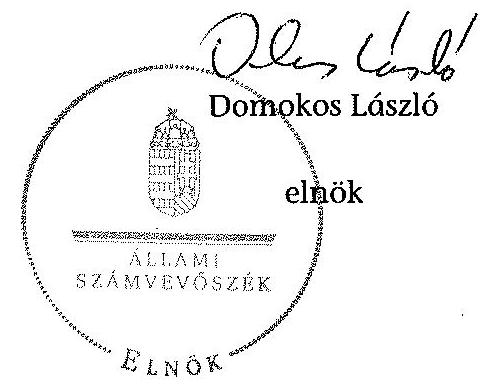

---

.

---

# Kintutatás

az igénybe vett foglalkoztatási célú adó- és járulékkedvezmények alakulásáról a 2009-2013. években

|  Su-
szám | Adó-, járulékkedvezmény megnevezése | 2009. | 2010. | 2011. | 2012. | 2013. | Mindösszesen 2009-2013  |
| --- | --- | --- | --- | --- | --- | --- | --- |
|   |  | 2. | 3. | 4. | 5. | 6. | 7.  |
|  1. | START büttyökhoz kapcsolódó adó- és járulékkedvezmények [2004. évi CXXIII. tv. (Pftv.) szerint] |  |  |  |  |  |   |
|  2. | START - Pfiv. 3. § | 2520 | 5900 | 5576 | 4911 | 2242 | 24149  |
|  3. | START Plozz - Pfiv. 4. § | 2595 | 3447 | 4253 | 3113 | 636 | 14044  |
|  4. | START Extra - Pfiv. 6. § | 1940 | 3525 | 7522 | 7341 | 1981 | 22309  |
|  5. | START Bőruzz - Pfiv. 7/A. § |  |  |  | 8257 | 7445 | 13700  |
|  6. | Összesen | 10055 | 12872 | 17351 | 23622 | 12302 | 76203  |
|  7. | Munkoholyvédelmi Akciótervhez kapcsolódó és egyéb szociális hozzájárulási adókedvezmény (2011. évi CLVI. tv. szerint) |  |  |  |  |  |   |
|  8. | Munkobérek nettó értékének megőrszait célzó adókedvezmény (2011. CLVI. tv. 460. §) |  |  |  | 125045 | 38424 | 163467  |
|  9. | Szakképretiségét nem igényiú foglalkoztatokban foglalkoztatott munkavállalók utáni kedvezmény (2011. CLVI. tv. 461. §) |  |  |  |  | 31079 | 31079  |
|  10. | Karrier-Hid program adókedvezmények (2011. CLVI. tv. 462. §) |  |  |  | 47 | 24 | 71  |
|  11. | A megváltozott munkoképszeigü vállalkozók után érvényesíthető adókedvezmények (2011. CLVI. tv. 462/A. §) |  |  |  | 1108 | 4429 | 5537  |
|  12. | Huzemelt év aláitti és ötvenöt év feletti foglalkoztatott munkavállalók utáni adókedvezmények (2011. CLVI. tv. 462/B. §) |  |  |  |  | 74510 | 74510  |
|  13. | Tartósem álláskereső személyek utáni adókedvezmények (2011. CLVI. tv. 462/C. §) |  |  |  |  | 3493 | 3493  |
|  14. | GYED, GYES, GYET után elhelyezkedők utáni adókedvezmények (2011. CLVI. tv. 462/D. §) |  |  |  |  | 7039 | 7039  |
|  15. | Szabad vállalkozási súsákban működő vállalkozások adókedvezménye (2011. CLVI. tv. 462/E. §) |  |  |  |  | 29 | 29  |
|  16. | Kutatóik foglalkoztatása utáni adókedvezmény (2011. CLVI. tv. 462/F. §) |  |  |  |  | 882 | 882  |
|  17. | Összesen |  |  |  | 126198 | 159909 | 286107  |
|  18. | Fejlesztési adókedvezmény [1996. évi LXXXI. tv. (Tao tv.) szerint] |  |  |  |  |  |   |
|  23. | Összesen | 13622 | 20890 | 34333 | 47109 | 30266 | 146220  |
|  24. | Összesen igénybe vett foglalkoztatási célú adó- és járulékkedvezmények | 23677 | 33762 | 51684 | 196929 | 202477 | 508529  |

Tornás: NAV által kötöttött odatamigáltatása alapján

---

.

---

# 2. SZÁMÓ MELLÉKLET A V-0457-317/2015. SZÁMÓ JELENTÉSHEZ

## Kimutatás

a helyi iparűzési adóalap-mentesség és az adómentesség igénybevételéről a 2009-2013. években*

|  Önkormányzat megnevezése/
kékesik (év) | Helyi adó tv. szerinti adóalap-mentesség, adómentesség (39/C. §. ; 39/D. §.) |  |  |  |  |  |  | Foglalkoztatás növekéséhez kapcsolódó adóalap-mentesség igénybevették arányo | Foglalkoztatás növekéséhez kapcsolódó adóalap-mentesség nagyváglatok arányo  |
| --- | --- | --- | --- | --- | --- | --- | --- | --- | --- |
|   | Foglalkoztatás növekéséhez kapcsolódó adóalap-mentesség (39/C. §.) |  |  | Önkormányzat által nyújtott adómentesség (39/C. §.) |  | Összesen |  |  |   |
|   | Adózik száma (dib) | Igénybe vett adóalap-mentesség (M Ft) |  | Adózik száma (dib) | Igénybe vett adómentesség alapja (M Ft) | Adózik száma (dib) | Igénybevett adóalap- és adó mentesség alapja (M Ft) |  |   |
|  1 | 2 | 3 | 4 | 5 | 6 | 7 | 8-2/6 | 9-3/7 |   |
|  Budapest |  |  |  |  |  |  |  |  |   |
|   | 2009 | 581 | 9 478 | 39 237 | 11 595 | 39 818 | 21 073 | 1,46% | 44,98%  |
|   | 2010 | 563 | 9 742 | 40 158 | 11 727 | 40 721 | 21 469 | 1,38% | 45,38%  |
|   | 2011 | 588 | 10 247 | 40 192 | 11 597 | 40 780 | 21 844 | 1,44% | 46,91%  |
|   | 2012 | 601 | 8 815 | 39 290 | 11 121 | 39 891 | 19 936 | 1,51% | 44,22%  |
|   | 2013 | 731 | 16 871 | 48 401 | 19 908 | 49 132 | 36 779 | 1,49% | 45,87%  |
|   |  |  | 55 153 |  | 65 948 |  | 121 101 |  | 45,54%  |
|   |  |  |  | 41 456 |  | 42 068 |  | 1,46% |   |
|  Győr |  |  |  |  |  |  |  |  |   |
|   | 2009 | 75 | 691 | 6 818 | 6 454 | 6 893 | 7 145 | 1,09% | 9,67%  |
|   | 2010 | 50 | 197 | 6 964 | 6 567 | 7 014 | 6 764 | 0,71% | 2,91%  |
|   | 2011 | 62 | 824 | 7 064 | 6 579 | 7 126 | 7 403 | 0,87% | 11,13%  |
|   | 2012 | 72 | 1 722 | 8 400 | 6 340 | 8 472 | 8 062 | 0,85% | 21,36%  |
|   | 2013 | 96 | 2 008 | 5 176 | 5 522 | 5 272 | 7 530 | 1,82% | 26,67%  |
|   |  |  | 5 442 |  | 31 462 |  | 36 904 |  | 14,75%  |
|   |  |  |  |  |  |  |  |  |   |
|   |  |  |  | 6 884 |  | 6 955 |  | 1,07% |   |
|  Szombathely |  |  |  |  |  |  |  |  |   |
|   | 2009 | 44 | 1 992 | 4 012 | 3 430 | 4 056 | 5 422 | 1,08% | 36,74%  |
|   | 2010 | 39 | 3 690 | 3 943 | 3 371 | 3 982 | 7 061 | 0,98% | 52,26%  |
|   | 2011 | 47 | 1 644 | 3 699 | 3 120 | 3 746 | 4 764 | 1,25% | 34,51%  |
|   | 2012 | 49 | 1 358 | 2 502 | 1 174 | 2 551 | 2 532 | 1,92% | 53,63%  |
|   | 2013 | 48 | 1 722 | 2 281 | 1 156 | 2 329 | 2 878 | 2,06% | 59,83%  |
|   |  |  | 10 406 |  | 12 251 |  | 22 657 |  | 45,93%  |
|   |  |  |  |  |  |  |  |  |   |
|   |  |  |  | 3 287 |  | 3 333 |  | 1,46% |   |
|  Tatabánya |  |  |  |  |  |  |  |  |   |
|   | 2009 | 43 | 291 | 2 689 | 2 435 | 2 732 | 2 726 | 1,57% | 10,67%  |
|   | 2010 | 40 | 233 | 2 698 | 68 | 2 738 | 301 | 1,46% | 77,41%  |
|   | 2011 | 36 | 491 | 2 450 | 22 | 2 486 | 513 | 1,45% | 95,71%  |
|   | 2012 | 36 | 242 | 2 126 | 9 | 2 162 | 251 | 1,67% | 96,41%  |
|   | 2013 | 44 | 527 | 1 933 | 8 | 1 977 | 535 | 2,23% | 98,50%  |
|   |  |  | 1 784 |  | 2 542 |  | 4 326 |  | 41,24%  |
|   |  |  |  |  |  |  |  |  |   |
|   |  |  |  | 2 379 |  | 2 419 |  | 1,67% |   |
|  Veszprém |  |  |  |  |  |  |  |  |   |
|   | 2009 | 46 | 363 | 2 980 | 3 358 | 3 026 | 3 721 | 1,52% | 9,76%  |
|   | 2010 | 41 | 169 | 3 168 | 3 459 | 3 209 | 3 628 | 1,28% | 4,66%  |
|   | 2011 | 36 | 480 | 3 103 | 1 950 | 3 139 | 2 430 | 1,15% | 19,75%  |
|   | 2012 | 36 | 314 | 3 061 | 1 889 | 3 097 | 2 203 | 1,16% | 14,25%  |
|   | 2013 | 35 | 242 | 2 959 | 1 711 | 2 994 | 1 953 | 1,17% | 12,39%  |
|   |  |  | 1 568 |  | 12 367 |  | 13 935 |  | 11,25%  |
|   |  |  |  |  |  |  |  |  |   |
|   |  |  |  | 3 054 |  | 3 093 |  | 1,26% |   |
|  Önkormányzatok összesítve: |  |  |  |  |  |  |  |  |   |
|   | 2009 | 789 | 12 815 | 55 736 | 27 272 | 56 525 | 40 087 | 1,40% | 31,97%  |
|   | 2010 | 733 | 14 031 | 56 931 | 25 192 | 57 664 | 39 223 | 1,27% | 35,77%  |
|   | 2011 | 769 | 13 686 | 56 508 | 23 268 | 57 277 | 36 954 | 1,34% | 37,04%  |
|   | 2012 | 794 | 12 451 | 55 379 | 20 533 | 56 173 | 32 984 | 1,41% | 37,75%  |
|   | 2013 | 954 | 21 370 | 60 750 | 28 305 | 61 704 | 49 675 | 1,55% | 43,02%  |
|  Mindösszesen |  |  | 74 353 |  | 124 570 |  | 198 923 |  | 37,38%  |
|  Átlag |  | 808 |  | 57 061 |  | 57 869 |  | 1,39% |   |

*Forrás: Az Önkormányzatok által az ellenőrzéshez kitöltött adatszolgáltatósa alapján

---

.

---

### **Klimatatás**

a helyi iparűzési adóból a foglalkoztatás növeléséhez kapcsolódó (Helyi adó tv. 39/D. § szerinti) adóalap-mentesség igénybevételének ellenőrzöttségeiről a 2009-2013. években*

|  Önkormányzat
megrendelési felépzés
(Br) | Adó és adóalap kedvezéshelyi
igénybeverek adózót adása (Br) | Igénybeverek adó és adóalap kedvezéshely
(bl Ft) | Adó és adóalap kedvezéshelyi
igénybeverek ellenőrzések érintett adózót
adása (Br) | Ellenőrzések lehetett adóalap
kedvezéshely összege (bl Ft) | Ellenőrzések lehetett adózótér és az
adóalap kedvezéshelyi igénybeverek
adásira (Ft) | Ellenőrzések lehetett és az igénybeverek
adóalap kedvezéshely adásra (Ft)  |
| --- | --- | --- | --- | --- | --- | --- |
|   |  |  |  |  |  | 2014/15  |
|  Önközpont |  |  |  |  |  |   |
|  2009 | 39 818 | 381 | 21 073 | 9 478 | 24 | 33  |
|  2010 | 40 731 | 563 | 21 469 | 9 742 | 16 | 18  |
|  2011 | 40 780 | 586 | 22 844 | 10 247 | 21 | 21  |
|  2012 | 39 891 | 601 | 19 936 | 8 812 | 4 | 4  |
|  2013 | 40 132 | 751 | 36 779 | 16 871 | 1 | 1  |
|  Összesen |  |  | 121 101 | 22 122 | 48 | 67  |
|  állog | 42 068 | 613 | 34 220 | 11 031 |  |   |
|  Győző |  |  |  |  |  |   |
|  2009 | 6 893 | 72 | 7 143 | 691 | 9 | 0  |
|  2010 | 7 014 | 30 | 6 764 | 197 | 3 | 0  |
|  2011 | 7 126 | 63 | 7 403 | 824 | 7 | 0  |
|  2012 | 8 472 | 73 | 8 063 | 1 732 | 2 | 0  |
|  2013 | 5 272 | 96 | 7 330 | 2 008 | 1 | 0  |
|  Összesen |  |  | 36 904 | 3 442 | 21 | 0  |
|  állog | 6 993 | 71 | 7 281 | 1 088 |  |   |
|  Szombathely |  |  |  |  |  |   |
|  2009 | 4 099 | 44 | 9 432 | 1 992 | 0 | 0  |
|  2010 | 1 942 | 39 | 7 661 | 3 690 | 0 | 0  |
|  2011 | 2 746 | 47 | 4 764 | 1 644 | 0 | 0  |
|  2012 | 2 571 | 49 | 2 522 | 1 356 | 0 | 0  |
|  2013 | 2 329 | 48 | 2 878 | 1 732 | 0 | 0  |
|  Összesen |  |  | 22 627 | 10 404 | 8 | 0  |
|  állog | 9 333 | 43 | 4 531 | 2 081 |  |   |
|  Totuháson |  |  |  |  |  |   |
|  2009 | 2 752 | 43 | 2 735 | 291 | 2 | 1  |
|  2010 | 2 738 | 40 | 301 | 235 | 2 | 2  |
|  2011 | 2 486 | 36 | 313 | 491 | 3 | 1  |
|  2012 | 2 163 | 36 | 321 | 245 | 1 | 0  |
|  2013 | 1 977 | 44 | 331 | 327 | 0 | 0  |
|  Összesen |  |  | 4 224 | 1 784 | 12 | 4  |
|  állog | 5 419 | 50 | 863 | 337 |  |   |
|  Veszprém |  |  |  |  |  |   |
|  2009 | 3 026 | 46 | 3 721 | 363 | 16 | 0  |
|  2010 | 3 209 | 41 | 3 628 | 169 | 2 | 2  |
|  2011 | 3 139 | 36 | 2 430 | 480 | 2 | 1  |
|  2012 | 3 097 | 36 | 2 302 | 514 | 0 | 0  |
|  2013 | 2 994 | 22 | 1 953 | 332 | 2 | 0  |
|  Összesen |  |  | 13 932 | 1 368 | 29 | 2  |
|  állog | 3 093 | 39 | 2 787 | 314 |  |   |
|  Önkormányzatok összeállás |  |  |  |  |  |   |
|  2009 | 32 332 | 749 | 40 087 | 12 815 | 23 | 23  |
|  2010 | 37 069 | 733 | 39 223 | 14 051 | 28 | 23  |
|  2011 | 37 277 | 769 | 36 954 | 15 686 | 38 | 23  |
|  2012 | 36 175 | 794 | 33 984 | 12 431 | 7 | 4  |
|  2013 | 41 704 | 934 | 49 673 | 21 370 | 2 | 1  |
|  Összesen |  |  | 194 922 | 74 323 | 126 | 74  |
|  állog | 57 869 | 805 | 39 763 | 14 871 |  |   |

*Forrás: Az Önkormányzatok által az ellenőrzéshez kitöltött adatszolgáltatások alapján

---

# **SOLUTIONS**

## **PROBLEM 1**

### **Part (a)**

**PROBLEM 1**

**PROBLEM 2**

**PROBLEM 3**

**PROBLEM 4**

**PROBLEM 5**

**PROBLEM 6**

**PROBLEM 7**

**PROBLEM 8**

**PROBLEM 9**

**PROBLEM 10**

**PROBLEM 11**

**PROBLEM 12**

**PROBLEM 13**

**PROBLEM 14**

**PROBLEM 15**

**PROBLEM 16**

**PROBLEM 17**

**PROBLEM 18**

**PROBLEM 19**

**PROBLEM 20**

**PROBLEM 21**

**PROBLEM 22**

**PROBLEM 23**

**PROBLEM 24**

**PROBLEM 25**

**PROBLEM 26**

**PROBLEM 27**

**PROBLEM 28**

**PROBLEM 29**

**PROBLEM 30**

**PROBLEM 31**

**PROBLEM 32**

**PROBLEM 33**

**PROBLEM 34**

**PROBLEM 35**

**PROBLEM 36**

**PROBLEM 37**

**PROBLEM 38**

**PROBLEM 39**

**PROBLEM 40**

**PROBLEM 41**

**PROBLEM 42**

**PROBLEM 43**

**PROBLEM 44**

**PROBLEM 45**

**PROBLEM 46**

**PROBLEM 47**

**PROBLEM 48**

**PROBLEM 49**

**PROBLEM 50**

**PROBLEM 51**

**PROBLEM 52**

**PROBLEM 53**

**PROBLEM 54**

**PROBLEM 55**

**PROBLEM 56**

**PROBLEM 57**

**PROBLEM 58**

**PROBLEM 59**

**PROBLEM 60**

**PROBLEM 61**

**PROBLEM 62**

**PROBLEM 63**

**PROBLEM 64**

**PROBLEM 65**

**PROBLEM 66**

**PROBLEM 67**

**PROBLEM 68**

**PROBLEM 69**

**PROBLEM 70**

**PROBLEM 71**

**PROBLEM 72**

**PROBLEM 73**

**PROBLEM 74**

**PROBLEM 75**

**PROBLEM 76**

**PROBLEM 77**

**PROBLEM 78**

**PROBLEM 79**

**PROBLEM 80**

**PROBLEM 81**

**PROBLEM 82**

**PROBLEM 83**

**PROBLEM 84**

**PROBLEM 85**

**PROBLEM 86**

**PROBLEM 87**

**PROBLEM 88**

**PROBLEM 89**

**PROBLEM 90**

**PROBLEM 91**

**PROBLEM 92**

**PROBLEM 93**

**PROBLEM 94**

**PROBLEM 95**

**PROBLEM 96**

**PROBLEM 97**

**PROBLEM 98**

**PROBLEM 99**

**PROBLEM 100**

**PROBLEM 101**

**PROBLEM 102**

**PROBLEM 103**

**PROBLEM 104**

**PROBLEM 105**

**PROBLEM 106**

**PROBLEM 107**

**PROBLEM 108**

**PROBLEM 109**

**PROBLEM 110**

**PROBLEM 111**

**PROBLEM 112**

**PROBLEM 113**

**PROBLEM 114**

**PROBLEM 115**

**PROBLEM 116**

**PROBLEM 117**

**PROBLEM 118**

**PROBLEM 119**

**PROBLEM 120**

**PROBLEM 121**

**PROBLEM 122**

**PROBLEM 123**

**PROBLEM 124**

**PROBLEM 125**

**PROBLEM 126**

**PROBLEM 127**

**PROBLEM 128**

**PROBLEM 129**

**PROBLEM 130**

**PROBLEM 131**

**PROBLEM 132**

**PROBLEM 133**

**PROBLEM 134**

**PROBLEM 135**

**PROBLEM 136**

**PROBLEM 137**

**PROBLEM 138**

**PROBLEM 139**

**PROBLEM 140**

**PROBLEM 141**

**PROBLEM 142**

**PROBLEM 143**

**PROBLEM 144**

**PROBLEM 145**

**PROBLEM 146**

**PROBLEM 147**

**PROBLEM 148**

**PROBLEM 149**

**PROBLEM 150**

**PROBLEM 151**

**PROBLEM 152**

**PROBLEM 153**

**PROBLEM 154**

**PROBLEM 155**

**PROBLEM 156**

**PROBLEM 157**

**PROBLEM 158**

**PROBLEM 159**

**PROBLEM 160**

**PROBLEM 161**

**PROBLEM 162**

**PROBLEM 163**

**PROBLEM 164**

**PROBLEM 165**

**PROBLEM 166**

**PROBLEM 167**

**PROBLEM 168**

**PROBLEM 169**

**PROBLEM 170**

**PROBLEM 171**

**PROBLEM 172**

**PROBLEM 173**

**PROBLEM 174**

**PROBLEM 175**

**PROBLEM 176**

**PROBLEM 177**

**PROBLEM 178**

**PROBLEM 179**

**PROBLEM 180**

**PROBLEM 181**

**PROBLEM 182**

**PROBLEM 183**

**PROBLEM 184**

**PROBLEM 185**

**PROBLEM 186**

**PROBLEM 187**

**PROBLEM 188**

**PROBLEM 189**

**PROBLEM 190**

**PROBLEM 191**

**PROBLEM 192**

**PROBLEM 193**

**PROBLEM 194**

**PROBLEM 195**

**PROBLEM 196**

**PROBLEM 197**

**PROBLEM 198**

**PROBLEM 199**

**PROBLEM 200**

**PROBLEM 201**

**PROBLEM 202**

**PROBLEM 203**

**PROBLEM 204**

**PROBLEM 205**

**PROBLEM 206**

**PROBLEM 207**

**PROBLEM 208**

**PROBLEM 209**

**PROBLEM 210**

**PROBLEM 211**

**PROBLEM 212**

**PROBLEM 213**

**PROBLEM 214**

**PROBLEM 215**

**PROBLEM 216**

**PROBLEM 217**

**PROBLEM 218**

**PROBLEM 219**

**PROBLEM 220**

**PROBLEM 221**

**PROBLEM 222**

**PROBLEM 223**

**PROBLEM 224**

**PROBLEM 225**

**PROBLEM 226**

**PROBLEM 227**

**PROBLEM 228**

**PROBLEM 229**

**PROBLEM 230**

**PROBLEM 231**

**PROBLEM 232**

**PROBLEM 233**

**PROBLEM 234**

**PROBLEM 235**

**PROBLEM 236**

**PROBLEM 237**

**PROBLEM 238**

**PROBLEM 239**

**PROBLEM 240**

**PROBLEM 241**

**PROBLEM 242**

**PROBLEM 243**

**PROBLEM 244**

**PROBLEM 245**

**PROBLEM 246**

**PROBLEM 247**

**PROBLEM 248**

**PROBLEM 249**

**PROBLEM 250**

**PROBLEM 251**

**PROBLEM 252**

**PROBLEM 253**

**PROBLEM 254**

**PROBLEM 255**

**PROBLEM 256**

**PROBLEM 257**

**PROBLEM 258**

**PROBLEM 259**

**PROBLEM 260**

**PROBLEM 261**

**PROBLEM 262**

**PROBLEM 263**

**PROBLEM 264**

**PROBLEM 265**

**PROBLEM 266**

**PROBLEM 267**

**PROBLEM 268**

**PROBLEM 269**

**PROBLEM 270**

**PROBLEM 271**

**PROBLEM 272**

**PROBLEM 273**

**PROBLEM 274**

**PROBLEM 275**

**PROBLEM 276**

**PROBLEM 277**

**PROBLEM 278**

**PROBLEM 279**

**PROBLEM 280**

**PROBLEM 281**

**PROBLEM 282**

**PROBLEM 283**

**PROBLEM 284**

**PROBLEM 285**

**PROBLEM 286**

**PROBLEM 287**

**PROBLEM 288**

**PROBLEM 289**

**PROBLEM 290**

**PROBLEM 291**

**PROBLEM 292**

**PROBLEM 293**

**PROBLEM 294**

**PROBLEM 295**

**PROBLEM 296**

**PROBLEM 297**

**PROBLEM 298**

**PROBLEM 299**

**PROBLEM 300**

**PROBLEM 301**

**PROBLEM 302**

**PROBLEM 303**

**PROBLEM 304**

**PROBLEM 305**

**PROBLEM 306**

**PROBLEM 307**

**PROBLEM 308**

**PROBLEM 309**

**PROBLEM 310**

**PROBLEM 311**

**PROBLEM 312**

**PROBLEM 313**

**PROBLEM 314**

**PROBLEM 315**

**PROBLEM 316**

**PROBLEM 317**

**PROBLEM 318**

**PROBLEM 319**

**PROBLEM 320**

**PROBLEM 321**

**PROBLEM 322**

**PROBLEM 323**

**PROBLEM 324**

**PROBLEM 325**

**PROBLEM 326**

**PROBLEM 327**

**PROBLEM 328**

**PROBLEM 329**

**PROBLEM 330**

**PROBLEM 331**

**PROBLEM 332**

**PROBLEM 333**

**PROBLEM 334**

**PROBLEM 335**

**PROBLEM 336**

**PROBLEM 337**

**PROBLEM 338**

**PROBLEM 339**

**PROBLEM 340**

**PROBLEM 341**

**PROBLEM 342**

**PROBLEM 343**

**PROBLEM 344**

**PROBLEM 345**

**PROBLEM 346**

**PROBLEM 347**

**PROBLEM 348**

**PROBLEM 349**

**PROBLEM 350**

**PROBLEM 351**

**PROBLEM 352**

**PROBLEM 353**

**PROBLEM 354**

**PROBLEM 355**

**PROBLEM 356**

**PROBLEM 357**

**PROBLEM 358**

**PROBLEM 359**

**PROBLEM 360**

**PROBLEM 361**

**PROBLEM 362**

**PROBLEM 363**

**PROBLEM 364**

**PROBLEM 365**

**PROBLEM 366**

**PROBLEM 367**

**PROBLEM 368**

**PROBLEM 369**

**PROBLEM 370**

**PROBLEM 371**

**PROBLEM 372**

**PROBLEM 373**

**PROBLEM 374**

**PROBLEM 375**

**PROBLEM 376**

**PROBLEM 377**

**PROBLEM 378**

**PROBLEM 379**

**PROBLEM 380**

**PROBLEM 381**

**PROBLEM 382**

**PROBLEM 383**

**PROBLEM 384**

**PROBLEM 385**

**PROBLEM 386**

**PROBLEM 387**

**PROBLEM 388**

**PROBLEM 389**

**PROBLEM 390**

**PROBLEM 391**

**PROBLEM 392**

**PROBLEM 393**

**PROBLEM 394**

**PROBLEM 395**

**PROBLEM 396**

**PROBLEM 397**

**PROBLEM 398**

**PROBLEM 399**

**PROBLEM 400**

**PROBLEM 401**

**PROBLEM 402**

**PROBLEM 403**

**PROBLEM 404**

**PROBLEM 405**

**PROBLEM 406**

**PROBLEM 407**

**PROBLEM 408**

**PROBLEM 409**

**PROBLEM 410**

**PROBLEM 411**

**PROBLEM 412**

**PROBLEM 413**

**PROBLEM 414**

**PROBLEM 415**

**PROBLEM 416**

**PROBLEM 417**

**PROBLEM 418**

**PROBLEM 419**

**PROBLEM 420**

**PROBLEM 421**

**PROBLEM 422**

**PROBLEM 423**

**PROBLEM 424**

**PROBLEM 425**

**PROBLEM 426**

**PROBLEM 427**

**PROBLEM 428**

**PROBLEM 429**

**PROBLEM 430**

**PROBLEM 431**

**PROBLEM 432**

**PROBLEM 433**

**PROBLEM 434**

**PROBLEM 435**

**PROBLEM 436**

**PROBLEM 437**

**PROBLEM 438**

**PROBLEM 439**

**PROBLEM 440**

**PROBLEM 441**

**PROBLEM 442**

**PROBLEM 443**

**PROBLEM 444**

**PROBLEM 445**

**PROBLEM 446**

**PROBLEM 447**

**PROBLEM 448**

**PROBLEM 449**

**PROBLEM 450**

**PROBLEM 451**

**PROBLEM 452**

**PROBLEM 453**

**PROBLEM 454**

**PROBLEM 455**

**PROBLEM 456**

**PROBLEM 457**

**PROBLEM 458**

**PROBLEM 459**

**PROBLEM 460**

**PROBLEM 461**

**PROBLEM 462**

**PROBLEM 463**

**PROBLEM 464**

**PROBLEM 465**

**PROBLEM 466**

**PROBLEM 467**

**PROBLEM 468**

**PROBLEM 469**

**PROBLEM 470**

**PROBLEM 471**

**PROBLEM 472**

**PROBLEM 473**

**PROBLEM 474**

**PROBLEM 475**

**PROBLEM 476**

**PROBLEM 477**

**PROBLEM 478**

**PROBLEM 479**

**PROBLEM 480**

**PROBLEM 481**

**PROBLEM 482**

**PROBLEM 483**

**PROBLEM 484**

**PROBLEM 485**

**PROBLEM 486**

**PROBLEM 487**

**PROBLEM 488**

**PROBLEM 489**

**PROBLEM 490**

**PROBLEM 491**

**PROBLEM 492**

**PROBLEM 493**

**PROBLEM 494**

**PROBLEM 495**

**PROBLEM 496**

**PROBLEM 497**

**PROBLEM 498**

**PROBLEM 499**

**PROBLEM 500**

**PROBLEM 501**

**PROBLEM 502**

**PROBLEM 503**

**PROBLEM 504**

**PROBLEM 505**

**PROBLEM 506**

**PROBLEM 507**

**PROBLEM 508**

**PROBLEM 509**

**PROBLEM 510**

**PROBLEM 511**

**PROBLEM 512**

**PROBLEM 513**

**PROBLEM 514**

**PROBLEM 515**

**PROBLEM 516**

**PROBLEM 517**

**PROBLEM 518**

**PROBLEM 519**

**PROBLEM 520**

**PROBLEM 521**

**PROBLEM 522**

**PROBLEM 523**

**PROBLEM 524**

**PROBLEM 525**

**PROBLEM 526**

**PROBLEM 527**

**PROBLEM 528**

**PROBLEM 529**

**PROBLEM 530**

**PROBLEM 531**

**PROBLEM 532**

**PROBLEM 533**

**PROBLEM 534**

**PROBLEM 535**

**PROBLEM 536**

**PROBLEM 537**

**PROBLEM 538**

**PROBLEM 539**

**PROBLEM 540**

**PROBLEM 541**

**PROBLEM 542**

**PROBLEM 543**

**PROBLEM 544**

**PROBLEM 545**

**PROBLEM 546**

**PROBLEM 547**

**PROBLEM 548**

**PROBLEM 549**

**PROBLEM 550**

**PROBLEM 551**

**PROBLEM 552**

**PROBLEM 553**

**PROBLEM 554**

**PROBLEM 555**

**PROBLEM 556**

**PROBLEM 557**

**PROBLEM 558**

**PROBLEM 559**

**PROBLEM 560**

**PROBLEM 561**

**PROBLEM 562**

**PROBLEM 563**

**PROBLEM 564**

**PROBLEM 565**

**PROBLEM 566**

**PROBLEM 567**

**PROBLEM 568**

**PROBLEM 569**

**PROBLEM 570**

**PROBLEM 571**

**PROBLEM 572**

**PROBLEM 573**

**PROBLEM 574**

**PROBLEM 575**

**PROBLEM 576**

**PROBLEM 577**

**PROBLEM 578**

**PROBLEM 579**

**PROBLEM 580**

**PROBLEM 581**

**PROBLEM 582**

**PROBLEM 583**

**PROBLEM 584**

**PROBLEM 585**

**PROBLEM 586**

**PROBLEM 587**

**PROBLEM 588**

**PROBLEM 589**

**PROBLEM 590**

**PROBLEM 591**

**PROBLEM 592**

**PROBLEM 593**

**PROBLEM 594**

**PROBLEM 595**

**PROBLEM 596**

**PROBLEM 597**

**PROBLEM 598**

**PROBLEM 599**

**PROBLEM 591**

**PROBLEM 592**

**PROBLEM 593**

**PROBLEM 594**

**PROBLEM 595**

**PROBLEM 596**

**PROBLEM 597**

**PROBLEM 598**

**PROBLEM 599**

**PROBLEM 591**

**PROBLEM 592**

**PROBLEM 593**

**PROBLEM 594**

**PROBLEM 595**

**PROBLEM 596**

**PROBLEM 597**

**PROBLEM 598**

**PROBLEM 599**

**PROBLEM 591**

**PROBLEM 592**

**PROBLEM 593**

**PROBLEM 594**

**PROBLEM 595**

**PROBLEM 596**

**PROBLEM 597**

**PROBLEM 598**

**PROBLEM 599**

**PROBLEM 591**

**PROBLEM 592**

**PROBLEM 593**

**PROBLEM 594**

**PROBLEM 595**

**PROBLEM 596**

**PROBLEM 597**

**PROBLEM 598**

**PROBLEM 599**

**PROBLEM 591**

**PROBLEM 592**

**PROBLEM 593**

**PROBLEM 594**

**PROBLEM 595**

**PROBLEM 596**

**PROBLEM 597**

**PROBLEM 598**

**PROBLEM 599**

**PROBLEM 591**

**PROBLEM 592**

**PROBLEM 593**

**PROBLEM 594**

**PROBLEM 595**

**PROBLEM 596**

**PROBLEM 597**

**PROBLEM 598**

**PROBLEM 599**

**PROBLEM 591**

**PROBLEM 592**

**PROBLEM 593**

**PROBLEM 594**

**PROBLEM 595**

**PROBLEM 596**

**PROBLEM 597**

**PROBLEM 598**

**PROBLEM 599**

**PROBLEM 591**

**PROBLEM 592**

**PROBLEM 593**

**PROBLEM 594**

**PROBLEM 595**

**PROBLEM 596**

**PROBLEM 597**

**PROBLEM 598**

**PROBLEM 599**

**PROBLEM 591**

**PROBLEM 592**

**PROBLEM 593**

**PROBLEM 594**

**PROBLEM 595**

**PROBLEM 596**

**PROBLEM 597**

**PROBLEM 598**

**PROBLEM 599**

**PROBLEM 591**

**PROBLEM 592**

**PROBLEM 593**

**PROBLEM 594**

**PROBLEM 595**

**PROBLEM 596**

**PROBLEM 597**

**PROBLEM 598**

**PROBLEM 599**

**PROBLEM 591**

**PROBLEM 592**

**PROBLEM 593**

**PROBLEM 594**

**PROBLEM 595**

**PROBLEM 596**

**PROBLEM 597**

**PROBLEM 598**

**PROBLEM 599**

**PROBLEM 591**

**PROBLEM 592**

**PROBLEM 593**

**PROBLEM 594**

**PROBLEM 595**

**PROBLEM 596**

**PROBLEM 597**

**PROBLEM 598**

**PROBLEM 599**

**PROBLEM 591**

**PROBLEM 592**

**PROBLEM 593**

**PROBLEM 594**

**PROBLEM 595**

**PROBLEM 596**

**PROBLEM 597**

**PROBLEM 598**

**PROBLEM 599**

**PROBLEM 591**

**PROBLEM 592**

**PROBLEM 593**

**PROBLEM 594**

**PROBLEM 595**

**PROBLEM 596**

**PROBLEM 597**

**PROBLEM 598**

**PROBLEM 599**

**PROBLEM 591**

**PROBLEM 592**

**PROBLEM 593**

**PROBLEM 594**

**PROBLEM 595**

**PROBLEM 596**

**PROBLEM 597**

**PROBLEM 598**

**PROBLEM 599**

**PROBLEM 591**

**PROBLEM 592**

**PROBLEM 593**

**PROBLEM 594**

**PROBLEM 595**

**PROBLEM 596**

**PROBLEM 597**

**PROBLEM 598**

**PROBLEM 599**

**PROBLEM 591**

**PROBLEM 592**

**PROBLEM 593**

**PROBLEM 594**

**PROBLEM 595**

**PROBLEM 596**

**PROBLEM 597**

**PROBLEM 598**

**PROBLEM 599**

**PROBLEM 591**

**PROBLEM 592**

**PROBLEM 593**

**PROBLEM 594**

**PROBLEM 595**

**PROBLEM 596**

**PROBLEM 597**

**PROBLEM 598**

**PROBLEM 599**

**PROBLEM 591**

**PROBLEM 592**

**PROBLEM 593**

**PROBLEM 594**

**PROBLEM 595**

**PROBLEM 596**

**PROBLEM 597**

**PROBLEM 598**

**PROBLEM 599**

**PROBLEM 591**

**PROBLEM 592**

**PROBLEM 593**

**PROBLEM 594**

**PROBLEM 595**

**PROBLEM 596**

**PROBLEM 597**

**PROBLEM 598**

**PROBLEM 599**

**PROBLEM 591**

**PROBLEM 592**

**PROBLEM 593**

**PROBLEM 594**

**PROBLEM 595**

**PROBLEM 596**

**PROBLEM 597**

**PROBLEM 598**

**PROBLEM 599**

**PROBLEM 591**

**PROBLEM 592**

**PROBLEM 593**

**PROBLEM 594**

**PROBLEM 595**

**PROBLEM 596**

**PROBLEM 597**

**PROBLEM 598**

**PROBLEM 599**

**PROBLEM 591**

**PROBLEM 592**

**PROBLEM 593**

**PROBLEM 594**

**PROBLEM 595**

**PROBLEM 596**

**PROBLEM 597**

**PROBLEM 598**

**PROBLEM 599**

**PROBLEM 591**

**PROBLEM 592**

**PROBLEM 593**

**PROBLEM 594**

**PROBLEM 595**

**PROBLEM 596**

**PROBLEM 597**

**PROBLEM 598**

**PROBLEM 599**

**PROBLEM 591**

**PROBLEM 592**

**PROBLEM 593**

**PROBLEM 594**

**PROBLEM 595**

**PROBLEM 596**

**PROBLEM 597**

**PROBLEM 598**

**PROBLEM 599**

**PROBLEM 591**

**PROBLEM 592**

**PROBLEM 593**

**PROBLEM 594**

**PROBLEM 595**

**PROBLEM 596**

**PROBLEM 597**

**PROBLEM 598**

**PROBLEM 599**

**PROBLEM 591**

**PROBLEM 592**

**PROBLEM 593**

**PROBLEM 594**

**PROBLEM 595**

**PROBLEM 596**

**PROBLEM 597**

**PROBLEM 598**

**PROBLEM 599**

**PROBLEM 591**

**PROBLEM 592**

**PROBLEM 593**

**PROBLEM 594**

**PROBLEM 595**

**PROBLEM 596**

**PROBLEM 597**

**PROBLEM 598**

**PROBLEM 599**

**PROBLEM 591**

**PROBLEM 592**

**PROBLEM 593**

**PROBLEM 594**

**PROBLEM 595**

**PROBLEM 596**

**PROBLEM 597**

**PROBLEM 598**

**PROBLEM 599**

**PROBLEM 591**

**PROBLEM 592**

**PROBLEM 593**

**PROBLEM 594**

**PROBLEM 595**

**PROBLEM 596**

**PROBLEM 597**

**PROBLEM 598**

**PROBLEM 599**

**PROBLEM 591**

**PROBLEM 592**

**PROBLEM 593**

**PROBLEM 594**

**PROBLEM 595**

**PROBLEM 596**

**PROBLEM 597**

**PROBLEM 598**

**PROBLEM 599**

**PROBLEM 591**

**PROBLEM 592**

**PROBLEM 593**

**PROBLEM 594**

**PROBLEM 595**

**PROBLEM 596**

**PROBLEM 597**

**PROBLEM 598**

**PROBLEM 599**

**PROBLEM 591**

**PROBLEM 592**

**PROBLEM 593**

**PROBLEM 594**

**PROBLEM 595**

**PROBLEM 596**

**PROBLEM 597**

**PROBLEM 598**

**PROBLEM 599**

**PROBLEM 591**

**PROBLEM 592**

**PROBLEM 593**

**PROBLEM 594**

**PROBLEM 595**

**PROBLEM 596**

**PROBLEM 597**

**PROBLEM 598**

**PROBLEM 599**

**PROBLEM 591**

**PROBLEM 592**

**PROBLEM 593**

**PROBLEM 594**

**PROBLEM 595**

**PROBLEM 596**

**PROBLEM 597**

**PROBLEM 598**

**PROBLEM 599**

**PROBLEM 591**

**PROBLEM 592**

**PROBLEM 593**

**PROBLEM 594**

**PROBLEM 595**

**PROBLEM 596**

**PROBLEM 597**

**PROBLEM 598**

**PROBLEM 599**

**PROBLEM 591**

**PROBLEM 592**

**PROBLEM 593**

**PROBLEM 594**

**PROBLEM 595**

**PROBLEM 596**

**PROBLEM 597**

**PROBLEM 598**

**PROBLEM 599**

**PROBLEM 591**

**PROBLEM 592**

**PROBLEM 593**

**PROBLEM 594**

**PROBLEM 595**

**PROBLEM 596**

**PROBLEM 597**

**PROBLEM 598**

**PROBLEM 599**

**PROBLEM 591**

**PROBLEM 592**

**PROBLEM 593**

**PROBLEM 594**

**PROBLEM 595**

**PROBLEM 596**

**PROBLEM 597**

**PROBLEM 598**

**PROBLEM 599**

**PROBLEM 591**

**PROBLEM 592**

**PROBLEM 593**

**PROBLEM 594**

**PROBLEM 595**

**PROBLEM 596**

**PROBLEM 597**

**PROBLEM 598**

**PROBLEM 599**

**PROBLEM 591**

**PROBLEM 592**

**PROBLEM 593**

**PROBLEM 594**

**PROBLEM 595**

**PROBLEM 596**

**PROBLEM 597**

**PROBLEM 598**

**PROBLEM 599**

**PROBLEM 591**

**PROBLEM 592**

**PROBLEM 593**

**PROBLEM 594**

**PROBLEM 595**

**PROBLEM 596**

**PROBLEM 597**

**PROBLEM 598**

**PROBLEM 599**

**PROBLEM 591**

**PROBLEM 592**

**PROBLEM 593**

**PROBLEM 594**

**PROBLEM 595**

**PROBLEM 596**

**PROBLEM 597**

**PROBLEM 598**

**PROBLEM 599**

**PROBLEM 591**

**PROBLEM 592**

**PROBLEM 593**

**PROBLEM 594**

**PROBLEM 595**

**PROBLEM 596**

**PROBLEM 597**

**PROBLEM 598**

**PROBLEM 599**

**PROBLEM 591**

**PROBLEM 592**

**PROBLEM 593**

**PROBLEM 594**

**PROBLEM 595**

**PROBLEM 596**

**PROBLEM 597**

**PROBLEM 598**

**PROBLEM 599**

**PROBLEM 591**

**PROBLEM 592**

**PROBLEM 593**

**PROBLEM 594**

**PROBLEM 595**

**PROBLEM 596**

**PROBLEM 597**

**PROBLEM 598**

**PROBLEM 599**

**PROBLEM 591**

**PROBLEM 592**

**PROBLEM 593**

**PROBLEM 594**

**PROBLEM 595**

**PROBLEM 596**

**PROBLEM 597**

**PROBLEM 598**

**PROBLEM 599**

**PROBLEM 591**

**PROBLEM 592**

**PROBLEM 593**

**PROBLEM 594**

**PROBLEM 595**

**PROBLEM 596**

**PROBLEM 597**

**PROBLEM 598**

**PROBLEM 599**

**PROBLEM 591**

**PROBLEM 592**

**PROBLEM 593**

**PROBLEM 594**

**PROBLEM 595**

**PROBLEM 596**

**PROBLEM 597**

**PROBLEM 598**

**PROBLEM 599**

**PROBLEM 591**

**PROBLEM 592**

**PROBLEM 593**

**PROBLEM 594**

**PROBLEM 595**

**PROBLEM 596**

**PROBLEM 597**

**PROBLEM 598**

**PROBLEM 599**

**PROBLEM 591**

**PROBLEM 592**

**PROBLEM 593**

**PROBLEM 594**

**PROBLEM 595**

**PROBLEM 596**

**PROBLEM 597**

**PROBLEM 598**

**PROBLEM 599**

**PROBLEM 591**

**PROBLEM 592**

**PROBLEM 593**

**PROBLEM 594**

**PROBLEM 595**

**PROBLEM 596**

**PROBLEM 597**

**PROBLEM 598**

**PROBLEM 599**

**PROBLEM 591**

**PROBLEM 592**

**PROBLEM 593**

**PROBLEM 594**

**PROBLEM 595**

**PROBLEM 596**

**PROBLEM 597**

**PROBLEM 598**

**PROBLEM 599**

**PROBLEM 591**

**PROBLEM 592**

**PROBLEM 593**

**PROBLEM 594**

**PROBLEM 595**

**PROBLEM 596**

**PROBLEM 597**

**PROBLEM 598**

**PROBLEM 599**

**PROBLEM 591**

**PROBLEM 592**

**PROBLEM 593**

**PROBLEM 594**

**PROBLEM 595**

**PROBLEM 596**

**PROBLEM 597**

**PROBLEM 598**

**PROBLEM 599**

**PROBLEM 591**

**PROBLEM 592**

**PROBLEM 593**

**PROBLEM 594**

**PROBLEM 595**

**PROBLEM 596**

**PROBLEM 597**

**PROBLEM 598**

**PROBLEM 599**

**PROBLEM 591**

**PROBLEM 592**

**PROBLEM 593**

**PROBLEM 594**

**PROBLEM 595**

**PROBLEM 596**

**PROBLEM 597**

**PROBLEM 598**

**PROBLEM 599**

**PROBLEM 591**

**PROBLEM 592**

**PROBLEM 593**

**PROBLEM 594**

**PROBLEM 595**

**PROBLEM 596**

**PROBLEM 597**

**PROBLEM 598**

**PROBLEM 599**

**PROBLEM 591**

**PROBLEM 592**

**PROBLEM 593**

**PROBLEM 594**

**PROBLEM 595**

**PROBLEM 596**

**PROBLEM 597**

**PROBLEM 598**

**PROBLEM 599**

**PROBLEM 591**

**PROBLEM 592**

**PROBLEM 593**

**PROBLEM 594**

**PROBLEM 595**

**PROBLEM 596**

**PROBLEM 597**

**PROBLEM 598**

**PROBLEM 599**

**PROBLEM 591**

**PROBLEM 592**

**PROBLEM 593**

**PROBLEM 594**

**PROBLEM 595**

**PROBLEM 596**

**PROBLEM 597**

**PROBLEM 598**

**PROBLEM 599**

**PROBLEM 591**

**PROBLEM 592**

**PROBLEM 593**

**PROBLEM 594**

**PROBLEM 595**

**PROBLEM 596**

**PROBLEM 597**

**PROBLEM 598**

**PROBLEM 599**

**PROBLEM 591**

**PROBLEM 592**

**PROBLEM 593**

**PROBLEM 594**

**PROBLEM 595**

**PROBLEM 596**

**PROBLEM 597**

**PROBLEM 598**

**PROBLEM 599**

**PROBLEM 591**

**PROBLEM 592**

**PROBLEM 593**

**PROBLEM 594**

**PROBLEM 595**

**PROBLEM 596**

**PROBLEM 597**

**PROBLEM 598**

**PROBLEM 599**

**PROBLEM 591**

**PROBLEM 592**

**PROBLEM 593**

**PROBLEM 594**

**PROBLEM 595**

**PROBLEM 596**

**PROBLEM 597**

**PROBLEM 598**

**PROBLEM 599**

**PROBLEM 591**

**PROBLEM 592**

**PROBLEM 593**

**PROBLEM 594**

**PROBLEM 595**

**PROBLEM 596**

**PROBLEM 597**

**PROBLEM 598**

**PROBLEM 599**

**PROBLEM 591**

**PROBLEM 592**

**PROBLEM 593**

**PROBLEM 594**

**PROBLEM 595**

**PROBLEM 596**

**PROBLEM 597**

**PROBLEM 598**

**PROBLEM 599**

**PROBLEM 591**

**PROBLEM 592**

**PROBLEM 593**

**PROBLEM 594**

**PROBLEM 595**

**PROBLEM 596**

**PROBLEM 597**

**PROBLEM 598**

**PROBLEM 599**

**PROBLEM 591**

**PROBLEM 592**

**PROBLEM 593**

**PROBLEM 594**

**PROBLEM 595**

**PROBLEM 596**

**PROBLEM 597**

**PROBLEM 598**

**PROBLEM 599**

**PROBLEM 591**

**PROBLEM 592**

**PROBLEM 593**

**PROBLEM 594**

**PROBLEM 595**

**PROBLEM 596**

**PROBLEM 597**

**PROBLEM 598**

**PROBLEM 599**

**PROBLEM 591**

**PROBLEM 592**

**PROBLEM 593**

**PROBLEM 594**

**PROBLEM 595**

**PROBLEM 597**

**PROBLEM 598**

**PROBLEM 599**

**PROBLEM 591**

**PROBLEM 592**

**PROBLEM 593**

**PROBLEM 594**

**PROBLEM 595**

**PROBLEM 596**

**PROBLEM 597**

**PROBLEM 598**

**PROBLEM 599**

**PROBLEM 591**

**PROBLEM 592**

**PROBLEM 593**

**PROBLEM 594**

**PROBLEM 595**

**PROBLEM 597**

**PROBLEM 598**

**PROBLEM 599**

**PROBLEM 591**

**PROBLEM 592**

**PROBLEM 593**

**PROBLEM 594**

**PROBLEM 595**

**PROBLEM 596**

**PROBLEM 597**

**PROBLEM 598**

**PROBLEM 599**

**PROBLEM 591**

**PROBLEM 592**

**PROBLEM 593**

**PROBLEM 594**

**PROBLEM 595**

**PROBLEM 597**

**PROBLEM 598**

**PROBLEM 599**

**PROBLEM 591**

**PROBLEM 592**

**PROBLEM 593**

**PROBLEM 594**

**PROBLEM 595**

**PROBLEM 596**

**PROBLEM 597**

**PROBLEM 598**

**PROBLEM 599**

**PROBLEM 590**

**PROBLEM 591**

**PROBLEM 592**

**PROBLEM 593**

**PROBLEM 594**

**PROBLEM 595**

**PROBLEM 596**

**PROBLEM 597**

**PROBLEM 598**

**PROBLEM 599**

**PROBLEM 591**

**PROBLEM 592**

**PROBLEM 593**

**PROBLEM 594**

**PROBLEM 595**

**PROBLEM 597**

**PROBLEM 598**

**PROBLEM 599**

**PROBLEM 591**

**PROBLEM 592**

**PROBLEM 593**

**PROBLEM 594**

**PROBLEM 595**

**PROBLEM 596**

**PROBLEM 597**

**PROBLEM 598**

**PROBLEM 599**

**PROBLEM 591**

**PROBLEM 592**

**PROBLEM 593**

**PROBLEM 594**

**PROBLEM 595**

**PROBLEM 597**

**PROBLEM 598**

**PROBLEM 599**

**PROBLEM 590**

**PROBLEM 591**

**PROBLEM 592**

**PROBLEM 593**

**PROBLEM 594**

**PROBLEM 595**

**PROBLEM 596**

**PROBLEM 597**

**PROBLEM 598**

**PROBLEM 599**

**PROBLEM 599**

**PROBLEM 591**

**PROBLEM 592**

**PROBLEM 593**

**PROBLEM 594**

**PROBLEM 595**

**PROBLEM 596**

**PROBLEM 597**

**PROBLEM 598**

**PROBLEM 599**

**PROBLEM 599**

**PROBLEM 591**

**PROBLEM 592**

**PROBLEM 593**

**PROBLEM 594**

**PROBLEM 595**

**PROBLEM 596**

**PROBLEM 597**

**PROBLEM 598**

**PROBLEM 599**

**PROBLEM 599**

**PROBLEM 590**

**PROBLEM 591**

**PROBLEM 592**

**PROBLEM 593**

**PROBLEM 594**

**PROBLEM 595**

**PROBLEM 596**

**PROBLEM 597**

**PROBLEM 598**

**PROBLEM 599**

**PROBLEM 599**

**PROBLEM 591**

**PROBLEM 592**

**PROBLEM 593**

**PROBLEM 594**

**PROBLEM 595**

**PROBLEM 596**

**PROBLEM 597**

**PROBLEM 598**

**PROBLEM 599**

**PROBLEM 599**

**PROBLEM 591**

**PROBLEM 592**

**PROBLEM 593**

**PROBLEM 594**

**PROBLEM 595**

**PROBLEM 597**

**PROBLEM 598**

**PROBLEM 599**

**PROBLEM 599**

**PROBLEM 599**

**PROBLEM 599**

**PROBLEM 591**

**PROBLEM 592**

**PROBLEM 593**

**PROBLEM 594**

**PROBLEM 595**

**PROBLEM 596**

**PROBLEM 597**

**PROBLEM 598**

**PROBLEM 599**

**PROBLEM 599**

**PROBLEM 599**

**PROBLEM 591**

**PROBLEM 592**

**PROBLEM 593**

**PROBLEM 594**

**PROBLEM 595**

**PROBLEM 596**

**PROBLEM 597**

**PROBLEM 598**

**PROBLEM 599**

**PROBLEM 599**

**PROBLEM 599**

**PROBLEM 597**

**PROBLEM 598**

**PROBLEM 599**

**PROBLEM 599**

**PROBLEM 599**

**PROBLEM 599**

**PROBLEM 591**

**PROBLEM 592**

**PROBLEM 593**

**PROBLEM 594**

**PROBLEM 595**

**PROBLEM 596**

**PROBLEM 597**

**PROBLEM 598**

**PROBLEM 599**

**PROBLEM 599**

**PROBLEM 599**

**PROBLEM 591**

**PROBLEM 592**

**PROBLEM 593**

**PROBLEM 594**

**PROBLEM 595**

**PROBLEM 597**

**PROBLEM 598**

**PROBLEM 599**

**PROBLEM 599**

**PROBLEM 599**

**PROBLEM 597**

**PROBLEM 598**

**PROBLEM 599**

**PROBLEM 599**

**PROBLEM 599**

**PROBLEM 599**

**PROBLEM 591**

**PROBLEM 592**

**PROBLEM 593**

**PROBLEM 594**

**PROBLEM 595**

**PROBLEM 596**

**PROBLEM 597**

**PROBLEM 598**

**PROBLEM 599**

**PROBLEM 599**

**PROBLEM 599**

**PROBLEM 599**

**PROBLEM 597**

**PROBLEM 598**

**PROBLEM 599**

**PROBLEM 599**

**PROBLEM 599**

**PROBLEM 599**

**PROBLEM 599**

**PROBLEM 599**

**PROBLEM 599**

**PROBLEM 599**

**PROBLEM 599**

**PROBLEM 599**

**PROBLEM 599**

**PROBLEM 599**

**PROBLEM 599**

**PROBLEM 599**

**PROBLEM 599**

**PROBLEM 599**

**PROBLEM 599**

**PROBLEM 599**

**PROBLEM 599**

**PROBLEM 599**

**PROBLEM 599**

**PROBLEM 599**

**PROBLEM 599**

**PROBLEM 599**

**PROBLEM 599**

**PROBLEM 599**

**PROBLEM 599**

**PROBLEM 599**

**PROBLEM 599**

**PROBLEM 599**

**PROBLEM 599**

---

# A HELYI IPARŰZÉSI ADÓ BEVALLÁSÁNAK, A FOGLALKOZTATÁSI KEDVEZMÉNYEK ÉRVÉNYESÍTÉSÉNEK ELLENÖRZÉSE BUDAPEST FÖVÁROS ÖNKORMÁNYZATÁNÁL 

#### Abstract

Budapest Főváros Önkormányzat (Önkormányzat ${ }_{1}$ ) illetékességi területén a foglalkoztatás növeléséhez kapcsolódó helyi iparűzési adóalap-mentességet az ellenőrzött időszakban érvényesítő adózók száma a 2009. évi 581-ről a 2013. évre 731-re, az igénybevett adóalap-csökkentés mértéke a 2009. évi 9 478,0 millió Ft-ról 2013. évre 16871,0 millió Ft-ra nőtt ${ }^{1}$.

### 1.1. Az önkormányzat helyi iparűzési adó rendelete és a közzétételi kötelezettség teljesítésének értékelése (5.1.)

Az Önkormányzat ${ }_{1}$ a helyi adórendeletét - amely a helyi iparűzési adózás szabályait is tartalmazta - a Helyi adó tv. 35-40. §-ainak megfelelően adta ki. A Helyi adó tv. 39/C. § (1) bekezdése alapján a számított vállalkozási szintű adómentesség határát a 39/C. § (2) bekezdésével összhangban, 2,5 millió Ft-nál alacsonyabb összegben határozta meg. A Helyi adó tv. 39/C. § (3) bekezdése alapján a számított vállalkozási szintű adómentességet minden vállalkozás számára azonos mértékben biztosította.

Az Önkormányzat ${ }_{1}$-nél az adómentesség összegét 2012. december 31-ig a 21/1991.(IX. 5.) Főv. Kgy. rendeletben 700,0 ezer Ft-ban, majd 2013. január 1jétől a 87/2012.(XI. 30.) Főv. Kgy. rendeletben 1.000 ezer Ft-ban határozták meg. Az ellenőrzött időszakban az adó mértéke nem változott, az megegyezett a Helyi adó tv. 40. §-ban előírt mértékkel (az adóalap 2\%-a volt). Az adókedvezmény bevezetéséről szóló döntés gazdasági hatását a Jat. ${ }_{1} 18 . \S$ (1) bekezdése szerint, és 2011. január 1-jétől a Jat. ${ }_{2}$ 17. § (1) bekezdése szerint a (2) bekezdés aa) pontja alapján előzetesen kalkulálták. A helyi adó rendelet a felügyeleti szerv részére megküldésre került, de a felügyeleti szerv az ellenőrzött időszakban törvényességi felügyeleti észrevételt nem tett.

A HIPA bevallására szolgáló nyomtatvány garnitúrák (főlap és betétlapok) a 35/2008.(XII. 31.) PM rendelet 1. § (2) bekezdése és évenként aktuális sorszámú melléklete (2009-2010-ben a 10-14. sorszámú mellékletek, 2011-2013. évben a 19. sorszámú melléklet) szerinti adattartalommal kerültek kiadásra. Az önkormányzati adóhatóság ${ }_{1}$ a vizsgált időszakban a HIPA bevallási nyomtatványaiban nem szerepeltetett a foglalkoztatás növeléséhez kapcsolódó adóalapmentesség ellenőrzéséhez tájékoztató adatot az átlagos statisztikai állományi létszám adatokról. A nyomtatványok az ellenőrzött időszakban az Önkormányzat ${ }_{1}$ honlapján (https://ssl.budapest.hu/web_hair/) elérhetőek, letölthetőek, elektronikusan és papíralapon kitölthetőek és leadhatóak voltak.

[^0]
[^0]:    ${ }^{1}$ Az Önkormányzat ${ }_{1}$ által az ellenőrzéshez kitöltött kimutatás alapján.

---

Az Önkormányzat ${ }_{1}$-nél az ellenőrzött időszakban a HIPA-ból a foglalkoztatás növeléséhez kapcsolódó adóalap-mentesség igénybevétele - az Önkormányzat ${ }_{1}$ által nyújtott összes adóalap-mentességhez viszonyítva - 1,46\% volt.

Az ellenőrzött időszakban a Helyi adó tv. 39/D. § (2) bekezdésében meghatározott adóalap-mentesség érvényesítését kizáró állami támogatás igénybevételére vonatkozó adat/információ/nyilatkozat/egyéb dokumentum bekérése a bevalláson nem történt, azt a helyszíni ellenőrzések alkalmával az adózóktól bekért nyilatkozatok alapján vizsgálták. A nyilatkozatok hiánya kockázatot hordozott magában, de az ellenőrzött esetekben párhuzamos igénybevételt nem tártak fel.

Az éves HIPA bevallás garnitúra nem tartalmazott a létszámadatokra vonatkozó rovatot, pótlapot. A bevallás lapjainak adattartalma alapján a foglalkoztató előző időszakra igénybevett adóalap-mentességének létszámtartási kötelezettsége nem volt megítélhető, illetőleg annak elmulasztása miatt a tárgyévi adóalap-növelési kötelezettség szabályszerű meghatározása - az ellenőrzöttől, illetve az APEH/NAV-tól bekért kimutatások, bevallások alapján - csak utólag volt ellenőrizhető. Az ellenőrzött esetekben a létszámadatokat az előző évi adatok tárgyévi adatokkal való egybevetésével, az állományi létszámra vonatkozó statisztikai adatok alapján, a KSH, OEP adatszolgáltatások és társasági adó bevallások bekérésével ellenőrizték.

A bevallások kezelésével, feldolgozásával kapcsolatos tevékenységek az Art. 32. §-ában, a Helyi adó tv. 41. §-ában, valamint az Önkormányzat ${ }_{1}$ helyi adórendeletének megfelelően és belső szervezetszabályozási eszközökben leírtak alapján valósultak meg. Az önkormányzati adóhatóság ${ }_{1}$-nél 1996. január 1jétől a HAIR szolgált a bevallások nyilvántartására, feldolgozására.

Az önkormányzati adóhatóság ${ }_{1}$ által alkalmazott HAIR bevallás feldolgozó rendszer, az összesítő kimutatások a Kincstár felé előírt adatszolgáltatási kötelezettség teljesítését lehetővé tették. Az Önkormányzat ${ }_{1}$ az ÖNEGM ${ }^{2}$ rendszerben a Kincstár felé előírt kötelezettségének, valamint a Helyi adó tv. 42/B. §. (1) bekezdésében előírt adatszolgáltatási, a 42/B. § (3) bekezdése szerinti közzétételi kötelezettségeinek az 51/A. §-ában előírt határidőben eleget tett. Az Önkormányzat ${ }_{1}$ az ellenőrzött időszakban eleget tett a 13/1991. (V. 21.) PM rendelet 14. § (4), (6), és (10) bekezdéseiben előírt adatszolgáltatási kötelezettségeinek, a rendeletben előírt gyakorisággal és határidőben.

Az önkormányzati adóhatóság ${ }_{1}$-nek a Helyi adó tv. 42/A. § előírásai szerinti, a HIPA ellenőrzések során feltárt, az adóalap megállapítását érintő számszerűsített megállapításairól az APEH/NAV felé előírt - a jogerős határozat megküldésére vonatkozó - kötelezettsége az ellenőrzött esetekben nem keletkezett.

# 1.2. A helyi iparúzési adó ellenőrzése (5.2.) 

Az önkormányzati adóhatóság ${ }_{1}$ HIPA ellenőrzési tevékenysége - az iparűzési adóhoz kapcsolódó foglalkoztatás növelését segítő kedvezmények igénybevéte-

[^0]
[^0]:    ${ }^{2}$ www.onegm.allamkincstar.gov.hu

---

lére vonatkozóan ellenőrzésre kiválasztott mintatételek alapján - az Art. 81. §ának és a belső szabályzatoknak megfelelt. A HIPA-val, és annak ellenőrzésével kapcsolatos önkormányzati adóhatósági feladatokat 2011. május 19-ig az Önkormányzat ${ }_{1}$ Főpolgármesteri Hivatalának Adó Ügyosztálya, 2011. május 19-től - jelenleg is - az Adó Főosztálya látta el. Az önkormányzati adóhatóság ${ }_{1}$ feladatait a főjegyző által jóváhagyott Belső Múködési Szabályzatban, az ellenőrzési nyomvonalban és a munkaköri leírásokban határozták meg.

A feldolgozott bevallások adatai alapján az adóalap-mentességet érvényesítő foglalkoztatók nem kockázat elemzés alapján kerültek ellenőrzésre kiválasztásra. A HIPA bevallás ellenőrzésre történő kiválasztásánál főosztályvezetői és ügyosztályvezetői utasítások, a 2009-2013. évekre kiadott, az ellenőrzési feladatok, ellenőrzési ütemterv és az ellenőrzési feladatok végrehajtásának irányai megnevezésű dokumentumok alapján jártak el. Az ellenőrzésre kiválasztásra az Önkormányzat ${ }_{1}$ Képviselő-testülete az ellenőrzött időszakban nem hozott határozatot.

Az ellenőrzött időszakban az önkormányzati adóhatóság ${ }_{1}$ által az adókedvezményeket és adóalap- mentességeket igénybevevő munkáltatók ellenőrzöttsége - az Önkormányzat ${ }_{1}$ által kitöltött kimutatás alapján - jelentősen csökkent. A 2009-2013. években végzett 68 ellenőrzés az ellenőrzött és igénybevett adóalap mentesség $5,42 \%$-át érintette. Az ellenőrzött időszakban az ellenőrzéssel lefedett összes adóalap-mentesség 2997,0 millió Ft volt.

Az önkormányzati adóhatóság ${ }_{1}$ adatbázisából a jelen ellenőrzéshez kiválasztott mintatételek ellenőrzése alapján megállapítható, hogy a HIPA-ban érvényesíthető adóalap-mentességet a bevallásukban szerepeltető adózóknál végrehajtott, a bevallások utólagos vizsgálatai során az Önkormányzat ${ }_{1}$ a jogszabályokban és a belső szabályozó eszközökben előírtak szerint, szabályszerűen járt el. A vizsgálatok megkezdésekor az Art. 93. § (1) bekezdésének megfelelően a megbízólevelek, az Art. 92. § (13) bekezdése szerint a vizsgálati programok rendelkezésre álltak. Az Art. 92. §-ában előírt határidőket betartották. A vizsgálatokról az Art. 104. §-a szerint jegyzőkönyv készült. A szabálytalanság megállapítása esetén intézkedtek, a határozatokat meghozták.

Az ellenőrzésre kiválasztott mintatételek alapján megállapítható volt, hogy az önkormányzati adóhatóság ${ }_{1}$ a HIPA ellenőrzése során az adóalap kedvezmény igénybevételi kritériumainak, illetőleg a létszámtartási kötelezettség megsértése esetén az Art. és a belső szabályzatban foglaltak alapján, a jogkövetkezményeket érvényesítette.

Az ellenőrzés során feltárt mulasztás - pl. az iratok ellenőrzésre átadásának elmaradása - esetén az Art. 172. §-a alapján négy esetben mulasztási bírságot szabtak ki. Az ellenőrzött mintatételek alapján az adó késedelmes megfizetése miatt az Art. 165. §-a alapján késedelmi pótlékot, illetve adóhiány esetére a 170. §-a szerinti adóbírságot nem kellett kiszabni.

---

# 1.3. A feladatellátás szabályszerűségét támogató belső kontrollkörnyezet kialakítása és a monitoring rendszer müködtetése (5.3.) 

A HIPA-hoz kapcsolódó feladatellátás szabályszerűségét támogató belső kontrollkörnyezet kialakítása és a monitoring rendszer működtetése az Ötv. 92. § (4)-(5) bekezdéseiben, illetve 2012. január 1-jétől az Mötv. 119. § (3)-(4) bekezdéseiben előírtaknak megfelelt.

Az Önkormányzat ${ }_{1}$ az ellenőrzött időszakban rendelkezett a helyi iparűzési adóztatási feladatot tartalmazó SZMSZ-szel. A tevékenységet és annak ellenőrzését a 2009-2013. években ellátó szervezet, az Adóügyi Osztály/Adó Főosztály (önkormányzati adóhatóság ${ }_{1}$ ) rendelkezett belső szabályzattal, ügyrenddel. A feladatellátást a munkaköri leírások az SZMSZ-szel és a belső szabályzattal, ügyrenddel összhangban tartalmazták. Az Önkormányzat ${ }_{1}$-nél a helyi iparűzési adóalap-mentességek, kedvezmények nyilvántartási, bevallási adatfeldolgozási és adatszolgáltatási tevékenységeire vonatkozó belső szabályozó eszközök előírásai megfeleltek az Art. 32. §-ában és a Helyi adó tv. 41. §-ában foglaltaknak. A helyi adó rendelet változására tekintettel az aktualizálások megtörténtek.

A helyi adó rendelet módosítását követően a Belső Működési Szabályzatot is aktualizálták és a módosításokat a feladatköri jegyzékben, az ellenőrzési nyomvonalakban is átvezették. Az önkormányzati adóhatóság ${ }_{1}$ Belső Müködési Szabályzata (2011. május 18-ig), illetve 2011. május 19-től a Belső Múködési Szabályzat 1. számú melléklete a feladatköri jegyzék, a 3. és 5. számú mellékleteként kiadott munkafolyamat leírás és a munkaköri leírások tartalmazták az adókötelezettségek nyilvántartása, a bevallások feldolgozása, ellenőrzése és az adatszolgáltatás feladatait.

Az ellenőrzött időszakban az adóztatási tevékenységre a belső ellenőrzés nem terjedt ki, de az önkormányzati adóhatóság az adóztatási tevékenységet nyomon követte, a bevallási, adatszolgáltatási és ellenőrzési feladatai végrehajtásának alakulásáról éves beszámolót készített. Az önkormányzati adóhatóság az éves beszámolók keretében Önkormányzat ${ }_{1}$ Képviselő-testülete részére rendszeres információt biztosított az adóbevételek és az ellenőrzések eredményeinek alakulásáról.

Az Önkormányzat ${ }_{1}$-nél a helyi adóztatási tevékenységet törvényességi ellenőrzés, illetve az Önkormányzat ${ }_{1}$ megbízása alapján külső szakértő nem vizsgálta. Az ellenőrzött időszakban az ÁSZ 2010. évi jelentése - Jelentés a helyi adók rendszerében a hatékonyság és az eredményesség érvényesülésének ellenőrzéséről (1031) - az Önkormányzat ${ }_{1}$ adóztatási tevékenységének hatékonyságát értékelte, de a jelentés az Önkormányzat részére javaslatot nem tett.

---

# A HELYI IPARŰZÉSI ADÓ BEVALLÁSÁNAK, A FOGLALKOZTATÁSI KEDVEZMÉNYEK ÉRVÉNYESÍTÉSÉNEK ELLENŐRZÉSE GYŐR MEGYEI JOGÚ VÁROS ÖNKORMÁNYZATÁNÁL 

Győr Megyei Jogú Város Önkormányzata (Önkormányzat ${ }_{2}$ ) illetékességi területén az ellenőrzött időszakban a foglalkoztatás növeléséhez kapcsolódó helyi iparűzési adóalap-mentességet érvényesítő adózók száma a 2009. évi 75 -ről 2013. évre 96-ra, az igénybevett adóalap-csökkentés mértéke a 2009. évi 691,0 millió Ft-ról a 2013. évre 2008,0 millió Ft-ra növekedett¹.

### 1.1. Az Önkormányzat ${ }_{2}$ helyi iparűzési adó rendelete és a közzétételi kötelezettség teljesítésének értékelése (5.1.)

Az Önkormányzat ${ }_{2}$ a HIPA rendeletének megalkotása során érvényre juttatta a Helyi adó tv., mint keretjogszabály 35-40. §-ainak rendelkezéseit.
Az ellenőrzött időszakban az Önkormányzat ${ }_{2}$ a HIPA rendeletét a jogszabályi változásokkal összhangban - 2009. év kivételével - felülvizsgálta. A Pénzügyi Bizottság az Ötv. 23. § (1) bekezdésében és az Önkormányzat ${ }_{2}$ Polgármesteri Hivatal SZMSZ 1e. mellékletének I/4. pontjával ellentétben 2009. évben nem vizsgálta felül a HIPA rendeletét és nem nyújtott be módosítási javaslatot az Önkormányzat ${ }_{2}$ Képviselő-testülete részére.
A HIPA rendelet szerint 2009-2013. évek között Győr Megyei Jogú Város közigazgatási területén adómentes volt az a vállalkozás, amelynek a Helyi adó tv. 39/C. § (1) bekezdése alapján a számított vállalkozás szintű adóalapja a 2,5 millió Ftot nem haladta meg. A Helyi adó tv. 39/C. § (3) bekezdése alapján a számított vállalkozási szintű adómentességet minden vállalkozás számára azonos mértékben biztosította. Az állandó jelleggel végzett iparűzési tevékenység esetén az ellenőrzési időszakban az adó mértéke - nem változott - megegyezett a Helyi adó tv. 40. §-ában előírt mértékkel, amely az adóalap 2\%-a volt.
Az Önkormányzat ${ }_{2}$ az ellenőrzött időszakban az adókedvezmény bevezetéséről szóló döntés gazdasági hatásáról (saját bevétel kiesése) - a Jat. ${ }_{1}$ 18. § (1) bekezdését, és 2011. január 1-jétől a Jat. ${ }_{2}$ 17. § (1) bekezdése szerint a (2) bekezdés aa) pontját figyelmen kívül hagyva - előzetesen nem készített kalkulációt, és a tervezésnél sem tértek ki rá.
Az Önkormányzat ${ }_{2}$-nél az ellenőrzött időszakban a helyi adó rendelet felülvizsgálatára vonatkozó törvényességi felügyeleti ellenőrzés nem volt.
Az ellenőrzött időszakban az önkormányzatoknak a 35/2008. (XII. 31.) PM rendelet 1. § (2) bekezdése adott iránymutatást és évenként aktuális sorszámú mellékletei a mintát a HIPA bevallásához szükséges nyomtatványok kialakítására.

[^0]
[^0]:    ${ }^{1}$ Az Önkormányzat ${ }_{2}$ által az ellenőrzéshez kitöltött kimutatás alapján.

---

A rendelet mellékletei nem tartalmaztak - a foglalkoztatás növeléséhez kapcsolódó adóalap-mentességhez szükséges - létszámadatokat, azokat az Önkormányzat ${ }_{2}$ sem szerepeltette - 2009. év kivételével - a HIPA bevallás nyomtatványain.
Az Önkormányzat ${ }_{2}$ által rendszeresített HIPA bevallás nyomtatvány garnitúrák megfeleltek a jogszabályi előírásoknak. A bevallásból (fölap és betétlapok) - a 2009. év kivételével - azonban nem volt megállapítható a foglalkoztatás növeléshez kapcsolódó adóalap-mentesség szabályszerű igénybevétele. A 2010-2013 évi bevallások adattartalma alapján nem lehetett megítélni a Helyi adó tv. 39/D. §-ában meghatározott, a foglalkoztató által az előző időszakra igénybe vett adóalap-mentességből eredő létszámtartási kötelezettségének teljesítését. Nem volt ellenőrizhető továbbá annak elmulasztása miatt a tárgyévi adóalapnövelési kötelezettség meghatározásának szabályszerűsége sem. Az ellenőrzött időszakban a bevallás nem tartalmazott a Helyi adó tv. 39/D. § (2) bekezdésében meghatározott adóalap - mentesség érvényesítését kizáró adatot, információt és nyilatkozatot sem.

Az Önkormányzat 2009. évre vonatkozó, a HIPA bevallására kialakított nyomtatvány garnitúrájának ${ }^{2} 13$. pontja tartalmazta a 2008. és 2009. évi átlagos statisztikai állományi létszámot, amelyből megállapítható volt a foglalkoztatás növeléséhez kapcsolódó adóalap-mentesség igénybevételéhez szükséges létszámváltozás.
Az Önkormányzat ${ }_{2}$ az ellenőrzött időszakban a HIPA kezelésével, a bevallások feldolgozásával kapcsolatos tevékenységére külön belső eljárásrendet nem alakított ki. A feladatokat - az Art. 32. §-ával és a Helyi adó tv. 41. §-ával összhangban - 2009-2012. évek között a Győr Megyei Jogú Város szervezeti egységeinek feladat és hatáskör megosztásáról szóló a polgármester és a jegyző által közösen kiadott E/1/2009.(I. 1.) számú és az E/3/2010. számú szabályzatban, 2013. évtől az Önkormányzat ${ }_{2}$ Polgármesteri Hivatal SZMSZ-ében és az Adóügyi Osztályon foglalkoztatott köztisztviselők munkaköri leírásaiban határozták meg.
Az önkormányzati adóhatóság ${ }_{2}$ a 13/1991. (V. 21.) PM rendelet 4/B. § és 9. §aiban előírt feldolgozási tevékenységét az ÖNKADÓ program segítségével végezte.
Az Önkormányzat ${ }_{2}$ az ellenőrzött időszakban a 13/1991. (V. 21.) PM rendelet 14. § (4), (6), (10) bekezdése szerinti kötelezettségének és a Helyi adó tv. 42/B. (1) bekezdésében előírt adatszolgáltatási, a 42/B. § (3) bekezdése szerinti közzétételi kötelezettségének az 51/A. §-ban meghatározott határidőben eleget tett. A Helyi adó tv. 42/A. §-ában meghatározott önkormányzati és állami adóhatóságok közötti együttmúködési kötelezettségét szabályszerűen teljesítette.
A Helyi adó tv. 42/B. és 51/A. §-ai 2012. december 1-jétől írták elő az önkormányzatok számára, hogy a Kincstár részére történő adatszolgáltatás teljesítésével egyidejűleg az önkormányzat honlapján közzé kellett tenni az adórendelet, az adórendelet módosításokkal egységes szerkezetbe foglalt szövegét, valamint a rendszeresített bevallási, bejelentkezési nyomtatványokat, az elérhetőségi információkat. Az előírástól függetlenül az Önkormányzat ${ }_{2}$ az ellenőrzött időszakban

[^0]
[^0]:    ${ }^{2}$ Az Önkormányzat ${ }_{2}$ AAD293 számú „Helyi iparüzési adó bevallás 2009" nyomtatványa.

---

belső szabályzatában meghatározta az adatok honlapján (http://onkormányzat.gyor.hu) történő közzétételének rendjét.

Az Önkormányzat ${ }_{2}$ az adatok közzétételének rendjét 2012. január 1-jéig a közérdekú adatok közzétételi kötelezettség teljesítéséről szóló E/2/2008. (IX. 1.) számú Polgármester és Jegyző együttes szabályzata 1. számú mellékletében, és 2012. január 1-jétől Önkormányzat2 Polgármesteri Hivatalának az adatvédelemről és az információszabadságról szóló E/8/2011. (XII. 30.) számú szabályzatában rögzítették.

Az adóhatósági feladatai ellátásával kapcsolatban az Önkormányzat ${ }_{2}$ a HIPA rendeletet és annak módosításokkal egységes szerkezetbe foglalt szövegét, valamint a rendszeresített bevallási, bejelentkezési nyomtatványokat, az elérhetőségi információkat közzétette. A jogszabályban előírt közzétételi kötelezettségének teljesítését, illetve annak időpontját a polgármester 2014. december 5-én tett nyilatkozatával igazolta.

# 1.2. A helyi iparúzési adó ellenőrzése (5.2.) 

Az önkormányzati adóhatóság ${ }_{2}$ a 2009-2013. évek között nem ellenőrizte a HIPA-hoz kapcsolódó foglalkoztatás növelését segítő kedvezmények igénybevételének szabályszerűségét. Az Art. 86. §-a alapján biztosított, erre vonatkozó ellenőrzési jogkörét nem gyakorolta.
A HIPA bevallások feldolgozásából szolgáltatott információ alapján a foglalkoztatás növeléséhez kapcsolódó adóalap mentességet igénybevevők aránya ebben az időszakban az összes mentességet igénybevevő vállalkozásokhoz képest elenyésző, $0,7-1,8 \%$ között volt. A kedvezményt igénybevevő foglalkoztatók alacsony aránya, valamint a foglalkoztatás növeléséhez kapcsolódóan igénybe vett adóalap-mentesség nagysága miatt - bár az utóbbi aránya növekvő tendenciát mutat - nem volt cél a foglalkoztatás növeléséhez kapcsolódó adóalap-mentesség ellenőrzése.
Az Önkormányzat ${ }_{2}$ Képviselő-testülete az ellenőrzött időszakban nem hozott HIPA ellenőrzés elrendelésére vonatkozó határozatot.
A kiválasztott mintatételek az önkormányzati adóhatóság ${ }_{2}$ által ellenőrzött - az Önkormányzat ${ }_{2}$ HIPA rendeletében biztosított - 2,5 millió Ft adómentesség vizsgálatára vonatkoztak.

Az önkormányzati adóhatóság ${ }_{2}$-nél a HIPA mentesség ellenőrzésére az adóalanyok kiválasztása egy programozási módszerrel történt egy olyan halmazból, ahol az adóalanyok eltérő számossággal szerepeltek. A kiválasztás a 2,5 millió Ft értékhatár alatt, de 2,4 millió Ft adóalap felett bevallott adóalappal rendelkezőket érintette 10 -szeres súllyal.
Az ellenőrzött időszakban az önkormányzati adóhatóság ${ }_{2} 21$ adómentességet igénybevevő adózót ellenőrzött, ebből egy sem volt olyan vállalkozás, aki érvényesített volna a Helyi adó tv. 39/D. § szerinti, a foglalkoztatás növeléséhez kapcsolódó adóalap-mentességet. A 2009-2013 évek között az Igénybe vett adóalapmentesség 36904,0 millió Ft, az ellenőrzéssel lefedett aránya ennek csupán $0,18 \%-a, 68,0$ millió Ft volt.

---

A költségvetési szervek belső kontrollrendszer múködtetésének egyes jogszabályi rendelkezéseivel ${ }^{3}$ ellentétben az Önkormányzat ${ }_{2}$ az ellenőrzött időszakban nem rendelkezett a helyi adók ellenőrzésével kapcsolatos belső szabályozással, valamint a hatályos FEUVE szabályzat ${ }^{4}$ melléklete sem tartalmazott a helyi adó ellenőrzésére ellenőrzési nyomvonalat.
Az önkormányzati adóhatóság ${ }_{2}$ HIPA ellenőrzési tevékenysége részben felelt meg a jogszabályi előírásoknak, mert az ellenőrzött mintatételek esetében az Art. 92. § (16) bekezdése ellenére az ellenőrzésekhez vizsgálati program nem készült, a 93. § (1) bekezdésének előírásait - egy eset kivételével - figyelmen kívül hagyva megbízólevelet sem állítottak ki.
Az önkormányzati adóhatóság ${ }_{2}$ a Helyi adó tv. 39/C. §-a szerinti HIPA adóalapmentesség igénybevételi kritériumainak megsértése esetén az Art. 165. § és 170. §-okban foglaltak szerinti jogkövetkezményeket érvényesítette, azonban nem élt az Art. 172. §-ában foglalt mulasztási bírság kiszabásának a lehetőségével.

Az Önkormányzat ${ }_{2}$-nél az ellenőrzött mintatételekből 15 esetben az adózók mulasztást követtek el az adatszolgáltatás teljesítése során, a bevallás benyújtásával összefüggésben, de az önkormányzati adóhatóság ${ }_{2} 14$ esetben nem élt az Art. 172. §-ában foglalt mulasztási bírság kiszabásának a lehetőségével.

# 1.3. A helyi iparúzési adózáshoz kapcsolódó feladatellátás szabályszerűségét támogató belső kontrollkörnyezet kialakítása és a monitoring rendszer múködtetése (5.3.) 

Az Önkormányzat ${ }_{2}$ az ellenőrzött időszakban a helyi iparúzési adóalap-mentességek, kedvezmények nyilvántartási, bevallási adatfeldolgozási és adatszolgáltatási tevékenységekre vonatkozóan külön belső szabályozó eszközökkel nem rendelkezett. A HIPA bevallásokkal kapcsolatos feladatokat az 5.1. pontban leírtak szerint határozták meg, de a feladat-meghatározás a helyi iparúzési adó-alap-mentességek, kedvezmények nyilvántartási, bevallási, adatfeldolgozási és adatszolgáltatási tevékenységekre külön nem tért ki.
Az ellenőrzött időszakban az Önkormányzat ${ }_{2}$-nél a helyi adóztatás szabályszerűségének témakörében belső és külső ellenőrzés nem történt.
Az Önkormányzat ${ }_{2}$ belső ellenőrzési tervei az ellenőrzött időszakban nem tartalmazták a helyi adóztatás ellenőrzését. A Ber. 2. § l) pontja és a Bkr. 2. § l) pontja szerinti kockázatelemzésekből, - melyekkel a belső ellenőrzési terveket alátámasztották - hiányzott az Adóügyi Osztály tevékenységének kockázatelemzése, amellyel így a tevékenységben rejlő kockázatot sem határozták meg.

[^0]
[^0]:    ${ }^{3}$ Az Ámr. 155. § (2) bekezdése és 156. § (2) bekezdése és a Bkr. 4. § a) pontja és a 6. § (3) bekezdése alapján.
    ${ }^{4} \mathrm{~J} / 8 / 2007$. számú, jegyző által kiadott utasítás a folyamatba épített, előzetes és utólagos vezetői ellenőrzési rendszerről (hatálytalan 2012. január 2-tól) és az E/8/2012. (I.2.) polgármester és a jegyző együttes szabályzata a folyamatba épített, előzetes és utólagos vezetői ellenőrzési rendszerről (hatályos 2012. január 2-ától).

---

A polgármester 2014. november 24-ei nyilatkozata szerint az ellenőrzött időszakban az Adóügyi Osztály bevallási, adatszolgáltatási és ellenőrzési feladatai végrehajtásának alakulásáról nem készültek éves beszámolók, elemzések valamint ezekhez kapcsolódó egyéb dokumentumok. Az Adóügyi Osztály vezetőjének és csoportvezetőjének munkaköri leírásai tartalmazták a közreműködési kötelezettséget az Önkormányzat ${ }_{2}$ Képviselő-testülete részére készítendő a helyi adóbevételek alakulásáról szóló beszámoló elkészítésében. Az osztályvezető és a csoportvezető feladata volt többek között a rendszeres információ biztosítása az adóbevételek alakulásáról is.
A helyi adóztatáshoz kapcsolódó feladatellátás szabályszerűségét támogató monitoring rendszer múködésének hiánya sérti 2011. december 31-ig az Ötv. 92. § (4) - (5) bekezdéseiben, 2012. január 1-jétől az Mötv. 119. § (3) - (4) bekezdéseiben foglaltakat, mely szerint a jegyző köteles belső kontrollrendszert múködtetni, amely biztosítja a helyi önkormányzat rendelkezésére álló források szabályszerű, gazdaságos, hatékony és eredményes felhasználását.

---

# **Chemistry**

## **Chemical Reactions**

### **Balancing Chemical Equations**

1. **Write the unbalanced equation:**
   - Example: $$C_3H_8 + O_2 \rightarrow CO_2 + H_2O$$

2. **Balance the equation:**
   - Balance carbon atoms first.
   - Then balance hydrogen atoms.
   - Finally, balance oxygen atoms.
   - Balanced equation: $$C_3H_8 + 7O_2 \rightarrow 3CO_2 + 4H_2O$$

3. **Balance the equation:**
   - Balance oxygen atoms.
   - Finally, balance oxygen atoms.
   - Balanced equation: $$C_3H_8 + 7O_2 \rightarrow 3CO_2 + 4H_2O$$

### **Types of Reactions**

1. **Combination Reaction:**
   - Example: $$2H_2 + O_2 \rightarrow 2H_2O$$

2. **Decomposition Reaction:**
   - Example: $$2H_2O_2 \rightarrow 2H_2O + O_2$$

3. **Single Displacement Reaction:**
   - Example: $$Zn + 2HCl \rightarrow ZnCl_2 + H_2$$

4. **Double Displacement Reaction:**
   - Example: $$AgNO_3 + NaCl \rightarrow AgCl + NaNO_3$$

5. **Combustion Reaction:**
   - Example: $$CH_4 + 2O_2 \rightarrow CO_2 + 2H_2O$$

## **Stoichiometry**

### **Mole Concept**

- **Mole (mol):** The amount of substance containing as many particles (atoms, molecules, ions) as there are atoms in exactly 12 grams of carbon-12.
- **Avogadro's Number:** $$6.022 \times 10^{23}$$ particles per mole.

### **Molar Mass**

- **Molar Mass:** The mass of one mole of a substance.
- Example: The molar mass of water ($$H_2O$$) is 18.015 g/mol.

### **Calculations**

1. **Moles to Mass:**
   - Formula: $$n = \frac{m}{M}$$
   - Example: Calculate the number of moles of $$H_2O$$ in 18 grams of water.
     - $$n = \frac{18.015 \, \text{g}}{18.015 \, \text{g/mol}} = 18.015 \, \text{g/mol}$$

2. **Moles to Mass:**
   - Formula: $$m = n \times M$$
   - Example: Calculate the mass of 18.015 g of water.
     - $$m = 18.015 \, \text{g/mol} = 18.015 \, \text{g/mol}$$

## **Gas Laws**

### **Ideal Gas Law**

- **Equation:** $$PV = nRT$$
- **Variables:**
  - $$P$$ = Pressure (atm)
  - $$V$$ = Volume (L)
  - $$n$$ = Moles of gas

### **Boyle's Law**

- **Equation:** $$P_1V_1 = P_2V_2$$
- **Variables:**
  - P₁ = Pressure (atm)
  - P₂ = Volume (L)
  - P₃ = Moles of gas (L)
  - P₁ = Moles of water (L)
  - P₂ = Moles of water (L)

### **Charles's Law**

- **Equation:** $$V = nRT$$
- **Variables:**
  - V₁ = Volume (L)
  - V₂ = Moles of gas (L)
  - V₁ = Moles of water (L)
  - V₂ = Moles of water (L)

## **Thermochemistry**

### **Enthalpy Change (ΔH)**

- **Definition:** The heat content of a system at constant pressure.
- **Equation:** $$\Delta H = q_p$$
- **Variables:**
  - qₚ = Heat transferred at constant pressure
  - qₛ = Heat transferred at constant pressure

### **Hess's Law**

- **Statement:** The enthalpy change for a reaction is the same whether it occurs in one step or multiple steps.
- **Example:**
  - $$C_3H_8 + 7O_2 \rightarrow 3CO_2 + 4H_2O$$

  - $$\Delta C_3H_8 + 7O_2 \rightarrow 3CO_2 + 4H_2O$$

## **Electrochemistry**

### **Oxidation and Reduction**

- **Oxidation:** Loss of electrons.
- **Reduction:** Gain of electrons.

### **Galvanic Cells**

- **Definition:** A cell that converts chemical energy into electrical energy.
- **Components:**
  - Anode: Oxidation occurs.
  - Cathode: Reduction occurs.
  - Salt Bridge: Connects the two half-cells.

### **Nernst Equation**

- **Equation:** $$E = E^\circ - \frac{RT}{nF} \ln Q$$
- **Variables:**
  - E° = Energy (J)
  - R = Ideal gas constant (0.0821 L·atm/mol·K)
  - R₁ = Ideal gas constant (0.0821 L·atm/mol·K)
  - R₂ = Ideal gas constant (0.0821 L·atm/mol·K)
  - R₃ = Ideal gas constant (0.0821 L·atm/mol·K)
  - $$E$$ = E° + e⁻² (atm)
  - $$R$$ = Ideal gas constant (atm)

## **Electrochemistry**

### **Oxidation and Reduction**

- **Oxidation:** Loss of electrons.
- **Reduction:** Gain of electrons.
- **Reduction:** Gain of electrons.

### **Electrochemical Cells**

- **Definition:** A cell that converts chemical energy into electrical energy.
- **Components:**
  - Anode: Oxidation occurs.
  - Cathode: Reduction occurs.
  - Salt Bridge: Connects the two half-cells.

### **Nernst Equation**

- **Equation:** $$E = E^\circ - \frac{RT}{nF} \ln Q$$
- **Variables:**
  - E° = Energy (J)
  - R = Ideal gas constant (0.0821 L·atm/mol·K)
  - E₁ = Energy (J⁻¹)
  - E₂ = Ideal gas constant (atm)
  - $$E$$ = E° + e⁻² (atm)
  - $$E$$ = E° + e⁻² (atm)

## **Organic Chemistry**

### **Functional Groups**

- **Alkanes:** -C=O -C=O₂ -C=O₂O -C=O₂O₂ -C=O₂O -C=O₂O -C=O₂O -C=O₂O -C=O₂O -C=O₂O -C=O₂O -C=O₂O -C=O₂O -C=O₂O -C=O₂O -C=O₂O -C=O₂O -C=O₂O

### **Nomenclature**

- **IUPAC terms:** -C=18 -C=14 -C=12 -C=10

### **Example**

- C=18: -C=14:O₂ + O₂ → CO₂ + 2H₂O

## **Nuclear Chemistry**

### **Radioactive Decay**

- **Definition:** The process of decay of a substance.
- **Components:**
  - Anode: Decay occurs.
  - Cathode: Reduction occurs.
  - Salt Bridge: Connects the two half-cells.

### **Half-Life (t₁/₂)**

- **Definition:** The time required for a quantity to half-100% of its initial value.
- **Examples:**
  - $$t₁/₂ = 0.0015 \pm 0.00015 \text{ms}$$
  - $$t₁/₂ = 0.0015 \pm 0.00015 \text{ms}$$

## **Organic Chemistry**

### **Functional Groups**

- **Definition:** A cell that converts chemical energy into electrical energy.
- **Components:**
  - Anode: Decay occurs.
  - Cathode: Reduction occurs.
  - Salt Bridge: Connects the two half-cells.

### **Nomenclature**

- **IUPAC terms:** -C=18 -C=14 -C=12 -C=10

### **Example**

- C=18: -C=14:O₂ + O₂ → CO₂ + 2H₂O

### **Nomenclature**

- **IUPAC terms:** -C=18 -C=14 -C=12 -C=10

## **Nuclear Chemistry**

### **Radioactive Decay**

- **Definition:** The process of decay of a substance.
- **Components:**
  - Anode: Decay occurs.
  - Cathode: Reduction occurs.
  - Salt Bridge: Connects the two half-cells.

### **Half-Life (t₁/₂)**

- **Definition:** The time required for a quantity to half-100% of its initial value.
- **Examples:**
  - $$t₁/₂ = 0.0015 \pm 0.00015 \text{ms}$$
  - $$t₁/₂ = 0.0015 \pm 0.00015 \text{ms}$$

## **Electrochemistry**

### **Oxidation and Reduction**

- **Definition:** The process of oxidation and reduction.
- **Components:**
  - Anode: Decay occurs.
  - Cathode: Reduction occurs.
  - Salt Bridge: Connects the two half-cells.

### **Nernst Equation**

- **Equation:** $$E = E^\circ - \frac{RT}{nF} \ln Q$$
- **Examples:**
  - $$E$$ = E° + e⁻² (atm)
  - $$E$$ = E° + e⁻² (atm)
  - $$R$$ = Ideal gas constant (0.0821 L·atm/mol·K)
  - $$E$$ = E° + e⁻² (atm)
  - $$R$$ = Ideal gas constant (atm)
  - $$Q$$ = Reaction quotient

---

# A HELYI IPARŰZÉSI ADÓ BEVALLÁSÁNAK, A FOGLALKOZTATÁSI KEDVEZMÉNYEK ÉRVÉNYESÍTÉSÉNEK ELLENÖRZÉSE   SZOMBATHELY MEGYEI JOGÚ VÁROS ÖNKORMÁNYZATÁNÁL 

Szombathely Megyei Jogú Város Önkormányzata (Önkormányzat ${ }_{3}$ ) illetékességi területén az ellenőrzött időszakban a foglalkoztatás növeléséhez kapcsolódó helyi iparűzési adóalap-mentességet érvényesítő adózók száma a 2009. évi 44ről a 2013. évre 48 -ra nőtt, az igénybevett adóalap-csökkentés mértéke ugyanakkor a 2009. évi 1992,0 millió Ft-ról a 2013. évre 1722,0 millió Ft-ra csökkent ${ }^{1}$.

### 1.1. Az Önkormányzat ${ }_{3}$ helyi iparűzési adó rendelete és a közzétételi kötelezettség teljesítésének értékelése (5.1.)

Az Önkormányzat ${ }_{3}$ a helyi adó rendeleteinek megalkotása során a Helyi adó tv. 35-40. §-ait, mint keretjogszabályban előírtakat betartotta.

Az Önkormányzat ${ }_{3}$ Képviselő-testületének a helyi adókról szóló többször módosított 39/2007. (XI. 29.) számú rendelete 6/A. §-a szerint 2009-2011. évek között adómentes volt az a vállalkozás, amelynek a Helyi adó tv. 39/C. § (1) bekezdése alapján számított vállalkozás szintű adóalapja a 39/C. § (2) bekezdésével összhangban a 2,5 millió Ft-ot nem haladta meg. A 2012-2013 években ez az összeg a 38/2011. (XII. 19.) számú ÖK. rendelet 6. §-a alapján 1,2 millió Ft-ra csökkent. Az ellenőrzött időszakban az adó mértéke nem változott, az megegyezett a Helyi adó tv. 40. §-ában előírt mértékkel, az adóalap 2\%-a volt.

Az adókedvezmény minden vállalkozás számára azonos mértékben, nagyságrendben volt biztosított a Helyi adó tv. 39/C. § (3) bekezdésében előírtaknak megfelelően. Az adókedvezmény bevezetéséről illetve módosításáról szóló döntés gazdasági hatását a Jat. ${ }_{1}$ 18. § (1) bekezdése szerint, és 2011. január 1-jétől a Jat. ${ }_{2}$ 17. § (1) bekezdése szerint a (2) bekezdés aa) pontja alapján - az Önkormányzat ${ }_{3}$ Képviselő-testületének benyújtott előterjesztésekben - előzetesen kalkulálták.

Az ellenőrzött időszakban a helyi adó rendelet törvényességi felügyeleti ellenőrzése során észrevételt nem fogalmaztak meg.

Az ellenőrzött időszakban a HIPA bevallására kialakított nyomtatvány garnitúrák lehetővé tették a foglalkoztatás növeléshez kapcsolódó adóalapmentesség szabályszerű igénybevételét, tartalmuk megfelelt a 35/2008. (XII. 31.) PM. rendelet 1. § (2) bekezdése előírásának.

[^0]
[^0]:    ${ }^{1}$ Az Önkormányzat ${ }_{3}$ által az ellenőrzéshez megküldött kimutatás alapján.

---

Az önkormányzati adóhatóság a 2009-2013. években saját HIPA bevallásaiban szerepeltetett a foglalkoztatás növeléshez kapcsolódó adóalap-mentesség ellenőrzése érdekében tájékoztató adatkérést (Tájékoztató adatok 4. oldal) az átlagos statisztikai állományi létszám adataihoz kapcsolódóan. A HIPA bevallásban fel kellett tüntetni a tárgyévben és az azt megelőző két évben foglalkoztatottak létszámát. A bevallás lapjainak adattartalma alapján megítélhető volt a foglalkoztató előző időszakra igénybe vett adóalap-kedvezményének létszámtartási kötelezettsége a két évre visszamenőlegesen bekért létszámadatok alapján.

Az Önkormányzat 3 a Helyi adó tv. 39/D. § (2) bekezdésében meghatározott adóalap mentesség érvényesítését kizáró állami támogatás igénybevételére vonatkozó adatot, információt, nyilatkozatot a 2009-2013. évi bevalláson, annak egyéb lapjain nem kért, ez magában hordozta azt a kockázatot, hogy a bevallás adattartalmának ellenőrzése során nem tudott meggyőződni a kedvezmény igénybevételének jogosságáról. A bevallások kitöltési útmutatói a megfelelő sorokhoz - 2013. év kivételével - tartalmazták, hogy az állami támogatás kizáró ok, de erre vonatkozó nyilatkozatot nem kértek.

A bevallások kezelésével, feldolgozásával kapcsolatos tevékenységek az Art. 32. §-a, a Helyi adó tv. 41. §-a, valamint az Önkormányzat ${ }_{3}$ helyi adórendeletének megfelelően és a belső szervezetszabályozási eszközökben (ügyrendek, SZMSZ-ek, a Minőségügyi eljárás folyamatszabályozásáról szóló ÖK. rendelet, és a munkaköri leírások) leírtak alapján valósultak meg. A nyilvántartásba rögzítés során a kontrollellenőrzést és az Art. 34. § (1) bekezdésében előírt javítást elvégezték, továbbá a folyamatszabályozások előírása szerint végrehajtották az ellenőrzési feladataikat.

Az önkormányzati adóhatóság ${ }_{3}$ a 13/1991. (V. 21.) PM rendelet 4/B. § és 9. §aiban előírt feldolgozási tevékenységét az ÖNKADÓ program segítségével végezte.

Az önkormányzati adóhatóság az ellenőrzött időszakban eleget tett a 13/1991. (V. 21.) PM rendelet 14. § (4), (6) és (10) bekezdéseiben előírt adatszolgáltatási kötelezettségeinek, a rendeletben előírt gyakorisággal és határidőben. Az Önkormányzat ${ }_{3}$ a Helyi adó tv. 2012. december 1-jétől hatályos 42/B. § (1) bekezdésében előírt adatszolgáltatást, a bevezetést követően az 51/A. §-ában előírt határidőre, első alkalommal 2012. december 20-ig, a Kincstár részére teljesítette, a 42/B. § (3) bekezdése szerinti közzétételi kötelezettséget teljesítette.

A Helyi adó tv. 42/A. §-ában szabályozott önkormányzati és állami adóhatóságok közötti együttmúködési kötelezettsége az önkormányzati adóhatóság ${ }_{3}$ nak nem keletkezett, mert az ellenőrzött időszakban HIPA ellenőrzést nem végzett.

Az Önkormányzat ${ }_{3}$ a honlapján (www.szombathely.hu) 2009-2013. évekre vonatkozóan közzétette a helyi adórendeletét, annak módosításakor az egységes szerkezetbe foglalt szövegét, HIPA bevallási, valamint az adóra vonatkozó bejelentkezési nyomtatványokat. Az ellenőrzött időszakra vonatkozó adórendeletek, HIPA bevallások és egyéb nyomtatványok a helyszíni ellenőrzés időszaka

---

alatt letölthetőek voltak az Önkormányzat ${ }_{3}$ honlapjáról a Helyi adó tv. 42/B. § (3) bekezdés előírásának megfelelően.

# 1.2. A helyi iparúzési adó ellenőrzése (5.2.) 

Az ellenőrzött időszakban az önkormányzati adóhatóság ${ }_{3}$ a hatáskörébe tartozó HIPA vonatkozásában nem gyakorolta az Art. 86. § (1) bekezdése alapján biztosított ellenőrzési jogkörét, amely szerint az adóbevétel megrövidítésének, a költségvetési támogatás, adó-visszaigénylés jogosulatlan igénybevételének megakadályozása érdekében rendszeresen ellenőrizni kell az adózókat és az adózásban részt vevő más személyeket. Az Önkormányzat ${ }_{3}$ Képviselő-testülete részére készített törvényességi és hatósági munkáról szóló beszámolók tartalmazták, hogy az ellenőrzések építményadó, illetve bejelentés és elmulasztás miatti ellenőrzésekre irányultak.

Az önkormányzati adóhatóság ${ }_{3}$ a vizsgált időszakban a feldolgozott bevallások adatai alapján az adóalap-mentességet érvényesítő foglalkoztatókat nem választott ki ellenőrzésre, a HIPA bevallások adattartalmát nem ellenőrizte.

A polgármester és a jegyző 2014. december 8 -ai nyilatkozata szerint az önkormányzati adóhatóság a HIPA-t érintő ellenőrzéseket kapacitáshiány miatt nem végzett. A HIPA bevallás benyújtását elmulasztó adózók kiszűrését a rendelkezésre álló e-cégjegyzék és e-beszámolók alapján végezték. A HIPA bevallást elmulasztó adózók az Art. 172. §-a szerint felszólításra kerültek.

### 1.3. A helyi iparúzési adózáshoz kapcsolódó feladatellátás szabályszerűségét támogató belső kontrollkörnyezet kialakítása és a monitoring rendszer múködtetése (5.3.)

Az Önkormányzat ${ }_{3}$-nál a helyi iparúzési adóalap-mentességek, és adómentességek nyilvántartási, bevallási adatfeldolgozási és adatszolgáltatási tevékenységekre vonatkozó belső szabályozó eszközök előírásai megfeleltek az Art. 32. §ában és a Helyi adó tv. 41. §-ában foglaltaknak, illetve a szervezeti változásokra tekintettel az aktualizálások megtörténtek.
2012. december 31-ig az Önkormányzat ${ }_{3}$ Polgármesteri Hivatal ügyrendjében ${ }^{2}$ (Adóosztály Adókivetési Iroda) határozták meg a helyi adókkal kapcsolatos feladatok részletes leírását, amelyet a szervezeti átalakításokkal együtt módosítottak.
2011. július 31-ig az Adóosztály, majd az Adókivetési Iroda, illetve Adóvégrehajtási és Könyvelési Iroda folyamatszabályozása tartalmazta a részfeladatokra lebontott eljárások leírását. Az adóellenőrzés folyamatának leírása (Folyamatszabályozás 2. 2. pont Adóellenőrzés folyamatának leírása) tartalmazta az utólagos ellenőrzést, amelynek a részfeladatait is pontosan meghatározták. A bevallások kezelésével, feldolgozásával kapcsolatos tevékenységet a jogszabályi és a belső szabályozási eszközökben leírtak alapján végezték.

[^0]
[^0]:    ${ }^{2}$ 18/2008. (1. 31.) és 290/2011. (VI. 16.) Közgyűlési határozattal elfogadva.

---

2013. január 1-jétől az SZMSZ-ek (Adókivetési Iroda) tartalmazták a bevallások kezelésével, feldolgozásával kapcsolatos tevékenységeket.

Az Adókivetési Iroda tekintetében írták elő az adók kivetésével nyilvántartásával, a bevallások feldolgozásával, a végrehajtással kapcsolatos feladatokat. Az Adókivetési Iroda gondoskodik a Kincstár részére nyújtandó tájékoztatások zárási öszszesítő adatainak és a költségvetéshez, valamint a zárszámadáshoz szükséges adatszolgáltatások elkészítéséről.

Az Adóvégrehajtási és Könyvelési Iroda feladataiként írták elő az adóhatósági eljárás megindítását, a számlakivonatokkal összefüggő nyilvántartások vezetését, a könyveléssel és a nyilvántartással kapcsolatos feladatokat.

A feladatok köztisztviselőkre történő lebontását a munkaköri leírásokban rögzítették.

Az ellenőrzött időszakban a belső ellenőrzés nem terjedt ki az adóztatási tevékenységre. Az önkormányzati adóhatóság az adóztatási tevékenységet nyomon követte, a bevallási, adatszolgáltatási és ellenőrzési feladatai végrehajtásának alakulásáról éves beszámolót készített. Az önkormányzati adóhatóság az éves beszámolók keretében Önkormányzat ${ }_{3}$ Képviselő-testülete részére rendszeres információt biztosított az adóbevételek és az ellenőrzések eredményeinek alakulásáról.

Az Önkormányzat ${ }_{3}$-nál a helyi adóztatási tevékenységet törvényességi ellenőrzés, illetve az Önkormányzat ${ }_{3}$ megbízása alapján külső szakértő nem vizsgálta. Az ellenőrzött időszakban az ÁSZ 2010. évi jelentése - Jelentés a helyi adók rendszerében a hatékonyság és az eredményesség érvényesülésének ellenőrzéséről (1031) - az Önkormányzat ${ }_{3}$ adóztatási tevékenységének hatékonyságát értékelte, de a jelentés az Önkormányzat ${ }_{3}$ részére javaslatot nem tett.

---

# A HELYI IPARŰZÉSI ADÓ BEVALLÁSÁNAK, A FOGLALKOZTATÁSI KEDVEZMÉNYEK ÉRVÉNYESÍTÉSÉNEK ELLENÖRZÉSE TATABÁNYA MEGYEI JOGÚ VÁROS ÖNKORMÁNYZATÁNÁL 

Tatabánya Megyei Jogú Város Önkormányzata (Önkormányzat ${ }_{4}$ ) illetékességi területén az ellenőrzött időszakban a foglalkoztatás növeléséhez kapcsolódó helyi iparűzési adóalap-mentességet érvényesítő adózók száma a 2009. évi 43-ról a 2013. évre 44-re, az igénybevett adóalap-csökkentés mértéke a 2009. évi 291,0 millió Ft-ról a 2013. évre 527,0 millió Ft-ra növekedett¹.

### 1.1. Az önkormányzat helyi iparűzési adó rendelete és a közzétételi kötelezettség teljesítésének értékelése (5.1.)

Az Önkormányzat az ellenőrzött időszakra vonatkozó HIPA rendeleteinek megalkotása során érvényre juttatta a Helyi adó tv., mint keretjogszabály 35-40/A. §-aiban foglalt rendelkezéseit.

Az Önkormányzat ${ }_{4}$ HIPA rendeletei 2009-2010. években adókedvezményt biztosítottak azon vállalkozások számára, melyeknek a Helyi adó tv. 39/C. § (1) bekezdése alapján számított vállalkozási szintű adóalapja a 39/C. § (2) bekezdésével összhangban a 2,5 millió Ft-ot nem haladta meg. Az adókedvezmény 2011. évben az ezen adóalap 50\%-ára, a 2012-2013. években $25 \%$-ára csökkent. Az adókedvezmény minden vállalkozás számára a 39/C. § (3) bekezdése alapján azonos mértékben és nagyságrendben biztosított volt.

Az adókedvezmény bevezetéséről szóló döntés gazdasági hatását (saját bevétel kiesése) a Jat. ${ }_{1}$ 18. § (1) bekezdése szerint, és 2011. január 1-jétől a Jat. ${ }_{2}$ 17. § (1) bekezdése szerint a (2) bekezdés aa) pontja alapján előzetesen kalkulálták, tervezték. Az adórendeletek módosítása során a testületi előterjesztések alternatívákat tartalmaztak a kedvezmény mértékére vonatkozóan, számítva annak becsült bevételt módosító hatását. Az adó mértéke az ellenőrzött időszakban nem változott - megegyezett a Helyi adó tv. 40. §-ban előírt mértékkel, amely az adóalap $2 \%$-a volt.

A helyi adó rendelet törvényességi felülvizsgálata során - a jogalkotási folyamatban - a felügyeleti szerv észrevételt nem tett.

Az Önkormányzat által rendszeresített, a HIPA bevallására kialakított nyomtatvány garnitúrákból (fölap és betétlapok) nem volt megállapítható a foglalkoztatás növeléshez kapcsolódó adóalap-mentesség szabályszerű igénybevétele, mert azok nem tartalmaztak létszámadatokat, amelyekből a Helyi adó tv.

[^0]
[^0]:    ${ }^{1}$ Az Önkormányzat által az ellenőrzéshez biztosított adatszolgáltatás alapján.

---

39/D. §-ban meghatározott, a foglalkoztatás növeléséhez kapcsolódó adóalapmentesség egyértelműen kiszámítható lett volna.

Az ellenőrzött időszakban az adóalap-mentesség érvényesítését kizáró állami támogatás igénybevételére vonatkozó adatot, információt, nyilatkozatot vagy egyéb dokumentumot a bevallásokon nem kértek, így az Önkormányzat - az adatok, információk, nyilatkozatok hiánya miatt - nem tudott meggyőződni a Helyi adó tv. 39/D. § (1) bekezdésében meghatározott adóalap-mentesség igénybevételének jogosultságáról, ezért a bevallások kockázatot hordoztak. A Helyi adó tv. 39/D. § (2) bekezdésében meghatározott adóalap-mentesség érvényesítését kizáró állami támogatás igénybevételére vonatkozó adat/információ/nyilatkozat/egyéb dokumentum bekérése a bevalláson nem történt, támogatás igénybevételének kizárását a kitöltési útmutatókban rögzítették, mely azonban nem helyettesítette a nyilatkozatokat.

Az Önkormányzat által rendszeresített HIPA bevallás lapjainak adattartalma alapján nem volt megítélhető a foglalkoztató által az előző időszakra igénybe vett adóalap-mentességek miatti létszámtartási kötelezettség. Ebből következően a tárgyévi adóalap-növelési kötelezettség szabályszerű meghatározására a bevallási nyomtatvány nem biztosított információt. Az adóalap-mentességhez kapcsolódó létszámtartási kötelezettség betartását az adóellenőrzések során vizsgálták.

Az ellenőrzött időszakban a bevallások kezelésével, feldolgozásával kapcsolatos tevékenységek az Art. 32. §-ának, a Helyi adó tv. 41. §-ának és belső szervezetszabályozási eszközökben leírtaknak megfeleltek. Az ellenőrzött időszakban az adóigazgatási feladatokat az Adóügyi és Behajtási Iroda látta el. A Polgármesteri Hivatal SZMSZ-einek mellékleteiben és függelékeiben rögzítették az Adóügyi és Behajtási Iroda feladatait és hatáskörét, a bevallások kezelésével és feldolgozásával kapcsolatos tevékenységeket. A feladatok köztisztviselőkre történő lebontását a munkaköri leírások tartalmazták.

Az önkormányzati adóhatóság4 a 13/1991. (V. 21.) PM rendelet 4/B. § és 9. §aiban előírt feldolgozási tevékenységét az ÖNKADÓ program segítségével végezte.

Az Önkormányzat ${ }_{4}$ a 13/1991. (V. 21.) PM rendelet 14. § (4), (6), és (10) bekezdései szerinti kötelezettségének, valamint a Helyi adó tv. 42/B. § (1) bekezdésében előírt adatszolgáltatási, 42/B. § (3) bekezdése szerinti közzétételi kötelezettségének az 51/A. §-a szerinti határidőben és szabályszerűen eleget tett. A Helyi adó tv. 42/B. § (1) bekezdésében foglalt előírásoknak megfelelően az önkormányzati adóhatóság4 a HIPA rendelet, valamint annak módosítása kihirdetésétől számított 5 napon belül - a Kincstár elektronikus rendszerén keresztül adatot szolgáltatott a Kincstár számára.

A Helyi adó tv. 42/A. §-a szerinti, a HIPA ellenőrzések során feltárt, az adóalap megállapítását érintő számszerűsített megállapításairól az önkormányzati adóhatóság ${ }_{4}$-nek az ellenőrzött időszakban az ellenőrzött esetekben állami adóhatóság felé előírt kötelezettsége - a jogerős határozat megküldésével - nem keletkezett.

---

Az önkormányzati adóhatóság az Önkormányzat 4 honlapján (www.tatabanya.hu) 2009-2013. évekre vonatkozóan a HIPA rendeletet, annak módosításakor az egységes szerkezetbe foglalt szövegét, a HIPA bevallási, az adóra vonatkozó bejelentkezési nyomtatványokat és kitöltési útmutatókat közzétette.

# 1.2. A helyi iparúzési adó ellenőrzése (5.2.) 

Az Önkormányzat ${ }_{4}$-nél az adózók ellenőrzésre történő kijelölése során alkalmazott kiválasztási módszer nem kezelte a foglalkoztatási célú adókedvezmény igénybevételét, mint kockázati tényezőt.

Az adóalanyok ellenőrzésre történő kiválasztása a feldolgozott bevallások és az APEH/NAV megyei adóigazgatóságától bekért társasági adóbevallások adatainak összevetése alapján történt.

Az Önkormányzat ${ }_{4}$ Képviselő-testülete az ellenőrzött időszakban nem hozott határozatot HIPA ellenőrzés elrendelésére vonatkozóan.

Az ellenőrzött időszakban az önkormányzati adóhatóság 12 adóalap mentességet és adómentességet igénybevevő adózót ellenőrzött, ebből négy vállalkozás érvényesített a Helyi adó tv. 39/D. §-a szerinti, a foglalkoztatás növeléséhez kapcsolódó adóalap-mentességet. A 2009-2013 évek között az igénybe vett adóalap-mentesség 4326,0 millió Ft, az ellenőrzéssel lefedett aránya ennek csupán $0,99 \%-a, 43,0$ millió Ft volt.

A 2009-2013. években az önkormányzati adóhatóság a hatáskörébe tartozó HIPA vonatkozásában az Art. 86. § (1) bekezdése alapján biztosított ellenőrzési jogkörét gyakorolta. A vizsgálatok megkezdésekor az Art. 93. § (1) bekezdésének megfelelően a megbízólevelek, az Art. 92. § (13) bekezdése szerint a vizsgálati programok rendelkezésre álltak. Az Art. 92. §-ában előírt határidőket betartották. A vizsgálatokról az Art. 104. §-a szerint jegyzőkönyv készült. A szabálytalanság megállapítása esetén intézkedtek, a határozatokat meghozták. Az Art. 135. §-ában foglaltak alapján a határozat saját hatáskörben történő módosítására, visszavonására, vagy megsemmisítésére nem került sor.

A lefolytatott HIPA ellenőrzések közül 11 ellenőrzés esetében érvényesített az adózó adóalap-mentességet, adómentességet, ezért mintavételre nem került sor, a teljes alapsokaságot ellenőriztük. Az önkormányzati adóhatóság a Helyi adó tv. 39/D §-a szerinti adóalap-mentességet a foglalkoztatás növeléséhez kapcsolódóan négy foglalkoztató, a $39 / \mathrm{C} \S$-a szerinti adómentesség igénybevételénél hét adóalany ellenőrzését végezte el.

A helyi iparűzési adóalap-mentesség szabálytalan igénybevétele miatt az önkormányzati adóhatóság a jogkövetkezmények érvényesítésekor az ellenőrzött esetekben a Helyi adó tv. az Art. 106. § (1)-(2) bekezdés, Art. 170. § (1) bekezdés, Art. 165. § (3) bekezdés és az Art. 171. § (1) bekezdés előírásait betartotta.

Az önkormányzati adóhatóság a helyi iparűzési adónemben megállapított adóhiány után a késedelmi pótlékot szabályszerűen számította ki, kettő ellenőrzésnél késedelmi pótlék nem került felszámításra.

---

A megállapított HIPA hiány után az adóbírságokat az önkormányzati adóhatóság a jogszabályban meghatározottak szerint állapította meg. Egy esetben eltekintett a bírság kiszabásától, öt mintatételnél a bírság mértéke az adóhiány $50 \%-a$, két adózónál $30 \%$-a és három esetben $10 \%$-a volt. Mulasztási bírság kiszabására egy esetben került sor.

A 100,0 ezer Ft mulasztási bírságot szabtak ki, mivel az adózó a szabályosan átvett értesítés ellenére a kért ellenőrzési dokumentumokat nem biztosította, így az ellenőrzés lefolytatásához szükséges közremüködési kötelezettségét nem teljesítette.

# 1.3. A helyi iparűzési adózáshoz kapcsolódó feladatellátás szabályszerűségét támogató belső kontrollkörnyezet kialakítása és a monitoring rendszer müködtetése (5.3.) 

Az önkormányzati adóhatóság ${ }_{4}$-nél a helyi iparűzési adóalap-mentességek, kedvezmények nyilvántartási, bevallási adatfeldolgozási és adatszolgáltatási tevékenységeire vonatkozó belső szabályozó eszközök előírásai megfeleltek az Art. 32. §-ában és a Helyi adó tv. 41. §-ában foglaltaknak.

A helyi adóztatás szabályszerűségének témakörében az Önkormányzat4 belső ellenőrzése 2013 áprilisában az Adóügyi és Behajtási Irodát ellenőrizte a 2012. január 1. és december 31. közötti időszakra vonatkozóan. A rendszerellenőrzés tárgya a belső kontrollrendszer elemeinek értékelése, célja a FEUVE rendszer kiépítettségének értékelése volt. A belső ellenőrzés megállapította, hogy az ellenőrzési nyomvonalban a feladatok nem voltak részletezve a munkaköri leírásokban foglalt munkafolyamatoknak megfelelően. Az utóellenőrzés szerint az Adóügyi és Behajtási Iroda ellenőrzési nyomvonalára tett javaslat nem valósult meg, nem tartalmazta a felelősségi és informális szinteket és kapcsolatokat, az irányítási és ellenőrzési folyamatokat, lehetővé téve azok nyomon követését és utólagos ellenőrzését. A nyomvonal változatlanul csak a főfolyamatot tartalmazta.

A felügyeleti szerv 2011 októberében komplex ellenőrzést végzett az Önkormányzat4 Polgármesteri Hivatalánál a 2009. január 1. és 2011. augusztus 31. közötti időszakra vonatkozóan. A felügyeleti szerv megállapítása szerint az önkormányzati adóhatóság, jogszerűen végezte adóhatósági tevékenységét, a személyi és tárgyi feltételek megfeleltek a jogszabályi előírásoknak. Az adóigazgatásra vonatkozó főbb megállapításait a 04/873-22/2011. számú ellenőrzési jelentésben foglalta össze.

---

# A HELYI IPARŰZÉSI ADÓ BEVALLÁSÁNAK, A FOGLALKOZTATÁSI KEDVEZMÉNYEK ÉRVÉNYESÍTÉSÉNEK ELLENÖRZÉSE   VESZPRÉM MEGYEI JOGÚ VÁROS ÖNKORMÁNYZATÁNÁL 

Veszprém Megyei Jogú Város Önkormányzata (Önkormányzat ${ }_{5}$ ) illetékességi területén a foglalkoztatás növeléséhez kapcsolódó helyi iparűzési adóalapmentességet az ellenőrzött időszakban érvényesítő adózók száma a 2009. évi 46 -ról a 2013. évre 35 -re, az igénybevett adóalap-csökkentés mértéke a 2009. évi 363,0 millió Ft-ról a 2013. évre 242,0 millió Ft-ra csökkent ${ }^{1}$.

### 1.1. Az önkormányzat helyi iparúzési adó rendelete és a közzétételi kötelezettség teljesítésének értékelése (5.1.)

Az Önkormányzat ${ }_{5}$ a helyi adó rendeletét - amely a helyi iparűzési adózás szabályait is tartalmazta - a Helyi adó tv. 35-40. §-aiban előírtaknak megfelelően adta ki. Az Önkormányzat ${ }_{5}$ a helyi adó rendeletében a Helyi adó tv. 39/C. § (1) bekezdése alapján a 2,5 millió Ft-nál alacsonyabb, számított adóalap esetében a 39/C. § (2) bekezdésével összhangban a vállalkozások számára adókedvezményt biztosított. Az adókedvezmény a 39/C. § (3) bekezdésében előírtaknak megfelelően minden vállalkozás számára azonos mértékben volt biztosított.

Az Önkormányzat ${ }_{5}$-nél az adómentesség alapja a 35/2008. (VI. 27.) önkormányzati rendelettel módosított 47/2002. (XII.18.) rendeletben meghatározottak alapján 2008. július 1-jétől 1,5 millió Ft, majd a 2013. január 1-jétől a 61/2012. (XI. 30.) önkormányzati rendelettel módosított 47/2010. (XII. 17.) rendelet alapján 2,5 millió Ft volt. Az ellenőrzött időszakban az adó mértéke nem változott, az megegyezett a Helyi adó tv. 40. §-ában előírt mértékkel (az adóalap 296-a volt).

Az adókedvezmény bevezetéséről szóló döntés gazdasági hatását a Jat. ${ }_{1}$ 18. § (1) bekezdése szerint, és 2011. január 1-jétől a Jat. ${ }_{2}$ 17. § (1) bekezdése szerint a (2) bekezdés aa) pontja alapján előzetesen kalkulálták.

A helyi adó rendeletek törvényességi felügyeleti ellenőrzése során az ellenőrzött időszakban a felügyeleti szerv észrevételt nem fogalmazott meg.

A HIPA bevallására kialakított nyomtatvány garnitúrák tartalma megfelelt a 35/2008. (XII. 31.) PM. rendelet 1. § (2) bekezdés előírásának, de statisztikai átlagos állományi létszám adatok hiányában nem tették lehetővé a foglalkoztatás növeléshez kapcsolódó adóalap-mentesség szabályszerű igénybevételének a bevallás adatai alapján történő ellenőrzését. Az önkormányzati adóhatóság ${ }_{5}$ a

[^0]
[^0]:    ${ }^{1}$ Az Önkormányzat által az ellenőrzéshez kitöltött adatszolgáltatása alapján.

---

vizsgált időszakban a HIPA bevallási nyomtatványaiban nem szerepeltetett a foglalkoztatás növeléséhez kapcsolódó adóalap-mentesség ellenőrzéséhez tájékoztató adatot a statisztikai átlagos állományi létszám adatokról. A bevallási nyomtatványokat és a kitöltési útmutatót az Önkormányzat ${ }_{5}$ a honlapján (www.veszprem.hu) minden évben közzétette.

A HIPA bevallási lapjainak adattartalma alapján a Helyi adó tv. 39/D. § (2) bekezdésében meghatározott adóalap-mentesség érvényesítését kizáró állami támogatás igénybevételére vonatkozó adatot, információt, nyilatkozatot a bevalláson, annak egyéb lapjain nem kértek. Ennek hiányában az adóalap kedvezmény jogosságát alátámasztani - az Önkormányzat ${ }_{5}$ által kiadott 2014. december 8 -án kelt nyilatkozat 5 . és 8 . pontjai alapján - nem tudták. A foglalkoztató előző időszakra igénybe vett adóalap-kedvezményének létszámtartási kötelezettsége a bevallás adattartalma alapján nem volt megítélhető. Az adatok, információk, nyilatkozatok hiánya magában hordozta azt a kockázatot, hogy az önkormányzati adóhatóság ${ }_{5}$ a bevallás adattartalmának ellenőrzése során nem tudott meggyőződni a Helyi adó tv. 39/D. § (1) bekezdésében meghatározott kedvezmény igénybevételének jogosságáról.

Az ellenőrzött esetekben a vállalkozások bevallásainak utólagos ellenőrzése során a foglalkoztatási adatokhoz pl.: a Közép-dunántúli Regionális Munkaügyi Központtól adatot kértek.

A bevallások kezelésével, feldolgozásával kapcsolatos tevékenységek az Art. 32. §-ában, a Helyi adó tv. 41. §-ában, valamint az Önkormányzat ${ }_{5}$ helyi adórendeletének megfelelően és belső szervezetszabályozási eszközökben leírtak alapján valósultak meg.

Az adatszolgáltatási kötelezettség teljesítését a Kincstár felé az önkormányzati adóhatóság ${ }_{5}$ által a HIPA-hoz kapcsolódóan vezetett bevallás nyilvántartások és az ÖNKADÓ segítették. Az önkormányzati adóhatóság ${ }_{5}$ a Helyi adó tv. 42/B. (1) bekezdésében előírt adatszolgáltatási, a 42/B. § (3) bekezdése szerinti közzétételi kötelezettségeinek az 51/A. § (1) bekezdésben előírt határidőben eleget tett. Az Önkormányzat ${ }_{5}$ honlapján az adórendelet, illetve annak módosítása egységes szerkezetbe foglalt szövege, a HIPA bevallási, valamint az adóra vonatkozó bejelentkezési nyomtatványok a helyszíni ellenőrzés időszakában a 2013. év tekintetében elérhetőek voltak.

Az önkormányzati adóhatóság ${ }_{5}$ az ellenőrzött időszakban eleget tett a 13/1991. (V.21.) PM rendelet (4), (6) és (10) bekezdéseiben előírt adatszolgáltatási kötelezettségeinek, a rendeletben elôírt gyakorisággal és határidőben.

Az önkormányzati adóhatóság ${ }_{5}$ a Helyi adó tv. 42/A. §-ában szabályozott, az önkormányzati és állami adóhatóságok közötti együttmúködési kötelezettségének nem tett eleget mert - a 2014. december 8 -án kelt nyilatkozat 8 . pontja alapján - a bevallások utólagos ellenőrzése során megállapított nettó árbevétel eltitkolásáról az ellenőrzött időszakban az APEH/NAV részére az adóalany adatait az adóellenőrzés elősegítése céljából nem küldte meg.

---

# 1.2. A helyi iparúzési adó ellenőrzése (5.2.) 

Az önkormányzati adóhatóság ${ }_{5}$ a HIPA vonatkozásában gyakorolta az Art. 86. § (1) bekezdése és a 106. § (1) bekezdése alapján biztosított ellenőrzési jogkörét.

Az önkormányzati adóhatóság az ellenőrzött időszakban a feldolgozott bevallások adatai alapján az adóalap-mentességet érvényesítő foglalkoztatókat ellenőrzésre kockázatelemzés alapján választotta ki.

A kiválasztás az Adóhivatal vezetője által évente kiadott iránymutatások alapján történt, mely szerint az ellenőrzési kapacitásokat az adójogi szempontból legveszélyesebbnek minősülő, kifejezetten adókikerülést célzó adózók felderítésére koncentrálták.

Az Önkormányzat ${ }_{5}$ Képviselő-testülete az ellenőrzött időszakban nem hozott határozatot a HIPA ellenőrzés elrendelésére.

Az ellenőrzött időszakban a HIPA ellenőrzések lefolytatása során - az ellenőrzésre kiválasztott mintatételek alapján az ellenőrzés megkezdéséről az adózó kiértesítése az Art. 93. § (1) bekezdésének megfelelően megtörtént. Az ellenőrzések során az Art. 92. §-ában meghatározott határidőket betartották. Az ellenőrzésekről az Art. 104. §-a szerint jegyzőkönyvet állítottak ki. A jegyzőkönyvben foglaltak realizálására hozott határozatok kiadására a jogszabályban foglalt határidőket az Art. 104. § és 123. §-okban foglalt előírásoknak megfelelően betartották. Az ellenőrzött időszakban határozat saját hatáskörben történő módosítására, visszavonására, vagy megsemmisítésére, jogszabálysértő határozat kiadása miatt új eljárás lefolytatására nem került sor.

Az ellenőrzött időszakban az önkormányzati adóhatóság ${ }_{5}$ által az adókedvezményeket igénybevevő munkáltatók ellenőrzöttsége - az Önkormányzat ${ }_{5}$ által kitöltött kimutatás alapján - jelentősen csökkent. A 2009-2013. években végzett 29 ellenőrzés az ellenőrzött és igénybevett adóalap mentesség ( 3 ellenőrzés) és adómentesség ( 26 ellenőrzés) $0,78 \%$-át érintette. Az ellenőrzött időszakban az ellenőrzéssel lefedett összes adóalap-mentesség és adómentesség 109,0 millió Ft volt.

A helyi iparúzési adóalap-mentesség szabálytalan igénybevétele miatt 9 esetben az önkormányzati adóhatóság ${ }_{5}$ a jogkövetkezmények érvényesítésével az Art 165. §, 170. § és 172. §-ainak az előírásait betartotta.

A megállapított adóhiány után 6 esetben a késedelmi pótlékot szabályszerűen számították fel, az adóbírság kiszabására 4 esetben a jogszabályban meghatározottak szerint került sor. Három esetben mulasztási bírságot szabtak ki az ellenőrzés akadályoztatása, illetve késedelmes adóbevallás benyújtása miatt.

---

# 1.3. A feladatellátás szabályszerűségét támogató belső kontrollkörnyezet kialakítása és a monitoring rendszer müködtetése (5.3.) 

Az Önkormányzat ${ }_{5}$-nél a helyi iparűzési adóalap-mentességek, kedvezmények nyilvántartási, bevallási adatfeldolgozási és adatszolgáltatási tevékenységek belső szabályozó eszközei megfeleltek az Art. 32. §-ában és a Helyi adó tv. 41. §ában előírt a HIPA bevallások feldolgozásához, nyilvántartásához, ellenőrzéséhez kapcsolódó feladatoknak.

Az Önkormányzat ${ }_{5}$ Polgármesteri Hivatala SZMSZ-ei meghatározták a helyi adókkal kapcsolatos feladatok keretszabályait. (Az SZMSZ módosítások az Adóhivatal szervezeti átalakításával, illetve feladatainak változásával nem függtek össze.) Az Adóhivatal folyamatszabályozása az ellenőrzött időszak egészére vonatkozóan tartalmazta a részfeladatokra lebontott eljárások leírását. Az Adóhivatal vezetője a 2009-2013. években évente adott ki irányelvet az ellenőrzési feladatok ellátásához, amelyben meghatározta a bevallások kezelésével, feldolgozásával kapcsolatos tevékenységek részfeladatait és rögzítette a kockázatosnak minősülő vállalkozások kiválasztásának módszerét. A személyi változásokkal összhangban a munkaköri leírásokat módosították. A belső szabályozásoknak megfelelően végezték az adók kivetésével, nyilvántartásával, beszedésével és ellenőrzésével kapcsolatos feladatokat.

Az Önkormányzat ${ }_{5}$ belső ellenőrzése a jelen vizsgálat tárgyát képező ellenőrzést a 2010. és a 2012. években végzett. A 2010. évi ellenőrzés a belső kontrollrendszer múködését, a 2012. évi a helyi adóbevételek tervezését vizsgálta. A két ellenőrzés a szakmai feladatellátásra vonatkozó javaslatot nem tett. Az Önkor-mányzat ${ }_{5}$-nél a helyi adóztatási tevékenységet törvényességi ellenőrzés, illetve megbízás alapján külső szakértő nem vizsgálta.

---

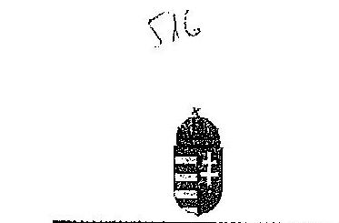

Állami Számvevőszék

Tisztelt Elnök Úr!
A részünkre, véleményezés céljából a V-0457-292/2015. iktatószámon megkibbött, A foglalkoztatási célú adó- és járulékkedvezmények igénybevételének szabályszertáségi ellenórzése címủ vizsgálatáról készült jelentés tervezetet áltanulmányoztuk és azzal kapcsolatosan az alábbi érdemi észrevételeket tesszük:

Elöljáróban meg kívánjuk jegyezni, hogy a jelentés tervezet több helyen is megállapítja, hogy a foglalkoztatási célú adó- és járulékkedvezményekre vonatkozóan külön eljárásrendek, ellenőrzések, szabályozók nem készültek. A NAV egyik alapfeledata az adókötérezettség ellenőrzése, melynek keretében történik meg a kérdéses kedvezmények vizsgálata, ennek megfelelően a Hivatal által vezetett nyilvántartásoknak és a bevallásoknak csak kis részében jelennek meg. A fentiekre tekintettel egy-egy kedvezménycsoportot kiemelni nem indokolt külön szabályozóban, mert az a hatékony és az átlátható müködés elvárásának nem felelne meg, túlszabályozottságot eredményezve.

Részletes észrevételek:

# > 3. oldal második bekezdés 

„2009-2013. években a társasági és osztalékadóból igénybe vett -a-munkahelyteremtési szolgált-beruházásokhoz-kapcsolódó- fejlesztési adókedvezmények összege 146220,0 millió Ft volt."
Tekintettel arra, hogy az igénybe vett fejlesztési adókedvezmény irányulhat a munkahelyteremtés mellett egyéb gazdaságpolitikai célra is, javasoljuk a szövegrész fentieknek megfelelő pontositását.

## > 7. oldal utolsó bekezdés, 9. oldal utolsó bekezdés

Javasoljuk, hogy a jelentés az összegző megállapításokat tartalmazó I. fejezetében, a belső kontrollkörnyezetre vonatkozó megállapítások, (7. oldal utolsó bek.), ill. a START kártyák kiállításával kapcsolatos megállapítások között, (9. oldal utolsó előtti bek.) is utaljon a 3.1 pont első bekezdésében (23. oldal) szereplő megállapításra, amely szerint az ellenőrzött

---

időszakban hatályos START-kártya kiadási szabályzat késedelmes kiadása a kártyák kiállításával és a jogosultságok elbírálásával kapcsolatos eljárás szabályszerűségét nem befolyásolta.

# > 8. oldal első bekezdés első mondata és 19. oldal harmadik bekezdés 

A tervezet megállapítja, hogy a NAV az ellenőrzött időszakban a foglalkoztatási célú adó- és járulékkedvezményekkel kapcsolatos bevallási, nyilvántartási, adatszolgáltatási és ellenőrzési tevékenységhez kapcsolódóan külön eljárásrenddel nem rendelkezett. A 20. oldalon ugyanakkor a harmadik bekezdés megállapítja, hogy a NAV kiadta a bevallások feldolgozásának szabályzatát, melynek melléklete meghatározta (a foglalkoztatási célú adóés járulékkedvezmények bevallására szolgáló) '08-as bevallások feldolgozásának részletszabályait.
Tekintettel arra, hogy a NAV minden évben elkészítette a bevallások feldolgozásával kapcsolatos általános, és az egyes bevallások tekintetében speciális eljárási szabályokat tartalmazó utasításokat, ezért javasoljuk a 8. oldalon az első mondat, illetőleg a 19. oldalon a harmadik bekezdésében jelölni, hogy a NAV a bevallások feldolgozására vonatkozó szabályozásban rendezte ezen kérdéseket.
> 9. oldal második bekezdés 2-3. mondata, 27. oldal hatodik. bekezdés 1. mondata, 30. oldal ötödik bekezdés 3. mondata
„Az APEH/NAV az ellenőrzési tevékenysége során a foglalkoztatási célú adó- és járulékkedvezmények igénybevételét önállóan nem ellenőrizte, az ellenőrzött időszakban célzott kiválasztást nem alkalmazott. Az adó- és járulékkedvezmények igénybevételének jogszerűségét csak a bevallások utólagos vizsgálatára, az egyes adókötelezettségek teljesitésére irányuló, a kedvezménnyel érintett adónemek ellenőrzése keretében vizsgálta." (9. oldal)
„Az APEH/NAV a foglalkoztatási célú adó- és járulékkedvezmények igénybevételét önállóan nem ellenőrizte." (27. oldal)
„Az APEH/NAV az ellenőrzött időszakban az Art. 87. § (1) bekezdés a) és c) pontjainak megfelelően a bevallások utólagos és az egyes adókötelezettségek teljesitésének ellenőrzését végezte, vagyis a foglalkoztatási célú adó-és járulékkedvezményeket önállóan nem ellenőrizte." (30. oldal)
Hangsúlyozni kívánjuk, hogy az adózás rendjéről szóló 2003. évi XCII. törvény (a továbbiakban: Art.) alapján az adóhatóság bevallások utólagos vizsgálatára irányuló adónem ellenőrzést végez, vagyis az adókedvezményeket önállóan nem ellenőrizheti, kizárólag az adókedvezménnyel érintett adónem ellenőrzése során átfogóan vizsgálhatja az adókedvezmények igénybevételének jogszerűségét, mivel kizárólag az adókötelezettséghez kapcsolódó valamennyi kedvezmény illetve kötelezettség együttes vizsgálatával állapítható meg az adott adónem adókötelezettség összege.

Tekintettel arra, hogy a '08-as bevalláson szereplő adónemekhez kapcsolódó egyes adókötelezettségek egymással összefüggésben állnak, az ellenőrzéseknek a '08-as bevallási nyomtatványon szereplő valamennyi adónemre ki kell terjedniük. A bevalláson szereplő adónemek egyidejű vizsgálatával kapcsolatban több körlevél is kiadmányozásra került (95/2009/ELL, 5040/2102/ELL, 5007/2014/ELL). Jogszabály alapján nincs lehetősége az APEH/NAV ellenőrzési szakterületének arra, hogy az adó- és járulékkedvezmény igénybevételének jogszerűségét önállóan ellenőrizzze. A START kártya vonatkozásában megemlítendő, hogy a munkáltató a START programhoz kapcsolódó kártyával rendelkező

---

személyek foglalkoztatása esetén is a '08-as típusú járulékbevallás elkészítésére kötelezett, és tulajdonképpen ennek benyújtásával érvényesíti a kedvezményt. A bevallásban a külön erre a célra kialakított oldalon köteles a munkáltató a kedvezményes járulékfizetéssel járó foglalkoztatás adatait feltüntetni. Így többek között a havi bevallásban szerepeltetni kell a START programhoz kapcsolódó kártya típusát, a kedvezmény igénybevételének időtartamát, a kedvezmény alapját és a kedvezményes járulék összegét.

A jelentés 24. 2. és 3. bekezdése és 25. 1-5. bekezdései szerint a '08-as bevallás minden szükséges adatot tartalmaz, megfelel a jogszabályi előírásoknak, magánszemélyenként kimutatható az igénybe vett adó- és járulékkedvezmény összege. A bevallás feldolgozási rendszer is minden feltételnek megfelel a jelentés szerint.

A havi járulékbevallás adóhatósághoz való benyújtását követően a feldolgozása során a bevallás feldolgozó program összevcti a START programhoz kapcsolódó kártyával rendelkező személyek foglalkoztatására vonatkozóan, a bevallásban feltüntetett adatokat az adóhatóság adóalany-nyilvántartási rendszerében rögzített adatokkal. A bevallás feldolgozás folyamatában így a kártya típusának és a kártya érvényességének ellenőrzése megtörténik. Amennyiben a bevallás és az adóalany-nyilvántartási rendszer adatai nem egyeznek, a bevallás feldolgozása során hibaüzenet keletkezik, ami miatt a bevallás további feldolgozása nem lehetséges. A hibaágra futott bevallást benyújtó munkáltató minden esetben - elektronikus úton - felszólító levelet kap, amelyben az adóhatóság felhívja a bevallás javítására, tehát a bevallásban a jogosulatlan személyre vonatkozóan feltüntetett járulékkedvezmény az adóalany-nyilvántartási rendszerben rögzített adatok segítségével kiszűrhető.

Mivel már a feldolgozás fázisában hibaágra futnak azok a járulék bevallások, amelyekben olyan munkavállaló után próbálnak meg kedvezményt igénybe venni, aki nem rendelkezik START kártyával, ezen kívül a feldolgozó program azokat a nyomtatványokat is kiszűri, ahol a jogosultság időtartamának lejárta után próbálják meg érvényesíteni a kedvezőbb járulék mértéket, ezért a járulék ellenőrzés keretében a START kártyák ellenőrzése alkalmával a járulék kedvezmény jogosulatlan igénybevételével összefüggésben kevés a számszaki (adókülönbözet) megállapítás.
Fentiek alapján az érintett bekezdések alábbiak szerinti módosítását javasoljuk:
„Az APEH/NAV az ellenőrzési tevékenysége során a foglalkoztatási célú adó- és járulékkedvezmények igénybevételét-önállóan-nem-ellenörzste,-az-ellenörzött-idöszakban célzott-kiválasztást-nem-alkalmazott,-Az-adó- és-járulékkedvezmények igénybevételének jogszerüségét esak a bevallások utólagos vizsgálatára, az egyes adókötelezettségek teljesitésére irányuló, a kedvezménnyel érintett adónemek ellenörzése keretében vizsgálta, tekintettel arra, hogy egy adónem adókötelezettség összegének helytállósága kizárólag komplex módon, valamennyi adónemhez köthető kedvezmény és kötelezettség együttes ellenörzése keretében állapitható meg." (9. oldal)
„Az APEH/NAV az ellenőrzött idöszakban az Art. 87. § (1) bekezdés a) és c) pontjainak megfelelően a bevallások utólagos és az egyes adókötelezettségek teljesitésének ellenörzését végezte,-vagyis-a-foglalkoztatási-célú-adó-és-járulékkedvezményeket-önállóan-nem ellenörzste." (30. oldal)
Továbbá a jelentés tervezet 27. oldal hatodik bekezdés első mondatának fentiek alapján történő módosítását javasoljuk.

---

# > 9. oldal 3. bekezdés, 28. oldal 2. bekezdés 4. mondata 

„Az APEH/NAV az ellenőrzött időszakban az Art. rendelkezései szerint a kötelező ellenörzéseken túl végzendő ellenőrzési irányai meghatározására évenként közzétette az ellenőrzési irányelveit. A 2009-2011. évi ellenőrzési irányelvekben nem nevesítették a foglalkoztatási célú TB járulékokból érvényesithető kedvezmények igénybevételének ellenőrzését. A 2012-2013. évi ellenőrzési irányelvek szerint - SZOCHO kedvezmények bevezetését követően - kiemelt figyelmet kellett fordítani a fizetendő adó megállapításánál figyelembe vett kedvezmények érvényesitése jogszerüségének vizsgálatára." (9. oldal)
„Az APEH/NAV a 2009-2011. évi ellenőrzési irányelvekben nem nevesítették a foglalkoztatási célú TB járulékokból érvényesithető kedvezmények igénybevételének ellenőrzését., (28. oldal)
A 2009-2011. évi NAV ellenőrzési irányelv szerint is kiemelt feladat volt a társadalombiztosítás pénzügyi alapjait megillető bevételek ellenőrzése, amelynek keretében a fent leírtakkal összhangban - valamennyi adónemhez kapcsolódó kedvezményt és kötelezettséget komplex módon ellenőriznek az adóellenőrök, vagyis ezen ellenőrzések keretében vizsgálják, hogy érvényesülnek-e az adókedvezmények igénybevételének feltételei.
Fentiek alapján az érintett bekezdés 2. és 3. mondatának alábbiak szerinti módosítását javasoljuk:
„A 2009-2011. évi ellenőrzési irányelvekben külön nem nevesítették a foglalkoztatási célú TB járulékokból érvényesithető kedvezmények igénybevételének ellenőrzését, azonban kiemelt feladatként került nevesítésre valamennyi adónemhez kapcsolódó kedvezmény és kötelezettség komplex módon történő ellenőrzése. A 2012-2013. évi ellenőrzési irányelvekben szerint - SZOCHO kedvezmények bevezetését követően - külön nevesítésre került, hogy kiemelt figyelmet kellett fordítani a fizetendő adó megállapításánál figyelembe vett kedvezmények érvényesitése jogszerüségének vizsgálatára."
Továbbá javasoljuk a 28. oldal második bekezdés 4. mondatának fentieknek megfelelő tartalmi módosítását.
> 9. oldal negyedik bekezdés, 29. oldal ötödik és hetedik bekezdés 3. mondata, 30. oldal hatodik bekezdése:
„Az ellenőrzött időszakban az állami adóhatóságnál nem volt szempont a foglalkoztatási célú adó- és járulékkedvezményeket igénybe vevő adóalanyok ellenőrzésre történő kiválasztása. Az ellenőrzött tételeknél egyetlen esetben sem szerepelt kiválasztási okként a foglalkoztatási célú adó- és járulékkedvezmények ellenőrzése. Az állami adóhatóság által végzett vizsgálatokból ellenőrzésre kiválasztott, - a NAV által rendelkezésre bocsátott ellenőrzötti listából - kettő dokumentáció tartalmazott foglalkoztatási célú adó- és járulékkedvezményt igénybe vevő adózóra vonatkozó ellenőrzést, ezért az APEH/NAV - a Tb járulékból és a SZOCHO-ból a foglalkoztatási célú adó- és járulékkedvezmények igénybevétele szabályszerűségére irányuló - ellenőrzési tevékenységét értékelni nem tudtuk." (9. oldal)
„Az adóhatóság regionális ellenőrzési szervezetelnél a saját hatáskörben történő ellenőrzésre való kijelölésekor az ellenőrzött eseteknél nem volt szempont a foglalkoztatási célú adó- és járulékkedvezményeket igénybe vevő adóalanyok kiválasztása" (29. oldal)
„Az ellenőrzött tételeknél egyetlen esetben sem szerepelt kiválasztási okként a foglalkoztatási célú adó-és járulékkedvezmények ellenőrzése., (29. oldal)

---

„Az APEH/NAV - a Tb járulékból és a SZOCHO-ból a foglalkoztatási célú adó-és járulékkedvezmények igénybevétele szabályszerüségére irányuló - ellenörzési tevékenységét értékelni nem tudtuk, mivel az ellenörzésre kiválasztott,- a NAV által rendelkezésre bocsátott ellenörzötti listából - az állami adóhatóság által végzett vizsgálatokból mindössze kettő dokumentáció tartalmazott foglalkoztatási célú adó-és járulékkedvezményt igénybe vevö adózóra vonatkozó ellenörzést. Az ellenörzött esetekben -ellenörzésre kiválasztott valamennyi tétel alapján - a határidők számítása az Art. 92. § (1) bekezdése szerint történt. Az Art. 92. § (16) bekezdése alapján a vizsgálati program az ellenörzés megkezdésekor rendelkezésre állt. Az ellenörzésekről az Art. 104. § bekezdés szerint jegyzökönyv készült. A megállapításokat a feltárt adóhiányról, adóbirzágról és késedelmi pótlékról az Art. 105. § alapján határozatban rögzítették." (30. oldal)
A jelentés tervezet 9. oldalának 3. bekezdése szerint az ellenőrzési irányokban meghatározott feladat volt a járulék illetve ennek keretében az ehhez kapcsolódó kedvezmények ellenőrzése, vagyis az ellenőrzésre kiválasztás kiemelt szempontja volt az ÁSZ által vizsgált években.
Az, hogy egy adott vizsgálat REV rendszerbeli nyilvántartó lapján nem került külön feltüntetésre olyan kód, hogy mely adókedvezmények kerültek ellenőrzésre, az nem azt jelenti, hogy nem ellenőrizték ezen adókedvezményeket. Továbbra is hangsúlyozzuk, hogy egy vizsgálathoz 1 vizsgálat elrendelési ok-kód, és 6 darab cél-, témakód rögzíthető a REV rendszerben, vagyis priorizálni szükséges, hogy mely kód kerül nyilvántartásba vételre egy vizsgálat esetében.
Azonban azon adózók, amelyek a vizsgált időszakban adókedvezményt érvényesítettek a járulék ellenőrzések keretében vizsgálat alá kerültek, vagyis a vizsgálati lapon szerepel ellenőrzött adónemként a járulék és az adózó vett igénybe adókedvezményt, akkor az adókedvezmény ellenőrzés alá is került, függetlenül egyéb REV rendszerben rögzített kódtól.
Fentieknek megfelelően a járulék adónem ellenőrzésekkel kapcsolatos vizsgálati adatok kerültek átadásra az ÁSZ munkatársai részére. A mítatételekre, vagyis hogy olyan adózók kerültek kiválasztásra az ÁSZ munkatársai részéről, amelyek az érintett adókedvezményt nem vették igénybe a NAV-nak nem volt ráhatása.
Fentiek alapján az érintett bekezdések alábbiak szerinti módosítását javasoljuk:
„Az ellenörzött időszakban az állami adóhatóságnál nem-volt kiemelt ellenörzési szempont volt társadalombiztosítás pénzügyi alapjait megilletö bevételek, és ezen belül a foglalkoztatási célú adó- és járulékkedvezményeket igénybe vevő adóalanyok ellenörzésere történő-kiválasztása. Az ellenörzött-tételeknél-egyetlen esetben-sem-szerepelt-kiválasztási okként-a-foglalkoztatási-célú-adó- és-járulékkedvezmények-ellenörzése. Az állami adóhatóság által végzett vizsgálatokból ellenörzésre kiválasztott, - a NAV által rendelkezésre bocsátott járulék ellenörzötti listából - kettő dokumentáció tartalmazott foglalkoztatási célú adó- és járulékkedvezményt igénybe vevő adózóra vonatkozó ellenörzést, ezért az APEH/NAV - a Tb járulékból és a SZOCHO-ból a foglalkoztatási célú adó- és járulékkedvezmények igénybevétele szabályszerüségére irányuló - ellenörzési tevékenységét értékelni nem tudtuk."
„Az-APEH/NAV-a-Tb-járulékból-és-a-SZOCHO-ból-a-foglalkoztatási-célú-adó-és járulékkedvezmények-igénybevétele-szabályszerüségére-irányuló- ellenörzési-tevékensségét értékelni-nem-tudtuk-mivel Az ellenörzésre kiválasztott,- a NAV által rendelkezésre bocsátott ellenörzötti listából - az állami adóhatóság által végzett vizsgálatokból mindössze kettő dokumentáció tartalmazott foglalkoztatási célú adó-és járulékkedvezményt igénybe vevő adózóra vonatkozó ellenörzést. Az ellenőrzött esetekben -ellenörzésre kiválasztott

---

valamennyi tétel alapján - a határidők számítása az Art. 92. § (1) bekezdése szerint történt. Az Art. 92. § (16) bekezdése alapján a vizsgálati program az ellenőrzés megkezdésekor rendelkezésre állt. Az ellenőrzésekről az Art. 104. § bekezdés szerint jogszükönyv készült. A megállapításokat a feltárt adóhiányról, adóbírságról és késedelmi pótlékról az Art. 105. § alapján határozatban rögzítették."
Valamint a jelentés tervezet 29. oldal 5. bekezdés fentieknek megfelelő tartalmi módosítását javasoljuk.

# > 10. oldal negyedik bekezdés, 33. oldal ötödik bekezdés 3. mondata 

„Az APEH/NAV a fejlesztési adókedvezmények igénybevétele jogszerüségének ellenőrzésére önálló vizsgálatokat az ellenőrzött időszakban nem indított. A fejlesztési adókedvezményeket a bevallások utólagos és az egyes adókötelezettségek teljesitésére irányuló társasági adónem ellenőrzései keretében vizsgálta." (10. oldal)
„Az APEH/NAV a fejlesztési adókedvezmények igénybevétele jogszerüségének és számszaki megfelelőségének ellenőrzésére önálló vizsgálatokat az ellenőrzött időszakban nem indított." (33. oldal)

Hangsúlyozni kívánjuk, hogy a fentiekben részletezett eljárás nem szabálytalan, hanem másképp nem is lehetséges vizsgálat alá vonni a fejlesztési adókedvezmény jogszerüségét, mivel az adónemhez kapcsolódó valamennyi kötelezettség illetve kedvezmény együttes vizsgálatával állapítható meg a tényleges adókötelezettség összege, ahogy az már fentiekben is ismertetésre került.
Fentiek alapján az érintett bekezdés alábbiak szerinti módosítását javasoljuk:
„Az APEH/NAV a fejlesztési adókedvezmények igénybevétele jogszerüségének ellenőrzésére önálló-vizsgálatokat az ellenőrzött időszakban nem indított. A-fejlesztési adókedvezményeket a bevallások utólagos és az egyes adókötelezettségek teljesitésére irányuló társasági adó adónemet érintő ellenőrzései keretében vizsgálta."
$>10$. oldal ötödik bekezdés 3. mondata, 13. oldal javaslata, valamint 35. oldal négy-öt bekezdése
„2009-2013. években az APEH/NAV a fejlesztési adókedvezmény igénybevétele feltételeinek teljesitését a fejlesztési adókedvezményről szóló kormányrendeletben foglaltak ellenére az adókedvezmény első igénybevételét követő harmadik adóév végéig legalább egyszer valamennyi fejlesztési adókedvezményt igénybe vevő adózó esetében- nem ellenőrizte." (10. oldal)
„A 2009-2013. években az APEH/NAV valamennyi fejlesztési adókedvezményt igénybe vevő adózó esetében a fejlesztési adókedvezmény igénybevétele feltételeinek teljesitését a fejlesztési adókedvezményről szóló 206/2006. (X.16.) Korm. rendelet 13. §-ában foglaltak ellenére az adókedvezménye első igénybevételét követő harmadik adóév végéig legalább egyszer nem ellenőrizte.

Javaslat:
Intézkedjen, hogy a fejlesztési adókedvezmény igénybevételéhez kapcsolódó ellenőrzés a vonatkozó, hatályos jogszabályi előírásoknak megfelelően történjenek." (13. oldal)
„A 2009-2013. években az APEH/NAV a fejlesztési adókedvezmény igénybevétele teljesitését az adókedvezmény első igénybevételét követő harmadik adóév végéig legalább egyszer -

---

valamennyi fejlesztési adókedvezményt igénybe vevô adózó vonatkozásában- nem ellenörizte. (35. oldal)

A NAV KH a 2013. évig az NGM által megküldött, a fejlesztési adókedvezmények igénybevételére vonatkozó kérelmeket és bejelentéseket összevetette a NAV nyilvántartásalval, valamint a 2008-2012. évi adóbevallások adataival. Az egybevetés eredményeként létrejött azok kimutatása, akik bejelentés, kérelem hiányában vettek igénybe fejlesztési adókedvezményt ( 9 adózó). Tartalmasta azon adóalanyok listáját is, akik ugyan a bejelentési kötelezettségüknek eleget tettek, de az ellenörzésre a 206/2006. (X.16.) Korm. rendelet 13. §-a szerinti határidöben nem került sor (42 adózó). A körlevélben elöirták a kimutatásokban szereplő adózók soron kivüli ellenörzését. A vizsgálatok végrehajtása és az eredmények értételekse a jelen ellenörzés ideje alatt még folyamatban volt." (35. oldal)
Kérjük az ellenörzési jelentés tervezetében jelzett hiányosság felülvizsgálata és esetlegesen szükséges orvoslása érdekében megjelölni szíveskedjenek azon adózók adószámát, amely alapján a fenti következtetés megállapításra került.
> 10. oldal hatodik bekezdés 1. mondata, 34. oldal ötödik. bekezdés, 35. oldal első bekezdés
„A 2009-2011. években az APEH/NAV nem alkalmazott az ellenörzésre történő kiválasztáskor szüréseket a foglalkoztatási célú fejlesztési adókedvezmények jogosulatlan igénybe vételének feltárása érdekében." (10. oldal)
„A bevallások utólagos ellenörzése során a 2009-2011. években az APEH/NAV nem alkalmazott az ellenörzésre történő kiválasztáskor az Art. 90. § (6) bekezdésének megfelelő szüréseket az adókedvezmények jogosulatlan igénybevételének feltárására. Ezt támasztották alá az ÁSZ 2012. évben közzétett jelentése és a fejlesztési adókedvezmény igénybevétele jogszerüségének soron kivüli ellenörzése elrendeléséröl szóló - a 2012. május 24 -én kelt 5027/2012/ELL, a 2012. december 11-én kelt 5048/2012/ELL számú -körlevelek is. A körlevelek szerint a társasági adóbevallások feldolgozása alapján összevetésre kerültek a bevallásukban fejlesztési adókedvezményt szerepeltető adózók, a kedvezményre jogosultak körével. A körlevelek mellékleteiben azokat a vállalkozásokat szerepeltették, amelyek ellenörzésére nem került sor az elölri határidőben és ezért soron kivül ellenörzésre szólította fel a NAV KH Ellenörzési Főosztálya a regionális szervezeteket." (34. oldal)
„Vagyis nem választották ki ellenörzésre azon adózókat, akik adatszolgáltatás szerint nem tettek bejelentést az adópolitikáért felelős minisztérium felé, így jogosulatlanul vettek igénybe fejlesztési adókedvezményt." (35. oldal)
A fentiekben foglaltak pontatlan megállapítások, mivel történt kiválasztás csak nem minden adókedvezményt igénybe vevő adózó ellenörzésének elrendelésére került sor az elöiri igénybe vételt követő harmadik év végéig, erre hívták fel a figyelmet a megemlített körlevelek.
Fentiek alapján a 10. oldal hatodik bekezdés 1. mondatának törlését javasoljuk, valamint a 34. oldal ötödik bekezdésének és a 35. oldal első bekezdésének alábbiak szerinti módosítását javasoljuk:
„A-bevallások-utólagos-ellenörzése-során-a 2009-2011. években az APEH/NAV nem minden esetben alkalmazott-az ellenörzésre-történő-kiválasztáskor-az-Art-90-§-(6)-bekezdésének megfelelő-szöréseket elrendelte az adókedvezmények igénybe vételét követő harmadik év végéig az igénybe vevő adóalanyok ellenörzéselt, jogosulatlan-igénybevételének feltárására.

---

# 8 

Ezt-támasztották-ald-as ÁSZ-212-évben-közsétett-jelentése-és Ezért a fejlesztési adókedvezmény igénybevétele jogszerüségének soron kivüli ellenörzése elrendeléséröl szóló a 2012. május 24 -én kelt 5027/2012/ELL, a 2012. december 11 -én kelt 5048/2012/ELL számú - körlevelek kerültek kiadásra is. A körlevelek szerint a társasági adóbevallások feldolgozása alapján összevetésre kerültek a bevallásukban fejlesztési adókedvezményt szerepeltető adózók, a kedvezményre jogosultak körével. A körlevelek mellékletében azokat a vállalkozásokat szerepeltették, amelyek ellenörzésére nem került sor az elölirt határidőben és ezért soron kivül ellenörzésre szólította fel a NAV KH Ellenörzési Főosztálya a regionális szervezeteket."
„Vagyis nem teljes körüen választották ki ellenörzésre azon adózókat, akik adatszolgáltatás szerint nem tettek bejelentést az adópolitikáért felelős minisztérium felé, így jogosulatlamul vettek igénybe fejlesztési adókedvezményt."

## $>19$. oldal

A tervezet megállapítása szerint a NAV elnöke által kiadott irányító és jogalkalmazást segítő belső irányítási eszközök nem határozzák meg azt a végső határidőt, amelyen belül jogszabályváltozás esetén a belső irányítási eszközöket módosítani szükséges.
A közjogi szervezetszabályozó eszközként kiadásra kerülő utasításról, valamint az Adó és Vámértesítőről szóló 1/2012. (I.27.) NAV utasítás 4. § (4) bekezdése értelmében, jogszabályváltozás esetén haladéktalanul intézkedni kell az utasítás módosítása, hatályon kívül helyezése vagy új utasítás kiadása iránt. A módosításig, hatályon kívül helyezésig, új utasítás kiadásáig a hatályos jogszabályi rendelkezések alapján kell eljárni. Az irányító és jogalkalmazást segítő eszközök kiadásának rendjéről szóló 2150/2012. elnöki szabályzat 6. pontja kimondja, hogy ezt az elvet kell értelemszerűen alkalmazni a NAV rendelkezésekre is. Továbbá a szabályzat 10. pontja rendelkezik arról is, hogy jogszabályváltozás esetén - a szabályozási igény sürgősségére tekintettel, átmeneti intézkedésként - utasítással, eljárási renddel, szabályzattal ellentétes tartalmú NAV rendelkezést is ki lehet adni, amelyre a NAV elnöke jogosult és melynek maximum érvényességi ideje 90 nap, mely idő alatt a megfelelő, nagyobb volumenű szabályozást ki kell alakítani.
Álláspontunk szerint a belső rendelkezések egyértelműek és rendezik a jogszabályváltozáskor követendő eljárást. Az átmeneti időszakban a jogszabályok szerint, az aktualizálás iránt haladéktalanul intézkedve - és amennyiben átmeneti intézkedés kiadására került sor, erre is figyelemmel - kell eljárni. A vizsgálat során is megállapításra került, hogy a módosítási késedelem nem járt szabálytalansággal.
A fentieknek megfelelően javasoljuk a 19. oldal második bekezdés utolsó mondatának törlését.

## > 29. oldal hetedik bekezdés 2. mondat

„A REV rendszer azonban nem tartalmazott külön céltémo-kódot a foglalkoztatást ösztönzö adó- és járulékkedvezmények vonatkozásában.."
A REV rendszerben - az ÁSZ által ellenőrzött időszakban - rendelkezésre álltak a hiányolt céltéma kódok

- 385 - Szabad vállalkozási zónákban müködő vállalkozások által foglalkoztatott munkavállalók után érvényesíthető adókedvezmény ellenőrzése,
- 403 - Szakképzettséget nem igénylő munkakörben foglalkoztatott munkavállalók után érvényesíthető adókedvezmény ellenőrzése,

---

- 404 - A huszonöt év alatti és az ötven év feletti foglalkoztatott munkavállaló után érvényesíthető adókedvezmény ellenőrzése,
- 406 - Tartósan álláskereső személyek után érvényesíthető adókedvezmény ellenőrzése,
- 407 - Gyermekgondozási díj, a gyermekgondozási segély, valamint a gyermeknevelési támogatás folyósítását követően foglalkoztatott munkavállalók után érvényesíthető adókedvezmény ellenőrzése,
- 408 - Kutatók foglalkoztatása esetén érvényesíthető adókedvezmény ellenőrzése

Azonban továbbra is hangsúlyozzuk, hogy nem a cél, téma kód rögzítése igazolja, hogy ellenőrzésre került-e az adókedvezmény igénybevétel jogszerüsége.
Fentiek alapján az érintett mondat törlését vagy fentieknek megfelelő tartalmi módosítását javasoljuk.

# > 30. oldal első bekezdés 1. mondat 

„A NAV a START kártyákhoz és a Munkahelyvédelmi Akciótervhez kapcsolódó vizsgálati tevékenységének ellenörzéséhez nem tudott rendelkezésre bocsátani olyan ellenörzési listát, amely kizárólag foglalkoztatási célú adó-és járulékkedvezmények igénybevételének ellenörzéselt tartalmazta."
A fentiekben is részletezettek alapján megállapítható, hogy jogszabály alapján nem lehetséges önállóan ellenőrizni egy adókedvezmény jogszerüséget, ezért olyan listát sem lehet készíteni, amely kizárólag ezen ellenörzések adatát tartalmazza.
Fentiek alapján az érintett bekezdés alábbiak szerinti módosítását javasoljuk;
„A NAV a START kártyákhoz és a Munkahelyvédelmi Akciótervhez kapcsolódó vizsgálati tevékenységének ellenörzéséhez -a szabályozásra tekintettel, melynek értelmében adókedvezmény jogszerüségének ellenörzése önállóan nem lehetséges - nem tudott rendelkezésre bocsátani olyan ellenörzési listát, amely kizárólag foglalkoztatási célú adó-és járulékkedvezmények igénybevételének ellenörzéseit tartalmazta."

## > 30. oldal ötödik bekezdés 2. mondat

„A NAV nem tudta az igénybevett adókedvezményhez kapcsolódóan megállapított adókülönbözeteket önállóan kimutatni, így az ellenőrzéshez átadott kimutatások adattartalma sem a foglalkoztatási célú adó-és járulékkedvezmények igénybevételének ellenörzése során feltárt adókülönbözeteket, hanem az adónemek egészére vonatkozó adatokat tartalmazta.."
Nem értelmezhető az „adókedvezményhez kapcsolódóan megállapított adókülönbözet". A NAV jogszabály szerinti kötelezettsége az adott adónemben bevallott adókötelezettség helytállóságának ellenőrzése, vagyis egy adott adónemben tárhat fel az összes kötelezettség figyelembe vételével adókülönbözetet. Fentiek alapján az érintett mondat törlését javasoljuk.

A végső szövegczés kialakításakor kérem észrevételeink, javaslataink szíves figyelembe vételét.

Budapest, 2015. április , 1, ,"
Tisztelettel:
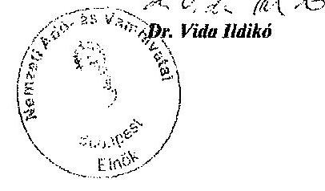

---

# **SOLUTIONS**

## **PROBLEM 1**

### **Part (a)**

**PROBLEM 1**

**PROBLEM 2**

**PROBLEM 3**

**PROBLEM 4**

**PROBLEM 5**

**PROBLEM 6**

**PROBLEM 7**

**PROBLEM 8**

**PROBLEM 9**

**PROBLEM 10**

**PROBLEM 11**

**PROBLEM 12**

**PROBLEM 13**

**PROBLEM 14**

**PROBLEM 15**

**PROBLEM 16**

**PROBLEM 17**

**PROBLEM 18**

**PROBLEM 19**

**PROBLEM 20**

**PROBLEM 21**

**PROBLEM 22**

**PROBLEM 23**

**PROBLEM 24**

**PROBLEM 25**

**PROBLEM 26**

**PROBLEM 27**

**PROBLEM 28**

**PROBLEM 29**

**PROBLEM 30**

**PROBLEM 31**

**PROBLEM 32**

**PROBLEM 33**

**PROBLEM 34**

**PROBLEM 35**

**PROBLEM 36**

**PROBLEM 37**

**PROBLEM 38**

**PROBLEM 39**

**PROBLEM 40**

**PROBLEM 41**

**PROBLEM 42**

**PROBLEM 43**

**PROBLEM 44**

**PROBLEM 45**

**PROBLEM 46**

**PROBLEM 47**

**PROBLEM 48**

**PROBLEM 49**

**PROBLEM 50**

**PROBLEM 51**

**PROBLEM 52**

**PROBLEM 53**

**PROBLEM 54**

**PROBLEM 55**

**PROBLEM 56**

**PROBLEM 57**

**PROBLEM 58**

**PROBLEM 59**

**PROBLEM 60**

**PROBLEM 61**

**PROBLEM 62**

**PROBLEM 63**

**PROBLEM 64**

**PROBLEM 65**

**PROBLEM 66**

**PROBLEM 67**

**PROBLEM 68**

**PROBLEM 69**

**PROBLEM 70**

**PROBLEM 71**

**PROBLEM 72**

**PROBLEM 73**

**PROBLEM 74**

**PROBLEM 75**

**PROBLEM 76**

**PROBLEM 77**

**PROBLEM 78**

**PROBLEM 79**

**PROBLEM 80**

**PROBLEM 81**

**PROBLEM 82**

**PROBLEM 83**

**PROBLEM 84**

**PROBLEM 85**

**PROBLEM 86**

**PROBLEM 87**

**PROBLEM 88**

**PROBLEM 89**

**PROBLEM 90**

**PROBLEM 91**

**PROBLEM 92**

**PROBLEM 93**

**PROBLEM 94**

**PROBLEM 95**

**PROBLEM 96**

**PROBLEM 97**

**PROBLEM 98**

**PROBLEM 99**

**PROBLEM 100**

**PROBLEM 101**

**PROBLEM 102**

**PROBLEM 103**

**PROBLEM 104**

**PROBLEM 105**

**PROBLEM 106**

**PROBLEM 107**

**PROBLEM 108**

**PROBLEM 109**

**PROBLEM 110**

**PROBLEM 111**

**PROBLEM 112**

**PROBLEM 113**

**PROBLEM 114**

**PROBLEM 115**

**PROBLEM 116**

**PROBLEM 117**

**PROBLEM 118**

**PROBLEM 119**

**PROBLEM 120**

**PROBLEM 121**

**PROBLEM 122**

**PROBLEM 123**

**PROBLEM 124**

**PROBLEM 125**

**PROBLEM 126**

**PROBLEM 127**

**PROBLEM 128**

**PROBLEM 129**

**PROBLEM 130**

**PROBLEM 131**

**PROBLEM 132**

**PROBLEM 133**

**PROBLEM 134**

**PROBLEM 135**

**PROBLEM 136**

**PROBLEM 137**

**PROBLEM 138**

**PROBLEM 139**

**PROBLEM 140**

**PROBLEM 141**

**PROBLEM 142**

**PROBLEM 143**

**PROBLEM 144**

**PROBLEM 145**

**PROBLEM 146**

**PROBLEM 147**

**PROBLEM 148**

**PROBLEM 149**

**PROBLEM 150**

**PROBLEM 151**

**PROBLEM 152**

**PROBLEM 153**

**PROBLEM 154**

**PROBLEM 155**

**PROBLEM 156**

**PROBLEM 157**

**PROBLEM 158**

**PROBLEM 159**

**PROBLEM 160**

**PROBLEM 161**

**PROBLEM 162**

**PROBLEM 163**

**PROBLEM 164**

**PROBLEM 165**

**PROBLEM 166**

**PROBLEM 167**

**PROBLEM 168**

**PROBLEM 169**

**PROBLEM 170**

**PROBLEM 171**

**PROBLEM 172**

**PROBLEM 173**

**PROBLEM 174**

**PROBLEM 175**

**PROBLEM 176**

**PROBLEM 177**

**PROBLEM 178**

**PROBLEM 179**

**PROBLEM 180**

**PROBLEM 181**

**PROBLEM 182**

**PROBLEM 183**

**PROBLEM 184**

**PROBLEM 185**

**PROBLEM 186**

**PROBLEM 187**

**PROBLEM 188**

**PROBLEM 189**

**PROBLEM 190**

**PROBLEM 191**

**PROBLEM 192**

**PROBLEM 193**

**PROBLEM 194**

**PROBLEM 195**

**PROBLEM 196**

**PROBLEM 197**

**PROBLEM 198**

**PROBLEM 199**

**PROBLEM 200**

**PROBLEM 201**

**PROBLEM 202**

**PROBLEM 203**

**PROBLEM 204**

**PROBLEM 205**

**PROBLEM 206**

**PROBLEM 207**

**PROBLEM 208**

**PROBLEM 209**

**PROBLEM 210**

**PROBLEM 211**

**PROBLEM 212**

**PROBLEM 213**

**PROBLEM 214**

**PROBLEM 215**

**PROBLEM 216**

**PROBLEM 217**

**PROBLEM 218**

**PROBLEM 219**

**PROBLEM 220**

**PROBLEM 221**

**PROBLEM 222**

**PROBLEM 223**

**PROBLEM 224**

**PROBLEM 225**

**PROBLEM 226**

**PROBLEM 227**

**PROBLEM 228**

**PROBLEM 229**

**PROBLEM 230**

**PROBLEM 231**

**PROBLEM 232**

**PROBLEM 233**

**PROBLEM 234**

**PROBLEM 235**

**PROBLEM 236**

**PROBLEM 237**

**PROBLEM 238**

**PROBLEM 239**

**PROBLEM 240**

**PROBLEM 241**

**PROBLEM 242**

**PROBLEM 243**

**PROBLEM 244**

**PROBLEM 245**

**PROBLEM 246**

**PROBLEM 247**

**PROBLEM 248**

**PROBLEM 249**

**PROBLEM 250**

**PROBLEM 251**

**PROBLEM 252**

**PROBLEM 253**

**PROBLEM 254**

**PROBLEM 255**

**PROBLEM 256**

**PROBLEM 257**

**PROBLEM 258**

**PROBLEM 259**

**PROBLEM 260**

**PROBLEM 261**

**PROBLEM 262**

**PROBLEM 263**

**PROBLEM 264**

**PROBLEM 265**

**PROBLEM 266**

**PROBLEM 267**

**PROBLEM 268**

**PROBLEM 269**

**PROBLEM 270**

**PROBLEM 271**

**PROBLEM 272**

**PROBLEM 273**

**PROBLEM 274**

**PROBLEM 275**

**PROBLEM 276**

**PROBLEM 277**

**PROBLEM 278**

**PROBLEM 279**

**PROBLEM 280**

**PROBLEM 281**

**PROBLEM 282**

**PROBLEM 283**

**PROBLEM 284**

**PROBLEM 285**

**PROBLEM 286**

**PROBLEM 287**

**PROBLEM 288**

**PROBLEM 289**

**PROBLEM 290**

**PROBLEM 291**

**PROBLEM 292**

**PROBLEM 293**

**PROBLEM 294**

**PROBLEM 295**

**PROBLEM 296**

**PROBLEM 297**

**PROBLEM 298**

**PROBLEM 299**

**PROBLEM 300**

**PROBLEM 301**

**PROBLEM 302**

**PROBLEM 303**

**PROBLEM 304**

**PROBLEM 305**

**PROBLEM 306**

**PROBLEM 307**

**PROBLEM 308**

**PROBLEM 309**

**PROBLEM 310**

**PROBLEM 311**

**PROBLEM 312**

**PROBLEM 313**

**PROBLEM 314**

**PROBLEM 315**

**PROBLEM 316**

**PROBLEM 317**

**PROBLEM 318**

**PROBLEM 319**

**PROBLEM 320**

**PROBLEM 321**

**PROBLEM 322**

**PROBLEM 323**

**PROBLEM 324**

**PROBLEM 325**

**PROBLEM 326**

**PROBLEM 327**

**PROBLEM 328**

**PROBLEM 329**

**PROBLEM 330**

**PROBLEM 331**

**PROBLEM 332**

**PROBLEM 333**

**PROBLEM 334**

**PROBLEM 335**

**PROBLEM 336**

**PROBLEM 337**

**PROBLEM 338**

**PROBLEM 339**

**PROBLEM 340**

**PROBLEM 341**

**PROBLEM 342**

**PROBLEM 343**

**PROBLEM 344**

**PROBLEM 345**

**PROBLEM 346**

**PROBLEM 347**

**PROBLEM 348**

**PROBLEM 349**

**PROBLEM 350**

**PROBLEM 351**

**PROBLEM 352**

**PROBLEM 353**

**PROBLEM 354**

**PROBLEM 355**

**PROBLEM 356**

**PROBLEM 357**

**PROBLEM 358**

**PROBLEM 359**

**PROBLEM 360**

**PROBLEM 361**

**PROBLEM 362**

**PROBLEM 363**

**PROBLEM 364**

**PROBLEM 365**

**PROBLEM 366**

**PROBLEM 367**

**PROBLEM 368**

**PROBLEM 369**

**PROBLEM 370**

**PROBLEM 371**

**PROBLEM 372**

**PROBLEM 373**

**PROBLEM 374**

**PROBLEM 375**

**PROBLEM 376**

**PROBLEM 377**

**PROBLEM 378**

**PROBLEM 379**

**PROBLEM 380**

**PROBLEM 381**

**PROBLEM 382**

**PROBLEM 383**

**PROBLEM 384**

**PROBLEM 385**

**PROBLEM 386**

**PROBLEM 387**

**PROBLEM 388**

**PROBLEM 389**

**PROBLEM 390**

**PROBLEM 391**

**PROBLEM 392**

**PROBLEM 393**

**PROBLEM 394**

**PROBLEM 395**

**PROBLEM 396**

**PROBLEM 397**

**PROBLEM 398**

**PROBLEM 399**

**PROBLEM 400**

**PROBLEM 401**

**PROBLEM 402**

**PROBLEM 403**

**PROBLEM 404**

**PROBLEM 405**

**PROBLEM 406**

**PROBLEM 407**

**PROBLEM 408**

**PROBLEM 409**

**PROBLEM 410**

**PROBLEM 411**

**PROBLEM 412**

**PROBLEM 413**

**PROBLEM 414**

**PROBLEM 415**

**PROBLEM 416**

**PROBLEM 417**

**PROBLEM 418**

**PROBLEM 419**

**PROBLEM 420**

**PROBLEM 421**

**PROBLEM 422**

**PROBLEM 423**

**PROBLEM 424**

**PROBLEM 425**

**PROBLEM 426**

**PROBLEM 427**

**PROBLEM 428**

**PROBLEM 429**

**PROBLEM 430**

**PROBLEM 431**

**PROBLEM 432**

**PROBLEM 433**

**PROBLEM 434**

**PROBLEM 435**

**PROBLEM 436**

**PROBLEM 437**

**PROBLEM 438**

**PROBLEM 439**

**PROBLEM 440**

**PROBLEM 441**

**PROBLEM 442**

**PROBLEM 443**

**PROBLEM 444**

**PROBLEM 445**

**PROBLEM 446**

**PROBLEM 447**

**PROBLEM 448**

**PROBLEM 449**

**PROBLEM 450**

**PROBLEM 451**

**PROBLEM 452**

**PROBLEM 453**

**PROBLEM 454**

**PROBLEM 455**

**PROBLEM 456**

**PROBLEM 457**

**PROBLEM 458**

**PROBLEM 459**

**PROBLEM 460**

**PROBLEM 461**

**PROBLEM 462**

**PROBLEM 463**

**PROBLEM 464**

**PROBLEM 465**

**PROBLEM 466**

**PROBLEM 467**

**PROBLEM 468**

**PROBLEM 469**

**PROBLEM 470**

**PROBLEM 471**

**PROBLEM 472**

**PROBLEM 473**

**PROBLEM 474**

**PROBLEM 475**

**PROBLEM 476**

**PROBLEM 477**

**PROBLEM 478**

**PROBLEM 479**

**PROBLEM 480**

**PROBLEM 481**

**PROBLEM 482**

**PROBLEM 483**

**PROBLEM 484**

**PROBLEM 485**

**PROBLEM 486**

**PROBLEM 487**

**PROBLEM 488**

**PROBLEM 489**

**PROBLEM 490**

**PROBLEM 491**

**PROBLEM 492**

**PROBLEM 493**

**PROBLEM 494**

**PROBLEM 495**

**PROBLEM 496**

**PROBLEM 497**

**PROBLEM 498**

**PROBLEM 499**

**PROBLEM 500**

**PROBLEM 501**

**PROBLEM 502**

**PROBLEM 503**

**PROBLEM 504**

**PROBLEM 505**

**PROBLEM 506**

**PROBLEM 507**

**PROBLEM 508**

**PROBLEM 509**

**PROBLEM 510**

**PROBLEM 511**

**PROBLEM 512**

**PROBLEM 513**

**PROBLEM 514**

**PROBLEM 515**

**PROBLEM 516**

**PROBLEM 517**

**PROBLEM 518**

**PROBLEM 519**

**PROBLEM 520**

**PROBLEM 521**

**PROBLEM 522**

**PROBLEM 523**

**PROBLEM 524**

**PROBLEM 525**

**PROBLEM 526**

**PROBLEM 527**

**PROBLEM 528**

**PROBLEM 529**

**PROBLEM 530**

**PROBLEM 531**

**PROBLEM 532**

**PROBLEM 533**

**PROBLEM 534**

**PROBLEM 535**

**PROBLEM 536**

**PROBLEM 537**

**PROBLEM 538**

**PROBLEM 539**

**PROBLEM 540**

**PROBLEM 541**

**PROBLEM 542**

**PROBLEM 543**

**PROBLEM 544**

**PROBLEM 545**

**PROBLEM 546**

**PROBLEM 547**

**PROBLEM 548**

**PROBLEM 549**

**PROBLEM 550**

**PROBLEM 551**

**PROBLEM 552**

**PROBLEM 553**

**PROBLEM 554**

**PROBLEM 555**

**PROBLEM 556**

**PROBLEM 557**

**PROBLEM 558**

**PROBLEM 559**

**PROBLEM 560**

**PROBLEM 561**

**PROBLEM 562**

**PROBLEM 563**

**PROBLEM 564**

**PROBLEM 565**

**PROBLEM 566**

**PROBLEM 567**

**PROBLEM 568**

**PROBLEM 569**

**PROBLEM 570**

**PROBLEM 571**

**PROBLEM 572**

**PROBLEM 573**

**PROBLEM 574**

**PROBLEM 575**

**PROBLEM 576**

**PROBLEM 577**

**PROBLEM 578**

**PROBLEM 579**

**PROBLEM 580**

**PROBLEM 581**

**PROBLEM 582**

**PROBLEM 583**

**PROBLEM 584**

**PROBLEM 585**

**PROBLEM 586**

**PROBLEM 587**

**PROBLEM 588**

**PROBLEM 589**

**PROBLEM 590**

**PROBLEM 591**

**PROBLEM 592**

**PROBLEM 593**

**PROBLEM 594**

**PROBLEM 595**

**PROBLEM 596**

**PROBLEM 597**

**PROBLEM 598**

**PROBLEM 599**

**PROBLEM 591**

**PROBLEM 592**

**PROBLEM 593**

**PROBLEM 594**

**PROBLEM 595**

**PROBLEM 596**

**PROBLEM 597**

**PROBLEM 598**

**PROBLEM 599**

**PROBLEM 591**

**PROBLEM 592**

**PROBLEM 593**

**PROBLEM 594**

**PROBLEM 595**

**PROBLEM 596**

**PROBLEM 597**

**PROBLEM 598**

**PROBLEM 599**

**PROBLEM 591**

**PROBLEM 592**

**PROBLEM 593**

**PROBLEM 594**

**PROBLEM 595**

**PROBLEM 596**

**PROBLEM 597**

**PROBLEM 598**

**PROBLEM 599**

**PROBLEM 591**

**PROBLEM 592**

**PROBLEM 593**

**PROBLEM 594**

**PROBLEM 595**

**PROBLEM 596**

**PROBLEM 597**

**PROBLEM 598**

**PROBLEM 599**

**PROBLEM 591**

**PROBLEM 592**

**PROBLEM 593**

**PROBLEM 594**

**PROBLEM 595**

**PROBLEM 596**

**PROBLEM 597**

**PROBLEM 598**

**PROBLEM 599**

**PROBLEM 591**

**PROBLEM 592**

**PROBLEM 593**

**PROBLEM 594**

**PROBLEM 595**

**PROBLEM 596**

**PROBLEM 597**

**PROBLEM 598**

**PROBLEM 599**

**PROBLEM 591**

**PROBLEM 592**

**PROBLEM 593**

**PROBLEM 594**

**PROBLEM 595**

**PROBLEM 596**

**PROBLEM 597**

**PROBLEM 598**

**PROBLEM 599**

**PROBLEM 591**

**PROBLEM 592**

**PROBLEM 593**

**PROBLEM 594**

**PROBLEM 595**

**PROBLEM 596**

**PROBLEM 597**

**PROBLEM 598**

**PROBLEM 599**

**PROBLEM 591**

**PROBLEM 592**

**PROBLEM 593**

**PROBLEM 594**

**PROBLEM 595**

**PROBLEM 596**

**PROBLEM 597**

**PROBLEM 598**

**PROBLEM 599**

**PROBLEM 591**

**PROBLEM 592**

**PROBLEM 593**

**PROBLEM 594**

**PROBLEM 595**

**PROBLEM 596**

**PROBLEM 597**

**PROBLEM 598**

**PROBLEM 599**

**PROBLEM 591**

**PROBLEM 592**

**PROBLEM 593**

**PROBLEM 594**

**PROBLEM 595**

**PROBLEM 596**

**PROBLEM 597**

**PROBLEM 598**

**PROBLEM 599**

**PROBLEM 591**

**PROBLEM 592**

**PROBLEM 593**

**PROBLEM 594**

**PROBLEM 595**

**PROBLEM 596**

**PROBLEM 597**

**PROBLEM 598**

**PROBLEM 599**

**PROBLEM 591**

**PROBLEM 592**

**PROBLEM 593**

**PROBLEM 594**

**PROBLEM 595**

**PROBLEM 596**

**PROBLEM 597**

**PROBLEM 598**

**PROBLEM 599**

**PROBLEM 591**

**PROBLEM 592**

**PROBLEM 593**

**PROBLEM 594**

**PROBLEM 595**

**PROBLEM 596**

**PROBLEM 597**

**PROBLEM 598**

**PROBLEM 599**

**PROBLEM 591**

**PROBLEM 592**

**PROBLEM 593**

**PROBLEM 594**

**PROBLEM 595**

**PROBLEM 596**

**PROBLEM 597**

**PROBLEM 598**

**PROBLEM 599**

**PROBLEM 591**

**PROBLEM 592**

**PROBLEM 593**

**PROBLEM 594**

**PROBLEM 595**

**PROBLEM 596**

**PROBLEM 597**

**PROBLEM 598**

**PROBLEM 599**

**PROBLEM 591**

**PROBLEM 592**

**PROBLEM 593**

**PROBLEM 594**

**PROBLEM 595**

**PROBLEM 596**

**PROBLEM 597**

**PROBLEM 598**

**PROBLEM 599**

**PROBLEM 591**

**PROBLEM 592**

**PROBLEM 593**

**PROBLEM 594**

**PROBLEM 595**

**PROBLEM 596**

**PROBLEM 597**

**PROBLEM 598**

**PROBLEM 599**

**PROBLEM 591**

**PROBLEM 592**

**PROBLEM 593**

**PROBLEM 594**

**PROBLEM 595**

**PROBLEM 596**

**PROBLEM 597**

**PROBLEM 598**

**PROBLEM 599**

**PROBLEM 591**

**PROBLEM 592**

**PROBLEM 593**

**PROBLEM 594**

**PROBLEM 595**

**PROBLEM 596**

**PROBLEM 597**

**PROBLEM 598**

**PROBLEM 599**

**PROBLEM 591**

**PROBLEM 592**

**PROBLEM 593**

**PROBLEM 594**

**PROBLEM 595**

**PROBLEM 596**

**PROBLEM 597**

**PROBLEM 598**

**PROBLEM 599**

**PROBLEM 591**

**PROBLEM 592**

**PROBLEM 593**

**PROBLEM 594**

**PROBLEM 595**

**PROBLEM 596**

**PROBLEM 597**

**PROBLEM 598**

**PROBLEM 599**

**PROBLEM 591**

**PROBLEM 592**

**PROBLEM 593**

**PROBLEM 594**

**PROBLEM 595**

**PROBLEM 596**

**PROBLEM 597**

**PROBLEM 598**

**PROBLEM 599**

**PROBLEM 591**

**PROBLEM 592**

**PROBLEM 593**

**PROBLEM 594**

**PROBLEM 595**

**PROBLEM 596**

**PROBLEM 597**

**PROBLEM 598**

**PROBLEM 599**

**PROBLEM 591**

**PROBLEM 592**

**PROBLEM 593**

**PROBLEM 594**

**PROBLEM 595**

**PROBLEM 596**

**PROBLEM 597**

**PROBLEM 598**

**PROBLEM 599**

**PROBLEM 591**

**PROBLEM 592**

**PROBLEM 593**

**PROBLEM 594**

**PROBLEM 595**

**PROBLEM 596**

**PROBLEM 597**

**PROBLEM 598**

**PROBLEM 599**

**PROBLEM 591**

**PROBLEM 592**

**PROBLEM 593**

**PROBLEM 594**

**PROBLEM 595**

**PROBLEM 596**

**PROBLEM 597**

**PROBLEM 598**

**PROBLEM 599**

**PROBLEM 591**

**PROBLEM 592**

**PROBLEM 593**

**PROBLEM 594**

**PROBLEM 595**

**PROBLEM 596**

**PROBLEM 597**

**PROBLEM 598**

**PROBLEM 599**

**PROBLEM 591**

**PROBLEM 592**

**PROBLEM 593**

**PROBLEM 594**

**PROBLEM 595**

**PROBLEM 596**

**PROBLEM 597**

**PROBLEM 598**

**PROBLEM 599**

**PROBLEM 591**

**PROBLEM 592**

**PROBLEM 593**

**PROBLEM 594**

**PROBLEM 595**

**PROBLEM 596**

**PROBLEM 597**

**PROBLEM 598**

**PROBLEM 599**

**PROBLEM 591**

**PROBLEM 592**

**PROBLEM 593**

**PROBLEM 594**

**PROBLEM 595**

**PROBLEM 596**

**PROBLEM 597**

**PROBLEM 598**

**PROBLEM 599**

**PROBLEM 591**

**PROBLEM 592**

**PROBLEM 593**

**PROBLEM 594**

**PROBLEM 595**

**PROBLEM 596**

**PROBLEM 597**

**PROBLEM 598**

**PROBLEM 599**

**PROBLEM 591**

**PROBLEM 592**

**PROBLEM 593**

**PROBLEM 594**

**PROBLEM 595**

**PROBLEM 596**

**PROBLEM 597**

**PROBLEM 598**

**PROBLEM 599**

**PROBLEM 591**

**PROBLEM 592**

**PROBLEM 593**

**PROBLEM 594**

**PROBLEM 595**

**PROBLEM 596**

**PROBLEM 597**

**PROBLEM 598**

**PROBLEM 599**

**PROBLEM 591**

**PROBLEM 592**

**PROBLEM 593**

**PROBLEM 594**

**PROBLEM 595**

**PROBLEM 596**

**PROBLEM 597**

**PROBLEM 598**

**PROBLEM 599**

**PROBLEM 591**

**PROBLEM 592**

**PROBLEM 593**

**PROBLEM 594**

**PROBLEM 595**

**PROBLEM 596**

**PROBLEM 597**

**PROBLEM 598**

**PROBLEM 599**

**PROBLEM 591**

**PROBLEM 592**

**PROBLEM 593**

**PROBLEM 594**

**PROBLEM 595**

**PROBLEM 596**

**PROBLEM 597**

**PROBLEM 598**

**PROBLEM 599**

**PROBLEM 591**

**PROBLEM 592**

**PROBLEM 593**

**PROBLEM 594**

**PROBLEM 595**

**PROBLEM 596**

**PROBLEM 597**

**PROBLEM 598**

**PROBLEM 599**

**PROBLEM 591**

**PROBLEM 592**

**PROBLEM 593**

**PROBLEM 594**

**PROBLEM 595**

**PROBLEM 596**

**PROBLEM 597**

**PROBLEM 598**

**PROBLEM 599**

**PROBLEM 591**

**PROBLEM 592**

**PROBLEM 593**

**PROBLEM 594**

**PROBLEM 595**

**PROBLEM 596**

**PROBLEM 597**

**PROBLEM 598**

**PROBLEM 599**

**PROBLEM 591**

**PROBLEM 592**

**PROBLEM 593**

**PROBLEM 594**

**PROBLEM 595**

**PROBLEM 596**

**PROBLEM 597**

**PROBLEM 598**

**PROBLEM 599**

**PROBLEM 591**

**PROBLEM 592**

**PROBLEM 593**

**PROBLEM 594**

**PROBLEM 595**

**PROBLEM 596**

**PROBLEM 597**

**PROBLEM 598**

**PROBLEM 599**

**PROBLEM 591**

**PROBLEM 592**

**PROBLEM 593**

**PROBLEM 594**

**PROBLEM 595**

**PROBLEM 596**

**PROBLEM 597**

**PROBLEM 598**

**PROBLEM 599**

**PROBLEM 591**

**PROBLEM 592**

**PROBLEM 593**

**PROBLEM 594**

**PROBLEM 595**

**PROBLEM 596**

**PROBLEM 597**

**PROBLEM 598**

**PROBLEM 599**

**PROBLEM 591**

**PROBLEM 592**

**PROBLEM 593**

**PROBLEM 594**

**PROBLEM 595**

**PROBLEM 596**

**PROBLEM 597**

**PROBLEM 598**

**PROBLEM 599**

**PROBLEM 591**

**PROBLEM 592**

**PROBLEM 593**

**PROBLEM 594**

**PROBLEM 595**

**PROBLEM 596**

**PROBLEM 597**

**PROBLEM 598**

**PROBLEM 599**

**PROBLEM 591**

**PROBLEM 592**

**PROBLEM 593**

**PROBLEM 594**

**PROBLEM 595**

**PROBLEM 596**

**PROBLEM 597**

**PROBLEM 598**

**PROBLEM 599**

**PROBLEM 591**

**PROBLEM 592**

**PROBLEM 593**

**PROBLEM 594**

**PROBLEM 595**

**PROBLEM 596**

**PROBLEM 597**

**PROBLEM 598**

**PROBLEM 599**

**PROBLEM 591**

**PROBLEM 592**

**PROBLEM 593**

**PROBLEM 594**

**PROBLEM 595**

**PROBLEM 596**

**PROBLEM 597**

**PROBLEM 598**

**PROBLEM 599**

**PROBLEM 591**

**PROBLEM 592**

**PROBLEM 593**

**PROBLEM 594**

**PROBLEM 595**

**PROBLEM 596**

**PROBLEM 597**

**PROBLEM 598**

**PROBLEM 599**

**PROBLEM 591**

**PROBLEM 592**

**PROBLEM 593**

**PROBLEM 594**

**PROBLEM 595**

**PROBLEM 596**

**PROBLEM 597**

**PROBLEM 598**

**PROBLEM 599**

**PROBLEM 591**

**PROBLEM 592**

**PROBLEM 593**

**PROBLEM 594**

**PROBLEM 595**

**PROBLEM 596**

**PROBLEM 597**

**PROBLEM 598**

**PROBLEM 599**

**PROBLEM 591**

**PROBLEM 592**

**PROBLEM 593**

**PROBLEM 594**

**PROBLEM 595**

**PROBLEM 596**

**PROBLEM 597**

**PROBLEM 598**

**PROBLEM 599**

**PROBLEM 591**

**PROBLEM 592**

**PROBLEM 593**

**PROBLEM 594**

**PROBLEM 595**

**PROBLEM 596**

**PROBLEM 597**

**PROBLEM 598**

**PROBLEM 599**

**PROBLEM 591**

**PROBLEM 592**

**PROBLEM 593**

**PROBLEM 594**

**PROBLEM 595**

**PROBLEM 596**

**PROBLEM 597**

**PROBLEM 598**

**PROBLEM 599**

**PROBLEM 591**

**PROBLEM 592**

**PROBLEM 593**

**PROBLEM 594**

**PROBLEM 595**

**PROBLEM 596**

**PROBLEM 597**

**PROBLEM 598**

**PROBLEM 599**

**PROBLEM 591**

**PROBLEM 592**

**PROBLEM 593**

**PROBLEM 594**

**PROBLEM 595**

**PROBLEM 596**

**PROBLEM 597**

**PROBLEM 598**

**PROBLEM 599**

**PROBLEM 591**

**PROBLEM 592**

**PROBLEM 593**

**PROBLEM 594**

**PROBLEM 595**

**PROBLEM 596**

**PROBLEM 597**

**PROBLEM 598**

**PROBLEM 599**

**PROBLEM 591**

**PROBLEM 592**

**PROBLEM 593**

**PROBLEM 594**

**PROBLEM 595**

**PROBLEM 596**

**PROBLEM 597**

**PROBLEM 598**

**PROBLEM 599**

**PROBLEM 591**

**PROBLEM 592**

**PROBLEM 593**

**PROBLEM 594**

**PROBLEM 595**

**PROBLEM 596**

**PROBLEM 597**

**PROBLEM 598**

**PROBLEM 599**

**PROBLEM 591**

**PROBLEM 592**

**PROBLEM 593**

**PROBLEM 594**

**PROBLEM 595**

**PROBLEM 596**

**PROBLEM 597**

**PROBLEM 598**

**PROBLEM 599**

**PROBLEM 591**

**PROBLEM 592**

**PROBLEM 593**

**PROBLEM 594**

**PROBLEM 595**

**PROBLEM 596**

**PROBLEM 597**

**PROBLEM 598**

**PROBLEM 599**

**PROBLEM 591**

**PROBLEM 592**

**PROBLEM 593**

**PROBLEM 594**

**PROBLEM 595**

**PROBLEM 596**

**PROBLEM 597**

**PROBLEM 598**

**PROBLEM 599**

**PROBLEM 591**

**PROBLEM 592**

**PROBLEM 593**

**PROBLEM 594**

**PROBLEM 595**

**PROBLEM 596**

**PROBLEM 597**

**PROBLEM 598**

**PROBLEM 599**

**PROBLEM 591**

**PROBLEM 592**

**PROBLEM 593**

**PROBLEM 594**

**PROBLEM 595**

**PROBLEM 596**

**PROBLEM 597**

**PROBLEM 598**

**PROBLEM 599**

**PROBLEM 591**

**PROBLEM 592**

**PROBLEM 593**

**PROBLEM 594**

**PROBLEM 595**

**PROBLEM 596**

**PROBLEM 597**

**PROBLEM 598**

**PROBLEM 599**

**PROBLEM 591**

**PROBLEM 592**

**PROBLEM 593**

**PROBLEM 594**

**PROBLEM 595**

**PROBLEM 596**

**PROBLEM 597**

**PROBLEM 598**

**PROBLEM 599**

**PROBLEM 591**

**PROBLEM 592**

**PROBLEM 593**

**PROBLEM 594**

**PROBLEM 595**

**PROBLEM 596**

**PROBLEM 597**

**PROBLEM 598**

**PROBLEM 599**

**PROBLEM 591**

**PROBLEM 592**

**PROBLEM 593**

**PROBLEM 594**

**PROBLEM 595**

**PROBLEM 596**

**PROBLEM 597**

**PROBLEM 598**

**PROBLEM 599**

**PROBLEM 591**

**PROBLEM 592**

**PROBLEM 593**

**PROBLEM 594**

**PROBLEM 595**

**PROBLEM 596**

**PROBLEM 597**

**PROBLEM 598**

**PROBLEM 599**

**PROBLEM 591**

**PROBLEM 592**

**PROBLEM 593**

**PROBLEM 594**

**PROBLEM 595**

**PROBLEM 596**

**PROBLEM 597**

**PROBLEM 598**

**PROBLEM 599**

**PROBLEM 591**

**PROBLEM 592**

**PROBLEM 593**

**PROBLEM 594**

**PROBLEM 595**

**PROBLEM 596**

**PROBLEM 597**

**PROBLEM 598**

**PROBLEM 599**

**PROBLEM 591**

**PROBLEM 592**

**PROBLEM 593**

**PROBLEM 594**

**PROBLEM 595**

**PROBLEM 596**

**PROBLEM 597**

**PROBLEM 598**

**PROBLEM 599**

**PROBLEM 591**

**PROBLEM 592**

**PROBLEM 593**

**PROBLEM 594**

**PROBLEM 595**

**PROBLEM 596**

**PROBLEM 597**

**PROBLEM 598**

**PROBLEM 599**

**PROBLEM 591**

**PROBLEM 592**

**PROBLEM 593**

**PROBLEM 594**

**PROBLEM 595**

**PROBLEM 597**

**PROBLEM 598**

**PROBLEM 599**

**PROBLEM 591**

**PROBLEM 592**

**PROBLEM 593**

**PROBLEM 594**

**PROBLEM 595**

**PROBLEM 596**

**PROBLEM 597**

**PROBLEM 598**

**PROBLEM 599**

**PROBLEM 591**

**PROBLEM 592**

**PROBLEM 593**

**PROBLEM 594**

**PROBLEM 595**

**PROBLEM 597**

**PROBLEM 598**

**PROBLEM 599**

**PROBLEM 591**

**PROBLEM 592**

**PROBLEM 593**

**PROBLEM 594**

**PROBLEM 595**

**PROBLEM 596**

**PROBLEM 597**

**PROBLEM 598**

**PROBLEM 599**

**PROBLEM 591**

**PROBLEM 592**

**PROBLEM 593**

**PROBLEM 594**

**PROBLEM 595**

**PROBLEM 597**

**PROBLEM 598**

**PROBLEM 599**

**PROBLEM 591**

**PROBLEM 592**

**PROBLEM 593**

**PROBLEM 594**

**PROBLEM 595**

**PROBLEM 596**

**PROBLEM 597**

**PROBLEM 598**

**PROBLEM 599**

**PROBLEM 591**

**PROBLEM 592**

**PROBLEM 593**

**PROBLEM 594**

**PROBLEM 595**

**PROBLEM 597**

**PROBLEM 598**

**PROBLEM 599**

**PROBLEM 599**

**PROBLEM 591**

**PROBLEM 592**

**PROBLEM 593**

**PROBLEM 594**

**PROBLEM 595**

**PROBLEM 596**

**PROBLEM 597**

**PROBLEM 598**

**PROBLEM 599**

**PROBLEM 599**

**PROBLEM 591**

**PROBLEM 592**

**PROBLEM 593**

**PROBLEM 594**

**PROBLEM 595**

**PROBLEM 596**

**PROBLEM 597**

**PROBLEM 598**

**PROBLEM 599**

**PROBLEM 599**

**PROBLEM 591**

**PROBLEM 592**

**PROBLEM 593**

**PROBLEM 594**

**PROBLEM 595**

**PROBLEM 596**

**PROBLEM 597**

**PROBLEM 598**

**PROBLEM 599**

**PROBLEM 599**

**PROBLEM 591**

**PROBLEM 592**

**PROBLEM 593**

**PROBLEM 594**

**PROBLEM 595**

**PROBLEM 596**

**PROBLEM 597**

**PROBLEM 598**

**PROBLEM 599**

**PROBLEM 599**

**PROBLEM 591**

**PROBLEM 592**

**PROBLEM 593**

**PROBLEM 594**

**PROBLEM 595**

**PROBLEM 596**

**PROBLEM 597**

**PROBLEM 598**

**PROBLEM 599**

**PROBLEM 599**

**PROBLEM 599**

**PROBLEM 591**

**PROBLEM 592**

**PROBLEM 593**

**PROBLEM 594**

**PROBLEM 595**

**PROBLEM 596**

**PROBLEM 597**

**PROBLEM 598**

**PROBLEM 599**

**PROBLEM 5992**

**PROBLEM 593**

**PROBLEM 594**

**PROBLEM 595**

**PROBLEM 597**

**PROBLEM 598**

**PROBLEM 599**

**PROBLEM 5993**

**PROBLEM 594**

**PROBLEM 595**

**PROBLEM 596**

**PROBLEM 597**

**PROBLEM 598**

**PROBLEM 599**

**PROBLEM 599**

**PROBLEM 599**

**PROBLEM 599**

**PROBLEM 599**

**PROBLEM 599**

**PROBLEM 599**

**PROBLEM 599**

**PROBLEM 599**

**PROBLEM 599**

**PROBLEM 599**

**PROBLEM 599**

**PROBLEM 599**

**PROBLEM 599**

**PROBLEM 599**

**PROBLEM 599**

**PROBLEM 599**

**PROBLEM 599**

**PROBLEM 599**

**PROBLEM 599**

**PROBLEM 599**

**PROBLEM 599**

**PROBLEM 599**

**PROBLEM 599**

**PROBLEM 599**

**PROBLEM 599**

**PROBLEM 599**

**PROBLEM 599**

**PROBLEM 599**

**PROBLEM 599**

**PROBLEM 599**

---

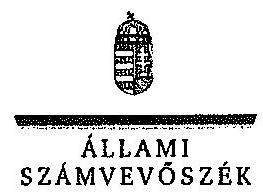

ILt.szám: V-0457-307/2015.
Dr. Vida Ildikó úrhölgy
elnök
Nemzeti Adó- és Vámhivatal
Budapest

# Tisztelt Elnök Úrhölgy! 

A „Jelentéstervezet a foglalkoztatási célú adó- és járulékkedvezmények igénybevételének szabályszerüségi ellenőrzéséről" című jelentéstervezetre tett észrevételeit köszönettel megkaptam.

Az Állami Számvevőszék észrevételekre vonatkozó álláspontjáról a felügyeleti vezető által készített részletes tájékoztatást csatoltan megküldöm.

Tájékoztatom Elnök úrhölgyet, hogy a számvevőszéki jelentés szövegezése az elfogadott észrevételek figyelembevételével készül.

Budapest, 2015. 05. hó 12. nap
Tisztelettel:
D
Dómokos László

Melléklet: Tájékoztatás az elfogadott és az el nem fogadott észrevételekről

---

# Tájékoztatás   az elfogadott és az el nem fogadott észrevételekról 

A „Jelentéstervezet a foglalkoztatási célú adó- és járulékkedvezmények igénybevételének szabályszerűségi ellenőrzéséről" címủ jelentéstervezetre 2015. április 16-án érkezett észrevételeit áttekintettük, azok kezelésével kapcsolatban a következő tájékoztatást adom.

## 3. oldal második bekezdés

A jelentéstervezet 3. oldal 2. bekezdésének 3. mondatát az alábbiak szerint pontosítjuk:
„A 2009-2013. években a társasági és asztalékadóból igénybe vett fejlesztési adókedvezmények összege 146220,0 millió Ft volt."

## 7. oldal utolsó bekezdés, 9. oldal utolsó bekezdés

Az észrevétel a jelentéstervezet megállapításának helytállóságát nem kifogásolja. Az összegző megállapításokban leírtak további részletezését a részletes megállapítások tartalmazzák, ezért az összegző rész módosítása nem indokolt.

## 8. oldal első bekezdés első mondata és 19. oldal harmadik bekezdés

Az észrevétel a jelentéstervezet megállapításának helytállóságát nem kifogásolja. A jelentéstervezet 19. oldal 3. bekezdésének kiegészítése nem indokolt, mert az észrevételben hivatkozott, a szervezet egészére kialakított eljárásrend meglétére vonatkozó megállapítást a jelentéstervezet 20. oldala tartalmazza. A 8. oldal 1. mondatát azonban a következöre pontosítjuk.
„Az APEH/NAV az ellenőrzött időszakban a foglalkoztatási célú adó- és járulékkedvezményekkel kapcsolatos bevallási, nyilvántartási, adatszolgáltatási és ellenőrzési tevékenységekre külön eljárás rendekkel nem rendelkezett, azokat a szervezet egész tevékenységére vonatkozó belső irányítási eszközökben szabályozta."

## 9. oldal 2. bekezdés 2-3. mondata, 27. oldal 6. bekezdés 1. mondata, 30. oldal 5. bekezdés 3. monda

Az észrevétel nem cáfolja azt a tényszerủ megállapítást, miszerint a foglalkoztatási célú adó- és járulékkedvezmények önállóan nem kerültek ellenőrzésre. A jelentéstervezet tartalmazza, hogy az adózás rendjéről törvény szerint a NAV-nak milyen típusú ellenőrzési kötelezettségnek kell eleget tennie. Ezzel kapcsolatban megállapítja azt is, hogy ebbe nem tartozik bele a foglalkoztatási célú adó- és járulékkedvezmények önálló ellenőrzése. Mindezekre tekintettel a jelentéstervezet módosítása nem indokolt.

---

# 9. oldal 3. bekezdés, 28. oldal 2. bekezdés 4. mondata 

A hivatkozott megállapításokhoz kapcsolódó kiegészítését köszönjük. A megállapítás tényszerűségét, miszerint a 2009-2011. évi ellenőrzési irányelvekben nem nevesítették a foglalkoztatási célú TB járulékból érvényesíthető kedvezmények igénybevételének ellenőrzését az észrevétel nem vitatja. A megállapítás az ellenőrzés részére rendelkezésre bocsátott dokumentumokon alapul és az abban foglaltak alapján került rögzítésre. Az előbbiekre tekintettel a hivatkozott megállapítások módosítása nem indokolt.

## 9. oldal 4. bekezdés, 29. oldal 5. és 7. bekezdés 3. mondata, 30. oldal 6. bekezdése

A jelentéstervezet 9. oldalának 3. és 4. bekezdésében leírtak között nincs ellentmondás. A 3. bekezdés az irányelveket tartalmazza, a 4. bekezdés az ellenőrzésre történő kiválasztás okát. Mindkettő megfelel a tényeknek.
A jelentéstervezet megállapítását, miszerint az ellenőrzött tételeknél egyetlen esetben sem szerepelt kiválasztási okként a foglalkoztatási célú adó- és járulékkedvezmények ellenőrzése az észrevétel nem kifogásolja. A megállapítás tényeket közöl, nem célja és nem is részletezi, hogy a kiválasztási ok kód szerepeltetése, illetve hiánya mit jelent.
A NAV nem tudott olyan ellenőrzötti listát rendelkezésre bocsátani a mintavételhez, amely célzottan a START kártyához, illetve Munkahelyvédelmi Akciótervhez kapcsolódó kedvezmények vonatkozásában végzett vizsgálatait tartalmazta volna. Mindezekre tekintettel a jelentéstervezet hivatkozott részeinek módosítása nem indokolt.

## 10. oldal 4. bekezdés, 33. oldal 5. bekezdés 3. mondata

A jelentéstervezet hivatkozott bekezdései azt tartalmazzák, hogy az APEH/NAV a fejlesztési adókedvezmények igénybevétele jogszerűségének ellenőrzésére önálló vizsgálatokat nem indított. Emellett - az észrevételben jelzettekhez hasonlóan - megállapítja azt is, hogy a fejlesztési adókedvezményeket a bevallások utólagos és az egyes adókötelezettségek teljesítésére irányuló társasági adónem ellenőrzései keretében vizsgálta. A jelentéstervezet fenti megállapítási tényszerủek, szabálytalan eljárásra vonatkozó utalást nem tartalmaznak. Az előbbiekre tekintettel a jelentéstervezet hivatkozott szövegrészeinek módosítása nem indokolt.

## 10. oldal 5. bekezdés 3. mondata, 13. oldal javaslata, valamint 35. oldal 4-5. bekezdése

A jelentéstervezet az adótitokra tekintettel adószámokat és egyéb beazonosítás céljára alkalmas adatokat nem közöl. A jelentéstervezetben rögzített megállapításokat az ellenőrzés rendelkezésére bocsátott, a NAV Központi Hivatala Ellenőrzési Főosztályának 5003/2014/ELL számú Körlevele, annak 1. számú és 2. számú mellékletei támasztják alá. A mellékletek tartalmazzák azon adózók listáját, melyek a társasági adóból fejlesztési adókedvezményt vettek igénybe és az első igénybevételt követően a jogszabály szerinti határidőben az ellenőrzésre nem került sor. Az előbbiekre tekintettel a jelentéstervezet hivatkozott szövegrészeinek kiegészítése nem indokolt.

---

# 10. oldal 6. bekezdés 1. mondata, 34. oldal 5. bekezdés, 35. oldal első bekezdés 

Az észrevétel a hivatkozott szövegrész pontositását javasolja. Jelzi, hogy történt kiválasztás csak nem minden adókedvezményt igénybe vevő adózó ellenőrzésének elrendelésére került sor. Az észrevétel azonban nem vitatja, hogy a foglalkoztatási célú fejlesztési adókedvezmények jogosulatlan igénybe vételének feltárása érdekében az ellenőrzésre történő kiválasztáshoz az APEH/NAV szüréseket nem alkalmazott. A hivatkozott körleveleket ismételten áttekintettük, azok nem tartalmaznak utalást az észrevételben leírtak szerinti kiválasztásra. A körlevelek mellékletei azokat az adózókat tartalmazták, amelyek ellenőrzésére nem került sor az előírt határidőkben. Előzőekre tekintettel, a megállapításunk helytálló, a jelentéstervezet módosítása nem indokolt.

## 19. oldal

A tényeknek megfelelő és az észrevétel sem vitatja azt, hogy a belső irányítási eszközökben nem határozták meg azt a végső határidőt, amely időtartamon belül jogszabályváltozás esetén intézkedni szükséges. Az észrevételben leírtakkal összhangban a jelentéstervezet 9. oldal 2. bekezdése tartalmazza, hogy jogszabályváltozás esetén a hatályos jogszabályi rendelkezések alapján kellett eljárni, valamint haladéktalanul intézkedni kell a belső irányítási eszköz módosításáról. Az ellenőrzési tapasztalatok alapján azonban megállapítható, hogy a szabályozásban szereplő haladéktalan intézkedés a gyakorlatban nem történt meg. Mindezekre tekintettel a megállapításunkat továbbra is fenntartjuk.

## 29. oldal 7. bekezdés 2. mondat

A dokumentumok ismételt áttekintését követően az észrevételben hivatkozott 29. oldal 7. bekezdésének 2. mondata törlésre kerül.

## 30. oldal első bekezdés első mondat

Az észrevétel nem cáfolja azt a tényszerủ megállapítást, miszerint a NAV a START kártyákhoz és a Munkahelyvédelmi Akciótervhez kapcsolódó vizsgálati tevékenységének ellenőrzéséhez nem tudott rendelkezésre bocsátani olyan ellenőrzési listát, amely kizárólag a foglalkoztatási célú adó- és járulékkedvezmények igénybevételének ellenőrzéseit tartalmazta. A jelentéstervezet tartalmazza, hogy az adózás rendjéről törvény szerint a NAV-cak milyen típusú ellenőrzési kötelezettségnek kell eleget tennie. Az előbbiekre tekintettel a jelentéstervezet módosítása nem indokolt.

## 30. oldal 5. bekezdés 2. mondat

Az egyértelműség érdekében a jelentéstervezet 30. oldal 5. bekezdésének 2. mondatát az alábbiak szerint pontosítjuk.

---

„A NAV által az ellenôrzéshez átadott kimutatások adattartalma nem a foglalkoztatási célú adó- és járulékkedvezmények igénybevételének ellenôrzése során feltárt adókülönbözeteket, hanem az adónemek egészére vonatkozó adatokat tartalmazta."

Tájékoztatom Elnök úrhölgyet, hogy a számvevôszéki jelentés mellékleteként szerepeltetjük a jelentéstervezethez tett észrevételeit, valamint az azokra adott válaszunkat.

Budapest, 2015. év OS. hó 42 . nap

Makkai Mária
felügyeleti vezetö

---

.

---

# BUDANIAPEST 

## FÖVÁROSI ÖNKORMÁNYZAT FÖPOLGÁRMESTERE

Bc. cám: $\quad 70 / 275-4 / 2015$
Tárcs: V-0457-290/2015. számú vizsgálati megállapítáasinak észrevételezése

## Állami Számvevőszék

## Domokos László Elnök ár részére

## Tisztelt Elnök Úr!

## ÁLLAMI: SZÁMVEVŐSZÉK

21.343/2015

Cékes: 2015 APR 17.
Iktaróvalca V-0457-30/2015
Melléklet:

## 14.012 .11

Közzönettel megkaptam a fenti iktató számú, „A foglalkoztatási célú adó- és járulékkedvezmények igénybevételének szabályszerűségi ellenőrzéséről" szóló jelentés tervezetét. Áttanulmányozva az abban foglaltakat - a hivatal érintett szervezeti egységének bevonásával - az alábbi észrevételeket teszem:

## Jelentéstervezet, II. rész, 5.2.pont:

Az e pontban leírtak a jelentés-tervezet 2. számú melléklete szerinti adatokon alapulnak, amely a vizsgálat során bekért 10./A. Tanúsítvány szerinti adatokat tükrözik. E tanúsítvány elnevezése szerint „a foglalkoztatás növeléséhez kapcsolódó helyi iparüzési adóalap-mentesség ellenőrzöttségéről" kért adatokat a vizsgált évekre vonatkozóan. Ennek megfelelően a helyi adókról szóló 1990. évi C. törvény (Htv.) 39/C. §-ában szabályozott helyi iparüzési adókedvezményt és adóalap-mentességet igénybe vevők közül a foglalkoztatáshoz kapcsolódó kedvezményekkel kapcsolatos adatok kerültek feltüntetésre.

A jelentéstervezet áttanulmányozása során észleltük, hogy a vizsgálattal érintett további önkormányzatok esetében a tanúsítványok más értelmezéssel kerültek kitöltésre, azaz az összes, Htv. 39/C. § szerinti igénybe vett kedvezményt/mentességet feltüntették.

Az eltérő adattartalomra tekintettel az 5.2. pontban leírtak a Fövárosi Önkormányzat tekintetében nem reálisak.

Amennyiben a Fövárosi Önkormányzat esetében is, valamennyi - a megjelölt jogszabályhely szerint - nyújtott kedvezményre/mentességre vonatkozó összesített adatokat vesszük figyelembe, úgy a vizsgálati évek szerinti bontásban, a 10.A. tanúsítvány sorai a következő adatokat tartalmazzák:

---

2009. év

| Megnevezés | Adózók   száma   (db) | Igénybevett   adóalap csökkentés   (M Ft) |
| :--: | :--: | :--: |
| 1. | 2. | 3. |
| 1. Htv. szerinti adóalap-   mentesség összesen (Htv.   39/C. §., 39/D. §) | 39818 | 21073 |
| 2. ebből: |  |  |
| 3. Foglalkoztatás növeléséhez   kapcsolódó adóalap-   mentesség (39/D. §) | 581 | 9478 |
| 4. Önkormányzat által nyújtott   adóalap-mentesség (39/C. §) | 39237 | 11595 |

2010. év

| Megnevezés | Adózók   száma   (db) | Igénybevett   adóalap csökkentés   (M Ft) |
| :--: | :--: | :--: |
| 1. | 2. | 3. |
| 1. Htv. szerinti adóalap-   mentesség összesen (Htv.   39/C. §., 39/D. §) | 40721 | 21469 |
| 2. ebből: |  |  |
| 3. Foglalkoztatás növeléséhez   kapcsolódó adóalap-   mentesség (39/D. §) | 563 | 9742 |
| 4. Önkormányzat által nyújtott   adóalap-mentesség (39/C. §) | 40158 | 11727 |

2011. év

| Megnevezés | Adózók   száma   (db) | Igénybevett   adóalap csökkentés   (M Ft) |
| :--: | :--: | :--: |
| 1. | 2. | 3. |
| 1. Htv. szerinti adóalap-   mentesség összesen (Htv.   39/C. §., 39/D. §) | 40780 | 21844 |
| 2. ebből: |  |  |
| 3. Foglalkoztatás növeléséhez   kapcsolódó adóalap-   mentesség (39/D. §) | 588 | 10247 |
| 4. Önkormányzat által nyújtott   adóalap-mentesség (39/C. §) | 40192 | 11597 |

---

2012. év

| Megnevezés | Adózók   száma   (db) | Igénybevett   adóalap csökkentés   (M Ft) |
| :--: | :--: | :--: |
| 1. | 2. | 3. |
| 1. Htv. szerinti adóalap-   mentesség összesen (Htv.   39/C. §., 39/D. §) | 39891 | 19936 |
| 2. ebből: |  |  |
| 3. Foglalkoztatás növeléséhez   kapcsolódó adóalap-   mentesség (39/D. §) | 601 | 8815 |
| 4. Önkormányzat által nyújtott   adóalap-mentesség (39/C. §) | 39290 | 11121 |

2013. év

| Megnevezés | Adózók   száma   (db) | Igénybevett   adóalap csökkentés   (M Ft) |
| :--: | :--: | :--: |
| 1. | 2. | 3. |
| 1. Htv. szerinti adóalap-   mentesség összesen (Htv.   39/C. §., 39/D. §) | 49132 | 36779 |
| 2. ebből: |  |  |
| 3. Foglalkoztatás növeléséhez   kapcsolódó adóalap-   mentesség (39/D. §) | 731 | 16871 |
| 4. Önkormányzat által nyújtott   adóalap-mentesség (39/C. §) | 48401 | 19908 |

A bemutatott adatok alapján a jelentéstervezet 2. számú Meliéklete szerinti Kimutatás Budapestre vonatkozó megfelelő sorai a következők:

| Önkormányzat megnevezése/ Időszak (év) | Helyi adó tv. szerinti adóalap-mentesség, adómentesség (39/C. §., 39/D. §) |  |  |  |  |  |
| :--: | :--: | :--: | :--: | :--: | :--: | :--: |
|  | Foglalkoztatás növeléséhez kapcsolódó adóalapmentesség (39/D. §) |  | Önkormányzat által nyújtott adómentesség (39/C. §) |  | Összesen |  |
|  | Adózók   száma   (db) | Igénybe vett adóalap mentesség (M Ft) | Adózók   száma   (db) | Igénybe vett adómentesség alapja (M Ft) | Adózók   száma   (db) | Igénybe vett adóalap-és adómentesség alapja (M Ft) |
| 1. | 2. | 3. | 4. | 5. | 6. | 7. |
| Budapest |  |  |  |  |  |  |
| 2009. | 581 | 9478 | 39237 | 11595 | 39818 | 21673 |
| 2010. | 563 | 9742 | 40158 | 11727 | 40721 | 21469 |
| 2011. | 588 | 10247 | 40192 | 11597 | 40780 | 21844 |
| 2012. | 601 | 8815 | 39290 | 11121 | 39891 | 19936 |
| 2013. | 731 | 16871 | 48401 | 19908 | 49132 | 36779 |

---

Előzöckre tekintettel kérem szíves intézkedését a jelentéstervezet II. rész 5.1. pontjának a Fövárosi Önkormányzatra vonatkozó, a mentességi értékhatárt leíró első bekezdésénck és a 4.A. számú Melleklet 1.1. pontjának az előző adatokra tekintettel történő pontositását. Az adómentesség értékhatára 2012. december 31-ig a 21/1991. (IX. 5.) Föv. Kgy. rendeletben 700,0 ezer forint, majd 2013. január 1-jétől a 87/2012. (XI.30.) Föv. Kgy. rendelet szerint 1000,0 ezer Ft-ban került meghatározásra.

Segitökész munkájukat megköszönve kérem T. Elnök Urat, hogy észrevételünkben leírtakat elfogadni és a végleges jelentés kialakítása során figyelembe venni szíveskedjen.

Budapest, 2015. április ," ${ }^{12}$,
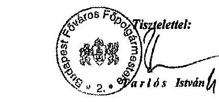
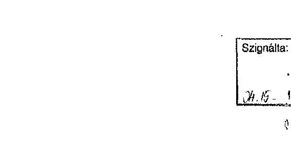
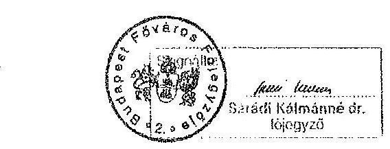
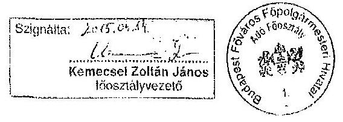

---

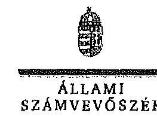

ELNOK

Ikt.szám: V-0457-309/2015.

# Tarlós István úr 

fópolgármester
Budapest Fóváros Önkormányzata
Budapest

## Tisztelt Fópolgármester Úr!

A ...Jelentéstervezet a foglalkoztatási célú adó- és járulékkedvezmények igénybevételének szabályszerűségi ellenörzéséről" című jelentéstervezetre tett észrevételeit köszönetici megkapiam.

Az Állami Számvevőszék észrevételekre vonatkozó álláspontjáról a felügyeleti vezető által készített részletes tájékoztatást csatoltan megküldőm.

Tájékoztatom Fópolgármester urat, hogy a számvevőszéki jelentés mellékleteként szerepeltetjük a jelentéstervezethez tett észrevételeit, valamint az azokra adott válaszunkat.

Budapest, 2015. 05 . hó 12 nap
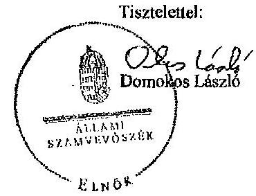

Melléklet: Tájékoztatás az elfogadott észrevételekről

---

# Tájékoztatás az elfogadott észrevételekről 

A „Jelentéstervezet a foglalkoztatási célú adó- és járulékkedvezmények igénybevételének szabályszerűségi ellenőrzéséről" című jelentéstervezetre 2015. április 17-én érkezett észrevételeit áttekintettük, azok kezelésével kapcsolatban a következő tájékoztatást adom.

## Jelentéstervezet II. rész 5.2. pontja

Az ellenőrzés részére átadott dokumentumokat, az észrevételben jelzetteket és a megküldött adatokat felülvizsgálva a téves adatokra vonatkozó korrekciójukat elfogadjuk, amely alapján a jelentéstervezet 2. és a 3. számú mellékletét javítjuk.

Az adatok korrigálását követően a jelentéstervezet II. rész 5.2. pontja első bekezdésének utolsó sorában az $5 \%$ helyett, $1,39 \%$-ot szerepeltetünk és a módosítás következtében a 2 . részbekezdést töröljük.

Az előbbiekkel összefüggésben a jelentéstervezet 4/A melléklet 1.1. pontjának 4. bekezdését az alábbiak szerint pontosítjuk.
„Az Önkormányzati-nél az ellenőrzött időszakban a HIPA-ból a foglalkoztatás növeléséhez kapcsolódó adóalap-mentesség igénybevétele - az Önkormányzati által nyújtott összes adóalap-mentességhez viszonyitva - 1,46\% volt."

Továbbá a jelentéstervezet II. rész 5.1. pontjának második bekezdését és ezzel összefüggésben a 4/A melléklet 1.1. pontja 2. bekezdésének első mondatát az alábbiak szerint pontosítjuk.
„Az Önkormányzati-nél az adómentesség összegét 2012. december 31-ig a 21/1991. (IX. 5.) Föv. Kgy. rendeletben 700,0 ezer Ft-ban, majd 2013. január 1-jétől a 87/2012. (XI. 30.) Föv. Kgy. rendeletben 1.000 ezer Ft-ban határozták meg."

Budapest, 2015. év a 5. hó $R$ nap

Makkai Mária
felügyeleti vezető

---

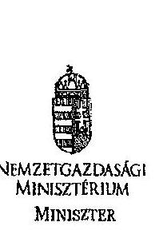

|  |   |   |
| --- | --- | --- |
|  Domokos László úr részére | Ikt.szám: NGM/15023/3/2015. |   |
|  elnök | Tárgy: Észrevételek „a foglalkoztatási célú |   |
|   | adó és járulékkedvezmények |   |
|  Állami Számvevőszék | igénybevételének szabályszorúségi |   |
|  Budapest | ellenőrzéséről" címmel készített számvevőszéki jelentés-tervezethez |   |

# Tisztelt Elnök Úr!

Köszönettel fogadtok „a foglalkoztatási célú adó és járulékkedvezmények igénybevételének szabályszorúségi ellenőrzéséről" címmel készített számvevőszéki jelentés-tervezetet. A tervezetben megfogalmazott megállapításokat érintően az alábbi észrevételeket teszem:

## 1. A foglalkoztatási célú adó- és járulékkedvezmények körében tett észrevételek

A jelentés-tervezet kiemeli, hogy az ellenőrzött időszakban a foglalkoztatási célú adó- és járulékkedvezményekhez kapcsolódóan a jogszabály-clőkészítéshez, illetve annak felülvizsgálatához, a költségvetés tervezéséhez, valamint a hatásvizsgálathoz szükséges adatok és információk rendelkezésre állását biztosító adatszolgáltatás és kapcsolattartás körében a pénzügyminiszter, illetve a nemzetgazdasági miniszter nem élt a jogalkotástól szóló 2010. évi CXXX. törvény 23. §-ában szabályozott lehetőséggel, és nem adott ki az adatszolgáltatás rendjéről külön normatív utasítást.

A jelentés-tervezet megállapítja, hogy a Pénzügyminisztérium (a továbbiakban: PM), illetve a Nemzetgazdasági Minisztérium (a továbbiakban: NGM) a tárgykörre vonatkozó, az Adó- és Pénzügyi Ellenőrzési Hivatal (a továbbiakban: APEH), illetve a Nemzeti Adó- és Vámhivatal (a továbbiakban: NAV) szabályzatait véleményezte, kialakításában részt vett, azzal egyetértett. A fenti megállapítások értelmében a PM, illetve az NGM a működéshez szükséges adatszolgáltatási szabályok kialakításáról gondoskodott, és abban tevékenyen részt vett.

Álláspontom szerint ezen felül további szabályzat megalkotása - tekintettel a Kormány deregulációs törekvésére - nem szükséges, így a megállapítást nem tartom indokoltnak.

## 2. A fejlesztési adókedvezmények körében tett észrevételek

A jelentés-tervezet 1. Összegző megállapítások, következtetések, javaslatok című fejezetében foglaltak szerint a fejlesztési adókedvezmény igénybevételére irányuló bejelentések (a továbbiakban: bejelentés) 30 napon belüli vizsgálatáról dokumentált módon az NGM-nél csak részben gondoskodtak. Az NGM eljárása a leírtak alapján nem felelt meg a vizsgált időszakban hatályos, a fejlesztési adókedvezményről szóló 206/2006. (X. 16.) Korm.

---

rendeletben (a továbbiakban: Kormányrendelet) elöirtskask, mivel nem volt megállapítható a vizsgálat megtörténte, időpontja.
Az Állami Számvevőszék részéről megállapítást nyert továbbá, hogy a fejlesztési adókedvezmény tekintetében nem került teljes körűen kialakításra a kapcsolódó tevékenységet szabályozó belső kontrollkörnyezet, a belső eljárásrend nem rendelkezik a kapcsolódó dokumentációs folyamatok, vizsgálatok mikéntjéről.
Mindenekelőtt jelzem, hogy a hivatkozott Kormányrendelet megjelölése tévesen szerepel, az a jelentés-tervezet 10 . oldalán PM rendeletként került feltüntetésre.
A fenti két megállapítással az alábbiak miatt nem értek egyet.
A Kormányrendelet 2010. január 1-jétől kiegészült a 10. § (6) bekezdésének azon rendelkezésével, amely alapján az adópolitikáért felelős miniszter a fejlesztési adókedvezmény érvényesítésére irányuló bejelentést 30 napon belül megvizsgálja, és a hiányos vagy a jogosulatlan bejelentésről tájékoztatja az adózót. Ha az adópolitikáért felelős miniszter a bejelentést követő 30 napon belül nem válaszol, akkor - a (7) bekezdésben foglalt eljárás kivételével - úgy kell tekinteni, hogy a bejelentést nyilvántartásba vette.
Álláspontom szerint, egyet nem értve a jelentés-tervezet 4.1. alpontjában foglaltakkal, a fenti jogszabályi feltételek teljesültek abban az esetben, ha a nyilvántartásba vehető bejelentések tekintetében „nincs nyoma" 30 napon belüli vizsgálatnak, mivel a jogszabály csak a hiányos vagy a jogosulatlan bejelentés esetére ír elő tájékoztatási kötelezettséget. Alapul véve a jogalkotói szándékot, a nyilvántartásba vétel nem fizikai aktus, csupán elvi jóváhagyás. A vizsgálat tárgyát képező időszakban sem a nyilvántartásba vétel mikéntjére, sem annak igazolására nem vonatkozott jogszabályi előírás. A hiánypótlási felhívások esetleges 30 napon túli kibocsátása álláspontom szerint nem eredményezett semminemű hátrányt az adózó számára, magát a fejlesztési adókedvezmény igénybevételére való jogosultságot alapvetően nem befolyásolta, ha formai szempontból kiegészítésre szorult a bejelentés. Megjegyzem ugyanakkor, hogy a jelentés-tervezet 32. oldalán bemutatottak szerint a mintába bevont esetek 24 százalékában került sor hiánypótlás kibocsátására. Ez az arány álláspontom szerint tükrözi a hiánypótlásra szoruló bejelentések mindenkori reprezentáltságát, ebből következően igazoltnak találom a Kormányrendelet 10. § (6) bekezdésében foglaltak teljesülését, azaz, hogy a minisztérium a bejelentések tartalmát vizsgálta, elemezte, és ha hiányosságot vagy jogosulatlan bejelentést tapasztalt, akkor ezekről értesítette az érintett adózót.
Az NGM nyilvántartásaiban szereplő bejelentések mindaddig „hatályosak", amíg az azok alapjául szolgáló beruházás tényállásváltozás nélkül megfelelt a Kormányrendeletben és a társasági adóról és az osztalékadóról szóló 1996. évi LXXXI. törvényben (a továbbiakban: Tao. tv.) foglalt feltételeknek. Amennyiben ezen előírások nem teljesültek, úgy az adózó nem volt jogosult az adókedvezmény igénybevételére (akkor sem, ha a bejelentése nyilvántartásba vételre került), azaz az adókedvezményi jogosultságot nem az adópolitikáért felelős miniszter részére történő bejelentés hozza létre, a bejelentés pusztán egyfájla értesítési kötelezettségnek tekinthető. Az adókedvezmény igénybevételére való jogosultság időközbeni megszűnése álláspontom szerint bármikor felmerülhet olyan körülmények megismerése vagy bekövetkezése okán, amelyekről az adózó a bejelentés benyújtásakor nem tudott vagy nem kívánt nyilatkozni. Ebből következően a 30 napos határidőn túli tájékoztatás ezen esetekben sokszor nem valósulhatott meg, ám az adózó jogosultságának meg nem léte vagy megszűnése esetében a 30 napon túli tájékoztatás ellenére sincs (sőt annak hiányában sincs) lehetőség az adókedvezmény igénybevételére. Megjegyzem e ponton továbbá azt is, hogy az adózó a bejelentés benyújtásával a beruházásra kötelezettséget nem vállal. A bejelentést döntése szerint bármikor vissza is vonhatja. A nyilvántartásba vétel pusztán egy formai előírás, amely

---

arra utal, hogy a bejelentéskor rendelkezésre álló adatok alapján az adózó jogosult lehet adókedvezményre.
A Tao. tv. 2013. január 1-jétől hatályba lépett 22/B. § (18) bekezdése szerint az adópolitikáért felelős miniszter a jogszabályhely (3) bekezdésében meghatározott adatokról évente tájékoztatást nyújt az állami adóhatóság részére. E rendelkezés szerinti gyakorlat a korábbi évek során is fennállt, az adókedvezmény iránti bejelentésekről és kérelmekről az éves adatszolgáltatás hivatalos úton megtörtént.
A jelentés-tervezetben tett azon megállapítása helytálló, amely szerint a fenti adatszolgáltatás teljesítésére nem volt - és jelenleg sincs - előírva határidő. Ennek oka, hogy az adatszolgáltatás csak abban az esetben hajtható érdemben végre, ha az előző évi bejelentésekre indult eljárások teljes körűen lezárultak. Tekintettel arra, hogy a hiánypótlási felhívások megválaszolására az adózók részére nincs előírt határidő, sok esetben előfordul, hogy hónapokig húzódik az adott bejelentés nyilvántartásba vétele. Mivel a hiánypótlás alapuivételével kerül meghatározásra, nyilvántartásba vételre az engedélyezhető maximális elszámolható költség és ebből következően az adókedvezmény-összeg, így annak beérkezéséig és feldolgozásáig nincs relevanciája az adóhatóság részére történő adatszolgáltatásnak. Ebből következően jelenleg sem látom szükségét az adatszolgáltatási kötelezettség vonatkozásában határidő előírásának, figyelembe véve azt is, hogy az adókedvezmény igénybevételének kezdetét minden esetben meg kell előznic az annak alapjául szolgáló beruházás befejezésének. A beruházás befejezéséről az adózó az adóhatóságot a befejezés adóévéről szóló adóbevallásában értesíti. Ily módon minimális annak valószínűsége, hogy az adóhatóságnak nincs információja az adókedvezmény igénybevételére irányuló szándék, jogosultság meglétéről.
A fentiekhez kapcsolódóan, reagálva a jelentés-tervezet II. Részletes megállapítások 1.1. alpontjában is foglaltakra, szintén nem látom szükségét az adatszolgáltatás rendjének - a belső kontrollkörnyezet részeként - eljárásrendben történő szabályozásának.
Az eljárásrend kialakítása tekintetében a jelentés-tervezet 1.1. pontjában előadott hiányosságra vonatkozóan álláspontom szerint azért nem volt szükség speciális rendelkezések kialakítására, mert a minisztérium részéről a bejelentések jóváhagyása, nyilvántartásba vétele pusztán formai jellegű, azok tartalmi elbírálására nincs jogszabályi lehetőség vagy kötelezettség. Ebből kifolyólag a gyakorlatban egy bejelentés feldolgozása a mindenkor hatályos szervezeti és múködési szabályzat alapján a hatáskörrel rendelkező főosztályon, osztályon dolgozók számára rutinjellegủ, társfőosztályok vagy társtárcák bevonására csak olyan esetben kerül sor, amikor azt a Tao. tv. vagy a Kormányrendelet kötelezővé vagy lehetővé teszi (a gyakorlatban nagyon ritka). Erre vezethető vissza az is, hogy e feladatok nem csupán egy-egy dolgozó feladatkörét képezik, illetve munkaköri leírásában vannak jelen. Számos más ügytípushoz hasonlóan nem szükséges külön szabályozást kialakítani a fejlesztési adókedvezmény igénybevétele iránti bejelentések feldolgozásához. A nyilvántartásba vett bejelentésben foglaltak az adózók számára lényegében „indikativak", egyfajta keretrendszert és felső határokat szabnak meg a beruházásuk elszámolható költségét és azon keresztül az igénybe vehető adókedvezményt illetően, a beruházás tényleges megvalósulásának és az adókedvezmény tényleges igénybevételének felügyelete, ellenőrzése nem az NGM hatáskörébe tartozik. Mindez azt jelenti, hogy a fejlesztési adókedvezmény igénybevételére irányuló bejelentések vonatkozásában a minisztériumi teendők sem mennyiségükben, sem minőségükben nem kívánják meg külön eljárásrend vagy kontrollrendszer felállítását, az a jelenleg meghatározottak szerint álláspontom szerint teljes mértékben egyértelmủ és elegendő.

---

A jelentés-tervezetben foglaltak alapulvételével ugyanakkor a jövőben igyekszünk hatékonyabbá, a vonatkozó előírásoknak, így a költségvetési szervek belső kontrollrendszeréről és belső ellenőrzéséről szóló 370/2011. (XII. 31.) Korm. rendeletben és az államháztartásról szóló 2011. évi CXCV. törvényben foglaltaknak a lehető legteljesebb mértékben megfelelővé tenni a kapcsolódó belső kontrollkörnyezetet és eljárásrendet egyaránt, amennyiben arra szükség mutatkozik.

# 3. Helyi iparüzési adót, valamint az önkormányzati adóhatóságok egyes megállapításait érintő észrevételek 

Az önkormányzati adóhatóságok által rendszeresíthető bevallási, bejelentési nyomtatványok tartalmáról szóló 35/2008. (XII. 31.) PM rendelet szerinti helyi iparüzési adó bevallási nyomtatványok valamennyi, az Állami Számvevőszék által lefolytatott ellenőrzéssel érintett időszakra vonatkozóan tartalmazzák a foglalkoztatás növeléséhez kapcsolódó adóalapmentesség, valamint a foglalkoztatás csökkentéséhez kapcsolódó adóalap-növekmény adatainak adózó által történő rögzítésének lehetőségét.
A helyi iparüzési adó adóalapja csökkenthető az adóévi müködés hónapjai alapján számított adóévi átlagos statisztikai állományi létszámnak az előző adóévi müködés hónapjai alapján az előző adóévre számított átlagos statisztikai állományi létszámhoz képest bekövetkezett fóben kifejezett - növekménye után 1 millió forint/fő összeggel. Ezért a helyi iparüzési adó bevallási nyomtatványán adózó által forintban bevallott foglalkoztatás növeléséhez kapcsolódó adóalap-mentesség forintadatokból az önkormányzati adóhatóság számára (egyszerű, 1 millió forinttal való osztással) egyértelműen megjelenik az ezen adóalapmentességet megalapozó statisztikai állományi létszám is. Ezért a helyi iparüzési adó bevallási nyomtatvány e jogcímen igénybe vehető adóalap-mentesség statisztikai állományi létszámadatait (rubrikával) külön nem kéri feltüntetni, az az önkormányzati adóhatóságok adófeldolgozási munkájának, továbbá az adózók bevallással kapcsolatos adminisztratív terheinek növelésével járna.
Az önkormányzati adóhatóságoknak lehetőségük van arra, hogy a müködés hónapjai alapján számított adóévi átlagos statisztikai állományi létszámnak az előző adóévi müködés hónapjai alapján az előző adóévre számított átlagos statisztikai állományi létszámhoz képest bekövetkezett növekményét adóellenőrzés keretén belül vizsgálják az adóév lezárását követően.
Az önkormányzati adóhatóságoknak arra is lehetőségük van, hogy az adózás rendjéről szóló 2003. évi XCII. törvény 119. § (1) bekezdése alapján a nyilvántartásában és az adózó nyilvántartásában, bevallásában szereplő adatok, tények, körülmények valóságtartalmának, illetve ezek hitelességének megállapítása érdekében a bevallási időszak lezárását megelőzően is adatokat gyűjtsön, vagy helyszíni ellenőrzést végezzen annak érdekében különösen, hogy a vállalkozó ténylegesen hány fő után vette igénybe e jogcímen a foglalkoztatás növeléséhez kapcsolódó adóalap-mentességet.
Amennyiben a vállalkozó több önkormányzat illetékességi területén is rendelkezik telepheliyel, vagy székhelye más önkormányzat illetékességi területén található, az adóellenőrzés eredményes lefolytatása érdekében belföldi jogsegély keretében más önkormányzati adóhatóságot is megkereshet. Az önkormányzati adóhatóságok törvényben meghatározott feltételek szerint adatok, tények átadásával segítik egymás eredményes müködését is.
Mindennek megfelelően az Állami Számvevőszék helyi iparüzési adót érintő foglalkoztatás növeléséhez kapcsolódó adóalap-mentességgel, valamint az önkormányzati adóhatóságok

---

által rendszeresíthető bevallási, bejelentési nyomlatványokkal kapcsolatosan tett megállapításait nem tartom megalapozottnak.
A jelentés-tervezetben foglaltak alapulvételével ugyanakkor a jövőben igyekeztink hatékonyabbá, a vonatkozó előírásoknak, így a költségvetési szervek belső kontrollrendszeréről és belső ellenőrzéséről szóló 370/2011. (XII. 31.) Komn. rendeletben és az államháztartásról szóló 2011. évi CXCV. törvényben foglaltaknak a lehető legteljesebb mértékben megfelelővé tenni a kapcsolódó belső kontrollkörnyezetet és eljárásrendet egyaránt, amennyiben arra szükség mutatkozik.

# 4. Az APEH-ra, illetve a NAV-ra vonatkozó észrevételek 

A jelentés-tervezet tartalmaz az APEH, illetve a NAV vonatkozásában is észrevételeket.
A jelentés-tervezet szerint az APEH, illetve a NAV a START-kártyák kiadására vonatkozó belső utasításait esetenként 6-9 hónap késedelemmel aktualizálta. E körben megjegyzem, hogy a START-kártyák tényleges kiadása és a kapcsolódó kedvezmények igénybevétele - a belső szabály késedelmes módosítása ellenére - mindenkor a hatályos jogszabályok alapján történt.
A jelentés-tervezet kiemeli, hogy az APEH, illetve a NAV az ellenőrzések tervezése és az ellenőrzésre történő kijelölés során nem alkalmazta kiválasztási szempontként a foglalkoztatási célú adó- és járulékkedvezményekhez kapcsolódó tevékenységek szabályszerűségének vizsgálatát. Ugyanakkor megállapításra kerül, hogy utólagos vizsgálatok és célellenőrzések során történtek ellenőrzések a foglalkoztatási célú társadalombiztosítási járulék és szociális hozzájárulási adó kedvezmények igénybevételére.
Ahogy az Állami Számvevőszék jelentés-tervezete is megállapította, az APEH, illetve a NAV az egyéb kiválasztási szempontok alapján ellenőrzés alá vont adózók esetében a kedvezménnyel érintett adónemeket is vizsgálta.
Mivel a szóban forgó aspektus az ellenőrzött időszakban az APEH, illetve a NAV kiválasztási szempontjainak körén kívül esett, erre vonatkozó belső szabályozás sem került kialakításra, ezért nem tartom indokoltnak az erre vonatkozó megállapítást.

## 5. Pontosító, szövegszerü javaslatok

3. oldal második bekezdése: „2009-2013. években a társasági és osztalékadóból igénybe vett - a munkahelyteremtést szolgáló beruházásokhoz kapcsolódó - fejlesztési adókedvezmények összege 146220 millió Ft volt."
Javasolom, hogy a közbeszúrt „a munkahelyteremtést szolgáló beruházásokhoz kapcsolódó" szövegrész kerüljön elhagyásra, tekintettel arra, hogy a feltüntetett összeg nemcsak a munkahelyteremtést szolgáló beruházásokhoz kapcsolódó fejlesztési adókedvezményt tartalmazza, hanem a vizsgált időszakban bármely jogcímen igénybevett összes fejlesztési adókedvezményt.
4. oldal utolsó bekezdése: „A Munkahelyvédelmi Akcióterv keretében 2012. évtől érvényesíthető foglalkoztatási és egyéb célú szociális hozzájárulási adókedvezmény feltételeit az [...] határozták meg."
Javasolom, hogy „a Munkahelyvédelmi Akcióterv keretében 2012. évtől érvényesíthető foglalkoztatási és egyéb célú szociális hozzájárulási adókedvezmény" szövegrész helyett „a szociális hozzájárulási adóból igénybe vehető foglalkoztatási és egyéb célú adókedvezmények" szöveg szerepeljen, tekintettel arra, hogy a Munkahelyvédelmi Akcióterv

---

részét képező kedvezmények 2013-tól vehetőek igénybe, ugyanakkor a hivatkozott jogszabályok egy része 2012-ben is hatályban volt.
10. oldal második bekezdése: Javasolom a „206/2006. (X. 16.) PM rendeletben" szövegrész „206/2006. (X. 16.) Korm. rendeletben" szöveggel való helyettesitését.

Kérem észrevételeim szíves figyelembevételét.
Budapest, 2015. április „ $\sqrt{2}$

# Üdvözlettel: 

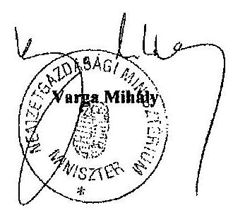

---

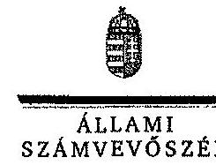

ELNÖK

Ikt.szám: V-0457-315/2015.

Varga Mihály
miniszter
Nemzetgazdasági Minisztérium
Budapest

Tisztelt Miniszter Úr!

A „Jelentéstervezet a foglalkoztatási célú adó- és járulékkedvezmények igénybevételének szabályozsrúségi ellenőrzéséről" című jelentéstervezetre tett észrevételeit köszönettel megkaptam.

Az Állami Számvevőszék észrevételekre vonatkozó álláspontjáról a felügyeleti vezető által készített részletes tájékoztatást csatoltan megküldöm.

Tájékoztatom Miniszter urat, hogy a számvevőszéki jelentés szövegezése az elfogadott észrevételek figyelembevételével készül.

Budapest, 2015. Cf. hó 03 nap

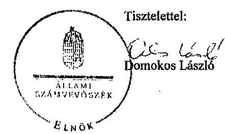

Melléklet: Tájékoztatás az elfogadott és az el nem fogadott észrevételekről

---

# Tájékoztatás   az elfogadott és az el nem fogadott észrevételekről 

A „Jelentéstervezet a foglalkoztatási célú adó- és járulékkedvezmények igénybevételének szabályszerűségi ellenőrzéséről" című jelentéstervezetre 2015. május 07 -én érkezett észrevételeit áttekintetttik, azok kezelésével kapcsolatban a következő tájékoztatást adom.

1. A foglalkoztatási célú adó- és járulékkedvezmények körében tett észrevételekkel összefüggésben:
A költségvetési szervek belső kontrollrendszeréről és belső ellenőrzéséről szóló 370/2011. (XII. 31.) Korm. rendelet (a továbbiakban: Bkr.) 3. § a) pontja és a 6. § (1) bekezdés b) pontja alapján a költségvetési szerv vezetője felelős a belső kontrollrendszer keretében - a szervezet minden szintjén érvényesülő - megfelelő kontrollkörnyezet kialakításáért, müködtetéséért és fejlesztéséért, valamint köteles olyan kontrollkörnyezetet kialakítani, amelyben egyértelműek a felelősségi, hatásköri viszonyok és feladatok.

A fentiek alapján jogszabályok előkészítéséhez, felülvizsgálatához, a költségvetés tervezéséhez és a hatásvizsgálatokhoz szükséges adatok és információk rendelkezésre állását biztosító adatszolgáltatás, kapcsolattartás rendjét az e tevékenység ellátásáért felelős szerv kell, hogy meghatározza. Ezt alátámasztja a Bkr. 4. § (1) bekezdés a) pontjában foglalt azon rendelkezés, miszerint a belső kontrollrendszer tartalmazza mindazon elveket, eljárásokat és belső szabályzatokat, melyek biztosítják, hogy a költségvetési szerv valamennyi tevékenysége és célja összhangban legyen a szabályszerűséggel, szabályozottsággal, valamint a gazdaságosság, hatékonyság és eredményesség követelményeivel.

Tekintettel arra, hogy az ellenőrzéssel érintett időszakban a PM/NGM - a PM/NGMmel véleményeztetett, vele egyetértésben kialakított APEH/NAV szabályzatokon túl nem határozta meg az adatáramlás, adatkapcsolat formáját az adóhatósággal szemben, így az e pontnál rögzített észrevétel alapján a jelentéstervezet módosítása nem indokolt, megállapítás helytálló.

## 2. A fejlesztési adókedvezményekkel összefüggésben tett észrevételek:

A fejlesztési adókedvezményről szóló 206/2006. (X.16) Korm. rendelet (a továbbiakban: kormányrendelet) 10. § (6) bekezdésének értelmében az adópolitikáért felelős miniszter a fejlesztési adókedvezmény érvényesítésére irányuló bejelentéseket 30 napon belül megvizsgálja, ezt követően tájékoztatja az adózót a hiányos vagy jogosulatlan bejelentésről. A bejelentés 30 napon belüli vizsgálatának jelentősége van,

---

mert az alapján állapítható meg, hogy az adókedvezmény érvényesitésének feltételei fennállnak/fennálltak e.

A Bkr. első pontban hivatkozott rendelkezéseinek e területen történő érvényesülése is szükséges a megfelelő kontrollkörnyezet kialakításával és müködtetésével annak érdekében, hogy a bejelentés vizsgálata bármikor, bárki számára ellenőrizhető legyen.

A Nemzetgazdasági Minisztériumnál (továbbiakban: NGM) belső szabályzat a vizsgálat megtörténtének igazolására vonatkozó részletszabályt nem tartalmaz. Tény, hogy a rendelkezésünkre álló dokumentumok alapján az NGM nem tudta valamennyi, az ellenőrzési mintavétel részét képező bejelentés tekintetében a 30 napon belüli dokumentált felülvizsgálat megtörténtét alátámasztani. Ebben szerepet játszott a megfelelő kontrollkörnyezet kialakításának és müködtetésének hiánya.

Mindezek alapján a jelentéstervezet módosítása nem indokolt, a megállapítás és a szabályszerű feladatellátást és működést elősegítő javaslat megalapozott.
3. A helyi iparűzési adóval, valamint az önkormányzati adóhatóságok egyes megállapításaival összefüggésben tett észrevételek:

Az önkormányzati adóhatóságok által rendszeresíthető bevallási, bejelentési nyomtatványok tartalmáról szóló 35/2008. (XII. 31.) PM rendelet (a továbbiakban: PM rendelet) 1. § (1) bekezdésének második fordulata szerint az adóhatóság a bevallási nyomtatványokat kizárólag az önkormányzati adórendeletben szabályozott mentességi, kedvezményi rendelkezések végrehajtása, illetve a fizetendő adó megállapítása érdekében egészítheti ki.

A PM rendelet szerinti bevallási nyomtatványmintát minden önkormányzati adóhatóság a településre irányadó tárgyévi adórendelet szerinti adómérték, illetőleg a Htv. 39/C. §-án alapuló - 2,5 millió forint vállalkozási szintủ adóalapot meg nem haladó adózókra vonatkozó - rendeleti adókedvezményi vagy és adóalapmentességi szabály esetén, az említett három tényállási elemmel egészítheti ki.

A bevallásnyomtatványok létszámadatokkal való kiegészítéséből eredő, a helyi önkormányzatok bevallás feldolgozásával kapcsolatos minimális adminisztratív teher növekedésével ( 3 létszámadat) az azonnali számszaki kontroll, továbbá a bevallás adatai alapján az előző évben létszámnövekedésre igénybevett adókedvezményből eredő létszámtartási kötelezettség teljesülése/ nem teljesülése elérhetővé válik.

A jelentéstervezetben adóalap-mentesség ellenőrzésének tekintetben kockázatok azonosítására került sor. A kockázatok jövőbeni kiküszöbölésének érdekében az észrevételben rögzítettek alapján a jelentéstervezet módosítása nem indokolt, a megállapítás helytálló.

---

# 4. Az APEH-ra, illetve a NAV-ra tett észrevételekkel összefüggésben: 

- START kártyát érintő észrevétel: az észrevétel a jelentéstervezet megállapításának helytállóságát nem kifogásolja. A jelentéstervezetben nem szerepel megállapítás arra vonatkozóan, hogy a START kártyák tényleges kiadása és a kapcsolódó kedvezmények igénybevétele nem a hatályos jogszabályi előírások alapján történt.
- Foglalkoztatási célú kedvezmények ellenőrzése: a jelentéstervezet tartalmazza, hogy az APEH/NAV az ellenőrzési tevékenysége során a foglalkoztatási célú adóés járulékkedvezmények igénybevételét önállóan nem ellenőrizte, mindemellett rögzítésre került, hogy a kedvezmények vizsgálatára utólagos ellenőrzések és célellenőrzések keretében került sor. Az előzőek alapján az észrevétel nem cáfolja a jelentéstervezetben rögzített megállapítást.
A jelentéstervezet megállapításokat, tényeket közöl, nem célja és nem is részletezi, hogy az APEH/NAV miért nem alkalmazott az ellenőrzött időszakban célzott kiválasztási módszert. Mindezekre tekintettel a jelentéstervezet módosítása nem indokolt.

5. Pontosító, szövegszerü javaslatokkal összefüggésben tett észrevételek:

Az észrevételben rögzített pontosító javaslatokat köszönjük, a szövegszerü javaslatok az észrevételben rögzítetteknek megfelelően - átvezetésre kerülnek.

Tájékoztatom Miniszter urat, hogy a számvevőszéki jelentés mellékleteként szerepeltetjük a jelentéstervezethez tett észrevételeit, valamint az azokra adott válaszunkat.

Budapest, 2015. év (E) hó : nap

Makkai Mária
félügyeleti vezető

---

Szombathely Megyei Jogú Város Polgármestere

Iktatási szám: 15.040-2/2015.

Domokos László Úr
Állami Számvevőszék Elnöke

Budapest
Apáczal Csere János u. 10.
1052

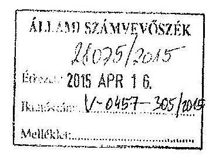

Máróai ty

2011. 08. 18

Tisztelt Elnök Úr!

„A foglalkoztatási célú adó- és járulékkedvezmények igénybevételének szabályszerűségi ellenőrzéséről” címmel készített számvevőszéki jelentéstervezetet megkaptam, köszönöm.

A jelentéstervezetben foglalt megállapításokra észrevételt nem kívánok tenni.

Egyidejűleg megköszönöm munkatársuk segítő közreműködését.

Szombathely, 2015. április 10.”

Tisztelettel:

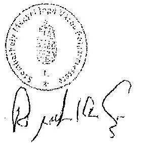

{: Dr. Puskás Tivadar:}

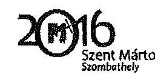

Telefon: +36 94/520-133
Fax: +36 94/520-243
Web: www.szombathely.hu

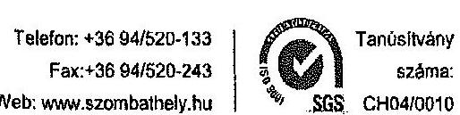

---

.

---

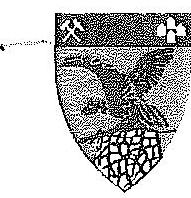

1182
TATABÁNYA MEGYEI JOGÚ VÁROS
SCHMIDT CSABA
polgármester

ÁLIAMI SZÁMVEVÓSZÉK
26807 /2015
E-5057 7015 APR 13
Baltó: 2015. 12-0457-305/6685
Mellékk: 12
Hivatkozási szám:V-0457-290/2015.
Tárgy: Észrevétel Jelentéstervezetre

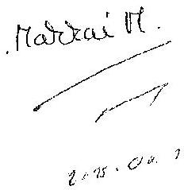

Hivatkozásí szám:V-0457-290/2015.
Tárgy: Észrevétel Jelentéstervezetre

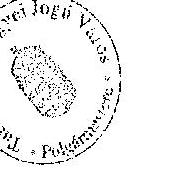

Tisztelt Elnök Úr!

A fenti számú „A foglalkoztatási célú adó-és járulékkedvezmények igénybevételének szabályszerűségi ellenőrzéséről" címmel készült számvevőszéki jelentéstervezetre észrevételt nem kívánok tenni.

Tatabánya, 2015. április 8.

Tisztelettel

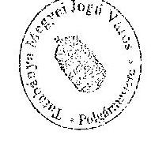

Schmidt Csaba
polgármester

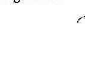

2800 Tatabánya, V., Fő tér 6. 34/515-777 34/515-777 34/515-793
www.tatabanya.hu E-mail: polgarmestert@tatabanya.hu

---

# **Chemistry**

## **Chemical Reactions**

### **Balancing Chemical Equations**

1. **Write the unbalanced equation:**
   - Example: $$C_3H_8 + O_2 \rightarrow CO_2 + H_2O$$

2. **Balance the equation:**
   - Balance carbon atoms first.
   - Then balance hydrogen atoms.
   - Finally, balance oxygen atoms.
   - Balanced equation: $$C_3H_8 + 7O_2 \rightarrow 3CO_2 + 4H_2O$$

3. **Balance the equation:**
   - Balance oxygen atoms.
   - Finally, balance oxygen atoms.
   - Balanced equation: $$C_3H_8 + 7O_2 \rightarrow 3CO_2 + 4H_2O$$

### **Types of Reactions**

1. **Combination Reaction:**
   - Example: $$2H_2 + O_2 \rightarrow 2H_2O$$

2. **Decomposition Reaction:**
   - Example: $$2H_2O_2 \rightarrow 2H_2O + O_2$$

3. **Single Displacement Reaction:**
   - Example: $$Zn + 2HCl \rightarrow ZnCl_2 + H_2$$

4. **Double Displacement Reaction:**
   - Example: $$AgNO_3 + NaCl \rightarrow AgCl + NaNO_3$$

5. **Combustion Reaction:**
   - Example: $$CH_4 + 2O_2 \rightarrow CO_2 + 2H_2O$$

## **Stoichiometry**

### **Mole Concept**

- **Mole (mol):** The amount of substance containing as many particles (atoms, molecules, ions) as there are atoms in exactly 12 grams of carbon-12.
- **Avogadro's Number:** $$6.022 \times 10^{23}$$ particles per mole.

### **Molar Mass**

- **Molar Mass:** The mass of one mole of a substance.
- Example: The molar mass of water ($$H_2O$$) is 18.015 g/mol.

### **Calculations**

1. **Moles to Mass:**
   - Formula: $$n = \frac{m}{M}$$
   - Example: Calculate the number of moles of $$H_2O$$ in 18 grams of water.
     - $$n = \frac{18.015 \, \text{g}}{18.015 \, \text{g/mol}} = 18.015 \, \text{g/mol}$$

2. **Mass to Moles:**
   - Formula: $$m = n \times M$$
   - Example: Calculate the mass of 18.015 g of 18 grams of water.
     - $$m = 18.015 \, \text{g/mol} = 18.015 \, \text{g/mol}$$

## **Gas Laws**

### **Ideal Gas Law**

- **Equation:** $$PV = nRT$$
- **Variables:**
  - $$P$$: Pressure (atm)
  - $$V$$: Volume (L)
  - $$n$$: Number of moles (mol)
  - $$R$$: Ideal gas constant (0.0821 L·atm/mol·K)
  - $$T$$: Temperature (K)

### **Boyle's Law**

- **Equation:** $$P_1V_1 = P_2V_2$$
- **Variables:**
  - P₁: Pressure (atm)
  - P₂: Volume (L)
  - P₃: Temperature (K)
  - P₁: Pressure (atm)
  - P₂: Volume (L)
  - P₃: Temperature (K)
  - P₁: Pressure (atm)
  - P₂: Volume (L)
  - P₃: Temperature (atm)
  - P₁: Pressure (atm)
  - P₂: Volume (L)
  - P₃: Temperature (atm)
  - P₁: Pressure (atm)

## **Thermochemistry**

### **Enthalpy (H)**

- **Definition:** The heat content of a system at constant pressure.
- **Equation:** $$\Delta H = q_p$$
- **Variables:**
  - $$q_p$$: Heat transferred at constant pressure.
  - $$q_p$$: Heat transferred at constant pressure.
  - $$\Delta H$$: Heat transferred at constant pressure.

### **Hess's Law**

- **Statement:** The enthalpy change for a reaction is the same whether it occurs in one step or multiple steps.
- **Equation:** $$\Delta H = q_p - \Delta H$$

---

# 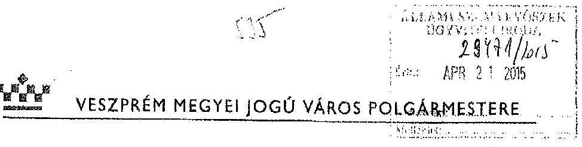 

Szám: Adó 183/2015.
Tárgy: számvevőszéki jelentés tervezet
Ellenörzés iktató száma Önöknél: V-0457-297/2015.
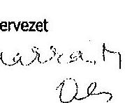

Állami Számvevőszék
Domokos László elnök
részére

## Budapest

## Tisztelt Elnök Úr!

Az Állami Számvevőszék jelentéstervezetét, amely „ A foglalkozási célú adó -és járulékkedvezmények igénybevételének szabályszerűségi ellenőrzésröl"készült áttanulmányoztuk.

A jelentés tervezetre észrevételt nem kivánunk tenni.
Az Állami Számvevőszéknek a helyi iparűzési adózáshoz kapcsolódó építő javaslatait, együttmüködését ezúton is köszönjünk.

Veszprém, 2015. április 13.

Tisztelettel:
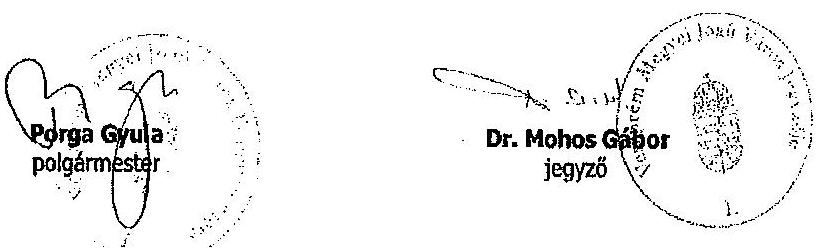

Levélcím: 8210 Veszprém, Pf.: 1042; Honlap: www.veszprem.hu

---

.

---

# RÖVIDÍTÉSEK JEGYZÉKE 

| Törvények |  |
| :--: | :--: |
| Áht. 1 | az államháztartásról szóló 1992. évi XXXVIII. törvény (hatálytalan 2012. január 1-jétől) |
| Áht. 2 | az államháztartásról szóló 2011. évi CXCV. törvény (hatályos 2012. január 1-jétől) |
| Art. | az adózás rendjéről szóló 2003. évi XCII. törvény |
| ÁSZ tv. | az Állami Számvevőszékről szóló 2011. évi LXVI. törvény (hatályos 2011. július 1-jétől) |
| Helyi adó tv. | a helyi adókról szóló 1990 . évi C. törvény |
| Jat. 1 | a jogalkotásról szóló 1987. évi XI. törvény (hatályos 2010. december 30-ig) |
| Jat. 2 | a jogalkotásról szóló 2010. évi CXXX. törvény (hatályos 2011. január 1-jétől) |
| Ktv. | a köztisztviselők jogállásáról szóló 1992. évi XXIII. törvény (hatálytalan 2012. március 1-jétől) |
| Kttv. | a közszolgálati tisztviselökről szóló 2011. évi CXCIX. törvény (hatályos 2012. március 1-jétől) |
| Mötv. | Magyarország helyi önkormányzatairól szóló 2011. évi CLXXXIX. törvény (hatályos 2012. január 1-jétől) |
| NAV tv. | a Nemzeti Adó- és Vámhivatalról szóló 2010. évi CXXII. törvény (hatályos 2010. november 20-tól, 2010. november 27 -től, illetve 2011. január 1-jétől) |
| Ötv. | a helyi önkormányzatokról szóló 1990. évi LXV. törvény (hatálytalan 2014. október 12-től) |
| Pftv. | a pályakezdő fiatalok, az ötven év feletti munkanélküliek, valamint a gyermek gondozását, illetve családtag ápolását követően munkát keresők foglalkoztatásának elősegítéséről, továbbá az ösztöndíjas foglalkoztatásról szóló 2004. évi CXXIII. törvény |
| Tao tv. | a társasági adóról és osztalékadóról szóló 1996. évi LXXXI. törvény |
| Rendeletek |  |
| Ámr. | az államháztartás múködési rendjéről szóló 292/2009. (XII. 19.) Korm. rendelet (hatálytalan 2012. január 1-jétől) |
| Ávr. | az államháztartásról szóló törvény végrehajtásáról szóló 368/2011. (XII. 31.) Korm. rendelet (hatályos 2012. január 1-jétől) |
| Ber. | a költségvetési szervek belső ellenőrzéséről szóló 193/2003. (XI. 26.) Korm. rendelet (hatálytalan 2012. január 1-jétől) |
| Bkr. | a költségvetési szervek belső kontrollrendszeréről és belső ellenőrzéséről szóló 370/2011. (XII. 31.) Korm. rendelet (hatályos 2012. január 1-jétől) |

---

169/2006. (VII. 28.) Korm. rendelet

206/2006. (X. 16.) Korm. rendelet

273/2006. (XII. 23.) Korm. rendelet

291/2006. (XII. 23.) Korm. rendelet

212/2010. (VII. 1.) Korm. rendelet

273/2010. (XII. 9.) Korm. rendelet

315/2010. (XII. 27.) Korm. rendelet

323/2011. (XII. 28.) Korm. rendelet

424/2012. (XII. 29)
Korm. rendelet

320/2014. (XII. 13.) Korm. rendelet

55/2011. (XII. 30.) NGM rendelet

13/1991. (V. 21.) PM rendelet
a pénzügyminiszter feladat- és hatásköréről szóló 169/2006. (VII. 28.) Korm. rendelet (hatálytalan 2010. július 1-jétől)
a fejlesztési adókedvezményről szóló 206/2006. (X. 16.) Korm. rendelet (hatálytalan 2014. július 18-tól, hatályon kívül helyezte a fejlesztési adókedvezményről szóló 165/2014. (VII. 17.) Korm rendelet),
az Adó- és Pénzügyi Ellenőrzési Hivatalról szóló 273/2006. (XII. 23.) Korm. rendelet (hatálytalan 2011. január 1-jétől)
az Állami Foglalkoztatási Szolgálatról szóló 291/2006. (XII. 23.) Korm. rendelet (hatályos 2007. január 1-jétől 2010. december 31-ig)
az egyes miniszterek, valamint a Miniszterelnökséget vezető államtitkár feladat- és hatásköréről szóló 212/2010. (VII. 1.) Korm. rendelet (hatálytalan 2014. június 6-án 22 órától)
a Nemzeti Adó- és Vámhivatal szervezetéről és egyes szervek kijelöléséről szóló 273/2010. (XII. 9.) Korm. rendelet (hatályos 2011. január 1-jétől)
a Nemzeti Foglalkoztatási Szolgálatról szóló 315/2010. (XII. 27.) Korm. rendelet (hatályos 2011. január 1-jétől 2011. december 31-ig)
a Nemzeti Munkaügyi Hivatalról és a szakmai irányítása alá tartozó szakigazgatási szervek feladat és hatásköréről szóló 323/2011. (XII. 28.) Korm. rendelet (hatályos 2011. december 29-től, illetve 2012. január 1-jétől 2014. december 15 -ig, illetve 2014. december 31-ig)
a Nyugdíjbiztosítási Alap kezeléséért felelős nyugdíjbiztosítási szerv, az egészségbiztosítási szerv, a rehabilitációs hatóság, az állami foglalkoztatási szerv és a munkaügyi hatóság részére az állami adóhatóság által teljesített adatátadás részletes szabályairól szóló 424/2012. (XII. 29.) Korm. rendelet (hatályos 2013. január 1-jétől)
az állami foglalkoztatási szerv, a munkavédelmi és munkaügyi hatóság kijelöléséről, valamint e szervek hatósági és más feladatainak ellátásáról szóló 320/2014. (XII. 13.) Korm. rendelet (hatályos 2015. január 1-jétől)
a START kártyák felhasználásának, illetve az ahhoz kapcsolódó szociális hozzájárulási adókedvezmény érvényesítésének, továbbá elszámolásának részletes szabályairól szóló 55/2011. (XII. 30.) NGM rendelet (hatályos 2012. január 1-jétől)
a települési önkormányzat hatáskörébe tartozó adók és adók módjára behajtandó köztartozások nyilvántartásáról, kezeléséről és elszámolásáról szóló 13/1991. (V. 21.) PM rendelet

---

31/2005. (IX. 29.) PM rendelet

35/2008. (XII. 31.) PM rendelet

7/2005. (II. 8.) PM-FMM együttes rendelet

7/2009. (IV. 11.) PMSZMM együttes rendelet

## Egyéb szervezetszabályozó eszközök

2009. évi ellenőrzési irányelv
2010. évi ellenőrzési irányelv
2011. évi ellenőrzési irányelv
2012. évi ellenőrzési irányelv
2013. évi ellenőrzési irányelv
a bevallások feldolgozásának szabályzata ${ }_{2}$
a bevallások feldolgozásának szabályzata ${ }_{3}$
a START- kártya felhasználásának, a járulékkedvezmény érvényesítésének, továbbá elszámolásának részletes szabályairól szóló 31/2005. (IX. 29.) PM rendelet (hatálytalan 2012. január 1-jétől)
az önkormányzati adóhatóságok által rendszeresíthető bevallási, bejelentési nyomtatványok tartalmáról szóló 35/2008. (XII. 31.) PM rendelet (hatályos 2009. január 1jétől)
a foglalkoztatáspolitikai célú járulékkedvezmény elszámolásának részletes szabályairól szóló 7/2005. (II. 8.) PM-FMM együttes rendelet (hatálytalan 2012. január 1jétől)
a pályakezdő fiatalok, az ötven év feletti munkanélküli-
ek, valamint a gyermek gondozását, illetve családtag ápolását követően munkát keresők foglalkoztatásának elősegítéséről, továbbá az ösztöndíjas foglalkoztatásról szóló 2004. évi CXXIII. törvény 8. §-ában meghatározott járulékkedvezmények érvényesítésének és ellenőrzésének részletes feltételeiről és szabályairól szóló 7/2009. (IV. 11.) PM-SZMM együttes rendelet (hatályos 2009. április 16tól)

7003/2009. (AEÉ 2.) APEH irányelv az ellenőrzési feladatok 2009. évi ellátásához
7002/2010. (AEÉ 3-4.) APEH irányelv az ellenőrzési feladatok 2010. évi ellátásához
2011. február 3-án kiadott „Ellenőrzési irányok a Nemzeti Adó- és Vámhivatal adóztatási- és vámszerve 2011. évi ellenőrzési feladatainak végrehajtásához
4003/2012. számú NAV tájékoztatás ellenőrzési irányok a Nemzeti Adó- és Vámhivatal adóztatási- és vámszerve 2012. évi ellenőrzési feladatainak végrehajtásához

4001/2013. tájékoztatás a Nemzeti Adó- és Vámhivatal 2013. évi ellenőrzési feladatainak végrehajtásához kapcsolódó ellenőrzési irányokról
1048/B/2009. APEH utasítással módosított 1019/B/2009. APEH utasítás a bevallások, adatszolgáltatások fogadásának, feldolgozásának általános és speciális ügyviteli szabályozásáról (hatályos 2009. március 17-től 2010. március 1 -ig)
1022/B/2010. APEH utasítás a bevallások, adatszolgáltatások fogadásának, feldolgozásának általános és speciális ügyviteli szabályozásáról (hatályos 2010. március 2tól 2011. február 27-ig)
1016/2011. NAV eljárásrend a bevallások, adatszolgáltatások fogadásának, feldolgozásának általános és speciális ügyviteli szabályozásáról (hatályos 2011. február 28tól 2012. március 20 -ig)

---

a bevallások feldolgozásának szabályzata ${ }_{4}$
a bevallások feldolgozásának szabályzata ${ }_{5}$
adatszolgáltatási szabályzat ${ }_{1}$
adatszolgáltatási szabályzat ${ }_{2}$
adatszolgáltatási szabályzat ${ }_{3}$
adatszolgáltatási szabályzat ${ }_{4}$
adatszolgáltatási szabályzat ${ }_{6}$
adatszolgáltatási szabályzat ${ }_{7}$
az adótartozások után fizetendő késedelmi pótlék számításáról szóló szabályzatok

1044/2012. NAV eljárásrend a bevallások, adatszolgáltatások fogadásának, feldolgozásának általános és speciális ügyviteli szabályozásáról (hatályos 2012. március 21től 2013. március 6-ig)
1108/2013. eljárási renddel módosított 1023/2013. NAV eljárásrend a bevallások, adatszolgáltatások fogadásának, feldolgozásának általános és speciális ügyviteli szabályozásáról (hatályos 2013. március 7-től)
1058/B/2008. APEH utasítás az adóhatóság által teljesített adatszolgáltatások egyes eljárási kérdéseiről, az APEH Központi Hivatala által teljesített rendszeres adatszolgáltatásokról, valamint a költségtérítés ellenében kiadható adatok köréről (hatályos 2009. június 25 -ig)
1059/B/2009. APEH utasítás az adóhatóság által teljesített adatszolgáltatások egyes eljárási kérdéseiről, az APEH Központi Hivatala által teljesített rendszeres adatszolgáltatásokról, valamint a költségtérítés ellenében kiadható adatok köréről (hatályos 2009. június 26 -tól 2010. június 20 -ig)
1051/B/2010. APEH utasítás az adóhatóság által teljesített adatszolgáltatások egyes eljárási kérdéseiről, az APEH Központi Hivatala által teljesített rendszeres adatszolgáltatásokról, valamint a költségtérítés ellenében kiadható adatok köréről (hatályos 2010. június 21 -től 2010. november 15 -ig)
1087/B/2010. APEH utasítás az adóhatóság által teljesített adatszolgáltatások egyes eljárási kérdéseiről, az APEH Központi Hivatala által teljesített rendszeres adatszolgáltatásokról, valamint a költségtérítés ellenében kiadható adatok köréről (hatályos 2010. november 16 -tól 2011. április 20-ig)
1034/2011. eljárási rend a Nemzeti Adó- és Vámhivatal által teljesített adatszolgáltatások egyes szakmai eljárási kérdéseiről, valamint a NAV Központi Hivatala által teljesített rendszeres adatszolgáltatásokról (hatályos 2011. április 21-től 2012. április 10-ig)

2027/2012. NAV szabályzat a Nemzeti Adó- és Vámhivatal által teljesített adatszolgáltatások egyes szakmai eljárási kérdéseiről, valamint a NAV Központi Hivatala által teljesített rendszeres adatszolgáltatásokról (hatályos 2012. április 11-től 2013. január 1-ig)

2149/2012. NAV szabályzat a Nemzeti Adó- és Vámhivatal által teljesítendő külső adatszolgáltatások egyes szakmai eljárási kérdéseiről (hatályos 2013. január 2-tól) 3/2010. (AEÉ 9.) APEH utasítás az adótartozások után fizetendő késedelmi pótlék számításáról, valamint a késedelmi pótlék közlésének, kezelésének eljárási szabályairól (hatályos 2010. július 10-től 2011. február 22-ig), 1015/2011. eljárási rend (hatályos 2011. február 23-tól),

---

ellenőrzések elrendelésének közvetlen okáról szóló szabályzat ${ }_{1}$
ellenőrzések elrendelésének közvetlen okáról szóló szabályzat ${ }_{2}$
ellenőrzések elrendelésének közvetlen okáról szóló szabályzat ${ }_{3}$
az ellenőrzések feldolgozásáról és nyilvántartásáról szóló belső szabályzat ${ }_{1}$
az ellenőrzések feldolgozásáról és nyilvántartásáról szóló belső szabályzat ${ }_{2}$
az ellenőrzések feldolgozásáról és nyilvántartásáról szóló belső szabályzat ${ }_{3}$
az ellenőrzések kiválasztás belső szabályai ${ }_{1}$
az ellenőrzésre kiválasztás belső szabályai ${ }_{3}$
irányító és a jogalkalmazást segítő belső irányítási eszközök

1068/2012. eljárási rend (hatályos 2012. január 1-jétől 2012. december 16-ig),
1139/2012. eljárási rend (hatályos 2012. december 17-től) 1112/B/2010. APEH utasítással módosított 1074/B/2007. APEH utasítás az adóhatósági ellenőrzések elrendelésének közvetlen okáról vezetett nyilvántartásról és a kódok alkalmazásáról, (hatályos 2011. december 31-ig)
1004/2012. eljárási rend az adóhatósági ellenőrzések elrendelésének közvetlen okáról vezetett nyilvántartásról és a kódok alkalmazásáról (hatályos 2012. január 10-től 2013. október 9-ig)
1092/2013. eljárási rend az állami adóhatóság hatáskörébe tartozó ellenőrzések elrendelésének közvetlen okáról vezetett nyilvántartásról és a kódok alkalmazásáról (hatályos 2013. október 9-től)
1073/B/2007. APEH utasítás az állami adóhatóság által végzett ellenőrzések feldolgozásáról és nyilvántartásáról, (hatályos 2012. január 20-ig),
1113/B/2010. APEH utasítás az állami adóhatóság által végzett ellenőrzések feldolgozásáról és nyilvántartásáról szóló 1073/B/2007. utasítás módosításáról (hatályos 2011. január 1-jétől 2012. január 20-ig)

1010/2012. eljárási rend az állami adóhatóság hatáskörébe tartozó ellenőrzések feldolgozásáról és nyilvántartásáról (hatályos 2012. január 20-tól 2013. június 13-ig)

1058/2013. eljárási rend az állami adóhatóság hatáskörébe tartozó ellenőrzések feldolgozásáról és nyilvántartásáról (hatályos 2013. június 14-től)

1027/B/2006. APEH utasítással módosított 1047/B/2004. APEH utasítás az ellenőrzések tervezésének és az ellenőrzésre történő kijelölésnek, kiválasztásnak általános alapelveiről, módszereiről (hatályos 2011. január 5-ig)
1114/B/2010. APEH utasítás az ellenőrzések tervezésének és az ellenőrzésre történő kijelölésnek, kiválasztásnak általános alapelveiről, módszereiről (hatályos 2011. január 5-től 2011. augusztus 4-ig)
1070/2011. eljárási rend az ellenőrzések tervezésének és az ellenőrzésre történő kijelölésnek, kiválasztásnak általános alapelveiről, módszereiről (hatályos 2011. augusztus 4 -től)
1137/B/2007. APEH utasítás az irányító tevékenység eszközeiről és az „Adó és Ellenőrzési Értesítő"-ről (hatálytalan 2010. október 8-tól)
1067/B/2010. APEH utasítás az irányító tevékenység eszközeiről és az „Adó és Ellenőrzési Értesítő"-ről (hatályos a 2010. október 8-tól 2011. január 14-ig)

---

NAV KH Ügyrend $_{1}$

NAV KH Ügyrend 2

NAV KH Ügyrend $_{3}$

Önkormányzat ${ }_{1}$ helyi adó rendelet

Önkormányzat ${ }_{2}$ HIPA rendelete

1/2011. NAV utasítás az irányító tevékenység eszközeiről és az Adó és Vám Értesítőről
(hatályos 2011. január 15-től 2012. február 3-ig)
1001/2011. eljárásrend a közjogi szervezetszabályozó eszköznek és parancsnak nem minősülő egyéb irányító eszközökről
(hatályos 2011. január 14-től 2012. február 15-ig), 1/2012. NAV utasítás a közjogi szervezetszabályozó eszközként kiadásra kerülő utasításról, valamint az Adó- és Vámértesítőről (hatályos 2012. február 4-től), 2021/2012. NAV szabályzat a közjogi szervezetszabályozó, más irányító, továbbá a jogalkalmazást segítő eszközök kiadásának rendjéről, valamint a Hírlevélről (hatályos 2012. február 16-tól 2012.december 31-ig), 2150/2012. NAV szabályzat az irányító és a jogalkalmazást segítő eszközök kiadásának rendjéről (hatályos 2013. január 1-től)
24/2011. Szabályzat a Nemzeti Adó- és Vámhivatal Központi Hivatala Úgyrendjéről (hatályos 2011. július 21-től 2012. július 26 -ig)
2113/2012. Szabályzat a Nemzeti Adó- és Vámhivatal Központi Hivatala Úgyrendjéről - módosítva 2012. augusztus 23 -tól a 2121/2012. számú szabályzattal - (hatályos 2012. július 26 -tól 2013. február 12-ig)
2005/2013. Szabályzat a Nemzeti Adó- és Vámhivatal Központi Hivatala Úgyrendjéről - módosítva 2013. december 6-tól a 2153/2013. számú szabályzattal - (hatályos 2013. február 12-től)
többször módosított 21/1991. (IX. 5.) Főv. Kgy. rendelet (hatályos 2012. december 31-ig), 95/2012. (XII. 27.) Főv. Kgy. rendelettel módosított 87/2012. (XI. 30.) Főv. Kgy. rendelet (hatályos 2013. január 1-jétől)
Budapest Főváros Főpolgármesterének és Főjegyzöjének 525/2005. számú együttes intézkedése Budapest Főváros Önkormányzata Főpolgármesteri Hivatalának Szervezeti és Müködési Szabályzatáról, Úgyrendjéről (hatályos 2005. március 1-jétől 2010. október 26-ig), 553/2010. számú együttes intézkedés az 525/2005. számú módosításáról
(hatályos 2010. október 27-től- 2011. január 16-ig), 505/2011. számú együttes intézkedés (hatályos 2011. január 17-től)
9/2003. (III. 20.) ÖK. rendeletével és a 64/2003. (XII. 19.) ÖK. rendeletével módosított, a helyi iparűzési adóról szóló 45/2002. (XII. 20.) ÖK. rendelet (hatályos 2010. december 31-ig)
a 6/2012. (III. 30.) ÖK. rendelettel és a
35/2013. (XII. 10.) ÖK. rendelettel módosított a helyi

---

Önkormányzat ${ }_{2}$ Polgármesteri Hivatal SZMSZ

Önkormányzat ${ }_{3}$ helyi adó rendelet

Önkormányzat ${ }_{4}$ HIPA rendelete

Önkormányzat ${ }_{4}$ Polgármesteri Hivatal SZMSZ
iparũzési adóról szóló 34/2010. (XI. 26.) ÖK. rendelet (hatályos 2011. január 1-jétől)
Győr Megyei Jogú Város Önkormányzata Szervezeti és Müködési Szabályzatáról szóló többször módosított 11/2007. (III. 23.) ÖK. rendelet
3/2009. (I. 30.) ÖK. rendelettel és a 15/2010. (IV. 30.) ÖK. rendelettel módosított 39/2007. (XI. 29.) ÖK. rendelet, (hatályos 2011. december 31-ig)
44/2013. (X. 28.) számú és a 49/2013. (XII. 18.) ÖK. rendelettel módosított 38/2011.(XII. 19.) ÖK. rendelet (hatályos 2012. január 1-jétől)
többször módosított 27/2007. (XI. 29.) ÖK. rendelet az Önkormányzat SZMSZ-ről, amely tartalmazza a Polgármesteri Hivatal SZMSZ-ét (hatályos 2011. július 31-ig) többször módosított 15/2011. (VI. 18.) ÖK. rendelet az Önkormányzat SZMSZ-ről, amely tartalmazza a Polgármesteri Hivatal SZMSZ-ét
(hatályos 2012. december 31-ig)
79/2013. (II. 28.), a 365/2013. (VI. 19.) és 629/2013. (XII. 12.) Kgy. határozatokkal módosított 530/2012. (XII. 13.) Kgy. határozat a Polgármesteri Hivatal SZMSZ-éről (hatályos 2013. január 1-jétől)
többször módosított 35/2002. (XII. 12.) ÖK. rendelet (hatályos 2012. december 31-ig), 54/2012. (X. 28.) ÖK. rendelet (hatályos 2013. január 1-től)
többször módosított 191/2005. (VIII. 25.) Kgy. határozat (hatályos 2010. november 30-ig)
294/2010. (XI. 25.) Kgy. határozat
(hatályos 2010. december 1-jétől 2012. január 26-ig), 15/2012. (I. 27.) Kgy. határozat
(hatályos 2012. január 27-től 2012. december 31-ig)
többször módosított 257/2012. (XII. 20.) Kgy. határozat (hatályos 2013. január 1-jétől 2013. június 30-ig) 113/2013. (VI. 28.) Kgy. határozat
(hatályos 2013. július 1-jétől)
35/2008. (VI. 27.) ÖK rendelettel módosított 47/2002. (XII. 18.) ÖK. rendelet (hatályos 2010. december 31-ig) 61/2012. (XI. 30.) ÖK. rendelettel módosított 47/2010. (XII. 17.) ÖK. rendelet (hatályos 2011. január 1-jétől)

Önkormányzat Jogú Város Önkormányzatának Szervezeti és Müködési Szabályzatáról szóló 35/2002. (XI. 15.) ÖK. rendelet (hatályos 2011. március 31-ig), 5/2011. (III. 28.) ÜIB határozattal jóváhagyott Polgármesteri hivatali Szervezeti és Müködési Szabályzat (hatályos 2012. december 31-ig)
Veszprém Megyei Jogú Város Polgármesteri Hivatalának Szervezeti és Müködési Szabályzata az Ügyrendi és Igazgatási Bizottság jóváhagyása alapján (hatályos 2013. január 1-jétől)

---

PM/NGM SZMSZ-ek

START kártya kiadási szabályzat ${ }_{1}$

START kártya kiadási szabályzat ${ }_{2}$

START kártya kiadási szabályzat ${ }_{3}$

START kártya kiadási szabályzat ${ }_{4}$

START kártya kiadási szabályzat ${ }_{5}$

APEH/NAV SZMSZ ${ }_{1}$

APEH/NAV SZMSZ ${ }_{2}$

APEH/NAV SZMSZ ${ }_{3}$

APEH/NAV SZMSZ ${ }_{4}$

## Egyéb rövidítések

ANYK
APEH
állami adóhatóság állami foglalkoztatási szerv

ÁSZ

PM SZMSZ-ről szóló 5/2008. (MK 48.) PM utasítás, hatályos 2012. december 21-ig, hatályon kívül helyezte a 48/2012. (XII. 21.) NGM utasítás 2. § c) pontja, az NGM szervezeti és múködési rendjének ideiglenes meghatározásáról szóló 1/2010. (VII. 8.) NGM utasítás, hatályos 2010. július 9-től 2010. október 4-ig NGM SZMSZ-ről szóló 4/2010. (X. 5.) NGM utasítás, hatályos 2010. október 5-től 2013. június 3-ig, NGM SZMSZ-ről szóló 11/2013. (VI. 3.) NGM utasítás (hatályos 2013. június 4-től)
1036/B/2008. APEH utasítás a START-kártya, a START PLUSZ kártya és a START EXTRA kártya kiadásáról (hatályos 2009. szeptember 02-ig),
1079/B/2009. APEH utasítás a START-kártya, a START PLUSZ kártya és a START EXTRA kártya kiadásáról (hatályos 2009. szeptember 03-tól 2010. június 24-ig), 1054/B/2010. APEH utasítás a START-kártya, a START PLUSZ kártya és a START EXTRA kártya kiadásáról (hatályos 2010. június 25 -től 2011 április 04-ig)
1025/2011. eljárásrend a START-kártya, a START PLUSZ kártya és a START EXTRA kártya kiadásáról (hatályos 2011. április 05-től)
1125/2012. eljárásrend a START-kártya és a START BÓNUSZ kártya kiadásáról
(hatályos 2012. október 01-től
1/2007. PM utasítás az Adó- és Pénzügyi Ellenőrzési Hivatal Szervezeti és Múködési Szabályzatáról (hatályos 2010. augusztus 22-ig)
a nemzetgazdasági miniszter által 2010. augusztus 23-án kiadmányozott, az Adó- és Pénzügyi Ellenőrzési Hivatal Szervezeti és Múködési Szabályzatáról szóló NGM utasítás (hatályos 2010. augusztus 23-tól 2010. október 21-ig)
6/2010. (X. 25.) NGM utasítás az Adó- és Pénzügyi Ellenőrzési Hivatal Szervezeti és Múködési Szabályzatáról (hatályos 2010. október 22-től 2011. június 30-ig)
23/2011. (VI. 30.) NGM utasítás a Nemzeti Adó- és Vámhivatal Szervezeti és Múködési Szabályzatáról, melléklet (hatályos 2011. július 1-jétől)

Adóalany Nyilvántartó Keretrendszer
Adó- és Pénzügyi Ellenőrzési Hivatal (NAV jogelődje)
APEH 2010. december 31-ig, NAV 2011. január 1-jétől
2012. január 1-jétől a 323/2011. (XII. 28.) Korm. rendelet 2. § (2) bekezdése alapján a Nemzeti Munkaügyi Hivatalt, a munkaügyi központot, valamint a kirendeltséget jelöli
Állami Számvevőszék

---

| BEVFELD | Bevallás Feldolgozó Rendszer |
| :--: | :--: |
| FEUVE | folyamatba épített, előzetes, utólagos és vezetői ellenőrzés |
| Főjegyzö | Budapest Főváros Önkormányzata Főpolgármesteri Hivatalának főjegyzöje |
| Főpolgármesteri Hivatal | Budapest Főváros Önkormányzatának Főpolgármesteri Hivatala |
| Főv. Kgy. rendelet | Budapest Főváros Közgyűlésének rendelete |
| FSZH | Foglalkoztatási és Szociális Hivatal |
| HAIR | helyi adók információs rendszere (Önkormányzat ${ }_{1}$-nél alkalmazott rendszer) |
| HIPA | helyi iparúzési adó |
| INTOSAI | Legfőbb Ellenőrző Intézmények Nemzetközi Szervezete |
| ISSAI | INTOSAI által kiadott nemzetközi standardok |
| IFAF | Információvédelmi, Folyamatszabályozási és Adatvagyongazdálkodási Főosztály |
| jegyző | Önkormányzat ${ }_{2-5}$ Polgármesteri Hivatalának jegyzője |
| Kgy. rendelet | Önkormányzat ${ }_{2-5}$ Közgyüléseinek rendeletei |
| Kincstár | Magyar Államkincstár |
| Korm. határozat | Kormányhatározat |
| Korm. rendelet | Kormányrendelet |
| KSH | Központi Statisztikai Hivatal |
| MBANK | Magánszemélyek adatbankja |
| MPA | Munkaerőpiaci Alap |
| munkaügyi hatóság | 2012. január 1-jétől a 323/2011. (XII. 28.) Korm. rendelet 3. § (1) és (2) bekezdései alapján a Nemzeti Munkaügyi Hivatal önálló feladat és hatáskörrel rendelkező szervezeti egysége a munkavédelmi és munkaügyi igazgatóság, továbbá a fővárosi és megyei kormányhivatalok munkavédelmi és munkaügyi szakigazgatási szerve |
| munkaügyi központok | 2007. január 1-jétől a 291/2006. (XII. 23.) Korm. rendelet, 2011. január 1-jétől a 315/2010. (XII. 27.) Korm. rendelet, 2012. január 1-jétől a 323/2011. (XII. 28.) Korm. rendelet, illetve 2015. január 1-jétől a 320/2014. (XII. 13.) Korm. rendelet alapján az állami foglalkoztatási szervezet részeit jelöli |
| NAV | Nemzeti Adó- és Vámhivatal |
| NAV INIT | NAV Informatikai Intézet |
| NAV KH | NAV Központi Hivatal |
| NFA | Nemzeti Foglalkoztatási Alap |
| NGM | Nemzetgazdasági Minisztérium |
| NMH | Nemzeti Munkaügyi Hivatal |
| NRSZH | Nemzeti Rehabilitációs és Szociális Hivatal |
| OEP | Országos Egészségbiztosítási Pénztár |
| ONYF | Országos Nyugdíjbiztosítási Főigazgatóság |
| ÖK. rendelet | Önkormányzat ${ }_{2-5}$ rendeletei |

---

ÖNEGM
ÖNKADÓ
Önkormányzat ${ }_{1}$
Önkormányzat $_{2}$
Önkormányzat $_{3}$
Önkormányzat $_{4}$
Önkormányzat $_{5}$
önkormányzatok
önkormányzatok képvi-selő-testületei
Önkormányzati adóhatóság $_{1}$

Önkormányzati adóhatóság $_{2}$
Önkormányzati adóhatóság $_{3}$

Önkormányzati adóhatóság $_{4}$
Önkormányzati adóhatóság $_{5}$
önkormányzati adóhatóságok
Önkormányzat ${ }_{1}$ Képvi-selő-testülete
Önkormányzat ${ }_{2}$ Képvi-selő-testülete
Önkormányzat ${ }_{3}$ Képvi-selő-testülete
Önkormányzat ${ }_{4}$ Képvi-selő-testülete
Önkormányzat ${ }_{5}$ Képvi-selő-testülete
PM
REV lap
REV rendszer
SZMM
SZMSZ
SZOCHO
TB járulék
Törvényességi felügyeletet ellátó szerv

Önkormányzati Előirányzat Gazdálkodási Modul
Önkormányzati Adók Nyilvántartó Rendszere
Budapest Főváros Önkormányzata
Győr Megyei Jogú Város Önkormányzata
Szombathely Megyei Jogú Város Önkormányzata
Tatabánya Megyei Jogú Város Önkormányzata
Veszprém Megyei Jogú Város Önkormányzata
Önkormányzat ${ }_{1-5}$
Önkormányzat ${ }_{1-5}$ Közgyűlése
Budapest Főváros Önkormányzat Főpolgármesteri Hivatal Adó Ügyosztálya (2011. május 19-ig)/Adó Főosztálya (2011. május 19-től jelenleg is)
Győr Megyei Jogú Város Önkormányzata Polgármesteri Hivatalának Adóügyi Osztálya
Szombathely Megyei Jogú Város Önkormányzata Polgármesteri Hivatalának 2011. július 31-ig Adóosztálya, 2011. augusztus 1-jétől Adókivetési Irodája, illetve Adóvégrehajtási és Könyvelési Irodája
Tatabánya Megyei Jogú Város Önkormányzata Polgármesteri Hivatalának Adóügyi és Behajtási Irodája
Veszprém Megyei Jogú Város Önkormányzata Polgármesteri Hivatalának Adóhivatala
Önkormányzat ${ }_{1-5}$ helyi adóztatási tevékenységére kijelölt szervezeti egység
Budapest Főváros Önkormányzat Közgyűlése
Győr Megyei Jogú Város Önkormányzat Közgyűlése
Szombathely Megyei Jogú Város Önkormányzat Közgyűlése
Tatabánya Megyei Jogú Város Önkormányzat Közgyűlése
Veszprém Megyei Jogú Város Önkormányzat Közgyűlése
Pénzügyminisztérium
Revíziót követő információs rendszerből előállítható nyilvántartólap
Revíziót követő információs rendszer (2011. december 31ig R rendszer, azt követően REV rendszer)
Szociális és Munkaügyi Minisztérium
Szervezeti Müködési Szabályzat
szociális hozzájárulási adó
társadalombiztosítási járulék
az Ötv. 95. § a) pontja alapján: 2010. december 31-ig a közigazgatási hivatalok, 2011. január 1.- 2011. december

---

31. között a helyi önkormányzatok törvényességi ellenőrzéséért felelős szerv, 2012. január 1-jétől a fővárosi és megyei kormányhivatalok
tv. törvény

---

.

---

# FOGALOMTÁR 

| adókülönbözet | A bevallott (bejelentett), bevallani (bejelenteni) elmulasztott vagy a bevallás (bejelentés) alapján kivetett, kiszabott és az adóhatóság által utólag megállapított adó, költségvetési támogatás különbözete, vagy a büntető bíróság által jogerősen megállapított adóbevétel - csökkenés, illetőleg a jogosulatlanul igénybe vett költségvetési támogatás. (Forrás: Art. 178. § 3. pont) |
| :--: | :--: |
| adótitok | Adótitok az adózást érintő tény, adat, körülmény, határozat, végzés, igazolás, vagy más irat. Az adótitokra vonatkozó rendelkezéseket és a közösségi vámjog végrehajtásáról szóló törvény 16. § (9) bekezdésében foglalt rendelkezést kell alkalmazni a VPfD szám megállapításával, nyilvántartásba vételével és nyilvántartásával összefüggő eljárásokra. (Forrás: Art. 53.§ (1) bekezdés) |
| belső kontrollrendszer | A belső kontrollrendszer a kockázatok kezelésére és tárgyilagos bizonyosság megszerzése érdekében kialakított folyamatrendszer, amely azt a célt szolgálja, hogy a költségvetési szerv megvalósítsa a következő fő célokat:   a) a költségvetési szerv a múködése és gazdálkodása során a tevékenységeket (múveleteket) szabályszerűen, valamint a 91. § (1) bekezdésében meghatározott követelményekkel összhangban hajtsa végre,   b) teljesítse az elszámolási kötelezettségeket, és   c) megvédje a szervezet erőforrásait a veszteségektől (károktól) és a nem rendeltetésszerú használattól.   (Forrás: Áht. 1 121. § (1) bekezdése)   A belső kontrollrendszer a kockázatok kezelése és tárgyilagos bizonyosság megszerzése érdekében kialakított folyamatrendszer, amely azt a célt szolgálja, hogy megvalósuljanak a következő célok:   a) a múködés és gazdálkodás során a tevékenységeket szabályszerűen, gazdaságosan, hatékonyan, eredményesen hajtsák végre,   b) az elszámolási kötelezettségeket teljesítsék, és   c) megvédjék az erőforrásokat a veszteségektől, károktól és nem rendeltetésszerú használattól. (Forrás: Áht. 2 69. § (1) bekezdése)   Részei: kontrollkörnyezet, kockázatkezelési rendszer, kontrolltevékenységek, információs és |

---

|  | kommunikációs rendszer, és nyomon követési rendszer (monitoring) (Forrás: Bkr. 3. §) |
| :--: | :--: |
| önellenőrzés | Az önadózás útján megállapított, vagy megállapítani elmulasztott adót, adóalapot - az illeték kivételével - és a költségvetési támogatást az adózó helyesbítheti. Ha az adózó az adóhatóság ellenőrzésének megkezdését megelőzően feltárja, hogy az adó alapját, az adót, a költségvetési támogatást nem a jogszabálynak megfelelően állapította meg, vagy számítási hiba, vagy más elírás miatt az adó, költségvetési támogatás alapja, összege tekintetében hibás, bevallását önellenőrzéssel módosíthatja. (Forrás: Art. 49. § (1) bekezdés) |
| START kártya család | A START kártyacsalád „tagjai" a START, START PLUSZ, START EXTRA, START BONUSZ kártyák, melyek a Pftv. által definiált, a munkaerőpiacról tartósan távollévők meghatározott körébe tartozó magánszemélyek munkaadója számára lehetővé tették/teszik a foglalkoztatást terhelő járulékokból, - 2012. január 1-től a szociális hozzájárulási adóból - adókedvezmény igénybevételét. (Forrás: Pftv. 3-7/A. §) |
| START Program | A START Program 2005. október 1-től a START Program, 2007. július 1-jétől a START PLUSZ Program a START EXTRA és 2012. január 1-jétől START BÓNUSZ Program összefoglaló neve. A Program lehetőséget biztosít a pályakezdőknek a munkaerő-piacon nélkülözhetetlen munkatapasztalat megszerzésére, a munkáltatóknak pedig a fiatalok foglalkoztatásához kötődő járulékkedvezmény érvényesítésére. Biztosítja továbbá a munkaerőpiaci szempontból hátrányos helyzetűnek számító rétegek (kismamák, 50 év feletti, 25 év alatti, vagy alacsony iskolai végzettségú, tartósan munka nélkül lévők és a rendelkezésre állási támogatásban részesülők) foglalkoztatásának elősegítését a munkáltatók által igénybe vehető járulékkedvezmények útján.   (Forrás: Az ÁSZ saját fogalom meghatározása a TÁMOP-1.2.1 „Hátrányos helyzetűek foglalkoztatását ösztönző járulékkedvezmények" alapján) |