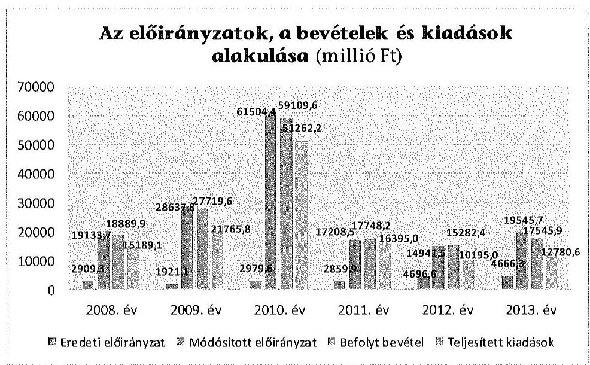
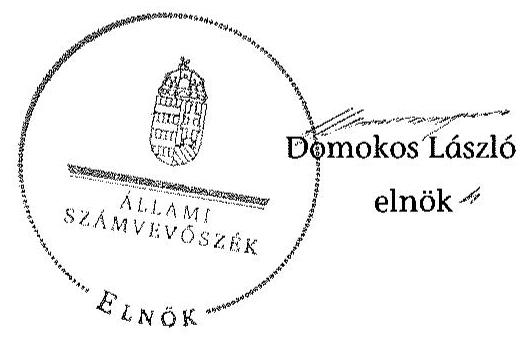

# ÁLLAMI   SZÁMVEVŐSZÉK 

## JELENTÉS

A központi alrendszer egyes intézményei pénzügyi és vagyongazdálkodásának ellenőrzése
Nemzeti Munkaügyi Hivatal
15092
2015. június

---

# Állami Számvevőszék 

Iktatószám: V-0746-148/2015.
Témaszám: 1780
Vizsgálat-azonosító szám: V-067917

## Az ellenőrzést felügyelte:

## Kisgergely István

felügyeleti vezető
Az ellenőrzést vezette és az ellenőrzés végrehajtásáért felelős:
Budai Éva
ellenőrzésvezető
Az összefoglaló jelentést készítette:
Budai Éva
ellenőrzésvezető
Az ellenőrzést végezték:

| Bartolák Márta számvevő főtanácsos | Béres László számvevő főtanácsos | Burenzsargal   Narantuja   számvevő tanácsos |
| :--: | :--: | :--: |
| Horváth Tímea számvevő | L. Kovács János számvevő | Varga József számvevő tanácsos |

## A témához kapcsolódó eddig készített számvevőszéki jelentések:

## címe

sorszáma
Jelentés a 2013. évi zárszámadásról - Magyarország 2013. évi költségvetése végrehajtásának ellenőrzéséről

Jelentés a gazdasági kamarák közfeladatai ellátására fordított költségvetési támogatások felhasználásának és a gyakorlati képzést szervező gazdálkodó szervezeteknél a szakképzési hozzájárulás teljesítésénél elszámolható költségek ellenőrzéséről a 2009-2011. években
Jelentés a gazdasági kamarák közfeladatai ellátására fordított költségvetési támogatások felhasználásának és a gyakorlati képzést szervező gazdálkodó szervezeteknél a szakképzési hozzájárulás teljesítésénél elszámolható költségek ellenőrzéséről a 2009-2011. években

---

# TARTALOMJEGYZÉK 

BEVEZETÉS ..... 3
I. ÖSSZEGZŐ MEGÁLLAPÍTÁSOK ..... 6

---

.

---

# JELENTÉS 

## A központi alrendszer egyes intézményei pénzügyi és vagyongazdálkodásának ellenőrzéséről Nemzeti Munkaügyi Hivatal

## BEVEZETÉS

A közpénzek felhasználásában és az állami vagyonnal való gazdálkodásban a központi alrendszer egyes intézményei meghatározó súlyt képviselnek. Pénzügyi és vagyongazdálkodásuk rendszeres ellenőrzésével az Állami Számvevőszék (továbbiakban: ÁSZ) hozzájárul a hatékony közigazgatás megteremtéséhez. Az ÁSZ Stratégiájával összhangban a közvagyon védelme, a közpénzügyek átláthatóságának előmozdítása érdekében megkezdte a Nemzeti Munkaügyi Hivatal (továbbiakban: NMH) ellenőrzését.

Az NMH a foglalkoztatáspolitikai, munkavédelmi, munkaügyi, valamint állami szak- és felnőttképzési feladatokért felelős központi hivatal volt, amelyet a Magyar Köztársaság Kormánya Foglalkoztatási Hivatal néven a foglalkoztatás elősegítéséről és a munkanélküliek ellátásáról szóló 1991. évi IV. törvény módosításáról szóló 2001. évi XXIV. törvénnyel 2001. július 1-jén alapított. A Foglalkoztatási Hivatal 2007-től Foglalkoztatási és Szociális Hivatal, 2011-től ismét Foglalkoztatási Hivatal, 2012-től NMH néven működött. Az NMH a 323/2011. (XII. 28.) Korm. rendelet értelmében jogutódja volt a 2011. december 31-én beolvadással megszűnt Országos Munkavédelmi és Munkaügyi Főfelügyelőségnek és a Nemzeti Szakképzési és Felnőttképzési Intézetnek.

Feladatait az ellenőrzött időszakban az Állami Foglalkoztatási Szolgálatról szóló 291/2006. (XII. 23.) Korm. rendelet, a Nemzeti Foglalkoztatási Szolgálatról szóló 315/2010. (XII. 27.) Korm. rendelet és a Nemzeti Munkaügyi Hivatalról és a szakmai irányítása alá tartozó szakigazgatási szervek feladat- és hatásköréről szóló 323/2011. (XII. 28.) Korm. rendelet állapította meg. Alaptevékenysége 2008-2009 között foglalkoztatáspolitikával, rehabilitációval és megváltozott munkaképességű személyek foglalkoztatásával, szociálpolitikával, társadalmi párbeszéddel és koordinációval, hatósági jogkörrel és munkaerő-piaci információ szolgálat működtetésével kapcsolatos feladatok ellátására terjedt ki. Tevékenysége 2010-től szociális, gyermekjóléti és gyermekvédelmi, valamint ifjúsági foglalkoztatással kapcsolatos feladatokkal bővült. Az NMH feladatellátása 2012-től ismét változott, szak- és felnőttképzéssel, munkavédelemmel, munkaügyi ellenőrzéssel, munkahigiéniával és foglalkoztatás-egészségüggyel összefüggő feladatokkal egészült ki. Az NMH szervezte, bonyolította és koordinálta az Európai Unió pénzügyi alapjaiból támogatott egyes foglalkoztatási, képzési és informatikai programok megvalósítását, koordinálta továbbá a munkaügyi központok Európai Uniós forrásból megvalósuló tevékenységeit.

---

Az NMH előirányzatai felett teljes jogkörrel rendelkező, önállóan működő és gazdálkodó költségvetési szerv volt. Az irányító szervi feladatok ellátása a szociális és munkaügyi miniszter, majd 2010. július 1-jétől a foglalkoztatáspolitikáért felelős miniszter kizárólagos felelősségi körébe tartozott. Az NMH-t főigazgató vezette, munkáját főigazgató-helyettesek segítették. A főigazgató személyében 2010. december 9. óta nem történt változás.

Az NMH költségvetés volumenének alakulását a következő diagram szemlélteti (az adatok a függő és átfutó tételeket nem tartalmazzák):

A befektetett eszközök értéke a 2008. évi 4065,9 millió Ft-ról 2013-ra 1475,5 millió Ft-tal, 136,3%-kal nőtt. A saját tőke és a tartalékok együttes összege a 2008. évi 5328,6 millió Ft-ról 2013-ra 5747,4 millió Ft-tal, 207,9%-kal nőtt. A kötelezettségek összege a 2008. évi 2588,2 millió Ft-ról 2013-ra 354,8 millió Ft-tal, 86,3%-kal csökkent. Az NMH munkajogi létszáma a 2008. évi 286 főről 2013. évre 445 főre növekedett, amelyet az ellátandó feladatok körének folyamatos bővülése okozott.

Az NMH az állami foglalkoztatási szerv, a munkavédelmi és munkaügyi hatóság kijelöléséről, valamint e szervek hatósági és más feladatainak ellátásáról szóló 320/2014. (XII. 13.) Korm. rendelet 18. § (1) bekezdése alapján 2014. december 31-én jogutód nélkül megszűnt.

Az ellenőrzés célja annak megállapítása volt, hogy a Hivatalra vonatkozó irányító szervi feladatellátás a jogszabályi előírások betartásával történt-e; a Hivatalnál a belső kontrollrendszer kialakítása és működtetése szabályszerű volt-e; kialakították-e az erőforrásokkal való szabályszerű és hatékony gazdálkodáshoz szükséges követelményeket, megvalósították-e azok számon kérését, ellenőrzését; a Hivatal pénzügyi és vagyongazdálkodása megfelelt-e a jogszabályi előírásoknak és belső szabályzatainak; a Hivatal átalakításának vagy átszervezésének lebonyolítása szabályszerűen történt-e; az integritási kontrollokat kialakították-e, szabályszerűen működtetik-e; az ÁSZ korábbi ellenőrzései során megfogalmazott javaslatok, megállapítások tekintetében az ellenőrzés

---

célja továbbá annak megítélése volt, hogy azok végrehajtása érdekében a Hivatal a szükséges intézkedéseket megtette-e.

Az NMH-t az ÁSZ a 2013. évi zárszámadási ellenőrzés keretében ellenőrizte.
Az ellenőrzés típusa szabályszerűségi ellenőrzés.
Az ellenőrzött időszak 2008. január 1-jétől 2013. december 31-ig. (Az eredményszemléletű számvitel bevezetésével kapcsolatban az ellenőrzött időszak vége: 2014. április 30.)

A helyszíni ellenőrzésre az NMH-nál és az irányító szervi feladatait ellátó Nemzetgazdasági Minisztériumnál került sor.

Az ellenőrzés jogszabályi alapját az ÁSZ tv. 1. § (3) bekezdés, 5. § (2)(6) bekezdései, valamint Áht. 61. § (2) bekezdésének előírásai képezik.

---

# I. ÖSSZEGZŐ MEGÁLLAPÍTÁSOK 

A központi alrendszer egyes intézményei pénzügyi és vagyongazdálkodásának ellenőrzése során a Nemzeti Munkaügyi Hivatal a számvevőszéki ellenőrzés ellenőrzési program szerinti lefolytatásához szükséges dokumentumokat teljes körűen nem bocsátotta az Állami Számvevőszék rendelkezésére. Az intézmény kiadási előirányzatai felhasználása szabályszerűségének és a kapcsolódó pénzgazdálkodási belső kontrollok működésének, valamint az intézmény vagyongazdálkodása szabályszerűségének ellenőrzéséhez kapcsolódó adatszolgáltatás hiánya miatt az ellenőrzési programban meghatározott feladatokat teljes körűen teljesíteni nem lehetett. Az ellenőrzési program ellenőrzési céljaként, illetve fókuszkérdéseiként meghatározott, a Nemzeti Munkaügyi Hivatal pénzügyi és vagyongazdálkodása jogszabályi előírásoknak és belső szabályzatainak való megfelelősége a dokumentumok hiánya miatt nem volt ellenőrizhető, az ellenőrzés végrehajtása meghiúsult. Az Állami Számvevőszékről szóló 2011. évi LXVI. törvény 28. § (5) bekezdése és 33. § (3) bekezdés a) pontja, továbbá az ügyészségről szóló 2011. évi CLXIII. törvény 5. § (2) bekezdése alapján az illetékes hatóság felé jelzéssel éltünk.

Budapest, 2015. június 9. nap

