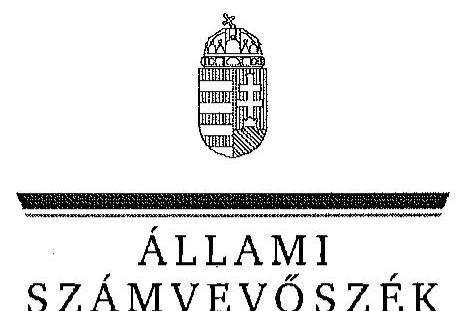
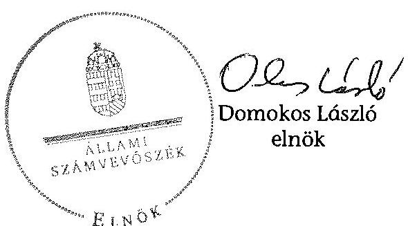
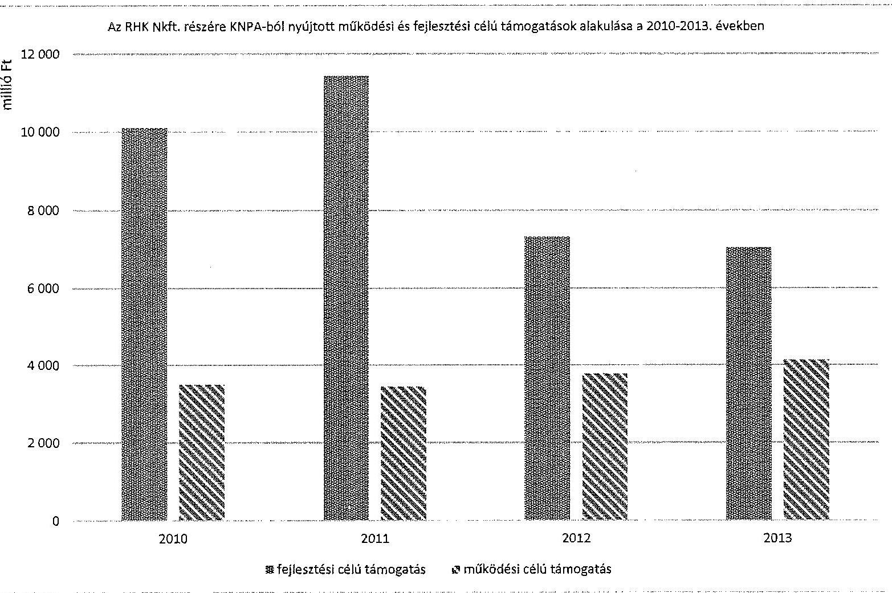
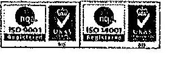
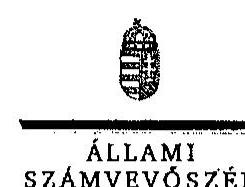
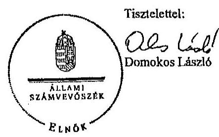
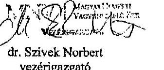
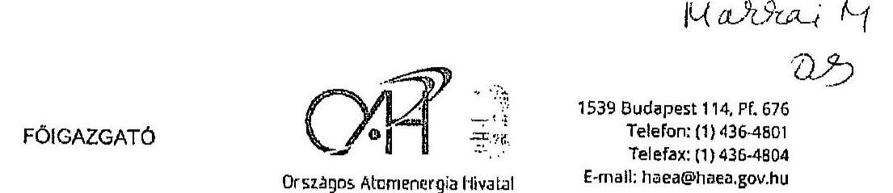
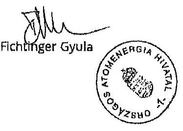

ÁLLAMI
SZÁMVEVÔSZÉK

# JELENTÉS 

az állami tulajdonban (résztulajdonban) lévố gazdálkodó szervezetek vagyonmegőrzési és gazdálkodási tevékenységének ellenőrzése
Radioaktív Hulladékokat Kezelő Közhasznú Nonprofit Korlátolt Felelősségű Társaság
15093

---

# Állami Számvevőszék 

Iktatószám: V-0643-268/2015.
Témaszám: 1677
Vizsgálat-azonosító szám: V066602

## Az ellenőrzést felügyelte:

## Makkai Mária

felügyeleti vezető

## Az ellenőrzést vezette és a végrehajtásáért felelős:

## Klinga László

ellenőrzésvezető

## A jelentéstervezet összeállításában közremúködött:

## Szihalminé Kovács Zsuzsa

számvevő főtanácsos

## Az ellenőrzést végezték:

| Nyirati Ferenc | Tatár Zsuzsanna | Tóth István |
| :-- | :-- | :-- |
| okleveles könyvvizsgáló | okleveles könyvvizsgáló | okleveles könyvvizsgáló |
| külső szakértő | külső szakértő | külső szakértő |

---

# TARTALOMJEGYZÉK 

BEVEZETÉS ..... 9
I. ÖSSZEGZŐ MEGÁLLAPÍTÁSOK, KÖVETKEZTETÉSEK, JAVASLATOK ..... 13
II. RÉSZLETES MEGÁLLAPÍTÁSOK ..... 17

1. A tulajdonosi jogok gyakorlója által kialakított vagyongazdálkodási szabályoknak való megfelelés ..... 17
1.1. A vagyon kezelésére kötött szerződés szabályszerűsége és a követelmények előírása ..... 17
1.2. A vagyonnyilvántartás szabályozottsága és a vagyongazdálkodásra vonatkozó jogok meghatározása ..... 18
2. Az RHK Nkft. vagyongazdálkodási és vagyonnyilvántartási tevékenységének kialakítása ..... 18
2.1. A vagyongazdálkodási feltételek kialakításának szabályszerűsége ..... 18
2.2. Az RHK Nkft. vagyonnyilvántartásának szabályszerűsége ..... 20
3. Az ellátott közfeladat bevételei és ráfordításai elszámolásának és önköltségszámításának a szabályszerűsége ..... 21
3.1. Az ellátott közfeladat bevételeinek és ráfordításainak szabályszerűsége ..... 21
3.2. Az önköltségszámítás szabályszerűsége ..... 23
4. A vagyonváltozást eredményező döntések jogszabályi és tulajdonosi elvárásoknak való megfelelése ..... 23
4.1. Az RHK Nkft. vagyongazdálkodási tevékenységének szabályszerűsége ..... 23
4.2. A döntések előkészítésének megalapozása ..... 26
4.3. A tulajdonosi joggyakorló vagyonváltozást eredményező döntéseinek megfelelése ..... 27
5. A belső kontroll és monitoring rendszer kialakítása és múködtetése ..... 28
5.1. A vagyon védelmét és a vagyonnal való felelős gazdálkodást biztosító belső kontrollrendszer kialakítása és múködtetése ..... 28
5.2. A monitoring rendszer kialakítása és múködtetése ..... 29
5.3. A kormányzati szektorba sorolt szervezet adatszolgáltatása ..... 31

---

# MELLÉKLETEK 

1. számú Az RHK NKft. tevékenységének főbb jellemzői a 2010-2013. években
2. számú Az RHK NKft. eredményének alakulása a 2010-2013. években
3. számú Az RHK Nkft. részére KNPA-ból nyújtott múködési és fejlesztési célú támogatások alakulása a 2010-2013. években
4. számú Az RHK Nkft. ügyvezető igazgatójának észrevétele
5. számú Az RHK Nkft. ügyvezető igazgatójának észrevételére adott válasz
6. számú Az MNV Zrt. vezérigazgatójának nemleges észrevétele
7. számú Az OAH főigazgatójának nemleges észrevétele

---

# RÖVIDÍTÉSEK JEGYZÉKE 

## EU-s joganyagok

479/2009/EK rendelet

## Törvények

Avtv.
Áht. 1
Áht. 2
Eisztv.
Gt. tv.
Infotv.

Nvtv.
Stabilitási tv.
Számv. tv.
Vet. tv.
Vtv.
Rendeletek
240/1997. (XII. 18.)
Korm. rendelet
353/2011. (XII. 30.)
Korm. rendelet

Vhr.

## Szórövidítések

Alapító Okirat
ÁSZ
E-On Zrt.
EU
FB
KKÁT
KNPA
MNV Zrt.
NGM
a Tanács 2009. május 25-i 479/2009./EK rendelete az Európai Közösséget létrehozó szerződéshez csatolt, a túlzott hiány esetén követendő eljárásról szóló jegyzőkönyv alkalmazásáról
a személyes adatok védelméről és a közérdekú adatok nyilvánosságáról szóló 1992. évi LXIII. törvény
az államháztartásról szóló 1992. évi XXXVIII. törvény (hatálytalan: 2012. január 1-jétől)
az államháztartásról szóló 2011. évi CXCV. törvény
az elektronikus információszabadságról szóló 2005. évi XC törvény (hatálytalan 2012. január 1-jétől)
a gazdasági társaságokról szóló 2006. évi IV. törvény (hatálytalan: 2014. március 15-étől)
az információs önrendelkezési jogról és az információszabadságról szóló 2011. évi CXII. törvény (hatályos 2011. július 27-étől)
a nemzeti vagyonról szóló 2011. évi CXCVI. törvény
Magyarország gazdasági stabilitásáról szóló 2011. évi CXCIV. törvény
a számvitelről szóló 2000 . évi C. törvény
a villamos energiáról szóló 2007. évi LXXXVI. törvény
az állami vagyonról szóló 2007. évi CVI. törvény
a nukleáris létesítmények leszerelésére kijelölt szerv létrehozásáról és tevékenységének pénzügyi forrásáról szóló 240/1997. (XII. 28.) Korm. rendelet
az adósságot keletkeztető ügyletekhez történő hozzájárulás részletes szabályairól szóló 353/2011. (XII. 30.) Korm. rendelet
az állami vagyonnal való gazdálkodásról szóló 254/2007. (X. 4.) Korm. rendelet
az RHK Nkft. Alapító Okirata és annak módosításai
Állami Számvevőszék
E-On Dél-dunántúli Áramhálózati Zrt.
Európai Unió
RHK Nkft. Felügyelőbizottsága
Kiégett Kazetták Átmeneti Tárolója
Központi Nukleáris Pénzügyi Alap
Magyar Nemzeti Vagyonkezelő Zrt.
Nemzetgazdasági Minisztérium

---

| NRHT | Nemzeti Radioaktívhulladék-tároló |
| :-- | :-- |
| OAH | Országos Atomenergia Hivatal |
| RHFT | Radioaktív Hulladék Feldolgozó és Tároló |
| RHK Nkft., Társaság | Radioaktív Hulladékokat Kezelő Közhasznú Nonprofit |
|  | Korlátolt Felelősségű Társaság |
| SZMSZ | az RHK Nkft. Szervezeti és Müködési Szabályzata |

---

# ÉRTELMEZŐ SZÓTÁR 

Állami vagyon
2010. június 16-ig állami vagyonnak minősül:
a) az állami tulajdonban lévő ingó dolog, valamint a dolog módjára hasznosítható természeti erő,
b) az állami tulajdonban lévő termőföldekből álló, külön törvényben szabályozott Nemzeti Földalap,
c) az állami tulajdonban lévő - a b) pont hatálya alá nem tartozó - ingatlan,
d) az állami tulajdonban lévő értékpapír,
e) az államot megillető társasági részesedés és más vagyoni értékú jog.
Forrás: Vtv. 1. § (2) bekezdése
2010. június 17 -től
a) Az állam tulajdonában lévő dolog, valamint a dolog módjára hasznosítható természeti erő,
b) az a) pont hatálya alá nem tartozó mindazon vagyon, amely vonatkozásában törvény az állam kizárólagos tulajdonjogát nevesíti,
c) az állam tulajdonában lévő tagsági jogviszonyt megtestesítő értékpapír, illetve az államot megillető egyéb társasági részesedés,
d) az államot megillető olyan immateriális, vagyoni értékkel rendelkező jogosultság, amelyet jogszabály vagyoni értékú jogként nevesít.
Forrás: Vtv. 1. § (2) bekezdése
2012. november 10 -től az állami vagyon fogalma kiegészül a következő ponttal:
e) az állam tulajdonában lévő pénzügyi eszközök

Forrás: Vtv. 1. § (2) bekezdése
Állami vagyon haszno-
2010. december 31-ig:
sítása

Az állami vagyont az MNV Zrt. maga kezeli, illetve szerződés - így különösen bérlet, haszonbérlet, szerződésen alapuló haszonélvezet, vagyonkezelés, megbízás - alapján központi költségvetési szervnek, természetes vagy jogi személynek, illetőleg jogi személyiséggel nem rendelkező gazdasági társaságnak hasznosításra átengedi.
Forrás: Vtv. 23. § (1) bekezdése
2011. december 31-ig:

Az állami vagyont az MNV Zrt. maga kezeli, vagy szerződés - így különösen bérlet, haszonbérlet, szerződésen alapuló haszonélvezet, vagyonkezelés, megbízás - alapján központi költségvetési szervnek, természetes vagy jogi személynek, vagy jogi személyiséggel nem rendelkező gazdálkodó szervezetnek hasznosításra átengedi.
Forrás: Vtv. 23. § (1) bekezdése

---

Állami vagyon hasznosítására kötött szerződés

Állami vagyon kezelője /vagyonkezelő
2012. január 1-jétől:

Az állami vagyont az MNV Zrt. maga kezeli, vagy szerződés - így különösen bérlet, haszonbérlet, megbízás alapján központi költségvetési szervnek, természetes vagy jogi személynek, vagy jogi személyiséggel nem rendelkező gazdálkodó szervezetnek hasznosításra átengedi.
Forrás: Vtv. 23. § (1) bekezdése
2013. június 28 -ától:

Az állami vagyonnal az MNV Zrt. maga gazdálkodik, vagy szerződés - így különösen bérlet, haszonbérlet, megbízás - alapján központi költségvetési szervnek, természetes vagy jogi személynek, vagy jogi személyiséggel nem rendelkező gazdálkodó szervezetnek hasznosításra átengedi, illetőleg vagyonkezelésbe, haszonélvezetbe adja.
Forrás: Vtv. 23. § (1) bekezdése
Az állami vagyon hasznosítására kötött szerződések elsődleges célja az állami vagyon hatékony működtetése, állagának védelme, értékének megőrzése, illetve gyarapítása, az állami és közfeladatok ellátásának elősegítése.
Forrás: Vtv. 23. § (2) bekezdése
2010. január 01 - 2011. december 31. között:

Az állami vagyont az MNV Zrt. maga kezeli, vagy szerződés - így különösen bérlet, haszonbérlet, szerződésen alapuló haszonélvezet, vagyonkezelés, megbízás - alapján központi költségvetési szervnek, természetes vagy jogi személynek, illetőleg jogi személyiséggel nem rendelkező gazdasági társaságnak hasznosításra átengedi.
Vtv. 23. § (1) bekezdése
2012. január 1-jétől:

Az állami vagyont az MNV Zrt. maga kezeli, vagy szerződés - így különösen bérlet, haszonbérlet, megbízás alapján központi költségvetési szervnek, természetes vagy jogi személynek, vagy jogi személyiséggel nem rendelkező gazdálkodó szervezetnek hasznosításra átengedi. Az állami vagyonra vonatkozóan az MNV Zrt. kizárólag az Nvtv-ben meghatározott személyekkel köthet vagyonkezelési szerződést.
Forrás: Vtv. 23. § (1), 27. § (1)
2013. június 28 -ától:

Az állami vagyonnal az MNV Zrt. maga gazdálkodik, vagy szerződés - így különösen bérlet, haszonbérlet, megbízás - alapján központi költségvetési szervnek, természetes vagy jogi személynek, vagy jogi személyiséggel nem rendelkező gazdálkodó szervezetnek hasznosításra átengedi, illetőleg vagyonkezelésbe, haszonélvezetbe adja. Az állami vagyonra vonatkozóan az MNV Zrt. kizárólag az Nvtv.-ben meghatározott személyekkel köthet vagyonkezelési szerződést.

---

Kormányzati szektorba sorolt egyéb szervezet

MNV Zrt.

Tulajdonosi jogok gyakorlója

Forrás: Vtv. 23. § (1), 27. § (1)
Az a szervezet, amely az Áht. ${ }_{2}$ alapján nem része az államháztartásnak, azonban az Európai Közösséget létrehozó szerződéshez csatolt, a túlzott hiány esetén követendő eljárásról szóló jegyzőkönyv alkalmazásáról szóló 2009. május 25 -i 479/2009/EK rendelet szerint a kormányzati szektorba tartozik. A nemzetgazdasági miniszter 2013. június 26 -án megjelent Közleményben tette közé ezen szervezetek listáját.
Az állami vagyon felett, a Magyar Államot megillető tulajdonosi jogok és kötelezettségek összességét - a hatályos szabályozás szerint - az állami vagyon felügyeletéért felelős miniszter (jelenleg a nemzeti fejlesztési miniszter) gyakorolja. A miniszter feladatát nagy részben az MNV Zrt., mint tulajdonosi joggyakorló szervezet útján látja el. 2010. június16-ig:

Az állami vagyon feletti tulajdonosi jogok és kötelezettségek összességét - ha törvény eltérően nem rendelkezik - a Magyar Állam nevében a Nemzeti Vagyongazdálkodási Tanács (a továbbiakban: Tanács) gyakorolja. A Tanács a feladatait az MNV Zrt. útján, annak ügyvezető szerveként látja el.
Forrás: Vtv. 3. §
2010. június 17 -tól:

Az állami vagyon felett a Magyar Államot megillető tulajdonosi jogok és kötelezettségek összességét - ha törvény eltérően nem rendelkezik - az állami vagyon felügyeletéért felelős miniszter (a továbbiakban: miniszter) gyakorolja, aki e feladatát az MNV Zrt., a Magyar Fejlesztési Bank, illetve a tulajdonosi joggyakorló szervezet útján látja el. A miniszter miniszteri rendeletben, a törvényben meghatározott állami vagyoni kör tekintetében, meghatározott időtartamra, a joggyakorlás egyes szabályainak meghatározásával - az őt megillető tulajdonosi jogok és kötelezettségek összességének, illetve azok meghatározott részének gyakorlóját az Áht ${ }_{2}$, szerinti központi költségvetési szervek, ezek intézménye, továbbá a 100\%-ban állami tulajdonban álló gazdasági társaságok közül kijelölheti.
Forrás: Vtv. 3. § (1) és (2)
2013. június 28 -ától:

A rábízott állami vagyon felett az államot megillető tulajdonosi jogok és kötelezettségek összességét tulajdonosi joggyakorlóként:
a) ha törvény vagy miniszteri rendelet eltérően nem rendelkezik, az MNV Zrt.,
b) törvényben kijelölt személy vagy
c) az állami vagyon felügyeletéért felelős miniszter (a továbbiakban: miniszter) által rendeletben kijelölt sze-

---

mély gyakorolja.
[...] A miniszter e törvény felhatalmazása alapján - a meghatározott célok hatékonyabb elérése érdekében, miniszteri rendeletben, az ott meghatározott állami vagyoni kör tekintetében, meghatározott időtartamra - e törvény keretei között, a joggyakorlás egyes szabályainak meghatározásával - az államot megillető tulajdonosi jogok és kötelezettségek összességének, illetve azok meghatározott részének gyakorlóját az Áht. ${ }_{2}$ szerinti központi költségvetési szervek, ezek intézménye, továbbá a 100\%ban állami tulajdonban álló gazdasági társaságok közül kijelölheti.
Forrás: Vtv. 3. § (1) és (2)
A tulajdonosi joggyakor-
2010. június16-ig:
lás és a vagyongazdál-
A tulajdonosi joggyakorlás és a vagyonkezelés feladata az állami vagyon megóvása, továbbá hatékony és gazdaságos müködtetése a nemzeti vagyon megőrzése és gyarapítása érdekében, illetve vagyontárgyak értékesítése.
Forrás: Vtv. 2. § (1)
2010. június 17 -től:

Az állami vagyon rendeltetésének megfelelő - az állami feladatok ellátásához, a társadalmi szükségletek kielégítéséhez, valamint a Kormány gazdaságpolitikája megvalósításának elősegítéséhez szükséges, egységes elveken alapuló, önálló ágazatként megjelenő - hatékony, költségtakarékos, értékmegőrző értéknövelő felhasználásának biztosítása (közvetlen felhasználás), illetve közvetett hasznosítása (beleértve a vagyoni kör változását eredményező értékesítést), valamint az állami vagyon gyarapítása (ideértve a vagyoni kör bővítését is).
Forrás: Vtv. 2. § (1)

---

# JELENTÉS 

## az állami tulajdonban (résztulajdonban) lévő gazdálkodó szervezetek vagyonmegőrzési és gazdálkodási tevékenységének ellenőrzése

## Radioaktív Hulladékokat Kezelő Közhasznú Nonprofit Korlátolt Felelősségű Társaság

## BEVEZETÉS

Az Állami Számvevőszék alapvető célkitűzése, hogy az államháztartáson kívülre nyújtott költségvetési támogatások és ingyenes vagyonjuttatások ellenőrzésével járuljon hozzá ahhoz, hogy a közpénzeket az államháztartáson kívül működő szervezetek is átlátható módon használják fel a közfeladatok szerződésben vállalt ellátása érdekében. Az Áht. ${ }_{2}$ értelmében a közfeladatok ellátása elsősorban költségvetési szervek alapításával és múködtetésével történik. Az államháztartáson kívüli szervezetek a közfeladatok ellátásában jogszabályban meghatározott feltételekkel közremúködhetnek. ${ }^{1}$

Az állami tulajdonú gazdálkodó szervezetek a nemzeti vagyon részét képezik. Az állami vagyonnal való gazdálkodást illetően a tulajdonosi joggyakorlás és a vagyongazdálkodás feladata az állami vagyon átlátható, rendeltetésszerú és felelős felhasználásának biztosítása. Az állam meghatározza az ellátandó közszolgáltatásokkal kapcsolatos feladatokat, amelyhez a vagyonnal kapcsolatos döntéseknek igazodniuk kell. A nemzetgazdasági szempontból kiemelt jelentőségű nemzeti vagyonban tartandó állami tulajdonban álló társasági részesedést a nemzeti vagyonról szóló törvény tartalmazza.

Az Áht. ${ }_{2}$ nevesíti a kormányzati szektorba sorolt egyéb szervezet fogalmát. E körbe tartoznak azok a szervezetek, amelyek nem részei az államháztartásnak, azonban a 479/2009/EK rendelet szerint a kormányzati szektorba tartoznak. A nemzeti számlák nemzetközi és hazai statisztikai módszertana és szabványai elveket határoznak meg a statisztikai értelemben vett kormányzati szektorba tartozó szervezetek körére és besorolásuk módjára. A szervezetek megnevezését a nemzetgazdasági miniszter teszi közzé.

A kormányzati szektorba sorolt egyéb szervezet többek között köteles adatszolgáltatást teljesíteni a központi költségvetésről szóló törvény elkészítéséhez, to-

[^0]
[^0]:    ${ }^{1}$ Áht. 2 1. § (2)-(3) bekezdés

---

vábbá adósságot keletkeztető ügyletet csak az államháztartásért felelős miniszter előzetes egyetértésével köthet. ${ }^{2}$

A Radioaktív Hulladékokat Kezelő Közhasznú Nonprofit Kft. a radioaktív hulladékok végleges elhelyezése, valamint az atomreaktorok kiégett üzemanyagának átmeneti és végleges elhelyezésére szolgáló tárolók létesítése, üzemeltetése, illetve a nukleáris létesítmények leszerelése (lebontása) érdekében létrehozott gazdasági társaság.

A Radioaktív Hulladékokat Kezelő Közhasznú Társaság 1998. június 2-án alakult, majd 2008. január 7-én jogutódként megalapították az RHK Nkft.-t. Tevékenységének forrása a Központi Nukleáris Pénzügyi Alap, a működtetés és a beruházások vonatkozásában egyaránt. A Társaság által végrehajtott beruházások, fejlesztések az aktiválást követően vagyonkezelt eszközként kerülnek nyilvántartásba.

A tulajdonosi jogokat 2013. november 14-ig az OAH gyakorolta és ellátta a Társaság szakmai tevékenységének, gazdálkodásának felügyeletét. Az MNV Zrt. a vagyonkezelői szerződés keretében, az RHK Nkft.-nek vagyonkezelésbe adott állami vagyon felett gyakorolta a tulajdonosi jogokat. A tulajdonosi jogokat és a vagyonkezelésbe adott állami vagyon feletti tulajdonosi jogokat 2013. november 15-étől az MNV Zrt. gyakorolta.

A Társaság a Magyar Állam 100\%-os, minősített többségi befolyású tulajdonában volt az ellenőrzött időszakban. Az RHK Nkft.-nek nem volt leányvállalata, közös vezetésű vállalata, társult vállalkozása, illetve egyéb részesedési viszonyban álló vállalkozása. A Társaság a kormányzati alszektorba besorolt gazdálkodó szervezetnek minősült.

Az RHK Nkft. alkalmazottainak száma 2010. december 31.-én 169 fő a 2013. év végén 207 fő volt. A Társaság székhelye Budaörsön volt, és négy településen (Paks, Püspökszilágy, Kisnémedi, Bátaapáti) működtetett telephelyet 2013-ban. Az ügyvezető igazgató 2010. november 15.-étől tölti be tisztségét.

Az RHK Nkft. az ellenőrzött időszakban pozitív mérleg szerinti eredménnyel zárt, a 2013. évben 0,8 millió Ft összegű eredményt realizált. Mérleg szerinti eszközállománya a 2010. évi nyitó 69278,0 millió Ft-ról a 2013. év végére 46,8\%-os növekedést követően 101730,1 millió Ft-ra nőtt, ezen belül a tárgyi eszközök állománya 68645,0 millió Ft-ról 98296,7 millió Ft-ra nőtt. A saját tőke a 2010. évi nyitó 123,4 millió Ft-ról a 2013. év végére 128,1 millió Ft-ra változott (1. számú melléklet).

A Társaság összes bevétele 2010-ben 6973,7 millió Ft, a 2013. évben 49 471,2 millió Ft volt, melynek 2010-ben 99,3\%-át, 2013-ban 99,6\%-át a KNPA-ból biztosított támogatás alkotta.

Az RHK Nkft. éves beszámolójában kimutatott tárgyi eszköz értéknek 2010-ben és 2013-ban egyaránt 99,9\%-át ( 77573,4 millió Ft, 98216,8 millió Ft) a Ma-

[^0]
[^0]:    ${ }^{2}$ Stabilitási tv. 9. § alapján a 353/2011. (XII. 30.) Korm. rendeletben foglaltak szerint.

---

gyar Államtól vagyonkezelésbe vett tárgyi eszközök nettó értéke és az aktiválást követően vagyonkezelésbe kerülő beruházások együttes értéke képviselte.

Az ellenőrzés célja annak értékelése volt, hogy a tulajdonosi jogok gyakorlása szabályszerű volt-e; a gazdálkodó szervezet által ellátott feladat bevételei, ráfordításai elszámolásának, és vagyongazdálkodási tevékenységének szabályozása megfelelte a jogszabályi és a tulajdonosi előírásoknak és azok végrehajtása szabályszerű volt-e; biztosítva volt-e a közfeladatok átláthatósága és elszámoltathatósága érdekében a közszolgáltatás dijának megalapozottsága szabályszerű önköltségszámítással; a vagyonváltozást eredményező döntések esetében a tulajdonosi jogok gyakorlója és a gazdálkodó szervezet szabályszerűen jártak-e el; kiépítette és múködtette-e a gazdálkodó szervezet a szabályszerű vagyongazdálkodás érdekében a kontroll és monitoring rendszert; a kormányzati szektorba sorolt egyéb szervezetek gazdálkodásának a kormányzati szektor hiányára és az államadósságra befolyással bíró elemei a jogszabályi előírásoknak megfeleltek-e.

Az ellenőrzés a 2010. január 1-jétől 2013. december 31-ig terjedő időszakra terjedt ki.

Az ellenőrzéssel érintett szervezetek: Az ellenőrzés kiterjedt a Radioaktív Hulladékokat Kezelő Közhasznú Nonprofit Kft-re a Magyar Nemzeti Vagyonkezelő Zrt.-re, valamint az Országos Atomenergia Hivatalra.

Az ellenőrzés várható hasznosulásaként az ellenőrzés megállapításai a jogalkotás számára segítséget nyújthatnak az államháztartáson kívüli közfel-adat-ellátás, közvagyonnal való gazdálkodás értékeléséhez, jogszabályi keretei pontosításához, az átláthatóságot biztosító szabályozáshoz. Az ellenőrzöttek számára visszajelzést ad a gazdálkodási tevékenységgel, az állami vagyon felhasználásával, a közszolgáltatási árképzés megalapozottságával és az éves elszámolással kapcsolatos szabálytalanságokról és kockázatokról. Az ellenőrzés tapasztalatai segítik és erősítik az ÁSZ hozzáadott értéket teremtő elemző tevékenységét és tanácsadó szerepét. A kormányzati szektorba sorolt, költségvetési tervezésbe is bevont gazdálkodó szervezetek ellenőrzése fokozza a legfőbb ellenőrző szerv iránti figyelmet és közbizalmat.

Az ellenőrzést a számvevőszéki ellenőrzés szakmai szabályai szerint, szabályszerűségi ellenőrzés módszerével, a vonatkozó nemzetközi standardok figyelembevételével végeztük el.

A ráfordítások elszámolása, valamint a vagyonnyilvántartás terén a szabályszerű működést mintavétellel, a bevételeket tételesen ellenőriztük. A kormányzati szektorba sorolt gazdálkodó szervezetek esetében a személyi jellegű ráfordítások elszámolása mellett az egyéb ráfordítások, pénzügyi műveletek ráfordításai, rendkívüli ráfordítások, illetve az egyéb bevételek, pénzügyi műveletek bevételei, rendkívüli bevételek elszámolásának szabályszerűségét szintén mintatételeken keresztül ellenőriztük. A véletlen mintavétellel (évenkénti elemszámmal arányos rétegezéssel) ellenőrzött területek esetében minden egyes tétel vonatkozásában a szabályszerűségre vonatkozó kérdéseket tettünk fel, amelyek eredménye összesítésre került. A jogszabályoknak és a belső előírásoknak megfelelőnek tekintettük az adott területet, amennyiben a minta ellenőrzésének ered-

---

ménye alapján $95 \%$-os bizonyossággal a teljes sokaságban a hibaarány kisebb volt, mint $10 \%$, nem megfelelőnek értékeltük, ha a hibaarány a $10 \%$-ot meghaladta. A ráfordítások elszámolására és a vagyonnyilvántartásra vonatkozó véletlen mintavételt kockázati alapú kiválasztással egészítettük ki, amelynek során évente a három legnagyobb összegű tételt választottuk ki (1. számú függelék). Ezen túlmenően a tárgyi eszköz beszerzésekre és létesítésekre vonatkozóan mintavétellel ellenőriztük a közbeszerzési eljárások lefolytatását.

Az ellenőrzés végrehajtásának jogszabályi alapját az Állami Számvevőszékről szóló 2011. évi LXVI. törvény 5. § (3)-(5) bekezdései képezték.

Az ÁSZ a 2011. évi LXVI. törvény 29. §-a szerint a jelentéstervezetet megküldte a Radioaktív Hulladékokat Kezelő Közhasznú Nonprofit Kft. ügyvezető igazgatójának, az Országos Atomenergia Hivatal főigazgatójának és a Magyar Nemzeti Vagyonkezelő Zrt. vezérigazgatójának egyeztetésre. A Radioaktív Hulladékokat Kezelő Közhasznú Nonprofit Kft. ügyvezető igazgatójának észrevételét és az arra adott választ a 4-5. számú melléklet tartalmazza. Az Országos Atomenergia Hivatal főigazgatójának és a Magyar Nemzeti Vagyonkezelő Zrt. vezérigazgatójának nemleges észrevételét a 6-7. számú melléklet tartalmazza.

---

# I. ÖSSZEGZŐ MEGÁLLAPÍTÁSOK, KÖVETKEZTETÉSEK, JAVASLATOK 

Az RHK Nkft. gazdálkodását a KNPA-ból juttatott múködési támogatás finanszírozta, fejlesztéseinek forrása az alap terhére nyújtott fejlesztési támogatás volt. Az Alapító Okiratban rögzített tevékenységek finanszírozására az RHK Nkft. a szakmai tevékenységet, gazdálkodást felügyelő, tulajdonosi joggyakorló OAH-val évente kötött finanszírozási keretszerződést. A keretszerződések a finanszírozás szabályain túl rögzítették, a fejlesztési támogatásból megvalósult immateriális javak és tárgyi eszközök vagyonkezelt eszközként történő nyilvántartásba vételének kötelezettségét. A vagyonkezelésbe adott állami vagyon feletti tulajdonosi jogokat az MNV Zrt. gyakorolta.

Az OAH - majd 2013. november 14.-ét követően az MNV Zrt. - Alapítói Okiratban rögzített tulajdonosi jogai közé tartozott az üzleti tervek, valamint az azok végrehajtásáról szóló beszámolók, és a közhasznúsági jelentések elfogadása, az RHK Nkft. által kötött szerződések jóváhagyása. A gazdálkodással kapcsolatos döntések meghozatalát segítette az FB véleménye, javaslata. Az FB az üzleti tervek véleményezése során értékelte a vagyongazdálkodással kapcsolatos terveket, a számviteli beszámolók megtárgyalásakor véleményezte a Társaság vagyongazdálkodási tevékenységét, az üzleti tervek végrehajtását. Az OAH a tulajdonosi jogait - a döntésekről hozott alapítói határozat alapján - szabályszerűen gyakorolta.

A KVI, mint az MNV Zrt. jogelődje 2000-ben kötött vagyonkezelői szerződést az RHK Nkft. jogelődjével. A szerződést három alkalommal, a vagyonkelezésbe vett eszközállomány összetételének változása miatt módosították, az utolsó módosítás 2004-ben volt. A vagyonkezelői szerződést a vagyongazdálkodásra és kezelésre vonatkozó jogszabályi változások - Vtv., Nvtv., Vhr. - ellenére nem módosították, a módosítás 2004-et követően a vagyonkezelésbe vett eszközök körének változása vonatkozásában sem történt meg. A finanszírozási keretszerződések az RHK Nkft. kötelezettségeként rögzítik a támogatásból megvalósult eszközök állami tulajdonba vételéhez kapcsolódóan a vagyonkezelői szerződés módosításának kezdeményezését. Ennek a kötelezettségének az RHK Nkft. az ellenőrzött időszakban nem tett eleget. Az MNV Zrt. által a vagyonkezelő szervezetekre, így az RHK Nkft.-re is érvényes 2008-ban és 2013-ban kiadott vagyonnyilvántartási szabályzat megismerésének kötelezettségét a Vhr. előírásaival ellentétben nem rögzítették a vagyonkezelői szerződésben.

Az állami vagyon értékének megőrzését, gyarapítását szolgáló vagyongazdálkodás feltételeit az RHK Nkft. a 2010-2013. években szabályszerűen alakította ki, azok végrehajtása szabályszerű volt. A Társaság rendelkezett az ellenőrzött időszakban a Számv. tv.-ben előírt számviteli politikával, eszközök és források leltárkészítési szabályzatával, az eszközök és források értékelési szabályzatával, valamint 2011. október 1-jétől pénzkezelési szabályzattal. A szabályzatok tartalma a számviteli politika kivételével megfelelt a jogszabályi előírásoknak. A számviteli politika hiányossága volt, hogy a Vhr. előírásai ellenére nem írta elő a számviteli nyilvántartások oly módon történő kialakítását,

---

hogy azok biztosítsák a vagyonkezelt eszközökről szolgáltatott adatok pontosságát és ellenőrizhetőségét. A számlarend a Számv. tv. előírásai ellenére nem tartalmazta valamennyi alkalmazott főkönyvi számla számjelét, megnevezését. Az RHK Nkft. a Számv. tv.-ben biztosított mentesség és a végzett tevékenység alapján önköltségszámítási szabályzat készítésére nem volt kötelezett.

Az RHK Nkft. által vezetett számviteli nyilvántartások alátámasztották a vagyonkezelt eszközökről készített adatszolgáltatást, amelyet a vagyonkataszteri nyilvántartásokat vezető MNV Zrt. részére éves jelentés formájában, határidőben megküldtek. Az Alapító Okiratban előírt egyéb kötelezettségeket, így a Társaság múködéséről, vagyoni helyzetéről, valamint a tőkemegfelelésről szóló tájékoztatási kötelezettséget az ügyvezető igazgató teljesítette. Eleget tettek a mérlegben kimutatott, vagyonkezelt eszközértéket alátámasztó leltárkészítési és megőrzési kötelezettségnek is.

Az Alapító Okiratban meghatározott tevékenységek ráfordításait, valamint az értékesítés nettó árbevételét elkülönítetten, szabályszerűen számolta el. A kormányzati szektor hiányára befolyást gyakorló ráfordítások elszámolása szabályszerű volt. Az egyéb bevételek elszámolása nem volt szabályszerű, mivel a Számv. tv. előírásaival ellentétben a közbeszerzési pályázatok értékesítéséből származó díjakat az értékesítés nettó árbevétele helyett egyéb bevételként számolták el. A Társaság mérlegszerinti eredménye az ellenőrzött években pozitív volt, ezért az eredmény elszámolása a kormányzati szektor hiányát nem növelte.

Az RHK Nkft. az OAH szakmai felügyelete mellett készített éves tervekben meghatározott tevékenységeket végzett, melynek a KNPA-ból juttatott támogatás volt a forrása. A működési és felhalmozási források nagyságát és annak felhasználását az éves finanszírozási keretszerződésekben rögzítették. A Társaság a Számv. tv. 14. § (6) bekezdésében biztosított mentesség és a végzett tevékenység alapján önköltségszámítási szabályzat készítésére nem volt kötelezett.

A Társaság vagyona a megvalósított fejlesztések, beruházások következtében az ellenőrzött időszakban közel másfélszeresére nőtt. Az eszközök állagmegóvását, karbantartását a nukleáris biztonsági szabályzatban előírt, ütemezett karbantartási feladatok végrehajtásával biztosították. Az RHK Nkft. által elvégzett fejlesztések jogszabályi előírásokon alapultak, forrásuk a KNPA-ból juttatott támogatás volt. A Vhr. előírásai alapján a Társaságnak 2011. január 1. és 2013. június 27. között - vagyonkezelt eszközök értékcsökkenésének megfelelő mértékű - visszapótlási kötelezettsége keletkezett, mivel ettől eltérően a vagyonkezelői szerződésben nem rendelkeztek. A visszapótlási kötelezettség teljesítésével kapcsolatos elszámolások, számszaki kimutatások nem készültek, ebben az időszakban a visszapótlási kötelezettségnek nem tettek eleget. A viszszapótlási kötelezettség alól, mint kizárólag közfeladatot ellátó társaság a Vtv. előírásai alapján 2013. június 28.-tól mentesült az RHK Nkft.

A Társaság a vagyonkezelt eszközöket a jogszabályi előírásokat betartva nem idegenítette el, nem terhelte meg. A Társaság tevékenységéből adódóan a vagyonnal kapcsolatos döntések éves szinten tervezhetőek voltak és az OAH által meghatározott követelményeken alapultak. A vagyongazdálkodáshoz és vagyonváltozáshoz kapcsolódó döntések előtt az egyeztetési, engedélyez-

---

tetési kötelezettséget az RHK Nkft. teljesítette. Az OAH által jóváhagyott beruházás során szükségessé vált az E-On Zrt. tulajdonában lévő közcélú villamosenergia vezeték kiváltása, mert akadályozta a fejlesztést. Az RHK Nkft. és az EOn Zrt. között létrejött megállapodás szerint az RHK Nkft. a kiváltást biztosító, 58,6 millió Ft bekerülési értékű vezetékszakaszt a Vet. tv.-ben előírtakat betartva 2013-ban térítésmentesen átadta az E-On Zrt. részére.

A Társaság vagyon védelme és a vagyonnal való felelős gazdálkodást biztosító belső kontrollrendszerének kialakítása megtörtént, azonban múködése, múködtetése részben megfelelő volt. Az FB az Ügyrendben előírtak alapján elvégezte a tulajdonosi döntést segítő, megalapozó véleményezési feladatát. Az RHK Nkft. éves beszámolóját és üzleti jelentését megtárgyaló FB üléseken a jogszabályi előírásokat betartva a könyvvizsgáló is részt vett. Az MNV Zrt. az ellenőrzött időszakban a Vtv.-ben előírtak ellenére a vagyonnal való gazdálkodást az RHK Nkft.-nél nem ellenőrizte.

A szabályszerű vagyongazdálkodást biztosító információáramlási és monitoring rendszer működtetése részben megfelelő volt. Az FB munkájához szükséges és előírt információkat határidőben megadta az RHK Nkft., valamint teljesítette az OAH és MNV Zrt. által előírt adatszolgáltatási kötelezettséget. A 2010-2011. években az Avtv., a 2012-2013. években az Infotv. előírásai ellenére nem készítették el az adatvédelmi és adatbiztonsági szabályzatot, valamint a közérdekú adatok nyilvánosságra hozatalának szabályozását. Az 1999-ben hatályba léptetett informatikai szabályzatot az FB javaslata ellenére nem aktualizálták. A szabályozási hiányosság ellenére a közérdekú adatok közzétételi kötelezettségét az ellenőrzött időszakban teljesítették.

Az Állami Számvevőszékről szóló 2011. évi LXVI. törvény 33. § (1) bekezdésében foglaltak értelmében a jelentésben foglalt megállapításokhoz kapcsolódó intézkedési tervet köteles az ellenőrzött szervezet vezetője összeállítani, és azt a jelentés kézhezvételétől számított 30 napon belül az ÁSZ részére megküldeni. Amennyiben az intézkedési tervet határidőben nem küldi meg a szervezet, vagy az nem elfogadható, az ÁSZ elnöke a hivatkozott törvény 33. § (3) bekezdésében foglaltakat érvényesítheti.

Az ellenőrzés intézkedést igénylő megállapításai és javaslatai:

# az MNV Zrt. vezérigazgatójának: 

Az MNV Zrt. az ellenőrzött időszakban a Vtv. 17. § (1) bekezdés d) pontjában előírtak ellenére a vagyonnal való gazdálkodást az RHK Nkft.-nél nem ellenőrizte.

Javaslat:
Intézkedjen az RHK Nkft. vagyonnal való gazdálkodásának jogszabályban meghatározott rendszeres ellenőrzéséről.

---

# az RHK Nkft. ügyvezető igazgatójának: 

1. Az RHK Nkft. nem tett eleget a finanszírozási keretszerződésekben előírt kötelezettségének, mert nem kezdeményezte a támogatásból megvalósult eszközök állami tulajdonba vételéhez kapcsolódóan a vagyonkezelői szerződés módosítását. A vagyonkezelői szerződés módosításának elmulasztásával megsértették a Vhr. 8. § (2) bekezdésében előírtakat, mely szerint a felek a vagyontárgyak körének változása esetén kötelesek hatvan napon belül a módosításokkal egységes szerkezetbe foglalni a szerződést.

Javaslat:
Kezdeményezze a tulajdonosi joggyakorló MNV Zrt.-nél a vagyonkezelői szerződés módosításokkal egységes szerkezetbe foglalását.
2. A számlarend a Számv. tv. 161. § (2) bekezdésében előírtak ellenére nem tartalmazta valamennyi alkalmazott főkönyvi számla számjelét és megnevezését, ugyanakkor a számlatükör kialakítása és a gyakorlat során alkalmazott főkönyvi számok tagolása biztosította az Alapító Okirat szerinti tevékenységek bevételeinek és ráfordításainak elkülönítését.

Javaslat:
Intézkedjen a számlarend kiegészítéséről, annak érdekében, hogy tartalmazza valamennyi alkalmazott főkönyvi számla számlajelét és megnevezését.
3. A Társaság a 2010-2011. években az Avtv. 31/A. § (3) bekezdésében, 2012-2013. években az Infotv. 24. § (3) bekezdésében előírtakkal ellentétben adatvédelmi és adatbiztonsági szabályzattal nem rendelkezett.

Az RHK Nkft. a 2010-2011. években az Avtv. 20. § (8) bekezdésében 2012-2013. években az Infotv. 30. § (6) bekezdésében előírtaknak megfelelően a közérdekű adatok megismerésére irányuló igények teljesítésének rendjét rögzítő szabályzattal nem rendelkezett.

Javaslat:
Intézkedjen a jogszabályi előírásoknak megfelelően az adatvédelmi és adatbiztonsági, valamint a közérdekű adatok megismerésére irányuló igények teljesítésének rendjét rögzítő szabályzat elkészítéséről.

---

# II. RÉSZLETES MEGÁLLAPÍTÁSOK 

## 1. A TULAJDONOSI JOGOK GYAKORLÓJA ÁLTAL KIALAKÍTOTT VAGYONGAZDÁLKODÁSI SZABÁLYOKNAK VALÓ MEGFELELÉS

A tulajdonosi jogok gyakorlója a vagyonérték megőrzését és gyarapítását szolgáló szabályszerű vagyongazdálkodás feltételeit a 2010-2013. években részben megfelelően alakította ki.

### 1.1. A vagyon kezelésére kötött szerződés szabályszerűsége és a követelmények előírása

A KVI az MNV Zrt. jogelődjeként 2000-ben kötött vagyonkezelői szerződést az RHK Nkft. jogelődjével. A szerződést 2004-ig három alkalommal a szerződés tárgyát képező, vagyonkezelésbe vett eszközök körének változása miatt módosították.

A vagyonkezelői szerződést a 2000-ben hatályos jogszabályok alapján kötötték meg, figyelembe véve az Áht.1., valamint a 240/1997. (XII. 28.) Korm. rendelet, és a kincstári vagyon kezeléséről, értékesítéséről és az e vagyonnal kapcsolatos egyéb kötelezettségekről szóló 183/1996. (XII. 11.) Korm. rendelet előírásait.

A vagyonkezelői szerződésben meghatározták az ellátandó feladatokat, tételesen felsorolták az átadott vagyonelemeket, előírták az állami vagyon hatékony működtetésének, és megőrzésének kötelezettségét, valamint a tulajdonosi joggyakorlás és vagyongazdálkodási feladatok szabályozott és átlátható módon történő végrehajtását. A vagyonkezelői szerződésben rögzítették, hogy az RHK Nkft. vagyonkezelt eszközökkel kapcsolatos adatszolgáltatási és nyilvántartási kötelezettségét a jogszabályi előírások szerint köteles teljesíteni.

A vagyongazdálkodásra és kezelésre vonatkozó jogszabályi változások - Vtv., Nvtv., Vhr. - ellenére a vagyonkezelői szerződés módosítása 2013. december 31.-ig nem történt meg. A kincstári tulajdonba vétel, és ehhez kapcsolódóan a vagyonkezelői szerződés módosításának MNV Zrt.-nél történő kezdeményezését a finanszírozási keretszerződések tulajdonjogi kérdésekről szóló bekezdésében az RHK Nkft. feladataként határozták meg. Ennek a kötelezettségének az RHK Nkft. az ellenőrzött időszakban nem tett eleget. A vagyonkezelői szerződés módosításának elmulasztásával megsértették a Vhr. 8. § (2) bekezdésében előírtakat, mely szerint a felek a vagyontárgyak körének változása esetén kötelesek hatvan napon belül a módosításokkal egységes szerkezetbe foglalni a szerződést.

A Társaság Alapító Okiratában meghatározott tevékenységek finanszírozási forrása a KNPA-ból jutatott támogatás. Az éves üzleti tervekben meghatározott feladatok végrehajtására a KNPA működéséről és eljárásrendjéről szóló 14/2005. (VII. 25.) IM rendelet 2. § (1) bekezdése alapján éves finanszírozási keretszerződést kötött az OAH és az RHK Nkft. A keretszerződés-

---

ben a finanszírozás szabályain túl előírták, hogy a KNPA terhére finanszírozott valamennyi tárgyi eszköz és immateriális jószág minden természetes és jogi tartozékkal együtt állami tulajdont képez.

# 1.2. A vagyonnyilvántartás szabályozottsága és a vagyongazdálkodásra vonatkozó jogok meghatározása 

Az MNV Zrt. a vagyonnyilvántartás szabályait a 46/2008. számú vezérigazgatói utasítással 2008-ban kiadott és 2013. július 28 -ig hatályban lévő vagyonnyilvántartási szabályzatban, valamint a 266/2013. (VII. 29.) vezérigazgatói határozattal 2013. július 29 -én hatályba léptetett vagyonnyilvántartási eljárásrendről szóló szabályzatban határozta meg. A szabályzatok hatálya kiterjedt az RHK Nkft-re, mint állami vagyon kezelőre. A vagyonkezelői szerződés módosítása nem történt meg, így az nem tartalmazta a Vhr. 14. § (3) bekezdésben előírt, a szabályzatok megismerésére vonatkozó záradékot.

Az RHK Nkft. feletti tulajdonosi jogok gyakorlója 2013. november 14-ig az OAH, ezt követően az MNV Zrt. volt. Az Alapító Okirat az OAH kizárólagos hatáskörébe rendelte az üzleti tervek és azok végrehajtásáról szóló beszámolók, továbbá a közhasznúsági jelentések jóváhagyását, az üzleti terv tételeinek $10 \%$-ot meghaladó mértékű módosításáról szóló döntés jogát, továbbá a törzstőkét és üzletrészt érintő döntés meghozatalát. Az OAH a tulajdonosi jogait - a döntésekről hozott alapítói határozat alapján - szabályszerűen gyakorolta. A Társaság nevében megkötött szerződések jóváhagyása - értékhatár nélkül - az alapító kizárólagos jogkörébe tartozott. Az Alapító Okirat tulajdonosi jogokról szóló bekezdései 2013. november 14-ét követően - az MNV Zrt. alapítói határozata alapján - nem változtak.

Az MNV Zrt. a vagyonkezelésbe adott állami vagyon feletti tulajdonosi jogokat és kötelezettségeket tulajdonosi joggyakorlóként gyakorolta az ellenőrzött időszakban. A vagyonkezelési szerződés az MNV Zrt. (a jogelőd KVI) részére a vagyonkezelés ellenőrzésére vonatkozó jogokat határozott meg.

## 2. Az RHK NkFT. VAGYONGAZDÁlKODÁSI És VAGYONNYILVÁNTARTÁSI TEVÉKENYSÉGÉNEK KIALAKÍTÁSA

### 2.1. A vagyongazdálkodási feltételek kialakításának szabályszerűsége

Az állami vagyon értékének megőrzését, gyarapítását szolgáló szabályszerű vagyongazdálkodás RHK Nkft. általi kialakítása a 2010-2013. években megfelelő volt.

A 240/1997. (XII. 18.) Korm. rendelet 2. § (1) bekezdés c) pontja az RHK Nkft. feladatai között rögzítette a KNPA-ból finanszírozandó tevékenységek és bevételi források közép- és hosszú távú terveinek előkészítését és a tervek évenkénti felülvizsgálatát. Az ellenőrzött időszakban a Társaság közép-és hosszú távú tervei alapján készültek az éves tervek. Az RHK Nkft. által készített éves terveket az

---

OAH igazgatója az előírásoknak megfelelően terjesztette be jóváhagyásra az illetékes szakminiszternek.

Az éves tervek tartalmazták a radioaktív hulladékok és kiégett nukleáris üzemanyagok tárolási lehetőségeinek és azok forrásigényének az elemzését; a kiégett nukleáris üzemanyag átmeneti tárolásának, a kis és közepes aktivitású radioaktív hulladékok végleges elhelyezésének adott évi feladatait, azok várható kiadásait és a kiadások tervezett forrását.

Az RHK Nkft. rendelkezett az ellenőrzött időszakban hatályos, a Számv. tv. 14. § (5) bekezdésében előírt számviteli politikával, annak részeként az eszközök és források leltárkészítési és leltározási szabályzatával, valamint az eszközök és források értékelési szabályzatával.

Az MNV Zrt. vagyonnyilvántartási szabályzata a Vhr. 14. § (1) bekezdésében előírtakkal összhangban a vagyonkezelő kötelezettségeként írta elő a számviteli politika, valamint a számviteli nyilvántartások oly módon történő kialakítását, hogy az biztosítsa a vagyonkezelt eszközökről szolgáltatott adatok pontosságát és ellenőrizhetőségét. A számviteli politikát nem a Vhr. 14. § (1) bekezdésében előírtak szerint alakították ki, így az nem biztosította az adatszolgáltatás pontosságát és ellenőrizhetőségét, mivel nem tartalmazta a vagyonkezelésbe vett eszközök saját vagyontól való elkülönítésének, nyilvántartásának szabályait.

A Számv. tv. 14. § (5) bekezdés a) pontjában előírt eszközök és források leltárkészítési és leltározási szabályzata megfelelt az előírásoknak. A Számv. tv. 69. § (3) bekezdés előírásait figyelembe véve a tárgyi eszközök és a készletek vonatkozásában évenkénti gyakorisággal írta elő a mennyiségi felvétellel történő leltározást. A vagyonkezelt eszközök vonatkozásában rögzítették az állományba bekövetkezett változásokról szóló adatszolgáltatási kötelezettséget.

A Számv. tv. 14. § (5) bekezdés b) pontjában előírt eszközök és források értékelési szabályzatában az előírásokat betartva határozták meg a terv szerinti értékcsökkenési leírás módszereit. A számítástechnikai eszközök, a járművek és az egyéb berendezések esetében általános (társasági adó törvény szerinti) leírási kulcsok alkalmazásával történő lineáris elszámolást írt elő a szabályzat. Az épületek, építmények közül a radioaktív hulladékok tárolásához kapcsolódó épületek és építmények, valamint ezeket kiszolgáló technológiai rendszerek és ezekbe beépített berendezések terv szerinti értékcsökkenésének a tervezett technológiai üzemidőhöz igazodó (egyedi) leírási kulcsok szerinti lineáris elszámolását határozták meg. A terv szerinti értékcsökkenés elszámolásának gyakoriságát évenként egyszer, a könyvviteli zárás keretében írták elő.

A pénzkezelési szabályzatot 2011. október 1-jén léptették hatályba, annak tartalma megfelelt a jogszabályi követelményeknek. A Számv. tv. 14. § (5) bekezdés d) pontjában előírt szabályzatkészítési kötelezettségének 2010. január 1je és 2011. szeptember 30-a közötti időszak vonatkozásában nem tett eleget a Társaság. A szabályozás hiányában nem rendelkeztek a Számv. tv. 14. § (8) bekezdésében előírt pénzforgalom lebonyolításának rendjéről, a pénzkezelés tárgyi és személyi feltételeiről, felelősségi szabályairól, a készpénzben és a bankszámlán tartott pénzeszközök közötti forgalomról, a készpénzállományt érintő pénzmozgások jogcímeiről és eljárási rendjéről, a napi készpénz záró állomány maximális mértékéről, a készpénzállomány ellenőrzésekor követendő

---

eljárásról, az ellenőrzés gyakoriságáról, a pénzszállítás feltételeiről, a pénzkezeléssel kapcsolatos bizonylatok rendjéről és a pénzforgalommal kapcsolatos nyilvántartási szabályokról.

Az RHK Nkft. a Számv. tv. 14. § (6) bekezdésében biztosított mentesség és a végzett tevékenység alapján önköltségszámítási szabályzat készítésére nem volt kötelezett.

A számlarend a Számv. tv. 161. § (2) bekezdésében előírtak ellenére nem tartalmazta valamennyi alkalmazott főkönyvi számla számjelét és megnevezését, ugyanakkor a számlatükör kialakítása és a gyakorlat során alkalmazott főkönyvi számok tagolása biztosította az Alapító Okirat szerinti tevékenységek bevételeinek és ráfordításainak elkülönítését.

Az RHK Nkft. a vagyongazdálkodással kapcsolatos feladat- és hatásköröket, felelősségi viszonyokat az SZMSZ-ben meghatározta.

Az ügyvezető igazgató feladatai és hatáskörei között rögzítették az RHK Nkft. középtávú és hosszú távú terveinek elkészítését, valamint a vagyon rendeltetésszerú kezelésére vonatkozó intézkedések meghozatulát, és az intézkedések végrehajtásának ellenőrzését. A fejlesztési feladatok vezetőség részére történő előterjesztése a minőségi és környezetirányítási vezető feladata volt. A Társaság rendészeti, fizikai védelmének (őrzésvédelem, vagyonvédelem, rendészeti ellenőrzés) szervezése, irányítása a rendészeti vezető feladata volt. A közbeszerzési munkatárs feladatai közé tartozott a közbeszerzés dokumentumainak ellenőrzése, felügyelete, az éves munkaprogram közbeszerzési szempontból történő felülvizsgálata, a szerződések módosításának véleményezése.

# 2.2. Az RHK Nkft. vagyonnyilvántartásának szabályszerűsége 

Az RHK Nkft. saját vagyona és a kezelésében lévő állami vagyon előírások szerinti nyilvántartása a 2010-2013. években részben megfelelő volt.

Az RHK Nkft. a Vhr. 14. § (1)-(2) bekezdéseiben előírtakat betartva olyan számviteli nyilvántartást vezetett, amely alátámasztotta a vagyonkezelt eszközökről készített adatszolgáltatást. A 2010-2013. évi beszámolókban kimutatott vagyonkezelt eszközök értéke megegyezett az azt alátámasztó főkönyvi kivonat kapcsolódó sorainak összesített egyenlegével. A vagyonkataszteri nyilvántartást vezető MNV Zrt. részére a vagyonkezelt eszközök állományának változására vonatkozó - éves beszámoló adataival alátámasztott - éves jelentést határidőben megküldték. A vagyonkezelési szerződést a vagyonnövekedés elszámolása érdekében a Vhr. 8. § (2) bekezdésében előírtak ellenére nem módosították.

Az Alapító Okirat az ügyvezető számára írt elő tájékoztatási kötelezettséget a Társaság múködéséről, a mérleg szerinti eredményről és a vagyoni helyzet alakulásáról. Az OAH, majd 2013. év vonatkozásában az MNV Zrt., mint tulajdonosi joggyakorló részére készített 2010-2013. évekre vonatkozó jelentés a Társaság tárgy évi eredményének, valamint a saját tőke jegyzett tőke arányának (tőkemegfelelés) alakulásáról adott tájékoztatást.

A Társaság leltárkészítési és leltározási szabályzata a befektetett eszközök vonatkozásában az évenkénti mennyiségi felvétellel történő leltározást, a forgó-

---

eszközök és a források tekintetében a nyilvántartásokkal történő egyeztetés kötelezettségét írta elő. A mennyiségi leltározást az ellenőrzött években elvégezték, melynek eredményeként a számviteli nyilvántartásokkal való egyezőséget állapítottak meg. A Társaság eleget tett a Magyar Állam nevében tulajdonosi jogokat gyakorló szervezetek rábízott állami vagyonnal kapcsolatos éves beszámoló készítési és könyvvezetési kötelezettségéről szóló 347/2010. (XII. 28.) Korm. rendelet 4. § (5) bekezdésében előírt, a mérlegben kimutatott vagyonkezelt eszközértéket alátámasztó leltárkészítési és megőrzési kötelezettségének.

Az Alapító Okirat 9. pontjának előírásai szerint a Társaság befektetési tevékenységet nem folytathatott, váltót, illetve egyéb más hitelviszonyt megtestesítő értékpapírt nem bocsáthatott ki és nem fogadhatott el. Ezen előírásokat betartva az RHK Nkft. az ellenőrzött időszakban részesedéssel, egyéb befektetett pénzügyi eszközzel nem rendelkezett.

# 3. Az ellátott közfeladat bevételei és ráfordításaI elszámolásáNAK És ÖNKÖLTSÉGSZÁMÍTÁSÁNAK A SZABÁLYSZERŰSÉGE 

### 3.1. Az ellátott közfeladat bevételeinek és ráfordításainak szabályszerűsége

Az ellátott közfeladat bevételeinek és ráfordításainak elkülönített, szabályszerű elszámolása a 2010-2013. években megfelelő volt.

Az RHK Nkft. az Alapító Okiratában meghatározott tevékenységeinek figyelembe vételével kialakította a ráfordítások és bevételek egyértelmú elhatárolásához szükséges előírásokat.

Az RHK Nkft. a számlarendben szabályozta a ráfordítások és bevételek elkülönített elszámolását. A költségeket az 5. számlaosztályban költségnemek szerinti bontásban, a ráfordításokat a 8. számlaosztályban könyvelték. A Társaságnak a közfeladat ellátásból nem származik bevétele, díjbevétele nincs. A KNPA-ból kapott múködési támogatást a 96. számlacsoportban egyéb bevételként számolják el, a vagyonkezelt eszközök nyilvántartási értékének megfelelő összeget, valamint a KNPA-ból juttatott fejlesztési támogatást a 98. számlacsoportban rendkívüli bevételeént mutatják ki.

Az anyagjellegú ráfordítások elszámolása során az RHK Nkft. szabályszerűen járt el. A költségelszámolást megalapozó kötelezettségvállalás, a költségnemre és közfeladatra történő elszámolás a Számv. tv. 161/A. § (2) bekezdésében megfogalmazott előírásoknak és a belső szabályozásnak (számviteli politikának és számlarendnek) megfelelően történt.

Az anyagjellegú ráfordítások elszámolása az ellenőrzött mintatételek vonatkozásában a megfelelő költségnemre került elszámolásra. A kiadások megalapozottságát alátámasztó dokumentumok, szerződések, megállapodások rendelkezésre álltak. A költségek és ráfordítások feladatokra történő elkülönítése megvalósult.

Az értékesítés nettó árbevételének elszámolása során az RHK Nkft. szabályszerűen járt el. A bevételek kiszámlázása a belső szabályozásnak

---

(számviteli politikának és számlarendnek) megfelelően történt, a bevételeket a megfelelő számlacsoportban számolták el.

A hulladéknak minősített értékesített eszközök eladási árát, illetve 2013-ban a külföldre értékesített eszközök szerződésben meghatározott értékét a Számv. tv. 72. § (1)-(4) bekezdésében előírtaknak megfelelően az értékesítés nettó árbevételeként számolták el.

A beruházások, felújítások kiadásai és az értékcsökkenési leírás elszámolása során az RHK Nkft. szabályszerűen járt el. A kiadást megalapozó kötelezettségvállalás, a pénzügyi elszámolás, a kontírozás, valamint az értékcsökkenések elszámolása a jogszabályi előírásoknak és a belső szabályozásnak megfelelően történt. Az ellenőrzött immateriális javak és tárgyi eszközök szerepeltek a mérleget alátámasztó leltárban.

Az értékcsökkenési leírás elszámolása a Számv. tv. 52. § (1)-(7) bekezdéseiben és a számviteli politikában előírtaknak megfelelően történt. Az értékcsökkenés az üzembe helyezés napjától számolták el és évenként könyvelték.

A kormányzati szektor hiányára befolyást gyakorló ráfordítások szabályszerű elszámolása a 2010-2013. években megfelelő volt.

A személyi jellegú ráfordítások elszámolása során az RHK Nkft. szabályszerűen járt el. A személyi juttatások kifizetését dokumentumokkal alátámasztották, a bruttó bér számfejtése megfelelt a munkaszerződésben foglaltaknak. A munkavállalót terhelő járulékok, adók levonása megfelelt a jogszabályi előírásoknak.

A személyi jellegű ráfordításokat a Számv. tv. 79. § (1)-(4) bekezdéseiben előírtak figyelembe vételével határozták meg. A személyi jellegű ráfordítások elszámolását munkaszerződés és munkaidő nyilvántartás támasztotta alá. A munkavállalót terhelő levonások és járulékok elszámolása az Szja. tv. 46-49. § és a Tbj. tv. 1924. §-aiban foglaltaknak megfelelt.

Az egyéb ráfordítások, pénzügyi műveletek ráfordításai elszámolása során az RHK Nkft. szabályszerűen járt el. A ráfordítások elszámolása, valamint az elszámolást megalapozó dokumentum (szerződések, kimutatások, banki kivonatok) megfelelt a jogszabályban és belső szabályzatokban foglaltaknak.

Az egyéb ráfordítások elszámolása a Számv. tv. 81. § (1)-(5) bekezdései, a pénzügyi műveletek ráfordításainak számbavétele a Számv. tv. 83. § (3) bekezdése, továbbá a számviteli politika és a számlarend alapján történt. A költségelszámolást megalapozó dokumentumok (határozatok, kamatszámítások, bank bizonylatok) rendelkezésre álltak, a ráfordításokat a számlarendben foglaltak szerint a megfelelő főkönyvi számlákra számolták el.

A kormányzati szektor hiányára befolyást gyakorló bevételek szabályszerű elszámolása a 2010-2013. években nem volt megfelelő.

Az egyéb bevételek, pénzügyi műveletek bevételei elszámolása nem volt megfelelő, mivel nem érvényesültek teljes körűen a jogszabályok és a belső

---

szabályok előírásai a bevételek tekintetében. Megállapítottuk, hogy egyes esetekben nem a megfelelő számlacsoportba számolták el a bevételt.

A számlarendben a 9) Értékesítés árbevétele és bevételek fejezetben, 96 Egyéb bevételek számlacsoportban a 9635 főkönyvi számon mutatatták ki a pályázati díjak bevételeit. Pályázati díjak bevételeként számolták el a közbeszerzési pályázatok keretében kiírt fejlesztési projektek ajánlati dokumentációjának értékesítéséből származó díjakat, SZJ 0748416 egyéb üzleti szolgáltatás megnevezéssel. A szabályozás és annak végrehajtása ellentétes a Számv. tv. 72 § (1) bekezdésével, mely szerint a szolgáltatások értékesítéséből származó bevételeket az értékesítés nettó árbevételeként kell elszámolni. Az eredményre nem volt hatással a téves elszámolás.

Az RHK Nkft. mérlegszerinti eredménye az ellenőrzött években pozitív volt, osztalék kifizetése nem történt. A mérlegszerinti eredményt - az Alapító Okiratban előírtakkal összhangban - eredménytartalékba helyezték. Az eredmény elszámolása a kormányzati szektor hiányát nem növelte.

# 3.2. Az önköltségszámítás szabályszerűsége 

Az RHK Nkft. a Számv. tv. 14. § (6) bekezdésében biztosított mentesség alapján nem készített önköltségszámítási szabályzatot.

Az RHK Nkft. értékesítésének nettó árbevétele alapján nem érte el a Számv. tv. 14. § (6)-(7) bekezdéseiben meghatározott küszöbértéket. A társaság tevékenységei a vagyonkezelt és a saját tulajdonban lévő eszközök működtetésére és fejlesztésére irányulnak. Ezen tevékenységek a Számv. tv.-ben foglalt küszöbértékektől függetlenül sem teszik szükségessé termékek és szolgáltatások önköltségszámítási módszertanának kialakítását, mert a gazdálkodás eredményének megállapítása ettől függetlenül is elvégezhető. Nem végzett a Társaság termék előállítást értékesítés céljából, nem nyújtott szolgáltatást, melynek önköltségét ki kellett volna számítania.

## 4. A VAGYONVÁLTOZÁST EREDMÉNYEZŐ DÖNTÉSEK JOGSZABÁLYI ÉS TULAJDONOSI ELVÁRÁSOKNAK VALÓ MEGFELELÉSE

### 4.1. Az RHK Nkft. vagyongazdálkodási tevékenységének szabályszerűsége

A vagyon értékének megőrzéséről, gyarapításáról való gondoskodás a 20102013. években megfelelő volt.

Az RHK Nkft. tevékenységének forrása a KNPA, a működtetés és a beruházások vonatkozásában egyaránt (3. számú melléklet). A Társaság által végrehajtott beruházások, fejlesztések az aktiválást követően, a finanszírozási szerződésben foglaltaknak megfelelően vagyonkezelt eszközként kerültek nyilvántartásba.

---

A vagyoni helyzetet jellemző, főbb könyvviteli mérleg szerinti adatok 2010. január 1. és 2013. december 31. között a következők voltak:

| Megnevezés | 2010.01.01 | 2010.12.31 | 2011.12.31 | 2012.12.31 | 2013.12.31 |
| :--: | :--: | :--: | :--: | :--: | :--: |
| Befektetett eszközök ebből: tárgyi eszközök | 68663,8 | 77657,2 | 88694,2 | 94089,2 | 98354,8 |
|  | 68645,0 | 77646,2 | 88687,6 | 94052,8 | 98296,7 |
| Forgóeszközök ebből: követelések | 604,8 | 684,8 | 897,8 | 1011,6 | 3363,4 |
|  | 11,0 | 8,4 | 10,6 | 10,3 | 776,0 |
| Aktív idóbeli elhatárolások | 9,4 | 9,3 | 7,9 | 8,4 | 11,9 |
| ESZKÖZÖK |  |  |  |  |  |
| ÖSSZESEN | 69278,0 | 78351,3 | 89599,9 | 95109,2 | 101730,1 |
| Saját tőke | 123,4 | 124,3 | 125,6 | 127,3 | 128,1 |
| ebből: jegyzett tőke mérleg szerinti eredmény | 90,2 | 90,2 | 90,2 | 90,2 | 90,2 |
|  | 1,3 | 1,0 | 1,2 | 1,8 | 0,8 |
| Céltartalékok | 40,7 | 30,2 | 0,0 | 0,0 | 0,0 |
| Kötelezettségek | 19308,4 | 20260,9 | 19761,7 | 25932,5 | 68076,1 |
| Passztív idóbeli elhatárolások | 49805,5 | 57935,9 | 69712,6 | 69049,4 | 33525,9 |
| FORRÁSOK |  |  |  |  |  |
| ÖSSZESEN | 69278,0 | 78351,3 | 89599,9 | 95109,2 | 101730,1 |

A Társaság vagyona az ellenőrzött időszakban 32 452,1 millió Ft-tal (46,8\%kal) nőtt, a 2013. évi beszámoló mérlegében kimutatott eszközérték 101730,1 millió Ft volt. A vagyonváltozást alapvetően a KNPA-ból juttatott fejlesztési támogatások terhére megvalósított és vagyonkezelésbe vett, illetve folyamatban lévő beruházások elszámolása eredményezte.

A tárgyi eszközök könyvszerinti értéke az ellenőrzött időszak elején 68 645,0 millió Ft, az időszak végén 98 296,7 millió Ft volt. A 29651,7 millió Ftos állománynövekedés tette ki az összes eszközérték változás ( 32452,1 millió Ft) $91,4 \%$-át. A tárgyi eszközök értékének több mint $99 \%$-át a vagyonkezelésbe vett eszközök és a folyamatban lévő beruházások - amelyek aktiválás után szintén a vagyonkezelt eszközök értékét növelik - együttes könyvszerinti értéke alkotja. A 2013. év végi 98 296,7 millió Ft nyilvántartási értékű tárgyi eszközből 79,8 millió Ft volt a saját eszközök záró értéke.

Az RHK Nkft. 2010-2013 időszak éves beszámolóiban kimutatott követelés állományt lejárt határidejű követeléseket nem tartalmazott. Jelentős követelésállomány ( 776,0 millió Ft) 2013. december 31-én volt, mely beruházási szállítóknak adott előlegekből tevődött össze.

A kötelezettségek mérlegértékét a vagyonkezelésbe vett eszközök értéknek alakulása határozta meg, mivel a Számv. tv. 42. § (5) bekezdése alapján az egyéb hosszú lejáratú kötelezettségek között mutatták ki az állami vagyon részét képező eszközök vagyonkezelésbe vételéhez kapcsolódó kötelezettségeket, ami a 2013. év végén 66493,8 millió Ft. Ez a teljes kötelezettségállomány $99,7 \%$-a volt.

A passzív idöbeli elhatárolás záró értéke jellemzően a KNPA-ból juttatott támogatás és az abból megvalósított eszközállomány térítésmentes átadásának

---

elszámolásához kapcsolódott a Számv. tv. 44. § (2) bekezdésében előírtak szerint.

A vagyonszerkezetben jelentős átrendeződések nem voltak az ellenőrzött időszakban, a radioaktív hulladékállomány elhelyezésére irányuló projektek tervezett módon történő fejlesztését hajtották végre.

A Vtv. 27. § (2) bekezdésében, illetve a Vhr. 9. § (6) bekezdésében előírt állagmegóvási, karbantartási kötelezettségen túl az RHK Nkft. esetében a nukleáris létesítmények nukleáris biztonsági követelményeiről és az ezzel összefüggő hatósági tevékenységről szóló 118/2011. (VII. 11.) Korm. rendelet 6. számú melléklete tartalmazta a nukleáris biztonsági szabályokat. A jogszabály rögzíti az üzemeltetés biztonsági követelményeit, ennek keretében szabályozza a karbantartások mértékét, a javítások, cserék végrehajtását, a létesítmények öregedés kezelését, valamint rendszerelemek minősített állapotának fenntartását. A felsorolt feladatok végrehajtásának dokumentálására üzemeltetési nyilvántartás vezetését írta elő. Az előírt nyilvántartást az RHK Nkft. elektronikus rendszerben vezette. A nyilvántartás zárt rendszert képez és az előírt karbantartási események végrehajtásának elmaradása esetén biztonsági intézkedéseket foganatosít. A rendszer múködtetése biztosította a vagyonkezelt eszközök rendszeres időközönkénti állapotfelmérését, a karbantartási tervek kidolgozását, a karbantartást és az állagmegóvást.

A Társaság a nukleáris biztonsági szabályzatban rögzített évenkénti karbantartási feladatot végezte el. Az adott évi karbantartási feladatokat is tartalmazó aktuális közép- és hosszú távú terv elfogadásával a feladatok végrehajtását az OAH főigazgatója a KNPA szakbizottsága egyetértésével engedélyezte.

Az elvégzett karbantartások költségeinek alakulását és az elszámolt éves amortizációt telephelyenként a következő táblázat mutatja be:

| Év | Püspökszilágyi RHFT |  | Bátnapáti NRHT |  | Paksi KKAT |  |
| :--: | :--: | :--: | :--: | :--: | :--: | :--: |
|  | éves amortizáció | karbantartási költség | éves amortizáció | karbantartási költség | éves amortizáció | karbantartási költség |
| 2010 | 661,3 | 4,4 | 254,1 | 6,8 | 396,3 | 62,5 |
| 2011 | 567,4 | 4,5 | 244,1 | 1,2 | 273,7 | 72,6 |
| 2012 | 578,3 | 1,1 | 245,8 | 4,7 | 444,3 | 73,5 |
| 2013 | 338,3 | 3,3 | 1249,8 | 9,4 | 482,6 | 105,4 |

A Vhr. 9. § (9) bekezdés d) pontjának előírásai alapján a Társaságnak 2011. január 1. és 2013. június 27. között a vagyonkezelt eszközök értékcsökkenésének megfelelő mértékű visszapótlási kötelezettsége keletkezett, mivel a vagyonkezelői szerződésben ettől eltérően nem rendelkeztek. A viszszapótlási kötelezettség alól, mint kizárólag közfeladatot ellátó a társaság 2013. június 28 -tól a Vtv. 27. § (8) bekezdése alapján mentesült az RHK Nkft.

A 2011. január 1. és 2013. június 27. között fennálló visszapótlási kötelezettség teljesítésével kapcsolatos elszámolások, számszaki kimutatások nem készültek, ezt a kötelezettségét - forrás hiányában - az RHK Nkft. nem teljesítette. A Tár-

---

saság termelőtevékenységet nem végez, értékesítésből származó bevétele nem volt az ellenőrzött időszakban. A fejlesztések forrása a KNPA-ból kapott támogatás, a fejlesztések szükségességét az elhelyezendő nukleáris hulladék mennyiség alapján meghatározott tárolási felület igények határozták meg.

A 2012. június 30 -tól hatályos Nvtv. 6. § (4) bekezdése alapján a nemzeti vagyon részét képező, az államnak az RHK Nkft.-ben lévő részesedése miatt a Társaság vagyona elidegenítési és terhelési tilalom alatt áll, biztosítékul nem adható, azon osztott tulajdon nem létesíthető. Ezt megelőzően a Vtv. 33-42. §-ai tartalmaztak korlátozó előírásokat a vagyonkezelt eszközök vonatkozásában. Az RHK Nkft. által kezelt ingatlanok esetében a tulajdoni lapok igazolták a jogszabályi előírások betartását. A vagyonkezelt ingatlanok területén áthaladó vezetékjog, valamint szolgalmi jog kivételével egyéb teher (hitelbiztosíték, jelzálog, egyéb teher) a nyilvántartásokban nem szerepelt.

A Társaság a vagyonkezelt eszközök állományba vételekor az eszközértékkel azonos összegű hosszú lejáratú kötelezettségként mutatta ki a Magyar Állammal szembeni elszámolási kötelezettséget. A kötelezettség nyilvántartási értéke az elszámolt amortizációval megegyező összeggel csökken. Így a Társaság alaptevékenységét képező beruházási tevékenység az eredményre és a saját tőke nagyságára nincs hatással. A Társaság nonprofit jellegéből adódóan a múködési bevételként realizált KNPA-ból nyújtott támogatás a müködési kiadásokat fedezi, ezért minimális a mérleg szerinti eredmény. A saját tőke - a pozitív mérleg szerinti eredmény elszámolásának hatására - az előző évhez képest 2010ben 1,0 millió Ft-tal, 2011-ben 1,2 millió Ft-tal, 2012-ben 1,7 millió Ft-tal, 2013ban 0,8 millió Ft-tal nőtt. A saját tőke/jegyzett tőke arány a 2010. év végi $137,8 \%$-ról 2013 végére $141,9 \%$-ra nőtt (2. számú melléklet).

# 4.2. A döntések előkészítésének megalapozása 

A vagyonváltozást eredményező döntések előkészítése és megalapozása megfelelősége a jogszabályi és a belső előírásoknak megfelelő volt.

Az RHK Nkft. a vagyongazdálkodás körébe tartozó döntések tervezésében a közép- és hosszú távú tervek előterjesztésével, majd a terv jóváhagyását követően az éves feladatok meghatározásával vett részt.

A Társaság az Alapító Okiratba foglaltak szerint nem hozhat olyan döntést, amely vagyonváltozást eredményezhet, ilyen jogosítvánnyal csak az OAH, mint a KNPA kezelője, illetve az MNV Zrt., mint vagyonkezelő rendelkezett. A vagyongazdálkodáshoz kapcsolódó döntések előtt - az előírásokat betartva - az egyeztetési, engedélyeztetési kötelezettséget az RHK Nkft. az MNV Zrt. egyidejű tájékoztatása mellett teljesítette.

Az ellenőrzött időszakban az RHK Nkft. 77 db közbeszerzési eljárást folytatott le, összességében 42877,6 millió Ft értékben. A Társaság a tárgyi eszközök beszerzése, létesítése során a közbeszerzési tervének megfelelően - a közösségi értékhatárok figyelembe vételével - folytatta le a közbeszerzési eljárásokat.

Az RHK Nkft. által 2010-2013. években lefolytatott közbeszerzési eljárásokhoz kapcsolódóan 3 esetben indított eljárást a Közbeszerzési Döntőbizottság. Az eljá-

---

rások eredményeként 1 esetben, a nyertes ajánlattevő kiválasztásakor elkövetett eljárásrendi szabálytalanság miatt 1,8 millió Ft bírság megfizetésére kötelezték a Társaságot. Egy esetben az ajánlattevő jogorvoslati kérelmét elutasították, illetve egy esetben megállapították, hogy a Társaság jogszerűen járt el.

# 4.3. A tulajdonosi joggyakorló vagyonváltozást eredményező döntéseinek megfelelése 

A tulajdonosi jogok gyakorlója vagyonváltozást eredményező döntései a jogszabályi és a belső előírásoknak való megfelelősége, valamint hozzájárulása a vagyon értékének megőrzéséhez, gyarapításához az alábbiak szerint megfelelő volt.

A Társaság tevékenységéből adódóan a kezelt vagyonnal kapcsolatos azonnali döntések hozatala nem jellemző, a vagyonnal kapcsolatos döntések éves szinten tervezhetőek.

A Vhr. 9. § (3) és (6) bekezdéseiben szabályozott, vagyonkezelt eszközökkel kapcsolatos gazdálkodás, annak változását eredményező döntések az OAH által meghatározott szakmai követelményeken alapultak. A közép- és hosszú távú stratégiai feladatok vonatkozásában a feladatot ellátó RHK Nkft. és a szakmai felügyeletet gyakorló OAH az éves tervek elkészítésekor és jóváhagyásakor végzett döntést előkészítő egyeztetést.

Az RHK Nkft. a szakmai előírások miatti vagyonváltozást eredményező döntésekre vonatkozó javaslatát terjesztette elő, melynek jóváhagyását követően a pénzügyi tervezés az éves tervezés keretében történt.

Az RHK Nkft. az OAH által jóváhagyott beruházást hajtott végre 2013-ban a KKÁT fejlesztéséhez szükséges telephelybővítés biztosítása érdekében. A beruházással érintett területen haladt át az E-On Zrt. közcélú villamos-energia vezetéke, mely a fejlesztést akadályozta. Az RHK Nkft. és az E-On Zrt. megállapodtak abban, hogy az E-On hozzájárul a vezeték kiváltásához, melynek költségét a beruházó RHK Nkft. viseli és az üzemeltetés célszerűsége miatt ezen kiváltást biztosító vezetékszakaszt a Társaság térítésmentesen átadja az E-On Zrt. részére.

Az RHK Nkft., mint a KKÁT bővítését végző beruházó 2013. október 7.-ei dátummal - az OAH 2013. június 12.-én történt tájékoztatását követően - térítésmentesen adott át eszközt az E-On Zrt. tulajdonában és üzemeltetésében lévő közcélú hálózat tekintetében. A két fél között 2012-ben létrejött együttmúködési szerződés értelmében a Társaság elkészítette és - a Vet. tv. 119. § (3) bekezdésének előírási alapján - 2013-ban térítésmentesen átadta az 58,6 millió Ft-bekerülési értékű beruházást az E-On Zrt. részére. A fejlesztés megvalósítását az éves terv elfogadásával jóváhagyta az OAH.

Az RHK Nkft. a térítésmentes átadás azért vált szükségessé, mert a kiégett fűtőelemek tárolásához szükséges létesítmények további építéséhez ezen vezeték alatti területekre szüksége volt. Az illetékes áramszolgáltatóval történt megállapodás alapján a vezeték kiváltás megtörtént és a kiváltott vezeték szakasz került átadásra az áramszolgáltató közcélú hálózata részére.

A Társaság az ellenőrzött időszakban feleslegessé vált irodai eszközöket értékesített - a leltározási és selejtezési szabályzat előírásainak betartásával - a 2010-

---

2012. években. Az eszközök nyilvántartási értéke 0,02-4,0 millió Ft között volt, a tulajdonosi joggyakorló részéről hozzájárulást - a helyi szabályozás szerint nem igényelt.

A vagyonkezelt eszközökön végzett beruházásokat, felújításokat az RHK Nkft. a Vhr. 9. § (6) bekezdés b) pontjában előírtakat betartva az OAH és az MNV Zrt. előzetes írásbeli engedélye alapján - az éves tervben foglaltak szerint - végezte el.

Az RHK Nkft. a radioaktív hulladéktárolók építése során a Bátaapáti telephelyén folytatott bányászati tevékenysége eredményeként kitermelt gránitot tervezte hasznosítani. Az értékesítésre a Vhr. 25. § (1) bekezdésében előírtakat betartva engedélyt kért az MNV Zrt.-től. A mintegy 18-20 millió Ft becsült értékű ásványi anyag értékesítésének engedélyezéséhez az MNV Zrt. többszöri alkalommal adatszolgáltatási kötelezettséget írt elő, azonban a kitermelt gránit hasznosítására az engedélyt 2013. december 31 -élg nem adta meg, értékesítés nem történt.

Az ellenőrzött időszakban apportálás nem történt, befektetések, részesedések megszerzésére nem került sor.

Az OAH a KNPA-ból a beruházások finanszírozására igénybevett támogatások cél szerinti felhasználását 4 alkalommal ellenőrizte az ellenőrzött időszakban, az ellenőrzési jelentések intézkedést igénylő megállapításokat nem tartalmaztak.

# 5. A Belső Kontroll és MONITORING RENDSZER KIALAKÍTÁSA ÉS MÜKÖDTETÉSE 

### 5.1. A vagyon védelmét és a vagyonnal való felelős gazdálkodást biztosító belső kontrollrendszer kialakítása és múködtetése

A vagyon védelmét, a vagyonnal felelős gazdálkodást biztosító belső kontrollrendszer a 2010-2013. években - a vagyongazdálkodást érintő tulajdonosi ellenőrzés hiánya miatt - részben megfelelő volt.

Az RHK Nkft. vagyongazdálkodását meghatározó alapszabályokat az Alapító Okirat tartalmazta. Az előírások szerint a Társaság vállalkozási tevékenységet kizárólag közhasznú céljainak megvalósítása érdekében azt nem veszélyeztetve folytathat, a képződött eredményt nem oszthatja fel, váltót, illetve hitelviszonyt megtestesítő értékpapírt nem bocsáthat ki. A gazdálkodással kapcsolatos döntések meghozatalára a tulajdonosi joggyakorló jogosult, az FBnek véleményezési jogot határozott meg az Alapító Okirat.

Az FB múködésének szabályait az Úgyrend tartalmazta. A múködési elvek között rögzítették, hogy az FB köteles megvizsgálni és véleményezni az OAH elé kerülő valamennyi lényeges üzletpolitikai jelentést, valamint írásbeli jelentést (állásfoglalást) készíteni a számviteli beszámolóról, közhasznúsági jelentésről. A 2013. december 21-étől a korábban hatályos Úgyrendet kiegészítették, az FB feladatai közé sorolták a belső ellenőr éves tervének az elfogadását, döntést az ügyvezető részére történő prémiumelőleg kifizethetőségéről, az MNV Zrt. által

---

hozott alapítói határozatok végrehajtásának félévenkénti rendszerességgel történő ellenőrzését.

Az FB az Ügyrendben előírtakkal összhangban az ellenőrzött évek üzleti terveit, számviteli beszámolóit, és közhasznúsági jelentéseit megtárgyalta és javaslatot tett azok elfogadására. Felülvizsgálta a Társaság számviteli szabályzatait, köz-beszerzési-, és informatikai szabályzatát és felhívta a figyelmet a szabályzatok frissítésének, aktualizálásának szükségességére. Állásfoglalásban ${ }^{3}$ sürgette a vagyonkezelői szerződés MNV Zrt.-vel történő megkötésének vezetés általi kezdeményezését.

Az üzleti terv véleményezése keretében az FB értékelte a vagyongazdálkodáshoz kapcsolódó terveket, a számviteli beszámolók megtárgyalása során értékelték a Társaság vagyongazdálkodási tevékenységét, illetve az üzleti terv végrehajtását. A vagyonkezelt eszközökkel két előterjesztés keretében foglalkoztak és megállapították a vagyonkezelési feladatok végzésének, valamint az adatszolgáltatási és nyilvántartási kötelezettség teljesítésének a megfelelőségét.

Az RHK Nkft. az ellenőrzött időszakban eleget tett a Számv. tv. 9. § (1) bekezdésében előírt számviteli beszámoló készítési kötelezettségének. Számviteli politikájában előírtaknak megfelelően éves beszámolót és üzleti jelentést készített. A számviteli beszámolókat megtárgyaló FB üléseken - a Gt. tv. 44. §ban előírtakat betartva - az OAH által megválasztott könyvvizsgáló is részt vett. A könyvvizsgáló az ellenőrzött években hitelesítő záradékkal látta el az éves beszámolót. A Társaság számviteli beszámolójának elfogadásáról szóló alapítói határozatok alátámasztására a Gt. tv. 35. § (3) bekezdésében előírt FB jelentések és a 40. § (1) bekezdésében rögzített könyvvizsgálói jelentések rendelkezésre álltak. A 2010-2013. évi éves beszámolók letétbe helyezésekor a Számv. tv. 153. § (1) bekezdésében előírt határidőt (május 31.) betartották.

Az MNV Zrt. a tulajdonosi ellenőrzési szabályzatban határozta meg a tulajdonosi ellenőrzés során alkalmazandó részletes szabályokat. Az MNV Zrt. az ellenőrzött időszakban a Vtv. 17. § (1) bekezdés d) pontjában előírtak ellenére a vagyonnal való gazdálkodást az RHK Nkft.-nél nem ellenőrizte.

# 5.2. A monitoring rendszer kialakítása és múködtetése 

A szabályszerű vagyongazdálkodás érdekében múködtetett információáramlási és monitoring rendszer a 2010-2013. években részben megfelelő volt.

A Társaság részére az OAH és az MNV Zrt. egyaránt elöírt adatszolgáltatási kötelezettséget. AZ OAH a KNPA-ból juttatott támogatások felhasználásának vonatkozásában a finanszírozási keretszerződésekben határozott meg tervezési és beszámolási feladatot. Előírták az éves munkaprogram, valamint a szakmai és pénzügyi beszámolók készítésének kötelezettségét, illetve a teljesítési határidőket. Az MNV Zrt. az elektronikusan megküldött „Adatszolgáltatási naptárban" határozta meg a Társaság által - vagyonkezelt eszközök vonatkozásában - teljesítendő adatszolgáltatások körét és határidejét.

[^0]
[^0]:    ${ }^{3}$ 2/2012. (1. 24.) számú FB állásfoglalás

---

A tulajdonosi joggyakorlók által előírt adatszolgáltatási kötelezettség teljesítéséhez kapcsolódóan az SZMSZ-ben határoztak meg feladatokat és felelősöket. Az OAH és az MNV Zrt. által előírt adatszolgáltatás, jelentéskészítés, illetve a kapcsolódó információ szolgáltatását több szervezeti egység (Üzemeltetési Igazgatóság, Gazdasági Igazgatóság, Beruházási Igazgatóság, Műszaki- Tudományos Igazgatóság, Nemzeti Radioaktív hulladék-tároló Igazgatóság) feladataként rögzítette az SZMSZ II. fejezete.

A Társaság a tulajdonjog megszerzéséhez az OAH előzetes engedélyét az éves munkaprogram jóváhagyásával kapta meg. A finanszírozási keretszerződés előírásai szerint minden, a közbeszerzési törvény hatálya alá tartozó beszerzéséhez az OAH, mint finanszírozó egyetértést tanúsító ellenjegyzésével kellett rendelkeznie. A tulajdonjog megszerzéséről, illetve KNPA-ból finanszírozott valamennyi beszerzésről a teljesítés jóváhagyásával, illetve az éves beszámolók útján kapott tájékoztatást a tulajdonosi joggyakorló.

A Társaság az éves adatszolgáltatási naptárak szerinti adatszolgáltatás kötelezettséget, valamint a vagyonkataszter-jelentési kötelezettséget évente, határidőben teljesítette.

A radioaktív hulladéktárolók amortizációja mellett a Társaság azok megtöltése után - folyamatosan - újabb tárolókat nyit meg, tehát a beruházásai értéke folyamatosan követik, esetleg meg is haladják az elszámolt amortizáció összegét.

Az RHK Nkft. az ellenőrzött időszakban rendelkezett iratkezelési szabályzattal, amely az SZMSZ mellékletét képezte.

A Társaság a 2010-2011. években az Avtv. 31/A. § (3) bekezdésében, 20122013. években az Infotv. 24. § (3) bekezdésben előírtakkal ellentétben adatvédelmi és adatbiztonsági szabályzattal nem rendelkezett. A Társaság SZMSZ alapján az adatbiztonság, adatvédelem felügyelete az Informatikai csoport feladatai közé tartozott.

Az RHK Nkft. a 2010-2011. években az Avtv. 20. § (8) bekezdésében, 2012-2013. években az Infotv. 30. § (6) bekezdésben előírtakkal ellentétben közérdekü adatok megismerésére irányuló igények teljesítésének rendjét rögzítő szabályzattal nem rendelkezett. Ennek hiányában nem került szabályozásra az egyes törvényi kötelezettségekhez kapcsolódó belső eljárások rendje. Az adatszolgáltatásokért felelős szervezeti egységeket nem jelölték ki, az egyes adatok közzétételének határidejét nem határozták meg.

A Társaság a 2010-2011. években az Eisztv. 3. § (2) bekezdésében, 2012-2013. években az Inoftv. 32-37. § paragrafusaiban előírt közzétételi kötelezettségeinek a szervezeti, személyzeti adatok, a tevékenységre, müködésre vonatkozó, és a gazdálkodási adatok tekintetében eleget tett az ellenőrzési időszakban.

A Társaság informatikai szabályzata 1999-ben lépett hatályba. Az FB a 20/2012. (V. 27.) számú állásfoglalásában javasolta a szabályzat aktualizálását, erre azonban 2013. december 31.-éig nem került sor.

Az RHK Nkft.-nek nem volt kapcsolt vállalkozása az ellenőrzött időszakban.

---

# 5.3. A kormányzati szektorba sorolt szervezet adatszolgáltatása 

Az RHK Nkft., mint a kormányzati szektorba sorolt egyéb szervezet jogszabályban előírt adatszolgáltatási kötelezettségének teljesítése a 2012-2013. években nem volt megfelelő.

Az NGM kormányzati alszektorba sorolt egyéb szervezetekről szóló közleményének 113. pontjában szerepelt az RHK Nkft., ezért 2012. január 1-jétől vonatkozott rá az Ávr. 7. számú melléklet 28. és 29. pontjaiban meghatározott adatszolgáltatási kötelezettség. Az adatszolgáltatási kötelezettség teljesítését segítő útmutatók a tulajdonosi joggyakorlót nevezték meg adatszolgáltatásra kötelezettnek a közleményben felsorolt egyéb szervezetek vonatkozásában.

Az Ávr. 7. számú melléklet 28. pontja szerinti adatszolgáltatás a számviteli beszámoló és - ha az kötelezö - az arról készített könyvvizsgálói jelentés, kiemelt mutatói, költségvetési kapcsolatok bemutatására terjedt ki.

Az Ávr. 7. számú melléklet 29. pontja szerinti adatszolgáltatás tartalma a számviteli beszámoló szerinti mérleg és eredménykimutatás tételei, valamint a kiemelt mutatói, költségvetési kapcsolatai évközi tényadatai és várható éves teljesítési adatai, szöveges indoklással kiegészítve a mérlegben és eredménykimutatásban szereplő speciális tételek elszámolására, költségvetési kapcsolatok és az adósság alakulására vonatkozóan.

Az RHK Nkft. felett 2012-ben az OAH gyakorolta a tulajdonosi jogokat, ugyanakkor az NGM közlemény végrehajtásához kiadott útmutatóban az adatszolgáltatásra kötelezettek között az OAH nem szerepelt, az Ávr. 7. számú melléklet 28. pontja szerinti adatszolgáltatást nem teljesítette. A 2013. év vonatkozásában a beszámolóhoz kapcsolódóan az MNV Zrt.-t terhelte adatszolgáltatási kötelezettség.

Az NGM kormányzati alszektorba sorolt egyéb szervezetekről szóló közlemény végrehajtására kiadott Útmutató alapján az Ávr. 7. számú melléklete 29. pontjában előírt adatszolgáltatási kötelezettsége az RHK Nkft.-nek nem állt fenn, mivel 2011. december 31-én hitelből, értékpapírból, pénzügyi lízingből és 365 napon túli szállítói tartozásból fennálló kötelezettsége volt.

Az RHK Nkft. a KNPA-ból kapott támogatásból finanszírozza kiadásait, a Stabilitási tv. 3. §-a szerinti adósságot keletkeztető ügylete az Alapító Okirat előírásait betartva nem volt a Társaságnak.

Budapest, 2015. fülüus hónap 3. nap

Melléklet: $\quad 7 \mathrm{db}$

---

.

---

1. IZÁMÓ MELŐÉLET A V-0643-269/2013. IZÁMÓ JELENTÉSNIZ

Az BHK NKft. tevékenységének több jellemzői a 2010-2013. években

|  Sor- azdén | Megnevezés |  |  |  |  |  |   |
| --- | --- | --- | --- | --- | --- | --- | --- |
|   |  |  |  | 2010.01.01 | 2010.12.31 | 2011.12.31 | 2012.12.31  |
|  1 | 2 | 3 | 4 | 5 | 6 | 7 | 8  |
|  A GAZDÁLKOGÓ SZERVÉZET FÖRB ADATÁP |  |  |  |  |  |  |   |
|  1. | A gazdálkodó szervezet neve |  |  |  |  |  |   |
|   |  |  |  |  |  |  |   |
|  2. | A gazdálkodó szervezet székhelye |  |  |  |  |  |   |
|   |  |  |  |  |  |  |   |
|  3. | (Szn. internet címe) |  |  |  |  |  |   |
|  4. | Adószáma |  |  |  |  |  |   |
|  5. | alugtételnek ére |  |  |  |  |  |   |
|  6. | alugtétel ráfordítók (támaszáj) szerződési száma, beíte |  |  |  |  |  |   |
|  7. | alugtétel cégtőlő cégtőlő cégtőlő cégtőlő cégtőlő cégtőlő cégtőlő cégtőlő cégtőlő cégtőlő cégtőlő cégtőlő cégtőlő cégtőlő cégtőlő cégtőlő cégtőlő cégtőlő cégtőlő cégtőlő cégtőlő cégtőlő cégtőlő cégtőlő cégtőlő cégtőlő cégtőlő cégtőlő cégtőlő cégtőlő cégtőlő cégtőlő cégtőlő cégtőlő cégtőlő cégtőlő cégtőlő cégtőlő cégtőlő cégtőlő

---

Az RHK Nkft. eredményének alakulása a 2010-2013. években

|  Sorszám | Megnevezés | 2010. év | 2011. év | 2012. év | 2013. év  |
| --- | --- | --- | --- | --- | --- |
|  1. | Értékesítés nettó árbevétele | 179 | 179 |  | 81334  |
|  2. | Aktívált saját teljesítmények értéke | 137728 | 174329 | 80128 | 103240  |
|  3. | Egyéb bevételek | 3548551 | 3479992 | 3781965 | 4158134  |
|  4. | Anyagjellegú ráfordítások | 2223014 | 2097266 | 2158759 | 2442923  |
|  5. | Személyi jellegú ráfordítások | 1395412 | 1518600 | 1660384 | 1860748  |
|  6. | Értékcsökkenési leírás | 1342667 | 1114545 | 1296802 | 2105559  |
|  7. | Egyéb ráfordítások | 36098 | 8311 | 12886 | 4690  |
|  8. | Üzemi (üzleti) tevékenység eredménye | $-1310733$ | $-1084222$ | $-1266738$ | $-2071212$  |
|  9. | Pénzügyi műveletek bevételei | 120 | 143 | 94 | 1249  |
|  10. | Pénzügyi műveletek ráfordításai | 50 | 187 | 34 | 140  |
|  11. | Pénzügyi műveletek erménye | 70 | $-44$ | 60 | 1109  |
|  12. | Szokásos vállalkozási eredmény | $-1310663$ | $-1084266$ | $-1266678$ | $-2070103$  |
|  13. | Rendkívüli bevételek | 3424831 | 1103413 | 9479681 | 45230466  |
|  14. | Rendkívüli ráfordítások | 2113213 | 17919 | 8211248 | 43159588  |
|  15. | Rendkívüli eredmény | 1311618 | 1085494 | 1268433 | 2070878  |
|  16. | Adózás előtti eredmény | 955 | 1228 | 1755 | 775  |
|  17. | Adófizetési kötelezettség |  |  |  |   |
|  18. | Adózott eredmény | 955 | 1228 | 1755 | 775  |
|  19. | Eredménytartalék igénybevétel osztalékra |  |  |  |   |
|  20. | Jóváhagyott osztalék, részesedés |  |  |  |   |
|  21. | Mérleg szerinti eredmény | 955 | 1228 | 1755 | 775  |

---

# 3. SZÁMÚ MELLÉKLET

## A V-0643-268/2015. SZÁMÚ JELENTÉSHEZ

---

.

---

# Radioaktiv Hulladékokat Kezelő Közhasznú Nonprofit Kft. 

Felelősséggel - Biztonsággal - Garanciákkal

Állami Számvevőszék
Domokos László úr

Budapest
Apáczai Cs. János u. 10.
1052
Tárgy: Számvevőszéki jelentéstervezet véleményezése
Tisztelt Elnök Úr!

ÁLLAMI SZÁMVEVŐSZÉK 13007 / 2015
EIKEZEL: 2015 APR 30.
Iktatószám: V-0643-261/2015
Melléklet: 2015.05.04

A Radioaktív Hulladékokat Kezelő Közhasznú Nonprofit Korlátolt Felelősségủ Társaság ellenőrzéséről készített jelentéstervezet alapvető megállapításalval egyetértünk és azokat elfogadjuk.

Úgy tünik azonban, hogy az RHK Kft. és az MNV Zrt. között kötendő Vagyonkezelési Szerződéssel kapcsolatosan kialakult helyzetről az általunk átadott információk jelentőségére nem kellően hívtuk fel a vizsgálatot végzők figyelmét.

A jelentéstervezet 1. Összegző megállapítások, 12. oldal szerint „A finanszírozási keretszerződések az RHK N Kft. kötelezettségeként rögzítik a támogatásból megvalósult eszközök állami tulajdonba vételéhez kapcsolódóan a vagyonkezelői szerződés módosításának kezdeményezését. Ennek a kötelezettségének az RHK N Kft. az ellenőrzött időszakban nem tett eleget."

Az RHK Kft. folyamatosan tárgyalt a vagyonkezelői szerződés megkötéséről. Ezt alátámasztja a Felügyelőbizottság 2012. január 24-i ülésének jegyzőkönyve, mely megállapítja, hogy a vagyonkezelői szerződéstervezettel kapcsolatban „a Társaság ezeknek az ügyeknek a rendezésére minden tőle telhetőt megtett, mulasztás nem terheli".

A Társaság 2010. évi beszámolójának 4. oldala megállapítja, hogy „az RHK Kft. 2009-ben kezdeményezte az MNV Zrt.-nél a vagyonkezelői szerződés módosítását. Többszöri egyeztetés ellenére az új szerződést, a vagyonkezelő nem írta alá a 2010. évben."

A Beszámoló kiegészítő mellékletének 7. oldalán rögzítésre került, hogy „az alapszerződés - a vagyonváltozás alapján - évente folyamatosan aktualizálásra került 2004. augusztus 04-ig. Az RHK Kft. vezetősége az elmúlt években több alkalommal is kezdeményezte az MNV Zrt.-nél a vagyonkezelői szerződés aktualizálását, figyelemmel a szerződéskötés jogszabályi alapjának és a vagyonkezelt eszközök

RHK Kft. Paksi Kírendeltség: 7051 Palo, Pf.: 12, 1bsz.: 8801/2
Telefon: 75/119-341 $\cdot$ Fax: 75/519-569
PMBC Cégjegyzékenés: 12-09-116986

---

állományának idő közben bekövetkezett változására. 2010. március 08-án az MNV Zrt.-vel történő egyeztetés után közös egyeztetési munkával elkészült az új vagyonkezelői szerződés, amely azonban az RHK Kft. vezetőségének önhibáján kívül 2010. december 31-ig nem került aláírásra."

Az RHK Kft. 2011. évi Beszámolója 4. oldal megállapítja, hogy „továbbra sem rendelkezik a Társaság érvényes vagyonkezelői szerződéssel, melynek megkötését az RHK Kft. Felügyelőbizottsága is szorgalmazta. A KNPA-t vizsgáló Állami Számvevőszék a 2010. évről szóló jelentésében javasolta a Nemzeti Fejlesztési Miniszternek, hogy intézkedjen, hogy a Magyar Nemzeti Vagyonkezelő Zrt. az RHK Kft.-vel a vagyongazdálkodásról szóló szerződést megkösse. A jogszabályi háttér év közbeni változása miatt, az MNV Zrt.-vel történő többszöri egyeztetés ellenére a szerződés aláírására nem került sor."

Ugyanezt rögzíti a kiegészítő melléklet 7. oldalán található leírás is.
A Társaság 2013. évi Beszámoló kiegészítő mellékletének 7. oldala is rögzíti, hogy „a vagyonkezelői szerződés az RHK Kft. vezetőségének önhibáján kívüli okból 2013. december 31 -ig nem került aláírásra."

A felsorolt beszámolókat az RHK Kft. Felügyelőbizottsága és a tulajdonosi jogokat gyakorló Országos Atomenergia Hivatal is jóváhagyta.

A felsorolt dokumentumokból is látható, hogy az RHK Kft. és az MNV Zrt. folyamatosan próbálkozott a vagyonkezelői szerződés megkötésével, azonban az RHK Kft. speciális helyzete, illetve az MNV Zrt. által elvárt általános előírások között lévő ellentmondások a szerződés megkötését nem tették lehetővé.

Az első lényeges ütközési pont, a visszapótlási kötelezettség értelmezése. Ezzel kapcsolatban az I. Összegző megállapítások 13. oldalán rögzítésre került „ebben az időszakban a visszapótlási kötelezettségnek nem tettek eleget".

A visszapótlási kötelezettség megvalósulásában lényeges ellentmondás volt az RHK Kft. és az Alapot kezelő OAH, valamint az MNV Zrt. álláspontja között. Az RHK Kft. feladata az 1996. évi CXVI. az atomenergiáról szóló törvény szerint, a kiégett fütőelemek és a radioaktív hulladékok elhelyezésének megoldása. A feladat finanszírozása a KNPA-ból történt. A KNPA-ból nyújtott finanszírozás biztosítja a meglévő tárolók üzemeltetését és karbantartását, valamint új tárolóterek létesítését. Ezek a tárolóterek részei a vagyonkezelői szerződésnek, azonban ha egy tárolótér kiégett üzemanyaggal vagy radioaktív hulladékkal megtelik, akkor a paksi atomerőmủ folyamatos üzemelésének biztosítása érdekében, új tárolóteret kell létesíteni. A meglévő, betelt tárolóterek esetében csak üzemeltetési és karbantartási feladatok merültek fel. Véleményünk szerint a visszapótlás az új tárolóterek létesítésével megvalósul, ezért a régi megtelt tárolóterekkel kapcsolatos visszapótlásra nincs szükség és mód sem, hiszen a KNPA pénzeszközöket az új tárolóterek létesítésére

---

biztosít, és nem teszi lehetővé a régi tárolóterekre rá nem fordított értékcsökkenés MNV Zrt. részére történő befizetését.

A visszapótlási kötelezettség jogszabályi háttere azonban, 2013 júniusától módosult, igy ez már nem lesz akadálya a vagyonkezelői szerződés megkötésének.

További problémát jelent, a vagyonkezelői szerződés megkötésénél az MNV Zrt. szerződéstervezeteiben több oldalon át részletezett felmondási jog. Értelmezésünk szerint, mivel az RHK Kft.-t az üzemeltetési feladatok végzésére az atomtörvény alapján a 240/1997. (XII. 18.) Korm. rendelet jelöli ki, igy az MNV Zrt.-nek ezt nincs joga felülbírálni. Másrészt az RHK Kft., mint egy nukleáris létesítmény üzemeltetésének engedélyesét 90 napos határidővel eltávolítani nyilvánvalóan megengedhetetlen, hiszen az általa üzemeltetett nukleáris létesítmények gazdátlanná válása politikai problémákat is okozhatna.

Ugyancsak problémát jelentenek a vagyonkezelői szerződéstervezeteknek az állami vagyonértékesítés módjáról rendelkező részei. E szerint a vagyontárgyak értékesítése során keletkezett bevételeket az MNV Zrt. részére át kell utalni. Az RHK Kft. és az Alap kezelőjének véleménye szerint ezek a bevételek a KNPA-t illetik meg, hiszen a létrejött vagyontárgyak finanszírozása a KNPA-ból valósult meg és az igy kapott összeget a vagyontárgy pótlására kell fordítani.

További problémát jelent, hogy a vagyonkezelési szerződésben vállalt kötelezettségek teljesitését a szerződést biztosító mellékkötelezettséggel kell biztosítani. A KNPA kezelője a pénzbeli vagyoni biztosíték letétbe helyezését nem támogatja. Ugyanilyen probléma a kötelezően elöírt vagyonkezelési díj. Értelmezésünk szerint a KNPA-ból megvalósult létesítmények kezelése kapcsán, a KNPA-ból vagyonkezelési díjat kifizetni nem megengedett.

Az MNV Zrt. szerződéstervezete teljes körű vagyonbiztosítási kötelezettséget ír elő, úgy, hogy a biztosítás jogosultja az MNV Zrt. legyen. Egy esetleges vagyoni kár esetén azonban, annak elhárítása természetesen a KNPA-ból történne, igy ezt a szerződési pontot az Alap kezelőjével együtt elfogadhatatlannak tartjuk.

Mivel a felsorolt problémák továbbra is fennállnak, javasoljuk, hogy az 1. Összegző fejezetben „Az ellenőrzés intézkedést igénylő megállapításai és javaslatai" között, az MNV Zrt. vezérigazgatójának is legyen feladata a vagyonkezelői szerződés megkötése, illetve célszerü lenne megvizsgálni azokat a jogszabályi akadályokat, melyek a vagyonkezelői szerződés megkötését nehezítik.

Üdvözlettel,
$\int 1 / 1$ L
Dr. Kereki Ferenc
ügyvezető igazgató
BARISKETIS
HELLÁGÉSOKAT KEZELŐ
KÖZHASZHÍ NONPROINT KPT.

---

.

---

ELHOK

Ikt.szám: V-0643-263/2015.

Dr. Kereki Ferenc úr
ügyvezető igazgató
Radioaktív Hulladékokat Kezelő Közhasznú Nonprofit Kft.

# Budaörs 

## Tisztelt Ügyvezető Igazgató Úr!

A „Jelentéstervezet az állami tulajdonban (résztulajdonban) lévő gazdálkodó szervezetek vagyonmegőrzési és gazdálkodási tevékenységének ellenőrzése - Radioaktiv Hulladékokat Kezelő Közhasznú Nonprofit Korlátolt Felelősségü Társaság" elnú jelentéstervezetre tett észrevételeit köszönettel megkaptam.

Az Állami Számvevőszék észrevételekre vonatkozó álláspontjáról a felügyeleti vezető által készített részletes tájékoztatást csatoltan megküldöm.

Tájékoztatom Ügyvezető Igazgató Urat, hogy a számvevőszéki jelentés mellékleteként szerepeltetjük a jelentéstervezethez tett észrevételeit, valamint az azokra adott válaszunkat.

Budapest, 2015. DC. hó $\Delta \mathrm{C}$ nap

Melléklet: Tájékoztatás az észrevételek kezeléséről

---

# Tájékoztatás   az észrevételek kezeléséről 

A „Jelentéstervezet az állami tulajdonban (résztulajdonban) lévő gazdálkodó szervezetek vagyonmegőrzési és gazdálkodási tevékenységének ellenőrzése - Radioaktiv Hulladékokat Kezelő Közhasznú Nonprofit Korlátolt Felelősségü Társaság" című jelentéstervezetre 2015. április 30-án érkezett észrevételeit áttekintettük, azok kezelésével kapcsolatban a következő tájékoztatást adom.

## Jelentéstervezet I. Összegzö megállapítások, 12. oldal

A vagyonkezelési szerződéssel kapcsolatos tájékoztatást köszönjük. Az észrevételükben leírtak egy új vagyonkezelési szerződés megkötésére vonatkoznak. Ezzel szemben a jelentéstervezetben megfogalmazott megállapítás a szerződésnek a vagyontárgyak változása miatti módosítására vonatkozik. A finanszírozási keretszerződések az RHK Nkft. kötelezettségeként rögzítik a támogatásból megvalósult eszközök állami tulajdonba vételéhez kapcsolódóan a vagyonkezelői szerződés módosításának kezdeményezését, ezért a megállapításunkat változatlanul fenntartjuk. Továbbá ez indokolja, hogy a vagyonkezelési szerződéssel kapcsolatos javaslat címzettje az RHK Nkft. ügyvezető igazgatója.

## Összegzö megállapítások, 13. oldal

A visszapótlási kötelezettséggel kapcsolatos tájékoztatást köszönjük. A megállapításunkat az ellenőrzés részére e témában átadott dokumentációra, illetőleg annak hiányára - visszapótlási kötelezettség teljesítésével kapcsolatos elszámolások, számszaki kimutatások nem készültek alapozva fogalmaztuk meg, amit az észrevételben foglaltak is megerősítenek. Ezért a jelentéstervezet módosítása nem indokolt.

Budapest, 2015. év CX. hő̉̃ nap

Makkai Mária
feltigyeleti vezető

---

# 52 

## MNV | Magyar Neuzeti Vagvisszáto ZRE Vezérigazgato

Állami Számvevöszék

## Domokos László

elnök

1052 Budapest
Apáczai Cs. J. u. 10.

ÁLLA MI SZÁMVEVŐSZÉK
04996/2015
Eik: 2015 MAJ 05
1402/2015. 262/2015
Mellékta: 2015.05. 05

## Maroiain

## 08

Ikt. sz.: MNV/01/6869/ 3 /2015.
Hiv. sz.: V-0643-257/2015.

Tisztelt Elnök Úr!
Szereiném tájékoztatni, hogy a 2015. április 16. napján „Az állami tulajdonban (résztulajdonban) lévô gazdálkodó szervezetek vagyonmegörzési és gozdálkodási tevékenységének ellenörzése - Radioaktív Hulladékokat Kezelő Közbazznü Nonprofit Korfüoli Felelösségü Társaság" tárgyában kézhez vett, V-0643-257/2015. ikt. sz. jelentéstervezetre nem kívánunk észrevételt tenni.

Budapest, 2015. április 9 a

## Üdvözlettel:

---

.

---

| Domokos László elnök úr | Ügyintézőnk: | Budai Sándorné |
| :--: | :--: | :--: |
| Állami Számvevőszék | Ügyintézőjük: |  |
| 1364 Budapest, Pf. 54 | Számuk: | V-0643-256/2015 |

Tárgy: ÁSZ jelentéstervezet az állami tulajdonban lévő gazdálkodó szervezetek vagyonmegőrzési és gazdálkodási tevékenységének ellenőrzéséről

Tisztelt Elnök Úrl
Hivatkozva a tárgybeli számvevőszéki jelentéstervezetre tájékoztatom, hogy az abban foglaltakkal kapcsolatban észrevételt nem teszek.

Budapest, 2015. május 7.

Üdvözlettel:

Kapják:

1. Állami Számvevőszék
2. Irattár

---

.