# ÁLLAMI   SZÁMVEVŐSZÉK 

## VÉLEMÉNY

a 2016. évi költségvetésről
Vélemény Magyarország 2016. évi központi költségvetéséről szóló törvényjavaslatról

---

Állami Számvevőszék
Iktatószám: V-0835-807/2015.
Témaszám: 1869
Vizsgálat-azonosító szám: V0729

# Az ellenőrzést felügyelte: 

Dr. Pulay Gyula Zoltán
felügyeleti vezető
Az ellenőrzés végrehajtásáért felelős:
Pető Krisztina
ellenőrzésvezető
Az ellenőrzést vezette:
Pető Krisztina
ellenőrzésvezető
Az összefoglaló jelentést készítette:
Balázs Melinda
számvevő főtanácsos
Bartolák Márta
számvevő főtanácsos
Kulcsár Lászlóné
számvevő
Polyák Ferenc
számvevő tanácsos
Varga József
számvevő tanácsos
Winter Zsuzsa
számvevő főtanácsos
A számvevői jelentések feldolgozásában és a jelentés összeállításában
közreműködött:
Balázs Melinda
számvevő főtanácsos
Bartolák Márta
számvevő főtanácsos
Kulcsár Lászlóné
számvevő
Polyák Ferenc
számvevő tanácsos
Varga József
számvevő tanácsos
Winter Zsuzsa
számvevő főtanácsos

---

Az ellenőrzést végezték:

| Balázs Melinda számvevő főtanácsos | Bartolák Márta számvevő főtanácsos | Beke Andrea számvevő |
| :--: | :--: | :--: |
| Bertalan Rudolf   Gyula   számvevő | Gyulafalvi Enikő számvevő | Hajdu Károlyné számvevő tanácsos |
| Hegyesiné Péter-Szabó Éva számvevő | Illésné Borsik Andrea számvevő | Köllődné Gátai Mária számvevő tanácsos |
| Kulcsár Lászlóné számvevő | Laki Dóra számvevő tanácsos | Magyari Anna számvevő tanácsos |
| Molnár Gyula Mihály számvevő főtanácsos | Nagy Adrienn számvevő tanácsos | Nagyné Lakhézi Éva számvevő tanácsos |
| Péter Ákos számvevő | Polyák Ferenc számvevő tanácsos | Szabó Leonóra Ildikó számvevő főtanácsos |
| Szabó Tamás számvevő tanácsos | Szalontai Miklós számvevő tanácsos | Szommer Virgil számvevő |
| Szöllősiné Hrabóczki   Etelka   számvevő tanácsos | Varga József számvevő tanácsos | Varsányiné Dudás Eleonóra számvevő tanácsos |
| Vida Katalin számvevő | Winter Zsuzsa számvevő főtanácsos |  |

# A témához kapcsolódó eddig készített számvevőszéki jelentések: 

címe
sorszáma
Vélemény Magyarország 2015. évi központi költségvetéséről szóló 14221 törvényjavaslatról

---

.

---

# TARTALOMJEGYZÉK 

BEVEZETÉS ..... 11
I. ÖSSZEGZŐ MEGÁLLAPÍTÁSOK, KÖVETKEZTETÉSEK, JAVASLATOK ..... 14
II. RÉSZLETES MEGÁLLAPÍTÁSOK ..... 22

1. A költségvetési törvényjavaslat fő irányai ..... 22
1.1. A 2016. évi költségvetési tervezés összhangja a jogszabályi előírásokkal ..... 22
1.2. A központi alrendszer hiánya ..... 29
1.3. A központi alrendszer adósságának és az államadósság-mutatónak az alakulása ..... 31
2. A központi költségvetés közvetlen bevételi előirányzatai ..... 32
3. A központi költségvetés közvetlen kiadási előirányzatai ..... 45
3.1. Adósságszolgálattal kapcsolatos bevételek és kiadások ..... 49
3.2. Állami vagyonnal kapcsolatos bevételek és kiadások ..... 51
3.3. A Nemzeti Földalappal kapcsolatos bevételek és kiadások ..... 54
3.4. A központi költségvetés tartalékai ..... 55
4. A fejezeti előirányzatok tervezése ..... 57
5. Az európai uniós tagsággal összefüggő előirányzatok ..... 63
6. A társadalombiztosítás pénzügyi alapjai ..... 73
6.1. Nyugdíjbiztosítási Alap ..... 74
6.2. Egészségbiztosítási Alap ..... 75
7. Nemzeti Foglalkoztatási Alap ..... 77
8. A helyi önkormányzatok támogatásai ..... 79

## MELLÉKLETEK

1. számú A költségvetés közvetlen bevételei
2. számú A költségvetés közvetlen kiadásai

---

.

---

# RÖVIDÍTÉSEK JEGYZÉKE 

| Alaptörvény | Magyarország Alaptörvénye |
| :--: | :--: |
| AU-HU | Ausztria-Magyarország Határon Átnyúló Együttműködési Program |
| ÁFA | általános forgalmi adó |
| Áht. | 2011. évi CXCV. törvény az államháztartásról |
| ÁKK Zrt. | Államadósság Kezelő Központ Zrt. |
| ÁSZ | Állami Számvevőszék |
| Ávr. | 368/2011. (XII. 31.) Korm. rendelet az államháztartásról szóló törvény végrehajtásáról |
| BM | Belügyminisztérium |
| CEF | Connecting Europe Facility (Európai Hálózatfinanszírozási Eszköz) projektek |
| E. Alap | Egészségbiztosítási Alap |
| EBRD | Európai Fejlesztési és Újjáépítési Bank |
| EDP | Európai Unió Túlzott Hiány Eljárása (Excessive Deficit Procedure) |
| EFOP | Emberi Erőforrás Fejlesztési Operatív Program |
| EGT | Európai Gazdasági Térség |
| EKÁER | Elektronikus Közúti Áruforgalom Ellenőrző Rendszer |
| ELKA | Elkülönített állami pénzalapok |
| EMMI | Emberi Erőforrások Minisztériuma |
| EMVA | Európai Mezőgazdasági Vidékfejlesztési Alap |
| ENI | Délkelet-Európai Transznacionális együttműködési program - Magyarország, Szlovákia, Románia, Ukrajna- |
| ERFA | Európai Regionális Fejlesztési Alap |
| ESA | Nemzeti számlák európai rendszere |
| ESZA | Európai Szociális Alap |
| ETE | Európai Területi Együttműködés |
| ETHA | Európai Tengerügyi és Halászati Alap |
| EU | Európai Unió |
| EU Bizottság | Európai Unió Bizottsága |
| EUR | euró |
| EVA | egyszerüsített vállalkozói adó |
| ÉFK | Éves fejlesztési keret |
| FM | Földművelésügyi Minisztérium |
| GDP | bruttó hazai termék |
| GINOP | Gazdaságfejlesztési és Innovációs Operatív Program |
| GMO | Genetikailag Módosított Organizmusok |
| GNI | bruttó nemzeti jövedelem |
| GOP | Gazdaságfejlesztési Operatív Program |

---

| Gst. | 2011. évi CXCIV. törvény Magyarország gazdasági stabilitásáról |
| :--: | :--: |
| GYED | gyermekgondozási díj |
| HOP | Halászati Operatív Program |
| HU-CRO | Magyarország-Horvátország Határon Átnyúló Együttműködési Program |
| HUF | Forint |
| HU-SER IPA | Magyarország-Szerbia IPA Határon Átnyúló Együttműködési Program |
| IFA | Idegenforgalmi adó |
| IH | irányító hatóság, a programok tervezéséért felelős tárcák szervezeti egysége |
| IKOP | Integrált Közlekedésfejlesztési Operatív Program |
| KA | Kohéziós Alap |
| KAR | Költségvetési Adatcserélő Rendszer |
| KATA | Kisadózók tételes adója |
| KEHOP | Környezet és Energetikai Hatékonysági Operatív Program |
| KEOP | Környezet és Energia Operatív Program |
| Kincstár | Magyar Államkincstár |
| KIVA | Kisvállalati adó |
| KKM | Külgazdasági és Külügyminisztérium |
| kkv | kis- és középvállalkozások |
| KLIK | Klebelsberg Intézményfenntartó Központ |
| Konvergencia Program | Magyarország Konvergencia Programja (2015-2018) |
| KÖFOP | Közigazgatás- és Közszolgáltatás Fejlesztési Operatív Program |
| költségvetési törvényja- | T/4730. számú törvényjavaslat Magyarország 2016. évi |
| vaslat | központi költségvetéséről |
| KÖZOP | Közlekedés Operatív Program |
| KSH | Központi Statisztikai Hivatal |
| KT | Költségvetési Tanács |
| MAHOP | Magyar Halgazdasági Operatív Program |
| ME | Miniszterelnökség |
| M Ft | millió forint |
| MNV Zrt. | Magyar Nemzeti Vagyonkezelő Zrt. |
| Módszertan | Módszertani útmutató Magyarország költségvetéséről szóló törvényjavaslat véleményezését megalapozó ellenőrzéshez (2014. július), amely az ÁSZ honlapján megtekinthető |
| Mrd Ft | milliárd forint |
| NAV | Nemzeti Adó- és Vámhivatal |
| NFA | Nemzeti Foglalkoztatási Alap |
| NFM | Nemzeti Fejlesztési Minisztérium |
| NGM | Nemzetgazdasági Minisztérium |
| NHSZ Kft. | Nemzeti Hulladékgazdálkodási és Szolgáltató Korlátolt |

---

|  | Felelősségű Társaság |
| :--: | :--: |
| NISZ Zrt. | Nemzeti Infokommunikációs Szolgáltató Zrt. |
| NSRK | Nemzeti Stratégiai Referenciakeret |
| Ny. Alap | Nyugdíjbiztosítási Alap |
| OGY | Országgyűlés |
| OP | Operatív Program |
| Partnerségi Megállapo-   dás | A 2014-2020 közötti uniós költségvetési periódusban hazánk rendelkezésére álló uniós és hazai támogatásokat magában foglaló támogatási keret-megállapodás. |
| Prognózis | a költségvetési törvényjavaslat tervezetéhez csatolt makrogazdasági előrejelzéseket tartalmazó kormányzati prognózis |
| RKI | Rendkívüli kormányzati intézkedések |
| RO-HU | Románia-Magyarország Határon Átnyúló Együttműködési Program |
| ROP | Regionális Operatív Program |
| RSZTOP | Rászoruló Személyeket Támogató Operatív Program |
| SI-HU | Szlovénia-Magyarország Határon Átnyúló Együttműködési Program |
| SK-HU | Szlovákia-Magyarország Határon Átnyúló Együttműködési Program |
| SZJA | személyi jövedelemadó |
| TAO | társasági adó |
| TÁMOP | Társadalmi Megújulás Operatív Program |
| TB Alapok | Társadalombiztosítási Alapok |
| TEN-T | Transzeurópai közlekedési hálózat (Trans European Transport Networks) |
| Tervezési Tájékoztató | Tájékoztató a 2016. évi költségvetési törvényjavaslat összeállításához szükséges feltételekről és az érvényesítendő követelményekről |
| TIOP | Társadalmi Infrastruktúra Operatív Program |
| TOP | Területi- és Településfejlesztési Operatív Program |
| UF | Uniós Fejlesztések |
| ÚMVP | Új Magyarország Vidékfejlesztési Program |
| VEKOP | Versenyképes Közép-Magyarország Operatív Program |
| VOP | Végrehajtás Operatív Program |
| VP | Vidékfejlesztési Program |

---

.

---

# ÉRTELMEZŐ SZÓTÁR 

| abszorpció | Az uniós források minél gyorsabb és teljesebb körű |
| :-- | :-- |
|  | lehívását jelenti az uniós programok megvalósítása során. Azt mutatja meg, hogy egy ország vagy szervezete |
|  | mennyi támogatást tud fogadni. Pénzügyi elszámolás |
|  | szempontjából az EU felé az operatív programok zárásáig |
|  | elszámolt költségeknek a kerethez viszonyított arányát |
|  | jelenti. |
| adósságképlet | Gst. 4. § (2) bekezdésében foglaltak szerint az államadó- |
|  | ság 2015. évhez viszonyított növekedési üteme nem haladhatja meg a 2016. évre várható infláció és bruttó ha- |
|  | zai termék reál növekedési üteme felének a különbségét. |
| államadósság-mutató | Az államadósság-mutató olyan százalékban kifejezett, |
|  | egy tizedesig kerekített hányados, amely számlálójában |
|  | az államháztartás központi alrendszerének, az államháztartás önkormányzati alrendszerének, és a kormányzati szektorba sorolt egyéb szervezetek egymással szembeni kötelezettségek kiszűrésével számított (konszolidált) adósságának, nevezőjében a nemzeti és regionális számlák európai rendszeréről szóló tanácsi rendeletben meghatározottak szerint számított bruttó hazai terméknek a Gst. szerinti értéke szerepel. |
|  | Az Alaptörvény 36. cikk (4) és (5) bekezdésében foglaltak |
|  | szerint az Országgyűlés nem fogadhat el olyan központi |
|  | költségvetésről szóló törvényt, amelynek eredményeképpen az államadósság meghaladná a teljes hazai össztermék felét. Mindaddig, amíg az államadósság a teljes hazai össztermék felét meghaladja, az Országgyűlés csak olyan központi költségvetésről szóló törvényt fogadhat el, amely az államadósság teljes hazai össztermékhez viszonyított arányának csökkentését tartalmazza. |
|  | A központi alrendszer azon - a költségvetési törvény mellékletében felsorolt - előirányzatai, amelyek teljesülése módosítás nélkül eltérhet (felfelé) az előirányzattól. |
|  | A Magyar Államkincstár Magyar Nemzeti Bank által |
|  | vezetett pénzforgalmi számlája a pénzellátás és a pénzforgalom lebonyolítására. |
|  | nincs szabályozási háttere, számítási háttere, stratégia, hatástanulmány; nem teljesíthető előirányzat |
|  | A Gst. 2. § (1) bekezdésének a) pontja értelmében az államháztartás központi alrendszerének, az államháztartás önkormányzati alrendszerének, és a kormányzati szektorba sorolt egyéb szervezetek egymással szembeni kötelezettségek kiszűrésével számított adóssága. |

---

Konvergencia Program

Kormányzati szektor

Költségvetési Tanács

Középtávú előrejelzés
makrogazdasági előrejelzések
megalapozott előirányzat
meghatározó előirányzat
$\mathrm{n}+2, \mathrm{n}+3$ szabály
nem megalapozott előirányzat
NSRK
részben megalapozott előirányzat

Az 1997. június 16-án és június 17-én elfogadott Stabilitási és Növekedési Paktum egyik fő célja a Gazdasági és Monetáris Unió megteremtésének további lépéseihez szükséges költségvetési fegyelem biztosítása. Az euróövezeti tagállamok által készített stabilitási, illetve az egyéb tagállamok által beterjesztett konvergencia program a tagállamok középtávú költségvetési stratégiáját ismerteti, azaz azt, hogy az egyes tagállamok a Paktummal összhangban miként kívánnak középtávon rendezett költségvetési egyenleget elérni vagy megőrizni.
Az uniós statisztika szerinti „kormányzati szektor" magában foglalja a „központi kormányzatot", a „tartományi kormányzatot", a „helyi önkormányzatot" és a „társadalombiztosítási alapokat". A magyar terminológia szerinti költségvetési szerveken kívül egyéb, meghatározott feltételeknek eleget tevő szervezetek is a kormányzati szektorhoz, azon belül meghatározott alszektorokba tartoznak. Magyarországon az állami költségvetés készítésének folyamatát felügyelő független testület. A KT-nak nincs vétójoga költségvetési kérdésekben, de saját számításokat végez, javaslatokat tesz és feladata, hogy tekintélye súlyával őrködjön az állami költségvetések megalapozottsága és átláthatósága felett.
A
 kormány által a 2015–2017-ig terjedő időszakra vonatkozóan készített makrogazdasági és költségvetési előrejelzés.
A kormány által készített makrogazdasági előrejelzések.
teljesíthető és alátámasztott előirányzat
A költségvetési egyenlegcél betartására meghatározó hatást gyakorló, a központi alrendszer bevételi, illetve kiadási főösszegének 0,5%-át elérő, vagy meghaladó összegű előirányzatok, amelyek körének kialakítását további szűrők támogatják.
Az n+2, n+3 szabály a kötelezettségvállalás automatikus visszavonásának szabálya. Az Európai Bizottság automatikusan visszavonja a kötelezettségvállalásoknak azt a részét, amelyre a tagállam nem nyújtott be elfogadható kifizetési kérelmet a kötelezettségvállalás évét követő második, illetve harmadik év végéig.
nem teljesíthető és nem alátámasztott előirányzat
Nemzeti Stratégiai Referenciakeret. A 2007–2013 közötti uniós költségvetési periódusban a Strukturális Alapok és a Kohéziós Alap uniós forrásait, valamint a hazai költségvetési támogatásokat magában foglaló keretprogram. teljesíthető és részben alátámasztott előirányzat

---

tárgyév/bázisév
teljesíthető előirányzat

Az az év, amelyben a tervezési költségvetési törvényjavaslat véleményezését megalapozó ellenőrzés folyik.
az előző évi tendenciákkal és várható értékkel a kialakított előirányzat összhangban van

---

.

---

# VÉLEMÉNY   a 2016. évi költségvetésről 

## Vélemény Magyarország 2016. évi központi költségvetéséről szóló törvényjavaslatról

## BEVEZETÉS

Az Állami Számvevőszékről szóló 2011. évi LXVI. törvény 5. § (1) bekezdése alapján az ÁSZ az Országgyűlés számára véleményt ad a központi költségvetésről szóló törvényjavaslat megalapozottságáról, a bevételi előirányzatok teljesíthetőségéről. A törvényjavaslatnak meg kell felelnie az Alaptörvényben és a Magyarország gazdasági stabilitásáról szóló 2011. évi CXCIV. törvényben (Gst.), valamint az államháztartásról szóló 2011. évi CXCV. törvényben (Áht.) meghatározott követelményeknek.

A költségvetési törvényjavaslattal kapcsolatos feladatai ellátása érdekében az ÁSZ a központi költségvetési előirányzatok tervezését végző szerveknél, elsősorban a Nemzetgazdasági Minisztériumnál (NGM), illetve a költségvetési fejezetek irányító szervezeteinél végzett ellenőrzést, amely alapján kialakította véleményét a 2016. évi költségvetésre vonatkozó törvényjavaslatról.

A költségvetési tervezés eljárási szabályait, a tervezési folyamat munkaszakaszait az Áht. 13., 13/A. és 13/B. §-ai, továbbá az Ávr. 15–18. §-ai szabályozzák.

Az ellenőrzés célja annak értékelése volt, hogy

- a központi költségvetési törvényjavaslat összeállítása megfelelt-e a jogszabályi előírásoknak;
- a Magyarország 2016. évi központi költségvetéséről szóló törvényjavaslat bevételi és kiadási előirányzatait, valamint a költségvetési évet követő három év tervezett előirányzatainak keretszámait a makrogazdasági előrejelzéseket is figyelembe véve tervezték-e meg;
- biztosítják-e a tervezésnél alkalmazott módszerek, háttérszámítások, hatástanulmányok, valamint az állami feladatrendszer és szabályozók javasolt módosításai a törvényjavaslat megalapozottságát;
- teljesültek-e a Tervezési Tájékoztatóban megfogalmazott követelmények;
- az Alaptörvényben és a Gst.-ben foglaltak alapján érvényesül-e az állam-adósság-szabály;

---

- biztosított-e az összhang a törvényjavaslat és a kormányzati programok részét képező tervek között;
- a tervezett előirányzatok tartalmazzák-e a közfeladatok ellátásához szükséges kiadásokat;
- számításba vették-e az EU tagság pénzügyi, gazdasági hatásait.

Az ellenőrzés eredményeit felhasználtuk az ÁSZ KT részére végzett támogató tevékenységéhez is ${ }^{1}$, az ÁSZ törvény 5. § (13) bekezdésében ${ }^{2}$ foglalt kötelezettség teljesítésének érdekében.

Az ellenőrzés alapvető hozadékaként, várható hasznosulásaként az ÁSZ törvényi kötelezettségének teljesítésével támogatja a megalapozott döntéshozatalt, elősegítve, hogy az Országgyűlés a követelményeknek megfelelő költségvetési törvényt fogadhasson el. Az ellenőrzés megállapításai segíthetik a költségvetés tervezésért felelős intézményeket és szervezeteket a megalapozott költségvetési tervek elkészítésében annak érdekében, hogy Magyarország központi költségvetésében az egyenlegcél és az adósságcsökkentés betartása a megtervezett előirányzatok alapján biztosított legyen, és a költségvetés megfeleljen az uniós módszertan szerinti, államadósságra és hiányra vonatkozó mutatóknak.

Az ellenőrzés típusa megfelelőségi (szabályszerűségi) ellenőrzés.
Az ellenőrzéssel érintett szervezetek: Államadósság Kezelő Központ Zrt., Belügyminisztérium, Emberi Erőforrások Minisztériuma, Földművelésügyi Minisztérium, Külgazdasági és Külügyminisztérium, Magyar Államkincstár, Miniszterelnökség, Nemzeti Adó- és Vámhivatal, Nemzeti Fejlesztési Minisztérium, Nemzetgazdasági Minisztérium, Országos Egészségbiztosítási Pénztár, Országos Nyugdíjbiztosítási Főigazgatóság.

Az ellenőrzés jogi alapját az Állami Számvevőszékről szóló 2011. évi LXVI. törvény 5. §-ának (1) bekezdésében foglaltak képezték.

A törvényjavaslatot a véleményezéshez készített Módszertan alapján értékeltük, amely tartalmazza a bevételi és kiadási előirányzatok minősítéseinek meghatározását. A bevételi és kiadási előirányzatok megalapozottságának, a bevételi előirányzatok teljesíthetőségének megítélése a rendelkezésre álló dokumentumok, információk alapján dokumentum-elemzési módszerrel történt.

Az ellenőrzés lényegességének növelése, valamint az ellenőrzöttek leterheltségének csökkentése érdekében, a költségvetési törvényjavaslat módosított benyújtási határidejére tekintettel az ellenőrzésre kijelölt ún. meghatározó elő-

[^0]
[^0]:    ${ }^{1}$ Az elemzés az ÁSZ honlapján megtalálható.
    ${ }^{2}$ Az Állami Számvevőszék az ÁSZ tv. 5. § (13) bekezdésének megfelelően elemzéseket és tanulmányokat készít az ÁSZ elnökének az ÁSZ tv. 13. § (2) bekezdés I) pontjában foglalt feladataihoz kapcsolódóan, ezek rendelkezésre bocsátásával segíti a KT-t feladatai ellátásában. ÁSZ tv. 13. § (2) bekezdés I) pontja szerint az ÁSZ elnöke a Költségvetési Tanács tagjaként ellátja a külön törvényben meghatározott ez irányú feladatait.

---

irányzatok kiválasztásának módszertana kiegészítésre került ${ }^{3}$. A kiegészítés alapján az ÁSZ az ellenőrzésre kiválasztott előirányzatokat részben a Módszertani útmutatóban meghatározott szempontok szerint, részben lényegességi, illetve kockázati alapon választotta ki annak szem előtt tartásával, hogy így is biztosítsa az ellenőrzés lefedettségét. Meghatározó a bevételi, illetve a kiadási előirányzat, ha annak összege a központi alrendszer bevételi, illetve kiadási főösszegének 0,5%-át eléri, valamint, ha az ÁSZ a megelőző három év valamelyikében kockázatosnak jelezte. Lényegességi kritérium alapján meghatározó előirányzat az 1,0 Mrd Ft-nál magasabb összegű felülről nyitott előirányzat.

A minősítés során a bevételek esetében az alátámasztottságot és teljesíthetőséget, míg a kiadásoknál az alátámasztottságot és a közfeladat ellátásához tervezett kiadás biztosítottságát kell figyelembe venni, értékelni. Az alátámasztottság hiánya ellenére a bevételi előirányzat lehet teljesíthető, és a kiadási előirányzat tervezett összege biztosíthatja a közfeladat ellátását. Teljesíthető a bevételi előirányzat, ha az előző évi tendenciákkal és a várható értékkel a kialakított előirányzat összhangban van. A kiadásoknál vizsgálni kell, hogy az előirányzat számításokkal alátámasztott-e, és a vonatkozó paraméterek, mutatószámok figyelembevételével történt-e a kialakításuk, továbbá biztosítják-e a közfeladatok megfelelő ellátását. A költségvetési törvényjavaslat akkor megalapozott, ha a minősített előirányzatok összegének 80%-a megalapozott, valamint teljesül az államadósság-szabály követelménye.

A módszertan szerinti minősítés kategóriái a következők:

1. megalapozott (teljesíthető és alátámasztott előirányzat),
2. részben megalapozott (teljesíthető és részben alátámasztott előirányzat),
3. nem megalapozott (nem teljesíthető és nem alátámasztott előirányzat).

A fejezeteknél a 2016-ra vonatkozó tervjavaslat összeállítása során – összhangban a Tervezési Tájékoztatóval – nem történt hároméves tervezés. Az Áht. 29. § (1) bekezdés szerint a középtávú terv fejezeti keretszámait a Kormánynak 2015. december 31-éig kell meghatároznia.

[^0]
[^0]:    ${ }^{3}$ Kiegészítés a központi költségvetésről szóló törvényjavaslat véleményezését megalapozó ellenőrzéshez készített Módszertani útmutatóhoz – Magyarország 2016. évi központi költségvetéséről szóló törvényjavaslat véleményezése (2015. május), amely az ÁSZ honlapján megtekinthető.

---

# I. ÖSSZEGZŐ MEGÁLLAPÍTÁSOK, KÖVETKEZTETÉSEK, JAVASLATOK 

## A törvényjavaslat összhangja a jogszabályi előírásokkal

A Kormány 2015. május 13-án benyújtotta az Országgyűlésnek (OGY) a T/4730. számú törvényjavaslatot Magyarország 2016. évi központi költségvetéséről (költségvetési törvényjavaslat). A költségvetési törvényjavaslatnak a jogszabályban előírt határidőnél ${ }^{4}$ jelentősen korábbi benyújtásával a közpénzügyi tervezhetőséget, valamint – a gazdasági szereplők számára is – a kiszámíthatóságot kívánta elősegíteni. További előnyként jelentkezett, hogy szintén 2015 áprilisában nyújtotta be a Kormány Magyarország Konvergencia Programját (Konvergencia Program) az EU Bizottságnak, így annak kidolgozása a költségvetési tervezéssel összhangban zajlott, ezzel erősítve a két dokumentum összhangját.

A Kormánynak az Áht. 13/B. §-ban előírtaknak megfelelően évente legalább két alkalommal el kell készítenie az aktuális és a következő három évre vonatkozó makrogazdasági és költségvetési előrejelzést és azt a módszertanával együtt nyilvánosságra kell hozni. A Kormány 2015. április 30-án összeállította és honlapján közzétette a Konvergencia Programot, ami tartalmában megfelelt a jogszabályban előírt makrogazdasági és költségvetési előrejelzésnek. A Konvergencia Programban az ún. Dinamo előrejelzési módszertan ${ }^{5}$ alapján került elvégzésre a kormányzati intézkedések hatásvizsgálata.

A Konvergencia Programban megfogalmazott 2015. évi kormányzati várakozások 3,1%-os gazdasági növekedést prognosztizáltak elsősorban a 2014. évi kedvező – elsősorban beruházás-vezérelt – gazdasági folyamatok további fenntarthatóságára alapozva. 2016. évre a Kormány 2,5%-os gazdasági növekedést határozott meg a lakossági kereslet további élénkülése és a beruházások – ennek következtében az import növekedési ütemének – csökkenése mellett. A 2016. évi növekedés ütemének lassulása mögött az EU transzfereknek – a ciklikusságra visszavezethető – visszaesése, valamint az uniós szabályozásból következő utófinanszírozás költségvetési folyamatokra gyakorolt együttes hatása áll. A makropálya a háztartások fogyasztásának további (2,9%-os) élénkülését a reáljövedelmek emelkedésére, a növekvő foglalkoztatás, csökkenő munkanélküliség, a lakossági hitelek rendezése, illetve a kormányzati intézkedések hatására vezeti vissza. A Konvergencia Program (a 2015. évi nullához közelítő értékhez képest) 2016. évre vonatkozóan növekvő, 1,6%-os inflációval számolt visszafogott, de növekvő árdinamikával kombinálva.

[^0]
[^0]:    ${ }^{4}$ Áht. 22. § (1) bekezdése szerint a Kormánynak október 15-éig kell benyújtania az Országgyűlés részére a központi költségvetésről szóló törvényjavaslatot
    ${ }^{5}$ A Dinamikus Nemzeti számlák Alapú Modell (DINAMO).

---

Az NGM az Áht. 13. § (1) bekezdésében foglaltak teljesítése érdekében 2015. március 20-án a honlapján közzétette a Tervezési Tájékoztatóját a 2016. évi költségvetés tervezéséhez.

Az Áht. 22. § (4) bekezdés b) pontja előírásainak megfelelően a költségvetési törvényjavaslatban bemutatásra került az államháztartás alrendszerei költségvetési egyenlegének (pénzforgalmi egyenleg) összefüggése és kapcsolata a 479/2009/EK rendelet szerinti kormányzati szektor hiányával (kormányzati szektor ESA egyenlege). Az államháztartás tervezett pénzforgalmi egyenlege 2016. évre a GDP –2,2%-a, az európai uniós módszertan szerinti ún. ESA egyenlege –2%. A 2016. évre tervezett hiány nem éri el a Tanács 479/2009/EK rendeletében referenciaként meghatározott 3%-ot. A Konvergencia Program a középtávú költségvetési hiánycélt 1,7%-ban határozta meg.

Az államadósság-mutató 2016. december 31-ére tervezett 73,3%-os mértéke az Alaptörvény 36. cikk (4) és (5) bekezdésében foglalt előírásokkal összhangban a 2015. évi 74,3%-os mértékhez viszonyítva csökkenést mutat. A 2016. évi költségvetési törvényjavaslat szerint meghatározott 3,3%-os államadósság növekedési ütem meghaladja a jelenleg hatályos ${ }^{6}$ Gst. 4. § (2) bekezdése alapján számított – a 2016. évre várható infláció és bruttó hazai termék reál növekedési üteme felének a különbségét – 0,35%-ot. A Kormány kezdeményezi a stabilitási törvény módosítását az adósságképletre vonatkozóan annak érdekében, hogy a gazdasági növekedést erőteljesebben támogató költségvetési politika valósuljon meg az államadósság csökkenése mellett. ${ }^{7}$

A költségvetési törvényjavaslat a Konvergencia Programban meghatározott makroadatokkal összhangban került összeállításra.

A Tervezés Tájékoztatóban megfogalmazott követelményeknek megfelelően szabályosan történt a központi költségvetés tervezése, a fejezetek figyelembe vették a megadott tervezési paraméterek várható hatásait.

A törvényjavaslat összeállítása, szerkezete és tartalma – az államadósság növekedési ütem kivételével – megfelel az Alaptörvényben és a Gst.-ben meghatározott követelményeknek, valamint az államadósság-szabálynak és az államháztartásról szóló jogszabályok előírásainak. Rendelkezik a tartalékokról, azon belül az Országvédelmi Alapról.

# A költségvetési tervezés és a makrogazdasági prognózis összhangja 

Az ÁSZ-nak nem feladata a törvényjavaslat részét képező makrogazdasági prognózis értékelése. Azt elfogadva az ÁSZ azt elemzi, hogy az egyes makrogazdasági feltételek teljesülésétől függő bevételi előirányzatok (pl. általános forgalmi adó) és kiadási előirányzatok (pl. nyugdíjkiadások) a
 makrogazdasági mutatókkal összhangban vannak-e. Az ÁSZ véleménye szerint a tervezés makrogazdasági mutatókkal való összhangja teljesült. Természetesen az ÁSZ sem

[^0]
[^0]:    ${ }^{6}$ hatályos 2015. január 1-jétől
    ${ }^{7}$ 2015. május 20-án OGY-nek benyújtott Magyarország 2016. évi központi költségvetésének megalapozásáról szóló T/4884. számú törvényjavaslat 1. §-a.

---

hagyhatja figyelmen kívül, hogy a makrogazdasági folyamatoknak a makrogazdasági prognózistól eltérő alakulása kockázatot jelent egyes költségvetési bevételek és kiadások teljesíthetőségére.

A költségvetési törvény megalkotásának az OGY tavaszi ülésszakának végére történő előrehozása magában hordozza annak kockázatát, hogy - elsősorban a külső feltételek változása miatt - a makrogazdasági prognózisok, amellyel a költségvetési törvényjavaslat és a Konvergencia Program is számol, az év végére jelentősen módosulnak.

A felmerülő makrogazdasági kockázatokat azonban ellensúlyozhatja az implicit tartalék - amelyet a következőkben bemutatott érzékenységvizsgálat is szemléltet - és az óvatosság elve alapján történő tervezés, figyelemmel arra, hogy a 2015. évi várható 3,1%-os GDP növekedéshez képest a 2016. évre vonatkozóan a törvényjavaslat 2,5%-os növekedéssel számol. Az ÁSZ érzékenységi elemzést végzett a 2016. évi költségvetési törvényjavaslatban meghatározott adatok, mutatók figyelembevételével annak megállapítására, hogy a GDP arányos hiány és az államadósság-mutató törvényjavaslatban meghatározottnál kedvezőtlenebb, de az EU, illetve a Gst. előírásainak még megfelelő alakulása milyen mozgásteret biztosíthat a 2016. évben esetleg felmerülő kockázatok kezelésére.

Az államadósság-szabály akkor nem teljesülne, ha az államadósság - tervezett GDP növekedés mellett - további, 305,6 Mrd Ft-ot meghaladó mértékben nőne, vagy pedig a reál GDP növekedési üteme - a tervezett államadósság mellett - nem érné el az 1,2%-ot. A költségvetési törvényjavaslatban szereplő 2%-os GDP arányos hiány a maastrichti kritériumok szerinti 3%-os korláthoz képest 1 százalékpontos implicit tartalékot tartalmaz, amely 351,9 Mrd Ft-os tartalékot jelent. Összefoglalóan megállapítható, hogy az államadósság-mutató jelentős implicit tartalékkal rendelkezik, amelyhez hozzáadódik a költségvetés óvatosság elvének megfelelő tervezése.

A 2016. évi költségvetési törvényjavaslat az államháztartás központi alrendszerének pénzforgalmi hiányát 761,6 Mrd Ft-ban állapítja meg, ezen belül a központi költségvetés hiánya 755,6 Mrd Ft, a két TB Alap egyenlege 0 Mrd Ft, az ELKA hiánya 6,0 Mrd Ft. A helyi önkormányzatok 24,0 Mrd Ft-os hiányával számolva az államháztartás tervezett pénzforgalmi egyenlege -785,6 Mrd Ft-ot tesz ki, így az államháztartás pénzforgalmi egyenlege a GDP 2,23%-át jelenti. Az uniós módszertan szerinti hiány az ún. ESA híddal (82,1 Mrd Ft) történő korrekciót követően 703,5 Mrd Ft, GDP 2,0%-a.

# A meghatározó előirányzatok értékelésének eredményei 

Magyarország 2016. évi költségvetési törvényjavaslata az államháztartás központi alrendszerének kiadási főösszegét 16 551,2 Mrd Ft-ban, bevételi főösszegét 15 789,6 Mrd Ft-ban állapítja meg. Ellenőrzésünk - a Módszertanban foglaltakkal összhangban és az új előirányzatokat is figyelembe véve - a bevételi főösszeg 89,7%-ára és a kiadási főösszeg 83,6%-ára terjedt ki. Ebből a központi költségvetés ellenőrzött kiadási előirányzatainak 96,60%-a megalapozott, 2,92%-a részben megalapozott és 0,48%-a nem megalapozott. Az ellenőrzött

---

bevételi előirányzatok 89,55%-a megalapozott, 10,27%-a részben megalapozott és 0,18%-a nem megalapozott.

A minősítés az ellenőrzésbe bevont ún. meghatározó előirányzatokra, azokra külön-külön (alcímenként, illetve címenként) történt meg. A bevételi és kiadási előirányzatok megalapozottságának, a bevételi előirányzatok teljesíthetőségének megítélése a rendelkezésre álló dokumentumok, információk alapján, elemzési módszerekkel történt.

A költségvetési törvényjavaslatban rögzített 2016. évi adóbevételi előirányzatoknál a 2015. évi előirányzatnál várhatóan alacsonyabb, illetve magasabb teljesítéseket figyelembe vették. Az adóbevételi előirányzatokat a gazdasági növekedés, az infláció, a fogyasztás bővülése, valamint a bruttó bér- és keresettömeg változásának figyelembevételével reális alapokon tervezték. A 2016-ra előirányzott adóbevétel a GDP százalékában (21,1%) több mint 3 százalékpontos csökkenést mutat a 2012-2015 közötti évekre tervezett 24,2-25,7 százalékos arányokhoz képest. Az online pénztárgépek, majd 2015 márciusától az EKÁER bevezetése jól szolgálja a gazdaság kifehérítését, és az adóbevételeket növelő hatásuk több éven keresztül is jelentkezik, ezért az ÁFA-bevételek ennek tulajdonított növekedésében nem látunk kockázatot. A bevételeket várhatóan tovább növeli az online pénztárgép használatának esetleges kiterjesztése. A tervezett ÁFA bevételek 2015. évben és a 2016. évben várhatóan teljesülnek. A törvényjavaslat az SZJA bevételek esetében megfelelően számol az adókulcs 1 százalékpontos mérséklődésével, valamint azzal, hogy a kétgyermekes családok adókedvezményének mértéke - a 2019-ig tartó fokozatos emelés első lépcsőjeként - 2016. évben havi 10 ezer Ft-ról 12,5 ezer Ft-ra emelkedik. Az SZJA bevétel 2016. évre tervezett összege (1658,4 Mrd Ft) a költségvetési törvényjavaslat indokolásában prognosztizált 5,2%-os bértömeg növekedés esetén (pl. életpályaprogramok, bérrendezések) teljesíthető.

A költségvetési törvényjavaslatban a költségvetés adóbevételeinek 84,4%-a megalapozott, 15,4%-a részben megalapozott, (EVA, KATA, jövedéki adó) és 0,2% nem megalapozott (KIVA). A részben megalapozott adóbevételek esetében is csak az adóbevételek egy meghatározott része tartalmaz kockázatot. A jövedéki adónál túlteljesülés valószínűsíthető. A KIVA adóbevételnél az adózók létszámának mozgása, illetve előző évi tendenciák és a várható értékek alapján alulteljesülés várható. A kisadók közötti adózói létszám mozgása még nem fejeződött be, a tendencia szerint csökken az EVA adóalanyok száma és folyamatosan emelkedik a KATA adózói létszám. A KATA esetében a tervszámhoz képest kimutatott bevételi lemaradás az összköltségvetés szintjén bevételi kiesést nem okozott. Összköltségvetési szinten 2016. évre sem okozhat bevételi kiesést, mivel kedvezményes adóról van szó. Meg kell jegyezni, hogy a kisadóknál keletkező tervezett bevételhez viszonyított kiesés más adónemek esetében a tervezetthez képest bevételi többletet eredményez. Hiszen a kevesebb átlépés miatt többen fizetnek TAO-t, szociális hozzájárulási adót, egyéni járulékokat és SZJAt. Az egyes adóbevételek esetében jelentkező összegszerű kockázatok általunk becsült összegét az 1. számú melléklet tartalmazza. A bevételi előirányzatok tervezése során az aktuális előrejelzéseket, a makropálya paramétereit figyelembe vették. Következésképpen az ÁSZ véleménye, hogy a Kormány makrogazdasági előrejelzéseinek teljesülése esetén az adóbevételeknél az előirányzott összegek befolyhatnak a költségvetésbe.

---

A 2016. évi központi költségvetés közvetlen kiadásai meghatározó részben számításokkal, prognózisokkal és megfelelő tervezési módszertannal kerültek kialakításra. Különösen indokolt a Tervezési Tájékoztatóban előírt szempontok alapján történő tervezés a felülről nyitott előirányzatok esetében. A 2016. évi költségvetési törvényjavaslatban 8822,9 Mrd Ft a felülről nyitott előirányzatok együttes összege, ami a kiadási főösszeg 53,3%-a. A költségvetési törvényjavaslatban meghatározott egyenlegcél tartására mindig kockázatot jelentenek a felülről nyitott kiadási előirányzatok, különösen a külön szabályozás nélkül túlléphető előirányzatok. A tervezés véleményezése során ezért kiemelten ellenőriztük a tervezést megalapozó számításokat, prognózisokat. Az ellenőrzés az előbbiek mellett a megelőző évek teljesítési adatai, és a 2015. évi monitoring adatok alapján minősítette a kiadások tervezését.

Az ellenőrzött meghatározó előirányzatok alapján a központi költségvetés közvetlen kiadási előirányzatai összességében (98,5%) megalapozottak (2. számú melléklet${ }^{8}$).

Az adósságszolgálattal kapcsolatos bevételek és kiadások fejezet 2016. évi tervezett előirányzatai teljes körűen tartalmazzák a kiadásokat (1079,6 Mrd Ft) és bevételeket (73,9 Mrd Ft), azok részletes számításokkal alátámasztottak (kivéve az Állampapírok értékesítését támogató kommunikációs kiadások). A kamatbevételek teljesíthetőek figyelembe véve a makrogazdasági előrejelzéseket. A nettó kamatkiadások a 2015. évre várható 874,5 Mrd Ft-hoz képest 2016-ra várhatóan 974,2 Mrd Ft-ra növekszenek, mivel a kamatkiadások 58,2 Mrd Ft-os csökkenése nem ellensúlyozza a kamatbevételek (158,37 Mrd Ft-os) csökkenését. Az adósság és követelés kezelés egyéb kiadásain belül az állampapírok értékesítését támogató kommunikációs kiadások alcím 1,7 Mrd Ft összegű előirányzatának kialakítását dokumentáló számítások nem álltak rendelkezésre, a 2016. évi kiadási előirányzat a 2015. évhez viszonyítva 6%-os növekedést mutat. A kiadási előirányzat részben alátámasztott, de elegendő a közfeladat ellátásához. A fejezet további kiadási és bevételi előirányzatai alátámasztottak, a kiadások összege elégséges a közfeladat ellátásához, a bevételek teljesíthetőek, így az előirányzatok megalapozottak és nem kockázatosak.

Az állami vagyon hasznosításából származó bevételek 2016. évre tervezett összege a XLIII. fejezetben 200,1 Mrd Ft. Ebből az ellenőrzésre került állami vagyonnal kapcsolatos 2016. évi bevételi előirányzatok tervezett összege 146,1 Mrd Ft, amelynek osztalékbevételből és egyéb értékesítési, hasznosítási bevételből kell származnia. A bevételi előirányzatokat nem támasztotta alá megfelelően dokumentált módszertan, számítás, hatástanulmány ezért azok részben megalapozottak, az alulteljesülés kockázatát hordozzák.

Az állami vagyonnal kapcsolatos tervezett kiadás összege a XLIII. fejezet előirányzatai alapján 150,8 Mrd Ft. Ebből az állami vagyonnal kapcsolatos ellenőrzött kiadási előirányzatok tervezett összege 117,4 Mrd Ft, melynek 38,5%-a megalapozott, 61,5%-a részben megalapozott. A tervezett kiadások között a felhalmozással kapcsolatos, az elmúlt években előforduló kiadások megalapozottak, a három új induló fejlesztés - FINA 2021. évi Úszó, Vízilabda, Műugró,

[^0]
[^0]:    ${ }^{8}$ A melléklet csak azokat az előirányzatokat tartalmazza, amelyeket az ÁSZ ellenőrzött.

---

Műúszó és Nyíltvízi Világbajnokság létesítményfejlesztésének kiadásai, Budapesti konferencia-központ megvalósítása, Gül Baba türbéje és környezete komplex rekonstrukciójához kapcsolódó kiadások - előirányzatai részben megalapozottak. A hasznosítással kapcsolatos kifizetések az állami tulajdonú társaságok támogatására tervezett 22,3 Mrd Ft és az ÁFA előirányzat kivételével megalapozottak. Az állami tulajdonú társaságok támogatása és az ÁFA előirányzat részben megalapozott minősítést kaptak, esetükben túlteljesítés kockázatát prognosztizáltuk a 2015. évi módosított előirányzat és a várható teljesítés alapján.

A költségvetési törvényjavaslat fejezeti tervezőmunkájának véleményezése - az EU-s előirányzatokon kívül - 3489,4 Mrd Ft kiadási és 894,9 Mrd Ft bevételi előirányzatra terjedt ki.

Az ellenőrzött fejezetek bevételi és kiadási előirányzatai összességében számításokkal alátámasztottak. Az esetükben ellenőrzött (a meghatározó és az új) kiadási előirányzatok 96,1%-a, a bevételi előirányzatok 85,6%-a megalapozott. Részben megalapozottnak azokat az előirányzatokat minősítettük, amelyeknél a rendelkezésünkre bocsátott adatok nem biztosították a teljes körű alátámasztottságot, vagy a tapasztalati adatok nem támasztották alá a tervezett összeget. Nem megalapozottnak azokat az előirányzatokat minősítettük, amelyeknek az alátámasztottságról a helyszíni ellenőrzés lezárásáig nem tudtunk meggyőződni. A nem megalapozott előirányzatok az ellenőrzött összes kiadáson belül csak igen kis hányadot (0,1 százalék) jelentenek. A minősített esetektől eltekintve a 2016-ra tervezett kiadások és bevételek biztosítják a feladatok ellátását, az előírt alapkövetelmények végrehajtását.

Az EU források minél teljesebb felhasználása érdekében a fejezetek megtervezték a 2014-2020. évi költségvetési ciklus alatt felhasználható uniós és hazai forrás 2016-ra eső részét az EU-s programidőszakon belüli - a legtöbb EU tagországban is tapasztalható - ciklikusság figyelembevételével${ }^{9}$. Emellett megtervezték a 2007-2013. évi programozási periódus programjainak befejezéséhez szükséges 2016 évi kiadási és bevételi előirányzatokat. A költségvetési törvényjavaslatban tervezett uniós kiadási előirányzat (1432,0 Mrd Ft) mintegy negyedét a 2007-2013. ciklusról áthúzódó előirányzatok teszik ki, ennek is több mint 97%-a az NSRK programjaihoz kapcsolódik. Ezek közel 100 százalékát már hazai költségvetési forrásból kell finanszírozni. Ezért a 2016. évi költségvetési kockázat szempontjából nagy a jelentősége annak, hogy a 2015. évi teljesítés a tervezetnek megfelelően alakul-e. Az NSRK 2015. évi teljesítések realizálása céljából több kormányhatározatot fogadtak el. Emellett működtetik a 2014. évben bevezetett, az
 NSRK éves kötelezettségvállalási tervének teljesülését nyomon követő szigorú monitoring rendszert. Erre tekintettel a 2007-2013. évi programozási periódus programjainak befejezéséhez szükséges 2016. évi kiadási előirányzatokat megalapozottnak tekintettük. Az NSRK-hoz tartozó előirányzatok teljesítése szempontjából kockázatot jelentenek az EU Bizottság felfüggesztéseinek (GOP, KÖZOP, TÁMOP) a tervezéskor még nem ismert következményei, továbbá az auditok esetleges kedvezőtlen eredménye miatt a jövőben alkalmazott szankciók.

[^0]
[^0]:    ${ }^{9}$ Eszerint az első három évében a teljesítés a rendelkezésre álló teljes keretnek nem éri el $10 \%$-át sem, a negyedik évtől élénkül meg jelentősebben a teljesítés, ami az n+2 szabály kihasználásával még a ciklust követő két évben is számottevő.

---

Az ellenőrzésre került, a 2014-2020 közötti periódusra vonatkozó EU előirányzatok közül a számításokkal teljes körűen alá nem támasztott kiadási előirányzatokat minősítettük részben megalapozottnak. Az EU Bizottság részére még be nem terjesztett operatív programok és az ehhez kapcsolódó hazai eljárási szabályok csúszásaiból adódó bizonytalanságok miatt egyes kiadási előirányzatokat kockázatosnak tekintettük.

A társadalombiztosítás pénzügyi alapjai a 2016. évi tervezett kiadási és bevételi főösszege 5023,0 Mrd Ft, egyenlege $0,0 \mathrm{Ft}$, amely a 2015. évi törvényi előirányzatot (4935,0 Mrd Ft) 1,8%-kal, 87,5 Mrd Ft-tal haladja meg. A társadalombiztosítás bevételi főösszegének 94,9%-át, 4768,4 Mrd Ft-ot véleményeztük. A Ny. Alap bevételeinek 99,1%-át kitevő meghatározó két előirányzat, összesen 3030,5 Mrd Ft a tervezési paraméterek mentén került megtervezésre, megalapozott és teljesíthető. Az E. Alap bevételeinek 88,5%-át, 1737,9 Mrd Ft-ot, öt előirányzatot véleményeztük és ebből a Szociális hozzájárulás E. Alapot megillető részének 521,9 Mrd Ft-ból 3,6 Mrd Ft-ot részben megalapozottnak, 9,0 Mrd Ft-ot nem megalapozottnak, a fennmaradót megalapozottnak minősítettük. A társadalombiztosítás kiadásainak 98,4%-át, 4931,4 Mrd Ft-ot, összesen 13 előirányzatot véleményeztük és mindet megalapozottnak minősítettük.

A Nemzeti Foglalkoztatási Alap 2016. évi bevételeinek meghatározó két előirányzata összesen 256,3 Mrd Ft, a teljes bevételi előirányzat 463,7 Mrd Ft-nak az 55,3%-a, véleményünk szerint megalapozott és teljesíthető. Az alapnak egy meghatározó kiadási előirányzata van, a Start-munkaprogram, amely a 2016. évi tervezett összkiadás (484,2 Mrd Ft) 70,2%-át teszi ki, minősítésünk alapján megalapozott és teljesíthető.

A helyi önkormányzatok feladatainak ellátásához a 2016. évi központi költségvetési törvényjavaslat együttesen 661,7 Mrd Ft támogatást biztosít, amely 1,9%-al (12,5 Mrd Ft) haladja meg az előző évi 649,3 Mrd Ft összegű eredeti előirányzatot. Az ellenőrzött előirányzatok összege 630,7 Mrd Ft, amelynek 99,7%-a megalapozott, 0,3%-a részben megalapozott. A részben megalapozott előirányzat a törvényjavaslat benyújtása előtt került áthelyezésre a XX. fejezet ${ }^{10}$ azonos célú előirányzatából.

[^0]
[^0]:    ${ }^{10}$ Emberi Erőforrások Minisztériuma fejezet

---

A tartalékok jelentős növekedése figyelhető meg a 2016. évben. A központi alrendszer tartalék-előirányzatainak (XI. Miniszterelnökség fejezetben) összege 361,4 Mrd Ft, mely a 2015. évi előirányzatot 26,5%-kal haladja meg. A rendkívüli kormányzati intézkedésekre a 2015. évivel megegyező összegű 100,0 Mrd Ft-os előirányzat megalapozott, a költségvetési törvényjavaslat kiadási főösszegének (16551,2 Mrd Ft) 0,6%-a, amely megfelel az Áht. 21. § (2) bekezdésében előírt tartalékképzési előírásnak. A 161,4 Mrd Ft összegben tervezett céltartalékokon belül a közszférában foglalkoztatottak bérkompenzációja (20,0 Mrd Ft) előirányzat - alátámasztottság hiánya miatt - részben megalapozott.

Az Országvédelmi Alap 100,0 Mrd Ft összegű előirányzata több mint háromszorosa a 2015. évi előirányzatnak. Mértéke megfelelőségének megítélését nehezíti, hogy az előterjesztő nem mutatta be, hogy meghatározásánál milyen jellegű és mértékű kockázatokkal számolt.

Az általános fejezeti tartalékok mellett új tartalékként találhatóak meg az ún. fejezeti stabilitási tartalékok, melyeket 2016. október 1-jét megelőzően nem lehet felhasználni. A Kormány az államháztartásért felelős miniszter javaslatára határozatban dönt - a fejezetek költségvetési folyamatainak értékelése alapján - a meghatározott fejezeti stabilitási tartalék előirányzatok felhasználásának engedélyezéséről, fejezeten belüli és fejezetek közötti átcsoportosításáról.

A központi költségvetés 2016. év végére tervezett adóssága 25 252,8 Mrd Ft. A devizaadósság a 2016-os kibocsátások és lejáratok figyelembevételével a 2015. év végére várható 7986,8 Mrd Ft-ról 2016. év végére 6683,8 Mrd Ft-ra (16,3 százalékponttal) csökken. Ez a központi költségvetés 2016. év végére tervezett bruttó adósságának 26,5%-a, amely arány megfelel az Államadósságkezelési stratégia deviza-részarányra vonatkozó, a 2013. utáni évekre tervezett maximum 45%-os rátájának. 2016. évben több mint 2000,0 Mrd Ft-tal emelkedik a hiányt finanszírozó és adósság megújító (lejáró és ezért refinanszírozandó) forintadósság nagysága. A forintadósság a 2015. év végi várható állományához (15675,2 Mrd Ft) képest a 2016. év végi tervezett állomány 17 773,8 Mrd Ft-ra nő, amely 13,4%-os növekedésnek felel meg.

A 2016. év december 31. napjára vonatkozóan tervezett államadósság az államháztartás központi alrendszerének 25 527,7 Mrd Ft adósságából, önkormányzati alrendszer 205,0 Mrd Ft adósságából és a fentiekben meghatározott, kormányzati szektorba sorolt egyéb szervezetek 165,8 Mrd Ft adósságából áll. A konszolidált államadósság meghatározásánál a konszolidálandó tételek 94,6 Mrd Ft összegben vették figyelembe.

---

# II. RÉSZLETES MEGÁLLAPÍTÁSOK 

## 1. A KÖLTSÉGVETÉSI TÖRVÉNYJAVASLAT FŐ IRÁNYAI

### 1.1. A 2016. évi költségvetési tervezés összhangja a jogszabályi előírásokkal

A Kormány 2015. május 13-án benyújtotta az Országgyűlésnek a T/4730. számú törvényjavaslatot Magyarország 2016. évi központi költségvetéséről. A költségvetési törvényjavaslatnak a jogszabályban előírt határidőnél jelentősen korábbi benyújtásával a közpénzügyi tervezhetőséget és kiszámíthatóságot kívánta elősegíteni. További előnyként jelentkezett, hogy szintén 2015. áprilisában nyújtotta be a Kormány Magyarország Konvergencia Programját az EU Bizottságnak, így annak kidolgozása a költségvetési tervezéssel összhangban zajlott, ezzel erősítve a két dokumentum összhangját.

A Kormánynak Áht. 13/B. §-ban előírtaknak megfelelően évente legalább két alkalommal el kell készítenie az aktuális és a következő három évre vonatkozó makrogazdasági és költségvetési előrejelzést és azt a módszertanával együtt nyilvánosságra kellett hozni. Az Ávr. 18/A. §-a alapján az említett előrejelzést az államháztartásért felelős miniszter április 30-ig és a központi költségvetésről szóló törvényjavaslat Országgyűlésnek történő benyújtásáig készíti el és teszi közzé az általa vezetett minisztérium honlapján.

A Kormány 2015. április 30-án összeállította és a saját honlapján közzétette a Konvergencia Programot, ami tartalmában megfelelt a jogszabályban előírt makrogazdasági és költségvetési előrejelzésnek. Részletesen tartalmazta a kormányzat középtávú (2015-2018. évek) gazdaságpolitikai elképzeléseit, a költségvetés-politika céljait és a fenntartható fejlődést biztosító adósságpályát. A honlapon közzétett formában (2014. április) a kapcsolódó ún. Dinamo előrejelzési módszertan rendelkezésre állt. A modell a legfontosabb gazdaságpolitikai intézkedések makrogazdasági hatásai számszerúsítésének módszertanát tartalmazta. A Konvergencia Programban a modell alapján került elvégzésre a kormányzati intézkedések hatásvizsgálata.

A Konvergencia Programban megfogalmazott 2015. évi kormányzati várakozások 3,1%-os gazdasági növekedést prognosztizálva 0,6%-kal emelték a 2014. őszi makropályát, elsősorban a 2014. évi kedvező gazdasági folyamatok további fenntarthatóságára alapozva. A 2015. évre meghatározott kedvezőbb GDP-hez a legnagyobb mértékű hozzájárulást 5,8%-kal a beruházások esetében prognosztizáltak, tekintettel a 2007-2013-as uniós periódus forrásainak ez évben még dinamikus növekedésére, a kkv-k fejlesztéseit támogató hitelprogramokra (Növekedési Hitelprogram, valamint Növekedési Hitelprogram Plusz), valamint a feldolgozóipari beruházások és kapacitásbővítésekre. A kedvezőbb külgazdasági kilátásokat az előrejelzés a külső kereslet élénkülésével és a magas beruházási szintből fakadó behozatali dinamika fennmaradásával alapozta meg. A háztartások fogyasztásának dinamikájának gyorsulását a kedvező

munkaerő-piaci trendek, a visszafogott inflációs környezet és az alacsony olajárak támogatják. A kedvező 2015. évi várakozásokat a rendelkezésre álló 2015. I. negyedévi adatok alátámasztják.

Az 1. számú ábra mutatja be a GDP és annak összetevői alakulását a 2014-2018. évekre.

1. számú ábra

A 2014-2018. évekre várható GDP és annak összetevői
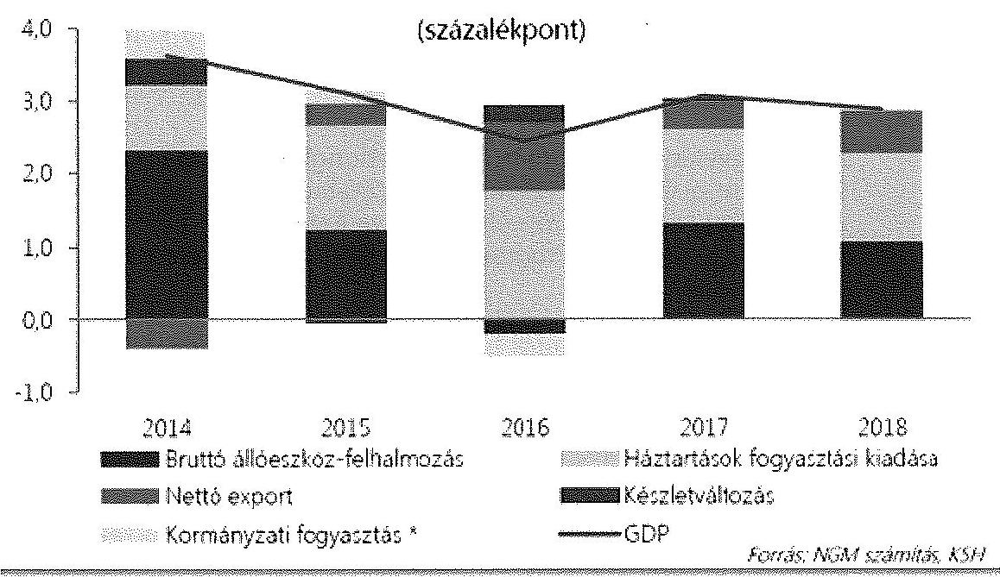

* A háztartásokat segítő non-profit szektor természetbeni társadalmi juttatásaival együtt.

Forrás: Konvergencia Program
2016. évre a Kormány - a Konvergencia Programmal összhangban - a költségvetési törvényjavaslatban 2,5%-os gazdasági növekedést határozott meg a lakossági kereslet további élénkülése és a beruházások - ennek következtében az import növekedési ütemének - csökkenése mellett. A 2016. évi növekedés ütemének lassulása mögött az EU transzfereknek - a ciklikusságra visszavezethető - visszaesése, valamint az uniós szabályozásból következő utófinanszírozás költségvetési folyamatokra gyakorolt együttes hatása áll. A makropálya a háztartások fogyasztásának további (2,9%-os) élénkülését a reáljövedelmek emelkedésére, a növekvő foglalkoztatás, csökkenő munkanélküliség, a lakossági hitelek rendezése, illetve a kormányzati intézkedések hatására vezeti vissza. A beruházások visszaesése következtében az import volumenének kisebb (7,1%-os) bővülése a tartósan magas (7,4%-kal tovább növekvő) kivitel mellett a nettó export gazdasági növekedésre gyakorolt számottevő hatását vetíti előre.

A Kormány az előrejelzések készítésekor számolt a közelmúltban bejelentett kormányzati intézkedésekkel is (életpályamodellek a közszférában, közfoglalkoztatás bővítése, bankadó csökkentése, személyi jövedelemadó kulcsának 1 százalékponttal történő csökkentése, kétgyermekes családok adókedvezményének növelése, sertés tőkehús 27%-os általános forgalmi adójának 5%-ra történő

csökkentése, egyes közszolgáltatások díjainak, bizonyos illetékeknek a csökkentése vagy eltörlése).

A Konvergencia Program (a 2015. évi nullához közelítő értékhez képest) 2016. évre vonatkozóan növekvő, 1,6%-os inflációval számolt, visszafogott, de növekvő árdinamikával kombinálva.

Az NGM az Áht. 13. § (1) bekezdésében foglaltak teljesítése érdekében 2015. március 20-án honlapján közzétette a Tervezési Tájékoztatóját a 2016. évi költségvetés tervezéséhez. Az Áht. 29. § (1) bekezdésben foglalt Középtávú Tervet az Áht. 2015. január 1-jétől hatályos módosítása értelmében a Kormány december 31. napjáig egyedi határozatban állapítja meg, a korábbi április 30-ai határidőhöz képest. Egyedi határozattal megállapított Középtávú Terv készítésének határideje ennek megfelelően 2015. december 31.

A költségvetési törvényjavaslat - összhangban a Konvergencia Programmal - 2016. évre a GDP-hez viszonyítva 2,0%-ban határozta meg az európai uniós módszertan szerinti hiánycélt, teljesítve ezzel a Gst. 2. § (1) b pontban előírtakat. A Konvergencia Program a középtávú költségvetési hiánycélt 1,7%-ban határozta meg.

Az Áht. 22. § (4) bekezdés b) pontja előírásainak megfelelően a költségvetési törvényjavaslatban bemutatásra került a 2016. évre tervezett adatok alapján az államháztartás alrendszerei költségvetési egyenlegének (pénzforgalmi egyenleg) összefüggése és kapcsolata a 479/2009/EK rendelet szerinti kormányzati szektor hiányával (kormányzati szektor ESA egyenlege). Az államháztartás tervezett pénzforgalmi egyenlege 2016. évre a GDP -2,2%-a, az ESA egyenlege 2%. Az ESA egyenleg megfelelt a közzétett Konvergencia Programban meghatározott hiánycélnak.

A 2016. évi államháztartási pénzforgalmi és a maastrichti kritériumok szerint meghatározott kormányzati egyenleget, valamint a közöttük lévő összefüggéseket (ún. ESA híd) a költségvetési törvényjavaslat általános indokolása tartalmazza. A részletes indokolás melléklete részletesen bemutatja a kormányzat szektor hiányát és adósságát az európai uniós módszertan szerint.

Az Áht. 22. § (4) bekezdés a) bekezdésének megfelelően a Kormány bemutatta a költségvetési törvényjavaslat benyújtásakor az OGY részére az államháztartás bevételeit és kiadásait mérlegszerűen, alrendszerenként és összevontan, közgazdasági és funkcionális tagolásban. A költségvetési törvényjavaslat összeállításához a Kormány meghatározta az államháztartás központi alrendszere és az államháztartás önkormányzati alrendszere adósságának a költségvetési év utolsó napjára - az Alaptörvény 36. cikk (4) és (5) bekezdésének megfelelően - tervezett értékét.

A 2016. évi költségvetési törvényjavaslatban összegszerűen meghatározásra került az államháztartás 2016. december 31.
 napjára tervezett adóssága. A Gst. 4. § (1) bekezdése alapján az államháztartás 2016. december 31. napjára vonatkozóan tervezett adóssága 303,7 forint/euró, 289,4 forint/svájci frank és 276,3 forint/amerikai dollár árfolyam mellett 25 898,5 Mrd Ft.

---

A 2016. évi költségvetési törvényjavaslatban az államadósság-mutató 2016. december 31-ére tervezett 73,3%-os mértéke az Alaptörvény 36. cikk (4) és (5) bekezdésében foglalt előírásokkal összhangban a 2015. évi 74,3%-os mértékhez viszonyítva csökkenést mutatott.

A mutató számítása során az NGM a számlálóban a Gst. 2. § (1) bekezdés a) pontja értelmében a konszolidált, korrigált államadósságot vette figyelembe, amelynek 2016. december 31. napjára várható értéke 25 803,9 Mrd Ft. A nevezője a Gst. 2. § (1) bekezdés b) pontja szerinti a Közösségben a nemzeti és regionális számlák európai rendszeréről szóló tanácsi rendeletben ${ }^{11}$ meghatározottak szerint számított bruttó hazai terméket tartalmazza, amelynek 2016. december 31. napjára vonatkozó értéke 35 188,0 Mrd Ft. A 2015. év államadósság-mutatóját a 2015. év utolsó napján várható konszolidált, Gst. szerint korrigált államadósság (24 983,8 Mrd Ft) és a 2015. év várható bruttó hazai terméke (33 646,1 Mrd Ft) alapján vették számításba.

Az Alaptörvényben foglalt államadósság-szabály 2015. január 1-jével kiegészült a Gst. 4. § (2) bekezdésében foglaltakkal, amely alapján az államadósság 2015. évhez viszonyított növekedési üteme nem haladhatja meg a 2016. évre várható infláció és bruttó hazai termék reál növekedési üteme felének a különbségét. A 2016. évi költségvetési törvényjavaslat szerint meghatározott államadósság a jelenleg hatályos Gst. 4. § (2) bekezdésében foglaltaknak nem tesz eleget. A 2016. évre tervezett infláció 1,6% a GDP reál növekedési üteme 2,5%. Ennek megfelelően a Gst. 4. § (2) bekezdés szerinti államadósság-képlet értelmében a 2016. évre tervezett államadósság növekedési üteme legfeljebb 0,35% lehetne, a törvényjavaslatban tervezett 3,3%-os államadósság növekedési ütem helyett.

A Kormány a Költségvetési Tanácsnak e témakörben kezdeményezte 2015. május 20-án a stabilitási törvény módosítását az adósságképletre vonatkozóan annak érdekében, hogy a gazdasági növekedést erőteljesebben támogató költségvetési politika valósuljon meg az államadósság csökkenése mellett.

Az államháztartás adósságának a költségvetési év utolsó napjára vonatkozó tervezett értékének meghatározásához a Gst. 4. § (1) bekezdése által érintett szervezetek adatot szolgáltattak az államháztartásért felelős miniszter számára. Az Áht. 13. § (3) bekezdése alapján a költségvetés törvényjavaslat elkészítéséhez a kormányzati szektorba sorolt egyéb szervezetek, valamint a besorolás szempontjából statisztikai módszertani vizsgálat alá vett jogi személyek az NGM módszertana alapján teljesítették az adatszolgáltatást az államháztartásért felelős miniszter részére.

Az NGM az adatszolgáltatás keretében azon szervezetekre helyezte a hangsúlyt, amelyek jelentősen befolyásolják az államadósság alakulását, a további szervezetek esetében becslést, illetve egyéb adatforrást alkalmazott. A költségvetési tervezésbe be nem vont szervezetek kisméretű, jellemzően non-profit jellegű társaságok, közalapítványok, alapítványok, amelyek működési jellegüknél fogva alapvetően nem rendelkeznek adósságállománnyal. A Központi Statisztikai Hivatal non-profit szervezetekre vonatkozó Országos Statisztikai Adatgyűjtési Prog-

[^0]
[^0]:    ${ }^{11}$ Az ESA2010 a Bizottság 220/2014/EU rendelete alapján meghatározott, 2014 szeptemberétől bevezetett Nemzeti és Regionális Számlák Európai rendszere.

---

ramban előírt adatgyűjtéséből származtak információk e szervezeti kör adósságára nézve. A Tervezési Tájékoztató részletesen bemutatta a kormányzati szektor egyéb elszámolásaival kapcsolatos követelményeket. A Tervezési Tájékoztatóban 38 szervezet került felsorolásra, amelyek költségvetési kapcsolataik, illetve az állami feladatellátásban való részvételük az ESA2010 szerinti kormányzati szektor részét képezték, vagy a besorolás szempontjából megfigyelt szervezetek.

Az ÁKK Zrt. végezte a Gst. 11. §-ban foglaltak szerint a központi alrendszer finanszírozási igényének teljesítését és adósságának kezelését. A központi alrendszer adósságára vonatkozó adatok folyamatos, részletezett formában történő nyilvántartása alátámasztott formában megvalósult. A költségvetés törvényjavaslat részletes indokolásának mellékletében a központi költségvetés bruttó adósságának 2014. és 2016. évek közötti alakulása devizában és forintban fennálló adósság bontásban részletesen bemutatásra került.

Az államháztartás központi és önkormányzati alrendszerének, valamint a kormányzati szektorba sorolt egyéb szervezetek adóssága az adósságot keletkeztető ügyletek a Gst. 3. § (1) bekezdése szerinti bontásában a tervezés megalapozásához az NGM-nél rendelkezésre álltak.

A tervezést megalapozó számítások alapján az önkormányzati alrendszer 2016. évre vonatkozóan megtervezett adóssága 205,0 Mrd Ft, amely az előző évi várható teljesülés közel duplája. A változást az önkormányzati alrendszer Gst. 3. § (1) a) pontja szerinti hitel, kölcsön összeg növekedése okozta. A 205,0 Mrd Ft-os tervezett adósság a teljes államadósság 0,7%-a. A kormányzati szektorba sorolt egyéb szervezetek adósságának 2016. évi tervezett összege 165,8 Mrd Ft, amely a teljes államadósság 0,6%-át tette ki.

A konszolidáció végrehajtása teljes körűen megtörtént. Az egyes alrendszerek egymással szembeni kötelezettségeinek kiszűrését az adósság levezetése tartalmazta. A Gst. 2. § (2)-(4) bekezdései szerinti konszolidáció hatása az államadósság alakulásában elenyésző. A konszolidált államadósság meghatározásánál a konszolidálandó tételek 94,6 Mrd Ft összegben vették figyelembe. Az NGM által rendelkezésre bocsátott adósság-levezetés szerint, adósságot keletkeztető ügyletként nem vették figyelembe a 2017. évre vonatkozó előfinanszírozásra kibocsátott adósságot. A Gst. 3. § (2) bekezdésében foglaltaknak megfelelően az adósság-levezetés ezen sora nem tartalmaz összeget.

A Gst. 6. § (1) bekezdés alapján az államadósság-mutató számításához felhasznált árfolyamot az adósság-levezetésben és a központi költségvetésről szóló törvényjavaslatban azonosan 303,7 forint/euró, 289,4 forint/svájci frank és 276,3 forint/amerikai dollár árfolyamon határozták meg.

A 2016. évi költségvetési törvény megalkotásának az Országgyűlés tavaszi ülésszakának végére történő előrehozása magában hordozza annak kockázatát, hogy a makrogazdasági prognózisok, beleértve a külső tényezőket is, amellyel a költségvetési törvényjavaslat és a Konvergencia Program is számol, év végére aktualitásukat veszíthetik.

Az esetleges makrogazdasági változásokat azonban ellensúlyozza az implicit tartalék - amelyet a következőkben bemutatott érzékenységvizsgálat is szemléltet - és az óvatosság elve alapján történő tervezés, figyelemmel arra, hogy a

---

2015. évi várható 3,1%-os GDP növekedéshez képest a 2016. évre vonatkozóan a törvényjavaslat 2,5%-os növekedéssel számol.

Érzékenységi vizsgálat elvégzéséhez a 2016. évi költségvetési törvényjavaslatban meghatározott adatok kerültek felhasználásra, amely 2015. év végére 74,3%-os, 2016 év végére 73,3%-os adósságmutatót prognosztizált. A mutató a korábbiakban bemutatottak szerint eleget tesz a jogszabályi követelményeknek. A mutató a nominális GDP 4,6%-os, az államadósság 3,3%-os növekedésével számol. A mutató 1 százalékpontos javulása egyúttal egy implicit tartalékot is jelent a fent említett makrogazdasági és a költségvetési kockázatok kezelésére.

Az érzékenység vizsgálat célja volt annak meghatározása, hogy mekkora mozgásteret tartalmaz az államadósság-mutató összetevőire vonatkozóan a prognózis az államadósság-szabály teljesülése mellett. Az államadósság-mutató 0,1%-os csökkenése esetén, a 0,9%-os implicit tartalék milyen mértékű makrogazdasági (a GDP növekedési ütemében kifejeződő), illetve költségvetési (az államadósság mértékében tükröződő) kockázat kezelésére képes. Az elemzés elvégzésének alapvetése volt a ceteris paribus elv ${ }^{12}$, amely szerint a GDP, illetve az államadósság, mint komponensek maximális - államadósság-szabály sérelme nélküli - változását minden egyéb adat változatlansága mellett vizsgáltuk.

Az 1. számú táblázat mutatja az implicit tartalékok levezetését.

1. számú táblázat

Az államadósság-szabály teljesülésére vonatkozó érzékenységi vizsgálat eredményei

|  | 2015. év | 2016. év | 2016. év |  |  |
| :-- | :--: | :--: | :--: | :--: | :--: |
|  |  |  | Tervezett GDP | Tervezett állam | adósság |
|  | Várható | Tervezett | Maximális   államadósság | (minimális   GDP) | Minimális reál   GDP növeke-   dés |
| Nominális GDP | 33646,1 | 35188,0 | 35188,0 | 34776,1 | $1,2 \%$ |
| Államadósság | 24983,8 | 25803,9 | 26109,5 | 25803,9 | 25803,9 |

Forrás: Költségvetési törvényjavaslat adatai alapján ÁSZ számítás.
Az 1. számú táblázatból kiolvasható, hogy az államadósság-szabály akkor nem teljesülne, ha az államadósság - tervezett GDP növekedés mellett - további, 305,6 Mrd Ft-ot meghaladó mértékben nőne, vagy pedig a reál GDP növekedési üteme - a tervezett államadósság mellett - nem érné el az 1,2%-ot.

[^0]
[^0]:    ${ }^{12}$ egyéb tényezők változatlansága mellett

---

Az implicit tartalékok számszerűsítését a 2. számú ábra mutatja be.
2. számú ábra

Implicit tartalékok számszerűsítése
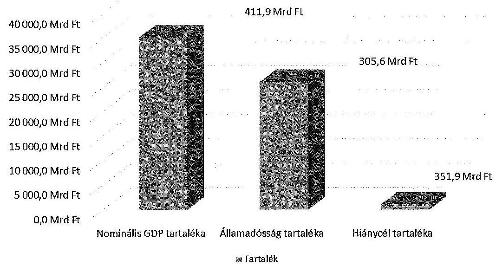

Forrás: Költségvetési törvényjavaslat adatai alapján ÁSZ számítás.
A számítási eredmények az implicit tartalék technikai becslését mutatják. Az egyes komponensek között szoros kapcsolat mutatható ki a valóságban, nem tekinthetőek egymástól független elemeknek.

A költségvetési törvényjavaslatban szereplő 2%-os GDP arányos hiány a maastricht-i kritériumok szerinti 3%-os korláthoz képest 1 százalékpontos implicit tartalékot tartalmaz, amely 351,9 Mrd Ft-os tartalékot jelent.

A költségvetési törvényjavaslattal egy időben kidolgozott Konvergencia Program szerint az államadósság-mutatót érintő kockázatként azonosíthatóak a geopolitikai feszültségek, illetve az euró-övezet adósságválságának kiújulása. A költségvetési törvényjavaslatban és a Konvergencia Programban is a 2016. évre várt gazdasági növekedési ütem az előző időszakhoz képest lassuló tendenciát mutat, amelynek oka az EU transzferek természetes ciklikussága. Ennek hatását a Konvergencia Programban foglaltak szerint ellensúlyozhatja a belső kereslet javulása, amelyet a költségvetési törvényjavaslat-tervezet szerinti adócsökkentések okozhatnak.

Összefoglalóan megállapítható, hogy az államadósság-mutató jelentős implicit tartalékkal rendelkezik, amelyhez hozzáadódik a költségvetés óvatosság elvének megfelelő tervezése.

---

# 1.2. A központi alrendszer hiánya 

A kormányzati szektor egyenlegének meghatározásakor az Áht. 13/A. § (2) bekezdésének előírásai teljesültek, mivel a költségvetési törvényjavaslatban meghatározott egyenleg mellett az árfolyamhatás kiszűrésével számolt államadósság GDP-hez viszonyított aránya (államadósság-mutató) 2016. évben 73,3%-ban lett megtervezve, ami 1,0 százalékponttal alacsonyabb a 2015. év utolsó napjára várható 74,3%-nál. A költségvetési törvényjavaslat összeállítása során betartották a 2014. szeptember 1-jétől hatályos 479/2009/EK rendelet előírásait, a tervezett hiányt, adósságot és a GDP adatokat az ESA2010 elszámolási rendszer alapján határozták meg.

A 2015. évi 2,4%-os hiánycél teljesíthetőségét vetíti előre a 2015. I. negyedévi kedvező teljesítési adat, miszerint az év első három hónapjában a központi költségvetés hiánya ( $536,7 \mathrm{Mrd}$ Ft) az éves előirányzat 61%-át ${ }^{13}$ tette ki.

Az 2015. I. negyedévet a központi költségvetés 558,3 Mrd Ft-os deficittel, a társadalombiztosítás pénzügyi alapjai 10,7 Mrd Ft-os, az elkülönített állami pénzalapok 10,9 Mrd Ft szufficittel zárta. A 2014. évben az első háromhavi deficit 701,2 Mrd Ft volt. A hiány tavalyinál kedvezőbb alakulásában az 2015. évi magasabb adóbevételek és a kedvezőbb kamategyenleg játszott szerepet. Az előző év azonos időszakához képest a központi költségvetés I. negyedévi bevételei 111,5 Mrd Ft-tal, a kiadásai 126,3 Mrd Ft-tal alakultak kedvezőbben. A magasabb bevételek a magasabb bérkiáramlás miatti befizetés növekedésnek, valamint az adómorál javítása érdekében tett (online pénztárgépek bekötése) intézkedések sikerének köszönhető, az alacsonyabb kiadási szint mögött többek között a tavalyi évben az önkormányzatok adósságkonszolidációjára kifizetett összegek, a költségvetési szervek alacsonyabb kiadásai, a helyi önkormányzatok mérsékeltebb támogatási összegei álltak. A TB alapok szufficitje a Nyugdíjbiztosítási Alap 1,8 Mrd Ft-os hiányából és az Egészségbiztosítási Alap 12,5 Mrd Ft-ot közelítő többletéből tevődött össze. Az elkülönített állami pénzalapok bevételei 2,0 Mrd Ft-tal, kiadásai 22,0 Mrd Ft-tal magasabb összegben
 alakultak. A kamatkiadások 2015. I-III. hónapban 308,0 Mrd Ft tettek ki, 75,8 Mrd Ft-tal kevesebbet, a kamatbevételek 112,5 Mrd Ft-ban realizálódtak, 83,0 Mrd Ft-tal magasabb összegben, mint 2014. év azonos időszakában. A nettó kamatkiadás (195,5 Mrd Ft) így 158,8 Mrd Ft-tal lett kevesebb, mint az előző év azonos időszakában.

A 2016. évi költségvetési törvényjavaslat az államháztartás központi alrendszerének pénzforgalmi hiányát 761,6 Mrd Ft-ban állapítja meg, ezen belül a központi költségvetés hiánya 755,6 Mrd Ft, a két TB Alap egyenlege 0 Mrd Ft, az ELKA hiánya 6,0 Mrd Ft. A központi alrendszer 2016. évi tervezett hiánya 13,2%-kal alacsonyabb a 2015. évi tervezett hiány összegénél ( $-877,4 \mathrm{Mrd}$ Ft). A helyi önkormányzatok 24,0 Mrd Ft-os hiányával számolva az államháztartás tervezett pénzforgalmi egyenlege -785,6 Mrd Ft-ot tesz ki, így az államháztartás pénzforgalmi egyenlege a GDP 2,23%-át jelenti.

[^0]
[^0]:    ${ }^{13}$ A kiadások és bevételek teljesülésének időben eltérő eloszlása miatt a hiány nagyságának lefutása nem időarányos: az első félévben a kiadások jelentősebben meghaladják a bevételeket.

---

Az uniós módszertan szerinti hiány az ún. ESA híddal (82,1 Mrd Ft) történő korrekciót követően 703,5 Mrd Ft-tal a GDP 2,0%-a.

A 2016. évre tervezett 2%-os (uniós módszertan szerinti) hiányt szinte teljes mértékben a központi alrendszer hiánya teszi ki, a TB alapok 1,0%-os többlete és a helyi önkormányzatok 1%-os hiánya, az elkülönített állami pénzalapok és az államháztartáson kívüli szervezetek nullszaldós egyenlege mellett.

A költségvetési törvényjavaslat bemutatja az Áht. szabályai szerinti, az államháztartás alrendszereinek költségvetési egyenlegét (ún. pénzforgalmi egyenleg), illetve az ún. uniós módszertan szerint számolt ún. ESA egyenleget. A hazai és uniós költségvetési hiány kapcsolatát ún. ESA-híd teremti meg (azaz a két egyenleg közötti különbséget alkotó tételek hatásának együttese). Az alkalmazandó uniós módszertant, az ESA2010 nemzeti számlarendszert az 549/2013 tanácsi rendelet határozta meg.

Az uniós statisztikai szabványok által definiált kormányzati szektor nagyobb szervezeti kört foglal magába, mint az államháztartás. Mindazon szervezetek beletartoznak, amelyek tevékenységük során közjavakat állítanak elő, a nemzeti jövedelem és a nemzeti vagyon elosztásában vesznek részt, irányításukat kormányzati szervek végzik, és tevékenységük ellenértékében 50%-nál kisebb arányt képvisel az árbevétel. A kormányzati szektorba sorolandó nem államháztartási szervezetek körét statisztikai munkabizottság állapítja meg. A 2016. évi költségvetés tervezési időszakára a kormányzati szektorba tartozó, államháztartáson kívüli szervezetek száma meghaladta a háromszáznegyvenet.

A maastrichti hiánymutató és az államháztartási törvényben meghatározott deficitmutató tartalmi eltérése elsősorban a szervezeti kör különbözőségéből, de emellett többek között az eredményszemléletű számbavételből (például adóknál és járulékoknál, dologi kiadásoknál, beruházásoknál, béreknél, kamatoknál), valamint a pénzügyi műveletek kiszűréséből adódik (a konszolidálás a kormányzati szektoron belüli adósságelemeket szűri ki).

A költségvetési törvényjavaslat tételesen felsorolja a központi és az önkormányzati alrendszernél számbevételre került legnagyobb vállalkozásokat.

A 2016. évi ESA hidat (82,1 Mrd Ft) meghatározó, a maastrichti hiánymutató és a hazai deficitmutató eltérését okozó jelentősebb tételek a költségvetési törvényjavaslat szerint:

- az eredményszemléletű számbavételi miatti különbség (34,2 Mrd Ft), ezen belül pl. adó és adójellegű bevételek (22,1 Mrd Ft), CO2 kvóták értékesítése (-22,1 Mrd Ft), EU visszatérítés (-5,1 Mrd Ft), utolsó EU támogatás részletek megelőlegezése (210,5 Mrd Ft) stb,
- a pénzügyi tranzakciók (14,0 Mrd Ft),
- szervezeti kör különbözősége (15,3 Mrd Ft),
- egyéb korrekciók (13,9 Mrd Ft) pl. Gripen szerződés keretében beszerzett eszközök (4,7 Mrd Ft).

---

# 1.3. A központi alrendszer adósságának és az államadósságmutatónak az alakulása 

A költségvetési törvényjavaslat indokolásában bemutatott tendenciák szerint 2016. év végére a központi költségvetés adóssága eléri a 25252,8 Mrd Ft-ot, amely a 2015. év végére prognosztizált adósságot (24493,1 Mrd Ft) 3,1%-kal haladja meg.

A költségvetés és az államadósság finanszírozása szempontjából 2016-ban kiemelt fontosságú a stabil finanszírozási helyzet megőrzése, a devizaadósság részarányának csökkentése a külső függés további csökkentése érdekében. Ezért a hiány és a lejáró forintadósság (részben a devizaadósságot is) finanszírozását forintkötvény kibocsátásokkal tervezik.

A 2. számú táblázat a központi költségvetés bruttó adósságának szerkezeti változását mutatja be a 2015-2016. évekre vonatkozóan.
2. számú táblázat

A központi költségvetés bruttó adósságának alakulása a 2015-2016. években

|  | 2015. év   végén   várható   (Mrd Ft) | teljes adósság   arányában   (\%) | 2016. év   végén várha-   tó (Mrd Ft) | teljes adósság   arányában   (\%) |
| :-- | :--: | :--: | :--: | :--: |
| Devizában fennálló   adósság | 7986,8 | 32,6 | 6683,8 | 26,5 |
| Forintban fennálló   adósság | 15896,0 | 64,9 | 17958,7 | 71,1 |
| egyéb kötelezettség | 610,3 | 2,5 | 610,3 | 2,4 |
| összesen | $\mathbf{2 4 4 9 3 , 1}$ | $\mathbf{1 0 0}$ | $\mathbf{2 5 2 5 2 , 8}$ | $\mathbf{1 0 0}$ |

A devizaadósság a 2016-os kibocsátások és lejáratok figyelembevételével a 2015. éves várható 7986,8 Mrd Ft-ról 2016. évben 6683,8 Mrd Ft-ra csökken (16,3 százalékponttal). Ez a központi költségvetés 2016. év végére tervezett bruttó adósságának (25252,8 Mrd Ft) 26,5%-a, amely arány megfelel az Állam-adósság-kezelési stratégia ${ }^{14}$ deviza-részarányra vonatkozó, a 2013. utáni évekre tervezett maximum 45%-os rátájának.
2016. évben több mint 2000 Mrd Ft-tal emelkedik a hiányt finanszírozó és adósság megújító (lejáró és ezért refinanszírozandó) forintadósság nagysága. A forintadósság a 2015. év végi várható állományához (15675,2 Mrd Ft) képest a 2016. év végi tervezett állomány 17773,8 Mrd Ft-ra nő, amely 13,4%-os növekedésnek felel meg.

[^0]
[^0]:    ${ }^{14}$ A 2013. december 11-ei államadósság-kezelési stratégia dokumentuma (ÁKK Zrt.).

---

A 2016. év december 31. napjára vonatkozóan tervezett államadósság az államháztartás központi alrendszerének 25527,7 Mrd Ft adósságából, önkormányzati alrendszer 205,0 Mrd Ft adósságából és a fentiekben meghatározott, kormányzati szektorba sorolt egyéb szervezetek 165,8 Mrd Ft adósságából áll. A konszolidált államadósság meghatározásánál a konszolidálandó tételek 94,6 Mrd Ft összegben vették figyelembe.

Az államadósság-szabály teljesülésének jelentőségére való tekintettel a 3. számú táblázatban mutatjuk be a mutató számításához használt főbb adatokat és a mutató értékének alakulását:
3. számú táblázat

Az államadósság-szabály érvényesülését alátámasztó adatok

|  | 2015. év végén   várható (Mrd Ft) | 2016. év végén vár-   ható (Mrd Ft) |
| :-- | --: | --: |
| GDP | 33646,1 | 35188,0 |
| Államháztartás központi alrendszeré-   nek adóssága, Gst. szerinti korrekciók-   kal | 24768,0 | 25527,7 |
| Önkormányzati alrendszer konszolidált   adóssága | 105,0 | 205,5 |
| Kormányzati szektorba sorolt egyéb   szervezetek konszolidált adóssága | 181,3 | 165,8 |
| Konszolidált államadósság értéke | 24983,8 | 25803,9 |
| Államadósság/GDP | $74,3 \%$ | $73,3 \%$ |

Forrás: Költségvetési törvényjavaslat és az NGM által rendelkezésre bocsátott számszaki adatok.

# 2. A KÖZPONTI KÖLTSÉGVETÉS KÖZVETLEN BEVÉTELI ELŐIRÁNYZATAI 

A Kormány adópolitikai célkitűzéseknek megfelelően 2010-től megtörtént az adószerkezet átalakítása (lásd. 3. számú ábra), melynek eredményeként hazánkban a fogyasztáshoz kapcsolt adók súlya megemelkedett. Az adóterhelés a jövedelemtípusú adók felől áttolódott a fogyasztási típusú adók felé. Az adószerkezeten belül 2010-ben a gazdálkodó szervezetek befizetési 18,2%-os, a fogyasztáshoz kapcsolt adók 51,7%-os, míg a lakosság befizetései 30,1%-os részarányt képviselt. A költségvetési törvényjavaslat szerint az adószerkezeten belül a gazdálkodó szervezetek befizetési 13,1%-os, a fogyasztáshoz kapcsolt adók 62,2%-os, míg a lakosság befizetései 24,7%-os részarányt fognak képviselni. A jövedelemtípusú adókon belül a lakossági befizetések aránya 2010. évhez képest lecsökkent. A gazdálkodó szervek befizetéseinek az összes adóbevételen belüli aránya 2010-hez képest csökkent, 2016-ban - a tervezet szerint - további csökkentés várható.

---

A gazdálkodó szervezetek és a lakossági befizetések, valamint a fogyasztáshoz kapcsolt adók alakulását a 2010-2016. években a 3. számú ábra mutatja be:
3. számú ábra
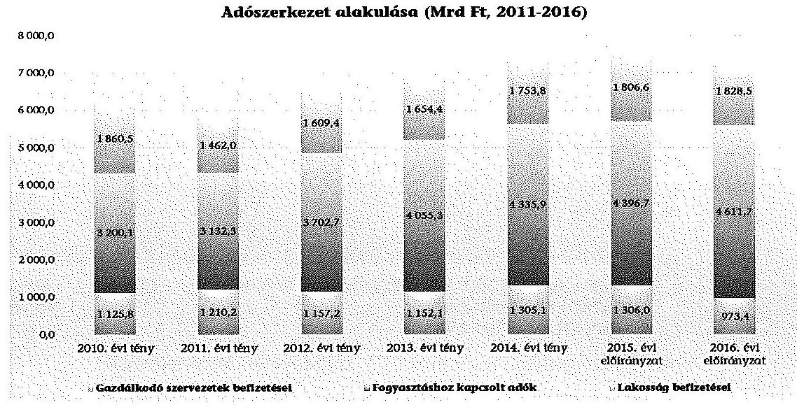

Forrás: Magyar Államkincstár, NGM
A Kormány 2010-ben közvetlen „szektorspecifikus" adókat (pénzügyi szervezetek különadója; távközlési, energiaszektort és a kiskereskedelmet érintő ágazati különadók) vezetett be, a válság hatásainak enyhítése céljából, melyek nagyrészt kivezetésre kerültek. A fogyasztáshoz kapcsolt adók költségvetésen belüli arányának jelentős emelkedéséhez az ÁFA 2012. évi normál adókulcs-emelésén túl, a 2012-től bevezetett távközlési adóból, valamint a 2013-tól bevezetett pénzügyi tranzakciós illetékből és biztosítási adóból származó bevételek járultak hozzá. Helyüket új típusú forgalmi-fogyasztási típusú adók vették át (pl. a biztosítási adó, a pénzügyi tranzakciós illeték, illetve a távközlési adó). A 4. számú ábra mutatja a 2016. évi adóbevételi tervek változását.

---

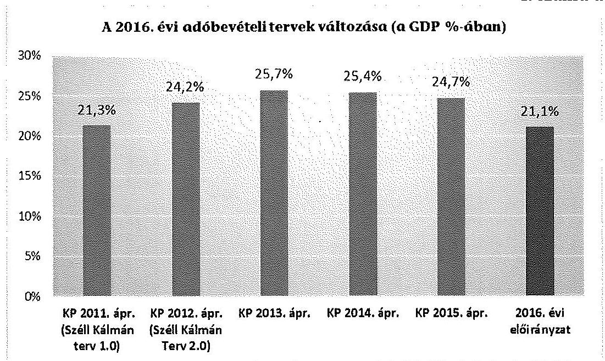

Forrás: Konvergencia Programok (KP), költségvetési törvényjavaslat
A 4. számú ábra jól szemlélteti, hogy a 2016-ra előirányzott adóbevétel a GDP százalékában (21,1%) több mint 3 százalékpontos csökkenést mutat a 2012-2015 közötti évekre tervezett 24,2-25,7%-os arányokhoz képest.

Az adózással összefüggő egyes törvények módosításáról szóló T/4741. számú törvényjavaslat alapján 2016. évben a következő bevételi hatással járó adóintézkedések várhatóak: a pénzügyi szervezetek különadójánál a hitelintézeteket érintő mérték a 2015. évi 0,53%-ról 2016. évben 0,31%-ra csökken, ÁFA vonatkozásában a sertés tőkehús adókulcs 27%-ról 5%-ra mérséklődik, SZJA-nál az adókulcs 16%-ról 15%-ra csökken és a kétgyermekes családok adókedvezményének mértékét 2016-tól kezdve 4 év alatt fokozatosan kétszeresére, a gyermekenkénti 10 ezer forintról 20 ezer forintra emelik. 2016. évben első lépésként jelenlegi havi 10 ezer forintról 12,5 ezer forintra növelik a kétgyerekes adókedvezmény összegét.

A 2014. évben ténylegesen befolyt több mint 7 ezer Mrd Ft-ot kitevő adó és adójellegű bevételek 26,2 Mrd Ft-tal (0,4%-kal) haladták meg az eredeti előirányzatot és 165,0 Mrd Ft-tal (2,3%-kal) haladták meg az NGM által a 2015. évi törvényjavaslat készítésekor a 2014. évre prognosztizált várható bevételeket.

---

Az 5. számú ábra mutatja a tervezett és tényleges adóbevételek alakulását a 2010-2014. évek vonatkozásában:
5. számú ábra

A törvény előirányzatok és a tény teljesítések közötti eltérés (Mrd Ft)
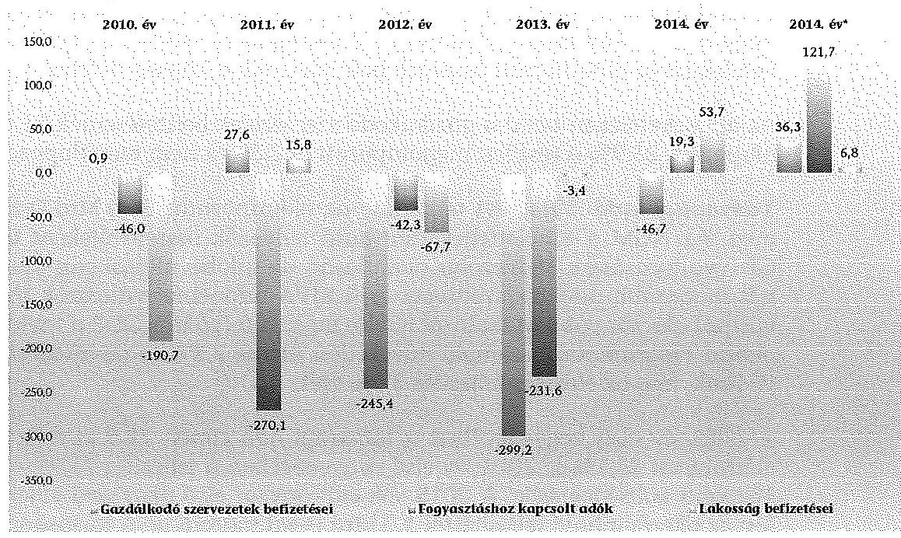

Forrás: 2010-2013. Zárszámadási kötetek, NGM adatszolgáltatás a 2015. évi véleményhez.
*A NGM által a 2015. évi tervezés során prognosztizált (2014. évi várható) bevétel eltérése a 2014. évi teljesítéstől.

Az 5. számú ábra bemutatja, hogy a megalapozottabb tervezés és a makrogazdasági folyamatoknak a vártnál kedvezőbb alakulása következtében az adó és adójellegű bevételek 2014-ben már meghaladták a tervezett mértékét, szemben a korábbi évekkel, amikor elmaradás volt a jellemző. A költségvetési törvényjavaslatban a költségvetés adóbevételeinek 84,4%-a megalapozott, 15,4%-a részben megalapozott, (EVA, KATA, jövedéki adó) és 0,2% nem megalapozott (KIVA). A részben megalapozott adóbevételek esetében is csak az adóbevételek egy meghatározott része (EVA, KATA) tartalmaz kockázatot. A jövedéki adónál túlteljesülés várható. A KIVA adóbevételnél az adózók létszámának mozgása, illetve előző évi tendenciák és a várható értékek alapján alulteljesülés várható.

A kisadók közötti adózók
 létszám mozgása még nem fejeződött be, a tendencia szerint csökken az EVA adóalanyok száma és folyamatosan emelkedik a KATA adózói létszám. A KATA esetében a tervszámhoz képest kimutatott bevételi lemaradás összköltségvetési szintjén bevételi kiesést nem okozott. Összköltségvetési szinten 2016. évre sem okozhat bevételi kiesést, mivel kedvezményes adóról van szó. A kisadóknál keletkező tervezett bevételhez viszonyított kiesés más adónemek esetében a tervezetthez képest bevételi többletet eredményez.

---

A bevételi előirányzatok tervezése során az aktuális előrejelzéseket, a makropálya paramétereit figyelembe vették. Az ÁSZ véleménye szerint a 2016. évi költségvetési tervezés makrogazdasági mutatókkal való összhangja megvalósult, az Áht.-ban meghatározott előrejelzésen alapult. A Kormány az előirányzatokat megalapozó az adózással összefüggő egyes törvények módosításáról a T/4741. számú törvényjavaslatot elkészítette és az OGY benyújtotta. Az előirányzatok tervezésénél a bevételeket befolyásoló szerkezeti változásokat és szintrehozásokat figyelembe vették. Következésképpen az ÁSZ véleménye az, hogy a Kormány makrogazdasági előrejelzéseinek teljesülése esetén az adóbevételeknél az előirányzott összegek befolyhatnak a költségvetésbe.

Az adóbevételeken belül a gazdálkodó szervezetek befizetéseinek 71,6%-a megalapozott, 25,9%-a részben megalapozott és 2,5%-a nem megalapozott.

Társasági adó 2014. évi teljesítése az előirányzatot 36,0 Mrd Ft-tal haladta meg. Az NGM a többletteljesítésre ható tényezők összetevőjeként a folyóáras GDP változásának kedvezőbb alakulását, az adóbevallásokban szereplő vártnál magasabb adókötelezettséget és a KIVA adónemet választók számának a vártnál alacsonyabb alakulását jelölte meg. A folyóáras GDP a tavalyi Konvergencia Programban ${ }^{15}$ szereplő növekedési üteme 2,3%-os növekedést prognosztizáltak, míg az előzetes teljesítés 3,6% volt.

A 2015. év első negyedévében a társasági adó címén 78,9 Mrd Ft, a törvényi előirányzat 23,1%-a, 2014. év első negyedévében a teljesítés 21,9%-a folyt be a központi költségvetésbe. A 2015. évi előirányzat első négyhavi teljesítése alapján az eltérés a havi teljesítéstől 5,3 Mrd Ft-tal maradt el. A társasági adóbefizetések időarányos teljesítésének vizsgálata során figyelemmel kell lenni arra, hogy a sajátos adóelőleg fizetési szabályok miatt a bevételek évközi lefutása nem tükrözi a vállalkozások adott évi teljesítését.
2015. évi előirányzat, teljesíthetősége a fent leírtak alapján túlteljesülhet. A 2016. évi tervszámban szerepet játszik a 2015. évi bázishatás és a gazdaság bővülése.

A TAO 2016. évi előirányzata 400,5 Mrd Ft, ami 59,1 Mrd Ft-tal haladja meg a 2015. évi előirányzatot.

A Kúria határozatát követően elfogadott jogszabályok alapján a tisztességtelenül felszámított összegek visszatérítésére kerül sor, továbbá az arra jogosult magánszemélyek a jelzálog-fedezetű devizaalapú és devizahiteleiket 2015. január 1-jétől már fix árfolyamon törleszthették, majd ezek a hitelek 2015. február 1-jétől minden szempontból forinthitellé alakultak. Az elszámolások hatással lesznek a magyar bankok jövedelmezőségére, évi kamatbevétel-kiesésük megközelítheti a 100 Mrd Ft-ot az elszámolások miatti veszteségen túl. A bankoknak az elszámolások mintegy 600-700 Mrd Ft-os nettó terhet jelenthetnek ${ }^{16}$. Az NGM számításai szerint a bankok a visszamenőlegesen módosított mérleg-

[^0]
[^0]:    ${ }^{15}$ Magyarország Konvergencia Programja 2014-2017. (2014. április)
    ${ }^{16}$ Forrás: Magyarország Konvergencia Programja 2015-2018.

---

adatokkal kapcsolatos visszaigényléseiket 2015-ben egyszeri tételként (kb. 14017,0 Mrd Ft) a TAO-ból vonják le, melyet az előirányzat tartalmaz.

Összességében a 2016. évi TAO előirányzatnál kockázatot nem látunk, számításokkal alátámasztott és teljesíthető, ezáltal megalapozott. Az NGM felmérte a várható teljesítéseket, az előirányzat jogszabályi háttere biztosított, megfelel a makrogazdasági előrejelzéseknek, gazdaságpolitikai céloknak.

A pénzügyi szervezetek különadójának 2014. évi teljesítése 148,6 Mrd Ft volt, ami 4,6 Mrd Ft-tal haladta meg a törvényi előirányzatot.

A 2015. évi előirányzat 144,2 Mrd Ft. Az adózók 2015. évi bevallott adófizetési kötelezettsége - a 2015. március 10-én benyújtott bevallásuk alapján - 144,7 Mrd Ft, melyet a 2015. év első negyedéves befizetések alátámasztottak.

A Kormány a 2016. évre - a Kormány és az EBRD között 2015. februárjában létrejött megállapodásnak megfelelően - a pénzügyi szervezetek különadójának csökkentéséről döntött. A hitelintézeteket érintő pénzügyi szervezetek különadójának a mértéke a 2015. évi 0,53%-tól 0,31%-ra csökken 2016-ban, az adó alapja pedig a 2014. évi mérlegfőösszegre módosul. Ezért a 2016. évi 89,2 Mrd Ft-os előirányzat 55,0 Mrd Ft-tal marad el a 2015. évi előirányzattól.

Tekintettel a fent leírtakra a 2016. évi pénzügyi szervezetek különadója 89,2 Mrd Ft előirányzatánál kockázatot nem látunk, számításokkal alátámasztott és teljesíthető, ezáltal megalapozott.

Az egyszerűsített vállalkozói adó alanyok száma 2012. évtől folyamatosan csökken és további kilépők várhatók. Az EVA adómértékének 30%-ról 37%-ra történő emelése miatt az adózók egy része visszatért a normál adózási mód alá, illetve áttértek a kisadózói adónemekre. Az EVA körben maradó adózók esetében adóalap csökkenést is tapasztalt az NGM.

A 6. számú ábra mutatja EVA adózók számának alakulását 2012-2015. években.

---

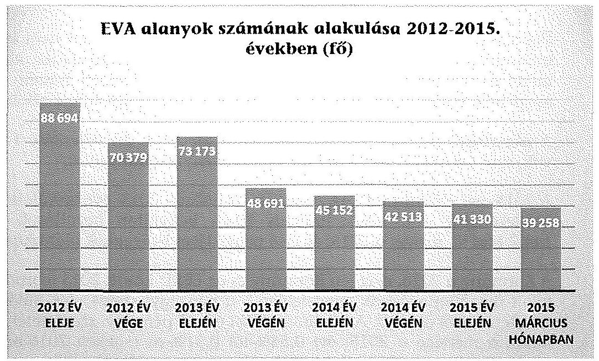

Forrás: NAV adatszolgáltatás
Az EVA 2014. évi teljesítése az előzetes várakozásoknak megfelelően 29,8 Mrd Ft-tal meghaladta az előirányzatot. Ennek oka, hogy a 2014. évi előirányzat kialakításánál az NGM a kisadókra való áttérés miatt lényegesen nagyobb adóalany-szám csökkenéssel számolt.

A 2015. évi előirányzat 83,8 Mrd Ft, az adózói létszám 15%-os csökkenésével terveztek. Az első negyedévben az adóalanyok létszáma 7,7%-kal csökkent. A 2015. évi első négyhavi teljesítési adatok 20,5 Mrd Ft-ot tettek ki, mely 24,4%-os teljesítést mutatott, de elmarad 0,9%-kal az előző év hasonló időszakához képest.

Az EVA hatálya alá tartozó vállalkozások 2015. május 31-én fogják benyújtani a 2014. évi adóévről szóló bevallásukat.

A 2016. évi előirányzat 75,2 Mrd Ft, amely 8,6 Mrd Ft-tal, 10,3%-kal kevesebb az előző évi előirányzattól.

A 2016. évi EVA előirányzat részben alátámasztott és az előző évi tendenciák alapján teljesíthető, részben megalapozott. A 2016. évi előirányzatot meghatározó adózói létszámot alátámasztó számítások elkészítése indokolt.

A kisadózók tételes adója 2014. évi 78,0 Mrd Ft-os előirányzattal szemben a teljesítés 42,2 Mrd Ft volt. A bevételi tervtől történő lemaradás oka az átlépő adózók számának tervezettől történő lemaradása volt. Ennek ellenére, a KATA adózói szám 2013-2015. években növekvő tendenciát mutat. Az NGM az előirányzat tervezése során az adózói szám további növekedésével számolt, becslésük szerint 2016. évre a KATA adózók száma elérheti a 137 ezer főt. A 2016. évi előirányzatot meghatározó adózói létszám bővítését alátámasztó számításokkal az NGM nem rendelkezett.

---

A 7. számú ábra mutatja KATA alanyok számának alakulását 2012-2015. években.
7. számú ábra
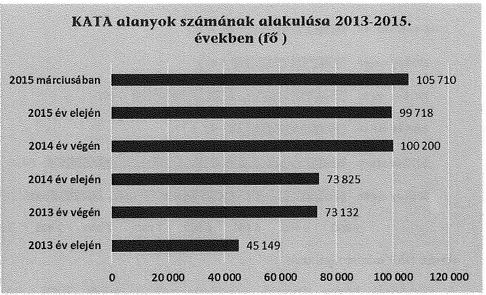

Forrás: NAV adatszolgáltatás
A 2014. évi előirányzat teljesítése 54,1%-os volt, az előirányzat alulteljesülésének oka a tervezettől elmaradó adózói létszám.

A 2015. évi 56,3 Mrd Ft-os előirányzat a 2014. évre prognosztizált bevételnek megfelelt, óvatosság elve alapján tervezték. A 2015. évi első négyhavi teljesítés 17,6 Mrd Ft volt.

A 2016. évi előirányzat 70,1 Mrd Ft, amely a bázis előirányzatot 13,8 Mrd Ft-tal haladja meg. Az NGM az adózói létszám 21,2%-os növekedésével tervezett.

A KATA törvényi bevételi előirányzat részben alátámasztott és alulteljesülés valószínűsíthető, részben megalapozott. Véleményünk szerint az adózói létszámban a 2016. évben már nincs akkora bővülési potenciál, amekkorát az előirányzat nagysága feltételez. A 2016. évi előirányzatot meghatározó adózói létszám bővítését alátámasztó számítások elkészítése indokolt.

A kisvállalati adó 2013. évtől került bevezetésre, az NGM magasabb adózói számmal tervezett.

A 8. számú ábra szemlélteti KIVA alanyok számának alakulását 2013-2015. években. Az adózói szám növekedését mutatja évente, de a tényleges adóalany szám a tervezettől elmaradt és stagnál. A 2016. évi tervszámoknál sem számolt az NGM létszámnövekedéssel. A 2013. év végéhez képest (7418 db) 2014. év végére az adózói létszám 5,8%-kal csökkent (7070 db), míg 2015. év első negyedévében további 5,2%-kal csökkent (6702 db). Az NGM 2015. és 2016. évekre 7 ezer adóalannyal tervezett.

---

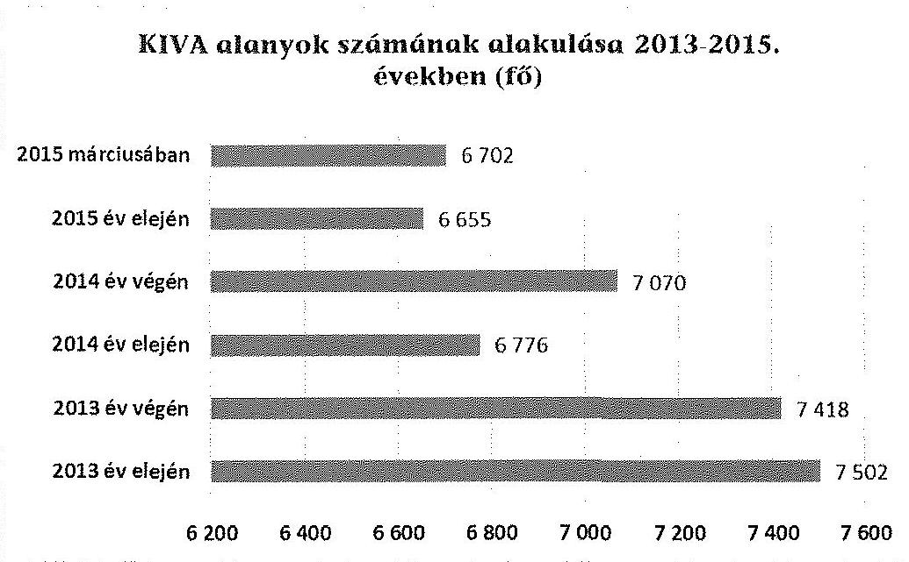

Forrás: NAV adatszolgáltatás
A kisadózói körbe átlépők alacsony száma miatt 2014. évi teljesítése 32,7 Mrd Ft-tal elmaradt az előirányzattól, ezért a bevételi előirányzat nem volt teljesíthető.

A 2015. évi tervezés során figyelemmel voltak a 2014. évi teljesítésre. A 2015. évi előirányzat 16,4 Mrd Ft, ami a 2014. évi teljesítést 3,7 Mrd Ft-tal haladta meg. Az adózók számának változása 2014-ről 2015. év elejére 415 fővel csökkent, 2015. márciusára az év végi adathoz képest 47 fővel nőtt. A bevételi előirányzat nem alátámasztott, mert az adózói létszámadatok alakulása nem támasztja alá. A 2015. évi előirányzat teljesíthetőségét időarányos havi adatok sem támasztják alá. Az első négyhavi időarányos tényadat 28,2%-ot tett ki, míg 2014. évi első négyhavi időarányos adat 40,1% volt.

A bázis évek tényszámai alapján a 2016. évi tervszám 13,8 Mrd Ft, ami 1,1 Mrd Ft-tal meghaladja a 2014. évi teljesítést, melyet az adózói létszámadatok alakulása nem támaszt alá.

A KIVA előirányzat nem alátámasztott és alulteljesülés valószínűsíthető, így nem megalapozott. A 2016. évi előirányzatot meghatározó adózói létszám bővülését alátámasztó számítások elkészítése indokolt.

Meg kell jegyezni, hogy a kisadóknál keletkező tervezett bevételhez viszonyított kiesés más adónemek esetében a tervezetthez képest bevételi többletet eredményez. Hiszen a kevesebb átlépés miatt többen fizetnek TAO-t, szociális hozzájárulási adót, egyéni járulékokat és SZJA-t.

Az általános forgalmi adó 2014. évi teljesítése 3035,6 Mrd Ft, ami az előirányzatot 21,5 Mrd Ft-tal (0,7%-kal), míg az NGM által a 2015. évi tervezés során a 2014. évre prognosztizált bevételt 95,6 Mrd Ft-tal (3,3%-kal) haladta meg. A 2015. évi tervezés alapját képező 2014. évi várható bevételnél az NGM

---

a tervezettnél alacsonyabb inflációt (2,4% helyett 0%) feltételezett, melyet részben kompenzált a fogyasztás bővülése, valamint a pénztárgépek on-line bekötésének ÁFA bevételekre gyakorolt pozitív hatása (a bekötött pénztárgépek száma 2013. év vége óta folyamatosan futott fel és 2014. szeptemberében már a teljes bekötési arányt elérte). A 2014. évi teljesítési adatok alapján valószínűsíthető, hogy az alacsonyabb inflációt a fogyasztás bővülése és a pénztárgépek on-line bekötésének ÁFA bevételekre gyakorolt pozitív hatása az NGM által feltételezettnél jobban kompenzálta.

A 2015. évi előirányzat 3172,4 Mrd Ft, ami a 2014. évi teljesítést 136,8 Mrd Ft-tal (4,5%-kal) haladja meg. A 2015. évi előirányzat teljesülésében közrejátszik: az online pénztárgép használatának kiterjesztése, valamint az online pénztárgépek 2014. évi felfutása miatti áthúzódó hatás, az EKÁER bevezetése, a köztes terméknek minősülő nagytestű állatok - szarvasmarha, juh és kecske - és vágott testek értékesítése ÁFA kulcsának 27%-ról 5%-ra csökkentése, a kisadók kapcsán várt létszámnövekedéséből fakadó ÁFA bevételi többlet. Az EKÁER bevezetése - két hónap próbaidőt követően - 2015. március hónaptól üzemel. A 2015. évi előirányzat tervezése során 1,8%-os fogyasztói árindex növekedéssel és a háztartások fogyasztásának 2,1%-os növekedésével számoltak, míg a 2016. évi költségvetési törvényjavaslat 2015. vonatkozásban 0%-os fogyasztói árindex növekedéssel és a háztartások fogyasztásának 2,4%-os növekedésével számol.

Az ÁFA 2015. év első négy hónapi befizetése 902,9 Mrd Ft volt, ami az előirányzat 28,5%-a. Az időarányos teljesítés kis mértékben (1%-kal) haladja meg a
 2014. évi első négyhavi teljesítési arányt. A 2014. évi bázishatást és a 2015. évi időarányos teljesítési adatokat és bevezetett intézkedéseket figyelembe véve véleményünk szerint a 2015. évi előirányzatnál 50,0 Mrd Ft-tal több bevétel folyhat be a költségvetésbe.

Az ÁFA 2016. évi előirányzata 3351,9 Mrd Ft, ami az előző évi előirányzatot 179,5 Mrd Ft-tal (5,7%-kal) haladja meg. A kormányzati terveknek megfelelően 2016. január 1-jével a sertés tőkehúsok ÁFA kulcsa 5%-ra csökken.

A 2016. évi ÁFA előirányzatnál kockázatot nem látunk, számításokkal alátámasztott és teljesíthető, ezáltal megalapozott.

A jövedéki adó bevételek tervezése makrogazdasági paramétereken, valamint az egyes termékkörök piacát jellemző trendekre alapozott becslésen alapult. A makroparaméterek közül a tervezés a reál GDP, valamint a változatlan áras lakossági fogyasztási kiadás változásával számolt. Az NGM az üzemanyag árak csökkenése miatti jövedéki adóbevétel kiesést, az alacsonyabb árból adódó fogyasztás-növekedés kompenzálta. A 2015. év első negyedévében 115,1 Mrd Ft jövedéki adóbevétel folyt be az üzemanyagok után a központi költségvetésbe, ami az előző évi időarányos teljesítést 16,0 Mrd Ft-tal haladta meg. Az NGM továbbá a gazdaság további élénkülése, valamint a lakossági fogyasztás várható növekedésének eredményeként a bevételek további emelkedését vette figyelembe. A dohánytermékek esetében a dohánypiac trendjét (fogyasztás növekedését) vették figyelembe. Az alkoholtermékek esetén a 2016. évi bevétel a bázisévhez mért nagyobb növekedését az alkoholtermékek 2014. évi készletezése miatt (egyszeri hatásként) visszaeső 2015. évi alacsony bázis ma-

---

gyarázta. 2016-tól ezen termékek esetén a forgalom várhatóan a korábbi trendnek (fogyasztásnövekedés) megfelelően alakul.

A jövedéki adó 2014. évi teljesítése 918,9 Mrd Ft volt, ami 13,0 Mrd Ft-tal (1,4%-kal) elmaradt az előirányzattól és 16,9 Mrd Ft-tal (1,9%-kal) meghaladta az NGM által a 2015. évi tervezés során a 2014. évre prognosztizált bevételt. A 2015. évi előirányzat 913,5 Mrd Ft, ami az előző évi teljesítéstől 5,4 Mrd Ft-tal (0,6%-kal) elmaradt.

A központi költségvetés 2015. első négy hónapi jövedéki adóbevétele 287,2 Mrd Ft volt, ami az előirányzat 31,4%-a. Az időarányos teljesítés 31,9 Mrd Ft-tal (3,7%-kal) meghaladta az előző évi teljesítést.

A jövedéki adó 2016. évi előirányzata 952,2 Mrd Ft, ami a 2015. évi előirányzatot 38,7 Mrd Ft-tal (4,2%-kal) haladja meg. A tervezettek szerint a lakossági fogyasztás várható növekedésének eredményeként az üzemanyagok, valamint az alkohol és egyéb termékek jövedéki bevétele emelkedni fog. Az üzemanyagok, valamint az alkoholtermékek esetében a gazdaság további élénkülésével, valamint a 2016. évi várható fogyasztásnövekedés bevételnövelő hatásával számoltak. A kedvező folyamatokat nézve megállapítható, hogy a makrogazdasági környezet kedvező alakulását figyelembe véve a 2016. évi előirányzatnál további 10,0 Mrd Ft túlteljesülés várható. A 2016. évi jövedéki adóbevételi előirányzat részben alátámasztott és az előző évi tendenciák alapján túlteljesítés várható, ezáltal részben megalapozott.

A távközlési adó 2014. évi teljesítése 56,0 Mrd Ft volt, ami 1,0 Mrd Ft-tal elmaradt az előirányzattól. A 2016. évi előirányzat 56,0 Mrd Ft, ami a 2015. évi előirányzattól 0,4 Mrd Ft-tal kevesebb. A távközlési adó esetében az NGM nem számolt a 2016. évre jogszabályi változással, ezért a 2016. évi előirányzat adóbevételek tervezésénél a 2014. évi bevallást vette figyelembe. Továbbá nem számoltak 2016. évben növekedéssel sem. Ennek a hátterében az áll, hogy a telefonhívások és az SMS küldések tekintetében a bázis évhez képest nem számolnak növekedéssel.

A 2016. évi távközlési adó előirányzatnál kockázatot nem látunk, számításokkal alátámasztott és teljesíthető, ezáltal megalapozott.

A pénzügyi tranzakciós illeték 2014. évi teljesítése 277,9 Mrd Ft volt, ami az előirányzatot és az NGM által a 2015. évi tervezés során a 2014. évre prognosztizált bevételt 8,5 Mrd Ft-tal (3,2%-kal) haladta meg, melynek hátterében a Kincstári adókötelezettség túlteljesülése állt.

A 2015. évi törvényi előirányzat 206,2 Mrd Ft, ami az előző évi teljesítéstől 71,7 Mrd Ft-tal (25,8%-kal) marad el. A pénzügyi tranzakciós illetékből a központi költségvetésnek 2015. év első négy hónapjából 76,6 Mrd Ft bevétele származott. A 2015. évi időarányos teljesítés (37,2%) 1,5%-kal meghaladta az előző évi időarányos teljesítést (35,6%). A 2016. évi törvényi előirányzat 200,9 Mrd Ft, ami a 2015. évi előirányzattól 5,3 Mrd Ft-tal (2,6%-kal) marad el, tekintettel a kincstári tranzakciók mentesítésének 1 hónapos áthúzódó hatására a 2016. évi előirányzat véleményünk szerint teljesül.

---

A 2016. évi pénzügyi tranzakciós illeték előirányzatnál kockázatot nem látunk, számításokkal alátámasztott és teljesíthető, ezáltal megalapozott.

A személyi jövedelemadónál az NGM által rendelkezésünkre bocsátott törvényjavaslat szerint - a Konvergencia Programban leírtakkal összhangban - a Kormány a 2016. évi SZJA adókulcsot 1,0 százalékponttal csökkenteni kívánja. Erről az NGM a Kormány nevében az adózással összefüggő egyes törvények módosításáról a T/4741. számú törvényjavaslatot elkészítette és az Országgyűlésnek benyújtotta. Tervezéskor 2,1%-os foglalkoztatottak számának a növekedésével és a makropálya szerinti bérnövekedéssel, 5,2%-os, 520,2 Mrd Ft bértömeg növekménnyel számoltak, a jelenlegi 3,5-4%-os bérnövekedési dinamika mellett. Ezzel egyidejűleg felülvizsgálatra kerültek a családi kedvezmények, hogy az adókulcs csökkenése miatt ne változzon az igénybe vehető kedvezmény összege adó forintban kifejezve. Bevallási szemléletben 120 Mrd Ft, ESA szemléletben 110 Mrd Ft, pénzforgalmi szemléletben 95 Mrd Ft kiesést jelent a javaslat 2016. évre. Az eltérés oka, hogy egy havi hatás a 2016. évet követő évben jelentkezik pénzforgalomban, valamint a magánszemélyek a bevallást 2017. évben fogják beadni, ezért az éves bevallásokban igénybevett adókedvezmények 2017. évet érintik majd, a 2016. évi adóbevételt nem rontja. A tervezés alapja a 2013. évi tényadatok, a bázisév első negyedévi és várható éves teljesülése és a makropálya adatai voltak.

Az előirányzat tervezése során figyelembe vették a bevételeket befolyásoló változásokat, valamint a Középtávú Tervben rögzített irányadó értékeket. A kétgyermekes családok adókedvezményének mértékét 2019-ig fokozatosan a duplájára, első körben 2016. évben 10 ezer Ft-ról 12,5 ezer Ft-ra emelik, kihirdetett törvényi rendelkezés alapján. A számítás alapjául a NAV által, az NGM rendelkezésére bocsátott éves SZJA bevallások alapján, az NGM által készített 2013. évi családi kedvezmény igénybevételének adatai összevont jövedelem sávonkénti kutatása szolgált. A 2016. évi költségvetési törvényjavaslatban bevallási szemléletben 14,0 Mrd Ft, pénzforgalmi szemléletben 12,5 Mrd Ft, ESA szemléletben 13,5 Mrd Ft bevételi kiesést okoz.

A 2015. évi előirányzat 1639,7 Mrd Ft, ami az előző évi teljesítést 50,6 Mrd Ft-tal (3,2%-kal) haladja meg. A 2015. évre több, jelentős ellentétes költségvetési kihatással járó intézkedés került bevezetésre (pl.: első házasok adókedvezménye, cafetéria átalakítása, nem öngondoskodást célzó termékek adókedvezményének csökkentése). Az SZJA 2015. év első négyhavi teljesítése 561,2 Mrd Ft volt, ami a 2014. évi első négyhavi teljesítéshez képest 0,8%-kal, 30,0 Mrd Ft-tal haladta meg, mely az előző évi bérfejlesztések következménye.

A 2016. évi előirányzat 1658,4 Mrd Ft, mely a 2015. évi törvény szerinti előirányzatot 18,7 Mrd Ft-tal, 1,1%-kal haladja meg. Véleményünk szerint a 2016. évi előirányzat az 5,2%-os bértömeg növekedése és a foglalkoztatottak számának növekedése esetén teljesíthető.

A 2016. évi személyi jövedelemadó előirányzatnál kockázatot nem látunk, számításokkal alátámasztott és teljesíthető, ezáltal megalapozott.

---

Az illeték bevételek 2014. évi teljesítése 120,3 Mrd Ft volt, ami az előirányzatot 10,3 Mrd Ft-tal, míg az NGM által 2015. év tervezésénél prognosztizált várható bevételét 5,3 Mrd Ft-tal haladta meg.

Az illeték bevételek 2015. évi törvényi előirányzata 120,0 Mrd Ft, ami lényegében megegyezik a 2014. évi teljesítéssel. A 2015. év első négyhavi teljesítés 43,3 Mrd Ft, az előirányzat 36,1%-a folyt be a központi költségvetésbe, amely teljesítés 4,8 Mrd Ft-tal (4,1%-kal) meghaladja az előző évi időarányos teljesítést, melyben az alacsony befektetési kamatok következtében megélénkülő ingatlan forgalmazás játszhat szerepet. A teljesítési adatokat figyelembe véve a 2015. évi előirányzat nem tartalmaz kockázatot. Az illeték bevételek 2016. évi törvényi előirányzata 121,7 Mrd Ft, ami a 2015-ös előirányzatot 1,7 Mrd Ft-tal (1,4%-kal) haladja meg. A Konvergencia Program szerint az adminisztrációs terhek csökkentése jegyében tervezik 2016-tól az eljárási illetékek mérséklését, melyet a 2016-os megküldött költségvetési törvényjavaslat is tartalmaz. Az intézkedés számszerúsített hatását a törvényjavaslat nem tartalmazza, a Konvergencia Programban lévő GDP arányos hatás alapján körülbelül 10,0 Mrd Ft bevételkiesést okozhat. A 2015. évi kedvező teljesítési adatok alapján a 2016. évi előirányzat teljesíthető.

A 2016. évi illeték bevételek előirányzatnál kockázatot nem látunk, számításokkal alátámasztott és teljesíthető, ezáltal megalapozott.

A központi költségvetés közvetlen bevételét képezik a kezességvisszatérülések, amelynek előirányzata a rendelkezésre álló adatok alapján elvégzett számításokkal megalapozottan került tervezésre. Az előirányzattervezet megalapozottságát az előző évek teljesítési adatai is alátámasztja. A 2016. évi előirányzat 3,5 Mrd Ft bevétele teljesíthető, az előirányzat nem minősül kockázatosnak, megalapozott.

A központosított bevételeken belül a megtett úttal arányos útdíj a bevétel előirányzat összegének kialakítása során a rendelkezésre álló tény bevételi adatok idősoros és szezonális statisztikai elemzése után havi várható értékeket képeztek 2015 évre, majd a második lépésben 2016-ra a kincstári nettó pénzforgalmi bevétel vonatkozásában (144,2 Mrd Ft). Elvégezték a pontbecslés robusztussági vizsgálatát is. A várható bevételek havi értékeinek átlaga és szórása alapján az éves várható értékére - a normál eloszlású változók várható értékeinek becslésének módszertana alapján - plusz/mínusz három szigma méretű intervallumot képeztek (140,5-147,8 Mrd Ft). A konzervatív tervezés alapelveit figyelembe véve az alsó határértékeket vették figyelembe, így a 2016-os bevételi előirányzat 140,5 Mrd Ft.

A 2016. évben megtervezett bevételi előirányzaton 2,6 Mrd Ft többletnövekedés esetében a minisztérium GDP növekedéssel együtt járó tehergépkocsi növekedéssel számolt.

A 2016. évi megtett úttal arányos útdíj előirányzatnál kockázatot nem látunk, számításokkal alátámasztott és teljesíthető, ezáltal megalapozott.

A tőke követelések visszatérülése címen a költségvetési törvényjavaslatban NGM alárendelt kölcsöntőke kötvény visszatérülése soron 207,0 M Ft összegben új előirányzatot tartalmaz. A Szövetkezeti Hitelintézetek Integrációs Szervezete, mint kötelezett 2016. évre vállalt befizetési kötelezettségét tartalmazza a bevételi alcím.

Az NGM, az előirányzatot kezelő szerv felmérte a várható teljesítést, az előirányzat kialakítását dokumentáló számítások rendelkezésre állnak, az egyeztetések alátámasztják a kialakított költségvetési előirányzatot, valamint a szervezeti változásoknak megfelelően alakították ki az előirányzatot.

A 2016. évi alárendelt kölcsöntőke kötvény visszatérülése előirányzatnál kockázatot nem látunk, ezáltal megalapozott.

# 3. A KÖZPONTI KÖLTSÉGVETÉS KÖZVETLEN KIADÁSI ELŐIRÁNYZATAI 

A kiadások egy része módosítási kötelezettség nélkül túlteljesíthető, amelyeket a törvényjavaslat 4. számú melléklete tartalmaz. A felülről nyitott kiadási előirányzatok összege a költségvetési törvényjavaslatban 8822,9 Mrd Ft, ami a kiadási főösszeg 53,3%-a. Ezen belül a külön szabályozás nélkül túlléphető előirányzatok összege 6301,9 Mrd Ft, ami a kiadási főösszeg 38,1%-a. A költségvetési törvényjavaslatban meghatározott egyenlegcél tartására mindig kockázatot jelentenek a felülről nyitott kiadási előirányzatok, különösen a külön szabályozás nélkül túlléphető
 előirányzatok. A tervezés véleményezése során ezért kiemelten ellenőriztük a tervezést megalapozó számításokat, prognózisokat. Az ellenőrzés az előbbiek mellett a megelőző évek teljesítési adatai, a 2015. évi monitoring adatok alapján minősítette a kiadások tervezését. A megvizsgált előirányzatok alapján a központi költségvetés meghatározó közvetlen kiadási előirányzatai összességében (98,5%) megalapozottak. Az ÁSZ véleménye szerint a tervezés makrogazdasági mutatókkal való összhangja teljesült.

A családok támogatását hivatott szolgálni a lakástámogatások előirányzata, amelynek kialakulására több tényező hatott, mivel a támogatások rendszerében és annak mértékében is jelentős változások következtek be 2015-ben. Az előirányzat csökkentésének irányában hat a deviza, vagy deviza alapú hitelek átalakításával csaknem teljesen megszűnő gyűjtőszámla hitelhez kapcsolódó támogatások leépülése, a jelzáloglevél kamattámogatás csökkenése. A támogatási igény növekedését eredményezi, hogy a használt lakások után, illetve a lakások bővítéssel járó átalakításához is támogatás igénylését teszi lehetővé a különböző támogatási formákat tartalmazó kormányrendeletek módosítására kiadott 331/2014. (XII. 18.) Korm. rendelet, amelynek hatása a 2015. év elején még kevésbé érezhető. Ennek ellenére a 2015. első négy hónapjában igénybevett támogatás ( $40,6 \mathrm{Mrd} \mathrm{Ft}$ ) az éves előirányzat ( $128,9 \mathrm{Mrd} \mathrm{Ft}$ ) 31%-a, amely még tartalmazott a gyűjtőszámlákkal kapcsolatos kiadásokat, azok elkülönített bemutatása nem történt meg. A 2015. évi várt teljesítéshez képest a gyűjtőszámlákhoz kapcsolódó kiadások várhatóan 10,0 Mrd Ft-ot elérő, a jelzáloglevél kamattámogatásának 8,5 Mrd Ft összegű, valamint a kiegészítő kamattámogatás $1,4 \mathrm{Mrd}$ Ft összegű csökkenése szerepel az átadott dokumentumon, melynek alapján az előirányzat megalapozott.

A vállalkozások folyó támogatása címen belül a normatív támogatás alcímen került a korábbi években megtervezésre az Eximbank Zrt. kamatki-

egyenlítése előirányzat, azonban a 2016. évi törvényjavaslatban új előirányzatként a XVIII. Külgazdasági és Külügyminisztérium fejezet előirányzatai között jelenik meg. Az előirányzat számításokkal alátámasztott, megalapozott.

A személyszállítási közszolgáltatásokhoz kapcsolódó szociálpolitikai menetdíj támogatás teljesülésére a kedvezményes utazásra jogosultak által igénybevett szolgáltatások alapján kerül sor, ezért a törvényjavaslat 4. számú mellékletben szerepel a felülről nyitott előirányzatok között. Az előirányzat teljesülésére hatással lehet a kedvezményes utazás feltételeit és a támogatás mértékét meghatározó jogszabályok változása, de azokban nem történt és nem került előkészítésre olyan változtatás, amelyet a tervezés során figyelembe kellett volna venni, ezért a számításokkal alátámasztott, az előző évi előirányzattal megegyező 104,0 Mrd Ft kiadási előirányzat megalapozott.

A Nemzeti Család- és Szociálpolitikai Alap - amire nevével ellentétben nem az alapok, hanem a központi előirányzatokra vonatkozó szabályok előírásai vonatkoznak - kiadásaiban jelentősebb átrendeződésre a 2015. évben került sor, a változások hatásai azonban érintik a 2016. évet. A 2016-ra tervezett előirányzat 684,0 Mrd Ft, ami 23,9 Mrd Ft-tal (3,4%) alacsonyabb az előző évinél. A véleményezés során 583,4 Mrd Ft előirányzat (a cím 85,3%-a) tervezését ellenőriztük, az előirányzatok megalapozottak.

A családi támogatások előirányzaton 415,0 Mrd Ft kiadást terveztek, ami 7,4 Mrd Ft-tal (1,8%) marad el a 2015. évi 422,4 Mrd Ft összegű előirányzattól. A tervezés a családstatisztikai adatok figyelembevételével történt, az előirányzatokat számításokkal alátámasztották, az előirányzat elegendő a közfeladat ellátására, megalapozott.

A családi támogatások között a legjelentősebb tételt adó családi pótlék esetében a 2016. évre 319,7 Mrd Ft előirányzatot terveztek, ami 1%-kal alacsonyabb a 2015. évi várható teljesülésnél és 2,2%-kal kevesebb, mint a 2015. évi előirányzat. A tervezés során a Kincstár által szolgáltatott családstatisztikai adatok alapján az érintett létszám 1%-os csökkenésével számoltak, az ellátás összegének változatlansága mellett, mivel a családi támogatások rendszeréből az életkor miatt kikerülők száma várhatóan meghaladja a születésszám növekedéséből adódó új ellátottakét. A 2014. és 2015. évi statisztikai adatok alapján 18182 fő (az ellátásban részesülők 1%-a) létszám-csökkenés feltételezhető a 2016. évre. A 2015. évi várható teljesüléshez képest 1%-os csökkenés a létszámcsökkenéssel arányos, ezért az előirányzat elegendő a közfeladat ellátására, megalapozott, nem tekinthető kockázatosnak.

A korhatár alatti ellátások 2016. évre tervezett összege 112,9 Mrd Ft, ami 21,5 Mrd Ft-tal (16%) marad el a 2015. évi előirányzathoz képest. A csökkenést a jogosultak számának jelentős mérséklődése indokolja, tekintettel a korhatár előtti öregségi nyugdíjak megszüntetéséről, a korhatár előtti ellátásról és a szolgálati járandóságról szóló 2011. évi CLXVII. törvényre. A rendszerbe új belépők nincsenek, ezért az ellátottak száma folyamatosan csökken az öregségi korhatárt elérők arányában. Előirányzatot növelő tényező, hogy az ellátások mértékét a 2016. évre meghatározott inflációval (1,6%) megnövelték. Az előirányzat elegendő a közfeladat ellátására, megalapozott, nem tekinthető kockázatosnak.

Jelentős változás volt 2015-ben, hogy a jövedelempótló és jövedelemkiegészítő szociális támogatások kiegészültek a járásokhoz került szociális feladatokra előirányzott támogatással. A 2016. évre tervezett 133,1 Mrd Ft előirányzat 5,9%-kal (7,4 Mrd Ft) haladja meg a 2015. évi 125,7 Mrd Ft összegű előirányzatot és egyben várható teljesítést. Az előirányzat növekedését az ellátásban részesülők létszámváltozásán, valamint egyes jövedelempótló ellátások mértékének a 2016. évre megállapított inflációval való emelésén túl, a járási szociális feladatok ellátása jogcímcsoport előirányzatának emelkedése okozta, aminek fő oka az aktív korúak ellátásának a 2015. évi várható teljesülésben nem szereplő két havi (január-február) összege miatti szintre hozás. A tervezés során részletesen levezették a 2015. évhez képest bekövetkező változásokat és annak alapján a Járási szociális feladatok ellátása jogcímen a 2015. évi $61,9 \mathrm{Mrd}$ Ft összegű előirányzatot 70,6 Mrd Ftra emelték, ami meghaladja az önkormányzatok támogatásánál megjelenő csökkenés mértékét. A további támogatási formák esetében az ellátottak számának prognosztizált változása és az ellátás összegének a 2016. évre meghatározott inflációval ( $1,6 \%$ ) növelt emelése okoz kisebb változásokat. Az előirányzat számításokkal alátámasztott, elegendő a közfeladat ellátásához, megalapozott.

Az egyéb költségvetési kiadások előirányzata az előző évinél 5,9%-kal alacsonyabb összegben, 22,3 Mrd Ft összegben került megtervezésre. Ezen belül a felszámolással kapcsolatos kiadások előirányzatának 3,2 Mrd Ft-os összegét a 2016. évre vonatkozóan a 2015-ben várható teljesítéshez képest 0,2 Mrd Ft-os emeléssel határozták meg. Éves szinten mintegy 20-25 ezer felszámolási eljárás zajlik, a tervezés során az óvatosság elve érvényesült, az előirányzat megalapozott. Az egyéb vegyes kiadások 2014. évi előirányzata 4,0 Mrd Ft, amely a 2014. évi I-XII. hónapban felhasznált összeg alapján várhatóan 100,4%-ban teljesül. Az előirányzat tervezete a 2015. évben 4,2 Mrd Ft, amely a Minisztérium előrejelzése szerint várhatóan ugyanilyen összegben teljesül. A 2016. évi terv 7,3 Mrd Ft. A tervezés indokai, módszere, és háttérszámításai nem ismertek. Az előirányzat ezért nem alátámasztott. Az, hogy az előirányzat összege elegendő-e a tervezett közfeladatok ellátásához, nem állapítható meg. A korábbi években tervezett és teljesített előirányzati összeghez képest az eltérés jelentős, (42,6%), az előirányzat részben megalapozott.

Az 1%-os SZJA közcélú felhasználásával kapcsolatos kiadásoknál a változás mértéke közelítőleg megegyezik a 2014. évi várható és a 2015. évi várható személyi jövedelemadó bevételek egymáshoz viszonyított arányával. Gazdálkodó szervezetek által befizetett termékdíj visszaigénylés előirányzat hasonlóképpen összhangban van a korábbi évek tervezett és teljesített előirányzataival, a törvényjavaslatban szereplő mindkét előirányzat (1% és termékdíj) megalapozott.

Az egyes közszolgáltatások ellátásáról és az ezzel összefüggő törvénymódosításokról szóló 2013. évi CXXXIV. törvény 1. § (7) bekezdése értelmében a hulladékgazdálkodási közszolgáltatásban felmerülő ideiglenes ellátásra irányuló kijelölés az új hulladékgazdálkodási közszolgáltatási szerződés megkötéséig, de legfeljebb kilenc hónapos időtartamra történhet. A kijelölés ezt követően három havonként, legfeljebb egy éves időtartammal

meghosszabbítható. Átmeneti hulladék-közszolgáltatással kapcsolatos kiadások jogcímcsoporton tervezett előirányzat a Belügyminisztérium által ellátott ideiglenes és szükségellátás finanszírozását szolgálja, ami a feladatellátás biztonsága érdekében felülről nyitott. A 2014. évben új előirányzatként 5,0 Mrd Ft összegben betervezett előirányzatból a 2014. év várható adatai szerint felhasználás nem volt. A 2015. évre tervezett 4,0 Mrd Ft-tal szemben a 2016. évi tervezésben 2,0 Mrd Ft lett az előirányzat, ami megfelel a feladat bevezetése óta szerzett tapasztalatoknak, az előirányzat megalapozott.

Állam által vállalt kezesség és viszontgarancia érvényesítése kiadási előirányzatának 2016. évi tervezett összege 31,8 Mrd Ft, amely 4,8 Mrd Ft-tal (17,8%) magasabb a 2015. évi eredeti előirányzatnál. A növekedés a MEHIB Zrt. általi biztosítási tevékenységből eredő fizetési kötelezettségeknél, a Garantiqa Hitelgarancia Zrt. garanciaügyleteiből eredő fizetési kötelezettségeknél és 0,3 Mrd Ft új előirányzattal a Takarékbetétek visszafizetéséért vállalt kezességből eredő fizetési kötelezettségnél keletkezett. Az utóbbi kötelezettség annyiban tekinthető új előirányzatnak, hogy eredeti előirányzatként a megelőző években nem került megtervezésre, teljesített kiadás azonban 2014-ben is volt. Az egyes alcímeken tervezett előirányzatokat - a MEHIB Zrt. biztosítási tevékenységéből eredő fizetési kötelezettségek kivételével - számításokkal, becslésekkel és indokolásokkal tervezték meg, azok megalapozottak. A MEHIB Zrt. esetében a számított kifizetések összege 1,0 Mrd Ft-tal elmarad az előirányzatban szereplő összegtől, ezért részben megalapozott.

Pénzbeli kárpótlás előirányzaton tervezett 1,3 Mrd Ft és az 1947-es Párizsi Békeszerződésből eredő kárpótlás előirányzaton tervezett 2,4 Mrd Ft mindkét előirányzatnál 0,2 Mrd Ft-tal kevesebb az előző évi eredeti előirányzatnál. A tervszámot elemzésekkel, számításokkal alátámasztották, az ellátás valorizálásával számoltak, ezért az előirányzatok alátámasztottak, nem kockázatosak, megalapozottak.

Járulék címen átadott pénzeszköz jogcímcsoportnál a 2016. évre 374,5 Mrd Ft előirányzatot terveztek, amely 0,1%-kal nőtt a 2015. évi 374,2 Mrd Ft várható teljesítéshez képest. Az előirányzat tervezése során a társadalombiztosítás ellátásaira és a magánnyugdíjra jogosultakról, valamint e szolgáltatások fedezetéről szóló 1997. évi LXXX. törvény (Tb. tv.) 16. § (1) bekezdésében és 26. § (5) bekezdésében foglaltak figyelembe vételével tervezték meg a nemzeti kockázatközösségbe tartozók utáni 2016. évi járulékfizetést. Az előirányzat az előírások szerinti biztosítotti csoportok részére, 5389522 átlagos havi létszám figyelembevételével, a Tb. tv. 26. § (5) bekezdése szerinti, változatlan mértékkel került megállapításra. Számításokkal az előirányzat alátámasztott, elegendő a közfeladat ellátásához, nem minősül kockázatosnak és megalapozott.

A 2016. évre a rokkantsági, rehabilitációs ellátások részbeni fedezetére átadott pénzeszköz előirányzat nem került tervezésre, mivel a 2016. évben az Egészségbiztosítási Alap részesülése a megfizetett szociális hozzájárulási adó összegéből 20,57%, a 2015. évi 14,54%-kal szemben. Az így

keletkezett többletforrás biztosítja a rokkantsági, rehabilitációs ellátásokra az előző években e címen átadott részbeni fedezetet.

Nemzetközi pénzügyi intézmények felé vállalt kötelezettségek kiadási előirányzata tervezése során a nemzetközi szervezetekben fennálló tulajdoni részarányokhoz, tagságokhoz, valamint együttműködési megállapodásokhoz és programokhoz kapcsolódó hozzájárulások kiadásait vették figyelembe 12,6 Mrd Ft összegben a 2016. évi költségvetés tervezése során. Az előirányzat teljesítése felülről nyitott, külön szabályozott módosítás nélkül eltérhet az előirányzattól, fizetési kötelezettségek számítások alapjául szolgáló összegét a megállapodásokban, a költségvetési törvényekben határozzák meg EURO, USD vagy Ft alapon. A Nemzetközi tagdíjak alcímen belül a 8. jogcímsor (AIIB alaptőke hozzájárulás) a 2016. évi tervezés során jelent meg először. E soron az Ázsiai Infrastrukturális Beruházási Bankhoz (AIIB) történő csatlakozásból adódó, Magyarország számára a szervezet alaptőkéjéhez történő hozzájárulási kötelezettség várható 5,5 Mrd Ft összege szerinti kiadási előirányzatot tervezték meg. Az egyéb kiadások
 alcímen az EBRD ország-csoport megállapodás szerinti országonkénti hozzájárulásokat tervezték meg. Az előirányzatok megalapozottak.

Munkahelyvédelmi akciótervvel összefüggő hozzájárulás átadása címen 2016. évre 105,8 Mrd Ft előirányzatot terveztek. A tervezett előirányzat 5,2%-kal haladta meg a 2015. évi 100,5 Mrd Ft összegű várható teljesítést. A tervezést dokumentumokkal támasztották alá, melynek alapján a tervezés során - az előirányzat kialakítására vonatkozó szokásos módszertan szerint - a 2015. évi várható összeget a makro-paraméterek közt szereplő bruttó bér- és keresettömeg index-szel (5,2%) növelték meg. Az előirányzat alátámasztott, elegendő a közfeladat ellátásához, nem minősül kockázatosnak és megalapozott.

A Központi Nukleáris Pénzügyi Alap támogatására 2016. évre 4,7 Mrd Ft előirányzatot terveztek, ami 16,6%-kal kevesebb a 2015. évi 5,7 Mrd Ft összegű eredeti előirányzatnál és várható teljesítésnél. Az előirányzat tervezése során figyelembe vették az atomenergiáról szóló 1996. évi CXVI. törvény 64. § (2) bekezdésében foglaltakat, mely szerint a KNPA az értékállóságának biztosítása érdekében az előző évi átlagos pénzállományra vetített a jegybanki alapkamat előző évi átlagával számított összegű központi költségvetési támogatásban részesül. A KNPA 2015. évi átlagos pénzállománya 254,5 Mrd Ft, a várható jegybanki alapkamat várakozás 1,9%. Az előirányzat számításokkal alátámasztott, nem minősül kockázatosnak, megalapozott.

# 3.1. Adósságszolgálattal kapcsolatos bevételek és kiadások 

Az XLI. Adósságszolgálattal kapcsolatos bevételek és kiadások fejezet 2016. évi tervezett előirányzatai teljes körűen tartalmazzák a kiadásokat és bevételeket, azok részletes számításokkal alátámasztottak (kivéve az Állampapírok értékesítését támogató kommunikációs kiadások) és a kamatbevételek teljesíthetőek, figyelembe véve a makrogazdasági előrejelzéseket.

---

A XLI. fejezetben az adósság- és követéskezelés kamatkiadási előirányzatai - a kapcsolódó egyéb kiadásokkal ( $31,5 \mathrm{Mrd}$ Ft) - a 2016. évre összesen 1079,6 Mrd Ft-ot tartalmaznak, ebből a devizában fennálló adósság és követelések kamatkiadási előirányzata 274,9 Mrd Ft (a 2015. évre várható kiadások 89,9%-a), a forintban fennálló adósság és követelések kamatkiadási előirányzata 773,2 Mrd Ft (a 2015. évre várható kiadások 96,6%-a). A kamatkiadások 2016. évi várható összege eléri a tervezett nominális GDP 3,0%-át. A kamatkiadások az előző évhez képest csökkennek: a 2015. év végére tervezett összegnek (1106,3 Mrd Ft) ${ }^{17}$ várhatóan 94,7%-át érik el.

Az adósság- és követeléskezelés tervezett kamatbevételei (a devizaadóssággal kapcsolatban 1,3 Mrd Ft, a forintadóssággal kapcsolatban 72,6 Mrd Ft) a 2015. évi várható bevételekhez viszonyítva ( $232,3 \mathrm{Mrd}$ Ft) több mint háromszoros csökkenést mutat, mely a forintadóssághoz kapcsolódó kamatbevételek jelentős csökkenésére vezethető vissza.

Fentiekből következően a nettó kamatkiadások a 2015. évre várható 874,5 Mrd Ft-hoz képest 2016-ra várhatóan 974,2 Mrd Ft-ra növekszenek, mivel a kamatkiadások 58,2 Mrd Ft-os csökkenése nem ellensúlyozza a kamatbevételek (158,37 Mrd Ft-os) csökkenését. Az eredményszemléletű ESA2010 szerinti bruttó kamatkiadások 1060,6 Mrd Ft-ot, a nettó kamatkiadások a tervezett szerint 1045,9 Mrd Ft-ot tesznek ki 2016-ban. A forintban fennálló adósság bruttó pénzforgalmi és eredményszemléletű kamatkiadása 2016-ban csökken a kamatszint csökkenése miatt. A devizában fennálló adósság eredményszemléletű és pénzforgalmi nettó kamatkiadása is mérséklődik a kedvezőbb kamatok, illetve a tervezett állománycsökkenés miatt.

A devizában és forintban fennálló adósság és követelések kamatelszámolásai címek előirányzatai megalapozott elkészítését támogatja az ÁKK Zrt. által alkalmazott tervezési informatikai rendszer. Az előirányzatok tervezése során az ÁKK Zrt. az óvatosság elvének és az államadósság kezelési stratégiának megfelelően járt el, a tervezet kiadások összege ahol indokolt volt bázisalapon (például Hitelminősítők díja), illetve a tervezési informatikai rendszer adatai alapján került meghatározásra. A tervezést megalapozó, elfogadott, a központi költségvetés 2016. évi finanszírozási terve ${ }^{18}$ nem állt rendelkezésre. A kiadási előirányzatok tervezése során a 2014. december 2-án kiadott államadósság kezelés stratégiában foglalt célkitűzéseket vették figyelembe (az államadósság GDP-hez viszonyított arányának csökkentése, a devizaadósság részarányának csökkentése, valamint a lakosság részvételének növelése az adósság finanszírozásában). A tervezett kiadás és bevétel összegei alátámasztottak és elegendőek a közfeladat ellátásához.

Az adósság és követelés kezelés egyéb kiadásain belül a jutalékok és egyéb költségek a 2015. évi várható összeghez képest 3,5%-os növekedése a deviza elszámolások 68,4%-os növekedésére vezethető vissza, melynek oka a Prémium Euró Magyar Államkötvény deviza elszámolásainak növekedése (jutalék). A

[^0]
[^0]:    ${ }^{17}$ Az ÁKK Zrt. adatszolgáltatása alapján.
    ${ }^{18}$ A finanszírozási és államadósság műveleteket tartalmazó táblázatok, adatállományok és leírások összessége.

---

jutalékok és egyéb költségekalcím előirányzatai alátámasztottak és elegendőek a közfeladat ellátásához.

Az adósság és követelés kezelés egyéb kiadásain belül az állampapírok értékesítését támogató kommunikációs kiadások alcím 1,7 Mrd Ft összegű előirányzatának kialakítását dokumentáló számítások nem álltak rendelkezésre, a 2016. évi kiadási előirányzat a 2015. évhez viszonyítva 6%-os növekedést mutatott. A kiadási előirányzat részben alátámasztott, de elegendő a közfeladat ellátásához.

# 3.2. Állami vagyonnal kapcsolatos bevételek és kiadások 

Az állami vagyon hasznosításából származó bevételek 2016. évre tervezett összege 200,1 Mrd Ft, a tervezett kiadás összege 150,8 Mrd Ft. Az ellenőrzésre került állami vagyonnal kapcsolatos 2016. évi bevételi előirányzatok tervezett összege 146,1 Mrd Ft, az értékesítésből származó bevételi előirányzat számításokkal nincs alátámasztva, ezért a bevétel teljes összegében részben megalapozott. Az ellenőrzött állami vagyonnal kapcsolatos kiadási előirányzatok tervezett összege 117,4 Mrd Ft, melynek 41,8%-a megalapozott, 58,2%-a részben megalapozott.

A 2016. évi bevételi előirányzat (200,1 Mrd Ft) 36,0 Mrd Ft-tal (15,2%) marad el a 2015. évi eredeti előirányzattól (236,1 Mrd Ft). Az elmaradás döntően az Egyéb értékesítési és hasznosítási bevételek címen tervezett alacsonyabb előirányzat miatt következett be ( $169,0 \mathrm{Mrd}$ Ft helyett 115,0 Mrd Ft). A 2016. évi kiadási előirányzat összege 150,8 Mrd Ft a 2015. évi 162,1 Mrd Ft-tal szemben. Kiadási oldalon a fejlesztéseknél következett be csökkenés.

A hasznosítási bevételeken belül az osztalékbevételekre tervezett 31,1 Mrd Ft hét gazdasági társaság osztalékfizetéséből került megtervezésre. A tervezést alátámasztó dokumentumokban is szerepel, hogy egyik társaságnál a 10,0 Mrd Ft osztalékot veszélyeztetik a fejlesztési célok, illetve azok forrásigénye. A további $21,1 \mathrm{Mrd}$ Ft osztalékbevétel a véleményezéshez megkapott prognózisok és kedvezőtlen piaci hatások (Orosz és Ukrán piacokon), valamint a kisebbségi társaságok osztalék mértékének meghatározásában tapasztalható alacsony ráhatás miatt az alulteljesítés kockázatát hordozza, tervezése részben megalapozott.

Az egyéb értékesítési és hasznosítási bevétel előirányzaton tervezett 115,0 Mrd Ft realizálását elősegítő eszközöket a dokumentumokban nem jelölték meg, számítás, hatástanulmány nem támasztja alá a tervezett összeget, ezért az előirányzat részben megalapozott, kockázatos.

A 2016. évre tervezett kiadásoknak több mint fele (52%) a felhalmozási jellegű kiadások 78,5 Mrd Ft összegű előirányzata, amely 12 fejlesztési célt tartalmaz, ami eggyel haladja meg az előző évit. Felhalmozási kiadások összege azonban 9,4 Mrd Ft-tal (10,7%) elmarad az előző évi 87,9 Mrd Ft-os előirányzattól. A 2015. évben két feladat végrehajtásra került és három új indul a 2016. évben.

---

A mindkét évben jelentkező előirányzatok együttes tervezett összege 48,1 Mrd Ft. Ezek között szerepel az Otthonvédelmi Akcióterv keretein belül a Nemzeti Eszközkezelő Zrt. által végrehajtandó vásárlás tervezett összege 15,5 Mrd Ft, ami a szociálisan leginkább rászoruló, még a válság előtt lakóingatlanukat megterhelve jelzálog fedezetű hitelt felvett és a kötelezettségeiknek eleget tenni nem tudó családoknak kíván segítséget nyújtani. Várhatóan mintegy 800 db ingatlan vásárlása húzódik át 2016. évre. Az MNV Zrt. tervezett ingatlanvásárlásai 11,8 Mrd Ft előirányzattal lehetőséget biztosítanak az évek óta felgyülemlett, megoldandó beruházási igények legsürgősebbnek tekinthető részének rendezésére. Az ingatlan ügyletek alapvetően egyes kormányzati projektek végrehajtását, költségvetési szervek elhelyezésének biztosítását, műemlékek felújítását szolgálják. További 11,0 Mrd Ft az állami tulajdoni részesedések növekedését eredményező kiadásokra került tervezésre. Európai Uniós pályázatokhoz önrész biztosítása címen tervezett 4,7 Mrd Ft, Nemzeti Lovarda fejlesztésével kapcsolatos kiadásokra 1,5 Mrd Ft előirányzatot terveztek, ami a projekt befejezéséhez a kormányprogramban rögzített feladatok elvégzésére elegendő. A fennmaradó összesen 3,6 Mrd Ft a tulajdonosi joggyakorlással kapcsolatos kiadásokra, a Milánói Világkiállítás magyar pavilonja megvalósításával kapcsolatos kiadások 2016. évre áthúzódó kiadásaira, egyéb eszközök vásárlására, a Rubik kocka motívuma kiadási előirányzataira került megtervezésre. A folyamatosan jelentkező felhalmozási kiadások előirányzata elegendő a közfeladat ellátásához, megalapozott és kockázatot nem hordoz.

Új előirányzatként jelenik meg a FINA 2021. évi Úszó, Vízilabda, Műugró, Műúszó és Nyíltvízi Világbajnokság megrendezéséhez szükséges egyes létesítményfejlesztések kiadásai előirányzat, amelyhez 3,2 hektár nagyságú terület megvásárlása szerepel a tervekben. E projekt megvalósításáról kormánydöntés született, a megvalósítást alátámasztó dokumentumok azonban nem állnak rendelkezésre az NFM-nél, ezért az előirányzat részben megalapozott.

Ugyancsak induló beruházás az új budapesti konferencia központ létesítése, amelyhez a kiválasztott ingatlan megvásárlásra került, az építési és kivitelezési munkálatai 2016-ban megkezdődnek. A megvalósítás ütemezését, a 2016. évi előirányzat összegét bemutató számítások, dokumentumok az NFM-nél nem álltak rendelkezésre, ezért az előirányzat részben megalapozott.

Új előirányzat a fejlesztési célok között Gül Baba türbéje és környezete teljes körű rekonstrukciójára tervezett előirányzat, amelynek értékeléséhez szükséges dokumentumok nem álltak rendelkezésre az NFM-nél, ezért az előirányzat részben megalapozott.

Az egyéb vagyonkezelési kiadások 1,5 Mrd Ft összegű előirányzatán belül a legnagyobb tételt különféle vagyonkezelési kiadások: a biztosítások, tranzakciós illeték, állami tulajdonú ingatlannal kapcsolatos kártérítések, egyházi ingatlanokkal kapcsolatos kártalanítások költségcsoportja jelenti. Az ingatlanok fenntartásával járó kiadások számításokkal, szerződésekkel alátámasztottak, az előirányzatok megalapozottak.

Az állami tulajdonú társaságok támogatására 22,3 Mrd Ft-ot terveztek, a 2015. évi 27,5 Mrd Ft előirányzatnak a 81,1%-át. Az előirányzat a víziközmű

---

társaságok és az NHSZ Kft. finanszírozására nem nyújt fedezetet, az előirányzatok az előző évben sem voltak elegendőek. Az előirányzat tervezetéhez készült dokumentumban szerepel, hogy a víziközmű társaságok támogatása az MNV Zrt.-vel 2014. évben kötött közszolgáltatási szerződés alapján történik, az NHSZ Kft. támogatását a lerakási járulék bevezetése és jelentős emelkedése, a Hulladéktörvény lakossági díjak korlátozását előíró rendelkezése, a rezsicsökkentés intézkedései, a bevezetett felügyeleti díj ( $150 \mathrm{Ft} /$ lakos) és útdíj valamint a közszolgáltatókat érintő további adminisztrációs terhek költségvonzata indokolja. A két címen számított támogatási igény 25,6 Mrd Ft, amit a rehabilitációs foglalkoztató társaságoknak és további szervezeteknek tovább növel. Az előirányzat a közfeladat ellátására nem elegendő, részben megalapozott.

Jótállással, szavatossággal kapcsolatos kifizetések tervezése megfelelően alátámasztott, kockázatot nem hordoz, megalapozott.

Kezesi felelősségből eredő kifizetések tervezése megfelelően alátámasztott, kockázatot nem hordoz, megalapozott.

Egyéb bírósági döntésből eredő kiadások 0,9 Mrd Ft összegű előirányzatának tervezésekor az előző évi tapasztalatok alapján határozták meg az összeget, amely a közfeladatra elegendő, kockázatot nem jelent, megalapozott.

Egyéb jogszabályból eredő kiadások között került tervezésre a kárpótlási jegyek életjáradékra váltása 1,5 Mrd Ft összegben, amely a kalkulációk alapján elég a közfeladat ellátására, kockázatot nem jelent, megalapozott.

Átváltoztatható kötvény kamatfizetése tervezett előirányzata 9,4 Mrd Ft, amelyet számításokkal nem támasztottak alá, a hiányzó dokumentumok miatt nem állapítható meg az közfeladat ellátásához elégséges mérték, az előirányzat magas kockázatú, részben megalapozott.

ÁFA elszámolás 1,0 Mrd Ft összegű előirányzata az előző évi tapasztalati számok
 alapján nem elegendő a közfeladat ellátására, számításokkal nem kellően alátámasztott, magas kockázatú, részben megalapozott.

Az állami vagyonnal kapcsolatos bevételi és kiadási előirányzatok 2011-2016. évi tervadatainak ${ }^{19}$ alakulását a 9. számú ábra szemlélteti.

[^0]
[^0]:    ${ }^{19}$ Az idősoros összehasonlítás kiugró bevételi és kiadási tételeit jellemzően, egyszeri bevételek és kiadások okozzák.

---

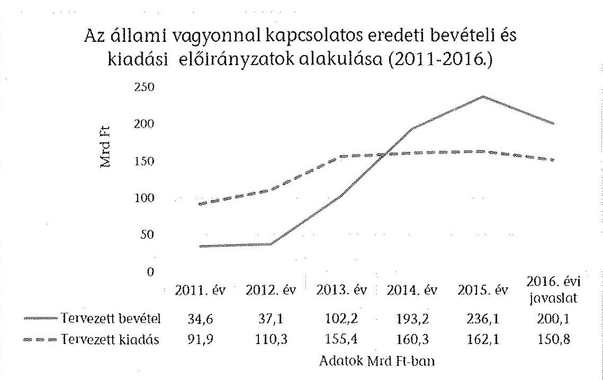

Forrás: ÁSZ adatgyűjtés

# 3.3. A Nemzeti Földalappal kapcsolatos bevételek és kiadások 

Az állami vagyon részét képezi az állami tulajdonú termőföld, amelynek jelentős részét Nemzeti Földalap kezeli és hasznosítja. A 2016. évi tervezett bevételi előirányzat 11,8 Mrd Ft, ami 34,2\%-kal haladja meg a 2015. évi eredeti előirányzatot. A kiadási előirányzat 19,0 Mrd Ft és 17,7\%-kal magasabb a 2015. évi eredeti előirányzatnál. A Nemzeti Földalap ellenőrzött bevételei ( $10,0 \mathrm{Mrd} \mathrm{Ft}$ ) 100\%-ban megalapozottak, az ellenőrzött kiadások ( $15,5 \mathrm{Mrd} \mathrm{Ft}$ ) $80,2 \%$-ban megalapozottak, $19,8 \%$-ban részben megalapozottak.

A bevételek 85\%-át elérő, az előző évi előirányzatot 22,0\%-kal meghaladó $10,0 \mathrm{Mrd}$ Ft összegű haszonbérleti díj előirányzata tervezéséhez rendelkezésre álltak a számítások, érdemi indokolások, amelyek alapján az előirányzat teljesíthető és megalapozott.

A kiadási előirányzatok közül az ingatlan vásárlásra tervezett 2,5 Mrd Ft összegű előirányzata elegendő a közfeladat ellátására, számításokkal megfelelően alátámasztott, megalapozott.

Az életjáradék termőföldért előirányzatot 9,9 Mrd Ft összegű előirányzatát számításokkal alátámasztották, elegendő a közfeladat finanszírozására és nem jelent kockázatot, megalapozott.

Az egyéb vagyonkezelési kiadások 1,8 Mrd Ft-os összege jelentősen ( $88,6 \%$-kal), meghaladja az előző évi előirányzatot, számításokkal nem támasztották alá, kockázatot jelent, részben megalapozott.

---

Az Állami tulajdonú ingatlanvagyon jogi rendezése címen tervezett 1,3 Mrd Ft 63,6\%-kal haladja meg az előző év előirányzatát, nem támasztották számításokkal, az előirányzat kockázatos, részben megalapozott.

# 3.4. A központi költségvetés tartalékai 

A költségvetési törvényjavaslatban a központi alrendszer tartalék-előirányzatai a XI. Miniszterelnökség fejezetben szerepelnek. Az előirányzatok összege 361,4 Mrd Ft, mely a 2015. évi előirányzatot 26,5\%-kal haladja meg. A tartalékok jelentős növekedése figyelhető meg a 2016. évben.

A költségvetési törvényjavaslat rendkívüli kormányzati intézkedésekre - az év közben meghozott kormányzati döntésekből következő feladatok finanszírozására és az előirányzott, de elháríthatatlan ok miatt elmaradó költségvetési bevételek pótlására - a XI. fejezet 32. cím 100,0 Mrd Ft kiadást tartalmaz, az összeg megegyezik a 2015. évi költségvetési törvényben szereplő összeggel. A 100,0 Mrd Ft-os előirányzat a központi költségvetésről szóló törvényjavaslat kiadási főösszegének (16 551,2 Mrd Ft) 0,6\%-a, amely megfelel az Áht. 21. § (2) bekezdésében előírt tartalékképzési előírásnak${ }^{20}$. A fentiek alapján a tervezett kiadás összege alátámasztott és elegendő a közfeladat ellátásához, ezáltal megalapozott.

A 2016. évi költségvetési törvényjavaslatban céltartalékokként a XI. fejezet 34. cím három alcímén összesen 161,4 Mrd Ft kiadás szerepel, a 2015. évi 155,7 Mrd Ft-tal szemben. A közszférában foglalkoztatottak bérkompenzációja alcímen 20,0 Mrd Ft előirányzatot terveztek a költségvetési szerveknél és a nevelési-oktatási, felsőoktatási, egészségügyi, karitatív, szociális, család-, gyermek- és ifjúságvédelmi, kulturális vagy sporttevékenységet önmaga vagy intézménye útján ellátó egyházi jogi személynél foglalkoztatottak részére a 2016. évben - jogszabály alapján - járó többlet személyi kifizetésére. Az előirányzat meghatározására nem állt rendelkezésre háttérszámítás, a 2015. évi felmérésen alapuló becslés figyelembevételével elegendő a közfeladat ellátásához, ezáltal az előirányzatot részben megalapozottnak minősítettük.

A céltartalékon belül a Különféle kifizetések alcímen 2016. évre 6,0 Mrd Ft-ot terveztek többek között a prémiumévek programhoz kapcsolódó munkáltatói kifizetésekre, az ÁSZ számvevői illetményalap változása miatti kifizetésekre, a központi költségvetési szerveknél a feladatok változásával, a szervezetek korszerűsítésével megvalósuló, kiadás- és költségvetési támogatás-megtakarítást eredményező létszámcsökkentésekhez kötődő személyi kifizetésekre, az Alkotmánybíróság új tagjának megválasztásánál jelentkező többlet személyi kifizetésekre és a Bíróságok és az Úgyészség esetében a jogszabály-módosítás következtében jelentkező többlet kifizetésekre. A tervezett kiadás összege alátámasztott és elegendő a közfeladat ellátásához, ezáltal megalapozott.

[^0]
[^0]:    ${ }^{20}$ Eszerint az RKI címen képzett tartalék összege nem lehet több a központi költségvetésről szóló törvény kiadási főösszegének 2\%-ánál, és nem lehet kevesebb annak 0,5\%ánál.

---

A Tervezési Tájékoztatóban előírtak szerint nem a fejezetek, hanem a központi tartalékok között kell bemutatni az új életpályák bevezetését. A céltartalékon belül új előirányzatként jelentkezett az ágazati életpályák alcím, amelyen 135,4 Mrd Ft szerepel a - jogszabály alapján - az ágazati életpályák (pl. közalkalmazottakra is kiterjedően a rendvédelmi életpálya, a közszolgálati életpálya) keretében megvalósuló bérfejlesztés finanszírozására. Az ágazati életpályát érintően az 1846/2014. (XII. 30.) Korm. határozat 2015. október 15-én határozta meg a kormányzati szolgálati jogviszonyban foglalkoztatottakra vonatkozó törvényjavaslat elkészítésének határidejét. A rendvédelmi feladatokat ellátó szervek hivatásos állományának szolgálati jogviszonyáról szóló 2015. évi XLII. törvény már kihirdetésre került. A tervezett kiadás összege elegendő a közfeladat ellátásához, az előirányzat megalapozott.

A központi költségvetés tartalékként az Áht. 21. § (5) bekezdése alapján, a céltartalékon és a rendkívüli kormányzati intézkedésekre szolgáló tartalékon túl az előre nem várt kockázatok kivédése érdekében 2016. évre vonatkozóan a XI. Miniszterelnökség fejezet 33. címen Országvédelmi Alap képzésére került sor 100,0 Mrd Ft összegben, mely 70,0 Mrd Ft-tal több a 2015. évi költségvetésben szereplő összegnél.

Az Áht. 21. § (5) bekezdésének megfelelően a költségvetési törvényjavaslatban ${ }^{21}$ rögzítésre került az Országvédelmi Alap képzésének célja, felhasználásának módja és feltételei. A rendelkezés alapján az Országvédelmi Alap cím előirányzatából legfeljebb 40,0 Mrd Ft az EDP jelentés 2016. március 31-ig történő benyújtását követően használható fel, amennyiben a benyújtott EDP jelentésben szereplő EDP-hiány - a felhasználni kívánt tartalékösszeg figyelembevételével - nem haladja meg a GDP 2\%-át. A XI. fejezet, 33. Országvédelmi Alap cím előirányzatának a 40,0 Mrd Ft-on felüli része az EDP jelentés 2016. szeptember 30-ig történő benyújtását követően használható fel, amennyiben a benyújtott EDP jelentésben szereplő EDP-hiány - a felhasználni kívánt tartalékösszeg figyelembevételével - nem haladja meg a GDP 2\%-át. Mind a $40,0 \mathrm{Mrd}$ Ft, mind az azon felüli összeg felhasználásáról a Kormány határozatban dönt, amelyet az államháztartásért felelős miniszter készít elő, ennek során bemutatja a Kormány számára a 2016. évi gazdasági és költségvetési folyamatok, a 2016. évre várható EDP-hiány és a 2016. évre várható államadósság alakulását, továbbá javaslatot tesz a kiadási előirányzat felhasználásának céljára és ütemezésére.

Az Országvédelmi Alap 100,0 Mrd Ft összegű előirányzata több mint háromszorosa a 2015. évi előirányzatnak. Mértéke megfelelőségének megítélését nehezíti, hogy az előterjesztő nem mutatta be, hogy meghatározásánál milyen jellegű és mértékű kockázatokkal számolt.

A költségvetési törvényjavaslat több fejezetében az általános fejezeti tartalékok mellett új tartalékként találhatóak meg az ún. fejezeti stabilitási tartalékok, összesen 35,0 Mrd Ft összegben (ebből legmagasabb összeg 13,8 Mrd Ft az Emberi Erőforrások Minisztériuma fejezetben található).

[^0]
[^0]:    ${ }^{21}$ 19. § (3) bekezdésében

---

A költségvetési törvényjavaslat rendelkezik a stabilitási tartalék felhasználásának feltételeiről ${ }^{22}$. Ennek alapján a stabilitási tartalék előirányzatokat 2016. október 1-jét megelőzően nem lehet felhasználni. A Kormány az államháztartásért felelős miniszter javaslatára határozatban dönt - a fejezetek költségvetési folyamatainak értékelése alapján - a meghatározott fejezeti stabilitási tartalék előirányzatok felhasználásának engedélyezéséről, fejezeten belüli és fejezetek közötti átcsoportosításáról.

A költségvetési törvényjavaslat kiolvasható, hogy a fejezeti stabilitási tartalék egyfajta ösztönző lehet a fejezetek takarékos gazdálkodására vonatkozóan, amelyet az NGM értékel a tartozásállomány alakulásának a figyelembevételével.

A 2016. évi költségvetési törvényjavaslat nem tartalmaz kamatkockázati tartalékot (utoljára a 2012. évi költségvetés tartalmazott kamatkockázati tartalékot, az NGM tavalyi tájékoztatása szerint a Rendkívüli Kormányzati Intézkedések, valamint az Országvédelmi Alap rendeltetése kezeli a kamatkockázatokat is). A 2016. évi költségvetési törvényjavaslat céltartalékai között nem található meg a központi költségvetési szervek tartozásállományának a csökkentése alcím (A 2015. évi költségvetésben 60,0 Mrd Ft kiadással szerepelt ilyen nevű tartalék).

A 2016. évi költségvetési törvényjavaslat tartalékai jelentősen növekedtek a 2015. évi költségvetéshez képest.

# 4. A FEJEZETI ELŐIRÁNYZATOK TERVEZÉSE 

A költségvetési törvényjavaslat fejezeti tervezőmunkájának véleményezése - az EU-s előirányzatokon kívül - 3131,3,4 Mrd Ft kiadási és 896,5 Mrd Ft bevételi előirányzatra terjedt ki.

A költségvetési szervek és fejezeti kezelésű előirányzatok 2016-ra tervezett kiadásai 11,5\%-kal, bevételei 28,4\%-kal csökkennek 2016-ban 2015. évhez képest.

A költségvetési szervek bevételei közel az előző évi szinten maradnak, kiadásai kismértékben nőnek.

A költségvetési szervek és fejezeti kezelésű előirányzatok tervezett kiadások összege 6224,5 Mrd Ft, a bevételeké 2095,7 Mrd Ft.

A fejezeti kezelésű előirányzatoknál mind a bevételek, mind a kiadások tekintetében jelentős csökkenés várható: a bevételek közel a tavalyi felére, a kiadások 24,8\%-kal esnek vissza. A fejezeti kezelésű előirányzatokon kiemelt célokra fordítható összeg a tervek szerint mintegy 900,0 Mrd Ft-tal csökken, tekintettel az EU-s bevételek jelentős mérséklődésére. A 2016. évre vonatkozó központi költségvetési törvényjavaslat fejezeti tervező

[^0]
[^0]:    ${ }^{22}$ 19. § (6)-(7)

---

munkájának ellenőrzése 8 fejezetet érintett ${ }^{23}$, az ellenőrzött fejezetek meghatározó bevételi és kiadási előirányzatai összességében számításokkal alátámasztottak.

Az ellenőrzött fejezeti körben szervezeti és szerkezeti változás volt a 2015. évihez mérten, amely kevesebb fejezetet érintett és kisebb mértékű változást jelentett az előző évinél. A szerkezeti változás elsősorban az új előirányzatok esetében jelentett bizonytalanságot a tervezésben, mert a fejezetek nem rendelkeztek tapasztalattal a feladatellátás során jelentkező erőforrásigényekről. A fejezetek között átadás-átvétellel mozgó előirányzatok esetében az átadás-átvétel időpontja és az annak során átadott, vagy át nem adott (humán) erőforrás különböző mértékben befolyásolta a tervezés menetét. Az átadás-átvételek nem mindegyike zárult még le.

A költségvetési törvényjavaslat ellenőrzése során a meghatározó előirányzatokon túl 37 olyan előirányzat minősítését végeztük el, melyből 26${ }^{24}$ volt az előzménnyel nem, vagy nem a most kiemelt alcímen rendelkező, és 11 a fejezeti környezetet váltó előirányzat.

A fejezetek számára tervezendő keretszám nem kerül kiadásra, feladatalapú tervezéssel kellett összeállítani a fejezeti költségvetést a fennálló kormánydöntések szerinti determinációk figyelembevételével, a fejezet bázis előirányzatából kiindulva, melynek során az NGM a fejezetgazdáktól a meglévő determinációkat figyelembe véve a lehető legfeszesebb és legfegyelmezettebb költségvetés összeállítását kérte.

A költségvetési tervezés központilag előrehozott indításának és a Tervezési Tájékoztatóban foglaltaknak megfelelően a fejezetgazdák az ott meghatározott elvek és paraméterek alapján a 2015. április 2-áig megadott határidőig elkészítették a fejezet 2016-ra vonatkozó szakmai és költségvetési összevont tervét és azt rögzítették a költségvetési törvényjavaslat benyújtására szolgáló KAR rendszerben. Ettől az időponttól kezdődően a KAR rendszerben történő változásokat az NGM kezelte.

A fejezetek irányító szervei a korábbi évek gyakorlatának megfelelően az NGM honlapján közzétett Tervezési Tájékoztató alapján belső körlevelet adtak ki, amely a fejezeten belül az egyes szakmai területek számára határozott meg a költségvetési törvényjavaslat kialakításához szempontokat.

[^0]
[^0]:    ${ }^{23}$ ME, FM, NGM, NFM, EMMI, NAV, KKM, BM
    ${ }^{24}$ Kiemelt közúti projektek, Űrtevékenységekkel kapcsolatos feladatok, A Magyar Foundation of North America támogatása, Építésügyi bontási feladatok, Nemzeti

 Hauszmann Terv, Külgazdasági fejlesztési célelőirányzat, Új budapesti kórház, Kiemelt sportegyesületek vagyonkezelésében levő állami sportlétesítmények támogatása, MOME kialakítása, Rákóczi Szövetség támogatása, Esélyteremtési és önkéntes programok, Magyar Állami Operaház Eiffel Bázis, Reformáció Emlékbizottság támogatása, Multifunkcionális Roma Kulturális Központ, KLIK ellátottak pénzbeli juttatásai, KOGART támogatása, Kiemelt fesztiválok és események támogatása, Egészségügyi Nyilvántartási és Képzési Központ, Országos Gyógyszerészeti és Élelmezés-egészségügyi Intézet, EU utazási költségtérítés és a kiemelt fejezetek stabilitási tartaléka

---

Az NFM fejezet 2015. március 17-én - a KVF/9701/2015-NFM - körlevél kiadásával kezdte meg a fejezeten belüli tervezési feladatok elvégzését, és 2015. március 26-ig kérték be a kialakított forma szerint a fejezetre, valamint a központosított bevételekre vonatkozó tervezési anyagokat helyettes államtitkárságonként és államtitkári jóváhagyással. Az intézmények tervezési feladatairól külön intézkedtek és az ISZF/10004/2015-NFM belső köriratban rendelték el. A belső körlevél részletes szempontokat adott a tervezéshez, melynek kiadását az NGM-mel 2015. március 16-án tartott tárca-egyeztetés alapozott meg.

A BM fejezetet irányító szerv az államháztartásért felelős miniszterrel történő egyeztetéshez elkészítette a 2016. évi költségvetésének megalapozása érdekében a 2016. évi költségvetési tervezés során érvényesítendő többletigényekről szóló táblázatokat, amelyben intézményenkénti feladatmegbontásban szerepeltek az egyeztetés során képviselt igények. A táblában szereplő feladatok szöveges indoklással, háttérszámításokkal alátámasztottak voltak.

Az FM Költségvetési Főosztály a 2016. évi költségvetési tervezést megalapozó háttérmunka részeként felmérte a tárca fejezeti kezelésű előirányzatainak, valamint a tárcához tartozó intézményeknek, továbbá a Nemzeti Földalap fejezetnek a 2016. évi költségvetési támogatási igényeit. Az egyeztetések, valamint a 2015. március 30-i Miniszteri Értekezleten elhangzottak alapján a fejezeten belül felülvizsgált 2016. évi többlettámogatási igényeiről tájékoztatta az NGM-et.

A ME a tervezés során a 2016. évi kiadások és bevételek tervezése megtörtént. A ME a fejezethez tartozó valamennyi költségvetési szerv vezetőjének GF/KIF/442/1/2015. számon 2015. március 24-i beküldési határidővel körlevelet bocsátott ki azzal, hogy a költségvetési tervezési munkálatokat elindítsa. Ebben körvonalazták a tervezés során figyelembe veendő szempontokat, amit a Tervezési Tájékoztató is tervezési elvként meghatározott.

A fejezeteknél a 2016-ra vonatkozó tervjavaslat összeállítása során - összhangban a Tervezési Tájékoztatóval - nem történt hároméves tervezés ${ }^{25}$. A kialakított tervszámok nem tartalmazzák a fejezet 2017. és 2018. év kiadás-bevétel adatait, ugyanakkor az éven túli kötelezettségvállalások alakulását az ÁSZ által bekért tanúsítványok alapján - 2016-2018. évekre kidolgozták.

A költségvetés tervezése során érvényesíteni kívánt forrásigények alapvetően az elfogadott szakmapolitikai stratégiákon, az egyes ágazatok elfogadott szakpolitikai céljain, a már meglévő éven túli kötelezettségvállalásokon, a korábban meghozott döntésekből származó determinációkon, valamint a közfeladat ellátást, annak körét érintő elfogadott döntéseken, jogszabályokon és az ezekkel összefüggésben tervezett közfeladat-változásokon alapultak.

A fejezeti tervezés további menetében került sor az NGM-mel történő egyeztetésre a fejezet által kimunkált tervszámok és a kiadott determinációk közti eltérésekről.

A BM fejezet jogszabályból eredő feladatellátásához szükséges forrás néhány terület kivételével biztosított, költségvetési feszültségpontok a katasztrófa-

[^0]
[^0]:    ${ }^{25}$ Az Áht. 29. § (1) bekezdés szerint a középtávú terv fejezeti keretszámait a Kormánynak 2015. december 31-éig kell meghatároznia.

---

védelmi szervek, a kormányzati informatikai feladatok, és a Rendőrség feladatellátásában jelentkeznek.

A katasztrófavédelmi szervek feladatellátásához és kiegyensúlyozott gazdálkodásához 2016. évben a BM fejezet 1998,0 M Ft többlettámogatási igényt nyújtott be az NGM felé, melyből a jelenlegi keretszámban többletforrásként 200,0 M Ft-ot biztosítottak. A kormányzati informatikai feladatok ellátására a BM 8137,5 M Ft többletforrás igényt jelzett az NGM felé a NISZ Zrt. feladatainak finanszírozása érdekében, melyből a jelenlegi keretszámban többletforrásként 3000,0 M Ft-ot kapott meg, így a NISZ Zrt. által ellátott feladatok fedezete csak részben biztosított. A 7. Rendőrség cím esetében a takarékos gazdálkodás mellett is megjelenik a tartozásállomány kialakulásának kockázata a 2016. évi költségvetés végrehajtása során.

Az NFM fejezet egyik legnagyobb, meghatározó előirányzatok közé sorolt Kiemelt közúti beruházások elnevezésű projektre a fejezeti tervezés első ütemében 185,0 Mrd Ft-ot terveztek, melyet az NGM-mel folytatott egyeztetések során (2015. április vége) 25,0 Mrd Ft-tal csökkentett az államháztartásért felelős miniszter. A fejezet a jelenlegi helyzetben csak a szakmai tartalom csökkentésével tudja a feladatot elvégezni. A fejezet a feladatellátásnak alapvetően azonban eleget tud tenni, közfeladat-ellátása nem marad el, nem kerül felfüggesztésre.

A fejezeti soron jelentkező feladatokról a központi költségvetésből finanszírozott kiemelt közúti beruházásokról szóló 1010/2015. (I. 20.) Korm. határozat szól, amely felhívta a nemzeti fejlesztési minisztert, hogy tegye meg a szükséges intézkedéseket a kiemelt beruházások 2020. december 31-ig történő megvalósítása érdekében. A kormányhatározat szerint a kiemelt beruházások előkészítési és építési feladatai végrehajtásához szükséges a 2015. évben 11, a 2016. évben 13, a 2017. évben 13, a 2018. évben 273, a 2019. évben 350, és a 2020. évben 90,0 Mrd Ft biztosításáról kell a fejezetnek a központi költségvetés tervezése során gondoskodnia.

A tervezési folyamat során a tervszámok többféle indok miatt, pl. fejezeten belüli átrendeződések, az NGM által korábban megadott makropálya-mutatókban - árfolyam - bekövetkezett módosulás következtében is változtak (makropálya-módosítás).

A Kormány 2015. április 22-i döntése értelmében a Kormány irányítása alá tartozó fejezetek esetében „fejezeti stabilitási tartalék" megképzése vált szükségessé, melynek mértéke a javasolt támogatási előirányzat uniós előirányzatokkal korrigált összegének 1%-a volt. A fejezeti kezelésű előirányzatok címen belül egységesen egy új alcímre került az összeg, melynek megnyitásáról az NGM a tervezés menetében gondoskodott.

A benyújtott törvényjavaslatban meghatározásra került, hogy a fejezetben lévő fejezeti stabilitási tartalék előirányzatokat 2016. október 1-jét megelőzően nem lehet felhasználni. A Kormány az államháztartásért felelős miniszter javaslatára határozatban fog dönteni - a fejezetek költségvetési folyamatainak értékelése alapján - a fejezeti stabilitási tartalék előirányzatok felhasználásának engedélyezéséről, a fejezeten belüli és a fejezetek közötti átcsoportosításáról.

---

Az ellenőrzött fejezeteknél a 2016. évi költségvetési törvényjavaslatban tervezett összeg összességében megalapozott, a kiadások az ellenőrzött előirányzatok 93,2%-ánál, a bevételek 85,5%-ánál volt megalapozott. A részben megalapozott és nem megalapozott minősítésű előirányzatok növelik a teljesíthetőség kockázatát.

# A részben megalapozott előirányzatoknál nem tapasztaltuk a teljes körű alátámasztottságot, vagy a tapasztalati adatok nem támasztották alá a tervezett összeget. 

A KKM fejezetnél a Külgazdasági fejlesztési célelőirányzat fejezeti soron a fejezet által tervezett összeg a tervezési folyamat során a korábbiakban (2015. március-áprilisi dokumentumok) tervezettnek a 24,4%-a lett, a megküldött dokumentumok az összeg levezetését, a csökkentés indokolását nem tartalmazzák. Ennek alapján 68,7%-os kockázatot azonosítottunk.

Az EMMI fejezetnél a Gyógyító-megelőző ellátás szakintézetei tervezett kiadásainak 11,7%-a nem volt számításokkal alátámasztott. A 2014. és 2015. évben jelentkező likviditási problémák megoldására szolgáló intézkedések kidolgozása folyamatban van.

A kórházak feladatellátásához a költségvetési bevételt a költségvetés LXXII. E. Alap fejezete biztosítja. A költségvetési törvényben jóváhagyott kiadási előirányzat a 2013-2014. év teljesítési adatát, illetve a 2015. évben a várható teljesítést figyelembe véve átlagosan 23%-kal teljesült túl, mely alapján valószínűsíthető, hogy az előirányzat a 2016. évben is meg fogja haladni a tervezett összeget. További bizonytalansági tényező, hogy az 1226/2015. (IV. 20.) Korm. határozat 2. pontjában elrendelt felmérés a fekvőbeteg-szakellátást nyújtó egészségügyi szolgáltatók adósságából eredő valamennyi kötelezettségről még  ,-amely folyamatban van. A Kormányhatározat 3. pontjában elrendelt a fekvőbetegszakellátást nyújtó egészségügyi szolgáltatók konszolidációjának végrehajtásáról szóló beszámoló határideje 2015. október 31-e.

Az EMMI fejezet KLIK 2016-ra tervezett kiadásainak 8,5%-a nem volt számításokkal alátámasztott. A 2014. és 2015. évben jelentkező feszültségek megoldására szolgáló intézkedések kidolgozása folyamatban van.

A költségvetési törvényben jóváhagyott kiadási előirányzat a 2013-2014. év teljesítési adatát, illetve a 2015. évben a várható teljesítést figyelembe véve átlagosan 8%-kal teljesült túl, mely alapján valószínűsíthető, hogy a teljesülés megfelelő intézkedések elmaradása esetén a 2016. évben is meg fogja haladni a tervezett összeget. Ezt a feltétezést alátámasztja továbbá, hogy az NGM-EMMI tárgyalásokon rögzítették, hogy a KLIK részéről Kormány-előterjesztést szükséges készíteni a 2016. évi többletforrás-igények kimutatásáról. Az előterjesztés még nem áll rendelkezésre, melynek hiányában a KLIK 2016. évi többletforrás-igénye jelenleg megalapozottan nem számszerűsíthető.

Az FM fejezeten belül Az állat-, növény- és GMO-kártalanítás előirányzaton a korábbi tényadatok alapján 2016-ban is túlteljesítés várható a tervezetthez képest, amit a felülről nyitással kezelni lehet.

Az FM fejezetnél az állat-, növény- és GMO-kártalanítás körében az előirányzat felhasználásának célja az élelmiszerláncról és hatósági felügyeletről szóló tör-

---

vényben foglalt feladatok végrehajtásához szükséges források biztosítása. Az előirányzat jellegéből adódóan a bekövetkező káresemények száma és összegszerűsége előre nem látható, de az FM tervezés menetében rögzített összegek az előző évek tapasztalataiból és azok felhasználási tapasztalatai alapján kerültek megtervezésre. A korábbi évek tényadatai a 2011. évben 970,5 M Ft, a 2012. évben 1461,5 M Ft, a 2013. évben 963,8 M Ft, a 2014. évben 1632,5 M Ft voltak. A 2015. évi előirányzat 1000 M Ft, a módosított előirányzat és a várható teljesülés egyaránt 1076,6 M Ft. Az FM a 2016. évre bázis alapon a 2015. évi előirányzat összegét alapul véve határozta meg a tervezett előirányzat összegét.

Az NGM fejezet Kincstár szervezeténél tapasztaltuk, hogy a tranzakciós illetéket, mint felülről nyitott előirányzatot a 2013-2014. években jelentősen túllépték, mivel azt a dologi kiadások soron nem tervezték meg. A Kincstár dologi kiadási és bevételi előirányzatának túllépése - a pénzügyi tranzakciós illetékről szóló 2012. évi CXVI. törvény ezirányú módosítása következtében a korábbi éveknél kisebb mértékben, de - 2015-2016-ban is valószínűsíthető, tekintettel arra, hogy a tranzakciós illeték továbbra sincs betervezve. Ez azonban a Kincstár közfeladat-ellátását nem veszélyezteti.

A bevételi oldal is jelentősen túlteljesült, mivel a pénzügyi tranzakciós illetékről szóló 2012. évi CXVI. törvény feljogosítja a Kincstárat arra, hogy a tranzakciós illeték összegével megterhelje az általa vezetett fizetési számlákat. A tranzakciós illetékről szóló törvény 3. § (4) bekezdésének 2015. január 1-jétől hatályos módosítása kibővítette az illetékmentességet a Kincstár által vezetett számlák körében, mely alapján valószínűsíthető, hogy a 2015. évre jóváhagyott költségvetési támogatás - 19 243,9 M Ft - túllépése alacsonyabb lesz, mint a 2014. évi tényadat.

Teljesíthetőnek és részben megalapozott előirányzatnak minősítettük a ME-n belüli a Nemzeti Hauszmann Terv, valamint az EMMI fejezeten belül a Kiemelt sportegyesületek vagyonkezelésében lévő állami sportlétesítmények üzemeltetésének támogatása előirányzatokat. Ennek oka, hogy a költségvetési törvényjavaslatban megjelenő az előbbinél 2,4 Mrd Ft-os, az utóbbinál 1,3 Mrd Ft-os növekedést tapasztaltunk a helyszíni ellenőrzés során átadott adatokhoz képest, melyek alátámasztására dokumentumok nem álltak rendelkezésre.

Két új előirányzat minősítése volt nem megalapozott az EMMI-nél, mivel a tervezett összeg nem volt számításokkal alátámasztott, ezek az ellenőrzött összes kiadáson belül mindössze 4%-ot jelentenek.

A Kiemelt fesztiválok támogatása számításokkal nem alátámasztott, számítások hiányában nem megítélhető, hogy az előirányzat elegendő-e a közfeladat-ellátáshoz, emiatt az előirányzat túllépésének kockázata fennáll. A kiemelt fesztiválok támogatása többletigény az ágazati egyeztetések
 során 500,0 M Ft-ról 250,0 M Ft-ra csökkent, de sem az eredeti összeg, sem a módosítás számításokkal nincs alátámasztva.

A 2015. április 22-ei kormányülésen született döntés új budapesti kórház előkészítése beruházás megvalósítása céljából 1000,0 M Ft többlettámogatás odaítéléséről. Az előirányzatról kimunkált számítások nem álltak rendelkezésre.

A ME-nél a Paks II. Atomerőmű Fejlesztő Zrt. tőkeemelése előirányzat a költségvetési törvényjavaslat 113,1 Mrd Ft-ot tartalmaz. Az előirányzat a 2015. évi

---

28,2 Mrd Ft-hoz mérten jelentős növekedést tartalmaz, melyet a szervezet által rendelkezésre bocsátott üzleti tervben teljes körűen nem támaszt alá.

A fejezetek - a kiemelt esetektől eltekintve - 2016-ra tervezett kiadási és bevételi előirányzatai biztosítják a feladatok ellátását, az előírt alapkövetelmények végrehajtását, rendelkezésre álltak az ezt alátámasztó szakmai indokolások, illetve számítások. A 2016. évi kiadások és bevételek teljesíthetőek. A megtervezett kiadások és bevételek előre nem látható bizonytalanságai ellensúlyozására szolgálnak a fejezetek költségvetésébe kormánydöntés alapján beépített tartalékok, (stabilitási tartalék, fejezeti tartalék) valamint a felülről nyitás lehetősége, (amennyiben az adott előirányzatnál ez a lehetőség fennáll), valamint a takarékos, feszes költségvetési gazdálkodás.

# 5. Az EURÓPAI UNIÓs TAGSÁGGAL ÖSSZEFÜGGŐ ELŐIRÁNYZATOK 

A 2016. évi költségvetés tervezése során a tárcák megtervezték a 2014-2020. évi költségvetési ciklus alatt felhasználható uniós és hazai forrás, mind pedig a 2007-2013. évi programozási periódus kifutó programjainak 2016-ra jutó bevételeit/kiadásait. Az ÁSZ az UF, az FM, a BM, az NGM és az NFM fejezet uniós tagsággal összefüggő előirányzataiból az ÁSZ módszertan szerint kiválasztott előirányzatokat, valamint a Költségvetés Közvetlen Bevételei és Kiadásai fejezetnél megjelenő Hozzájárulás az EU költségvetéséhez előirányzat költségvetési kiadását ellenőrizte.

A 2014-2020. évi ciklusban összességében 34,0 Mrd Euro fejlesztési kerettel számolhat Magyarország, melyhez több mint 1400,0 Mrd Ft költségvetési forrás párosul.

Az uniós előirányzatok tervezése a Tervezési Tájékoztató és a fejezetgazdák által megküldött központi szabályozás betartásával, minden esetben a megfelelő előirányzaton történtek, az IH-k és közreműködő szervezetek bevonásával (akik a tervezéshez szükséges információt megküldték az illetékes minisztériumok részére). A 2016. évi tervezés során a hazai forrás előirányzatok, a célelőirányzat biztosításával teljes finanszírozási időszakra szóló keret és/vagy éves finanszírozási megállapodások alapján kerültek meghatározásra. A költségvetés tervezésekor a program szerint illetékes szerv biztosította a szükséges finanszírozási eszközt. Az n+2 és n+3 szabály betartása figyelembe vételre került a releváns előirányzatok esetében.

Az EU támogatással megvalósuló programok kiadásainak, az EU transzfereknek és kapcsolódóan a költségvetési támogatásnak a programidőszakon belüli alakulását ciklikusság jellemzi. A ciklus első évében nincs teljesítés, vagy az a rendelkezésre álló összes keretnek mindössze néhány százalékát éri el. A ciklus második felében megélénkül a teljesítés, az n+2 szabály kihasználásával a ciklust követő két évben emelkedik a teljesítés növekedési üteme. A 4. számú táblázat és a 10. számú ábra tartalmazza a 2007-2013. programozási időszak NSRK OP-jeinek összesített kiadási előirányzatát és teljesítését a 2007-2016. években.

---

4. számú táblázat

| Év | NSRK kiadási   előirányzat | NSRK kiadás   teljesítése |
| :-- | :--: | :--: |
| 2007. év | 37,7 | 8,7 |
| 2008. év | 392,7 | 125,0 |
| 2009. év | 655,0 | 468,8 |
| 2010. év | 589,3 | 729,1 |
| 2011. év | 1124,7 | 1022,4 |
| 2012. év | 1426,2 | 1070,6 |
| 2013. év | 1354,5 | 1659,0 |
| 2014. év | 1788,0 | 1904,7 |
| 2015. év | 1849,2 | n.a. |
| 2016. év | 322,9 | n.a |
| 2007-2016. évek | 9540,1 | 6988,2 |

A 10. számú ábra szemlélteti, hogy a 2007-2016. évek összes kiadási előirányzata meghaladja a teljesítést. Ennek oka egyrészt, hogy a 2015. és a 2016. években teljesítés még nem történt, továbbá az egyes években nem teljesített előirányzatokat a következő években újra meg kellett tervezni.
10. számú ábra
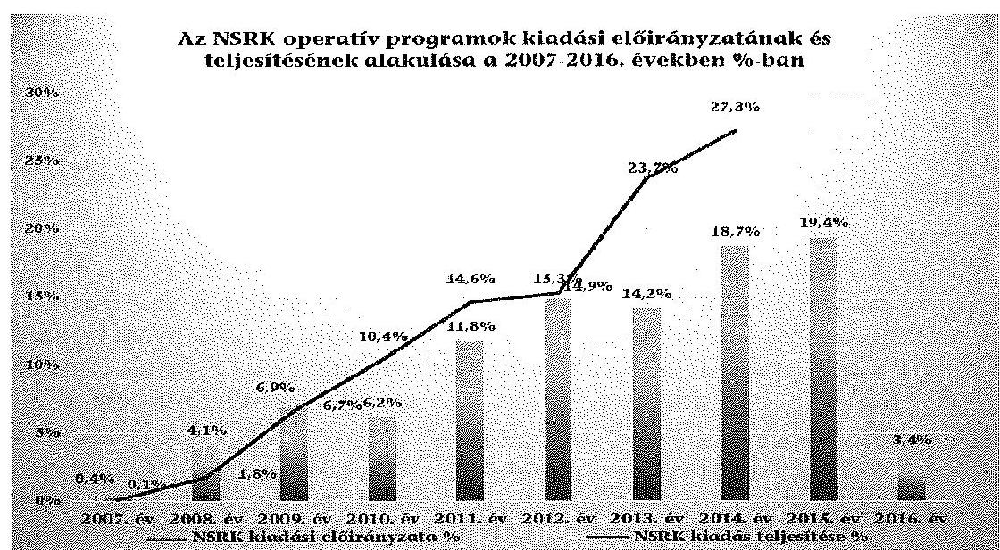

Az NSRK teljesített kiadása a 2007-2014. években 6988,2 Mrd Ft volt. Az első három évben (2009. év végére) az összes teljesített kiadásnak mindössze 8,6\% volt a teljesítés. A kiadások a 2010. évre elérték a 19,1\%-ot, 2011-re 33,7\%-ot, 2012-re 49\%-ot. 2013-ra az összes kiadásnak a teljesítés már 72,7\%-át tette ki. Az NSRK teljesített kiadása 2015. I. negyedévében 412,0 Mrd Ft volt. A 2015. évi jóváhagyott kiadási előirányzat 1849,2 Mrd Ft, a 2016. évi tervezett előirányzat 322,9 Mrd Ft. E ciklikusság nem csak a teljesítésnél, hanem a kiadási előirányzatok tervezésénél is megjelenik.

A ciklikusság a 2014-2020. évi uniós források tervezését és teljesítését is determinálja.

---

A 2016. évre tervezett UF fejezeti költségvetés 1401,3 Mrd Ft összegű kiadási előirányzatának 23\%-át teszik ki a 2007-2013-as uniós ciklus Nemzeti Stratégiai Referenciakeret (NSRK) OP-jei. Az NSRK programjaira az n+2 szabály értelmében a szállítói kifizetések 2015. december 31-ig lehetségesek. Az uniós programok kiadásai éven belül is ciklikusan jelentkeznek, emiatt a 2015. évi kifizetés terv harmada várhatóan a 2015. év utolsó negyedévében teljesül NSRK szinten. A monitoring adatok szerint 2015. I. negyedév végéig az összes NSRK OP-k 2015. évi kifizetési terve 22,3\%-ban teljesült. A 2015. évi teljesítések realizálása céljából több kormányhatározatot $^{26}$ fogadtak el, amelyek a NSRK programjai kötelezettségvállalási irányszámait tartalmazták. Emellett működtették a 2014. évben bevezetett, az NSRK éves kötelezettségvállalási tervének $^{27}$ teljesülését nyomon követő szigorú monitoring rendszert, amely várhatóan 2016-ban is tovább funkcionál.

A ME az OP-kért felelős IH-k bevonásával (akik a tervezéshez szükséges információkat rendelkezésre bocsátották) 322,9 Mrd Ft kiadási, 3,8 Mrd Ft bevételi előirányzatot (EU forrást), valamint 319,1 Mrd Ft költségvetési támogatást tervezett a 2016. évre.

A 2016. évi előirányzatok tervszámainak kialakításánál az előzőekben jelzettek mellett figyelembe vették, a 2016. évi utófinanszírozási kötelezettséget, az utolsó 5\% Magyarország általi megelőlegezésének forrásigényét, az időközi kifizetéseket, az átutalt uniós előlegeket. A tervszámok kialakítása során levonásra kerültek az el nem számolható költségek (előzetesen felszámított ÁFA a KÖZOP projektnél).

A 2007-2013. programozási időszak OP-jeinek minél magasabb mértékű abszorpciója érdekében 2015. évben módosították a program 2015. évi zárására vonatkozó cselekvési tervet és munkatervet $^{28}$. Emellett a Kormány 2015-ben is több OP esetében döntött egyes projektek szakaszolásáról $^{29}$.

[^0]
[^0]:    $^{26}$ 1121/2015. (III. 6.) Korm. határozat a Közlekedés OP 2011-2013. évekre szóló akciótervének megállapításáról, 1125/2015. (III. 6.) Korm. határozat a Környezet és Energia OP 2011-2013. évekre szóló akciótervének megállapításáról, 1172/2015. (III. 24.) Korm. határozat a Társadalmi Megújulás OP 2011-2013. évekre szóló akciótervének megállapításáról, 1133/2015. (III. 10.) Korm. határozat az Elektronikus Közigazgatás OP 20112013. évekre szóló akciótervének módosításáról, GOP: GOP 1-2: 2027/2013 (XII. 29.), GOP 3: 1632/2014.(XI. 7.), GOP 4: 1301/2014 (V. 5.) GOP 5: 1647/2012 (XII. 19.) Korm. határozatok.
    $^{27}$ Az 1118/2015. (III. 6.) Korm. határozattal jóváhagyott NSRK 2015. évi kifizetési és az 1117/2015. (III. 6.) Korm. határozattal elfogadott kötelezettségvállalási terve.
    $^{28}$ A 2007-2013. közötti programozási időszak OP-jei eredményes zárásával összefüggő 2015. évi feladatokra vonatkozó cselekvési tervről, és az NSRK 2014. évi munkatervéről szóló 1051/2014. (II. 7.) Korm. határozat módosításáról szóló 1014/2015. (I. 22.) Korm. határozat
    $^{29}$ Pl. 1084/2015. (III. 3.) Korm. határozat az Európai Unió társfinanszírozásával megvalósuló, 2007-2013. között indított projektek szakaszolásáról, 1180/2015. (III. 25.) Korm. határozat a KEOP keretében megvalósuló projektek támogatásának növeléséről, és szakaszolásának jóváhagyásáról

---

A tervezéskor forrásvesztéssel nem számoltak, azonban a prognosztizált NSRK forrásvesztés (EU és társfinanszírozás) a 2015. április 1-jei monitoring adatok szerint NSRK szinten 125,5 Mrd Ft, ami elsősorban a KEOP, KÖZOP és a TÁMOP OP-knél jelentkezhet az ME tájékoztatása alapján. A forrásvesztés kockázatát csökkenthetik a veszteség elkerülését szolgáló, a tervezéskor folyamatban lévő intézkedések. A KÖZOP források minél teljesebb körű lekötésére a KÖZOP retrospektív, azaz korábban a hazai költségvetés terhére finanszírozott projektek bevonását tervezik, melyek költsége utólag, részben elszámolható a KÖZOP terhére, ezzel biztosítva a KÖZOP lehetőség szerinti legmagasabb abszorpcióját, illetve a hazai költségvetés utólagos tehermentesítését.

Az EU támogatás lehívását akadályozza a KÖZOP esetében az aszfaltügy $^{30}$, a TÁMOP esetében az Öveges $^{31}$ program, valamint a GOP 1-4. prioritását érintő felfüggesztés, ennek összege nem számszerűsíthető, egyéb szankciók nem beazonosíthatók.

Az NSRK kiadási előirányzatai (322,9 Mrd Ft) bár felülről nyitottak $^{32}$, amely általában igaz az EU-s fejlesztések előirányzataira, és az esetleges többletteljesítés esetén túlléphetőek, ennek ellenére a megfelelő ütemű kifizetések teljesítését a kialakított monitoring rendszer biztosítja, teljesülése így nem tekinthető kockázatosnak.

A bevételi előirányzat (3,8 Mrd Ft) teljesülése abban az esetben lesz elegendő, ha a TÁMOP 1 és a TÁMOP 2 prioritás projektjeinél a kifizetett támogatások összege a tervezettnek megfelelően alakul, ily módon nem kockázatos.

A Svájci Alap $^{33}$, támogatásából megvalósuló 2009-2014. közötti projektekre a 2015. évre 8,6 Mrd Ft összegű kiadási előirányzatot és 8,0 Mrd Ft bevételi előirányzatot hagytak jóvá. A 2016. évre 7,2 Mrd Ft kiadási és 6,7 Mrd Ft bevételi, egy előirányzaton kimutatott összeget terveztek, a saját erő 0,5 Mrd Ft. A Svájci Alap bevételi és kiadási előirányzatai megalapozottak teljesülésük nem kockázatos.

Az EGT, Norvég Alap $^{34}$ támogatásából megvalósuló 2009-2014. közötti projektekre a 2015. évre 13,4 Mrd Ft összegű kiadási előirányzatot, 11,9 Mrd Ft be-

[^0]
[^0]:    $^{30}$ Aszfaltügy: az EU Bizottsága szerint a közbeszerzési eljárás során diszkriminatív kiválasztási kritérium volt az aszfaltkeverő telepnek az építkezés helyszínétől való távolsága.
    $^{31}$ Öveges program: a természettudományos oktatás módszertanának és eszközrendszerének megújítása a közoktatásban program.
    $^{32}$ A támogatási előirányzat 30\%-kal, e fölött a Kormány döntése alapján túlléphető.
    $^{33}$ A svájci kormány által létrehozott Svájci Hozzójárulásról az EU Bizottság és Svájc 2006. február 27-én kétoldalú megállapodást írt alá, melynek keretében Magyarország részesedése 130,7 M CHF.
    $^{34}$ A Norvég Alap Izland, Liechtenstein és Norvégia, mint donor országok által létrehozott finanszírozási mechanizmus. Az alap Magyarország részére mintegy 40 Mrd Ft felhasználását teszi lehetővé. A pályáztatás 2013-ban megkezdődött, azonban 2014-ben a folyamatban lévő projektek miatt nem zárult le, a nyertes projektek megvalósítási időszaka 2016. április 30-ig tarthat.

---

vételi előirányzatot hagytak jóvá, melynek időarányos teljesítése sem biztosított a Magyarország és a donor országok között az intézményrendszeri változások el nem ismeréséből származó vitás helyzet miatt. Az ME miniszterének döntése alapján 17,7 Mrd Ft fordítható hazai költségvetési forrásból a teljes program megvalósítására és annak végső határideje 2017. december 31. A jóváhagyott összeg mintegy 50\%-ának kifizetésére a 2016. évben kerül sor. A 2016. évre 9,0 Mrd Ft kiadási és 7,7 Mrd Ft bevételi előirányzatot terveztek a saját forrást 1,3 Mrd Ft-ban
 határozták meg. Nem tervezték meg a donor országokkal való elszámolásokból adódó árfolyam-különbözet elszámolására fedezetet uniós tartalékként. Magyarország és az EGT, Norvég Alapnál történt események rendezéséig nincs kellő információ a költségvetés alátámasztásához, amely a forrásvesztés kockázatát is hordozza.

Az EGT, Norvég Alapnál a közelmúltban történt események miatt a 2016. kiadási és a bevételi előirányzat teljesülése is kockázatot jelent.

Az Állami költségvetési kedvezményezettek saját erő támogatása előirányzatra az 549/2013. (XII. 30.) Korm. rendelet ${ }^{35}$ előírását figyelembe véve a 2015. évre 30,8 Mrd Ft összegű kiadási előirányzatot, és ezzel megegyező támogatási előirányzatot hagytak jóvá. Ugyanezen kormányrendelet vonatkozó előírását ${ }^{36}$ betartva a Tömegközlekedési hálózat továbbfejlesztésének támogatása (2015-ben az előirányzat megnevezése Budapest 4-es metróvonal építésének támogatása előirányzat volt) felülről nyitott, a 2015. évre 15,0 Mrd Ft összegű kiadási előirányzatot, és ezzel megegyező támogatási előirányzatot hagytak jóvá. A jelzett kormányrendelet előírásai szerint jártak el a 2016. évben, mindkét előirányzat esetében a 2015. évre jóváhagyott összeggel megegyező kiadási és támogatási előirányzatot hagytak jóvá. A Tömegközlekedési hálózat továbbfejlesztésének támogatása keretében megkötött támogatási szerződés alapján fennáll annak lehetősége, hogy 2015. július 31-ig nem fejeződik be a projekt. Emellett ki nem fizetett vállalkozói követelések finanszírozására is sor kerülhet. Mindezzel együtt a lehetséges túllépés nem meghatározható, a kiadási előirányzatok nem minősülnek kockázatosnak.

Az Európai Területi Együttműködés 2014-2020 programjai három kategóriába sorolhatóak. Ezek a közös országhatárok két oldalán található régiók és helyi hatóságok közreműködésével, továbbá nagyobb kiterjedésű földrajzi területen tagállami, regionális és helyi hatóságok közreműködésével megvalósuló projektek, valamint a régiók közötti az innovációval, energiahatékonyság-

[^0]
[^0]:    ${ }^{35}$ Az előirányzat célja az Uniós fejlesztések fejezetbe tartozó fejezeti kezelésű előirányzatok felhasználásának rendjéről szóló 549/2013. (XII. 30.) Korm. rendelet 15. § alapján az EU-s forrásból finanszírozott projektek esetén a megtérülő részre jutó központi költségvetési kiadások és a projekt-előkészítési kiadások fedezete, továbbá EU-s vagy egyéb nemzetközi forrásból finanszírozott projektek végrehajtásához szükséges saját forrás, valamint az el nem számolható kiadások költségvetési forrásának biztosítása.
    ${ }^{36}$ Az előirányzat felhasználási szabályait az 549/2013. (XII. 30.) Korm. rendelet 14. §-a rögzíti, melynek értelmében az előirányzat célja a Budapest 4-es metróvonal projekt Közlekedési OP (KÖZOP) keretében el nem számolható költségeinek finanszírozása a fővárosi önkormányzat és az állam közötti, a budapesti 4-es metróvonal megépítésének állami támogatásáról szóló 2005. évi LXVII. törvényben foglaltakra tekintettel.

---

gal, városfejlesztéssel kapcsolatos bevált gyakorlatok egymással való megosztásának elősegítésére irányuló projektek.

Az UF fejezet hatáskörébe tartozik az Európai Területi Együttműködés 2014-2020 (ETE 2014-2020) programok tervezése. Az ETE határ menti programok 2014-2020 cím hét programot tartalmaz (SK-HU ETE, RO-HU ETE, HU-SER IPA, HU-CRO ETE, AU-HU ETE, SI-HU ETE és az ENI) ${ }^{37}$. Az ETE (2014-2020) programok hazai szabályozására új kormányrendelet nem készült, ezért a tervezés a korábbi 160/2009. (VIII. 3.) Korm. rendelet (a 2007-2013 programozási időszakban az Európai Regionális Fejlesztési Alap, valamint az Előcsatlakozási Támogatási Eszköz pénzügyi alapok egyes, a területi együttműködéshez kapcsolódó programjainak végrehajtásáról) előírásait vették irányadónak. A 2014-2020 időszakra vonatkozó OP-k többségében ${ }^{38}$ már benyújtásra kerültek az EU Bizottsághoz, a hazai jogszabályi háttér kialakítása még nem történt meg. A 2016. évi tervezés során kiadásokra 16,2 Mrd Ft-ot, a bevételekre 4,5 Mrd Ft-ot és a támogatásokra 11,7 Mrd Ft-ot terveztek. A 2016. évi tervszámok 345,8%-kal meghaladják a 2015. évi adatokat. A költségvetési társfinanszírozás összegét kiadásként és támogatásként tervezték meg, a 15%-os társfinanszírozást figyelembe véve (a kapcsolódó finanszírozó ERFA szerződések még nem kerültek megkötésre).

Az ETE 2014-2020 programok esetében mind az 5,6 Mrd Ft kiadási, mind a 3,9 Mrd Ft bevételi előirányzatok részben megalapozottnak tekintjük, így teljesítésük kisebb költségvetési kockázatot jelent.

Az UF fejezettől az NGM fejezetbe kerültek ${ }^{39}$ az ETE 2014-2020 programok közül a Transznacionális és egyes Interregionális európai területi együttműködési programok (Transznacionális és Interregionális ETE programok 2014-2020). A négy program ${ }^{40}$ keretében Magyarország részvételéhez kapcsolódó végrehajtási feladatok szerinti kötelezettség a programok társ-

[^0]
[^0]:    ${ }^{37}$ Szlovákia-Magyarország Határon Átnyúló Együttműködési Program (SK-HU), Románia-Magyarország Határon Átnyúló Együttműködési Program (RO-HU), Magyarország-Szerbia IPA Határon Átnyúló Együttműködési Program (HU-SER IPA), Magyarország-Horvátország Határon Átnyúló Együttműködési Program (HU-CRO), Ausztria-Magyarország Határon Átnyúló Együttműködési Program (AU-HU). Szlovénia-Magyarország Határon Átnyúló Együttműködési Program (SI-HU). Délkelet-Európai Transznacionális együttműködési program - Magyarország, Szlovákia, Románia, Ukrajna- (ENI).
    ${ }^{38}$ A RO-HU és ENI esetében a programok még nem kerültek benyújtásra az EU Bizottsághoz, a többi program esetében észrevételezés folyamatban van.
    ${ }^{39}$ Az 1034/2013. (II. 1.) Korm. határozat alapján a 2014-2020 közötti transznacionális és egyes Interregionális európai területi együttműködési programok vonatkozásában az NGM felelős többek közt a programok intézményrendszereinek kiépítéséért, a partner országok releváns hatóságaival az együttműködési programdokumentáció kidolgozásáért.
    ${ }^{40}$ Duna Transznacionális Együttműködési Program (Duna), Közép-európai Együttműködési Program 2020 (Közép-európai), INTERREG VC Interregionális Együttműködési Program (INTERREG), INTERACT III Interregionális Együttműködési Program (INTERACT III).

---

finanszírozásának biztosítása, az ehhez kapcsolódó szerződések megkötése, kezelése, a monitoring és információs rendszerrel összefüggő feladatok finanszírozása ${ }^{41}$. A Közép-európai programot az EU Bizottság 2014. december 16-án elfogadta. A másik három program (Duna; INTERREG VC; INTERACT III) az EU Bizottság részére beterjesztésre került a projektszintű hazai társfinanszírozási szerződések megkötése 2016. második felére várható ${ }^{42}$. A 2016. évre 1,0 Mrd Ft kiadási és 0,3 Mrd Ft bevételi előirányzatot terveztek. A tervezés során az EU Bizottság által elfogadott, illetve a beterjesztett együttműködési programok alapján 10-15% hazai társfinanszírozással számoltak (költségvetési szervek esetében 15%, egyebek 10%). Figyelembe vették továbbá, hogy a programoknál 2016. I. negyedévében szükséges a technikai segítségnyújtási kerethez történő magyar hozzájárulások megfizetése (összesen 155,0 ezer euro). A Duna Program esetében számoltak a 0,3 Mrd Ft EU forrásból és a partnerországok befizetéseiből származó bevétellel, amely 95%-ban a Magyarország által működtetett közös intézményrendszer létrehozása költségeinek fedezetére szolgáló előleg.

Az NGM fejezetben megjelenő Transznacionális és Interregionális ETE 2014-2020 programok esetében a kiadási és a bevételi előirányzatok megalapozottak, teljesítésük nem kockázatos.

A 2014-2020 közötti kohéziós politikai OP-knél az időszakban érkező uniós fejlesztési források eredményes és hatékony felhasználásának feltételeit meghatározó Partnerségi Megállapodást 2014. augusztus 29-én az EU Bizottság elfogadta. A Partnerségi Megállapodás az OP-k forrásallokációs összegeit 25,0 Mrd euró értékben határozta meg. A rendelkezésre álló összes forrás lehívása mellett elsődleges cél a versenyképes gazdasági szerkezet kialakítása. A 2014-2020. közötti kohéziós politikai programok keretében nyolc OP került besorolásra. Ezek a Gazdaságfejlesztés és Innovációs OP (GINOP), a Versenyképes Közép-Magyarország OP (VEKOP), a Terület- és Településfejlesztési OP (TOP), az Integrált Közlekedésfejlesztési OP (IKOP), a Környezeti és Energetikai Hatékonysági OP (KEHOP), az Emberi Erőforrás fejlesztési OP (EFOP) a Rászoruló Személyeket Támogató OP (RSZTOP) és a Közigazgatás- és Közszolgáltatás-fejlesztési OP (KÖFOP). A KÖFOP Unióhoz benyújtott programja kivételével, hét előirányzat OP-jét az EU Bizottság a 2014-2015. években, a 2016. évi tervezőmunka megkezdését megelőzően jóváhagyta. Az IH igények és az NGM javaslatának eredményeként a 2016. évre összesen 871,5 Mrd Ft kiadási, 736,6 Mrd Ft bevételi és 134,9 Mrd Ft támogatási (hazai társfinanszírozás) összeggel számolnak a költségvetési törvényjavaslatban. A bevételek tervezésekor figyelembe vették az EU Bizottság által már átutalt előlegeket is az előírt társfinanszírozási arány mellett. Számoltak az EU-tól már beérkezett és a 2016. évben beérkező előlegekkel is. Az OP-k 2015. évi jóváhagyása miatt eddig 2014. és 2015. évi előlegként a programok költségvetésének 2%-át utalta az EU. A 2016. évre a kezdeti (1%) és a 2016. évi éves (2%) előleggel számoltak az 1303/2013 EU rendelet 134. cikke alapján.

[^0]
[^0]:    ${ }^{41}$ A transznacionális és interregionális ETE programok végrehajtási intézményiről szóló a 126/2014. (IV. 10.) Korm. rendeletben meghatározott szervezetek vesznek részt a négy együttműködési program lebonyolításában.
    ${ }^{42}$ Az EU Bizottság részére beterjesztett programdokumentumokhoz kapcsolódó egyetértési nyilatkozatokat a programokban résztvevő partnerországok is aláírták.

---

A 2014-2020 közötti kohéziós politikai OP-jei között az uniós bevételi előirányzatok teljesíthetősége a KÖFOP esetében az EU által jóváhagyandó program elfogadása függvényében alakul. A RSZTOP esetében nem állt az ellenőrzés rendelkezésére számítás, háttéranyag, egyéb dokumentum, mely alapján a 2016. évre tervezett bevétel, társfinanszírozás és az e forrásokból finanszírozott kiadások összege megítélhető lett volna. Emiatt kisebb kockázatot hordoznak.

A 2016. évre éves fejlesztési keretet (ÉFK) egyik programnál sem fogadtak el, ami bizonytalansági tényezőt jelent ${ }^{43}$. A 2015. évre jóváhagyott fejlesztési tervvel az EFOP, GINOP, VEKOP 7.-8. prioritása rendelkeztek a tervezés időszakában. A KEHOP és az IKOP ÉFK elfogadása, újabb igények felmerülése miatt, a tervezéskor folyamatban volt. A 2015. évi fejlesztési keretet elfogadó kormányhatározatok tartalmazzák a 2015. évi pályázati ütemtervet. Az RSZTOP esetében az ütemezés szerint 2015. szeptember hónapban kezdődnek és 2015. október hónapban zárulnak a pályáztatások, az EFOP esetében 2015. június hónapban kezdődnek és 2015. december hónapban zárulnak. Az IKOP-nál a pályázati feltételek kidolgozása a helyszíni ellenőrzés időszakában még folyamatban volt.

A 2014-2020 közötti kohéziós politikai OP-k 2016. évi kiadási és bevételi előirányzatai összességében megalapozottak és nem minősülnek kockázatosnak.

A 2007-2013 uniós periódus Vidékfejlesztési és Halászati programok alcímhez kapcsolódó Új Magyarország Vidékfejlesztési Program (ÚMVP) keretében az agrár- és vidékfejlesztési uniós támogatásokra a hazai társfinanszírozással együtt a 2016. évre előirányzatot nem terveztek, mert 2015. december 31-ig megtörténnek az utolsó kifizetések, forrásvesztéssel nem számolnak, a 2015. évi kiadási előirányzata 239,1 Mrd Ft, az uniós bevétel 118,4 Mrd Ft ennek teljesülése várható.

A Halászati Operatív Program (HOP) előirányzatra elfogadott szakmai program alapján 2016-ban három tengelyhez kapcsolódóan 0,8 Mrd Ft kiadással és 0,6 Mrd Ft uniós finanszírozással számoltak, ennek forrása az Európai Halászati Alap. Az EU Bizottság iránymutatása szerint a kifizetések végső határideje 2016. június 30. Az IH-k 2015 májusában vállalnak kötelezettségeket a maximális forráskihasználás érdekében, amely meghaladja a 100%-ot. Az előirányzat esetében az n+2 szabály betartásra került.

Az ÚMVP és a HOP kiadási és bevételi előirányzatai 2016. évi tervszámai teljesítése nem hordoznak kockázatot.

[^0]
[^0]:    ${ }^{43}$ A 2014-2020 programozási időszakban az egyes európai uniós alapokból származó támogatások felhasználásának rendjéről szóló 272/2014. (XI. 5.) Korm. rendelet rendelkezik az éves fejlesztési keret elkészítésének menetéről. A 41. § (5) bekezdés alapján a szakpolitikai felelős a felhívások szakmai koncepcióját minden év április 30-ig benyújtja az irányító hatóságnak. A felhívások szakmai koncepcióját az irányító hatóság kiegészíti és minden év május 31-ig megküldi azt az európai uniós források felhasználásáért felelős miniszter számára (41. § (6) bekezdés).

---

A
 Partnerségi Megállapodás 2014-2020 közötti EMVA támogatású Vidékfejlesztési Program (VP) és Magyar Halgazdálkodási OP (MAHOP) felhasználását szabályozó OP-ket az EU Bizottság részére még nem kerültek benyújtásra – az azt megalapozó uniós jogszabályok megalkotása késik –, forrásai biztosítottak ${ }^{44}$, ezek alapozták meg a 2016. évi tervezést. A VP esetében a Mezőgazdasági Különbizottság 2015. április 27-én elfogadta, hogy a 2014-ben fel nem használt forrásokat fele-fele arányban osztja el a 2015 és a 2016 évekre. A 2016. évre a VP vonatkozásában 108,9 Mrd Ft kiadási előirányzatot (kétszerese az előző évinek), 92,6 Mrd Ft bevételi előirányzatot és 16,3 Mrd Ft hazai társfinanszírozási arányt terveztek. A MAHOP 1,6 Mrd Ft értékű kiadási előirányzata a 1,2 Mrd Ft bevételi és 0,4 Mrd Ft támogatási előirányzatokkal egyező összegű.

A VP, MAHOP 2016. évre tervezett kiadási és bevételi előirányzatai nem minősülnek kockázatosnak.

Az FM fejezetben az európai uniós agrárpiaci támogatásokhoz kapcsolódó központi források, nemzeti támogatások az Uniós programok kiegészítő támogatása alcímen ${ }^{45}$ szerepelnek a 2016. évi költségvetési törvényjavaslatban. Az alcímhez kapcsolódó tervezett kiadás a támogatással egyező összegű, 9,7 Mrd Ft, amely megegyezik a 2015. évi előirányzattal. A jogcímcsoport előirányzatok tervszámai megalapozottak, a teljesítésük azonban a számítások szerint meghaladja az előirányzott összeget, így kockázatos, mert az Igyál tejet program esetében az FM részéről 1,4 Mrd Ft többletigény jelentkezik.

Az UF fejezet Uniós programok árfolyam-különbözete ${ }^{46}$, valamint az Uniós programok ÁFA fedezete kiadási előirányzatokat ${ }^{47}$ a 2016. évre 0,10,1 Mrd Ft összegben határozták meg, a jogszabály betartásával, az árfolyamkülönbözet esetében a 2015. évi tervezettel egyező, az ÁFA fedezet vonatkozásban csökkentett (0,7 Mrd Ft-ról) összegben. Az előirányzatok nem minősülnek kockázatosnak.

Az ÁFA összege csökkenésének oka, hogy MAHOP és VP esetében a 2014-2020 időszakra az ÁFA elszámolhatóvá vált. A 2016 évre betervezett ÁFA összege a HOP 2016. június 30-ig felmerülő kiadásaira vonatkozik. Az érintett OP-k még

[^0]
[^0]:    ${ }^{44}$ A MAHOP forrását az ETHA-ból (Európai Tengerügyi és Halászat Alapból) biztosította az EU. A VP forrását az Európa Parlament és Tanács 1305/2013/EU rendelete (2013. december 17.) szabályozta, amelyben országonként határozták meg a 2014-2020. közötti időszak évenkénti uniós forrását, ezt módosította a 1378/2014 EU rendelet.
    ${ }^{45}$ Méhészeti Nemzeti Program, Igyál tejet Program, Egyes speciális szövetkezések (TÉSZ) támogatása, Egyes állatbetegségek megelőzésének és felszámolásának támogatása, Iskolagyümölcs Program.
    ${ }^{46}$ Az Uniós programok árfolyam-különbözete előirányzat az EMVA, az EHA és az ETHA által támogatott programok és intézkedések finanszírozásával összefüggő árfolyamingadozás kezelésére szolgál.
    ${ }^{47}$ Az előirányzatok felhasználását a fejezeti kezelésű előirányzatok kezelésének és felhasználásának szabályairól szóló 48/2013. (VI. 7.) VM rendelet, illetve az 549/2013. (XII. 30.) Korm. rendelet szabályozza.

---

nem kerültek az EU Bizottság által elfogadásra, azonban az előirányzatok megtervezésre kerültek, hogy fedezetük biztosított legyen.

A BM fejezetben szereplő Szolidaritási programok – amely négy alapot ${ }^{48}$ és a hozzájuk kapcsolódó céltartalékot foglalja magában – 2016. évi tervezése az egyes projekteknél ténylegesen várható kifizetések, a hozzájuk kapcsolódó bevételek, a hazai ${ }^{49}$ és uniós jogszabályok, valamint az EU Bizottság által jóváhagyott éves programokban vállalt kötelezettségek figyelembevételével történt. A 2016. évi kiadási és bevételi előirányzatok 0,7 Mrd Ft összegű teljesítése nem hordoz kockázatot.

A BM fejezet Belügyi Alapok előirányzatát a 2014-2020-as programozási időszakra hozták létre. Az EU Bizottsága részére megküldött Nemzeti Programok még nem kerültek az EU Bizottsága által jóváhagyásra, így a tervezéshez az uniós szabályok jelentették a kiindulási alapot. A 2016 évre megtervezett 8,4 Mrd Ft kiadási előirányzat teljesülése (és ezzel párhuzamosan az 1,4 Mrd Ft uniós bevétel realizálása) a program 2015. évi elfogadásának, a pályáztatások elindításának, a Támogatási Szerződések megkötésének és a hazai jogszabályok végleges kialakításának a függvénye.

# A BM fejezet Szolidaritási programok és Belügyi Alapok 2016. évi kiadási és bevételi tervszámai megalapozottak, kockázatot nem hordoznak.

Az NFM fejezetben tervezett CEF projektek ${ }^{50}$ előirányzat azon európai uniós és kapcsolódó központi költségvetési forrásokat tartalmazza, amelyek közvetlenül az EU-hoz benyújtott pályázatok útján nyerhetők el. A CEF projekt lépett a 2015. évben még TEN-T projektek ${ }^{51}$ helyébe, ez az előirányzat megszűnt. A CEF projekt keretében a első körben tíz, a második körben hét projekt megvalósítását tervezték meg 2015. évben. Eddig tíz projekt került benyújtásra, uniós döntés még nem áll rendelkezésre. A 2016. évre az NFM elkészítette a 17 projekttel kapcsolatos tervezését megalapozó számítását 100,0 Mrd Ft kiadási igénnyel, azonban a költségvetési törvénytervezetben 61,8 Mrd Ft-ra lecsökkentett összeg szerepel, amely számításokkal nem megalapozott, a bevételi elő-

[^0]
[^0]:    ${ }^{48}$ Az Európai Unió által létrehozott „Szolidaritás és a migrációs áramlások igazgatása" általános program a következő négy alapot öleli fel: Európai Menekültügyi Alap, Európai Integrációs Alap, Európai Visszatérési Alap, Külső Határok Alap.
    ${ }^{49}$ Az államháztartásról szóló 2011. évi CXCV. törvény, a 368/2011. (XII. 31.) Korm. rendelet az államháztartásról szóló törvény végrehajtásáról; a 23/2012. (IV. 26.) BM rendelet a 2007-2013 közötti programozási időszakban a Szolidaritási programokból származó támogatások felhasználásának alapvető szabályairól, intézményrendszeréről, a pénzügyi irányítási és kontrollrendszerekről; a 15/2013. (V. 2.) BM rendelet a fejezeti kezelésű előirányzatok felhasználásának rendjéről.
    ${ }^{50}$ CEF: Connecting Europe Facility (Európai Hálózatfinanszírozási Eszköz) projektek
    ${ }^{51}$ Az Európai Parlament és a Tanács az Európai Hálózatfinanszírozási Eszköz létrehozásáról, a 913/2010/EU rendelet módosításáról és a 680/2007/EK és a 67/2010/EK rendelet hatályon kívül helyezéséről szóló 1316/2013/EU rendeletének 31. cikke hatályon kívül helyezte a TEN-T projektre vonatkozó 680/2007/EK és a 67/2010/EK rendeleteket.

---

irányzatot a számított $28,2 \mathrm{Mrd}$ Ft, a projekt elfogadását követően az uniótól előlegként ${ }^{52}$ beérkező összeg került megtervezésre.

A CEF projektek bevételi előirányzat teljesítése nem minősül kockázatosnak. A kiadási előirányzat számítása – tekintettel arra, hogy számításokkal nem megalapozott – kockázatosnak tekintjük.

A XLII. fejezet Hozzájárulás az EU költségvetéséhez 2016. évi kiadási előirányzatának összege 314,8 Mrd Ft, amely az ÁFA alapú hozzájárulásból, a GNI alapú hozzájárulásból, a brit korrekcióból, az Ausztria, Dánia, Hollandia és Svédország számára teljesítendő bruttó GNI csökkentés hatásából és az egyéb előirányzatból tevődik össze.

Az egyéb kiadásként a korábbi 2007/436/EK, Euratom tanácsi határozat előírásai és a 2014. január 1-jétől hatályba (ratifikálást követően) lépő új 2014/335/EU Euratom határozatban szereplő előirások alapján számított különbözetet vették figyelembe 14,9 Mrd Ft összeggel. Az EU végleges költségvetése elfogadását követően kerül ratifikálásra az új Euratom szerződés és ekkor kerül sor a két előírás szerinti különbözet összegének 2014.01.01-ig visszamenőleg egyszeri rendezésére.

A nemzeti hozzájárulások összegét elsősorban az uniós költségvetés várható kiadási főösszege és a forint euróhoz viszonyított árfolyama határozza meg. A kiadási előirányzat megalapozott, kockázatot nem hordoz.

# 6. A TÁRSADALOMBIZTOSÍTÁS PÉNZÜGYI ALAPJAI

A társadalombiztosítás pénzügyi alapjai 2016. évi tervezett kiadási és bevételi főösszege 5023,0 Mrd Ft, egyenlege $0,0 \mathrm{Ft}$, amely a 2015. évi törvényi előirányzatot (4935,0 Mrd Ft) 1,8%-kal, 87,5 Mrd Ft-tal haladja meg. A beterjesztett törvényjavaslatban a TB alapok bevételei esetében a szociális hozzájárulási adó Ny. Alap és E. Alap közötti felosztási aránya a 2015. évi 85,46-14,54%-ról 79,43-20,57%-ra változik.

A társadalombiztosítás pénzügyi alapjai 2016. évre tervezett előirányzatai a tárgyév I-IV. havi teljesítési adatait figyelembe véve teljesíthetőek. A TB Alapok 2015. év I-IV. havi egyenlege 23,6 Mrd Ft többlet, a bevételek 33,6%-on túlteljesültek (1656,9 Mrd Ft), míg a kiadások 33,1%-on az időarányoshoz viszonyítva kissé alacsonyabb szinten (1633,3 Mrd Ft) teljesültek. A 2016. évben a bevételi oldalon folytatódik az adók, járulékok és hozzájárulások arányának növekedése a gazdasági folyamatokkal összhangban és a költségvetési támogatások mérséklése. A TB bevételi előirányzatok 94,9% (4768,4 Mrd Ft) és a kiadások 98,4%-át (4942,2 Mrd Ft) véleményeztük.

A Tervezés Tájékoztatóban megfogalmazott követelményeknek megfelelően szabályosan történt a TB Alapok tervezése, figyelembe vették a megadott tervezési paraméterek várható hatásait, az adó és járulékszabályozási sajátosságokat.

[^0]
[^0]:    ${ }^{52}$ A tervezett 70,5 Mr Ft CEF támogatás összegének 40%-a az előleg.

---

# 6.1. Nyugdíjbiztosítási Alap

Az Ny. Alap 2016. évre tervezett kiadási és bevételi főösszege 3059,3 Mrd Ft, nulla egyenleggel, amely 2015. évi törvényi előirányzatnál 1,15%-kal és 34,7 Mrd Ft-tal magasabb. Az Ny. Alap 2015. I-IV. havi egyenlege 10,6 Mrd Ft, az előző évek pozitív tendenciájának megfelelően. Az I-IV. havi többlet részben a járulékbevételek időarányost meghaladó nagyságából és kiadási oldalon a tervezettől kismértékben (0,3%-kal) elmaradó teljesüléséből származik. A 2015. április 29-én számított éves várható bevétel 3064,5 Mrd Ft, a kiadás 3024,6 Mrd Ft és 56,4 Mrd Ft pozitív egyenleg.
2016. évben is a bevételek 99,1%-át a szociális hozzájárulási adó és a biztosítotti nyugdíjjárulék képezi. A bevételek között a Szociális hozzájárulási adó előirányzat 1,4%-os mérséklődésével számoltak, amely a két alap járulék megosztásának változását tükrözi.

A Szociális hozzájárulási adó 2015. évi előirányzata 2043,5 Mrd Ft. A törvényjavaslat szerint az Ny. Alap részesedése a teljes bevételből a 2015. évi 85,91%-ról 79,43%-ra mérséklődik. Ennek megfelelően a tervezett keresettömeg növekedéssel számítva a 2016. évi bevételi előirányzat 2014,7 Mrd Ft, amely megalapozott, teljesíthető és nem kockázatos.

A Biztosítotti nyugdíjjárulék 2015. évi bevételi előirányzat 952,4 Mrd Ft. A 2016. évi tervezett előirányzat 1015,8 Mrd Ft amely a tervezett keresettömeg növekedés figyelembe vételével készült.

Az Ny. Alap bevételei megalapozottak és az előző évek tendenciái alapján teljesíthetőek. A bevételek tervezésénél figyelembe vették az óvatosság elvét. A bevételi előirányzat teljesíthető, mert az előirányzatok az előző évi tendenciákkal összhangban vannak, a tervezéskor ismert információk változatlansága esetén alulteljesítés nem valószínűsíthető.

A Nyugellátások kiadási jogcímei közül megszüntetésre/átsorolásra és átnevezésre kerül a 2015. évben 185,2 Mrd Ft előirányzattal rendelkező Szolgálatfüggő nyugellátás, az Öregségi nyugdíj jogcímcsoportba olvad. Az Öregségi nyugdíj jogcímcsoport differenciálódik, 2016. évtől Korhatár felettiek öregségi nyugdíjára (2473,2 Mrd Ft) és a Nők korhatár alatti nyugellátására (195,5 Mrd Ft) kerül megbontásra. A hozzátartozói nyugellátás 2016. évi tervezett kiadása 372,5 Mrd Ft, ami a tárgyévi 381,0 Mrd Ft 97,8%-a, a halálozási adatok trendjének figyelembe vételével készült.

A Nyugellátás előirányzatának tervezésénél a 2015. évi eredeti előirányzat 3014,0 Mrd Ft. A tervezés első fázisában még 1,8%-os fogyasztói árnövekedést kalkuláltak, amely a költségvetési törvényjavaslatban mérséklődött 1,6%-ra. A létszámnövekedés hatására 0,4% és a létszámcserélődés hatására 0,5% kiadásnövekedést kalkuláltak. A beáramlás szempontjából a legfontosabb, hogy 2016-ban az 1953-ban születtetek elérik a számukra 63 éves életkorban meghatározott nyugdíjkorhatárt. A 40 év jogosultsági
 idővel rendelkező nők esetében a nyugdíjkorhatár emelésének folyamat miatt 2016-ban 5,8%-os létszámnövekedéssel terveztek. Összességében a tervezés első fázisában a rendelkezésre álló dokumentumok szerint 3072,7 Mrd Ft-tal kalkuláltak. A törvényjavaslat

---

1,6%-os inflációt vett figyelembe és a tervezett nyugdíjkiadás 3041,7 Mrd Ft, amelyre fedezetet nyújt az Alap.

Az Öregségi nyugdíj, (a Korhatár feletti és a Nők korhatár alatti nyugellátása) valamint a Hozzátartozói nyugellátás, és a Nyugdíjbiztosítás egyéb kiadásai előirányzatok - a költségvetési törvény 4. számú melléklete szerint - felülről nyitottak, a teljesítés módosítás nélkül eltérhet az előirányzattól, mégsem minősül kockázatosnak, mert számításokkal alátámasztott, a tervezés során az óvatosság elvét érvényesítették a közfeladatok ellátására elegendő.

A Nyugdíjbiztosítás egyéb kiadásai 2015. évi eredeti előirányzata 6,74 Mrd Ft, amely megalapozott, teljesíthető és nem minősül kockázatosnak, annak ellenére, hogy felülről nyitott előirányzat.

Az Ny. Alap kiadásai megalapozottak, és a tervezett kiadás összege elegendő a közfeladat ellátásra.

# 6.2. Egészségbiztosítási Alap 

A törvényjavaslat szerint az E. Alap 2016. évi kiadási és bevételi főösszege 1963,7 Mrd Ft, nulla egyenleggel. Az Alap előirányzatainak tervezése szabályosan történt, figyelembe vették a megadott tervezési paraméterek várható hatásait. Az Alap bevételi és kiadási előirányzatát a 2015. évi törvényi előirányzathoz képest 2,8%-kal és 52,9 Mrd Ft-tal nagyobb összegben tervezték meg. A bevételi oldalt érintő két nagy változás, hogy szociális hozzájárulási adó E. Alapot illető bevétele a 2015. évi 14,54%-ról 20,57%-ra emelkedik és ezzel párhuzamosan a költségvetési hozzájárulások között megszűnik a Rokkantsági rehabilitációs ellátások részbeni fedezetére átvett pénzeszköz jogcím.

A Szociális hozzájárulási adó E. Alapot megillető része címen tervezett 2015. évi törvényi bevétel 347,6 Mrd Ft. A 2016. évi tervezett bevétel 521,9 Mrd Ft, amelyből a véleményezés során 509,3 Mrd Ft-ot alátámasztottnak, megalapozottnak és teljesíthetőnek, nem kockázatosnak minősítettünk. A beterjesztett törvényjavaslat az E. Alap részesedését 20,57%-ra (0,42%-kal) emelte, ezzel a bevétel összegét is 12,6 Mrd Ft-tal megemelte, amelyből számításaink szerint 3,6 Mrd részben megalapozott. Ugyanakkor 9,0 Mrd Ft nem alátámasztott, megalapozatlan és beszedése kockázatosnak minősül.

A Biztosítotti egészségbiztosítási járulék bevételek 2015. évi törvényi előirányzata 639,4 Mrd Ft. A 2016. évi előirányzat 677,4 Mrd Ft, amely az 5,2%-os tervezett keresettömeg növekedéssel számolva teljesíthető, megalapozott és nem kockázatos.

Az egészségügyi hozzájárulás 2015. évi eredeti előirányzata 161,8 Mrd Ft, az év végi várható teljesítés ezzel megegyező összeg. A 2016. évi terv 1,5%-kal magasabb, 164,2 Mrd Ft, megalapozott és teljesíthető.

Az E. Alap bevételein belül a Költségvetési hozzájárulások 582,4 Mrd Ft-ról 415,0 Mrd Ft-ra csökkennek, ezen belül a rokkantsági, rehabilitációs ellátások fedezetére átvett pénzeszköz a 2015. évi 172,7 Mrd Ft előirányzatról 2016. évre megszűnik.

---

A költségvetési hozzájárulások között a járulék címen átvett pénzeszköz 2016. évben 374,5 Mrd Ft, a 2015. évi hozzájárulásnál 240,0 M Ft-tal több. Tervezésekor a nemzeti kockázatközösségbe tartozók egészségbiztosítási ellátásához járul hozzá a költségvetés. Az előirányzat számításokkal megalapozott, teljesíthető és nem minősül kockázatosnak.

Az E. Alap kiadási előirányzatai alátámasztottak, az előirányzatokat kezelő szerv felmérte a várható teljesítéseket, az előirányzatok kialakítását dokumentáló számítások és indokolások rendelkezésre állnak, alátámasztják a kialakított költségvetési előirányzatokat. A kiadási előirányzatok összege elegendő a közfeladat ellátásához, a tervezett kiadások megfelelően dokumentáltak. Az E. Alap kiadásai között új előirányzat nem található.

Az E. Alap kiadásai 2016. évben 52,8 Mrd Ft-tal növekednek 2015. évhez képest. A növekményből a pénzbeli ellátásokra 6,5 Mrd Ft-tal, 1,2%-kal jut több, mint 2015. évben.

A Csecsemőgondozási díj, terhességi-gyermekágyi segély 2015. évi törvényi előirányzata 42,4 Mrd Ft. Az ellátás 2016. évi kiadási előirányzata 45,9 Mrd Ft, a tárgyévihez viszonyítva 8,3%-kal magasabb, ami figyelembe vette a keresettömeg-, valamint a születésszám növekedést. A kiadás megalapozott, alátámasztott, és elegendő a közfeladat ellátására. Teljesítése annak ellenére, hogy felülről nyitott, nem minősül kockázatosnak.

Táppénz kiadások 2015. évi eredeti előirányzata 68,5 Mrd Ft. A 2016. évi tervezett kiadás 8,4 Mrd Ft-tal több, 76,9 Mrd Ft. A pénzbeli ellátások átlagos növekedését meghaladó a növekmény a táppénz előirányzaton (12%), különösen a gyermekápolási táppénz ellátásban (17,8%). Az előirányzatot az óvatosság és trendek figyelembe vételével tervezték, ezért alátámasztott, és annak ellenére sem minősül kockázatosnak, hogy felülről nyitott.

A Gyermekgondozási díj kiadásában 6,2%-os a növekedés. A bruttó átlagkereset emelkedésére vonatkozó paramétert, és a GYED-extra intézkedéscsomag TAJ szintű adatállományok felhasználásával vizsgált hatását, igénybevételre gyakorolt hatását vették figyelembe. A gyermekgondozási díj 2015. évi eredeti előirányzata 109,5 Mrd Ft volt, a 2016. évi tervezett előirányzat 116,3 Mrd Ft. A felülvizsgálatok folytatódása, a létszám cserélődése miatt a rokkantsági, rehabilitációs ellátások 3,8%-os, a kártérítési járadék 4,2%-os mérséklődésével terveznek.

Az egészségbiztosítás tervezett természetbeni kiadásai 2016. évben 2015. évhez viszonyítva 46,2 Mrd Ft-tal növekednek. A gyógyító-megelőző ellátások kiadásainak 2015. évi eredeti előirányzata 948,6 Mrd Ft volt. A 2016. évi tervezett kiadási előirányzat 33,7 Mrd Ft-tal több, 982,4 Mrd Ft. A gyógyító-megelőző ellátásokon belül a törvénytervezetben folytatódik a háziorvosi ellátórendszer megújítása, második ütemére újabb 10 Mrd Ft a tervezett kiadás, és Célelőirányzatokra 83,9 Mrd Ft került betervezésre. Az előirányzat nem tartalmazza az egészségügyi szakmapolitikai intézkedések hatásait. Az előirányzat számításokkal alátámasztott, nem minősül kockázatosnak.

---

A gyógyszertámogatások kiadásai 2015. évi eredeti előirányzata 298,1 Mrd Ft volt. A 2016. évi tervezett előirányzat a 2015. évi eredeti előirányzatnál 2,3%-kal több, 305,1 Mrd Ft. Az előirányzat számításakor figyelembe vették az új gyógyszer befogadásokat, a gyógyszerek cserélődését, a fogyasztási szokásokat. Az előirányzat tervezésekor betartották a tervezési előírásokat, számításokkal megalapozott és alátámasztott, nem minősül kockázatosnak.

A Gyógyfürdő és egyéb gyógyászati ellátások 2016. évi támogatására 4,2 Mrd Ft-ot tartalmaz a törvénytervezet, amely megegyezik a 2015. évi eredeti előirányzattal, illetve a 2015. évi várható teljesüléssel. Az Utazási költségtérítések előirányzata 2016. évben 5,4 Mrd Ft, 1,6%-kal több, mint a tárgyévi eredeti előirányzat. Az egészségbiztosítás egyéb ellátásokhoz kapcsolódó kiadásaira 2016. évben 13,3 Mrd Ft-ot terveztek, 0,6%-kal többet, mint a tárgyévi előirányzat. A Nemzetközi egyezményekből eredő és külföldön történő, tervezett ellátások 2016. évre tervezett kiadása 13,4 Mrd Ft, a tárgyévi törvényi előirányzatot (12,0 Mrd Ft) 11,3%-kal haladja meg, amely számításokkal alátámasztott és teljesíthető. Az előirányzatok számításokkal alátámasztottak, megalapozottak, a közfeladatok teljesíthetőek és nem minősülnek kockázatosnak.

Az előirányzatok közül a - a költségvetési törvény 4. számú melléklete szerint felülről nyitott, a teljesítés módosítás nélkül eltérhet az előirányzattól - a Csecsemőgondozási díj, a Táppénz, a Baleseti járadék, a Gyermekgondozási díj, a Rokkantsági, rehabilitációs ellátások, a Gyógyfürdő és egyéb gyógyászati ellátások támogatása, az Utazási költségtérítés, az Utazási költségtérítés, a Sürgősségi ellátás EGT-n, Svájcon belül, a Külföldön igénybevett Magyarországon nem elérhető egészségügyi szolgáltatások kiadása, a Kifizetőhelyeket megillető költségtérítés valamint a Postaköltségek.

# 7. Nemzeti Foglalkoztatási Alap 

A Nemzeti Foglalkoztatási Alap 2015. évi törvényi bevételi előirányzata 360,7 Mrd Ft, míg kiadása 427,4 Mrd Ft, egyenlege 66,7 Mrd Ft hiány. Az I-IV. havi teljesítések alapján a bevételek 29,6%-on, (106,6 Mrd Ft), míg a kiadások 28,3%-on (120,9 Mrd Ft), az időarányosnál alacsonyabb szinten valósultak meg, így az egyenleg 14,3 Mrd Ft hiány. A költségvetési törvényjavaslat alapján 463,7 Mrd Ft a bevétel és 484,2 Mrd Ft kiadás mellett 20,4 Mrd Ft a hiány. A Tervezés Tájékoztatóban megfogalmazott követelményeknek megfelelően szabályosan történt az alap tervezése, figyelembe vették a megadott tervezési paraméterek várható hatásait.

A bevételek közül az Egészségbiztosítási és munkaerő-piaci járulék Nemzeti Foglalkoztatási Alapot megillető hányada előirányzat 2015. évi eredeti előirányzata 141,8 Mrd Ft, a 2016. évre tervezett előirányzat 6,1%-kal magasabb, 150,5 Mrd Ft. A bevételi előirányzat számításokkal alátámasztott, a tervezési paraméterekkel és a foglalkoztatási trendek figyelembe vételével történt. Az előirányzat teljesíthető, megalapozott és nem minősül kockázatosnak.

---

A Munkahelyvédelmi akciótervvel összefüggő hozzájárulás 2015. évi eredeti bevételi előirányzata 100,5 Mrd Ft, a 2016. évi tervezett előirányzat 5,2 Mrd Ft-tal több, 105,8 Mrd Ft. Az előirányzat az előző évi tendenciákkal és a várható értékkel összhangban van, számításokkal alátámasztott, teljesíthető és nem minősül kockázatosnak.

A kiadások közül az Álláskeresési ellátások kiadási előirányzat 2015. évi eredeti előirányzata 50,0 Mrd Ft, amelyből az I-IV. havi teljesítés 15,5 Mrd Ft, 31%, az időarányosnál alacsonyabb. A 2016. évi Álláskeresési ellátásokkal kapcsolatos előirányzat 47,0 Mrd Ft, amely annak ellenére, hogy felülről nyitott előirányzat, az előző évek és a tárgyévi tendenciák alapján megalapozott, teljesíthető és nem kockázatos. A kiadási előirányzat összege elegendő a közfeladat ellátásához. A 2016. évben havonta átlagosan 40,2 ezer fő részesül az ellátásban. Az álláskeresési járadék átlagos havi összege a tervek szerint 76,9 ezer Ft/fő/hó lesz. Álláskeresési segélyben 2016-ban havonta várhatóan 23,2 ezer fő részesül, segélyük összege 42,4 ezer Ft/fő/hó lesz. Az ellátások nettó összegének 2016. év végi előrehozott kifizetését a kincstári megelőlegezési számla igénybevételével tervezték 2,5 Mrd Ft összegben.

Bérgarancia kifizetések kiadási előirányzata 2015. évi eredeti előirányzata 6,2 Mrd Ft, amelyből az I-IV. havi teljesítés 1,2 Mrd Ft, 17,8%, az időarányosnál lényegesen alacsonyabb. A 2016. évi Bérgarancia kifizetésekkel kapcsolatos előirányzat 5,0 Mrd Ft, amely annak ellenére, hogy felülről nyitott előirányzat, az előző évek és a tárgyévi tendenciák alapján megalapozott, teljesíthető és nem kockázatos. A kiadási előirányzat összege elegendő a közfeladat ellátásához.

Start-munkaprogram kiadási előirányzat alátámasztott. A Startmunkaprogram 2016. évi kiadási előirányzata 340,0 Mrd Ft, a kiadási főösszeg 70,0%-a. Az előirányzat felhasználásával az Alap a közfoglalkoztatás kiadásait finanszírozza. A 2015. évben erre a célra a törvényi előirányzat 270,0 Mrd Ft, és közel 230 ezer fő éves, átlagos létszám közfoglalkoztatásának a megvalósítására elegendő. A közfoglalkoztatásra fordítható pénzügyi forrás felosztási elveit, valamint a 2015. évi célokat tartalmazó négyoldalú megállapodásban célként fogalmazódott meg, hogy a nyilvántartott álláskeresők között mért foglalkoztatást helyettesítő támogatásban részesülők 2014. évi éves átlagos létszámát 25%-kal kell csökkenteni 2015. július 1-je és 2016. június 30-a között. A Kormány szándéka, hogy 2018-ra teljesen kivezesse a foglalkoztatást helyettesítő támogatásban részesülőket az elsődleges és másodlagos munkaerőpiacra. Ennek érdekében 2016. július 1-jétől újabb 25%-kal szükséges csökkenteni a foglalkoztatást helyettesítő támogatásban részesülők átlagos létszámát a 2017. június 30-ig tartó időszakban. Ennek érdekében, illetve a 2015. évben is jelentkező magas közfoglalkoztatási igényeket figyelembe véve, a tervezés során a 2015. évi 213 ezer fős átlagos létszámot további 40 ezer fős átlaglétszámmal növelték, így mindösszesen 253 ezer fős átlaglétszám foglalkoztatását tűzték ki célul a 2016. évben. A Belügyminisztérium számításai szerint ennek a 2016. évi költségvetési előirányzata mintegy 340,0 Mrd Ft. A Tervezési Tájékoztató alapján az Alapnak a Start-munkaprogram finanszírozására legalább 248,0 Mrd Ft-ot saját forrásai terhére kell biztosítani. Az ezen felüli forrásigényekre pedig költségvetési támogatás volt tervezhető. A kiadási előirányzat megalapozott, és összege
 elegendő a közfeladat ellátásához, nem minősül kockázatosnak. Az előirányzat számításokkal alátámasztott, és kialakítása a vonatkozó paraméterek, mutatószámok figyelembevételével történt, a dokumentált kiadásokra a tervezett előirányzat fedezetet nyújt.

Az előirányzat a Kormány jóváhagyásával túlléphető. A tervezés során bizonytalansági tényezőt képez az áthúzódó kötelezettségek mértéke, amely nagy mértékben befolyásolhatja az adott év tervezési adatait, továbbá a közfoglalkoztatási bérek következő évi alakulása, a tényleges elvárás a 2015. évre vonatkozóan, valamint a közfoglalkoztatás rendszerének és az egyes támogatási feltételeknek a kialakítása. A tervezésben 3%-os közfoglalkoztatási béremeléssel kalkulálva végezték el a számításokat.

Fejezeti stabilitási tartalék új előirányzat, kiadási előirányzat alátámasztott. Az Alap kiadásain belül egy új címre került megtervezésre. A stabilitási tartalék összege, melynek megnyitásáról az NGM gondoskodott a tervezés menetében. Az előirányzatot kezelő szerv számítása alapján Fejezeti stabilitási tartalékra a 2016. évre 389,5 M Ft-ot terveztek. A Kormány döntés értelmében a fejezetek esetében „fejezeti stabilitási tartalék” megképzése szükséges, melynek mértéke a javasolt korrigált kiadási előirányzat összegének 1%-a. A stabilitási tartalékképzési kötelezettség összegét - egyeztetve a Munkaerőpiacért és Szakképzésért felelős Államtitkársággal - a Foglalkoztatási és Képzési támogatások, a Szakképzési és felnőttképzési támogatások, Bérgarancia kifizetések, és a Működési célú kifizetések kiadások terhére arányosan javasolták biztosítani 389,5 M Ft összegben. A kiadási előirányzat elegendő a közfeladat ellátásához, megalapozott és nem minősül kockázatosnak.

# 8. A HELYI ÖNKORMÁNYZATOK TÁMOGATÁSAI 

A helyi önkormányzatok feladatainak ellátásához a 2016. évi központi költségvetési törvényjavaslat együttesen 661,7 Mrd Ft támogatást biztosít, amely 1,9%-al (12,5 Mrd Ft) haladja meg az előző évi 649,3 Mrd Ft összegű eredeti előirányzatot. A támogatások fő céljai jellemzően nem változtak, azonban a kiegészítő támogatások belső szerkezete, az egyes célok prioritásai átalakultak, a törvényjavaslatban új címen is terveztek előirányzatot. A IX. Helyi önkormányzatok támogatásai fejezet 2016-ra tervezett, együttesen 661,7 Mrd Ft összegű előirányzatainak 99,7%-a megalapozott, 0,3%-a részben megalapozott.

A helyi önkormányzatok működésének általános támogatására tervezett 154,1 Mrd Ft előirányzat 3,1 Mrd Ft-tal (2,1%) haladja meg a 2015. évre tervezettet. Az előirányzat emelt összege tartalmazza az IFA kiegészítésnél jelentkező növekedést, valamint egy kiegészítő támogatást is előirányoz, amelynek fajlagos összegét - a törvényjavaslatban ismertetett módon - a helyi önkormányzatokért felelős miniszter és az államháztartásért felelős miniszter 2016. január 16-ig állapítja meg. A támogatásokat számításokra alapozva határozták meg, a törvényjavaslatban a támogatási feltételeket meghatározták, az előirányzat elegendő a közfeladat ellátásához, megalapozott.

A települési önkormányzatok egyes köznevelési feladatainak támogatásában szerkezeti változás nem következett be, a 2016. évre tervezett támogatás összege 179,8 Mrd Ft, 8,6%-kal magasabb a 2015. évi 165,9 Mrd Ft összegű előirányzatnál. A többlet célja az óvodák működéséhez adott támogatás emelése az óvodapedagógusok és közvetlen segítőknek az átlagbér növelése, valamint annak közterhei miatt jelentkező többletkiadásokhoz biztosít forrást. Az óvodaműködtetés támogatásához is kapcsolódik egy kiegészítő támogatás, amely a településüzemeltetésnél ismertetettek szerint kerül megállapításra. Az előirányzat számításokkal alátámasztott, a közfeladatra elegendő, megalapozott.

A települési önkormányzatok egyes szociális, gyermekjóléti és gyermekétkeztetési feladatainak támogatása vonatkozásában a 2016. évre tervezett előirányzat a 2015. évi 192,1 Mrd Ft-ról 187,7 Mrd Ft-ra (2,3%-kal) csökkent. A szociális támogatások rendszerének átalakítására 2015. március 1-jével került sor. Az átalakítás során a támogatások jelentős része a Nemzeti Család- és Szociálpolitikai Alap előirányzatai közé került, ugyanakkor egyes támogatási formák (rendszeres szociális segély, a lakásfenntartási támogatás) kikerültek a szociális törvényből. A változásokat a tervezéshez készült munkaanyagban a 2015. évihez viszonyítottan mutatták be.

Csökkent a pénzbeli szociális ellátások kiegészítése (részben a XX. fejezetbe történő átcsoportosítás miatt). Növekszik az önkormányzatok szociális feladatai egyéb támogatása, egyes szociális és gyermekjóléti feladatok és a gyermekétkeztetés támogatása, illetve a felsőfokú végzettségű kisgyermeknevelők bértámogatása. A változásokat az indokolja, hogy bővülni fog azon jogosultak köre, akik bölcsődében, illetve óvodában térítésmentesen étkezhetnek. Hároméves kortól kötelező óvodai nevelésre tekintettel, a növekvő ellátotti létszámra, amelyet a számításokban 230 ezerre becsültek, a 2016. évben a központi költségvetés tervezet 9,2 Mrd Ft többletforrást biztosít a feladat ellátásához. A kiadási előirányzat tervezése dokumentumokkal alátámasztott, a közfeladat ellátásához elegendő, megalapozott.

A helyi önkormányzatok kiegészítő támogatásai 107,1 Mrd Ft-os előirányzata a 2015. évi előirányzathoz képest 2,9 Mrd Ft-tal (2,6%) alacsonyabb összegben kerültek megtervezésre. Az előirányzat csökkenés 6,0 Mrd Ft összege a kötelezően ellátandó helyi közösségi közlekedés területét érinti. A változás tükrözi a fővárosi tömegközlekedés támogatásának csökkentését célzó kormányzati szándékot, amelyhez - a tervezési dokumentumok szerint - párosul a hosszú távú finanszírozás stabilizálását célzó intézkedések előkészítése és meghozatala. Az önkormányzati adatszolgáltatás minőségi javítására új előirányzatok kerültek tervezésre 0,6 Mrd Ft összegben. A 2015. évi költségvetés az önkormányzatok és társulásaik európai uniós fejlesztési pályázatai saját forrás kiegészítésének támogatása címen 16,9 Mrd Ft, önkormányzati fejezeti tartalék címen 38,1 Mrd Ft előirányzatot tartalmazott, melyek átalakításra kerültek. Új előirányzat az adósságkonszolidációban nem részesült települési önkormányzatok fejlesztéseinek támogatása (12,5 Mrd Ft), az önkormányzatok rendkívüli támogatása (25,0 Mrd Ft), az egyedi önkormányzati támogatások (hét önkormányzat esetében együttesen 8,0 Mrd Ft, az önkormányzati elszámolások 15,1 Mrd Ft). Az új előirányzatok az európai uniós fejlesztési pályázatok saját forrás kiegészítésének támogatása előirányzat (16,9 Mrd Ft összegben), valamint az önkormányzati fejezeti tartalék (38,1 Mrd Ft) megszűnését ellentételezik. Tervezéskor a kiegészítő támogatások változását számításokkal és indokolással támasztották alá, az előirányzat megalapozott.

A törvényjavaslat új előirányzattal bővült. Támogató szolgáltatások, közösségi ellátások, utcai szociális munka és a Biztos Kezdet Gyerekház működésének támogatása előirányzaton 2,0 Mrd Ft került megtervezésre, amellyel csökkent a XX. Emberi Erőforrások Minisztériuma 20. cím 19. alcím 4. előirányzat-csoport tervezett kiadási előirányzata. Az előirányzat IX. Helyi önkormányzatok támogatásai fejezetben történő létrehozását számítások, elemzések nem támasztják alá, ezért az előirányzat részben megalapozott.

Budapest, 2015. május 22.
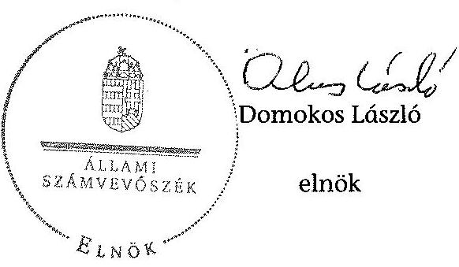

.

# A költségvetés közvetlen bevételei (M Ft-ban) ${ }^{1}$

|  Megnevezés | 2016.évi előirányzat | Megalapozott | Részben megalapozott | Nem megalapozott | Kockázat  |
| --- | --- | --- | --- | --- | --- |
|  Vállalkozások költségvetési befizetései | 648800,0 | 489700,0 | 145300,0 |  | 0  |
|  Társasági adó | 400500,0 | 400500,0 |  |  |   |
|  Pénzügyi szervezetek különadója | 89200,0 | 89200,0 |  |  |   |
|  Egyszerűsített vállalkozói adó | 75200,0 |  | 75200,0 |  | $11725,2^{2}$  |
|  Kisadózók tételes adója | 70100,0 |  | 70100,0 |  | $25184,2^{2}$  |
|  Kisvállalati adó | 13800,0 |  |  | 13800,0 | $8662,4^{2}$  |
|  Fogyasztáshoz kapcsolt adók | 4560950,0 | 3608750,0 | 952200,0 |  | 0  |
|  Általános forgalmi adó | 3351850,0 | 3351850,0 |  |  |   |
|  Jövedéki adó | 952200,0 |  | 952200,0 |  | $2662,7^{2}$  |
|  Távközlési adó | 56000,0 | 56000,0 |  |  |   |
|  Pénzügyi tranzakciós illeték | 200900,0 | 200900,0 |  |  |   |

[^0]: ${ }^{1}$ A táblázat csak azokat az előirányzatokat tartalmazza, amelyeket az ÁSZ ellenőrzött.

| Megnevezés | 2016.évi előirányzat | Megalapozott | Részben megalapozott | Nem megalapozott | Kockázat |
| :--: | :--: | :--: | :--: | :--: | :--: |
| Lakosság költségvetési befizetései | 1780100,0 | 1780100,0 |  |  |  |
| Személyi jövedelemadó | 1658400,0 | 1658400,0 |  |  |  |
| Lakossági illetékek | 121700,0 | 121700,0 |  |  |  |
| Egyéb költségvetési bevételek | 3474,0 | 3474,0 |  |  |  |
| Kezességvisszatérülés | 3474,0 | 3474,0 |  |  |  |
| Központosított bevételek | 140500,0 | 140500,0 |  |  |  |
| Megtett úttal arányos útdij | 140500,0 | 140500,0 |  |  |  |
| Tőke követelések visszatérülése | 207,0 | 207,0 |  |  |  |
| Alárendelt kölcsöntöke kötvény visszatérülése | 207,0 | 207,0 |  |  |  |
| Összesen | 7134031,0 | 6022731,0 | 1097500,0 | 13800,0 | 0 |

${ }^{2}$ A teljes költségvetés szintjén nem jelent kockázatot (a gazdasági növekedés esetén, az adócsalás elleni küzdelem folytatásának és az EKÁER rendszer üzemeltetésének hatására az ÁFA, jövedéki adó SZJA, bevételek nőnek), így az összesen sorban a kockázat összege nem jelenik meg.

# A költségvetés közvetlen kiadásai (M Ft-ban) ${ }^{1}$

|  Megnevezés | 2016. évi előirányzat | Megalapozott | Részben megalapozott  |
| --- | --- | --- | --- |
|  MINISZTERELNÖKSÉG (XL. fejezet) | 261425,5 | 241425,5 | 20000,0  |
|  Rendkívüli Kormányzati Intézkedések | 100000,0 | 100000,0 | 0,0  |
|  Közszférában foglalkoztatottak bérkompenzációja | 20000,0 | 0 | 20000,0  |
|  Különféle kifizetések | 6000,0 | 6000,0 | 0,0  |
|  Ágazati életpályák | 135425,5 | 135425,5 | 0,0  |
|  Vállalkozások folyó támogatása (XVII. fejezet) | 271086,4 | 271086,4 | 0,0  |
|  A vasúti pályahálózat működtetésének költségtérítése | 74137,7 | 74137,7 | 0,0  |
|  Vasúti személyszállítási közszolgáltatások költségtérítése | 154400,0 | 154400,0 | 0,0  |
|  Autóbusszal végzett személyszállítási közszolgáltatások költségtérítés | 41048,7 | 41048,7 | 0,0  |
|  Peres ügyek | 1500,0 | 1500,0 |   |
|  Vállalkozások folyó támogatása (XVIII. fejezet) | 30000,0 | 30000,0 | 0,0  |
|  Eximbank kamatkiegyenlítése | 30000,0 | 30000,0 | 0,0  |
|  EMBERI ERŐFORRÁSOK MINISZTÉRIUMA (XX. fejezet) | 678648,0 | 678648,0 | 0,0  |
|  Családi támogatások | 414965,0 | 414965,0 | 0,0  |
|  Családi pótlék | 319720,5 | 319720,5 | 0,0  |
|  Egyéb családi ellátások | 95244,5 | 95244,5 | 0,0  |
|  Korhatár alatti ellátások | 112917,8 | 112917,8 | 0,0  |
|  Szolgálati járandóság | 79502,6 | 79502,6 | 0,0  |
|  Korhatár előtti ellátás, balettművészeti életjáradék | 33415,2 | 33415,2 | 0,0  |

${ }^{1}$ A táblázat csak azokat az előirányzatokat tartalmazza, amelyeket az ÁSZ ellenőrzött

|  Megnevezés | 2016. évi előirányzat | Megalapozott | Részben megalapozott  |
| --- | --- | --- | --- |
|  Jövedelempótló
 és jövedelemkiegészítő
szociális támogatások | 133 128,0 | 133 128,0 | 0,0  |
|  Közgyógyellátás | 15 889,7 | 15 889,7 | 0,0  |
|  Folyósított ellátások utáni térítés | 1 747,5 | 1 747,5 | 0,0  |
|  A KÖLTSÉGVETÉS KÖZVETLEN BEVÉTELEI ÉS KIADÁSAI (XLII. fejezet) | 1 078 196,3 | 1 063 396,3 | 14 800,0  |
|  Egyéb lakástámogatások | 104 000,0 | 104 000,0 | 0,0  |
|  Szociálpolitikai menetdíj támogatás | 104 000,0 | 104 000,0 | 0,0  |
|  Felszámolásokkal kapcsolatos kiadások | 3 200,0 | 3 200,0 | 0,0  |
|  Egyéb vegyes kiadások | 7 300,0 | 7 300,0 | 0,0  |
|  1% SZJA közcélú felhasználása | 8 100,0 | 8 100,0 | 0,0  |
|  Gazdálkodó szervezetek által befizetett termékdíj-visszaigénylés | 1 700,0 | 1 700,0 | 0,0  |
|  Átmeneti hulladék-közszolgáltatással kapcsolatos kiadások | 2 000,0 | 2 000,0 | 0,0  |
|  Állam által vállalt kezesség és viszontgaranca érvényesítése | 31 783,0 | 24 283,0 | 7 500,0  |
|  Pénzbeli kárpótlás | 1 297,3 | 1 297,3 | 0,0  |
|  Az 1947-es párizsi békeszerződésből eredő kárpótlás | 2 364,6 | 2 364,6 | 0,0  |
|  Járulék címen átadott pénzeszköz | 374 464,0 | 374 464,0 | 0,0  |
|  Nemzetközi pénzügyi intézmények felé vállalt kötelezettségek | 12 644,1 | 12 644,1 | 0,0  |
|  Hozzájárulás az EU költségvetéséhez | 314 849,0 | 314 849,0 | 0,0  |
|  Munkahelyvédelmi akciótervvel összefüggő hozzájárulás NFA-nak | 105 769,9 | 105 769,9 | 0,0  |
|  Központi Nukleáris Pénzügyi Alap támogatása | 4 724,4 | 4 724,4 | 0,0  |
|  Összesen | 2 319 356,2 | 2 284 556,2 | 34 800,0  |

