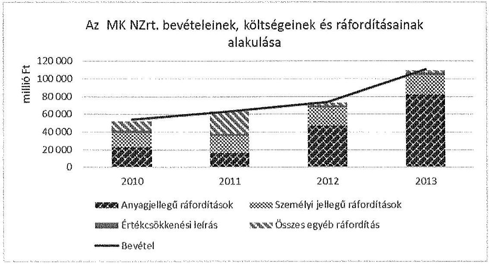
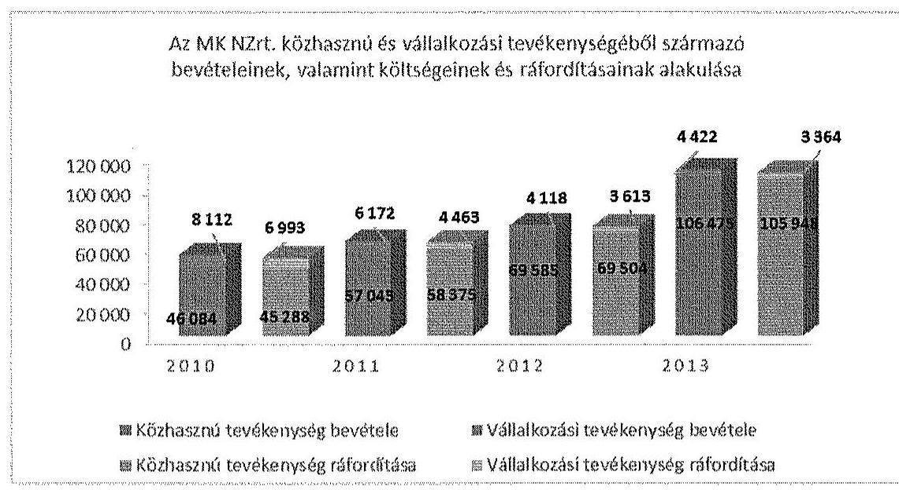
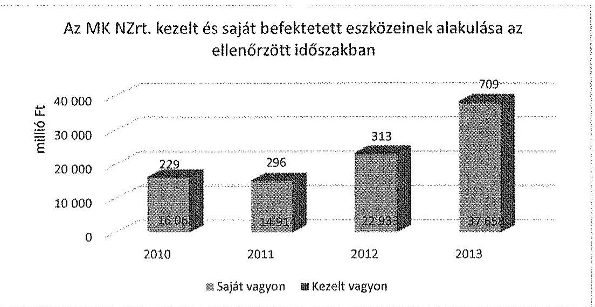
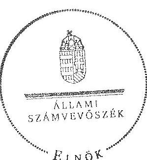
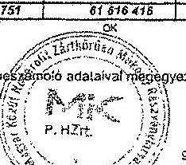
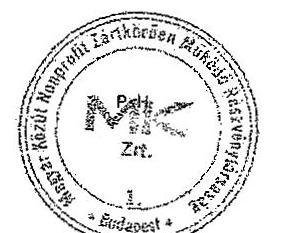

# ÁLLAMI   SZÁMVEVÔSZÉK 

## JELENTÉS

az állami tulajdonban (résztulajdonban) lévő gazdálkodó szervezetek vagyonmegőrzési és gazdálkodási tevékenységének ellenőrzése Magyar Közút Nonprofit Zártkörűen Múködő Részvénytársaság

---

# Állami Számvevőszék 

Iktatószám: V-0644-285/2015.
Témaszám: 1678
Vizsgálat-azonosító szám: V066603

## Az ellenőrzést felügyelte:

## Makkai Mária

felügyeleti vezető

## Az ellenőrzést vezette és a végrehajtásáért felelős:

## Sali Sándorné

ellenőrzésvezető

## A jelentéstervezet összeállításában közremúködött:

## Kányáné Murvai Tünde

számvevő főtanácsos

## Az ellenőrzést végezték:

| Semerédy Andrea | Váradiné Jassó Mari- | Jeszenkovits Tamás |
| :-- | :-- | :-- |
| okleveles könyvvizsgáló | ann | okleveles könyvvizsgáló |
| külső szakértő | okleveles könyvvizsgáló | külső szakértő |

A témához kapcsolódó eddig készített számvevőszéki jelentések:
címe
sorszáma
Jelentés az állami közutak felújítását, javítását, karbantartását 1291
célzó intézkedések eredményességének és az állami közutak állapo-
tára gyakorolt hatásának ellenőrzéséről

---

# TARTALOMJEGYZÉK 

BEVEZETÉS ..... 3
I. ÖSSZEGZŐ MEGÁLLAPÍTÁSOK, KÖVETKEZTETÉSEK, JAVASLATOK ..... 9
II. RÉSZLETES MEGÁLLAPÍTÁSOK ..... 17

1. Az MNV Zrt. MK NZrt.-vel kapcsolatos vagyongazdálkodási tevékenysége ..... 17
1.1. A szabályszerű vagyongazdálkodás feltételeinek a kialakítása ..... 17
1.2. A gazdálkodáshoz szükséges követelmények rögzítése ..... 18
1.3. Az MNV Zrt. vagyonnyilvántartás szabályozottsága ..... 19
1.4. A vagyongazdálkodásra vonatkozó jogok meghatározása ..... 20
2. Az MK NZrt. vagyongazdálkodási és vagyonnyilvántartási tevékenységének kialakítása ..... 21
2.1. A vagyongazdálkodási feltételek kialakításának szabályszerűsége ..... 21
2.2. Az MK NZrt. vagyonnyilvántartásának szabályszerűsége ..... 25
3. Az ellátott közfeladat bevételei és ráfordításai elszámolásának és önköltségszámításának a szabályszerűsége ..... 29
3.1. Az ellátott közfeladat bevételeinek, valamint a költségeinek és ráfordításainak szabályszerűsége ..... 29
3.2. Az önköltségszámítás szabályszerűsége ..... 34
4. A vagyonváltozást eredményező döntések jogszabályi és tulajdonosi elvárásoknak való megfelelése ..... 35
4.1. Az MK NZrt. vagyongazdálkodási tevékenységének szabályszerűsége ..... 35
4.2. A döntések előkészítésének megalapozása ..... 39
4.3. A tulajdonosi joggyakorló vagyonváltozást eredményező döntéseinek megfelelése ..... 42
5. A belső kontroll és monitoring rendszer kialakítása és múködtetése ..... 44
5.1. A belső kontrollrendszer kialakítása és múködtetése ..... 44
5.2. Az információáramlási és monitoring rendszer ..... 47
5.3. A kormányzati szektorba sorolt (ESA) adatszolgáltatás ..... 48
5.4. A kapcsolt vállalkozásokban lévő részesedések ..... 49

---

# MELLÉKLETEK 

1. számú Rövidítések jegyzéke
2. számú Értelmező szótár
3. számú Az MK NZrt. vagyonának alakulása a 2010-2013. években
4. számú Az MK NZrt. eredményének alakulása a 2010-2013. években
5. számú Az MK Nzrt. befektetett eszközállományának alakulása a 2010-2013. években
6. számú Az ellenőrzött szervezetek ÁSZ által el nem fogadott észrevételei

---

# JELENTÉS 

## Az állami tulajdonban (résztulajdonban) lévő gazdálkodó szervezetek vagyonmegőrzési és gazdálkodási tevékenységének ellenőrzése

Magyar Közút Nonprofit Zrt.

## BEVEZETÉS

Az Állami Számvevőszék alapvető célkitűzése, hogy az államháztartáson kívülre nyújtott költségvetési támogatások és ingyenes vagyonjuttatások ellenőrzésével járuljon hozzá ahhoz, hogy a közpénzeket az államháztartáson kívül működő szervezetek is átlátható módon használják fel a közfeladatok szerződésben vállalt ellátása érdekében. Az Áht. értelmében a közfeladatok ellátása elsősorban költségvetési szervek alapításával és müködtetésével történik. Az államháztartáson kívüli szervezetek a közfeladatok ellátásában jogszabályban meghatározott feltételekkel közremüködhetnek. ${ }^{1}$

Az állami tulajdonú gazdálkodó szervezetek a nemzeti vagyon részét képezik. Az állami vagyonnal való gazdálkodást illetően a tulajdonosi joggyakorlás és a vagyongazdálkodás feladata az állami vagyon átlátható, rendeltetésszerú és felelős felhasználásának biztosítása. Az állam meghatározza az ellátandó közszolgáltatásokkal kapcsolatos feladatokat, amelyhez a vagyonnal kapcsolatos döntéseknek igazodniuk kell. A nemzetgazdasági szempontból kiemelt jelentőségű nemzeti vagyonban tartandó állami tulajdonban álló társasági részesedést a nemzeti vagyonról szóló törvény tartalmazza.

Az Áht. nevesíti a kormányzati szektorba sorolt egyéb szervezet fogalmát. E körbe tartoznak azok a szervezetek, amelyek nem részei az államháztartásnak, azonban a 479/2009/EK rendelet szerint a kormányzati szektorba tartoznak. A nemzeti számlák nemzetközi és hazai statisztikai módszertana és szabványai elveket határoznak meg a statisztikai értelemben vett kormányzati szektorba tartozó szervezetek körére és besorolásuk módjára. A szervezetek megnevezését a nemzetgazdasági miniszter teszi közzé. A kormányzati szektorba sorolt egyéb szervezet, így a 2012. évtől a Magyar Közút Nonprofit Zrt. (a továbbiakban: MK NZrt. vagy Társaság) köteles adatszolgáltatást teljesíteni a központi költségvetésről szóló törvény elkészítéséhez, továbbá adósságot keletkeztető ügyletet csak az államháztartásért felelős miniszter előzetes egyetértésével köthet. ${ }^{2}$

[^0]
[^0]:    ${ }^{1}$ Áht. 1. § (2)-(3) bekezdés
    ${ }^{2}$ Magyarország gazdasági stabilitásáról szóló 2011. évi CXCIV. törvény 9. § alapján a 353/2011. (XII. 30.) Korm. rendeletben foglaltak szerint.

---

Az MK NZrt. a Magyar Közút Állami Közútkezelő, Fejlesztő, Műszaki és Információs Közhasznú Társaság (a továbbiakban: Magyar Közút Kht.) 2009. március 31. napján történt átalakulása folytán jött létre, annak általános jogutódja. Müködését 2009. április 1. napjától kezdte meg. A Társaság jogelődjét a Közlekedési Hírközlési és Energiaügyi Minisztérium, mint alapító a közúti közlekedésről szóló 1988. évi I. törvény (a továbbiakban: Kkt.) 33. § (1) bekezdés b) pontjának megfelelő formában, az egyéb jogszabályi és törvényi előírások figyelembe vételével alapította a 19 megyei közútkezelő kht. ÁKMI Kht.-ba történő beolvasztásával.

A Társaság alapítója és részvényese a Magyar Állam, amelynek nevében a tulajdonosi jogokat 2010. június 16 -áig a Közlekedési, Hírközlési és Energiaügyi Minisztérium ${ }^{3}$ (a továbbiakban: KHEM) képviseletében a miniszter, 2010. június 17 -étől az ellenőrzött időszak végéig a Magyar Fejlesztési Bank Részvénytársaságról szóló 2001. évi XX. törvény alapján a Magyar Fejlesztési Bank Zrt. (a továbbiakban: MFB Zrt.) gyakorolta.

Az MK NZrt. által szerződés alapján vagyonkezelésbe vett állami vagyon feletti jogokat és kötelezettségeket 2010. június 16 -áig a Magyar Állam nevében a Nemzeti Vagyongazdálkodási Tanács (a továbbiakban: NVT) a Magyar Nemzeti Vagyonkezelő Zrt. (a továbbiakban: MNV Zrt.) útján gyakorolta. 2010. június 17 -étől 2013. június 27 -éig ugyanezen jogok és kötelezettségek gyakorlására az állami vagyon felügyeletéért felelős miniszter volt jogosult, az MNV Zrt. útján. 2013. június 28 -ától a vagyonkezelésben lévő eszközök tekintetében az MNV Zrt. volt a tulajdonosi joggyakorló. Az MK NZrt. által vagyonkezelésbe vett vagyon nettó értéke 2013. december 31 -én $708,7 \mathrm{M}$ Ft volt, mely a teljes befektetett eszközállomány csupán $0,5 \%-\mathrm{a}$.

Az MK NZrt. fő tevékenysége a szárazföldi szállítást kiegészítő szolgáltatás volt, amelynek keretében - a Kkt. 33. § (1) bekezdés ba) alpontja alapján - közútkezelői minőségében eljárva ellátta az országos közutak tekintetében az út, híd, alagút fejlesztéséhez, fenntartásához és üzemeltetéséhez kapcsolódó tevékenységet. Ezen tevékenységét mind a közhasznú, illetve a közfeladattal kapcsolatos, mind a vállalkozási tevékenysége keretében is végezte.

A Kormány 1600/2013. (IX. 3.) határozatának értelmében 2013. november 1jétől a Társaság a Nemzeti Útdijfizetési Szolgáltató Zrt.-től (a továbbiakban: NÚSZ Zrt.) átvette a gyorsforgalmi úthálózat üzemeltetői és fenntartási tevékenységét a közútkezelői tevékenység ellátásának biztosításához szükséges eszközökkel, vagyonnal és munkavállalókkal együtt.

Az MK NZrt. tevékenysége során az ország egész területén több mint 30000 km közút és közel 1000 km gyorsforgalmi úthálózat tisztításáról, üzemeltetéséről és karbantartásáról gondoskodott. Tevékenysége kiterjedt az utak állapotának rendszeres ellenőrzésére, a burkolati hibák javítására, padkák rendezésére, az utak környezetének gondozására, téli hó és síkosság-mentesítésére, a forgalomtechnikai eszközök kihelyezésére, javítására, cseréjére.

[^0]
[^0]:    ${ }^{3}$ 2010. június 17 -étől jogutód szervezete a Nemzeti Fejlesztési Minisztérium

---

A Társaság feladatai közé tartozott továbbá az Országos Közúti Adatbank, valamint az ÚTINFORM múködtetése, mely az országos közutakra vonatkozó műszaki, minőségi, forgalmi adatok gyűjtését, nyilvántartásba vételét, feldolgozását és értékelését biztosította. Gyűjtötte és rendszerezte továbbá a közúti közlekedés folyamatosságát és biztonságát befolyásoló információkat, tájékoztatást adott a forgalmi viszonyokról, az úton vagy annak környezetében végzett munkákról, a balesetek és az elemi károk következtében bevezetett forgalomkorlátozásokról, az ideiglenes súly- és méretkorlátozásokról, valamint az időjárás okozta akadályokról. Úthálózat-védelem, útvonal-engedélyezés tevékenysége keretében kiadta az országos közutakat érintő túlsúlyos és túlméretes szállítmányok közlekedéséhez szükséges útvonalengedélyeket.

Az MK NZrt. az útüzemeltetéssel és -fenntartással kapcsolatos forrásait - áttételesen - az állami költségvetésből (Útpénztár) kapta az ellenőrzött időszakban, melyet a Közlekedésfejlesztési Koordinációs Központ (a továbbiakban: KKK) felügyelt. A KKK elsődleges feladata a közúthálózat finanszírozását szolgáló költségvetési előirányzatok kezelése, szerződéskötés az utak üzemeltetésére és a közlekedési szakma koordinációja. A KKK mint költségvetési szerv 2006. január 1jétől kezeli központilag az Útpénztárban összesített pénzügyi forrást, amely az autópályák, valamint a tíz tonna feletti össztömegú járművek számára jogszabályban meghatározott útszakaszok igénybe vételének használati díjából (matricák bevételéből), valamint az útfenntartásra és fejlesztésre elkülönített állami pénzalapokból áll. E pénzügyi keretből biztosított útüzemeltetési és fenntartási forrást - állami megrendelésként - az MK NZrt. számára polgári jogi szerződés keretében.

Az MK NZrt. a Magyar Állam 100\%-os, minősített többségi befolyású tulajdonában volt az ellenőrzött időszakban. A Társaság jegyzett tőkéje 13 452,7 M Ft, melyből 3879,6 M Ft a pénzbeli, 9573,1 M Ft a nem pénzbeli hozzájárulás. A jegyzett tőke összege az ellenőrzött időszakban nem változott. A Társaság összes bevétele a 2013. évben 110 896,1 M Ft volt, melyből az értékesítés nettó árbevétele 44940,0 M Ft-ot tett ki.

Az MK NZrt.-nek 2013. december 31-én egy gazdasági társaságban (Közúti Társaságok Vendégháza Balatonföldvár Kft.) volt 100\%-os tulajdonosi részesedése. A 2010-2013. években az MK NZrt. vezérigazgatójának személye két alkalommal, a gazdasági vezérigazgató-helyettes személye egy alkalommal, a műszaki vezérigazgató-helyettes személye egy alkalommal változott. A jelenlegi vezérigazgató 2014. augusztus 17. óta tölti be tisztségét. Az MK NZrt. átlagos statisztikai létszáma a 2013. év végén 5645 fő volt. Három telephelyet, 148 fióktelepet múködtetett, budapesti központi irányítással 19 megyében, 93 üzemmérnökségen végezte közútkezelői feladatait.

Az ellenőrzés célja annak értékelése volt, hogy a tulajdonosi jogok gyakorlása szabályszerű volt-e, a gazdálkodó szervezet által ellátott feladat bevételei, ráfordításai elszámolásának, és vagyongazdálkodási tevékenységének szabályozása megfelelte a jogszabályi és a tulajdonosi előírásoknak és azok végrehajtása szabályszerú volt-e, biztosítva volt-e a közfeladatok átláthatósága és elszámoltathatósága érdekében a közszolgáltatás díjának megalapozottsága szabályszerű önköltségszámítással, a vagyonváltozást eredményező döntések esetében a tulajdonosi jogok gyakorlója és a gazdálkodó szervezet szabályszerűen

---

jártak-e el, kiépítette és működtette-e a gazdálkodó szervezet a szabályszerű vagyongazdálkodás érdekében a kontroll és monitoring rendszert, továbbá a kormányzati szektorba sorolt egyéb szervezetek gazdálkodásának a kormányzati szektor hiányára és az államadósságra befolyással bíró elemei a jogszabályi előírásoknak megfeleltek-e.

Az ellenőrzés időszaka: A 2010. január 1.-2013. december 31. közötti időszak.

Az ellenőrzés végrehajtásának jogszabályi alapját az Állami Számvevőszékről szóló 2011. évi LXVI. törvény 5. § (3)-(5) bekezdései képezték.

Az ellenőrzéssel érintett szervezetek: Az ellenőrzés kiterjedt a Magyar Közút Nonprofit Zrt.-re, továbbá a Magyar Nemzeti Vagyonkezelő Zrt.-re, a Magyar Fejlesztési Bank Zrt.-re, valamint - a Közlekedési, Hírközlési és Energiaügyi Minisztérium jogutódjára - a Nemzeti Fejlesztési Minisztériumra.

Az ellenőrzés várható hasznosulásaként az ellenőrzés megállapításai a jogalkotás számára segítséget nyújthatnak az államháztartáson kívüli közfel-adat-ellátás, közvagyonnal való gazdálkodás értékeléséhez, jogszabályi keretei pontosításához, az átláthatóságot biztosító szabályozáshoz. Az ellenőrzöttek számára visszajelzést ad a gazdálkodási tevékenységgel, az állami vagyon felhasználásával, a közszolgáltatási árképzés megalapozottságával és az éves elszámolással kapcsolatos szabálytalanságokról és kockázatokról. Az ellenőrzés tapasztalatai segítik és erősítik az ÁSZ hozzáadott értéket teremtő elemző tevékenységét és tanácsadó szerepét. A kormányzati szektorba sorolt, költségvetési tervezésbe is bevont gazdálkodó szervezetek ellenőrzése fokozza a legfőbb ellenőrző szerv iránti figyelmet és közbizalmat.

Az ellenőrzést a számvevőszéki ellenőrzés szakmai szabályai szerint, szabályszerűségi ellenőrzés módszerével, a vonatkozó nemzetközi standardok figyelembevételével végeztük el. Jelen ellenőrzés során az MNV Zrt. vagyongazdálkodási tevékenységét csak az MK NZrt. vonatkozásában ellenőriztük.

A bevételek és ráfordítások elszámolása, valamint a vagyonnyilvántartás terén a szabályszerű működést mintavétellel ellenőriztük. A kormányzati szektorba sorolt gazdálkodó szervezetek esetében a személyi jellegű ráfordítások elszámolása mellett az egyéb ráfordítások, pénzügyi műveletek ráfordításai, rendkívüli ráfordítások, illetve az egyéb bevételek, pénzügyi műveletek bevételei, rendkívüli bevételek elszámolásának szabályszerűségét szintén mintatételeken keresztül ellenőriztük. Ezen túlmenően a tárgyi eszköz beszerzésekre és létesítésekre vonatkozóan mintatétellel ellenőriztük a közbeszerzési eljárások lefolytatását. A véletlen mintavétellel (évenkénti elemszámmal arányos rétegezéssel) ellenőrzött területek esetében minden egyes tétel vonatkozásában a szabályszerűségre vonatkozó kérdéseket tettünk fel, amelyek eredménye összesítésre került. A jogszabályoknak és a belső előírásoknak megfelelőnek tekintettük az adott területet, amennyiben a minta ellenőrzésének eredménye alapján $95 \%$-os bizonyossággal a teljes sokaságban a hibaarány kisebb volt, mint $10 \%$, nem megfelelőnek értékeltük, ha a hibaarány a $10 \%$-ot meghaladta. Kockázatot, illetve magas kockázatot jeleztünk, amennyiben egy adott terület vonatkozásában a minta alapján a teljes sokaságban nem volt teljes körűen biztosított a jogsza-

---

bályoknak és a belső szabályzatoknak megfelelő múködés. A ráfordítások elszámolására és a vagyonnyilvántartásra vonatkozó véletlen mintavételt kockázati alapú kiválasztással egészítettük ki, amelynek során évente a három legnagyobb összegű tételt választottuk ki.

Az ellenőrzés során alkalmazott rövidítés jegyzéket az 1. számú melléklet, a fogalmak magyarázatát a 2. számú melléklet, az MK NZrt. gazdálkodására jellemző adatokat a 3-5. számú melléklet tartalmazza.

Az ÁSZ a 2011. évi LXVI. törvény 29. §-a szerint a jelentéstervezetet megküldte a Magyar Közút Nonprofit Zrt., a Magyar Nemzeti Vagyonkezelő Zrt. és a Magyar Fejlesztési Bank Zrt. vezérigazgatójának, valamint a Nemzeti Fejlesztési Minisztérium miniszterének egyeztetésre. A Magyar Közút Nonprofit Zrt. és a Magyar Nemzeti Vagyonkezelő Zrt. vezérigazgatóinak el nem fogadott észrevételeit a 6. számú melléklet tartalmazza. A Nemzeti Fejlesztési Minisztérium minisztere a jelentéstervezetre nem tett észrevételt. A Magyar Fejlesztési Bank Zrt. vezérigazgatója az ÁSZ tv. 29. § (2) bekezdésében foglalt észrevételezési jogával nem élt.

---

.

---

# I. ÖSSZEGZŐ MEGÁLLAPÍTÁSOK, KÖVETKEZTETÉSEK, JAVASLATOK 

A tulajdonosi jog gyakorlása a KHEM és az MFB részéről szabályszerű volt a 2010-2013. években. A tulajdonosi joggyakorlás keretében a közgyűlés hatáskörébe tartozó ügyekben a 2010. január 1. - 2010. június 17. közötti időszakban a KHEM képviseletében a közlekedésért felelős miniszter, ezt követően a 2010. június 18. - 2013. december 31. közötti időszakban az MFB Zrt. döntött. Az Alapító Okirat 2010. július 1-jei módosítását követően Igazgatóság választására nem került sor, annak jogait a Gt. szerint határozatlan időre a vezérigazgató vette át.

Az MK NZrt. az általa kezelt állami vagyonnal kapcsolatos gazdálkodási tevékenységét a 2010. január 1. - 2013. április 2. közötti időszakban az 1998. évben a Kincstári Vagyoni Igazgatósággal (KVI) kötött vagyonkezelési szerződés ${ }_{1}$ (VSZ ${ }_{1}$ ), ezt követően a 2013. április 3-án kötött vagyonkezelési szerződés ${ }_{2}\left(\mathrm{VSZ}_{2}\right.$ ), alapján végezte. A vagyonkezelést a 2010-2013. években a kizárólagos állami tulajdonban lévő 19 megyére vonatkozóan az országos közúthálózat kezelésével összefüggő feladatok tekintetében látta el. A VSZ ${ }_{1,2}$-ben a szerződő felek rögzítették az átadott állami vagyont, az eszközökkel ellátandó feladatot, a felek jogait és kötelezettségeit, illetve a vagyonnal való elszámolást, azonban 2011. január 1. és 2013. június 27. között nem írták elő a Vhr.-rel ellentétesen a viszszapótlási kötelezettség gyakoriságát, továbbá 2013. június 28 -ától a $\mathrm{VSZ}_{2}$-ben a visszapótlási kötelezettség alóli mentesülést. A szabályszerű működéshez szükséges $\mathrm{VSZ}_{1,2}$ a jogszabályi környezet változása ellenére nem módosult.

A vagyonkezelésben lévő állami vagyonnal történő szabályszerű vagyongazdálkodás feltételeit a módosításban érintettek nem teljes körűen teremtették meg, mivel a 2010. évtől 2013. április 2 -áig a vagyonnyilvántartási szabályzat megismerését, valamint a tulajdonosi ellenőrzési eljárás rendjét, ezzel kapcsolatban a felek jogait, kötelezettségeit a VSZ ${ }_{1}$ a Vhr. előírása ellenére nem tartalmazta. A VSZ ${ }_{1,2}$-t 2011. január 1-jétől annak ellenére nem módosították, hogy a szerződés hatálya alá tartozó vagyontárgyak köre változott. Ezzel nem tettek eleget a Vhr.-ben foglalt előírásoknak.

Az MNV Zrt. a vagyon-nyilvántartási szabályzatát a Vhr.-ben előírtaknak megfelelően elkészítette. A 2010. január 1. - 2013. július 28. közötti időszakban hatályban lévő vagyon-nyilvántartási szabályzat és az ezt követően 2013. július 29.-ével hatályos vagyon-nyilvántartási eljárásrendről szóló szabályzat kiterjedt a Vtv.-ben meghatározott állami vagyon kezelőire, így az MK NZrt.-re is. A szabályzatokban a Vhr. mellékletében foglaltak szerint meghatározták többek között - a vagyonnyilvántartás feladatait, a vagyonkezelt eszközökre vonatkozó adatszolgáltatás részletes tartalmát, formáját, határidejét.

Az MK NZrt. nem alakította ki teljes körűen az állami vagyon értékének megőrzését, gyarapítását szolgáló szabályszerű vagyongazdálkodás feltételeit a 2010-2013. években. A Társaság készített üzleti tervet, annak részeként vagyongazdálkodási tervet, valamint középtávú stratégiát, amelyet a tulajdonosi

---

joggyakorló KHEM, illetve az MFB jóváhagyott. Az MK Nzrt. a vagyongazdálkodással kapcsolatos feladatokat és hatásköröket meghatározta, a felelősségi viszonyokat a Vtv. előírásainak megfelelően - az Alapít Okiraton túl - az SzMSz-ében, valamint a kötelezettségvállalási szabályzatában előírta. A MK Nzrt. a gazdálkodását érintő belső szabályzatokkal rendelkezett (számviteli politika, számlarend, leltározási, selejtezési, értékelési, pénzkezelési, önköltségszámítási). A szabályzatok tartalma a leltározási szabályzat kivételével megfelelt a jogszabályi előírásoknak. A számviteli politikában meghatározták a vagyonkezelésbe vett eszközök saját vagyontól való elkülönítésének, nyilvántartásának szabályait. A leltározási szabályzatot 2012. január 1-jétől nem módosították a Számv. tv.-ben foglaltaknak megfelelően, mely szerint legalább háromévente mennyiségi felvétellel történő leltározási kötelezettséget elő kell írni.

Az MK NZrt. a 2010-2013. években nem teljes körűen biztosította a kezelésében lévő állami, valamint a saját vagyon szabályszerű nyilvántartását. Az MK NZrt. építtető minőségben eljárva mintegy 110,0 Mrd Ft összegben valósított meg útfelújítást ROP projektekkel összefüggésben. A ROP projektek befejezetlen beruházások közüli kivezetésére a projektek végleges lezárását követően kerülhet sor, amikor a Társaság az elkészült vagyontárgyakat térítésmentesen átadja a Magyar Állam részére. A ROP projektek kapcsán a vagyonátadások 2012. augusztus 6 -áig értékhelyesbítési szerződésekkel történtek. Az ellenőrzés megállapította, hogy a 2012. augusztus 7 -én életbe lépett Kkt. módosítása szerinti vagyonátadásra nem került sor. A Kkt. 2012. augusztus 7 -én hatályba lépett módosítását követően a forgalomba helyezett út és az egyes projektekkel kapcsolatban létrehozott vagy megszerzett egyéb eszközök, illetve ezeket magában foglaló, a magyar állam tulajdonában álló egyes földterületek az ideiglenes, vagy ennek hiányában a végleges forgalomba helyezés napján a Kkt. erejénél fogva - az MK NZrt. vagyonkezelői jogának egyidejű megszűnése mellett - a KKK vagyonkezelésébe kerültek. Az MNV Zrt. és a KKK a vagyonkezelői jog gyakorlásához a Kkt.-ben előírtak ellenére vagyonkezelési szerződést nem kötött. Nem állt rendelkezésre az MK NZrt. által elkészített elszámolási kimutatás.

Az MK NZrt. nem tett eleget a Kkt.-ben előírt kötelezettségének, a vagyonkezelői jogának megszűnését követő hat hónapon belül elszámolási kimutatást nem készített. Az elszámolási kimutatás célja az, hogy az érintett eszközöket, ingatlanokat a megszűnés napján nyilvántartott könyv szerinti értéken az MK NZrt. könyveiből kivezesse és az új vagyonkezelő (KKK) könyveiben azokat nyilvántartásba vegye.

Az MK NZrt. - vagyonkezelői jogának megszűnését követően - a Kkt. előírásait megsértve szabálytalanul tartotta nyilván könyveiben a befejezetlen beruházások között a befejezett beruházásokat. Ebből kifolyólag az MK NZrt. 2013. évi mérlege nem a valós képet mutatta, mert ezen eszközök értéke jogszerútlenül szerepelt könyveiben. A vagyonátadás hiányában a műszakilag átadott, illetve üzembe helyezett vagyonelemek értéke a vagyonkezelő KKK mérlegében nem szerepelt. Az MNV Zrt. mérlegében a vagyonelemek szintén nem szerepeltek. A Társaság vagyona a 2010. évi nyitó 83 364,1 M Ft-ról a 2013. év végére 195 131,0 M Ft-ra ( $134 \%$-kal) emelkedett A vagyonátadás elmaradása miatt a kimutatott vagyonnövekedés a 2012. augusztus 7 -e utáni időszakra

---

vonatkozóan megtévesztő, félrevezető, nem a valós állapotot tükrözi, mivel az MK NZrt. könyveiben jogszerútlenül szerepeltetett vagyonelemeket tartalmazott.

Az érintett vagyonelemek könyvekből történő kivezetése elmaradásának következtében az átadott beruházások eredményeként létrejött vagyonelemek után az értékcsökkenés elszámolása nem történt meg, veszélyeztetve ezzel a vagyonérték megőrzését, fenntartását. Mindezek következtében az érintett vagyonelemek esetében az elvárt összhang helyett a birtokviszony, és a számviteli elszámolás eltért a Kkt.-ben előírtaktól.
2013. december 31-én a forgalomba helyezett, illetve műszakilag átadott ROP beruházások értéke 94,6 Mrd Ft volt. Az MK NZrt. a 2010-2013. években - finanszírozási forrástól függetlenül - minden projektet a befejezetlen beruházások között mutatott ki, eljárása nem felelt meg a Számv. tv.-ben előírtaknak, mivel befektetett eszközként csak olyan eszközt szabad kimutatni, mely a Társaság tevékenységét, müködését egy éven túl szolgálja.

A vagyonkataszteri nyilvántartásból a 2011-2012. években értékesített három ingatlant a helyszíni ellenőrzés lezárásáig nem vezettek ki az MNV Zrt.-nél és az MK NZrt.-nél sem, ezáltal a VSZ ${ }_{1,2}$-ben és a Vhr.-ben foglalt adatszolgáltatás pontossága és ellenőrizhetősége, a nyilvántartás egységessége sérült. A 2010. évben a vagyonkataszteri adatszolgáltatás MNV Zrt. felé teljesítésének hiánya következtében a kezelt vagyonra vonatkozóan pontos mennyiségi értékek nem álltak rendelkezésre, csak a nettó könyv szerinti érték volt ismert (228,7 M Ft).

A Társaság a 2010. évben az egyik gazdasági társaságának a másik gazdasági társaságába történő beolvadását, a részesedések könyv szerinti értékének változását a Számv. tv. előírását megsértve csak a 2012. évben vezette át a könyvekben. Az MK NZrt. az ellenőrzött időszakban - a leltározási szabályzat és a nyilvántartás hiányosságai ellenére - szabályszerű leltárral támasztotta alá a beszámolókban és a számviteli nyilvántartásokban szereplő vagyontárgyak állományát.

Az MK Nzrt.-nél a 2010-2013. években a bevételek, valamint a költségek és a ráfordítások elszámolása szabályszerű volt és azokat a közfeladatellátással kapcsolatosan elkülönítették. A beruházások, felújítások kiadásai és az értékcsökkenési leírás elszámolása az MK NZrt.-nél - a befejezetlen beruházások között kimutatott projektek kivételével - szabályszerűen történt. A kiadást megalapozó kötelezettségvállalás, a pénzügyi elszámolás, a kontírozás, valamint az értékcsökkenések elszámolása a jogszabályi előírásoknak és a belső szabályozásnak megfelelően történt. Az ellenőrzött immateriális javakat és tárgyi eszközöket üzembe helyezték, azok a mérleget alátámasztó leltárban szerepeltek. Az ellenőrzött időszakban az értékcsökkenés elszámolásának módját és kulcsait nem változtatták. Az értékcsökkenési leírást lineárisan, minden hónap utolsó napján, az üzembe helyezés napjától számolták el a Számv. tv. és a számviteli politikában előírtaknak megfelelően.

---

A MK NZrt. a Számv. tv. alapján önköltségszámítási szabályzatát a jogszabályi előírásoknak megfelelően elkészítette. A végzett közfeladat átláthatósága érdekében a közszolgáltatások díját megalapozott, szabályszerű önköltségszámítással alátámasztották. A közszolgáltatási díjtételek képzését meghatározó önköltségszámítás és a kialakított díjak megfeleltek a Számv. tv.-ben, az ágazati jogszabályokban és a belső szabályzatokban foglalt előírásoknak. A díjakat az előkalkuláció alapján alakították ki jogcímenként, az önköltségszámítási szabályzat előírásai szerint. Az értékcsökkenés elszámolása részben a közvetlen, részben az általános költségek között valósult meg. Az ellenőrzött időszakban a jogcímekre és munkaszámokra vonatkozó előkalkulációk és az utókalkulációk minden évben elkészültek, azok megfeleltek a jogszabályi és a belső szabályozási előírásoknak.

Az MK NZrt. a vagyon értékének megőrzéséről, gyarapításáról a 20102013. években nem teljes körűen gondoskodott, mert a 2011. január 1.-je és 2013. június 27.-e közötti időszakban a vagyonkezelt eszközökkel kapcsolatban a Vhr.-ben előírt visszapótlási kötelezettségének nem tett eleget. A Társaság az ellenőrzött időszak alatt a vagyonkezelt eszközökön a szükséges karbantartási munkákat elvégezte, értéknövelő beruházást, felújítást azokon nem hajtott végre. A vagyonkezelt eszközökre elszámolt értékcsökkenés az ellenőrzött időszak alatt összesen 28,9 M Ft volt. A visszapótlási kötelezettség alól, mint közfeladatot ellátó, az MK NZrt. a Vtv. alapján 2013. június 28 -ától a törvény erejénél fogva azonban mentesült. A Társaság vagyona a 2010. évi nyitó 83 364,1 M Ft-ról a 2013. év végére 195 131,0 M Ft-ra (134\%-kal) emelkedett. A 2011. évi vagyonérték csökkenést a KKK részére a befejezett ROP projektek átadása okozta. A növekedés a befektetett eszközök és a követelések értékének emelkedése, továbbá a készletek és az értékpapírok értéke csökkenésének együttes hatásaként következett be. A befektetett eszközök értéke több mint hétszeresével nőtt, mely nagyrészt a ROP projekt keretében megvalósult 4 és 5 számjegyű országos közutak felújításával és a NÚSZ Zrt. gyorsforgalmi közútkezelői tevékenységének átvételével függött össze. A Társaság saját tőkéje a 2010. évi nyitó értékhez képest a 2013. év végére a mérleg szerinti eredmény hatására $14 \%$-al növekedett. A mérleg szerinti eredménye az ellenőrzött időszakban minden évben pozitív volt. A hosszú lejáratú kötelezettségek az időszak eleji

---

525,3 M Ft-ról a 2013. év végére 5179,9 M Ft-ra, közel kilencszeresével nőttek a lizingből finanszírozott beruházások miatt. A rövid lejáratú kötelezettségek a 2010. január 1-jei nyitó értékhez képest 154\%-kal emelkedtek, melyet a szállítói tartozások növekedése eredményezett többnyire a ROP beruházások következtében. A saját tőke/jegyzett tőke aránya a 2010. év eleji nyitó értékről - folyamatos növekedést követően - a 2013. év végére 0,3 százalékponttal nőtt.

Az MK NZrt. és a tulajdonosi jogok gyakorlói a vagyonváltozást eredményező döntések előkészítése és megalapozása során a jogszabályi és a belső előírásoknak megfelelően jártak el. A vagyongazdálkodást érintő döntések előterjesztései tartalmi és formai szempontból megfeleltek a tulajdonosi joggyakorlók (MNV Zrt., KHEM, MFB Zrt.), valamint a Számv. tv. és a Gt. vonatkozó előírásainak. A tulajdonosi joggyakorló KHEM, illetve MFB Zrt. az ellenőrzött időszakban az előterjesztések alapján elfogadta az éves üzleti terveket, beszámolókat, közhasznúsági jelentéseket, a vezető tisztségviselők díjazására vonatkozó javaslatokat. A döntés-előkészítés, információszolgáltatás megfelelő alapot biztosított a döntésekhez. A döntéshozatal során a jogosultsági szabályokat betartották. Az Alapító Okirat nagyfokú önállóságot biztosított az MK NZrt. gazdálkodásával kapcsolatos döntéseihez és annak végrehajtásához. Az MNV Zrt. a 2010-2013. években a vagyonérték megőrzésének szem előtt tartása mellett döntött a kezelt vagyon értékesítéséről és térítésmentes átadásáról. A közbeszerzési eljárás lefolytatásának szükségességét vizsgálták és ahol indokolt volt, lefolytatták a Kbt. szerinti eljárást. A Társaság éves számviteli beszámolóinak jóváhagyásakor a felügyelőbizottsági és a könyvvizsgálói jelentések rendelkezésre álltak.

A vagyon védelme és a vagyonnal felelős gazdálkodást biztosító belső kontrollrendszer kialakítása megtörtént, azonban múködése, múködtetése a 2010-2013. években - a tulajdonosi ellenőrzés és a belső ellenőrzés hiánya miatt - nem teljes körűen felelt meg a jogszabályi előírásoknak. Az FB hatáskörét és feladatait az Úgyrend és az Alaptó Okirat alapján szabályszerűen látta el. Az MNV Zrt. tulajdonosi ellenőrzési szabályzatát elkészítette, annak hatálya kiterjedt az MK NZrt.-re, azonban a szabályzatának kötelező megismerésére vonatkozó előírást a Vhr.-rel ellentétesen a $\mathrm{VSZ}_{1}$-ben még nem, de a $\mathrm{VSZ}_{2}$-ben már rögzítette. Az MNV Zrt. tulajdonosi ellenőrzési szabályzata meghatározta a tulajdonosi ellenőrzés során alkalmazandó részletes eljárásrendet, azonban a Vtv. 17. § (d) pontjában meghatározott ellenőrzés rendszerességét, gyakoriságát nem írta elő az MK NZrt. részére. Az MK NZrt. az MNV Zrt. tulajdonosi ellenőrzési szabályzatának megfelelve félévente az FB elé terjesztette beszámolóját az alapítói határozatok végrehajtása érdekében tett intézkedéseiről és azok végrehajtásról. Az MNV Zrt. a Vtv. és a Vhr.-ben foglaltak ellenére az ellenőrzött időszakban az MK NZrt.-nél tulajdonosi ellenőrzést a vagyonnal való gazdálkodásra, valamint a vagyonnyilvántartások teljességére és helyességére vonatkozóan nem végzett. Az ellenőrzési időszak alatt az MK NZrt. belső ellenőrzése a kezelésbe kapott vagyonnal kapcsolatban nem végzett az állami vagyon megóvására, gyarapítására, szabályoknak megfelelő hasznosítására, a vagyonkezelői szerződés kötelezettségeinek ellenőrzésére belső ellenőrzési vizsgálatot, az ellenőrzés a belső ellenőrzési munkaterveiben sem került előírásra.

Az MK NZrt.-nél a szabályszerű vagyongazdálkodás érdekében kialakított információáramlási és monitoring rendszer a 2010-2013. években nem

---

volt teljes körűen megfelelő, mert a 2010. évi vagyonkataszteri adatszolgáltatási kötelezettségének nem tett eleget, továbbá az értékcsökkenés visszapótlásával kapcsolatos elszámolását a 2011. január 1-jétől 2013. június 27-ig terjedő időszakban nem készítette el. Ezen túlmenően a Társaság a vagyonkezelt eszközök nyilvántartásával és adatszolgáltatásával kapcsolatos kötelezettségét a törvényi előírások, az MNV Zrt. vagyon-nyilvántartási, illetve vagyon-nyilvántartási eljárásrendről szóló szabályzatában, valamint számviteli politikájában meghatározottak szerint teljesítette. Az ellenőrzött időszakban - a 2012. január 1. 2012. május 1. közötti időszak kivételével - az Info tv. előírásának megfelelő szabályozás hiánya ellenére a Társaságnál a gyakorlatban biztosított volt a közérdekű adatok védelme, nyilvánosságra hozatala.

Az MK NZrt., mint kormányzati szektorba sorolt egyéb szervezet jogszabályban előírt adatszolgáltatási kötelezettségét a 2010-2013. években szabályszerűen teljesítette. Az ellenőrzött időszak alatt adósságot keletkeztető ügylete nem volt, nyereségesen gazdálkodott, ezért a mérleg szerinti eredmény pozitívan befolyásolta az államadósság mutató alakulását.

A kapcsolt vállalkozásokban lévő részesedések értékének védelme érdekében tett intézkedések a 2010-2013. években megfelelőek voltak. A Közúti Társaságok Vendégháza Balatonföldvár Kft. mérleg szerinti eredménye a 2010-2013. évek között minimálisan ( 6950,0 M Ft-ról 7042,0 M Ft-ra) emelkedett. Az MK NZrt. a 2010-2013. években tulajdonosi ellenőrzést a Kft.-nél nem végzett, azonban alapítói határozataiban szereplő döntésein, valamint az FB-n keresztül közvetlen kontrollt gyakorolt a Társasága gazdálkodására és múködésére, továbbá a vagyongazdálkodásával összefüggő követelmények betartására.

Az Állami Számvevőszékről szóló 2011. évi LXVI. törvény 33. § (1) bekezdésében foglaltak értelmében a jelentésben foglalt megállapításokhoz kapcsolódó intézkedési tervet köteles az ellenőrzött szervezet vezetője összeállítani, és azt a jelentés kézhezvételétől számított 30 napon belül az ÁSZ részére megküldeni. Amennyiben az intézkedési tervet határidőben nem küldi meg a szervezet, vagy az nem elfogadható, az ÁSZ elnöke a hivatkozott törvény 33. § (3) bekezdésében foglaltakat érvényesítheti.

Az ellenőrzés intézkedést igénylő megállapításai és javaslatai:

# az MNV Zrt. vezérigazgatójának: 

1. Az MK NZrt. a KVI-val 1998. október 26-án kötött VSZ ${ }_{1}$-nek, majd az MNV Zrt.-vel 2013. április 3-án kötött VSZ ${ }_{2}$-nek a Vhr. 8. § (2) bekezdésében előírt 60 napon belüli módosításokkal egységes szerkezetbe foglalására nem került sor, annak ellenére, hogy a szerződés hatálya alá tartozó vagyontárgyak köre 2011. január 1-jétől változott. Az MNV Zrt., mint az egyik szerződő fél nem kezdeményezte a tényleges állapotnak megfelelő vagyonkezelési szerződés, módosításokkal egységes szerkezetbe foglalását.

Javaslat:
Intézkedjen a jogszabályi előírásoknak megfelelően a vagyonkezelési szerződés ${ }_{2}$ módosításokkal egységes szerkezetbe foglalásáról.

---

2. Az MNV Zrt. az MK NZrt-nél a Vtv. 17. § (1) bekezdés d) pontjában foglaltak ellenére az ellenőrzött időszakban a vagyonnal való gazdálkodást nem ellenőrizte.

Javaslat:
Intézkedjen az MK NZrt. vagyonnal való gazdálkodásának a jogszabályban foglalt rendszeres ellenőrzéséről.

# az MK NZrt. vezérigazgatójának: 

1. Az ellenőrzés megállapította, hogy a 2012. augusztus 7-én életbe lépett Kkt. módosítása szerinti vagyonátadásra nem került sor. Az MK NZrt. a Kkt. 29. § (4) bekezdése alapján alkalmazandó, a 29. § (3e) bekezdésében előírtak ellenére a vagyonkezelői jogának megszűnését követő hat hónapon belül elszámolási kimutatást nem készített annak céljából, hogy az érintett eszközöket, ingatlanokat a megszűnés napján nyilvántartott könyv szerinti értéken a könyveiből kivezesse és az új vagyonkezelő könyveiben azokat nyilvántartásba vegye. 2013. december 31-én a forgalomba helyezett, illetve műszakilag átadott ROP beruházások értéke 94,6 Mrd Ft volt

Javaslat:
a) Intézkedjen a vonatkozó jogszabályi előírásnak megfelelően az elszámolási kimutatás elkészítéséről és annak az MNV Zrt. és a KKK részére történő megküldéséről annak érdekében, hogy az érintett eszközöket, ingatlanokat a megszűnés napján nyilvántartott könyvszerinti értéken a MK NZrt. könyveiből kivezesse.
b) Tegyen intézkedéseket a vagyonátadás elmaradásával összefüggésben feltárt szabálytalanságok tekintetében a felelősség tisztázása érdekében, és szükség szerint intézkedjen a felelősség érvényesítéséről.
2. Az MK NZrt. a KVI-val 1998. október 26-án kötött VSZ1-nek, majd az MNV Zrt.-vel 2013. április 3-án kötött $\mathrm{VSZ}_{2}$-nek a Vhr. 8. § (2) bekezdésében előírt 60 napon belüli módosításokkal egységes szerkezetbe foglalására nem került sor, annak ellenére, hogy a szerződés hatálya alá tartozó vagyontárgyak köre 2011. január 1-jétől változott. Az MK NZrt., mint az egyik szerződő fél nem kezdeményezte a tényleges állapotnak megfelelő vagyonkezelési szerződés, módosításokkal egységes szerkezetbe foglalását.

Javaslat:
Intézkedjen a jogszabályi előírásoknak megfelelően a vagyonkezelési szerződés ${ }_{2}$ módosításokkal egységes szerkezetbe foglalásáról.

---

3. Az MK NZrt. leltározási szabályzata nem tartalmazta a Számv. tv. 69. § (3) bekezdésében 2012. január 1-jétől előírt, legalább háromévente mennyiségi felvétellel történő leltározási kötelezettséget.

Javaslat:
Intézkedjen a leltározási szabályzat módosításáról, annak érdekében, hogy a menynyiségi felvétellel történő leltározás szabályozása megfeleljen a jogszabályi előírásoknak.
4. Az MK NZrt. vagyonkataszteri nyilvántartása nem a Vhr. 14. § (2) bekezdésében foglalt tényleges állapotnak megfelelően tartalmazta a vagyon elemeket, mivel az MK NZrt. nem törölte abból az ellenőrzött időszak alatt értékesített három ingatlant. A 2011-2012. év végi állományból az eladott ingatlanok közül a Társaság nem vezette ki a Csécse 90/9 hrsz.-ú ingatlant (eladás időpontja: 2011.10.05.), a Salgótarján 0470 hrsz.-ú kivett anyaggödör 6077 m 2 alapterületű ingatlant (eladás időpontja: 2011.09.28.), valamint a Fertőszentmiklós 1134 hrsz.-ú 3649 m 2 alapterületű ingatlant (eladás időpontja: 2012.03.05.). A három ingatlan a 2011-2013. évi, a Társaság által szolgáltatott és az MNV Zrt. által visszaigazolt kataszteri jelentésekben is szerepelt.

Javaslat:
Intézkedjen az értékesített ingatlanoknak az MK NZrt kataszteri nyilvántartásából való kivezetéséről.

---

# II. RÉSZLETES MEGÁLLAPÍTÁSOK 

## 1. Az MNV ZRT. MK NZRT.-VEL KAPCSOLATOS VAGYONGAZDÁlKO DÁSI TEVÉKENYSÉGE

Az MNV Zrt. a vagyon érték megőrzését és gyarapítását szolgáló szabályszerű vagyongazdálkodás feltételeit a 2010-2013. években nem teljes körűen alakította ki.

### 1.1. A szabályszerű vagyongazdálkodás feltételeinek a kialakítása

Az MK NZrt. jogelődje, a Magyar Közút Állami Közútkezelő, Fejlesztő, Műszaki és Információs Közhasznú Társaság, mint vagyonkezelő és a kincstári (2007-től állami) vagyont vagyonkezelésbe adó Kincstári Vagyoni Igazgatóság (KVI) 1998. október 26-án kötött VSZ ${ }_{1}$-t a kizárólagos állami tulajdonban lévő országos közúthálózat kezelésével összefüggő feladatok ellátására, megyénként azonos tartalommal ( 19 megye). A VSZ ${ }_{1}$-t a felek határozatlan időtartamra, 1996. június 1-jére visszaható hatállyal kötötték. A VSZ ${ }_{1}$-ben és annak mellékleteiben a szerződő felek rögzítették az átadott állami vagyont, az eszközökkel ellátandó feladatot, a felek jogait és kötelezettségeit, illetve a vagyonnal való elszámolást.

A vagyonkezelésben lévő állami vagyonnal történő szabályszerű vagyongazdálkodás feltételeit - a 2010. január 1. - 2013. április 2. közötti időszakban - a gazdálkodási környezetet szabályozó $\mathrm{VSZ}_{1}$ nem biztosította teljes körűen, mivel azt a jogszabályi változásoknak megfelelően nem módosították.

A VSZ 1 2011. január 1-jétől a Vhr. 9. § (9) bekezdés d) pontjában foglaltak ellenére nem tartalmazott az értékcsökkenés visszapótlásával kapcsolatos elszámolásra vonatkozó előírást. A VSZ ${ }_{1}$-ben 2010. január 1-jétől 2013. április 2-áig a Vhr. 14. § (3) és a 20. § (1) bekezdésében előírtak ellenére nem rögzítették, hogy az MK NZrt. az MNV Zrt. tulajdonosi ellenőrzési eljárásrendjét, a felek jogait, kötelezettségeit a szerződés részének tekintik, továbbá, hogy az MK NZrt. az MNV Zrt. vagyon-nyilvántartási szabályzatát megismerte és azt magára nézve kötelező érvényűnek tekinti.

Az MNV Zrt. és az MK Nzrt. 2013. április 3-án új VSZ ${ }_{2}$ - $t^{4}$ kötött, melyet az ellenőrzött időszak végéig egy alkalommal ${ }^{5}$ módosítottak.

[^0]
[^0]:    ${ }^{4}$ SZT-39508 szerződésszámon
    ${ }^{5}$ A szerződést SZT-39508/1 számon, 2013. június 14-én módosították útépítési beruházásokhoz kapcsolódó állami tulajdonú, valamint állami tulajdonba kerülő ingatlanok tekintetében.

---

A szerződésmódosítással az MNV Zrt. és az MK NZrt. megállapodott arról, hogy egyrészt a Társaság az útberuházásokat a Magyar Állam javára megszerzésre kerülő ingatlanokon, illetve olyan már állami tulajdonú, más személy vagyonkezelésében nem álló ingatlanokon valósítja meg EU-s támogatásból, a központi költségvetésből származó forrásokból, egyéb forrásból, amelyekre vagyonkezelési szerződés megkötése szükséges. Másrészt a Társaság által az útberuházások keretében országos közút építéséhez a Magyar Állam javára megszerzésre kerülő ingatlanok azok állami tulajdonba kerülésekor - a Kkt. 29. § (1) bekezdése alapján - a törvény erejénél fogva, ellenérték nélkül kerülnek az MK NZrt. vagyonkezelésébe.

A VSZ ${ }_{2}$ tartalmazta a szerződés célját, hatályát, az MK NZrt. vagyonkezelői jogának keletkezését, megszűnését, a vagyonkezeléssel, illetve az állami vagyon múködtetésével kapcsolatos jogait és kötelezettségeit, megbízását a bontott ingóságok értékesítésére, valamint az országos közutak egyes ingatlanaira vonatkozó vagyonkezelői jogának rendezését és a jogviták rendezésének szabályait. A VSZ ${ }_{2}$-ben az MK NZrt. kijelentette, hogy az MNV Zrt. vagyonnyilvántartási, valamint tulajdonosi ellenőrzési szabályzatát megismerte és annak mindenkor hatályos változatát magára nézve kötelező érvényűnek ismeri el. A VSZ ${ }_{2}$ előírta, hogy az MK NZrt. a vagyonkezelt eszközökkel kapcsolatos adatszolgáltatási és nyilvántartási kötelezettséget a Vhr. 14. §-ában foglaltakra tekintettel köteles teljesíteni, annak során az MNV Zrt. mindenkor hatályos vagyon-nyilvántartási szabályzatában foglaltak szerint köteles eljárni. A $\mathrm{VSZ}_{2}$ részét képezte a Vtv. 37. § (1) bekezdése alapján a védett természeti területek és értékek, történeti emlékek szempontjából érintett ingatlanok vagyonkezelői jogának az átadásához szükséges hozzájárulási nyilatkozat, továbbá a Vhr. 8. § (4) bekezdésében foglaltak szerinti, a Natura 2000 területként nyilvántartott ingatlanokkal kapcsolatos miniszteri előzetes egyetértés előírása.

A VSZ ${ }_{2}$ 2013. április 3-ától 2013. június 27-éig nem tartalmazott a Vhr. 9. § (9) bekezdés d) pontjában előírt, az értékcsökkenés visszapótlásával kapcsolatos elszámolásra és annak gyakoriságára vonatkozó előírást. Az MK NZrt. - a Vtv. 27. § (8) bekezdése alapján - 2013. június 28 -ától a törvény erejénél fogva azonban mentesült a visszapótlási kötelezettség alól. A visszapótlási kötelezettség alóli mentességről a $\mathrm{VSZ}_{2}$ nem rendelkezett.

A VSZ ${ }_{1,2}$-t 2011. január 1-jétől annak ellenére nem módosították, hogy a szerződés hatálya alá tartozó vagyontárgyak köre változott. Ezzel nem tettek eleget a Vhr. 8. § (2) bekezdésében foglaltaknak, amely előírja, hogy a felek a vagyontárgyak körének változása esetén kötelesek hatvan napon belül a módosításokkal egységes szerkezetbe foglalni a szerződést.

Az ellenőrzött időszakban öt db ingatlant értékesítettek és öt db ingatlant adtak ingyenes önkormányzati tulajdonba. A vagyonkezelésből kikerült eszközökkel a $\mathrm{VSZ}_{1,2}$-t nem korrigálták.

# 1.2. A gazdálkodáshoz szükséges követelmények rögzítése 

A 2010-2013. években a gazdálkodáshoz szükséges követelményeket az Alapító Okirat és a VSZ ${ }_{1,2}$ tartalmazták.

---

Az ellenőrzött időszakban az MK NZrt. Alapító Okirata tartalmazta a vagyonnal történő felelős gazdálkodáshoz szükséges követelményeket, meghatározta a részvényes, a vezérigazgató, az FB, a könyvvizsgáló jogait, hatáskörét, feladatait. Az Alapító Okirat szerint a vezérigazgató feladata volt a vagyongazdálkodással kapcsolatban a Társaság tervjavaslatainak, éves beszámolójának, éves üzleti jelentésének, közhasznúsági jelentésének elkészíttetése, az államháztartás pénzeszközei felhasználásával, az államháztartás körébe tartozó vagyonnal történő gazdálkodással összefüggő nettó $5,0 \mathrm{M}$ Ft-ot elérő vagy meghaladó szerződések nyilvánosságra hozatala. Hatáskörébe tartozott továbbá az FB előzetes jóváhagyását követően a Társaság szabályzatainak elfogadása, az üzleti terv, közbeszerzési terv elfogadása, valamint döntés a Társaság minden hitel- vagy kölcsönfelvételének tárgyában.

Az Alapító Okirat szerint az FB elsődleges feladata volt a Társaság közhasznú tevékenységének ellenőrzése, kiemelt figyelemmel a közhasznú tevékenység végzésére megkötött szerződések teljesítésére. Ellenőriznie kellett továbbá a részvényes elé terjesztett üzleti és közbeszerzési tervet, az éves számviteli beszámolót és mellékleteit. A könyvvizsgáló feladatkörébe tartozott a Számv. tv.-ben foglaltaknak megfelelően a Társaság mérlegének, vagyonkimutatásának és gazdasági beszámolóinak ellenőrzését követően az üzleti év végén könyvvizsgálói jelentés készítése, továbbá a Társaság éves számviteli beszámolójának záradékkal való ellátása.

A VSZ $_{1,2}$-ben az állami vagyon értéke megőrzésére vonatkozó követelményeket - 2011. január 1-jétől 2013. június 27-éig a visszapótlási kötelezettség gyakorisága előírásának kivételével - rögzítették.

# 1.3. Az MNV Zrt. vagyonnyilvántartás szabályozottsága 

Az MNV Zrt. 2010. január 1-jétől 2013. július 28 -áig rendelkezett vagyonnyilvántartási szabályzattal ${ }^{6}$ a Vhr. 14. § (3) bekezdésében előírtaknak megfelelően. 2013. július 29. napjától hatályba léptetett egy új vagyon-nyilvántartási eljárásrendről szóló szabályzatot ${ }^{7}$, ezzel egyidejűleg az addig hatályban lévő vagyon-nyilvántartási szabályzatát hatályon kívül helyezte.

Az ellenőrzött időszakban hatályban lévő vagyon-nyilvántartási szabályzat és vagyon-nyilvántartási eljárásrendről szóló szabályzat hatálya kiterjedt a Vtv. 1. § (2) bekezdésében meghatározott állami vagyon kezelőire, így az MK NZrt.-re is. A szabályzatokban a Vhr. mellékletében foglaltak szerint, szabályszerűen meghatározták - többek között - a vagyonnyilvántartás feladatait, a vagyonkezelt eszközökre vonatkozó adatszolgáltatás részletes tartalmát, formáját, határidejét.

Az MNV Zrt. által előírt adatszolgáltatás során értéktől függetlenül tételesen kellett jelenteni a földterületeket, az épületeket, a lakásokat és egyéb helyiségeket, a részesedéseket, a közgyűjteményeken kívül elhelyezett, védelem alá eső mútárgyakat és alkotásokat. Továbbá a bruttó $5,0 \mathrm{M}$ Ft egyedi könyv szerinti értéket meghaladó immateriális javakat, építményeket, gépeket, eszközöket, berendezé-

[^0]
[^0]:    ${ }^{6}$ Az MNV Zrt. a vagyon-nyilvántartási szabályzatot a 46/2008. számú vezérigazgatói utasítással adta ki.
    ${ }^{7}$ a 266/2013. (VII. 29.) vezérigazgatói határozattal

---

seket, járműveket és az 50,0 E Ft egyedi könyv szerinti értéket meghaladó tenyészállatokat. Az egyéb vagyoncsoportokra értékhatártól függetlenül összevont jelentési kötelezettséget írtak elő. A kezelt állami vagyon tárgyév december 31.-i állományáról évente egyszer, a tárgyévet követő év május 31-éig, minden tételesen nyilvántartott vagyonelem mozgásáról, vagyonkezelői jog átruházását 30 napon belül, valamint a vagyonkezelő törzsadataiban bekövetkezett változásokról 8 napon belül kellett jelentést adni.

Az MNV Zrt. vagyon-nyilvántartási szabályzatának kötelező megismerésére vonatkozó előírást a Vhr.-ben előírtak ellenére a $\mathrm{VSZ}_{1}$-ben még nem, azonban a $\mathrm{VSZ}_{2}$-ben a Vhr. 14. § (3) bekezdésében foglaltakkal összhangban már rögzítették.

# 1.4. A vagyongazdálkodásra vonatkozó jogok meghatározása 

A KHEM - mint (részvényesi) tulajdonosi joggyakorló 2010. január 1. és 2010. június 16. között - jogait és kötelezettségeit az Alapító Okirat tartalmazta. A közgyűlés hatáskörébe tartozó ügyekben a tulajdonosi jogokat gyakorló KHEM képviseletében a közlekedésért felelős miniszter dönthetett.

A vagyongazdálkodással összefüggésben a KHEM dönthetett - többek között - a számviteli beszámoló elfogadásáról, az adózott eredmény felhasználásáról, az éves üzleti és közbeszerzési terv elfogadásáról, középtávú stratégia jóváhagyásáról, az alaptőke felemeléséről és leszállításáról. Hatáskörébe tartozott a 600,0 M Ft-ot meghaladó hitel- vagy kölcsönfelvétel; kötelezettségvállalást keletkeztető szerződés megkötésének, módosításának, megszüntetésének; ingatlan, eszköz, szellemi alkotás, vagyoni értékű jog átruházásának, illetve megterhelésének engedélyezése.

A (részvényesi) tulajdonosi jogokat a 2010. június 17. és 2013. december 31. közötti időszakban az MFB Zrt. gyakorolta. A részvényes jogainak és kötelezettségeinek összességét szintén az Alapító Okirat tartalmazta, amelynek 2010. július 1-jei módosítását követően Igazgatóság választására nem került sor, annak jogait a Gt. 247. §-a szerint határozatlan időre a vezérigazgató gyakorolta. A vagyongazdálkodásra vonatkozóan az MFB Zrt. dönthetett az MK NZrt. számviteli politikájának jóváhagyásáról, a számviteli beszámoló elfogadásáról, valamint - értékhatártól függetlenül - a hitel-vagy kölcsönfelvételről; a szellemi alkotás és iparjogvédelmi jog átruházásáról; az ingatlan, eszköz és vagyoni értékű jog átruházásáról, megterheléséről, amennyiben az a jóváhagyott éves üzleti tervben nem szerepelt. Dönthetett továbbá a Társaság közbeszerzési szabályzatának jóváhagyásáról és javadalmazási szabályzatának kiadásáról.

Az Alapító Okirat 2011. október 28.-i módosításával az MFB Zrt. tulajdonosi jogköre szűkült, a hitel- és kölcsönfelvételről, a közbeszerzési szabályzat jóváhagyásáról, a Társaság könyveiben szereplő, tulajdonát képező vagy vagyonkezelésében lévő valamennyi vagyonelem tulajdonjogának, vagyonkezelői jogának átruházásáról, a közbeszerzési szabályzat elfogadásáról a vezérigazgató önállóan, illetve felügyelőbizottsági jóváhagyást követően dönthetett.

Az MK NZrt. vagyonkezelésében lévő állami vagyon feletti jogok és kötelezettségek összességét 2010. június 17 -ét megelőzően a Magyar Állam nevében az NVT az MNV Zrt. útján, annak ügyvezető szerveként gyakorolta. 2010. június

---

17-étől ugyanezen jogok és kötelezettségek gyakorlására az állami vagyon felügyeletéért felelős miniszter volt jogosult, az MNV Zrt. útján. Az ellenőrzött időszakban a VSZ ${ }_{1,2}$ nem tartalmazott az MNV Zrt. (a jogelőd KVI) részére fenntartott jogokat.

# 2. Az MK NZRT. VAGYONGAZDÁlKODÁSI És VAGYONNYILVÁNTARTÁSI TEVÉKENYSÉGÉNEK KIALAKÍTÁSA 

### 2.1. A vagyongazdálkodási feltételek kialakításának szabályszerűsége

Az MK NZrt. az állami vagyon értékének megőrzését, gyarapítását szolgáló szabályszerű vagyongazdálkodás feltételeit a 2010-2013. években nem teljes körűen alakította ki.

A KHEM 2010. január 1-jétől 2010. június 16 -áig terjedő tulajdonosi joggyakorlása alatt az MK NZrt. Alapító Okirata rendelkezett az üzleti terv és annak részeként vagyongazdálkodási terv részvényes általi jóváhagyásáról.

Az MFB Zrt., mint 2010. június 17-étől tulajdonosi joggyakorló a 07/2011. számú Elnök-vezérigazgatói utasítással kiadott „A Stratégiai csoport adatszolgáltatásának eljárási rendje"-ben írt elő a Társaság részére éves üzleti tervkészítési kötelezettséget.

Az eljárási rend szerint az éves üzleti tervet negyedéves bontásban, a negyedéves beszámolóval azonos tartalommal, az MFB Zrt. stratégiai csoport tervezési irányelveinek figyelembe vételével, minden évben a tervévet megelőző év december 31. napjáig kellett elkészíteni.

Az MFB Zrt. az Alapító Okiratban is rendelkezett az MK NZrt. éves üzleti tervének, továbbá középtávú stratégiai tervének részvényes általi jóváhagyásáról ${ }^{8}$.

A Magyar Állam az MK NZrt.-t bízta meg azzal, hogy az országos közutak esetében (2013. november 1-jétől a gyorsforgalmi utak esetében is) a Magyarország 2020-ig szóló Egységes Közlekedésfejlesztési Stratégiája céljai megvalósításában végrehajtóként közremúködjön. Az ellenőrzött időszak alatt az MK NZrt. ezen célok mentén határozta meg saját stratégiáját, éves üzleti terveit, figyelembe véve meglévő gazdasági és pénzügyi lehetőségeit, adottságait.

Az MK NZrt. az ellenőrzött időszakban a középtává stratégiai tervek elkészítéséről az Alapító Okirat előírásával összhangban és az eljárási rend tartalmi előírásainak megfelelően gondoskodott. A Társaság stratégiai terveiben megfogalmazott célja volt egyrészt, hogy az adófizetői finanszírozásból megvalósuló tevékenység semmilyen formában ne legyen pazarló, másrészt,

[^0]
[^0]:    ${ }^{8}$ Az Alapító Okirat a részvényes kizárólagos hatáskörébe utalta a középtávú fejlesztési koncepciók (középtávú stratégia) jóváhagyását, a Társaság éves üzleti tervének és módosításainak jóváhagyását, a vezérigazgató hatáskörébe a Társaság különböző időtávokra vonatkozó tervjavaslatainak elkészíttetését.

---

hogy a termelési- és költséghatékonyság folyamatosan fejlődjön, a vagyon növekedjen.

Az MK NZrt. a tevékenység hatékonyságának növelési lehetőségeit és így a vagyongyarapodást a központi költségek és a fajlagos költségek csökkentésével, hatékony erőforrás-, és vagyongazdálkodási rendszer kidolgozásával, géppark, géptelep és üzemmérnökségi hálózat reorganizációjával tervezte elérni.

Az MK NZrt. a 2010-2013. években, a KHEM, illetve az MFB Zrt. által meghatározott tartalommal szabályszerűen eleget tett üzleti terve benyújtási kötelezettségének.

Az üzleti tervek negyedéves bontásban részletes vagyon, bevételi- költség/ráfordítás terveket, likviditási, létszám-, bér, beruházási terveket tartalmaztak, azokban bemutatták a tervezési irányokat, a jogszabályi környezetet, a vagyon tervezett alakulását, a várható eredményt, a likviditást, a munkaerő gazdálkodás tervszámait valamint a tervezett beruházásokat. Az Alapító Okiratban foglaltak szerint a Társaság az üzleti tervek mellékleteként minden évben benyújtotta a tulajdonos részére a közbeszerzési tervet.

A tulajdonosi joggyakorló KHEM, illetve MFB Zrt. a Társaság 2010-2012. évre és 2013-2014. évre szóló középtávú stratégiai terveit, valamint a 2011-2013. évek üzleti terveit felülvizsgálta és módosítás nélkül elfogadta, a 2010. évi üzleti tervet elfogadás előtt két alkalommal módosításra visszaküldte.

A szabályszerű működéshez szükséges VSZ ${ }_{1,2}$ a jogszabályi környezet változása ellenére nem módosult. Az MK NZrt. az ellenőrzött időszakban a vagyonnal való gazdálkodásának belső szabályait az SzMSz-ben, a számviteli politikában, a számlarendben, a leltározási, a selejtezési, az értékelési, a pénzkezelési, a bizonylati és az önköltségszámítási szabályzatban határozta meg.

A Társaság SzMSz-e a szervezeti változások következtében az ellenőrzött időszakban tizenkét alkalommal módosult. Változott az ellátandó közfeladatok köre, ügyvezető szerve, a tulajdonosi joggyakorló személye, a vezérigazgató és vezérigazgató-helyettesek közvetlen irányítása alá tartozó szervezeti egységek köre, valamint az osztályok száma, elnevezése és feladatai.

A Társaság a 2010-2013. években a Számv. tv. 14. § (3)-(4) bekezdéseiben előírtaknak megfelelően rendelkezett számviteli politikával. Az ellenőrzött időszakban a számviteli politika három alkalommal módosult, aktualizálták a törvényi változásoknak megfelelően, változott a jelentős hiba minősítése, az értékvesztés szempontjából jelentősnek minősített esetek mértéke, a követelés-lejárat tartósságának meghatározása, az értékvesztés \%-os mértéke. Az MK NZrt. a számviteli politikában a Számv. tv. 52. § és 53. § előírásai szerint szabályozta az immateriális javak és tárgyi eszközök értékcsökkenését, annak módját, mértékét, elszámolásának időpontját, gyakoriságát. A számviteli politikában meghatározták a vagyonkezelésbe vett eszközök saját vagyontól való elkülönítésének, nyilvántartásának szabályait.

A Számv. tv. 161. § (1)-(4) bekezdéseiben előírtaknak megfelelően az MK NZrt. elkészítette a számlarendet. A könyvvezetés alapjául szolgáló számlarend

---

számlatükörből, szöveges számlamagyarázatokból, a könyvviteli zárlatra és a bizonylati rendre vonatkozó szabályozásból állt. Az MK NZrt. a Vhr. 17. § (1) bekezdésében foglaltaknak megfelelően a számviteli politikában és a számlarendben iránymutatást adott a kezelésbe vett állami vagyon elkülönített nyilvántartásához, a különböző közfeladatok bevételeinek és ráfordításainak, valamint a közfeladat és vállalkozási tevékenység elszámolásának elkülönítéséhez. Külön számlaszámon írták elő a közfeladat ellátás (911) és a vállalkozási tevékenység (912) árbevételének elszámolását.

A Társaság a Számv. tv. 14. § (5) bekezdés a) pontjában előírtaknak megfelelően rendelkezett leltározási szabályzattal. A leltározási szabályzat a gazdasági vezérigazgató-helyettes feladataként és felelősségeként írta elő a mérleg valódiságát alátámasztó leltározás elvégeztetését. A vagyonkezelésbe kapott állami vagyontárgyakat a saját vagyonnal megegyező módon leltározták, azokra egyéb, eltérő szabályokat nem fogalmaztak meg. A leltározási szabályzat a tulajdonossal történő leltáregyeztetésre nem tért ki, továbbá - mivel a tárgyi eszközök folyamatos mennyiségi nyilvántartását írták elő - 2012. január 1jétől nem módosították a Számv. tv. 69. § (3) bekezdésében előírt, legalább háromévente mennyiségi felvétellel történő leltározási kötelezettséggel.

A selejtezési szabályzat a gazdasági vezérigazgató-helyettes feladataként és felelősségeként írta elő a selejtezés évenkénti elvégzését. Az MK NZrt. selejtezési szabályzata részletes, külön szabályokat tartalmazott a KKK felügyelete alá tartozó vagyontárgyak selejtezési szabályaira. A szabályzatban előírták, hogy a leltározás alkalmával el kell végezni a készletek minősítését a feleslegessé válás, a selejtezhetőség és az értékesíthetőség szempontjából. A szabályzatot az ellenőrzött időszakban két alkalommal módosították.

A Számv. tv. 14. § (5) bekezdés b) pontjában előírtaknak megfelelően az MK NZrt. elkészítette az értékelési szabályzatot. A 2010. január 1-jétől érvényes szabályzatot egyszer, 2013-ban módosították. A szabályzat a Számv. tv. előírásaival és a számviteli politikával összhangban biztosította a vagyon bekerülési, nyilvántartási értékének meghatározását, az értékvesztés elszámolását. A szabályzatban előírták a követelések minősítésének, az értékvesztés elszámolásának szabályait a Számv. tv. 55. § (1) előírásainak megfelelően.

Az MK NZrt. rendelkezett a Számv. tv. 14. § (5) bekezdés d) pontja szerinti, hatályos, elfogadott pénzkezelési szabályzattal, mely tartalmában megfelelt a Számv. tv. előírásainak.

A Társaság a Számv. tv. 14. § (5) bekezdés c) pontjának megfelelően készített önköltségszámítási szabályzatot. Az önköltségszámítási szabályzat a Számv. tv. 51. § és 62. § előírásai szerint tartalmazta a költségkalkulációhoz szükséges felosztási lépéseket és a tevékenységek szűkített önköltségének ${ }^{9}$, teljes költségének és összköltségének meghatározását.

[^0]
[^0]:    ${ }^{9}$ közvetlen önköltség + munkahelyi általános költség

---

A szabályzat tartalmazta a kalkulációs séma elemeit a közvetlen önköltség szintjén, a tevékenységek szükített önköltségének kalkulációját és az alkalmazandó költségfelosztási módszerek részletes eljárási szabályait, állami alaptevékenység és vállalkozási tevékenység bontásban. Az árképzés és önköltségszámítás módszere pótlékoló kalkuláció volt.

Az MK NZrt. tulajdonában és kezelésében lévő vagyon értékének megőrzésével, gyarapításával, a felelős gazdálkodással kapcsolatosan speciális korlátozásokat, előírásokat, követelményeket az Alapító Okirat, valamint a $\mathbf{V S Z}_{1,2}$ fogalmazott meg. Az Alapító Okirat rendelkezett a kizárólag a vezérigazgató döntési hatáskörébe tartozó esetekről. A részvényesnek kizárólagos döntési hatáskörébe tartozó, a vezérigazgatót korlátozó döntési jogköre - az Alapító Okirat 2011. október 28.-i módosítását követően - nem volt, azonban a vezérigazgató több kérdésben az FB előzetes jóváhagyásával hozhatott döntést. Az Alapító Okirat 2011. október 28-ától hatályos előírása szerint értékhatártól függően a vezérigazgató hatáskörébe utalta a döntést a Társaság minden hitelvagy kölcsönfelvételének tárgyában 100,0 M Ft éves értékhatárig, azt meghaladóan az FB előzetes jóváhagyásával.

A vezérigazgató hatáskörébe tartozott a döntés az ingatlanok, illetve eszközök értékesítése, valamint a Társaság tulajdonát képező vagy vagyonkezelésében lévő valamely vagyonelem tulajdonjogának, vagyonkezelői jogának átruházása, bármely módon történő megterhelése nettó 100,0 M Ft értékhatár alatt, azt meghaladóan az FB előzetes jóváhagyásával. Továbbá az FB előzetes jóváhagyásával a közbeszerzési tervben szereplő nettó 500,0 M Ft feletti beszerzések.

A VSZ ${ }_{1}$ előírta, hogy a vagyonkezelt eszközök tíz évnél hosszabb bérbeadása esetén a tulajdonosi joggyakorló előzetes hozzájárulása szükséges. A VSZ ${ }_{2}$-ben az MNV Zrt. a Vhr. 14. § (1)-(8), valamint az Áht. 108. § (1) bekezdésben foglalt előírások betartatása mellett meghatalmazta az MK NZrt.-t a bontott ingóságok - amennyiben azok elidegenítésére irányuló egyedi jogügylet (szerződés) szerinti bruttó értéke a $25,0 \mathrm{M}$ Ft-ot nem haladja meg - mindenkor hatályos jogszabályokkal összhangban történő értékesítésére. A $25,0 \mathrm{M}$ Ft értékhatár feletti bontott ingóságok értékesítése vonatkozásában az MNV Zrt. előzetes jóváhagyását írták elő.

Az MK NZrt.-nél a vagyongazdálkodással kapcsolatos feladat- és hatásköröket, felelősségi viszonyokat - az Alapító Okiraton túl - az SzMSz, valamint a kötelezettségvállalási szabályzat tartalmazta.

Az SzMSz-ben meghatározásra kerültek a vagyongazdálkodással kapcsolatos felelősségi és feladatkörök.

Az SzMSz szerint a gazdasági vezérigazgató-helyettes feladata többek között a Társaság saját tulajdonában és vagyonkezelésében álló ingatlanok üzemeltetési, hasznosítási feladatainak központi koordinációja, naprakész ingatlannyilvántartási rendszer kialakíttatása és müködtetése, az ingatlan-gazdálkodási és ingatlan-üzemeltetési tevékenységre vonatkozó stratégia, koncepció kialakítása volt.

A kötelezettségvállalási szabályzat a kötelezettségvállalást és cégképviseletet értékhatárok és ügykörök figyelembevételével írta elő az üzleti tervben szereplő és

---

ott nem szereplő esetekben, nettó $0,5 \mathrm{M}$ Ft alatti, $0,5 \mathrm{M}$ Ft és $30,0 \mathrm{M}$ Ft közötti, 30,0 M Ft és 50,0 M Ft közötti, valamint nettó $50,0 \mathrm{M}$ Ft feletti összegben.

# 2.2. Az MK NZrt. vagyonnyilvántartásának szabályszerűsége 

Az MK NZrt. a 2010-2013. években nem teljes körűen biztosította a kezelésében lévő állami, valamint a saját vagyon szabályszerű nyilvántartását.

A Társaság a Vhr. 1. § (7) bekezdés b) pontja alapján vagyonkezelőnek minősült. A VSZ ${ }_{1,2}$ kiterjedt a Társasághoz a jogutódlás útján, továbbá a későbbiekben vagyonkezelésébe került állami vagyonra.

Az MK NZrt. - a Vhr. 9. § (9) bekezdés a) pontjában foglaltaknak megfelelően szabályszerűen vette állományba vagyonkezelt vagyonát a hosszúlejáratú kötelezettségekkel szemben és annak értékét az ellenőrzött időszakban az éves beszámolókban - azok kiegészítő mellékletében - bemutatta.

Az MNV Zrt. vagyon-nyilvántartási szabályzata előírta a vagyonkezelt eszközökre vonatkozó adatszolgáltatások tartalmát, határidejét.

A vagyonkezelők kötelesek voltak a vagyon-nyilvántartási szabályzatban meghatározott módon, időben és adattartalommal a központi nyilvántartás részére adatszolgáltatási kötelezettségüknek eleget tenni, számviteli politikájukat és nyilvántartásukat úgy kialakítani, hogy azok biztosítsák az adatszolgáltatás pontosságát és ellenőrizhetőségét.

A vagyonkataszter létrehozása, karbantartása egy központilag biztosított adatgyűjtő szoftver segítségével történt, az ügyfélkapun keresztül, vagy adathordozón küldött jelentések alapján. Az MNV Zrt. a kezelt állami vagyon december 31.-i állományáról évente egyszer, a tárgyévet követő év május 31 -élg szolgáltatott adatot a kincstári rendszerbe.

Az MK NZrt. a 2010. évben nem tett eleget vagyonkataszteri adatszolgáltatási kötelezettségének, mellyel megsértette a Vhr. 14. § (1) bekezdését. Az adatszolgáltatás hiányára az MNV Zrt. - a Vhr. 14. § (8) bekezdésében foglalt előírás ellenére - nem szólította fel a Társaságot. A Társaság az MNV Zrt. felé teljesítendő vagyonkataszteri adatszolgáltatási kötelezettségének a 20112013. években az előírt tartalommal, határidőre eleget tett. Vagyonelemenként tételes listát küldött a december 31.-i állapotra vonatkozóan a vagyonkezelésében lévő vagyonelemekről.

A kimutatás egyedileg tartalmazta az eszköz országos egyedi azonosítóját, megnevezését, helyrajzi számát, elhelyezkedését, nagyságát, bruttó értékét, halmozott értékcsökkenését, nettó értékét.

A nyilvántartás szerinti vagyon értéke egyezett a tulajdonosi jogok gyakorlójánál nyilvántartott értékkel, azonban sem az MNV Zrt., sem az MK NZrt. nem törölt vagyonkataszteri nyilvántartásából az ellenőrzött idôszak alatt értékesített öt vagyonelem közül hármat. A VSZ ${ }_{1,2}$-ben és a Vhr. 14. § (1)-(2) pontjaiban foglalt adatszolgáltatás pontossága és ellenőrizhetősége, a nyilvántartás egységessége sérült.

---

A 2011-2012. év végi állományból az eladott ingatlanok közül a Társaság nem vezette ki a Csécse 90/9 hrsz.-ú ingatlant (eladás időpontja: 2011.10.05.), a Salgótarján 0470 hrsz.-ú kivett anyaggödör $6077 \mathrm{~m}^{2}$ alapterületű ingatlant (eladás időpontja: 2011.09.28.), valamint a Fertőszentmiklós 1134 hrsz.-ú $3649 \mathrm{~m}^{2}$ alapterületű ingatlant (eladás időpontja: 2012.03.05.). A három ingatlan a 20112013. évi, a Társaság által szolgáltatott és az MNV Zrt. által visszaigazolt kataszteri jelentésekben is szerepelt.

Az MK NZrt. vagyonkezelésében a 2013. december 31-én lévő ingatlanok száma 6013 db volt, ezen belül 6002 db föld, telek, 11 db épület, építmény, lakás összesen 708,7 M Ft nettó könyv szerinti értéken. A Társaság a 2010. évben nem teljesített adatszolgáltatást, a pontos mennyiségi értékek nem álltak rendelkezésre, a nettó könyv szerinti érték 228,7 M Ft volt. A 20112012. években - a 2010. évhez képest - 76,2 M Ft -al nőtt a vagyonkezelt eszközök nettó értéke. A 2013. évi jelentős, 403,8 M Ft-os növekedés a feladatátvétel hatása.
2013. október 14-én a Magyar Kormány úgy döntött, hogy a NÚSZ Zrt. gyorsforgalmi úthálózat üzemeltetői és fenntartási tevékenységét - a tevékenység ellátásának biztosításához szükséges eszközökkel, vagyonnal és munkavállalókkal együtt - ingyenes üzletágátadás keretében az MK NZrt. részére átadja. Az MK NZrt. a vagyont a NÚSZ Zrt. által kimutatott könyv szerinti értéken ( $15444,0 \mathrm{M}$ Ft, ebből vagyonkezelt $403,8 \mathrm{M} \mathrm{Ft}$ ) vette át. A gyorsforgalmi közútkezelői tevékenység átadását követően ${ }^{10}$ az MK NZrt. tulajdonába öt db autópálya mérnökséghez tartozó ingatlan került ${ }^{11}$. További nyolc db üzemmérnökséghez tartozó ingatlan vonatkozásában osztott tulajdon állt fenn, mivel a földterület tulajdonosa a Magyar Állam, míg a felépítmények tulajdonosa - az átadás után - az MK NZrt. volt.

Az Új Magyarország Fejlesztési Terv Regionális Operatív Programok feladatállatása keretében a Társaság - a 2007. évtől - részt vett a 4 és 5 számjegyű országos közutak felújításában. Jogszabályi kijelölés alapján a MK NZrt. töltötte be a ROP keretében megvalósuló útfelújítási projektek fốkedvezményezettjének szerepkörét, önkormányzati projekteknél konzorciumi partner, határon átnyúló projekteknél pedig támogatott partner szerepkört. A ROP projektekkel összefüggésben az MK NZrt. és a KKK - minden egyes útszakaszra külön-külön - szerződést kötött. A Társaság a 2010-2013. években felmerült kiadásokat és bevételeket szabályszerűen, elkülönítetten tartotta nyilván könyveiben. A saját és idegen teljesítésként felmerült kiadásokat költségként elszámolta, majd a saját előállítású eszközök aktivált értékével szemben befejezetlen beruházásként nyilvántartásba vette. Az MK NZrt. a 2010-2013. években - finanszírozási forrástól függetlenül - minden projektet a befejezetlen beruházások között mutatott ki, eljárása nem felelt meg a Számv. tv. 24. § (1) bekezdés a) pontjában elöírtaknak, mivel befektetett eszközként csak olyan esz-

[^0]
[^0]:    ${ }^{10}$ Az Állami Autópálya Kezelő Zártkörűen működő Részvénytársaság közútkezelői tevékenységének a Magyar Közút Nonprofit Zártkörűen Működő Részvénytársaságnak történő átadásáról szóló 1600/2013. (IX. 3.) Korm. határozat értelmében 2013. november 1-jétől került az MK NZrt. tevékenységi körébe a gyorsforgalmi közútkezelői tevékenység.
    ${ }^{11}$ A tulajdonjogot az ingatlan-nyilvántartásba bejegyezték.

---

közt szabad kimutatni, mely a társaság tevékenységét, müködését egy éven túl szolgálja.

A Társaság a Nemzeti Fejlesztési Ügynökség 2010. november 4-én kelt levele alapján a készletek között szerepeltetett útfelújítással kapcsolatban felmerült kiadásokat, a befejezett, de át nem adott projekteket a befejezetlen beruházások között számolta el a korábbi gyakorlattól eltérően. A 2010. évben az MK NZrt. 39 545,8 M Ft értékben végezte el a ROP projektek átsorolását.

Az MK NZrt. építtető minőségben eljárva mintegy 110,0 Mrd Ft összegben valósított meg útfelújítást a ROP projektekkel összefüggésben, melynek kapcsán vagyonátadás 2012. augusztus 6-ig értékhelyesbítési szerződéssel történt. 2013. december 31 -én a forgalomba helyezett, illetve műszakilag átadott ROP beruházások értéke 94,6 Mrd Ft volt, amely nem került átadásra a KKK részére. Az ellenőrzés megállapította, hogy a 2012. augusztus 7 -én életbe lépett Kkt. módosítása szerinti vagyonátadásra nem került sor. A Kkt. 2012. augusztus 7 -én hatályba lépett módosításának 29. § (3) bekezdésében foglaltak alapján a forgalomba helyezett út és az egyes projektekkel kapcsolatban létrehozott vagy megszerzett egyéb eszközök, illetve ezeket magában foglaló, a magyar állam tulajdonában álló egyes földterületek az ideiglenes, vagy ennek hiányában a végleges forgalomba helyezés napján a Kkt. erejénél fogva - az MK NZrt. vagyonkezelői jogának egyidejű megszűnése mellett - a Kkt. 32. § (6) bekezdésében kijelölt KKK vagyonkezelésébe kerültek. Az MNV Zrt. és a KKK a vagyonkezelői jog gyakorlásához a Kkt. 29. § (3) bekezdésében előírtak ellenére vagyonkezelési szerződést nem kötött. Nem állt rendelkezésre az MK NZrt. által elkészített elszámolási kimutatás.

Az MK NZrt. a Kkt. 29. § (4) bekezdése alapján alkalmazandó, a 29. § (3e) bekezdésében előírtak ellenére a vagyonkezelői jogának megszűnését követő hat hónapon belül elszámolási kimutatást nem készített. Az elszámolási kimutatás célja az, hogy az érintett eszközöket, ingatlanokat a megszűnés napján nyilvántartott könyv szerinti értéken az MK NZrt. könyveiből kivezesse és az új vagyonkezelő (KKK) könyveiben azokat nyilvántartásba vegye.

Az MK NZrt. - vagyonkezelői jogának megszűnését követően - a Kkt. 29. § (3) bekezdésének előírásait megsértve szabálytalanul tartotta nyilván könyveiben a befejezetlen beruházások között a befejezett beruházásokat. Ebből kifolyólag az MK NZrt. 2013. évi mérlege nem a valós képet mutatta, mert ezen eszközök értéke jogszerűtlenül szerepelt könyveiben. A vagyonátadás hiányában a műszakilag átadott, illetve üzembe helyezett vagyonelemek értéke a vagyonkezelő KKK mérlegében nem szerepelt. Az MNV Zrt. mérlegében a vagyonelemek szintén nem szerepeltek. A Társaság vagyona a 2010. évi nyitó 83 364,1 M Ft-ról a 2013. év végére 195 131,0 M Ft-ra (134\%-kal) emelkedett. A vagyonátadás elmaradása miatt a kimutatott vagyonnövekedés a 2012. augusztus 7 -e utáni időszakra vonatkozóan megtévesztő, félrevezető, nem a valós állapotot tükrözi, mivel az MK NZrt. könyveiben jogszerűtlenül szerepeltetett vagyonelemeket tartalmazott.

Az érintett vagyonelemek könyvekből történő kivezetése elmaradásának következtében az átadott beruházások eredményeként létrejött vagyonelemek után az értékcsökkenés elszámolása nem történt meg, veszélyeztetve ezzel a vagyonérték megőrzését, fenntartását. Mindezek következtében az érintett va-

---

gyonelemek esetében az elvárt összhang helyett a birtokviszony, és a számviteli elszámolás eltért a Kkt.-ben előírtaktól.

A 2011. évben indult a Társaság ingatlangazdálkodási stratégiájának kidolgozása, melyre többek között azért volt szükség, mert az MK NZrt. ingatlan nyilvántartásában szerepeltek olyan állami tulajdonú vagyonkezelt ingatlanok, amelyek tevékenységi körének ellátását nem szolgálták. A stratégia végrehajtása során a 2011. évben az MK NZrt. a Földművelődési Minisztérium segítségével a földhivataloktól lekérdezte a kezelésében álló ingatlanok listáját és ezeket felülvizsgálta abból a szempontból, hogy szükségesek-e közfeladatai ellátásához.

Az MK NZrt. a számviteli politikában és az értékelési szabályzatban írta elő az eszközök állományba vételének, értékelésének és az értékvesztés elszámolásának szabályait. Az eszközöket az ellenőrzött időszakban a mérlegkészítéskor egyedileg értékelték. A Társaság a befektetett pénzügyi eszközök között azokat a részesedéseket, értékpapírokat, adott kölcsönöket, hosszú lejáratú bankbetéteket mutatta ki, amelyek előreláthatólag egy évnél hosszabb ideig lesznek a birtokában.

Az MK NZrt. a befektetett pénzügyi eszközök között egyrészt az 1998. június 24-én általa alapított Közúti Társaságok Vendégháza Balatonföldvár Kft. 100 \%-os tulajdonú törzsbetétjének összegét, másrészt a dolgozóknak adott hosszúlejáratú kölcsönöket mutatta ki.

Az MK NZrt. az adott kölcsönök egy évet meghaladó lejárt tartozásaira az értékelési szabályzatban előírtaknak megfelelően 100\%-os értékvesztést számolt el, az ellenőrzött időszakban 7,0 M Ft-11,5 M Ft közötti összegben. A Társaság a munkáltatói kölcsönök értékelését negyedévente végezte és a Számv. tv. 42. § (3) bekezdésének megfelelően év végén a rövidejáratú követelések közé sorolta át a munkáltatói kölcsön következő évben törlesztendő részletét.

Az MK NZrt. 2010. január 1-jén két gazdasági társaságban rendelkezett részesedéssel, melyből az egyik gazdasági társaság ${ }^{12}$ 2010. szeptember 30-ával beolvadt a másik gazdasági társaságba ${ }^{13}$. A részesedések könyv szerinti értékének változását az MK NZrt. szabálytalanul, a 2010. év helyett csak a 2012. évben vezette át könyveiben, mellyel megsértette a Számv. tv. 159. §át és a 15. § (3) bekezdésében foglalt valódiság elvét.

Az MK NZrt. a 2010-2013. években szabályszerű leltárral támasztotta alá a beszámolókban és a számviteli nyilvántartásokban szereplő vagyontárgyak állományát.

Az MK NZrt. az ellenőrzött időszakban - a leltározási szabályzat hiányosságai ellenére - szabályszerűen, a készleteknél évente, az üzemmérnökségek tárgyi eszközeinél kétévente, a központi egység tárgyi eszközeinél háromévente hajtotta végre a leltározást a saját és a kezelt vagyon tekintetében.

[^0]
[^0]:    ${ }^{12}$ a Közúti Vendégház Szentlélek Kft.
    ${ }^{13}$ a Közúti Társaságok Vendégháza Balatonföldvár Kft.

---

A Társaság az előírtaknak megfelelően elkészítette a leltározási utasítást, ütemtervet, kialakította a leltárkörzeteket, kijelölte a résztvevőket. A leltározás végrehajtása során a leltárfelvételi ívek kitöltésre kerültek, megtörtént a leltárkiértékelés, elkészültek a leltározási jegyzőkönyvek.

A tárgyi eszközök leltározása során a 2010. évben 1,2 M Ft eszközhiányt, a 2012. évben 1,3 M Ft eszközhiányt tárt fel a Társaság, melyet az egyéb ráfordításokkal szemben számolt el. A feltárt leltárhiányok vonatkozásában a szükséges lépéseket (fegyelmi eljárás, kártérítés, személyi alapbércsökkentés) megtették.

# 3. AZ ELLÁTOTT KÖZFELADAT BEVÉTELEI ÉS RÁFORDÍTÁSAI ELSZÁMOLÁSÁNAK ÉS ÖNKÖLTSÉGSZÁMÍTÁSÁNAK A SZABÁLYSZERŰSÉGE 

### 3.1. Az ellátott közfeladat bevételeinek, valamint a költségeinek és ráfordításainak szabályszerűsége

## Az MK NZrt. által ellátott közfeladatok bevételeinek, költségeinek és ráfordításainak elszámolása a 2010-2013. években megfelelő volt.

Az MK NZrt. a 2010-2013. években a gazdálkodása során felmerülő bevételek, költségek és ráfordítások egyértelmú elhatárolásához szükséges belső szabályzatokat (számviteli politika, számlarend, számlatükör, önköltségszámítási szabályzat) elkészítette.

A Társaság a bevételek közfeladat ellátással kapcsolatos elkülönítését a főkönyvi számlák tagolásával, a ráfordítások elkülönítését a 6-os és 7-es számlaosztály alkalmazásával és az önköltségszámítási szabályzat szerinti költségfelosztással valósította meg. A közvetlen költségeket jogcímekre (állami finanszírozású alaptevékenység) illetve vállalkozási tevékenység esetén a szerződések alapján képzett munkaszámra gyűjtötték és a 7-es számlaosztály számláin számolták el. A közvetett (általános) költségeket a költséghelyeken gyűjtötték és a 6-os számlaosztály számláin számolták el. A közvetett költségek felosztásának módját és a vetítési alapokat az önköltségszámítási szabályzatban előírtak alapján határozták meg.

Az MK NZrt. az elkülönítés céljából a tevékenységekre műszaki jogcímeket határozott meg, amelyeket az ellátott közfeladatok és a vállalkozási tevékenység szerint tagolt. A bevételek, költségek és ráfordítások elkülönítésére a számlarendben külön számlákat határozott meg. Az elkülönítést munkaszámrendszer és önköltségszámítás alkalmazásával is alátámasztotta.

A ROP támogatásból megvalósult projektekre a közhasznú tevékenység keretében saját és idegen teljesítésként felmerült kiadásokat a számviteli politika előírása alapján a Társaság költségként elszámolta, majd a saját előállítású eszközök aktivált értékével szemben befejezetlen beruházásként nyilvántartásba vette. A felmerült kiadásokra kapott támogatási összegeket a halasztott bevételek között tartották nyilván.

A közhasznú, valamint a vállalkozási tevékenység bevételét, költségeit és ráfordításait és eredményét minden évben az éves közhasznú jelentésekben be-

---

mutatták. Az MK NZrt. közhasznú és vállalkozási tevékenységből származó bevételét, költségeit és ráfordításait az alábbi ábra mutatja be:

A MK NZrt. közhasznú tevékenységből származó bevétele az ellenőrzött időszakban több mint kétszeresére nőtt, míg a vállalkozási tevékenységből származó bevétel megfelelő́ött. A vállalkozási tevékenység az árbevételhez viszonyítva $12-27 \%$-os eredményt hozott, a közhasznú tevékenység eredménye hullámzó volt, a veszteség és a $2 \%$-os eredményráta között ingadozott. Ennek oka az, hogy a díjakat az előkalkuláció alapján állapították meg és az egyes jogcímek közötti szerkezeti, továbbá a volumen és az anyaghányad változások következtében a tényleges költségek jelentősen eltértek az előkalkulált költségektől. A díjak megállapítása szabályos volt, mivel az előkalkuláció a Számv. tv.-nek és a belső szabályzatoknak megfelelően készült, a szükséges költségeket munkaidő- és anyagnormák alapján vették figyelembe.

Az értékesítés nettó árbevételeinek elszámolása az MK NZrt.-nél szabályszerú volt. A bevételek elszámolása és kiszámlázása a belső szabályozásnak (számviteli politikának és számlarendnek) megfelelően történt, a bevételeket a megfelelő számlacsoportba számolták el.

Az értékesítés nettó árbevételét a 911 (közhasznú tevékenység), illetve a 912 (vállalkozási tevékenység) főkönyvi számra könyvelték.

Az anyagjellegú ráfordítások elszámolása során az MK NZrt. szabályszerűen járt el. A költségelszámolást megalapozó kötelezettségvállalás, a költségnemre és közfeladatra történő elszámolás a Számv. tv. 161/A § (2) bekezdésében foglalt előírásoknak és a belső szabályozásnak (számviteli politikának és számlarendnek) megfelelően történt.

Az anyagjellegú ráfordításokat az ellenőrzött mintatételek vonatkozásában a megfelelő költségnemre, illetve főkönyvi számlára számolták el. A kiadások megalapozottságát alátámasztó dokumentumok, szerződések, megállapodások rendelkezésre álltak.

---

A személyi jellegú ráfordítások elszámolása szabályszerű volt. A személyi juttatások kifizetését dokumentumokkal alátámasztották, a bruttó bér számfejtése megfelelt a munkaszerződésben foglaltaknak. A személyi jellegű ráfordításokat a Számv. tv. 79. §-ában foglaltak figyelembevételével határozták meg, illetve a belső munkaügyi (Kollektív szerződés, munkaköri leírások, cafetéria szabályzat, munkaruha ellátási szabályzat, lakáscélú támogatási rend) szabályozás előírásai alapján számolták el. A belső szabályozások a jogszabályokkal (MT, Szja tv.) összhangban álltak, a besorolások és a juttatások szabályszerű elszámolására alkalmasak voltak. Az ellenőrzött időszakban a személyi jellegű ráfordítások elszámolását minden esetben alátámasztotta a munkaszerződés és a munkaidő nyilvántartás. A munkavállalókat terhelő levonások és járulékok elszámolása az Szja. tv. 46-49. § és a Tbj. tv. 19-24. §aiban foglaltaknak megfelelt. Az önköltségszámítási szabályzatnak megfelelően a közvetlenül és közvetetten elszámolható béreket a jogcímek és a munkaszámrendszer alapján a 6-os és 7-es számlaosztály fökönyvi számláin a közhasznú és a vállalkozási tevékenység között szétbontva számolták el.

A beruházások, felújítások kiadásai és az értékcsökkenési leírás elszámolása az MK NZrt.-nél - a befejezetlen beruházások között kimutatott projektek kivételével - szabályszerűen történt. A kiadást megalapozó kötelezettségvállalás, a pénzügyi elszámolás, a kontírozás, valamint az értékcsökkenések elszámolása a jogszabályi előírásoknak és a belső szabályozásnak megfelelően történt. Az ellenőrzött immateriális javakat és tárgyi eszközöket üzembe helyezték, azok a mérleget alátámasztó leltárban szerepeltek. Az ellenőrzött időszakban az értékcsökkenés elszámolásának módját és kulcsait nem változtatták. A leírási kulcsokat az üzembe helyezéskor állapították meg a várható élettartamnak megfelelően, maradványérték nélkül. Az értékcsökkenési leírást lineárisan, minden hónap utolsó napján, az üzembe helyezés napjától számolták el a Számv. tv. 52. §-ában és a számviteli politikában előírtaknak megfelelően.

A helyszíni ellenőrzés elemezte az eszközcsoportok átlagos életkorának alakulását, kiemelve három legjelentősebb eszközcsoportot. Az MK NZrt. három legjellemzőbb eszközcsoportjának ${ }^{14}$ átlagos életkora az ellenőrzött időszakban a kiválasztott 1231 számlacsoportban 2,0 évről 2,8 évre nőtt; a 1311 számlacsoportban 5,0 évről 1,4 évre csökkent, a 1321 számlacsoportban 1,8 évről 3,7 évre emelkedett.

A 1231 számlacsoportban az elhasználódási szint a 2010. évi 3,8\%-ról a 2013. év végére $7,8 \%$-ra romlott. A 1311 számlacsoportban 2010-ben és 2011-ben az új beszerzésekre fordított összeg nem érte el az elszámolt amortizációt. Az eszközcsoportban az alaptevékenység (úttisztítás, karbantartás, útjavítás) végzésére szolgáló gépeket, szerszámokat tartották nyilván. Az elhasználódási szint 20102011. között romlott, 2012-ben és 2013-ban jelentős, az elszámolt amortizációt meghaladó beruházás történt, de az ellenőrzött időszak első évéhez képest 2013. év végére összességében a mutató 15,0 százalékponttal romlott. A 1321 számlacsoportban az elhasználódás nagyfokú volt, 2011-ben elérte a $87,4 \%$-ot. A 2012. és a 2013. évben zártvégú pénzügyi lízing keretében szereztek be az alaptevé-

[^0]
[^0]:    ${ }^{14}$ 1231: Épületek, épületrészek, tulajdoni hányadok, 1311: Termelőgépek, berendezések, szerszámok, gyártóeszközök, 1321: Szakmai tevékenységet szolgáló járművek

---

kenység végzéséhez gépjárműveket. A bruttó érték növekedése a számlacsoportban elszámolt amortizációt 2012-ben tizenkilencszeresen, 2013-ban háromszorosan meghaladta, a mutató javult.

A Társaságnál a követeléskezelés és -behajtás feladatait a vevőkövetelések kezelésének szabályzat ${ }_{1}$-a írta elő, amely nem határozta meg a hitelezői igények bejelentéséért felelőst és nem szabályozta a rossz likviditású vevők kizárását a szerződéskötésből. A vevőkövetelések kezelésének szabályzat ${ }_{2}$ a vevőminősítésre és a vevőkövetelések kezelésére vonatkozóan jelzett hiányosságot már tartalmazta.

Az éves beszámolókban kimutatott követelés állomány összege a 2010. év végi 5845,1, M Ft-ról 2013. év végére közel hatszorosával, $33743,4 \mathrm{M}$ Ft-ra emelkedett, ezen belül a vevőkövetelések állománya 6059,0 M Ft-ról 26 395,8 M Ft-ra nőtt ${ }^{15}$. A lejárt vevőállomány kedvezően alakult, a 2010. év végi 4459,2 M Ft-ról ${ }^{16} 2013$. év végére 283,5 M Ft-ra csökkent.

A vevőkövetelések kezelésének szabályzat ${ }_{1,2}$ a az adminisztrációs munkatársak feladataként határozta meg a kinnlevőségek nyomon követését, a fizetési felszólítások kiküldését. Sikertelenség esetén a követeléssel kapcsolatos dokumentumokat a központi pénzügyi osztály koordinátorának kellett átadni behajtásra, a szerződésekért felelős vezetők értesítése mellett. A központi koordinátor részletfizetésre, kompenzálási szerződésre tehetett javaslatot, sikertelenség esetén a követelést követeléskezelő cégnek adhatta át behajtásra. A behajtás meghiúsulása esetén a Jogi igazgatóság útján jogi eljárást (fizetési meghagyás, felszámolási eljárás) kezdeményezhetett. A szabályzat kétheti rendszerességgel vevő kinnlevőségi jelentés készítését tette kötelezővé.

Az MK NZrt. 2013. június 1-jétől a vevőkövetelések kezelésének szabályzat ${ }_{2}$-át hatályon kívül helyezte és hatályba léptette a vevőminősítések és a vevőkövetelések kezelésének szabályzatát, mely a korábbi szabályozással azonos elveket és hasonló eljárásrendet határozott meg a követeléskezelésre és behajtásra, de a kockázatokat körültekintőbben kezelte, a folyamatokat egyértelműbbé tette.

A szabályzat előírta, hogy a legkockázatosabb ( ${ }^{D}$ " kategóriás) gazdálkodóval csak a vezérigazgató, gazdasági vezérigazgató-helyettes, vagy a műszaki vezér-igazgató-helyettes engedélyével lehet szerződést kötni.

A Társaság 2009. november 24-én megállapodást kötött a Credit Controll (továbbiakban: CC) Követeléskezelő és Információ Szolgáltató Kft.-vel a követelések peren kívüli és peres behajtására. Az MK NZrt. a 2011. évben egy, a 2013. évben kettő engedményezési szerződést kötött az MKK Magyar Követeléskezelő Zrt.- vel olyan lejárt kinnlevőségek értékesítésére, amelyeket a CC sem tudott behajtani.

[^0]
[^0]:    ${ }^{15}$ A vevőállomány növekedésének oka az volt, hogy az Útpénztár finanszírozási lehetőségei miatt a KKK csak év végén fogadta be a féléves, illetve éves teljesítések számláit.
    ${ }^{16}$ A 2010. december 31-én kimutatott lejárt vevőkövetelés $72 \%$-a a KKK-val szemben állt fenn. A KKK az Útpénztári költségvetési finanszírozás csúszása miatt csak késve tudta tartozását kiegyenlíteni.

---

A behajtásért a CC-t sikerdíj illette meg, adósonként és az összegtől függően degresszív mértékben. Az MK NZrt.-nél a 90 napon túli kinnlévőség a teljes ellenőrzött időszakban csökkent. A CC által behajtott összeg $526,7 \mathrm{M}$ Ft volt. A behajthatatlanság miatt kivezetett összeg évről évre csökkent. A behajthatatlanságra minden esetben rendelkeztek nyilatkozattal.

A követelésekre elszámolt értékvesztés egyedi értékelés alapján, a számviteli politikában és az értékelési szabályzatban foglaltaknak megfelelően történt.

Az értékvesztés százalékos változása következtében 2011-ről 2012-re harmadára csökkent az adott évben elszámolt értékvesztés (125, M Ft-ról 40,9 M Ft-ra), a 2013. évi érték ( $15,3 \mathrm{MFt}$ ) mindössze $7 \%$-a volt a 2010 . évi értéknek ( $220,7 \mathrm{M}$ Ft). Ezzel párhuzamosan csökkent az értékvesztés visszaírása is.

Az egyéb bevételek, pénzügyi múveletek bevételei, rendkívüli bevételek elszámolása az MK NZrt.-nél szabályszerű volt. A bevételek elszámolása, valamint az elszámolást megalapozó dokumentumok (banki bizonylatok, támogatási szerződések, kamatszámítások), megfeleltek a jogszabályban és belső szabályzatban foglaltaknak. A kapott támogatások elszámolása során a jogszabályi előírások szerint jártak el. Az egyéb bevételek a Számv. tv. 77. §-a, a pénzügyi műveletek bevételei a Számv. tv. 83. § (2) bekezdése és a rendkívüli bevételek elszámolása a Számv. tv. 86. § (3)-(5) bekezdései előírásának megfelelően és a számviteli politikában meghatározottak alapján történt.

Az egyéb bevételek között mutatták ki a támogatási szerződés szerinti múködésre kapott támogatást, a visszaírt értékvesztést és a céltartalék feloldást. A pénzügyi bevételek között került elszámolásra a folyósított támogatások időszakos lekötéséből származó kamat bevétel az előírtaknak megfelelően. Rendkívüli bevételként számolták el a vagyonátadással összefüggésben a halasztott bevételek között nyilvántartott fejlesztési támogatások feloldását. A ROP projektekkel kapcsolatos támogatásokat (ide értve a kifizető hatóság által közvetlenül a jogosult részére kiegyenlített kivitelezői számlák ellenértékét) a Társaság a halasztott bevételek között tartotta nyilván.

Az egyéb ráfordítások, pénzügyi műveletek ráfordításai, rendkívüli ráfordítások elszámolása az MK NZrt.-nél szabályszerú volt. A ráfordítások elszámolása, valamint az elszámolást megalapozó dokumentumok (szerződések, kimutatások, banki kivonatok) megfeleltek a jogszabályban és belső szabályzatokban foglaltaknak. Az egyéb ráfordítások a Számv. tv. 81. §-a, a pénzügyi műveletek ráfordításai a Számv. tv. 83. § (3) bekezdése, a rendkívüli ráfordítások elszámolása a Számv. tv. 86. § (6)-(9) bekezdései, továbbá a számviteli politika és a számlarend alapján történt. A költségelszámolást megalapozó dokumentumok rendelkezésre álltak, a ráfordításokat a számlarendben foglaltak szerint a megfelelő főkönyvi számlákra számolták el. Az egyéb ráfordítások között számolták el az önkormányzatoknak fizetett adókat, a céltartalékokat, az értékvesztéseket. Rendkívüli ráfordításként került elszámolásra a Számv. tv. 86. §. (7) bekezdés előírásainak megfelelően a ROP projektek KKK részére történő átadása során kivezetett eszközök könyv szerinti értéke.

Az MK NZrt. 2010-ben és 2011-ben 535,2 M Ft összegben számolt el terven felüli értékcsökkenést az immateriális javakra integrált vállalatirányítási rendszer bevezetéséhez kapcsolódóan. A projektet 2008-ban indították, de befejezésére végül nem került sor, mivel a 2010-es évre vonatkozólag az akkori tulajdonosi joggya-

---

korló KHEM a projekt folytatására nem biztosított forrást. A projekt költségei, majd a fejlesztés leállítása 535,2 M Ft vagyonvesztést okozott a Társaságnak. Ezzel összefüggésben a Társaság vezérigazgatója 2010. március 3-án büntetőfeljelentést tett a Budapesti II. és III. kerületi Ügyészségen. A feljelentés célja a szerződéskötés és a kapcsolódó közbeszerzést érintő körülmények jogi tisztázása volt. Az ügyészség a nyomozást a feljelentés alapján elrendelte, a nyomozás a helyszíni ellenőrzés befejezéséig folyamatban volt.

Az ellenőrzött időszakban osztalék kifizetés nem történt, a mérleg szerinti eredményt minden évben eredménytartalékba helyezték az alapítói határozatokban előírtaknak megfelelően.

# 3.2. Az önköltségszámítás szabályszerűsége 

## Az önköltségszámítás feltételeinek kialakítása és múködtetése során az MK NZrt. a 2010-2013. években szabályszerűen járt el.

A MK NZrt. a Számv. tv. 14. § (5)-(7) bekezdései alapján önköltségszámítási szabályzat készítésére kötelezett volt, melyet szabályszerűen elkészített. Az önköltségszámítási szabályzat meghatározta az önköltségszámítás alapfogalmait, a közvetlen és a közvetett költség fogalmát, jellemzőit, a közvetett költség alcsoportjait és a költségfelosztás sémáját. Felsorolta a kalkulációs egységek fajtáit, ismertette a Társaság tevékenységi struktúráját, amelynek megfelelően a kalkulációs egységeket (munkaszámokat) kialakították.

A költségfelosztás módszere pótlékoló kalkuláció volt. A közvetlen költségek gyüjtésére a jogcímek és munkaszámok alkalmazásával a 7-es számlaosztályt, a közvetett költségek elkülönítésére az általános költség alcsoportjai szerint kialakított 6-os számlaosztályt használták. Közvetlen költségként, a Számv. tv. előírásainak megfelelően számolták el a kalkulációs egység kivitelezéséhez, előállításához közvetlenül szükséges tárgyi eszközök munkaszámokra osztott értékcsökkenését, közvetett, általános költségként pedig ezen tárgyi eszközök munkaszámra nem osztható értékcsökkenését és az egyéb tárgyi eszközök értékcsökkenését. A közvetett költségek csoportjai az üzemmérnökségi (munkahelyi) általános költségek és a központi irányítási költségek voltak. A központi irányítási költségeket felmerülésük helye szerint három csoportra osztották, a megyei, a közúti szolgáltató tevékenység és a társasági központi irányítási költségekre. A Társaság üzemmérnökségi szinten előkalkulációt készített az egyes tevékenységekre, amely az ármeghatározás alapját képezte. A havi és az éves zárás keretében a Számviteli osztály göngyölített utókalkulációt készített a tényleges költségek alapján.

A közszolgáltatási díjtételek képzését meghatározó önköltségszámítás és a kialakított díjak megfeleltek a Számv. tv. 14. § (7) bekezdésében, az ágazati jogszabályokban (Kkt., 6/1998. (III.11.) KHVM rendelet, 30/1988. (VI. 21.) MT rendelet) és a belső szabályzatokban foglalt előírásoknak.

A Társaság a nem gyorsforgalmú országos közúthálózaton a közhasznú tisztítási, üzemeltetési és karbantartási tevékenység, valamint az országos közúthálózathoz kapcsolódó útügyi műszaki-gazdasági szolgáltatások ellátására az ellenőrzött időszakban vállalkozási szerződéseket kötött a KKK-val. A szerződések tartalmazták a jogcímek leírását, a feladat meghatározást és a jogszabályi alátámasztást. A vállalkozási szerződések tartalmazták a tervezett tevékenységeket

---

naturáliában, az egyes tevékenységek díjai kalkulációjának tervezett költségelemeit és magukat a díjakat, valamint az árképzési útmutatót.

A díjakat az előkalkuláció során alakították ki jogcímenként, az önköltségszámítási szabályzat előírásai szerint. Az értékcsökkenés elszámolása részben a közvetlen, részben az általános költségek között valósult meg. Az ellenőrzött időszakban a jogcímekre és munkaszámokra vonatkozó előkalkulációk és az utókalkulációk minden évben elkészültek, azok megfeleltek a jogszabályi és a belső szabályozási előírásoknak.

A tulajdonosi joggyakorlók a díjszámítás alapjául szolgáló kalkuláció helyességét nem ellenőrizték, számukra az Alapító Okirat a 2010-2013. közötti időszakban nem írt elő erre vonatkozó kötelezettséget.

# 4. A VAGYONVÁLTOZÁST EREDMÉNYEZŐ DÖNTÉSEK JOGSZABÁLYI ÉS TULAJDONOSI ELVÁRÁSOKNAK VALÓ MEGFELELÉSE 

### 4.1. Az MK NZrt. vagyongazdálkodási tevékenységének szabályszerüsége

Az MK NZrt. a vagyon értékének megőrzéséről, gyarapításáról a 20102013. években nem teljes körűen gondoskodott a vagyonkezelt eszközökkel kapcsolatban elszámolt értékcsökkenésnek megfelelő mértékű visszapótlási kötelezettség hiánya miatt.

A Társaság vagyona a 2010. évi nyitó 83 364,1 M Ft-ról - a 2011. év végi 61616,4 M Ft-ra történő csökkenést követően - a 2013. év végére 195 131,0 M Ft-ra (134\%-kal) emelkedett.

Az MK NZrt.-nél az eszközök értéke 2010. január 1. és 2011. december 31. között 26,1\%-kal csökkent, 2013. december 31.-ére - a 2011. évi záró értékhez képest - több mint háromszorosára emelkedett. A 2011. évi vagyonérték csökkenés oka, hogy a Társaság a KKK részére a befejezett ROP projekteket átadta, azokat a befejezetlen beruházások értékéből kivezette. A növekedés a befektetett eszközök és a követelések értéke emelkedésének, továbbá a készletek és az értékpapírok értéke csökkenésének együttes hatása.

A Társaság vagyonkezelésében lévő, illetve saját befektetett eszközeit- a ROP projekt befejezetlen beruházások kivételével - az alábbi ábra szemlélteti:

---

A befektetett eszközök értéke a 2010. évi nyitó, illetve záró értékről 2013. december 31.-ére több mint hétszeresével, illetve közel háromszorosával nőtt. A változásban több tényező játszott szerepet:

ROP feladatellátása keretében az MK NZrt. a 2007. évtől részt vett az általa kezelt ROP projektek 4 és 5 számjegyű országos közutak felújításában. A 2010. évben a kifizető hatóság kérése alapján a Társaság részére kiszámlázott kivitelező számlák összege a készletek közül átsorolásra került a befejezetlen beruházások közé. Az átsorolás miatt 2010. december 31-én 39 545,8 M Ft-tal nőtt a tárgyi eszközök, ezen belül a beruházások és csökkent a készletek értéke. A ROP projektek befejezetlen beruházások közüli kivezetésére a projektek végleges lezárását követően kerülhet sor, amikor a Társaság az elkészült vagyontárgyakat térítésmentesen átadja a Magyar Állam részére. A 2012. és a 2013. évben a KKK-nak, mint kijelölt vagyonkezelőnek nem került átadásra elvégzett ROP projekt. A Társaság részt vett továbbá a ROP projekten kívül EasyWay ${ }^{17}$, valamint KÖZOP ${ }^{18}$ projektekben. A projektekkel összefüggő, befejezetlen beruházások között szereplő érték 110341,9 M Ft volt.

Az MK NZrt 2013. november 1-jétől jogutódként, feladat- és üzletágátadás keretében átvette a NÚSZ Zrt. gyorsforgalmi közútkezelői tevékenységét. Az üzletágátadás az MK NZrt. tárgyi eszközeiben 15444,0 M Ft növekedést eredményezett, ebből a vagyonkezelt eszközérték 403,8 M Ft volt.

A Társaság saját tulajdonában lévő tárgyi eszközei az ellenőrzött időszakban 15 392,6 M Ft-ról 36 829,6 M Ft-ra (139\%-kal) nőttek az elöregedett géppark

[^0]
[^0]:    ${ }^{17}$ Az EasyWay II. keretében a Társaság részt vett a „Túlsúlyos jármúvek kiszürését támogató rendszer kiépítése az EU belső határok megszünése miatt" elnevezésű projekt lebonyolításában.
    ${ }^{18}$ A Közlekedés Operatív Program keretén belül a „Közlekedésbiztonságot javító fejlesztések az országos közúthálózaton", valamint a „Baleseti gócpontok megszüntetésének előkészítése" című projektekre nyújtott be és nyert el az MK NZrt. összesen 11 864,8 M Ft viszsza nem térítendő támogatást a 2012. évben.

---

cseréje, múszaki gépek, járművek, berendezések, közúti szolgáltató és labor berendezések, informatikai berendezések beszerzése következtében.

Az MK NZrt. követelés állománya 2013. december 31-én több mint nyolcszorosa volt a 2010. január 1-jei nyitó értéknek. A követelés állomány változásának oka, hogy az Útpénztár finanszírozási lehetőségei miatt a KKK csak év végén fogadta be a féléves, illetve éves teljesítések számláit.

A Társaság saját tőkéje a 2010. évi nyitó értékhez képest 2013. év végére 14\%al növekedett, mérleg szerinti eredménye az ellenőrzött időszakban pozitív volt, 2013. december 31-én közel 80\%-kal volt magasabb a 2010. január 1-jei nyitó értéknél.

2013-ban a mérleg szerinti eredmény alakulását meghatározta az értékesítés nettó árbevételének növekedése, valamint a pénzügyi műveletek eredménye. A Nemzetgazdasági Minisztérium év közben adott engedélyt arra, hogy a Társaság a folyószámláit kereskedelmi bankoknál vezethesse és szabad pénzeszközeit kereskedelmi bankoknál köthesse le, ami az állampapír vásárlásnál nagyobb hozammal járt. A kamatszintek csökkenése következtében jelentős megtakarítást realizált a kamat ráfordításokon ( $112,8 \mathrm{M} \mathrm{Ft}$ ).

A céltartalékok a 2010. január 1-jei 884,5 M Ft-ról 2013. december 31-ére 1830,8 M Ft-tal, 207\%-kal nőttek. A céltartalékok növekedését egyrészt a ROPpal kapcsolatos jövőbeni fizetési kötelezettségek, illetve a szállítók késedelmes fizetése miatti késedelemi kamat, másrészt a jövőbeni környezetvédelmi kötelezettségek okozták.

Az MK NZrt. a 2011. évet követően késedelmi kamatra 562,2 M Ft céltartalékot képzett, amely a ROP szállítóinak késedelmes kifizetése miatt vált szükségessé, 2012-ben ezt 25,8 M Ft-tal növelte. 2013-ban két társasággal megállapodást kötött, így az erre képzett céltartalékot feloldotta 179,13 M Ft értékben, viszont a további késedelmes kifizetésekre 69,6 M Ft képzése vált szükségessé.

A hosszú lejáratú kötelezettségek az időszak eleji 525,3 M Ft-ról a 2013. év végére 5179,9 M Ft-ra, közel kilencszeresével nőttek.

A Társaság 2012-ben jelentős beruházásokat hajtott végre, amelyek egy részét lízingből finanszírozta. 2013-ban 24 db traktor, valamint $24-24 \mathrm{db}$ rézsúkasza és padkakasza adapter beszerzése történt pénzügyi lízing konstrukció keretében. A 2013. év végén fennálló tőketartozás 5910,0 M Ft volt, amelyből 1255,0 M Ft egy éven belüli kötelezettségként átkerült a rövid lejáratú kötelezettségek közé. Az MK Nzrt. az egyéb hosszú lejáratú kötelezettségek között szerepeltette továbbá a vagyonkezelésbe vett vagyont.

A rövid lejáratú kötelezettségek a 2010. január 1-jei nyitó értékhez képest 154\%-kal emelkedtek, melyet a szállítói tartozások növekedése eredményezett.

A szállítók 2013. évi nagymértékű, 269\%-os előző évhez viszonyított növekedését egyrészt a passzív időbeli elhatárolások közül a szállítók közé átkerült folyamatos teljesítésű szállítói elszámolások, másrészt a ROP és KÖZOP beruházások miatt év végén érkezett szállítói számlák okozták.

Az MK NZrt. az ellenőrzött időszakban gondoskodott a rendszeres időközönkénti állapotfelmérésről, fejlesztési, karbantartási tervek kidolgozá-

---

sáról, pénzügyi lehetőségei tükrében a karbantartások, fejlesztések megvalósításáról. A fejlesztési, karbantartási tervek az éves üzleti tervek részét képezték. Az ellenőrzött időszak alatt alapvető cél volt az elavult géppark és ingatlanállomány lehetőség szerinti cseréje, illetve javítása, karbantartása.

A 2010. évben végzett felmérés alapján a Társaságnál a 9000 db-ot meghaladó eszközállományból közel 1000 db olyan eszköz volt, amely múszaki állapota, ráfordítási költségigénye, technológiai adottságai miatt hasznosításra, selejtezésre szorult. A 2011. évben a saját vagyoni körben az elöregedett géppark régóta esedékes cseréjét tervezték. A 2011. évre tervezett mintegy 6500,0 M Ft beruházásból az év folyamán $5222,0 \mathrm{M}$ Ft értékű beszerzés leállításra került a finanszírozás bizonytalansága miatt. A saját géppark műszaki cseréje a 2012. évre csúszott át. A 2012. évi tervek a műszaki gépek és járművek, laborberendezések, informatikai eszközök, ingatlanok fejlesztését irányozták elő. A 2013. évre tervezett beruházások tartalmaztak ingatlan vásárlást, műszaki gép, közúti szolgáltató és labor berendezés, valamint informatikai eszköz beszerzést.

Az MK Zrt.-nél az állapotfelmérésre alapozott, tervezett és megvalósult beruházások a 2010-2011. években - a saját eszközök tekintetében - nem biztosították az avultság csökkenését. A 2012-2013. években a saját tulajdonú tárgyi eszközök bruttó és nettó értéke - igazodva a fejlesztési célkitűzésekhez - a végrehajtott beruházások hatására növekedett, a beruházások értéke meghaladta a terv szerinti értékcsökkenés összegét. Az ellenőrzött időszakban - a Társaság adatszolgáltatása szerint - a saját eszközökön felújítást nem végeztek.

A vagyonkezelt eszközök tekintetében állagmegóvó karbantartást végeztek, felújítás, beruházás nem történt. A 2013. évi növekedés az üzletág átvétel hatása ( 403,0 M Ft). Az állami vagyoni körre elszámolt értékcsökkenés 2010-ben 8,2 M Ft, 2011-ben 9,4 M Ft, 2012-ben 8,5 M Ft, 2013-ban 2,8 M Ft volt, az ellenőrzött időszak alatt összesen 28,9 M Ft.

A Vhr. 9. § (9) bekezdés d) pontjának hatályos előirrása alapján a Társaságnak 2011. január 1.-je és 2013. június 27.-e között a vagyonkezelt eszközökkel kapcsolatban elszámolt értékcsökkenésnek megfelelő mértékű visszapótlási kötelezettségét nem teljesítette, ennek következtében a vagyonérték megőrzése nem volt biztosított. A visszapótlási kötelezettség alól, mint kizárólag közfeladatot ellátó, az MK NZrt. - a Vtv. 27. § (8) bekezdése alapján - 2013. június 28 -ától a törvény erejénél fogva mentesült.

Az MK NZrt. a kezelésébe vett vagyont az ellenőrzött időszak alatt nem terhelte meg, nem adta biztosítékul, azon osztott tulajdont nem létesített.

Az MK NZrt. vagyonkezelésében lévő ingatlanok elidegenítésekor minden esetben a tulajdonosi joggyakorló MNV Zrt. járt el, a vagyonkezelő nem értékesített, nem ruházott át tulajdonjogot állami vagyon esetében.

Az ellenőrzött időszakban öt alkalommal került sor vagyonkezelésben lévő vagyonelem értékesítésére. Az MK NZrt. kezelésében lévő vagyontárgyakat az MNV Zrt. a Vtv. 33-35.§ rendelkezései, valamint a Vhr. VII: fejezet szabályai alapján, a Vtv. 35. § (2) bekezdésének i) pontjára tekintettel versenyeztetés mellőzésével értékesítette. Az értékesítést az MNV Zrt. bonyolította, ezért nem volt szükség közbeszerzés kiírására.

---

Az MK NZr az ellenőrzött időszak minden évében nyereségesen gazdálkodott, mérleg szerinti eredménye pozitív volt. A saját tőke/jegyzett tőke aránya a 2010. év eleji nyitó értékről - folyamatos növekedést követően - a 2013. év végére 0,3 százalékponttal emelkedett.

# 4.2. A döntések előkészítésének megalapozása 

Az MK NZrt. a vagyonváltozást eredményező döntések előkészítése és megalapozása során a jogszabályi és a belső előírásoknak megfelelően járt el.

A 2010. január 1.-2010. június 16. közötti időszakban a KHEM hatáskörét és eljárásait az Alapító Okirat tartalmazta. A KHEM a számviteli beszámoló elfogadásáról, az adózott eredmény felhasználásáról, az éves üzleti és közbeszerzési terv elfogadásáról, középtávú stratégia jóváhagyásáról, kötelezettségvállalást keletkeztető szerződés megkötéséről döntött.

A 2010. június 17.-2013. december 31. közötti időszakban az MFB Zrt. által kiadott, „A Stratégiai csoport adatszolgáltatásának eljárási rendje" tartalmazta a vagyongazdálkodási döntések eseteit, előkészítését és azok előterjesztésére vonatkozó tartalmi és formai követelményeket. Az előterjesztések előkészítésekor figyelembe kellett venni a Számv. tv., valamint a Gt. vonatkozó rendelkezéseit.

A döntés előkészítés szabályai vonatkoztak a vezérigazgató, továbbá az FB elnöke és további tagjai, valamint a könyvvizsgáló díjazására, a könyvvizsgáló írásbeli jelentésének birtokában a Számv. tv. szerinti beszámoló elkészítésére, üzleti tervek összeállítására, az FB jóváhagyását igénylő, értékhatártól függő - hitel, kölcsön, közbeszerzés - ügyek előterjesztésére.

Az MK NZrt. az üzleti terveiben megfogalmazott fejlesztési elképzelések egy részének végrehajtását a 2012-2013. években zártvégú pénzügyi lízinggel történő gépszerzéssel valósította meg. A Társaság öt darab, összesen 626 db gép beszerzésére irányuló, zártvégú pénzügyi lízing keretszerződés megkötésére vonatkozó közbeszerzés kiírása előtt az ügyletet az FB elé terjesztette jóváhagyásra. Az előterjesztés tartalmazta a lízing előnyeinek bemutatását a teljes összegű vásárlással szemben.

A Társaság a 2013. évben folyamatosan fizetőképes volt, de számláit egyre hosszabb fizetési határidővel állíttatta ki. A fizetőképesség további fenntartásához intézkedés megtétele vált szükségessé. Az MK NZrt. rövidlejáratú kölcsön felvételét kezdeményezte vevőfaktorálás útján max. 30000,0 M Ft összeghatárig és erről szóló előterjesztését, döntés-előkészítési anyagát a részvényes felé terjesztette be.

Az MK NZrt. az ellenőrzött időszakban az Alapító Okiratban foglaltak, valamint az MFB Zrt. adatszolgáltatási rendje előírásainak megfelelve terjesztette a részvényes elé az éves üzleti terveket, az éves beszámolókat, a közhasznúsági jelentéseket, a vezető tisztségviselők díjazására vonatkozó javaslatokat. A havi, negyedéves és éves jelentéseket, illetve az Alapító Okirat szerinti, az FB jóváhagyását igénylő ügyleteket szabályszerűen, az előírt tartalommal és formában

---

terjesztette az FB felé. Az előterjesztett dokumentumok minden szükséges esetben tartalmazták a könyvvizsgáló előzetes írásbeli jelentését.

A vagyongazdálkodást érintő döntések előterjesztései tartalmi és formai szempontból megfeleltek a tulajdonosi joggyakorlók (KHEM, MFB Zrt.), előírásainak. A tulajdonosi joggyakorló KHEM, illetve MFB Zrt. az ellenőrzött időszakban az előterjesztések alapján elfogadta az éves üzleti terveket, beszámolókat, közhasznúsági jelentéseket, a vezető tisztségviselők díjazására vonatkozó javaslatokat. A döntés-előkészítés, az információszolgáltatás megfelelő alapot biztosított a döntésekhez. A döntéshozatal során a jogosultsági szabályokat betartották.

A KVI a VSZ ${ }_{1}$-ben előírta, hogy a vagyonkezelő MK NZrt. (szerződéskötéskor még ÁKMI Kht.) tíz évnél hosszabb időre szóló bérleti-, haszonbérleti szerződést csak a KVI előzetes írásbeli egyeztetése után köthet. A VSZ ${ }_{1}$ előírta továbbá, hogy a vagyonkezelői jog megszűnése esetén az elszámolásokat a KVI köteles véleményezni és arról 60 napon belül nyilatkozatot kiadni. A VSZ ${ }_{2}$ a vagyonnyilvántartási és a vagyon-nyilvántartási eljárásrendről szóló szabályzat a vagyonkezelt vagyon nyilvántartásával, adatszolgáltatásával, elidegenítésével, bővítésével, továbbá az esetenként bruttó $25,0 \mathrm{M} \mathrm{Ft}$ alatti bontott ingóság értékesítésével kapcsolatban fogalmazott meg szabályokat.

Az ellenőrzött időszak alatt nem értékesítettek bontott ingóságot és nem kötöttek tíz évnél hosszabb időre bérleti szerződést.

Az MK NZrt. az ellenőrzött időszakban az Alapító Okiratban foglaltak, valamint a Vtv. 33-35. §-a, a Vhr. 48. § (1) bekezdése és VII. fejezete előírásai szerint tett előterjesztést vagyonkezelt vagyon elidegenítésére vonatkozóan. Az MK NZrt. vagyonkezelésében álló ingatlanok elidegenítése esetében minden esetben a tulajdonosi joggyakorló (MNV Zrt.) döntött, a vagyonkezelő önálló hatáskörben nem értékesített, nem ruházott át tulajdonjogot.

Az MNV Zrt. a 2010-2013. években a vagyonérték megőrzésének szem előtt tartása mellett döntött a vagyonkezelt vagyon elidegenítésével kapcsolatban. Az értékesítések minden esetben vagyonértékelések alapján történtek és csak olyan eszközök esetében, mely eszközök a közfeladat ellátásához nem voltak szükségesek.

Az ellenőrzött időszak alatt az MNV Zrt. és az MK NZrt. által hozott, a vagyonkezelt vagyon tulajdonjogának ingyenes átruházására vonatkozó döntések csak olyan eszközök esetében születtek, mely eszközök a közfeladat ellátásához nem voltak szükségesek.

A Társaság az ellenőrzött időszakban - a KKK vagyontárgyak kivételével - a selejtezési szabályzatban foglaltaknak megfelelően hajtotta végre az eszközök selejtezését. A KKK nem járult hozzá a végrehajtandó selejtezések közös lebonyolításához.

Az ellenőrzött időszak folyamán a selejtezési szabályzatnak megfelelően - a saját vagyon tekintetében - a selejtezések folyamatosan, egész évben zajlottak. Az érintett szervezeti egységek a szabályzatban foglaltak szerint bonyolították le a selejtezési eljárást, szabálytalanság, visszaélés nem került megállapításra. A KKK tulajdonába tartozó készletek selejtezésére megállapodás hiányában egyik évben sem került sor, azok a telephelyeken kerültek tárolásra.

---

Az MK NZrt. az ellenőrzött időszakban a vagyonváltozást eredményező döntések előkészítése és előterjesztése során, illetve saját hatáskörben hozott döntéskor az Alapító Okiratban, illetve a belső szabályzatokban foglaltak szerint, szabályszerűen járt el. Az éves beszámolóhoz kapcsolódó előterjesztések megfeleltek a Számv. tv. 4. § -ában foglaltaknak. Az éves üzleti terveket az MFB Zrt. „Stratégiai csoport adatszolgáltatásának eljárási rendje" által megfogalmazott tartalmi és formai követelmények szerint állította össze. Az FB-t az Alapító Okiratban foglalt esetekben tájékoztatta, előterjesztéseket megtette, írásbeli engedélyét megkérte.

Az ellenőrzött időszak alatt a Társaságnál befektetések, részesedések megszerzésére irányuló döntés nem született. Az MK NZrt. a 2010-2013. években a vagyonkezelt eszközökön a szükséges karbantartási munkákat végezte el, értéknövelő beruházást, felújítást azokon nem hajtott végre.

Az Alapító Okiratban foglaltak szerint a Társaságnak a közbeszerzési tervet az éves üzleti tervvel együtt tájékoztató jelleggel meg kellett küldeni a részvényes számára. Az MK NZrt. a 2010-2013. években az FB előzetes jóváhagyásával a részvényes elé terjesztette a közbeszerzési terveket.

A közbeszerzési eljárások lefolytatása az MK NZrt.-nél szabályszerű volt. A Társaságnál az ellenőrzött időszak alatt összesen 1222 db közbeszerzési eljárást folytattak le ${ }^{19}$, ezen belül nagyobb súlyt az árubeszerzésre és szolgálta-tás-vásárlásra vonatkozó eljárások képviseltek. A közbeszerzés lefolytatásának szükségességét vizsgálták, a beszerzéseket az arra kijelöléssel rendelkező személyek jóváhagyták.

Az eljárások lefolytatását biztosító szervezeti felépítésben az ellenőrzött időszak alatt több változás történt, a cél minden esetben a beszerzések minél hatékonyabb áttekintése volt. Önálló közbeszerzési osztály kialakítására a jogi főosztályon belül a 2011. évben került sor, addig a beszerzési osztály keretein belül történt a közbeszerzési feladatok ellátása. A 2013. évben a jogi fôosztályról az Ellátási és beszerzési igazgatóságra került a Közbeszerzési osztály. A beszerzések dokumentumait az érintett szervezeti egységek az AnDoc beszerzési nyilvántartási rendszerbe helyezték fel jóváhagyásra. A beszerzés jóváhagyása abban az esetben történhetett meg a felelős vezető által, amennyiben a közbeszerzési osztály is átvizsgálta a dokumentumot.

A Kormány a Kbtv. 404. §-a (1) bekezdésének c) és d) pontjában kapott felhatalmazás alapján - az állami ráfordítások csökkentése, a költségvetési előirányzatok tervszerű felhasználása, valamint a központi beszerzési rendszerben rejlő előnyök közigazgatási célú hasznosítása érdekében a 168/2004. (V. 25) Korm. rendeletben szabályozta a központosított közbeszerzések rendszerét. A rendeletben foglaltak végrehajtására a kormány a KEF-et jelölte ki (11 § 1. bekezdés), amely a kijelölésnek megfelelően ellátja a központosított közbeszerzési rendszer múködtetésével kapcsolatos feladatokat, valamint lebonyolítja a központosított közbeszerzési rendszer keretén belül megvalósítandó közbeszerzéseket.

[^0]
[^0]:    ${ }^{19}$ 2010-ben 284, 2011-ben 574, 2012-ben 145, 2013-ban 219 közbeszerzési eljárást folytattak le.

---

Az MK NZrt., amennyiben egy központi közbeszerzési keret felhasználása kevesebb volt, mint $80 \%$, csatlakozhatott a rendszerhez. Igényét bejelentette a KEFnek, pozitív elbírálás esetén a központosított beszerzés keretein belül szerezte be a terméket, nem kellett külön eljárást lefolytatnia. Az ellenőrzött időszak alatt az MK NZrt. szabályszerűen vette igénybe a központosított közbeszerzést.

# 4.3. A tulajdonosi joggyakorló vagyonváltozást eredményező döntéseinek megfelelése 

A tulajdonosi jogok gyakorlója a vagyonváltozást eredményező döntések a jogszabályokban és a belső előírásokban foglaltak alapján szabályszerűek voltak.

A 2010. január 1. - 2010. június 16. közötti időszakban a KHEM az MK NZrt. Alapító Okiratában meghatározta a vagyongazdálkodással összefüggő döntésekkel kapcsolatos eljárási rendet. A 2010. június 17. - 2013. december 31. közötti időszakban az MFB Zrt. az MK NZrt. Alapító Okiratában és „A Stratégiai csoport adatszolgáltatásának eljárási rendje"-ben foglaltak szerint meghatározta a vagyongazdálkodási döntések előterjesztésével kapcsolatos tartalmi és formai követelményeket.

Az Alapító Okirat a részvényes kizárólagos hatáskörébe utalta a középtávú fejlesztési koncepciók (középtávú stratégia) jóváhagyását, az éves üzleti terv és módosításainak jóváhagyását, az FB, valamint a könyvvizsgáló írásbeli jelentésének birtokában a Számv. tv. szerinti beszámoló, valamint a közhasznú szervezetekről szóló törvény szerinti közhasznúsági jelentés elfogadását. Az üzleti tervek tartalmát „A Stratégiai csoport adatszolgáltatásának eljárási rendje" határozta meg.

Az Alapító Okirat előírta továbbá, hogy a vezérigazgató mely esetekben kell, hogy az FB elé terjesszen jóváhagyásra dokumentumokat, így többek között: a Társaság éves, féléves és negyedéves vagyoni és pénzügyi helyzetéről, gazdálkodásáról szóló előzetes tájékoztatást, az éves közbeszerzési terv, üzleti terv előzetes jóváhagyását, az éves vezérigazgatói, -helyettesi prémiumfeladatok meghatározását, valamint teljesítésének értékelése, továbbá meghatározott értékhatár feletti szerződések jóváhagyását.

A saját vagyon változását (gépbeszerzések, egyéb eszköz beszerzések, stb.) eredményező előterjesztések a megalapozott döntések meghozatalához kellő információval szolgáltak a tulajdonosi joggyakorló MFB Zrt. számára, azok az előírtak szerint szabályosan történtek.

Az ellenőrzési időszak alatt a vagyonkezelt eszközök feletti tulajdonosi joggyakorló MNV Zrt. a vagyonnyilvántartási szabályzatában és a vagyongazdálkodási szerződés ${ }_{2}$-ben a döntések előkészítésével kapcsolatos formai és tartalmi követelményeket, speciális előírásokat nem határozott meg. Az Alapító Okirat nagyfokú önállóságot biztosított az MK NZrt. gazdálkodásával kapcsolatos döntéseihez és annak végrehajtásához.

Az MK NZrt. vagyonkezelésben álló vagyon tulajdonjogának átruházásáról, illetve ingyenes átruházásáról - a Vtv. 20. § (4) bekezdés g) pontja, 33. § (1) bekezdése és 36. § (2) bekezdés c) pontja szerint - a meghatalmazott esetek kivételével - az MNV Zrt. döntött.

---

Tulajdonjog ingyenes átruházására a 2010-2013. közötti időszakban 17 esetben, a jogszabályi előírásoknak megfelelően került sor. Ezek közül egy esetben - öt fél részvételével megvalósult - telekcsere, telek átalakítás történt, amely 2 db MK NZrt. vagyonkezelésében álló ingatlant érintett. Az MK NZrt. az ingatlanok vagyonkezelői jogát a közlekedési hálózat finanszírozási célokat szolgáló egyes fejezeti kezelésű előirányzatok felhasználásának szabályozásáról, valamint az országos közúthálózattal összefüggő feladatok ellátásáról szóló 5/2010. (11. 16.) KHEM rendelet 4. § (1) bekezdése alapján, és az MNV Zrt. útján adta át a KKK, mint vagyonkezelő részére. A Vhr. 25. § (4) bekezdésére figyelemmel, a vagyonkezelők felügyeleti szervének (NFM) hozzájárulása volt szükséges az ügylet kapcsán, amelyet megadott.

Önkormányzat részére történő ingyenes átruházás 16 esetben fordult elő, minden esetben szabályszerűen - a Vtv. 36. (2) bekezdés c) pontjában foglaltak szerint jártak el. Az MNV Zrt. a Vtv. 17. § (1) e) pontja értelmében ${ }^{20}$ a 277/2010. (XII. 13.) számú határozatában foglaltakra tekintettel meghatalmazta az MK NZrt.-t, hogy az általa vagy jogelőd szervezetei által a KVI-val kötött VSZ ${ }_{1}$ alapján a vagyonkezelésében lévő ingatlanok ingyenes átruházása tekintetében az MNV Zrt. nevében, önállóan, az MNV Zrt. megkeresése nélkül eljárjon.

Az MK NZrt. - élve meghatalmazotti jogával - az ellenőrzött időszakban 12 db vagyonelem tulajdonjogát ruházta át ingyenesen önkormányzatok részére. Az átruházásokról az MNV Zrt.-t értesítette. További négy ingyenes átruházási szerződésben az MNV Zrt. aláíróként, döntéshozóként szerepelt, az MK NZrt. vagyonkezelői jogáról lemondott. A Vtv. 36. § (3) bekezdésének felhatalmazása alapján Magyarország Kormánya minden esetben határozatban döntött az önkormányzat által benyújtott - ingyenes tulajdonba adásra irányuló - kérelem alapján az ingatlan önkormányzati tulajdonba adásáról.

Az ellenőrzött időszak alatt a KHEM, az MNV Zrt. és az MK NZrt. szabályszerűen hozott a vagyon tulajdonjogának átruházására vonatkozó döntéseket, azok a Vtv.-ben foglaltaknak megfeleltek.

Az MK NZrt. vagyonkezelésében álló ingatlan vételi célú külső megkeresése esetén értékesítés akkor jött létre, ha a tulajdonosi joggyakorló MNV Zrt., illetve a Nemzeti Földalapkezelő pozitív döntésének értelmében - a Magyar Állam tulajdonjogának tulajdonosi joggyakorló általi átruházása mellett - az MK NZrt. lemondott a vagyonkezelői jogáról. A 2010-2013. közötti időszakban öt esetben került sor tulajdonosi joggyakorló döntését igénylő vagyonkezelésben álló vagyonelem (telkek) értékesítésére, melyek nulla értékkel szerepeltek a Társaság könyveiben. Az értékesítésből származó bevétel 4,3 M Ft volt. Az MNV Zrt. a Vtv. 35. §-a (2) bekezdésének i) pontjára tekintettel a Vtv. 35. § (1) bekezdés szerinti versenyeztetés mellőzésével szabályszerűen értékesítette a vagyontárgyakat. Az MNV Zrt. a vagyon értékesítésére vonatkozó döntést a jogszabályi előírásoknak megfelelően, szabályszerűen hozta meg.

[^0]
[^0]:    ${ }^{20}$ A jogszabályhely kimondja, hogy az MNV Zrt. az állami vagyonnal kapcsolatos polgári jogi viszonyokban - jogszabály eltérő rendelkezése hiányában - képviseli az államot.

---

A vételárat minden esetben szabályszerűen, a Vhr. 48. § (1) bekezdése szerint az MNV Zrt. által megbízott, külső ingatlanforgalmazási szakértő, vagyonértékelési szakértő által tett vagyonértékelési jelentések alapján állapították meg. A tulajdonosi joggyakorló MNV Zrt. bonyolította az értékesítéseket, nem bízott meg külső céget az értékesítés lebonyolításával, ezért közbeszerzés kiírására nem volt szükség.

Az MNV Zrt. a Társaság vagyonkezelésében lévő vagyon apportjára vonatkozó döntést nem hozott. A KHEM, illetve az MFB Zrt. az MK NZrt. tulajdonában lévő vagyont apportba nem adta. A közszolgáltatások biztosítása érdekében befektetésre, részesedések megszerzésére irányuló döntés nem született az ellenőrzött időszakban.

A részvényesi joggyakorló KHEM, illetve az MFB Zrt. az Alapító Okiratban foglalt ügyletek esetében (vagyon értékesítés, ingyenes átruházás) az MK NZrt.-nek - a részére előzetesen megküldött vélemények és javaslatok alapján - írásbeli engedélyét, hozzájárulását megadta.

# 5. A Belső Kontroll és MONITORING RENDSZER KIALAKÍTÁSA ÉS MÜKÖDTETÉSE 

### 5.1. A belső kontrollrendszer kialakítása és múködtetése

Az MK NZrt.-nél a vagyon védelmét, a vagyonnal felelős gazdálkodást biztosító belső kontrollrendszer a 2010-2013. években - a tulajdonosi ellenőrzés hiánya miatt - nem teljes körüen felelt meg a jogszabályi elöírásoknak.

A tulajdonosi joggyakorló KHEM a 2010. január 1. - 2010. június 16. közötti időszakban nem írt elő külön adatszolgáltatással kapcsolatos szabályozást, ezért az MK NZrt. beszámolási kötelezettségét az Alapító Okirat szerint teljesítette. Ebben az időszakban fogadta el a Minisztérium a Társaság 2010. évi közbeszerzési tervét, számviteli politikáját, a 2010-2012. évekre szóló középtávú stratégiáját, a 2010. évi üzleti tervét, a 2009. évi számviteli és közhasznúsági beszámolóit.

A tulajdonosi joggyakorló MFB Zrt. a 2010. június 17. - 2013. december 31. közötti időszakban „A Stratégiai csoport adatszolgáltatásának eljárási rendje"-ben írt elő adatszolgáltatással kapcsolatos szabályozást. Az MFB Stratégiai Csoportjába tartozó társaságok, köztük az MK NZrt. adatszolgáltatási rendjét az MFB Zrt. a tartós tőkebefektetések, illetve a tulajdonosi joggyakorlással érintett gazdálkodó szervezetek kezelésének eljárási rendjéről szóló, 19/2011. számú Elnökvezérigazgatói utasításban szabályozta.

Az MK NZrt. SZMSZ-ben szabályozta, azon belül a Pénzügyi és Számviteli Igazgatóság feladatkörébe utalta a Társaság teljes körű finanszírozási, pénzügyi, kockázatkezelési, pénzgazdálkodási tervekkel, adatszolgáltatásokkal kapcsolatos kötelezettségét. Az MK NZrt. a belső szabályzataiban előírta a közfeladatellátással kapcsolatos elszámolások (bevételek, költségek és ráfordítások), valamint a vagyonkezelésben lévő vagyonelemek elkülönített nyilvántartását,

---

szabályozta a vagyongazdálkodással kapcsolatos feladat- és hatásköröket, felelősségi viszonyokat.

A MK NZrt. FB-a az ellenőrzési időszak alatt, figyelemmel a hatályos társasági jogi előírásokra és az Alapító Okirat rendelkezéseire, a jogszerú és eredményes múködés érdekében a FB testületének jogállását, szervezetét, tevékenységét, múködésének legfőbb szabályait Úgyrendben ${ }^{21}$ írta elő. Az ellenőrzési időszak alatt a Társaság gondoskodott a Gt. 34. § (1) bekezdésében előírt FB létrehozásáról, mely bizottság létszáma 5 fő az Alapító Okiratban meghatározottak szerint. Az ellenőrzési időszakban az FB ügyrendjében rögzített munkaterv szerint látta el feladatát. Az ülésekről készített jegyzőkönyveket az Úgyrendben előírtak szerint rögzítették. Az FB hatáskörét és feladatait az Úgyrend és az Alaptó Okirat alapján szabályszerűen határozták meg.

Az ellenőrzési időszakban az FB szabályszerűen látta el a vagyongazdálkodással kapcsolatos feladatát, jóváhagyta a vezetők és vezető állású munkavállalók éves prémium feladatait és annak mértékét ${ }^{22}$, a könyvvizsgáló cégekkel kötött könyvvizsgálói tevékenységre vonatkozó szerződéseket, a Társaság SzMSz-ét, közbeszerzési szabályzatát, számviteli politikáját, üzleti és közbeszerzési terveit, valamint a Társaság éves számviteli beszámolóit és mellékleteit. A Társaság az ellenőrzési időszak alatt javadalmazási szabályzattal rendelkezett.

A Társaság éves számviteli beszámolóinak jóváhagyásakor a felügyelóbizottsági és a könyvvizsgálói jelentések rendelkezésre álltak. Az éves számviteli beszámolókat a jogszabályi előírásoknak megfelelően elkészítették, azokat az előírt határidőig a legfőbb döntést hozó szerv jóváhagyta. A könyvvizsgáló az MK NZrt. 2010-2013. évi számviteli beszámolóiról, közhasznúsági jelentéseiről megállapította, hogy az megbízható, valós képet adott a társaság vagyoni, pénzügyi és jövedelmi helyzetéről, és megfelelt a Számv. tv.-ben foglaltaknak és az általános számviteli alapelveknek. A könyvvizsgáló a 2010. évre vonatkozó véleményében figyelemfelhívó megjegyzéssel élt a vagyongazdálkodással kapcsolatosan, miszerint a Nemzeti Fejlesztési Ügynökség 2010. november 4-én kelt levele értelmében a Társaság által át nem adott ROP projektek tekintetében 39 545,8 M Ft értékű készlet átsorolásra került a befejezetlen beruházások közé.

Az MK NZrt. a gazdálkodása során elért eredményeit nem osztotta fel, azt minden évben az eredménytartalékba helyezte át, és azt az Alapító Okiratában meghatározott közhasznú tevékenységére fordította. Az ellenőrzési időszakban a Társaságra bízott közvagyon védelme érdekében az FB és a könyvvizsgáló nem kezdeményezte a legfőbb döntést hozó szerv összehívását.

Az MNV Zrt. tulajdonosi ellenőrzési szabályzatát elkészítette és a 46/2011. számú vezérigazgatói utasítással kiadta. A szabályzatot a 37/2013. szá-

[^0]
[^0]:    ${ }^{21}$ Az ellenőrzési időszak alatt az FB Úgyrendje: a részvényes által 5/2009. (V. 29.) számú Alapítói határozattal elfogadott ügyrend, a részvényes által 4/2010. (X. 25.) számú Alapítói határozattal elfogadott ügyrend, a részvényes által 13/2013. (XII. 13.) számú Alapítói határozattal elfogadott ügyrend.
    ${ }^{22}$ FB határozat a prémium feladatok jóváhagyásáról: 2010. évi 66/2010. (XII. 14.), 2011. évi 110/2011. (VI. 29.), 111/2011. (VI. 29.), 2012. évi 19/2012 (III. 08), 2013. évi 21/2013. (III. 12.), 22/2013. (III.12.)

---

mú vezérigazgatói utasítással módosították. A szabályzat hatálya kiterjedt az MK NZrt-re. Az MNV Zrt. tulajdonosi ellenőrzési szabályzatának kötelező megismerésére vonatkozó előírást a Vhr. 20. § (1) bekezdésében foglaltakkal összhangban a $\mathrm{VSZ}_{2}$-ben rögzítették. A VSZ ${ }_{1}$ erre vonatkozó előírást nem tartalmazott. Az MNV Zrt. tulajdonosi ellenőrzési szabályzata meghatározta a tulajdonosi ellenőrzés során alkalmazandó részletes eljárásrendet, amelynek célja az állami vagyonnal való gazdálkodás vizsgálata volt, azonban a Vtv. 17. § (1) bekezdés (d) pontjában meghatározott ellenőrzés rendszerességét, gyakoriságát nem írta elő.

A Vtv. 17. § (1) bekezdés d) pontja ${ }^{23}$ kimondja, hogy az MNV Zrt. rendszeresen ellenőrzi a vele szerződéses jogviszonyban lévő szervezetek állami vagyonnal való gazdálkodását. A Vhr. 20. § (1) bekezdése előírja, hogy az MNV Zrt. az állami vagyon kezelőjét megillető jogok gyakorlását, annak szabályszerűségét, célszerűségét - szükség szerint területi szervei útján - ellenőrzi. Az MNV Zrt. a Vtv. 17. § (1) bekezdés (d) pontjában, a Vhr. 20. § (1) bekezdésében foglaltak ellenére az ellenőrzött idôszakban az MK NZrt.-nél tulajdonosi ellenőrzést a vagyonnal való gazdálkodásra, valamint a vagyonnyilvántartások teljességére és helyességére vonatkozóan nem végzett.

Az MFB Zrt. az állami részesedés tekintetében az MFB tv. 3. § (14) bekezdése szerint jogosult ellenőrizni a gazdálkodó szervezetek gazdálkodását, müködését. Az MFB Zrt. SzMSz-ében foglaltak szerint a belső ellenőrzési igazgatóság közreműködik a Stratégiai csoport tagjainak tevékenységeire vonatkozó kockázati térkép elkészítésében, aktualizálásában és szükség szerint ellenőrzi a Stratégiai csoport tagjait. Az MFB Zrt. Stratégiai csoportja az MK NZrt.-nél a tulajdonosi joggyakorlása alatti időszakban a vagyonváltozást eredményező döntésekre vonatkozó ellenőrzést nem végzett.

Az ellenőrzési időszak alatt az MK NZrt. Belső Ellenőrzési Igazgatósága a kezelésbe kapott vagyonnal kapcsolatban nem végzett az állami vagyon megóvására, gyarapítására, szabályoknak megfelelő hasznosítására, a vagyonkezelői szerződés kötelezettségeinek ellenőrzésére belső ellenőrzési vizsgálatot, az ellenőrzés a belső ellenőrzési munkaterveiben sem került előírásra. A Társaság minden évben elkészítette belső ellenőrzési munkatervét ${ }^{24}$, melyeket az FB határozataival jóváhagyott, a 2010. évi munkaterv FB jóváhagyó határozatát a Társaság nem tudta bemutatni.

A Belső Ellenőrzési osztály a 2010. évben 21 db , a 2011. évben 20 db , a 2012. évben 30 db és a 2013. évben 29 db ellenőrzést végzett. Mindezekből a saját vagyon gazdálkodásával kapcsolatos ellenőrzés 8 db volt, melyek érintették a szabályzatokat, a leltárt, a pénzkezelés folyamatát, a selejtezést és hasznosítást, készletgazdálkodást és a közbeszerzések ellenőrzését. A belső ellenőrzés megállapításairól intézkedési tervek készültek, melyek végrehajtását a Belső Ellenőrzési osztály utóvizsgálat keretében ellenőrizte. A 2010-2013. évek között egy alkalommal ellenőrizte a közbeszerzésekkel kapcsolatos beszerzéseket, az ellenőrzésről intézkedési terv készült, melyben leírtakat folyamatosan végrehajtották, azonban utóvizsgálat keretében nem győződtek meg a végrehajtásáról.

[^0]
[^0]:    ${ }^{23}$ 2010. június 17-étől Vtv. 17. § (1) bekezdés d) pontja
    ${ }^{24}$ Belső ellenőrzési munkatervek FB határozatai: 2011. évi 29/2011. (III. 21.), 2012. évi 10/2012. (II. 17.), 2013 évi 9/2013. (I. 30.)

---

# 5.2. Az információáramlási és monitoring rendszer 

Az MK NZrt.-nél a szabályszerű vagyongazdálkodás érdekében kialakított információáramlási és monitoring rendszer a 2010-2013. években nem volt teljes körüen megfelelő.

Az MK NZrt. a 2010. évi vagyonkataszteri adatszolgáltatási kötelezettségének nem tett eleget. Eljárása nem felelt meg az MNV Zrt. vagyonnyilvántartási szabályzata 7-8. pontjaiban, a Vhr. 14. § (1) bekezdésében, valamint a $\mathrm{VSZ}_{1}$-ben foglaltaknak, miszerint a vagyonkezelő a kincstári vagyon nyilvántartására előírt jogszabályokban foglaltaknak megfelelőn köteles adatszolgáltatási és nyilvántartási kötelezettségének eleget tenni. Az adatszolgáltatás hiányára az MNV Zrt. a Vhr. 14. § (8) bekezdésében foglaltak ellenére nem szólította fel a Társaságot.

Ezen túlmenően az ellenőrzési időszak alatt a Társaság a vagyonkezelt eszközök nyilvántartásával és adatszolgáltatásával kapcsolatos kötelezettségét a törvényi előírások, az MNV Zrt. vagyon nyilvántartási szabályzata, valamint számviteli politikájában meghatározottak szerint teljesítette.

Az MK NZrt. a 2011-2013. években a kataszteri adatszolgáltatást határidőben teljesítette. A kimutatás egyedileg tartalmazta az eszköz országos egyedi azonosítóját, megnevezését, helyrajzi számát, elhelyezkedését, nagyságát, bruttó értékét, halmozott értékcsökkenését, nettó értékét. Az MNV Zrt. részéről visszaigazolás a 2012-2013. évi SQL rendszerbe feltöltött file-okról érkezett, az állomány valódiságát az ellenőrzési időszakban nem ellenőrizte, annak valódiságáért a $\mathrm{VSZ}_{1}$ szerint (III. 4 pont) a Társaság szavatol. A 2011. évi adatszolgáltatást cd adathordozón, határidőben tejesítették.

A Társaság a Vhr. 9. § (9) bekezdés a) pontja alapján a vagyonkezelésbe vett eszközeit állományba vette a számviteli törvény előírásainak megfelelően, a hosszú lejáratú kötelezettségekkel szemben a kezelésbe vételkori értéken elkülönítetten tartotta nyilván, melyről minden évben kiegészítő mellékletében beszámolt. A 2011-2013. években a Társaság vagyonkezelt eszközeinek nyilvántartás szerinti vagyon értéke egyezett az MNV Zrt. kataszteri nyilvántartásában szereplő vagyonértékkel.

Az MK NZrt. az értékcsökkenés visszapótlásával kapcsolatos elszámolását a 2011. január 1-jétől hatályos Vhr. 9. § (9) bekezdés d) pontjában előírtak ellenére nem készítette el, ezért nem állapítható meg a vagyonkezelésbe vett vagyonelemek után előírt visszapótlási kötelezettség teljesítése.

Az ellenőrzési időszak alatt az MK NZrt. szabályszerűen elkészítette az iratkezelésről és az irattári tervről, valamint a közérdekú adatok megismerésére irányuló igények intézésének, továbbá a kötelezően közzéteendő adatok nyilvánosságra hozatalának rendjéről szóló szabályzatát.

Az MK NZrt. az adatbiztonság érdekében létrehozta és meghatározta a közérdekú adatok, valamint az elektronikus formában közzéteendő adatok megismerésére irányuló igények elbírálása során irányadó eljárási szabályokat, illetve az elektronikus formában közzéteendő adatok nyilvánosságra hozatalával összefüggő feladatokat.

---

A közérdekű adatok nyilvánosságra hozatalának szabályzata létrehozásának jogszabályi alapja az Info tv. 30. § (6) bekezdése volt. Az ebben foglaltak szerint a Társaságnak, mint közfeladatot ellátó szervnek a közérdekú adatok megismerésére irányuló igények teljesítésének rendjét rögzítő szabályzatot kellett készíteni 2012. január 1-jétől. A Társaság szabályozásában az Info tv. 30. § (6) bekezdésének előírásait 2012. május 2 -ától vette figyelembe. Az ellenőrzött időszakban - a 2012. január 1. - 2012. május 1. közötti időszak kivételével - az Info tv. előírásának megfelelő szabályozás hiánya ellenére a Társaságnál a gyakorlatban biztosított volt a közérdekú adatok védelme, nyilvánosságra hozatala.

A kötelezően közzéteendő közérdekű adatokat a Társaság az ellenőrzési időszak alatt az internetes honlapján, bárki számára, személyazonosítás nélkül, korlátozástól mentesen, kinyomtatható és részleteiben is adatvesztés és torzulás nélkül kimásolható módon, a betekintés, a letöltés, a nyomtatás és a hálózati adatátvitel szempontjából is díjmentesen, a vakok és gyengén látók által széles körben használt eszközökkel is olvasható módon hozzáférhetővé tette. A közzétett adatok a „Közérdekü adatok" hivatkozás alatt érhetők el, az aktuális szabályzat is innen tölthető le.

# 5.3. A kormányzati szektorba sorolt (ESA) adatszolgáltatás 

Az MK NZrt., mint kormányzati szektorba sorolt egyéb szervezet jogszabályban előírt adatszolgáltatási kötelezettségét a 2010-2013. években szabályszerűen teljesítette.

A Társaság az Áht. 109. § (8) bekezdése alapján a 9/2012. és a 60/2013. Hivatalos Értesítőben a kormányzati szektorba sorolt egyéb szervezetek között a 2012. évtől szerepelt. Ennek értelmében az MK NZrt. az Ávr. 7. számú melléklet 28. pontja alapján adatszolgáltatásra kötelezett a tulajdonosi jogokat gyakorló (MFB Zrt.) felé. Az adatszolgáltatás határideje az üzleti év mérleg fordulónapját követő 180 napon belül. A Társaság a 2012-2013. üzleti éveket érintő számviteli beszámolóját, kiegészítő mellékletét, könyvvizsgálói jelentését a tulajdonosi jogokat gyakorló szervezet (MFB Zrt.) részére határidőben teljesítette. Az MFB Alapítói határozataiban 2013. március 19-én és 2014. április 23-án elfogadta a Társaság számviteli beszámolóit (2012. és 2013. üzleti évi). Az MFB Zrt. az NFM felé teljesítendő adatszolgáltatási kötelezettségének a 2012-2013. években az előírt határidőben (2013. május 29. és 2014. május 26.) eleget tett.

Az NGM kormányzati alszektorba sorolt egyéb szervezetekről szóló közlemény végrehajtására kiadott Útmutató alapján az Ávr. 7. számú melléklete 29. pontjában előírt adatszolgáltatási kötelezettsége az MK NZrt.-nek nem állt fenn.

Az MK NZrt.-nek, mint a kormányzati szektorba sorolt egyéb szervezetnek az ellenőrzési időszak alatt nem volt a Stabilitási tv. által szabályozott kormányzati szektor hiányára és az államadósságra befolyásoló, az államháztartásért felelős miniszter előzetes hozzájárulásával megkötött adósságot keletkeztető ügylete. Az MK NZrt. az ellenőrzött időszak alatt nyereségesen gazdálkodott, ezért a mérleg szerinti eredmény pozitívan befolyásolta az államadósság mutató alakulását.

---

# 5.4. A kapcsolt vállalkozásokban lévő részesedések 

A kapcsolt vállalkozásokban lévô részesedések értékének védelme érdekében tett intézkedések a 2010-2013. években megfelelőek voltak. Az MK NZrt. 100\%-os tulajdonában lévő vállalkozása a Közúti Társaságok Vendégháza Balatonföldvár Kft. volt. Tevékenysége az alapító okiratában meghatározott szállodai, éttermi és egyéb vendéglátási, valamint az ezekhez kapcsolódó kiegészítő szolgáltatások nyújtása. A Kft. alapító okiratában rendelkeztek arról, hogy az alapító a Számv. tv. szerinti beszámolóról csak az FB írásbeli jelentésének birtokában határozhat.

Az MK NZrt. SzMSz-ének előirása szerint a Létesítmény Gazdálkodási Osztály feladatkörébe tartozott a Kft. ingatlanjaival kapcsolatos koncepciók, tervek, szerződések előkészítésében, lebonyolításában való közremüködés, az FB munkájában való részvétel. Az MK NZrt. a kapcsolt vállalkozásban lévő tulajdonosi részesedés értékének védelme érdekében - az alapító okiratban foglaltak szerint -, valamint a Gt. 33. §. (1) bekezdés c) pontja előírása alapján létrehozta az FBt, melynek létszáma három fő volt, a Gt. 34. § (1) bekezdése szerint. Az alapító kijelölte az FB tagjait, az ügyvezetőt, a könyvvizsgálót. Az alapító az FB tagokkal szemben szakmai kritériumokat nem határozott meg, viszont előírta a társaság müködésének és gazdálkodásának ellenőrzését, melynek az FB eleget tett.

Az ellenőrzési időszak alatt a Közúti Társaságok Vendégháza Balatonföldvár Kft. taggyűlése az éves üzleti jelentéseket, valamint az egyszerüsített éves beszámolókat határidőben elfogadta. Az egyszerüsített éves beszámolókat, könyvvizsgálói jelentéseket a Számv. tv. 153. § (1) bekezdésében előírtaknak megfelelően a mérleg fordulónapját követő ötödik hónap utolsó napjáig letétbe helyezték. Az éves beszámolókat alapítói határozattal fogadták el és döntöttek a 2010-2013. évi eredmények felhasználásról. A Közúti Társaságok Vendégháza Balatonföldvár Kft. mérleg szerinti eredménye a 2010-2013. évek között minimálisan ( 6950,0 M Ft-ról 7042,0 M Ft-ra) emelkedett.

Az MK NZrt. a 2010-2013. években tulajdonosi ellenőrzést a kapcsolt vállalkozását érintően nem végzett, illetve azzal külső szakértőt sem bízott meg, azonban alapítói határozataiban szereplő döntésein, valamint az FB-n keresztül közvetlen kontrollt gyakorolt kapcsolt vállalkozása gazdálkodására és müködésére, továbbá a vagyongazdálkodásával összefüggő követelmények betartására.

Budapest, 2015. 0\% hónap 29, nap

Melléklet: 6 db

Domokos Lászlo
elnök

---

.

---

# RÖVIDÍTÉSEK JEGYZÉKE 

## EU-s joganyagok

479/2009/EK rendelet

## Törvények

Áht.
ÁSZ tv.
Gt.
Info tv.

Kbtv.
Kkt.
közhasznú szervezetekről szóló törvény MFB tv.

MT

Nvtv.
Ptk.
Stabilitási tv.
Számv. tv.
Szja tv.
Tbj.

Vtv.

## Rendeletek

353/2011. (XII. 30.)
Korm. rendelet
Vhr.
168/2004. (V. 25.)
Korm. rendelet
a Tanács 2009. május 25-i 479/2009/EK rendelete az Európai Közösséget létrehozó szerződéshez csatolt, a túlzott hiány esetén követendő eljárásról szóló jegyzőkönyv alkalmazásáról
az államháztartásról szóló 2011. évi CXCV. törvény az Állami Számvevőszékről szóló 2011. évi LXVI. törvény a gazdasági társaságokról szóló 2006. évi IV. törvény (hatálytalan: 2014. március 15-étől)
az információs önrendelkezési jogról és az információszabadságról szóló 2011. évi CXII. törvény (hatályos: 2011. július 27 -étől)
a közbeszerzésekről szóló 2003. évi CXXIX. törvény (hatálytalan: 2012. január 1-jétől)
a közúti közlekedésről szóló 1988. évi I. törvény
a közhasznú szervezetekről szóló 1997. évi CLVI. törvény
a Magyar Fejlesztési Bank Részvénytársaságról szóló 2001. évi XX. törvény
a munka törvénykönyvéről szóló 1992. évi XCII. törvény (hatálytalan: 2011. december 31-étől), a munka törvénykönyvéről szóló 2012. évi I. törvény
a nemzeti vagyonról szóló 2011. évi CXCVI. törvény
a Polgári Törvénykönyvről szóló 1959. évi IV. törvény (hatálytalan: 2014. március 15-étől)
Magyarország gazdasági stabilitásáról szóló 2011. évi CXCIV. törvény
a számvitelről szóló 2000. évi C. törvény
a személyi jövedelemadóról szóló 1995. évi CXVII. törvény a társadalombiztosítás ellátásaira és a magánnyugdíra jogosultakról, valamint e szolgáltatások fedezetéről szóló 1997. évi LXXX törvény
az állami vagyonról szóló 2007. évi CVI. törvény
az adósságot keletkeztető ügyletekhez történő hozzájárulás részletes szabályairól
az állami vagyonnal való gazdálkodásról szóló 254/2007. (X. 4.) Korm. rendelet
a központosított közbeszerzési rendszerről, valamint a központi beszerző szervezet feladat- és hatásköréről

---

6/1998. (III. 11.) KHVM rendelet
30/1988. (VI. 21.) MT rendelet

## Szórövidítések

Alapító Okirat
ÁSZ
EU
értékelési szabályzat
FB
iratkezelési szabályzat

KEF
KHEM
KKK
kötelezettségvállalási szabályzat
közérdekú adatok nyilvánosságra hozatalának szabályzata
leltározási szabályzat

MFB Zrt.
MK NZrt.
M K NZrt.
NFA
NFM
NGM
NVT
OKKSZ
pénzkezelési szabályzat
ROP
selejtezési szabályzat
számlarend
számviteli politika
SzMSz
az országos közutak kezelésének szabályozásáról
a közúti közlekedésről szóló 1988. évi I. törvény végrehajtásáról
az MK NZrt. Alapító Okirata és annak módosításai
Állami Számvevőszék
Európai Unió
az MK NZrt. ellenőrzött időszakban hatályos
az MK NZrt. Felügyelőbizottsága
az MK NZrt. ellenőrzött időszakban hatályos iratkezelésről és az irattári tervről szóló szabályzata és annak módosításai
Közbeszerzési és Ellátási Főigazgatóság
Közlekedési, Hírközlési és Energiaügyi Minisztérium
Közlekedésfejlesztési Koordinációs Központ
az MK NZrt. ellenőrzött időszakban hatályos kötelezettségvállalási szabályzata és annak módosításai
az MK NZrt. ellenőrzött időszakban hatályos közérdekű adatok megismerésére irányuló igények intézésének, továbbá a kötelezően közzéteendő adatok nyilvánosságra hozatalának rendjéről szóló szabályzata és annak módosításai
az MK NZrt. ellenőrzött időszakban hatályos eszközök és források leltárkészítési és leltározási szabályzata és annak módosításai
Magyar Fejlesztési Bank Zrt.
Magyar Közút Nonprofit Zártkörűen Múködő Részvénytársaság
Nemzeti Földalapkezelő Szervezet
Nemzeti Fejlesztési Minisztérium
Nemzetgazdasági Minisztérium
Nemzeti Vagyongazdálkodási Tanács
az országos közutak kezelésének szabályozásáról szóló 6/1998. (III. 11.) KHVM rendelet
az MK NZrt. ellenőrzött időszakban hatályos pénzkezelési szabályzata és annak módosításai
Regionális Operatív Program
az MK NZrt. ellenőrzött időszakban hatályos hasznosítási és selejtezési szabályzata és annak módosításai
az MK NZrt. ellenőrzött időszakban hatályos számlarendje (hatályos: 2010. január 1-jétől)
az MK NZrt. ellenőrzött időszakban hatályos számviteli politikája és annak módosításai
az MK NZrt. 37/2013.sz. vezérigazgatói utasítással kiadott Szervezeti és Müködési Szabályzata

---

vagyon-nyilvántartási szabályzat
vagyon-nyilvántartási eljárásrend
vevőkövetelések kezelésének szabályzata ${ }_{1}$
vevőkövetelések kezelésének szabályzata ${ }_{2}$
$\mathrm{VSZ}_{1}$

VSZ $_{2}$
az MNV Zrt. 46/2008. (VI. 11.) számú vezérigazgatói utasítással kiadott vagyon-nyilvántartási szabályzata az MNV Zrt. 266/2013. (VII. 29.) számú vezérigazgatói utasítással kiadott vagyon-nyilvántartási eljárás rendje az MK NZrt. vevőkövetelések kezelésének szabályzata (hatályos: 2008. december 20-ától, hatálytalan: 2013. május 31-étől)
az MK NZrt. szabályzata a vevőminősítésre és a vevőkövetelések kezelésére (hatályos: 2013. június 1-jétől)
a KVI és az ÁKMI Kht. között 1998. október 26-án létrejött vagyonkezelési szerződés
az MNV Zrt. és az MK NZrt. között 2013. április 4-én létrejött szerződés a vagyonkezelői jogviszony teljes újraszabályozására és annak 2013. június 21-i módosítása

---

.

---

# ÉRTELMEZŐ SZÓTÁR 

Állami vagyon

Állami vagyon hasznosítása
2010. június 16-ig állami vagyonnak minősül:
a) az állami tulajdonban lévő ingó dolog, valamint a dolog módjára hasznosítható természeti erő,
b) az állami tulajdonban lévő termőföldekből álló, külön törvényben szabályozott Nemzeti Földalap,
c) az állami tulajdonban lévő - a b) pont hatálya alá nem tartozó - ingatlan,
d) az állami tulajdonban lévő értékpapír,
e) az államot megillető társasági részesedés és más vagyoni értékű jog.
Forrás: Vtv. 1. § (2) bekezdése
2010. június 17 -től
a) Az állam tulajdonában lévő dolog, valamint a dolog módjára hasznosítható természeti erő,
b) az a) pont hatálya alá nem tartozó mindazon vagyon, amely vonatkozásában törvény az állam kizárólagos tulajdonjogát nevesíti,
c) az állam tulajdonában lévő tagsági jogviszonyt megtestesítő értékpapír, illetve az államot megillető egyéb társasági részesedés,
d) az államot megillető olyan immateriális, vagyoni értékkel rendelkező jogosultság, amelyet jogszabály vagyoni értékű jogként nevesít.
Forrás: Vtv. 1. § (2) bekezdése
2012. november 10 -től az állami vagyon fogalma kiegészül a következő ponttal:
e) az állam tulajdonában lévő pénzügyi eszközök

Forrás: Vtv. 1. § (2) bekezdése
2010. december 31-ig:

Az állami vagyont az MNV Zrt. maga kezeli, illetve szerződés - így különösen bérlet, haszonbérlet, szerződésen alapuló haszonélvezet, vagyonkezelés, megbízás - alapján központi költségvetési szervnek, természetes vagy jogi személynek, illetőleg jogi személyiséggel nem rendelkező gazdasági társaságnak hasznosításra átengedi.
Forrás: Vtv. 23. § (1) bekezdése
2011. december 31-ig:

Az állami vagyont az MNV Zrt. maga kezeli, vagy szerződés - így különösen bérlet, haszonbérlet, szerződésen alapuló haszonélvezet, vagyonkezelés, megbízás - alapján központi költségvetési szervnek, természetes vagy jogi személynek, vagy jogi személyiséggel nem rendelkező gazdálkodó szervezetnek hasznosításra átengedi.
Forrás: Vtv. 23. § (1) bekezdése
2012. január 1-jétől:

---

Állami vagyon hasznosítására kötött szerződés

Állami vagyon kezelője /vagyonkezelő

Kormányzati szektorba sorolt egyéb szervezet

Az állami vagyont az MNV Zrt. maga kezeli, vagy szerződés - így különösen bérlet, haszonbérlet, megbízás - alapján központi költségvetési szervnek, természetes vagy jogi személynek, vagy jogi személyiséggel nem rendelkező gazdálkodó szervezetnek hasznosításra átengedi.
Forrás: Vtv. 23. § (1) bekezdése
2013. június 28 -ától:

Az állami vagyonnal az MNV Zrt. maga gazdálkodik, vagy szerződés - így különösen bérlet, haszonbérlet, megbízás - alapján központi költségvetési szervnek, természetes vagy jogi személynek, vagy jogi személyiséggel nem rendelkező gazdálkodó szervezetnek hasznosításra átengedi, illetőleg vagyonkezelésbe, haszonélvezetbe adja.
Forrás: Vtv. 23. § (1) bekezdése
Az állami vagyon hasznosítására kötött szerződések elsődleges célja az állami vagyon hatékony múködtetése, állagának védelme, értékének megőrzése, illetve gyarapítása, az állami és közfeladatok ellátásának elősegítése.
Forrás: Vtv. 23. § (2) bekezdése
2010. január 01 - 2011. december 31. között:

Az állami vagyont az MNV Zrt. maga kezeli, vagy szerződés - így különösen bérlet, haszonbérlet, szerződésen alapuló haszonélvezet, vagyonkezelés, megbízás - alapján központi költségvetési szervnek, természetes vagy jogi személynek, illetőleg jogi személyiséggel nem rendelkező gazdasági társaságnak hasznosításra átengedi.
Vtv. 23. § (1) bekezdése
2012. január 1-jétől:

Az állami vagyont az MNV Zrt. maga kezeli, vagy szerződés - így különösen bérlet, haszonbérlet, megbízás - alapján központi költségvetési szervnek, természetes vagy jogi személynek, vagy jogi személyiséggel nem rendelkező gazdálkodó szervezetnek hasznosításra átengedi. Az állami vagyonra vonatkozóan az MNV Zrt. kizárólag az Nvtv.ben meghatározott személyekkel köthet vagyonkezelési szerződést.
Forrás: Vtv. 23. § (1), 27. § (1)
2013. június 28 -ától:

Az állami vagyonnal az MNV Zrt. maga gazdálkodik, vagy szerződés - így különösen bérlet, haszonbérlet, megbízás - alapján központi költségvetési szervnek, természetes vagy jogi személynek, vagy jogi személyiséggel nem rendelkező gazdálkodó szervezetnek hasznosításra átengedi, illetőleg vagyonkezelésbe, haszonélvezetbe adja. Az állami vagyonra vonatkozóan az MNV Zrt. kizárólag az Nvtv.-ben meghatározott személyekkel köthet vagyonkezelési szerződést.
Forrás: Vtv. 23. § (1), 27. § (1)
Az a szervezet, amely az Áht. ${ }_{2}$ alapján nem része az államháztartásnak, azonban az Európai Közösséget létrehozó

---

MNV Zrt.

Tulajdonosi jogok gyakorlója
szerződéshez csatolt, a túlzott hiány esetén követendő eljárásról szóló jegyzőkönyv alkalmazásáról szóló 2009. május 25-i 479/2009/EK rendelet szerint a kormányzati szektorba tartozik. A nemzetgazdasági miniszter 2013. június 26 -án megjelent Közleményben tette közé ezen szervezetek listáját.
Az állami vagyon felett, a Magyar Államot megillető tulajdonosi jogok és kötelezettségek összességét - a hatályos szabályozás szerint - az állami vagyon felügyeletéért felelős miniszter (jelenleg a nemzeti fejlesztési miniszter) gyakorolja. A miniszter feladatát nagy részben az MNV Zrt., mint tulajdonosi joggyakorló szervezet útján látja el. 2010. június16-ig:

Az állami vagyon feletti tulajdonosi jogok és kötelezettségek összességét - ha törvény eltérően nem rendelkezik - a Magyar Állam nevében a Nemzeti Vagyongazdálkodási Tanács (a továbbiakban: Tanács) gyakorolja. A Tanács a feladatait az MNV Zrt. útján, annak ügyvezető szerveként látja el.
Forrás: Vtv. 3. §
2010. június 17 -től:

Az állami vagyon felett a Magyar Államot megillető tulajdonosi jogok és kötelezettségek összességét - ha törvény eltérően nem rendelkezik - az állami vagyon felügyeletéért felelős miniszter (a továbbiakban: miniszter) gyakorolja, aki e feladatát az MNV Zrt., a Magyar Fejlesztési Bank, illetve a tulajdonosi joggyakorló szervezet útján látja el. A miniszter miniszteri rendeletben, a törvényben meghatározott állami vagyoni kör tekintetében, meghatározott időtartamra, a joggyakorlás egyes szabályainak meghatározásával - az őt megillető tulajdonosi jogok és kötelezettségek összességének, illetve azok meghatározott részének gyakorlóját az Áht ${ }_{2}$. szerinti központi költségvetési szervek, ezek intézménye, továbbá a 100\%-ban állami tulajdonban álló gazdasági társaságok közül kijelölheti.
Forrás: Vtv. 3. § (1) és (2)
2013. június 28 -ától:

A rábízott állami vagyon felett az államot megillető tulajdonosi jogok és kötelezettségek összességét tulajdonosi joggyakorlóként:
a) ha törvény vagy miniszteri rendelet eltérően nem rendelkezik, az MNV Zrt.,
b) törvényben kijelölt személy vagy
c) az állami vagyon felügyeletéért felelős miniszter (a továbbiakban: miniszter) által rendeletben kijelölt személy gyakorolja.
[...] A miniszter e törvény felhatalmazása alapján - a meghatározott célok hatékonyabb elérése érdekében, miniszteri rendeletben, az ott meghatározott állami vagyoni kör tekintetében, meghatározott időtartamra - e törvény

---

A tulajdonosi joggyakor-
lás és a vagyongazdál-
kodás feladata
keretei között, a joggyakorlás egyes szabályainak meghatározásával - az államot megillető tulajdonosi jogok és kötelezettségek összességének, illetve azok meghatározott részének gyakorlóját az Áht. szerinti központi költségvetési szervek, ezek intézménye, továbbá a 100\%-ban állami tulajdonban álló gazdasági társaságok közül kijelölheti. Forrás: Vtv. 3. § (1) és (2)
2010. június16-ig:

A tulajdonosi joggyakorlás és a vagyonkezelés feladata az állami vagyon megóvása, továbbá hatékony és gazdaságos múködtetése a nemzeti vagyon megőrzése és gyarapítása érdekében, illetve vagyontárgyak értékesítése.
Forrás: Vtv. 2. § (1)
2010. június 17 -től:

Az állami vagyon rendeltetésének megfelelő - az állami feladatok ellátásához, a társadalmi szükségletek kielégítéséhez, valamint a Kormány gazdaságpolitikája megvalósításának elősegítéséhez szükséges, egységes elveken alapuló, önálló ágazatként megjelenő - hatékony, költségtakarékos, értékmegőrző értéknövelő felhasználásának biztosítása (közvetlen felhasználás), illetve közvetett hasznosítása (beleértve a vagyoni kör változását eredményező értékesítést), valamint az állami vagyon gyarapítása (ideértve a vagyoni kör bővítését is).
Forrás: Vtv. 2. § (1)

---

KITOLTÓ SZERVEZET MÉGNEVEZÉSE: Magyar Kitoló Neresvét Ziti.

## 1. SZÁMÚ TANÚSÍTVÁNY

a gazdálkodó szervezet vagyonának alakulása 2010-2013. években

|  Ser. szám | Megnevezés | 2010.01.01 | 2010.12.31 | 2011.12.31 | 2012.12.31 | 2013.12.31* | Változás 2013.12.31/2010.01.01 (%)  |
| --- | --- | --- | --- | --- | --- | --- | --- |
|  1. | Eszköszó |  |  |  |  |  |   |
|  2. | Befektetett eszközök összesen | 19 455 592 | 35 916 850 | 33 940 196 | 69 865 550 | 148 709 639 | 708%  |
|  3. | Kitédi: évveselvítés javak | 1 161 717 | 548 264 | 201 149 | 248 000 | 598 209 | 49%  |
|  4. | Tárgyi eszközök | 17 094 805 | 35 167 043 | 32 529 371 | 69 046 075 | 147 880 245 | 765%  |
|  5. | Befektetett pénzügyi eszközök | 199 170 | 203 353 | 209 626 | 228 891 | 230 491 | 16%  |
|  6. | Fungusunközök | 61 612 150 | 16 412 683 | 30 720 637 | 26 625 595 | 44 178 261 | 39%  |
|  7. | Ektól: Köszönök | 45 391 800 | 1 950 106 | 2 803 319 | 2 479 335 | 3 936 798 | 47%  |
|  8. | Követelések | 3 871 825 | 5 845 111 | 1 050 683 | 10 884 021 | 55 743 418 | 772%  |
|  9. | Értékpapírok | 3 175 337 | 3 905 466 |  |  |  | -100%  |
|  10. | Fényeszközök | 5 554 459 | 5 973 995 | 16 556 235 | 15 478 694 | 5 485 245 | 26%  |
|  11. | Aktív időbeli elhalárolások | 3 898 274 | 4 983 209 | 6 590 552 | 163 365 | 1 243 747 | 88%  |
|  12. | Szemszék összesen | 42 264 028 | 42 272 751 | 41 510 478 | 59 551 070 | 154 121 643 | 134%  |
|  13. | Férfészió |  |  |  |  |  |   |
|  14. | Szaló foka | 31 742 793 | 33 639 847 | 33 877 923 | 44 402 631 | 36 031 361 | 14%  |
|  15. | Eziót: Jégyített foka | 13 452 740 | 13 452 740 | 13 452 740 | 13 452 740 | 13 452 740 | 0%  |
|  16. | Tökéterletök | 5 752 171 | 5 752 171 | 5 752 171 | 5 742 171 | 5 742 171 | 0%  |
|  17. | Évetménytartalék | 7 589 632 | 8 490 044 | 10 332 281 | 10 581 912 | 11 207 729 | 49%  |
|  18. | Lezárító terletök | 46 320 | 47 548 | 10 370 |  |  | -100%  |
|  19. | Értékelőtt terletők |  |  |  |  |  |   |
|  20. | Mérési partnál ártólledig | 574 833 | 1 795 064 | 235 870 | 565 008 | 1 927 735 | 74%  |
|  21. | Céfalójafővel | 988 553 | 1 697 326 | 2 817 789 | 2 165 984 | 2 715 317 | 207%  |
|  22. | Külszámlakágak | 15 451 157 | 7 833 353 | 6 353 812 | 20 550 494 | 42 972 947 | 175%  |
|  23. | Előző: Mészgöző kőzészítéségek |  |  |  |  |  |   |
|  24. | Hosszú tájéresi kötelezettségek | 503 262 | 526 090 | 533 062 | 5 922 684 | 5 179 812 | 656%  |
|  25. | Rövid fejezés, kötelezettségek | 14 503 972 | 7 309 208 | 4 908 533 | 13 627 610 | 32 893 074 | 154%  |
|  26. | Feszülő időbeli elhalárolások | 35 282 643 | 37 863 353 | 39 627 369 | 42 386 041 | 113 211 418 | 221%  |
|  27. | Párrészés összesen | 82 284 294 | 86 312 707 | 81 816 418 | 89 501 070 | 102 171 047 | 134%  |
|   | Előzőtól sor |  |  |  |  |  |   |

- Különző, amennyiben a 2013. beszámolónak lesézi év.

Igoszlom, hogy a tanúsítványban szereplő adatok nyilvántartásainkkal, illetve az adott évi bekezdési adatokkal megjegyzjenek.

Datum: 2015.01.23

Közlésért felelős neve: Freisegemé Báznai Rókii

Közlésért felelős telefonszáma, e-mail címe: 00 1 819 9000 freisegemé.baznal.rokii@pozol.hu

1

---

### 3. SZÁMÚ TANÚSÍTVÁNY

a gazdálkodó szervezet eredményének alakulása 2010-2013. években (szer Ft-ban)

|  Sor-
szám | Megnevezés | 2010.01.01** | 2010.12.31 | 2011.12.31 | 2012.12.31 | 2013.12.31 | 2013.12.31/2010.01.01.
(%)  |
| --- | --- | --- | --- | --- | --- | --- | --- |
|  1. | Ertékesítés nettó érbevétele | 27 766 866 | 39 106 808 | 37 566 170 | 37 467 246 | 44 940 046 | 62%  |
|  2. | Aktivált saját teljesítmények értéke | 36 461 719 | 5 424 189 | 562 325 | 30 258 996 | 62 624 746 | 77%  |
|  3. | Egyéb bevételek | 646 407 | 542 711 | 2 869 472 | 3 025 640 | 2 258 795 | 34%  |
|  4. | Anyagellegű ráfordítások | 47 323 759 | 22 411 569 | 16 317 289 | 46 493 503 | 91 637 245 | 72%  |
|  5. | Személyi jellegű ráfordítások | 13 191 901 | 16 551 341 | 19 199 036 | 20 854 263 | 22 243 809 | 65%  |
|  6. | Ertékcsökkenési leírás | 2 134 584 | 2 503 731 | 2 010 608 | 2 172 135 | 2 848 678 | 34%  |
|  7. | Egyéb ráfordítások | 1 449 532 | 2 016 474 | 3 235 715 | 1 349 901 | 2 150 668 | 48%  |
|  8. | Üzenti (üzleti) tevékenység eredménye | 778 215 | 1 590 573 | 555 316 | -117 940 | 943 169 | 21%  |
|  9. | Pénzügyi műveletek bevételei | 164 902 | 308 857 | 392 893 | 876 304 | 507 207 | 20%  |
|  10. | Pénzügyi műveletek ráfordításai | 679 | 1 562 | 7 499 | 214 142 | 431 130 | 62%  |
|  11. | Pénzügyi műveletek erménye | 164 223 | 307 295 | 385 394 | 552 162 | 76 077 | -54%  |
|  12. | Szokásos vállalkozási eredmény | 842 439 | 1 697 565 | 840 710 | 544 272 | 1 019 246 | 8%  |
|  13. | Rendkívüli bevételek | 20 294 | 8 813 190 | 21 506 491 | 2 074 712 | 565 301 | 36%  |
|  14. | Rendkívüli ráfordítások | 649 | 6 796 091 | 22 067 298 | 2 033 126 | 242 | -63%  |
|  15. | Rendkívüli eredmény | 19 645 | 17 089 | -560 817 | 41 555 | 555 959 | 57%  |
|  16. | Adózás előtti eredmény | 592 054 | 1 914 967 | 379 893 | 555 805 | 1 584 305 | 65%  |
|  17. | Adófezelési kötelezettség | 57 154 | 118 913 | 40 917 | 0 | 16 575 | -61%  |
|  18. | Adózott eredmény | 574 530 | 1 785 054 | 338 976 | 595 805 | 1 567 730 | 79%  |
|  19. | Eredménytartalék igénybevétel osztalékra | 0 | 0 | 0 | 0 | 0 | 0  |
|  20. | Jóváhagyott osztalék, részesedés | 0 | 0 | 0 | 0 | 0 | 0  |
|  21. | Mérleg szerinti eredmény | 574 930 | 1 796 054 | 338 976 | 595 805 | 1 567 730 | 79%  |

Megjegyzés: A tanúsítványi a gazdasági társaság többségi kifejtőző leenyvállalammak is ki kell állaniük.

- 2013-es vonatkozóan kitöltendő, amennyiben a 2013. beszámolóval lezárt év.

**2010.1.01**

Igazolom, hogy a tanúsítványban szereplő adatok nyilvántartásainkkal megegyeznek.

Dátum: 2015.01.23

Kitöltésen felelős neve: Freisingerné Báznet ítélső

Kitöltésen felelős telefonszáma, e-mail címe: 05 1 818 9080 freisingerne.bazar@fotog.ox.

---

5. SZÁMÓ MELŁÉKLET A V-0644-285/2015. SZÁMÓ JELENTÉSHEZ

A V-0644-285/2015. SZÁMÓ JELENTÉSHEZ

A176575-GZM-KOPY-MEDIÁTKOLOGI. Program tznu: Inowacji 2016

A. SZÁMÓ TWARZĄTUJIĄCY a. Informacje o realizacji aktualizowanej zastrzeżoności

|  Msc | Zob. | Zob. | Zob. | Zob. | Zob. | Zob. | Zob. | Zob. | Zob. | Zob. | Zob. | Zob. | Zob. | Zob. | Zob. | Zob. | Zob. | Zob. | Zob. | Zob.  |
| --- | --- | --- | --- | --- | --- | --- | --- | --- | --- | --- | --- | --- | --- | --- | --- | --- | --- | --- | --- | --- | --- |
|  Szk. |  |  |  |  |  |  |  |  |  |  |  |  |  |  |  |  |  |  |  |  |   |
|  Szk. |  |  |  |  |  |  |  |  |  |  |  |  |  |  |  |  |  |  |  |  |   |
|  Szk. |  |  |  |  |  |  |  |  |  |  |  |  |  |  |  |  |  |  |  |  |   |
|  Szk. |  |  |  |  |  |  |  |  |  |  |  |  |  |  |  |  |  |  |  |  |   |
|  1. |  |  |  |  |  |  |  |  |  |  |  |  |  |  |  |  |  |  |  |  |   |
|  2. |  |  |  |  |  |  |  |  |  |  |  |  |  |  |  |  |  |  |  |  |   |
|  3. |  |  |  |  |  |  |  |  |  |  |  |  |  |  |  |  |  |  |  |  |   |
|  4. |  |  |  |  |  |  |  |  |  |  |  |  |  |  |  |  |  |  |  |  |   |
|  5. |  |  |  |  |  |  |  |  |  |  |  |  |  |  |  |  |  |  |  |  |   |
|  6. |  |  |  |  |  |  |  |  |  |  |  |  |  |  |  |  |  |  |  |  |   |
|  7. |  |  |  |  |  |  |  |  |  |  |  |  |  |  |  |  |  |  |  |  |   |
|  8. |  |  |  |  |  |  |  |  |  |  |  |  |  |  |  |  |  |  |  |  |   |
|  9. |  |  |  |  |  |  |  |  |  |  |  |  |  |  |  |  |  |  |  |  |   |
|  10. |  |  |  |  |  |  |  |  |  |  |  |  |  |  |  |  |  |  |  |  |   |
|  11. |  |  |  |  |  |  |  |  |  |  |  |  |  |  |  |  |  |  |  |  |   |
|  12. |  |  |  |  |  |  |  |  |  |  |  |  |  |  |  |  |  |  |  |  |   |
|  13. |  |  |  |  |  |  |  |  |  |  |  |  |  |  |  |  |  |  |  |  |   |
|  14. |  |  |  |  |  |  |  |  |  |  |  |  |  |  |  |  |  |  |  |  |   |
|  15. |  |  |  |  |  |  |  |  |  |  |  |  |  |  |  |  |  |  |  |  |   |
|  16. |  |  |  |  |  |  |  |  |  |  |  |  |  |  |  |  |  |  |  |  |   |
|  17. |  |  |  |  |  |  |  |  |  |  |  |  |  |  |  |  |  |  |  |  |   |
|  18. |  |  |  |  |  |  |  |  |  |  |  |  |  |  |  |  |  |  |  |  |   |
|  19. |  |  |  |  |  |  |  |  |  |  |  |  |  |  |  |  |  |  |  |  |   |
|  20. |  |  |  |  |  |  |  |  |  |  |  |  |  |  |  |  |  |  |  |  |   |
|  21. |  |  |  |  |  |  |  |  |  |  |  |  |  |  |  |  |  |  |  |  |   |
|  22. |  |  |  |  |  |  |  |  |  |  |  |  |  |  |  |  |  |  |  |  |   |
|  23. |  |  |  |  |  |  |  |  |  |  |  |  |  |  |  |  |  |  |  |  |   |
|  24. |  |  |  |  |  |  |  |  |  |  |  |  |  |  |  |  |  |  |  |  |   |
|  25. |  |  |  |  |  |  |  |  |  |  |  |  |  |  |  |  |  |  |  |  |   |
|  26. |  |  |  |  |  |  |  |  |  |  |  |  |  |  |  |  |  |  |  |  |   |
|  27. |  |  |  |  |  |  |  |  |  |  |  |  |  |  |  |  |  |  |  |  |   |
|  28. |  |  |  |  |  |  |  |  |  |  |  |  |  |  |  |  |  |  |  |  |   |
|  29. |  |  |  |  |  |  |  |  |  |  |  |  |  |  |  |  |  |  |  |  |   |
|  30. |  |  |  |  |  |  |  |  |  |  |  |  |  |  |  |  |  |  |  |  |   |
|  31. |  |  |  |  |  |  |  |  |  |  |  |  |  |  |  |  |  |  |  |  |   |
|  32. |  |  |  |  |  |  |  |  |  |  |  |  |  |  |  |  |  |  |  |  |   |
|  33. |  |  |  |  |  |  |  |  |  |  |  |  |  |  |  |  |  |  |  |  |   |
|  34. |  |  |  |  |  |  |  |  |  |  |  |  |  |  |  |  |  |  |  |  |   |
|  35. |  |  |  |  |  |  |  |  |  |  |  |  |  |  |  |  |  |  |  |  |   |
|  36. |  |  |  |  |  |  |  |  |  |  |  |  |  |  |  |  |  |  |  |  |   |
|  37. |  |  |  |  |  |  |  |  |  |  |  |  |  |  |  |  |  |  |  |  |   |
|  38. |  |  |  |  |  |  |  |  |  |  |  |  |  |  |  |  |  |  |  |  |   |
|  39. |  |  |  |  |  |  |  |  |  |  |  |  |  |  |  |  |  |  |  |  |   |
|  40. |  |  |  |  |  |  |  |  |  |  |  |  |  |  |  |  |  |  |  |  |   |
|  41. |  |  |  |  |  |  |  |  |  |  |  |  |  |  |  |  |  |  |  |  |   |
|  42. |  |  |  |  |  |  |  |  |  |  |  |  |  |  |  |  |  |  |  |  |   |
|  43. |  |  |  |  |  |  |  |  |  |  |  |  |  |  |  |  |  |  |  |  |   |
|  44. |  |  |  |  |  |  |  |  |  |  |  |  |  |  |  |  |  |  |  |  |   |
|  45. |  |  |  |  |  |  |  |  |  |  |  |  |  |  |  |  |  |  |  |  |   |
|  46. |  |  |  |  |  |  |  |  |  |  |  |  |  |  |  |  |  |  |  |  |   |
|  47. |  |  |  |  |  |  |  |  |  |  |  |  |  |  |  |  |  |  |  |  |   |
|  48. |  |  |  |  |  |  |  |  |  |  |  |  |  |  |  |  |  |  |  |  |   |
|  49. |  |  |  |  |  |  |  |  |  |  |  |  |  |  |  |  |  |  |  |  |   |
|  50. |  |  |  |  |  |  |  |  |  |  |  |  |  |  |  |  |  |  |  |  |   |
|  51. |  |  |  |  |  |  |  |  |  |  |  |  |  |  |  |  |  |  |  |  |   |
|  52. |  |  |  |  |  |  |  |  |  |  |  |  |  |  |  |  |  |  |  |  |   |
|  53. |  |  |  |  |  |  |  |  |  |  |  |  |  |  |  |  |  |  |  |  |   |
|  54. |  |  |  |  |  |  |  |  |  |  |  |  |  |  |  |  |  |  |  |  |   |
|  55. |  |  |  |  |  |  |  |  |  |  |  |  |  |  |  |  |  |  |  |  |   |
|  56. |  |  |  |  |  |  |  |  |  |  |  |  |  |  |  |  |  |  |  |  |   |
|  57. |  |  |  |  |  |  |  |  |  |  |  |  |  |  |  |  |  |  |  |  |   |
|  58. |  |  |  |  |  |  |  |  |  |  |  |  |  |  |  |  |  |  |  |  |   |
|  59. |  |  |  |  |  |  |  |  |  |  |  |  |  |  |  |  |  |  |  |  |   |
|  60. |  |  |  |  |  |  |  |  |  |  |  |  |  |  |  |  |  |  |  |  |   |
|  61. |  |  |  |  |  |  |  |  |  |  |  |  |  |  |  |  |  |  |  |  |   |
|  62. |  |  |  |  |  |  |  |  |  |  |  |  |  |  |  |  |  |  |  |  |   |
|  63. |  |  |  |  |  |  |  |  |  |  |  |  |  |  |  |  |  |  |  |  |   |
|  64. |  |  |  |  |  |  |  |  |  |  |  |  |  |  |  |  |  |  |  |  |   |
|  65. |  |  |  |  |  |  |  |  |  |  |  |  |  |  |  |  |  |  |  |  |   |
|  66. |  |  |  |  |  |  |  |  |  |  |  |  |  |  |  |  |  |  |  |  |   |
|  67. |  |  |  |  |  |  |  |  |  |  |  |  |  |  |  |  |  |  |  |  |   |
|  68. |  |  |  |  |  |  |  |  |  |  |  |  |  |  |  |  |  |  |  |  |   |
|  69. |  |  |  |  |  |  |  |  |  |  |  |  |  |  |  |  |  |  |  |  |   |
|  70. |  |  |  |  |  |  |  |  |  |  |  |  |  |  |  |  |  |  |  |  |   |
|  71. |  |  |  |  |  |  |  |  |  |  |  |  |  |  |  |  |  |  |  |  |   |
|  72. |  |  |  |  |  |  |  |  |  |  |  |  |  |  |  |  |  |  |  |  |   |
|  73. |  |  |  |  |  |  |  |  |  |  |  |  |  |  |  |  |  |  |  |  |   |
|  74. |  |  |  |  |  |  |  |  |  |  |  |  |  |  |  |  |  |  |  |  |   |
|  75. |  |  |  |  |  |  |  |  |  |  |  |  |  |  |  |  |  |  |  |  |   |
|  76. |  |  |  |  |  |  |  |  |  |  |  |  |  |  |  |  |  |  |  |  |   |
|  77. |  |  |  |  |  |  |  |  |  |  |  |  |  |  |  |  |  |  |  |  |   |
|  78. |  |  |  |  |  |  |  |  |  |  |  |  |  |  |  |  |  |  |  |  |   |
|  79. |  |  |  |  |  |  |  |  |  |  |  |  |  |  |  |  |  |  |  |  |   |
|  80. |  |  |  |  |  |  |  |  |  |  |  |  |  |  |  |  |  |  |  |  |   |
|  81. |  |  |  |  |  |  |  |  |  |  |  |  |  |  |  |  |  |  |  |  |   |
|  82. |  |  |  |  |  |  |  |  |  |  |  |  |  |  |  |  |  |  |  |  |   |
|  83. |  |  |  |  |  |  |  |  |  |  |  |  |  |  |  |  |  |  |  |  |   |
|  84. |  |  |  |  |  |  |  |  |  |  |  |  |  |  |  |  |  |  |  |  |   |
|  85. |  |  |  |  |  |  |  |  |  |  |  |  |  |  |  |  |  |  |  |  |   |
|  86. |  |  |  |  |  |  |  |  |  |  |  |  |  |  |  |  |  |  |  |  |   |
|  87. |  |  |  |  |  |  |  |  |  |  |  |  |  |  |  |  |  |  |  |  |   |
|  88. |  |  |  |  |  |  |  |  |  |  |  |  |  |  |  |  |  |  |  |  |   |
|  89. |  |  |  |  |  |  |  |  |  |  |  |  |  |  |  |  |  |  |  |  |   |
|  90. |  |  |  |  |  |  |  |  |  |  |  |  |  |  |  |  |  |  |  |  |   |
|  91. |  |  |  |  |  |  |  |  |  |  |  |  |  |  |  |  |  |  |  |  |   |
|  92. |  |  |  |  |  |  |  |  |  |  |  |  |  |  |  |  |  |  |  |  |   |
|  93. |  |  |  |  |  |  |  |  |  |  |  |  |  |  |  |  |  |  |  |  |   |
|  94. |  |  |  |  |  |  |  |  |  |  |  |  |  |  |  |  |  |  |  |  |   |
|  95. |  |  |  |  |  |  |  |  |  |  |  |  |  |  |  |  |  |  |  |  |   |
|  96. |  |  |  |  |  |  |  |  |  |  |  |  |  |  |  |  |  |  |  |  |   |
|  97. |  |  |  |  |  |  |  |  |  |  |  |  |  |  |  |  |  |  |  |  |   |
|  98. |  |  |  |  |  |  |  |  |  |  |  |  |  |  |  |  |  |  |  |  |   |
|  99. |  |  |  |  |  |  |  |  |  |  |  |  |  |  |  |  |  |  |  |  |   |
|  100. |  |  |  |  |  |  |  |  |  |  |  |  |  |  |  |  |  |  |  |  |   |
|  101. |  |  |  |  |  |  |  |  |  |  |  |  |  |  |  |  |  |  |  |  |   |
|  102. |  |  |  |  |  |  |  |  |  |  |  |  |  |  |  |  |  |  |  |  |   |
|  103. |  |  |  |  |  |  |  |  |  |  |  |  |  |  |  |  |  |  |  |  |   |
|  104. |  |  |  |  |  |  |  |  |  |  |  |  |  |  |  |  |  |  |  |  |   |
|  105. |  |  |  |  |  |  |  |  |  |  |  |  |  |  |  |  |  |  |  |  |   |
|  106. |  |  |  |  |  |  |  |  |  |  |  |  |  |  |  |  |  |  |  |  |   |
|  107. |  |  |  |  |  |  |  |  |  |  |  |  |  |  |  |  |  |  |  |  |   |
|  108. |  |  |  |  |  |  |  |  |  |  |  |  |  |  |  |  |  |  |  |  |   |
|  109. |  |  |  |  |  |  |  |  |  |  |  |  |  |  |  |  |  |  |  |  |   |
|  110. |  |  |  |  |  |  |  |  |  |  |  |  |  |  |  |  |  |  |  |  |   |
|  111. |  |  |  |  |  |  |  |  |  |  |  |  |  |  |  |  |  |  |  |  |   |
|  112. |  |  |  |  |  |  |  |  |  |  |  |  |  |  |  |  |  |  |  |  |   |
|  113. |  |  |  |  |  |  |  |  |  |  |  |  |  |  |  |  |  |  |  |  |   |
|  114. |  |  |  |  |  |  |  |  |  |  |  |  |  |  |  |  |  |  |  |  |   |
|  115. |  |  |  |  |  |  |  |  |  |  |  |  |  |  |  |  |  |  |  |  |   |
|  116. |  |  |  |  |  |  |  |  |  |  |  |  |  |  |  |  |  |  |  |  |   |
|  117. |  |  |  |  |  |  |  |  |  |  |  |  |  |  |  |  |  |  |  |  |   |
|  118. |  |  |  |  |  |  |  |  |  |  |  |  |  |  |  |  |  |  |  |  |   |
|  119. |  |  |  |  |  |  |  |  |  |  |  |  |  |  |  |  |  |  |  |  |   |
|  120. |  |  |  |  |  |  |  |  |  |  |  |  |  |  |  |  |  |  |  |  |   |
|  121. |  |  |  |  |  |  |  |  |  |  |  |  |  |  |  |  |  |  |  |  |   |
|  122. |  |  |  |  |  |  |  |  |  |  |  |  |  |  |  |  |  |  |  |  |   |
|  123. |  |  |  |  |  |  |  |  |  |  |  |  |  |  |  |  |  |  |  |  |   |
|  124. |  |  |  |  |  |  |  |  |  |  |  |  |  |  |  |  |  |  |  |  |   |
|  125. |  |  |  |  |  |  |  |  |  |  |  |  |  |  |  |  |  |  |  |  |   |
|  126. |  |  |  |  |  |  |  |  |  |  |  |  |  |  |  |  |  |  |  |  |   |
|  127. |  |  |  |  |  |  |  |  |  |  |  |  |  |  |  |  |  |  |  |  |   |
|  128. |  |  |  |  |  |  |  |  |  |  |  |  |  |  |  |  |  |  |  |  |   |
|  129. |  |  |  |  |  |  |  |  |  |  |  |  |  |  |  |  |  |  |  |  |  |   |
|  130. |  |  |  |  |  |  |  |  |  |  |  |  |  |  |  |  |  |  |  |  |  |   |
|  131. |  |  |  |  |  |  |  |  |  |  |  |  |  |  |  |  |  |  |  |  |  |   |
|  132. |  |  |  |  |  |  |  |  |  |  |  |  |  |  |  |  |  |  |  |  |  |  |   |
|  133. |  |  |  |  |  |  |  |  |  |  |  |  |  |  |  |  |  |  |  |  |  |  |   |
|  134. |  |  |  |  |  |  |  |  |  |  |  |  |  |  |  |  |  |  |  |  |  |  |   |
|  135. |  |  |  |  |  |  |  |  |  |  |  |  |  |  |  |  |  |  |  |  |  |  |   |
|  136. |  |  |  |  |  |  |  |  |  |  |  |  |  |  |  |  |  |  |  |  |  |  |   |
|  137. |  |  |  |  |  |  |  |  |  |  |  |  |  |  |  |  |  |  |  |  |  |  |   |
|  138. |  |  |  |  |  |  |  |  |  |  |  |  |  |  |  |  |  |  |  |  |  |  |   |
|  139. |  |  |  |  |  |  |  |  |  |  |  |  |  |  |  |  |  |  |  |  |  |  |   |
|  140. |  |  |  |  |  |  |  |  |  |  |  |  |  |  |  |  |  |  |  |  |  |  |   |
|  141. |  |  |  |  |  |  |  |  |  |  |  |  |  |  |  |  |  |  |  |  |  |  |  |   |
|  142. |  |  |  |  |  |  |  |  |  |  |  |  |  |  |  |  |  |  |  |  |  |  |  |   |
|  143. |  |  |  |  |  |  |  |  |  |  |  |  |  |  |  |  |  |  |  |  |  |  |  |   |
|  144. |  |  |  |  |  |  |  |  |  |  |  |  |  |  |  |  |  |  |  |  |  |  |  |  |   |
|  145. |  |  |  |  |  |  |  |  |  |  |  |  |  |  |  |  |  |  |  |  |  |  |  |  |   |
|  146. |  |  |  |  |  |  |  |  |  |  |  |  |  |  |  |  |  |  |  |  |  |  |  |  |  |   |
|  147. |  |  |  |  |  |  |  |  |  |  |  |  |  |  |  |  |  |  |  |  |  |  |  |  |  |   |
|  148. |  |  |  |  |  |  |  |  |  |  |  |  |  |  |  |  |  |  |  |  |  |  |  |  |  |   |
|  149. |  |  |  |  |  |  |  |  |  |  |  |  |  |  |  |  |  |  |  |  |  |  |  |  |  |   |
|  150. |  |  |  |  |  |  |  |  |  |  |  |  |  |  |  |  |  |  |  |  |  |  |  |  |  |  |   |
|  151. |  |  |  |  |  |  |  |  |  |  |  |  |  |  |  |  |  |  |  |  |  |  |  |  |  |  |  |   |
|  152. |  |  |  |  |  |  |  |  |  |  |  |  |  |  |  |  |  |  |  |  |  |  |  |  |  |  |  |   |
|  153. |  |  |  |  |  |  |  |  |  |  |  |  |  |  |  |  |  |  |  |  |  |  |  |  |  |  |  |   |
|  154. |  |  |  |  |  |  |  |  |  |  |  |  |  |  |  |  |  |  |  |  |  |  |  |  |  |  |  |   |
|  155. |  |  |  |  |  |  |  |  |  |  |  |  |  |  |  |  |  |  |  |  |  |  |  |  |  |  |  |   |
|  156. |  |  |  |  |  |  |  |  |  |  |  |  |  |  |  |  |  |  |  |  |  |  |  |  |  |  |  |   |
|  157. |  |  |  |  |  |  |  |  |  |  |  |  |  |  |  |  |  |  |  |  |  |  |  |  |  |  |  |   |
|  158. |  |  |  |  |  |  |  |  |  |  |  |  |  |  |  |  |  |  |  |  |  |  |  |  |  |  |  |   |
|  159. |  |  |  |  |  |  |  |  |  |  |  |  |  |  |  |  |  |  |  |  |  |  |  |  |  |  |  |   |
|  160. |  |  |  |  |  |  |  |  |  |  |  |  |  |  |  |  |  |  |  |  |  |  |  |  |  |  |  |  |   |
|  161. |  |  |  |  |  |  |  |  |  |  |  |  |  |  |  |  |  |  |  |  |  |  |  |  |  |  |  |  |  |   |
|  162. |  |  |  |  |  |  |  |  |  |  |  |  |  |  |  |  |  |  |  |  |  |  |  |  |  |  |  |  |  |   |
|  163. |  |  |  |  |  |  |  |  |  |  |  |  |  |  |  |  |  |  |  |  |  |  |  |  |  |  |  |  |  |  |   |
|  164. |  |  |  |  |  |  |  |  |  |  |  |  |  |  |  |  |  |  |  |  |  |  |  |  |  |  |  |  |  |  |   |
|  165. |  |  |  |  |  |  |  |  |  |  |  |  |  |  |  |  |  |  |  |  |  |  |  |  |  |  |  |  |  |  |   |
|  166. |  |  |  |  |  |  |  |  |  |  |  |  |  |  |  |  |  |  |  |  |  |  |  |  |  |  |  |  |  |  |   |
|  167. |  |  |  |  |  |  |  |  |  |  |  |  |  |  |  |  |  |  |  |  |  |  |  |  |  |  |  |  |  |  |  |   |
|  168. |  |  |  |  |  |  |  |  |  |  |  |  |  |  |  |  |  |  |  |  |  |  |  |  |  |  |  |  |  |  |  |   |
|  169. |  |  |  |  |  |  |  |  |  |  |  |  |  |  |  |  |  |  |  |  |  |  |  |  |  |  |  |  |  |  |  |  |   |
|  170. |  |  |  |  |  |  |  |  |  |  |  |  |  |  |  |  |  |  |  |  |  |  |  |  |  |  |  |  |  |  |  |  |  |   |
|  171. |  |  |  |  |  |  |  |  |  |  |  |  |  |  |  |  |  |  |  |  |  |  |  |  |  |  |  |  |  |  |  |  |  |  |   |
|  172. |  |  |  |  |  |  |  |  |  |  |  |  |  |  |  |  |  |  |  |  |  |  |  |  |  |  |  |  |  |  |  |  |  |  |  |   |
|  173. |  |  |  |  |  |  |  |  |  |  |  |  |  |  |  |  |  |  |  |  |  |  |  |  |  |  |  |  |  |  |  |  |  |  |  |  |   |
|  174. |  |  |  |  |  |  |  |  |  |  |  |  |  |  |  |  |  |  |  |  |  |  |  |  |  |  |  |  |  |  |  |  |  |  |  |  |   |
|  175. |  |  |  |  |  |  |  |  |  |  |  |  |  |  |  |  |  |  |  |  |  |  |  |  |  |  |  |  |  |  |  |  |  |  |  |   |
|  176. |  |  |  |  |  |  |  |  |  |  |  |  |  |  |  |  |  |  |  |  |  |  |  |  |  |  |  |  |  |  |  |  |  |  |  |   |
|  177. |  |  |  |  |  |  |  |  |  |  |  |  |  |  |  |  |  |  |  |  |  |  |  |  |  |  |  |  |  |  |  |  |  |  |  |  |   |
|  178. |  |  |  |  |  |  |  |  |  |  |  |  |  |  |  |  |  |  |  |  |  |  |  |  |  |  |  |  |  |  |  |  |  |  |  |   |
|  179. |  |  |  |  |  |  |  |  |  |  |  |  |  |  |  |  |  |  |  |  |  |  |  |  |  |  |  |  |  |  |  |  |  |  |  |   |
|  180. |  |  |  |  |  |  |  |  |  |  |  |  |  |  |  |  |  |  |  |  |  |  |  |  |  |  |  |  |  |  |  |  |   |
|  181. |  |  |  |  |  |  |  |  |  |  |  |  |  |  |  |  |  |  |  |  |  |  |  |  |  |  |  |  |  |  |   |
|  182. |  |  |  |  |  |  |  |  |  |  |  |  |  |  |  |  |  |  |  |  |  |  |  |  |  |  |  |  |  |   |
|  183. |  |  |  |  |  |  |  |  |  |  |  |  |  |  |  |  |  |  |  |  |  |  |  |  |  |  |  |  |   |
|  184. |  |  |  |  |  |  |  |  |  |  |  |  |  |  |  |  |  |  |  |  |  |  |  |  |  |  |  |  |  |   |
|  185. |  |  |  |  |  |  |  |  |  |  |  |  |  |  |  |  |  |  |  |  |  |  |  |  |  |  |  |  |  |  |   |
|  186. |  |  |  |  |  |  |  |  |  |  |  |  |  |  |  |  |  |  |  |  |  |  |  |  |  |  |  |  |  |   |
|  187. |  |  |  |  |  |  |  |  |  |  |  |  |  |  |  |  |  |  |  |  |  |  |  |  |  |  |  |  |   |
|  188. |  |  |  |  |  |  |  |  |  |  |  |  |  |  |  |  |  |  |  |  |  |  |  |  |  |  |  |   |
|  189. |  |  |  |  |  |  |  |  |  |  |  |  |  |  |  |  |  |  |  |  |  |  |  |  |  |  |  |   |
|  190. |  |  |  |  |  |  |  |  |  |  |  |  |  |  |  |  |  |  |  |  |  |  |  |  |  |  |   |
|  191. |  |  |  |  |  |  |  |  |  |  |  |  |  |  |  |  |  |  |  |  |  |  |  |  |   |
|  192. |  |  |  |  |  |  |  |  |  |  |  |  |  |  |  |  |  |  |  |  |  |  |  |   |
|  192. |  |  |  |  |  |  |  |  |  |  |  |  |  |  |  |  |  |  |  |  |  |  |  |   |
|  193. |  |  |  |  |  |  |  |  |  |  |  |  |  |  |  |  |  |  |  |  |  |  |  |   |
|  193. |  |  |  |  |  |  |  |  |  |  |  |  |  |  |  |  |  |  |  |  |  |  |   |
|  194. |  |  |  |  |  |  |  |  |  |  |  |  |  |  |  |  |  |  |  |  |  |  |  |   |
|  195. |  |  |  |  |  |  |  |  |  |  |  |  |  |  |  |  |  |  |  |  |  |  |   |
|  196. |  |  |  |  |  |  |  |  |  |  |  |  |  |  |  |  |  |  |  |  |   |
|  197. |  |  |  |  |  |  |  |  |  |  |  |  |  |  |  |  |  |  |  |  |   |
|  198. |  |  |  |  |  |  |  |  |  |  |  |  |  |  |  |  |  |  |  |  |   |
|  199. |  |  |  |  |  |  |  |  |  |  |  |  |  |  |  |  |  |  |  |  |  |  |   |
|  110. |  |  |  |  |  |  |  |  |  |  |  |  |  |  |  |  |  |  |  |  |  |   |
|  1111. |  |  |  |  |  |  |  |  |  |  |  |  |  |  |  |  |  |  |  |  |  |   |
|  112. |  |  |  |  |  |  |  |  |  |  |  |  |  |  |  |  |  |  |  |  |  |   |
|  113. |  |  |  |  |  |  |  |  |  |  |  |  |  |  |  |  |  |  |  |  |  |  |  |  |  |  |   |
|  12. |  |  |  |  |  |  |  |  |  |  |  |  |  |  |  |  |  |  |  |  |  |  |  |  |  |  |  |  |   |
|  13. |  |  |  |  |  |  |  |  |  |  |  |  |  |  |  |  |  |  |  |  |  |  |  |  |  |  |  |  |  |  |  |   |
|  13. |  |  |  |  |  |  |  |  |  |  |  |  |  |  |  |  |  |  |  |  |  |  |  |  |  |  |  |  |  |  |  |  |  |  |  |  |  |  |  |  |  |  |  |  |  |  |  |  |  |  |  |  |  |  |  |   |  |    |     |       |            |       |      |    |         |     |      |    |  |    |  |  |  |  |  |  |  |  |    |  |     |  |    |   |    |    |  |    |  |  |  |    |    |    |      |        |         |  |  |       |     |  |    |      |           |  |     |    |  |    |    |    |    |     |     |  |     |     |      |     |    |    |    |    |     |      |       |         |    |     |     |     |    |     |     |      |      |      |    |     |    |    |    |     |     |     |       |     |    |      |     |      |     |     |      |            |    |    |     |     |     |      |     |     |     |          |      |    |      |    |   |     |     |       |     |         |     |           |      |      |          |      |        |     |       |       |    |   |         |          |     |     |           |     |          |     |         |       |          |      |           |           |    |        |            |    |            |     |             |     |               |           |                |               |     |            |           |         |               |              |      |                |              |                 |       |              |      |             |             |      |                |               |           |            |                |                |               |                   |                 |                     |               |               |                |                  |             |             |                |                   |            |          |                |              |                |              |             |             |             |            |                |        

---

.

---

# Az ellenőrzött szervezetek ÁSZ által el nem fogadott észrevételei 

## 1. Magyar Nemzeti Vagyonkezelö ZRT. (MNV ZRT.)

### 1.1. Megállapítás és javaslat   az MNV Zrt. vezérigazgatójának címzett 2. számú javaslat:

Az MNV Zrt. az MK NZrt-nél a Vtv. 17. § (1) bekezdés d) pontjában foglaltak ellenére az ellenőrzött időszakban a vagyonnal való gazdálkodást nem ellenőrizte.

Javaslat:
Intézkedjen az MK NZrt. vagyonnal való gazdálkodásának a jogszabályban foglalt rendszeres ellenőrzéséről.

## Jelentéstervezet 5.1. pontja megállapítása:

A Vtv. 17. § (1) bekezdés d) pontja kimondja, hogy az MNV Zrt. rendszeresen ellenőrzi a vele szerződéses jogviszonyban lévő szervezetek állami vagyonnal való gazdálkodását. A Vhr. 20. § (1) bekezdése előírja, hogy az MNV Zrt. az állami vagyon kezelőjét megillető jogok gyakorlását, annak szabályszerűségét, célszerűségét - szükség szerint területi szervei útján - ellenőrzi. Az MNV Zrt. a Vtv. 17. § (1) bekezdés (d) pontjában, a Vhr. 20. § (1) bekezdésében foglaltak ellenére az ellenőrzött időszakban az MK NZrt.-nél tulajdonosi ellenőrzést a vagyonnal való gazdálkodásra, valamint a vagyonnyilvántartások teljességére és helyességére vonatkozóan nem végzett.

## Észrevétel

A Jelentés-tervezet összefoglaló megállapításként tartalmazza, hogy az MNV Zrt. tulajdonosi ellenőrzést a Magyar Közút NZrt-nél a vagyonnal való gazdálkodásra, valamint a vagyonnyilvántartások teljességére és helyességére vonatkozóan nem végzett, ennek megfelelően javaslatot tesz az MNV Zrt. részére, hogy intézkedjen a Magyar Közúrt NZrt. vagyonnal való gazdálkodásának jogszabályban foglalt rendszeres ellenőrzéséről. E megállapítással szemben az MNV Zrt. az illetékes szakterületek által rendszeres ellenőrzéseket végzett, az alábbiakban részletezettek szerint.

A Vtv. 14. § (1) bekezdés b) pontja rögzíti, hogy az MNV Zrt. rendszeresen ellenőrzi a vele szerződéses jogviszonyban lévő szervezetek állami vagyonnal való gazdálkodását. A Vhr. 20. § (1) bekezdése előírja, hogy az MNV Zrt. az állami vagyon kezelőjét megillető jogok gyakorlását, annak szabályszerűségét, célszerűségét - szükség szerint területi szervei útján - ellenőrzi.

---

Az MNV Zrt. a Vtv. 17. § (1) bekezdés d) pontjában, a Vhr. 20. § (1) bekezdésében foglalt kötelezettségei teljesítése érdekében az illetékes szakterületei által a következő rendszeres ellenőrzéseket végezte:

1. A Magyar Közút NZrt. mint vagyonkezelő Központi Vagyonkataszterbe (KVK) időszakonként tett jelentéseinek folyamatos nyomon követése.
Ezen jelentések biztosítják, hogy az MNV Zrt. a Magyar Közút NZrt. által kezelt vagyontömegről, illetve annak időközben bekövetkezett változásairól (értékcsökkenés, értéknövekedés, a kezelt vagyon körének csökkenése) naprakész információt kapjon. A Magyar Közút NZrt. vagyonjelentési kötelezettségének folyamatosan és határidőben eleget tett.
2. A vagyonjelentési kötelezettség hatékonyabb teljesítésének elősegítése érdekében az MNV Zrt. a 2012. év óta gondoskodik a KVK adatok folyamatos aktualizálásáról, a megszűnt tételek kivezetéséről. E folyamat során az MNV Zrt. és a Magyar Közút NZrt. együttmúködve járnak el.
3. A hatályos jogszabályokkal - különös tekintettel az Nvtv-re - összhangban álló vagyonkezelési szerződés kialakítása érdekében 2013 áprilisában az SZT39508 sz. szerződéssel a Magyar Közút NZrt. vagyonkezelési szerződése újraszabályozásra került. Az újraszabályozással a vagyonkezelőt megillető jogok és azt terhelő kötelezettségek a hatályos jogszabályi környezettel összhangban kerültek rögzítésre, így elősegítve a vagyonkezelői kötelezettségek hatékonyabb teljesítését.

Mindezeken túl, az ellenőrzött időszak lezárását követően, 2014 júniusában a vagyonkezelési szerződések szakterületek általi felülvizsgálatát tűzte ki projektcélként az MNV Zrt., amelynek keretében, az MNV Zrt. rendelkezésére álló iratok alapján a vagyonkezelői kötelezettségek teljesítésének vizsgálata is cél volt. A jelzett vizsgálat kiterjedt a Magyar Közút NZrt-re is. Ezzel a programmal összhangban az MNV Zrt. Ellenőrzési Igazgatósága is stratégiai célkitúzésként kezeli az állami vagyon kezelői vagyonkezelési szerződéses kötelezettségei teljesítésének rendszerszerű ellenőrzési rendszere fejlesztését, amennyiben ez lehetséges, a vagyonkezelők belső ellenőreinek (belső ellenőrzési szervezeteinek) a bevonásával. A 2014. évben ennek a programnak a keretében sor került a Magyar Közút NZrt. esetében is az ellenőrzés lefolytatására.

# El nem fogadott észrevétel indoklása 

Az észrevétel nem vitatja a tulajdonosi ellenőrzés szükségességét és fontosságát, azonban a leírtak nem cáfolják meg a tulajdonosi ellenőrzéssel kapcsolatban tett ÁSZ megállapításokat, az alábbiak miatt:

Az 1. és 2. pontnál rögzítettek a szabályszerű vagyongazdálkodás érdekében kialakított információáramlási és monitoring rendszer részét képezik, amely nem a Magyar Nemzeti Vagyonkezelő Zrt. által a Társaságnál lefolytatott tulajdonosi ellenőrzést jelentik. Tájékoztatom, hogy az információáramlási és monitoring rendszert érintő megállapításokat - többek között az észrevételben szereplő adatszolgáltatásokat - a jelentéstervezet 5.2. pontja tartalmazza.

---

A 3. pontban kifejtett észrevétel nem befolyásolja a jelentéstervezet megállapítását, mert a Magyar Közút Nonprofit Zrt.-vel (a továbbiakban: MK NZrt.) kötött új vagyonkezelési szerződés nem azonos az állami vagyonról szóló 2007. évi CVI. törvényben és az állami vagyonnal való gazdálkodásról szóló 254/2007. (X. 4.) Korm. rendeletben rögzített tulajdonosi ellenőrzéssel.

Az észrevételben jelzett 2014 júniusában kitűzött projektcél - vagyonkezelési szerződések szakterület általi felülvizsgálata, vagyonkezelői kötelezettségek teljesítésének vizsgálata -eredményeképpen az MK NZrt.-nél lefolytatott ellenőrzés a jelentéstervezet megállapításait nem befolyásolja, tekintettel arra, hogy a projektcél kitűzésére és az ellenőrzés lefolytatására az ellenőrzéssel érintett időszakon kívül került sor.

Mindezek alapján a jelentéstervezet módosítása nem indokolt, a jelentéstervezet megállapítását és a kapcsolódó javaslatot fenntartjuk.

# 2. MaGyar KÖzút NonProfit ZÁrTKÖrÜEn MÜKÖDŐ RÉszVÉNYTÁRSASÁG (MK NZRT.) 

### 2.1. Megállapítás

Jelentéstervezet összegző megállapítások, következtetések, javaslatok fejezet és 2.1. pont megállapítása:

Az MK NZrt. nem alakította ki teljes körűen az állami vagyon értékének megőrzését, gyarapítását szolgáló szabályszerű vagyongazdálkodás feltételeit a 20102013. években.

## Jelentéstervezet 4.1. pontjának megállapítása:

Az MK NZrt. a vagyon értékének megőrzéséről, gyarapításáról a 20102013. években nem teljes körűen gondoskodott a vagyonkezelt eszközökkel kapcsolatban elszámolt értékcsökkenésnek megfelelő mértékű visszapótlási kötelezettség hiánya miatt.

## Észrevétel:

Összegző megállapítások, következtetések, javaslatok fejezetben javasoljuk a szöveget kiegészíteni:
„Az MK Nzrt. nem alakította ki teljes körűen a kezelt állami vagyon értékének megőrzését...."

A fentiekkel összhangban a II. Részletes megállapítások 2.1. pont első bekezdésében és a 4.1. pont első bekezdésében is szükséges a szöveg kiegészítése a kezelt vagyon szóval.

---

# El nem fogadott észrevétel indoklása 

Az Állami Számvevőszék a Társaság vagyonmegőrzési és gazdálkodási tevékenységét ellenőrizte, amely kiterjedt a saját és a kezelt vagyonra is. Az összegző megállapítások, következtetések, javaslatok fejezetben és a jelentéstervezet 2.1. pontjában a vagyon értékének megőrzését biztosító feltételek kialakításával kapcsolatban leírtak a teljes - saját és kezelt - vagyonra vonatkoznak. Ezért az észrevételt nem fogadjuk el, a jelentéstervezet módosítása nem indokolt.

A jelentéstervezet 4.1. pont első bekezdésének a kiegészítése nem indokolt, mivel a bekezdésben egyértelműen szerepel, hogy a visszapótlási kötelezettségnek a vagyonkezelt eszközökkel kapcsolatban nem tettek eleget.

### 2.2. Megállapítás

Nem állt rendelkezésre az MK NZrt. által elkészített elszámolási kimutatás.

## Észrevétel:

A Kkt. módosulása egy olyan vagyonátadási folyamatot teremtett, amelynek feltételei - a hatályba léptetés ellenére is - hiányosak voltak az alábbiak okán:

- A Kkt. által a 2012. 08. 07-től bevezetett új vagyonátadási folyamat kidolgozásához először az átadással érintett útvagyon felett tulajdonosi joggyakorlásra jogosult szervezet (MNV Zrt.) és a vagyonkezelésre jogosult/kijelölt szervezet (KKK) részéről volt szükséges a megfelelő alapot (a vagyonkezelési szerződést) megteremteni;
- az MNV Zrt. és a KKK között, akkor még nem volt a jogszabályoknak - különösen a 2012. 01. 01-től hatályba léptetett, a nemzeti vagyonról szóló 2011. évi CXCVI. törvénynek (Nvtv.) - megfelelő vagyonkezelési szerződés, a meglévő pedig az MNV Zrt., mint tulajdonosi joggyakorló nélküli vagyonátadást nem tette lehetővé;
- a KKK tehát azért nem tudta a vagyont a könyveibe bevezetni/átvenni, mert nem állt rendelkezésre a vagyonátadáshoz szükséges tulajdonosi felhatalmazás, és nem azért, mert az MK részéről nem készült el a Kkt. által előírt elszámolási kimutatás;
- egyebekben pedig az MK részéről elkészített egyoldalú elszámolási kimutatás alapján sem teljesülhetett volna a vagyonátadás, mivel a vagyonátadás kétoldalú aktus (ez alapján az elszámolási kimutatás nem egy egyoldalú nyilatkozat, hanem a felek közötti kétoldalú megállapodás), és vagyonátvételi szándék nélkül a könyvekből történő kivezetés önmagában elszámolási kimutatással nem valósítható meg.

Helytálló és tényszerű az a megállapítás, hogy az MK a beruházások befejezését követő hat hónapon belül nem készítette el az elszámolási kimutatásokat, ugyanakkor ez csak egy része lett volna a teljes vagyonátadásnak, amelyben - a módosított jogszabály értelmezése mellett - egy, mind az Nvtv-nek, mind pedig a Kkt-nek megfelelő új folyamatot is ki kellett alakítani.

---

Hangsúlyozzuk - és a jelentéstervezet II. 1. pontja is ezt tartalmazza -, hogy az MNV Zrt. nem teremtette meg időben a jogalapját annak, hogy az MK az új Kkt. előírásainak megtartásával eleget tegyen a vagyonátadási kötelezettségének. Az MNV Zrt., mint tulajdonosi joggyakorló részéről a vagyonátadási folyamat rendezetlensége, illetve ideiglenes leállása folyamatosan tudott és ismert volt, és annak rendezésébe, illetve az új jogszabályi feltételeknek megfelelő vagyonátadás feltételeinek kialakításába az illetékes minisztériumot is bevonta, iránymutatás kérése - a módosuló jogszabályok értelmezése és annak megfelelő folyamat kialakítása - céljából.

Az összegző megállapítások fejezetben a 10. oldal 2. bekezdés utolsó mondata, miszerint „Nem állt rendelkezésre az MK NZrt. által készített elszámolási kimutatás." önmagában helytálló, mivel az MK valóban nem készített elszámolási kimutatást, ugyanakkor ez a mondat kizárólag a megelőző mondattal együtt és nem külön értelmezendő.

A fent írtakra tekintettel javasoljuk a hivatkozott bekezdés utolsó mondatának javítását, az alábbiak szerint:
„Az MNV Zrt. és a KKK a vagyonkezelői jog gyakorlásához a Kkt-ben előírt új rendelkezések ellenére nem kötött olyan vagyonkezelési szerződést, ami alapján a KKK az MK NZrt-től a vagyont át tudta volna venni, így ennek hiányában az MK NZrt-nek nem állt módjában a vagyonátadáshoz szükséges elszámolási kimutatást elkészíteni."

# El nem fogadott észrevétel indoklása 

Az észrevétel az elszámolási kimutatás hiányára vonatkozó megállapítást nem vitatja. A Kkt. 29. § (3e) bekezdése az elszámolási kimutatás elkészítését nem köti az MNV Zrt. és a KKK közötti vagyonkezelési szerződés meglétéhez, ezért a megállapítás módosítása nem indokolt.

### 2.3. Megállapítás

Az MK NZrt. nem tett eleget a Kkt.-ben előírt kötelezettségének, a vagyonkezelői jogának megszűnését követő hat hónapon belül elszámolási kimutatást nem készített. Az elszámolási kimutatás célja az, hogy az érintett eszközöket, ingatlanokat a megszűnés napján nyilvántartott könyv szerinti értéken az MK NZrt. könyveiből kivezesse és az új vagyonkezelő (KKK) könyveiben azokat nyilvántartásba vegye.

## Észrevétel:

Az összegző megállapítások fejezetben a 10. oldal 3. bekezdés téves megállapítást tartalmaz. Az előzőekben már felvázoltak alapján ugyanis megjegyezzük, hogy az MK egyoldalú elszámolási kimutatása nem felelt volna meg a Kkt. előírásainak. Továbbá, a KKK könyveiben a vagyon nyilvántartásba vételét nem az elszámolási kimutatások hiánya okozta, hanem az, hogy a vagyon átadás-átvételét a Kkt. által előírt új szabályoknak megfelelően lehetővé tevő - és a nemzet vagyonról szóló 2011. évi CXCVI. törvény által is már 2012. 01. 01-től kötelezően előírt! - MNV Zrt.-KKK közötti vagyonkezelési szerződés nem állt rendelkezésre.

---

Az MK és a KKK közötti közvetlen, a Kkt. által megkívánt elszámolási kimutatás alapján történő vagyonátadásra csak az MNV Zrt. - KKK - MK NZrt. között - a nemzeti fejlesztési miniszter általi jóváhagyástól, azaz - 2015. 04. 29. napjától hatályos ún. Vagyonátadási keretszerződés (továbbiakban: Vagyonátadási szerződés) alapján van lehetőség, amelynek megkötését a 2013. áprilisban létrejött MNV Zrt. - KKK, illetve MNV Zrt. - MK NZrt. közötti vagyonkezelési szerződések tettek lehetővé. Továbbá, az idei évben aláírt Vagyonátadási szerződés egyben mind az MK NZrt., mind pedig a KKK vagyonkezelési szerződésének a módosítását is jelenti.

# El nem fogadott észrevétel indoklása 

Az összegző megállapítások 10. oldal 3. bekezdésre vonatkozó észrevételt nem fogadjuk el, mivel a bekezdés első mondata az elszámolási kimutatás hiányára vonatkozik, amelynek tényét az ellenőrzött szervezet megerősítette. A bekezdés második mondata a Kkt. 29. § (3e) bekezdésében foglaltaknak megfelelően, azzal összhangban határozza meg az elszámolási kimutatás célját.

### 2.4. Megállapítás

Az MK NZrt. - vagyonkezelői jogának megszűnését követően - a Kkt. előírásait megsértve szabálytalanul tartotta nyilván könyveiben a befejezetlen beruházások között a befejezett beruházásokat. Ebből kifolyólag az MK NZrt. 2013. évi mérlege nem a valós képet mutatta, mert ezen eszközök értéke jogszerűtlenül szerepelt könyveiben.

## Észrevétel:

Az összegző megállapítások fejezetében a 10. oldal 4. bekezdés első és második mondata „Az MK NZrt. a Kkt. elöírásai megsértve szabálytalanul tartotta nyilván könyveiben a befejezetlen beruházások között a befejezett beruházásokat. Ebből kifolyólag az MK NZrt. 2013. évi mérlege nem a valós képet mutatta..." megítélésünk szerint nem helytálló. Az ellenőrzés során bemutatásra került az a 2010. 11. 04-én kelt NFÜ rendelkezés (49-2006-2/2010 iktatószámú), amely azt tartalmazza, hogy az MK-nak a ROP támogatásból megvalósított beruházásokat szükségszerűen a befejezetlen beruházások között kell kimutatnia. A hivatkozott rendelkezést levelünkhöz csatoljuk, és kérjük a jelentéstervezetben kiegészíteni ezzel az információval a bekezdést.

Észrevételezzük egyúttal, hogy az MK éves mérlege és beszámolója minden évben könyvvizsgáló által felülvizsgálat, jóváhagyott és független könyvvizsgálói jelentésében hitelesítő záradékkal ellátott. Egy vizsgált évben sem merült fel a könyvvizsgálók részéről a valóságtól eltérő vagyonelemek megjelenítése a könyvekben. Ezért kérjük kiegészíteni a bekezdést azzal, hogy a vizsgált években a mérleg valóságtartalmát a könyvvizsgálók nem kérdőjelezték meg.

## El nem fogadott észrevétel indoklása

A jelentéstervezet 10. oldal 4. bekezdés első és második mondatának megállapítása az MK NZrt, vagyonkezelői jogának megszűnését követő időszakra vonatkozik, ezért összhangban van az NFÜ levelében foglaltakkal, mely szerint az MK

---

NZrt. az állami tulajdonban lévő országos közúthálózathoz kapcsolódó beruházásait a forgalomba helyezést követően az MNV Zrt, illetve a vagyonkezelő szervezet részére a törvény erejénél fogva átadja, nyilvántartásaiból, könyveiből kivezeti.

A Kkt. 29. § előírása szerint a forgalomba helyezett út és az egyes projektekkel kapcsolatban létrehozott vagy megszerzett egyéb eszközök, illetve az ezeket magában foglaló, a magyar állam tulajdonában álló egyes földterületek felett az ideiglenes, vagy ennek hiányában a végleges forgalomba helyezés napján a Kkt. erejénél fogva az építtető vagyonkezelői joga megszűnik. Az MK NZrt.-nek a vagyonkezelői joga megszűnését követő hat hónapon belül elszámolási kimutatást kell készítenie annak céljából, hogy az érintett eszközöket, ingatlanokat a megszűnés napján nyilvántartott könyv szerinti értéken a könyveiből kivezesse és a tulajdonosi joggyakorló vagy az új vagyonkezelő könyveiben nyilvántartásba vegye. Tehát az MK NZrt. könyvei és így mérlege a törvényi előírások betartása esetén nem tartalmazhatta volna a befejezett beruházásokat. A jelentéstervezet megállapítása helytálló, módosítása nem indokolt.

A könyvvizsgáló tevékenységére vonatkozó megállapítás a jelentéstervezet 45. oldalán található.

# 2.5. Megállapítás és javaslatok 

## az MK NZrt. vezérigazgatójának címzett 1. számú javaslat:

Az ellenőrzés megállapította, hogy a 2012. augusztus 7 -én életbe lépett Kkt. módosítása szerinti vagyonátadásra nem került sor. Az MK NZrt. a Kkt. 29. § (4) bekezdése alapján alkalmazandó, a 29. § (3e) bekezdésében előírtak ellenére a vagyonkezelői jogának megszűnését követő hat hónapon belül elszámolási kimutatást nem készített annak céljából, hogy az érintett eszközöket, ingatlanokat a megszűnés napján nyilvántartott könyv szerinti értéken a könyveiből kivezesse és az új vagyonkezelő könyveiben azokat nyilvántartásba vegye. 2013. december 31-én a forgalomba helyezett, illetve műszakilag átadott ROP beruházások értéke 94,6 Mrd Ft volt.

Javaslat:
a) Intézkedjen a vonatkozó jogszabályi előírásnak megfelelően az elszámolási kimutatás elkészítéséről és annak az MNV Zrt. és a KKK részére történő megküldéséről annak érdekében, hogy az érintett eszközöket, ingatlanokat a megszűnés napján nyilvántartott könyvszerinti értéken a MK NZrt. könyveiből kivezesse.
b) Tegyen intézkedéseket a vagyonátadás elmaradásával összefüggésben feltárt szabálytalanságok tekintetében a felelősség tisztázása érdekében, és szükség szerint intézkedjen a felelősség érvényesítéséről.

## Észrevételek:

Észrevétel a „Javaslatok az MK NZrt. vezérigazgatójának" rész 1. a) javaslati pontja kapcsán:

---

Megítélésünk szerint ez a javaslati pont indokolatlanná, okafogyottá vált azzal, hogy 2015. 04. 29-én aláírásra került a Vagyonátadási szerződés, - ahogyan arról a tisztelt Állami Számvevőszéket az ellenőrzés során már tájékoztattuk amely alapján pillanatnyilag folyamatos egyeztetések zajlanak a KKK és az MK között. Jelenleg a teljes Észak-magyarországi Régiót érintő projektek átadásának KKK általi véleményezési szakasza kezdődött meg. Az első három KKK-val leegyeztetett projekt elszámolási kimutatásának átadására 2015. szeptember 7. napján kerül sor, szeptember hónapban az MK további 15 projekthez kapcsolódó 13,5 milliárd értékű vagyont tervez átadni.

Észrevétel a „Javaslatok az MK NZrt. vezérigazgatójának" rész 1. b) javaslati pontja kapcsán:

Ezt a javaslati pontot is indokolatlannak ítéljük, mivel a Vagyonátadási szerződés is már megteremtette a vagyonátadás teljesítéséhez szükséges feltételeket, illetve a vagyonátadás elmaradása is az MK-n kívülálló okokból állt elő.

# El nem fogadott észrevétel indoklása 

A jelentéstervezet MK NZrt. vezérigazgatójának címzett 1. a) és b) javaslataihoz adott tájékoztatásukat köszönettel vettük, azonban az észrevételben leírtak alapján a megállapítások, illetve javaslatok módosítása nem indokolt, mivel az észrevétel az ellenőrzött időszakon kívüli időszakra vonatkozik.

---

.