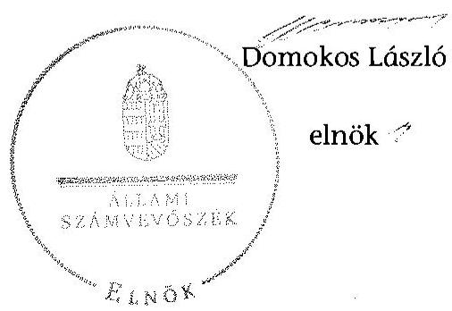
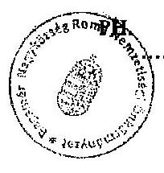
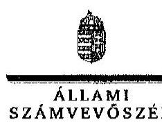
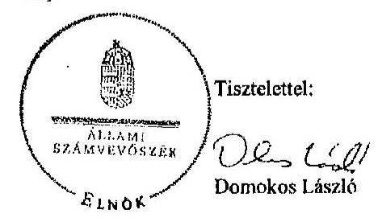
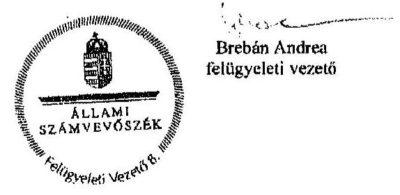

# ÁLLAMI   SZÁMVEVŐSZÉK 

## JELENTÉS

a helyi nemzetiségi önkormányzatok gazdálkodásának ellenőrzéséről
Bagamér Nagyközség Roma Nemzetiségi Önkormányzat

---

# Állami Számvevőszék 

Iktatószám: V-0790-084/2015.
Témaszám: 1824
Vizsgálat-azonosító szám: V067642

## Az ellenőrzést felügyelte:

## Brebán Andrea

felügyeleti vezető
Az ellenőrzést vezette és az ellenőrzés végrehajtásáért felelős:
Gál Magdolna
ellenőrzésvezető
A számvevőszéki jelentés összeállításában közreműködött:
Horváthné Menyhárt Erika
számvevő főtanácsos
Az ellenőrzést végezték:
Draviczky Éva Horváthné Menyhárt Erika
számvevő számvevő főtanácsos

---

# TARTALOMJEGYZÉK 

BEVEZETÉS ..... 3
I. ÖSSZEGZŐ MEGÁLLAPÍTÁSOK, KÖVETKEZTETÉSEK, JAVASLATOK ..... 6
II. RÉSZLETES MEGÁLLAPÍTÁSOK ..... 13

1. A Nemzetiségi Önkormányzat és a Települési Önkormányzat együttműködésének szabályozása, a működési feltételek biztosítása ..... 13
2. A gazdálkodási feladatok ellátásának szabályszerűsége ..... 14
2.1. A költségvetésre és zárszámadásra, valamint a kincstári adatszolgáltatás rendjére vonatkozó jogszabályi előírások betartása ..... 14
2.2. A Nemzetiségi Önkormányzat gazdálkodásának szabályozottsága ..... 16
2.3. Az operatív gazdálkodási jogkörök kialakítása, gyakorlása ..... 17
3. A Nemzetiségi Önkormányzattal összefüggő gazdálkodási feladatok belső ellenőrzése ..... 19

## MELLÉKLETEK

1. számú A Nemzetiségi Önkormányzat 2013. évi gazdálkodási adatai
2. számú Bagamér Nagyközség Roma Nemzetiségi Önkormányzat elnökének észre-
vétele
3. számú Az ÁSZ válasza Bagamér Nagyközség Roma Nemzetiségi Önkormányzat
elnökének a jelentéstervezetre tett észrevételeire

## FÜGGELÉKEK

1. számú Rövidítések jegyzéke
2. számú Értelmező szótár

---

.

---

# JELENTÉS   a helyi nemzetiségi önkormányzatok gazdálkodásának ellenőrzéséről Bagamér Nagyközség Roma Nemzetiségi Önkormányzat 

## BEVEZETÉS

A Nemzetiségi Önkormányzat az 1994. évben alakult, elnöke a 2002. évi helyhatósági választások óta látja el feladatát. A Nemzetiségi Önkormányzat intézményt, gazdasági társaságot és más szervezetet nem alapított, illetve társulásban nem vett részt. A négytagú Képviselő-testület a munkája segítésére bizottságot nem hozott létre. A Nemzetiségi Önkormányzat költségvetési beszámolója szerint a 2013. évben a módosított költségvetési bevételi és kiadási előirányzat 1583 ezer Ft, a teljesített költségvetési bevétel 1665 ezer Ft, a teljesített költségvetési kiadás 1655 ezer Ft volt. A Nemzetiségi Önkormányzat a 2013. évben 777 ezer Ft feladatalapú támogatásban részesült. A 2013. évi gazdálkodási adatokat részletesen az 1. számú mellékletben mutatjuk be.

Az Alaptörvény Szabadság és felelősség rész XXIX. cikk (1) bekezdése szerint a Magyarországon élő nemzetiségek államalkotó tényezők. Minden, valamely nemzetiséghez tartozó magyar állampolgárnak joga van önazonossága szabad vállalásához és megőrzéséhez. A hazánkban élő nemzetiségek helyi (települési és területi) valamint országos önkormányzatokat hozhatnak létre ${ }^{1}$. A helyi nemzetiségi önkormányzatok gazdálkodási feladatait jogszabályi előírás alapján a székhely szerinti helyi önkormányzat polgármesteri hivatala látja el.

A nemzetiségek helyzete, támogatása mind hazai, mind EU-s szinten kiemelt figyelmet kap napjainkban. A helyi nemzetiségi önkormányzatok gazdálkodására és támogatási rendszerére vonatkozó jogszabályok a 2010-2012. években jelentős változásokon mentek át. A helyi nemzetiségi önkormányzatok gazdálkodásának, a részükre juttatott költségvetési támogatások felhasználásának ellenőrzését az ÁSZ 2012-ben sorozatjellegű ellenőrzés keretében indította el. A 2014. évi ellenőrzések az önkormányzati ellenőrzésekre ráépülő (egyablakos) ellenőrzésként valósulnak meg.

Az ellenőrzés célja annak értékelése volt, hogy a Nemzetiségi Önkormányzat gazdálkodási kereteinek kialakítása, gazdálkodása megfelelt-e a jogszabályoknak.

[^0]
[^0]:    ${ }^{1}$ A 2010. évben megtartott nemzetiségi önkormányzati választásokat követően 2304 települési, 58 területi és 13 országos nemzetiségi önkormányzat alakult meg.

---

Ennek keretében értékeltük, hogy:

- a Nemzetiségi Önkormányzat és a Települési Önkormányzat együttműködésének szabályozása, a működési feltételek biztosítása megfelelt-e a jogszabályi előírásoknak;
- a felek együttműködése megfelelt-e a megállapodásban foglaltaknak a gazdálkodási feladatok szabályszerű ellátása során, betartották-e a vonatkozó jogszabályi előírásokat;
- biztosított volt-e a Nemzetiségi Önkormányzat gazdálkodásának belső ellenőrzése.

Az ellenőrzés várható hasznosulása: a nemzetiségi önkormányzatok testületi döntéseinek tapasztalatait összegezve következtetés vonható le a törvényalkotás számára a jogszabályi környezet esetleges módosításának indokoltságára vonatkozóan. Az ellenőrzés az ellenőrzött számára visszajelzést ad a rendezett gazdálkodási keretek kialakításáról, a működésbeli hiányosságokról. Az ellenőrzés megállapításai és javaslatai, a jó gyakorlat bemutatása tanulságul szolgálhatnak más nemzetiségi önkormányzatok, szervezetek számára a rendezett gazdálkodási keretek kialakításához. A társadalom számára jelzi, hogy közpénz nem maradhat ellenőrizetlenül, az ÁSZ értékteremtő rend kialakításához és megőrzéséhez hozzájáruló tevékenysége pozitív hatással lesz a szervezetről kialakított összkép formálásában. Az ÁSZ szervezetén belül lehetőség nyílik arra, hogy a megállapítások szintetizálásával az intézmény a hozzáadott értéket teremtő elemző tevékenységét és tanácsadó szerepét erősítse.

A helyi nemzetiségi önkormányzatok gazdálkodásának ellenőrzéséről szóló jelentés I. fejezetének összegző része az ellenőrzés céljára adott rövid, szintetizáló összefoglalót és következtetéseket tartalmazza a II. fejezet részletes megállapításain alapulóan. A jelentés intézkedést igénylő megállapításait és javaslatait az összegzőben foglaltak mellett - az ellenőrzés során feltárt, a jelentés II. fejezetében rögzített részletes megállapítások alapozzák meg, illetve támasztják alá.

Az ellenőrzés típusa: szabályszerűségi ellenőrzés.
Az ellenőrzött időszak: a Nemzetiségi Önkormányzat és a Települési Önkormányzat együttműködésének, valamint a Nemzetiségi Önkormányzat gazdálkodásának szabályozása megfelelőségét a 2013. évre vonatkozóan (a 2013. december 31-i állapotnak megfelelően), a Nemzetiségi Önkormányzat gazdálkodásának szabályszerűségét, a működési feltételek, valamint a belső ellenőrzés biztosítását a 2013. január 1. - december 31-e közötti időszakot figyelembe véve értékeltük.

Ellenőrzött szervezet: a Nemzetiségi Önkormányzat és a gazdálkodási feladatait ellátó Polgármesteri Hivatal.

Az ellenőrzés szakmai módszertana az ÁSZ hivatalos honlapján (www.asz.hu) közzétett szakmai szabályokon alapult, amely a Legfőbb Ellenőrző Intézmények Nemzetközi Szervezete (INTOSAI) által kiadott nemzetközi standardok (ISSAI) figyelembevételével készült.

---

A gazdálkodás folyamatában kulcsszerepet betöltő két kulcskontroll - teljesítésigazolás, érvényesítés - működésének megfelelőségét a személyi juttatásokkal, a dologi és felhalmozási kiadásokkal, működési és felhalmozási célú pénzeszközátadásokkal, ellátok pénzbeli juttatásaival kapcsolatos kifizetések esetében mintavétellel ellenőriztük. „Megfelelőnek" értékeltük a gazdálkodási jogkörök gyakorlását, amennyiben 95%-os bizonyossággal a teljes sokaságban a hibaarány legfeljebb 10%, „részben megfelelőnek" értékeltük, ha a hibaarány felső határa 10-30% között volt, „nem megfelelőnek" pedig akkor, ha a mintavételi eredmények alapján a sokaságbeli hibaarány felső határa meghaladta a 30%-ot.

Az ellenőrzés végrehajtásának jogszabályi alapját az ÁSZ tv. 5. § (2)-(3) és (6) bekezdéseiben foglaltak képezik.

Az ÁSZ tv. 29. § (1) bekezdése szerint a jelentéstervezetet megküldtük egyeztetésre a jegyzőnek és a Nemzetiségi Önkormányzat elnökének. A jegyző az ÁSZ tv. 29. § (2) bekezdésében foglalt észrevételezési jogával nem élt, a jelentéstervezetre észrevételt nem tett. A Nemzetiségi Önkormányzat elnökétől beérkezett észrevételeket és az arra adott válaszokat, ideértve az el nem fogadott észrevételeket és azok indokolását a jelentés 2-3. számú mellékletei tartalmazzák.

---

# I. ÖSSZEGZŐ MEGÁLLAPÍTÁSOK, KÖVETKEZTETÉSEK, JAVASLATOK 

A Nemzetiségi Önkormányzat és a Települési Önkormányzat együttműködésének szabályozása részben felelt meg a jogszabályi előírásoknak. A Nemzetiségi Önkormányzat az ellenőrzött időszakban rendelkezett a Települési Önkormányzattal kötött együttműködési megállapodással, amelyet a Nek. tv. előírása ellenére 2013. január 31-éig nem vizsgáltak felül. Az együttműködési megállapodás az Áht. és a Nek. tv. előírása ellenére nem tartalmazta a Nemzetiségi Önkormányzat bevételeivel és kiadásaival kapcsolatban az ellenőrzési és a finanszírozási feladatok ellátásának részletes szabályait, az önálló fizetési számla nyitásával, törzskönyvi nyilvántartásba vételével és adószám igénylésével kapcsolatos határidőket és együttműködési kötelezettségeket a felelősök konkrét kijelölésével, a Nemzetiségi Önkormányzat kötelezettségvállalásával kapcsolatosan a Települési Önkormányzatot terhelő ellenjegyzési és érvényesítési feladatok felelősének konkrét kijelölését, továbbá a kötelezettségvállalással összefüggő összeférhetetlenségi és nyilvántartási kötelezettségeket. A nemzetiségi önkormányzati SZMSZ a jogszabályi előírásoknak megfelelően tartalmazta az együttműködési megállapodás szerinti működési feltételeket, amelyeket a települési önkormányzati SZMSZ-ben a Nek. tv.-ben foglaltak ellenére nem rögzítettek.

A Települési Önkormányzat a szabályozási hiányosságok ellenére biztosította a Nemzetiségi Önkormányzat működéséhez szükséges személyi és tárgyi feltételeket.

A Nemzetiségi Önkormányzat 2013. évi költségvetésének, zárszámadásának tartalma, jóváhagyása, valamint a kincstári adatszolgáltatás szabályszerűsége nem felelt meg a jogszabályi előírásoknak. A Nemzetiségi Önkormányzat elnöke az Áht.-ban foglaltak ellenére nem nyújtotta be határidőben a Képviselő-testület részére az ellenőrzött évre vonatkozó költségvetési koncepciót és a költségvetési határozattervezetet. A 2013. évi költségvetési koncepciót az Áht.ban foglaltak ellenére a jegyző helyett a Nemzetiségi Önkormányzat elnöke készítette el, a költségvetési határozattervezetet a jegyző helyett a Nemzetiségi Önkormányzat elnöke készítette elő.

A 2013. évi költségvetés előterjesztésekor a Képviselő-testület részére az Áht.-ban foglalt előírások ellenére tájékoztatásul nem mutatták be szöveges indokolással együtt a Nemzetiségi Önkormányzat előirányzat felhasználási tervét, költségvetési mérlegét közgazdasági tagolásban, valamint a közvetett támogatásokat. A jóváhagyott költségvetési határozat az Áht.-ban foglalt előírások ellenére nem tartalmazta a bevételeket és kiadásokat kötelező és önként vállalt feladatok szerinti bontásban.

A Nemzetiségi Önkormányzat 2013. évi zárszámadási határozattervezetét a Nemzetiségi Önkormányzat elnöke az Áht.-ban előírt határidőig nem terjesztette a Képviselő-testület elé. A zárszámadási határozat tervezetének előterjesztésekor a Képviselő-testület részére az Áht. előírása ellenére tájékoztatásul nem

---

mutatták be szöveges indokolással együtt a Nemzetiségi Önkormányzat költségvetési mérlegét közgazdasági tagolásban, a pénzeszközök változását és a közvetett támogatásokat tartalmazó kimutatást. A zárszámadásról szóló határozat összehasonlíthatósága az elfogadott költségvetéssel az Áht. előírása ellenére nem volt biztosított.

A bevételi és kiadási előirányzatokat a Települési Önkormányzat által nyújtott támogatás év közbeni növekménye összegével nem módosították, arról határozatot nem hoztak. A teljesített kiadások összege az Áht.-ban foglalt előírások ellenére a jóváhagyott előirányzatot meghaladó volt, ezáltal nem tartották be az Áht. szerinti kötelezettségvállalásra vonatkozó előírásokat.

A jegyző a Nemzetiségi Önkormányzatra vonatkozó kincstári adatszolgáltatási kötelezettségének - az időközi költségvetési jelentés, valamint az időközi mérlegjelentés benyújtásakor - négy esetben az Ávr.-ben előírt határidőn túl tett eleget.

A Nemzetiségi Önkormányzat gazdálkodásának szabályozottsága részben felelt meg a jogszabályi előírásoknak. A gazdálkodási feladatokat ellátó Polgármesteri Hivatal rendelkezett a Számv. tv. által előírt szabályzatokkal és a Bkr. alapján elkészített ellenőrzési nyomvonallal, amelyek hatálya kiterjedt a Nemzetiségi Önkormányzat gazdálkodási feladataira is.

A Bkr.-ben foglaltak ellenére a Polgármesteri Hivatal szabálytalanságkezelés eljárásrendje nem terjedt ki a Nemzetiségi Önkormányzat gazdálkodásával kapcsolatos végrehajtási feladatokra. A Nemzetiségi Önkormányzat e szabályzattal önálló módon sem rendelkezett. A jegyző a Bkr.-ben előírtak ellenére - a Nemzetiségi Önkormányzatra vonatkozóan - nem biztosította a folyamatba épített, előzetes, utólagos és vezetői ellenőrzést.

A jegyző az Ávr.-ben előírtak ellenére a Nemzetiségi Önkormányzat gazdálkodásával kapcsolatos, a Polgármesteri Hivatal SZMSZ-ében nevesített munkakörökhöz tartozó feladat- és hatásköröket, a hatáskörök gyakorlásának módját, a helyettesítés rendjét, az ezekhez kapcsolódó felelősségi szabályokat nem a Polgármesteri Hivatal SZMSZ-ében, hanem a Polgármesteri Hivatal ügyrendjében rögzítette. A jegyző az Ávr.-ben előírtak ellenére belső szabályzatban nem rendezte Nemzetiségi Önkormányzat gazdálkodásával összefüggésben az ellenőrzési feladatok teljesítésével kapcsolatos belső előírásokat, valamint a teljesítésigazolásra és az érvényesítésre vonatkozó dokumentációs részletszabályokat.

A Nemzetiségi Önkormányzat gazdálkodása tekintetében az operatív gazdálkodási jogkörök kialakítása a 2013. évben részben felelt meg a jogszabályi előírásoknak. A Nemzetiségi Önkormányzat elnöke, mint kötelezettségvállaló az adott kötelezettségvállalásokhoz az Ávr. alapján nem jelölt ki teljesítés igazolására jogosult személyeket, az ellenőrzött mintatételek közül öt esetben nem biztosította az Ávr.-ben előírt összeférhetetlenségi követelmények betartását.

A Nemzetiségi Önkormányzatnál a 2013. évben a dologi kiadások és a működési célú pénzeszközátadások kifizetésének teljesítése során az operatív gazdálkodási jogkörökön belül kulcsszerepet betöltő teljesítésigazolás és érvényesítés

---

kontrollok működése nem felelt meg a jogszabályi előírásoknak, mivel azok nem biztosították a hibák megelőzését, feltárását és kijavítását.

A gazdálkodásban kulcsszerepet betöltő kontrollok működésében feltárt hiányosságok miatt fennáll a hibák, szabálytalanságok bekövetkezésének
 kockázata. A kulcskontrollok nem megfelelő működése korrupciós kockázatot hordoz.

A jegyző a Bkr.-ben foglalt előírások ellenére az ellenőrzött időszakban nem gondoskodott a Polgármesteri Hivatalnál a Nemzetiségi Önkormányzat gazdálkodásával összefüggő végrehajtási feladatok belső ellenőrzésének kialakításáról és működtetéséről. A Nemzetiségi Önkormányzat gazdálkodásával összefüggő végrehajtási feladatokra vonatkozóan a 2013. évre belső ellenőrzést nem terveztek és nem végeztek.

Az ÁSZ tv. 33. § (1) bekezdésében foglaltak értelmében az ellenőrzött szervezet vezetője köteles a jelentésben foglalt megállapításokhoz kapcsolódó intézkedési tervet összeállítani és azt a jelentés kézhezvételétől számított 30 napon belül az ÁSZ részére megküldeni. Amennyiben az intézkedési tervet határidőre nem küldi meg a szervezet, vagy az ÁSZ tv. 33. § (2) bekezdésében foglalt póthatáridő elteltével megküldött intézkedési terv továbbra sem elfogadható, az ÁSZ elnöke a hivatkozott törvény 33. § (3) bekezdés a)-b) pontjaiban foglaltakat érvényesítheti.

A helyszíni ellenőrzés megállapításainak hasznosítása mellett javasoljuk:

# a jegyzőnek 

1. Az együttműködés szabályozásával kapcsolatban

A Nemzetiségi Önkormányzat és a Települési Önkormányzat együttműködését meghatározó együttműködési megállapodás tartalma nem felelt meg a Nek. tv. 80. § (3) bekezdés a)-c) pontjaiban foglaltaknak. A Nek. tv. 80. § (2) bekezdésében foglaltak ellenére 2013. január 31-éig nem végezték el az együttműködési megállapodás felülvizsgálatát.

A 2013. december 31-én hatályos együttműködési megállapodás szerinti működési feltételeket a Nek. tv. 80. § (2) bekezdésében előírtak ellenére a Települési Önkormányzat SZMSZ-ében nem rögzítették.

Javaslat
Az együttműködés szabályszerűsége érdekében:
a) készítse elő az együttműködési megállapodás módosítását, hogy az feleljen meg a Nek. tv-ben foglalt előírásoknak és terjessze a módosítást a Települési Önkormányzat Képviselő-testülete elé;
b) gondoskodjon az együttműködési megállapodás évenkénti felülvizsgálata során a Nek. tv-ben előírt határidő betartásáról;

---

c) készítse elő a Települési Önkormányzat SZMSZ-ének kiegészítését a Nek. tv-ben foglalt előírás alapján és terjessze a kiegészítést a Települési Önkormányzat Képviselő-testülete elé.
2. A költségvetés és zárszámadás szabályszerűségével kapcsolatban

A 2013. évi költségvetési határozat az Áht. 23. § (2) bekezdés a) pontja előírásától eltérően nem tartalmazta a költségvetési bevételek és a költségvetési kiadások kötelező és önként vállalt feladatok szerinti bontását.

A 2013. évi költségvetési határozat-tervezet előterjesztésekor a Képviselő-testület részére az Áht. 24. § (4) bekezdés a) és c) pontjaiban foglalt előírásoktól eltérően tájékoztatásul nem mutatták be szöveges indokolással együtt a Nemzetiségi Önkormányzat költségvetési mérlegét közgazdasági tagolásban, előirányzat felhasználási tervét, valamint a közvetett támogatásokat tartalmazó kimutatást. A 2013. évi zárszámadási határozat-tervezet előterjesztésekor - a jegyző mulasztása miatt - a Képviselő-testület részére tájékoztatásul nem mutatták be szöveges indokolással együtt az Áht. 91. § (2) bekezdés a) pontja alapján az Áht. 24. § (4) bekezdés a)-c) pontjaiban előírt mérleget és kimutatásokat.

A teljesített kiadások összege az Áht. 6. § (1) bekezdésében foglalt előírások ellenére a jóváhagyott előirányzatot meghaladó volt, ezáltal nem tartották be az Áht. 36. § (1) bekezdésében foglalt kötelezettségvállalásra vonatkozó előírásokat.

Javaslat
a) Intézkedjen a jövőben arról, hogy a költségvetési határozat az Áht.-ban előírtaknak tartalmilag maradéktalanul feleljen meg;
b) Intézkedjen a jövőben arról, hogy a költségvetési és zárszámadási határozattervezet előterjesztésekor a Képviselő-testületnek tájékoztatásul maradéktalanul bemutatásra kerüljenek szöveges indokolással együtt az Áht.-ban előírt mérlegek és kimutatások;
c) Intézkedjen a megállapított előirányzaton belüli gazdálkodásra, illetve indokolt esetben készítse el a jövőben az előirányzatok szükséges mértékű módosítására vonatkozó határozat tervezetet az Áht. előírásának betartása érdekében.
3. A kincstári adatszolgáltatási kötelezettséggel kapcsolatban

A jegyző a Nemzetiségi Önkormányzatra vonatkozó kincstári adatszolgáltatási kötelezettségének határidőn túl tett eleget, mert a 2013. év első három hónapjáról, és az első hat hónapjáról készített időközi költségvetési jelentést nem az Ávr. 169. § (2) bekezdése szerinti határidőre, továbbá a negyedéves és a háromnegyed éves időközi mérlegjelentéseket nem az Ávr. 170. § (5) bekezdése szerinti határidőre küldte meg a Kincstár területileg illetékes szervéhez.

Javaslat
Tegyen eleget a kincstári adatszolgáltatási kötelezettségének - az ellenőrzött időszak óta bekövetkezett esetleges jogszabályi változásokra figyelemmel - az Ávr.-ben foglalt határidők betartásával.

---

4. A gazdálkodási feladatok szabályozottságával kapcsolatban

A Polgármesteri Hivatal SZMSZ-e nem tartalmazta az Ávr. 13. § (1) bekezdés g) pontja előírásától eltérően az SZMSZ-ben nevesített munkakörökhöz tartozó - a Nemzetiségi Önkormányzat gazdálkodásával kapcsolatos - feladat és hatásköröket és a helyettesítés rendjét, a hatáskörök gyakorlásának módját, valamint az ezekhez kapcsolódó felelősségi szabályokat.

A jegyző az Ávr. 13. § (2) bekezdés a) pontjában foglaltak ellenére belső szabályzatban nem rendezte Nemzetiségi Önkormányzat gazdálkodásával összefüggésben az ellenőrzési feladatok teljesítésével kapcsolatos belső előírásokat, valamint a teljesítésigazolásra és az érvényesítésre vonatkozó dokumentációs részletszabályokat.

A jegyző - a Bkr. 6. § (4) bekezdése ellenére - sem a Polgármesteri Hivatal szabálytalanságkezelési eljárásrendjében, sem önálló szabályzatban nem szabályozta a Nemzetiségi Önkormányzat gazdálkodásával kapcsolatos végrehajtási feladatokra vonatkozóan a szabálytalanságok kezelésének eljárásrendjét. A jegyző - a Bkr. 8. § (2) bekezdésének előírása ellenére - a Nemzetiségi Önkormányzatra vonatkozóan nem biztosította a folyamatba épített, előzetes, utólagos és vezetői ellenőrzést.

Javaslat
A Nemzetiségi Önkormányzat gazdálkodásának végrehajtásával kapcsolatos feladataira:
a) készítse el a Polgármesteri Hivatal SZMSZ-ének módosítását, hogy az teljes körűen feleljen meg az Ávr.-ben foglalt előírásnak és kezdeményezze annak Települési Önkormányzat Képviselő-testülete elé terjesztését;
b) rendezze belső szabályzatban az ellenőrzési feladatok teljesítésével kapcsolatos belső előírásokat, valamint a teljesítésigazolásra és az érvényesítésre vonatkozó dokumentációs részletszabályokat az Ávr. előírásának megfelelően;
c) kiterjedően készítse el a Bkr.-ben meghatározott szabálytalanságok kezelésének eljárásrendjét;
d) biztosítsa a Bkr.-ben foglaltaknak megfelelően a folyamatba épített, előzetes, utólagos és vezetői ellenőrzést.
5. A kulcskontrollok működésével kapcsolatban

A teljesítésigazolást az Ávr. 57. § (1) bekezdésben foglaltak ellenére nem végezték el, illetve nem szabályszerűen végezték. Ellenőrizhető okmány, valamint Ávr. 13. § (2) bekezdés g) pontjában előírt belső szabályozás hiányában a teljesítésigazoló nem ellenőrizte a kiadások teljesítésének jogosságát, összegszerűségét, továbbá a teljesítésigazoló a teljesítésigazolást a maga javára látta el.

Az érvényesítést az Ávr. 58. § (1) bekezdésében foglaltak ellenére nem végezték el, illetve nem szabályszerűen végezték. Az érvényesítő ellenőrizhető okmány, és Ávr. 13. § (2) bekezdés g) pontjában előírt belső szabályozás hiányában az összegszerűséget, a kiadások teljesítésének jogosságát nem ellenőrizte. Továbbá nem ellenőrizte, hogy a megelőző ügymenetben betartották-e az államháztartási számviteli kormány-

---

rendelet előírásait. Az érvényesítő nem jelezte Ávr. 58. § (2) bekezdésében foglaltak ellenére az utalványozónak, hogy a megelőző ügymenetben a teljesítésigazolást nem, vagy nem szabályszerűen végezték el, teljesítésigazolás során az Ávr. 60. § (2) bekezdésében szabályozott összeférhetetlenségi követelményeket megsértették, egy esetben kötelezettségvállalásra pénzügyi ellenjegyzés nélkül került sor.

Javaslat
Az operatív gazdálkodás működési hibáinak megelőzése, feltárása és kijavítása érdekében intézkedjen a teljesítésigazolás és az érvényesítés Ávr.-ben foglalt előírásoknak megfelelő elvégzéséről.

# a Nemzetiségi Önkormányzat elnökének 

1. A Nemzetiségi Önkormányzat és a Települési Önkormányzat együttműködését meghatározó együttműködési megállapodás tartalma nem felelt meg a Nek. tv. 80. § (3) bekezdés a)-c) pontjaiban foglaltaknak.

Javaslat
Terjessze a Képviselő-testület elé jóváhagyásra a jegyző által előkészített Nek. tv-ben foglaltaknak megfelelő együttműködési megállapodás módosítását.
2. A Nemzetiségi Önkormányzat elnöke a 2013. évi költségvetési határozat-tervezetet nem nyújtotta be a Képviselő-testület részére az Áht. 24. § (2) bekezdésében meghatározott határidőig. A jegyző által előkészített zárszámadási határozat-tervezetet a Nemzetiségi Önkormányzat elnöke az Áht. 91. § (1) bekezdésében előírt határidőig nem terjesztette be a Képviselő-testület elé.

A Nemzetiségi Önkormányzat elnöke a Képviselő-testület részére tájékoztatásul nem mutatta be a költségvetési határozat-tervezet előterjesztésekor az Áht. 24. § (4) bekezdés a) és c) pontjaiban előírtak ellenére szöveges indokolással együtt a Nemzetiségi Önkormányzat költségvetési mérlegét közgazdasági tagolásban, előirányzat felhasználási tervét, valamint a közvetett támogatásokat tartalmazó kimutatást. A 2013. évi zárszámadási határozat-tervezet előterjesztésekor - a jegyző mulasztása miatt - a Képviselő-testület részére tájékoztatásul nem mutatta be szöveges indokolással együtt az Áht. 91. § (2) bekezdés a) pontja alapján az Áht. 24. § (4) bekezdés a)-c) pontjai szerinti mérleget és kimutatásokat.

A teljesített kiadások összege az Áht. 6. § (1) bekezdésében foglalt előírások ellenére a jóváhagyott előirányzatot meghaladó volt, ezáltal nem tartották be az Áht. 36. § (1) bekezdésében foglalt kötelezettségvállalásra vonatkozó előírásokat.

Javaslat
A Képviselő-testület részére:
a) történő előterjesztésekor gondoskodjon a költségvetési és a zárszámadási határozat-tervezet esetében az Áht.-ban meghatározott határidők betartásáról;

---

b) tájékoztatásul mutassa be a költségvetési és a zárszámadási határozat-tervezet előterjesztésekor szöveges indokolással együtt az Áht.-ban előírt valamennyi mérleget, kimutatást;
c) terjessze be a jegyző által elkészített, az előirányzatok szükséges módosítására vonatkozó határozat-tervezetet.
3. A Nemzetiségi Önkormányzat elnöke, mint kötelezettségvállaló az ellenőrzött mintatételek közül öt esetben nem biztosította az Ávr. 60. § (2) bekezdésében előírt összeférhetetlenségi követelmények betartását, mivel a teljesítésigazolást a maga javára látta el.

Javaslat
Az Ávr.-ben foglalt összeférhetetlenség fennállása esetén az Ávr előírásainak betartásával intézkedjen teljesítésigazoló személy kijelöléséről.

---

# II. RÉSZLETES MEGÁLLAPÍTÁSOK 

## 1. A Nemzetiségi Önkormányzat És a Települési Önkormányzat Együttműködésének Szabályozása, a Működési Feltételek Biztosítása

A Nemzetiségi Önkormányzat és a Települési Önkormányzat együttműködésének szabályozása részben felelt meg a jogszabályi előírásoknak.

A Nemzetiségi Önkormányzat rendelkezett az ellenőrzött időszakban, a Települési Önkormányzattal történő együttműködésre vonatkozó együttműködési megállapodással. Az együttműködési megállapodást a Képviselő-testület és a Települési Önkormányzat Képviselő-testülete határozattal hagyta jóvá és az arra jogosult személyek írták alá.

Az együttműködési megállapodást a Települési Önkormányzat az 51/2012. (V. 30.) számú, a Nemzetiségi Önkormányzat a 31/2012. (V. 25.) számú határozatával hagyta jóvá.

Az együttműködési megállapodást a Nek. tv. 80. § (2) bekezdésében ${ }^{2}$ foglaltak ellenére 2013. január 31-éig nem vizsgálták felül. A Települési Önkormányzat a 20/2013. (II. 21.) számú határozatában, a Nemzetiségi Önkormányzat a 6/2013. (II. 15.) számú határozatában rögzítette, hogy az együttműködési megállapodást nem kívánják módosítani.

A nemzetiségi önkormányzati SZMSZ a jogszabályi előírásoknak megfelelően tartalmazta az együttműködési megállapodás szerinti működési feltételeket, amelyeket a települési önkormányzati SZMSZ-ben a Nek. tv. 80. § (2) bekezdésében foglaltak ellenére nem rögzítettek ${ }^{3}$.

A 2013. december 31-én hatályos együttműködési megállapodás nem tartalmazta az Áht. 27. §. (2) bekezdésében ${ }^{4}$, valamint a Nek. tv. 80. § (3) bekezdésében foglaltak közül az alábbiakat:

- az Áht. 27. § (2) bekezdésében foglalt előírások ellenére a Nemzetiségi Önkormányzat bevételeivel és kiadásaival kapcsolatban az ellenőrzési és a finanszírozási feladatok ellátásának részletes szabályait;
- a Nek. tv. 80. § (3) bekezdés a) pontja előírása ellenére a Nemzetiségi Önkormányzat önálló fizetési számla nyitásával, törzskönyvi nyilvántartásba vételével és adószám igénylésével kapcsolatos határidőket és együttműködési kötelezettségeket a felelősök konkrét kijelölésével;

[^0]
[^0]:    ${ }^{2}$ Módosította: 2014. évi XCIX.tv. 362. § 2. pontja, hatályos 2015. január 1-jétől.
    ${ }^{3}$ A települési önkormányzati SZMSZ 22. § (2) bekezdés e) pontjában foglaltak alapján előterjesztés benyújtására jogosult a jegyző.
    ${ }^{4}$ 2015. január 1-jétől hatálytalan

---

- a Nek. tv. 80. § (3) bekezdés b) pontja előírása ellenére a Nemzetiségi Önkormányzat kötelezettségvállalásaival kapcsolatosan a Települési Önkormányzatot terhelő ellenjegyzési és érvényesítési feladatok felelőseinek konkrét kijelölését;
- a Nek.
 tv. 80. § (3) bekezdés c) pontja előírása ellenére a Nemzetiségi Önkormányzat kötelezettségvállalásaival összefüggő összeférhetetlenségi és nyilvántartási kötelezettségeket.

A Települési Önkormányzat - a szabályozási hiányosságok ellenére - a Nemzetiségi Önkormányzat működéséhez a 2013. évben a személyi és tárgyi feltételeket biztosította.

# 2. A GAZDÁLKODÁSI FELADATOK ELLÁTÁSÁNAK SZABÁLYSZERŰSÉGE 

### 2.1. A költségvetésre és zárszámadásra, valamint a kincstári adatszolgáltatás rendjére vonatkozó jogszabályi előírások betartása

A Nemzetiségi Önkormányzat 2013. évi költségvetésének és zárszámadásának tartalma, jóváhagyása, valamint a kapcsolódó adatszolgáltatás nem felelt meg a jogszabályi előírásoknak.

A Nemzetiségi Önkormányzat elnöke - az Áht. 24. § (1) bekezdésében ${ }^{5}$ előírtaktól eltérően - október 31. helyett december 7-én nyújtotta be a Képviselőtestület részére a 2013. évre vonatkozó költségvetési koncepciót ${ }^{6}$. A 2013. évi költségvetési koncepciót az Áht. 24. § (1) bekezdésében foglaltak ellenére a jegyző helyett a Nemzetiségi Önkormányzat elnöke készítette el.

A Nemzetiségi Önkormányzat elnöke - az Áht. 24. § (2) bekezdésében ${ }^{7}$ előírtaktól eltérően - a központi költségvetésről szóló törvény hatálybalépését követő 45 napig nem nyújtotta be a Képviselő-testület részére a 2013. évi költségvetési határozat-tervezetet. A 2013. évi költségvetési javaslatot a Nemzetiségi Önkormányzat elnöke 2013. március 14-én nyújtotta be ${ }^{8}$. A 2013. évi költségvetési határozat-tervezetet az Áht. 24. § (2) bekezdésében előírtaktól eltérően a jegyző helyett a Nemzetiségi Önkormányzat elnöke készítette elő.

A 2013. évi költségvetési határozat-tervezet előterjesztésekor a Képviselő-testület részére - az Áht. 24. § (4) bekezdése a) és c) pontjaiban előírtaktól eltérően - tájékoztatásul nem mutatták be szöveges indokolással együtt a Nemzetiségi Önkormányzat előirányzat felhasználási tervét, költségvetési mérlegét

[^0]
[^0]:    ${ }^{5}$ 2014. szeptember 30-tól hatálytalan
    ${ }^{6}$ A 2013. évi költségvetési koncepciót a Képviselő-testület 2012. december 13-án a 2/2013. XII. 13./ számú határozattal fogadta el.
    ${ }^{7}$ 2013. december 21-étől az Áht. 24. § (3) bekezdése írja elő.
    ${ }^{8}$ A Képviselő-testület a 2013. évi költségvetést a 11/2013. III. 14./ számú határozatával fogadta el.

---

közgazdasági tagolásban, valamint a közvetett támogatásokat tartalmazó kimutatást. A Nemzetiségi Önkormányzat a 2013. évben több éves kihatású döntést nem hozott.

A 2013. évi költségvetési határozat az Áht. 23. § (2) bekezdés a) pontja ${ }^{9}$ előírásától eltérően nem tartalmazta a költségvetési bevételek és a költségvetési kiadások kötelező és önként vállalt feladatok szerinti bontását.

A jegyző által előkészített zárszámadási határozat-tervezetet a Nemzetiségi Önkormányzat elnöke az Áht. 91. § (1) bekezdésében ${ }^{10}$ előírtaktól eltérően április 30. helyett május 9-én terjesztette a Képviselő-testület elé ${ }^{11}$. A zárszámadási határozat-tervezet előterjesztésekor a Képviselő-testület részére - a jegyző mulasztása miatt, az Áht. 24. § (4) a) és c) pontjaiban és az Áht. 91. § (2) bekezdés a) pontjában foglaltaktól eltérően - nem mutatták be tájékoztatásul szöveges indokolás együtt, a mérlegek és kimutatások közül a költségvetési mérleget közgazdasági tagolásban, a pénzeszközök változását, valamint a közvetett támogatásokat tartalmazó kimutatást.

A zárszámadási határozatnak az elfogadott költségvetéssel való összehasonlíthatósága az Áht. 89. § (1) bekezdés ${ }^{12}$ előírása ellenére nem volt biztosított, mivel az elfogadott költségvetés a tervezett bevételek és kiadások összegét részletezve tartalmazta, a zárszámadásban azonban csak a bevételi és kiadási főösszeg szerepelt.

A bevételi és kiadási előirányzatokat a Települési Önkormányzat által nyújtott támogatás év közbeni növekménye összegével nem módosították, arról határozatot nem hoztak. A teljesített kiadások összege az Áht. 6. § (1) bekezdésében ${ }^{13}$ foglalt előírások ellenére a jóváhagyott előirányzatot meghaladó volt, ezáltal nem tartották be az Áht. 36. § (1) bekezdésében foglalt kötelezettségvállalásra vonatkozó előírásokat.

A jegyző a Nemzetiségi Önkormányzatra vonatkozó kincstári adatszolgáltatási kötelezettségének négy esetben határidőn túl tett eleget, mert a 2013. év első három hónapjáról, és az első hat hónapjáról készített időközi költségvetési jelentést nem az Ávr. 169. § (2) bekezdése ${ }^{14}$ szerinti határidőre ${ }^{15}$, továbbá a negyedéves és a háromnegyed éves időközi mérlegjelentéseket nem

[^0]
[^0]:    ${ }^{9}$ Módosította: 2014. évi XCIX. törvény 20. §-a, hatályos 2015. január 1-jétől.
    ${ }^{10}$ Módosította: 2014. évi XCIX. törvény 42. §-a, hatályos 2015. január 1-jétől.
    ${ }^{11}$ A 2013. évi zárszámadást a Képviselő-testület május 9-én tárgyalta és fogadta el 18/2014. V. 09./ számú határozatával.
    ${ }^{12}$ 2015. január 1-jétől hatálytalan.
    ${ }^{13}$ 2015. január 1-jétől az Áht. 5. § (4) bekezdése szabályozza.
    ${ }^{14}$ 2015. január 1-jétől az Ávr. 169. § (3) bekezdése szabályozza.
    ${ }^{15}$ A Nemzetiségi Önkormányzat időközi költségvetési jelentését a költségvetési év első három hónapjáról április 20-a helyett május 14-én, az év első hat hónapjáról július 20-a helyett augusztus 1-én küldték meg.

---

az Ávr. 170. § (5) bekezdése ${ }^{16}$ szerinti határidőre ${ }^{17}$ küldte meg a Kincstár területileg illetékes szervéhez.

# 2.2. A Nemzetiségi Önkormányzat gazdálkodásának szabályozottsága 

A Nemzetiségi Önkormányzat gazdálkodásának szabályozottsága az ellenőrzött időszakban részben felelt meg a jogszabályi előírásoknak.

A Nemzetiségi Önkormányzat gazdálkodási feladatait ellátó Polgármesteri Hivatal rendelkezett a 2013. évben a Számv. tv. 14. § (3) és (5) bekezdéseiben és a 161. § (1) bekezdésében előírt szabályzatokkal, amelyek kiterjedtek a Nemzetiségi Önkormányzat gazdálkodási feladataira is.

A jegyző az Ávr. 13. § (1) bekezdés g) pontjában előírtak ellenére a Nemzetiségi Önkormányzat gazdálkodásával kapcsolatos, a Polgármesteri Hivatal SZMSZ-ében nevesített munkakörökhöz tartozó feladat- és hatásköröket, a hatáskörök gyakorlásának módját, a helyettesítés rendjét, az ezekhez kapcsolódó felelősségi szabályokat nem a Polgármesteri Hivatal SZMSZ-ében, hanem a Polgármesteri Hivatal ügyrendjében rögzítette.

A Polgármesteri Hivatal ügyrendje - az együttműködési megállapodással összhangban - rögzítette a Nemzetiségi Önkormányzat gazdálkodására vonatkozóan az Ávr. 13. § (2) bekezdés a) pontban foglaltak szerint - a tervezéssel, gazdálkodással, különösen az operatív gazdálkodási jogkörök gyakorlásának módjával, eljárási és dokumentációs részletszabályaival, valamint az ezeket végző személyek kijelölési rendjével és az adatszolgáltatási feladatok teljesítésével kapcsolatos belső előírásokat - az ellenőrzési feladatok teljesítésével kapcsolatos belső előírások, továbbá a teljesítésigazolásra és az érvényesítésre vonatkozó dokumentációs részletszabályok kivételével.

A Polgármesteri Hivatal rendelkezett a Nemzetiségi Önkormányzat gazdálkodási feladataira is vonatkozó, a Bkr. 6. § (3) bekezdésében előírtak alapján elkészített ellenőrzési nyomvonallal.

A jegyző - a Bkr. 6. § (4) bekezdése ellenére - sem a Polgármesteri Hivatal szabálytalanságkezelési eljárásrendjében, sem önálló szabályzatban nem szabályozta a Nemzetiségi Önkormányzat gazdálkodásával kapcsolatos végrehajtási feladatokra vonatkozóan a szabálytalanságok kezelésének eljárásrendjét.

A jegyző - a Bkr. 8. § (2) bekezdésének előírása ellenére - a Nemzetiségi Önkormányzatra vonatkozóan nem biztosította a folyamatba épített, előzetes, utólagos és vezetői ellenőrzést, mivel a Polgármesteri Hivatal FEUVE szabályzata nem tartalmazta a Polgármesteri Hivatalnál ellátott, a Nemzetiségi Önkormányzat gazdálkodásával összefüggő végrehajtási feladatok ellenőrzését.

[^0]
[^0]:    ${ }^{16}$ 2015. január 1-jétől az Ávr. 170. § (2) bekezdése szabályozza
    ${ }^{17}$ A Nemzetiségi Önkormányzat időközi mérlegjelentését az első negyedévet követő hónap 25. napja helyett május 14-én, a harmadik negyedévet követő hónap 25. napja helyett 29-én küldték meg.

---

# 2.3. Az operatív gazdálkodási jogkörök kialakítása, gyakorlása 

A Nemzetiségi Önkormányzat gazdálkodása tekintetében az operatív gazdálkodási jogkörök kialakítása részben felelt meg a jogszabályi előírásoknak.

A Polgármesteri Hivatal ügyrendje tartalmazta az Ávr. 13. § (5) bekezdésében foglaltakkal összhangban a nemzetiségi önkormányzat gazdálkodási feladatai ellátása tekintetében a gazdasági szervezet vezetőinek és alkalmazottainak feladat- és hatáskörét, a helyettesítés rendjét.

A Polgármesteri Hivatal az ellenőrzött időszakban rendelkezett gazdasági szervezettel. A gazdasági vezető végzettsége megfelelt az Ávr. 12. § (1) bekezdésében ${ }^{18}$ előírt szakképesítési követelményeknek, valamint Ávr. 12. § (2) bekezdésének ${ }^{19}$ megfelelően szerepelt a Számv. tv. 151. § (3) bekezdése szerinti nyilvántartásban, és rendelkezett a tevékenység ellátására jogosító engedéllyel. A gazdasági vezető látta el a pénzügyi ellenjegyzési és az érvényesítési feladatokat is.

A Nemzetiségi Önkormányzat elnöke, mint kötelezettségvállaló az adott kötelezettségvállalásokhoz az Ávr. 57. § (4) bekezdése alapján nem jelölt ki teljesítés igazolására jogosult személyeket, az ellenőrzött mintatételek közül öt esetben nem biztosította az Ávr. 60. § (2) bekezdésében ${ }^{20}$ előírt összeférhetetlenségi követelmények betartását, mivel a teljesítésigazolást a maga javára látta el.

A Nemzetiségi Önkormányzatnál a 2013. évben a dologi kiadások és a működési célú pénzeszközátadással kapcsolatos kifizetések teljesítése során az operatív gazdálkodási jogkörökön belül kulcsszerepet betöltő teljesítésigazolás és érvényesítés kontrollok működése nem felelt meg a jogszabályi előírásoknak, mivel azok nem biztosították a hibák megelőzését, feltárását és kijavítását.

A dologi kiadásokkal kapcsolatos kifizetések során a 2013. évben a teljesítésigazolás és az érvényesítés kulcskontrollok működésével kapcsolatban az alábbi hiányosságok, szabálytalanságok fordultak elő:

- a kifizetéseket megelőzően a teljesítésigazolást az Ávr. 57. § (1) bekezdésben foglaltak ellenére 4 esetben nem végezték el;
- a teljesítésigazolás - az Ávr. 57. § (1) bekezdése ellenére - nem volt szabályszerű, mivel ellenőrizhető okmány, valamint az Ávr. 13. § (2) bekezdés g) pontjában előírt, a rádiótelefonok használatára vonatkozó belső szabályozás hiányában 18 esetben nem ellenőrizte a kiadások teljesítésének jogosságát, összegszerűségét;

[^0]
[^0]:    ${ }^{18}$ Módosította: 149/2014. (V.6.) Korm. rendelet 2. §-a, hatályos 2014. május 7-étől.
    ${ }^{19}$ Módosította: 159/2014. (VI.30.) Korm. rendelet 2. §-a, hatályos 2014. július 1-jétől.
    ${ }^{20}$ Módosította: 397/2014. (XII. 31.) Korm. rendelet 45. § (1) bekezdés 8. pontja, hatályos 2015. január 1-jétől

---

- a teljesítésigazolás nem volt szabályszerű, mivel - az Ávr. 60. § (2) bekezdésében előírt összeférhetetlenségi követelmény ellenére - 5 alkalommal a teljesítésigazoló a teljesítésigazolást a maga javára látta el;
- a kifizetéseket megelőzően az érvényesítést 4 esetben - az Ávr. 58. § (1) bekezdésében foglaltak ellenére - nem végezték el;
- az érvényesítés nem szabályszerűen történt, mivel az - Ávr. 58. § (1) bekezdésében előírtak ellenére - ellenőrizhető okmány, valamint az Ávr. 13. § (2) bekezdésében előírt, a rádiótelefonok használatára vonatkozó belső szabályozás hiányában az összegszerűséget nem ellenőrizte;
- az érvényesítő - az Ávr. 58. § (2) bekezdésében előírtak ellenére - nem jelezte az utalványozónak, hogy a teljesítésigazolást nem, vagy nem szabályszerűen végezték el. Nem jelezte továbbá, hogy a teljesítésigazolás során az Ávr. 60. § (2) bekezdésében szabályozott összeférhetetlenségi követelményeket megsértették, az Áht. 37. § (1) bekezdésében és az Ávr. 55 § (1) bekezdésében foglaltak ellenére egy esetben kötelezettségvállalásra pénzügyi ellenjegyzés nélkül került sor, illetve azt, hogy - az Ávr. 60. § (3) bekezdése előírását figyelmen kívül hagyva - a teljesítésigazolásra jogosult személy aláírásmintájáról nem vezettek naprakész nyilvántartást.

A működési célú pénzeszközátadással kapcsolatos kifizetések során a 2013.
 évben a teljesítésigazolás és az érvényesítés kulcskontrollok működésével kapcsolatosan az alábbi hiányosságok, szabálytalanságok fordultak elő:

- a kifizetéseket megelőzően a teljesítésigazolást az Ávr. 57. § (1) bekezdésben foglaltak ellenére egy mintatétel kivételével nem végezték el;
- a teljesítésigazolás egy tétel esetében nem volt szabályszerű, mivel - az Ávr. 57. § (1) bekezdésben foglaltak ellenére - ellenőrizhető okmány hiányában nem ellenőrizték a kiadások teljesítésének jogosságát, összegszerűségét;
- az érvényesítő ellenőrizhető okmány hiányában - az Ávr. 58. § (1) bekezdésében előírtak ellenére - az összegszerűséget 12 kifizetés során nem ellenőrizte, mivel az Áht. 48. § (1)-(2) bekezdésében ${ }^{21}$, továbbá az Ávr. 70. § (1) bekezdésében ${ }^{22}$ foglaltak ellenére képviselő-testületi döntés és támogatási szerződés nélkül történt meg havi rendszerességgel támogatás nyújtása egy egyesület részére.
- az érvényesítő - az Ávr. 58. § (1) bekezdésében előírtak ellenére - nem ellenőrizte, hogy a megelőző ügymenetben betartották-e az államháztartási számviteli kormányrendelet előírásait, mivel egy esetben az Áhsz. 9. számú mellékletében a számlaosztályok tartalmára vonatkozó előírások ellenére a szolgáltatás igénybevételét a dologi kiadások helyett a működési célú pénzeszközátadások között számolták el.
- az érvényesítő - az Ávr. 58. § (2) bekezdésében előírtak ellenére - nem jelezte az utalványozónak, hogy a teljesítésigazolást nem, vagy nem szabályszerűen végezték el, továbbá, hogy - az Ávr. 60. § (3) bekezdése előírását figyelmen kívül hagyva - a teljesítésigazolásra jogosult személy aláírás-mintájáról nem vezettek naprakész nyilvántartást.

[^0]
[^0]:    ${ }^{21}$ Megállapította: 2014. évi XCIX. törvény 32. §-a, hatályos 2015. január 1-jétől.
    ${ }^{22}$ 2015. január 1-jétől az Ávr. 74. § (1) bekezdése szabályozza.

---

A Nemzetiségi Önkormányzatnál személyi juttatásokkal, felhalmozási kiadásokkal, felhalmozási célú pénzeszközátadással és ellátottak juttatásaival kapcsolatos kifizetések nem történtek 2013. évben.

A gazdálkodásban kulcsszerepet betöltő kontrollok működésében feltárt hiányosságok miatt fennáll a hibák, szabálytalanságok bekövetkezésének kockázata. A kulcskontrollok nem megfelelő működése korrupciós kockázatot hordoz.

# 3. A Nemzetiségi ÖNKORMÁNYZATTAL ÖSSZEFÜGGŐ GAZDÁLKODÁSI FELADATOK BELSŐ ELLENŐRZÉSE 

A Nemzetiségi Önkormányzat gazdálkodásával összefüggő végrehajtási feladatok belső ellenőrzése nem felelt meg a jogszabályi előírásoknak.

A jegyző - a Bkr. 15. § (1) bekezdésében foglalt előírások ellenére - az ellenőrzött időszakban nem gondoskodott a Polgármesteri Hivatalnál a Nemzetiségi Önkormányzat gazdálkodásával összefüggő végrehajtási feladatok belső ellenőrzésének kialakításáról és működtetéséről.

Éves belső ellenőrzési tervet megalapozó kockázatelemzést - a Bkr. 29. § (1) bekezdése előírása ellenére - nem készítettek.

A Nemzetiségi Önkormányzat gazdálkodásával összefüggő végrehajtási feladatokra vonatkozóan belső ellenőrzést a 2013. évben nem terveztek és nem végeztek.

Budapest, 2015. 06. hó 26. nap

Melléklet: $\quad 3 \mathrm{db}$
Függelék $\quad 2 \mathrm{db}$

---

.

---

# A Nemzetiségi Önkormányzat 2013. évi gazdálkodási adatai 

## A) Bevételek

| Megnevezés | Eredeti | Módosított | Teljesítés |  |
| :--: | :--: | :--: | :--: | :--: |
|  | előirányzat |  |  |  |
|  | ezer Ft |  |  | megoszlás |
| Általános működési támogatás | 222,0 | 225,0 | 225,0 | $13,5 \%$ |
| Feladatalapú támogatás | 0,0 | 777,0 | 777,0 | $46,7 \%$ |
| Települési Önkormányzat által nyújtott támogatás | 543,0 | 581,0 | 663,0 | $39,8 \%$ |
| Pénzforgalmi bevételek összesen | 765,0 | 1583,0 | 1665,0 | 100,0\% |
| Bevételek összesen | 765,0 | 1583,0 | 1665,0 | 100,0\% |

## B) Kiadások

| Megnevezés | Eredeti | Módosított | Teljesítés |
| :--: | :--: | :--: | :--: |
|  | előirányzat |  |  |
|  |  | ezer Ft |  |
| Dologi kiadások | 585,0 | 1300,0 | 1342,0 |
| Támogatásértékű működési kiadások | 0,0 | 10,0 | 10,0 |
| Működési célú pénzeszközátadások | 180,0 | 273,0 | 303,0 |
| Működési kiadások összesen | 765,0 | 1583,0 | 1655,0 |
| Kiadások összesen | 765,0 | 1583,0 | 1655,0 | 100,0\% |

---

.

---

Bagamér Nagyközség Roma Nemzetiségi Önkormányzat 4286 Bagamér, Rákóczi utca 9.
Email: rezmuves.jozsef@gmail.com, bagamer@t-online.hu Mobil: 0630-346-4890
Tel/Fax: 0652-388-357

# ÉSZREVÉTEL 

ÁLLAMI
SZÁMVEVŐSZÉK
1052 BUDAPEST,
APÁCZAI CSERE JÁNOS UTCA 10.
Domokos László elnök úrnak.
2-2015. Ált.

ÁLLAMI SZÁMVEVŐSZÉK: 111651/2015
Érkezési időpont: 2015. JANUÁR 01.
Iktatószáma: 12.07.2015 12:46AM
Melléklet: $\qquad$

Az Önök iktatószáma: V-0790-052/2015
Tisztelt Domokos László Elnök Úr!
Az egész észrevételért felelősséggel tartozik a Jegyző. Aki a törvényesség őre mindkét Önkormányzat fölött.

Azt viszont visszautasítom, hogy a kisebbségi önkormányzat nem nyújtotta be a költségvetési koncepciót, de benyújtottam, csak nem voltunk határozatképesek és erről tudott a jegyző is. Két képviselő társam sokszor nem jelent meg az üléseken és pontosan a fontos döntéseken, és emiatt sem lettek aláírva az iratok.
Határozottan visszautasítom azt, hogy a működéshez tárgyi feltételeket biztosított volna. Az Ön által kijelölt ellenőrök nem tettek eleget annak, hogy bebizonyosodtak volna arról, hogy valóban nincs a roma önkormányzat irodájában a lentebb felsoroltak. Velem csupán az ellenőrzés kezdetétől fogva 2-szer beszéltek csak. Ugyanis a székhelyen nincs se telefon, se internet, se fax, se fénymásoló. Ezeket mind a Phralipe helyi egyesület biztosította és biztosítja a Bagaméri lakosok számára kivétel nélkül. S Önök ennek ellenére korruptnak nevezik az Egyesületemet, aki segíti a Bagaméri lakosokat. Jelenleg sincs a felsoroltak a roma önkormányzat irodájában. Ennyiben néz minket a helyi települési önkormányzat. Semmiféle személyi segítséget nem kaptunk és most sem. Az Önök által leírt rengeteg törvényeket honnan tudjuk mi. Hiszen még a Bíróságokon is vannak fokozatok. Járásbíróság, törvényszék, ítélőtábla, Kúria, és a nemzetközi bíróság. S ennek ellenére feljelentettek a Rendőrségre, holott az Ön munkatársától kértem a segítséget, Brebán Andrea felügyeleti vezető asszonytól/nőtől. Kérem az elnök urat, hogy az észrevételemet elfogadni legyen szíves.

Én a munkámat a legjobb tudomásom szerint végeztem és végzem.
Bagamér, 2015. május 26.

Rézmüves József, RNÖ elnök.

---

.

---

ELNÖK

Ikt.szám: V-0790-061/2015.

# Rézmüves József 

elnök
Bagamér Nagyközség Roma Nemzetiségi Önkormányzat

## Bagamér

## Tisztelt Elnök Úr!

Köszönettel megkaptam a 2-2015. Ált. számú, Bagamér Nagyközség Roma Nemzetiségi Önkormányzat gazdálkodásának ellenőrzéséről készült számvevőszéki jelentéstervezetben foglalt megállapításokra tett észrevételeit.

Tájékoztatom Elnök urat, hogy a jelentésben - az Állami Számvevőszékről szóló 2011. évi LXVI. törvény 29. § (3) bekezdése alapján - az el nem fogadott észrevételeket szerepeltetjük az elutasítás indokainak feltüntetésével együtt.

Az Állami Számvevőszék észrevételekre vonatkozó álláspontjáról a felügyeleti vezető által készített részletes tájékoztatást csatoltan megküldöm.

Budapest, 2015. 06. hó 15. nap

Melléklet: Tájékoztatás az el nem fogadott észrevételekről és indokairól

---

# Tájékoztatás 

az el nem fogadott észrevételekről és indokairól
„Jelentéstervezet a helyi nemzetiségi önkormányzatok gazdálkodásának ellenőrzéséről Bagamér Nagyközség Roma Nemzetiségi Önkormányzat" című jelentéstervezetre 2015. május 26-án kelt levelében tett észrevételét áttekintettük, azok kezelésével kapcsolatban a következőket válaszolom.

1. Észrevétel: „Azt viszont visszautasítom, hogy a kisebbségi önkormányzat nem nyújtotta be a költségvetési koncepciót, de benyújtottam csak nem voltunk határozatképesek és erről tudott a jegyző is. Két képviselő társam sokszor nem jelent meg az üléseken és pontosan a fontos döntéseken és emiatt sem lettek alá írva az iratok."
Válasz: Az észrevételt az Állami Számvevőszék nem fogadja el.
Indoklás: A jelentéstervezetben szereplő megállapítást fenntartjuk. Az Állami Számvevőszék kizárólag dokumentumok alapján tesz megállapításokat. Az ellenőrzés részére hitelt érdemlően - dokumentum hiányában - nem tudták igazolni, hogy a 2013. évre vonatkozó költségvetési koncepciót október 31-éig benyújtotta a Képviselőtestület részére.
2. Észrevétel: „Határozottan visszautasítom azt, hogy a működéshez tárgyi feltételeket biztosított volna."
Válasz: Az észrevételt az Állami Számvevőszék nem fogadja el.
Indoklás: A Nemzetiségi Önkormányzat elnöke a jegyzővel együtt 2015. 01. 20-i dátummal aláírta az 1. számú tanúsítványt, amelyben az szerepel, hogy személyi és tárgyi feltételek biztosítottak voltak.
A levél többi tartalmi eleme a Nemzetiségi Önkormányzat elnökének véleményét tartalmazza, amely a jelentéstervezetben foglalt megállapításokhoz nem kapcsolódik, így azt észrevételként nem vettük figyelembe.
Tájékoztatom, hogy a jelentéstervezethez tett észrevételeit, valamint az azokra adott válaszunkat a számvevőszéki jelentés mellékletei között szerepeltetjük.
Budapest, 2015. 06. hó 15. nap

---

# RÖVIDÍTÉSEK JEGYZÉKE 

## Törvények

Alaptörvény
Áht.
ÁSZ tv.
Nek. tv.
Számv. tv.

## Rendeletek

Áhsz.

Ávr.
Bkr.
települési önkormányzati SZMSZ

## Szórövidítések

ÁSZ
Nemzetiségi Önkormányzat elnöke
együttműködési megállapodás
ellenőrzési nyomvonal

FEUVE szabályzat

INTOSAI
ISSAI
jegyző
Képviselő-testület

Kincstár
leltározási és leltárkészítési szabályzat

Magyarország Alaptörvénye
az államháztartásról szóló 2011. évi CXCV. törvény
az Állami Számvevőszékről szóló 2011. évi LXVI. törvény
a nemzetiségek jogairól szóló 2011. évi CLXXIX. törvény
a számvitelről szóló 2000. évi C. törvény
az államháztartás szervezetei beszámolási és könyvvezetési kötelezettségének sajátosságairól szóló 249/2000. (XII. 24.) Korm. rendelet
az államháztartási törvény végrehajtásáról szóló 368/2011. (XII. 31.) Korm. rendelet
a költségvetési szervek belső kontrollrendszeréről és belső ellenőrzéséről szóló 370/2011. (XII. 31.) Korm. rendelet
Bagamér Nagyközség Önkormányzata Képviselőtestületének 4/2012. (III. 22.) önkormányzati rendelete Bagamér Nagyközség Önkormányzatának Szervezeti és Működési Szabályzatáról (hatályos 2012. március 26-tól)

Állami Számvevőszék
Bagamér Nagyközség Roma Nemzetiségi Önkormányzat elnöke
Együttműködési megállapodás Bagamér Nagyközség Önkormányzata és Bagamér Nagyközség Roma Nemzetiségi Önkormányzata között (hatályos 2012. május 30-tól)
Bagamér Nagyközség Önkormányzata Polgármesteri Hivatalának ellenőrzési nyomvonala (hatályos 2010. január 4-től)
Bagamér Nagyközség Önkormányzatának Polgármesteri Hivatala folyamatba épített előzetes, utólagos és vezetői ellenőrzés rendszerének szabályzata, eljárásrendje
International Organization of Supreme Audit Institutions (Legfőbb Ellenőrző Intézmények Nemzetközi Szervezete)
International Standards of Supreme Audit Institutions (Legfőbb Ellenőrző Intézmények Nemzetközi Standardjai)
jegyző
Bagamér Nagyközség Roma Nemzetiségi Önkormányzat Képviselő-testülete

Kincstár
leltározási és leltárkészítési szabályzat

Nemzetiségi Önkormányzat
nemzetiségi önkormányzati SZMSZ
pénzkezelési szabályzat

Polgármesteri Hivatal Polgármesteri Hivatal SZMSZ-e
Polgármesteri Hivatal ügyrendje
szabálytalanságkezelés eljárásrendje
számlarend
számviteli politika
Települési Önkormányzat
Települési Önkormányzat Képviselő-testülete

Bagamér Nagyközség Roma Nemzetiségi Önkormányzat
Bagamér Nagyközség Roma Nemzetiségi Önkormányzatának Szervezeti és Működési Szabályzata (a Képviselőtestület 36/2012. VI. 12./ számú határozatával elfogadott dokumentum, hatályos 2012. június 12-től 2013. február 28-ig); Bagamér Nagyközség Roma Nemzetiségi Önkormányzatának Szervezeti és Működési Szabályzata (a Képviselő-testület 5/2013. II. 15./ számú határozatával elfogadott dokumentum, hatályos 2013. március 1-től)
Bagamér Nagyközség Önkormányzat Polgármesteri Hivatalának Pénzkezelési szabályzata (5/2013. hatályos 2012. márciustól)
Bagaméri Polgármesteri Hivatal
Bagamér Nagyközség Polgármesteri Hivatala Szervezeti és Működési Szabályzata (hatályos 2012. szeptember 4-től)
Bagamér Nagyközség Önkormányzat Polgármesteri Hivatala Ügyrendje a Gazdasági szervezet gazdálkodással összefüggő feladataira (hatályos 2012. márciustól)
Szabálytalanságok kezelésének eljárásrendje (hatályos 2010. január 4-től)

Bagamér Nagyközség Önkormányzat Polgármesteri Hivatalának Számlarendje (hatályos 2012. márciustól)
Bagamér Nagyközség Önkormányzat Polgármesteri Hivatalának Számviteli politikája (hatályos 2012. márciustól)
Bagamér Nagyközség Önkormányzata
Bagamér Nagyközség Önkormányzata Képviselő-testülete

---

# ÉRTELMEZŐ SZÓTÁR 

belső ellenőrzés
belső kontrollrendszer
együttműködési megállapodás
költségvetési szerv vezetője

A Bkr. 2. § b) pont meghatározásában független, tárgyilagos bizonyosságot adó és tanácsadó tevékenység, amelynek célja, hogy az ellenőrzött szervezet működését fejlessze és eredményességét növelje, az ellenőrzött szervezet céljai elérése érdekében rendszerszemléletű megközelítéssel és módszeresen értékeli, illetve fejleszti az ellenőrzött szervezet irányítási és belső kontrollrendszerének hatékonyságát.
A Bkr. 2. § d) pont és az Áht. 69. § (1) bekezdése alapján a belső kontrollrendszer a kockázatok kezelése és tárgyilagos bizonyosság megszerzése érdekében kialakított folyamatrendszer, amely azt a célt szolgálja, hogy a működés és gazdálkodás során a tevékenységeket szabályszerűen, gazdaságosan, hatékonyan, eredményesen hajtsák végre, az elszámolási kötelezettségeket teljesítsék, megvédjék az erőforrásokat a veszteségektől, károktól és nem rendeltetésszerű használattól.
Az Áht.

 27. § (2) bekezdése és a Nek. tv. 80. § (1) bekezdése értelmében a helyi önkormányzat a helyi nemzetiségi önkormányzat részére - annak székhelyén - biztosítja az önkormányzati működés személyi és tárgyi feltételeit, továbbá gondoskodik a működéssel kapcsolatos végrehajtási feladatok ellátásáról. Az önkormányzati működés feltételei és az ezzel kapcsolatos végrehajtási feladatok. A Nek. tv. 80. § (2) bekezdés szerinti a fenti kötelezettségének teljesítése érdekében a helyi önkormányzat harminc napon belül biztosítja a rendeltetésszerű helyiséghasználatot, valamint a helyiséghasználatra, a további feltételek biztosítására és a feladatok ellátására vonatkozóan megállapodást köt a helyi nemzetiségi önkormányzattal. A megállapodást minden év január 31. napjáig, általános vagy időközi választás esetén az alakuló ülést követő harminc napon belül felül kell vizsgálni. A helyi önkormányzat és a nemzetiségi önkormányzat szervezeti és működési szabályzatában rögzíti a megállapodás szerinti működési feltételeket, a megállapodás megkötését, módosítását követő harminc napon belül. A Nek. tv. 80. § (3) bekezdése írja elő a megállapodásban rögzítendőket.

A Bkr. 2. § nd) pont meghatározásában a helyi önkormányzat, helyi nemzetiségi önkormányzat esetén a jegyző, illetve a Bkr. 2. § ne) pontja alapján a fővárosi kerületi önkormányzat esetén a jegyző, körjegyző, főjegyző.

---

korrupció
kulcskontroll
lényegesség
megfelelőségi teszt
nemzetiség

Azok a cselekmények, amelyek során a köz érdekében való eljárással megbízott és döntéshozatali felelősséggel felruházott személy a köz érdeke helyett önös vagy részérdekeket követve, mástól jogtalan vagy etikátlan előnyt elfogadva és őt jogtalan vagy etikátlan előnyhöz juttatva jár el, illetve amikor valaki a köz érdekében való eljárással megbízott és döntéshozatali felelősséggel felruházott személynek jogtalan vagy etikátlan előnyt nyújtva vagy felajánlva jogtalan vagy etikátlan előnyt kér. (Forrás: A Kormány korrupció megelőzési programja 2012-2014.)
Az azonosított kockázatok mérséklése érdekében kialakított kontrollok közül azok, amelyek elégtelen működése esetén a szervezetet jelentős veszteség érheti, vagy a működésükben bekövetkező hiba/hiányosság más kontrollok eredményességét csökkenti. Ezek ellenőrzése, értékelése elegendő bizonyítékot szolgáltat adott területen a kontrollrendszer értékeléséhez. Az önkormányzatok kontrollrendszere kialakításának ellenőrzése során a pénzügyi folyamatokban kulcsszerepet betöltő belső kontrollok a teljesítésigazolás és érvényesítés.
Egy információ akkor lényeges, ha hiánya vagy téves állítása befolyásolhatja ezen információkat felhasználók döntéseit, véleményét. Az ellenőrzés során a lényegesség három szempontból értelmezhető: érték, jelleg és összefüggés szerint.
Az ellenőrzés során alkalmazott módszer - a számvevő egy adatállomány, statisztikai sokaság összes tételének vizsgálata helyett a kiválasztott tételek meghatározott jellemzőinek elemzése és kiértékelése útján szerezhet a teljes állományra vonatkozó következtetések levonására alkalmas ellenőrzési bizonyítékokat - a mennyiségileg elegendő és a minőségileg megfelelő bizonyíték megszerzésére az ellenőrzött kulcskontroll (teljesítésigazolás, érvényesítés) működésének megfelelő, vagy nem megfelelő voltáról. (A számvevőszéki ellenőrzés általános alapelvei 4.1.2, és 4.2 pontjai)
A Nek. tv. 1. § (1) bekezdése alapján nemzetiség minden olyan Magyarország területén legalább egy évszázada honos népcsoport, amely az állam lakossága körében számszerű kisebbségben van, tagjai magyar állampolgárok és a lakosság többi részétől saját nyelve és kultúrája, hagyományai különböztetik meg, egyben olyan összetartozás-tudatról tesz bizonyságot, amely mindezek megőrzésére, történelmileg kialakult közösségeik érdekeinek kifejezésére és védelmére irányul.

---

nemzetiségi önkormányzat

Az Nek. tv. 2. § 2. pontja szerint törvényben meghatározott nemzetiségi közszolgáltatási feladatokat ellátó, testületi formában működő, jogi személyiséggel rendelkező, demokratikus választások útján e törvény alapján létrehozott szervezet, amely a nemzetiségi közösséget megillető jogosultságok érvényesítésére, a nemzetiségek érdekeinek védelmére és képviseletére, a feladat- és hatáskörébe tartozó nemzetiségi közügyek települési, területi vagy országos szinten történő önálló intézésére jön létre.
