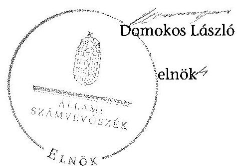

# ÁLLAMI   SZÁMVEVŐSZÉK 

## JELENTÉS

a helyi nemzetiségi önkormányzatok gazdálkodásának ellenőrzéséről
Beloiannisz Község Görög Nemzetiségi Önkormányzata

---

# Állami Számvevőszék 

Iktatószám: V-0787-053/2015.
Témaszám: 1821
Vizsgálat-azonosító szám: V067638

## Az ellenőrzést felügyelte:

## Brebán Andrea

felügyeleti vezető
Az ellenőrzést vezette és az ellenőrzés végrehajtásáért felelős:
Gál Magdolna
ellenőrzésvezető
A számvevőszéki jelentés összeállításában közreműködött:
Kalmár István
számvevő tanácsos
Az ellenőrzést végezték:
Kalmár István
Számvevő tanácsos

Dr. Szabóné Nagy Katalin
számvevő

---

# TARTALOMJEGYZÉK 

BEVEZETÉS ..... 3
I. ÖSSZEGZŐ MEGÁLLAPÍTÁSOK, KÖVETKEZTETÉSEK, JAVASLATOK ..... 6
II. RÉSZLETES MEGÁLLAPÍTÁSOK ..... 12

1. A Nemzetiségi Önkormányzat és a Települési Önkormányzat együttműködésének szabályozása, a működési feltételek biztosítása ..... 12
2. A gazdálkodási feladatok ellátásának szabályszerűsége ..... 13
2.1. A költségvetésre és zárszámadásra, valamint a kincstári adatszolgáltatás rendjére vonatkozó jogszabályi előírások betartása ..... 13
2.2. A Nemzetiségi Önkormányzat gazdálkodásának szabályozottsága ..... 15
2.3. Az operatív gazdálkodási jogkörök kialakítása, gyakorlása ..... 15
3. A Nemzetiségi Önkormányzattal összefüggő gazdálkodási feladatok belső ellenőrzése ..... 17
MELLÉKLET
4. számú A Nemzetiségi Önkormányzat 2013. évi gazdálkodási adatai
FÜGGELÉKEK
5. számú Rövidítések jegyzéke
6. számú Értelmező szótár

---

.

---

# JELENTÉS 

## a helyi nemzetiségi önkormányzatok gazdálkodásának ellenőrzéséről Beloiannisz Község Görög Nemzetiségi Önkormányzata

## BEVEZETÉS

A Nemzetiségi Önkormányzat az 1998. évben alakult, elnöke a 2014. évi helyhatósági választások óta látja el feladatát. A Nemzetiségi Önkormányzat intézményt, gazdasági társaságot és más szervezetet nem alapított, illetve társulásban nem vett részt. A háromtagú Képviselő-testület a munkája segítésére bizottságot nem hozott létre. A Nemzetiségi Önkormányzat a költségvetési beszámolója szerint a 2013. évben a módosított költségvetési bevételi és kiadási előirányzat 3615,0 ezer Ft, a teljesített költségvetési bevétel 980,7 ezer Ft, a teljesített költségvetési kiadás 1401,9 ezer Ft volt. A Nemzetiségi Önkormányzat a 2013. évben 655,3 ezer Ft feladatalapú támogatásban részesült. A 2013. évi gazdálkodási adatokat részletesen az 1. számú mellékletben mutatjuk be.

Az Alaptörvény Szabadság és felelősség rész XXIX. cikk (1) bekezdése szerint a Magyarországon élő nemzetiségek államalkotó tényezők. Minden, valamely nemzetiséghez tartozó magyar állampolgárnak joga van önazonossága szabad vállalásához és megőrzéséhez. A hazánkban élő nemzetiségek helyi (települési és területi) valamint országos önkormányzatokat hozhatnak létre ${ }^{1}$. A helyi nemzetiségi önkormányzatok gazdálkodási feladatait jogszabályi előírás alapján a székhely szerinti helyi önkormányzat polgármesteri hivatala látja el.

A nemzetiségek helyzete, támogatása mind hazai, mind EU-s szinten kiemelt figyelmet kap napjainkban. A helyi nemzetiségi önkormányzatok gazdálkodására és támogatási rendszerére vonatkozó jogszabályok a 2010-2012. években jelentős változásokon mentek át. A helyi nemzetiségi önkormányzatok gazdálkodásának, a részükre juttatott költségvetési támogatások felhasználásának ellenőrzését az ÁSZ 2012-ben sorozatjellegű ellenőrzés keretében indította el. A 2014. évi ellenőrzések az önkormányzati ellenőrzésekre ráépülő (egyablakos) ellenőrzésként valósulnak meg.

Az ellenőrzés célja annak értékelése volt, hogy a Nemzetiségi Önkormányzat gazdálkodási kereteinek kialakítása, gazdálkodása megfelelt-e a jogszabályoknak.

[^0]
[^0]:    ${ }^{1}$ A 2010. évben megtartott nemzetiségi önkormányzati választásokat követően 2304 települési, 58 területi és 13 országos nemzetiségi önkormányzat alakult meg.

---

Ennek keretében értékeltük, hogy:

- a Nemzetiségi Önkormányzat és a Települési Önkormányzat együttműködésének szabályozása, a működési feltételek biztosítása megfelelte a jogszabályi előírásoknak;
- a felek együttműködése megfelelte a megállapodásban foglaltaknak a gazdálkodási feladatok szabályszerű ellátása során, betartották-e a vonatkozó jogszabályi előírásokat;
- biztosított volt-e a Nemzetiségi Önkormányzat gazdálkodásának belső ellenőrzése.

Az ellenőrzés várható hasznosulása: a nemzetiségi önkormányzatok testületi döntéseinek tapasztalatait összegezve következtetés vonható le a törvényalkotás számára a jogszabályi környezet esetleges módosításának indokoltságára vonatkozóan. Az ellenőrzés az ellenőrzött számára visszajelzést ad a rendezett gazdálkodási keretek kialakításáról, a működési hiányosságokról. Az ellenőrzés megállapításai és javaslatai, a jó gyakorlat bemutatása tanulságul szolgálhatnak más nemzetiségi önkormányzatok, szervezetek számára a rendezett gazdálkodási keretek kialakításához. A társadalom számára jelzi, hogy közpénz nem maradhat ellenőrizetlenül, az ÁSZ értékteremtő rend kialakításához és megőrzéséhez hozzájáruló tevékenysége pozitív hatással lesz a szervezetről kialakított összkép formálásában. Az ÁSZ szervezetén belül lehetőség nyílik arra, hogy a megállapítások szintetizálásával az intézmény a hozzáadott értéket teremtő elemző tevékenységét és tanácsadó szerepét erősítse.

A helyi nemzetiségi önkormányzatok gazdálkodásának ellenőrzéséről szóló jelentés I. fejezetének összegző része az ellenőrzés céljára adott rövid, szintetizáló összefoglalót és következtetéseket tartalmazza a II. fejezet részletes megállapításain alapulóan. A jelentés intézkedést igénylő megállapításait és javaslatait - az összegzőben foglaltak mellett - az ellenőrzés során feltárt, a jelentés II. fejezetében rögzített részletes megállapítások alapozzák meg, illetve támasztják alá.

Az ellenőrzés típusa: szabályszerűségi ellenőrzés.
Az ellenőrzött időszak: a Nemzetiségi Önkormányzat és a Települési Önkormányzat együttműködésének, valamint a Nemzetiségi Önkormányzat gazdálkodásának szabályozása megfelelőségét a 2013. évre vonatkozóan (a 2013. december 31-i állapotnak megfelelően), a Nemzetiségi Önkormányzat gazdálkodásának szabályszerűségét, a működési feltételek, valamint a belső ellenőrzés biztosítását a 2013. január 1. - december 31-e közötti időszakot figyelembe véve kell értékelni.

Ellenőrzött szervezet: a Nemzetiségi Önkormányzat és a gazdálkodási feladatait ellátó Hivatal.

Az ellenőrzés szakmai módszertana az ÁSZ hivatalos honlapján (www.asz.hu) közzétett szakmai szabályokon alapult, amely a Legfőbb Ellenőrző Intézmények Nemzetközi Szervezete (INTOSAI) által kiadott nemzetközi standardok (ISSAI) figyelembevételével készült.

---

A gazdálkodás folyamatában kulcsszerepet betöltő két kulcskontroll - teljesítésigazolás, érvényesítés - működésének megfelelőségét teljes körűen, azaz minden, dologi kiadásokkal, működési célú pénzeszköz átadásokkal, ellátottak pénzbeli juttatásaival kapcsolatos kifizetés esetében ellenőriztük. „Megfelelőnek" értékeltük a gazdálkodási jogkörök gyakorlását, amennyiben a hibaarány legfeljebb 10 %, „részben megfelelőnek" értékeltük, ha a hibaarány 10-30% között volt, „nem megfelelőnek" pedig akkor, ha az eredmények alapján a hibaarány meghaladta a 30 %-ot.

Az ellenőrzés végrehajtásának jogszabályi alapját az ÁSZ tv. 5. § (2)-(3) és (6) bekezdéseiben foglaltak képezik.

Az ÁSZ tv. 29. § (1) bekezdése szerint a jelentéstervezetet megküldtük a jegyző és a Nemzetiségi Önkormányzat elnöke részére, akik az ÁSZ tv. 29. § (2) bekezdésében foglalt észrevételezési jogukkal nem éltek, a jelentéstervezetre észrevételt nem tettek.

---

# I. ÖSSZEGZŐ MEGÁLLAPÍTÁSOK, KÖVETKEZTETÉSEK, JAVASLATOK 

A Nemzetiségi Önkormányzat és a Települési Önkormányzat együttműködésének szabályozása részben felelt meg a jogszabályi előírásoknak. A Nemzetiségi Önkormányzat az ellenőrzött időszakban rendelkezett a Települési Önkormányzattal kötött együttműködési megállapodással, amelyet a Nek. tv. előírása ellenére 2013. január 31-éig nem vizsgáltak felül. A nemzetiségi önkormányzati SZMSZ és a települési önkormányzati SZMSZ a Nek. tv.-ben foglaltak ellenére az együttműködési megállapodás szerinti működési feltételeket nem rögzítette.

Az együttműködési megállapodás az Áht. és a Nek. tv. előírása ellenére nem tartalmazta a Nemzetiségi Önkormányzat bevételeivel és kiadásaival kapcsolatban a gazdálkodási és ellenőrzési feladatok ellátásának részletes szabályait, a Nemzetiségi Önkormányzat kötelezettségvállalásaival kapcsolatosan a Települési Önkormányzatot terhelő ellenjegyzési, érvényesítési feladatok felelőseinek konkrét kijelölését, a Nemzetiségi Önkormányzat kötelezettségvállalásaival összefüggő összeférhetetlenségi és nyilvántartási kötelezettségeket, továbbá a Nemzetiségi Önkormányzat gazdálkodásának eljárási és dokumentációs részletszabályaival, valamint az ezeket végző személyek kijelölésének rendjével, és az adatszolgáltatási feladatok teljesítésével kapcsolatos előírásokat, feltételeket. A Települési Önkormányzat a szabályozási hiányosságok ellenére biztosította a Nemzetiségi Önkormányzat működéséhez szükséges személyi és tárgyi feltételeket.

A Nemzetiségi Önkormányzat 2013. évi költségvetésének, zárszámadásának tartalma, jóváhagyása, valamint a kincstári adatszolgáltatás szabályszerűsége részben felelt meg a jogszabályi előírásoknak. A Nemzetiségi Önkormányzat elnöke az Áht.-ban foglaltak ellenére nem nyújtotta be a Képviselőtestület részére a 2013. évre vonatkozó költségvetési koncepciót, mert azt a jegyző nem készítette el. A Nemzetiségi Önkormányzat elnöke az Áht.-ban előírtaknak megfelelően határidőben benyújtotta a Képviselő-testület részére a költségvetési határozat-tervezetet.

A 2013. évi költségvetési határozat az Áht.-ban foglalt előírások ellenére nem tartalmazta a költségvetési bevételek és a költségvetési kiadások kötelező és önként vállalt feladatok szerinti bontását. A 2013. évi költségvetésben feltüntetett 3 millió Ft működési célú pályázati forrás előirányzat tervezése az Áht. előírása ellenére közgazdaságilag nem volt megalapozott, mert a betervezett bevételi előirányzat nem megítélt pályázati forráson alapult. A bevételi és kiadási előirányzatokat az év közben folyósított feladatalapú támogatás összegével az Áht. előírása ellenére nem módosították, arról határozatot nem hoztak. A Nemzetiségi Önkormányzat elnöke - a jegyző által elkészített - 2013. évi zárszámadási határozat-tervezetet az Áht.-ban előírt határidőben terjesztette a Képviselő-testület elé. A zárszámadási határozatnak az elfogadott költségvetéssel való összehasonlíthatósága az Áht. előírása szerint biztosított volt.

---

A jegyző a Nemzetiségi Önkormányzatra vonatkozó kincstári adatszolgáltatási kötelezettségét az Ávr.-ben és az Áhsz. ${ }_{1}$-ben foglaltak ellenére nem minden esetben teljesítette határidőben.

A Nemzetiségi Önkormányzat gazdálkodásának szabályozottsága az ellenőrzött időszakban részben felelt meg a jogszabályi előírásoknak. A Nemzetiségi Önkormányzat a Számv. tv.-ben előírt szabályzatokkal az ellenőrzött időszak elején nem rendelkezett, azokat a jegyző 2013. június-augusztus között készítette el és adta ki.

A jegyző az Ávr.-ben előírtak ellenére a hivatali SZMSZ-ben nem rögzítette a szervezeti és működési szabályzatban nevesített munkakörökhöz tartozó, a Nemzetiségi Önkormányzat gazdálkodásával kapcsolatos hatáskörök gyakorlásának módját, a helyettesítés rendjét, és az ezekhez kapcsolódó felelősségi szabályokat, továbbá nem határozta meg belső szabályzatban a kötelezettségvállalás, az ellenjegyzés, a teljesítésigazolás, az érvényesítés, az utalványozás eljárási és dokumentációs részletszabályait, valamint az ezeket végző személyek kijelölésének rendjét.

A jegyző által elkészített belső kontrollrendszer szabályzat szabálytalanságkezeléssel, valamint az ellenőrzési nyomvonallal kapcsolatos szabályai - a Bkr.-ben előírtak ellenére - nem tartalmazták a Nemzetiségi Önkormányzat gazdálkodásával összefüggő végrehajtási feladatokra vonatkozó előírásokat. A jegyző - a Bkr. előírása ellenére - a Nemzetiségi Önkormányzat gazdálkodási feladataira vonatkozóan nem biztosította a folyamatba épített, előzetes, utólagos és vezetői ellenőrzést.

A Nemzetiségi Önkormányzat gazdálkodása tekintetében az operatív gazdálkodási jogkörök kialakítása nem felelt meg a jogszabályi előírásoknak. A jegyző - az Ávr.-ben foglaltakat figyelmen kívül hagyva - annak ellenére nem határozta meg az előzetes írásbeli kötelezettségvállalást nem igénylő kifizetések rendjét, hogy a gazdálkodási szabályzat lehetővé tette a 100 ezer forint alatti kifizetések előzetes írásbeli kötelezettségvállalás nélküli teljesítését. A gazdasági szervezettel nem rendelkező Hivatalban a jegyző az Ávr. szerinti jogkörében eljárva nem jelölt ki írásban a Hivatal állományába tartozó köztisztviselőt a pénzügyi ellenjegyzés gyakorlására, valamint az érvényesítési feladatok ellátására a Nemzetiségi Önkormányzat kiadási előirányzata terhére vállalt kötelezettség esetére.

A Nemzetiségi Önkormányzatnál a 2013. évben a dologi kiadásokkal és a működési célú pénzeszközátadással kapcsolatos kifizetések teljesítése során az operatív gazdálkodási jogkörökön belül kulcsszerepet betöltő teljesítésigazolás és az érvényesítés kulcskontrollok működése nem felelt meg a jogszabályi előírásoknak, emiatt azok nem biztosították a hibák megelőzését és feltárását.

A számvevőszéki ellenőrzés az ellenőrzött kifizetésekkel összefüggésben a rendelkezésre bocsátott dokumentumok alapján kár bekövetkeztére utaló adatot, tényt nem állapított meg, azonban a gazdálkodásban kulcsszerepet betöltő kontrollok működésében feltárt hiányosságok miatt fennáll a hibák, szabálytalanságok bekövetkezésének kockázata. A nem megfelelően működtetett belső kontrollok korrupciós kockázatot hordoznak.

---

A Nemzetiségi Önkormányzattal összefüggő gazdálkodási feladatok belső ellenőrzése nem felelt meg a jogszabályi előírásoknak. A jegyző - a Bkr.-ben foglalt előírások ellenére - az ellenőrzött időszakban nem gondoskodott a Hivatalnál a Nemzetiségi Önkormányzat gazdálkodásával összefüggő végrehajtási feladatok belső ellenőrzésének kialakításáról és működtetéséről. A Nemzetiségi Önkormányzat gazdálkodásával összefüggő végrehajtási feladatokra vonatkozóan belső ellenőrzést a 2013. évben nem terveztek és nem végeztek.

Az ÁSZ tv. 33. § (1) bekezdésében foglaltak értelmében az ellenőrzött
 szervezet vezetője köteles a jelentésben foglalt megállapításokhoz kapcsolódó intézkedési tervet összeállítani és azt a jelentés kézhezvételétől számított 30 napon belül az ÁSZ részére megküldeni. Amennyiben az intézkedési tervet határidőre nem küldi meg a szervezet, vagy az ÁSZ tv. 33. § (2) bekezdésében foglalt póthatáridő elteltével megküldött intézkedési terv továbbra sem elfogadható, az ÁSZ elnöke a hivatkozott törvény 33. § (3) bekezdés a)-b) pontjaiban foglaltakat érvényesítheti.

A helyszíni ellenőrzés megállapításainak hasznosítása mellett javasoljuk:

# a jegyzőnek 

1. Az együttműködés szabályozásával kapcsolatban

A Nemzetiségi Önkormányzat és a Települési Önkormányzat együttműködését meghatározó együttműködési megállapodás tartalma nem felelt meg a Nek. tv. 80. § (3) bekezdés b)-d) pontjaiban foglaltaknak. A Nek. tv. 80. § (2) bekezdésében foglaltak ellenére 2013. január 31-éig nem végezték el az együttműködési megállapodás felülvizsgálatát.

A 2013. december 31-én hatályos együttműködési megállapodás szerinti működési feltételeket a Nek. tv. 80. § (2) bekezdésében előírtak ellenére a Nemzetiségi Önkormányzat és a Települési Önkormányzat SZMSZ-ében sem rögzítették.

Javaslat
Az együttműködés szabályszerűsége érdekében:
a) készítse elő az együttműködési megállapodás módosítását, hogy az feleljen meg a Nek. tv-ben foglalt előírásoknak és kezdeményezze annak a Települési Önkormányzat Képviselő-testülete elé terjesztését;
b) gondoskodjon az együttműködési megállapodás évenkénti felülvizsgálata során a Nek. tv-ben előírt határidő betartásáról;
c) készítse elő a Nemzetiségi Önkormányzat SZMSZ-ének kiegészítését a Nek. tv-ben foglalt előírás alapján;
d) készítse elő a Települési Önkormányzat SZMSZ-ének kiegészítését a Nek. tv-ben foglalt előírás alapján és kezdeményezze a Települési Önkormányzat Képviselőtestülete elé terjesztését.

---

2. A költségvetés és zárszámadás szabályszerűségével kapcsolatban

A 2013. évi költségvetési határozat az Áht. 23. § (2) bekezdés a) pontja előírásától eltérően nem tartalmazta a költségvetési bevételek és a költségvetési kiadások kötelező és önként vállalt feladatok szerinti bontását.

Javaslat
Intézkedjen a jövőben arról, hogy a költségvetési határozat az Áht.-ban előírtaknak tartalmilag maradéktalanul feleljen meg.
3. A kincstári adatszolgáltatási kötelezettséggel kapcsolatban

A jegyző nem minden esetben teljesítette határidőben a Nemzetiségi Önkormányzat részére előírt kincstári adatszolgáltatást a 2013. évben, mivel a Nemzetiségi Önkormányzat 2013. év első három és első kilenc hónapjáról elkészített időközi költségvetési jelentéseit, az I. és III. negyedéves időközi mérlegjelentéseit, a féléves és éves elemi költségvetési beszámolóját nem az Ávr. 169. § (2) bekezdésében, a 170. § (5) bekezdésében, továbbá az Áhsz. 10. § (5a) bekezdésében előírt határidőre küldte meg a Kincstár területileg illetékes szervének.

Javaslat
Tegyen eleget a kincstári adatszolgáltatási kötelezettségének - az ellenőrzött időszak óta bekövetkezett esetleges jogszabályi változásokra figyelemmel - az Ávr.-ben és az Áhsz.-ben foglalt határidők betartásával.
4. A gazdálkodási feladatok szabályozottságával kapcsolatban

A hivatali SZMSZ nem tartalmazta az Ávr. 13. § (1) bekezdés g) pontja előírásától eltérően az SZMSZ-ben nevesített munkakörökhöz tartozó - a Nemzetiségi Önkormányzat gazdálkodásával kapcsolatos - hatáskörök gyakorlásának módját, a helyettesítés rendjét, és az ezekhez kapcsolódó felelősségi szabályokat.

A jegyző az Ávr. 13. § (2) bekezdés a) pontjában előírtak ellenére nem határozta meg belső szabályzatban a kötelezettségvállalás, az ellenjegyzés, a teljesítésigazolás, az érvényesítés, az utalványozás eljárási és dokumentációs részletszabályait, valamint az ezeket végző személyek kijelölésének rendjét.

A jegyző által elkészített belső kontrollrendszer szabályzat szabálytalanságkezeléssel, valamint az ellenőrzési nyomvonallal kapcsolatos szabályai - a Bkr. 6. § (3)-(4) bekezdéseiben előírtak ellenére - nem tartalmazták a Nemzetiségi Önkormányzat gazdálkodásával összefüggő végrehajtási feladatokra vonatkozó előírásokat. A jegyző - a Bkr. 8. § (2) bekezdésének előírása ellenére - a Nemzetiségi Önkormányzat gazdálkodási feladataira vonatkozóan nem biztosította a folyamatba épített, előzetes, utólagos és vezetői ellenőrzést.

---

# Javaslat 

A Nemzetiségi Önkormányzat gazdálkodásának végrehajtásával kapcsolatos feladataira
a) készítse el a hivatali SZMSZ módosítását, hogy az teljes körűen feleljen meg az Ávr.-ben foglalt előírásnak és kezdeményezze annak jóváhagyását;
b) határozza meg belső szabályzatban a kötelezettségvállalás, az ellenjegyzés, a teljesítésigazolás, az érvényesítés, az utalványozás eljárási és dokumentációs részletszabályait, valamint az ezeket végző személyek kijelölésének rendjét az Ávr. előírásának megfelelően;
c) vonatkozóan egészítse ki a Bkr.-ben meghatározott ellenőrzési nyomvonalat és a szabálytalanságok kezelésének eljárásrendjét;
d) biztosítsa a Bkr.-ben foglaltaknak megfelelően a folyamatba épített, előzetes, utólagos és vezetői ellenőrzést.
5. A kulcskontrollok működésével kapcsolatban

A jegyző - az Ávr. 53. § (2) bekezdésében foglaltakat figyelmen kívül hagyva - annak ellenére nem határozta meg az előzetes írásbeli kötelezettségvállalást nem igénylő kifizetések rendjét, hogy a gazdálkodási szabályzat lehetővé tette a 100 ezer Ft alatti kifizetések előzetes írásbeli kötelezettségvállalás nélküli teljesítését. A gazdasági szervezettel nem rendelkező Hivatalban a jegyző az Ávr. 55. § (2) bekezdés g) pontja szerinti jogkörében eljárva nem jelölt ki írásban a hivatal állományába tartozó köztisztviselőt a pénzügyi ellenjegyzés gyakorlására, valamint az Ávr. 58. § (4) bekezdése alapján az érvényesítési feladatok ellátására a Nemzetiségi Önkormányzat kiadási előirányzata terhére vállalt kötelezettség esetére.

A teljesítésigazolást az Ávr. 57. § (1) bekezdésben foglaltak ellenére nem végezték el, illetve nem szabályszerűen végezték. Az az Ávr. 60. § (3) bekezdésében foglaltak ellenére a teljesítésigazolásra jogosult személyek aláírás-mintájáról nyilvántartást nem vezettek.

Az érvényesítést az Ávr. 58. § (1) bekezdésében foglaltak ellenére nem végezték el, illetve nem szabályszerűen végezték. Az érvényesítést az Ávr. 58. § (4) bekezdésében foglalt előírástól eltérően a feladatra kijelöléssel nem rendelkező munkatárs látta el.

Javaslat
a) Határozza meg az Ávr.-ben foglalt előírásokat figyelembe véve az előzetes írásbeli kötelezettségvállalást nem igénylő kifizetések rendjét.
b) Jelöljön ki írásban az Ávr. szerinti jogkörében eljárva a Hivatal állományába tartozó köztisztviselőt a pénzügyi ellenjegyzés gyakorlására, valamint az Ávr. előírása alapján az érvényesítési feladatok ellátására a Nemzetiségi Önkormányzat kiadási előirányzata terhére vállalt kötelezettség esetére.
c) Intézkedjen a teljesítésigazolás és az érvényesítés Ávr.-ben foglalt előírásoknak megfelelő elvégzéséről.

---

# a Nemzetiségi Önkormányzat elnökének 

A Nemzetiségi Önkormányzat és a Települési Önkormányzat együttműködését meghatározó együttműködési megállapodás tartalma nem felelt meg a Nek. tv. 80. § (3) bekezdés b)-d) pontjaiban foglaltaknak. Az együttműködési megállapodás szerinti működési feltételeket a Nek. tv. 80. § (2) bekezdésében előírtak ellenére a Nemzetiségi Önkormányzat SZMSZ-ében nem rögzítették.

Javaslat
Terjessze a Képviselő-testület elé jóváhagyásra:
a) a jegyző által a Nek. tv-ben foglaltaknak megfelelően előkészített együttműködési megállapodás módosítását;
b) a jegyző által előkészített Nemzetiségi Önkormányzati SZMSZ kiegészítést.

---

# II. RÉSZLETES MEGÁLLAPÍTÁSOK 

## 1. A Nemzetiségi Önkormányzat és a Települési Önkormányzat együttműködésének szabályozása, a működési feltételek biztosítása

A Nemzetiségi Önkormányzat és a Települési Önkormányzat együttműködésének szabályozása részben felelt meg a jogszabályi előírásoknak.

A Nemzetiségi Önkormányzat rendelkezett a 2013. év folyamán hatályban lévő, a Települési Önkormányzattal történő együttműködésre vonatkozó együttműködési megállapodással. Az együttműködési megállapodást a Képviselő-testület és a Települési Önkormányzat Képviselő-testülete határozattal hagyták jóvá és az arra jogosult személyek írták alá.

Az együttműködési megállapodást a Települési Önkormányzat a 62/2012. (VI. 29.) számú, a Nemzetiségi Önkormányzat a 13/2012. (VII. 04.) számú határozatával hagyta jóvá.

Az együttműködési megállapodást a Nek. tv. 80. § (2) bekezdésében  foglaltak ellenére 2013. január 31-éig nem vizsgálták felül.

A jegyző által előkészített módosított együttműködési megállapodást a Települési Önkormányzat a 87/2013. (VI.26.) számú, a Nemzetiségi Önkormányzat a 12/2013. (VI.28.) számú határozatával hagyta jóvá.

A nemzetiségi önkormányzati SZMSZ és a települési önkormányzati SZMSZ a Nek. tv. 80. § (2) bekezdésében foglaltak ellenére az együttműködési megállapodás szerinti működési feltételeket nem rögzítette.

A 2013. december 31-én hatályos együttműködési megállapodás nem rögzítette az Áht. 27. §. (2) bekezdésében , valamint a Nek. tv. 80. § (3) bekezdésében foglaltak közül az alábbiakat:

- az Áht. 27. § (2) bekezdésében foglalt előírások ellenére a Nemzetiségi Önkormányzat bevételeivel és kiadásaival kapcsolatban a gazdálkodási és ellenőrzési feladatok ellátásának részletes szabályait;
- a Nek. tv. 80. § (3) bekezdés b) pontjában foglaltak ellenére a Nemzetiségi Önkormányzat kötelezettségvállalásaival kapcsolatosan a Települési Önkormányzatot terhelő ellenjegyzési és érvényesítési feladatok felelőseinek konkrét kijelölését;

[^0]
[^0]:    ${ }^{2}$ Módosította: 2014. évi XCIX.tv. 362. § 2. pontja, hatályos 2015. január 1-jétől.
    ${ }^{3}$ A települési önkormányzati SZMSZ a jegyzőnek előterjesztés benyújtására jogosultságot nem biztosít.
    ${ }^{4}$ 2015. január 1-jétől hatálytalan.

---

- a Nek. tv. 80. § (3) bekezdés c) pontja előírása ellenére a Nemzetiségi Önkormányzat kötelezettségvállalásaival összefüggő összeférhetetlenségi és nyilvántartási kötelezettségeket;
- a Nek. tv. 80. § (3) bekezdés d) pontjában foglaltak ellenére a Nemzetiségi Önkormányzat gazdálkodásának eljárási és dokumentációs részletszabályaival, valamint az ezeket végző személyek kijelölésének rendjével, és az adatszolgáltatási feladatok teljesítésével kapcsolatos előírásokat, feltételeket.

A Települési Önkormányzat - a szabályozási hiányosságok ellenére - a Nemzetiségi Önkormányzat működéséhez a 2013. évben a személyi és tárgyi feltételeket biztosította.

# 2. A gazdálkodási feladatok ellátásának szabályszerűsége 

### 2.1. A költségvetésre és zárszámadásra, valamint a kincstári adatszolgáltatás rendjére vonatkozó jogszabályi előírások betartása

A Nemzetiségi Önkormányzat 2013. évi költségvetésének és zárszámadásának tartalma, jóváhagyása, valamint a kapcsolódó adatszolgáltatás részben megfelel a jogszabályi előírásoknak.

A Nemzetiségi Önkormányzat elnöke az Áht. 24. § (1) bekezdésében előírtak ellenére október 31-ig nem nyújtotta be a Képviselő-testület részére a 2013. évre vonatkozó költségvetési koncepciót, mert azt a jegyző nem készítette el.

A Nemzetiségi Önkormányzat elnöke az Áht. 24. § (2) bekezdésében előírtnak megfelelően a központi költségvetésről szóló törvény hatálybalépését követő 45 napig - 2013. február 14-én - benyújtotta a Képviselő-testület részére a 2013. évi költségvetési határozat-tervezetet. A 2013. évi költségvetési határozattervezetet az Áht. 24. § (2) bekezdésében előírtaknak megfelelően a jegyző készítette elő.

A 2013. évi költségvetési határozat az Áht. 23. § (2) bekezdés a) pontjában foglaltak ellenére nem tartalmazta a költségvetési bevételek és a költségvetési kiadások kötelező és önként vállalt feladatok szerinti bontását. A 2013. évi költségvetésben feltüntetett 3 millió Ft működési célú pályázati forrás előirányzat tervezése az Áht. 12. § (1) bekezdésében előírtak ellenére közgazdaságilag nem volt megalapozott, mert a betervezett bevételi előirányzat nem megítélt pályázati forráson alapult.

[^0]
[^0]:    ${ }^{5}$ 2014. szeptember 30-tól hatálytalan.
    ${ }^{6}$ 2013. december 21-étől az Áht. 24. § (3) bekezdése szabályozza.
    ${ }^{7}$ A Képviselő-testület a 2013. évi költségvetést a 2/2013. (II. 15.) számú határozatával fogadta el.
    ${ }^{8}$ 2015. január 1-jétől az Áht. 23. § (2) bekezdés ab) pontja szabályozza.
    ${ }^{9}$ 2015. január 1-jétől hatálytalan.

---

A 2013. évi költségvetés előterjesztésekor a Képviselő-testület részére az Áht. 24. § (4) bekezdése szerinti előírásának megfelelően tájékoztatásul - szöveges indokolással együtt - bemutatták a Nemzetiségi Önkormányzat költségvetési mérlegét közgazdasági tagolásban, előirányzat felhasználási tervét. A közvetett támogatásokat és a több éves kihatású döntést tartalmazó kimutatások értékadatokat nem tartalmaztak, mivel a Nemzetiségi Önkormányzat közvetett támogatásokat nem biztosított, több éves kihatású döntést nem hozott.

A Nemzetiségi Önkormányzat elnöke - a jegyző által elkészített - 2013. évi zárszámadási
 határozat-tervezetet az Áht. 91. § (1) bekezdésében ${ }^{10}$ előírt határidőben terjesztette a Képviselő-testület elé ${ }^{11}$. A zárszámadási határozat-tervezet előterjesztésekor a Képviselő-testület részére bemutatták tájékoztatásul az Áht. 91. § (2) bekezdésében foglalt mérlegeket és kimutatásokat. A zárszámadási határozatnak az elfogadott költségvetéssel való összehasonlíthatósága az Áht. 89. § (1) ${ }^{12}$ bekezdés előírása szerint biztosított volt.

A bevételi és kiadási előirányzatokat az év közben folyósított feladatalapú támogatás összegével az Áht. 34. § (5) bekezdése ellenére nem módosították, arról határozatot nem hoztak.

A jegyző - az Ávr. 169. § (2) bekezdésében ${ }^{13}$, az Ávr. 170. § (5) bekezdésében ${ }^{14}$ és az Áhsz. ${ }_{1} 10 . \S$ (5a) bekezdésében ${ }^{15}$ foglaltak ellenére - nem minden esetben teljesítette határidőben ${ }^{16}$ a Nemzetiségi Önkormányzat részére előírt kincstári adatszolgáltatást a 2013. évben, mivel a Nemzetiségi Önkormányzat 2013. év első három és első kilenc hónapjáról elkészített időközi költségvetési jelentéseit, az I. és III. negyedéves időközi mérlegjelentéseit, a féléves és éves elemi költségvetési beszámolóját nem az - Ávr. 169. § (2) bekezdésében, a 170. § (5) bekezdésében, továbbá az Áhsz. ${ }_{1} 10 . \S$ (5a) bekezdésében ${ }^{17}$ - előírt határidőre küldte meg a Kincstár területileg illetékes szervének.

A jegyző az Ávr. 33. § (1) bekezdése ${ }^{18}$ alapján a 2013. évi elemi költségvetéséről határidőben szolgáltatott adatot a Kincstár területileg illetékes igazgatóságának (a 2013. évi elemi költségvetés 2013. március 6-án került továbbításra).

[^0]
[^0]:    ${ }^{10}$ Módosította: 2014. évi XCIX. törvény 42. §-a, hatályos 2015. január 1-től.
    ${ }^{11}$ A Nemzetiségi Önkormányzat elnöke a zárszámadási határozat-tervezetet a 2014. április 25-i képviselő-testületi ülésre terjesztette elő.
    ${ }^{12}$ 2015. január 1-jétől hatálytalan.
    ${ }^{13}$ 2015. január 1-jétől az Ávr. 170. § (2) bekezdése szabályozza.
    ${ }^{14}$ Módosította: 397/2014. (XII.31.) Korm. rendelet 41. §-a, hatályos 2015. január 1-jétől. ${ }^{15}$ 2014. január 1-jétől hatálytalan.
    ${ }^{16}$ A Nemzetiségi Önkormányzat időközi költségvetési jelentését a költségvetési év első három hónapjáról április 20. helyett 26-án, a költségvetési év első kilenc hónapjáról október 20. helyett 29-én, az I. negyedévi mérlegjelentést április 25. helyett 26-án, a III. negyedévi mérlegjelentést október 25. helyett november 5-én, a féléves elemi költségvetési beszámolót augusztus 10. helyett szeptember 5-én, az éves elemi költségvetési beszámolót 2014. március 10. helyett 19-én küldték meg a Kincstár területileg illetékes szervének.
    ${ }^{17}$ 2014. január 1-jétől az Áhsz. ${ }_{2} 32 . \S$ (4) bekezdése szabályozza.
    ${ }^{18}$ 2015. január 1-jétől az Ávr. 32. § (1) bekezdése szabályozza.

---

# 2.2. A Nemzetiségi Önkormányzat gazdálkodásának szabályozottsága 

A Nemzetiségi Önkormányzat gazdálkodásának szabályozottsága az ellenőrzött időszakban részben felelt meg a jogszabályi előírásoknak.

A Nemzetiségi Önkormányzat a Számv. tv. 14. § (3) és (5) bekezdéseiben, valamint 161. § (1) bekezdésében előírt szabályzatokkal az ellenőrzött időszak elején nem rendelkezett. A jegyző a Nemzetiségi Önkormányzatra vonatkozó önálló szabályzatokat 2013. június-augusztus között készítette el és adta ki (számviteli politika, eszközök és források leltározási és leltárkészítési szabályzata, eszközök és források értékelési szabályzata, pénzkezelési szabályzat, számlarend).

A jegyző az Ávr. 13. § (1) bekezdés g) pontjában előírtak ellenére a hivatali SZMSZ-ben nem rögzítette a szervezeti és működési szabályzatban nevesített munkakörökhöz tartozó, a Nemzetiségi Önkormányzat gazdálkodásával kapcsolatos hatáskörök gyakorlásának módját, a helyettesítés rendjét és az ezekhez kapcsolódó felelősségi szabályokat.

A jegyző a Nemzetiségi Önkormányzatra vonatkozóan belső szabályzatban meghatározta a tervezéssel, gazdálkodással, a kötelezettségvállalás, az ellenjegyzés, a teljesítésigazolás, az érvényesítés, az utalványozás gyakorlásának módjával, az adatszolgáltatási és beszámolási feladatok teljesítésével kapcsolatos előírásokat, feltételeket. Az Ávr. 13. § (2) bekezdés a) pontjában előírtak ellenére azonban nem határozta meg belső szabályzatban a kötelezettségvállalás, az ellenjegyzés, a teljesítésigazolás, az érvényesítés, az utalványozás eljárási és dokumentációs részletszabályait, valamint az ezeket végző személyek kijelölésének rendjét.

A jegyző által elkészített belső kontrollrendszer szabályzat szabálytalanságkezeléssel, valamint az ellenőrzési nyomvonallal kapcsolatos szabályai - a Bkr. 6. § (3)-(4) bekezdéseiben előírtak ellenére - nem tartalmazták a Nemzetiségi Önkormányzat gazdálkodásával összefüggő végrehajtási feladatokra vonatkozó előírásokat.

A jegyző - a Bkr. 8. § (2) bekezdésének előírása ellenére - a Nemzetiségi Önkormányzat gazdálkodási feladataira vonatkozóan nem biztosította a folyamatba épített, előzetes, utólagos és vezetői ellenőrzést.

A Hivatalban a jegyző elkészítette a Nemzetiségi Önkormányzattal kapcsolatos gazdálkodási feladatokat ellátó köztisztviselők munkaköri leírásait.

### 2.3. Az operatív gazdálkodási jogkörök kialakítása, gyakorlása

A Nemzetiségi Önkormányzat gazdálkodása tekintetében az operatív gazdálkodási jogkörök kialakítása nem felelt meg a jogszabályi előírásoknak.

A hivatali SZMSZ és a köztisztviselők munkaköri leírása tartalmazta az Ávr. 13. § (5) bekezdésében foglaltakkal összhangban a Nemzetiségi Önkormányzat gaz-

---

dálkodási feladatai ellátása tekintetében az alkalmazottainak feladat- és hatáskörét, a helyettesítés rendjét. A Hivatal az ellenőrzött időszakban nem rendelkezett gazdasági szervezettel.

A jegyző - az Ávr. 53. § (2) bekezdésében foglaltakat figyelmen kívül hagyva, annak ellenére nem határozta meg az előzetes írásbeli kötelezettségvállalást nem igénylő kifizetések rendjét, hogy a gazdálkodási szabályzat lehetővé tette a 100 ezer forint alatti kifizetések előzetes írásbeli kötelezettségvállalás nélküli teljesítését.

A gazdasági szervezettel nem rendelkező Hivatalban a jegyző az Ávr. 55. § (2) bekezdés g) pontja szerinti jogkörében eljárva nem jelölt ki írásban a Hivatal állományába tartozó köztisztviselőt a pénzügyi ellenjegyzés gyakorlására, valamint az Ávr. 58. § (4) bekezdése alapján az érvényesítési feladatok ellátására a Nemzetiségi Önkormányzat kiadási előirányzata terhére vállalt kötelezettség esetére. A gazdálkodási szabályzatban rögzítették, hogy a Nemzetiségi Önkormányzat kiadási előirányzatai terhére vállalt kötelezettségvállalások esetén a teljesítésigazolást az Ávr. 57. § (4) bekezdése alapján a Nemzetiségi Önkormányzat elnöke gyakorolja.

A Nemzetiségi Önkormányzatnál a 2013. évben a dologi kiadásokkal és a működési célú pénzeszközátadással kapcsolatos kifizetések teljesítése során az operatív gazdálkodási jogkörökön belül kulcsszerepet betöltő teljesítésigazolás és az érvényesítés kulcskontrollok működése nem felelt meg a jogszabályi előírásoknak, emiatt azok nem biztosították a hibák megelőzését és feltárását.

A dologi kiadásokkal kapcsolatos kifizetések során a 2013. évben a teljesítésigazolás és az érvényesítés kulcskontrollok működésével kapcsolatban az alábbi hiányosságok, szabálytalanságok fordultak elő:

- a kifizetéseket megelőzően az Ávr. 57. § (3) bekezdésében foglaltak ellenére a teljesítésigazolás nem volt szabályszerű, mert szabályozottság hiányában azt jogosulatlanul végezték (2013. január 1-től július 27-ig);
- a dologi kiadásokkal kapcsolatos kifizetéseket megelőzően - az Ávr. 57. § (3) bekezdésében előírtak ellenére - a teljesítésigazoló személye nem volt beazonosítható, mert - az Ávr. 60. § (3) bekezdésében foglaltak ellenére - a teljesítésigazolásra jogosult személyek aláírás-mintájáról nyilvántartást nem vezettek (2013. július 28-tól);
- a kifizetéseket megelőzően az érvényesítést - az Ávr. 58. § (1) bekezdésében foglaltak ellenére - nem végezték el;
- a kifizetést megelőzően az Ávr. 58. § (4) bekezdésében foglaltak ellenére az érvényesítés nem volt szabályszerű, mivel az érvényesítést kijelöléssel nem rendelkező jogosulatlanul végezte.

---

A működési célú pénzeszközátadással kapcsolatos kifizetés során a 2013. évben a teljesítésigazolás és az érvényesítés kulcskontrollok működésével kapcsolatosan az alábbi hiányosságok, szabálytalanságok fordultak elő:

- a kifizetést megelőzően a teljesítésigazolást - az Ávr. 57. § (1) bekezdésében foglaltak ellenére - nem végezték el;
- a kifizetést megelőzően az érvényesítést - az Ávr. 58. § (1) bekezdésében foglaltak ellenére - nem végezték el.

A Nemzetiségi Önkormányzatnál személyi juttatásokkal, felhalmozási kiadásokkal, felhalmozási célú pénzeszközátadással és ellátottak juttatásaival kapcsolatos kifizetések nem történtek a 2013. évben.

A számvevőszéki ellenőrzés az ellenőrzött kifizetésekkel összefüggésben a rendelkezésre bocsátott dokumentumok alapján kár bekövetkeztére utaló adatot, tényt nem állapított meg, azonban a gazdálkodásban kulcsszerepet betöltő kontrollok működésében feltárt hiányosságok miatt fennáll a hibák, szabálytalanságok bekövetkezésének kockázata. A nem megfelelően működtetett belső kontrollok korrupciós kockázatot hordoznak.

# 3. A Nemzetiségi ÖNKORMÁNYZATTAL ÖSSZEFÜGGŐ GAZDÁLKODÁSI FELADATOK BELSŐ ELLENŐRZÉSE 

A Nemzetiségi Önkormányzattal összefüggő gazdálkodási feladatok belső ellenőrzése nem felelt meg a jogszabályi előírásoknak.

A jegyző - a Bkr. 15. § (1) bekezdésében foglalt előírások ellenére - az ellenőrzött időszakban nem gondoskodott a Hivatalnál a Nemzetiségi Önkormányzat gazdálkodásával összefüggő végrehajtási feladatok belső ellenőrzésének kialakításáról és működtetéséről. A Nemzetiségi Önkormányzat gazdálkodásával összefüggő végrehajtási feladatokra vonatkozóan belső ellenőrzést a 2013. évben nem terveztek és nem végeztek.

Az ellenőrzéshez szolgáltatott adatok alapján az ellenőrzött időszakban a Fejér Megyei Kormányhivatal a Nemzetiségi Önkormányzatot illetően egy alkalommal élt törvényességi felhívással, a 2012. és 2013. évben iktatott képviselőtestületi jegyzőkönyvek késedelmes felterjesztése miatt. A Nemzetiségi Önkormányzat határidőben tájékoztatta a Kormányhivatalt a megtett intézkedésről.

Budapest, 2015. OG. hó 26. nap

Melléklet: 1 db
Függelék: $\quad 2 \mathrm{db}$

---

.

---

# A Nemzetiségi Önkormányzat 2013. évi gazdálkodási adatai 

## A) Bevételek

| Megnevezés | Eredeti előirányzat |  | Módosított   ezer Ft | Teljesítés |  |
| :--: | :--: | :--: | :--: | :--: | :--: |
|  |  |  |  |  | megoszlás |
| Intézményi működési bevételek | 0,0 | 0,0 | 0,1 | $0,0 \%$ |  |
| Általános működési támogatás | 215,0 | 215,0 | 221,8 | $15,8 \%$ |  |
| Feladatalapú támogatás | 0,0 | 0,0 | 655,3 | $46,8 \%$ |  |
| Magyarországi Görögök Országos Önkormányzata támogatása | 0,0 | 0,0 | 100,0 | $7,1 \%$ |  |
| Kiegészítő támogatás (428/2012.   (XII. 29.) Korm. rend. 7. §) | 0,0 | 0,0 | 3,5 | $0,3 \%$ |  |
| Működési célú pályázati forrás | 3000,0 | 3000,0 | 0,0 | $0,0 \%$ |  |
| Pénzforgalmi bevételek összesen | 3215,0 | 3215,0 | 980,7 | 70,0\% |  |
| Előző évi pénzmaradvány felhasználás | 400,0 | 400,0 | 421,2 | $30,0 \%$ |  |
| Bevételek összesen | 3615,0 | 3615,0 | 1401,9 | 100,0\% |  |

## B) Kiadások

| Megnevezés | Eredeti előirányzat | Módosított   ezer Ft | Teljesítés |  |
| :--: | :--: | :--: | :--: | :--: |
|  |  |  |  | megoszlás |
| Dologi kiadások | 3615,0 | 3615,0 | 1326,5 | 94,6\% |
| Működési célú pénzeszközátadások államháztartáson kívülre | 0,0 | 0,0 | 75,4 | 5,4\% |
| Működési kiadások összesen | 3615,0 | 3615,0 | 1401,9 | 100,0\% |
| Kiadások összesen | 3615,0 | 3615,0 | 1401,9 | 100,0\% |

---

.

---

# RÖVIDÍTÉSEK JEGYZÉKE 

## Törvények

Alaptörvény
Áht.
ÁSZ tv.
Nek. tv.
Számv. tv.

## Rendeletek

Áhsz. 1

Áhsz. 2
Ávr.
Bkr.
nemzetiségi önkormányzati SZMSZ
települési önkormányzati SZMSZ

## Szórövidítések

ÁSZ
belső kontrollrendszer szabályzat
együttműködési megállapodás

Magyarország Alaptörvénye
az államháztartásról szóló 2011. évi CXCV. törvény az Állami Számvevőszékről szóló 2011. évi LXVI. törvény a

 nemzetiségek jogairól szóló 2011. évi CLXXIX. törvény a számvitelről szóló 2000. évi C. törvény
az államháztartás szervezetei beszámolási és könyvvezetési kötelezettségének sajátosságairól szóló 249/2000. (XII. 24.) Korm. rendelet
az államháztartás számviteléről szóló 4/2012. (II. 11.) Korm. rendelet
az államháztartási törvény végrehajtásáról szóló 368/2011. (XII. 31.) Korm. rendelet
a költségvetési szervek belső kontrollrendszeréről és belső ellenőrzéséről szóló 370/2011. (XII. 31.) Korm. rendelet
Beloiannisz Község Görög Kisebbségi Önkormányzatának Szervezeti és Működési Szabályzata, Beloiannisz Község Görög Kisebbségi Önkormányzat Képviselő-testületének 4/2006. (I. 20.) GNÖ határozatával elfogadott dokumentum (hatályos 2006. január 21-étől)
Beloiannisz Község Önkormányzata képviselőtestületének többször módosított 14/1998. (XII. 18.) önkormányzati rendelete a képviselő-testület és szervei szervezeti és működési szabályzatáról (hatályos 1998. december 19-től)

Állami Számvevőszék
Besnyői Közös Önkormányzati Hivatal - Belső Kontrollrendszer (kontrollterületek, szabálytalanságkezelés, kockázatkezelés, ellenőrzési nyomvonal, FEUVE) (hatályos 2013. augusztus 1-től)
Együttműködési megállapodás a Települési és a Görög Nemzetiségi Önkormányzat között, melyet a települési önkormányzat a 62/2012 (VI.29.) KT. számú határozattal, a helyi nemzetiségi önkormányzat a 13/2012 (VII.04.) GNÖ határozattal fogadott el (kelt: 2012. augusztus 6-án, hatályos 2013. július 12-éig)
Együttműködési Megállapodás Beloiannisz Községi Önkormányzat, valamint a Beloiannisz Község Görög Nemzetiségi Önkormányzat között, melyet a települési önkormányzat a 87/2013 (VI.26.) KT. számú határozattal, a helyi nemzetiségi önkormányzat a 12/2013 (VI.28.) GNÖ határozattal fogadott el (hatályos 2013. július 12-étől)

---

| eszközök és források értékelési szabályzat | Beloiannisz Község Görög Nemzetiségi Önkormányzat Eszközök és források értékelési szabályzata (hatályos 2013. július 30-tól) |
| :--: | :--: |
| eszközök és források   leltározási és leltárkészítési szabályzat | Beloiannisz Község Görög Nemzetiségi Önkormányzat Leltárkészítési és leltározási szabályzat (hatályos 2013. augusztus 1-től) |
| EU | Európai Unió |
| gazdálkodási szabályzat | Beloiannisz Község Görög Nemzetiségi Önkormányzat Gazdálkodási Szabályzat (hatályos 2013. július 28-tól) |
| Hivatal | Beloiannisz Község Önkormányzata Polgármesteri Hivatala (2012. december 31-ig)   Besnyői Közös Önkormányzati Hivatal (2013. január 1-től)   Adonyi Közös Önkormányzati Hivatal (2015. január 1-től) |
| hivatali SZMSZ | Besnyői Közös Önkormányzati Hivatal Szervezeti és Működési Szabályzata (hatályos 2013. december 18-tól) |
| jegyző | Beloiannisz Község Önkormányzata Polgármesteri Hivatalának jegyzője (2011. április 1-től 2012. december 31-ig)   Besnyői Közös Önkormányzati Hivatal jegyzője (2013. január 1-től 2014. december 31-ig)   Adonyi Közös Önkormányzati Hivatal jegyzője (2015. január 1-től) |
| Képviselő-testület | Beloiannisz Község Görög Nemzetiségi Önkormányzatának Képviselő-testülete |
| Kincstár | Magyar Államkincstár |
| Kormányhivatal | Fejér Megyei Kormányhivatal |
| költségvetési határozat | Beloiannisz Község Görög Nemzetiségi Önkormányzata 2013. évi költségvetéséről szóló 2/2013. (II. 15.) GNÖ határozat |
| kulcskontroll | az operatív gazdálkodási jogkörök közül kulcskontroll a teljesítésigazolás és az érvényesítés |
| Nemzetiségi Önkormányzat | Beloiannisz Község Görög Nemzetiségi Önkormányzata |
| operatív gazdálkodási jogkör | kötelezettségvállalás; pénzügyi ellenjegyzés; utalványozás; érvényesítés; teljesítésigazolás |
| pénzkezelési szabályzat | Beloiannisz Község Görög Nemzetiségi Önkormányzat Pénzkezelési Szabályzat (hatályos 2013. június 28-tól) |
| számlarend | Beloiannisz Község Görög Nemzetiségi Önkormányzat Nemzetiségi Önkormányzati Számlarend (hatályos 2013. július 30-tól) |
| számviteli politika | Beloiannisz Község Görög Nemzetiségi Önkormányzat Számviteli Politika (hatályos 2013. június 28-tól) |
| Települési Önkormányzat | Beloiannisz Község Önkormányzata |

---

zárszámadási határozat Beloiannisz Község Görög Nemzetiségi Önkormányzata 2013. évi zárszámadásáról szóló 29/2014. (V. 15.) GNÖ határozat

---

.

---

# ÉRTELMEZŐ SZÓTÁR 

belső ellenőrzés
belső kontrollrendszer
együttműködési megállapodás
költségvetési szerv vezetője

A Bkr. 2. § b) pont meghatározásában független, tárgyilagos bizonyosságot adó és tanácsadó tevékenység, amelynek célja, hogy az ellenőrzött szervezet működését fejlessze és eredményességét növelje, az ellenőrzött szervezet céljai elérése érdekében rendszerszemléletű megközelítéssel és módszeresen értékeli, illetve fejleszti az ellenőrzött szervezet irányítási és belső kontrollrendszerének hatékonyságát.
A Bkr. 2. § d) pont és az Áht. 69. § (1) bekezdése alapján a belső kontrollrendszer a kockázatok kezelése és tárgyilagos bizonyosság megszerzése érdekében kialakított folyamatrendszer, amely azt a célt szolgálja, hogy a működés és gazdálkodás során a tevékenységeket szabályszerűen, gazdaságosan, hatékonyan, eredményesen hajtsák végre, az elszámolási kötelezettségeket teljesítsék, megvédjék az erőforrásokat a veszteségektől, károktól és nem rendeltetésszerű használattól.
Az Áht. 27. § (2) bekezdése és a Nek. tv. 80. § (1) bekezdése értelmében a helyi önkormányzat a helyi nemzetiségi önkormányzat részére - annak székhelyén - biztosítja az önkormányzati működés személyi és tárgyi feltételeit, továbbá gondoskodik a működéssel kapcsolatos végrehajtási feladatok ellátásáról. Az önkormányzati működés feltételei és az ezzel kapcsolatos végrehajtási feladatok. A Nek. tv. 80. § (2) bekezdés szerinti a fenti kötelezettségének teljesítése érdekében a helyi önkormányzat harminc napon belül biztosítja a rendeltetésszerű helyiséghasználatot, valamint a helyiséghasználatra, a további feltételek biztosítására és a feladatok ellátására vonatkozóan megállapodást köt a helyi nemzetiségi önkormányzattal. A megállapodást minden év január 31. napjáig, általános vagy időközi választás esetén az alakuló ülést követő harminc napon belül felül kell vizsgálni. A helyi önkormányzat és a nemzetiségi önkormányzat szervezeti és működési szabályzatában rögzíti a megállapodás szerinti működési feltételeket, a megállapodás megkötését, módosítását követő harminc napon belül. A Nek. tv. 80. § (3) bekezdés írja elő a megállapodásban rögzítendőket.

A Bkr. 2. § nd) pont meghatározásában a helyi önkormányzat, helyi nemzetiségi önkormányzat esetén a jegyző, illetve a Bkr. 2. § ne) pontja alapján a fővárosi kerületi önkormányzat esetén a jegyző, körjegyző, főjegyző.

---

korrupció
kulcskontroll
lényegesség
megfelelőségi teszt
nemzetiség

Azok a cselekmények, amelyek során a köz érdekében való eljárással megbízott és döntéshozatali felelősséggel felruházott személy a köz érdeke helyett önös vagy részérdekeket követve, mástól jogtalan vagy etikátlan előnyt elfogadva és őt jogtalan vagy etikátlan előnyhöz juttatva jár el, illetve amikor valaki a köz érdekében való eljárással megbízott és döntéshozatali felelősséggel felruházott személynek jogtalan vagy etikátlan előnyt nyújtva vagy felajánlva jogtalan vagy etikátlan előnyt kér. (Forrás: A Kormány korrupció megelőzési programja 2012-2014.)
Az azonosított kockázatok mérséklése érdekében kialakított kontrollok közül azok, amelyek elégtelen működése esetén a szervezetet jelentős veszteség érheti, vagy a működésükben bekövetkező hiba/hiányosság más kontrollok eredményességét csökkenti. Ezek ellenőrzése, értékelése elegendő bizonyítékot szolgáltat adott területen a kontrollrendszer értékeléséhez. Az önkormányzatok kontrollrendszere kialakításának ellenőrzése során a pénzügyi folyamatokban kulcsszerepet betöltő belső kontrollok a teljesítésigazolás és érvényesítés.
Egy információ akkor lényeges, ha hiánya vagy téves állítása befolyásolhatja ezen információkat felhasználók döntéseit, véleményét. Az ellenőrzés során a lényegesség három szempontból értelmezhető: érték, jelleg és összefüggés szerint.
Az ellenőrzés során alkalmazott módszer - a számvevő egy adatállomány, statisztikai sokaság összes tételének vizsgálata helyett a kiválasztott tételek meghatározott jellemzőinek elemzése és kiértékelése útján szerezhet a teljes állományra vonatkozó következtetések levonására alkalmas ellenőrzési bizonyítékokat - a mennyiségileg elegendő és a minőségileg megfelelő bizonyíték megszerzésére az ellenőrzött kulcskontroll (teljesítésigazolás, érvényesítés) működésének megfelelő, vagy nem megfelelő voltáról. (A számvevőszéki ellenőrzés általános alapelvei 4.1.2, és 4.2 pontjai)

A Nek. tv. 1. § (1) bekezdése alapján nemzetiség minden olyan Magyarország területén legalább egy évszázada honos népcsoport, amely az állam lakossága körében számszerű kisebbségben van, tagjai magyar állampolgárok és a lakosság többi részétől saját nyelve és kultúrája, hagyományai különböztetik meg, egyben olyan összetartozás-tudatról tesz bizonyságot, amely mindezek megőrzésére, történelmileg kialakult közösségeik érdekeinek kifejezésére és védelmére irányul.

---

nemzetiségi önkormányzat

Az Nek. tv. 2. § 2. pontja szerint törvényben meghatározott nemzetiségi közszolgáltatási feladatokat ellátó, testületi formában működő, jogi személyiséggel rendelkező, demokratikus választások útján e törvény alapján létrehozott szervezet, amely a nemzetiségi közösséget megillető jogosultságok érvényesítésére, a nemzetiségek érdekeinek védelmére és képviseletére, a feladat- és hatáskörébe tartozó nemzetiségi közügyek települési, területi vagy országos szinten történő önálló intézésére jön létre.
