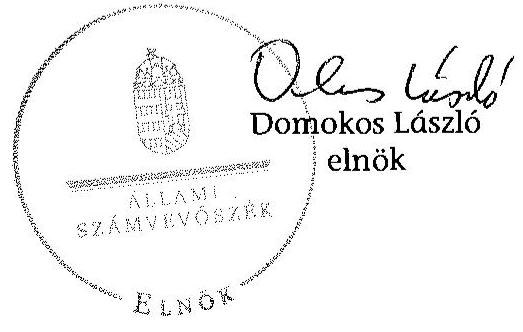

# ÁLLAMI   SZÁMVEVÔSZÉK 

## JELENTÉS

az önkormányzatok belső kontrollrendszere kialakításának, egyes
kontrolltevékenységek és a belső ellenőrzés
müködésének ellenőrzése
Beloiannisz
15098
2015. június

---

# Állami Számvevőszék 

Iktatószám: V-0668-070/2015.
Témaszám: 1702
Vizsgálat-azonosító szám: V067710

## Az ellenőrzést felügyelte:

Dr. Benedek Mária
felügyeleti vezető
Az ellenőrzést vezette és az ellenőrzés végrehajtásáért felelős:
Gál Magdolna
ellenőrzésvezető
A számvevőszéki jelentés összeállításában közremüködött:
Kalmár István
számvevő tanácsos
Az ellenőrzést végezték:
Dr. Szabóné Nagy
Katalin
számvevő

Kalmár István
számvevő tanácsos

Szakál Zsuzsanna
számvevő

---

# TARTALOMJEGYZÉK 

BEVEZETÉS ..... 7
I. ÖSSZEGZŐ MEGÁLLAPÍTÁSOK, KÖVETKEZTETÉSEK, JAVASLATOK ..... 11
II. RÉSZLETES MEGÁLLAPÍTÁSOK ..... 14

1. Az Önkormányzat belső kontrollrendszere kialakításának és múködtetésének megfelelősége ..... 14
1.1. A kontrollkörnyezet kialakítása és múködtetése ..... 14
1.2. A kockázatkezelési rendszer kialakítása és múködtetése ..... 15
1.3. A kontrolltevékenységek kialakítása és múködtetése ..... 16
1.4. Az információs és kommunikációs rendszer kialakítása és múködtetése ..... 17
1.5. A monitoring rendszer kialakítása és múködtetése ..... 17
2. A monitoring rendszer részeként a belső ellenőrzés kialakítása és múködtetése ..... 18
3. A pénzügyi folyamatokban kulcsszerepet betöltő belső kontrollok (teljesítésigazolás és érvényesítés) múködése ..... 19
4. Az integritás szemlélet érvényesülése ..... 21

## FÜGGELÉKEK

1. számú Értelmező szótár
2. számú Az integritás érvényesítése érdekében kialakított és működtetett kontrollrendszer

---

.

---

# RÖVIDÍTÉSEK JEGYZÉKE 

## Törvények

Áht.
ÁSZ tv.
Hhtv.

Info tv.
Kttv.
Ltv.

Mötv.
Ötv.
Mvtv.
Nvtv.
Számv. tv.
Tvtv.

## Rendeletek

Ávr.
Bkr.
Ikr.
képviselő-testületi
SZMSZ
költségvetési rendelet
vagyonrendelet

10/2013. (I. 21.) Korm. rendelet
2011. évi CXCV. törvény az államháztartásról
2011. évi LXVI. törvény az Állami Számvevőszékről
1991. évi XX. törvény a helyi önkormányzatok és szerveik, a köztársasági megbízottak, valamint egyes centrális alárendeltségủ szervek feladat- és hatásköreiről
2011. évi CXII. törvény az információs önrendelkezési jogról és az információszabadságról
2011. évi CXCIX. törvény a közszolgálati tisztviselökröl
1995. évi LXVI. törvény a köziratokról, a közlevéltárakról és a magánlevéltári anyag védelméről
2011. évi CLXXXIX. törvény Magyarország helyi önkormányzatairól
1990. évi LXV. törvény a helyi önkormányzatokról
1993. évi XCIII. törvény a munkavédelemröl
2011. évi CXCVI. törvény a nemzeti vagyonról
2000. évi C. törvény a számvitelről
1996. évi XXXI. törvény a tűz elleni védekezésről, a műszaki mentésről és a tűzoltóságról

368/2011. (XII. 31.) Korm. rendelet az államháztartásról szóló törvény végrehajtásáról
370/2011. (XII. 31.) Korm. rendelet a költségvetési szervek belső kontrollrendszeréről és belső ellenőrzéséről
335/2005. (XII. 29.) Korm. rendelet a közfeladatot ellátó szervek iratkezelésének általános követelményeiről
Beloiannisz Község Önkormányzata Képviselötestületének többször módosított 14/1998. (XII. 18.) KT. sz. önkormányzati rendelete a Képviselö-testület és szervei szervezeti és múködési szabályzatáról (hatályos 1998. december 19-től)
Beloiannisz Község Önkormányzata Képviselőtestületének 1/2013. (II.26.) számú rendelete az Önkormányzat 2013. évi költségvetéséről
Beloiannisz Község Önkormányzata Képviselőtestületének az 5/2011. (VI. 29.) számú rendelettel módosított 7/2004. (II. 31.) számú önkormányzati rendelete az Önkormányzat vagyonáról és a vagyongazdálkodás szabályairól (hatályos 2013. június 28 -ig); Beloiannisz Község Önkormányzata Képviselő-testületének 5/2013. (VI. 28.) számú önkormányzati rendelete az Önkormányzat vagyonáról, a vagyonhasznosítás rendjéről és a vagyon feletti tulajdonosi jogok gyakorlásának szabályairól (hatályos 2013. június 29 -től)
10/2013. (I. 21.) Korm. rendelet a közszolgálati egyéni teljesítményértékelésről

---

## Szórövidítések

alapító okirat
ÁSZ
belső ellenőrzési kézikönyv
belső kontrollrendszer szabályzat
bizonylati rend
eszközök és források értékelési szabályzata
Hivatal
hivatali gazdálkodási szabályzat
hivatali pénzkezelési szabályzat
hivatali számlarend
hivatali számviteli politika
hivatali SZMSZ
INTOSAI
ISSAI
jegyzö

Képviselő-testület
Kormányhivatal
Nemzetiségi Önkormányzat
nemzetiségi eszközök és források értékelési szabályzat
nemzetiségi leltározási és leltárkészítési szabályzat

Besnyői Közös Önkormányzati Hivatal Alapító Okirata (hatályos 2013. január 1-től)
Állami Számvevőszék
Beloiannisz Község Önkormányzata - Belső ellenőrzési kézikönyv (hatályos 2013. január 1-től)
Besnyői Közös Önkormányzati Hivatal - Belső Kontrollrendszer (kontrollterületek, szabálytalanságkezelés, kockázatkezelés, ellenőrzési nyomvonal, FEUVE) (hatályos 2013. augusztus 1 -től)
Besnyői Közös Önkormányzati Hivatal Bizonylati Rendje (hatályos 2013. január 1-től)
Beloiannisz Község Önkormányzata Eszközök és források értékelési szabályzata (hatályos 2013. július 1-től)
Beloiannisz Község Önkormányzata Polgármesteri Hivatala (2012. december 31-ig); Besnyői Közös Önkormányzati Hivatal (2013. január 1-től); Adonyi Közös Önkormányzati Hivatal (2015. január 1-től)
Besnyői Közös Önkormányzati Hivatal Gazdálkodási Szabályzata (hatályos 2013. január 1-től)
Besnyői Közös Önkormányzati Hivatal Pénzkezelési Szabályzata (hatályos 2013. január 1-től)
Besnyői Közös Önkormányzati Hivatal számlarendje (hatályos 2013. július 1-től)
Besnyői Közös Önkormányzati Hivatal számviteli politikája (hatályos 2013. január 1-től)
Besnyői Közös Önkormányzati Hivatal Szervezeti és Múködési Szabályzata (hatályos 2013. december 18-tól)
International Organization of Supreme Audit Institutions (Legfőbb Ellenőrző Intézmények Nemzetközi Szervezete)
International Standards of Supreme Audit Institutions (Legfőbb Ellenőrző Intézmények Nemzetközi Standardjai)
Beloiannisz Község Önkormányzata Polgármesteri Hivatalának jegyzője (2011. április 1-től 2012. december 31ig);
Besnyői Közös Önkormányzati Hivatal jegyzője (2013. január 1-től 2014. december 31-ig); Adonyi Közös Önkormányzati Hivatal jegyzője (2015. január 1-től)
Beloiannisz Község Önkormányzata Képviselő-testülete Fejér Megyei Kormányhivatal
Beloiannisz Község Görög Nemzetiségi Önkormányzata
Beloiannisz Község Görög Nemzetiségi Önkormányzati Eszközök és források értékelési szabályzat (hatályos 2013. július 30-tól)
Beloiannisz Község Görög Nemzetiségi Önkormányzati Leltárkészítési és leltározási szabályzat (hatályos 2013. augusztus 1 -től)

---

nemzetiségi pénzkezelési Beloiannisz Község Görög Nemzetiségi Önkormányzat szabályzat
nemzetiségi számlarend
nemzetiségi számviteli politika
Önkormányzat önkormányzati gazdálkodási szabályzat
polgármester

Pénzkezelési Szabályzat (hatályos 2013. június 28-tól)
Beloiannisz Község Görög Nemzetiségi Önkormányzat Nemzetiségi Önkormányzati Számlarend (hatályos 2013. július 30 -tól)
Beloiannisz Község Görög Nemzetiségi Önkormányzat Számviteli Politika (hatályos 2013. június 28-tól)
Beloiannisz Község Önkormányzata
Beloiannisz Község Önkormányzata Gazdálkodási Szabályzata (hatályos 2013. július 1-től)
Beloiannisz Község Önkormányzatának polgármestere

---

.

---

# JELENTÉS 

## az önkormányzatok belsó kontrollrendszere kialakításának, egyes kontrolltevékenységek és a belső ellenőrzés múködésének ellenőrzése Beloiannisz

## BEVEZETÉS

Beloiannisz község állandó lakosainak száma 2013. január 1-jén 1176 fő volt. Az Önkormányzat héttagú Képviselő-testületének munkáját kettő állandó bizottság segítette. Az Önkormányzat az önállóan múködő és gazdálkodó Hivatalon kívül más intézményt nem múködtetett, többségi tulajdoni hányadú gazdasági társasággal nem rendelkezett. A polgármester 2010. október 13. óta tölti be tisztségét. A jegyző 2015. január 1-jétől látja el feladatait. A Hivatal szervezeti egységekre nem tagolódott, elkülönített gazdasági szervezettel nem rendelkezett, a foglalkoztatott köztisztviselők száma 2013. január 1-jén hét fő volt. A Hivatalnál 2013. évben szervezeti változás nem történt. Az Önkormányzat a 2013. évi költségvetési beszámolója szerint 96193 ezer Ft tárgyévi bevételt ért el, valamint 85752 ezer Ft tárgyévi kiadást teljesített. A 2013. december 31-i könyvviteli mérleg szerint 179022 ezer Ft értékű eszközvagyonnal rendelkezett, a rövid lejáratú kötelezettségállománya 27065 ezer Ft volt, hosszú lejáratú kötelezettsége nem volt.

A demokratikus társadalmakban alapvető igény, hogy a közpénzeket, a közvagyont használók valamennyi tevékenységükhöz kapcsolódó pénzfelhasználásról elszámoljanak, ahhoz egyértelmű és érvényesíthető felelősségi szabályok társuljanak. Ennek a jogos igénynek az érvényesítéséhez meg kell teremteni azokat a folyamatokat, rendszereket, amelyek nélkülözhetetlenek az elszámoltatáshoz. Az elszámoltatás eredményes múködtetéséhez szükség van a megfelelő információs, kontroll, értékelési és beszámolási rendszerek kialakítására.

Magyarországon az uniós csatlakozási tárgyalások idejére nyúlnak vissza a belső kontrollrendszer szabályozásának gyökerei. Az uniós elvárásoknak megfelelő új terminológia szerinti államháztartási belső pénzügyi ellenőrzési (ÁBPE) rendszer területén a jogharmonizáció 2003-ban teljes körűen megvalósult, míg az önkormányzati alrendszerre vonatkozó, Ötv.-ben megjelenített speciális szabályozás 2005-ben lépett hatályba. Az államháztartási belső kontrollrendszer koncepciója 2009-ben továbbfejlődött. A változások irányát mutatja, hogy a költségvetési szervek belső kontrollrendszere már magában foglalja a korszerű felelős szervezetirányítás elemeit (kontrollkörnyezet, kockázatkezelés, kontrolltevékenység, információ és kommunikáció, monitoring) is. E kontrollrendszer szabályozása háromszintű, a törvényi előírásokat az Áht. és a Mötv., a rendeleti szintű szabályozást az Ávr. és a Bkr. tartalmazza, amelyeket útmutatói szinten az NGM által kiadott standardok és kézikönyvek támogatnak.

---

A belső kontrollrendszer azt a célt szolgálja, hogy a költségvetési szervek múködésük és gazdálkodásuk során a tevékenységeket szabályszerűen, gazdaságosan, hatékonyan, eredményesen hajtsák végre, teljesítsék elszámolási kötelezettségeiket és megvédjék az erőforrásokat a veszteségektől, a károktól és a nem rendeltetésszerű használattól. A belső kontrollrendszer magában foglalja mindazon szabályokat, eljárásokat, gyakorlati módszereket és szervezeti struktúrákat, kockázatkezelési technikákat, kontrolltevékenységeket, amelyek segítséget nyújtanak a szervezetnek céljai eléréséhez.

Az ÁSZ középtávú stratégiájában hangsúlyos szerepet szánt annak, hogy szilárd szakmai alapon álló, értékteremtő ellenőrzéseivel előmozdítsa a közpénzügyek átláthatóságát, rendezettségét. A számvevőszéki ellenőrzés nemzetközi alapelvei is rögzítik, hogy a megfelelő belső kontrollrendszer minimálisra csökkenti a hibák és szabálytalanságok kockázatát.

Az ellenőrzés célja annak értékelése, hogy

- a jogszabályi előírásoknak megfelelően alakították-e ki és működtették-e a belső kontrollrendszert;
- a gazdálkodás folyamatában kulcsszerepet betöltő teljesítésigazolás és érvényesítés kontrolltevékenységeit megfelelően működtették-e;
- biztosították-e a belső ellenőrzés szabályos múködését;
- kialakították-e az erőforrásokkal való szabályszerű és hatékony gazdálkodáshoz szükséges követelményeket, megvalósították-e azok számonkérését, ellenőrzését;
- hasznosították-e a 2009-2013. évek között végzett ÁSZ ellenőrzések során megfogalmazott javaslatokat.

A közintézmények integritás alapú kultúrájának kialakítása, megerősítése és múködése szorosan összefügg a belső kontrollrendszer múködésével, ezért az ellenőrzés kitért a gazdálkodáshoz kapcsolódó integritás kontrollok meglétének és működésének ellenőrzésére is. Az integritási kultúra kialakítása hozzájárul az elszámoltathatóság és átláthatóság érvényesítéséhez, egyben támogatja a szervezet védettségét a korrupciós kitettséggel szemben, valamint annak megelőzése is irányítottabbá válik.

Az ellenőrzés várható hasznosulását négy szinten tervezzük. A törvényalkotás számára összegzett tapasztalatok állnak rendelkezésre a belső kontrollrendszer önkormányzati területen való kialakításáról, müködéséről és hatásairól, a belső ellenőrzés múködéséről. Az ellenőrzés az ellenőrzött számára visszajelzést ad a belső kontrollrendszer kialakításában és múködésében fellépő hiányosságokról, javaslataival hozzájárul azok kiküszöböléséhez, amely csökkentheti a későbbi ellenőrzések gyakoriságát. Az ellenőrzés megállapításait és javaslatait más szervezetek is hasznosíthatják a rendezett gazdálkodási keretek kialakításához. A társadalom számára jelzi, hogy közpénz nem maradhat ellenőrizetlenül, az ÁSZ értékteremtő rend kialakításához és megőrzéséhez hozzájáruló tevékenysége pozitív hatással lesz a szervezetről kialakított összkép formálásában. A szervezeten belül lehetőség nyílik arra, hogy a megállapítások

---

szintetizálásával az ÁSZ a hozzáadott értéket teremtő elemző tevékenységét és tanácsadó szerepét is erősítse.

Az önkormányzatok belső kontrollrendszere kialakításának, az egyes kontrolltevékenységek és a belső ellenőrzés múködésének ellenőrzéséről szóló jelentés I. fejezetének összegző része az ellenőrzés céljára ad rövid, szintetizáló összefoglalót, és tartalmazza a következtetéseket a II. fejezet részletes megállapításain alapulóan. A jelentés intézkedést igénylő megállapításait és javaslatait az ellenőrzés során feltárt, a jelentés II. fejezetében rögzített részletes megállapítások alapozzák meg.

# Az ellenőrzés típusa: szabályszerűségi ellenőrzés 

Az ellenőrzött időszak: a belső kontrollrendszer kialakítása és múködtetése megfelelőségét a 2013. évre vonatkozóan (2013. december 31-i állapotnak megfelelően), a pénzügyi folyamatokban kulcsszerepet betöltő teljesítésigazolás és érvényesítés belső kontrollok múködésének megfelelőségét, és a belső ellenőrzés szabályszerű működését a 2013. január 1 - december 31-e közötti időszakot figyelembe véve értékeltük, míg az ÁSZ javaslatainak utóellenőrzése a 2009-2013. években végzett ellenőrzések nyilvánosságra hozott jelentéseiben tett javaslatok áttekintésére terjedt ki.

## Az ellenőrzött szervezet: az Önkormányzat

Az ellenőrzés jogszabályi alapját az ÁSZ tv. 1. § (3) bekezdése, az 5. § (2) és (6) bekezdései, valamint az Áht. 61. § (2) bekezdése képezik.

Az ellenőrzés szakmai módszertana az ÁSZ hivatalos honlapján (www.asz.hu) közzétett szakmai szabályokon alapult, amely az INTOSAI által kiadott ISSAI figyelembevételével készült.

Az ellenőrzés lefolytatásához az Önkormányzat a kimutatások és a tanúsítvány elektronikus kitöltésével, valamint az ÁSZ által kért dokumentumok elektronikus megküldésével szolgáltatott adatokat. Az így rendelkezésre bocsátott adatok, információk kontrollja és a munkalapok kitöltése a helyszíni ellenőrzés keretében történt. A jelentésben használt fogalmak magyarázatát az 1. számú függelék, az integritás érvényesítése érdekében kialakított és múködtetett intézményi kontrollrendszer minősítését a 2. számú függelék tartalmazza.

A belső kontrollrendszer, valamint a belső ellenőrzés jogszabályi előírások szerinti kialakításának és múködtetésének szabályszerűségét az erre irányuló ellenőrzési kérdésekre adott válaszok összesítése alapján értékeltük. A belső kontrollrendszert kontrollterületenként (kontrollkörnyezet, kockázatkezelési rendszer, kontrolltevékenységek, információs és kommunikációs rendszer, monitoring rendszer) és összesítetten is értékeltük.

A belső kontrollrendszer egyes kontrollterületei és a belső ellenőrzés kialakítása és múködtetése „szabályszerü volt", amennyiben az értékelt területen az elért és elérhető pontok százalékban kifejezett hányadosa elérte a $81 \%$-ot, „részben szabályszerü volt", ha 61-80\% közé esett, és „nem volt szabályszerü", ha nem haladta meg a $60 \%$-ot. A belső kontrollrendszer összesített értékelése megegyezett a kontrollterületenként alkalmazott \%-os értékelésekkel, a következő eltérésekkel.

---

A kontrollrendszer egésze esetében a „szabályszerü" értékelésnek a \%-os értéken felül további feltétele volt, hogy egyik kontrollterület sem kaphatott „nem volt szabályszerü" értékelést, a „részben szabályszerü" értékelés további feltétele volt, hogy legfeljebb egy ellenőrzött kontrollterület lehetett „nem volt szabályszerü" értékelésú. Az összesített értékelés a \%-os értéktől függetlenül „nem volt szabályszerű", ha az ellenőrzött kontrollterületek közül több mint egynek „nem volt szabályszerü" az értékelése.

A gazdálkodás folyamatában kulcsszerepet betöltő két kulcskontroll - teljesítésigazolás, érvényesítés - múködésének megfelelőségét a személyi juttatásokkal, a dologi és felhalmozási kiadásokkal, múködési és felhalmozási célú pénzeszközátadásokkal, ellátottak pénzbeli juttatásaival kapcsolatos kifizetések esetében mintavétellel ellenőriztük. „Megfelelőnek" értékeltük a gazdálkodási jogkörök gyakorlását, amennyiben 95\%-os bizonyossággal a teljes sokaságban a hibaarány legfeljebb $10 \%$, „részben megfelelőnek" értékeltük, ha a hibaarány felső határa 10-30\% között volt, „nem megfelelőnek" pedig akkor, ha a mintavételi eredmények alapján a sokaságbeli hibaarány felső határa meghaladta a 30\%ot.

Az integritás szemlélet érvényesülésének minősítése az Önkormányzat önbevallás által kitöltött tanúsítványa alapján történt.

Utóellenőrzésre nem került sor, mivel az ÁSZ az Önkormányzatnál a 20092013. évek között ellenőrzést nem végzett.

Az ÁSZ tv. 29. § (1) bekezdése szerint a jelentéstervezetet megküldtük a polgármester részére, aki az ÁSZ tv. 29. § (2) bekezdésében foglalt észrevételezési jogával nem élt, a jelentéstervezetre észrevételt nem tett.

---

# I. ÖSSZEGZŐ MEGÁLLAPÍTÁSOK, KÖVETKEZTETÉSEK, JAVASLATOK 

A belső kontrollrendszeren belül 2013-ban a kontrollkörnyezet, a kockázatkezelési rendszer, a kontrolltevékenységek, az információs és kommunikációs rendszer, valamint a monitoring rendszer kialakítását és múködtetését külön-külön és együttesen is értékeltük. A belső kontrollrendszer kialakítása és múködtetése az összesített értékelés alapján részben volt szabályszerű.

A belső kontrollrendszer egyes területei kialakításának és múködtetésének minősítése a következő:

| Kontrollterïlet | Minősítés |
| :--: | :--: |
| Kontrollkörnyezet | részben   szabályszerű |
| Kockázatkezelési rendszer | szabályszerű |
| Kontrolltevékenységek | részben   szabályszerű |
| Információs és kommunikációs rendszer | nem   szabályszerű |
| Monitoring rendszer | részben   szabályszerű |

Szabályszerú volt a kockázatkezelési rendszer kialakítása és működtetése, mivel a jegyző a jogszabályi előírásokban foglaltakat figyelembe véve - kisebb hiányosságok mellett - megteremtette e kontrollterületen a szabályszerű múködés lehetőségét.

Részben szabályszerú volt a kontrollkörnyezet, a kontrolltevékenységek, valamint a monitoring rendszer kialakítása és múködtetése, mivel a megállapított szabályozásbeli hiányosságok nem veszélyeztették e kontrollterületeken a szabályszerű működést.

Nem volt szabályszerű az információs és kommunikációs rendszer kialakítása és múködtetése, mivel az ellenőrzésünk során megállapított szabályozásbeli hiányosságok magukban hordozzák a szabálytalan múködés, valamint a korrupció kockázatát.

A 2013. évben a személyi juttatásokkal, a dologi kiadásokkal, valamint a múködési célú pénzeszközátadásokkal, illetve az ellátottak pénzbeli juttatásaival kapcsolatos kifizetések során a pénzügyi folyamatokban kulcsszerepet betöltő teljesítésigazolás és érvényesítés belső kontrollok múködése nem volt megfelelő, mivel azok nem biztosították a hibák megelőzését és feltárását.

---

A számvevőszéki ellenőrzés az ellenőrzött kifizetésekkel összefüggésben a rendelkezésre bocsátott dokumentumok alapján kár bekövetkeztére utaló adatot, tényt nem állapított meg, azonban a gazdálkodásban kulcsszerepet betöltő kontrollok múködésében feltárt hiányosságok miatt fennáll a hibák bekövetkezésének kockázata. A nem megfelelően múködtetett belső kontrollok korrupciós kockázatot hordoznak.

A 2013. évben a belső ellenőrzés kialakítása és múködtetése részben szabályszerű volt, a kulcskontrollok működésének hiányosságait a belső ellenőrzés feltárta, ennek ellenére a 2013. évben a pénzügyi folyamatokban kulcsszerepet betöltő teljesítésigazolás és érvényesítés belső kontrollok müködése nem volt megfelelő.

A Képviselő-testület a 2013. évben nem alakította ki az erőforrásokkal való szabályszerű és hatékony gazdálkodáshoz szükséges követelményeket.

Az Önkormányzat nem vett részt az ÁSZ 2013. évi integritás felmérésében.
A belső kontrollrendszer ellenőrzése keretében az integritás szemlélet érvényesülésének ellenőrzéséhez az Önkormányzat tanúsítványon - önbevallás útján szolgáltatott adatokat. Az integritás szemlélet érvényesülésének minősítését a 2. számú függelék tartalmazza.

Az ellenőrzés intézkedést igénylő megállapításai és javaslatai:

# a polgármesternek 

1. Az Önkormányzat kiadási előirányzata terhére történt kötelezettségvállalásra - az Áht. 37. § (1) bekezdésében és az Ávr. 55. § (1) bekezdésében foglaltak ellenére pénzügyi ellenjegyzés nélkül került sor.

Javaslat:
Intézkedjen annak érdekében, hogy az Önkormányzat nevében történő kötelezettségvállalásra az Áht. 37. § (1) bekezdésében és az Ávr. 55. § (1) bekezdésében foglaltaknak megfelelően - az Ávr. 53. §-ában meghatározott kivételekkel - kizárólag pénzügyi ellenjegyzés után kerüljön sor.

## a jegyzőnek

1. A számvevőszéki jelentés ellenőrzési megállapításai alapján az Önkormányzatnál a belső kontrollrendszer kialakítása és müködtetése az összesített értékelés alapján részben volt szabályszerű, a kulcskontrollok müködése nem volt megfelelő, illetve a belső ellenőrzés kialakítása és müködtetése részben szabályszerű volt. A számvevőszéki ellenőrzés során feltárt hibákat, hiányosságokat és szabálytalanságokat a számvevőszéki jelentés II. Részletes megállapítások fejezetcím tartalmazza.

Javaslat:
A jogszabályoknak megfelelő belső kontrollrendszer kialakítása és működtetése érdekében - az ellenőrzött időszak óta bekövetkezett esetleges jogszabályi változásokra

---

figyelemmel - intézkedjen a belső kontrollrendszer kialakításában és múködtetésében, a kulcskontrollok múködésében, illetve a belső ellenőrzés kialakításában és múködtetésében az ellenőrzés által feltárt hibák, hiányosságok, szabálytalanságok kijavítására.

Kezdeményezze, hogy az éves ellenőrzési terv kiterjedjen a kifizetések szabályszerűségi ellenőrzésére, különös tekintettel a személyi juttatásokkal, a dologi kiadásokkal, a felhalmozási kiadásokkal, a múködési és felhalmozási célú pénzeszköz átadásokkal, az ellátottak pénzbeli juttatásaival kapcsolatos kiadási jogcímekből teljesített kifizetésekre.

---

# II. RÉSZLETES MEGÁLLAPÍTÁSOK 

## 1. Az ÖNKORMÁNYZAT BELSŐ KONTROLLRENDSZERE KIALAKÍTÁSÁNAK ÉS MÜKÖDTETÉSÉNEK MEGFELELŐSÉGE

A belső kontrollrendszeren belül 2013-ban a kontrollkörnyezet, a kockázatkezelési rendszer, a kontrolltevékenységek, az információs és kommunikációs rendszer, valamint a monitoring rendszer kialakítását és múködtetését külön-külön és együttesen is értékeltük. A belső kontrollrendszer kialakítása és múködtetése az összesített értékelés alapján részben volt szabályszerű.

### 1.1. A kontrollkörnyezet kialakítása és múködtetése

A kontrollkörnyezet kialakítása és múködtetése részben volt szabályszerü.

A Hivatal rendelkezett a Képviselő-testület által elfogadott alapító okirattal, amely tartalmazta az alaptevékenységeket. Az Önkormányzat rendelkezett képviselő-testületi SZMSZ-szel. A Képviselő-testület a vagyongazdálkodás szabályait a vagyonrendeletében határozta meg.

A Hivatal szervezetére és múködésére vonatkozó szabályokat a hivatali SZMSZ tartalmazta. A jegyző a jogszabályi előírásoknak megfelelően kialakította a hivatali számviteli politikát és elkészítette a hivatali pénzkezelési szabályzatot, számlarendet és bizonylati rendet. A jegyző a Nemzetiségi Önkormányzatra vonatkozóan önálló szabályzatokat készített, így kialakította a Nemzetiségi Önkormányzat számviteli politikáját, továbbá elkészítette a pénzkezelési szabályzatot, a leltározási és leltárkészítési szabályzatot, az eszközök és források értékelési szabályzatát, valamint a Nemzetiségi Önkormányzat számlarendjét. A jegyző a jogszabályi előírásoknak megfelelően a belső kontrollrendszer szabályzatban meghatározta a szabálytalanságok kezelésének eljárásrendjét, valamint a Hivatal ellenőrzési nyomvonalát és gondoskodott annak rendszeres felülvizsgálatáról, aktualizálásáról. A jegyző a hivatali SZMSZ-ben rendelkezett a Hivatal által ellátott feladatok munkafolyamatainak leírásáról, a feladat- és hatáskörökről, a helyettesítés rendjéről, továbbá a szervezeten belüli belső és azon kívüli külső kapcsolattartás módjáról, szabályairól.

A Hivatalban dolgozó köztisztviselők rendelkeztek munkaköri leírással, a jegyző elkészítette a köztisztviselők teljesítményértékelését. A költségvetési rendeletben meghatározták a Hivatal engedélyezett létszámát.

---

A kontrollkörnyezet kialakítása és múködtetése részben volt szabályszerű, mert:

| Sorszám ${ }^{1}$ | Megállapítás |
| :--: | :--: |
| 3. | Az Önkormányzat nem rendelkezett a 2011-2014. évekre vonatkozó gazdasági programmal, mivel a jegyző a - Hhtv. 140. § (1) bekezdés a) pontjában foglaltak ellenére - annak tervezetét nem készítette elő. |
| 20., 24. | A jegyző - a Számv. tv. 14. § (5) bekezdés a) és b) pontjaiban foglaltak ellenére - nem készítette el a Hivatal leltározási és leltárkészítési szabályzatát, valamint az eszközök és források értékelési szabályzatát. |
| 29. | A jegyző - az Mvtv. 2. § (3) bekezdésében foglaltak ellenére - nem határozta meg a Hivatalban az egészséget nem veszélyeztető és biztonságos munkavégzés követelményei megvalósításának módját. |
| 30. | A jegyző - a Tvtv. 19. § (1) bekezdésében foglaltak ellenére - nem készítette el a Hivatal tüzvédelmi szabályzatát. |
| 40. | A Képviselő-testület - az Áht. 9. § (1) bekezdés f) pontjában foglaltak ellenére - nem alakította ki az erőforrásokkal való szabályszerű és hatékony gazdálkodáshoz szükséges követelményeket. |
| 46. | A jegyző - a Mötv. 81. § (3) bekezdés c) pontjában foglaltak ellenére nem készítette elő a Kttv. 83. §-ában előírt, a köztisztviselökre vonatkozó hivatásetikai alapelvek részletes tartalmát, valamint az etikai eljárás szabályait. |

# 1.2. A kockázatkezelési rendszer kialakítása és múködtetése 

## A kockázatkezelési rendszer kialakítása és múködtetése - kisebb hiányosságok mellett - szabályszerű volt.

A jegyző kialakította a Hivatal kockázatkezelési rendszerét, amely tartalmazta a kockázatok azonosításával, elemzésével, csoportosításával, nyomon követésével, illetve a kockázati kitettség csökkentésével kapcsolatos szabályokat.

A vagyonnyilatkozat-tételre kötelezettek körét a hivatali SZMSZ-ben rögzítették. A vagyonnyilatkozat-tételre kötelezett polgármester, képviselők, jegyző, köztisztviselők a 2013. évben esedékes vagyonnyilatkozat-tételi kötelezettségüknek eleget tettek.

[^0]
[^0]:    ${ }^{1}$ A témacsoportos ellenőrzés miatt a megállapítás számozása az önkormányzat által kitöltött kimutatások - adatszolgáltatások - kérdéseinek sorszámával azonos.

---

A kockázatkezelési rendszer kialakítása és múködtetése - az alábbi kisebb hiányosságok mellett - szabályszerű volt:

# Sor-   szám 

A jegyző - a Bkr. 7. § (2) bekezdésében foglalt előírás ellenére - nem mérte fel és nem állapította meg a Hivatal tevékenységében, gazdálkodásában rejlő kockázatokat, nem határozta meg az egyes kockázatokkal kapcsolatban a szükséges intézkedéseket, valamint azok teljesítésének folyamatos nyomon követési módját.

### 1.3. A kontrolltevékenységek kialakítása és múködtetése

## A kontrolltevékenységek kialakítása és múködtetése részben volt szabályszerű.

A jegyző a belső kontrollrendszer szabályzatban előírta a folyamatba épített, előzetes, utólagos és vezetői ellenőrzést a költségvetés tervezése, a beszerzések lebonyolítása, a vagyonhasznosítási tevékenység, valamint a támogatások elszámolása vonatkozásában.

A jegyző a hivatali, valamint az önkormányzati gazdálkodási szabályzatban meghatározta a kötelezettségvállalás, a pénzügyi ellenjegyzés, az érvényesítés, és az utalványozás gyakorlásának módjával, eljárási és dokumentációs részletszabályaival, valamint az ezeket végző személyek kijelölésének rendjével kapcsolatos belső előírásokat.

A polgármester írásos előterjesztés formájában a megadott határidőig tájékoztatta a Képviselő-testületet az Önkormányzat gazdálkodásának 2013. első félévi és háromnegyedéves helyzetéről, melyeket a Képviselő-testület elfogadott.

A kötelezettségvállalók (polgármester és jegyző) írásban kijelölték az Önkormányzat és a Hivatal vonatkozásában a teljesítés igazolására jogosult személyeket.

A kontrolltevékenységek kialakítása - az alábbi hiányosságok miatt - részben felelt meg a jogszabályi előírásoknak:

## Sor-   szám

A jegyző - az Ávr. 53. § (2) bekezdésében foglaltak ellenére - annak ellenére nem határozta meg belső szabályzatában az előzetes írásbeli kötelezettségvállalást nem igénylő kifizetések rendjét, hogy a hivatali és az önkormányzati gazdálkodási szabályzat is lehetővé tette a 100 ezer Ft alatti kifizetések előzetes írásbeli kötelezettségvállalás nélküli teljesítését.

A jegyző - az lkr. 8. § (1) bekezdésében foglaltak ellenére - nem gondoskodott az iratkezelési szoftver által kezelt adatok biztonságáról, nem alakította ki az üzembiztonsági, adatvédelmi szabályok érvényre juttatásához szükséges eljárási szabályokat.

---

| 26., | A jegyző - az Ávr. 55. § (3) bekezdésében előírtak ellenére - olyan szo- |
| :--: | :--: |
| 30. | mélyeket jelölt ki a pénzügyi ellenjegyzési és az érvényesitési feladatok ellátására, akik nem rendelkeztek az előirt végezettséggel, illetve pénzügyi-számviteli képesítéssel. |
| 32., | A jegyző - a Kttv. 74. § (1) bekezdése, és az lkr. 15. §-ában foglaltak ellenére - nem szabályozta a Hivatalban a közszolgálati jogviszony megszủnése és a munkakör változása esetén a munkakör átadásának rendjét, továbbá a jogviszony megszűnésekor nem gondoskodott a munkakör dokumentált átadásáról. |

1.4. Az információs és kommunikációs rendszer kialakítása és müködtetése

Az információs és kommunikációs rendszer kialakítása és müködtetése nem volt szabályszerű, mert:

| Sorszám | Megállapítás |
| :--: | :--: |
| $1-2$. | A jegyző - a Bkr. 3. § d) pontjában és 9. § (1) bekezdésében foglaltak ellenére - nem alakított ki és müködtetett olyan rendszert, amely biztosítja, hogy a megfelelő információk a megfelelő időben eljutnak az illetékes szervezethez, illetve személyhez. |
| 3. | A jegyző az információs rendszerek keretében - a Bkr. 9. § (2) kezdésében foglaltak ellenére - nem határozta meg a beszámolási szinteket, határidőket, módokat. |
| 4. | A jegyző - az Info tv. 24. § (3) bekezdésében foglaltak ellenére - nem készítette el a Hivatal adatvédelmi és adatbiztonsági szabályzatát. |
| 5,7. | A jegyző - az Info tv. 30. § (6) bekezdésében és a 35. § (3) bekezdésében, valamint az Ávr. 13. § (2) bekezdés h) pontjában foglaltak ellenére - belső szabályzatban nem állapította meg a kötelezően közzéteendő adatok nyilvánosságra hozatalának és a közérdekú adatok megismerésére irányuló igények teljesítésének rendjét. |
| 8. | A jegyző - az Ltv. 9. § (4) bekezdésében foglaltak ellenére - nem készítette el a Hivatal iratkezelési szabályzatát. |

1.5. A monitoring rendszer kialakítása és múködtetése

A monitoring rendszer kialakítása és múködtetése részben volt szabályszerű.

A jegyző a Bkr.-ben foglaltak szerint kialakította a Hivatal tevékenységének, a célok megvalósításának nyomon követését biztosító rendszert.

---

A monitoring rendszer kialakítása és múködtetése részben volt szabályszerű, mert:

| Sorszám | Megállapítás |
| :--: | :--: |
| 2. | A jegyző - a Bkr. 11. § (1) bekezdésében foglalt kötelezettsége ellenére - a Bkr. 1. mellékletében foglalt nyilatkozatban a 2013.évre vonatkozóan nem értékelte a Hivatal belső kontrollrendszerének minőségét. |

Az Önkormányzat törvényességi felügyeletét ellátó Kormányhivatal három esetben élt törvényességi felhívással a 2013. évben. A Hivatal aljegyzői munkakörére kiírt pályázattal kapcsolatosan a jogszabálysértés megszüntetésére, a szociális ellátásokról szóló önkormányzati rendelet magatartás szabályainak pontosítására, valamint a vagyonrendelet Nvtv. rendelkezéseivel való összhangba hozatalára kötelezte az Önkormányzatot. A Hivatal határidőben tájékoztatta a Kormányhivatalt a megtett intézkedésekről.

# 2. A MONITORING RENDSZER RÉSZEKÉNT A BELSŐ ELLENŐRZÉS KIALAKÍTÁSA ÉS MŰKÖDTETÉSE 

## Az Önkormányzatnál a belső ellenőrzési rendszer kialakítása és múködtetése részben volt szabályszerü.

Az Önkormányzat a belső ellenőrzés kialakításáról vállalkozási szerződés keretében külső szolgáltató útján gondoskodott. Az Önkormányzat rendelkezett a jegyző által jóváhagyott belső ellenőrzési kézikönyvvel, amely tartalmazta a Bkr. által kötelezően előírt tartalmi elemeket. A belső ellenőrök szervezeti és funkcionális függetlenségét biztosították. A belső ellenőrzési vezető megfelelt a szakirányú szakképzettségi és szakmai gyakorlati követelményeknek.

A belső ellenőrzési vezető a 2014. évre elkészítette az Önkormányzat éves ellenőrzési tervét, amelynek összeállítását megelőzően kockázatelemzést végzett.
2013. évben az éves módosított ellenőrzési tervben foglalt valamennyi ellenőrzést végrehajtották, soron kívüli ellenőrzést nem végeztek. A 2013. évben végrehajtott ellenőrzésekhez a belső ellenőrzési vezető által jóváhagyott, a Bkr.-ben foglalt tartalmi követelményeknek megfelelő ellenőrzési programok készültek. Az elvégzett ellenőrzések jelentéseinek tartalma megfelelt a jogszabályi előírásoknak.

A belső ellenőrzési rendszer kialakítása és múködtetése részben szabályszerű volt, mert:

| Sorszám | Megállapítás |
| :--: | :--: |
| 7. | Az Önkormányzat nem rendelkezett - a Bkr. 22. § (1) b) pontjában foglaltak ellenére - a Képviselő-testület által elfogadott stratégiai ellenőrzési tervvel, mivel a jegyző nem kezdeményezte a polgármesternél a belső ellenőrzési vezető által elkészített stratégiai terv Képviselő-testület elé terjesztését. |

---

| 8. a) | A 2014. évi ellenőrzési terv - a Bkr. 31. § (4) bekezdés a) pontjában fog-   laltak ellenére - nem tartalmazta az ellenőrzési tervet megalapozó elem-   zések és a kockázatelemzés eredményének összefoglaló bemutatását. |
| :--: | :--: |
| 22. | A jegyző a belső ellenőrzés megállapításai és javaslatai alapján - a   Bkr. 28. § c) pontjában foglaltak ellenére - nem készített intézkedési ter-   vet. |
| 23. | A 2013. évben elvégzett belső ellenőrzésekről vezetett nyilvántartás - a   Bkr. 50. § (2) bekezdés d), e), f) pontjaiban foglaltak ellenére - nem tar-   talmazta az ellenőrzés kezdetének és lezárásának időpontját, az ellenő-   zés lefolytatásában részt vett vizsgálatvezető és a belső ellenőr nevét,   továbbá a vizsgált időszakot. |
| 24. | A belső ellenőrzési vezető - a Bkr. 21. § (2) bekezdés d) pontjában és a   47. § (1) bekezdésében foglaltak ellenére - nem vezetett a belső ellenőrzé-   si jelentésekben tett megállapításokat, javaslatokat, a vonatkozó intézke-   dési terveket és azok végrehajtását nyomon követő nyilvántartást. |

# 3. A PÉNZÜGYI FOLYAMATOKBAN KULCSSZEREPET BETÖLTŐ BELSŐ KONTROLLOK (TELJESÍTÉSIGAZOLÁS ÉS ÉRVÉNYESÍTÉS) MÜKÖDÉSE 

A 2013. évben a személyi juttatásokkal, a dologi kiadásokkal, a múködési célú pénzeszközátadásokkal, illetve az ellátottak pénzbeli juttatásaival kapcsolatos kifizetések során a pénzügyi folyamatokban kulcsszerepet betöltő teljesítésigazolás és érvényesítés belső kontrollok müködése nem volt megfelelő az alábbi hiányosságok miatt:

| Kulcskontrollok | Megállapítás |
| :--: | :--: |
| Teljesítésigazolás | A teljesítésigazolást a kifizetéseket megelőzően - az Áht. 38. § (1) bekezdésében és az Ávr. 57. § (1) és (3) bekezdéseiben foglaltak ellenére - nem, vagy nem szabályszerűen, vagy kijelöléssel nem rendelkező jogosulatlanul végezte. |
| Érvényesítés | Az érvényesítést a kifizetéseket megelőzően - az Áht. 38. § (1) bekezdésében és az Ávr. 58. § (1), (3)-(4) bekezdéseiben elöírtak ellenére - nem, vagy nem szabályszerűen, illetve kijelöléssel nem rendelkező jogosulatlanul végezte.   Az érvényesítő - az Ávr. 58. § (2) bekezdés előírása ellenére - nem jelezte az utalványozónak, hogy a megelőző ügymenetben az Áht., az államháztartási számviteli kormányrendelet és az Ávr. előírásaiban foglaltakat nem tartották be. |
|  | A kulcskontrollok ellenőrzése során feltárt egyéb hiányosságok:   Az Önkormányzat megsértette az Áht. 36. § (1) bekezdésében foglalt kötelezettségvállalásra vonatkozó előírásokat, továbbá az Áht. 6. § (1) bekezdésében foglalt előírásokat. |

---

A 2013. évben az ellenőrzött kifizetési jogcímek mintatételei alapján a teljesítésigazolás kulcskontroll múködése során az alábbi hiányosságok, szabálytalanságok fordultak elő:

- a dologi kiadásokkal, a működési célú pénzeszközátadásokkal, illetve az ellátottak pénzbeli juttatásaival kapcsolatos kifizetéseknél - az Ávr. 57. § (1) bekezdésében foglaltak ellenére - a teljesítésigazolást nem végezték el;
- a személyi juttatásokkal kapcsolatos kifizetéseket megelőzően a teljesítésigazolást - az Áht. 38. § (1) bekezdésében és az Ávr. 57. § (3) bekezdésében foglaltak ellenére - kijelöléssel nem rendelkező jogosulatlanul végezte el;
- a dologi kiadásokkal kapcsolatos kifizetéseket megelőzően a teljesítésigazolás - az Ávr. 57. § (1) bekezdésében foglaltak ellenére - nem szabályszerűen történt, mivel a teljesítésigazoló ellenőrizhető okmány (kötelezettségvállalási bizonylat) hiányában nem tudta ellenőrizni a kiadások teljesítésének jogosságát, összegszerűségét, valamint az ellenszolgáltatás teljesítését.

A 2013. évben az ellenőrzött kifizetési jogcímek mintatételei alapján az érvényesítés kulcskontroll múködése során az alábbi hiányosságok, szabálytalanságok fordultak elő:

- a személyi juttatásokkal kapcsolatos kifizetéseket megelőzően az érvényesítés nem volt szabályszerű, mivel - az Ávr. 60 § (2) bekezdésében előírt összeférhetetlenségi követelmény ellenére - az érvényesítő az érvényesítést a maga javára látta el;
- a személyi juttatásokkal, a dologi kiadásokkal és a működési célú pénzeszközátadásokkal, illetve az ellátottak pénzbeli juttatásaival kapcsolatos kifizetéseket megelőzően az érvényesítés nem volt szabályszerű, mivel azt - az Ávr. 58. § (4) bekezdésében előírtak ellenére - kijelöléssel nem rendelkező személy jogosulatlanul végezte, továbbá az érvényesítés - az Ávr. 58. § (3) bekezdésében foglalt előírás ellenére - nem tartalmazta az érvényesítés keltezését;
- a személyi juttatásokkal, a dologi kiadásokkal és a múködési célú pénzeszközátadásokkal, illetve az ellátottak pénzbeli juttatásaival kapcsolatos kifizetéseket megelőzően az érvényesítés nem volt szabályszerű, mivel - az Ávr. 58. § (1) bekezdésében foglaltak ellenére - az érvényesítő ellenőrizhető okmány (kötelezettségvállalási bizonylat) hiányában nem tudta ellenőrizni az összegszerűséget és a fedezet meglétét;
- a személyi juttatásokkal, a dologi kiadásokkal és a múködési célú pénzeszközátadásokkal, illetve az ellátottak pénzbeli juttatásaival kapcsolatos kifizetéseket megelőzően az érvényesítő - az Ávr. 58. § (1) bekezdésében foglaltak ellenére - a fedezet meglétét nem tudta ellenőrizni, mivel - az Ávr. 56. § (1) bekezdésében foglaltak ellenére - a 2013. évben a kötelezettségvállalásokról nyilvántartást nem vezettek;
- a személyi juttatásokkal, a dologi kiadásokkal, valamint a múködési célú pénzeszközátadásokkal, illetve az ellátottak pénzbeli juttatásaival kapcsolatos kifizetéseket megelőzően az érvényesítő - az Ávr. 58. § (2) bekezdésében

---

foglaltak ellenére - nem jelezte az utalványozónak, hogy a megelőző ügymenetben nem tartották be az Áht. 37. § (1) bekezdésében, az Avr. 55 § (1) bekezdésében foglaltakat, mivel a Hivatal és az Önkormányzat kiadásaival kapcsolatban kötelezettségvállalásra pénzügyi ellenjegyzés nélkül került sor;

- a személyi juttatásokkal, a dologi kiadásokkal, valamint a múködési célú pénzeszközátadásokkal, illetve az ellátottak pénzbeli juttatásaival kapcsolatos kifizetéseket megelőzően az érvényesítő - az Ávr. 58. § (2) bekezdésében foglaltak ellenére - nem jelezte az utalványozónak, hogy a megelőző ügymenetben a teljesítésigazolást nem, vagy nem szabályszerűen, vagy kijelöléssel nem rendelkező személy jogosulatlanul végezte, továbbá azt, hogy a kötelezettségvállalás nyilvántartást nem vezették.

Az Önkormányzat megsértette az Áht. 36. § (1) bekezdésében foglalt kötelezettségvállalásra vonatkozó előírásokat, továbbá az Áht. 6. § (1) bekezdésében foglalt előírásokat, mivel a teljesített kiadások összege a jóváhagyott előirányzatot meghaladó volt.

A számvevőszéki ellenőrzés az ellenőrzött kifizetésekkel összefüggésben a rendelkezésre bocsátott dokumentumok alapján kár bekövetkeztére utaló adatot, tényt nem állapított meg, azonban a gazdálkodásban kulcsszerepet betöltő kontrollok múködésében feltárt hiányosságok miatt fennáll a hibák, szabálytalanságok bekövetkezésének kockázata. A nem megfelelően múködtetett belső kontrollok korrupciós kockázatot hordoznak.

# 4. Az integritás sZemlélet érvényesülése 

Az Önkormányzat nem vett részt az ÁSZ 2013. évi integritás felmérésében.
A belső kontrollrendszer ellenőrzése keretében az integritás szemlélet érvényesülésének ellenőrzéséhez az Önkormányzat tanúsítványon - önbevallás útján szolgáltatott adatokat. Az integritás szemlélet érvényesülésének minősitését a 2. számú függelék tartalmazza.

Budapest, 2015. ơ. hó 22 . nap

Függelék: $\quad 2 \mathrm{db}$

---

.

---

# ÉRTELMEZŐ SZÓTÁR 

belső ellenőrzés
belső kontrollrendszer
belső kontrollrendszer területei
egyszerú véletlen minta
integritás
kockázat

Független, tárgyilagos bizonyosságot adó és tanácsadó tevékenység, amelynek célja, hogy az ellenőrzött szervezet múködését fejlessze és eredményességét növelje, az ellenőrzött szervezet céljai elérése érdekében rendszerszemléletű megközelítéssel és módszeresen értékeli, illetve fejleszti az ellenőrzött szervezet irányítási és belső kontrollrendszerének hatékonyságát.
(Forrás: Bkr. 2. § b) pontja)
A belső kontrollrendszer a kockázatok kezelése és tárgyilagos bizonyosság megszerzése érdekében kialakított folyamatrendszer, amely azt a célt szolgálja, hogy a múködés és gazdálkodás során a tevékenységeket szabályszerűen, gazdaságosan, hatékonyan, eredményesen hajtsák végre, az elszámolási kötelezettségeket teljesítsék, megvédjék az erőforrásokat a veszteségektől, károktól és nem rendeltetésszerú használattól. (Forrás: Áht. 69. § (1) bekezdése)
A kontrollkörnyezet, a kockázatkezelési rendszer, a kontrolltevékenységek, az információ és kommunikáció, valamint a nyomon követés (monitoring).
(Forrás: Bkr. 3. §-a)
Az alapsokaságból egyszerú véletlen kiválasztással képzett részsokaság.
(Forrás: Az ÁSZ ellenőrzési mintavételezés támogatásához készült segédletének 4.1.1. pontja)
Az integritás elvek, értékek, cselekvések, módszerek, intézkedések konzisztenciáját jelenti: olyan magatartásmódot, amely meghatározott értékeknek felel meg. Az integritás a közszféra esetében a társadalom által elvárt nyilvánossági, átláthatósági, illetve jogi/etikai normáknak történő megfelelést jelenti.
(Forrás: a http://integritas.asz.hu honlapon közzétett „A 2012. évi integritás felmérés eredményeinek összefoglalója dokumentum 3. oldal 1. bekezdése)
A kockázat annak a valószínűségét jelenti, hogy egy vagy több esemény vagy intézkedés nem kívánt módon befolyásolja a rendszer múködését, céljainak megvalósulását. (Forrás: Javaslatok a korrupciós kockázatok kezelésére - Kockázatkezelési és ellenőrzési módszertan 35. oldal, ÁSZ)

---

kockázatkezelési rendszer
kontrollkörnyezet
kontrolltevékenységek
kommunikáció
korrupció
kulcskontrollok

Olyan irányítási eszközök és módszerek összessége, melynek elemei a szervezeti célok elérését veszélyeztető tényezők (kockázatok) azonosítása, elemzése, csoportosítása, nyomon követése, valamint szükség esetén a kockázati kitettség mérséklése. (Forrás: Bkr. 2. § m) pontja)

A kontrollkörnyezet alakítja ki a szervezet belső kontrollrendszerhez való viszonyát, hozzáállását, befolyásolja az alkalmazottak belső kontrollal kapcsolatos tudatosságát, magatartását. Elemei a személyes és szakmai elkötelezettség és a vezetés, valamint az alkalmazottak által vallott erkölcsi értékek, a szakmai hozzáértés iránti elkötelezettség, a felső vezetés hozzáállása - a vezetés filozófiája és tevékenységének stílusa, a szervezeti struktúra, a humánerőforrás - politika és gazdálkodási gyakorlat.
A kontrolltevékenységek azok a politikák és eljárások, amelyeket a kockázatok megoldására hoznak létre a szervezet céljainak teljesítése érdekében.
Az a tevékenység, melynek során információ továbbítása valósul meg. A kommunikációs folyamat résztvevői között tájékoztatás történik, mely során tényeket, ezek magyarázatát közlik. „A szervezetben eredményes kommunikációnak kell áramlania lefelé, horizontálisan és felfelé, a szervezet egészében és annak valamennyi elemében."
Azok a cselekmények, amelyek során a köz érdekében való eljárással megbízott és döntéshozatali felelősséggel felruházott személy a köz érdeke helyett önös vagy részérdekeket követve, mástól jogtalan vagy etikátlan előnyt elfogadva és őt jogtalan vagy etikátlan előnyhöz juttatva jár el, illetve amikor valaki a köz érdekében való eljárással megbízott és döntéshozatali felelősséggel felruházott személynek jogtalan vagy etikátlan előnyt nyújtva vagy felajánlva jogtalan vagy etikátlan előnyt kér. (Forrás: A Kormány korrupció megelőzési programja 2012-2014.)
Az azonosított kockázatok mérséklése érdekében kialakított kontrollok közül azok, amelyek elégtelen működése esetén a szervezetet jelentős veszteség érheti, vagy a működésükben bekövetkező hiba/hiányosság más kontrollok eredményességét csökkenti. Ezek ellenőrzése, értékelése elegendő bizonyítékot szolgáltat adott területen a kontrollrendszer értékeléséhez. Az önkormányzatok kontrollrendszere kialakításának ellenőrzése során a pénzügyi folyamatokban kulcsszerepet betöltő belső kontrollok a teljesítésigazolás és érvényesítés.

---

lényegesség
monitoring
utóellenốrzés

Egy információ akkor lényeges, ha hiánya vagy téves állítása befolyásolhatja ezen információkat felhasználók döntéseit, véleményét. Az ellenőrzés során a lényegesség három szempontból értelmezhető: érték, jelleg és összefüggés szerint.
A monitoring a különböző szintű szervezeti célok megvalósításának folyamatát kíséri figyelemmel, melynek során a releváns eseményekről és tevékenységekről (együtt: folyamatokról) rendszeres jelleggel, strukturált, döntéstámogató információkhoz jutnak a szervezet vezetői. (NGM útmutató a költségvetési szervek monitoring rendszeréhez 3. oldal, 2011. november)
Az intézkedések nyomon követése érdekében elrendelt ellenőrzés, amelynek célja, hogy az ellenőrzés bizonyosságot szerezzen az elfogadott intézkedések végrehajtásáról, vagy arról a tényről, hogy az ellenőrzött szerv, illetve az ellenőrzött szervezeti egység vezetője nem, vagy nem az elfogadott intézkedésnek megfelelően hajtja végre az intézkedéseket, továbbá meggyőződni arról, hogy a végrehajtott intézkedésekkel a megállapított kockázat ténylegesen megszűnt, vagy a kockázati tűréshatár alá csökkent.

---

.

---

# Az integritás érvényesítése érdekében kialakított és múködtetett kontrollrendszer 

Az integritás szemlélet érvényesülésének ellenőrzéséhez az Önkormányzat tanúsítványon - önbevallás útján - szolgáltatott adatokat. Ezen adatok alapján az eredendő veszélyeztetettségi szint magas, míg a kockázatokat növelő tényező szintje közepes. Emellett a szervezetnél kiépült, kockázatok kezelésére hivatott kontrollok szintje alacsony.
Az önértékelés szerint a kockázatok és a kontrollok szintje alapján megállapítható, hogy a szervezetnél jelenlévő eredendő korrupciós kockázatok és a kockázatokat növelő tényezők szintjén egyaránt meghaladja az azok kezelésére kiépült kontrollok szintjét. Így a kontrollok a jelenlegi szinten nem képesek meg-. felelően kezelni a kockázatokat, illetve nem tudnak kellő mértékben hozzájárulni a szervezet feladatellátásához. A minősítés alapján a szervezet integritása fejlesztendő.
Az Önkormányzat nem rendelkezik adatvédelmi, titokvédelmi, informatikai, illetve a közbeszerzési értékhatárt el nem érő beszerzések lebonyolítására szolgáló szabályzatokkal, valamint etikai szabályzattal, és nem tette kötelezővé a munkatársaknak, hogy nyilatkozzanak gazdasági vagy - az Önkormányzat tevékenysége szempontjából releváns - egyéb érdekeltségeikről.
Az Önkormányzatnak nincs nyilvánosan közzétett stratégiája, amelyben a szervezeti kultúra javítása, az integritás erősítése, a korrupció elleni fellépés témaköre szerepel, nem múködtetnek a szervezeten kívülről érkező panaszokat és a közérdekű bejelentéseket kezelő rendszert, nem végeztek korrupciós kockázatelemzést.