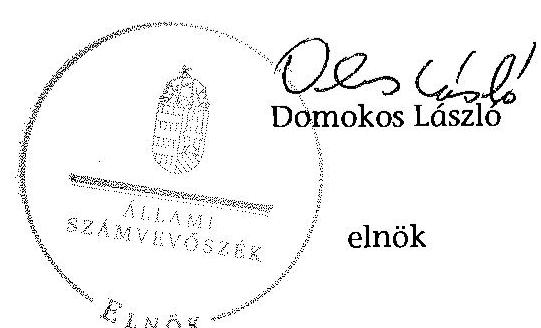

ÁLLAMI
SZÁMVEVŐSZÉK

# JELENTÉS 

az önkormányzatok belső kontrollrendszere kialakításának, egyes
kontrolltevékenységek és a belső ellenőrzés
müködésének ellenőrzése
Somogyhatvan
15099
2015. június

---

# Állami Számvevőszék 

Iktatószám: V-0678-143/2015.
Témaszám: 1712
Vizsgálat-azonosító szám: V067713

## Az ellenőrzést felügyelte:

Dr. Benedek Mária
felügyeleti vezető
Az ellenőrzést vezette és az ellenőrzés végrehajtásáért felelős:
Gál Magdolna
ellenőrzésvezető
A számvevőszéki jelentés összeállításában közreműködött:
Székely Beáta
számvevő
Az ellenőrzést végezték:
Székely Beáta
Vitányi István
számvevő
számvevő tanácsos

---

# TARTALOMJEGYZÉK 

BEVEZETÉS ..... 5
I. ÖSSZEGZŐ MEGÁLLAPÍTÁSOK, KÖVETKEZTETÉSEK, JAVASLATOK ..... 9
II. RÉSZLETES MEGÁLLAPÍTÁSOK ..... 13

1. Az önkormányzat belső kontrollrendszere kialakításának és múködtetésének megfelelősége ..... 13
1.1. A kontrollkörnyezet kialakítása és múködtetése ..... 13
1.2. A kockázatkezelési rendszer kialakítása és múködtetése ..... 14
1.3. A kontrolltevékenységek kialakítása és múködtetése ..... 15
1.4. Az információs és kommunikációs rendszer kialakítása és múködtetése ..... 18
1.5. A monitoring rendszer kialakítása és múködtetése ..... 19
2. A monitoring rendszer részeként a belső ellenőrzés kialakítása és múködtetése ..... 19
3. A pénzügyi folyamatokban kulcsszerepet betöltő belső kontrollok (teljesítésigazolás és érvényesítés) múködése ..... 21
4. Az integritás szemlélet érvényesülése ..... 23

## FÜGGELÉKEK

1. számú Értelmező szótár
2. számú Az integritás érvényesítése érdekében kialakított és működtetett kontrollrendszer

---

.

---

# RÖVIDÍTÉSEK JEGYZÉKE 

## Törvények

Áht.
ÁSZ tv.
Hhtv.

Info tv.
Jtv.

Kttv.
Ltv.
Mötv.
Mvtv.
Ötv.
Számv. tv.
Tvtv.
Vnytv.

## Rendeletek

Ávr.
Bkr.
Ikr.
képviselő-testületi
SZMSZ
10/2013. (I. 21.) Korm. rendelet

## Szórövidítések

adatvédelmi szabályzat
ÁSZ
belső ellenőrzési kézikönyv

2011. évi CXCV. törvény az államháztartásról
2011. évi LXVI. törvény az Állami Számvevőszékről
1991. évi XX. törvény a helyi önkormányzatok és szerveik, a köztársasági megbizottak, valamint egyes centrális alárendeltségủ szervek feladat-és határsköreiről
2011. évi CXII. törvény az információs önrendelkezési jogról és az információszabadságról
2000. évi XCVI. törvény a helyi önkormányzati képviselők jogállásának egyes kérdéseiről (hatályos 2014. október 12$\mathrm{lg})$
2011. évi CXCIX. törvény a közszolgálati tisztviselők ről
1995. évi LXVI. törvény a köziratokról, a közlevéltárakról és a magánlevéltári anyag védelméről
2011. évi CLXXXIX. törvény Magyarország helyi önkormányzatairól
1993. évi XCIII. törvény a munkavédelemről
1990. évi LXV. törvény a helyi önkormányzatokról
2000. évi C. törvény a számvitelről
1996. évi XXXI. törvény a tűz elleni védekezésről, a műszaki mentésről és a tűzoltóságról
2007. évi CLII. törvény egyes vagyonnyilatkozat-tételi kötelezettségekről

368/2011. (XII. 31.) Korm. rendelet az államháztartásról szóló törvény végrehajtásáról
370/2011. (XII. 31.) Korm. rendelet a költségvetési szervek belső kontrollrendszeréről és belső ellenőrzéséről
335/2005. (XII. 29.) Korm. rendelet a közfeladatot ellátó szervek iratkezelésének általános követelményeiről
4/1999. (IV.15.) sz. rendelet Somogyhatvan Község Önkormányzata Szervezeti és Müködési Szabályzata (hatályos 1999. április 15-étől)
10/2013. (I. 21.) Korm. rendelet a közszolgálati egyéni teljesítményértékelésről

Tótszentgyörgyi Közös Önkormányzati Hivatal Közszolgálati Adatvédelmi Szabályzat (2013. július 1-jétől)
Állami Számvevőszék
Szigetvár Dél-Zselic Többcélú Kistérségi Társulás Belső Ellenőrzési Kézikönyv (hatályos 2010. január 1-jétől)

---

gazdálkodási jogkörök szabályzata

Hivatal
hivatali SZMSZ
informatikai biztonsági szabályzat
INTOSAI
ISSAI
jegyzó

Képviselő-testület
Kormányhivatal
közszolgálati szabályzat

Nemzetiségi Önkormányzat
NGM
Önkormányzat
polgármester
Társulás
ÜÖB

Tótszentgyörgy-Molvány-Nemeske-Pettend-KistamásiMerenye-Somogyhatvan Községek Önkormányzatai, Tótszentgyörgyi Közös Önkormányzati Hivatal Gazdálkodási szabályzat (hatályos 2013. június 1-jétől); Tótszentgyörgyi Közös Hivatal, Tótszentgyörgyi Község Önkormányzat, Kistamási Község Önkormányzat, Merenye Község Önkormányzat, Molvány Község Önkormányzat, Somogyhatvan Község Önkormányzat, Nemeske Község Önkormányzat, Pettend Község Önkormányzat, Somogyhatvani Roma Nemzetiségi Önkormányzat, Pettendi Roma Nemzetiségi Önkormányzat, Kistamási Roma Nemzetiségi Önkormányzat, Merenye Roma Nemzetiségi Önkormányzat Gazdálkodási szabályzat (hatályos: 2013. július 1-jétől); Tótszentgyörgyi Közös Önkormányzati Hivatal Gazdálkodási szabályzat A kötelezettségvállalás, pénzügyi ellenjegyzés, teljesítés igazolás, érvényesítés, utalványozás és az adatszolgáltatás rendjéről (hatályos 2013. augusztus 14-étől)
Somogyhatvan Község Önkormányzat Polgármesteri Hivatala (2013. február 28-áig), Tótszentgyörgyi Közös Önkormányzati Hivatal (2013. március 1-jétől)
Tótszentgyörgyi Közös Önkormányzati Hivatal Szervezeti és Müködési Szabályzata, Tótszentgyörgy Községi Önkormányzat Képviselő-testületének 50/2013.(VIII.27.) számú határozatával elfogadva (hatályos 2013. augusztus 27étől)
Tótszentgyörgyi Közös Önkormányzati Hivatal Informatikai Biztonsági Szabályzat (hatályos 2013. július 1-jétől)
International Organization of Supreme Audit Institutions (Legfőbb Ellenőrző Intézmények Nemzetközi Szervezete)
International Standards of Supreme Audit Institutions (Legfőbb Ellenőrző Intézmények Nemzetközi Standardjai)
Somogyhatvan Község Önkormányzat Polgármesteri Hivatalának jegyzője (2012. május 8 - 2013. február 28-ig), Tótszentgyörgyi Közös Önkormányzati Hivatal jegyzője (2013. március 1 - 2013. április 30-ig, 2013. május 16 2013. július 12-ig, 2013. augusztus 14 - 2014. január 9-ig)
Somogyhatvan Községi Önkormányzat Képviselő-testülete Baranya Megyei Kormányhivatal
Tótszentgyörgyi Közös Önkormányzati Hivatal Egységes Közszolgálati Szabályzata (hatályos 2013. szeptember 1jétől)
Somogyhatvani Roma Nemzetiségi Önkormányzat
Nemzetgazdasági Minisztérium
Somogyhatvan Községi Önkormányzat
Somogyhatvan Községi Önkormányzat polgármestere
Szigetvár - Dél-Zselic Többcélú Kistérségi Társulás
Ügyrendi- és Összeférhetetlenségi Bizottság

---

# JELENTÉS 

## az önkormányzatok belső kontrollrendszere kialakításának, egyes kontrolltevékenységek és a belső ellenőrzés múködésének ellenőrzése Somogyhatvan

## BEVEZETÉS

Somogyhatvan község állandó lakosainak száma 2013. január 1-jén 365 fő volt. Az Önkormányzat öttagú Képviselő-testületének munkáját egy állandó bizottság segítette. Az Önkormányzat az önállóan múködő és gazdálkodó Hivatalon kívül más intézményt nem múködtetett, egy többségi tulajdoni hányadú gazdasági társasággal rendelkezett. A polgármester a 2014. évi önkormányzati választások óta tölti be tisztségét. A jegyző 2015. január 1-jétől látja el feladatait. A Hivatal szervezeti egységekre nem tagolódott, elkülönített gazdasági szervezettel nem rendelkezett, a foglalkoztatott köztisztviselők száma 2013. január 1-jén három fő volt. Szervezeti változás következtében az Önkormányzat gazdálkodási feladatait az önálló hivatal helyett 2013. március 1-jétől közös önkormányzati hivatal látta el. Az Önkormányzat a 2013. évi költségvetési beszámolója szerint 99953 ezer Ft tárgyévi bevételt ért el, valamint 61668 ezer Ft tárgyévi kiadást teljesített. A 2013. december 31-ei könyvviteli mérleg szerint 194701 ezer Ft értékű eszközvagyonnal rendelkezett, a rövid lejáratú kötelezettségállománya 1090 ezer Ft, hosszú lejáratú kötelezettség állománya 8500 ezer Ft volt.

A demokratikus társadalmakban alapvető igény, hogy a közpénzeket, a közvagyont használók valamennyi tevékenységükhöz kapcsolódó pénzfelhasználásról elszámoljanak, ahhoz egyértelmú és érvényesíthető felelősségi szabályok társuljanak. Ennek a jogos igénynek az érvényesítéséhez meg kell teremteni azokat a folyamatokat, rendszereket, amelyek nélkülözhetetlenek az elszámoltatáshoz. Az elszámoltatás eredményes múködtetéséhez szükség van a megfelelő információs, kontroll, értékelési és beszámolási rendszerek kialakítására.

Magyarországon az uniós csatlakozási tárgyalások idejére nyúlnak vissza a belső kontrollrendszer szabályozásának gyökerei. Az uniós elvárásoknak megfelelő új terminológia szerinti államháztartási belső pénzügyi ellenőrzési (ÁBPE) rendszer területén a jogharmonizáció 2003-ban teljes körűen megvalósult, míg az önkormányzati alrendszerre vonatkozó, Ötv.-ben megjelenített speciális szabályozás 2005-ben lépett hatályba. Az államháztartási belső kontrollrendszer koncepciója 2009-ben továbbfejlődött. A változások irányát mutatja, hogy a költségvetési szervek belső kontrollrendszere már magában foglalja a korszerű felelős szervezetirányítás elemeit (kontrollkörnyezet, kockázatkezelés, kontrolltevékenység, információ és kommunikáció, monitoring) is. E kontrollrendszer szabályozása háromszintű, a törvényi előírásokat az Áht. és a

---

Mötv, a rendeleti szintű szabályozást az Ávr. és a Bkr. tartalmazza, amelyeket útmutatói szinten az NGM által kiadott standardok és kézikönyvek támogatnak.

A belső kontrollrendszer azt a célt szolgálja, hogy a költségvetési szervek múködésük és gazdálkodásuk során a tevékenységeket szabályszerűen, gazdaságosan, hatékonyan, eredményesen hajtsák végre, teljesítsék elszámolási kötelezettségeiket és megvédjék az erőforrásokat a veszteségektől, a károktól és a nem rendeltetésszerű használattól. A belső kontrollrendszer magában foglalja mindazon szabályokat, eljárásokat, gyakorlati módszereket és szervezeti struktúrákat, kockázatkezelési technikákat, kontrolltevékenységeket, amelyek segítséget nyújtanak a szervezetnek céljai eléréséhez.

Az ÁSZ a középtávú stratégiájában hangsúlyos szerepet szánt annak, hogy szilárd szakmai alapon álló, értékteremtő ellenőrzéseivel előmozdítsa a közpénzügyek átláthatóságát, rendezettségét. A számvevőszéki ellenőrzés nemzetközi alapelvei is rögzítik, hogy a megfelelő belső kontrollrendszer minimálisra csökkenti a hibák és szabálytalanságok kockázatát.

Az ellenőrzés célja annak értékelése, hogy

- a jogszabályi előírásoknak megfelelően alakították-e ki és működtették-e a belső kontrollrendszert;
- a gazdálkodás folyamatában kulcsszerepet betöltő teljesítésigazolás és érvényesítés kontrolltevékenységeit megfelelően működtették-e;
- biztosították-e a belső ellenőrzés szabályos múködését;
- kialakították-e az erőforrásokkal való szabályszerű és hatékony gazdálkodáshoz szükséges követelményeket, megvalósították-e azok számonkérését, ellenőrzését;
- hasznosították-e az ÁSZ által a 2009-2013. évek között végzett ellenőrzések javaslatait.

A közintézmények integritás alapú kultúrájának kialakítása, megerősítése és múködése szorosan összefügg a belső kontrollrendszer múködésével, ezért az ellenőrzés kitért a gazdálkodáshoz kapcsolódó integritás kontrollok meglétének és múködésének ellenőrzésére is. Az integritási kultúra kialakítása hozzájárul az elszámoltathatóság és átláthatóság érvényesítéséhez, egyben támogatja a szervezet védettségét a korrupciós kitettséggel szemben, valamint annak megelőzése is irányítottabbá válik.

Az ellenőrzés várható hasznosulását négy szinten tervezzük. A törvényalkotás számára összegzett tapasztalatok állnak rendelkezésre a belső kontrollrendszer önkormányzati területen való kialakításáról, múködéséről és hatásairól, a belső ellenőrzés múködéséről. Az ellenőrzés az ellenőrzött számára visszajelzést ad a belső kontrollrendszer kialakításában és múködésében fellépő hiányosságokról, javaslataival hozzájárul azok kiküszöböléséhez, amely csökkentheti a későbbi ellenőrzések gyakoriságát. Az ellenőrzés megállapításait és javaslatait más szervezetek is hasznosíthatják a rendezett gazdálkodási keretek kialakításához. A társadalom számára jelzi, hogy közpénz nem maradhat el-

---

lenőrizetlenül, az ÁSZ értékteremtő rend kialakításához és megőrzéséhez hozzájáruló tevékenysége pozitív hatással lesz a szervezetről kialakított összkép formálásában. A szervezeten belül lehetőség nyílik arra, hogy a megállapítások szintetizálásával az ÁSZ a hozzáadott értéket teremtő elemző tevékenységét és tanácsadó szerepét is erősítse.

Az önkormányzatok belső kontrollrendszere kialakításának, az egyes kontrolltevékenységek és a belső ellenőrzés működésének ellenőrzéséről szóló jelentés I. fejezetének összegző része az ellenőrzés céljára ad rövid, szintetizáló összefoglalót, és tartalmazza a következtetéseket a II. fejezet részletes megállapításain alapulóan. A jelentés intézkedést igénylő megállapításait és javaslatait az ellenőrzés során feltárt, a jelentés II. fejezetében rögzített részletes megállapítások alapozzák meg.

# Az ellenőrzés típusa: szabályszerűségi ellenőrzés 

Az ellenőrzött időszak: a belső kontrollrendszer kialakítása és működtetése megfelelőségét a 2013. évre vonatkozóan (2013. december 31-i állapotnak megfelelően), a pénzügyi folyamatokban kulcsszerepet betöltő teljesítésigazolás és érvényesítés belső kontrollok múködésének megfelelőségét, és a belső ellenőrzés szabályszerű működését a 2013. január 1 - december 31-e közötti időszakot figyelembe véve értékeltük, míg az ÁSZ javaslatainak utóellenőrzése a 2009-2013. években végzett ellenőrzések nyilvánosságra hozott jelentéseiben tett javaslatok áttekintésére terjedt ki.

## Az ellenőrzött szervezet: az Önkormányzat

Az ellenőrzés jogszabályi alapját az ÁSZ tv. 1. § (3) bekezdése, az 5. § (2) és (6) bekezdései, valamint az Áht. 61. § (2) bekezdése képezik.

Az ellenőrzés szakmai módszertana az ÁSZ hivatalos honlapján (www.asz.hu) közzétett szakmai szabályokon alapult, amely az INTOSAI által kiadott ISSAI figyelembevételével készült.

Az ellenőrzés lefolytatásához az Önkormányzat a kimutatások és a tanúsítvány elektronikus kitöltésével, valamint az ÁSZ által kért dokumentumok elektronikus megküldésével szolgáltatott adatokat. Az így rendelkezésre bocsátott adatok, információk kontrollja és a munkalapok kitöltése a helyszíni ellenőrzés keretében történt. A jelentésben használt fogalmak magyarázatát az 1. számú függelék, az integritás érvényesítése érdekében kialakított és múködtetett intézményi kontrollrendszer minősítését a 2. számú függelék tartalmazza.

A belső kontrollrendszer, valamint a belső ellenőrzés jogszabályi előírások szerinti kialakításának és múködtetésének szabályszerűségét az erre irányuló ellenőrzési kérdésekre adott válaszok összesítése alapján értékeltük. A belső kontrollrendszert kontrollterületenként (kontrollkörnyezet, kockázatkezelési rendszer, kontrolltevékenységek, információs és kommunikációs rendszer, monitoring rendszer) és összesítetten is értékeltük.

A belső kontrollrendszer egyes kontrollterületei és a belső ellenőrzés kialakítása és múködtetése „szabályszerü volt", amennyiben az értékelt területen az elért és elérhető pontok százalékban kifejezett hányadosa elérte a $81 \%$-ot, „részben sza-

---

bályszerú volt", ha 61-80\% közé esett, és „nem volt szabályszerü", ha nem haladta meg a $60 \%$-ot. A belső kontrollrendszer összesített értékelése megegyezett a kontrollterületenként alkalmazott \%-os értékelésekkel, a következő eltérésekkel. A kontrollrendszer egésze esetében a „szabályszerü" értékelésnek a \%-os értéken felül további feltétele volt, hogy egyik kontrollterület sem kaphatott „nem volt szabályszerü" értékelést, a „részben szabályszerü" értékelés további feltétele volt, hogy legfeljebb egy ellenőrzött kontrollterület lehetett „nem volt szabályszerü" értékelésú. Az összesített értékelés a \%-os értéktől függetlenül „nem volt szabályszerű", ha az ellenőrzött kontrollterületek közül több mint egynek „nem volt szabályszerü" az értékelése.

A gazdálkodás folyamatában kulcsszerepet betöltő két kulcskontroll - teljesítésigazolás, érvényesítés - múködésének megfelelőségét a személyi juttatásokkal, a dologi és felhalmozási kiadásokkal, múködési és felhalmozási célú pénzeszköz átadásokkal, ellátottak pénzbeli juttatásaival kapcsolatos kifizetések esetében mintavétellel ellenőriztük. „Megfelelőnek" értékeltük a gazdálkodási jogkörök gyakorlását, amennyiben $95 \%$-os bizonyossággal a teljes sokaságban a hibaarány legfeljebb $10 \%$, „részben megfelelőnek" értékeltük, ha a hibaarány felső határa 10-30\% között volt, „nem megfelelőnek" pedig akkor, ha a mintavételi eredmények alapján a sokaságbeli hibaarány felső határa meghaladta a 30\%ot.

Az integritás szemlélet érvényesülésének minősítése az Önkormányzat önbevallás által kitöltött tanúsítványa alapján történt.

Utóellenőrzésre nem került sor, mivel az ÁSZ az Önkormányzatnál a 20092013. évek között ellenőrzést nem végzett.

Az ÁSZ tv. 29. § (1) bekezdése szerint a jelentéstervezetet megküldtük a polgármester részére, aki az ÁSZ tv. 29. § (2) bekezdésében foglalt észrevételezési jogával nem élt, a jelentéstervezetre észrevételt nem tett.

---

# I. ÖSSZEGZŐ MEGÁLLAPÍTÁSOK, KÖVETKEZTETÉSEK, JAVASLATOK 

A belső kontrollrendszeren belül 2013-ban a kontrollkörnyezet, a kockázatkezelési rendszer, a kontrolltevékenységek, az információs és kommunikációs rendszer, valamint a monitoring rendszer kialakítását és működtetését külön-külön és együttesen is értékeltük. A belső kontrollrendszer kialakítása és müködtetése az összesített értékelés alapján nem volt szabályszerű.

A belső kontrollrendszer egyes területei kialakításának és múködtetésének minősítése a következő:

| Kontrollterület | Minősítés |  |
| :-- | :-- | :--: |
| Kontrollkörnyezet |  | nem   szabályszerű |
| Kockázatkezelési rendszer |  | nem   szabályszerű |
| Kontrolltevékenységek | részben   szabályszerű |  |
| Információs és kommuni-   kációs rendszer |  | nem   szabályszerű |
| Monitoring rendszer |  | nem   szabályszerű |

Nem volt szabályszerű a kontrollkörnyezet, a kockázatkezelési rendszer, az információs és kommunikációs rendszer, valamint a monitoring rendszer kialakítása és működtetése, mivel az ellenőrzésünk során megállapított szabályozásbéli hiányosságok magukban hordozzák a szabálytalan múködés, valamint a korrupció kockázatát.

Részben szabályszerű volt a kontrolltevékenységek kialakítása és működtetése, mivel a szabályozásbeli hiányosságok nem veszélyeztették e kontrollterületen a szabályszerű működést.

A 2013. évben a személyi juttatásokkal, a dologi kiadásokkal, a felhalmozási kiadásokkal, valamint a múködési célú pénzeszköz átadásokkal, illetve az ellátottak pénzbeli juttatásaival kapcsolatos kifizetések során a pénzügyi folyamatokban kulcsszerepet betöltő teljesítésigazolás és érvényesítés belső kontrollok müködése nem volt megfelelő, mivel azok nem biztosították a hibák megelőzését és feltárását.

A gazdálkodásban kulcsszerepet betöltő kontrollok múködésében feltárt hiányosságok miatt fennáll a hibák bekövetkezésének kockázata. A nem megfelelően múködtetett belső kontrollok korrupciós kockázatot hordoznak.

---

A 2013. évben a belső ellenőrzés kialakítása és múködtetése nem volt szabályszerű, mivel nem tárta fel a belső kontrollrendszer kialakításának és müködtetésének, valamint a pénzügyi folyamatokban kulcsszerepet betöltő teljesítésigazolás és érvényesítés belső kontrollok müködésének hiányosságait.

A Képviselő-testület a 2013. évben nem alakította ki az erőforrásokkal való szabályszerű és hatékony gazdálkodáshoz szükséges követelményeket.

Az Önkormányzat nem vett részt az ÁSZ 2013. évi integritás felmérésében.
A belső kontrollrendszer ellenőrzése keretében az integritás szemlélet érvényesülésének ellenőrzéséhez az Önkormányzat tanúsítványon - önbevallás útján szolgáltatott adatokat. Az integritás szemlélet érvényesülésének minősítését a 2. számú függelék tartalmazza.

Az ÁSZ tv. 33. § (1) bekezdésében foglaltak értelmében az ellenőrzött szervezet vezetője köteles a jelentésben foglalt megállapításokhoz kapcsolódó intézkedési tervet összeállítani, és azt a jelentés kézhezvételétől számított 30 napon belül az ÁSZ részére megküldeni. Amennyiben az intézkedési tervet határidőre nem küldi meg a szervezet, vagy az ÁSZ tv. 33. § (2) bekezdésében foglalt póthatáridő elteltével megküldött intézkedési terv továbbra sem elfogadható, az ÁSZ elnöke a hivatkozott törvény 33. § (3) bekezdés a)-b) pontjaiban foglaltakat érvényesítheti.

Az ellenőrzés intézkedést igénylő megállapításai és javaslatai:

# a polgármesternek 

1. Az Önkormányzat kiadási előirányzata terhére történt kötelezettségvállalásra - az Áht. 37. § (1) bekezdésében és az Ávr. 55. § (1) bekezdésében foglaltak ellenére pénzügyi ellenjegyzés nélkül került sor.

Javaslat:
Intézkedjen annak érdekében, hogy az Önkormányzat nevében történő kötelezettségvállalásra az Áht. 37. § (1) bekezdésében és az Ávr. 55. § (1) bekezdésében foglaltaknak megfelelően - az Ávr. 53. §-ában meghatározott kivételekkel - kizárólag pénzügyi ellenjegyzés után kerüljön sor.
2. A jegyző - a Vnytv. 3. § (1) bekezdésében foglaltak ellenére - vagyonnyilatkozattételi kötelezettségének nem tett eleget. Az őrzésért felelős polgármester - a Vnytv. 8. § (4) bekezdésében foglaltak ellenére - nem tájékoztatta a jegyzőt a vagyonnyi-latkozat-tételi kötelezettsége fennállásáról és esedékességének időpontjáról, az esedékességet legalább 30 napot megelőzően, továbbá - a Vnytv. 10. § (1) bekezdésében foglaltak ellenére - írásban nem szólította fel arra, hogy vagyonnyilatkozat-tételi kötelezettségét a felszólítás kézhezvételétől számított nyolc napon belül teljesítse.

Az őrzésért felelős polgármester - a Vnytv. 11. § (3) bekezdésében előírtak ellenére a vagyonnyilatkozat-tétel formai követelményére vonatkozó előírásoknak nem tett eleget, mivel a boríték lezárására szolgáló felületen az őrzésért felelős és a nyilatkozó egyidejűleg aláírásával nem igazolta hogy a vagyonnyilatkozatok átadására zárt borí-

---

tékban került sor, és az őrzésért felelős a vagyonnyilatkozatokat nyilvántartási azonosítóval nem látta el, ezért nyilvántartás hiányában nem volt megállapítható, hogy a vagyonnyilatkozat-tételre kötelezett jegyző 2013. évben eleget tett-e a vagyonnyi-latkozat-tételi kötelezettségének.

Javaslat:
Intézkedjen a Vnytv.-ben foglaltaknak megfelelően a jegyző vonatkozásában a va-gyonnyilatkozat-tételi kötelezettség teljesítésével kapcsolatos jogsértő gyakorlat megszüntetése érdekében.
3. Az ÜÖB - a Jtv. 10/A. § (3) bekezdésében, valamint a képviselő-testületi SZMSZ 33. § (4) bekezdésében foglaltak ellenére - az átvett vagyonnyilatkozatokról, azok benyújtási időpontjáról nem vezetett folyamatos sorszámozással ellátott nyilvántartást, ezért nyilvántartás hiányában nem volt megállapítható, hogy a vagyonnyilatkozattételre kötelezett polgármester és a képviselők eleget tettek-e 2013. évben a va-gyonnyilatkozat-tételi kötelezettségüknek.

Javaslat:
Kezdeményezze a Képviselő-testület intézkedését a Mötv. 65. §-ában, az 57. § (2) bekezdésében és a 39. §-ában foglaltak alapján annak érdekében, hogy a képviselők vagyonnyilatkozat őrzésére kijelölt ÜÖB által végzett vagyonnyilatkozatok nyilvántartásával kapcsolatos jogsértő gyakorlat megszüntetésre kerüljön.
4. A számvevőszéki jelentés ellenőrzési megállapításai alapján az Önkormányzatnál a belső kontrollrendszer kialakítása és működtetése az összesített értékelés alapján nem volt szabályszerű, a kulcskontrollok működése nem volt megfelelő.

Javaslat:
Kísérje figyelemmel a Mötv. 115. § (1) bekezdésében foglaltak alapján az Önkormányzat gazdálkodásának szabályszerűségét. A Mötv. 67. § f) pontja alapján gondoskodjon a belső kontrollrendszer kialakítására, működtetésére vonatkozó jogszabályi rendelkezések be nem tartása, valamint a teljesítésigazolás, illetve az érvényesítés kontrollokkal összefüggésben feltárt hibák, hiányosságok, szabálytalanságok tekintetében az esetleges munkajogi felelősséggel kapcsolatos körülmények kivizsgálásáról, majd a vizsgálat eredményének függvényében tegye meg a szükséges intézkedéseket.

# a jegyzőnek 

1. A számvevőszéki jelentés ellenőrzési megállapításai alapján az Önkormányzatnál a belső kontrollrendszer kialakítása és működtetése az összesített értékelés alapján nem volt szabályszerű, a kulcskontrollok működése nem volt megfelelő, illetve a belső ellenőrzés kialakítása és működtetése nem volt szabályszerű. A számvevőszéki ellenőrzés során feltárt hibákat, hiányosságokat és szabálytalanságokat a számvevőszéki jelentés II. Részletes megállapítások fejezetcím tartalmazza.

---

Javaslat:
A jogszabályoknak megfelelő belső kontrollrendszer kialakítása és múködtetése érdekében - az ellenőrzött időszak óta bekövetkezett esetleges jogszabályi változásokra figyelemmel - intézkedjen a belső kontrollrendszer kialakításában és múködtetésében, a kulcskontrollok múködésében, illetve a belső ellenőrzés kialakításában és múködtetésében az ellenőrzés által feltárt hibák, hiányosságok, szabálytalanságok kijavítására.

Kezdeményezze, hogy az éves ellenőrzési terv kiterjedjen a kifizetések szabályszerűségi ellenőrzésére, különös tekintettel a személyi juttatásokkal, a dologi kiadásokkal, a felhalmozási kiadásokkal, a múködési és felhalmozási célú pénzeszköz átadásokkal, az ellátottak pénzbeli juttatásaival kapcsolatos kiadási jogcímekből teljesített kifizetésekre.

---

# II. RÉSZLETES MEGÁLLAPÍTÁSOK 

## 1. AZ ÖNKORMÁNYZAT BELSŐ KONTROLLRENDSZERE KIALAKÍTÁSÁNAK ÉS MŰKÖDTETÉSÉNEK MEGFELELŐSÉGE

A belső kontrollrendszeren belül 2013-ban a kontrollkörnyezet, a kockázatkezelési rendszer, a kontrolltevékenységek, az információs és kommunikációs rendszer, valamint a monitoring rendszer kialakítását és múködtetését külön-külön és együttesen is értékeltük. A belső kontrollrendszer kialakítása és múködtetése az összesített értékelés alapján nem volt szabályszerű.

### 1.1. A kontrollkörnyezet kialakítása és múködtetése

A kontrollkörnyezet kialakítása és múködtetése nem volt szabályszerű, mert:

| Sorszám | Megállapítás |
| :--: | :--: |
| 5- 9. | A Hivatal 2013. augusztus 26-ig nem rendelkezett szervezeti és múködési szabályzattal. A jegyző a 2013. augusztus 27-től hatályos hivatali SZMSZben - az Ávr. 13. § (1) bekezdés c), e), f), g), h) pontjában foglaltak ellenére - nem rögzítette az alaptevékenységeket szabályozó jogszabályok megjelölését, a Hivatal szervezeti ábráját, azon ügyköröket, amelyek során a szervezeti egységek vezetői a Hivatal képviselőjeként járhatnak el. Nem rögzítette továbbá a munkakörökhöz tartozó helyettesítés rendjét és az ezekhez kapcsolódó felelősségi szabályokat, valamint a munkáltatói jogok gyakorlásának rendjét. |
| 13. | Az Önkormányzat - a Hhtv. 138. § (1) bekezdés j) pontjában foglalt előírások ellenére - nem rendelkezett az önkormányzati vagyonnal történő gazdálkodás szabályairól, mivel azt a jegyző nem készítette elő. |
| 29. | A jegyző - az Mvtv. 2. § (3) bekezdésében foglaltak ellenére - nem határozta meg a Hivatalban az egészséget nem veszélyeztető és biztonságos munkavégzés követelményei megvalósításának módját. |
| 30. | A jegyző - a Tvtv. 19. § (1) bekezdésében foglaltak ellenére - nem készítette el a Hivatal túzvédelmi szabályzatát. |
| 31.,   38. | A jegyző - a Bkr. 6. § (3) és (4) bekezdésében foglaltak ellenére - nem szabályozta a szabálytalanságok kezelésének eljárásrendjét, valamint nem készítette el a Hivatal ellenőrzési nyomvonalát. |
| 36 -   37. | A jegyző - a Kttv. 75. § (1) bekezdés d) pontjában foglaltak ellenére - nem készítette el kettő fő Hivatalban dolgozó köztisztviselő munkaköri leírását, valamint az elkészített munkaköri leírásokban nem rögzítette a munkakör betöltésével kapcsolatos követelményeket (végzettség, szakképzettség, szakképesítés, tapasztalat, képességek). |

---

| 40. | A Képviselő-testület - az Áht. 9. § (1) bekezdés f) pontjában foglaltak ellenére - nem alakította ki az erőforrásokkal való szabályszerű és hatékony gazdálkodáshoz szükséges követelményeket. |
| :--: | :--: |
| 43. | A jegyző - a Kttv. 130. § (1) bekezdésében foglaltak ellenére - írásban nem értékelte a köztisztviselők 2013. évi munkateljesítményét (teljesítményértékelését). |
| 44. | A jegyző - a 10/2013. (I. 21.) Korm. rendelet 25. § (2) bekezdésében foglaltak ellenére - nem határozta meg a köztisztviselők 2013. évi teljesítményértékelésének második félévre vonatkozó kötelező elemeit. |
| 46. | A jegyző - a Mötv. 81. § (3) bekezdés c) pontjában előírt feladata ellenére - nem készítette elő a Kttv. 83. §-ában előírt, a köztisztviselökre vonatkozó hivatásetikai alapelvek részletes tartalmát, valamint az etikai eljárás szabályait. |

# 1.2. A kockázatkezelési rendszer kialakítása és müködtetése 

A kockázatkezelési rendszer kialakítása és müködtetése nem volt szabályszerű, mert:

| Sorszám | Megállapítás | Megjegyzés |
| :--: | :--: | :--: |
| 1. | A jegyző - a Bkr. 3. § b) pontjában előírtak ellenére - nem alakította ki a Hivatal kockázatkezelési rendszerét. |  |
| $2-4$. | A jegyző - a Bkr. 7. § (2) bekezdésében foglalt előírás ellenére - nem mérte fel és nem állapította meg a Hivatal tevékenységében, gazdálkodásában rejlő kockázatokat, nem határozta meg az egyes kockázatokkal kapcsolatban a szükséges intézkedéseket, valamint azok teljesítésének folyamatos nyomon követési módját. |  |
| 6. | Az örzésért felelős (polgármester, jegyző), - a Vnytv. 11. § (3) bekezdésében előírtak ellenére - a vagyonnyilatkozat-tétel formai követelményére vonatkozó előírásoknak nem tett eleget, mivel a boríték lezárására szolgáló felületen az örzésért felelős és a nyilatkozó egyidejűleg aláírásával nem igazolta hogy a vagyonnyilatkozatok átadására zárt borítékban került sor, és az örzésért felelős a vagyonnyilatkozatokat nyilvántartási azonosítóval nem látta el, ezért nyilvántartás hiányában nem volt megállapítható, hogy a vagyonnyilatkozat-tételre kötelezett jegyző és a köztisztviselők eleget tettek-e 2013. évben a vagyonnyilatkozat-tételi kötelezettségüknek.   Az ÜÖB - a Jtv. 10/A. § (3) bekezdésében, valamint a képviselő-testületi SZMSZ 33. § (4) bekezdésében foglaltak ellenére - az átvett |  |

---

vagyonnyilatkozatokról, azok benyújtási időpontjáról nem vezetett folyamatos sorszámozással ellátott nyilvántartást, ezért nyilvántartás hiányában nem volt megállapítható, hogy a vagyonnyilatkozat-tételre kötelezett polgármester és a képviselők eleget tettek-e 2013. évben a vagyonnyilatkozat-tételi kötelezettségüknek.

A jegyző - a Vnytv. 3. § (1) bekezdésében foglaltak ellenére - vagyonnyilatkozat-tételi kötelezettségének nem tett eleget. Az örzésért felelős polgármester - a Vnytv. 8. § (4) bekezdésében foglaltak ellenére - nem tájékoztatta a jegyzőt a vagyonnyilatkozat-tételi kötelezettsége fennállásáról és esedékességének időpontjáról, az esedékességet legalább 30 napot megelőzően, továbbá - a Vnytv. 10. § (1) bekezdésében foglaltak ellenére - írásban nem szólította fel arra, hogy vagyonnyilatko-zat-tételi kötelezettségét a felszólítás kézhezvételétől számított nyolc napon belül teljesítse.

Az Önkormányzat „a vagyonnyilatkozatok felsorolása" címú dokumentumában egy jegyző neve szerepelt a 2013. évben hivatalban lévő három jegyző közül.

# 1.3. A kontrolltevékenységek kialakítása és müködtetése 

## A kontrolltevékenységek kialakítása és müködtetése részben volt szabályszerű.

A kontrolltevékenységek kialakítása és müködtetése részben volt szabályszerű, mert:

| Sorszám | Megállapítás | Megjegyzés |
| :--: | :--: | :--: |
| 1-4. | A jegyző - a Bkr. 8. § (2) bekezdésében foglaltak ellenére - nem biztosította a beszerzési folyamat és a vagyonhasznosítási tevékenység, valamint a pénzügyi döntések - ideértve a költségvetés tervezése és a támogatásokkal való elszámolás - dokumentumainak elkészítésével kapcsolatban a folyamatba épített, előzetes, utólagos és vezetői ellenőrzést. |  |
| 5.,   7.,   9.,   10.,   16. | A jegyző - az Ávr. 13. § (2) bekezdés a) pontja előírása ellenére - 2013. május 31 -élg nem rendezte belső szabályzatban a kötelezettségvállalás, ellenjegyzés, teljesítésigazolás, érvényesítés, utalványozás gyakorlásának módjával, eljárási és dokumentációs részletszabályaival, valamint az ezeket végző személyek kijelölésének rendjével, az ellenőrzési adatszolgáltatási és beszámolási feladatok teljesítésével kapcsolatos belső előírásokat, feltételeket. | A jegyző 2013. június 1jétől hatályos gazdálkodási jogkörök szabályzatában meghatározta a kötelezettségvállalás, ellenjegyzés, teljesítésigazolás, érvényesítés, utalványozás gyakorlásának módjával, eljárási és dokumentációs részletszabályaival, valamint az ezeket végző személyek kije- |

---

|  | lölésének rendjével, az ellenőrzési adatszolgáltatási és beszámolási feladatok teljesítésével kapcsolatos belső előírásokat, feltételeket. |
| :--: | :--: |
| 8. | A jegyző, illetve a polgármester - az Ávr. 57. § (4) bekezdésében foglaltak ellenére - nem jelölte ki írásban 2013. május 31 -éig a teljesítés igazolására jogosult személyeket az adott kötelezettségvállaláshoz, vagy a kötelezettségvállalások előre meghatározott csoportjaihoz kapcsolódóan. |

A jegyző - az lkr 8. § (1)-(2) bekezdésében foglaltak ellenére - 2013. június 30 -áig nem gondoskodott az iratkezelési szoftver által kezelt adatok biztonságáról, és nem tette meg azokat a technikai és szervezési intézkedéseket, nem alakította ki azokat az eljárási szabályokat, amelyek az üzembiztonsági, adatvédelmi szabályok érvényre juttatásához szükségesek, továbbá nem határozta meg az üzemeltetéssel és az adatbiztonsággal kapcsolatos feladatokat és hatásköröket.

A jegyző - az Info tv. 7. § (2)-(3) bekezdéseiben foglaltak ellenére - 2013. június 30 -áig nem gondoskodott az adatok biztonságáról, továbbá nem tette meg azokat a technikai és szervezési intézkedéseket és nem alakította ki azokat az eljárási szabályokat, amelyek e törvény, valamint az egyéb adat- és titokvédelmi szabályok érvényre juttatásához szükségesek.

A jegyző 2013. július 1jétől hatályos informatikai biztonsági szabályzatban gondoskodott az iratkezelési szoftver által kezelt adatok biztonságáról, megtette azokat a technikai és szervezési intézkedéseket, kialakította azokat az eljárási szabályokat, amelyek az üzembiztonsági, adatvédelmi szabályok érvényre juttatásához szükségesek, továbbá meghatározta az üzemeltetéssel és az adatbiztonsággal kapcsolatos feladatokat és hatásköröket.

A jegyző 2013. július 1jétől hatályos informatikai biztonsági szabályzatban gondoskodott az adatok biztonságáról, továbbá megtette azokat a technikai és szervezési intézkedéseket és kialakította azokat az eljárási szabályokat, amelyek az adat- és titokvédelmi szabályok érvényre juttatásához szükségesek.

---

15. 

A jegyző - a Bkr. 8. § (4) bekezdés b) pontjában foglaltak ellenére - 2013. június 30 -áig belső szabályzatban nem határozta meg a dokumentumokhoz és információkhoz való hozzáférésre vonatkozóan a felelősségi köröket.

A jegyző 2013. július 1jétől hatályos informatikai biztonsági szabályzatban és az adatvédelmi szabályzatban meghatározta a dokumentumokhoz és információkhoz való hozzáféréssel kapcsolatos felelősségi köröket.

A jegyző a gazdálkodási jogkörök szabályzatában 2013. június 1 -jétől szabály- a jától hatályos informatikai biztonsági szabály- 2013. június 1 -jétől szabályozta a felelősségi körök meghatározásával a beszámolási eljárásokat. a beszámolási eljárásokat.
16. A jegyző - az Ávr. 13. § (5) bekezdésében foglaltak ellenére - nem határozta meg a gazdasági feladatot ellátó köztisztviselők helyettesítésének rendjét.

A polgármester a Képviselő-testületet - az Áht. 87. § (1)* bekezdésében előírtak ellenére - az Önkormányzat gazdálkodásának háromnegyed éves helyzetéről nem tájékoztatta.

A jegyző - az Ávr. 55. § (2) bekezdés f), g) pontjaiban foglaltak ellenére - 2013. augusztus 13 -áig a kötelezettségvállalás pénzügyi ellenjegyzésére nem jelölt ki írásban a Hivatal állományába tartozó köztisztviselőt a Hivatal, az Önkormányzat és a Nemzetiségi Önkormányzat kiadási előirányzata terhére vállalt kötelezettségek vonatkozásában.

A jegyző - az Ávr. 58. § (4) bekezdésében foglaltak ellenére - nem jelölt ki 2013. augusztus 13 -áig érvényesítési feladatra a Hivatal állományába tartozó köztisztviselőt a Hivatal, az Önkormányzat és a Nemzetiségi Önkormányzat kiadási előirányzata terhére vállalt kötelezettségek vonatkozásában.

A jegyző - az Ávr. 58. § (4) bekezdésében foglaltak ellenére - nem jelölt ki 2013. augusztus 14 -étől kijelölte a kötelezettségvállalás pénzügyi ellenjegyzésére írásban a Hivatal állományába tartozó köztisztviselőt mind a Hivatal, mind az Önkormányzat, mind a Nemzetiségi Önkormányzat kiadási előirányzata terhére vállalt kötelezettségek vonatkozásában.

A jegyző 2013. augusztus 14 -étől kijelölte az érvényesítésre jogosult személyeket mind a Hivatal, mind az Önkormányzat, mind a Nemzetiségi Önkormányzat kiadási előirányzata terhére vállalt kötelezettségek vonatkozásában.

---

| 32. | A jegyző - a Kttv. 74. § (1) bekezdése, illetve   az lkr. 15. §-ában foglaltak ellenére - 2013.   augusztus 31-élg nem szabályozta a Hivatal-   ban a közszolgálati jogviszony megszüntetése   (megszünése) esetére a munkakör átadásának rendjét. | A jegyző 2013. szeptember 1-jétől hatályos közszolgálati szabályzatban meghatározta a közszolgálati jogviszony megszünése esetére a munkakör átadásának rendjét. |
| :--: | :--: | :--: |
| 33. | A polgármester - a Kttv. 74. § (1) bekezdésében foglaltak ellenére - nem gondoskodott a jegyző munkaviszonyának megszűnésekor a munkakör dokumentált átadásáról. |  |

# 1.4. Az információs és kommunikációs rendszer kialakítása és müködtetése 

Az információs és kommunikációs rendszer kialakítása és müködtetése nem volt szabályszerű, mert:

| Sorszám | Megállapítás |
| :--: | :--: |
| $1-2$. | A jegyző - a Bkr. 3. § d) pontjában és 9. § (1) bekezdésében foglaltak ellenére - nem alakított ki olyan rendszereket, amelyek biztosítják, hogy a megfelelő információk a megfelelő időben eljutnak az illetékes szervezethez illetve személyhez. |
| 3. | A jegyző - a Bkr. 9. § (2) bekezdésében foglaltak ellenére - nem határozta meg a beszámolási szinteket, határidőket, módokat. |
| 5. | A jegyző - az Info tv. 35. § (3) bekezdésében és az Ávr. 13. § (2) bekezdés h) pontjában foglalt előírások ellenére - belső szabályzatban nem rendezte a közérdekú adatok megismerésére irányuló kérelmek intézésének, továbbá a kötelezően közzéteendő adatok nyilvánosságra hozatalának rendjét. |
| 6. | A jegyző - az Info tv. 33. § (1) és (3) bekezdésében foglaltak ellenére nem gondoskodott arról, hogy az Önkormányzat az elektronikus közzétételi kötelezettségének a 2013. évben eleget tegyen. |
| 8. | A jegyző - az Ltv. 9. § (4) bekezdésében foglalt előírás ellenére - nem készítette el a Hivatal iratkezelési szabályzatát. |
| 17. | A jegyző - az lkr. 14. § (4) bekezdésében foglaltak ellenére - nem gondoskodott az iratok iktatásáról, az iratforgalom dokumentálásáról, ezért nem biztosította az ügyintézés folyamatának, az iratok szervezeten belüli útjának pontos követhetőségét és ellenőrizhetőségét, az iratok hollétének naprakész megállapíthatóságát. |

---

# 1.5. A monitoring rendszer kialakítása és müködtetése 

A monitoring rendszer kialakítása és müködtetése nem volt szabályszerű, mert:

| Sor-   szám | Megállapítás |
| :-- | :-- |
| 1. | A jegyző - a Bkr. 3. § e) pontjában és 10. § -ában foglaltak ellenére -   nem alakította ki a Hivatal tevékenységének, a célok megvalósításának   nyomon követését biztosító rendszert. |
| 2. | A jegyző - a Bkr. 11. § (1) bekezdésében foglalt kötelezettsége ellenére - a   Bkr.1. mellékletében foglalt nyilatkozatban a 2013. évre vonatkozóan   nem értékelte a Hivatal belső kontrollrendszerének minőségét. |

Az Önkormányzat törvényességi felügyeletét ellátó Kormányhivatal két esetben végzett hatósági ellenőrzést, illetve 12 esetben élt törvényességi felügyeleti eszközzel, melyből egy esetben az Önkormányzat a Kormányhivatal felhívására nem tett intézkedést.

## 2. A MONITORING RENDSZER RÉSZEKÉNT A BELSŐ ELLENŐRZÉS KIALAKÍTÁSA ÉS MŰKÖDTETÉSE

A jegyző a belső ellenőrzés kialakításáról 2013. évben Társulás útján gondoskodott.

Az Önkormányzatnál a belső ellenőrzés kialakítása és működtetése nem volt szabályszerű.

| Sor-   szám | Megállapítás | Megjegyzés |
| :--: | :--: | :--: |
| 1. | A jegyző - a Bkr. 15. § (1) bekezdése ellenére - nem biztosította a belső ellenőrzés megfelelő működtetését, mivel az ellenőrzéshez a belső ellenőröknek nem adták át az ellenőzés lefolytatásához szükséges dokumentumokat, továbbá a jegyző - a Bkr. 15. § (2) bekezdésében foglaltak ellenére - a hivatali SZMSZ-ben nem írta elő a belső ellenőrzést végző szervezet jogállását, feladatait. | A Társulás által elvégzett ellenőrzés az ellenőrzési program szerint több települési önkormányzatot is érintett, amelyeknél - az Önkormányzat kivételével - az ellenőrzést elvégezték. |
| 3. | A belső ellenőrzési vezető - a Bkr. 17. § (4) bekezdésében előírtak ellenére - nem tett eleget a belső ellenőrzési kézikönyv rendszeres, de legalább kétévenkénti felülvizsgálati kötelezettségének, a szükséges módosítások átvezetésének. |  |

---

| 7.,   9. | Az Önkormányzat nem rendelkezett - a Bkr.   56. § (3) bekezdés a) pontja ellenére - a Kép-viselő-testület által elfogadott stratégiai és éves ellenőrzési tervvel, mivel a jegyző nem kezdeményezte a polgármesternél a stratégiai és éves ellenőrzési terv Képviselő-testület elé terjesztését. |  |
| :--: | :--: | :--: |
| 8. d) | A belső ellenőrzési vezető - a Bkr. 31. § (4) bekezdése d) pontjában foglaltak ellenére a 2014. évi ellenőrzési tervben nem tüntette fel az ellenőrizendő időszakot. |  |
| 9. | A Képviselő-testület - a Bkr. 32. § (4) bekezdésében foglaltak ellenére - nem hagyta jóvá a 2014. évi ellenőrzési tervet. | A Bkr. 32. § (3) bekezdésében foglaltak alapján a belső ellenőrzési vezető megküldte a tárgyévre vonatkozó éves ellenőrzési tervet a jegyzőnek, azonban a jegyző nem gondoskodott arról, hogy a 2014. évi ellenőrzési tervet a Képviselőtestület jóváhagyja. |
| 11. | A 2014. évi ellenőrzési tervet - a Bkr. 29. § (1) bekezdésében foglaltak ellenére - kockázatelemzés nem alapozta meg. |  |
| 12. | A 2014. évi ellenőrzési terv - a Bkr. 31. § (2) bekezdésében foglaltak ellenére - nem a stratégiai ellenőrzési tervben és a kockázatelemzés alapján felállított prioritásokon alapult. |  |
| $\begin{aligned} & 13- \\ & 14 . \end{aligned}$ | A belső ellenőrzési vezető - a Bkr. 56. § (5) bekezdésében foglaltak ellenére - az ellenőrzési terv módosítása nélkül indított új ellenőrzést. |  |
| 17. | A belső ellenőrzési vezető által jóváhagyott ellenőrzési program - a Bkr. 33. § (2) bekezdés g) pontjában foglaltak ellenére - nem tartalmazta a vizsgálatvezető megnevezését és a feladatmegosztást. |  |
| $\begin{aligned} & 19 . \\ & \text { a) } \end{aligned}$ | A belső ellenőrzési vezető - a Bkr. 39. § (3) bekezdés d) pontjában foglaltak ellenére az ellenőrzési jelentésben nem tüntette fel a Bkr. 21. § (3) bekezdésében meghatározott ellenőrzés típusát. |  |
| 23. | A belső ellenőrzési vezető által az elvégzett belső ellenőrzésekről vezetett nyilvántartás a Bkr. 50. § (2) bekezdés f) pontjában foglaltak ellenére - nem tartalmazta a vizsgált időszakot. |  |

---

A 2013. évre vonatkozó éves ellenőrzési jelentés - a Bkr. 48. § b) pontjának ba) és bb) alpontjában foglaltak ellenére - nem tartalmazta a belső kontrollrendszer szabályszerűségének, gazdaságosságának, hatékonyságának és eredményességének növelése, javítása érdekében tett fontosabb javaslatokat, és a belső kontrollrendszer öt elemének értékelését.

# 3. A PÉNZÜGYI FOLYAMATOKBAN KULCSSZEREPET BETÖLTŐ BELSŐ KONTROLLOK (TELJESÍTÉSIGAZOLÁS ÉS ÉRVÉNYESÍTÉS) MÜKÖDÉSE 

A 2013. évben a személyi juttatásokkal, a dologi kiadásokkal, a felhalmozási kiadásokkal, a múködési és felhalmozási célú pénzeszköz átadásokkal, illetve az ellátottak pénzbeli juttatásaival kapcsolatos kifizetések során - összefoglalóan értékelve - a pénzügyi folyamatokban kulcsszerepet betöltő teljesítésigazolás és érvényesítés belső kontrollok müködése nem volt megfelelő, mert:

| Kulcskontrollok | Megállapítás |
| :--: | :--: |
| Teljesítésigazolás | A teljesítésigazolást a kifizetéseket megelőzően - az Áht. 38. § (1) bekezdésében, az Ávr. 57. § (1), (3) bekezdéseiben foglaltak ellenére - nem, vagy nem szabályszerűen, illetve kijelöléssel nem rendelkező jogosulatlanul végezte. |
| Érvényesítés | Az érvényesítést a kifizetéseket megelőzően - az Áht. 38. § (1) bekezdé-sében, az Ávr. 58. § (1), (3) és (4), bekezdéseiben foglaltak ellenére - nem, vagy nem szabályszerűen, illetve kijelöléssel nem rendelkező jogosulatlanul végezte.   Az érvényesítő - az Ávr. 58. § (2) bekezdés előírás ellenére - nem jelezte az utalványozónak, hogy a megelőző ügymenetben az Áht., az államháztartási számviteli kormányrendelet és az Ávr. előírásaiban foglaltakat nem tartották be. |

## A kulcskontrollok ellenőrzése során feltárt egyéb hiányosságok:

Az Önkormányzat - a Számv. tv. 165. § (1)-(2) és a 169. § (2) bekezdéseiben foglaltak ellenére - megsértette a bizonylati elv és bizonylati fegyelemre, valamint a bizonylatok megőrzésére vonatkozó előírásokat.

A 2013. évben az ellenőrzött kifizetési jogcímek mintatételei alapján a teljesítésigazolás kulcskontroll múködése során az alábbi hiányosságok, szabálytalanságok fordultak elő:

- a személyi juttatásokkal, a dologi és felhalmozási kiadásokkal, a múködési célú pénzeszközátadásokkal, illetve az ellátottak pénzbeli juttatásaival kapcsolatos kifizetéseket megelőzően a teljesítésigazolást - az Áht. 38. § (1) bekezdésében és az Ávr. 57. § (1) bekezdésében foglaltak ellenére - nem végezték el;

---

- a személyi juttatásokkal és felhalmozási kiadásokkal kapcsolatos kifizetéseket megelőzően - az Ávr. 57. § (3) bekezdésében foglaltak ellenére - a teljesítésigazolás nem volt szabályszerű, mivel a teljesítésigazolást kijelöléssel nem rendelkező személy jogosulatlanul végezte;
- a személyi juttatásokkal, dologi és felhalmozási kiadásokkal, valamint a működési célú pénzeszközátadásokkal kapcsolatos kifizetéseket megelőzően a teljesítésigazolás nem volt szabályszerű, mivel a teljesítésigazoló - az Ávr. 57. § (1) bekezdésében foglaltak ellenére - ellenőrizhető okmányok hiányában nem tudta ellenőrizni a kiadások teljesítésének jogosságát, összegszerűségét, valamint az ellenszolgáltatás teljesítését;
- a dologi kiadásokkal kapcsolatos kifizetéseknél a teljesítésigazolás - az Ávr. 57. § (3) bekezdésében foglaltak ellenére - nem tartalmazta a teljesítésigazolás dátumát.

A 2013. évben az ellenőrzött kifizetési jogcímek mintatételei alapján az érvényesítés kulcskontroll múködése során az alábbi hiányosságok, szabálytalanságok fordultak elő:

- a személyi juttatásokkal, a dologi és a felhalmozási kiadásokkal, a működési célú pénzeszköz átadásokkal, illetve az ellátottak pénzbeli juttatásaival kapcsolatos kifizetéseket megelőzően az érvényesítést - az Áht. 38. § (1) bekezdésében és az Ávr. 58. § (1) bekezdésében foglaltak ellenére - nem végezték el;
- a dologi kiadásokkal kapcsolatos kifizetéseknél - az Áht. 38. § (1) és az Ávr. 58. § (1) bekezdéseiben foglaltak ellenére - az érvényesítés nem volt szabályszerű, mivel az érvényesítést a teljesítésigazolást megelőzően végezték;
- a személyi juttatásokkal, dologi kiadásokkal, illetve az ellátottak pénzbeli juttatásaival kapcsolatos kifizetéseket megelőzően az érvényesítés nem volt szabályszerű, mivel azt - az Ávr. 58. § (4) bekezdésében előírtak ellenére - kijelöléssel nem rendelkező személy jogosulatlanul végezte;
- a személyi juttatásokkal kapcsolatos kifizetést megelőzően - az Ávr. 58. § (3) bekezdésében előírtak ellenére - az érvényesítés nem volt szabályszerű, mivel - az Ávr. 60. § (3) bekezdése ellenére - nem vezettek naprakész nyilvántartást az érvényesítésre jogosult személyekről, így nem volt megállapítható, hogy az aláírás az érvényesítésre kijelölt személytől származott;
- a személyi juttatásokkal, a dologi kiadásokkal és az ellátottak pénzbeli juttatásaival kapcsolatos kifizetéseket megelőzően az érvényesítés - az Ávr. 58. § (3) bekezdésében foglalt előírás ellenére - nem tartalmazta az érvényesítés keltezését;
- a személyi juttatásokkal, a dologi és a felhalmozási kiadásokkal, a működési célú pénzeszköz átadásokkal, illetve az ellátottak pénzbeli juttatásaival kapcsolatos kifizetéseket megelőzően az érvényesítő - az Ávr. 58. § (1) bekezdésében foglaltak ellenére - a fedezet meglétét nem tudta ellenőrizni, mivel az Ávr. 56. § (1) bekezdésében foglaltak ellenére - a 2013. évben a kötelezettségvállalásokról nyilvántartást nem vezettek;

---

- a személyi juttatásokkal, a felhalmozási kiadásokkal kapcsolatos kifizetéseket megelőzően az érvényesítő - az Ávr. 58. § (2) bekezdésében foglaltak ellenére - nem jelezte az utalványozónak, hogy a megelőző ügymenetben nem tartották be az Áht. 37. § (1) bekezdésében és az Ávr. 55 § (1) bekezdésében foglaltakat, mivel az Önkormányzat és a Hivatal kiadásaival kapcsolatban kötelezettségvállalásra pénzügyi ellenjegyzés nélkül került sor;
- az Önkormányzatnál a múködési célú pénzeszközátadásokkal kapcsolatos kifizetéseket megelőzően - az Áht. 37. § (1) bekezdésében és az Ávr. 58. § (1) bekezdésében foglaltak ellenére - az érvényesítés nem volt szabályszerű, mivel az érvényesítő ellenőrizhető okmányok hiányában az összegszerűséget és a fedezet meglétét nem tudta ellenőrizni;
- a személyi juttatásokkal, a dologi és a felhalmozási kiadásokkal, valamint a múködési célú pénzeszközátadásokkal, illetve az ellátottak pénzbeli juttatásaival kapcsolatos kifizetéseket megelőzően az érvényesítő - az Ávr. 58. § (2) bekezdésében foglaltak ellenére - nem jelezte az utalványozónak, hogy a megelőző ügymenetben a teljesítésigazolást nem, vagy nem szabályszerűen, illetve kijelöléssel nem rendelkező személy jogosulatlanul végezte, továbbá azt, hogy a kötelezettségvállalás nyilvántartást nem vezették.

Az Önkormányzat a dologi kiadásokkal, valamint az ellátottak pénzbeli juttatásaival kapcsolatos kifizetések során - a Számv. tv. 165. § (1)-(2) és a 169. § (2) bekezdéseiben foglaltak ellenére - megsértette a bizonylati elv és bizonylati fegyelemre, valamint a bizonylatok megőrzésére vonatkozó előírásokat, mivel a kifizetést alátámasztó dokumentum, bizonylat nem állt rendelkezésre.

A gazdálkodásban kulcsszerepet betöltő kontrollok múködésében feltárt hiányosságok miatt fennáll a hibák, szabálytalanságok bekövetkezésének kockázata. A nem megfelelően múködtetett belső kontrollok korrupciós kockázatot hordoznak.

# 4. Az integritás szemlélet érvényesülése 

Az Önkormányzat nem vett részt az ÁSZ 2013. évi integritás felmérésében.
A belső kontrollrendszer ellenőrzése keretében az integritás szemlélet érvényesülésének ellenőrzéséhez az Önkormányzat tanúsítványon - önbevallás útján szolgáltatott adatokat. Az integritás szemlélet érvényesülésének minősítését a 2. számú függelék tartalmazza.

Budapest, 2015. OG. hó 22 . nap.

Függelék: $\quad 2 \mathrm{db}$

---

.

---

# ÉRTELMEZŐ SZÓTÁR 

belső ellenőrzés
belső kontrollrendszer
belső kontrollrendszer területei
egyszerű véletlen minta
integritás
kockázat

Független, tárgyilagos bizonyosságot adó és tanácsadó tevékenység, amelynek célja, hogy az ellenőrzött szervezet működését fejlessze és eredményességét növelje, az ellenőrzött szervezet céljai elérése érdekében rendszerszemléletű megközelítéssel és módszeresen értékeli, illetve fejleszti az ellenőrzött szervezet irányítási és belső kontrollrendszerének hatékonyságát.
(Forrás: Bkr. 2. § b) pontja)
A belső kontrollrendszer a kockázatok kezelése és tárgyilagos bizonyosság megszerzése érdekében kialakított folyamatrendszer, amely azt a célt szolgálja, hogy a múködés és gazdálkodás során a tevékenységeket szabályszerűen, gazdaságosan, hatékonyan, eredményesen hajtsák végre, az elszámolási kötelezettségeket teljesítsék, megvédjék az erőforrásokat a veszteségektől, károktól és nem rendeltetésszerű használattól.
(Forrás: Áht. 69. § (1) bekezdése)
A kontrollkörnyezet, a kockázatkezelési rendszer, a kontrolltevékenységek, az információ és kommunikáció, valamint a nyomon követés (monitoring).
(Forrás: Bkr. 3. §-a)
Az alapsokaságból egyszerű véletlen kiválasztással képzett részsokaság.
(Forrás: Az ÁSZ ellenőrzési mintavételezés támogatásához készült segédletének 4.1.1. pontja)
Az integritás elvek, értékek, cselekvések, módszerek, intézkedések konzisztenciáját jelenti: olyan magatartásmódot, amely meghatározott értékeknek felel meg. Az integritás a közszféra esetében a társadalom által elvárt nyilvánossági, átláthatósági, illetve jogi/etikai normáknak történő megfelelést jelenti.
(Forrás: a http://integritas.asz.hu honlapon közzétett „A 2012. évi integritás felmérés eredményeinek öszszefoglalója dokumentum 3. oldal 1. bekezdése)
A kockázat annak a valószínűségét jelenti, hogy egy vagy több esemény vagy intézkedés nem kívánt módon befolyásolja a rendszer múködését, céljainak megvalósulását. (Forrás: Javaslatok a korrupciós kockázatok kezelésére - Kockázatkezelési és ellenőrzési módszertan 35. oldal, ÁSZ)

---

kockázatkezelési rendszer
kontrollkörnyezet
kontrolltevékenységek
kommunikáció
korrupció
kulcskontrollok

Olyan irányítási eszközök és módszerek összessége, melynek elemei a szervezeti célok elérését veszélyeztető tényezők (kockázatok) azonosítása, elemzése, csoportosítása, nyomon követése, valamint szükség esetén a kockázati kitettség mérséklése. (Forrás: Bkr. 2. § m) pontja)

A kontrollkörnyezet alakítja ki a szervezet belső kontrollrendszerhez való viszonyát, hozzáállását, befolyásolja az alkalmazottak belső kontrollal kapcsolatos tudatosságát, magatartását. Elemei a személyes és szakmai elkötelezettség és a vezetés, valamint az alkalmazottak által vallott erkölcsi értékek, a szakmai hozzáértés iránti elkötelezettség, a felső vezetés hozzáállása - a vezetés filozófiája és tevékenységének stílusa, a szervezeti struktúra, a humánerőforrás - politika és gazdálkodási gyakorlat.
A kontrolltevékenységek azok a politikák és eljárások, amelyeket a kockázatok megoldására hoznak létre a szervezet céljainak teljesítése érdekében.
Az a tevékenység, melynek során információ továbbítása valósul meg. A kommunikációs folyamat résztvevői között tájékoztatás történik, mely során tényeket, ezek magyarázatát közlik. „A szervezetben eredményes kommunikációnak kell áramlania lefelé, horizontálisan és felfelé, a szervezet egészében és annak valamennyi elemében."
Azok a cselekmények, amelyek során a köz érdekében való eljárással megbízott és döntéshozatali felelősséggel felruházott személy a köz érdeke helyett önös vagy részérdekeket követve, mástól jogtalan vagy etikátlan előnyt elfogadva és őt jogtalan vagy etikátlan előnyhöz juttatva jár el, illetve amikor valaki a köz érdekében való eljárással megbízott és döntéshozatali felelősséggel felruházott személynek jogtalan vagy etikátlan előnyt nyújtva vagy felajánlva jogtalan vagy etikátlan előnyt kér. (Forrás: A Kormány korrupció megelőzési programja 20122014.)

Az azonosított kockázatok mérséklése érdekében kialakított kontrollok közül azok, amelyek elégtelen működése esetén a szervezetet jelentős veszteség érheti, vagy a működésükben bekövetkező hi$\mathrm{ba} /$ hiányosság más kontrollok eredményességét csökkenti. Ezek ellenőrzése, értékelése elegendő bizonyítékot szolgáltat adott területen a kontrollrendszer értékeléséhez. Az önkormányzatok kontrollrendszere kialakításának ellenőrzése során a pénzügyi folyamatokban kulcsszerepet betöltő belső kontrollok a teljesítésigazolás és érvényesítés.

---

lényegesség
monitoring
utóellenőrzés

Egy információ akkor lényeges, ha hiánya vagy téves állítása befolyásolhatja ezen információkat felhasználók döntéseit, véleményét. Az ellenőrzés során a lényegesség három szempontból értelmezhető: érték, jelleg és összefüggés szerint.
A monitoring a különböző szintű szervezeti célok megvalósításának folyamatát kíséri figyelemmel, melynek során a releváns eseményekről és tevékenységekről (együtt: folyamatokról) rendszeres jelleggel, strukturált, döntéstámogató információkhoz jutnak a szervezet vezetői. (NGM útmutató a költségvetési szervek monitoring rendszeréhez 3. oldal, 2011. november)
Az intézkedések nyomon követése érdekében elrendelt ellenőrzés, amelynek célja, hogy az ellenőrzés bizonyosságot szerezzen az elfogadott intézkedések végrehajtásáról, vagy arról a tényről, hogy az ellenőrzött szerv, illetve az ellenőrzött szervezeti egység vezetője nem, vagy nem az elfogadott intézkedésnek megfelelően hajtja végre az intézkedéseket, továbbá meggyőződni arról, hogy a végrehajtott intézkedésekkel a megállapított kockázat ténylegesen megszűnt, vagy a kockázati tűréshatár alá csökkent.

---

.

---

# Az integritás érvényesítése érdekében kialakított és múködtetett kontrollrendszer 

Az integritás szemlélet érvényesülésének ellenőrzéséhez az Önkormányzat tanúsítványon - önbevallás útján - szolgáltatott adatokat. Ezen adatok alapján az eredendő veszélyeztetettségi szint közepes, míg a kockázatokat növelő tényező szintje alacsony. Emellett a szervezetnél kiépült, kockázatok kezelésére hivatott kontrollok szintje is alacsony.
Az önértékelés szerint a kockázatok és a kontrollok szintje alapján megállapítható, hogy a szervezetnél jelenlévő kockázatokat növelő tényező szintje meghaladja az azok kezelésére kiépült kontrollok szintjét. A minősítés alapján a szervezet integritása fejlesztendő.
Az Önkormányzat nem alkalmaz rendszerszerű kockázatelemzést és kockázatkezelési tevékenységet, nem múködtet egyéni teljesítményértékelő rendszert.
Az Önkormányzat nem múködtet külső (a szervezeten kívülről érkező) panaszokat és a közérdekú bejelentéseket kezelő rendszert. Nem rendelkezett szabályozással a szervezeten belüli közérdekú bejelentők védelmére, nem végzett rendszeresen korrupciós kockázatelemzést.
Az Önkormányzat gazdálkodására vonatkozó adatok nyilvánosan nem hozzáférhetők.