# Sallami Számverösxék 

## JELENTÉS

a Magyar Televízió pénzügyi-gazdasági utóellenőrzéséről
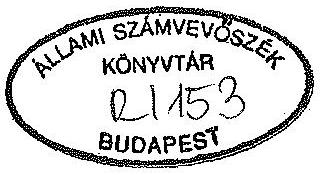

---

Az ellenőrzést vezette:

Matusek István
számvevö-tanácsos

Az ellenőrzést végezték:

Bakonyvári Róbertné
Deák Tamásné
Éva Katalin
Hegyesné dr. Solymosi Mária
Dr. Mihály Sándor
számvevö-tanácsos
számvevö-tanácsos
számvevö-tanácsos
számvevő
számvevő-tanácsos

---

# JELENTÉS 

a Magyar Televízió pénzügyi-gazdasági utóellenőrzéséről

Az utóellenőrzés célja a Magyar Televízió (MTV) által az Állami Számvevőszék (ÁSZ) 1991. évi vizsgálata alapján készített Intézkedési Tervben foglaltak megvalósulásának értékelése volt. Figyelemmel arra, hogy az ellenőrzés időszakában kezdődött meg az MTV belső szervezetének, gazdálkodásának és működésének jelentős átalakítása, az utóellenőrzést kiterjesztettük a végrehajtott átalakítások gazdasági kihatásának vizsgálatára is. Az 1991. április 1- 1992. XII. 31. közötti időszakot átfogó utóvizsgálat közben olyan újabb ellenőrzési szempontok merültek fel, amelyek sem a korábbi ellenőrzés, sem az utóellenőrzési program összeállításakor nem voltak ismeretesek (az MTV 1991. március 31. után kötött néhány gazdasági szerződése, likviditási helyzet 1992. végén). Az utóellenőrzés ezen tényezőknek a gazdasági-pénzügyi értékelésére is kiterjedt.

Az 1990. év végén megkezdett és 1991. első negyedévében befejeződött pénzügyigazdasági ellenőrzésről készült 1991. júniusi keltezésű ÁSZ jelentés az MTV 1988. január 1-1991. március 31. közötti gazdálkodásának vizsgálatára terjedt ki. Az 1990. decemberében megkezdett belső szervezeti, működési és gazdálkodási átalakulási folyamatoknak még csak kezdeti tapasztalatai voltak ekkor értékelhetők, gazdálkodási mutatókkal mérhető eredmények nem álltak rendelkezésre. Az azóta eltelt 2 gazdasági év összesített adatai már megbízhatóbb következtetések levonására alkalmasak.

Az utóvizsgálat megállapításainak áttekinthetősége érdekében mellékeljük az utóellenőrzés alapjául szolgáló 1991. évi jelentés "I. Következtetések és javaslatok" című fejezetét, valamint az MTV által összeállított Intézkedési Tervet és annak kiegészítését ( $1 ; 2 ; 2 / \mathrm{a}$ sz. melléklet).

---

# I. 

## Összefoglaló megállapítások, következtetések és javaslatok

Az 1991. évi pénzügyi-gazdasági ellenőrzésünk az MTV több évtizedes múködésére és az 1988-1990-es évek gazdálkodására jellemző súlyos gazdálkodási hibákat, hiányosságokat tárt fel.

Az 1991. évi ellenőrzésről készült jelentés következtetéseiben leszögeztük, hogy az MTV-nél a radikális változásokra a lehetetlenné vált gazdálkodási körülmények miatt elkerülhetetlenül szükség volt. Kérdéses csupán a változások iránya és belső tartalma lehetett.

Az ellenőrzés időszakában az MTV-ben megkezdett belső szervezeti és működési átalakulás deklarált célja az volt, hogy olyan helyzetet hozzon létre, amely lehetővé teszi a piaci viszonyokhoz való alkalmazkodást, ennek eredményeként indokolt szintre csökken a foglalkoztatott létszám, növekszik a saját bevételek aránya, ennyivel tehermentesül a költségvetés (14/a. sz. melléklet).

Az MTV elnöke által elhatározott és megkezdett belső átalakítások pénzügyi-gazdasági kihatásait két gazdasági év eredményeinek ismeretében volt lehetséges átfogóan értékelni.

Az utóellenőrzés mielőbbi elvégzését sürgetővé tette az Országgyűlés azon döntése, amely az MTV 1992. évi költségvetési támogatás zárolt összegének felszabadítását az ÁSZ vizsgálatától, az Intézkedési Tervben foglalt feladatok végrehajtásától tette függővé.

Az ÁSZ-szal szembeni igényt fokozta az MTV körül kialakult helyzet. Az utóellenőrzés törekvése arra irányult, hogy az MTV gazdasági helyzetét ellenőrzött tényadatok ismeretében értékelje.

Az MTV szervezete, főképpen a műsorszerkesztést és gyártást végző szervezetei átalakultak, legalábbis részlegesen már 1991. év első félévétől egy új koncepció elvei szerint működtek. Más szervezeti egységei változatlanok maradtak. A további szervezeti, múködési változtatást a médiákra vonatkozó törvények elfogadásáig elhalasztották. A felemás struktúra hatásmechanizmusa, gazdasági eredményessége nyilvánvalóan nem tekinthető optimálisnak.

---

Az 1991. évi ellenőrzés során jeleztük, hogy az átalakulás legsúlyosabb ellentmondása az, hogy az újként elképzelt szervezet maradéktalanul régi alapokra épül. A szervezetlenség, a szabályozatlanság, a gazdasági-pénzügyi fegyelem hiánya, a hézagos, ellentmondásos adatokat tartalmazó nyilvántartások következményeit nem lehet kizárólag a versenyeztetés eszközeivel, imitált, vagy valódi piaci hatásokkal felszámolni. Az erélyes és eredményes vezetői intézkedések nem csak akkor, hanem a helyszíni ellenőrzés befejeződéséig hiányoztak.

A rend megteremtése érdekében bizonyos intézkedésekre sor került. Több fontos elnöki, gazdasági főigazgatói utasítás, rendelkezés, útmutató jelent meg. Tömegesen születtek vezetői határozatok, de különböző okokból azokat nem hajtották végre. Rendkívül nagy volt a rossz tradícióból eredő tehetetlenségi erő és a súlyos személyes érdekek által vezérelt ellenérdekeltség.

Az Intézkedési Terv maradéktalan végrehajtásától nem volt több reálisan elvárható, mint a legsúlyosabb hiányosságok gyors megszüntetése és azoknak a folyamatoknak az elindítása, amelyek - figyelemmel a meghozandó média törvény adta lehetőségeket - távlatosan megalapozhattak volna egy racionálisabban, gazdaságosabban múködő televíziós szervezetet. A média törvény hiányában több, fontos intézkedés a tervből nem volt végrehajtható.

Az Intézkedési Tervben foglaltak csak részben valósultak meg. Elmaradt a számviteli, a gazdasági és pénzügyi szervezet átalakítása, személyi összetételének, és színvonalának a feladatokhoz mért fejlesztése. A gazdasági apparátus még nincs abban a helyzetben, hogy megbízható és operatívan áttekinthető nyilvántartásokra alapozza a vezetői döntéseket.

Az információs rendszer ma még nem alkalmas döntések megalapozására. A decentralizált gazdálkodó szervezetek által hozott gazdasági döntések központilag ellenőrizetlenek, esetenként ellenőrizhetetlenek, ugyanakkor a döntésre jogosult szervezeteknél még nem alakult ki a gazdálkodási felelősség szemlélete. A felemás módon bevezetett érdekeltségi rendszer(ek) nem párosult(ak) a megsértésükkel járó szankciókkal. Elenyésző mértékben érvényesült a gazdasági döntésekre jogosult szervezeteknél a költségek csökkentésének szándéka, a hatékonyság növelésére való törekvés.

A versenyeztetés nem vált gyakorlattá, így a költségek csökkentésére a feltételezett piaci viszonyok nem hathattak. A kísérletképpen részlegesen bevezetett kapacitás elosztás "költségesítésével" nem jött létre a belső költségelszámolás, a költségek normalizálásának folyamata nem indult be. A közgazdasági elemző munka még

---

mindig alacsony színvonalon áll. A helyszíni ellenőrzés befejeződéséig nem készültek elemzések a költségek alakulásáról, nem dolgoztak ki ellenőrzött, utókalkulációs alapokon álló gyártási adatokat, költségnormatívákat, költségcsökkentést eredményező szabályozásokat. Szabályozó, regulációs mechanizmusok nélkül pedig nem lehetséges hatékonyan működő televíziós szervezetet működtetni.

A létszámstratégia kidolgozása elmaradt. A költségvetési szervezetet érintő, legnagyobb létszámcsökkentést ígérő szervezeti átalakulást kormányzati támogatás hiányában levették a napirendről. Az Alkotói Irodák alapítványi formára történő átalakítását az érdekképviseleti szervek ellenezték.

A vidéki stúdiók önálló címekké alakítását hatályos törvényi rendelkezés (1991. évi XCI. tv.) ellenére a PM nem engedélyezte, pedig korábban egyetértett az Intézkedési Tervben is megfogalmazott céllal (22. sz. melléklet).

Az MTV vezetésének megbízásából több külső szerv végzett felmérést, átvilágítást. A megfogalmazott javaslatok megvalósítása vagy elmaradt, vagy késedelmes volt. Érdemi eredményt eddig nem hoztak.

Az intézmény működőképességének fenntartása érdekében gyakran "kézivezérléssel" kellett a döntéseket meghozni, azaz esetenként az MTV felső vezetése intézkedett egyébként alsóbb szervezetekhez tartozó ügyekben (pl. kifizetések rangsorolása). A belső múködés - az átalakulást is figyelembevéve - bonyolultabbá, nehezebben áttekinthetővé vált.

Nem teljesítették maradéktalanul a számvitelről szóló 1991. évi XVIII. törvény előírásait, nem készült el a számlarend. A számvitelt megalapozó nyilvántartások továbbra is hiányosak, nem naprakészek. A kialakított információs rendszer nem alkot zárt rendszert. A számítógépes információs rendszer még fejlesztés alatt áll, az eddig kialakított alrendszerei nem mindenben felelnek meg a gazdasági vezetéshez szükséges információs szükségleteknek.

A műsorgyártást továbbra is elavult belső utasítások szabályozzák. A költséggazdálkodási szemlélet a belső-, külső gyártásnál alig érvényesült. Az intendatúrák és produceri irodák tevékenysége csak músorcentrikus volt.

A bér- és létszámgazdálkodás korábban feltárt ellentmondásai alig enyhültek. Nincsenek meghatározott teljesítménykövetelmények még ott sem, ahol ilyenek alkalmazhatók volnának. A jövedelmi viszonyokat és arányokat nem sikerült

---

érdemlegesen javítani. A bérek, jövedelmek alakulása szinte független a nyújtott teljesítménytől, színvonaltól.

Utóellenőrzésünk megerősítette az ellenőrzés azon megállapításait, amelyek szerint az MTV még alig ért el eredményeket költségeinek csökkentésében, kinnlévőségeinek behajtásában, a gazdaságosabb múködés elérése érdekében.

Az 1991. évi ellenőrzést követően az MTV több olyan gazdasági szerződést kötött, amelyet a PM megbízásából célvizsgálatot végző szakértők többféle szempontból megkifogásoltak. Utóellenőrzésünk ezeknek a szerződéseknek a pénzügyi-gazdasági kihatásait érintette.

A negatív jelenségek ellenére tény, hogy az MTV Gazdálkodó Szervezete 1991-ben létrehozta pénzügyi egyensúlyát. A Pénzügyminiszter megbízásából velünk azonos időpontban célvizsgálatot végző szakértők pedig az MTV likviditási helyzetét és 1992. év végén várható pénzügyi helyzetét minősítették és rögzítették úgy, hogy az MTV 1992. év során eleget tett az állammal szembeni kötelezettségeinek.

Az 1991. évi ellenőrzést megelőző években a Gazdálkodó Szervezet funkciózavarai és súlyos gazdálkodási hiányosságai miatt folyamatosan veszteséges volt. Az 1991. évi ellenőrzés időszakában még fennállt a reális veszély, hogy 1991. év is veszteséggel zárul. Az 1991-es gazdasági év pótlólagos állami támogatás nélkül volt eredményes. Az Országgyűlés az MTV Intézkedési Tervében foglaltak megvalósításától tette függővé az 1992. évi költségvetési támogatást, ezért a működési támogatás összegét, 1 milliárd Ft-ot zárolt. Az 1992. gazdasági év során az MTV számottevő költségvetési támogatás nélkül gazdálkodott. A támogatás hiányát saját bevételeinek növelésével és fizetési kötelezettségeinek rangsorolásával ellensúlyozta. A Kormány - a PM által megbízott szakértők jelentése alapján - a költségvetés zárolt összegének nagyobb részét év végével felszabadította és címzetten meghatározta az összeg felhasználásának célját (10. sz. melléklet).

Januárban, a helyszíni ellenőrzés befejeződésének időszakában azonban az MTV részéről olyan önértékelés készült, amely szerint (8/a sz. melléklet) a szervezet helyzete 1992. év végén veszélyesen instabillá alakult. Az MTV megítélése szerint a költségvetési támogatás nagyobb részének feloldása ellenére, további rendkívüli költségvetési támogatások nélkül a fizetésképtelenség állapotába kerül az MTV Gazdálkodó szervezet. A helyzet megváltozásának pontos megítélésére a nem megfelelő és áttekinthetetlen nyilvántartások miatt nem volt lehetőség, (lásd pl. 7/a; 7/b mellékleteket) illetve arra csak az 1992. évi mérleg (amely 1993. március 9-én készült el) könyvszakértői felülvizsgálata után lenne csak mód. Ami egyértelműen

---

megállapítható volt, hogy az utolsó negyedév utolsó két hónapjának kiadásai átlagon felül megnövekedtek.

Az utóvizsgálat időszakában végrehajtott átszervezés csak részlegesen valósult meg. A részleteiben végig nem gondolt és következetesen végig nem vitt koncepció csak elmélyítette az egyébként is eléggé zilált belső állapotokat. Eredeti szándékával szemben konzerválta a gazdaságtalan megoldásokat (kapacitáskihasználatlanság, túlzott belső keresztbefoglalkoztatás, indokolatlanul magas költségek stb).

Egy korszerűen szervezett, elfogadható költségszinttel működő televíziós intézmény többféle belső struktúrával érhető el, de nem nélkülözhetik a valódi megméretést, a versenyt. Ez az állapot csak a frekvenciamoratórium feloldása után következhet be. Rá kell arra is mutatnunk, hogy az intézmény jellege, múködési rendszere alig egyeztethető össze a költségvetés gazdálkodási szemléletével. Kényszerű alkalmazása a költségérzéketlenség legfőbb oka. A közalkalmazotti törvény végrehajtása számos problémát vet fel, egyes rendelkezései nem is hajthatók következetesen végre. Az intézménynek a közalkalmazotti törvény hatálya alá vonása kizárja a teljesítményszempontok érvényesülését, többletköltségekkel jár és fokozza a bérgazdálkodás ellentmondásait.

Bármely, megfontolt irányú haladás útjában áll a média törvény hiánya. Az MTV átalakítása, státusának megváltoztatása más finanszírozási rendszerre való áttérés csak a törvénnyel összhangban lehetséges. Az utóellenőrzés tapasztalatai arra utalnak, hogy az 1991. évi ellenőrzés helyzetértékelése és javaslatai máig ható érvényűek.

Tekintettel azonban arra, hogy időközben a Kormány (bár továbbra sincs alapító okirata az MTV-nek) jóváhagyta az MTV új Szervezeti és Müködési Szabályzatát, amely jelentősen eltér az 1991. évi ellenőrzésünk idején kialakított, illetve kialakítandó szervezeti struktúrától, új intézkedési terv kidogozását tartjuk indokoltnak.

Az előzőek alapján javaslataink a következők:
a Kormány hatáskörébe tartozóan

1) A költségvetési támogatás preferált területének a műszaki fejlesztést ajánljuk. Az MTV egyre jobban elmarad a korszerű technikák alkalmazásában, az elavult eszközök lecserélésében. Korábban az embargós lista, az utóbbi években a fejlesztési források csökkenése volt az oka a beszerzések elégtelenségének. A

---

fejlesztések költségessége miatt az intézmény támogatás nélkül kellően fejlődni nem tud.
2) Az 1993. évre jóváhagyott költségvetési támogatás rendelkezésre bocsátását olyan konszolidációs intézkedési csomagterv elkészítéséhez indokolt kötni, amely valószínűsíti, hogy az MTV a költségvetési támogatás célszerű felhasználásával és saját lehetőségeinek reális figyelembevételével év végére - további többlettámogatások nélkül - tartósan likvid állapotba hozza magát. Célszerű a költségvetési támogatást normatív követelményekhez kötni, mert szabályok hiányában adományként kezelhető és felhasználásának indokoltsága, célszerűsége nem ellenőrizhető.
3) Továbbra sem szabályozott törvénnyel az MTV által sugárzott reklámok mennyisége, aránya és etikai feltételei. Hasonlóképpen nincs normatív szabálya a szponzorációnak, ami több esetben burkolt reklámként funkcionál. E kérdéskörre kiterjedően a törvényi szabályozás indokolt.
4) Kereskedelmi rádiók és televíziók hiányában a műsorszórás és az adóhálózat fejlesztési költségeit a Hungária Antenna Vállalat közvetetten a Magyar Rádió és a Magyar Televízió közbeiktatásával a költségvetéssel fizetteti meg. A médiák költségvetési támogatása a műsorszórás költségeinek mértékéig csak látszólagos, valójában a műsorszórás finanszírozása történik kerülő úton. A frekvenciákat használók körének bővüléséig egyértelműbb lenne ezt az összeget céltámogatásként juttatni, vagy a közvetlen felhasználást finanszírozni. A döntés megalapozása érdekében célszerűnek tartjuk a kérdés teljes körű áttekintését.
5) Az előfizetői díjak beszedésére a kedvezményezetteknek (MR, MTV) nincs közvetlen ráhatása, a beszedőnek nincs érdekeltsége. Az 1991. évi ellenőrzés során jeleztük már, hogy az előfizetők folyamatosan lemorzsolódnak. A díjbeszedés feltételei azóta tovább romlottak. Meg kellene teremteni a díjbehajtás feltételeit.

# Magyar Televízió hatáskörébe tartozóan 

1) Az 1991-ben kidolgozott és csak részben végrehajtott Intézkedési Terv helyett - figyelemmel az új SZMSZ-re és az azóta bekövetkezett változásokra, valamint az utóellenőrzés tapasztalataira - új intézkedési tervet indokolt készíteni.

---

2) A jóváhagyott SZMSZ-hez igazítva kell kidolgozni az ügyrendeket és munkaköri leírásokat.
3) Tovább kell fejleszteni a belső költségelszámolás rendszerét, a "belső finanszírozást" össze kell kapcsolni az érdekeltség rendszerével és az információs rendszerekkel.
4) A számviteli és pénzügyi nyilvántartások vezetésében érdemi változások nem következtek be. A számvitel követelményeinek megfelelően rendezni kell az intézmény nyilvántartásait, különös tekintettel a likviditásra ható tényezőket (szállítói-vevő állomány feldolgozása, rangsorolása és konszolidálása). Meg kell szervezni a kötelezettségvállalások központi nyilvántartását. A számviteli törvény és a belső szabályok hiányos végrehajtása miatt a személyes felelősség tisztázását javasoljuk.
5) Véleményünk szerint ujólag át kell tekinteni az MTV szerződéses kapcsolatait. Az MTV számára szükséges, de nem minden tekintetben előnyös szerződések módosítását kell kezdeményezni. A külső gazdasági kapcsolatok alapelvének a költségek csökkentését, a bevételek növelését tekintjük. Reálisnak tekinthető az a cél, hogy az MTV a működésének költségeit költségvetési támogatás nélkül finanszírozza.

# II. 

## Részletes megállapítások

## A) A Fejezet múködésének szabályozottsága

A vizsgált időszak során az MTV a médiákról szóló törvények hiányában törvény által nem szabályozott helyzetbe került. A szervezet jogállását szabályozó MT határozat hatályát az Alkotmánybíróság 1993. március 16-án hozott határozata a médiákra vonatkozó törvények megalkotásáig kiterjesztette.

Az ellenőrzés során kifogásoltuk, hogy az 1986-ban kiadott Szervezeti és Múködési Szabályzatot (SzMSz) nem korszerűsítették, ezért az elavult. A

---

helyzetet bonyolultabbá tette az a körülmény, hogy 1991-ben az MTV-nél igen jelentős szervezeti és müködésbeli változások következtek be.

A főszerkesztőségek nagyobb része 1991. I. félévében megszünt (kivéve a Külpolitikai Főszerkesztőséget, a Híradót és a Sport Önálló Szerkesztőséget). Megszűntek a programközpontok, valamint az Elnöki, az Adáslebonyolitás, a Személyzeti, az Ellenőrzési és Rendészeti Főosztály. Változatlan maradt a vidéki siúdiók státusa. Új szervezetek jöttek létre: TV1 és TV2 intendatúra, TV Híradó Főszerkesztőség, a Hét Önálló Szerkesztőség, Egyenleg Főszerkesztőség, Központi Alkotó Irodák, 44 produkciós iroda, Músorbeszerző és Szinkrongyártó Iroda, Szolgáltatási Főosztály, Külkereskedelmi Osztály.

A két csatorna önálló kereskedelmi szervezeteként jött létre a TV2-nél a Belkereskedelmi Igazgatóság, a TV1-nél a IP Budapest Kft foglalkozik a reklám és szponzor ügyekkel.

Az MTV Intézkedési Tervben elhatározott szándéka ellenére a Kormány jóváhagyásának hiányában a Gyártási Igazgatóság nem alakult át leányvállalattá és nem müködik társasági formában a Belkereskedelmi Igazgatóság.

Létrehoztak továbbá 12 tanácsadó, koordináló testületet az átalakítási folyamat kidolgozására, menedzselésére és koordinálására.

A változásokat - jóváhagyás hiányában - új SZMSZ nem legitimálta, következésképpen nem volt belsőleg kellően szabályozott az MTV szervezete és müködése.

Érvényes SZMSZ hiányában az utasításokkal való szabályozást helyezték előtérbe. Esetenként az utasítás tartalmilag keveredett a körlevél vagy tájékoztató formával.

Elnöki utasításban szabályozták többek között a vállalkozási tevékenységet, a vállalkozói szervezetek érdekeltségét, a szponzorálás szabályait, a reklámot és hirdetést, a munkaköri kötelezettségeken kívüli foglalkoztatás feltételeit.

Gazdasági Igazgatói utasítás szabályozta a likviditási nehézségek áthidalását és az 1992. évi költségvetési gazdálkodást.

A vezetés igen sok esetben a kézivezérlés eszközét alkalmazta, vagy visszamenőleg kényszerült már eldöntött kérdésekkel foglalkozni. A vezetői fórumokon hozott döntéseknek nem volt kényszerítő ereje. Az egyeztetések időigényesek voltak, a döntések végrehajtásáért a decentralizált felelősségvállalás, vagy érvényesítés elmaradt.

---

Több lényeges tevékenység utasítások hiányában szabályozatlan volt.

Pl. a Központi Alkotó Irodák tevékenysége; hiányos a számviteli törvény végrehajtásának belső szabályozása, a tárgyi eszközök létesítésének és kezelésének szabályozása.

# B) Az 1991-ben kidolgozott Intézkedési Terv végrehajtása 

Az ellenőrzés megállapításai és javaslatai alapján az észlelt hiányosságok megszüntetése, a személyes felelősség érvényesítése érdekében az ÁSZ elnöke Intézkedési Terv kidolgozását tartotta szükségesnek. Javaslatát az MTV elnöke elfogadta.

Annak ellenére, hogy az MTV Elnöke maga is kérte az átvilágító jellegű ellenőrzést és a feltárt hiányosságok többségével kapcsolatban személyes felelőssége szóba sem jöhetett, a megalapozott és érdemi hatásokkal járó terv összeállítása nem várt nehézségekkel járt és több hónapig elhúzódott.

A jelentés végső tartalma 1991. június 20 -án vált ismertté az MTV Elnöke előtt, az intézkedési terv véglegesen elfogadottnak tekinthető változata december 13 -án készült el.

Az Intézkedési Terv hármas tagolásban készült el. Az I. az azonnali intézkedéseket foglalja össze, a II. azokat a szervezeti módosításokat, amelyek a müködés eredményesebbé tételét célozták, a III. a rádió- és televízió törvény elfogadását követő intézkedéseket tartalmazta.

A teljesítésről általánosságban az állapítható meg, hogy az I. csoportba tartozó feladatokat nagyobb arányban hajtották végre mint a II. csoportba sorolt feladatokat, amelyek egy része kormányzati jóváhagyás hiányában nem valósult meg. Kevés érdemi lépés történt a III. csoportba tartozó feladatoknál. Ennek fő oka a médiatörvény hiánya ( $14 / \mathrm{b}$ és 22 . sz. mellékletek), mivel az ide sorolt feladatok többsége a törvény tartalmától függ.

Az Intézkedési Tervben foglalt azonnali intézkedések célja az volt, hogy az ellenőrzés által feltárt működésbeli hibák, mindenekelőtt az ügyviteli fegyelem hiányosságai gyorsan megszűnjenek, áttekinthetőbbé, szervezettebbé váljon az MTV gazdasági tevékenysége. Az idetartozó intézkedések másik csoportja a

---

pénzügyi egyensúly megteremtését és megszilárdítását volt hivatva megvalósítani. A nagy energiával, több bizottság felállításával megkezdett és részben végrehajtott feladatok ellenére minőségi változás még nem következett be. Ennek több oka van: a felemás átszervezés nem egyszerűsítette, hanem bonyolultabbá tette a gazdasági folyamatokat; a gazdasági újraszabályozás nem terjedt ki minden alapvető fontosságú területre; az SZMSZ és az alapító levél hiánya helyenként lehetetlenné tette a megfelelő belső szabályozást; a számítógépek alkalmazása a fejlesztés szakaszában nem segíti, hanem inkább nehezíti a munkavégzést a párhuzamos adatfeldolgozás, hibajavítás miatt stb. A létszámfelmérés, és az eszközállomány felmérése az Intézkedési Terv II. fejezetében elhatározott és többségében elmaradt szervezeti változások megalapozásához voltak szükségesek. Elbizonytalanodott és ezzel értékét is vesztette a belső elszámolási ár- és "bankrendszer" kialakítására bevezetett első kísérlet. Kizárólag az MTV-nek, mint intézménynek az érdeke a felmerülő költségek optimalizálásának igénye. Végül a távlatos gazdasági fejlődés irányai média törvény hiányában még körvonalazva sincsenek.

A személyes felelősség tisztázására és érvényesítésére egyetlen esetben sem került sor, mivel az erre irányuló kísérletek sikertelennek bizonyultak. A feltárt hiányosságok kivizsgálásának elmaradása nem a fegyelmi büntetések elmaradása miatt hátrányos. A vizsgálatok tisztázhatták volna a hibák, hiányosságok és egyéb negatívumok okait, vezetői, vagy szabályozási intézkedéseket alapozhattak volna meg és megvilágították volna, hogy személyi mulasztásoknak része volt-e a hibák bekövetkezésében.

Az MTV gazdálkodásában még mindig meglévő súlyos hiányosságok megszüntetése megköveteli, hogy felszámolásuk tervszerűen, a szakmai koncepciókkal és távlatos elképzelésekkel összehangolt intézkedésekkel történjék. A korábban kidolgozott Intézkedési Terv - a megváltozott körülmények miatt - nem minden pontjában értelmezhető, illetve nem valósítható meg az eredeti szándék szerint. Új Intézkedési Terv elkészítésére van szükség, mert a költségvetés nem vállalhatja fel egy olyan közszolgálati televízió egyre növekvő költségeinek viselését, amely költségérzéketlen, teljesítményekre nem orientált. Az Intézkedési Terv végrehajtásáról szóló tételes elszámolás a 3. számú mellékletben található meg.

---

# C) A gazdálkodás értékelése az ellenőrzés óta eltelt időszakban 

## 1) A műsorszerkezeti koncepció és a pénzügyi lehetőségek összhangja

Az éves költségvetés tervezése során továbbra sem sikerült a pénzügyi lehetőségeket és a szakmai célkitűzéseket összhangba hozni, mivel a kettő időben nem esett egybe. Először a költségvetés országos tervezésével együtt alakult ki a költségvetési támogatás mértéke, illetve a fejezet költségvetése. A végleges szakmai koncepció, a műsorstruktúra a költségvetési lehetőségekre épült rá. A tervezés gyenge pontja, legjelentősebb bizonytalansági eleme a saját bevételek rendszeres alátervezése és az előfizetési díjakból várható bevétel mértéke. Ilyen ingatag alapokra alapozva határozták meg a szakmai célkitűzéseket, a decentralizált kiadási előirányzatokat.

A tervezett költségvetési előirányzatokból elkülönítették az állandóan felmerülő kiadási tételeket (sugárzási díj, fenntartási, működési és bérköltségek) és a maradó összegeket osztották szét az intendatúrák között.

A TV1 és TV2 1991-92. évek egyeztetett műsorstruktúráját az elnök hagyta jóvá.


#### Abstract

A jóváhagyott műsorstruktúra ismeretében rendeltek az intendatúrák műsorokat gyártásra. A keretek felhasználásának nyilvántartása az intendatúrák feladata volt. A kötelezettségvállalások központi, számítógépes nyilvántartása az ellenőrzés időpontjában még a szervezés szakaszában volt, így az sem a fejezeti tervező szerveknek, sem a gazdálkodó szervezeteknek nem nyújtott operatív információt.


A műsorstruktúra vizsgált időszakban bizonyos mértékben változott. A tervezettől eltérően töredékére esett vissza az egyedi músorok, TV játékok, TV filmek aránya, nőtt a beszélgető (olcsóbb) músorok aránya.

Elvileg a műsorgyártás jogát versenyeztetéssel lehetett volna elnyerni, s a viszonylag alacsonyabb ráfordítást, illetve a legkedvezőbb ajánlatot tevő pályázónak kellett volna a megbízást megkapnia. A valós piaci viszonyok között működő és vállalkozási tevékenységet is végző néhány szervezet kedvező eredményei igazolják az irány helyességét (25. sz. melléklet). (A tárgyilagosság érdekében meg kell jegyezzük, hogy a kimutatott ráfordítások nem mindenütt teljes körűek, a ráfordítások egy része még mindig a központ költségei között kerül elszámolásra.)

---

Valós külső és belső piaci viszonyok hiányában a versenyeztetés a gyakorlatban nem vált be, ma már nem is alkalmazzák. A produkciós irodák múködését - 1992-ben az intendatúrák és a produceri irodák bevonásával - igazgatótanácsi értekezleten értékelték. Több életképtelennek bizonyult produkciós irodát megszüntettek, de ez nem tekinthető valódi piaci hatásnak, inkább adminisztratív döntésnek.

# a) A bevételek alakulása és összetétele 

Az MTV fejezet bevételei és kiadásai 1991-92. években jelentősen növekedtek. Fejezet szinten (a Gazdálkodó Szervezettel és a Kereskedelmi Igazgatósággal együtt) a teljesítések az eredeti előirányzatokhoz képest közel megduplázódtak. A tényleges bevételek az 1991. évi 11,4 milliárd Ft-ról 1992-ben - előzetes adatok szerint - 15,3 milliárd Ft-ra, ugyanezen időszakban a tényleges kiadások összege 10 milliárd Ft-ról 13,6 milliárd Ft-ra növekedett (4. sz. melléklet). A költségvetési összegek alakulásából kitűnik, hogy fejezeti szinten a bevételek 1991-ben 1,4 milliárd Ft-tal, 1992-ben 1,6 milliárd Ft-tal haladták meg a kiadásokat. A költségvetési tervezés lazaságait mutatja, hogy az előirányzatok teljesítése mindkét évben csaknem kétszerese volt a tervezettnek. Összességében a MTV bevételei a növekvő kiadásokat fedezték.

A fejezeten belül a Gazdálkodó szervezet gazdálkodása a meghatározó és ugyanakkor a problematikusabb. Az MTV pénzügyi egyensúlyát érintő, azt döntően befolyásoló tényezők ezen a területen jelentkeznek és eredetük sok évre nyúlik vissza, máig sem megoldottak.

A Gazdálkodó Szervezet bevételei között legnagyobb tétel a saját bevétel volt. Ezen belül a működési bevétel 1991-ben $41 \%$-át, 1992-ben $44 \%$-át, az ár- és díjbevétel $9,5 \%$-át, illetve $23 \%$-át tette ki az összes bevételnek.

A Gazdálkodó Szervezet bevételei között további tétel a költségvetési támogatás összege. A központi támogatás nagyobb része mindkét évben múködési célt szolgált, felújításra, nagyjavításra 1991-ben 234 millió Ft, 1992-ben 188 millió Ft jutott. A költségvetés 1991-ben eredeti előirányzatban 765,5 millió Ft-tal, a módosított előirányzat alapján 1 milliárd 269 millió Ft-tal támogatta a MTV-t; ténylegesen is ennyi került teljesítésre. Az 1992. évi költségvetési támogatás eredeti és módosított előirányzata egyaránt 1 milliárd 297 millió Ft-tal került jóváhagyásra, a teljesítés azonban

---

1992. X. 30-ig csak 297 millió 400 ezer Ft volt, 1 milliárd Ft-ot az Országgyűlés zárolt.

A központi támogatásból megmaradt 300 millió Ft-ot 1992. I. félévében havonta 40-50 millió Ft-os részletekben utalták le az MTV bankszámlájára. Ez az összeg elkülönítetten nem jelent meg, az összes bevétel részét képezte. A havi pénzforgalomhoz képest ( $800-900$ millió Ft ) a $40-50$ millió Ft-os havi ütemezésű átutalás nem jelentős nagyságrendű, így nem volt meghatározó súlyú a pénzügyi helyzet alakulásában és a meglévő feszültségek oldásához sem járulhatott hozzá.

A költségvetési támogatás részaránya a MTV költségvetésében a tényleges teljesítés alapján fokozatosan csökkent, 1990-ben 13,6\%, 1991-ben 9,07\%, 1992-ben $2,6 \%$ volt a támogatás zárolása nélkül.

A múködési bevétel (az előfizetési díj összege) az 1991. évi 4 milliárd 618 millió Ft-ról 1992. év végére 6 milliárd 85 millió Ft-ra emelkedett.

Az ár- és díjbevétel növekedése a legdinamikusabb 1991-ben volt, az eredeti 110 millió Ft előirányzattal szemben a tényleges bevétel 761,7 millió Ft-ot tett ki. Rendkívül kismértékben számolt a tervezés 1992-ben ezzel a bevételi forrással: az eredeti előirányzat 130 millió Ft, a módosított előirányzat 595 millió Ft volt; ezzel szemben a tényleges teljesítés elérte a 2,6 milliárd Ft-ot.

A Gazdálkodó Szervezet ár- és díjbevételei között az alaptevékenységgel és a vállalkozási tevékenységgel összefüggő szponzor, reklám és egyéb bevételek egyaránt nőttek, volumenében az alaptevékenységgel összefüggő bevételek jelentősebbek (1991-ben 762 millió Ft, 1992-ben 2 milliárd 460 millió Ft), de dinamikus a vállalkozási bevétel növekedése is (1991-ben 324 millió Ft, 1992-ben 698,5 millió Ft). (24. sz. melléklet.)

A Gazdálkodó Szervezet 1992. évi várható bevételeit a megállapítások egyeztetése során az MTV pénzügyi szervezete 14,9 milliárd Ft összegben, a várható kiadásait 14,6 milliárd Ft-ban prognosztizálta (5. sz. melléklet). A tényleges mérlegadatok - a prognózis alapját képező kimutatások nagymértékű bizonytalanságai miatt - ettől eltérhetnek.

---

# b) A kiadások alakulása és összetétele 

Az MTV Gazdálkodó szervezetének 1992. évi kiadása - függő és átfutó kiadások nélkül - több mint kétszerese az 1990. évinek.

Ugyanezen időszak alatt az összes sugárzási idő $26,6 \%$-kal nőtt.


#### Abstract

A kiadásokon belül a postai szolgáltatások megduplázódtak (1990-ben 659,2 millió Ft; 1992-ben 1.330,1 millió Ft volt); a sugárzási dij és vonalköltség kiadásai $96,1 \%$-kal növekedtek ( 1990 -ben 543,2 millió Ft, 1992-ben 1.064,9 millió Ft volt).


A Gazdálkodó Szervezetnél a kiadások között a béralap, a bérjellegủ költségek és a TB járulék az összes kiadásnak 1991-ben 55\%-át, 1992-ben $49 \%$-át tette ki. A legdinamikusabb növekedést ezen belül a honoráriumok mutatnak. A honoráriumok összege 1991-ben a béralap 57\%-át, 1992-ben $55 \%$-át reprezentálta, év végéig aránya $69,6 \%$-ra emelkedett ( 6 .sz. melléklet).

A béralap-, a honorárium- és a társadalombiztosítási kifizetések, együttesen 1,5 milliárd forinttal haladták meg az 1990. évit. A béralap - $47 \%$-kal, a honorárium - $158 \%$-kal, a Tb járulék kiadása $70 \%$-kal volt több mint 1990. évben.

A dologi kiadások a Gazdálkodó Szervezetnél 1991-92-ben jelentősen növekedtek az eredeti előírásokhoz képest és közel 1 milliárd Ft-tal haladták meg a tervezettet (1991-ben 4 milliárd 896 millió Ft, 1992. X. 30-ig 5 milliárt 750 millió Ft). Ezen belül dominánsak a postai szolgáltatások. E kiadási tételek azonban 1992-ben lényegesen magasabbak a tervezettnél, 659 millióval szemben 1,33 milliárd Ft összeget értek el.

A kiadási tételek közül egyedül a készletbeszerzés teljesítése maradt el mindkét évben az előirányzattól (56, ill. 73\%-os volt a teljesítés aránya).

Az 1991. évre előirányzott 1 milliárd 268 millió 667 ezer Ft központi költségvetési támogatás jogcím szerinti felhasználása az alábbiak szerint került jóváhagyásra: beruházás, fejlesztés 237 millió 500 ezer Ft, felújítás 234 millió 500 ezer Ft, dologi kiadás 796 millió 667 ezer Ft, támogatás elvonás - 8 millió 333 ezer Ft. Az 1992. évi költségvetési támogatás 1,3 milliárd Ft összegéből 1 milliárd Ft zárolásra került. A ténylegesen kapott költségvetési támogatásból béralapra ( $10 \%$ bérfejlesztés) 130 millió 600 ezer Ft-ot, TB járulékra 52 millió 300 ezer Ft-ot, felújításra 117 millió Ft-ot használtak fel.

---

A kiadások számottevő növekedése kedvezőtlenül befolyásolta az egy sugárzott percre jutó kiadási mutató értékét. (Folyó áron számított mutató, az áremelkedések hatását is tartalmazza.)

Az egy percre jutó kiadás 1992. évben 18.136 Ft volt, ami 63\%-kal haladta meg az 1990. évit.

Az 1991. évben 13.366 Ft/perc, 1990. évben 11.173 Ft/perc volt a mutató értéke, az összes sugárzási idő és az éves intézményi kiadások (függő, átfutó kiadások nélkül) alapján számolva. A beruházások, adóelszámolások, elvont pénzeszközök, átadott pénzeszközök kiadásait figyelmen kívül hagyva az így korrigált mutató értéke 1992. évben 15.695 Ft/perc, ami 59\%-kal magasabb mint 1990. évben.
c) Az 1 milliárd Ft összegű költségvetési támogatás zárolásának gazdasági hatása

Az Országgyűlés a MTV költségvetési támogatásából 1 milliárd Ft-ot az 1992. évi állami költségvetés elfogadásakor zárolt. A zárolás feloldására a MTV-nek tájékoztatást kellett adnia a gazdasági anomáliák megszüntetésére tett intézkedésekről, s azok eredményéről. A zárolás részleges és teljes feloldására a MTV elnöke többször tett kezdeményezést; a Kormány, illetve a miniszterelnök a feloldást több feltételhez, döntően az ÁSZ ellenőrzése alapján összeállított intézkedési terv, a miniszteri biztosi jelentés javaslatainak végrehajtásához és újabb intézkedések kidolgozásához kötötte.

A MTV elnöke 1992. jún. 16-án a Miniszterelnökhöz írt levelében ismételten kérte az 1 milliárd Ft zárolásának feloldását. Az MTV elnöke által rendelkezésre bocsátott dokumentumok vizsgálatára és annak eredményéhez képest kormányelőterjesztés benyújtására a Miniszterelnöktől a Pénzügyminiszter kapott megbízást. (A Pénzügyminiszter két szakértőt kért fel a szükséges vizsgálatok elvégzésére. A szakértők november 12. - december 4. közötti vizsgálatukról a jelentést december 10-i kelettel elkészítették).

A zárolás miatt az MTV-nél korlátozó intézkedésekre nem került sor, sőt a heti músoridő 1990-hez képest 1992-ben 28\%-kal volt hosszabb. A többletsugárzások fedezetét a csatornáknak kellett biztosítaniuk többletbevételeikből. Ugyanezen időszakban a fejezet szintjén a bevételek $87 \%$-kal, a Gazdálkodó Szervezet szintjén $84 \%$-kal voltak nagyobbak. A kiadások növekedési dinamikája pedig fejezeti szinten 77\%; a Gazdálkodó Szervezetnél (az MTV ellentmondásos adatai szerint) 92\%-kal haladta meg az 1990. évi szintet.

---

1992. XII. 22-i kormányelőterjesztés alapján az Országgyűlés döntött a zárolt támogatás döntő részének feloldásáról, illetve folyósításáról. A határozat szerint a felszabadított összeg ( 889,6 millió Ft) tételesen, címzetten kerülhet felhasználásra (állami befizetési kötelezettség, TB járulék, Antenna Hungária Rt, ingatlanértékesítés, adóalap-csökkentés, pénzmaradvány befizetése). A fennmaradó 110,4 millió Ft letéti számlára került. A határozat alapján tehát a zárolt összeg döntő része feloldásra került, de csak címzetten használható fel (10. sz. melléklet). Az utóellenőrzés zárószakaszában egyes tételek vitatottak a PM és a MTV között (ingatlanértékesítési befizetési kötelezettség rendezése), ezek tisztázása folyamatban van.
d) Az MTV Gazdálkodó Szervezetének likviditási (fizetőképességi) helyzete

Az MTV fejezet és annak részét alkotó legnagyobb költségvetési egysége, a Gazdálkodó Szervezet 1991. évben és 1992. év végéig folyamatosan megőrizte fizetőképességét.

Eleget tett az állammal szembeni kötelezettségeinek és fenntartotta működőképességét. A tény igen jelentős, mert az 1991. évi jelentésünkből látható, hogy 1990-ben és az azt megelőző években az MTV működőképessége fenntartása érdekében rendszeresen kért és kapott költségvetési pótelőirányzatot. A többszöri állami kisegítés ellenére a kifizetetlen számlák tömege folyamatosan növekedett.

A költségvetési támogatás elöirányzata 1988-1991. között ötszörösére emelkedett. A ténylegesen juttatott támogatások - az 1989. év kivételével - jelentősen meghaladták a tervezettet - mivel csak így lehetett helyreállítani évente a pénzügyi egyensúlyt (1991. évi jelentés 12. oldal).

Az 1991. évről 1992. évre áthozott felhasználható pénzeszköz összege az MTV kimutatása szerint 632,9 millió Ft volt (7. sz. melléklet).

Az MTV fizetőképességének vizsgálatát az utóellenőrzés során nem tekintettük kiemelten kezelendő szempontnak, mivel az 1991-ben kidolgozott Intézkedési Terv ezzel kapcsolatban közvetlen feladatokat nem jelölt meg és azért is szükségtelennek mutatkozott, mert az 1 milliárd Ft zárolt költségvetési támogatás feloldásának vizsgálatát végző szakértők jelentései sem utaltak túlzott feszültségekre.

---

Az utóellenőrzés helyszíni vizsgálatának lezárása napjaiban a korábbi feltételezésektől eltérő, ahhoz képest minőségében más pénzügyi helyzetet tükröző adatok kerültek forgalomba. Február 1. kelettel a megbízott gazdasági főigazgató és az elnöki teendőket ellátó alelnök a már korábban felszabadított zárolt összegen felüli költségvetési támogatási igényt nyújtott be a fejezeti felügyeletet ellátó Miniszterelnökséghez ( $8 ; 8 / \mathrm{a}$ sz. melléklet).

Az új fejlemények hatására - ellenőrzésünk kiterjesztésével - megkíséreltük az MTV likviditási helyzetének tisztázását. Az ellentmondó és megbízhatatlan adatszolgáltatás, valamint az a körülmény, hogy a számviteli előírások az adategyeztetésekre a vizsgálatunk befejezésén túli időre adtak lehetőséget az MTV-nek, - mint mérlegkészítésre kötelezett szervezetnek - meghiúsították ezt a törekvésünket. Ezért feltétlenül szükségesnek tartjuk az MTV 1992. évi mérlegének könyvvizsgálói felülvizsgálatát.

Annak ellenére, hogy teljesen egyértelmű, hiteles és ellenőrizhető adatok az ellenőrzés lezárásáig nem álltak rendelkezésre, annyi megállapítható volt, hogy a tartozások és követelések (szállítói-vevő állomány) központi nyilvántartása és folyamatos karbantartása mindeddig nem megoldott. Tovább "görgették" az adósságállományt, bizonyos szállítói követeléseket nem egyenlítettek ki időben, s a folyamatos fizetőképesség fenntartása csak a legszigorúbb, egy kézben tartott figyeléssel volt biztosítható. A megbízhatóan át nem tekinthető helyzetnek oka az is, hogy a decentralizált gazdálkodási jogú szervezetek maguk sem követték megfelelően kötelezettségvállalásaikat.

A pénzügyi szervezet nem képes a feladatát megfelelő színvonalon ellátni, ennek személyi, tárgyi és információs okai egyaránt vannak. A gazdasági vezető posztokon bekövetkezett új és újabb személycserék ezt a területet meglehetősen dezorganizálták és nem állnak rendelkezésre az MTV egészére vonatkozó megbízható és naprakész nyilvántartások. Az év pénzügyileg legkritikusabb szakaszában újabb személycserék történtek, egyidejűleg több külső ellenőrzés volt folyamatban, próbafeldolgozások készültek a számítógépen és a számviteli törvényből adódó feladatok egy része is terhelte az apparátust.

[^0]
[^0]:    A helyzet zavarosságát mutatja az, hogy például megoldatlan az MTV számára nagy kiadást jelentő műsorszórási költségek megbízható nyilvántartása és elszámolása. Gyakorlatilag kontrolálatlan a Műsorszóró Vállalat (Hungária Antenna V.) benyújtott igénye és annak teljesítése. Többszöri egyeztetés

---

ellenére az MTV képtelen volt a Müsorszóró Vállalat adatainak hiteltérdemlő egyeztetésére. Ennek a kiadásnak naprakész, áttekinthető nyilvántartása az MTV alapvető érdeke. A pénzügyi kötelezettségeket jelentő szállítói állomány, a forrásként figyelembe vehető vevőállomány összességében nem volt ellenőrizhető állapotban.

A 6.sz. mellékletből világosan kitűnik, hogy 1992. november 1- december 31. között a Gazdálkodó Szervezet egész éves kiadásainak több, mint 26\%-át ebben a két hónapban költötték el. A 9. sz.mellékletből látható, hogy a Gazdálkodó Szervezet prognosztizált éves bevételei alapján még az így megnövekedett kiadásokat is lehetséges finanszírozni.

Az 1993. évi bevételek és kiadások várható alakulását bemutató MTV összeállítás ( 9 . sz. melléklet) - a korábbi gyakorlatnak megfelelően - a tervezett és várható bevételeket (és kiadásokat) jóval a reális alatt prognosztizálja. De munkaanyagként elfogadva az első két hónap tényadatait látható, hogy a bevételek február 15-i állapot szerint kis mértékben meghaladták a kiadásokat, tehát a likviditás fenntartható. Az 1992-ről áthúzódó kiadási összeg (1.108,9 millió Ft) megalapozottsága kétséges.

A Gazdálkodó Szervezet pénzügyi egyensúlyának tartós megalapozása az 1992. évi mérleget alátámasztó, a számviteli törvénynek megfelelően a vevőkkel és szállítókkal egyeztetett nyilvántartások és végezetül ellenőrzött adatok birtokában lehetséges. Ennek ismeretében határozhatók csak meg a további konszolidációs feltételek.

# 2) Az MTV szerződéses kapcsolatai 

Az 1991. évi pénzügyi-gazdasági ellenőrzést követő időszakban az MTV több, jelentős gazdasági kihatással járó szerződést kötött. Ezek a szerződések kisebb részben a Pénzügyminiszter által kiküldött miniszteri biztos jelentésében voltak érintve, ellenben centrális helyet kaptak a Pénzügyminiszter által kiküldött szakértők 1992. decemberében készített jelentésében. A Hungaro Auditor Könyvvizsgáló és Vállalkozási Kft szakértői jelentésében a nevesített szerződések az MTV gazdálkodásában észlelhető negatívumok fő okozóiként jelentek meg, amelyet azonnal hatósági intézkedések követtek.

A szóban forgó szerződéseket és a hozzá kapcsolódó fellelhető iratanyagot kizárólag a keletkezésük időpontjában hatályos jogszabályok és az MTV

---

gazdálkodására gyakorolt hatásuk szempontjából vizsgáltuk. A szerződések jellegüket tekintve különfélék. Az IP Budapest Kft alapítására kötött megállapodás gazdasági társaságban való érdekeltséget, ezáltal reklám bevételek realizálását teszi lehetővé.

Az MTV I. intendatúra és az ARBO Internationale GmbH között az együttmúködésre vonatkozó megállapodást 1991. júliusában kötötték meg. A társasági szerződést 1991. XII. 1-én írták alá a felek, azonban ehhez - az akkor érvényes jogszabály szerint - kormányengedélyre volt szükség, ami nem állt rendelkezésre. A cégbejegyzésre 1992. I. 22-én került sor, ekkor hatályos jogszabályi rendelkezés engedélyezési kötelezettséget nem írt elő.

A saját bevételek összege és összetétele egyértelműen arra utal, hogy az IP Budapest Kft útján az MTV megtöbbszörözte reklámbevételeit és fóképpen ez tette lehetővé az 1 milliárd Ft állami támogatás zárolása ellenére a pénzügyi egyensúly fenntartását.

A Penta Coop Kft-vel kötött szerződés ugyancsak árbevétel elérésére irányult, de nem teljesült.

A Penta Coop Kft arra vállalt kötelezettséget, hogy a pápa látogatásának kizárólagos közvetítési joga ellenében 1 milliárd Ft-ot térít. Az ellenőrzés adatai alapján nem állapítható meg, hogy más szervezet a közvetítési jog megszerzéséért bármilyen, gazdaságilag értékelhető ajánlatot tett volna. Az MTV által beszerzett bankinformáció nem mutatott egy tőkeerős, nagy tapasztalattal rendelkező szervezetet. Ennek ellenére a szerződés létrejött. A Kft helytelenül mérte fel piaci lehetőségeit és az általa vállalt kötelezettségeit nem tudta teljesíteni. A szerződésben kikötött összeg megfizettetését az MTV többször, sikertelenül kísérelte meg. Majd peren kívül abban állapodtak meg a felek, hogy a Kft a közvetítés költségeit téríti meg ( 350 millió Ft), de a Penta Coop Kft ezt a megállapodást sem teljesítette.

Az ellenőrzés olyan tényt nem állapított meg, amelyből arra lehetne következtetni, hogy a szerződés meghiúsulásában az MTV bármely mulasztása közrehatott volna. A szerződés létrejötte az MTV számára többletköltségeket nem okozott, így a szerződés nem teljesítése miatt kára nem keletkezett (23. sz. melléklet).

A Novofilm Stúdió Kft-vel létrejött szerződés a hétköznap reggelente megjelenő "A reggel" című műsor elkészítésén kívül reklámbevétel elérését is célul tűzte ki, azonban az elgondolás megalapozatlannak bizonyult és a músor nem

---

nyereséges, hanem ebben a konstrukcióban költségesebb, mint saját előállításban.


#### Abstract

A Novofilm Stúdió Kft-vel kötött szerződés teljesitését és elszámolását az MTV Gazdasági főigazgatója 1992-ben két alkalommal vizsgáltatta. A belső ellenőrzés a jelentésben több szabálytalanságot tárt fel és megállapította, hogy a reklám- és szponzorbevételek kihelyezése a Kft-hez az MTV számára hátrányos volt. A szerződés feltételei kizárják a músor indításához rendelkezésre bocsátott 60 millió Ft előleg visszakövetelését, mivel az 1991-ben realizált bevételek nem fedezték a músor költségeit.


Az ellenőrzési megállapításokat követően a gazdasági főigazgató úgy döntött, hogy a 60 millió Ft összeget a músor költségeinek elszámolásakor kell figyelembevenni. Ráfizetéses alapon két reggeli músor fenntartása gazdasági szempontból nem indokolt. Ennek ellenére az MTV vezetése músorpolitikai okokból a "Reggel" c. músort továbbra is megtartotta.

A Hargita-stúdió hasznosítására kötött szerződés egy olyan többszereplős, hitelkonstrukcióval összekötött beruházás, amelynek egyik résztvevője az MTV. A project ezen kívül magában foglalta egy színes, sztereo közvetítőkocsi komplexum beszerzését is.

A beruházás céljára szolgáló épület vegyes tulajdonban van, amelynek egy részét az MTV évek óta bérli. A bérlemény a benne lévő elavult berendezések miatt kihasználatlan, egyetlen funkciója maradt; a tetőzeten elhelyezett közvetítőlánc szükséges az adások átjárásához. Mivel a bérleti díjak már igen nagy összeget tesznek ki (a havi bér 1 millió Ft+ÁFA) és az MTV műszaki vezetésének véleménye szerint az épületre a mikrohullámú lánc miatt szükség van, felvetődött, hogy utómunkálatok elvégzésére is alkalmas berendezéseket kellene ide felépíteni. A létesítményt egyébként a magyarországi műholdas TV adás céljára is hasznosítani kívánták. A berendezések szállításáról a spanyol PESA céggel állapodott meg az MTV (ez a spanyol cég készítette a barcelonai olimpiai stúdió komplexumát. A cég a budapesti stúdiót referencialétesítményként tervezte létrehozni.) A beruházásra konzorciumot kötöttek a TEXO-Graphicomp Kft-vel, mint a PESA cég közép-európai képviselőjével. Az ügylet biztosítékaként letéti váltó kibocsátására került sor, amely az ATH-ban foglaltakkal ellentétes tranzakció.

[^0]
[^0]:    A beruházás alapösszege 506 millió Ft, járulékaival együtt meghaladja a 880 millió Ft-ot. A hitel futamideje 17 félév. A Ft hitel felvételét a TEXO Kft vállalta, amelyhez az Ip Budapest Kft közbejöttével tervezték a bankgarancia vállalását, ezt azonban az illetékes bank megtagadta. A bankgarancia biztosi-

---

tékaként az MTV letétbe helyezett 87 millió Ft-ot s ennek visszafizetését a TEXO letéti váltó kibocsátásával garantálta. Az időközben lejárt váltó kiegyenlítésére az ellenőrzés befejeződéséig nem került sor.

A tervezett beruházásra versenytárgyalást nem hirdettek azzal az indokolással, hogy a beruházás törlesztő részleteit az IP Budapest Kft bevételeinek az MTV-t illető hányada terhére valósítják meg. A beruházást az MTV beruházási tervében - azzal az indokkal, hogy nem az MTV a beruházó - nem szerepeltették.

A beruházás tervezett pénzügyi konstrukciója szerint a létrejövő komplex stúdióegység, vállalkozásban történt hasznosításának bevételéből 3 év türelmi idő lejárta után kell a törlesztést megkezdeni. Az MTV 1992. évi beruházási terve Hargita Stúdió fejlesztés címén mindössze 10 millió Ft összeget tartalmazott a stúdióépület és épületgépészeti felújítási előlegként.

A beruházás végül nem valósult meg.
A műszaki igazgató véleménye szerint a létesítményre és a közvetítőkocsira feltétlenül szükség volna, mert az MTV műszaki bázisa a Bojtár utcai stúdió kivételével rendkívül elavult, az 1996. évi expo és a honfoglalás 1100 éves évfordulójához kapcsolódó rendezvények közvetítési igényeinek a jelenlegi eszközparkkal az MTV nem tud megfelelni.

A gazdasági szerződések közös tapasztalata, hogy az eddigieknél még nagyobb körültekintéssel kell a partnereket kiválasztani és velük a feltételekben megállapodni. A szóban forgó szerződésekkel kapcsolatos megállapításainkat, az általunk feltárt tényeket és következményeket a 26. sz. mellékletben fejtjük ki részletesebben.

# 3) Létszám- és bérgazdálkodás változásai 

Az MTV 1991. évi ellenőrzéséről készült jelentés a létszám, de különösképpen a bérgazdálkodást úgy jellemezte, mint az MTV gazdálkodásának állandósult neuralgikus pontját.

Bemutattuk, hogy nincs olyan érdekeltségi rendszer vagy mechanizmus, amelyik a foglalkoztatást az ésszerűség irányába terelné, az állandósult szervezetlenség, a viszonylagosan alacsony bérszínvonal rendszerré emelte a többletjövedelmekért ténylegesen, vagy formálisan alkalmazott belső keresztbefoglalkoztatásokat, külső szakemberek kölcsönös igénybevételét (Filmgyár, Magyar Rádió). Jellemző

---

volt a teljesítményekkel arányban nem álló díjazás, a magas honoráriumok, a jövedelmek nem mindenben megalapozott nagy szóródása, az alapbérektől való jelentős elszakadás.

Az akkor megkezdett szervezeti átalakulások, majd az Intézkedési Terv létszámés bérpolitikára irányuló deklarált szándékai a költségvetés terhére foglalkoztatott létszám jelentős (1300-1500 fő) csökkenésével számoltak. A bér és jövedelem viszonyokat teljesítményfüggővé kívánták tenni.

Az utóvizsgálat markáns változásokat az évtizedes tendenciákhoz képest nem tapasztalt. A tényadatok azt jelzik, hogy alapvető fordulatot mindeddig nem sikerült ezen a téren végrehajtani.

A fejezet 1992. évi bér- és bérjellegủ kiadásait a 17. sz. melléklet mutatja be.
Az MTV Gazdálkodó Szervezetének adatait elemezve az alábbi összefüggések állapíthatók meg:
— 1990. előtt a sugárzott músorpercek növekedési ütemét (113-111\%) meghaladta az 1 músorpercre jutó bér és bérjellegủ kiadások növekedése (117-146\%). Ezen belül ugrásszerűen emelkedett a belső megbízási díjak, ill. önként vállalt túlmunka 1 percre jutó összege. Az "átszervezés" utáni időszakban a fajlagos mutatók alakulása összességében kedvezőbb.
—Az 1992. évi 1 músorpercre jutó bér- és bérjellegủ kiadások kivételével, egyik paraméter növekedése sem haladta meg a sugárzott músorpercek növekedését.

Hasonló eredményre jutunk, ha az MTV állományába tartozó dolgozók jövedelmének alakulását vizsgáljuk. Megállapítható, hogy az átszervezés előtti időszakban a músoridő $29 \%$-os növekedése összességében a jövedelmek megkétszereződésével járt együtt, az "átalakítás" után a músoridő közel azonos növekedése ( $27 \%$ ) a jövedelmek $48 \%$ ponttal való emelkedését igényelte.

Az MTV-ben foglalkoztatottak jövedelme változatlanul több forrásból származik. Többségük megbízási szerződés (belső megbizatás) alapján is részesül jövedelemben. Kedvező, hogy 1990-91-ben 10 dolgozó közül még 8-9 fő részesült belső megbízásban, 1992-ben 6-7 fő. Az adatok azt mutatják, hogy az 1991. évi belső megbízásban részesültek száma ( 3000 fő) csúcspontra jutott,

---

majd 1992-ben az 5 évvel ezelőtti szintre ( 2325 fó) esett vissza. A jövedelmek állománycsoportonkénti alakulását a 16. sz. melléklet tartalmazza.

Kedvezőtlen viszont az 1 főre jutó megbízási díj növekedésének tendenciája.
A létszám struktúrát vizsgálva megállapítható, hogy a vezetői státuszok száma az átszervezés első évében megnőtt, de már 1992-ben csökkenés tapasztalható. Az összlétszámon belül a vezetői arány növekedése nem volt jelentős (12. sz. melléklet).

A MTV vezetése a létszám- és bérgazdálkodás területén két önmagában is nehéz, az intézmény eddigi életében sokszor megfogalmazott, de soha véghez nem vitt feladat megoldására vállalkozott:
— az évek óta felduzzasztott lészámot - egy új struktúra felállítása és múködtetése mellett - csökkentik;
—a meggyökeresedett, pazarló bérezési rendszert megváltoztatják.
a) A létszám tekintetében bizonyos eredményeket értek el, mivel az évek óta tartó folyamatos létszámnövekedés megállt, sőt az átszervezés időpontjától számítva a foglalkoztatottak száma valamelyest tovább csökkent. 1992. évben az átlagos állományi létszám 3502 fő (ami megfelelt a 10 évvel ezelőtti 1982. évi szintnek), tehát az átszervezés előtti 1990. évhez képest az éves átlagos összlétszám 231 fővel csökkent úgy, hogy 1992. évben a Gyártási Igazgatóságon a Bojtár utcai stúdiót üzembehelyezték (11. sz. melléklet).

A létszám reális csökkentése érdekében az Intézkedési Tervben úgy határoztak, hogy minden szervezeti egységre kiterjedő felmérést végeznek a létszámtöbbletek megállapítására (Intézkedési Terv I/F pont).

[^0]
[^0]:    Teljes körü felmérést készitettek minden szervezeti egységre. Az értékelésnek azonban nem volt meg az objektív lehetősége, mivel a munkakörök többségében az alapbérért teljesítendő követelmények 1977-óta nem voltak megállapítva, a többletteljesítményeké úgyszintén. A többletteljesítményeknél a kifizetett összegek a tényleges teljesítményektól olyan mértékig elszakadtak, olyan véletlenszerủ szóródásokat mutatnak, hogy abból semmiféle megalapozott következtetésre nem lehetett jutni. Ennek jogszabályi akadálya nincs, mert mint az 1991. évi jelentésünkben rögzitettük a 4/1988. (II. 12.) MM rendelet eltörölte az MTV müsoraiban közremüködők díjtételeinek felső határát, ezért minden szerződés egyedi feltételekkel jön létre. Piaci viszonyok hiányában, ellenőrizhetetlen személyi kapcsolatok miatt az etikátlan megállapodások sem zárhatók ki.

---

A Központi Alkotói Irodákra készített teljes körű felmérés is sikertelen, illetve annak eredménye kétséges volt.

Pl. olyan kifizetések is szerepeltek a felmérésben, amelyek előző évi teljesítést takartak, elkezdett munkák kimaradtak stb.

A sikertelenség okait elemzi a 13. sz. mellékletben a felméréssel megbízott Intertia Pénzügyi Tanácsadó és Kereskedelmi Kft képviselője.

Az MTV vezetése kezében a felmérés eredménytelensége miatt csak az adminisztratív intézkedések lehetősége maradt, de mint az előbbi mellékletből is látható, az MTV vezetői ezzel nem akartak élni és az érdekképviseletek is határozottan szembeálltak ilyen elképzelésekkel (Int. Terv I/E pontja).
b) Az egységes elvek szerint müködtetett anyagi ösztönzési rendszer létrehozására az MTV vezetése intézkedéseket tett, de ezek nem hozták meg a kívánt eredményt. A kialakított megoldás helyes célokat tüzött ki, de csak egyes szakterületeken volt alkalmazható. A gyakorlatban szerzett tapasztalatok szerint jól működő érdekeltségi rendszer csak alulról építhető fel, a szervezeti egységek racionalizálásával egyidejűleg. Az érdekeltségi rendszer átalakításának új határidejét 1992. december 31-re tűzték ki, de erre az időpontra sem valósult meg.

Az összehangolt anyagi ösztönzési rendszer bevezetési kísérletének sikertelenségéről, s annak okairól részletesebben az Intézkedési Terv I/E pontjánál (3. sz. melléklet) számolunk be.

A közalkalmazotti törvény (KAT) végrehajtása az MTV-nél számos nehézséget okoz.


#### Abstract

A törvény a hivatali jellegű intézmények körére alkalmazható besorolási tételeket tartalmaz elsősorban, ezért az MTV-ben foglalkoztatottak körére igen nehezen értelmezhető. Ezen felül a törvény szelleme ellentétes a célul kitűzhető teljesítménybérezés elvével, mivel a havi fix jövedelem a fenti szándék megvalósítását nem segíti.

A törvény a végrehajtási rendelet kidolgozását az ágazatilag illetékes szaktárca hatáskörébe utalta. A helyszíni ellenőrzés befejeződéséig hatályos végrehajtási rendelet nem volt.

Jelenleg az MTV szervezete a Miniszterelnökség fejezet alá tartozik, s így a közalkalmazotti törvény végrehajtási utasításának előkészítése és kiadása a Fejezet hatásköre.

---

c) A decentralizált bérgazdálkodás 1992. évi bevezetése lehetővé tette az MTV minden szervezeti egysége számára, hogy az igényekhez igazodó státushelyet alakíthasson ki és olyan foglalkoztatási formát választhasson, amelyet feladatai ellátása szerint szükségesnek lát. A szervezeti egységeknek ehhez kellett (volna) kialakítaniuk, s benyújtaniuk az anyagi ösztönzési elképzeléseiket, ami azonban elmaradt, s így a nagyobb gazdálkodási önállóság nem váltotta be a hozzáfüzött reményeket.

A szervezeti egységek még felszólításra sem nyújtották be érdekeltségi rendszerük tervét, vagy a gyakorlatban nem alkalmazták saját szabályaikat. A részükre jóváhagyott keretösszegeket több esetben túllépték.

A TV1 intendatúrán a munkaköri leírás az elszámolás alapja, de abból a követelményszint nem állapítható meg.

A TV2 intendatúra új elszámolási rendjében az alapbérek kétszeresére emelkedtek, munkavégzési követelmény csak a növelt összegek után mutatható ki.

Az egyik főszerkesztőségnél a korábbi teljesítmény utáni kifizetéseket alapbérestették. Így elöfordul, hogy egyes esetekben havi néhány perces riporttal teljesül a munkaköri kötelezettség, másoknál annak többszöröse lesz a feladat.

Mindkét intendatúrán folytatódott - sőt kibővült - az a szabálytalan gyakorlat, hogy lényegében a munkakörben ellátandó feladatokért, több tízezer Ft nagyságrendủ prémiumot is fizettek. A munkakörért és a prémiumért ellátott feladatot szétválasztani nem lehet. Az ellenőrzés időpontjában a TV2 intendatúrán 34 féle munkakör bérezésénél volt ez a gyakorlat.
d) A prémium és a jutalom egyes munkakörökben elvesztette ösztönző szerepét, gyakorlatilag ugyanazon munka másodszori díjazásának felel meg, míg más területeken a jutalom túlóra teljesítéseket, tehát munkát takar (Gyártási Igazgatóság).

Az új jutalmazási rendszer az addigi alapbérarányos elosztáshoz képest annyiban előnyös, hogy így annak a kezébe került a keret, aki a feladatot elfogadja, minősíti, második lépésben pedig ahhoz, aki legyártotta. A műsorok minősítéséről nincs tudomásunk, elfogadásáról azonban igen.

Itt kell megjegyeznünk, hogy intézményi szinten felhasználható jutalomforrás csak 1992. év IV. negyedévben alakult ki, mivel annak jelentős része (szponzor, vállalkozási tevékenység) évközben képződik. A biztos pénzforrást, az előző évi pénzmaradványt a Pénzügyminisztérium csak novemberben hagyta jóvá. Ez a gazdálkodás minden szintjén bizonytalanságot okozott, és ezzel magyarázandó, hogy év közben ún. jutalomelőleget fizettek.

---

Az új keretgazdálkodási lehetőség a jutalmazás területén is ellentmondásosan valósult meg. A két intendatúra ösztönzési rendszere hasonló elvekre épült, de nem egységes.

A TV2 intendatúra gyakorlatán keresztül azt lehetett tapasztalni, hogy maguk a gyártók javasolnak saját maguknak keretet, amit az Intendatúra engedélyez. Azt azonban, hogy összességében milyen összeget "utaltak le" a produceri irodákhoz pontosan megállapítani nem lehet, mivel az iroda a megkapott összeg jelentős részét nem jutalom, hanem szerzői jogdíj címén fizette ki.

Az egyes területeken meglévő alacsony követelményrendszer, vagy követelménynélküliség következménye, hogy az átdolgozás és önként vállalt túlmunka intézménye fennmaradt, illetve átalakult munkakörön felüli díjazássá (15. sz. melléklet). Az érvényes szabályozás szerint ilyen munkát csak akkor lehetne vállalni, ha a vezető igazolta a munkaköri kötelezettség teljesítését. A szabály az MTV-ben sohasem vált gyakorlattá. Ezt az előző ellenőrzésünk is tanúsította.

PI. a TV2 intendatúrán az októberi teljesítménylapokon gyakori volt az ún. tartozás, amelynek összege gyakorta meghaladta személyenkénti a 20.000 Ft-ot is. Az összeg a következő hónapban volt ledolgozható.
e) A megbízási szerződéseknél és a szerzői díjaknál a kifizetések mértéke és azoknak a valószínűsíthető teljesítményekhez viszonyított arányainál észlelhető szóródása jogi normatívák hiányában megalapozottan nem értékelhető és kifogásolható. Jelenleg ezek a megállapodások szabad egyezkedés tárgyát képezik. A személyes érdekek és a versenyhelyzet hiánya miatt a díjtételek folyamatosan emelkednek.
4) A músorgyártás szervezeti, gazdasági feltételei
a) A músorgyártás szervezettsége

A músorgyártó szervezetek 1991. év I. félévében részlegesen átalakultak. Létrejöttek a produceri irodák és fontos része lett volna a megkezdett szervezetkorszerűsítésnek a maradványérdekeltségű Gazdálkodó Szervezet keretében működő Gyártási Igazgatóság leválasztása és leányvállalattá alakítása. Erre az Intézkedési Terv II. fejezetének "B", illetve "E" pontjainak végrehajtásával került volna sor. A szervezeti átalakulást a PM kezdetben ösztönözte, később a

---

média törvény elfogadásáig, az átalakulás elhalasztását indítványozta ( $14 ; 14 \mathrm{a} ; 14 \mathrm{~b} ; 14 \mathrm{c}$. sz. mellékletek).


#### Abstract

A Gyártási Igazgatóság müködését a 3/1991. sz. Elnöki utasítás szabályozta. Önálló gazdálkodó szervezetként müködött, a számára engedélyezett költségkereten belül. Felvételi kapacitásokat, utómunkálati, szállítási, szcenikai eszközöket biztosított a músorok, produkciók elkészitéséhez. A kapacitásokat változatlanul térítésmentesen bocsátotta az igénylő belső szervezeti egységek rendelkezésére, ezek költségkihatása saját keretét terhelte.


A belső ár és elszámolási rendszer korlátozott mértékủ kísérleti bevezetésének eredményeiről és problémáiról az Intézkedési Terv II/E. pontjának értékelésénél számolunk be.

A "proform" számlák alkalmazásának gazdasági szempontú értékelésére, a gazdálkodási szabályozások javítására eddig nem került sor. Az 1991. évi tényleges pénzügyi teljesités 458 millió Ft-tal ( $37 \%$-kal) haladta meg az Igazgatóság rendelkezésére álló költségkeretet.

Az MTV gazdasági főigazgatójának kezdeményezésére az Ellenőrzési Osztály 1992. októberében megvizsgálta az Igazgatóság által biztosított kapacitások költségesítésének tapasztalatait és javaslatokat tett a reális és kibővített alkalmazási feltételek létrehozására. Ennek a vizsgálatnak a hasznosítása a bekövetkezett személycserék miatt elmaradt.

Az intézményi korszerűsítési folyamat befejezetlensége kizárta az új és lényegesen decentralizáltabb feladat és müködési rendben a pénzügyi és szakmai tervezés összehangoltabb müködését.

A TV1, TV2. intendatúrák éves músorstruktúrák, szakmai feladataik megvalósításához elavult és reális szükségleteket nem tükröző működési keretek között gazdálkodhattak, amit saját bevételeikkel, azaz kereskedelmi szervezetük útján realizált bevételekkel kiegészíthettek és músorgyártásra fordíthattak.

Az intendatúrákon az átszervezési koncepció szerinti valós önálló gazdálkodás (piaci körülmények, belső árrendszer) nem alakult ki. A músorgyártási tevékenység a tervezett átalakulások meghiúsulása miatt új alapokra nem helyeződött. Az intendatúrák músorellátási, músorszerkesztési feladataikat részben saját szervezetükön belül, részben a produkciós irodák szervezésében oldják meg az MTV saját kapacitása vagy külső kapacitások igénybevételével.

---

A két intendatúrát és a produceri irodákat a korábbinál decentralizáltabb gazdálkodási rendnek megfelelő információs rendszer nem segítette. A tervezett fejlesztéshez kért támogatást sem az OMFB, sem a PM nem adta meg.

A jelenlegi pénzügyi statisztikai rendszer a tényleges kiadásoknál szervezeti egységenként, produceri irodánként gyüjt, nem teljes körű adatokat.

A lebontott éves müködési kerettől való eltérés okait nem elemzik még több száz millió forint túllépés, illetve megtakarítás esetén sem.

Az intendatúrák müködését a bevétel orientáltság jellemezte, mely gazdasági kényszer is, az irreális éves eredeti keretek és végzendő szakmai feladatok ellentmondásosságának oldására. A többletbevételek racionálisabb és takarékosabb felhasználása a músorgyártás folyamatában nem érzékelhető. A szúrópróbaszerűen kiválasztott produkciók költségeinek vizsgálata során azt tapasztaltuk, hogy a tervezett és tényleges músorgyártási költségek elemzésére (többletköltségek esetében a túllépések okainak vizsgálatára), esetleges felelősség megállapítására az intendaturák nem fordítottak kellő figyelmet. Vizsgálatunk során több lejárt határidejű, kifizetetlen számlát találtunk, amelyek elmaradásának okait sem a produceri irodák, sem a Pénzügyi Főosztály nem vizsgálta.

A produceri irodák működését a gazdasági főigazgató több alkalommal, szúrópróbaszerűen ellenőrizte és az irodák megfelelő kontroll nélküli működésére az MTV Ellenőrzési Osztálya 1992. évi vizsgálataiban fel is hívta a figyelmet. A kiadott gazdasági főigazgatói utasítások bizonyos részterületeken szigorítást írtak elő a músorgyártás folyamatában, az átfogó szabályozás hiányát és a munkafolyamatba épített ellenőrzés hiányosságait e részintézkedések nem pótolták teljes mértékben.
b) A músorgyártás gazdasági mutatóinak alakulása

Az MTV músorsugárzási ideje az 1992. évben elérte a 605.027 percet, amely $27,7 \%$-kal haladta meg az 1990 . évit ( $18 ; 18 / a ; 18 b$ sz. melléklet).

Ezen belül a TV1 csatorna éves músorideje $22,4 \%$-kal, a TV2 csatorna músorideje $36,8 \%$-kal emelkedett az elmúlt két év alatt.

A heti átlagos músoridő az 1990. évi 153 óráról 195,2 órára nőtt.

---

A TV1 illetve TV2 csatorna heti átlagos músoridó megoszlása, 1991-ben 54\%, illetve $46 \%, 1992$-ben $55 \%$, illetve $45 \%$ volt.

A vizsgált két évben a saját belső gyártású músorok volumene $35,4 \%$-kal, a saját külső gyártású músoroké $52,3 \%$-kal, az átvett belföldi músoroké (sport, színházi közvetítések) $39,5 \%$-kal, és a vásárolt filmmúsoroké $41,2 \%$-kal növekedett adásidőben.

Jelentősen nőtt ( $48,7 \%$-kal) a reklám sugárzással kitöltött adásidő. A reklámsugárzási idő - a reklámidő abszolút növekedése ellenére - arányaiban azonban nem növekedett. Az átvett külföldi músorok és kölcsönzött filmek adásideje az átlagos növekedés alatt maradt, az ismétlések adásideje pedig $17 \%$-kal csökkent.

Összetételében a sugárzott músorok több mint fele saját gyártású músor $(52,5 \%)$, mintegy $21 \%$-a vásárolt, ill. kölcsönzött film.

A sugárzott músoridő műsorfajonkénti megoszlását az egyes csatornák között a 19; 19/a; 19/b sz. mellékleteken mutatjuk be.

A legyártott és befejezett músorokra az MTV adatszolgáltatása alapján az intézmény 1990-1991-ben 2,3, ill. 2,5 milliárd forintot, 1992. évben 3,3 milliárd forintot fordított. A gyártott músorok időtartama 378 ezer, 454 ezer, ill. 401 ezer perc volt az adott években. A közölt adatok szerint a gyártott músorok percköltsége 1990-ben 6085 Ft, 1991-ben 5500 Ft, 1992-ben 8.229 Ft volt.

Ezen felül a músorellátás külső filmgyártására a kifizetés 1991. évben 618,4 millió Ft, 1992. évben 1.114,7 millió Ft volt, csaknem kétszerese, illetve háromszorosa az 1990. évinek (20. sz. melléklet).

A külső gyártásban készített TV játékok, filmek mintegy harmada a Filmiroda Rt szolgáltató együttműködésében valósult meg 1992. évben, MTV munkatársak bevonásával.

A külső gyártásban készült produkciókat gazdaságilag kiértékelték, azonban ezek nem tartalmazták a ténylegesen felmerült, produkcióra fordított összes kiadásokat. Egy-egy produkciónál több millió Ft-os eltérések is előfordultak. A kiértékelések eredményét nem hasznosították.

Az MTV a músorgyártásra fordított kiadásokat nem elemzi. A műsortörzslapokról kigyűjtött áltagos gyártási költség ezért csak információs értékủ. E szerint a saját belső gyártás átlagos költsége $8.500 \mathrm{Ft} /$ perc (az 1990. évi azonos adathoz

---

viszonyítva $46 \%$-kal magasabb), a saját külső gyártású műsoré $79.932 \mathrm{Ft} /$ perc ( $28 \%$-kal magasabb).

Természetesen értelmetlen lenne a számadatok mechanikus egybevetése, mivel az összehasonlíthatósághoz mélyebb és elemzésre alkalmas adatokra lenne szükség. Így csak azt jelzik, hogy a külső- belső gyártás költségviszonyai egy nagyságrenddel eltérnek egymástól. Külső gyártás igénybevételére általában szük.ég van, pl. kapacitási okokból, vagy sok szereplős, sok helyszines nagy produkciók gyártása esetén.

A szolgáltatott adatok alapján 1992. évben 8,6\%-ban, 1990-ben 14\%-ban finanszírozták a szponzorbevételek a műsorgyártás kiadásait (21; 21/a sz. mellékletek).

Az adatok nem teljes körűek, nem tartalmazzák azon szponzorbevételeket, melyeket a müsorgyártás során a külső gyártó közvetlenül kap meg és használ fel, amelyek így az MTV bevételi számláján nem is jelennek meg.

A Produkciós Irodák közül a Fiatal Művészek Stúdiója lehetőséget kapott az FMS filmek közvetlen értékesítésére és az ebből származó teljes bevétel felhasználására, továbbá a csatornák megrendelésére készített filmek eladásából származó bevétel $50 \%$-ának felhasználására is. Ez a bevételi érdekeltség 1992. évben 2 millió Ft-tal növelte az FMS stúdió számára elkülönített, első́limes produkciók finanszírozására szolgáló 4 millió Ft-os pénzügyi lehetőséget. A bevételi többlet a fesztiválokon való részvétel kiadásainak fedezetére is felhasználható.
5) Az eszközgazdálkodás. A beruházások és felújítások elszámolási rendje, megvalósulási módja

# a) Beruházások 

1991-ben a beruházások terv nélkül, decentralizált döntések alapján, a Beruházási Osztály operatív közreműködésével valósultak meg.

Az előirányzat dokumentált felhasználása nem tette lehetővé az igények olyan csoportosítását, összevonását, ún. eszközcsomagok képzését, amivel engedményeket, ebből következően megtakarításokat lehetett volna elérni.

Az 1992. évi beruházási terv forrás hiány miatt nem a kívánt módon valósult meg.

---

A tervezés során 600 millió Ft saját forrás lehetőséggel számoltak, ezzel szemben 1992. XII. 31-ig a fedezetbiztosítási számlára saját forrásból csak 208,5 millió Ft-ot tudtak elkülöníteni.

Az 1991. és 1992. év beruházási ráfordításait a 27. és 28. sz. melléklet tartalmazza.

A beruházási jogszabályok állami deregulációját nem követte a beruházási folyamatok belső, átfogó szabályozásának a kialakítása.

A könyvelés gyakran információ hiányában késedelmesen aktivál, (vám)értéken való nyilvántartásbeli problémák merülnek fel stb, amelyek a mérlegvalódiság elvének érvényesülését veszélyeztetik.

Az MTV beruházási előirányzata 1991-ben 734 millió, 1992-ben 747 millió Ft volt. Ebből a költségvetési juttatás az összes forrás 19 , illetve $40 \%$-át tette ki.

A beruházási források nagyobb részét mindkét évben az óbudai stúdiókomplexum még 1996-ig fennálló kifizetéseire fordították. Az előző évi áthúzódás 1991-ben 177 millió Ft, 1992-ben 278 millió Ft volt.

A jelentős volumenű import beszerzés zavartalan ügyvitele megkövetelné, hogy a megkötött szerződéseknek egy-egy példányát magyar nyelvű fordítással eljuttassák (áru megnevezése, devizaárak tételes megjelölése) a Beruházási Osztály, a Műszaki Raktár, ill. anyaggazdálkodás és a könyvelés részére. Tájékoztatást kell kapniuk a felsorolt munkaterületeknek az esetleges szerződésmódosításról, áruban megtestesülő engedményről is. A szükséges információk nem mindenkor jutottak el az egyes szervekhez.

A belföldi gépbeszerzések és technológiai rendszerek (szerelési jellegű) vonatkozásában szintén információ jellegű hiányosságokat kell pótolni az ügyviteli folyamatban érintetteknél.

Az eszközök egy részének kizárólagos használatba adása nem járt együtt a gazdálkodási szemlélet változásával. Nem jellemző gyakorlat a szabad kapacitások belső, külső hasznosítása, de még a lehetséges megoldások gazdasági mérlegelése sem, ez gazdaságilag szükségtelenül növeli a beruházási igényt.

[^0]
[^0]:    Pl. a TV1 intendatúra rendszeresen igénybe vette a MIXERKER (későbbi nevén NAMMO) Kft utómunkálati szolgálatait. E miatt 1992-ben 16 millió Ft-ot fizetett ki. Ebből az összegből két komplett, ilyen funkcióra alkalmas berendezést lehetett volna vásárolni. Az esetet a gazdasági föigazgató vizsgáltatta ki a

---

belső ellenőrzéssel és 1992. novemberében utasítást adott a Kft-vel való kapcsolat felszámolására.

Az ellenőrzött időszakot megelőző kezdeményezés eredményeként, a tervezett és tényleges kapacitások összesített, intézményi szintű kimutatását tervezik megvalósítani számítógép segítségével. A részletesebb tájékozódás alapján megállapítható, hogy ez a rendszer - adatok teljes körűségének hiánya miatt még nem működik, tesztelés alatt áll.

Indokolt lenne azonban a program felülvizsgálata, mivel az MTV-ben már múködő alrendszerek - bér, pénzügy, statisztika, kapacitás adatai összesitéséből szolgáltatott utólagos információk legfeljebb tájékoztatásra alkalmasak, döntésre nem. A tárgykörben kiadott gazdasági fóigazgatói utasítást nem valósitották meg.

# b) Felújítások, nagyjavítások 

Az MTV-nél az elmúlt két évben számos felújításra került sor, 1991. évben 117 millió Ft, 1992-ben 119 millió Ft értékben.

A feladatot a kialakult gyakorlat szerint (amely rögzítve nincs) a Beruházási Osztály és az Üzemgazdasági Főosztály megosztottan végzi.

Az ellenőrzött időszakban a Beruházási Osztály által szervezett és lebonyolított felújítási, nagyjavítási munkák többségükben egyösszegű, átalánydíjas szerződések alapján valósultak meg.

A jelenleg érvényes szabályozások nem tartalmaznak az ilyen jellegű munkák részleteit érintő előírásokat, ugyanakkor lehetővé teszik, hogy a feladatok ellátása során a gazdaságosságot, a takarékosságot eredményező módszereket (versenytárgyalás, árajánlat, részletes költségvetés, felmérési napló, alapos és körültekintő átadás-átvétel stb.) a megrendelő minden megbízásnál teljes körűen alkalmazza. (Versenytárgyalás csak meghatározott értékhatár felett kötelező.)

A kivitelezési szerződésekhez csatolt költségvetések nem felelnek meg az elvárásnak, mivel a munkafolyamatok költségelőirányzatai globálisan - mennyiségi adatok nélkül - egyösszegben szerepelnek, a legtöbb esetben. Ez alapján megfelelő áttekintést nyerni azok megalapozottságáról nem lehet.

---

Az elvégzett munkák műszaki átvétele során az MTV nevében eljárók észrevételt általában nem tettek, a pótmunkára utasítást - ritka kivétellel - nem adtak.

A próbaszerűen ellenőrzött munkáknál több esetben a mennyiségi és a minőségi követelményeknek nem tett eleget a kivitelezö. Ennek ellenére az MTV munkatársa azokat megfelelőnek fogadta el és a szerződésben rögzített árat a teljesítményigazolás alapján a kivitelezönek az MTV folyósította.

A vázolt hiányosságok döntő többségében a Microplan Kft kivitelezéseire vonatkoznak. (A székház helyiségeinél a kivitelezési költségvetésben feltüntetett munkákat hiányosan végezték el, a Hargita stúdiónál pedig mennyiségi és minőségi hiányosságok voltak.) Szükségesnek tartjuk, hogy külső szakértő felülvizsgálja az említett munkákat.

A felújítási munkák számviteli elszámolását a 9/1992. sz. gazdasági főigazgatói utasítás - a számviteli törvényben foglaltak alapján - általánosságban szabályozta. Ennek értelmében el kell határolni a nagyjavítási, felújítási (tárgyi eszközök bővítését, rendeltetésének megváltoztatását, átalakítását, élettartamának növelését), valamint az elhasználódott tárgyi eszközök eredeti állagának helyreállítását célzó munkákat a folyamatos karbantartás, kisjavítás körébe tartozó munkáktól. Az előbbiekben felsoroltak aktiválandó értéket jelentenek.

A gyakorlat szerint valamennyi felújítási munkát - helytelenül - egységesen aktiválandó épülettartozékként számoltak el.

# 6) A számviteli törvény előírásának végrehajtása 

Az új számlatükör 1992. áprilisban elkészült, a könyvelés a kialakított számlákon történik. A számlarend - tervezet, amelyet 1992. március 31-ig kellett volna elkészíteni, a helyszíni ellenőrzés befejeződéséig hiányos, végrehajtásra alkalmatlan volt.

A számviteli törvény előírásai ellenére nem szabályozták az alkalmazandó bizonylatok körét, használatát, a mérleg alátámasztását biztosító módszereket, az egyeztetési feladatokat, a zárlati teendőket, a kiadások elszámolási sorrendjének meghatározását, a 20 ezer Ft egyedi értékhatár alatti tárgyi eszközök körét, (amelyek értékét használatba vételkor egy összegben folyó kiadásként el lehet számolni), a leltározás és selejtezés szabályait; a készletnyilvántartásnál alkal-

---

mazandó árakat és számítási módokat, a főkönyvi és analitikus nyilvántartások kapcsolatát, az analitika formáját, tartalmát, vezetési módját.

A jóváhagyott és az előírásoknak megfelelő számlarend hiányában nem valósultak meg teljes körűen az 1991. évi vizsgálatunk azon ajánlásai, amelyek a hiányzó analitikus nyilvántartások pótlására, a szállítók, vevők, egyéb pénzügyi eszközök analitikus és főkönyvi egyeztetésére, a belső árrendszer kialakítására, az ehhez kapcsolódó felmérésekre irányultak.

Budapest, 1993. május
Melléklet: 28 db 99 lap
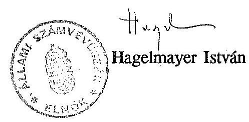

---

# Következtetések, javaslatok 

/Kivonat az 1991. évi jelentésbõl/

Az MTV bevételi és kiadási elõirányzatai a vizsgált időszakban folyamatosan emelkedtek. A bevételi elõirányzatok 1988-1990. között 38,7 \%-kal, a kiadási elõirányzatok 38,2 \%-kal növekedtek.

A bevételekbõl meghatározó arányt képviselnek a müködési bevételek között elszámolt elõfizetõi díjak (3,3 milliárd Ft 1990-ben), s egyre nagyobb hányadot tesz ki a szponzorok anyagi támogatása.

A kiadások valamelyest szerényebb ütemũ növekedése ellenére az MTV fôképpen a Gazdálkodó Szervezet funkció zavarai és súlyos gazdálkodási hiányosságai miatt több év óta veszteségesen müködik. A vizsgált idõszakban a válságjelenségek állandósultak és elmélyültek. Többszöri állami gazdasági intervenció ellenére sem sikerült az MTV-t szanálni és stabilizálni.

Az állami és belsõ ellenõrzések által többször feltárt hiányosságokat nem követték hatékony intézkedések, ezért ma is teljességgel helytállóak és továbbra is aktuálisak a Pénzminisztérium által 1988-ban végzett ellenõrzés idevonatkozó megállapításai:
"A Magyar Televízió gazdálkodásának ellenõrzése során olyan méretü és mélységũ szervezetlenség, szabályozatlanság és szabálytalan müködés tárult fel, amelyeket az adott viszonyok fenntartásával, vagy kisebb módosításával már nem lehet a kívánatos irányba terelni.
Olyan, a fejezet egészét érintõ, átfogó intézkedéssorozatra van szükség, amely a szervezet minden lényeges gazdálkodási feladatát rendszerszemléletben újraszabályozza."

---

Az MTV müködési rendjében tapasztalható alapvető hiányosságok hosszantartó hatásuk következtében jelentősen dezorganizálták az egész szervezetet és annak tevékenységét.

Az MTV fejezetnek nincs alapítólevele. A szervezet jogállását szabályozó Mt. határozat - amely a felügyelet és a kinevezési jogkört illetően többször módosult - tartalmában olyan szük és elavult szabályozási elemeket tartalmaz, hogy arra belsõ szabályozás nem alapozható.

A gazdálkodás belsõ szabályozása sok tekintetben hiányos vagy elavult, s rendszerében nehezen áttekinthető.

A vizsgált idôszakban a Gazdálkodó Szervezet költségvetési gazdálkodására a pénzügyi egyensúly tartós megbomlása, a növekvõ adósságállomány és az állandósult likviditási gondok voltak jellemzôek. Ebben kisebb részben külsõ, meghatározóan belsõ okok játszottak közre:

- a szakmai elképzelések és a pénzügyi lehetôségek összhangjának hiánya, az intézményi költségvetés megalapozatlansága, a költségvetési és pénzügyi tervezés hibái;
- a rendkívül laza gazdálkodási és ügyviteli fegyelem, ami tervszerütlen, pazarló, esetenként visszaélésektől sem mentes gazdálkodáshoz vezetett;
- az intézmények (Gazdálkodó Szervezet és Fõigazgatóság) közötti ésszerütlen tevékenység megosztás, valótlan költségviszonyok /azaz, a ténylegesnél alacsonyabb költségek felszámítása a nyújtott szolgáltatások igénybevételénél);
- a fedezet nélkül indított nagyberuházás;
- a pénzügyi lehetôségeket meghaladó bérfejlesztés;
- a szabályozó hatások késedelmes felismerése, az alkalmazkodás rugalmatlansága;

---

- a gyakori vezetöi személycserék kulcspoziciókban;
- a feladat- és hatáskörök, felelösségi körök tisztázatlanságai;
- az ellenőrzési rendszer hiányosságai stb.

Mindezek, az MTV vezetése által is régóta jól ismert okok ellenére gazdálkodási mulasztásokért 1972. óta felelösségre vonást nem alkalmaztak.

A teljesség igénye nélkül felsorolt kedvezőtlen feltételek határozzák meg az MTV gazdálkodásának szinvonalát és eredményességét a gazdálkodás minden elemében, a negatív jelenségek egy része a Kereskedelmi Föigazgatóságra is jellemző.

A költséggazdálkodás terén az egyre feszitőbb gazdálkodási körülmények kényszerítő hatása ellenére sem történtek átütő erejü, a hatékonyabb gazdálkodást célzó intézkedések. Például:

- nem dolgozták ki a takarékos költség- és eszközgazdálkodást biztosító egységes ösztönzési rendszert,
- jelenleg sincs elfogadott, véglegesített, a költségek racionalizálását szolgáló árjegyzék (csak tervezet színtü),
- rendszerszerű közgazdasági munka nem folyik, a költségnövekedés okait nem elemzik,
- a feltárt szabálytalanságokat, mulasztásokat (pl. a maradék filmnyersanyag felhasználás, valamint a szállitással összefüggő túlóra elszámolás hiányosságait) nem követi számonkérés, felelősségre vonás.
- az egész MTV-t átható "semmi sem drága" mentalitás az elmúlt években sem változott. A szervezetlenség, az előkészítetlenség következtében általános a kapacitások túlbiztosítása, a művészi koncepció fütött kamerák melletti "megálmodása" stb.

---

A számvitelben tapasztalható alapvető hiányosságok miatt a vizsgált idôszak mérlegadatainak valódisága bizonyíthatóan elfogadhatatlan. (Jelentés 10; 23; 24; 26; 27; 28; 32; 33; 38; 45.)

Tényként leszögezhető, hogy az MTV-nél a radikális változásokra a lehetetlenné vált gazdálkodási körülmények miatt objektíve szükség volt. Kérdéses csupán a változások iránya és belsõ tartalma lehet.

Az ellenôrzés idôszakában megkezdett átszervezés az elsõ olyan elhatározás, amelyik eljutott a megvalósulás fázisáig. a helyszíni ellenôrzés befejezôdéséig meghozott intézkedések eredményeirôl vagy következményeirôl elégséges idôtáv hiányában megalapozott, gazdasági eredményekkel minõsithetõ véleményt adni alig lehet. Sok jel mutat arra, hogy a kitüzött célok érdekében tett konkrét intézkedések ellentmondásosak. A kellô szakmai bázist és támogatást nélkülözô vezetői döntések végrehajtása gyakran elakad, mivel az intézkedések nem eléggé átgondoltak, nem kellően szakszerüek.

A támogatás általános hiányát súlyosbította az a körülmény, hogy a fokozatosan kialakított koncepció részleteinek kidolgozására, döntésre, majd végrehajtásra alkalmas formába hozatalára nem létesültek operatív bizottságok. a hivatali szervezetek pedig az átalakulással együttjáró bizonytalanságok miatt alkalmatlannak bizonyultak - a munka folyamatosságának fenntartásával egyidejüleg - szabályozásokba foglalni saját átalakulásukat.

A kiérleletlen elgondolások ellentmondásos helyzetet eredményeznek és esetenként tovább súlyosbitják az egyébként sem könnyen áttekinthetõ helyzetet.

Az átszervezés alapvető, rendszerbeli hibájának tekinthető, hogy olyan horderejũ új szervezeti struktúra létrehozását határozta el az MTV elnöke, amelyhez kompetenciája nem elégséges és az illetékes szervek elôzetes egyetértését nem tudta megszerezni. Ilyen kulcspozició a két kinevezett intendánsé, akiknek müsorügyekben a deklarált jogosultságát

---

közvetlenül maga az MTV elnöke sem befolyásolhatja vagy korlátozhatja az MTV elnöke által jóváhagyott megbízólevél szerint.

Az egyébként is bonyolulttá váló helyzetet tovább bonyolították az intendánsok kezdeti intézkedéseiben elöfordult hatásköri túllépések, amelyek elnöki beavatkozást igényeltek (egyes munkakörök alóli jogosulatlan felmentések, bér- és jutalmazási feltételek megállapítása, kereskedelmi szervezet megbontása).

Az átalakulás legsúlyosabb ellentmondása az, hogy az újként elképzelt szervezet müködése tulajdonképpen maradéktalanul a régi alapokra épül. A szervezetlenség, a szabályozatlanság, a gazdasági-pénzügyi fegyelem hiánya, a megbízhatatlan, hézagos nyilvántartások következményeit nem lehetséges kizárólag a versenyeztetés eszközeivel, imitált, vagy valódi piaci hatásokkal felszámolni. Az erélyes és eredményes vezetői intézkedések egyelöre hiányoznak.

Mindezek a nem kívánatos jelenségek csak részben indokolt velejárói egy nagy átalakításnak. A negatívumok többsége elkerülhető, de legalább is enyhíthető lett volna, ha az MTV vezetése előzetesen megnyeri a részletesen kidolgozott koncepciójának a külső, belső döntési faktorokat és az eredményes végrehajtásban érdekelt személyeket és az átalakítás egyesített erővel folyna.

A régebb óta fennálló finanszírozási nehézségek és az átszervezés miatt mutatkozó gyártási, beszerzési bizonytalanságok következtében a müsortartalékok oly mértékben lecsökkentek, hogy komolyan veszélyeztetik a II. félévi müsorszolgáltatás folyamatosságát és színvonalát.

Jóllehet a sugárzott müsor az MTV tevékenységének végső célja és eredménye, a müsor struktúrája, tényleges előállításának módja pedig a költségeket alapvetően meghatározza, a müsor értékelése nem képezte az ellenőrzés tárgyát, mert az pénzügyi-gazdasági ellenőrzési módszerekkel nem minősíthető.

---

# J A V A S L A T O K 

Az előkészületben lévő, de még el nem fogadott törvénytervezetek végleges kialakítása mellett realitásként kell figyelembe venni, hogy az MTV korábbi szervezete döntő pontokon felszámolódott, átalakult vagy átalakulóban van. Javaslatainkat az általunk ismert belsö, külső adottságok figyelembevételével tesszük meg:

## A Kormány hatáskörébe tartozóan:

Az MTV-t érintő törvények további előkészítése során mérlegelést igényelnek az ellenőrzés megállapításai, tényfeltárásai:

1. A megjelenő törvényekkel összhangban korszerűsitve kell kiadni az MTV alapítólevelét.
2. A szponzoráció gyors bővülése az MTV bevételei között számos elvi és gyakorlati problémát vet fel. Legfontosabb ezek közül a nemzeti médiák (jelecul az MTV) és azok munkatársainak túlzott és célzatos befolyásolási lehetősége anyagi eszközökkel, valamint a piaci verseny szabályainak megkerülése rejtett reklám útján. Ezért a törvényi szabályozás körébe utalandó kérdések közé javasoljuk sorolni azon etikai normáknak a meghatározását, amelyek betartásával az MTV szponzori - vagy músor - támogatást elfogadhat.
3. Megítélésünk szerint arra kell törekedni, hogy az MTV mint közszolgálati televízió gazdaságilag minél függetlenebb legyen. Ennek érdekében az MTV bevételeiben növelni célszerű az elöfizetői díjak és a saját ár- és dijbevételek arányát. Nem tartható fenn az a korábbi gyakorlat, hogy az elöfizetői díjak emelésén osztozik az MTV, MR és a központi költségvetés. Célszerünek tartjuk megszüntetni azt a gyakorlatot is, hogy prognosztizált bevételnövekedés képezze a támogatás csökkentés alapját. Indokoltnak tartjuk az TV elöfizetői díjak beszedésével kapcsolatos eddigi jogosultságok és eljárási kérdések újraszabályozását.

---

4. A törvényi szabályozás során indokoltnak tartjuk meghatározni a nemzeti médiák privatizálásának elveit és korlátait, illetve azok részvételét különbözö gazdasági társaságokban. Szabályozandó a külföldi tőke részvételének lehetősége vagy tilalma a közszolgálati médiák müködtetésében, fenntartásában, fejlesztésében.
5. A vidéki körzeti stúdiók szellemi és anyagi potenciáljának nagyságrendje és értéke nyomatékosan szükségessé teszi feladataik és kapcsolódásuk újrarendezését, önállóságuk növekedését.

# A Magyar Televízió hatáskörébe tartozóan: 

6. Az MTV régi szervezetének és müködésének radikális átalakítását rendszerszemléletben, a pénzügyi és a szakmai követelmények összehangolásával, szükség szerint külsö szakértők, szervezési intézetek igénybevételével és az ellenőrzés megállapításainak hasznosításával folytatni kell.

- A törvények elfogadásáig kerülni kell minden olyan MTV-n belüli megoldást, amiről elöre látható, hogy a készülő törvényekben foglaltakkal ellentétes vagy attól eltérő helyzetet eredményezhet.
- Pótlólagosan ki kell dolgozni a belsö átalakulás részletes stratégiát, beleértve a gazdasági feltételeket. Kimunkálandók a várható költsegek és hozamok. Az eddigieknél sokkal nagyobb figyelmet kell fordítani a döntések jó előkészítésére, gazdasági-pénzügyi megalapozására és a végrehajtás körültekintő megszervezésére.
- Az átszervezés tényleges sikerének feltétele, hogy a további előkészítő munka szervezettebbé váljék, az átalakítás különbözö folyamatainak megalapozását és végrehajtását belsö szabályozások idöbeni elkészitésével segítsék. Mielöbb intézkedések szükségesek a szervezeti és müködési szabályzat, az ügyrend és a munkaköri leírások kiadása, bevezetése érdekében.

---

- A belsõ gazdasági stabilitást minél hamarabb helyre kell állítani, már csak azért is, mert a tényfeltárás arra mutat, hogy a rendelkezésre álló műsortartalék vészesen fogyóban van.
- A szervezeti egységek feladatmegosztását a célszerüség, gazdaságosság, a költségvetési források kimélése szempontok érvényesítésével kell kialakítani és megszervezni, s ennek keretében fel kell számolni a Kereskedelmi Igazgatóság és a Gazdálkodó Szerv közötti kifogásolt kapcsolatrendszert.
- Az érvényes munkajogi szabályok szerint kell rendezni a központi állományba tartozók sorsát. Megengedhetetlen, hogy tényleges munkakör és feladat nélkül történjék több hónapon keresztül bérfizetés.

7. Sürgös megoldást igényel a megüresedett gazdasági vezetői munkakörök betöltése.
8. Az MTV számára bizonyíthatóan hátránnyal járó pénzfelhasználások miatt (pl. Peugeot gépkocsik lízingdija, a szabálytalanul kihelyezett pénzeszközök) indokolt a személyes felelősség tisztázása és a felelősségre vonás érvényesítése.
9. További vizsgálat után szintén indokolt lehet a személyes felelősség tisztázása azokban az esetekben, amikor rendszeresen elöforduló, ismétlődő hibák kiküszöbölésére nem történtek vezetői intézkedések (számviteli hiányosságok, beruházások pénzügyi rendezetlensége, analitikus nyilvántartások hiánya stb.).
10. Rendezendők az állammal szembeni befizetési kötelezettségek (pl. ingatlanvásárlásból befolyt bevételek, lízingelt gépkocsik után fizetett AFA, a maradványérdekeltségű tevékenység javára elszámolt összegek miatt).

---

# INTÉZKEDÊSI TERV <br> 1991. szeptember-október 

A Magyar Televízió pénzügyi-gazdasági ellenôrzése során az Állami Számvevôszék által feltárt hiányosságok felszámolására, az érvényes pénzügyi és gazdálkodási szabályok betartására, valamint az MTV vezetése által elhatározott szervezeti változtatások végrehajtására az alábbiakban részletezett intézkedési tervcsomagot hagytam jóvá. A csomagban szerepló és elhatározott intézkedések egyrészt a "rendkívüli" (a rádióról és televízióról szóló törvény elôtti) helyzetbôl adódóan, másrészt az intézkedések hosszabb távra való kihatása miatt három csoportba oszthatók:
I.) Azonnali intézkedések (amelyek végrehajtása már megkezdôdött, illetve megtörtént - lásd mellékletek)
II.) A vizsgálat megállapításai alapján, az átszervezés során elhatározott szervezeti módosítások, amelyek a mũködés eredményesebbé tételét célozzák
III.) A rádió- és televíziótörvény elfogadását követő idôszak elképzelései, lehetséges intézkedései

## I.) Azonnali intézkedések

A.) 1. A körzeti stúdiók önálló gazdálkodásának megteremtése (ezt ugyan a jelentés a kormány hatáskörébe tartozó döntésnek tekinti, de véleményünk szerint "önálló költségvetési címként" való mũködtetése MTV döntési hatáskör. Ha ilyen döntés születik, a Pénzügyi Fôosztály kidolgozza az önálló gazdálkodás feltételeit és segítséget nyújt a feltételek megteremtéséhez (ÅSZ jelentés 6. oldal 5. pont és a 32. oldal)

Határidő: 1991. december 31.
Felelős: Szalacsi Tóth Albert

---

2. Az egyes területeken hiányzó analitikus nyilvántartások (vevठ̋k, szállítók stb.) kialakítását pótoljuk részben az e célra kidolgozandó számítógép-programokkal, részben kézi felvezetéssel (ÁSZ jelentés 9. oldal 1. bekezdés)

Határid8: 1991. december 31.
Felel8s: Baráz Péter pénzügyi fठov.h.
3. A Cserkesz utcai és a Rajk László (Pannónia) utcai ingatlanok értékesítéséb81 származó bevételek (összesen 165,2 millió Ft) ügyét a Pénzügyminisztériummal rendezni kell. Miután e pénzeszközöket az MTV 1989-ben és 1990-ben felhasználta, kérni kell, hogy ezen összeg utólagos befizetését81 a PM. tekintsen el (ÁSZ jelentés 12. oldal 3. bekezdés).

Fegyelmi eljárás: a munkaköri feladatok nem megfelel8 ellátása miatt a felel8sség mértékének megállapítására Szalacsi Tóth Albert és Ádám László, a Fökönyvel8ség osztályvezet8je ellen.

Határid8: 1991. december 31.
Felel8s: Szalacsi Tóth Albert pénzügyi fठosztályvezet8
4. Fizetési felszólításokkal és ha szükséges, peresítéssel intézkedéseket teszünk adósságállományunk behajtására és a fizetési határid8 be nem tartása esetén a törvényes kamat felszámítására (ÁSZ jelentés 13. oldal 3. bekezdés) mind az MTV gazdálkodó szervezetnél, mind a Kereskedelmi F@igazgatóságon.

Fegyelmi eljárás: a munkaköri feladatok nem megfelel8 ellátása miatt az eljárást le kell folytatni dr. Pócsik Ilona belkereskedelmi igazgatóval és Ádám László, a Főkönyvelőség osztályvezetठjével szemben. Határid8: folyamatos

Felel8s: Szalacsi T.Albert pénzügyi fठov. dr. Pócsik Ilona belkereskedelmi igazgató

---

5. Az ÁSZ jelentés 15. oldal 5. pontjában részben a jogszabály sajátos értelmezésének köszönhetően szabálytalannak minősíti az állammal szembeni kötelezettségek teljesítését. A pénzügyi kötelezettséget a Magyar Televiziónak rendeznie kell, mivel annak egyértelmúsége tisztázódott.
Fegyelmi eljárás: az állammal szembeni pénzügyi kötelezettségek nem megfelelő idóben és módon történő teljesítése miatt az eljárást le kell folytatni Szalacsi Tóth Albert pénzügyi főosztályvezetővel szemben. Határidő (a levél elküldésére): 1991. szeptember 30.
Felelős: Szalacsi Tóth Albert pénzügyi főosztályvezető
6. A vállalkozási tevékenység és az azzal összefüggő érdekeltségi rendszer újraszabályozására a tervezet elkészült. Kiadás esetén az ÁSZ jelentés 16. oldal 5. bekezdésében jelzett bérköltség-torzítás megszünik. Az új szabályozás szerinti elszámolás érvényesítésének
határideje: 1991. november 1.
Felelős: Baráz Péter pénzügyi főov.h.
7. A 43. sz. Állami Epítơipari Vállalattól megvásárolt, és 1989-91. évben átvett, valamint ugyanazon években a Kunigunda utcai $A, B, C$ épületek állóeszköz-nyilvántartásba vétele (aktiválása) folyó évben megtörtént (ÁSZ jelentés 21. oldal utolsó bekezdés).

8/a. Az MTV ingatlan nyilvántartásában szereplő Ơ utcai ingatlanra aktivált 1 millió Ft -ot, valamint a Nádor utca 18. sz. alatti ingatlanrészre bérleti jog megváltása címén kifizetett és helytelenül aktivált 10,5 millió Ft-ot nyilvántartásunkból kivezettük. (Indoka: az Ó utcai ingatlan kezelơi jogának átadásáért igénybevételi dí címén kifizetett 1 millió Ft nem az ingatlan átvételkori nyilvántartási értéke volt, igy a beruházás aktiválása helytelenül történt. Ugyancsak nem kellett volna aktiválni a Nádor u. 18-at sem, mert annak kezelठ̋je az IKV. Az MTV ezért bérleti díjat fizet).

Felelős: Szalacsi Tóth Albert pénzügyi főosztályvezető

---

8/b. Az Ơ utcai ingatlan újraértékelt áron történő nyilvántartásba vételét az ÁSZ jelentés szabálytalannak minősíti. A kérdésben a Pénzügyminisztérium állásfoglalását szükségesnek tartjuk megkérni (ÁSZ jelentés 22. oldal 2. bekezdés).
9. Az ÁSZ jelentés 24. oldal 3. bekezdésben említett 8 db Volga gépkocsi aktiválása megtörtént. A lízingelt Peugeot személygépkocsikat a Kereskedelmi Igazgatóságnál vették nyilvántartásba, mivel a lízingdijat az Igazgatóság fizeti. Tisztázni kell azonban, hogy ha az utolsó lízingdij kifizetése is megtörténik (1994), a gépkocsik milyen módon kerülhetnek át az MTV gazdálkodó szervezet nyilvántartásába térítésmentesen, illetve milyen feltételek mellett lehet ezt korábban - esetleg még ebben az évben - megtenni.
A hưtlen kezelés vádját a főügyészségi vizsgálat elvetette, igy a lízingelt gépkocsik átvételét kell a pénzügyi fơosztályvezetőnek lebonyolítania.

Fegyelmi eljárás: a kezdeményezett és megindított újbóli fegyelmi vizsgálatot a Fơvárosi Fơügyészség, illetve a legfơbb ügyész átirata alapján nem tartom indokoltnak lefolytatni. A hasonló esetek megelơzése érdekében az ügyben érintett valamennyi vezetठ beosztású dolgozó figyelmét gazdasági fơigazgatói körlevélben fel kell hívni a gondosabb és szakszerúbb, közgazdaságilag megalapozottabb szerzठdése1ర̋készítésre.
Határidő: 1991. október 31.
Felelős: Nagy László gazdasági fơigazgató
dr. Varga Ferenc vez.jogtanácsos
Kerekes György közgazd.oszt.vez.

---

10. Az elठzo évek még rendezetlen tételeivel együtt az 1991. I. félév végéig beérkezett és leszámlázott beruházási célú mũszaki és egyéb berendezések bevételezését, aktiválását, pénzügyi elszámolását beleértve a Bojtár utcai új stúdió mũszaki berendezéseit is - legkésठ̋bb ez év végéig rendezni kell. Ez a munka csak a Beruházási Osztály, a Mũszaki Anyaggazdálkodási Osztály és Raktár, a Mũszerimport és a Pénzügyi Fठosztály jó együttmúködésével oldható meg. A munka megszervezéséért és a koordinálásért együttesen felelnek a részlegek vezetठi.
Fegyelmi eljárás: A munkaköri feladatok maradéktalan betartatása és a mulasztások okai és felelठ̋sei megállapítására az eljárást le kell folytatni Szalacsi Tóth ALbert pénzügyi fठosztályvezetठvel, Verpeléti János mũszaki anyaggazdálkodási osztályvezetठ̋vel és Horváth Lóránt gyártási igazgatóval szemben .
Határidő: 1992. február 29.
Felelős: Szalacsi Tóth Albert pü. főov. Verpeléti János mũsz.ag.oszt.vez. dr. Meszner Károlyné számviteli oszt.vez.
11. Az Uzemgazdasági Főosztály által beszerzett csőfagyasztó berendezés kétszeri kifizetését rendeztük. A tévesen átutalt üsszeget visszautalták 1991. május 6-án. (ÁSZ jelentés 24. oldal utolsó bekezdés). Az adminisztrációs mulasztást a pénzügyi főosztály vezetője, Szalacsi Tóth Albert köteles kivizsgálni, és erről a gazdasági igazgatót tájékoztatni.

Határidő: 1991. december 10.

---

12. A hiányzó számlák rendezését már a vizsgálat befejezése után megkezdtük. Ezideig a hiányzó mennyiség mintegy egyharmadát rendeztük. A még hiányzó számlák felkutatását, hiteles másolatok bekérését meg kell gyorsítani és az év végéig be kell fejezni. (ÁSZ jelentés 25. oldal 1-2. bekezdés). A számlalikvidáció, a nyilvántartás áttekinthetơsége érdekében a folyamatos ellenơrzés és naprakész adatszolgáltatás biztosításáért a számlaellenơrzési rendszert szabályozni kell.
Fegyelmi eljárás: a hiányzó számlák indokolatlan méretư felhalmozódása miatt és a pénzügyi nyilvántartási rendszer hiányosságainak megszüntetése érdekében a személyi felelơsség kihangsúlyozott megállapítására az eljárást le kell folytatni Szalacsi Tóth Albert, dr. Korn Endréné fơov.h. és dr. Meszner Károlyné ov. ellen.
13. Az ÁSZ jelentés 25. oldal 3-5. bekezdésében jelzett hiányosság a beruházási elszámolás és pénzügyi bonyolítás, valamint a számviteli rögzítés közötti nem megfelelơ összhangból adódik. A rendezést és a Beruházási Osztállyal való folyamatos együttmúködést a Számviteli Osztály vezetठjének és helyettesének kell biztosítani.

- Konkrét intézkedés szükséges az MTV-nek az Új Képújság Kft-be apportként bevitt állami vagyonnak a számviteli elठírások szerinti aktiválására;
- a vagyonértékũ jogként minơsülơ bérleti jog átadását megelठzठen az MTV elmulasztotta az elhelyezठ hatóság hozzájárulásának megkérését. Ez ellentétes a többször módosított 19/1984/IV.15. MT r. 23 paragrafus (5)d. pontjának elठírásaival.

Felelős: Láng György főov. h.

---

Mindez felveti a társasági szerzठ̋dés jogi felülvizsgálatát, a törvényesség helyreállítását.

Felelős: dr. Varga Ferenc vezetठ̋ jogtan.

- ki kell vizsgálni, hogy az apport érték meghatározásánál követett eljárás az MTV-nek milyen vagyoni hátrányt jelentett. Ennek ellenére a felelősségre vonást érvényesítem.

Felelős: Kerekes György közgazd.ov.
Határidő: az elmaradt aktiválásokra 1991. okt. 30 , egyébként: folyamatos
Felelős: dr. Meszner Károlyné számviteli osztályvezető Tóth Imréné anyagkönyvelési csoportvezető

14/a. A kompenzációban beszerzett IKEA bútorok számbavétele, leltározása, a hiányok megállapítása megtörtént. A bevételezésre, a hiányok tisztázására és a felelősségre vonásra 1991. október 31-éig intézkedünk. Fegyelmi eljárást kell kezdeményezni ezen mulasztás miatt a pénzügyi főosztályvezető, Szalacsi Tóth Albert és a belkereskedelmi igazgató, dr. Pócsik Ilona ellen.

Felelős: dr. Varga Ferenc vez.jogtan.

14/b. A Hungarotextól beszerzett, utcai jelmezként kezelt férfi és nठi ruhák leltározása, a hiányok megállapítása még a tavasszal megtörtént. A bevételezésre a Gyártási Igazgatóság felé, a hiányok tekintetében a felelősség megállapítása ügyében a Jogi Osztály felé intézkedtünk, még május hónapban. (ÁSZ jelentés 30. oldal 3. bekezdés). A ruhák bevételezésére vonatkozóan a gyártási igazgató szeptember 9-én kelt levelét mellékelten bemutatjuk. Fegyelmi eljárást kell kezdeményezni Horváth Lóránt gyártási igazgató és Szalacsi Tóth Albert pénzügyi főosztályvezető ellen.

---

15/a. Az MTV anyagainak, álló- és fogyóeszközeinek leltározását belsठ szabályzatunknak megfelelठ̋en a Pénzügyi Fठosztály szervezetében lévठ 5 fठs leltározási csoport végzi folyamatosan. A rendkívül nagy mennyiségũ és több ezer féle, Budapesten és vidéken sok helyen, raktárakban, munkahelyeken és dolgozóknál lévठ anyagok, eszközök leltározása nagyon nagy erठfeszítést igényel a csoporttól. Megvizsgáljuk, hogy szervezési intézkedésekkel hogyan lehet a munkát gyorsítni és esetleg szükséges-e a csoport 1-2 fơvel való megerősítése. A vizsgálat eredményéról jelentést készítünk az elnök részére.

Határidő: 1991. szeptember 30.
Felelős: Szalacsi Tóth Albert pénzügyi fơosztályvezető és Tóth Imréné leltározási cs.v.

15/b. A szállítók, vevơk és egyéb pénzügyi eszközök analitikus és fơkönyvi egyeztetését (leltározását) az analitikus nyilvántartások rendezésével még folyó évben el kell végezni és biztosítani kell, hogy azt követठ̋en ez havonta megtörténjen. (ÁsZ jelentés 31. oldal).
Az elmúlt évek rendszertelen pénzügyiszámviteli nyilvántartása miatt felelősságre vonást kell kezdeményezni Szalacsi Tóth Albert fơov. ellen.

Határidơ: 1991. december 31, utána folyamatos
Felelős: dr. Varga Ferenc vez.jogtanácsos számviteli ov.

---

16. A MAHIR-nek lizingbe adott filmtechnikai eszközökre vonatkozó szerződést közös megegyezéssel megszüntettük és a TV számára alkalmas eszközöket a MAHIR visszaadta. A visszavett eszközöket nyilvántartásba vettük, pénzügyileg rendeztük. Ezen eszközök eredetileg a Kereskedelmi Igazgatóságnál kerültek nyilvántartásba. Ennek kivezetésére szükséges intézkedni, minthogy visszavételezéskor ezek az MTV-nél kerültek bevételezésre. (ÁSZ jelentés 43. oldal 1. bekezdés).

Határidő: 1991. szeptember 30.
Felelős: Tóth Imréné anyagkönyvelési csoportvezető
17. Az Állami Számvevơszék vizsgálati eljárásával párhuzamosan folyt az Adó- és Pénzügyi Ellenơrzési Hivatal Fơvárosi Igazgatósága Költségvetési és Társadalmi Szervek Ellenơrzési Osztályának adóellenơrzési vizsgálata, amely az MTV bevallásához képest az 1988-1990 közötti adóévekre összességében valamennyi adónemre együttesen 136,132.000,- Forint adókülönbözetet állapított meg az intézmény hátrányára. Az MTV jelenlegi likviditási és financiális helyzetében ennek megfizetése rendkívüli terheket ró a gazdasági vezetésre. A személyes felelősség és a döntési kompetenciával bíró vezetơi alkalmasság elbírálására fegyelmi eljárást kell lefolytatni a Pénzügyi Fơosztály érintett vezetơi ellen: Szalacsi Tóth Albert fơov.; dr. Korn Endréné fơov.h.; Baráz Péter fơov. h.; dr. Meszner Károlyné oszt.vez. ellen. A vizsgált időszakban kilépett vezetठ̋ munkatársak ellen a fegyelmi eljárást lefolytatni nem lehet.

Felelős: Nagy László gazd. fơig. dr. Varga Ferenc vez. jogtan.

Megjegyzés: mellékelten csatolva a Gazdasági Bizottság vezetðjének elfogadó nyilatkozata és a Pénzügyi Fơosztály vezetðjének visszaigazolása

---

B.) A Pénzügyi Fơosztálynak kiadott egyidejũ intézkedéssel az Ellenőrzési Osztály felülvizsgálja az érvényes aláírási és utalványozási joggal rendelkezők számát név szerint. A vizsgálat eddigi megállapításai szerint 600 dolgozó rendelkezik, rendelkezett az említett jogokkal, a kilépett dolgozók megbízását nem vonták vissza és az intézményen belüli munkahelyváltozásokat sem tartják karban, így egy dolgozó két munkahelyen is rendelkezhet aláírási joggal.

Utasítás: az aláírási és utalványozási joggal rendelkezők számát csökkenteni kell összeghatárokra és az eszközök értékére vonatkozó korlátozás bevezetésével. Ennek véglegesítése csak a szervezeti változások után, 1992. januárfebruártól történhet meg.

Felelős: Szalacsi Tóth Albert pénzügyi fơosztályvezető
dr. Zsigmond Jánosné ellenőrzési osztályvezető
C.) Az MTV-nél bekövetkezett, illetve bekövetkezठ szervezeti változások miatt el kell végeztetni a vagyonfelmérést, illetve vagyonértékelést. A munkát egy vagyonértékelठ szervezetre bíztuk a Pénzügyi Fơosztály bevonásával.

Felelős: gazdasági igazgató, pénzügyi főov. Határidő: 1991. december 31 -1992. március 31.
D.) Az MTV körzeti stúdiói 1992. évtől önálló költségvetési címként jelennek meg. A stúdiók szakmai feladatait meg kell határozni és az önálló gazdálkodás tárgyi és személyi feltételeit meg kell teremteni. E döntésnek - feladatok meghatározása, önálló gazdálkodás - összhangban kell lennie a rádió-és televíziótörvénnyel. Az 1992. évi költségvetési tervezés már mindkét stúdió esetében önálló költségvetési címként történt. A végrehatásért

Határidő: 1992. szeptember 30.
Felelős: gazdasági igazgató

---

E.) Azonnali intézkedés történt az MTV összes munkatársára vonatkozóan az 1991. január 1. és augusztus 31. közötti jövedelem (és különösen annak különböző elemei) alakulására vonatkozóan. A tapasztalati számok azt mutatják, hogy az MTV néhány egységénél tovább folytatódott az ÂSZ jelentésben leírt folyamat (az alapbéren kívüli juttatások összegének ellenơrizetlen és indokolatlan növekedése.) Jelenleg is folyik a vizsgálat, amely összehasonlítja a felvett jövedelmeket az elvégzett teljesítménnyel. (A meghozott döntések után nagyon sok szervezeti egységnél megszûnt az "önkéntes túlmunka" és az "átdolgozás"). Ki kell dolgozni az MTV egységes anyagi ösztönzési rendszerét.

Határidő: 1992. február 29.
Felelős: gazdasági igazgató, TV1, TV2 intendáns, gyártási igazgató, pénzügyi főosztályvezető.
A megfelelő intézkedések elmaradása esetén fegyelmi felelősséggel tartozik: Nagy László mb.gazdasági igazgató
F.) Az MTV minden részlegére vonatkozóan felmérés a létszámtöbbletek megállapítására. Rendezni kell az ún. "központi" alkotói-gyártási-ügyintézői irodáknál alkalmazottak státuszát, a központi állomány helyzetét, múködését. Foglalkoztatásukat racionalizálni kell, lehetơség és humánum figyelembe vételével az intézményen kívül. (alapítvány, egyesület).

Határidő: 1992. január 31.
Felelős: bér-és munkaügyi fơosztályvezető
G.) A Szervezeti és Múködési Szabályzat véglegesítésével - a médiatörvény elfogadása után - meg kell határozni a vezető állású dolgozók munkaköri feladatait, kompetenciájukat és kötelességeit. A szervezeti átalakítás után rendezni kell a munkaköri kompetenciákat, a bérezési formákat és módozatokat.

Határidő: 1992. március 31.
Felelős: gazdasági igazgató

---

H.) Egyértelmũen és szigorú etikai normák elóirásával rendezni kell a Magyar Televiziónál a főálláson kívüli foglalkoztatás kérdéseit. Az utasítás jóváhagyásra vár.

Határidő: 1991. november 20.
Felelős: gazdasági igazgató
Az utasítás-tervezet szövege mellékelve!

# II. A múködés eredményességét célzó intézkedések 

A.) 1992. január 1-jétől már önálló címként szerepel a Magyar Televízió költségvetési fejezeten belül:

- MTV Pécsi Körzeti Stúdió
- MTV Szegedi Körzeti Stúdió

Az önálló szakmai feladatok meghatározására, a gazdálkodási feltételek kialakítására az elózó pontokban utaltunk. Előkészületeket kell tenni a feladatmódosulás miatti esetleges végleges leválasztásra az MTV-tól (médiatörvény).

Határidő: 1992. szeptember 30.
Felelős: gazdasági igazgató
B.) A Magyar Televízió Gyártási Leányválallatának megalakítása MTV Enterprises névvel

Pénzügyi és gazdálkodási szempontból az egyszemélyes (kizárólag MTV tulajdonú) RT. vagy Kft. megalakítása lenne kívánatos. A társaságalapítást a kiviendó vagyon nagysága miatt az MTV jelenlegi likviditási helyzetében nem teszi lehetővé, ezért leányvállalat megalapítása mellett dontöttünk. Ehhez rendelkezünk a Pénzügyminisztérium elvi engedélyével. A múködési alapelvek kidolgozásán a Gazdasági Bizottság és az MTV vezetése együtt dolgozik.

Határidő: 1991. december 31.
Felelős: gazdasági igazgató, gyártási igazgató

---

C.) A Belkereskedelmi Igazgatóság és a Fơkönyvelర̋ség által ellátott feladatok felülvizsgálata, a vállalkozási formában eredményesebben mưködtetheto munkaszervezetek leválasztása az MTV-rơl.

Az MTV fejezet költségvetésében eredményérdekeltségũ szervezetként szereplő Belkereskedelmi Igazgatóság és Fơkönyvelర̋ség az MTV-tơl kapott megbizás alapján (vagy mert az elmúlt évek, évtizedek alatt igy alakult ki) több olyan feladatot lát el ma is, ami az MTV alapvagy gazdálkodási tervékenységéhez kapcsolódik, és amelyeket az MTV-nek kellene ellátni. Az ilyen feladatoknak az átadását a 60-as, 70-es években valós televíziós érdekek diktálták, a 90-es években azonban egyre inkább a személyes érdekek segítették a kialakult gyakorlat fenntartását. (Nem kevés tévés dolgozónak jelentett éveken keresztül olykor jelentơs összegũ jövedelemkiegészitést).

A belsठ szabályozatlanság következtében az évek (évtizedek) során olyan kusza viszonyok alakultak ki a két gazdálkodó szervezet közötti hatásköri, elszámolási, pénzügyi kapcsolatokban, amelyet az ÁsZ vizsgálat is erơteljesen kifogásolt és megszüntetését indítványozta.

Meg kell kezdeni az ellátandó feladatok leválasztásával párhuzamosan az MTV vagyonának és gazdálkodásának egyértelmũ szétválasztását. A vállalkozási formában mũködठ kereskedelmi egységek (reklámértékesités, TELEVIDEO stb.) vállalkozásba vitt vagyonának megállapítására, felmérésére megbízást kell adni egy vagyonértékelठ̋ szervezetnek. A dologi és személyi költségek átcsoportosítása még a vállalkozások megalapítása elơtt kell megtörténjen.

---

A rendezés az eredményérdekeltségũ szervezet által ellátott feladatok pontos elhatárolásával, a profilok tisztázásával kezdôdhet.

1. A szervezetnél eddig bonyolított feladatok egy része olyan, amelyik az elmúlt egy évben történt átszervezések következtében lényegében megszûnt, például:

- televíziós produkciók pénzügyi lebonyolítása;
- TELEP^ART Iroda mûsorszervezó, menedzseló tevékenysége;
- Fesztiválíroda, amely az NKI-hoz került át;
- kül- és belföldi koprodukciók bonyolítása.

E feladatoknak legfeljebb az utólag még jelentkezo ügyeit és ha van ilyen, a pénzügyi elszámolásokat kell rendezni az MTV-vel.
2. A szervezet által ma is ellátott olyan feladatok, amelyeket - véleményünk szerint -az MTV-nek kellene bonyolítani:

- az MTV bármelyik mũsorgyártó szervezete által vagy javára kötött szponzorszerzôdések, kompenzációs ügyletek pénzügyi bonyolítása;
- az MTV külkereskedelmi tevékenységének pénzügyi bonyolítása:
$=$ export: filmexport, nemzetközi szolgáltatás;
$=$ import: mũszer- és filmimport.
- vállalkozás jellegũ szinkronizálás pénzügyi elszámolása, bonyolítása;
- selejtezett és felesleges anyagok, eszközök értékesítése;
- MTV gépkocsilízing.

---

3. Fentieken kívül a szervezet által ellátott feladatok, amelyeket továbbra is el kell látni:

- TV2 részére reklámszervezés;
- TV archívumból külsర̋ megrendelésre kópiakészítés;
- másodlagos jogok hasznosítása, értékesítése;
- külföldiek részére reklámfilm gyártás és szervezés;
- Televideo Iroda mũ̃soros kazetta készítés, sokszorosítás, forgalmazás.

A 2. pontban említettek döntర̋en pénzügyi bonyolítási feladatokat jelentenek. Ha ezek átvételére döntés születik, az csak fokozatosan (de célszerú lenne ez év végéig) hajtható végre az e feladatokat jelenleg is ellátó szakemberek átvételével együtt. Gondoskodni kell azonban az átvett személyek elhelyezéséról is, mert a Pénzügyi Főosztály területén jelenleg ez nem oldható meg.

Az átvételre kerülర feladatokhoz kapcsolódó létszám- és béralap tekintetében a belkereskedelmi igazgatóval kell megállapodni.

E törekvésünket megerర̋síti és meghatározza a kormány 3353/1991. számú határozata a központi költségvetési szervek felülvizsgálatáról.

Határidర: 1991. dec. 31 - 1992. márc. 31. Felelర̋s: gazdasági igazgató
D.) Kulcspozíciójú munkakörök betöltése

A Szervezeti és Múködési Szabályzat véglegesítésére bizonyos munkakörök esetében csak a médiatörvény elfogadása után kerülhet sor (alelnökök stb.)

---

A gazdálkodási fegyelem erősítése és a felelősség érvényesítése szükségessé teszi a gazdasági igazgatói munkakör betöltését. A pályázat lezárult és 1991. november 15-ével kinevezésre került a gazdasági föigazgató, megnövelt hatáskörrel, amely a gazdálkodás minden területére (gazdaság, kereskedelem, mũszak, gyártás, vagyonkezelés) kiterjed.

Határidő: 1991. november 30.
Felelős: az MTV elnöke
E.) Jóvá kell hagyni a belsó kalkulációs rendszer alapját képezర, valós költségviszonyokat tükrözo árrendszert. Bevezetése elôtt fel kell mérni közgazdasági megalapozottságát és várható hatásait, az átszervezés gazdasági kihatásait minősíteni kell.

Határidő: 1991. dec. 31 - 1992. jan. 31.
Felelős: közgazdasági önálló osztályvezető
III. A médiatörvény elfogadása utáni intézkedések lehetséges változatai

A törvénytervezet elemeinek ismeretében és az átszervezés koncepciója alapján csak és kizárólag a két tervezett mũsorcsgitorna (TV1 és TV2) önálló jogi személyiségũ költségvetési (vagy nem) szervként való mũködésére lehet felkészülni. A két csatorna mũködésére - az MTV vagyon (gazdasági) igazgatósága - a költségvetés alapján támogatást biztosít, ugyanakkor meghatározott feladatokra a két csatorna egymással versenyezve pályázatot nyújt be az MTV vagyon (gazdasági) igazgatósága felé. Meg kell teremteni annak lehetơségét és feltételeit, hogy a csatornák saját bevételre tegyenek szert. A csatornák gazdasági, mũszaki és gyártási ügyeit az általuk vagy az MTV által létesített, szintén önálló gazdálkodást folytató gazdasági, gyártási, mũszaki társaságok, egyesületek stb. látják el.

Az elméleti modell kidolgozásának
felelőse: gazdasági igazgató, elnök
Határidő: 1992. december 31.

---

Az intézkedési tervben foglaltak végrehajtása érdekében szükségesek az alábbi elnöki döntések, intézkedések:

- az intézkedési tervben foglaltak folyamatos végrehajtása, ellenơrzése igazgató tanácsi, elnökségi üléseken a felelơsök beszámoltatásával történik;
- az Állami Számvevơszék által feltárt hiányosságok rámutatnak a belso ellenơrzés máködésének hiányosságaira is, emiatt feltétlenül szükséges az osztály személyi és tárgyi feltételeinek javítása, megerơsitáse. Az ehhez szükséges státusz és bérkeret biztosításáról a gazdasági igazgató köteles intézkedni;
- át kell dolgozni a közszolgálati televízió etikai normálnak megfelelठ szponzorációra vonatkozó elnöki utasítást, meg kell szüntetni az MTV dolgozóknak fizetett jelenlegi jutalék-rendszert, ennek elemeit és az esetleges jövedelemkiesést az anyagi ösztönzési rendszerben kell érvényesiteni.

Készítette, Nagy László

Jóváhagyta: Hankiss Elemér

Budapest, 1991. december 4.

---

# MEGYAR TELEVIZIO 

ELNÖKE
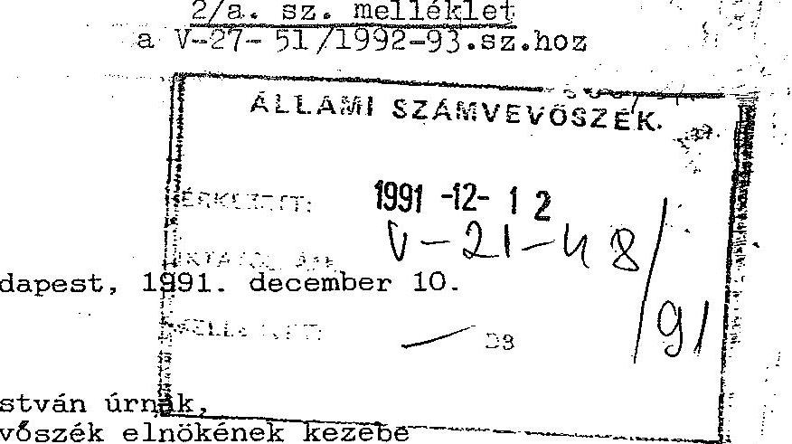

Budapest

Igen tisztelt Elnök Ơr!

Hivatkozva 1991. december 5-én kelt levelére, amelyben az önök vizsgálata alapján kidolgozott Intézkedési tervünket elfogadja, s a következ6kben értesítem pontosító észrevételeivel kapcsolatos állásfoglalásomról:
ad A/2 pont: elfogadom észrevételét és fegyelmi eljárást kezdeményezek a Pénzügyi F 6 osztá 1 y vezet 6 i (f6osztályvezet6, számviteli és pénzügyi osztályvezetők) ellen a munkaköri feladatok nem megfelel6 ellátása miatt.

Felelős:
Nagy László gazd. fGig. dr. Varga Ferenc vez. jogtan.

Határidő: 1992. január 31.
ad A/9 pont: továbbra is fenntartom álláspontomat: a F6városi F6ügyészség, illetve a Legfőbb Ugyész átirata alapján a fegyelmi vizsgálat lefolytatását nem tartom indokoltnak. Ezzel kapcsolatban felhívom Elnök úr figyelmét arra, hogy a lizingszerz6dés megkötését a F6városi F6ügyészség is gazdaságilag el6nyösnek találta és az ügyvitellel kapcsolatban sem állapított meg szabálytalanságot.

---

Az ügyet egyébként jelenleg a pénzügyminiszter által kiküldött miniszteri biztos vizsgálja. Az 6 jelentésének, illetve javaslatainak ismeretében mérlegelni fogom majd az esetleges intézkedések megtételének szükségességét.
ad $A / 13$ pont: az MTV apportjának meghatározásánál esetlegesen elkövetett mulasztások felderítésére fegyelmi eljárást kell kezdeményezni Sándor Gyuláné korábbi gazd. és keresk. főigazgató, Szalacsi Tóth Albert pénzügyi f6o.v. és Baráz Péter pénzügyi f6ov. h. ellen.

# Felelős: 

Nagy László gazd. főig.
Kerekes György közgazd.ov. dr. Varga Ferenc vez.jogtan.

Határidõ: 1992. január 31.
ad III.: az Intézkedésekhez tett megjegyzése helytálló: a szponzoráció után fizetett jutalékrendszer megszüntetése miatti esetleges jövedelemkiesést a kidolgozandó egységes anyagi ösztönzési rendszer kizárólag többlet teljesitmény ellenében ellentételezi.

Kérem a fentiek szíves tudomásulvételét.
Ôszinte tisztelettel
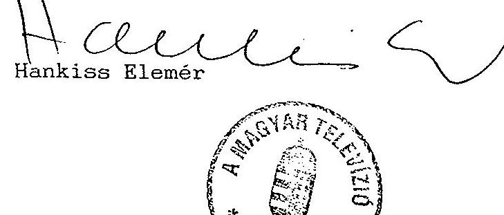

---

# Az Intézkedési Terv végrehajtásának helyzete 

## I. Azonnali intézkedések

I/A/1
A szervezeti átalakítás keretében a Pécsi és Szegedi Körzeti Stúdiók önálló költségvetési címmé alakítását a kormány az MTV javaslatára az Országgyülés elé terjesztette, majd az Országgyülés 1991. évi XCI. sz. törvényben a gazdálkodás alapjául szolgáló előirányzatokat jóváhagyta. A körzeti stúdiók alapító határozatát az MTV 1992. március 9-én a Pénzügyminisztérium Költségvetési Fejezetek Főosztályának benyújtotta. A PM helyettes államtitkára -. az Országgyüléstől eltérő korábbi álláspontját fenntartva - a címek megnyitását nem engedélyezte. Az 1993. évi költségvetési törvényben az említett címek az MTV-nél már meg sem jelentek.
$I / A / 2$

Az egyes területeken hiányzó analitikus nyilvántartások (vevők, szállítók) kialakítása csak formálisan történt meg. A mindenkori valós állapot nehezen, sok munkával állapítható meg. A kialakított analitika megbízhatatlan, hiányos, ezért különösen a Gazdálkodó szervezet likvidítása alkalmanként nehezen követhető nyomon.
I.A/3.

Az ASZ 1991. évben végzett vizsgálatát követöen az azonnali intézkedések között az ingatlanértékesítésből származó bevételek rendezése ügyében (összesen 165,2 millió Ft) levélben keresték meg a PM illetékesét, melyben kérték a megjelölt összeg utólagos befizetésétől való eltekintését. A PM mentességet nem adott, melyről (1992. febr.) értesítette az MTV elnökét.

Az 1992. évben jelentkezett likviditási nehézségek miatt csak év végén került sor az adójellegủ kötelezettséggel együtt a 244,2 millió Ft összeg elkülönítésére a számlán.

---

I/A/4.

A vevői adósságállomány behajtására többirányú intézkedéseket tettek. Külső szakértők bevonásával (Intertia Kft) fizetési felszólításokra és peresítésekre került sor, másfelől fegyelmi eljárást kezdeményeztek a Kereskedelmi Föigazgatóság két vezetője ellen. A fegyelmi eljárást - elévülésre hivatkozva - megszüntették. A megtett intézkedések ellenére a vevőállomány a Gazdálkodó Szervnél 1992. év végén magas. (A vevőállomány 1992. év végi összetételének részletesebb elemzése a Gazdálkodó Szervezet likviditását elemző 27. sz. mellékletben látható).

A Kereskedelmi Igazgatóság kintlévőségéből mintegy 200 millió Ft-ot tesz ki a korábbi időszakokból fennmaradó, behajthatatlan követelés, ami fejezet színtü rendezést igényel.
$\mathrm{I} / \mathrm{A} / 5$
Az A/3 pontban ismertetett okok és feltételek miatt 1992. év végén különitették el a 244,2 millió Ft összeget az állammal szembeni kötelezettségek teljesítésére. Még az ASZ vizsgálat lezárása előtt tisztázták és befizették az előírt 70,6 millió Ft nyereségadót.
$\mathrm{I} / \mathrm{A} / 6$

A vállalkozási tevékenységet és az azzal összefüggő érdekeltséget gazdasági igazgatói utasításban szabályozták. Az utasítás gyakorlati alkalmazásának ellenőrzése során (Nyomda) az utasítás betartását tapasztaltuk.

Intézkedési Terv I/A/7:8/a:8/b:9:10)
Az MTV Gazdálkodó Szervezete az 0 u. 14. sz. ingatlan adataira (VI., ker-i IKV-tól) bekért ügyiratokat a PM állásfoglalással együtt megküldte a Kereskedelmi Föigazgatóság Fökönyvelősége részére. E szervezet az 1991. év végi mérlegét, ill. vagyonkimutatását ennek megfelelően korrigálta.

Az MTV a Nádor u. 18. aktiválását törölte, mivel a Televízió ezért bérleti díjat fizet az IKV-nak, ill. az Onkormányzatnak.

---

A lízingelt Peugeot személygépkocsikat a Kereskedelmi föigazgatóságnál vették nyilvántartásba, mivel a lizingdíjat a nevezett gazdálkodó szervezet fizeti, mely 1994-ig vállalt kötelezettség. Ezt követően nyílik mód az aktiválásra, ill. a nyilvántartásbavétel végrehajtására.

A befejezetlen beruházásokat 1991. évben (óbudai stúdió-berend.) a Beruházási Osztály által a Pénzügyi Főosztályra megküldött üzembehelyezési jegyzőkönyvek szerint - a mérlegvalódiság érdekében és összevontan aktiválták, ill. nyilvántartásba vették ( 618 millió Ft, egy leltári számon). A tételes bevételezésre 1992. január hónapban került sor. A műszaki berendezések értékének meghatározása - az üzembehelyezési jegyzőkönyv szerinti bontásban - közel 400 millió Ft értékű eszközök esetében nem valósult meg, a Beruházási Osztály megfelelő intézkedésének hiányában. Igy ezeknek az eszközöknek az aktiválása nem történhetett meg.

Az ügy rendezése műszaki ismeretek igénye miatt a Műszaki Igazgatóságot, bonyolítás tekintetében a Beruházási Osztályt terhelte.

Végül is a jelen utóvizsgálat következtében tisztázásra kerültek a teendők és a műszaki igazgató utasítására, - az ellenőrzés lezárása előtt - a leltári számoknak megfelelő bontás, ill. "forintosítás" megtörtént. A tartozékok értékkel való kiegészítése az eddigieknél idöigényesebb, így az várhatóan az 1993. év folyamán fejeződik be. (Az adatok pótlása, a különösen nagy értékủ berendezésekre való tekintettel, nagy jelentőségü. Egy esetleges megsemmisülés, hiány, selejtezés során - enélkül - az eljárást, a számviteli rendezést akadályozná.)

Az említett tevékenység indokolatlanul húzódott el (egy éves idötartam).

A bevételezés, ill. az aktiválás a számítógépek, ill. a számító-gép-rendszerek, valamint az azok müködtetéséhez készített programok és tartozékok tekintetében sem megoldott. Nyilvántartásuk, aktiválásuk és számviteli elszámolásuk a számviteli törvénynek megfelelően rendezendő.

A szoftvertermékek beszerzéséről és raktározásáról 1992. szeptemberben elkészült ugyan egy elnöki utasítás-tervezet, azonban ennek véglegesítésére, a meglévő problémák feloldására még nem került sor.

---

A számitástechnika erõteljes elterjedése miatt e témakör rendezése szakmai és vagyonnyilvántartási szempontból egyaránt jelentôs és sürgős. A jelenlegi gyakorlat szerint szakmai vonatkozásban számos szervezeti egységgel: pénzügyi, számviteli vonatkozásban a Pénzü-gyi- és a Szervezési Számitástechnikai Főosztállyal az együttmüködést kialakítani, ill. fejleszteni kell. E témára vonatkozó utasitás tervezet nem került jóváhagyásra, így alkalmazásra sem.

I/A/11.

A osôfagyasztó berendezés beszerzése utáni kétszeri kifizetést lerendezték, a tévesen átutalt összeget visszautalták.
$\mathrm{I} / \mathrm{A} / 12$

Az Intézkedési Terv I/A/2 pontjában részletezett okok miatt a számlalikvidáció még ma sem rendelkezik kellően megbizható adatbázissal.

Az ASZ vizsgálatot követôen az MTV több intézkedést kezdeményezett a hiányzó számlák miatt függő könyvelési tételek rendezésére, amelyek eredményre vezettek.

Elsősorban azonnali konkrét lépéseket tettek a hiányok pótlására, így 1991. év végén 109.4 millió Ft-ból 1992. év végére már csak kb. 40.7 millió Ft értékú számla nem lett könyvelve és ennek mérlegszerinti leírásáról gondoskodni kell. Eredmény az is, hogy rendezetlen könyvelési tétel hiányzó számla miatt 1992. évben már nem keletkezett.

Az ott dolgozók már alkalmaznak bizonyos rendszabályokat. Pl. új elszámolási utalványt csak az elözövel való elszámolást követôen adnak ki, kivizsgálják az incassot stb.

A hiányzó számlák keletkezési okainak feltárása érdekében belso̊ ellenőri vizsgálatot rendelt el a gazdasági föigazgató.

Az ellenőrzés a hiányosságok okát a nyilvántartási rendszerben, a kilépett dolgozók mulasztásában, továbbá a müszaki és gyártási területen az iratok, bizonylatok szabálytalan kezelésében jelölte meg. Ezek közül csak ez utóbbi területen nem történt jelentősebb

---

elörelépés, amelyre a pénzügyi területnek nincs megfelelő eszköze. A felelősség a gyakori vezetöváltozással összefüggésben nem volt konkrét személyre meghatározható, erre hivatkozással a felelősség okait és okozóit nem tisztázták megnyugtatóan.

# $\mathrm{I} / \mathrm{A} / 13$ 

Az Új Képújság Kft létrehozásával kapcsolatban feltárt hiányosságok kiküszöbölése érdekében elhatározott feladatokat végrehajtották:

- beszerezték a vagyonértékú jogként minősülő bérleti jog szabályszerű átadásához hiányzó elhelyező hatósági jóváhagyást,
- megtörtént az apportnak a számviteli elöírások szerinti aktiválása.

Ezzel egyidejúleg elvégzett belső ellenőrzési vizsgálat alapján megállapítást nyert, hogy az apportérték meghatározása reális volt, ebből vagyoni hátránya nem származott az MTV-nek.
$\mathrm{I} / \mathrm{A} / 14 \mathrm{a} ; \mathrm{b}$
A kompenzációban beszerzett IKEA bútorok és Hungarotextól beszerzett utcai ruhák leltározása, bevételezése, a hiányok megállapítása ugyan megtörtént, de a hiányok leírásáról még nem intézkedtek. A hiányok okának feltárása érdekében elrendelt belsö ellenőrzési vizsgálat megállapításai alapján a kompenzációs ügyletben a TV2 vezetőinek felelőssége is felmerült, de a felelősségre vonást elévülése miatt eljárást nem indítottak.
$\mathrm{I} / \mathrm{A} / 15 \mathrm{a} ;$

Az MTV-nél a nagy mennyiségú és jelentős vagyonértékú eszközök leltározási munkálatainak javítására az Intézkedési Terv egyrészt a Leltározási Csoport létszámának 2 fővel való bővítését irányozta elő, másrészt munkaszervezési intézkedéseket fogalmazott meg. De ezek közül egyik sem valósult meg.

Annak érdekében, hogy az MTV jelentős eszközállománya tulajdonvédmét biztosító leltározást megvalósítsa a nagy tömegü manuális munka számítógépesítésére kell átállni.

---

Az anyagok, eszközök leltározása folyamatos, a leltárjegyek alapján az értékelést az Anyagkönyvelési Csoport elvégzi, az eredményt rögzíti.
$I / A / 15 b ;$
A feladatot az I/A/2 pontban és I/A/12. pontban foglalt értékelés szerinti módon és eredménnyel végrehajtották.
$I / A / 16$
A feladat teljesült.
$I / A / 17$
A nyereségadó befizetési kötelezettségét ( 70.6 millió Ft) az MTV teljesítette.

Ennek ellenére mind az intézkedési tervben, mind a korábbi hátralékok rendezésére az 1 milliárd Ft részleges felszabadításakor 244.2 millió Ft támogatás formájában biztosított összegből erre a célra is fizetési kötelezettséget írtak elõ 90/1992. (XII. 31.) Országgyülés Határozat értelmében. Az MTV bevételi számlájára 172.6 millió Ft-ot utaltak arra a célra, hogy ebből a két ingatlan értékesítése miatt 1989. évben szabálytalanul felhasznált ellenértékeket a költségvetésbe visszafizethesse. Az MTV-nek ezen a tételeken kívül az állammal szemben ki nem elégített hátralékos fizetési kötelezettsége 1992. gazdasági évben nem jelentkezett. A személyes felelősség tisztázására, fegyelmi eljárásra nem került sor.
$I / B$.
Az aláírási és utalványozási jogok új szabályozási rendszeréről a 2/1992. Elnöki Utasításban rendelkeztek.

Ebben részletesen kidolgozták a kötelezettségvállalási és bevétel előírási jogköröket, az érvényesítés követelményeit, az utalványozási jogköröket. Kiemelendő, hogy ezek alapján a fejezethez tartozó intézmények ide vonatkozó szabályzatáról is rendelkeztek.

A differenciáltan kialakított rendszer azonban nem szünteti meg teljesen azokat a hiányosságokat, amelyeket az ASZ vizsgálat és az MTV belsõ ellenőrzése is kiemelt.

---

Ennek részben az az oka, hogy a kötelezettségvállalók száma jelenleg is nagy. Bár több területre bontották, a jogkörökben való személyi ismétlődés miatt számuk nem mutatható ki pontosan. Pl. érvényesitők száma: 73, a pénztári kifizetések utalványozására jogosultak száma: 140 fő. Az utalványozók viszonylag nagy számának további csökkenése a szervezeti struktúra stabilizálása nélkül nem várható el.

A kötelezettségvállalás a szervezeti egységek nagy száma miatt rendkívül széttagolt, betartása gyakorlatilag ellenőrizhetetlen, mivel központi nyilvántartást nem alakítottak ki.

Ennek hiányában az MTV gazdálkodó szervezetnél a pénzügyi folyamatok tervezhetetlenek, a teljesítések ütemezése kiszámíthatatlan, amely rontja a likviditást. Nyilvántartás hiányában nem biztosítható a határidőre történő teljesítés. Nem lehet megitélni a feladatok ellátását, végrehajtását szolgáló fizetési, vagy más kötelezettségvállalás, ill. szerződések kötésének jogosságát, indokoltságát sem.

A bizonylatok alaki és tartalmi hiányosságai arra utaltak, hogy a kiadások teljesítésének és a bevételek beszedésének elrendelése előtt nem ellenőrzik kellően okmányok alapján annak jogosultságát, összegszerűségét. Ez visszavezethető arra, hogy sok esetben a dokumentumok (számlák, szerződések) a minimális információkat sem tartalmazzák, így az érvényesítés érdemi megvalósításához nincsenek meg az előírt feltételek.

- Nem rendelkeznek. megfelelően a szerzödésekben a szolgáltatásról és a teljesítés feltételeiről. pl. A MTV1 és a Katona József Színház által a Kamra Színház közös üzemeltetésére vonatkozó szerződés értelmében, több oldalról vitatható az MTV pénzügyi teljesítésének indokoltsága, mivel az 1991. évi 20 millió Ft és az 1992. évi ugyancsak 20 millió Ft ellenében nem mutatható ki, hogy azért a Kamra Színház milyen szolgáltatást teljesített.
- A számlákon számos esetben nem hivatkoznak a szerzödés számára;az azonosítást szolgáló információk hiányoznak, (Pl. az IP Budapest Kft a számláinak részteljesítésekor még a számlaszámra való utalás sem szerepel).

---

- Nem valósul meg az utalványozásnál elvárható gondosság még az ügyviteli színtnél magasabb vezetői szinteken - föigazgató, intendánsok által ellenjegyzett, lebonyolított gazdasági események végrehajtásánál sem. Példa erre az MTV helyett kifizetett IP Budapest Kft számlák alaki és tartalmi követelményektől való eltérései.
- Hiányzik esetenként a teljesítés tárgya, a szerződés száma pl: Mikro Stúdió Kft-nél, 42. sz. Produceri Iroda részére történő utalásnál.
- Az ügyintézők sok esetben nem rendelkeznek a teljes szerződési dokumentációval, tartalmilag teljes szerződésekkel, hogy ellenőrizni tudják az elszámolás jogosságát. Pl. NOVOFILM, vagy MTM Kommunikációs BT.

Nehezíti a számviteli szabályok betartását, hogy nem rendelkeznek az 53/1988. sz. PM rendeletnek megfelelően a bizonylatok kiállítására, alaki tartalmi kellékeire szigorú számadási kötelezettség alá tartozó nyomtatványok kezelésére, a bizonylatok feldolgozására, megőrzésére vonatkozó belső szabályozással. A leltározási dokumentumok nem szigorú-számadásúak. Hiányzik a számítógépes adatvédelem.

A fentiek összegezéseként a Pénzügyi és bizonylati fegyelem megteremtése érdekében hozott eddigi intézkedések nem elegendőek, hatékonyságuk nem megfelelő és megvalósításuk a hiányosságok szankcionálása nélkül gyakorlatilag kivihetetlen.
$\mathrm{I} / \mathrm{C}$.
Az MTV vagyonának a felmérésére az Intertia Kft kapott megbizást 1991. július 5-én kötött megbízási szerződéssel. A tel.jes körü vagyon felmérését és értékelését kellett elvégezni 65 napos határidővel.

A megbízási szerződést 1991. X. 10-én újratárgyalták, mert kiderült, hogy a teljesítés feltételei, ütemezése, a felmérés köre nem volt egyértelmü. Az MTV leltárkésedelme miatt a felmérés határidejét közös megállapodással 1992. június 30 -ára módositották. Az MTV Pénzügyi Főosztályának feljegyzése szerint elegendő munkaerő

---

hiányában (lásd: Intézkedési Terv A/15 pontjáról szóló tájékoztatót) 1992. I. félévében toljes körü leltárt nem tudnak vállalni. Igy a felmérés hiányosan fejeződött be, a Bojtár utcai stúdió berendezéseinek jelentös része és egyes beszerzések felújitások kimaradtak a felmérésböl.

A megbizási dij a részteljesités miatt csökkentve került kifizetésre ( 1,985 millió $F+496$ ezer Ft AFA).

A vagyonfelmérés eredménye nem hasznosult, nem születtek ennek ismeretében döntések. A vagyonfelmérés eredményét az eszközök szervezetenkénti elosztásánál sem érvényesitették.
I/D.

Mint az A/1 pontnál rámutattunk, a PM eltérő álláspontjának gyakorlati érvényesülése folytán az 1991. évi XCI. törvényben foglaltaktól eltérően a körzeti stúdiók önálló költségvetési címként de facto nem jöttek létre. Igy a stúdiók gazdálkodási és tárgyi feltételeinek megteremtése nem volt aktuális.
I/E.

Az egységes anyagi ösztönzési rendszer kidolgozásával az MTV vezetése 3 hónapos határidöre való lehetetlen feladatot vállalt fel. Ugyanis 1977. óta az MTV-nél nem volt olyan belsö érdekeltségi rendszer, amely garanciát nyújtott volna az emberi eröforrások célszerű felhasználására. Ilyen rendszer kidolgozására az elmúlt 15 év alatt nagyon sok kísérlet történt. Igazi, átfogó, minden müsorterületre használható azonban sohasem született. Az utolsó TV-re kiterjedó elfogadott rendszer az 5/1984. sz. Klnöki utasitásban lett megfogalmazva eléggé differenciält és a szerkesztőségek (most produceri irodák és intendatúrák, alkotói irodák vannak!) müsoraihoz illeszkedő volt, de ez is a TV müsorterületének mindössze 60-65\%-át szabályozta. Ez a rendszer. és az utána következök is azon buktak meg, hogy nem kisérték figyelemmel a struktúra változását, valamint a norma teljesitését.

A kidolgozott tervezet azonban több egyértelmü elörelépésre utaló célt tartalmazott:

---

- elismeri, hogy az MTV-ben területenként, idöben és mennyiségben eltérő teljesítmények vannak és ezeket sajátosságuknak megfelelően, - de nem teljes körűen - kezeli,
- egyértelmüen meghatározza az alapbérért köteles tevékenység mértékét és az ezen felül teljesített munkáért kategóriánként meghatározza a fizethető mértéket,
viszont nem terjed ki pl. a kiemelkedó munka honorálására.
Kiinduló alapnak a tervezetet az ASZ is elfogadta, valamint a miniszteri biztos is pozitivan minösítette.

Osszességében egyérdekü és tevékenységü területre jól alkalmazható volt de. mint az egyeztetés során kiderült nem az egész TV-re. Ha el is lehetett volna fogadtatni, a gyakorlat során sok korrekciót és konfliktust indukált volna.A TVDSZ szerint is: csakis önálló területek szerinti speciális érdekü és müködési "módszereket" szabad kidolgozni, s ezeket összeleviziós szemléletüvé "koordinálni".

Az MTV Gazdasági Bizottsága arra megállapításra jutott, hogy az MTV fennmaradt jelenlegi méretei mellett a müsorkészítés és abban közvetlenül részt vevő dolgozók - szakmai konvertálhatósága miatt - a létszámot és az anyagi ösztönzési rendszert nem lehet felsőszinten meghatározni. A racionalizálás csakis szervezeti egységként történhet meg:

- a szervezet és részegységeinek feladat meghatározása alapján, amely determinálja a szükséges létszámot,
- ezek alapján megfogalmazhatják a munkaköri leirásokat (müsorkészítéshez közvetlenül nem kapcsolódó területeken) a teljesítménykövetelményeket ( a müsorkészítésben közvetlenül résztvevök esetén),
- a bérelemeket úgy kell kialakítani, hogy azok a teljesítmény növelését segítsék elő.

Az egységes anyagi-ösztönzési rendszer kidolgozásának határidejét - a közalkalmazotti törvény, az új munkatörvénykönyve életbelépése

---

miatt - 1992. december 31-ig hosszabbitották meg. A határidõ vezető́i munkakörökböl való a felfüggesztések meg nem történte esetén sem lett volna tartható, ugyanis

- a müködő érdekeltségi rendszerek felülvizsgálatát érdemben csak az év lezárásával lehetett volna értékelni;
- a TV2 indendatúra az ez évben alkalmazott módszer helyett egy újat dolgozott ki, ennek véglegesítése azonban még nem történt meg;
- az alelnök által a központi irodákra kidolgozott bérezési forma javaslata nem elfogadható, mivel az alapbér kifizetéséhez semmiféle feltétel nem tartozik;
- az alelnöki hatáskörbe tartozó munkaköri leírások egységes rendszerének tervezete nem készült el, ezáltal az eddig beküldöttek (60-70\%) érdemi felülvizsgálata sem történt meg;
- az intézménynek létszámpolitikai stratégiája nincs.

Egyetlen pozitívum említhető, hogy a kollektív szerződés tervezete elkészült.

# I/ $\mathbf{V}$. 

A minden szervezeti egységre kiterjedő létszámfelmérést és a létszámtöbbletek megállapítását az intézmény sajátosságai és méretei miatt indokolt lett volna magukkal a szervezeti egységekkel elvégeztetni. Azt azonban már az ASZ előző vizsgálata megállapította, hogy a szervezeti egységek ellenérdekeltsége miatt ez a megoldás nem hoz eredményt.

Objektív felmérés csak megalapozott és érvényes normák alapján lenne lehetséges, ilyenek az MTV-nél régóta nincsenek, sem az alapfeladatokra sem azon túli feladatokra. Igy a szervezeti egységek felmérése nem volt értékelhető.

Készült egy felmérés a Központi Alkotói Irodákra is, de az ennek alapjául szolgáló adatok hiányosak, ellentmondásosak voltak (előző

---

évi tevékenységek szerepeltek benne, megkezdett munkák vagy a pénz hiányában félbemaradt munkák kimaradtak stb).

Gyakorlati eredményként a központilag elrendelt adminisztrativ intézkedések könyvelhetők el.

- Már 1990. december 4-i hatállyal létszámzárlatot rendeltek el, s annak ellenére, hogy felvételekre sor került, mint azt Pénzügyminisztérium vizsgálóbiztosa megállapította: "pozitív eredménnyel járt, mivel az üres álláshelyek száma az elmúlt évek 120-140 fõs állományával szemben 1991. november végére közel 400 fôre emelkedett. Ennek bérvonzata 5-5,5 millió Ft/hóra (éves szinten 66 millió Ft) becsülhető. A létszám- és bérgazdálkodásban jelentkező feszültségek egyik megoldási módja lenne az is, ha az üres álláshelyek felszámolásra kerülnének".
- A miniszteri biztos javaslatának megfelelően 1992. év februárban az üres álláshelyeket megszüntették, bérkeretét főigazgatói tartalékba vonták. (Nyitóértéke: 13,5 millió Ft) Ennek terhére lehetett az évközben keletkező feszültségeket megoldani, illetve béralappal együtt járó státusz helyet csak föigazgatói engedéllyel lehetett létesíteni. A tartalékkeret felhasználásáról a Bér- és Munkaügyi Főosztály tételes, áttekinthető nyilvántartást vezet Az év végére a 15,5 millió Ft összeguu keret kevesebb mint fele 6,8 millió Ft került ezen a címen felhasználásra.
- Minden szervezeti egység felülbírálta az általa foglalkoztatott nyugdíjasok körét, s csak a szükséges mértékben került sor szerződés hosszabbításra.

A Gazdasági Bizottság az Alkotói Irodák közül szúrópróbaszerủen megvizsgált egyet, és rámutatott arra, hogy kb 40 fő az, akik jövedelmüket teljesen munka nélkül vessik fel. Miután az Irodákban dolgozók foglalkoztatása nem folyamatos, de tevékenységükre az MTV-nek hosszabb távon is szüksége lesz, javasolták külsö szervezeti formában való foglalkoztatásukat. Az Alkotói Irodák alapítványi müködését a szakszervezet ellenezte, így azok nem alakultak át.

---

I/G.

A Szervezeti és Müködési Szabályzat több változata készült el, de jogértelmezési, tartalmi kérdésekben megnyilvánuló, eltérő megítélés miatt a kurmány egyiket sem hagyta jóvá. Ennek hiányában nem került sor a vezető állású dolgozók munkaköri feladatainak, kötelezettségeinek és kompetenciájának rendezésére sem.
$\mathrm{I} / \mathrm{H}$.
A föálláson kívüli foglalkoztatás kérdéseit szabályozó 17/1991. MTV sz. utasítás még 1990. dec. 10-én kiadásra került. A másod-, ill. mellékfoglalkozásban végzett tevékenység bejelentése - annak ellenőrizhetetlenségénél fogva - "becsületbeli ügy", csak szúrópróbaszerűen és nem teljes körűen ellenőrizhető.

Az üzleti elszámolást eredményező kapcsolatok tilalmát (1990. évi LXXXVI. törvény 25. paragrafus C/) ellenőrizni lehetetlen. Ezzel a kérdéssel több ülésen foglalkoztak, az Ellenőrzési Osztály szúrópróbaszerűen ellenőrizte a törvény végrehajtását. Ennek eredményeképpen 3 Kft-vel való további szerződéskötését megtiltották, a meglévöket felbontották.

# II. A müködés eredményességét célzó intézkedések 

II/A
A Pécsi és Szegedi Körzeti Stúdió önálló költségvetési címként nem jött létre (lásd: Intézkedési terv I/A/1; I/D pontjairól adott tájékoztatót), a média törvény sem került elfogadásra, így a feladat nem volt aktuális.
$\mathrm{II} / \mathrm{B}$.
Az MTV Gyártási Igazgatóságából leányvállalatot kívánt létrehozni, MTV Enterprise névvel.

A Gyártási Leányvállalat az MTV többszöri kezdeményezése és a Pénzügyminisztérium 1991. V-. 28-i elvi egyetértése ellenére sem alakult meg.

---

A maradványérdekeltségú MTV Gazdálkodó Szervezete keretében müködő Gyártási Igazgatóság (betöltött létszáma 1992. XII. 31-én 1.068 fő volt. a Gazdálkodó Szervezet összlétszámának mintegy 32\%-a) leválasztása és leányvállalattá történő átalakítása része lett volna az 1991. év elején megkezdett szervezet korszerüsítésnek. Az átszervezés célkitüzése az volt, hogy a médiatörvény lehetöségein belül az MTV müködési folyamataiban érvényesüljön a kereskedelmi-piaci kapcsolati rendszer, áttekinthetőbb és takarékosabb gazdálkodásra kényszerítve az MTV fejezet intézményeit.

Az MTV müsorgyártó és szolgáltató infrastruktúrájaként a Gyártási Igazgatóság fontos szerepet tölt be.

A 3/1991. sz. Elnöki utasítás alapján (1991. V. 24.) önálló gazdálkodó szervezetként müködik az MTV Gazdálkodó Szervezete keretében. a számára lebontott müködési költségkereten belül.

A Gyártási Igazgatóság, mint szolgalitató terület az MTV intendatúráinak, produceri irodáinak a diszpozíciói alapján különféle kapacitásokat (felvételi kapacitások, utómunkálati, szállítási kapacitások, szcenikai eszközök) biztosít a müsorok, a produkciók kivitelezéséhez.

A kapacitásokat változatlanul térítésmentesen biztosítja a belsó szervezeti egységeknek, mivel ennek költségfedezetét a számára lebontott müködési költségkeretböl kell megoldania.

A lebontott költségfedezet és az igénybe vett kapacitások nincsenek összhangban. A jelenlegi tervezési és költségelszámolási és szervezeti rendben a müsorok, produkciók előállítási költségei, ráfordításai nem követhetők nyomon. E területnek az MTV müködése óta fennálló költségmérési problémáját az MTV vezetése a leányvállalattá történő átalakítással kívánta megoldani, amelynek keretében kialakítható egy reális vállalási ár az igénybe vett szolgáltatásokra, kapacitásokra.

---

Az MTV vezetése 1992. év öszén - a PM-mel egyeztetetten - a leányvállalattá történő átalakítás ügyét a médiatörvény elfogadásáig elhalasztotta.

Az átalakulás olyan nem véglegesen tisztázott kérdéseket is felvetett, mint az átengedett vagyon értéke, kapacitások összetétele, AFA kérdése, az új szervezet létrehozásának, információs rendszerének kiépítése és költségigényének pénzügyi biztosítása.
II/C/1;2;3.
A végrehajtott szervezeti módosításokkal, feladatátcsoportosításokkal az MTV teljes szervezetét érintő rendszerszerủ átszervezés helyett csak az MTV Kereskedelmi Föigazgatóság profiltisztítása valósult meg, de az sem teljes körüen, mivel
a tervek között szerepelt a vállalkozási formában eredményesebben müködtethető munkaszervezetek (pl. reklámértékesítés, TELEVIDEO stb) leválasztása az MTV-röl. Az ehhez szükséges kormányzati engedély nélkül ez nem valósult meg.

A médiatörvény elfogadása utáni helyzetre kialakított koncepció, amely a csatornák gazdasági önállóságát irányozta elő - az egymáshoz való viszonyukat tekintve már - 1991-re gyakorlatilag kialakult.

Az 1991. január 3-i Elnöki értekezleten a jegyzőkönyv tanúsága szerint - amely a Belkereskedelmi Igazgatóság helyzetét és a csatornák közti megosztását vitatták és - megoldásként - több lehetőséget is felvetettek.

Az, hogy ebből végül is az ellenőrzés időpontjában olyan állapot alakult ki, hogy az MTV vállalkozási tevékenységei heterogén szervezeti keretek közt valósulnak meg - azt az MTV-n kívüli körülmények is döntően befolyásolták.

Az MTV a Kormány privatizációs stratégiájára alapozva, - amely az állami kötelezettségvállalás mérséklését tüzte célul - szervezeti rendszer korszerűsítését irányozta elő. Az említett Elnöki érte-

---

kezleten a csatornák önálló kereskedelmi szervezeteinek létrehozása mellett döntött olymódon, hogy a Kereskedelmi Föigazgatóság kizárólag az MTV2 csatorna, míg a kialakítandó új szervezet az MTV1 csatorna reklám és szponzorbevételeinek értékesítését szolgálja.

A koncepció szerint ezeket önálló szervezeti keretek között müködő vállalkozásokká kívánták alakítani, amelyhez a szükséges kormányzati hozzájárulás megszerzése érdekében a jogszabályi előírásoknak megfelelően a Pénzügyminisztérium előzetes egyetértését kérték.

Az MTV1 Kereskedelmi szervezetét külföldi részvétellel már 1991. évben szerették volna megalakítani. A 4/1991. MT rendelete 1991. december 31-ig szóló korlátozás hatálya miatt - és a szükséges kormányzati hozzájárulás nélkül - ez csak 1992. január 1-től realizálódott.

A döntés eredményeként az MTV 1-es csatorna már 1991. II. félévétől az MTV 2-től elkülönült kereskedelmi szervezettel biztosította a reklám és szponzor bevételeit.

Az előbbiek hatására módosult a Kereskedelmi Föigazgatóság feladatköre, amely korábban az MTV egész kereskedelmi tevékenységét ellátta, a továbbiakban a Föigazgatóság új elnevezéssel az MTV2 kereskedelmi feladatait látta el.

Ezzel egyidejúleg az Intézkedési Tervvel összhangban elsó lépésként a vállalkozás (az MTV egyszemélyes Kft-je) létrehozása előtt az ASZ vizsgálat észrevételeit is figyelembevéve a Föigazgatóságnál jelentős profiltisztítást kezdtek el 1991. évben és fokozatosan meg is valósitották azt.

Ennek eredményeként az MTV Kereskedelmi Föigazgatóság szervezetében és tevékenységi struktúrájában jelentős változások következtek be.

- Az Asz észrevételei alapján az MTV Gazdálkodó Szervezet és a Kereskedelmi Igazgatóság feladatainak felülvizsgálata megtörtént, a két szervezet közti gazdasági-pénzügyi és hatásköri viszonyok a korábbinál célszerübben rendezödtek.

---

Ezek egy része az MTV fejezeten kivüli ( Magyar Rádió és az MTV fejezetek közti feladatmegosztás) más része az MTV fejezeten belüli tevékenységi kör változásnak az eredménye.

A változások föbb lépései és következménye az alábbiak szerint foglalható össze:

- A közszolgálati rádióadók direkt reklám tevékenységét amelyet eddig az MTV Kereskedelmi Föigazgatóság látott el - a Magyar Rádió gazdaságossági okokból szervezetileg is magához csatolta 1991. II. félévétól.

A két fejezet között ez összesen 125 millió Ft elöirányzatmódosítást eredményezett, az átadott feladatok 25 fö személyi és dologí költségeinek fedezetéül féléves színten.

Az MTV Gazdálkodó szervezete és a Kereskedelmi Föigazgatóság közti feladat átrendezésekkel kapcsolatos címek közti elöirányzat átcsoportosításokat az 1991. évi XVI. törvény 46 paragrafus (1) bek. megfelelően a Pénzügyminisztériumhoz jóváhagyását követően, 1992. évben rendezték.

A Föigazgatóság létszám elöirányzatát emiatt 74 fövel csökkentve, 1992. évre 90 föben, béralapját 31,2 millió Ft-ban határozták meg. A végrehajtott feladatátrendezés a fejezetnél egyenlegében 65 fö létszámcsökkentést eredményezett.

Az elszámolást az MTV központi szervezethez átcsoportosítandó béralappal a Kereskedelmi Föigazgatóságon megalapozott létszám és feladat felülvizsgálat elözte meg.

- A Kereskedelmi Föigazgatóságtól az MTV Gazdálkodó Szervezethez csatolt feladatok miatt - amely (az MTV export-import) tevékenységét bonyolító Külkereskedelmi Osztályt érintette - 9 fővel nőtt a Gazdálkodó Szervezet létszámelőirányzata.
- A megváltozott tevékenységi kör másrészt annak a következménye, hogy pl. a Tele P 'art Iroda külső mü-

---

sorszervezói feladatait átvette a két csatorna, megszűnt a Felkínálom Szerkesztőség, megszüntették a televíziós műsoroknak a Föigazgatóságon keresztül történő pénzügyi támogatását.

A tervezett átszervezésekhez, vállalkozási formák kialakításához szükséges vagyonértékelést külső szervezet megbízása útján elvégezték. A végrehajtott profiltisztítás vagyonátadással nem járt.

II/D.

A Szervezeti és Müködési Szabályzat véglegesítését és egyes kulcspozíciók elrendezését az MTV Intézkedési terve a médiatörvény elfogadásától tette függővé. A történések a tervtől eltérően alakultak. A média törvényt megelőzően került kinevezésre a gazdasági főigazgató, a korábbi gazdasági igazgatói munkakörhöz képest megnövelt hatáskörrel (gazdaság, kereskedelem, műszak, gyártás, vagyonkezelés). Ugyancsak a törvény elfogadása előtt kelt az alelnök kinevezése, akinek jog- és hatáskörét a helyszíni ellenőrzés befejezéséig nem illesztették össze a már meglévő vezetői hatáskörökkel. Mindeddig csak kinevezése legitim, belső jog- és hatásköre, viszonya más vezetői funkcióhoz, jogszerint szabályozatlan. A legszélesebb ütközési pontok az elnök, az intendánsok és a gazdasági főigazgatói jog- és hatáskörével szemben voltak tapasztalhatók.

II/E.

Az Intézkedési Tervben megjelölt felelős Közgazdasági Onálló Osztály vezetője szóbeli tájékoztatása szerint kidolgozás alatt áll egy ún. belső elszámolási ár- és "bankrendszer". De írásos anyagot, vagy tervezetet nem bocsátott az ellenőrzés rendelkezésére. Az elgondolás szintjén álló "teljesítés" így nem értékelhető.

Az MTV belsó piacán kialakítandó forintosítási törekvésekkel összhangban, kezdeti lépésként a 13/1992. (VIII.10.) sz. Gazdasági föigazgatói utasítás - kísérleti jelleggel 1992. XII. 31-ig - a Híradó Főszerkesztőség és az egyéb műsorgyártó szervezetek egymásnak nyújtott szolgáltatásai kölcsönös elszámolásáról intézkedett. A kölcsönös elszámolás az egyes szervezeti egységek éves gazdálkodási keretének átcsoportosítását jelenti, piaci árakhoz igazodó térítési díjtételeken.

---

Az utasítás alapján, a Híradó Főszerkesztőségétől igénybe vett eszközökért, híranyagokért - az Egyen-leg-, a Külpolitikai Főszerkesztőség és a Sport önálló szerkesztőség kivételével - térítést "fizettek" a belsö szervezeti egységek, az az éves gazdálkodási keretükböl átcsoportosítás történt a Híradó Főszerkesztőségéhez, az utasítás szerint alkalmazható díjtételekkel számolva. Az átcsoportosított keret a Híradó Föszerkesztöséghez 1992. évben 3,4 millió Ft volt.

Az utasítás kölcsönös elszámolást és igénybevételt tételezett fel a Híradó Főszerkesztőség és az egyes szervezeti egységek között. Az utasítás alapján egyéb területen átcsoportosítás azonban nem volt.

Az utasítást megelözte azon intézkedés, hogy a korábbi központosított kapacitás- és eszközgazdálkodás 1991. évben megszünt. Az egyes szervezeti egységek önállóságát erősítve, az MTV eszközállománya, a szervezeti egységek között részben szétosztásra került.

A kapacitások elosztása és egyes szervezeti egységek kizárólagos használati joga ezen eszközökre, kapacitásokra, esetenként kihasználatlanságot okozott. Az átmeneti szabad kapacitások belsö "értékesítését" kezdeményezte a kísérleti jelleggel müködő elszámolási törekvés, amelynek további alkalmazására az 1992. második félév tapasztalatai alapján kívánt intézkedni a gazdasági föigazgató.

Az MTV kapacitás felhasználásának "forintosított" törekvéseivel összhangban a Gyártási Igazgatóság 1992. évi júliusa óta a he-ti-napi gyártási tervekhez igényelt kapacitások felhasználását produkciós, produceri iroda, intendatúrai,szerkesztöségi és MTV összesen bontásban havonta eljuttatja a felhasználókhoz ún. forintosított "proform" számlaként. E "proform" számlákat nem kell kifizetni az MTV mai gazdálkodási rendje szerint, mivel ezen kapacitásokat, szolgáltatásokat "térítésmentesen" nyújtja a Gyártási Igazgatóság a belsö szervezeti egységeknek. Az Igazgatóság éves gazdálkodási kerete elvileg tartalmazza a nyújtott szolgáltatások pénzügyi fedezetét.

---

A nyújtott kapacitások és szolgáltatások valós pénzügyi szükséglete és az éves tervezett gazdálkodási keret nincsenek összhangban, melyet jól szemléltet az éves módosított gazdálkodási kerettől való tényleges teljesités eltérése.

Az 1991-es évben a tényleges pénzügyi teljesítés 458 millió forinttal, több mint kétszeresével; 1992. évben 233 millió forinttal ( $37 \%$-kal) haladta meg a Gyártási Igazgatóságra lebontott, módosított éves gazdálkodási keretet. Megjegyzendő, hogy az éves gazdálkodási keretek lebontása és tényleges teljesítési adatai eltérő tartalmúak, pl. 1991. évben a lebontott keret nem tartalmazta a bérek fedezetét, a tényleges adatok igen, így a terv és tényadatok elemzésére nem alkalmasak és nem nyújtanak információt a tervezett és igénybe vett szolgáltatások valós költségigényére sem.

Az MTV Gyártási Igazgatósága által nyújtott kapacitások, szolgáltatások "forintosított" regisztrálása a "jövő tréningjeként" kivánta segíteni, informálni az érdekelteket. Az érintetteknél ezen információk hasznosítása nem volt tapasztalható.

A számlák, terhelések, a Gyártási Igazgatóság által kiadott és elfogadott (1992. febr.) árjegyzék alapján kerülnek számlázásra. Az árjegyzéki díjtételek a mai magyar müsorkészítési kapacitások piaci árai körül mozognak, beleértve a szervezeti egység érdekeinek és üzletpolitikájának motivumait. E díjtételeken külsõ megrendelésre szolgáltatásokat, szabad kapacitásokat értékesít a Gyártási Igazgatóság. A vállalkozási tevékenységnél befolyt árbevétel 1992. évben 63,8 millió Ft, 1991. évben 22,7 millió forint volt. Az 1992. évi bevétel $63 \%$ a szcenikai és szállítási szolgáltatásokból, $37 \%$-a a szabad a kapacitások értékesítéséből, bérbeadásból származott.

Az MTV vezetése több mint 10 éve felvetette a "forintositás" a belsõ, valós költségeket tükrözõ belsõ árrendszer kidolgozásának szükségességét. Ennek megoldására azonban ez ideig nem került sor.

---

Nehezíti az áttekintést és racionális müsorgyártást, hogy a korábbi évek központi kapacitás-gazdálkodását 1991. évben decentralizáltabb eszközgazdálkodás váltotta fel.

Az MTV eszközállományának - stúdiók, felvételi és utómunkálati eszközök - szétosztásával egyes szervezeti egységek bizonyos eszközökre kizárólagos használati jogot kaptak. Az eszközelosztást az egyes szervezeti egységek önállóbb gazdálkodásának erősitése motiválta, azonban megalapozott kapacitás felmérés az elosztást nem elözte meg. Az esetleges szabad kapacitások hasznosításának rendje, a belsö szervezeti egységek közötti gazdálkodási szabályok nem alakultak ki.

A gazdasági föigazgató kezdeményezésére (egyeztetve az elnökkel) az MTV Ellenőrzési Osztálya 1992. év októberében vizsgálta a Gyártási Igazgatóság által biztosított kapacitások fiktív forintosított elszámolását, összefoglalóan megállapítva az alábbiakat:

A jó irányban megtett elsó lépések üdvözlése mellett, mindenképpen hangsúlyozni kell, hogy ez a gazdasági kísérlet jelenleg csak a Gyártási Igazgatóság kapacitásait érinti. Mindenképpen szükséges a teljes televíziós müsorgyártás összes kapacitásainak egységes elven kialakítandó forintositása.

A megfogalmazott gazdasági célok eléréséhez továbbá nélkülözhetetlen az összes kapacitást átfogó információs, statisztikai rendszer megteremtése, valamint egy egységes normarendszer kialakítása. Mindezek a hozzákapcsolódó újonnan kialakítandó anyagi ösztönzési rendszerrel együttesen lehetnek csak egy gazdaságossági szemléletũ televíziózás alapjai.

Az MTV Gyártási Igazgatósága által "forintositott" kapacitások, szolgáltatások a teljes müsorgyártás kapacitásának kisebb hányadát képezik és az alkalmazott árak sem felelnek meg a kívánalmaknak, nem az MTV ráforditásait, valós költségeit tükrözik.

Az egységes irányítási (kapacitások elosztási rendje tagolt) és információs rendszer hiányából adódik, hogy a gyártási folyamatok

---

gazdaságilag áttekinthetetlenek, továbbá megfelelően nem szabályozottak.

A müsorgyártási tevékenységet átfogóan a 4/1980. sz. Elnöki utasítás szabályozta, a gyártástervezés és diszponálás rendjét a 7/1986. sz. Elnöki utasítás. Az utasítások korszerüsitésre nem kerültek, tehát elavultak.

# III. A médiatörvény elfogadása utáni intézkedések lehetséges változatai 

A távlatosabb célkitüzés - a törvény tervezet ismeretében - a gyártási önállóság továbbfejlesztése, gazdasági, gyártási, müszaki társaságok, egyesületek stb. irányába történő továbbhaladás.

Az MTV Gazdálkodó Szervezete az 1991. év első félévére struktúrájában átrendeződött az ideiglenes és jóvá nem hagyott Szervezeti és Müködési Szabályzatban foglaltak szerint.

A két csatorna átalakult és szervezetében, müködésében két önálló intendatúra - TV1; TV2 - jött létre.

Egyes szerkesztőségek kivételével (Hiradó-Külpolitikai. Sport) megszüntek a korábbi nagylétszámú föszerkesztöségek, szerkesztöségek és megalakultak a produceri irodák ( 44 iroda) és központi alkotó irodák, továbbá új szervezeti egységek alakultak a régiek átszerveződésével.

Az átszervezés koncepciója a két intendatúra sajátságos arculatának, jellegének, müsorstruktúrájának kialakítására és az önálló gazdálkodás, müködés feltételeinek kiépitésére irányult.

Az intendatúrákhoz rendelten müködő saját kereskedelmi szervezetek útján elérhető többletbevételi lehetőségekkel - éves központi, gazdálkodási keretek kiegészítő forrásaként - számolt az intézményi korszerűsítés.

A produceri irodák létrehozása, versenyeztetésük, a tervezett pályázati rendszer a racionálisabb és költségtakarékosabb müsorgyártás jobb müsorellátási lehetőségével számolt.

---

Az intézményi korszerüsitési folyamat külsõ és belsõ tényezők hatására lelassult, illetve befagyott.

A megfogalmazott célkitüzések ellentmondásosan, kiforratlanul, részleteiben nem kellöen szabályozottan valósultak meg, bizonyos területeken visszarendeződés is tapasztalható.

P1. A létrejött produceri irodák mintegy $45 \%$-a megszünt. A kellöen nem müködöképes, vagy párhuzamos profilú irodák felszámolása nem járt létszámleépítéssel. Többségében az intendatúrák vették át a megszünt irodák munkatársait (és feladatát), a várt és elképzelt felesleges létszám leépítések helyett.

A produceri irodák versenyeztetése, a pályázati rendszer az 1991-1992. években valójában nem müködött.

A két év alatt egy pályázati kiírás volt. Egy éjszakai szórakoztató müsor nyerte el a pályázatot.

Az intendaturák új müsorstruktúráinak kialakításakor - 1990. év öszén - volt szélesebb és nyilvános pályázati lehetöség, melyet az MTV elnöke hirdetett meg 25 különbözö müsorkategóriában. A nyertes pályázatok (több mint 40 müsor) a benyújtott müsorötletek, müs-or-sorozatok, produkciók részletes kidolgozására és ezt követő megvalósítására adott lehetőséget a pályázónak.

A pályázatok elbírálásakor elsődlegesen a szakmai szempontok érvényesültek az adott müfajkategórián belül, a müsorgyártás költségeire közvetlenül kimutatható és mérhető kedvező hatása az eddigi pályázati rendszernek nem volt.

---

A belsõ ellenôrzési osztály személyi és tárgyi feltételeinek javítása érdekében semmi sem történt.

Az osztály üres álláshelyei és bérkerete az általános létszám- és bérkeret zárolással együtt megszüntetésre kerültek. Mindazon által az osztály az intézkedési terv végrehajtásában több esetben közremüködött, javaslataik nyomán több vezetői kezdeményezés is történt.

- Az 0 utcai ingatlannal kapcsolatos kérdéskör tisztázása: az ingatlan 1 millió Ft értékủ törlése az ingatlan nyilvántartásból. Az ingatlan felújításának finanszirozása egyedi engedélyen alapult, a vagyontárgyak reális értéken való szerepeltetése érdekében javasolták, hogy a Pénzügyminisztériumtól állásfoglalást kérjenek.
- A pénzügyi-bizonylati fegyelemre vonatkozó témakörben rámutattak arra, hogy "a bizonylati fegyelem hiányosságait már a PM Ellenőrzési Főosztálya is feltárta. Az akkori intézkedési terv is elöirta a számvitel és költségelszámolás korszerüsítését, a bizonylati szabályzat és album elkészitését. A többi elöírt ponttal együtt ez sem valósult meg, így a problémák konzerválódtak. Azóta sem alkalmazzák a beérkezett számlák könyvszerinti iktatását, a bizonylatok áramlásának zártsága nem biztosított, a jelenlegi gépi feldolgozási mód nem alkalmas a ve-vö-szállító könyvelés elvégzésére, a fökönyvvel való egyezőség biztosításához. Megitélésünk szerint megfelelő felkészültségű előadók hiányában szinte megoldhatatlan a pénzügyi fegyelem biztosítása. A müszaki gyártási területeknek nincs érdekeltsége a bizonylatok szabályszerű kezelésében, a gazdasági vezetésnek nincs semmilyen eszköz a kezében, amellyel a hiányosságokat szankcionálhatná.
- 10023/42-13. jelentés alapján a Pénzügyi Főosztályon használt számítógépes alrendszerek felülvizsgálatát, komplexitásának megteremtését rendelte el a vezetés. Az erre vonatkozó vezetői intézkedésekről az elöbbiekben már szóltunk.

---

- Jelentés készült az IKKA bútorok leltárhiányának megállapításáról.
- Felmérték az utalványozási joggal rendelkezők körét, és egyben részt vettek az aláírási és utalványozási jog meghatározása tárgyában készítendő szabályzat kidolgozásában.
- A szervezeti egységenkénti létszám felméréshez elkészítették az 1991. I-VIII. hónapjára vonatkozó béren kívüli jövedelem felméréseket.
- Tételesen név szerinti kimutatást készítettek a központi állományban lévő dolgozók 1991. évi munkateljesítményeiről.
- Vizsgálatot végeztek a Gyártási Igazgatóság kapacitásainak forintosítot értékeinek tárgyában.

Budapest, 1993. május

---

|  Megnevezés | 1990. év |  |  | 1991. év |  |  | 1992. év |  |  | Teljesítés
3-a |   |
| --- | --- | --- | --- | --- | --- | --- | --- | --- | --- | --- | --- |
|   | Eredeti | Módosított |  | Eredeti | Módosított |  | Eredeti | Módosított |  |  | 81/90  |
|   | előirányzat |  | Teljesítés | előirányzat |  | Teljesítés | előirányzat |  | Teljesítés |  | 95/01  |
|  1 | 2 | 3 | 4 | 5 | 6 | 7 | 8 | 9 | 10 | 11 | 12  |
|  51 Működési bevétel | 3,431.250 | 3,431.250 | 3,301.173 | 5,000.100 | 4,723.100 | 4,619.660 | 4,316.700 | 5,316.700 | 6,085.701 | 139,9 | 131,7  |
|  52 Ár-és díjbevétel | 1,116.701 | 1,137.649 | 2,486.442 | 1,339.400 | 2,436.417 | 3,074.397 | 1,199.440 | 4,629.120 | 5,128.779 | 123,6 | 166,8  |
|  Intézményi bevétel össz.: | 4,547.951 | 4,562.899 | 5,787.615 | 6,339.500 | 7,159.517 | 7,694.057 | 5,516.140 | 9,945.820 | 11,214.480 | 132,9 | 145,8  |
|  44 Költségvetési támogatás | 839.800 | 1,339.823 | 1,339.823 | 1,000.000 | 1,268.667 | 1,268.667 | 876.100 | 1,189.500 | 1,189.500 | 94,7 | 93,8  |
|  Tartalék |  |  |  |  |  |  |  | 110.400 |  |  |   |
|  55 Kvetési szervek befiz. | 53.000 | 53.000 | 44.810 |  |  |  |  |  |  |  |   |
|  57 Kiszámázott AFA | 230.000 | 234.343 | 536.457 | 284.700 | 268.309 | 728.789 | 267.360 | 264.050 | 1,121.739 | 135,9 | 153,9  |
|  58 AFA visszatérítés | 45.700 | 47.242 | 197.257 | 78.900 | 60.814 | 114.317 | 85.000 | 85.000 | 97.962 | 58,0 | 85,7  |
|  62 Működési célra átvett pénzeszk |  | 450.483 |  |  | 73.731 | 476.099 |  |  | 330.013 |  | 69,3  |
|  82 Előző évi pénzm.igénybevétel |  | 306.967 | 276.152 |  | 576.352 | 576.352 |  | 583.645 | 583.645 | 208,7 | 101,3  |
|  84 Érd.és egyéb alap igénybev. |  | 30.328 | 30.328 |  | 566.448 | 566.448 |  | 767.352 | 767.352 | 1867,7 | 135,5  |
|  Bevételek összesen: | 5,716.451 | 7,031.085 | 8,212.442 | 7,703.100 | 9,993.838 | 11,424.729 | 6,744.600 | 12,945.767 | 15,304.681 | 139,1 | 134,0  |
|  Kiegy. függő, átfutó bev. |  |  | 3,106.978 |  |  | 3,721.497 |  |  | 2,707.610 | 119,8 | 72,8  |
|  Bevételek főösszege | 5,716.451 | 7,031.085 | 11,319.420 | 7,703.100 | 9,993.838 | 15,146.226 | 6,744.600 | 12,945.767 | 18,012.291 | 133,8 | 118,9  |
|  Kiadások főösszege | 5,663.451 | 6,978.085 | 10,653.326 | 7,703.100 | 9,993.838 | 13,964.131 | 6,744.600 | 12,945.767 | 17,090.538 | 131,1 | 122,4  |
|  Kiegy. függő, átfutó kiad. |  |  | 2,932.536 |  |  | 3,943.651 |  |  | 3,446.030 | 134,5 | 87,4  |
|  Kiadások összesen: | 5,663.451 | 6,978.085 | 7,720.790 | 7,703.100 | 9,993.838 | 10,020.480 | 6,744.600 | 12,945.767 | 13,644.508 | 129,8 | 136,2  |
|  Működési kiadás | 5,122.451 | 6,197.204 | 6,503.685 | 7,057.300 | 9,993.838 | 10,020.480 | 6,744.600 | 12,945.767 | 13,644.508 | 154,1 | 136,2  |
|  Ebből: |  |  |  |  |  |  |  |  |  |  |   |
|  11 Készletbeszerzés | 717.345 | 725.610 | 468.857 | 886.334 | 917.948 | 500.112 | 992.900 | 997.710 | 797.273 | 106,7 | 159,4  |
|  12 Béralap | 881.017 | 1,108.701 | 1,082.053 | 1,053.100 | 1,366.916 | 1,261.550 | 1,349.000 | 1,697.663 | 1,573.399 | 116,6 | 124,7  |
|  13 Anyagjellegű kiadások | 948.785 | 1,165.994 | 1,160.946 | 1,965.037 | 1,898.748 | 1,822.710 | 21.000 | 21.000 | 20.990 | 157,0 | 1,2  |
|  14 Bérjellegű kiadások | 507.973 | 830.265 | 708.517 | 781.457 | 1,033.853 | 1,071.235 | 888.200 | 1,481.262 | 1,790.378 | 151,2 | 167,1  |
|  15 Szolgáltatások | 1,118.839 | 1,108.018 | 1,544.512 | 1,424.402 | 2,048.312 | 2,653.613 | 2,443.011 | 6,392.203 | 6,437.128 | 171,8 | 242,6  |
|  16 Költségvetési bef. | 437.436 | 636.728 | 592.475 | 512.470 | 1,239.655 | 1,528.007 | 941.489 | 1,155.159 | 1,645.254 | 257,9 | 107,7  |
|  17 Nagyjavítás | 64.000 | 170.000 | 169.995 | 234.500 | 234.500 | 117.538 |  | 234.500 | 119.182 | 69,1 | 101,4  |
|  21 Költségvetési elvonás |  | 78 | 399.499 |  | 246.792 | 32.697 |  | 416.900 | 659.900 | 8,2 | 2018,2  |
|  23 Intézmények tartaléka | 447.000 | 451.210 |  | 200.000 | 305.038 | 513.429 | 109.000 | 117.475 | 200.479 |  | 39,0  |
|  61 Műk. célra átadott pénzeszk. |  |  | 376.831 |  | 701.076 | 519.589 |  | 321.495 | 400.525 | 137,9 | 77,1  |
|  Letétbe helyzett kv.tám, |  |  |  |  |  |  |  | 110.400 |  |  |   |

Budapest, 1993. január 22.

Az 1992. december 31-i tényadatok az 1993. január 9-én készült főkönyvi kivonat alapján kerültek összeállításra, a szánják egyeztetése ezután történik.

---

# BEVÉTELEK ALAKULÁSA

Ezer Ft-ban

|  Megnevezés | 1990. |  | 1991. |  |  | 1992. XII. 31. |  |  |   |
| --- | --- | --- | --- | --- | --- | --- | --- | --- | --- |
|   | költségve-tés | összesen | költségve-tés | összesen | TV 1 | költségve-tés | összesen | TV 1 | TV 2  |
|   | er.elöir. | tény | er.elöir. | tény | tény | er.elöir. | tény | tény | tény  |
|  Összes bevétel | 3,857.633 | 8,117.717 | 5,875.600 | 11,396.917 |  | 5,322.800 | 14,883.877 |  |   |
|  - központi támogatás | 339.800 | 1,105.323 | 765.500 | 1,034.167 |  | 876.100 | 955.000 |  |   |
|  - felújítás, nagyjavítás |  | 234.500 |  | 234.500 |  |  | 234.500 |  |   |
|  Saját bevétel | 3,438.833 | 3,723.545 | 5,110.100 | 5,705.744 |  | 4,446.700 | 9,261.799 |  |   |
|  - előfizetési díj | 3,431.250 | 3,301.173 | 5,000.100 | 4,619.660 |  | 4,316.700 | 6,085.701 |  |   |
|  - alaptevékenységgel összefüggő | 7.583 | 422.372 | 89.000 | 761.742 |  | 109.000 | 2,460.443 | 1,433.186 | 926.484  |
|  - vállalkozói tevékenységgel összefüggő |  | 18.942 | 21.000 | 324.289 | 297.791 | 21.000 | 698.466 | 627.256 |   |
|  - kamat |  |  |  | 53 |  |  | 17.189 |  |   |
|  - Új Képújság KFT |  | 1.535 |  | 2.486 |  |  | 2.687 |  |   |
|  - Pávalatogatás |  |  |  | 5.100 |  |  |  |  |   |
|  - ter. Ig-tól átvett adózott eredmény |  | 460.839 |  | 404.768 |  |  | 257.605 |  |   |
|  - látsáktól átvett pénzeszköz | 79.000 | 93.464 |  | 63.125 |  |  | 44.340 |  |   |
|  - függő átfutó |  | 2,073.539 |  | 3,094.054 |  |  | 2,707.610 |  |   |
|  - pénzmaradvány |  | 276.152 |  | 576.352 |  |  | 583.645 |  |   |
|  - egyéb bevétel |  | 129.878 |  | 276.621 |  |  | 836.691 |  |   |
|  - összes bevétel | 3,857.633 | 8,117.717 | 5,875.600 | 11,396.917 |  | 5,322.800 | 14,883.877 | 2,060.442 | 926.484  |

Budapest, 1993. január 26.

---

# MTV Gazdálkodó Szervezet

## 6. sz. melléklet

### a V-27- 51/92-93. sz.

|   | 1990. |  | 1991. |  |  |  | 1992. X. 30. |  |  |  | 1992.XII.31. |  |   |
| --- | --- | --- | --- | --- | --- | --- | --- | --- | --- | --- | --- | --- | --- |
|   | költségvetés | tény | költségvetés | tény | TV 1 | TV 2 | költségvetés | tény | TV 1 | TV 2 | tény | TV 1 | TV 2  |
|  Bizalap | 832.970 | 1,049.758 | 1,015.000 | 1,224.552 | 124.348 | 111.133 | 1,205.300 | 1,393.205 | 183.705 | 155.816 | 1,542.383 | 175.527 | 187.769  |
|  Tis járulás | 363.677 | 540.967 | 436.400 | 559.575 |  |  | 564.600 | 703.230 |  |  | 919.471 |  |   |
|  Bérjellegű költség | 226.970 | 587.434 | 531.457 | 920.033 | 394.252 | 257.113 | 443.089 | 935.342 | 411.333 | 345.497 | 1,719.812 | 578.544 | 497.696  |
|  ebből: honorárium | 200.000 | 415.658 | 456.000 | 697.206 | 325.573 | 221.291 | 470.493 | 769.394 | 371.724 | 319.405 | 1,072.871 | 502.128 | 423.088  |
|  Dologi kiadás | 2,434.016 | 2,655.375 | 3,892.743 | 4,896.006 | 1,136.126 | 529.293 | 2,608.811 | 5,688.336 | 1,678.206 | 705.660 | 7,043.936 | 2,007.267 | 866.558  |
|  ebből: postai szolg. | 592.140 | 629.204 | 982.397 | 1,327.081 | 15.032 | 7.080 | 658.920 | 853.103 | 2.552 | 7.026 | 1,330.018 | 3.059 | 7.329  |
|  ebből: vonalköltség sugárzászlóalá | 127.000 | 153.408 | 185.328 | 222.683 | 14.710 | 6.862 | 189.330 | 99.270 | 1.799 | 6.809 | 99.429 | 1.850 | 6.809  |
|  Függő, átfutó | 353.600 | 389.796 | 600.000 | 848.850 |  |  | 270.400 | 550.771 |  |  | 965.460 |  |   |
|  Függő, átfutó |  | 1,952.157 |  | 3,189.117 |  |  |  | 2,069.472 |  |  | 3,398.601 |  |   |
|  Cszzes kiadás | 3,857.633 | 7,424.895 | 5,875.600 | 10,859.283 | 1,669.758 | 904.619 | 5,322.800 | 10,789.585 | 2,275.797 | 1,213.999 | 14,624.203 | 2,761.338 | 1,552.023  |

Budapest, 1993. január 26.

---

# MTV pénzügyi helyzetének alakulása 1991-1992. évben

## 1991. év

|  |   |   |   |   |   |   |   |   |
| --- | --- | --- | --- | --- | --- | --- | --- | --- |
|  **Jóváhagyott költségvetés** | **Tény** | **1992. év. Jóváhagyott kiadás** | **Tény** | **1992. év. Jóváhagyott kiadás** | **Tény** | **1992. év. Jóváhagyott kiadás** | **Tény** |   |
|  Pénzmezadvány | 569.427/e Ft. |  |  |  |  |  |  |   |
|  MNB | 438.228/e Ft. |  |  |  |  |  |  |   |
|  Benuházás | 99.406/e Ft. |  |  |  |  |  |  |   |
|  Beszefél |  |  |  |  |  |  |  |   |
|  Kizszerűen szállítók | 358.221/e Ft. |  |  |  |  |  |  |   |
|  Vévő követelés | 993.074/e Ft. |  |  |  |  |  |  |   |
|  Ezt terheli VÁHYA | 246.000/e Ft. |  |  |  |  |  |  |   |
|  ÁFA | 198.615/e Ft. |  |  |  |  |  |  |   |
|  Jelenleg kiegyenlítetlen |  |  |  |  |  |  |  |   |
|  1991. évi vevő kb. | 95.000/e Ft. |  |  |  |  |  |  |   |
|  1991. év tiszta áthozott bevétele | 533.439/e Ft. |  |  |  |  |  |  |   |

Budapest, 1993. január 18.

Ferenczi Gábor főosztályvezető

Mesztár Kargalyné osztályvezető h.

---

MTV pénzügyi helyzetének alakulása 1991 - 1992. évben

1991. év

1992. év

Jóváhagyott költségvetés Tény Jóváhagyott kiadás Tény 14.624.203/eFT

|  |   |   |   |   |   |
| --- | --- | --- | --- | --- | --- |
|  1991. XII. 31. | Pénzmeradvány | 569.427/eFT. | Összes bevétel | 5.636.200/eFT | 14.883.877/eFT  |
|  ebből | MNB | 438.228/eFT | ebből támogatás | 1.189.500/eFT | 1.203.718/eFT  |
|   | Beruházás | 99.406/eFT | saját bevétel | 4.446.700/eFT | 13.680.159/eFT  |
|  1991. XII. 31. | Kiegyenlítetlen szállítók | 358.221/eFT | 1992. XII.31.MNB | 124.404/eFT |   |
|  1991. XII. 31. | vevő követelés | 993.074/eFT | Beruházás | 60.157/eFT / egyeztetés alatt / |   |
|  Ezt terheli | VÁHYA | 246.000/eFT | 1992. XII.kiegyenlítetlen szállók | 1.108.900/eFT |   |
|   | ÁFA | 198.615/eFT | 1992. XII. vevő követelés egyeztetés alatt | 465.100/eFT |   |
|   |  |  | váltó | 87.000/eFT |   |
|  Jelenleg kiegyenlítetlen |  |  |  |  |   |
|   | 1991.évi vevő kb. | 95.000/eFT | 1992. évi várható veszteség | 372.239/eFT |   |
|  1991.évről | 1992.évre áthozott felhasználható pénzeszköz beruházás saját forrás és dologi kiadásra |  |  |  |   |
|   |  | 632.872/eFT |  |  |   |

Fenti adatok 1993. január 9.-én elkészült pénzforgalmi kivonat / I.kiírás / adatai alapján készültek. A mérleg elkészítéséhez az egyeztetések folyamatosan vannak.

Budapest, 1993. január 18.

Fegenszy Gábor főosztályvezető

Mosznél Karolyné osztályvezető h.

---

# 8. sz. melléklet 

a V-27-51/1992-93.sz.hoz

Budapest, 1993. február 1.
Ikt.sz.: $141 / 105 / 93$.

Dr. Szilvásy György
helyettes államtitkár úrnak
Miniszterelnöki Hivatal

Tisztelt Szilvásy Úr!

Mellékelten átadom Önnek a dr. Kajdi József államtitkár úrnak címzett anyagot avval a kéréssel, hogy azt támogatólag szíveskedjék részére előterjeszteni.

Kérem, ha az anyaggal kapcsolatban bármilyen kiegészitést tart szükségesnck, szíveskedjék nekem jelezni.

Üdvözli

Szikird Tibor

---

# Mav <br> MAGYAR TELEVÍZIÓ <br> ALELNÖKE 

Budapest, 1993. február 1.
Ikt.sz.: i/ / / 1
dr. Kajdi József
közigazgatási államtitkár úrnak

## Miniszterelnöki Hivatal

Tisztelt Államtitkár Úr!

A Magyar Televízió müködőképességének fenntartása, a magyarországi és a határokon túli nézők millióinak érdekében arra kérjük, hogy a Magyar Televízió 1993. évi állami támogatását - a már átutalt összegek figyelembevételével - egy összegben utalják le a történések természetes monetében elképzelhető legrövidebb határidőn belül.

Az ide vonatkozó jogszabályok a költségvetési támogatás havonkénti kiutalását írják elő, eunck ellenére a Magyar 'Televízió társadalmi tekintélyének és a músor íolyamatosságának megörzése végett mégis arra kényszerülünk, hogy kivételesen az egy összegben való átutalást kérjük. Kérésünket az alábbiak kiemelésével indokoljuk:

- Országosan közismert okok miatt az MTV csak az év végén jutott - ugyancsak egy összegben és utólag - az 1992. évi tämogatáshoz.

Az 1.sz. melléklet tanusága szerint az MTV az 1992-es gazdasági évet mintegy 633 millió Ft-os "többlettel" indította, és 372 millió Ft veszteséggel zárta. Ezen belül az 1992. december 31-ei kiegyenlítetlen számlák összege meghaladja az 1.1 milliárd Ft-ot ( 2 .sz. melléklet). (Ez a kimutatás az 1992. évi állami támogatás felhasználását már figyelembe vette). Az 1.1 milliárdos tartozás késedelmes kifizetése további k:matterhet jelent a Magyar Televíziónak.

A tartozások szinte egymás után teremtik a tarthatatlan helyzeteket. Példának okáért a müsorkészitök sürgetése cllenére nem tudjuk átvenni a FIAT cégtól megrendelt és már leszállított autóbuszokat. A MALEV csak készpénzfizetés

---

ellenében adja ki az általa fuvarozott - sugárzásra szánt -filmeket. Valószínüleg nem tudjuk kifizetni az Euróviziónak azt a 280.000 ,- svajci frankot, amelyet tavalyi músorokért jogosan igényel, és hosszasan sorolhatnánk a hasonló eseteket.

Szeretnénk visszaállítani és azután megtartani a Magyar Televízió jó hírnevét. Ehhez a legfontosabb lépések egyike, sőt, a legelsõ a külsõ és belsõ pénzügyi feszültségek feloldása. A magunk részéröl megtesszük azokat az átfogó szervezési intézkedéseket, amclyck biztosítják a Magyar Tclovízió pénzügyi likviditásának feltételeit. Intézkedéseink során figyelembe vesszük mind a számvevöszéki, mind a pénzügyminisztériumi vizsgálatok ajánlásait. Természetes, hogy ezen intézkedések hatása nem jelentkezik majd egyik napról a másikra. Rövid távon a legeredményesebb megoldás a hiány mielőbbi rendezése, s ez csak a támogatás egyösszegü leutalásával lehetséges.

Kérjük továbbá, hogy a tavalyi egymilliárd Ft-ból az Állami Számvevöszék vizsgálatának végéig visszatartott 110,4 millió Ft zárolását oldják fel, hiszen ez a vizsgálat jelentősen elhúzódik ahhoz a határidőhöz képest, amelyot az örszággyûlési határozat jelzctt. A 110,4 millió Ft-ot a Magyar 'Televízió fejlesztési célokra kivánja fordítani. Tavaly ugyanis a beruházásra rendelkezésre álló előirányzat 751,9 millió Ft volt, a megkötött szerzödések összege viszont 852,8 millió Ft. 1993-ra a lehető legszúkségesebh beruhzáások 800 millió Ft-ot igényelnek.

Bízunk Államtitkár úr cgyctértésében, ezért kérjük szí ves támogatását.

Tisztelettel üdvözli
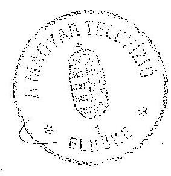
dr. Nahlik Gábor

---

9.02.2011 10.02.17
A Magyar Televizió 1993. évi bevételsinck és kiadásának várható alakulás-27-51 793-93.52.10
a pénzügyi egyensúly megteremtését és megrívását célzó tervek (program) szerint

Millió forintban!

Megnevezés
I. - II. hónap III. hónap I. negyedév
II.
III.
IV.
Össessen
terv
tény²
terv
terv
várható
terv
terv
terv
terv
várható
Alaptevékenység bevételsi
976,2
460,1
486,1
1.464,2
1.612,5
1.464,2
1.462,9
5.856,8
6.804,2
Egyéb bevételsk
440,1
793,0
2.008,7
Tállalkozások árbevételsi
3,4
1,7
5,0
10,0
5,2
5,2
5,3
21,0
40,0
1 Saját folyó bevételsk
979,6
900,2
489,8
1.469,4
2.416,5
1.469,6
1.469,6
1.469,2
5.877,8
9.852,9
2 Felhalmozdai és tökejel-
legü bevételsk
Felügyeleti szorutól kapott
támogatás (herm. beruházással)
432,2
423,2
146,6
569,8
569,8
439,8
439,8
440,1
1.889,5
1.889,5
3 Államhástartdaon kivülvöl
származó pénzeszközök
Költségvetési kiegészíté-
sek és visszatérítések
Egyéb elszámolások
Visszatérülések és egyéb
folyó átutalások
1124,4
94,4
124,4
124,4
124,4
1.402,8
1.542,2
636,4
2.039,2
2.986,3
1.909,2
1.909,2
1.909,7
7.767,3
11.981,2
Bér
294,2
297,3
147,1
441,3
444,4
441,3
441,3
441,7
1.765,6
Társadalombiat. járulék
166,0
117,8
83,0
249,0
296,2
249,0
249,0
253,6
1.000,6
1.059,8
Dologi kiadások
772,8
966,2
386,4
1.159,2
1.950,5
1.159,2
1.159,2
1.159,0
4.636,6
8.791,3
Ebböl:
- Adó és egyéb befiz. köt.
90,4
257,3
762,0
- Sugárzási díj
222,0
25,0
116,0
348,0
348,0
348,0
348,0
349,3
1.393,2
- Bérjellegü kiadások
108,0
125,9
54,0
162,0
220,0
162,0
162,0
157,1
643,1
643,1
1 Müködési kiadások
1.233,8
1.381,2
616,9
1.850,7
2.791,1
1.850,7
1.850,7
1.850,7
7.402,8
11.616,7
2 Felújítás
39,0
19,5
58,5
58,5
58,5
58,5
59,0
224,5
234,5
3 Intézményi beruházás
130,0
130,0
130,0
130,0
4 Köteleszttalgek 1992. évről
Ebböl
- Árusvállítók, szolgáltatók
1.108,9
1.108,9
- Ádótattozás
- Nyugdíjjárulék
- Egészségbiztositási járulék
- Társzinlombiatosítási járulék
- Köteleszttalgek konstat
Alaptev. bev.: csak az I. hónapot tartalmazza, II.20-a után folyik be a
februári eléffizetői díj.
6. pont: MNH nyitó egyenlege, beruházás saját forrás nyitó egyenlege. Kiadások összesen: I. negyedév azzal a feltételezéssel, hogy
Kamatterhok: kifizetésig kiszámíthatatlanok.
az 1992. évi támogatás hátralévő részét
megkapjuk.
Budapest, 1993. február 16.

---

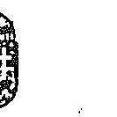

10. sz. melléklet a V-27-51/1992/1993.sz.hoz

PÉNZÜGYMINISZTÉRIUM
1051 BUDAPEST, JÓZSEF NÁDOR TÉR 2-4
Postacím: 1369 Budapest, Postafiók 481
Telefon: 118-2066
Telefax: 1182-570 Telex: 20-2763

Szilárd Tibor úr
mb. gazdasági főigazgató

Magyar Televízió

Budapest

Tisztelt Szilárd Tibor Úr !

Az Országgyűlés által 1992. december 30-án hozott törvény
és határozat értelmében a Magyar Televízió 1992. évi 1000
millió forint összegű zárolt költségvetési támogatásából
889,6 millió forintot - azonnali továbbutalás céljából -
rendelkezésére bocsátottam. Az MTV-nek ebből az összegből
az alábbi kötelezettségeit kell teljesítenie:

- az állami befizetési kötelezettségek (általános forgalmi
adó, személyi jövedelemadó, vállalkozási nyereségadó kamat,
munkavállalói járulék) rendezésére 245 millió forintot az
Adó- és Pénzügyi Ellenőrzési Hivatal, továbbá társadalom-
biztosítási járulék tartozás kifizetésére 130 millió fo-
rintot a Társadalombiztosítási Főigazgatóság részére;

- az Antenna Hungária Műsorszóró és Rádióhírközlési RT rés-
zére 200 millió forintot;

- az Állami Számvevőszék korábbi vizsgálata alapján az
ingatlanértékesítésből és helytelen adóalap csökkentésből
származó kötelezettségei rendezésére, valamint pénzmarad-
vány befizetési kötelezettsége teljesítésére

---

= 172,6 millió forintot a 232-90100-0669 Magyar Televizió bevételi számlára,
= 71,6 millió forintot az Adó.és Pénzügyi Ellenőrzési Hivatal részére,
= 70,4 millió forintot a 232-90120-0027 Előzố évi költségvetési maradványok számlára
ke11 átütalni.

Tájékoztatom továbbá, hogy a fennmaradó 110,4 millió Ft-ot letéti számlára helyeztük, amelynek felhasználásáról az Állami Számvevôszék utóvizsgálatát követôen a Kormány dönt.

Kérem a levelemben foglaltak szíves tudomásul vételét, az átutalások teljesítésének visszaigazolását.

Budapest, 1992. december 31.
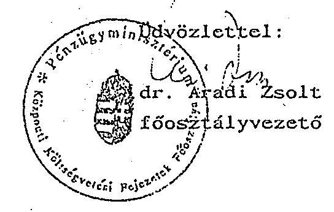

---

# K I M U T A T A S 

a Magyar Televízió 1980-1992. évi átlaglétszámáról

| I d ô s z a k | A t l a g l é t s z á m |
| :--: | :--: |
| 1980 | 3.407 |
| 1981 | 3.468 |
| 1982 | 3.515 |
| 1983 | 3.540 |
| 1984 | 3.539 |
| 1985 | 3.521 |
| 1986 | 3.622 |
| 1987 | 3.687 |
| 1988 | 3.624 |
| 1989 | 3.623 |
| 1990 | 3.733 |
| 1991 | 3.609 |
| 1992 | 3.502 |

Megjegyzés: 1.) A táblázat a Kereskedelmi Igazgatóság adatait is tartalmazza
2.) A részfoglalkozásúaknál redukált létszámot vettünk figyelembe

Budapest, 1993. január 18.
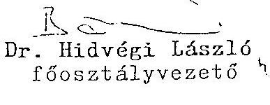

---

12. sz. melléklet
a V-27-51/1992-93.sz.hoz

MTV létszámának alakulása állománycsoportonként (fő)

|  | 1988. | 1989. | 1990. | 1991. | 1992. |
| :--: | :--: | :--: | :--: | :--: | :--: |
| vezetők | 167 | 159 | 162 | 207 | 189 |
| szakalk. | 1.736 | 1.767 | 1.814 | 1.705 | 1.697 |
| ügyvit. | 62 | 61 | 64 | 62 | 65 |
| fizikaiak | 1.377 | 1.565 | 1.631 | 1.548 | 1.509 |
| MTV egyútt | 3.342 | 3.552 | 3.671 | 3.522 | 3.460 |
| 1 före jutó |  |  |  |  |  |
| becsztott | 19 | 21 | 22 | 16 | 17 |

Budapest, 1993. január

---

# Állami Számvevőszék 

Éva Katalin úrasszony
fôtanácsos részére

Szíves megkeresésére az alábbiakat tudjuk válaszolni.
Az MTV Elnöke és Gazdasági Fôigazgatója megbízott azzal, hogy tegyünk javaslatot a bérezési rend kialakítására.

Ennek érdekében megkértük a Gazdasági Fôigazgatót, hogy a Belsố Ellenôrzési Osztállyal gyûjtesse ki, hogy 1991. I-VIII. hónapjában minden egyes szervezeti egységtől ki milyen jogcímen vett fel bér vagy bérjellegủ összeget.
A kimutatást, mellékelve hozzá a kifizetési bizonylatok másolatát betekintésre megkaptuk. Ezután le kellett adni a Gazdasági Fôigazgatóságnak. Ebbôl egyértelmûen a következôket lehetett megállapítani:
1., Egy költségvetési intézménynél olyan mûvészeti és egyéb tevékenységeket díjaznak, amire a szokásos kifizetési jogcímekkel (prémium, jutalom, túlóra) nem lehet elszámolni.(honor, átdolgozásstb.)
2., Nem lehet megállapítani az egyéb jogcímeken kifizetett összcg jogossáaít vagy jogtalanságát, mivel
a, nincs meghatározva egyetlen munkaszerzôdésben sem (itt most kizárólag az alkotói vagy szerkesztôi tevékenységre gondolunk), hogy az alapfizetésért mit kell elvégeni (példaként szeretnék utalni a Rádióra, ahol a munkaszerzôdésekben benne van, hogy az alapfizetésért pl. havi hány és milyen hosszúságú mûsort kell felelốs szerkeszteni, vagy szerkeszteni vagy ténylegesen megcsinálni)
b, nincsenek megállapítva azon normák, amelyek alapján a többletmunkát számszerûsítve értékelni lehetne.

A fenti problémák tulajdonképpen négy egységnél jelentkeztek állandó jelleggel.
a, a Központi Alkotó Irodáknál
b, TV1 Intendaturán alkotói tevékenységet végzôknél
c, TV2 Intendaturán alkotói tevékenységet végzôknél
d, Produceri Irodáknál
Az alapbérért illetve a többletmunkáért való kifizetések normarendszerének kidolgozására felkértük a Központi Szerkesztôi és a Központi Gyártásvezetôi irodát az együttmúködésre. 3 hónapon át tartó renszeres konzultációk után sikerült egy többségben elfogadott mûsortípus besorolást elfogadtatni, amely természetesen így sem lehetett teljes és nagy szabadságot adott volna a táblázat alkalmazójának, de még így is valamiféle elốrehaladást jelentett.

---

A Központi Szerkesztő és a Központi Gyártásvezetői irodák által megadott normaszámokat viszont nem tudtuk elfogadni - nem szakmai alapon - hanem azért, mert ha a TV músorainak teljes alkotógárdájánál figyelembe vesszük ezen normákat, akkor olyan számok jöttek ki, hogy a jelen alkotói létszám két, esetenként háromszorosára lenne szükség.

Összefoglalva: javaslatunk az volt, hogy a Gazdasági Fơigazgató egyeztesse ezen normákat a TV1 és TV2-vel, valamint az Alkotói Irodákkal és próbáljanak szakmai kérdésekben, a normaidő csökkentésében egyezségre jutni, ebben mi nem vagyunk kompetensek.
Ezen egyeztetések már rajtunk kívül zajlottak, így végsố kimenetelükről nincs pontos tudomásunk, csak következtetünk arra, hogy a rendkívül eltérő érdekeket - bár a vezetés megpróbálta hosszú időn keresztül az érdekegyeztetést - nem sikerült közös nevezőre hozni.
Miközben a Központi Alkotói Irodákkal folytak a megbeszélések, a TV2 leadott egy, a saját gyártásában készülő músorokra vonatkozó normatervet (amit az alapfizctésért kell elvégeni.)
Ezt a normatervet teljes mértékben támogattuk, de meg kell jegyeznünk, hogy ez azért volt egyszerúbben megfogalmazható, mert nevesítve voltak a músorok. A Központi Irodáknál pedig nem nevesített músorokat, hanem különbözô jellegủ, név szentét elốre nem ismert músorokat kellett normázni.
Felmerült a kérdés, hogyan lehetne a költségvetési intézmény elszámolási rendjétől oly idegen tevékenységet szervezetileg elkülöníteni. Az alapítványi formát ajánlottuk többek között - és erre el is készültek ügyvédi közremúködéssel a javaslatok.
A Gazdasági Főigazgató tudomásunk szerint több helyen is eljárt ez ügyben (Munkailgyi központ stb.) de valószínúleg azért nem vezetett az egész munka eredményre, mert a TV-s Alkotós dolgozóknak megszünt volna a TV-s munkaviszonyuk, ez egyeseknél 520 év is volt, megszünt volna a TV szociális intézményeinek használati joga stb. és saját érdekükben megpróbálták ezeket megvédeni. Valószínúsítem, mivel nem tudott senki kitalálni semmi olyan szervezeti formát, amely a felmerült problémákat csökkenti ezért bár a TV vezetése megpróbálta - mégsem sikerült eddig megoldani. Hatalmi szóval pedig nem akartak több száz embert elbocsátani.

Végezetül meg szeretnénk jegyezui, hogy az MTV Elnöke tudomásunk szerint a kormány kérésére felfüggesztette a szervezeti átalakítást, így a régi struktúra és a végül meg nem valósított új struktúra közötti állapotban az Alkotó Irodák ill. az alkotói jogcímen kifizetett pénzeknek normatív alapot teremteni nem lehetett.

Budapest, 1993. január 15.
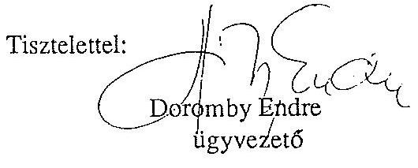

---

# 14. sz. melléklet <br> a $V=27=51 / 1992-93 . \mathrm{sz} . \mathrm{hoz}$ 

## PÉNZOGYMINISZTER

24.703/1991.

Hankiss Elemér úrnak
a Magyar Televizió
elnöke

## žudapest

Tisztelt Hankiss Úr!

Az elmúlt félévben a Magyar Televízió átalakítására tett kísérleteiket folyamatosan figyelemmel kisértem. Ezuton is megerősítem, messzemenően szeretném támogatni a Magyar Televízió gazdálkodásának racionális átalakítását.
Az 1992. évi költségvetés tervezése sorín lehetóséget biztosítunk valamennyi központi költségvetési szerv tízámára, hogy a vállalkozási formában végezhető tevékenységekről, azzal kapcsolatos elképzeléseire javaslatot tegyen. Önük ezt az átfogó javaslatot ezideig nem juttatták el hozzánk.
Javaslom, hogy egyidöben valamennyi ésszerüen leválasztható munkaszervezetük összeállítására és a kōltségvetési támogatás kiváltásával összefüggő társaságok alapítására tegyenek átfogó javaslatot, amely alapján értékelni tudjuk majd a Nemzeti Mozgókép Alapítvánnyal és az Önök négy munkatársával létesítendő korlátolt felelősségú társaság alapítására tett egyedi javaslatukat is.

Kérem tájékoztatásom szíves tudomásulvételét.

Budapest, 1991. július " 17 "
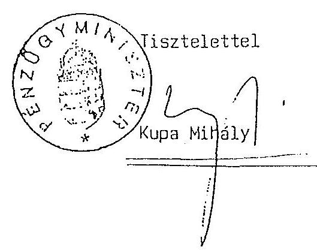

---

# MAGYAR TELEVÍZIÓ 

ELKÖKE

Ikt.sz.: $\quad 1-1764 / 91$. Hiv.sz.: $24.703 / 1991$.

Kupa Mihály úrnak
miniszter
PÉNZÜGYMINISZTÉRIUM

Tisztelt Miniszter Úr!

Hivatkozva fenti számú megkeresésére, a Magyar Televízió átalakításával, gazdálkodásának korszerűsítésével kapcsolatban az alábbiakról tájékoztatom:

1) Az Állami Számvevőszék vizsgálatainak megállapításai alapján is szükségesnek tartom a Magyar Televízió gazdálkodásának racionális megalapozottságát előtérbe helyezni. A "két független közszolgálati televíziós csatorna" elvi koncepcióját alátámasztó gyakorlati teendők meghatározására hoztuk létre a gazdaságí igazgató mellett dolgozó "Gazdaságí Bizottságot", amely együttmúködve a telégíziós szakemberekkel készíti el 1990. szeptember 30ig konkrét javaslatát az MTV jövőbeni müködésére, szervezeti felállására, gazdálkodási rendszerére vonatkozóan.
2) Elképzeléseink már konkrét formát öltött elemeiből a következőkre hívom fel Miniszter úr figyelmét:

---

# Szervezeti változások 

Az MTV intézményi keretein belül müködne a két, egymástól müsorpolitikában, gazdálkodási és kereskedelmi ügyekben független "csatorna".

Kereskedelmi tevékenység vállalkozási alapokra helyezése

Az MTV és a Magyar Rádió kereskedelmi ügyeit eddig kizárólagosan intéző RTV Igazgatóság több részre válik, ugyanis a Magyar Rádió az Ön jóváhagyásával önálló kereskedelmi szervezetet müködtet 1991. második félévétől. Az RTV Belkereskedelmi Igazgatóságot a költségvetési intézményrendszer helyett a vállalati gazdálkodás keretei között kívánjuk müködtetni, amely a jövöben az "MTV-2" csatorna komplex kereskedelmi feladatait látja el. Az "MTV1" önálló kereskedelmi szervezetet alapít, amelynek müködtetéséhez - vegyesvállalati formában - külföldi partnerrel kíván együttmüködni. Ennek érdekében budapesti székhefilyel társaságot kívánunk alapítani az IP NETWORK nevü, párizsi székhelyü média értékesítö nemzetközi vállalattal. Az eddigi élökészítő tárgyalások alapján várhatóan nagymértékben megnövekszik az MTV kereskedelmi bevétele a nyugat-európai reklámpiac bekapcsolódása miatt, valamint azáltal, hogy leendő partnerünkön keresztül

---

tagjai lehetünk az egész Európát átfogó hálózatnak. E társasaság alapításához szükségünk van az ön engedélyére és támogatására. Az elvi koncepció részletes kidolgozására és a gazdasági számításokat mellékelve a megvalósíthatósági tanulmányt az Ơn részére hamarosan megküldjük.

Gyártási leányvállalat, önálló produceri vállalkozások

A társasági forma létrehozása a cél, egyrészt az Ơn által elvileg már engedélyezett gyártási leányvállalat esetében, illetve mindazon müködöképes produceri irodáknál, amelyek vállalják a piaci körülmények közötti létezést.
Gyakorlati tapasztalatok és tények igazol ják azt, hogy a "mũsorgyártás" csakis versenyhelyzetben, piaci körülmények között gazdaságos igazán, s hozhat változóst az eddigi pazarló televíziós gyakorlatban. E témakörben is kérem az Ơn elvi támogatását, s a megküldött konkrét esetekben jóváhagyását.
Meggyőződésem - és az eddigi részeredmények igazolják is - hogy ezen átszervezés, a még csak szimulált belsõ piaci helyzet, a létrehozandó, önálló társasági formában mũködő kereskedelmi szervezetek, illetve ezek megnövekedett bevételei, eredményességük, valamint a szintén önállósuló, nem közvetlenül és kizárólag az MTV

---

```
    költségvetéséből megélő produceri irodák
    jelentő́s költségvetési támogatás
kiváltását eredményezik majd, arról nem is
szólva, hogy az MTV költségvetésének
felhasználása áttekinthetőbbé és
eredményesebbé válik.
```

Kérem, hogy az 1991. július 17-én kelt megkeresésére e választ tekintse első tájékoztatásnak. Az átfogó javaslatot szeptember 31-ig megküldöm Önnek.

Budapest, 1991. szeptember 9.

Öszinte tisztelettel
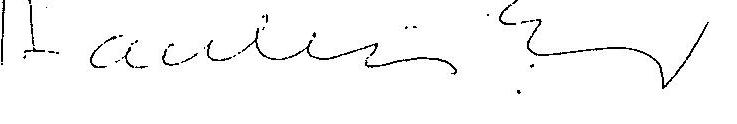

Hankiss Elemér
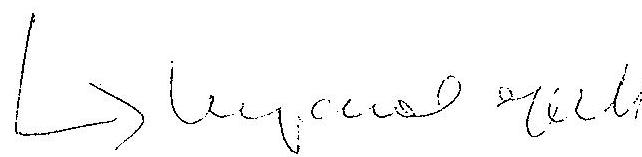

---

PÉNZÜGYHINISZTER
$24410 / 61$
Hankiss Elemér Úr
a Magyar Televizio elnöke

# Budapest 

Tisztelt Elnök úr!

A Magyar Televizio szervezeti korszerüsitése, a belsó piaci viszonyok kialakítása keretében leányvállalat alapítását tartják indokoltnak, amellyel kapcsolatban ál: láspontom a következô:
A leányvállalat alapításával elvileg egyetértek.
A leányvállalat alapító okiratának megfelelően 1991. december 31-ig müködhet ugy, hogy gazdasági társaságban részt nem vehet.

A fenti idópontig a leányvállalat tevékenységének és müködésének felülvizsgálta és az abból levont tapasztalatok alapján az engedély meghosszabbítását kezdeményezhetik.

Az elvi egyetértésemben foglaltakat tartalmazó leányvállalat alapító okiratukat kérem szíveskedjenek számomra megküldeni, hogy a 65/1984.(XII.29.)MT rendelet 2.5 -ában elrendelt elôzetes egyetértésem adhassam a konkrét jogügylethez.

Budapest, 1991. május " 7 "

---

MAGYAR TELEVIZIO
ELNOK

14/c, sz. melléklet
a $V=27-51 / 1992-93$. sz.hoz
Budapest, 1992. szeptember 10. Ikt.sz: 1-5607/92.

Nagy László
gazdasági foigazgató úr
kezébe

Igen tisztelt Fóigazgató úr!

Igazolom azt a mai megállapodásunkat, hogy a leányvállalat megalapítására vonatkozó hivatalos kérelmünket haladéktalanul beadjuk a Pénzügyminisztériumnak.
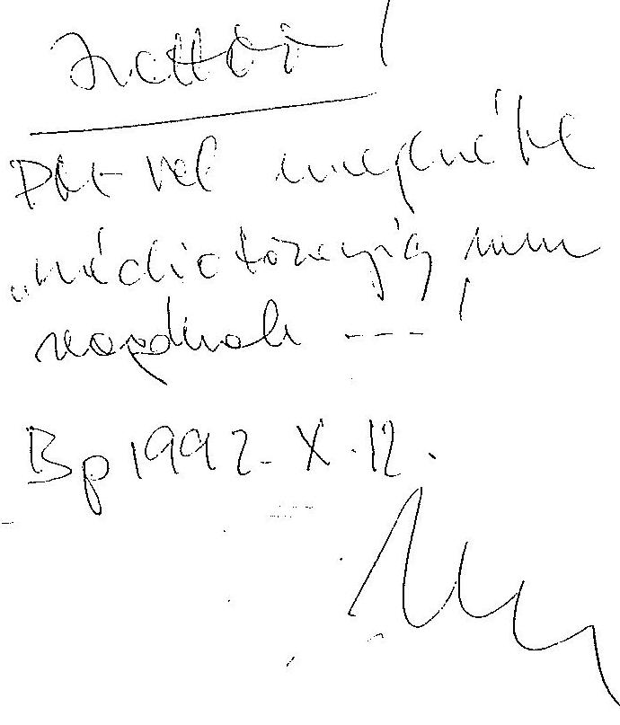

Üdvözlettel:
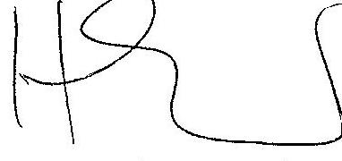

Hankiss Elemér

---

A belso meghizások fontosabb adatai
(MTV Gazdálkodó Szervezet)

|  | 1988. | 1989. | 1990. | 1991. | 1992. |
| :--: | :--: | :--: | :--: | :--: | :--: |
| fō | 2.614 | 2.893 | 2.994 | 3.000 | 2.925 |
| kifizetett <br> összeg | 52.983 | 149.107 | 249.469 | 346.560 | 405.077 |
| 1 fôre jutó | 20.268 | 51.540 | 53.322 | 115.520 | 174.227 |
| azélsō értékek |  |  |  |  |  |
| minimum | 150 | 100 | 200 | 200 | 500 |
| maximum | 403.420 | 1.031 .000 | 1.478 .750 | 2.251 .000 | 4.233 .970 |

Megjegyzés: az 1988-1989. évi adatok az elõzõ jelentésünk adatain alapulnak

Budapest, 1993. január

---

16. sz. melléklet
a V-27-51/1992-93.sz.hoz

Atlag jövedelmek állománycnogortonkénti alakulása (Ft/fő/hó)

|  | 1988. | 1989. | 1990. | 1991. | 1992. |
| :--: | :--: | :--: | :--: | :--: | :--: |
| vezetök | 32.675 | 50.079 | 66.028 | 81.451 | 100.332 |
| szakalk. | 15.258 | 25.467 | 33.599 | 43.532 | 50.642 |
| ügyvit. | 8.260 | 12.836 | 17.028 | 21.670 | 26.654 |
| fizikaiak | 11.566 | 17.841 | 22.040 | 28.093 | 29.771 |
| MTV | 14.477 | 22.992 | 29.606 | 38.590 | 43.804 |

Növekedés mértéke \%-ban

|  | $1990 / 88$. | $1992 / 1990$. |
| :-- | :-- | :-- |


| Atlag jövedelem | 204.5 | 147.9 |
| :-- | :-- | :-- |
| Sugarzott müsorperc | 128.6 | 127.4 |

Budapest, 1993. január

---

# T A B U S I T V A N Y

a bér és bérjellegű kiadásokról a V-27-51/1992-93.az.hoz 1992. év

Eser forintban!

|  Megnevezés | Gaudálkodó szervezet |  |  | Kereskedelmi Föigazgatóság |  |  | O s s z e e n |  |   |
| --- | --- | --- | --- | --- | --- | --- | --- | --- | --- |
|   | Eredeti elöirányzat | Módosított XII. 31. | Teljesítés | Eredeti elöirányzat | Módosított XII. 31. | Teljesítés | Eredeti elöirányzat | Módosított XII. 31. | Teljesítés  |
|  **RALAP** |  |  |  |  |  |  |  |  |   |
|  jjes munkaidőben foglalkoztatottak |  |  |  |  |  |  |  |  |   |
|  - létszám | 3.649 fő | 3.645 fő | 3.415 fő | 154 fő | 80 fő | 82 fő | 3.803 fő | 3.729 fő | 2.497 fő  |
|  - alapbére | 1,168.574 | 1,428.333 | 1,003.452 | 38.973 | 27.473 | 22.228 | 1,207.547 | 1,455.806 | 1,025.68  |
|  - nyelvpótlék | 15.946 | 15.946 | 14.862 | 1.000 | 1.000 |  | 16.946 | 16.946 | 14.86  |
|  - egyéb pótlék | 14.490 | 14.490 | 31.119 |  |  |  | 14.490 | 14.490 | 31.11  |
|  - túlmunkadíj | 16.650 | 16.650 | 69.062 | 147 | 147 |  | 16.797 | 16.797 | 69.06  |
|  - prémium, prémiumátlag | 18.140 | 18.140 | 52.828 |  |  |  | 18.140 | 18.140 | 52.828  |
|  is munkaidőben foglalkoztatottak |  |  |  |  |  |  |  |  |   |
|  - létszám (bore a nyugd. iz) | 69 fő | 69 fő | 95 fő | 3 fő | 3 fő | 2 fő | 72 fő | 72 fő | 97 fő  |
|  - bére | 14.820 | 16.302 | 133 | 440 | 440 | 372 | 15.260 | 16.742 | 502  |
|  sugdíjások bére |  |  | 39.552 | 1.870 | 1.870 | 1.943 | 1.870 | 1.870 | 41.492  |
|  is oddíl.melők fogó bére |  |  |  |  |  |  |  |  |   |
|  - gibízási díj |  | 48.522 | 280.755 |  |  | 4.093 |  | 48.522 | 284.842  |
|  - Ebből norma feletti vállalkot tov. hől |  |  | 235.197 |  |  |  |  |  | 235.197  |
|  - halmi munkaidőbből bére | 45.220 | 45.220 | 222 |  |  | 99 | 45.220 | 45.220 | 222  |
|  - talom (normatív) | 12.400 | 62.860 | 50.368 | 270 | 270 | 2.272 | 12.730 | 63.130 | 52.660  |
|  **LAP ROVAT** |  |  |  |  |  |  |  |  |   |
|  **ELLEGŐ KIADÁSOK** |  |  |  |  |  |  |  |  |   |
|  - gőjjak | 15.000 | 15.000 |  |  |  |  | 15.000 | 15.000 |   |
|  - külső dől - nak kifizetett előadóművásak tiszt. díja |  |  |  |  |  |  |  |  |   |
|  - szerzői jogdíj belső külső |  |  | 146.962 |  |  |  |  |  | 146.962  |
|  - külső dől |  |  | 281.448 |  |  |  |  |  | 281.448  |
|  - újítási, találm. díj |  |  | 1.074 |  |  |  |  |  | 1.074  |
|  - talom |  |  |  |  |  |  |  |  |   |
|  - pénzmaradványból |  | 105.140 | 105.140 |  |  |  |  | 105.140 | 105.140  |
|  - érdekeltségi alapból |  | 285.037 | 285.037 |  | 20.362 | 20.362 |  | 305.400 | 305.400  |
|  - nők jutalom | 3.000 | 3.000 | 296 |  |  |  | 3.000 | 3.000 | 296  |
|  - bízami jutalom | 7.000 | 7.000 | 2.760 | 482 | 482 | 92 | 7.482 | 7.482 | 2.852  |
|  - vődíj | 5.000 | 5.000 |  |  |  |  | 5.000 | 5.000 |   |
|  - gibízási díj | 325.243 | 325.243 | 175.161 | 150.000 | 150.000 | 45.673 | 475.243 | 475.243 | 220.834  |
|  - asteletdíj | 127.100 | 309.473 | 469.300 | 87.860 | 87.860 | 2.136 | 214.960 | 297.333 | 471.426  |
|  - abb. közreműködők díja | 10.000 | 10.000 | 464 |  |  |  | 10.000 | 10.000 | 464  |
|  **ELLEGŐ KIADÁSOK ÖSSZESEN** |  |  |  |  |  |  |  |  |   |
|  - sak a felsorolt tételek) | 492.343 | 1,064.893 | 1,467.642 | 238.342 | 258.705 | 68.264 | 730.685 | 1,323.598 | 1,535.906  |
|  **RSADALOMBIZTOSÍTÁSI ÁRÚJE** |  |  |  |  |  |  |  |  |   |
|  **RSADALOMBIZTOSÍTÁSI ÁRÚJE** | 564.600 | 783.330 | 919.471 | 18.800 | 13.740 | 26.765 | 583.400 | 797.070 | 946.236  |
|  **KÖDÉSI KIADÁSOK ÖSSZESEN** | 5,322.800 | 10,662.775 | 11,225.602 | 1,070.429 | 1,074.232 | 1,513.217 | 6,393.229 | 11,737.007 | 12,739.919  |

adatok nyilvántartásainkkal egyezőek, azok helyességét igazolom.

Jajszó, 1992. január 14.

(Fenning Gabor)

főszülőgyezető

---

A sugárzási idô alakulása 1990, 1991, 1992. XII.31-ig
idöszakban

1. 2. csatorna összesen

| Megnevezés | 1990. | 1991. | X.31. | 1992. <br> XII. 31. |
| :-- | :--: | :--: | :--: | :--: |
| Saját gyártásu müsorok <br> - belsõ | 228848 | 309187 | 250539 | 309911 |
| - külsõ | 5006 | 1255 | 6997 | 7641 |
| Átvett belf, müsor <br> /sport, színház. közv./ | 36958 | 40769 | 40946 | 51563 |
| Átvett külf. müsor <br> /sport, Intervizió, <br> Eurovizió/ | 16248 | 13201 | 19915 | 20709 |
| Vásárolt film | 82231 | 104186 | 96447 | 116689 |
| Kölcsönzött film | 7417 | 10549 | 7094 | 8686 |
| Ismétlés | 82922 | 62442 | 58223 | 68612 |
| Reklám | 14264 | 18335 | 17518 | 21216 |


| Üsszes müsoridõ | 473894 | 559924 | 497679 | 605027 |
| :-- | :--: | :--: | :--: | :--: |
| Heti átl. müsoridõ | 151,9 óra | 179,5 óra | 184,3 óra | 193,2 óra |
| Egyéb adásidõ | 15013 | 13937 | 11225 | 13950 |
| Üsszes sugárzási idõ | 488907 | 573861 | 508904 | 618977 |

Budapest, 1993. január 16.

---

18/a, sz. melléklet
a V-27-51/1992-93. sz.hoz

A sugárzási idô alakulása 1990, 1991, 1992. XII.31-ig
idôszakban

1. csatorna

| Megnevezés | 1990. | 1991. | 1992. |  |
| :--: | :--: | :--: | :--: | :--: |
|  |  |  | X.31. | XII. 31. |

Saját gyártásu müsorok

| - belsõ | 119916 | 153565 | 145121 | 181485 |
| :--: | :--: | :--: | :--: | :--: |
| - külsõ | 4402 | 4048 | 4791 | 5254 |
| Átvett belf. müsor /sport, színház közv./ | 30906 | 21558 | 6521 | 7405 |
| Átvett külf. müsor /sport, Intervizió Eurovizió/ | 8544 | 7959 | 12167 | 12662 |
| vásárolt film | 39340 | 55079 | 54613 | 66373 |
| Kölcsönzött film | 3278 | 3962 | 3122 | 3632 |
| Ismótlés | 56338 | 42964 | 39656 | 44671 |
| reklám | 10163 | 12356 | 10418 | 12570 |
| Üsszes müsoridõ | 272887 | 301491 | 276409 | 334052 |
| Heti átl. müsoridõ | 87,5 óra | 96,6 óra | 102,4 óra | 106,8 óra |
| Egyéb adásidõ: | 11194 | 9917 | 7577 | 9407 |
| Üsszes sugárzási idõ | 284081 | 311408 | 283986 | 343459 |

Budapest, 1993. január 16.
Sülfor gstróuul

---

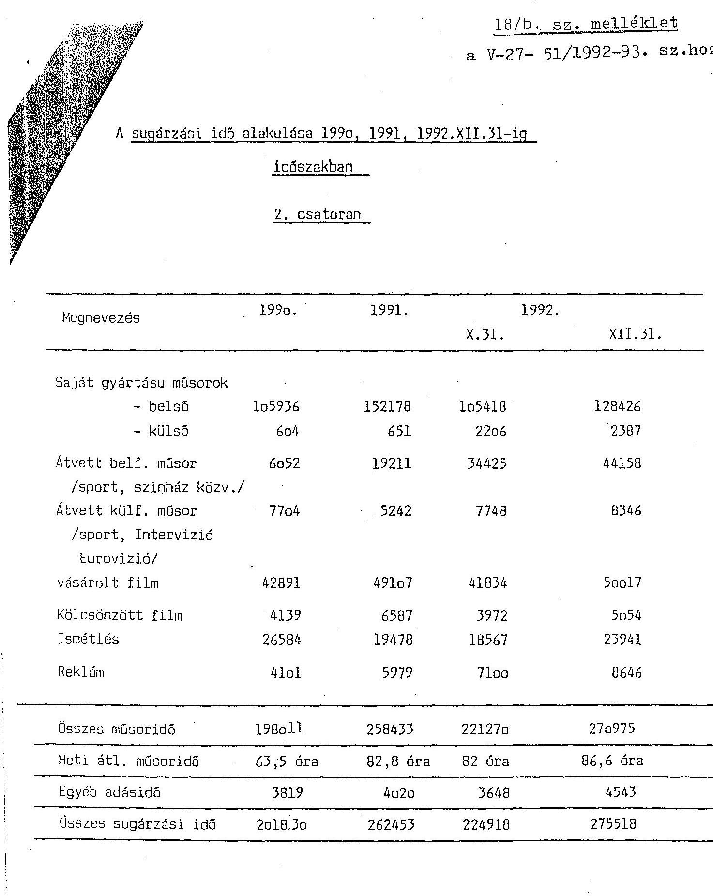

Budapest, 1993. január 16.
Solfor Gistrénni

---

19. sz. melléklet a V-27- 51/1992-93. sz. hoz

Tájékoztató a NTV I-II. csatornán sugárzott mũsorizs jének fajtárkónti bontásáról
/perc/

|  | Ism.nélk. | Ismétléssel | Összesen | Ism.nélk. | Ismétléssel | Összesen | Ism.nélkül | Ismétléssel | Összesen |
| :--: | :--: | :--: | :--: | :--: | :--: | :--: | :--: | :--: | :--: |
|  | 1990 . évi |  |  | 1991 évi. |  |  | 1992 . e vi |  |  |
| Vallási | 2254 | - | 2254 | 6348 | 115 | 6463 | 4669 | 101 | 4770 |
| Magazin | - | - | - | 53044 | - | 53044 | 41414 | - | 41414 |
| Poli iikai | 124577 | 7439 | 132016 | 131223 | 6390 | 137613 | 108028 | 3356 | 111384 |
| Müvelődés | 51084 | 14336 | 65420 | 46987 | 7575 | 54562 | 43325 | 5579 | 48904 |
| Irodalom | 6778 | 350 | 7128 | 5576 | 138 | 5714 | 7512 | 2163 | 9675 |
| Zenei | 26138 | 8700 | 34838 | 27499 | 7642 | 35141 | 28263 | 6582 | 34845 |
| TV film, TV játék, Mozifilm | 58506 | 29429 | 87935 | 77054 | 20229 | 97283 | 67294 | 20636 | 87930 |
| Szorakoztató | 19457 | 2186 | 21643 | 32350 | 1842 | 34192 | 22930 | 3108 | 26038 |
| Sport | 35636 | 705 | 36341 | 33907 | 490 | 34397 | 37841 | - | 37841 |
| Gyermek | 28086 | 13115 | 41201 | 31642 | 14594 | 46236 | 29065 | 14478 | 43543 |
| Szolgáltató | 34741 | 4203 | 38944 | 51802 | 1046 | 52848 | 49085 | 982 | 50067 |
| Összesen: | 387257 | 80463 | 467720 | 497432 | 60061 | 557493 | 439426 | 56985 | 496411 |

Budapest, 1992. november 30.

---

19/9.sz. melléklet a V-27- 51/1992-93. sz.hoz

|   | Ismétlés nélkül |  | Ismétléssel |  |  |  |  |  |   |
| --- | --- | --- | --- | --- | --- | --- | --- | --- | --- |
|   | 1990. évi |  |  | 1991. évi |  |  | 1992. évi |  |   |
|  Vallási | 1996 | - |  | 1996 | 4441 | - | 4441 | 2879 | 50  |
|  Magazin | - | - |  | - | 21448 | - | 21448 | 38546 | -  |
|  Politikai | 76782 |  | 6922 | 83704 | 73357 | 5803 | 79160 | 47707 | 3135  |
|  Móvelődés | 23670 |  | 13192 | 36862 | 25075 | 6809 | 31884 | 18436 | 4336  |
|  Irodalom | 4034 |  | 200 | 4234 | 2220 | 138 | 2358 | 3107 | 1935  |
|  Zenei | 11209 |  | 3852 | 15061 | 15044 | 2931 | 17975 | 16326 | 2397  |
|  TV film, TV játék, |  |  |  |  |  |  |  |  |   |
|  Mozifilm | 29240 |  | 19465 | 48705 | 36153 | 14109 | 50262 | 33553 | 13940  |
|  Szórakoztató | 8256 |  | 1325 | 9581 | 15072 | 1006 | 16078 | 11443 | 2717  |
|  Sport | 16404 |  | 652 | 17056 | 12961 | 441 | 13402 | 19738 | -  |
|  Gyermek | 14795 |  | 6880 | 25675 | 20595 | 9536 | 30131 | 16419 | 9702  |
|  Szolgáltató | 25633 |  | 2129 | 27762 | 32156 | 528 | 32684 | 28569 | 813  |
|  Összesen: | 216019 |  | 54617 | 270636 | 258522 | 41301 | 299823 | 236723 | 39025  |

Budapest, 1992. november 30.

---

# 19/b. sz. melléklet 

a V-27-51/1992-93. sz.hoz
Tájékoztató A MTV II. osatornán sugárzott múspo:idejének fajtánkénti bontásáról
/perc/

|  | Ismétlés nélkül 1990. é vi | Ismétléssel | Összesen | Ismétlés nélki. |  | Ismétléssel | Összesen | Ismétlés nélki. |  | Ismétléssel | Összesen |
| :--: | :--: | :--: | :--: | :--: | :--: | :--: | :--: | :--: | :--: | :--: | :--: |
|  |  |  |  | 1991. é vi |  |  |  | 1992. é vi |  |  |  |
| Vallási | 258 | - | 258 | 1907 | 115 | 2022 | 1790 |  | 51 | 1841 |  |
| Magazin | - | - | - | 31596 | - | 31596 | 2868 |  | - | 2868 |  |
| Politikai | 47795 | 517 | 48312 | 57866 | 587 | 58453 | 60321 |  | 221 | 60542 |  |
| Móvelődés | 27414 | 1144 | 28558 | 21912 | 766 | 22678 | 24889 |  | 1243 | 26132 |  |
| Irodalom | 2744 | 150 | 2894 | 3356 | - | 3356 | 4405 |  | 228 | 4633 |  |
| Zenei | 14929 | 4848 | 19777 | 12455 | 4711 | 17166 | 11937 |  | 4185 | 16122 |  |
| TV film, TV játék |  |  |  |  |  |  |  |  |  |  |  |
| Mozifilm | 29266 | 9964 | 39230 | 40901 | 6120 | 47021 | 33741 |  | 6696 | 40437 |  |
| Szorakoztató | 11201 | 861 | 12062 | 17278 | 836 | 18114 | 11487 |  | 391 | 11878 |  |
| Sport | 19232 | 53 | 19285 | 20946 | 49 | 20995 | 18103 |  | - | 18103 |  |
| Gyermek | 9291 | 6235 | 15526 | 11047 | 5058 | 16105 | 12646 |  | 4775 | 17422 |  |
| Szolgál-tató | 9108 | 2074 | 11182 | 19646 | 518 | 20164 | 20516 |  | 169 | 20685 |  |
| Összesen: | 171238 | 25846 | 197084 | 238910 | 18760 | 257670 | 202703 |  | 17960 | 220663 |  |

Budapest, 1992. november 30.

---

# K I M U T A T A S 

a külsõ filmgyártás alakulásáról 1989 - 1992 években.

|  |  |  |  | /ezer Ft-ban/ |
| :--: | :--: | :--: | :--: | :--: |
| Megnevezés | 1989. | 1990. | 1991. | 1992. |
| MAFILM | 83.667 | 88.913 | 66.743 | - |
| MAHAIR | 30.000 | 59.780 | 63.282 | 74.583 |
| MOVI | 88.851 | 54.144 | - | - |
| FILMIRODA | - | 92.282 | 181.893 | 317.784 |
| Ker. Föig. | 108.801 | 6.494 | - | - |
| NOVOFILM | - | 9.422 | 109.537 | 325.711 |
| TPA | - | - | 32.104 | 21.238 |
| Mikro-Stúdió | - | - | 36.100 | 13.024 |
| Egyéb /Hunnia, <br> Fökus, Objekt- 5.662 |  |  |  |  |
| tiv, Bujtor, stb. |  |  |  |  |
| Pannonia rajzfilm, animáció | 44.769 | 39.714 | 59.560 | 59.476 |
|  | 361.750 | 358.378 | 618.388 | 1.114 .7 |

---

# A szponzorált mũsorok alakulása 

| Megnevezés | 1990. év | 1991. év | 1992. év |
| :--: | :--: | :--: | :--: |

Az összesen gyártott, készített
músorok

- száma ..... 2,882 ..... 4,625 ..... 5,739
- kö1tsége ..... 1,991,473,939,7. ..... 3,451,475,329,7... ..... $4,441,294,720,7$. .
A szponzorált músorok
- száma (db)
- kö1tsége ..... 173.415.560,-
355.501.958,-
695.324.371,-
kapott támogatás összege ..... 332,232,715,7... ..... 349,475,299,7... ..... 283,642,462,7.
A szponzorok száma ..... -
Budapest, 1993. január 29.

---

# Magyar Televizió <br> Pénzügyi Főosztály 

## Kimutatás az 1992-ben beérkezett szponzor és reklám

b e v é t e l e k r ö 1

Szponzorbevételek:

| TV-1 Intendatúra | $116.640 .189,-$ |
| :-- | --: |
| TV-2 Intendatúra | $118.935 .323,-$ |
| Sportosztály | $14.310 .750,-$ |
| Pécsi Körzeti Stúdió | $11.437 .000,-$ |
| Szegedi Körzeti Stúdió | $8.692 .200,-$ |
| TV-1 Kereskedelmi részlege | $13.627 .000,-$ ('91-es kiszám1.) |
| ö s s z e s e n : | $283.642 .462,-$ |

Reklámbevételek:

| TV-1 Intendatúra | $1.440 .904 .442,-$ |
| :-- | --: |
| TV-2 Intendatúra | $647.437 .500,-$ |
| TV-1 Kereskedelmi részlege | $613.628 .847,-$ ('91-es kiszám1.) |
| ö s s z e s e n : | $2.701 .970 .789,-$ |

Budapest, 1993. január 29.
"Yaus'

---

PÉNZÜGYMINISZTÉRIUM HELYETTES ÁLLAMTITKAR $53.321 / 1992$.

Nagy László úrnak gazdasági fôigazgató Magyar Televízió

# Budapest 

Tisztelt Nagy Úr!

Korábbi álláspontomat fenntartva továbbra sem járulok hozzá, hogy az MTV Szegedi Körzeti Stúdió és az MTV Pécsi Körzeti Stúdió önálló - költségvetési szervként mũködjön. Az Országgyûlés jelenleg tárgyalja a Rádióról és a Televízióról szóló törvény tervezetét, remélve annak közeljövóben való jóváhagyását, nem tartom célszerũnek az engedély megadását.

Kérem ezért, hogy az 1993. évi költségvetési törvényben a két körzeti stúdiót külön címként ne szerepeltessék.

Budapest, 1992. augusztus 28.
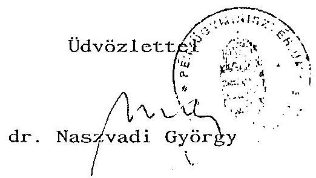

---

23. sz. melléklet
a V-27-51/1992-93. sz.hoz

N y i l a t k o z a t

Mint a Pápalátogatás fôproducere az alábbi nyilatkozatot teszem: A Magyar Televizió és a Pentacoop Kft. között kötött szerzôdésbôl a Magyar Televiziónak semmifajta külön kiadása nem volt. A szerzôdés a külföldi forgalmazásra szólt és miután a televiziónak korábban senki nem ajánlotta ezt megvételre, megkeresés külföldi kereskedelmi televiziók részéről nem történt, és a korábbi gyakorlatban ilyen jellegũ eseményeknél soha nem volt vételi szándék, igy a szerződés megkötése után miután azon semmi vesztenivaló nem volt, legfeljebb csak nyeresége lehetett volna a Televiziónak, ha a Kft. mégis el tudja adni, igy a referenciát a Kft. saját költségén végezte, ami tudomásom szerint több millió forintjába került. Hiszen elôször a világ nagy kereskedelmi televízióival vették fel a kapcsolatot, és igyekeztek eredményt elérni, majd amikor ez nem sikerült, egy világalapitványt hoztak létre, amibe a külföldi forgalmazásra a világ nagy bankjait szerették volna szponzornak megnyerni. A késôbbi események a Magyar Televiziót igazolták már hogy nem lehet ezt a mûsort eladni, de ez a Televiziónak egyetlen fillérjébe nem került.
Az, hogy maga a produkció megközelitőleg 70 millió Rt-ba került, annak a szerződéshez semmi köze, mert a Pápalátogatás minden eseményét a Ferihegyre való leszállástól a felszállásig mindent közvetítenie kellett, lehetőleg élôben, vagy ha ez nem ment, akkor rögzitve. Ez a kivánalom már a szerződés megkötése elôtt is fennállt mind a Miniszterelnöki Hivatal, mind a Püspöki Kar részéről. Ekkor, ebben az idôszakban a Pentacoop Kft. ajánlatáról még csak nem is hallottunk. A Magyar Televizió és a Püspöki Kar között kötött szerződésből, ami egyébként méltányossági alapon született, hogyha netán bevétele van a Magyar Televiziónak, abból a Püspöki Kar is részesüljön. Miután nem volt bevétele, igy a Püspöki Kar sem részesült semmiből, hiszen a szerződés utolsó elôtti pontja pont erről szól: ha nincs bevétel a Pentacoop Kft-től, akkor a szerződés érvényét veszti. Igy ebből sem származott semmi kiadása az MTV-nek.

Budapest, 1993. január 12.
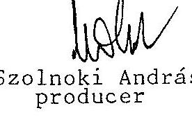

---

# ÁR ÉS DIJBECÉTEL 

Ezer Ft-ban

| Tevékenység | 1990. | 1991. | 1992. |
| :--: | :--: | :--: | :--: |
| Alaptevékenységgel összefüggő árrés dijbevétel | 422.372 | 761.742 | 2,460.443 |
| ebből: sponzor | 332.232 | 298.990 | 234.990 |
| reklám | 44.352 | 421.745 | 691.494 |
| egyéb bevétel | 45.788 | 41.007 | 16.749 |
| IP Bp. KFT 60 \% |  |  | 1,433.186 |
| Külker. tev. árbevétele |  |  | 84.024 |
| Vállalkozási tev. összefüggő bevétel | 18.942 | 324.289 | 698.466 |
| ebből: sponzor | - | 40.373 | 89.604 |
| reklám | - | 257.418 | 537.652 |
| egyéb bevétel | 18.942 | 26.498 | 71.210 |

Budapest, 1993. január 11.

---

25. sz. melléklet a V-27- 51/1992-93. sz.hoz

Vállalkozási tevékenység önköltségének és bevételeinek alakulása /iizemgazdasági szemléletben/

1.000 Ft-ban

|  Megnevezés | 1990. év |  |  | 1991. év |  |  | 1992. év |  |   |
| --- | --- | --- | --- | --- | --- | --- | --- | --- | --- |
|   | ráfordi- | árbevétel | befolyt árbevét. tárgyév | ráfordi- | árbevétel | tárgy év- | ráfordi- | árbevétel | tárgy év-  |
|   | tás |  |  | tárg |  | ben be- | tás |  | ben be-  |
|   |  |  |  | folyt |  | folyt |  |  | folyt  |
|  Szállítás | 5.883 | 7.708 | 7.097 | 9.273 | 15.297 | 8.080 | 5.467 | 9.238 | 9.238  |
|  Szcenika | 9.873 | 15.043 | 10.038 | 17.035 | 19.206 | 10.903 | 23.582 | 31.273 | 31.273  |
|  Nyomda | 2.033 | 2.662 | 1.807 | 3.657 | 4.141 | 3.780 | 2.529 | 3.640 | 3.640  |
|  Gyártási Igazgatóság |  |  |  | 1.387 | 4.391 | 3.734 | 4.473 | 23.321 | 23.321  |
|  TV 1 Kereskedelmi Iroda |  |  |  | 221.695 | 972.188 | 297.792 |  | 627.256 | 627.256  |
|  MÜBESZI |  |  |  |  |  |  | 3.679 | 3.738 | 3.738  |
|  Üsszesen: | 17.789 | 25.413 | 18.942 | 253.047 | 1,015.223 | 324.289 | 39.730 | 698.466 | 698.466  |

Budapest, 1993. január 15.

---

26. sz. melléklet
$\mathrm{V}-27-51 / 1992-93$. sz. hoz

# Az MTV szerződéses kapcsolatainak áttekintése 

Az MTV a Kormány privatizációs stratégiájára alapozva, - amely az állami kötelezettségvállalás mérséklésére irányult - szervezeti rendszere korszerűsítését irányozta elő. Ennek szellemében elnöki értekezleten a csatornák önálló kereskedelmi szervezeteinek létrehozása mellett döntöttek olymódon, hogy a Kereskedelmi Föigazgatóság kizárólag az MTV2 csatorna, mig a kialakítandó új szervezet az MTV1 csatorna reklám és szponzorbevételeinek értékesítését szolgálja.

A döntés eredményeként az MTV 1-es csatorna már 1991. II. félévétől az MTV 2-től elkülönült kereskedelmi szervezettel biztosította a reklám és szponzor bevételeit.

Az MTV1 Intendatúrája, valamint az ARBO International Gmbh között 1991. július 2-től Együttmüködési Szerződés jött létre.

Célja: ".... az MTV1 hirdetési müsoridejének kizárólagos értékesitése, ill. értékesítési tevékenység megszervezése és irányítása, továbbá az együttes feladatok teljesítését segitő egyéb közös gazdálkodási tevékenység végzése céljából együttmüködnek, valamint tevékenységüket összehangolják."

Az együttmüködés szolgált alapul arra, hogy késöbb - a szándéknyilatkozatban rögzített elvek szerint - tevékenységüket budapesti székhelyű korlátolt felelősségű társaság keretei között folytassák tovább.

Az együttmüködési szándéknyilatkozat szólt arról is, hogy a felek a tevékenységet saját nevükben, saját javukra, költségére és kockázatára végzik.

A közös tevékenységről 1991.év után olyan eredményelszámolás készült, amelyet a később (1992. január 1-től) létrejött IP BP Kft müködése során alkalmaztak.

---

Az elszámolás alapján a kitermelt és az MTV által adózott eredményböl az ARBO 70 millió Ft-tal részesült. Az összeget az MTV devizában utalta át. Az átutalás körülményeit az MNB megvizsgálta és rendben lévőnek találta.

Az MTV az ARBO Gmbh-val kötött együttmüködési megállapodásban nem rögzített kötelezettségeket is teljesített. Igy pl.:

- megelőlegezte az IP Bp Kft müködéséhez szükséges berendezéseket 15 millió Ft értékben. Ezeket az IP BP Kft-nek ugyan 1992. év-től leszámlázták, de miután a Kft saját berendezéseket szerzett be, ezek visszakerültek az MTV birtokába;
- térítés nélkül átadta az MTV1-re vonatkozó szerződéses íratállományt, know-how-t;
- a bevételek terhére kifizette az ARBO Ugyvezető igazgatója számára a gépkocsihasználatot és a lakásbérletét is 180 napra.

Az MTV szerződéses kapcsolatai 1991-92-ben növekedtek. Az új szerződéses kapcsolatok kiépítése, jogi megalapozása fokozott előkészítést, gondosságot igényelt.

A költségvetési szervek költségvetésének végrehajtásáról szóló 4/1991. (II.13.) PM sz. rendelet 42. paragrafus 3. bek. szerint a központi költségvetési szervek 1991. dec. 31-ig - a PM előzetes véleményének figyelembevételével - a kormány engedélyével vehettek részt a tulajdonukban, kezelésükben, használatukban lévő vagyontárgyak, pénzeszközök felhasználásával gazdasági társaságok alapításában és alapítvány létrehozásában, támogatásában vagy a meglévők átalakításában.

Az 1992. VII. hótól hatályos államháztartásról szóló 1992. évi XXXVIII. törvény 94. paragrafus 2. bek. pedig kimondja: központi költségvetési szerv a Kormány engedélyével alakíthat gazdasági társaságot, ill. szerezhet gazdasági társaságban érdekeltséget. A költségvetési szerv csak olyan gazdasági társaságban vehet részt, amelyben felelőssége nem haladja meg vagyoni hozzájárulásának mértékét.

---

a/ Az MTV-Arbo Internacionale GmBH közötti szerződés az IP Budapest Kft alapítására

Az MTV és az ARBO Internationale Gmbh - az 1991. VII. 2-án megkötött együttmüködési megállapodásuk alapján - 1991. XII. 1-én írta alá az IP Budapest Kft megalapításáról a társasági szerződést. A szerződés 10 éves időtartamra szól.

A szerződés előkészítési fázisában kormányelőterjesztés készült az engedélyezés jóváhagyására, amelyet a Pénzügyminiszter is aláirt. Az előterjesztéssel kapcsolatban 1991. XII. 31-ig kormányzati döntés nem született. (A társasági szerződés megkötéséhez 1991. XII. 1-jén kormányengedély kellett volna, mivel az ezt előiró 4/1991. (II.13.) PM rendelet 1991. december 31-ig hatályban volt.) A cégbejegyzés megtörténtekor (1992. I.22-én) hatályos jogszabályi rendelkezés engedélyezési kötelezettséget nem írt elő.

A közös társaság müködésének eredményeként az MTV, illetve az MTV 1 csatornája olyan jelentős bevételekre tett szert, amelyek hozzájárultak ahhoz, hogy az MTV a pénzügyi egyensúlyának megőrzésével fedezni tudta kiadásait. Az előző évek és a Kereskedelmi Igazgatóság bevételi adatai egyértelmüen azt bizonyítják, hogy önerőből az MTV ilyen arányú reklámbevételt korábban nem ért el. A szerződés tartalmából egyértelmüen megállapítható, hogy a müködés eredményéből a felek tulajdoni arányuk szerint részesedtek.

Polgárjogi szempontból helytelen megoldásnak bizonyult a megállapodásnak az a része, amelynek alapján a reklámbevételek egy részét a Kft nem utalta át az MTV-nek, hanem annak megbízása szerint harmadik személyek részére vásárlások ellenében kifizetéseket teljesített (produkciós költséget, filmvásárlást, beruházási beszerzéseket stb). Ez a megoldás az MTV számára is megnehezítette az elszámolások áttekintését.

# b/ MTV-Novofilm Stúdió Kft közötti szerződés 

A szerződés tárgya a hét hat napján (hétfőtől-szombatig) országosan sugárzásra kerülő "A reggel" című összetett, élő müsor elkészítése, amelyet a Novofilm Stúdió Kft gyárt le és az MTV 1. csatorna adásában jelenik meg hétköznaponként reggel 6 órától8 óra 25 percig.

---

A Novofilm vállalta, hogy a müsor elkészítéséhez szükséges valamennyi költséget a müsorhoz kapcsolódó szponzori és a müsorhoz biztosított reklámidő bevételeiből fedezi. A szerződés szerint elkészülő gyártási költségvetés alapján 3 hónapig 20 millió Ft előleget folyósít az MTV a Novofilm számára elszámolási kötelezettséggel.

A Reggel címú müsor azonban a feltételezésekkel szemben nem vált önfenntartóvá, így a felmerülő költségeket az MTV rendszeresen megtérítette. Az MTV Gazdasági főigazgatója a szerződés teljesítésének körülményeit és az elszámolásokat 1992-ben két alkalommal is ellenőriztette a Belsö ellenőrzési osztállyal.

A belső ellenőrzés megállapításai szerint az induláskor előnyösnek mutatkozó szerződés a tervezett bevételek elmaradása miatt többszörösen hátrányossá vált az MTV számára.

A müsor nem volt nyereséges, sőt még önfenntartó sem, ezért az MTV által adott müsorgyártási költségmegelölegezés ( 60 millió Ft) sem térült vissza. Számos alaki, és tartalmi hiányosság volt tapasztalható a költségek elszámolásánál és esetenként azok indokoltsága is kétséges volt. A belsö ellenőrzés álláspontja a szerződés felbontását sugallta, bár ilyen egyértelmü javaslatot nem tett.

Az MTV vezetése müsorpolitikai okokból a müsort továbbra is megtartotta. A Gazdasági főigazgató pedig úgy rendelkezett, hogy a 60 millió Ft-ot a költségek elszámolásánál vegyék figyelembe.

Tényként megállapítható, hogy a teljesített kifizetések között egyes gyártó cégek (szállítók) pl. Filmiroda Rt, Novofilm Kft, FOKUS Film, MIKRO STODIO, ROYAL Inf. és VIDEO, CLAMATELfilm,REXFILM Kft) kétségtelenül prioritást élveztek 1992-ben.

# c/ MTV-Penta Coop szerzödés 

A pápa látogatása az MTV számára nagy szervezéssel és költséggel járó feladat volt. A sok helyszínes, az ország különböző pontjain tartott rendezvények közvetítésének közvetlenül kimutatható költségei mintegy 350 millió Ft-ot tettek ki.

---

Erre a célra kormányzati támogatásként az MTV 5 millió Ft-ot kapott.

A Penta Coop Kft azzal az ajánlattal kereste meg az MTV elnökét, hogy a rendezvény éló és rögzített televíziós közvetítés összes kizárólagos külföldi forgalmazási jogát 1 milliárd Ft-ért megvásárolja és az eseményt követő rövid időn belül a kikötött összeget az MTV-nek átadja.

Arra vonatkozó dokumentum nem került az ellenőrzés birtokába, hogy a Penta Coop Kft-n kívül mások bármilyen gazdaságilag értékelhető, jogérvényes ajánlatot tettek volna a pápa látogatás közvetítési jogának átvételéért.

Az ügylet az 1991. június 6-án kelt adásvételi szerződéssel létrejött. A Penta Coop Kft szerződésben vállalt kötelezettségének azonban nem tett eleget. Többszöri eredménytelen szóbeli és levélváltás után 1992. szeptember 7-én peren kívül abban állapodtak meg a felek, hogy a Kft az MTV-nek legalább a közvetítés költségeit megtéríti ( 350 millió Ft-ot) havi 50 millió forintonként. A Kft az újabb megállapodásnak sem tett eleget, eddig összesen 100 ezer Ft-ot utalt át. Ellenőrzésünk olyan bizonyítékokat nem talált, amelyből arra lehetne következtetni, hogy a szerződés folyamányaként az MTV-nek többletköltségei merültek volna fel. Az ellenőrzés befejeződéséig sem per útján, sem más módon nem próbálta meg az MTV vezetése ezt az ügyet a számára legtöbbet ígérő módon lerendezni.

# d/ Szerződés a Hargita-stúdió korszerüsítésére 

Az Agancs utcában az MTV által bérelt épületrész, a "Hargita stúdió" korábban tartalék, illetve "vész-" stúdió szerepet töltött be, de az idôközben teljesen elavult eszközállomány és a leromlott állapotú épület miatt használhatatlanná vált. A bérlemény egyetlen - egyelőre pótolhatatlan funkciója - maradt meg: a músor átjátszóláncának részét alkotja a tetőzeten elhelyezett mikrohullámú berendezés.

A rendkívül magas bérleti díj (havi 1 millió Ft+AFA) és az egyéb mũszaki gondok miatt vetődött fel annak lehetősége, hogy az épületrész felújításával együtt egy új funkciójú egység jöjjön itt létre, amelyik alapja lehet többek között a müholdas adásokra való felkészülésnek.

---

Az épületrész hasznosítására a TV1 intendatúra (42. sz. Produceri Irodán keresztül) és a Micro Stúdió kötöttek szerződést 1991. XI. 19-én.

A beruházási cél különbözõ müsorok (Pénzvilág, Manager magazin, Falutévé, Falutévé magazin, Vasárnapi turmix) gyártási feltételeinek megteremtése volt. A szerződõ felek szerződést kötöttek a stúdió felújítására is. A Kft nem kielégítő marketing munkájára hivatkozva az MTV végül felmondta a szerződést.

A szerződésbontás után az MTV a spanyol PESA céggel kezdett tárgyalásokat a stúdió hasznosításáról és egy színes közvetítésre alkalmas mobil stúdió (közvetítőkocsi) beszerzéséről.

Az ügyletbe szerződő félként bekapcsolódott a PESA Elektronics Ltd közép-európai képviselője a TEXO-Graphicomp Kft is. A TEXO vállalta:

- spanyolországi érdekeltségén keresztül spanyol hitelből az MTV igényei szerinti eszközök beszerzését és Magyarországra szállítását;
- Ft-hitel igénybevételét a beruházás pénzügyi lebonyolításához.

Az MTV vállalta, hogy:

- a TEXO magyarországi hitelfelvételéhez bankgaranciát biztosít, vállalkozása (az Ip Budapest Kft) és annak külföldi tulajdonosai támogatásával.

A szerződést 1992. július 30-án írta alá az MTV gazdasági föigazgatója.

A Hargita stúdió beruházását érintő berendezéseknek és a közvetítőkocsinak a szállítását a spanyol PESA cég vállalta, melynek konkrétumairól 1992. nyarán tárgyalt Spanyolországban az MTV egy szakértő csoportja.

A szerződés záradéka szerint a jogügylet garancia vállalója az MTV nevében és helyett az IP Budapest Kft. Azonban az illetékes bank

---

(Magyar Külkereskedelmi Bank Rt) a szükséges bankgaranciát keillő biztosítékok hiányában, az igen hosszú (17 féléves) garancia időtartam és a magas garancia összeg miatt nem adta meg a Kft-nek.

A szerződés biztosítékaként ezért a szerződés megkötése után (1992. augusztus 26-án) az MTV letétbe helyezett 87 millió ft-ot, amely összeget a TEXO vállalt visszafizetni a Ft-hitel igénybevétele után. A visszafizetés biztosítékaként letéti váltót állított ki az MTV javára 1993. január 31-i esedékességgel.

Egy időközbeni levél szerint (141/1937/92. gazd. föig. sz.) "a 87 millió Ft elöleg visszautalása X. 15-ig megtörténik." A letéti összeg visszafizetésére az ellenőrzés befejeződéséig nem került sor.

Ez a tranzakció ellentétes az AHT-ben foglaltakkal.
Budapest, 1993. május

---

# 1991. évi beruházási terv pénzügyi teljesítése

## 27. sz. melléklet

### a V-27- 51/1992-93.sz.hoz

#### Összegek: 1.000,-R-ban

|  Jelzõ-
szám | Megnevezés |  |  |  |  |  |  |  |  |  |  |  |  |   |
| --- | --- | --- | --- | --- | --- | --- | --- | --- | --- | --- | --- | --- | --- | --- |
|   |  |  |  |  |  |  |  |  |  |  |  |  |  |   |
|   |  |  |  |  |  |  |  |  |  |  |  |  |  |   |
|  Állami | Fejlesztési
Intézet |  |  |  |  |  |  |  |  |  |  |  |  |   |
|  2018 |  |  |  |  |  |  |  |  |  |  |  |  |  |   |
|   |  |  |  |  |  |  |  |  |  |  |  |  |  |   |
|  2049 | 89. évi beszerzés |  |  |  |  |  |  |  |  |  |  |  |  |   |
|   |  |  |  |  |  |  |  |  |  |  |  |  |  |   |
|  2050 | 90. évi beszerzés |  |  |  |  |  |  |  |  |  |  |  |  |   |
|   |  |  |  |  |  |  |  |  |  |  |  |  |  |   |
|   |  |  |  |  |  |  |  |  |  |  |  |  |  |   |
|  2051 | 90. évi beszerzés |  |  |  |  |  |  |  |  |  |  |  |  |   |
|   |  |  |  |  |  |  |  |  |  |  |  |  |  |   |
|  Budapest Bank |  |  |  |  |  |  |  |  |  |  |  |  |  |   |
|  8504 | 90. évi beszerzés |  |  |  |  |  |  |  |  |  |  |  |  |   |
|   |  |  |  |  |  |  |  |  |  |  |  |  |  |   |
|  ÜSSZESEN: |  |  |  |  |  |  |  |  |  |  |  |  |  |   |
|   |  |  |  |  |  |  |  |  |  |  |  |  |  |   |
|   |  |  |  |  |  |  |  |  |  |  |  |  |  |   |
|   |  |  |  |  |  |  |  |  |  |  |  |  |  |   |
|  x | A Beruházási
Usztály
nyilvántartása
szerint
a
maradványösszeg
223
cét-tal
magasabb.
Az
ÁFI
és
a
Budapest
Bank
között
rendezés
folyamatban
van,
az
1.324
cét maradvány
az
ÁFI
által
közölt
összeg. |  |  |  |  |  |  |  |  |  |  |  |  |   |
|   | Rendelkezésre állt előirányzat részletezése: |  |  |  |  |  |  |  |  |  |  |  |  |   |
|   | 1991. évi költségvetési
juttatás: |  |  |  |  |  |  |  |  |  |  |  |  |   |
|   | 1990-ben
előrendelésre
kifizetve: |  |  |  |  |  |  |  |  |  |  |  |  |   |
|   | 1990. évi költségvetési
maradvány: |  |  |  |  |  |  |  |  |  |  |  |  |   |
|   | 1990. évi saját
forrás
maradvány: |  |  |  |  |  |  |  |  |  |  |  |  |   |
|   | 1991. évi
ÁFÁ-ból
képződött
saját
forrás: |  |  |  |  |  |  |  |  |  |  |  |  |   |
|   | 1991. évi saját
forrás befizetés: |  |  |  |  |  |  |  |  |  |  |  |  |   |
|   |  |  |  |  |  |  |  |  |  |  |  |  |  |   |
|  Budapest, 1992. március 19. |  |  |  |  |  |  |  |  |  |  |  |  |  |   |

---

28. sz. melléklet a V- 27- 51/1992-93. sz.hoz

|  Jelzső-
szám | Hoznevezés | kv.
forrás | saját
forrás | építés | Mell és
belföldi
gép | import gép | egyéb
átal. | kv.
forrás | saját
forrás | Összszám | Hoznevezés
k
forrás | saját
forrás  |
| --- | --- | --- | --- | --- | --- | --- | --- | --- | --- | --- | --- | --- |
|  Budapest Bank |  |  |  |  |  |  |  |  |  |  |  |   |
|  160-8504 | - | 174.601 | 17.565 | 9.358 | 141.122 | 994 | - | - | 168.039 | 169.039 | - | 5.502  |
|  Állami Fejlesztési Intézet |  |  |  |  |  |  |  |  |  |  |  |   |
|  160-2050 Óbuda | 175.541 | - | - | - | 174.770 | - | - | 174.770 | - | 174.770 | 771 | -  |
|  160-2051 91. évi beszerzés | 129.796 | - | - | 20.666 | 101.995 | - | - | 122.681 | - | 122.681 | 7.115 | -  |
|  160-2052 Szénes közvetítőkocsi | 76.900 | 5.000 | - | - | 8.1295 | - | - | 76.900 | 4.395 | 81.295 | - | 605  |
|  160-2053 Ikszans kamera | 5.753 | 21.506 | - | - | 29.490 | - | - | 7.984 | 21.506 | 29.490 | - 2.231 | -  |
|  160-2054 Eutelszt műhold | 5.000 | 17.287 | - | - | 22.851 | - | - | 5.000 | 17.851 | 22.851 | - 564 | -  |
|  EUR fedezetbiztosítási számla | 140.557 | - | - | 43.567 | 8.763 | - | - | - | 52.330 | 52.330 | - | 88.227  |
|   | 392.998 | 398.951 |  |  |  |  |  |  |  |  |  |   |
|   | 751.941 | 17.565 | 73.611 | 560.286 | 994 | - | 387.335 | 265.121 | 652.436 | 5.091 | 94.394 | 99.485  |

Remlelkezésre álló előírásokat részletezése: 1992. évi költségvetési juttatás: 300.000 1991. évi óbudal szóló 6 kv. maradvány: 71.468 1991. évi saját forrás maradvány: 101.639 1991. évi költségvetési maradvány: 21.522 1992-ben befizetett saját forrás: 208.528 1992. évi egyéb forrás: 4.038 1992-ben VFCF jóváírás: 953 2052 egység saját forrás: 5.000 2053 egység saját forrás: 21.506 2054 egység saját forrás: 17.287

Forrás összesen: 751.941