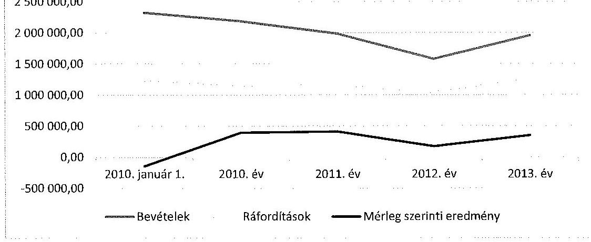
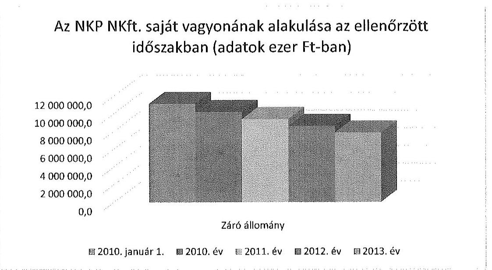
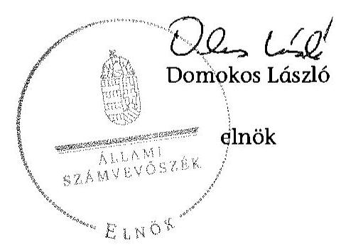
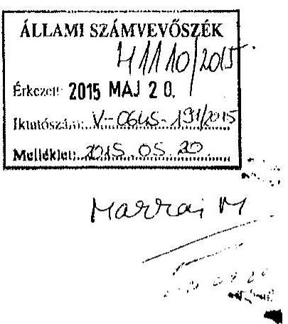
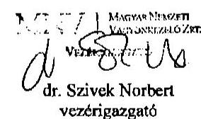

# ÁLLAMI   SZÁMVEVÔSZÉK 

## JELENTÉS

az állami tulajdonban (résztulajdonban) lévő gazdálkodó szervezetek vagyonmegőrzési és gazdálkodási tevékenységének ellenőrzése
Nemzeti Kataszteri Program Nonprofit Korlátolt Felelősségű Társaság

---

# Állami Számvevőszék 

Iktatószám: V-0645-192/2015.
Témaszám: 1679
Vizsgálat-azonosító szám: V-066604

## Az ellenőrzést felügyelte:

## Makkai Mária

felügyeleti vezető

## Az ellenőrzést vezette és a végrehajtásáért felelős:

## Sali Sándorné

ellenőrzésvezető

## A jelentéstervezet összeállításában közremúködött:

## Kányáné Murvai Tünde

számvevő főtanácsos

## Az ellenőrzést végezték:

| Bakóné Bene Gabriella | Dobos László | Kiss Péter |
| :-- | :-- | :-- |
| okleveles könyvvizsgáló | okleveles könyvvizsgáló | okleveles könyvvizsgáló |
| külső szakértő | külső szakértő | külső szakértő |

---

# TARTALOMJEGYZÉK 

BEVEZETÉS ..... 3
I. ÖSSZEGZŐ MEGÁLLAPÍTÁSOK, KÖVETKEZTETÉSEK, JAVASLATOK ..... 6
II. RÉSZLETES MEGÁLLAPÍTÁSOK ..... 11

1. Az MNV ZRt. NKP NKft.-vel kapcsolatos vagyongazdálkodási tevékenysége ..... 11
1.1. A szabályszerű vagyongazdálkodás feltételeinek, követelményeinek kialakítása ..... 11
1.2. A vagyongazdálkodásra vonatkozó jogok meghatározása ..... 12
2. Az NKP NKft. vagyongazdálkodással kapcsolatos tevékenysége ..... 13
2.1. A szabályszerű vagyongazdálkodási feltételek kialakítása ..... 13
2.2. A vagyonnyilvántartás szabályszerűsége ..... 15
3. Az ellátott állami feladat bevételei, valamint költségei és ráfordításai elszámolásának és önköltségszámításának a szabályszerűsége ..... 16
3.1. Az ellátott állami feladat bevételeinek, valamint a költségeinek és ráfordításainak elszámolásának szabályszerűsége ..... 16
3.2. Az önköltségszámítás szabályszerűsége ..... 18
4. Az NKP NKft. vagyonváltozást eredményező döntéseinek a szabályszerűsége ..... 20
4.1. A vagyongazdálkodási tevékenység szabályszerűsége ..... 20
4.2. A döntések előkészítésének megalapozása ..... 22
4.3. Az NKP NKft. és az MNV Zrt. vagyonváltozást eredményező döntéseinek megfelelősége ..... 23
5. A belső kontroll és monitoring rendszer kialakítása és múködtetése ..... 24
5.1. A belső kontrollrendszer ..... 24
5.2. Az információáramlási és monitoring rendszer ..... 25
5.3. A kormányzati szektorba sorolt NKP NKft. adatszolgáltatási kötelezettsége ..... 25
MELLÉKLETEK
6. számú Rövidítések jegyzéke
7. számú Értelmező szótár
8. számú Az NKP NKft. vagyonának alakulása a 2010-2013. években
9. számú Az NKP NKft. eredményének alakulása a 2010-2013. években
10. számú Az NKP NKft. befektetett eszközállományának alakulása 2010-2013-ban
11. számú Az MNV Zrt. vezérigazgató nemleges válasza, nem tett észrevételt

---

.

---

# JELENTÉS 

## az állami tulajdonban (résztulajdonban) lévő gazdálkodó szervezetek vagyonmegőrzési és gazdálkodási tevékenységének ellenőrzése   Nemzeti Kataszteri Program Nonprofit Kft.

## BEVEZETÉS

Az Állami Számvevőszék alapvető célkitűzése, hogy az államháztartáson kívülre nyújtott költségvetési támogatások és ingyenes vagyonjuttatások ellenőrzésével járuljon hozzá ahhoz, hogy a közpénzeket az államháztartáson kívül működő szervezetek is átlátható módon használják fel a közfeladatok szerződésben vállalt ellátása érdekében. Az Áht. értelmében a közfeladatok ellátása elsősorban költségvetési szervek alapításával és működtetésével történik. Az államháztartáson kívüli szervezetek a közfeladatok ellátásában jogszabályban meghatározott feltételekkel közreműködhetnek. ${ }^{1}$

Az állami tulajdonú gazdálkodó szervezetek a nemzeti vagyon részét képezik. Az állami vagyonnal való gazdálkodást illetően a tulajdonosi joggyakorlás és a vagyongazdálkodás feladata az állami vagyon átlátható, rendeltetésszerú és felelős felhasználásának biztosítása. Az állam meghatározza az ellátandó közszolgáltatásokkal kapcsolatos feladatokat, amelyhez a vagyonnal kapcsolatos döntéseknek igazodniuk kell. A nemzetgazdasági szempontból kiemelt jelentőségű nemzeti vagyonban tartandó állami tulajdonban álló társasági részesedést a nemzeti vagyonról szóló törvény tartalmazza.

Az Áht. nevesíti a kormányzati szektorba sorolt egyéb szervezet fogalmát. E körbe tartoznak azok a szervezetek, amelyek nem részei az államháztartásnak, azonban a 479/2009/EK rendelet szerint a kormányzati szektorba tartoznak. A nemzeti számlák nemzetközi és hazai statisztikai módszertana és szabványai elveket határoznak meg a statisztikai értelemben vett kormányzati szektorba tartozó szervezetek körére és besorolásuk módjára. A szervezetek megnevezését a nemzetgazdasági miniszter teszi közzé. A kormányzati szektorba sorolt egyéb szervezet, így a 2012. évtől a Nemzeti Kataszteri Program Nonprofit Korlátolt Felelősségű Társaság (a továbbiakban NKP NKft. vagy Társaság) köteles többek között adatszolgáltatást teljesíteni a központi költségvetésről szóló törvény elkészítéséhez, adósságot keletkeztető ügyletet csak az államháztartásért felelős miniszter előzetes egyetértésével

[^0]
[^0]:    ${ }^{1}$ Áht. 1. § (2)-(3) bekezdés

---

köthet ${ }^{2}$, továbbá gazdálkodásának eredménye befolyásolja az államháztartás konszolidált adósságmutatóját, illetve a kormányzati hiányt.

Az NKP NKft. a Nemzeti Kataszteri Program Közhasznú Társaság (a továbbiakban NKP Kht.) 2009. június 1. napján történt átalakulása eredményeképpen jött létre, annak általános jogutódja. A jogelőd NKP Kht.-ét 1996. október 25 -én hozta létre a - kizárólagos tulajdonjoggal rendelkező - Földművelésügyi Minisztérium. Az ellenőrzött időszakban az NKP NKft. 100\%-os állami tulajdonban volt és az állam nevében a tulajdonosi jogokat a Magyar Nemzeti Vagyonkezelő Zrt. (a továbbiakban MNV Zrt.) gyakorolta, gazdálkodó szervezetet nem alapított, más gazdasági társaságban tulajdoni hányaddal nem rendelkezett. A 20102013. években a Társaság ügyvezetőjének személye két alkalommal változott. A jelenlegi ügyvezető 2012. május 16. óta tölti be tisztségét.

A Társaság alaptevékenysége a számítógépen kezelhető (digitális) állami földmérési alaptérképek elkészítésével összefüggő tevékenység szervezése, bonyolítása, továbbá az alaptérkép készítés minőségbiztosítási rendszerének kialakítása volt 2012-ig. Ezzel párhuzamosan 2013-tól részt vett a részarány földkiadás során keletkezett osztatlan közös földtulajdon megszüntetésére indított projekt megvalósításában. A Társaság kiemelt feladatát jelentette a 2010-2013. évek közötti időszakban a digitális állami földmérési alaptérképek elkészítése és értékesítése.

Az NKP NKft. mérlegében a 2013. év végén szereplő összes eszközvagyon 8461,4 M Ft volt, ebből kezelésre átvett vagyonnal nem rendelkezett. A saját tőkéje 2013. év végén 2752,7 M Ft, ebből jegyzett tőke 22,0 M Ft, az eredménytartalék -429,8 M Ft és a lekötött tartalék 1700,0 M Ft volt. Az NKP NKft. összes bevétele a 2013. évben 1950,0 M Ft, ezen belül az értékesítés nettó árbevétele 1381,9 M Ft volt. A Társaság az ellenőrzött időszak valamennyi évében pozitív mérleg szerinti eredménnyel zárt, a 2013. évben 348,4 M Ft összegű eredményt realizált. Az NKP NKft.-nél az átlagos statisztikai létszám a 2013 év végén 11 fő volt, jellemzően külső vállalkozókat bízott meg a feladatok végrehajtásával.

Az ellenőrzés célja annak értékelése volt, hogy a tulajdonosi jogok gyakorlása szabályszerű volt-e, a gazdálkodó szervezet által ellátott feladat bevételei, ráfordításai elszámolásának, és vagyongazdálkodási tevékenységének szabályozása megfelelt-e a jogszabályi és a tulajdonosi előírásoknak és azok végrehajtása szabályszerű volt-e, biztosítva volt-e a közfeladatok átláthatósága és elszámoltathatósága érdekében a közszolgáltatás díjának megalapozottsága szabályszerű önköltségszámítással, a vagyonváltozást eredményező döntések esetében a tulajdonosi jogok gyakorlója és a gazdálkodó szervezet szabályszerűen jártak-e el, kiépítette és működtette-e a gazdálkodó szervezet a szabályszerű vagyongazdálkodás érdekében a kontroll és monitoring rendszert, továbbá a kormányzati szektorba sorolt egyéb szervezetek gazdálkodásának a kormányzati szektor hiányára és az államadósságra befolyással bíró elemei a jogszabályi előírásoknak megfeleltek-e.
Az ellenőrzés idöszaka: A 2010. január 1. - 2013. december 31. közötti időszak.

[^0]
[^0]:    ${ }^{2}$ Magyarország gazdasági stabilitásáról szóló 2011. évi CXCIV. törvény 9. § alapján a 353/2011. (XII. 30.) Korm. rendeletben foglaltak szerint.

---

Az ellenőrzés végrehajtásának jogszabályi alapját az Állami Számvevőszékről szóló 2011. évi LXVI. törvény 5. § (3)-(5) bekezdései képezték.

Az ellenőrzéssel érintett szervezetek: Az ellenőrzés kiterjedt a Nemzeti Kataszteri Program Nonprofit Korlátolt Felelősségű Társaságra, valamint a Magyar Nemzeti Vagyonkezelő Zrt.-re.

Az ellenőrzés várható hasznosulásaként az ellenőrzés megállapításai a jogalkotás számára segítséget nyújthatnak az államháztartáson kívüli közfel-adat-ellátás, közvagyonnal való gazdálkodás értékeléséhez, jogszabályi keretei pontosításához, az átláthatóságot biztosító szabályozáshoz. Az ellenőrzöttek számára visszajelzést ad a gazdálkodási tevékenységgel, az állami vagyon felhasználásával, a közszolgáltatási árképzés megalapozottságával és az éves elszámolással kapcsolatos szabálytalanságokról és kockázatokról. Az ellenőrzés tapasztalatai segítik és erősítik az ÁSZ hozzáadott értéket teremtő elemző tevékenységét és tanácsadó szerepét. A kormányzati szektorba sorolt, költségvetési tervezésbe is bevont gazdálkodó szervezetek ellenőrzése fokozza a legfőbb ellenőrző szerv iránti figyelmet és közbizalmat.

Az ellenőrzést a számvevőszéki ellenőrzés szakmai szabályai szerint, szabályszerűségi ellenőrzés módszerével, a vonatkozó nemzetközi standardok figyelembevételével végeztük el.

A bevételek és ráfordítások elszámolása, valamint a vagyonnyilvántartás terén a szabályszerű működést mintavétellel ellenőriztük. A kormányzati szektorba sorolt gazdálkodó szervezetek esetében a személyi jellegű ráfordítások elszámolása mellett az egyéb ráfordítások, pénzügyi műveletek ráfordításai, rendkívüli ráfordítások, illetve az egyéb bevételek, pénzügyi műveletek bevételei, rendkívüli bevételek elszámolásának szabályszerűségét szintén mintatételeken keresztül ellenőriztük. A véletlen mintavétellel (évenkénti elemszámmal arányos rétegezéssel) ellenőrzött területek esetében minden egyes tétel vonatkozásában a szabályszerűségre vonatkozó kérdéseket tettünk fel, amelyek eredménye összesítésre került. A jogszabályoknak és a belső előírásoknak megfelelőnek tekintettük az adott területet, amennyiben a minta ellenőrzésének eredménye alapján 95\%-os bizonyossággal a teljes sokaságban a hibaarány kisebb volt, mint $10 \%$, nem megfelelőnek értékeltük, ha a hibaarány a $10 \%$-ot meghaladta. A ráfordítások elszámolására és a vagyonnyilvántartásra vonatkozó véletlen mintavételt kockázati alapú kiválasztással egészítettük ki, amelynek során évente a három legnagyobb összegű tételt választottuk ki.

Az ellenőrzés során alkalmazott rövidítés jegyzéket az 1. számú melléklet, a fogalmak magyarázatát a 2. számú melléklet, az NKP Nkft. gazdálkodására jellemző adatokat a 3-5. számú melléklet tartalmazza.

Az ÁSZ a 2011. évi LXVI. törvény 29. §-a szerint a jelentéstervezetet megküldte egyeztetésre a Nemzeti Kataszteri Program Nonprofit Kft. ügyvezető igazgatójának és a Magyar Nemzeti Vagyonkezelő Zrt. vezérigazgatójának. A Nemzeti Kataszteri Program ügyvezető igazgatója az ÁSZ tv. 29. § (2) bekezdésében foglalt észrevételezési jogával nem élt, a törvényes határidőn belül észrevételt nem tett. A Magyar Nemzeti Vagyonkezelő Zrt. vezérigazgatója nem tett észrevételt, a nemleges választ a 6. számú melléklet tartalmazza.

---

# I. ÖSSZEGZŐ MEGÁLLAPÍTÁSOK, KÖVETKEZTETÉSEK, JAVASLATOK 

Az állami alapadatok adatbázisainak létesítése, fenntartása és országos lefedettséggel való működtetése a földmérési és térképészeti tevékenységről szóló törvényben foglaltak szerint állami alapfeladatnak minősült. Az NKP NKft., mint kijelölt adatgazda szabályszerűen gondoskodott az elkészült digitális állami földmérési alaptérképi adatállományok tárolásáról, illetve archiválásáról és a felvett hitelek folyamatos törlesztéséről.Az ellenőrzött időszakban a Társaság múködtette az állami alapadatok rendszerét, teljesítette az alapításkori feladatát, mely szerint a Nemzeti Kateszteri Program során elkészült térképművek, adatbázisok értékesítéséből származó bevételek megteremtették a végrehajtás finanszírozására kormánygaranciával felvett banki hitelek visszafizetésének alapjait. A Társaság tevékenységét a földhivatalokkal és a FÖMI-vel együttműködve látta el. Mindezek mellett a 2013. évtől a Vidékfejlesztési Minisztériummal kötött támogatási szerződés, illetve megállapodás alapján részt vett a részarány földkiadás során keletkezett osztatlan közös földtulajdon megszüntetésére indított projekt megvalósításában. Az NKP NKft. az ellenőrzött időszakban vagyonkezelésbe vett vagyonnal nem rendelkezett és közfeladatot nem látott el, továbbá nem minősült közhasznú szervezetnek. A 2010-2013. években a Társaság 100\%-os állami részesedése tekintetében a tulajdonosi jogokat az MNV Zrt gyakorolta.

Az MNV Zrt. az állami részesedés tekintetében a tulajdonosi jogait a döntésekről hozott alapítói határozatok alapján az ellenőrzött időszakban szabályszerűen gyakorolta és kialakította a vagyongazdálkodás feltételeit. Az NKP NKft. Alapító Okirata tartalmazta a 2010-2013. években a vagyonnal történő felelős gazdálkodáshoz szükséges követelményeket, meghatározta az alapító, az FB, valamint a könyvvizsgáló jogait, hatáskörét és feladatait. Az Alapító Okiratban foglaltak alapján az FB megvizsgálta az alapító elé terjesztett valamennyi lényeges üzletpolitikai jelentést, valamint minden olyan előterjesztést, amely a Társaság legfőbb szerve kizárólagos hatáskörébe tartozott. Az alapító a kizárólagos hatáskörébe tartozó vagyongazdálkodással kapcsolatos döntéseket meghozta. Az FB támogatásával döntöttek többek között a Számv. tv. szerinti beszámoló jóváhagyásáról és az üzleti terv elfogadásáról.

A Társaság az ellenőrzött időszak alatt részesült költségvetési forrásból származó támogatásban. A tulajdonosi joggyakorló MNV Zrt. a hitelek kamatainak viszszafizetéséhez, a Vidékfejlesztési Minisztérium az osztatlan közös tulajdon megszüntetésére irányuló kormányprogram megvalósításához nyújtott forrást. Az NKP NKft. állami alapfeladatának ellátását kezdettől fogva a digitális térképek elkészüléséig (2007. év) a Kormány készfizető kezessége mellett, - két bank által nyújtott - 16 400,0 M Ft összegű hitel alapján biztosította. A Társaság könyv szerinti hitel tartozása a 2010. év végi 8760,0 M Ft-ról a 2013. év végére 3840,0 M Ft-ra csökkent a felvett hitelek folyamatos törlesztésének a hatására. Az ellenőrzött időszakban a tulajdonosi joggyakorló a felvett hitelek kamattörlesztéséhez összesen 3291,0 M Ft vissza nem térítendő támogatást nyújtott. To-

---

vábbá ebben az időszakban az MNV Zrt. a hitelek kamat és tőketörlesztési terheinek ellensúlyozására a Társaság jegyzett tőkéjét 2,0 M Ft-tal, a tőketartalékot pedig 1112,0 M Ft-tal megemelte.

Az NKP NKft. a saját vagyon értékének megőrzését, gyarapítását szolgáló vagyongazdálkodás feltételeit a 2010-2013. években nem teljes körűen alakította ki. A tulajdonosi jogok gyakorlója részéről megfogalmazott elvárásokkal, célokkal összhangban az ellenőrzött időszakban évenként üzleti terveket készített, melyeket az MNV Zrt. Igazgatósága Alapítói Határozatokban jóváhagyott. Az NKP NKft. meghatározta szabályzatalban a vagyongazdálkodással kapcsolatos feladat,- és hatásköröket, felelősségi viszonyokat. A Társaság a vagyonnal való gazdálkodás belső szabályozását a számviteli politika, a számlarend, az eszközök és források leltárkészítési és leltározási szabályzata, az eszközök és források értékelési szabályzata és a pénzkezelési szabályzat elkészítésével biztosította. Az NKP NKft. nem készítette el a Számv. tv. előírásával ellentétesen az önköltségszámítási szabályzatát és a számlarend keretében a bizonylati rendjét. A Társaság a Számv. tv.-ben foglaltak ellenére nem tett eleget a szigorú számadási kötelezettség előírásának, mivel nem határozta meg a szigorú számadás alá vont bizonylatok és nyomtatványok körét, a nyilvántartások kezelésével, elszámoltatásával kapcsolatos feladat-, hatás-, és felelősségi körök meghatározását. A leltározási szabályzat 2012. január 1-jétől nem felelt meg a Számv. tv.-ben foglalt előírásoknak, mert a mennyiségi leltárfelvétellel leltározandó eszközök leltározási gyakoriságát a legalább három év helyett öt évben határozta meg.

Az NKP NKft. saját vagyonának nyilvántartása a 2010-2013. években szabályszerű volt. A Társaság saját vagyonaként nyilvántartott digitális kataszteri térképeket az ellenőrzött időszakban a Számv. tv. előírása szerint az immateriális javak között, szellemi termékként vették nyilvántartásba. Az éves beszámolóban és számviteli nyilvántartásban rögzített vagyon állományát a Számv. tv. alapján szabályszerű leltárak támasztották alá. A leltározás végrehajtása során - a helytelen belső szabályozás ellenére - a Társaság betartotta a Számv. tv. előírásait, a számviteli alapelveknek megfelelő folyamatos mennyiségi nyilvántartással rendelkező eszközök körében három évente leltározott.

Az NKP NKft.-nél a bevételek, valamint a költségek és ráfordítások elszámolása a 2010-2013. években szabályszerű volt. Az ellenőrzött időszakban önköltségszámítást nem végeztek ellentétesen a Számv. tv. előírásával annak ellenére, hogy a Társaság értékesítésének nettó árbevétele és a költségnemek szerinti költségének értéke meghaladta a tv.-ben meghatározott küszöbértéket. Az Alapító Okiratban megjelölt feladatokat az NKP NKft. alapfeladataként, alaptevékenységeként kezelte a számviteli nyilvántartásokban, éves beszámolókban. A költségelszámolást megalapozó dokumentumok rendelkezésre álltak, a gazdasági események alátámasztása megfelelő és szabályszerű volt. A döntések megalapozását, a gazdálkodás hatékonyságát támogatja a feladatellátásra jutó ténylegesen felmerült költségek ismerete, az alkalmazott díjjal való összevetése, továbbá elemzések készítése és az ebből levonható következtetések felhasználása. Az NKP NKft. a földmérési és térképészeti állami alapadatokból szolgáltatott, egy földrészletre vonatkozó térképmásolat (helyszínrajz) díját a vonatkozó rendeletben foglaltak szerint - az ellenőrzött időszakban - szabályszerűen állapította meg.

---

Az NKP NKft. könyv szerinti vagyona a 2010. január 1-jei 12 640,5 M Ft-ról 2013. december 31.-ére 8461,4 M Ft-ra ( $25,2 \%$-kal) csökkent, mely az immateriális javak, ezen belül a szellemi termékek között nyilvántartott digitális kataszteri térképek után elszámolt amortizációval függött össze. Az ellenőrzött időszakban a vagyon értékének megőrzését, az eszközök pótlását a képzett amortizációs összegek - 3309,6 M Ft -mértékében nem tudták megvalósítani, mivel a szellemi termékek állománya az amortizációval összefüggésben folyamatosan csökkent, az értéknövelő ráfordítások forrása a hitelek visszafizetési kötelezettsége miatt nem állt rendelkezésre. A vagyon gyarapítása, a vagyonváltozást eredményező beruházás az ellenőrzött időszakban $27,0 \mathrm{M}$ Ft volt, mely többnyire az osztatlan közös tulajdon megszüntetésének lebonyolításához és a programfrissítéshez szükséges eszközbeszerzésekhez kapcsolódott.

Az NKP NKft. a vagyongazdálkodáshoz kapcsolódó döntések előkészítése, meghozatala során az alapítói határozatban, valamint a jogszabályi és a belső szabályozásban foglaltakat betartotta. A Társaság a saját vagyonát nem idegenítette el, nem terhelte meg. A tevékenységéből adódóan a vagyonnal kapcsolatos döntések éves szinten tervezhetőek voltak és az MNV Zrt. által meghatározott követelményeken alapultak. A Társaság szerződéseit tevékenységének végzése során szabályszerűen kötötte a céljainak és feladatainak megvalósítása érdekében. A tulajdonában lévő térkép adatbázisokat értékesítette. Az SZMSZ-ben meghatározottak szerint a Társaság operatív és tényleges gazdasági irányítását az Igazgató látta el. A vagyonváltozást eredményező döntések a beruházások tekintetében megalapozottak voltak. Az éves üzleti tervek tartalmazták a tervezett beruházások szakmai indokoltságát, feltételeit és forrását.

A vagyon védelme és a vagyonnal való felelős gazdálkodást biztosító belső kontrollrendszer kialakítása, múködtetése megfelelő volt a 2010-2013. években. Az NKP NKft. vagyongazdálkodását meghatározó alapszabályokat az Alapító Okirat tartalmazta, a múködésére vonatkozó szabályzatait elkészítette. Az FB az Úgyrendben előírtak alapján elvégezte a tulajdonosi döntést segítő, megalapozó véleményezési feladatát. A Társaság az ellenőrzött időszakban eleget tett a Számv. tv.-ben előírt számviteli beszámoló készítési kötelezettségének. A tulajdonosi joggyakorló az adatszolgáltatási kötelezettségen alapuló beszámoltatáson, továbbá az alapítói határozataiban szereplő döntésein keresztül ellenőrizte a Társaság gazdálkodását.

A szabályszerű vagyongazdálkodást biztosító információáramlási és monitoring rendszer múködtetése megfelelő volt. Az MNV Zrt. kontrolling adatszolgáltatási kötelezettséget írt elő, amely jelentéstételi, illetve tájékoztatási kötelezettséget jelentett a NKP NKft. részére. A Társaság az FB munkájához szükséges és előírt információkat határidőben megadta és az MNV Zrt. által meghatározott formában és adattartalommal teljesítette adatszolgáltatási kötelezettségét.

Az NKP NKft. gazdálkodásának a kormányzati szektor hiányára és az államadósságra befolyással bíró elemei a jogszabályi előírásoknak megfeleltek, azonban a jogszabályban előírt adatszolgáltatási kötelezettségét a 2012-2013. években nem teljesítette megfelelően. A Társaságra, mint kormányzati szektorba sorolt egyéb szervezetre vonatkozott 2012. március 31.-étől az Ávr. 7. számú melléklet 2., 28. pontjaiban, továbbá 2013. augusztus 19.-étől a hivatkozott jogszabály 29. pontjában meghatározott rendszeres adatszolgáltatási kötelezettség,

---

amelynek - az előírások ellenére - nem tett eleget. Az Ávr. 7. számú melléklet 2. és 28. pontja és az adatszolgáltatási kötelezettség teljesítését segitő útmutató nem volt összhangban, mivel előbbi a Társaságot, utóbbi a tulajdonosi joggyakorlót nevezte meg adatszolgáltatásra kötelezettnek. A Társaság az ellenőrzési időszak alatt nyereségesen gazdálkodott, ezért az eredmény elszámolása a kormányzati szektor hiányát nem növelte.

Az Állami Számvevőszékről szóló 2011. évi LXVI. törvény 33. § (1) bekezdésében foglaltak értelmében a jelentésben foglalt megállapításokhoz kapcsolódó intézkedési tervet köteles az ellenőrzött szervezet vezetője összeállítani, és azt a jelentés kézhezvételétől számított 30 napon belül az ÁSZ részére megküldeni. Amenynyiben az intézkedési tervet határidőben nem küldi meg a szervezet, vagy az nem elfogadható, az ÁSZ elnöke a hivatkozott törvény 33. § (3) bekezdésében foglaltakat érvényesítheti.

Az ellenőrzés intézkedést igénylő megállapításai és javaslatai:

# az NKP NKft. ügyvezető igazgatójának: 

1. Az NKP NKft. Leltározási Szabályzata a Számv. tv. 69. § (3) bekezdésében előírt legalább három évenkénti mennyiségi felvétellel történő leltározási kötelezettség helyett öt évenkénti mennyiségi felvételt írt elő.

Javaslat:
Intézkedjen a Leltározási Szabályzat módosításáról annak érdekében, hogy a mennyiségi felvétellel történő leltározás szabályozása megfeleljen a jogszabályi előírásoknak.
2. Az NKP NKft. számlarendje a Számv. tv. 161. § (2) bekezdés d) pontjának előírása ellenére 2010-2013. évben nem tartalmazta a számlarendben foglaltakat alátámasztó bizonylati rendet.

Javaslat:
Intézkedjen a számlarend kiegészítéséről annak érdekében, hogy az a jogszabálynak megfelelően tartalmazza a bizonylati rendet.
3. Az NKP NKft pénzkezelési szabályzata az ellenőrzött időszakban a Számv. tv.14. § (8) bekezdésében foglaltak ellenére nem rendelkezett a pénzkezeléssel kapcsolatos bizonylatok rendjéről és a pénzforgalommal kapcsolatos nyilvántartási szabályokról, mivel az nem tartalmazta az alkalmazott szigorú számadás alá vont bizonylatok és nyomtatványok körét, a nyilvántartások kezelésével, elszámolásával kapcsolatos feladat-, ha-tás-, és felelősségi körök meghatározását.

Javaslat:
Intézkedjen a pénzkezelési szabályzat kiegészítéséről annak érdekében, hogy az tartalmazza az alkalmazott szigorú számadás alá vont bizonylatok és nyomtatványok körét, a nyilvántartások kezelésével, elszámolásával kapcsolatos feladat-, hatás-, és felelősségi körök meghatározását.

---

4. Az NKP Nkft. értékesítésének nettó árbevétele és a költségnemek szerinti költségeinek összege az ellenőrzött években meghaladta a Számv.tv. 14. § (7) bekezdésében meghatározott értékhatárt. Ennek ellenére nem készítette el a Számv.tv. 14. § (5) bekezdés c) pontjában előírt önköltségszámítás rendjére vonatkozó szabályozást, így az önköltségnek megfelelő utókalkulációt sem végzett.

Javaslat:
Intézkedjen a jogszabályban előírt számviteli politika keretében elkészítendő önköltségszámítás rendjére vonatkozó szabályzat elkészítéséről, továbbá az önköltség jogszabály szerinti utókalkuláció módszerével történő megállapításáról.
5. A NKP Kft. annak ellenére, hogy az Áht. 109. § (8) bekezdése alapján kiadott közleményben megjelölt kormányzati szektorba tartozó egyéb szervezet, nem tett eleget az Áht. 107. § (1) bekezdésében, 108. § (3) bekezdésében és az Ávr. 7. sz. melléklet 28. és 29. pontjában előírt az államháztartás információs rendszerébe teljesítendő rendszeres adatszolgáltatási kötelezettségének.

Javaslat:
Intézkedjen a jogszabályokban meghatározott adatszolgáltatási kötelezettség teljesítéséről.

---

# II. RÉSZLETES MEGÁLLAPÍTÁSOK 

## 1. Az MNV ZRT. NKP NKFT.-VEL KAPCSOLATOS VAGYONGAZDÁLKO DÁSI TEVÉKENYSÉGE

Az MNV Zrt., mint a NKP NKft. feletti tulajdonosi jogok gyakorlója az állami részesedés tekintetében a szabályszerú vagyongazdálkodás feltételeit kialakította a 2010-2013. években.

### 1.1. A szabályszerű vagyongazdálkodás feltételeinek, követelményeinek kialakítása

Az MNV Zrt. az állami részesedés tekintetében a tulajdonosi jogait a döntésekről hozott alapítói határozatok alapján az ellenőrzött időszakban szabályszerűen gyakorolta. A Társaság szabályszerűen saját tulajdonként tartotta nyilván a digitális kataszteri térképeket, melynek előállítását saját nevében felvett, de állami garanciavállalással biztosított hitelből finanszírozott. A 2010 - 2013. években az NKP NKft. kezelt vagyonnal nem rendelkezett, emiatt a Vtv. 23. § (1) bekezdése szerinti vagyonkezelési szerződés megkötésére a vagyonkezelésbe adott állami vagyon hiánya miatt nem került sor.

Az ellenőrzött időszakban a szabályszerű vagyongazdálkodás feltételeit, követelményeit az Alapító Okirat írta elő. Az NKP NKft. feladata volt az ellenőrzési időszakban a hatályos Alapító Okirat szerint a számítógépen kezelhető (digitális) állami földmérési alaptérképek elkészítésével kapcsolatos feladatok szervezése és bonyolítása, az alaptérkép készítés minőségbiztosítási rendszerének kidolgozása volt. Feladatként jelölte meg továbbá a tevékenység végzésével összefüggő finanszírozás lebonyolítását is, mivel a Nemzeti Kataszteri Program megvalósítására költségvetési forrás nem állt rendelkezésre. Az NKP NKft. a tulajdonában levő állami alapadatok értékesítésével törlesztette a tevékenysége finanszírozásához igénybe vett hiteleket. 2013. április 5-étől az Alapító Okirat módosításával az NKP NKft. - az alapítóval együttmúködve a felhasználásra és hasznosításra is kiterjedően - részt vett a részarány földkiadás során keletkezett osztatlan közös tulajdon megszüntetésére indított projekt gyors, hatékony és gazdaságos megvalósításában.

Az ország állami térképekkel való ellátásának biztosítása, az állami alapadatok kezelése, tárolása, karbantartása és szolgáltatása az Fttv. 14. § (1) bekezdése, az állami alapadatok adatbázisainak létesítése, fenntartása és országos lefedettséggel való múködtetése az Fttv. 2 2. § (1) bekezdése szerint állami alapfeladatnak minősült, ugyanakkor a jogszabályok és az Alapító Okirat sem rögzítette ezen tevékenység közfeladatként való előírását.

Az Fttv. 2 32. § (2) bekezdése alapján az állami átvételt követően az alapadatok az állam tulajdonát képezték, azok előállításával és szolgáltatásával kapcsolatban az előállító NKP NKft. további térítésre nem tarthatott igényt.

---

Az Fttv. 23. § (1) és az Fttv. 2 32. § (1) bekezdések előírásai szerint az állami térképészeti alapadatokkal kapcsolatos tulajdonosi jogokat az állam az illetékes miniszterek ${ }^{3}$ útján gyakorolta. Az Fttv. 2 32. § (3) bekezdése előírta továbbá, hogy az állami földmérési és térképészeti adatbázisok, adatok, termékek, munkarészek továbbfelhasználására, illetve azokról további másolatok készítésére, értéknövelt termékek előállítására a tulajdonosi jogok gyakorlójával kötött megállapodás alapján kerülhet sor. A továbbértékesítés céljából történő másolásért vagy bármilyen célú felhasználásért a tulajdonosi jogok gyakorlóját szerződésben meghatározott díj illette meg.

Az NKP NKft. állami alapfeladatának ellátását kezdettől fogva a Kormány készfizető kezessége mellett nyújtott hitelek alapján biztosította. Ennek végrehajtásaként a 2004-2007. évek között az ország teljes területére elkészültek az úgynevezett vektoros digitális kataszteri térképek. Az Fttv. 2 37.§ (4) bekezdése azt is meghatározta, hogy a Nemzeti Kataszteri Program keretében elkészült állami alapadatbázis diját a felvett hitelek visszafizetésének mértékéig a hitel évenkénti törlesztésére köteles fordítani a Társaság. Az ellenőrzött időszakban a tulajdonosi joggyakorló a felvett hitelek kamattörlesztéséhez összesen 3291,0 M Ft vissza nem térítendő támogatást nyújtott ${ }^{4}$. A 2012. évben tőkeemelést ( $2,0 \mathrm{MFt}$ ) hajtott végre, továbbá tőketartalékként a 2012. évben 499,0 M Ft-ot, a 2013. évben 613,0 M Ft-ot biztosított a Társaság részére.

# 1.2. A vagyongazdálkodásra vonatkozó jogok meghatározása 

Az NKP NKft. Alapító Okirata tartalmazta a 2010-2013. években a vagyonnal történő felelős gazdálkodáshoz szükséges követelményeket, meghatározta az alapító, az FB, valamint a könyvvizsgáló jogait, hatáskörét, feladatait. Ennek alapján az alapító kizárólagos hatáskörébe tartozott a vagyongazdálkodással kapcsolatban a Számv. tv. szerinti beszámoló jóváhagyása, az üzleti terv elfogadása, pótbefizetés elrendelése és visszatérítése. Az alapító dönthetett a Társaság általi elővásárlási jog gyakorlásában, az eredménytelen árverés esetén az üzletrészről, a tagok, az ügyvezetők, a felügyelőbizottsági tagok, illetve a könyvvizsgáló elleni követelések érvényesítésében. Hatáskörébe tartozott továbbá a törzstőke felemelése és leszállítása, bárki javára ingyenes vagyoni juttatás jóváhagyása, ha annak értéke az egy millió forintot meghaladta, valamint a Javadalmazási Szabályzat elfogadása.

Az Alapító Okiratban foglaltak alapján az FB köteles volt megvizsgálni az alapító elé terjesztett valamennyi lényeges üzletpolitikai jelentést, valamint minden olyan előterjesztést, amely a társaság legfőbb szerve kizárólagos hatáskörébe tartozott. Előírta továbbá, hogy az FB írásbeli jelentést köteles adni a számviteli törvény szerinti beszámolóról és az adózott eredmény felhasználásáról. A könyvvizsgáló feladatkörébe tartozott a Számv. tv.-ben meghatározott könyvvizsgálat

[^0]
[^0]:    ${ }^{3}$ A térképészeti tevékenységért felelős és a honvédelemért felelős miniszterek.
    ${ }^{4}$ A tulajdonosi joggyakorló a 2010. évben a 83/2010. (I. 27.) NVT sz. határozat alapján 1100,0 M Ft, a 2011. évben a 124/2011. (IV. 4.) IG. sz. határozat alapján 750,0 M Ft, a 2012. évben a 277/2012. (V. 29.) IG. sz. határozat alapján 1055,0 M Ft, a 2013. évben a 174/2013. (III. 25.) IG. sz. határozat alapján 386,0 M Ft kamattámogatást nyújtott az NKP NKft. részére.

---

elvégzése, és annak megállapítása, hogy a Társaság Számv. tv. szerinti beszámolója megfelelte a jogszabályi előírásoknak, továbbá megbízható és valós képet adott-e a Társaság vagyoni és pénzügyi helyzetéről, múködésének eredményéről. A könyvvizsgáló további feladataként tartalmazta az Alapító Okirat a Társaság legfőbb szervének összehívását abban az esetben, ha a Társaság vagyonának jelentős csökkenése várható.

Az FB az ellenőrzött időszakban az Alapító Okiratban foglaltak szerint eleget tett feladatainak. Az alapító MNV Zrt. a kizárólagos hatáskörébe tartozó vagyongazdálkodással kapcsolatos döntéseket szabályszerűen meghozta. Az FB támogatásával döntöttek többek között a Számv. tv. szerinti beszámoló jóváhagyásáról és az üzleti terv elfogadásáról.

Osztalék engedélyezésére és kifizetésére a tulajdonosi joggyakorló részéről az ellenőrzött időszakban nem került sor. Ezzel betartották az Alapító Okirat rendelkezését, amely alapján a Társaság nonprofit jellegére tekintettel a tevékenységéből származó nyereség nem osztható fel, az a Társaság vagyonát gyarapítja.

A Társaság feletti tulajdonosi jogokat gyakorló MNV Zrt. jóváhagyta az NKP NKft. üzleti terveit. A 2010-2013. évi üzleti tervek tartalmazták a beruházási célt és a várható fejlesztésekre fordítható összegeket. A fejlesztési elképzelések döntő részben a meglévő (elhasználódott) számítástechnikai eszközök pótlására vonatkoztak.

# 2. Az NKP NKFT. VAGYONGAZDÁlKODÁSSAL KAPCSOLATOS TEVÉKENYSÉGE 

### 2.1. A szabályszerű vagyongazdálkodási feltételek kialakítása

Az NKP NKft. a saját vagyon értékének megőrzését, gyarapítását szolgáló szabályszerű vagyongazdálkodás feltételeit a 2010-2013. években nem teljes körüen alakította ki.

A tulajdonosi jogok gyakorlója részéről megfogalmazott elvárásokkal, célokkal összhangban az ellenőrzött időszakban évenként üzleti terveket készített. Az üzleti tervek - melyeket az MNV Zrt. Igazgatósága Alapítói Határozatokban jóváhagyott - tartalmazták a Társaság adott évre vonatkozó gazdálkodásának célkitűzéseit, figyelemmel az MNV Zrt. által kiadott, a tervezési irányelvekre, a minisztériumi elvárásokra, az árak és a kamatszint változására, a támogatások alakulására, a beruházásokra. Az üzleti tervekhez középtávú stratégiai kitekintés is készült, melyekben a Társaság bemutatta adósságállományával, valamint a hiteltörlesztési kötelezettsége alakulásával kapcsolatos kockázatok kezelését.

A Vtv. 30. § (1) bekezdésében foglaltak figyelembevételével a tulajdonosi joggyakorló a Társaságnál érvényesítette a közérdek érvényesülését biztosító vagyongazdálkodást elszámoltatással, a beszámolók és az ügyvezetői nyilatkozatok bekérésével. A beszámolók tartalmazták a szakmai beszámolót, valamint a pénzügyi beszámolót, az ügyvezetőnek az elszámolás tételeire vonatkozó büntetőjogi felelőssége tudatában tett nyilatkozatát.

---

Az NKP NKft. meghatározta szabályzataiban a vagyongazdálkodással kapcsolatos feladat,- és hatásköröket és felelősségi viszonyokat. A Társaságnál a vagyonnal való gazdálkodás belső szabályozását a számviteli politika, a számlarend, az eszközök és források leltárkészítési és leltározási szabályzata, az eszközök és források értékelési szabályzata, és a pénzkezelési szabályzat elkészítésével biztosították, viszont a szabályzatok jogszabályi változásokat követő folyamatos aktualizálása elmaradt.

Az ellenőrzött időszakban a számviteli politika és számlarend módosítására 2012. január 1-jén, a számviteli politika részét képező szabályzatok módosítására 2013. január 1-jén került sor. A Társaságnál a Számv. tv. 14. § (3)-(4) bekezdései alapján elkészítették a - 2008. január 1-jétől hatályos - számviteli politikát, melynek ismételt hatályba helyezésére - aktualizálását követően 2012. január 1-jén került sor.

A digitális kataszteri térképek hasznos élettartamának és maradványértékének a meghatározását a Társaság a számviteli politikában írta elő. Az összes eszközön belül az immateriális javak között szellemi termékként kimutatott digitális kataszteri térképek döntő részarányt (kb. 92-94\%-ot) képviseltek. A digitális kataszteri térképektől azt várták, hogy a beruházás megtérülésének várható idejéig, kb. 10 évig szolgálják az értékesítés céljait, a hasznos élettartamot erre az időtartamra határozták meg. A digitális térképek a hasznos élettartam időszaka alatt aktiváláskori értékük 50-70\%-át elvesztik, ezért maradványértéküket a várható arányok figyelembe vételével $40 \%$-ban határozták meg.

A Társaság a Számv. tv. 14. § (5) bekezdés a) pontjában előírtaknak megfelelően rendelkezett leltározási szabályzattal. A Számv. tv. 69. § (3) bekezdése előírásával szemben a Társaság leltározási szabályzatában a mennyiségi leltárfelvétellel leltározandó eszközök leltározási gyakoriságát 2012. január 1-jétől a legalább három év helyett öt évben határozta meg. A leltározás végrehajtása során - a helytelen belső szabályozás ellenére - a Társaság betartotta a Számv. tv. 69. § (3) bekezdés előírásában - a számviteli alapelveknek megfelelő folyamatos mennyiségi nyilvántartással rendelkező eszközök körében - meghatározott három éves leltározási időszakot. A leltározási szabályzathoz kapcsoltan rendelkezésre állt a selejtezési szabályzat, mely a selejtezési bizottság feladatait, a selejtezések ügyvezetői döntési jogkörét, felesleges vagyontárgyak hasznosítását, továbbá a pénzügyi és számviteli elszámolását szabályszerűen írta elő.

A Számv. tv. 14. § (5) bekezdés b) pontjában előírtaknak megfelelően elkészítették az eszközök és források értékelési szabályzatát, amely a Számv. tv. előírásaival és a számviteli politikával összhangban, biztosította a vagyon értékének szabályszerű meghatározását.

A Számv. tv. 161. § (1) bekezdése által előírt számlarenddel az NKP NKft. rendelkezett a 2010-2013. években, viszont az nem tartalmazta a Számv. tv. 161. § (2) bekezdés d) pontjának előírása ellenére a bizonylati rendet. A bizonylati rend elkészítése a 2006. március 30 -ától és a 2012. január l-jétől hatályba helyezett számlarendben is elmaradt.

A Számv. tv.14. § (5) bekezdés d) pontjának megfelelően rendelkeztek pénzkezelési szabályzattal. A Társaság a Számv. tv. 168. §-ában foglaltak ellenére nem tett eleget a szigorú számadási kötelezettség előírásának, mivel nem

---

határozta meg a szigorú számadás alá vont bizonylatok és nyomtatványok körét, a nyilvántartások kezelésével, elszámoltatásával kapcsolatos feladat-, hatás, és felelősségi körök meghatározását. A készpénz kezeléséhez kapcsolódó bizonylatokat, továbbá minden olyan nyomtatványt, amelyért a nyomtatvány értékét meghaladó vagy a nyomtatványon szereplő névértéknek megfelelő ellenértéket kell fizetni, vagy amelynek az illetéktelen felhasználása visszaélésre adhat alkalmat, szigorú számadási kötelezettség alá kell vonni. Továbbá a szigorú számadás alá vont bizonylatokról, nyomtatványokról a kezelésükkel megbízott vagy a kibocsátásukra jogosult személynek olyan nyilvántartást kell vezetni, amely biztosítja azok elszámoltatását.

A NKP NKft. az SZMSZ-ében állapította meg a feladatai ellátásának részletes belső rendjét és módját, továbbá a szervezeti egységekre vonatkozó szabályokat. A Társaság 2007. július 1-jétől érvényben lévő SZMSZ-ét 2013. január 1-jei hatállyal módosították az ellenőrzött időszakban, így a két időpont között bekövetkezett szervezeti (tulajdonosi jogok gyakorlójának változása, Kht.-ból Nonprofit Kft.-vé alakulás), személyi és jogszabályi változások csak a 2013. évben kerültek átvezetésre.

Az SZMSZ-ben bemutatták a Társaság vezető és ellenőrző szerveit, (MNV Zrt., Igazgató, FB, könyvvizsgáló) az MNV Zrt. kizárólagos hatáskörét, az Igazgató hatáskörét, feladatait, kötelességét, az MNV Zrt. hozzájárulása nélkül nem végezhető tevékenységeit (a társaság tevékenységi körébe tartozó üzletszerű gazdasági tevékenységet saját nevében nem folytathat, nem lehet korlátlanul felelős tagja vezető tisztségviselője a társaságéhoz hasonló tevékenységet folytató más társaságnak). Meghatározták az FB és a könyvvizsgáló feladatait, hatáskörét, felelősségét (jelentések, mérleg, eredmény-kimutatás vizsgálata). Az SZMSZ tartalmazta a Társaság vezetőinek és dolgozóinak felelősségét az eredményes múködés érdekében.

# 2.2. A vagyonnyilvántartás szabályszerúsége 

Az NKP NKft. saját vagyonának elöírások szerinti nyilvántartása a 2010-2013. években megfelelő volt.

A Társaság saját vagyonaként nyilvántartott digitális kataszteri térképek az ellenőrzött időszakban a Számv. tv. 25 § (7) bekezdés előírása szerint az immateriális javak között szellemi termékként vették nyilvántartásba. Éves beszámolókban és számviteli nyilvántartásaiban rögzített vagyon állományát a Számv. tv. 69. §-a és a leltározási szabályzata alapján alátámasztotta szabályszerú leltárral. A 2010-2013. években beszámolókban kimutatott saját vagyon értéke megegyezett az azt alátámasztó főkönyvi kivonat kapcsolódó sorainak összesített egyenlegével. Az év végi leltározás munkaprogramokat összeállították, a leltározási ütemterveket elkészítették. Leltáreltérések megállapítására a 2010-2013. években nem került sor.

Az immateriális javak (digitális térképek, szoftverek), tárgyi eszközök leltározását évente egyeztetéssel, továbbá a tárgyi eszközök leltározását háromévente mennyiségi felvétellel elvégezték. Az éves egyeztetések bizonylatolására az eszközkarton összesítőt, a hároméves mennyiségi felvételek bizonylatolására a leltár ívet alkalmazták. Évente egyeztetéssel leltározták a további eszközöket és forrásokat (vevők, szállítók, egyéb kötelezettségek, stb.). A házipénztár pénzkészletét a leltározási szabályzatban foglaltaknak megfelelően - évente mennyiségi felvétellel - leltározták, azt jegyzőkönyvvel dokumentálták.

---

Az ellenőrzött időszakban az állami alapadatok és adatbázisok a Társaság tulajdonát képezték, könyveikben szerepeltek, azokkal maga gazdálkodott és számolt el. Az NKP NKft. a létrehozott alaptérképeket az 1/1998. számú FVM utasítás 9. § (1) bekezdése, valamint a 14. § (3) bekezdése előírásának megfelelve besorszámozta és saját eszközként szabályszerűen nyilvántartásba vette, a tulajdonában lévő I. számú (eredeti) CD lemezen lévő DAT adatbázist a hitelesítést követően az állami földmérési alaptérkép eredeti példányának tekintette.

A Társaság a Számv. tv. 159. §-a szerint a saját vagyonáról, az eszközökről és azok forrásairól, továbbá a gazdasági műveletekről olyan könyvviteli nyilvántartást vezetett, amely az eszközökben és a forrásokban bekövetkezett változásokat a valóságnak megfelelően, folyamatosan, zárt rendszerben áttekinthetően mutatta be. A Társaság a Számv. tv. 161/A. § (2) bekezdésében foglaltak szerint a közpénzek felhasználásának és a köztulajdon használatának nyilvánossága és ellenőrizhetősége érdekében nyilvántartási rendszerét oly módon tovább részletezte, hogy abból a vonatkozó külön jogszabályban meghatározott adatok rendelkezésre álltak. Az ellenőrzött időszakban a Társaságnak befektetett pénzügyi eszköze - ezen belül más társaságban részesedés, illetve egyéb tartósan adott kölcsön, tartós hitelviszonyt megtestesítő értékpapír - nem volt.

# 3. Az ellátott állami feladat bevételei, valamint költségei és ráfordítÁsAl elszámolásáNAK És önkÖltsÉGSzámítÁsáNAK A SZABÁLYSZERŰSÉGE 

### 3.1. Az ellátott állami feladat bevételeinek, valamint a költségeinek és ráfordításainak elszámolásának szabályszerűsége

Az ellátott állami feladat bevételeinek, költségeinek és ráfordításainak elszámolása a 2010-2013. években megfelelő volt. Az NKP NKft. tevékenységéből származó bevételeit, költségeit és ráfordításait, valamint eredményét a következő ábra mutatja be:

Az NKP NKft. eredményének alakulása a 2010-2013. években (adatok ezer Ft-ban)

---

A Társaság az ellenőrzött időszakban állami alapfeladatot látott el, mivel a földmérési alaptérképek elkészíttetése annak minősült. Nem látott el közfeladatot és az Alapító Okirata alapján nem minősült közhasznú szervezetnek. A Nemzeti Kataszteri Program megalkotásával a térképészeti törvény előírta, hogy az akkori illetékes Minisztérium irányításával és felügyeletével kellett megoldani a feladatot, melynek ellátását költségvetési szervezetekkel (földhivatalok, FÖMI) és az NKP NKft.-vel, illetve jogelődjével biztosították. Az állami alapadatok, azaz állami földmérési alaptérképek kezelését, tárolását, a változások feldolgozását, a szolgáltatására (értékesítésre) vonatkozó feladatokat az Fttv. ${ }_{1}$-ben és az Fttv. ${ }_{2}$ ben határozták meg. Az Alapító Okiratban megjelölt feladatokat a Társaság alapfeladataként, alaptevékenységeként kezelte a számviteli nyilvántartásokban, éves beszámolókban. A költségelszámolást megalapozó dokumentumok (szerződések, megrendelések) rendelkezésre álltak, a gazdasági események alátámasztása megfelelő és szabályszerű volt.

Az NKP NKft. a vagyonelemek használatával kapcsolatos bevételeket, költségeket és ráfordításokat helyesen megbontotta és részletezte a bevételi jogcímük és költségnemek szerint. A Társaság a Számv. tv. szerinti tagolást alkalmazta, költségeit kizárólag az 5-ös számlaosztályban számolta el.

Az értékesítés nettó árbevételének elszámolása az NKP NKft.-nél szabályszerú volt a 2010-2013. években. A bevételek kiszámlázása a jogszabályi és belső szabályozási előírásoknak megfelelően történt, a bevételeket a megfelelő számlacsoportban számolták el.

A DAT - digitális alaptérkép - értékesítéséből származó árbevételek a vállalkozási szerződések, megállapodások alapján kiállított szabályszerű számlák alapján kerültek elszámolásra.

Az anyagjellegú ráfordítások elszámolása során a 2010-2013. években az NKP NKft. szabályszerűen járt el. A a költségnemre és az állami feladatra történő elszámolás a jogszabályi előírásoknak és a belső szabályozásnak megfelelően történt.

Az anyagjellegú ráfordítások elszámolása az ellenőrzött mintatételek vonatkozásában a megfelelő költségnemre került elszámolásra. A kiadások megalapozottságát alátámasztó dokumentumok, szerződések, megállapodások rendelkezésre álltak.

Az ellenőrzés megállapította, hogy a személyi jellegú ráfordításokat szabályszerűen számolták el az ellenőrzési időszakban, a munkabéreket a munkaszerződésekben rögzített összegek szerint számfejtették, a javadalmazási szabályzatban meghatározott cafetéria keretösszegeket betartották.

A személyi jellegű ráfordításokat az 5. számlaosztályban számolták el a Számv. tv. 79. §-a, valamint a számviteli politikájuk előírásának megfelelően, a számlatükrük szerinti főkönyvi számla szerinti bontásban. A személyi jellegű ráfordítások az ellenőrzési időszakban $15,7 \%$-kal emelkedtek, melynek oka feladatbővüléssel együttjáró létszám növekedésből adódó bér- és járulék költség vonzata volt.

Az egyéb ráfordítások, pénzügyi múveletek ráfordításai, rendkívüli ráfordítások ellenőrzése elsősorban hitelkamatokhoz és késedelmi kamatok-

---

hoz kapcsolódott. A kifizetések esetében a hitelszerződésekben (MKB Rt., Kereskedelmi és Hitelbank Rt.) és a mellékleteiben foglaltakat betartották, valamint a számviteli nyilvántartások az ellenőrzött kifizetési tételek vonatkozásában megfeleltek a Számv. tv.-ben foglalt előírásoknak.

Az egyéb bevételek, pénzügyi múveletek bevételei, rendkívüli bevételek elszámolása szabályszerű volt a 2010-2013. években. Az ellenőrzött bevételek számviteli nyilvántartása megfelelt a Számv. tv.-ben foglalt előírásoknak

A 2010-2013. években az értékcsökkenést a bruttó értékkel arányosan, lineáris módszerrel szabályszerűen számolták el az üzembe helyezés napjától kezdődően havonta, a Tao tv.-ben meghatározott mértékben, valamint a sajátságos szakmai követelményeknek megfelelően. Az ellenőrzött időszakban az értékcsökkenés elszámolásakor a számviteli politika és az aktiválási jegyzőkönyvekben alkalmazott, ténylegesen elszámolt leírási kulcs mértékek összhangját nem biztosították.

Az ellenőrzött mintatételek közül 13 esetben 33\%-os értékcsökkenési kulccsal történt az értékcsökkenés elszámolása, ugyanakkor a számviteli politika ugyanezen eszközökre 50\%-os kulcsot írt elő. Az értékcsökkenés elszámolása, a besorolás megfelelő volt, az állományba-vétel megtörtént, a bekerülési érték meghatározása szabályos volt és az eszközöket minden esetben üzembe helyezték.

A terv szerinti értékcsökkenés összege az ellenőrzött időszakban 3309,6 M Ft volt. A számviteli politikában foglaltaknak megfelelően a 100,0 ezer Ft egyedi beszerzési ár alatti vagyoni értékű jogok, szellemi termékek és tárgyi eszközök értékét a Társaság a használatba vételkor értékcsökkenési leírásként egy összegben elszámolta, a 200,0 ezer Ft egyedi beszerzési ár alatti eszközök két év alatt kerültek leírásra. A Társaság az ellenőrzött időszakban nem számolt el terven felüli értékcsökkenést.

Az NKP NKft. a követelés állomány csökkentésére tett intézkedések - a követelések minősítése, értékelése, értékvesztése, annak visszaírása, behajtása - során a Számv. tv. előírásait betartotta. A behajtás alatt lévő hátralékos követelésről külön nyilvántartással rendelkeztek, a kimutatásokból, nyilvántartásokból megállapítható volt az aktuális időpontra vonatkozó hátralékos követelések állománya. Az NKP NKft. az ellenőrzési időszakban értékvesztést nem számolt el, értékvesztés visszaírására 2010-ben 198,0 ezer Ft értékben, 2011-ben pedig 46,0 ezer Ft értékben került sor a követelések megtérülése miatt. Az értékvesztések visszaírása szabályszerű volt.

# 3.2. Az önköltségszámítás szabályszerűsége 

Az NKP NKft. az ellenőrzött időszakban az általa végzett állami alapfeladatra a Számv. tv. 14. § (5) bekezdés c) pontjában előírtakkal ellentétesen nem készített önköltségszámítási szabályzatot, azonban a szolgáltatás díját jogszabályban előírtak alapján szabályszerűen állapította meg.

Az Számv. tv. 14. § (3) bekezdése szerint a törvényben rögzített alapelvek, értékelési előírások alapján ki kell alakítani és írásba kell foglalni a gazdálkodó adottságainak, körülményeinek leginkább megfelelő - a törvény végrehajtásá-

---

nak módszereit, eszközeit meghatározó - számviteli politikát és a számviteli politika részeként a Számv. tv. 14. § (5) bekezdés c) pontjának megfelelően el kell készíteni az önköltségszámítás rendjére vonatkozó belső szabályzatot. E paragrafus (6) bekezdése alapján az önköltségszámítási szabályzat elkészítésének kötelezettsége alól mentesül az egyszerúsített éves beszámolót készítő gazdálkodó. A Számv. tv. 14. § (7) bekezdése alapján pedig mentesül az a gazdálkodó, akinek az eladott áruk beszerzési értékével, illetve a közvetített szolgáltatások értékével csökkentett nettó árbevétele valamely üzleti évben az egymilliárd forintot vagy a költségnemek szerinti költségek együttes összege az ötszázmillió forintot nem éri el. Az NKP NKft. a hivatkozott mentességeket nem alkalmazhatta.

Az NKP NKft. értékesítésének nettó árbevétele és a költségnemek szerinti költségének értéke alapján meghaladta a Számv. tv. 14. § (7) bekezdéseiben meghatározott küszöbértéket, ezért az önköltséget az önköltségszámítás rendjére vonatkozó belső szabályzat szerint az utókalkuláció módszerével kellett volna megállapítania. A döntések megalapozását, a gazdálkodás hatékonyságát támogatja a feladatellátásra jutó ténylegesen felmerült költségek ismerete, az alkalmazott díjjal való összevetése, továbbá elemzések készítése és az ebből levonható következtetések felhasználása.

Az ellenőrzött időszakban az NKP NKft. vonatkozásában a 63/1999. (VII. 21.) FVM-HM-PM együttes rendelet 1. §-a rögzítette az állami alapadatok kezelését, szolgáltatásának rendjét és az adatszolgáltatással, a sajátos célú földmérési munkák vizsgálatával és záradékolásával, valamint az egyéb hatósági eljárásokkal kapcsolatos igazgatási szolgáltatási díjakat. A Társaság a Nemzeti Kataszteri Program keretében készült földmérési és térképészeti állami alapadatokból szolgáltatott, egy földrészletre vonatkozó térképmásolat (helyszínrajz) diját a 3. § előírásai szerint a rendelet 1. számú mellékletének 3. táblázat 31. tételszám szerint szabályszerűen állapította meg. Ezek szerint egy térképmásolat (helyszínrajz) földrészlet díja az ellenőrzött időszakban 3000 Ft volt, mely magában foglalta az érintett földrészlet környezetének ábrázolását, és igény esetén a vonatkozó területi adatok feltüntetését is. Amennyiben a helyszínrajz több érintett földrészletet területi adattal együtt ábrázolt, az adatszolgáltatási díj az első földrészletnél a teljes díjtétel, minden továbbinál az eredeti díj $50 \%$-a volt. Az állami alapadatot hitelesített vagy hitelesítés nélküli formában lehetett szolgáltatni.

A FÖMI és a járási földhivatalok elszámolása alapján a fővárosi és megyei kormányhivatalok díjbevételeiről a tárgyhónapot követő hó 10. napjáig a Vidékfejlesztési Minisztérium és az NKP NKft. részére jelentést készített. Az NKP NKft. és az adatszolgáltató közötti - az adatszolgáltatásra vonatkozó - együttmúködés részleteit a felek szerződésben rögzítették. Az adatszolgáltató elkülönített nyilvántartást vezetett az NKP NKft. finanszírozásában előállított állami alapadatokból történt adatszolgáltatás díjbevételeiről. A kormányablakban kiállított papír alapú hiteles térképmásolat díjának megfizetése a számítógépes ingatlannyilvántartási rendszerből lekérdezés útján szolgáltatható egyes ingatlan-nyilvántartási adatok szolgáltatásáról és igazgatási szolgáltatási díjáról, valamint ingatlan-nyilvántartási eljárás igazgatási szolgáltatási díjának megállapításáról és a díjak megfizetésének részletes szabályairól szóló 176/2009. (XII. 28.) FVM rendeletben foglaltak szerint történt. A díjak az egyes díjtételeknél meghatáro-

---

zott adathordozón történő adatszolgáltatásra vonatkoztak. A Földügyi és Térinformatikai Főosztály 91080/1/2005. számú levele, valamint az MNV01/35923/1/2012. számú Tájékoztató alapján a földhivatalok által beszedett igazgatási, szolgáltatási díjakból befolyó bevétel 70\%-a a NKP NKft.-t, 30\%a a földhivatalokat illette meg.

# 4. Az NKP NKft. VAGYONVÁltozÁst EREDMÉNYEZŐ DÖNTÉSEINEK A SZABÁLYSZERŰSÉGE 

### 4.1. A vagyongazdálkodási tevékenység szabályszerűsége

Az NKP NKft. a saját vagyon értékének megőrzéséről, gyarapításáról a 2010-2013. években megfelelően gondoskodott.

Az NKP NKft. saját vagyonának alakulását az alábbi ábra mutatja be:

Az NKP NKft. könyv szerinti vagyona a 2010. január 1-jei 12 640,5 M Ft-ról 2013. december 31-re 8461,4 M Ft-ra ( $25,2 \%$-kal) csökkent, mely az immateriális javak, ezen belül a szellemi termékek között nyilvántartott digitális kataszteri térképek után elszámolt amortizációval függött össze. Ez a csökkenés mutatkozott a befektetett eszközöknél, ezen belül az immateriális javaknál, továbbá a szellemi termékeknél is. A tárgyi eszközök könyvszerinti értéke az ellenőrzött időszak elején 1,8 M Ft, az időszak végén 6,9 M Ft volt. A tárgyi eszközöket a Társaság múködésével összefüggő gépek és berendezések alkották. Az értékében alacsony tárgyi eszköz állomány az osztatlan közös tulajdon megszüntetésének lebonyolításával kapcsolatos feladat ellátásához szükséges eszközbeszerzéssel jelentősen nőtt 2013-ra. Az ellenőrzött időszakban a befektetett eszközöknél tervszerinti értékcsökkenés elszámolására került sor. A Társaságnak befektetett pénzügyi eszköze nem volt.

A vagyonszerkezetben jelentős átrendezések nem voltak. A befektetett eszközök meghatározó eleme, az immateriális javak eszközcsoportban kimutatott szellemi termékek aránya, mely 2010-ben az összes eszköz 90,1\%-át, 2013. december

---

31-ére a teljes vagyon 92,4\%-át jelentették. A tárgyi eszközök aránya a befektetett eszközök csoportjában nem volt jelentős, (kevesebb, mint 1\%) bérelt ingatlanon végzett felújítás és számítástechnikai eszközök alkották. A 2012-2013. évek összegeinek kismértékű emelkedése az osztatlan közös földtulajdonok megszüntetésével kapcsolatos beruházásokkal függött össze. Műszaki gépek, berendezések, járművek eszközcsoportban informatikai eszközpark bővítése, beszerzése jelentette az állomány közel négyszeres emelkedését.

A vagyon gyarapítása, a vagyonváltozást eredményező tervszerinti beruházás a 2010. évben 1,0 M Ft, a 2011. évben 1,0 M Ft, a 2012. évben 3,0 M Ft, a 2013. évben 7,0 M Ft volt. A növekedést 2012-ben idegen tulajdonú ingatlanon végzett beruházás, 2013-ban az osztatlan közös tulajdon megszüntetésének lebonyolításával kapcsolatos feladat ellátásához szükséges eszközbeszerzés okozta. 2013ban a beszerzéseket, mint saját forrású beruházásokat a támogatási keretből finanszírozták. Az ellenőrzött időszakban a vagyon értékének megőrzését, az eszközök pótlását a képzett amortizációs összegek mértékében nem tudták megvalósítani, mivel a szellemi termékek állománya az amortizációval összefüggésben folyamatosan csökkent, az értéknövelő ráfordítások forrása a hitelek visszafizetési kötelezettsége miatt nem állt rendelkezésre.

A forgóeszközök állománya az ellenőrzött időszak elején 1467,1 M Ft, az időszak végén 632,6 M Ft volt, mintegy 56,9\%kal csökkent, mely a pénzeszközök jelentős visszaesésével volt összefüggésben. A követelések értéke a 2010. évihez képest, 317,7 M Ft-ról 2013-ra 203,0 M Ft-ra, 36,1\%-kal csökkent. A követelések csökkenését a vevők és az egyéb követelések állományváltozása okozta. Az aktív időbeli elhatárolások állományának 2010-2011. évi magasabb értékét a földhivataloknál realizálódott előző évet érintő december havi, a következő évben kiszámlázásra kerülő értékesítési árbevételek jelentették.

A DAT adatbázis III. példányát CD lemezen az 1/1998. számú FVM utasítás 9. § (2) c) pontja alapján a megyei földhivataloknak megállapodások alapján adták át. A kihelyezést átvételi jegyzőkönyvben rögzítették. Felhasználói jog átengedése jogcímen kerültek kihelyezésre, az ingatlan-nyilvántartásban történő forgalomba adás, helyezés, a változások vezetése, valamint az adatokból történő szolgáltatás céljából. A földhivatalok az NKP NKft.-vel kötött szerződésekben rögzítetten, hatósági jogkörükben eljárva gondoskodtak a térképek és a nyilvántartások folyamatos karbantartásáról, és az adatok szolgáltatásáról.

Az NKP NKft.-nél a 2010-2013. években, a tulajdonosi joggyakorló kizárólagos jogosultságába tartozó állami vagyon (üzletrész) tulajdonjogának átruházása, a vagyon gazdasági társaság részére nem pénzbeli szolgáltatásként történő nyújtása nem történt. A vagyon hasznosítás körében térítés nélküli átadás-átvétel az ellenőrzött időszakban nem volt. Selejtezést a 2012 évben végeztek 0,1 M Ft öszszegben.

A Társaság az ellenőrzött időszak alatt költségvetési forrásból származó támogatásban részesült. A tulajdonosi joggyakorló MNV Zrt. a hitelek kamatainak visszafizetéséhez, a Vidékfejlesztési Minisztérium az osztatlan közös tulajdon megszüntetésére irányuló kormányprogram megvalósításához nyújtott forrást. Az NKP NKft. állami alapfeladatának ellátását kezdettől fogva a digitális térképek elkészüléséig (2007. év) a Kormány készfizető kezessége mellett, - két bank által nyújtott - 16 400,0 M Ft összegű hitel alapján biztosította. A Társaság

---

könyvszerinti hitel tartozása a 2010. év végén 8760,0 M Ft-ról a 2013. év végére 3840,0 M Ft-ra csökkent a felvett hitelek folyamatos törlesztésének a hatására. A tulajdonos forrásjuttatása következtében a saját tőke a 2010-2013. évi időszakban mintegy négyszeresére ( $709,6 \mathrm{M}$ Ft-ról 2752,7 M Ft-ra) nőtt. A saját tőke és a jegyzett tőke aránya a 2010. év végéről a 2013. év mintegy három és félszeresére nőtt. A jegyzett tőke az ellenőrzött időszak alatt 10\%-kal nőtt, összegében a 2010. évi 20,0 M Ft, a tulajdonos által biztosított törzstőke emelés következtében 2012-ben 21,0 M Ft-ra, majd 2013-ban újabb tőkeemelés után 22,0 M Ft-ra változott, és ennek megfelelően az Alapító Okirat is módosításra került. A jegyzett tőke aránya a saját tőkén belül 2,8\%-ról 0,8\%-ra mérséklődött. A tulajdonosi joggyakorló a hitelek törlesztéséhez 2012-ben 499,0 M Ft és 2013-ban 613,0 M Ft tőketartalékot biztosított. A negatív eredménytartalék 2010. évi -1407 M Ft öszszege, a 2013. év végére - 430 M Ft-ra, 30\%-ára csökkent az éves pozitív mérleg szerinti eredmények hatására.

# 4.2. A döntések előkészítésének megalapozása 

## A vagyonváltozást eredményező döntések előkészítése és megalapozása a jogszabályi és a belső előírásoknak megfelelt.

Az NKP NKft. Alapító Okiratában és az SZMSZ-ben rögzítésre került, hogy a Társaság legfőbb döntéshozó szerve, az alapító MNV Zrt. Az Alapító Okirat és az SZMSZ részletesen tartalmazta a tulajdonosi joggyakorló kizárólagos döntési hatáskörét, többek kötött a Számv. tv. szerinti beszámoló jóváhagyását, FB, könyvvizsgáló, és az ügyvezető megválasztását, visszahívását, díjazásának megállapítását, törzstőke felemelését, leszállítását, üzleti terv, beszámoló és az SZMSZ elfogadását, valamint támogatás nyújtását az NVT jóváhagyása alapján. Az alapító döntéséről alapítói határozatot hozott. Vagyonváltozással járó alapítói döntések előterjesztésére vonatkozóan eljárási, illetve formai szabályokat nem írtak elő. A Társaság szerződéseit tevékenységének végzése során szabályszerűen kötötte a céljainak és feladatainak megvalósítása érdekében. A tulajdonában lévő térkép adatbázisokat értékesítette. Az SZMSZ meghatározta, hogy a Társaság operatív, és tényleges gazdasági irányítását az igazgató látta el. A munkaköri leírás alapján a műszaki vezető és a gazdasági vezető együttmúködve irányítja és ellenőrzi a témavezetők értékesítési tevékenységét, árajánlatok és szerződések elkészítését, továbbá a teljesítések végrehajtását.

Az NKP NKft. belső szabályozása tartalmazott saját vagyongazdálkodási döntések előterjesztésére vonatkozó előírást. A selejtezési szabályzatban meghatározták, hogy bizottság vagy dolgozó javaslata alapján az igazgató dönt az eszközök selejtezéséről, eladásáról, térítésmentes átadásáról, bérbeadásáról, illetve engedélyezi azt. A vagyonváltozást eredményező döntések a beruházások tekintetében megalapozottak voltak. Az éves üzleti tervek tartalmazták a tervezett beruházásokat, azok szakmai indokoltságát, feltételeit, továbbá forrásait.

A költségvetési forrásból származó támogatások esetében a támogató szigorú beszámolási, elszámolási kötelezettséget írt elő az ügyvezetőnek az elszámolás tételeire vonatkozó büntetőjogi felelőssége tudatában tett nyilatkozattételi kötelezettsége mellett, amelyet teljesítettek.

---

Az NKP NKft.-nek tárgyi eszköz beszerzésekre, létesítésekre irányuló közbeszerzési eljárást nem volt szükséges lefolytatnia a 2010-2013. évekre vonatkozóan, mivel a beszerzett tárgyi eszközök értéke nem érte el a Kbt. ${ }_{1,2}$ szerinti közbeszerzési értékhatárokat. A Kbt. ${ }_{2}$ 5. §-ában kötelezően előírt közbeszerzési eljárás lefolytatása a 2013. évben két szolgáltatás esetében volt szükséges, az egyik légi fényképezés készítésére, a másik a részarány földkiadás során keletkezett osztatlan közös földtulajdon megszüntetéséhez kapcsolódó földmérési munkák elvégzésére. A részarány földkiadás során keletkezett osztatlan közös tulajdon megszüntetésének részletes szabályairól szóló 405/2012. (XII. 28.) Korm. rendeletben foglalt földmérési munkák elvégzésére közbeszerzést írtak ki Magyarország területén, összesen 18 rész ajánlattételi területre. A földméréseket végző vállalkozásokat a közbeszerzésekre vonatkozó nemzeti jogszabályoknak megfelelően közbeszerzési eljárás útján választották ki. A közbeszerzési eljárásokat szabályszerűen lefolytatták.

# 4.3. Az NKP NKft. és az MNV Zrt. vagyonváltozást eredményező döntéseinek megfelelősége 

Az NKP NKft. és az MNV Zrt. vagyonváltozást eredményező döntései a jogszabályokban és a belső előírásokban foglaltak alapján szabályszerüek voltak.

Az MNV Zrt., mint alapító kizárólagos hatáskörébe tartozó döntéseket az Alapító Okiratban foglaltak szerint hozta meg, mint pl. az éves beszámoló, üzleti terv, javadalmazási szabályzat, SZMSZ, elfogadása, támogatás - elszámolásának tudomásul vétele, tőkeemelés, tőketartalék, Alapító Okirat módosítása, az ügyvezető, az FB, könyvvizsgáló megválasztása. Az ellenőrzött időszak alatt a tulajdonosi joggyakorló kizárólagos jogosultságába tartozó állami vagyon tulajdonjogának átruházására, továbbá állami vagyon ingyenes átadására nem került sor, erre vonatkozóan javaslatot a Társaság nem tett.

Az NKP NKft. a vagyon változását eredményező döntéseinél (értékcsökkenés elszámolása, beruházás, kisebb eszközbeszerzés, selejtezés) az SZMSZ-ben és a számviteli politikában foglaltak szerint járt el, a döntés engedélyezése, a nyilvántartásba vétel, valamint az év végi értékelés tekintetében. A tulajdonos felé havi mérlegkészítési kötelezettsége volt a Társaságnak, ezért az értékcsökkenés elszámolása lineárisan az üzembe helyezés napjától, havonta történt. Az éves beruházási tervek végrehatására vonatkozó intézkedési terveket az üzleti terv tartalmazta, azok jóváhagyása az igazgató és az FB után a tulajdonosi joggyakorló által alapítói határozatban történt. A beruházások idegen tulajdonon végzett felújítást kisebb eszközcserét jelentettek, másrészt az osztatlan közös tulajdon megszüntetésére irányuló kormányprogram megvalósításához kötődtek, melyek pénzügyi forrása költségvetési támogatásból származott, a felhasználás szigorú beszámolási kötelezettsége mellett. A selejtezést a selejtezési szabályzatnak megfelelően végezték, engedélyezése az igazgató hatáskörébe tartozott. Az MNV Zrt. vagyont érintő döntése a javadalmazási szabályzat alapján az ügyvezető prémiumfeladatainak kiírása, valamint a prémium kifizetését kizáró és csökkentő tényezők meghatározása volt. A tulajdonosi jogok gyakorlója nem határozott meg vagyon változását eredményező döntések előkészítésével kapcsolatos követelményeket az Alapító Okiratban. A Társaság saját vagyont nem értékesített a 20102013. években.

---

# 5. A Belső KONTROLL És MONITORING RENDSZER KIALAKÍTÁSA ÉS MÜKÖDTETÉSE 

### 5.1. A belső kontrollrendszer

A vagyon védelmét, a vagyonnal felelős gazdálkodást biztosító belső kontrollrendszer a 2010-2013. években megfelelő volt.

Az NKP NKft. vagyongazdálkodását meghatározó alapszabályokat az Alapító Okirat tartalmazta, müködésére vonatkozó szabályzatait elkészítette. Az MNV Zrt. a vezető állású dolgozók díjazásáról rendelkező javadalmazási szabályzat elkészítésére vonatkozóan tartalmi előírásokat fogalmazott meg, melyeket a tulajdonosi joggyakorló döntéshozó szervezete - 2010-ben a Vagyongazdálkodási Tanács, 2011-2013. évek között az MNV Zrt. Igazgatósága - megtárgyalt és jóváhagyott. A Társaság vagyonváltozást eredményező döntéseit (értékcsökkenés elszámolása, beruházás, kisebb eszközbeszerzés, selejtezés, az ügyvezető prémiumfeladatainak kiírása, valamint a prémium kifizetését kizáró és csökkentő tényezők meghatározása) üzleti terveiben, a Számv. tv. szerint készített beszámolóiban, jegyzőkönyvekben mutatta be, melyeket az FB megvizsgált és határozatban jóváhagyott.

A NKP NKft. FB-je az éves munkaterve alapján végzett ellenőrzéseket a Társaságnál. A terv - amelyet a FB állított össze - nem tartalmazott a vagyongazdálkodás ellenőrzésére vonatkozó programpontot. A FB üléseiről készült jegyzőkönyvek sem tartalmaztak a vagyongazdálkodás soron kívüli ellenőrzés elrendelését. Az FB a tervben szereplő feladatok (éves beszámoló, üzleti terv megtárgyalása, elfogadása, ügyvezető prémium feladatainak teljesítése, időszaki gazdálkodás értékelése) elvégzéséről minden esetben határozatot hozott, amelyet a tulajdonosi joggyakorló részére átadott. Az Alapító Okirat 14. pontjában foglaltaknak megfelelően - összhangban a Gt. 33-39. §-aival - három főből álló FB működött az ellenőrzött időszakban. A 2011. május 31.-éig megválasztott tagok közül két fő visszahívásáról és helyettük új tagok kijelöléséről döntött az MNV Zrt., melyet a 466/2010. számú alapítói határozat tartalmaz.

A Társaság az ellenőrzött időszakban eleget tett a Számv. tv. 9. § (1) bekezdésében előírt számviteli beszámoló készítési kötelezettségének. Számviteli politikájában előírtaknak megfelelően éves beszámolót és üzleti jelentést készített. A számviteli beszámolókat a megválasztott könyvvizsgáló az ellenőrzött években korlátozás nélküli hitelesítő záradékkal látta el. A Társaság számviteli beszámolójának elfogadásáról szóló alapítói határozatok alátámasztására a Gt. 35. § (3) bekezdésében előírt FB jelentések és a 40. § (1) bekezdésében rögzített könyvvizsgálói jelentések rendelkezésre álltak. A 2010-2013. évi éves beszámolók letétbe helyezésekor a Számv. tv. 153. § (1) bekezdésében előírt határidőt (május 31.) betartották. A gazdálkodó vagyonát érintő kérdésekben sem a felügyelőbizottság (Gt. 35. § (4) bekezdés), sem pedig a könyvvizsgáló (Gt. 44. § (2) bekezdés) nem kezdeményezte a gazdálkodó szervezet legfőbb döntéshozó szervezetének összehívását az ellenőrzött időszakban.

A NKP NKft. részére a Gt., az Alapító Okirat, valamint a Társaság SZMSZ-e nem írta elő belső ellenőrzési szervezet létrehozását. A tulajdonosi joggyakorló az adatszolgáltatási kötelezettségen alapuló beszámoltatáson, továbbá az alapítói

---

határozataiban szereplő döntésein keresztül ellenőrizte a Társaság gazdálkodását. Az NKP NKft.-nél külső ellenőrzés 2010-2013. évek között nem volt.

# 5.2. Az információáramlási és monitoring rendszer 

A szabályszerű vagyongazdálkodás érdekében működtetett információáramlási és monitoring rendszer a 2010-2013. években megfelelő volt.

Az MNV Zrt. kontrolling adatszolgáltatási kötelezettséget írt elő, amely jelentésételi, illetve tájékoztatási kötelezettséget jelentett a NKP NKft. részére. A Társaság az MNV Zrt. által meghatározott formában és adattartalommal teljesítette adatszolgáltatási kötelezettségét. A jelentéseket havi, negyedéves és éves gyakorisággal készítették el. Az adatszolgáltatás keretében - az ellenőrzött időszakban szám és betűjelzéssel azonosította a tulajdonosi joggyakorló - az eredmény kimutatáshoz kapcsolódóan a bevételekre és kiadásokra, a foglalkoztatásra és a bérkifizetésre, továbbá a mérlegre vonatkozóan biztosított információkat az MNV Zrt. részére. A Társaság beszámolási kötelezettségét a Számv. tv. előírása, és a számviteli politikában foglaltak szerint teljesítette. Ezeket a beszámolókat az MNV Zrt. döntés hozó szervezete megtárgyalta és az elfogadásról határozatot hozott. ${ }^{5}$

A Társaság a Nemzeti Kataszteri Program megvalósításához 1999-ben, 2006-ban felvett hitelek kamatainak visszafizetésére kapott az ellenőrzött időszakban támogatást, amelynek felhasználásáról a tulajdonosi joggyakorló részére - a támogatási megállapodásban rögzítetteknek megfelelően - rendszeres tájékoztatást teljesített (negyedéves, éves elszámolás). A részarány földkiadás során keletkezett osztatlan közös vagyon megszüntetését szolgáló projektben történő részvételhez kapcsolódóan a Vidékfejlesztési Minisztérium nyújtott állami támogatást (több megállapodás keretében) a Társaság részére utólagos elszámolási kötelezettség mellett. A támogatásokról készült elszámolásokat bizonylatokkal alátámasztva a megállapodásban rögzített gyakorisággal, határidőben megküldték a támogatást átadó részére.

### 5.3. A kormányzati szektorba sorolt NKP NKft. adatszolgáltatási kötelezettsége

Az NKP NKft. gazdálkodásának a kormányzati szektor hiányára és az államadósságra befolyással bíró elemei a jogszabályi előírásoknak megfeleltek, azonban jogszabályban előírt adatszolgáltatási kötelezettségét a 2012-2013. években nem teljesítette megfelelően.

Adatszolgáltatásra kötelezett az Áht. 109. § (8) bekezdése alapján kiadott közleményben megjelölt kormányzati szektorba sorolt egyéb szervezet és - kiértesítés alapján - a besorolás szempontjából statisztikai módszertani vizsgálat alá vett jogi személy. Az NGM kormányzati szektorba sorolt egyéb szervezetekről szóló

[^0]
[^0]:    ${ }^{5}$ 2010. évi beszámoló: 135/2011.; 2011. évi beszámoló: 185/201.; 2012. évi beszámoló: 192/2013.; 2013. évi beszámoló: 154/2014. számú határozatok.

---

2012. évi közleményének 98., 2013. évi közleményének 111. sorában szerepelt az NKP NKft., ezért 2012. március 31.-étől az Ávr. 7. számú melléklet 28. pontjában, valamint 2013. augusztus 19.-étől a hivatkozott jogszabály 29. pontjában meghatározott adatszolgáltatási kötelezettsége volt ${ }^{6}$, azonban ennek a kötelezettségének nem tett eleget.

A NKP NKft. által a 2012-2013. években a korábbi években felvett hitel teljes visszafizetése még nem történt meg, ezért további adatszolgáltatási kötelezettség terhelte a Stabilitási tv. 3. § (1) bekezdése, valamint az Áht. 107. § (1) bekezdés, 108. § (3) bekezdés, és az Ávr. 7. melléklet 2. pontja alapján. A Társaság a hivatkozott jogszabályi előírások ellenére 2012. március 31.-étől nem tett eleget negyedéves, illetve havi adatszolgáltatási kötelezettségének ${ }^{7}$.

Az Ávr. 7. számú melléklet 2. és 28. pontja és az adatszolgáltatási kötelezettség teljesítését segítő útmutató nem volt összhangban, mivel előbbi a Társaságot, utóbbi a tulajdonosi joggyakorlót nevezte meg adatszolgáltatásra kötelezettnek a közleményben felsorolt egyéb szervezetek vonatkozásában.

Az NKP NKft.-nek., mint a kormányzati szektorba sorolt egyéb szervezetnek az ellenőrzési időszak alatt nem volt a Stabilitási tv. által szabályozott kormányzati szektor hiányát és az államadósságot befolyásoló, az államháztartásért felelős miniszter előzetes hozzájárulásával megkötött adósságot keletkeztető ügylete. A Társaság az ellenőrzési időszak alatt nyereségesen gazdálkodott, ezért az eredmény elszámolása a kormányzati szektor hiányát nem növelte.

Budapest, 2015. július hó 3. nap

Melléklet: $\quad 6 \mathrm{db}$

[^0]
[^0]:    ${ }^{6}$ Az Ávr. 7. számú melléklet 28. pontjában meghatározott adatszolgáltatási kötelezettség végső határideje az üzleti év mérlegfordulónapját követő 180. nap volt. Az Ávr. 7. számú melléklet 29. pontja szerinti adatszolgáltatási kötelezettség: negyedévente, a tárgynegyedévet követő hónap utolsó napja, illetve havonta, ha a legutolsó adatközlésben szereplő adatokhoz képest a várható éves teljesítési adatokban elmozdulás várható.
    ${ }^{7}$ Az Ávr. 7. számú melléklet 2. pontja szerinti határidő: a költségvetési évet megelőző év december 31-i tényleges állományra a költségvetési évre vonatkozó első adatszolgáltatás alkalmával, az első kilenc hónapban negyedévente, a tárgynegyedévet követő hónap 16.-a, az utolsó három hónapban havonta, a tárgyhónapot követő hónap 10.-e.

---

# RÖVIDÍTÉSEK JEGYZÉKE 

## EU-s joganyagok

479/2009./EK rendelet a Tanács 2009. május 25-i 479/2009./EK rendelete az Európai Közösséget létrehozó szerződéshez csatolt, a túlzott hiány esetén követendő eljárásról szóló jegyzőkönyv alkalmazásáról

## Törvények

Áht.
ÁSZ tv.
Fttv. 1
Fttv. 2
Gt.
Kbt. 1
Kbt. 2
Stabilitási tv.
Számv. tv.
Tao tv.
Vtv.

## Rendeletek

176/2009. (XII. 28.) FVM rendelet
353/2011. (XII. 30.)
Korm. rendelet
63/1999. (VII. 21.) FVM-HM-PM együttes rendelet
Ávr.
az államháztartásról szóló 2011. évi CXCV. törvény
az Állami Számvevőszékről szóló 2011. évi LXVI. törvény
a földmérési és térképészeti tevékenységről szóló 1996. évi LXXVI. törvény (hatálytalan 2012. január 1-től)
a földmérési és térképészeti tevékenységről szóló 2012. évi XLVI. törvény
a gazdasági társaságokról szóló 2006. évi IV. törvény (hatálytalan: 2014. március 15 -étől)
a közbeszerzésekről szóló 2003. évi CXXIX. törvény (hatálytalan: 2012. január 1-jétől)
a közbeszerzésekről szóló 2011. évi CVIII. törvény
Magyarország gazdasági stabilitásáról szóló 2011. évi CXCIV. törvény
a számvitelről szóló 2000 . évi C. törvény
a társasági adóról és az osztalékadóról szóló 1996. évi LXXXI. törvény
az állami vagyonról szóló 2007. évi CVI. törvény
a számítógépes ingatlan-nyilvántartási rendszerből lekérdezés útján szolgáltatható egyes ingatlan-nyilvántartási adatok szolgáltatásáról és igazgatási szolgáltatási dijáról, valamint az ingatlan-nyilvántartási eljárás igazgatási szolgáltatási dijának megállapításáról és a díjak megfizetésének részletes szabályairól szóló 176/2009. (XII. 28.) FVM rendelet
az adósságot keletkeztető ügyletekhez történő hozzájárulás részletes szabályairól szóló 353/2011. (XII. 30.) Korm. rendelet
a földmérési és térképészeti állami alapadatok kezeléséről, szolgáltatásáról és egyes igazgatási szolgáltatási díjakról szóló 63/1999. (VII. 21.) FVM-HM-PM együttes rendelet
az államháztartásról szóló törvény végrehajtásáról rendelkező 368/2011. (XII. 31.) Korm. rendelet

---

# Utasítás 

1/1998. számú FVM utasítás

## Közlemény

NGM Közlemény

## Szórövidítések

alapító
Alapító Okirat
állami alapadat
ÁSZ
eszközök és források értékelési szabályzata
FB
FÖMI
FVM
javadalmazási szabályzat
leltározási szabályzat
MFB Zrt.
MKB
MNV Zrt.
NKP Kht.
NKP NKft.
NVT
pénzkezelési szabályzat
selejtezési szabályzat
számlarend
számviteli politika
SZMSZ
Társaság
a Nemzeti Kataszteri Program végrehajtásában résztvevő szervezetek együttmüködéséről szóló 1/1998. számú FVM utasítás (hatálytalan 2014. XII. 13-tól)
a kormányzati szektorba sorolt egyéb szervezetekről

Magyar Állam
az NKP Kht., valamint az NKP NKft. Alapító Okirata és annak módosításai
földmérési és térképészeti állami alapadat
Állami Számvevőszék
az NKP NKft. ellenőrzött időszakban hatályos eszközök és források értékelési szabályzata és annak módosításai
az NKP NKft. Felügyelő Bizottsága
Földmérési és Távérzékelési Intézet
Földművelésügyi és Vidékfejlesztési Minisztérium
az NKP NKft. ellenőrzött időszakban hatályos javadalmazási szabályzata és annak módosításai
az NKP NKft. ellenőrzött időszakban hatályos eszközök és források leltárkészítési és leltározási szabályzata
Magyar Fejlesztési Bank Zrt.
MKB Bank
Magyar Nemzeti Vagyonkezelő Zrt.
Nemzeti Kataszteri Program Közhasznú Társaság
Nemzeti Kataszteri Program Nonprofit Korlátolt Felelősségű Társaság
Nemzeti Vagyongazdálkodási Tanács
az NKP NKft. ellenőrzött időszakban hatályos pénzkezelési szabályzata és annak módosításai
az NKP NKft. ellenőrzött időszakban hatályos hasznosítási és selejtezési szabályzata és annak módosításai
az NKP NKft. ellenőrzött időszakban hatályos számlarendje (hatályos: 2010. január 1-jétől)
az NKP NKft. ellenőrzött időszakban hatályos számviteli politikája és annak módosításai
az NKP NKft. ellenőrzött időszakban hatályos szervezeti és müködési szabályzata és annak módosításai
Nemzeti Kataszteri Program Nonprofit Korlátolt Felelősségű Társaság

---

# ÉRTELMEZŐ SZÓTÁR 

Állami vagyon
2010. június 16-ig:

Állami vagyonnak minősül:
a) az állami tulajdonban lévő ingó dolog, valamint a dolog módjára hasznosítható természeti erő,
b) az állami tulajdonban lévő termőföldekből álló, külön törvényben szabályozott Nemzeti Földalap,
c) az állami tulajdonban lévő - a b) pont hatálya alá nem tartozó - ingatlan,
d) az állami tulajdonban lévő értékpapír,
e) az államot megillető társasági részesedés és más vagyoni értékű jog.
Forrás: Vtv. 1. § (2) bekezdése
2010. június 17 -től
a) Az állam tulajdonában lévő dolog, valamint a dolog módjára hasznosítható természeti erő,
b) az a) pont hatálya alá nem tartozó mindazon vagyon, amely vonatkozásában törvény az állam kizárólagos tulajdonjogát nevesíti,
c) az állam tulajdonában lévő tagsági jogviszonyt megtestesítő értékpapír, illetve az államot megillető egyéb társasági részesedés,
d) az államot megillető olyan immateriális, vagyoni értékkel rendelkező jogosultság, amelyet jogszabály vagyoni értékű jogként nevesít.
Forrás: Vtv. 1. § (2) bekezdése
2012. november 10 -től az állami vagyon fogalma kiegészül a következő ponttal:
e) az állam tulajdonában lévő pénzügyi eszközök
Forrás: Vtv. 1. § (2) bekezdése
Állami vagyon átékesítése

Gazdálkodó szervezet

Állami vagyon tulajdonjogának bármely jogcímen történő, visszterhes átruházása.
Forrás: Vhr. 1. § (7) d) pont)
2013. június 30-ig gazdálkodó szervezet:

Az állami vállalat, az egyéb állami gazdálkodó szerv, a szövetkezet, a lakásszövetkezet, az európai szövetkezet, a gazdasági társaság, az európai részvény-társaság, az egyesülés, az európai gazdasági egyesülés, az európai területi együttmúködési csoportosulás, az egyes jogi személyek vállalata, a leányvállalat, a vízgazdálkodási társulat, az erdőbirtokossági társulat, a végrehajtói iroda, az egyéni cég, továbbá az egyéni vállalkozó.
Forrás: Ptk. 685. § c) pontja
2013. július 1-jétől gazdálkodó szervezet:

Az állami vállalat, az egyéb állami gazdálkodó szerv, a szövetkezet, a lakásszövetkezet, az európai szövetkezet, a

---

gazdasági társaság, az európai részvénytársaság, az egyesülés, az európai gazdasági egyesülés, az európai területi együttműködési csoportosulás, az egyes jogi személyek vállalata, a leányvállalat, a vízgazdálkodási társulat, az erdőbirtokossági társulat, a végrehajtói iroda, az egyéni cég, továbbá az egyéni vállalkozó. Az állam, a helyi önkormányzat, a költségvetési szerv, az egyesület, a köztestület, valamint az alapítvány gazdálkodó tevékenységével összefüggő polgári jogi kapcsolataira is a gazdálkodó szervezetre vonatkozó rendelkezéseket kell alkalmazni, kivéve, ha a törvény e jogi személyekre eltérő rendelkezést tartalmaz; a 292/A-292/B. §, 301/A-301/B. §, 405. § (1) bekezdés, valamint a 407/A. § (1) bekezdés tekintetében nem minősül gazdálkodó szervezetnek az, aki a közbeszerzésekről szóló törvény értelmében ajánlatkérő (szerződő hatóság). Forrás: Ptk. 685. § c) pontja
Kormányzati szektorba az a szervezet, amely az Áht. alapján nem része az államsorolt egyéb szervezet háztartásnak, azonban az Európai Közösséget létrehozó szerződéshez csatolt, a túlzott hiány esetén követendő eljárásról szóló jegyzőkönyv alkalmazásáról szóló 2009. május 25-i 479/2009/EK rendelet szerint a kormányzati szektorba tartozik. A nemzetgazdasági miniszter időközönként Közleményben teszi közzé ezen szervezetek listáját.
Tulajdonosi jogok gyakorlója 2010. június 16-ig:

Az állami vagyon feletti tulajdonosi jogok és kötelezettségek összességét - ha törvény eltérően nem rendelkezik - a Magyar Állam nevében a Nemzeti Vagyongazdálkodási Tanács (a továbbiakban: Tanács) gyakorolja. A Tanács a feladatait a Magyar Nemzeti Vagyonkezelő Zártkörűen működő Részvénytársaság (a továbbiakban: MNV Zrt.) útján, annak ügyvezető szerveként látja el.
Forrás: Vtv. 3. §
2010. június 17 -től:

Az állami vagyon felett a Magyar Államot megillető tulajdonosi jogok és kötelezettségek összességét - ha törvény eltérően nem rendelkezik - az állami vagyon felügyeletéért felelős miniszter (a továbbiakban: miniszter) gyakorolja, aki e feladatát a Magyar Nemzeti Vagyonkezelő Zártkörűen Müködő Részvénytársaság (a továbbiakban: MNV Zrt.), illetve a tulajdonosi joggyakorló szervezet útján látja el. A miniszter miniszteri rendeletben, a törvényben meghatározott állami vagyoni kör tekintetében, meghatározott időtartamra, a joggyakorlás egyes szabályainak meghatározásával - az őt megillető tulajdonosi jogok és kötelezettségek összességének, illetve azok meghatározott részének gyakorlóját az Áht. szerinti központi költségvetési szervek, ezek intézménye, továbbá a 100\%-ban állami tulajdonban álló gazdasági társaságok közül kijelölheti.
Forrás: Vtv. 3. § (1) és (2)
2013. június 28 -ától:

---

A rábízott állami vagyon felett az államot megillető tulajdonosi jogok és kötelezettségek összességét tulajdonosi joggyakorlóként:
a) ha törvény vagy miniszteri rendelet eltérően nem rendelkezik, a Magyar Nemzeti Vagyonkezelő Zártkörűen Múködő Részvénytársaság (a továbbiakban: MNV Zrt.),
b) törvényben kijelölt személy vagy
c) az állami vagyon felügyeletéért felelős miniszter (a továbbiakban: miniszter) által rendeletben kijelölt személy gyakorolja.
[...] A miniszter e törvény felhatalmazása alapján - a meghatározott célok hatékonyabb elérése érdekében, miniszteri rendeletben, az ott meghatározott állami vagyoni kör tekintetében, meghatározott időtartamra - e törvény keretei között, a joggyakorlás egyes szabályainak meghatározásával - az államot megillető tulajdonosi jogok és kötelezettségek összességének, illetve azok meghatározott részének gyakorlóját az Áht. szerinti központi költségvetési szervek, ezek intézménye, továbbá a 100\%-ban állami tulajdonban álló gazdasági társaságok közül kijelölheti. Forrás: Vtv. 3. § (1) és (2)

---

.

---

KILIELŐ SZERUSZLY MESZKÉ/SZEBE

KI-0645-192/2015. SZÁMÚ JELENTÉSHEZ

1. SZÁMÚ TANIMÍTVÁNY

a gældilkodó szervezel vagyonások alakulása 2018-2013. években

|  Székes | Megnevezés | 2018.01.01 | 2018.12.31 | 2019.12.31 | 2012.12.31 | 2013.12.31* | Változók 2015.12.31/2016.01.01.
(%)  |
| --- | --- | --- | --- | --- | --- | --- | --- |
|  1. | Mezőszék |  |  |  |  |  |   |
|  2. | Balatonint jegyszék (szobám) | 11 107 910 | 15 186 434 | 9 379 829 | 8 501 860 | 7 937 898 | 19,41  |
|  3. | Pótlát mondandék, más | 11 100 729 | 12 139 220 | 9 383 321 | 8 576 671 | 7 920 091 | 22,52  |
|  4. | Torgó segédrő | 1 153 | 1 154 | 950 | 3 389 | 6 901 | 304,06  |
|  5. | Balatkívak sóspogy szokásfa |  |  |  |  |  | 0,05  |
|  6. | Pógyon sóbok | 1 497 852 | 1 073 634 | 7 999 407 | 691 666 | 622 072 | 43,72  |
|  7. | Ebből vásuknak |  |  |  |  |  | 0,00  |
|  8. | Vásukcsom | 100 766 | 217 684 | 291 742 | 236 067 | 260 064 | 231,42  |
|  9. | Pótlátosom |  |  |  | 162 565 | 209 064 | 0,00  |
|  10. | Táruszokkód | 1 092 267 | 294 919 | 964 755 | 462 868 | 509 634 | 16,60  |
|  11. | Akty-nikszí elszékelősök | 60 168 | 47 388 | 62 672 | 3 718 | 507 | 1,25  |
|  12. | Szakosok összesen | 24 648 283 | 17 219 147 | 74 594 649 | 4 769 284 | 6 461 392 | 20,64  |
|  13. | Táruszok |  |  |  |  |  |   |
|  14. | Csak tőze | 312 000 | 155 989 | 1 110 089 | 1 100 134 | 2 792 097 | 976,72  |
|  15. | Ebből jógosok tőze | 20 638 | 20 000 | 20 000 | 21 000 | 21 000 | 110,00  |
|  16. | Táruszok |  |  |  | 400 000 | 1 112 392 | 0,00  |
|  17. | Ebbőlcsakorunk | 1 851 161 | 1 207 692 | 1 010 954 | 590 911 | 590 590 | 31,06  |
|  18. | Látóbb csakorunk | 1 705 000 | 1 107 000 | 1 705 000 | 1 200 000 | 1 340 000 | 590,00  |
|  19. | Előköveszéshez |  |  |  |  |  | 0,00  |
|  20. | Tárusz szelvét szorúszká | 145 992 | 380 051 | 100 433 | 171 795 | 248 043 | 0,00  |
|  21. | Külty szelvét |  |  |  |  |  | 0,00  |
|  22. | Ebbőlcsakorunk | 12 022 420 | 10 458 390 | 9 148 293 | 7 447 944 | 6 600 000 | 23,42  |
|  23. | Külty szelvészek köszönéskétele |  |  |  |  |  | 0,00  |
|  24. | Ebbből lejárás szelvétőkétele | 10 458 000 | 8 380 000 | 7 120 000 | 5 400 000 | 5 640 000 | 20,62  |
|  25. | Érveszéshez köszönéskétele | 1 872 192 | 1 708 160 | 3 628 281 | 1 967 640 | 1 780 023 | 100,00  |
|  26. | Pótlátos köszönéskétele | 364 124 | 120 000 | 122 232 | 690 290 | 180 047 | 90,97  |
|  27. | Pótlátos önszegén | 18 995 490 | 11 315 154 | 10 999 002 | 9 446 351 | 8 492 397 | 22,01  |
|   |  |  |  |  |  |  | 0,00  |

*Kölcsök, érvényben a 2015. üll. évtelenk fejezési

Igazolom, hogy a táblázatkényben szereplő adatok nyitvánia-tásár-kkal. Ebbe az adott evi összefeszít adattívak megegyeznek

Dátum: 01.03.2015. 2015. évtelenk fejezési, 2015. évtelenk fejezési, 2015. évtelenk fejezési, 2015. évtelenk fejezési, 2015. évtelenk fejezési, 2015. évtelenk fejezési, 2015. évtelenk fejezési, 2015. évtelenk fejezési, 2015. évtelenk fejezési, 2015. évtelenk fejezési, 2015. évtelenk fejezési, 2015. évtelenk fejezési, 2015. évtelenk fejezési, 2015. évtelenk fejezési, 2015. évtelenk fejezési, 2015. évtelenk fejezési, 2015. évtelenk fejezési, 2015. évtelenk fejezési, 2015. évtelenk fejezési, 2015. évtelenk fejezési, 2015. évtelenk fejezési, 2015. évtelenk fejezési, 2015. évtelenk fejezési, 2015. évtelenk fejezési, 2015. évtelenk fejezési, 2015. évtelenk fejezési, 2015. évtelenk fejezési, 2015. évtelenk fejezési, 2015. évtelenk fejezési, 2015. évtelenk fejezési, 2015. évtelenk fejezési, 2015. évtelenk fejezési, 2015. évtelenk fejezési, 2015. évtelenk fejezési, 2015. évtelenk fejezési, 2015. évtelenk fejezési, 2015. évtelenk fejezési, 2015. évtelenk fejezési, 2015. évtelenk fejezési, 2015. évtelenk fejezési, 2015. évtelenk fejezési, 2015. évtelenk fejezési, 2015. évtelenk fejezési, 2015. évtelenk fejezési, 2015. évtelenk fejezési, 2015. évtelenk fejezési, 2015. évtelenk fejezési, 2015. évtelenk fejezési, 2015. évtelenk fejezési, 2015. évtelenk fejezési, 2015. évtelenk fejezési, 2015. évtelenk fejezési, 2015. évtelenk fejezési, 2015. évtelenk fejezési, 2015. évtelenk fejezési, 2015. évtelenk fejezési, 2015. évtelenk fejezési, 2015. évtelenk fejezési, 2015. évtelenk fejezési, 2015. évtelenk fejezési, 2015. évtelenk fejezési, 2015. évtelenk fejezési, 2015. évtelenk fejezési, 2015. évtelenk fejezési, 2015. évtelenk fejezési, 2015. évtelenk fejezési, 2015. évtelenk fejezési, 2015. évtelenk fejezési, 2015. évtelenk fejezési, 2015. évtelenk fejezési, 2015. évtelenk fejezési, 2015. évtelenk fejezési, 2015. évtelenk fejezési, 2015. évtelenk fejezési, 2015. évtelenk fejezési, 2015. évtelenk fejezési, 2015. évtelenk fejezési, 2015. évtelenk fejezési, 2015. évtelenk fejezési, 2015. évtelenk fejezési, 2015. évtelenk fejezési, 2015. évtelenk fejezési, 2015. évtelenk fejezési, 2015. évtelenk fejezési, 2015. évtelenk fejezési, 2015. évtelenk fejezési, 2015. évtelenk fejezési, 2015. évtelenk fejezési, 2015. évtelenk fejezési, 2015. évtelenk fejezési, 2015. évtelenk fejezési, 2015. évtelenk fejezési, 2015. évtelenk fejezési, 2015. évtelenk fejezési, 2015. évtelenk fejezési, 2015. évtelenk fejezési, 2015. évtelenk fejezési, 2015. évtelenk fejezési, 2015. évtelenk fejezési, 2015. évtelenk fejezési, 2015. évtelenk fejezési, 2015. évtelenk fejezési, 2015. évtelenk fejezési, 2015. évtelenk fejezési, 2015. évtelenk fejezési, 2015. évtelenk fejezési, 2015. évtelenk fejezési, 2015. évtelenk fejezési, 2015. évtelenk fejezési, 2015. évtelenk fejezési, 2015. évtelenk fejezési, 2015. évtelenk fejezési, 2015. évtelenk fejezési, 2015. évtelenk fejezési, 2015. évtelenk fejezési, 2015. évtelenk fejezési, 2015. évtelenk fejezési, 2015. évtelenk fejezési, 2015. évtelenk fejezési, 2015. évtelenk fejezési, 2015. évtelenk fejezési, 2015. évtelenk fejezési, 2015. évtelenk fejezési, 2015. évtelenk fejezési, 2015. évtelenk fejezési, 2015. évtelenk fejezési, 2015. évtelenk fejezési, 2015. évtelenk fejezési, 2015. évtelenk fejezési, 2015. évtelenk fejezési, 2015. évtelenk fejezési, 2015. évtelenk fejezési, 2015. évtelenk fejezési, 2015. évtelenk fejezési, 2015. évtelenk fejezési, 2015. évtelenk fejezési, 2015. évtelenk fejezési, 2015. évtelenk fejezési, 2015. évtelenk fejezési, 2015. évtelenk fejezési, 2015. évtelenk fejezési, 2015. évtelenk fejezési, 2015. évtelenk fejezési, 2015. évtelenk fejezési, 2015. évtelenk fejezési, 2015. évtelenk fejezési, 2015. évtelenk fejezési, 2015. évtelenk fejezési, 2015. évtelenk fejezési, 2015. évtelenk fejezési, 2015. évtelenk fejezési, 2015. évtelenk fejezési, 2015. évtelenk fejezési, 2015. évtelenk fejezési, 2015. évtelenk fejezési, 2015. évtelenk fejezési, 2015. évtelenk fejezési, 2015. évtelenk fejezési, 2015. évtelenk fejezési, 2015. évtelenk fejezési, 2015. évtelenk fejezési, 2015. évtelenk fejezési, 2015. évtelenk fejezési, 2015. évtelenk fejezési, 2015. évtelenk fejezési, 2015. évtelenk fejezési, 2015. évtelenk fejezési, 2015. évtelenk fejezési, 2015. évtelenk fejezési, 2015. évtelenk fejezési, 2015. évtelenk fejezési, 2015. évtelenk fejezési, 2015. évtelenk fejezési, 2015. évtelenk fejezési, 2015. évtelenk fejezési, 2015. évtelenk fejezési, 2015. évtelenk fejezési, 2015. évtelenk fejezési, 2015. évtelenk fejezési, 2015. évtelenk fejezési, 2015. évtelenk fejezési, 2015. évtelenk fejezési, 2015. évtelenk fejezési, 2015. évtelenk fejezési, 2015. évtelenk fejezési, 2015. évtelenk fejezési, 2015. évtelenk fejezési, 2015. évtelenk fejezési, 2015. évtelenk fejezési, 2015. évtelenk fejezési, 2015. évtelenk fejezési, 2015. évtelenk fejezési, 2015. évtelenk fejezési, 2015. évtelenk fejezési, 2015. évtelenk fejezési, 2015. évtelenk fejezési, 2015. évtelenk fejezési, 2015. évtelenk fejezési, 2015. évtelenk fejezési, 2015. évtelenk fejezési, 2015. évtelenk fejezési, 2015. évtelenk fejezési, 2015. évtelenk fejezési, 2015. évtelenk fejezési, 2015. évtelenk fejezési, 2015. évtelenk fejezési, 2015. évtelenk fejezési, 2015. évtelenk fejezési, 2015. évtelenk fejezési, 2015. évtelenk fejezési, 2015. évtelenk fejezési, 2015. évtelenk fejezési, 2015. évtelenk fejezési, 2015. évtelenk fejezési, 2015. évtelenk fejezési, 2015. évtelenk fejezési, 2015. évtelenk fejezési, 2015. évtelenk fejezési, 2015. évtelenk fejezési, 2015. évtelenk fejezési, 2015. évtelenk fejezési, 2015. évtelenk fejezési, 2015. évtelenk fejezési, 2015. évtelenk fejezési, 2015. évtelenk fejezési, 2015. évtelenk fejezési, 2015. évtelenk fejezési, 2015. évtelenk fejezési, 2015. évtelenk fejezési, 2015. évtelenk fejezési, 2015. évtelenk fejezési, 2015. évtelenk fejezési, 2015. évtelenk fejezési, 2015. évtelenk fejezési, 2015. évtelenk fejezési, 2015. évtelenk fejezési, 2015. évtelenk fejezési, 2015. évtelenk fejezési, 2015. évtelenk fejezési, 2015. évtelenk fejezési, 2015. évtelenk fejezési, 2015. évtelenk fejezési, 2015. évtelenk fejezési, 2015. évtelenk fejezési, 2015. évtelenk fejezési, 2015. évtelenk fejezési, 2015. évtelenk fejezési, 2015. évtelenk fejezési, 2015. évtelenk fejezési, 2015. évtelenk fejezési, 2015. évtelenk fejezési, 2015. évtelenk fejezési, 2015. évtelenk fejezési, 2015. évtelenk fejezési, 2015. évtelenk fejezési, 2015. évtelenk fejezési, 2015. évtelenk fejezési, 2015. évtelenk fejezési, 2015. évtelenk fejezési, 2015. évtelenk fejezési, 2015. évtelenk fejezési, 2015. évtelenk fejezési, 2015. évtelenk fejezési, 2015. évtelenk fejezési, 2015. évtelenk fejezési, 2015. évtelenk fejezési, 2015. évtelenk fejezési, 2015. évtelenk fejezési, 2015. évtelenk fejezési, 2015. évtelenk fejezési, 2015. évtelenk fejezési, 2015. évtelenk fejezési, 2015. évtelenk fejezési, 2015. évtelenk fejezési, 2015. évtelenk fejezési, 2015. évtelenk fejezési, 2015. évtelenk fejezési, 2015. évtelenk fejezési, 2015. évtelenk fejezési, 2015. évtelenk fejezési, 2015. évtelenk fejezési, 2015. évtelenk fejezési, 2015. évtelenk fejezési, 2015. évtelenk fejezési, 2015. évtelenk fejezési, 2015. évtelenk fejezési, 2015. évtelenk fejezési, 2015. évtelenk fejezési, 2015. évtelenk fejezési, 2015. évtelenk fejezési, 2015. évtelenk fejezési, 2015. évtelenk fejezési, 2015. évtelenk fejezési, 2015. évtelenk fejezési, 2015. évtelenk fejezési, 2015. évtelenk fejezési, 2015. évtelenk fejezési, 2015. évtelenk fejezési, 2015. évtelenk fejezési, 2015. évtelenk fejezési, 2015. évtelenk fejezési, 2015. évtelenk fejezési, 2015. évtelenk fejezési, 2015. évtelenk fejezési, 2015. évtelenk fejezési, 2015. évtelenk fejezési, 2015. évtelenk fejezési, 2015. évtelenk fejezési, 2015. évtelenk fejezési, 2015. évtelenk fejezési, 2015. évtelenk fejezési, 2015. évtelenk fejezési, 2015. évtelenk fejezési, 2015. évtelenk fejezési, 2015. évtelenk fejezési, 2015. évtelenk fejezési, 2015. évtelenk fejezési, 2015. évtelenk fejezési, 2015. évtelenk fejezési, 2015. évtelenk fejezési, 2015. évtelenk fejezési, 2015. évtelenk fejezési, 2015. évtelenk fejezési, 2015. évtelenk fejezési, 2015. évtelenk fejezési, 2015. évtelenk fejezési, 2015. évtelenk fejezési, 2015. évtelenk fejezési, 2015. évtelenk fejezési, 2015. évtelenk fejezési, 2015. évtelenk fejezési, 2015. évtelenk fejezési, 2015. évtelenk fejezési, 2015. évtelenk fejezési, 2015. évtelenk fejezési, 2015. évtelenk fejezési, 2015. évtelenk fejezési, 2015. évtelenk fejezési, 2015. évtelenk fejezési, 2015. évtelenk fejezési, 2015. évtelenk fejezési, 2015. évtelenk fejezési, 2015. évtelenk fejezési, 2015. évtelenk fejezési, 2015. évtelenk fejezési, 2015. évtelenk fejezési, 2015. évtelenk fejezési, 2015. évtelenk fejezési, 2015. évtelenk fejezési, 2015. évtelenk fejezési, 2015. évtelenk fejezési, 2015. évtelenk fejezési, 2015. évtelenk fejezési, 2015. évtelenk fejezési, 2015. évtelenk fejezési, 2015. évtelenk fejezési, 2015. évtelenk fejezési, 2015. évtelenk fejezési, 2015. évtelenk fejezési, 2015. évtelenk fejezési, 2015. évtelenk fejezési, 2015. évtelenk fejezési, 2015. évtelenk fejezési, 2015. évtelenk fejezési, 2015. évtelenk fejezési, 2015. évtelenk fejezési, 2015. évtelenk fejezési, 2015. évtelenk fejezési, 2015. évtelenk fejezési, 2015. évtelenk fejezési, 2015. évtelenk fejezési, 2015. évtelenk fejezési, 2015. évtelenk fejezési, 2015. évtelenk fejezési, 2015. évtelenk fejezési, 2015. évtelenk fejezési, 2015. évtelenk fejezési, 2015. évtelenk fejezési, 2015. évtelenk fejezési, 2015. évtelenk fejezési, 2015. évtelenk fejezési, 2015. évtelenk fejezési, 2015. évtelenk fejezési, 2015. évtelenk fejezési, 2015. évtelenk fejezési, 2015. évtelenk fejezési, 2015. évtelenk fejezési, 2015. évtelenk fejezési, 2015. évtelenk fejezési, 2015. évtelenk fejezési, 2015. évtelenk fejezési, 2015. évtelenk fejezési, 2015. évtelenk fejezési, 2015. évtelenk fejezési, 2015. évtelenk fejezési, 2015. évtelenk fejezési, 2015. évtelenk fejezési, 2015. évtelenk fejezési, 2015. évtelenk fejezési, 2015. évtelenk fejezési, 2015. évtelenk fejezési, 2015. évtelenk fejezési, 2015. évtelenk fejezési, 2015. évtelenk fejezési, 2015. évtelenk fejezési, 2015. évtelenk fejezési, 2015. évtelenk fejezési, 2015. évtelenk fejezési, 2015. évtelenk fejezési, 2015. évtelenk fejezési, 2015. évtelenk fejezési, 2015. évtelenk fejezési, 2015. évtelenk fejezési, 2015. évtelenk fejezési, 2015. évtelenk fejezési, 2015. évtelenk fejezési, 2015. évtelenk fejezési, 2015. évtelenk fejezési, 2015. évtelenk fejezési, 2015. évtelenk fejezési, 2015. évtelenk fejezési, 2015. évtelenk fejezési, 2015. évtelenk fejezési, 2015. évtelenk fejezési, 2015. évtelenk fejezési, 2015. évtelenk fejezési, 2015. évtelenk fejezési, 2015. évtelenk fejezési, 2015. évtelenk fejezési, 2015. évtelenk fejezési, 2015. évtelenk fejezési, 2015. évtelenk fejezési, 2015. évtelenk fejezési, 2015. évtelenk fejezési, 2015. évtelenk fejezési, 2015. évtelenk fejezési, 2015. évtelenk fejezési, 2015. évtelenk fejezési, 2015. évtelenk fejezési, 2015. évtelenk fejezési, 2015. évtelenk fejezési, 2015. évtelenk fejezési, 2015. évtelenk fejezési, 2015. évtelenk fejezési, 2015. évtelenk fejezési, 2015. évtelenk fejezési, 2015. évtelenk fejezési, 2015. évtelenk fejezési, 2015. évtelenk fejezési, 2015. évtelenk fejezési, 2015. évtelenk fejezési, 2015. évtelenk fejezési, 2015. évtelenk fejezési, 2015. évtelenk fejezési, 2015. évtelenk fejezési, 2015. évtelenk fejezési, 2015. évtelenk fejezési, 2015. évtelenk fejezési, 2015. évtelenk fejezési, 2015. évtelenk fejezési, 2015. évtelenk fejezési, 2015. évtelenk fejezési, 2015. évtelenk fejezési, 2015. évtelenk fejezési, 2015. évtelenk fejezési, 2015. évtelenk fejezési, 2015. évtelenk fejezési, 2015. évtelenk fejezési, 2015. évtelenk fejezési, 2015. évtelenk fejezési, 2015. évtelenk fejezési, 2015. évtelenk fejezési, 2015. évtelenk fejezési, 2015. évtelenk fejezési, 2015. évtelenk fejezési, 2015. évtelenk fejezési, 2015. évtelenk fejezési, 2015. évtelenk fejezési, 2015. évtelenk fejezési, 2015. évtelenk fejezési, 2015. évtelenk fejezési, 2015. évtelenk fejezési, 2015. évtelenk fejezési, 2015. évtelenk fejezési, 2015. évtelenk fejezési, 2015. évtelenk fejezési, 2015. évtelenk fejezési, 2015. évtelenk fejezési, 2015. évtelenk fejezési, 2015. évtelenk fejezési, 2015. évtelenk fejezési, 2015. évtelenk fejezési, 2015. évtelenk fejezési, 2015. évtelenk fejezési, 2015. évtelenk fejezési, 2015. évtelenk fejezési, 2015. évtelenk fejezési, 2015. évtelenk fejezési, 2015. évtelenk fejezési, 2015. évtelenk fejezési, 2015. évtelenk fejezési, 2015. évtelenk fejezési, 2015. évtelenk fejezési, 2015. évtelenk fejezési, 2015. évtelenk fejezési, 2015. évtelenk fejezési, 2015. évtelenk fejezési, 2015. évtelenk fejezési, 2015. évtelenk fejezési, 2015. évtelenk fejezési, 2015. évtelenk fejezési, 2015. évtelenk fejezési, 2015. évtelenk fejezési, 2015. évtelenk fejezési, 2015. évtelenk fejezési, 2015. évtelenk fejezési, 2015. évtelenk fejezési, 2015. évtelenk fejezési, 2015. évtelenk fejezési, 2015. évtelenk fejezési, 2015. évtelenk fejezési, 2015. évtelenk fejezési, 2015. évtelenk fejezési, 2015. évtelenk fejezési, 2015. évtelenk fejezési, 2015. évtelenk fejezési, 2015. évtelenk fejezési, 2015. évtelenk fejezési, 2015. évtelenk fejezési, 2015. évtelenk fejezési, 2015. évtelenk fejezési, 2015. évtelenk fejezési, 2015. évtelenk fejezési, 2015. évtelenk fejezési, 2015. évtelenk fejezési, 2015. évtelenk fejezési, 2015. évtelenk fejezési, 2015. évtelenk fejezési, 2015. évtelenk fejezési, 2015. évtelenk fejezési, 2015. évtelenk fejezési, 2015. évtelenk fejezési, 2015. évtelenk fejezési, 2015. évtelenk fejezési, 2015. évtelenk fejezési, 2015. évtelenk fejezési, 2015. évtelenk fejezési, 2015. évtelenk fejezési, 2015. évtelenk fejezési, 2015. évtelenk fejezési, 2015. évtelenk fejezési, 2015. évtelenk fejezési, 2015. évtelenk fejezési, 2015. évtelenk fejezési, 2015. évtelenk fejezési, 2015. évtelenk fejezési, 2015. évtelenk fejezési, 2015. évtelenk fejezési, 2015. évtelenk fejezési, 2015. évtelenk fejezési, 2015. évtelenk fejezési, 2015. évtelenk fejezési, 2015. évtelenk fejezési, 2015. évtelenk fejezési, 2015. évtelenk fejezési, 2015. évtelenk fejezési, 2015. évtelenk fejezési, 2015. évtelenk fejezési, 2015. évtelenk fejezési, 2015. évtelenk fejezési, 2015. évtelenk fejezési, 2015. évtelenk fejezési, 2015. évtelenk fejezési, 2015. évtelenk fejezési, 2015. évtelenk fejezési, 2015. évtelenk fejezési, 2015. évtelenk fejezési, 2015. évtelenk fejezési, 2015. évtelenk fejezési, 2015. évtelenk fejezési, 2015. évtelenk fejezési, 2015. évtelenk fejezési, 2015. évtelenk fejezési, 2015. évtelenk fejezési, 2015. évtelenk fejezési, 2015. évtelenk fejezési, 2015. évtelenk fejezési, 2015. évtelenk fejezési, 2015. évtelenk fejezési, 2015. évtelenk fejezési, 2015. évtelenk fejezési, 2015. évtelenk fejezési, 2015. évtelenk fejezési, 2015. évtelenk fejezési, 2015. évtelenk fejezési, 2015. évtelenk fejezési, 2015. évtelenk fejezési, 2015. évtelenk fejezési, 2015. évtelenk fejezési, 2015. évtelenk fejezési, 2015. évtelenk fejezési, 2015. évtelenk fejezési, 2015. évtelenk fejezési, 2015. évtelenk fejezési, 2015. évtelenk fejezési, 2015. évtelenk fejezési, 2015. évtelenk fejezési, 2015. évtelenk fejezési, 2015. évtelenk fejezési, 2015. évtelenk fejezési, 2015. évtelenk fejezési, 2015. évtelenk fejezési, 2015. évtelenk fejezési, 2015. évtelenk fejezési, 2015. évtelenk fejezési, 2015. évtelenk fejezési, 2015. évtelenk fejezési, 2015. évtelenk fejezési, 2015. évtelenk fejezési, 2015. évtelenk fejezési, 2015. évtelenk fejezési, 2015. évtelenk fejezési, 2015. évtelenk fejezési, 2015. évtelenk fejezési, 2015. évtelenk fejezési, 2015. évtelenk fejezési, 2015. évtelenk fejezési, 2015. évtelenk fejezési, 2015. évtelenk fejezési, 2015. évtelenk fejezési, 2015. évtelenk fejezési, 2015. évtelenk fejezési, 2015. évtelenk fejezési, 2015. évtelenk fejezési, 2015. évtelenk fejezési, 2015. évtelenk fejezési, 2015. évtelenk fejezési, 2015. évtelenk fejezési, 2015. évtelenk fejezési, 2015. évtelenk fejezési, 2015. évtelenk fejezési, 2015. évtelenk fejezési, 2015. évtelenk fejezési, 2015. évtelenk fejezési, 2015. évtelenk fejezési, 2015. évtelenk fejezési, 2015. évtelenk fejezési, 2015. évtelenk fejezési, 2015. évtelenk fejezési, 2015. évtelenk fejezési, 2015. évtelenk fejezési, 2015. évtelenk fejezési, 2015. évtelenk fejezési, 2015. évtelenk fejezési, 2015. évtelenk fejezési, 2015. évtelenk fejezési, 2015. évtelenk fejezési, 2015. évtelenk fejezési, 2015. évtelenk fejezési, 2015. évtelenk fejezési, 2015. évtelenk fejezési, 2015. évtelenk fejezési, 2015. évtelenk fejezési, 2015. évtelenk fejezési, 2015. évtelenk fejezési, 2015. évtelenk fejezési, 2015. évtelenk fejezési, 2015. évtelenk fejezési, 2015. évtelenk fejezési, 2015. évtelenk fejezési, 2015. évtelenk fejezési, 2015. évtelenk fejezési, 2015. évtelenk fejezési, 2015. évtelenk fejezési, 2015. évtelenk fejezési, 2015. évtelenk fejezési, 2015. évtelenk fejezési, 2015. évtelenk fejezési, 2015. évtelenk fejezési, 2015. évtelenk fejezési, 2015. évtelenk fejezési, 2015. évtelenk fejezési, 2015. évtelenk fejezési, 2015. évtelenk fejezési, 2015. évtelenk fejezési, 2015. évtelenk fejezési, 2015. évtelenk fejezési, 2015. évtelenk fejezési, 2015. évtelenk fejezési, 2015. évtelenk fejezési, 2015. évtelenk fejezési, 2015. évtelenk fejezési, 2015. évtelenk fejezési, 2015. évtelenk fejezési, 2015. évtelenk fejezési, 2015. évtelenk fejezési, 2015. évtelenk fejezési, 2015. évtelenk fejezési, 2015. évtelenk fejezési, 2015. évtelenk fejezési, 2015. évtelenk fejezési, 2015. évtelenk fejezési, 2015. évtelenk fejezési, 2015. évtelenk fejezési, 2015. évtelenk fejezési, 2015. évtelenk fejezési, 2015. évtelenk fejezési, 2015. évtelenk fejezési, 2015. évtelenk fejezési, 2015. évtelenk fejezési, 2015. évtelenk fejezési, 2015. évtelenk fejezési, 2015. évtelenk fejezési, 2015. évtelenk fejezési, 2015. évtelenk fejezési, 2015. évtelenk fejezési, 2015. évtelenk fejezési, 2015. évtelenk fejezési, 2015. évtelenk fejezési, 2015. évtelenk fejezési, 2015. évtelenk fejezési, 2015. évtelenk fejezési, 2015. évtelenk fejezési, 2015. évtelenk fejezési, 2015. évtelenk fejezési, 2015. évtelenk fejezési, 2015. évtelenk fejezési, 2015. évtelenk fejezési, 2015. évtelenk fejezési, 2015. évtelenk fejezési, 2015. évtelenk fejezési, 2015. évtelenk fejezési, 2015. évtelenk fejezési, 2015. évtelenk fejezési, 2015. évtelenk fejezési, 2015. évtelenk fejezési, 2015. évtelenk fejezési, 2015. évtelenk fejezési, 2015. évtelenk fejezési, 2015. évtelenk fejezési, 2015. évtelenk fejezési, 2015. évtelenk fejezési, 2015. évtelenk fejezési, 2015. évtelenk fejezési, 2015. évtelenk fejezési, 2015. évtelenk fejezési, 2015. évtelenk fejezési, 2015. évtelenk fejezési, 2015. évtelenk fejezési, 2015. évtelenk fejezési, 2015. évtelenk fejezési, 2015. évtelenk fejezési, 2015. évtelenk fejezési, 2015. évtelenk fejezési, 2015. évtelenk fejezési, 2015. évtelenk fejezési, 2015. évtelenk fejezési, 2015. évtelenk fejezési, 2015. évtelenk fejezési, 2015. évtelenk fejezési, 2015. évtelenk fejezési, 

---

# 4. SZÁMÚ MELLÉKLET A V-0645-192/2015. SZÁMÚ JELENTÉSHEZ

KITOLTO SZERVEZET MEGNEVEZDES

Nerevel Keresztel Program Hergesítét

1. SZÁMÚ TANGSÍTVÁNY a gazdálkodó szervezet eredményének alakulása 2015-2016. években (szer Ft-ben) *

|  Ben- | Megnevezés | 2010.01.01- | 2010.12.31 | 2011.12.31 | 2012.12.31 | 2013.12.31 | 2013.12.31/2010.01.01-  |
| --- | --- | --- | --- | --- | --- | --- | --- |
|  szám |  | 2010.01.01- |  |  |  |  | 2013.12.31/2010.01.01-  |
|   |  | 2010.12.31. |  |  |  |  | 2013.12.31/2010.01.01-  |
|  1. | Értékesítés nettó árhovétele | 1 232 548 | 1 162 122 | 1 313 749 | 999 474 | 1 281 923 | 112,16  |
|  2. | Akhváti segíti teljesítményok értéke | 0 | 0 | 0 | 0 | 0 | 0,00  |
|  3. | Egyéb bevételek | 1 090 463 | 1 022 624 | 668 437 | 582 504 | 568 108 | 52,10  |
|  4. | Anyagjategó ráfordítások | 145 169 | 152 808 | 232 489 | 135 311 | 350 923 | 285,17  |
|  5. | Szervétyi játsegj ráfordítások | 93 366 | 87 314 | 85 048 | 81 107 | 101 039 | 108,22  |
|  6. | Értékesítésnélési leírás | 992 187 | 918 206 | 820 809 | 791 722 | 778 941 | 78,27  |
|  7. | Egyéb ráfordítások | 694 | 22 465 | 26 430 | 30 286 | 22 265 | 1 724,11  |
|  8. | Üzemi (Cstell) tevékenység eredménye | 1 090 831 | 1 032 989 | 817 411 | 834 439 | 876 757 | 92,04  |
|  9. | Pénzügyi műveletelt bevételek | 32 159 | 49 066 | 10 067 | 15 173 | 10 138 | 31,52  |
|  10. | Pénzügyi műveletelt ráfordítások | 1 209 064 | 591 987 | 624 925 | 602 453 | 319 320 | 29,16  |
|  11. | Pénzügyi műveletelt erménye | -1 236 830 | -635 919 | -614 808 | -590 280 | -309 391 | 25,01  |
|  12. | Szakásos vállalkozási eredmény | -145 944 | 398 691 | 202 842 | -85 845 | 367 376 | 0  |
|  13. | Rendkívüli bevételek | 0 | 0 | 207 000 | 239 850 | 0 | 0,00  |
|  14. | Rendkívüli ráfordítások | 59 | 256 | 60 | 0 | 599 | 1 090,00  |
|  15. | Rendkívüli eredmény | -50 | -250 | 206 950 | 236 000 | -500 | 1 000,00  |
|  16. | Adózás állító eredmény | -145 994 | 398 691 | 409 493 | 180 159 | 369 676 | 0  |
|  17. | Azállásmód kifizétszátség | 0 | 0 | 0 | 9 050 | 18 373 | 0,00  |
|  18. | Adózati eredmény | -145 994 | 398 691 | 409 493 | 171 105 | 349 503 | 0  |
|  19. | Eredménytartalak igénybevétel pártalékra | 0 | 0 | 0 | 0 | 0 | 0,00  |
|  20. | Jóváhagyott saztaték. Hozzssadás | 0 | 0 | 0 | 0 | 0 | 0,00  |
|  21. | Métség szerinti eredmény | -145 994 | 398 691 | 409 493 | 171 105 | 349 503 | 0  |

Megjegyzés: A tanúsítvány a gazdálkodó szervezet eredményének alakulása 2015-2016. években (szer Ft-ben) *

1 2015-16. években (szer Ft-ben) 3 2016-17. években (szer Ft-ben) 4 2016-17. években (szer Ft-ben) 5 2016-17. években

1200000000000000000000000000000000000000000000000000000000000000000000000000000000000000000000000000000000000000000000000000000000000000000000000000000000000000000000000000000000000000000000000000000000

---

5. SZÁMÚ MELLÉKLET A V-0645-192/2015. SZÁMÚ JELENTÉSHEZ

MONLÓN GÓBRALÓN - VÁHAS COLOU

A. SZÁMÚ TAJÁLÍ OFTURA+ a. k=financiem regzerské dláročny+brno- stěny+bychom

|  Kód | Kodec jadra | 2015. 01 | 2015. 02 | 2015. 03  |
| --- | --- | --- | --- | --- |
|   |  |  |  | 2015. 04  |
|   |  |  |  | 2015. 05  |
|  1 | Rychlo dláročny | 10 100 0000 | 10 100 0000 | 10 100 0000  |
|  2 | Třída chodné podklady dláročny | 50 000 000 | 50 000 000 | 50 000 000  |
|  3 | Přírodní ládlo V-týnky (z ní kladu) | 0 | 0 | 0  |
|  4 | Zelené bírky (z výkyvbitého) | 0 | 0 | 0  |
|  5 | Zelené bírky | 0 | 0 | 0  |
|  6 | Zelené bírky | 0 | 0 | 0  |
|  7 | Vytvoření bírky | 0 | 0 | 0  |
|  8 | Bytové | 0 | 0 | 0  |
|  9 | Zastupitelné dílny bírky | 0 000 000 | 0 000 000 | 0 000 000  |
|  10 | Třída chodné podklady bírky | 0 | 0 | 0  |
|  11 | Třída chodné podklady | 0 | 0 | 0  |
|  12 | Třída chodné podklady bírky | 0 | 0 | 0  |
|  13 | Bytové bírky bírky | 0 | 0 | 0  |
|  14 | Bytové bírky bírky | 0 | 0 | 0  |
|  15 | Zelené bírky bírky bírky bírky | 0 | 0 | 0  |
|  16 | Bytové | 0 | 0 | 0  |
|  17 | Vytvoření bírky bírky bírky bírky bírky bírky bírky bírky bírky bírky bírky bírky bírky bírky bírky bírky bírky bírky bírky bírky bírky bírky bírky bírky bírky bírky bírky bírky bírky bírky bírky bírky bírky bírky bírky bírky bírky bírky bírky bírky bírky bírky bírky bírky bírky bírky bírky bírky bírky bírky bírky bírky bírky bírky bírky bírky bírky bírky bírky bírky bírky bírky bírky bírky bírky bírky bírky b

---

# MNV | Maciar Nisizati Vachuskezeiöziz.   Vezerigazgato 

Állami Számvevőszék

## Domokos László   elnök

1052 Budapest
Apáczai Cs. J. u. 10.

## ÁLLAMI SZÁMVEVŐSZÉK   $1444 / 10 / 2015$   Érkeze: 2015 MAJ 20.   Ikintöszáat: V-GEAS-131/2015   Meliélitert: 2015.05.20

Ikt. sz.: MNV/01/6869/ A/ /2015.
Hiv. sz.: V-0645-186/2015.

## Tisztelt Elnök Úr!

Szeretném tájékoztatni, hogy a 2015. május 11. napján „Az állami tulajdonban (résztulajdonban) lévő gazdálkodó szervezetek vagyonmegőrzési és gazdálkodási tevékenységének ellenőrzése - Nemzeti Kataszteri Program Nonprofit Korlátoli Felelősségü Társaság" tárgyában kézhez vett, V-0645-186/2015. ikt. sz. jelentéstervezetre nem kívánunk észrevételt tenni.

Budapest, 2015. május, 19.

Üdvözlettel:
