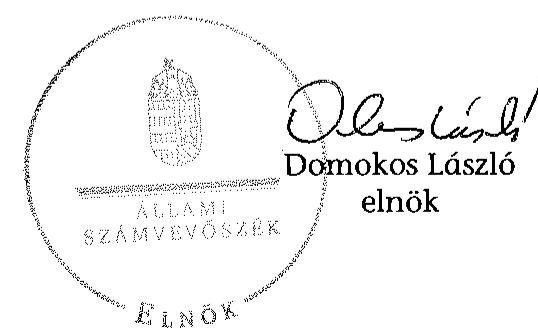
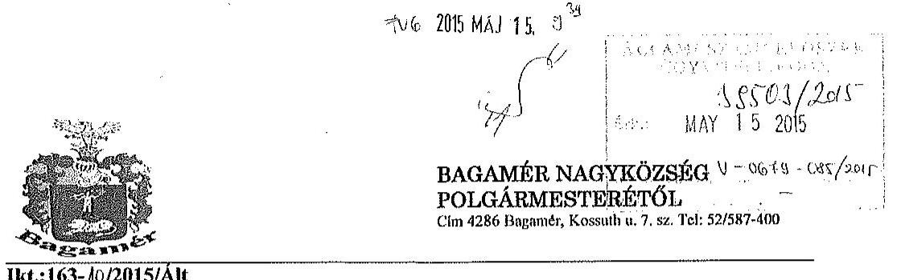
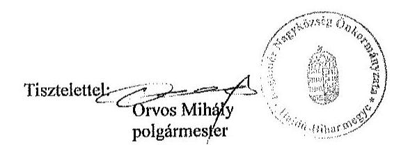
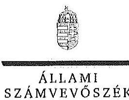
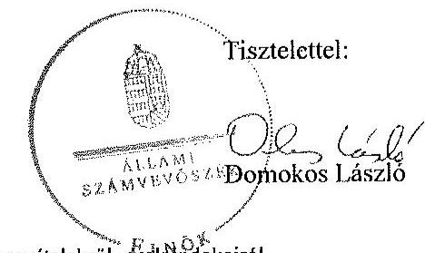
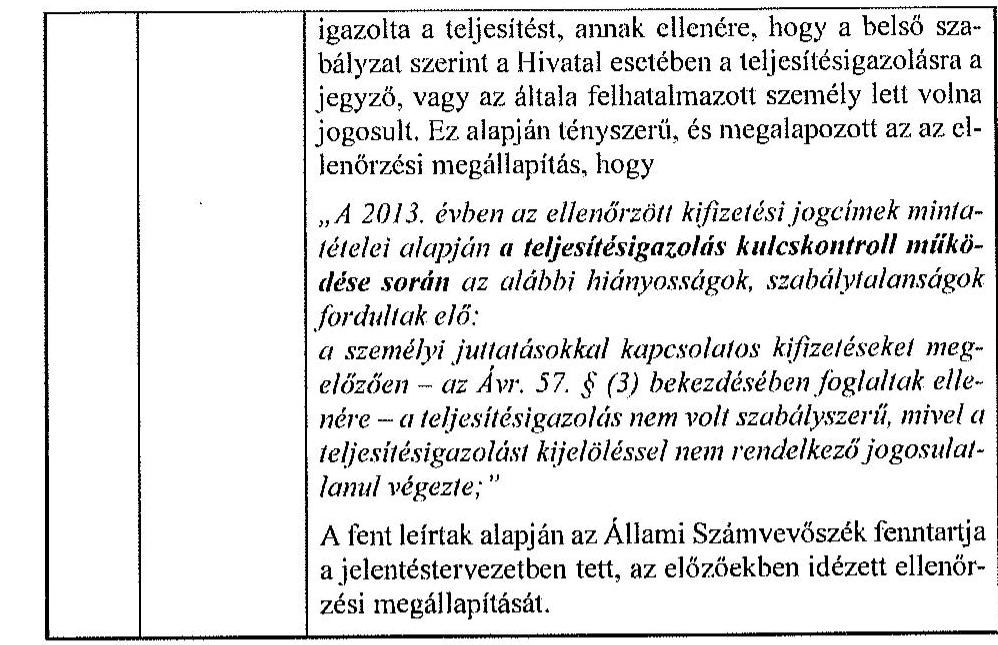
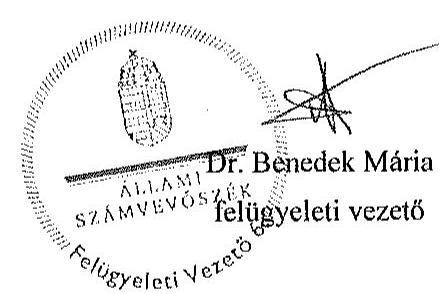

ÁLLAMI
SZÁMVEVŐSZÉK

# JELENTÉS 

az önkormányzatok belső kontrollrendszere kialakításának, egyes
kontrolltevékenységek és a belső ellenőrzés
múködésének ellenőrzése
Bagamér
15101
2015. június

---

# Állami Számvevőszék 

Iktatószám: V-0679-087/2015.
Témaszám: 1713
Vizsgálat-azonosító szám: V067714

## Az ellenőrzést felügyelte:

Dr. Benedek Mária
felügyeleti vezető
Az ellenőrzést vezette és az ellenőrzés végrehajtásáért felelős:
Gál Magdolna
ellenőrzésvezető
A számvevőszéki jelentés összeállításában közremüködött:
Draviczky Éva Horváthné Menyhárt Erika
számvevő számvevő főtanácsos
Az ellenőrzést végezték:

| Draviczky Éva | Weigert Ágnes | Horváthné Menyhárt |
| :-- | :-- | :-- |
| számvevő | számvevő | Erika |
|  |  | számvevő főtanácsos |

---

# TARTALOMJEGYZÉK 

BEVEZETÉS ..... 5
I. ÖSSZEGZŐ MEGÁLLAPÍTÁSOK, KÖVETKEZTETÉSEK, JAVASLATOK ..... 9
II. RÉSZLETES MEGÁLLAPÍTÁSOK ..... 12

1. Az Önkormányzat belső kontrollrendszere kialakításának és múködtetésének megfelelősége ..... 12
1.1. A kontrollkörnyezet kialakítása és múködtetése ..... 12
1.2. A kockázatkezelési rendszer kialakítása és múködtetése ..... 14
1.3. A kontrolltevékenységek kialakítása és múködtetése ..... 14
1.4. Az információs és kommunikációs rendszer kialakítása és múködtetése ..... 15
1.5. A monitoring rendszer kialakítása és múködtetése ..... 16
2. A monitoring rendszer részeként a belső ellenőrzés kialakítása és múködtetése ..... 16
3. A pénzügyi folyamatokban kulcsszerepet betöltő belső kontrollok (teljesítésigazolás és érvényesítés) működése ..... 17
4. Az integritás szemlélet érvényesülése ..... 19

## MELLÉKLETEK

1. számú Észrevételt tartalmazó polgármesteri levél
2. számú Észrevételre vonatkozó elnöki válaszlevél

## FÜGGELÉKEK

1. számú Értelmező szótár
2. számú Az integritás érvényesítése érdekében kialakított és működtetett kontrollrendszer

---

.

---

# RÖVIDÍTÉSEK JEGYZÉKE 

## Törvények

Áht.
ÁSZ tv.
Info tv.
Kttv.
Ltv.
Mötv.
Nek. tv.
Vnytv.

## Rendeletek, határozatok

Ávr.
Bkr.
Ikr.
önkormányzati SZMSZ
vagyonrendelet

## Szórövidítések

alapító okirat
ÁSZ
bizonylati szabályzat
belső ellenőrzési kézikönyv ${ }_{1}$
belső ellenőrzési kézikönyv ${ }_{2}$
ellenőrzési nyomvonal
2011. évi CXCV. törvény az államháztartásról
2011. évi LXVI. törvény az Állami Számvevőszékről
2011. évi CXII. törvény az információs önrendelkezési jogról és az információszabadságról
2011. évi CXCIX. törvény a közszolgálati tisztviselők ről
1995. évi LXVI. törvény a köziratokról, a közlevéltárakról és a magánlevéltári anyag védelméről
2011. évi CLXXXIX. törvény Magyarország helyi önkormányzatairól
2011. évi CLXXIX. törvény a nemzetiségek jogairól
2007. évi CLII. törvény egyes vagyonnyilatkozat-tételi kötelezettségekről

368/2011. (XII. 31.) Korm. rendelet az államháztartásról szóló törvény végrehajtásáról
370/2011. (XII. 31.) Korm. rendelet a költségvetési szervek belső kontrollrendszeréről és belső ellenőrzéséről
335/2005. (XII. 29.) Korm. rendelet a közfeladatot ellátó szervek iratkezelésének általános követelményeiről
Bagamér Nagyközség Önkormányzata Képviselőtestületének 4/2012. (III.22.) önkormányzati rendelete Bagamér Nagyközség Önkormányzatának Szervezeti és Müködési Szabályzatáról (hatályos 2012. március 26-tól)
Bagamér Nagyközség Önkormányzata Képviselőtestületének 23/2009. (IX. 30.) rendelete Bagamér Nagyközség Önkormányzata vagyonának meghatározásáról (hatályos 2009. október 1-től)

Bagaméri Polgármesteri Hivatal Alapító Okirata (hatályos 2013. január 1-től)
Állami Számvevőszék
Bagamér Nagyközség Önkormányzat Polgármesteri Hivatal Bizonylati szabályzat (hatályos 2012. márciustól)
Belső ellenőrzési kézikönyv Derecske-Létavértes Kistérség Többcélú Kistérségi Társulása (hatályos 2010. április 14től)
Belső ellenőrzési kézikönyv Derecske-Létavértesi Kistérség Többcélú Kistérségi Társulása (hatályos 2013. október 14től)
Bagamér Nagyközség Önkormányzata Polgármesteri Hivatalának ellenőrzési nyomvonala (hatályos 2010. január 4-től)

---

eszközök és források értékelési szabályzata
gazdasági program
Hivatal
hivatali SZMSZ

INTOSAI
iratkezelési szabályzat

## ISSAI

jegyzö
Képviselő-testület
Kormányhivatal
leltározási és leltárkészítési szabályzat

NGM
Nemzetiségi Önkormányzat
Önkormányzat
Önkormányzat
pénzkezelési szabályzat
polgármester
számlarend
szabálytalanságkezelés eljárásrendje
számviteli politika
Társulás
tüzvédelmi szabályzat
ügyrend
vagyonnyilatkozat-tételi szabályzat

Bagamér Nagyközség Önkormányzat Polgármesteri Hivatala Eszközök és források értékelési szabályzata (hatályos 2012. márciustól)

Településfejlesztési koncepció 2010-2014
Bagaméri Polgármesteri Hivatal
Bagamér Nagyközség Önkormányzata Polgármesteri Hivatalának Szervezeti és Müködési Szabályzata (hatályos 2012. szeptember 4-től)

International Organization of Supreme Audit Institutions (Legfőbb Ellenőrző Intézmények Nemzetközi Szervezete)
Bagamér Nagyközség Önkormányzata Iratkezelési szabályzat (hatályos 2010. február 01-től)
International Standards of Supreme Audit Institutions (Legfőbb Ellenőrző Intézmények Nemzetközi Standardjai)
Bagamér Nagyközség Önkormányzata megbízott jegyzöje
Bagamér Nagyközség Önkormányzata Képviselő-testülete
Hajdú-Bihar Megyei Kormányhivatal
Bagamér Nagyközség Önkormányzat Polgármesteri Hivatala Leltározási és leltárkészítési szabályzat (hatályos 2012. márciustól)

Nemzetgazdasági Minisztérium
Bagamér Nagyközség Roma Nemzetiségi Önkormányzat
Bagamér Nagyközség Önkormányzata
Bagamér Nagyközség Önkormányzat Polgármesteri Hivatala Pénzkezelés szabályzat (hatályos 2012. márciustól)
Bagamér Nagyközség polgármestere
Bagamér Nagyközség Önkormányzat Polgármesteri Hivatala Számlarend (hatályos 2012. márciustól)
Szabálytalanságok kezelésének eljárásrendje (hatályos 2010. január 4-től)

Bagamér Nagyközség Önkormányzat Polgármesteri Hivatala Számviteli politika (hatályos 2012. márciustól)
Derecske-Létavértesi Kistérség Többcélú Kistérségi Társulása
Tűzvédelmi Szabályzat (hatályos 2011. november 22-től)
Bagamér Nagyközség Önkormányzat Polgármesteri Hivatala Úgyrend a Gazdasági szervezet gazdálkodással összefüggő feladataira (hatályos 2012. márciustól)
Bagamér Nagyközség Önkormányzatának és Bagamér Nagyközségi Önkormányzat Polgármesteri Hivatalának Szabályzata A vagyonnyilatkozat átadására, nyilvántartására, a vagyonnyilatkozatban foglalt személyes adatok védelmére vonatkozó szabályokról, a vagyonnyilatkozattételi kötelezettséggel kapcsolatos eljárásról (hatályos 2008. július 01-től)

---

# JELENTÉS 

## az önkormányzatok belső kontrollrendszere kialakításának, egyes kontrolltevékenységek és a belső ellenőrzés múködésének ellenőrzése   Bagamér

## BEVEZETÉS

Bagamér nagyközség állandó lakosainak száma 2013. január 1-jén 2642 fő volt. Az Önkormányzat hattagú Képviselő-testületének munkáját kettő állandó bizottság segítette. Az Önkormányzat az önállóan működő és gazdálkodó Hi vatalon kívül egy önállóan működő és gazdálkodó, kettő önállóan múködő intézményt múködtetett, többségi tulajdoni hányadú gazdasági társasággal nem rendelkezett. A polgármester a 2002. évi önkormányzati választások óta tölti be tisztségét. A jegyző 2012-től látja el feladatait. A Hivatal öt szervezeti egységre tagolódott, elkülönített gazdasági szervezettel rendelkezett, a foglalkoztatott köztisztviselők száma 2013. január 1-jén 10 fő volt. A Hivatalnál 2013. január 1-jétől szervezeti változás nem történt. Az Önkormányzat a 2013. évi költségvetési beszámolója szerint 593947 ezer Ft tárgyévi bevételt ért el, valamint 563948 ezer Ft tárgyévi kiadást teljesített. A 2013. december 31-i könyvviteli mérleg szerint 1043316 ezer Ft értékű eszközvagyonnal rendelkezett, a rövid lejáratú kötelezettségállománya 14495 ezer Ft, hosszú lejáratú kötelezettség állománya nem volt.

A demokratikus társadalmakban alapvető igény, hogy a közpénzeket, a közvagyont használók valamennyi tevékenységükhöz kapcsolódó pénzfelhasználásról elszámoljanak, ahhoz egyértelmű és érvényesíthető felelősségi szabályok társuljanak. Ennek a jogos igénynek az érvényesítéséhez meg kell teremteni azokat a folyamatokat, rendszereket, amelyek nélkülözhetetlenek az elszámoltatáshoz. Az elszámoltatás eredményes múködtetéséhez szükség van a megfelelő információs, kontroll, értékelési és beszámolási rendszerek kialakítására.

Magyarországon az uniós csatlakozási tárgyalások idejére nyúlnak vissza a belső kontrollrendszer szabályozásának gyökerei. Az uniós elvárásoknak megfelelő új terminológia szerinti államháztartási belső pénzügyi ellenőrzési (ÁBPE) rendszer területén a jogharmonizáció 2003-ban teljes körűen megvalósult, míg az önkormányzati alrendszerre vonatkozó, Ötv.-ben megjelenített speciális szabályozás 2005-ben lépett hatályba. Az államháztartási belső kontrollrendszer koncepciója 2009-ben továbbfejlődött. A változások irányát mutatja, hogy a költségvetési szervek belső kontrollrendszere már magában foglalja a korszerű felelős szervezetirányítás elemeit (kontrollkörnyezet, kockázatkezelés, kontrolltevékenység, információ és kommunikáció, monitoring) is. E kont-

---

rollrendszer szabályozása háromszintű, a törvényi előírásokat az Áht. és a Mötv., a rendeleti szintű szabályozást az Ávr. és a Bkr. tartalmazza, amelyeket útmutatói szinten az NGM által kiadott standardok és kézikönyvek támogatnak.

A belső kontrollrendszer azt a célt szolgálja, hogy a költségvetési szervek múködésük és gazdálkodásuk során a tevékenységeket szabályszerűen, gazdaságosan, hatékonyan, eredményesen hajtsák végre, teljesítsék elszámolási kötelezettségeiket és megvédjék az erőforrásokat a veszteségektől, a károktól és a nem rendeltetésszerű használattól. A belső kontrollrendszer magában foglalja mindazon szabályokat, eljárásokat, gyakorlati módszereket és szervezeti struktúrákat, kockázatkezelési technikákat, kontrolltevékenységeket, amelyek segítséget nyújtanak a szervezetnek céljai eléréséhez.

Az ÁSZ középtávú stratégiájában hangsúlyos szerepet szánt annak, hogy szilárd szakmai alapon álló, értékteremtő ellenőrzéseivel előmozdítsa a közpénzügyek átláthatóságát, rendezettségét. A számvevőszéki ellenőrzés nemzetközi alapelvei is rögzítik, hogy a megfelelő belső kontrollrendszer minimálisra csökkenti a hibák és szabálytalanságok kockázatát.

# Az ellenőrzés célja annak értékelése, hogy 

- a jogszabályi előírásoknak megfelelően alakították-e ki és működtették-e a belső kontrollrendszert;
- a gazdálkodás folyamatában kulcsszerepet betöltő teljesítésigazolás és érvényesítés kontrolltevékenységeit megfelelően működtették-e;
- biztosították-e a belső ellenőrzés szabályos múködését;
- kialakították-e az erőforrásokkal való szabályszerű és hatékony gazdálkodáshoz szükséges követelményeket, megvalósították-e azok számonkérését, ellenőrzését;
- hasznosították-e az ÁSZ által a 2009-2013. évek között végzett ellenőrzések javaslatait.

A közintézmények integritás alapú kultúrájának kialakítása, megerősítése és múködése szorosan összefügg a belső kontrollrendszer múködésével, ezért az ellenőrzés kitért a gazdálkodáshoz kapcsolódó integritás kontrollok meglétének és múködésének ellenőrzésére is. Az integritási kultúra kialakítása hozzájárul az elszámoltathatóság és átláthatóság érvényesítéséhez, egyben támogatja a szervezet védettségét a korrupciós kitettséggel szemben, valamint annak megelőzése is irányítottabbá válik.

Az ellenőrzés várható hasznosulását négy szinten tervezzük. A törvényalkotás számára összegzett tapasztalatok állnak rendelkezésre a belső kontrollrendszer önkormányzati területen való kialakításáról, müködéséről és hatásairól, a belső ellenőrzés működéséről. Az ellenőrzés az ellenőrzött számára visszajelzést ad a belső kontrollrendszer kialakításában és múködésében fellépő hiányosságokról, javaslataival hozzájárul azok kiküszöböléséhez, amely csökkentheti a későbbi ellenőrzések gyakoriságát. Az ellenőrzés megállapításait és javaslatait más szervezetek is hasznosíthatják a rendezett gazdálkodási keretek

---

kialakításához. A társadalom számára jelzi, hogy közpénz nem maradhat ellenőrizetlenül, az ÁSZ értékteremtő rend kialakításához és megőrzéséhez hozzájáruló tevékenysége pozitív hatással lesz a szervezetről kialakított összkép formálásában. A szervezeten belül lehetőség nyílik arra, hogy a megállapítások szintetizálásával az ÁSZ a hozzáadott értéket teremtő elemző tevékenységét és tanácsadó szerepét is erősítse.

Az önkormányzatok belső kontrollrendszere kialakításának, az egyes kontrolltevékenységek és a belső ellenőrzés működésének ellenőrzéséről szóló jelentés I. fejezetének összegző része az ellenőrzés céljára ad rövid, szintetizáló összefoglalót, és tartalmazza a következtetéseket a II. fejezet részletes megállapításain alapulóan. A jelentés intézkedést igénylő megállapításait és javaslatait az ellenőrzés során feltárt, a jelentés II. fejezetében rögzített részletes megállapítások alapozzák meg.

# Az ellenőrzés típusa: szabályszerűségi ellenőrzés 

Az ellenőrzött időszak: a belső kontrollrendszer kialakítása és működtetése megfelelőségét a 2013. évre vonatkozóan (2013. december 31-i állapotnak megfelelően), a pénzügyi folyamatokban kulcsszerepet betöltő teljesítésigazolás és érvényesítés belső kontrollok müködésének megfelelőségét, és a belső ellenőrzés szabályszerű működését a 2013. január 1 - december 31-e közötti időszakot figyelembe véve értékeltük, míg az ÁSZ javaslatainak utóellenőrzése a 2009-2013. években végzett ellenőrzések nyilvánosságra hozott jelentéseiben tett javaslatok áttekintésére terjedt ki.

## Az ellenőrzött szervezet: az Önkormányzat

Az ellenőrzés jogszabályi alapját az ÁSZ tv. 1. § (3) bekezdése, az 5. § (2) és (6) bekezdései, valamint az Áht. 61. § (2) bekezdése képezik.

Az ellenőrzés szakmai módszertana az ÁSZ hivatalos honlapján (www.asz.hu) közzétett szakmai szabályokon alapult, amely az INTOSAI által kiadott ISSAI figyelembevételével készült.

Az ellenőrzés lefolytatásához az Önkormányzat a kimutatások és a tanúsítvány elektronikus kitöltésével, valamint az ÁSZ által kért dokumentumok elektronikus megküldésével szolgáltatott adatokat. Az így rendelkezésre bocsátott adatok, információk kontrollja és a munkalapok kitöltése a helyszíni ellenőrzés keretében történt. A jelentésben használt fogalmak magyarázatát az 1. számú függelék, az integritás érvényesítése érdekében kialakított és müködtetett intézményi kontrollrendszer értékelését a 2. számú függelék tartalmazza.

A belső kontrollrendszer, valamint a belső ellenőrzés jogszabályi előírások szerinti kialakításának és müködtetésének szabályszerűségét az erre irányuló ellenőrzési kérdésekre adott válaszok összesítése alapján értékeltük. A belső kontrollrendszert kontrollterületenként (kontrollkörnyezet, kockázatkezelési rendszer, kontrolltevékenységek, információs és kommunikációs rendszer, monitoring rendszer) és összesítetten is értékeltük.

A belső kontrollrendszer egyes kontrollterületei és a belső ellenőrzés kialakítása és müködtetése „szabályszerü volt", amennyiben az értékelt területen az elért és

---

elérhető pontok százalékban kifejezett hányadosa elérte a $81 \%$-ot, „részben szabályszerű volt", ha 61-80\% közé esett, és „nem volt szabályszerü", ha nem haladta meg a $60 \%$-ot. A belső kontrollrendszer összesített értékelése megegyezett a kontrollterületenként alkalmazott \%-os értékelésekkel, a következő eltérésekkel. A kontrollrendszer egésze esetében a „szabályszerü" értékelésnek a \%-os értéken felül további feltétele volt, hogy egyik kontrollterület sem kaphatott „nem volt szabályszerű" értékelést, a „részben szabályszerű" értékelés további feltétele volt, hogy legfeljebb egy ellenőrzött kontrollterület lehetett „nem volt szabályszerű" értékelésú. Az összesített értékelés a \%-os értéktől függetlenül „nem volt szabályszerű", ha az ellenőrzött kontrollterületek közül több mint egynek „nem volt szabályszerű" az értékelése.

A gazdálkodás folyamatában kulcsszerepet betöltő két kulcskontroll - teljesítésigazolás, érvényesítés - múködésének megfelelőségét a személyi juttatásokkal, a dologi és felhalmozási kiadásokkal, múködési és felhalmozási célú pénzeszköz átadásokkal, ellátottak pénzbeli juttatásaival kapcsolatos kifizetések esetében mintavétellel ellenőriztük. „Megfelelőnek" értékeltük a gazdálkodási jogkörök gyakorlását, amennyiben $95 \%$-os bizonyossággal a teljes sokaságban a hibaarány legfeljebb $10 \%$, „részben megfelelőnek" értékeltük, ha a hibaarány felső határa 10-30\% között volt, „nem megfelelőnek" pedig akkor, ha a mintavételi eredmények alapján a sokaságbeli hibaarány felső határa meghaladta a 30\%ot.

Az integritás szemlélet érvényesülésének értékelése az Önkormányzat önbevallás által kitöltött tanúsítványa alapján történt.

Utóellenőrzésre nem került sor, mivel az ÁSZ az Önkormányzatnál a 20092013. évek között ellenőrzést nem végzett.

Az Ász tv. 29. § (1) bekezdésében foglaltak alapján a jelentéstervezetet megküldtük a polgármester részére, aki az ÁSZ tv. 29. § (2) bekezdésében foglalt észrevételezési jogával élt, a jelentéstervezetre észrevételt tett (1. számú melléklet). Az ÁSZ tv. 29. § (3) bekezdésében előírtaknak megfelelően a figyelembe nem vett észrevételeket és annak indokairól szóló tájékoztatást a jelentés tartalmazza (2. számú melléklet).

---

# I. ÖSSZEGZŐ MEGÁLLAPÍTÁSOK, KÖVETKEZTETÉSEK, JAVASLATOK 

A belső kontrollrendszeren belül 2013-ban a kontrollkörnyezet, a kockázatkezelési rendszer, a kontrolltevékenységek, az információs és kommunikációs rendszer, valamint a monitoring rendszer kialakítását és múködtetését külön-külön és együttesen is értékeltük. A belső kontrollrendszer kialakítása és múködtetése az összesített értékelés alapján nem volt szabályszerű.

A belső kontrollrendszer egyes területei kialakításának és múködtetésének minősítése a következő:

| Kontrollterület | Minősítés |
| :-- | :-- |
| Kontrollkörnyezet | szabályszerű |
| Kockázatkezelési rendszer | nem   szabályszerű |
| Kontrolltevékenységek | nem   szabályszerű |
| Információs és kommuni-   kációs rendszer | nem   szabályszerű |
| Monitoring rendszer | nem   szabályszerű |

Szabályszerú volt a kontrollkörnyezet kialakítása és múködtetése, mivel a jegyző a jogszabályi előírásokban foglaltakat figyelembe véve a kisebb hiányosságok mellett is megteremtette e kontrollterületen a szabályszerű működés lehetőségét.

Nem volt szabályszerű a kockázatkezelési rendszer, a kontrolltevékenységek, az információs és kommunikációs rendszer, valamint a monitoring rendszer kialakítása és múködtetése, mivel az ellenőrzésünk során megállapított szabályozásbeli hiányosságok magukban hordozzák a szabálytalan múködés, valamint a korrupció kockázatát.

A 2013. évben a személyi juttatásokkal, a dologi kiadásokkal, a felhalmozási kiadásokkal, valamint a múködési és felhalmozási célú pénzeszköz átadásokkal, illetve az ellátottak pénzbeli juttatásaival kapcsolatos kifizetések során a pénzügyi folyamatokban kulcsszerepet betöltő teljesítésigazolás és érvényesítés belső kontrollok múködése nem volt megfelelő, mivel azok nem biztosították a hibák megelőzését és feltárását.

A számvevőszéki ellenőrzés az ellenőrzött kifizetésekkel összefüggésben a rendelkezésre bocsátott dokumentumok alapján kár bekövetkeztére utaló adatot, tényt nem állapított meg, azonban a gazdálkodásban kulcsszerepet betöltő kontrollok múködésében feltárt hiányosságok miatt fennáll a hibák bekövetke-

---

zésének kockázata. A nem megfelelően múködtetett belső kontrollok korrupciós kockázatot hordoznak.

A 2013. évben a belső ellenőrzés kialakítása és múködtetése nem volt szabályszerű, a belső ellenőrzés nem tárta fel a belső kontrollrendszer kialakításának és múködtetésének, valamint a pénzügyi folyamatokban kulcsszerepet betöltő teljesítésigazolás és érvényesítés belső kontrollok múködésének hiányosságait.

A Képviselő-testület a 2013. évben nem alakította ki az erőforrásokkal való szabályszerű és hatékony gazdálkodáshoz szükséges követelményeket.

Az Önkormányzat nem vett részt az ÁSZ 2013. évi integritás felmérésében, ezért az integritás szemlélet érvényesülésének ellenőrzéséhez az önkormányzat tanúsítványon - önbevallás útján - szolgáltatott adatokat. Az integritás szemlélet érvényesülésének minősítését a 2. számú függelék tartalmazza.

Az ellenőrzés intézkedést igénylő megállapításai és javaslatai:

# a polgármesternek 

1. Az Önkormányzat kiadási előirányzata terhére történt kötelezettségvállalásra - az Áht. 37. § (1) bekezdésében és az Ávr. 55. § (1) bekezdésében foglaltak ellenére pénzügyi ellenjegyzés nélkül került sor.

Javaslat:
Intézkedjen annak érdekében, hogy az Önkormányzat nevében történő kötelezettségvállalásra az Áht. 37. § (1) bekezdésében és az Ávr. 55. § (1) bekezdésében foglaltaknak megfelelően - az Ávr. 53. §-ában meghatározott kivételekkel - kizárólag pénzügyi ellenjegyzés után kerüljön sor.
2. A számvevőszéki jelentés ellenőrzési megállapításai alapján az Önkormányzatnál a belső kontrollrendszer kialakítása és múködtetése az összesített értékelés alapján nem volt szabályszerű, a kulcskontrollok működése nem volt megfelelő. A számvevőszéki ellenőrzés során feltárt hibákat, hiányosságokat és szabálytalanságokat a számvevőszéki jelentés II. Részletes megállapítások fejezetcím tartalmazza.

Javaslat:
Kísérje figyelemmel a Mötv. 115. § (1) bekezdésében foglaltak alapján az Önkormányzat gazdálkodásának szabályszerűségét. A Mötv. 67. § f) pontja alapján gondoskodjon a belső kontrollrendszer kialakítására és múködtetésére vonatkozó jogszabályi rendelkezések be nem tartása, valamint a teljesítésigazolás, illetve az érvényesítés kontrollokkal összefüggésben feltárt hibák, hiányosságok, szabálytalanságok tekintetében az esetleges munkajogi felelősséggel kapcsolatos körülmények kivizsgálásáról, majd a vizsgálat eredményének függvényében tegye meg a szükséges intézkedéseket.

---

# a jegyzönek 

1. A számvevőszéki jelentés ellenőrzési megállapításai alapján az Önkormányzatnál a belső kontrollrendszer kialakítása és múködtetése az összesített értékelés alapján nem volt szabályszerű, a kulcskontrollok múködése nem volt megfelelő, illetve a belső ellenőrzés kialakítása és múködtetése nem volt szabályszerű. A számvevőszéki ellenőrzés során feltárt hibákat, hiányosságokat és szabálytalanságokat a számvevőszéki jelentés II. Részletes megállapítások fejezetcím tartalmazza.

Javaslat:
A jogszabályoknak megfelelő belső kontrollrendszer kialakítása és múködtetése érdekében - az ellenőrzött időszak óta bekövetkezett esetleges jogszabályi változásokra figyelemmel - intézkedjen a belső kontrollrendszer kialakításában és múködtetésében, a kulcskontrollok múködésében, illetve a belső ellenőrzés kialakításában és múködtetésében az ellenőrzés által feltárt hibák, hiányosságok, szabálytalanságok kijavítására.

Kezdeményezze, hogy az éves ellenőrzési terv kiterjedjen a kifizetések szabályszerűségi ellenőrzésére, különös tekintettel a személyi juttatásokkal, a dologi kiadásokkal, a felhalmozási kiadásokkal, a múködési és felhalmozási célú pénzeszköz átadásokkal, az ellátottak pénzbeli juttatásaival kapcsolatos kiadási jogcímekből teljesített kifizetésekre.

---

# II. RÉSZLETES MEGÁLLAPÍTÁSOK 

## 1. Az ÖNKORMÁNYZAT BELSŐ KONTROLLRENDSZERE KIALAKÍTÁSÁNAK ÉS MÜKÖDTETÉSÉNEK MEGFELELŐSÉGE

A belső kontrollrendszeren belül 2013-ban a kontrollkörnyezet, a kockázatkezelési rendszer, a kontrolltevékenységek, az információs és kommunikációs rendszer, valamint a monitoring rendszer kialakítását és múködtetését külön-külön és együttesen is értékeltük. A belső kontrollrendszer kialakítása és múködtetése az összesített értékelés alapján nem volt szabályszerű.

### 1.1. A kontrollkörnyezet kialakítása és múködtetése

A kontrollkörnyezet kialakítása és múködtetése - kisebb hiányosságok mellett - szabályszerű volt.

A Hivatal rendelkezett alapító okirattal, amely tartalmazta az alaptevékenységeket. Az Önkormányzat rendelkezett a Képviselő-testület által elfogadott gazdasági programmal. A Képviselő-testület megalkotta az önkormányzati SZMSZ-t, valamint jóváhagyta a hivatali SZMSZ-t. A szervezet megfelelő múködése érdekében a Hivatalban kialakították a belső szabályzatokat. A Képvise-lő-testület elfogadta az Önkormányzat vagyonrendeletét, amelyben meghatározta a vagyongazdálkodás főbb szabályait. A jegyző elkészítette a számviteli politikát, és annak mellékleteként a számlarendet, pénzkezelési szabályzatot, a leltározási és leltárkészítési szabályzatot, valamint az eszközök és források értékelési szabályzatát, melyek hatályát kiterjesztette a Nemzetiségi Önkormányzatra. A jegyző kialakította a Hivatal szabálytalanságkezelés eljárásrendjét, és elkészítette a Hivatal gazdasági szervezetének ügyrendjét és bizonylati szabályzatát. A Hivatal rendelkezett ellenőrzési nyomvonallal és tűzvédelmi szabályzattal.

A jegyző elkészítette a Hivatalban dolgozó köztisztviselők munkaköri leírásait. A Hivatal gazdasági vezetője rendelkezett az előírt végzettséggel, szakképesítéssel és a könyvviteli szolgáltatás körébe tartozó tevékenység ellátására jogosító engedéllyel. A Képviselő-testület a költségvetési rendeletében meghatározta a Hivatal engedélyezett létszámát.

A jegyző meghatározta a köztisztviselők teljesítményértékelésének második félévre vonatkozó kötelező elemeit, és elkészítette a Hivatalban dolgozó köztisztviselők teljesítményértékelését.

A kontrollkörnyezet kialakítása és működtetése az alábbi kisebb hiányosságok mellett szabályszerű volt:

---

| Sorszám ${ }^{1}$ | Megállapítás | Megjegyzés |
| :--: | :--: | :--: |
| 5.,   7.,   8.,   10. | A jegyző a hivatali SZMSZ-ben - az Ávr. 13. § (1) bekezdés c), f), g), i) pontjaiban foglaltak ellenére - nem rögzítette az ellátandó, és a szakfeladatrend szerint szakfeladat számmal és megnevezéssel besorolt alaptevékenységek és az alaptevékenységet szabályozó jogszabályok megjelölését, azon ügyköröket, amelyek során a szervezeti egységek vezetői a költségvetési szerv képviselőjeként járhatnak el, a nevesített munkakörökhöz tartozó hatáskörök gyakorlásának módját, a helyettesítés rendjét, az ezekhez kapcsolódó felelősségi szabályokat, továbbá az irányító szerv által az Ávr. 10. § (1)-(3) bekezdése szerint a költségvetési szervhez rendelt más költségvetési szervek felsorolását. |  |
| 12. | Az Önkormányzat a Nemzetiségi Önkormányzattal kötött megállapodását - a Nek. tv. 80. § (2) bekezdésében meghatározott 2013. január 31-ei határidőre - nem vizsgálta felül. | A Képviselő-testület a 20/2013. (II. 21.) számú, a Nemzetiségi Önkormányzat Képviselötestülete a 6/2013. II. 15./ számú határozatában rögzítette, hogy a 2012. évben kötött együttmúködési megállapodást nem kívánják módosítani. |
| 33. | A Nemzetiségi Önkormányzat 2013. évi költségvetési határozat-tervezetét - az Áht. 24. § (2) bekezdésében foglaltak ellenére - nem a jegyző készítette elő. | A költségvetési határo-zat-tervezetet a Nemzetiségi Önkormányzat elnöke készítette elő. |
| 40. | A Képviselő-testület - az Áht. 9. § (1) bekezdés f.) pontjában foglaltak ellenére - nem alakította ki az erőforrásokkal való szabályszerű és hatékony gazdálkodáshoz szükséges követelményeket. |  |
| 46. | A jegyző - a Mötv. 81. § (3) bekezdés c) pontjában előírt feladata ellenére - nem dolgozta ki a Kttv. 83. §-ában előírt, a köztisztviselökre vonatkozó hivatásetikai alapelvek részletes tartalmát, valamint az etikai eljárás szabályait. |  |

[^0]
[^0]:    ${ }^{1}$ A témacsoportos ellenőrzés miatt a megállapítás számozása az önkormányzat által kitöltött kimutatások - adatszolgáltatások - kérdéseinek sorszámával azonos.

---

# 1.2. A kockázatkezelési rendszer kialakítása és müködtetése 

A kockázatkezelési rendszer kialakítása és müködtetése nem volt szabályszerű, mert:

| Sor-   szám | Megállapítás | Megjegyzés |
| :--: | :--: | :--: |
| $2-4$. | A jegyző - a Bkr. 7. § (2) bekezdésében foglaltak ellenére - nem mérte fel és nem állapította meg a Hivatal tevékenységében, gazdálkodásában rejlő kockázatokat, nem határozta meg az egyes kockázatokkal kapcsolatban a szükséges intézkedéseket, valamint azok teljesítésének folyamatos nyomon követési módját. |  |
| 5. | A Vnytv. 4. § a) pontjában foglaltak ellenére a vagyonnyilatkozat-tételre kötelezett köztisztviselők vagyonnyilatkozat-tételi kötelezettségét a hivatali SZMSZ-ben nem rögzítették. | A vagyonnyilatkozattételre kötelezett köztisztviselők vagyonnyi-latkozat-tételi kötelezettségét a vagyonnyilatko-zat-tételi szabályzat tartalmazta. A vagyonnyi-latkozat-tételre kötelezett köztisztviselők a jogszabályokban és a belső szabályzatban foglaltaknak megfelelően eleget tettek a vagyonnyi-latkozat-tételi kötelezettségüknek. |

### 1.3. A kontrolltevékenységek kialakítása és müködtetése

## A kontrolltevékenységek kialakítása és müködtetése nem volt szabályszerű, mert:

Sor-
szám
Megállapítás

A jegyző - a Bkr. 8. § (2) bekezdésében foglaltak ellenére - nem biztosította a beszerzési folyamat, a vagyonhasznosítási tevékenység, valamint a pénzügyi döntések - köztük a költségvetés tervezése és a támogatásokkal való elszámolás - dokumentumainak elkészítésével kapcsolatban a folyamatba épített, előzetes, utólagos és vezetői ellenőrzést.
A jegyző - az Ávr. 13. § (2) bekezdésének a) pontjában foglaltak ellenére - belső szabályzatban nem határozta meg a teljesítésigazolás, az 9-10. érvényesítés és az utalványozás dokumentációs részletszabályaival kapcsolatos belső előírásokat.

A jegyző - az Ikr. 8. § (1) bekezdésében foglaltak ellenére - nem gondoskodott az iratkezelési szoftver által kezelt adatok biztonságáról, nem alakította ki az üzembiztonsági, adatvédelmi szabályok érvényre juttatásához szükséges eljárási szabályokat.

---

| 14. | A jegyző - az Info tv. 7. § (2)-(3) bekezdéseiben foglaltak ellenére - az informatikai rendszer szabályozása során nem tette meg azokat a technikai és szervezési intézkedéseket, továbbá nem alakította ki azokat az eljárási szabályokat, amelyek biztosítják az adatok biztonságát és védelmét. |
| :--: | :--: |
| 15. | A jegyző - a Bkr. 8. § (4) bekezdés b) pontjában foglaltak ellenére - belső szabályzatban nem határozta meg az információkhoz való hozzáférésre vonatkozóan a felelősségi köröket. |
| 32. | A jegyző - a Kttv. 74. § (1) bekezdése, a 226. § (2) bekezdés b) pontja és az Ikr. 15. §-ában foglaltak ellenére - nem szabályozta a Hivatalban a közszolgálati jogviszony megszünése és a munkakör változás esetén a munkakör átadásának rendjét. |

# 1.4. Az információs és kommunikációs rendszer kialakítása és müködtetése 

Az információs és kommunikációs rendszer kialakítása és müködtetése nem volt szabályszerű, mert:

| Sorszám | Megállapítás |
| :--: | :--: |
| $1-2$. | A jegyző - Bkr. 3. § d) pontjában és 9. § (1) bekezdésében foglaltak ellenére - nem alakított ki a szervezeten belüli olyan rendszert, amely biztosítja, hogy a megfelelő információk a megfelelő időben eljutnak az illetékes szervezethez, szervezeti egységhez, illetve személyhez. |
| 3. | A jegyző - Bkr. 9. § (2) bekezdésében foglaltak ellenére - nem határozta meg a beszámolási szinteket, határidőket, módokat. |
| 4. | A jegyző - az Info tv. 24. § (3) bekezdésében foglaltak ellenére - nem készítette el a Hivatal adatvédelmi és adatbiztonsági szabályzatát. |
| 5. | A jegyző - az Info tv. 35. § (3) bekezdésében és az Ávr. 13. § (2) bekezdés h) pontjában foglaltak ellenére - nem alakította ki a kötelezően közzéteendő adatok nyilvánosságra hozatalának rendjét. |
| 6. | A jegyző - az Info tv. 33. § (1) és (3) bekezdéselben foglaltak ellenére nem gondoskodott az Önkormányzat kötelezően közzéteendő adatainak - az 1. melléklet szerinti általános közzétételi listában meghatározott elektronikus közzétételéről. |
| 9. | A jegyző - az Ltv. 10. § (1) bekezdés c) pontjában foglaltak ellenére - a Hivatal iratkezelési szabályzatát nem az illetékes közlevéltár és az illetékes közigazgatási hivatal egyetértésével adta ki. |

---

# 1.5. A monitoring rendszer kialakítása és müködtetése 

A monitoring rendszer kialakítása és müködtetése nem volt szabályszerű.

| Sor-   szám | Megállapítás |
| :-- | :-- |

A jegyző - a Bkr. 3. § e) pontjában és 10. §-ában foglaltak ellenére - nem alakította ki a Hivatal tevékenységének, a célok megvalósításának nyomon követését biztosító rendszert.

Az Önkormányzat törvényességi felügyeletét ellátó Kormányhivatal törvényességi felhívással, vagy más törvényességi felügyeleti eszközzel 2013-ban nem élt.

## 2. A MONITORING RENDSZER RÉSZEKÉNT A BELSŐ ELLENŐRZÉS KIALAKÍTÁSA ÉS MÜKÖDTETÉSE

A jegyző a belső ellenőrzés kialakításáról Társulás útján gondoskodott. A belső ellenőrzés kialakítása és müködtetése nem volt szabályszerű, mert:

| Sor-   szám | Megállapítás | Megjegyzés |
| :--: | :--: | :--: |
| 3.f) | A belső ellenőrzési kézikönyv ${ }_{1,2}$ - a Bkr. 17. § (2) bekezdés f) pontjában foglaltak ellenére - nem tartalmazta az ellenőrzés során büntető-, szabálysértési-, kártérítési-, illetve fegyelmi eljárás megindítására okot adó cselekmény, mulasztás vagy hiányosság feltárása esetén alkalmazandó eljárást. |  |
| 4. | A belső ellenőrzési kézikönyvet ${ }_{1,2}$ - a Bkr. 56. § (7) bekezdésében foglaltak ellenére - nem a Társulás munkaszervezeti feladatait ellátó költségvetési szerv vezetője hagyta jóvá. | A belső ellenőrzési kézikönyvet ${ }_{1,2}$ a Társulás elnöke hagyta jóvá. |
| 7. | A belső ellenőrzési vezető - a Bkr. 22. § (1) bekezdés b) pontja, a 29. § (1) bekezdésében és a 30. § (1) bekezdésében foglaltak ellenére - nem készített stratégiai ellenőrzési tervet. |  |
| 8.d)   8.g)   8.h) | A 2014. évi ellenőrzési terv - a Bkr. 31. § (4) bekezdés d), g), h) pontjaiban foglaltak ellenére - nem tartalmazta az ellenőrizendő időszakot, az ellenőrzések tervezett ütemezését, valamint az ellenőrzött szerv, illetve szervezeti egységek megnevezését. |  |
| 10. | A 2014. évi ellenőrzési terv összeállítása - a Bkr. 56. § (2) bekezdésében foglaltak ellenére - nem a jegyző írásos véleményének figyelembe vételével történt, mivel a jegyző véleményt, javaslatot nem fogalmazott meg. |  |

---

| 11. | A 2014. évi ellenőrzési tervet - a Bkr. 29. § (1) bekezdésében foglaltak ellenére - kockázatelemzés nem alapozta meg. |  |
| :--: | :--: | :--: |
| 13-14. | A belső ellenőrzési vezető - a Bkr. 22. § (1) b), a 31. § (5) és az 56. § (5) bekezdéseiben foglaltak ellenére - a 2013. évi ellenőrzési tervben foglaltakhoz képest az ellenőrzési terv módosítása nélkül hagyott el ellenőrzést. | Az éves ellenőrzési tervben szereplő egy utóellenőrzés végrehajtására nem került sor. |
| 17-18. | A végrehajtott ellenőrzésekhez - a Bkr. 33. § (2) bekezdésében foglaltak ellenére - nem készítettek ellenőrzési programot. |  |
| 22. | A jegyző a belső ellenőrzés megállapításai és javaslatai alapján - a Bkr. 28. § c) pontjában és a 45. § (1) - (4) bekezdésében foglaltak ellenére - nem készített intézkedési tervet. | Az ellenőrzés tárgya a Hivatalnál a pénzkezelés nyilvántartási rendjének, dokumentációjának vizsgálata volt. |
| $23-24$. | A belső ellenőrzési vezető - a Bkr. 21. § (2) bekezdés d) pontjában, a 22. § (2) bekezdés e) pontjában és a 47. § (1) bekezdésében foglaltak ellenére - nem vezetett nyilvántartást a belső ellenőrzési jelentésekben tett megállapításokról, javaslatokról, a vonatkozó intézkedési tervekről, és azok végrehajtásáról, valamint az elvégzett ellenőrzésekről. |  |
| 25. | A Társulás munkaszervezetének vezetője a 2013. évi éves ellenőrzési jelentést a Bkr. 56. § (8) bekezdésében előírt határidőre a jegyző részére nem küldte meg. | A március 20-i határidő helyett az éves ellenőrzési jelentés megküldésének időpontja 2014. április 21. volt. |

# 3. A PÉNZÜGYI FOLYAMATOKBAN KULCSSZEREPET BETÖLTŐ BELSŐ KONTROLLOK (TELJESÍTÉSIGAZOLÁS ÉS ÉRVÉNYESÍTÉS) MŰKÖDÉSE 

A 2013. évben a személyi juttatásokkal, a dologi kiadásokkal, a felhalmozási kiadásokkal, a múködési és felhalmozási célú pénzeszköz átadásokkal, illetve az ellátottak pénzbeli juttatásaival kapcsolatos kifizetések során - összefoglalóan értékelve - a pénzügyi folyamatokban kulcsszerepet betöltő teljesítésigazolás és érvényesítés belső kontrollok müködése nem volt megfelelő az alábbi hiányosságok miatt:

| Kulcskontrollok | Megállapítás |
| :--: | :--: |
| Teljesítésigazolás | A teljesítésigazolást a kifizetéseket megelőzően - az Áht. 38. § (1) bekezdésében és az Ávr. 57. § (1) és (3) bekezdésében foglaltak ellenére - nem, vagy nem szabályszerűen, vagy kijelöléssel nem rendelkező jogosulatlanul végezte. |
| Érvényesítés | Az érvényesítést a kifizetéseket megelőzően - az Áht. 38. § (1) bekezdésében és az Ávr. 58. § (1) bekezdésében foglaltak ellenére - |

---

| Kulcskontrollok | Megállapítás |
| :--: | :--: |
|  | nem, vagy nem szabályszerűen végezték. |
|  | Az érvényesítő - az Ávr. 58. § (2) bekezdés előírása ellenére - nem jelezte az utalványozónak, hogy a megelőző ügymenetben az Áht., az államháztartási számviteli kormányrendelet és az Ávr. előírásaiban foglaltakat nem tartották be. |

A 2013. évben az ellenőrzött kifizetési jogcímek mintatételei alapján a teljesítésigazolás kulcskontroll múködése során az alábbi hiányosságok, szabálytalanságok fordultak elő:

- a személyi juttatásokkal, a dologi kiadásokkal, a múködési és felhalmozási célú pénzeszközátadással és az ellátottak juttatásaival kapcsolatos kifizetéseket megelőzően a teljesítésigazolást - az Áht. 38. § (1) bekezdésében és az Ávr. 57. § (1) bekezdésében foglaltak ellenére - nem végezték el;
- a dologi kiadásokkal és a működési célú pénzeszközátadásokkal kapcsolatos kifizetéseket megelőzően a teljesítésigazolás nem volt szabályszerű, mivel a teljesítésigazoló - az Ávr. 57. § (1) bekezdésében foglaltak ellenére - kötelezettségvállalási bizonylat, illetve a kötelezettségvállalás összegét tartalmazó dokumentum hiányában a teljesítésigazolást nem tudta elvégezni;
- a személyi juttatásokkal kapcsolatos kifizetéseket megelőzően - az Ávr. 57. § (3) bekezdésében foglaltak ellenére - a teljesítésigazolás nem volt szabályszerű, mivel a teljesítésigazolást kijelöléssel nem rendelkező jogosulatlanul végezte;
- a személyi juttatásokkal kapcsolatos kifizetéseket megelőzően a teljesítésigazolás - az Ávr. 57. § (3) bekezdésében foglaltak ellenére - nem szabályszerűen történt, mivel a teljesítésigazolást olyan dokumentumon végezték el, amely több tételt is tartalmazott, így a teljesítésigazolás összegszerűsége, illetve az ellenszolgáltatás teljesítése nem volt megállapítható;

A 2013. évben az ellenőrzött kifizetési jogcímek mintatételei alapján az érvényesítés kulcskontroll múködése során az alábbi hiányosságok, szabálytalanságok fordultak elő:

- a dologi kiadásokkal összefüggő kifizetéseket megelőzően az érvényesítést az Áht. 38. § (1) bekezdésében és az Ávr. 58. § (1) bekezdésében foglaltak ellenére - nem végezték el;
- a dologi kiadásokkal és a működési célú pénzeszközátadásokkal kapcsolatos kifizetéseket megelőzően az érvényesítés - az Ávr. 58. § (1) bekezdésében foglaltak ellenére - nem szabályszerűen történt, mivel ellenőrizhető okmány (kötelezettségvállalási bizonylat, illetve a kötelezettségvállalás összegét tartalmazó dokumentum) hiányában az összegszerűséget és a fedezet meglétét nem ellenőrizték;
- a személyi juttatásokkal, a dologi kiadásokkal, a múködési és fejlesztési célú pénzeszközátadással, valamint az ellátottak juttatásaival kapcsolatos kifizetéseket megelőzően az érvényesítés - az Ávr. 59. § (2) bekezdésében foglalta-

---

kat ellenére - nem szabályszerűen történt, mivel készpénzes fizetési mód esetén az érvényesítést nem a pénztárbizonylaton végezték el;

- a dologi kiadásokkal, a felhalmozási kiadásokkal és a múködési célú pénzeszközátadással kapcsolatos kifizetéseket megelőzően az érvényesítő - az Ávr. 58. § (2) bekezdésében foglaltak ellenére - nem jelezte az utalványozónak, hogy a megelőző ügymenetben nem tartották be az Áht. 37. § (1) bekezdésében és az Ávr. 55 § (1) bekezdésében foglaltakat, mivel a Hivatal, valamint az Önkormányzat kiadási előirányzatai terhére a kötelezettségvállalásra pénzügyi ellenjegyzés nélkül került sor;
- a személyi juttatásokkal, a dologi kiadásokkal, a múködési és fejlesztési célú pénzeszközátadással, valamint az ellátottak juttatásaival kapcsolatos kifizetéseket megelőzően az érvényesítő - az Ávr. 58. § (2) bekezdésében foglaltak ellenére - nem jelezte az utalványozónak, hogy a megelőző ügymenetben a teljesítésigazolást nem, vagy nem szabályszerűen, vagy kijelöléssel nem rendelkező jogosulatlanul végezte.

A számvevőszéki ellenőrzés az ellenőrzött kifizetésekkel összefüggésben a rendelkezésre bocsátott dokumentumok alapján kár bekövetkeztére utaló adatot, tényt nem állapított meg, azonban a gazdálkodásban kulcsszerepet betöltő kontrollok múködésében feltárt hiányosságok miatt fennáll a hibák, szabálytalanságok bekövetkezésének kockázata. A nem megfelelően működtetett belső kontrollok korrupciós kockázatot hordoznak.

# 4. AZ INTEGRITÁS SZEMLÉLET ÉRVÉNYESÜLÉSE 

Az Önkormányzat nem vett részt az ÁSZ 2013. évi integritás felmérésében, ezért az integritás szemlélet érvényesülésének ellenőrzéséhez az önkormányzat tanúsítványon - önbevallás útján - szolgáltatott adatokat. Az integritás szemlélet érvényesülésének minősítését a 2. számú függelék tartalmazza.

Budapest, 2015. CG. hó 21 . nap

Melléklet: $\quad 2 \mathrm{db}$
Függelék: $\quad 2 \mathrm{db}$

---

.

---

Ikt.:163-J0/2015/Ált

Hiv.szám:V-0679-084/2015.

Tárgy: észrevétel nem nyilvános jelentéstervezet vonatkozásában

Állami Számvevőszék
Budapest-4
Pf.: 54
1364

Tisztelt Címzett!

A 2015. 04.30-án érkezett „Az önkormányzatok belső kontrollrendszere kialakításának, egyes kontrolltevékenységek és a belső ellenőrzés működésének ellenűrzése - Bagamér" című nem nyilvános jelentéstervezet, mely vonatkozásában az alábbi észrevételt kívánjuk tenni:

A jelentéstervezetben a pénzügyi folyamatok vonatkozásában tett megállapítások túl általánosak, a megfogalmazás alapján úgy tűnhet a vizsgált mintatételek esetében egy esetben sem volt megfelelő a teljesítésigazolás és az érvényesítés. Kérjük, részletesen kerüljön kifejtésre a hiba, mivel a későbbiekben csak így tudjuk orvosolni a hibákat.

Nem tartom helyt állónak azt a megállapítást, hogy fennáll a korrupció kockázata. A jelentéstervezetben szerepel, hogy a jegyző nem határozta meg belső szabályzatban a teljesítésigazolás, az érvényesítés és az utalványozás dokumentációs részletszabályaival kapcsolatos belső szabályokat. Ez azonban - véleményem szerint - meghatározásra került a Polgármesteri Hivatal ügyrendjében.

A tervezetben szerepel továbbá, hogy a jegyző nem gondoskodott az Önkormányzat kötelezően közzétcendő adatainak elektronikus közzétételéről, mely megállapítás annyiban nem helytálló, hogy a korábbi internetes tárhely, ahol a www.bagamer.hu oldal adatai voltak tárolva vírus támadta meg, ezért azt meg kellett szüntetni. A jelenleg működő honlap 2014. októberétől működik. A feltöltés folyamatos, azonban az adatmennyiség miatt nem sikerült maradéktalanul pótolni a közzétételeket.

A tervezetben szerepel, hogy a személyi juttatásokkal, a dologi kiadásokkal, a működési és fejlesztési célú pénzeszközátadással, valamint az ellátottak juttatásaival kapcsolatos kifizetéseket megelőzően az érvényesítés nem szabályszerűen történt, mivel készpénzes fizetési mód esetén az érvényesítést nem a pénztárbizonylaton végezték el. A pénztárbizonylat formája miatt nincs lehetőség a bizonylaton elvégezni az érvényesítést, azonban a bizonylat

---

mellékletét képező számlákon, határozatokon stb. minden esetben megtörtént a szabályszerű érvényesítés.

A személyi juttatások, bérek kifizetése esetében csoportos utalással kerülnek kifizetésre a munkabérek, a munkaszerződések elkészítését követően a munkáltatói jogokat gyakorló vezetők (polgármester, jegyző) aláírják, ezt követően kerül sor a munkabérek számfejtésére, kifizetésére. Ezekhez utalványrendeletek készülnek, melyeket minden esetben az arra jogosultak, az Ügyrendben meghatározott személyek aláirnak.

Véleményem szerint a teljesítésigazolásokat és érvényesítéseket, ellenjegyzési feladatokat minden esetben az arra jogosul személy végezte. Kérem, hogy amennyiben ez nem így történt, akkor a mintára hivatkozva tájékoztassanak bennünket.

Kérem segítségüket abban, hogy mit értenek az erőforrásokkal való szabályszerű és hatékony gazdálkodáshoz szükséges követelmények kialakítása alatt.

Törekszünk a feltárt hiányosságok mihamarabbi kiküszöbölésére.
Várom válaszukat a jelentéstervezetre tett észrevételemre.

Bagamér, 2015. május 14.

---

# Elnok 

Állami
SZÁMVEVÔSZÉK

Ikt. szám: V-0679-086/2015

Orvos Mihály úr
polgármester
Bagamér Nagyközség Önkormányzata

## Bagamér

## Tisztelt Polgármester Úr!

Köszönettel megkaptam a 2015. május 15. napján az Állami Számvevőszékhez érkezett „Az önkormányzatok belső kontrollrendszere - Az önkormányzatok belső kontrollrendszere kialakításának, egyes kontrolltevékenységek és a belső ellenőrzés müködésének ellenőrzése - Bagamér" készült számvevőszéki jelentéstervezetben foglalt megállapításokra tett észrevételeit.

Tájékoztatom Polgármester urat, hogy a jelentésben - az Állami Számvevőszékről szóló 2011. évi LXVI. törvény 29. § (3) bekezdése alapján - az el nem fogadott észrevételeket szerepeltetjük az elutasítás indokainak feltüntetésével együtt.

Az Állami Számvevőszék észrevételekre vonatkozó álláspontjáról a felügyeleti vezető által készített részletes tájékoztatást csatoltan megküldöm.

Budapest, 2015. OG . hó os. nap

Melléklet: Tájékoztatás az el nem fogadott észrevételekről, azok indokairól

---

# Tájékoztatás 

az el nem fogadott észrevételekről, azok indokairól

| Észrevétel: | „A jelentéstervezetben a pénzügyi folyamatok vonatkozásában tett megállapítások túl általánosak, a megfogalmazás alapján úgy tünhet a vizsgált mintatételek esetében egy esetben sem volt megfelelö a teljesitésigazolás és az érvényesités. Kérjük, részletesen kerüljön kifejtésre a hiba, mivel a későbbiekben csak igy tudjuk orvosolni a hibákat." |
| :--: | :--: |
| Válasz: | Az Állami Számvevőszék az észrevételt nem fogadja el. |
| 1. | Az észrevétel nem megalapozott. A jelentéstervezet bevezető részében rögzítésre került, hogy   „A gazdálkodás folyamatában kulcsszerepet betöltő két kulcskontroll - teljesitésigazolás, érvényesités - müködésének megfelelöségét a személyi juttatásokkal, a dologi és felhalmozási kiadásokkal, müködési és felhalmozási célú pénzeszköz átadásokkal, ellátottak pénzbeli juttatásaival kapcsolatos kifizetések esetében mintavétellel ellenöriztük. „Megfelelőnek" értékeltük a gazdálkodási jogkörök gyakorlását, amennyiben 95\%-os bizonyossággal a teljes sokaságban a hibaarány legfeljebb 10\%, „részben megfelelőnek" értékeltük, ha a hibaarány felső határa 10-30\% között volt, „nem megfelelőnek" pedig akkor, ha a mintavételi eredmények alapján a sokaságbeli hibaarány felső határa meghaladta a $30 \%$-ot."   Az alkalmazott mintavételi módszertan segítségével a minta alapján az Állami Számvevőszék a teljes sokaságra tud megállapításokat tenni. A pénzügyi folyamatokban kulcsszerepet betöltő belső kontrollokra vonatkozó ellenőrzési megállapítások tekintetében a következő megfogalmazások szerepelnek:   „A 2013. évben a személyi juttatásokkal, a dologi kiadásokkal, a felhalmozási kiadásokkal, a müködési és felhalmozási célú pénzeszköz átadásokkal, illetve az ellátottak pénzbeli juttatásaival kapcsolatos kifizetések során összefoglalóan értékelve - a pénzügyi folyamatokban kulcsszerepet betöltö teljesitésigazolás és érvényesités belső kontrollok müködése nem volt megfelelö az alábhi hiányosságok miatt:" |

---

|  | „A 2013. évben az ellenôrzött kifizetési jogcímek mintatételei alapján a teljesitésigazolás kulcskontroll müködése során az alábbi hiányosságok, szabálytalanságok fordultak elö: "   „A 2013. évben az ellenôrzött kifizetési jogcímek mintatételei alapján az érvényesités kulcskontroll müködése során az alábbi hiányosságok, szabálytalanságok fordultak elö:"   A „hibák orvoslása" érdekében a jelentéstervezetben a hiányosságok, szabálytalanságok konkrét ellenőrzési megállapításokként megfogalmazásra kerültek, melyek alapján az ellenőrzött szerv vezetője az indokolt intézkedéseket meg tudja tervezni, teljesítve ezzel az ÁSZ tv. szerinti intézkedési terv készítési kötelezettségét is.   A fent leírtak alapján az Állami Számvevőszék fenntartja a jelentéstervezetben tett, a pénzügyi folyamatokban kulcsszerepet betöltő belső kontrollokra vonatkozó ellenőrzési megállapításainak a jelenlegi megfogalmazásban, formában történő szerepeltetését. |  |
| :--: | :--: | :--: |
| 2. | Észrevétel: | „Nem tartom helyt állónak azt a megállapitást, hogy fennáll a korrupció kockázata." |
|  | Válasz: | Az Állami Számvevőszék az észrevételt nem fogadja el. |
|  | Indoklás: | Az észrevétel nem megalapozott. Az integritási kultúra kialakítása hozzájárul az elszámoltathatóság és átláthatóság érvényesítéséhez, egyben támogatja a szervezet védettségét a korrupciós kitettséggel szemben, valamint annak megelőzése is irányitottabbá válik. A kiválasztott kulcskontrollok - teljesítésigazolás és érvényesités - a csalás és korrupciós kockázatok megelőzésében, illetve feltárásában is hangsúlyos szerepet játszanak.   A jelentéstervezetben a belső kulcskontrollok tekintetében a következő ellenőrzési megállapítások szerepelnek:   „A 2013. évben a személyi juttatásokkal, a dologi kiadásokkal, a felhalmozási kiadásokkal, valamint a müködési és felhalmozási célú pénzeszköz átadásokkal, illetve az ellátottak pénzbeli juttatásaival kapcsolatos kifizetések során a pénzügyi folyamatokban kulcsszerepet betöltö teljesitésigazolás és érvényesités belsö kontrollok müködése nem volt megfelelö, mivel azok nem biztositották a hibák megelözését és feltárását.   A számvevőszéki ellenőrzés az ellenőrzött kifizetésekkel összefüggésben a rendelkezésre bocsátott dokumentumok alapján kár bekövetkeztére utaló adatot, tényt nem állapított meg, azonban a gazdálkodásban kulcsszerepet |

---

|  |  | betöltö kontrollok müködésében feltárt hiányosságok miatt fennáll a hibák bekövetkezésének kockázata. A nem megfelelöen müködtetett belsö kontrollok korrupciós kockázatot hordoznak."   A jelentéstervezet a korrupciós kockázat hordozására rögzít megállapítást, nem az észrevételben hivatkozott „fennáll a korrupció kockázata" tekintetében.   A fent leírtak alapján az Állami Számvevőszék fenntartja a jelentéstervezetben a „korrupciós kockázat hordozására" vonatkozó megállapítását. |
| :--: | :--: | :--: |
| 3. | Észrevétel: | „A jelentéstervezetben szerepel, hogy a jegyzö nem határozta meg belsö szabályzatban a teljesitésigazolás, az érvényesités és az utalványozás dokumentációs részletszabályaival kapcsolatos belsö szabályokat. Ez azonban - véleményem szerint - meghatározásra került a Polgármesteri Hivatal ügyrendjében." |
|  | Válasz: | Az Állami Számvevőszék az észrevételt nem fogadja el. |
|  | Indoklás: | Az észrevétel nem megalapozott. Az Ávr. 13. § (2) bekezdésének a) pontjában foglaltak szerint „A költségvetési szerv vezetöje belsö szabályzatban rendezi a müködéséhez kapcsolódó, pénzügyi kihatással biró, jogszabályban nem szabályozott kérdéseket, igy különösen   a) a tervezéssel, gazdálkodással - igy különösen a kötelezettségvállalás, ellenjegyzés, teljesités igazolása, érvényesités, utalványozás gyakorlásának módjával, eljárási és dokumentációs részletszabályaival, valamint az ezeket végzö személyek kijelölésének rendjével -, az ellenörzési adatszolgáltatási és beszámolási feladatok teljesitésével kapcsolatos belső elöírásokat, feltételeket,"   A Polgármesteri Hivatal Ügyrendjében meghatározásra kerültek a teljesítésigazolás, az érvényesités és az utalványozás bizonyos szabályai, azonban a dokumentációs részletszabályokkal kapcsolatos belső szabályok nem kerültek meghatározásra.   A fent leírtak alapján az Állami Számvevőszék fenntartja a jelentéstervezetben tett megállapítását a teljesítésigazolás, az érvényesités és az utalványozás dokumentációs részletszabályainak hiányosságára vonatkozóan. |
| 4. | Észrevétel: | „A tervezetben szerepel továbbá, hogy a jegyzö nem gondoskodott az Önkormányzat kötelezöen közzéteendö adatainak elektronikus közzétételéröl, mely megállapitás annyiban nem helytálló, hogy a korábbi internetes tárhely, ahol a www.bagamer.hu oldal adatai voltak tárolva |

---

|  |  | virus támadta meg, ezért azt meg kellett szüntetni. A jelenleg müködö honlap 2014 októberétól müködik. A feltöltés folyamatos, azonban az adatmennyiség miatt nem sikerült maradéktalanul pótolni a közzétételeket." |
| :--: | :--: | :--: |
|  | Válasz: | Az Állami Számvevöszék az észrevételt nem fogadja el. |
|  |  | Az észrevétel nem megalapozott. Az Info tv. 33. § (1) bekezdése rendelkezik arról, hogy   „Az e törvény alapján kötelezöen közzéteendö közérdekü adatokat internetes honlapon, digitális formában, bárki számára, személyazonosítás nélkül, korlátozástól mentesen, kinyomtatható és részleteiben is adatvesztés és -torzulás nélkül kimásolható módon, a betekintés, a letöltés, a nyomtatás, a kimásolás és a hálózati adatátvitel szempontjából is dijmentesen kell hozzáférhetővé tenni (a továbbiakban: elektronikus közzététel). A közzétett adatok megismerése személyes adatok közléséhez nem köthetö."   valamint a (3) bekezdése rendelkezik arról, hogy   „A (2) bekezdésben nem szereplő közfeladatot ellátó szervek a 37. § szerinti elektronikus közzétételi kötelezettségüknek választásuk szerint saját vagy társulásaik által közösen müködtetett, illetve a felügyeletüket, szakmai irányitásukat vagy müködésükkel kapcsolatos koordinációt ellátó szervek által fenntartott, valamint az erre a célra létrehozott központi honlapon való közzététellel is eleget tehetnek."   Az ellenőrzés során az Önkormányzat a kötelezően közzéteendő adatainak - az Info tv. 1. melléklet szerinti általános közzétételi listában meghatározott - elektronikus közzétételét igazoló dokumentummal nem rendelkezett, továbbá az észrevétel megtétele során sem csatolt ezt alátámasztó dokumentumot, így helytálló a jelentéstervezetben szerepeltetett ellenőrzési megállapítás.   A fent leírtak alapján az Állami Számvevőszék fenntartja a jelentéstervezetben tett, a kötelezően közzéteendő adatok elektronikus közzétételének hiányára vonatkozó ellenőrzési megállapítását. |
|  | 5.   Észrevétel: | „A tervezetben szerepel, hogy a személyi juttatásokkal, a dologi kiadásokkal, a müködési és fejlesztési célú pénzeszközátadással, valamint az ellátottak juttatásaival kapcsolatos kifizetéseket megelőzően az érvényesités nem szabályszerűen történt, mivel készpénzes fizetési mód esetén az érvényesitést nem a pénztárbizonylaton végezték el. A pénztárbizonylat formája miatt nincs lehetőség |

---

|  |  | a bizonylaton elvégezni az érvényesitést, azonban a bizonylat mellékletét képezö számlákon, határozatokon stb. minden esetben megtörtént a szabályszcrii érvényesités." |
| :--: | :--: | :--: |
|  | Válasz: | Az Állami Számvevőszék az észrevételt nem fogadja el. |
|  | Indoklás: | Az észrevétel nem megalapozott. A Bagamér Nagyközség Önkormányzat Polgármesteri Hivatal Bizonylati szabályzat 3.7. pontjában foglaltak szerint:   „A gazdálkodó - amennyiben a pénzügyi müvelet alapbizonylata nem alkalmas az érvényesitési, teljesitésigazolási, utalványozási adatok rögzitésére, illetve az jogszabályi elöirás alapján nem alkalmazható (röviditett utalvány), - az érvényesitést, és az utalványozást az alapbizonylathoz csatolt külön bizonylaton (utalványrendelet) végzi el, melyen a könyvviteli elszámolásra utaló fökönyvi számlaszámok is szerepelnek."   Az ellenőrzés alá vont mintatételek között elöfordult olyan tétel - pl. átmeneti segély kifizetésére vonatkozó határozat -, amelynél az érvényesités nem az Ávr. 58. § (3) és 59. § (2) bekezdésében foglalt rendelkezések figyelembe vételével készített bizonylati szabályzatban foglaltak szerint történt, mivel azt nem a pénztárbizonylaton és nem is az önkormányzat által szabályozott, más ellenőrzött kifizetési tételeknél alkalmazott külön bizonylaton (utalványrendelet) végezték el.   A fent leírtak alapján az Állami Számvevőszék fenntartja a jelentéstervezetben a nem szabályszerü érvényesitésre vonatkozó ellenőrzési megállapítását. |
| 6. | Észrevétel: | „A személyi juttatások, bérek kifizetése esetében csoportos utalással kerülnek kifizetésre a munkabérek, a munkaszerzödések elkészitését követöen a munkáltatói jogokat gyakorló vezetök (polgármester, jegyzö) aláirják, ezt követően kerül sor a munkabérek számfejtésére, kifizetésére. Ezekhez utalványrendeletek készülnek, melyeket minden esetben az arra jogosultak, az Ugyrendben meghatározott személyek alálrnok."   „Véleményem szerint a teljesitésigazolásokat és érvényesitéseket, ellenjegyzési feladatokat minden esetben az arra jogosult személy végezte. Kérem, hogy amennyiben ez nem igy történt, akkor a mintára hivatkozva tájékoztassanak bennünket." |
|  | Válasz: | Az Állami Számvevőszék az észrevételt nem fogadja el. |
|  | Indoklás: | Az észrevétel nem megalapozott. Az ellenőrzés alá vont tételek között elöfordult olyan tétel - pl. hivatali dolgozó rendszeres bérének kifizetése -, amelynél a polgármester |

---

Budapest, 2015.

---

.

---

# ÉRTELMEZŐ SZÓTÁR 

belső ellenőrzés
belső kontrollrendszer
belső kontrollrendszer területei
egyszerű véletlen minta
integritás
kockázat

Független, tárgyilagos bizonyosságot adó és tanácsadó tevékenység, amelynek célja, hogy az ellenőrzött szervezet működését fejlessze és eredményességét növelje, az ellenőrzött szervezet céljai elérése érdekében rendszerszemléletű megközelítéssel és módszeresen értékeli, illetve fejleszti az ellenőrzött szervezet irányítási és belső kontrollrendszerének hatékonyságát.
(Forrás: Bkr. 2. § b) pontja)
A belső kontrollrendszer a kockázatok kezelése és tárgyilagos bizonyosság megszerzése érdekében kialakított folyamatrendszer, amely azt a célt szolgálja, hogy a múködés és gazdálkodás során a tevékenységeket szabályszerűen, gazdaságosan, hatékonyan, eredményesen hajtsák végre, az elszámolási kötelezettségeket teljesítsék, megvédjék az erőforrásokat a veszteségektől, károktól és nem rendeltetésszerű használattól.
(Forrás: Áht. 69. § (1) bekezdése)
A kontrollkörnyezet, a kockázatkezelési rendszer, a kontrolltevékenységek, az információ és kommunikáció, valamint a nyomon követés (monitoring).
(Forrás: Bkr. 3. §-a)
Az alapsokaságból egyszerű véletlen kiválasztással képzett részsokaság.
(Forrás: Az ÁSZ ellenőrzési mintavételezés támogatásához készült segédletének 4.1.1. pontja)
Az integritás elvek, értékek, cselekvések, módszerek, intézkedések konzisztenciáját jelenti: olyan magatartásmódot, amely meghatározott értékeknek felel meg. Az integritás a közszféra esetében a társadalom által elvárt nyilvánossági, átláthatósági, illetve jogi/etikai normáknak történő megfelelést jelenti.
(Forrás: a http://integritas.asz.hu honlapon közzétett „A 2012. évi integritás felmérés eredményeinek öszszefoglalója dokumentum 3. oldal 1. bekezdése)
A kockázat annak a valószínűségét jelenti, hogy egy vagy több esemény vagy intézkedés nem kívánt módon befolyásolja a rendszer múködését, céljainak megvalósulását. (Forrás: Javaslatok a korrupciós kockázatok kezelésére - Kockázatkezelési és ellenőrzési módszertan 35. oldal, ÁSZ)

---

kockázatkezelési rendszer
kontrollkörnyezet
kontrolltevékenységek
kommunikáció
korrupció
kulcskontrollok

Olyan irányítási eszközök és módszerek összessége, melynek elemei a szervezeti célok elérését veszélyeztető tényezők (kockázatok) azonosítása, elemzése, csoportosítása, nyomon követése, valamint szükség esetén a kockázati kitettség mérséklése. (Forrás: Bkr. 2. § m) pontja)

A kontrollkörnyezet alakítja ki a szervezet belső kontrollrendszerhez való viszonyát, hozzáállását, befolyásolja az alkalmazottak belső kontrollal kapcsolatos tudatosságát, magatartását. Elemei a személyes és szakmai elkötelezettség és a vezetés, valamint az alkalmazottak által vallott erkölcsi értékek, a szakmai hozzáértés iránti elkötelezettség, a felső vezetés hozzáállása - a vezetés filozófiája és tevékenységének stílusa, a szervezeti struktúra, a humánerőforrás - politika és gazdálkodási gyakorlat.
A kontrolltevékenységek azok a politikák és eljárások, amelyeket a kockázatok megoldására hoznak létre a szervezet céljainak teljesítése érdekében.
Az a tevékenység, melynek során információ továbbítása valósul meg. A kommunikációs folyamat résztvevői között tájékoztatás történik, mely során tényeket, ezek magyarázatát közlik. „A szervezetben eredményes kommunikációnak kell áramlania lefelé, horizontálisan és felfelé, a szervezet egészében és annak valamennyi elemében."
Azok a cselekmények, amelyek során a köz érdekében való eljárással megbízott és döntéshozatali felelősséggel felruházott személy a köz érdeke helyett önös vagy részérdekeket követve, mástól jogtalan vagy etikátlan előnyt elfogadva és őt jogtalan vagy etikátlan előnyhöz juttatva jár el, illetve amikor valaki a köz érdekében való eljárással megbízott és döntéshozatali felelősséggel felruházott személynek jogtalan vagy etikátlan előnyt nyújtva vagy felajánlva jogtalan vagy etikátlan előnyt kér. (Forrás: A Kormány korrupció megelőzési programja 20122014.)

Az azonosított kockázatok mérséklése érdekében kialakított kontrollok közül azok, amelyek elégtelen működése esetén a szervezetet jelentős veszteség érheti, vagy a működésükben bekövetkező hi$\mathrm{ba} /$ hiányosság más kontrollok eredményességét csökkenti. Ezek ellenőrzése, értékelése elegendő bizonyítékot szolgáltat adott területen a kontrollrendszer értékeléséhez. Az önkormányzatok kontrollrendszere kialakításának ellenőrzése során a pénzügyi folyamatokban kulcsszerepet betöltő belső kontrollok a teljesítésigazolás és érvényesítés.

---

lényegesség

## monitoring

utóellenốzés

Egy információ akkor lényeges, ha hiánya vagy téves állítása befolyásolhatja ezen információkat felhasználók döntéseit, véleményét. Az ellenőrzés során a lényegesség három szempontból értelmezhető: érték, jelleg és összefüggés szerint.
A monitoring a különböző szintű szervezeti célok megvalósításának folyamatát kíséri figyelemmel, melynek során a releváns eseményekről és tevékenységekről (együtt: folyamatokról) rendszeres jelleggel, strukturált, döntéstámogató információkhoz jutnak a szervezet vezetői. (NGM útmutató a költségvetési szervek monitoring rendszeréhez 3. oldal, 2011. november)
Az intézkedések nyomon követése érdekében elrendelt ellenőrzés, amelynek célja, hogy az ellenőrzés bizonyosságot szerezzen az elfogadott intézkedések végrehajtásáról, vagy arról a tényről, hogy az ellenőrzött szerv, illetve az ellenőrzött szervezeti egység vezetője nem, vagy nem az elfogadott intézkedésnek megfelelően hajtja végre az intézkedéseket, továbbá meggyőződni arról, hogy a végrehajtott intézkedésekkel a megállapított kockázat ténylegesen megszűnt, vagy a kockázati tűréshatár alá csökkent.

---

.

---

# Az integritás érvényesítése érdekében kialakított és múködtetett kontrollrendszer 

Az integritás szemlélet érvényesülésének ellenőrzéséhez az Önkormányzat tanúsítványon - önbevallás útján - szolgáltatott adatokat. Ezen adatok értékelése alapján az eredendő veszélyeztetettségi szint alacsony, míg a kockázatokat növelő tényezők szintje közepes. Emellett a szervezetnél kiépült, kockázatok kezelésére hivatott kontrollok szintje is közepes.
Az önértékelés szerint a kockázatok és a kontrollok szintje alapján megállapítható, hogy a szervezetnél jelenlévő eredendő korrupciós kockázatok, valamint a kockázatokat növelő tényezők szintjén nem haladja meg az azok kezelésére kiépült kontrollok szintjét. Így a kontrollok megfelelő szinten képesek kezelni a kockázatokat, illetve kellő mértékben hozzá tudnak járulni a szervezet feladatellátásához. Az Önkormányzat által szolgáltatott adatok alapján az ellenőrzött szervetet integritása megfelelő volt.
A Hivatal szervezeti struktúrája az elmúlt három évben nem változott. A szervezet nem rendelkezett nyilvánosan közzétett stratégiával, de készítettek rövidtávú programokat és munkaterveket.
A szervezetnél egyéni teljesítményértékelési rendszer múködött. A vagyonnyilatkozat tételre kötelezettek körét meghatározták. Szabályozták a közérdekű bejelentést tevők védelmét és az Önkormányzat működtetett közérdekű bejelentéseket kezelő rendszert.
Belső szabályzat írta elő a munkatársak nyilatkozattételi kötelezettségét a szervezet tevékenysége szempontjából releváns érdekeltségeikről, azonban az összeférhetetlenség kérdéskörét nem szabályozták.