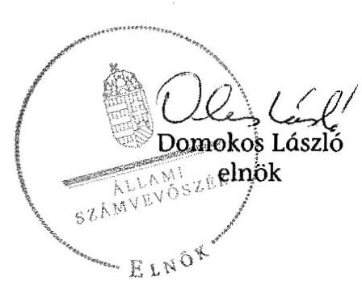

# ÁLLAMI   SZÁMVEVŐSZÉK 

## JELENTÉS

a helyi nemzetiségi önkormányzatok gazdálkodásának ellenőrzéséről
Mezőcsát Város Cigány Nemzetiségi Önkormányzat

---

# Állami Számvevőszék 

Iktatószám: V-0702-092/2015.
Témaszám: 1736
Vizsgálat-azonosító szám: V067611

## Az ellenőrzést felügyelte:

Horváthné Herbáth Mária
felügyeleti vezető

Az ellenőrzést vezette és az ellenőrzés végrehajtásáért felelős:
Zakar László
ellenőrzésvezető

A számvevőszéki jelentést készítették:

Zakar László
ellenőrzésvezető
Pappné dr. Szamosi Éva
számvevő főtanácsos

## Az ellenőrzést végezték:

Dr. Csapó Anna
számvevő tanácsos
Dr. Korbuly Andrea
számvevő tanácsos

Dr. Csapó Anna
számvevő tanácsos
Gácsi Györgyi Ivett
számvevő főtanácsos

Gácsi Györgyi Ivett
számvevő főtanácsos

---

# TARTALOMJEGYZÉK 

BEVEZETÉS ..... 7
I. ÖSSZEGZŐ MEGÁLLAPÍTÁSOK, KÖVETKEZTETÉSEK, JAVASLATOK ..... 10
II. RÉSZLETES MEGÁLLAPÍTÁSOK ..... 17

1. A Nemzetiségi Önkormányzat és a Települési Önkormányzat együttműködésének szabályozása, a működési feltételek biztosítása ..... 17
2. A gazdálkodási feladatok ellátásának szabályszerűsége ..... 18
2.1. A költségvetésre és a zárszámadásra, valamint a kincstári adatszolgáltatás rendjére vonatkozó jogszabályi előírások betartása ..... 18
2.2. A Nemzetiségi Önkormányzat gazdálkodásának szabályozottsága ..... 19
2.3. Az operatív gazdálkodási jogkörök kialakítása, gyakorlása ..... 20
3. A Nemzetiségi Önkormányzattal összefüggő gazdálkodási feladatok belső ellenőrzése ..... 22
MELLÉKLETEK
4. számú A Mezőcsát Város Cigány Nemzetiségi Önkormányzat 2013. évi gazdálkodási adatai

---

.

---

# RÖVIDÍTÉSEK JEGYZÉKE 

## Törvények

Alaptörvény
Áht.
ÁSZ tv.
Kttv.
Nek. tv.
Számv. tv.

## Rendeletek, határozatok

Ávr.
államháztartási számviteli kormányrendelet

Bkr.
hivatali $\mathrm{SZMSZ}_{1}$
hivatali $\mathrm{SZMSZ}_{2}$
hivatali $\mathrm{SZMSZ}_{3}$

Nemzetiségi Önkormányzat SZMSZ

## Szórövidítések

ÁSZ
együttműködési megállapodás
eszközök és források értékelési szabályzata

Magyarország Alaptörvénye
az államháztartásról szóló 2011. évi CXCV. törvény (hatályos 2011. december 31-étől)
az Állami Számvevőszékről szóló 2011. évi LXVI. törvény (hatályos 2011. július 1-jétől)
a közszolgálati tisztségviselőkről szóló 2011. évi CXCIX. törvény (hatályos 2012. március 1-jétől)
a nemzetiségek jogairól szóló 2011. évi CLXXIX. törvény (hatályos 2011. december 20-ától)
a számvitelről szóló 2000. évi C. törvény
az államháztartási törvény végrehajtásáról szóló 368/2011. (XII. 31.) Korm. rendelet (hatályos 2012. január 1-jétől)
az államháztartás szervezetei beszámolási és könyvvezetési kötelezettségének sajátosságairól szóló 249/2000. (XII. 24.) Korm. rendelet
a költségvetési szervek belső kontrollrendszeréről és belső ellenőrzéséről szóló 370/2011. (XII. 31.) Korm. rendelet (hatályos 2012. január 1-jétől)
Polgármesteri Hivatal Úgyrendje, amely Mezőcsát Város Önkormányzata 5/2011. (III. 28.) számú rendeletével elfogadott Szervezeti és Működési Szabályzatának melléklete (hatályos 2013. február 28-áig)
Mezőcsát Város Közös Önkormányzati Hivatal 35/2013. (II. 25.) számú Képviselő-testületi határozattal elfogadott Szervezeti és Működési Szabályzata (hatályos 2013. március 1-jétől 2013. április 30-áig)
Mezőcsát Város Közös Önkormányzati Hivatal 101/2013. (IV. 29.) számú Képviselő-testületi határozattal elfogadott Szervezeti és Működési Szabályzata (hatályos 2013. május 1-jétől)
Mezőcsát Város Cigány Nemzetiségi Önkormányzatának 3/2012. (II. 6.) számú határozata a Szervezeti és Működési Szabályzatáról

Állami Számvevőszék
A Települési Önkormányzat Képviselő-testületének 159/2012. (VIII. 27.) számú határozatával és a Nemzetiségi Önkormányzat Képviselő-testülete 6/2012. (X. 15.) számú határozatával jóváhagyott együttműködési megállapodás
Mezőcsát Város Önkormányzat Eszközök és Források Értékelési Szabályzata (hatályos 2012. július 1-jétől)

---

gazdálkodási szabályzat Mezőcsát Város Cigány Nemzetiségi Önkormányzat Gazdálkodási Szabályzata (hatályos 2012. április 1-jétől)
jegyző Mezőcsát Város Önkormányzatának jegyzője
Kincstár Magyar Államkincstár
Közös Önkormányzati Mezőcsát Város Polgármesteri Hivatala 2013. január 31-éig, Mezőcsát Közös Önkormányzati Hivatala 2013. február 1-jétől
leltározási és leltárkészítési szabályzat Mezőcsát Város Önkormányzat Leltározási és Leltárkészítési Szabályzata (hatályos 2013. január 1-jétől)
Nemzetiségi Önkormányzat Mezőcsát Város Cigány Nemzetiségi Önkormányzata
Nemzetiségi Önkormányzat elnöke Mezőcsát Város Cigány Nemzetiségi Önkormányzat elnöke
Nemzetiségi Önkormányzat Képviselő-testülete
pénzkezelési szabályzat Mezőcsát Város Önkormányzat Pénzkezelési Szabályzata (hatályos 2012. április 1-jétől)
pénzügyi osztály Mezőcsát Közös Önkormányzati Hivatala Pénzügyi Osztálya
számlarend $_{1}$ Mezőcsát Város Önkormányzat Polgármesteri Hivatal Számlarendje (hatályos 2010. január 1-jétől 2013. március 1-jéig)
számlarend $_{2}$ Mezőcsáti Közös Önkormányzati Hivatal Számlarendje (hatályos 2013. március 1-jétől)
számviteli politika $_{1}$ Mezőcsát Város Önkormányzat Polgármesteri Hivatal Számviteli Politikája (hatályos 2011. január 1-jétől 2013. január 31-éig)
számviteli politika $_{2}$ Mezőcsáti Közös Önkormányzati Hivatal Számviteli Politikája (hatályos 2013. február 1-jétől)
Települési Önkormányzat Mezőcsát Város Önkormányzata
SZMSZ Szervezeti és Működési Szabályzat
Települési Önkormányzat Képviselő-testülete
Mezőcsát Város Önkormányzatának Képviselő-testülete

---

# ÉRTELMEZŐ SZÓTÁR 

belső ellenőrzés
belső kontrollrendszer
együttműködési megállapodás
integritás

A Bkr. 2. § b) pont meghatározásában független, tárgyilagos bizonyosságot adó és tanácsadó tevékenység, amelynek célja, hogy az ellenőrzött szervezet működését fejlessze és eredményességét növelje, az ellenőrzött szervezet céljai elérése érdekében rendszerszemléletű megközelítéssel és módszeresen értékeli, illetve fejleszti az ellenőrzött szervezet irányítási és belső kontrollrendszerének hatékonyságát.
A Bkr. 2. § d) pont és az Áht. 69. § (1) bekezdése alapján a belső kontrollrendszer a kockázatok kezelése és tárgyilagos bizonyosság megszerzése érdekében kialakított folyamatrendszer, amely azt a célt szolgálja, hogy a működés és gazdálkodás során a tevékenységeket szabályszerűen, gazdaságosan, hatékonyan, eredményesen hajtsák végre, az elszámolási kötelezettségeket teljesítsék, megvédjék az erőforrásokat a veszteségektől, károktól és nem rendeltetésszerű használattól.
Az Áht. 27. § (2) bekezdése és Nek tv. 80. § (1) bekezdése értelmében a helyi önkormányzat a helyi nemzetiségi önkormányzat részére - annak székhelyén - biztosítja az önkormányzati működés személyi és tárgyi feltételeit, továbbá gondoskodik a működéssel kapcsolatos végrehajtási feladatok ellátásáról. Az Nek tv. 80. § (2) bekezdés szerinti a fenti kötelezettségének teljesítése érdekében a helyi önkormányzat harminc napon belül biztosítja a rendeltetésszerű helyiséghasználatot, valamint a helyiséghasználatra, a további feltételek biztosítására és a feladatok ellátására vonatkozóan megállapodást köt a helyi nemzetiségi önkormányzattal. A megállapodást minden év január 31. napjáig, általános vagy időközi választás esetén az alakuló ülést követő harminc napon belül felül kell vizsgálni. A helyi önkormányzat és a nemzetiségi önkormányzat szervezeti és működési szabályzatában rögzíti a megállapodás szerinti működési feltételeket, a megállapodás megkötését, módosítását követő harminc napon belül. Az Nek tv. 80. § (3) bekezdés írja elő a megállapodásban rögzítendőket.
Az integritás elvek, értékek, cselekvések, módszerek, intézkedések konzisztenciáját jelenti: olyan magatartásmódot, amely meghatározott értékeknek felel meg. Az integritás a közszféra esetében a társadalom által elvárt nyilvánossági, átláthatósági, illetve jogi/etikai normáknak történő megfelelést jelenti.
(Forrás: a http://integritas.asz.hu honlapon közzétett „A 2012. évi integritás felmérés eredményeinek összefoglalója" dokumentum 3. oldal 1. bekezdése)

---

| költségvetési szerv vezetője | A Bkr. 2. § nd) pont meghatározásában a helyi önkormányzat, helyi nemzetiségi önkormányzat, illetve a fővárosi kerületi önkormányzat esetén a jegyző, körjegyző, főjegyző. |
| :--: | :--: |
| korrupció | Azok a cselekmények, amelyek során a köz érdekében való eljárással megbízott és döntéshozatali felelősséggel felruházott személy a köz érdeke helyett önös vagy részérdekeket követve, mástól jogtalan vagy etikátlan előnyt elfogadva és őt jogtalan vagy etikátlan előnyhöz juttatva jár el, illetve amikor valaki a köz érdekében való eljárással megbízott és döntéshozatali felelősséggel felruházott személynek jogtalan vagy etikátlan előnyt nyújtva vagy felajánlva jogtalan vagy etikátlan előnyt kér. (Forrás: A Kormány korrupció megelőzési programja 2012-2014.) |
| kulcskontroll | Az azonosított kockázatok mérséklése érdekében kialakított kontrollok közül azok, amelyek elégtelen működése esetén a szervezetet jelentős veszteség érheti, vagy a működésükben bekövetkező hiba/hiányosság más kontrollok eredményességét csökkenti. Ezek ellenőrzése, értékelése elegendő bizonyítékot szolgáltat adott területen a kontrollrendszer értékeléséhez. Az önkormányzatok kontrollrendszere kialakításának ellenőrzése során a pénzügyi folyamatokban kulcsszerepet betöltő belső kontrollok a teljesítésigazolás és érvényesítés. |
| lényegesség | Egy információ akkor lényeges, ha hiánya vagy téves állítása befolyásolhatja ezen információkat felhasználók döntéseit, véleményét. Az ellenőrzés során a lényegesség három szempontból értelmezhető: érték, jelleg és összefüggés szerint. |
| nemzetiség | A Nek tv. 1. § (1) bekezdése alapján nemzetiség minden olyan Magyarország területén legalább egy évszázada honos népcsoport, amely az állam lakossága körében számszerű kisebbségben van, tagjai magyar állampolgárok és a lakosság többi részétől saját nyelve és kultúrája, hagyományai különböztetik meg, egyben olyan összetartozás-tudatról tesz bizonyságot, amely mindezek megőrzésére, történelmileg kialakult közösségeik érdekeinek kifejezésére és védelmére irányul. |
| nemzetiségi önkormányzat | Az Nek tv. 2. § 2. pontja szerint törvényben meghatározott nemzetiségi közszolgáltatási feladatokat ellátó, testületi formában működő, jogi személyiséggel rendelkező, demokratikus választások útján e törvény alapján létrehozott szervezet, amely a nemzetiségi közösséget megillető jogosultságok érvényesítésére, a nemzetiségek érdekeinek védelmére és képviseletére, a feladat- és hatáskörébe tartozó nemzetiségi közügyek települési, területi vagy országos szinten történő önálló intézésére jön létre. |
| operatív gazdálkodási jogkör | kötelezettségvállalás, pénzügyi ellenjegyzés, utalványozás, érvényesítés, teljesítésigazolás jogkör |

---

# JELENTÉS 

## A helyi nemzetiségi önkormányzatok gazdálkodásának ellenőrzéséről Mezőcsát Város Cigány Nemzetiségi Önkormányzat

## BEVEZETÉS

A Nemzetiségi Önkormányzat 1994. évben alakult. A 2013. évben hivatalban lévő elnök a 2002. évi helyhatósági választásoktól a 2014. évi helyhatósági választásokig töltötte be a hivatalát. A Nemzetiségi Önkormányzat intézményt, gazdasági társaságot és más szervezetet nem alapított, illetve társulásban nem vett részt. A négytagú Képviselő-testület a munkája segítésére bizottságot nem hozott létre. A Nemzetiségi Önkormányzatnak a költségvetési beszámolója szerint 2013. évben a módosított költségvetési bevételi és kiadási előirányzata 502,0 ezer Ft, a teljesített költségvetési bevétele és a teljesített költségvetési kiadása 530,0 ezer Ft volt. A Nemzetiségi Önkormányzat 2013. évben 24,0 ezer Ft feladatalapú támogatásban részesült. A 2013. évi gazdálkodási adatokat részletesen az 1. számú mellékletben mutatjuk be.

Az Alaptörvény Szabadság és felelősség rész XXIX. cikk (1) bekezdése szerint a Magyarországon élő nemzetiségek államalkotó tényezők. Minden, valamely nemzetiséghez tartozó magyar állampolgárnak joga van önazonossága szabad vállalásához és megőrzéséhez. A hazánkban élő nemzetiségek helyi (települési és területi) valamint országos önkormányzatokat hozhatnak létre. A helyi nemzetiségi önkormányzatok gazdálkodási feladatait jogszabályi előírás alapján a székhely szerinti helyi önkormányzat polgármesteri hivatala látja el.

A nemzetiségek helyzete, támogatása mind hazai, mind EU-s szinten kiemelt figyelmet kap napjainkban. A helyi nemzetiségi önkormányzatok gazdálkodására és támogatási rendszerére vonatkozó jogszabályok a 2010-2012. években jelentős változásokon mentek át. A helyi nemzetiségi önkormányzatok gazdálkodásának, a részükre juttatott költségvetési támogatások felhasználásának ellenőrzését az ÁSZ 2012-ben sorozatjellegű ellenőrzés keretében indította el.

Az ellenőrzés célja annak értékelése volt, hogy a helyi nemzetiségi önkormányzat gazdálkodási kereteinek kialakítása, gazdálkodása megfelelt-e a jogszabályoknak.

Ennek keretében értékeltük, hogy:

- a helyi nemzetiségi önkormányzat és a helyi (települési) önkormányzat együttműködésének szabályozása, a működési feltételek biztosítása megfelelte a jogszabályi előírásoknak;

---

- a felek együttműködése megfelelt-e a megállapodásban foglaltaknak a gazdálkodási feladatok szabályszerű ellátása során, betartották-e a vonatkozó jogszabályi előírásokat;
- biztosított volt-e a helyi nemzetiségi önkormányzat gazdálkodásának belső ellenőrzése.

Az ellenőrzés várható hasznosulása: a nemzetiségi önkormányzatok testületi döntéseinek tapasztalatait összegezve következtetést vonható le a törvényalkotás számára a jogszabályi környezet esetleges módosításának indokoltságára vonatkozóan. Az ellenőrzés az ellenőrzött számára visszajelzést ad a rendezett gazdálkodási keretek kialakításáról, a működésbeli hiányosságokról. Az ellenőrzés megállapításai és javaslatai, a jó gyakorlat bemutatása tanulságul szolgálhatnak más nemzetiségi önkormányzatok, szervezetek számára a rendezett gazdálkodási keretek kialakításához. A társadalom számára jelzi, hogy közpénz nem maradhat ellenőrizetlenül, az ÁSZ értékteremtő rend kialakításához és megőrzéséhez hozzájáruló tevékenysége pozitív hatással lesz a szervezetről kialakított összkép formálásában. Az ÁSZ szervezetén belül lehetőség nyílik arra, hogy a megállapítások szintetizálásával az intézmény a hozzáadott értéket teremtő elemző tevékenységét és tanácsadó szerepét erősítse.

A helyi nemzetiségi önkormányzatok gazdálkodásának ellenőrzéséről szóló jelentés I. fejezetének összegző része az ellenőrzés céljára adott rövid, szintetizáló összefoglalót és következtetéseket tartalmazza a II. fejezet részletes megállapításain alapulóan. A jelentés, intézkedést igénylő megállapításait és javaslatait az összegzőben foglaltak mellett

 - az ellenőrzés során feltárt, a jelentés II. fejezetében rögzített részletes megállapítások alapozzák meg, illetve támasztják alá.

Az ellenőrzés típusa: szabályszerűségi ellenőrzés.
Az ellenőrzött időszak: a helyi nemzetiségi önkormányzat és a települési önkormányzat együttműködésének, valamint a helyi nemzetiségi önkormányzat gazdálkodásának szabályozása megfelelőségét 2013. évre vonatkozóan (a 2013. december 31-i állapotnak megfelelően), a helyi nemzetiségi önkormányzat gazdálkodásának szabályszerűségét, a működési feltételek, valamint a belső ellenőrzés biztosítását a 2013. január 1. - december 31-e közötti időszakot figyelembe véve értékeltük.

Ellenőrzött szervezet: a Mezőcsát Város Cigány Nemzetiségi Önkormányzat és a gazdálkodási feladatait ellátó Mezőcsát Közös Önkormányzati Hivatal.

Az ellenőrzés szakmai módszertana az ÁSZ hivatalos honlapján (www.asz.hu) közzétett szakmai szabályokon alapult, amely a Legfőbb Ellenőrző Intézmények Nemzetközi Szervezete (INTOSAI) által kiadott nemzetközi standardok (ISSAI) figyelembevételével készült.

A Nemzetiségi Önkormányzatnak a 2013. évben dologi kiadásokkal kapcsolatos kifizetési voltak. A gazdálkodás folyamatában kulcsszerepet betöltő két kulcskontroll - teljesítésigazolás, érvényesítés - működésének megfelelőségét teljes körűen, azaz minden dologi kiadással kapcsolatos kifizetés esetében ellenőriztük. „Megfelelőnek" értékeltük a gazdálkodási jogkörök gyakorlását, amennyiben a hibaarány legfeljebb 10%, „részben megfelelőnek" értékeltük, ha a hibaarány 10-

---

30% között volt, „nem megfelelőnek" pedig akkor, ha a hibaarány meghaladta a 30%-ot.

Az ellenőrzés végrehajtásának jogszabályi alapját az ÁSZ tv. 5. § (2)(3) és (6) bekezdéseiben foglaltak képezik.

Az ÁSZ tv. 29.§ (1) bekezdése szerint megküldtük egyeztetésre a jegyzőnek és a Nemzetiségi Önkormányzat elnökének. Az ellenőrzött szervezetek vezetői az ÁSZ tv. 29.§ (2) bekezdésében foglalt észrevételezési jogukkal nem éltek, a jelentéstervezetre nem tettek észrevételt.

---

# 1. ÖSSZEGZŐ MEGÁLLAPÍTÁSOK, KÖVETKEZTETÉSEK, JAVASLATOK 

A Nemzetiségi Önkormányzat és a Települési Önkormányzat együttműködésének szabályozása részben felelt meg a jogszabályi előírásoknak. A Nemzetiségi Önkormányzat rendelkezett az ellenőrzött időszakban a Nek. tv.-ben előírt együttműködési megállapodással, melynek felülvizsgálata a Nek. tv.-ben foglalt határidőig nem történt meg.

Az együttműködési megállapodásban a Nek. tv.-ben előírtak ellenére nem határozták meg a Nemzetiségi Önkormányzat működésével, gazdálkodásával kapcsolatos nyilvántartási, iratkezelési feladatok ellátását, a feladatellátáshoz kapcsolódó költségek viselését. Nem rögzítették a Nek. tv.-ben előírtaktól eltérően a Nemzetiségi Önkormányzat részére önálló fizetési számla nyitásával, törzskönyvi nyilvántartásba vételével és adószám igénylésével kapcsolatos határidőket, együttműködési kötelezettséget és ezek felelőseinek konkrét kijelölését. Nem rögzítették a Nemzetiségi Önkormányzat kötelezettségvállalásának SZMSZ-ében meghatározott nyilvántartási szabályait, a Nemzetiségi Önkormányzat működési feltételeinek és gazdálkodásának eljárási és dokumentációs részletszabályaival, valamint az ezeket végző személyek kijelölésének rendjével kapcsolatos előírásokat. Az együttműködési megállapodás szerinti működési feltételeket nem rögzítették a Nek. tv.-ben foglalt határidőben és azt követően sem a Települési Önkormányzat és a Nemzetiségi Önkormányzat SZMSZ-eiben.

A Települési Önkormányzat - az együttműködési megállapodás tartalmi hiányosságai ellenére - a 2013. évben biztosította a Nemzetiségi Önkormányzat működéséhez szükséges személyi és tárgyi feltételeket.

A Nemzetiségi Önkormányzat 2013. évi költségvetésének és zárszámadásának tartalma, jóváhagyása, valamint a kapcsolódó adatszolgáltatás részben felelt meg a jogszabályi előírásoknak.

A jegyző nem készítette el és a Nemzetiségi Önkormányzat elnöke az Áht.-ban előírtaktól eltérően a Nemzetiségi Önkormányzat Képviselő-testülete részére nem nyújtotta be az ellenőrzött évre vonatkozó költségvetési koncepciót. A Nemzetiségi Önkormányzat elnöke az előírt határidőn túl nyújtotta be a Nemzetiségi Önkormányzat Képviselő-testülete részére a költségvetési határozat tervezetet, mert a jegyző határidőben nem készítette el. A 2013. évi költségvetési határozat a jogszabályi előírásoknak megfelelően tartalmazta a Nemzetiségi Önkormányzat költségvetési bevételeit és költségvetési kiadásait előirányzat csoportok szerinti bontásban, a költségvetési egyenleg összegét működési és felhalmozási cél szerinti bontásban, valamint a költségvetés végrehajtásával kapcsolatos hatásköröket. A költségvetési határozat nem tartalmazta az Áht.-ban előírtak ellenére a költségvetési bevételeket és kiadásokat kötelező és önként vállalt feladatok szerinti bontásban, valamint a költségvetési mérleg és az előirányzat felhasználási terv szöveges indokolását.

---

A jegyző az Áht.-ban előírt határidőre elkészítette a Nemzetiségi Önkormányzat 2013. évi zárszámadási határozat tervezetét, melyet a Nemzetiségi Önkormányzat elnöke az előírt határidőig beterjesztett a Nemzetiségi Önkormányzat Képviselő-testülete elé. A Képviselő-testület a 2013. évi zárszámadásról határidőben határozatot hozott. A Nemzetiségi Önkormányzat a 2013. évről alkotott zárszámadási határozatában az Áht. rendelkezéseinek megfelelően valamennyi bevételéről és kiadásáról elszámolt, a zárszámadási határozat és a költségvetési határozat összehasonlíthatóságát biztosították. A jegyző a Nemzetiségi Önkormányzat részére jogszabályban előírt kincstári adatszolgáltatási kötelezettségét 2013. évben - az Ávr. előírásaitól eltérően - két alkalommal késedelmesen teljesítette.

A Nemzetiségi Önkormányzat gazdálkodásának szabályozottsága az ellenőrzött időszakban részben felelt meg a jogszabályi előírásoknak. A gazdálkodási feladatok végrehajtását ellátó Közös Önkormányzati Hivatal a 2013. évben rendelkezett hatályos, a Számv. tv. előírásai szerinti szabályzatokkal, de a szabályzatok hatálya - egy kivételével - a Nemzetiségi Önkormányzat gazdálkodási feladataira nem terjedt ki. A Közös Önkormányzati Hivatal az ellenőrzött időszakban rendelkezett hatályos, jóváhagyott, az Áht. előírásainak megfelelő SZMSZ-mal, de az SZMSZ-ban nem rögzítették az Ávr.-ben foglaltak szerinti, a nevesített munkakörökhöz tartozó - a Nemzetiségi Önkormányzat gazdálkodásával kapcsolatos - feladat- és hatásköröket, a hatáskörök gyakorlásának módját, a helyettesítés rendjét, az ezekhez kapcsolódó felelősségi szabályokat. A Közös Önkormányzati Hivatalnál a gazdálkodási feladatot ellátó köztisztviselők munkaköri leírásai - a Kttv.-ben foglaltaktól eltérően - nem tartalmazták a Nemzetiségi Önkormányzat gazdálkodásával kapcsolatos feladatokat. A jegyző a Bkr.-ben előírt ellenőrzési nyomvonalat és a szabálytalanságok kezelésének eljárásrendjét nem készítette el. A jegyző a Bkr.-ben foglaltakat nem tartotta be, mert nem biztosította a kontrolltevékenység részeként minden tevékenységre vonatkozóan a folyamatba épített, előzetes, utólagos és vezetői ellenőrzést.

A Nemzetiségi Önkormányzat gazdálkodása tekintetében az operatív gazdálkodási jogkörök kialakítása nem felelt meg a jogszabályi előírásoknak, valamint az együttműködési megállapodásban foglaltaknak. A Nemzetiségi Önkormányzat elnöke, mint utalványozó nem hatalmazott fel írásban utalványozási jogköre gyakorlására más képviselőt. A felhatalmazás elmulasztása miatt a 2013. évben az Ávr.-ben előírt összeférhetetlenségi követelmény nem teljesült. A jegyző a gazdasági szervezettel nem rendelkező Közös Önkormányzati Hivatalban a pénzügyi ellenjegyzőt, valamint az érvényesítőt Ávr.-ben foglaltak ellenére írásban nem jelölte ki.

A Nemzetiségi Önkormányzatnál a 2013. évben a dologi kiadásokkal kapcsolatos kifizetéseknél az operatív gazdálkodási jogkörökön belül kulcsszerepet betöltő teljesítésigazolás és érvényesítés belső kontrollokat - az ellenőrzött összes kifizetésre együttesen értékelve - nem a jogszabályi előírásoknak megfelelően működtették. A teljesítésigazolást és érvényesítést valamennyi ellenőrzött kifizetést megelőzően - az Áht.-ban és az Ávr.-ben foglaltak ellenére - nem végezték el. A kulcskontrollok ellenőrzése során feltárt további hiányosság volt, hogy a 2013. évben a Nemzetiségi Önkormányzat elnöke 30 kifizetést megelőzően nem tartotta be az Ávr.-ben foglaltakat, mert az utalványozási feladatot

---

maga javára látta el. A Nemzetiségi Önkormányzatnál a 2013. évben a kulcskontrollokat nem megfelelően működtették és e miatt nem volt biztosított a hibák megelőzése, feltárása és kijavítása.

A Nemzetiségi Önkormányzatnak a gazdálkodás során figyelmet kell fordítania az integritás szemlélet teljes körű érvényesülésére, különös tekintettel az operatív gazdálkodási jogkörök szabályozására, az operatív gazdálkodási jogkörökön belül kulcsszerepet betöltő belső kontrollok (teljesítésigazolás és érvényesítés) szabályszerű működésére, amellyel csökkenthetők a szervezet működéséből eredő korrupciós kockázatok.

A 2013. évben a Nemzetiségi Önkormányzat gazdálkodásával összefüggő végrehajtási feladatokra vonatkozó belső ellenőrzés nem volt megfelelő. A jegyző a Bkr.-ben foglalt feladatkörében eljárva nem intézkedett a Nemzetiségi Önkormányzat gazdálkodásával összefüggő végrehajtási feladatokat érintően a belső ellenőrzés megfelelő működtetéséről. A belső ellenőr a 2013. évre vonatkozó ellenőrzési tervet a Bkr. szerinti - a Nemzetiségi Önkormányzat gazdálkodásával összefüggő végrehajtási feladatok kockázatainak felmérésére is kiterjedően - kockázatelemzéssel nem támasztotta alá, a Nemzetiségi Önkormányzat gazdálkodásával összefüggő végrehajtási feladatok belső ellenőrzésére 2013. évben nem került sor.

Az ÁSZ tv. 33. § (1) bekezdésében foglaltak értelmében a jelentésben foglalt megállapításokhoz kapcsolódó intézkedési tervet köteles az ellenőrzött szervezet vezetője összeállítani, és azt a jelentés kézhezvételétől számított 30 napon belül az ÁSZ részére megküldeni. Amennyiben az intézkedési tervet határidőben nem küldi meg a szervezet, vagy az nem elfogadható, az ÁSZ elnöke a hivatkozott törvény 33. § (3) bekezdés a)-b) pontjaiban foglaltakat érvényesítheti.

A helyszíni ellenőrzés megállapításainak hasznosítása mellett javasoljuk:

# a jegyzőnek: 

1. Az együttműködés szabályozásával kapcsolatban

A Nemzetiségi Önkormányzat és a Települési Önkormányzat együttműködését meghatározó együttműködési megállapodásban a Nemzetiségi Önkormányzat működésének feltételeit nem teljes körűen szabályozták. A megállapodásban nem rögzítették a Nek. tv. 80. § (1) bekezdés e) és g) pontjaiban foglalt működési feltételeket, végrehajtási feladatokat, valamint a 80. § (3) bekezdés a) c), d) pontjaiban foglaltakat. Az együttműködési megállapodás felülvizsgálata a Nek. tv. 80. § (2) bekezdésében foglaltak ellenére nem történt meg.

Az együttműködési megállapodás szerinti működési feltételeket - a Nek. tv. 80. § (2) bekezdésében foglaltak ellenére - az együttműködési megállapodás megkötését követő harminc napon belül, valamint azt követően sem rögzítették a Települési Önkormányzat és a Nemzetiségi Önkormányzat SZMSZ-eiben.

---

Javaslat:
Az együttműködés szabályszerűsége érdekében
a) készítse elő az együttműködési megállapodás módosítását, amely megfelel a Nek. tv. előírásainak és kezdeményezze annak a Települési Önkormányzat Képviselő-testülete elé terjesztését;
b) kezdeményezze az együttműködési megállapodás évenkénti felülvizsgálatát oly módon, hogy az biztosítsa a Nek. tv.-ben rögzített határidő betartását;
c) készítse elő a Települési és a Nemzetiségi Önkormányzat SZMSZ-einek kiegészítését az együttműködési megállapodás módosításához kapcsolódóan és kezdeményezze azok Képviselő-testületi előterjesztését.
2. A költségvetés és zárszámadás szabályszerűségével kapcsolatban

A Nemzetiségi Önkormányzat elnöke az Áht. 26. § (1) bekezdésében, és az Áht. 24. § (2) bekezdésében előírtaktól eltérően a központi költségvetésről szóló törvény hatálybalépését követő 45. napig nem nyújtotta be a Nemzetiségi Önkormányzat Képviselő-testülete részére a költségvetési határozat tervezetet, mert a jegyző határidőben nem készítette el.

A 2013. évi költségvetési határozat nem tartalmazta a költségvetési bevételeket és kiadásokat az Áht. 23. § (2) bekezdés a) pontja szerint előírt kötelező és önként vállalt feladatok szerinti bontásban. A 2013. évi költségvetés előterjesztésekor a Nemzetiségi Önkormányzat Képviselő-testülete részére bemutatott költségvetési mérlegét és előirányzat felhasználási tervét az Áht. 24. § (4) bekezdése ellenére szöveges indokolással nem támasztották alá.

Javaslat:
a) Biztosítsa a jövőben a költségvetési határozat-tervezet Nemzetiségi Önkormányzat Képviselő-testülete részére történő előterjesztéséhez a jogszabályban meghatározott határidő betartását.
b) Intézkedjen arról, hogy a jövőben költségvetési határozat tartalmilag teljes körűen feleljen meg a hatályos jogszabályi előírásoknak;
c) Biztosítsa, hogy a Képviselő-testület részére tájékoztatásul teljes körűen, szöveges indoklással együtt kerüljenek bemutatásra a jogszabályban előírt mérlegek, kimutatások a költségvetés előterjesztésekor.
3. A kincstári adatszolgáltatási kötelezettséggel kapcsolatban

A jegyző a Nemzetiségi Önkormányzat részére jogszabályban előírt kincstári adatszolgáltatási kötelezettségét 2013. évben két alkalommal késedelmesen teljesítette. Az Ávr. 169. § (2) bekezdésében előírt határidőt követően teljesítette az adatszolgáltatást a költségvetési év tizenkét hónapjáról az éves költségvetési jelentés vonatkozásában. A negyedik negyedéves mérlegjelentés esetében nem tartotta be az Ávr. 170. § (5) bekezdésében előírt határidőket.

---

Javaslat:
Tegyen eleget a kincstári adatszolgáltatási kötelezettségének a hatályos jogszabályban előírt határidők betartásával.
4. A gazdálkodási feladatok szabályozottságával kapcsolatban

A gazdálkodási feladatok végrehajtását ellátó Közös Önkormányzati Hivatal a 2013. évben rendelkezett a Számv. tv. előírásai szerinti szabályzatokkal, de
 azok hatálya - a számviteli politika kivételével - a Nemzetiségi Önkormányzat gazdálkodási feladataira nem terjedt ki.

A Közös Önkormányzati Hivatal hatályos, jóváhagyott SZMSZ-ei nem tartalmazták az Ávr. 13. § (1) bekezdés g) pontjában foglaltak szerinti, a munkakörökhöz tartozó - a Nemzetiségi Önkormányzat gazdálkodásával kapcsolatos - feladat- és hatásköröket, a hatáskörök gyakorlásának módját, a helyettesítés rendjét, az ezekhez kapcsolódó felelősségi szabályokat.

A Közös Önkormányzati Hivatalnál a gazdálkodási feladatot ellátó köztisztviselők munkaköri leírásai - a Kttv. 75. § (1) bekezdés d) pontjában foglaltaktól eltérően - nem tartalmazták a Nemzetiségi Önkormányzat gazdálkodásával kapcsolatos feladatokat.

A Közös Önkormányzati Hivatal nem rendelkezett a Bkr. 6. § (3) bekezdésében előírt ellenőrzési nyomvonallal, a Bkr. 6. § (4) bekezdésében előírt szabálytalanságok kezelésének eljárásrendjével. A jegyző a Bkr. 8. § (2) bekezdés előírásától eltérően nem biztosította minden tevékenységre vonatkozóan a folyamatba épített, előzetes, utólagos és vezetői ellenőrzést.

Javaslat:
a) intézkedjen, hogy a Közös Önkormányzati Hivatal Számv. tv. szerinti szabályzatainak teljes köre kiterjedjen a Nemzetiségi Önkormányzat gazdálkodási feladataira;
b) készítse el a Közös Önkormányzati Hivatal SZMSZ-ének módosítását, hogy az feleljen meg az Ávr.-ben foglalt előírásoknak és kezdeményezze annak Képviselőtestületi előterjesztését;
c) biztosítsa a Nemzetiségi Önkormányzat gazdálkodásával kapcsolatos feladatokat ellátó köztisztviselők munkaköri leírásainak kiegészítését;
d) készítse el a Közös Önkormányzati Hivatal működési folyamataira vonatkozó ellenőrzési nyomvonalat, továbbá a szabálytalanságok kezelésének eljárásrendjét;
e) biztosítsa a Közös Önkormányzati Hivatal által ellátott minden tevékenységre vonatkozóan a folyamatba épített, előzetes, utólagos és vezetői ellenőrzést.
5. A kulcskontrollok működésével kapcsolatban

A jegyző a gazdasági szervezettel nem rendelkező Közös Önkormányzati Hivatalban a pénzügyi ellenjegyzőt, valamint az érvényesítési feladatok ellátására jogosult személyt - az Ávr. 55.§ (2) bekezdés g) pontjában, illetve az 58. § (4) bekezdésében foglaltak ellenére - írásban nem jelölte ki.

---

A Nemzetiségi Önkormányzatnál a 2013. évben a dologi kiadásokkal kapcsolatos kifizetéseknél a teljesítésigazolást és az érvényesítést - az Áht. 38. § (1), az Ávr. 57. § (1), valamint 58.§. (1)-(4) bekezdésében foglaltak ellenére - nem végezték el.

Javaslat:
Az operatív gazdálkodás működési hibáinak megelőzése, feltárása és kijavítása érdekében intézkedjen:
a) a pénzügyi ellenjegyző, valamint az érvényesítési feladatok ellátására jogosult személy írásbeli kijelöléséről;
b) a teljesítésigazolás jogszabályi előírásoknak megfelelő elvégzéséről;
c) az érvényesítéshez kapcsolódó ellenőrzési és jelzési feladatok szabályszerű ellátásáról.
6. A Nemzetiségi Önkormányzat gazdálkodásának belső ellenőrzésével kapcsolatban

A belső ellenőr a 2013. évre vonatkozó ellenőrzési tervet - a Nemzetiségi Önkormányzat gazdálkodásával összefüggő végrehajtási feladatok kockázatainak felmérésére is kiterjedő - kockázatelemzéssel nem támasztotta alá.

Javaslat:
Kezdeményezze a belső ellenőrzés felé, hogy az éves ellenőrzési tervet megalapozó kockázatelemzés terjedjen ki a Nemzetiségi Önkormányzat gazdálkodásával összefüggő feladatok kockázatainak felmérésére.

# a Nemzetiségi Önkormányzat elnökének: 

1. A Nemzetiségi Önkormányzat és a Települési Önkormányzat együttműködését meghatározó együttműködési megállapodás nem tartalmazta a Nek. tv. 80. § (1) bekezdés e) és g) pontjaiban, valamint a 80. § (3) bekezdés a), c), d) pontjaiban előírtakat.

Az együttműködési megállapodás felülvizsgálata a Nek. tv. 80. § (2) bekezdésében foglaltak ellenére határidőre nem történt meg.

Az együttműködési megállapodás szerinti működési feltételeket a Nek. tv. 80. § (2) bekezdésében előírtak ellenére a Nemzetiségi Önkormányzat SZMSZ-ében nem rögzítették az együttműködési megállapodás megkötését követő 30 napon belül.

Javaslat:
Terjessze a Nemzetiségi Önkormányzat Képviselő-testülete elé jóváhagyásra
a) az együttműködési megállapodás jegyző által előkészített módosítását, amely a jogszabályi előírásokkal összhangban tartalmazza a Nemzetiségi Önkormányzat működésének feltételeit, továbbá tegyen intézkedést annak érdekében, hogy az együttműködési megállapodás évenkénti felülvizsgálata határidőben megtörténjen;

---

b) a Nemzetiségi Önkormányzat jegyző által előkészített, a jogszabályi előírásoknak megfelelően kiegészített SZMSZ-ét.
2. A Nemzetiségi Önkormányzat elnöke az Áht. 26. § (1) bekezdésében, és az Áht. 24. § (2) bekezdésében előírtaktól eltérően a központi költségvetésről szóló törvény hatálybalépését követő 45. napig nem nyújtotta be a Nemzetiségi Önkormányzat Képviselő-testülete részére a költségvetési határozat tervezetet.

Javaslat:
A költségvetési határozat-tervezet Nemzetiségi Önkormányzat Képviselő-testülete részére történő előterjesztésekor biztosítsa a jogszabályban meghatározott határidő betartását.
3. A 2013. évi költségvetés előterjesztésekor a Nemzetiségi Önkormányzat Képviselőtestülete részére bemutatott költségvetési mérleget és előirányzat felhasználási tervet az Áht. 24. § (4) bekezdés a) pontjában foglaltak ellenére szöveges indokolással nem támasztottak alá.

Javaslat:
A költségvetési határozat-tervezet képviselő-testületi előterjesztésekor tájékoztatásul szöveges indoklással mutassa be az Áht.-ban előírt kimutatásokat.
4. A Nemzetiségi Önkormányzat elnöke az utalványozás során az Ávr. 60. § (2) bekezdésében előírt összeférhetetlenségi követelmények érvényesülésének feltételeit nem biztosította, mert az utalványozási feladatot a maga javára látta el.

Javaslat:
Összeférhetetlenség fennállása esetén jelöljön ki írásban további utalványozásra jogosult személyt.

---

# II. RÉSZLETES MEGÁLLAPÍTÁSOK 

## 1. A Nemzetiségi Önkormányzat És a Települési Önkormányzat Együttműködésének Szabályozása, a Működési Feltételek Biztosítása

A Nemzetiségi Önkormányzat és a Települési Önkormányzat együttműködésének szabályozása részben felelt meg a jogszabályi előírásoknak.

A Nemzetiségi Önkormányzat rendelkezett az ellenőrzött időszakban a Nek. tv.-ben előírt együttműködési megállapodással, melyet a Nemzetiségi Önkormányzat és a Települési Önkormányzat képviselő-testületei határozattal jóváhagytak és az arra jogosult személyek aláírták. Az együttműködési megállapodást - a Nek. tv. 80. § (2) bekezdésében foglaltak ellenére - a jogszabályban előírt határidőre, 2013. január 31-ig nem vizsgálták felül.

A 2013. december 31-én hatályos együttműködési megállapodásban a Nemzetiségi Önkormányzat működésének feltételeit - a Nek. tv. 80. § (1) és (3) bekezdése előírása ellenére - nem teljes körűen szabályozták. Az együttműködési megállapodásban:

- nem szabályozták a Nek. tv. 80. § (1) bekezdés e) pontjában foglaltak ellenére a Nemzetiségi Önkormányzat működésével, gazdálkodásával kapcsolatos nyilvántartási, iratkezelési feladatok ellátását;
- nem határozták meg a Nek. tv. 80. § (1) bekezdés g) pontjában foglaltak ellenére a feladatellátáshoz kapcsolódó költségek - a testületi tagok és tisztségviselők telefonhasználata költségei kivételével - viselését;
- nem rögzítették a Nek tv. 80. § (3) bekezdés a) pontja ellenére a Nemzetiségi Önkormányzat részére önálló fizetési számla nyitásával, törzskönyvi nyilvántartásba vételével és adószám igénylésével kapcsolatos határidőket, együttműködési kötelezettséget és ezek felelőseinek konkrét kijelölését;
- nem rögzítették a Nek tv. 80. § (3) bekezdés c) pontja ellenére a Nemzetiségi Önkormányzat kötelezettségvállalásának SZMSZ-ében meghatározott nyilvántartási szabályait;
- nem szabályozták a Nek tv. 80. § (3) bekezdés d) pontja ellenére a Nemzetiségi Önkormányzat működési feltételeinek és gazdálkodásának eljárási és dokumentációs részletszabályaival, valamint az ezeket végző személyek kijelölésének rendjével kapcsolatos előírásokat.

A 2013. december 31-én hatályos együttműködési megállapodás - az Áht. 27. § (2) bekezdésében foglaltak szerint - rögzítette, hogy a Nemzetiségi Önkormányzat bevételeivel és kiadásaival kapcsolatban a tervezési, gazdálkodási, ellenőrzési, finanszírozási, adatszolgáltatási és beszámolási feladatok ellátásáról a pénzügyi osztály gondoskodik. Az együttműködési megállapodás a Nek. tv. 80. § (2) bekezdése alapján az (1) bekezdés a)-d) pontjaiban foglaltaknak megfelelően tartalmazta a feladatellátáshoz szükséges tárgyi, technikai eszközökkel felszerelt helyiség ingyenes használatát, a működéshez kapcsolódó tárgyi és

---

személyi feltételek biztosítását, a testületi ülések előkészítéséhez és a döntéshozatalhoz kapcsolódó feladatok ellátását. Szabályozták továbbá a költségvetés elkészítésével kapcsolatos és az ezzel összefüggő adatszolgáltatási feladatokat.

A Nek. tv. 80. § (4) bekezdésében foglaltaknak megfelelően szabályozták, hogy a jegyző vagy - a jegyzővel azonos képesítési előírásoknak megfelelő - megbízottja a Települési Önkormányzat megbízásából és képviseletében részt vesz a Nemzetiségi Önkormányzat képviselő-testületi ülésein és jelzi, amennyiben törvénysértést észlel.

Az együttműködési megállapodás szerinti működési feltételeket - a Nek. tv. 80. § (2) bekezdésében foglaltak ellenére - az együttműködési megállapodás megkötését követő harminc napon belül, valamint azt követően sem rögzítették a Települési Önkormányzat és a Nemzetiségi Önkormányzat SZMSZ-eiben ${ }^{1}$.

A Települési Önkormányzat - az együttműködési megállapodás tartalmi hiányosságai ellenére - a 2013. évben biztosította a Nemzetiségi Önkormányzat működéséhez szükséges személyi és tárgyi feltételeket.

# 2. A Gazdálkodási Feladatok Ellátásának Szabályszerűsége 

### 2.1. A költségvetésre és a zárszámadásra, valamint a kincstári adatszolgáltatás rendjére vonatkozó jogszabályi előírások betartása

A Nemzetiségi Önkormányzat 2013. évi költségvetésének, és zárszámadásának tartalma, jóváhagyása, valamint a kapcsolódó adatszolgáltatás részben felelt meg a jogszabályi előírásoknak.

A jegyző nem készítette el és a Nemzetiségi Önkormányzat elnöke - az Áht. 26. § (1) bekezdésben és az Áht. 24. § (1) bekezdésében előírtak ellenére - nem nyújtotta be a Nemzetiségi Önkormányzat Képviselő-testülete részére a 2013. évre vonatkozó költségvetési koncepciót. A Nemzetiségi Önkormányzat elnöke az Áht. 26. § (1) bekezdésében, és az Áht. 24. § (2) bekezdésében előírtaktól eltérően - a központi költségvetésről szóló törvény hatálybalépését követő 45. napon túl nyújtotta be a Nemzetiségi Önkormányzat Képviselő-testülete részére a költségvetési határozat tervezetet, mert a jegyző határidőben nem készítette el.

A 2013. évi költségvetési határozat tartalmazta az Áht. 23. § (2) bekezdés a), c) és h) pontjának megfelelően a Nemzetiségi Önkormányzat költségvetési bevételeit és költségvetési kiadásait előirányzat csoportok szerinti bontásban, a költségvetési egyenleg összegét működési és felhalmozási cél szerinti bontásban, valamint a költségvetés végrehajtásával kapcsolatos hatásköröket.

[^0]
[^0]:    ${ }^{1}$ A Nemzetiségi Önkormányzat SZMSZ-ében foglaltak alapján előterjesztést tehet az elnök, az alelnök, a jegyző, a nemzetiségi önkormányzati képviselő, valamint a Települési Önkormányzat polgármestere.

---

A költségvetési határozat nem tartalmazta a költségvetési bevételeket és kiadásokat az Áht. 23. § (2) bekezdés a) pontja szerint előírt kötelező- és önként vállalt feladatok szerinti bontásban.

A 2013. évi költségvetés előterjesztésekor a Nemzetiségi Önkormányzat Képviselő-testülete részére tájékoztatásul bemutatták a Nemzetiségi Önkormányzat költségvetési mérlegét, valamint a Nemzetiségi Önkormányzat előirányzat felhasználási tervét, melyeket az Áht. 24. § (4) bekezdés a) pontjában foglaltak ellenére szöveges indokolással nem támasztottak alá.

A jegyző az Áht. 91. § (1) és (3) bekezdésében előírt határidőre elkészítette a Nemzetiségi Önkormányzat 2013. évi zárszámadási határozat-tervezetét, melyet a Nemzetiségi Önkormányzat elnöke határidőben beterjesztett a Nemzetiségi Önkormányzat Képviselő-testülete elé elfogadásra. A jóváhagyott zárszámadási határozat a jogszabályi előírásoknak megfelelő részletezettségű volt, az abban foglalt tartalmi elemek megfeleltek a jogszabályi előírásoknak. A zárszámadási határozat tervezetének előterjesztésekor a Nemzetiségi Önkormányzat Képviselő-testülete részére tájékoztatásul bemutatták az Áht. 91. § (2) bekezdés a), c) pontjában és az Áht. 24. § (4) bekezdés a) pontjában előírt mérlegeket, valamint a pénzeszközök változását. A Nemzetiségi Önkormányzat a 2013. évben több éves kihatással járó döntést nem hozott, közvetett támogatásokat nem nyújtott.

Az Áht. 89. § (1) bekezdésében előírtakat betartva a Nemzetiségi Önkormányzat költségvetési határozatának és a zárszámadási határozatának összehasonlíthatóságát biztosították. A Nemzetiségi Önkormányzat az Áht. 89. § (2) bekezdésében foglaltaknak megfelelően a 2013. évi zárszámadási határozatában valamennyi bevételéről és kiadásáról elszámolt.

A jegyző a Nemzetiségi Önkormányzat részére a jogszabályokban előírt határidőt követően teljesítette két alkalommal a Nemzetiségi Önkormányzatra vonatkozó kincstári adatszolgáltatásokat. Az Ávr. 169. § (2) bekezdésében előírt határidőt követően teljesítette ${ }^{2}$ az adatszolgáltatást a költségvetési év tizenkét hónapjáról az éves költségvetési jelentés vonatkozásában. A negyedik negyedéves mérlegjelentés esetében ${ }^{3}$ a Nemzetiségi Önkormányzat nem tartotta be az Ávr. 170. § (5) bekezdésében előírt határidőt.

# 2.2. A Nemzetiségi Önkormányzat gazdálkodásának szabályozottsága 

A Nemzetiségi Önkormányzat gazdálkodásának
 szabályozottsága az ellenőrzött időszakban részben felelt meg a jogszabályi előírásoknak.

A gazdálkodási feladatok végrehajtását ellátó Közös Önkormányzati Hivatal rendelkezett hatályos, aláírt a Számv. tv. 14. § (3)-(5) bekezdéseiben és a

[^0]
[^0]:    ${ }^{2}$ 2014. február 3-án teljesítette 2014. január 20-a helyett.
    ${ }^{3}$ 2014. március 11-én teljesítette 2014. március 7-e helyett.

---

161. § (1)-(2) bekezdéseiben előírt szabályzatokkal ${ }^{4}$, de a szabályzatok hatálya - a számviteli politika ${ }_{2}$ kivételével - a Nemzetiségi Önkormányzat gazdálkodási feladataira nem terjedt ki.

A Közös Önkormányzati Hivatal az ellenőrzött időszakban rendelkezett hatályos, jóváhagyott, az Áht. 9. § (1) bekezdés a) pontja és a 10. § (5) bekezdés előírásainak megfelelő SZMSZ ${ }_{1,2,3}$-mal, de az SZMSZ ${ }_{1,2,3}$-ban nem rögzítették az Ávr. 13. § (1) bekezdés g) pontjában foglaltak szerinti, a nevesített munkakörökhöz tartozó - a Nemzetiségi Önkormányzat gazdálkodásával kapcsolatos - feladat- és hatásköröket, a hatáskörök gyakorlásának módját, a helyettesítés rendjét, az ezekhez kapcsolódó felelősségi szabályokat. A Közös Önkormányzati Hivatalnál a gazdálkodási feladatot ellátó köztisztviselők munkaköri leírásai - a Kttv. 75. § (1) bekezdés d) pontjában foglaltaktól eltérően - nem tartalmazták a Nemzetiségi Önkormányzat gazdálkodásával kapcsolatos feladatokat.

A gazdálkodási szabályzat és az együttműködési megállapodás együttesen tartalmazta a Nemzetiségi Önkormányzat gazdálkodásával kapcsolatosan - az Ávr. 13. § (2) bekezdés a) pontjában foglaltak szerinti - a tervezéssel, gazdálkodással, így különösen a kötelezettségvállalás, az ellenjegyzés, a teljesítés igazolás, az érvényesítés, az utalványozás gyakorlásának módjával, eljárási és dokumentációs részletszabályaival, valamint az ezeket végző személyek kijelölésének rendjével, az ellenőrzési, adatszolgáltatási feladatok teljesítésével kapcsolatos belső előírásokat, feltételeket.

A jegyző a Bkr. 6. § (3) bekezdésében előírt ellenőrzési nyomvonalat és a 6. § (4) bekezdésében előírt szabálytalanságok kezelésének eljárásrendjét nem készítette el. A jegyző a Bkr. 8. § (2) bekezdésében foglaltakat nem tartotta be, mert nem biztosította a kontrolltevékenység részeként minden tevékenységre vonatkozóan a folyamatba épített, előzetes, utólagos és vezetői ellenőrzést.

# 2.3. Az operatív gazdálkodási jogkörök kialakítása, gyakorlása 

A Nemzetiségi Önkormányzat gazdálkodása tekintetében az operatív gazdálkodási jogkörök kialakítása a 2013. évben nem felelt meg a jogszabályi előírásoknak, valamint az együttműködési megállapodásban foglaltaknak.

A gazdálkodási szabályzatban az Ávr. 53. § (2) bekezdésében előírtak szerint az előzetes írásbeli kötelezettségvállalást nem igénylő kifizetések rendjét kialakították. Az előzetes írásbeli kötelezettségvállalást nem igénylő kifizetésekről vezették a gazdálkodási szabályzatban előírt nyilvántartást.

Az Ávr. 53. § (1) bekezdésében foglalt lehetőséggel éltek, hogy nem szükséges előzetes írásbeli kötelezettségvállalás az olyan kifizetés teljesítéséhez, amely értéke a 100,0 ezer Ft-ot nem éri el, pénzügyi szolgáltatás igénybevételéhez kapcsolódik, vagy az Áht. 36. § (2) bekezdése szerinti egyéb fizetési kötelezettségnek minősül.

[^0]
[^0]:    ${ }^{4}$ számviteli politikával, számlarenddel, pénzkezelési szabályzattal, leltározási és leltárkészítési szabályzattal, eszközök és források értékelési szabályzatával

---

A Nemzetiségi Önkormányzat elnöke, mint utalványozó nem hatalmazott fel írásban utalványozási jogköre gyakorlására más képviselőt. A felhatalmazás elmulasztása miatt a 2013. évben az Ávr. 60. § (2) bekezdésében előírt összeférhetetlenségi követelmény nem teljesült.

A jegyző a gazdasági szervezettel nem rendelkező Közös Önkormányzati Hivatalban a pénzügyi ellenjegyzés ellátására jogosult személyt az Ávr. 55. § (2) bekezdés g) pontjában, és az érvényesítési feladatok ellátására jogosult személyt az Ávr. 58. § (4) bekezdésében előírtak ellenére írásban nem jelölte ki.

A Nemzetiségi Önkormányzatnál a 2013. évben a dologi kiadásokkal kapcsolatos kifizetéseknél az operatív gazdálkodási jogkörökön belül kulcsszerepet betöltő teljesítésigazolás és érvényesítés belső kontrollokat - az ellenőrzött összes kifizetésre együttesen értékelve - nem a jogszabályi előírásoknak megfelelően működtették.

A teljesítésigazolást valamennyi ellenőrzött kifizetést megelőzően - az Áht. 38. § (1) bekezdésében és az Ávr. 57. § (1) bekezdésében foglaltak ellenére - nem végezték el, így a kifizetéseket megelőzően a kiadások jogosságát, összegszerűségét és az ellenszolgáltatás teljesítését nem ellenőrizték.

Az érvényesítést valamennyi ellenőrzött kifizetést megelőzően - az Áht. 38. § (1) bekezdésében, az Ávr. 58. § (1)-(4) bekezdéseiben előírtak ellenére - nem végezték el, így az érvényesítő nem ellenőrizte az összegszerűséget, a fedezet meglétét, és azt, hogy a megelőző ügymenetben az Áht., az államháztartási számviteli kormányrendelet, az Ávr. előírásait és a belső szabályzatokban foglaltakat megtartották-e.

A kulcskontrollok ellenőrzése során feltárt további hiányosság volt, hogy a 2013. évben a Nemzetiségi Önkormányzat elnöke 30 kifizetést megelőzően nem tartotta be az Ávr. 60. § (2) bekezdésében előírt összeférhetetlenségi követelményt, mert az utalványozási feladatot maga javára látta el.

A Nemzetiségi Önkormányzatnál a 2013. évben a kulcskontrollokat nem megfelelően működtették és emiatt nem volt biztosított a hibák megelőzése, feltárása és kijavítása. A nem megfelelően működtetett belső kontrollok korrupciós kockázatot hordoznak.

Az integritás szemlélet érvényesülésének ellenőrzéséhez a Nemzetiségi Önkormányzat tanúsítványon szolgáltatott adatot. Ezen adatok értékelése alapján az eredendő veszélyeztetettségi szint és a kockázatokat növelő tényező szintje is alacsony. Emellett a szervezetnél kiépült, kockázatok kezelésére hivatott kontrollok szintje is alacsony.

A kockázatok és a kontrollok szintje alapján megállapítható, hogy a szervezetnél jelenlévő eredendő korrupciós kockázatok, valamint a kockázatokat növelő tényezők szintjén nem haladja meg az azok kezelésére kiépült kontrollok szintjét.

Ugyanakkor az operatív gazdálkodási jogkörök szabályozása és gyakorlása területén feltárt hiányosságok és hibák arra utalnak, hogy a Nemzetiségi Önkormányzatnak még fejlődést kell elérni az integritás szemlélet érvényesülésében.

---

# 3. A Nemzetiségi Önkormányzattal Összefüggő Gazdálkodási Feladatok Belső Ellenőrzése 

A 2013. évben a Nemzetiségi Önkormányzat gazdálkodásával összefüggő végrehajtási feladatokra vonatkozó belső ellenőrzés nem volt megfelelő. A jegyző a Bkr. 15. § (1) bekezdésében foglalt feladatkörében eljárva nem intézkedett a Nemzetiségi Önkormányzat gazdálkodásával összefüggő végrehajtási feladatokat érintően a belső ellenőrzés megfelelő működtetéséről. A jegyző az éves belső ellenőrzési terv összeállítása során nem volt figyelemmel a Nemzetiségi Önkormányzat belső ellenőrzésére.

Az együttműködési megállapodás rögzítette, hogy a Nemzetiségi Önkormányzat belső ellenőrzését - melyre a kockázatelemzéssel alátámasztott éves belső ellenőrzési tervben meghatározottak szerint kerül sor - az önkormányzati hivatal belső ellenőre végzi.

Az ellenőrzött időszakban a Közös Önkormányzati Hivatal - a Bkr. 17. § (1) bekezdése, valamint a Bkr. 22. § (1) bekezdés a) pontja szerinti - belső ellenőrzési kézikönyvvel 2013. november 1-jétől rendelkezett.

A belső ellenőr a 2013. évre vonatkozó ellenőrzési tervet a Bkr. 29. § (1) bekezdése szerinti - a Nemzetiségi Önkormányzat gazdálkodásával összefüggő végrehajtási feladatok kockázatainak felmérésére is kiterjedően - kockázatelemzéssel nem támasztotta alá.

A Nemzetiségi Önkormányzat gazdálkodásával összefüggő végrehajtási feladatokra vonatkozóan belső ellenőrzést a 2013. évben nem terveztek és nem végeztek.

A Nemzetiségi Önkormányzat gazdálkodásával összefüggő végrehajtási feladatok belső ellenőrzésének hiánya növelte a szervezet működéséből eredő korrupciós kockázatokat.

Budapest, 2015. év
hó 7. nap.

Melléklet: $\quad 1 \mathrm{db}$

---

# A Mezőcsát Város Cigány Nemzetiségi Önkormányzat 2013. Évi Gazdálkodási Adatai

## A) Bevételek

|  Megnevezés | Eredeti előirányzat | Módosított
ezer Ft | Teljesítés |   |
| --- | --- | --- | --- | --- |
|   |  |  |  | megoszlás  |
|  Intézményi működési bevételek | 0,0 | 0,0 | 0,0 | $0,0 \%$  |
|  Általános működési támogatás | 222,0 | 222,0 | 226,0 | $42,6 \%$  |
|  Feladatalapú támogatás | 0,0 | 0,0 | 24,0 | $4,5 \%$  |
|  Települési Önkormányzat által nyújtott támogatás | 0,0 | 0,0 | 0,0 | $0,0 \%$  |
|  Országos Roma Önkormányzat által nyújtott támogatás | 0,0 | 0,0 | 50,0 | $9,4 \%$  |
|  Működési célú pénzeszközátvétel | 0,0 | 230,0 | 230,0 | $43,4 \%$  |
|  Működési bevételek | 222,0 | 452,0 | 530,0 | 100,0\%  |
|  Felhalmozási célú támogatás | 0,0 | 50,0 | 0,0 | $0,0 \%$  |
|  Költségvetési bevételek összesen | 222,0 | 502,0 | 530,0 | 100,0\%  |
|  Előző évi pénzmaradvány felhasználás | 0,0 | 0,0 | 0,0 | $0,0 \%$  |
|  Tárgyévi bevételek összesen | 222,0 | 502,0 | 530,0 | 100,0\%  |

## B) Kiadások

|  Megnevezés | Eredeti előirányzat | Módosított
ezer Ft | Teljesítés |   |
| --- | --- | --- | --- | --- |
|   |  |  |  | megoszlás  |
|  Személyi juttatások | 0,0 | 0,0 | 0,0 | $0,0 \%$  |
|  Munkaadókat terhelő járulékok és szociális hozzájárulási adó összesen | 0,0 | 0,0 | 0,0 | $0,0 \%$  |
|  Dologi kiadások | 222,0 | 502,0 | 530,0 | 100,0\%  |
|  Támogatásértékű működési kiadások | 0,0 | 0,0 | 0,0 | $0,0 \%$  |
|  Működési célú pénzeszközátadások államháztartáson kívülre | 0,0 | 0,0 | 0,0 | $0,0 \%$  |
|  Működési kiadások összesen | 222,0 | 502,0 | 530,0 | 100,0\%  |
|  Felhalmozási kiadások | 0,0 | 0,0 | 0,0 | $0,0 \%$  |
|  Költségvetési kiadások összesen | 222,0 | 502,0 | 530,0 | 100,0\%  |
|  Finanszírozási kiadások | 0,0 | 0,0 | 0,0 | $0,0 \%$  |
|  Tárgyévi kiadások összesen | 222,0 | 502,0 | 530,0 | 100,0\%  |

