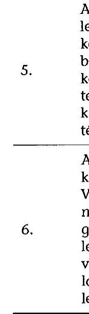
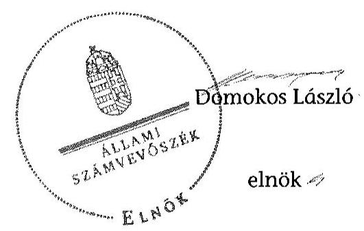

# ÁLLAMI   SZÁMVEVŐSZÉK 

## JELENTÉS

az önkormányzatok belső kontrollrendszere kialakításának, egyes
kontrolltevékenységek és a belső ellenőrzés
működésének ellenőrzése
Gádoros
15103

---

# Állami Számvevőszék 

Iktatószám: V-0681-058/2015.
Témaszám: 1715
Vizsgálat-azonosító szám: V067716

## Az ellenőrzést felügyelte:

Dr. Benedek Mária
felügyeleti vezető
Az ellenőrzést vezette és az ellenőrzés végrehajtásáért felelős:
Gál Magdolna
ellenőrzésvezető
A számvevőszéki jelentés összeállításában közreműködött:
Lantos Józsefné
számvevő tanácsos
Az ellenőrzést végezték:
Hálóné Pelikán Veronika Lantos Józsefné
számvevő számvevő tanácsos

---

# TARTALOMJEGYZÉK 

BEVEZETÉS ..... 7
I. ÖSSZEGZŐ MEGÁLLAPÍTÁSOK, KÖVETKEZTETÉSEK, JAVASLATOK ..... 11
II. RÉSZLETES MEGÁLLAPÍTÁSOK ..... 14

1. Az Önkormányzat belső kontrollrendszere kialakításának és működtetésének megfelelősége ..... 14
1.1. A kontrollkörnyezet kialakítása és működtetése ..... 14
1.2. A kockázatkezelési rendszer kialakítása és működtetése ..... 15
1.3. A kontrolltevékenységek kialakítása és működtetése ..... 16
1.4. Az információs és kommunikációs rendszer kialakítása és működtetése ..... 17
1.5. A monitoring rendszer kialakítása és működtetése ..... 18
2. A monitoring rendszer részeként a belső ellenőrzés kialakítása és működtetése ..... 18
3. A pénzügyi folyamatokban kulcsszerepet betöltő belső kontrollok (teljesítésigazolás és érvényesítés) működése ..... 19
4. Az integritás szemlélet érvényesülése ..... 22
FÜGGELÉKEK
5. számú Értelmező szótár
6. számú Az integritás érvényesítése érdekében kialakított és működtetett intézményi kontrollrendszer

---

.

---

# RÖVIDÍTÉSEK JEGYZÉKE 

## Törvények

Áht.
ÁSZ tv.
Info tv.
Kttv.
Mötv.
Ötv.
Számv. tv.
Vnytv.

## Rendeletek

Áhsz.

Ávr.
Bkr.
képviselő-testületi
SZMSZ $_{1}$
képviselő-testületi
SZMSZ $_{2}$
költségvetési rendelet
vagyongazdálkodási rendelet

## Szórövidítések

adatvédelmi és adatbiztonsági szabályzat
2011. évi CXCV. törvény az államháztartásról
2011. évi LXVI. törvény az Állami Számvevőszékről
2011. évi CXII. törvény az információs önrendelkezési jogról és az információszabadságról
2011. évi CXCIX. törvény a közszolgálati tisztviselőkről
2011. évi CLXXXIX. törvény Magyarország helyi önkormányzatairól
1990. évi LXV. törvény a helyi önkormányzatokról
2000. évi C. törvény a számvitelről
2007. évi CLII. törvény egyes vagyonnyilatkozat-tételi kötelezettségekről

249/2000. (XII. 24.) Korm. rendelet az államháztartás szervezetei beszámolási és könyvvezetési kötelezettségének sajátosságairól (hatályos 2013. december 31-ig)
368/2011. (XII. 31.) Korm. rendelet az államháztartásról szóló törvény végrehajtásáról
370/2011. (XII. 31.) Korm. rendelet a költségvetési szervek belső kontrollrendszeréről és belső ellenőrzéséről
Gádoros Nagyközség Önkormányzata Képviselő-testületének 25/2012. (XI. 29.) önkormányzati rendelettel módosított 6/2011. (III. 24.) önkormányzati rendelete Gádoros Nagyközség Önkormányzata Képviselő-testülete és Szervei Szervezeti és Működési Szabályzatáról (hatályos: 2011. április 1-jétől 2013. április 30-áig)
Gádoros Nagyközség Önkormányzata Képviselő-testületének 10/2013. (IX. 19.) önkormányzati rendelete Gádoros Nagyközség Önkormányzata Képviselő-testülete és Szervei Szervezeti és Működési Szabályzatáról (hatályos 2013. május 1-jétől)
Gádoros Nagyközség Önkormányzata Képviselő-testületének 1/2013. (II. 21.) önkormányzati rendelete az Önkormányzat 2013. évi költségvetéséről
Gádoros Nagyközség Önkormányzat Képviselő-testületének 2/2012. (III. 2.) önkormányzati rendelete az önkormányzati vagyonról és a vagyonnal való gazdálkodás egyes szabályairól

Gádoros Nagyközség Önkormányzat Polgármesteri Hivatal A polgárok személyi adatainak és lakcímének nyilvántartásával kapcsolatos adatvédelmi szabályzata, valamint Közszolgálati adatvédelmi szabályzat (hatályos 2005. szeptember 1-jétől)

---

alapító okirat

ÁSZ
belső ellenőrzési kézikönyv
bizonylati szabályzat
ellenőrzési nyomvonal
eszközök és források értékelési szabályzata
etikai szabályzat
gazdálkodási jogkörök szabályzata $_{1}$
gazdasági program
gazdasági szervezet
gazdasági szervezet ügyrendje

Hivatal

Gádoros Nagyközség Önkormányzata Képviselő-testületének Polgármesteri Hivatala Alapító Okirata (Gádoros Nagyközség Önkormányzatának Képviselő-testülete 129/2010. (VIII. 26.) KT. számú határozatával kiadott dokumentum, hatályos 2010. szeptember 1-jétől)
Állami Számvevőszék
Gádoros Nagyközségi Önkormányzat Polgármesteri Hivatal Belső ellenőrzési kézikönyve (a jegyző által jóváhagyott dokumentum, hatályos 2013. december 1-jétől)
Gádoros Nagyközség Polgármesteri Hivatala Bizonylati szabályzat (a jegyző által kiadott dokumentum, hatályos 2004. szeptember 1-jétől)
Gádoros Nagyközségi Önkormányzat ellenőrzési nyomvonala (hatályos 2013. március 1-jétől)
Polgármesteri Hivatal Gádoros Eszközök és források értékelési szabályzata (a jegyző által kiadott szabályzat, hatályos 2010. október 1-jétől)
Gádoros Nagyközség Önkormányzat Polgármesteri Hivatalának etikai szabályzata (Gádoros Nagyközség Önkormányzata Képviselő-testületének 106/2013.(IX.17.) KT. számú határozatával elfogadott szabályzat, hatályos 2013. szeptember 17-étől)
Polgármesteri Hivatal Gádoros Gazdálkodási szabályzat a kötelezettségvállalás, pénzügyi ellenjegyzés, teljesítés igazolása, érvényesítés és az adatszolgáltatás rendjéről (a jegyző által kiadott szabályzat, hatályos 2012. április 1-jétől 2013. február 28-áig)
Polgármesteri Hivatal Gádoros Gazdálkodási szabályzat a kötelezettségvállalás, pénzügyi ellenjegyzés, teljesítés igazolása, érvényesítés és az adatszolgáltatás rendjéről (a jegyző által kiadott szabályzat, hatályos 2013. március 1-jétől)
Gádoros Nagyközség Önkormányzata Gazdasági Program 2011-2014. (Gádoros Nagyközség Önkormányzata Képviselő-testületének 24/2011. (II. 15.) KT. számú határozatával elfogadott dokumentum)
Gádorosi Polgármesteri Hivatal pénzügyi és gazdasági csoportja, a Polgármesteri Hivatal SZMSZ-e 1. számú mellékletét képező szervezeti felépítés szerint meghatározott szervezeti egység
Gádoros Nagyközség Polgármesteri Hivatal SZMSZ-ének részeként csatolt Ügyrend (Gádoros Nagyközség Önkormányzata Képviselő-testületének 171/2009. (IX. 15.) számú határozatával elfogadott SZMSZ részeként jóváhagyott dokumentum, hatályos 2009. szeptember 15-étől)
Gádorosi Polgármesteri Hivatal

---

hivatali SZMSZ

INTOSAI
iratkezelési szabályzat

ISSAI
jegyző
Képviselő-testület
Kincstár
közérdekű adatok megismerésére irányuló kérelmek rendje
közszolgálati szabályzat
leltárkészítési és leltározási szabályzat
munkavédelmi szabályzat

Nemzetiségi Önkormányzat
NGM
Önkormányzat
pénzkezelési szabályzat
polgármester
szabálytalanságok kezelésének eljárásrendje
számítástechnikai védelmi szabályzat

Gádoros Nagyközség Önkormányzata Polgármesteri Hivatalának Szervezeti és Működési Szabályzata (Gádoros Nagyközség Önkormányzata Képviselő-testületének 171/2009. (IX. 15) KT. számú határozatával jóváhagyott dokumentum, hatályos 2009. szeptember 15-étől)
International Organization of Supreme Audit Institutions (Legfőbb Ellenőrző Intézmények Nemzetközi Szervezete)
Gádoros Nagyközség Önkormányzata Polgármesteri Hivatalának Iratkezelési Szabályzata (a jegyző által 2013. február 26-án készített szabályzat, hatályos a levéltár és a Békés Megyei Kormányhivatal egyetértését követő 10. naptól)
International Standards of Supreme Audit Institutions (Legfőbb Ellenőrző Intézmények Nemzetközi Standardjai)
Gádoros Nagyközség Önkormányzata Polgármesteri Hivatalának jegyzője
Gádoros Nagyközség Önkormányzata Képviselő-testülete Magyar Államkincstár
Polgármesteri Hivatal Gádoros A közérdekű adatok megismerésére irányuló kérelmek intézésének és a kötelezően közzéteendő adatok nyilvánosságra hozatalának szabályzata (a jegyző által kiadott szabályzat, hatályos 2010. november 1-jétől)
Gádoros Nagyközségi Önkormányzat Jegyzőjének 3/2001. számú intézkedése az egységes közszolgálati szabályzatról (hatályos 2001. október 15-étől)
Gádoros Nagyközség Polgármesteri Hivatala Leltárkészítési és leltározási szabályzat (a jegyző által kiadott szabályzat, hatályos 2004. szeptember 1-jétől)
Polgármesteri Hivatal Munkavédelmi szabályzata (a jegyző által 2007. június 26-án kiadott szabályzat, hatályos 2007. július 1-jétől)
Gádoros Nagyközség Roma Nemzetiségi Önkormányzata
Nemzetgazdasági Minisztérium
Gádoros Nagyközség Önkormányzata
Gádoros Nagyközség Önkormányzat Pénzkezelési Szabályzat (a jegyző által 2013. április 29-én kiadott szabályzat, hatályos 2013. április 1-jétől)
Gádoros Nagyközség Önkormányzatának polgármestere
Gádoros Nagyközség Önkormányzata Polgármesteri Hivatala szabálytalanságok kezelésének eljárásrendje (a jegyző által kiadott dokumentum, hatályos 2010. január 1-jétől)
Gádoros Nagyközség Polgármesteri Hivatala Számítástechnikai védelmi szabályzat (hatályos 2006. augusztus 1-jétől)

---

| számlarend | Gádoros Nagyközség Önkormányzat Polgármesteri Hiva-   tala Számlarend (a jegyző által kiadott dokumentum, ér-   vényes 2013. április 1-jétől) |
| :-- | :-- |
| számviteli politika | Polgármesteri Hivatal Gádoros Számviteli politika (a   jegyző által kiadott szabályzat, hatályos 2010. augusztus   16-ától) |
| tűzvédelmi szabályzat | Tűzvédelmi szabályzat Gádoros Nagyközség Polgármes-   teri Hivatala részére (a polgármester által kiadott doku-   mentum, hatályos 2000. július 1-jétől) |

---

# JELENTÉS 

## az önkormányzatok belső kontrollrendszere kialakításának, egyes kontrolltevékenységek és a belső ellenőrzés működésének ellenőrzése Gádoros

## BEVEZETÉS

Gádoros nagyközség állandó lakosainak száma 2013. január 1-jén 3932 fő volt. Az Önkormányzat héttagú Képviselő-testületének munkáját két állandó bizottság segítette. Az Önkormányzat az önállóan működő és gazdálkodó Hivatalon kívül három önállóan működő intézményt működtetett, egy többségi tulajdoni hányadú gazdasági társasággal rendelkezett. A polgármester az 1998. évi önkormányzati választások óta tölti be tisztségét. A jegyző 1999. február 1-jétől látja el feladatait. A Hivatal két szervezeti egységre tagolódott, elkülönített gazdasági szervezettel rendelkezett. A foglalkoztatott köztisztviselők száma 2013. január 1-jén 13 fő volt. A Hivatalnál 2013. január 1-jétől szervezeti változás nem történt. Az Önkormányzat a 2013. évi költségvetési beszámolója szerint 1759182 ezer Ft tárgyévi bevételt ért el, valamint 1594110 ezer Ft tárgyévi kiadást teljesített. A 2013. december 31-i könyvviteli mérleg szerint 3827043 ezer Ft értékű eszközvagyonnal rendelkezett, a rövid lejáratú kötelezettségállománya 10940 ezer Ft, hosszú lejáratú kötelezettség állománya nem volt.

A demokratikus társadalmakban alapvető igény, hogy a közpénzeket, a közvagyont használók valamennyi tevékenységükhöz kapcsolódó pénzfelhasználásról elszámoljanak, ahhoz egyértelmű és érvényesíthető felelősségi szabályok társuljanak. Ennek a jogos igénynek az érvényesítéséhez meg kell teremteni azokat a folyamatokat, rendszereket, amelyek nélkülözhetetlenek az elszámoltatáshoz. Az elszámoltatás eredményes működtetéséhez szükség van a megfelelő információs, kontroll, értékelési és beszámolási rendszerek kialakítására.

Magyarországon az uniós csatlakozási tárgyalások idejére nyúlnak vissza a belső kontrollrendszer szabályozásának gyökerei. Az uniós elvárásoknak megfelelő új terminológia szerinti államháztartási belső pénzügyi ellenőrzési (ÁBPE) rendszer területén a jogharmonizáció 2003-ban teljes körűen megvalósult, míg az önkormányzati alrendszerre vonatkozó, Ötv.-ben megjelenített speciális szabályozás 2005-ben lépett hatályba. Az államháztartási belső kontrollrendszer koncepciója 2009-ben továbbfejlődött. A változások irányát mutatja, hogy a költségvetési szervek belső kontrollrendszere már magában foglalja a korszerű felelős szervezetirányítás elemeit (kontrollkörnyezet, kockázatkezelés, kontrolltevékenység, információ és kommunikáció, monitoring) is. E kontrollrendszer szabályozása háromszintű, a törvényi előírásokat az Áht. és a Mötv., a rendeleti szintű szabályozást az Ávr. és a Bkr. tartalmazza, amelyeket útmutatói szinten az NGM által kiadott standardok és kézikönyvek támogatnak.

---

A belső kontrollrendszer azt a célt szolgálja, hogy a költségvetési szervek működésük és gazdálkodásuk során a tevékenységeket szabályszerűen, gazdaságosan, hatékonyan, eredményesen hajtsák végre, teljesítsék elszámolási kötelezettségeiket és megvédjék az erőforrásokat a veszteségektől, a károktól és a nem rendeltetésszerű használattól. A belső kontrollrendszer magában foglalja mindazon szabályokat, eljárásokat, gyakorlati módszereket és szervezeti struktúrákat, kockázatkezelési technikákat, kontrolltevékenységeket, amelyek segítséget nyújtanak a szervezetnek céljai eléréséhez.

Az ÁSZ a középtávú stratégiájában hangsúlyos szerepet szánt annak, hogy szilárd szakmai alapon álló, értékteremtő ellenőrzéseivel előmozdítsa a közpénzügyek átláthatóságát, rendezettségét. A számvevőszéki ellenőrzés nemzetközi alapelvei is rögzítik, hogy a megfelelő belső kontrollrendszer minimálisra csökkenti a hibák és szabálytalanságok kockázatát.

# Az ellenőrzés célja annak értékelése, hogy 

- a jogszabályi előírásoknak megfelelően alakították-e ki és működtették-e a belső kontrollrendszert;
- a gazdálkodás folyamatában kulcsszerepet betöltő teljesítésigazolás és érvényesítés kontrolltevékenységeit megfelelően működtették-e;
- biztosították-e a belső ellenőrzés szabályos működését;
- kialakították-e az erőforrásokkal való szabályszerű és hatékony gazdálkodáshoz szükséges követelményeket, megvalósították-e azok számonkérését, ellenőrzését;
- hasznosították-e az ÁSZ által a 2009-2013. évek között végzett ellenőrzések javaslatait.

A közintézmények integritás alapú kultúrájának kialakítása, megerősítése és működése szorosan összefügg a belső kontrollrendszer működésével, ezért az ellenőrzés kitért a gazdálkodáshoz kapcsolódó integritás kontrollok meglétének és működésének ellenőrzésére is. Az integritási kultúra kialakítása hozzájárul az elszámoltathatóság és átláthatóság érvényesítéséhez, egyben támogatja a szervezet védettségét a korrupciós kitettséggel szemben, valamint annak megelőzése is irányítottabbá válik.

Az ellenőrzés várható hasznosulását négy szinten tervezzük. A törvényalkotás számára összegzett tapasztalatok állnak rendelkezésre a belső kontrollrendszer önkormányzati területen való kialakításáról, működéséről és hatásairól, a belső ellenőrzés működéséről. Az ellenőrzés az ellenőrzött számára visszajelzést ad a belső kontrollrendszer kialakításában és működésében fellépő hiányosságokról, javaslataival hozzájárul azok kiküszöböléséhez, amely csökkentheti a későbbi ellenőrzések gyakoriságát. Az ellenőrzés megállapításait és javaslatait más szervezetek is hasznosíthatják a rendezett gazdálkodási keretek kialakításához. A társadalom számára jelzi, hogy közpénz nem maradhat ellenőrizetlenül, az ÁSZ értékteremtő rend kialakításához és megőrzéséhez hozzájáruló tevékenysége pozitív hatással lesz a szervezetről kialakított összkép formálásá-

---

ban. A szervezeten belül lehetőség nyílik arra, hogy a megállapítások szintetizálásával az ÁSZ a hozzáadott értéket teremtő elemző tevékenységét és tanácsadó szerepét is erősítse.

Az önkormányzatok belső kontrollrendszere kialakításának, az egyes kontrolltevékenységek és a belső ellenőrzés működésének ellenőrzéséről szóló jelentés I. fejezetének összegző része az ellenőrzés céljára ad rövid, szintetizáló összefoglalót, és tartalmazza a következtetéseket a II. fejezet részletes megállapításain alapulóan. A jelentés intézkedést igénylő megállapításait és javaslatait az ellenőrzés során feltárt, a jelentés II. fejezetében rögzített részletes megállapítások alapozzák meg.

# Az ellenőrzés típusa: szabályszerűségi ellenőrzés 

Az ellenőrzött időszak:
 a belső kontrollrendszer kialakítása és működtetése szabályszerűségét a 2013. évre vonatkozóan (2013. december 31-ei állapotnak megfelelően), a pénzügyi folyamatokban kulcsszerepet betöltő teljesítésigazolás és érvényesítés belső kontrollok működésének megfelelőségét és a belső ellenőrzés szabályszerű működését a 2013. január 1. és a 2013. december 31. közötti időszakot figyelembe véve értékeltük, míg az ÁSZ javaslatainak utóellenőrzése a 2009-2013. években végzett ellenőrzések nyilvánosságra hozott jelentéseiben tett javaslatok áttekintésére terjedt ki.

## Az ellenőrzött szervezet: az Önkormányzat

Az ellenőrzés jogszabályi alapját az ÁSZ tv. 1. § (3) bekezdése, az 5. § (2) és (6) bekezdései, valamint az Áht. 61. § (2) bekezdése képezik.

Az ellenőrzés szakmai módszertana az ÁSZ hivatalos honlapján (www.asz.hu) közzétett szakmai szabályokon alapult, amely az INTOSAI által kiadott ISSAI figyelembevételével készült.

Az ellenőrzés lefolytatásához az Önkormányzat a kimutatások és a tanúsítvány elektronikus kitöltésével, valamint az ÁSZ által kért dokumentumok elektronikus megküldésével szolgáltatott adatokat. Az így rendelkezésre bocsátott adatok, információk kontrollja és a munkalapok kitöltése a helyszíni ellenőrzés keretében történt. A jelentésben használt fogalmak magyarázatát az 1. számú függelék, az integritás érvényesítése érdekében kialakított és működtetett intézményi kontrollrendszer minősítését a 2. számú függelék tartalmazza.

A belső kontrollrendszer, valamint a belső ellenőrzés jogszabályi előírások szerinti kialakításának és működtetésének szabályszerűségét az erre irányuló ellenőrzési kérdésekre adott válaszok összesítése alapján értékeltük. A belső kontrollrendszert kontrollterületenként (kontrollkörnyezet, kockázatkezelési rendszer, kontrolltevékenységek, információs és kommunikációs rendszer, monitoring rendszer) és összesítetten is értékeltük.

A belső kontrollrendszer egyes kontrollterületei és a belső ellenőrzés kialakítása és működtetése „szabályszerű volt", amennyiben az értékelt területen az elért és az elérhető pontok százalékban kifejezett hányadosa elérte a 81%-ot, „részben szabályszerű volt", ha 61-80% közé esett, és „nem volt szabályszerű", ha nem haladta meg a 60%-ot. A belső kontrollrendszer összesített értékelése megegyezett

---

a kontrollterületenként alkalmazott %-os értékelésekkel, a következő eltérésekkel. A kontrollrendszer egésze esetében a „szabályszerű" értékelésnek a %-os értéken felül további feltétele volt, hogy egyik kontrollterület sem kaphatott „nem volt szabályszerű" értékelést, a „részben szabályszerű" értékelés további feltétele volt, hogy legfeljebb egy ellenőrzött kontrollterület lehetett „nem volt szabályszerű" értékelésű. Az összesített értékelés a %-os értéktől függetlenül „nem volt szabályszerű", ha az ellenőrzött kontrollterületek közül több mint egynek „nem volt szabályszerű" az értékelése.

A gazdálkodás folyamatában kulcsszerepet betöltő két kulcskontroll - teljesítésigazolás, érvényesítés - működésének megfelelőségét a személyi juttatásokkal, a dologi és felhalmozási kiadásokkal, működési és felhalmozási célú pénzeszköz átadásokkal, ellátottak pénzbeli juttatásaival kapcsolatos kifizetések esetében mintavétellel ellenőriztük. „Megfelelőnek" értékeltük a gazdálkodási jogkörök gyakorlását, amennyiben 95%-os bizonyossággal a teljes sokaságban a hibaarány legfeljebb 10%, „részben megfelelőnek" értékeltük, ha a hibaarány felső határa 10-30% között volt, „nem megfelelőnek" pedig akkor, ha a mintavételi eredmények alapján a sokaságbeli hibaarány meghaladta a 30%-ot.

Az integritás szemlélet érvényesülésének minősítése az Önkormányzat önbevallás által kitöltött tanúsítványa alapján történt.

Utóellenőrzésre nem került sor, mivel az ÁSZ az Önkormányzatnál a 2009-2013. évek között nem végzett ellenőrzést.

Az ÁSZ tv. 29. § (1) bekezdése szerint a jelentéstervezetet megküldtük a polgármester részére, aki az ÁSZ tv. 29. § (2) bekezdésében foglalt észrevételezési jogával nem élt, a jelentéstervezetre észrevételt nem tett.

---

# I. ÖSSZEGZŐ MEGÁLLAPÍTÁSOK, KÖVETKEZTETÉSEK, JAVASLATOK 

A belső kontrollrendszeren belül 2013-ban a kontrollkörnyezet, a kockázatkezelési rendszer, a kontrolltevékenységek, az információs és kommunikációs rendszer, valamint a monitoring rendszer kialakítását külön-külön és együttesen is értékeltük. A belső kontrollrendszer kialakítása és működtetése az összesített értékelés alapján nem volt szabályszerű.

A belső kontrollrendszer egyes területei kialakításának és működtetésének minősítése a következő:

| Kontrollterület | Minősítés |  |
| :-- | :-- | :-- |
| Kontrollkörnyezet | szabályszerű |  |
| Kockázatkezelési rendszer |  | nem szabályszerű |
| Kontrolltevékenységek | szabályszerű |  |
| Információs és kommunikációs rendszer | szabályszerű |  |
| Monitoring rendszer |  | nem szabályszerű |

Szabályszerű volt a kontrollkörnyezet, a kontrolltevékenységek, valamint az információs és kommunikációs rendszer kialakítása és működtetése, mivel az ellenőrzés során megállapított kisebb szabályozásbeli hiányosságok nem veszélyeztették e kontrollterületeken a szabályszerű működést.

Nem volt szabályszerű a kockázatkezelési rendszer, valamint a monitoring rendszer kialakítása és működtetése, mivel az ellenőrzés során megállapított szabályozásbeli hiányosságok magukban hordozzák a szabálytalan működés, valamint a korrupció kockázatát.

Az Önkormányzat a belső ellenőrzési feladatokat külső szolgáltató útján látta el. A 2013. évben a belső ellenőrzés kialakítása és működtetése szabályszerű volt, azonban a belső ellenőrzés nem tárta fel a belső kontrollrendszer kialakításának és működtetésének, valamint a pénzügyi folyamatokban kulcsszerepet betöltő teljesítésigazolás és érvényesítés belső kontrollok működésének hiányosságait.

A 2013. évben a személyi juttatásokkal, a dologi és felhalmozási kiadásokkal, valamint a működési célú pénzeszköz átadásokkal kapcsolatos kifizetések során a pénzügyi folyamatokban kulcsszerepet betöltő teljesítésigazolás és érvényesítés belső kontrollok működése nem volt megfelelő, mivel azok nem biztosították a hibák megelőzését és feltárását.

---

A számvevőszéki ellenőrzés az ellenőrzött kifizetésekkel összefüggésben a rendelkezésre bocsátott dokumentumok alapján kár bekövetkeztére utaló adatot, tényt nem állapított meg, azonban a gazdálkodásban kulcsszerepet betöltő kontrollok működésében feltárt hiányosságok miatt fennáll a hibák bekövetkezésének kockázata. A nem megfelelően működtetett belső kontrollok korrupciós kockázatot hordoznak.

A Képviselő-testület a 2013. évben kialakította az erőforrásokkal való, szabályszerű és hatékony gazdálkodáshoz szükséges követelményeket.

Az Önkormányzat intézkedéseket tett az integritás szemlélet fejlesztésére, valamint a korrupciós kockázatok csökkentésére, a 2013. évben önként részt vett az ÁSZ integritási felmérésében.

Az ellenőrzés keretében egy rövidített - a kontrollrendszerre összpontosító - kérdőív kitöltésére került sor. Az integritás szemlélet érvényesülésének minősítését a 2. számú függelék tartalmazza.

Az ÁSZ tv. 33. § (1) bekezdésében foglaltak értelmében az ellenőrzött szervezet vezetője köteles a jelentésben foglalt megállapításokhoz kapcsolódó intézkedési tervet összeállítani, és azt a jelentés kézhezvételétől számított 30 napon belül az ÁSZ részére megküldeni. Amennyiben az intézkedési tervet határidőre nem küldi meg a szervezet, vagy az ÁSZ tv. 33. § (2) bekezdésében foglalt póthatáridő elteltével megküldött intézkedési terv továbbra sem elfogadható, az ÁSZ elnöke a hivatkozott törvény 33. § (3) bekezdés a)-b) pontjaiban foglaltakat érvényesítheti.

Az ellenőrzés intézkedést igénylő megállapításai és javaslatai:

# a polgármesternek 

1. Az Önkormányzat kiadási előirányzata terhére történt kötelezettségvállalásra - az Áht. 37. § (1) bekezdésében és az Ávr. 55. § (1) bekezdésében foglaltak ellenére pénzügyi ellenjegyzés nélkül került sor.

Javaslat:
Intézkedjen annak érdekében, hogy az Önkormányzat nevében történő kötelezettségvállalásra az Áht. 37. § (1) bekezdésében és az Ávr. 55. § (1) bekezdésében foglaltaknak megfelelően - az Ávr. 53. §-ában meghatározott kivételekkel - kizárólag pénzügyi ellenjegyzés után kerüljön sor.
2. A Képviselő-testület bizottságai nem helyi önkormányzati képviselő tagjai - a Vnytv. 5. § (1) bekezdésében foglaltak ellenére - vagyonnyilatkozat-tételi kötelezettségüknek nem tettek eleget. A Képviselő-testület bizottságai nem helyi önkormányzati képviselő tagjai vonatkozásában a vagyonnyilatkozatok őrzéséért felelős a képviselőtestületi SZMSZ$_{1,2}$-ben nem került kijelölésre.

Javaslat:
Kezdeményezze a Képviselő-testületnél a Mötv. 65. §-a alapján a Mötv. 57. § (2) bekezdésének, valamint a Vnytv.-ben foglaltaknak megfelelően a bizottságok nem helyi

---

önkormányzati képviselő tagjai vonatkozásában a vagyonnyilatkozatok őrzéséért felelős képviselő-testületi SZMSZ-ben történő kijelölését e személyek vagyonnyilatkozattételi kötelezettsége teljesítésével kapcsolatos jogsértő gyakorlat megszüntetése érdekében.
3. A számvevőszéki jelentés ellenőrzési megállapításai alapján az Önkormányzatnál a belső kontrollrendszer kialakítása és működtetése az összesített értékelés alapján nem volt szabályszerű, a kulcskontrollok működése nem volt megfelelő. A számvevőszéki ellenőrzés során feltárt hibákat, hiányosságokat és szabálytalanságokat a számvevőszéki jelentés II. Részletes megállapítások fejezetcím tartalmazza.

Javaslat:
Kísérje figyelemmel a Mötv. 115. § (1) bekezdésében foglaltak alapján az Önkormányzat gazdálkodásának szabályszerűségét. A Mötv. 67. § f) pontja alapján gondoskodjon a belső kontrollrendszer kialakítására és működtetésére vonatkozó jogszabályi rendelkezések be nem tartása, valamint a teljesítésigazolás, illetve az érvényesítés kontrollokkal összefüggésben feltárt hibák, hiányosságok, szabálytalanságok tekintetében az esetleges munkajogi felelősséggel kapcsolatos körülmények kivizsgálásáról, majd a vizsgálat eredményének függvényében tegye meg a szükséges intézkedéseket.

# a jegyzőnek 

1. A számvevőszéki jelentés ellenőrzési megállapításai alapján az Önkormányzatnál a belső kontrollrendszer kialakítása és működtetése az összesített értékelés alapján nem volt szabályszerű, a kulcskontrollok működése nem volt megfelelő, illetve a belső ellenőrzés kialakítása és működtetése - kisebb hiányosságok mellett - szabályszerű volt. A számvevőszéki ellenőrzés során feltárt hibákat, hiányosságokat és szabálytalanságokat a számvevőszéki jelentés II. Részletes megállapítások fejezetcím tartalmazza.

Javaslat:
A jogszabályoknak megfelelő belső kontrollrendszer kialakítása és működtetése érdekében - az ellenőrzött időszak óta bekövetkezett esetleges jogszabályi változásokra figyelemmel - intézkedjen a belső kontrollrendszer kialakításában és működtetésében, a kulcskontrollok működésében, illetve a belső ellenőrzés kialakításában és működtetésében az ellenőrzés által feltárt hibák, hiányosságok, szabálytalanságok kijavítására.

Kezdeményezze, hogy az éves ellenőrzési terv kiterjedjen a kifizetések szabályszerűségi ellenőrzésére, különös tekintettel a személyi juttatásokkal, a dologi kiadásokkal, a felhalmozási kiadásokkal, a működési és felhalmozási célú pénzeszköz átadásokkal, az ellátottak pénzbeli juttatásaival kapcsolatos kiadási jogcímekből teljesített kifizetésekre.

---

# II. RÉSZLETES MEGÁLLAPÍTÁSOK 

## 1. Az ÖNKORMÁNYZAT BELSŐ KONTROLLRENDSZERE KIALAKÍTÁSÁNAK ÉS MŰKÖDTETÉSÉNEK MEGFELELŐSÉGE

A belső kontrollrendszeren belül 2013-ban a kontrollkörnyezet, a kockázatkezelési rendszer, a kontrolltevékenységek, az információs és kommunikációs rendszer, valamint a monitoring rendszer kialakítását és működtetését külön-külön és együttesen is értékeltük. A belső kontrollrendszer kialakítása és működtetése az összesített értékelés alapján nem volt szabályszerű.

### 1.1. A kontrollkörnyezet kialakítása és működtetése

## A kontrollkörnyezet kialakítása és működtetése - kisebb hiányosságok mellett - szabályszerű volt.

A Hivatal rendelkezett alapító okirattal, amely tartalmazta az alaptevékenységeket. Az Önkormányzat rendelkezett a Képviselő-testület által elfogadott gazdasági programmal, a Képviselő-testület megalkotta a képviselő-testületi SZMSZ$_{1,2}$-t és jóváhagyta a hivatali SZMSZ-t. Az Önkormányzat megfelelő működése érdekében a Hivatalban kialakították a belső szabályzatokat. A Képviselő-testület elfogadta az Önkormányzat vagyongazdálkodási rendeletét, amelyben meghatározta a vagyongazdálkodás főbb szabályait. A jegyző elkészítette a számlarendet, a számviteli politikát és annak részeként a pénzkezelési szabályzatot, a leltárkészítési és leltározási szabályzatot, valamint az eszközök és források értékelési szabályzatát, amelyek hatályát kiterjesztette a Nemzetiségi Önkormányzat gazdálkodási feladataira. A jegyző elkészítette a Hivatal gazdasági szervezetének ügyrendjét és bizonylati szabályzatát, és kialakította a Hivatal szabálytalanságok kezelésének eljárásrendjét. A Hivatal rendelkezett ellenőrzési nyomvonallal, munkavédelmi és tűzvédelmi szabályzattal.

A Hivatalban dolgozó köztisztviselők rendelkeztek munkaköri leírással. A Képviselő-testület a költségvetési rendeletében meghatározta a Hivatal engedélyezett létszámát, kialakította az erőforrásokkal való, szabályszerű és hatékony gazdálkodáshoz szükséges követelményeket és elfogadta a köztisztviselőkre vonatkozó etikai szabályzatot.

A jegyző meghatározta a köztisztviselők teljesítményértékelésének 2013. második félévére vonatkozó kötelező elemeit, és elkészítette a Hivatalban dolgozó köztisztviselők 2013. évi teljesítményértékelését.

---

A kontrollkörnyezet kialakítása és működtetése - az alábbi kisebb hiányosságok mellett - szabályszerű volt:

| Sor-   szám $^{1}$ | Megállapítás | Megjegyzés |
| :--: | :--: | :--: |
| 6-8. | A jegyző - az Ávr. 13. § (1)

 bekezdés e)*-g) pontjaiban foglaltak ellenére - a hivatali SZMSZ-ben nem rögzítette - a gazdasági szervezet engedélyezett létszámát, azon ügyköröket, amelyek során a szervezeti egységek vezetői a költségvetési szerv képviselőjeként járhatnak el, valamint a hivatali SZMSZ-ben nevesített munkakörökhöz tartozó feladat- és hatásköröket, a hatáskörök gyakorlásának módját, a helyettesítés rendjét, az ezekhez kapcsolódó felelősségi szabályokat. | A munkakörhöz tartozó hatásköröket és a helyettesítendő személyt a jegyző a munkaköri leírásokban rögzítette.   *2015. január 1-jétől az engedélyezett létszámra vonatkozó jogszabályi előírás hatálytalan. |
| 35. | A Hivatal gazdasági vezetője - az Ávr. 12. § (1) bekezdésében előírtak ellenére - nem rendelkezett felsőoktatásban szerzett végzettséggel. | A gazdasági vezető középfokú végzettséggel és államháztartási mérlegképes könyvelői szakképesítéssel rendelkezett. |
| 37. | A jegyző - a Kttv. 75. § (1) bekezdés d) pontjában foglaltak ellenére - a köztisztviselők munkaköri leírásában nem rögzítette a munkakör betöltésével kapcsolatosan a tapasztalatra és a képességekre vonatkozó követelményeket. |  |

# 1.2. A kockázatkezelési rendszer kialakítása és működtetése 

A kockázatkezelési rendszer kialakítása és működtetése nem volt szabályszerű, mert:

| Sor-   szám | Megállapítás | Megjegyzés |
| :--: | :--: | :--: |
| $2-4$. | A jegyző - a Bkr. 7. § (2) bekezdésében foglalt előírás ellenére - nem mérte fel és nem állapította meg a Hivatal tevékenységében, gazdálkodásában rejlő kockázatokat, nem határozta meg az egyes kockázatokkal kapcsolatban a szükséges intézkedéseket, valamint azok teljesítésének folyamatos nyomon követési módját. |  |

[^0]
[^0]:    ${ }^{1}$ A megállapítás számozása az Önkormányzat által kitöltött kimutatások - adatszolgáltatások - kérdéseinek sorszámával azonos.

---

A Képviselő-testületi SZMSZ ${ }_{1,2}$ tartalmazta a polgármester és a képviselők vagyonnyilatkozat-tételi kötelezettségét.

A jogszabályokban foglalt előírásoknak megfelelően a vagyonnyilatkozat-tételre kötelezett köztisztviselők, a polgármester és a képviselők a vagyonnyilatkozat-tételi kötelezettségüknek eleget tettek.

# 1.3. A kontrolltevékenységek kialakítása és működtetése 

## A kontrolltevékenységek kialakítása és működtetése - kisebb hiányosságok mellett - szabályszerű volt.

A jegyző az ellenőrzési nyomvonalban előírt módon biztosította a folyamatba épített, előzetes, utólagos és vezetői ellenőrzést a költségvetés tervezése, a beszerzések lebonyolítása, a vagyonhasznosítási tevékenység, valamint a támogatások elszámolása vonatkozásában.

A jegyző a gazdálkodási jogkörök szabályzata ${ }_{1,2}$-ben meghatározta a kötelezettségvállalás, pénzügyi ellenjegyzés, teljesítésigazolás, érvényesítés, utalványozás gyakorlásának módjával, eljárási és dokumentációs részletszabályaival, valamint az ezeket végző személyek kijelölésének rendjével kapcsolatos belső előírásokat, továbbá az előzetes írásbeli kötelezettségvállalást nem igénylő kifizetések rendjét.

A jegyző az iratkezelési szabályzatban meghatározta az üzemeltetés és az adatbiztonság feladatait, az elektronikus iratkezelés szabályait, az üzemeltetésért és az adatok biztonságos kezeléséért felelősöket, továbbá a számítástechnikai védelmi szabályzatban előírta az adatok biztonságának érvényre juttatásához szükséges eljárási szabályokat.

A polgármester a Képviselő-testületet a jogszabályi előírásoknak megfelelően a megadott határidőig írásban tájékoztatta az Önkormányzat gazdálkodásának első félévi helyzetéről.

A jegyző a gazdálkodási jogkörök szabályzata ${ }_{1,2}$-ben, valamint a gazdasági szervezet ügyrendjében határozta meg a beszámolók elkészítésével kapcsolatos feladatokat, az ahhoz kapcsolódó felelősségi köröket. A gazdasági feladatot ellátók helyettesítésének rendjét a jegyző a munkaköri leírásokban rögzítette. A költségvetési beszámoló elkészítését végző személy rendelkezett az előírt szakképesítéssel és a tevékenység ellátására jogosító engedéllyel.

---

A jegyző a közszolgálati szabályzatban szabályozta a közszolgálati jogviszony megszűnése és a munkakör változása esetén a munkakör átadásának rendjét. Az ellenőrzött időszakban sem a polgármester, sem a jegyző, sem a pénzügy-számviteli területen foglalkoztatott köztisztviselők személyében nem történt változás.

A kontrolltevékenységek kialakítása és működtetése - az alábbi kisebb hiányosság mellett - szabályszerű volt:

| Sorszám | Megállapítás | Megjegyzés |
| :--: | :--: | :--: |
| 22. | A polgármester - az Áht. 87. § (1)* bekezdésében előírtak ellenére - nem a költségvetési koncepció ismertetésével egyidejúleg tájékoztatta a Képviselő-testületet az Önkormányzat háromnegyed éves helyzetéről. | A Képviselő-testület a 2013. évi háromnegyed éves helyzetéről szóló beszámolót 2013. november 26 -ai ülésén a 134/2013. (XI. 26.) számú határozatával, a 2014. évi költségvetési koncepciót a 2013. április 30-ai ülésén a 34/2013. (IV. 30.) számú határozatával fogadta el.   *2014. szeptember 30-ától hatályon kívül helyezve. |

# 1.4. Az információs és kommunikációs rendszer kialakítása és működtetése 

## Az információs és kommunikációs rendszer kialakítása és működtetése szabályszerű volt.

A jegyző kialakította a Hivatal információs és kommunikációs rendszerét, amely biztosította, hogy a megfelelő információk a megfelelő időben eljussanak az illetékes szervhez, szervezeti egységhez, illetve személyhez.

A Hivatal rendelkezett az Info tv. előírásainak megfelelő adatvédelmi és adatbiztonsági szabályzattal. A jegyző a közérdekű adatok megismerésére irányuló kérelmek rendjében meghatározta a közérdekű adatok megismerésére irányuló kérelmek intézésének, továbbá a kötelezően közzéteendő adatok nyilvánosságra hozatalának rendjét. Az Önkormányzat a 2013. évben eleget tett az elektronikus közzétételi kötelezettségének. A Hivatal rendelkezett iratkezelési szabályzattal, amelyben szabályozták az ügyintézés folyamatát. A jegyző az iratforgalom dokumentálásával biztosította az ügyintézés folyamatának, az iratok szervezeten belüli útjának pontos követhetőségét és ellenőrizhetőségét, az iratok hollétének naprakész megállapíthatóságát. A jegyző az ellenőrzési nyomvonalban szabályozta a beszámolási szinteket, határidőket, módokat.

---

# 1.5. A monitoring rendszer kialakítása és működtetése 

A monitoring rendszer kialakítása és működtetése nem volt szabályszerű, mert:

| Sorszám | Megállapítás |
| :--: | :--: |
| 1. | A jegyző - a Bkr. 3. § e) pontjában és 10. §-ában foglaltak ellenére - az operatív tevékenységektől függetlenül működő belső ellenőrzés kivételével nem alakította ki a Hivatal tevékenységének, a célok megvalósításának nyomon követését biztosító rendszert. |

## 2. A MONITORING RENDSZER RÉSZEKÉNT A BELSŐ ELLENŐRZÉS KIALAKÍTÁSA ÉS MŰKÖDTETÉSE

## Az Önkormányzatnál a belső ellenőrzés kialakítása és működtetése kisebb hiányosságok mellett - szabályszerű volt.

Az Önkormányzat a belső ellenőrzés kialakításáról vállalkozási szerződés keretében külső szolgáltató útján gondoskodott. A jegyző a belső ellenőrzés szervezeti és funkcionális függetlenségét biztosította. Az Önkormányzat rendelkezett aktualizált belső ellenőrzési kézikönyvvel. A belső ellenőrzési vezetői feladatok és kötelességek ellátásának módjáról a jogszabályi előírásoknak megfelelően a belső ellenőrzési tevékenység megszervezésére vonatkozó írásbeli megállapodásban rendelkeztek. A belső ellenőrzést végző rendelkezett a jogszabályban előírt szakirányú szakképzettséggel és szakmai gyakorlattal.

A belső ellenőrzési vezető elkészítette a stratégiai ellenőrzési tervet, valamint az Önkormányzat 2014. évre vonatkozó éves ellenőrzési tervét, melyet a Képviselőtestület elfogadott.

A 2013. évben ellenőrzés megszakítására, felfüggesztésére nem került sor, nem végeztek soron kívüli ellenőrzést. A belső ellenőrzés javaslatainak végrehajtása érdekében a jegyző intézkedési tervet készített. A belső ellenőrzési vezető az elvégzett ellenőrzésekről éves bontásban nyilvántartást vezetett, amellyel a belső ellenőrzési jelentésekben tett megállapításokat, javaslatokat, a vonatkozó intézkedési terveket és azok végrehajtását nyomon követte. A belső ellenőr az ellenőrzések során büntető-, szabálysértési-, kártérítési-, vagy fegyelmi eljárás megindítására okot adó cselekményt nem tárt fel.

---

A belső ellenőrzés kialakítása és működtetése - az alábbi kisebb hiányosságok mellett - szabályszerű volt:

| Sorszám | Megállapítás | Megjegyzés |
| :--: | :--: | :--: |
| 7.b) | A belső ellenőrzési vezető által elkészített stratégiai ellenőrzési terv - a Bkr. 30. § (1) bekezdés b) pontjában foglalt előírás ellenére nem tartalmazta a belső kontrollrendszer általános értékelését. |  |
| $\begin{aligned} & \text { 8.a), } \\ & 11-12 . \end{aligned}$ | A 2014. évi ellenőrzési tervet - a Bkr. 29. § (1) bekezdésében foglaltak ellenére - kockázatelemzés nem alapozta meg, továbbá a 2014. évi ellenőrzési terv - a Bkr. 31. § (2) bekezdésében foglaltak ellenére - nem kockázatelemzés alapján felállított prioritásokon alapult, így az - a Bkr. 31. § (4) bekezdés a) pontjában foglaltak ellenére - nem tartalmazta az ellenőrzési tervet megalapozó elemzések és a kockázatelemzés eredményének összefoglaló bemutatását. |  |
| 13-14. | A belső ellenőrzési vezető - a Bkr. 31. § (5) bekezdésében foglaltak ellenére - a 2013. évi ellenőrzési tervben foglaltakhoz képest az ellenőrzési terv módosítása nélkül hagyott el tervezett ellenőrzést, illetve nem tervezett ellenőrzést végzett el. | A 2013. évi belső ellenőrzési terv 5. feladata „Az uniós támogatások ellenőrzése" nem került végrehajtásra, „A lakásfenntartási támogatás és egyéb szociális támogatás megállapításának és elszámolásának ellenőrzése" című ellenőrzést pedig nem tervezett ellenőrzésként végezte el. |
| 18. | Az ellenőrzési programokat - a Bkr. 33. § (2) bekezdésében foglalt előírás ellenére - a belső ellenőrzési vezető helyett a jegyző hagyta jóvá. |  |
| 25. | A belső ellenőrzési vezető - a Bkr. 49. § (3) bekezdésében foglaltak ellenére - a 2013. évre vonatkozó éves ellenőrzési jelentést nem a jogszabályban előírt határidőig küldte meg a jegyző részére. | A 2013. évre vonatkozó éves ellenőrzési jelentést a belső ellenőrzési vezető 2014. február 15. helyett 2014. április 15-én küldte meg a jegyző részére. |

# 3. A pénzügyi folyamatokban kulcsszerepet betöltő belső kontrollok (teljesítésigazolás és érvényesítés) működése 

A 2013. évben a személyi juttatásokkal, a dologi és felhalmozási kiadásokkal, valamint a működési célú pénzeszköz átadásokkal kapcsolatos kifizetések során

---

a pénzügyi folyamatokban kulcsszerepet betöltő teljesítésigazolás és érvényesítés belső kontrollok működése nem volt megfelelő, mert:

| Kulcskontrollok | Megállapítás |
| :--: | :--: |
| Teljesítésigazolás | A teljesítésigazolást a kifizetéseket megelőzően - az Áht. 38. § (1) bekezdésében és az Ávr. 57. § (1) és (3) bekezdésében foglaltak ellenére - nem, vagy nem szabályszerűen végezték, vagy kijelöléssel nem rendelkező személy jogosulatlanul végezte. |
| Érvényesítés | Az érvényesítést a kifizetéseket megelőzően - az Áht. 38. § (1) bekezdésében és az Ávr. 58. § (1) és (3) bekezdésében foglaltak ellenére - nem, vagy nem szabályszerűen végezték.   Az érvényesítő - az Ávr. 58. § (2) bekezdésében foglalt előírás ellenére - nem jelezte az utalványozónak, hogy a megelőző ügymenetben az Áht., az államháztartási számviteli kormányrendelet és az Ávr. előírásait nem tartották be. |

# A kulcskontrollok ellenőrzése során feltárt egyéb hiányosságok: 

Az utalványozásra vonatkozó külön írásbeli rendelkezésen - az Ávr. 59. § (3) bekezdés e) pontjában előírtak ellenére - nem tüntették fel a megterhelendő és a jóváírandó fizetési számla számát és megnevezését.

A 2013. évben az ellenőrzött kifizetési jogcímek mintatételei alapján a teljesítésigazolás kulcskontroll működése során az alábbi hiányosságok, szabálytalanságok fordultak elő:

- a személyi juttatásokkal, a dologi és a felhalmozási kiadásokkal, valamint a működési célú pénzeszköz átadásokkal kapcsolatos kifizetéseket megelőzően a teljesítésigazolást - az Áht. 38. § (1) bekezdésében és az Ávr. 57. § (1) bekezdésében foglaltak ellenére - nem végezték el;
- a dologi kiadásokkal kapcsolatos kifizetéseket megelőzően - az Ávr. 57. § (3) bekezdésében foglaltak ellenére - a teljesítésigazolás nem volt szabályszerű, mivel a teljesítésigazolást kijelöléssel nem rendelkező személy jogosulatlanul végezte;
- a dologi és felhalmozási kiadásokkal kapcsolatos kifizetéseket megelőzően a teljesítésigazolás nem volt szabályszerű, mivel - az Ávr. 57. § (1) bekezdésében foglaltak
 ellenére - ellenőrizhető okmányok hiányában (kötelezettségvállalási bizonylat, illetve a kötelezettségvállalás összegét tartalmazó dokumentum) nem ellenőrizték a kiadások teljesítésének jogosságát, összegszerűségét, valamint az ellenszolgáltatás teljesítését;
- a személyi juttatásokkal, a dologi és a felhalmozási kiadásokkal, valamint a működési célú pénzeszköz-átadásokkal kapcsolatos kifizetéseket megelőzően - az Ávr. 57. § (3) bekezdésében foglaltak ellenére - a teljesítésigazolás nem volt szabályszerű, mivel - az Ávr. 60. § (3) bekezdése ellenére - nem vezettek naprakész nyilvántartást a teljesítésigazolásra jogosult személyekről, így nem volt megállapítható, hogy az aláírás a teljesítésigazolásra jogosult személytől származott.

---

A 2013. évben az ellenőrzött kifizetési jogcímek mintatételei alapján az érvényesítés kulcskontroll működése során az alábbi hiányosságok, szabálytalanságok fordultak elő:

- a személyi juttatásokkal, a dologi és a felhalmozási kiadásokkal, valamint a működési célú pénzeszköz-átadásokkal kapcsolatos kifizetéseket megelőzően az érvényesítést - az Áht. 38. § (1) bekezdésében és az Ávr. 58. § (1) bekezdésében foglaltak ellenére - nem végezték el;
- az Önkormányzatnál a dologi és felhalmozási kiadásokkal kapcsolatos kifizetéseket megelőzően - az Ávr. 58. § (1) bekezdésében foglaltak ellenére - az érvényesítés nem volt szabályszerű, mivel - az Áht. 37. § (1) bekezdésében foglalt - előzetes írásbeli kötelezettségvállalás hiányában az érvényesítő az összegszerűséget és a fedezet meglétét nem tudta ellenőrizni;
- az érvényesítő - az Ávr. 58. § (1) bekezdésében előírtak ellenére - nem ellenőrizte, hogy a megelőző ügymenetben betartották-e az államháztartási számviteli kormányrendeletben foglalt előírásokat, mivel - az Áhsz. 9. számú mellékletében a számlaosztályok tartalmára vonatkozó előírások ellenére - az Önkormányzatot terhelő víziközmű érdekeltségi hozzájárulás összegét a dologi kiadások helyett tévesen a felhalmozási kiadások között számolták el;
- a személyi juttatásokkal, a dologi és a felhalmozási kiadásokkal, valamint a működési célú pénzeszköz-átadásokkal kapcsolatos kifizetéseket megelőzően az érvényesítés - az Ávr. 58. § (3) bekezdésében foglaltak ellenére - nem volt szabályszerű, mivel a készpénzes kifizetések esetében az érvényesítés nem tartalmazta az érvényesítés keltezését;
- a személyi juttatásokkal, a dologi és a felhalmozási kiadásokkal, valamint a működési célú pénzeszköz-átadásokkal kapcsolatos kifizetést megelőzően - az Ávr. 58. § (3) bekezdésében előírtak ellenére - az érvényesítés nem volt szabályszerű, mivel - az Ávr. 60. § (3) bekezdése ellenére - nem vezettek naprakész nyilvántartást az érvényesítésre jogosult személyekről, így nem volt megállapítható, hogy az aláírás az érvényesítésre kijelölt személytől származott;
- a dologi és a felhalmozási kiadásokkal, valamint a működési célú pénzeszköz-átadásokkal kapcsolatos kifizetéseket megelőzően az érvényesítő - az Ávr. 58. § (2) bekezdésében foglaltak ellenére - nem jelezte az utalványozónak, hogy a megelőző ügymenetben nem tartották be az Áht. 37. § (1) bekezdésében és az Ávr. 55. § (1) bekezdésében foglaltakat azáltal, hogy az Önkormányzat és a Hivatal kiadásaival kapcsolatban kötelezettségvállalásra pénzügyi ellenjegyzés nélkül került sor;
- a személyi juttatásokkal, a dologi és a felhalmozási kiadásokkal, valamint a működési célú pénzeszköz-átadásokkal kapcsolatos kifizetéseket megelőzően az érvényesítő - az Ávr. 58. § (2) bekezdésében foglaltak ellenére - nem jelezte az utalványozónak, hogy a megelőző ügymenetben a teljesítésigazolást nem, vagy nem szabályszerűen, illetve kijelöléssel nem rendelkező személy jogosulatlanul végezte.

A számvevőszéki ellenőrzés az ellenőrzött kifizetésekkel összefüggésben a rendelkezésre bocsátott dokumentumok alapján kár bekövetkeztére utaló adatot, tényt

---

nem állapított meg, azonban a gazdálkodásban kulcsszerepet betöltő kontrollok működésében feltárt hiányosságok miatt fennáll a hibák bekövetkezésének kockázata. A nem megfelelően működtetett belső kontrollok korrupciós kockázatot hordoznak.

# 4. AZ INTEGRITÁS SZEMLÉLET ÉRVÉNYESÜLÉSE 

Az Önkormányzat intézkedéseket tett az integritás szemlélet fejlesztésére, valamint a korrupciós kockázatok csökkentésére, a 2013. évben önként részt vett az ÁSZ integritási felmérésében.

Az ellenőrzés keretében az Önkormányzatnál egy rövidített - a kontrollrendszerre összpontosító - kérdőív kitöltésére került sor. Az integritás szemlélet érvényesülésének minősítését a 2. számú függelék tartalmazza.

Budapest, 2015. 01. hónap 24. nap

Függelék: $\quad 2 \mathrm{db}$

---

# ÉRTELMEZŐ SZÓTÁR 

belső ellenőrzés
belső kontrollrendszer
belső kontrollrendszer területei
egyszerű véletlen minta
integritás
kockázat

Független, tárgyilagos bizonyosságot adó és tanácsadó tevékenység, amelynek célja, hogy az ellenőrzött szervezet működését fejlessze és eredményességét növelje, az ellenőrzött szervezet céljai elérése érdekében rendszerszemléletű megközelítéssel és módszeresen értékeli, illetve fejleszti az ellenőrzött szervezet irányítási és belső kontrollrendszerének hatékonyságát.
(Forrás: Bkr. 2. § b) pontja)
A belső kontrollrendszer a kockázatok kezelése és tárgyilagos bizonyosság megszerzése érdekében kialakított folyamatrendszer, amely azt a célt szolgálja, hogy a működés és gazdálkodás során a tevékenységeket szabályszerűen, gazdaságosan, hatékonyan, eredményesen hajtsák végre, az elszámolási kötelezettségeket teljesítsék, megvédjék az erőforrásokat a veszteségektől, károktól és nem rendeltetésszerű használattól.
(Forrás: Áht. 69. § (1) bekezdése)
A kontrollkörnyezet, a kockázatkezelési rendszer, a kontrolltevékenységek, az információ és kommunikáció, valamint a nyomon követés (monitoring).
(Forrás: Bkr. 3. §-a)
Az alapsokaságból egyszerű véletlen kiválasztással képzett részsokaság.
(Forrás: Az ÁSZ ellenőrzési mintavételezés támogatásához készült segédletének 4.1.1. pontja)
Az integritás elvek, értékek, cselekvések, módszerek, intézkedések konzisztenciáját jelenti: olyan magatartásmódot, amely meghatározott értékeknek felel meg. Az integritás a közszféra esetében a társadalom által elvárt nyilvánossági, átláthatósági, illetve jogi/etikai normáknak történő megfelelést jelenti.
(Forrás: a http://integritas.asz.hu honlapon közzétett „A 2012. évi integritás felmérés eredményeinek összefoglalójá” dokumentum 3. oldal 1. bekezdése)
A kockázat annak a valószínűségét jelenti, hogy egy vagy több esemény vagy intézkedés nem kívánt módon befolyásolja a rendszer működését, céljainak megvalósulását. (Forrás: Javaslatok a korrupciós kockázatok kezelésére - Kockázatkezelési és ellenőrzési módszertan 35. oldal, ÁSZ)

---

kockázatkezelési rendszer
kontrollkörnyezet
kontrolltevékenységek
kommunikáció
korrupció
kulcskontrollok

Olyan irányítási eszközök és módszerek összessége, melynek elemei a szervezeti célok elérését veszélyeztető tényezők (kockázatok) azonosítása, elemzése, csoportosítása, nyomon követése, valamint szükség esetén a kockázati kitettség mérséklése. (Forrás: Bkr. 2. § m) pontja)

A kontrollkörnyezet alakítja ki a szervezet belső kontrollrendszerhez való viszonyát, hozzáállását, befolyásolja az alkalmazottak belső kontrollal kapcsolatos tudatosságát, magatartását. Elemei a személyes és szakmai elkötelezettség és a vezetés, valamint az alkalmazottak által vallott erkölcsi értékek, a szakmai hozzáértés iránti elkötelezettség, a felső vezetés hozzáállása - a vezetés filozófiája és tevékenységének stílusa, a szervezeti struktúra, a humánerőforrás-politika és gazdálkodási gyakorlat.
A kontrolltevékenységek azok a politikák és eljárások, amelyeket a kockázatok megoldására hoznak létre a szervezet céljainak teljesítése érdekében.
Az a tevékenység, melynek során információ-továbbítás valósul meg. A kommunikációs folyamat résztvevői között tájékoztatás történik, mely során tényeket, ezek magyarázatát közlik. „A szervezetben eredményes kommunikációnak kell áramlania lefelé, horizontálisan és felfelé, a szervezet egészében és annak valamennyi elemében."
Azok a cselekmények, amelyek során a köz érdekében való eljárással megbízott és döntéshozatali felelősséggel felruházott személy a köz érdeke helyett önös vagy részérdekeket követve, mástól jogtalan vagy etikátlan előnyt elfogadva és őt jogtalan vagy etikátlan előnyhöz juttatva jár el, illetve amikor valaki a köz érdekében való eljárással megbízott és döntéshozatali felelősséggel felruházott személynek jogtalan vagy etikátlan előnyt nyújtva vagy felajánlva jogtalan vagy etikátlan előnyt kér. (Forrás: A Kormány korrupció megelőzési programja 2012-2014.)

Az azonosított kockázatok mérséklése érdekében kialakított kontrollok közül azok, amelyek elégtelen működése esetén a szervezetet jelentős veszteség érheti, vagy a működésükben bekövetkező hiba/hiányosság más kontrollok eredményességét csökkenti. Ezek ellenőrzése, értékelése elegendő bizonyítékot szolgáltat adott területen a kontrollrendszer értékeléséhez. Az önkormányzatok kontrollrendszere kialakításának ellenőrzése során a pénzügyi folyamatokban kulcsszerepet betöltő belső kontrollok a teljesítésigazolás és érvényesítés.

---

lényegesség
monitoring
utóellenőrzés

Egy információ akkor lényeges, ha hiánya vagy téves állítása befolyásolhatja ezen információkat felhasználók döntéseit, véleményét. Az ellenőrzés során a lényegesség három szempontból értelmezhető: érték, jelleg és összefüggés szerint.
A monitoring a különböző szintű szervezeti célok megvalósításának folyamatát kíséri figyelemmel, melynek során a releváns eseményekről és tevékenységekről (együtt: folyamatokról) rendszeres jelleggel, strukturált, döntéstámogató információkhoz jutnak a szervezet vezetői. (NGM útmutató a költségvetési szervek monitoring rendszeréhez 3. oldal, 2011. november)
Az intézkedések nyomon követése érdekében elrendelt ellenőrzés, amelynek célja, hogy az ellenőrzés bizonyosságot szerezzen az elfogadott intézkedések végrehajtásáról, vagy arról a tényről, hogy az ellenőrzött szerv, illetve az ellenőrzött szervezeti egység vezetője nem, vagy nem az elfogadott intézkedésnek megfelelően hajtja végre az intézkedéseket, továbbá meggyőződni arról, hogy a végrehajtott intézkedésekkel a megállapított kockázat ténylegesen megszűnt, vagy a kockázati tűréshatár alá csökkent.

---

.

---

# Az integritás érvényesítése érdekében kialakított és működtetett intézményi kontrollrendszer 

Gádoros Nagyközség Önkormányzatnál - az öt kockázati területet összességében tekintve - az Önkormányzat által kitöltött kérdőív adatainak minősítése alapján az integritás kontrollrendszere fejlesztendő volt.

A humánerőforrás-gazdálkodás kontrollszintje megfelelő volt. A Hivatal alkalmazottai rendelkeztek munkaköri leírással, új munkatársak felvételekor minden esetben kiírtak álláspályázatot és alkalmaztak az új munkatársak kiválasztását szolgáló, az objektív megítélést segítő eljárást.

Az Önkormányzat vagyonának megvédésére tett intézkedések megfelelőek voltak, mert szabályozták az Önkormányzat tulajdonában lévő eszközök használatát, valamint intézkedéseket tettek az eszközök és dokumentumok biztonságos tárolására, továbbá az adatok védelmére.

Az összeférhetetlenség és etikai elvárások kontrollszintje megfelelő volt, mert szabályozták az összeférhetetlenség kérdését és az annak fennállása esetén követendő eljárásokat, továbbá a munkavégzésre vonatkozó etikai elvárásokat és a különféle ajándékok, meghívások, utazás elfogadásának feltételeit.

A nemkívánatos dolgozói magatartással szembeni intézkedések és azok érvényesülése fejlesztendő volt. Az Önkormányzat rendelkezett a nemkívánatos magatartások előfordulása esetén követendő eljárásrenddel, azonban nem szabályozták a szervezeten belülről érkező közérdekű bejelentések kezelését és a bejelentést tevők megfelelő védelmének biztosítását. Az Önkormányzat nem működtetett a kívülről érkező panaszokat és közérdekű bejelentéseket kezelő rendszert.

Az Önkormányzat tevékenységében az integritás erősítése, annak tudatosítása, valamint a kockázatelemzések területei fejlesztendőek voltak, mert nem szabályozták és hívták fel az alkalmazottak figyelmét a korrupció jellemző kockázataira, illetve az azokat megelőző intézkedésekre, nem végeztek rendszeresen korrupciós kockázatelemzést és a belső ellenőrzési terveket megalapozó kockázatelemzést.
