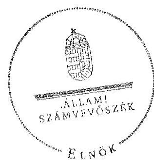
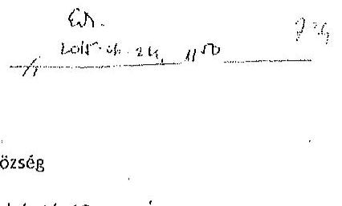
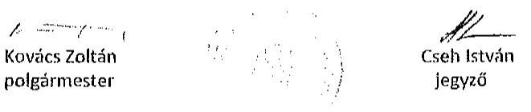
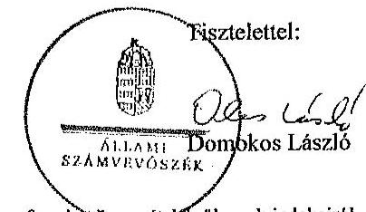
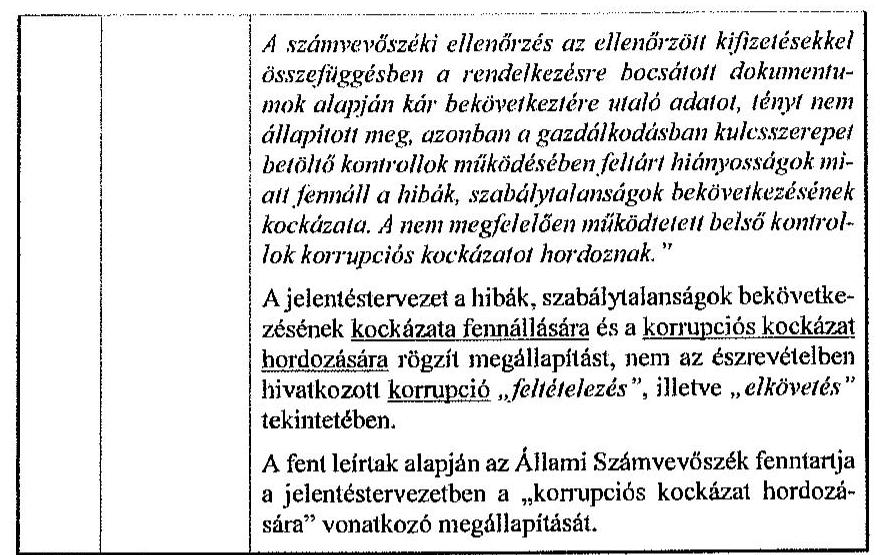
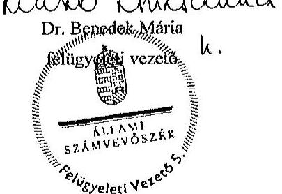

# ÁLLAMI   SZÁMVEVŐSZÉK 

## JELENTÉS

az önkormányzatok belső kontrollrendszere kialakításának, egyes
kontrolltevékenységek és a belső ellenőrzés
működésének ellenőrzése
Berzence
15104

---

# Állami Számvevőszék 

Iktatószám: V-0680-126/2015.
Témaszám: 1714
Vizsgálat-azonosító szám: V067715

## Az ellenőrzést felügyelte:

Dr. Benedek Mária
felügyeleti vezető
Az ellenőrzést vezette és az ellenőrzés végrehajtásáért felelős:
Gál Magdolna
ellenőrzésvezető
A számvevőszéki jelentés összeállításában közreműködött:
Bajnai Zsuzsanna
számvevő
Az ellenőrzést végezték:
Bajnai Zsuzsanna Nagy Erika
számvevő
számvevő tanácsos

---

# TARTALOMJEGYZÉK 

BEVEZETÉS ..... 7
I. ÖSSZEGZŐ MEGÁLLAPÍTÁSOK, KÖVETKEZTETÉSEK, JAVASLATOK ..... 11
II. RÉSZLETES MEGÁLLAPÍTÁSOK ..... 14

1. Az Önkormányzat belső kontrollrendszere kialakításának és működtetésének megfelelősége ..... 14
1.1. A kontrollkörnyezet kialakítása és működtetése ..... 14
1.2. A kockázatkezelési rendszer kialakítása és működtetése ..... 16
1.3. A kontrolltevékenységek kialakítása és működtetése ..... 17
1.4. Az információs és kommunikációs rendszer kialakítása és működtetése ..... 18
1.5. A monitoring rendszer kialakítása és működtetése ..... 18
2. A monitoring rendszer részeként a belső ellenőrzés kialakítása és működtetése ..... 19
3. A pénzügyi folyamatokban kulcsszerepet betöltő belső kontrollok (teljesítésigazolás és érvényesítés) működése ..... 20
4. Az integritás szemlélet érvényesülése ..... 23

## MELLÉKLETEK

1. számú Észrevételt tartalmazó polgármesteri levél
2. számú Észrevételre vonatkozó elnöki válaszlevél

## FÜGGELÉKEK

1. számú Értelmező szótár
2. számú Az integritás érvényesítése érdekében kialakított és működtetett kontrollrendszer

---

.

---

# RÖVIDÍTÉSEK JEGYZÉKE 

## Törvények

Áht.
ÁSZ tv.
Info tv.
Kttv.
Mötv.
Ötv.
Számv. tv.
Vnytv.

## Rendeletek

Ávr.
Bkr.
Ikr.
képviselő-testületi
SZMSZ
költségvetési rendelet
vagyongazdálkodási rendelet

## Szórövidítések

alapító okirat
ÁSZ
belső ellenőrzési kézikönyv
bizonylati szabályzat
bizottság

2011. évi CXCV. törvény az államháztartásról
2011. évi LXVI. törvény az Állami Számvevőszékről
2011. évi CXII. törvény az információs önrendelkezési jogról és az információszabadságról
2011. évi CXCIX. törvény a közszolgálati tisztviselőkről
2011. évi CLXXXIX. törvény Magyarország helyi önkormányzatairól
1990. évi LXV. törvény a helyi önkormányzatokról
2000. évi C. törvény a számvitelről
2007. évi CLII. törvény egyes vagyonnyilatkozat-tételi kötelezettségekről

368/2011. (XII. 31.) Korm. rendelet az államháztartásról szóló törvény végrehajtásáról
370/2011. (XII. 31.) Korm. rendelet a költségvetési szervek belső kontrollrendszeréről és belső ellenőrzéséről
335/2005. (XII. 29.) Korm. rendelet a közfeladatot ellátó szervek iratkezelésének általános követelményeiről
Berzence Nagyközség Önkormányzata Képviselőtestületének 6/2007. (IV. 11.) számú rendelete Berzence Nagyközség Önkormányzata Képviselő-testülete és szervei Szervezeti és Működési Szabályzatáról
Berzence Nagyközség Önkormányzat Képviselőtestületének 3/2013. (II. 14.) önkormányzati rendelete Az önkormányzat 2013. évi költségvetéséről, módosította Berzence Nagyközség Önkormányzat Képviselőtestületének 16/2013. (XII. 30.) önkormányzati rendelete
Berzence Nagyközségi Önkormányzat Képviselőtestületének 8/2013. (IV. 16.) önkormányzati rendelete Az önkormányzat vagyonáról és a vagyongazdálkodás szabályairól

Alapító okirat Egységes szerkezetben Berzencei Polgármesteri Hivatal (hatályos 2013. március 28 -tól)
Állami Számvevőszék
Csurgó Kistérségi Többcélú Társulás Belső ellenőrzési kézikönyv (hatályos 2005. január 27-től); Csurgó Kistérségi Többcélú Társulás Belső ellenőrzési kézikönyv (hatályos 2013. október 2-től)

Berzencei Polgármesteri Hivatal Számviteli Politikája a pénzügyi-gazdálkodási szabályzatokkal XI. fejezet: Berzencei Polgármesteri Hivatal Bizonylati Szabályzata (hatályos 2013. augusztus 1-től)
Egészségügyi, szociális bizottság

---

eszközök és források értékelési szabályzat
gazdasági program

Hivatal
hivatali SZMSZ

INTOSAI

ISSAI
jegyző
Képviselő-testület
Kormányhivatal
kötelezettségvállalási szabályzat
leltározási és leltárkészítési szabályzat
munkavédelmi szabályzat
Nemzetiségi Önkormányzat
Önkormányzat
pénzkezelési szabályzat
polgármester
számlarend
számviteli politika

Társulás

Berzencei Polgármesteri Hivatal Számviteli Politikája a pénzügyi-gazdálkodási szabályzatokkal XI. fejezet: Berzencei Polgármesteri Hivatal Az eszközök és források értékelési szabályzata (hatályos 2013. augusztus 8-tól)
Berzence Nagyközség Önkormányzat Képviselőtestületének Gazdasági programja 2011-2014. évre (33/2011. (III. 29.) számú képviselő-testületi határozat)
Berzencei Polgármesteri Hivatal
Berzence Nagyközség Önkormányzata Képviselőtestületének 6/2007. (IV. 11.) számú rendelete Berzence Nagyközség Önkormányzata Képviselő-testülete és szervei Szervezeti és Működési Szabályzatáról, 2. számú melléklet
International Organization of Supreme Audit Institutions (Legfőbb Ellenőrző Intézmények Nemzetközi Szervezete)
International Standards of Supreme Audit Institutions (Legfőbb Ellenőrző Intézmények Nemzetközi Standardjai)
Berzencei Polgármesteri Hivatal jegyzője
Berzence Nagyközség Önkormányzata Képviselő-testülete Somogy Megyei Kormányhivatal
Berzencei Polgármesteri Hivatal Számviteli Politikája a pénzügyi-gazdálkodási szabályzatokkal XI. fejezet: Berzencei Polgármesteri Hivatal Szabályzat a pénzgazdálkodással kapcsolatos kötelezettségvállalás, utalványozás, érvényesítés és ellenjegyzés hatásköri rendjéről (hatályos 2013. augusztus 1-től)
Berzencei Polgármesteri Hivatal Számviteli Politikája a pénzügyi-gazdálkodási szabályzatokkal XI. fejezet: Berzencei Polgármesteri Hivatal Leltározási és leltárkészítési szabályzata (hatályos 2013. augusztus 1-től)
Nagyközségi Önkormányzat Berzence Munkavédelmi szabályzat (hatályos 2011. május 27-től)
Berzencei Roma Nemzetiségi Önkormányzat
Berzence Nagyközség Önkormányzata
Berzencei Polgármesteri Hivatal Számviteli Politikája a pénzügyi-gazdálkodási szabályzatokkal XI. fejezet: Berzencei Polgármesteri Hivatal házipénztári pénzkezelési szabályzata (hatályos 2013. augusztus 1-től)
Berzence Nagyközség Önkormányzatának polgármestere
Berzencei Polgármesteri Hivatal Számviteli Politikája a pénzügyi gazdálkodási szabályokkal, V. fejezet: A könyvvezetési kötelezettség és a főkönyvi számlaosztályok fő tartalmi elemei (hatályos 2013. augusztus 1-től)
Berzencei Polgármesteri Hivatal Számviteli Politikája a pénzügyi-gazdálkodási szabályzatokkal III. fejezet: Számviteli politika (hatályos 2013. augusztus 1-től)
Csurgó Kistérségi Többcélú Társulás

---

társulási megállapodás
Társulási Tanács
tűzvédelmi szabályzat

Csurgó Kistérségi Többcélú Társulási Megállapodás (hatályos 2013. június 3-tól)
Csurgó Kistérségi Többcélú Társulás Tanácsa
Nagyközségi Önkormányzat Berzence Tűzvédelmi szabályzat 2012. (hatályos 2012. május 17-től)

---

.

---

# JELENTÉS 

## az önkormányzatok belső kontrollrendszere kialakításának, egyes kontrolltevékenységek és a belső ellenőrzés működésének ellenőrzése Berzence

## BEVEZETÉS

Berzence nagyközség állandó lakosainak száma 2013. január 1-jén 2586 fő volt. Az Önkormányzat hattagú Képviselő-testületének munkáját három állandó bizottság segítette. Az Önkormányzat az önállóan működő és gazdálkodó Hivatalon kívül két önállóan működő intézményt működtetett, többségi tulajdoni hányaddal gazdasági társasággal nem rendelkezett. A polgármester 1990. október 1-jétől tölti be tisztségét. A jegyző 2004. október 1-jétől látja el feladatait. A Hivatal szervezeti egységekre nem tagolódott, elkülönített gazdasági szervezettel nem rendelkezett, a foglalkoztatott köztisztviselők száma 2013. január 1-jén hét fő volt. A Hivatalnál 2013. január 1-jétől szervezeti változás nem történt. Az Önkormányzat a 2013. évi költségvetési beszámolója szerint 342667 ezer Ft tárgyévi bevételt ért el, valamint 314427 ezer Ft tárgyévi kiadást teljesített. A 2013. december 31-i könyvviteli mérleg szerint 908096 ezer Ft értékű eszközvagyonnal rendelkezett, a rövid lejáratú kötelezettségállománya 3566 ezer Ft, hosszú lejáratú kötelezettség állománya nem volt.

A demokratikus társadalmakban alapvető igény, hogy a közpénzeket, a közvagyont használók valamennyi tevékenységükhöz kapcsolódó pénzfelhasználásról elszámoljanak, ahhoz egyértelmű és érvényesíthető felelősségi szabályok társuljanak. Ennek a jogos igénynek az érvényesítéséhez meg kell teremteni azokat a folyamatokat, rendszereket, amelyek nélkülözhetetlenek az elszámoltatáshoz. Az elszámoltatás eredményes működtetéséhez szükség van a megfelelő információs, kontroll, értékelési és beszámolási rendszerek kialakítására.

Magyarországon az uniós csatlakozási tárgyalások idejére nyúlnak vissza a belső kontrollrendszer szabályozásának gyökerei. Az uniós elvárásoknak megfelelő új terminológia szerinti államháztartási belső pénzügyi ellenőrzési (ÁBPE) rendszer területén a jogharmonizáció 2003-ban teljes körűen megvalósult, míg az önkormányzati alrendszerre vonatkozó, Ötv.-ben megjelenített speciális szabályozás 2005-ben lépett hatályba. Az államháztartási belső kontrollrendszer koncepciója 2009-ben továbbfejlődött. A változások irányát mutatja, hogy a költségvetési szervek belső kontrollrendszere már magában foglalja a korszerű felelős szervezetirányítás elemeit (kontrollkörnyezet, kockázatkezelés, kontrolltevékenység, információ és kommunikáció, monitoring) is. E kontrollrendszer szabályozása háromszintű, a törvényi előírásokat az Áht. és a Mötv., a rendeleti szintű szabályozást az Ávr. és a Bkr. tartalmazza, amelyeket útmutatói szinten az NGM által kiadott standardok és kézikönyvek támogatnak.

---

A belső kontrollrendszer azt a célt szolgálja, hogy a költségvetési szervek működésük és gazdálkodásuk során a tevékenységeket szabályszerűen, gazdaságosan, hatékonyan, eredményesen hajtsák végre, teljesítsék elszámolási kötelezettségeiket és megvédjék az erőforrásokat a veszteségektől, a károktól és a nem rendeltetésszerű használattól. A belső kontrollrendszer magában foglalja mindazon szabályokat, eljárásokat, gyakorlati módszereket és szervezeti struktúrákat, kockázatkezelési technikákat, kontrolltevékenységeket, amelyek segítséget nyújtanak a szervezetnek céljai eléréséhez.

Az ÁSZ középtávú stratégiájában hangsúlyos szerepet szánt annak, hogy szilárd szakmai alapon álló, értékteremtő ellenőrzéseivel előmozdítsa a közpénzügyek átláthatóságát, rendezettségét. A számvevőszéki ellenőrzés nemzetközi alapelvei is rögzítik, hogy a megfelelő belső kontrollrendszer minimálisra csökkenti a hibák és szabálytalanságok kockázatát.

Az ellenőrzés célja annak értékelése, hogy

- a jogszabályi előírásoknak megfelelően alakították-e ki és működtették-e a belső kontrollrendszert;
- a gazdálkodás folyamatában kulcsszerepet betöltő teljesítésigazolás és érvényesítés kontrolltevékenységeit megfelelően működtették-e;
- biztosították-e a belső ellenőrzés szabályos működését;
- kialakították-e az erőforrásokkal való szabályszerű és hatékony gazdálkodáshoz szükséges követelményeket, megvalósították-e azok számonkérését, ellenőrzését;
- hasznosították-e a 2009-2013. évek között végzett ÁSZ ellenőrzések során megfogalmazott javaslatokat.

A közintézmények integritás alapú kultúrájának kialakítása, megerősítése és működése szorosan összefügg a belső kontrollrendszer működésével, ezért az ellenőrzés kitért a gazdálkodáshoz kapcsolódó integritás kontrollok meglétének és működésének ellenőrzésére is. Az integritási kultúra kialakítása hozzájárul az elszámoltathatóság és átláthatóság érvényesítéséhez, egyben támogatja a szervezet védettségét a korrupciós kitettséggel szemben, valamint annak megelőzése is irányítottabbá válik.

Az ellenőrzés várható hasznosulását négy szinten tervezzük. A törvényalkotás számára összegzett tapasztalatok állnak rendelkezésre a belső kontrollrendszer önkormányzati területen való kialakításáról, működéséről és hatásairól, a belső ellenőrzés működéséről. Az ellenőrzés az ellenőrzött számára visszajelzést ad a belső kontrollrendszer kialakításában és működésében fellépő hiányosságokról, javaslataival hozzájárul azok kiküszöböléséhez, amely csökkentheti a későbbi ellenőrzések gyakoriságát. Az ellenőrzés megállapításait és javaslatait más szervezetek is hasznosíthatják a rendezett gazdálkodási keretek kialakításához. A társadalom számára jelzi, hogy közpénz nem maradhat ellenőrizetlenül, az ÁSZ értékteremtő rend kialakításához és megőrzéséhez hozzájáruló tevékenysége pozitív hatással lesz a szervezetről kialakított összkép for-

---

málásában. A szervezeten belül lehetőség nyílik arra, hogy a megállapítások szintetizálásával az ÁSZ a hozzáadott értéket teremtő elemző tevékenységét és tanácsadó szerepét is erősítse.

Az önkormányzatok belső kontrollrendszere kialakításának, az egyes kontrolltevékenységek és a belső ellenőrzés működésének ellenőrzéséről szóló jelentés I. fejezetének összegző része az ellenőrzés céljára ad rövid, szintetizáló összefoglalót, és tartalmazza a következtetéseket a II. fejezet részletes megállapításain alapulóan. A jelentés intézkedést igénylő megállapításait és javaslatait az ellenőrzés során feltárt, a jelentés II. fejezetében rögzített részletes megállapítások alapozzák meg.

Az ellenőrzés típusa: szabályszerűségi ellenőrzés
Az ellenőrzött időszak: a belső kontrollrendszer kialakítása és működtetésének megfelelőségét a 2013. évre vonatkozóan (2013. december 31-i állapotnak megfelelően), a pénzügyi folyamatokban kulcsszerepet betöltő teljesítésigazolás és érvényesítés belső kontrollok működésének megfelelőségét, és a belső ellenőrzés szabályszerű működését a 2013. január 1 - december 31-e közötti időszakot figyelembe véve értékeltük, míg az ÁSZ javaslatainak utóellenőrzése a 2009-2013. években végzett ellenőrzések nyilvánosságra hozott jelentéseiben tett javaslatok áttekintésére terjedt ki.

# Az ellenőrzött szervezet: az Önkormányzat 

Az ellenőrzés jogszabályi alapját az ÁSZ tv. 1. § (3) bekezdése, az 5. § (2) és (6) bekezdései, valamint az Áht. 61. § (2) bekezdése képezik.

Az ellenőrzés szakmai módszertana az ÁSZ hivatalos honlapján (www.asz.hu) közzétett szakmai szabályokon alapult, amely az INTOSAI által kiadott ISSAI figyelembevételével készült.

Az ellenőrzés lefolytatásához az Önkormányzat a kimutatások és a tanúsítvány elektronikus kitöltésével, valamint az ÁSZ által kért dokumentumok elektronikus megküldésével szolgáltatott adatokat. Az így rendelkezésre bocsátott adatok, információk kontrollja és a munkalapok kitöltése a helyszíni ellenőrzés keretében történt. A jelentésben használt fogalmak magyarázatát az 1. számú függelék, az integritás érvényesítése érdekében kialakított és működtetett intézményi kontrollrendszer minősítését a 2. számú függelék tartalmazza.

A belső kontrollrendszer, valamint a belső ellenőrzés jogszabályi előírások szerinti kialakításának és működtetésének szabályszerűségét az erre irányuló ellenőrzési kérdésekre adott válaszok összesítése alapján értékeltük. A belső kontrollrendszert kontrollterületenként (kontrollkörnyezet, kockázatkezelési rendszer, kontrolltevékenységek, információs és kommunikációs rendszer, monitoring rendszer) és összesítetten is értékeltük.

A belső kontrollrendszer egyes kontrollterületei és a belső ellenőrzés kialakítása és működtetése „szabályszerű volt", amennyiben az értékelt területen az elért és elérhető pontok százalékban kifejezett hányadosa elérte a 81%-ot, „részben szabályszerű volt", ha 61-80% közé esett, és „nem volt szabályszerű", ha nem haladta meg a 60%-ot. A belső kontrollrendszer összesített értékelése megegyezett a

---

kontrollterületenként alkalmazott %-os értékelésekkel, a következő
 eltérésekkel. A kontrollrendszer egésze esetében a „szabályszerű" értékelésnek a %-os értéken felül további feltétele volt, hogy egyik kontrollterület sem kaphatott „nem volt szabályszerű" értékelést, a „részben szabályszerű" értékelés további feltétele volt, hogy legfeljebb egy ellenőrzött kontrollterület lehetett „nem volt szabályszerű" értékelésű. Az összesített értékelés a %-os értéktől függetlenül „nem volt szabályszerű", ha az ellenőrzött kontrollterületek közül több mint egynek „nem volt szabályszerű" az értékelése.

A gazdálkodás folyamatában kulcsszerepet betöltő két kulcskontroll - teljesítésigazolás, érvényesítés - működésének megfelelőségét a személyi juttatásokkal, a dologi és felhalmozási kiadásokkal, működési és felhalmozási célú pénzeszköz átadásokkal kapcsolatos kifizetések esetében mintavétellel ellenőriztük. „Megfelelőnek" értékeltük a gazdálkodási jogkörök gyakorlását, amennyiben 95%-os bizonyossággal a teljes sokaságban a hibaarány legfeljebb 10%, „részben megfelelőnek" értékeltük, ha a hibaarány felső határa 10-30% között volt, „nem megfelelőnek" pedig akkor, ha a mintavételi eredmények alapján a sokaságbeli hibaarány felső határa meghaladta a 30%-ot.

Az integritás szemlélet érvényesülésének minősítése az Önkormányzat önbevallás által kitöltött tanúsítványa alapján történt.

Utóellenőrzésre nem került sor, mivel az ÁSZ az Önkormányzatnál a 2009-2013. évek között ellenőrzést nem végzett.

Az Ász tv. 29. § (1) bekezdésében foglaltak alapján a jelentéstervezetet megküldtük a polgármester részére, aki az ÁSZ tv. 29. § (2) bekezdésében foglalt észrevételezési jogával élt, a jelentéstervezetre észrevételt tett (1. számú melléklet). Az ÁSZ tv. 29. § (3) bekezdésében előírtaknak megfelelően a figyelembe nem vett észrevételeket és annak indokairól szóló tájékoztatást a jelentés tartalmazza (2. számú melléklet).

---

# I. ÖSSZEGZŐ MEGÁLLAPÍTÁSOK, KÖVETKEZTETÉSEK, JAVASLATOK 

A belső kontrollrendszeren belül 2013-ban a kontrollkörnyezet, a kockázatkezelési rendszer, a kontrolltevékenységek, az információs és kommunikációs rendszer, valamint a monitoring rendszer kialakítását és működtetését külön-külön és együttesen is értékeltük. A belső kontrollrendszer kialakítása és működtetése az összesített értékelés alapján nem volt szabályszerű.

A belső kontrollrendszer egyes területei kialakításának és működtetésének minősítése a következő:

| Kontrollterület | Minősítés |
| :-- | :-- |
| Kontrollkörnyezet | részben   szabályszerű |
| Kockázatkezelési rendszer | nem   szabályszerű |
| Kontrolltevékenységek | nem   szabályszerű |
| Információs és kommunikációs rendszer | nem   szabályszerű |
| Monitoring rendszer | nem   szabályszerű |

Részben szabályszerű volt a kontrollkörnyezet kialakítása és működtetése, mivel a megállapított szabályozásbeli hiányosságok nem veszélyeztették e kontrollterületen a szabályszerű működést.

Nem volt szabályszerű a kockázatkezelési rendszer, a kontrolltevékenységek, az információs és kommunikációs rendszer, valamint a monitoring rendszer kialakítása és működtetése, mivel az ellenőrzésünk során megállapított szabályozásbeli hiányosságok magukban hordozzák a szabálytalan működés, valamint a korrupció kockázatát.

A 2013. évben a belső ellenőrzés kialakítása és működtetése részben volt szabályszerű, mivel a megállapított szabályozásbeli hiányosságok nem veszélyeztették e kontrollterületen a működést, azonban a belső ellenőrzés nem tárta fel a belső kontrollrendszer kialakításának és működtetésének, valamint a pénzügyi folyamatokban kulcsszerepet betöltő teljesítésigazolás és érvényesítés belső kontrollok működésének hiányosságait.

A 2013. évben a személyi juttatásokkal, a dologi kiadásokkal, a felhalmozási kiadásokkal, valamint a működési célú pénzeszköz átadásokkal kapcsolatos kifizetések során a pénzügyi folyamatokban kulcsszerepet betöltő teljesítés-

---

igazolás és érvényesítés belső kontrollok működése nem volt megfelelő, mivel azok nem biztosították a hibák megelőzését és feltárását.

A számvevőszéki ellenőrzés az ellenőrzött kifizetésekkel összefüggésben a rendelkezésre bocsátott dokumentumok alapján kár bekövetkeztére utaló adatot, tényt nem állapított meg, azonban a gazdálkodásban kulcsszerepet betöltő kontrollok működésében feltárt hiányosságok miatt fennáll a hibák, szabálytalanságok bekövetkezésének kockázata. A nem megfelelően működtetett belső kontrollok korrupciós kockázatot hordoznak.

A Képviselő-testület a 2013. évben nem alakította ki az erőforrásokkal való szabályszerű és hatékony gazdálkodáshoz szükséges követelményeket.

Az Önkormányzat intézkedéseket tett az integritás szemlélet fejlesztésére, valamint a korrupciós kockázatok csökkentésére, a 2013. évben önként részt vett az ÁSZ integritási felmérésében.

Az ellenőrzés keretében az Önkormányzat - önbevallás útján - egy rövidített, a kontrollrendszerre összpontosító tanúsítvány kitöltésével szolgáltatott adatokat. Az integritás szemlélet érvényesülésének minősítését a 2. számú függelék tartalmazza.

Az ellenőrzés intézkedést igénylő megállapításai és javaslatai:

# a polgármesternek 

1. Az Önkormányzat kiadási előirányzata terhére történt kötelezettségvállalásra - az Áht. 37. § (1) bekezdésében és az Ávr. 55. § (1) bekezdésében foglaltak ellenére - pénzügyi ellenjegyzés nélkül került sor.

Javaslat:
Intézkedjen annak érdekében, hogy az Önkormányzat nevében történő kötelezettségvállalásra az Áht. 37. § (1) bekezdésében és az Ávr. 55. § (1) bekezdésében foglaltaknak megfelelően - az Ávr. 53. §-ában meghatározott kivételekkel - kizárólag pénzügyi ellenjegyzés után kerüljön sor.
2. A Képviselő-testület bizottsága nem helyi önkormányzati képviselő tagja - a Vnytv. 5. § (1) bekezdésében foglaltak ellenére - vagyonnyilatkozat-tételi kötelezettségének nem tett eleget. A Képviselő-testület bizottsága nem helyi önkormányzati képviselő tagjai vonatkozásában a vagyonnyilatkozatok őrzéséért felelős a képviselőtestületi SZMSZ-ben nem került kijelölésre.

Javaslat:
Kezdeményezze a Képviselő-testületnél a Mötv. 65. §-a alapján a Mötv. 57. § (2) bekezdésének, valamint a Vnytv.-ben foglaltaknak megfelelően a bizottságok nem helyi önkormányzati képviselő tagjai vonatkozásában a vagyonnyilatkozatok őrzéséért felelős a képviselő-testületi SZMSZ-ben történő kijelölését e bizottsági tagok vagyonnyilatkozat-tételi kötelezettsége teljesítésével kapcsolatos jogsértő gyakorlat megszüntetése érdekében.

---

3. A számvevőszéki jelentés ellenőrzési megállapításai alapján az Önkormányzatnál a belső kontrollrendszer kialakítása és működtetése az összesített értékelés alapján nem volt szabályszerű, a kulcskontrollok működése nem volt megfelelő. A számvevőszéki ellenőrzés során feltárt hibákat, hiányosságokat és szabálytalanságokat a számvevőszéki jelentés II. Részletes megállapítások fejezetcím tartalmazza.

Javaslat:
Kísérje figyelemmel a Mötv. 115. § (1) bekezdésében foglaltak alapján az Önkormányzat gazdálkodásának szabályszerűségét. A Mötv. 67. § f) pontja alapján gondoskodjon a belső kontrollrendszer kialakítására és működtetésére vonatkozó jogszabályi rendelkezések be nem tartása, valamint a teljesítésigazolás, illetve az érvényesítés kontrollokkal összefüggésben feltárt hibák, hiányosságok, szabálytalanságok tekintetében az esetleges munkajogi felelősséggel kapcsolatos körülmények kivizsgálásáról, majd a vizsgálat eredményének függvényében tegye meg a szükséges intézkedéseket.

# a jegyzőnek 

1. A számvevőszéki jelentés ellenőrzési megállapításai alapján az Önkormányzatnál a belső kontrollrendszer kialakítása és működtetése az összesített értékelés alapján nem volt szabályszerű, a kulcskontrollok működése nem volt megfelelő, illetve a belső ellenőrzés kialakítása és működtetése részben volt szabályszerű. A számvevőszéki ellenőrzés során feltárt hibákat, hiányosságokat és szabálytalanságokat a számvevőszéki jelentés II. Részletes megállapítások fejezetcím tartalmazza.

Javaslat:
A jogszabályoknak megfelelő belső kontrollrendszer kialakítása és működtetése érdekében - az ellenőrzött időszak óta bekövetkezett esetleges jogszabályi változásokra figyelemmel - intézkedjen a belső kontrollrendszer kialakításában és működtetésében, a kulcskontrollok működésében, illetve a belső ellenőrzés kialakításában és működtetésében az ellenőrzés által feltárt hibák, hiányosságok, szabálytalanságok kijavítására.

Kezdeményezze, hogy az éves ellenőrzési terv kiterjedjen a kifizetések szabályszerűségi ellenőrzésére, különös tekintettel a személyi juttatásokkal, a dologi kiadásokkal, a felhalmozási kiadásokkal, a működési és felhalmozási célú pénzeszköz átadásokkal, az ellátottak pénzbeli juttatásaival kapcsolatos kiadási jogcímekből teljesített kifizetésekre.

---

# II. RÉSZLETES MEGÁLLAPÍTÁSOK 

## 1. Az ÖNKORMÁNYZAT BELSŐ KONTROLLRENDSZERE KIALAKÍTÁSÁNAK ÉS MŰKÖDTETÉSÉNEK MEGFELELŐSÉGE

A belső kontrollrendszeren belül 2013-ban a kontrollkörnyezet, a kockázatkezelési rendszer, a kontrolltevékenységek, az információs és kommunikációs rendszer, valamint a monitoring rendszer kialakítását és működtetését külön-külön és együttesen is értékeltük. A belső kontrollrendszer kialakítása és működtetése az összesített értékelés alapján nem volt szabályszerű.

### 1.1. A kontrollkörnyezet kialakítása és működtetése

A kontrollkörnyezet kialakítása és működtetése részben volt szabályszerű.

A Hivatal rendelkezett a Képviselő-testület által elfogadott alapító okirattal, amely tartalmazta az alaptevékenységeket. Az Önkormányzat rendelkezett a Képviselő-testület által elfogadott gazdasági programmal. A Képviselő-testület elfogadta az Önkormányzat vagyongazdálkodási rendeletét, amelyben meghatározta a vagyongazdálkodás főbb szabályait. A Képviselő-testület megalkotta a képviselő-testületi SZMSZ-t, amelynek mellékleteként fogadta el a hivatali SZMSZ-t. A szervezet megfelelő működése érdekében kialakították a belső szabályzatokat. A jegyző elkészítette a Hivatal számviteli politikáját, és annak részeként a pénzkezelési szabályzatot, a leltározási és leltárkészítési szabályzatot, valamint az eszközök és források értékelési szabályzatát. A Hivatal rendelkezett folyamatosan karbantartott számlarenddel. A jegyző elkészítette a bizonylati szabályzatot, a munkavédelmi és tűzvédelmi szabályzatot.

A Hivatalban dolgozó köztisztviselők rendelkeztek munkaköri leírással. A jegyző által a gazdálkodási feladatok ellátására írásban kijelölt személyek rendelkeztek az előírt végzettséggel, szakképesítéssel és a könyvviteli szolgáltatás ellátására jogosító engedéllyel. A Képviselő-testület a költségvetési rendeletében meghatározta a Hivatal engedélyezett létszámát.

A kontrollkörnyezet kialakítása és működtetése részben volt szabályszerű, mert:

| Sorszám | Megállapítás | Megjegyzés |
| :--: | :--: | :--: |
| 5-8.,   10. | A jegyző a hivatali SZMSZ-ben - az Ávr. 13. § (1) bekezdés c), e), f), g), i) pontjaiban foglaltak ellenére - nem rögzítette az alaptevékenységet szabályozó jogszabályok megjelölését, a Hivatal szervezeti ábráját, azon ügyköröket, amelyek során a szervezeti egységek vezetői a Hivatal képviselőjeként járhatnak el. Nem rögzítette továbbá a hivatali SZMSZ-ben nevesített munkakörökhöz tartozó feladat- és hatáskörök gyakorlásának módját, a helyettesítés rendjét, az ezekhez kapcsolódó felelősségi szabályokat, továbbá az irányító szerv által az Ávr. 10. § (1)-(3) bekezdésében foglaltak szerint a költségvetési szervhez rendelt más költségvetési szervek felsorolását. |  |
| :--: | :--: | :--: |
| 15.,   19.,   23.,   25.,   27. | A jegyző - a Számv. tv. 14. § (3) bekezdése, az (5) bekezdés a)-b) és d) pontja, valamint a 161. § (1) bekezdése ellenére - nem készítette el a Nemzetiségi Önkormányzat számviteli politikáját és annak keretében a leltározási és leltárkészítési szabályzatát, az eszközök és források értékelési szabályzatát, a pénzkezelési szabályzatát, valamint a számlarendjét. |  |
| 31.,   38. | A jegyző - a Bkr. 6. § (3) és (4) bekezdéselben foglaltak ellenére - nem készítette el a Hivatal ellenőrzési nyomvonalát, valamint nem szabályozta a szabálytalanságok kezelésének eljárásrendjét. |  |
| 37. | A jegyző - a Kttv. 75. § (1) bekezdés d) pontjában foglaltak ellenére - a köztisztviselők munkaköri leírásaiban nem rögzítette a munkakör betöltésével kapcsolatosan a végzettségre és tapasztalatra vonatkozó követelményeket. |  |
| 40. | A Képviselő-testület - az Áht. 9. § (1) bekezdés f) pontjában foglaltak ellenére - nem alakította ki az erőforrásokkal való szabályszerű és hatékony gazdálkodáshoz szükséges követelményeket. |  |
| 43. | A jegyző - a Kttv. 130. § (1) bekezdésben foglaltak ellenére - nem értékelte írásban a Hivatal köztisztviselőinek munkateljesítményét a 2013. év első félévére. | A jegyző a Hivatal köztisztviselőinek teljesítményét a 2013. év második félévére írásban értékelte. |
| 46. | A jegyző - a Mötv. 81. § (3) bekezdés c) pontjában előírt feladata ellenére - nem dolgozta ki a Kttv. 83. §-ában előírt, a köztisztviselőkre vonatkozó hivatásetikai alapelvek részletes tartalmát, valamint az etikai eljárás szabályait. |  |

---

# 1.2. A kockázatkezelési rendszer kialakítása és működtetése 

## A kockázatkezelési rendszer kialakítása és működtetése nem volt szabályszerű, mert:

| Sorszám | Megállapítás | Megjegyzés |
| :--: | :--: | :--: |
| 1. |

 A jegyző - a Bkr. 3. § b) pontjában foglaltak ellenére - nem alakította ki a Hivatal kockázatkezelési rendszerét. |  |
| 2-4. | A jegyző - a Bkr. 7. § (2) bekezdésében foglaltak ellenére - nem mérte fel és nem állapította meg a Hivatal tevékenységében, gazdálkodásában rejlő kockázatokat, nem határozta meg az egyes kockázatokkal kapcsolatban a szükséges intézkedéseket, valamint azok teljesítésének folyamatos nyomon követési módját. |  |
| 5. | A Vnytv. 4. § d) pontjában foglaltak ellenére a vagyonnyilatkozat-tételre kötelezett Képviselő-testület bizottságainak nem helyi önkormányzati képviselő tagjai vagyonnyilatkozat-tételi kötelezettségét a képviselőtestületi SZMSZ-ben nem tüntették fel. |  |
| 6. | A Képviselő-testület bizottsága nem helyi önkormányzati képviselő tagja - a Vnytv. 5. § (1) bekezdésében foglaltak ellenére - vagyonnyilatkozat-tételi kötelezettségének nem tett eleget. A Képviselő-testület bizottsága nem helyi önkormányzati képviselő tagjai vonatkozásában a vagyonnyilatkozatok őrzéséért felelős a képviselő-testületi SZMSZ-ben nem került kijelölésre.   A Hivatal köztisztviselői - a Vnytv. 5. § (1) bekezdésében foglaltak ellenére - vagyonnyilatkozat-tételi kötelezettségüknek a 2013. évben nem tettek eleget. A vagyonnyilatkozat őrzéséért felelős jegyző - a Vnytv. 8. § (4) bekezdésében foglaltak ellenére - nem tájékoztatta a köztisztviselőket a vagyonnyilatkozat-tételi kötelezettség fennállásáról és esedékességének időpontjáról az esedékességet legalább 30 nappal megelőzően, továbbá a - Vnytv. 10. § (1) bekezdésében foglaltak ellenére - írásban nem szólította fel a köztisztviselőket arra, hogy kötelezettségüket a felszólítás kézhezvételétől számított nyolc napon belül teljesítsék. | A Képviselő-testület bizottsága nem helyi önkormányzati képviselő tagjai közül egy fő - más jogviszonyára tekintettel - vagyonnyilatkozat-tételi kötelezettségének eleget tett.   A 2013. évben a polgármester és a képviselők a jogszabályokban foglalt előírásoknak megfelelően eleget tettek a vagyonnyilatkozat-tételi kötelezettségüknek.   A jegyző a vagyonnyilatkozat-tételi kötelezettségének az esedékessége évében - a 2012. évben - eleget tett. |

---

# 1.3. A kontrolltevékenységek kialakítása és működtetése 

## A kontrolltevékenységek kialakítása és működtetése nem volt szabályszerű, mert:

| Sorszám | Megállapítás |
| :--: | :--: |
| 1-4. | A jegyző - a Bkr. 8. § (2) bekezdés a) pontjában foglaltak ellenére - nem biztosította a pénzügyi döntések - köztük a költségvetés tervezése, a beszerzési folyamat, a vagyonhasznosítási tevékenység és a támogatásokkal való elszámolás - dokumentumainak elkészítésével kapcsolatban a folyamatba épített, előzetes, utólagos és vezetői ellenőrzést. |
| 7. | A jegyző a kötelezettségvállalási szabályzatban - az Ávr. 57. § (1) bekezdésében foglalt előírás ellenére - lehetővé tette az előzetes írásbeli kötelezettségvállalásra nem kötelezett - százezer forintot el nem érő - kifizetésekre vonatkozóan a teljesítésigazolás elvégzésének mellőzését. |
| 11-13. | A jegyző - az Ikr. 8. § (1)-(2) bekezdésében foglaltak ellenére - nem gondoskodott az iratkezelési szoftver által kezelt adatok biztonságáról, nem tette meg azokat a technikai és szervezési intézkedéseket, nem alakította ki azokat az eljárási szabályokat, amelyek az üzembiztonsági, adatvédelmi szabályok érvényre juttatásához szükségesek, továbbá nem határozta meg az üzemeltetéssel és az adatbiztonsággal kapcsolatos feladatokat és hatásköröket. |
| 14. | A jegyző - az Info tv. 7. § (2) bekezdésében foglaltak ellenére - nem tette meg azokat a technikai és szervezési intézkedéseket és nem alakította ki azokat az eljárási szabályokat, amelyek e törvény, valamint az egyéb adat- és titokvédelmi szabályok érvényre juttatásához szükségesek. |
| 15.   17. | A jegyző - a Bkr. 8. § (4) bekezdés b) és c) pontjaiban foglaltak ellenére - belső szabályzatban nem szabályozta a dokumentumokhoz és információkhoz való hozzáférésre, valamint a beszámolási eljárásokra vonatkozóan a felelősségi köröket. |
| 16.   18. | A jegyző - az Ávr. 13. § (2) bekezdés a) pontjában és (5) bekezdésében foglaltak ellenére - belső szabályzatban nem rendezte a beszámolási feladatok teljesítésével kapcsolatos belső előírásokat, feltételeket. |
| 25.   29. | A jegyző - az Ávr. 55. § (2) bekezdés g) pontjában, valamint az 58. § (4) bekezdésben foglaltak ellenére - nem jelölt ki a Hivatal állományába tartozó köztisztviselőt a pénzügyi ellenjegyzési és érvényesítési feladatra a Nemzetiségi Önkormányzat kiadási előirányzata terhére vállalt kötelezettségek esetére. |

---

# 1.4. Az információs és kommunikációs rendszer kialakítása és működtetése 

Az információs és kommunikációs rendszer kialakítása és működtetése nem volt szabályszerű, mert:

| Sor-   szám | Megállapítás |
| :--: | :--: |
| 1-2. | A jegyző - a Bkr. 3. § d) pontja és 9. § (1) bekezdésében foglaltak ellenére - nem alakított ki és nem működtetett olyan rendszert, amely biztosítja, hogy a megfelelő információk a megfelelő időben eljutnak az illetékes szervezethez, illetve személyhez. |
| 3. | A jegyző az információs rendszerek keretében - a Bkr. 9. § (2) bekezdésében foglaltak ellenére - nem határozta meg a beszámolási szinteket, határidőket, módokat. |
| 4. | A jegyző - az Info tv. 24. § (3) bekezdésében foglaltak ellenére - nem készítette el a Hivatal adatvédelmi és adatbiztonsági szabályzatát. |
| 5.,   7. | A jegyző - az Info tv. 30. § (6) bekezdésében, a 35. § (3) bekezdésében, valamint az Ávr. 13. § (2) bekezdés h) pontjában foglaltak ellenére - belső szabályzatban nem állapította meg a közérdekű adatok megismerésére irányuló igények teljesítésének, továbbá a kötelezően közzéteendő adatok nyilvánosságra hozatalának rendjét. |
| 6. | A jegyző - az Info tv. 33. § (1) és (3) bekezdéseiben foglaltak ellenére - nem gondoskodott arról, hogy az Önkormányzat az elektronikus közzétételi kötelezettségének a 2013. évben eleget tegyen. |

### 1.5. A monitoring rendszer kialakítása és működtetése

A monitoring rendszer kialakítása és működtetése nem volt szabályszerű, mert:

| Sor-   szám | Megállapítás |
| :-- | :-- |
| 1. | A jegyző - a Bkr. 3. § e) pontjában és 10. §-ában foglaltak ellenére - az operatív tevékenységektől függetlenül működő belső ellenőrzés kivételével nem alakította ki a Hivatal tevékenységének, a célok megvalósításának nyomon követését biztosító rendszert. |

Az Önkormányzatnál a 2013. évben külső ellenőrzés nem történt, a törvényességi felügyeletet ellátó Kormányhivatal négy alkalommal élt törvényességi felhívással a 2013. évben. Az Önkormányzat határidőben tájékoztatta a Kormányhivatalt a megtett intézkedésekről.

---

A Kormányhivatal törvényességi felhívással élt rendeletalkotási és rendeletmódosítási kötelezettség elmulasztása miatt.

# 2. A MONITORING RENDSZER RÉSZEKÉNT A BELSŐ ELLENŐRZÉS KIALAKÍTÁSA ÉS MŰKÖDTETÉSE 

## Az Önkormányzatnál a belső ellenőrzés kialakítása és működése részben volt szabályszerű.

Az Önkormányzat a belső ellenőrzési feladatokat a Társulás útján látta el. A belső ellenőrzés szervezeti és funkcionális függetlenségét biztosították. A Társulás rendelkezett aktualizált belső ellenőrzési kézikönyvvel. A belső ellenőrzési vezetői feladatok ellátásának módját a jogszabályi előírásoknak megfelelően írásbeli megállapodásban határozták meg. A belső ellenőr rendelkezett a jogszabályban előírt szakirányú szakképzettséggel és szakmai gyakorlattal.

A 2014. évi ellenőrzési tervet a társulási megállapodásban előírtaknak megfelelően a Társulási Tanács a jogszabályban előírt határidőig elfogadta. A 2014. évi éves ellenőrzési terv összeállítása a jegyző írásos véleményének figyelembevételével történt. A 2014. évi ellenőrzési terv a 2014-2017. évi stratégiai ellenőrzési tervben és a kockázatelemzés alapján felállított prioritásokon alapult.

A 2013. évi ellenőrzési tervben foglalt ellenőrzéseket az ellenőrzési program alapján végrehajtották, azokról ellenőrzési jelentés készült. Soron kívüli ellenőrzésre nem került sor. A belső ellenőrzési vezető az elvégzett ellenőrzésekről éves bontásban nyilvántartást vezetett.

A belső ellenőrzési vezető a 2012. évre vonatkozó éves ellenőrzési jelentést elkészítette és a jegyzőnek határidőben megküldte. A 2012. évre vonatkozó éves ellenőrzési jelentés - az ellenőrzési tapasztalatok alapján - tartalmazta a belső kontrollrendszer szabályszerűségének, gazdaságosságának, hatékonyságának és eredményességének növelése, javítása érdekében tett fontosabb javaslatokat, valamint a belső kontrollrendszer öt elemének értékelését.

A belső ellenőr az ellenőrzések során büntető-, szabálysértési-, kártérítési-, vagy fegyelmi eljárás megindítására okot adó cselekményt nem tárt fel.

A belső ellenőrzés kialakítása és működtetése részben volt szabályszerű, mert:

## Sor-   szám

## Megállapítás

A belső ellenőrzési vezető - a Bkr. 22. § (1) bekezdés b) pontja, a 29. § (1) bekezdésében és a 30. § (1) bekezdésében foglaltak ellenére - a 2013. évre vonatkozóan nem készített stratégiai ellenőrzési tervet.

A belső ellenőrzési vezető - a Bkr. 31. § (4) bekezdés a) és b) pontjában foglaltak ellenére - a 2014. évi ellenőrzési tervben nem tüntette fel az éves ellenőrzési tervet megalapozó elemzések és a kockázatelemzés eredményének összefoglaló bemutatását, valamint a tervezett ellenőrzések tárgyát.

---

| 17. | A belső ellenőrzési vezető által jóváhagyott ellenőrzési program - a Bkr. 33. § (2) bekezdés c) pontjában foglaltak ellenére - nem tartalmazta a Bkr. 21. § (3) bekezdésében meghatározott ellenőrzés típusát. |
| :--: | :--: |
| 19.   a), g) | A belső ellenőr az ellenőrzési jelentésben - a Bkr. 39. § (3) bekezdés d) és m) pontjában foglaltak ellenére - nem tüntette fel a Bkr. 21. § (3) bekezdésében meghatározott ellenőrzés típusát, valamint a jelentés dátumát. |
| 22. | Az ellenőrzött szerv vezetője a belső ellenőrzés megállapításai és javaslatai alapján - a Bkr. 28. § c) pontjában foglaltak ellenére - nem készített intézkedési tervet, valamint a belső ellenőrzés megállapításai és javaslatai alapján elkészített intézkedési tervben - a Bkr. 45. § (2) bekezdésében foglaltak ellenére - nem határozta meg a végrehajtásért felelős személyeket. |
| 24. | A belső ellenőrzési vezető által a belső ellenőrzési jelentésekben tett megállapítások és intézkedési tervek végrehajtásának nyomon követésére vezetett nyilvántartás - a Bkr. 47. § (2) bekezdésében foglaltak ellenére - nem tartalmazta az ellenőrzési jelentésben szereplő javaslatot, az intézkedési terv alapján végrehajtott intézkedések rövid leírását, és a végre nem hajtott intézkedések okát. |

# 3. A PÉNZÜGYI FOLYAMATOKBAN KULCSSZEREPET BETÖLTŐ BELSŐ KONTROLLOK (TELJESÍTÉSIGAZOLÁS ÉS ÉRVÉNYESÍTÉS) MŰKÖDÉSE 

A 2013. évben a személyi juttatásokkal, a dologi kiadásokkal, a felhalmozási kiadásokkal, a működési célú pénzeszközátadásokkal kapcsolatos kifizetések során - összefoglalóan értékelve - a pénzügyi folyamatokban kulcsszerepet betöltő teljesítésigazolás és érvényesítés belső kontrollok működése nem volt megfelelő az alábbi hiányosságok miatt:

| Kulcskontrollok | Megállapítás |
| :--: | :--: |
| Teljesítésigazolás | A teljesítésigazolást a kifizetéseket megelőzően - az Áht. 38. § (1) bekezdésében és az Ávr. 57. § (1) és (3) bekezdéseiben foglaltak ellenére - nem, vagy nem szabályszerűen végezték. |
| Érvényesítés | Az érvényesítést a kifizetéseket megelőzően - az Áht. 38. § (1) bekezdésben és az Ávr. 58. § (1) és (3)-(4) bekezdéseiben foglaltak ellenére - nem szabályszerűen, vagy szabálytalan kijelölés alapján végezték.   Az érvényesítő - az Ávr.

 58. § (2) bekezdésében foglalt előírás ellenére - nem jelezte az utalványozónak, hogy a megelőző ügymenetben az Áht., az államháztartási számviteli kormányrendelet és az Ávr. előírásaiban foglaltakat nem tartották be. |

## A kulcskontrollok ellenőrzése során feltárt egyéb hiányosságok:

Az Önkormányzat megsértette az Áht. 6. § (1)* és a 36. § (1) bekezdésben foglalt kötelezettségvállalásra vonatkozó előírásokat.
Az Önkormányzat - a Számv. tv. 165. § (2) bekezdésében foglaltak ellenére - megsér-

---

tette a bizonylati elv és bizonylati fegyelemre vonatkozó előírásokat.
Az utalványozásra vonatkozó írásbeli rendelkezésen - az Ávr. 59. § (3) bekezdés c)-f) pontjaiban foglaltak ellenére - nem tüntették fel a kedvezményezett címét, a fizetés összegét, devizanemét, a jóváírandó fizetési számla számát és megnevezését, a kötelezettségvállalás nyilvántartási számát.
*2015. január 1-től az Áht. 5. § (4) bekezdése szabályozza. Megállapította a 2014. évi XCIX. törvény 12. §-a.

A 2013. évben az ellenőrzött kifizetési jogcímek mintatételei alapján a teljesítésigazolás kulcskontroll működése során az alábbi hiányosságok, szabálytalanságok fordultak elő:

- a személyi juttatásokkal, a dologi és felhalmozási kiadásokkal, a működési célú pénzeszközátadással kapcsolatos kifizetéseket megelőzően a teljesítésigazolást - az Áht. 38. § (1) bekezdésében és az Ávr. 57. § (1) bekezdésében foglaltak ellenére - nem végezték el;
- a dologi és felhalmozási kiadásokkal, a működési célú pénzeszközátadással kapcsolatos kifizetéseket megelőzően a teljesítésigazolás - az Ávr. 57. § (3) bekezdésében foglaltak ellenére - nem volt szabályszerű, mivel az - Ávr. 60. § (3) bekezdésében foglaltak ellenére - a teljesítésigazolásra jogosult személyekről és aláírás mintájukról nem vezettek naprakész nyilvántartást, így nem volt megállapítható, hogy az aláírás a teljesítésigazolásra jogosult személytől származott;
- a dologi és felhalmozási kiadásokkal, a működési célú pénzeszközátadással kapcsolatos kifizetéseket megelőzően a teljesítésigazolás - az Ávr. 57. § (1) bekezdésében foglaltak ellenére - nem volt szabályszerű, mivel a teljesítésigazoló ellenőrizhető okmányok hiányában nem tudta ellenőrizni a kiadások teljesítésének jogosságát, összegszerűségét, valamint az ellenszolgáltatás teljesítését.

A 2013. évben az ellenőrzött kifizetési jogcímek mintatételei alapján az érvényesítés kulcskontroll működése során az alábbi hiányosságok, szabálytalanságok fordultak elő:

- a személyi juttatásokkal, a dologi, felhalmozási kiadásokkal és a működési célú pénzeszközátadásokkal kapcsolatos kifizetéseket megelőzően az érvényesítés nem volt szabályszerű, mivel - az Ávr. 58. § (4) bekezdésében foglaltak ellenére - az érvényesítőt az érvényesítési feladatok ellátására nem az arra jogosult személy jelölte ki;
- a dologi, felhalmozási kiadásokkal és a működési célú pénzeszközátadásokkal kapcsolatos kifizetéseket megelőzően - az Ávr. 58. § (1) bekezdésében előírtak ellenére - az érvényesítés nem volt szabályszerű, mivel az érvényesítő ellenőrizhető okmányok hiányában az összegszerűséget és a fedezet meglétét nem tudta ellenőrizni;
- a személyi juttatásokkal, a dologi, felhalmozási kiadásokkal és a működési célú pénzeszközátadásokkal kapcsolatos kifizetéseket megelőzően az érvé-

---

nyesítő - az Ávr. 58. § (1) bekezdésében foglaltak ellenére - a fedezet meglétét nem tudta ellenőrizni, mivel - az Ávr. 56. § (1) bekezdésében foglaltak ellenére - a 2013. évben a kötelezettségvállalásokról nyilvántartást nem vezettek;

- a személyi juttatásokkal, a dologi és felhalmozási kiadásokkal, valamint a működési célú pénzeszközátadásokkal kapcsolatos kifizetéseket megelőzően az érvényesítő - az Ávr. 58. § (2) bekezdésében foglaltak ellenére - nem jelezte az utalványozónak, hogy a megelőző ügymenetben a teljesítésigazolást nem, vagy nem szabályszerűen végezték;
- a személyi juttatásokkal, a dologi és felhalmozási kiadásokkal, valamint a működési célú pénzeszközátadásokkal kapcsolatos kifizetéseket megelőzően az érvényesítő - az Ávr. 58. § (2) bekezdésében foglaltak ellenére - nem jelezte az utalványozónak, hogy a megelőző ügymenetben nem tartották be az Áht. 37. § (1) bekezdésében és az Ávr. 55. § (1) bekezdésében foglaltakat, mivel az Önkormányzat és a Hivatal kiadásaival kapcsolatban kötelezettségvállalásra pénzügyi ellenjegyzés nélkül került sor, továbbá azt, hogy a kötelezettségvállalási nyilvántartást nem vezették;
- a személyi juttatásokkal, dologi kiadásokkal és a működési célú pénzeszközátadásokkal kapcsolatos kifizetéseket megelőzően az érvényesítés nem volt szabályszerű, mivel - az Ávr. 58. § (3) bekezdésében foglaltak ellenére - a készpénzes fizetések esetén nem tartalmazta az érvényesítés keltezését;
- a személyi juttatásokkal, a dologi és a felhalmozási kiadásokkal kapcsolatos kifizetést megelőzően - az Ávr. 58. § (3) bekezdésében előírtak ellenére - az érvényesítés nem volt szabályszerű, mivel - az Ávr. 60. § (3) bekezdése ellenére - nem vezettek naprakész nyilvántartást az érvényesítésre jogosult személyekről, így nem volt megállapítható, hogy az aláírás az érvényesítésre kijelölt személytől származott.

Az Önkormányzat megsértette az Áht. 6. § (1) és a 36. § (1) bekezdésében foglalt kötelezettségvállalásra vonatkozó előírásokat, mivel az ellátottak pénzbeli juttatásainál és a beruházásoknál a teljesített kiadások összege a jóváhagyott előirányzatot meghaladó volt.

Az Önkormányzat a dologi és a felhalmozási kiadásokkal kapcsolatos kifizetéseknél - a Számv. tv. 165. § (2) bekezdésében foglaltak ellenére - megsértette a bizonylati elv és bizonylati fegyelemre vonatkozó előírásokat, mivel az Önkormányzatot terhelő kiadásokat a Hivatal nevére kiállított számviteli bizonylat (számla) alapján számolták el.

A személyi juttatásokkal, a dologi és felhalmozási kiadásokkal és a működési célú pénzeszközátadásokkal kapcsolatos kifizetések utalványozására vonatkozó írásbeli rendelkezésen - az Ávr. 59. § (3) bekezdés c)-f) pontjaiban foglaltak ellenére - nem tüntették fel a kedvezményezett címét, a kifizetés összegét, devizanemét, a jóváírandó fizetési számla számát és megnevezését, a kötelezettségvállalás nyilvántartási számát.

---

A számvevőszéki ellenőrzés az ellenőrzött kifizetésekkel összefüggésben a rendelkezésre bocsátott dokumentumok alapján kár bekövetkeztére utaló adatot, tényt nem állapított meg, azonban a gazdálkodásban kulcsszerepet betöltő kontrollok működésében feltárt hiányosságok miatt fennáll a hibák, szabálytalanságok bekövetkezésének kockázata. A nem megfelelően működtetett belső kontrollok korrupciós kockázatot hordoznak.

# 4. AZ INTEGRITÁS SZEMLÉLET ÉRVÉNYESÜLÉSE 

Az Önkormányzat intézkedéseket tett az integritás szemlélet fejlesztésére, valamint a korrupciós kockázatok csökkentésére, a 2013. évben önként részt vett az ÁSZ integritási felmérésében.

Az ellenőrzés keretében az Önkormányzat - önbevallás útján - egy rövidített, a kontrollrendszerre összpontosító tanúsítvány kitöltésével szolgáltatott adatokat. Az integritás szemlélet érvényesülésének minősítését a 2. számú függelék tartalmazza.

Budapest, 2015. 04. hó 24. nap

Demokos László
elnök

Melléklet: $\quad 2 \mathrm{db}$
Függelék: $\quad 2 \mathrm{db}$

---

.

---

Ügyiratszám:44-6/2015.

# Állami Számvevőszék 

Domokos László Elnök Úr részére

## Budapest

Tisztelt Elnök Úr!
Az önkormányzatok belső kontrollrendszere kialakításának, egyes kontrolltevékenységek és a belső ellenőrzés működésének ellenőrzése című számvevőszéki - nem nyilvános jelentéstervezetet megkaptuk, melyhez az alábbi észrevételeket kívánjuk fűzni.
Az ellenőrzés tevékenységünkből kiragad egy területet, amely persze fontos része munkánknak, továbbá egy időszakot és erre vonatkoztatja a megállapításokat, amelyek többségének helytállóságát nem vitatjuk.
Nem folyamatként értékeli a kialakult helyzetet, így az előzményeket, a 2013. évi jelentős változásokat, amelyeket a napi működés érdekében kellett naprakészen a szabályozókhoz igazítani az elemi működés biztosítása érdekében. A feladatok ellátására rendelkezésre álló munkaerő kapacitás korlátait, valamint az ellenőrzött időszak óta eltelt hiányosságok pótlását - kezdjük utolérni magunkat - nem veszi figyelembe. Természetesen továbbra is fordulnak, fordulhatnak elő majd hiányosságok, illetve időbeli elmaradások.
Az ellenőrzés, de tapasztalatunk szerint a szabályozás is figyelmen kívül hagyja a település nagyságrendjéből a pénzügyi források mértékéből adódó mozgásterét, a végrehajtó szervezet létszámát és annak tagozódását.
Berzence Nagyközség Önkormányzat 2013. évi bevétele 342667 e.Ft, a kiadása pedig 314427 e. Ft, a pénzmaradványa pedig 32892 e.Ft az önkormányzat 2013. évi költségvetésének végrehajtásáról szóló 4/2014. (III.25.) önkormányzati rendelete alapján.
A 2013-as év folyamán hitel felvételére, illetve igénybevételére semmilyen címen nem került sor. A jelentésben leírt rövid lejáratú kötelezettségállomány 3566 e.Ft, amelyek kifizetetlen, de nem lejárt határidejű számlákat jelent.
Nagyon fontosnak tartjuk hangsúlyozni, hogy a pénzügyi lehetőségek, a költségvetés felhasználását igazoló dokumentumok egyértelműen igazolják, felelősségteljesen és takarékosan gazdálkodott önkormányzatunk.
Nem voltak és most sincsenek nagyértékű külföldi és belföldi utak finanszírozva, nem voltak luxus kategóriába eső bútor, illetve technikai eszközbeszerzések. Természetesen nem voltak a személyi kiadások keretébe tartozó jutalmak, prémiumok, egyéb kiemelkedő juttatások

---

sem fizetve, amelyek miatt egyáltalán felmerülhet a szabálytalanság, illetve a korrupció gyanúja.
Az önkormányzat és intézményei az elfogadott és jóváhagyott előirányzatokon belül gazdálkodtak.
Nem szabad figyelmen kívül hagyni, hogy 2013. január 1-től jelentős változások érték az önkormányzatokat. Az általános iskolát átvette a „KLIKK”, a szociális igazgatás feladatainak egy részét a járási hivatal.
Minden „egységünk” számára önálló számlaszámot kellett nyitni, adószámot igényelni. Új feladatellátási helyet kialakítani, összevont önkormányzati konyhát létrehozni. Ehhez nem kell leírnom, mekkora főként adminisztrációs teher hárult a kis létszámú apparátusra, és rangsorolni kellett a feladatok elvégzését, hisz fizikailag mindent nem lehetett egyszerre biztosítani. Ennek következményei többségében a hiányosságok, amelyeket a legtöbb esetben nem vitatunk.

# A megállapításokról részletesebben: 

- 2015. április 21-én fogadta el a képviselő-testület az új SZMSZ-ét (8/2015. (IV.21.) önkormányzati rendelet), melyben a képviselők, a bizottságok külső tagjainak vagyonnyilatkozatára, annak nyilvántartására, kezelésére vonatkozóan is szabályt alkotott. (34.§ (4) bekezdés c) pont).
- Természetesen minden bizottsági tag az új felállást követően vagyonnyilatkozatot tett és az a hivatalban rendelkezésre áll.
- Nincs a hivatalban szervezeti egységek szerinti tagozódás, de a következő most már önálló SZMSZ-ben a jelenlegi állapot ábrája rögzítésre kerül.
A helyettesítés rendje a munkaköri leírásokban van.
- A kapacitás hiánya miatt nem került sor a Nemzetiségi Önkormányzat felsorolt szabályainak elkészítésére. Az Önkormányzat 2013-ban a 347 e.Ft-os normatívából gazdálkodott, leltárba vehető eszköze nem volt. A szabályzatok hiánya ezért itt okozott a legkisebb gondot, bár attól még nem mentesülünk az elkészítésétől.
- Valóban nincs rögzítve a köztisztviselők munkaköri leírásaiban a munkakör betöltésével kapcsolatosan a végzettségre, valamint tapasztalatra vonatkozó követelmény, de valamennyien legalább tíz éve e területen dolgoznak és megfelelő végzettséggel. Ezt a 2012. évi személyi anyagok ellenőrzéseinek megállapításai is alátámasztják. Változás 2013-ban nem volt a személyi állományban.
- A munkateljesítmény értékelés elmaradásának oka az első félévben a köztisztviselők esetében a kapacitás hiánya és nem egyéb hiányosságokra vezethető vissza. 2013. második félévétől az új értékelési rendszer bevezetése óta ez folyamatosan megtörténik.
- Etikai szabályzattal a hivatal nem rendelkezik, csak közszolgálati szabályzattal.
- Valamennyi köztisztviselő az előírásoknak megfelelő módon és nyilvántartással eleget tett a vagyonnyilatkozat-tételi kötelezettségének, amelyre valóban a 2013-as évet követően került sor.
- Az ellenőrzés évét követően készült el az adatvédelmi szabályzatunk, így a jelentésben leírt hiányosságok megszüntetésre kerültek.
- Hivatalunknál nem került sor ajándékok, meghívások, utazások elfogadására, de ilyen a képviselő-testületnél sem volt.

---

- A megállapítás szerint (2. számú függelék) „a szervezet nem szabályozta a humánpolitikai tevékenységét, az új munkatársak kiválasztásakor nem minden esetben írt ki álláspályázatot.” A megállapítás nem tudni mely területre vonatkozik. A hivatalnál 2013. évben egyáltalán nem volt álláshely betöltés, de az önkormányzat intézményeinél sem.

Az ellenőrzési jelentés tervezetben leírt hiányosságokat, amelyek még mindig pótlásra szorulnak, azt ki fogjuk javítani.
Határozottan állítjuk, amit néhány helyen a jelentés is rögzít, nem található és az ellenőrzést végzők sem találtak olyan
 dokumentumokat, amelyek a korrupcióra, a jogtalan, a megbotránkoztató összegű kifizetésekre utalnának. Nem találtak, mert ilyen nincs is, a költségvetési adatok is jól tükrözik, felelősen gazdálkodott az önkormányzat, a hivatal és intézményei is.
Mindezek ellenére gyakran szerepel az anyagban a korrupció lehetősége, annak kockázata, a körülmények által biztosított feltételezés. A jelentés-tervezet fentieket kiemelő részét, kihangsúlyozását, amelyből harmadik fél kiolvashatja annak elkövetését is, visszautasítjuk, ezért az anyagot ebben a formában elfogadni nem tudjuk.

Berzence, 2015. június 15.

---

.

---

# ELBÖK 

## Kuvács Zoltán úr

polgármester
Berzence Nagyközség Önkormányzata

## Berzence

## Tisztelt Polgármester Úr!

Köszönettel megkaptam a 2015. június 23. napján az Állami Számvevőszékhez érkezett „Az önkormányzatok belső kontrollrendszere kialakításának, egyes kontrolltevékenységek és a belső ellenőrzés működésének ellenőrzése - Berzence" című számvevőszéki jelentéstervezetben foglalt megállapításokra tett észrevételeit.

Tájékoztatom Polgármester urat, hogy a jelentésben az elfogadott észrevételeket, és - az Állami Számvevőszékről szóló 2011. évi LXVI. törvény 29. § (3) bekezdése alapján - az el nem fogadott észrevételeket is szerepeltetjük az elutasítás indokainak feltüntetésével együtt.

Az Állami Számvevőszék észrevételekre vonatkozó álláspontjáról a felügyeleti vezető által készített részletes tájékoztatást csatoltan megküldöm.

Budapest, 2015. 07. hó 08. nap

Melléklet: Tájékoztatás az elfogadott és az el nem fogadott Számvevőszékről, azok indokairól

---

# Tájékoztatás 

az elfogadott és az el nem fogadott észrevételekről, azok indokairól

|  | Észrevétel: | „Az ellenőrzés tevékenységünkből kiragad egy területet, amely persze fontos része munkánknak, továbbá egy időszakot és erre vonatkoztatja a megállapításokat, amelyek többségének helytállóságát nem vitatjuk. ... A feladatok ellátására rendelkezésre álló munkaerő kapacitás korlátozott, valamint az ellenőrzött időszak óta eltelt hiányosságok pótlását - kezdjük utolérni magunkat - nem veszi figyelembe." |
| :--: | :--: | :--: |
|  | Válasz: | Az Állami Számvevőszék az észrevételt nem fogadja el. |
| 1. | Indoklás: | Az észrevétel nem megalapozott. Az Állami Számvevőszék ellenőrzésének témája az önkormányzatok belső kontrollrendszere kialakításának, egyes kontrolltevékenységek és a belső ellenőrzés működésének ellenőrzése volt, melyet a jelentéstervezet címe is tükröz, és a jelentéstervezetben szereplő ellenőrzési megállapítások is e területekhez kapcsolódnak, illetve az ellenőrzött időszakra vonatkoznak, mely a jelentéstervezet bevezető részében rögzítésre is került.   „Az ellenőrzött időszak: a belső kontrollrendszer kialakítása és működtetése megfelelőségét a 2013. évre vonatkozában (2013. december 31-i állapotnak megfelelően), a pénzügyi folyamatokban kulcsszerepet betöltő teljesítésigazolás és érvényesítés belső kontrollok működésének megfelelőségét, és a belső ellenőrzés szabályszerű működését a 2013. január 1-december 31-e közötti időszakot figyelembe véve értékeltük, míg az ASZ javaslatainak utóellenőrzése a 2009-2013. években végzett ellenőrzések nyilvánosságra hozott jelentéseiben tett javaslatok áttekintésére terjedt ki."   A fent leírtak alapján az Állami Számvevőszék fenntartja a jelentéstervezetben tett 2013. évre vonatkozó ellenőrzési megállapításait a jelenlegi megfogalmazásban. |

---

|  | Észrevétel: | „Berzence Nagyközség Önkormányzat 2013. évi bevétele 342667 e.Ft, a kiadása pedig 314427 e. Ft, a pénzmaradványa pedig 32892 e.Ft az önkormányzat 2013. évi költségvetésének végrehajtásáról szóló 4/2014. (III.25.) önkormányzati rendelete alapján." |
| :--: | :--: | :--: |
|  | Válasz: | Az Állami Számvevőszék az észrevételt elfogadja. |
| 2. | Indoklás: | Az észrevétel megalapozott. Az önkormányzat az ellenőrzés során az adatszolgáltatása keretében küldte meg a jegyző által kiadmányozott, pecséttel ellátott 8. sz. kimutatásban (Az önkormányzat gazdálkodását jellemző adatok, mutatószámok) azokat a tárgyévi bevételi és kiadási adatokat, melyek a jelentéstervezet bevezető részében rögzítésre kerültek.   Az észrevételben jelzett eltérés alapján az Állami Számvevőszék áttekintette az önkormányzat 2013. évi elemi költségvetési beszámolóját és megállapította, hogy az önkormányzat által kitöltött 8. sz. kimutatásban és ennek következtében a jelentéstervezetben is a költségvetési bevételek és kiadások összegei kerültek szerepeltetésre a tárgyévi bevételek és kiadások helyett.   A fentiek figyelembevételével az Állami Számvevőszék a jelentéstervezet bevezető részében szereplő megállapítást a 2013. évi elemi költségvetési beszámoló szerinti tényszámoknak megfelelően módosította. |
|  | Észrevétel: | „A jelentésben leírt rövid lejáratú kötelezettségállomány 3566 e.Ft, amelyek kifizetetlen, de nem lejárt határidejű számlákat jelent." |
|  | Válasz: | Az Állami Számvevőszék az észrevételt nem fogadja el. |
| 3. | Indoklás: | Az észrevétel nem megalapozott. A jelentéstervezet bevezető részében a következő megállapítások kerültek rögzítésre:   „A 2013. december 31-i könyvviteli mérleg szerint 908096 ezer Ft értékű eszközvagyonnal rendelkezett, a rövid lejáratú kötelezettségállománya 3566 ezer Ft, hosszú lejáratú kötelezettség állománya nem volt."   A bevezető részben szereplő fenti megállapítások egyszerű ténymegállapítások a rövid és a hosszú lejáratú kötelezettségállományok vonatkozásában, az Állami Számvevőszék részletes ellenőrzési megállapítást e tekintetben nem tett a jelentéstervezetben.   A fent leírtak alapján az Állami Számvevőszék fenntartja a jelentéstervezetben tett, előzőekben idézett ténymegállapításait a jelenlegi megfogalmazásban. |

---

|  | Észrevétel: | „Hivatalunknál nem került sor ajándékok, meghívások, utazások elfogadására, de ilyen a képviselő-testületnél sem volt." |
| :--: | :--: | :--: |
|  | Válasz: | Az Állami Számvevőszék az észrevételt nem fogadja el. |
| 4. | Indoklás: | Az észrevétel nem megalapozott. A jelentéstervezetben nem szerepel ezzel ellentétes megállapítás. A jelentéstervezet 2. számú függeléke a következő megállapítást rögzíti:   „A szervezet nem szabályozta a munkavégzésre vonatkozó etikai elvárásokat, valamint a különféle ajándékok, meghívások, utaztatás elfogadásának feltételeit."   Az integritás érvényesülésének minősítésénél tett megállapítás az önkormányzat által önbevallás útján kitöltött tanúsítvány alapján került rögzítésre, a tanúsítvány 108. számú kérdése vonatkozott arra, hogy szabályozva vannak-e a különféle ajándékok, meghívások, utaztatás elfogadásának feltételei, melyre az önkormányzat válasza nemleges volt.   A fent leírtak alapján az Állami Számvevőszék fenntartja a jelentéstervezet 2. számú függelékében szereplő, fentiekben idézett megállapítását. |
|  | Észrevétel: | „A megállapítás szerint (2. számú függelék) ,,a szervezet nem szabályozta a humánpolitikai tevékenységét, az új munkatársak kiválasztásakor nem minden esetben írt ki álláspályázatot." A megállapítás nem tudni mely területre vonatkozik. A hivatalnál 2013. évben egyáltalán nem volt álláshely betöltés, de az önkormányzat intézményeinél sem." |
|  | Válasz: | Az Állami Számvevőszék az észrevételt nem fogadja el. |
| 5. | Indoklás: | Az észrevétel nem megalapozott. A jelentéstervezet 2. számú függelékében szereplő, az integritás érvényesülésének minősítésénél tett megállapítás az önkormányzat által önbevallás útján kitöltött „I/A. számú tanúsítvány az integritás szemlélet érvényesülése értékeléséhez a 2013. évben" alapján került rögzítésre. A tanúsítvány 125. számú kérdése arra vonatkozott, hogy „Az új munkatársak kiválasztásakor Szervezetüknél milyen gyakorisággal írnak ki álláspályázatot?" A tanúsítvány négy válaszlehetőséget jelölt meg: a) soha; b) az esetek kevesebb, mint felében; c) az esetek több, mint felében; d) mindig. Az önkormányzat a 2015. január 15-én keltezett, a jegyző által kiadmányozott, pecséttel ellátott tanúsítványában a c) választ jelölte meg, ennek következtében tehát az önkormányzat által kitöltött tanúsítvány szerint |

---

|  |  | nem minden esetben írt ki álláspályázatot az új munkatársak kiválasztásakor. Az önkormányzatnak lehetősége lett volna a megjegyzés rovatban jelezni, amennyiben a feltett kérdéshez kapcsolódó esemény nem fordult elő.   Az Állami Számvevőszék rendelkezésére bocsátott dokumentumokkal az ellenőrzött részéről nem adtak át és az észrevételhez sem csatoltak olyan dokumentumot, amely azt támasztaná alá, hogy az ellenőrzött időszakban egyáltalán nem volt álláshely betöltés.   A fent leírtak alapján az Állami Számvevőszék fenntartja a jelentéstervezet 2. számú függelékében szereplő, fentiekben idézett megállapítását. |
| :--: | :--: | :--: |
| 6. | Észrevétel: | „Határozottan állítjuk, amit néhány helyen a jelentés rögzít, nem található és az ellenőrzést végzők sem találtak olyan dokumentumokat, amelyek a korrupcióra, a jogtalan, a megbotránkoztató összegű kifizetésekre utalnának. Nem találtak, mert ilyen nincs is, a költségvetési adatok is jól tükrözik, felelősen gazdálkodott az önkormányzat, a hivatal és intézményei is. Mindezek ellenére gyakran szerepel az anyagban a korrupció lehetősége, annak kockázata, a körülmények által biztosított feltételezés. A jelentéstervezet fentieket kiemelő részét, kihangsúlyozását, amelyből harmadik fél kiolvashatja annak elkövetését is, visszautasítjuk, ezért az anyagot ebben a formában elfogadni nem tudjuk." |
|  | Válasz: | Az Állami Számvevőszék az észrevételt nem fogadja el. |
|  | Indoklás: | Az észrevétel nem megalapozott. Az integritási kultúra kialakítása hozzájárul az elszámoltathatóság és átláthatóság érvényesítéséhez, egyben támogatja a szervezet védettségét a korrupciós kitettséggel szemben, valamint annak megelőzése is irányítottabbá válik. A kiválasztott kulcskontrollok - teljesítésigazolás és érvényesítés - a csalás és korrupciós kockázatok megelőzésében, illetve feltárásában is hangsúlyos szerepet játszanak.   A jelentéstervezetben a belső kulcskontrollok tekintetében a következő ellenőrzési megállapítások szerepelnek:   „A 2013. évben a személyi juttatásokkal, a dologi kiadásokkal, a felhalmozási kiadásokkal, valamint a működési célú pénzeszköz átadásokkal kapcsolatos kifizetések során a pénzügyi folyamatokban kulcsszerepet betöltő teljesítésigazolás és érvényesítés belső kontrollok működése nem volt megfelelő, mivel azok nem biztosították a hibák megelőzését és feltárását. |

---

Polgármester úr levelében a fenti észrevételeken kívül megfogalmazottak tartalmuknál fogva nem tekinthetők észrevételnek, mivel azok az Állami Számvevőszék által a jelentéstervezetben tett konkrét megállapításokra adnak magyarázatot, a megállapításokhoz általánosan kapcsolódnak.
Polgármester úr levelében általános tájékoztatást adott a település nagyságrendjéről, az önkormányzat kis létszámú apparátusáról, feladatok végrehajtásának feltételeiről, nehézségeiről, valamint az ellenőrzött időszakot követően hozott intézkedésekről, melyet köszönettel fogadtunk.

Budapest, 2015. 04. hó 06. nap

Dr. Benedek Mária

---

# ÉRTELMEZŐ SZÓTÁR 

belső ellenőrzés
belső kontrollrendszer
belső kontrollrendszer területei
egyszerű véletlen minta
integritás
kockázat
kockázatkezelési rendszer
kontrollkörnyezet

Független, tárgyilagos bizonyosságot adó és tanácsadó tevékenység, amelynek célja, hogy az ellenőrzött szervezet működését fejlessze és eredményességét növelje, az ellenőrzött szervezet céljai elérése érdekében rendszerszemléletű megközelítéssel és módszeresen értékeli, illetve fejleszti az ellenőrzött szervezet irányítási és belső kontrollrendszerének hatékonyságát.
(Forrás: Bkr. 2. § b) pontja)
A belső kontrollrendszer a kockázatok kezelése és tárgyilagos bizonyosság megszerzése érdekében kialakított folyamatrendszer, amely azt a célt szolgálja, hogy a működés és gazdálkodás során a tevékenységeket szabályszerűen, gazdaságosan, hatékonyan, eredményesen hajtsák végre, az elszámolási kötelezettségeket teljesítsék, megvédjék az erőforrásokat a veszteségektől, károktól és nem rendeltetésszerű használattól.
(Forrás: Áht. 69. § (1) bekezdése)
A kontrollkörnyezet, a kockázatkezelési rendszer, a kontrolltevékenységek, az információ és kommunikáció, valamint a nyomon követés (monitoring).
(Forrás: Bkr. 3. §-a)
Az alapsokaságból egyszerű véletlen kiválasztással képzett részsokaság.
(Forrás: Az ÁSZ ellenőrzési mintavételezés támogatásához készült segédletének 4.1.1. pontja)
Az integritás elvek, értékek, cselekvések, módszerek, intézkedések konzisztenciáját jelenti: olyan magatartásmódot, amely meghatározott értékeknek felel meg. Az integritás a közszféra esetében a társadalom által elvárt nyilvánossági, átláthatósági, illetve jogi/etikai normáknak történő
 megfelelést jelenti.
(Forrás: a http://integritas.asz.hu honlapon közzétett „A 2012. évi integritás felmérés eredményeinek összefoglalója” dokumentum 3. oldal 1. bekezdése)
A kockázat annak a valószínűségét jelenti, hogy egy vagy több esemény vagy intézkedés nem kívánt módon befolyásolja a rendszer működését, céljainak megvalósulását. (Forrás: Javaslatok a korrupciós kockázatok kezelésére Kockázatkezelési és ellenőrzési módszertan 35. oldal, ÁSZ)
Olyan irányítási eszközök és módszerek összessége, melynek elemei a szervezeti célok elérését veszélyeztető tényezők (kockázatok) azonosítása, elemzése, csoportosítása, nyomon követése, valamint szükség esetén a kockázati kitettség mérséklése. (Forrás: Bkr. 2. § m) pontja)
A kontrollkörnyezet alakítja ki a szervezet belső kontrollrendszerhez való viszonyát, hozzáállását, befolyásolja az

---

kontrolltevékenységek
kommunikáció
korrupció
kulcskontrollok
lényegesség
monitoring
alkalmazottak belső kontrollal kapcsolatos tudatosságát, magatartását. Elemei a személyes és szakmai elkötelezettség és a vezetés, valamint az alkalmazottak által vallott erkölcsi értékek, a szakmai hozzáértés iránti elkötelezettség, a felső vezetés hozzáállása - a vezetés filozófiája és tevékenységének stílusa, a szervezeti struktúra, a humánerőforrás - politika és gazdálkodási gyakorlat.
A kontrolltevékenységek azok a politikák és eljárások, amelyeket a kockázatok megoldására hoznak létre a szervezet céljainak teljesítése érdekében.
Az a tevékenység, melynek során információtovábbítás valósul meg. A kommunikációs folyamat résztvevői között tájékoztatás történik, mely során tényeket, ezek magyarázatát közlik. „A szervezetben eredményes kommunikációnak kell áramlania lefelé, horizontálisan és felfelé, a szervezet egészében és annak valamennyi elemében.”
Azok a cselekmények, amelyek során a köz érdekében való eljárással megbízott és döntéshozatali felelősséggel felruházott személy a köz érdeke helyett önös vagy részérdekeket követve, mástól jogtalan vagy etikátlan előnyt elfogadva és őt jogtalan vagy etikátlan előnyhöz juttatva jár el, illetve amikor valaki a köz érdekében való eljárással megbízott és döntéshozatali felelősséggel felruházott személynek jogtalan vagy etikátlan előnyt nyújtva vagy felajánlva jogtalan vagy etikátlan előnyt kér. (Forrás: A Kormány korrupció megelőzési programja 2012-2014.)
Az azonosított kockázatok mérséklése érdekében kialakított kontrollok közül azok, amelyek elégtelen működése esetén a szervezetet jelentős veszteség érheti, vagy a működésükben bekövetkező hiba/hiányosság más kontrollok eredményességét csökkenti. Ezek ellenőrzése, értékelése elegendő bizonyítékot szolgáltat adott területen a kontrollrendszer értékeléséhez. Az önkormányzatok kontrollrendszere kialakításának ellenőrzése során a pénzügyi folyamatokban kulcsszerepet betöltő belső kontrollok a teljesítésigazolás és érvényesítés.
Egy információ akkor lényeges, ha hiánya vagy téves állítása befolyásolhatja ezen információkat felhasználók döntéseit, véleményét. Az ellenőrzés során a lényegesség három szempontból értelmezhető: érték, jelleg és összefüggés szerint.
A monitoring a különböző szintű szervezeti célok megvalósításának folyamatát kíséri figyelemmel, melynek során a releváns eseményekről és tevékenységekről (együtt: folyamatokról) rendszeres jelleggel, strukturált, döntéstámogató információkhoz jutnak a szervezet vezetői. (NGM útmutató a költségvetési szervek monitoring rendszeréhez 3. oldal, 2011. november)

---

utóellenőrzés

Az intézkedések nyomon követése érdekében elrendelt ellenőrzés, amelynek célja, hogy az ellenőrzés bizonyosságot szerezzen az elfogadott intézkedések végrehajtásáról, vagy arról a tényről, hogy az ellenőrzött szerv, illetve az ellenőrzött szervezeti egység vezetője nem, vagy nem az elfogadott intézkedésnek megfelelően hajtja végre az intézkedéseket, továbbá meggyőződni arról, hogy a végrehajtott intézkedésekkel a megállapított kockázat ténylegesen megszűnt, vagy a kockázati túréshatár alá csökkent.

---

.

---

# Az integritás érvényesítése érdekében kialakított és működtetett kontrollrendszer 

Az Önkormányzatnál - az öt kockázati területet összességét tekintve - az Önkormányzat által önbevallás útján kitöltött tanúsítvány minősítése alapján az integritás kontrollrendszere fejlesztendő volt.

Az összeférhetetlenség és az etikai elvárások kontrollszintje megfelelő volt, mivel szabályozták az összeférhetetlenség kérdését, a szervezet munkatársai nyilatkoztak gazdasági érdekeltségeikről, és egyéb, az Önkormányzat tevékenysége szempontjából releváns összeférhetetlenségekről, a szervezet meghatározta az összeférhetetlenség fennállása esetén követendő eljárásokat, és az elmúlt három évben a munkatársakkal szemben nem indult etikai vizsgálat. A szervezet nem szabályozta a munkavégzésre vonatkozó etikai elvárásokat, valamint a különféle ajándékok, meghívások, utaztatás elfogadásának feltételeit.

A humánerőforrás-gazdálkodás fejlesztendő volt, mert a szervezet nem szabályozta a humánpolitikai tevékenységét, az új munkatársak kiválasztásakor nem minden esetben írt ki álláspályázatot, és nem alkalmazott a megfelelő felkészültségű szakemberek kiválasztásához valamilyen, az objektív megítélést lehetővé tevő, általánosan elfogadott módszert.

A szervezet vagyonának megvédésére tett intézkedések fejlesztendőek voltak, mert nem határozták meg az Önkormányzat tulajdonában, kezelésében lévő egyes eszközök használatára vonatkozó szabályokat, a külső személyekkel való kapcsolattartás módjára vonatkozó szabályokat.

A nemkívánatos dolgozói magatartással szembeni intézkedések és azok érvényesülése fejlesztendő értékelést kapott, mert nem rendelkeztek szabályozással a nem kívánatos magatartás kezelésére és a bejelentést tevők védelmére. Nem működtettek a szervezeten kívülről érkező panaszokat és közérdekű bejelentéseket kezelő rendszert.

Az Önkormányzat tevékenysége az integritás erősítése, annak tudatosítása, valamint a kockázatelemzések alkalmazása területén fejlesztendő volt, mivel nem hívták fel a korrupciós szempontból veszélyeztetett beosztásokban dolgozó alkalmazottak figyelmét a jellemző kockázatokra és a kockázatokat megelőző intézkedésekre, valamint az Önkormányzat nem végzett rendszeresen korrupciós kockázatelemzést.
