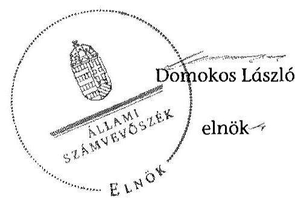

ÁLLAMI
SZÁMVEVŐSZÉK

# JELENTÉS 

az önkormányzatok belső kontrollrendszere kialakításának, egyes
kontrolltevékenységek és a belső ellenőrzés
működésének ellenőrzése
Pári
15105

---

# Állami Számvevőszék 

Iktatószám: V-0677-123/2015.
Témaszám: 1711
Vizsgálat-azonosító szám: V067712

## Az ellenőrzést felügyelte:

Dr. Benedek Mária
felügyeleti vezető
Az ellenőrzést vezette és az ellenőrzés végrehajtásáért felelős:
Gál Magdolna
ellenőrzésvezető
A számvevőszéki jelentés összeállításában közreműködött:
Dr. Halmné Harsányi Zsuzsanna
számvevő tanácsos
Az ellenőrzést végezték:
Dr. Halmné Harsányi Zsuzsanna Vámos Rita
számvevő tanácsos számvevő

---

# TARTALOMJEGYZÉK 

BEVEZETÉS ..... 5
I. ÖSSZEGZŐ MEGÁLLAPÍTÁSOK, KÖVETKEZTETÉSEK, JAVASLATOK ..... 9
II. RÉSZLETES MEGÁLLAPÍTÁSOK ..... 12

1. Az Önkormányzat belső kontrollrendszere kialakításának és működtetésének megfelelősége ..... 12
1.1. A kontrollkörnyezet kialakítása és működtetése ..... 12
1.2. A kockázatkezelési rendszer kialakítása és működtetése ..... 13
1.3. A kontrolltevékenységek kialakítása és működtetése ..... 14
1.4. Az információs és kommunikációs rendszer kialakítása és működtetése ..... 15
1.5. A monitoring rendszer kialakítása és működtetése ..... 16
2. A monitoring rendszer részeként a belső ellenőrzés kialakítása és működtetése ..... 16
3. A pénzügyi folyamatokban kulcsszerepet betöltő belső kontrollok (teljesítésigazolás és érvényesítés) működése ..... 18
4. Az integritás szemlélet érvényesülése ..... 20
FÜGGELÉKEK
5. számú Értelmező szótár
6. számú Az integritás érvényesítése érdekében kialakított és működtetett kontroll- rendszer

---

.

---

# RÖVIDÍTÉSEK JEGYZÉKE 

## Törvények

Áht.
ÁSZ tv.
Info tv.
Jtv.
Kttv.
Ltv.
Mötv.
Mvtv
Ötv.
Számv. tv.
Vnytv.

## Rendeletek

Ávr.
Bkr.
Ikr.
képviselő-testületi
SZMSZ
vagyongazdálkodási rendelet

## Szórövidítések

adatvédelmi szabályzat
alapító okirat
ÁSZ
belső ellenőrzési kézikönyv
Bizottság
ellenőrzési nyomvonal
ellenőrzési terv

2011. évi CXCV. törvény az államháztartásról
2011. évi LXVI. törvény az Állami Számvevőszékről
2011. évi CXII. törvény az információs önrendelkezési jogról és az információszabadságról
2000. évi XCVI. törvény a helyi önkormányzati képviselők jogállásának egyes kérdéseiről
2011. évi CXCIX. törvény a közszolgálati tisztviselők ről
1995. évi LXVI. törvény a köziratokról, a közlevéltárakról és a magánlevéltári anyag védelméről
2011. évi CLXXXIX. törvény Magyarország helyi önkormányzatairól
1993. évi XCIII. törvény a munkavédelemről
1990. évi LXV. törvény a helyi önkormányzatokról
2000. évi C. törvény a számvitelről
2007. évi CLII. törvény egyes vagyonnyilatkozat-tételi kötelezettségekről

368/2011. (XII. 31.) Korm. rendelet az államháztartásról szóló törvény végrehajtásáról
370/2011. (XII. 31.) Korm. rendelet a költségvetési szervek belső kontrollrendszeréről és belső ellenőrzéséről
335/2005. (XII. 29.) Korm. rendelet a közfeladatot ellátó szervek iratkezelésének általános követelményeiről
1/2006. (X. 14.) önkormányzati rendelet Pári Község Önkormányzata Szervezeti és Működési Szabályzatáról (hatályos 2006. október 14-től)
5/2013. (III. 18.) önkormányzati rendelet az önkormányzati vagyonról és a vagyonnal való gazdálkodás egyes szabályairól (hatályos 2013. március 18 -tól)

Regölyi Közös Önkormányzati Hivatal Közszolgálati adatvédelmi szabályzata (hatályos: 2013. január 1-től)
Regölyi Közös Önkormányzati Hivatal Alapító Okirata (hatályos: 2013. január 1-től)
Állami Számvevőszék
Belső ellenőrzési kézikönyv, Pári Község Önkormányzata, (hatályos: 2013. január 1-től)
Pári Község Önkormányzatának Önkormányzati Bizottsága
Regölyi Közös Önkormányzati Hivatal, Belső Kontrollrendszer 1. fejezet (hatályos: 2013. január 1-től)
Pári Község Önkormányzata 2014. éves Ellenőrzési Terve, (kelte: 2014. január 2.)

---

gazdasági program
Hivatal
hivatali bizonylati rend
hivatali etikai szabályzat
hivatali értékelési szabályzat
hivatali leltározási és
leltárkészítési szabályzat
hivatali pénzkezelési szabályzat
hivatali számlarend
hivatali számviteli politika
INTOSAI

ISSAI
jegyző1
jegyző2

Képviselő-testület
Kincstár
kormányhivatal
nemzetiségi önkormányzatok
Önkormányzat
polgármester ${ }_{1}$
polgármester ${ }_{2}$
stratégiai ellenőrzési
terv
szabálytalanságok kezelésének eljárásrendje
Társulás ${ }_{1}$
Társulás ${ }_{2}$
tűzvédelmi szabályzat

Pári Község Önkormányzati Képviselő-testületének Gazdasági Programja, 2010-2014.
Regölyi Közös Önkormányzati Hivatal
Regölyi Közös Önkormányzati Hivatal bizonylati szabályzata (hatályos: 2013. január 1-től)
Regölyi Közös Önkormányzati Hivatal, Etikai szabályzat (hatályos: 2013. február 1-től)
Regölyi Közös Önkormányzati Hivatal eszközök és források értékelési szabályzata (hatályos: 2013. január 1-től)
Regölyi Közös Önkormányzati Hivatal leltározási és leltárkészítési szabályzata (hatályos 2013. január 1-től)
Regölyi Közös Önkormányzati Hivatal pénzkezelési szabályzata (hatályos 2013. január 1-től)
Regölyi Közös Önkormányzati Hivatal számlarendje (hatályos 2013. január 1-től)
Regölyi Közös Önkormányzati Hivatal számviteli politikája (hatályos 2013. január 1-től)
International Organization of Supreme Audit Institutions (Legfőbb Ellenőrző Intézmények Nemzetközi Szervezete)
International Standards of Supreme Audit Institutions (Legfőbb Ellenőrző Intézmények Nemzetközi Standardjai)
Regölyi Közös Önkormányzati Hivatal jegyzője 2005. augusztus 1-jétől 2014. december 5-ig
Regölyi Közös Önkormányzati Hivatal megbízott jegyzője 2014. december 6-tól 2015. január 31-éig, Regölyi Közös Önkormányzati Hivatal jegyzője 2015. február 1-jétől
Pári Község Önkormányzatának Képviselő-testülete Magyar Államkincstár
Tolna Megyei Kormányhivatal
Pári Község Német Nemzetiségi Önkormányzata, Pári Község Roma Nemzetiségi Önkormányzata
Pári Község Önkormányzata
Pári Község Önkormányzatának polgármestere 2006. október 1-jétől 2013. július 6-ig
Pári Község Önkormányzatának polgármestere 2013. július 7 -től
Pári Község Önkormányzata Ellenőrzési Stratégiai Terve a 2011-2014. évekről
Regölyi Közös Önkormányzati Hivatal, Belső Kontrollrendszer 2. fejezet (hatályos: 2013. január 1-től)
Simontornya-Tamási Többcélú Kistérségi Társulás, 2013. május 31-ig
Dámi Önkormányzati Társulás, 2013. június 1-től
Regölyi Közös Önkormányzati Hivatal tűzvédelmi szabályzata (hatályos 2013. január 1-től)

---

# JELENTÉS 

## az önkormányzatok belső kontrollrendszere kialakításának, egyes kontrolltevékenységek és a belső ellenőrzés működésének ellenőrzése Pári

## BEVEZETÉS

Pári község állandó lakosainak száma 2013. január 1-jén 670 fő volt. Az Önkormányzat négytagú Képviselő-testületének munkáját egy állandó bizottság segítette. Az Önkormányzat az önállóan működő és gazdálkodó Hivatalon kívül egy 100% tulajdoni hányadú gazdasági társasággal rendelkezett. A polgármester₁ a 2006. évi önkormányzati választásoktól 2013. július 6-ig, a polgármester₂ 2013. július 7-e óta tölti be tisztségét. A jegyző₁, 2005. augusztus 1-jétől 2014. december 5-ig, a jegyző₂ 2014. december 6-tól 2015. január 31-éig megbízottként, 2015. február 1-jétől kinevezéssel látja el feladatait. A Hivatal szervezeti egységekre nem tagolódott, elkülönített gazdasági szervezettel nem rendelkezett, a foglalkoztatott köztisztviselők száma 2013. január 1-jén 11 fő volt. A Hivatalnál 2013. január 1-től szervezeti változás nem történt. Az Önkormányzat a 2013. évi költségvetési beszámolója szerint 738854 ezer Ft tárgyévi bevételt ért el, valamint 734074 ezer Ft tárgyévi kiadást teljesített. A 2013. december 31-i könyvviteli mérleg szerint 799454 ezer Ft értékű eszközvagyonnal rendelkezett, a rövid lejáratú kötelezettségállománya 7142 ezer Ft, hosszú lejáratú kötelezettségállománya nem volt.

A demokratikus társadalmakban alapvető igény, hogy a közpénzeket, a közvagyont használók valamennyi tevékenységükhöz kapcsolódó pénzfelhasználásról elszámoljanak, ahhoz egyértelmű és érvényesíthető felelősségi szabályok társuljanak. Ennek a jogos igénynek az érvényesítéséhez meg kell teremteni azokat a folyamatokat, rendszereket, amelyek nélkülözhetetlenek az elszámoltatáshoz. Az elszámoltatás eredményes működtetéséhez szükség van a megfelelő információs, kontroll, értékelési és beszámolási rendszerek kialakítására.

Magyarországon az uniós csatlakozási tárgyalások idejére nyúlnak vissza a belső kontrollrendszer szabályozásának gyökerei. Az uniós elvárásoknak megfelelő új terminológia szerinti államháztartási belső pénzügyi ellenőrzési (ÁBPE) rendszer területén a jogharmonizáció 2003-ban teljes körűen megvalósult, míg az önkormányzati alrendszerre vonatkozó, Ötv.-ben megjelenített speciális szabályozás 2005-ben lépett hatályba. Az államháztartási belső kontrollrendszer koncepciója 2009-ben továbbfejlődött. A változások irányát mutatja, hogy a költségvetési szervek belső kontrollrendszere már magában foglalja a korszerű felelős szervezetirányítás elemeit (kontrollkörnyezet, kockázatkezelés, kontrolltevékenység, információ és kommunikáció, monitoring) is. E kontrollrendszer szabályozása háromszintű, a törvényi előírásokat az Áht. és a Mötv., a rendeleti szintű szabályozást az Ávr. és a Bkr. tartalmazza, amelyeket

---

útmutatói szinten az NGM által kiadott standardok és kézikönyvek támogatnak.

A belső kontrollrendszer azt a célt szolgálja, hogy a költségvetési szervek működésük és gazdálkodásuk során a tevékenységeket szabályszerűen, gazdaságosan, hatékonyan, eredményesen hajtsák végre, teljesítsék elszámolási kötelezettségeiket és megvédjék az erőforrásokat a veszteségektől, a károktól és a nem rendeltetésszerű használattól. A belső kontrollrendszer magában foglalja mindazon szabályokat, eljárásokat, gyakorlati módszereket és szervezeti struktúrákat, kockázatkezelési technikákat, kontrolltevékenységeket, amelyek segítséget nyújtanak a szervezetnek céljai eléréséhez.

Az ÁSZ a középtávú stratégiájában hangsúlyos szerepet szánt annak, hogy szilárd szakmai alapon álló, értékteremtő ellenőrzéseivel előmozdítsa a közpénzügyek átláthatóságát, rendezettségét. A számvevőszéki ellenőrzés nemzetközi alapelvei is rögzítik, hogy a megfelelő belső kontrollrendszer minimálisra csökkenti a hibák és szabálytalanságok kockázatát.

Az ellenőrzés célja annak értékelése, hogy

- a jogszabályi előírásoknak megfelelően alakították-e ki és működtették-e a belső kontrollrendszert;
- a gazdálkodás folyamatában kulcsszerepet betöltő teljesítésigazolás és érvényesítés kontrolltevékenységeit megfelelően működtették-e;
- biztosították-e a belső ellenőrzés szabályos működését;
- kialakították-e az erőforrásokkal való szabályszerű és hatékony gazdálkodáshoz szükséges követelményeket, megvalósították-e azok számonkérését, ellenőrzését;
- hasznosították-e a 2009-2013. évek között végzett ÁSZ ellenőrzések során megfogalmazott javaslatokat.

A közintézmények integritás alapú kultúrájának kialakítása, megerősítése és működése szorosan összefügg a belső kontrollrendszer működésével, ezért az ellenőrzés kitért a gazdálkodáshoz kapcsolódó integritás kontrollok meglétének és működésének ellenőrzésére is. Az integritási kultúra kialakítása hozzájárul az elszámoltathatóság és átláthatóság érvényesítéséhez, egyben támogatja a szervezet védettségét a korrupciós kitettséggel szemben, valamint annak megelőzése is irányítottabbá válik.

Az ellenőrzés várható hasznosulását négy szinten tervezzük. A törvényalkotás számára összegzett tapasztalatok állnak rendelkezésre a belső kontrollrendszer önkormányzati területen való kialakításáról, működéséről és hatásairól, a belső ellenőrzés működéséről. Az ellenőrzés az ellenőrzött számára visszajelzést ad a belső kontrollrendszer kialakításában és működésében fellépő hiányosságokról, javaslataival hozzájárul azok kiküszöböléséhez, amely csökkentheti a későbbi ellenőrzések gyakoriságát. Az ellenőrzés megállapításait és javaslatait más szervezetek is hasznosíthatják a rendezett gazdálkodási keretek kialakításához. A társadalom számára jelzi, hogy közpénz nem maradhat el-

---

lenőrizetlenül, az ÁSZ értékteremtő rend kialakításához és megőrzéséhez hozzájáruló tevékenysége pozitív hatással lesz a szervezetről kialakított összkép formálásában. A szervezeten belül lehetőség nyílik arra, hogy a megállapítások szintetizálásával az ÁSZ a hozzáadott értéket teremtő elemző tevékenységét és tanácsadó szerepét is erősítse.

Az önkormányzatok belső kontrollrendszere kialakításának, az egyes kontrolltevékenységek és a belső ellenőrzés működésének ellenőrzéséről szóló jelentés I. fejezetének összegző része az ellenőrzés céljára ad rövid, szintetizáló összefoglalót, és tartalmazza a következtetéseket a II. fejezet részletes megállapításain alapulóan. A jelentés intézkedést igénylő megállapításait és javaslatait az ellenőrzés során feltárt, a jelentés II. fejezetében rögzített részletes megállapítások alapozzák meg.

Az ellenőrzés típusa: szabályszerűségi ellenőrzés
Az ellenőrzött időszak: a belső kontrollrendszer kialakítása és működtetésének megfelelőségét a 2013. évre vonatkozóan (2013. december 31-i állapotnak megfelelően), a pénzügyi folyamatokban kulcsszerepet betöltő teljesítésigazolás és érvényesítés belső kontrollok működésének megfelelőségét, és a belső ellenőrzés szabályszerű működését a 2013. január 1 - december 31-e közötti időszakot figyelembe véve értékeltük, míg az ÁSZ javaslatainak utóellenőrzése a 2009-2013. években végzett ellenőrzések nyilvánosságra hozott jelentéseiben tett javaslatok áttekintésére terjedt ki.

# Az ellenőrzött szervezet: az Önkormányzat 

Az ellenőrzés jogszabályi alapját az ÁSZ tv. 1. § (3) bekezdése, az 5. § (2) és (6) bekezdései, valamint az Áht. 61. § (2) bekezdése képezik.

Az ellenőrzés szakmai módszertana az ÁSZ hivatalos honlapján (www.asz.hu) közzétett szakmai szabályokon alapult, amely az INTOSAI által kiadott ISSAI figyelembevételével készült.

Az ellenőrzés lefolytatásához az Önkormányzat a kimutatások és a tanúsítvány elektronikus kitöltésével, valamint az ÁSZ által kért dokumentumok elektronikus megküldésével szolgáltatott adatokat. Az így rendelkezésre bocsátott adatok, információk kontrollja és a munkalapok kitöltése a helyszíni ellenőrzés keretében történt. A jelentésben használt fogalmak magyarázatát az 1. számú függelék, az integritás érvényesítése érdekében kialakított és működtetett intézményi kontrollrendszer minősítését a 2. számú függelék tartalmazza.

A belső kontrollrendszer, valamint a belső ellenőrzés jogszabályi előírások szerinti kialakításának és működtetésének szabályszerűségét az erre irányuló ellenőrzési kérdésekre adott válaszok összesítése alapján értékeltük. A belső kontrollrendszert kontrollterületenként (kontrollkörnyezet, kockázatkezelési rendszer, kontrolltevékenységek, információs és kommunikációs rendszer, monitoring rendszer) és összesítetten is értékeltük.

A belső kontrollrendszer egyes kontrollterületei és a belső ellenőrzés kialakítása és működtetése „szabályszerű volt", amennyiben az értékelt területen az elért és elérhető pontok százalékban kifejezett hányadosa elérte a 81%-ot, „részben szabályszerű volt", ha 61-80% közé esett, és „nem volt szabályszerű", ha nem haladta meg a 60%-ot. A belső kontrollrendszer összesített értékelése megegyezett a kontrollterületenként alkalmazott %-os

 értékelésekkel, a következő eltérésekkel. A kontrollrendszer egésze esetében a „szabályszerű" értékelésnek a %-os értéken felül további feltétele volt, hogy egyik kontrollterület sem kaphatott „nem volt szabályszerű" értékelést, a „részben szabályszerű" értékelés további feltétele volt, hogy legfeljebb egy ellenőrzött kontrollterület lehetett „nem volt szabályszerű" értékelésű. Az összesített értékelés a %-os értéktől függetlenül „nem volt szabályszerű", ha az ellenőrzött kontrollterületek közül több mint egynek „nem volt szabályszerű" az értékelése.

A gazdálkodás folyamatában kulcsszerepet betöltő két kulcskontroll - teljesítésigazolás, érvényesítés - működésének megfelelőségét a személyi juttatásokkal, a dologi és felhalmozási kiadásokkal, működési és felhalmozási célú pénzeszköz átadásokkal, ellátottak pénzbeli juttatásaival kapcsolatos kifizetések esetében mintavétellel ellenőriztük. „Megfelelőnek" értékeltük a gazdálkodási jogkörök gyakorlását, amennyiben 95%-os bizonyossággal a teljes sokaságban a hibaarány legfeljebb 10%, „részben megfelelőnek" értékeltük, ha a hibaarány felső határa 10-30% között volt, „nem megfelelőnek" pedig akkor, ha a mintavételi eredmények alapján a sokaságbeli hibaarány felső határa meghaladta a 30%-ot.

Az integritás szemlélet érvényesülésének minősítése az Önkormányzat önbevallás által kitöltött tanúsítványa alapján történt.

Utóellenőrzésre nem került sor, mivel az ÁSZ az Önkormányzatnál a 2009-2013. évek között nem végzett ellenőrzést.

Az ÁSZ tv. 29. § (1) bekezdése szerint a jelentéstervezetet megküldtük a polgármester részére, aki az ÁSZ tv. 29. § (2) bekezdésében foglalt észrevételezési jogával nem élt, a jelentéstervezetre észrevételt nem tett.

---

# I. ÖSSZEGZŐ MEGÁLLAPÍTÁSOK, KÖVETKEZTETÉSEK, JAVASLATOK 

A belső kontrollrendszeren belül 2013-ban a kontrollkörnyezet, a kockázatkezelési rendszer, a kontrolltevékenységek, az információs és kommunikációs rendszer, valamint a monitoring rendszer kialakítását és működtetését külön-külön és együttesen is értékeltük. A belső kontrollrendszer kialakítása és működtetése az összesített értékelés alapján nem volt szabályszerű.

A belső kontrollrendszer egyes területei kialakításának és működtetésének minősítése a következő:

| Kontrollterület | Minősítés |  |
| :-- | :--: | :--: |
| Kontrollkörnyezet |  |  |
|  |  | részben |
|  |  | szabályszerű |
| Kockázatkezelési rendszer |  |  |
|  |  | nem |
| Kontrolltevékenységek |  | szabálysz |
| Információs és kommunikációs rendszer |  |  |
| Monitoring rendszer |  |  |

Részben szabályszerű volt a kontrollkörnyezet, valamint az információs és kommunikációs rendszer kialakítása és működtetése, mivel a megállapított szabályozásbeli hiányosságok nem veszélyeztették e kontrollterületeken a szabályszerű működést.

Nem volt szabályszerű a kockázatkezelési rendszer, a kontrolltevékenységek, valamint a monitoring rendszer kialakítása és működtetése, mivel az ellenőrzésünk során megállapított szabályozásbeli hiányosságok magukban hordozzák a szabálytalan működés, valamint a korrupció kockázatát.

A 2013. évben a belső ellenőrzés kialakítása és működtetése részben volt szabályszerű, a belső ellenőrzés nem tárta fel a belső kontrollrendszer kialakításának és működtetésének, valamint a pénzügyi folyamatokban kulcsszerepet betöltő teljesítésigazolás és érvényesítés belső kontrollok működésének hiányosságait.

A 2013. évben a személyi juttatásokkal, dologi kiadásokkal, felhalmozási kiadásokkal, valamint a működési célú pénzeszköz átadásokkal kapcsolatos kifizetések során a pénzügyi folyamatokban kulcsszerepet betöltő teljesítésigazolás és érvényesítés belső kontrollok működése nem volt megfelelő, mivel azok nem biztosították a hibák megelőzését és feltárását.

---

A gazdálkodásban kulcsszerepet betöltő kontrollok működésében feltárt hiányosságok miatt fennáll a hibák bekövetkezésének kockázata. A nem megfelelően működtetett belső kontrollok korrupciós kockázatot hordoznak.

A Képviselő-testület a 2013. évben nem alakította ki az erőforrásokkal való szabályszerű és hatékony gazdálkodáshoz szükséges követelményeket.

Az Önkormányzat nem vett részt az ÁSZ 2013. évi integritás felmérésében.
A belső kontrollrendszer ellenőrzése keretében az integritás szemlélet érvényesülésének ellenőrzéséhez az Önkormányzat tanúsítványon - önbevallás útján - szolgáltatott adatokat. Az integritás szemlélet érvényesülésének minősítését a 2. számú függelék tartalmazza.

Az ÁSZ tv. 33. § (1) bekezdésében foglaltak értelmében az ellenőrzött szervezet vezetője köteles a jelentésben foglalt megállapításokhoz kapcsolódó intézkedési tervet összeállítani, és azt a jelentés kézhezvételétől számított 30 napon belül az ÁSZ részére megküldeni. Amennyiben az intézkedési tervet határidőre nem küldi meg a szervezet, vagy az ÁSZ tv. 33. § (2) bekezdésében foglalt póthatáridő elteltével megküldött intézkedési terv továbbra sem elfogadható, az ÁSZ elnöke a hivatkozott törvény 33. § (3) bekezdés a)-b) pontjaiban foglaltakat érvényesítheti.

Az ellenőrzés intézkedést igénylő megállapításai és javaslatai:

# a polgármesternek 

1. Az Önkormányzat kiadási előirányzata terhére történt kötelezettségvállalásra - az Áht. 37. § (1) bekezdésében és az Ávr. 55. § (1) bekezdésében foglaltak ellenére - pénzügyi ellenjegyzés nélkül került sor.

Javaslat:
Intézkedjen annak érdekében, hogy az Önkormányzat nevében történő kötelezettségvállalásra az Áht. 37. § (1) bekezdésében és az Ávr. 55. § (1) bekezdésében foglaltaknak megfelelően - az Ávr. 53. §-ában meghatározott kivételekkel - kizárólag pénzügyi ellenjegyzés után kerüljön sor.
2. Az önkormányzati képviselők közül kettő - a Jtv. 10/A. § (1) bekezdésében foglaltak ellenére - a vagyonnyilatkozat-tételi kötelezettségének nem tett eleget.

Javaslat:
Kezdeményezze a Képviselő-testület intézkedését a Mötv. 65. §-a alapján a Mötv 57. § (2) bekezdésében, valamint a 39. §-ában foglaltaknak megfelelően a két önkormányzati képviselő vonatkozásában a vagyonnyilatkozat-tételi kötelezettség teljesítésével kapcsolatos jogsértő gyakorlat megszüntetése érdekében.
3. A számvevőszéki jelentés ellenőrzési megállapításai alapján az Önkormányzatnál a belső kontrollrendszer kialakítása és működtetése az összesített értékelés alapján nem volt szabályszerű, a kulcskontrollok működése nem volt megfelelő. A számve-

---

vőszéki ellenőrzés során feltárt hibákat, hiányosságokat és szabálytalanságokat a számvevőszéki jelentés II. Részletes megállapítások fejezetcím tartalmazza.

Javaslat:
Kísérje figyelemmel a Mötv. 115. § (1) bekezdésében foglaltak alapján az Önkormányzat gazdálkodásának szabályszerűségét. A Mötv. 67. § f) pontja alapján gondoskodjon a belső kontrollrendszer kialakítására és működtetésére vonatkozó jogszabályi rendelkezések be nem tartása, valamint a teljesítésigazolás, illetve az érvényesítés kontrollokkal összefüggésben feltárt hibák, hiányosságok, szabálytalanságok tekintetében az esetleges munkajogi felelősséggel kapcsolatos körülmények kivizsgálásáról, majd a vizsgálat eredményének függvényében tegye meg a szükséges intézkedéseket.

# a jegyzőnek 

1. A számvevőszéki jelentés ellenőrzési megállapításai alapján az Önkormányzatnál a belső kontrollrendszer kialakítása és működtetése az összesített értékelés alapján nem volt szabályszerű, a kulcskontrollok működése nem volt megfelelő, illetve a belső ellenőrzés kialakítása és működtetése részben volt szabályszerű. A számvevőszéki ellenőrzés során feltárt hibákat, hiányosságokat és szabálytalanságokat a számvevőszéki jelentés II. Részletes megállapítások fejezetcím tartalmazza.

Javaslat:
A jogszabályoknak megfelelő belső kontrollrendszer kialakítása és működtetése érdekében - az ellenőrzött időszak óta bekövetkezett esetleges jogszabályi változásokra figyelemmel - intézkedjen a belső kontrollrendszer kialakításában és működtetésében, a kulcskontrollok működésében, illetve a belső ellenőrzés kialakításában és működtetésében az ellenőrzés által feltárt hibák, hiányosságok, szabálytalanságok kijavítására.

Kezdeményezze, hogy az éves ellenőrzési terv kiterjedjen a kifizetések szabályszerűségi ellenőrzésére, különös tekintettel a személyi juttatásokkal, a dologi kiadásokkal, a felhalmozási kiadásokkal, a működési és felhalmozási célú pénzeszköz átadásokkal, az ellátottak pénzbeli juttatásaival kapcsolatos kiadási jogcímekből teljesített kifizetésekre.

---

# II. RÉSZLETES MEGÁLLAPÍTÁSOK 

## 1. Az ÖNKORMÁNYZAT BELSŐ KONTROLLRENDSZERE KIALAKÍTÁSÁNAK ÉS MŰKÖDTETÉSÉNEK MEGFELELŐSÉGE

A belső kontrollrendszeren belül 2013-ban a kontrollkörnyezet, a kockázatkezelési rendszer, a kontrolltevékenységek, az információs és kommunikációs rendszer, valamint a monitoring rendszer kialakítását és működtetését külön-külön és együttesen is értékeltük. A belső kontrollrendszer kialakítása és működtetése az összesített értékelés alapján nem volt szabályszerű.

### 1.1. A kontrollkörnyezet kialakítása és működtetése

A kontrollkörnyezet kialakítása és működtetése részben volt szabályszerű.

A Hivatal rendelkezett a Képviselő-testület által elfogadott alapító okirattal, amely tartalmazta az alaptevékenységeket. Az Önkormányzat rendelkezett a 2010-2014. évekre vonatkozó gazdasági programmal és képviselő-testületi SZMSZ-szel. A Képviselő-testület megalkotta az Önkormányzat vagyongazdálkodási rendeletét, amelyben meghatározta a vagyongazdálkodás főbb szabályait.

A jegyző kialakította a hivatali számviteli politikát és annak keretében a hivatali pénzkezelési, a hivatali leltározási és leltárkészítési, valamint a hivatali értékelési szabályzatot, elkészítette a hivatali számlarendet, a bizonylati rendet és a Hivatal ellenőrzési nyomvonalát. A jegyző meghatározta a szabálytalanságok kezelésének eljárásrendjét és elkészítette a tűzvédelmi szabályzatot.

A 2013. évi költségvetési rendeletben meghatározták a Hivatal engedélyezett létszámát.

A kontrollkörnyezet kialakítása és működtetése részben volt szabályszerű, mert:

| Sorszám ${ }^{1}$ | Megállapítás | Megjegyzés |
| :--: | :--: | :--: |
| 4. | A jegyző ${ }_{1}$ - az Áht. 10. § (5) bekezdésében foglaltak ellenére - nem állapította meg a Hivatal feladatai ellátásának részletes belső rendjét és módját szervezeti és működési szabályzatban. |  |

[^0]
[^0]:    ${ }^{1}$ A témacsoportos ellenőrzés miatt a megállapítás számozása az önkormányzat által kitöltött kimutatások - adatszolgáltatások - kérdéseinek sorszámával azonos.

---

| 15. | A jegyző - a Számv. tv. 14. § (3), (5) és a 161.   § (1) bekezdéseiben foglaltak ellenére - nem |
| :-- | :-- |
| 19. | készítette el a nemzetiségi önkormányzatok |
| 23. | számviteli politikáját és annak keretében a |
| 25. | leltárkészítési és leltározási, az eszközök és |
| 27. | források értékelési, valamint a pénzkezelési |
|  | szabályzatát, továbbá számlarendjét. |
| 29. | A jegyző - az Mvtv. 2. § (3) bekezdésében |
|  | foglaltak ellenére - nem határozta meg a |
|  | Hivatalban az egészséget nem veszélyeztető |
|  | és biztonságos munkavégzés követelményei |
|  | megvalósításának módját. |

A külső szolgáltató elkészítette a Hivatalra vonatkozó munkavédelmi kockázatelemzést és értékelést.
A jegyző - a Kttv. 75. § (1) bekezdés d) pontjában foglalt előírás ellenére - nem rendelkezett munkaköri leírással.

A Képviselő-testület - az Áht. 9. § (1) bekezdés f) pontjában foglaltak ellenére - nem alakította ki az erőforrásokkal való, szabályszerű és hatékony gazdálkodáshoz szükséges követelményeket.

A jegyző - a Kttv. 130. § (1) bekezdésében előírtak ellenére - nem készítette el a Hivatalban dolgozó köztisztviselők teljesítményértékelését.

A Képviselő-testület - a Kttv. 231. § (1) bekezdése ellenére - nem állapította meg a Kttv. 83. §-ában előírt hivatásetikai alapelvek részletes tartalmát, valamint az etikai eljárás szabályait, mivel a jegyző azt nem terjesztette a Képviselő-testület elé jóváhagyásra.

# 1.2. A kockázatkezelési rendszer kialakítása és működtetése 

A kockázatkezelési rendszer kialakítása és működtetése nem volt szabályszerű, mert:

| Sorszám | Megállapítás | Megjegyzés |
| :--: | :--: | :--: |
| 4. | A jegyző - a Bkr. 7. § (2) bekezdésében foglaltak ellenére - nem határozta meg a kockázatok kezelése érdekében szükséges intézkedések teljesítésének folyamatos nyomon követési módját. |  |
| 5. | A Vnytv. 4. § a) pontjában foglaltak ellenére a vagyonnyilatkozat-tételre kötelezett köztisztviselők vagyonnyilatkozat-tételi kötelezettségét szervezeti és működési szabályzatban nem tüntették fel. |  |

---

Az önkormányzati képviselők közül kettő - a Jtv. 10/A. § (1) bekezdésében foglaltak ellenére - a vagyonnyilatkozat-tételi kötelezettségének nem tett eleget.

A jogszabályokban foglalt előírásnak megfelelően a vagyonnyilatkozat-tételre kötelezett a polgármester és további kettő képviselő, jegyző és a köztisztviselők a vagyonnyilatkozat-tételi kötelezettségnek eleget tettek.

* 2014. október 12-étől hatálytalan. 2014. október 12-étől az önkormányzati képviselők vagyonnyilatkozat-tételi kötelezettségét a Mötv. 39. § (1) bekezdése szabályozza.

# 1.3. A kontrolltevékenységek kialakítása és
 működtetése

A kontrolltevékenységek kialakítása és működtetése nem volt szabályszerű, mert:

| Sorszám | Megállapítás | Megjegyzés |
| :--: | :--: | :--: |
| 1-4. | A jegyző ${ }_{1}$ - a Bkr. 8. § (2) bekezdés a) pontjában foglaltak ellenére - nem biztosította a pénzügyi döntések - köztük a költségvetés tervezése, a beszerzési folyamat, a vagyonhasznosítási tevékenység és a támogatásokkal való elszámolás - dokumentumainak elkészítésével kapcsolatban a folyamatba épített, előzetes, utólagos és vezetői ellenőrzést. |  |
| $\begin{aligned} & 5 . \\ & 7 . \\ & 9-10 . \end{aligned}$ | A jegyző ${ }_{1}$ - az Ávr. 13. § (2) bekezdésének a) pontjában foglaltak ellenére - belső szabályzatban nem rendezte a tervezéssel, gazdálkodással - így különösen a kötelezettségvállalás, ellenjegyzés, teljesítés igazolása, érvényesítés és utalványozás gyakorlásának módjával, eljárási és dokumentációs részletszabályaival, valamint az ezeket végző személyek kijelölésének rendjével - kapcsolatos belső előírásokat, feltételeket. |  |

---

| 11-13. | A jegyző - az Ikr 8. § (1)-(2) bekezdésében foglaltak ellenére - nem gondoskodott az iratkezelési szoftver által kezelt adatok biztonságáról, és nem tette meg azokat a technikai és szervezési intézkedéseket, nem alakította ki azokat az eljárási szabályokat, amelyek az üzembiztonsági, adatvédelmi szabályok érvényre juttatásához szükségesek, továbbá nem határozta meg az üzemeltetéssel és az adatbiztonsággal kapcsolatos feladatokat és hatásköröket. |  |
| :--: | :--: | :--: |
| 21. | A polgármester ${ }_{2}$ - az Áht. 87. § (1)* bekezdésében foglalt előírás ellenére - a Képviselőtestületet határidőn túl tájékoztatta az Önkormányzat gazdálkodásának első félévi helyzetéről. | A Képviselő-testület az Önkormányzat 2013. évi költségvetésének első félévi teljesítéséről szóló beszámolót 2013. szeptember 15-e helyett a 2013. szeptember 24-ei ülésen, a 111/2013. (IX.24.) számú határozattal fogadta el.   * 2014. szeptember 30-tól hatályát vesztette. |
| 25.,   29. | A jegyző ${ }_{1}$ - az Ávr. 55. § (2) bekezdés g) pontjában, valamint az 58. § (4) bekezdésében foglaltak ellenére - nem jelölt ki a Hivatal állományába tartozó köztisztviselőt a pénzügyi ellenjegyzési és az érvényesítési feladatokra, a nemzetiségi önkormányzatok kiadási előirányzata terhére vállalt kötelezettségek esetére. | A pénzügyi ellenjegyzési és az érvényesítési feladatokat - a nemzetiségi önkormányzatok kiadási előirányzata terhére vállalt kötelezettségek esetében - a gazdálkodási előadó látta el. |

# 1.4. Az információs és kommunikációs rendszer kialakítása és működtetése 

## Az információs és kommunikációs rendszer kialakítása és működtetése részben volt szabályszerű.

A jegyző ${ }_{1}$ kialakította a Hivatal információs és kommunikációs rendszerét, amely biztosította, hogy a megfelelő információk a megfelelő időben eljutnak az illetékes szervezethez illetve személyhez. A jegyző ${ }_{1}$ szabályozta az információs rendszerek keretében a beszámolási szinteket, határidőket, módokat.

A Hivatal rendelkezett az Info tv. előírásainak megfelelő adatvédelmi szabályzattal. A jegyző; kialakította a kötelezően közzéteendő adatok nyilvánosságra hozatalának rendjét és meghatározta a közérdekű adatok megismerésére irányuló igények teljesítésének szabályait. A jegyző; az iratok iktatásával, az iratforgalom dokumentálásával biztosította az ügyintézés folyamatosságának, az iratok szervezeten belüli útjának pontos követhetőségét és ellenőrizhetőségét, az iratok hollétének naprakész megállapíthatóságát.

---

Az információs és kommunikációs rendszer kialakítása és működtetése részben volt szabályszerű, mert:

| Sor-   szám | Megállapítás |
| :-- | :-- |
| 6. | A jegyző - az Info tv. 33. § (1) és (3) bekezdéseiben foglaltak ellenére -   nem gondoskodott arról, hogy az Önkormányzat az elektronikus közzétételi kötelezettségének a 2013. évben eleget tegyen. |
| 8. | A jegyző ${ }_{1}$ - az Ltv. 9. § (4) bekezdésében foglalt előírás ellenére - nem készítette el a Hivatal iratkezelési szabályzatát. |

# 1.5. A monitoring rendszer kialakítása és működtetése 

A monitoring rendszer kialakítása és működtetése nem volt szabályszerű, mert:

| Sor-   szám | Megállapítás |
| :--: | :--: |
| 1. | A jegyző ${ }_{1}$ - a Bkr. 3. § e) pontjában és 10. §-ában foglaltak ellenére - az operatív tevékenységektől függetlenül működő belső ellenőrzés kivételével nem alakította ki a Hivatal tevékenységének, a célok megvalósításának nyomon követését biztosító rendszert. |
| 5. | A jegyző ${ }_{1}$ - a Bkr. 13. §. (2) bekezdésében foglalt előírás ellenére - a külső ellenőrzés megállapításainak hasznosítására intézkedési tervet nem készített. |

A Kincstár egy alkalommal végzett - a 2012. évi központi költségvetési támogatás elszámolásának szabályszerűségére vonatkozó - ellenőrzést az Önkormányzatnál.

A helyi önkormányzatok törvényességi felügyeletét ellátó kormányhivatal négy alkalommal élt törvényességi felhívással a 2013. évben.

A kormányhivatal egy-egy esetben a közép- és hosszú távú vagyongazdálkodási terv elkészítésére szólította fel az Önkormányzatot, a Képviselő-testület működését (a képviselő-testületi ülésekről készített jegyzőkönyvek hiányos tartalmát) illetve mulasztását (a jegyzőkönyvek késedelmes megküldését) kifogásolta, az Önkormányzat vagyongazdálkodási rendeletének az Nvtv. rendelkezéseivel való összhangba hozatalára kötelezte a Képviselő-testületet, továbbá a Bizottság mulasztása miatt (az ülésekről készült jegyzőkönyveket nem küldték meg) élt a törvényességi felhívás eszközével.

## 2. A MONITORING RENDSZER RÉSZEKÉNT A BELSŐ ELLENŐRZÉS KIALAKÍTÁSA ÉS MŰKÖDTETÉSE

Az Önkormányzatnál a belső ellenőrzés kialakítása és működtetése részben volt szabályszerű.

---

Az Önkormányzat a belső ellenőrzés kialakításáról a Társulás ${ }_{1,3}$ útján gondoskodott. A belső ellenőrzés szervezeti és funkcionális függetlenségét biztosították. Az Önkormányzat rendelkezett aktualizált belső ellenőrzési kézikönyvvel. A belső ellenőrzési vezetői feladatok és kötelességek ellátásának módjáról a jogszabályi előírásoknak megfelelően a belső ellenőrzési tevékenység megszervezésére vonatkozó írásbeli megállapodásban rendelkeztek. A belső ellenőrzést végzők rendelkeztek a jogszabályban előírt szakirányú szakképzettséggel és szakmai gyakorlattal. A belső ellenőrzési vezető a 2014. évre elkészítette az Önkormányzat éves ellenőrzési tervét, amelyet a Képviselő-testület az előírt határidőig jóváhagyott.

A 2013. évben végrehajtott belső ellenőrzésekhez megfelelő tartalmú ellenőrzési program és jelentés készült. Soron kívüli ellenőrzésre nem került sor. A belső ellenőrzési vezető a 2013. évre vonatkozó éves ellenőrzési jelentést elkészítette és megküldte a jegyzőnek. A belső ellenőrök az ellenőrzések során büntető-, szabálysértési-, kártérítési-, vagy fegyelmi eljárás megindítására okot adó cselekményt nem tártak fel.

A belső ellenőrzés kialakítása és működtetése részben volt szabályszerű, mert:

| Sorszám | Megállapítás | Megjegyzés |
| :--: | :--: | :--: |
| 4. | A belső ellenőrzési kézikönyvet - a Bkr. 56. § (7) bekezdésében foglaltak ellenére   - a Társulás; munkaszervezeti feladatait ellátó költségvetési szerv vezetője helyett a jegyző; hagyta jóvá. |  |
| 7. | Az Önkormányzat nem rendelkezett - a Bkr. 56. § (3) bekezdés a) pontja ellenére - a Képviselő-testület által elfogadott stratégiai ellenőrzési tervvel, mivel a jegyző nem kezdeményezte a polgármesternél a stratégiai ellenőrzési terv Képviselő-testület elé terjesztését. |  |
| 10. | A jegyző ${ }_{1}$ - a Bkr. 56. § (2) bekezdésében foglalt előírás ellenére - a 2014. évi ellenőrzési terv összeállításához írásos véleményt nem fogalmazott meg. |  |
| 22. | A jegyző; a belső ellenőrzés megállapításai és javaslatai alapján - a Bkr. 28. § c) pontjában foglaltak ellenére - nem készített intézkedési tervet. |  |
| 23. | A belső ellenőrzési vezető - a Bkr. 22. § (2) bekezdés e) pontjában és az 50. § (1) bekezdésében foglalt előírás ellenére - nem vezetett nyilvántartást az elvégzett belső ellenőrzésekről. |  |

---

A belső ellenőrzési vezető - a Bkr. 21. § (2) bekezdés d) pontjában és a 47. § (1) bekezdésében foglalt előírás ellenére - nem vezetett nyilvántartást a belső ellenőrzési jelentésekben tett megállapításokról, javaslatokról, a vonatkozó intézkedési tervekről és azok végrehajtásáról.

# 3. A PÉNZÜGYI FOLYAMATOKBAN KULCSSZEREPET BETÖLTŐ BELSŐ KONTROLLOK (TELJESÍTÉSIGAZOLÁS ÉS ÉRVÉNYESÍTÉS) MŰKÖDÉSE 

A 2013. évben a személyi juttatásokkal, a dologi kiadásokkal, a felhalmozási kiadásokkal, valamint a működési célú pénzeszköz átadásokkal kapcsolatos kifizetések során - összefoglalóan értékelve - a pénzügyi folyamatokban kulcsszerepet betöltő teljesítésigazolás és érvényesítés belső kontrollok működése nem volt megfelelő az alábbi hiányosságok miatt:

| Kulcskontrollok | Megállapítás |
| :--: | :--: |
| Teljesítésigazolás | A teljesítésigazolást a kifizetéseket megelőzően - az Áht. 38. § (1) bekezdésében és az Ávr. 57. § (1), (3) bekezdéseiben foglaltak ellenére - nem, vagy nem szabályszerűen, vagy kijelöléssel nem rendelkező személy jogosulatlanul végezte. |
| Érvényesítés | Az érvényesítést a kifizetéseket megelőzően - az Áht. 38. § (1) bekezdésében és az Ávr. 58. § (1), (3) bekezdéseiben foglaltak ellenére - nem, vagy nem szabályszerűen végezték.   Az érvényesítő - az Ávr. 58. § (2) bekezdés előírása ellenére - nem jelezte az utalványozónak, hogy a megelőző ügymenetben az Áht., az államháztartási számviteli kormányrendelet és az Ávr. előírásaiban foglaltakat nem tartották be. |

A 2013. évben az ellenőrzött kifizetési jogcímek mintatételei alapján a teljesítésigazolás kulcskontroll működése során az alábbi hiányosságok, szabálytalanságok fordultak elő:

- a személyi juttatásokkal, a dologi kiadásokkal, a felhalmozási kiadásokkal és a működési célú pénzeszközátadásokkal kapcsolatos kifizetéseket megelőzően a teljesítésigazolást - az Áht. 38. § (1) bekezdésében és az Ávr. 57. § (1) bekezdésében foglaltak ellenére - nem végezték el;
- a személyi juttatásokkal, a dologi és a felhalmozási kiadásokkal, valamint a működési célú pénzeszköz átadásokkal kapcsolatos kifizetéseket megelőzően a teljesítésigazolás - az Ávr. 57. § (1) bekezdésében foglaltak ellenére - nem szabályszerűen történt, mivel ellenőrizhető okmányok hiányában a teljesítésigazoló a kiadások teljesítésének jogosságát, összegszerűségét, valamint az ellenszolgáltatás teljesítését nem tudta ellenőrizni;
- a dologi és felhalmozási kiadásokkal kapcsolatos kifizetéseket megelőzően a teljesítésigazolás nem volt szabályszerű, mert - az Ávr. 57. § (3) bekezdésé-

---

ben foglaltak ellenére - a teljesítésigazolást kijelöléssel nem rendelkező személy jogosulatlanul végezte;

- a személyi juttatásokkal, a dologi és felhalmozási kiadásokkal, valamint a működési célú pénzeszközátadással kapcsolatos kifizetéseket megelőzően a teljesítésigazolás nem volt szabályszerű, mivel - az Ávr. 57. § (3) bekezdésében foglaltak ellenére - a teljesítésigazolás dátumát nem tartalmazta.

A 2013. évben az ellenőrzött kifizetési jogcímek mintatételei alapján az érvényesítés kulcskontroll működése során az alábbi hiányosságok, szabálytalanságok fordultak elő:

- a személyi juttatásokkal, a dologi és felhalmozási kiadásokkal, valamint a működési célú pénzeszközátadásokkal kapcsolatos kifizetéseket megelőzően az érvényesítés nem volt szabályszerű, mivel - az Ávr. 58. § (3) bekezdésében foglaltak ellenére - az érvényesítés keltezését nem tartalmazta;
- a személyi juttatások kifizetése során az érvényesítő - az Ávr. 60. § (2) bekezdésében foglalt összeférhetetlenségi szabályokat figyelmen kívül hagyva - az érvényesítést a maga javára látta el;
- a dologi és felhalmozási kiadásokkal kapcsolatos kifizetések esetében - az Áht. 38. § (1) bekezdésében, valamint az Ávr. 58. § (3) bekezdésében foglaltak ellenére - az érvényesítés nem előzte meg az utalványozás elrendelését;
- a személyi juttatásokkal, a dologi és felhalmozási kiadásokkal, valamint a működési célú pénzeszközátadásokkal kapcsolatos kifizetéseket megelőzően
 az érvényesítő - az Ávr. 58. § (1) bekezdésében előírtak ellenére - a fedezet meglétét nem tudta ellenőrizni, mivel az ellenőrzött időszakban a kötelezettségvállalásokról vezetett nyilvántartásból nem volt megállapítható a szabad előirányzat összege;
- a dologi és felhalmozási kiadásokkal, valamint a működési célú pénzeszközátadásokkal kapcsolatos kifizetéseket megelőzően - az Ávr. 58. § (1) bekezdésében foglaltak ellenére - az érvényesítés nem volt szabályszerű, mert az érvényesítő ellenőrizhető okmányok hiányában az összegszerűséget nem tudta ellenőrizni;
- a személyi juttatásokkal, a dologi és felhalmozási kiadásokkal kapcsolatos kifizetéseket megelőzően az érvényesítő - az Ávr. 58. § (2) bekezdésében foglaltak ellenére - nem jelezte az utalványozónak, hogy a megelőző ügymenetben - az Áht. 37. § (1) bekezdése, valamint az Ávr. 55. § (1) bekezdése ellenére - a Hivatal, valamint az Önkormányzat kiadási előirányzata terhére a kötelezettségvállalásra pénzügyi ellenjegyzés nélkül került sor, illetve a pénzügyi ellenjegyzést nem szabályszerűen végezték, mivel a pénzügyi ellenjegyzés dátumát nem tüntették fel. Nem jelezte továbbá az érvényesítő azt, hogy a kötelezettségvállalások nyilvántartása nem volt alkalmas arra, hogy a kötelezettségvállalás fedezetének megléte megállapítható legyen;
- a személyi juttatásokkal, a dologi és felhalmozási kiadásokkal, valamint a működési célú pénzeszközátadásokkal kapcsolatos kifizetéseket megelőzően az érvényesítő - az Ávr. 58. § (2) bekezdésében foglaltak ellenére - nem jelez-

---

te az utalványozónak, hogy a megelőző ügymenetben a teljesítésigazolást nem, vagy nem szabályszerűen, vagy kijelöléssel nem rendelkező személy jogosulatlanul végezte.

A gazdálkodásban kulcsszerepet betöltő kontrollok működésében feltárt hiányosságok miatt fennáll a hibák bekövetkezésének kockázata. A nem megfelelően működtetett belső kontrollok korrupciós kockázatot hordoznak.

# 4. AZ INTEGRITÁS SZEMLÉLET ÉRVÉNYESÜLÉSE 

Az Önkormányzat nem vett részt az ÁSZ 2013. évi integritás felmérésében.
A belső kontrollrendszer ellenőrzése keretében az integritás szemlélet érvényesülésének ellenőrzéséhez az Önkormányzat tanúsítványon - önbevallás útján szolgáltatott adatokat. Az integritás szemlélet érvényesülésének minősítését a 2. számú függelék tartalmazza.

Budapest, 2015. 04 . hónap 24 . nap

Függelék: $\quad 2 \mathrm{db}$

---

# ÉRTELMEZŐ SZÓTÁR 

belső ellenőrzés
belső kontrollrendszer
belső kontrollrendszer területei
egyszerű véletlen minta
integritás
kockázat

Független, tárgyilagos bizonyosságot adó és tanácsadó tevékenység, amelynek célja, hogy az ellenőrzött szervezet működését fejlessze és eredményességét növelje, az ellenőrzött szervezet céljai elérése érdekében rendszerszemléletű megközelítéssel és módszeresen értékeli, illetve fejleszti az ellenőrzött szervezet irányítási és belső kontrollrendszerének hatékonyságát.
(Forrás: Bkr. 2. § b) pontja)
A belső kontrollrendszer a kockázatok kezelése és tárgyilagos bizonyosság megszerzése érdekében kialakított folyamatrendszer, amely azt a célt szolgálja, hogy a működés és gazdálkodás során a tevékenységeket szabályszerűen, gazdaságosan, hatékonyan, eredményesen hajtsák végre, az elszámolási kötelezettségeket teljesítsék, megvédjék az erőforrásokat a veszteségektől, károktól és nem rendeltetésszerű használattól.
(Forrás: Áht. 69. § (1) bekezdése)
A kontrollkörnyezet, a kockázatkezelési rendszer, a kontrolltevékenységek, az információ és kommunikáció, valamint a nyomon követés (monitoring).
(Forrás: Bkr. 3. §-a)
Az alapsokaságból egyszerű véletlen kiválasztással képzett részsokaság.
(Forrás: Az ÁSZ ellenőrzési mintavételezés támogatásához készült segédletének 4.1.1. pontja)
Az integritás elvek, értékek, cselekvések, módszerek, intézkedések konzisztenciáját jelenti: olyan magatartásmódot, amely meghatározott értékeknek felel meg. Az integritás a közszféra esetében a társadalom által elvárt nyilvánossági, átláthatósági, illetve jogi/etikai normáknak történő megfelelést jelenti.
(Forrás: a http://integritas.asz.hu honlapon közzétett „A 2012. évi integritás felmérés eredményeinek összefoglalój dokumentum 3. oldal 1. bekezdése)
A kockázat annak a valószínűségét jelenti, hogy egy vagy több esemény vagy intézkedés nem kívánt módon befolyásolja a rendszer működését, céljainak megvalósulását. (Forrás: Javaslatok a korrupciós kockázatok kezelésére - Kockázatkezelési és ellenőrzési módszertan 35. oldal, ÁSZ)

---

kockázatkezelési rendszer
kontrollkörnyezet
kontrolltevékenységek
kommunikáció
korrupció
kulcskontrollok

Olyan irányítási eszközök és módszerek összessége, melynek elemei a szervezeti célok elérését veszélyeztető tényezők (kockázatok) azonosítása, elemzése, csoportosítása, nyomon követése, valamint szükség esetén a kockázati kitettség mérséklése. (Forrás: Bkr. 2. § m) pontja)

A kontrollkörnyezet alakítja ki a szervezet belső kontrollrendszerhez való viszonyát, hozzáállását, befolyásolja az alkalmazottak belső kontrollal kapcsolatos tudatosságát, magatartását. Elemei a személyes és szakmai elkötelezettség és a vezetés, valamint az alkalmazottak által vallott erkölcsi értékek, a szakmai hozzáértés iránti elkötelezettség, a felső vezetés hozzáállása - a vezetés filozófiája és tevékenységének stílusa, a szervezeti struktúra, a humánerőforrás - politika és gazdálkodási gyakorlat.
A kontrolltevékenységek azok a politikák és eljárások, amelyeket a kockázatok megoldására hoznak létre a szervezet céljainak teljesítése érdekében.
Az a tevékenység, melynek során információ továbbítása valósul meg. A kommunikációs folyamat résztvevői között tájékoztatás történik, mely során tényeket, ezek magyarázatát közlik. „A szervezetben eredményes kommunikációnak kell áramlania lefelé, horizontálisan és felfelé, a szervezet egészében és annak valamennyi elemében."
Azok a cselekmények, amelyek során a köz érdekében való eljárással megbízott és döntéshozatali felelősséggel felruházott személy a köz érdeke helyett önös vagy részérdekeket követve, mástól jogtalan vagy etikátlan előnyt elfogadva és őt jogtalan vagy etikátlan előnyhöz juttatva jár el, illetve amikor valaki a köz érdekében való eljárással megbízott és döntéshozatali felelősséggel felruházott személynek jogtalan vagy etikátlan előnyt nyújtva vagy felajánlva jogtalan vagy etikátlan előnyt kér. (Forrás: A Kormány korrupció megelőzési programja 2012-2014.)

Az azonosított kockázatok mérséklése érdekében kialakított kontrollok közül azok, amelyek elégtelen működése esetén a szervezetet jelentős veszteség érheti, vagy a működésükben bekövetkező hiba/hiányosság más kontrollok eredményességét csökkenti. Ezek ellenőrzése, értékelése elegendő bizonyítékot szolgáltat adott területen a kontrollrendszer értékeléséhez. Az önkormányzatok kontrollrendszere kialakításának ellenőrzése során a pénzügyi folyamatokban kulcsszerepet betöltő belső kontrollok a teljesítésigazolás és érvényesítés.

---

lényegesség
monitoring
utóellenőrzés

Egy információ akkor lényeges, ha hiánya vagy téves állítása befolyásolhatja ezen információkat felhasználók döntéseit, véleményét. Az ellenőrzés során a lényegesség három szempontból értelmezhető: érték, jelleg és összefüggés szerint.
A monitoring a különböző szintű szervezeti célok megvalósításának folyamatát kíséri figyelemmel, melynek során a releváns eseményekről és tevékenységekről (együtt: folyamatokról) rendszeres jelleggel, strukturált, döntéstámogató információkhoz jutnak a szervezet vezetői. (NGM útmutató a költségvetési szervek monitoring rendszeréhez 3. oldal, 2011. november)
Az intézkedések nyomon követése érdekében elrendelt ellenőrzés, amelynek célja, hogy az ellenőrzés bizonyosságot szerezzen az elfogadott intézkedések végrehajtásáról, vagy arról a tényről, hogy az ellenőrzött szerv, illetve az ellenőrzött szervezeti egység vezetője nem, vagy nem az elfogadott intézkedésnek megfelelően hajtja végre az intézkedéseket, továbbá meggyőződni arról, hogy a végrehajtott intézkedésekkel a megállapított kockázat ténylegesen megszűnt, vagy a kockázati tűréshatár alá csökkent.

---

.

---

# Az integritás érvényesítése érdekében kialakított és működtetett kontrollrendszer 

Az integritás szemlélet érvényesülésének ellenőrzéséhez az Önkormányzat tanúsítványon - önbevallás útján - szolgáltatott adatokat. Ezen adatok minősítése alapján az eredendő veszélyeztetettségi szint magas, míg a kockázatokat növelő tényező szintje közepes. Emellett a szervezetnél kiépült, kockázatok kezelésére hivatott kontrollok szintje is magas.

Az önértékelés szerint a kockázatok és a kontrollok szintje alapján megállapítható, hogy a szervezetnél jelenlévő korrupciós kockázatok, valamint az azok kezelésére kiépült kontrollok szintje között egyensúly van. Így a kiépült kontrollok kiválóan képesek kezelni a kockázatokat, valamint hatékonyan támogatni a szervezet feladatellátását. Az Önkormányzat integritása kiváló volt.

Az Önkormányzat részesült európai uniós támogatásban, amelynek felhasználásával kapcsolatosan szabálytalansági eljárást az elmúlt három évben nem indítottak. A közbeszerzési értékhatárt el nem érő beszerzésekre vonatkozóan az Önkormányzat rendelkezett hatályos beszerzési szabályzattal.

Az új munkatársak kiválasztásakor minden esetben pályázatot írtak ki és felvételi bizottságot alkalmaztak. Belső szabályozással kötelezővé tették, hogy a munkatársak gazdasági - vagy az Önkormányzat tevékenysége szempontjából releváns egyéb - érdekeltségeikről nyilatkozzanak. Az önbevallás szerint rendszerszintű kockázatelemzést, valamint kockázatkezelést végeztek.
