# ÁLLAMI   SZÁMVEVÔSZÉK 

## JELENTÉS

a Diákhitel Központ Zrt. müködésének ellenôrzéséről

---

# Állami Számvevőszék 

Iktatószám: V-0573-240/2015
Témasorszám: 1607
Vizsgálat-azonosító szám: V0699

## Az ellenőrzést felügyelte:

Dr. Horváth Margit
felügyeleti vezető
Az ellenőrzést vezette és az ellenőrzés végrehajtásáért felelős:
Kincses Erzsébet Eszter
ellenőrzésvezető
A számvevőszéki jelentés összeállításában közremüködtek:
Molnár Bálint
számvevő főtanácsos
Szabóné László Mária
számvevő tanácsos
Horváth Emese Csilla
számvevő
Gyeraj Péter Ede
számvevő főtanácsos
Az ellenőrzést végezték:

| Draviczky Éva | Horváth Emese Csilla | Molnár Bálint |
| :-- | :-- | :-- |
| számvevő | számvevő | számvevő főtanácsos |
| Papp József | Szabóné László Mária | Várkonyi Zsolt Kristóf |
| számvevő tanácsos | Számvevő tanácsos | számvevő tanácsos |

Az ellenőrzés végrehajtásában közremüködött:
Mikó Kata
számvevő gyakornok
A témához kapcsolódó eddig készített jelentés:
címe
sorszáma
A Diákhitel Központ Zrt. múködésének ellenőrzése
0843

---

# TARTALOMJEGYZÉK 

BEVEZETÉS ..... 3
I. ÖSSZEGZŐ MEGÁLLAPÍTÁSOK, KÖVETKEZTETÉSEK, JAVASLATOK ..... 7
II. RÉSZLETES MEGÁLLAPÍTÁSOK ..... 12

1. A társaság múködtetésének szabályozása, ellenőrzése ..... 12
1.1. A tulajdonosi jogok gyakorlása és a tulajdonosi ellenőrzés ..... 12
1.2. A vezérigazgató tevékenysége, a belső ellenőrzés kialakítása és múködtetése ..... 15
1.2.1. A belső ellenőrzés szabályozottsága és múködtetése ..... 17
2. A hallgatói hitelrendszer múködtetése ..... 19
2.1. A hallgatói hitelrendszer múködtetésébe bevont állami intézményekkel és állami tulajdonú szervezetekkel való együttmúködés szabályossága ..... 19
2.1.1. Az ÁKK Zrt.-vel való együttmúködés ..... 19
2.1.2. A felsőoktatási intézményekkel és az Országos Felsőoktatási Információs Központtal való együttmúködés ..... 21
2.1.3. Az állami adóhatósággal történő együttmúködés ..... 22
2.2. A DH1 és DH2 szabályozottsága, múködtetése ..... 23
2.2.1. A DH1 szabályozottsága és múködtetése ..... 24
2.2.2. A DH2 szabályozottsága és múködtetése ..... 27
2.2.3. A DH1-hez kapcsolódó célzott és a DH2-höz kapcsolódó általános kamattámogatás ..... 29
2.3. A hallgatói hitelrendszer múködtetésének informatikai támogatása ..... 30
3. A DK ZRT. GAZDÁLKODÁSA ..... 33
3.1. A DK Zrt. gazdálkodásának szabályozottsága ..... 33
3.2. A DK Zrt. vagyongazdálkodása ..... 34
3.3. A DK Zrt. bevételeinek és ráfordításainak szabályossága ..... 37
3.4. A céltartalék képzés szabályszerűsége ..... 39
4. A korábbi ÁSZ jelentés megállapításainak, javaslatainak hasznosítása ..... 40

---

# MELLÉKLETEK 

1. számú A DK Zrt. szervezeti felépítése
2. számú A DH1 és DH2 kamatának alakulása a 2011-2013. években
3. számú A DH1-ben részesült hallgatók számának alakulása és a hallgatók részére kihelyezett hitelösszeg alakulása a 2009-2013. években
4. számú Beérkezett észrevételek és az azokra adott válaszok

## FÜGGELÉKEK

1. számú Rövidítések jegyzéke
2. számú Értelmező szótár

---

# JELENTÉS 

## a Diákhitel Központ Zrt. múködésének ellenőrzéséről

## BEVEZETÉS

A Kormány célja, hogy minden fiatal számára esélyt teremtsen a felsőoktatásban való részvételre, továbbá hosszú távon biztosítsa az általánosan hozzáférhető felsőoktatás fenntarthatóságának feltételeit. Ennek érdekében létrehozta a DK Zrt.-t, melynek feladata a hallgatói hitelrendszer múködtetése és a hallgatói hitelek folyósítása. A társaság üzleti célja, hogy aktív és költséghatékony tevékenységével egy önálló, folyamatosan bővülő, önfenntartó diákhitelezési rendszert múködtessen. A DK Zrt. a Gt. rendelkezései alapján egyszemélyes, zártkörűen működő részvénytársaság. A társaság alaptőkéje az ellenőrzött időszakban 300,0 M Ft volt. A társaság tulajdonosa és részvényese a Magyar Állam. Képviseletében a tulajdonosi jogokat 2010. június 17 -től a MFB tv. 3. § (5) bekezdése alapján az MFB Zrt. gyakorolta. A tulajdonosi jogok gyakorlására a Gt. és a Ptk. rendelkezéseit az MFB tv.-ben szabályozott eltérésekkel kellett alkalmazni. A társaságnál tulajdonosi döntés alapján Igazgatóság nem múködött, annak jogkörét a Gt. 247. § szerint a vezérigazgató gyakorolta, aki a társaság tevékenységének, munkaszervezetének operatív irányítását is ellátta.

A hallgatói hitelnyújtás rendszerét, múködtetésének feltételeit a társaság jogállását, főbb feladatait 2012. július 31-ig a hallgatói hitelrendszerről és a Diákhitel Központról szóló Kormányrendelet ${ }_{1}$, 2012. augusztus 1-jétől a hallgatói hitelrendszerről szóló Kormányrendelet ${ }_{2}$, a Gt., valamint az Áht. ${ }_{1}$ határozta meg. A társaság hallgatói hitelezési tevékenysége nem tartozott a Hpt. hatálya alá. A társaság könyvvezetését a Számv. tv. szabályozta, valamint éves beszámoló készítési kötelezettségének is e törvény rendelkezései szerint kellett eleget tennie.

Kormányrendelet ${ }_{1}$-ben szabályozták a DH1 hitel igénybevételének feltételeit, a hitel kamatának meghatározását, valamint a hitel igénylésének, folyósításának és törlesztésének szabályait. A DH1 szabad felhasználású diákhitel állami ösztöndíjas és önköltséges képzésben résztvevő hallgatók számára egyaránt felvehető. A szabad felhasználású hitel fedezet nyújthat a napi megélhetéssel és egyetemi élettel kapcsolatos kiadásokra, a szállás, albérlet, kollégiumi díjak kiegyenlítésére, a diplomához szükséges nyelvtanulásra és az Erasmus-ösztöndíj kiegészítő finanszírozására. A Diákhitel havonta részletekben, vagy tanulmányi félévenként egy összegben vehető fel. A felvehető hitelösszeg maximum havi 50000 forint, az összeget a hallgató saját nevére szóló bankszámlaszámlájára utalták. A Kormány a 2012. augusztus 1-jén hatályba lépett, Kormányrendelet ${ }_{2}$-ben a felsőoktatás átalakításához kötődően egy új diákhitel konstrukció, a kötött felhasználású hitel (DH2) bevezetéséről döntött a Nftv. 46. § (1) bekezdése szerinti magyar állami részösztöndíjas és önköltséges képzésben tanulmányokat folytató hallgatók részére. A Kormányrendelet ${ }_{3}$ külön szabályoz-

---

ta a DH1 és DH2 igénybevételének, folyósításának, kamata meghatározásának és törlesztésének szabályait. A DH1 és a DH2 is változó kamatozású hitel, aminek keretében a hallgató határozatlan idejű hitelszerződést köt a DK Zrt.-vel.

A DH2 kötött felhasználású diákhitel kizárólag önköltséges formában tanuló hallgatók számára elérhető konstrukció, egyedül a képzési költség fizetésére vehető fel. A felvehető hitelösszeg maximum a képzés összege. A DK Zrt. közvetlenül a felsőoktatási intézménynek utalta a hitel összegét.

A DH1 kamata 2013. első félévében 7,75 \%-ban, második félévében 7,50\%ban került megállapításra. A DH2 kamata 9-ről 8,75 \%-ra csökkent 2013. július 1-jétől. A DH2-t igénybe vevő hallgatók számára felszámított kamatláb $2 \%$, az ezen felüli kamatrészre a Magyar Állam kamattámogatást nyújt.

Az ÁSZ 2008-ban ellenőrizte a DK Zrt. múködését. Az ellenőrzés a 2001. évi alapítástól a 2008. június 30 -ig terjedő időszakra irányult. A 0843 számú jelentésünkben a DK Zrt igazgatóságának az SZMSZ kiegészítésére, valamint a kockázati céltartalék évközi elszámolási rendjének szabályozására vonatkozóan fogalmaztunk meg javaslatot.

Magyarország Nemzeti Reform Programja keretében, a Széll Kálmán Terv 2020-ig a 30-34 évesek körében a felsőfokú vagy annak megfelelő végzettséggel rendelkezők arányának $30,3 \%$-ra való növelését irányozta elő, amely a 2010. évhez képest 4,6 százalékpontos növekedési célkitűzést jelent. A cél elérése érdekében a rendelkezésre álló források szabályozott, átlátható felhasználása szükséges. Az Állami Számvevőszék - ellenőrzési tervének megfelelően - ellenőrizte a felsőoktatási intézmények gazdálkodását „Felsőoktatási intézmények - Az állami felsőoktatási intézmények gazdálkodásának, müködésének ellenőrzése, valamint az egyházak által fenntartott felsőoktatási intézmények részére az államháztartásból jutatott támogatások felhasználásának ellenőrzése" keretében. A felsőoktatás finanszírozásának részét képzi a hallgatói hitelrendszer. A felsőoktatási helyzetkép teljessé tétele adott aktualitást a hallgatói hitelrendszert múködtető DK Zrt. ellenőrzésének.

Az ellenőrzés indokoltságát támasztja alá továbbá az, hogy a hallgatói hitelrendszer működtetésében az állam jelentős szerepet vállalt. Egyrészt a rendszer finanszírozása érdekében bevont források visszafizetésének biztosítására az állam készfizető kezességet vállalt. A kezességvállalás az államadósság alakulását, mint potenciális költségvetési kiadás több évre szólóan befolyásolhatja, és a hiányon keresztül közvetett módon gyakorolt hatást a központi alrendszer adósságára. Másrészt az újonnan bevezetett DH2-t felvevő hallgató általános kamattámogatásban, a DH1 kapcsán - meghatározott időszakra és feltételek fennállása esetén - célzott kamattámogatásba részesül, amelyet a központi költségvetés finanszíroz.

Az ellenőrzés célja: annak megállapítása, hogy a DK Zrt. feletti tulajdonosi joggyakorlás és tulajdonosi ellenőrzés a szabályoknak megfelelő volt-e, a hallgatói hitelrendszer múködtetése, és annak érdekében végzett pénzügyi és vagyongazdálkodási tevékenysége szabályozott volt-e, és megfelelt-e a vonatkozó jogszabályi előírásoknak és belső szabályzatoknak, valamint hasznosították-e a társaság múködésének ellenőrzéséről készült korábbi ÁSZ jelentés megállapításait, javaslatait.

---

Ennek keretében értékeltük, hogy:

- a tulajdonosi jogok gyakorlója és a vezérigazgató törvényesen működtette-e a társaságot, az irányítási, döntéshozatali rendszer összhangban volt-e a jogszabályok és belső szabályzatok előírásaival, kialakították és működtet-ték-e a gazdálkodás szabályszerűségét biztosító tulajdonosi ellenőrzést;
- kialakították és működtették-e a gazdálkodás szabályszerűségét biztosító belső ellenőrzést és a belső ellenőrzés elősegítette-e a gazdálkodás szabályosságát;
- a hallgatói hitelrendszer működtetése szabályozott volt-e, megvalósult-e a hallgatói hitelrendszer működtetésével (hitelnyújtási és forrásbiztosítási tevékenység) összefüggő feladatok szabályszerű ellátása, különös tekintettel a hitelkamat, a törlesztő részletek és a DH1-hez kapcsolódó célzott kamattámogatás és a DH2-höz kapcsolódó általános kamattámogatás megállapításának szabályosságára, valamint a rendszer működtetésébe bevont állami intézményekkel és állami tulajdonú szervezetekkel való együttműködés szabályosságát;
- kialakították-e a hallgatói hitelrendszer működtetésével összefüggő feladatok informatikai támogatását biztosító szabályokat, és azok a múködés során érvényesültek-e;
- a vagyonnal a jogszabályoknak megfelelően, valamint a tulajdonos elvárásai szerint gazdálkodtak-e, a társaság vagyoni helyzetére, valamint a bevételek és ráfordítások elszámolására vonatkozó jogszabályok és belső szabályzatok előírásait betartották-e, a céltartalék képzése szabályszerű volt-e;
- hasznosították-e a társaság múködésének ellenőrzéséről készült korábbi ÁSZ jelentés megállapításait, javaslatait.

Az ellenőrzés hasznosulásaként képet kaptunk a felsőoktatás finanszírozásának részét képező hallgatói hitelrendszer múködésének szabályosságáról, a hallgatói hitelrendszert működtető DK Zrt. jogszabályokban előírt követelményeknek megfelelő gazdálkodásáról, az állami vagyonnal való felelős, értékmegőrző gazdálkodás érvényesüléséről, a tulajdonosi és belső ellenőrzésnek a társaság szabályos gazdálkodásához való hozzájárulásáról. Megállapításaink, következtetéseink alapul szolgálnak a felsőoktatás finanszírozási stratégiáján belül a hallgatói hitelezési rendszer szerepének és célkitűzéseinek értékeléséhez, az esetleges jogszabályi változtatások kezdeményezéséhez. Az ellenőrzött DK Zrt. számára visszajelzést adnak a gazdálkodás szabályosságáról, a jó gyakorlatok megismerése hozzájárul a gazdálkodási fegyelem és színvonal javításához. Ellenőrzésünk hozadékát jelentheti továbbá az állami szerepvállalással járó kockázatokra történő figyelemfelhívás, továbbá a társadalom számára jelzi, hogy a közpénz nem maradhat ellenőrizetlenül.

Az ellenőrzés típusa: szabályszerűségi ellenőrzés
Az ellenőrzött időszak: 2011. január 1. - 2013. december 31.

---

Az ellenőrzéssel érintett szervezetek: Diákhitel Központ Zrt., valamint a társaság tulajdonosi jogainak gyakorlását érintően az MFB Zrt.

Az ellenőrzés jogszabályi alapja: Az Állami Számvevőszékről szóló 2011. évi LXVI. törvény 5. § (3)-(5) bekezdései.

Az ellenőrzést az ellenőrzési program szempontjai, az ellenőrzött időszakban hatályos jogszabályok, az ellenőrzési szakmai szabályok, az ÁSZ módszertanok figyelembevételével az INTOSAI standardokat irányadónak tekintve végeztük el. Az ellenőrzést a kérdésekre adott válaszok kiértékelésével, valamint a megjelölt adatforrások, a csatolt tanúsítványok felhasználásával, továbbá az adott időszakban hatályos jogszabályok figyelembevételével folytattuk le. Az ellenőrzés keretében értékeltük az ellenőrzéshez elkészített tanúsítványok adatainak valódiságát. A megállapításainkat a helyszíni ellenőrzés tapasztalataira, az ellenőrzött szervezettől bekért dokumentumokra, a kitöltött tanúsítványok elemzésére, az adott időszakban hatályos jogszabályok és belső szabályzatok előírásaira alapoztuk. A DH1 és a DH2 hitelkonstrukciók, valamint a bevételek és kiadások szabályszerű működését mintavétellel ellenőriztük, ez alapján a sokaságokban előforduló hibás tételek arányát becsültük. A jogszabályoknak és a belső előírásoknak megfelelően, azaz szabályszerűnek tekintettük az adott területet, amennyiben a minta ellenőrzésének eredménye alapján $95 \%$-os bizonyossággal a teljes sokaságban a hibás tételek aránya kisebb volt, mint $10 \%$, nem megfelelőnek értékeltük, ha a hibás tételek aránya a $10 \%$-ot meghaladta. Kockázatot, illetve magas kockázatot jeleztünk, amennyiben egy adott terület vonatkozásában a minta alapján a teljes sokaságban nem volt teljes körűen biztosított a jogszabályoknak és a belső szabályzatoknak megfelelő működés. A vagyongazdálkodás szabályszerűségét a kitöltött tanúsítványok elemzésével minősítettük.

Az ÁSZ az Állami Számvevőszékről szóló 2011. évi LXVI. törvény 29. §-a alapján a jelentéstervezetet észrevételezésre megküldte a Diákhitel Központ Zrt. vezérigazgatójának, valamint a társaság tulajdonosi jogainak gyakorlását érintően az MFB Zrt. vezérigazgatójának. A beérkezett észrevételeket a jelentés véglegesítése során hasznosítottuk. Az észrevételeket és az azokra adott válaszokat a jelentés 4. számú melléklete tartalmazza.

---

# I. ÖSSZEGZŐ MEGÁLLAPÍTÁSOK, KÖVETKEZTETÉSEK, JAVASLATOK 

Az ellenőrzött időszakban a tulajdonosi jogokat az MFB Zrt. az MFB tv.ben, a Gt.-ben és az Alapító Okiratokban meghatározott előírásoknak megfelelően gyakorolta.

A tulajdonosi ellenőrzés az FB és a független könyvvizsgáló, valamint az MFB Zrt. Ellenőrzési Igazgatósága tevékenységén keresztül valósult meg. Az ellenőrzési tevékenység hozzájárult a szabályszerű feladat ellátáshoz, valamint a szabályszerű pénzügyi- és vagyongazdálkodáshoz. Az ellenőrzések a DK Zrt. gazdálkodási területén a hitelezési folyamat komplex ügyviteli rendszerének kialakítására, a központi hitelinformációs rendszerrel kapcsolatos vezérigazgatói utasítás és a belső ellenőrzési rendszer területen tárt fel hiányosságokat és fogalmazott meg javaslatokat, amelyeket a DK Zrt. hasznosított.

Az FB az ellenőrzött időszakban a DK Zrt. Számv.tv. szerinti beszámolójának előzetes véleményezéséről írásos jelentést készített, melyben javaslatot tett a MFB Zrt. számára a beszámoló elfogadására. Az FB feladatát 2011. évet kivéve jóváhagyott munkaterv alapján végezte. Az FB ellenőrzési tevékenysége keretében folyamatosan nyomon követte az Alapítói határozatok, FB határozatok végrehajtását. Az ellenőrzött időszakban az FB ügydöntő FB-ként is múködött, az Alapító Okiratban meghatározott esetekben döntési és jóváhagyási jogokat gyakorolt a vezérigazgató-helyettesek teljesítménykövetelményének meghatározása és az ahhoz kapcsolódó juttatások, a múködést meghatározó szabályzatok, valamint a 60 M Ft összeget meghaladó kötelezettségvállalások jóváhagyása terén. A DK Zrt. a diákhitel finanszírozásához szükséges forrásokat a tőkepiacról állami garanciával szerezte be. Ebből adódóan a DK Zrt.nél. a Tpt. és a Gt. előírásai szerint AB-ot kellett múködtetni. Az Alapító Okiratban rögzítetteknek megfelelően az AB hatáskörébe tartozó feladatokat is az FB látta el.

A DK Zrt. a Gt. előírásának megfelelően az éves beszámolóját könyvvizsgálóval ellenőriztette. A DK Zrt. a könyvvizsgáló által ellenőrzött, jóváhagyott éves beszámolóit minden év május 31-ig közzétette a Számv. tv. rendelkezéseinek megfelelően. Az MFB Zrt. alapítói határozatokkal hagyta jóvá a DK Zrt. éves beszámolóját, a Gt. rendelkezéseinek megfelelően. A könyvvizsgáló az ellenőrzött időszakban a beszámolókhoz minősítés nélküli könyvvizsgálói véleményt adott.

A DK Zrt. az üzleti tevékenységéről, gazdálkodásáról és vagyoni helyzetéről havonta és negyedévente az Alapítói Okiratban foglaltaknak megfelelően elkészítette a beszámolókat és megküldte az MFB Zrt.-nek. A hallgatói hitelállományt, az igénybe vett forrásokat és törlesztéseket, valamint az állami kezesség érvényesítését tartalmazó beszámolókat az MFB Zrt. az ellenőrzött időszakban minden esetben elfogadta.

---

A DK Zrt.-nél az Igazgatóság jogkörét a Gt. rendelkezései alapján a vezérigazgató gyakorolta, aki a DK Zrt. tevékenységének, munkaszervezetének operatív irányítását vezérigazgatói döntések és utasítások kiadásával látta el.

A DK Zrt.-nél a belső ellenőrzés szervezetét kialakították, a függetlenségét biztosították. A belső ellenőrzés szakmai irányítását az FB látta el. A tevékenység szabályozásáról a belső irányítási eszközök egymásra épülő rendszerében gondoskodtak. Ugyanakkor az intézkedési tervek készítését és kiadását az ellenőrzött szervezeti egység vezetője helyett a belső ellenőr végezte, ezzel a hatáskörét túllépte. Az intézkedési tervek végrehajtását a belső ellenőr nyomon követte. A belső ellenőrzés tevékenységéről minden évben beszámoltak az FBnek. A beszámolók összeállítása során a belső ellenőrzési szabályzatban rögzített határidőket, valamint a benyújtás rendjét a belső ellenőr nem tartotta be. Az ellenőrzések eredményeként a belső ellenőrzés 47 javaslatot fogalmazott meg az iratkezelés, az informatika és a gazdálkodási feladatok területén feltárt hiányosságok megszüntetése érdekében 11 belső szabályzat (SZMSZ, iratkezelési szabályzat, IBSZ, közbeszerzési szabályzat, hozzáférési és jogosultságkezelési szabályzat, hitelezési kézikönyv és számviteli politika) módosítására került sor. Az ellenőrzött években szabálysértési, kártérítési, illetve fegyelmi eljárás megindítására a belső ellenőr által feltárt hiányosságok alapján nem került sor.

A DK Zrt. a hallgatói hitelrendszer múködtetését állami intézményekkel, állami és nem állami tulajdonú szervezetekkel kötött külön megállapodásokkal kiegészített szabályozási környezetben látta el. Tevékenységével hozzájárult a felsőoktatás finanszírozásához.

A DK Zrt. a hallgatói hitelrendszer finanszírozásához a 2011-2013. években összesen 95,5 Mrd Ft névértéken hozott forgalomba kötvényeket. Az aukciók lebonyolítását az ÁKK Zrt., mint vezető forgalmazó, illetve befektetési szolgáltatók (forgalmazók) végezték a finanszírozási stratégia, illetve éves finanszírozási tervek alapján.

A rendszer múködtetéséhez tartozott, hogy a DK Zrt. az állami adóhatóságnak az együttműködési megállapodás alapján az egy összegben esedékessé vált, meg nem fizetett hiteltartozásokat behajtásra átadta, amit az állami adóhatóság adók módjára hajtott be.

A felsőoktatási intézményekkel az együttmúködés érdekében a DK Zrt. az ellenőrzött idôszakban megállapodásokat kötött. Ennek keretében a felsőoktatási intézmények igazolták a hallgatói jogviszonyok fennállását, ami a hitel folyóitásának egyik alapfeltétele volt.

# A hitelrendszer múködtetésének szabályozási hátterét kialakították. 

A hitelszerződés érvényes létrejöttéhez szükséges, az Üzletszabályzat ${ }_{1,2}$ 20.1. és 21., valamint az Üzletszabályzat ${ }_{3,4} 43$. és 47 . pontjaiban foglalt alaki és tartalmi kellékekkel az ellenőrzött hiteligénylési adatlapok közel fele nem rendelkezett. Nem tartalmazták a hitelfelvevő állampolgárságát, az oktatási intézményi szak megnevezését vagy a finanszírozás típusát. A hiteligénylési adatlapoknál nem töltötték ki a hitelfelvevő lakóhelyét, adóazonosító jelét, az igényelt havi

---

hitelösszeget, a képesítési követelmények szerinti képzési időt, valamint a hallgatói azonosító számot.

A DK. Zrt. a hiteligénylési adatlapok, illetve hitelszerződések adattartalmának ellenőrzését az Üzletszabályzat ${ }_{1,2}$ 21., valamint az Üzletszabályzat ${ }_{3,4} 47$. pontjaiban rögzített előírások szerint hajtotta végre. Az adathiányok pótlására a DK Zrt. felhívta az érintett hitelfelvevők figyelmét.

Az állam a hitelfelvevőket támogatásban részesítette. A TGYÁS-ra, a GYED-re és a GYES-re jogosult, továbbá a rehabilitációs és rokkantsági ellátásra jogosult DH1 hitelfelvevők a jogosultsági időszakában fizetendő kamattartozás teljes összegének megfelelő mértékű célzott kamattámogatásban részesültek a Kormányrendelet ${ }_{1,2}$-ben rögzítetteknek megfelelően. A DH2 hitelhez kapcsolódó általános kamattámogatást az állam a központi költségvetésből finanszírozta és a Kincstár utalta át a Kormányrendelet ${ }_{1,2}$-ben rögzítetteknek megfelelően a DK Zrt.-nek.

Az DK Zrt.-nél kialakították a hitelrendszer múködtetését támogató informatikai rendszereket. A rendszerek múködését szabályozták. Az informatikai irányítás és az információvédelem szervezeti feltételei az SZMSZ-ben meghatározott követelményeket teljesítették. A DK Zrt. informatikai szervezeti felépítése mind a függetlenség, mind a feladatkörök szétválasztása tekintetében megfelelt a KIB 25. sz. ajánlásának. A DK Zrt. a hallgatói hitelrendszerrel összefüggő feladatok informatikai támogatását biztosító szabályokat kialakította, azok az informatikai múködés során érvényesültek. A DK Zrt. 2013-tól teljes körűen gondoskodott az általa kezelt adatok biztonságáról, rendelkezésre állásáról és sértetlenségéről.

A DK Zrt. az információs önrendelkezési jogról és az információszabadságról szóló 2011. évi CXII. törvényben foglalt adatvédelmi előírásokat részletesen szabályozta az Adatvédelmi és Adatbiztonsági Szabályzatban, az Adatszolgáltatási szabályzatban. E szabályozások alapján a hitelfelvevők személyes adatait az adatvédelmi törvénynek megfelelően kezelték.

A Dk Zrt. vagyona az ellenőrzött időszakban 15,8 \%-kal emelkedett, a 2011. évi 248355 M Ft-ról a 2013. évi 287593 M Ft-ra nőtt. Gazdálkodására jellemző, hogy vagyonában a kihelyezett diákhitelek állománya 2013. év végére 272873 M Ft-ra emelkedett. A hitelezési tevékenységét elsődlegesen idegen forrásból, kötvénykibocsátásból finanszírozta, amelynek állománya a 2013. évben 247823 M Ft volt.

A DK Zrt. a vagyonával a törvényeknek, a Kormányrendelet ${ }_{1,2}$-nek és a tulajdonosi elvárásoknak megfelelően gazdálkodott. A bevételek és ráfordítások elszámolása a Számv. tv.-ben és az ellenőrzött időszakban hatályos számviteli politikáknak megfelelt.

A DK Zrt. a vagyonnal való gazdálkodás belső szabályzatait a jogszabályi előírásokkal összhangban elkészítette, azokban a feladatai és múködése jellegéből adódó sajátosságokat figyelembe vette. A vagyonnal való gazdálkodás során az, állományba vételi, nyilvántartási és elszámolási kötele-

---

zettségét a hatályos jogszabályokban és belső szabályzatokban foglaltaknak megfelelően végezte. Az éves beszámolók mérlegeiben kimutatott vagyon értékét leltárral alátámasztották. A tulajdonosi joggyakorló által előírt, a vagyonnal kapcsolatos adatszolgáltatási és beszámolási kötelezettségüknek eleget tettek. A bevételek és ráfordítások elszámolása megfelelt a jogszabályokban, valamint belső szabályzatokban rögzített előírásoknak.

A DK Zrt.-nél a kockázati céltartalék képzési kötelezettség belső szabályozásából 2011-2012. években kimaradt az alkalmazott biztosítási modellhez használt számítások megállapítási módja, amit előírt a Kormányrendelet ${ }_{1,2}$. A szabályozási hiányosság ellenére a céltartalék képzése, felhasználása és elszámolása szabályszerú volt. A kockázati céltartalék az ellenőrzött időszakban a 2011. évi 17729 M Ft értékű nyitóállományról a 2013. év végére 28252 M Ft-ra emelkedett. A céltartalék hitelállományhoz viszonyított állományváltozása az ellenőrzött időszakban $2,5 \%$-os volt, ami a kihelyezett hitelállomány kockázati kitettségének növekedését jelzi.

A DK Zrt. müködését az ÁSZ 2008-ban ellenőrizte. A számvevőszéki jelentésben megfogalmazott javaslatok hasznosultak, 2008-tól a társaság SZMSZ-ben szabályozták a Finanszírozási Bizottság szervezetben betöltött helyét, hatáskörét, továbbá a Számviteli politikában rögzítették a kockázati céltartalék évközi elszámolásának rendjét.

Az ellenőrzés intézkedést igénylő megállapításai és javaslatai:
Javaslataink célja a DK Zrt. müködése szabályszerűségének javítása annak érdekében, hogy a szabályozási környezet megfelelően tudja támogatni az átlátható müködést.

# Javasoljuk a DK Zrt. vezérigazgatójának: 

1. A Kormányrendelet 13. § (3) bekezdésében előírt, minden tanulmányi hónapban elvégzendő adategyeztetési kötelezettségét teljesítette, a társaság a maga számára a rendeleti szabályozástól eltérő, a havi helyett féléves gyakoriságú egyeztetést írt elő.

Javaslat:
Intézkedjen a szabályozási hiányosságok megszüntetésére, ennek keretében:
az adategyeztetési kötelezettség gyakoriságára vonatkozó előírásokat hozza összhangba a vonatkozó kormányrendelet előírásaival.
2. A DK Zrt. belső ellenőrzési szabályzata ${ }_{2,3}$ I. fejezet 1.3. pontjában, valamint a II. fejezet 4.7.1. pontjában az ellenőrzött szervezeti egység vezetője részére előírta a belső ellenőri jelentésekben feltárt szabálytalanságok és hiányosságok megszüntetése érdekében az intézkedési terv készítési kötelezettséget. A belső szabályozásban foglaltakat ellenére a 2011-2013. években a belső ellenőrzés által megfogalmazott javaslatok vonatkozásában az intézkedési terveket - a jelentés részeként - a belső ellenőr készítette el, amivel túllépte a hatáskörét.

---

A belső ellenőrzés tevékenységéről szóló éves beszámolók elkészítése során a belső ellenőrzési szabályzat ${ }_{2,3}$-ban foglalt határidőket, valamint a benyújtás rendjét nem tartották be.

A DK Zrt. a Kormányrendelet 5. § (2) bekezdésében foglalt, az egyes tanévekre felvehető hitelek összegeinek hitelcélok szerinti közzétételi kötelezettségét a DH2 tekintetében nem teljesítette.

Javaslat:
Gondoskodjon a jogszabályi elöírások szerinti gyakorlat és a szabályos müködés biztosítására, ezen belül:
a) tartassa be, hogy a belső ellenőrzés jelentései alapján az illetékes vezetők készítsék el az intézkedési terveket, továbbá a belső ellenőrzés tevékenységéről szóló beszámolók határidőben és a megfelelő eljárásrend szerint készüljenek;
b) intézkedjen a DH2 esetében az egyes tanévekre felvehető hitelek összegeinek hitelcélok szerinti közzétételéről.

---

# II. RÉSZLETES MEGÁLLAPÍTÁSOK 

## 1. A TÁRSASÁG MÜKÖDTETÉSÉNEK SZABÁLYOZÁSA, ELLENŐRZÉSE

Az MFB Zrt. számára a DK Zrt. feletti tulajdonosi jogok gyakorlását az MFB tv. írta elő. Az MFB Zrt. a tulajdonosi jogait a 2010. évi LII. tv., a Gt. és az Alapító Okiratokban megfogalmazott követelmények betartásával gyakorolta. Az MFB Zrt. a hatáskörébe tartozó ügyekben alapítói határozat formájában, írásban döntött.

## A DK Zrt. szabályozási környezete

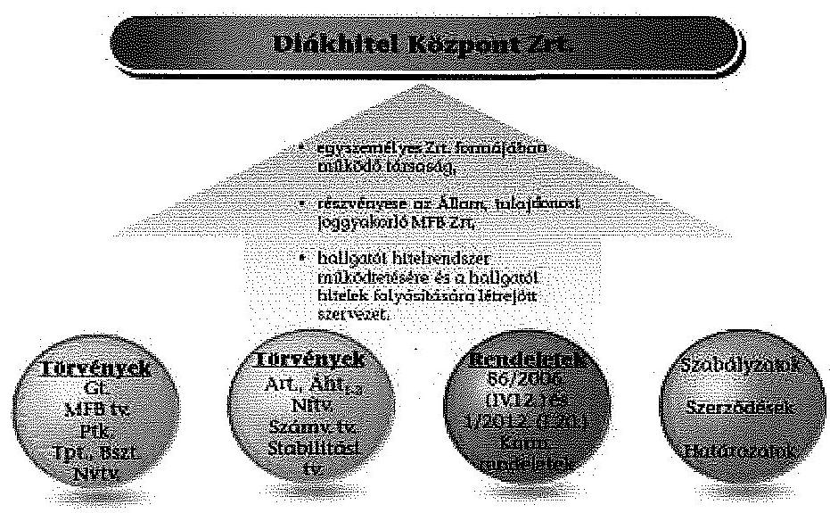

### 1.1. A tulajdonosi jogok gyakorlása és a tulajdonosi ellenőrzés

A tulajdonosi jogokat az MFB Zrt. a belső szabályzataiban (az MFB Zrt. mindenkor hatályos Alapító Okirata, SZMSZ-e, Pénzügyi Intézményi Befektetések Főigazgatóságának Úgyrendje, Döntéshozó Testületek Úgyrendje), valamint a DK Zrt. Alapító Okiratában foglaltaknak megfelelően, cégfelelősi rendszerben látta el.

Az MFB Zrt. a hatáskörébe tartozó ügyekben alapítói határozat formájában döntött, az ellenőrzött időszakban összesen 28 esetben.

A tulajdonosi joggyakorlás keretében a Gt. 231. § (2) pontjában, illetve az Alapító Okiratban meghatározott esetekben hoztak alapítói határozatokat. Az MFB Zrt. alapítói határozattal jóváhagyta a DK Zrt. 2011-2014. évi üzleti terveit, a 2011-2013. évi éves beszámolóit és az ahhoz kapcsolódó üzleti jelentéseit. Az MFB Zrt. jóváhagyta a DK Zrt. vezérigazgatójának 2010-2012. évi prémium-

---

feladatai kiírását és annak teljesítését, valamint engedélyezte a prémium kifizetéseket. Az MFB Zrt. alapítói határozattal jóváhagyta az FB Ügyrendjét és a finanszírozási terveket. Elfogadta a DK Zrt. Javadalmazási Szabályzatát és az Alapító Okirat módosítását. Az MFB Zrt. az ellenőrzött időszakban négy esetben kijelölte a DK Zrt. megválasztott FB elnökeit és tagjait, valamint visszahívta a lemondott FB elnökeit és tagjait.

A tulajdonosi joggyakorlás az MFB Zrt. Pénzügyi Intézményi Befektetések Főigazgatóságának tevékenységén (Alapítói Határozatok kiadása stb.) keresztül valósult meg, amelyet támogatott az FB és a független könyvvizsgáló, a DK Zrt. számára előírt adatszolgáltatások ${ }^{1}$ monitoringja, valamint az MFB Zrt. Ellenőrzési Igazgatósága által végzett ellenőrzés.

Az MFB Zrt. a tulajdonosi joggyakorlás kötelező eszközeként a Gt. 33. § (1)-(2) bekezdései, valamint a Taktv. 4. § (1) bekezdése alapján a DK Zrt.-nél létre hozta az FB-t. Az FB az Alapító Okirat előirásának megfelelően három tagból állt, tagjait és elnökét az MFB Zrt. jelölte ki három éves időtartamra, múködésének szabályait az Ügyrendje tartalmazta, feladatát az alapján látta el.

Az FB munkája során megvizsgálta az MFB Zrt. elé terjesztendő gazdálkodásra vonatkozó jelentéseket, valamint a kizárólagos hatáskörébe tartozó ügyekre vonatkozó előterjesztéseket. Az FB az ellenőrzött időszakban a DK Zrt. számviteli törvény szerinti beszámolójának előzetes véleményezését elvégezte és javaslatot tett a MFB Zrt. számára a beszámoló elfogadására. A beszámolóhoz az FB írásos jelentést készített a Gt. 35. § (3) bekezdése előírtaknak megfelelően.

A DK Zrt. az FB elé terjesztette a vagyoni helyzetéről és üzletpolitikájáról negyedévente készített beszámolóját is. A beszámoló tartalmazta a negyedéves mérleget, eredmény kimutatást, szöveges beszámolót és a tevékenységről készített elemzést is. A negyedéves jelentés részletesen foglalkozott az alaptevékenység alakulásával és az üzleti terv jóváhagyott főszámainak időszaki alakulásával.

Az FB üléseken megtárgyalták és elfogadták 2011-2013. években a folyamatos évközi ellenőrzésekről készített belső ellenőrzési jelentéseket is, továbbá előzetesen jóváhagyták a DH1 és DH2 termékekre félévente meghatározandó kamatlábakat.

Az FB folyamatosan nyomon követte az Alapítói határozatok, FB határozatok végrehajtását.

A 2012 és 2013. években az FB a tevékenységét munkaterv alapján végezte, 2012. évre a munkatervet az FB a 2012. 02.15-ei ülésén, 2013. évre a 2012. 12. 14-ei ülésen fogadta el. Az FB 2011. évre nem rendelkezett jóváhagyott munka-

[^0]
[^0]:    ${ }^{1}$ Havi, negyedéves, éves beszámolók, eseti adatszolgáltatás a Stratégiai csoport ügyrendje szerint.

---

tervvel, az év folyamán az egymást váltó FB elnökök esetenként határozták meg az ülések időpontjait és megtárgyalandó napirendi pontokat.

Az FB a Gt. 37. § (2) bekezdése és a hatályos Alapító Okiratban meghatározottak szerint ügydöntő FB-ként is működött, vagyis az FB az ellenőrzési tevékenysége mellett az Alapító Okiratban meghatározott esetekben döntési és jóváhagyási joggal is rendelkezett.

Az ügydöntő FB hagyta jóvá a vezérigazgató-helyettesek számára a teljesítménykövetelményeket és az azokhoz kapcsolódó juttatásokat. Az ellenőrzött időszakban az ügydöntő FB jóváhagyta a DK Zrt. múködésére vonatkozó belső szabályzatok hatálybaléptetését. Előzetesen jóváhagyta a hitelkamat aktuális mértékét is. Az ügydöntő FB határozott a DK Zrt. által a Finanszírozási Bizottságba delegált tagok személyének kijelöléséről. A 60,0 M Ft-ot meghaladó kötelezettségvállalásról az ügydöntő FB minden esetben a közbeszerzési eljárásra vonatkozó előírásoknak megfelelő értékelési szempontok ismeretében döntött.

A DK Zrt. a diákhitel finanszírozásához szükséges forrásokat a tőkepiacról állami garanciával szerezte be. A DK Zrt. közérdeklődésre számot tartó kibocsátónak minősül, ezért a Tpt. 62. § (2) bekezdésében előírtaknak megfelelően a Gt. 311. § -a szerinti Audit Bizottságot kellett létrehoznia. A Gt. 311. § (3) bekezdésében előírtaknak megfelelően az FB látta el az Alapító Okirat 11.15. pontjának megfelelően az AB hatáskörébe tartozó feladatokat. Az FB az AB-i feladatok ellátásához szükséges a szakképzettségre vonatkozó előírásoknak megfelelt, mert egy FB tag rendelkezett könyvvizsgálói szakképzettséggel. Az FB a munkatervének kialakítása során az AB éves feladatait is meghatározta.

Az FB az AB hatáskörében ellátta a pénzügyi beszámolási rendszer működésének értékelését és javaslatokat tett a szükséges intézkedések megtételére.

Az FB figyelemmel kísérte a belső ellenőrzési és kockázatkezelési rendszert, annak eredményeit. A DK Zrt. belső ellenőrének az FB által elfogadott éves ellenőrzési terve alapján, a belső ellenőr elkészítette és előterjesztette a negyedéves AB-i jelentéseket, amelyek a negyedéves mérleg és eredmény kimutatás tételeit, valamint az alaptevékenységgel kapcsolatos lényeges, elhatárolási számításokat és a kamatelemek helyességét mutatta be, melyeket az FB határozattal elfogadott.

Az FB az AB feladatkörében eljárva 2011-2013. években negyedévenként ellenőrizte a hitelek kamatelemei, az elszámolt múködési költségek alakulását, a főkönyvi kivonatok és az analitika között az egyezőséget, a bérszámfejtési tevékenységet, az adó elszámolási és bevallási kötelezettséget, a múködési költségek elhatárolásának gyakorlatát, a forrás költségek, valamint a ténylegesen felmerülő múködési költségek és a kockázati prémium alakulását.

A bérszámfejtési tevékenység ellenőrzése során feltárt hibák, hiányosságok megszüntetéséről a belső ellenőr jelentésében tájékoztatta az FB-t.

A DK Zrt.-nek a Gt. 40. § (1) bekezdése és a Taktv. 4. § (1) bekezdése alapján az éves beszámolóját könyvvizsgálóval ellenőriztetni kellett. A vezérigazgató az FB egyetértésével tett javaslatot a könyvvizsgáló személyére. A könyvvizsgálót az MFB Zrt. jelölte ki, a kijelöléséről szóló Alapítói hatá-

---

rozatok, illetve a könyvvizsgáló választásának jóváhagyása az ellenőrzött időszakban minden esetben megfelelt a Gt. 231. § (2) bekezdés d) pontja és 284. § (2) bekezdése előírásainak.

Az MFB Zrt a DK Zrt. tevékenységéről készített éves beszámolókat az ellenőrzött időszakban elfogadta. A könyvvizsgáló az ellenőrzött időszakban elfogadott beszámolókhoz minősítés nélküli könyvvizsgálói véleményt adott. A DK Zrt. ügyvezetése hasznosította a könyvvizsgálónak a Vezetői levelekben megfogalmazott javaslatait, megállapításait.

A könyvvizsgáló a Kormányrendelet ${ }_{1,2}$ 6. § (5) bekezdésében foglaltaknak megfelelően a múködési költséget fedezö kamatprémium mértékének éves felülvizsgálatát is elvégezte, arról jelentést készített.

A DK Zrt. üzleti tevékenységéről, gazdálkodásáról és vagyoni helyzetéről szóló havi és negyedéves beszámolóit az MFB Zrt.-nél a cégfelelős és az MFB Zrt. Tervezési és Elemzési Osztálya feldolgozta, ezt követően azokat az MFB Zrt. az ellenőrzött időszakban minden esetben elfogadta, továbbá az NGM számára a Kormányrendelet ${ }_{1,2} 25$. § (5) bekezdésének megfelelően tájékoztatásul megküldte.

Az MFB Zrt. számára a tulajdonosi ellenőrzéssel kapcsolatos feladatait, jogait és kötelezettségeit, annak formáját, tartalmát, módját az ellenőrzött időszakban az MFB tv. nem írta elő.

Az ellenőrzési időszakot követően a 2014. július 16-tól hatályos MFB tv. 3. § (14) bekezdése az MFB Zrt. ellenőrzési jogosultságát rögzíti, viszont a tulajdonosi ellenőrzésekre vonatkozó konkrét előírásokat továbbra sem határoz meg.

Az MFB Zrt. Ellenőrzési Igazgatósága ${ }^{2}$ a DK Zrt. tevékenységének és müködésének átfogó ellenőrzést végzett 2012-ben a 2011. január 1.2012. május 31. közötti időszakra vonatkozóan. Az ellenőrzési jelentésében javaslatot tett a társaság belső szabályzatainak módosítására, a belső ellenőrzés felett az FB által gyakorolt szakmai irányítás erősítésére, valamint az informatikai biztonsági szabályzatok kidolgozására és az IT rendszerek logikai védelmének (jogosultságkezelés) biztosítására.

Az MFB Zrt. Ellenőrzési Igazgatósága által kiadott ellenőrzési jelentés összefoglaló megállapításai és a javaslatok hasznosultak. A jelentésben megfogalmazott javaslatok alapján a felelősöket kijelölték, azok hatáskörükben eljárva, határidőben intézkedtek.

# 1.2. A vezérigazgató tevékenysége, a belső ellenőrzés kialakítása és múködtetése 

Az ellenőrzött időszakban az Alapító Okirat hatályos rendelkezése értelmében a DK Zrt.-nél Igazgatóság nem müködött, annak jogkörét a Gt. 247. § -a alapján a vezérigazgató gyakorolta. A vezérigazgató a hatáskörébe tar-

[^0]
[^0]:    ${ }^{2}$ Az Ellenőrzési Igazgatóság az MFB Zrt. függetlenített belső ellenőrzési szervezete

---

tozó feladatok ellátása során a Gt. 244. § (1)-(3) bekezdései, valamint az Alapító Okirat ${ }_{3}$ alapján járt el.

A vezérigazgató a DK Zrt. tevékenységének, munkaszervezetének operatív irányítását látta el vezérigazgatói döntések és utasítások kiadásával. Az Alapító Okiratban meghatározott esetekben a vezérigazgató az ügydöntő FB előzetes véleménye alapján hozta meg döntéseit.

A vezérigazgató 2011-2013. években gondoskodott a társaság MFB Zrt. tervezési irányelvein alapuló középtávú és éves üzleti tervei elkészítéséről. A terveket a DK Zrt. az FB előzetes véleményével a tervezési irányelvekben megadott határidőre megküldte az MFB Zrt.-nek. Az MFB Zrt. Alapítói határozattal ${ }^{4}$ a Gt. 231. § (2) bekezdés m) pontja és 284. § (2) bekezdése előírásainak megfelelően elfogadta.

A DK Zrt. a DH2 bevezetése tapasztalatainak figyelembevételével a 2013-2016. évekre vonatkozó üzleti stratégiáját elkészítette, melyet az FB a 2013. június 25 -ei ülésén a 23/2013. (VI. 25.) számú határozatával elfogadott. A középtávú stratégiát a DK Zrt. vezérigazgatója az MFB Zrt. számára jóváhagyásra megküldte. Az MFB Zrt. az ÁSZ helyszíni ellenőrzés idejéig nem döntött a DK Zrt. középtávú üzleti stratégiájának elfogadásáról.

A vezérigazgató az 2011-2013. évekre a hallgatói hitelrendszer finanszírozásához szükséges forrásokat az éves finanszírozási terv szerint az ÁKK Zrt.-vel közremüködésével biztosította. A DK Zrt. finanszírozási tervét a Finanszírozási Bizottság ${ }^{5}$ és a FB előzetes jóváhagyását követően az MFB Zrt. a Gt. 231. § (2) bekezdés m) pontja és 284. § (2) bekezdése előírásainak megfelelően, Alapítói határozattal ${ }^{6}$ jóváhagyta, majd kérte az abban foglalt keretösszeg elfogadását a nemzetgazdasági minisztertől. Az ellenőrzött időszakban a DK Zrt. éves finanszírozási terveit a nemzetgazdasági miniszter a mindenkori költségvetési törvény felhatalmazása alapján hagyta jóvá.

A vezérigazgató biztosította a DK Zrt. üzleti tevékenységéről, gazdálkodásáról és vagyoni helyzetéről szóló beszámolóinak havi és negyedéves elkészítését és megküldését az MFB Zrt. részére.

A vezérigazgató gondoskodott a DK Zrt. üzleti könyveinek, nyilvántartásainak szabályszerű és ellenőrzésre alkalmas vezetéséről, elkészítette és kiadta mindazokat a szabályzatokat, amelyeket a Gt., a Tpt., és a Számv. tv. előírt a DK Zrt. számára. A DK Zrt. vezérigazgatója a szabályzatok előírásainak megfelelően alakította ki és múködtette a DK Zrt.-t. A DK Zrt. szervezeti felépítését az 1. számú melléklet tartalmazza.

[^0]
[^0]:    ${ }^{3}$ Alapító Okirat ${ }_{1-3}$ 11. pontja; Alapító Okirat ${ }_{4-9}$ 10.1. és 10.2. pontjai
    ${ }^{4}$ Alapítói határozatok száma: [1/2011. (IV.06.); 7/2012. (VI.29.) 1/2013. (II.18.)]
    ${ }^{5}$ A Finanszírozási Bizottság szakmai fórumként dönt a finanszírozási stratégiáról, valamint az éves finanszírozási tervekről.
    ${ }^{6}$ Alapítói határozat száma: [10/2011. (XII.23.); 5/2012. (V.11.); 9/2012. (XII.20.) 8/2013. (XII.19.)]

---

A DK Zrt. 2011-2013. években a Tpt. 54. § (4) bekezdésében előírt a DK Zrt. gazdálkodásáról szóló jelentéstételi kötelezettségének eleget tett. A DK Zrt. a Sztv. 154. § (1) bekezdésében előírtak közzétételi kötelezettségének eleget tett, az éves beszámolóit és a könyvvizsgáló jelentést minden év április 30-ig közzé tette. A könyvvizsgáló által felülvizsgált éves beszámolót az FB határozatával és jelentésével együtt a DK Zrt. benyújtotta az MFB Zrt.-nek.

# 1.2.1. A belső ellenőrzés szabályozottsága és múködtetése 

A DK Zrt.-nél a 2011-2013. években a belső ellenőrzés szervezetének kialakításáról, a belső ellenőrzési tevékenység szabályozásáról a belső irányítási eszközök egymásra épülő rendszerében gondoskodtak, figyelembe vették a DK Zrt. tevékenységének sajátos jellegét.

A belső ellenőr tevékenységét az SZMSZ ${ }_{1-5}$ 19. §-ában szabályozták. A belső ellenőrzés függetlenségét biztosították, a belső ellenőrzés szervezetileg közvetlenül a vezérigazgatóhoz tartozott, a munkáltatói jogokat is vezérigazgató gyakorolta.

A DK Zrt. belső ellenőrzés szakmai irányítását az Alapító Okirat ${ }_{1-3} 12.11$ pontjában, valamint az Alapító Okirat ${ }_{4-9} 11.11$ pontjában foglaltak alapján az FB látta el. Az FB szakmai irányítása a belső ellenőrzési munkafolyamat minden fázisában megvalósult. Az FB ügyrendjének 8. e) pontjában foglaltak alapján az FB munkatervében rögzítették a belső ellenőrzéshez kapcsolódó feladatait.

Az ellenőrzött időszakban a DK Zrt.-nél egy fő belső ellenőr látta el a belső ellenőrzési feladatokat. A belső ellenőr feladatát éves belső ellenőrzési munkaterv alapján végezte. A 2011-2013. évi belső ellenőrzési munkatervek nem a belső ellenőrzési szabályzat ${ }_{2,3} 1$. számú mellékletében meghatározott formában készültek. A jóváhagyott munkatervek tartalmi szempontból sem feleltek meg teljes mértékben a belső ellenőrzési szabályzat ${ }_{1-3}$ előírásainak, mert a munkatervek nem tartalmazták az ellenőrizendő szervezeti egységek megnevezését és az ellenőrzés típusát.

A belső ellenőrzéssel érintett területeket kockázatelemzéssel választották ki. A kockázati mátrix alapján magas kockázati besorolással rendelkező területeket évente, az alacsonyabb kockázati besorolásúakat kétévente ellenőrizték.

A belső ellenőr 2011. évben a 2011. évi törlesztések helyzetét, a folyamatok informatikai támogatását biztosító rendszereket (Help Desk, BOSS jogosultságok, szoftver, hardver és licencnyilvántartás), a (köz)beszerzések folyamatát, a panaszos levelek kezelését és az iktatási folyamat ellenőrzését végezte el.

A 2012. évben a közbeszerzési eljárások, a 2011. évben kiszervezett biztonsági felelősi munkakörök, az egy összegben esedékes ügyféltartozások, a törlesztési kötelezettség kezelési folyamatának, a BOSS jogosultságok, a diákhitel szerződéskötési folyamatának ellenőrzését folytatta le a belső ellenőr.

---

Két ellenőrzés elvégzésével - vírusvédelem és a BOSS rendszer naplózásának ellenőrzése - külső szakértőt bíztak meg. A szakértő megbízása során a belső ellenőrzési szabályzat 4.1.3. pontjában foglaltaknak megfelelően jártak el.

A 2012. évben két soron kívüli ellenőrzésre is sor került. A DK Zrt. vezérigazgatója a bérszámfejtés területén az audit bizottsági jelentésben feltárt hiányosságok további kivizsgálását, valamint a DK Zrt. által 2003. évben kötött vagyonkezelői szerződések felülvizsgálatát kezdeményezte.

A 2013. évben az informatikai rendszerek jogosultságkezelésének, a közbeszerzési eljárások lefolytatásának, az egyes IT munkakörök szétválasztásának, a kiszervezett bérszámfejtés utóellenőrzésének, az MFB Zrt. részére teljesítendő adatszolgáltatásnak, a diákhitel visszafizetésével kapcsolatos könnyítés engedélyezésének az ellenőrzését végezte el a belső ellenőr. Soron kívüli és külső szakértő által lefolytatott ellenőrzés nem volt.

Az elvégzett ellenőrzésekről a belső ellenőrzési szabályzat ${ }_{2,3}$ II. fejezet 4.6. pontjában rögzítetteknek megfelelően jelentéseket készített a belső ellenőr. A belső ellenőr jelentését az FB negyedévente fogadta el, ezért a belső ellenőrzési szabályzat ${ }_{2,3}$ II. fejezet 4.6. pontjában foglaltak ellenére az ellenőrzöttek esetenként az FB által még el nem fogadott jelentést kapták meg.

A belső ellenőrzési jelentésekben feltárt hiányosságok megszüntetésére az ellenőrzött területek részére a belső ellenőrzés a 2011. évben 22, a 2012. évben 23, a 2013. évben 10 javaslatot fogalmazott meg.

Az ellenőrzött években szabálysértési, kártérítési, illetve fegyelmi eljárás megindítására a belső ellenőr által feltárt hiányosságok alapján nem került sor.

A DK Zrt. belső ellenőrzési szabályzata ${ }_{2,3}$ I. fejezet 1.3. pontjának az ellenőrzött szervezeti egység vezetőjére vonatkozó szakasza d) alpontjában, valamint II. fejezetének 4.7.1. pontjában az ellenőrzésekhez kapcsolódó intézkedési terv készítési kötelezettséget elöírták, a belső szabályozásban foglaltakat a 2011-2013. években nem tartották be. A belső ellenőrzés által feltárt hiányosságok megszüntetése érdekében az intézkedési terveket a jelentés részeként a belső ellenőr készítette el, ezzel a belső ellenőr túllépte a hatáskörét. Az intézkedési terv végrehajtását a belső ellenőr nyomon követte. A beszámolók összeállítása során a belső ellenőrzési szabályzatban rögzített határidőket, valamint a benyújtás rendjét a belső ellenőr nem tartotta be.

A belső ellenőrzési jelentések megállapításai a DK Zrt. belső irányítási eszközei módosításaiban hasznosultak, a feltárt hiányosságok megszüntetése érdekében az ellenőrzött időszakban 11 belső szabályzatot módosítottak.

Az ellenőrzött időszakban - a belső ellenőrzési szabályzat ${ }_{2,3}$ II. fejezet 4.6.2. pontjában előírtaknak megfelelően - a munkatervben foglalt feladatok végrehajtásáról, a belső ellenőrzési tevékenységről a belső ellenőr minden évben elkészítette éves beszámolóját, valamint az FB 2013. évi munkatervében rögzítetteknek megfelelően a 2013. évben a negyedéves beszámolókat. A beszámolók tartalmazták a munkatervekről és az ellenőrzési jelentésekben foglalt javaslatok végrehajtásáról szóló összefoglaló táblázatokat (státuszjelenté-

---

seket). A 2013. évtől kezdődően a belső ellenőr állította össze és terjesztette az FB elé az intézkedést igénylő FB határozatok teljesítéséről szóló státuszjelentést is a negyedéves beszámolóval egyidejúleg.

Az FB 2011. évben egyedi napirendek alapján, a 2012. és 2013. évben a munkatervében foglaltak szerint megtárgyalta és elfogadta a belső ellenőrzés éves munkatervét, éves beszámolóját, valamint az AB feladatkörében eljárva készítette el a negyedéves jelentéseit.

# 2. A hallGatói hitElRENDSZER múködtetése 

2.1. A hallgatói hitelrendszer múködtetésébe bevont állami intézményekkel és állami tulajdonú szervezetekkel való együttmúködés szabályossága
A DK Zrt. a hallgatói hitelrendszer működtetését a Kormányrendelet ${ }_{1,2}$ 1. §-ában megfogalmazottak szerint állami intézmények és állami tulajdonú szervezetek bevonásával, azokkal szorosan együttmúködve végezte. Az együttműködések - a Kincstárt kivéve - együttműködési megállapodások alapján történtek. A Kincstárral való együttműködés a Kormányrendelet ${ }_{2}$ 29. § (3) bekezdése alapján valósult meg.

## A hitelrendszer múködtetésébe bevont állami intézmények

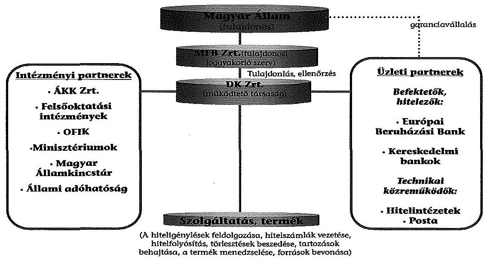
2.1.1. Az ÁKK Zrt.-vel való együttmúködés

A DK Zrt. a hitelezési tevékenysége érdekében szükséges - a DH1 és DH2 hallgatói törlesztésein, valamint az általános és a célzott kamattámogatásokon felüli - forrásait állami készfizető kezességvállalás mellett, a pénz- és tőkepiacokról szerezte be.

---

A Kormányrendelet ${ }_{1,2}$ 25. § (4) bekezdésének megfelelően, az ellenőrzött időszak minden évében megbízási szerződést kötött az ÁKK Zrt.-vel, hogy a források biztosítása érdekében helyette a pénz- és tőkepiacokon eljárjon és az állam által garantált hitelfelvételének megszervezésében közremúködjön. A Kormányrendelet ${ }_{1,2} 25 . \S$ (6) bekezdésben foglaltak szerint az ÁKK Zrt.-vel kötött megbízási szerződés alapján az ÁKK Zrt. a DK Zrt. által kibocsátott kötvények elhelyezését szervezte és a DK Zrt. részére a Bszt. 5. § (1) bekezdésének a)-b) és g) pontjaiban meghatározott befektetési szolgáltatási tevékenységet végzett, valamint a Bszt. 5. § (2) bekezdésének d) és g) pontjaiban meghatározott befektetési szolgáltatási tevékenységet kiegészítő szolgáltatást nyújtott.

A megbízási szerződésben foglaltak szerint az ÁKK Zrt. elkészítette a hallgatói hitelrendszer finanszírozási stratégiáját, illetve az alapján az éves finanszírozási terveket. A finanszírozási stratégiát a vezérigazgató hagyta jóvá. A finanszírozási terveket a Finanszírozási Bizottság, az FB és az MFB Zrt. fogadta el, ezt követően a finanszírozási tervben szereplő keretösszeget ${ }^{7}$ az NGM hagyta jóvá. A Finanszírozási Bizottság döntött a DK Zrt. éves finanszírozási tervében szereplő egyes finanszírozási eszközök igénybevételéről és az éves finanszírozási terven belül a szabad pénzeszközök adott hónapban történő felhasználásáról.

A Finanszírozási Bizottság a DK Zrt. finanszírozási kérdéseivel foglalkozó tájékoztató, véleményező, döntés-előkészítő és döntést hozó testület, amely öt tagból állt, ebből kettőt az ÁKK Zrt. delegált. A Finanszírozási Bizottság feladata a finanszírozási stratégia, az éves finanszírozási terv elkészíttetése és a döntéshozók elé terjesztése. A Finanszírozási Bizottság működési rendjét az ügyrendje tartalmazta. A Finanszírozási Bizottság az ügyrendjében rögzítetteknek megfelelően végezte a feladatát. A bizottság döntéseiről határozatokat hozott, melyeket jegyzőkönyvben rögzítettek.

A hitelezéshez szükséges forrás biztosítása az ellenőrzött időszak minden évében éves kötvényprogram keretében történt, melyet az ÁKK Zrt. bonyolított le. A kötvényprogram az alaptájékoztató elkészítésével indult, amelyet a DK Zrt., az ÁKK Zrt. és egy megbízott ügyvédi iroda készített el.

Az alaptájékoztató tartalmazta a kötvényprogram célját, a kötvény kibocsátásának általános feltételeit, a kibocsátó DK Zrt. gazdálkodásáról az információkat, a kibocsátáshoz kapcsolódó kezességet és a kockázatokat.

A hallgatói hitelekhez szükséges új források bevonása céljából szükséges Kötvényprogramok alaptájékoztatóját a pénzügyi közvetítőrendszer felügyeletét ellátó szerv (PSZÁF, MNB) hagyta jóvá. Az egy-két hónapot igénybevevő jóváhagyási folyamat miatt az első kötvénykibocsátások márciusban történtek meg, ezzel a csúszással minden évben számoltak a finanszírozási tervezés során.

A DK Zrt. az alaptájékoztatóban foglaltaknak megfelelően nyilvános aukclókon 2011-2013. években összesen 95,5 Mrd Ft névértékben hozott forgalomba kötvényeket (2011-ben 30,0 Mrd Ft, 2012-ben 38,0 Mrd Ft és 2013ban 27,5 Mrd Ft). Az aukciók lebonyolítását a megbízási szerződéseknek

[^0]
[^0]:    ${ }^{7}$ 2012-ben ez a folyamat a DH2 bevezetése miatt megismétlődött.

---

megfelelően az ÁKK Zrt., mint vezető forgalmazó, illetve befektetési szolgáltatók (forgalmazók) végezték.

Az ÁKK Zrt.-vel kötött megbízási szerződésben meghatározottak szerint a DK Zrt. mindhárom évben fix 10,0-10,0 M Ft szervezői díjat, valamint az aukciók keretében ténylegesen értékesített kötvények után a maximalizált 20,020,0 M Ft vezető forgalmazói jutalékot ${ }^{8}$ fizetett ki szabályszerűen az ÁKK Zrt. részére. Az ellenőrzési időszakban az ÁKK Zrt.-vel kötött megbízási szerződésben rögzítetteknek megfelelően a DK Zrt. szabályszerűen az ÁKK Zrt. részére összesen 90,0 M Ft-ot, a forgalmazóknak 149,4 M Ft forgalmazói díjat fizetett ki a kötvények nyilvános forgalomba bocsátási aukciói és a visszavásárlási aukciók eredményei alapján. A DK Zrt. és az ÁKK Zrt. közötti együttmüködés szabályszerű volt. Az ÁKK Zrt.-vel kötött szerződés a kötvények tekintetében vezető forgalmazói, illetve programszervezői szolgáltatásra, valamint a finanszírozással kapcsolatos tanácsadói feladatokra (Finanszírozási stratégia és terv készítése, továbbá részvétel a Finanszírozási Biztosságban) irányult. A teljesítések a megbízási szerződések szerint történtek.

# 2.1.2. A felsőoktatási intézményekkel és az Országos Felsőoktatási Információs Központtal való együttmüködés 

A DK Zrt. által a hallgatói hitelrendszer működésébe bevont alapvető jelentőséggel bíró szervezeti kör a felsőoktatási intézmények köre. A felsőoktatási intézményekkel való szabályozott és hatékony együttmüködés érdekében a DK Zrt. a felsőoktatási intézményekkel az ellenőrzött időszakban megállapodásokat kötött. A Kormányrendelet ${ }_{1,2}$-ben és a felsőoktatási intézményekkel kötött együttműködési megállapodásokban foglaltak alapján a felsőoktatási intézmények a hallgatói jogviszony fennállását szabályszerűen igazolták vissza.

A DK Zrt. a felsőoktatási intézményekkel külön megállapodást kötött a hiteligénylésre, az engedményezésre, a biztonságos adatátadásra, valamint a különböző megállapodások összehangolására. A Hiteligénylési együttműködési megállapodás ( 45 db a DH1-hez kapcsolódóan és 55 db a DH2-höz kapcsolódóan): a felsőoktatási intézményeknél történő hiteligénylést szabályozó megállapodás. Az Engedményezési megállapodás ( 32 db ): a kötött felhasználású hitelek közvetlenül a felsőoktatási intézményekhez történő beérkezését részletező megállapodás. A Token megállapodás ( 53 db ): a felsőoktatási intézmények és a DK Zrt. közötti biztonságos és hiteles adatátadást elősegítő Token használatával kapcsolatos megállapodás. A Keretmegállapodás ( 43 db ): a több különböző fajta megállapodással is rendelkező felsőoktatási intézmények megállapodásait összehangoló megállapodás.

A DH1 hiteligénylési együttmüködési megállapodások III. 21., illetve az engedményezési megállapodások V. 14. pontjaiban a Kormányrendelet ${ }_{1,2}$ 13. § (3) bekezdésben rögzítettek szerint a hitelfelvevők hallgatói jogviszonya fennállására és képzésére vonatkozó adatok beszerzése érdekében havonkénti megkeresési kötelezettséget írtak elő, a DK Zrt. ezen kötelezettségét

[^0]
[^0]:    8 A lebonyolított kötvénykibocsátások során ténylegesen értékesített kötvények össznévértékére vetített 10 bázispont megfelelő mértékű (értéke a naptári évre vonatkozóan a szervezői díjjal együttesen nem haladhatja meg a 30,0 M Ft-ot).

---

teljesítette. A DK Zrt. Üzletszabályzatában rögzített, a hiteligénylési adatlapok átvételéhez kapcsolódó ellenőrzési kötelezettséget a hiteligénylési együttmúködési megállapodások tartalmazták, az átvétellel megbízott felsőoktatási intézmények ezt az előírt kötelezettségüket nem minden esetben teljesítették. A Hiteligénylési együttműködési megállapodást kötött felsőoktatási intézmények az ellenőrzött időszakban a hiteligénylési adatlapokon több esetben nem töltötték ki a hallgatói azonosító rovatot.

A Kormányrendelet ${ }_{1,2}$ 13. § (5) bekezdése lehetőséget biztosított a DK Zrt. részére a hallgatói hitel folyósításának jogszerűsége és jogszerú igénybevétele érdekében, hogy az Oktatási Hivatal által működtetett FIR-ből a hallgatói hitelszerződés alapján a hallgatói hitel folyósítását kérelmező hallgatóról személyazonosító és tanulmányi adatokat ${ }^{9}$ szerezzen be. A DK Zrt. az ellenőrzött időszakban ezen egyeztetési lehetőséggel - indokként a FIR adatminőségének bizonytalanságát megjelölve - nem tudott élni.

# 2.1.3. Az állami adóhatósággal történő együttmúködés 

Az Art. 177. § (1) bekezdésében rögzítettek alapján a DK Zrt. a hallgatói hitelek törlesztő részletét az állami adóhatóság által szolgáltatott jövedelemadatok alapján állapította meg. A DK Zrt. az állami adóhatóság által átadott és a két fél (és adott esetben a hitelfelvevő) által egyeztetett adatok alapján a Kormányrendelet ${ }_{1,2}$ 14-15. §-ainak megfelelően állapította meg a törlesztö részletek összegét.

A DK Zrt. a törlesztő részletekkel kapcsolatos adatszolgáltatási és egyeztetési tevékenységén túl a lejárt, a hallgató által meg nem fizetett tartozást az Art. rendelkezései szerint behajtásra átadta az adóhatóságnak.

A DK Zrt. és az adóhatóság közötti együttműködési megállapodásban ${ }^{10}$ rögzítették az adatszolgáltatásra, adategyeztetésre, valamint a behajtásra vonatkozó eljárási szabályokat.

Az Art. 177. § (1) és (3) bekezdései alapján az állami adóhatóság a DK Zrt. megkeresésére minden év október 15 -ig rendelkezésre bocsátotta a kért jövedelemi adatokat. Az ellenőrzött időszakban mind az adóhatóság, mind a DK Zrt. az együttmüködési megállapodásnak megfelelően végezte az adatszolgáltatásokat és az adategyeztetéseket.

A Kormányrendelet ${ }_{1,2}$ 19. § (7) bekezdése értelmében a „szerződés felmondása esetén a még meg nem fizetett teljes tartozás egy összegben esedékessé és lejárttá válik" és a DK Zrt azt behajtásra átadta az állami adóhatóságnak. A Kormányrendelet ${ }_{1,2}$ 19. § (7) alapján a DK Zrt. folyamatosan kezdeményezte a fizetésre

[^0]
[^0]:    ${ }^{9}$ A hallgató hallgatói jogviszonya fennállásának, szünetelésének, megszűnésének, tanulmányok folytatása céljából képzési időszakra történő bejelentkezésének ténye, valamint a hallgató által folytatott képzés finanszírozásának típusa és a hallgató által fizetendő önköltség összege.
    ${ }^{10}$ Az ellenőrzött időszakban érvényes együttműködési megállapodások megkötésének dátumai: 2007. június 26.; 2011. március 31. és 2013. január 23.

---

kötelezett magánszemély lakhelye szerint illetékes adóigazgatóságnál a hiteltartozások behajtását. A megkeresés minden esetben az adós részére kézbesített fizetési felszólítás, illetve a felszólításban meghatározott határidő eredménytelen eltelte alapján történt. Az Art. 177. § (2) bekezdése alapján a hallgatói hiteltartozást a DK Zrt. megkeresésére az állami adóhatóság adók módjára hajtotta be. A DK Zrt. a hallgatói hiteltartozások végrehajtási eljárásaival kapcsolatban felmerülő költségek megfizetése tárgyában az illetékekről szóló 1990. évi XCIII. törvény módosításáról, valamint a hiteles tulajdonilap-másolat igazgatási szolgáltatási dijáról szóló 1996. évi LXXXV. törvény 32/E. § (11) bekezdésének rendelkezése alapján utólagos díjfizetéssel élt.

A 2011-2013. években a DK Zrt. és az állami adóhatóság együttmúködése a jogszabályok és együttmúködési megállapodások által szabályozott módon és szabályosan valósult meg.

# 2.2. A DH1 és DH2 szabályozottsága, múködtetése 

Kormányrendelet ${ }_{1}$-ben szabályozták a DH1 hitel igénybevételének feltételeit, a hitel kamatának meghatározását, valamint a hitel igénylésének, folyósításának és törlesztésének szabályait. A DH1 szabad felhasználású diákhitel állami ösztöndíjas és önköltséges képzésben résztvevő hallgatók számára egyaránt felvehető. A szabad felhasználású hitel fedezet nyújthat a napi megélhetéssel és egyetemi élettel kapcsolatos kiadásokra, a szállás, albérlet, kollégiumi díjak kiegyenlítésére, a diplomához szükséges nyelvtanulásra és az Erasmus-ösztöndíj kiegészítő finanszírozására. A Diákhitel havonta részletekben, vagy tanulmányi félévenként egy összegben vehető fel. A felvehető hitelösszeg maximum havi 50000 forint, az összeget a hallgató saját nevére szóló bankszámlaszámlájára utalták. A Kormány a 2012. augusztus 1-jén hatályba lépett, Kormányrendelet ${ }_{2}$-ben a felsőoktatás átalakításához kötődően egy új diákhitel konstrukció, a kötött felhasználású hitel (DH2) bevezetéséről döntött a Nftv. 46. § (1) bekezdése szerinti magyar állami részösztöndíjas és önköltséges képzésben tanulmányokat folytató hallgatók részére. A Kormányrendelet ${ }_{2}$ külön szabályozta a DH1 és DH2 igénybevételének, folyósításának, kamata meghatározásának és törlesztésének szabályait. A DH1 és a DH2 is változó kamatozású hitel, aminek keretében a hallgató határozatlan idejű hitelszerződést köt a DK Zrt.-vel.

A DH2 kötött felhasználású diákhitel kizárólag önköltséges formában tanuló hallgatók számára elérhető konstrukció, egyedül a képzési költség fizetésére vehető fel. A felvehető hitelösszeg maximum a képzés összege. A DK Zrt. közvetlenül a felsőoktatási intézménynek utalta a hitel összegét. A DH2-t felvevő hallgatók állami kamattámogatásban részesülnek, a hallgatók által fizetendő kamat évi $2 \%$, a kamat fennmaradó részét az állam vállalta át.A hallgatók a felsőoktatási tanulmányaik és ahhoz kapcsolódó egyéb szükségleteik finanszírozása érdekében 2012. július 31-ig a szabad felhasználású hitelkonstrukciót, 2012. augusztus 1-jétől a szabad felhasználású DH1 konstrukciót és a kötött felhasználású DH2 hitelkonstrukciót - egymással párhuzamosan is - igénybe vehették.

---

# 2.2.1. A DH1 szabályozottsága és múködtetése 

A DK Zrt. a DH1 igénybevételére vonatkozó feltételeket a Kormányrendelet ${ }_{1,2} 8 . \S$ a-f) pontjaiban foglaltaknak megfelelően Üzletszabályzat ${ }_{3,4}{ }^{-}$ ban rögzítette, a Kormányrendelet ${ }_{1,2} 13 . \S$ (3) bekezdésében előírt, a hallgatói hitelre jogosult hitelfelvevők hallgatói jogviszonya fennállására és képzésére vonatkozó adatok beszerzése érdekében indított havonkénti megkereséseket azonban félreérthetően szabályozta. A hallgatói jogviszony ellenőrzésének rendje címszó alatt az Üzletszabályzat ${ }_{2} 29.1$ pontjában, valamint az Üzletszabályzat ${ }_{3,4} 48$. pontjaiban a felsőoktatási intézmények felé irányuló adatszolgáltatásra való felkérés követelményét nem minden tanulmányi hónapra, hanem tanulmányi félévenként írta elő, míg az Üzletszabályzat ${ }_{3,4}$ az Adategyeztetés fejezete alatt szereplő 21.2 pontokban a Kormányrendelet ${ }_{1,2}$ 13. § (3) bekezdésének előírásával összhangban havonkénti megkeresést rögzített.

A DH1 múködtetése során a DK Zrt. a Kormányrendelet ${ }_{1,2}$ 5.§ (1) bekezdéseiben foglalt, a felvehető hallgatói hitel felső korlátjára vonatkozó előírást betartotta. A hallgatói kölcsön/hitelszerződések megkötésére a Kormányrendelet ${ }_{1,2} 3 . \S$ (1) bekezdéseiben meghatározott, jogosult hitelfelvevőkkel került sor, a hitelfelvétel feltételei fennálltak. A hallgatói jogosultsági idő meghatározása a Kormányrendelet ${ }_{1,2} 4 . \S$ (1) bekezdéseiben rögzített előírásoknak megfelelően történt. A Kormányrendelet ${ }_{1,2} 5 . \S$ (2) bekezdésében előírt, az egyes tanévekre felvehető hitelösszegekre vonatkozó közzétételi kötelezettségét teljesítette. A hitelfelvevők a hallgatói hitelek igénylését az erre a célra rendszeresített és a honlapon közzétett nyomtatványon kezdeményezték, továbbá rendelkeztek magyarországi pénzintézetnél vezetett pénzforgalmi számlaszámmal, amelyet bejelentettek a DK. Zrt.-nek.

A hitelszerződés érvényes létrejöttéhez szükséges, az Üzletszabályzat ${ }_{1,2}$ 20.1. és 21., valamint az Üzletszabályzat ${ }_{3,4} 43$. és 47 . pontjaiban foglalt alaki és tartalmi elemekkel az ellenőrzött hiteligénylési adatlapok közel fele nem rendelkezett.

Az ellenőrzött hiteligénylési adatlapok nem tartalmazták a hitelfelvevő állampolgárságát, az oktatási intézményi szak megnevezését vagy a finanszírozás típusát. A hiteligénylési adatlapoknál nem rögzítették a hitelfelvevő lakóhelyét, adóazonosító jelét, az igényelt havi hitelösszeget, a képesítési követelmények szerinti képzési időt, valamint a hallgatói azonosító számot. A hiteligénylési adatlapok mellékletét képező hitelszerződéseken nem szerepelt a keltezés dátuma, és nem tüntették fel a hitelfelvevő nevét.

A DK. Zrt. a hiteligénylési adatlapok, illetve hitelszerződések adattartalmának ellenőrzését az Üzletszabályzat ${ }_{1,2} 21$., valamint az Üzletszabályzat ${ }_{3,4} 47$. pontjaiban rögzített elöírások szerint hajtotta végre. Az adathiányok pótlására a DK Zrt. felhívta az érintett hitelfelvevők figyelmét.

A DK. Zrt. a DH1 folyósítását a Kormányrendelet ${ }_{1,2}$ 13. § (2) bekezdése, valamint az Üzletszabályzat ${ }_{1-4}$-ben meghatározottak alapján, a hitelt felvevő hallgatók rendelkezése szerint végezte. A DH1 hitelszerződések megszűnésére a Kormányrendelet ${ }_{1,2} 19 . \S$ (1) bekezdés a)-f) pontjaiban

---

meghatározott események - tartozás teljes körű megfizetése, öregségi nyugdíjkorhatár elérése, hitelfelvevő halála, hitelfelvevő általi felmondás, DK Zrt. általi felmondás, egészségkárosodás - bekövetkezésekor került sor.

A hitelfelvevő által történő felmondás esetén a Kormányrendelet ${ }_{1,2}$ 19. § (4) bekezdésében foglalt előírásokat megtartották, a hitelszerződés felmondása írásban, a tizenöt napos felmondási idő megtartásával megtörtént, a felmondási idő elteltével a teljes tartozást kiegyenlítették.

A DK Zrt. a hitelfelvevő részére a záró elszámolást követően jelentkező túlfizetés összegét pénzügyileg rendezte, a túlfizetés összegét összhangban a Ptk. előírásaival, az abban foglalt rendelkezéseknek megfelelő mértékű késedelmi kamattal megnövelve utalta vissza a hitelfelvevőnek az általa megadott számlaszámra.

A DK Zrt. a Kormányrendelet ${ }_{1,2}$ 19. § (5) bekezdés a) pontjában rögzített azonnali hatályú szerződés felmondási kötelezettségét a kiválasztott mintában ellenőrzött hitelszerződések esetében a jogszabályi előírások szerint végezte.

A DK Zrt. a hitelszerződés megszűnését követően, a Kormányrendelet ${ }_{1,2}$ 19. § (8) bekezdésében foglaltak teljesítésére záró elszámolásként az ellenőrzéssel érintett megszűnt hitelszerződések negyedénél egyenlegértesítőt alkalmazott, amely megfelelt a Kormányrendelet ${ }_{1,2}$ 19. § (8) bekezdésében előírtaknak.

A DK Zrt. a DH1 kamatlábának kialakításakor a Kormányrendelet ${ }_{1,2}$ 6. § (1) bekezdés a)-c) pontjaiban foglalt előírásokat figyelembe vette. A hallgatói hitel aktuális kamatát a Kormányrendelet ${ }_{1,2}$ 6. § (3) bekezdéseiben foglaltaknak megfelelően féléves kamatperiódusokban állapította meg és annak mértékét minden naptári félév első napjától alkalmazta.

A DK Zrt. kockázati prémium változását a Kormányrendelet ${ }_{1,2}$ 6. § (4) bekezdéseiben foglaltaknak megfelelően aktuáriussal felülvizsgáltatta. Az aktuárius által megállapított kockázati prémium mértékét a hallgatói hitelek soron következő két félévi kamatának meghatározásakor figyelembe vette.

A múködési költséget fedezö kamatprémium mértékének könyvvizsgáló általi felülvizsgálata a Kormányrendelet ${ }_{1,2} 6 . \S$ (5) bekezdéseiben foglaltaknak megfelelően - az éves beszámoló könyvvizsgálatával egyidejűleg megtörtént.

A kamatmértéken belül a kockázati prémium és a működési költséget fedező prémium együttes összege a Kormányrendelet ${ }_{1,2} 6 . \S$ (6) bekezdéseiben foglaltaknak megfelelően az ellenőrzött időszakban 4,5 \%-nál nem volt magasabb.

A DH1 kamatának alakulását a 2011-2013. években a 3. számú melléklet tartalmazza.

A Kormányrendelet ${ }_{1}$ 6. § (7)-(8) bekezdéseiben és Kormányrendelet ${ }_{2}$ 6. § (8)-(9) foglaltaknak megfelelően a kamatszámítás kezdő napja a hallgatói hitel folyósításának első napja volt. A tárgyévben meg nem fizetett kamat tőkésítésére

---

évente december 31-ei értéknappal került sor, a tőkésített kamatösszeg számítása napi kamatszámítással történt.

A DK Zrt. a 2011-2013. években törlesztési folyamatban lévő ellenőrzött DH1 hitelszerződéseknél a törlesztési kötelezettség kezdetének meghatározását nem tudta minden esetben a Kormányrendelet ${ }_{0.2} 14 . \S$ (1) bekezdésében foglalt előírások szerint elvégezni. Ennek oka egyrészt a Tanulmányi Osztályok hiányos a jogviszony megszúnés napját nem tartalmazó - adatszolgáltatása, másrészt a Tanulmányi Osztályok visszamenőleges hatállyal történő jogviszony megszüntetése volt. A Kormányrendelet ${ }_{1,2} 13 . \S$ (3) bekezdéseiben előírt, a hallgatói hitelre jogosult hitelfelvevők hallgatói jogviszonya fennállására és képzésére vonatkozó adatok beszerezése érdekében történő, a DK Zrt. által kezdeményezett havonkénti megkeresés során a Tanulmányi Osztályok hiányos adatszolgáltatása, illetőleg a hallgatói jogviszony megszűnés időpontjának visszamenőleges hatállyal történő megszüntetésére vonatkozó adatok alapján a DK Zrt. a tranzakciós rendszerében nyilvántartott adatokat a tudomására jutott adatszolgáltatásnak megfelelően módosította.

A hitelekhez kapcsolódó törlesztő részletek meghatározása, elszámolása magas kockázatot jelentett, mert a törlesztési kötelezettség kezdetének megállapítása a havi adategyeztetések elmulasztása, illetve a tanulmányi osztályok hibás adatszolgáltatása miatt - a mintavétel keretében ellenőrzött DH1 hitelszerződések $16 \%$-ánál késedelmesen történt.

A DK Zrt. a DH1 2011-2013. évi törlesztő részletének alapját a Kormányrendelet ${ }_{1,2} 14 . \S$ (2)-(3) bekezdései előírásainak megfelelően határozta meg. A törlesztő részletek alapjának megállapításakor az Állami Adóhatóságtól bekért jövedelmi adatok, illetve a minimálbér összegének felhasználásával, a BOSS rendszerben foglalt algoritmusok segítségével megfelelően jártak el. A hitelfelvevők részére a tárgyévi havi törlesztő részlet összegének megállapítása a Kormányrendelet ${ }_{1,2} 14 . \S$ (5) bekezdése előírásainak megfelelően, a BOSS rendszer segítségével történt. A Kormányrendelet ${ }_{1,2} 14 . \S$ (7) bekezdésében rögzített előírásnak megfelelően, az előírt határidőn belül közölték a hitel törlesztésére kötelezett hitelfelvevőkkel a következő naptári évre vonatkozó havi törlesztő részlet összegét abban az esetben is, ha a hitelfelvevő törlesztési kötelezettsége szünetelt.

A DK Zrt.által ellenőrzés alá vont hitelfelvevők a törlesztő részleteket a Kormányrendelet ${ }_{1,2} 14 . \S$ (8) bekezdéseiben foglaltak ellenére nem fizette meg határidőben. A DK Zrt. a hátralékosok hitelfelvevőket levélben és SMS-ben tájékoztatta hátralékos tartozásáról, valamint figyelmeztetést küldött felmondási küszöbértékhez közelítő hátralékáról. Az ellenőrzött években a hátralékosok egy része az ellenőrzéssel érintett tárgyév végére rendezte hátralékát.

A DK Zrt. a 2011-2013. évi egyenlegértesítőket a Kormányrendelet ${ }_{1,2}$ 15. §a előírásainak megfelelően határidőben megküldte a hitelfelvevők részére.

A törlesztési kötelezettség szüneteltetésére Kormányrendelet ${ }_{1,2} 16 . \S$ (1)-(2) bekezdéseiben meghatározott esetekben, a hitelfelvevő igazolása, illetve kérelme alapján került sor.

---

A DK Zrt. a 2011-2013. években a hitelfelvevő előtörlesztése esetén a Kormányrendelet ${ }_{1,2} 17 . \S$ (1) és (3) bekezdésének megfelelően járt el.

A DH1 visszafizetésének és a törlesztők számának alakulását az 4. számú melléklet tartalmazza.

# 2.2.2. A DH2 szabályozottsága és múködtetése 

A DK Zrt. a Kormányrendelet ${ }_{2}$ 8. § a)-f) pontjaiban foglaltaknak megfelelően rögzítette a DH2 nyújtásának általános szerzödési feltételeit Üzletszabályzatában ${ }_{3,4}$. A hallgatói hitelre jogosult hitelfelvevők hallgatói jogviszonya fennállására és képzésére vonatkozó adatok beszerzése érdekében előírt havonkénti megkereséseket a Kormányrendelet ${ }_{2} 13 . \S$ (3) bekezdésének és a DK Zrt. Üzletszabályzata ${ }_{3,4} 21.2$ pontjainak rendelkezéseitől eltérően, félreérthetően szabályozta az Üzletszabályzata ${ }_{3,4} 175$. pontjaiban. A DH2 hitelszerződés megszűnése esetén követendő eljárást Üzletszabályzata ${ }_{3,4} 255$. pontjában a Kormányrendelet ${ }_{2} 19 . \S$ (8) bekezdésében rögzítettektől eltérően szabályozta, mivel záró elszámolás készítési kötelezettséget a hitelszerződés megszűnésének csak egyes esetei bekövetkezésekor írt elő.

A DK Zrt. belső szabályozási környezetének kialakitása során a Gt. elöírásait figyelembe vette. Egyúttal eleget tett a Kormányrendelet ${ }_{2} 13 . \S$ (3) bekezdésében minden tanulmányi hónapra előírt elektronikus úton történő megkeresésnek, az ún. „TO egyeztető kötegek" felsőoktatási intézményeknek történő megküldésével.

A DK Zrt. a Kormányrendelet ${ }_{2} 5 . \S$ (2) bekezdésében foglalt, az egyes tanévekre felvehető hitelek összegeinek hitelcélok szerinti közzétételi kötelezettségét teljesítette.

A DK Zrt. DH2 múködtetése során a Kormányrendelet ${ }_{2} 5 . \S$ (1) bekezdés (b) pontjában foglalt, a felvehető hallgatói hitel felső korlátjára vonatkozó előírást betartotta. A hallgatói hitelszerződések megkötésére minden esetben a Kormányrendelet ${ }_{2} 3 . \S$ (1) bekezdése, valamint az Üzletszabályzat ${ }_{3,4} 159$-160. pontjai alapján jogosultnak minősített hitelfelvevővel került sor, a hitelfelvétel feltételei fennálltak. A jogosultsági idő meghatározása a Kormányrendelet ${ }_{2}$ 4. § (1) bekezdésében, valamint az Üzletszabályzat ${ }_{3,4} 161$-166. pontjaiban foglaltaknak megfelelően történt. A hitelfelvevők a hiteligénylést az Üzletszabályzat ${ }_{3,4} 171$-172. pontjaiban meghatározott, az erre a célra rendszeresített és a honlapon közzétett nyomtatványon, határidőn belül kezdeményezték. A DH2 hitelek folyósítása a Kormányrendelet ${ }_{2} 5 . \S$ (3) bekezdésében, valamint 13. § (2) bekezdése b) pontjában foglaltaknak megfelelően közvetlenül a felsőoktatási intézmény részére történt.

A DH2 hitelszerződésekkel kapcsolatos dokumentumok adattartalmának ellenőrzésére a DK Zrt., illetve az átvételre feljogosított szervezetek által az ellenőrzéssel érintett szerződéseknél az Üzletszabályzat ${ }_{3,4}$ 174. pontjában foglaltak szerint került sor.

A DK Zrt. elvégezte a DH2 jogszerú folyósítása miatt a hitelszerződés fennállása alatt a hallgatói jogviszony ellenőrzését a felsőoktatási intézményekkel az Üzletszabályzata ${ }_{3,4} 175$. pontjában rögzítettek szerint. A DK Zrt. Üzletszabályzatá-

---

nak $_{3,4} 175$. pontjában a Kormányrendelet ${ }_{2} 13 . \S$ (3) bekezdésében foglalt és az Üzletszabályzatának ${ }_{3,4} 21.2$ pontjában szereplő adategyeztetési kötelezettségtől eltérő egyeztetési kötelezettséget írt elő.

A DH2 hitelszerződések megszűnésére a Kormányrendelet ${ }_{2}$ 19. § (1) bekezdés a)f) pontjaiban, valamint az Üzletszabályzat ${ }_{3,4} 246$. pontjában meghatározott események - tartozás teljes körű megfizetése, öregségi nyugdíjkorhatár elérése, hitelfelvevő halála, hitelfelvevő általi felmondás, DK Zrt. általi felmondás, egészségkárosodás - bekövetkezésekor került sor. Az ügyfél általi felmondás esetén a Kormányrendelet ${ }_{2}$ 19. § (4) bekezdésében és az Üzletszabályzat ${ }_{3,4} 247 .$, 250. pontjaiban foglalt előírásokat betartották, a hitelszerződés felmondása írásban, a tizenöt napos felmondási idő megtartásával történt.

A DK Zrt. a DH2 hitelszerződés megszűnését követően, a Kormányrendelet ${ }_{2}$ 19. § (8) bekezdésében foglaltaknak megfelelően a záró elszámolást elkészítette és megküldte a hitelfelvevő részére.

A DH2 féléves kamatperiódusonként meghatározott kamatláb nagyságának kialakításakor a Kormányrendelet ${ }_{2}$ 6. § (1) bekezdése a)-c) pontjaiban foglaltakat figyelembe vették. A DK Zrt. a Kormányrendelet ${ }_{2}$ 6. § (2) bekezdésében foglaltaknak megfelelően a kamatszámítás módját Üzletszabályzata ${ }_{3,4} 185$. pontjában határozta meg. A hallgatói hitelek aktuális kamatát a Kormányrendelet ${ }_{2}$ 6. § (3) bekezdésének megfelelően féléves kamatperiódusban állapította meg és annak mértékét minden naptári félév első napjától alkalmazta. A hallgatói hitelek kamatának mértékére vonatkozó közzétételi kötelezettségét a jogszabályi előírásoknak megfelelően, határidőben teljesítette.

A Kormányrendelet ${ }_{2}$ 6. § (4) bekezdésében előírt, a kockázati prémium aktuárius általi felülvizsgálata minden év május 31 -éig megtörtént, a Kormányrendelet ${ }_{2} 14 . \S$ (5) bekezdés b) pontja szerinti törlesztési hányadokat az ellenőrzött időszakban aktuáriussal nem vizsgáltatták felül.

A DK Zrt. 2014. december 5-én kelt nyilatkozatában rögzítette, hogy a törlesztési hányadok aktuárius általi felülvizsgálata a DH2 hiteltermék bevezetése óta eltelt rövid időszak, illetőleg a törlesztési szakaszba lépés hiánya miatt nem történt meg.

Az aktuárius által megállapított kockázati prémiumok mértékét a hallgatói hitelek soron következő két félévi kamatának meghatározásakor figyelembe vették.

A múködési költséget fedezö prémium mértékét az éves beszámoló könyvvizsgálatával egyidejűleg a DK Zrt. könyvvizsgálatát végző könyvvizsgálóval a Kormányrendelet ${ }_{2}$ 6. § (5) bekezdésében rögzítettek szerint felülvizsgáltatták.

A Kormányrendelet ${ }_{2}$ 6. § (6) bekezdésében foglalt előírásoknak megfelelően a kamatmértéken belül a kockázati prémium és a működési költséget fedező prémium együttes összege az ellenőrzött időszakban nem haladta meg a $4,5 \%$ ot.

---

A DH2 kamatának alakulását a 2011-2013. években a 4. számú melléklet tartalmazza.

A tárgyévben meg nem fizetett kamat tőkésítésére évente december 31-ei értéknappal a Kormányrendelet ${ }_{2} 6 . \S$ (9) bekezdése szerint került sor.

A DK Zrt. a 2013. évben törlesztési szakaszban lévő DH2 hitelszerződések esetében a törlesztési kötelezettség kezdetének meghatározását a Kormányrendelet ${ }_{2}$ 14. § (1) bekezdésben foglalt előírásoknak megfelelően határozta meg. A törlesztő részletek alapját a DK Zrt. a Kormányrendelet ${ }_{2}$ 14. § (2)-(3) bekezdésében foglaltaknak megfelelően állapította meg. A tárgyévi havi törlesztő részletek összegét a Kormányrendelet ${ }_{2} 14 . \S$ (5) bekezdés b) pontjában foglaltaknak megfelelően, a BOSS rendszer segítségével határozták meg.

A DK Zrt. a 2013. évben a Kormányrendelet ${ }_{2}$ 14. § (7) bekezdése előírásainak megfelelően, az előírt határidőn belül december 15 -éig közölte a hitel törlesztésére kötelezett hitelfelvevőkkel a következő naptári évre vonatkozó havi törlesztő részlet összegét.

Az ellenőrzött hitelfelvevők egy része a törlesztő részleteket a Kormányrendelet ${ }_{2}$ 14. § (8) bekezdésében foglaltak ellenére nem fizette meg határidőben. A DK Zrt. a hátralékosok felének fizetési felszólítást és felének figyelmeztetést küldött felmondási küszöbértékhez közelítő hátralékáról.

A DK Zrt. a 2013. évi egyenlegértesítőket a Kormányrendelet ${ }_{2}$ 15. §-a előírásainak megfelelően, az Üzletszabályzat 15 . pontjában előírt január 31. határidőn belül, 2014. január 13-án megküldte a hitelfelvevők részére.

# 2.2.3. A DH1-hez kapcsolódó célzott és a DH2-höz kapcsolódó általános kamattámogatás 

A Kormányrendelet ${ }_{1,2}$ 16. § (2) bekezdése alapján a DH1 hitelfelvevő a DK Zrt.-hez törlesztési kötelezettsége szüneteltetése iránti kérelmet nyújthat be TGYÁS-ra, GYED-re, GYES-re, a rokkantsági nyugdíjra, a rokkantsági járadékra, a baleseti rokkantsági nyugdíjra, a rehabilitációs járadékra való jogosultság időszakában. Ezen idôszakban a Kormányrendelet ${ }_{1,2} 18$. § (1) bekezdésének megfelelően a szabad felhasználású hitelt igénybe vevő hitelfelvevő - a szerződés időtartama alatt - a fizetendő kamattartozás teljes összegével megegyező mértékű célzott kamattámogatásban részesül, amelyet a Minisztérium a DK Zrt. számlájára a jogosult hitelfelvevő megjelölésével utal át, mivel a Kormányrendelet ${ }_{1,2} 18$. § (2) bekezdése alapján a célzott kamattámogatás anyagi fedezetét a Minisztérium költségvetésében biztosították. Ezen a címen 2011. évben 712,0 M Ft-ot, 2012. évben 662,8 M Ft-ot, 2013. évben 652,0 M Ft-ot utalt a Minisztérium a DK Zrt. bankszámlájára.

A célzott kamattámogatás biztosításának feltételeit és részleteit (adatközlések tartalma és határideje, elszámolások, folyósítások és visszautalások határideje) a DK Zrt. és a Minisztérium együttmüködési megállapodásban szabályozta.

A DK Zrt. részéről 2011-től 2012 októberéig az együttmüködési megállapodásnak megfelelően történt az adatszolgáltatás, elszámolás és utóla-

---

gosan megállapított jogosulatlanságból, vagy jogosultsági összeg csökkenéséből eredő visszautalás. Ugyanezen időszakban a Minisztérium - a 2011. és 2012. év harmadik negyedéves elszámolásai kivételével - szintén az együttmúködési megállapodásnak megfelelően járt el.

A 2011. október 20-ai határidő helyett 2012. november 17 -én, míg a 2012. október 20 -ai határidő helyett 2012. november 30 -án történt meg a tárgynegyedévben jogosultak után járó célzott támogatás utalása a Minisztérium részéről.

Az együttműködési megállapodás 2012. október 1-jétől hatályos - a DK Zrt. likviditását elősegítő - módosítása alapvető változást eredményezett a forrásbiztosítás módjában. A célzott kamattámogatás utólagos, bruttó módon történő negyedéves elszámolásáról 2012 októberétől a felek a havi elszámolási gyakorlatra tértek.

A 2012. év október 1-jétől a DK Zrt. részére tárgyhót követő hónap 8-ára módosult utólagos korrekciókból eredő visszautalási határidőket a DK Zrt. 2012. november és 2014. január között három esetben nem tartotta be. A célzott kamattámogatások fedezetét biztositó összegek a DK Zrt. részére nem a megállapodásnak megfelelően álltak rendelkezésére. A DK Zrt. 2012. október 1-jét követően a célzott kamattámogatást 15 hónapból 14 hónapban nem a szerződésben rögzített határidőben kapta meg.

A DK Zrt. öt esetben 15 napon belüli, két esetben 15 és 30 nap közötti, hét esetben pedig 60 napon túli késedelemmel kapta meg a célzott kamattámogatásokat.

Az ellenőrzött időszakban a DK Zrt. az utalással egyidejűleg a célzott kamattámogatás jogosultak közötti megoszlásáról nem kapott tájékoztatást.

A Kormányrendelet 2 29. § (1) bekezdése alapján a DH2 igénybevétele esetén a hitelkamat $2 \%$-on felüli részét az állam általános kamattámogatás címen átvállalta a hallgatótól, amit a Kormányrendelet ${ }_{2}$ 29. § (3) bekezdésének megfelelően a Kincstár utólagos elszámolás mellett utalt a DK Zrt. részére. Ezen címen 2012. évben 14,9 M Ft-ot 2013. évben 158,3 M Ft-ot kapott a DK Zrt.

Az ellenőrzött időszakban a Kincstár az igényelt támogatási összeg folyósítását a Kormányrendelet 2 29. § (5) bekezdésének megfelelően a tárgyhónapot követő hónap 25. napjáig teljesítette. Az általános kamattámogatás fedezete a Kincstár utalásai által biztosított volt.

# 2.3. A hallgatói hitelrendszer múködtetésének informatikai támogatása 

Az DK Zrt.-nél az informatikai irányítás és az információvédelem szervezeti feltételei biztosítottak voltak. A DK Zrt. informatikai szervezeti felépítése mind az informatikai szervezet függetlensége, mind a feladatkörök szétválasztása tekintetében megfelelt a KIB 25. sz. ajánlásában megfogalmazott követelményeknek.

---

Az informatikai biztonsági követelmények általános érvényesítéséért és a belső ellenőrzéséért felelős szervezeti egységek feladatait az SZMSZ-ben meghatározták. Az DK Zrt. az ellenőrzött időszakban az informatikai biztonsági intézkedések és eljárások megtervezését, kialakítását, bevezetését és folyamatos felügyeletét megbízási szerződés alapján biztonsági felelős által biztosította. A biztonsági felelős feladatait az IBSZ ${ }^{11}$ és az évente megújított megbízási szerződései tartalmazták.

A 2013-tól hatályos IBSZ már az új rendszerekre és a meglévő rendszerek vonatkozásában kockázatbecslést és kockázatelemzést írt elő. A kockázatelemzés segítségével a biztonsági követelményeket elemezni lehetett és alkalmas volt arra, hogy a követelményeket kielégítő óvintézkedéseket behatárolja. A belső ellenőrzés 2011-2013. években évente 3 db informatikai ellenőrzést végzett. Az informatika területén a 2011. évben 2 db (etikus hackelés; könyvvizsgáló informatikai ellenőrzése), a 2012. évben 2 db (vírusvédelem; naplózás, könyvvizsgáló informatikai ellenőrzése) és 2013-ban 1 db (könyvvizsgáló informatikai ellenőrzése) külső ellenőrzést hajtottak végre. A külső és a belső informatikai ellenőrzések intézkedési terveit határidőre megvalósították, azok az ellenőrzött időszakban teljes mértékben hasznosultak.

A biztonsági felelős az ellenőrzött időszakban tevékenységéről a megbízási szerződésben foglaltaknak megfelelően havi rendszerességgel beszámolt. Tevékenységét a megbízási szerződésnek megfelelően látta el.

A DK Zrt. az ellenőrzött időszakban rendelkezett IBSZ-szel, Adatvédelmi és Adatbiztonsági Szabályzattal ${ }^{12}$, Üzletmenet-folytonossági szabályzattal ${ }^{13}$. Az ISZSZ ${ }^{14}$, valamint a Vírusvédelmi Szabályzat ${ }^{15}$ kiadására csak a 2012. évben, a Katasztrófa-elhárítási Szabályzat ${ }^{16}$ és Hozzáférés és Jogosultságkezelési Szabályzat ${ }^{17}$ kiadására csak 2013-ban került sor. A DK Zrt. az ISO 27001 szabvány javaslataival összhangban 2013-ra alakította ki teljes körüen az informatikai biztonság szabályozás kereteit. A DK Zrt. - elfogadott Üzleti Stratégia hiányában - Informatikai Stratégiával és Informatikai Biztonsági Politikával nem rendelkezett, ami kockázatot jelent a közép- és hosszú távú informatikai fejlesztések és fejlődési irányok összehangolása szempontjából. A kockázatot mérsékelte ugyanakkor, hogy rendelkezett a nemzetközi sztenderdeken (ISO 27001) alapuló Információ biztonsági szabályzattal.

A DK Zrt. tranzakciós múveleteit, a hitelezési tevékenységét átfogóan müködtető ügyviteli rendszere a BOSS rendszer támogatta. A BOSS rendszer lefedte a DK Zrt. alaptevékenységi folyamatait és rendelkezett a vezetés számára fontos vállalatirányítási információs funkciókkal is. A rendszer alapvetően jól működött, de technológiai, teljesítménybeli és üzemeltethetőségi

[^0]
[^0]:    ${ }^{11}$ 5/2008., 27/2012. számú Vezérigazgatói Utasítás
    ${ }^{12} 1 / 2013$. számú Vezérigazgatói Utasítás
    ${ }^{13} 2 / 2013$. számú Vezérigazgatói Utasítás
    ${ }^{14} 24 / 2012$. számú Vezérigazgatói Utasítás
    ${ }^{15} 25 / 2012$. számú Vezérigazgatói Utasítás
    ${ }^{16} 25 / 2008 . ; 33 / 2009 . ; 34 / 2011 . ; 8 / 2012$. számú Vezérigazgatói Utasítás
    ${ }^{17}$ 16/2013. számú Vezérigazgatói Utasítás

---

szempontból számos hátránnyal rendelkezett. A korszerűtlen technológiából adódóan a jogszabályi és üzleti fejlesztések gyakran a fejlesztés által nem érintett funkciókban is váratlan programhibákat okoztak, amelyek megelőzése, kiszűrése és javítása jelentős erőforrás-ráfordítással járt.

A DK Zrt. rendelkezett a BOSS rendszer üzemeltetési szabályait leíró dokumentummal és a használatát támogató felhasználói dokumentációval. A felhasználói dokumentumok használhatóságát korlátozta, hogy azok egységes szerkezetbe foglalása és naprakészen tartása nem valósult meg teljes körűen.

A szervezet a KIB 25. sz. ajánlásával összhangban rendelkezett az informatikai rendszerek üzemeltetésére vonatkozó szabályozással.

A BOSS rendszer naplóit a BOSS adatbázisa tárolta, azok módosítása a BOSS felületén keresztül nem lehetséges. A szerver szintű esetleges módosítást a szerver szintű napló tartalmazta.

Az IBSZ mentésekre vonatkozó előírásai, illetve a BOSS automatikus mentési eljárásai alkalmasak voltak arra, hogy a programokról és az adatokról olyan biztonsági másolatokat készítsenek, amelyek bármilyen - a folyamatos üzemszerú feldolgozást akadályozó - hiba esetén alkalmasak a hiba elôtti állapot visszaállítására.

Az ügymeneti tevékenységek végrehajtását veszélyeztető rendkívüli helyzetek kezelésére a DK Zrt. Katasztrófa-elhárítási Szabályzattal, Üzletmenet-folytonossági szabályzattal rendelkezett. Ezen szabályzatok meghatározták a működés során felmerülő hibakategóriákat, illetve az egyes hibakategóriákhoz tartozó hibaelhárítási folyamatokat. A Katasztrófaelhárítási Szabályzat a katasztrófahelyzetek kezeléséhez szükséges intézkedéseket, továbbá ezen intézkedések végrehajtásához szükséges információkat tartalmazta (pl. értesítési rend, teendők).

A DK Zrt. vírusvédelme szabályozott volt és az előírásoknak megfelelően múködött.

A DK Zrt. jogosultságkezelésének szabályozása és működtetése 2013-ig kockázatot hordozott magában a logikai védelem területén.

A DK Zrt. könyvvizsgálója által adott Vezetői levélben jelzett kockázatok, valamint annak nyomán a belső ellenőrzés által a 2010. évben feltárt hiányosságok többek között a jogosultságkezelés szabályozottságával és a jogosultságok beállításaival voltak kapcsolatosak. A jogosultságkezelést a könyvvizsgáló és a DK Zrt. belső ellenőre utóellenőrzés keretében ellenőrizte az ellenőrzött időszak minden évében. A feltárt hibákat kijavították, a szabályozási környezeten és az operatív területek múködésében a szükséges változtatásokat elvégezték.

A kritikus informatikai eszközök fizikai és logikai hozzáférésének védelme 2013. évre - a jogosultságkezelések rendezésének következtében - megfelelő módon biztosították.

A DK Zrt. a hallgatói hitelrendszerrel összefüggő feladatok informatikai támogatását biztosító szabályokat kialakította, azok az informatikai müködés során

---

érvényesültek. A DK Zrt. gondoskodott az általa kezelt adatok biztonságáról, rendelkezésre állásáról és sértetlenségéről.

A hitelfelvevők a kölcsönszerződés aláírásával hozzájárultak személyes adataik DK Zrt. által történő kezeléséhez. A DK Zrt. az információs önrendelkezési jogról és az információszabadságról szóló 2011. évi CXII. törvény 7. § (2) bekezdésben foglalt adatvédelmi előírásokat részletesen szabályozta az Adatvédelmi és Adatbiztonsági Szabályzatban ${ }^{18}$, az Adatszolgáltatási szabályzatban ${ }^{19}$. E szabályozások alapján a hitelfelvevők személyes adatait az adatvédelmi törvénynek megfelelően kezelték.

# 3. A DK ZRT. GAZDÁLKODÁSA 

### 3.1. A DK Zrt. gazdálkodásának szabályozottsága

A DK Zrt. alaptevékenysége egyéb hitelnyújtás, nem tartozik a Hpt. hatálya alá. A könyvvezetését és éves beszámolóját a Számv. tv előírásainak megfelelően végezte. A gazdálkodáshoz kapcsolódó belső szabályzatait a DK Zrt. a feladatai és múködése jellegéből adódó sajátosságokat figyelembe véve a jogszabályi előírásokkal és a mindenkor hatályos Alapitói Okirat vonatkozó pontjaival összhangban alakította ki.

A DK Zrt. az ellenőrzött időszakban rendelkezett a Számv. tv. 14. § (3)-(8) bekezdéseiben előírt szabályzatokkal, az abban foglaltak megfeleltek a jogszabályi előírásoknak. Kiadásuk az Alapító Okirat ${ }_{1.9}$ vonatkozó előírásának megfelelően történt.

A számviteli politikában meghatározta, hogy a Szám. tv.-ben biztosított választási, minősítési lehetőségek közül melyeket alkalmaz. A DK Zrt. cégbejegyzési, kötelezettségvállalási és utalványozási jogról, valamint a belső aláírási jogosultságról szóló szabályzat ${ }_{1.2}$-t az Alapító Okirat ${ }_{1.3} 11.3$. m) pontja és az Alapító Okirat ${ }_{4.0}$ 10.2. p) pontjaiban rögzítetteknek megfelelően az FB előzetes jóváhagyásával adta ki. A szabályzatokat a jogszabályi változásoknak megfelelő aktualizálásuk a Számv. tv. 14. § (11) bekezdésben előírt 90 napon belül végrehajtották.

A DK Zrt.-nek diákhitelezési tevékenységéből adódóan a mérleg és eredménykimutatás egyes sorait az általános előírásoktól eltérően tovább kellett részleteznie új sorok felvételével. Az új sorok felvételekor a Számv. tv. 22. § (2) bekezdésében előírtak szerint az új tétel tartalmát, az elkülönítés indokait a kiegészítő mellékletben a DK Zrt. bemutatta. Az új sorok felvétele biztosította a DK Zrt. gazdálkodásának pontos, átlátható bemutatását.

[^0]
[^0]:    ${ }^{18}$ 25/2008.; 33/2009.; 34/2011.; 8/2012. számú Vezérigazgatói utasítások
    ${ }^{19}$ 6/2011. számú Vezérigazgatói utasítás

---

# 3.2. A DK Zrt. vagyongazdálkodása 

A DK Zrt. a vagyonnal való gazdálkodás belső szabályzatait a jogszabályi előirásokkal összhangban elkészítette. A szabályzatok elkészítésénél feladatai és múködése jellegéből adódó sajátosságokat figyelembe vette.

Az ellenőrzés a kiemelt vagyonelemek állományba vételét, nyilvántartását és elszámolását, valamint leltárral történő alátámasztását ellenőrizte.

A Dk Zrt. vagyona az ellenőrzött időszakban 15,8 \%-kal emelkedett, a 2011. évi 248355 M Ft -ról a 2013. évi 287593 M Ft-ra nőtt. A vagyonon belüli arányok visszatükrözték a diákhitelezési tevékenység jellegét, meghatározó részarány az eszközoldalon megjelenő - diákhitelek miatt - befektetett pénzügyi eszközök, követelések összege, valamint forrásoldalon a diákhitelek finanszírozásából eredő tartozások voltak.

A DK Zrt. a Számv. tv. 27. § (6) bekezdésének megfelelően a befektetett pénzügyi eszközök között, egyéb tartósan adott kölcsönként mutatta ki a diákoknak folyósított vissza nem fizetett hitelek összegeit, valamint a tárgyévre járó pénzügyileg ki nem egyenlített kamatkövetelések tőkésített összegét.

A folyósított diákhitelek állománya a 2011. évben 244581 M Ft, a 2012. évben 260620 M Ft volt, amely a 2013. év végére 272873 M Ft-ra emelkedett. Ez az ellenőrzött időszakban 11,6\%-os növekedést jelentett.
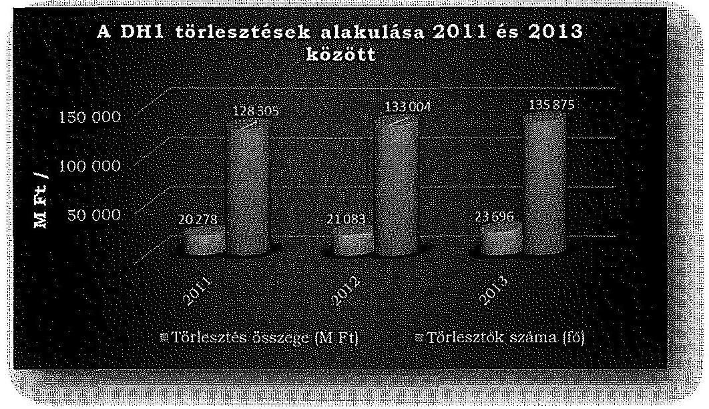

A forrásoldalon a 2011-2012. években a hitelek és kötvénykibocsátások miatti kötelezettségek (éven belüli és éven túli) 13,7 \%-kal emelkedtek. Állományi értékük a 2011. évben 217919 M Ft, a 2012. évben 240491 M Ft és a 2013. évben 247823 M Ft volt.

A folyósított hitelek állományának növekedését több tényező együttes változása eredményezte. Ilyen növekedést előidéző tényező volt a hiteligénylők számának növekedése, az igényelhető hitel összegének emelkedése, a hallgatói hi-

---

tel kamatának alakulása, a felmondott szerződések száma, a törlesztések, előtörlesztések összegének alakulása és a minimálbér változása.
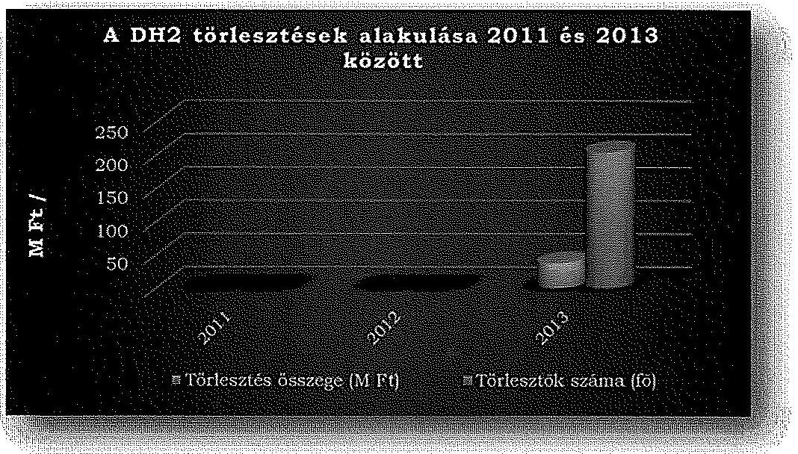

A DH1 esetében 2013. december 31-ig összesen 338554 fő, a DH2 esetén összesen 10067 fő részesült 263 Mrd Ft illetve 4,1 Mrd Ft összegben. A törlesztési szakaszban lévők száma a 2012. év végén $4 \%$-kal, a 2013. év végén $2 \%$-kal haladta meg az előző év törlesztési szakaszban lévők számát.
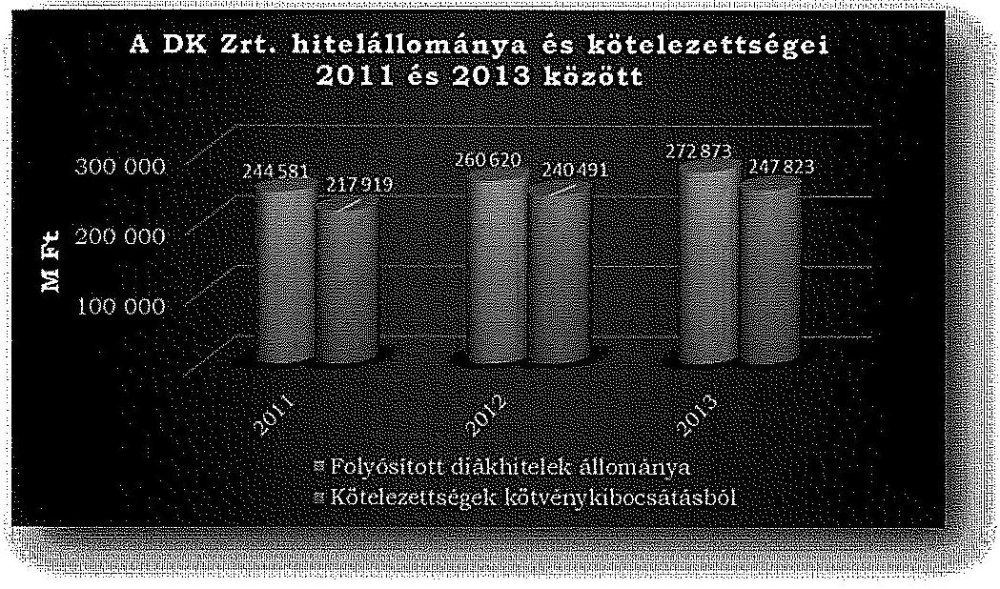

A mérlegfőösszegen belül a hallgatói hitelek aránya 2011. évben 98,0 \%, 2012. évben $94,3 \%$, 2013. évben $94,8 \%$ volt. A hitelek és kötvénykibocsátások miatti kötelezettségek a 2011. évben a mérlegfőösszeg $87,7 \%$-át, a 2012. évben $86,9 \%$-át, a 2013. évben $86,2 \%$-át tettek ki, tehát a diákhitelek finanszírozásában az idegen források (hitelek, kötvények) mellett a sajátforrások is részt vettek.

---

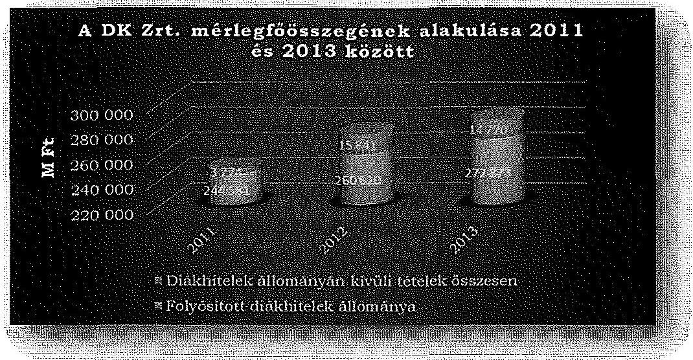

A tartósan adott kölcsönöket év közben szerződés szerinti értéken vették állományba. A kamatok tőkésítésére tárgyév végén, december 31-ei állapotnak megfelelően került sor. A diákhitelezési tevékenységből adódó analitikus és a fökönyvi könyvelés között az egyeztetést mindhárom évben elvégezték, a korrekciós tételt alátámasztották.

Az egyéb tartósan adott kölcsönök éven belül esedékes törlesztő részleteit a Számv. tv. 29. § (8) bekezdésében előírtaknak megfelelően a mérleg fordulónapot követő egy évben belül esedékes részleteket az egyéb követelések között mutatták ki, a BOSS rendszerben készített analitikával és leltárral alátámasztották.

Az ellenőrzött időszakban a DK Zrt. a szabad pénzeszközeit a Kincstárnál vásárolt rövid lejáratú kincstárjegyekben tartotta. A DK Zrt. a Számv. tv. 30. § (1) bekezdésében foglaltaknak megfelelően a forgóeszközök között értékpapírként a forgatási célból, átmeneti, nem tartós befektetésként vásárolt, hitelviszonyt megtestesítő értékpapírokat mutatta ki, ezek közzé tartozott a kincstárjegy is.

A forgatási célú hitelviszonyt megtestesítő értékpapírokról a DK Zrt. analitikus nyilvántartást vezetett, amely nyilvántartás az ellenőrzött évek tekintetében tartalmazta az egyes diszkontkincstárjegyek névértékét, bekerülési értékét és a várható hozamát. A mérlegben a Számv. tv. 62. § (1) bekezdésében előírt nyilvántartási értékek közül a DK Zrt. a számviteli politikájában rögzítettek szerint a vásárolt értékpapírokat bekerülési értéken mutatta ki.

A forgóeszközök között nyilvántartott értékpapírok esetében az ellenőrzött években nem került sor értékvesztés elszámolására és visszaírására. Az év végi értékelésük piaci árfolyamon történt, az árfolyam különbözet elszámolása az aktív időbeli elhatárolások között szerepelt a mérlegben, a Számv. tv. 32. § (2) bekezdésében előírtaknak megfelelően.

A saját tőke ( 2273,0 MFt), a jegyzett tőke ( 300,0 MFt ) és a tőketartalék (2200,0 M Ft) év végi záró összege az ellenőrzött időszakban nem változott. A DK Zrt. saját tőkéjének összege az ellenőrzött időszakban 7,5-szerese volt a

---

jegyzett tőke összegének, így eleget tett a Gt.-ben foglalt tőkemegfelelés követelményének.

Hosszú lejáratú kötelezettségek között mutatták ki a kötvénykibocsátásból eredő és az egyéb hosszú lejáratú hiteleket, valamint a 2011. évben a MNV Zrt.-vel szembeni kötelezettséget. A Számv. tv. 42. § (3) bekezdésében foglaltaknak megfelelően a rövid lejáratú kötelezettségek között mutatta ki a DK Zrt. azokat a hosszú lejáratú kötelezettségek közül átsorolt tételeket, amelyek a mérleg fordulónapját követő üzleti évben váltak esedékessé. Az átsorolásokat az éves beszámoló kiegészítő mellékletében bemutatták.

Az éven belül esedékes törlesztő részletek átsorolt összege a 2011. évben 25951 M Ft, a 2012. évben 31586 M Ft és a 2013. évben 37547 M Ft volt.

A DK Zrt. állományba vételi, nyilvántartási és elszámolási kötelezettségét, a jogszabályokban és belső szabályzatokban rögzített előírásoknak megfelelően végezte. A mérleget leltárral alátámasztották.

A leltározást a Leltározási szabályzatban foglaltak szerint hajtották végre. Leltározási ütemtervet készítettek, melyben meghatározták a leltározandó területeket, a leltár felelősöket, a leltározókat, a leltározás időpontját, a leltárak kiértékelését, az eltérések kezelését. A leltározás végén záró jegyzőkönyvet vettek fel, melyben rögzítették az egyeztetések eredményét.

A DK Zrt. a működési és forrásköltségek elhatárolására alkalmazott speciális elszámolást a Számviteli politika ${ }_{1-4}$-ben rögzítette, és a gyakorlatban a bevételekben megtérülő, és a tényleges múködési és forrásköltség közötti különbözetet annak jellegétől függően elhatárolta. A 2012. évtől kezdődően, a DH2 bevezetésével az elhatárolások termékenként (DH1, DH2) történtek. A havi költségeinek pontos meghatározása érdekében a költségeket havonta elhatárolták és a feloldották.

# 3.3. A DK Zrt. bevételeinek és ráfordításainak szabályossága 

A DK Zrt. alaptevékenységének bevételeit a törlesztő részletekkel befolyt kamatbevételek képezték. A pénzügyi ráfordításai a hallgatói hitelek finanszírozása érdekében kibocsátott kötvények és igénybe vett bankhitelek után fizetett kamatokhoz, valamint az elhatárolódásokhoz kapcsolódtak.

A diákhitelek kamata a Kormányrendelet ${ }_{1.3}$ 6. § (1) bekezdés a-c) pontjaiban megfelelően forrásköltség, kockázati prémium és múködési költséget fedező prémium kamatelemekből állt. A DK Zrt-nél a megfizetett kamatokat a könyvelésben a BOSS rendszerben kamatelemenként tartották nyilván. Ezzel biztosították a kamatelemek tényleges értékének meghatározását.

A DK Zrt. a hallgatói hitelek kamatbevételeit a pénzügyi múveletek bevételei között számolta el, melynek összege a 2011. évben 18014 M Ft, a 2012. évben 18473 M Ft és a 2013. évben 18475 M Ft volt. A pénzügyi műveletek bevételei között számolták el a vásárolt kincstárjegyek és a kibocsátott kötvények árfolyamnyereségét. Ezek a tételek a pénzügyi műveletek bevételeinek $1,7-1,5-1,5 \%-\mathrm{a}$.

---

A pénzügyi műveletek ráfordításai között elszámolt kamatráfordítások a 2011. évben 12801 M Ft , a 2012. évben 13701 M Ft , a 2013. évben pedig 13484 M Ft volt. A kamatráfordítások a kibocsátott kötvények után fizetendő kamatokat a bankhitelek után fizetett kamatokat tartalmazták.
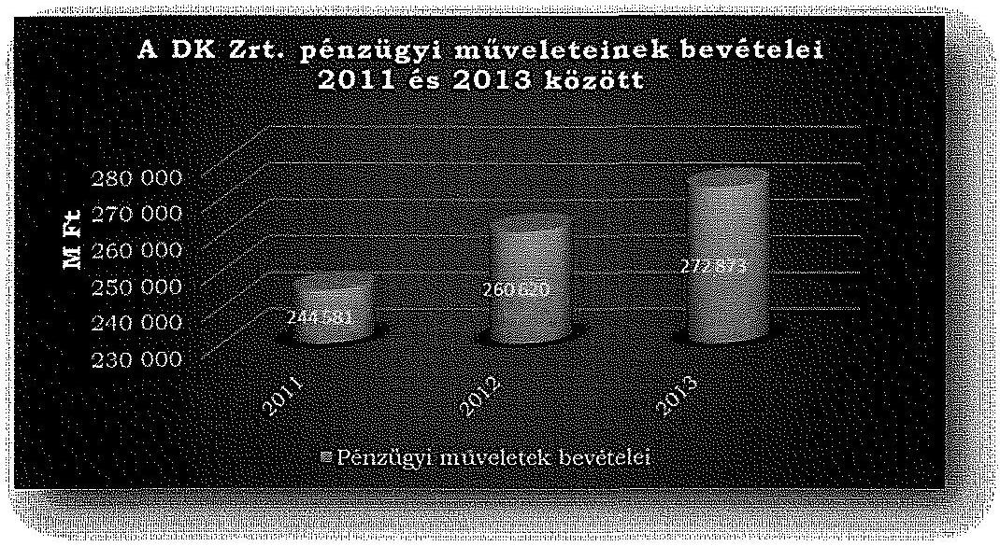

A pénzügyi műveletek ráfordításai az ellenőrzött időszakban nem haladták meg a pénzügyi műveletek bevételeit. A pénzügyi műveletek eredménye évenként 2011-ben 5525 M Ft-ot, 2012-ben 5058 M Ft-ot és 2013-ban 5274 M Ft-ot tett ki. Az összes bevételeken belül a pénzügyi műveletek bevételeinek aránya a 2011.-2013. években $96,0 \%-94,3 \%-94,0 \%$-át volt, az összes ráfordításokon belül a pénzügyi műveletek ráfordításainak aránya pedig ugyanezen időszak alatt $67 \%-69,3 \%-67,6 \%$ volt.

A költségek és ráfordítások elszámolásának alapját képező bizonylatok rendelkezésre álltak. A kamatbevétel elszámolásának alapját képező bizonylatok megfeleltek a Számv. tv. 167. § -ában foglalt előírásoknak, a Számv. tv. 84. § (5) bekezdésében foglalt bruttó elszámolás elve érvényesült. A kamatbevételeket a számlarendben meghatározott főkönyvi számlára könyvelték.

A pénzügyi műveletek ráfordításai között kimutatott tételek megfeleltek a Számv. tv. 85. §. (3) bekezdésben előírtaknak. A tételek elszámolása alapjául szolgáló bizonylatok megfeleltek a Számv. tv. 167. §. (1) be-kezdésében foglaltaknak, a gazdasági események kontírozása megfelelő volt.

A havonta elhatárolt költségekről és az elhatárolások megszüntetéséről analitikus nyilvántartást vezettek. Az elhatárolt összegeket alátámasztó kimutatások rendelkezésre álltak. Év végén a mérleg alátámasztására szolgáló leltárban tételesen szerepeltek az aktív és passzív elhatárolások.

Az éves beszámoló kiegészítő mellékletében bemutatták a kamat-elemeket és a működési költségeket, szövegesen részletezve mind az elhatárolásukat - 2012. évtől termékenként - mind a feloldásuk módját. Az aktív és passzív időbeli elhatárolásokon belül az elhatárolt múködési költségeket, ráfordításokat és az

---

elhatárolt forrásköltségeket tovább részletezték. A 2013. évi időbeli elhatárolás sorain belüli változások bemutatása a beszámolóban megtörtént, az előző évvel össze nem hasonlítható adatokat szemléltetve bemutatták.

# 3.4. A céltartalék képzés szabályszerűsége 

A Kormányrendelet ${ }_{1,2}$ 26. § (1) bekezdésében foglaltak szerint a céltartalék a DK Zrt. hitelezési tevékenységével kapcsolatos kockázatok fedezetére szolgál. A Számviteli politika ${ }_{1,2}$ 3.2. fejezete rögzítette, hogy a várható veszteségek tekintetében a hitelfelvevők kockázatközösséget alkotnak. A DH2 bevezetésétől, a 2012. évtől kezdődően a DH1 és a DH2 adósai külön-külön alkotnak kockázatközösséget. ${ }^{20}$ Az analitikus nyilvántartásokban a DH1-re és DH2re vonatkozóan a kockázati céltartalék képzése elkülönülten szerepelt.

A Kormányrendelet ${ }_{1,2}$ 26. § (3) bekezdésében előírt, a céltartalék képzésére vonatkozó szabályokat a Számviteli politika $_{1,2,3,4}$-ben, és azok függelékét képező Önköltség számítási szabályzatban rögzítették. Előírták, hogy a céltartalékot a mérleg fordulónapjával, a leírásokat, és a céltartalék felhasználását követően a ki nem egyenlített kamattartozások tőkésítését is magába foglaló hallgatói hitelek állományára kell képezni. A számításnál figyelembe vették az átlagos hitelállományt, az aktuárius által meghatározott kockázati szintet, valamint a hallgatói hitel kamatában a tárgyidőszakra felszámított kockázati prémiumot. A számításokat alátámasztó képletet csak a Számviteli politika ${ }_{1,2}$-ben rögzítették. A Számviteli politika ${ }_{3,4}$ nem tartalmazta Kormányrendelet ${ }_{2} 26$. § (4) bekezdésében előírtakat, így a céltartalék tárgyévben szükséges szintjének az aktuárius által meghatározott megállapítási módját. Ugyanakkor a DK. Zrt. az éves számviteli beszámolójának kiegészítő mellékletében részletesen bemutatta a céltartalék tárgyévben szükséges szintjének az aktuárius által meghatározott megállapítási módszertanát.

A DK Zrt. éves beszámolóinak adatai alapján az év végi hitelállomány 2012.ben a 2011. évi záró állományhoz viszonyítva $2,9 \%$-os emelkedést mutat. A növekedést a DH2 indítása és a felvehető hitelösszegek nagyságának emelkedése okozta. A 2013. évben a hitelállomány kismértékű növekedést, a hitelállomány változásának üteme kismértékű csökkenést mutat a 2012. évhez viszonyítva.

A Kormányrendelet ${ }_{1,2}$ 26. § (2) bekezdésében foglaltak szerint a céltartalék a behajthatatlan és a Kormányrendelet ${ }_{1,2} 19 . \S$ (3) bekezdése alapján leírt hallgatói hiteltartozásokból eredő veszteségek ellentételezésére szolgál. Az ellenőrzött években a behajthatatlan és elengedett követelések felhasználásának és elszámolásának szabályait a Számviteli politika $_{1,2,3,4}$ tartalmazta. A 2013. évtől ezt a Lejárt tartozások szabályzatával egészítették ki, mely további részletes előírásokat tartalmazott a behajthatatlan és elengedett követelések tekintetében.

Az ellenőrzött időszakban a szabályozás hiányossága ellenére a céltartalékot megfelelően, a behajthatatlan és a Kormányrendelet ${ }_{1,2} 19 . \S$ (3) bekezdése sze-

[^0]
[^0]:    ${ }^{20}$ Számviteli politika ${ }_{3,4}$, Önköltség számítási szabályzat 4.1 fejezet

---

rint leírt hiteltartozásokból eredő veszteségek ellentételezésére, a veszteség öszszegében, az egyéb bevételek között számolták el. A céltartalékról a 2011. évben, valamint 2012. évtől kezdődően a DH1 és DH2 kockázatközösség tekintetében elkülönített nyilvántartást vezettek. Az ellenőrzött időszakban céltartalék feloldására nem került sor.

A 2013. évben a behajthatatlan követelések leírása a hallgatói hitelrendszer múködtetését szolgáló tranzakciós rendszer meghibásodása miatt teljes körűen nem történt meg ${ }^{21}$. A hiba elhárítását követően a behajthatatlan követelések leírását 2014. januárban tudták végrehajtani. Az elmaradt követelés leírás öszszege $14,4 \mathrm{M}$ Ft volt ${ }^{22}$.

A DK Zrt. számviteli politikájában foglaltaknak ${ }^{23}$ megfelelően az ellenőrzött években a követelések leltáregyeztetését elvégezték.

A hallgatói hitelállomány és a kockázati céltartalék-állományának változását a 2011-2013 években.

Adatok M Ft-ban

|  | 2010.12 .31 | 2011.12 .31 | 2012.12 .31 . | 2013.12 .31 . |
| :-- | --: | --: | --: | --: |
| Hitelállomány tőkési-   tett kamattal együtt | 226941 | 244581 | 260620 | 272873 |
| Céltartalék állománya | 17729 | 20919 | 24394 | 28252 |
| Céltartalék hitelállo-   mányhoz viszonyított   aránya | $7,8 \%$ | $8,6 \%$ | $9,3 \%$ | $10,3 \%$ |

A kockázati céltartalék állománya és annak a hallgatói hitelállományhoz viszonyított aránya az ellenőrzött időszakban folyamatos emelkedést mutatott, az ellenőrzött időszakban összességében 2,5 százalékponttal nőtt. A tendencia a kihelyezett hitelállomány kockázati kitettségének növekedését jelzi.

# 4. A KORÁBBI ÁSZ JELENTÉS MEGÁLLAPÍTÁSAINAK, JAVASLATAINAK HASZNOSÍTÁSA 

A DK Zrt. múködését az ÁSZ 2008-ban ellenőrizte, a számvevőszéki jelentés DK Zrt. részére tett javaslatai hasznosultak.

Javasoltuk a Diákhitel Zrt. igazgatóságának, hogy az SZMSZ-ben szabályozza a Finanszírozási Bizottságnak a szervezetben betöltött helyét, hatáskörét.

[^0]
[^0]:    ${ }^{21}$ Nyilatkozat, 2014. 12.03., és Tárgyalási emlékeztető, 3. kérdés, 2014.12.01.
    ${ }^{22}$ Hitel elengedés 2014. évi kiegészítése
    ${ }^{23}$ Számviteli politika ${ }_{1,2}$ leltározási szabályzat 1.6 pontja és a Számviteli politika ${ }_{3,4}$ leltározási szabályzat 3.4.4. pontja

---

Javaslatunk eredményeképpen, a Finanszírozási Bizottságnak a szervezetben betöltött helyét, hatáskörét az Igazgatóság ${ }^{24}$ 2008. november 13-i ülésén az SZMSZ módosításával biztosította. (Az ellenőrzött időszakban az Zrt.-nél Igazgatóság nem múködött.)

Javasoltuk a Diákhitel Zrt. Igazgatóságának továbbá, hogy részletesen szabályozza a kockázati céltartalék évközi elszámolásának rendjét.

A kockázati céltartalék évközi elszámolásának rendjét a Számviteli politika 2008. év végi módosításával szabályozták, ennek megfelelően a céltartalék képzés, felhasználás, elszámolás évközi részletes szabályait a Számviteli politikatartalmazta.

Budapest, 2015. 04 . hónap 12 . nap

Melléklet: 4 db
Függelék: 2 db
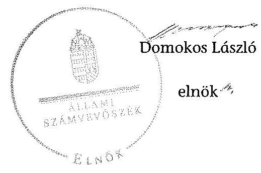

[^0]
[^0]:    ${ }^{24}$ Adott időszakban az SZMSZ elfogadása az Igazgatóság hatáskörébe tartozott, Nyilatkozat, 2014.12.04.

---

.

---

# A DK Zrt. szervezeti felépítése

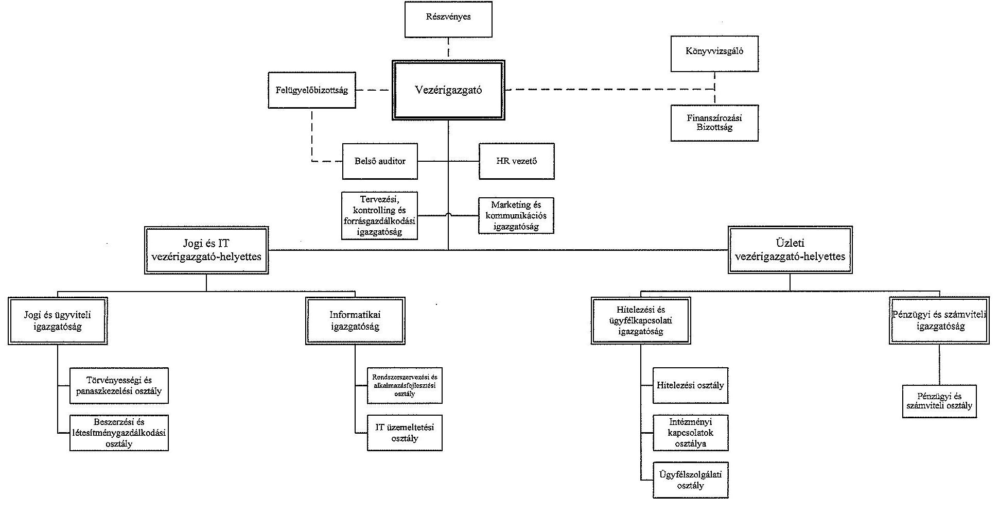

---

.

---

# A DH1 kamatának alakulása a 2011-2013. években 

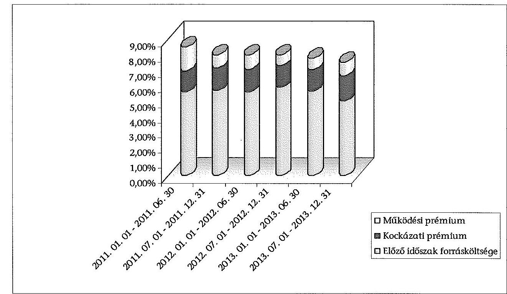

A DH2 kamatának alakulása a 2011-2013. években
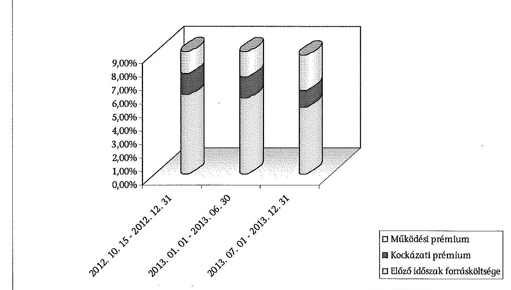

---

.

---

# A DH1-ben részesült hallgatók számának alakulása a 2009-2013. években 

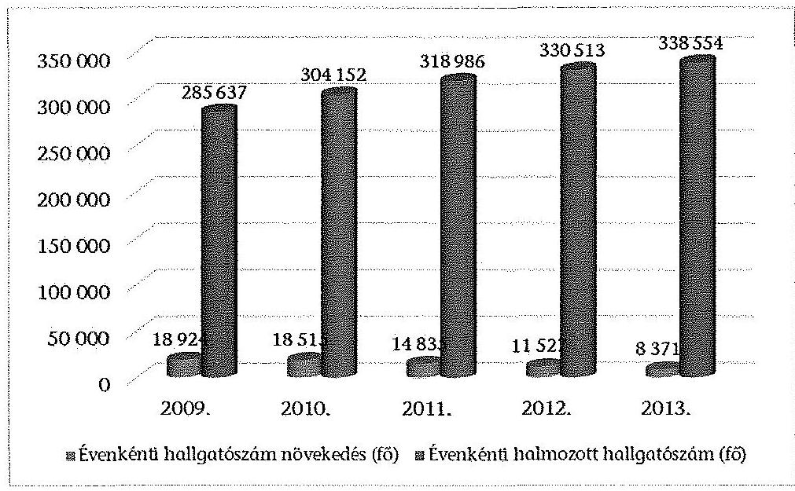

A DH1-ben részesült hallgatók részére kihelyezett hitelösszeg a 2009-2013. években
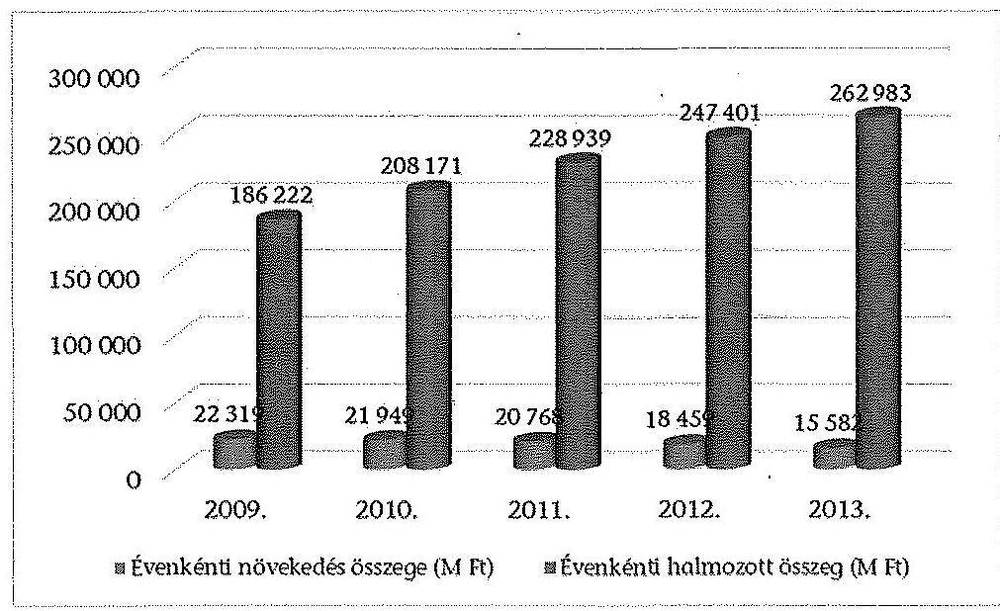

---

.

---

# Beérkezett észrevételek és az azokra adott válaszok

---

.

---

# 602 

## DIÄKHI@L

A jövöl most irod

## Állami Számvevőszék

Domokos László
elnök úr részére

1052 Budapest
Apáczai Cs. J. u. 10.
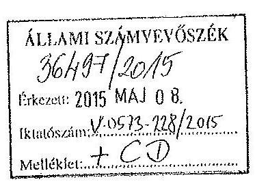

Iktatószám: $395 / 1 / 2015$
1 CD

## Tisztelt Domokos László Elnök Úr!

Köszönettel megkaptuk a Diákhítel Központ Zrt. müködésének ellenőrzéséről készült számvevőszéki jelentéstervezetüket.

A számvevőszéki jelentéstervezetet áttanulmányoztuk, és az Állami Számvevőszékről szóló 2011. évi LXVI. törvény 29. § (2) bekezdésében foglaltakra figyelemmel - a rendelkezésre álló 15 napos törvényes időkorláton belül - megtesszük észrevételeinket, melyet jelen levelem mellékleteként csatolok.

Kérjük, hogy észrevételeinket jelentéstervezetük elkészitése során figyelembe venni szíveskedjenek.

Budapest, 2015. május 8.
Tisztelettel:
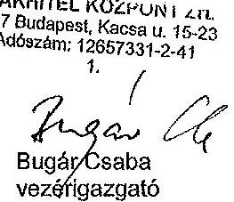

---

Észrevételek a
„Diákhitel Központ Zrt. működésének ellenőrzéséről" szóló Állami Számvevőszéki jelentéstervezethez
2015.

Vizsgálat-azonosító szám: V0699
Témasorszám: 1607
Vizsgálat lefolytatásnak éve: 2014. év
Vizsgálat alá vont időszak: 2011.01.01. - 2013.12.31.

---

Társaságunk a „Diákhitel Központ Zrt. müküdésének ellenőrzéséről" készült számvevőszéki jelentéstervezetet 2015. április 23-án vette kézhez, melyre az Állami Számvevőszékről szóló 2011. évi LXVI. törvény 29. § (2) bekezdésében foglaltakra figyelemmel - a rendelkezésre álló 15 napos törvényes időkorláton belül - az alább részletesen kifejtett indokok alapján észrevételeket tesz. Javasoljuk a jelentéstervezetben foglalt kiemelések egységes szempontok szerinti alkalmazását.

# Általános észrevételek: 

1) Álláspontunk szerint Társaságunknak a Kormányrendelet 13. § (3) bekezdésében elöírt felsőoktatási intézményekkel folytatott adategyeztetési gyakorlata teljes körüen megfelel a vonatkozó jogszabályi rendelkezéseknek a következők miatt:

A Diákhitel Központ Zrt., mint a hallgatói hitelrendszer müködtetését és a hallgatói hitelszerződések alapján a hallgatói hitelek folyóslását végző Társaság a hivatkozott Kormányrendeletben foglaltak szerint „a hallgatói hitel folyóslásának jogszerüsége érdekében" adategyeztetést folytat a felsőoktatási intézményekkel „minden tanulmányi hónapban". Az adategyeztetés célja az adott tanulmányi fëlévre vonatkozó hallgatói hitel folyóslásának jogszerüsége érdekében szükséges adat beszerzése. A Diákhitel Központ Zrt. ezért minden tanulmányi hónapban a felsőoktatási intézményekkel adategyeztetést folytat le azon hitelfelvevők vonatkozásában, akiknek a hallgatói hitelszerződésük alapján a hallgatói hitelek folyóslását szükséges megtennie. A felsőoktatási intézmények a hallgatói hitelek jogszerú folyóslása érdekében a Diákhitel Központ Zrt. részére a hivatkozott Kormányrendelet szerinti adatokat hitelfelvevői bontásban biztosítják.

Társaságunk kötelezettsége a hallgatói hitel folyóslásának jogszerüsége érdekében történő adategyeztetés lefolytatása a felsőoktatási intézménnyel minden tanulmányi hónapban. Azokban az esetekben, amelyekben Társaságunk nem kap az érintett hitelfelvevő hallgatói hitelre jogosultságát megalapozó hallgatói jogviszonyára és képzési adatára vonatkozó megfelelő információt Társaságunk a felsőoktatási intézménnyel minden további tanulmányi hónapban adategyeztetést folytat, kiegészítve az új hiteligénylökre vonatkozó lekérdezésekkel. Miután a hallgatói hitelt az egyes tanulmányi félévekre a Kormányrendelet által meghatározott időpontig lehet kezdeményezni (őszi tanulmányi félév esetében: december 15-e; tavaszi tanulmányi félév esetében: május 15-e) ezért szükséges fenntartani a Kormányrendelet által meghatározott minden tanulmányi hónapban történő adategyeztetési lehetőséget, hogy az új hiteligénylők adatai is visszaigazolásra kerülhessenek a felsőoktatási intézmény által. Társaságunk a helyszíni vizsgálat során a minden tanulmányi hónapra vonatkozóan bemutatta és rendelkezésre bocsájtotta az ellenőrzést végző számvevők részére a felsőoktatási intézmények részére megküldött ún. „TO egyeztető kötegeket", amelyek eredményei a hallgatói hitelrendszer üzleti müködését kiszolgáló BOSS rendszerben is megtalálhatók.

Társaságunknak a felsőoktatási intézményekkel folytatott adategyeztetési gyakorlatának helyességét és jogszerüségét támasztja alá továbbá a Diákhitel 2 termék bevezetésével összefüggő kodifikációs munka eredményei is. A Diákhitel 2 összegeknek a felsőoktatási intézmények számára történő folyósítási gyakorlatába új eleınként került bele a felsőoktatási intézmények feladataként a következő rendelkezés: „Amennyiben az igényelt kötött felhasználású hiteit jogszerűen folyósították, de a hallgatói jogviszony bármely ok miatt

---

mégsem jött létre, a felsőoktatási intézmény a Diákhitel szervezet által az adott tanulmányi félévre folyóeltott kötött felhasználású hitelt a Diákhitel szervezet részére haladéktalanul visszautalja." A Kormányrendelet 13. § (2) bekezdés b) pontja is azt a felsőoktatási intézményekkel folytatott adategyeztetési gyakorlatunkat igazolja, hogy az adategyeztetés célja a hallgatói hitel folyósításának jogszerüsége érdekében történő ellenőrzés. A folyósitást követően az érintett hitelfelvevő vonatkozásában a tanulmányi félév során adategyeztetési kötelezettség Társaságunkat nem terheli.

Társaságunknak a felsőoktatási intézményekkel folytatott adategyeztetési gyakorlatának helyességét és jogszerüségét támasztja alá továbbá, hogy Társaságunk szabályszerű müködésének vizsgálatára már több alkalommal (ÁSZ vizsgálat 2008. év; Tulajdonosi vizsgálat 2012.) sor került és egyetlen alkalommal sem került kifogásolásra a felsőoktatási intézményekkel folytatott adategyeztetési gyakorlatunk. Sőt éppen ellenkezőleg, a lefolytatott vizsgálatok szabályszerű működésünket támasztották alá:

Idézet az Állami Számvevőszék 2008 decemberében készített „a Diákhitel Központ Zrt. müködésének ellenőrzéséről" szóló jelentéséből: „A Társaság belső szabályzatait a hallgatói hitelnyújtás rendszerének kiteljesedésével bővülő feladatokhoz igazodóan folyamatosan állította össze, illetve módosította, azok tartalma - a kockázati céltartalék-képzés részletszabályainak meghatározása kivételével - a megfelelt a mindenkor hatályos jogszabályoknak és a tevékenyég sajátosságainak."

Idézet a Magyar Fejlesztési Bank Zrt. 2012 novemberében készített „a Diákhitel Központ Zrt. tevékenyégének vizsgálata" tárgyú jelentéséből: „A helyszíni vizsgálat során meggyőződtünk arról is, hogy a hitelfelvevők többszörösen és folyamatosan karbantartott adatait a Kormányrendelet előírásait betartva egyeztetik külső partnerekkel KEK KH, oktatási intézmények, NAV)."
Észrevételünk a jelentéstervezet 8. oldal (5) bekezdés, 21. oldal (2) bekezdés, 23. oldal (3) bekezdés, 26. oldal (5) bekezdés, 26. oldal (6) bekezdés, 27. oldal (2) bekezdésének rendelkezéseit érintik, ezért kérjük észrevételünk figyelembevételével történő szöveg pontositását.
„A hiteljogosultságra vonatkozó havi ellenőrzéseket a Kormányrendelet-ben és az együttmüködési megállapodásokban rögzítetteknek megfelelően végezték, azonban Üzletszabályzatban félreérthetően fogalmazták meg."
2) Álláspontunk szerint Társaságunk szerződéskötési gyakorlata és az érvényesen létrejött szerződésekre folytatott hallgatói hitel folyósítási gyakorlata teljes körűen megfelel a vonatkozó jogszabályi rendelkezéseknek, Társaságunk a hiteligénylések ellenőrzése során a vonatkozó szabályzatoknak megfelelően járt el a következők miatt:

A hallgatói azonosító szám sem a kölcsönszerződés pontjaiban, sem a hiteligénylési adatlapon, sem a vonatkozó 86/2006. (IV. 12.), illetve 1/2012. (I. 20.) kormányrendeletben, sem más egyéb kapcsolódó jogszabályban nincs rögzítve, hogy a hitelszerződés érvényességi kelléke lenne. A hallgatói hitel igénybevételére szolgáló Kölcsönszerződés és részét képező Hiteligénylési adatlap előírása szerint a hallgatói azonosító szám mező kitöltése a hiteligénylő számára nem kötelező. A hallgatói hitel igénybevételére szolgáló szerződés érvényes létrejöttéhez szükséges adatkörök a Hiteligénylési adatlapon kötelezően hitöltendő adatként szerepelnek, melyek között a hallgatói azonosító szám nem szerepel. Ugyan a Diákhitel Központ Zrt. általános szerződési feltételeinek minősülő Üzletszabályzata 47. pontja a szerződés érvényességi kellékeként tekint rá, azonban a korábbi

---

Ptk. 205/C. §-a és a jelenleg hatályos Ptk. 6:80. §-a értelmében, ha az általános szerződési feltétel és a szerződés más feltétele egymástól eltér, az utóbbi válik a szerződés részévé. Tekintettel a Polgári Törvénykönyv hivatkozott rendelkezésére, a Diákhitel Központ Zrt. eljárása során a hallgatói azonosító szám Hittelgénylési Adatlapon történő megadása a szerződés érvényes létrejöttének nem feltétele.

A hallgatói azonosítóra vonatkozó rovat a Kölcsönszerződés részének tekintendő Hittelgénylési adatlapon nem kötelezően kitöltendő adatmező, amely kizárja, hogy a szerződés érvényességi feltételeként tekintsen rá Társaságunk.

A Diákhitel Központ Zrt. a hallgatói azonosító számot a hitelfelvevőivel történő kapcsolattartás során, illetve más szervezetekkel a hallgatói hitelrendszer müködtetése érdekében folytatott kapcsolattartás és egyeztetés során sem használja. Maga a vizsgálati anyag is utal rá, hogy nem keletkeztek problémák a hallgatói azonosító szám hiányában, ami érthető is, mivel a többi azonosító adat (születési év, hónap, nap; anyja neve; lakcím; adóazonosító) szinte kizárják annak a lehetőségét, hogy ne lehessen valakit kétséget kizáróan beszonosítani.

Társaságunknál rendelkezésre állnak és álltak azok a dokumentumok, amelyek igazolják, hogy a hallgatói hitel folyósításában érintett hitelszerződések rendelkeztek az érvényes létrejöttükhöz szükséges alaki és tartalmi elemekkel. Társaságunk következetesen folytatott gyakorlata alapján a Hittelgénylési adatlapokon meglévő adathianyok az adatpótlási eljárásban orvoslódtak, amely alapján a hallgatói hitel jogszerűen folyósíthatóvá vált. Az új hiteligénylések a tranzakciós rendszerekbe történő bekerüléskor átesnek egy érvényesség vizsgálaton. Az érvényesség vizsgálatot, amely a jogszabályi feltételeknek való megfelelésre terjed ki az adatlapok betöltését követő validálás végzi. Ha az ellenőrzés az adatlap beolvasása során hibát talál az adatlapon, akkor a szerződés nem jön létre érvényesen, amelyről a hiteligénylőt levélben tájékoztatjuk, illetve felszólítjuk az esetleges hiánypótlásra. A program érvényesség vizsgálatára vonatkozó részletes müködését több specifikáció tartalmazza.

Álláspontunk alátámasztásul szolgáló dokumentumokat észrevételünk mellékleteként CD adathordozón csatoljuk.

Észrevételünk a jelentéstervezet 8. oldal (6) bekezdés, 8. oldal (7) bekezdés, 9. oldal (2) bekezdés, 23. oldal (5) bekezdés, 24. oldal (1) bekezdés, 26. oldal (9) bekezdés, 27. oldal (1) bekezdés rendelkezéseit érintik, ezért kérjük észrevételünk figyelembevételével történő szöveg pontosítását, illetve törlését.
„A DK. Zrt. a hiteligénylési adatlapok, illetve hitelszerzödések adattartalmának ellenőrzését az Üzletszabályzat 20.1., 21., 170. valamint az Üzletszabályzat 47., 174. pontjaiban rögzítettek szerint végrehajtotta. Az ellenőrzött mintatételeknél feltárt adathianyok pótlására a hitelfelvevöket felhívta. Az adatpótolt hitelszerzödések esetében a szerzödések hatályba léptek, a nem pótolt szerzödések esetében a szerzödések érvénytelenitésre kerültek."

# Részletes észrevételek: 

3) A kötvényprogramok alaptájékoztatóját nem az MFB, hanem a mindenkori Felügyelet (PSZÁF, MNB) hagyta jóvá, ezért kérjük a jelentéstervezet 20. oldal (2) bekezdésében foglalt rész pontosítását.

---

# A Kötvényprogramok alaptájékoztatóját a mindenkori Felügyelet (PSZÁF, MNB) hogyta 

jóvá."

4) A jelentéstervezet 20. oldal (6) bekezdésének pontosítását javasoljuk, tekintettel arra, hogy az ÁKK Zrt.-vel kötött szerződés a kötvények tekintetében vezető forgalmazói, illetve programszervezői szolgáltatásra, valamit a finanszírozással kapcsolatos tanácsadási feladatokra (Finanszírozási stratégia és terv készítése, illetve részvétel a Finanszírozási Bizottságban) irányult.
5) Társaságunk a Kormányrendelet 13. § (5) bekezdése alapján biztosított Felsőoktatási Információs Rendszerből (a továbbiakban: FIR) történő adatlekérdezési lehetőséggel élni a vizsgált időszakban a FIR adatminőségének bizonytalanságai miatt nem tudott, ezért nem történt meg ezen a Kormányrendeletben biztosított opciós jogosultság használata. A vizsgálattal érintett időszakban elkészült a FIR2 intézménytörzse (FIR IT) és személyi nyilvántartása (FIR SZNY), megkezdődött a felsőoktatási intézmények tanulmányi rendszereiből az adatok fokozatos feltöltése, először az aktuális adattartalomra koncentrálva, majd visszamenőleges adatokkal is megtörtént ez. Az adattisztaság folyamatos javulása mellett ténylegesen a FIR2 csak 2014-re került olyan állapotba, hogy a felsőoktatási intézményi statisztikák elkészítését és az intézményi finanszírozás számítását teljesen ez alapján lehessen elvégezni. 2013 végéig ténylegesen ezért nem volt lehetőség az intézményi adatszolgáltatás kiváltására. Az Oktatási Hivatallal folyamatos volt a kapcsolat, hogy amint a FIR adatminősége lehetővé teszi, ténylegesen felhasználjuk adategyezetésére a FIR adatait. Indokainkra tekintettel kérjük a jelentéstervezet 21. oldal (3) bekezdésében foglalt rendelkezés módosítását.
„A DK Zrt. az ellenőrzött időszakbom a FIR adatminőségének bizonytalanságai miatt a Kormányrendelet 15. § (3) bekezdésében biztositott egyeztetési lehetőséggel nem élt."
6) A jelentéstervezet 22. oldal (2) bekezdésében foglalt megállapítás a 21. oldalon kezdődő, előző bekezdésben foglalt megállapítással szó szerint megegyezik, tautológikus, ezért törlése javasolt.
7) A hallgatói hiteltartozások végrehajtási eljárássival felmerülő költségek megfizetése tárgyában Társaságunk az illetékekről szóló 1990. évi XCIII. törvény módosításáról, valamint a hiteles tulajdoni lap-másolat igazgatási szolgáltatási dijáról szóló 1996. évi LXXXV. törvény (Dijtörvény) 32/E § (11) bekezdésének rendelkezése alapján utólagos díjfizetéssel él, ezért kérjük a jelentéstervezet 22. oldalának (5) bekezdésében foglalt utolsó mondat pontositását.
8) Társaságunknak a túlfizetések visszautalására folytatott gyakorlata a Kormányrendeleti rendelkezés hiányában is a Ptk. vonatkozó rendelkezésének megfelelő és jogszerủ. A hallgatói hitelszerződések mögöttes jogszabályaként a Ptk. szolgál. A Kormányrendeletben kifejezetten nem szereplő rendelkezés esetében, ha az a Polgári Törvénykönyvben megtalálható az alkalmazása szükséges. A késedelmi kamat fizetésére vonatkozó kötelezettség a Ptk-ban szabályozott kérdés, ezért A Kormányrendelet 2012. évi kodifikációs munkája során vetődött fel a kifogásolt rendelkezés törlése, arra való hivatkozással, hogy az erre utaló rendelkezés a Ptk.-ban szabályozva van. A jelentéstervezet 24. oldal (4) bekezdésében foglalt rendelkezés pontosítását kérjük.

---

„A hitelfelvevö részére a záró elszámoláskor jelentkező tülfizetést pénzügyileg rendezték, Ptk. rendelkezéseinek megfelelő mértékü késedelmi kamattal megnövelve utalták vissza a hitelfelvevö által megadott számlaszáma."
9) Társaságunknak a hitelszerződések felmondására folytatott gyakorlata a Kormányrendeleti előírásoknak megfelelő és jogszerü. Ugyanis Társaságunk Üzletszabályzata 152. pont a.b) alpontjának rendelkezése értelmében a 2003. január 1-jét megelőzően kötött hitelszerződések esetében Társaságunkat a felmondási kötelezettség több mint egy évnek megfelelő törlesztési elmaradás esetén illeti meg. A hallgatói hitelrendszert szabályozó jogi normában a kezdeti időszakban éven túli felmondási küszöbérték szerepelt felmondási kötelezettségként előírva Társaságunk számára, azonban 2003. január 1-től megváltozott a felmondási küszöbérték hat havi törlesztő́észlet elmaradási mértékre. A módosítást kihirdető szabályozás (258/2002. (XII. 17.) Kormányrendelet 15. § (3) bekezdése) megtiltotta az új felmondási küszöbértéknek a norma hatálybalépését megelőzően kötött szerződésekre történő alkalmazását, ezért szerepel azóta következetesen Üzletszabályzatunkban a felmondási küszöbérték megkülönböztetése a 2003. január 1-jét megelőzően és azt követően kötött hitelszerződésekre. A jelentéstervezet 24. oldal (5) és (7) bekezdésének pontositását javasoljuk.
„A DK Zrt. a Kormányrendelet 19. § (5) bekezdés a) pontjában rögzitett azonnali hatályú szerzödés felmondási kötelezettségét a kiválasztott mintában ellenőrzött hitelszerzödések esetében a jogszabályi elöírások alapján végezte."
10) Társaságunk a Kormányrendeletben foglalt záró elszámolás készítési kötelezettségének a hitelszerződések megszünését követően eleget tett, ügyfelei részére megküldte a szerződés megszünésének időpontjára vonatkozó értéknappal fennálló egyenlegükre vonatkozó pénzügyi bizonylatot. A pénzügyi bizonylat a szerződés megszünésével összefüggésben nyilvántartott pénzügyi adatokat azonos módon tartalmazta. Társaságunknál rendelkezésre állnak mindazok a dokumentumok, amelyek igazolják, hogy a szerződés megszünését követő záró elszámolás készítési kötelezettségünknek eleget tettünk. Álláspontunk alátámasztásául szolgáló dokumentumokat észrevételünk mellékleteként CD adathordozón csatoljuk. A jelentéstervezet 24. oldal (6) bekezdésének pontositását javasoljuk.
„A DK Zrt. a hitelszerzödés megszünését követöen, a Kormányrendelet, 19. § (8) bekezdésében foglalt záró elszámolás készitési kötelezettségének eleget tett."
11) Álláspontunk szerint Társaságunk a törlesztési kötelezettség kezdetének meghatározását a Kormányrendelet 14. § (1) bekezdésében foglalt előírásokat megtartva, és figyelemmel a Kormányrendelet 11. § (2) bekezdésében, a 13. § (2) bekezdésében, valamint a 13. § (6) bekezdésében foglalt rendelkezésekre jogszerüen folytatta.

A hallgatói hitelrendszer müködtetése a Kormányrendeletben megfogalmazott szabályok értelmében a Diákhitel Központnak a partnerségéhez tartozó állami intézményekkel és állami tulajdonú szervezetekkel történő együttmüködésén alapul. A hallgató hitel jogszerü folyósítása, valamint a törlesztési kötelezettség meghatározása érdekében szükséges hallgatói jogviszony fennállására és megszünésére vonatkozó adatot Társaságunk részére a felsőoktatási intézmények szolgáltatják. A Diákhitel Központ Zrt. a felsőoktatási intézmény által szolgáltatott adat felülbírálatára és módosítására nem jogosult, azt köteles nyilvántartási rendszerében kimutatni és tárolni. Abban az esetben, ha a felsőoktatási intézmény tanulmányi osztálya egy adott hallgató hallgatói jogviszonya fennállására/megszünésére vonatkozó

---

információt biztosít Társaságunk részére, akkor annak az információnak a hitelességét nem vonjuk kétségbe és eljárási gyakorlatunk során annak az információnak a birtokában végezzük tevékenységünket. Amennyiben az adott hallgató hallgatói jogviszonya fennállására/megszünésére vonatkozó adatot a felsőoktatási intézmény tanulmányi osztálya később megváltoztatja Társaságunk a nyilvántartási rendszerében az adat módosítása a kapott információ alapján megtörténik, azonban a Kormányrendelet 11. § (2) bekezdése, a 13. § (2) bekezdése, a 13. § (6) bekezdése, valamint a 14. § (1) bekezdésének együttes alkalmazási lehetőségére tekintettel. A felsőoktatási intézménynek a hallgatói jogviszony fennállására/megszünésére vonatkozó visszamenőleges hatályú adatszolgáltatása a hallgatói hitelrendszer jogszabály által megfogalmazott müködési algoritmusaival ellentétes, ezért annak visszamenőleges hatályú nyilvántartása sem lehetséges. A visszamenőleges feldolgozás sérti a jóhiszeműen szerzett és gyakorolt jogok alapelvét, és alkalmazása esetén előfordulhatna az a helyzet, hogy a Diákhitel Központ Zrt.-nek fel kellene mondani egyes hitelfelvevők szerződését a törlesztés nem teljesítése miatt, azt megelőzően, hogy az érintett hitelfelvevőt a törlesztés teljesítésére felszólította volna. A vizsgálat során tapasztalt két esetben külön feljegyzésben adtunk magyarázatot eljárásunkra, melyeket észrevételünk mellékleteként CD adathordozón csatolunk. A jelentéstervezet 25. oldal (6) bekezdésének pontosítását javasoljuk.
„A DK Zrt. a 2011-2013. években törlesztési folyamotban lévő ellenőrzött DHI hitelszerzödéseknél a törlesztési kötelezettség kezdetének meghatározását a Kormányrendelet 14. § (1) bekezdésében foglalt elöírások alapján, figyelemmel Kormányrendelet 11. § (2) bekezdésében, a 13. § (2) bekezdésében, valamint a 13. § (6) bekezdésében foglalt rendelkezésekre jogszerüen végezte. A Tanulmányi Osztályok hiányos - a jogviszony megszünés napját nem tartalmazó - adatszolgáltatása, illetőleg visszamenőleges hatállyal történő jogviszony megszüntetését a DK Zrt, tranzakciós rendszerében nyilvántartotta, tárolta és a késöbb tudomására jutott adatszolgáltatásnak megfelelően módosította."
12) Társaságunk a Kormányrendelet 5. § (2) bekezdésében előírt, a felvehető hitel összegek hitelcélok szerinti közzétételi kötelezettségének eleget tett. A Diákhitel 1 termék tekintetében a közzétételi hirdetmények bizonyítják a felvehető hitelösszegek meghirdetését. A Diákhitel 2 termék esetében a konkrét hitelösszegek megjelentetése nem lehetséges, hiszen a Kormányrendelet 5. § (1) bekezdés b) pontja értelmében a kötött felhasználású hitelcél esetében a felvehető összeg a felsőoktatási intézmény részére igazoltan fizetendő képzési költség összegével egyezik meg, amelyet a tanulmányi adategyeztetés keretében biztosítják a felsőoktatási intézmények Társaságunk részére. Tảraságunk a vizsgálattal érintett időszakot követően megjelentetett hirdetményeiben a Diákhitel 2 termék esetében a közzétételei kötelezettségének akként tesz eleget, hogy hivatkozik arra, hogy a kötött felhasználású hitelcél esetében a felvehető összeg a felsőoktatási intézmény részére igazoltan fizetendő képzési költség összegével egyezik meg. A jelentéstervezet 26. oldal (7) bekezdésének pontositását javasoljuk.
13) A jelentéstervezet 27. oldal (4) bekezdésében foglalt megállapítás cáfolatul szolgál, hogy az érintett szerződés a tartozás maradéktalan megfizetése miatt a Kormányrendeleti előírások szerint megszűnt, ezért nem kerülhetett sor a szerződés felmondására. A vizsgálat során az érintett szerződésre vonatkozó álláspontunkat külön nyilatkozatban foglaltuk össze, melyet észrevételünk mellékleteként CD adathordozón csatolunk. Kérjük az érintett bekezdés törlését.
14) A jelentéstervezet 30. oldal (4) bekezdésében foglaltak pontositását javasoljuk, tekintettel arra, hogy a jelentéstervezet 16. oldalán elismerten is a Társaság a tulajdonos által

---

elfogadott Üzleti Stratégiával nem rendelkezett, amelynek hiánya miatt informatikai részstratégia sem került elfogadásra és kihirdetésre. A kihirdetett informatikai stratégia hiánya azonban nem jelenti azt, hogy az informatikai terület ne rendelkezne az üzleti igényekhez igazodó közép és hosszú távú fejlesztési tervekkel, hiszen a Társaság rendelkezik Információ biztonsági szabályzattal, amely nemzetközi standardokon alapul (ISO 27001). A jelentéstervezet 30. oldal (4) bekezdésének pontositását javasoljuk.
„A DK Zrt. Informatikai Stratégiával és Informatikai Biztonsági Politikával elfogadott Üzleti Stratégiája hiányában nem rendelkezett, de rendelkezik Információ biztonsági szabályzattal, amely nemzetközi standardokon alapul (ISO 27001)."
15) A jelentéstervezet 31. oldal (9) bekezdésének pontositását javasoljuk, tekintettel arra, hogy a könyvvizsgáló az ellenőrzött időszakban a beszámolókhoz minősités nélküli könyvvizsgálói jelentést adott az érintett jelzés a könyvvizsgáló által átadott Vezetői levélben volt.
16) A jelentéstervezet 38. oldal (2) bekezdésének pontositását javasoljuk, tekintettel arra, hogy a céltartalékot meghatározó egyetlen képlet nem létezik. A szükséges tartalékot egy speciális szoftverben (Prophet) leprogramozott matematikai/statisztikai modell alapján számolja az aktuárius, amelyben több száz képlet van leprogramozva. A módszertan a Beszámoló Kiegészítő mellékletében kerül minden évben bemutatásra, ahogyan erre a Számviteli politika is utal.
17) A jelentéstervezet 39. oldal (1) bekezdésének pontositását javasoljuk, tekintettel arra, hogy a 2013. évi behajthatatlan követelések leírása a BOSS rendszer hibája miatt 14, 422 M Ft-ot érintett.

# Javaslatra vonatkozó észrevétel 

18) Mindezen indokaink tanulmányozását, mérlegelést és elfogadását követően kérjük a Tisztelt Állami Számvevőszéket, hogy a „Diákhitel Központ Zrt. működésének ellenőrzéséről" készült számvevőszéki jelentéstervezetben foglalt 1. sz. javaslatot is pontosítani szíveskedjen a következők szerint:
„A Kormányrendelet 13. § (3) bekezdésében elölrt, minden tanulmónyi hónapban elvégzendő adategyezetési kötelezettségét teljesítette, a társaság a maga számára a rendeleti szabályozástól eltérő, a havi helyett féléves gyakoriságú egyeztetést irt elö.
Javaslat:

1) „Intézkedjen a szabályozási hiányosságok megszüntetésére, ennek keretében: az adategyezietési kötelezettség gyakoriságára vonatkozó elöírásokat hozza összhangba a vonatkozó kormányrendelet elöírásaival."

Budapest, 2015. május 8.
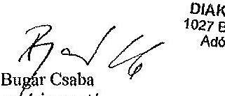

DIÁRHITEL KÖZPONT Zrt.
1027 Budapest, Kácsa a. 15-23.
Adószám: 12057331-2-41
1.

Bügár Csaba
vezérigazgató

---

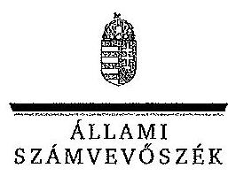

ELKÖK

Ikt.szám: V-0573-232/2015

# Bugár Csaba úr 

vezérigazgató
Diákhitel Központ Zrt.

## Budapest

## Tisztelt Vezérigazgató Úr!

Köszönettel vettem a Diákhitel Központ Zrt. ellenőrzéséről készített számvevőszéki jelentéstervezetre küldött tájékoztatását.

Észrevételei kezeléséről és az szokra vonatkozó álláspontjáról az Állami Számvevőszék a felügyeleti vezető által készített részletes tájékoztatásban ad választ, amelyet levelemhez mellékeltem.

Tájékoztatom Vezérigazgató urat, hogy a számvevőszéki jelentés véglegesítése az elfogadott észrevételek figyelembevételével történik.

Budapest, 2015. 1. 1. 10 nap
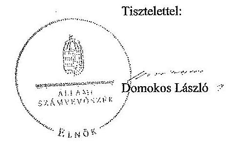

---

# Tájékoztatás az észrevételek kezeléséről 

A Diákhitel Központ Zrt. (továbbiakban: DK Zrt.) ellenőrzéséről készített jelentéstervezetre Vezérigazgató úr észrevételeit megköszönöm. Azok kezeléséről az észrevételek sorrendjében az alábbiakban tájékoztatom. Egyúttal jelzem, hogy javaslata alapján a jelentésben szereplő kiemelések alkalmazásánál egységes szempontok szerint járunk el.

1. Az adategyeztetésre vonatkozó részletes leírását köszönöm. Észrevételében azt érzékelteti, hogy felsőoktatási rendszerünk elektronikus hallgatói regisztrációja nem elegendő és nem nyújt kellő biztosítékot a hallgatónak az oktatásban való rendszeres részvételére, melyhez igazodik a levelében jelzett, a hallgatói státusz ellenőrzéséhez kialakított adategyeztetési gyakorlat. A vonatkozó kormányrendeletek a DK Zrt. számára egyértelmủen havi egyeztetést írnak elő. A havi, illetőleg a féléves egyeztetésre vonatkozó megállapítással megalapozott javaslatunk nem foglal állást csak rögzíti a belső szabályozónak a jogszabálytól való eltérését és javasolja annak feloldását. A jelenleg is hatályos Kormányrendelet2 a 13. § (3) bekezdésében előírja, hogy a „[...] Diákhitel szervezst minden tanulmányi hónapban elektronikus adathordozó megküldése vagy közvetlen elektronikus kapcsolat útján megkeresi a felsőoktatási intézményt annak érdekében, hogy a hallgatói hitelre jogosult hitelfelvevők hallgatói jogviszonya fennállására és képzésére vonatkozó adatokat beszerezze. A felsőoktatási intézmény a Diákhitel szervezet által megküldött adatokat köteles a nyilvántartásában tárolt adatokkal összevetni, ellenőrizni és ennek eredményéről a Diákhitel szervezetet elektronikus adathordozó megküldése vagy közvetlen elektronikus kapcsolat útján tájékoztatni". Ezáltal a Kormányrendelet2 nemcsak azon hitelfelvevő hallgatókat tekintetében írja elő a havi rendszerességủ adategyeztetést, ,, akiknek a hallgatói hitelszerzödésük alapján a hallgatói hitelek folyósitása szükséges", hanem azokra vonatkozóan is, akik korábban már hallgatói hitelt vettek fel és tartozásukat törlesztik (Kormrendelet 2. § 12. pont). A helyszíni ellenőrzés során a DK Zrt. minden tanulmányi hónapra vonatkozóan bemutatta a felsőoktatási intézmények részére megküldött ún. „TO egyeztető kötegeket", melyek a DK Zrt. által használt, a hitelrendszer működését kiszolgáló BOSS rendszerben fellelhetők. Észrevétele alapján a jelentéstervezet véglegezése során a vonatkozó részek megfogalmazását pontosítottam, így az alábbiakban változott a jelentéstervezet:
A jelentéstervezet 8. oldalának 5. bekezdése 1 mondatából a „való" és az „azokkal" szavakat, 2. mondatából a „szabályszerüen" kifejezést, míg a 3. mondat egészét töröltem.
A jelentéstervezet 21. oldalának 2. bekezdésének utolsó részmondatát töröltem, továbbá ezt a bekezdést az alábbiakban módosítottam:
„[...] rögzitettek szerint-a hitelfelvevők hallgatói jogviszonya fennállására és képzésére vonatkozó -havi adatokegyezetési-beszerzése érdekében havonkénti megkeresési [...]nem [...]-as adategyestetéseket-félévente-végeste-el. [...]"
A jelentéstervezet 23. oldalának 3. bekezdését az alábbiakban módosítottam:
„[...], viszont a Kormányrendelet ${ }_{1,2}$ 13. § (3) bekezdésében elôlrt-adategyestetéseket-nem-megfelelően, a hallgatói hitelre jogosult hitelfelvevők hallgatói jogviszonya fennállására és képzésére vonatkozó adatok beszerzése érdekében inditott havonkénti megkereséseket azonban félreérthetően szabályozta. A hallgatói jogviszony ellenőrzésének rendje cimszó alatt az Üzletszabályzat, 29.1. pontjában, valamint az Üzletszabályzat ${ }_{3,4} 48$. pontjaiban az-adategyeztetés-a felsőoktatási intézmények felé irányuló adatszolgáltatásra való felkérés követelményét nem minden tanulmá-

---

nyi hónapra, hanem tanulmányi félévenként irta elö, ezért-a-DHI-szabályozottsága-nem-feleli meg-mig az Üzletszabályzat1,4 az Adategyestetés fejezete alatt szereplő 21.2 pontokban a Kormányrendelet1,3,3-§-(1)-bekezdéseiben-meghatározott-elöirásoknak 13. § (3) bekezdésének elöirásával összhangban havonkénti megkeresést rögzitett."
A jelentéstervezet 26. oldalának 5. bekezdésének 2. mondatát az alábbiakban megváltoztatom:
„A hallgatói hitelre jogosult hitelfelvevők hallgatói jogviszonya fennállására és képzésére vonatkozó adatok beszerzése érdekében elöirt havonkénti megkereséseket a Kormányrendelet, 13. § (3) bekezdésébenek elöirt adategyestetéseket és a DK Zrt. Üzletszabályzat2,4 21.2 pontjainak rendelkezéseitől eltérően, félreérthetően szabályozta az Üzletszabályzata3,4 175. pontjaiban eltérően-szabályozta."
A jelentéstervezet 26. oldalának 6. bekezdését az alábbiak szerint kiegészítettem, egyidejűleg a bekezdés utolsó mondatát töröltem:
„[...]-de-nem-végezte-el. Egyúttal eleget tett a Kormányrendelet, 13. § (3) bekezdésében minden tanulmányi hónapra elöirt elektronikus úton történő megkeresésnek, az ún. „TO egyeztető kötegek" felsőoktatási intézményeknek történő megküldésével."
A jelentéstervezet 27. oldalának 2. bekezdésének a következők szerint dolgoztam át:
„A DK Zrt. elvégeste a DH2 jogszerü folyósitása miatt a hitelszerződés fennállása alatt a hallgatói jogviszony ellenőrzését támogató adategyeztetéseket a felsőoktatási intézményekkel az Üzletszabályzat2,4 175. pontjában rögzitettek szerint elvégezte, azonban eljárása-nem-felelt-meg A DK Zrt. Üzletszabályzatának3,4 175. pontjában a Kormányrendelet, 13. § (3) bekezdésében foglalt és az Üzletszabályzatának3,4 21.2 pontjában szereplő adategyeztetési kötelezettségtöl-mivel minden-tanulmányi-hónapra-fennálló adategyeztetési kötelezettségének-nem-tett-eleget. Üzlet-szabályzatában3,4-a-Kormányrendeletben, foglaltaktól eltérő-gyakoriságú, félévenkénti eltérő egyeztetési kötelezettséget irt elö."
2. Vezérigazgató úr helyesen utal arra, hogy a vonatkozó jogszabályok nem írják elő a hitelszerződés érvényességi kellékeként a hallgatói azonosító számot, ezt csak a DK Zrt. Üzletszabályzata tartalmazza. A társaság viszont köteles betartani a saját belső előírásait is, függetlenül attól, hogy ez a gyakorlatban okoz-e nehézségeket, illetőleg kollízió érzékelhető a belső szabályozó, valamint a hatályos jogszabályokban foglaltak között. Ezen ellentmondások szakszerü feloldása érdekében esetenként módosítani szükséges a DK Zrt. Üzletszabályzatát. Az észrevételében csatolt hiányos adatlappal beadott hiteligénylések esetében a hitelbírálat során feltárt adathlányok pótlására a hitelfelvevők figyelmét a társaság megfelelően felhívta. Mindezek alapján úgy ítélem meg, hogy az hitelszerződések adattartalmának egyeztetésére vonatkozó megállapítások pontositása szükséges.
A jelentéstervezet 8. oldal 6. bekezdésének 2. és 3. mondatát és a 26. oldal 9. bekezdését, illetőleg a 27. oldal 1. bekezdés 1 mondat 2. tagmondatát, továbbá 2. és 3. mondatának egészét töröltem.
A jelentéstervezet 8. oldalának 7. bekezdésének és a 23. oldal 5. bekezdését az alábbiak szerint pontositottam:
„[...] adatlapok, illetve-hitelszerzödések közel fele nem rendelkezett. [...]"

---

A jelentéstervezet a 9. oldal 2. bekezdését és a 24. oldal 1. bekezdésének a következők szerint módosítottam:
„[...] ellenére részbent szerint [...] Az adathlányok pótlására a DK Zrt. felhívta az érintett hitelfelvevök figyelmét."
3. Észrevételét elfogadom, a jelentéstervezetet az alábbiak szerint módosítom:

A jelentéstervezet 20. oldalán a 2. bekezdés 1. mondata helyébe a következő lép:
,A hallgatói hitelekhez szükséges út források bevonása céljából szükséges Kötvényprogramok alaptátékoztatóját a pénzügyi közvetítörendszer felügyeletét ellátó szerv (PSZÁF, MNB) hagyta jóvá."
4. Észrevételét elfogadom, a jelentéstervezetet az alábbiak szerint módosítom:

A jelentéstervezet 20. oldalán a 6. bekezdés utolsó előtti mondata helyébe a következő lép:
„Az ÁKK Zrt.-vel kötött szerzödés a-források-biztositására és azállam által garantált hitelfelvételre a kötvények tekintetében vezetö forgalmazói, illetve programszervezöi szolgáltatásra, valamint a finanszirozással kapcsolatos tanácsadói feladatokra (Finanszirozási stratégia és terv készitése, továbbá részvétel a Finanszirozási Biztosságban) irányult.
5. Észrevételét elfogadom, a jelentéstervezetet az alábbiak szerint módosítom:

A jelentéstervezet 21. oldalán a 3. bekezdés utolsó mondata helyébe a következő lép:
„A DK Zrt. az ellenörzött időszakban ezen egyeztetési lehetöséggel - indokként a FIR adatminöségének bizonytalanságát megielölve - nem tudott éltni."
6. Észrevételét elfogadom, a jelentéstervezetet az alábbiak szerint módosítom:

A jelentéstervezet 22. oldalán a 2. bekezdést töröltem.
7. Észrevételét elfogadom, a jelentéstervezetet az alábbiak szerint módosítom:

A jelentéstervezet 22. oldalán az 5. bekezdés utolsó mondata helyébe a következő lép:
,A DK Zrt.-az Art.-163. § (2) bekezdésében rögzitett végrehajtási költségminimumot (5,0-E-Ft)-a Vht.-34. § (1)-bekezdésének-megfelelöen-megelölegeste, a hallgatói hiteltartozások végrehajtási eljárásaival kapcsolatban felmerülö költségek megfizetése tárgyában az illetékekröl szóló 1990. évi XCIII. törvény módositásáról, valamint a hiteles tulajdonilap-másolat igazgatási szolgáltatási dijáról szóló 1996. évi LXXXV. törvény 32/E. § (11) bekezdésének rendelkezése alapján utólagos dittizetéssel élc."
8. Észrevételét elfogadom a jelentéstervezet 24. oldalán a 4. bekezdés helyébe a következő lép:
„A DK Zrt. a hitelfelvevő részére a záró elszámolást követően jelentkező tülfizetés összegét pénzügyileg rendezte, a tülfizetés összegét összhangban a Ptk. elöirásaival, az abban foglalt rendelkezéseknek megfelelő mértékü késedelmi kamattal megnövelve utalta vissza a hitelfelvevönek az általa megadott számlaszámra."
9. Észrevételét elfogadom, a jelentéstervezet 24. oldalának 7. bekezdését töröltem, az 5. bekezdés helyébe a következő lép:

---

„A DK Zrt. a Kormányrendelet ${ }_{1,2}$ 19. § (3) bekezdés a) pontjában rögzitett azonnali hatályú szerzödés felmondási kötelezettségét a kiválasztott mintában ellenörzött hitelszerzödések esetében a jogszabályi elöírások szerint végezte."
10. Észrevételét elfogadom, a jelentéstervezetet 24 . oldalán a 6 . bekezdését az alábbiak szerint módosítom:
A DK Zrt. a hitelszerzödés megszünését követően, a Kormányrendelet ${ }_{1,2}$ 19. § (8) bekezdésében foglaltak teljesitésére záró elszámolásként az ellenörzéssel érintett megszünt hitelszerzödések negyedénél egyenlegértesítőt alkalmasott, amely megfelel a Kormányrendelet ${ }_{1,2} \quad 19 . \S$ (8) bekezdésében elöírtaknak.

Tartalmilag az egyenlegértesítő betölti a záróelszámolás funkcióját, mivel annak minden előírt kellékét tartalmazza.
11. Az észrevételében említett szakasz (25. oldal 6. bekezdése) első része egy, a DK Zrt. által alkalmazott gyakorlat leírása. A második rész a megállapítás okait veszi sorba. Észrevétele alapján a 25. oldal 6. bekezdésének módosítása szükséges az alábbiak szerint:
„A DK Zrt. a 2011-2013. években törlesztési folyamatban lévő ellenőrzött DH1 hitelszerzödéseknél a törlesztési kötelezettség kezdetének meghatározását nem tudta minden esetben a Kormányrendelet ${ }_{1,2}$ 14. § (1) bekezdésében foglalt elöírások szerint végezni. Ennek oka egyrészt a Tanulmányi Osztályok hiányos - a jogviszony megszünés naptát nem tartalmazó - adatszolgáltatása, másrészt a Tanulmányi Osztályok visszamenőleges hatállyal történő jogviszony megszüntetése volt. A Kormányrendelet ${ }_{1,2}$ 13. § (3) bekezdéseiben elöirt, a hallgatói hitelre jogosult hitelfelvevök hallgatói jogviszonya fennállására és képzésére vonatkozó adatok beszerezése érdekében történő, a DK Zrt. által kezdeményezett havonkénti megkeresés során a Tanulmányi Osztályok hiányos adatszolgáltatása, illetőleg a hallgatói jogviszony megszünés időpontjának visszamenőleges hatállyal történő megszüntetésére vonatkozó adatok alapján a DK Zrt. a tranzakciós rendszerében nyilvántartott adatokat a tudomására jutott adatszolgáltatásnak megfelelően módosította."
12. Észrevételét elfogadom, így a 26. oldal 7. bekezdését az alábbi részt töröltem:
„[...] a-DH2-tekintetében-nem [...]"
13. Észrevételét elfogadom, a jelentéstervezetet 27. oldalának a 4. bekezdését és a 4. bekezdés utáni részbekezdést töröltem.
14. Észrevételét részben elfogadom, a jelentéstervezetet az alábbiak szerint módosítom:

A jelentéstervezet 30. oldalán a 4. bekezdés utolsó mondatának kiegészítése mellett egy mondat kerül beépítésre:
„A DK Zrt. -elfogadott Üzleti Stratégia hiányában - Informatikai Stratégiával és Informatikai Biztonsági Politikával nem rendelkezett, ami kockázatot jelent a közép- és hosszú távú informatikai fejlesztések és fejlődési irányok összehangolása szempontjából. A kockázatot mérsékelte ugyanakkor, hogy rendelkezett a nemzetközi sztenderdeken (ISO 27001) alapuló Információ biztonsági szabálysaital."
15. Észrevételét elfogadom, a jelentéstervezet 31. oldal 8. bekezdés utáni részbekezdésének első mondatát az alábbiak szerint megváltoztatom:

---

# „A DK Zrt. könyvvizsgálójai-jelentése által adott Vezetői levélben jelzett kockázatok. [...]" 

16. A 2012. október 21-e előtti időszakban élt Számviteli politika1,2 még tartalmazta a céltartalék számítását megalapozó képlet leírását, azt követően pedig már nem. A Kormányrendelet ${ }_{1,3}$ a céltartalék tárgyévben szükséges szintjének az aktuárius által meghatározott megállapítási módjának számviteli politikában történő rögzítését írja elő. A számítási módszertannak a Beszámoló Kiegészítő mellékletében történő bemutatása pozitív gyakorlat. Észrevétele alapján a jelentéstervezet 38. oldalának 2. bekezdésében megfogalmazott megállapítást az alábbiak szerint pontositom:
A számításokat alátámasztó képletet azonban csak a Számviteli politika1,2-ben rögzítették. A Számviteli politikas, nem tartalmazta a Kormányrendelet, 26. § (4) bekezdésében elöirtakat, igv a céltartalék tárgyévben szükséges szintjének az aktuárius által meghatározott megállapítási módjait-számitásokat-megalapozó-képlet-leírását, ami a céltartalék-képzés-átláthatóságát-gyengítette. Ugyanakkor a DK. Zrt. az éves számviteli beszámolójának kiegészitő mellékletében részletesen bemutatta a céltartalék tárgyévben szükséges szintjének az aktuárius által meghatározott megállapítási módszertanát.
17. Észrevételét elfogadom, a jelentéstervezetet az alábbiak szerint módosítom:

A jelentéstervezet 39. oldalán az 1. bekezdés helyébe a következő lép:
„Az elmaradt követelés leírás összege 14,422,0 M Ft volt."
18. A javaslatunk a fentebbi 1. pontban már tárgyalt, a jogszabály havi egyeztetéseket előíró rendelkezése és az attól eltérő féléves egyeztetés gyakorlata közötti ellentmondás megállapításán alapul. A jelentéstervezet 1. számú intézkedést igénylő megállapításából a „nem" szót töröltem.

Budapest, 2015. DÉ. hó ${ }^{2 r}$ nap
Dr. Horváth Margit
felügyeleti vezető

---

Domokos László
clnők

Állami Számvevőszék
Budapest

# MFB 

ÁLLAMI SZÁMVEVÖSZÉK
$46.541 / 2015$
Erikc. 2015 JUN 05
Iktatósz. 0-008 - 24 (24)
Melléklet: $\qquad$
Budapest, 2015. június 03.

Tisztelt Elnök Úr!

Hivatkozva a Diákhitel Központ Zrt. müködésének ellenőrzéséről szóló számvevőszéki jelentéstervezetükre, amelyet 2015. május 21 -én V-0573-226/2015. iktatószámon köszönettel kézhez vettünk, az MFB Magyar Fejlesztési Bank Zártkörüen Müködő Részvénytársaság az alábbiakban szövegszerü javaslatot tesz a jelentéstervezet 13. oldalának második bekezdésére.

Jelenlegi szöveg:
„A tulajdonosi joggyakorlás az FB és a független könyvvizsgáló tevékenységén, a DK Zrt. számára elöirt adatszolgáltatások monitoringján, valamint az MFB Zrt. Ellenőrzési Igazgatósága által végzett ellenőrzéseken keresztül valósult meg."

Javasolt szöveg:
„A tulajdonosi joggyakorlás az MFB Zrt. Pénzügyi Intézményi Befektetések Föigazgatóságának tevékenységén (Alapítói Határozatok kiadása, stb.) keresztül valósult meg, amelyet támogatott az FB és a független könyvvizsgáló, a DK Zrt. számára elöirt adatszolgáltatások monitoringja, valamint az MFB Zrt. Ellenőrzési Igazgatósága által végzett ellenőrzés."

Kérem a fenti észrevételt a jelentés véglegesitése során figyelembe venni szíveskedjenek.

Tisztelettel:
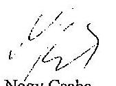

Nagy Csaba
vézérigazgató

Sziládi-Losteiner Dóra
ügyvezető igazgató

MFB Magyar Fejlesztési Bank Zártkörüen Müködő Részvénytársaság
VOSY Budapest, 46200 u. 24. Juhesztiadévi 040 - 1205 Budapest, Pf. 670 | Teléken: +36 14281460 | Fax: +36 14281460
E-mail: mfb@mfb.hu | Cégjegyzékszám: 01-10-041712 Fentecs Tövárh: 016 Cégtekölég:

---

# 4. SZÁMÚ MELLÉKLET A V-0573-240/2015 SZÁMÚ JELENTÉSHEZ 

## KILAMI   SZÁMVEVÓSZÉK

Ikt.szám: V-0573-235/2015

## Nagy Csaba úr

vezérigazgató
Magyar Fejlesztési Bank Zrt.

## Budapest

## Tisztelt Vezérigazgató Úr!

Köszönettel vettem a Diákhitel Központ Zrt. ellenőrzéséről készített számvevőszéki jelentéstervezetre küldött észrevételét.

Észrevételei kezeléséről és az azokra vonatkozó álláspontjáról az Állami Számvevőszék a felügyeleti vezető által készített részletes tájékoztatásban ad választ, amelyet levelemhez mellékeltem.

Tájékoztatom Vezérigazgató urat, hogy a számvevőszéki jelentés véglegesítése az elfogadott észrevételek figyelembevételével történik.

Budapest, 2015. - hó - nap

Tisztelettel:
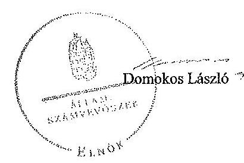

---

# Tájékoztatás az észrevételek kezelésérül 

A Diákhitel Központ Zrt. (továbbiakban: DK Zrt.) ellenőrzéséről készített jelentéstervezetre Vezérigazgató úr észrevételét megköszönöm. A jelentéstervezet 13. oldalának második bekezdéséhez tett észrevételét elfogadom. A bekezdés helyébe a következő szöveg kerül:
„A tulajdonosi joggyakorlás az MFB Zrt. Pénzügyi Intézményi Befektetések Fölgazgatóságának tevékenységén (Alapitói Határozatok kiadása stb.) keresztül valósult meg, amelyet támogatott az FB és a független könyvvizsgáló, a DK Zrt. számára elöirt adatszolgáltatások monitoringja, valamint az MFB Zrt. Ellenörzési Igazgatósága által végzett ellenörzés."

Az ,,adatszolgáltatások" szóhoz tartozó lábjegyzet szövege változatlan maradt.

Budapest, 2015. 06 . hó 3 nap

Dr. Horváth Margit
felügyeleti vezető

---

# RÖVIDÍTÉSEK JEGYZÉKE 

| Törvények |  |
| :--: | :--: |
| Art. | Az adózás rendjéről szóló 2003. évi XCII. törvény |
| Áht. | Az államháztartásról szóló 1992. évi XXXVIII. törvény (hatálytalan: 2012.01.01-től) |
| Áht. | Az államháztartásról szóló 2011. évi CXCV. törvény |
| ÁSZ tv. | Az Állami Számvevőszékről szóló 1989. évi XXXVIII. törvény (hatálytalan: 2011.07.01-től) |
| ÁSZ tv. | Az Állami Számvevőszékről szóló 2011. évi LXVI. törvény |
| Bszt. | A befektetési vállalkozásokról és az árutőzsdei szolgáltatókról, valamint az általuk végezhető tevékenységek szabályairól szóló 2007. évi CXXXVIII. törvény |
| Fot. | A felsőoktatásról szóló 2005. évi CXXXIX. törvény (hatálytalan 2012. 09.01-től) |
| Gt. | A gazdasági társaságokról szóló 2006. évi IV. törvény |
| Közbesz. tv. | A közbeszerzésekről szóló 2003. évi CXXIX. törvény (hatálytalan: 2012. 01. 01-től) |
| Közbesz. tv. ${ }_{2}$ | A közbeszerzésekről szóló 2011. évi CVIII. törvény |
| MFB tv. | A Magyar Fejlesztési Bank Részvénytársaságról szóló 2001. évi XX. törvény |
| Nftv. | A nemzeti felsőoktatásról szóló 2011. évi CCIV. törvény |
| Nvtv. | A nemzeti vagyonról szóló 2011. évi CXCVI. törvény (hatályos: 2011. 12. 31-től) |
| Ptk. | A Polgári Törvénykönyvről szóló 2013. évi V. törvény |
| Tpt. | A tőkepiacról szóló 2001. évi CXX. törvény |
| Stabilitási tv. | Magyarország gazdasági stabilitásáról szóló 2011. évi CXCIV. Törvény (hatályos: 2011. 12. 31-től) |
| Számv. tv. | A számvitelről szóló 2000 . évi C. törvény |
| Vht. | A bírósági végrehajtásról szóló 1994. évi LIII. törvény |
| 1992. évi LXIII. tv. | A személyes adatok védelméről és a közérdekú adatok nyilvánosságáról szóló 1992. évi LXIII. törvény (hatálytalan: 2012. 01. 01-től) |
| 2011. évi CXII. tv. | Az információs önrendelkezési jogról és az információszabadságról szóló 2011. évi CXII. törvény |
| 2011. évi Kvtv. | A Magyar Köztársaság 2011. évi költségvetéséről szóló 2010. évi CLXIX. törvény |
| 2012. évi Kvtv. | Magyarország 2012. évi központi költségvetéséről szóló 2011. évi CLXXXVIII. törvény |
| 2013. évi Kvtv. | Magyarország 2013. évi központi költségvetéséről szóló 2012. évi CCIV. törvény |
| Korm. rendeletek |  |
| Kormányrendelet ${ }_{0}$ | A hallgatói hitelrendszerről és a Diákhitel Központról szóló 119/2001. (VI. 30.) Korm. rend. (hatálytalan: 2006.08.15-től) |

---

Kormányrendelet ${ }_{1} \quad$ A hallgatói hitelrendszerről és a Diákhitel Központról szóló 86/2006. (IV. 12.) Korm. rendelet
(hatálytalan: 2012. 09. 01-től)
Kormányrendelet ${ }_{2} \quad$ A hallgatói hitelrendszerről szóló 1/2012. (I. 20.) Korm. rendelet

## Egyéb rövidítések

AB
Audit Bizottság
Alapító Okirat ${ }_{1} \quad$ A Diákhitel Központ Zrt. Alapító Okirata, hatályos: 2010. november 1 -től
Alapító Okirat ${ }_{2} \quad$ A Diákhitel Központ Zrt. Alapító Okirata, hatályos: 2011. április 15 -től
Alapító Okirat ${ }_{3} \quad$ A Diákhitel Központ Zrt. Alapító Okirata, hatályos: 2011. szeptember 1-től
Alapító Okirat ${ }_{4} \quad$ A Diákhitel Központ Zrt. Alapító Okirata, hatályos: 2011. november 22 -től
Alapító Okirat ${ }_{5} \quad$ A Diákhitel Központ Zrt. Alapító Okirata, hatályos: 2012. június 1 -től
Alapító Okirat ${ }_{6} \quad$ A Diákhitel Központ Zrt. Alapító Okirata, hatályos: 2012. április 26 -tól
Alapító Okirat ${ }_{7} \quad$ A Diákhitel Központ Zrt. Alapító Okirata, hatályos: 2013. március 14 -től
Alapító Okirat ${ }_{8} \quad$ A Diákhitel Központ Zrt. Alapító Okirata, hatályos: 2013. április 25 -től
Alapító Okirat ${ }_{9} \quad$ A Diákhitel Központ Zrt. Alapító Okirata, hatályos: 2013. október 17 -től
APEH Adó-és Pénzügyi Ellenőrzési Hivatal
ÁKK Zrt.
ÁSZ
16/2003. számú Vezérigazgatói utasítás - a Diákhitel Központ Rt. Belső Ellenőrzési Szabályzata, 15/2003. (VIII. 29.) FB. határozattal elfogadva
belső ellenőrzési
szabályzat ${ }_{1}$
belső ellenőrzési
szabályzat ${ }_{2}$
belső ellenőrzési
szabályzat ${ }_{3}$
belső ellenőrzési
szabályzat kiegészítése

BOSS rendszer
Deloitte Zrt.
DH1
37/2011. számú Vezérigazgatói utasítás - a Diákhitel Központ Zrt. Belső Ellenőrzési Szabályzata, 2/2011. (I. 28.) FB határozattal elfogadva
39/2012. számú Vezérigazgatói utasítás - a Diákhitel Központ Zrt. Belső Ellenőrzési Szabályzata, 83/2012. (XI. 21.) FB határozattal elfogadva
44/2011. számú Vezérigazgatói utasítás - a Diákhitel Központ Zrt. Belső Ellenőrzési Szabályzatának kiegészítése, 23/2011. (V. 25.) FB határozattal elfogadva

A hallgatói hitelrendszer múködését támogató integrált informatikai rendszer
Deloitte Üzletviteli és Vezetési Tanácsadó Zrt.
A Kormányrendelet2 2. § 11. a) pontja szerinti szabad felhasználású hallgatói hitel

---

| DH2 | A Kormányrendelet 2 2. § 11. b) pontja szerinti kötött felhasználású hallgatói hitel |
| :--: | :--: |
| DK Zrt. | Diákhitel Központ Zrt. |
| ellenőrzési terv ${ }_{1}$ | Diákhitel Központ Zrt. 2011. évi ellenőrzési terve, 10/2011. (III. 02.) FB határozattal elfogadva |
| ellenőrzési terv ${ }_{2}$ | Diákhitel Központ Zrt. 2012. évi ellenőrzési terve, 5/2012. (II. 15.) FB határozattal elfogadva |
| ellenőrzési terv ${ }_{3}$ | Diákhitel Központ Zrt. 2013. évi ellenőrzési terve, 92/2012. (XII. 14.) FB határozattal elfogadva |
| Ernst\&Young Kft. | Ernst\&Young Könyvvizsgáló Kft. |
| ESZCSM | Egészségügyi, Szociális és Családügyi Minisztérium |
| EMMI | Emberi Eröforrások Minisztériuma |
| FB | A Diákhitel Központ Zrt. Felügyelőbizottsága |
| FB ügyrend ${ }_{1}$ | A Diákhitel Központ Zrt. Felügyelőbizottságának ügyrendje, hatályos: 2008. 02. 14 -től |
| FB ügyrend ${ }_{2}$ | A Diákhitel Központ Zrt. Felügyelőbizottságának ügyrendje, hatályos: 2011. 04. 15 -től |
| FB ügyrend ${ }_{3}$ | A Diákhitel Központ Zrt. Felügyelőbizottságának ügyrendje, hatályos: 2012. 03. 08 -tól |
| FIR | Az Országos Felsőoktatási Központ Felsőoktatási Információs Rendszere |
| Ft | forint |
| GYED | Gyermekgondozási díj |
| GYES | Gyermeknevelési segély |
| IBSZ | Információbiztonsági Szabályzat, 27/2012. számú Vezérigazgatói utasítás |
| ISO 27001 | A Nemzetközi Szabványosítási Szervezet 27001 számú, Informatikai biztonsági szabványa |
| ISZSZ | Informatikai Szolgáltatási Szabályzat, 24/2012. számú Vezérigazgatói utasítás |
| IT | Információtechnológia |
| Kincstár | Magyar Államkincstár |
| Lejárt tartozások   szabályzata | 15/2013. (IX.30.) számú Vezérigazgatói utasítás a lejárt tartozások és hátralékos követelések kezelésének rendjéről |
| M | millió |
| Mrd | milliárd |
| MFB Zrt. | MFB Magyar Fejlesztési Bank Zrt. |
| MNV Zrt. | Magyar Nemzeti Vagyonkezelö Zrt. |
| MTB Zrt. | Magyar Takarékszövetkezeti Bank Zrt. |
| NAV | Nemzeti Adó- és Vámhivatal |
| NEFMI | Nemzeti Erőforrás Minisztérium |
| NGM | Nemzetgazdasági Minisztérium |
| OH | Oktatási Hivatal |
| OFIK | Országos Felsőoktatási Információs Központ |

---

| sz. | számú |
| :--: | :--: |
| Számviteli politika $_{1}$ | Számviteli politika, 40/2011. (III. 21.) számú Vezérigazgatói utasítás |
| Számviteli politika $_{2}$ | Számviteli politika, 50/2011. (X. 05.) számú Vezérigazgatói utasítás |
| Számviteli politika $_{3}$ | Számviteli politika, 37/2012. (XI. 21.) számú Vezérigazgatói utasítás |
| Számviteli politika $_{4}$ | Számviteli politika, 18/2013. (XII. 10.) számú Vezérigazgatói utasítás |
| SZMM | Szociális és Munkaügyi Minisztérium |
| SZMSZ $_{1}$ | A Diákhitel Központ Zrt. Szervezeti és Müködési Szabályzata, 23/2010 (X. 01.) számú Vezérigazgatói utasítás |
| SZMSZ $_{2}$ | A Diákhitel Központ Zrt. Szervezeti és Müködési Szabályzata, 36/2011 (II. 01.) számú Vezérigazgatói utasítás |
| SZMSZ $_{3}$ | A Diákhitel Központ Zrt. Szervezeti és Müködési Szabályzata, 47/2011 (IX. 01.) számú Vezérigazgatói utasítás |
| SZMSZ $_{4}$ | A Diákhitel Központ Zrt. Szervezeti és Müködési Szabályzata, 52/2011 (XI. 29.) számú Vezérigazgatói utasítás |
| SZMSZ $_{5}$ | A Diákhitel Központ Zrt. Szervezeti és Müködési Szabályzata, 36/2012 (XI. 21.) számú Vezérigazgatói utasítás |
| TGYÁS | Terhességi gyermekágyi segély |
| Üzletszabályzat ${ }_{1}$ | A Diákhitel Központ Zrt. Üzletszabályzata, hatályos: 2009. 07. 24 -től |
| Üzletszabályzat ${ }_{2}$ | A Diákhitel Központ Zrt. Üzletszabályzata, hatályos: 2012. 01. 01 -től |
| Üzletszabályzat ${ }_{3}$ | A Diákhitel Központ Zrt. Üzletszabályzata, hatályos: 2012. 08. 01 -től |
| Üzletszabályzat ${ }_{4}$ | A Diákhitel Központ Zrt. Üzletszabályzata, hatályos: 2012. 09. 01 -től |
| Üzletszabályzat ${ }_{5}$ | A Diákhitel Központ Zrt. Üzletszabályzata, hatályos: 2014. 03. 31 - től |
| Vig. utasítás | Vezérigazgatói utasítás |
| Zrt. | Zártkörűen Müködő Részvénytársaság |

---

# ÉRTELMEZŐ SZÓTÁR 

| Aktuárius | Olyan szakember, aki a kockázatok pénzügyi hatásait elemzi, és a következtetésekből levont módszereket alkalmazza a gyakorlatban. Az aktuárius matematikai (valószínüség-számítási, statisztikai) és közgazdasági (pénzügyi, befektetési, számviteli) ismeretek felhasználásával, a gyakorlatban felhasználható, számszerúsített válaszokat ad a kockázatok pénzügyi hatásainak kezelésére. |
| :--: | :--: |
| Aktuáriusi számítás | A nemfizetés bekövetkezési valószínűségének matematikai módszerekkel történő meghatározása, hitelezési veszteség várható értékének számszerúsítése, valamint a várható veszteségeket fedező kamatelem (kockázati prémium \%) és a kockázati céltartalék mértékének megállapítása. |
| Bejelentkezett hallgatói jogviszony | Hallgatói jogviszonnyal rendelkező hallgatónak az adott tanulmányi félév megkezdése előtt, tanulmányai folyatása céljából felsőoktatási intézménybe történő bejelentkezése. |
| Cégfelelős | A cégfelelős az MFB Zrt. Pénzügyi Intézményi Befektetések Főigazgatóságának vezetője által a társaság kezelésére kijelölt személy az MFB Zrt. Szervezeti és Múködési Szabályzata, Pénzügyi Intézményi Befektetések Főigazgatóságának Ügyrendjében meghatározott feladatok ellátásával kapcsolatban. |
| Diákhitel Központ | Kizárólag a hallgatói hitelrendszer múködtetésével és a hallgatói hitelekkel foglalkozó állami tulajdonú gazdasági társaság. (Forrás: 86/2006. (IV. 12.) Korm. rendelet 25. §, 1/2012. (I. 20.) Korm. rendelet 25. §) |
| Előtörlesztés | A teljesítési határidő előtt az előtörlesztési cél megjelölésével történő, átutalás útján teljesített olyan befizetés, amelynek célja a fennálló tőketartozás csökkentése.   (Forrás: 86/2006. (IV. 12.) Korm. rendelet 2. § a) pontja, 1/2012. (I. 20.) Korm. rendelet 2. § a) pontja) |
| Hallgatói hitel | A Diákhitel Központ és a hitelfelvevő közötti kölcsönszerződés alapján meghatározott feltételek szerint nyújtott pénzkölcsön, amely - céljait tekintve - több részből áll:   a) szabad felhasználású: a hallgatói hitel azon része, amelyet a Fot. 46. § (1) bekezdése szerint tanulmányokat folytató hallgatók, illetőleg a Fot. 111. § (4) bekezdése szerinti államilag támogatott és költségtérítéses képzésben tanulmányokat folytató hallgatók a hallgatói léttel kapcsolatos költségeik finanszírozásához vehetnek igénybe,   b) kötött felhasználású: a hallgatói hitel azon része, amelyet a Fot. 46. § (1) bekezdése szerinti magyar állami részösztöndíjas és önköltséges képzésben tanulmányokat folyatató hallgatók képzésük finanszírozása érdekében vehetnek igénybe.   (Forrás: 86/2006. (IV. 12.) Korm. rendelet 2. § d) pontja,   1/2012. (I. 20.) Korm. rendelet 2. § d ) pontja) |

---

| Hitelfelvevő | A Kormányrendelet ${ }_{1,2}$-ben meghatározott személy, aki hallgatói hitelt vesz fel vagy korábban hallgatói hitelt vett fel, és tartozását törleszti.   (Forrás: 86/2006. (IV. 12.) Korm. rendelet 2. § e) pontja, 1/2012. (I. 20.) Korm. rendelet 2. § 12. pontja) |
| :--: | :--: |
| Hitel futamideje | A hallgatói hitel első folyósitásának napjától számított, a hitel és kamata visszafizetéséig tartó időtartam.   (Forrás: 86/2006. (IV. 12.) Korm. rendelet 2. § f) pontja, 1/2012. (I. 20.) Korm. rendelet 2. § 13. pontja) |
| Hitelszerződés | A Diákhitel szervezet, mint hitelező és a hallgatói jogviszonnyal rendelkező személy között határozatlan időre létrejött - írásbeli - polgári jogi szerződés az elválaszthatatlan mellékleteivel. |
| Jogosultsági idő | Tanulmányi félévekben meghatározott és tanulmányi hónapokban számított, a hallgatói hitel igénybevételére lehetőséget biztosító maximális időszak.   (Forrás: 86/2006. (IV.12.) Korm. rendelet 2. § g) pontja, 1/2012. (I.20.) Korm. rendelet 2. § 14. pontja) |
| Kamatkockázat | A hallgatói hitelrendszer finanszírozásához bevont pénz- és tőkepiaci források kamatának esetleges kedvezőtlen irányú változásából eredő - a hallgatói hitel kamatának emelkedésére ható - kockázat. |
| Kamatperiódus | Az az időszak, amely alatt a kamatperiódus kezdő napjára megállapított ügyleti kamat mértéke nem változik. |
| Kockázati kamatelem | Az adott hallgatói hiteltípust igénybevevő hallgatók által alkotott egységes kockázatközösségnek törlesztés nem teljesítését fedező - a hallgatói hitelek kamatába beépülő, százalékos mértékben kifejezett - kockázati prémium. |
| Költségtérítéses hallgató | Az a Fot. 111. § (4) bekezdése szerinti hallgató, aki tanulmányait a Fot. hatálybalépése előtt költségtérítéses képzési formában kezdte meg és folytatja.   (Forrás: 1/2012. (I. 20.) Korm. rendelet 2. § 15. pontja) |
| Minimálbér | A kötelező legkisebb munkabér (minimálbér) és a garantált bérminimum megállapításáról szóló kormányrendeletben a teljes munkaidőben foglalkoztatott munkavállaló részére megállapított személyi alapbér legkisebb összege, a teljes munkaidő teljesítése és havibér alkalmazása esetén.   (Forrás: 86/2006. (IV. 12.) Korm. rendelet 2. § j) pontja, 1/2012. (I. 20.) Korm. rendelet 2. § 16. pontja) |
| Múködési költséget fedező kamatelem | A hallgatói hitelrendszer múködési költségét, fedező - a hallgatói hitelek kamatába beépülő, százalékos mértékben kifejezett prémium. |
| Nonprofit elvü múködés | Nincs profitelvárás, az alaptevékenységből nem származhat nyereség, mivel a hallgatói hitel kamatában csak a hitelrendszer finanszírozásához és múködtetéséhez szükséges költségek és ráfordítások, illetve a kockázati prémium érvényesíthető.   (Forrás: 86/2006. (IV. 12.) Korm. rendelet 6. § (1) bekezdése 1/2012. (I. 20.) Korm. rendelet 6. § (1) pontja) |

---

Tanév Az adott naptári év szeptember 1-jétől a következő naptári év június 30 -áig terjedő képzési időszak.
(Forrás: 86/2006. (IV. 12.) Korm. r. 2. § 1. pontja, 1/2012. (I. 20.) Korm. r 2. § 21. pontja)
Tanulmányi félév Az adott naptári év szeptember 1-jétől a következő naptári év január 31-égi terjedő, illetve az adott naptári év február 1-jétől június 30 -áig terjedő képzési időszak.
(Forrás: 86/2006. (IV. 12.) Korm. rendelet 2. § m) pontja, 1/2012. (I. 20.) Korm. rendelet 2. § 22. pontja)
Tanulmányi hónap

Törlesztési kötelezettség

Törlesztő részlet

Tulajdonosi joggyakorló

A tanulmányi féléven belüli naptári hónap. (Forrás: 86/2006. (IV.12.) Korm. rendelet 2. § n) pontja, 1/2012. (I. 20.) Korm. rendelet 2. § 23. pontja)
A hitelfelvevőnek a törlesztő részlet határidőben történő megfizetésére vonatkozó kötelezettsége.
(Forrás: 86/2006. (IV.12.) Korm. rendelet 2. § o) pontja, 1/2012. (I. 20.) Korm. rendelet 2. § 24. pontja)
A Kormányrendelet ${ }_{1,2}$ alapján meghatározott, a hitelfelvevő által a Diákhitel szervezetnek a törlesztési kötelezettség kezdetét követően, havi rendszerességgel fizetendő összeg.
(Forrás: 86/2006. (IV.12.) Korm. rendelet 2. § p) pontja, 1/2012. (I. 20.) Korm. rendelet 2. § 25. pontja)
Nvtv. 3. § (1) bekezdés 17. pontja szerint, aki a nemzeti vagyon felett az államot vagy a helyi önkormányzatot megillető tulajdonosi jogok és kötelezettségek összességének gyakorlására jogosult. (Forrás: Nvtv. 3. § (1) bekezdés 17. pontja)