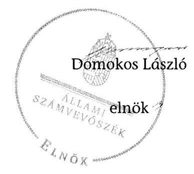

# ÁLLAMI   SZÁMVEVŐSZÉK 

## JELENTÉS

a helyi nemzetiségi önkormányzatok gazdálkodásának ellenőrzéséről
Gádoros Nagyközség Roma Nemzetiségi Önkormányzata

---

# Állami Számvevőszék 

Iktatószám: V-0788-061/2015.
Témaszám: 1822
Vizsgálat-azonosító szám: V067644

## Az ellenőrzést felügyelte:

## Brebán Andrea

felügyeleti vezető
Az ellenőrzést vezette és az ellenőrzés végrehajtásáért felelős:
Gál Magdolna
ellenőrzésvezető
A számvevőszéki jelentés összeállításában közremúködött:
Lantos Józsefné
számvevő tanácsos
Az ellenőrzést végezték:
Hálóné Pelikán Veronika Lantos Józsefné
számvevő
számvevő tanácsos

---

# TARTALOMJEGYZÉK 

BEVEZETÉS ..... 3
I. ÖSSZEGZŐ MEGÁLLAPÍTÁSOK, KÖVETKEZTETÉSEK, JAVASLATOK ..... 6
II. RÉSZLETES MEGÁLLAPÍTÁSOK ..... 13

1. A Nemzetiségi Önkormányzat és a Települési Önkormányzat együttműködésének szabályozása, a működési feltételek biztosítása ..... 13
2. A gazdálkodási feladatok ellátásának szabályszerűsége ..... 15
2.1. A költségvetésre és zárszámadásra, valamint a kincstári adatszolgáltatás rendjére vonatkozó jogszabályi előírások betartása ..... 15
2.2. A Nemzetiségi Önkormányzat gazdálkodásának szabályozottsága ..... 17
2.3. Az operatív gazdálkodási jogkörök kialakítása, gyakorlása ..... 18
3. A Nemzetiségi Önkormányzattal összefüggő gazdálkodási feladatok belső ellenőrzése ..... 19
MELLÉKLET
4. számú A Nemzetiségi Önkormányzat 2013. évi gazdálkodásának adatai
FÜGGELÉKEK
5. számú Rövidítések jegyzéke
6. számú Értelmező szótár

---

.

---

# JELENTÉS 

## a helyi nemzetiségi önkormányzatok gazdálkodásának ellenőrzéséről Gádoros Nagyközség Roma Nemzetiségi Önkormányzata

## BEVEZETÉS

A Nemzetiségi Önkormányzat a 2006. évben alakult, elnöke a 2010. évi helyhatósági választások óta látja el feladatát. A Nemzetiségi Önkormányzat intézményt, gazdasági társaságot és más szervezetet nem alapított, illetve társulásban nem vett részt. A négytagú Képviselő-testület a munkája segítésére bizottságot nem hozott létre. A Nemzetiségi Önkormányzat költségvetési beszámolója szerint a 2013. évben a módosított költségvetési bevételi és kiadási előirányzat 468 ezer Ft, a teljesített költségvetési bevétel és a teljesített költségvetési kiadás 468 ezer Ft volt. A Nemzetiségi Önkormányzat a 2013. évben 246 ezer Ft feladatalapú támogatásban részesült. A 2013. évi gazdálkodási adatokat részletesen az 1. számú mellékletben mutatjuk be.

Az Alaptörvény Szabadság és felelősség rész XXIX. cikk (1) bekezdése szerint a Magyarországon élő nemzetiségek államalkotó tényezők. Minden, valamely nemzetiséghez tartozó magyar állampolgárnak joga van önazonossága szabad vállalásához és megőrzéséhez. A hazánkban élő nemzetiségek helyi (települési és területi) valamint országos önkormányzatokat hozhatnak létre ${ }^{1}$. A helyi nemzetiségi önkormányzatok gazdálkodási feladatait jogszabályi előírás alapján a székhely szerinti helyi önkormányzat polgármesteri hivatala látja el.

A nemzetiségek helyzete, támogatása mind hazai, mind EU-s szinten kiemelt figyelmet kap napjainkban. A helyi nemzetiségi önkormányzatok gazdálkodására és támogatási rendszerére vonatkozó jogszabályok a 2010-2012. években jelentős változásokon mentek át. A helyi nemzetiségi önkormányzatok gazdálkodásának, a részükre juttatott költségvetési támogatások felhasználásának ellenőrzését az ÁSZ 2012-ben sorozatjellegű ellenőrzés keretében indította el. A 2014. évi ellenőrzések az önkormányzati ellenőrzésekre ráépülő (egyablakos) ellenőrzésként valósulnak meg.

Az ellenőrzés célja annak értékelése volt, hogy a Nemzetiségi Önkormányzat gazdálkodási kereteinek kialakítása, gazdálkodása megfelelt-e a jogszabályoknak.

[^0]
[^0]:    ${ }^{1}$ A 2010. évben megtartott nemzetiségi önkormányzati választásokat követően 2304 települési, 58 területi és 13 országos nemzetiségi önkormányzat alakult meg.

---

Ennek keretében értékeltük, hogy:

- a Nemzetiségi Önkormányzat és a Települési Önkormányzat együttműködésének szabályozása, a működési feltételek biztosítása megfelelt-e a jogszabályi előírásoknak;
- a felek együttműködése megfelelt-e a megállapodásban foglaltaknak a gazdálkodási feladatok szabályszerű ellátása során, betartották-e a vonatkozó jogszabályi előírásokat;
- biztosított volt-e a Nemzetiségi Önkormányzat gazdálkodásának belső ellenőrzése.

Az ellenőrzés várható hasznosulása: a nemzetiségi önkormányzatok testületi döntéseinek tapasztalatait összegezve következtetés vonható le a törvényalkotás számára a jogszabályi környezet esetleges módosításának indokoltságára vonatkozóan. Az ellenőrzés az ellenőrzött számára visszajelzést ad a rendezett gazdálkodási keretek kialakításáról, a működésbeli hiányosságokról. Az ellenőrzés megállapításai és javaslatai, a jó gyakorlat bemutatása tanulságul szolgálhatnak más nemzetiségi önkormányzatok, szervezetek számára a rendezett gazdálkodási keretek kialakításához. A társadalom számára jelzi, hogy közpénz nem maradhat ellenőrizetlenül, az ÁSZ értékteremtő rend kialakításához és megőrzéséhez hozzájáruló tevékenysége pozitív hatással lesz a szervezetről kialakított összkép formálásában. Az ÁSZ szervezetén belül lehetőség nyílik arra, hogy a megállapítások szintetizálásával az intézmény a hozzáadott értéket teremtő elemző tevékenységét és tanácsadó szerepét erősítse.

A helyi nemzetiségi önkormányzatok gazdálkodásának ellenőrzéséről szóló jelentés I. fejezetének összegző része az ellenőrzés céljára adott rövid, szintetizáló összefoglalót és következtetéseket tartalmazza a II. fejezet részletes megállapításain alapulóan. A jelentés intézkedést igénylő megállapításait és javaslatait - az összegzőben foglaltak mellett - az ellenőrzés során feltárt, a jelentés II. fejezetében rögzített részletes megállapítások alapozzák meg, illetve támasztják alá.

Az ellenőrzés típusa: szabályszerűségi ellenőrzés.
Az ellenőrzött időszak: a Nemzetiségi Önkormányzat és a Települési Önkormányzat együttműködésének, valamint a Nemzetiségi Önkormányzat gazdálkodásának szabályozása megfelelőségét a 2013. évre vonatkozóan (a 2013. december 31-i állapotnak megfelelően), a Nemzetiségi Önkormányzat gazdálkodásának szabályszerűségét, a működési feltételek, valamint a belső ellenőrzés biztosítását a 2013. január 1. - december 31-e közötti időszakot figyelembe véve értékeltük.

Ellenőrzött szervezet: a Nemzetiségi Önkormányzat és a gazdálkodási feladatait ellátó Polgármesteri Hivatal.

Az ellenőrzés szakmai módszertana az ÁSZ hivatalos honlapján (www.asz.hu) közzétett szakmai szabályokon alapult, amely a Legfőbb Ellenőrző Intézmények Nemzetközi Szervezete (INTOSAI) által kiadott nemzetközi standardok (ISSAI) figyelembevételével készült.

---

A gazdálkodás folyamatában kulcsszerepet betöltő két kulcskontroll - teljesítésigazolás, érvényesítés - múködésének megfelelőségét teljes körűen, azaz minden, a személyi juttatásokkal, dologi és felhalmozási kiadásokkal, múködési és felhalmozási célú pénzeszköz átadásokkal, ellátottak pénzbeli juttatásaival kapcsolatos kifizetés esetében ellenőriztük. „Megfelelőnek" értékeltük a gazdálkodási jogkörök gyakorlását, amennyiben a hibaarány legfeljebb 10\%, „részben megfelelőnek" értékeltük, ha a hibaarány 10-30\% között volt, „nem megfelelőnek" pedig akkor, ha az eredmények alapján a hibaarány meghaladta a $30 \%$-ot.

Az ellenőrzés végrehajtásának jogszabályi alapját az ÁSZ tv. 5. § (2)-(3) és (6) bekezdéseiben foglaltak képezik.

Az ÁSZ tv. 29. § (1) bekezdése szerint a jelentéstervezetet megküldtük a jegyző és a Nemzetiségi Önkormányzat elnöke részére, akik az ÁSZ tv. 29. § (2) bekezdésében foglalt észrevételezési jogukkal nem éltek, a jelentéstervezetre észrevételt nem tettek.

---

# I. ÖSSZEGZŐ MEGÁLLAPÍTÁSOK, KÖVETKEZTETÉSEK, JAVASLATOK 

A Nemzetiségi Önkormányzat és a Települési Önkormányzat együttmüködésének szabályozása megfelelt a jogszabályi előírásoknak. A Nemzetiségi Önkormányzat az ellenőrzött időszakban rendelkezett hatályban lévő, a Települési Önkormányzattal történő együttmúködésre vonatkozó együttmúködési megállapodással, amelyet a Nek. tv. előírása ellenére 2013. január 31-éig nem vizsgáltak felül, 2013. március 26-i hatállyal új megállapodást kötöttek. Az együttmúködési megállapodásban a Nek. tv. előírása ellenére nem rögzítették a Nemzetiségi Önkormányzat önálló fizetési számla nyitásával, törzskönyvi nyilvántartásba vételével és adószám igénylésével kapcsolatos határidőket, valamint az önálló fizetési számla nyitásával kapcsolatban a felelősök konkrét kijelölését. Az együttműködési megállapodásban a Nek. tv. előírásának megfelelően rögzítették a Nemzetiségi Önkormányzat kötelezettségvállalásaival kapcsolatosan a Települési Önkormányzatot terhelő ellenjegyzési, érvényesítési, utalványozási, teljesítésigazolási feladatokat, továbbá kijelölték a konkrét felelősöket. A Nemzetiségi Önkormányzat kötelezettségvállalásaival kapcsolatos teljesítésigazolási feladatok ellátásának együttműködési megállapodásban történő szabályozása nem felelt meg az Ávr.-ben foglaltaknak. A nemzetiségi önkormányzati SZMSZ a jogszabályi előírásoknak megfelelően rögzítette az együttműködési megállapodás szerinti múködési feltételeket, amelyeket a települési önkormányzati SZMSZ-ben a Nek. tv.-ben előírt határidőn túl rögzítettek. A Települési Önkormányzat a szabályozási hiányosságok ellenére a 2013. évben a Nemzetiségi Önkormányzat múködéséhez szükséges személyi és tárgyi feltételeket biztosította.

A Nemzetiségi Önkormányzat 2013. évi költségvetésének és zárszámadásának tartalma, jóváhagyása, valamint a kincstári adatszolgáltatás szabályszerűsége nem felelt meg a jogszabályi előírásoknak. A Nemzetiségi Önkormányzat elnöke az Áht.-ban előírtak ellenére nem nyújtotta be határidőben a Képviselő-testület részére a 2013. évre vonatkozó költségvetési koncepciót és a költségvetési határozat-tervezetet. A 2013. évi költségvetési határozat-tervezet előterjesztésekor a Képviselő-testület részére az Áht.-ban előírtak ellenére tájékoztatásul nem mutatták be szöveges indokolással együtt a Nemzetiségi Önkormányzat költségvetési mérlegét közgazdasági tagolásban, előirányzat felhasználási tervét, valamint a közvetett támogatásokat tartalmazó kimutatást. A jóváhagyott költségvetési határozat az Áht.-ban foglalt előírások ellenére nem tartalmazta a Nemzetiségi Önkormányzat költségvetési bevételeit és költségvetési kiadásait előirányzat-csoportok, kiemelt előirányzatok, és kötelező feladatok, önként vállalt feladatok szerinti bontásban, továbbá a költségvetés végrehajtásával kapcsolatos hatásköröket, így különösen a Mötv. szerinti értékhatárt. A költségvetési határozatban a központi költségvetésből származó támogatás bevételi jogcímét helytelenül, a Nemzetiségi Önkormányzat múködéséhez kapcsolódó támogatás helyett feladatalapú támogatásként tervezték meg.

A Nemzetiségi Önkormányzat elnöke a zárszámadási határozat-tervezetet az Áht.-ban előírt határidőben terjesztette a Képviselő-testület elé. A zárszámadási határozat-tervezet előterjesztésekor a Képviselő-testület részére - a jegyző mu-

---

lasztása miatt - az Áht. előírása ellenére tájékoztatásul nem mutatták be szöveges indokolás együtt a Nemzetiségi Önkormányzat költségvetési mérlegét közgazdasági tagolásban, a pénzeszközök változását, valamint a közvetett támogatásokat tartalmazó kimutatást. A zárszámadásról szóló határozat összehasonlíthatósága az elfogadott költségvetéssel az Áht. előírása ellenére nem volt biztosított. A bevételi és kiadási előirányzatokat az év közben folyósított feladatalapú támogatás összegével az Áht.-ban foglaltak ellenére nem módosították, ennek ellenére a zárszámadási határozatban, valamint az éves elemi költségvetési beszámolóban a módosított előirányzat összege a feladatalapú támogatás összegét is tartalmazta. A Nemzetiségi Önkormányzat éves elemi költségvetési beszámolójában emiatt sérült a Számv. tv. szerinti valódiság elve.

A jegyző a Nemzetiségi Önkormányzatra vonatkozó kincstári adatszolgáltatási kötelezettségének nem minden esetben tett határidőre eleget, mert az időközi költségvetési jelentéseket, valamint az időközi mérlegjelentéseket négy esetben az Ávr.-ben előírt határidőn túl nyújtotta be a Kincstár területileg illetékes szervének. A 2013. I. féléves és a 2013. évi elemi költségvetési beszámolók kincstári adatszolgáltatásánál az Áhsz., szerinti határidőt nem tartották be.

A Nemzetiségi Önkormányzat gazdálkodásának szabályozottsága az ellenőrzött időszakban részben felelt meg a jogszabályi előírásoknak. A Nemzetiségi Önkormányzat gazdálkodási feladatait ellátó Polgármesteri Hivatal rendelkezett a 2013. évben a Számv. tv.-ben előírt szabályzatokkal, amelyek kiterjedtek a Nemzetiségi Önkormányzat gazdálkodásával összefüggő végrehajtási feladatokra is. A jegyző által elkészített - a hivatali feladatok ellátására vonatkozó ellenőrzési nyomvonal, valamint a szabálytalanságok kezelésének eljárásrendje a Bkr. előírása ellenére nem tartalmazta a Nemzetiségi Önkormányzat gazdálkodásával összefüggő végrehajtási feladatokra vonatkozó előírásokat. A jegyző - a Bkr. előírása ellenére - a Nemzetiségi Önkormányzat gazdálkodási feladataira vonatkozóan nem biztosította a folyamatba épített, előzetes, utólagos és vezetői ellenőrzést.

A Polgármesteri Hivatal SZMSZ-e az Ávr.-ben előírtak ellenére nem tartalmazta a Polgármesteri Hivatal SZMSZ-ében nevesített munkakörökhöz tartozó, a Nemzetiségi Önkormányzat gazdálkodásával kapcsolatos feladat- és hatásköröket, a hatáskörök gyakorlásának módját, a helyettesítés rendjét, az ezekhez kapcsolódó felelősségi szabályokat. A jegyző a Nemzetiségi Önkormányzat gazdálkodási feladatai ellátásával kapcsolatban a tervezéssel, gazdálkodással, eljárási és dokumentációs részletszabályaival, valamint az ezeket végző személyek kijelölésének rendjével, továbbá az ellenőrzési, adatszolgáltatási és beszámolási feladatok teljesítésével kapcsolatos belső előírásokat, feltételeket - az együttmúködési megállapodásban rögzítettekkel összhangban - a gazdálkodási szabályzatban rendezte.

A Polgármesteri Hivatalban a gazdálkodási feladatokat ellátó köztisztviselők munkaköri leírásai a Kttv. előírása ellenére nem rögzítették a Nemzetiségi Önkormányzat gazdálkodási feladatai ellátásával kapcsolatos feladatokat.

A Nemzetiségi Önkormányzat gazdálkodása tekintetében az operatív gazdálkodási jogkörök kialakítása nem felelt meg a jogszabályi előírásoknak. A gazdasági vezető nem rendelkezett az Ávr.-ben előírt felsőoktatásban szerzett végzettséggel. A Nemzetiségi Önkormányzatnál a 2013. évben a dologi kiadásokkal

---

kapcsolatos kifizetések teljesítése során az operatív gazdálkodási jogkörökön belül kulcsszerepet betöltő teljesítésigazolás és az érvényesítés kulcskontrollok működése nem felelt meg a jogszabályi előírásoknak, emiatt azok nem biztosították a hibák megelőzését és feltárását. A számvevőszéki ellenőrzés az ellenőrzött kifizetésekkel összefüggésben a rendelkezésre bocsátott dokumentumok alapján kár bekövetkeztére utaló adatot, tényt nem állapított meg, azonban a gazdálkodásban kulcsszerepet betöltő kontrollok működésében feltárt hiányosságok miatt fennáll a hibák és szabálytalanságok bekövetkezésének kockázata. A nem megfelelően működtetett belső kontrollok korrupciós kockázatot hordoznak.

A Nemzetiségi Önkormányzattal összefüggő gazdálkodási feladatok belső ellenőrzése nem felelt meg a jogszabályi előírásoknak. A jegyző a Bkr.-ben foglalt előírások ellenére az ellenőrzött időszakban nem gondoskodott a Polgármesteri Hivatalnál a Nemzetiségi Önkormányzat gazdálkodásával összefüggő végrehajtási feladatok belső ellenőrzésének kialakításáról és működtetéséről. A Nemzetiségi Önkormányzat gazdálkodásával összefüggő végrehajtási feladatokra vonatkozóan belső ellenőrzést a 2013. évben nem terveztek és nem végeztek.

Az ÁSZ tv. 33. § (1) bekezdésében foglaltak értelmében az ellenőrzött szervezet vezetője köteles a jelentésben foglalt megállapításokhoz kapcsolódó intézkedési tervet összeállítani és azt a jelentés kézhezvételétől számított 30 napon belül az ÁSZ részére megküldeni. Amennyiben az intézkedési tervet határidőre nem küldi meg a szervezet, vagy az ÁSZ tv. 33. § (2) bekezdésében foglalt póthatáridő elteltével megküldött intézkedési terv továbbra sem elfogadható, az ÁSZ elnöke a hivatkozott törvény 33. § (3) bekezdés a)-b) pontjaiban foglaltakat érvényesítheti.

A helyszíni ellenőrzés megállapításainak hasznosítása mellett javasoljuk:

# a jegyzőnek 

1. Az együttműködés szabályozásával kapcsolatban

A Nemzetiségi Önkormányzat és a Települési Önkormányzat együttműködését meghatározó együttműködési megállapodás tartalma nem felelt meg a Nek. tv. 80. § (3) bekezdés a) pontjában foglaltaknak. A Nek. tv. 80. § (2) bekezdésében foglaltak ellenére 2013. január 31-éig nem végezték el az együttműködési megállapodás felülvizsgálatát.

Az együttműködési megállapodás szerinti működési feltételeket a Nek. tv. 80. § (2) bekezdésében előírtak szerinti határidőn túl rögzítették a Települési Önkormányzat SZMSZ-ében.

Javaslat
Az együttműködés szabályszerűsége érdekében:
a) készítse elő az együttműködési megállapodás módosítását, hogy az feleljen meg a Nek. tv-ben foglalt előírásoknak és terjessze a módosítást a Települési Önkormányzat Képviselő-testülete elé;

---

b) gondoskodjon az együttműködési megállapodás évenkénti felülvizsgálata és a működési feltételek SZMSZ-ben való rögzítése során a Nek. tv-ben előírt határidő betartásáról.
2. A költségvetés és zárszámadás szabályszerűségével kapcsolatban

A 2013. évi költségvetési határozat az Áht. 23. § (2) bekezdés a) és h) pontjainak előírásától eltérően nem tartalmazta a költségvetési bevételek és a költségvetési kiadások előirányzat-csoportok, kiemelt előirányzatok, és kötelező feladatok, önként vállalt feladatok szerinti bontásban, továbbá a költségvetés végrehajtásával kapcsolatos hatásköröket, így különösen a Mötv. 68. § (4) bekezdése szerinti értékhatárt.

A 2013. évi költségvetési határozat-tervezet előterjesztésekor a Képviselő-testület részére az Áht. 24. § (4) bekezdés a) és c) pontjaiban foglalt előírásoktól eltérően tájékoztatásul nem mutatták be szöveges indokolással együtt a Nemzetiségi Önkormányzat költségvetési mérlegét közgazdasági tagolásban, előirányzat felhasználási tervét, valamint a közvetett támogatásokat tartalmazó kimutatást. A 2013. évi zárszámadási határozat-tervezet előterjesztésekor - a jegyző mulasztása miatt - a Képviselő-testület részére tájékoztatásul nem mutatták be szöveges indokolással együtt az Áht. 91. § (2) bekezdés a) pontja alapján az Áht. 24. § (4) bekezdés a) és c) pontjai szerinti költségvetési mérleget közgazdasági tagolásban, a pénzeszközök változását, valamint a közvetett támogatásokat tartalmazó kimutatást.

A bevételi és kiadási előirányzatokat az év közben folyósított feladatalapú támogatás összegével az éves költségvetési beszámoló elkészítésének határidejéig az Áht. 34. § (5) bekezdése ellenére nem módosították, az előirányzat-módosításról az Áht. 34. § (1) bekezdése szerinti határozatot nem hoztak. A Nemzetiségi Önkormányzat zárszámadási határozatában, valamint a Kincstárhoz benyújtott éves elemi költségvetési beszámolójában - az előirányzat-módosításról szóló határozat nélkül - a módosított előirányzat összege a feladatalapú támogatás összegét is tartalmazta, emiatt a Nemzetiségi Önkormányzat éves elemi költségvetési beszámolójában sérült a Számv. tv. 15. § (3) bekezdés szerinti valódiság elve.

Javaslat
a) Intézkedjen a jövőben arról, hogy a költségvetési határozat az Áht.-ban előírtaknak tartalmilag maradéktalanul feleljen meg;
b) Intézkedjen a jövőben arról, hogy a költségvetési és zárszámadási határozat-tervezet előterjesztésekor a Képviselő-testületnek tájékoztatásul maradéktalanul bemutatásra kerüljenek szöveges indoklással együtt az Áht.-ban előírt mérlegek és kimutatások;
c) Intézkedjen a jövőben arról, hogy előirányzat módosításra az Áht. előírásai szerinti határozatok mellett és legkésőbb az éves költségvetési beszámoló elkészítésének határidejéig kerüljön sor.
3. A kincstári adatszolgáltatási kötelezettséggel kapcsolatban

A jegyző a Nemzetiségi Önkormányzatra vonatkozó kincstári adatszolgáltatási kötelezettségének határidőn túl tett eleget, mert a 2013. év első három hónapjáról és az év első hat hónapjáról készített időközi költségvetési jelentést nem az Ávr. 169. § (2)

---

bekezdése szerinti határidőre, továbbá az I. és a II. negyedéves időközi mérlegjelentéseket nem az Ávr. 170. § (5) bekezdése szerinti határidőre küldte meg a Kincstár területileg illetékes szervéhez.

Javaslat
Tegyen eleget a kincstári adatszolgáltatási kötelezettségének - az ellenőrzött időszak óta bekövetkezett esetleges jogszabályi változásokra figyelemmel - az Ávr.-ben foglalt határidők betartásával.
4. A gazdálkodási feladatok szabályozottságával kapcsolatban

A Polgármesteri Hivatal SZMSZ-e nem tartalmazta az Ávr. 13. § (1) bekezdés e) pontja szerinti gazdasági szervezet létszámát, továbbá az Ávr. 13. § (1) bekezdés g) pontjai előírásától eltérően az SZMSZ-ben nevesített munkakörökhöz tartozó - a Nemzetiségi Önkormányzat gazdálkodásával kapcsolatos - feladat és hatásköröket és a helyettesítés rendjét, a hatáskörök gyakorlásának módját, valamint az ezekhez kapcsolódó felelősségi szabályokat.

A jegyző által elkészített - a hivatali feladatok ellátására vonatkozó - ellenőrzési nyomvonal, valamint a szabálytalanságok kezelésének eljárásrendje a Bkr. 6. § (3) és (4) bekezdéseiben előírtak ellenére nem tartalmazta a Nemzetiségi Önkormányzat gazdálkodásával összefüggő végrehajtási feladatokra vonatkozó előírásokat. A jegyző - a Bkr. 8. § (2) bekezdésének előírása ellenére - a Nemzetiségi Önkormányzatra vonatkozóan nem biztosította a folyamatba épített, előzetes, utólagos és vezetői ellenőrzést.

Javaslat
A Nemzetiségi Önkormányzat gazdálkodásának végrehajtásával kapcsolatos feladataira
a) készítse el a Polgármesteri Hivatal SZMSZ-ének módosítását, hogy az teljes körűen feleljen meg az Ávr.-ben foglalt előírásnak és terjessze a módosítást a Települési Önkormányzat Képviselő-testülete elé;
b) vonatkozóan egészítse ki a Bkr.-ben meghatározott ellenőrzési nyomvonalat és a szabálytalanságok kezelésének eljárásrendjét;
c) biztosítsa a Bkr.-ben foglaltaknak megfelelően a folyamatba épített, előzetes, utólagos és vezetői ellenőrzést.
5. A kulcskontrollok múködésével kapcsolatban

A teljesítésigazolást az Ávr. 57. § (1) bekezdésben foglaltak ellenére nem végezték el.
Az érvényesítést az Ávr. 58. § (1) bekezdésében foglaltak ellenére nem végezték el, illetve nem szabályszerűen végezték. Az érvényesítő az Ávr. 58. § (1) bekezdésében foglaltak ellenére a fedezet meglétét nem ellenőrizte, az Ávr. 58. § (3) bekezdésében foglaltak ellenére az érvényesítés nem tartalmazta az érvényesítés keltezését. Az érvényesítő - az Ávr. 58. § (2) bekezdésében előírtak ellenére - nem jelezte az utalványozónak, hogy a megelőző ügymenetben a teljesítésigazolást nem végezték el. Nem jelezte továbbá, hogy az Ávr. 60. § (3) bekezdésében előírtak ellenére az operatív

---

gazdálkodási jogkörök gyakorlására jogosult személyekről és aláírás-mintájukról nem vezettek naprakész nyilvántartást.

Javaslat
Az operatív gazdálkodás működési hibáinak megelőzése, feltárása és kijavítása érdekében intézkedjen a teljesítésigazolás és az érvényesítés Ávr.-ben foglalt előírásoknak megfelelő elvégzéséről.

# a Nemzetiségi Önkormányzat elnökének 

1. A Nemzetiségi Önkormányzat és a Települési Önkormányzat együttműködését meghatározó együttműködési megállapodás tartalma nem felelt meg a Nek. tv. 80. § (3) bekezdés a) pontjában foglaltaknak.

Javaslat
Terjessze a Képviselő-testület elé jóváhagyásra a jegyző által előkészített a Nek. tv-ben foglaltaknak megfelelő együttműködési megállapodás módosítását.
2. A Nemzetiségi Önkormányzat elnöke - a határidőben történő elkészítés hiánya miatt - a 2013. évi költségvetési határozat-tervezetet nem nyújtotta be a Képviselő-testület részére az Áht. 24. § (2) bekezdésében meghatározott határidőig.

A Nemzetiségi Önkormányzat elnöke a Képviselő-testület részére tájékoztatásul nem mutatta be a költségvetési határozat-tervezet előterjesztésekor az Áht. 24. § (4) bekezdés a) és c) pontjaiban előírtak ellenére szöveges indokolással együtt a Nemzetiségi Önkormányzat költségvetési mérlegét közgazdasági tagolásban, előirányzat felhasználási tervét, valamint a közvetett támogatásokat tartalmazó kimutatást. A 2013. évi zárszámadási határozat-tervezet előterjesztésekor - a jegyző mulasztása miatt - a Kép-viselő-testület részére tájékoztatásul nem mutatta be szöveges indokolással együtt az Áht. 91. § (2) bekezdés a) pontjai alapján az Áht. 24. § (4) bekezdés a) és c) pontjai szerinti költségvetési mérleget közgazdasági tagolásban, a pénzeszközök változását, valamint a közvetett támogatásokat tartalmazó kimutatást.

A bevételi és kiadási előirányzatokat az év közben folyósított feladatalapú támogatás összegével az éves költségvetési beszámoló elkészítésének határidejéig az Áht. 34. § (5) bekezdése ellenére nem módosították, az előirányzat-módosításról az Áht. 34. § (1) bekezdése szerinti határozatot nem hoztak. A Nemzetiségi Önkormányzat zárszámadási határozatában, valamint a Kincstárhoz benyújtott éves elemi költségvetési beszámolójában - az előirányzat-módosításról szóló határozat nélkül - a módosított előirányzat összege a feladatalapú támogatás összegét is tartalmazta, emiatt a Nemzetiségi Önkormányzat éves elemi költségvetési beszámolójában sérült a Számv. tv. 15. § (3) bekezdés szerinti valódiság elve.

Javaslat
A Képviselő-testület részére:
a) történő előterjesztésekor gondoskodjon a költségvetési határozat-tervezet esetében az Áht.-ban meghatározott határidők betartásáról;

---

b) tájékoztatásul mutassa be a költségvetési és a zárszámadási határozat-tervezet előterjesztésekor szöveges indoklással együtt az Áht.-ban előírt valamennyi mérleget, kimutatást;
c) terjessze be a jegyző által elkészített, az előirányzatok szükséges módosítására vonatkozó határozat-tervezetet.

---

# II. RÉSZLETES MEGÁLLAPÍTÁSOK 

## 1. A Nemzetiségi Önkormányzat És a Települési ÖnkormányZAT EGYÜTTMÜKÖDÉSÉNEK SZABÁLYOZÁSA, A MÜKÖDÉSI FELTÉTELEK BIZTOSÍTÁSA

A Nemzetiségi Önkormányzat és a Települési Önkormányzat együttmüködésének szabályozása megfelelt a jogszabályi előírásoknak.

A Nemzetiségi Önkormányzat az ellenőrzött időszakban rendelkezett hatályban lévő, a Települési Önkormányzattal történő együttműködésre vonatkozó együttműködési megállapodással. Az együttműködési megállapodást a Képviselő-testület, valamint a Települési Önkormányzat Képviselő-testülete határozattal jóváhagyta és az arra jogosult személyek aláírták.

Az együttműködési megállapodást a Települési Önkormányzat a 144/2012. (XI. 27.) KT. számú, a Nemzetiségi Önkormányzat a 6/2012. (XI. 22.) RNÖ számú határozatával hagyta jóvá.

Az együttműködési megállapodást a Nek. tv. 80. § (2) bekezdésében foglaltak ellenére 2013. január 31-éig nem vizsgálták felül, 2013. március 26-i hatállyal új megállapodás ${ }^{2}$ kötöttek.

A nemzetiségi önkormányzati SZMSZ a Nek. tv.-ben foglalt előírásoknak megfelelően rögzítette az együttműködési megállapodás szerinti múködési feltételeket, amelyeket a településí önkormányzati SZMSZ-ben - a Nek. tv. 80. § (2) bekezdésében ${ }^{3}$ foglaltak ellenére - az együttműködési megállapodás megkötését követő 30 napon túl ${ }^{4}$ rögzítettek.

A 2013. december 31-én hatályos együttműködési megállapodásban rögzítették a Nemzetiségi Önkormányzat múködésének feltételeit és - az Áht. 27. §. (2) bekezdése ${ }^{5}$ előírásának megfelelően - rendezték a Nemzetiségi Önkormányzat bevételeivel és kiadásaival kapcsolatban a tervezési, gazdálkodási, valamint az ellenőrzési, finanszírozási, adatszolgáltatási és beszámolási feladatok ellátásának részletes szabályait ${ }^{6}$.

[^0]
[^0]:    ${ }^{2}$ Az új együttműködési megállapodást a Települési Önkormányzat a 18/2013. (II. 19.) számú, a Nemzetiségi Önkormányzat a 3/2013. (III. 26.) számú határozatával hagyta jóvá.
    ${ }^{3}$ Módosította: 2014. évi XCIX. tv. 362. § 2. pontja, hatályos 2015. január 1-jétől.
    ${ }^{4}$ A települési önkormányzati SZMSZ-ben a 2013. március 26-án hatályba lépett együttműködési megállapodás szerinti működési feltételeket 2013. szeptember 19-én rögzítették. A települési önkormányzati SZMSZ 21. § (3) bekezdés e) pontjában foglaltak alapján előterjesztés benyújtására jogosult a jegyző.
    ${ }^{5}$ 2015. január 1-jétől hatálytalan.
    ${ }^{6}$ Az együttműködési megállapodásban - az ott tételesen nem szabályozott feladatok vonatkozásában - a Nemzetiségi Önkormányzatra is kiterjesztett gazdálkodási szabályzatban foglalt előírások alkalmazását előírták.

---

Az együttműködési megállapodásban a Nek. tv. 80. § (3) bekezdés a) pontja előírása ellenére nem rögzítették a Nemzetiségi Önkormányzat önálló fizetési számla nyitásával, törzskönyvi nyilvántartásba vételével és adószám igénylésével kapcsolatos határidőket, valamint az önálló fizetési számla nyitásával kapcsolatban a felelősök konkrét kijelölését.

Az együttműködési megállapodásban a Nek. tv. 80. § (3) bekezdés b) pontja előírásának megfelelően rögzítették a Nemzetiségi Önkormányzat kötelezettségvállalásaival kapcsolatosan a Települési Önkormányzatot terhelő ellenjegyzési, érvényesítési, utalványozási, teljesítésigazolási feladatokat, továbbá kijelölték a konkrét felelősöket. A Nemzetiségi Önkormányzat kötelezettségvállalásaival kapcsolatos teljesítésigazolási feladatok ellátásának - együttműködési megállapodásban történő - szabályozása nem felelt meg az Ávr. 57. (4) bekezdésében foglaltaknak.

Az együttműködési megállapodás szerint a teljesítés igazolására a Nemzetiségi Önkormányzat nevében a jegyző, vagy a jegyző megbízása alapján a megbízott személy jogosult, annak ellenére, hogy a jogszabályi előírás - az Ávr. 52. § (7) bekezdése - alapján a Nemzetiségi Önkormányzat kiadási előirányzatai terhére kötelezettséget vállalni a Nemzetiségi Önkormányzat elnöke vagy az általa írásban felhatalmazott nemzetiségi önkormányzati képviselő jogosult ${ }^{7}$, ezáltal az adott kötelezettségvállaláshoz, vagy a kötelezettségvállalások előre meghatározott csoportjaihoz kapcsolódóan a teljesítés igazolására jogosult személyek kijelölésére az Ávr. 57. § (4) bekezdése értelmében a jegyző nem, hanem kizárólag a Nemzetiségi Önkormányzat elnöke vagy az általa írásban felhatalmazott nemzetiségi önkormányzati képviselő lehet jogosult.

Az együttműködési megállapodásban - a Nek. tv. 80. § (3) bekezdés c) és d) pontjában előírtaknak megfelelően - rögzítették a Nemzetiségi Önkormányzat kötelezettségvállalásának a szervezeti és működési szabályzatban meghatározott szabályait, különösen az összeférhetetlenségi, nyilvántartási kötelezettségeket, illetve a Nemzetiségi Önkormányzat múködési feltételeinek és gazdálkodásának eljárási és dokumentációs részletszabályaival, valamint az ezeket végző személyek kijelölésének rendjével, és az adatszolgáltatási feladatok teljesítésével kapcsolatos előírásokat, feltételeket. Az együttműködési megállapodásban - a Nek. tv. 80. § (4) bekezdésében előírtaknak megfelelően - rögzítették, hogy a jegyző vagy annak - a jegyzővel azonos képesítési előírásoknak megfelelő - megbízottja a Települési Önkormányzat megbízásából és képviseletében részt vesz a Nemzetiségi Önkormányzat testületi ülésein és jelzi, amennyiben törvénysértést észlel.

A Települési Önkormányzat - a szabályozási hiányosságok ellenére - a 2013. évben a Nemzetiségi Önkormányzat múködéséhez szükséges személyi és tárgyi feltételeket biztosította.

[^0]
[^0]:    ${ }^{7}$ Az együttműködési megállapodásban a kötelezettségvállalásra való jogosultságot az Ávr. 52. § (7) bekezdése előírásával összhangban rögzítették.

---

# 2. A GAZDÁLKODÁSI FELADATOK ELLÁTÁSÁNAK SZABÁLYSZERŰSÉGE 

### 2.1. A költségvetésre és zárszámadásra, valamint a kincstári adatszolgáltatás rendjére vonatkozó jogszabályi előírások betartása

A Nemzetiségi Önkormányzat 2013. évi költségvetésének és zárszámadásának tartalma, jóváhagyása, valamint a kincstári adatszolgáltatás szabályszerűsége nem felelt meg a jogszabályi előírásoknak.

A Nemzetiségi Önkormányzat elnöke - az Áht. 24. § (1) bekezdésében ${ }^{8}$ előírtaktól eltérően - 2012. október 31. helyett 2012. december 19-én nyújtotta be a Kép-viselő-testülete részére a jegyző által elkészített 2013. évre vonatkozó költségvetési koncepciót ${ }^{9}$.

A Nemzetiségi Önkormányzat elnöke - az Áht. 24. § (2) bekezdésében ${ }^{10}$ előírtak ellenére, a jegyző mulasztása miatt ${ }^{11}$ - a központi költségvetésről szóló törvény hatálybalépését követő 45. napig nem benyújtotta be a Képviselő-testület részére a 2013. évi költségvetési határozat-tervezetet. A 2013. évi költségvetési javaslatot a Nemzetiségi Önkormányzat elnöke 2013. március 18-án nyújtotta be ${ }^{12}$.

A 2013. évi költségvetési határozat-tervezet előterjesztésekor a Képviselő-testület részére - az Áht. 24. § (4) bekezdése a) és c) pontjaiban előírtak ellenére - tájékoztatásul nem mutatták be szöveges indokolással együtt a Nemzetiségi Önkormányzat költségvetési mérlegét közgazdasági tagolásban, előirányzat felhasználási tervét, valamint a közvetett támogatásokat tartalmazó kimutatást. A Nemzetiségi Önkormányzat a 2013. évben több éves kihatású döntést nem hozott.

A jóváhagyott költségvetési határozat - az Áht. 23. § (2) bekezdése a) és h) pontjaiban ${ }^{13}$ foglalt előírások ellenére - nem tartalmazta a Nemzetiségi Önkormányzat költségvetési bevételeit és költségvetési kiadásait előirányzat-csoportok, kiemelt előirányzatok, és kötelező feladatok, önként vállalt feladatok szerinti bontásban, továbbá a költségvetés végrehajtásával kapcsolatos hatásköröket, így különösen a Mötv. 68. § (4) bekezdése szerinti értékhatárt. A jóváhagyott költségvetési határozatában az Ávr. 24. § (1) bekezdés a) pontja alapján meghatá-

[^0]
[^0]:    ${ }^{8}$ 2014. szeptember 30-tól hatálytalan.
    ${ }^{9}$ A 2013. évi költségvetési koncepciót a Képviselő-testület a 11/2012. (XII. 27.) RNÖ határozatával fogadta el.
    ${ }^{10}$ 2013. december 21-étől az Áht. 24. § (3) bekezdése írja elő.
    ${ }^{11}$ A jegyző a 2013. évi költségvetési határozat-tervezetet 2013. március 12-én készítette elő.
    ${ }^{12}$ A 2013. évi költségvetést a Képviselő-testület a 2/2013. (III. 26.) RNÖ határozatával fogadta el.
    ${ }^{13}$ Módosította: 2014. évi XCIX. törvény 20. §-a, hatályos 2015. január 1-jétől.

---

rozták a Nemzetiségi Önkormányzat központi költségvetésből származó támogatását, azonban annak bevételi jogcímét helytelenül, a Nemzetiségi Önkormányzat múködéséhez kapcsolódó támogatás helyett feladatalapú támogatásként tervezték meg.

A Nemzetiségi Önkormányzat 2013. évi költségvetése készítése időpontjában a feladatalapú támogatás összege még nem volt ismert, mivel a támogatónak a támogatási kormányrendelet 5. § (5) bekezdése alapján meghozott támogatási döntése 2013. augusztus 9-én jelent meg a Hivatalos Értesítő 2013. évi 40. számában ${ }^{14}$. A támogatónak a tervezés időpontjában közzétett közleménye a területi nemzetiségi önkormányzatoknak a központi költségvetésből nyújtott 2013. évi múködési költségvetési támogatás éves összegét tartalmazta ${ }^{15}$.

A jegyző által elkészített zárszámadási határozat-tervezetet a Nemzetiségi Önkormányzat elnöke - az Áht. 91. § (1) bekezdésében ${ }^{16}$ előírt határidőben 2014. január 24-én terjesztette a Képviselő-testület elé ${ }^{17}$. A zárszámadási hatá-rozat-tervezet előterjesztésekor a Képviselő-testület részére - a jegyző mulasztása miatt, az Áht. 24. § (4) a) és c) pontjaiban és az Áht. 91. § (2) bekezdés a) pontjában foglaltak ellenére - nem mutatták be tájékoztatásul szöveges indokolás együtt a mérlegek és kimutatások közül a költségvetési mérleget közgazdasági tagolásban, a pénzeszközök változását, valamint a közvetett támogatásokat tartalmazó kimutatást.

A zárszámadási határozatnak az elfogadott költségvetéssel való összehasonlíthatósága az Áht. 89. § (1) ${ }^{18}$ bekezdés előírása ellenére nem volt biztosított, mivel az elfogadott költségvetésben és a zárszámadásban a tervezett és tényleges bevételeket és kiadásokat eltérő bontásban mutatták be.

A bevételi és kiadási előirányzatokat az év közben folyósított feladatalapú támogatás összegével az éves költségvetési beszámoló elkészítésének határidejéig az Áht. 34. § (5) bekezdése ${ }^{19}$ ellenére nem módosították, az előirányzat-módosításról az Áht. 34. § (1) bekezdése szerinti határozatot nem hoztak. A Nemzetiségi Önkormányzat zárszámadási határozatában, valamint a Kincstárhoz benyújtott éves elemi költségvetési beszámolójában - az előirányzat-módosításról szóló határozat nélkül - a módosított előirányzat összege a feladatalapú támogatás összegét is tartalmazta, emiatt a Nemzetiségi Önkormányzat éves elemi költségvetési beszámolójában sérült a Számv. tv. 15. § (3) bekezdés szerinti valódiság elve.

[^0]
[^0]:    ${ }^{14}$ EMMI közlemény a települési és területi nemzetiségi önkormányzatok központi költségvetésből nyújtott 2013. évi feladatalapú költségvetési támogatás döntéséről.
    ${ }^{15}$ EMMI közlemény a települési és a területi nemzetiségi önkormányzatoknak a központi költségvetésből nyújtott 2013. évi múködési költségvetési támogatás éves összegéről. Megjelent 2013. február 12-én a Hivatalos Értesítő 2013. évi 7. számában.
    ${ }^{16}$ Módosította: 2014. évi XCIX. törvény 42. §-a, hatályos 2015. január 1-jétől.
    ${ }^{17}$ A 2013. évi költségvetésről szóló zárszámadást a Képviselő-testület 2014. február 3-án tárgyalta és fogadta el 1/2014. (II. 3.) RNÖ határozatával.
    ${ }^{18}$ 2015. január 1-jétől hatálytalan.
    ${ }^{19}$ 2015. január 1-jétől a 2014. évi XCIX. törvény 26. §-a módosította.

---

A jegyző a Nemzetiségi Önkormányzatra vonatkozó kincstári adatszolgáltatási kötelezettségének nem minden esetben tett határidőre eleget, mert a 2013. év első három hónapjáról és az év első hat hónapjáról készült időközi költségvetési jelentést nem az Ávr. 169. § (2) bekezdés ${ }^{20}$ szerinti határidőre ${ }^{21}$, továbbá az I. és II. negyedéves időközi mérlegjelentést nem az Ávr. 170. § (5) bekezdés ${ }^{22}$ szerinti határidőre ${ }^{23}$ küldte meg a Kincstár területileg illetékes szervének. A jegyző a Nemzetiségi Önkormányzat 2013. évi elemi költségvetési beszámolóját az Áhsz. ${ }_{1} 10 . \S$ (1) bekezdés szerinti határidőt túllépve készítette el ${ }^{24}$. A 2013. I. féléves és a 2013. évi elemi költségvetési beszámolók kincstári adatszolgáltatásánál az Áhsz. ${ }_{1} 10 . \S$ (5a) bekezdés ${ }^{25}$ szerinti határidőt nem tartották be ${ }^{26}$.

# 2.2. A Nemzetiségi Önkormányzat gazdálkodásának szabályozottsága 

A Nemzetiségi Önkormányzat gazdálkodásának szabályozottsága az ellenőrzött időszakban részben felelt meg a jogszabályi előírásoknak.

A Nemzetiségi Önkormányzat gazdálkodási feladatait ellátó Polgármesteri Hivatal rendelkezett a 2013. évben a Számv. tv. 14. § (3), (5) bekezdéseiben és a 161. § (1) bekezdésében előírt szabályzatokkal, amelyek kiterjedtek a Nemzetiségi Önkormányzat gazdálkodásával összefüggő végrehajtási feladatokra is.

A Polgármesteri Hivatal SZMSZ-e az Ávr. 13. § (1) bekezdés e) ${ }^{27}$ és g) pontjaiban előírtak ellenére nem tartalmazta a gazdasági szervezet engedélyezett létszámát, továbbá a Polgármesteri Hivatal SZMSZ-ében nevesített munkakörökhöz tartozó, a Nemzetiségi Önkormányzat gazdálkodásával kapcsolatos feladat- és hatásköröket, a hatáskörök gyakorlásának módját, a helyettesítés rendjét, az ezekhez kapcsolódó felelősségi szabályokat.

A jegyző a Nemzetiségi Önkormányzat gazdálkodási feladatai ellátásával kapcsolatban - az Ávr. 13. § (2) bekezdés a) pontban foglaltak szerinti kérdésköröket - a tervezéssel, gazdálkodással - így különösen a kötelezettségvállalás, ellenjegyzés, teljesítés igazolása, érvényesítés, utalványozás gyakorlásának módjával, eljárási és dokumentációs részletszabályaival, valamint az ezeket végző személyek

[^0]
[^0]:    ${ }^{20}$ 2015. január 1-jétől az Ávr. 169. § (3) bekezdése szabályozza.
    ${ }^{21}$ A Nemzetiségi Önkormányzat időközi költségvetési jelentését a költségvetési év első három hónapjáról 2013. április 22. helyett 2013. április 24-én, az év első hat hónapjáról 2013. július 22. helyett 2013. augusztus 13-án küldték meg a Kincstárnak.
    ${ }^{22}$ 2015. január 1-jétől az Ávr. 170. § (2) bekezdése szabályozza.
    ${ }^{23}$ A Nemzetiségi Önkormányzat időközi mérlegjelentését az első negyedévet követő hónap 25. napja helyett 2013. április 30-án, a második negyed évet követő hónap 25. napja helyett 2013. július 29-én küldték meg.
    ${ }^{24}$ A 2013. éves elemi költségvetési beszámoló 2014. március 17-én készült el.
    ${ }^{25}$ 2014. január 1-jétől az Áhsz. 2 32. § (4) bekezdése szabályozza.
    ${ }^{26}$ A Nemzetiségi Önkormányzat 2013. I. féléves elemi költségvetési beszámolóját 2013. augusztus 12. helyett 2013. augusztus 26-án, a 2013. éves elemi költségvetési beszámolót 2014. március 10. helyett 2014. április 1-jén küldték meg.
    ${ }^{27}$ Módosította: 397/2014. (XII.31.) Korm. rendelet 45. § (1) bekezdés 3. pontja, hatályos 2015. január 1-jétől.

---

kijelölésének rendjével, továbbá az ellenőrzési, adatszolgáltatási és beszámolási feladatok teljesítésével kapcsolatos belső előírásokat, feltételeket - az együttmúködési megállapodásban rögzítettekkel összhangban - a gazdálkodási szabályzatban rendezte.

A Polgármesteri Hivatalban a gazdálkodási feladatokat ellátó köztisztviselők munkaköri leírásaiban - a Kttv. 75. § (1) bekezdés d) pontja ellenére - nem rögzítették a Nemzetiségi Önkormányzat gazdálkodási feladatai ellátásával kapcsolatos feladatokat.

A jegyző által elkészített - a hivatali feladatok ellátására vonatkozó -ellenőrzési nyomvonal, valamint a szabálytalanságok kezelésének eljárásrendje a Bkr. 6. § (3) és (4) bekezdéseiben előírtak ellenére nem tartalmazta a Nemzetiségi Önkormányzat gazdálkodásával összefüggő végrehajtási feladatokra vonatkozó előírásokat.

A jegyző - a Bkr. 8. § (2) bekezdésének előírása ellenére - a Nemzetiségi Önkormányzat gazdálkodási feladataira vonatkozóan nem biztosította a folyamatba épített, előzetes, utólagos és vezetői ellenőrzést.

# 2.3. Az operatív gazdálkodási jogkörök kialakítása, gyakorlása 

A Nemzetiségi Önkormányzat gazdálkodása tekintetében az operatív gazdálkodási jogkörök kialakítása nem felelt meg a jogszabályi előírásoknak.

A Polgármesteri Hivatal az ellenőrzött időszakban rendelkezett gazdasági szervezettel. A jegyző - az Ávr. 13. § (5) bekezdésében foglaltak ellenére - sem a gazdasági szervezet ügyrendjében, sem más belső szabályzatban nem rendelkezett a gazdasági feladatot ellátó vezető és a gazdasági feladatot ellátó alkalmazottak helyettesítésének rendjéről.

A gazdasági vezető nem rendelkezett az Ávr. 12. § (1) bekezdésében ${ }^{28}$ előírt felsőoktatásban szerzett végzettséggel ${ }^{29}$.

A Nemzetiségi Önkormányzatnál a 2013. évben a dologi kiadásokkal kapcsolatos kifizetések teljesítése során az operatív gazdálkodási jogkörökön belül kulcsszerepet betöltő teljesítésigazolás és az érvényesítés kulcskontrollok múködése nem felelt meg a jogszabályi előírásoknak, emiatt azok nem biztosították a hibák megelőzését és feltárását.

[^0]
[^0]:    ${ }^{28}$ Módosította: 149/2014. (V.6.) Korm. rendelet 2. §-a, hatályos 2014. május 7-étől.
    ${ }^{29}$ A gazdasági vezető középfokú végzettséggel és emellett államháztartási mérlegképes könyvelői szakképesítéssel rendelkezik.

---

A dologi kiadásokkal kapcsolatos kifizetések során a teljesítésigazolás és az érvényesítés kulcskontrollok múködésével kapcsolatban az alábbi hiányosságok, szabálytalanságok fordultak elő:

- a kifizetéseket megelőzően a teljesítésigazolást az Ávr. 57. § (1) bekezdésében foglaltak ellenére nem végezték el;
- a kifizetéseket megelőzően az érvényesítést - az Ávr. 58. § (1) bekezdésében foglaltak ellenére - nem végezték el;
- a kifizetéseket megelőzően az Ávr. 58. § (3) bekezdésében foglaltak ellenére az érvényesítés nem volt szabályszerű, mivel az érvényesítés nem tartalmazta az érvényesítés keltezését;
- az érvényesítő az - Ávr. 58. § (1) bekezdésében előírtak ellenére - a fedezet meglétét nem ellenőrizte, mivel az ellenőrzött időszakban az Ávr. 56. § (1) bekezdésében ${ }^{30}$ előírtak ellenére a kötelezettségvállalásokról nyilvántartást nem vezettek;
- az érvényesítő - az Ávr. 58. § (2) bekezdésében előírtak ellenére - nem jelezte az utalványozónak, hogy a megelőző ügymenetben a teljesítésigazolást nem végezték el, illetve azt, hogy - az Ávr. 60. § (3) bekezdése előírása ellenére - az operatív gazdálkodási jogkörök gyakorlására jogosult személyekről és aláírásmintájukról nem vezettek naprakész nyilvántartást. Nem jelezte továbbá, hogy a megelőző ügymenetben nem tartották be az államháztartási számviteli kormányrendelet előírásait, mivel az Áhsz. 1 9. számú mellékletében ${ }^{31}$ a számlaosztályok tartalmára vonatkozó előírások ellenére a főkönyvi számla kijelölés során a szállítói előleg összegének elszámolására tévesen a külföldi kiküldetések főkönyvi számláját jelölték meg.

A Nemzetiségi Önkormányzatnál az ellenőrzött időszakban személyi juttatásokkal, felhalmozási kiadásokkal valamint múködési és felhalmozási célú pénzeszközátadásokkal és ellátottak pénzbeli juttatásaival kapcsolatos kifizetések nem történtek.

A számvevőszéki ellenőrzés az ellenőrzött kifizetésekkel összefüggésben a rendelkezésre bocsátott dokumentumok alapján kár bekövetkeztére utaló adatot, tényt nem állapított meg, azonban a gazdálkodásban kulcsszerepet betöltő kontrollok múködésében feltárt hiányosságok miatt fennáll a hibák és szabálytalanságok bekövetkezésének kockázata. A nem megfelelően múködtetett belső kontrollok korrupciós kockázatot hordoznak.

# 3. A Nemzetiségi Önkormányzattal összefüGGŐ GAZDÁlKODÁSI FELADATOK BELSŐ ELLENŐRZÉSE 

A Nemzetiségi Önkormányzat gazdálkodásával összefüggő végrehajtási feladatok belső ellenőrzése nem felelt meg a jogszabályi előírásoknak.

[^0]
[^0]:    ${ }^{30}$ Módosította: 397/2014. (XII.31.) Korm. rendelet 44. § 31. pontja, hatályos 2015. január 1-jétől.
    ${ }^{31}$ 2014. január 1-jétől az Áhsz. ${ }_{2}$ 15. melléklete szabályozza.

---

A jegyző - a Bkr. 15. § (1) bekezdésében foglalt előírások ellenére - az ellenőrzött időszakban nem gondoskodott a Polgármesteri Hivatalnál a Nemzetiségi Önkormányzat gazdálkodásával összefüggő végrehajtási feladatok belső ellenőrzésének kialalításáról és müködtetéséről.

Éves belső ellenőrzési tervet megalapozó kockázatelemzést - a Bkr. 29. (1) bekezdése előírása ellenére - nem készítettek.

A Nemzetiségi Önkormányzat gazdálkodásával összefüggő végrehajtási feladatokra vonatkozóan belső ellenőrzést a 2013. évben nem terveztek és nem végeztek.

Budapest, 2015. 9. hó 15. nap

Melléklet: $\quad 1 \mathrm{db}$
Függelék: $\quad 2 \mathrm{db}$

---

# A Nemzetiségi Önkormányzat 2013. évi gazdálkodási adatai 

A) Bevételek

| Megnevezés | Eredeti | Módosított | Teljesités |  |
| :--: | :--: | :--: | :--: | :--: |
|  | elöirányzat |  |  |  |
|  | ezer Ft |  |  | megoszlás |
| Általános múködési támogatás | 222,0 | 222,0 | 222,0 | $47,4 \%$ |
| Feladatalapú támogatás | 0,0 | 246,0 | 246,0 | $52,6 \%$ |
| Költségvetési bevételek összesen | 222,0 | 468,0 | 468,0 | 100,0\% |
| Bevételek összesen | 222,0 | 468,0 | 468,0 | 100,0\% |

## B) Kiadások

| Megnevezés | Eredeti | Módosított | Teljesités |
| :--: | :--: | :--: | :--: |
|  | elöirányzat |  |  |
|  |  | ezer Ft |  |
| Dologi kiadások | 222,0 | 468,0 | 468,0 |
| Költségvetési kiadások összesen | 222,0 | 468,0 | 468,0 |
| Kiadások összesen | 222,0 | 468,0 | 468,0 |

100,0\%

---

.

---

# RÖVIDÍTÉSEK JEGYZÉKE 

## Törvények

Alaptörvény
Áht.
ÁSZ tv.
Kttv.
Mötv.
Nek. tv.
Számv. tv.

## Rendeletek

Áhsz. 1

Áhsz. 2
Ávr.
Bkr.
támogatási kormányrendelet
támogató
települési önkormányzati SZMSZ

## Szórövidítések

ÁSZ
együttmúködési megállapodás

Magyarország Alaptörvénye
az államháztartásról szóló 2011. évi CXCV. törvény
az Állami Számvevőszékről szóló 2011. évi LXVI. törvény
a közszolgálati tisztviselőkről szóló 2011. évi CXCIX. törvény
Magyarország helyi önkormányzatairól szóló 2011. évi CLXXXIX. törvény
a nemzetiségek jogairól szóló 2011. évi CLXXIX. törvény
a számvitelről szóló 2000. évi C. törvény
az államháztartás szervezetei beszámolási és könyvvezetési kötelezettségének sajátosságairól szóló 249/2000. (XII. 24.) Korm. rendelet (hatályos 2013. december 31-ig)
az államháztartás számviteléről szóló 4/2013. (I. 11.) Korm. rendelet (hatályos 2014. január 1-jétől)
az államháztartási törvény végrehajtásáról szóló 368/2011. (XII. 31.) Korm. rendelet
a költségvetési szervek belső kontrollrendszeréről és belső ellenőrzéséről szóló 370/2011. (XII. 31.) Korm. rendelet
a nemzetiségi célú előirányzatokból nyújtott támogatások feltételrendszeréről és elszámolásának rendjéről szóló 428/2012. (XII. 29.) Korm. rendelet
Emberi Erőforrások Minisztériuma
Gádoros Nagyközség Önkormányzata Képviselőtestületének 25/2012. (XI. 29.) önkormányzati rendelettel módosított 6/2011. (III. 24.) önkormányzati rendelete Gádoros Nagyközség Önkormányzata Képviselő-testülete és Szervei Szervezeti és Múködési Szabályzatáról (hatályos: 2011. április 1-jétől 2013. április 30-áig);

Gádoros Nagyközség Önkormányzata Képviselőtestületének 10/2013. (IX. 19.) önkormányzati rendelete Gádoros Nagyközség Önkormányzata Képviselő-testülete és Szervei Szervezeti és Múködési Szabályzatáról (hatályos 2013. május 1-jétől)

## Állami Számvevőszék

Együttmúködési megállapodás a Települési és a Roma Nemzetiségi Önkormányzat között, melyet a települési önkormányzat a 144/2012. (XI. 27.) KT. számú határozattal, a helyi nemzetiségi önkormányzat a 6/2012. (XI. 22.) RNÖ határozattal fogadott el (kelt 2012. november 14-én, hatályos 2012. november 27-étől 2013. március 26-áig);

---

ellenőrzési nyomvonal

EU
FEUVE szabályzat
gazdasági szervezet
gazdasági szervezet ügyrendje
gazdasági vezető
gazdálkodási szabályzat

INTOSAI
ISSAI
jegyzó
Képviselő-testület
Kincstár
kulcskontroll
Nemzetiségi Önkormányzat

Együttmúködési Megállapodás Gádoros Nagyközségi Önkormányzat, valamint a Gádoros Nagyközség Roma Nemzetiségi Önkormányzat között, melyet a Települési Önkormányzat a 18/2013. (II. 19.) KT. számú határozattal, a Nemzetiségi Önkormányzat a 3/2013. (III. 26.) RNÖ határozattal fogadott el (kelt 2013. február 14-én, hatályos 2013. március 26 -áig)
Gádoros Nagyközségi Önkormányzat ellenőrzési nyomvonala (hatályos 2013. március 1-jétől)
Európai Unió
Gádoros Nagyközség Polgármesteri Hivatalának Folyamatba épített, előzetes és utólagos vezetői ellenőrzés szabályzata (FEUVE) (a jegyző által kiadott dokumentum, hatályos 2004. január 1-jétől)
Gádorosi Polgármesteri Hivatal pénzügyi és gazdasági csoportja, a Polgármesteri Hivatal SZMSZ-e 1. számú mellékletét képező szervezeti felépítés szerint meghatározott szervezeti egység
Gádoros Nagyközség Polgármesteri Hivatal SZMSZ-ének részeként csatolt Úgyrend (Gádoros Nagyközség Önkormányzata Képviselő-testületének 171/2009. (IX. 15.) számú határozatával elfogadott SZMSZ részeként jóváhagyott dokumentum, hatályos 2009. szeptember 15-étől)
a Gádorosi Polgármesteri Hivatal gazdálkodási csoportvezetője
Polgármesteri Hivatal Gádoros Gazdálkodási szabályzat a kötelezettségvállalás, pénzügyi ellenjegyzés, teljesítés igazolása, érvényesítés és az adatszolgáltatás rendjéről (a jegyző által kiadott szabályzat, hatályos 2012. április 1jétől 2013. február 28-áig);
Polgármesteri Hivatal Gádoros Gazdálkodási szabályzat a kötelezettségvállalás, pénzügyi ellenjegyzés, teljesítés igazolása, érvényesítés és az adatszolgáltatás rendjéről (a jegyző által kiadott szabályzat, hatályos 2013. március 1jétől)
International Organization of Supreme Audit Institutions (Legfőbb Ellenőrző Intézmények Nemzetközi Szervezete)
International Standards of Supreme Audit Institutions (Legfőbb Ellenőrző Intézmények Nemzetközi Standardjai)
Gádorosi Polgármesteri Hivatal jegyzöje
Gádoros Nagyközség Roma Nemzetiségi Önkormányzata Képviselő-testülete
Magyar Államkincstár
az operatív gazdálkodási jogkörök közül kulcskontroll a teljesítésigazolás és az érvényesítés
Gádoros Nagyközség Roma Nemzetiségi Önkormányzata

---

nemzetiségi önkormányzati SZMSZ
operatív gazdálkodási jogkör
Polgármesteri Hivatal
Polgármesteri Hivatal SZMSZ-e
szabálytalanságok kezelésének eljárásrendje

Települési Önkormányzat
Települési Önkormányzat Képviselő-testülete

Gádoros Nagyközség Roma Nemzetiségi Önkormányzatának Szervezeti és Múködési Szabályzata, Gádoros Nagyközség Roma Nemzetiségi Önkormányzata Képviselötestületének 10/2012. (XII. 27.) RNÖ határozatával elfogadott dokumentum (hatályos 2012. december 28-ától) kötelezettségvállalás; pénzügyi ellenjegyzés; utalványozás; érvényesítés; teljesítésigazolás
Gádorosi Polgármesteri Hivatal
Gádoros Nagyközség Önkormányzata Polgármesteri Hivatalának Szervezeti és Múködési Szabályzata (Gádoros Nagyközség Önkormányzata Képviselő-testületének 171/2009. (IX. 15.) KT. számú határozatával jóváhagyott dokumentum, hatályos 2009. szeptember 15-étől)
Gádoros Nagyközség Önkormányzata Polgármesteri Hivatala szabálytalanságok kezelésének eljárásrendje (a jegyző által kiadott dokumentum, hatályos 2010. január 1-jétől Gádoros Nagyközség Önkormányzata

Gádoros Nagyközség Önkormányzata Képviselő-testülete

---

.

---

# ÉRTELMEZŐ SZÓTÁR 

belső ellenőrzés
belső kontrollrendszer
együttmúködési megállapodás
költségvetési szerv vezetője

A Bkr. 2. § b) pont meghatározásában független, tárgyilagos bizonyosságot adó és tanácsadó tevékenység, amelynek célja, hogy az ellenőrzött szervezet múködését fejlessze és eredményességét növelje, az ellenőrzött szervezet céljai elérése érdekében rendszerszemléletű megközelítéssel és módszeresen értékeli, illetve fejleszti az ellenőrzött szervezet irányítási és belső kontrollrendszerének hatékonyságát.
A Bkr. 2. § d) pont és az Áht. 69. § (1) bekezdése alapján a belső kontrollrendszer a kockázatok kezelése és tárgyilagos bizonyosság megszerzése érdekében kialakított folyamatrendszer, amely azt a célt szolgálja, hogy a múködés és gazdálkodás során a tevékenységeket szabályszerűen, gazdaságosan, hatékonyan, eredményesen hajtsák végre, az elszámolási kötelezettségeket teljesítsék, megvédjék az erőforrásokat a veszteségektől, károktól és nem rendeltetésszerú használattól.
Az Áht. 27. § (2) bekezdése és a Nek. tv. 80. § (1) bekezdése értelmében a helyi önkormányzat a helyi nemzetiségi önkormányzat részére - annak székhelyén - biztosítja az önkormányzati múködés személyi és tárgyi feltételeit, továbbá gondoskodik a múködéssel kapcsolatos végrehajtási feladatok ellátásáról. Az önkormányzati múködés feltételei és az ezzel kapcsolatos végrehajtási feladatok. A Nek. tv. 80. § (2) bekezdés szerinti a fenti kötelezettségének teljesítése érdekében a helyi önkormányzat harminc napon belül biztosítja a rendeltetésszerú helyiséghasználatot, valamint a helyiséghasználatra, a további feltételek biztosítására és a feladatok ellátására vonatkozóan megállapodást köt a helyi nemzetiségi önkormányzattal. A megállapodást minden év január 31. napjáig, általános vagy időközi választás esetén az alakuló ülést követő harminc napon belül felül kell vizsgálni. A helyi önkormányzat és a nemzetiségi önkormányzat szervezeti és múködési szabályzatában rögzíti a megállapodás szerinti múködési feltételeket, a megállapodás megkötését, módosítását követő harminc napon belül. A Nek. tv. 80. § (3) bekezdés írja elő a megállapodásban rögzítendőket.

A Bkr. 2. § nd) pont meghatározásában a helyi önkormányzat, helyi nemzetiségi önkormányzat esetén a jegyző, illetve a Bkr. 2. § ne) pontja alapján a fővárosi kerületi önkormányzat esetén a jegyző, körjegyző, főjegyző.

---

korrupció
kulcskontroll
lényegesség
megfelelőségi teszt
nemzetiség

Azok a cselekmények, amelyek során a köz érdekében való eljárással megbízott és döntéshozatali felelősséggel felruházott személy a köz érdeke helyett önös vagy részérdekeket követve, mástól jogtalan vagy etikátlan előnyt elfogadva és őt jogtalan vagy etikátlan előnyhöz juttatva jár el, illetve amikor valaki a köz érdekében való eljárással megbízott és döntéshozatali felelősséggel felruházott személynek jogtalan vagy etikátlan előnyt nyújtva vagy felajánlva jogtalan vagy etikátlan előnyt kér. (Forrás: A Kormány korrupció megelőzési programja 2012-2014.)
Az azonosított kockázatok mérséklése érdekében kialakított kontrollok közül azok, amelyek elégtelen múködése esetén a szervezetet jelentős veszteség érheti, vagy a múködésükben bekövetkező hiba/hiányosság más kontrollok eredményességét csökkenti. Ezek ellenőrzése, értékelése elegendő bizonyítékot szolgáltat adott területen a kontrollrendszer értékeléséhez. Az önkormányzatok kontrollrendszere kialakításának ellenőrzése során a pénzügyi folyamatokban kulcsszerepet betöltő belső kontrollok a teljesítésigazolás és érvényesítés.
Egy információ akkor lényeges, ha hiánya vagy téves állítása befolyásolhatja ezen információkat felhasználók döntéseit, véleményét. Az ellenőrzés során a lényegesség három szempontból értelmezhető: érték, jelleg és összefüggés szerint.
Az ellenőrzés során alkalmazott módszer - a számvevő egy adatállomány, statisztikai sokaság összes tételének vizsgálata helyett a kiválasztott tételek meghatározott jellemzőinek elemzése és kiértékelése útján szerezhet a teljes állományra vonatkozó következtetések levonására alkalmas ellenőrzési bizonyítékokat - a mennyiségileg elegendő és a minőségileg megfelelő bizonyíték megszerzésére az ellenőrzött kulcskontroll (teljesítésigazolás, érvényesítés) múködésének megfelelő, vagy nem megfelelő voltáról. (A számvevőszéki ellenőrzés általános alapelvei 4.1.2, és 4.2 pontjai)

A Nek. tv. 1. § (1) bekezdése alapján nemzetiség minden olyan Magyarország területén legalább egy évszázada honos népcsoport, amely az állam lakossága körében számszerú kisebbségben van, tagjai magyar állampolgárok és a lakosság többi részétől saját nyelve és kultúrája, hagyományai különböztetik meg, egyben olyan összetar-tozás-tudatról tesz bizonyságot, amely mindezek megőrzésére, történelmileg kialakult közösségeik érdekeinek kifejezésére és védelmére irányul.

---

nemzetiségi önkormányzat

A Nek. tv. 2. § 2. pontja szerint törvényben meghatározott nemzetiségi közszolgáltatási feladatokat ellátó, testületi formában múködő, jogi személyiséggel rendelkező, demokratikus választások útján e törvény alapján létrehozott szervezet, amely a nemzetiségi közösséget megillető jogosultságok érvényesítésére, a nemzetiségek érdekeinek védelmére és képviseletére, a feladat- és hatáskörébe tartozó nemzetiségi közügyek települési, területi vagy országos szinten történő önálló intézésére jön létre.