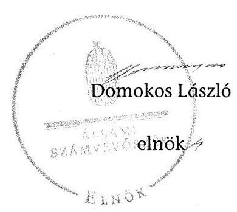

# ÁLLAMI   SZÁMVEVŐSZÉK 

## JELENTÉS

a helyi nemzetiségi önkormányzatok gazdálkodásának ellenőrzéséről
Berzencei Roma Nemzetiségi Önkormányzat

---

# Állami Számvevőszék 

Iktatószám: V-0791-047/2015.
Témaszám: 1825
Vizsgálat-azonosító szám: V067643

## Az ellenőrzést felügyelte:

## Brebán Andrea

felügyeleti vezető
Az ellenőrzést vezette és az ellenőrzés végrehajtásáért felelős:
Gál Magdolna
ellenőrzésvezető
A számvevőszéki jelentés összeállításában közremúködött:
Bajnai Zsuzsanna
számvevő
Az ellenőrzést végezték:
Bajnai Zsuzsanna
Nagy Erika
számvevő
számvevő tanácsos

---

# TARTALOMJEGYZÉK 

BEVEZETÉS ..... 3
I. ÖSSZEGZŐ MEGÁLLAPÍTÁSOK, KÖVETKEZTETÉSEK, JAVASLATOK ..... 6
II. RÉSZLETES MEGÁLLAPÍTÁSOK ..... 12

1. A Nemzetiségi Önkormányzat és a Települési Önkormányzat együttműködésének szabályozása, a működési feltételek biztosítása ..... 12
2. A gazdálkodási feladatok ellátásának szabályszerűsége ..... 13
2.1. A költségvetésre és zárszámadásra, valamint a kincstári adatszolgáltatás rendjére vonatkozó jogszabályi előírások betartása ..... 13
2.2. A Nemzetiségi Önkormányzat gazdálkodásának szabályozottsága ..... 15
2.3. Az operatív gazdálkodási jogkörök kialakítása, gyakorlása ..... 16
3. A Nemzetiségi Önkormányzattal összefüggő gazdálkodási feladatok belső ellenőrzése ..... 17
MELLÉKLET
4. számú A Nemzetiségi Önkormányzat 2013. évi gazdálkodási adatai
FÜGGELÉKEK
5. számú Rövidítések jegyzéke
6. számú Értelmező szótár

---

.

---

# JELENTÉS   a helyi nemzetiségi önkormányzatok gazdálkodásának ellenőrzéséről Berzencei Roma Nemzetiségi Önkormányzat 

## BEVEZETÉS

A Nemzetiségi Önkormányzat a 2010. évben alakult, elnöke a 2010. évi helyhatósági választások óta látja el feladatát. A Nemzetiségi Önkormányzat intézményt, gazdasági társaságot és más szervezetet nem alapított, illetve társulásban nem vett részt. A négytagú Képviselő-testület munkája segítésére bizottságot nem hozott létre. A Nemzetiségi Önkormányzat költségvetési beszámolója szerint a 2013. évben a módosított költségvetési bevételi és kiadási előirányzat 347 ezer Ft, a teljesített költségvetési bevétel 347 ezer Ft, a teljesített költségvetési kiadás 102 ezer Ft volt. A Nemzetiségi Önkormányzat a 2013. évben 125 ezer Ft feladatalapú támogatásban részesült. A 2013. évi gazdálkodási adatokat részletesen az 1. számú mellékletben mutatjuk be.

Az Alaptörvény Szabadság és felelősség rész XXIX. cikk (1) bekezdése szerint a Magyarországon élő nemzetiségek államalkotó tényezők. Minden, valamely nemzetiséghez tartozó magyar állampolgárnak joga van önazonossága szabad vállalásához és megőrzéséhez. A hazánkban élő nemzetiségek helyi (települési és területi) valamint országos önkormányzatokat hozhatnak létre ${ }^{1}$. A helyi nemzetiségi önkormányzatok gazdálkodási feladatait jogszabályi előírás alapján a székhely szerinti helyi önkormányzat polgármesteri hivatala látja el.

A nemzetiségek helyzete, támogatása mind hazai, mind EU-s szinten kiemelt figyelmet kap napjainkban. A helyi nemzetiségi önkormányzatok gazdálkodására és támogatási rendszerére vonatkozó jogszabályok a 2010-2012. években jelentős változásokon mentek át. A helyi nemzetiségi önkormányzatok gazdálkodásának, a részükre juttatott költségvetési támogatások felhasználásának ellenőrzését az ÁSZ 2012-ben sorozatjellegű ellenőrzés keretében indította el. A 2014. évi ellenőrzések az önkormányzati ellenőrzésekre ráépülő (egyablakos) ellenőrzésként valósulnak meg.

Az ellenőrzés célja annak értékelése volt, hogy a Nemzetiségi Önkormányzat gazdálkodási kereteinek kialakítása, gazdálkodása megfelelt-e a jogszabályoknak.

[^0]
[^0]:    ${ }^{1}$ A 2010. évben megtartott nemzetiségi önkormányzati választásokat követően 2304 települési, 58 területi és 13 országos nemzetiségi önkormányzat alakult meg.

---

Ennek keretében értékeltük, hogy:

- a Nemzetiségi Önkormányzat és a Települési Önkormányzat együttműködésének szabályozása, a működési feltételek biztosítása megfelelt-e a jogszabályi előírásoknak;
- a felek együttműködése megfelelt-e a megállapodásban foglaltaknak a gazdálkodási feladatok szabályszerű ellátása során, betartották-e a vonatkozó jogszabályi előírásokat;
- biztosított volt-e a Nemzetiségi Önkormányzat gazdálkodásának belső ellenőrzése.

Az ellenőrzés várható hasznosulása: a nemzetiségi önkormányzatok testületi döntéseinek tapasztalatait összegezve következtetés vonható le a törvényalkotás számára a jogszabályi környezet esetleges módosításának indokoltságára vonatkozóan. Az ellenőrzés az ellenőrzött számára visszajelzést ad a rendezett gazdálkodási keretek kialakításáról, a működésbeli hiányosságokról. Az ellenőrzés megállapításai és javaslatai, a jó gyakorlat bemutatása tanulságul szolgálhatnak más nemzetiségi önkormányzatok, szervezetek számára a rendezett gazdálkodási keretek kialakításához. A társadalom számára jelzi, hogy közpénz nem maradhat ellenőrizetlenül, az ÁSZ értékteremtő rend kialakításához és megőrzéséhez hozzájáruló tevékenysége pozitív hatással lesz a szervezetről kialakított összkép formálásában. Az ÁSZ szervezetén belül lehetőség nyílik arra, hogy a megállapítások szintetizálásával az intézmény a hozzáadott értéket teremtő elemző tevékenységét és tanácsadó szerepét erősítse.

A helyi nemzetiségi önkormányzatok gazdálkodásának ellenőrzéséről szóló jelentés I. fejezetének összegző része az ellenőrzés céljára adott rövid, szintetizáló összefoglalót és következtetéseket tartalmazza a II. fejezet részletes megállapításain alapulóan. A jelentés intézkedést igénylő megállapításait és javaslatait - az összegzőben foglaltak mellett - az ellenőrzés során feltárt, a jelentés II. fejezetében rögzített részletes megállapítások alapozzák meg, illetve támasztják alá.

Az ellenőrzés típusa: szabályszerűségi ellenőrzés.
Az ellenőrzött időszak: a Nemzetiségi Önkormányzat és a Települési Önkormányzat együttműködésének, valamint a Nemzetiségi Önkormányzat gazdálkodásának szabályozása megfelelőségét a 2013. évre vonatkozóan (a 2013. december 31-i állapotnak megfelelően), a Nemzetiségi Önkormányzat gazdálkodásának szabályszerűségét, a működési feltételek, valamint a belső ellenőrzés biztosítását a 2013. január 1. - december 31-e közötti időszakot figyelembe véve értékeltük.

Ellenőrzött szervezet: a Nemzetiségi Önkormányzat és a gazdálkodási feladatait ellátó Polgármesteri Hivatal.

Az ellenőrzés szakmai módszertana az ÁSZ hivatalos honlapján (www.asz.hu) közzétett szakmai szabályokon alapult, amely a Legfőbb Ellenőrző Intézmények Nemzetközi Szervezete (INTOSAI) által kiadott nemzetközi standardok (ISSAI) figyelembevételével készült.

---

A gazdálkodás folyamatában kulcsszerepet betöltő két kulcskontroll - teljesítésigazolás, érvényesítés - múködésének megfelelőségét teljes körűen, azaz minden, a személyi juttatásokkal, dologi és felhalmozási kiadásokkal, múködési és felhalmozási célú pénzeszköz átadásokkal, ellátottak pénzbeli juttatásaival kapcsolatos kifizetés esetében ellenőriztük. „Megfelelőnek" értékeltük a gazdálkodási jogkörök gyakorlását, amennyiben a hibaarány legfeljebb 10\%, „részben megfelelőnek" értékeltük, ha a hibaarány 10-30\% között volt, „nem megfelelőnek" pedig akkor, ha az eredmények alapján a hibaarány meghaladta a 30\%-ot.

Az ellenőrzés végrehajtásának jogszabályi alapját az ÁSZ tv. 5. § (2)-(3) és (6) bekezdéseiben foglaltak képezik.

Az ÁSZ tv. 29. § (1) bekezdése szerint a jelentéstervezetet megküldtük a jegyző és a Nemzetiségi Önkormányzat elnöke részére, akik az ÁSZ tv. 29. § (2) bekezdésében foglalt észrevételezési jogukkal nem éltek, a jelentéstervezetre észrevételt nem tettek.

---

# I. ÖSSZEGZŐ MEGÁLLAPÍTÁSOK, KÖVETKEZTETÉSEK, JAVASLATOK 

A Nemzetiségi Önkormányzat és a Települési Önkormányzat együttmúködésének szabályozása a következő hiányosságok kivételével megfelelt a jogszabályi előírásoknak. A Nemzetiségi Önkormányzat az ellenőrzött időszakban rendelkezett hatályban lévő, a Települési Önkormányzattal történő együttmúködésre vonatkozó együttmúködési megállapodással, de az együttmúködési megállapodást a Nek. tv.-ben foglaltak ellenére 2013. január 31-éig, illetve az ellenőrzött időszakban nem vizsgálták felül. A nemzetiségi önkormányzati SZMSZben és a települési önkormányzati SZMSZ-ben az együttmúködési megállapodás szerinti múködési feltételeket a Nek. tv.-ben meghatározott harminc napon túl rögzítették. A Nek. tv. előírása ellenére a hatályos együttműködési megállapodás nem rögzítette a Nemzetiségi Önkormányzat önálló fizetési számla nyitásával, törzskönyvi nyilvántartásba vételével és az adószám igénylésével kapcsolatos határidőket és együttmúködési kötelezettségeket a felelősök konkrét kijelölésével, a Nemzetiségi Önkormányzat kötelezettségvállalásaival kapcsolatosan a Települési Önkormányzatot terhelő teljesítésigazolási feladatot, valamint az érvényesítési és teljesítésigazolási feladatok felelőseinek konkrét kijelölését. Nem tartalmazta továbbá a Nemzetiségi Önkormányzat kötelezettségvállalásaival öszszefüggő összeférhetetlenségi és nyilvántartási kötelezettségeket, a Nemzetiségi Önkormányzat gazdálkodásának eljárási és dokumentációs részletszabályaival, valamint az ezeket végző személyek kijelölésének rendjével kapcsolatos előírásokat, feltételeket. A Települési Önkormányzat - a szabályozási hiányosságok ellenére - a Nemzetiségi Önkormányzat múködéséhez a 2013. évben a személyi és tárgyi feltételeket biztosította.

A Nemzetiségi Önkormányzat 2013. évi költségvetésének és zárszámadásának tartalma, jóváhagyása, valamint a kincstári adatszolgáltatás részben felelt meg a jogszabályi előírásoknak. A Nemzetiségi Önkormányzat elnöke az Áht.-ban előírtak ellenére nem nyújtotta be a Képviselő-testület részére a 2013. évre vonatkozó költségvetési koncepciót, mert azt a jegyző nem készítette el. A 2013. évi költségvetési határozat-tervezet előterjesztésekor a Képviselő-testület részére az Áht.-ban előírtak ellenére - a jegyző mulasztása miatt- tájékoztatásul szöveges indokolás nélkül mutatták be a Nemzetiségi Önkormányzat költségvetési mérlegét közgazdasági tagolásban és az előirányzat felhasználási tervét. A 2013. évi költségvetési határozat az Áht.-ban foglalt előírások ellenére nem tartalmazta a Nemzetiségi Önkormányzat költségvetési bevételeit és költségvetési kiadásait kötelező feladatok és önként vállalt feladatok szerinti bontásban, valamint a költségvetés végrehajtásával kapcsolatos hatásköröket, így különösen a Mötv. szerinti értékhatárt.

A zárszámadási határozat-tervezet előterjesztésekor a Képviselő-testület részére a jegyző mulasztása miatt - az Áht. előírása ellenére tájékoztatásul szöveges indokolás nélkül mutatták be a Nemzetiségi Önkormányzat költségvetési mérlegét közgazdasági tagolásban, valamint a pénzeszközök változását. Az Áht.-ban előírtak ellenére nem mutatták be a vagyonkimutatást.

---

A jegyző a Nemzetiségi Önkormányzatra vonatkozóan a kincstári adatszolgáltatási kötelezettségének a 2013. évi elemi költségvetésről történt adatszolgáltatás tekintetében az Ávr.-ben előírt határidőt követően tett eleget.

A Nemzetiségi Önkormányzat gazdálkodásának szabályozottsága az ellenőrzött időszakban nem felelt meg a jogszabályi előírásoknak. A Nemzetiségi Önkormányzat a gazdálkodási feladatai ellátására 2013. december 31-én nem rendelkezett a Számv. tv. által előírt szabályzatokkal. A jegyző az Ávr.-ben előírtak ellenére a hivatali SZMSZ-ben nem rögzítette a szervezeti és múködési szabályzatban nevesített munkakörökhöz tartozó, a Nemzetiségi Önkormányzat gazdálkodásával kapcsolatos hatáskörök gyakorlásának módját, a helyettesítés rendjét, és az ezekhez kapcsolódó felelősségi szabályokat. A jegyző a Nemzetiségi Önkormányzat gazdálkodási feladatai ellátásával kapcsolatban az Ávr. foglaltak ellenére a tervezéssel, gazdálkodással - így különösen a kötelezettségvállalás, ellenjegyzés, teljesítésigazolás, érvényesítés, utalványozás gyakorlásának módjával, eljárási és dokumentációs részletszabályaival, valamint az ezeket végző személyek kijelölésének rendjével kapcsolatos belső szabályokat sem a hivatali SZMSZ-ben, sem egyéb belső szabályzatban nem rendezte. A jegyző - a Bkr. előírása ellenére - nem készítette el a Polgármesteri Hivatal ellenőrzési nyomvonalát, valamint a szabálytalanságok kezelésének eljárásrendjét, emiatt ezekkel a szabályzatokkal a Nemzetiségi Önkormányzat gazdálkodásával összefüggő végrehajtási feladatokra vonatkozóan sem rendelkeztek, továbbá nem biztosította a Nemzetiségi Önkormányzat gazdálkodási feladataira vonatkozóan a folyamatba épített, előzetes, utólagos és vezetői ellenőrzést.

A Nemzetiségi Önkormányzat gazdálkodása tekintetében az operatív gazdálkodási jogkörök kialakítása nem felelt meg a jogszabályi előírásoknak.

A Nemzetiségi Önkormányzatnál a 2013. évben a dologi kiadásokkal kapcsolatos kifizetések teljesítése során az operatív gazdálkodási jogkörökön belül kulcsszerepet betöltő teljesítésigazolás és az érvényesítés belső kontrollok múködése nem felelt meg a jogszabályi előírásoknak, emiatt azok nem biztosították a hibák megelőzését és feltárását. A számvevőszéki ellenőrzés az ellenőrzött kifizetésekkel összefüggésben a rendelkezésre bocsátott dokumentumok alapján kár bekövetkeztére utaló adatot, tényt nem állapított meg, azonban a gazdálkodásban kulcsszerepet betöltő kontrollok működésében feltárt hiányosságok miatt fennáll a hibák, szabálytalanságok bekövetkezésének kockázata. A nem megfelelően múködtetett belső kontrollok korrupciós kockázatot hordoznak.

A Nemzetiségi Önkormányzattal összefüggő gazdálkodási feladatok belső ellenőrzése nem felelt meg a jogszabályi előírásoknak. A jegyző - a Bkr.-ben foglalt előírások ellenére - az ellenőrzött időszakban nem gondoskodott a Polgármesteri Hivatalnál a Nemzetiségi Önkormányzat gazdálkodásával összefüggő végrehajtási feladatok belső ellenőrzésének kialakításáról és múködtetéséről. A Nemzetiségi Önkormányzat gazdálkodásával összefüggő végrehajtási feladatokra vonatkozóan belső ellenőrzést a 2013. évben nem terveztek és nem végeztek.

Az ÁSZ tv. 33. § (1) bekezdésében foglaltak értelmében az ellenőrzött szervezet vezetője köteles a jelentésben foglalt megállapításokhoz kapcsolódó intézkedési

---

tervet összeállítani és azt a jelentés kézhezvételétől számított 30 napon belül az ÁSZ részére megküldeni. Amennyiben az intézkedési tervet határidőre nem küldi meg a szervezet, vagy az ÁSZ tv. 33. § (2) bekezdésében foglalt póthatáridő elteltével megküldött intézkedési terv továbbra sem elfogadható, az ÁSZ elnöke a hivatkozott törvény 33. § (3) bekezdés a)-b) pontjaiban foglaltakat érvényesítheti.

A helyszíni ellenőrzés megállapításainak hasznosítása mellett javasoljuk:

# a jegyzönek 

1. Az együttmúködés szabályozásával kapcsolatban

A Nemzetiségi Önkormányzat és a Települési Önkormányzat együttműködését meghatározó együttműködési megállapodás tartalma nem felelt meg a Nek. tv. 80. § (3) bekezdés a)-d) pontjaiban foglaltaknak. A Nek. tv. 80. § (2) bekezdésében foglaltak ellenére 2013. január 31-éig, és ezt követően sem végezték el az együttműködési megállapodás felülvizsgálatát.

Javaslat
Az együttműködés szabályszerűsége érdekében:
a) készítse elő az együttműködési megállapodás módosítását, hogy az feleljen meg a Nek. tv-ben foglalt előírásoknak és kezdeményezze annak a Települési Önkormányzat Képviselő-testülete elé terjesztését;
b) gondoskodjon a Nek. tv-ben előírt határidőre az együttműködési megállapodás évenkénti felülvizsgálatáról.
2. A költségvetés és zárszámadás szabályszerűségével kapcsolatban

A 2013. évi költségvetési határozat az Áht. 23. § (2) bekezdés a) és h) pontjainak előírásától eltérően nem tartalmazta a költségvetési bevételek és a költségvetési kiadások kötelező és önként vállalt feladatok szerinti bontásban, valamint a költségvetés végrehajtásával kapcsolatos hatásköröket, így különösen a Mötv. 68. § (4) bekezdése szerinti értékhatárt.

A 2013. évi költségvetési határozat-tervezet előterjesztésekor a Képviselő-testület részére az Áht. 24. § (4) bekezdés a) pontjában foglalt előírástól eltérően tájékoztatásul szöveges indokolás nélkül mutatták be a Nemzetiségi Önkormányzat költségvetési mérlegét közgazdasági tagolásban és az előirányzat felhasználási tervét. A 2013. évi zárszámadási határozat-tervezet előterjesztésekor - a jegyző mulasztása miatt - a Kép-viselő-testület részére tájékoztatásul nem mutatták be szöveges indokolással együtt az Áht. 91. § (2) bekezdés a) pontja alapján az Áht. 24. § (4) bekezdés a)-b) pontjaiban előírt költségvetési mérlegét közgazdasági tagolásban, a pénzeszközök változását, továbbá az Áht. 91. § (2) bekezdés c) pontja szerinti vagyonkimutatást.

Javaslat
a) Intézkedjen a jövőben arról, hogy a költségvetési határozat az Áht.-ban előírtaknak tartalmilag maradéktalanul feleljen meg;

---

b) Intézkedjen a jövőben arról, hogy a költségvetési és zárszámadási határozat-tervezet előterjesztésekor a Képviselő-testületnek tájékoztatásul maradéktalanul bemutatásra kerüljenek szöveges indoklással együtt az Áht.-ban előírt mérlegek és kimutatások.
3. A kincstári adatszolgáltatási kötelezettséggel kapcsolatban

A jegyző a Nemzetiségi Önkormányzatra vonatkozó kincstári adatszolgáltatási kötelezettsége teljesítése során a 2013. évi elemi költségvetésről az adatszolgáltatási kötelezettségének az Ávr. 33. § (1) bekezdésében előírt határidőt követően tett eleget.

Javaslat
Tegyen eleget a kincstári adatszolgáltatási kötelezettségének - az ellenőrzött időszak óta bekövetkezett esetleges jogszabályi változásokra figyelemmel - az Ávr.-ben foglalt határidők betartásával.
4. A gazdálkodási feladatok szabályozottságával kapcsolatban

A gazdálkodási feladatok végrehajtását ellátó Polgármesteri Hivatal a Számv. tv. 14. § (3) és (5) bekezdéseiben és 161. § (1) bekezdésében előírt számviteli szabályzatokkal rendelkezett, de azok hatálya nem terjedt ki a Nemzetiségi Önkormányzat gazdálkodásának végrehajtási feladataira. A Nemzetiségi Önkormányzat önállóan sem rendelkezett az előírt számviteli szabályzatokkal.

A hivatali SZMSZ nem tartalmazta az Ávr. 13. § (1) bekezdés g) pontja előírásától eltérően az SZMSZ-ben nevesített munkakörökhöz tartozó - a Nemzetiségi Önkormányzat gazdálkodásával kapcsolatos - a hatáskörök gyakorlásának módját, a helyettesítés rendjét, az ezekhez kapcsolódó felelősségi szabályokat.

A jegyző - a Nemzetiségi Önkormányzat gazdálkodási feladatai ellátásával kapcsolatban - az Ávr. 13. § (2) bekezdés a) pontban foglaltak ellenére - a tervezéssel, gazdálkodással - így különösen a kötelezettségvállalás, ellenjegyzés, teljesítésigazolás, érvényesítés, utalványozás gyakorlásának módjával, eljárási és dokumentációs részletszabályaival, valamint az ezeket végző személyek kijelölésének rendjével kapcsolatos belső szabályokat nem rendezte.

A jegyző - a Bkr. 6. § (3)-(4) bekezdései ellenére - nem készítette el a Hivatal ellenőrzési nyomvonalát, valamint a szabálytalanságok kezelésének eljárásrendjét, így ezekkel a szabályzatokkal a Nemzetiségi Önkormányzat gazdálkodásával összefüggő végrehajtási feladatokra vonatkozóan sem rendelkeztek. A jegyző - a Bkr. 8. § (2) bekezdésének előírása ellenére - a Nemzetiségi Önkormányzat gazdálkodási feladataira vonatkozóan nem biztosította a folyamatba épített, előzetes, utólagos és vezetői ellenőrzést, mivel dokumentumok alapján ezzel kapcsolatos tevékenységet nem végzett.

Javaslat
A Nemzetiségi Önkormányzat gazdálkodásának végrehajtásával kapcsolatos feladataira:
a) kiterjedően készítse el a Számv. tv. 14. § (3) és (5) bekezdéseiben és 161. § (1) bekezdésében előírt számviteli szabályzatokat;

---

b) készítse el a hivatali SZMSZ módosítását, hogy az teljes körűen feleljen meg az Ávr.-ben foglalt előírásnak és kezdeményezze annak jóváhagyását;
c) szabályozza a Nemzetiségi Önkormányzat gazdálkodásával összefüggésben a tervezéssel, gazdálkodással kapcsolatos belső szabályokat az Ávr. előírásának megfelelően;
d) kiterjedően készítse el a Bkr.-ben meghatározott ellenőrzési nyomvonalat, a szabálytalanságok kezelésének eljárásrendjét;
e) biztosítsa a Bkr.-ben foglaltaknak megfelelően a folyamatba épített, előzetes, utólagos és vezetői ellenőrzést.
5. A kulcskontrollok múködésével kapcsolatban

A teljesítésigazolást az Ávr. 57. § (1) bekezdésében foglaltak ellenére nem végezték el, illetve nem szabályszerűen végezték. A teljesítés igazolására jogosult személyekről és aláírás-mintájukról az Ávr. 60. § (3) bekezdésében előírtaktól eltérően nem vezettek naprakész nyilvántartást.

A kifizetéseket megelőzően — az Ávr. 58. § (1) bekezdésében foglalt előírások ellenére - az érvényesítő ellenőrizhető okmányok hiányában az összegszerűséget és a fedezet meglétét nem ellenőrizte. Az érvényesítés az Ávr. 58. § (3) bekezdésben előírtak ellenére az érvényesítés keltezését nem tartalmazta. Az érvényesítő nem jelezte az Ávr. 58. § (2) bekezdésében foglaltak ellenére, hogy a megelőző ügymenetben a teljesítésigazolást nem, vagy nem szabályszerűen végezték. Az érvényesítő nem jelezte továbbá, hogy a megelőző ügymenetben az Ávr. 55. § (1) bekezdésében előírtak ellenére a kötelezettségvállalásra pénzügyi ellenjegyzés nélkül került sor, illetve az Ávr. 56. § (1) bekezdésben előírt kötelezettségvállalási nyilvántartást nem vezetették. Az érvényesítést az Ávr. 58. § (4) bekezdés szerinti kijelöléssel nem rendelkező személy végezte.

Javaslat
a) Jelölje ki az Ávr.-ben foglaltakra figyelemmel az érvényesítésre jogosult személyeket.
b) Intézkedjen a teljesítésigazolás és az érvényesítés Ávr.-ben foglalt előírásoknak megfelelő elvégzéséről.

# a Nemzetiségi Önkormányzat elnökének 

1. A Nemzetiségi Önkormányzat és a Települési Önkormányzat együttműködését meghatározó együttműködési megállapodás tartalma nem felelt meg a Nek. tv. 80. § (3) bekezdés a)-d) pontjaiban foglaltaknak.

Javaslat
Terjessze a Képviselő-testület elé jóváhagyásra a jegyző által a Nek. tv-ben foglaltaknak megfelelően előkészített együttműködési megállapodás módosítását.

---

2. A 2013. évi költségvetési határozat-tervezet előterjesztésekor a Képviselő-testület részére az Áht. 24. § (4) bekezdés a) pontjában foglalt előírástól eltérően tájékoztatásul szöveges indokolás nélkül mutatták be a Nemzetiségi Önkormányzat költségvetési mérlegét közgazdasági tagolásban és az előirányzat felhasználási tervét. A 2013. évi zárszámadási határozat-tervezet előterjesztésekor - a jegyző mulasztása miatt - a Kép-viselő-testület részére tájékoztatásul nem mutatták be szöveges indokolással együtt az Áht. 91. § (2) bekezdés a) pontja alapján az Áht. 24. § (4) bekezdés a)-b) pontjaiban előírt költségvetési mérlegét közgazdasági tagolásban, a pénzeszközök változását, továbbá az Áht. 91. § (2) bekezdés c) pontja szerinti vagyonkimutatást.

Javaslat
A Képviselő-testület részére tájékoztatásul mutassa be a jegyző által megküldött költségvetési és a zárszámadási határozat-tervezet előterjesztésekor szöveges indoklással együtt az Áht.-ban előírt valamennyi mérleget, kimutatást.

---

# II. RÉSZLETES MEGÁLLAPÍTÁSOK 

## 1. A Nemzetiségi Önkormányzat És a Telepúlési ÖnkormányZAT EGYÜTTMŰKÖDÉSÉNEK SZABÁLYOZÁSA, A MÜKÖDÉSI FELTÉTELEK BIZTOSÍTÁSA

A Nemzetiségi Önkormányzat és a Települési Önkormányzat együttmüködésének szabályozása az alábbi hiányosságok kivételével megfelelt a jogszabályi előírásoknak.

A Nemzetiségi Önkormányzat az ellenőrzött időszakban rendelkezett hatályban lévő, a Települési Önkormányzattal történő együttműködésre vonatkozó együttműködési megállapodással. Az együttműködési megállapodást a Képviselő-testület és a Települési Önkormányzat Képviselő-testülete határozattal hagyta jóvá és az arra jogosult személyek írták alá.

Az együttműködési megállapodást a Nemzetiségi Önkormányzat a 9/2012. (III. 29.) számú, a Települési Önkormányzat az 50/2012. (VI. 26.) számú határozatával hagyta jóvá.

Az együttműködési megállapodást a Nek. tv. 80. § (2) ${ }^{2}$ bekezdésében foglaltak ellenére 2013. január 31-éig, illetve az ellenőrzött időszakban nem vizsgálták felül.

A nemzetiségi önkormányzati SZMSZ-ben és a települési önkormányzati SZMSZben az együttműködési megállapodás szerinti múködési feltételeket a Nek. tv. 80. § (2) bekezdésében meghatározott harminc napon túl rögzítették.

A települési önkormányzati SZMSZ módosítását a 13/2012. (XI. 5.) számú határozatával hagyta jóvá a Települési Önkormányzat Képviselő-testülete, a nemzetiségi önkormányzati SZMSZ módosítását a 37/2012. (XI. 23.) számú határozatával fogadta el a Képviselő-testület.

A 2013. december 31-én hatályos együttműködési megállapodás az Áht. 27. § (2) bekezdésében ${ }^{3}$ foglaltaknak megfelelően rendezte a Nemzetiségi Önkormányzat bevételeivel és kiadásaival kapcsolatban a tervezési, gazdálkodási, ellenőrzési, finanszírozási, adatszolgáltatási és beszámolási feladatok ellátásának részletes szabályait. A Nek tv. 80. § (1) bekezdés foglalt előírásoknak megfelelően rögzítették a Nemzetiségi Önkormányzat feladatellátásához szükséges tárgyi, technikai eszközökkel felszerelt helyiség használatának, a fenntartási és rezsiköltségek viselésének, a testületi ülések előkészítésének, a döntéshozatalhoz kapcsolódó nyilvántartási feladatok ellátásának, valamint a múködésével kapcsolatos iratkezelési feladatok ellátásának a biztosítását.

[^0]
[^0]:    ${ }^{2}$ Módosította: 2014. évi XCIX. törvény 362. § 2. pontja, hatályos 2015. január 1-től.
    ${ }^{3}$ 2015. január 1-től hatálytalan.

---

A 2013. december 31-én hatályos együttműködési megállapodás nem rögzítette a Nek. tv. 80. § (3) bekezdésében foglaltak közül az alábbiakat:

- a Nek. tv. 80. § (3) bekezdés a) pontja előírása ellenére a Nemzetiségi Önkormányzat önálló fizetési számla nyitásával, törzskönyvi nyilvántartásba vételével és az adószám igénylésével kapcsolatos határidőket és együttműködési kötelezettségeket a felelősök konkrét kijelölésével;
- a Nek. tv. 80. § (3) bekezdés b) pontja előírása ellenére a Nemzetiségi Önkormányzat kötelezettségvállalásaival kapcsolatosan a Települési Önkormányzatot terhelő teljesítésigazolási feladatot, valamint az érvényesítési és teljesítésigazolási feladatok felelőseinek konkrét kijelölését;
- a Nek. tv. 80. § (3) bekezdés c) pontja előírása ellenére a Nemzetiségi Önkormányzat kötelezettségvállalásaival összefüggő összeférhetetlenségi és nyilvántartási kötelezettségeket;
- a Nek. tv. 80. § (3) bekezdés d) pontja előírása ellenére a Nemzetiségi Önkormányzat gazdálkodásának eljárási és dokumentációs részletszabályaival, valamint az ezeket végző személyek kijelölésének rendjével kapcsolatos előírásokat, feltételeket.
A Nek. tv. 80. § (4) bekezdés előírásának megfelelően az együttműködési megállapodás rögzítette, hogy a jegyző a Települési Önkormányzat megbízásából és képviseletében részt vesz a Nemzetiségi Önkormányzat testületi ülésein és jelzi, amennyiben törvénysértést észlel.

A Települési Önkormányzat - a szabályozási hiányosságok ellenére - a Nemzetiségi Önkormányzat múködéséhez a 2013. évben a személyi és tárgyi feltételeket biztosította.

# 2. A GAZDÁLKODÁSI FELADATOK ELLÁTÁSÁNAK SZABÁLYSZERŰSÉGE 

### 2.1. A költségvetésre és zárszámadásra, valamint a kincstári adatszolgáltatás rendjére vonatkozó jogszabályi előírások betartása

A Nemzetiségi Önkormányzat 2013. évi költségvetésének és zárszámadásának tartalma, jóváhagyása, valamint a kapcsolódó kincstári adatszolgáltatás részben felelt meg a jogszabályi előírásoknak.

A Nemzetiségi Önkormányzat elnöke az Áht. 24. § (1) bekezdésében ${ }^{4}$ előírtak ellenére nem nyújtotta be a Képviselő-testület részére a 2013. évre vonatkozó költségvetési koncepciót, mert azt a jegyző nem készítette el.

A jegyző által előkészített 2013. évi költségvetési határozat-tervezetet a Nemzetiségi Önkormányzat elnöke az Áht. 24. § (2) bekezdésében ${ }^{5}$ előírtaknak

[^0]
[^0]:    ${ }^{4}$ 2014. szeptember 30-tól hatálytalan.
    ${ }^{5}$ 2013. december 21-től az Áht. 24. § (3) bekezdése szabályozza.

---

megfelelően határidőn belül - a központi költségvetésről szóló törvény hatálybalépését követő 45. napig - a Képviselő-testület részére benyújtotta ${ }^{6}$. A 2013. évi költségvetés előterjesztésekor a Képviselő-testület részére - az Áht. 24. § (4) bekezdés a) pontjában előírtak ellenére, a jegyző mulasztása miatt - tájékoztatásul szöveges indoklás nélkül mutatták be a Nemzetiségi Önkormányzat költségvetési mérlegét közgazdasági tagolásban és az előirányzat felhasználási tervét. A Nemzetiségi Önkormányzat a 2013. évben több éves kihatású döntést nem hozott.

A 2013. évi költségvetési határozat az Áht. 23. § (2) bekezdés a) és h) pontjaiban ${ }^{7}$ foglaltak ellenére nem tartalmazta a Nemzetiségi Önkormányzat költségvetési bevételeit és költségvetési kiadásait kötelező és önként vállalt feladatok szerinti bontásban, valamint a költségvetés végrehajtásával kapcsolatos hatásköröket, így különösen a Mötv. 68. § (4) bekezdése szerinti értékhatárt.

A Nemzetiségi Önkormányzat elnöke - a jegyző által elkészített - 2013. évi zárszámadási határozat-tervezetet az Áht. 91. § (1) bekezdésében ${ }^{8}$ előírt határidőben terjesztette a Képviselő-testület elé9. A zárszámadási határozat-tervezet előterjesztésekor a Képviselő-testület részére - a jegyző mulasztása miatt, az Áht. 91. § (2) bekezdés a) pontjában előírtak ellenére - tájékoztatásul szöveges indoklás nélkül mutatták be az Áht. 24. § (4) bekezdés a)-b) pontja szerinti költségvetési mérlegét közgazdasági tagolásban, valamint a pénzeszközök változását. Az Áht. 91. § (2) bekezdés c) pontjában előírtak ellenére nem mutatták be a vagyonkimutatást.

A Képviselő-testület a 2013. évi zárszámadásról határozatot fogadott el ${ }^{10}$, amelyben a Nemzetiségi Önkormányzat valamennyi bevételéről és kiadásáról az Áht. 89. § (2) bekezdésnek ${ }^{11}$ megfelelően elszámolt. A zárszámadási határozatnak az elfogadott költségvetéssel való összehasonlíthatósága az Áht. 89. § (1) bekezdés ${ }^{12}$ előírása szerint biztosított volt.

A jegyző a Nemzetiségi Önkormányzatra vonatkozó kincstári adatszolgáltatást a 2013. évi elemi költségvetéséről történt adatszolgáltatás kivételével határidőben teljesítette. A jegyző az időközi költségvetési jelentésekről ${ }^{13}$, az időközi mérlegjelentésekről ${ }^{14}$ és a 2013. év I. féléves és éves elemi költségvetési beszámolókról ${ }^{15}$ az Ávr.-ben és Áhsz.-ben előírt határidőben teljesítette az előírt kincstári

[^0]
[^0]:    ${ }^{6}$ 2013. február 7-én.
    ${ }^{7}$ 2015. január 1-től a 2014. évi XCIX. törvény 20. §-a módosította.
    ${ }^{8}$ Módosította: 2014. évi XCIX. törvény 42. §-a, hatályos 2015. január 1-től.
    ${ }^{9}$ 2014. március 27 -én.
    ${ }^{10}$ Berzencei Roma Nemzetiségi Önkormányzat 5/2014. (IV. 3.) határozata a 2013. évi költségvetési zárszámadásról.
    ${ }^{11}$ 2015. január 1-től hatálytalan.
    ${ }^{12}$ 2015. január 1-től hatálytalan.
    ${ }^{13}$ 2013. április 22-én, 2013. július 9-én, 2013. október 9-én, 2014. január 14-én.
    ${ }^{14}$ 2013. április 23-án, 2013. július 16-án, 2013. október 10-én, 2014. január 27-én.
    ${ }^{15}$ 2013. augusztus 5-én, 2014. március 6-án.

---

adatszolgáltatást. A 2013. évi elemi költségvetésről történt adatszolgáltatási kötelezettségének az Ávr. 33. § (1) bekezdésében előírt határidőt követően tett eleget ${ }^{16}$.

# 2.2. A Nemzetiségi Önkormányzat gazdálkodásának szabályozottsága 

A Nemzetiségi Önkormányzat gazdálkodásának szabályozottsága az ellenőrzött időszakban nem felelt meg a jogszabályi előírásoknak.

A Nemzetiségi Önkormányzat gazdálkodási feladatait ellátó Polgármesteri Hivatal rendelkezett a 2013. évben a Számv. tv. 14. § (3) és (5) bekezdéseiben és a 161. § (1) bekezdésében előírt szabályzatokkal, de azok hatálya a Nemzetiségi Önkormányzat gazdálkodásával összefüggő végrehajtási feladatokra nem terjedt ki. A Nemzetiségi Önkormányzat a Számv. tv.-ben előírt számviteli szabályzatokkal önállóan sem rendelkezett.

A jegyző az Ávr. 13. § (l) bekezdés g) pontjában előírtak ellenére a hivatali SZMSZ-ben nem rögzítette a szervezeti és múködési szabályzatban nevesített munkakörökhöz tartozó, a Nemzetiségi Önkormányzat gazdálkodásával kapcsolatos hatáskörök gyakorlásának módját, a helyettesítés rendjét és az ezekhez kapcsolódó felelősségi szabályokat.

A jegyző - a Nemzetiségi Önkormányzat gazdálkodási feladatai ellátásával kapcsolatban - az Ávr. 13. § (2) bekezdés a) pontban foglaltak ellenére - a tervezéssel, gazdálkodással - így különösen a kötelezettségvállalás, ellenjegyzés, teljesítésigazolás, érvényesítés, utalványozás gyakorlásának módjával, eljárási és dokumentációs részletszabályaival, valamint az ezeket végző személyek kijelölésének rendjével kapcsolatos belső szabályokat sem a hivatali SZMSZ-ben, sem egyéb belső szabályzatban nem rendezte.

A kötelezettségvállalást, az ellenjegyzést és az utalványozást végzésére kijelölt személyek munkakörének megnevezését, az ellenőrzési, adatszolgáltatási és beszámolási feladatok teljesítésével kapcsolatos belső előírásokat, feltételeket az együttmúködési megállapodásban rögzítették.

A jegyző - a Bkr. 6. § (3)-(4) bekezdéseiben foglaltak ellenére - nem készítette el a Polgármesteri Hivatal ellenőrzési nyomvonalát, valamint a szabálytalanságok kezelésének eljárásrendjét, emiatt ezekkel a szabályzatokkal a Nemzetiségi Önkormányzat gazdálkodásával összefüggő végrehajtási feladatokra vonatkozóan sem rendelkeztek.

A jegyző - a Bkr. 8. § (2) bekezdésében foglaltak ellenére - a Nemzetiségi Önkormányzat gazdálkodásával összefüggő végrehajtási feladatokra vonatkozóan nem biztosította a folyamatba épített, előzetes, utólagos és vezetői ellenőrzést, mivel dokumentumok alapján ezzel kapcsolatos tevékenységet nem végzett.

[^0]
[^0]:    ${ }^{16}$ 2013. március 17. helyett 2013. március 26-án.

---

# 2.3. Az operatív gazdálkodási jogkörök kialakítása, gyakorlása 

A Nemzetiségi Önkormányzat gazdálkodása tekintetében az operatív gazdálkodási jogkörök kialakítása nem felelt meg a jogszabályi előírásoknak.

A gazdasági szervezettel nem rendelkező Hivatalban a jegyző az Ávr. 55. § (2) bekezdés g) pontja, valamint az Ávr. 58. § (4) bekezdése alapján nem jelölt ki írásban a Hivatal állományába tartozó köztisztviselőt a pénzügyi ellenjegyzés gyakorlására, továbbá az érvényesítési feladatok ellátására a Nemzetiségi Önkormányzat kiadási előirányzata terhére vállalt kötelezettség esetére.

A Nemzetiségi Önkormányzat 2013. évben nem rendelkezett a gazdálkodási jogkörök ellátására vonatkozó szabályzatokkal. A gazdálkodási feladatok végrehajtását ellátó Polgármesteri Hivatal szabályozta az Ávr. 53. § (2) bekezdésében előírt, az előzetes írásbeli kötelezettségvállalást nem igénylő kifizetések rendjét, azonban a szabályzat hatálya a Nemzetiségi Önkormányzat gazdálkodási feladataira nem terjedt ki. A Nemzetiségi Önkormányzat az előzetes írásbeli kötelezettségvállalást nem igénylő kifizetések rendjét önállóan sem szabályozta.

A Polgármesteri Hivatalban a jegyző az Ávr. 13. § (5) bekezdésében foglaltak ellenére nem rendelkezett belső szabályzatban a Nemzetiségi Önkormányzat gazdálkodásával kapcsolatos végrehajtási feladatokra vonatkozóan a gazdasági feladatokat ellátó alkalmazottak helyettesítésének rendjéről.

A Nemzetiségi Önkormányzatnál a 2013. évben a dologi kiadások teljesítése során az operatív gazdálkodási jogkörökön belül a kulcsszerepet betöltő teljesítésigazolás és érvényesítés belső kontrollok múködése nem felelt meg a jogszabályi előírásoknak, emiatt azok nem biztosították a hibák megelőzését és feltárását.

A dologi kiadásokkal kapcsolatos kifizetések során a 2013. évben a teljesítésigazolás és az érvényesítés kulcskontrollok múködtetésével összefüggésben az alábbi hiányosságok, szabálytalanságok fordultak elő:

- a kifizetéseket megelőzően a teljesítésigazolást - az Ávr. 57. § (1) bekezdésében foglaltak ellenére - nem végezték el;
- a kifizetéseket megelőzően a teljesítésigazolás - az Ávr. 57. § (3) bekezdésében foglaltak ellenére - nem volt szabályszerű, mivel az - Ávr. 60. § (3) bekezdésében foglaltak ellenére - a teljesítésigazolásra jogosult személyekről és aláírás mintájukról nem vezetettek naprakész nyilvántartást, így nem volt megállapítható, hogy az aláírás a teljesítésigazolásra jogosult személytől származott;
- a kifizetéseket megelőzően a teljesítésigazolás - az Ávr. 57. § (1) bekezdésében foglaltak ellenére - nem volt szabályszerű, mivel a teljesítésigazoló ellenőrizhető okmányok hiányában nem ellenőrizte a kiadások teljesítésének jogosságát, összegszerűségét, valamint az ellenszolgáltatás teljesítését;

---

- a kifizetéseket megelőzően az érvényesítés - az Ávr. 58. § (4) bekezdésben foglaltak ellenére - nem volt szabályszerű, mivel az érvényesítést kijelöléssel nem rendelkező személy jogosulatlanul végezte;
- a kifizetéseket megelőzően az érvényesítés - az Ávr. 58. § (3) bekezdésében foglaltak ellenére - nem volt szabályszerű, mivel az érvényesítés nem tartalmazta az érvényesítés keltezését;
- a kifizetéseket megelőzően - az Ávr. 58. § (1) bekezdésében foglaltak ellenéreaz érvényesítés nem volt szabályszerű, mivel az érvényesítő ellenőrizhető okmányok hiányában az összegszerűséget nem ellenőrizte;
- a kifizetéseket megelőzően az érvényesítő - az Ávr. 58. § (1) bekezdésében foglaltak ellenére - a fedezet meglétét nem ellenőrizte - az Ávr. 56. § (1) bekezdésében foglaltak ellenére - a 2013. évben a kötelezettségvállalásokról nyilvántartást nem vezettek;
- a kifizetéseket megelőzően az érvényesítő - az Ávr. 58. § (2) bekezdésében foglaltak ellenére - nem jelezte az utalványozónak, hogy a megelőző ügymenetben a teljesítésigazolást nem, vagy nem szabályszerűen végezték;
- a kifizetéseket megelőzően az érvényesítő - az Ávr. 58. § (2) bekezdésében foglaltak ellenére - nem jelezte az utalványozónak, hogy a megelőző ügymenetben nem tartották be az Áht. 37. § (1) bekezdésében és az Ávr. 55. § (1) bekezdésében foglaltakat, mivel kötelezettségvállalásra pénzügyi ellenjegyzés nélkül került sor, továbbá azt, hogy a kötelezettségvállalási nyilvántartást nem vezették.

A kulcskontrollok ellenőrzése során feltárt egyéb hiányosság volt, hogy az utalványozásra vonatkozó írásbeli rendelkezésen - az Ávr. 59. § (3) bekezdés c)-f) pontjaiban foglaltak ellenére - nem tüntették fel a kedvezményezett címét, a kifizetés összegét, devizanemét, a jóváírandó fizetési számla számát és megnevezését.

A Nemzetiségi Önkormányzatnál személyi juttatásokkal, felhalmozási kiadásokkal, működési és felhalmozási célú pénzeszközátadásokkal, illetve ellátottak pénzbeli juttatásaival kapcsolatos kifizetés nem történt a 2013. évben.

A számvevőszéki ellenőrzés az ellenőrzött kifizetésekkel összefüggésben a rendelkezésre bocsátott dokumentumok alapján kár bekövetkeztére utaló adatot, tényt nem állapított meg, azonban a gazdálkodásban kulcsszerepet betöltő kontrollok múködésében feltárt hiányosságok miatt fennáll a hibák, szabálytalanságok bekövetkezésének kockázata. A nem megfelelően működtetett belső kontrollok korrupciós kockázatot hordoznak.

# 3. A Nemzetiségi ÖNKORMÁNYZATtal ÖSSZEFÜGGŐ GAZDÁLKODÁSI FELADATOK BELSŐ ELLENŐRZÉSE 

A Nemzetiségi Önkormányzattal összefüggő gazdálkodási feladatok belső ellenőrzése nem felelt meg a jogszabályi előírásoknak.

---

A jegyző - a Bkr. 15. § (1) bekezdésében foglalt előírások ellenére - az ellenőrzött időszakban nem gondoskodott a Polgármesteri Hivatalnál Nemzetiségi Önkormányzat gazdálkodásával összefüggő végrehajtási feladatok belső ellenőrzésének kialakításáról és múködtetéséről.

A Nemzetiségi Önkormányzat gazdálkodásával összefüggő végrehajtási feladatokra vonatkozóan belső ellenőrzést a 2013. évben nem terveztek és nem végeztek.

Budapest, 2015. ơ7. hó 15 . nap

Melléklet: $\quad 1 \mathrm{db}$
Függelék: $\quad 2 \mathrm{db}$

---

# A Nemzetiségi Önkormányzat 2013. évi gazdálkodási adatai 

## A) Bevételek

| Megnevezés | Eredeti elöirányzat |  | Módosított   elöjesít |  |
| :--: | :--: | :--: | :--: | :--: |
|  | ezer Ft |  |  | megoszlás |
| Általános múködési támogatás | 222,0 | 222,0 | 222,0 | $64,0 \%$ |
| Feladatalapú támogatás | 0,0 | 125,0 | 125,0 | $36,0 \%$ |
| Költségvetési bevételek összesen | 222,0 | 347,0 | 347,0 | 100,0\% |
| Bevételek összesen | 222,0 | 347,0 | 347,0 | 100,0\% |

## B) Kiadások

| Megnevezés | Eredeti elöirányzat | Módosított | Teljesítés |
| :--: | :--: | :--: | :--: |
|  |  |  |  |
|  |  |  |  |
| Dologi kiadások | 222,0 | 347,0 | 102,0 | 100,0\% |
| Költségvetési kiadások összesen | 222,0 | 347,0 | 102,0 | 100,0\% |
| Kiadások összesen | 222,0 | 347,0 | 102,0 | 100,0\% |

---

.

---

# RÖVIDÍTÉSEK JEGYZÉKE 

## Törvények

Alaptörvény
Áht.
ÁSZ tv.
Kttv.
Mötv.
Nek. tv.
Számv. tv.

## Rendeletek

Áhsz.

Ávr.
Bkr.
nemzetiségi önkormányzati SZMSZ
települési önkormányzati SZMSZ

## Szórövidítések

ÁSZ
együttmúködési megállapodás

EU
hivatali SZMSZ

INTOSAI
ISSAI
jegyzó
Képviselő-testület

Magyarország Alaptörvénye
az államháztartásról szóló 2011. évi CXCV. törvény
az Állami Számvevőszékről szóló 2011. évi LXVI. törvény
a közszolgálati tisztviselőkről szóló 2011. évi CXCIX. törvény
Magyarország helyi önkormányzatairól szóló 2011. évi CLXXXIX. törvény
a nemzetiségek jogairól szóló 2011. évi CLXXIX. törvény
a számvitelről szóló 2000 . évi C. törvény
az államháztartás szervezetei beszámolási és könyvvezetési kötelezettségének sajátosságairól szóló 249/2000. (XII. 24.) Korm. rendelet
az államháztartási törvény végrehajtásáról szóló 368/2011. (XII. 31.) Korm. rendelet
a költségvetési szervek belső kontrollrendszeréről és belső ellenőrzéséről szóló 370/2011. (XII. 31.) Korm. rendelet
34/2012. (XI.9.) határozat Berzencei Roma Nemzetiségi Önkormányzat Szervezeti és Múködési Szabályzata (hatályos 2012. november 10 -től)
Berzence Nagyközség Önkormányzata Képviselốtestületének 6/2007. (IV. 11.) számú rendelete Berzence Nagyközség Önkormányzata Képviselő-testülete és szervei Szervezeti és Múködési Szabályzatáról (hatályos 2007. április 11-től)

Állami Számvevőszék
Együttmúködési Megállapodás Berzence Nagyközség Önkormányzata és a Berzencei Roma Nemzetiségi Önkormányzat között (hatályos 2012. július 9-től)
Európai Unió
Berzence Nagyközség Önkormányzata Képviselőtestületének 6/2007. (IV. 11.) számú rendelete Berzence Nagyközség Önkormányzata Képviselő-testülete és szervei Szervezeti és Múködési Szabályzatáról. 2. számú melléklet (hatályos 2007. április 11-től)
International Organization of Supreme Audit Institutions (Legfőbb Ellenőrző Intézmények Nemzetközi Szervezete)
International Standards of Supreme Audit Institutions (Legfőbb Ellenőrző Intézmények Nemzetközi Standardjai)
Berzence Nagyközség Önkormányzatának jegyzője
Berzencei Roma Nemzetiségi Önkormányzat Képviselőtestülete

---

| Kincstár | Magyar Államkincstár |
| :--: | :--: |
| költségvetési határozat | Berzencei Roma Nemzetiségi Önkormányzat 1/2013. (III. 12.) határozata a 2013. évi költségvetésről |
| kulcskontroll | az operatív gazdálkodási jogkörök közül kulcskontroll a teljesítésigazolás és az érvényesítés |
| Nemzetiségi Önkormányzat | Berzencei Roma Nemzetiségi Önkormányzat |
| Nemzetiségi Önkormányzat elnöke | Berzencei Roma Nemzetiségi Önkormányzat elnöke |
| operatív gazdálkodási   jogkör   polgármester   Polgármesteri Hivatal   Települési Önkormányzat | kötelezettségvállalás; pénzügyi ellenjegyzés; utalványozás; érvényesítés; teljesítésigazolás jogkör   Berzence Nagyközség Önkormányzatának polgármestere   Berzencei Polgármesteri Hivatal   Berzence Nagyközség Önkormányzata |
| zárszámadási határozat | Berzencei Roma Nemzetiségi Önkormányzat 5/2014. (IV. 3.) határozata a 2013. évi költségvetési zárszámadásról |

---

# ÉRTELMEZŐ SZÓTÁR 

belső ellenőrzés
belső kontrollrendszer
együttmúködési megállapodás
költségvetési szerv vezetője

A Bkr. 2. § b) pont meghatározásában független, tárgyilagos bizonyosságot adó és tanácsadó tevékenység, amelynek célja, hogy az ellenőrzött szervezet múködését fejlessze és eredményességét növelje, az ellenőrzött szervezet céljai elérése érdekében rendszerszemléletű megközelítéssel és módszeresen értékeli, illetve fejleszti az ellenőrzött szervezet irányítási és belső kontrollrendszerének hatékonyságát.
A Bkr. 2. § d) pont és az Áht. 69. § (1) bekezdése alapján a belső kontrollrendszer a kockázatok kezelése és tárgyilagos bizonyosság megszerzése érdekében kialakított folyamatrendszer, amely azt a célt szolgálja, hogy a múködés és gazdálkodás során a tevékenységeket szabályszerűen, gazdaságosan, hatékonyan, eredményesen hajtsák végre, az elszámolási kötelezettségeket teljesítsék, megvédjék az erőforrásokat a veszteségektől, károktól és nem rendeltetésszerú használattól.
Az Áht. 27. § (2) bekezdése és a Nek. tv. 80. § (1) bekezdése értelmében a helyi önkormányzat a helyi nemzetiségi önkormányzat részére - annak székhelyén - biztosítja az önkormányzati múködés személyi és tárgyi feltételeit, továbbá gondoskodik a múködéssel kapcsolatos végrehajtási feladatok ellátásáról. Az önkormányzati múködés feltételei és az ezzel kapcsolatos végrehajtási feladatok. A Nek. tv. 80. § (2) bekezdés szerinti a fenti kötelezettségének teljesítése érdekében a helyi önkormányzat harminc napon belül biztosítja a rendeltetésszerú helyiséghasználatot, valamint a helyiséghasználatra, a további feltételek biztosítására és a feladatok ellátására vonatkozóan megállapodást köt a helyi nemzetiségi önkormányzattal. A megállapodást minden év január 31. napjáig, általános vagy időközi választás esetén az alakuló ülést követő harminc napon belül felül kell vizsgálni. A helyi önkormányzat és a nemzetiségi önkormányzat szervezeti és múködési szabályzatában rögzíti a megállapodás szerinti múködési feltételeket, a megállapodás megkötését, módosítását követő harminc napon belül. A Nek. tv. 80. § (3) bekezdés írja elő a megállapodásban rögzítendőket.

A Bkr. 2. § nd) pont meghatározásában a helyi önkormányzat, helyi nemzetiségi önkormányzat esetén a jegyző, illetve a Bkr. 2. § ne) pontja alapján a fővárosi kerületi önkormányzat esetén a jegyző, körjegyző, főjegyző.

---

korrupció
kulcskontroll
lényegesség
megfelelőségi teszt
nemzetiség

Azok a cselekmények, amelyek során a köz érdekében való eljárással megbízott és döntéshozatali felelősséggel felruházott személy a köz érdeke helyett önös vagy részérdekeket követve, mástól jogtalan vagy etikátlan előnyt elfogadva és őt jogtalan vagy etikátlan előnyhöz juttatva jár el, illetve amikor valaki a köz érdekében való eljárással megbízott és döntéshozatali felelősséggel felruházott személynek jogtalan vagy etikátlan előnyt nyújtva vagy felajánlva jogtalan vagy etikátlan előnyt kér. (Forrás: A Kormány korrupció megelőzési programja 2012-2014.)
Az azonosított kockázatok mérséklése érdekében kialakított kontrollok közül azok, amelyek elégtelen múködése esetén a szervezetet jelentős veszteség érheti, vagy a múködésükben bekövetkező hiba/hiányosság más kontrollok eredményességét csökkenti. Ezek ellenőrzése, értékelése elegendő bizonyítékot szolgáltat adott területen a kontrollrendszer értékeléséhez. Az önkormányzatok kontrollrendszere kialakításának ellenőrzése során a pénzügyi folyamatokban kulcsszerepet betöltő belső kontrollok a teljesítésigazolás és érvényesítés.
Egy információ akkor lényeges, ha hiánya vagy téves állítása befolyásolhatja ezen információkat felhasználók döntéseit, véleményét. Az ellenőrzés során a lényegesség három szempontból értelmezhető: érték, jelleg és összefüggés szerint.
Az ellenőrzés során alkalmazott módszer - a számvevő egy adatállomány, statisztikai sokaság összes tételének vizsgálata helyett a kiválasztott tételek meghatározott jellemzőinek elemzése és kiértékelése útján szerezhet a teljes állományra vonatkozó következtetések levonására alkalmas ellenőrzési bizonyítékokat - a mennyiségileg elegendő és a minőségileg megfelelő bizonyíték megszerzésére az ellenőrzött kulcskontroll (teljesítésigazolás, érvényesítés) múködésének megfelelő, vagy nem megfelelő voltáról. (A számvevőszéki ellenőrzés általános alapelvei 4.1.2, és 4.2 pontjai)

A Nek. tv. 1. § (1) bekezdése alapján nemzetiség minden olyan Magyarország területén legalább egy évszázada honos népcsoport, amely az állam lakossága körében számszerú kisebbségben van, tagjai magyar állampolgárok és a lakosság többi részétől saját nyelve és kultúrája, hagyományai különböztetik meg, egyben olyan összetar-tozás-tudatról tesz bizonyságot, amely mindezek megőrzésére, történelmileg kialakult közösségeik érdekeinek kifejezésére és védelmére irányul.

---

nemzetiségi önkormányzat

Az Nek. tv. 2. § 2. pontja szerint törvényben meghatározott nemzetiségi közszolgáltatási feladatokat ellátó, testületi formában múködő, jogi személyiséggel rendelkező, demokratikus választások útján e törvény alapján létrehozott szervezet, amely a nemzetiségi közösséget megillető jogosultságok érvényesítésére, a nemzetiségek érdekeinek védelmére és képviseletére, a feladat- és hatáskörébe tartozó nemzetiségi közügyek települési, területi vagy országos szinten történő önálló intézésére jön létre.