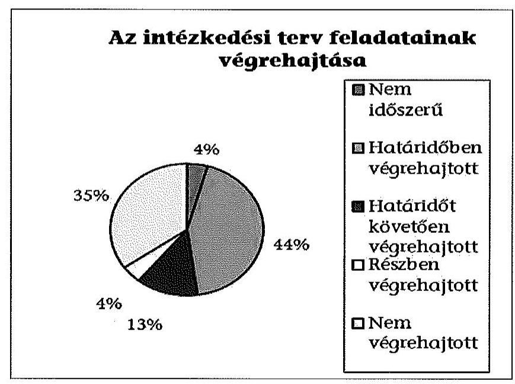
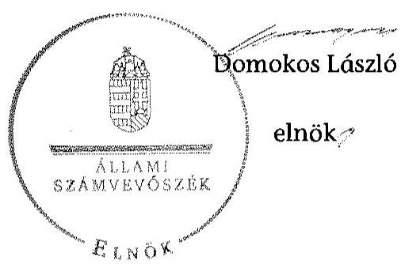

# ÁLLAMI   SZÁMVEVŐSZÉK 

## JELENTÉS

Utóellenőrzések - az önkormányzatok pénzügyi gazdálkodási helyzetének, szabályszerűségének utóellenőrzése Ács

---

# Állami Számvevőszék 

Iktatószám: V-0605-027/2015.
Témaszám: 1639
Vizsgálat-azonosító szám: V069305

## Az ellenőrzést felügyelte:

## Renkó Zsuzsanna

felügyeleti vezető
Az ellenőrzést vezette és az ellenőrzés végrehajtásáért felelős:
Mohl Anna
ellenőrzésvezető
A számvevőszéki jelentés összeállításában közreműködött:
Baksa Anikó
számvevő főtanácsos
Dr. Mezei Imréné
számvevő főtanácsos
Az ellenőrzést végezték:

| Luhály Matild | Krupánszki Dóra | Dr. Németh Eszter |
| :-- | :-- | :-- |
| számvevő | számvevő tanácsos | számvevő |

## Marton Katalin

számvevő

A témához kapcsolódó eddig készített számvevőszéki jelentések:
címe
sorszáma
Jelentés az önkormányzatok pénzügyi gazdálkodási helyzetének, 13081 szabályszerűségének ellenőrzéséről ÁCS

---

# TARTALOMJEGYZÉK 

BEVEZETÉS ..... 3
I. ÖSSZEGZŐ MEGÁLLAPÍTÁSOK, KÖVETKEZTETÉSEK ..... 6
II. RÉSZLETES MEGÁLLAPÍTÁSOK ..... 7

1. Az önkormányzat a pénzügyi gazdálkodási helyzetének, szabályszerűségének ellenőrzéséről készült ÁSZ jelentésben foglalt javaslatokra készített-e intézkedési tervet, illetve teljesítette-e az abban foglaltakat? ..... 7
MELLÉKLETEK
2. számú Az ÁSZ 13081 számú jelentéséhez kapcsolódó intézkedési terv végrehajtása
FÜGGELÉKEK
3. számú Rövidítések jegyzéke
4. számú Fogalomtár

---

.

---

# JELENTÉS 

## Utóellenőrzések - az önkormányzatok pénzügyi gazdálkodási helyzetének, szabályszerűségének utóellenőrzése Ács

## BEVEZETÉS

Az Állami Számvevőszék 2011-2015. évekre szóló stratégiája a helyi önkormányzatok ellenőrzésében a pénzügyi-gazdasági helyzet értékelésére, kockázatai feltárására helyezte a fő hangsúlyt. A 2011-2013. években az ÁSZ által ellenőrzött önkormányzatok esetében a működési, beruházási és a hosszú lejáratú pénzintézeti kötelezettségeinek teljesítésével kapcsolatos pénzügyi kockázatokat mutattuk be. Az ÁSZ megállapította, hogy az önkormányzatok pénzügyi egyensúlyi helyzete az ellenőrzött időszakban romlott, a pénzügyi kockázatok fokozódtak, a pénzügyi egyensúlyi helyzetet jellemző mutatószámok kedvezőtlenül változtak. Az önkormányzati alrendszerben 2012. év végétől 2014. évelejéig lezajlott adósságkonszolidáció és feladat-ellátási-, finanszírozási-rendszer változás következtében a települési önkormányzatok pénzügyi helyzete jelentős mértékben megváltozott, amely a jóváhagyott intézkedési tervek végrehajtását is befolyásolta.

Az ellenőrzött szervezet vezetője az ÁSZ tv. 33. § (1)-(2) bekezdésében foglaltak alapján a jelentések intézkedést igénylő megállapításaihoz kapcsolódóan köteles intézkedési tervet benyújtani, amelyet az ÁSZ-nak kell elfogadni. Amennyiben az ellenőrzött által vállalt intézkedések hiányosak, vagy más okból nem elfogadhatók az ÁSZ indoklással és póthatáridő tűzésével visszaküldi azt kijavításra, kiegészítésre. Az elfogadásról szóló tájékoztatásban az Állami Számvevőszék elnöke valamennyi ellenőrzött szervezet vezetőjének figyelmét felhívta arra, hogy az intézkedési tervben foglaltak megvalósítását - az ÁSZ tv. 33. § (7) bekezdésében foglaltak alapján - utóellenőrzés keretében ellenőrizheti.

Az ellenőrzés célja: annak megállapítása, hogy az ellenőrzött önkormányzatok pénzügyi gazdálkodási helyzetének, szabályszerűségének ellenőrzéséről készült ÁSZ jelentésben foglalt javaslatokra készítettek-e intézkedési terveket, illetve az ellenőrzött által összeállított intézkedési tervben meghatározott feladatokat végrehajtották-e. Ennek keretében ellenőrizzük, hogy:

- a polgármester az ÁSZ törvény értelmében az intézkedési tervet határidőben megküldte-e az ÁSZ részére, szükség volt-e az elfogadást megelőzően kiegészítésre, azt az előírt póthatáridőn belül megtették-e, a Képviselő-testület a kiegészített intézkedési tervet elfogadta-e;

---

- az önkormányzat az elfogadott (kiegészített) intézkedési tervében foglaltak megtételéről, az abban előírt határidők betartásával gondoskodott-e;
- az elfogadott intézkedések esetleges késedelme, végrehajtásának elmaradása milyen szintű kockázatot jelez a pénzügyi gazdálkodásra és annak szabályszerűségére.

Az utóellenőrzés várható hasznosulása: az ellenőrzés megállapításai segítséget nyújthatnak a közpénzügyi helyzet javításához. Az utóellenőrzés, jellegéből adódóan fokozza közbizalmat, fegyelmet, a társadalom, az ellenőrzöttek, a helyi döntéshozók vonatkozásában erősíti az ÁSZ tekintélyét és igazolja, hogy lejárt a következmények nélküli ellenőrzések időszaka. Az ÁSZ intézményén belül lehetőség nyílik arra, hogy az utóellenőrzés, mint ellenőrzési kategória a szervezet tevékenységében stabilizálódjék, a megállapítások visszacsatolása segítse és erősítse az ÁSZ hozzáadott értéket teremtő elemző tevékenységét és tanácsadó szerepét.

Az intézkedési tervek olyan típusú feladatokat határoztak meg az önkormányzatok számára, amelyek a működőképesség jövőbeni zavarainak elkerülését, a felelős fenntartható gazdálkodás követelményeinek érvényesülését, a pénzügyi műveletek racionális keretek közt tartását tűzték ki célul. Az utóellenőrzés által e területeken érzékelt mulasztások még megfelelő irányba terelhetik az intézkedési tervekben foglalt feladatok végrehajtását.

Az ÁSZ az elfogadott intézkedési terveket kockázatelemzésnek veti alá. Ennek során elvégezzük az ÁSZ által elfogadott intézkedési tervben előírt/vállalt feladatok végrehajtásának értékelését, amelynek során alkalmazandó besorolási kategóriák:

- okafogyottá vált feladat: ha végrehajtására - meghatározott esemény bekövetkezése, továbbá külső körülmény, a működést érintő feltétel változása miatt - már nincs szükség, illetve lehetőség, és egyértelműen megállapítható, hogy az intézkedést szükségessé tevő körülmény a jövőben nem fordulhat elő;
- nem időszerű (nem esedékes) feladat: amelynek ellenőrzési időszakon belüli végrehajtására azért nem került (kerülhetett) sor, mert az intézkedés alapjául szolgáló esemény nem következett be, de annak jövőbeni előfordulása lehetséges;
- határidőben végrehajtott feladat: ha teljesítése dokumentáltan az intézkedési tervben előírt határidőben és tartalommal, módon megtörtént;
- határidőn túl végrehajtott feladat: ha annak teljesítése az intézkedési tervben meghatározott módon, de az előírt határidőn túl történt meg;
- részben végrehajtott feladat: amelynek végrehajtása teljes körűen az intézkedési tervben előírt tartalommal/módon nem történt meg, vagy a feladatot nem az előírt gyakorisággal hajtották végre;
- végre nem hajtott feladat: ha a végrehajtásért felelősként megjelölt személy(ek)nek felróhatóan a teljesítés elmaradt, vagy a teljesítést nem dokumentálták.

---

Az ellenőrzést a számvevőszéki ellenőrzés szakmai szabályai szerint, szabályszerűségi ellenőrzés módszerével, a vonatkozó nemzetközi standardok figyelembevételével végeztük. Az ellenőrzésre az önkormányzatok elektronikus adatszolgáltatása alapján került sor, helyszíni ellenőrzést nem végeztünk. A megállapítások rögzítése az önkormányzatok által rendelkezésre bocsátott dokumentumok, tanúsítványok alapján történt, melyek valódiságát és teljes körűségét a polgármester, valamint a jegyző teljességi nyilatkozata igazolja.

A jóváhagyott intézkedési tervben előírt feladatok végrehajtásának ellenőrzését egységes szempontok, illetve értékelési kritériumok alapján végeztük. Figyelembe vettük az intézkedési terv jóváhagyását követően hatályba lépett jogszabályi előírások változásából következő események - kiemelten az önkormányzati alrendszerben lezajlott adósságkonszolidációs intézkedések, továbbá a feladat-ellátási és finanszírozási rendszer változásának - hatásait.

Az alkalmazott rövidítések jegyzékét az 1. számú függelék, az egyes fogalmak magyarázatát a 2. számú függelék tartalmazza.

# Az ellenőrzött szervezet: Ács Város Önkormányzata 

Az ellenőrzött időszak: az intézkedési terv ÁSZ-nak történő benyújtásától az utóellenőrzés megkezdéséig tartó időszak.

Az ellenőrzés végrehajtásának jogszabályi alapját az ÁSZ tv. 1. § (3) bekezdése, az 5. § (2) és (6) bekezdései, a 33. § (7) bekezdése, valamint az Áht. 61. § (2) bekezdésének előírásai képezték.

Az ÁSZ tv. 29. § (1) bekezdése szerint a jelentéstervezetet észrevételezésre megküldtük az Önkormányzat polgármesterének, aki az ÁSZ tv. 29. § (2) bekezdésében foglalt észrevételezési jogával nem élt, a jelentéstervezetre észrevételt nem tett.

Az ÁSZ a 2013. évben zárta le az Önkormányzat pénzügyi gazdálkodási helyzetének, szabályszerűségének ellenőrzését. Az ellenőrzés tapasztalatairól készített 13081 számú jelentés az interneten, a www.asz.hu címen olvasható.

---

# I. ÖSSZEGZŐ MEGÁLLAPÍTÁSOK, KÖVETKEZTETÉSEK 

Az ÁSZ utóellenőrzés keretében értékelte az Önkormányzat pénzügyi gazdálkodási helyzetének, szabályszerűségének ellenőrzéséről szóló jelentés javaslatainak hasznosítására elfogadott intézkedési terv végrehajtását.

Az előző ÁSZ ellenőrzés megállapította, hogy az Önkormányzat pénzügyi egyensúlya rövid távon nem volt biztosított. A feltárt hiányosságok alapján megfogalmazott ÁSZ javaslatok hasznosítására az Önkormányzat intézkedési tervet készített, melyet az ÁSZ kiegészítés kérését követően elfogadott.

Az utóellenőrzés megállapította, hogy az ellenőrzött időszakban időszerűvé vált feladatait az Önkormányzat teljes körűen nem hajtotta végre, ezáltal az ÁSZ javaslatai maradéktalanul nem hasznosultak.

Az utóellenőrzés megállapítása alapján az elfogadott intézkedési tervben foglalt egyes feladatok határidőt követő, illetve részbeni végrehajtása, továbbá a végrehajtás elmaradása magas kockázatot jelent a pénzügyi gazdálkodásra, annak szabályszerűségére.

---

# II. RÉSZLETES MEGÁLLAPÍTÁSOK 

## 1. Az önkormányzat a pénzügyi gazdálkodási helyzetének, szabályszerűségének ellenőrzéséről készült ÁSZ jelentésben foglalt javaslatokra készített-e intézkedési tervet, illetve teljesítette-e az abban foglaltakat?

Az utóellenőrzés - a 2014. szeptember 16-ig végrehajtott intézkedéseket figyelembe véve - az Önkormányzat pénzügyi gazdálkodási helyzetének, szabályszerűségének ellenőrzéséről készült ÁSZ jelentés javaslatai hasznosítására elfogadott intézkedési terv végrehajtására irányult. A pénzügyi helyzet ellenőrzését az ÁSZ a 2009. január 1. - 2012. december 31. közötti időszakra végezte el, amelynek alapján megállapította, hogy az Önkormányzat pénzügyi egyensúlya rövid távon nem volt biztosított.

A polgármester a Képviselő-testületet tájékoztatta az ÁSZ jelentéséről. A jelentésben foglalt megállapításokhoz kapcsolódó intézkedési tervet ${ }^{1}$ az ÁSZ tv. 33. § (1) bekezdésében foglalt határidőn túl küldték meg az ÁSZ részére. Az ÁSZ az intézkedési terv kiegészítését kérte. Az Önkormányzat a kiegészített intézkedési tervet ${ }^{2}$ a póthatáridőn belül megküldte, amelyet az ÁSZ elfogadott.

Az ÁSZ által elfogadott intézkedési tervben meghatározott feladatokat, az ÁSZ jelentés javaslatainak címzettjét és a feladatok végrehajtását az 1. számú melléklet mutatja be.

Az ÁSZ által elfogadott intézkedési terv 23 tervezett intézkedést tartalmazott, felelősként a polgármestert, a jegyzőt, a Városfejlesztési és Közszolgáltató Kft. ügyvezetőjét, a Művelődési Ház igazgatóját, a Könyvtár és Városi Sportcsarnok igazgatóját, a Szociális Alapszolgáltatási Központ vezetőjét, a Bóbita Óvoda vezetőjét valamint a Pitypang Bölcsőde vezetőjét megjelölve.

Az utóellenőrzés megállapításai alapján az intézkedési tervben előírt feladatokból egy feladat végrehajtása nem volt időszerű, tíz feladatot határidőben, három feladatot határidőt követően, egy feladatot részben hajtottak végre, nyolc feladat pedig nem került végrehajtásra. Az intézkedési tervben előírt feladatok között nem volt olyan, amelynek végrehajtása okafogyottá vált volna.

[^0]
[^0]:    ${ }^{1}$ A Képviselő-testület az intézkedési tervet a 233/2013. (XI. 7.) számú határozatával fogadta el.
    ${ }^{2}$ A kiegészített intézkedési tervet a Képviselő-testület a 268/2013. (XII. 12.) számú határozatával fogadta el.

---

# Nem volt időszerű: 

- a realizált többletbevételek és a jövőben képződő tartalékok felhasználása során olyan előterjesztés készítése a Képviselő-testület részére, amely további döntési javaslatot tartalmaz a fennálló kötelezettségvállalások jövőbeni teljesítésére, a fizetőképesség megőrzésének finanszírozására, mivel az Önkormányzatnak az ellenőrzött időszakban nem volt tartalékképzésre alkalmas realizált többletbevétele. A bevételek növelése érdekében azonban a 2014. évi költségvetést elfogadáskor döntést hoztak.

## Határidőben végrehajtották:

- javaslatok készítését a bevételnövelő és kiadáscsökkentő intézkedésekre;
- a reorganizációs program készítését;
- az Önkormányzat lejárt szállítói állományának alakulásáról a - Képviselőtestület felé történő - beszámolási kötelezettség előírását;
- az Önkormányzat kizárólagos tulajdonában lévő gazdasági társaság pénzügyi helyzetének stabilizálására az intézkedési terv készítését;
- a kockázatkezelési rendszer felülvizsgálatát és módosítását, a jegyző utasítást adott ki a feladat ellátására;
- az önkormányzati feladatellátáshoz kapcsolódó támogatási rendszer feltételeinek, valamint a szerződések minimum tartalmai követelményeinek meghatározásával összefüggő kontrolltevékenységek előírását;
- a pénzintézeti szolgáltatások igénybevételével kapcsolatosan, a közbeszerzési értékhatár alatti esetekben a pályáztatási kötelezettséggel kapcsolatos kontrolltevékenység meghatározását;
- az ellenőrzési nyomvonal elkészítését;
- a költségvetés és a zárszámadás készítés folyamatának belső szabályozásban való meghatározását;
- a fejlesztésekhez kapcsolódóan a pályázatkészítés feltételeivel összefüggő kontrolltevékenységek meghatározását.

## Határidőt követően hajtották végre:

- a folyószámla- és munkabér-megelőlegezési hitel felvételének és törlesztésének szabályszerű elszámolása érdekében a jegyző írásbeli utasításának kiadását, mivel a jegyző az utasítást 2013. december 1-jei határidő ellenére 2013. december 17-én adta ki;
- a fordított áfa elszámolásával kapcsolatos jegyzői írásbeli utasítás kiadását, mert a jegyző az utasítást 2013. december 1-jei határidőt követően, 2013. december 17-én adta ki;
- az áruszállításból és szolgáltatás teljesítéséből származó szállítókkal szembeni kötelezettségek kimutatására vonatkozó jegyzői írásbeli utasítás kiadá-

---
 utasítást 2013. december 1-jei határidőn túl 2013. december 17-én adta ki.

Az ÁSZ által elfogadott intézkedési tervben meghatározott feladatok közül részben hajtották végre:

- az Önkormányzat kizárólagos tulajdonában lévő gazdasági társaság a pénzügyi helyzete alakulásáról évente csak egyszer számolt be az előírt félévente történő beszámolás helyett. A gazdasági társaság ügyvezetője nem terjesztett a Képviselő-testület elé a pénzügyi stabilitás mérlegelése alapján készített intézkedési javaslatot. A feladat végrehajtásának felelőse a polgármester, a jegyző és a Városfejlesztési és Közszolgáltató Kft. ügyvezetője volt.

Az ÁSZ által elfogadott intézkedési tervben meghatározott feladatok közül az alábbiakat nem hajtották végre:

- a hitelbiztosítéki keret csökkentését és a korlátozottan forgalomképes ingatlanok cserével történő tehermentessé tételét. A feladat végrehajtásának felelőse a polgármester és a jegyző volt;
- a polgármester jegyző részére kiadott utasításában foglaltakat, mely szerint jövőbeni hitel fedezeteként csak üzleti vagyon ajánlható fel. A folyószámlahitel-keret módosításakor ugyanis annak fedezeteként korlátozottan forgalomképes vagyon is felajánlásra került. A feladat végrehajtásának felelőse a polgármester és a jegyző volt;
- a 2014. évi belső ellenőrzési tervbe a gazdálkodási kockázatok felmérése ellenőrzésének beépítését. A feladat végrehajtásának felelőse a jegyző volt;
- a feladat átadás-átvételre vonatkozó döntések előkészítése során a döntés kötelező és önként vállalt feladatok arányára, ezáltal a pénzügyi egyensúlyi helyzetre gyakorolt hatása vizsgálatának belső szabályzatban való rögzítését. A feladat végrehajtásának felelőse a jegyző volt;
- a feladat-ellátási szerződések teljesítésére vonatkozó beszámolási kötelezettséggel kapcsolatos kontrolltevékenységek meghatározását. A feladat végrehajtásának felelőse a jegyző volt;
- a fejlesztések döntés-előkészítés folyamatában a lebonyolítás és a működtetés kockázatai feltárásának és kezelésének kötelezettsége meghatározását. A feladat végrehajtásának felelőse a jegyző volt;
- a pénzintézeti kötelezettségvállalások kockázatainak döntés-előkészítő szakaszban történő feltárását, a futamidő egyes éveit terhelő kötelezettségek költségvetési egyensúlyra gyakorolt hatása vizsgálatának előírását. A feladat végrehajtásának felelőse a jegyző volt;
- a szállítói tartozások és az egyéb kiadáselmaradások rendezésének belső szabályozásban való meghatározását. A feladat végrehajtásának felelőse a jegyző volt.

---

Az utóellenőrzés megállapítása alapján az elfogadott intézkedési tervben foglalt egyes feladatok határidőt követő, illetve részbeni végrehajtása, továbbá a végrehajtás elmaradása magas kockázatot jelent a pénzügyi gazdálkodásra, annak szabályszerűségére.

Budapest, 2015. 08. hónap 0h nap

Melléklet: $\quad 1 \mathrm{db}$
Függelék: $\quad 2 \mathrm{db}$

---

# Az ÁSZ 13081 számú jelentéséhez kapcsolódó intézkedési terv végrehajtása

|  Sorszám | Intézkedési terv alapján elvégzendő feladat | Az intézkedési tervben meghatározott határidő | Az ÁSZ 13081 számú jelentése javaslatának címzettje | Az intézkedés végrehajtása  |
| --- | --- | --- | --- | --- |
|   | 1. | 2. | 3. | 4.  |
|  Nem időszerű intézkedés |  |  |  |   |
|  1. | A realizált többletbevételek és a jövőben képződő tartalékok felhasználása során a Képviselő-testület elé terjesztett előterjesztések minden esetben tartalmazzanak egy további döntési javaslatot, amelyekből a fennálló kötelezettségvállalások jövőbeni teljesítése, a fizetőképesség megőrzése kerüljön finanszírozásra. | 2014. január 1. | polgármester | A polgármester, a jegyző és a pénzügyi osztályvezető 2014. szeptember 18-án adott nyilatkozata szerint az Önkormányzatnak az ellenőrzött időszakban nem volt tartalékképzésre alkalmas realizált többletbevétele. Az Önkormányzat a 2014. évi költségvetés elfogadásakor döntést hozott melynek megfelelően a jegyző 2014. március 31-én utasítást adott ki a bevételek növelése érdekében.  |
|  Határidőben végrehajtott intézkedések |  |  |  |   |
|  1. | A költségvetési rendelet elfogadásakor, módosításakor, fejlesztés elhatározásakor az előterjesztésben részletes, szükség szerint tételes indoklást kell készíteni, figyelemmel a feladat ellátási kötelezettségre - önként vállalt vagy kötelező feladata az önkormányzatnak, figyelemmel a feladatfinanszírozásra - pályázati forrás, saját forrás továbbá a feladat elvégzésének sürgősségére, fontosságára, az elmaradással kapcso- | 2014. március 31. | polgármester | A 2014. március 31-én kiadott 1/2014. (III. 31.) számú "Jegyzői utasítás bevételszerző és kiadáscsökkentő intézkedések végrehajtására" öt bevételnövelő és egy kiadáscsökkentő intézkedési javaslatot tartalmazott. A jegyzői utasítás a hatékonyabb ingatlangazdálkodás és a kintlévőségek behajtása érdekében intézkedett, valamint előírta, hogy a kiadások csökkentése érdekében a gáz beszerzését közbeszereztetni kell.  |

---

|  Sorszám | Intézkedési terv alapján elvégzendő feladat | Az intézkedési tervben meghatározott határidő | Az ÁSZ 13081 számú jelentése javaslatának címzettje | Az intézkedés végrehajtása  |
| --- | --- | --- | --- | --- |
|   | 1. | 2. | 3. | 4.  |
|   | latos kockázatok és hátrányok bemutatásával.
A polgármester kötelezi a jegyzőt, hogy dolgozzon ki bevételszerző, kiadáscsökkentő intézkedésekre javaslatokat és egyúttal utasítja az intézményvezetőket és a Városfejlesztési és Közszolgáltató Kft. ügyvezetőjét, hogy az intézkedések kidolgozásában a jegyző irányítása szerint vegyenek részt. |  |  | Az Önkormányzat a 2014. évi költségvetéséről szóló 4/2014. (II. 7.) sz. rendeletének 1213. §-aiban a Képviselő-testület a költségvetési források gyarapítása céljából elrendelte az önkormányzati bevételek pályázati úton történő növelését. Továbbá rögzítette, hogy „fokozottabban és eredményesebben kell érvényesülnie a hatékonyabb és takarékosabb intézkedéseknek", csökkenteni kell a működési hitelt, a bevételek növelése érdekében pedig az Önkormányzat és költségvetési szervei kötelesek minden szükséges intézkedést megtenni.  |
|  2. | A polgármester reorganizációs program tervezetének elkészítésére kötelezi soron kívül a jegyzőt. | 2013. december 31. | polgármester | Az Önkormányzat reorganizációs programját a Képviselő-testület a 234/2013. (XI. 7.) számú határozatával fogadta el.  |
|  3. | A polgármester utasítja a jegyzőt, hogy intézkedjen annak érdekében, hogy a pénzügyi vezető munkaköri leírásában feladatként szerepeljen a szállítói állomány kimutatását tartalmazó előterjesztés előkészítése a gazdasági bizottsági és a képviselő-testületi ülésre. | 2013. december 1. | polgármester | A pénzügyi osztályvezető 2013. szeptember 1-jén aláírt munkaköri leírásának 7. pontja tartalmazza a feladat előírását.  |

---

|  Sorszám | Intézkedési terv alapján elvégzendő feladat | Az intézkedési tervben meghatározott határidő | Az ÁSZ 13081 számú jelentése javaslatának címzettje | Az intézkedés végrehajtása  |
| --- | --- | --- | --- | --- |
|   | 1. | 2. | 3. | 4.  |
|  4. | Ács Város Közszolgáltatási és Városfejlesztési Kft. tevékenységét 2 éve végzi. A jelenleg ellátott feladatok átgondolásával, bővítésével a kft. bevételnövekedést érhetne el. Az Önkormányzat célja, az önkormányzat kizárólagos tulajdonát képző gazdasági társaság vállalkozási tevékenységének növelése, az ebből származó bevétel emelése.
Az önkormányzat kötelező és önként vállalt feladatai ellátása érdekében jelentős értékben szolgáltatási szerződést megkötésére kényszerül. Felül kell vizsgálni a megkötött szerződéseket abból a szempontból, hogy hogyan lehetne még költséghatékonyabban ellátni a feladatokat. Feladatuk a szolgáltatási szerződések felülvizsgálata, javaslatok készítése a szükséges módosításokra.
A polgármester kötelezi a jegyzőt, hogy dolgozzon ki intézkedési tervet az önkormányzat kizárólagos tulajdonában lévő gazdasági társaság pénzügyi helyzetének stabilizálására, és egyúttal utasítja a Városfejlesztési és Közszolgáltató Kft. ügyvezetőjét, hogy az intézkedések kidolgozásában a jegyző irányítása szerint vegyen részt. | 2013. december 31. |  | polgármester  |

---

|  Sorszám | Intézkedési terv alapján elvégzendő feladat | Az intézkedési tervben meghatározott határidő | Az ÁSZ 13081 számú jelentése javaslatának címzettje | Az intézkedés végrehajtása  |
| --- | --- | --- | --- | --- |
|   | 1. | 2. | 3. | 4.  |
|  5. | A jegyző gondoskodjon a kockázatkezelési rendszer folyamatos felülvizsgálatáról, a szükséges módosításokról a pénzügyi vezetőn keresztül úgy, hogy az feleljen meg az államháztartásról szóló 2011. évi CXCV. tv. illetve a költségvetési szervek belső kontrollrendszeréről és belső ellenőrzésről szóló 370/2011. (XII. 31.) Korm. rendeletben foglaltaknak. | 2014. március 31. | jegyző | A jegyző 2013. december 17-ei hatállyal, írásban utasította a pénzügyi vezetőt a feladatok ellátására.
A jegyző által kiadott, 2014. január 1-jétől hatályos Kockázatkezelési szabályzat a jegyzőt a kockázatkezelés évenkénti folyamatos és rendszeres felülvizsgálatára kötelezi (a szabályzat 2.2.8. pontjában). A felülvizsgálatot első alkalommal 2015. január 1-jéig kell elvégeznie.  |
|  6. | A jegyző gondoskodjon az 5.b. javaslatban foglalt tevékenységek végrehajtásáról, a helyi szabályok kialakításáról a pénzügyi vezetőn keresztül úgy, hogy az feleljen meg az államháztartásról szóló 2011. évi CXCV. tv. illetve a költségvetési szervek belső kontrollrendszeréről és belső ellenőrzésről szóló 370/2011. (XII.31.) Korm. rendelet 8. § (1)-(2) bekezdésében foglaltaknak.
Az ÁSZ jegyzőnek címzett 5.b) sz. javaslata:
Írja elő az önkormányzati feladatellátáshoz kapcsolódó támogatási rendszer feltételeit, valamint a szerződések minimum tartalmi követelményeinek meghatározásával összefüggő kontrolltevékenységeket. | 2014. március 31. | jegyző | A jegyző által 2014. január 1-jei hatállyal kiadott „Ellenőrzési nyomvonal" tartalmazza a szerződéskötések előkészítésére és megkötésére vonatkozó nyomvonalat (5-6. oldalon).
A céljelleggel nyújtott önkormányzati pénzügyi támogatások rendjéről szóló 4/2012. (II. 2.) önkormányzati rendelet szabályozza a támogatási rendszerekkel összefüggő kontrolltevékenységek feltételeit.
A jegyző által, 2014. március 31-ei hatállyal kiadott „A szerződések tartalmi feltételeinek, valamint a kapcsolódó kontrolltevékenységek szabályzata" tartalmazza a szerződések minimumfeltételeinek, valamint a kapcsolódó kontrolltevékenységeknek a meghatározását.  |

---

|  | Intézkedési terv alapján elvégzendő feladat | Az intézkedési tervben meghatározott határidő | Az ÁSZ 13081 számú jelentése javaslatának címzettje | Az intézkedés végrehajtása |
| :--: | :--: | :--: | :--: | :--: |
|  | 1. | 2. | 3. | 4. |
| 7. | A jegyző gondoskodjon az 5.f. javaslatban foglalt tevékenységek végrehajtásáról, a helyi szabályok kialakításáról a pénzügyi vezetőn keresztül úgy, hogy az feleljen meg az államháztartásról szóló 2011. évi CXCV. tv. illetve a költségvetési szervek belső kontrollrendszeréről és belső ellenőrzésről szóló 370/2011. (XII.31.) Korm. rendelet 8. § (1)-(2) bekezdésében foglaltaknak.   Az ÁSZ jegyzőnek címzett 5.f) sz. javaslata:   Határozza meg a pénzintézeti szolgáltatások igénybevételével kapcsolatosan a közbeszerzési értékhatár alatti esetekben a pályáztatási kötelezettséggel kapcsolatos kontrolltevékenységet. | 2014. március 31. | jegyző | A pénzintézeti szolgáltatások igénybevételével kapcsolatosan a közbeszerzési értékhatár alatti esetekben a pályáztatási kötelezettséggel összefüggő kontrolltevékenységeket részletesen szabályozza a polgármester és a jegyző által 2014. január 1-jei hatállyal kiadott „Beszerzések lebonyolításának szabályzata". |
| 8. | A jegyző gondoskodjon az 5.h. javaslatban foglalt tevékenységek végrehajtásáról, a helyi szabályok kialakításáról a pénzügyi vezetőn keresztül úgy, hogy az feleljen meg az államháztartásról szóló 2011. évi CXCV. tv. illetve a költségvetési szervek belső kontrollrendszeréről és belső ellenőrzésről szóló 370/2011. (XII. 31.) Korm. rendelet 8. § (1)-(2) bekezdésében foglaltaknak. | 2014. március 31. | jegyző | Az „Ellenőrzési nyomvonal" 2014. január 1-jei hatállyal a jegyző
 által kiadásra került. |

---

|  | Intézkedési terv alapján elvég-   zendő feladat | Az intézkedési tervben meghatározott határidő | Az ÁSZ 13081 számú jelentése javaslatának címzettje | Az intézkedés végrehajtása |
| :--: | :--: | :--: | :--: | :--: |
|  | 1. | 2. | 3. | 4. |
|  | Az ÁSZ jegyzőnek címzett 5.h).sz. javaslata:   Készítse el az ellenőrzési nyomvonalat. |  |  |  |
| 9. | A jegyző gondoskodjon az 5.j. javaslatban foglalt tevékenységek végrehajtásáról, a helyi szabályok kialakításáról a pénzügyi vezetőn keresztül úgy, hogy az feleljen meg az államháztartásról szóló 2011. évi CXCV. tv. illetve a költségvetési szervek belső kontrollrendszeréről és belső ellenőrzésről szóló 370/2011. (XII. 31.) Korm. rendelet 8. § (1)-(2) bekezdésében foglaltaknak.   Az ÁSZ jegyzőnek címzett 5.j) sz. javaslata:   Határozza meg a költségvetés és a zárszámadás készítés folyamatának helyi szabályait. | 2014. március 31. | jegyző | A költségvetés és a zárszámadás készítés folyamatának helyi szabályozása 2014-ben elkészült. A jegyző által 2014. január 1-jei hatállyal kiadott „Ellenőrzési nyomvonal" tartalmazza a költségvetés tervezés ellenőrzési nyomvonalát (8. oldal), valamint a féléves és az éves beszámoló jelentés nyomvonalát (21. oldal). A polgármester és a jegyző által kiadott, 2014. január 1-jétől hatályos Számviteli Politika (9. pont) részletesen szabályozza az éves költségvetési beszámoló elkészítésének szabályait. A jegyző által 2014. január 1-jei hatállyal kiadott „Számlarend" (11. oldal) tartalmazza az éves könyvviteli zárlat keretében elvégzendő feladatokat, valamint „Az eszközök és források leltározási és leltárkészítési szabályzata" tartalmazza a beszámoló részét képező mérlegtételek alátámasztására vonatkozó szabályokat. |

---

|  Sorszám | Intézkedési terv alapján elvégzendő feladat | Az intézkedési tervben meghatározott határidő | Az ÁSZ 13081 számú jelentése javaslatának címzettje | Az intézkedés végrehajtása  |
| --- | --- | --- | --- | --- |
|   | 1. | 2. | 3. | 4.  |
|  10. | A jegyző gondoskodjon az 5.g. javaslatban foglalt tevékenységek végrehajtásáról, a helyi szabályok kialakításáról a pénzügyi vezetőn keresztül úgy, hogy az feleljen meg az államháztartásról szóló 2011. évi CXCV. tv. illetve a költségvetési szervek belső kontrollrendszeréről és belső ellenőrzésről szóló 370/2011. (XII. 31.) Korm. rendelet 8. § (1)-(2) bekezdésében foglaltaknak.
Az ÁSZ jegyzőnek címzett 5.g).sz. javaslata:
Határozza meg a fejlesztésekhez kapcsolódóan a pályázatkészítés feltételeivel összefüggő kontrolltevékenységeket. | 2014. március 31. | jegyző | A 2014. január 1-jétől hatályos „Ellenőrzési nyomvonal"-ban meghatározták a fejlesztésekhez kapcsolódóan a pályázatkészítés feltételeivel összefüggő kontrolltevékenységeket (4. oldal). A pénzügyi vezető 2013. szeptember 1-jétől hatályos munkaköri leírása tartalmazza a pályázat figyelési és pályázatkészítési feladatok ellátását.  |
|  Határidőn túl végrehajtott intézkedések |  |  |  |   |
|  1. | A jegyző írásbeli utasítást ad a pénzügyi vezetőnek, hogy gondoskodjon az államháztartás szervezetei beszámolási és könyvvezetési kötelezettségének sajátosságairól szóló 249/2000. (XII. 24.) Korm. rendelet 9. számú mellékletében foglaltak maradéktalan betartásáról! | 2013. december 1., folyamatos | jegyző | A jegyző 2013. december 17-ei hatállyal, írásban utasította a pénzügyi vezetőt a szabályok betartására. (Az ellenőrzött időszakban egy alkalommal igénybevett hitelt érintően a beküldött 2013. december 12-ei könyvelési napló alapján a korrekciós tétel a könyvelésben átvezetésre került.)  |

---

|  | Intézkedési terv alapján elvég-   zendő feladat | Az intézkedési tervben meghatározott határidő | Az ÁSZ 13081 számú jelentése javaslatának címzettje | Az intézkedés végrehajtása |
| :--: | :--: | :--: | :--: | :--: |
|  | 1. | 2. | 3. | 4. |
|  | Az ÁSZ jegyzőnek címzett 1. sz. javaslata:   A könyvvezetési és beszámoló készítési kötelezettség szabályszerű teljesítése érdekében intézkedjen, hogy a könyvvezetés során a folyószámla- és munkabérmegelőlegezési hitel felvételét és törlesztését a főkönyvi könyvelésben az Áhsz. 9. sz. mellékletének a számlaosztályok tartalmára vonatkozó előírásai 3. bb) pontjában rögzített előírásoknak megfelelően végezzék. |  |  |  |
| 2. | A jegyző írásbeli utasítást ad a pénzügyi vezetőnek, hogy gondoskodjon az államháztartás szervezetei beszámolási és könyvvezetési kötelezettségének sajátosságairól szóló 249/2000. (XII. 24.) Korm. rendelet 9. számú mellékletében foglaltak maradéktalan betartásáról!   Az ÁSZ jegyzőnek címzett 2. sz. javaslata:   Intézkedjen, hogy fordított áfa elszámolás esetén - az Áhsz. 9. számú mellékletének a számlaosztályok tartalmára vonatkozó előírások 1. i) pontjában foglalt előírás alapján - a szállító számlája alapján kiállított belső bizonylat alapján, pénzforgalom nélküli tételként számolják el a | 2013. december 1., folyamatos | jegyző | A jegyző 2013. december 17-ei hatállyal, írásban utasította a pénzügyi vezetőt a szabályok betartására.   (Az uniós fejlesztéshez kapcsolódó fordított áfa elszámolása csak a 2010. évi könyvelésben jelent meg. Az Önkormányzat 2014. október 9-én kiadott nyilatkozata alapján, 2011. január 1-jétől az Önkormányzatnál olyan beruházás nem volt, amely a törvényi előírások szerint fordított áfa elszámolást igényelt volna.) |

---

|  Sorszám | Intézkedési terv alapján elvégzendő feladat | Az intézkedési tervben meghatározott határidő | Az ÁSZ 13081 számú jelentése javaslatának címzettje | Az intézkedés végrehajtása  |
| --- | --- | --- | --- | --- |
|   | 1. | 2. | 3. | 4.  |
|   | felújítás előzetes beszerzési árba beszámítandó vagy be nem számítandó áfa kiadását, illetve áfa bevételét a 499. Pénzforgalom nélküli költségvetési bevételek és kiadások sajátos elszámolása számlával szemben. |  |  |   |
|  3. | A jegyző írásbeli utasítást ad a pénzügyi vezetőnek, hogy gondoskodjon az államháztartás szervezetei beszámolási és könyvvezetési kötelezettségének sajátosságairól szóló 249/2000. (XII. 24.) Korm. rendelet 26. § (5) bekezdés c) pontjában foglaltak maradéktalan betartásáról!
Az ÁSZ jegyzőnek címzett 3. sz. javaslata: Intézkedjen, hogy a könyvviteli mérlegben szállítókkal szembeni kötelezettségként az Áhsz. 26. § (5) bekezdés c) pontjában foglalt előírás alapján az áraszállításból és szolgáltatás teljesítéséből származó, áfát is tartalmazó kötelezettségeket mutassák ki. | 2013. december 1., folyamatos | jegyző | A jegyző 2013. december 17-ei hatállyal, írásban utasította a pénzügyi vezetőt a szabályok betartására. (Az Önkormányzat könyvviteli mérlegében szereplő, szállítókkal szembeni kötelezettség a 2013. évi mérleg és a szállítói analitikus nyilvántartás alapján egyéb rövid lejáratú kötelezettségnek minősülő, kiadási elmaradási jogcímhez tartozó tételeket nem tartalmazott.)  |

---

|  1. SZAMÚ MELLÉKLET A V-0605-027/2015. SZAMÚ JELENTÉSHEZ |  |  |  |  |  |  |   |
| --- | --- | --- | --- | --- | --- | --- | --- |
|  Sorszám | Intézkedési terv alapján elvégzendő feladat | Az intézkedési tervben meghatározott határidő | Az ÁSZ 13081 számú jelentése javaslatának címzettje | Az intézkedés végrehajtása |  |  |   |
|   | 1. | 2. | 3. | 4. |  |  |   |
|   |  |  | Részben végrehajtott intézkedés |  |  |  |   |
|  1. | A polgármester kötelezi a Városfejlesztési és Közszolgáltató Kft. ügyvezetőjét, hogy pénzügyi helyzete alakulásáról a szerződés szerint félévente számoljon be, illetve amennyiben pénzügyi stabilitása szükségessé teszi haladéktalanul és késlekedés nélkül terjesszen elő a pénzügyi helyzet javítása érdekében intézkedési javaslatokat a testület felé. | 2013. december 31., folyamatos | polgármester | Az ellenőrzött időszakban a félévente előírt beszámolás nem történt meg, évente csak egy beszámolót vitatott meg a Képviselőtestület. A Kft. ügyvezetője az évenkénti beszámolón túl nem terjesztett a Képviselőtestület elé a Kft. pénzügyi stabilitásának mérlegelésén alapuló intézkedési javaslatokat. A Kft. 2013. évi gazdálkodásáról szóló beszámolót 2014. május 29-én fogadta el a Képviselő-testület. A beszámoló elfogadásáról szóló 99/2014. (V. 29.) számú képviselőtestületi határozat tartalmazza a Kft. 2013. évi beszámolójának főbb adatait. A beszámoló szerint a tárgyévben és az előző évben a Kft. jegyzett tőkéje 1,0 millió Ft, ezzel szemben a saját tőke összege -1,0 millió Ft volt. A határozatban rögzítették, hogy a Kft. „saját tőke, jegyzett tőke arányának helyreállításáról a törvény által előírt határidőben, a beszámoló elfogadásától számított 60 napon belül gondoskodni szükséges". |  |  |  |  |   |

---

|  Sorszám | Intézkedési terv alapján elvégzendő feladat | Az intézkedési tervben meghatározott határidő | Az ÁSZ 13081 számú jelentése javaslatának címzettje | Az intézkedés végrehajtása  |
| --- | --- | --- | --- | --- |
|   | 1. | 2. | 3. | 4.  |
|  Nem végrehajtott intézkedések |  |  |  |   |
|  1. | Az Önkormányzat 1998. évben igénybevett 450,0 millió Ft összegű hitelét érintően a keretbiztosíték fenntartására a továbbiakban nincs szükség, így ennek csökkentését kell kezdeményezniük, a biztosítékok egy részének kiengedésével, illetve amennyiben szükséges a biztosítékok cseréjével. A polgármester utasítja a jegyzőt az OTP Bank Nyrt-vel kapcsolatos tárgyalásra és a biztosítékok cseréjével kapcsolatos megállapodás-tervezet kidolgozására. | 2014. március 31. | polgármester | A jegyző a hitelbiztosítéki keret csökkentésére és a biztosíték cseréjére vonatkozóan a pénzintézetet az ellenőrzött időszakban dokumentáltan nem kereste meg. A polgármester, a jegyző és a pénzügyi osztályvezető közös nyilatkozatot adott 2014. szeptember 18-án, amelyben rögzítették, hogy a hitelfelvételekkel kapcsolatos tárgyalásokon a pénzintézet elzárkózott a korábban jóváhagyott fedezeti biztosítékként szolgáló ingatlanok cseréjétől. Az újonnan kért hitelt csak a korábban rögzített hitelbiztosítéki keret változatlan rendelkezésre állása mellett folyósították.
A polgármester 2014. szeptember 29-én tett nyilatkozata szerint a „... hitelfedezetben szereplő ... ingatlanok helyett hitelfedezetként, ezen ingatlanokkal egyenértékű összegben egyéb keretbiztosítékot az Önkormányzat felajánlani nem tud. Az 1998. évben megkötött keretbiztosítéki szerződés 2015. január 1. nappal megszűnik, mivel nem lesz élő hitelszerződésünk, amelynek ez lenne a fedezete".  |

---

|  | Intézkedési terv alapján elvég-   zendő feladat | Az intézkedési tervben meghatározott határidő | Az ÁSZ 13081 számú jelentése javaslatának címzettje | Az intézkedés végrehajtása |
| :--: | :--: | :--: | :--: | :--: |
|  | 1. | 2. | 3. | 4. |
| 2. | A polgármester kötelezi a jegyzőt, hogy intézkedjen arról, hogy a jövőben hitelfelvétel, kötvénykibocsátás fedezeteként csak az önkormányzat tulajdonában álló üzleti vagyon szerepeljen fedezeti ingatlanként, betartva ezzel az Áht. 84. § (4) bekezdésében foglaltakat. | folyamatos | polgármester |

 A polgármester 2014. február 5-én írásban utasította a jegyzőt, hogy a jövőbeni pénzintézeti kötelezettségvállalásokhoz csak az Önkormányzat tulajdonában álló üzleti vagyont lehet fedezetként bevonni. Ennek ellenére a 2014. évben az Önkormányzat a folyószámla-hitelkeret módosításához a 143/2014. (VI. 26.) számú képviselő-testületi határozattal elfogadva, valamint a 17/2014. (II. 5.) számú határozattal elfogadott hitelhez – az Áht. 84. § (4) bekezdésében foglaltakat megsértve – korlátozottan forgalomképes ingatlant is felajánlott fedezetként. |
| 3. | A jegyző gondoskodjon arról, hogy a javaslatban foglaltakat jutassa el a belső ellenőr felé, aki a 2014. évi belső ellenőrzési program elemei közé építse be a gazdálkodási kockázatok felmérésének ellenőrzését, az ellenőrzési tervek végrehajtását. | A belső ellenőr felé történő jelzés azonnali, az ellenőrzés 2014. december 31. | jegyző | A 235/2013. (XI. 7.) képviselő-testületi határozattal elfogadott 2014. évi belső ellenőrzési terv az ÁSZ ellenőrzés javaslataival kapcsolatosan feladatot nem tartalmazott. Az ellenőrzött időszakban a 2014. évi belső ellenőrzési terv módosításáról – a jegyző 2014. szeptember 29-i nyilatkozata szerint – a Képviselő-testület nem döntött. A belső ellenőr az ÁSZ javaslata szerinti ellenőrzést nem végezte. |
| 4. | A jegyző gondoskodjon az 5.a. javaslatban foglalt tevékenységek végrehajtásáról, a helyi szabályok kialakításáról a pénzügyi vezetőn keresztül úgy, hogy az felel- | 2014. március 31. | jegyző | Belső szabályzatban nem rögzítették a feladat átadás-átvételre vonatkozó döntések előkészítése során a döntés kötelező és önként vállalt feladatok arányára, ezáltal a |

---

|  Sorszám | Intézkedési terv alapján elvégzendő feladat | Az intézkedési tervben meghatározott határidő | Az ÁSZ 13081 számú jelentése javaslatának címzettje | Az intézkedés végrehajtása  |
| --- | --- | --- | --- | --- |
|   | 1. | 2. | 3. | 4.  |
|   | jen meg az államháztartásról szóló 2011. évi CXCV. tv. illetve a költségvetési szervek belső kontrollrendszeréről és belső ellenőrzésről szóló 370/2011. (XII. 31.) Korm. rendelet 8. § (1)-(2) bekezdésében foglaltaknak.
Az ÁSZ jegyzőnek címzett 5.a) sz. javaslata:
Írja elő a feladat átadás-átvételre vonatkozó döntések előkészítése során a döntés kötelező és önként vállalt feladatok arányára, ezáltal pénzügyi egyensúlyi helyzetre gyakorolt hatásának vizsgálatát. |  |  | pénzügyi egyensúlyi helyzetre gyakorolt hatásának vizsgálatát.  |
|  5. | A jegyző gondoskodjon az 5.c. javaslatban foglalt tevékenységek végrehajtásáról, a helyi szabályok kialakításáról a pénzügyi vezetőn keresztül úgy, hogy az feleljen meg az államháztartásról szóló 2011. évi CXCV. tv. illetve a költségvetési szervek belső kontrollrendszeréről és belső ellenőrzésről szóló 370/2011. (XII. 31.) Korm. rendelet 8. § (1)-(2) bekezdésében foglaltaknak.
Az ÁSZ jegyzőnek címzett 5.c) sz. javaslata:
Határozza meg a feladatellátási szerződé- | 2014. március 31. | jegyző | A feladatellátási szerződések teljesítésére vonatkozó beszámolási kötelezettséggel kapcsolatos kontrolltevékenységek kialakítása nem történt meg.  |

---

|  | Intézkedési terv alapján elvég-   zendő feladat | Az intézkedési tervben meghatározott határidő | Az ÁSZ 13081 számú jelentése javaslatának címzettje | Az intézkedés végrehajtása |
| :--: | :--: | :--: | :--: | :--: |
|  | 1. | 2. | 3. | 4. |
|  | sek teljesítésére vonatkozó beszámolási kötelezettséggel kapcsolatos kontrolltevékenységeket. |  |  |  |
| 6. | A jegyző gondoskodjon az 5.d. javaslatban foglalt tevékenységek végrehajtásáról, a helyi szabályok kialakításáról a pénzügyi vezetőn keresztül úgy, hogy az feleljen meg az államháztartásról szóló 2011. évi CXCV. tv. illetve a költségvetési szervek belső kontrollrendszeréről és belső ellenőrzésről szóló 370/2011. (XII. 31.) Korm. rendelet 8. § (1)-(2) bekezdésében foglaltaknak.   Az ÁSZ jegyzőnek címzett 5.d) sz. javaslata:   Határozza meg a fejlesztések döntéselőkészítés folyamatában lebonyolítás és a működtetés kockázati feltárásának és kezelésének kötelezettségét. | 2014. március 31. | jegyző | Belső szabályzatban nem rögzítették a fejlesztések döntés-előkészítés folyamatában a lebonyolítás és a működtetés kockázatai feltárásának és kezelésének kötelezettségét. |
| 7. | A jegyző gondoskodjon az 5.e. javaslatban foglalt tevékenységek végrehajtásáról, a helyi szabályok kialakításáról a pénzügyi vezetőn keresztül úgy, hogy az feleljen meg az államháztartásról szóló 2011. évi CXCV. tv. illetve a költségvetési szervek belső kontrollrendszeréről és belső el- | 2014. március 31. | jegyző | A pénzintézeti kötelezettségvállalások kockázatainak döntés-előkészítő szakaszban történő feltárását, a futamidő egyes éveit terhelő kötelezettségek költségvetési egyensúlyra gyakorolt hatásának vizsgálatát belső szabályzásban nem írták elő. |

---

|  Sorszám | Intézkedési terv alapján elvégzendő feladat | Az intézkedési tervben meghatározott határidő | Az ÁSZ 13081 számú jelentése javaslatának címzettje | Az intézkedés végrehajtása  |
| --- | --- | --- | --- | --- |
|   | 1. | 2. | 3. | 4.  |
|   | lenőrzésről szóló 370/2011. (XII. 31.) Korm. rendelet 8. § (1)-(2) bekezdésében foglaltaknak.
Az ÁSZ jegyzőnek címzett 5.e) sz. javaslata:
Írja elő a pénzintézeti kötelezettségvállalások kockázatainak döntés-előkészítő szakaszban történő feltárását, a futamidő egyes éveit terhelő kötelezettségek költségvetési egyensúlyra gyakorolt hatásának vizsgálatát. |  |  |   |
|  8. | A jegyző gondoskodjon az 5.i. javaslatban foglalt tevékenységek végrehajtásáról, a helyi szabályok kialakításáról a pénzügyi vezetőn keresztül úgy, hogy az feleljen meg az államháztartásról szóló 2011. évi CXCV. tv. illetve a költségvetési szervek belső kontrollrendszeréről és belső ellenőrzésről szóló 370/2011. (XII. 31.) Korm. rendelet 8. § (1)-(2) bekezdésében foglaltaknak.
Az ÁSZ jegyzőnek címzett 5.i) sz. javaslata:
Határozza meg a szállítói tartozások és az egyéb kiadáselmaradások rendezésének helyi szabályait. | 2014. március 31. | jegyző | A szállítói tartozások és az egyéb kiadáselmaradások rendezésének helyi szabályait nem alakították ki.  |

---

.

---

# RÖVIDÍTÉSEK JEGYZÉKE 

## Törvények

Áht.
Az államháztartásról szóló 2011. évi CXCV. törvény (hatályos 2011. december 31-étől)
ÁSZ tv. az Állami Számvevőszékről szóló 2011. évi LXVI. törvény (hatályos 2011. július 1-jétől)

## Kormány rendelet

Áhsz.
az államháztartás szervezetei beszámolási és könyvvezetési kötelezettségének sajátosságairól szóló 249/2000. (XII. 24.) Korm. rendelet (hatályos 2001. január 1-jétől, hatálytalan 2014. január 1-jétől)
Szórövidítések
áfa
ÁSZ
jegyző
Képviselő-testület Kft.
Önkormányzat
polgármester
általános forgalmi adó
Állami Számvevőszék
Ács Város Önkormányzatának jegyzője
Ács Város Önkormányzatának Képviselő-testülete
korlátolt felelősségű társaság
Ács Város Önkormányzata
Ács Város Önkormányzatának polgármestere

---

.

---

# FOGALOMTÁR 

adósságkonszolidáció
adósságszolgálat
árfolyamkockázat
banki kitettség
bevételi kitettség
felhalmozási kockázat
garanciavállalás
kezességvállalás
mérlegen kívüli tétel
működési kockázat

Több ütemben lezajlott központi intézkedés, amely a helyi önkormányzatok adósságállományának a magyar állam által történő átvállalására irányult. Az adósságkonszolidációs csomag releváns rendelkezéseit a 2012-2014. évi központi költségvetésről szóló törvények tartalmazták.
Az adósság tőkerészének és az esedékes kamat együttes összegének törlesztése.
Annak kockázata, hogy a külföldi devizában fennálló pénzügyi eszközök hazai fizetőeszközben kifejezett értéke az árfolyam elmozdulásával megváltozik.
Olyan függőségi viszony, ahol egy szervezet pénzügyi helyzete olyan külső körülmények hatására változhat, amely kizárólag a bank egyoldalú döntésén múlik.
Olyan függőségi viszony, ahol egy szervezet pénzügyi helyzetét meghatározó bevételek nagysága külső körülmények hatására azonnal és kedvezőtlen irányba változhat.
Annak kockázata, hogy a folyamatban lévő felhalmozási feladatok finanszírozásához szükséges pénzügyi forrás nem fog rendelkezésre állni.
Olyan kötelezettségvállalás, ahol a garanciát vállaló valamely jövőbeni esemény bekövetkezésekor, a szerződésben meghatározott feltételek beálltakor a garancia kedvezményezettje számára meghatározott összegig, meghatározott időpontig, felszólításra azonnal fizet.
A tárgyi eszközállomány állagának elemzéséhez használt mutató, számításakor a tárgyi eszköz könyv szerinti nettó értékét viszonyítják a tárgyi eszköz bruttó (beszerzési/létesítési) értékéhez.
Annak kockázata, hogy a változó kamatozású forint vagy a devizahitel futamideje alatt kedvezőtlen irányban változhat a hitel kamata.
Szerződésben vállalt olyan kötelezettség, amelyben a kezes arra vállal kötelezettséget, hogy ha a szerződés kötelezettje nem teljesít, a kezes maga fog helyette teljesíteni a jogosultnak.
Olyan szerződés alapján fennálló mérlegen kívüli [függő vagy biztos (jövőbeni)] kötelezettség, illetve követelés, amely a mérleg fordulónapján már fennáll, de mérlegtételkénti szerepeltetése egy jövőbeni esemény bekövetkezésétől vagy a szerződés teljesítésétől függ.
Annak kockázata, hogy nem megfelelő működésből, emberi hibákból, rendszerhibákból vagy külső eseményekből adódik veszteség.

---

nemfizetési kockázat
nettó működési jövedelem

ÖNHIKI támogatás
önkormányzat folyó költségvetési egyenlege
önkormányzat többségi tulajdonában lévő gazdasági társaságok
önkormányzat gazdasági társasága miatti kockázatot jelentő tényezők

Annak kockázata, hogy a kötelezett fennálló kötelezettségét átmenetileg vagy véglegesen nem tudja határidőre megfizetni.
A nettó működési jövedelem (pénzügyi kapacitás) a jövedelemtermelő képességet méri. Megmutatja a működési bevételekből a működési kiadások és a hitelek tőketörlesztésének kifizetése után fennmaradó jövedelmet.
Az önkormányzatok működőképességét szolgáló, önhibájukon kívül hátrányos helyzetben levő települési önkormányzatok támogatása.
A folyó költségvetés egyenlege, azaz a működési jövedelem megmutatja, hogy az önkormányzat éves folyó bevétele fedezetet biztosít-e a kötelező és önként vállalt feladatellátáshoz kapcsolódó éves folyó kiadására. A működési jövedelem negatív értéke pénzügyileg fenntarthatatlan helyzetet jelez. A mutató pozitív értéke megtakarítást mutat, amely forrásul szolgálhat az önkormányzat fennálló kötelezettségei megfizetéséhez, valamint fejlesztéseihez.
Azok a gazdasági társaságok, amelyekben az önkormányzat a szavazatok több mint ötven százalékával vagy jogszabályban rögzített meghatározó befolyással rendelkezik. A befolyással rendelkező akkor rendelkezik egy jogi személyben meghatározó befolyással, ha annak tagja, illetve részvényese, és jogosult e jogi személy vezető tisztségviselői vagy felügyelő bizottsága tagjainak többségének megválasztására, illetve visszahívására, vagy a jogi személy más tagjaival, illetve részvényeseivel kötött megállapodás alapján egyedül rendelkezik a szavazatok több mint ötven százalékával.
Az önkormányzat gazdasági társaságának kedvezőtlen pénzügyi döntései következtében az önkormányzat pénzügyi egyensúlyi helyzetét veszélyeztető tényezők: az önkormányzat az önként vállalt és/vagy a kötelező feladatot ellátó társaságának a tevékenység ellátásához pénzeszközt ad át;
az önkormányzat nem vizsgálja a feladatellátás választott szervezeti megoldásának hatékonyságát;
a kötelező feladatellátást biztosító gazdasági társaság tevékenységének ágazati szabályozása változik (vízi közművagyon üzemeltetése);
a kizárólagos vagy többségi tulajdonú társaságok pénzügyi helyzete nem stabil, amely az alapítóra kötelezettségeket háríthat;
az önkormányzat a társaságok tevékenységét nem kísérte figyelemmel, nem élt az alapítói (irányítói) jogok gyakorlásával, a társaságok gazdálkodásának önkormányzati szintű konszolidálása nem biztosított;

---

pénzügyi kockázat

PPP
szállítói kockázat
szállítói kitettség
az önkormányzat garanciát vagy kezességet vállal a gazdasági társaság kötelezettségeire;
a társaságoknak átadott pénzeszköz uniós elvárásoknak megfelelő kezelése.
A pénzügyi kockázat magában foglalja mindazon kockázatokat, amelyek a szervezet pénzügyi helyzetére hatással vannak. Pl.: az adósságszolgálat miatti kockázatot, árfolyamkockázatot, felhalmozási kockázatot, fizetőképességi kockázatot, jövőbeni kötelezettségek kifizethetőségének kockázatát, kamatkockázatot, kezességvállalás kockázatát, likviditási kockázat, mérlegen kívüli tételek kockázata, nemfizetési kockázat, stb.
A köz- és a magánszféra együttműködésén alapuló fejlesztési konstrukció. Az állami és a magánszféra együttműködésének egyik formáját jelöli a PPP. A rövidítés a „köz- és magánszféra partnersége" angol nyelvű megfelelője. A PPP keretében a közcél a magánszféra jelentős mértékű közreműködésével valósul meg.
Annak kockázata, hogy a kötelezett a szállítókkal szemben fennálló, már elismert kötelezettségét átmenetileg vagy véglegesen nem tudja határidőre teljesíteni.
Olyan függőségi viszony, ahol egy szervezet pénzügyi helyzete a szállítói tartozások rendezése érdekében foganatosított intézkedések hatására azonnal és kedvezőtlen irányba változhat.

