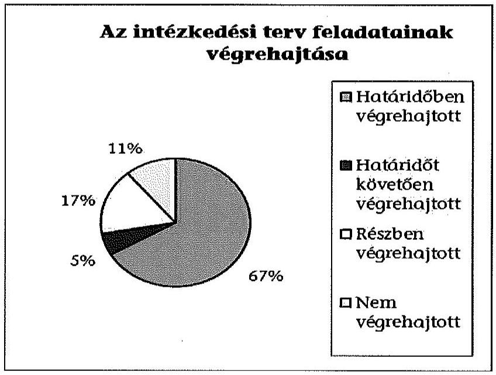

# JELENTÉS 

Utóellenőrzések - az önkormányzatok pénzügyi gazdálkodási helyzetének, szabályszerűségének utóellenőrzése Balatonkenese

---

# Állami Számvevőszék 

Iktatószám: V-0619-028/2015.
Témaszám: 1653
Vizsgálat-azonosító szám: V069319

## Az ellenőrzést felügyelte:

## Renkó Zsuzsanna

felügyeleti vezető
Az ellenőrzést vezette és az ellenőrzés végrehajtásáért felelős:
Mohl Anna
ellenőrzésvezető
A számvevőszéki jelentés összeállításában közreműködött:
Baksa Anikó
számvevő főtanácsos
Dr. Mezei Imréné
számvevő főtanácsos
Az ellenőrzést végezték:
Dr. Szöllősi Zsolt Koczor László Perlusz Krisztina Mária
számvevő számvevő tanácsos számvevő

## Kántor Ilona

számvevő tanácsos

A témához kapcsolódó eddig készített számvevőszéki jelentések:
címe
sorszáma
Jelentés az önkormányzatok pénzügyi gazdálkodási helyzetének, 13082 szabályszerűségének ellenőrzéséről BALATONKENESE

---

# TARTALOMJEGYZÉK 

BEVEZETÉS ..... 3
I. ÖSSZEGZŐ MEGÁLLAPÍTÁSOK, KÖVETKEZTETÉSEK ..... 6
II. RÉSZLETES MEGÁLLAPÍTÁSOK ..... 7

1. Az önkormányzat a pénzügyi gazdálkodási helyzetének, szabályszerűségének ellenőrzéséről készült ÁSZ jelentésben foglalt javaslatokra készített-e intézkedési tervet, illetve teljesítette-e az abban foglaltakat? ..... 7
MELLÉKLETEK
2. számú Az ÁSZ 13082 számú jelentéséhez kapcsolódó intézkedési terv végrehajtása
FÜGGELÉKEK
3. számú Rövidítések jegyzéke
4. számú Fogalomtár

---

.

---

# JELENTÉS 

## Utóellenőrzések - az önkormányzatok pénzügyi gazdálkodási helyzetének, szabályszerűségének utóellenőrzése Balatonkenese

## BEVEZETÉS

Az Állami Számvevőszék 2011-2015. évekre szóló stratégiája a helyi önkormányzatok ellenőrzésében a pénzügyi-gazdasági helyzet értékelésére, kockázatai feltárására helyezte a fő hangsúlyt. A 2011-2013. években az ÁSZ által ellenőrzött önkormányzatok esetében a működési, beruházási és a hosszú lejáratú pénzintézeti kötelezettségeinek teljesítésével kapcsolatos pénzügyi kockázatokat mutattuk be. Az ÁSZ megállapította, hogy az önkormányzatok pénzügyi egyensúlyi helyzete az ellenőrzött időszakban romlott, a pénzügyi kockázatok fokozódtak, a pénzügyi egyensúlyi helyzetet jellemző mutatószámok kedvezőtlenül változtak. Az önkormányzati alrendszerben 2012. év végétől 2014. évelejéig lezajlott adósságkonszolidáció és feladat-ellátási-, finanszírozási-rendszer változás következtében a települési önkormányzatok pénzügyi helyzete jelentős mértékben megváltozott, amely a jóváhagyott intézkedési tervek végrehajtását is befolyásolta.

Az ellenőrzött szervezet vezetője az ÁSZ tv. 33. § (1)-(2) bekezdésében foglaltak alapján a jelentések intézkedést igénylő megállapításaihoz kapcsolódóan köteles intézkedési tervet benyújtani, amelyet az ÁSZ-nak kell elfogadni. Amennyiben az ellenőrzött által vállalt intézkedések hiányosak, vagy más okból nem elfogadhatók az ÁSZ indoklással és póthatáridő tűzésével visszaküldi azt kijavításra, kiegészítésre. Az elfogadásról szóló tájékoztatásban az Állami Számvevőszék elnöke valamennyi ellenőrzött szervezet vezetőjének figyelmét felhívta arra, hogy az intézkedési tervben foglaltak megvalósítását - az ÁSZ tv. 33. § (7) bekezdésében foglaltak alapján - utóellenőrzés keretében ellenőrizheti.

Az ellenőrzés célja: annak megállapítása, hogy az ellenőrzött önkormányzatok pénzügyi gazdálkodási helyzetének, szabályszerűségének ellenőrzéséről készült ÁSZ jelentésben foglalt javaslatokra készítettek-e intézkedési terveket, illetve az ellenőrzött által összeállított intézkedési tervben meghatározott feladatokat végrehajtották-e. Ennek keretében ellenőrizzük, hogy:

- a polgármester az ÁSZ törvény értelmében az intézkedési tervet határidőben megküldte-e az ÁSZ részére, szükség volt-e az elfogadást megelőzően kiegészítésre, azt az előírt póthatáridőn belül megtették-e, a Képviselő-testület a kiegészített intézkedési tervet elfogadta-e;

---

- az önkormányzat az elfogadott (kiegészített) intézkedési tervében foglaltak megtételéről, az abban előírt határidők betartásával gondoskodott-e;
- az elfogadott intézkedések esetleges késedelme, végrehajtásának elmaradása milyen szintű kockázatot jelez a pénzügyi gazdálkodásra és annak szabályszerűségére.

Az utóellenőrzés várható hasznosulása: az ellenőrzés megállapításai segítséget nyújthatnak a közpénzügyi helyzet javításához. Az utóellenőrzés, jellegéből adódóan fokozza a közbizalmat, fegyelmet, a társadalom, az ellenőrzöttek, a helyi döntéshozók vonatkozásában erősíti az ÁSZ tekintélyét és igazolja, hogy lejárt a következmények nélküli ellenőrzések időszaka. Az ÁSZ intézményén belül lehetőség nyílik arra, hogy az utóellenőrzés, mint ellenőrzési kategória a szervezet tevékenységében stabilizálódjék, a megállapítások visszacsatolása segítse és erősítse az ÁSZ hozzáadott értéket teremtő elemző tevékenységét és tanácsadó szerepét.

Az intézkedési tervek olyan típusú feladatokat határoztak meg az önkormányzatok számára, amelyek a működőképesség jövőbeni zavarainak elkerülését, a felelős fenntartható gazdálkodás követelményeinek érvényesülését, a pénzügyi műveletek racionális keretek közt tartását tűzték ki célul. Az utóellenőrzés által e területeken érzékelt mulasztások még megfelelő irányba terelhetik az intézkedési tervekben foglalt feladatok végrehajtását.

Az ÁSZ az elfogadott intézkedési terveket kockázatelemzésnek veti alá. Ennek során elvégezzük az ÁSZ által elfogadott intézkedési tervben előírt/vállalt feladatok végrehajtásának értékelését, amelynek során alkalmazandó besorolási kategóriák:

- okafogyottá vált feladat: ha végrehajtására - meghatározott esemény bekövetkezése, továbbá külső körülmény, a működést érintő feltétel változása miatt - már nincs szükség, illetve lehetőség, és egyértelműen megállapítható, hogy az intézkedést szükségessé tevő körülmény a jövőben nem fordulhat elő;
- nem időszerű (nem esedékes) feladat: amelynek ellenőrzési időszakon belüli végrehajtására azért nem került (kerülhetett) sor, mert az intézkedés alapjául szolgáló esemény nem következett be, de annak jövőbeni előfordulása lehetséges;
- határidőben végrehajtott feladat: ha teljesítése dokumentáltan az intézkedési tervben előírt határidőben és tartalommal, módon megtörtént;
- határidőn túl végrehajtott feladat: ha annak teljesítése az intézkedési tervben meghatározott módon, de az előírt határidőn túl történt meg;
- részben végrehajtott feladat: amelynek végrehajtása teljes körűen az intézkedési tervben előírt tartalommal/módon nem történt meg, vagy a feladatot nem az előírt gyakorisággal hajtották végre;
- végre nem hajtott feladat: ha a végrehajtásért felelősként megjelölt személy(ek)nek felróhatóan a teljesítés elmaradt, vagy a teljesítést nem dokumentálták.

---

Az ellenőrzést a számvevőszéki ellenőrzés szakmai szabályai szerint, szabályszerűségi ellenőrzés módszerével, a vonatkozó nemzetközi standardok figyelembevételével végeztük. Az ellenőrzésre az önkormányzatok elektronikus adatszolgáltatása alapján került sor, helyszíni ellenőrzést nem végeztünk. A megállapítások rögzítése az önkormányzatok által rendelkezésre bocsátott dokumentumok, tanúsítványok alapján történt, melyek valódiságát és teljes körűségét a polgármester, valamint a jegyző teljességi nyilatkozata igazolja.

A jóváhagyott intézkedési tervben előírt feladatok végrehajtásának ellenőrzését egységes szempontok, illetve értékelési kritériumok alapján végeztük. Figyelembe vettük az intézkedési terv jóváhagyását követően hatályba lépett jogszabályi előírások változásából következő események - kiemelten az önkormányzati alrendszerben lezajlott adósságkonszolidációs intézkedések, továbbá a feladat-ellátási és finanszírozási rendszer változásának - hatásait.

Az alkalmazott rövidítések jegyzékét az 1. számú függelék, az egyes fogalmak magyarázatát a 2. számú függelék tartalmazza.

Az ellenőrzött szervezet: Balatonkenese Város Önkormányzata
Az ellenőrzött időszak: az intézkedési terv ÁSZ-nak történő benyújtásától az utóellenőrzés megkezdéséig tartó időszak.

Az ellenőrzés végrehajtásának jogszabályi alapját az ÁSZ tv. 1. § (3) bekezdése, az 5. § (2) és (6) bekezdései, a 33. § (7) bekezdése, valamint az Áht. 61. § (2) bekezdésének előírásai képezték.

Az ÁSZ tv. 29. § (1) bekezdése szerint a jelentéstervezetet észrevételezésre megküldtük az Önkormányzat polgármesterének, aki az ÁSZ tv. 29. § (2) bekezdésében foglalt észrevételezési jogával nem élt, a jelentéstervezetre észrevételt nem tett.

Az ÁSZ a 2013. évben zárta le az Önkormányzat pénzügyi gazdálkodási helyzetének, szabályszerűségének ellenőrzését. Az ellenőrzés tapasztalatairól készített 13082 számú jelentés az interneten, a www.asz.hu címen olvasható.

---

# I. ÖSSZEGZŐ MEGÁLLAPÍTÁSOK, KÖVETKEZTETÉSEK 

Az ÁSZ utóellenőrzés keretében értékelte az Önkormányzat pénzügyi gazdálkodási helyzetének, szabályszerűségének ellenőrzéséről szóló jelentés javaslatainak hasznosítására elfogadott intézkedési terv végrehajtását.

Az előző ÁSZ ellenőrzés megállapította, hogy az Önkormányzat pénzügyi egyensúlya középtávon nem volt biztosított. A feltárt hiányosságok alapján megfogalmazott ÁSZ javaslatok hasznosítására az Önkormányzat intézkedési tervet készített, melyet az ÁSZ kiegészítés kérését követően elfogadott.

Az utóellenőrzés megállapította, hogy az ellenőrzött időszakban időszerűvé vált feladatait az Önkormányzat teljes körűen nem hajtotta végre, ezáltal az ÁSZ javaslatai maradéktalanul nem hasznosultak.

Az utóellenőrzés megállapítása alapján a határidőt követően végrehajtott, a részben, illetve a nem teljesített feladatok közepes kockázatot jelentenek a pénzügyi gazdálkodásra, annak szabályszerűségére.

---

# II. RÉSZLETES MEGÁLLAPÍTÁSOK 

## 1. Az önkormányzat a pénzügyi gazdálkodási helyzetének, szabályszerűségének ellenőrzéséről készült ÁSZ jelentésben foglalt javaslatokra készített-e intézkedési tervet, illetve teljesítette-e az abban foglaltakat?

Az utóellenőrzés - a 2014. szeptember 16-ig végrehajtott intézkedéseket figyelembe véve - az Önkormányzat pénzügyi gazdálkodási helyzetének, szabályszerűségének ellenőrzéséről készült ÁSZ jelentés javaslatai hasznosítására elfogadott intézkedési terv végrehajtására irányult. A pénzügyi helyzet ellenőrzését az ÁSZ a 2009. január 1. - 2012. december 31. közötti időszakra végezte el, amelynek alapján megállapította, hogy az Önkormányzat pénzügyi egyensúlya középtávon nem volt biztosított.

A polgármester a Képviselő-testületet az intézkedési terv jóváhagyásakor tájékoztatta az ÁSZ jelentéséről. A jelentésben foglalt megállapításokhoz kapcsolódó intézkedési tervet az ÁSZ tv. 33. § (1) bekezdésében foglalt határidőn túl küldték meg az ÁSZ részére. Az ÁSZ az intézkedési terv kiegészítését kérte. Az Önkormányzat a kiegészített intézkedési tervet ${ }^{1}$ a póthatáridőt túllépve küldte meg. A kiegészített intézkedési tervet az ÁSZ elfogadta.

Az ÁSZ által elfogadott intézkedési tervben meghatározott feladatokat, az ÁSZ jelentés javaslatainak címzettjét és a feladatok végrehajtását az 1. számú melléklet mutatja be.

Az ÁSZ által elfogadott intézkedési terv 18 tervezett intézkedést tartalmazott, felelősként a polgármestert, a jegyzőt, a pénzügyi csoportvezetőt, a beruházási ügyintézőt, a többségi befolyás alatt álló gazdasági társaság ügyvezetőjét, a megbízott belső ellenőrt és az Önkormányzat jogi képviselőjét megjelölve.

Az utóellenőrzés megállapítása alapján, 12 feladat határidőben, egy feladat határidőt követően, három feladat részben került végrehajtásra, kettő feladatot pedig nem hajtottak végre. A feladatok között nem volt olyan, amelynek végrehajtása nem volt időszerű vagy okafogyottá vált volna.

## Határidőre végrehajtották:

- az éves költségvetés és a módosítások elkészítése során a bevételek és kiadások egyensúlyának fokozott figyelembevételét, valamint újabb bevételnövelő és kiadáscsökkentő lehetőségek feltárását;

[^0]
[^0]:    ${ }^{1}$ A Képviselő-testület a kiegészített intézkedési tervet a 93/2014. (II. 27.) számú határozattal fogadta el.

---

- a fejlesztési döntések előkészítésekor a lebonyolítás és a folyamatos működés kockázatainak feltárása és kezelése során követendő belső szabályok kialakítását;
- a pénzintézeti kötelezettségvállalást megelőzően annak egyes évekre vonatkozó, lehetséges kockázatai vizsgálatának szabályozását;
- a stabilizációs program kidolgozását, a pénzügyi stabilitás hosszú távú megőrzése érdekében javaslatok megfogalmazását;
- a koncepció (szabályozás) összeállítását a jövőbeni hitelfelvételek lehetséges eseteiről és a felajánlható biztosítékok köréről;
- a rövid lejáratú kölcsönökkel kapcsolatos határozatok felülvizsgálatát, a rövid lejáratú kölcsönök felülvizsgálatnak megfelelő szerepeltetését a könyvelésben és a mérlegben;
- a pénzügyi egyensúlyt befolyásoló kockázatok kezelésére alkalmas kockázatkezelési rendszer kidolgozását és folyamatos működtetését;
- a FEUVE részeként a kockázatkezelési szabályzat elkészítését;
- a FEUVE részeként az ellenőrzési nyomvonal elkészítését;
- a FEUVE részeként a szabálytalanság kezelési eljárásrend elkészítését;
- a szállítói tartozások és egyéb kiadáselmaradások kezelésének helyi szabályozása kialakítását és folyamatos működtetését;
- a gazdálkodásban rejlő kockázatok és a pénzügyi egyensúlyi helyzetet befolyásoló döntésekkel kapcsolatos kockázati tényezők ellenőrzésének beépítését a belső ellenőrzésbe, és az ellenőrzési terv végrehajtásának biztosítását.

# Határidőt követően hajtották végre: 

- az Önkormányzat jogi képviselője az intézkedési tervben meghatározott 2014. március 15-i határidőt követően, 2014. március 31-én adott tájékoztatást a pénzügyi csoportvezető részére az előző év jogi ügyeinek állásáról.

Az ÁSZ által elfogadott intézkedési tervben meghatározott feladatok közül az alábbiakat részben teljesítették:

- a szállítói számlák határidőben történő kifizetése érdekében a jegyző utasítást adott ki, melyben előírta, hogy a 30 napon túli lejárt tartozásokról negyedévente tájékoztatni kell a Képviselő-testületet. A szállítói tartozások állománya 2013. december 31-ről 2014. március 31-re 17,0%-kal csökkent, és az Önkormányzat 30 napon túli lejárt tartozással nem rendelkezett. Erre tekintettel a Képviselő-testület részére tájékoztatás nem készült. Az intézkedési tervben előírtak ellenére azonban az Önkormányzat 2014. évi költségvetési rendeletében és annak módosításában a vitatott szállítói állományra tartalékot nem képeztek. A feladat végrehajtásának felelőse a

 jegyző és a pénzügyi csoportvezető volt;
- a jegyző szabályozta a szerződések minimum tartalmi elemeinek ellenőrzését, azonban a kontrolltevékenység részeként a támogatási rendszer felté-

---

teleinek kidolgozása nem történt meg. A feladat végrehajtásának felelőse a jegyző, a pénzügyi csoportvezető és a beruházási ügyintéző volt;

- a fejlesztések külső forrásainak lehetőségeivel összefüggően a jegyző szabályzatot adott ki a vissza nem térítendő pályázati támogatások legoptimálisabb kihasználására vonatkozóan, azonban a fejlesztések egyéb külső forrásaival, a pályázatok figyelésével, elkészítésével összefüggő koncepció (szabályozás) kialakítására nem került sor. A feladat végrehajtásának felelőse a jegyző, a pénzügyi csoportvezető és a beruházási ügyintéző volt.

Az ÁSZ által elfogadott intézkedési tervben meghatározott feladatok közül nem hajtották végre:

- az Önkormányzat többségi befolyása alatt álló gazdasági társaság pénzügyi stabilitásának kialakításáról és hosszú távú megőrzéséről szóló terv készítését. A feladat végrehajtásának felelőse a polgármester, a jegyző és a többségi befolyás alatt álló gazdasági társaság ügyvezetője volt;
- a feladat átadás-átvételre vonatkozó döntések előkészítése során a kötelező és az önként vállalt feladatok közötti egyensúly megteremtése érdekében teendő intézkedések belső szabályainak kialakítását. A feladat végrehajtásának a felelőse a jegyző és a pénzügyi csoportvezető volt.

A Képviselő-testület jelentés készítési kötelezettséget írt elő az intézkedési tervben rögzített feladatok végrehajtásáról 2014. április 15-i határidővel. A felelősök jelentéskészítési (beszámolási) kötelezettségüknek az ellenőrzött időszakban nem tettek eleget.

Az utóellenőrzés megállapítása alapján a határidőt követően végrehajtott, a részben, illetve a nem teljesített feladatok közepes kockázatot jelentenek a pénzügyi gazdálkodásra, annak szabályszerűségére.

Budapest, 2015. 08. hónap 00. nap

Melléklet: $\quad 1 \mathrm{db}$
Függelék: $\quad 2 \mathrm{db}$

---

.

---

# Az ÁSZ 13082 számú jelentéséhez kapcsolódó intézkedési terv végrehajtása

|  Sorszám | Intézkedési terv alapján elvégzendő feladat | Az intézkedési tervben meghatározott határidő | Az ÁSZ 13082 sz. jelentés javaslatának címzettje | Az intézkedés végrehajtása  |
| --- | --- | --- | --- | --- |
|   | 1. | 2. | 3. | 4.  |
|  Határidőben végrehajtott intézkedések |  |  |  |   |
|  1. | Az éves költségvetés és a módosítások elkészítése során fokozottan kell ügyelni a bevételek és kiadások egyensúlyára, továbbá újabb lehetőségeket kell keresni a bevételek növelésére, és ezzel egyidejűleg a kiadások csökkentésére. | 2014. évi költségvetés jogszabályban megjelölt elkészítési határideje, majd azt követően folyamatosan | polgármester | A Képviselő-testület az intézkedési terv jóváhagyását követően az 5/2014. (III. 18.) számú rendeletben az egyensúlyt biztosítva fogadta el az Önkormányzat 2014. évi költségvetését, amelyet az ellenőrzött időszakban egy alkalommal módosítottak. A költségvetési rendelet 4. § (1) bekezdésében rögzítették, hogy „folyamatosan figyelemmel kell kísérni a kiadások csökkentésének és a bevételek növelésének lehetőségeit." Az Önkormányzat adatszolgáltatása szerint a 2014. évi költségvetésben az előző évben tervezetthez képest csökkentették a működési és felhalmozási kiadásokat. Kimutatásuk szerint hatékonyabbá vált az adóbevételek beszedése. Az újabb bevételi lehetőségeket kihasználva az Önkormányzat további támogatásokhoz jutott, amelynek következtében a költségvetési rendelet módosításáról szóló 9/2014. (VII. 3.) számú önkormányzati rendeletben a bevételi és kiadási főösszeg 51,4 millió Ft-tal növekedett.  |

---

|  | Intézkedési terv alapján elvégzendő feladat | Az intézkedési tervben meghatározott határidő | Az ÁSZ 13082 sz. jelentés javaslatának címzettje | Az intézkedés végrehajtása |
| :--: | :--: | :--: | :--: | :--: |
|  | 1. | 2. | 3. | 4. |
| 2. | Ki kell dolgozni és folyamatosan működtetni kell az önkormányzat belső kontrollrendszerét, ezen belül: a fejlesztési döntések előkészítése során fel kell tárni a lebonyolítás és a folyamatos működés kockázatát és annak kezelését. | 2014. március 31. és a működtetés folyamatos | jegyző | A jegyző által 2014. március 25-én elkészített, 2014. április 1-jétől hatályba léptetett, a „Beruházási és fejlesztési döntések előkészítésének szabályozása" című dokumentum hatástanulmány elkészítését írja elő, amelyben a lebonyolítással és folyamatos működtetéssel kapcsolatos, a pénzügyi helyzetre hatást gyakorló kérdésköröket értékelni kell. A jegyző (2014. október 9-i) nyilatkozata szerint a 2014. évi költségvetésben tervezett beruházások egy részének előkészítése a korábbi években történt, továbbá az intézkedési terv elfogadása és a költségvetés elfogadása közötti időszakban felhalmozási kiadásokról szóló testületi döntés nem született. Az Önkormányzat adatszolgáltatása (2014. évi rendeletek jegyzőkönyve, Határozat nyilvántartó 2014.) és a jegyző 2014. október 2-i nyilatkozata alapján 2014. április 1-jét követően új beruházási és fejlesztési döntésre nem került sor. |

---

|  Sorszám | Intézkedési terv alapján elvégzendő feladat | Az intézkedési tervben meghatározott határidő | Az ÁSZ 13082 sz. jelentés javaslatának címzettje | Az intézkedés végrehajtása  |
| --- | --- | --- | --- | --- |
|   | 1. | 2. | 3. | 4.  |
|  3. | Ki kell dolgozni és folyamatosan működtetni kell az önkormányzat belső kontrollrendszerét, ezen belül: a pénzintézeti kötelezettségvállalás előtt meg kell vizsgálni a kötelezettségvállalás egyes évekre vonatkozó, lehetséges kockázatait. | 2014. március 31. és a működtetés folyamatos | jegyző | A jegyző a 2014. március 25-én kiadott 6/2014. számú jegyzői utasításban („jegyzői utasítás a hitelfelvétellel kapcsolatos hatástanulmány készítéséről.") előírta, hogy hitelfelvételi szándék esetén hatástanulmányt kell készíteni, amelyben be kell mutatni a felmerülő költségeket, valamint a hitelből megvalósult beruházáshoz kapcsolódó várható bevételeket, továbbá ezek egyenlegét. Az Önkormányzat adatszolgáltatása és a jegyző 2014. október 2-i nyilatkozata alapján az ellenőrzött időszakban pénzintézeti kötelezettségvállalás nem történt.  |
|  4. | Stabilizációs programot kell kidolgozni, melynek keretén belül pénzügyi elemzés készül az Önkormányzat pénzügyi helyzetéről, továbbá a pénzügyi stabilitás hosszú távú megőrzését és az adósságállomány elkerülését célzó javaslatok kerülnek megfogalmazásra. | 2014. március 31. és utána folyamatosan | polgármester | A jegyző 2014. március 21-én jóváhagyta az Önkormányzat stabilizációs programját (az érintettek 2014. március 25-27. között nyilatkoztak annak megismeréséről). A stabilizációs programban rögzítette a pénzügyi gazdálkodás, az adópolitika és a vagyongazdálkodás céljait, alapelveit, és javaslatokat fogalmazott meg az Önkormányzat gazdálkodásával a bevételek növelésével, a kiadások csökkentésével kapcsolatban.  |
|  5. | Koncepciót kell összeállítani a jövőbeni hitel felvételek lehetséges eseteiről, és a felajánlható biztosítékok köréről. Az Áht. 84. § (4) bekezdése alapján ki kell zárni a biztosítékok lehetséges köréből az Önkormányzat törzsvagyonába tartozó vagyonelemeket. Az érintett ingatlanok felszabadultak, mivel az | 2014. március 31. és azt követően folyamatosan | polgármester | A jegyző 2014. március 21. napjával jóváhagyta a „Balatonkenese város hitelfelvételének szabályozása" című dokumentumot, amelynek 7. pontja szerint: „az Áht. 84. § (4) bekezdés alapján a helyi önkormányzat hitelfelvétele, kötvénykibocsátása fedezetéül az önkormányzati törzsvagyon, a helyi önkormányzat általános működésének és ágazati feladatainak támogatása és a  |

---

|  Sorszám | Intézkedési terv alapján elvégzendő feladat | Az intézkedési tervben meghatározott határidő | Az ÁSZ 13082 sz. jelentés javaslatának címzettje | Az intézkedés végrehajtása  |
| --- | --- | --- | --- | --- |
|   | 1. | 2. | 3. | 4.  |
|   | adósságkonszolidáció révén megszűnt az Önkormányzat hitelállománya. |  |  | költségvetési támogatás nem használható fel". A szabályozás egyéb pontjaiban meghatározta a jövőbeni hitelfelvételek lehetséges eseteit, valamint a követendő eljárásrendet.  |
|  6. | A Szociális Szövetkezet részére 2011-ben folyósított rövid lejáratú kölcsönnel kapcsolatos határozatokat felül kell vizsgálni, majd a képviselő-testületi határozatnak megfelelően kell szerepeltetni a könyvelésben és a mérlegben. A rövid lejáratú kölcsönökkel kapcsolatos határozatokat felül kell vizsgálni, és a határozatoknak megfelelően kell kontírozni és szerepeltetni a könyvelésben. A továbbiakban fokozottan kell ügyelni a támogatási szerződések és a támogatási hitelek közti különbségekre, és a határozatok alapján a megfelelő főkönyvi számon való szerepeltetésére. | 2014.március 31. és azt követően minden év mérleg készítéséig | jegyző | A pénzügyi csoport végrehajtotta a nyújtott rövid lejáratú kölcsönök határozatainak és számviteli elszámolásának felülvizsgálatát, amelynek eredményéről a pénzügyi csoportvezető 2014. március 21-én jelentést készített a jegyzőnek. A jelentés 1. pontja szerint a Szociális Szövetkezetnek 2013. december 31-én az Önkormányzat felé már nem volt fennálló tartozása, így a 2011. évben nyújtott rövid lejáratú kölcsön nem szerepelt az Önkormányzat 2013. évi mérlegében. A jelentés 2-3. pontjai szerint az Önkormányzat további rövid lejáratú kölcsöneit a 2013. évi könyvelésben a rövid lejáratú kölcsönök között vették nyilvántartásba.  |
|  7. | Ki kell dolgozni és folyamatosan működtetni kell a Bkr. 7. § (1)-(2) bekezdéseiben foglalt előírásoknak megfelelő, a pénzügyi egyensúlyt befolyásoló kockázatok kezelésére alkalmas kockázatkezelési rendszert. | 2014. március 31. és a működtetés folyamatos | jegyző | A jegyző 2014. március 26-án kiadta a kockázatkezelési szabályzatot, amely szabályozza a pénzügyi egyensúlyt befolyásoló kockázatok kezelésének rendszerét is. A 465/2013. (XI. 28.) számú képviselőtestületi határozattal elfogadott 2014. évi belső ellenőrzési terv a stratégiai terven és a kockázatelemzés alapján felállított prioritásokon alapult. Az Önkormányzat belső ellenőre a 2014. évi belső ellenőrzési tervnek megfelelően az Önkormányzat pénz- és bankszámlakezelés rendjét, a 2013. évi közbeszerzési eljárások lefolytatását és a vagyongazdál-  |

---

|  Sorszám | Intézkedési terv alapján elvégzendő feladat | Az intézkedési tervben meghatározott határidő | Az ÁSZ 13082 sz. jelentés javaslatának címzettje | Az intézkedés végrehajtása  |
| --- | --- | --- | --- | --- |
|   | 1. | 2. | 3. | 4.  |
|   |  |  |  | kodás rendjét ellenőrizte. Az ellenőrzésről készült (K-B/116-3/2014. iktatószámú) jelentésben rögzítette, hogy a folyamatba épített ellenőrzés rendje biztosított volt.  |
|  8. | Ki kell dolgozni és folyamatosan működtetni kell az önkormányzat belső kontrollrendszerét: a FEUVE részeként el kell készíteni a kockázatkezelési szabályzatot. | 2014. március 31. | jegyző | A jegyző 2014. március 26-án jóváhagyta a kockázatkezelési szabályzatot.  |
|  9. | Ki kell dolgozni és folyamatosan működtetni kell az önkormányzat belső kontrollrendszerét: a FEUVE részeként el kell készíteni az ellenőrzési nyomvonalat. | 2014. március 31. | jegyző | A jegyző 2014. március 26-án, 3/2014. számú intézkedésével jóváhagyta az ellenőrzési nyomvonalat.  |
|  10. | Ki kell dolgozni és folyamatosan működtetni kell az önkormányzat belső kontrollrendszerét, ezen belül el kell végezni: A FEUVE részeként el kell készíteni a szabálytalanságok kezelésének rendjét. | 2014. március 31. | jegyző | A jegyző 2014. március 26-án, 5/2014 számú intézkedésével jóváhagyta a szabálytalanságok kezelésének eljárásrendjét.  |

---

|  Sorszám | Intézkedési
 terv alapján elvégzendő feladat | Az intézkedési
tervben meghatározott határidő | Az ÁSZ 13082
sz. jelentés javaslatának
címzettje | Az intézkedés végrehajtása  |
| --- | --- | --- | --- | --- |
|   | 1. | 2. | 3. | 4.  |
|  11. | Ki kell dolgozni és folyamatosan működtetni kell az önkormányzat belső kontrollrendszerét: a szállítói tartozások és egyéb kiadáselmaradások kezelésének helyi szabályozását ki kell alakítani és folyamatosan működtetni. | 2014. március 31. és a
működtetés folyamatos | jegyző | A jegyző 2014. március 25-én, 3/2014. számon adta ki „a szállítói számlák határidőre történő kifizetéséről” tárgyú jegyzői utasítást. Az utasítás a pénzügyi csoportvezetőnek előírta a polgármester és a jegyző felé történő írásbeli jelzési kötelezettséget, továbbá a Képviselő-testület tájékoztatását a negyedéves beszámolás keretében a 30 napon túl kifizetetlen szállítói állományról, lejárati idő szerinti bontásban. A szállítói tartozások állománya 2013. december 31-ről 2014. március 31-re 16,8 millió Ft-ról 13,9 millió Ft-ra (17,0%-kal) csökkent. (Az Önkormányzat 30 napon túli elismert tartozással nem rendelkezett, így a Képviselő-testület felé a jegyzői utasítás szerint tájékoztatási kötelezettség nem állt fenn.) A lejárt számlák között kimutatott 11,7 millió Ft teljes egészében egy vitatott szállítói kötelezettséget takar, mellyel kapcsolatban jogerős bírósági döntésre még nem került sor.  |

---

|  Sorszám | Intézkedési terv alapján elvégzendő feladat | Az intézkedési
tervben meghatározott határidő | Az ÁSZ 13082
sz. jelentés javaslatának
címzettje | Az intézkedés végrehajtása  |
| --- | --- | --- | --- | --- |
|   | 1. | 2. | 3. | 4.  |
|  12. | A gazdálkodásban rejlő kockázatokat és a pénzügyi egyensúlyi helyzetet befolyásoló döntésekkel kapcsolatos kockázati tényezők ellenőrzését be kell építeni a belső ellenőrzésbe, és az ellenőrzési tervek végrehajtását folyamatosan biztosítani kell. | 2014. március 31. és a
működtetés folyamatos | jegyző | A 465/2013. (XI. 28.) számú képviselő-testületi határozattal elfogadott 2014. évi belső ellenőrzési terv a 2014. évre vonatkozó kockázatelemzés eredményének figyelembevételével készült, kockázatelemzés alapján felállított prioritásokon alapult. Az ellenőrzési tervbe a kockázatkezelési szabályzatban magas kockázatúnak értékelt területek közül (vagyonkezelés, pénzkezelés, közbeszerzés) kerültek be feladatok. A belső ellenőrzési tevékenység ellátására szerződést kötött az Önkormányzat. A belső ellenőr az ellenőrzött időszakban az ellenőrzési tervben rögzítettek alapján az Önkormányzat pénz- és bankszámlakezelésének rendjét ellenőrizte, továbbá a 2013. évi közbeszerzési eljárások lefolytatását, és a vagyongazdálkodás rendjét.  |
|   | Határidőt követően végrehajtott intézkedés |  |  |   |
|  1. | A tárgyévi mérlegben szerepeltetni kell a jogerős bírósági végzéssel lezárt peres ügyeket. Ennek érdekében az állandó megbízással rendelkező jogi képviselő rendszeresen adjon tájékoztatást a pénzügyi csoportvezető részére az elmúlt év összes jogi ügyének állásáról. Az ellenőrzésben szereplő jogerős határozattal lezárt kötelezettség 2013-ban pénzügyileg rendezésre került. | 2014. március 15. és
azt követően minden
év január 31. | jegyző | A pénzügyi csoportvezető 2014. április 9-én jelentést készített a jegyzőnek a jogerős bírósági végzéssel lezárt peres ügyek nyilvántartásba vételéről. Ebben rögzítette, hogy az Önkormányzat jogi képviselője 2014. március 31-én adott tájékoztatást a folyamatban lévő, illetve a lezárt bírósági ügyekről.  |

---

|  Sorszám | Intézkedési terv alapján elvégzendő feladat | Az intézkedési
tervben meghatározott határidő | Az ÁSZ 13082
sz. jelentés javaslatának
címzettje | Az intézkedés végrehajtása  |
| --- | --- | --- | --- | --- |
|  1. | 1. | 2. | 3. | 4.  |
|  Részben végrehajtott intézkedések |  |  |  |   |
|  1. | Törekedni kell a szállítói számlák határidőben történő kifizetésére. A huzamosabb ideje lejárt szállítói állomány jelentős részét képező kötelezettség egy szállítóval szemben áll fenn, melynek jogosságát az Önkormányzat vitatja. Jelenleg is folyik ezzel kapcsolatosan peres eljárás. A pénzügyi stabilitás megőrzése céljából a 2014. évi költségvetésben erre a szállítói állományra tartalékot kell képezni. A továbbiakban a Képviselő-testületet a lejárt szállítói számlák állományáról lejárati idő szerinti bontásban negyedévente tájékoztatni kell. | 2014. március 31. és
azt követően a negyedévet követő hónap 20. napja | polgármester | A szállítói számlák határidőben történő kifizetése érdekében 2014. március 25-én a jegyző kiadta a 3/2014. számú jegyzői utasítást, melyben előírta, hogy a 30 napon túli lejárt tartozásokról negyedéves beszámolás keretében tájékoztatni kell a Képviselő-testületet. A szállítói tartozások állománya 2013. december 31-ről 2014. március 31-re 17,0%-kal csökkent, és 30 napon túli lejárt esedékességű tartozás nem állt fenn, erre tekintettel maradt el a Képviselő-testület tájékoztatása. A 2014. március 31-i szállítói tartozások között kimutatott lejárt állomány egy jogilag vitatott szállítói kötelezettséget takar. Az intézkedési tervben megfogalmazottak ellenére az Önkormányzat az 5/2014. (III. 18.) számú rendelettel elfogadott 2014. évi költségvetési rendeletében, illetve annak 9/2014. (VII. 3.) számú módosításában erre a célra nem képezett tartalékot.  |
|  2. | Ki kell dolgozni és folyamatosan működtetni kell az önkormányzat belső kontrollrendszerét: kontroll tevékenységet kell kidolgozni a szerződések minimum tartalmi követelményeinek ellenőrzéséről, az önkormányzati feladatellátáshoz kapcsolódó támogatási rendszer feltételeiről. | 2014. március 31. | jegyző | A jegyző a 7/2014. számú utasításával 2014. március 25-én jóváhagyta a szerződések minimum tartalmi elemeinek ellenőrzésével kapcsolatos szabályozást. A szabályozásban előírta, hogy kötelező tartalmi elemnek tekintendő: a teljesítés helye és határideje, a fizetendő ellenszolgáltatás, a fizetési feltételek, a szerződésszerű teljesítéshez szükséges elvárások, a munka terület átadásának időpontja, a kapcsolattartók, a |

---

|  1. SZÁMÚ MELLÉKLET A V-0619-028/2015. SZÁMÚ JELENTÉSHEZ |  |  |   |
| --- | --- | --- | --- |
|  Sorszám | Intézkedési terv alapján elvégzendő feladat | Az intézkedési tervben meghatározott határidő | Az ÁSZ 13082 sz. jelentés javaslatának címzettje  |
|   | 1. | 2. | 3.  |
|   |  |  | szerződést biztosító mellékkötelezettségek, a szerződésszegésre vonatkozó rendelkezések. A jegyző 2014. október 2-i nyilatkozata szerint a szerződések felülvizsgálata az utasításban foglaltaknak megfelelően 2014. augusztus 31-éig, minden szerződésre kiterjedően, határidőben megtörtént. Az Önkormányzat a feladatellátáshoz kapcsolódó támogatásokkal összefüggésben támogatási szerződéseket kötött. A polgármester 2014. október 2-i nyilatkozata szerint a támogatások odaítéléséről, összegéről kizárólag a Képviselő-testület dönt. Az intézkedési tervben megfogalmazottak ellenére a támogatási rendszer feltételeinek kidolgozása nem történt meg.  |
|  3. | Ki kell dolgozni és folyamatosan működtetni kell az önkormányzat belső kontrollrendszerét: koncepciót kell kidolgozni a fejlesztések külső forrásainak lehetőségeiről, a pályázatok figyeléséről, elkészítéséről. | 2014. március 31. | jegyző  |
|  |   |   |   |

---

|  Sorszám | Intézkedési terv alapján elvégzendő feladat | Az intézkedési
tervben meghatározott határidő | Az ÁSZ 13082
sz. jelentés javaslatának
címzettje | Az intézkedés végrehajtása  |
| --- | --- | --- | --- | --- |
|   | 1. | 2. | 3. | 4.  |
|  Nem végrehajtott intézkedések |  |  |  |   |
|  1. | Tervet kell készíteni a 2013. évi beszámoló alapján a többségi befolyás alatt álló gazdasági társaság pénzügyi stabilitásának kialakításáról és annak hosszú távú biztosításáról a stabilitás megőrzése érdekében. | 2014. március 31. és
azt követően folyamatosan | polgármester | Az intézkedési tervben előírtak ellenére nem készült az önkormányzat többségi befolyása alatt álló gazdasági társaság pénzügyi stabilitásának kialakítására és hosszú távú megőrzésére vonatkozó terv.  |
|  2. | Ki kell dolgozni és folyamatosan működtetni kell az önkormányzat belső kontrollrendszerét, ezen belül: a feladat átadás-átvételre vonatkozó döntések előkészítése során meg kell teremteni az egyensúlyt a kötelező és az önként vállalt feladatok között, az elvégzett hatásvizsgálatok alapján. | 2014. március 31.
és a működtetés folyamatos | jegyző | A belső kontrollrendszer kialakítását, működését meghatározó belső szabályzatok a feladat átadás-átvételeket érintően a döntések előkészítésére vonatkozó előírásokat nem tartalmaznak.  |

---

# RÖVIDÍTÉSEK JEGYZÉKE 

## Törvények

Áht.
Az államháztartásról szóló 2011. évi CXCV. törvény (hatályos 2011. december 31-étől)
ÁSZ tv.
Az Állami Számvevőszékről szóló 2011. évi LXVI. törvény (hatályos 2011. július 1-jétől)
Htv. a helyi önkormányzatok és szerveik, a köztársasági megbízottak, valamint egyes centrális alárendeltségű szervek feladat- és hatásköreiről szóló 1991. évi XX. törvény (hatályos 1991. július 23-tól)
Sztv. a számvitelről szóló 2000. évi C. törvény (hatályos 2001. január 1-jétől)

## Kormány rendelet

Bkr.

## Szórövidítések

ÁSZ
FEUVE
jegyző
Képviselő-testület

Önkormányzat
polgármester
a költségvetési szervek belső kontrollrendszeréről és belső ellenőrzéséről szóló 370/2011. (XII. 31.) Korm. rendelet (hatályos 2012. január 1-jétől)

Állami Számvevőszék
folyamatba épített, előzetes és utólagos vezetői ellenőrzések
Balatonkenese Város Önkormányzatának jegyzője
Balatonkenese Város Önkormányzatának Képviselőtestülete
Balatonkenese Város Önkormányzata
Balatonkenese Város Önkormányzatának polgármestere

---

.

---

# FOGALOMTÁR 

adósságkonszolidáció
adósságszolgálat
árfolyamkockázat
banki kitettség
bevételi kitettség
felhalmozási kockázat
garanciavállalás
kezességvállalás
mérlegen kívüli tétel
működési kockázat

Több ütemben lezajlott központi intézkedés, amely a helyi önkormányzatok adósságállományának a magyar állam által történő átvállalására irányult. Az adósságkonszolidációs csomag releváns rendelkezéseit a 2012-2014. évi központi költségvetésről szóló törvények tartalmazták.
Az adósság tőkerészének és az esedékes kamat együttes összegének törlesztése.
Annak kockázata, hogy a külföldi devizában fennálló pénzügyi eszközök hazai fizetőeszközben kifejezett értéke az árfolyam elmozdulásával megváltozik.
Olyan függőségi viszony, ahol egy szervezet pénzügyi helyzete olyan külső körülmények hatására változhat, amely kizárólag a bank egyoldalú döntésén múlik.
Olyan függőségi viszony, ahol egy szervezet pénzügyi helyzetét meghatározó bevételek nagysága külső körülmények hatására azonnal és kedvezőtlen irányba változhat.
Annak kockázata, hogy a folyamatban lévő felhalmozási feladatok finanszírozásához szükséges pénzügyi forrás nem fog rendelkezésre állni.
Olyan kötelezettségvállalás, ahol a garanciát vállaló valamely jövőbeni esemény bekövetkezésekor, a szerződésben meghatározott feltételek beálltakor a garancia kedvezményezettje számára meghatározott összegig, meghatározott időpontig, felszólításra azonnal fizet.
A tárgyi eszközállomány állagának elemzéséhez használt mutató, számításakor a tárgyi eszköz könyv szerinti nettó értékét viszonyítják a tárgyi eszköz bruttó (beszerzési/létesítési) értékéhez.
Annak kockázata, hogy a változó kamatozású forint vagy a devizahitel futamideje alatt kedvezőtlen irányban változhat a hitel kamata.
Szerződésben vállalt olyan kötelezettség, amelyben a kezes arra vállal kötelezettséget, hogy ha a szerződés kötelezettje nem teljesít, a kezes maga fog helyette teljesíteni a jogosultnak.
Olyan szerződés alapján fennálló mérlegen kívüli [függő vagy biztos (jövőbeni)] kötelezettség, illetve követelés, amely a mérleg fordulónapján már fennáll, de mérlegtételkénti szerepeltetése egy jövőbeni esemény bekövetkezésétől vagy a szerződés teljesítésétől függ.
Annak kockázata, hogy nem megfelelő működésből, emberi hibákból, rendszerhibákból vagy külső eseményekből adódik veszteség.

---

nemfizetési kockázat
nettó működési jövedelem

ÖNHIKI támogatás
önkormányzat folyó költségvetési egyenlege
önkormányzat többségi tulajdonában lévő gazdasági társaságok
önkormányzat gazdasági társasága miatti kockázatot jelentő tényezők

Annak kockázata, hogy a kötelezett fennálló kötelezettségét átmenetileg vagy véglegesen nem tudja határidőre megfizetni.
A nettó működési jövedelem (pénzügyi kapacitás) a jövedelemtermelő képességet méri. Megmutatja a működési bevételekből a működési kiadások és a hitelek tőketörlesztésének kifizetése után fennmaradó jövedelmet.
Az önkormányzatok működőképességét szolgáló, önhibájukon kívül hátrányos helyzetben levő települési önkormányzatok támogatása.
A folyó költségvetés egyenlege, azaz a működési jövedelem megmutatja, hogy az önkormányzat éves folyó bevétele fedezetet biztosít-e a kötelező és önként vállalt feladatellátáshoz kapcsolódó éves folyó kiadásaira. A működési jövedelem negatív értéke pénzügyileg fenntarthatatlan helyzetet
 jelez. A mutató pozitív értéke megtakarítást mutat, amely forrásul szolgálhat az önkormányzat fennálló kötelezettségei megfizetéséhez, valamint fejlesztéseihez.
Azok a gazdasági társaságok, amelyekben az önkormányzat a szavazatok több mint ötven százalékával vagy jogszabályban rögzített meghatározó befolyással rendelkezik. A befolyással rendelkező akkor rendelkezik egy jogi személyben meghatározó befolyással, ha annak tagja, illetve részvényese, és jogosult e jogi személy vezető tisztségviselői vagy felügyelő bizottsága tagjainak többségének megválasztására, illetve visszahívására, vagy a jogi személy más tagjaival, illetve részvényeseivel kötött megállapodás alapján egyedül rendelkezik a szavazatok több mint ötven százalékával.
Az önkormányzat gazdasági társaságának kedvezőtlen pénzügyi döntései következtében az önkormányzat pénzügyi egyensúlyi helyzetét veszélyeztető tényezők: az önkormányzat az önként vállalt és/vagy a kötelező feladatot ellátó társaságának a tevékenység ellátásához pénzeszközt ad át;
az önkormányzat nem vizsgálja a feladatellátás választott szervezeti megoldásának hatékonyságát;
a kötelező feladatellátást biztosító gazdasági társaság tevékenységének ágazati szabályozása változik (vízi közművagyon üzemeltetése);
a kizárólagos vagy többségi tulajdonú társaságok pénzügyi helyzete nem stabil, amely az alapítóra kötelezettségeket háríthat;
az önkormányzat a társaságok tevékenységét nem kísérte figyelemmel, nem élt az alapítói (irányítói) jogok gyakorlásával, a társaságok gazdálkodásának önkormányzati szintű konszolidálása nem biztosított;

---

pénzügyi kockázat

PPP
szállítói kockázat
szállítói kitettség
az önkormányzat garanciát vagy kezességet vállal a gazdasági társaság kötelezettségeire;
a társaságoknak átadott pénzeszköz uniós elvárásoknak megfelelő kezelése.
A pénzügyi kockázat magában foglalja mindazon kockázatokat, amelyek a szervezet pénzügyi helyzetére hatással vannak. Pl.: az adósságszolgálat miatti kockázatot, árfolyamkockázatot, felhalmozási kockázatot, fizetőképességi kockázatot, jövőbeni kötelezettségek kifizethetőségének kockázatát, kamatkockázatot, kezességvállalás kockázatát, likviditási kockázatot, mérlegen kívüli tételek kockázatát, nemfizetési kockázatot, stb.
A köz- és a magánszféra együttműködésén alapuló fejlesztési konstrukció. Az állami és a magánszféra együttműködésének egyik formáját jelöli a PPP. A rövidítés a „köz- és magánszféra partnersége" angol nyelvű megfelelője. A PPP keretében a közcél a magánszféra jelentős mértékű közreműködésével valósul meg.
Annak kockázata, hogy a kötelezett a szállítókkal szemben fennálló, már elismert kötelezettségét átmenetileg vagy véglegesen nem tudja határidőre teljesíteni.
Olyan függőségi viszony, ahol egy szervezet pénzügyi helyzete a szállítói tartozások rendezése érdekében foganatosított intézkedések hatására azonnal és kedvezőtlen irányba változhat.
